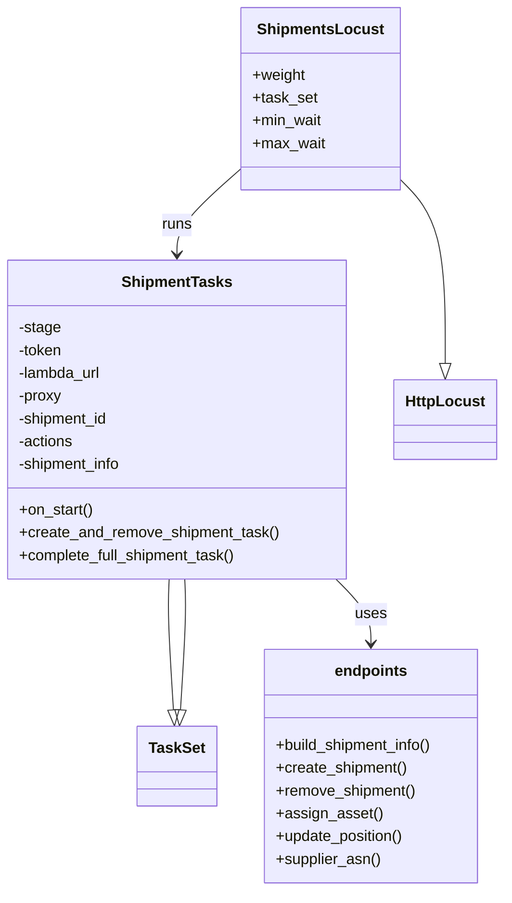
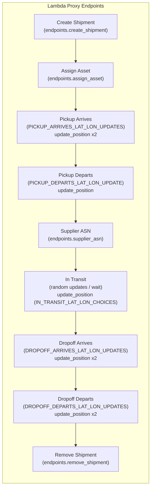

# Diagram: shipment_core/shipment_service/ng_val/locust_saves/fvlocus_lambdas.py

> Auto-generated by Obscura crawlers

## Diagram 1

### SVG

<svg id="container" width="524.84375" xmlns="http://www.w3.org/2000/svg" class="classDiagram" height="938" viewBox="0 0 524.84375 938" role="graphics-document document" aria-roledescription="class"><g><defs><marker id="container_class-aggregationStart" class="marker aggregation class" refX="18" refY="7" markerWidth="190" markerHeight="240" orient="auto"><path d="M 18,7 L9,13 L1,7 L9,1 Z"></path></marker></defs><defs><marker id="container_class-aggregationEnd" class="marker aggregation class" refX="1" refY="7" markerWidth="20" markerHeight="28" orient="auto"><path d="M 18,7 L9,13 L1,7 L9,1 Z"></path></marker></defs><defs><marker id="container_class-extensionStart" class="marker extension class" refX="18" refY="7" markerWidth="190" markerHeight="240" orient="auto"><path d="M 1,7 L18,13 V 1 Z"></path></marker></defs><defs><marker id="container_class-extensionEnd" class="marker extension class" refX="1" refY="7" markerWidth="20" markerHeight="28" orient="auto"><path d="M 1,1 V 13 L18,7 Z"></path></marker></defs><defs><marker id="container_class-compositionStart" class="marker composition class" refX="18" refY="7" markerWidth="190" markerHeight="240" orient="auto"><path d="M 18,7 L9,13 L1,7 L9,1 Z"></path></marker></defs><defs><marker id="container_class-compositionEnd" class="marker composition class" refX="1" refY="7" markerWidth="20" markerHeight="28" orient="auto"><path d="M 18,7 L9,13 L1,7 L9,1 Z"></path></marker></defs><defs><marker id="container_class-dependencyStart" class="marker dependency class" refX="6" refY="7" markerWidth="190" markerHeight="240" orient="auto"><path d="M 5,7 L9,13 L1,7 L9,1 Z"></path></marker></defs><defs><marker id="container_class-dependencyEnd" class="marker dependency class" refX="13" refY="7" markerWidth="20" markerHeight="28" orient="auto"><path d="M 18,7 L9,13 L14,7 L9,1 Z"></path></marker></defs><defs><marker id="container_class-lollipopStart" class="marker lollipop class" refX="13" refY="7" markerWidth="190" markerHeight="240" orient="auto"><circle stroke="black" fill="transparent" cx="7" cy="7" r="6"></circle></marker></defs><defs><marker id="container_class-lollipopEnd" class="marker lollipop class" refX="1" refY="7" markerWidth="190" markerHeight="240" orient="auto"><circle stroke="black" fill="transparent" cx="7" cy="7" r="6"></circle></marker></defs><g class="root"><g class="clusters"></g><g class="edgePaths"><path d="M177.086,610L176.785,616.167C176.485,622.333,175.883,634.667,176.632,657.631C177.381,680.595,179.481,714.189,180.53,730.986L181.58,747.784" id="id_ShipmentTasks_TaskSet_1" class="edge-thickness-normal edge-pattern-solid relation" style=";;;" data-edge="true" data-et="edge" data-id="id_ShipmentTasks_TaskSet_1" data-points="W3sieCI6MTc3LjA4NjEyODA0ODc4MDUsInkiOjYxMH0seyJ4IjoxNzUuMjgxMjUsInkiOjY0N30seyJ4IjoxODIuNjU2MjUsInkiOjc2NX1d" marker-end="url(#container_class-extensionEnd)"></path><path d="M416.625,187.703L424.638,195.919C432.651,204.135,448.677,220.568,456.69,253.075C464.703,285.583,464.703,334.167,464.703,358.458L464.703,382.75" id="id_ShipmentsLocust_HttpLocust_2" class="edge-thickness-normal edge-pattern-solid relation" style=";;;" data-edge="true" data-et="edge" data-id="id_ShipmentsLocust_HttpLocust_2" data-points="W3sieCI6NDE2LjYyNSwieSI6MTg3LjcwMjc2NDU2MDYyMTU3fSx7IngiOjQ2NC43MDMxMjUsInkiOjIzN30seyJ4Ijo0NjQuNzAzMTI1LCJ5Ijo0MDB9XQ==" marker-end="url(#container_class-extensionEnd)"></path><path d="M353.966,610L360.158,616.167C366.35,622.333,378.734,634.667,384.925,646C391.117,657.333,391.117,667.667,391.117,672.833L391.117,678" id="id_ShipmentTasks_endpoints_3" class="edge-thickness-normal edge-pattern-solid relation" style=";;;" data-edge="true" data-et="edge" data-id="id_ShipmentTasks_endpoints_3" data-points="W3sieCI6MzUzLjk2NjMxMDk3NTYwOTc2LCJ5Ijo2MTB9LHsieCI6MzkxLjExNzE4NzUsInkiOjY0N30seyJ4IjozOTEuMTE3MTg3NSwieSI6Njg0fV0=" marker-end="url(#container_class-dependencyEnd)"></path><path d="M253.359,176.521L242.013,186.601C230.667,196.681,207.974,216.84,196.628,232.087C185.281,247.333,185.281,257.667,185.281,262.833L185.281,268" id="id_ShipmentsLocust_ShipmentTasks_4" class="edge-thickness-normal edge-pattern-solid relation" style=";;;" data-edge="true" data-et="edge" data-id="id_ShipmentsLocust_ShipmentTasks_4" data-points="W3sieCI6MjUzLjM1OTM3NSwieSI6MTc2LjUyMDg0NzQ2NjQ3MTg1fSx7IngiOjE4NS4yODEyNSwieSI6MjM3fSx7IngiOjE4NS4yODEyNSwieSI6Mjc0fV0=" marker-end="url(#container_class-dependencyEnd)"></path><path d="M188.982,747.784L190.032,730.986C191.082,714.189,193.182,680.595,193.931,657.631C194.68,634.667,194.078,622.333,193.777,616.167L193.476,610" id="id_TaskSet_ShipmentTasks_5" class="edge-thickness-normal edge-pattern-solid relation" style=";;;" data-edge="true" data-et="edge" data-id="id_TaskSet_ShipmentTasks_5" data-points="W3sieCI6MTg3LjkwNjI1LCJ5Ijo3NjV9LHsieCI6MTk1LjI4MTI1LCJ5Ijo2NDd9LHsieCI6MTkzLjQ3NjM3MTk1MTIxOTUsInkiOjYxMH1d" marker-start="url(#container_class-extensionStart)"></path></g><g class="edgeLabels"><g class="edgeLabel"><g class="label" data-id="id_ShipmentTasks_TaskSet_1" transform="translate(0, 0)"><foreignObject width="0" height="0">

</foreignObject></g></g><g class="edgeLabel"><g class="label" data-id="id_ShipmentsLocust_HttpLocust_2" transform="translate(0, 0)"><foreignObject width="0" height="0">

</foreignObject></g></g><g class="edgeLabel" transform="translate(391.1171875, 647)"><g class="label" data-id="id_ShipmentTasks_endpoints_3" transform="translate(-16.4921875, -12)"><foreignObject width="32.984375" height="24">

uses

</foreignObject></g></g><g class="edgeLabel" transform="translate(185.28125, 237)"><g class="label" data-id="id_ShipmentsLocust_ShipmentTasks_4" transform="translate(-16.171875, -12)"><foreignObject width="32.34375" height="24">

runs

</foreignObject></g></g><g class="edgeLabel"><g class="label" data-id="id_TaskSet_ShipmentTasks_5" transform="translate(0, 0)"><foreignObject width="0" height="0">

</foreignObject></g></g></g><g class="nodes"><g class="node default" id="classId-ShipmentTasks-0" transform="translate(185.28125, 442)"><g class="basic label-container"><path d="M-177.28125 -168 L177.28125 -168 L177.28125 168 L-177.28125 168" stroke="none" stroke-width="0" fill="#ECECFF" style=""></path><path d="M-177.28125 -168 C-85.53837732781061 -168, 6.204495344378785 -168, 177.28125 -168 M-177.28125 -168 C-65.09483342653492 -168, 47.09158314693016 -168, 177.28125 -168 M177.28125 -168 C177.28125 -92.58578265767004, 177.28125 -17.171565315340075, 177.28125 168 M177.28125 -168 C177.28125 -85.11388605158936, 177.28125 -2.2277721031787223, 177.28125 168 M177.28125 168 C39.153959684034646 168, -98.97333063193071 168, -177.28125 168 M177.28125 168 C35.50088713007372 168, -106.27947573985256 168, -177.28125 168 M-177.28125 168 C-177.28125 33.95821906994337, -177.28125 -100.08356186011326, -177.28125 -168 M-177.28125 168 C-177.28125 82.44212837441401, -177.28125 -3.1157432511719776, -177.28125 -168" stroke="#9370DB" stroke-width="1.3" fill="none" stroke-dasharray="0 0" style=""></path></g><g class="annotation-group text" transform="translate(0, -144)"></g><g class="label-group text" transform="translate(-55.4375, -144)"><g class="label" style="font-weight: bolder" transform="translate(0,-12)"><foreignObject width="110.875" height="24">

ShipmentTasks

</foreignObject></g></g><g class="members-group text" transform="translate(-165.28125, -96)"><g class="label" style="" transform="translate(0,-12)"><foreignObject width="44.921875" height="24">

-stage

</foreignObject></g><g class="label" style="" transform="translate(0,12)"><foreignObject width="47.40625" height="24">

-token

</foreignObject></g><g class="label" style="" transform="translate(0,36)"><foreignObject width="89.4375" height="24">

-lambda_url

</foreignObject></g><g class="label" style="" transform="translate(0,60)"><foreignObject width="46.484375" height="24">

-proxy

</foreignObject></g><g class="label" style="" transform="translate(0,84)"><foreignObject width="97.296875" height="24">

-shipment_id

</foreignObject></g><g class="label" style="" transform="translate(0,108)"><foreignObject width="59.046875" height="24">

-actions

</foreignObject></g><g class="label" style="" transform="translate(0,132)"><foreignObject width="111.65625" height="24">

-shipment_info

</foreignObject></g></g><g class="methods-group text" transform="translate(-165.28125, 96)"><g class="label" style="" transform="translate(0,-12)"><foreignObject width="79.1875" height="24">

+on_start()

</foreignObject></g><g class="label" style="" transform="translate(0,12)"><foreignObject width="275.125" height="24">

+create_and_remove_shipment_task()

</foreignObject></g><g class="label" style="" transform="translate(0,36)"><foreignObject width="232.203125" height="24">

+complete_full_shipment_task()

</foreignObject></g></g><g class="divider" style=""><path d="M-177.28125 -120 C-39.315329936830636 -120, 98.65059012633873 -120, 177.28125 -120 M-177.28125 -120 C-104.62817873864095 -120, -31.97510747728191 -120, 177.28125 -120" stroke="#9370DB" stroke-width="1.3" fill="none" stroke-dasharray="0 0" style=""></path></g><g class="divider" style=""><path d="M-177.28125 72 C-73.93473369672571 72, 29.41178260654857 72, 177.28125 72 M-177.28125 72 C-99.40009308630438 72, -21.51893617260876 72, 177.28125 72" stroke="#9370DB" stroke-width="1.3" fill="none" stroke-dasharray="0 0" style=""></path></g></g><g class="node default" id="classId-ShipmentsLocust-1" transform="translate(334.9921875, 104)"><g class="basic label-container"><path d="M-81.6328125 -96 L81.6328125 -96 L81.6328125 96 L-81.6328125 96" stroke="none" stroke-width="0" fill="#ECECFF" style=""></path><path d="M-81.6328125 -96 C-34.68088438588798 -96, 12.271043728224043 -96, 81.6328125 -96 M-81.6328125 -96 C-16.379370355023752 -96, 48.874071789952495 -96, 81.6328125 -96 M81.6328125 -96 C81.6328125 -33.72171472438943, 81.6328125 28.556570551221142, 81.6328125 96 M81.6328125 -96 C81.6328125 -38.27691081917155, 81.6328125 19.446178361656905, 81.6328125 96 M81.6328125 96 C41.26026316053553 96, 0.8877138210710598 96, -81.6328125 96 M81.6328125 96 C26.55796884882738 96, -28.516874802345242 96, -81.6328125 96 M-81.6328125 96 C-81.6328125 28.735927687065, -81.6328125 -38.52814462587, -81.6328125 -96 M-81.6328125 96 C-81.6328125 30.925974799149145, -81.6328125 -34.14805040170171, -81.6328125 -96" stroke="#9370DB" stroke-width="1.3" fill="none" stroke-dasharray="0 0" style=""></path></g><g class="annotation-group text" transform="translate(0, -72)"></g><g class="label-group text" transform="translate(-62.828125, -72)"><g class="label" style="font-weight: bolder" transform="translate(0,-12)"><foreignObject width="125.65625" height="24">

ShipmentsLocust

</foreignObject></g></g><g class="members-group text" transform="translate(-69.6328125, -24)"><g class="label" style="" transform="translate(0,-12)"><foreignObject width="56.171875" height="24">

+weight

</foreignObject></g><g class="label" style="" transform="translate(0,12)"><foreignObject width="68.078125" height="24">

+task_set

</foreignObject></g><g class="label" style="" transform="translate(0,36)"><foreignObject width="73.859375" height="24">

+min_wait

</foreignObject></g><g class="label" style="" transform="translate(0,60)"><foreignObject width="76.4375" height="24">

+max_wait

</foreignObject></g></g><g class="methods-group text" transform="translate(-69.6328125, 96)"></g><g class="divider" style=""><path d="M-81.6328125 -48 C-23.37215538190096 -48, 34.88850173619808 -48, 81.6328125 -48 M-81.6328125 -48 C-22.416037476783934 -48, 36.80073754643213 -48, 81.6328125 -48" stroke="#9370DB" stroke-width="1.3" fill="none" stroke-dasharray="0 0" style=""></path></g><g class="divider" style=""><path d="M-81.6328125 72 C-38.61056305939057 72, 4.411686381218857 72, 81.6328125 72 M-81.6328125 72 C-28.931687582142693 72, 23.769437335714613 72, 81.6328125 72" stroke="#9370DB" stroke-width="1.3" fill="none" stroke-dasharray="0 0" style=""></path></g></g><g class="node default" id="classId-HttpLocust-2" transform="translate(464.703125, 442)"><g class="basic label-container"><path d="M-52.140625 -42 L52.140625 -42 L52.140625 42 L-52.140625 42" stroke="none" stroke-width="0" fill="#ECECFF" style=""></path><path d="M-52.140625 -42 C-24.332907847718115 -42, 3.4748093045637702 -42, 52.140625 -42 M-52.140625 -42 C-21.395151249059232 -42, 9.350322501881536 -42, 52.140625 -42 M52.140625 -42 C52.140625 -14.054540291327626, 52.140625 13.890919417344747, 52.140625 42 M52.140625 -42 C52.140625 -12.986634036953415, 52.140625 16.02673192609317, 52.140625 42 M52.140625 42 C26.94999686906042 42, 1.7593687381208412 42, -52.140625 42 M52.140625 42 C15.057543291423151 42, -22.025538417153697 42, -52.140625 42 M-52.140625 42 C-52.140625 21.920226942360607, -52.140625 1.8404538847212137, -52.140625 -42 M-52.140625 42 C-52.140625 18.399880667233216, -52.140625 -5.200238665533568, -52.140625 -42" stroke="#9370DB" stroke-width="1.3" fill="none" stroke-dasharray="0 0" style=""></path></g><g class="annotation-group text" transform="translate(0, -18)"></g><g class="label-group text" transform="translate(-40.140625, -18)"><g class="label" style="font-weight: bolder" transform="translate(0,-12)"><foreignObject width="80.28125" height="24">

HttpLocust

</foreignObject></g></g><g class="members-group text" transform="translate(-40.140625, 30)"></g><g class="methods-group text" transform="translate(-40.140625, 60)"></g><g class="divider" style=""><path d="M-52.140625 6 C-20.972468328321813 6, 10.195688343356373 6, 52.140625 6 M-52.140625 6 C-28.506967624343734 6, -4.873310248687467 6, 52.140625 6" stroke="#9370DB" stroke-width="1.3" fill="none" stroke-dasharray="0 0" style=""></path></g><g class="divider" style=""><path d="M-52.140625 24 C-24.832573719178065 24, 2.4754775616438707 24, 52.140625 24 M-52.140625 24 C-26.914814383075434 24, -1.6890037661508686 24, 52.140625 24" stroke="#9370DB" stroke-width="1.3" fill="none" stroke-dasharray="0 0" style=""></path></g></g><g class="node default" id="classId-endpoints-3" transform="translate(391.1171875, 807)"><g class="basic label-container"><path d="M-115.25 -123 L115.25 -123 L115.25 123 L-115.25 123" stroke="none" stroke-width="0" fill="#ECECFF" style=""></path><path d="M-115.25 -123 C-46.82737631171254 -123, 21.595247376574918 -123, 115.25 -123 M-115.25 -123 C-47.77640634772014 -123, 19.69718730455972 -123, 115.25 -123 M115.25 -123 C115.25 -68.52918021041191, 115.25 -14.058360420823803, 115.25 123 M115.25 -123 C115.25 -25.161607615986824, 115.25 72.67678476802635, 115.25 123 M115.25 123 C45.742827089626545 123, -23.76434582074691 123, -115.25 123 M115.25 123 C64.6440724757932 123, 14.038144951586375 123, -115.25 123 M-115.25 123 C-115.25 60.201544306226, -115.25 -2.5969113875480048, -115.25 -123 M-115.25 123 C-115.25 50.52036239844496, -115.25 -21.95927520311008, -115.25 -123" stroke="#9370DB" stroke-width="1.3" fill="none" stroke-dasharray="0 0" style=""></path></g><g class="annotation-group text" transform="translate(0, -99)"></g><g class="label-group text" transform="translate(-37.109375, -99)"><g class="label" style="font-weight: bolder" transform="translate(0,-12)"><foreignObject width="74.21875" height="24">

endpoints

</foreignObject></g></g><g class="members-group text" transform="translate(-103.25, -51)"></g><g class="methods-group text" transform="translate(-103.25, -21)"><g class="label" style="" transform="translate(0,-12)"><foreignObject width="169.390625" height="24">

+build_shipment_info()

</foreignObject></g><g class="label" style="" transform="translate(0,12)"><foreignObject width="139.671875" height="24">

+create_shipment()

</foreignObject></g><g class="label" style="" transform="translate(0,36)"><foreignObject width="148.75" height="24">

+remove_shipment()

</foreignObject></g><g class="label" style="" transform="translate(0,60)"><foreignObject width="109.484375" height="24">

+assign_asset()

</foreignObject></g><g class="label" style="" transform="translate(0,84)"><foreignObject width="137.546875" height="24">

+update_position()

</foreignObject></g><g class="label" style="" transform="translate(0,108)"><foreignObject width="110.359375" height="24">

+supplier_asn()

</foreignObject></g></g><g class="divider" style=""><path d="M-115.25 -75 C-67.28020362116735 -75, -19.310407242334705 -75, 115.25 -75 M-115.25 -75 C-28.8283230580207 -75, 57.5933538839586 -75, 115.25 -75" stroke="#9370DB" stroke-width="1.3" fill="none" stroke-dasharray="0 0" style=""></path></g><g class="divider" style=""><path d="M-115.25 -51 C-60.5967485690732 -51, -5.943497138146398 -51, 115.25 -51 M-115.25 -51 C-38.32869320696548 -51, 38.592613586069035 -51, 115.25 -51" stroke="#9370DB" stroke-width="1.3" fill="none" stroke-dasharray="0 0" style=""></path></g></g><g class="node default" id="classId-TaskSet-4" transform="translate(185.28125, 807)"><g class="basic label-container"><path d="M-40.5859375 -42 L40.5859375 -42 L40.5859375 42 L-40.5859375 42" stroke="none" stroke-width="0" fill="#ECECFF" style=""></path><path d="M-40.5859375 -42 C-9.665154645811295 -42, 21.25562820837741 -42, 40.5859375 -42 M-40.5859375 -42 C-13.06857443515661 -42, 14.448788629686781 -42, 40.5859375 -42 M40.5859375 -42 C40.5859375 -10.129484163739079, 40.5859375 21.741031672521842, 40.5859375 42 M40.5859375 -42 C40.5859375 -8.481263214106988, 40.5859375 25.037473571786023, 40.5859375 42 M40.5859375 42 C16.460369275125192 42, -7.665198949749616 42, -40.5859375 42 M40.5859375 42 C13.725902773437312 42, -13.134131953125376 42, -40.5859375 42 M-40.5859375 42 C-40.5859375 11.34793626560656, -40.5859375 -19.30412746878688, -40.5859375 -42 M-40.5859375 42 C-40.5859375 8.662451594742649, -40.5859375 -24.675096810514702, -40.5859375 -42" stroke="#9370DB" stroke-width="1.3" fill="none" stroke-dasharray="0 0" style=""></path></g><g class="annotation-group text" transform="translate(0, -18)"></g><g class="label-group text" transform="translate(-28.5859375, -18)"><g class="label" style="font-weight: bolder" transform="translate(0,-12)"><foreignObject width="57.171875" height="24">

TaskSet

</foreignObject></g></g><g class="members-group text" transform="translate(-28.5859375, 30)"></g><g class="methods-group text" transform="translate(-28.5859375, 60)"></g><g class="divider" style=""><path d="M-40.5859375 6 C-13.413825546274364 6, 13.758286407451273 6, 40.5859375 6 M-40.5859375 6 C-14.47376429788891 6, 11.638408904222182 6, 40.5859375 6" stroke="#9370DB" stroke-width="1.3" fill="none" stroke-dasharray="0 0" style=""></path></g><g class="divider" style=""><path d="M-40.5859375 24 C-12.80792362215482 24, 14.970090255690359 24, 40.5859375 24 M-40.5859375 24 C-10.906084218999602 24, 18.773769062000795 24, 40.5859375 24" stroke="#9370DB" stroke-width="1.3" fill="none" stroke-dasharray="0 0" style=""></path></g></g></g></g></g></svg>

## Diagram 2

### SVG

<svg id="container" width="648" xmlns="http://www.w3.org/2000/svg" class="flowchart" height="1489" viewBox="0 0 648 1489" role="graphics-document document" aria-roledescription="flowchart-v2"><g><marker id="container_flowchart-v2-pointEnd" class="marker flowchart-v2" viewBox="0 0 10 10" refX="5" refY="5" markerUnits="userSpaceOnUse" markerWidth="8" markerHeight="8" orient="auto"><path d="M 0 0 L 10 5 L 0 10 z" class="arrowMarkerPath" style="stroke-width: 1; stroke-dasharray: 1, 0;"></path></marker><marker id="container_flowchart-v2-pointStart" class="marker flowchart-v2" viewBox="0 0 10 10" refX="4.5" refY="5" markerUnits="userSpaceOnUse" markerWidth="8" markerHeight="8" orient="auto"><path d="M 0 5 L 10 10 L 10 0 z" class="arrowMarkerPath" style="stroke-width: 1; stroke-dasharray: 1, 0;"></path></marker><marker id="container_flowchart-v2-circleEnd" class="marker flowchart-v2" viewBox="0 0 10 10" refX="11" refY="5" markerUnits="userSpaceOnUse" markerWidth="11" markerHeight="11" orient="auto"><circle cx="5" cy="5" r="5" class="arrowMarkerPath" style="stroke-width: 1; stroke-dasharray: 1, 0;"></circle></marker><marker id="container_flowchart-v2-circleStart" class="marker flowchart-v2" viewBox="0 0 10 10" refX="-1" refY="5" markerUnits="userSpaceOnUse" markerWidth="11" markerHeight="11" orient="auto"><circle cx="5" cy="5" r="5" class="arrowMarkerPath" style="stroke-width: 1; stroke-dasharray: 1, 0;"></circle></marker><marker id="container_flowchart-v2-crossEnd" class="marker cross flowchart-v2" viewBox="0 0 11 11" refX="12" refY="5.2" markerUnits="userSpaceOnUse" markerWidth="11" markerHeight="11" orient="auto"><path d="M 1,1 l 9,9 M 10,1 l -9,9" class="arrowMarkerPath" style="stroke-width: 2; stroke-dasharray: 1, 0;"></path></marker><marker id="container_flowchart-v2-crossStart" class="marker cross flowchart-v2" viewBox="0 0 11 11" refX="-1" refY="5.2" markerUnits="userSpaceOnUse" markerWidth="11" markerHeight="11" orient="auto"><path d="M 1,1 l 9,9 M 10,1 l -9,9" class="arrowMarkerPath" style="stroke-width: 2; stroke-dasharray: 1, 0;"></path></marker><g class="root"><g class="clusters"></g><g class="edgePaths"></g><g class="edgeLabels"></g><g class="nodes"><g class="root" transform="translate(0, 0)"><g class="clusters"><g class="cluster" id="LambdaAPI" data-look="classic"><rect style="" x="8" y="8" width="632" height="1473"></rect><g class="cluster-label" transform="translate(234.34375, 8)"><foreignObject width="179.3125" height="24">

Lambda Proxy Endpoints

</foreignObject></g></g></g><g class="edgePaths"><path d="M324,123.5L324,129.75C324,136,324,148.5,324,160.333C324,172.167,324,183.333,324,188.917L324,194.5" id="L_Create_Assign_0" class="edge-thickness-normal edge-pattern-solid edge-thickness-normal edge-pattern-solid flowchart-link" style=";" data-edge="true" data-et="edge" data-id="L_Create_Assign_0" data-points="W3sieCI6MzI0LCJ5IjoxMjMuNX0seyJ4IjozMjQsInkiOjE2MX0seyJ4IjozMjQsInkiOjE5OC41fV0=" marker-end="url(#container_flowchart-v2-pointEnd)"></path><path d="M324,276.5L324,282.75C324,289,324,301.5,324,313.333C324,325.167,324,336.333,324,341.917L324,347.5" id="L_Assign_PickupArrives_0" class="edge-thickness-normal edge-pattern-solid edge-thickness-normal edge-pattern-solid flowchart-link" style=";" data-edge="true" data-et="edge" data-id="L_Assign_PickupArrives_0" data-points="W3sieCI6MzI0LCJ5IjoyNzYuNX0seyJ4IjozMjQsInkiOjMxNH0seyJ4IjozMjQsInkiOjM1MS41fV0=" marker-end="url(#container_flowchart-v2-pointEnd)"></path><path d="M324,453.5L324,459.75C324,466,324,478.5,324,490.333C324,502.167,324,513.333,324,518.917L324,524.5" id="L_PickupArrives_PickupDeparts_0" class="edge-thickness-normal edge-pattern-solid edge-thickness-normal edge-pattern-solid flowchart-link" style=";" data-edge="true" data-et="edge" data-id="L_PickupArrives_PickupDeparts_0" data-points="W3sieCI6MzI0LCJ5Ijo0NTMuNX0seyJ4IjozMjQsInkiOjQ5MX0seyJ4IjozMjQsInkiOjUyOC41fV0=" marker-end="url(#container_flowchart-v2-pointEnd)"></path><path d="M324,606.5L324,612.75C324,619,324,631.5,324,643.333C324,655.167,324,666.333,324,671.917L324,677.5" id="L_PickupDeparts_ASN_0" class="edge-thickness-normal edge-pattern-solid edge-thickness-normal edge-pattern-solid flowchart-link" style=";" data-edge="true" data-et="edge" data-id="L_PickupDeparts_ASN_0" data-points="W3sieCI6MzI0LCJ5Ijo2MDYuNX0seyJ4IjozMjQsInkiOjY0NH0seyJ4IjozMjQsInkiOjY4MS41fV0=" marker-end="url(#container_flowchart-v2-pointEnd)"></path><path d="M324,759.5L324,765.75C324,772,324,784.5,324,796.333C324,808.167,324,819.333,324,824.917L324,830.5" id="L_ASN_InTransit_0" class="edge-thickness-normal edge-pattern-solid edge-thickness-normal edge-pattern-solid flowchart-link" style=";" data-edge="true" data-et="edge" data-id="L_ASN_InTransit_0" data-points="W3sieCI6MzI0LCJ5Ijo3NTkuNX0seyJ4IjozMjQsInkiOjc5N30seyJ4IjozMjQsInkiOjgzNC41fV0=" marker-end="url(#container_flowchart-v2-pointEnd)"></path><path d="M324,936.5L324,942.75C324,949,324,961.5,324,973.333C324,985.167,324,996.333,324,1001.917L324,1007.5" id="L_InTransit_DropoffArrives_0" class="edge-thickness-normal edge-pattern-solid edge-thickness-normal edge-pattern-solid flowchart-link" style=";" data-edge="true" data-et="edge" data-id="L_InTransit_DropoffArrives_0" data-points="W3sieCI6MzI0LCJ5Ijo5MzYuNX0seyJ4IjozMjQsInkiOjk3NH0seyJ4IjozMjQsInkiOjEwMTEuNX1d" marker-end="url(#container_flowchart-v2-pointEnd)"></path><path d="M324,1113.5L324,1119.75C324,1126,324,1138.5,324,1150.333C324,1162.167,324,1173.333,324,1178.917L324,1184.5" id="L_DropoffArrives_DropoffDeparts_0" class="edge-thickness-normal edge-pattern-solid edge-thickness-normal edge-pattern-solid flowchart-link" style=";" data-edge="true" data-et="edge" data-id="L_DropoffArrives_DropoffDeparts_0" data-points="W3sieCI6MzI0LCJ5IjoxMTEzLjV9LHsieCI6MzI0LCJ5IjoxMTUxfSx7IngiOjMyNCwieSI6MTE4OC41fV0=" marker-end="url(#container_flowchart-v2-pointEnd)"></path><path d="M324,1290.5L324,1296.75C324,1303,324,1315.5,324,1327.333C324,1339.167,324,1350.333,324,1355.917L324,1361.5" id="L_DropoffDeparts_Remove_0" class="edge-thickness-normal edge-pattern-solid edge-thickness-normal edge-pattern-solid flowchart-link" style=";" data-edge="true" data-et="edge" data-id="L_DropoffDeparts_Remove_0" data-points="W3sieCI6MzI0LCJ5IjoxMjkwLjV9LHsieCI6MzI0LCJ5IjoxMzI4fSx7IngiOjMyNCwieSI6MTM2NS41fV0=" marker-end="url(#container_flowchart-v2-pointEnd)"></path></g><g class="edgeLabels"><g class="edgeLabel"><g class="label" data-id="L_Create_Assign_0" transform="translate(0, 0)"><foreignObject width="0" height="0">

</foreignObject></g></g><g class="edgeLabel"><g class="label" data-id="L_Assign_PickupArrives_0" transform="translate(0, 0)"><foreignObject width="0" height="0">

</foreignObject></g></g><g class="edgeLabel"><g class="label" data-id="L_PickupArrives_PickupDeparts_0" transform="translate(0, 0)"><foreignObject width="0" height="0">

</foreignObject></g></g><g class="edgeLabel"><g class="label" data-id="L_PickupDeparts_ASN_0" transform="translate(0, 0)"><foreignObject width="0" height="0">

</foreignObject></g></g><g class="edgeLabel"><g class="label" data-id="L_ASN_InTransit_0" transform="translate(0, 0)"><foreignObject width="0" height="0">

</foreignObject></g></g><g class="edgeLabel"><g class="label" data-id="L_InTransit_DropoffArrives_0" transform="translate(0, 0)"><foreignObject width="0" height="0">

</foreignObject></g></g><g class="edgeLabel"><g class="label" data-id="L_DropoffArrives_DropoffDeparts_0" transform="translate(0, 0)"><foreignObject width="0" height="0">

</foreignObject></g></g><g class="edgeLabel"><g class="label" data-id="L_DropoffDeparts_Remove_0" transform="translate(0, 0)"><foreignObject width="0" height="0">

</foreignObject></g></g></g><g class="nodes"><g class="node default" id="flowchart-Create-0" transform="translate(324, 84.5)"><rect class="basic label-container" style="" x="-177.875" y="-39" width="355.75" height="78"></rect><g class="label" style="" transform="translate(-147.875, -24)"><rect></rect><foreignObject width="295.75" height="48">

Create Shipment\n(endpoints.create_shipment)

</foreignObject></g></g><g class="node default" id="flowchart-Assign-1" transform="translate(324, 237.5)"><rect class="basic label-container" style="" x="-147.359375" y="-39" width="294.71875" height="78"></rect><g class="label" style="" transform="translate(-117.359375, -24)"><rect></rect><foreignObject width="234.71875" height="48">

Assign Asset\n(endpoints.assign_asset)

</foreignObject></g></g><g class="node default" id="flowchart-PickupArrives-2" transform="translate(324, 402.5)"><rect class="basic label-container" style="" x="-268.796875" y="-51" width="537.59375" height="102"></rect><g class="label" style="" transform="translate(-238.796875, -36)"><rect></rect><foreignObject width="477.59375" height="72">

Pickup Arrives\n(PICKUP_ARRIVES_LAT_LON_UPDATES)\nupdate_position x2

</foreignObject></g></g><g class="node default" id="flowchart-PickupDeparts-3" transform="translate(324, 567.5)"><rect class="basic label-container" style="" x="-267.1953125" y="-39" width="534.390625" height="78"></rect><g class="label" style="" transform="translate(-237.1953125, -24)"><rect></rect><foreignObject width="474.390625" height="48">

Pickup Departs\n(PICKUP_DEPARTS_LAT_LON_UPDATE)\nupdate_position

</foreignObject></g></g><g class="node default" id="flowchart-ASN-5" transform="translate(324, 720.5)"><rect class="basic label-container" style="" x="-143.2109375" y="-39" width="286.421875" height="78"></rect><g class="label" style="" transform="translate(-113.2109375, -24)"><rect></rect><foreignObject width="226.421875" height="48">

Supplier ASN\n(endpoints.supplier_asn)

</foreignObject></g></g><g class="node default" id="flowchart-InTransit-4" transform="translate(324, 885.5)"><rect class="basic label-container" style="" x="-145.796875" y="-51" width="291.59375" height="102"></rect><g class="label" style="" transform="translate(-115.796875, -36)"><rect></rect><foreignObject width="231.59375" height="72">

In Transit\n(random updates / wait)\nupdate_position (IN_TRANSIT_LAT_LON_CHOICES)

</foreignObject></g></g><g class="node default" id="flowchart-DropoffArrives-6" transform="translate(324, 1062.5)"><rect class="basic label-container" style="" x="-276.203125" y="-51" width="552.40625" height="102"></rect><g class="label" style="" transform="translate(-246.203125, -36)"><rect></rect><foreignObject width="492.40625" height="72">

Dropoff Arrives\n(DROPOFF_ARRIVES_LAT_LON_UPDATES)\nupdate_position x2

</foreignObject></g></g><g class="node default" id="flowchart-DropoffDeparts-7" transform="translate(324, 1239.5)"><rect class="basic label-container" style="" x="-281" y="-51" width="562" height="102"></rect><g class="label" style="" transform="translate(-251, -36)"><rect></rect><foreignObject width="502" height="72">

Dropoff Departs\n(DROPOFF_DEPARTS_LAT_LON_UPDATES)\nupdate_position x2

</foreignObject></g></g><g class="node default" id="flowchart-Remove-8" transform="translate(324, 1404.5)"><rect class="basic label-container" style="" x="-182.5" y="-39" width="365" height="78"></rect><g class="label" style="" transform="translate(-152.5, -24)"><rect></rect><foreignObject width="305" height="48">

Remove Shipment\n(endpoints.remove_shipment)

</foreignObject></g></g></g></g></g></g></g></svg>
