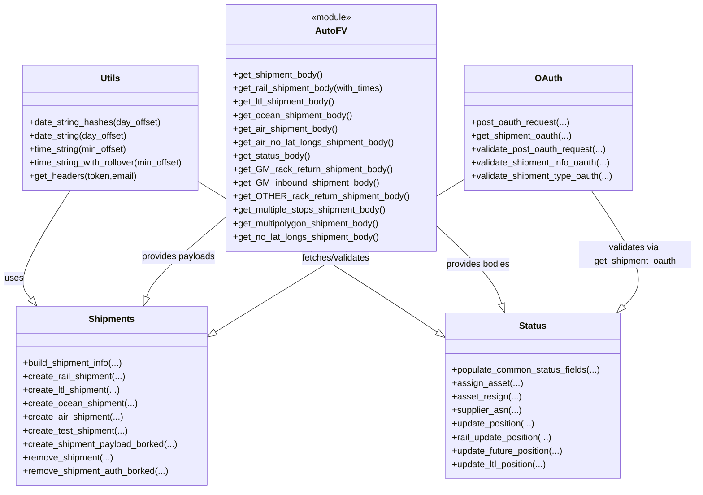

# Diagram: shipment_core/shipment_service/ng_val/scripts/common/auto_endpoints.py


> Auto-generated by Obscura crawlers

## Diagram 1

```mermaid
flowchart TD
  subgraph Env/IO
    A[get_env_value] -->|reads| ENV[OS env]
    A -->|logs| LOG[print]
    B[update_json_file] -->|writes| FILE[JSON file]
  end

  subgraph Utils
    U1[date_string_hashes] --> U2[date_string]
    U2 --> U3[time_string]
    U3 --> U4[time_string_with_rollover]
    U5[get_headers]
  end

  subgraph AutoFV
    AFV[auto_fvdata module]
  end

  subgraph Shipments
    CR(create_shipment_payload_borked)
    CT(create_test_shipment)
    CA(create_air_shipment)
    CO(create_ocean_shipment)
    CL(create_ltl_shipment)
    CRail(create_rail_shipment)
    Rm(remove_shipment)
  end

  subgraph StatusUpdates
    P(populate_common_status_fields)
    AS(assign_asset)
    AR(asset_resign)
    ASN(supplier_asn)
    UP(update_position)
    RUP(rail_update_position)
    FUT(update_future_position)
    LTL(update_ltl_position)
  end

  subgraph OAuth
    PO(post_oauth_request)
    GO(get_shipment_oauth)
    VRO(validate_post_oauth_request)
    VSO(validate_shipment_info_oauth)
    VST(validate_shipment_type_oauth)
  end

  AFV -->|provides bodies| CR
  AFV --> CL
  AFV --> CO
  AFV --> CRail
  AFV --> CA
  AFV --> CT
  AFV --> P

  U4 --> Rm
  U4 --> CRail
  U4 --> CL
  U4 --> CO
  U5 -->|headers| Rm
  U5 -->|headers| CRail
  U5 -->|headers| CL
  U5 -->|headers| CO
  U5 -->|headers| CA
  U5 -->|headers| CT
  P --> AS
  P --> AR
  P --> ASN
  P --> UP
  P --> RUP
  P --> FUT
  P --> LTL

  Rm -->|POST to actions[backend].remove_shipment| HTTP_POST1[HTTP POST]
  CRail -->|POST to actions[backend].create_shipment| HTTP_POST2[HTTP POST]
  CL -->|POST to actions[backend].create_shipment| HTTP_POST3[HTTP POST]
  CO -->|POST to actions[backend].create_shipment| HTTP_POST4[HTTP POST]
  CA -->|POST to actions[backend].create_shipment| HTTP_POST5[HTTP POST]
  CT -->|POST to actions[backend].create_shipment| HTTP_POST6[HTTP POST]

  AS -->|POST to actions[backend].assign_asset| HTTP_POST7[HTTP POST]
  AR -->|POST to actions[backend].asset_resign| HTTP_POST8[HTTP POST]
  ASN -->|POST to actions[backend].asn| HTTP_POST9[HTTP POST]
  UP -->|POST to actions[backend].location_update| HTTP_POST10[HTTP POST]
  RUP -->|POST to actions[backend].location_update| HTTP_POST11[HTTP POST]
  FUT -->|POST to actions[backend].location_update| HTTP_POST12[HTTP POST]
  LTL -->|POST to actions[backend].location_update| HTTP_POST13[HTTP POST]

  PO -->|uses requests OAuth2Session| GO
  VRO --> PO
  VSO --> GO
  VST --> GO
  VSO -->|writes| B
  VST -->|writes| B
```

> SVG rendering failed for this diagram.

## Diagram 2



### SVG

<svg id="container" width="1222.8695068359375" xmlns="http://www.w3.org/2000/svg" class="classDiagram" height="870" viewBox="23.61328125 0 1222.8695068359375 870" role="graphics-document document" aria-roledescription="class"><style>#container{font-family:"trebuchet ms",verdana,arial,sans-serif;font-size:16px;fill:#333;}@keyframes edge-animation-frame{from{stroke-dashoffset:0;}}@keyframes dash{to{stroke-dashoffset:0;}}#container .edge-animation-slow{stroke-dasharray:9,5!important;stroke-dashoffset:900;animation:dash 50s linear infinite;stroke-linecap:round;}#container .edge-animation-fast{stroke-dasharray:9,5!important;stroke-dashoffset:900;animation:dash 20s linear infinite;stroke-linecap:round;}#container .error-icon{fill:#552222;}#container .error-text{fill:#552222;stroke:#552222;}#container .edge-thickness-normal{stroke-width:1px;}#container .edge-thickness-thick{stroke-width:3.5px;}#container .edge-pattern-solid{stroke-dasharray:0;}#container .edge-thickness-invisible{stroke-width:0;fill:none;}#container .edge-pattern-dashed{stroke-dasharray:3;}#container .edge-pattern-dotted{stroke-dasharray:2;}#container .marker{fill:#333333;stroke:#333333;}#container .marker.cross{stroke:#333333;}#container svg{font-family:"trebuchet ms",verdana,arial,sans-serif;font-size:16px;}#container p{margin:0;}#container g.classGroup text{fill:#9370DB;stroke:none;font-family:"trebuchet ms",verdana,arial,sans-serif;font-size:10px;}#container g.classGroup text .title{font-weight:bolder;}#container .nodeLabel,#container .edgeLabel{color:#131300;}#container .edgeLabel .label rect{fill:#ECECFF;}#container .label text{fill:#131300;}#container .labelBkg{background:#ECECFF;}#container .edgeLabel .label span{background:#ECECFF;}#container .classTitle{font-weight:bolder;}#container .node rect,#container .node circle,#container .node ellipse,#container .node polygon,#container .node path{fill:#ECECFF;stroke:#9370DB;stroke-width:1px;}#container .divider{stroke:#9370DB;stroke-width:1;}#container g.clickable{cursor:pointer;}#container g.classGroup rect{fill:#ECECFF;stroke:#9370DB;}#container g.classGroup line{stroke:#9370DB;stroke-width:1;}#container .classLabel .box{stroke:none;stroke-width:0;fill:#ECECFF;opacity:0.5;}#container .classLabel .label{fill:#9370DB;font-size:10px;}#container .relation{stroke:#333333;stroke-width:1;fill:none;}#container .dashed-line{stroke-dasharray:3;}#container .dotted-line{stroke-dasharray:1 2;}#container #compositionStart,#container .composition{fill:#333333!important;stroke:#333333!important;stroke-width:1;}#container #compositionEnd,#container .composition{fill:#333333!important;stroke:#333333!important;stroke-width:1;}#container #dependencyStart,#container .dependency{fill:#333333!important;stroke:#333333!important;stroke-width:1;}#container #dependencyStart,#container .dependency{fill:#333333!important;stroke:#333333!important;stroke-width:1;}#container #extensionStart,#container .extension{fill:transparent!important;stroke:#333333!important;stroke-width:1;}#container #extensionEnd,#container .extension{fill:transparent!important;stroke:#333333!important;stroke-width:1;}#container #aggregationStart,#container .aggregation{fill:transparent!important;stroke:#333333!important;stroke-width:1;}#container #aggregationEnd,#container .aggregation{fill:transparent!important;stroke:#333333!important;stroke-width:1;}#container #lollipopStart,#container .lollipop{fill:#ECECFF!important;stroke:#333333!important;stroke-width:1;}#container #lollipopEnd,#container .lollipop{fill:#ECECFF!important;stroke:#333333!important;stroke-width:1;}#container .edgeTerminals{font-size:11px;line-height:initial;}#container .classTitleText{text-anchor:middle;font-size:18px;fill:#333;}#container .label-icon{display:inline-block;height:1em;overflow:visible;vertical-align:-0.125em;}#container .node .label-icon path{fill:currentColor;stroke:revert;stroke-width:revert;}#container :root{--mermaid-font-family:"trebuchet ms",verdana,arial,sans-serif;}</style><g><defs><marker id="container_class-aggregationStart" class="marker aggregation class" refX="18" refY="7" markerWidth="190" markerHeight="240" orient="auto"><path d="M 18,7 L9,13 L1,7 L9,1 Z"></path></marker></defs><defs><marker id="container_class-aggregationEnd" class="marker aggregation class" refX="1" refY="7" markerWidth="20" markerHeight="28" orient="auto"><path d="M 18,7 L9,13 L1,7 L9,1 Z"></path></marker></defs><defs><marker id="container_class-extensionStart" class="marker extension class" refX="18" refY="7" markerWidth="190" markerHeight="240" orient="auto"><path d="M 1,7 L18,13 V 1 Z"></path></marker></defs><defs><marker id="container_class-extensionEnd" class="marker extension class" refX="1" refY="7" markerWidth="20" markerHeight="28" orient="auto"><path d="M 1,1 V 13 L18,7 Z"></path></marker></defs><defs><marker id="container_class-compositionStart" class="marker composition class" refX="18" refY="7" markerWidth="190" markerHeight="240" orient="auto"><path d="M 18,7 L9,13 L1,7 L9,1 Z"></path></marker></defs><defs><marker id="container_class-compositionEnd" class="marker composition class" refX="1" refY="7" markerWidth="20" markerHeight="28" orient="auto"><path d="M 18,7 L9,13 L1,7 L9,1 Z"></path></marker></defs><defs><marker id="container_class-dependencyStart" class="marker dependency class" refX="6" refY="7" markerWidth="190" markerHeight="240" orient="auto"><path d="M 5,7 L9,13 L1,7 L9,1 Z"></path></marker></defs><defs><marker id="container_class-dependencyEnd" class="marker dependency class" refX="13" refY="7" markerWidth="20" markerHeight="28" orient="auto"><path d="M 18,7 L9,13 L14,7 L9,1 Z"></path></marker></defs><defs><marker id="container_class-lollipopStart" class="marker lollipop class" refX="13" refY="7" markerWidth="190" markerHeight="240" orient="auto"><circle stroke="black" fill="transparent" cx="7" cy="7" r="6"></circle></marker></defs><defs><marker id="container_class-lollipopEnd" class="marker lollipop class" refX="1" refY="7" markerWidth="190" markerHeight="240" orient="auto"><circle stroke="black" fill="transparent" cx="7" cy="7" r="6"></circle></marker></defs><g class="root"><g class="clusters"></g><g class="edgePaths"><path d="M127.34,338L110.199,364.167C93.058,390.333,58.775,442.667,46.722,474.811C34.67,506.955,44.847,518.91,49.936,524.888L55.025,530.865" id="id_Utils_Shipments_1" class="edge-thickness-normal edge-pattern-solid relation" style=";;;" data-edge="true" data-et="edge" data-id="id_Utils_Shipments_1" data-points="W3sieCI6MTI3LjM0MDM2ODQ3MDE0OTI2LCJ5IjozMzh9LHsieCI6MjQuNDkyMTg3NSwieSI6NDk1fSx7IngiOjY2LjIwNjc4NzEwOTM3NSwieSI6NTQ0fV0=" marker-end="url(#container_class-extensionEnd)"></path><path d="M411.469,380.836L388.566,399.863C365.663,418.891,319.858,456.945,295.055,481.424C270.253,505.904,266.453,516.807,264.553,522.259L262.653,527.711" id="id_AutoFV_Shipments_2" class="edge-thickness-normal edge-pattern-solid relation" style=";;;" data-edge="true" data-et="edge" data-id="id_AutoFV_Shipments_2" data-points="W3sieCI6NDExLjQ2ODc1LCJ5IjozODAuODM1OTU1OTk0OTg2NzZ9LHsieCI6Mjc0LjA1MjczNDM3NSwieSI6NDk1fSx7IngiOjI1Ni45NzY2MjgyMzAxNjgzLCJ5Ijo1NDR9XQ==" marker-end="url(#container_class-extensionEnd)"></path><path d="M361.469,325.156L408.019,353.464C454.569,381.771,547.669,438.385,617.804,482.396C687.938,526.406,735.106,557.812,758.69,573.515L782.274,589.217" id="id_Utils_Status_3" class="edge-thickness-normal edge-pattern-solid relation" style=";;;" data-edge="true" data-et="edge" data-id="id_Utils_Status_3" data-points="W3sieCI6MzYxLjQ2ODc1LCJ5IjozMjUuMTU2MzY4ODI1NTA1NH0seyJ4Ijo2NDAuNzY5NTMxMjUsInkiOjQ5NX0seyJ4Ijo3OTYuNjMyODEyNSwieSI6NTk4Ljc3NzYyNDk0ODQyMDF9XQ==" marker-end="url(#container_class-extensionEnd)"></path><path d="M781.805,398.318L799.221,414.432C816.637,430.545,851.47,462.773,871.275,486.316C891.079,509.859,895.856,524.718,898.244,532.148L900.632,539.578" id="id_AutoFV_Status_4" class="edge-thickness-normal edge-pattern-solid relation" style=";;;" data-edge="true" data-et="edge" data-id="id_AutoFV_Status_4" data-points="W3sieCI6NzgxLjgwNDY4NzUsInkiOjM5OC4zMTgwNDU0MzIxNzJ9LHsieCI6ODg2LjMwMjczNDM3NSwieSI6NDk1fSx7IngiOjkwNS45MTExMDQ2NDI0Mjc5LCJ5Ijo1NTZ9XQ==" marker-end="url(#container_class-extensionEnd)"></path><path d="M831.805,318.315L783.38,347.763C734.954,377.21,638.104,436.105,563.842,481.373C489.579,526.642,437.905,558.283,412.068,574.104L386.231,589.925" id="id_OAuth_Shipments_5" class="edge-thickness-normal edge-pattern-solid relation" style=";;;" data-edge="true" data-et="edge" data-id="id_OAuth_Shipments_5" data-points="W3sieCI6ODMxLjgwNDY4NzUsInkiOjMxOC4zMTUyMTA1NTEwNDAxNH0seyJ4Ijo1NDEuMjUzOTA2MjUsInkiOjQ5NX0seyJ4IjozNzEuNTE5NTMxMjUsInkiOjU5OC45MzMwMjY2Nzg5MzI4fV0=" marker-end="url(#container_class-extensionEnd)"></path><path d="M1059.004,338L1077.165,364.167C1095.325,390.333,1131.645,442.667,1141.371,477C1151.097,511.333,1134.23,527.667,1125.796,535.833L1117.363,544" id="id_OAuth_Status_6" class="edge-thickness-normal edge-pattern-solid relation" style=";;;" data-edge="true" data-et="edge" data-id="id_OAuth_Status_6" data-points="W3sieCI6MTA1OS4wMDQ0NDU1NDU3MDksInkiOjMzOH0seyJ4IjoxMTY3Ljk2NDg0Mzc1LCJ5Ijo0OTV9LHsieCI6MTEwNC45NzAzODM4NjQxODI2LCJ5Ijo1NTZ9XQ==" marker-end="url(#container_class-extensionEnd)"></path></g><g class="edgeLabels"><g class="edgeLabel" transform="translate(58.2848, 443.41483)"><g class="label" data-id="id_Utils_Shipments_1" transform="translate(-16.4921875, -12)"><foreignObject width="32.984375" height="24"><div xmlns="http://www.w3.org/1999/xhtml" class="labelBkg" style="display: table-cell; white-space: nowrap; line-height: 1.5; max-width: 200px; text-align: center;"><span class="edgeLabel"><p>uses</p></span></div></foreignObject></g></g><g class="edgeLabel" transform="translate(322.80424, 454.49767)"><g class="label" data-id="id_AutoFV_Shipments_2" transform="translate(-66.046875, -12)"><foreignObject width="132.09375" height="24"><div xmlns="http://www.w3.org/1999/xhtml" class="labelBkg" style="display: table-cell; white-space: nowrap; line-height: 1.5; max-width: 200px; text-align: center;"><span class="edgeLabel"><p>provides payloads</p></span></div></foreignObject></g></g><g class="edgeLabel" transform="translate(581.11521, 458.72403)"><g class="label" data-id="id_Utils_Status_3" transform="translate(-16.4921875, -12)"><foreignObject width="32.984375" height="24"><div xmlns="http://www.w3.org/1999/xhtml" class="labelBkg" style="display: table-cell; white-space: nowrap; line-height: 1.5; max-width: 200px; text-align: center;"><span class="edgeLabel"><p>uses</p></span></div></foreignObject></g></g><g class="edgeLabel" transform="translate(857.5697, 468.4161)"><g class="label" data-id="id_AutoFV_Status_4" transform="translate(-57.9921875, -12)"><foreignObject width="115.984375" height="24"><div xmlns="http://www.w3.org/1999/xhtml" class="labelBkg" style="display: table-cell; white-space: nowrap; line-height: 1.5; max-width: 200px; text-align: center;"><span class="edgeLabel"><p>provides bodies</p></span></div></foreignObject></g></g><g class="edgeLabel" transform="translate(601.50254, 458.36263)"><g class="label" data-id="id_OAuth_Shipments_5" transform="translate(-63.0234375, -12)"><foreignObject width="126.046875" height="24"><div xmlns="http://www.w3.org/1999/xhtml" class="labelBkg" style="display: table-cell; white-space: nowrap; line-height: 1.5; max-width: 200px; text-align: center;"><span class="edgeLabel"><p>fetches/validates</p></span></div></foreignObject></g></g><g class="edgeLabel" transform="translate(1138.48284, 452.51966)"><g class="label" data-id="id_OAuth_Status_6" transform="translate(-100, -24)"><foreignObject width="200" height="48"><div xmlns="http://www.w3.org/1999/xhtml" class="labelBkg" style="display: table; white-space: break-spaces; line-height: 1.5; max-width: 200px; text-align: center; width: 200px;"><span class="edgeLabel"><p>validates via get_shipment_oauth</p></span></div></foreignObject></g></g></g><g class="nodes"><g class="node default" id="classId-Utils-0" transform="translate(200.0546875, 227)"><g class="basic label-container"><path d="M-161.4140625 -111 L161.4140625 -111 L161.4140625 111 L-161.4140625 111" stroke="none" stroke-width="0" fill="#ECECFF" style=""></path><path d="M-161.4140625 -111 C-95.12672620359086 -111, -28.839389907181726 -111, 161.4140625 -111 M-161.4140625 -111 C-89.7922251659077 -111, -18.17038783181539 -111, 161.4140625 -111 M161.4140625 -111 C161.4140625 -27.84080552187291, 161.4140625 55.31838895625418, 161.4140625 111 M161.4140625 -111 C161.4140625 -42.680659303374924, 161.4140625 25.638681393250152, 161.4140625 111 M161.4140625 111 C51.8385837320005 111, -57.736895035999 111, -161.4140625 111 M161.4140625 111 C60.14507282592122 111, -41.12391684815756 111, -161.4140625 111 M-161.4140625 111 C-161.4140625 40.28005271761077, -161.4140625 -30.439894564778456, -161.4140625 -111 M-161.4140625 111 C-161.4140625 32.94088000155135, -161.4140625 -45.1182399968973, -161.4140625 -111" stroke="#9370DB" stroke-width="1.3" fill="none" stroke-dasharray="0 0" style=""></path></g><g class="annotation-group text" transform="translate(0, -87)"></g><g class="label-group text" transform="translate(-16.796875, -87)"><g class="label" style="font-weight: bolder" transform="translate(0,-12)"><foreignObject width="33.59375" height="24"><div xmlns="http://www.w3.org/1999/xhtml" style="display: table-cell; white-space: nowrap; line-height: 1.5; max-width: 83px; text-align: center;"><span class="nodeLabel markdown-node-label" style=""><p>Utils</p></span></div></foreignObject></g></g><g class="members-group text" transform="translate(-149.4140625, -39)"></g><g class="methods-group text" transform="translate(-149.4140625, -9)"><g class="label" style="" transform="translate(0,-12)"><foreignObject width="235.234375" height="24"><div xmlns="http://www.w3.org/1999/xhtml" style="display: table-cell; white-space: nowrap; line-height: 1.5; max-width: 293px; text-align: center;"><span class="nodeLabel markdown-node-label" style=""><p>+date_string_hashes(day_offset)</p></span></div></foreignObject></g><g class="label" style="" transform="translate(0,12)"><foreignObject width="175.890625" height="24"><div xmlns="http://www.w3.org/1999/xhtml" style="display: table-cell; white-space: nowrap; line-height: 1.5; max-width: 233px; text-align: center;"><span class="nodeLabel markdown-node-label" style=""><p>+date_string(day_offset)</p></span></div></foreignObject></g><g class="label" style="" transform="translate(0,36)"><foreignObject width="178.1875" height="24"><div xmlns="http://www.w3.org/1999/xhtml" style="display: table-cell; white-space: nowrap; line-height: 1.5; max-width: 236px; text-align: center;"><span class="nodeLabel markdown-node-label" style=""><p>+time_string(min_offset)</p></span></div></foreignObject></g><g class="label" style="" transform="translate(0,60)"><foreignObject width="282.03125" height="24"><div xmlns="http://www.w3.org/1999/xhtml" style="display: table-cell; white-space: nowrap; line-height: 1.5; max-width: 339px; text-align: center;"><span class="nodeLabel markdown-node-label" style=""><p>+time_string_with_rollover(min_offset)</p></span></div></foreignObject></g><g class="label" style="" transform="translate(0,84)"><foreignObject width="192.609375" height="24"><div xmlns="http://www.w3.org/1999/xhtml" style="display: table-cell; white-space: nowrap; line-height: 1.5; max-width: 250px; text-align: center;"><span class="nodeLabel markdown-node-label" style=""><p>+get_headers(token,email)</p></span></div></foreignObject></g></g><g class="divider" style=""><path d="M-161.4140625 -63 C-62.90858359275866 -63, 35.59689531448268 -63, 161.4140625 -63 M-161.4140625 -63 C-85.27986790335602 -63, -9.145673306712041 -63, 161.4140625 -63" stroke="#9370DB" stroke-width="1.3" fill="none" stroke-dasharray="0 0" style=""></path></g><g class="divider" style=""><path d="M-161.4140625 -39 C-72.37393598994899 -39, 16.66619052010202 -39, 161.4140625 -39 M-161.4140625 -39 C-37.02255869367542 -39, 87.36894511264916 -39, 161.4140625 -39" stroke="#9370DB" stroke-width="1.3" fill="none" stroke-dasharray="0 0" style=""></path></g></g><g class="node default" id="classId-AutoFV-1" transform="translate(596.63671875, 227)"><g class="basic label-container"><path d="M-185.16796875 -219 L185.16796875 -219 L185.16796875 219 L-185.16796875 219" stroke="none" stroke-width="0" fill="#ECECFF" style=""></path><path d="M-185.16796875 -219 C-76.48479457397826 -219, 32.198379602043474 -219, 185.16796875 -219 M-185.16796875 -219 C-84.57725845913457 -219, 16.013451831730862 -219, 185.16796875 -219 M185.16796875 -219 C185.16796875 -100.83175764359815, 185.16796875 17.336484712803696, 185.16796875 219 M185.16796875 -219 C185.16796875 -88.17430259634176, 185.16796875 42.65139480731648, 185.16796875 219 M185.16796875 219 C55.00742021171237 219, -75.15312832657526 219, -185.16796875 219 M185.16796875 219 C81.73814572241797 219, -21.691677305164063 219, -185.16796875 219 M-185.16796875 219 C-185.16796875 71.06815076677645, -185.16796875 -76.86369846644709, -185.16796875 -219 M-185.16796875 219 C-185.16796875 96.98626755952206, -185.16796875 -25.027464880955876, -185.16796875 -219" stroke="#9370DB" stroke-width="1.3" fill="none" stroke-dasharray="0 0" style=""></path></g><g class="annotation-group text" transform="translate(-36.6015625, -195)"><g class="label" style="" transform="translate(0,-12)"><foreignObject width="73.203125" height="24"><div xmlns="http://www.w3.org/1999/xhtml" style="display: table-cell; white-space: nowrap; line-height: 1.5; max-width: 123px; text-align: center;"><span class="nodeLabel markdown-node-label" style=""><p>«module»</p></span></div></foreignObject></g></g><g class="label-group text" transform="translate(-25.375, -171)"><g class="label" style="font-weight: bolder" transform="translate(0,-12)"><foreignObject width="50.75" height="24"><div xmlns="http://www.w3.org/1999/xhtml" style="display: table-cell; white-space: nowrap; line-height: 1.5; max-width: 100px; text-align: center;"><span class="nodeLabel markdown-node-label" style=""><p>AutoFV</p></span></div></foreignObject></g></g><g class="members-group text" transform="translate(-173.16796875, -123)"></g><g class="methods-group text" transform="translate(-173.16796875, -93)"><g class="label" style="" transform="translate(0,-12)"><foreignObject width="162.296875" height="24"><div xmlns="http://www.w3.org/1999/xhtml" style="display: table-cell; white-space: nowrap; line-height: 1.5; max-width: 220px; text-align: center;"><span class="nodeLabel markdown-node-label" style=""><p>+get_shipment_body()</p></span></div></foreignObject></g><g class="label" style="" transform="translate(0,12)"><foreignObject width="273.46875" height="24"><div xmlns="http://www.w3.org/1999/xhtml" style="display: table-cell; white-space: nowrap; line-height: 1.5; max-width: 331px; text-align: center;"><span class="nodeLabel markdown-node-label" style=""><p>+get_rail_shipment_body(with_times)</p></span></div></foreignObject></g><g class="label" style="" transform="translate(0,36)"><foreignObject width="185.453125" height="24"><div xmlns="http://www.w3.org/1999/xhtml" style="display: table-cell; white-space: nowrap; line-height: 1.5; max-width: 243px; text-align: center;"><span class="nodeLabel markdown-node-label" style=""><p>+get_ltl_shipment_body()</p></span></div></foreignObject></g><g class="label" style="" transform="translate(0,60)"><foreignObject width="213.609375" height="24"><div xmlns="http://www.w3.org/1999/xhtml" style="display: table-cell; white-space: nowrap; line-height: 1.5; max-width: 271px; text-align: center;"><span class="nodeLabel markdown-node-label" style=""><p>+get_ocean_shipment_body()</p></span></div></foreignObject></g><g class="label" style="" transform="translate(0,84)"><foreignObject width="188.40625" height="24"><div xmlns="http://www.w3.org/1999/xhtml" style="display: table-cell; white-space: nowrap; line-height: 1.5; max-width: 246px; text-align: center;"><span class="nodeLabel markdown-node-label" style=""><p>+get_air_shipment_body()</p></span></div></foreignObject></g><g class="label" style="" transform="translate(0,108)"><foreignObject width="289.21875" height="24"><div xmlns="http://www.w3.org/1999/xhtml" style="display: table-cell; white-space: nowrap; line-height: 1.5; max-width: 347px; text-align: center;"><span class="nodeLabel markdown-node-label" style=""><p>+get_air_no_lat_longs_shipment_body()</p></span></div></foreignObject></g><g class="label" style="" transform="translate(0,132)"><foreignObject width="137.921875" height="24"><div xmlns="http://www.w3.org/1999/xhtml" style="display: table-cell; white-space: nowrap; line-height: 1.5; max-width: 195px; text-align: center;"><span class="nodeLabel markdown-node-label" style=""><p>+get_status_body()</p></span></div></foreignObject></g><g class="label" style="" transform="translate(0,156)"><foreignObject width="284.375" height="24"><div xmlns="http://www.w3.org/1999/xhtml" style="display: table-cell; white-space: nowrap; line-height: 1.5; max-width: 342px; text-align: center;"><span class="nodeLabel markdown-node-label" style=""><p>+get_GM_rack_return_shipment_body()</p></span></div></foreignObject></g><g class="label" style="" transform="translate(0,180)"><foreignObject width="261.828125" height="24"><div xmlns="http://www.w3.org/1999/xhtml" style="display: table-cell; white-space: nowrap; line-height: 1.5; max-width: 319px; text-align: center;"><span class="nodeLabel markdown-node-label" style=""><p>+get_GM_inbound_shipment_body()</p></span></div></foreignObject></g><g class="label" style="" transform="translate(0,204)"><foreignObject width="309.734375" height="24"><div xmlns="http://www.w3.org/1999/xhtml" style="display: table-cell; white-space: nowrap; line-height: 1.5; max-width: 367px; text-align: center;"><span class="nodeLabel markdown-node-label" style=""><p>+get_OTHER_rack_return_shipment_body()</p></span></div></foreignObject></g><g class="label" style="" transform="translate(0,228)"><foreignObject width="278.453125" height="24"><div xmlns="http://www.w3.org/1999/xhtml" style="display: table-cell; white-space: nowrap; line-height: 1.5; max-width: 336px; text-align: center;"><span class="nodeLabel markdown-node-label" style=""><p>+get_multiple_stops_shipment_body()</p></span></div></foreignObject></g><g class="label" style="" transform="translate(0,252)"><foreignObject width="266.609375" height="24"><div xmlns="http://www.w3.org/1999/xhtml" style="display: table-cell; white-space: nowrap; line-height: 1.5; max-width: 324px; text-align: center;"><span class="nodeLabel markdown-node-label" style=""><p>+get_multipolygon_shipment_body()</p></span></div></foreignObject></g><g class="label" style="" transform="translate(0,276)"><foreignObject width="263.109375" height="24"><div xmlns="http://www.w3.org/1999/xhtml" style="display: table-cell; white-space: nowrap; line-height: 1.5; max-width: 320px; text-align: center;"><span class="nodeLabel markdown-node-label" style=""><p>+get_no_lat_longs_shipment_body()</p></span></div></foreignObject></g></g><g class="divider" style=""><path d="M-185.16796875 -147 C-52.21084019875627 -147, 80.74628835248745 -147, 185.16796875 -147 M-185.16796875 -147 C-69.67168373591255 -147, 45.824601278174896 -147, 185.16796875 -147" stroke="#9370DB" stroke-width="1.3" fill="none" stroke-dasharray="0 0" style=""></path></g><g class="divider" style=""><path d="M-185.16796875 -123 C-42.39291464940925 -123, 100.3821394511815 -123, 185.16796875 -123 M-185.16796875 -123 C-94.1027427963546 -123, -3.037516842709209 -123, 185.16796875 -123" stroke="#9370DB" stroke-width="1.3" fill="none" stroke-dasharray="0 0" style=""></path></g></g><g class="node default" id="classId-Shipments-2" transform="translate(201.56640625, 703)"><g class="basic label-container"><path d="M-169.953125 -159 L169.953125 -159 L169.953125 159 L-169.953125 159" stroke="none" stroke-width="0" fill="#ECECFF" style=""></path><path d="M-169.953125 -159 C-93.37116115218984 -159, -16.789197304379684 -159, 169.953125 -159 M-169.953125 -159 C-67.8574421180969 -159, 34.2382407638062 -159, 169.953125 -159 M169.953125 -159 C169.953125 -36.93659277723063, 169.953125 85.12681444553874, 169.953125 159 M169.953125 -159 C169.953125 -68.19246564153555, 169.953125 22.615068716928903, 169.953125 159 M169.953125 159 C57.234267378458625 159, -55.48459024308275 159, -169.953125 159 M169.953125 159 C46.50020889633075 159, -76.9527072073385 159, -169.953125 159 M-169.953125 159 C-169.953125 62.00084216135214, -169.953125 -34.99831567729572, -169.953125 -159 M-169.953125 159 C-169.953125 35.73833204939805, -169.953125 -87.5233359012039, -169.953125 -159" stroke="#9370DB" stroke-width="1.3" fill="none" stroke-dasharray="0 0" style=""></path></g><g class="annotation-group text" transform="translate(0, -135)"></g><g class="label-group text" transform="translate(-38.96875, -135)"><g class="label" style="font-weight: bolder" transform="translate(0,-12)"><foreignObject width="77.9375" height="24"><div xmlns="http://www.w3.org/1999/xhtml" style="display: table-cell; white-space: nowrap; line-height: 1.5; max-width: 127px; text-align: center;"><span class="nodeLabel markdown-node-label" style=""><p>Shipments</p></span></div></foreignObject></g></g><g class="members-group text" transform="translate(-157.953125, -87)"></g><g class="methods-group text" transform="translate(-157.953125, -57)"><g class="label" style="" transform="translate(0,-12)"><foreignObject width="180.90625" height="24"><div xmlns="http://www.w3.org/1999/xhtml" style="display: table-cell; white-space: nowrap; line-height: 1.5; max-width: 238px; text-align: center;"><span class="nodeLabel markdown-node-label" style=""><p>+build_shipment_info(...)</p></span></div></foreignObject></g><g class="label" style="" transform="translate(0,12)"><foreignObject width="183.03125" height="24"><div xmlns="http://www.w3.org/1999/xhtml" style="display: table-cell; white-space: nowrap; line-height: 1.5; max-width: 240px; text-align: center;"><span class="nodeLabel markdown-node-label" style=""><p>+create_rail_shipment(...)</p></span></div></foreignObject></g><g class="label" style="" transform="translate(0,36)"><foreignObject width="174.34375" height="24"><div xmlns="http://www.w3.org/1999/xhtml" style="display: table-cell; white-space: nowrap; line-height: 1.5; max-width: 232px; text-align: center;"><span class="nodeLabel markdown-node-label" style=""><p>+create_ltl_shipment(...)</p></span></div></foreignObject></g><g class="label" style="" transform="translate(0,60)"><foreignObject width="202.5" height="24"><div xmlns="http://www.w3.org/1999/xhtml" style="display: table-cell; white-space: nowrap; line-height: 1.5; max-width: 260px; text-align: center;"><span class="nodeLabel markdown-node-label" style=""><p>+create_ocean_shipment(...)</p></span></div></foreignObject></g><g class="label" style="" transform="translate(0,84)"><foreignObject width="177.296875" height="24"><div xmlns="http://www.w3.org/1999/xhtml" style="display: table-cell; white-space: nowrap; line-height: 1.5; max-width: 235px; text-align: center;"><span class="nodeLabel markdown-node-label" style=""><p>+create_air_shipment(...)</p></span></div></foreignObject></g><g class="label" style="" transform="translate(0,108)"><foreignObject width="186.703125" height="24"><div xmlns="http://www.w3.org/1999/xhtml" style="display: table-cell; white-space: nowrap; line-height: 1.5; max-width: 244px; text-align: center;"><span class="nodeLabel markdown-node-label" style=""><p>+create_test_shipment(...)</p></span></div></foreignObject></g><g class="label" style="" transform="translate(0,132)"><foreignObject width="276.9375" height="24"><div xmlns="http://www.w3.org/1999/xhtml" style="display: table-cell; white-space: nowrap; line-height: 1.5; max-width: 334px; text-align: center;"><span class="nodeLabel markdown-node-label" style=""><p>+create_shipment_payload_borked(...)</p></span></div></foreignObject></g><g class="label" style="" transform="translate(0,156)"><foreignObject width="160.265625" height="24"><div xmlns="http://www.w3.org/1999/xhtml" style="display: table-cell; white-space: nowrap; line-height: 1.5; max-width: 218px; text-align: center;"><span class="nodeLabel markdown-node-label" style=""><p>+remove_shipment(...)</p></span></div></foreignObject></g><g class="label" style="" transform="translate(0,180)"><foreignObject width="261.109375" height="24"><div xmlns="http://www.w3.org/1999/xhtml" style="display: table-cell; white-space: nowrap; line-height: 1.5; max-width: 318px; text-align: center;"><span class="nodeLabel markdown-node-label" style=""><p>+remove_shipment_auth_borked(...)</p></span></div></foreignObject></g></g><g class="divider" style=""><path d="M-169.953125 -111 C-97.41323349154385 -111, -24.8733419830877 -111, 169.953125 -111 M-169.953125 -111 C-52.50618902374916 -111, 64.94074695250168 -111, 169.953125 -111" stroke="#9370DB" stroke-width="1.3" fill="none" stroke-dasharray="0 0" style=""></path></g><g class="divider" style=""><path d="M-169.953125 -87 C-62.0513950335763 -87, 45.8503349328474 -87, 169.953125 -87 M-169.953125 -87 C-70.02266913066387 -87, 29.907786738672257 -87, 169.953125 -87" stroke="#9370DB" stroke-width="1.3" fill="none" stroke-dasharray="0 0" style=""></path></g></g><g class="node default" id="classId-Status-3" transform="translate(953.1640625, 703)"><g class="basic label-container"><path d="M-156.53125 -147 L156.53125 -147 L156.53125 147 L-156.53125 147" stroke="none" stroke-width="0" fill="#ECECFF" style=""></path><path d="M-156.53125 -147 C-71.53496094904511 -147, 13.461328101909771 -147, 156.53125 -147 M-156.53125 -147 C-43.937078557348585 -147, 68.65709288530283 -147, 156.53125 -147 M156.53125 -147 C156.53125 -74.15238202371995, 156.53125 -1.3047640474399032, 156.53125 147 M156.53125 -147 C156.53125 -53.33318849428146, 156.53125 40.33362301143708, 156.53125 147 M156.53125 147 C46.7587588922771 147, -63.0137322154458 147, -156.53125 147 M156.53125 147 C35.455263072974816 147, -85.62072385405037 147, -156.53125 147 M-156.53125 147 C-156.53125 73.45493408106609, -156.53125 -0.09013183786782974, -156.53125 -147 M-156.53125 147 C-156.53125 37.0308851897622, -156.53125 -72.9382296204756, -156.53125 -147" stroke="#9370DB" stroke-width="1.3" fill="none" stroke-dasharray="0 0" style=""></path></g><g class="annotation-group text" transform="translate(0, -123)"></g><g class="label-group text" transform="translate(-23.484375, -123)"><g class="label" style="font-weight: bolder" transform="translate(0,-12)"><foreignObject width="46.96875" height="24"><div xmlns="http://www.w3.org/1999/xhtml" style="display: table-cell; white-space: nowrap; line-height: 1.5; max-width: 96px; text-align: center;"><span class="nodeLabel markdown-node-label" style=""><p>Status</p></span></div></foreignObject></g></g><g class="members-group text" transform="translate(-144.53125, -75)"></g><g class="methods-group text" transform="translate(-144.53125, -45)"><g class="label" style="" transform="translate(0,-12)"><foreignObject width="265.578125" height="24"><div xmlns="http://www.w3.org/1999/xhtml" style="display: table-cell; white-space: nowrap; line-height: 1.5; max-width: 323px; text-align: center;"><span class="nodeLabel markdown-node-label" style=""><p>+populate_common_status_fields(...)</p></span></div></foreignObject></g><g class="label" style="" transform="translate(0,12)"><foreignObject width="121" height="24"><div xmlns="http://www.w3.org/1999/xhtml" style="display: table-cell; white-space: nowrap; line-height: 1.5; max-width: 178px; text-align: center;"><span class="nodeLabel markdown-node-label" style=""><p>+assign_asset(...)</p></span></div></foreignObject></g><g class="label" style="" transform="translate(0,36)"><foreignObject width="119.875" height="24"><div xmlns="http://www.w3.org/1999/xhtml" style="display: table-cell; white-space: nowrap; line-height: 1.5; max-width: 177px; text-align: center;"><span class="nodeLabel markdown-node-label" style=""><p>+asset_resign(...)</p></span></div></foreignObject></g><g class="label" style="" transform="translate(0,60)"><foreignObject width="121.875" height="24"><div xmlns="http://www.w3.org/1999/xhtml" style="display: table-cell; white-space: nowrap; line-height: 1.5; max-width: 179px; text-align: center;"><span class="nodeLabel markdown-node-label" style=""><p>+supplier_asn(...)</p></span></div></foreignObject></g><g class="label" style="" transform="translate(0,84)"><foreignObject width="149.0625" height="24"><div xmlns="http://www.w3.org/1999/xhtml" style="display: table-cell; white-space: nowrap; line-height: 1.5; max-width: 206px; text-align: center;"><span class="nodeLabel markdown-node-label" style=""><p>+update_position(...)</p></span></div></foreignObject></g><g class="label" style="" transform="translate(0,108)"><foreignObject width="180.578125" height="24"><div xmlns="http://www.w3.org/1999/xhtml" style="display: table-cell; white-space: nowrap; line-height: 1.5; max-width: 238px; text-align: center;"><span class="nodeLabel markdown-node-label" style=""><p>+rail_update_position(...)</p></span></div></foreignObject></g><g class="label" style="" transform="translate(0,132)"><foreignObject width="200.921875" height="24"><div xmlns="http://www.w3.org/1999/xhtml" style="display: table-cell; white-space: nowrap; line-height: 1.5; max-width: 258px; text-align: center;"><span class="nodeLabel markdown-node-label" style=""><p>+update_future_position(...)</p></span></div></foreignObject></g><g class="label" style="" transform="translate(0,156)"><foreignObject width="172.21875" height="24"><div xmlns="http://www.w3.org/1999/xhtml" style="display: table-cell; white-space: nowrap; line-height: 1.5; max-width: 230px; text-align: center;"><span class="nodeLabel markdown-node-label" style=""><p>+update_ltl_position(...)</p></span></div></foreignObject></g></g><g class="divider" style=""><path d="M-156.53125 -99 C-84.88454497450788 -99, -13.23783994901575 -99, 156.53125 -99 M-156.53125 -99 C-88.03593173987696 -99, -19.540613479753915 -99, 156.53125 -99" stroke="#9370DB" stroke-width="1.3" fill="none" stroke-dasharray="0 0" style=""></path></g><g class="divider" style=""><path d="M-156.53125 -75 C-58.42258794187619 -75, 39.686074116247624 -75, 156.53125 -75 M-156.53125 -75 C-72.5566508797172 -75, 11.417948240565607 -75, 156.53125 -75" stroke="#9370DB" stroke-width="1.3" fill="none" stroke-dasharray="0 0" style=""></path></g></g><g class="node default" id="classId-OAuth-4" transform="translate(981.96875, 227)"><g class="basic label-container"><path d="M-150.1640625 -111 L150.1640625 -111 L150.1640625 111 L-150.1640625 111" stroke="none" stroke-width="0" fill="#ECECFF" style=""></path><path d="M-150.1640625 -111 C-90.02218435987254 -111, -29.880306219745066 -111, 150.1640625 -111 M-150.1640625 -111 C-49.70373316646898 -111, 50.75659616706204 -111, 150.1640625 -111 M150.1640625 -111 C150.1640625 -54.77106622002679, 150.1640625 1.457867559946422, 150.1640625 111 M150.1640625 -111 C150.1640625 -25.96171272458129, 150.1640625 59.07657455083742, 150.1640625 111 M150.1640625 111 C67.48238294090508 111, -15.199296618189834 111, -150.1640625 111 M150.1640625 111 C32.204621879430874 111, -85.75481874113825 111, -150.1640625 111 M-150.1640625 111 C-150.1640625 51.02130445075537, -150.1640625 -8.957391098489254, -150.1640625 -111 M-150.1640625 111 C-150.1640625 27.27116389526556, -150.1640625 -56.45767220946888, -150.1640625 -111" stroke="#9370DB" stroke-width="1.3" fill="none" stroke-dasharray="0 0" style=""></path></g><g class="annotation-group text" transform="translate(0, -87)"></g><g class="label-group text" transform="translate(-22.453125, -87)"><g class="label" style="font-weight: bolder" transform="translate(0,-12)"><foreignObject width="44.90625" height="24"><div xmlns="http://www.w3.org/1999/xhtml" style="display: table-cell; white-space: nowrap; line-height: 1.5; max-width: 95px; text-align: center;"><span class="nodeLabel markdown-node-label" style=""><p>OAuth</p></span></div></foreignObject></g></g><g class="members-group text" transform="translate(-138.1640625, -39)"></g><g class="methods-group text" transform="translate(-138.1640625, -9)"><g class="label" style="" transform="translate(0,-12)"><foreignObject width="175.90625" height="24"><div xmlns="http://www.w3.org/1999/xhtml" style="display: table-cell; white-space: nowrap; line-height: 1.5; max-width: 233px; text-align: center;"><span class="nodeLabel markdown-node-label" style=""><p>+post_oauth_request(...)</p></span></div></foreignObject></g><g class="label" style="" transform="translate(0,12)"><foreignObject width="179.5625" height="24"><div xmlns="http://www.w3.org/1999/xhtml" style="display: table-cell; white-space: nowrap; line-height: 1.5; max-width: 237px; text-align: center;"><span class="nodeLabel markdown-node-label" style=""><p>+get_shipment_oauth(...)</p></span></div></foreignObject></g><g class="label" style="" transform="translate(0,36)"><foreignObject width="241.640625" height="24"><div xmlns="http://www.w3.org/1999/xhtml" style="display: table-cell; white-space: nowrap; line-height: 1.5; max-width: 299px; text-align: center;"><span class="nodeLabel markdown-node-label" style=""><p>+validate_post_oauth_request(...)</p></span></div></foreignObject></g><g class="label" style="" transform="translate(0,60)"><foreignObject width="250.84375" height="24"><div xmlns="http://www.w3.org/1999/xhtml" style="display: table-cell; white-space: nowrap; line-height: 1.5; max-width: 308px; text-align: center;"><span class="nodeLabel markdown-node-label" style=""><p>+validate_shipment_info_oauth(...)</p></span></div></foreignObject></g><g class="label" style="" transform="translate(0,84)"><foreignObject width="253.875" height="24"><div xmlns="http://www.w3.org/1999/xhtml" style="display: table-cell; white-space: nowrap; line-height: 1.5; max-width: 311px; text-align: center;"><span class="nodeLabel markdown-node-label" style=""><p>+validate_shipment_type_oauth(...)</p></span></div></foreignObject></g></g><g class="divider" style=""><path d="M-150.1640625 -63 C-83.83686398358464 -63, -17.50966546716927 -63, 150.1640625 -63 M-150.1640625 -63 C-83.36389654256975 -63, -16.563730585139496 -63, 150.1640625 -63" stroke="#9370DB" stroke-width="1.3" fill="none" stroke-dasharray="0 0" style=""></path></g><g class="divider" style=""><path d="M-150.1640625 -39 C-46.900049789111705 -39, 56.36396292177659 -39, 150.1640625 -39 M-150.1640625 -39 C-32.603592548742995 -39, 84.95687740251401 -39, 150.1640625 -39" stroke="#9370DB" stroke-width="1.3" fill="none" stroke-dasharray="0 0" style=""></path></g></g></g></g></g></svg>
