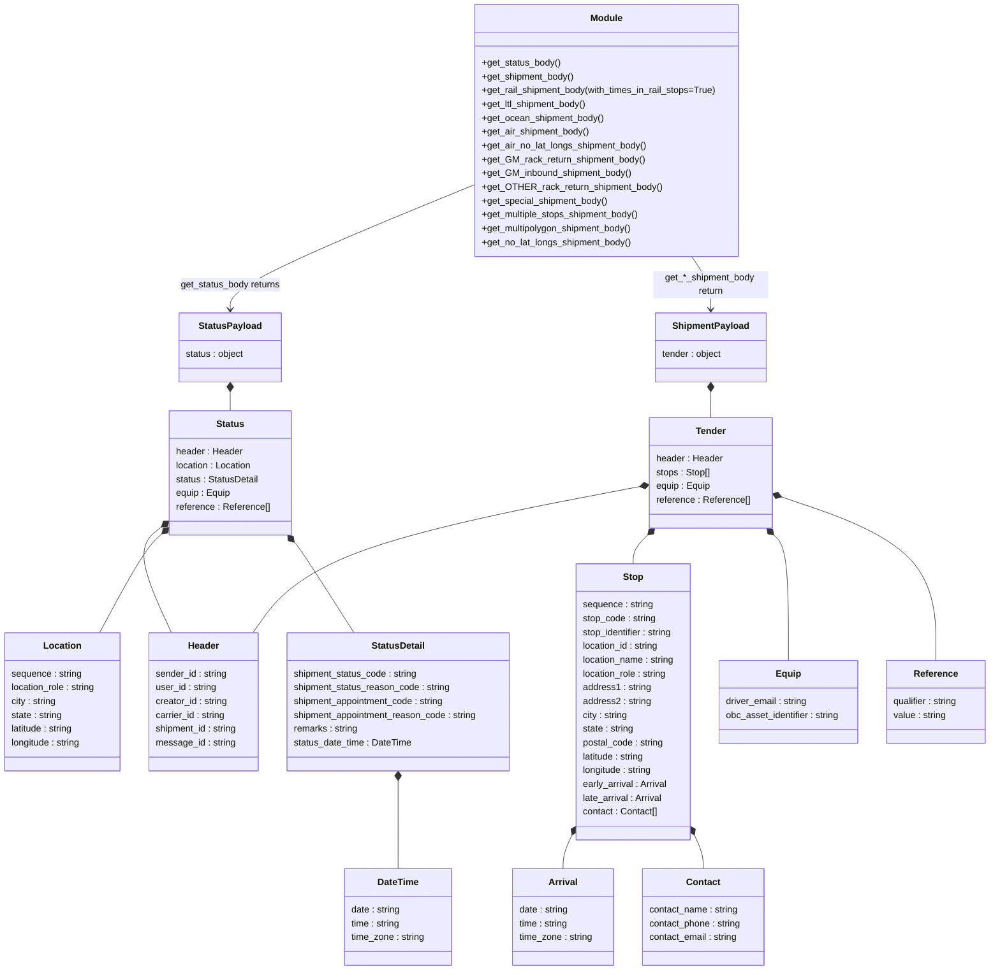

# Diagram: shipment_core/shipment_service/ng_val/scripts/common/auto_fvdata.py

> Auto-generated by Obscura crawlers

## Mermaid

### SVG

<svg id="container" width="1749.033203125" xmlns="http://www.w3.org/2000/svg" class="classDiagram" height="1686" viewBox="0 0 1749.033203125 1686" role="graphics-document document" aria-roledescription="class"><g><defs><marker id="container_class-aggregationStart" class="marker aggregation class" refX="18" refY="7" markerWidth="190" markerHeight="240" orient="auto"><path d="M 18,7 L9,13 L1,7 L9,1 Z"></path></marker></defs><defs><marker id="container_class-aggregationEnd" class="marker aggregation class" refX="1" refY="7" markerWidth="20" markerHeight="28" orient="auto"><path d="M 18,7 L9,13 L1,7 L9,1 Z"></path></marker></defs><defs><marker id="container_class-extensionStart" class="marker extension class" refX="18" refY="7" markerWidth="190" markerHeight="240" orient="auto"><path d="M 1,7 L18,13 V 1 Z"></path></marker></defs><defs><marker id="container_class-extensionEnd" class="marker extension class" refX="1" refY="7" markerWidth="20" markerHeight="28" orient="auto"><path d="M 1,1 V 13 L18,7 Z"></path></marker></defs><defs><marker id="container_class-compositionStart" class="marker composition class" refX="18" refY="7" markerWidth="190" markerHeight="240" orient="auto"><path d="M 18,7 L9,13 L1,7 L9,1 Z"></path></marker></defs><defs><marker id="container_class-compositionEnd" class="marker composition class" refX="1" refY="7" markerWidth="20" markerHeight="28" orient="auto"><path d="M 18,7 L9,13 L1,7 L9,1 Z"></path></marker></defs><defs><marker id="container_class-dependencyStart" class="marker dependency class" refX="6" refY="7" markerWidth="190" markerHeight="240" orient="auto"><path d="M 5,7 L9,13 L1,7 L9,1 Z"></path></marker></defs><defs><marker id="container_class-dependencyEnd" class="marker dependency class" refX="13" refY="7" markerWidth="20" markerHeight="28" orient="auto"><path d="M 18,7 L9,13 L14,7 L9,1 Z"></path></marker></defs><defs><marker id="container_class-lollipopStart" class="marker lollipop class" refX="13" refY="7" markerWidth="190" markerHeight="240" orient="auto"><circle stroke="black" fill="transparent" cx="7" cy="7" r="6"></circle></marker></defs><defs><marker id="container_class-lollipopEnd" class="marker lollipop class" refX="1" refY="7" markerWidth="190" markerHeight="240" orient="auto"><circle stroke="black" fill="transparent" cx="7" cy="7" r="6"></circle></marker></defs><g class="root"><g class="clusters"></g><g class="edgePaths"><path d="M838.678,321.084L766.903,350.07C695.129,379.056,551.58,437.028,479.806,473.181C408.031,509.333,408.031,523.667,408.031,530.833L408.031,538" id="id_Module_StatusPayload_1" class="edge-thickness-normal edge-pattern-solid relation" style=";;;" data-edge="true" data-et="edge" data-id="id_Module_StatusPayload_1" data-points="W3sieCI6ODM4LjY3NzczNDM3NSwieSI6MzIxLjA4NDA3NDI3MzU1NDg1fSx7IngiOjQwOC4wMzEyNSwieSI6NDk1fSx7IngiOjQwOC4wMzEyNSwieSI6NTQ0fV0=" marker-end="url(#container_class-dependencyEnd)"></path><path d="M1222.211,446L1227.825,454.167C1233.44,462.333,1244.669,478.667,1250.284,494C1255.898,509.333,1255.898,523.667,1255.898,530.833L1255.898,538" id="id_Module_ShipmentPayload_2" class="edge-thickness-normal edge-pattern-solid relation" style=";;;" data-edge="true" data-et="edge" data-id="id_Module_ShipmentPayload_2" data-points="W3sieCI6MTIyMi4yMTA1ODAzOTg3ODcyLCJ5Ijo0NDZ9LHsieCI6MTI1NS44OTg0Mzc1LCJ5Ijo0OTV9LHsieCI6MTI1NS44OTg0Mzc1LCJ5Ijo1NDR9XQ==" marker-end="url(#container_class-dependencyEnd)"></path><path d="M1255.898,681.25L1255.898,682.542C1255.898,683.833,1255.898,686.417,1255.898,693.875C1255.898,701.333,1255.898,713.667,1255.898,719.833L1255.898,726" id="id_ShipmentPayload_Tender_3" class="edge-thickness-normal edge-pattern-solid relation" style=";;;" data-edge="true" data-et="edge" data-id="id_ShipmentPayload_Tender_3" data-points="W3sieCI6MTI1NS44OTg0Mzc1LCJ5Ijo2NjR9LHsieCI6MTI1NS44OTg0Mzc1LCJ5Ijo2ODl9LHsieCI6MTI1NS44OTg0Mzc1LCJ5Ijo3MjZ9XQ==" marker-start="url(#container_class-compositionStart)"></path><path d="M1132.91,845.276L1036.282,863.563C939.654,881.851,746.397,918.425,632.228,960.879C518.058,1003.333,482.976,1051.667,465.435,1075.833L447.894,1100" id="id_Tender_Header_4" class="edge-thickness-normal edge-pattern-solid relation" style=";;;" data-edge="true" data-et="edge" data-id="id_Tender_Header_4" data-points="W3sieCI6MTE0OS44NTkzNzUsInkiOjg0Mi4wNjgzNTc5MjAyNDcyfSx7IngiOjU1My4xNDA2MjUsInkiOjk1NX0seyJ4Ijo0NDcuODkzNzk0MjIxNjk4MSwieSI6MTEwMH1d" marker-start="url(#container_class-compositionStart)"></path><path d="M1144.534,930.01L1140.24,934.175C1135.945,938.34,1127.356,946.67,1123.062,955.002C1118.768,963.333,1118.768,971.667,1118.768,975.833L1118.768,980" id="id_Tender_Stop_5" class="edge-thickness-normal edge-pattern-solid relation" style=";;;" data-edge="true" data-et="edge" data-id="id_Tender_Stop_5" data-points="W3sieCI6MTE1Ni45MTY3NjQ1Njc2NjkxLCJ5Ijo5MTh9LHsieCI6MTExOC43Njc1NzgxMjUsInkiOjk1NX0seyJ4IjoxMTE4Ljc2NzU3ODEyNSwieSI6OTgwfV0=" marker-start="url(#container_class-compositionStart)"></path><path d="M1367.263,930.01L1371.557,934.175C1375.852,938.34,1384.44,946.67,1388.735,983.002C1393.029,1019.333,1393.029,1083.667,1393.029,1115.833L1393.029,1148" id="id_Tender_Equip_6" class="edge-thickness-normal edge-pattern-solid relation" style=";;;" data-edge="true" data-et="edge" data-id="id_Tender_Equip_6" data-points="W3sieCI6MTM1NC44ODAxMTA0MzIzMzA5LCJ5Ijo5MTh9LHsieCI6MTM5My4wMjkyOTY4NzUsInkiOjk1NX0seyJ4IjoxMzkzLjAyOTI5Njg3NSwieSI6MTE0OH1d" marker-start="url(#container_class-compositionStart)"></path><path d="M1378.296,862.949L1424.153,878.291C1470.009,893.633,1561.722,924.316,1607.579,971.825C1653.436,1019.333,1653.436,1083.667,1653.436,1115.833L1653.436,1148" id="id_Tender_Reference_7" class="edge-thickness-normal edge-pattern-solid relation" style=";;;" data-edge="true" data-et="edge" data-id="id_Tender_Reference_7" data-points="W3sieCI6MTM2MS45Mzc1LCJ5Ijo4NTcuNDc2NDI0NjY1NTQzMn0seyJ4IjoxNjUzLjQzNTU0Njg3NSwieSI6OTU1fSx7IngiOjE2NTMuNDM1NTQ2ODc1LCJ5IjoxMTQ4fV0=" marker-start="url(#container_class-compositionStart)"></path><path d="M1010.058,1454.46L1007.698,1459.55C1005.338,1464.64,1000.618,1474.82,998.258,1484.077C995.898,1493.333,995.898,1501.667,995.898,1505.833L995.898,1510" id="id_Stop_Arrival_8" class="edge-thickness-normal edge-pattern-solid relation" style=";;;" data-edge="true" data-et="edge" data-id="id_Stop_Arrival_8" data-points="W3sieCI6MTAxNy4zMTQ0NTMxMjUsInkiOjE0MzguODEwNjYzMDIxMTg5NH0seyJ4Ijo5OTUuODk4NDM3NSwieSI6MTQ4NX0seyJ4Ijo5OTUuODk4NDM3NSwieSI6MTUxMH1d" marker-start="url(#container_class-compositionStart)"></path><path d="M1227.477,1454.46L1229.837,1459.55C1232.197,1464.64,1236.917,1474.82,1239.277,1484.077C1241.637,1493.333,1241.637,1501.667,1241.637,1505.833L1241.637,1510" id="id_Stop_Contact_9" class="edge-thickness-normal edge-pattern-solid relation" style=";;;" data-edge="true" data-et="edge" data-id="id_Stop_Contact_9" data-points="W3sieCI6MTIyMC4yMjA3MDMxMjUsInkiOjE0MzguODEwNjYzMDIxMTg5NH0seyJ4IjoxMjQxLjYzNjcxODc1LCJ5IjoxNDg1fSx7IngiOjEyNDEuNjM2NzE4NzUsInkiOjE1MTB9XQ==" marker-start="url(#container_class-compositionStart)"></path><path d="M408.031,681.25L408.031,682.542C408.031,683.833,408.031,686.417,408.031,691.875C408.031,697.333,408.031,705.667,408.031,709.833L408.031,714" id="id_StatusPayload_Status_10" class="edge-thickness-normal edge-pattern-solid relation" style=";;;" data-edge="true" data-et="edge" data-id="id_StatusPayload_Status_10" data-points="W3sieCI6NDA4LjAzMTI1LCJ5Ijo2NjR9LHsieCI6NDA4LjAzMTI1LCJ5Ijo2ODl9LHsieCI6NDA4LjAzMTI1LCJ5Ijo3MTR9XQ==" marker-start="url(#container_class-compositionStart)"></path><path d="M289.265,913.651L280.335,920.543C271.405,927.434,253.544,941.217,256.023,972.275C258.502,1003.333,281.321,1051.667,292.73,1075.833L304.14,1100" id="id_Status_Header_11" class="edge-thickness-normal edge-pattern-solid relation" style=";;;" data-edge="true" data-et="edge" data-id="id_Status_Header_11" data-points="W3sieCI6MzAyLjkyMTg3NSwieSI6OTAzLjExMjQ4NjExNzcyMTd9LHsieCI6MjM1LjY4MzU5Mzc1LCJ5Ijo5NTV9LHsieCI6MzA0LjEzOTY2Njg2MzIwNzU0LCJ5IjoxMTAwfV0=" marker-start="url(#container_class-compositionStart)"></path><path d="M289.927,925.105L284.22,930.088C278.513,935.07,267.098,945.035,248.158,974.184C229.217,1003.333,202.751,1051.667,189.517,1075.833L176.284,1100" id="id_Status_Location_12" class="edge-thickness-normal edge-pattern-solid relation" style=";;;" data-edge="true" data-et="edge" data-id="id_Status_Location_12" data-points="W3sieCI6MzAyLjkyMTg3NSwieSI6OTEzLjc2MDgyNjY0NTQ3MDZ9LHsieCI6MjU1LjY4MzU5Mzc1LCJ5Ijo5NTV9LHsieCI6MTc2LjI4NDEyNDQxMDM3NzM2LCJ5IjoxMTAwfV0=" marker-start="url(#container_class-compositionStart)"></path><path d="M521.443,942.565L523.393,944.637C525.342,946.71,529.241,950.855,546.908,977.094C564.575,1003.333,596.01,1051.667,611.727,1075.833L627.444,1100" id="id_Status_StatusDetail_13" class="edge-thickness-normal edge-pattern-solid relation" style=";;;" data-edge="true" data-et="edge" data-id="id_Status_StatusDetail_13" data-points="W3sieCI6NTA5LjYyMzgyNTE4Nzk2OTk0LCJ5Ijo5MzB9LHsieCI6NTMzLjE0MDYyNSwieSI6OTU1fSx7IngiOjYyNy40NDQwNTk1NTE4ODY4LCJ5IjoxMTAwfV0=" marker-start="url(#container_class-compositionStart)"></path><path d="M705.488,1357.25L705.488,1378.542C705.488,1399.833,705.488,1442.417,705.488,1467.875C705.488,1493.333,705.488,1501.667,705.488,1505.833L705.488,1510" id="id_StatusDetail_DateTime_14" class="edge-thickness-normal edge-pattern-solid relation" style=";;;" data-edge="true" data-et="edge" data-id="id_StatusDetail_DateTime_14" data-points="W3sieCI6NzA1LjQ4ODI4MTI1LCJ5IjoxMzQwfSx7IngiOjcwNS40ODgyODEyNSwieSI6MTQ4NX0seyJ4Ijo3MDUuNDg4MjgxMjUsInkiOjE1MTB9XQ==" marker-start="url(#container_class-compositionStart)"></path></g><g class="edgeLabels"><g class="edgeLabel" transform="translate(408.03125, 495)"><g class="label" data-id="id_Module_StatusPayload_1" transform="translate(-88.171875, -12)"><foreignObject width="176.34375" height="24">

get_status_body returns

</foreignObject></g></g><g class="edgeLabel" transform="translate(1255.8984375, 495)"><g class="label" data-id="id_Module_ShipmentPayload_2" transform="translate(-100, -24)"><foreignObject width="200" height="48">

get_*_shipment_body return

</foreignObject></g></g><g class="edgeLabel"><g class="label" data-id="id_ShipmentPayload_Tender_3" transform="translate(0, 0)"><foreignObject width="0" height="0">

</foreignObject></g></g><g class="edgeLabel"><g class="label" data-id="id_Tender_Header_4" transform="translate(0, 0)"><foreignObject width="0" height="0">

</foreignObject></g></g><g class="edgeLabel"><g class="label" data-id="id_Tender_Stop_5" transform="translate(0, 0)"><foreignObject width="0" height="0">

</foreignObject></g></g><g class="edgeLabel"><g class="label" data-id="id_Tender_Equip_6" transform="translate(0, 0)"><foreignObject width="0" height="0">

</foreignObject></g></g><g class="edgeLabel"><g class="label" data-id="id_Tender_Reference_7" transform="translate(0, 0)"><foreignObject width="0" height="0">

</foreignObject></g></g><g class="edgeLabel"><g class="label" data-id="id_Stop_Arrival_8" transform="translate(0, 0)"><foreignObject width="0" height="0">

</foreignObject></g></g><g class="edgeLabel"><g class="label" data-id="id_Stop_Contact_9" transform="translate(0, 0)"><foreignObject width="0" height="0">

</foreignObject></g></g><g class="edgeLabel"><g class="label" data-id="id_StatusPayload_Status_10" transform="translate(0, 0)"><foreignObject width="0" height="0">

</foreignObject></g></g><g class="edgeLabel"><g class="label" data-id="id_Status_Header_11" transform="translate(0, 0)"><foreignObject width="0" height="0">

</foreignObject></g></g><g class="edgeLabel"><g class="label" data-id="id_Status_Location_12" transform="translate(0, 0)"><foreignObject width="0" height="0">

</foreignObject></g></g><g class="edgeLabel"><g class="label" data-id="id_Status_StatusDetail_13" transform="translate(0, 0)"><foreignObject width="0" height="0">

</foreignObject></g></g><g class="edgeLabel"><g class="label" data-id="id_StatusDetail_DateTime_14" transform="translate(0, 0)"><foreignObject width="0" height="0">

</foreignObject></g></g></g><g class="nodes"><g class="node default" id="classId-Module-0" transform="translate(1071.646484375, 227)"><g class="basic label-container"><path d="M-232.96875 -219 L232.96875 -219 L232.96875 219 L-232.96875 219" stroke="none" stroke-width="0" fill="#ECECFF" style=""></path><path d="M-232.96875 -219 C-136.05016648542488 -219, -39.131582970849735 -219, 232.96875 -219 M-232.96875 -219 C-115.89683068878539 -219, 1.1750886224292287 -219, 232.96875 -219 M232.96875 -219 C232.96875 -75.82818240094778, 232.96875 67.34363519810444, 232.96875 219 M232.96875 -219 C232.96875 -48.574507935594625, 232.96875 121.85098412881075, 232.96875 219 M232.96875 219 C75.84398069272027 219, -81.28078861455947 219, -232.96875 219 M232.96875 219 C101.95996295105317 219, -29.048824097893657 219, -232.96875 219 M-232.96875 219 C-232.96875 129.48368412017658, -232.96875 39.96736824035315, -232.96875 -219 M-232.96875 219 C-232.96875 123.69663701826455, -232.96875 28.393274036529107, -232.96875 -219" stroke="#9370DB" stroke-width="1.3" fill="none" stroke-dasharray="0 0" style=""></path></g><g class="annotation-group text" transform="translate(0, -195)"></g><g class="label-group text" transform="translate(-27.09375, -195)"><g class="label" style="font-weight: bolder" transform="translate(0,-12)"><foreignObject width="54.1875" height="24">

Module

</foreignObject></g></g><g class="members-group text" transform="translate(-220.96875, -147)"></g><g class="methods-group text" transform="translate(-220.96875, -117)"><g class="label" style="" transform="translate(0,-12)"><foreignObject width="137.921875" height="24">

+get_status_body()

</foreignObject></g><g class="label" style="" transform="translate(0,12)"><foreignObject width="162.296875" height="24">

+get_shipment_body()

</foreignObject></g><g class="label" style="" transform="translate(0,36)"><foreignObject width="414.84375" height="24">

+get_rail_shipment_body(with_times_in_rail_stops=True)

</foreignObject></g><g class="label" style="" transform="translate(0,60)"><foreignObject width="185.453125" height="24">

+get_ltl_shipment_body()

</foreignObject></g><g class="label" style="" transform="translate(0,84)"><foreignObject width="213.609375" height="24">

+get_ocean_shipment_body()

</foreignObject></g><g class="label" style="" transform="translate(0,108)"><foreignObject width="188.40625" height="24">

+get_air_shipment_body()

</foreignObject></g><g class="label" style="" transform="translate(0,132)"><foreignObject width="289.21875" height="24">

+get_air_no_lat_longs_shipment_body()

</foreignObject></g><g class="label" style="" transform="translate(0,156)"><foreignObject width="284.375" height="24">

+get_GM_rack_return_shipment_body()

</foreignObject></g><g class="label" style="" transform="translate(0,180)"><foreignObject width="261.828125" height="24">

+get_GM_inbound_shipment_body()

</foreignObject></g><g class="label" style="" transform="translate(0,204)"><foreignObject width="309.734375" height="24">

+get_OTHER_rack_return_shipment_body()

</foreignObject></g><g class="label" style="" transform="translate(0,228)"><foreignObject width="221.703125" height="24">

+get_special_shipment_body()

</foreignObject></g><g class="label" style="" transform="translate(0,252)"><foreignObject width="278.453125" height="24">

+get_multiple_stops_shipment_body()

</foreignObject></g><g class="label" style="" transform="translate(0,276)"><foreignObject width="266.609375" height="24">

+get_multipolygon_shipment_body()

</foreignObject></g><g class="label" style="" transform="translate(0,300)"><foreignObject width="263.109375" height="24">

+get_no_lat_longs_shipment_body()

</foreignObject></g></g><g class="divider" style=""><path d="M-232.96875 -171 C-71.67487510463553 -171, 89.61899979072894 -171, 232.96875 -171 M-232.96875 -171 C-107.92260945197154 -171, 17.123531096056922 -171, 232.96875 -171" stroke="#9370DB" stroke-width="1.3" fill="none" stroke-dasharray="0 0" style=""></path></g><g class="divider" style=""><path d="M-232.96875 -147 C-101.75447662544065 -147, 29.45979674911871 -147, 232.96875 -147 M-232.96875 -147 C-112.81463330115885 -147, 7.339483397682301 -147, 232.96875 -147" stroke="#9370DB" stroke-width="1.3" fill="none" stroke-dasharray="0 0" style=""></path></g></g><g class="node default" id="classId-StatusPayload-1" transform="translate(408.03125, 604)"><g class="basic label-container"><path d="M-89.296875 -60 L89.296875 -60 L89.296875 60 L-89.296875 60" stroke="none" stroke-width="0" fill="#ECECFF" style=""></path><path d="M-89.296875 -60 C-27.790729348658196 -60, 33.71541630268361 -60, 89.296875 -60 M-89.296875 -60 C-21.245676152946004 -60, 46.80552269410799 -60, 89.296875 -60 M89.296875 -60 C89.296875 -35.983288470709866, 89.296875 -11.966576941419724, 89.296875 60 M89.296875 -60 C89.296875 -29.18057935829207, 89.296875 1.6388412834158572, 89.296875 60 M89.296875 60 C44.11781353303242 60, -1.0612479339351637 60, -89.296875 60 M89.296875 60 C19.536763251101462 60, -50.223348497797076 60, -89.296875 60 M-89.296875 60 C-89.296875 22.846270595092918, -89.296875 -14.307458809814165, -89.296875 -60 M-89.296875 60 C-89.296875 31.740494719361756, -89.296875 3.480989438723512, -89.296875 -60" stroke="#9370DB" stroke-width="1.3" fill="none" stroke-dasharray="0 0" style=""></path></g><g class="annotation-group text" transform="translate(0, -36)"></g><g class="label-group text" transform="translate(-52.390625, -36)"><g class="label" style="font-weight: bolder" transform="translate(0,-12)"><foreignObject width="104.78125" height="24">

StatusPayload

</foreignObject></g></g><g class="members-group text" transform="translate(-77.296875, 12)"><g class="label" style="" transform="translate(0,-12)"><foreignObject width="102.203125" height="24">

status : object

</foreignObject></g></g><g class="methods-group text" transform="translate(-77.296875, 60)"></g><g class="divider" style=""><path d="M-89.296875 -12 C-48.605732235795195 -12, -7.914589471590389 -12, 89.296875 -12 M-89.296875 -12 C-45.053902832160254 -12, -0.8109306643205088 -12, 89.296875 -12" stroke="#9370DB" stroke-width="1.3" fill="none" stroke-dasharray="0 0" style=""></path></g><g class="divider" style=""><path d="M-89.296875 36 C-43.04169297449278 36, 3.2134890510144345 36, 89.296875 36 M-89.296875 36 C-42.19146418913538 36, 4.913946621729238 36, 89.296875 36" stroke="#9370DB" stroke-width="1.3" fill="none" stroke-dasharray="0 0" style=""></path></g></g><g class="node default" id="classId-ShipmentPayload-2" transform="translate(1255.8984375, 604)"><g class="basic label-container"><path d="M-96.953125 -60 L96.953125 -60 L96.953125 60 L-96.953125 60" stroke="none" stroke-width="0" fill="#ECECFF" style=""></path><path d="M-96.953125 -60 C-53.55499942115601 -60, -10.156873842312024 -60, 96.953125 -60 M-96.953125 -60 C-27.68455353837696 -60, 41.58401792324608 -60, 96.953125 -60 M96.953125 -60 C96.953125 -20.03414929680146, 96.953125 19.93170140639708, 96.953125 60 M96.953125 -60 C96.953125 -27.76731929198639, 96.953125 4.465361416027221, 96.953125 60 M96.953125 60 C36.87090822809264 60, -23.211308543814724 60, -96.953125 60 M96.953125 60 C48.46842904040714 60, -0.01626691918572476 60, -96.953125 60 M-96.953125 60 C-96.953125 17.71920102790842, -96.953125 -24.561597944183163, -96.953125 -60 M-96.953125 60 C-96.953125 15.78134546891414, -96.953125 -28.43730906217172, -96.953125 -60" stroke="#9370DB" stroke-width="1.3" fill="none" stroke-dasharray="0 0" style=""></path></g><g class="annotation-group text" transform="translate(0, -36)"></g><g class="label-group text" transform="translate(-64.015625, -36)"><g class="label" style="font-weight: bolder" transform="translate(0,-12)"><foreignObject width="128.03125" height="24">

ShipmentPayload

</foreignObject></g></g><g class="members-group text" transform="translate(-84.953125, 12)"><g class="label" style="" transform="translate(0,-12)"><foreignObject width="105.890625" height="24">

tender : object

</foreignObject></g></g><g class="methods-group text" transform="translate(-84.953125, 60)"></g><g class="divider" style=""><path d="M-96.953125 -12 C-21.091599298587354 -12, 54.76992640282529 -12, 96.953125 -12 M-96.953125 -12 C-28.176708059886636 -12, 40.59970888022673 -12, 96.953125 -12" stroke="#9370DB" stroke-width="1.3" fill="none" stroke-dasharray="0 0" style=""></path></g><g class="divider" style=""><path d="M-96.953125 36 C-55.719572226596995 36, -14.48601945319399 36, 96.953125 36 M-96.953125 36 C-35.7509100312966 36, 25.451304937406803 36, 96.953125 36" stroke="#9370DB" stroke-width="1.3" fill="none" stroke-dasharray="0 0" style=""></path></g></g><g class="node default" id="classId-Tender-3" transform="translate(1255.8984375, 822)"><g class="basic label-container"><path d="M-106.0390625 -96 L106.0390625 -96 L106.0390625 96 L-106.0390625 96" stroke="none" stroke-width="0" fill="#ECECFF" style=""></path><path d="M-106.0390625 -96 C-63.13542976803761 -96, -20.23179703607522 -96, 106.0390625 -96 M-106.0390625 -96 C-31.911595675218862 -96, 42.215871149562275 -96, 106.0390625 -96 M106.0390625 -96 C106.0390625 -51.28110922621512, 106.0390625 -6.562218452430244, 106.0390625 96 M106.0390625 -96 C106.0390625 -56.32628739883112, 106.0390625 -16.65257479766224, 106.0390625 96 M106.0390625 96 C56.467244756511896 96, 6.895427013023792 96, -106.0390625 96 M106.0390625 96 C63.033734668145605 96, 20.02840683629121 96, -106.0390625 96 M-106.0390625 96 C-106.0390625 48.82742412997848, -106.0390625 1.6548482599569638, -106.0390625 -96 M-106.0390625 96 C-106.0390625 40.52638113899551, -106.0390625 -14.947237722008978, -106.0390625 -96" stroke="#9370DB" stroke-width="1.3" fill="none" stroke-dasharray="0 0" style=""></path></g><g class="annotation-group text" transform="translate(0, -72)"></g><g class="label-group text" transform="translate(-25.34375, -72)"><g class="label" style="font-weight: bolder" transform="translate(0,-12)"><foreignObject width="50.6875" height="24">

Tender

</foreignObject></g></g><g class="members-group text" transform="translate(-94.0390625, -24)"><g class="label" style="" transform="translate(0,-12)"><foreignObject width="116.046875" height="24">

header : Header

</foreignObject></g><g class="label" style="" transform="translate(0,12)"><foreignObject width="95.0625" height="24">

stops : Stop[]

</foreignObject></g><g class="label" style="" transform="translate(0,36)"><foreignObject width="95.078125" height="24">

equip : Equip

</foreignObject></g><g class="label" style="" transform="translate(0,60)"><foreignObject width="162.734375" height="24">

reference : Reference[]

</foreignObject></g></g><g class="methods-group text" transform="translate(-94.0390625, 96)"></g><g class="divider" style=""><path d="M-106.0390625 -48 C-54.33308350791073 -48, -2.6271045158214577 -48, 106.0390625 -48 M-106.0390625 -48 C-27.50177152188556 -48, 51.03551945622888 -48, 106.0390625 -48" stroke="#9370DB" stroke-width="1.3" fill="none" stroke-dasharray="0 0" style=""></path></g><g class="divider" style=""><path d="M-106.0390625 72 C-51.83841419232697 72, 2.3622341153460553 72, 106.0390625 72 M-106.0390625 72 C-47.99679346789946 72, 10.045475564201084 72, 106.0390625 72" stroke="#9370DB" stroke-width="1.3" fill="none" stroke-dasharray="0 0" style=""></path></g></g><g class="node default" id="classId-Header-4" transform="translate(360.79296875, 1220)"><g class="basic label-container"><path d="M-97.64453125 -120 L97.64453125 -120 L97.64453125 120 L-97.64453125 120" stroke="none" stroke-width="0" fill="#ECECFF" style=""></path><path d="M-97.64453125 -120 C-31.95360390760318 -120, 33.73732343479364 -120, 97.64453125 -120 M-97.64453125 -120 C-56.23674125552948 -120, -14.828951261058961 -120, 97.64453125 -120 M97.64453125 -120 C97.64453125 -34.1369438706013, 97.64453125 51.7261122587974, 97.64453125 120 M97.64453125 -120 C97.64453125 -32.45042604024374, 97.64453125 55.09914791951252, 97.64453125 120 M97.64453125 120 C51.11490002770457 120, 4.585268805409143 120, -97.64453125 120 M97.64453125 120 C47.36423657128255 120, -2.916058107434907 120, -97.64453125 120 M-97.64453125 120 C-97.64453125 61.90127983120838, -97.64453125 3.802559662416755, -97.64453125 -120 M-97.64453125 120 C-97.64453125 61.86892038051775, -97.64453125 3.7378407610355, -97.64453125 -120" stroke="#9370DB" stroke-width="1.3" fill="none" stroke-dasharray="0 0" style=""></path></g><g class="annotation-group text" transform="translate(0, -96)"></g><g class="label-group text" transform="translate(-26.4765625, -96)"><g class="label" style="font-weight: bolder" transform="translate(0,-12)"><foreignObject width="52.953125" height="24">

Header

</foreignObject></g></g><g class="members-group text" transform="translate(-85.64453125, -48)"><g class="label" style="" transform="translate(0,-12)"><foreignObject width="125.109375" height="24">

sender_id : string

</foreignObject></g><g class="label" style="" transform="translate(0,12)"><foreignObject width="106.765625" height="24">

user_id : string

</foreignObject></g><g class="label" style="" transform="translate(0,36)"><foreignObject width="126.75" height="24">

creator_id : string

</foreignObject></g><g class="label" style="" transform="translate(0,60)"><foreignObject width="123.03125" height="24">

carrier_id : string

</foreignObject></g><g class="label" style="" transform="translate(0,84)"><foreignObject width="144.8125" height="24">

shipment_id : string

</foreignObject></g><g class="label" style="" transform="translate(0,108)"><foreignObject width="138.421875" height="24">

message_id : string

</foreignObject></g></g><g class="methods-group text" transform="translate(-85.64453125, 120)"></g><g class="divider" style=""><path d="M-97.64453125 -72 C-42.69146925865795 -72, 12.261592732684093 -72, 97.64453125 -72 M-97.64453125 -72 C-57.8717778730481 -72, -18.099024496096206 -72, 97.64453125 -72" stroke="#9370DB" stroke-width="1.3" fill="none" stroke-dasharray="0 0" style=""></path></g><g class="divider" style=""><path d="M-97.64453125 96 C-55.81224188720478 96, -13.979952524409555 96, 97.64453125 96 M-97.64453125 96 C-32.72676568750302 96, 32.19099987499396 96, 97.64453125 96" stroke="#9370DB" stroke-width="1.3" fill="none" stroke-dasharray="0 0" style=""></path></g></g><g class="node default" id="classId-Stop-5" transform="translate(1118.767578125, 1220)"><g class="basic label-container"><path d="M-101.453125 -240 L101.453125 -240 L101.453125 240 L-101.453125 240" stroke="none" stroke-width="0" fill="#ECECFF" style=""></path><path d="M-101.453125 -240 C-37.87026193529988 -240, 25.71260112940024 -240, 101.453125 -240 M-101.453125 -240 C-57.78008335392012 -240, -14.107041707840239 -240, 101.453125 -240 M101.453125 -240 C101.453125 -62.621873289720526, 101.453125 114.75625342055895, 101.453125 240 M101.453125 -240 C101.453125 -48.0576319812111, 101.453125 143.8847360375778, 101.453125 240 M101.453125 240 C42.16934002374908 240, -17.11444495250184 240, -101.453125 240 M101.453125 240 C59.70417258553485 240, 17.955220171069698 240, -101.453125 240 M-101.453125 240 C-101.453125 125.72436868204048, -101.453125 11.448737364080955, -101.453125 -240 M-101.453125 240 C-101.453125 61.5809230811399, -101.453125 -116.8381538377202, -101.453125 -240" stroke="#9370DB" stroke-width="1.3" fill="none" stroke-dasharray="0 0" style=""></path></g><g class="annotation-group text" transform="translate(0, -216)"></g><g class="label-group text" transform="translate(-16.96875, -216)"><g class="label" style="font-weight: bolder" transform="translate(0,-12)"><foreignObject width="33.9375" height="24">

Stop

</foreignObject></g></g><g class="members-group text" transform="translate(-89.453125, -168)"><g class="label" style="" transform="translate(0,-12)"><foreignObject width="123.171875" height="24">

sequence : string

</foreignObject></g><g class="label" style="" transform="translate(0,12)"><foreignObject width="128.453125" height="24">

stop_code : string

</foreignObject></g><g class="label" style="" transform="translate(0,36)"><foreignObject width="160.375" height="24">

stop_identifier : string

</foreignObject></g><g class="label" style="" transform="translate(0,60)"><foreignObject width="135.515625" height="24">

location_id : string

</foreignObject></g><g class="label" style="" transform="translate(0,84)"><foreignObject width="161.9375" height="24">

location_name : string

</foreignObject></g><g class="label" style="" transform="translate(0,108)"><foreignObject width="149.796875" height="24">

location_role : string

</foreignObject></g><g class="label" style="" transform="translate(0,132)"><foreignObject width="117.453125" height="24">

address1 : string

</foreignObject></g><g class="label" style="" transform="translate(0,156)"><foreignObject width="118.765625" height="24">

address2 : string

</foreignObject></g><g class="label" style="" transform="translate(0,180)"><foreignObject width="79.6875" height="24">

city : string

</foreignObject></g><g class="label" style="" transform="translate(0,204)"><foreignObject width="90.0625" height="24">

state : string

</foreignObject></g><g class="label" style="" transform="translate(0,228)"><foreignObject width="142.140625" height="24">

postal_code : string

</foreignObject></g><g class="label" style="" transform="translate(0,252)"><foreignObject width="110.9375" height="24">

latitude : string

</foreignObject></g><g class="label" style="" transform="translate(0,276)"><foreignObject width="123.5" height="24">

longitude : string

</foreignObject></g><g class="label" style="" transform="translate(0,300)"><foreignObject width="148.984375" height="24">

early_arrival : Arrival

</foreignObject></g><g class="label" style="" transform="translate(0,324)"><foreignObject width="140.875" height="24">

late_arrival : Arrival

</foreignObject></g><g class="label" style="" transform="translate(0,348)"><foreignObject width="131.625" height="24">

contact : Contact[]

</foreignObject></g></g><g class="methods-group text" transform="translate(-89.453125, 240)"></g><g class="divider" style=""><path d="M-101.453125 -192 C-28.694487476044188 -192, 44.064150047911625 -192, 101.453125 -192 M-101.453125 -192 C-49.757438715604124 -192, 1.938247568791752 -192, 101.453125 -192" stroke="#9370DB" stroke-width="1.3" fill="none" stroke-dasharray="0 0" style=""></path></g><g class="divider" style=""><path d="M-101.453125 216 C-36.538309470344586 216, 28.376506059310827 216, 101.453125 216 M-101.453125 216 C-30.314782792223752 216, 40.823559415552495 216, 101.453125 216" stroke="#9370DB" stroke-width="1.3" fill="none" stroke-dasharray="0 0" style=""></path></g></g><g class="node default" id="classId-Arrival-6" transform="translate(995.8984375, 1594)"><g class="basic label-container"><path d="M-88.50390625 -84 L88.50390625 -84 L88.50390625 84 L-88.50390625 84" stroke="none" stroke-width="0" fill="#ECECFF" style=""></path><path d="M-88.50390625 -84 C-33.15394391239758 -84, 22.19601842520484 -84, 88.50390625 -84 M-88.50390625 -84 C-40.158531856753406 -84, 8.186842536493188 -84, 88.50390625 -84 M88.50390625 -84 C88.50390625 -23.314211950185125, 88.50390625 37.37157609962975, 88.50390625 84 M88.50390625 -84 C88.50390625 -34.2857129132813, 88.50390625 15.428574173437397, 88.50390625 84 M88.50390625 84 C46.848235378455115 84, 5.19256450691023 84, -88.50390625 84 M88.50390625 84 C23.24451004581948 84, -42.01488615836104 84, -88.50390625 84 M-88.50390625 84 C-88.50390625 31.796045845179762, -88.50390625 -20.407908309640476, -88.50390625 -84 M-88.50390625 84 C-88.50390625 21.8878276463913, -88.50390625 -40.2243447072174, -88.50390625 -84" stroke="#9370DB" stroke-width="1.3" fill="none" stroke-dasharray="0 0" style=""></path></g><g class="annotation-group text" transform="translate(0, -60)"></g><g class="label-group text" transform="translate(-24.0078125, -60)"><g class="label" style="font-weight: bolder" transform="translate(0,-12)"><foreignObject width="48.015625" height="24">

Arrival

</foreignObject></g></g><g class="members-group text" transform="translate(-76.50390625, -12)"><g class="label" style="" transform="translate(0,-12)"><foreignObject width="86.484375" height="24">

date : string

</foreignObject></g><g class="label" style="" transform="translate(0,12)"><foreignObject width="86.6875" height="24">

time : string

</foreignObject></g><g class="label" style="" transform="translate(0,36)"><foreignObject width="129" height="24">

time_zone : string

</foreignObject></g></g><g class="methods-group text" transform="translate(-76.50390625, 84)"></g><g class="divider" style=""><path d="M-88.50390625 -36 C-52.476464185539584 -36, -16.449022121079167 -36, 88.50390625 -36 M-88.50390625 -36 C-40.27037651639474 -36, 7.963153217210518 -36, 88.50390625 -36" stroke="#9370DB" stroke-width="1.3" fill="none" stroke-dasharray="0 0" style=""></path></g><g class="divider" style=""><path d="M-88.50390625 60 C-41.46195953482084 60, 5.579987180358316 60, 88.50390625 60 M-88.50390625 60 C-26.725482405780596 60, 35.05294143843881 60, 88.50390625 60" stroke="#9370DB" stroke-width="1.3" fill="none" stroke-dasharray="0 0" style=""></path></g></g><g class="node default" id="classId-Equip-7" transform="translate(1393.029296875, 1220)"><g class="basic label-container"><path d="M-122.80859375 -72 L122.80859375 -72 L122.80859375 72 L-122.80859375 72" stroke="none" stroke-width="0" fill="#ECECFF" style=""></path><path d="M-122.80859375 -72 C-38.347093696766976 -72, 46.11440635646605 -72, 122.80859375 -72 M-122.80859375 -72 C-27.53982766609998 -72, 67.72893841780004 -72, 122.80859375 -72 M122.80859375 -72 C122.80859375 -17.803368074228253, 122.80859375 36.393263851543495, 122.80859375 72 M122.80859375 -72 C122.80859375 -36.768079021470506, 122.80859375 -1.536158042941011, 122.80859375 72 M122.80859375 72 C58.21104883850397 72, -6.38649607299206 72, -122.80859375 72 M122.80859375 72 C28.5247329349681 72, -65.7591278800638 72, -122.80859375 72 M-122.80859375 72 C-122.80859375 31.940041873775854, -122.80859375 -8.119916252448292, -122.80859375 -72 M-122.80859375 72 C-122.80859375 34.68291831894977, -122.80859375 -2.634163362100466, -122.80859375 -72" stroke="#9370DB" stroke-width="1.3" fill="none" stroke-dasharray="0 0" style=""></path></g><g class="annotation-group text" transform="translate(0, -48)"></g><g class="label-group text" transform="translate(-20.4609375, -48)"><g class="label" style="font-weight: bolder" transform="translate(0,-12)"><foreignObject width="40.921875" height="24">

Equip

</foreignObject></g></g><g class="members-group text" transform="translate(-110.80859375, 0)"><g class="label" style="" transform="translate(0,-12)"><foreignObject width="143.96875" height="24">

driver_email : string

</foreignObject></g><g class="label" style="" transform="translate(0,12)"><foreignObject width="201.15625" height="24">

obc_asset_identifier : string

</foreignObject></g></g><g class="methods-group text" transform="translate(-110.80859375, 72)"></g><g class="divider" style=""><path d="M-122.80859375 -24 C-52.240071239211076 -24, 18.328451271577848 -24, 122.80859375 -24 M-122.80859375 -24 C-65.97138857134189 -24, -9.134183392683767 -24, 122.80859375 -24" stroke="#9370DB" stroke-width="1.3" fill="none" stroke-dasharray="0 0" style=""></path></g><g class="divider" style=""><path d="M-122.80859375 48 C-53.89846653540769 48, 15.011660679184615 48, 122.80859375 48 M-122.80859375 48 C-37.32519574749867 48, 48.158202255002664 48, 122.80859375 48" stroke="#9370DB" stroke-width="1.3" fill="none" stroke-dasharray="0 0" style=""></path></g></g><g class="node default" id="classId-Reference-8" transform="translate(1653.435546875, 1220)"><g class="basic label-container"><path d="M-87.59765625 -72 L87.59765625 -72 L87.59765625 72 L-87.59765625 72" stroke="none" stroke-width="0" fill="#ECECFF" style=""></path><path d="M-87.59765625 -72 C-26.6759797272668 -72, 34.2456967954664 -72, 87.59765625 -72 M-87.59765625 -72 C-38.865086007006 -72, 9.867484235988002 -72, 87.59765625 -72 M87.59765625 -72 C87.59765625 -26.711785880479255, 87.59765625 18.57642823904149, 87.59765625 72 M87.59765625 -72 C87.59765625 -20.12186272454546, 87.59765625 31.756274550909083, 87.59765625 72 M87.59765625 72 C18.407822508104374 72, -50.78201123379125 72, -87.59765625 72 M87.59765625 72 C32.929884528080315 72, -21.73788719383937 72, -87.59765625 72 M-87.59765625 72 C-87.59765625 18.285694633060494, -87.59765625 -35.42861073387901, -87.59765625 -72 M-87.59765625 72 C-87.59765625 38.079627260185724, -87.59765625 4.159254520371448, -87.59765625 -72" stroke="#9370DB" stroke-width="1.3" fill="none" stroke-dasharray="0 0" style=""></path></g><g class="annotation-group text" transform="translate(0, -48)"></g><g class="label-group text" transform="translate(-36.5078125, -48)"><g class="label" style="font-weight: bolder" transform="translate(0,-12)"><foreignObject width="73.015625" height="24">

Reference

</foreignObject></g></g><g class="members-group text" transform="translate(-75.59765625, 0)"><g class="label" style="" transform="translate(0,-12)"><foreignObject width="114.6875" height="24">

qualifier : string

</foreignObject></g><g class="label" style="" transform="translate(0,12)"><foreignObject width="92.84375" height="24">

value : string

</foreignObject></g></g><g class="methods-group text" transform="translate(-75.59765625, 72)"></g><g class="divider" style=""><path d="M-87.59765625 -24 C-42.173609003154944 -24, 3.2504382436901125 -24, 87.59765625 -24 M-87.59765625 -24 C-45.08312470533971 -24, -2.568593160679427 -24, 87.59765625 -24" stroke="#9370DB" stroke-width="1.3" fill="none" stroke-dasharray="0 0" style=""></path></g><g class="divider" style=""><path d="M-87.59765625 48 C-36.21101946044447 48, 15.175617329111063 48, 87.59765625 48 M-87.59765625 48 C-20.619447003129665 48, 46.35876224374067 48, 87.59765625 48" stroke="#9370DB" stroke-width="1.3" fill="none" stroke-dasharray="0 0" style=""></path></g></g><g class="node default" id="classId-Contact-9" transform="translate(1241.63671875, 1594)"><g class="basic label-container"><path d="M-107.234375 -84 L107.234375 -84 L107.234375 84 L-107.234375 84" stroke="none" stroke-width="0" fill="#ECECFF" style=""></path><path d="M-107.234375 -84 C-22.75795035339594 -84, 61.71847429320812 -84, 107.234375 -84 M-107.234375 -84 C-34.55785766171462 -84, 38.11865967657076 -84, 107.234375 -84 M107.234375 -84 C107.234375 -32.99738980493277, 107.234375 18.005220390134454, 107.234375 84 M107.234375 -84 C107.234375 -48.636465666841325, 107.234375 -13.27293133368265, 107.234375 84 M107.234375 84 C39.421665152227405 84, -28.39104469554519 84, -107.234375 84 M107.234375 84 C43.40568244266358 84, -20.423010114672834 84, -107.234375 84 M-107.234375 84 C-107.234375 27.13783237032778, -107.234375 -29.724335259344443, -107.234375 -84 M-107.234375 84 C-107.234375 30.660338650541334, -107.234375 -22.679322698917332, -107.234375 -84" stroke="#9370DB" stroke-width="1.3" fill="none" stroke-dasharray="0 0" style=""></path></g><g class="annotation-group text" transform="translate(0, -60)"></g><g class="label-group text" transform="translate(-28.03125, -60)"><g class="label" style="font-weight: bolder" transform="translate(0,-12)"><foreignObject width="56.0625" height="24">

Contact

</foreignObject></g></g><g class="members-group text" transform="translate(-95.234375, -12)"><g class="label" style="" transform="translate(0,-12)"><foreignObject width="156.625" height="24">

contact_name : string

</foreignObject></g><g class="label" style="" transform="translate(0,12)"><foreignObject width="162.4375" height="24">

contact_phone : string

</foreignObject></g><g class="label" style="" transform="translate(0,36)"><foreignObject width="156.140625" height="24">

contact_email : string

</foreignObject></g></g><g class="methods-group text" transform="translate(-95.234375, 84)"></g><g class="divider" style=""><path d="M-107.234375 -36 C-46.53154048571032 -36, 14.171294028579354 -36, 107.234375 -36 M-107.234375 -36 C-47.469070633242175 -36, 12.296233733515649 -36, 107.234375 -36" stroke="#9370DB" stroke-width="1.3" fill="none" stroke-dasharray="0 0" style=""></path></g><g class="divider" style=""><path d="M-107.234375 60 C-24.900927617851963 60, 57.432519764296075 60, 107.234375 60 M-107.234375 60 C-26.33004139934293 60, 54.57429220131414 60, 107.234375 60" stroke="#9370DB" stroke-width="1.3" fill="none" stroke-dasharray="0 0" style=""></path></g></g><g class="node default" id="classId-Status-10" transform="translate(408.03125, 822)"><g class="basic label-container"><path d="M-105.109375 -108 L105.109375 -108 L105.109375 108 L-105.109375 108" stroke="none" stroke-width="0" fill="#ECECFF" style=""></path><path d="M-105.109375 -108 C-57.38217198339175 -108, -9.6549689667835 -108, 105.109375 -108 M-105.109375 -108 C-52.38294599154355 -108, 0.3434830169128986 -108, 105.109375 -108 M105.109375 -108 C105.109375 -57.891667797452364, 105.109375 -7.783335594904727, 105.109375 108 M105.109375 -108 C105.109375 -39.22285745034226, 105.109375 29.55428509931548, 105.109375 108 M105.109375 108 C54.67989838597784 108, 4.250421771955686 108, -105.109375 108 M105.109375 108 C62.03418074723304 108, 18.958986494466075 108, -105.109375 108 M-105.109375 108 C-105.109375 60.73215105461013, -105.109375 13.464302109220256, -105.109375 -108 M-105.109375 108 C-105.109375 32.267719302329326, -105.109375 -43.46456139534135, -105.109375 -108" stroke="#9370DB" stroke-width="1.3" fill="none" stroke-dasharray="0 0" style=""></path></g><g class="annotation-group text" transform="translate(0, -84)"></g><g class="label-group text" transform="translate(-23.484375, -84)"><g class="label" style="font-weight: bolder" transform="translate(0,-12)"><foreignObject width="46.96875" height="24">

Status

</foreignObject></g></g><g class="members-group text" transform="translate(-93.109375, -36)"><g class="label" style="" transform="translate(0,-12)"><foreignObject width="116.046875" height="24">

header : Header

</foreignObject></g><g class="label" style="" transform="translate(0,12)"><foreignObject width="133.59375" height="24">

location : Location

</foreignObject></g><g class="label" style="" transform="translate(0,36)"><foreignObject width="144.96875" height="24">

status : StatusDetail

</foreignObject></g><g class="label" style="" transform="translate(0,60)"><foreignObject width="95.078125" height="24">

equip : Equip

</foreignObject></g><g class="label" style="" transform="translate(0,84)"><foreignObject width="162.734375" height="24">

reference : Reference[]

</foreignObject></g></g><g class="methods-group text" transform="translate(-93.109375, 108)"></g><g class="divider" style=""><path d="M-105.109375 -60 C-57.627725997683214 -60, -10.146076995366428 -60, 105.109375 -60 M-105.109375 -60 C-38.331064933604466 -60, 28.447245132791068 -60, 105.109375 -60" stroke="#9370DB" stroke-width="1.3" fill="none" stroke-dasharray="0 0" style=""></path></g><g class="divider" style=""><path d="M-105.109375 84 C-56.94321310028629 84, -8.777051200572586 84, 105.109375 84 M-105.109375 84 C-32.23398841071182 84, 40.64139817857637 84, 105.109375 84" stroke="#9370DB" stroke-width="1.3" fill="none" stroke-dasharray="0 0" style=""></path></g></g><g class="node default" id="classId-Location-11" transform="translate(110.57421875, 1220)"><g class="basic label-container"><path d="M-102.57421875 -120 L102.57421875 -120 L102.57421875 120 L-102.57421875 120" stroke="none" stroke-width="0" fill="#ECECFF" style=""></path><path d="M-102.57421875 -120 C-25.378481660741457 -120, 51.817255428517086 -120, 102.57421875 -120 M-102.57421875 -120 C-42.47840155661504 -120, 17.61741563676992 -120, 102.57421875 -120 M102.57421875 -120 C102.57421875 -29.68448321565502, 102.57421875 60.63103356868996, 102.57421875 120 M102.57421875 -120 C102.57421875 -48.582034114346, 102.57421875 22.835931771307997, 102.57421875 120 M102.57421875 120 C23.734180098274862 120, -55.105858553450275 120, -102.57421875 120 M102.57421875 120 C32.614073350668676 120, -37.34607204866265 120, -102.57421875 120 M-102.57421875 120 C-102.57421875 68.2857787944458, -102.57421875 16.571557588891608, -102.57421875 -120 M-102.57421875 120 C-102.57421875 33.86537666376914, -102.57421875 -52.26924667246172, -102.57421875 -120" stroke="#9370DB" stroke-width="1.3" fill="none" stroke-dasharray="0 0" style=""></path></g><g class="annotation-group text" transform="translate(0, -96)"></g><g class="label-group text" transform="translate(-31.3515625, -96)"><g class="label" style="font-weight: bolder" transform="translate(0,-12)"><foreignObject width="62.703125" height="24">

Location

</foreignObject></g></g><g class="members-group text" transform="translate(-90.57421875, -48)"><g class="label" style="" transform="translate(0,-12)"><foreignObject width="123.171875" height="24">

sequence : string

</foreignObject></g><g class="label" style="" transform="translate(0,12)"><foreignObject width="149.796875" height="24">

location_role : string

</foreignObject></g><g class="label" style="" transform="translate(0,36)"><foreignObject width="79.6875" height="24">

city : string

</foreignObject></g><g class="label" style="" transform="translate(0,60)"><foreignObject width="90.0625" height="24">

state : string

</foreignObject></g><g class="label" style="" transform="translate(0,84)"><foreignObject width="110.9375" height="24">

latitude : string

</foreignObject></g><g class="label" style="" transform="translate(0,108)"><foreignObject width="123.5" height="24">

longitude : string

</foreignObject></g></g><g class="methods-group text" transform="translate(-90.57421875, 120)"></g><g class="divider" style=""><path d="M-102.57421875 -72 C-45.84826610535605 -72, 10.877686539287893 -72, 102.57421875 -72 M-102.57421875 -72 C-56.57639370831326 -72, -10.578568666626524 -72, 102.57421875 -72" stroke="#9370DB" stroke-width="1.3" fill="none" stroke-dasharray="0 0" style=""></path></g><g class="divider" style=""><path d="M-102.57421875 96 C-44.95211801167086 96, 12.669982726658276 96, 102.57421875 96 M-102.57421875 96 C-25.196466967420392 96, 52.181284815159216 96, 102.57421875 96" stroke="#9370DB" stroke-width="1.3" fill="none" stroke-dasharray="0 0" style=""></path></g></g><g class="node default" id="classId-StatusDetail-12" transform="translate(705.48828125, 1220)"><g class="basic label-container"><path d="M-197.05078125 -120 L197.05078125 -120 L197.05078125 120 L-197.05078125 120" stroke="none" stroke-width="0" fill="#ECECFF" style=""></path><path d="M-197.05078125 -120 C-52.667845317642104 -120, 91.71509061471579 -120, 197.05078125 -120 M-197.05078125 -120 C-59.04351679898542 -120, 78.96374765202916 -120, 197.05078125 -120 M197.05078125 -120 C197.05078125 -71.55139143808552, 197.05078125 -23.102782876171034, 197.05078125 120 M197.05078125 -120 C197.05078125 -59.3459705523054, 197.05078125 1.3080588953891947, 197.05078125 120 M197.05078125 120 C101.1671075186689 120, 5.283433787337799 120, -197.05078125 120 M197.05078125 120 C111.67741781056365 120, 26.304054371127307 120, -197.05078125 120 M-197.05078125 120 C-197.05078125 35.70647400027002, -197.05078125 -48.58705199945996, -197.05078125 -120 M-197.05078125 120 C-197.05078125 47.93732638345914, -197.05078125 -24.125347233081726, -197.05078125 -120" stroke="#9370DB" stroke-width="1.3" fill="none" stroke-dasharray="0 0" style=""></path></g><g class="annotation-group text" transform="translate(0, -96)"></g><g class="label-group text" transform="translate(-45.1171875, -96)"><g class="label" style="font-weight: bolder" transform="translate(0,-12)"><foreignObject width="90.234375" height="24">

StatusDetail

</foreignObject></g></g><g class="members-group text" transform="translate(-185.05078125, -48)"><g class="label" style="" transform="translate(0,-12)"><foreignObject width="217.765625" height="24">

shipment_status_code : string

</foreignObject></g><g class="label" style="" transform="translate(0,12)"><foreignObject width="275.078125" height="24">

shipment_status_reason_code : string

</foreignObject></g><g class="label" style="" transform="translate(0,36)"><foreignObject width="267.671875" height="24">

shipment_appointment_code : string

</foreignObject></g><g class="label" style="" transform="translate(0,60)"><foreignObject width="324.984375" height="24">

shipment_appointment_reason_code : string

</foreignObject></g><g class="label" style="" transform="translate(0,84)"><foreignObject width="112.546875" height="24">

remarks : string

</foreignObject></g><g class="label" style="" transform="translate(0,108)"><foreignObject width="205.65625" height="24">

status_date_time : DateTime

</foreignObject></g></g><g class="methods-group text" transform="translate(-185.05078125, 120)"></g><g class="divider" style=""><path d="M-197.05078125 -72 C-86.56324939864732 -72, 23.92428245270537 -72, 197.05078125 -72 M-197.05078125 -72 C-90.60858065190747 -72, 15.833619946185053 -72, 197.05078125 -72" stroke="#9370DB" stroke-width="1.3" fill="none" stroke-dasharray="0 0" style=""></path></g><g class="divider" style=""><path d="M-197.05078125 96 C-114.25153636065706 96, -31.452291471314112 96, 197.05078125 96 M-197.05078125 96 C-68.57925917036036 96, 59.89226290927928 96, 197.05078125 96" stroke="#9370DB" stroke-width="1.3" fill="none" stroke-dasharray="0 0" style=""></path></g></g><g class="node default" id="classId-DateTime-13" transform="translate(705.48828125, 1594)"><g class="basic label-container"><path d="M-93.8125 -84 L93.8125 -84 L93.8125 84 L-93.8125 84" stroke="none" stroke-width="0" fill="#ECECFF" style=""></path><path d="M-93.8125 -84 C-43.788615095794704 -84, 6.235269808410592 -84, 93.8125 -84 M-93.8125 -84 C-49.663584557815994 -84, -5.514669115631989 -84, 93.8125 -84 M93.8125 -84 C93.8125 -22.600486834429816, 93.8125 38.79902633114037, 93.8125 84 M93.8125 -84 C93.8125 -27.69708837375952, 93.8125 28.60582325248096, 93.8125 84 M93.8125 84 C23.753213059950596 84, -46.30607388009881 84, -93.8125 84 M93.8125 84 C51.341642626497006 84, 8.870785252994011 84, -93.8125 84 M-93.8125 84 C-93.8125 34.85060280493284, -93.8125 -14.298794390134319, -93.8125 -84 M-93.8125 84 C-93.8125 49.22628759647835, -93.8125 14.4525751929567, -93.8125 -84" stroke="#9370DB" stroke-width="1.3" fill="none" stroke-dasharray="0 0" style=""></path></g><g class="annotation-group text" transform="translate(0, -60)"></g><g class="label-group text" transform="translate(-34.625, -60)"><g class="label" style="font-weight: bolder" transform="translate(0,-12)"><foreignObject width="69.25" height="24">

DateTime

</foreignObject></g></g><g class="members-group text" transform="translate(-81.8125, -12)"><g class="label" style="" transform="translate(0,-12)"><foreignObject width="86.484375" height="24">

date : string

</foreignObject></g><g class="label" style="" transform="translate(0,12)"><foreignObject width="86.6875" height="24">

time : string

</foreignObject></g><g class="label" style="" transform="translate(0,36)"><foreignObject width="129" height="24">

time_zone : string

</foreignObject></g></g><g class="methods-group text" transform="translate(-81.8125, 84)"></g><g class="divider" style=""><path d="M-93.8125 -36 C-38.46385196719864 -36, 16.884796065602714 -36, 93.8125 -36 M-93.8125 -36 C-26.911192711929615 -36, 39.99011457614077 -36, 93.8125 -36" stroke="#9370DB" stroke-width="1.3" fill="none" stroke-dasharray="0 0" style=""></path></g><g class="divider" style=""><path d="M-93.8125 60 C-49.66600522978977 60, -5.519510459579536 60, 93.8125 60 M-93.8125 60 C-21.87557705227819 60, 50.06134589544362 60, 93.8125 60" stroke="#9370DB" stroke-width="1.3" fill="none" stroke-dasharray="0 0" style=""></path></g></g></g></g></g></svg>
