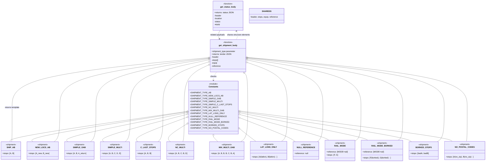

# Diagram: shipment_core/shipment_service/ng_val/scripts/common/fvdata.py

> Auto-generated by Obscura crawlers

## Mermaid

### SVG

<svg id="container" width="3794.205078125" xmlns="http://www.w3.org/2000/svg" class="classDiagram" height="1318" viewBox="0 0 3794.205078125 1318" role="graphics-document document" aria-roledescription="class"><g><defs><marker id="container_class-aggregationStart" class="marker aggregation class" refX="18" refY="7" markerWidth="190" markerHeight="240" orient="auto"><path d="M 18,7 L9,13 L1,7 L9,1 Z"></path></marker></defs><defs><marker id="container_class-aggregationEnd" class="marker aggregation class" refX="1" refY="7" markerWidth="20" markerHeight="28" orient="auto"><path d="M 18,7 L9,13 L1,7 L9,1 Z"></path></marker></defs><defs><marker id="container_class-extensionStart" class="marker extension class" refX="18" refY="7" markerWidth="190" markerHeight="240" orient="auto"><path d="M 1,7 L18,13 V 1 Z"></path></marker></defs><defs><marker id="container_class-extensionEnd" class="marker extension class" refX="1" refY="7" markerWidth="20" markerHeight="28" orient="auto"><path d="M 1,1 V 13 L18,7 Z"></path></marker></defs><defs><marker id="container_class-compositionStart" class="marker composition class" refX="18" refY="7" markerWidth="190" markerHeight="240" orient="auto"><path d="M 18,7 L9,13 L1,7 L9,1 Z"></path></marker></defs><defs><marker id="container_class-compositionEnd" class="marker composition class" refX="1" refY="7" markerWidth="20" markerHeight="28" orient="auto"><path d="M 18,7 L9,13 L1,7 L9,1 Z"></path></marker></defs><defs><marker id="container_class-dependencyStart" class="marker dependency class" refX="6" refY="7" markerWidth="190" markerHeight="240" orient="auto"><path d="M 5,7 L9,13 L1,7 L9,1 Z"></path></marker></defs><defs><marker id="container_class-dependencyEnd" class="marker dependency class" refX="13" refY="7" markerWidth="20" markerHeight="28" orient="auto"><path d="M 18,7 L9,13 L14,7 L9,1 Z"></path></marker></defs><defs><marker id="container_class-lollipopStart" class="marker lollipop class" refX="13" refY="7" markerWidth="190" markerHeight="240" orient="auto"><circle stroke="black" fill="transparent" cx="7" cy="7" r="6"></circle></marker></defs><defs><marker id="container_class-lollipopEnd" class="marker lollipop class" refX="1" refY="7" markerWidth="190" markerHeight="240" orient="auto"><circle stroke="black" fill="transparent" cx="7" cy="7" r="6"></circle></marker></defs><g class="root"><g class="clusters"></g><g class="edgePaths"><path d="M1466.236,905.522L1234.884,940.768C1003.532,976.014,540.829,1046.507,310.043,1087.92C79.256,1129.333,80.388,1141.667,80.954,1147.833L81.519,1154" id="id_Constants_SHIP_AB_1" class="edge-thickness-normal edge-pattern-solid relation" style=";;;" data-edge="true" data-et="edge" data-id="id_Constants_SHIP_AB_1" data-points="W3sieCI6MTQ4My4yODkwNjI1LCJ5Ijo5MDIuOTIzNjQ3MzQ1NTZ9LHsieCI6NzguMTI1LCJ5IjoxMTE3fSx7IngiOjgxLjUxOTQ5NTQxMjg0NDA0LCJ5IjoxMTU0fV0=" marker-start="url(#container_class-aggregationStart)"></path><path d="M1466.277,908.517L1259.258,943.264C1052.238,978.012,638.199,1047.506,437.744,1088.42C237.29,1129.333,250.419,1141.667,256.984,1147.833L263.548,1154" id="id_Constants_NEW_LOCS_AB_2" class="edge-thickness-normal edge-pattern-solid relation" style=";;;" data-edge="true" data-et="edge" data-id="id_Constants_NEW_LOCS_AB_2" data-points="W3sieCI6MTQ4My4yODkwNjI1LCJ5Ijo5MDUuNjYxOTUyMDIxMDY3N30seyJ4IjoyMjQuMTYwMTU2MjUsInkiOjExMTd9LHsieCI6MjYzLjU0ODIzNjgxMTkyNjYsInkiOjExNTR9XQ==" marker-start="url(#container_class-aggregationStart)"></path><path d="M1466.396,916.03L1304.391,949.525C1142.385,983.02,818.374,1050.01,663.959,1089.672C509.544,1129.333,524.725,1141.667,532.316,1147.833L539.907,1154" id="id_Constants_SIMPLE_OAB_3" class="edge-thickness-normal edge-pattern-solid relation" style=";;;" data-edge="true" data-et="edge" data-id="id_Constants_SIMPLE_OAB_3" data-points="W3sieCI6MTQ4My4yODkwNjI1LCJ5Ijo5MTIuNTM3NzQwNTI4MDA1NH0seyJ4Ijo0OTQuMzYzMjgxMjUsInkiOjExMTd9LHsieCI6NTM5LjkwNjUzNjY5NzI0NzcsInkiOjExNTR9XQ==" marker-start="url(#container_class-aggregationStart)"></path><path d="M1466.648,928.768L1351.686,960.14C1236.725,991.512,1006.803,1054.256,899.103,1091.795C791.404,1129.333,805.926,1141.667,813.188,1147.833L820.449,1154" id="id_Constants_SIMPLE_MULTI_4" class="edge-thickness-normal edge-pattern-solid relation" style=";;;" data-edge="true" data-et="edge" data-id="id_Constants_SIMPLE_MULTI_4" data-points="W3sieCI6MTQ4My4yODkwNjI1LCJ5Ijo5MjQuMjI2MzI5ODg1NDYxNn0seyJ4Ijo3NzYuODgwODU5Mzc1LCJ5IjoxMTE3fSx7IngiOjgyMC40NDkwNzU0MDEzNzYxLCJ5IjoxMTU0fV0=" marker-start="url(#container_class-aggregationStart)"></path><path d="M1467.219,951.223L1396.406,978.853C1325.594,1006.482,1183.969,1061.741,1119.782,1095.537C1055.595,1129.333,1068.846,1141.667,1075.472,1147.833L1082.098,1154" id="id_Constants_C_LAST_STOPS_5" class="edge-thickness-normal edge-pattern-solid relation" style=";;;" data-edge="true" data-et="edge" data-id="id_Constants_C_LAST_STOPS_5" data-points="W3sieCI6MTQ4My4yODkwNjI1LCJ5Ijo5NDQuOTUzMTYzMDQzOTU5NH0seyJ4IjoxMDQyLjM0Mzc1LCJ5IjoxMTE3fSx7IngiOjEwODIuMDk3Nzk5NTk4NjIzOSwieSI6MTE1NH1d" marker-start="url(#container_class-aggregationStart)"></path><path d="M1468.891,1002.114L1439.874,1021.262C1410.856,1040.41,1352.822,1078.705,1330.329,1104.019C1307.837,1129.333,1320.886,1141.667,1327.411,1147.833L1333.936,1154" id="id_Constants_NC_MULTI_6" class="edge-thickness-normal edge-pattern-solid relation" style=";;;" data-edge="true" data-et="edge" data-id="id_Constants_NC_MULTI_6" data-points="W3sieCI6MTQ4My4yODkwNjI1LCJ5Ijo5OTIuNjEzNjA5OTg5NTcyfSx7IngiOjEyOTQuNzg3MTA5Mzc1LCJ5IjoxMTE3fSx7IngiOjEzMzMuOTM1ODUxNDkwODI1NiwieSI6MTE1NH1d" marker-start="url(#container_class-aggregationStart)"></path><path d="M1660.012,1109.25L1660.012,1110.542C1660.012,1111.833,1660.012,1114.417,1665.435,1121.875C1670.858,1129.333,1681.705,1141.667,1687.128,1147.833L1692.552,1154" id="id_Constants_MIX_MULTI_OAB_7" class="edge-thickness-normal edge-pattern-solid relation" style=";;;" data-edge="true" data-et="edge" data-id="id_Constants_MIX_MULTI_OAB_7" data-points="W3sieCI6MTY2MC4wMTE3MTg3NSwieSI6MTA5Mn0seyJ4IjoxNjYwLjAxMTcxODc1LCJ5IjoxMTE3fSx7IngiOjE2OTIuNTUxODAyNjA4OTQ0OSwieSI6MTE1NH1d" marker-start="url(#container_class-aggregationStart)"></path><path d="M1849.802,1039.54L1864.784,1052.45C1879.767,1065.36,1909.731,1091.18,1932.19,1109.757C1954.649,1128.333,1969.603,1139.667,1977.08,1145.333L1984.557,1151" id="id_Constants_LAT_LONS_ONLY_8" class="edge-thickness-normal edge-pattern-solid relation" style=";;;" data-edge="true" data-et="edge" data-id="id_Constants_LAT_LONS_ONLY_8" data-points="W3sieCI6MTgzNi43MzQzNzUsInkiOjEwMjguMjc5Nzk0NDEwNTM2NH0seyJ4IjoxOTM5LjY5NTMxMjUsInkiOjExMTd9LHsieCI6MTk4NC41NTczMDM2MTIzODUzLCJ5IjoxMTUxfV0=" marker-start="url(#container_class-aggregationStart)"></path><path d="M1852.71,954.5L1919.192,981.584C1985.674,1008.667,2118.639,1062.833,2192.368,1096.083C2266.096,1129.333,2280.589,1141.667,2287.836,1147.833L2295.082,1154" id="id_Constants_NULL_REFERENCE_9" class="edge-thickness-normal edge-pattern-solid relation" style=";;;" data-edge="true" data-et="edge" data-id="id_Constants_NULL_REFERENCE_9" data-points="W3sieCI6MTgzNi43MzQzNzUsInkiOjk0Ny45OTI0NzkyNDE5ODE1fSx7IngiOjIyNTEuNjAzNTE1NjI1LCJ5IjoxMTE3fSx7IngiOjIyOTUuMDgyMjI4MzU0MzU4LCJ5IjoxMTU0fV0=" marker-start="url(#container_class-aggregationStart)"></path><path d="M1853.363,929.344L1966.727,960.62C2080.09,991.896,2306.818,1054.448,2424.534,1089.891C2542.249,1125.333,2550.954,1133.667,2555.306,1137.833L2559.659,1142" id="id_Constants_RAIL_MODE_10" class="edge-thickness-normal edge-pattern-solid relation" style=";;;" data-edge="true" data-et="edge" data-id="id_Constants_RAIL_MODE_10" data-points="W3sieCI6MTgzNi43MzQzNzUsInkiOjkyNC43NTYyMDA2ODQ2Mjk4fSx7IngiOjI1MzMuNTQ0OTIxODc1LCJ5IjoxMTE3fSx7IngiOjI1NTkuNjU4NTYxNDk2NTU5NywieSI6MTE0Mn1d" marker-start="url(#container_class-aggregationStart)"></path><path d="M1853.631,915.778L2016.872,949.315C2180.112,982.852,2506.593,1049.926,2675.402,1087.63C2844.211,1125.333,2855.349,1133.667,2860.917,1137.833L2866.486,1142" id="id_Constants_RAIL_MODE_BORKED_11" class="edge-thickness-normal edge-pattern-solid relation" style=";;;" data-edge="true" data-et="edge" data-id="id_Constants_RAIL_MODE_BORKED_11" data-points="W3sieCI6MTgzNi43MzQzNzUsInkiOjkxMi4zMDY4MTI0MzAwNzA5fSx7IngiOjI4MzMuMDc0MjE4NzUsInkiOjExMTd9LHsieCI6Mjg2Ni40ODU2NDcyMTkwMzY4LCJ5IjoxMTQyfV0=" marker-start="url(#container_class-aggregationStart)"></path><path d="M1853.767,907.075L2071.919,942.062C2290.071,977.05,2726.375,1047.025,2952.67,1088.179C3178.966,1129.333,3195.251,1141.667,3203.394,1147.833L3211.537,1154" id="id_Constants_BORKED_STOPS_12" class="edge-thickness-normal edge-pattern-solid relation" style=";;;" data-edge="true" data-et="edge" data-id="id_Constants_BORKED_STOPS_12" data-points="W3sieCI6MTgzNi43MzQzNzUsInkiOjkwNC4zNDMwMjc4OTU2OTZ9LHsieCI6MzE2Mi42Nzk2ODc1LCJ5IjoxMTE3fSx7IngiOjMyMTEuNTM3MjE2ODg2NDY4LCJ5IjoxMTU0fV0=" marker-start="url(#container_class-aggregationStart)"></path><path d="M1853.836,901.559L2126.131,937.466C2398.425,973.373,2943.014,1045.186,3222.639,1086.76C3502.263,1128.333,3516.923,1139.667,3524.253,1145.333L3531.583,1151" id="id_Constants_NO_POSTAL_CODES_13" class="edge-thickness-normal edge-pattern-solid relation" style=";;;" data-edge="true" data-et="edge" data-id="id_Constants_NO_POSTAL_CODES_13" data-points="W3sieCI6MTgzNi43MzQzNzUsInkiOjg5OS4zMDM5Nzg2MTc2OTUxfSx7IngiOjM0ODcuNjAzNTE1NjI1LCJ5IjoxMTE3fSx7IngiOjM1MzEuNTgyNzMwMDc0NTQxNCwieSI6MTE1MX1d" marker-start="url(#container_class-aggregationStart)"></path><path d="M1683.188,586L1679.326,592.167C1675.463,598.333,1667.737,610.667,1663.875,622C1660.012,633.333,1660.012,643.667,1660.012,648.833L1660.012,654" id="id_get_shipment_body_Constants_14" class="edge-thickness-normal edge-pattern-dashed relation" style=";;;" data-edge="true" data-et="edge" data-id="id_get_shipment_body_Constants_14" data-points="W3sieCI6MTY4My4xODg0NTkyMjcwNzEsInkiOjU4Nn0seyJ4IjoxNjYwLjAxMTcxODc1LCJ5Ijo2MjN9LHsieCI6MTY2MC4wMTE3MTg3NSwieSI6NjYwfV0=" marker-end="url(#container_class-dependencyEnd)"></path><path d="M1602.438,470.562L1351.719,495.968C1101,521.374,599.563,572.187,348.844,639.76C98.125,707.333,98.125,791.667,98.125,874C98.125,956.333,98.125,1036.667,97.559,1083C96.994,1129.333,95.862,1141.667,95.296,1147.833L94.731,1154" id="id_get_shipment_body_SHIP_AB_15" class="edge-thickness-normal edge-pattern-solid relation" style=";;;" data-edge="true" data-et="edge" data-id="id_get_shipment_body_SHIP_AB_15" data-points="W3sieCI6MTYxOS41OTk2MDkzNzUsInkiOjQ2OC44MjI1MDkzMDE1ODIwNH0seyJ4Ijo5OC4xMjUsInkiOjYyM30seyJ4Ijo5OC4xMjUsInkiOjg3Nn0seyJ4Ijo5OC4xMjUsInkiOjExMTd9LHsieCI6OTQuNzMwNTA0NTg3MTU1OTYsInkiOjExNTR9XQ==" marker-start="url(#container_class-aggregationStart)"></path><path d="M1602.495,475.379L1414.473,499.982C1226.451,524.586,850.407,573.793,662.385,640.563C474.363,707.333,474.363,791.667,474.363,874C474.363,956.333,474.363,1036.667,466.773,1083C459.182,1129.333,444.001,1141.667,436.411,1147.833L428.82,1154" id="id_get_shipment_body_NEW_LOCS_AB_16" class="edge-thickness-normal edge-pattern-solid relation" style=";;;" data-edge="true" data-et="edge" data-id="id_get_shipment_body_NEW_LOCS_AB_16" data-points="W3sieCI6MTYxOS41OTk2MDkzNzUsInkiOjQ3My4xNDA1NTI4NTk0OTU1M30seyJ4Ijo0NzQuMzYzMjgxMjUsInkiOjYyM30seyJ4Ijo0NzQuMzYzMjgxMjUsInkiOjg3Nn0seyJ4Ijo0NzQuMzYzMjgxMjUsInkiOjExMTd9LHsieCI6NDI4LjgyMDAyNTgwMjc1MjMsInkiOjExNTR9XQ==" marker-start="url(#container_class-aggregationStart)"></path><path d="M1602.587,481.349L1461.636,504.958C1320.685,528.566,1038.783,575.783,897.832,641.558C756.881,707.333,756.881,791.667,756.881,874C756.881,956.333,756.881,1036.667,749.619,1083C742.358,1129.333,727.835,1141.667,720.574,1147.833L713.313,1154" id="id_get_shipment_body_SIMPLE_OAB_17" class="edge-thickness-normal edge-pattern-solid relation" style=";;;" data-edge="true" data-et="edge" data-id="id_get_shipment_body_SIMPLE_OAB_17" data-points="W3sieCI6MTYxOS41OTk2MDkzNzUsInkiOjQ3OC40OTk5MDMyMTQwNjczfSx7IngiOjc1Ni44ODA4NTkzNzUsInkiOjYyM30seyJ4Ijo3NTYuODgwODU5Mzc1LCJ5Ijo4NzZ9LHsieCI6NzU2Ljg4MDg1OTM3NSwieSI6MTExN30seyJ4Ijo3MTMuMzEyNjQzMzQ4NjIzOSwieSI6MTE1NH1d" marker-start="url(#container_class-aggregationStart)"></path><path d="M1602.779,491.07L1506.039,513.059C1409.3,535.047,1215.822,579.023,1119.083,643.178C1022.344,707.333,1022.344,791.667,1022.344,874C1022.344,956.333,1022.344,1036.667,1015.718,1083C1009.092,1129.333,995.841,1141.667,989.215,1147.833L982.59,1154" id="id_get_shipment_body_SIMPLE_MULTI_18" class="edge-thickness-normal edge-pattern-solid relation" style=";;;" data-edge="true" data-et="edge" data-id="id_get_shipment_body_SIMPLE_MULTI_18" data-points="W3sieCI6MTYxOS41OTk2MDkzNzUsInkiOjQ4Ny4yNDcxMjQyNzc5NTAxNX0seyJ4IjoxMDIyLjM0Mzc1LCJ5Ijo2MjN9LHsieCI6MTAyMi4zNDM3NSwieSI6ODc2fSx7IngiOjEwMjIuMzQzNzUsInkiOjExMTd9LHsieCI6OTgyLjU4OTcwMDQwMTM3NjEsInkiOjExNTR9XQ==" marker-start="url(#container_class-aggregationStart)"></path><path d="M1603.288,509.951L1548.538,528.793C1493.788,547.634,1384.288,585.317,1329.537,646.325C1274.787,707.333,1274.787,791.667,1274.787,874C1274.787,956.333,1274.787,1036.667,1268.262,1083C1261.738,1129.333,1248.688,1141.667,1242.163,1147.833L1235.638,1154" id="id_get_shipment_body_C_LAST_STOPS_19" class="edge-thickness-normal edge-pattern-solid relation" style=";;;" data-edge="true" data-et="edge" data-id="id_get_shipment_body_C_LAST_STOPS_19" data-points="W3sieCI6MTYxOS41OTk2MDkzNzUsInkiOjUwNC4zMzc4NTEzODE2NjM3fSx7IngiOjEyNzQuNzg3MTA5Mzc1LCJ5Ijo2MjN9LHsieCI6MTI3NC43ODcxMDkzNzUsInkiOjg3Nn0seyJ4IjoxMjc0Ljc4NzEwOTM3NSwieSI6MTExN30seyJ4IjoxMjM1LjYzODM2NzI1OTE3NDQsInkiOjExNTR9XQ==" marker-start="url(#container_class-aggregationStart)"></path><path d="M1604.371,539.942L1578.358,553.785C1552.344,567.628,1500.317,595.314,1474.303,651.324C1448.289,707.333,1448.289,791.667,1448.289,874C1448.289,956.333,1448.289,1036.667,1446.129,1083C1443.97,1129.333,1439.651,1141.667,1437.491,1147.833L1435.332,1154" id="id_get_shipment_body_NC_MULTI_20" class="edge-thickness-normal edge-pattern-solid relation" style=";;;" data-edge="true" data-et="edge" data-id="id_get_shipment_body_NC_MULTI_20" data-points="W3sieCI6MTYxOS41OTk2MDkzNzUsInkiOjUzMS44MzgzNDI0NjYwMDYyfSx7IngiOjE0NDguMjg5MDYyNSwieSI6NjIzfSx7IngiOjE0NDguMjg5MDYyNSwieSI6ODc2fSx7IngiOjE0NDguMjg5MDYyNSwieSI6MTExN30seyJ4IjoxNDM1LjMzMTYzNzA0MTI4NDUsInkiOjExNTR9XQ==" marker-start="url(#container_class-aggregationStart)"></path><path d="M1897.63,598.757L1901.307,602.797C1904.985,606.838,1912.34,614.919,1916.018,661.126C1919.695,707.333,1919.695,791.667,1919.695,874C1919.695,956.333,1919.695,1036.667,1910.427,1083C1901.159,1129.333,1882.622,1141.667,1873.354,1147.833L1864.086,1154" id="id_get_shipment_body_MIX_MULTI_OAB_21" class="edge-thickness-normal edge-pattern-solid relation" style=";;;" data-edge="true" data-et="edge" data-id="id_get_shipment_body_MIX_MULTI_OAB_21" data-points="W3sieCI6MTg4Ni4wMTgyNDg0MjgyNTQ1LCJ5Ijo1ODZ9LHsieCI6MTkxOS42OTUzMTI1LCJ5Ijo2MjN9LHsieCI6MTkxOS42OTUzMTI1LCJ5Ijo4NzZ9LHsieCI6MTkxOS42OTUzMTI1LCJ5IjoxMTE3fSx7IngiOjE4NjQuMDg1OTE5NTgxNDIyLCJ5IjoxMTU0fV0=" marker-start="url(#container_class-aggregationStart)"></path><path d="M1928.362,512.962L1978.902,531.302C2029.442,549.642,2130.523,586.321,2181.063,646.827C2231.604,707.333,2231.604,791.667,2231.604,874C2231.604,956.333,2231.604,1036.667,2223.905,1082.5C2216.206,1128.333,2200.809,1139.667,2193.11,1145.333L2185.412,1151" id="id_get_shipment_body_LAT_LONS_ONLY_22" class="edge-thickness-normal edge-pattern-solid relation" style=";;;" data-edge="true" data-et="edge" data-id="id_get_shipment_body_LAT_LONS_ONLY_22" data-points="W3sieCI6MTkxMi4xNDY0ODQzNzUsInkiOjUwNy4wNzgzNjMxMjI0NDcxfSx7IngiOjIyMzEuNjAzNTE1NjI1LCJ5Ijo2MjN9LHsieCI6MjIzMS42MDM1MTU2MjUsInkiOjg3Nn0seyJ4IjoyMjMxLjYwMzUxNTYyNSwieSI6MTExN30seyJ4IjoyMTg1LjQxMTU3MTgxNzY2MDQsInkiOjExNTF9XQ==" marker-start="url(#container_class-aggregationStart)"></path><path d="M1928.972,490.866L2026.401,512.888C2123.83,534.911,2318.687,578.955,2416.116,643.144C2513.545,707.333,2513.545,791.667,2513.545,874C2513.545,956.333,2513.545,1036.667,2505.972,1083C2498.399,1129.333,2483.253,1141.667,2475.681,1147.833L2468.108,1154" id="id_get_shipment_body_NULL_REFERENCE_23" class="edge-thickness-normal edge-pattern-solid relation" style=";;;" data-edge="true" data-et="edge" data-id="id_get_shipment_body_NULL_REFERENCE_23" data-points="W3sieCI6MTkxMi4xNDY0ODQzNzUsInkiOjQ4Ny4wNjI5MTQwNDU2ODM1fSx7IngiOjI1MTMuNTQ0OTIxODc1LCJ5Ijo2MjN9LHsieCI6MjUxMy41NDQ5MjE4NzUsInkiOjg3Nn0seyJ4IjoyNTEzLjU0NDkyMTg3NSwieSI6MTExN30seyJ4IjoyNDY4LjEwNzc0NDQwOTQwMzUsInkiOjExNTR9XQ==" marker-start="url(#container_class-aggregationStart)"></path><path d="M1929.176,480.354L2076.492,504.129C2223.809,527.903,2518.442,575.451,2665.758,641.392C2813.074,707.333,2813.074,791.667,2813.074,874C2813.074,956.333,2813.074,1036.667,2805.105,1082.076C2797.136,1127.486,2781.198,1137.972,2773.229,1143.215L2765.26,1148.458" id="id_get_shipment_body_RAIL_MODE_24" class="edge-thickness-normal edge-pattern-solid relation" style=";;;" data-edge="true" data-et="edge" data-id="id_get_shipment_body_RAIL_MODE_24" data-points="W3sieCI6MTkxMi4xNDY0ODQzNzUsInkiOjQ3Ny42MDU5ODA5NzIzNDYzfSx7IngiOjI4MTMuMDc0MjE4NzUsInkiOjYyM30seyJ4IjoyODEzLjA3NDIxODc1LCJ5Ijo4NzZ9LHsieCI6MjgxMy4wNzQyMTg3NSwieSI6MTExN30seyJ4IjoyNzY1LjI1OTc2NTYyNSwieSI6MTE0OC40NTgwNDg5MjQyNTU4fV0=" marker-start="url(#container_class-aggregationStart)"></path><path d="M1929.268,474.056L2131.503,498.88C2333.739,523.704,2738.209,573.352,2940.444,640.343C3142.68,707.333,3142.68,791.667,3142.68,874C3142.68,956.333,3142.68,1036.667,3136.413,1081C3130.147,1125.333,3117.614,1133.667,3111.347,1137.833L3105.081,1142" id="id_get_shipment_body_RAIL_MODE_BORKED_25" class="edge-thickness-normal edge-pattern-solid relation" style=";;;" data-edge="true" data-et="edge" data-id="id_get_shipment_body_RAIL_MODE_BORKED_25" data-points="W3sieCI6MTkxMi4xNDY0ODQzNzUsInkiOjQ3MS45NTQ3NDQxMjE3MTUwN30seyJ4IjozMTQyLjY3OTY4NzUsInkiOjYyM30seyJ4IjozMTQyLjY3OTY4NzUsInkiOjg3Nn0seyJ4IjozMTQyLjY3OTY4NzUsInkiOjExMTd9LHsieCI6MzEwNS4wODA2ODczNTY2NTEsInkiOjExNDJ9XQ==" marker-start="url(#container_class-aggregationStart)"></path><path d="M1929.312,470.231L2185.694,495.693C2442.076,521.154,2954.84,572.077,3211.222,639.705C3467.604,707.333,3467.604,791.667,3467.604,874C3467.604,956.333,3467.604,1036.667,3458.495,1083C3449.387,1129.333,3431.171,1141.667,3422.063,1147.833L3412.955,1154" id="id_get_shipment_body_BORKED_STOPS_26" class="edge-thickness-normal edge-pattern-solid relation" style=";;;" data-edge="true" data-et="edge" data-id="id_get_shipment_body_BORKED_STOPS_26" data-points="W3sieCI6MTkxMi4xNDY0ODQzNzUsInkiOjQ2OC41MjY1MTM2ODIwNzQ1NX0seyJ4IjozNDY3LjYwMzUxNTYyNSwieSI6NjIzfSx7IngiOjM0NjcuNjAzNTE1NjI1LCJ5Ijo4NzZ9LHsieCI6MzQ2Ny42MDM1MTU2MjUsInkiOjExMTd9LHsieCI6MzQxMi45NTQ3OTE0Mjc3NTIzLCJ5IjoxMTU0fV0=" marker-start="url(#container_class-aggregationStart)"></path><path d="M1929.327,468.672L2215.872,494.394C2502.417,520.115,3075.506,571.557,3362.051,639.445C3648.596,707.333,3648.596,791.667,3648.596,874C3648.596,956.333,3648.596,1036.667,3647.556,1082.5C3646.516,1128.333,3644.437,1139.667,3643.397,1145.333L3642.357,1151" id="id_get_shipment_body_NO_POSTAL_CODES_27" class="edge-thickness-normal edge-pattern-solid relation" style=";;;" data-edge="true" data-et="edge" data-id="id_get_shipment_body_NO_POSTAL_CODES_27" data-points="W3sieCI6MTkxMi4xNDY0ODQzNzUsInkiOjQ2Ny4xMzAwMzMxNzU4NTY5N30seyJ4IjozNjQ4LjU5NTcwMzEyNSwieSI6NjIzfSx7IngiOjM2NDguNTk1NzAzMTI1LCJ5Ijo4NzZ9LHsieCI6MzY0OC41OTU3MDMxMjUsInkiOjExMTd9LHsieCI6MzY0Mi4zNTcxNzEwMTQ5MDgsInkiOjExNTF9XQ==" marker-start="url(#container_class-aggregationStart)"></path><path d="M1699.006,248L1695.57,254.167C1692.134,260.333,1685.261,272.667,1684.557,284.112C1683.854,295.557,1689.319,306.114,1692.051,311.393L1694.784,316.672" id="id_get_status_body_get_shipment_body_28" class="edge-thickness-normal edge-pattern-solid relation" style=";;;" data-edge="true" data-et="edge" data-id="id_get_status_body_get_shipment_body_28" data-points="W3sieCI6MTY5OS4wMDYwMDg2NTg0Mzk0LCJ5IjoyNDh9LHsieCI6MTY3OC4zODg2NzE4NzUsInkiOjI4NX0seyJ4IjoxNjk3LjU0MjA1NTc1MDczOTYsInkiOjMyMn1d" marker-end="url(#container_class-dependencyEnd)"></path><path d="M1834.204,322L1837.396,315.833C1840.588,309.667,1846.973,297.333,1847.216,285.874C1847.458,274.414,1841.56,263.827,1838.61,258.534L1835.661,253.241" id="id_get_shipment_body_get_status_body_29" class="edge-thickness-normal edge-pattern-dashed relation" style=";;;" data-edge="true" data-et="edge" data-id="id_get_shipment_body_get_status_body_29" data-points="W3sieCI6MTgzNC4yMDQwMzc5OTkyNjA0LCJ5IjozMjJ9LHsieCI6MTg1My4zNTc0MjE4NzUsInkiOjI4NX0seyJ4IjoxODMyLjc0MDA4NTA5MTU2MDYsInkiOjI0OH1d" marker-end="url(#container_class-dependencyEnd)"></path></g><g class="edgeLabels"><g class="edgeLabel"><g class="label" data-id="id_Constants_SHIP_AB_1" transform="translate(0, 0)"><foreignObject width="0" height="0">

</foreignObject></g></g><g class="edgeLabel"><g class="label" data-id="id_Constants_NEW_LOCS_AB_2" transform="translate(0, 0)"><foreignObject width="0" height="0">

</foreignObject></g></g><g class="edgeLabel"><g class="label" data-id="id_Constants_SIMPLE_OAB_3" transform="translate(0, 0)"><foreignObject width="0" height="0">

</foreignObject></g></g><g class="edgeLabel"><g class="label" data-id="id_Constants_SIMPLE_MULTI_4" transform="translate(0, 0)"><foreignObject width="0" height="0">

</foreignObject></g></g><g class="edgeLabel"><g class="label" data-id="id_Constants_C_LAST_STOPS_5" transform="translate(0, 0)"><foreignObject width="0" height="0">

</foreignObject></g></g><g class="edgeLabel"><g class="label" data-id="id_Constants_NC_MULTI_6" transform="translate(0, 0)"><foreignObject width="0" height="0">

</foreignObject></g></g><g class="edgeLabel"><g class="label" data-id="id_Constants_MIX_MULTI_OAB_7" transform="translate(0, 0)"><foreignObject width="0" height="0">

</foreignObject></g></g><g class="edgeLabel"><g class="label" data-id="id_Constants_LAT_LONS_ONLY_8" transform="translate(0, 0)"><foreignObject width="0" height="0">

</foreignObject></g></g><g class="edgeLabel"><g class="label" data-id="id_Constants_NULL_REFERENCE_9" transform="translate(0, 0)"><foreignObject width="0" height="0">

</foreignObject></g></g><g class="edgeLabel"><g class="label" data-id="id_Constants_RAIL_MODE_10" transform="translate(0, 0)"><foreignObject width="0" height="0">

</foreignObject></g></g><g class="edgeLabel"><g class="label" data-id="id_Constants_RAIL_MODE_BORKED_11" transform="translate(0, 0)"><foreignObject width="0" height="0">

</foreignObject></g></g><g class="edgeLabel"><g class="label" data-id="id_Constants_BORKED_STOPS_12" transform="translate(0, 0)"><foreignObject width="0" height="0">

</foreignObject></g></g><g class="edgeLabel"><g class="label" data-id="id_Constants_NO_POSTAL_CODES_13" transform="translate(0, 0)"><foreignObject width="0" height="0">

</foreignObject></g></g><g class="edgeLabel" transform="translate(1660.01171875, 623)"><g class="label" data-id="id_get_shipment_body_Constants_14" transform="translate(-24.4921875, -12)"><foreignObject width="48.984375" height="24">

checks

</foreignObject></g></g><g class="edgeLabel" transform="translate(98.125, 876)"><g class="label" data-id="id_get_shipment_body_SHIP_AB_15" transform="translate(-60.90625, -12)"><foreignObject width="121.8125" height="24">

returns template

</foreignObject></g></g><g class="edgeLabel"><g class="label" data-id="id_get_shipment_body_NEW_LOCS_AB_16" transform="translate(0, 0)"><foreignObject width="0" height="0">

</foreignObject></g></g><g class="edgeLabel"><g class="label" data-id="id_get_shipment_body_SIMPLE_OAB_17" transform="translate(0, 0)"><foreignObject width="0" height="0">

</foreignObject></g></g><g class="edgeLabel"><g class="label" data-id="id_get_shipment_body_SIMPLE_MULTI_18" transform="translate(0, 0)"><foreignObject width="0" height="0">

</foreignObject></g></g><g class="edgeLabel"><g class="label" data-id="id_get_shipment_body_C_LAST_STOPS_19" transform="translate(0, 0)"><foreignObject width="0" height="0">

</foreignObject></g></g><g class="edgeLabel"><g class="label" data-id="id_get_shipment_body_NC_MULTI_20" transform="translate(0, 0)"><foreignObject width="0" height="0">

</foreignObject></g></g><g class="edgeLabel"><g class="label" data-id="id_get_shipment_body_MIX_MULTI_OAB_21" transform="translate(0, 0)"><foreignObject width="0" height="0">

</foreignObject></g></g><g class="edgeLabel"><g class="label" data-id="id_get_shipment_body_LAT_LONS_ONLY_22" transform="translate(0, 0)"><foreignObject width="0" height="0">

</foreignObject></g></g><g class="edgeLabel"><g class="label" data-id="id_get_shipment_body_NULL_REFERENCE_23" transform="translate(0, 0)"><foreignObject width="0" height="0">

</foreignObject></g></g><g class="edgeLabel"><g class="label" data-id="id_get_shipment_body_RAIL_MODE_24" transform="translate(0, 0)"><foreignObject width="0" height="0">

</foreignObject></g></g><g class="edgeLabel"><g class="label" data-id="id_get_shipment_body_RAIL_MODE_BORKED_25" transform="translate(0, 0)"><foreignObject width="0" height="0">

</foreignObject></g></g><g class="edgeLabel"><g class="label" data-id="id_get_shipment_body_BORKED_STOPS_26" transform="translate(0, 0)"><foreignObject width="0" height="0">

</foreignObject></g></g><g class="edgeLabel"><g class="label" data-id="id_get_shipment_body_NO_POSTAL_CODES_27" transform="translate(0, 0)"><foreignObject width="0" height="0">

</foreignObject></g></g><g class="edgeLabel" transform="translate(1678.55732, 284.69734)"><g class="label" data-id="id_get_status_body_get_shipment_body_28" transform="translate(-60.5078125, -12)"><foreignObject width="121.015625" height="24">

related payloads

</foreignObject></g></g><g class="edgeLabel" transform="translate(1853.18877, 284.69734)"><g class="label" data-id="id_get_shipment_body_get_status_body_29" transform="translate(-94.4609375, -12)"><foreignObject width="188.921875" height="24">

shares structure elements

</foreignObject></g></g></g><g class="nodes"><g class="node default" id="classId-Constants-0" transform="translate(1660.01171875, 876)"><g class="basic label-container"><path d="M-176.72265625 -216 L176.72265625 -216 L176.72265625 216 L-176.72265625 216" stroke="none" stroke-width="0" fill="#ECECFF" style=""></path><path d="M-176.72265625 -216 C-67.54604331626469 -216, 41.63056961747063 -216, 176.72265625 -216 M-176.72265625 -216 C-95.33617238078416 -216, -13.949688511568326 -216, 176.72265625 -216 M176.72265625 -216 C176.72265625 -51.962391406369335, 176.72265625 112.07521718726133, 176.72265625 216 M176.72265625 -216 C176.72265625 -70.47553892620002, 176.72265625 75.04892214759997, 176.72265625 216 M176.72265625 216 C94.48527555322684 216, 12.247894856453684 216, -176.72265625 216 M176.72265625 216 C71.2233633372005 216, -34.27592957559901 216, -176.72265625 216 M-176.72265625 216 C-176.72265625 112.4127478025534, -176.72265625 8.825495605106795, -176.72265625 -216 M-176.72265625 216 C-176.72265625 59.91944418193256, -176.72265625 -96.16111163613488, -176.72265625 -216" stroke="#9370DB" stroke-width="1.3" fill="none" stroke-dasharray="0 0" style=""></path></g><g class="annotation-group text" transform="translate(-36.6015625, -192)"><g class="label" style="" transform="translate(0,-12)"><foreignObject width="73.203125" height="24">

«module»

</foreignObject></g></g><g class="label-group text" transform="translate(-36.5390625, -168)"><g class="label" style="font-weight: bolder" transform="translate(0,-12)"><foreignObject width="73.078125" height="24">

Constants

</foreignObject></g></g><g class="members-group text" transform="translate(-164.72265625, -120)"><g class="label" style="" transform="translate(0,-12)"><foreignObject width="149.5625" height="24">

+SHIPMENT_TYPE_AB

</foreignObject></g><g class="label" style="" transform="translate(0,12)"><foreignObject width="233.296875" height="24">

+SHIPMENT_TYPE_NEW_LOCS_AB

</foreignObject></g><g class="label" style="" transform="translate(0,36)"><foreignObject width="219.546875" height="24">

+SHIPMENT_TYPE_SIMPLE_OAB

</foreignObject></g><g class="label" style="" transform="translate(0,60)"><foreignObject width="233.046875" height="24">

+SHIPMENT_TYPE_SIMPLE_MULTI

</foreignObject></g><g class="label" style="" transform="translate(0,84)"><foreignObject width="292.84375" height="24">

+SHIPMENT_TYPE_SIMPLE_C_LAST_STOPS

</foreignObject></g><g class="label" style="" transform="translate(0,108)"><foreignObject width="201.546875" height="24">

+SHIPMENT_TYPE_NC_MULTI

</foreignObject></g><g class="label" style="" transform="translate(0,132)"><foreignObject width="244.953125" height="24">

+SHIPMENT_TYPE_MIX_MULTI_OAB

</foreignObject></g><g class="label" style="" transform="translate(0,156)"><foreignObject width="245.28125" height="24">

+SHIPMENT_TYPE_LAT_LONS_ONLY

</foreignObject></g><g class="label" style="" transform="translate(0,180)"><foreignObject width="257.78125" height="24">

+SHIPMENT_TYPE_NULL_REFERENCE

</foreignObject></g><g class="label" style="" transform="translate(0,204)"><foreignObject width="212.75" height="24">

+SHIPMENT_TYPE_RAIL_MODE

</foreignObject></g><g class="label" style="" transform="translate(0,228)"><foreignObject width="279.828125" height="24">

+SHIPMENT_TYPE_RAIL_MODE_BORKED

</foreignObject></g><g class="label" style="" transform="translate(0,252)"><foreignObject width="241.640625" height="24">

+SHIPMENT_TYPE_BORKED_STOPS

</foreignObject></g><g class="label" style="" transform="translate(0,276)"><foreignObject width="268.5" height="24">

+SHIPMENT_TYPE_NO_POSTAL_CODES

</foreignObject></g></g><g class="methods-group text" transform="translate(-164.72265625, 216)"></g><g class="divider" style=""><path d="M-176.72265625 -144 C-41.33378101765035 -144, 94.0550942146993 -144, 176.72265625 -144 M-176.72265625 -144 C-86.25876560239816 -144, 4.205125045203687 -144, 176.72265625 -144" stroke="#9370DB" stroke-width="1.3" fill="none" stroke-dasharray="0 0" style=""></path></g><g class="divider" style=""><path d="M-176.72265625 192 C-84.98436404755418 192, 6.753928154891639 192, 176.72265625 192 M-176.72265625 192 C-88.67326371345597 192, -0.6238711769119334 192, 176.72265625 192" stroke="#9370DB" stroke-width="1.3" fill="none" stroke-dasharray="0 0" style=""></path></g></g><g class="node default" id="classId-get_status_body-1" transform="translate(1765.873046875, 128)"><g class="basic label-container"><path d="M-118.953125 -120 L118.953125 -120 L118.953125 120 L-118.953125 120" stroke="none" stroke-width="0" fill="#ECECFF" style=""></path><path d="M-118.953125 -120 C-57.43770435219405 -120, 4.077716295611907 -120, 118.953125 -120 M-118.953125 -120 C-62.45063545395919 -120, -5.948145907918374 -120, 118.953125 -120 M118.953125 -120 C118.953125 -41.50932507220752, 118.953125 36.981349855584966, 118.953125 120 M118.953125 -120 C118.953125 -40.81106422294741, 118.953125 38.377871554105184, 118.953125 120 M118.953125 120 C50.415836975507574 120, -18.121451048984852 120, -118.953125 120 M118.953125 120 C64.17368593704359 120, 9.394246874087187 120, -118.953125 120 M-118.953125 120 C-118.953125 52.195839985986666, -118.953125 -15.608320028026668, -118.953125 -120 M-118.953125 120 C-118.953125 42.697373516439825, -118.953125 -34.60525296712035, -118.953125 -120" stroke="#9370DB" stroke-width="1.3" fill="none" stroke-dasharray="0 0" style=""></path></g><g class="annotation-group text" transform="translate(-39.484375, -96)"><g class="label" style="" transform="translate(0,-12)"><foreignObject width="78.96875" height="24">

«function»

</foreignObject></g></g><g class="label-group text" transform="translate(-61.0625, -72)"><g class="label" style="font-weight: bolder" transform="translate(0,-12)"><foreignObject width="122.125" height="24">

get_status_body

</foreignObject></g></g><g class="members-group text" transform="translate(-106.953125, -24)"><g class="label" style="" transform="translate(0,-12)"><foreignObject width="152.84375" height="24">

+returns: status JSON

</foreignObject></g><g class="label" style="" transform="translate(0,12)"><foreignObject width="57.5625" height="24">

-header

</foreignObject></g><g class="label" style="" transform="translate(0,36)"><foreignObject width="65.609375" height="24">

-location

</foreignObject></g><g class="label" style="" transform="translate(0,60)"><foreignObject width="50.859375" height="24">

-status

</foreignObject></g><g class="label" style="" transform="translate(0,84)"><foreignObject width="48.078125" height="24">

-equip

</foreignObject></g></g><g class="methods-group text" transform="translate(-106.953125, 120)"></g><g class="divider" style=""><path d="M-118.953125 -48 C-33.723460844098454 -48, 51.50620331180309 -48, 118.953125 -48 M-118.953125 -48 C-39.26741943231009 -48, 40.418286135379816 -48, 118.953125 -48" stroke="#9370DB" stroke-width="1.3" fill="none" stroke-dasharray="0 0" style=""></path></g><g class="divider" style=""><path d="M-118.953125 96 C-64.49176426065776 96, -10.030403521315506 96, 118.953125 96 M-118.953125 96 C-48.66173865699106 96, 21.629647686017876 96, 118.953125 96" stroke="#9370DB" stroke-width="1.3" fill="none" stroke-dasharray="0 0" style=""></path></g></g><g class="node default" id="classId-get_shipment_body-2" transform="translate(1765.873046875, 454)"><g class="basic label-container"><path d="M-146.2734375 -132 L146.2734375 -132 L146.2734375 132 L-146.2734375 132" stroke="none" stroke-width="0" fill="#ECECFF" style=""></path><path d="M-146.2734375 -132 C-82.30121510449416 -132, -18.32899270898831 -132, 146.2734375 -132 M-146.2734375 -132 C-39.206182366903874 -132, 67.86107276619225 -132, 146.2734375 -132 M146.2734375 -132 C146.2734375 -34.20832126760352, 146.2734375 63.583357464792954, 146.2734375 132 M146.2734375 -132 C146.2734375 -50.057882117878805, 146.2734375 31.88423576424239, 146.2734375 132 M146.2734375 132 C49.43945595853566 132, -47.39452558292868 132, -146.2734375 132 M146.2734375 132 C60.26117066215731 132, -25.751096175685376 132, -146.2734375 132 M-146.2734375 132 C-146.2734375 67.76542159212582, -146.2734375 3.530843184251637, -146.2734375 -132 M-146.2734375 132 C-146.2734375 32.077779805951664, -146.2734375 -67.84444038809667, -146.2734375 -132" stroke="#9370DB" stroke-width="1.3" fill="none" stroke-dasharray="0 0" style=""></path></g><g class="annotation-group text" transform="translate(-39.484375, -108)"><g class="label" style="" transform="translate(0,-12)"><foreignObject width="78.96875" height="24">

«function»

</foreignObject></g></g><g class="label-group text" transform="translate(-72.84375, -84)"><g class="label" style="font-weight: bolder" transform="translate(0,-12)"><foreignObject width="145.6875" height="24">

get_shipment_body

</foreignObject></g></g><g class="members-group text" transform="translate(-134.2734375, -36)"><g class="label" style="" transform="translate(0,-12)"><foreignObject width="195.703125" height="24">

+shipment_type parameter

</foreignObject></g><g class="label" style="" transform="translate(0,12)"><foreignObject width="156.53125" height="24">

+returns: tender JSON

</foreignObject></g><g class="label" style="" transform="translate(0,36)"><foreignObject width="57.5625" height="24">

-header

</foreignObject></g><g class="label" style="" transform="translate(0,60)"><foreignObject width="56.09375" height="24">

-stops[]

</foreignObject></g><g class="label" style="" transform="translate(0,84)"><foreignObject width="48.078125" height="24">

-equip

</foreignObject></g><g class="label" style="" transform="translate(0,108)"><foreignObject width="74.625" height="24">

-reference

</foreignObject></g></g><g class="methods-group text" transform="translate(-134.2734375, 132)"></g><g class="divider" style=""><path d="M-146.2734375 -60 C-54.23160891484976 -60, 37.810219670300484 -60, 146.2734375 -60 M-146.2734375 -60 C-67.302027515053 -60, 11.669382469894003 -60, 146.2734375 -60" stroke="#9370DB" stroke-width="1.3" fill="none" stroke-dasharray="0 0" style=""></path></g><g class="divider" style=""><path d="M-146.2734375 108 C-46.79041341203239 108, 52.692610675935214 108, 146.2734375 108 M-146.2734375 108 C-79.1779809555741 108, -12.0825244111482 108, 146.2734375 108" stroke="#9370DB" stroke-width="1.3" fill="none" stroke-dasharray="0 0" style=""></path></g></g><g class="node default" id="classId-SHIP_AB-3" transform="translate(88.125, 1226)"><g class="basic label-container"><path d="M-80.125 -72 L80.125 -72 L80.125 72 L-80.125 72" stroke="none" stroke-width="0" fill="#ECECFF" style=""></path><path d="M-80.125 -72 C-20.798763428126435 -72, 38.52747314374713 -72, 80.125 -72 M-80.125 -72 C-42.9749174569124 -72, -5.824834913824802 -72, 80.125 -72 M80.125 -72 C80.125 -25.227673639681072, 80.125 21.544652720637856, 80.125 72 M80.125 -72 C80.125 -34.639474791734116, 80.125 2.7210504165317673, 80.125 72 M80.125 72 C46.739966203823606 72, 13.354932407647212 72, -80.125 72 M80.125 72 C27.292559929817827 72, -25.539880140364346 72, -80.125 72 M-80.125 72 C-80.125 33.221773759365824, -80.125 -5.556452481268352, -80.125 -72 M-80.125 72 C-80.125 37.78058792348551, -80.125 3.5611758469710253, -80.125 -72" stroke="#9370DB" stroke-width="1.3" fill="none" stroke-dasharray="0 0" style=""></path></g><g class="annotation-group text" transform="translate(-43.359375, -48)"><g class="label" style="" transform="translate(0,-12)"><foreignObject width="86.71875" height="24">

«shipment»

</foreignObject></g></g><g class="label-group text" transform="translate(-30.0703125, -24)"><g class="label" style="font-weight: bolder" transform="translate(0,-12)"><foreignObject width="60.140625" height="24">

SHIP_AB

</foreignObject></g></g><g class="members-group text" transform="translate(-68.125, 24)"><g class="label" style="" transform="translate(0,-12)"><foreignObject width="92.890625" height="24">

+stops: [A, B]

</foreignObject></g></g><g class="methods-group text" transform="translate(-68.125, 72)"></g><g class="divider" style=""><path d="M-80.125 0 C-19.527563313248805 0, 41.06987337350239 0, 80.125 0 M-80.125 0 C-27.447086184713136 0, 25.230827630573728 0, 80.125 0" stroke="#9370DB" stroke-width="1.3" fill="none" stroke-dasharray="0 0" style=""></path></g><g class="divider" style=""><path d="M-80.125 48 C-21.69347425363936 48, 36.73805149272128 48, 80.125 48 M-80.125 48 C-20.61349644164123 48, 38.89800711671754 48, 80.125 48" stroke="#9370DB" stroke-width="1.3" fill="none" stroke-dasharray="0 0" style=""></path></g></g><g class="node default" id="classId-NEW_LOCS_AB-4" transform="translate(340.1953125, 1226)"><g class="basic label-container"><path d="M-121.9453125 -72 L121.9453125 -72 L121.9453125 72 L-121.9453125 72" stroke="none" stroke-width="0" fill="#ECECFF" style=""></path><path d="M-121.9453125 -72 C-53.0709240496241 -72, 15.803464400751807 -72, 121.9453125 -72 M-121.9453125 -72 C-31.466578109645454 -72, 59.01215628070909 -72, 121.9453125 -72 M121.9453125 -72 C121.9453125 -15.135034807953225, 121.9453125 41.72993038409355, 121.9453125 72 M121.9453125 -72 C121.9453125 -40.55153129562634, 121.9453125 -9.10306259125268, 121.9453125 72 M121.9453125 72 C58.61001645475335 72, -4.725279590493301 72, -121.9453125 72 M121.9453125 72 C40.3166224433387 72, -41.3120676133226 72, -121.9453125 72 M-121.9453125 72 C-121.9453125 37.03489964879813, -121.9453125 2.069799297596262, -121.9453125 -72 M-121.9453125 72 C-121.9453125 31.659844268078913, -121.9453125 -8.680311463842173, -121.9453125 -72" stroke="#9370DB" stroke-width="1.3" fill="none" stroke-dasharray="0 0" style=""></path></g><g class="annotation-group text" transform="translate(-43.359375, -48)"><g class="label" style="" transform="translate(0,-12)"><foreignObject width="86.71875" height="24">

«shipment»

</foreignObject></g></g><g class="label-group text" transform="translate(-51.9375, -24)"><g class="label" style="font-weight: bolder" transform="translate(0,-12)"><foreignObject width="103.875" height="24">

NEW_LOCS_AB

</foreignObject></g></g><g class="members-group text" transform="translate(-109.9453125, 24)"><g class="label" style="" transform="translate(0,-12)"><foreignObject width="167.953125" height="24">

+stops: [A_new, B_new]

</foreignObject></g></g><g class="methods-group text" transform="translate(-109.9453125, 72)"></g><g class="divider" style=""><path d="M-121.9453125 0 C-44.13463589676613 0, 33.676040706467745 0, 121.9453125 0 M-121.9453125 0 C-26.628894379572714 0, 68.68752374085457 0, 121.9453125 0" stroke="#9370DB" stroke-width="1.3" fill="none" stroke-dasharray="0 0" style=""></path></g><g class="divider" style=""><path d="M-121.9453125 48 C-59.61396756992467 48, 2.717377360150664 48, 121.9453125 48 M-121.9453125 48 C-52.714930119436005 48, 16.51545226112799 48, 121.9453125 48" stroke="#9370DB" stroke-width="1.3" fill="none" stroke-dasharray="0 0" style=""></path></g></g><g class="node default" id="classId-SIMPLE_OAB-5" transform="translate(628.53125, 1226)"><g class="basic label-container"><path d="M-116.390625 -72 L116.390625 -72 L116.390625 72 L-116.390625 72" stroke="none" stroke-width="0" fill="#ECECFF" style=""></path><path d="M-116.390625 -72 C-33.3104899846461 -72, 49.76964503070781 -72, 116.390625 -72 M-116.390625 -72 C-35.60139418689418 -72, 45.187836626211634 -72, 116.390625 -72 M116.390625 -72 C116.390625 -42.071419538294606, 116.390625 -12.142839076589212, 116.390625 72 M116.390625 -72 C116.390625 -33.008494799476466, 116.390625 5.983010401047068, 116.390625 72 M116.390625 72 C65.41257265230955 72, 14.434520304619099 72, -116.390625 72 M116.390625 72 C42.94043197727751 72, -30.509761045444975 72, -116.390625 72 M-116.390625 72 C-116.390625 38.89903388489378, -116.390625 5.798067769787565, -116.390625 -72 M-116.390625 72 C-116.390625 17.890156083748742, -116.390625 -36.219687832502515, -116.390625 -72" stroke="#9370DB" stroke-width="1.3" fill="none" stroke-dasharray="0 0" style=""></path></g><g class="annotation-group text" transform="translate(-43.359375, -48)"><g class="label" style="" transform="translate(0,-12)"><foreignObject width="86.71875" height="24">

«shipment»

</foreignObject></g></g><g class="label-group text" transform="translate(-45.265625, -24)"><g class="label" style="font-weight: bolder" transform="translate(0,-12)"><foreignObject width="90.53125" height="24">

SIMPLE_OAB

</foreignObject></g></g><g class="members-group text" transform="translate(-104.390625, 24)"><g class="label" style="" transform="translate(0,-12)"><foreignObject width="163.515625" height="24">

+stops: [A, B, A_return]

</foreignObject></g></g><g class="methods-group text" transform="translate(-104.390625, 72)"></g><g class="divider" style=""><path d="M-116.390625 0 C-49.8723640837501 0, 16.6458968324998 0, 116.390625 0 M-116.390625 0 C-44.71027404579601 0, 26.970076908407975 0, 116.390625 0" stroke="#9370DB" stroke-width="1.3" fill="none" stroke-dasharray="0 0" style=""></path></g><g class="divider" style=""><path d="M-116.390625 48 C-35.39155806479863 48, 45.60750887040274 48, 116.390625 48 M-116.390625 48 C-53.09903407755175 48, 10.192556844896501 48, 116.390625 48" stroke="#9370DB" stroke-width="1.3" fill="none" stroke-dasharray="0 0" style=""></path></g></g><g class="node default" id="classId-SIMPLE_MULTI-6" transform="translate(905.23046875, 1226)"><g class="basic label-container"><path d="M-110.30859375 -72 L110.30859375 -72 L110.30859375 72 L-110.30859375 72" stroke="none" stroke-width="0" fill="#ECECFF" style=""></path><path d="M-110.30859375 -72 C-32.82966003774726 -72, 44.64927367450548 -72, 110.30859375 -72 M-110.30859375 -72 C-39.350108943235725 -72, 31.60837586352855 -72, 110.30859375 -72 M110.30859375 -72 C110.30859375 -22.54664253968712, 110.30859375 26.90671492062576, 110.30859375 72 M110.30859375 -72 C110.30859375 -41.151833348553964, 110.30859375 -10.303666697107936, 110.30859375 72 M110.30859375 72 C30.469255580792776 72, -49.37008258841445 72, -110.30859375 72 M110.30859375 72 C49.54356320689861 72, -11.221467336202778 72, -110.30859375 72 M-110.30859375 72 C-110.30859375 31.518511549349974, -110.30859375 -8.962976901300053, -110.30859375 -72 M-110.30859375 72 C-110.30859375 33.850592075914086, -110.30859375 -4.298815848171827, -110.30859375 -72" stroke="#9370DB" stroke-width="1.3" fill="none" stroke-dasharray="0 0" style=""></path></g><g class="annotation-group text" transform="translate(-43.359375, -48)"><g class="label" style="" transform="translate(0,-12)"><foreignObject width="86.71875" height="24">

«shipment»

</foreignObject></g></g><g class="label-group text" transform="translate(-51.9921875, -24)"><g class="label" style="font-weight: bolder" transform="translate(0,-12)"><foreignObject width="103.984375" height="24">

SIMPLE_MULTI

</foreignObject></g></g><g class="members-group text" transform="translate(-98.30859375, 24)"><g class="label" style="" transform="translate(0,-12)"><foreignObject width="144.625" height="24">

+stops: [A, B, C, D, E]

</foreignObject></g></g><g class="methods-group text" transform="translate(-98.30859375, 72)"></g><g class="divider" style=""><path d="M-110.30859375 0 C-40.59332082213183 0, 29.12195210573634 0, 110.30859375 0 M-110.30859375 0 C-52.21970539018141 0, 5.86918296963718 0, 110.30859375 0" stroke="#9370DB" stroke-width="1.3" fill="none" stroke-dasharray="0 0" style=""></path></g><g class="divider" style=""><path d="M-110.30859375 48 C-23.929172361050504 48, 62.45024902789899 48, 110.30859375 48 M-110.30859375 48 C-41.71062298527718 48, 26.887347779445633 48, 110.30859375 48" stroke="#9370DB" stroke-width="1.3" fill="none" stroke-dasharray="0 0" style=""></path></g></g><g class="node default" id="classId-C_LAST_STOPS-7" transform="translate(1159.45703125, 1226)"><g class="basic label-container"><path d="M-93.91796875 -72 L93.91796875 -72 L93.91796875 72 L-93.91796875 72" stroke="none" stroke-width="0" fill="#ECECFF" style=""></path><path d="M-93.91796875 -72 C-20.744251706234706 -72, 52.42946533753059 -72, 93.91796875 -72 M-93.91796875 -72 C-35.86103990978646 -72, 22.195888930427074 -72, 93.91796875 -72 M93.91796875 -72 C93.91796875 -34.73474714978941, 93.91796875 2.5305057004211733, 93.91796875 72 M93.91796875 -72 C93.91796875 -22.592413031981394, 93.91796875 26.815173936037212, 93.91796875 72 M93.91796875 72 C25.183867344853667 72, -43.55023406029267 72, -93.91796875 72 M93.91796875 72 C42.02381843071476 72, -9.870331888570476 72, -93.91796875 72 M-93.91796875 72 C-93.91796875 37.19185050342012, -93.91796875 2.3837010068402407, -93.91796875 -72 M-93.91796875 72 C-93.91796875 35.852789219238204, -93.91796875 -0.2944215615235919, -93.91796875 -72" stroke="#9370DB" stroke-width="1.3" fill="none" stroke-dasharray="0 0" style=""></path></g><g class="annotation-group text" transform="translate(-43.359375, -48)"><g class="label" style="" transform="translate(0,-12)"><foreignObject width="86.71875" height="24">

«shipment»

</foreignObject></g></g><g class="label-group text" transform="translate(-53.1328125, -24)"><g class="label" style="font-weight: bolder" transform="translate(0,-12)"><foreignObject width="106.265625" height="24">

C_LAST_STOPS

</foreignObject></g></g><g class="members-group text" transform="translate(-81.91796875, 24)"><g class="label" style="" transform="translate(0,-12)"><foreignObject width="110.703125" height="24">

+stops: [A, B, B]

</foreignObject></g></g><g class="methods-group text" transform="translate(-81.91796875, 72)"></g><g class="divider" style=""><path d="M-93.91796875 0 C-38.06251595836623 0, 17.792936833267547 0, 93.91796875 0 M-93.91796875 0 C-37.81704509366862 0, 18.283878562662764 0, 93.91796875 0" stroke="#9370DB" stroke-width="1.3" fill="none" stroke-dasharray="0 0" style=""></path></g><g class="divider" style=""><path d="M-93.91796875 48 C-51.47431729429166 48, -9.030665838583317 48, 93.91796875 48 M-93.91796875 48 C-40.50018803326591 48, 12.917592683468186 48, 93.91796875 48" stroke="#9370DB" stroke-width="1.3" fill="none" stroke-dasharray="0 0" style=""></path></g></g><g class="node default" id="classId-NC_MULTI-8" transform="translate(1410.1171875, 1226)"><g class="basic label-container"><path d="M-106.7421875 -72 L106.7421875 -72 L106.7421875 72 L-106.7421875 72" stroke="none" stroke-width="0" fill="#ECECFF" style=""></path><path d="M-106.7421875 -72 C-49.45258446035908 -72, 7.837018579281846 -72, 106.7421875 -72 M-106.7421875 -72 C-31.7252700711432 -72, 43.2916473577136 -72, 106.7421875 -72 M106.7421875 -72 C106.7421875 -29.67271957202673, 106.7421875 12.654560855946542, 106.7421875 72 M106.7421875 -72 C106.7421875 -32.9005092869472, 106.7421875 6.198981426105604, 106.7421875 72 M106.7421875 72 C36.354889899138456 72, -34.03240770172309 72, -106.7421875 72 M106.7421875 72 C29.58825680798506 72, -47.56567388402988 72, -106.7421875 72 M-106.7421875 72 C-106.7421875 28.243462775508583, -106.7421875 -15.513074448982834, -106.7421875 -72 M-106.7421875 72 C-106.7421875 26.081100333698764, -106.7421875 -19.837799332602472, -106.7421875 -72" stroke="#9370DB" stroke-width="1.3" fill="none" stroke-dasharray="0 0" style=""></path></g><g class="annotation-group text" transform="translate(-43.359375, -48)"><g class="label" style="" transform="translate(0,-12)"><foreignObject width="86.71875" height="24">

«shipment»

</foreignObject></g></g><g class="label-group text" transform="translate(-35.578125, -24)"><g class="label" style="font-weight: bolder" transform="translate(0,-12)"><foreignObject width="71.15625" height="24">

NC_MULTI

</foreignObject></g></g><g class="members-group text" transform="translate(-94.7421875, 24)"><g class="label" style="" transform="translate(0,-12)"><foreignObject width="146.125" height="24">

+stops: [A, B, C, B, D]

</foreignObject></g></g><g class="methods-group text" transform="translate(-94.7421875, 72)"></g><g class="divider" style=""><path d="M-106.7421875 0 C-36.291703149146045 0, 34.15878120170791 0, 106.7421875 0 M-106.7421875 0 C-53.903861009273456 0, -1.0655345185469116 0, 106.7421875 0" stroke="#9370DB" stroke-width="1.3" fill="none" stroke-dasharray="0 0" style=""></path></g><g class="divider" style=""><path d="M-106.7421875 48 C-51.02217736628143 48, 4.697832767437134 48, 106.7421875 48 M-106.7421875 48 C-52.99099553169743 48, 0.7601964366051419 48, 106.7421875 48" stroke="#9370DB" stroke-width="1.3" fill="none" stroke-dasharray="0 0" style=""></path></g></g><g class="node default" id="classId-MIX_MULTI_OAB-9" transform="translate(1755.873046875, 1226)"><g class="basic label-container"><path d="M-131.32421875 -72 L131.32421875 -72 L131.32421875 72 L-131.32421875 72" stroke="none" stroke-width="0" fill="#ECECFF" style=""></path><path d="M-131.32421875 -72 C-29.550946321721383 -72, 72.22232610655723 -72, 131.32421875 -72 M-131.32421875 -72 C-76.07609124390993 -72, -20.827963737819857 -72, 131.32421875 -72 M131.32421875 -72 C131.32421875 -30.426079362216868, 131.32421875 11.147841275566265, 131.32421875 72 M131.32421875 -72 C131.32421875 -23.49418670341241, 131.32421875 25.01162659317518, 131.32421875 72 M131.32421875 72 C61.27828793118229 72, -8.767642887635418 72, -131.32421875 72 M131.32421875 72 C27.894922641852702 72, -75.5343734662946 72, -131.32421875 72 M-131.32421875 72 C-131.32421875 32.96444187963515, -131.32421875 -6.071116240729694, -131.32421875 -72 M-131.32421875 72 C-131.32421875 16.488476623867484, -131.32421875 -39.02304675226503, -131.32421875 -72" stroke="#9370DB" stroke-width="1.3" fill="none" stroke-dasharray="0 0" style=""></path></g><g class="annotation-group text" transform="translate(-43.359375, -48)"><g class="label" style="" transform="translate(0,-12)"><foreignObject width="86.71875" height="24">

«shipment»

</foreignObject></g></g><g class="label-group text" transform="translate(-57.8984375, -24)"><g class="label" style="font-weight: bolder" transform="translate(0,-12)"><foreignObject width="115.796875" height="24">

MIX_MULTI_OAB

</foreignObject></g></g><g class="members-group text" transform="translate(-119.32421875, 24)"><g class="label" style="" transform="translate(0,-12)"><foreignObject width="180.75" height="24">

+stops: [A, B, B, B, C, B, A]

</foreignObject></g></g><g class="methods-group text" transform="translate(-119.32421875, 72)"></g><g class="divider" style=""><path d="M-131.32421875 0 C-48.42723982060899 0, 34.46973910878202 0, 131.32421875 0 M-131.32421875 0 C-68.58679936141036 0, -5.849379972820714 0, 131.32421875 0" stroke="#9370DB" stroke-width="1.3" fill="none" stroke-dasharray="0 0" style=""></path></g><g class="divider" style=""><path d="M-131.32421875 48 C-50.685042546252774 48, 29.954133657494452 48, 131.32421875 48 M-131.32421875 48 C-54.49940675722398 48, 22.32540523555204 48, 131.32421875 48" stroke="#9370DB" stroke-width="1.3" fill="none" stroke-dasharray="0 0" style=""></path></g></g><g class="node default" id="classId-LAT_LONS_ONLY-10" transform="translate(2083.517578125, 1226)"><g class="basic label-container"><path d="M-146.3203125 -75 L146.3203125 -75 L146.3203125 75 L-146.3203125 75" stroke="none" stroke-width="0" fill="#ECECFF" style=""></path><path d="M-146.3203125 -75 C-41.630144515844094 -75, 63.06002346831181 -75, 146.3203125 -75 M-146.3203125 -75 C-68.83244282022606 -75, 8.655426859547873 -75, 146.3203125 -75 M146.3203125 -75 C146.3203125 -36.883082787024925, 146.3203125 1.2338344259501497, 146.3203125 75 M146.3203125 -75 C146.3203125 -25.496186823085075, 146.3203125 24.00762635382985, 146.3203125 75 M146.3203125 75 C55.7547482651279 75, -34.8108159697442 75, -146.3203125 75 M146.3203125 75 C67.18710250620548 75, -11.946107487589046 75, -146.3203125 75 M-146.3203125 75 C-146.3203125 16.88963749639442, -146.3203125 -41.22072500721116, -146.3203125 -75 M-146.3203125 75 C-146.3203125 16.403049228029445, -146.3203125 -42.19390154394111, -146.3203125 -75" stroke="#9370DB" stroke-width="1.3" fill="none" stroke-dasharray="0 0" style=""></path></g><g class="annotation-group text" transform="translate(-43.359375, -51)"><g class="label" style="" transform="translate(0,-12)"><foreignObject width="86.71875" height="24">

«shipment»

</foreignObject></g></g><g class="label-group text" transform="translate(-58.25, -27)"><g class="label" style="font-weight: bolder" transform="translate(0,-12)"><foreignObject width="116.5" height="24">

LAT_LONS_ONLY

</foreignObject></g></g><g class="members-group text" transform="translate(-134.3203125, 21)"></g><g class="methods-group text" transform="translate(-134.3203125, 51)"><g class="label" style="" transform="translate(0,-12)"><foreignObject width="210.390625" height="24">

+stops: [A(latlon), B(latlon) : ]

</foreignObject></g></g><g class="divider" style=""><path d="M-146.3203125 -3 C-60.458465126817316 -3, 25.403382246365368 -3, 146.3203125 -3 M-146.3203125 -3 C-35.029045813337135 -3, 76.26222087332573 -3, 146.3203125 -3" stroke="#9370DB" stroke-width="1.3" fill="none" stroke-dasharray="0 0" style=""></path></g><g class="divider" style=""><path d="M-146.3203125 21 C-57.4200383959828 21, 31.4802357080344 21, 146.3203125 21 M-146.3203125 21 C-32.879283445924756 21, 80.56174560815049 21, 146.3203125 21" stroke="#9370DB" stroke-width="1.3" fill="none" stroke-dasharray="0 0" style=""></path></g></g><g class="node default" id="classId-NULL_REFERENCE-11" transform="translate(2379.689453125, 1226)"><g class="basic label-container"><path d="M-99.8515625 -72 L99.8515625 -72 L99.8515625 72 L-99.8515625 72" stroke="none" stroke-width="0" fill="#ECECFF" style=""></path><path d="M-99.8515625 -72 C-37.32240376425657 -72, 25.20675497148686 -72, 99.8515625 -72 M-99.8515625 -72 C-57.64202035809792 -72, -15.432478216195847 -72, 99.8515625 -72 M99.8515625 -72 C99.8515625 -34.75709046264983, 99.8515625 2.485819074700345, 99.8515625 72 M99.8515625 -72 C99.8515625 -37.2445499921146, 99.8515625 -2.489099984229199, 99.8515625 72 M99.8515625 72 C51.50350489058922 72, 3.1554472811784393 72, -99.8515625 72 M99.8515625 72 C44.13588400217864 72, -11.579794495642716 72, -99.8515625 72 M-99.8515625 72 C-99.8515625 40.61690628234021, -99.8515625 9.233812564680413, -99.8515625 -72 M-99.8515625 72 C-99.8515625 36.51456901491473, -99.8515625 1.0291380298294541, -99.8515625 -72" stroke="#9370DB" stroke-width="1.3" fill="none" stroke-dasharray="0 0" style=""></path></g><g class="annotation-group text" transform="translate(-43.359375, -48)"><g class="label" style="" transform="translate(0,-12)"><foreignObject width="86.71875" height="24">

«shipment»

</foreignObject></g></g><g class="label-group text" transform="translate(-63.390625, -24)"><g class="label" style="font-weight: bolder" transform="translate(0,-12)"><foreignObject width="126.78125" height="24">

NULL_REFERENCE

</foreignObject></g></g><g class="members-group text" transform="translate(-87.8515625, 24)"><g class="label" style="" transform="translate(0,-12)"><foreignObject width="112.3125" height="24">

+reference: null

</foreignObject></g></g><g class="methods-group text" transform="translate(-87.8515625, 72)"></g><g class="divider" style=""><path d="M-99.8515625 0 C-26.622043224225948 0, 46.607476051548105 0, 99.8515625 0 M-99.8515625 0 C-36.04173330654569 0, 27.768095886908625 0, 99.8515625 0" stroke="#9370DB" stroke-width="1.3" fill="none" stroke-dasharray="0 0" style=""></path></g><g class="divider" style=""><path d="M-99.8515625 48 C-38.9110650289354 48, 22.029432442129206 48, 99.8515625 48 M-99.8515625 48 C-47.396161901140204 48, 5.059238697719593 48, 99.8515625 48" stroke="#9370DB" stroke-width="1.3" fill="none" stroke-dasharray="0 0" style=""></path></g></g><g class="node default" id="classId-RAIL_MODE-12" transform="translate(2647.400390625, 1226)"><g class="basic label-container"><path d="M-117.859375 -84 L117.859375 -84 L117.859375 84 L-117.859375 84" stroke="none" stroke-width="0" fill="#ECECFF" style=""></path><path d="M-117.859375 -84 C-23.611500023870022 -84, 70.63637495225996 -84, 117.859375 -84 M-117.859375 -84 C-68.01400789713463 -84, -18.16864079426928 -84, 117.859375 -84 M117.859375 -84 C117.859375 -39.29045153461554, 117.859375 5.419096930768916, 117.859375 84 M117.859375 -84 C117.859375 -35.612531692188504, 117.859375 12.774936615622991, 117.859375 84 M117.859375 84 C43.81315572768463 84, -30.23306354463074 84, -117.859375 84 M117.859375 84 C35.39345677828007 84, -47.07246144343986 84, -117.859375 84 M-117.859375 84 C-117.859375 35.02977203295491, -117.859375 -13.940455934090181, -117.859375 -84 M-117.859375 84 C-117.859375 19.72411374038667, -117.859375 -44.55177251922666, -117.859375 -84" stroke="#9370DB" stroke-width="1.3" fill="none" stroke-dasharray="0 0" style=""></path></g><g class="annotation-group text" transform="translate(-43.359375, -60)"><g class="label" style="" transform="translate(0,-12)"><foreignObject width="86.71875" height="24">

«shipment»

</foreignObject></g></g><g class="label-group text" transform="translate(-41.421875, -36)"><g class="label" style="font-weight: bolder" transform="translate(0,-12)"><foreignObject width="82.84375" height="24">

RAIL_MODE

</foreignObject></g></g><g class="members-group text" transform="translate(-105.859375, 12)"><g class="label" style="" transform="translate(0,-12)"><foreignObject width="168.359375" height="24">

+reference: [MODE=rail]

</foreignObject></g><g class="label" style="" transform="translate(0,12)"><foreignObject width="90.453125" height="24">

+stops: [F, G]

</foreignObject></g></g><g class="methods-group text" transform="translate(-105.859375, 84)"></g><g class="divider" style=""><path d="M-117.859375 -12 C-62.16186321155558 -12, -6.464351423111154 -12, 117.859375 -12 M-117.859375 -12 C-24.48201667971405 -12, 68.8953416405719 -12, 117.859375 -12" stroke="#9370DB" stroke-width="1.3" fill="none" stroke-dasharray="0 0" style=""></path></g><g class="divider" style=""><path d="M-117.859375 60 C-32.35934231790445 60, 53.1406903641911 60, 117.859375 60 M-117.859375 60 C-36.76660284404301 60, 44.326169311913986 60, 117.859375 60" stroke="#9370DB" stroke-width="1.3" fill="none" stroke-dasharray="0 0" style=""></path></g></g><g class="node default" id="classId-RAIL_MODE_BORKED-13" transform="translate(2978.748046875, 1226)"><g class="basic label-container"><path d="M-163.48828125 -84 L163.48828125 -84 L163.48828125 84 L-163.48828125 84" stroke="none" stroke-width="0" fill="#ECECFF" style=""></path><path d="M-163.48828125 -84 C-61.77826800855743 -84, 39.931745232885135 -84, 163.48828125 -84 M-163.48828125 -84 C-76.74769721910747 -84, 9.99288681178507 -84, 163.48828125 -84 M163.48828125 -84 C163.48828125 -39.787078171346614, 163.48828125 4.425843657306771, 163.48828125 84 M163.48828125 -84 C163.48828125 -49.424721785060875, 163.48828125 -14.84944357012175, 163.48828125 84 M163.48828125 84 C94.06748632414336 84, 24.64669139828672 84, -163.48828125 84 M163.48828125 84 C54.233391986057924 84, -55.02149727788415 84, -163.48828125 84 M-163.48828125 84 C-163.48828125 16.924917218242058, -163.48828125 -50.150165563515884, -163.48828125 -84 M-163.48828125 84 C-163.48828125 30.31863568780843, -163.48828125 -23.362728624383138, -163.48828125 -84" stroke="#9370DB" stroke-width="1.3" fill="none" stroke-dasharray="0 0" style=""></path></g><g class="annotation-group text" transform="translate(-43.359375, -60)"><g class="label" style="" transform="translate(0,-12)"><foreignObject width="86.71875" height="24">

«shipment»

</foreignObject></g></g><g class="label-group text" transform="translate(-75.4609375, -36)"><g class="label" style="font-weight: bolder" transform="translate(0,-12)"><foreignObject width="150.921875" height="24">

RAIL_MODE_BORKED

</foreignObject></g></g><g class="members-group text" transform="translate(-151.48828125, 12)"><g class="label" style="" transform="translate(0,-12)"><foreignObject width="168.359375" height="24">

+reference: [MODE=rail]

</foreignObject></g></g><g class="methods-group text" transform="translate(-151.48828125, 60)"><g class="label" style="" transform="translate(0,-12)"><foreignObject width="227.515625" height="24">

+stops: [F(borked), G(borked) : ]

</foreignObject></g></g><g class="divider" style=""><path d="M-163.48828125 -12 C-49.29271627326203 -12, 64.90284870347594 -12, 163.48828125 -12 M-163.48828125 -12 C-70.57745310659419 -12, 22.333375036811617 -12, 163.48828125 -12" stroke="#9370DB" stroke-width="1.3" fill="none" stroke-dasharray="0 0" style=""></path></g><g class="divider" style=""><path d="M-163.48828125 36 C-60.50326688200401 36, 42.481747485991974 36, 163.48828125 36 M-163.48828125 36 C-95.58513932632896 36, -27.681997402657913 36, 163.48828125 36" stroke="#9370DB" stroke-width="1.3" fill="none" stroke-dasharray="0 0" style=""></path></g></g><g class="node default" id="classId-BORKED_STOPS-14" transform="translate(3306.611328125, 1226)"><g class="basic label-container"><path d="M-114.375 -72 L114.375 -72 L114.375 72 L-114.375 72" stroke="none" stroke-width="0" fill="#ECECFF" style=""></path><path d="M-114.375 -72 C-65.13350060991516 -72, -15.89200121983032 -72, 114.375 -72 M-114.375 -72 C-29.645500508388054 -72, 55.08399898322389 -72, 114.375 -72 M114.375 -72 C114.375 -19.32928632510494, 114.375 33.34142734979012, 114.375 72 M114.375 -72 C114.375 -30.784905508261865, 114.375 10.43018898347627, 114.375 72 M114.375 72 C64.02651091622312 72, 13.678021832446234 72, -114.375 72 M114.375 72 C50.358503835966815 72, -13.65799232806637 72, -114.375 72 M-114.375 72 C-114.375 28.033890527800594, -114.375 -15.932218944398812, -114.375 -72 M-114.375 72 C-114.375 20.95534036937535, -114.375 -30.0893192612493, -114.375 -72" stroke="#9370DB" stroke-width="1.3" fill="none" stroke-dasharray="0 0" style=""></path></g><g class="annotation-group text" transform="translate(-43.359375, -48)"><g class="label" style="" transform="translate(0,-12)"><foreignObject width="86.71875" height="24">

«shipment»

</foreignObject></g></g><g class="label-group text" transform="translate(-56.78125, -24)"><g class="label" style="font-weight: bolder" transform="translate(0,-12)"><foreignObject width="113.5625" height="24">

BORKED_STOPS

</foreignObject></g></g><g class="members-group text" transform="translate(-102.375, 24)"><g class="label" style="" transform="translate(0,-12)"><foreignObject width="147.96875" height="24">

+stops: [badA, badB]

</foreignObject></g></g><g class="methods-group text" transform="translate(-102.375, 72)"></g><g class="divider" style=""><path d="M-114.375 0 C-25.41252560688295 0, 63.5499487862341 0, 114.375 0 M-114.375 0 C-37.634531746058556 0, 39.10593650788289 0, 114.375 0" stroke="#9370DB" stroke-width="1.3" fill="none" stroke-dasharray="0 0" style=""></path></g><g class="divider" style=""><path d="M-114.375 48 C-47.777680497569406 48, 18.819639004861187 48, 114.375 48 M-114.375 48 C-37.64261763949858 48, 39.08976472100284 48, 114.375 48" stroke="#9370DB" stroke-width="1.3" fill="none" stroke-dasharray="0 0" style=""></path></g></g><g class="node default" id="classId-NO_POSTAL_CODES-15" transform="translate(3628.595703125, 1226)"><g class="basic label-container"><path d="M-157.609375 -75 L157.609375 -75 L157.609375 75 L-157.609375 75" stroke="none" stroke-width="0" fill="#ECECFF" style=""></path><path d="M-157.609375 -75 C-35.595301648142694 -75, 86.41877170371461 -75, 157.609375 -75 M-157.609375 -75 C-50.13056435142863 -75, 57.34824629714274 -75, 157.609375 -75 M157.609375 -75 C157.609375 -19.255981031350636, 157.609375 36.48803793729873, 157.609375 75 M157.609375 -75 C157.609375 -41.69389423161219, 157.609375 -8.387788463224382, 157.609375 75 M157.609375 75 C81.32905354200517 75, 5.048732084010339 75, -157.609375 75 M157.609375 75 C70.58035290513772 75, -16.44866918972457 75, -157.609375 75 M-157.609375 75 C-157.609375 17.128884152924492, -157.609375 -40.742231694151016, -157.609375 -75 M-157.609375 75 C-157.609375 40.20066099352418, -157.609375 5.401321987048362, -157.609375 -75" stroke="#9370DB" stroke-width="1.3" fill="none" stroke-dasharray="0 0" style=""></path></g><g class="annotation-group text" transform="translate(-43.359375, -51)"><g class="label" style="" transform="translate(0,-12)"><foreignObject width="86.71875" height="24">

«shipment»

</foreignObject></g></g><g class="label-group text" transform="translate(-69.875, -27)"><g class="label" style="font-weight: bolder" transform="translate(0,-12)"><foreignObject width="139.75" height="24">

NO_POSTAL_CODES

</foreignObject></g></g><g class="members-group text" transform="translate(-145.609375, 21)"></g><g class="methods-group text" transform="translate(-145.609375, 51)"><g class="label" style="" transform="translate(0,-12)"><foreignObject width="221.34375" height="24">

+stops: [A(no_zip), B(no_zip) : ]

</foreignObject></g></g><g class="divider" style=""><path d="M-157.609375 -3 C-84.82858127931594 -3, -12.047787558631882 -3, 157.609375 -3 M-157.609375 -3 C-55.05827634487797 -3, 47.492822310244065 -3, 157.609375 -3" stroke="#9370DB" stroke-width="1.3" fill="none" stroke-dasharray="0 0" style=""></path></g><g class="divider" style=""><path d="M-157.609375 21 C-91.48413141650256 21, -25.358887833005127 21, 157.609375 21 M-157.609375 21 C-43.99373575386144 21, 69.62190349227711 21, 157.609375 21" stroke="#9370DB" stroke-width="1.3" fill="none" stroke-dasharray="0 0" style=""></path></g></g><g class="node default" id="classId-SHAREDS-16" transform="translate(2075.119140625, 128)"><g class="basic label-container"><path d="M-140.29296875 -60 L140.29296875 -60 L140.29296875 60 L-140.29296875 60" stroke="none" stroke-width="0" fill="#ECECFF" style=""></path><path d="M-140.29296875 -60 C-55.594423014415824 -60, 29.104122721168352 -60, 140.29296875 -60 M-140.29296875 -60 C-75.44968809530431 -60, -10.60640744060862 -60, 140.29296875 -60 M140.29296875 -60 C140.29296875 -15.29022155065632, 140.29296875 29.41955689868736, 140.29296875 60 M140.29296875 -60 C140.29296875 -20.58288115663791, 140.29296875 18.83423768672418, 140.29296875 60 M140.29296875 60 C35.472060547451605 60, -69.34884765509679 60, -140.29296875 60 M140.29296875 60 C82.92225460786221 60, 25.551540465724443 60, -140.29296875 60 M-140.29296875 60 C-140.29296875 27.471031139653014, -140.29296875 -5.057937720693971, -140.29296875 -60 M-140.29296875 60 C-140.29296875 20.828082907186868, -140.29296875 -18.343834185626264, -140.29296875 -60" stroke="#9370DB" stroke-width="1.3" fill="none" stroke-dasharray="0 0" style=""></path></g><g class="annotation-group text" transform="translate(0, -36)"></g><g class="label-group text" transform="translate(-33.5546875, -36)"><g class="label" style="font-weight: bolder" transform="translate(0,-12)"><foreignObject width="67.109375" height="24">

SHAREDS

</foreignObject></g></g><g class="members-group text" transform="translate(-128.29296875, 12)"><g class="label" style="" transform="translate(0,-12)"><foreignObject width="223.03125" height="24">

header, stops, equip, reference

</foreignObject></g></g><g class="methods-group text" transform="translate(-128.29296875, 60)"></g><g class="divider" style=""><path d="M-140.29296875 -12 C-67.38633819309842 -12, 5.520292363803151 -12, 140.29296875 -12 M-140.29296875 -12 C-58.18412090963116 -12, 23.924726930737677 -12, 140.29296875 -12" stroke="#9370DB" stroke-width="1.3" fill="none" stroke-dasharray="0 0" style=""></path></g><g class="divider" style=""><path d="M-140.29296875 36 C-35.66351921017177 36, 68.96593032965646 36, 140.29296875 36 M-140.29296875 36 C-53.68068404835441 36, 32.931600653291184 36, 140.29296875 36" stroke="#9370DB" stroke-width="1.3" fill="none" stroke-dasharray="0 0" style=""></path></g></g></g></g></g></svg>
