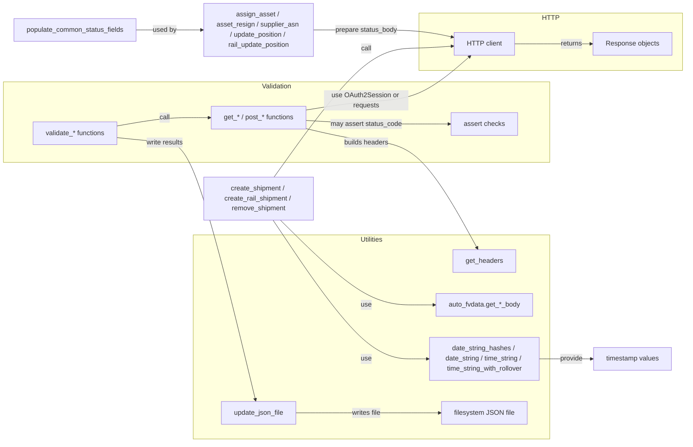

# Diagram: shipment_core/shipment_service/ng_val/scripts/common/ng_auto_endpoints.py

> Auto-generated by Obscura crawlers

## Mermaid

### SVG

<svg id="container" width="1640.03125" xmlns="http://www.w3.org/2000/svg" class="flowchart" height="1067" viewBox="0 0 1640.03125 1067" role="graphics-document document" aria-roledescription="flowchart-v2"><g><marker id="container_flowchart-v2-pointEnd" class="marker flowchart-v2" viewBox="0 0 10 10" refX="5" refY="5" markerUnits="userSpaceOnUse" markerWidth="8" markerHeight="8" orient="auto"><path d="M 0 0 L 10 5 L 0 10 z" class="arrowMarkerPath" style="stroke-width: 1; stroke-dasharray: 1, 0;"></path></marker><marker id="container_flowchart-v2-pointStart" class="marker flowchart-v2" viewBox="0 0 10 10" refX="4.5" refY="5" markerUnits="userSpaceOnUse" markerWidth="8" markerHeight="8" orient="auto"><path d="M 0 5 L 10 10 L 10 0 z" class="arrowMarkerPath" style="stroke-width: 1; stroke-dasharray: 1, 0;"></path></marker><marker id="container_flowchart-v2-circleEnd" class="marker flowchart-v2" viewBox="0 0 10 10" refX="11" refY="5" markerUnits="userSpaceOnUse" markerWidth="11" markerHeight="11" orient="auto"><circle cx="5" cy="5" r="5" class="arrowMarkerPath" style="stroke-width: 1; stroke-dasharray: 1, 0;"></circle></marker><marker id="container_flowchart-v2-circleStart" class="marker flowchart-v2" viewBox="0 0 10 10" refX="-1" refY="5" markerUnits="userSpaceOnUse" markerWidth="11" markerHeight="11" orient="auto"><circle cx="5" cy="5" r="5" class="arrowMarkerPath" style="stroke-width: 1; stroke-dasharray: 1, 0;"></circle></marker><marker id="container_flowchart-v2-crossEnd" class="marker cross flowchart-v2" viewBox="0 0 11 11" refX="12" refY="5.2" markerUnits="userSpaceOnUse" markerWidth="11" markerHeight="11" orient="auto"><path d="M 1,1 l 9,9 M 10,1 l -9,9" class="arrowMarkerPath" style="stroke-width: 2; stroke-dasharray: 1, 0;"></path></marker><marker id="container_flowchart-v2-crossStart" class="marker cross flowchart-v2" viewBox="0 0 11 11" refX="-1" refY="5.2" markerUnits="userSpaceOnUse" markerWidth="11" markerHeight="11" orient="auto"><path d="M 1,1 l 9,9 M 10,1 l -9,9" class="arrowMarkerPath" style="stroke-width: 2; stroke-dasharray: 1, 0;"></path></marker><g class="root"><g class="clusters"><g class="cluster" id="Utilities" data-look="classic"><rect style="" x="468.5" y="575" width="845" height="484"></rect><g class="cluster-label" transform="translate(862.71875, 575)"><foreignObject width="56.5625" height="24">

Utilities

</foreignObject></g></g><g class="cluster" id="HTTP" data-look="classic"><rect style="" x="1003.5" y="43" width="628.53125" height="136"></rect><g class="cluster-label" transform="translate(1299.3984375, 43)"><foreignObject width="36.734375" height="24">

HTTP

</foreignObject></g></g><g class="cluster" id="Validation" data-look="classic"><rect style="" x="8" y="209" width="1305.5" height="194"></rect><g class="cluster-label" transform="translate(624.109375, 209)"><foreignObject width="73.28125" height="24">

Validation

</foreignObject></g></g></g><g class="edgePaths"><path d="M282.719,316.691L302.033,313.409C321.346,310.127,359.974,303.564,390.938,300.282C421.901,297,445.201,297,462.736,297C480.271,297,492.042,297,497.927,297L503.813,297" id="L_A_B_0" class="edge-thickness-normal edge-pattern-solid edge-thickness-normal edge-pattern-solid flowchart-link" style=";" data-edge="true" data-et="edge" data-id="L_A_B_0" data-points="W3sieCI6MjgyLjcxODc1LCJ5IjozMTYuNjkwNzY0OTI1MzczMX0seyJ4IjozOTguNjAxNTYyNSwieSI6Mjk3fSx7IngiOjQ2OC41LCJ5IjoyOTd9LHsieCI6NTA3LjgxMjUsInkiOjI5N31d" marker-end="url(#container_flowchart-v2-pointEnd)"></path><path d="M739.188,278.399L762.406,274.666C785.625,270.933,832.063,263.466,876.115,259.733C920.167,256,961.833,256,1003.023,237.614C1044.213,219.227,1084.926,182.454,1105.282,164.068L1125.639,145.681" id="L_B_C_0" class="edge-thickness-normal edge-pattern-solid edge-thickness-normal edge-pattern-solid flowchart-link" style=";" data-edge="true" data-et="edge" data-id="L_B_C_0" data-points="W3sieCI6NzM5LjE4NzUsInkiOjI3OC4zOTkyNjQ3MDU4ODIzM30seyJ4Ijo4NzguNSwieSI6MjU2fSx7IngiOjEwMDMuNSwieSI6MjU2fSx7IngiOjExMjguNjA3MTQyODU3MTQzLCJ5IjoxNDN9XQ==" marker-end="url(#container_flowchart-v2-pointEnd)"></path><path d="M1229.344,116L1243.37,116C1257.396,116,1285.448,116,1308.237,116C1331.026,116,1348.552,116,1365.507,116C1382.461,116,1398.844,116,1407.035,116L1415.227,116" id="L_C_D_0" class="edge-thickness-normal edge-pattern-solid edge-thickness-normal edge-pattern-solid flowchart-link" style=";" data-edge="true" data-et="edge" data-id="L_C_D_0" data-points="W3sieCI6MTIyOS4zNDM3NSwieSI6MTE2fSx7IngiOjEzMTMuNSwieSI6MTE2fSx7IngiOjEzNjYuMDc4MTI1LCJ5IjoxMTZ9LHsieCI6MTQxOS4yMjY1NjI1LCJ5IjoxMTZ9XQ==" marker-end="url(#container_flowchart-v2-pointEnd)"></path><path d="M282.719,344.292L302.033,346.243C321.346,348.195,359.974,352.097,390.938,354.049C421.901,356,445.201,356,481.439,457.685C517.677,559.371,566.854,762.741,591.442,864.427L616.031,966.112" id="L_A_E_0" class="edge-thickness-normal edge-pattern-solid edge-thickness-normal edge-pattern-solid flowchart-link" style=";" data-edge="true" data-et="edge" data-id="L_A_E_0" data-points="W3sieCI6MjgyLjcxODc1LCJ5IjozNDQuMjkxOTc3NjExOTQwM30seyJ4IjozOTguNjAxNTYyNSwieSI6MzU2fSx7IngiOjQ2OC41LCJ5IjozNTZ9LHsieCI6NjE2Ljk3MTEzODg0NTU1MzgsInkiOjk3MH1d" marker-end="url(#container_flowchart-v2-pointEnd)"></path><path d="M739.188,323.767L762.406,329.139C785.625,334.511,832.063,345.256,876.115,350.628C920.167,356,961.833,356,1005.696,397.75C1049.558,439.499,1095.617,522.998,1118.646,564.748L1141.675,606.498" id="L_B_F_0" class="edge-thickness-normal edge-pattern-solid edge-thickness-normal edge-pattern-solid flowchart-link" style=";" data-edge="true" data-et="edge" data-id="L_B_F_0" data-points="W3sieCI6NzM5LjE4NzUsInkiOjMyMy43NjY5MTE3NjQ3MDU4N30seyJ4Ijo4NzguNSwieSI6MzU2fSx7IngiOjEwMDMuNSwieSI6MzU2fSx7IngiOjExNDMuNjA2NzYxNTY1ODM2MiwieSI6NjEwfV0=" marker-end="url(#container_flowchart-v2-pointEnd)"></path><path d="M675.107,540L709.006,573.5C742.905,607,810.702,674,865.435,707.5C920.167,741,961.833,741,988.717,741C1015.602,741,1027.703,741,1033.754,741L1039.805,741" id="L_G_H_0" class="edge-thickness-normal edge-pattern-solid edge-thickness-normal edge-pattern-solid flowchart-link" style=";" data-edge="true" data-et="edge" data-id="L_G_H_0" data-points="W3sieCI6Njc1LjEwNzE0Mjg1NzE0MjksInkiOjU0MH0seyJ4Ijo4NzguNSwieSI6NzQxfSx7IngiOjEwMDMuNSwieSI6NzQxfSx7IngiOjEwNDMuODA0Njg3NSwieSI6NzQxfV0=" marker-end="url(#container_flowchart-v2-pointEnd)"></path><path d="M659.425,438L695.938,386.167C732.45,334.333,805.475,230.667,862.821,178.833C920.167,127,961.833,127,996.028,126.052C1030.222,125.104,1056.944,123.207,1070.305,122.259L1083.666,121.311" id="L_G_C_0" class="edge-thickness-normal edge-pattern-solid edge-thickness-normal edge-pattern-solid flowchart-link" style=";" data-edge="true" data-et="edge" data-id="L_G_C_0" data-points="W3sieCI6NjU5LjQyNTQxNDM2NDY0MDksInkiOjQzOH0seyJ4Ijo4NzguNSwieSI6MTI3fSx7IngiOjEwMDMuNSwieSI6MTI3fSx7IngiOjEwODcuNjU2MjUsInkiOjEyMS4wMjc2MjA5Njc3NDE5NH1d" marker-end="url(#container_flowchart-v2-pointEnd)"></path><path d="M328.703,83L340.353,83C352.003,83,375.302,83,398.602,83C421.901,83,445.201,83,460.35,83C475.5,83,482.5,83,486,83L489.5,83" id="L_I_J_0" class="edge-thickness-normal edge-pattern-solid edge-thickness-normal edge-pattern-solid flowchart-link" style=";" data-edge="true" data-et="edge" data-id="L_I_J_0" data-points="W3sieCI6MzI4LjcwMzEyNSwieSI6ODN9LHsieCI6Mzk4LjYwMTU2MjUsInkiOjgzfSx7IngiOjQ2OC41LCJ5Ijo4M30seyJ4Ijo0OTMuNSwieSI6ODN9XQ==" marker-end="url(#container_flowchart-v2-pointEnd)"></path><path d="M753.5,83L774.333,83C795.167,83,836.833,83,878.5,83C920.167,83,961.833,83,996.041,85.847C1030.248,88.695,1056.996,94.389,1070.37,97.237L1083.744,100.084" id="L_J_C_0" class="edge-thickness-normal edge-pattern-solid edge-thickness-normal edge-pattern-solid flowchart-link" style=";" data-edge="true" data-et="edge" data-id="L_J_C_0" data-points="W3sieCI6NzUzLjUsInkiOjgzfSx7IngiOjg3OC41LCJ5Ijo4M30seyJ4IjoxMDAzLjUsInkiOjgzfSx7IngiOjEwODcuNjU2MjUsInkiOjEwMC45MTcxMzcwOTY3NzQyfV0=" marker-end="url(#container_flowchart-v2-pointEnd)"></path><path d="M1288.5,869L1292.667,869C1296.833,869,1305.167,869,1318.096,869C1331.026,869,1348.552,869,1365.411,869C1382.271,869,1398.464,869,1406.56,869L1414.656,869" id="L_K_L_0" class="edge-thickness-normal edge-pattern-solid edge-thickness-normal edge-pattern-solid flowchart-link" style=";" data-edge="true" data-et="edge" data-id="L_K_L_0" data-points="W3sieCI6MTI4OC41LCJ5Ijo4Njl9LHsieCI6MTMxMy41LCJ5Ijo4Njl9LHsieCI6MTM2Ni4wNzgxMjUsInkiOjg2OX0seyJ4IjoxNDE4LjY1NjI1LCJ5Ijo4Njl9XQ==" marker-end="url(#container_flowchart-v2-pointEnd)"></path><path d="M657.724,540L694.52,594.833C731.316,649.667,804.908,759.333,862.537,814.167C920.167,869,961.833,869,986.167,869C1010.5,869,1017.5,869,1021,869L1024.5,869" id="L_G_K_0" class="edge-thickness-normal edge-pattern-solid edge-thickness-normal edge-pattern-solid flowchart-link" style=";" data-edge="true" data-et="edge" data-id="L_G_K_0" data-points="W3sieCI6NjU3LjcyMzY4NDIxMDUyNjQsInkiOjU0MH0seyJ4Ijo4NzguNSwieSI6ODY5fSx7IngiOjEwMDMuNSwieSI6ODY5fSx7IngiOjEwMjguNSwieSI6ODY5fV0=" marker-end="url(#container_flowchart-v2-pointEnd)"></path><path d="M739.188,303.805L762.406,305.171C785.625,306.537,832.063,309.268,876.115,310.634C920.167,312,961.833,312,994.732,312C1027.63,312,1051.76,312,1063.826,312L1075.891,312" id="L_B_M_0" class="edge-thickness-normal edge-pattern-solid edge-thickness-normal edge-pattern-solid flowchart-link" style=";" data-edge="true" data-et="edge" data-id="L_B_M_0" data-points="W3sieCI6NzM5LjE4NzUsInkiOjMwMy44MDUxNDcwNTg4MjM1NH0seyJ4Ijo4NzguNSwieSI6MzEyfSx7IngiOjEwMDMuNSwieSI6MzEyfSx7IngiOjEwNzkuODkwNjI1LCJ5IjozMTJ9XQ==" marker-end="url(#container_flowchart-v2-pointEnd)"></path><path d="M714.063,997L741.469,997C768.875,997,823.688,997,871.927,997C920.167,997,961.833,997,991.204,997C1020.576,997,1037.651,997,1046.189,997L1054.727,997" id="L_E_N_0" class="edge-thickness-normal edge-pattern-solid edge-thickness-normal edge-pattern-solid flowchart-link" style=";" data-edge="true" data-et="edge" data-id="L_E_N_0" data-points="W3sieCI6NzE0LjA2MjUsInkiOjk5N30seyJ4Ijo4NzguNSwieSI6OTk3fSx7IngiOjEwMDMuNSwieSI6OTk3fSx7IngiOjEwNTguNzI2NTYyNSwieSI6OTk3fV0=" marker-end="url(#container_flowchart-v2-pointEnd)"></path></g><g class="edgeLabels"><g class="edgeLabel" transform="translate(398.6015625, 297)"><g class="label" data-id="L_A_B_0" transform="translate(-12.7109375, -12)"><foreignObject width="25.421875" height="24">

call

</foreignObject></g></g><g class="edgeLabel" transform="translate(878.5, 256)"><g class="label" data-id="L_B_C_0" transform="translate(-100, -24)"><foreignObject width="200" height="48">

use OAuth2Session or requests

</foreignObject></g></g><g class="edgeLabel" transform="translate(1366.078125, 116)"><g class="label" data-id="L_C_D_0" transform="translate(-26.265625, -12)"><foreignObject width="52.53125" height="24">

returns

</foreignObject></g></g><g class="edgeLabel" transform="translate(398.6015625, 356)"><g class="label" data-id="L_A_E_0" transform="translate(-44.8984375, -12)"><foreignObject width="89.796875" height="24">

write results

</foreignObject></g></g><g class="edgeLabel" transform="translate(878.5, 356)"><g class="label" data-id="L_B_F_0" transform="translate(-53.78125, -12)"><foreignObject width="107.5625" height="24">

builds headers

</foreignObject></g></g><g class="edgeLabel" transform="translate(878.5, 741)"><g class="label" data-id="L_G_H_0" transform="translate(-12.7578125, -12)"><foreignObject width="25.515625" height="24">

use

</foreignObject></g></g><g class="edgeLabel" transform="translate(878.5, 127)"><g class="label" data-id="L_G_C_0" transform="translate(-12.7109375, -12)"><foreignObject width="25.421875" height="24">

call

</foreignObject></g></g><g class="edgeLabel" transform="translate(398.6015625, 83)"><g class="label" data-id="L_I_J_0" transform="translate(-28.3125, -12)"><foreignObject width="56.625" height="24">

used by

</foreignObject></g></g><g class="edgeLabel" transform="translate(878.5, 83)"><g class="label" data-id="L_J_C_0" transform="translate(-74.65625, -12)"><foreignObject width="149.3125" height="24">

prepare status_body

</foreignObject></g></g><g class="edgeLabel" transform="translate(1366.078125, 869)"><g class="label" data-id="L_K_L_0" transform="translate(-27.578125, -12)"><foreignObject width="55.15625" height="24">

provide

</foreignObject></g></g><g class="edgeLabel" transform="translate(878.5, 869)"><g class="label" data-id="L_G_K_0" transform="translate(-12.7578125, -12)"><foreignObject width="25.515625" height="24">

use

</foreignObject></g></g><g class="edgeLabel" transform="translate(878.5, 312)"><g class="label" data-id="L_B_M_0" transform="translate(-84.7890625, -12)"><foreignObject width="169.578125" height="24">

may assert status_code

</foreignObject></g></g><g class="edgeLabel" transform="translate(878.5, 997)"><g class="label" data-id="L_E_N_0" transform="translate(-35.328125, -12)"><foreignObject width="70.65625" height="24">

writes file

</foreignObject></g></g></g><g class="nodes"><g class="node default" id="flowchart-A-0" transform="translate(180.8515625, 334)"><rect class="basic label-container" style="" x="-101.8671875" y="-27" width="203.734375" height="54"></rect><g class="label" style="" transform="translate(-71.8671875, -12)"><rect></rect><foreignObject width="143.734375" height="24">

validate_* functions

</foreignObject></g></g><g class="node default" id="flowchart-B-1" transform="translate(623.5, 297)"><rect class="basic label-container" style="" x="-115.6875" y="-27" width="231.375" height="54"></rect><g class="label" style="" transform="translate(-85.6875, -12)"><rect></rect><foreignObject width="171.375" height="24">

get_* / post_* functions

</foreignObject></g></g><g class="node default" id="flowchart-C-3" transform="translate(1158.5, 116)"><rect class="basic label-container" style="" x="-70.84375" y="-27" width="141.6875" height="54"></rect><g class="label" style="" transform="translate(-40.84375, -12)"><rect></rect><foreignObject width="81.6875" height="24">

HTTP client

</foreignObject></g></g><g class="node default" id="flowchart-D-5" transform="translate(1512.84375, 116)"><rect class="basic label-container" style="" x="-93.6171875" y="-27" width="187.234375" height="54"></rect><g class="label" style="" transform="translate(-63.6171875, -12)"><rect></rect><foreignObject width="127.234375" height="24">

Response objects

</foreignObject></g></g><g class="node default" id="flowchart-E-7" transform="translate(623.5, 997)"><rect class="basic label-container" style="" x="-90.5625" y="-27" width="181.125" height="54"></rect><g class="label" style="" transform="translate(-60.5625, -12)"><rect></rect><foreignObject width="121.125" height="24">

update_json_file

</foreignObject></g></g><g class="node default" id="flowchart-F-9" transform="translate(1158.5, 637)"><rect class="basic label-container" style="" x="-74.609375" y="-27" width="149.21875" height="54"></rect><g class="label" style="" transform="translate(-44.609375, -12)"><rect></rect><foreignObject width="89.21875" height="24">

get_headers

</foreignObject></g></g><g class="node default" id="flowchart-G-10" transform="translate(623.5, 489)"><rect class="basic label-container" style="" x="-130" y="-51" width="260" height="102"></rect><g class="label" style="" transform="translate(-100, -36)"><rect></rect><foreignObject width="200" height="72">

create_shipment / create_rail_shipment / remove_shipment

</foreignObject></g></g><g class="node default" id="flowchart-H-11" transform="translate(1158.5, 741)"><rect class="basic label-container" style="" x="-114.6953125" y="-27" width="229.390625" height="54"></rect><g class="label" style="" transform="translate(-84.6953125, -12)"><rect></rect><foreignObject width="169.390625" height="24">

auto_fvdata.get_*_body

</foreignObject></g></g><g class="node default" id="flowchart-I-14" transform="translate(180.8515625, 83)"><rect class="basic label-container" style="" x="-147.8515625" y="-27" width="295.703125" height="54"></rect><g class="label" style="" transform="translate(-117.8515625, -12)"><rect></rect><foreignObject width="235.703125" height="24">

populate_common_status_fields

</foreignObject></g></g><g class="node default" id="flowchart-J-15" transform="translate(623.5, 83)"><rect class="basic label-container" style="" x="-130" y="-75" width="260" height="150"></rect><g class="label" style="" transform="translate(-100, -60)"><rect></rect><foreignObject width="200" height="120">

assign_asset / asset_resign / supplier_asn / update_position / rail_update_position

</foreignObject></g></g><g class="node default" id="flowchart-K-18" transform="translate(1158.5, 869)"><rect class="basic label-container" style="" x="-130" y="-51" width="260" height="102"></rect><g class="label" style="" transform="translate(-100, -36)"><rect></rect><foreignObject width="200" height="72">

date_string_hashes / date_string / time_string / time_string_with_rollover

</foreignObject></g></g><g class="node default" id="flowchart-L-19" transform="translate(1512.84375, 869)"><rect class="basic label-container" style="" x="-94.1875" y="-27" width="188.375" height="54"></rect><g class="label" style="" transform="translate(-64.1875, -12)"><rect></rect><foreignObject width="128.375" height="24">

timestamp values

</foreignObject></g></g><g class="node default" id="flowchart-M-23" transform="translate(1158.5, 312)"><rect class="basic label-container" style="" x="-78.609375" y="-27" width="157.21875" height="54"></rect><g class="label" style="" transform="translate(-48.609375, -12)"><rect></rect><foreignObject width="97.21875" height="24">

assert checks

</foreignObject></g></g><g class="node default" id="flowchart-N-25" transform="translate(1158.5, 997)"><rect class="basic label-container" style="" x="-99.7734375" y="-27" width="199.546875" height="54"></rect><g class="label" style="" transform="translate(-69.7734375, -12)"><rect></rect><foreignObject width="139.546875" height="24">

filesystem JSON file

</foreignObject></g></g></g></g></g></svg>
