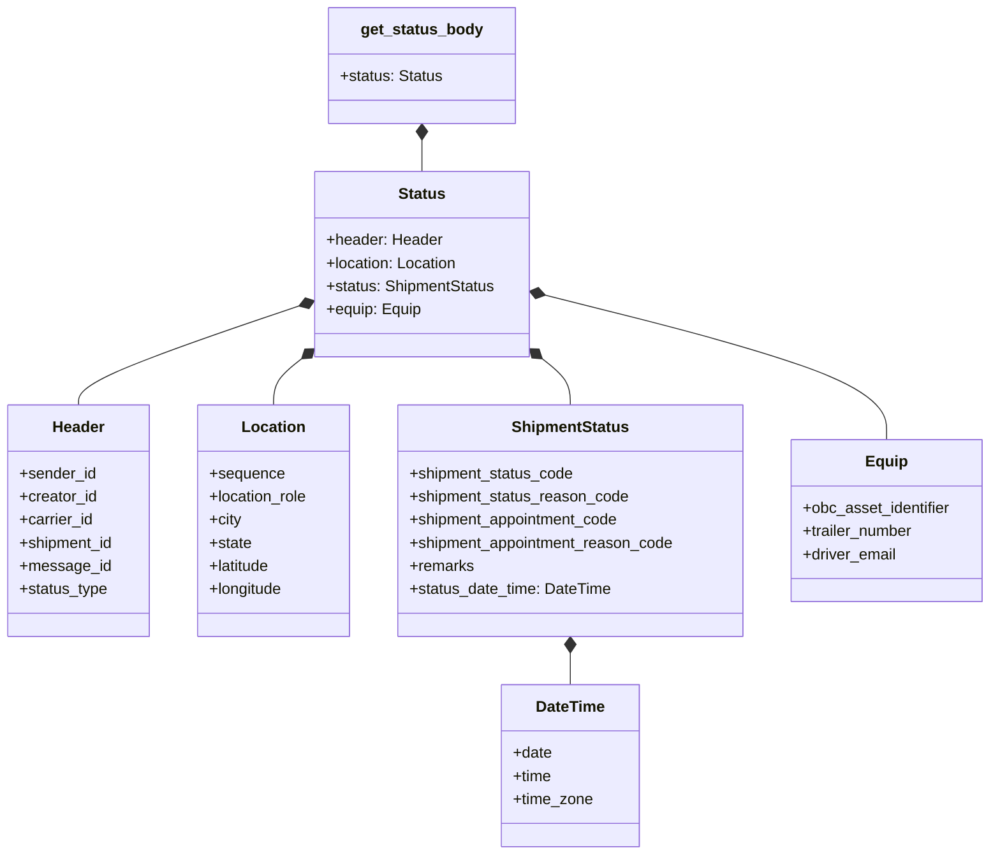
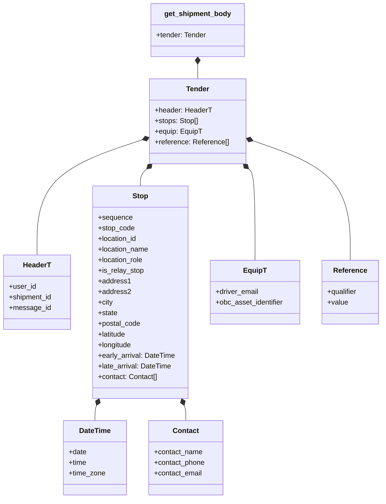
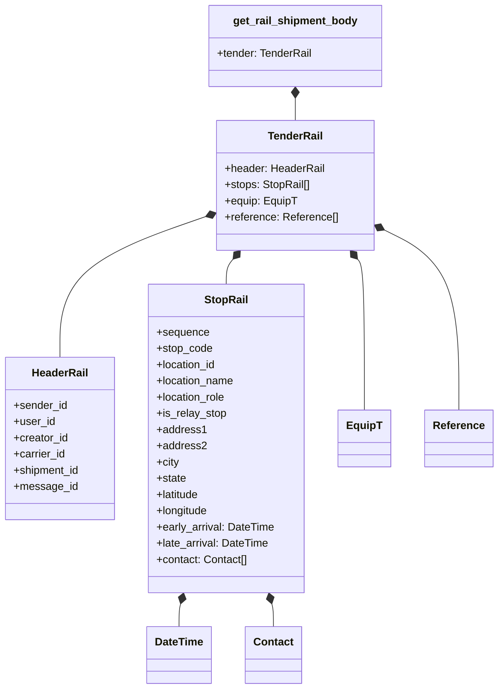
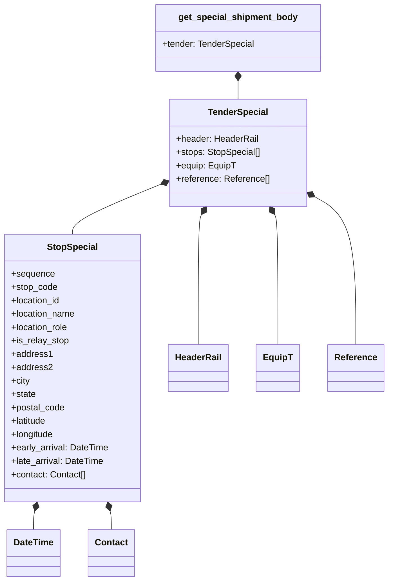

# Diagram: shipment_core/shipment_service/ng_val/scripts/common/ng_auto_fvdata.py

> Auto-generated by Obscura crawlers

## Diagram 1

### SVG

<svg id="container" width="1035.75" xmlns="http://www.w3.org/2000/svg" class="classDiagram" height="886" viewBox="0 0 1035.75 886" role="graphics-document document" aria-roledescription="class"><g><defs><marker id="container_class-aggregationStart" class="marker aggregation class" refX="18" refY="7" markerWidth="190" markerHeight="240" orient="auto"><path d="M 18,7 L9,13 L1,7 L9,1 Z"></path></marker></defs><defs><marker id="container_class-aggregationEnd" class="marker aggregation class" refX="1" refY="7" markerWidth="20" markerHeight="28" orient="auto"><path d="M 18,7 L9,13 L1,7 L9,1 Z"></path></marker></defs><defs><marker id="container_class-extensionStart" class="marker extension class" refX="18" refY="7" markerWidth="190" markerHeight="240" orient="auto"><path d="M 1,7 L18,13 V 1 Z"></path></marker></defs><defs><marker id="container_class-extensionEnd" class="marker extension class" refX="1" refY="7" markerWidth="20" markerHeight="28" orient="auto"><path d="M 1,1 V 13 L18,7 Z"></path></marker></defs><defs><marker id="container_class-compositionStart" class="marker composition class" refX="18" refY="7" markerWidth="190" markerHeight="240" orient="auto"><path d="M 18,7 L9,13 L1,7 L9,1 Z"></path></marker></defs><defs><marker id="container_class-compositionEnd" class="marker composition class" refX="1" refY="7" markerWidth="20" markerHeight="28" orient="auto"><path d="M 18,7 L9,13 L1,7 L9,1 Z"></path></marker></defs><defs><marker id="container_class-dependencyStart" class="marker dependency class" refX="6" refY="7" markerWidth="190" markerHeight="240" orient="auto"><path d="M 5,7 L9,13 L1,7 L9,1 Z"></path></marker></defs><defs><marker id="container_class-dependencyEnd" class="marker dependency class" refX="13" refY="7" markerWidth="20" markerHeight="28" orient="auto"><path d="M 18,7 L9,13 L14,7 L9,1 Z"></path></marker></defs><defs><marker id="container_class-lollipopStart" class="marker lollipop class" refX="13" refY="7" markerWidth="190" markerHeight="240" orient="auto"><circle stroke="black" fill="transparent" cx="7" cy="7" r="6"></circle></marker></defs><defs><marker id="container_class-lollipopEnd" class="marker lollipop class" refX="1" refY="7" markerWidth="190" markerHeight="240" orient="auto"><circle stroke="black" fill="transparent" cx="7" cy="7" r="6"></circle></marker></defs><g class="root"><g class="clusters"></g><g class="edgePaths"><path d="M442.105,145.25L442.105,146.542C442.105,147.833,442.105,150.417,442.105,155.875C442.105,161.333,442.105,169.667,442.105,173.833L442.105,178" id="id_get_status_body_Status_1" class="edge-thickness-normal edge-pattern-solid relation" style=";;;" data-edge="true" data-et="edge" data-id="id_get_status_body_Status_1" data-points="W3sieCI6NDQyLjEwNTQ2ODc1LCJ5IjoxMjh9LHsieCI6NDQyLjEwNTQ2ODc1LCJ5IjoxNTN9LHsieCI6NDQyLjEwNTQ2ODc1LCJ5IjoxNzh9XQ==" marker-start="url(#container_class-compositionStart)"></path><path d="M314.108,317.088L275.534,330.073C236.959,343.058,159.81,369.029,121.235,386.181C82.66,403.333,82.66,411.667,82.66,415.833L82.66,420" id="id_Status_Header_2" class="edge-thickness-normal edge-pattern-solid relation" style=";;;" data-edge="true" data-et="edge" data-id="id_Status_Header_2" data-points="W3sieCI6MzMwLjQ1NzAzMTI1LCJ5IjozMTEuNTg0MTkwMDQ5NzcyOX0seyJ4Ijo4Mi42NjAxNTYyNSwieSI6Mzk1fSx7IngiOjgyLjY2MDE1NjI1LCJ5Ijo0MjB9XQ==" marker-start="url(#container_class-compositionStart)"></path><path d="M316.853,371.655L311.863,375.545C306.872,379.436,296.891,387.218,291.901,395.276C286.91,403.333,286.91,411.667,286.91,415.833L286.91,420" id="id_Status_Location_3" class="edge-thickness-normal edge-pattern-solid relation" style=";;;" data-edge="true" data-et="edge" data-id="id_Status_Location_3" data-points="W3sieCI6MzMwLjQ1NzAzMTI1LCJ5IjozNjEuMDQ4MTI0ODQyNjg4MTR9LHsieCI6Mjg2LjkxMDE1NjI1LCJ5IjozOTV9LHsieCI6Mjg2LjkxMDE1NjI1LCJ5Ijo0MjB9XQ==" marker-start="url(#container_class-compositionStart)"></path><path d="M567.358,371.655L572.348,375.545C577.339,379.436,587.32,387.218,592.31,395.276C597.301,403.333,597.301,411.667,597.301,415.833L597.301,420" id="id_Status_ShipmentStatus_4" class="edge-thickness-normal edge-pattern-solid relation" style=";;;" data-edge="true" data-et="edge" data-id="id_Status_ShipmentStatus_4" data-points="W3sieCI6NTUzLjc1MzkwNjI1LCJ5IjozNjEuMDQ4MTI0ODQyNjg4MTR9LHsieCI6NTk3LjMwMDc4MTI1LCJ5IjozOTV9LHsieCI6NTk3LjMwMDc4MTI1LCJ5Ijo0MjB9XQ==" marker-start="url(#container_class-compositionStart)"></path><path d="M597.301,677.25L597.301,678.542C597.301,679.833,597.301,682.417,597.301,687.875C597.301,693.333,597.301,701.667,597.301,705.833L597.301,710" id="id_ShipmentStatus_DateTime_5" class="edge-thickness-normal edge-pattern-solid relation" style=";;;" data-edge="true" data-et="edge" data-id="id_ShipmentStatus_DateTime_5" data-points="W3sieCI6NTk3LjMwMDc4MTI1LCJ5Ijo2NjB9LHsieCI6NTk3LjMwMDc4MTI1LCJ5Ijo2ODV9LHsieCI6NTk3LjMwMDc4MTI1LCJ5Ijo3MTB9XQ==" marker-start="url(#container_class-compositionStart)"></path><path d="M570.493,305.977L630.065,320.814C689.637,335.651,808.781,365.326,868.354,390.329C927.926,415.333,927.926,435.667,927.926,445.833L927.926,456" id="id_Status_Equip_6" class="edge-thickness-normal edge-pattern-solid relation" style=";;;" data-edge="true" data-et="edge" data-id="id_Status_Equip_6" data-points="W3sieCI6NTUzLjc1MzkwNjI1LCJ5IjozMDEuODA3NTI1OTMwNjkwN30seyJ4Ijo5MjcuOTI1NzgxMjUsInkiOjM5NX0seyJ4Ijo5MjcuOTI1NzgxMjUsInkiOjQ1Nn1d" marker-start="url(#container_class-compositionStart)"></path></g><g class="edgeLabels"><g class="edgeLabel"><g class="label" data-id="id_get_status_body_Status_1" transform="translate(0, 0)"><foreignObject width="0" height="0">

</foreignObject></g></g><g class="edgeLabel"><g class="label" data-id="id_Status_Header_2" transform="translate(0, 0)"><foreignObject width="0" height="0">

</foreignObject></g></g><g class="edgeLabel"><g class="label" data-id="id_Status_Location_3" transform="translate(0, 0)"><foreignObject width="0" height="0">

</foreignObject></g></g><g class="edgeLabel"><g class="label" data-id="id_Status_ShipmentStatus_4" transform="translate(0, 0)"><foreignObject width="0" height="0">

</foreignObject></g></g><g class="edgeLabel"><g class="label" data-id="id_ShipmentStatus_DateTime_5" transform="translate(0, 0)"><foreignObject width="0" height="0">

</foreignObject></g></g><g class="edgeLabel"><g class="label" data-id="id_Status_Equip_6" transform="translate(0, 0)"><foreignObject width="0" height="0">

</foreignObject></g></g></g><g class="nodes"><g class="node default" id="classId-get_status_body-0" transform="translate(442.10546875, 68)"><g class="basic label-container"><path d="M-95.59375 -60 L95.59375 -60 L95.59375 60 L-95.59375 60" stroke="none" stroke-width="0" fill="#ECECFF" style=""></path><path d="M-95.59375 -60 C-46.81013581973538 -60, 1.973478360529242 -60, 95.59375 -60 M-95.59375 -60 C-52.0816817931269 -60, -8.569613586253794 -60, 95.59375 -60 M95.59375 -60 C95.59375 -35.77425030789205, 95.59375 -11.548500615784107, 95.59375 60 M95.59375 -60 C95.59375 -14.985123162045767, 95.59375 30.029753675908466, 95.59375 60 M95.59375 60 C33.13511098327934 60, -29.32352803344132 60, -95.59375 60 M95.59375 60 C30.2069160703427 60, -35.1799178593146 60, -95.59375 60 M-95.59375 60 C-95.59375 28.01454713287196, -95.59375 -3.9709057342560783, -95.59375 -60 M-95.59375 60 C-95.59375 16.85941590457096, -95.59375 -26.281168190858082, -95.59375 -60" stroke="#9370DB" stroke-width="1.3" fill="none" stroke-dasharray="0 0" style=""></path></g><g class="annotation-group text" transform="translate(0, -36)"></g><g class="label-group text" transform="translate(-61.0625, -36)"><g class="label" style="font-weight: bolder" transform="translate(0,-12)"><foreignObject width="122.125" height="24">

get_status_body

</foreignObject></g></g><g class="members-group text" transform="translate(-83.59375, 12)"><g class="label" style="" transform="translate(0,-12)"><foreignObject width="106.125" height="24">

+status: Status

</foreignObject></g></g><g class="methods-group text" transform="translate(-83.59375, 60)"></g><g class="divider" style=""><path d="M-95.59375 -12 C-42.28376354134485 -12, 11.026222917310307 -12, 95.59375 -12 M-95.59375 -12 C-46.39125640878842 -12, 2.811237182423156 -12, 95.59375 -12" stroke="#9370DB" stroke-width="1.3" fill="none" stroke-dasharray="0 0" style=""></path></g><g class="divider" style=""><path d="M-95.59375 36 C-31.49383070550914 36, 32.60608858898172 36, 95.59375 36 M-95.59375 36 C-55.54960125635663 36, -15.505452512713262 36, 95.59375 36" stroke="#9370DB" stroke-width="1.3" fill="none" stroke-dasharray="0 0" style=""></path></g></g><g class="node default" id="classId-Status-1" transform="translate(442.10546875, 274)"><g class="basic label-container"><path d="M-111.6484375 -96 L111.6484375 -96 L111.6484375 96 L-111.6484375 96" stroke="none" stroke-width="0" fill="#ECECFF" style=""></path><path d="M-111.6484375 -96 C-39.32943276408274 -96, 32.98957197183452 -96, 111.6484375 -96 M-111.6484375 -96 C-26.715939231595115 -96, 58.21655903680977 -96, 111.6484375 -96 M111.6484375 -96 C111.6484375 -35.487068885852096, 111.6484375 25.025862228295807, 111.6484375 96 M111.6484375 -96 C111.6484375 -43.6182241050371, 111.6484375 8.763551789925799, 111.6484375 96 M111.6484375 96 C54.338093087095054 96, -2.972251325809893 96, -111.6484375 96 M111.6484375 96 C45.85919833393535 96, -19.930040832129293 96, -111.6484375 96 M-111.6484375 96 C-111.6484375 45.07709845111516, -111.6484375 -5.845803097769675, -111.6484375 -96 M-111.6484375 96 C-111.6484375 21.901647301649277, -111.6484375 -52.19670539670145, -111.6484375 -96" stroke="#9370DB" stroke-width="1.3" fill="none" stroke-dasharray="0 0" style=""></path></g><g class="annotation-group text" transform="translate(0, -72)"></g><g class="label-group text" transform="translate(-23.484375, -72)"><g class="label" style="font-weight: bolder" transform="translate(0,-12)"><foreignObject width="46.96875" height="24">

Status

</foreignObject></g></g><g class="members-group text" transform="translate(-99.6484375, -24)"><g class="label" style="" transform="translate(0,-12)"><foreignObject width="119.9375" height="24">

+header: Header

</foreignObject></g><g class="label" style="" transform="translate(0,12)"><foreignObject width="137.34375" height="24">

+location: Location

</foreignObject></g><g class="label" style="" transform="translate(0,36)"><foreignObject width="175.8125" height="24">

+status: ShipmentStatus

</foreignObject></g><g class="label" style="" transform="translate(0,60)"><foreignObject width="98.828125" height="24">

+equip: Equip

</foreignObject></g></g><g class="methods-group text" transform="translate(-99.6484375, 96)"></g><g class="divider" style=""><path d="M-111.6484375 -48 C-48.944908433430754 -48, 13.758620633138491 -48, 111.6484375 -48 M-111.6484375 -48 C-44.561458993130245 -48, 22.52551951373951 -48, 111.6484375 -48" stroke="#9370DB" stroke-width="1.3" fill="none" stroke-dasharray="0 0" style=""></path></g><g class="divider" style=""><path d="M-111.6484375 72 C-30.51916721928282 72, 50.61010306143436 72, 111.6484375 72 M-111.6484375 72 C-44.28126900988913 72, 23.08589948022174 72, 111.6484375 72" stroke="#9370DB" stroke-width="1.3" fill="none" stroke-dasharray="0 0" style=""></path></g></g><g class="node default" id="classId-Header-2" transform="translate(82.66015625, 540)"><g class="basic label-container"><path d="M-74.66015625 -120 L74.66015625 -120 L74.66015625 120 L-74.66015625 120" stroke="none" stroke-width="0" fill="#ECECFF" style=""></path><path d="M-74.66015625 -120 C-39.983830615947 -120, -5.307504981893999 -120, 74.66015625 -120 M-74.66015625 -120 C-44.251031171243824 -120, -13.841906092487655 -120, 74.66015625 -120 M74.66015625 -120 C74.66015625 -67.29673848848577, 74.66015625 -14.59347697697153, 74.66015625 120 M74.66015625 -120 C74.66015625 -52.2633242408388, 74.66015625 15.473351518322403, 74.66015625 120 M74.66015625 120 C24.440480799327865 120, -25.77919465134427 120, -74.66015625 120 M74.66015625 120 C43.35862505601439 120, 12.057093862028779 120, -74.66015625 120 M-74.66015625 120 C-74.66015625 38.27813336486484, -74.66015625 -43.443733270270315, -74.66015625 -120 M-74.66015625 120 C-74.66015625 52.48536776037638, -74.66015625 -15.029264479247246, -74.66015625 -120" stroke="#9370DB" stroke-width="1.3" fill="none" stroke-dasharray="0 0" style=""></path></g><g class="annotation-group text" transform="translate(0, -96)"></g><g class="label-group text" transform="translate(-26.4765625, -96)"><g class="label" style="font-weight: bolder" transform="translate(0,-12)"><foreignObject width="52.953125" height="24">

Header

</foreignObject></g></g><g class="members-group text" transform="translate(-62.66015625, -48)"><g class="label" style="" transform="translate(0,-12)"><foreignObject width="79.140625" height="24">

+sender_id

</foreignObject></g><g class="label" style="" transform="translate(0,12)"><foreignObject width="80.78125" height="24">

+creator_id

</foreignObject></g><g class="label" style="" transform="translate(0,36)"><foreignObject width="77.0625" height="24">

+carrier_id

</foreignObject></g><g class="label" style="" transform="translate(0,60)"><foreignObject width="98.84375" height="24">

+shipment_id

</foreignObject></g><g class="label" style="" transform="translate(0,84)"><foreignObject width="92.453125" height="24">

+message_id

</foreignObject></g><g class="label" style="" transform="translate(0,108)"><foreignObject width="91.859375" height="24">

+status_type

</foreignObject></g></g><g class="methods-group text" transform="translate(-62.66015625, 120)"></g><g class="divider" style=""><path d="M-74.66015625 -72 C-27.889150927398582 -72, 18.881854395202836 -72, 74.66015625 -72 M-74.66015625 -72 C-32.40935584191109 -72, 9.841444566177813 -72, 74.66015625 -72" stroke="#9370DB" stroke-width="1.3" fill="none" stroke-dasharray="0 0" style=""></path></g><g class="divider" style=""><path d="M-74.66015625 96 C-17.05073220456608 96, 40.55869184086784 96, 74.66015625 96 M-74.66015625 96 C-33.132184285245856 96, 8.395787679508288 96, 74.66015625 96" stroke="#9370DB" stroke-width="1.3" fill="none" stroke-dasharray="0 0" style=""></path></g></g><g class="node default" id="classId-Location-3" transform="translate(286.91015625, 540)"><g class="basic label-container"><path d="M-79.58984375 -120 L79.58984375 -120 L79.58984375 120 L-79.58984375 120" stroke="none" stroke-width="0" fill="#ECECFF" style=""></path><path d="M-79.58984375 -120 C-43.80384137071327 -120, -8.017838991426544 -120, 79.58984375 -120 M-79.58984375 -120 C-15.924687861968152 -120, 47.740468026063695 -120, 79.58984375 -120 M79.58984375 -120 C79.58984375 -29.714309796096217, 79.58984375 60.57138040780757, 79.58984375 120 M79.58984375 -120 C79.58984375 -67.8963756741613, 79.58984375 -15.792751348322597, 79.58984375 120 M79.58984375 120 C30.509174146277466 120, -18.571495457445067 120, -79.58984375 120 M79.58984375 120 C16.037292093598616 120, -47.51525956280277 120, -79.58984375 120 M-79.58984375 120 C-79.58984375 35.68650724342913, -79.58984375 -48.62698551314173, -79.58984375 -120 M-79.58984375 120 C-79.58984375 52.89196358068692, -79.58984375 -14.216072838626161, -79.58984375 -120" stroke="#9370DB" stroke-width="1.3" fill="none" stroke-dasharray="0 0" style=""></path></g><g class="annotation-group text" transform="translate(0, -96)"></g><g class="label-group text" transform="translate(-31.3515625, -96)"><g class="label" style="font-weight: bolder" transform="translate(0,-12)"><foreignObject width="62.703125" height="24">

Location

</foreignObject></g></g><g class="members-group text" transform="translate(-67.58984375, -48)"><g class="label" style="" transform="translate(0,-12)"><foreignObject width="77.203125" height="24">

+sequence

</foreignObject></g><g class="label" style="" transform="translate(0,12)"><foreignObject width="103.828125" height="24">

+location_role

</foreignObject></g><g class="label" style="" transform="translate(0,36)"><foreignObject width="33.71875" height="24">

+city

</foreignObject></g><g class="label" style="" transform="translate(0,60)"><foreignObject width="44.09375" height="24">

+state

</foreignObject></g><g class="label" style="" transform="translate(0,84)"><foreignObject width="64.96875" height="24">

+latitude

</foreignObject></g><g class="label" style="" transform="translate(0,108)"><foreignObject width="77.53125" height="24">

+longitude

</foreignObject></g></g><g class="methods-group text" transform="translate(-67.58984375, 120)"></g><g class="divider" style=""><path d="M-79.58984375 -72 C-47.537485132474444 -72, -15.485126514948888 -72, 79.58984375 -72 M-79.58984375 -72 C-22.131123976507254 -72, 35.32759579698549 -72, 79.58984375 -72" stroke="#9370DB" stroke-width="1.3" fill="none" stroke-dasharray="0 0" style=""></path></g><g class="divider" style=""><path d="M-79.58984375 96 C-33.21007658985592 96, 13.169690570288154 96, 79.58984375 96 M-79.58984375 96 C-40.878055288394265 96, -2.1662668267885294 96, 79.58984375 96" stroke="#9370DB" stroke-width="1.3" fill="none" stroke-dasharray="0 0" style=""></path></g></g><g class="node default" id="classId-ShipmentStatus-4" transform="translate(597.30078125, 540)"><g class="basic label-container"><path d="M-180.80078125 -120 L180.80078125 -120 L180.80078125 120 L-180.80078125 120" stroke="none" stroke-width="0" fill="#ECECFF" style=""></path><path d="M-180.80078125 -120 C-78.15651724095356 -120, 24.487746768092876 -120, 180.80078125 -120 M-180.80078125 -120 C-89.59821181857825 -120, 1.6043576128435006 -120, 180.80078125 -120 M180.80078125 -120 C180.80078125 -56.49337763878392, 180.80078125 7.013244722432162, 180.80078125 120 M180.80078125 -120 C180.80078125 -68.4236676959444, 180.80078125 -16.847335391888805, 180.80078125 120 M180.80078125 120 C94.95987755944661 120, 9.118973868893221 120, -180.80078125 120 M180.80078125 120 C39.27269007358646 120, -102.25540110282708 120, -180.80078125 120 M-180.80078125 120 C-180.80078125 68.48563147117272, -180.80078125 16.971262942345447, -180.80078125 -120 M-180.80078125 120 C-180.80078125 45.78574657035803, -180.80078125 -28.428506859283942, -180.80078125 -120" stroke="#9370DB" stroke-width="1.3" fill="none" stroke-dasharray="0 0" style=""></path></g><g class="annotation-group text" transform="translate(0, -96)"></g><g class="label-group text" transform="translate(-58.5859375, -96)"><g class="label" style="font-weight: bolder" transform="translate(0,-12)"><foreignObject width="117.171875" height="24">

ShipmentStatus

</foreignObject></g></g><g class="members-group text" transform="translate(-168.80078125, -48)"><g class="label" style="" transform="translate(0,-12)"><foreignObject width="171.796875" height="24">

+shipment_status_code

</foreignObject></g><g class="label" style="" transform="translate(0,12)"><foreignObject width="229.109375" height="24">

+shipment_status_reason_code

</foreignObject></g><g class="label" style="" transform="translate(0,36)"><foreignObject width="221.703125" height="24">

+shipment_appointment_code

</foreignObject></g><g class="label" style="" transform="translate(0,60)"><foreignObject width="279.015625" height="24">

+shipment_appointment_reason_code

</foreignObject></g><g class="label" style="" transform="translate(0,84)"><foreignObject width="66.578125" height="24">

+remarks

</foreignObject></g><g class="label" style="" transform="translate(0,108)"><foreignObject width="209.40625" height="24">

+status_date_time: DateTime

</foreignObject></g></g><g class="methods-group text" transform="translate(-168.80078125, 120)"></g><g class="divider" style=""><path d="M-180.80078125 -72 C-73.95386317927958 -72, 32.89305489144084 -72, 180.80078125 -72 M-180.80078125 -72 C-70.08375502961009 -72, 40.63327119077982 -72, 180.80078125 -72" stroke="#9370DB" stroke-width="1.3" fill="none" stroke-dasharray="0 0" style=""></path></g><g class="divider" style=""><path d="M-180.80078125 96 C-87.3651261112008 96, 6.070529027598411 96, 180.80078125 96 M-180.80078125 96 C-62.91248408966037 96, 54.975813070679266 96, 180.80078125 96" stroke="#9370DB" stroke-width="1.3" fill="none" stroke-dasharray="0 0" style=""></path></g></g><g class="node default" id="classId-DateTime-5" transform="translate(597.30078125, 794)"><g class="basic label-container"><path d="M-70.7890625 -84 L70.7890625 -84 L70.7890625 84 L-70.7890625 84" stroke="none" stroke-width="0" fill="#ECECFF" style=""></path><path d="M-70.7890625 -84 C-42.37615197093493 -84, -13.963241441869847 -84, 70.7890625 -84 M-70.7890625 -84 C-29.896031637773284 -84, 10.996999224453432 -84, 70.7890625 -84 M70.7890625 -84 C70.7890625 -40.82157137674849, 70.7890625 2.3568572465030257, 70.7890625 84 M70.7890625 -84 C70.7890625 -48.36623320173847, 70.7890625 -12.732466403476934, 70.7890625 84 M70.7890625 84 C31.456712463639725 84, -7.875637572720549 84, -70.7890625 84 M70.7890625 84 C31.578645828252412 84, -7.631770843495175 84, -70.7890625 84 M-70.7890625 84 C-70.7890625 38.22508500550229, -70.7890625 -7.549829988995427, -70.7890625 -84 M-70.7890625 84 C-70.7890625 47.86140148212598, -70.7890625 11.722802964251954, -70.7890625 -84" stroke="#9370DB" stroke-width="1.3" fill="none" stroke-dasharray="0 0" style=""></path></g><g class="annotation-group text" transform="translate(0, -60)"></g><g class="label-group text" transform="translate(-34.625, -60)"><g class="label" style="font-weight: bolder" transform="translate(0,-12)"><foreignObject width="69.25" height="24">

DateTime

</foreignObject></g></g><g class="members-group text" transform="translate(-58.7890625, -12)"><g class="label" style="" transform="translate(0,-12)"><foreignObject width="40.515625" height="24">

+date

</foreignObject></g><g class="label" style="" transform="translate(0,12)"><foreignObject width="40.625" height="24">

+time

</foreignObject></g><g class="label" style="" transform="translate(0,36)"><foreignObject width="82.953125" height="24">

+time_zone

</foreignObject></g></g><g class="methods-group text" transform="translate(-58.7890625, 84)"></g><g class="divider" style=""><path d="M-70.7890625 -36 C-24.837137014369254 -36, 21.11478847126149 -36, 70.7890625 -36 M-70.7890625 -36 C-23.436139485472246 -36, 23.916783529055508 -36, 70.7890625 -36" stroke="#9370DB" stroke-width="1.3" fill="none" stroke-dasharray="0 0" style=""></path></g><g class="divider" style=""><path d="M-70.7890625 60 C-24.589007342433604 60, 21.611047815132792 60, 70.7890625 60 M-70.7890625 60 C-36.370253739189735 60, -1.9514449783794703 60, 70.7890625 60" stroke="#9370DB" stroke-width="1.3" fill="none" stroke-dasharray="0 0" style=""></path></g></g><g class="node default" id="classId-Equip-6" transform="translate(927.92578125, 540)"><g class="basic label-container"><path d="M-99.82421875 -84 L99.82421875 -84 L99.82421875 84 L-99.82421875 84" stroke="none" stroke-width="0" fill="#ECECFF" style=""></path><path d="M-99.82421875 -84 C-44.94348727339323 -84, 9.937244203213538 -84, 99.82421875 -84 M-99.82421875 -84 C-34.17856415146126 -84, 31.46709044707748 -84, 99.82421875 -84 M99.82421875 -84 C99.82421875 -30.983028721522686, 99.82421875 22.033942556954628, 99.82421875 84 M99.82421875 -84 C99.82421875 -49.65077732591104, 99.82421875 -15.301554651822073, 99.82421875 84 M99.82421875 84 C38.65265481611994 84, -22.518909117760117 84, -99.82421875 84 M99.82421875 84 C25.052273573840395 84, -49.71967160231921 84, -99.82421875 84 M-99.82421875 84 C-99.82421875 43.37244304695782, -99.82421875 2.744886093915639, -99.82421875 -84 M-99.82421875 84 C-99.82421875 43.40880835891606, -99.82421875 2.8176167178321236, -99.82421875 -84" stroke="#9370DB" stroke-width="1.3" fill="none" stroke-dasharray="0 0" style=""></path></g><g class="annotation-group text" transform="translate(0, -60)"></g><g class="label-group text" transform="translate(-20.4609375, -60)"><g class="label" style="font-weight: bolder" transform="translate(0,-12)"><foreignObject width="40.921875" height="24">

Equip

</foreignObject></g></g><g class="members-group text" transform="translate(-87.82421875, -12)"><g class="label" style="" transform="translate(0,-12)"><foreignObject width="155.1875" height="24">

+obc_asset_identifier

</foreignObject></g><g class="label" style="" transform="translate(0,12)"><foreignObject width="115.859375" height="24">

+trailer_number

</foreignObject></g><g class="label" style="" transform="translate(0,36)"><foreignObject width="98.015625" height="24">

+driver_email

</foreignObject></g></g><g class="methods-group text" transform="translate(-87.82421875, 84)"></g><g class="divider" style=""><path d="M-99.82421875 -36 C-46.8504848908796 -36, 6.123248968240802 -36, 99.82421875 -36 M-99.82421875 -36 C-45.33403672868016 -36, 9.156145292639678 -36, 99.82421875 -36" stroke="#9370DB" stroke-width="1.3" fill="none" stroke-dasharray="0 0" style=""></path></g><g class="divider" style=""><path d="M-99.82421875 60 C-40.14888427621078 60, 19.52645019757844 60, 99.82421875 60 M-99.82421875 60 C-59.211151466344546 60, -18.598084182689092 60, 99.82421875 60" stroke="#9370DB" stroke-width="1.3" fill="none" stroke-dasharray="0 0" style=""></path></g></g></g></g></g></svg>

## Diagram 2

### SVG

<svg id="container" width="868.1328125" xmlns="http://www.w3.org/2000/svg" class="classDiagram" height="1126" viewBox="0 0 868.1328125 1126" role="graphics-document document" aria-roledescription="class"><g><defs><marker id="container_class-aggregationStart" class="marker aggregation class" refX="18" refY="7" markerWidth="190" markerHeight="240" orient="auto"><path d="M 18,7 L9,13 L1,7 L9,1 Z"></path></marker></defs><defs><marker id="container_class-aggregationEnd" class="marker aggregation class" refX="1" refY="7" markerWidth="20" markerHeight="28" orient="auto"><path d="M 18,7 L9,13 L1,7 L9,1 Z"></path></marker></defs><defs><marker id="container_class-extensionStart" class="marker extension class" refX="18" refY="7" markerWidth="190" markerHeight="240" orient="auto"><path d="M 1,7 L18,13 V 1 Z"></path></marker></defs><defs><marker id="container_class-extensionEnd" class="marker extension class" refX="1" refY="7" markerWidth="20" markerHeight="28" orient="auto"><path d="M 1,1 V 13 L18,7 Z"></path></marker></defs><defs><marker id="container_class-compositionStart" class="marker composition class" refX="18" refY="7" markerWidth="190" markerHeight="240" orient="auto"><path d="M 18,7 L9,13 L1,7 L9,1 Z"></path></marker></defs><defs><marker id="container_class-compositionEnd" class="marker composition class" refX="1" refY="7" markerWidth="20" markerHeight="28" orient="auto"><path d="M 18,7 L9,13 L1,7 L9,1 Z"></path></marker></defs><defs><marker id="container_class-dependencyStart" class="marker dependency class" refX="6" refY="7" markerWidth="190" markerHeight="240" orient="auto"><path d="M 5,7 L9,13 L1,7 L9,1 Z"></path></marker></defs><defs><marker id="container_class-dependencyEnd" class="marker dependency class" refX="13" refY="7" markerWidth="20" markerHeight="28" orient="auto"><path d="M 18,7 L9,13 L14,7 L9,1 Z"></path></marker></defs><defs><marker id="container_class-lollipopStart" class="marker lollipop class" refX="13" refY="7" markerWidth="190" markerHeight="240" orient="auto"><circle stroke="black" fill="transparent" cx="7" cy="7" r="6"></circle></marker></defs><defs><marker id="container_class-lollipopEnd" class="marker lollipop class" refX="1" refY="7" markerWidth="190" markerHeight="240" orient="auto"><circle stroke="black" fill="transparent" cx="7" cy="7" r="6"></circle></marker></defs><g class="root"><g class="clusters"></g><g class="edgePaths"><path d="M449.105,145.25L449.105,146.542C449.105,147.833,449.105,150.417,449.105,155.875C449.105,161.333,449.105,169.667,449.105,173.833L449.105,178" id="id_get_shipment_body_Tender_1" class="edge-thickness-normal edge-pattern-solid relation" style=";;;" data-edge="true" data-et="edge" data-id="id_get_shipment_body_Tender_1" data-points="W3sieCI6NDQ5LjEwNTQ2ODc1LCJ5IjoxMjh9LHsieCI6NDQ5LjEwNTQ2ODc1LCJ5IjoxNTN9LHsieCI6NDQ5LjEwNTQ2ODc1LCJ5IjoxNzh9XQ==" marker-start="url(#container_class-compositionStart)"></path><path d="M324.829,315.279L284.827,328.566C244.826,341.853,164.823,368.426,124.822,411.88C84.82,455.333,84.82,515.667,84.82,545.833L84.82,576" id="id_Tender_HeaderT_2" class="edge-thickness-normal edge-pattern-solid relation" style=";;;" data-edge="true" data-et="edge" data-id="id_Tender_HeaderT_2" data-points="W3sieCI6MzQxLjE5OTIxODc1LCJ5IjozMDkuODQxODU2Mzc1MzkyNzV9LHsieCI6ODQuODIwMzEyNSwieSI6Mzk1fSx7IngiOjg0LjgyMDMxMjUsInkiOjU3Nn1d" marker-start="url(#container_class-compositionStart)"></path><path d="M333.492,381.762L331.125,383.968C328.758,386.174,324.023,390.587,321.656,396.96C319.289,403.333,319.289,411.667,319.289,415.833L319.289,420" id="id_Tender_Stop_3" class="edge-thickness-normal edge-pattern-solid relation" style=";;;" data-edge="true" data-et="edge" data-id="id_Tender_Stop_3" data-points="W3sieCI6MzQ2LjExMDYzNDAzOTI1NjIsInkiOjM3MH0seyJ4IjozMTkuMjg5MDYyNSwieSI6Mzk1fSx7IngiOjMxOS4yODkwNjI1LCJ5Ijo0MjB9XQ==" marker-start="url(#container_class-compositionStart)"></path><path d="M564.719,381.762L567.086,383.968C569.453,386.174,574.188,390.587,576.555,424.96C578.922,459.333,578.922,523.667,578.922,555.833L578.922,588" id="id_Tender_EquipT_4" class="edge-thickness-normal edge-pattern-solid relation" style=";;;" data-edge="true" data-et="edge" data-id="id_Tender_EquipT_4" data-points="W3sieCI6NTUyLjEwMDMwMzQ2MDc0MzgsInkiOjM3MH0seyJ4Ijo1NzguOTIxODc1LCJ5IjozOTV9LHsieCI6NTc4LjkyMTg3NSwieSI6NTg4fV0=" marker-start="url(#container_class-compositionStart)"></path><path d="M573.297,317.379L610.334,330.316C647.371,343.253,721.445,369.126,758.482,414.23C795.52,459.333,795.52,523.667,795.52,555.833L795.52,588" id="id_Tender_Reference_5" class="edge-thickness-normal edge-pattern-solid relation" style=";;;" data-edge="true" data-et="edge" data-id="id_Tender_Reference_5" data-points="W3sieCI6NTU3LjAxMTcxODc1LCJ5IjozMTEuNjkwODk1NTU5NDE0NX0seyJ4Ijo3OTUuNTE5NTMxMjUsInkiOjM5NX0seyJ4Ijo3OTUuNTE5NTMxMjUsInkiOjU4OH1d" marker-start="url(#container_class-compositionStart)"></path><path d="M220.217,916.088L219.643,917.573C219.068,919.059,217.919,922.029,217.344,927.681C216.77,933.333,216.77,941.667,216.77,945.833L216.77,950" id="id_Stop_DateTime_6" class="edge-thickness-normal edge-pattern-solid relation" style=";;;" data-edge="true" data-et="edge" data-id="id_Stop_DateTime_6" data-points="W3sieCI6MjI2LjQ0MTE4NTE0MTUwOTQ0LCJ5Ijo5MDB9LHsieCI6MjE2Ljc2OTUzMTI1LCJ5Ijo5MjV9LHsieCI6MjE2Ljc2OTUzMTI1LCJ5Ijo5NTB9XQ==" marker-start="url(#container_class-compositionStart)"></path><path d="M418.361,916.088L418.935,917.573C419.51,919.059,420.659,922.029,421.234,927.681C421.809,933.333,421.809,941.667,421.809,945.833L421.809,950" id="id_Stop_Contact_7" class="edge-thickness-normal edge-pattern-solid relation" style=";;;" data-edge="true" data-et="edge" data-id="id_Stop_Contact_7" data-points="W3sieCI6NDEyLjEzNjkzOTg1ODQ5MDU2LCJ5Ijo5MDB9LHsieCI6NDIxLjgwODU5Mzc1LCJ5Ijo5MjV9LHsieCI6NDIxLjgwODU5Mzc1LCJ5Ijo5NTB9XQ==" marker-start="url(#container_class-compositionStart)"></path></g><g class="edgeLabels"><g class="edgeLabel"><g class="label" data-id="id_get_shipment_body_Tender_1" transform="translate(0, 0)"><foreignObject width="0" height="0">

</foreignObject></g></g><g class="edgeLabel"><g class="label" data-id="id_Tender_HeaderT_2" transform="translate(0, 0)"><foreignObject width="0" height="0">

</foreignObject></g></g><g class="edgeLabel"><g class="label" data-id="id_Tender_Stop_3" transform="translate(0, 0)"><foreignObject width="0" height="0">

</foreignObject></g></g><g class="edgeLabel"><g class="label" data-id="id_Tender_EquipT_4" transform="translate(0, 0)"><foreignObject width="0" height="0">

</foreignObject></g></g><g class="edgeLabel"><g class="label" data-id="id_Tender_Reference_5" transform="translate(0, 0)"><foreignObject width="0" height="0">

</foreignObject></g></g><g class="edgeLabel"><g class="label" data-id="id_Stop_DateTime_6" transform="translate(0, 0)"><foreignObject width="0" height="0">

</foreignObject></g></g><g class="edgeLabel"><g class="label" data-id="id_Stop_Contact_7" transform="translate(0, 0)"><foreignObject width="0" height="0">

</foreignObject></g></g></g><g class="nodes"><g class="node default" id="classId-get_shipment_body-0" transform="translate(449.10546875, 68)"><g class="basic label-container"><path d="M-105.5234375 -60 L105.5234375 -60 L105.5234375 60 L-105.5234375 60" stroke="none" stroke-width="0" fill="#ECECFF" style=""></path><path d="M-105.5234375 -60 C-47.6183634062289 -60, 10.286710687542197 -60, 105.5234375 -60 M-105.5234375 -60 C-26.134236940302316 -60, 53.25496361939537 -60, 105.5234375 -60 M105.5234375 -60 C105.5234375 -19.00390922977273, 105.5234375 21.99218154045454, 105.5234375 60 M105.5234375 -60 C105.5234375 -29.18490294810599, 105.5234375 1.6301941037880212, 105.5234375 60 M105.5234375 60 C50.43163792754343 60, -4.6601616449131456 60, -105.5234375 60 M105.5234375 60 C42.16736710251118 60, -21.188703294977643 60, -105.5234375 60 M-105.5234375 60 C-105.5234375 34.421587351862556, -105.5234375 8.843174703725104, -105.5234375 -60 M-105.5234375 60 C-105.5234375 35.404500233093245, -105.5234375 10.80900046618649, -105.5234375 -60" stroke="#9370DB" stroke-width="1.3" fill="none" stroke-dasharray="0 0" style=""></path></g><g class="annotation-group text" transform="translate(0, -36)"></g><g class="label-group text" transform="translate(-72.84375, -36)"><g class="label" style="font-weight: bolder" transform="translate(0,-12)"><foreignObject width="145.6875" height="24">

get_shipment_body

</foreignObject></g></g><g class="members-group text" transform="translate(-93.5234375, 12)"><g class="label" style="" transform="translate(0,-12)"><foreignObject width="114.203125" height="24">

+tender: Tender

</foreignObject></g></g><g class="methods-group text" transform="translate(-93.5234375, 60)"></g><g class="divider" style=""><path d="M-105.5234375 -12 C-54.65968032456782 -12, -3.795923149135646 -12, 105.5234375 -12 M-105.5234375 -12 C-57.94940222656774 -12, -10.375366953135483 -12, 105.5234375 -12" stroke="#9370DB" stroke-width="1.3" fill="none" stroke-dasharray="0 0" style=""></path></g><g class="divider" style=""><path d="M-105.5234375 36 C-29.891170042520173 36, 45.741097414959654 36, 105.5234375 36 M-105.5234375 36 C-44.816360164600184 36, 15.890717170799633 36, 105.5234375 36" stroke="#9370DB" stroke-width="1.3" fill="none" stroke-dasharray="0 0" style=""></path></g></g><g class="node default" id="classId-Tender-1" transform="translate(449.10546875, 274)"><g class="basic label-container"><path d="M-107.90625 -96 L107.90625 -96 L107.90625 96 L-107.90625 96" stroke="none" stroke-width="0" fill="#ECECFF" style=""></path><path d="M-107.90625 -96 C-44.872752400812544 -96, 18.16074519837491 -96, 107.90625 -96 M-107.90625 -96 C-45.004111617254175 -96, 17.89802676549165 -96, 107.90625 -96 M107.90625 -96 C107.90625 -56.51036822323392, 107.90625 -17.020736446467836, 107.90625 96 M107.90625 -96 C107.90625 -56.75229443346315, 107.90625 -17.504588866926298, 107.90625 96 M107.90625 96 C22.797340166215378 96, -62.311569667569245 96, -107.90625 96 M107.90625 96 C39.053893412463665 96, -29.79846317507267 96, -107.90625 96 M-107.90625 96 C-107.90625 36.57716560003718, -107.90625 -22.845668799925633, -107.90625 -96 M-107.90625 96 C-107.90625 38.815465839539975, -107.90625 -18.36906832092005, -107.90625 -96" stroke="#9370DB" stroke-width="1.3" fill="none" stroke-dasharray="0 0" style=""></path></g><g class="annotation-group text" transform="translate(0, -72)"></g><g class="label-group text" transform="translate(-25.34375, -72)"><g class="label" style="font-weight: bolder" transform="translate(0,-12)"><foreignObject width="50.6875" height="24">

Tender

</foreignObject></g></g><g class="members-group text" transform="translate(-95.90625, -24)"><g class="label" style="" transform="translate(0,-12)"><foreignObject width="128.21875" height="24">

+header: HeaderT

</foreignObject></g><g class="label" style="" transform="translate(0,12)"><foreignObject width="98.8125" height="24">

+stops: Stop[]

</foreignObject></g><g class="label" style="" transform="translate(0,36)"><foreignObject width="107.09375" height="24">

+equip: EquipT

</foreignObject></g><g class="label" style="" transform="translate(0,60)"><foreignObject width="166.46875" height="24">

+reference: Reference[]

</foreignObject></g></g><g class="methods-group text" transform="translate(-95.90625, 96)"></g><g class="divider" style=""><path d="M-107.90625 -48 C-62.04241175136269 -48, -16.178573502725385 -48, 107.90625 -48 M-107.90625 -48 C-57.2221595233479 -48, -6.538069046695796 -48, 107.90625 -48" stroke="#9370DB" stroke-width="1.3" fill="none" stroke-dasharray="0 0" style=""></path></g><g class="divider" style=""><path d="M-107.90625 72 C-39.764008127832795 72, 28.37823374433441 72, 107.90625 72 M-107.90625 72 C-25.866936036618227 72, 56.172377926763545 72, 107.90625 72" stroke="#9370DB" stroke-width="1.3" fill="none" stroke-dasharray="0 0" style=""></path></g></g><g class="node default" id="classId-HeaderT-2" transform="translate(84.8203125, 660)"><g class="basic label-container"><path d="M-76.8203125 -84 L76.8203125 -84 L76.8203125 84 L-76.8203125 84" stroke="none" stroke-width="0" fill="#ECECFF" style=""></path><path d="M-76.8203125 -84 C-17.45566387567129 -84, 41.90898474865742 -84, 76.8203125 -84 M-76.8203125 -84 C-25.591239896245412 -84, 25.637832707509176 -84, 76.8203125 -84 M76.8203125 -84 C76.8203125 -29.443783929172866, 76.8203125 25.112432141654267, 76.8203125 84 M76.8203125 -84 C76.8203125 -30.359970834097467, 76.8203125 23.280058331805066, 76.8203125 84 M76.8203125 84 C41.582193746804286 84, 6.344074993608572 84, -76.8203125 84 M76.8203125 84 C32.268826813374424 84, -12.282658873251151 84, -76.8203125 84 M-76.8203125 84 C-76.8203125 32.900286253972226, -76.8203125 -18.19942749205555, -76.8203125 -84 M-76.8203125 84 C-76.8203125 19.296457385109818, -76.8203125 -45.407085229780364, -76.8203125 -84" stroke="#9370DB" stroke-width="1.3" fill="none" stroke-dasharray="0 0" style=""></path></g><g class="annotation-group text" transform="translate(0, -60)"></g><g class="label-group text" transform="translate(-30.796875, -60)"><g class="label" style="font-weight: bolder" transform="translate(0,-12)"><foreignObject width="61.59375" height="24">

HeaderT

</foreignObject></g></g><g class="members-group text" transform="translate(-64.8203125, -12)"><g class="label" style="" transform="translate(0,-12)"><foreignObject width="60.796875" height="24">

+user_id

</foreignObject></g><g class="label" style="" transform="translate(0,12)"><foreignObject width="98.84375" height="24">

+shipment_id

</foreignObject></g><g class="label" style="" transform="translate(0,36)"><foreignObject width="92.453125" height="24">

+message_id

</foreignObject></g></g><g class="methods-group text" transform="translate(-64.8203125, 84)"></g><g class="divider" style=""><path d="M-76.8203125 -36 C-22.446739211339633 -36, 31.926834077320734 -36, 76.8203125 -36 M-76.8203125 -36 C-31.376231026946428 -36, 14.067850446107144 -36, 76.8203125 -36" stroke="#9370DB" stroke-width="1.3" fill="none" stroke-dasharray="0 0" style=""></path></g><g class="divider" style=""><path d="M-76.8203125 60 C-36.58486503658136 60, 3.650582426837275 60, 76.8203125 60 M-76.8203125 60 C-21.135010188448163 60, 34.550292123103674 60, 76.8203125 60" stroke="#9370DB" stroke-width="1.3" fill="none" stroke-dasharray="0 0" style=""></path></g></g><g class="node default" id="classId-Stop-3" transform="translate(319.2890625, 660)"><g class="basic label-container"><path d="M-107.6484375 -240 L107.6484375 -240 L107.6484375 240 L-107.6484375 240" stroke="none" stroke-width="0" fill="#ECECFF" style=""></path><path d="M-107.6484375 -240 C-22.944534759365652 -240, 61.759367981268696 -240, 107.6484375 -240 M-107.6484375 -240 C-64.58582484876564 -240, -21.523212197531265 -240, 107.6484375 -240 M107.6484375 -240 C107.6484375 -97.52577240166298, 107.6484375 44.94845519667405, 107.6484375 240 M107.6484375 -240 C107.6484375 -81.12503657250579, 107.6484375 77.74992685498842, 107.6484375 240 M107.6484375 240 C45.25509142009401 240, -17.138254659811977 240, -107.6484375 240 M107.6484375 240 C22.33698421291649 240, -62.97446907416702 240, -107.6484375 240 M-107.6484375 240 C-107.6484375 134.068922907378, -107.6484375 28.137845814756048, -107.6484375 -240 M-107.6484375 240 C-107.6484375 60.463431236175325, -107.6484375 -119.07313752764935, -107.6484375 -240" stroke="#9370DB" stroke-width="1.3" fill="none" stroke-dasharray="0 0" style=""></path></g><g class="annotation-group text" transform="translate(0, -216)"></g><g class="label-group text" transform="translate(-16.96875, -216)"><g class="label" style="font-weight: bolder" transform="translate(0,-12)"><foreignObject width="33.9375" height="24">

Stop

</foreignObject></g></g><g class="members-group text" transform="translate(-95.6484375, -168)"><g class="label" style="" transform="translate(0,-12)"><foreignObject width="77.203125" height="24">

+sequence

</foreignObject></g><g class="label" style="" transform="translate(0,12)"><foreignObject width="82.484375" height="24">

+stop_code

</foreignObject></g><g class="label" style="" transform="translate(0,36)"><foreignObject width="89.546875" height="24">

+location_id

</foreignObject></g><g class="label" style="" transform="translate(0,60)"><foreignObject width="115.96875" height="24">

+location_name

</foreignObject></g><g class="label" style="" transform="translate(0,84)"><foreignObject width="103.828125" height="24">

+location_role

</foreignObject></g><g class="label" style="" transform="translate(0,108)"><foreignObject width="103.03125" height="24">

+is_relay_stop

</foreignObject></g><g class="label" style="" transform="translate(0,132)"><foreignObject width="71.234375" height="24">

+address1

</foreignObject></g><g class="label" style="" transform="translate(0,156)"><foreignObject width="72.546875" height="24">

+address2

</foreignObject></g><g class="label" style="" transform="translate(0,180)"><foreignObject width="33.71875" height="24">

+city

</foreignObject></g><g class="label" style="" transform="translate(0,204)"><foreignObject width="44.09375" height="24">

+state

</foreignObject></g><g class="label" style="" transform="translate(0,228)"><foreignObject width="96.171875" height="24">

+postal_code

</foreignObject></g><g class="label" style="" transform="translate(0,252)"><foreignObject width="64.96875" height="24">

+latitude

</foreignObject></g><g class="label" style="" transform="translate(0,276)"><foreignObject width="77.53125" height="24">

+longitude

</foreignObject></g><g class="label" style="" transform="translate(0,300)"><foreignObject width="174.328125" height="24">

+early_arrival: DateTime

</foreignObject></g><g class="label" style="" transform="translate(0,324)"><foreignObject width="166.21875" height="24">

+late_arrival: DateTime

</foreignObject></g><g class="label" style="" transform="translate(0,348)"><foreignObject width="135.4375" height="24">

+contact: Contact[]

</foreignObject></g></g><g class="methods-group text" transform="translate(-95.6484375, 240)"></g><g class="divider" style=""><path d="M-107.6484375 -192 C-56.67095323765659 -192, -5.693468975313181 -192, 107.6484375 -192 M-107.6484375 -192 C-24.10830699293072 -192, 59.43182351413856 -192, 107.6484375 -192" stroke="#9370DB" stroke-width="1.3" fill="none" stroke-dasharray="0 0" style=""></path></g><g class="divider" style=""><path d="M-107.6484375 216 C-49.07985720485072 216, 9.488723090298564 216, 107.6484375 216 M-107.6484375 216 C-40.76203600905227 216, 26.124365481895467 216, 107.6484375 216" stroke="#9370DB" stroke-width="1.3" fill="none" stroke-dasharray="0 0" style=""></path></g></g><g class="node default" id="classId-EquipT-4" transform="translate(578.921875, 660)"><g class="basic label-container"><path d="M-101.984375 -72 L101.984375 -72 L101.984375 72 L-101.984375 72" stroke="none" stroke-width="0" fill="#ECECFF" style=""></path><path d="M-101.984375 -72 C-53.785623564167345 -72, -5.58687212833469 -72, 101.984375 -72 M-101.984375 -72 C-60.314683592137406 -72, -18.644992184274813 -72, 101.984375 -72 M101.984375 -72 C101.984375 -42.11292004725702, 101.984375 -12.225840094514034, 101.984375 72 M101.984375 -72 C101.984375 -23.155542984698826, 101.984375 25.688914030602348, 101.984375 72 M101.984375 72 C46.60022939022987 72, -8.78391621954026 72, -101.984375 72 M101.984375 72 C33.685296344612325 72, -34.61378231077535 72, -101.984375 72 M-101.984375 72 C-101.984375 21.92736547158531, -101.984375 -28.145269056829378, -101.984375 -72 M-101.984375 72 C-101.984375 35.02900376242474, -101.984375 -1.9419924751505135, -101.984375 -72" stroke="#9370DB" stroke-width="1.3" fill="none" stroke-dasharray="0 0" style=""></path></g><g class="annotation-group text" transform="translate(0, -48)"></g><g class="label-group text" transform="translate(-24.78125, -48)"><g class="label" style="font-weight: bolder" transform="translate(0,-12)"><foreignObject width="49.5625" height="24">

EquipT

</foreignObject></g></g><g class="members-group text" transform="translate(-89.984375, 0)"><g class="label" style="" transform="translate(0,-12)"><foreignObject width="98.015625" height="24">

+driver_email

</foreignObject></g><g class="label" style="" transform="translate(0,12)"><foreignObject width="155.1875" height="24">

+obc_asset_identifier

</foreignObject></g></g><g class="methods-group text" transform="translate(-89.984375, 72)"></g><g class="divider" style=""><path d="M-101.984375 -24 C-59.55646607527704 -24, -17.128557150554073 -24, 101.984375 -24 M-101.984375 -24 C-59.53018349940868 -24, -17.075991998817358 -24, 101.984375 -24" stroke="#9370DB" stroke-width="1.3" fill="none" stroke-dasharray="0 0" style=""></path></g><g class="divider" style=""><path d="M-101.984375 48 C-50.46763385697635 48, 1.0491072860473025 48, 101.984375 48 M-101.984375 48 C-60.164318635147886 48, -18.344262270295772 48, 101.984375 48" stroke="#9370DB" stroke-width="1.3" fill="none" stroke-dasharray="0 0" style=""></path></g></g><g class="node default" id="classId-Reference-5" transform="translate(795.51953125, 660)"><g class="basic label-container"><path d="M-64.61328125 -72 L64.61328125 -72 L64.61328125 72 L-64.61328125 72" stroke="none" stroke-width="0" fill="#ECECFF" style=""></path><path d="M-64.61328125 -72 C-25.66155767444019 -72, 13.290165901119622 -72, 64.61328125 -72 M-64.61328125 -72 C-16.32805167998155 -72, 31.957177890036903 -72, 64.61328125 -72 M64.61328125 -72 C64.61328125 -20.612812460700354, 64.61328125 30.77437507859929, 64.61328125 72 M64.61328125 -72 C64.61328125 -40.68570269458405, 64.61328125 -9.371405389168103, 64.61328125 72 M64.61328125 72 C34.82697621770642 72, 5.04067118541284 72, -64.61328125 72 M64.61328125 72 C16.871927986000188 72, -30.869425277999625 72, -64.61328125 72 M-64.61328125 72 C-64.61328125 34.19029916086072, -64.61328125 -3.619401678278564, -64.61328125 -72 M-64.61328125 72 C-64.61328125 26.091427034145717, -64.61328125 -19.817145931708566, -64.61328125 -72" stroke="#9370DB" stroke-width="1.3" fill="none" stroke-dasharray="0 0" style=""></path></g><g class="annotation-group text" transform="translate(0, -48)"></g><g class="label-group text" transform="translate(-36.5078125, -48)"><g class="label" style="font-weight: bolder" transform="translate(0,-12)"><foreignObject width="73.015625" height="24">

Reference

</foreignObject></g></g><g class="members-group text" transform="translate(-52.61328125, 0)"><g class="label" style="" transform="translate(0,-12)"><foreignObject width="68.71875" height="24">

+qualifier

</foreignObject></g><g class="label" style="" transform="translate(0,12)"><foreignObject width="46.71875" height="24">

+value

</foreignObject></g></g><g class="methods-group text" transform="translate(-52.61328125, 72)"></g><g class="divider" style=""><path d="M-64.61328125 -24 C-23.599195952939517 -24, 17.414889344120965 -24, 64.61328125 -24 M-64.61328125 -24 C-29.120253531975457 -24, 6.372774186049085 -24, 64.61328125 -24" stroke="#9370DB" stroke-width="1.3" fill="none" stroke-dasharray="0 0" style=""></path></g><g class="divider" style=""><path d="M-64.61328125 48 C-21.734062550408197 48, 21.145156149183606 48, 64.61328125 48 M-64.61328125 48 C-25.6346175621903 48, 13.3440461256194 48, 64.61328125 48" stroke="#9370DB" stroke-width="1.3" fill="none" stroke-dasharray="0 0" style=""></path></g></g><g class="node default" id="classId-Contact-6" transform="translate(421.80859375, 1034)"><g class="basic label-container"><path d="M-84.25 -84 L84.25 -84 L84.25 84 L-84.25 84" stroke="none" stroke-width="0" fill="#ECECFF" style=""></path><path d="M-84.25 -84 C-49.092227702699525 -84, -13.93445540539905 -84, 84.25 -84 M-84.25 -84 C-47.04081948492518 -84, -9.83163896985036 -84, 84.25 -84 M84.25 -84 C84.25 -37.896341431634745, 84.25 8.20731713673051, 84.25 84 M84.25 -84 C84.25 -46.48218423484614, 84.25 -8.964368469692275, 84.25 84 M84.25 84 C17.556172665397852 84, -49.137654669204295 84, -84.25 84 M84.25 84 C38.3640522018085 84, -7.521895596383004 84, -84.25 84 M-84.25 84 C-84.25 46.26098081626674, -84.25 8.521961632533475, -84.25 -84 M-84.25 84 C-84.25 35.3639580082769, -84.25 -13.272083983446194, -84.25 -84" stroke="#9370DB" stroke-width="1.3" fill="none" stroke-dasharray="0 0" style=""></path></g><g class="annotation-group text" transform="translate(0, -60)"></g><g class="label-group text" transform="translate(-28.03125, -60)"><g class="label" style="font-weight: bolder" transform="translate(0,-12)"><foreignObject width="56.0625" height="24">

Contact

</foreignObject></g></g><g class="members-group text" transform="translate(-72.25, -12)"><g class="label" style="" transform="translate(0,-12)"><foreignObject width="110.65625" height="24">

+contact_name

</foreignObject></g><g class="label" style="" transform="translate(0,12)"><foreignObject width="116.46875" height="24">

+contact_phone

</foreignObject></g><g class="label" style="" transform="translate(0,36)"><foreignObject width="110.171875" height="24">

+contact_email

</foreignObject></g></g><g class="methods-group text" transform="translate(-72.25, 84)"></g><g class="divider" style=""><path d="M-84.25 -36 C-38.86772699672723 -36, 6.514546006545544 -36, 84.25 -36 M-84.25 -36 C-41.738216789746375 -36, 0.773566420507251 -36, 84.25 -36" stroke="#9370DB" stroke-width="1.3" fill="none" stroke-dasharray="0 0" style=""></path></g><g class="divider" style=""><path d="M-84.25 60 C-38.50239627495471 60, 7.245207450090575 60, 84.25 60 M-84.25 60 C-44.96601972735613 60, -5.682039454712253 60, 84.25 60" stroke="#9370DB" stroke-width="1.3" fill="none" stroke-dasharray="0 0" style=""></path></g></g><g class="node default" id="classId-DateTime-7" transform="translate(216.76953125, 1034)"><g class="basic label-container"><path d="M-70.7890625 -84 L70.7890625 -84 L70.7890625 84 L-70.7890625 84" stroke="none" stroke-width="0" fill="#ECECFF" style=""></path><path d="M-70.7890625 -84 C-32.938779406912225 -84, 4.91150368617555 -84, 70.7890625 -84 M-70.7890625 -84 C-34.77426173923922 -84, 1.2405390215215562 -84, 70.7890625 -84 M70.7890625 -84 C70.7890625 -29.697631865253477, 70.7890625 24.604736269493046, 70.7890625 84 M70.7890625 -84 C70.7890625 -20.10783852806739, 70.7890625 43.78432294386522, 70.7890625 84 M70.7890625 84 C20.811027892337485 84, -29.16700671532503 84, -70.7890625 84 M70.7890625 84 C22.870899858736607 84, -25.047262782526786 84, -70.7890625 84 M-70.7890625 84 C-70.7890625 24.61134100941618, -70.7890625 -34.77731798116764, -70.7890625 -84 M-70.7890625 84 C-70.7890625 17.567397565598, -70.7890625 -48.865204868804, -70.7890625 -84" stroke="#9370DB" stroke-width="1.3" fill="none" stroke-dasharray="0 0" style=""></path></g><g class="annotation-group text" transform="translate(0, -60)"></g><g class="label-group text" transform="translate(-34.625, -60)"><g class="label" style="font-weight: bolder" transform="translate(0,-12)"><foreignObject width="69.25" height="24">

DateTime

</foreignObject></g></g><g class="members-group text" transform="translate(-58.7890625, -12)"><g class="label" style="" transform="translate(0,-12)"><foreignObject width="40.515625" height="24">

+date

</foreignObject></g><g class="label" style="" transform="translate(0,12)"><foreignObject width="40.625" height="24">

+time

</foreignObject></g><g class="label" style="" transform="translate(0,36)"><foreignObject width="82.953125" height="24">

+time_zone

</foreignObject></g></g><g class="methods-group text" transform="translate(-58.7890625, 84)"></g><g class="divider" style=""><path d="M-70.7890625 -36 C-40.47200212231162 -36, -10.154941744623251 -36, 70.7890625 -36 M-70.7890625 -36 C-24.972382945474763 -36, 20.844296609050474 -36, 70.7890625 -36" stroke="#9370DB" stroke-width="1.3" fill="none" stroke-dasharray="0 0" style=""></path></g><g class="divider" style=""><path d="M-70.7890625 60 C-28.28575540018302 60, 14.217551699633958 60, 70.7890625 60 M-70.7890625 60 C-35.507507348455036 60, -0.22595219691007173 60, 70.7890625 60" stroke="#9370DB" stroke-width="1.3" fill="none" stroke-dasharray="0 0" style=""></path></g></g></g></g></g></svg>

## Diagram 3

### SVG

<svg id="container" width="728.9453125" xmlns="http://www.w3.org/2000/svg" class="classDiagram" height="1018" viewBox="0 0 728.9453125 1018" role="graphics-document document" aria-roledescription="class"><g><defs><marker id="container_class-aggregationStart" class="marker aggregation class" refX="18" refY="7" markerWidth="190" markerHeight="240" orient="auto"><path d="M 18,7 L9,13 L1,7 L9,1 Z"></path></marker></defs><defs><marker id="container_class-aggregationEnd" class="marker aggregation class" refX="1" refY="7" markerWidth="20" markerHeight="28" orient="auto"><path d="M 18,7 L9,13 L1,7 L9,1 Z"></path></marker></defs><defs><marker id="container_class-extensionStart" class="marker extension class" refX="18" refY="7" markerWidth="190" markerHeight="240" orient="auto"><path d="M 1,7 L18,13 V 1 Z"></path></marker></defs><defs><marker id="container_class-extensionEnd" class="marker extension class" refX="1" refY="7" markerWidth="20" markerHeight="28" orient="auto"><path d="M 1,1 V 13 L18,7 Z"></path></marker></defs><defs><marker id="container_class-compositionStart" class="marker composition class" refX="18" refY="7" markerWidth="190" markerHeight="240" orient="auto"><path d="M 18,7 L9,13 L1,7 L9,1 Z"></path></marker></defs><defs><marker id="container_class-compositionEnd" class="marker composition class" refX="1" refY="7" markerWidth="20" markerHeight="28" orient="auto"><path d="M 18,7 L9,13 L1,7 L9,1 Z"></path></marker></defs><defs><marker id="container_class-dependencyStart" class="marker dependency class" refX="6" refY="7" markerWidth="190" markerHeight="240" orient="auto"><path d="M 5,7 L9,13 L1,7 L9,1 Z"></path></marker></defs><defs><marker id="container_class-dependencyEnd" class="marker dependency class" refX="13" refY="7" markerWidth="20" markerHeight="28" orient="auto"><path d="M 18,7 L9,13 L14,7 L9,1 Z"></path></marker></defs><defs><marker id="container_class-lollipopStart" class="marker lollipop class" refX="13" refY="7" markerWidth="190" markerHeight="240" orient="auto"><circle stroke="black" fill="transparent" cx="7" cy="7" r="6"></circle></marker></defs><defs><marker id="container_class-lollipopEnd" class="marker lollipop class" refX="1" refY="7" markerWidth="190" markerHeight="240" orient="auto"><circle stroke="black" fill="transparent" cx="7" cy="7" r="6"></circle></marker></defs><g class="root"><g class="clusters"></g><g class="edgePaths"><path d="M436.465,145.25L436.465,146.542C436.465,147.833,436.465,150.417,436.465,155.875C436.465,161.333,436.465,169.667,436.465,173.833L436.465,178" id="id_get_rail_shipment_body_TenderRail_1" class="edge-thickness-normal edge-pattern-solid relation" style=";;;" data-edge="true" data-et="edge" data-id="id_get_rail_shipment_body_TenderRail_1" data-points="W3sieCI6NDM2LjQ2NDg0Mzc1LCJ5IjoxMjh9LHsieCI6NDM2LjQ2NDg0Mzc1LCJ5IjoxNTN9LHsieCI6NDM2LjQ2NDg0Mzc1LCJ5IjoxNzh9XQ==" marker-start="url(#container_class-compositionStart)"></path><path d="M305.338,319.742L269.381,332.285C233.424,344.828,161.511,369.914,125.554,404.624C89.598,439.333,89.598,483.667,89.598,505.833L89.598,528" id="id_TenderRail_HeaderRail_2" class="edge-thickness-normal edge-pattern-solid relation" style=";;;" data-edge="true" data-et="edge" data-id="id_TenderRail_HeaderRail_2" data-points="W3sieCI6MzIxLjYyNSwieSI6MzE0LjA2MDM1MDQ1ODM0MzYzfSx7IngiOjg5LjU5NzY1NjI1LCJ5IjozOTV9LHsieCI6ODkuNTk3NjU2MjUsInkiOjUyOH1d" marker-start="url(#container_class-compositionStart)"></path><path d="M345.55,383.26L343.922,385.217C342.294,387.173,339.038,391.087,337.409,397.21C335.781,403.333,335.781,411.667,335.781,415.833L335.781,420" id="id_TenderRail_StopRail_3" class="edge-thickness-normal edge-pattern-solid relation" style=";;;" data-edge="true" data-et="edge" data-id="id_TenderRail_StopRail_3" data-points="W3sieCI6MzU2LjU4MzY0NTQwMjg5MjU2LCJ5IjozNzB9LHsieCI6MzM1Ljc4MTI1LCJ5IjozOTV9LHsieCI6MzM1Ljc4MTI1LCJ5Ijo0MjB9XQ==" marker-start="url(#container_class-compositionStart)"></path><path d="M527.38,383.26L529.008,385.217C530.636,387.173,533.892,391.087,535.52,428.21C537.148,465.333,537.148,535.667,537.148,570.833L537.148,606" id="id_TenderRail_EquipT_4" class="edge-thickness-normal edge-pattern-solid relation" style=";;;" data-edge="true" data-et="edge" data-id="id_TenderRail_EquipT_4" data-points="W3sieCI6NTE2LjM0NjA0MjA5NzEwNzQsInkiOjM3MH0seyJ4Ijo1MzcuMTQ4NDM3NSwieSI6Mzk1fSx7IngiOjUzNy4xNDg0Mzc1LCJ5Ijo2MDZ9XQ==" marker-start="url(#container_class-compositionStart)"></path><path d="M566.654,340.757L584.285,349.798C601.915,358.838,637.176,376.919,654.807,421.126C672.438,465.333,672.438,535.667,672.438,570.833L672.438,606" id="id_TenderRail_Reference_5" class="edge-thickness-normal edge-pattern-solid relation" style=";;;" data-edge="true" data-et="edge" data-id="id_TenderRail_Reference_5" data-points="W3sieCI6NTUxLjMwNDY4NzUsInkiOjMzMi44ODY1NzMxOTI3MzYyfSx7IngiOjY3Mi40Mzc1LCJ5IjozOTV9LHsieCI6NjcyLjQzNzUsInkiOjYwNn1d" marker-start="url(#container_class-compositionStart)"></path><path d="M269.707,892.653L269.332,894.044C268.956,895.436,268.205,898.218,267.829,903.776C267.453,909.333,267.453,917.667,267.453,921.833L267.453,926" id="id_StopRail_DateTime_6" class="edge-thickness-normal edge-pattern-solid relation" style=";;;" data-edge="true" data-et="edge" data-id="id_StopRail_DateTime_6" data-points="W3sieCI6Mjc0LjIwNDkxNjAwNzkwNTEsInkiOjg3Nn0seyJ4IjoyNjcuNDUzMTI1LCJ5Ijo5MDF9LHsieCI6MjY3LjQ1MzEyNSwieSI6OTI2fV0=" marker-start="url(#container_class-compositionStart)"></path><path d="M401.855,892.653L402.231,894.044C402.607,895.436,403.358,898.218,403.734,903.776C404.109,909.333,404.109,917.667,404.109,921.833L404.109,926" id="id_StopRail_Contact_7" class="edge-thickness-normal edge-pattern-solid relation" style=";;;" data-edge="true" data-et="edge" data-id="id_StopRail_Contact_7" data-points="W3sieCI6Mzk3LjM1NzU4Mzk5MjA5NDksInkiOjg3Nn0seyJ4Ijo0MDQuMTA5Mzc1LCJ5Ijo5MDF9LHsieCI6NDA0LjEwOTM3NSwieSI6OTI2fV0=" marker-start="url(#container_class-compositionStart)"></path></g><g class="edgeLabels"><g class="edgeLabel"><g class="label" data-id="id_get_rail_shipment_body_TenderRail_1" transform="translate(0, 0)"><foreignObject width="0" height="0">

</foreignObject></g></g><g class="edgeLabel"><g class="label" data-id="id_TenderRail_HeaderRail_2" transform="translate(0, 0)"><foreignObject width="0" height="0">

</foreignObject></g></g><g class="edgeLabel"><g class="label" data-id="id_TenderRail_StopRail_3" transform="translate(0, 0)"><foreignObject width="0" height="0">

</foreignObject></g></g><g class="edgeLabel"><g class="label" data-id="id_TenderRail_EquipT_4" transform="translate(0, 0)"><foreignObject width="0" height="0">

</foreignObject></g></g><g class="edgeLabel"><g class="label" data-id="id_TenderRail_Reference_5" transform="translate(0, 0)"><foreignObject width="0" height="0">

</foreignObject></g></g><g class="edgeLabel"><g class="label" data-id="id_StopRail_DateTime_6" transform="translate(0, 0)"><foreignObject width="0" height="0">

</foreignObject></g></g><g class="edgeLabel"><g class="label" data-id="id_StopRail_Contact_7" transform="translate(0, 0)"><foreignObject width="0" height="0">

</foreignObject></g></g></g><g class="nodes"><g class="node default" id="classId-get_rail_shipment_body-0" transform="translate(436.46484375, 68)"><g class="basic label-container"><path d="M-127.28515625 -60 L127.28515625 -60 L127.28515625 60 L-127.28515625 60" stroke="none" stroke-width="0" fill="#ECECFF" style=""></path><path d="M-127.28515625 -60 C-56.77222028738329 -60, 13.740715675233417 -60, 127.28515625 -60 M-127.28515625 -60 C-42.433806490824765 -60, 42.41754326835047 -60, 127.28515625 -60 M127.28515625 -60 C127.28515625 -19.339485106874527, 127.28515625 21.321029786250946, 127.28515625 60 M127.28515625 -60 C127.28515625 -22.692863618889213, 127.28515625 14.614272762221574, 127.28515625 60 M127.28515625 60 C61.22115024433505 60, -4.842855761329901 60, -127.28515625 60 M127.28515625 60 C55.513228521933016 60, -16.25869920613397 60, -127.28515625 60 M-127.28515625 60 C-127.28515625 20.426900775323304, -127.28515625 -19.146198449353392, -127.28515625 -60 M-127.28515625 60 C-127.28515625 32.771900556226434, -127.28515625 5.5438011124528686, -127.28515625 -60" stroke="#9370DB" stroke-width="1.3" fill="none" stroke-dasharray="0 0" style=""></path></g><g class="annotation-group text" transform="translate(0, -36)"></g><g class="label-group text" transform="translate(-88.9453125, -36)"><g class="label" style="font-weight: bolder" transform="translate(0,-12)"><foreignObject width="177.890625" height="24">

get_rail_shipment_body

</foreignObject></g></g><g class="members-group text" transform="translate(-115.28515625, 12)"><g class="label" style="" transform="translate(0,-12)"><foreignObject width="141.625" height="24">

+tender: TenderRail

</foreignObject></g></g><g class="methods-group text" transform="translate(-115.28515625, 60)"></g><g class="divider" style=""><path d="M-127.28515625 -12 C-29.14318143443316 -12, 68.99879338113368 -12, 127.28515625 -12 M-127.28515625 -12 C-67.07559844205024 -12, -6.866040634100472 -12, 127.28515625 -12" stroke="#9370DB" stroke-width="1.3" fill="none" stroke-dasharray="0 0" style=""></path></g><g class="divider" style=""><path d="M-127.28515625 36 C-48.268319306056725 36, 30.74851763788655 36, 127.28515625 36 M-127.28515625 36 C-59.03694384586552 36, 9.211268558268955 36, 127.28515625 36" stroke="#9370DB" stroke-width="1.3" fill="none" stroke-dasharray="0 0" style=""></path></g></g><g class="node default" id="classId-TenderRail-1" transform="translate(436.46484375, 274)"><g class="basic label-container"><path d="M-114.83984375 -96 L114.83984375 -96 L114.83984375 96 L-114.83984375 96" stroke="none" stroke-width="0" fill="#ECECFF" style=""></path><path d="M-114.83984375 -96 C-37.04836464980082 -96, 40.743114450398366 -96, 114.83984375 -96 M-114.83984375 -96 C-59.08532609117156 -96, -3.330808432343119 -96, 114.83984375 -96 M114.83984375 -96 C114.83984375 -23.704390626992037, 114.83984375 48.591218746015926, 114.83984375 96 M114.83984375 -96 C114.83984375 -37.636663457532165, 114.83984375 20.72667308493567, 114.83984375 96 M114.83984375 96 C50.412444389699644 96, -14.014954970600712 96, -114.83984375 96 M114.83984375 96 C64.79984645446602 96, 14.759849158932042 96, -114.83984375 96 M-114.83984375 96 C-114.83984375 23.165818127897097, -114.83984375 -49.668363744205806, -114.83984375 -96 M-114.83984375 96 C-114.83984375 41.63062124449894, -114.83984375 -12.73875751100212, -114.83984375 -96" stroke="#9370DB" stroke-width="1.3" fill="none" stroke-dasharray="0 0" style=""></path></g><g class="annotation-group text" transform="translate(0, -72)"></g><g class="label-group text" transform="translate(-39.2109375, -72)"><g class="label" style="font-weight: bolder" transform="translate(0,-12)"><foreignObject width="78.421875" height="24">

TenderRail

</foreignObject></g></g><g class="members-group text" transform="translate(-102.83984375, -24)"><g class="label" style="" transform="translate(0,-12)"><foreignObject width="147.375" height="24">

+header: HeaderRail

</foreignObject></g><g class="label" style="" transform="translate(0,12)"><foreignObject width="126.234375" height="24">

+stops: StopRail[]

</foreignObject></g><g class="label" style="" transform="translate(0,36)"><foreignObject width="107.09375" height="24">

+equip: EquipT

</foreignObject></g><g class="label" style="" transform="translate(0,60)"><foreignObject width="166.46875" height="24">

+reference: Reference[]

</foreignObject></g></g><g class="methods-group text" transform="translate(-102.83984375, 96)"></g><g class="divider" style=""><path d="M-114.83984375 -48 C-30.957610931543 -48, 52.924621886914 -48, 114.83984375 -48 M-114.83984375 -48 C-37.96644422300534 -48, 38.90695530398932 -48, 114.83984375 -48" stroke="#9370DB" stroke-width="1.3" fill="none" stroke-dasharray="0 0" style=""></path></g><g class="divider" style=""><path d="M-114.83984375 72 C-55.03200608737335 72, 4.7758315752533065 72, 114.83984375 72 M-114.83984375 72 C-47.25802266739163 72, 20.323798415216743 72, 114.83984375 72" stroke="#9370DB" stroke-width="1.3" fill="none" stroke-dasharray="0 0" style=""></path></g></g><g class="node default" id="classId-HeaderRail-2" transform="translate(89.59765625, 648)"><g class="basic label-container"><path d="M-81.59765625 -120 L81.59765625 -120 L81.59765625 120 L-81.59765625 120" stroke="none" stroke-width="0" fill="#ECECFF" style=""></path><path d="M-81.59765625 -120 C-25.911510044577966 -120, 29.774636160844068 -120, 81.59765625 -120 M-81.59765625 -120 C-41.196527734694264 -120, -0.7953992193885284 -120, 81.59765625 -120 M81.59765625 -120 C81.59765625 -27.196315371384514, 81.59765625 65.60736925723097, 81.59765625 120 M81.59765625 -120 C81.59765625 -34.039529957177976, 81.59765625 51.92094008564405, 81.59765625 120 M81.59765625 120 C25.765735424160567 120, -30.066185401678865 120, -81.59765625 120 M81.59765625 120 C25.415488716252256 120, -30.76667881749549 120, -81.59765625 120 M-81.59765625 120 C-81.59765625 49.167618176495424, -81.59765625 -21.664763647009153, -81.59765625 -120 M-81.59765625 120 C-81.59765625 44.75172714092544, -81.59765625 -30.49654571814912, -81.59765625 -120" stroke="#9370DB" stroke-width="1.3" fill="none" stroke-dasharray="0 0" style=""></path></g><g class="annotation-group text" transform="translate(0, -96)"></g><g class="label-group text" transform="translate(-40.3515625, -96)"><g class="label" style="font-weight: bolder" transform="translate(0,-12)"><foreignObject width="80.703125" height="24">

HeaderRail

</foreignObject></g></g><g class="members-group text" transform="translate(-69.59765625, -48)"><g class="label" style="" transform="translate(0,-12)"><foreignObject width="79.140625" height="24">

+sender_id

</foreignObject></g><g class="label" style="" transform="translate(0,12)"><foreignObject width="60.796875" height="24">

+user_id

</foreignObject></g><g class="label" style="" transform="translate(0,36)"><foreignObject width="80.78125" height="24">

+creator_id

</foreignObject></g><g class="label" style="" transform="translate(0,60)"><foreignObject width="77.0625" height="24">

+carrier_id

</foreignObject></g><g class="label" style="" transform="translate(0,84)"><foreignObject width="98.84375" height="24">

+shipment_id

</foreignObject></g><g class="label" style="" transform="translate(0,108)"><foreignObject width="92.453125" height="24">

+message_id

</foreignObject></g></g><g class="methods-group text" transform="translate(-69.59765625, 120)"></g><g class="divider" style=""><path d="M-81.59765625 -72 C-32.134919908263626 -72, 17.327816433472748 -72, 81.59765625 -72 M-81.59765625 -72 C-26.450259586899556 -72, 28.69713707620089 -72, 81.59765625 -72" stroke="#9370DB" stroke-width="1.3" fill="none" stroke-dasharray="0 0" style=""></path></g><g class="divider" style=""><path d="M-81.59765625 96 C-19.361818463899063 96, 42.874019322201875 96, 81.59765625 96 M-81.59765625 96 C-45.78449449023944 96, -9.971332730478878 96, 81.59765625 96" stroke="#9370DB" stroke-width="1.3" fill="none" stroke-dasharray="0 0" style=""></path></g></g><g class="node default" id="classId-StopRail-3" transform="translate(335.78125, 648)"><g class="basic label-container"><path d="M-114.5859375 -228 L114.5859375 -228 L114.5859375 228 L-114.5859375 228" stroke="none" stroke-width="0" fill="#ECECFF" style=""></path><path d="M-114.5859375 -228 C-49.82102659422347 -228, 14.943884311553063 -228, 114.5859375 -228 M-114.5859375 -228 C-46.71780222671184 -228, 21.15033304657632 -228, 114.5859375 -228 M114.5859375 -228 C114.5859375 -88.86383795578067, 114.5859375 50.272324088438666, 114.5859375 228 M114.5859375 -228 C114.5859375 -124.33429120402651, 114.5859375 -20.668582408053027, 114.5859375 228 M114.5859375 228 C46.534127948392864 228, -21.51768160321427 228, -114.5859375 228 M114.5859375 228 C35.92024448100115 228, -42.7454485379977 228, -114.5859375 228 M-114.5859375 228 C-114.5859375 136.08789311929814, -114.5859375 44.17578623859629, -114.5859375 -228 M-114.5859375 228 C-114.5859375 95.23700096893603, -114.5859375 -37.52599806212794, -114.5859375 -228" stroke="#9370DB" stroke-width="1.3" fill="none" stroke-dasharray="0 0" style=""></path></g><g class="annotation-group text" transform="translate(0, -204)"></g><g class="label-group text" transform="translate(-30.84375, -204)"><g class="label" style="font-weight: bolder" transform="translate(0,-12)"><foreignObject width="61.6875" height="24">

StopRail

</foreignObject></g></g><g class="members-group text" transform="translate(-102.5859375, -156)"><g class="label" style="" transform="translate(0,-12)"><foreignObject width="77.203125" height="24">

+sequence

</foreignObject></g><g class="label" style="" transform="translate(0,12)"><foreignObject width="82.484375" height="24">

+stop_code

</foreignObject></g><g class="label" style="" transform="translate(0,36)"><foreignObject width="89.546875" height="24">

+location_id

</foreignObject></g><g class="label" style="" transform="translate(0,60)"><foreignObject width="115.96875" height="24">

+location_name

</foreignObject></g><g class="label" style="" transform="translate(0,84)"><foreignObject width="103.828125" height="24">

+location_role

</foreignObject></g><g class="label" style="" transform="translate(0,108)"><foreignObject width="103.03125" height="24">

+is_relay_stop

</foreignObject></g><g class="label" style="" transform="translate(0,132)"><foreignObject width="71.234375" height="24">

+address1

</foreignObject></g><g class="label" style="" transform="translate(0,156)"><foreignObject width="72.546875" height="24">

+address2

</foreignObject></g><g class="label" style="" transform="translate(0,180)"><foreignObject width="33.71875" height="24">

+city

</foreignObject></g><g class="label" style="" transform="translate(0,204)"><foreignObject width="44.09375" height="24">

+state

</foreignObject></g><g class="label" style="" transform="translate(0,228)"><foreignObject width="64.96875" height="24">

+latitude

</foreignObject></g><g class="label" style="" transform="translate(0,252)"><foreignObject width="77.53125" height="24">

+longitude

</foreignObject></g><g class="label" style="" transform="translate(0,276)"><foreignObject width="174.328125" height="24">

+early_arrival: DateTime

</foreignObject></g><g class="label" style="" transform="translate(0,300)"><foreignObject width="166.21875" height="24">

+late_arrival: DateTime

</foreignObject></g><g class="label" style="" transform="translate(0,324)"><foreignObject width="135.4375" height="24">

+contact: Contact[]

</foreignObject></g></g><g class="methods-group text" transform="translate(-102.5859375, 228)"></g><g class="divider" style=""><path d="M-114.5859375 -180 C-52.90323631035316 -180, 8.779464879293684 -180, 114.5859375 -180 M-114.5859375 -180 C-24.202673399490564 -180, 66.18059070101887 -180, 114.5859375 -180" stroke="#9370DB" stroke-width="1.3" fill="none" stroke-dasharray="0 0" style=""></path></g><g class="divider" style=""><path d="M-114.5859375 204 C-50.708557644959576 204, 13.168822210080847 204, 114.5859375 204 M-114.5859375 204 C-59.906046002934474 204, -5.226154505868948 204, 114.5859375 204" stroke="#9370DB" stroke-width="1.3" fill="none" stroke-dasharray="0 0" style=""></path></g></g><g class="node default" id="classId-EquipT-4" transform="translate(537.1484375, 648)"><g class="basic label-container"><path d="M-36.78125 -42 L36.78125 -42 L36.78125 42 L-36.78125 42" stroke="none" stroke-width="0" fill="#ECECFF" style=""></path><path d="M-36.78125 -42 C-13.678086827457676 -42, 9.425076345084648 -42, 36.78125 -42 M-36.78125 -42 C-19.499267913978414 -42, -2.217285827956829 -42, 36.78125 -42 M36.78125 -42 C36.78125 -12.023687936419154, 36.78125 17.95262412716169, 36.78125 42 M36.78125 -42 C36.78125 -9.526941853500439, 36.78125 22.946116292999122, 36.78125 42 M36.78125 42 C8.128363186192445 42, -20.52452362761511 42, -36.78125 42 M36.78125 42 C9.717774775864008 42, -17.345700448271984 42, -36.78125 42 M-36.78125 42 C-36.78125 20.047209593429887, -36.78125 -1.9055808131402259, -36.78125 -42 M-36.78125 42 C-36.78125 21.92921306667429, -36.78125 1.8584261333485799, -36.78125 -42" stroke="#9370DB" stroke-width="1.3" fill="none" stroke-dasharray="0 0" style=""></path></g><g class="annotation-group text" transform="translate(0, -18)"></g><g class="label-group text" transform="translate(-24.78125, -18)"><g class="label" style="font-weight: bolder" transform="translate(0,-12)"><foreignObject width="49.5625" height="24">

EquipT

</foreignObject></g></g><g class="members-group text" transform="translate(-24.78125, 30)"></g><g class="methods-group text" transform="translate(-24.78125, 60)"></g><g class="divider" style=""><path d="M-36.78125 6 C-11.798996551702846 6, 13.183256896594308 6, 36.78125 6 M-36.78125 6 C-9.830956130995713 6, 17.119337738008575 6, 36.78125 6" stroke="#9370DB" stroke-width="1.3" fill="none" stroke-dasharray="0 0" style=""></path></g><g class="divider" style=""><path d="M-36.78125 24 C-9.098408410027446 24, 18.58443317994511 24, 36.78125 24 M-36.78125 24 C-21.990805333253036 24, -7.2003606665060715 24, 36.78125 24" stroke="#9370DB" stroke-width="1.3" fill="none" stroke-dasharray="0 0" style=""></path></g></g><g class="node default" id="classId-Reference-5" transform="translate(672.4375, 648)"><g class="basic label-container"><path d="M-48.5078125 -42 L48.5078125 -42 L48.5078125 42 L-48.5078125 42" stroke="none" stroke-width="0" fill="#ECECFF" style=""></path><path d="M-48.5078125 -42 C-11.521348856175123 -42, 25.465114787649753 -42, 48.5078125 -42 M-48.5078125 -42 C-28.821627830833226 -42, -9.135443161666451 -42, 48.5078125 -42 M48.5078125 -42 C48.5078125 -12.852816761876063, 48.5078125 16.294366476247873, 48.5078125 42 M48.5078125 -42 C48.5078125 -19.32081695315527, 48.5078125 3.3583660936894617, 48.5078125 42 M48.5078125 42 C12.313386574206326 42, -23.881039351587347 42, -48.5078125 42 M48.5078125 42 C14.575726356601585 42, -19.35635978679683 42, -48.5078125 42 M-48.5078125 42 C-48.5078125 24.158521005510675, -48.5078125 6.31704201102135, -48.5078125 -42 M-48.5078125 42 C-48.5078125 19.342246895567804, -48.5078125 -3.3155062088643916, -48.5078125 -42" stroke="#9370DB" stroke-width="1.3" fill="none" stroke-dasharray="0 0" style=""></path></g><g class="annotation-group text" transform="translate(0, -18)"></g><g class="label-group text" transform="translate(-36.5078125, -18)"><g class="label" style="font-weight: bolder" transform="translate(0,-12)"><foreignObject width="73.015625" height="24">

Reference

</foreignObject></g></g><g class="members-group text" transform="translate(-36.5078125, 30)"></g><g class="methods-group text" transform="translate(-36.5078125, 60)"></g><g class="divider" style=""><path d="M-48.5078125 6 C-20.589766928180268 6, 7.3282786436394645 6, 48.5078125 6 M-48.5078125 6 C-23.62660275217036 6, 1.2546069956592802 6, 48.5078125 6" stroke="#9370DB" stroke-width="1.3" fill="none" stroke-dasharray="0 0" style=""></path></g><g class="divider" style=""><path d="M-48.5078125 24 C-18.23459666719207 24, 12.038619165615863 24, 48.5078125 24 M-48.5078125 24 C-16.364052935019927 24, 15.779706629960145 24, 48.5078125 24" stroke="#9370DB" stroke-width="1.3" fill="none" stroke-dasharray="0 0" style=""></path></g></g><g class="node default" id="classId-DateTime-6" transform="translate(267.453125, 968)"><g class="basic label-container"><path d="M-46.625 -42 L46.625 -42 L46.625 42 L-46.625 42" stroke="none" stroke-width="0" fill="#ECECFF" style=""></path><path d="M-46.625 -42 C-18.182962729981597 -42, 10.259074540036806 -42, 46.625 -42 M-46.625 -42 C-21.630096439371936 -42, 3.3648071212561277 -42, 46.625 -42 M46.625 -42 C46.625 -15.086633155979769, 46.625 11.826733688040463, 46.625 42 M46.625 -42 C46.625 -14.262001382213022, 46.625 13.475997235573956, 46.625 42 M46.625 42 C12.836500307172074 42, -20.951999385655853 42, -46.625 42 M46.625 42 C17.867709733912395 42, -10.88958053217521 42, -46.625 42 M-46.625 42 C-46.625 20.630890971545803, -46.625 -0.7382180569083943, -46.625 -42 M-46.625 42 C-46.625 17.035178289640626, -46.625 -7.929643420718747, -46.625 -42" stroke="#9370DB" stroke-width="1.3" fill="none" stroke-dasharray="0 0" style=""></path></g><g class="annotation-group text" transform="translate(0, -18)"></g><g class="label-group text" transform="translate(-34.625, -18)"><g class="label" style="font-weight: bolder" transform="translate(0,-12)"><foreignObject width="69.25" height="24">

DateTime

</foreignObject></g></g><g class="members-group text" transform="translate(-34.625, 30)"></g><g class="methods-group text" transform="translate(-34.625, 60)"></g><g class="divider" style=""><path d="M-46.625 6 C-9.655757222017812 6, 27.313485555964377 6, 46.625 6 M-46.625 6 C-14.09153147440255 6, 18.4419370511949 6, 46.625 6" stroke="#9370DB" stroke-width="1.3" fill="none" stroke-dasharray="0 0" style=""></path></g><g class="divider" style=""><path d="M-46.625 24 C-25.43371020033929 24, -4.242420400678583 24, 46.625 24 M-46.625 24 C-21.5104613559944 24, 3.6040772880111973 24, 46.625 24" stroke="#9370DB" stroke-width="1.3" fill="none" stroke-dasharray="0 0" style=""></path></g></g><g class="node default" id="classId-Contact-7" transform="translate(404.109375, 968)"><g class="basic label-container"><path d="M-40.03125 -42 L40.03125 -42 L40.03125 42 L-40.03125 42" stroke="none" stroke-width="0" fill="#ECECFF" style=""></path><path d="M-40.03125 -42 C-15.25849002232163 -42, 9.514269955356738 -42, 40.03125 -42 M-40.03125 -42 C-17.296084571856408 -42, 5.439080856287184 -42, 40.03125 -42 M40.03125 -42 C40.03125 -14.795538451171726, 40.03125 12.408923097656547, 40.03125 42 M40.03125 -42 C40.03125 -9.996241510863442, 40.03125 22.007516978273117, 40.03125 42 M40.03125 42 C14.85565663658371 42, -10.31993672683258 42, -40.03125 42 M40.03125 42 C9.901157900787112 42, -20.228934198425776 42, -40.03125 42 M-40.03125 42 C-40.03125 24.5108988878783, -40.03125 7.021797775756603, -40.03125 -42 M-40.03125 42 C-40.03125 12.877094650811461, -40.03125 -16.245810698377078, -40.03125 -42" stroke="#9370DB" stroke-width="1.3" fill="none" stroke-dasharray="0 0" style=""></path></g><g class="annotation-group text" transform="translate(0, -18)"></g><g class="label-group text" transform="translate(-28.03125, -18)"><g class="label" style="font-weight: bolder" transform="translate(0,-12)"><foreignObject width="56.0625" height="24">

Contact

</foreignObject></g></g><g class="members-group text" transform="translate(-28.03125, 30)"></g><g class="methods-group text" transform="translate(-28.03125, 60)"></g><g class="divider" style=""><path d="M-40.03125 6 C-20.073649923697207 6, -0.11604984739441448 6, 40.03125 6 M-40.03125 6 C-21.919879936651498 6, -3.808509873302995 6, 40.03125 6" stroke="#9370DB" stroke-width="1.3" fill="none" stroke-dasharray="0 0" style=""></path></g><g class="divider" style=""><path d="M-40.03125 24 C-23.653829451184667 24, -7.276408902369333 24, 40.03125 24 M-40.03125 24 C-21.547915558785434 24, -3.0645811175708673 24, 40.03125 24" stroke="#9370DB" stroke-width="1.3" fill="none" stroke-dasharray="0 0" style=""></path></g></g></g></g></g></svg>

## Diagram 4

### SVG

<svg id="container" width="683.1171875" xmlns="http://www.w3.org/2000/svg" class="classDiagram" height="1042" viewBox="0 0 683.1171875 1042" role="graphics-document document" aria-roledescription="class"><g><defs><marker id="container_class-aggregationStart" class="marker aggregation class" refX="18" refY="7" markerWidth="190" markerHeight="240" orient="auto"><path d="M 18,7 L9,13 L1,7 L9,1 Z"></path></marker></defs><defs><marker id="container_class-aggregationEnd" class="marker aggregation class" refX="1" refY="7" markerWidth="20" markerHeight="28" orient="auto"><path d="M 18,7 L9,13 L1,7 L9,1 Z"></path></marker></defs><defs><marker id="container_class-extensionStart" class="marker extension class" refX="18" refY="7" markerWidth="190" markerHeight="240" orient="auto"><path d="M 1,7 L18,13 V 1 Z"></path></marker></defs><defs><marker id="container_class-extensionEnd" class="marker extension class" refX="1" refY="7" markerWidth="20" markerHeight="28" orient="auto"><path d="M 1,1 V 13 L18,7 Z"></path></marker></defs><defs><marker id="container_class-compositionStart" class="marker composition class" refX="18" refY="7" markerWidth="190" markerHeight="240" orient="auto"><path d="M 18,7 L9,13 L1,7 L9,1 Z"></path></marker></defs><defs><marker id="container_class-compositionEnd" class="marker composition class" refX="1" refY="7" markerWidth="20" markerHeight="28" orient="auto"><path d="M 18,7 L9,13 L1,7 L9,1 Z"></path></marker></defs><defs><marker id="container_class-dependencyStart" class="marker dependency class" refX="6" refY="7" markerWidth="190" markerHeight="240" orient="auto"><path d="M 5,7 L9,13 L1,7 L9,1 Z"></path></marker></defs><defs><marker id="container_class-dependencyEnd" class="marker dependency class" refX="13" refY="7" markerWidth="20" markerHeight="28" orient="auto"><path d="M 18,7 L9,13 L14,7 L9,1 Z"></path></marker></defs><defs><marker id="container_class-lollipopStart" class="marker lollipop class" refX="13" refY="7" markerWidth="190" markerHeight="240" orient="auto"><circle stroke="black" fill="transparent" cx="7" cy="7" r="6"></circle></marker></defs><defs><marker id="container_class-lollipopEnd" class="marker lollipop class" refX="1" refY="7" markerWidth="190" markerHeight="240" orient="auto"><circle stroke="black" fill="transparent" cx="7" cy="7" r="6"></circle></marker></defs><g class="root"><g class="clusters"></g><g class="edgePaths"><path d="M421.754,145.25L421.754,146.542C421.754,147.833,421.754,150.417,421.754,155.875C421.754,161.333,421.754,169.667,421.754,173.833L421.754,178" id="id_get_special_shipment_body_TenderSpecial_1" class="edge-thickness-normal edge-pattern-solid relation" style=";;;" data-edge="true" data-et="edge" data-id="id_get_special_shipment_body_TenderSpecial_1" data-points="W3sieCI6NDIxLjc1MzkwNjI1LCJ5IjoxMjh9LHsieCI6NDIxLjc1MzkwNjI1LCJ5IjoxNTN9LHsieCI6NDIxLjc1MzkwNjI1LCJ5IjoxNzh9XQ==" marker-start="url(#container_class-compositionStart)"></path><path d="M357.963,384.955L357,386.629C356.038,388.303,354.113,391.652,353.15,430.492C352.188,469.333,352.188,543.667,352.188,580.833L352.188,618" id="id_TenderSpecial_HeaderRail_2" class="edge-thickness-normal edge-pattern-solid relation" style=";;;" data-edge="true" data-et="edge" data-id="id_TenderSpecial_HeaderRail_2" data-points="W3sieCI6MzY2LjU2MDcyNDQzMTgxODIsInkiOjM3MH0seyJ4IjozNTIuMTg3NSwieSI6Mzk1fSx7IngiOjM1Mi4xODc1LCJ5Ijo2MTh9XQ==" marker-start="url(#container_class-compositionStart)"></path><path d="M284.639,330.656L258.686,341.38C232.732,352.104,180.825,373.552,154.872,388.443C128.918,403.333,128.918,411.667,128.918,415.833L128.918,420" id="id_TenderSpecial_StopSpecial_3" class="edge-thickness-normal edge-pattern-solid relation" style=";;;" data-edge="true" data-et="edge" data-id="id_TenderSpecial_StopSpecial_3" data-points="W3sieCI6MzAwLjU4MjAzMTI1LCJ5IjozMjQuMDY4Mjk3NjI4MjU4MTZ9LHsieCI6MTI4LjkxNzk2ODc1LCJ5IjozOTV9LHsieCI6MTI4LjkxNzk2ODc1LCJ5Ijo0MjB9XQ==" marker-start="url(#container_class-compositionStart)"></path><path d="M485.545,384.955L486.507,386.629C487.47,388.303,489.395,391.652,490.358,430.492C491.32,469.333,491.32,543.667,491.32,580.833L491.32,618" id="id_TenderSpecial_EquipT_4" class="edge-thickness-normal edge-pattern-solid relation" style=";;;" data-edge="true" data-et="edge" data-id="id_TenderSpecial_EquipT_4" data-points="W3sieCI6NDc2Ljk0NzA4ODA2ODE4MTgsInkiOjM3MH0seyJ4Ijo0OTEuMzIwMzEyNSwieSI6Mzk1fSx7IngiOjQ5MS4zMjAzMTI1LCJ5Ijo2MTh9XQ==" marker-start="url(#container_class-compositionStart)"></path><path d="M557.778,354.344L569.25,361.12C580.722,367.896,603.666,381.448,615.138,425.391C626.609,469.333,626.609,543.667,626.609,580.833L626.609,618" id="id_TenderSpecial_Reference_5" class="edge-thickness-normal edge-pattern-solid relation" style=";;;" data-edge="true" data-et="edge" data-id="id_TenderSpecial_Reference_5" data-points="W3sieCI6NTQyLjkyNTc4MTI1LCJ5IjozNDUuNTcxNDIwMzk5MjkwN30seyJ4Ijo2MjYuNjA5Mzc1LCJ5IjozOTV9LHsieCI6NjI2LjYwOTM3NSwieSI6NjE4fV0=" marker-start="url(#container_class-compositionStart)"></path><path d="M62.729,916.704L62.372,918.086C62.016,919.469,61.303,922.235,60.946,927.784C60.59,933.333,60.59,941.667,60.59,945.833L60.59,950" id="id_StopSpecial_DateTime_6" class="edge-thickness-normal edge-pattern-solid relation" style=";;;" data-edge="true" data-et="edge" data-id="id_StopSpecial_DateTime_6" data-points="W3sieCI6NjcuMDM1ODkzMjc4MzAxODgsInkiOjkwMH0seyJ4Ijo2MC41ODk4NDM3NSwieSI6OTI1fSx7IngiOjYwLjU4OTg0Mzc1LCJ5Ijo5NTB9XQ==" marker-start="url(#container_class-compositionStart)"></path><path d="M195.107,916.704L195.463,918.086C195.82,919.469,196.533,922.235,196.89,927.784C197.246,933.333,197.246,941.667,197.246,945.833L197.246,950" id="id_StopSpecial_Contact_7" class="edge-thickness-normal edge-pattern-solid relation" style=";;;" data-edge="true" data-et="edge" data-id="id_StopSpecial_Contact_7" data-points="W3sieCI6MTkwLjgwMDA0NDIyMTY5ODEsInkiOjkwMH0seyJ4IjoxOTcuMjQ2MDkzNzUsInkiOjkyNX0seyJ4IjoxOTcuMjQ2MDkzNzUsInkiOjk1MH1d" marker-start="url(#container_class-compositionStart)"></path></g><g class="edgeLabels"><g class="edgeLabel"><g class="label" data-id="id_get_special_shipment_body_TenderSpecial_1" transform="translate(0, 0)"><foreignObject width="0" height="0">

</foreignObject></g></g><g class="edgeLabel"><g class="label" data-id="id_TenderSpecial_HeaderRail_2" transform="translate(0, 0)"><foreignObject width="0" height="0">

</foreignObject></g></g><g class="edgeLabel"><g class="label" data-id="id_TenderSpecial_StopSpecial_3" transform="translate(0, 0)"><foreignObject width="0" height="0">

</foreignObject></g></g><g class="edgeLabel"><g class="label" data-id="id_TenderSpecial_EquipT_4" transform="translate(0, 0)"><foreignObject width="0" height="0">

</foreignObject></g></g><g class="edgeLabel"><g class="label" data-id="id_TenderSpecial_Reference_5" transform="translate(0, 0)"><foreignObject width="0" height="0">

</foreignObject></g></g><g class="edgeLabel"><g class="label" data-id="id_StopSpecial_DateTime_6" transform="translate(0, 0)"><foreignObject width="0" height="0">

</foreignObject></g></g><g class="edgeLabel"><g class="label" data-id="id_StopSpecial_Contact_7" transform="translate(0, 0)"><foreignObject width="0" height="0">

</foreignObject></g></g></g><g class="nodes"><g class="node default" id="classId-get_special_shipment_body-0" transform="translate(421.75390625, 68)"><g class="basic label-container"><path d="M-146.6796875 -60 L146.6796875 -60 L146.6796875 60 L-146.6796875 60" stroke="none" stroke-width="0" fill="#ECECFF" style=""></path><path d="M-146.6796875 -60 C-66.79319462837879 -60, 13.09329824324243 -60, 146.6796875 -60 M-146.6796875 -60 C-75.92762676156549 -60, -5.175566023130983 -60, 146.6796875 -60 M146.6796875 -60 C146.6796875 -33.03264209586764, 146.6796875 -6.065284191735273, 146.6796875 60 M146.6796875 -60 C146.6796875 -19.71815785847423, 146.6796875 20.563684283051543, 146.6796875 60 M146.6796875 60 C45.747355922305644 60, -55.18497565538871 60, -146.6796875 60 M146.6796875 60 C70.94100691375947 60, -4.797673672481068 60, -146.6796875 60 M-146.6796875 60 C-146.6796875 22.158749171357748, -146.6796875 -15.682501657284504, -146.6796875 -60 M-146.6796875 60 C-146.6796875 12.261464791660899, -146.6796875 -35.4770704166782, -146.6796875 -60" stroke="#9370DB" stroke-width="1.3" fill="none" stroke-dasharray="0 0" style=""></path></g><g class="annotation-group text" transform="translate(0, -36)"></g><g class="label-group text" transform="translate(-102.828125, -36)"><g class="label" style="font-weight: bolder" transform="translate(0,-12)"><foreignObject width="205.65625" height="24">

get_special_shipment_body

</foreignObject></g></g><g class="members-group text" transform="translate(-134.6796875, 12)"><g class="label" style="" transform="translate(0,-12)"><foreignObject width="166.53125" height="24">

+tender: TenderSpecial

</foreignObject></g></g><g class="methods-group text" transform="translate(-134.6796875, 60)"></g><g class="divider" style=""><path d="M-146.6796875 -12 C-69.2386119751257 -12, 8.202463549748586 -12, 146.6796875 -12 M-146.6796875 -12 C-57.855114181787286 -12, 30.969459136425428 -12, 146.6796875 -12" stroke="#9370DB" stroke-width="1.3" fill="none" stroke-dasharray="0 0" style=""></path></g><g class="divider" style=""><path d="M-146.6796875 36 C-50.37567926124153 36, 45.92832897751694 36, 146.6796875 36 M-146.6796875 36 C-49.48773963025542 36, 47.70420823948916 36, 146.6796875 36" stroke="#9370DB" stroke-width="1.3" fill="none" stroke-dasharray="0 0" style=""></path></g></g><g class="node default" id="classId-TenderSpecial-1" transform="translate(421.75390625, 274)"><g class="basic label-container"><path d="M-121.171875 -96 L121.171875 -96 L121.171875 96 L-121.171875 96" stroke="none" stroke-width="0" fill="#ECECFF" style=""></path><path d="M-121.171875 -96 C-52.630849623806455 -96, 15.91017575238709 -96, 121.171875 -96 M-121.171875 -96 C-63.59985549891982 -96, -6.027835997839645 -96, 121.171875 -96 M121.171875 -96 C121.171875 -57.350632711445634, 121.171875 -18.701265422891268, 121.171875 96 M121.171875 -96 C121.171875 -55.55413987320954, 121.171875 -15.108279746419086, 121.171875 96 M121.171875 96 C26.85124257212935 96, -67.4693898557413 96, -121.171875 96 M121.171875 96 C54.78029027431859 96, -11.611294451362824 96, -121.171875 96 M-121.171875 96 C-121.171875 46.542155515630014, -121.171875 -2.915688968739971, -121.171875 -96 M-121.171875 96 C-121.171875 46.68906577839557, -121.171875 -2.6218684432088537, -121.171875 -96" stroke="#9370DB" stroke-width="1.3" fill="none" stroke-dasharray="0 0" style=""></path></g><g class="annotation-group text" transform="translate(0, -72)"></g><g class="label-group text" transform="translate(-51.875, -72)"><g class="label" style="font-weight: bolder" transform="translate(0,-12)"><foreignObject width="103.75" height="24">

TenderSpecial

</foreignObject></g></g><g class="members-group text" transform="translate(-109.171875, -24)"><g class="label" style="" transform="translate(0,-12)"><foreignObject width="147.375" height="24">

+header: HeaderRail

</foreignObject></g><g class="label" style="" transform="translate(0,12)"><foreignObject width="151.140625" height="24">

+stops: StopSpecial[]

</foreignObject></g><g class="label" style="" transform="translate(0,36)"><foreignObject width="107.09375" height="24">

+equip: EquipT

</foreignObject></g><g class="label" style="" transform="translate(0,60)"><foreignObject width="166.46875" height="24">

+reference: Reference[]

</foreignObject></g></g><g class="methods-group text" transform="translate(-109.171875, 96)"></g><g class="divider" style=""><path d="M-121.171875 -48 C-64.21109597691444 -48, -7.250316953828872 -48, 121.171875 -48 M-121.171875 -48 C-33.48497704172618 -48, 54.201920916547635 -48, 121.171875 -48" stroke="#9370DB" stroke-width="1.3" fill="none" stroke-dasharray="0 0" style=""></path></g><g class="divider" style=""><path d="M-121.171875 72 C-30.86534795903775 72, 59.4411790819245 72, 121.171875 72 M-121.171875 72 C-65.83565246284434 72, -10.49942992568866 72, 121.171875 72" stroke="#9370DB" stroke-width="1.3" fill="none" stroke-dasharray="0 0" style=""></path></g></g><g class="node default" id="classId-StopSpecial-2" transform="translate(128.91796875, 660)"><g class="basic label-container"><path d="M-120.91796875 -240 L120.91796875 -240 L120.91796875 240 L-120.91796875 240" stroke="none" stroke-width="0" fill="#ECECFF" style=""></path><path d="M-120.91796875 -240 C-56.5037525654642 -240, 7.9104636190716064 -240, 120.91796875 -240 M-120.91796875 -240 C-39.75019911209644 -240, 41.41757052580712 -240, 120.91796875 -240 M120.91796875 -240 C120.91796875 -112.74966316491043, 120.91796875 14.50067367017914, 120.91796875 240 M120.91796875 -240 C120.91796875 -108.01286849250738, 120.91796875 23.97426301498524, 120.91796875 240 M120.91796875 240 C37.493524992576155 240, -45.93091876484769 240, -120.91796875 240 M120.91796875 240 C67.90215665736865 240, 14.8863445647373 240, -120.91796875 240 M-120.91796875 240 C-120.91796875 65.05411287822719, -120.91796875 -109.89177424354563, -120.91796875 -240 M-120.91796875 240 C-120.91796875 104.16648070383661, -120.91796875 -31.667038592326776, -120.91796875 -240" stroke="#9370DB" stroke-width="1.3" fill="none" stroke-dasharray="0 0" style=""></path></g><g class="annotation-group text" transform="translate(0, -216)"></g><g class="label-group text" transform="translate(-43.5078125, -216)"><g class="label" style="font-weight: bolder" transform="translate(0,-12)"><foreignObject width="87.015625" height="24">

StopSpecial

</foreignObject></g></g><g class="members-group text" transform="translate(-108.91796875, -168)"><g class="label" style="" transform="translate(0,-12)"><foreignObject width="77.203125" height="24">

+sequence

</foreignObject></g><g class="label" style="" transform="translate(0,12)"><foreignObject width="82.484375" height="24">

+stop_code

</foreignObject></g><g class="label" style="" transform="translate(0,36)"><foreignObject width="89.546875" height="24">

+location_id

</foreignObject></g><g class="label" style="" transform="translate(0,60)"><foreignObject width="115.96875" height="24">

+location_name

</foreignObject></g><g class="label" style="" transform="translate(0,84)"><foreignObject width="103.828125" height="24">

+location_role

</foreignObject></g><g class="label" style="" transform="translate(0,108)"><foreignObject width="103.03125" height="24">

+is_relay_stop

</foreignObject></g><g class="label" style="" transform="translate(0,132)"><foreignObject width="71.234375" height="24">

+address1

</foreignObject></g><g class="label" style="" transform="translate(0,156)"><foreignObject width="72.546875" height="24">

+address2

</foreignObject></g><g class="label" style="" transform="translate(0,180)"><foreignObject width="33.71875" height="24">

+city

</foreignObject></g><g class="label" style="" transform="translate(0,204)"><foreignObject width="44.09375" height="24">

+state

</foreignObject></g><g class="label" style="" transform="translate(0,228)"><foreignObject width="96.171875" height="24">

+postal_code

</foreignObject></g><g class="label" style="" transform="translate(0,252)"><foreignObject width="64.96875" height="24">

+latitude

</foreignObject></g><g class="label" style="" transform="translate(0,276)"><foreignObject width="77.53125" height="24">

+longitude

</foreignObject></g><g class="label" style="" transform="translate(0,300)"><foreignObject width="174.328125" height="24">

+early_arrival: DateTime

</foreignObject></g><g class="label" style="" transform="translate(0,324)"><foreignObject width="166.21875" height="24">

+late_arrival: DateTime

</foreignObject></g><g class="label" style="" transform="translate(0,348)"><foreignObject width="135.4375" height="24">

+contact: Contact[]

</foreignObject></g></g><g class="methods-group text" transform="translate(-108.91796875, 240)"></g><g class="divider" style=""><path d="M-120.91796875 -192 C-48.866229716063316 -192, 23.185509317873368 -192, 120.91796875 -192 M-120.91796875 -192 C-36.220070664125586 -192, 48.47782742174883 -192, 120.91796875 -192" stroke="#9370DB" stroke-width="1.3" fill="none" stroke-dasharray="0 0" style=""></path></g><g class="divider" style=""><path d="M-120.91796875 216 C-63.441282590487674 216, -5.964596430975348 216, 120.91796875 216 M-120.91796875 216 C-65.20089684477006 216, -9.483824939540128 216, 120.91796875 216" stroke="#9370DB" stroke-width="1.3" fill="none" stroke-dasharray="0 0" style=""></path></g></g><g class="node default" id="classId-HeaderRail-3" transform="translate(352.1875, 660)"><g class="basic label-container"><path d="M-52.3515625 -42 L52.3515625 -42 L52.3515625 42 L-52.3515625 42" stroke="none" stroke-width="0" fill="#ECECFF" style=""></path><path d="M-52.3515625 -42 C-17.536517713675337 -42, 17.278527072649325 -42, 52.3515625 -42 M-52.3515625 -42 C-24.204879590438274 -42, 3.9418033191234514 -42, 52.3515625 -42 M52.3515625 -42 C52.3515625 -23.53900827724825, 52.3515625 -5.0780165544965, 52.3515625 42 M52.3515625 -42 C52.3515625 -14.543964056055145, 52.3515625 12.91207188788971, 52.3515625 42 M52.3515625 42 C16.994904776540707 42, -18.361752946918585 42, -52.3515625 42 M52.3515625 42 C26.09466659564853 42, -0.1622293087029405 42, -52.3515625 42 M-52.3515625 42 C-52.3515625 15.393944829472101, -52.3515625 -11.212110341055798, -52.3515625 -42 M-52.3515625 42 C-52.3515625 13.414979149608765, -52.3515625 -15.17004170078247, -52.3515625 -42" stroke="#9370DB" stroke-width="1.3" fill="none" stroke-dasharray="0 0" style=""></path></g><g class="annotation-group text" transform="translate(0, -18)"></g><g class="label-group text" transform="translate(-40.3515625, -18)"><g class="label" style="font-weight: bolder" transform="translate(0,-12)"><foreignObject width="80.703125" height="24">

HeaderRail

</foreignObject></g></g><g class="members-group text" transform="translate(-40.3515625, 30)"></g><g class="methods-group text" transform="translate(-40.3515625, 60)"></g><g class="divider" style=""><path d="M-52.3515625 6 C-30.617948853668754 6, -8.884335207337507 6, 52.3515625 6 M-52.3515625 6 C-21.258373212549028 6, 9.834816074901944 6, 52.3515625 6" stroke="#9370DB" stroke-width="1.3" fill="none" stroke-dasharray="0 0" style=""></path></g><g class="divider" style=""><path d="M-52.3515625 24 C-22.432974347634143 24, 7.485613804731713 24, 52.3515625 24 M-52.3515625 24 C-16.10076276516174 24, 20.15003696967652 24, 52.3515625 24" stroke="#9370DB" stroke-width="1.3" fill="none" stroke-dasharray="0 0" style=""></path></g></g><g class="node default" id="classId-EquipT-4" transform="translate(491.3203125, 660)"><g class="basic label-container"><path d="M-36.78125 -42 L36.78125 -42 L36.78125 42 L-36.78125 42" stroke="none" stroke-width="0" fill="#ECECFF" style=""></path><path d="M-36.78125 -42 C-19.885519596961007 -42, -2.9897891939220145 -42, 36.78125 -42 M-36.78125 -42 C-12.106128547267058 -42, 12.568992905465883 -42, 36.78125 -42 M36.78125 -42 C36.78125 -22.37919528560179, 36.78125 -2.7583905712035772, 36.78125 42 M36.78125 -42 C36.78125 -14.135754230507448, 36.78125 13.728491538985104, 36.78125 42 M36.78125 42 C16.2026387693029 42, -4.375972461394198 42, -36.78125 42 M36.78125 42 C9.043891476768252 42, -18.693467046463496 42, -36.78125 42 M-36.78125 42 C-36.78125 14.386877255144888, -36.78125 -13.226245489710223, -36.78125 -42 M-36.78125 42 C-36.78125 18.232425507493858, -36.78125 -5.535148985012285, -36.78125 -42" stroke="#9370DB" stroke-width="1.3" fill="none" stroke-dasharray="0 0" style=""></path></g><g class="annotation-group text" transform="translate(0, -18)"></g><g class="label-group text" transform="translate(-24.78125, -18)"><g class="label" style="font-weight: bolder" transform="translate(0,-12)"><foreignObject width="49.5625" height="24">

EquipT

</foreignObject></g></g><g class="members-group text" transform="translate(-24.78125, 30)"></g><g class="methods-group text" transform="translate(-24.78125, 60)"></g><g class="divider" style=""><path d="M-36.78125 6 C-20.44197135683673 6, -4.102692713673463 6, 36.78125 6 M-36.78125 6 C-9.056028507780315 6, 18.66919298443937 6, 36.78125 6" stroke="#9370DB" stroke-width="1.3" fill="none" stroke-dasharray="0 0" style=""></path></g><g class="divider" style=""><path d="M-36.78125 24 C-15.276818613513711 24, 6.227612772972577 24, 36.78125 24 M-36.78125 24 C-7.819718382785258 24, 21.141813234429485 24, 36.78125 24" stroke="#9370DB" stroke-width="1.3" fill="none" stroke-dasharray="0 0" style=""></path></g></g><g class="node default" id="classId-Reference-5" transform="translate(626.609375, 660)"><g class="basic label-container"><path d="M-48.5078125 -42 L48.5078125 -42 L48.5078125 42 L-48.5078125 42" stroke="none" stroke-width="0" fill="#ECECFF" style=""></path><path d="M-48.5078125 -42 C-12.779732805821247 -42, 22.948346888357506 -42, 48.5078125 -42 M-48.5078125 -42 C-19.247182135053887 -42, 10.013448229892226 -42, 48.5078125 -42 M48.5078125 -42 C48.5078125 -9.881299182309952, 48.5078125 22.237401635380095, 48.5078125 42 M48.5078125 -42 C48.5078125 -17.945472834609998, 48.5078125 6.109054330780005, 48.5078125 42 M48.5078125 42 C14.210537956194443 42, -20.086736587611114 42, -48.5078125 42 M48.5078125 42 C11.090982170563102 42, -26.325848158873796 42, -48.5078125 42 M-48.5078125 42 C-48.5078125 20.456837551883524, -48.5078125 -1.0863248962329521, -48.5078125 -42 M-48.5078125 42 C-48.5078125 16.080664122772724, -48.5078125 -9.838671754454552, -48.5078125 -42" stroke="#9370DB" stroke-width="1.3" fill="none" stroke-dasharray="0 0" style=""></path></g><g class="annotation-group text" transform="translate(0, -18)"></g><g class="label-group text" transform="translate(-36.5078125, -18)"><g class="label" style="font-weight: bolder" transform="translate(0,-12)"><foreignObject width="73.015625" height="24">

Reference

</foreignObject></g></g><g class="members-group text" transform="translate(-36.5078125, 30)"></g><g class="methods-group text" transform="translate(-36.5078125, 60)"></g><g class="divider" style=""><path d="M-48.5078125 6 C-11.831436976579269 6, 24.844938546841462 6, 48.5078125 6 M-48.5078125 6 C-25.109468026586143 6, -1.7111235531722855 6, 48.5078125 6" stroke="#9370DB" stroke-width="1.3" fill="none" stroke-dasharray="0 0" style=""></path></g><g class="divider" style=""><path d="M-48.5078125 24 C-24.58403973640745 24, -0.6602669728149024 24, 48.5078125 24 M-48.5078125 24 C-18.533779620128346 24, 11.440253259743308 24, 48.5078125 24" stroke="#9370DB" stroke-width="1.3" fill="none" stroke-dasharray="0 0" style=""></path></g></g><g class="node default" id="classId-DateTime-6" transform="translate(60.58984375, 992)"><g class="basic label-container"><path d="M-46.625 -42 L46.625 -42 L46.625 42 L-46.625 42" stroke="none" stroke-width="0" fill="#ECECFF" style=""></path><path d="M-46.625 -42 C-10.995426527494324 -42, 24.634146945011352 -42, 46.625 -42 M-46.625 -42 C-25.459815790850712 -42, -4.294631581701424 -42, 46.625 -42 M46.625 -42 C46.625 -24.614884596967876, 46.625 -7.229769193935752, 46.625 42 M46.625 -42 C46.625 -17.855676141344926, 46.625 6.288647717310148, 46.625 42 M46.625 42 C17.604271013355806 42, -11.416457973288388 42, -46.625 42 M46.625 42 C25.21470492157932 42, 3.8044098431586377 42, -46.625 42 M-46.625 42 C-46.625 17.166591291425934, -46.625 -7.666817417148131, -46.625 -42 M-46.625 42 C-46.625 10.571261394447717, -46.625 -20.857477211104566, -46.625 -42" stroke="#9370DB" stroke-width="1.3" fill="none" stroke-dasharray="0 0" style=""></path></g><g class="annotation-group text" transform="translate(0, -18)"></g><g class="label-group text" transform="translate(-34.625, -18)"><g class="label" style="font-weight: bolder" transform="translate(0,-12)"><foreignObject width="69.25" height="24">

DateTime

</foreignObject></g></g><g class="members-group text" transform="translate(-34.625, 30)"></g><g class="methods-group text" transform="translate(-34.625, 60)"></g><g class="divider" style=""><path d="M-46.625 6 C-11.415349972735932 6, 23.794300054528136 6, 46.625 6 M-46.625 6 C-10.047678937444836 6, 26.52964212511033 6, 46.625 6" stroke="#9370DB" stroke-width="1.3" fill="none" stroke-dasharray="0 0" style=""></path></g><g class="divider" style=""><path d="M-46.625 24 C-24.276316356301635 24, -1.9276327126032697 24, 46.625 24 M-46.625 24 C-20.68172410208779 24, 5.261551795824417 24, 46.625 24" stroke="#9370DB" stroke-width="1.3" fill="none" stroke-dasharray="0 0" style=""></path></g></g><g class="node default" id="classId-Contact-7" transform="translate(197.24609375, 992)"><g class="basic label-container"><path d="M-40.03125 -42 L40.03125 -42 L40.03125 42 L-40.03125 42" stroke="none" stroke-width="0" fill="#ECECFF" style=""></path><path d="M-40.03125 -42 C-14.399614321385162 -42, 11.232021357229677 -42, 40.03125 -42 M-40.03125 -42 C-19.044369604719275 -42, 1.9425107905614496 -42, 40.03125 -42 M40.03125 -42 C40.03125 -15.136767210118109, 40.03125 11.726465579763783, 40.03125 42 M40.03125 -42 C40.03125 -23.019950046014593, 40.03125 -4.039900092029185, 40.03125 42 M40.03125 42 C17.72743173487888 42, -4.576386530242239 42, -40.03125 42 M40.03125 42 C19.10136253825387 42, -1.8285249234922603 42, -40.03125 42 M-40.03125 42 C-40.03125 15.66669824393902, -40.03125 -10.66660351212196, -40.03125 -42 M-40.03125 42 C-40.03125 21.421912695459987, -40.03125 0.8438253909199744, -40.03125 -42" stroke="#9370DB" stroke-width="1.3" fill="none" stroke-dasharray="0 0" style=""></path></g><g class="annotation-group text" transform="translate(0, -18)"></g><g class="label-group text" transform="translate(-28.03125, -18)"><g class="label" style="font-weight: bolder" transform="translate(0,-12)"><foreignObject width="56.0625" height="24">

Contact

</foreignObject></g></g><g class="members-group text" transform="translate(-28.03125, 30)"></g><g class="methods-group text" transform="translate(-28.03125, 60)"></g><g class="divider" style=""><path d="M-40.03125 6 C-23.666938984903656 6, -7.302627969807311 6, 40.03125 6 M-40.03125 6 C-13.451149556984667 6, 13.128950886030665 6, 40.03125 6" stroke="#9370DB" stroke-width="1.3" fill="none" stroke-dasharray="0 0" style=""></path></g><g class="divider" style=""><path d="M-40.03125 24 C-19.810176093033036 24, 0.41089781393392855 24, 40.03125 24 M-40.03125 24 C-14.431148595889631 24, 11.168952808220737 24, 40.03125 24" stroke="#9370DB" stroke-width="1.3" fill="none" stroke-dasharray="0 0" style=""></path></g></g></g></g></g></svg>
