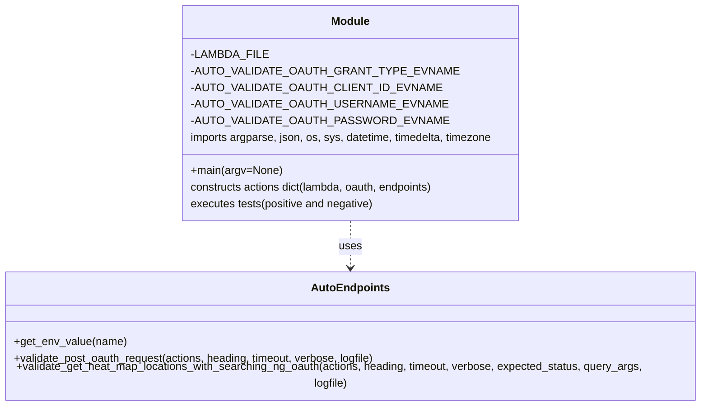

# Diagram: shipment_core/shipment_service/ng_val/scripts/heat_maps/ng_auto_val_GET_heat_map_locations.py


> Auto-generated by Obscura crawlers

## Diagram 1

```mermaid
flowchart TD
  Start([Start main]) --> ParseArgs[/"Parse CLI args (stage)"/]
  ParseArgs --> DetermineStage{Stage value}
  DetermineStage -->|prod-b| SetProdB[Set lambda_url, cg_base_path, ng_base_path, oauth_url]
  DetermineStage -->|staging| SetStaging[Set lambda_url, cg_base_path, ng_base_path, oauth_url]
  DetermineStage -->|test| SetTest[Set lambda_url, cg_base_path, ng_base_path, oauth_url]
  DetermineStage -->|other| SetOther[Set lambda_url, cg_base_path=stage, ng_base_path="shipping-ng-"+stage, oauth_url]
  SetProdB --> Configure
  SetStaging --> Configure
  SetTest --> Configure
  SetOther --> Configure
  Configure --> RemoveOldFile[Remove existing LAMBDA_FILE]
  RemoveOldFile --> BuildActions[Build actions dict and populate oauth endpoints and creds via auto_endpoints.get_env_value]
  BuildActions --> SetStaticEndpoint[Set heat_map endpoint template with test_location_id]
  SetStaticEndpoint --> OAuthRequest[Request OAuth token: auto_endpoints.validate_post_oauth_request]
  OAuthRequest --> StoreToken[Store access_token in actions]
  StoreToken --> ComputeTimestamps[Compute time_now and two_weeks_past timestamps]
  ComputeTimestamps --> PositiveTest[Call validate_get_heat_map_locations_with_searching_ng_oauth (expect 200)]
  PositiveTest --> NegativeTestsCheck{DO_NEGATIVE_TESTS True?}
  NegativeTestsCheck -->|yes| NegTest1[Test 2.11: 0-day range (expect status)]
  NegTest1 --> NegTest2[Test 2.12: reversed times (expect 502)]
  NegTest2 --> NegTest3[Test 2.13: too long range (3+ weeks)]
  NegTest3 --> NegTest4[Test 2.14: negative radius]
  NegTest4 --> End([End main])
  NegativeTestsCheck -->|no| End
```

> SVG rendering failed for this diagram.

## Diagram 2



### SVG

<svg id="container" width="1066.828125" xmlns="http://www.w3.org/2000/svg" class="classDiagram" height="576" viewBox="0 0 1066.828125 576" role="graphics-document document" aria-roledescription="class"><style>#container{font-family:"trebuchet ms",verdana,arial,sans-serif;font-size:16px;fill:#333;}@keyframes edge-animation-frame{from{stroke-dashoffset:0;}}@keyframes dash{to{stroke-dashoffset:0;}}#container .edge-animation-slow{stroke-dasharray:9,5!important;stroke-dashoffset:900;animation:dash 50s linear infinite;stroke-linecap:round;}#container .edge-animation-fast{stroke-dasharray:9,5!important;stroke-dashoffset:900;animation:dash 20s linear infinite;stroke-linecap:round;}#container .error-icon{fill:#552222;}#container .error-text{fill:#552222;stroke:#552222;}#container .edge-thickness-normal{stroke-width:1px;}#container .edge-thickness-thick{stroke-width:3.5px;}#container .edge-pattern-solid{stroke-dasharray:0;}#container .edge-thickness-invisible{stroke-width:0;fill:none;}#container .edge-pattern-dashed{stroke-dasharray:3;}#container .edge-pattern-dotted{stroke-dasharray:2;}#container .marker{fill:#333333;stroke:#333333;}#container .marker.cross{stroke:#333333;}#container svg{font-family:"trebuchet ms",verdana,arial,sans-serif;font-size:16px;}#container p{margin:0;}#container g.classGroup text{fill:#9370DB;stroke:none;font-family:"trebuchet ms",verdana,arial,sans-serif;font-size:10px;}#container g.classGroup text .title{font-weight:bolder;}#container .nodeLabel,#container .edgeLabel{color:#131300;}#container .edgeLabel .label rect{fill:#ECECFF;}#container .label text{fill:#131300;}#container .labelBkg{background:#ECECFF;}#container .edgeLabel .label span{background:#ECECFF;}#container .classTitle{font-weight:bolder;}#container .node rect,#container .node circle,#container .node ellipse,#container .node polygon,#container .node path{fill:#ECECFF;stroke:#9370DB;stroke-width:1px;}#container .divider{stroke:#9370DB;stroke-width:1;}#container g.clickable{cursor:pointer;}#container g.classGroup rect{fill:#ECECFF;stroke:#9370DB;}#container g.classGroup line{stroke:#9370DB;stroke-width:1;}#container .classLabel .box{stroke:none;stroke-width:0;fill:#ECECFF;opacity:0.5;}#container .classLabel .label{fill:#9370DB;font-size:10px;}#container .relation{stroke:#333333;stroke-width:1;fill:none;}#container .dashed-line{stroke-dasharray:3;}#container .dotted-line{stroke-dasharray:1 2;}#container #compositionStart,#container .composition{fill:#333333!important;stroke:#333333!important;stroke-width:1;}#container #compositionEnd,#container .composition{fill:#333333!important;stroke:#333333!important;stroke-width:1;}#container #dependencyStart,#container .dependency{fill:#333333!important;stroke:#333333!important;stroke-width:1;}#container #dependencyStart,#container .dependency{fill:#333333!important;stroke:#333333!important;stroke-width:1;}#container #extensionStart,#container .extension{fill:transparent!important;stroke:#333333!important;stroke-width:1;}#container #extensionEnd,#container .extension{fill:transparent!important;stroke:#333333!important;stroke-width:1;}#container #aggregationStart,#container .aggregation{fill:transparent!important;stroke:#333333!important;stroke-width:1;}#container #aggregationEnd,#container .aggregation{fill:transparent!important;stroke:#333333!important;stroke-width:1;}#container #lollipopStart,#container .lollipop{fill:#ECECFF!important;stroke:#333333!important;stroke-width:1;}#container #lollipopEnd,#container .lollipop{fill:#ECECFF!important;stroke:#333333!important;stroke-width:1;}#container .edgeTerminals{font-size:11px;line-height:initial;}#container .classTitleText{text-anchor:middle;font-size:18px;fill:#333;}#container .label-icon{display:inline-block;height:1em;overflow:visible;vertical-align:-0.125em;}#container .node .label-icon path{fill:currentColor;stroke:revert;stroke-width:revert;}#container :root{--mermaid-font-family:"trebuchet ms",verdana,arial,sans-serif;}</style><g><defs><marker id="container_class-aggregationStart" class="marker aggregation class" refX="18" refY="7" markerWidth="190" markerHeight="240" orient="auto"><path d="M 18,7 L9,13 L1,7 L9,1 Z"></path></marker></defs><defs><marker id="container_class-aggregationEnd" class="marker aggregation class" refX="1" refY="7" markerWidth="20" markerHeight="28" orient="auto"><path d="M 18,7 L9,13 L1,7 L9,1 Z"></path></marker></defs><defs><marker id="container_class-extensionStart" class="marker extension class" refX="18" refY="7" markerWidth="190" markerHeight="240" orient="auto"><path d="M 1,7 L18,13 V 1 Z"></path></marker></defs><defs><marker id="container_class-extensionEnd" class="marker extension class" refX="1" refY="7" markerWidth="20" markerHeight="28" orient="auto"><path d="M 1,1 V 13 L18,7 Z"></path></marker></defs><defs><marker id="container_class-compositionStart" class="marker composition class" refX="18" refY="7" markerWidth="190" markerHeight="240" orient="auto"><path d="M 18,7 L9,13 L1,7 L9,1 Z"></path></marker></defs><defs><marker id="container_class-compositionEnd" class="marker composition class" refX="1" refY="7" markerWidth="20" markerHeight="28" orient="auto"><path d="M 18,7 L9,13 L1,7 L9,1 Z"></path></marker></defs><defs><marker id="container_class-dependencyStart" class="marker dependency class" refX="6" refY="7" markerWidth="190" markerHeight="240" orient="auto"><path d="M 5,7 L9,13 L1,7 L9,1 Z"></path></marker></defs><defs><marker id="container_class-dependencyEnd" class="marker dependency class" refX="13" refY="7" markerWidth="20" markerHeight="28" orient="auto"><path d="M 18,7 L9,13 L14,7 L9,1 Z"></path></marker></defs><defs><marker id="container_class-lollipopStart" class="marker lollipop class" refX="13" refY="7" markerWidth="190" markerHeight="240" orient="auto"><circle stroke="black" fill="transparent" cx="7" cy="7" r="6"></circle></marker></defs><defs><marker id="container_class-lollipopEnd" class="marker lollipop class" refX="1" refY="7" markerWidth="190" markerHeight="240" orient="auto"><circle stroke="black" fill="transparent" cx="7" cy="7" r="6"></circle></marker></defs><g class="root"><g class="clusters"></g><g class="edgePaths"><path d="M533.414,320L533.414,326.167C533.414,332.333,533.414,344.667,533.414,356C533.414,367.333,533.414,377.667,533.414,382.833L533.414,388" id="id_Module_AutoEndpoints_1" class="edge-thickness-normal edge-pattern-dashed relation" style=";;;" data-edge="true" data-et="edge" data-id="id_Module_AutoEndpoints_1" data-points="W3sieCI6NTMzLjQxNDA2MjUsInkiOjMyMH0seyJ4Ijo1MzMuNDE0MDYyNSwieSI6MzU3fSx7IngiOjUzMy40MTQwNjI1LCJ5IjozOTR9XQ==" marker-end="url(#container_class-dependencyEnd)"></path></g><g class="edgeLabels"><g class="edgeLabel" transform="translate(533.4140625, 357)"><g class="label" data-id="id_Module_AutoEndpoints_1" transform="translate(-16.4921875, -12)"><foreignObject width="32.984375" height="24"><div xmlns="http://www.w3.org/1999/xhtml" class="labelBkg" style="display: table-cell; white-space: nowrap; line-height: 1.5; max-width: 200px; text-align: center;"><span class="edgeLabel"><p>uses</p></span></div></foreignObject></g></g></g><g class="nodes"><g class="node default" id="classId-Module-0" transform="translate(533.4140625, 164)"><g class="basic label-container"><path d="M-247.6484375 -156 L247.6484375 -156 L247.6484375 156 L-247.6484375 156" stroke="none" stroke-width="0" fill="#ECECFF" style=""></path><path d="M-247.6484375 -156 C-105.46924110493066 -156, 36.70995529013868 -156, 247.6484375 -156 M-247.6484375 -156 C-71.2442831023194 -156, 105.1598712953612 -156, 247.6484375 -156 M247.6484375 -156 C247.6484375 -44.98557282580532, 247.6484375 66.02885434838936, 247.6484375 156 M247.6484375 -156 C247.6484375 -75.52141207037197, 247.6484375 4.957175859256068, 247.6484375 156 M247.6484375 156 C94.99089508370332 156, -57.66664733259336 156, -247.6484375 156 M247.6484375 156 C90.60046172948043 156, -66.44751404103914 156, -247.6484375 156 M-247.6484375 156 C-247.6484375 36.44617074835415, -247.6484375 -83.1076585032917, -247.6484375 -156 M-247.6484375 156 C-247.6484375 49.34783367066724, -247.6484375 -57.304332658665516, -247.6484375 -156" stroke="#9370DB" stroke-width="1.3" fill="none" stroke-dasharray="0 0" style=""></path></g><g class="annotation-group text" transform="translate(0, -132)"></g><g class="label-group text" transform="translate(-27.09375, -132)"><g class="label" style="font-weight: bolder" transform="translate(0,-12)"><foreignObject width="54.1875" height="24"><div xmlns="http://www.w3.org/1999/xhtml" style="display: table-cell; white-space: nowrap; line-height: 1.5; max-width: 104px; text-align: center;"><span class="nodeLabel markdown-node-label" style=""><p>Module</p></span></div></foreignObject></g></g><g class="members-group text" transform="translate(-235.6484375, -84)"><g class="label" style="" transform="translate(0,-12)"><foreignObject width="102.5" height="24"><div xmlns="http://www.w3.org/1999/xhtml" style="display: table-cell; white-space: nowrap; line-height: 1.5; max-width: 160px; text-align: center;"><span class="nodeLabel markdown-node-label" style=""><p>-LAMBDA_FILE</p></span></div></foreignObject></g><g class="label" style="" transform="translate(0,12)"><foreignObject width="339.125" height="24"><div xmlns="http://www.w3.org/1999/xhtml" style="display: table-cell; white-space: nowrap; line-height: 1.5; max-width: 396px; text-align: center;"><span class="nodeLabel markdown-node-label" style=""><p>-AUTO_VALIDATE_OAUTH_GRANT_TYPE_EVNAME</p></span></div></foreignObject></g><g class="label" style="" transform="translate(0,36)"><foreignObject width="320.65625" height="24"><div xmlns="http://www.w3.org/1999/xhtml" style="display: table-cell; white-space: nowrap; line-height: 1.5; max-width: 378px; text-align: center;"><span class="nodeLabel markdown-node-label" style=""><p>-AUTO_VALIDATE_OAUTH_CLIENT_ID_EVNAME</p></span></div></foreignObject></g><g class="label" style="" transform="translate(0,60)"><foreignObject width="328.046875" height="24"><div xmlns="http://www.w3.org/1999/xhtml" style="display: table-cell; white-space: nowrap; line-height: 1.5; max-width: 385px; text-align: center;"><span class="nodeLabel markdown-node-label" style=""><p>-AUTO_VALIDATE_OAUTH_USERNAME_EVNAME</p></span></div></foreignObject></g><g class="label" style="" transform="translate(0,84)"><foreignObject width="328.203125" height="24"><div xmlns="http://www.w3.org/1999/xhtml" style="display: table-cell; white-space: nowrap; line-height: 1.5; max-width: 386px; text-align: center;"><span class="nodeLabel markdown-node-label" style=""><p>-AUTO_VALIDATE_OAUTH_PASSWORD_EVNAME</p></span></div></foreignObject></g><g class="label" style="" transform="translate(0,108)"><foreignObject width="444.203125" height="24"><div xmlns="http://www.w3.org/1999/xhtml" style="display: table-cell; white-space: nowrap; line-height: 1.5; max-width: 494px; text-align: center;"><span class="nodeLabel markdown-node-label" style=""><p>imports argparse, json, os, sys, datetime, timedelta, timezone</p></span></div></foreignObject></g></g><g class="methods-group text" transform="translate(-235.6484375, 84)"><g class="label" style="" transform="translate(0,-12)"><foreignObject width="131.859375" height="24"><div xmlns="http://www.w3.org/1999/xhtml" style="display: table-cell; white-space: nowrap; line-height: 1.5; max-width: 189px; text-align: center;"><span class="nodeLabel markdown-node-label" style=""><p>+main(argv=None)</p></span></div></foreignObject></g><g class="label" style="" transform="translate(0,12)"><foreignObject width="361.828125" height="24"><div xmlns="http://www.w3.org/1999/xhtml" style="display: table-cell; white-space: nowrap; line-height: 1.5; max-width: 412px; text-align: center;"><span class="nodeLabel markdown-node-label" style=""><p>constructs actions dict(lambda, oauth, endpoints)</p></span></div></foreignObject></g><g class="label" style="" transform="translate(0,36)"><foreignObject width="268.4375" height="24"><div xmlns="http://www.w3.org/1999/xhtml" style="display: table-cell; white-space: nowrap; line-height: 1.5; max-width: 318px; text-align: center;"><span class="nodeLabel markdown-node-label" style=""><p>executes tests(positive and negative)</p></span></div></foreignObject></g></g><g class="divider" style=""><path d="M-247.6484375 -108 C-52.817086213011464 -108, 142.01426507397707 -108, 247.6484375 -108 M-247.6484375 -108 C-143.11544141573694 -108, -38.58244533147388 -108, 247.6484375 -108" stroke="#9370DB" stroke-width="1.3" fill="none" stroke-dasharray="0 0" style=""></path></g><g class="divider" style=""><path d="M-247.6484375 60 C-94.91393670548067 60, 57.82056408903867 60, 247.6484375 60 M-247.6484375 60 C-79.197504349279 60, 89.253428801442 60, 247.6484375 60" stroke="#9370DB" stroke-width="1.3" fill="none" stroke-dasharray="0 0" style=""></path></g></g><g class="node default" id="classId-AutoEndpoints-1" transform="translate(533.4140625, 481)"><g class="basic label-container"><path d="M-525.4140625 -87 L525.4140625 -87 L525.4140625 87 L-525.4140625 87" stroke="none" stroke-width="0" fill="#ECECFF" style=""></path><path d="M-525.4140625 -87 C-145.27153672880803 -87, 234.87098904238394 -87, 525.4140625 -87 M-525.4140625 -87 C-182.28201019769733 -87, 160.85004210460534 -87, 525.4140625 -87 M525.4140625 -87 C525.4140625 -23.687057468363967, 525.4140625 39.625885063272065, 525.4140625 87 M525.4140625 -87 C525.4140625 -37.266811994354065, 525.4140625 12.466376011291871, 525.4140625 87 M525.4140625 87 C152.77480419547686 87, -219.86445410904628 87, -525.4140625 87 M525.4140625 87 C214.7032334239198 87, -96.00759565216038 87, -525.4140625 87 M-525.4140625 87 C-525.4140625 35.7550660836499, -525.4140625 -15.489867832700199, -525.4140625 -87 M-525.4140625 87 C-525.4140625 24.434447296352502, -525.4140625 -38.131105407294996, -525.4140625 -87" stroke="#9370DB" stroke-width="1.3" fill="none" stroke-dasharray="0 0" style=""></path></g><g class="annotation-group text" transform="translate(0, -63)"></g><g class="label-group text" transform="translate(-53.734375, -63)"><g class="label" style="font-weight: bolder" transform="translate(0,-12)"><foreignObject width="107.46875" height="24"><div xmlns="http://www.w3.org/1999/xhtml" style="display: table-cell; white-space: nowrap; line-height: 1.5; max-width: 157px; text-align: center;"><span class="nodeLabel markdown-node-label" style=""><p>AutoEndpoints</p></span></div></foreignObject></g></g><g class="members-group text" transform="translate(-513.4140625, -15)"></g><g class="methods-group text" transform="translate(-513.4140625, 15)"><g class="label" style="" transform="translate(0,-12)"><foreignObject width="161.53125" height="24"><div xmlns="http://www.w3.org/1999/xhtml" style="display: table-cell; white-space: nowrap; line-height: 1.5; max-width: 219px; text-align: center;"><span class="nodeLabel markdown-node-label" style=""><p>+get_env_value(name)</p></span></div></foreignObject></g><g class="label" style="" transform="translate(0,12)"><foreignObject width="533.28125" height="24"><div xmlns="http://www.w3.org/1999/xhtml" style="display: table-cell; white-space: nowrap; line-height: 1.5; max-width: 591px; text-align: center;"><span class="nodeLabel markdown-node-label" style=""><p>+validate_post_oauth_request(actions, heading, timeout, verbose, logfile)</p></span></div></foreignObject></g><g class="label" style="" transform="translate(0,36)"><foreignObject width="973.09375" height="24"><div xmlns="http://www.w3.org/1999/xhtml" style="display: table-cell; white-space: nowrap; line-height: 1.5; max-width: 1030px; text-align: center;"><span class="nodeLabel markdown-node-label" style=""><p>+validate_get_heat_map_locations_with_searching_ng_oauth(actions, heading, timeout, verbose, expected_status, query_args, logfile)</p></span></div></foreignObject></g></g><g class="divider" style=""><path d="M-525.4140625 -39 C-177.17614891265356 -39, 171.06176467469288 -39, 525.4140625 -39 M-525.4140625 -39 C-128.19769320944556 -39, 269.0186760811089 -39, 525.4140625 -39" stroke="#9370DB" stroke-width="1.3" fill="none" stroke-dasharray="0 0" style=""></path></g><g class="divider" style=""><path d="M-525.4140625 -15 C-253.39626034545734 -15, 18.62154180908533 -15, 525.4140625 -15 M-525.4140625 -15 C-257.31737313740615 -15, 10.7793162251877 -15, 525.4140625 -15" stroke="#9370DB" stroke-width="1.3" fill="none" stroke-dasharray="0 0" style=""></path></g></g></g></g></g></svg>
