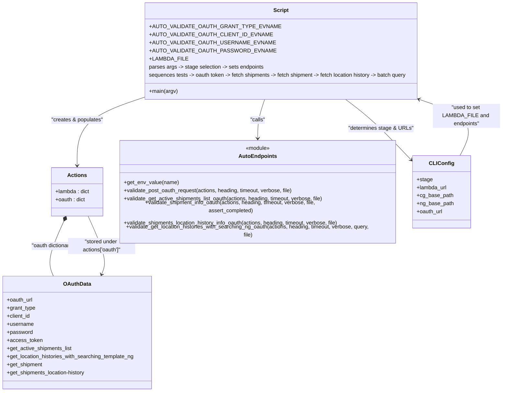

# Diagram: shipment_core/shipment_service/ng_val/scripts/heat_maps/ng_auto_val_GET_shipments_location-history.py

> Auto-generated by Obscura crawlers

## Mermaid

> SVG rendering failed for this diagram.
