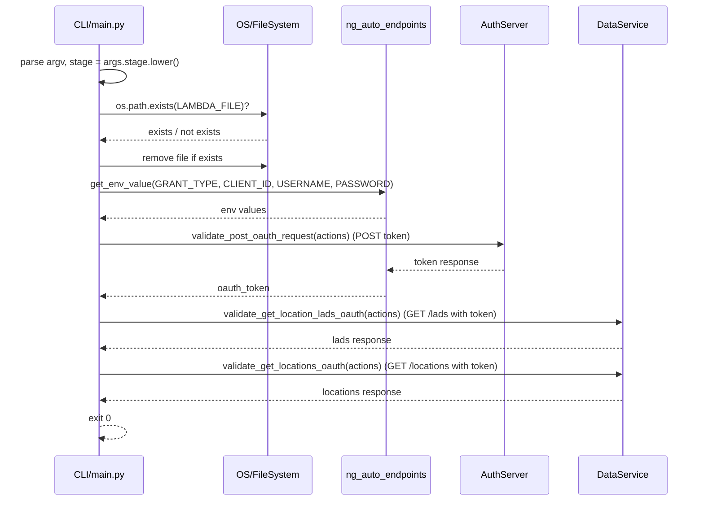
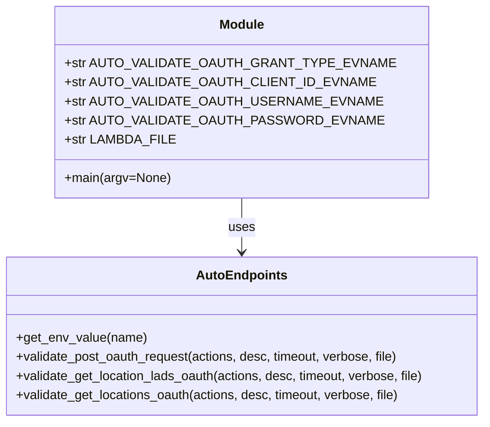
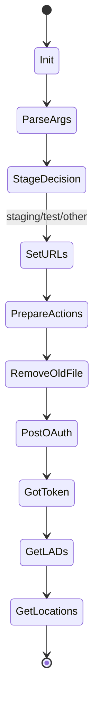
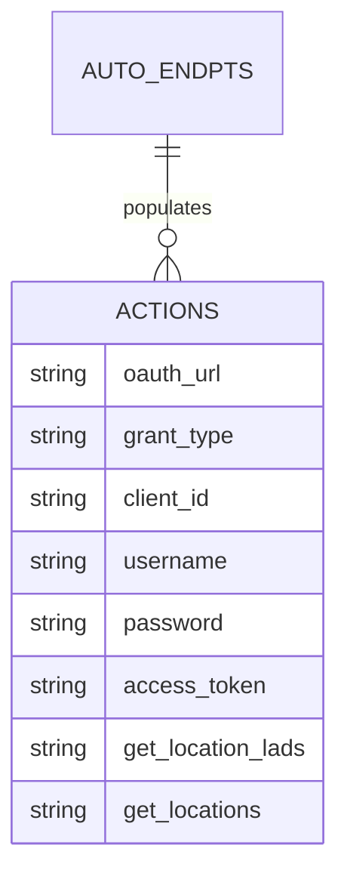

# Diagram: shipment_core/shipment_service/ng_val/scripts/locations/ng_auto_val_GET_lads.py


> Auto-generated by Obscura crawlers

## Diagram 1

```mermaid
flowchart TD
  Start([start]) --> ParseArgs[/"parse args (stage)"/]
  ParseArgs --> ToLower{stage.lower()}
  ToLower --> ProdCheck{stage in ["prod"]}
  ProdCheck -- yes --> ProdMsg["print CANNOT TEST nextgen on stage"]
  ProdMsg --> End([exit])
  ProdCheck -- no --> StageCheck{stage == "staging"}
  StageCheck -- yes --> SetStaging["set lambda_url=https://data-s.freightverify.com<br/>base_path=location<br/>oauth_url=https://login-s.freightverify.com/oauth/token"]
  StageCheck -- no --> TestCheck{stage == "test"}
  TestCheck -- yes --> SetTest["set lambda_url=https://data-t.freightverify.com<br/>base_path=location<br/>oauth_url=https://login-t.freightverify.com/oauth/token"]
  TestCheck -- no --> SetOther["set lambda_url=https://data-s.freightverify.com<br/>base_path=location-{stage}<br/>oauth_url=https://login-s.freightverify.com/oauth/token"]
  SetStaging --> SetFileName
  SetTest --> SetFileName
  SetOther --> SetFileName
  SetFileName["LAMBDA_FILE = ng_auto_val_GET_lads.{stage}.json"] --> CheckFileExists{file exists?}
  CheckFileExists -- yes --> RemoveFile["os.remove(LAMBDA_FILE)"]
  CheckFileExists -- no --> Continue
  RemoveFile --> Continue["build actions dict with oauth fields and endpoints"]
  Continue --> PostOAuth["call validate_post_oauth_request(actions)"]
  PostOAuth --> StoreToken["actions['oauth']['access_token']=oauth_token"]
  StoreToken --> GetLADs["call validate_get_location_lads_oauth(actions)"]
  GetLADs --> GetLocations["call validate_get_locations_oauth(actions)"]
  GetLocations --> End
```

> SVG rendering failed for this diagram.

## Diagram 2



### SVG

<svg id="container" width="1199.5" xmlns="http://www.w3.org/2000/svg" height="903" viewBox="-106.5 -10 1199.5 903" role="graphics-document document" aria-roledescription="sequence"><g><rect x="893" y="817" fill="#eaeaea" stroke="#666" width="150" height="65" name="Data" rx="3" ry="3" class="actor actor-bottom"></rect><text x="968" y="849.5" dominant-baseline="central" alignment-baseline="central" class="actor actor-box" style="text-anchor: middle; font-size: 16px; font-weight: 400;"><tspan x="968" dy="0">DataService</tspan></text></g><g><rect x="693" y="817" fill="#eaeaea" stroke="#666" width="150" height="65" name="Auth" rx="3" ry="3" class="actor actor-bottom"></rect><text x="768" y="849.5" dominant-baseline="central" alignment-baseline="central" class="actor actor-box" style="text-anchor: middle; font-size: 16px; font-weight: 400;"><tspan x="768" dy="0">AuthServer</tspan></text></g><g><rect x="483" y="817" fill="#eaeaea" stroke="#666" width="160" height="65" name="Auto" rx="3" ry="3" class="actor actor-bottom"></rect><text x="563" y="849.5" dominant-baseline="central" alignment-baseline="central" class="actor actor-box" style="text-anchor: middle; font-size: 16px; font-weight: 400;"><tspan x="563" dy="0">ng_auto_endpoints</tspan></text></g><g><rect x="283" y="817" fill="#eaeaea" stroke="#666" width="150" height="65" name="OS" rx="3" ry="3" class="actor actor-bottom"></rect><text x="358" y="849.5" dominant-baseline="central" alignment-baseline="central" class="actor actor-box" style="text-anchor: middle; font-size: 16px; font-weight: 400;"><tspan x="358" dy="0">OS/FileSystem</tspan></text></g><g><rect x="0" y="817" fill="#eaeaea" stroke="#666" width="150" height="65" name="CLI" rx="3" ry="3" class="actor actor-bottom"></rect><text x="75" y="849.5" dominant-baseline="central" alignment-baseline="central" class="actor actor-box" style="text-anchor: middle; font-size: 16px; font-weight: 400;"><tspan x="75" dy="0">CLI/main.py</tspan></text></g><g><line id="actor4" x1="968" y1="65" x2="968" y2="817" class="actor-line 200" stroke-width="0.5px" stroke="#999" name="Data"></line><g id="root-4"><rect x="893" y="0" fill="#eaeaea" stroke="#666" width="150" height="65" name="Data" rx="3" ry="3" class="actor actor-top"></rect><text x="968" y="32.5" dominant-baseline="central" alignment-baseline="central" class="actor actor-box" style="text-anchor: middle; font-size: 16px; font-weight: 400;"><tspan x="968" dy="0">DataService</tspan></text></g></g><g><line id="actor3" x1="768" y1="65" x2="768" y2="817" class="actor-line 200" stroke-width="0.5px" stroke="#999" name="Auth"></line><g id="root-3"><rect x="693" y="0" fill="#eaeaea" stroke="#666" width="150" height="65" name="Auth" rx="3" ry="3" class="actor actor-top"></rect><text x="768" y="32.5" dominant-baseline="central" alignment-baseline="central" class="actor actor-box" style="text-anchor: middle; font-size: 16px; font-weight: 400;"><tspan x="768" dy="0">AuthServer</tspan></text></g></g><g><line id="actor2" x1="563" y1="65" x2="563" y2="817" class="actor-line 200" stroke-width="0.5px" stroke="#999" name="Auto"></line><g id="root-2"><rect x="483" y="0" fill="#eaeaea" stroke="#666" width="160" height="65" name="Auto" rx="3" ry="3" class="actor actor-top"></rect><text x="563" y="32.5" dominant-baseline="central" alignment-baseline="central" class="actor actor-box" style="text-anchor: middle; font-size: 16px; font-weight: 400;"><tspan x="563" dy="0">ng_auto_endpoints</tspan></text></g></g><g><line id="actor1" x1="358" y1="65" x2="358" y2="817" class="actor-line 200" stroke-width="0.5px" stroke="#999" name="OS"></line><g id="root-1"><rect x="283" y="0" fill="#eaeaea" stroke="#666" width="150" height="65" name="OS" rx="3" ry="3" class="actor actor-top"></rect><text x="358" y="32.5" dominant-baseline="central" alignment-baseline="central" class="actor actor-box" style="text-anchor: middle; font-size: 16px; font-weight: 400;"><tspan x="358" dy="0">OS/FileSystem</tspan></text></g></g><g><line id="actor0" x1="75" y1="65" x2="75" y2="817" class="actor-line 200" stroke-width="0.5px" stroke="#999" name="CLI"></line><g id="root-0"><rect x="0" y="0" fill="#eaeaea" stroke="#666" width="150" height="65" name="CLI" rx="3" ry="3" class="actor actor-top"></rect><text x="75" y="32.5" dominant-baseline="central" alignment-baseline="central" class="actor actor-box" style="text-anchor: middle; font-size: 16px; font-weight: 400;"><tspan x="75" dy="0">CLI/main.py</tspan></text></g></g><style>#container{font-family:"trebuchet ms",verdana,arial,sans-serif;font-size:16px;fill:#333;}@keyframes edge-animation-frame{from{stroke-dashoffset:0;}}@keyframes dash{to{stroke-dashoffset:0;}}#container .edge-animation-slow{stroke-dasharray:9,5!important;stroke-dashoffset:900;animation:dash 50s linear infinite;stroke-linecap:round;}#container .edge-animation-fast{stroke-dasharray:9,5!important;stroke-dashoffset:900;animation:dash 20s linear infinite;stroke-linecap:round;}#container .error-icon{fill:#552222;}#container .error-text{fill:#552222;stroke:#552222;}#container .edge-thickness-normal{stroke-width:1px;}#container .edge-thickness-thick{stroke-width:3.5px;}#container .edge-pattern-solid{stroke-dasharray:0;}#container .edge-thickness-invisible{stroke-width:0;fill:none;}#container .edge-pattern-dashed{stroke-dasharray:3;}#container .edge-pattern-dotted{stroke-dasharray:2;}#container .marker{fill:#333333;stroke:#333333;}#container .marker.cross{stroke:#333333;}#container svg{font-family:"trebuchet ms",verdana,arial,sans-serif;font-size:16px;}#container p{margin:0;}#container .actor{stroke:hsl(259.6261682243, 59.7765363128%, 87.9019607843%);fill:#ECECFF;}#container text.actor&gt;tspan{fill:black;stroke:none;}#container .actor-line{stroke:hsl(259.6261682243, 59.7765363128%, 87.9019607843%);}#container .innerArc{stroke-width:1.5;stroke-dasharray:none;}#container .messageLine0{stroke-width:1.5;stroke-dasharray:none;stroke:#333;}#container .messageLine1{stroke-width:1.5;stroke-dasharray:2,2;stroke:#333;}#container #arrowhead path{fill:#333;stroke:#333;}#container .sequenceNumber{fill:white;}#container #sequencenumber{fill:#333;}#container #crosshead path{fill:#333;stroke:#333;}#container .messageText{fill:#333;stroke:none;}#container .labelBox{stroke:hsl(259.6261682243, 59.7765363128%, 87.9019607843%);fill:#ECECFF;}#container .labelText,#container .labelText&gt;tspan{fill:black;stroke:none;}#container .loopText,#container .loopText&gt;tspan{fill:black;stroke:none;}#container .loopLine{stroke-width:2px;stroke-dasharray:2,2;stroke:hsl(259.6261682243, 59.7765363128%, 87.9019607843%);fill:hsl(259.6261682243, 59.7765363128%, 87.9019607843%);}#container .note{stroke:#aaaa33;fill:#fff5ad;}#container .noteText,#container .noteText&gt;tspan{fill:black;stroke:none;}#container .activation0{fill:#f4f4f4;stroke:#666;}#container .activation1{fill:#f4f4f4;stroke:#666;}#container .activation2{fill:#f4f4f4;stroke:#666;}#container .actorPopupMenu{position:absolute;}#container .actorPopupMenuPanel{position:absolute;fill:#ECECFF;box-shadow:0px 8px 16px 0px rgba(0,0,0,0.2);filter:drop-shadow(3px 5px 2px rgb(0 0 0 / 0.4));}#container .actor-man line{stroke:hsl(259.6261682243, 59.7765363128%, 87.9019607843%);fill:#ECECFF;}#container .actor-man circle,#container line{stroke:hsl(259.6261682243, 59.7765363128%, 87.9019607843%);fill:#ECECFF;stroke-width:2px;}#container :root{--mermaid-font-family:"trebuchet ms",verdana,arial,sans-serif;}</style><g></g><defs><symbol id="computer" width="24" height="24"><path transform="scale(.5)" d="M2 2v13h20v-13h-20zm18 11h-16v-9h16v9zm-10.228 6l.466-1h3.524l.467 1h-4.457zm14.228 3h-24l2-6h2.104l-1.33 4h18.45l-1.297-4h2.073l2 6zm-5-10h-14v-7h14v7z"></path></symbol></defs><defs><symbol id="database" fill-rule="evenodd" clip-rule="evenodd"><path transform="scale(.5)" d="M12.258.001l.256.004.255.005.253.008.251.01.249.012.247.015.246.016.242.019.241.02.239.023.236.024.233.027.231.028.229.031.225.032.223.034.22.036.217.038.214.04.211.041.208.043.205.045.201.046.198.048.194.05.191.051.187.053.183.054.18.056.175.057.172.059.168.06.163.061.16.063.155.064.15.066.074.033.073.033.071.034.07.034.069.035.068.035.067.035.066.035.064.036.064.036.062.036.06.036.06.037.058.037.058.037.055.038.055.038.053.038.052.038.051.039.05.039.048.039.047.039.045.04.044.04.043.04.041.04.04.041.039.041.037.041.036.041.034.041.033.042.032.042.03.042.029.042.027.042.026.043.024.043.023.043.021.043.02.043.018.044.017.043.015.044.013.044.012.044.011.045.009.044.007.045.006.045.004.045.002.045.001.045v17l-.001.045-.002.045-.004.045-.006.045-.007.045-.009.044-.011.045-.012.044-.013.044-.015.044-.017.043-.018.044-.02.043-.021.043-.023.043-.024.043-.026.043-.027.042-.029.042-.03.042-.032.042-.033.042-.034.041-.036.041-.037.041-.039.041-.04.041-.041.04-.043.04-.044.04-.045.04-.047.039-.048.039-.05.039-.051.039-.052.038-.053.038-.055.038-.055.038-.058.037-.058.037-.06.037-.06.036-.062.036-.064.036-.064.036-.066.035-.067.035-.068.035-.069.035-.07.034-.071.034-.073.033-.074.033-.15.066-.155.064-.16.063-.163.061-.168.06-.172.059-.175.057-.18.056-.183.054-.187.053-.191.051-.194.05-.198.048-.201.046-.205.045-.208.043-.211.041-.214.04-.217.038-.22.036-.223.034-.225.032-.229.031-.231.028-.233.027-.236.024-.239.023-.241.02-.242.019-.246.016-.247.015-.249.012-.251.01-.253.008-.255.005-.256.004-.258.001-.258-.001-.256-.004-.255-.005-.253-.008-.251-.01-.249-.012-.247-.015-.245-.016-.243-.019-.241-.02-.238-.023-.236-.024-.234-.027-.231-.028-.228-.031-.226-.032-.223-.034-.22-.036-.217-.038-.214-.04-.211-.041-.208-.043-.204-.045-.201-.046-.198-.048-.195-.05-.19-.051-.187-.053-.184-.054-.179-.056-.176-.057-.172-.059-.167-.06-.164-.061-.159-.063-.155-.064-.151-.066-.074-.033-.072-.033-.072-.034-.07-.034-.069-.035-.068-.035-.067-.035-.066-.035-.064-.036-.063-.036-.062-.036-.061-.036-.06-.037-.058-.037-.057-.037-.056-.038-.055-.038-.053-.038-.052-.038-.051-.039-.049-.039-.049-.039-.046-.039-.046-.04-.044-.04-.043-.04-.041-.04-.04-.041-.039-.041-.037-.041-.036-.041-.034-.041-.033-.042-.032-.042-.03-.042-.029-.042-.027-.042-.026-.043-.024-.043-.023-.043-.021-.043-.02-.043-.018-.044-.017-.043-.015-.044-.013-.044-.012-.044-.011-.045-.009-.044-.007-.045-.006-.045-.004-.045-.002-.045-.001-.045v-17l.001-.045.002-.045.004-.045.006-.045.007-.045.009-.044.011-.045.012-.044.013-.044.015-.044.017-.043.018-.044.02-.043.021-.043.023-.043.024-.043.026-.043.027-.042.029-.042.03-.042.032-.042.033-.042.034-.041.036-.041.037-.041.039-.041.04-.041.041-.04.043-.04.044-.04.046-.04.046-.039.049-.039.049-.039.051-.039.052-.038.053-.038.055-.038.056-.038.057-.037.058-.037.06-.037.061-.036.062-.036.063-.036.064-.036.066-.035.067-.035.068-.035.069-.035.07-.034.072-.034.072-.033.074-.033.151-.066.155-.064.159-.063.164-.061.167-.06.172-.059.176-.057.179-.056.184-.054.187-.053.19-.051.195-.05.198-.048.201-.046.204-.045.208-.043.211-.041.214-.04.217-.038.22-.036.223-.034.226-.032.228-.031.231-.028.234-.027.236-.024.238-.023.241-.02.243-.019.245-.016.247-.015.249-.012.251-.01.253-.008.255-.005.256-.004.258-.001.258.001zm-9.258 20.499v.01l.001.021.003.021.004.022.005.021.006.022.007.022.009.023.01.022.011.023.012.023.013.023.015.023.016.024.017.023.018.024.019.024.021.024.022.025.023.024.024.025.052.049.056.05.061.051.066.051.07.051.075.051.079.052.084.052.088.052.092.052.097.052.102.051.105.052.11.052.114.051.119.051.123.051.127.05.131.05.135.05.139.048.144.049.147.047.152.047.155.047.16.045.163.045.167.043.171.043.176.041.178.041.183.039.187.039.19.037.194.035.197.035.202.033.204.031.209.03.212.029.216.027.219.025.222.024.226.021.23.02.233.018.236.016.24.015.243.012.246.01.249.008.253.005.256.004.259.001.26-.001.257-.004.254-.005.25-.008.247-.011.244-.012.241-.014.237-.016.233-.018.231-.021.226-.021.224-.024.22-.026.216-.027.212-.028.21-.031.205-.031.202-.034.198-.034.194-.036.191-.037.187-.039.183-.04.179-.04.175-.042.172-.043.168-.044.163-.045.16-.046.155-.046.152-.047.148-.048.143-.049.139-.049.136-.05.131-.05.126-.05.123-.051.118-.052.114-.051.11-.052.106-.052.101-.052.096-.052.092-.052.088-.053.083-.051.079-.052.074-.052.07-.051.065-.051.06-.051.056-.05.051-.05.023-.024.023-.025.021-.024.02-.024.019-.024.018-.024.017-.024.015-.023.014-.024.013-.023.012-.023.01-.023.01-.022.008-.022.006-.022.006-.022.004-.022.004-.021.001-.021.001-.021v-4.127l-.077.055-.08.053-.083.054-.085.053-.087.052-.09.052-.093.051-.095.05-.097.05-.1.049-.102.049-.105.048-.106.047-.109.047-.111.046-.114.045-.115.045-.118.044-.12.043-.122.042-.124.042-.126.041-.128.04-.13.04-.132.038-.134.038-.135.037-.138.037-.139.035-.142.035-.143.034-.144.033-.147.032-.148.031-.15.03-.151.03-.153.029-.154.027-.156.027-.158.026-.159.025-.161.024-.162.023-.163.022-.165.021-.166.02-.167.019-.169.018-.169.017-.171.016-.173.015-.173.014-.175.013-.175.012-.177.011-.178.01-.179.008-.179.008-.181.006-.182.005-.182.004-.184.003-.184.002h-.37l-.184-.002-.184-.003-.182-.004-.182-.005-.181-.006-.179-.008-.179-.008-.178-.01-.176-.011-.176-.012-.175-.013-.173-.014-.172-.015-.171-.016-.17-.017-.169-.018-.167-.019-.166-.02-.165-.021-.163-.022-.162-.023-.161-.024-.159-.025-.157-.026-.156-.027-.155-.027-.153-.029-.151-.03-.15-.03-.148-.031-.146-.032-.145-.033-.143-.034-.141-.035-.14-.035-.137-.037-.136-.037-.134-.038-.132-.038-.13-.04-.128-.04-.126-.041-.124-.042-.122-.042-.12-.044-.117-.043-.116-.045-.113-.045-.112-.046-.109-.047-.106-.047-.105-.048-.102-.049-.1-.049-.097-.05-.095-.05-.093-.052-.09-.051-.087-.052-.085-.053-.083-.054-.08-.054-.077-.054v4.127zm0-5.654v.011l.001.021.003.021.004.021.005.022.006.022.007.022.009.022.01.022.011.023.012.023.013.023.015.024.016.023.017.024.018.024.019.024.021.024.022.024.023.025.024.024.052.05.056.05.061.05.066.051.07.051.075.052.079.051.084.052.088.052.092.052.097.052.102.052.105.052.11.051.114.051.119.052.123.05.127.051.131.05.135.049.139.049.144.048.147.048.152.047.155.046.16.045.163.045.167.044.171.042.176.042.178.04.183.04.187.038.19.037.194.036.197.034.202.033.204.032.209.03.212.028.216.027.219.025.222.024.226.022.23.02.233.018.236.016.24.014.243.012.246.01.249.008.253.006.256.003.259.001.26-.001.257-.003.254-.006.25-.008.247-.01.244-.012.241-.015.237-.016.233-.018.231-.02.226-.022.224-.024.22-.025.216-.027.212-.029.21-.03.205-.032.202-.033.198-.035.194-.036.191-.037.187-.039.183-.039.179-.041.175-.042.172-.043.168-.044.163-.045.16-.045.155-.047.152-.047.148-.048.143-.048.139-.05.136-.049.131-.05.126-.051.123-.051.118-.051.114-.052.11-.052.106-.052.101-.052.096-.052.092-.052.088-.052.083-.052.079-.052.074-.051.07-.052.065-.051.06-.05.056-.051.051-.049.023-.025.023-.024.021-.025.02-.024.019-.024.018-.024.017-.024.015-.023.014-.023.013-.024.012-.022.01-.023.01-.023.008-.022.006-.022.006-.022.004-.021.004-.022.001-.021.001-.021v-4.139l-.077.054-.08.054-.083.054-.085.052-.087.053-.09.051-.093.051-.095.051-.097.05-.1.049-.102.049-.105.048-.106.047-.109.047-.111.046-.114.045-.115.044-.118.044-.12.044-.122.042-.124.042-.126.041-.128.04-.13.039-.132.039-.134.038-.135.037-.138.036-.139.036-.142.035-.143.033-.144.033-.147.033-.148.031-.15.03-.151.03-.153.028-.154.028-.156.027-.158.026-.159.025-.161.024-.162.023-.163.022-.165.021-.166.02-.167.019-.169.018-.169.017-.171.016-.173.015-.173.014-.175.013-.175.012-.177.011-.178.009-.179.009-.179.007-.181.007-.182.005-.182.004-.184.003-.184.002h-.37l-.184-.002-.184-.003-.182-.004-.182-.005-.181-.007-.179-.007-.179-.009-.178-.009-.176-.011-.176-.012-.175-.013-.173-.014-.172-.015-.171-.016-.17-.017-.169-.018-.167-.019-.166-.02-.165-.021-.163-.022-.162-.023-.161-.024-.159-.025-.157-.026-.156-.027-.155-.028-.153-.028-.151-.03-.15-.03-.148-.031-.146-.033-.145-.033-.143-.033-.141-.035-.14-.036-.137-.036-.136-.037-.134-.038-.132-.039-.13-.039-.128-.04-.126-.041-.124-.042-.122-.043-.12-.043-.117-.044-.116-.044-.113-.046-.112-.046-.109-.046-.106-.047-.105-.048-.102-.049-.1-.049-.097-.05-.095-.051-.093-.051-.09-.051-.087-.053-.085-.052-.083-.054-.08-.054-.077-.054v4.139zm0-5.666v.011l.001.02.003.022.004.021.005.022.006.021.007.022.009.023.01.022.011.023.012.023.013.023.015.023.016.024.017.024.018.023.019.024.021.025.022.024.023.024.024.025.052.05.056.05.061.05.066.051.07.051.075.052.079.051.084.052.088.052.092.052.097.052.102.052.105.051.11.052.114.051.119.051.123.051.127.05.131.05.135.05.139.049.144.048.147.048.152.047.155.046.16.045.163.045.167.043.171.043.176.042.178.04.183.04.187.038.19.037.194.036.197.034.202.033.204.032.209.03.212.028.216.027.219.025.222.024.226.021.23.02.233.018.236.017.24.014.243.012.246.01.249.008.253.006.256.003.259.001.26-.001.257-.003.254-.006.25-.008.247-.01.244-.013.241-.014.237-.016.233-.018.231-.02.226-.022.224-.024.22-.025.216-.027.212-.029.21-.03.205-.032.202-.033.198-.035.194-.036.191-.037.187-.039.183-.039.179-.041.175-.042.172-.043.168-.044.163-.045.16-.045.155-.047.152-.047.148-.048.143-.049.139-.049.136-.049.131-.051.126-.05.123-.051.118-.052.114-.051.11-.052.106-.052.101-.052.096-.052.092-.052.088-.052.083-.052.079-.052.074-.052.07-.051.065-.051.06-.051.056-.05.051-.049.023-.025.023-.025.021-.024.02-.024.019-.024.018-.024.017-.024.015-.023.014-.024.013-.023.012-.023.01-.022.01-.023.008-.022.006-.022.006-.022.004-.022.004-.021.001-.021.001-.021v-4.153l-.077.054-.08.054-.083.053-.085.053-.087.053-.09.051-.093.051-.095.051-.097.05-.1.049-.102.048-.105.048-.106.048-.109.046-.111.046-.114.046-.115.044-.118.044-.12.043-.122.043-.124.042-.126.041-.128.04-.13.039-.132.039-.134.038-.135.037-.138.036-.139.036-.142.034-.143.034-.144.033-.147.032-.148.032-.15.03-.151.03-.153.028-.154.028-.156.027-.158.026-.159.024-.161.024-.162.023-.163.023-.165.021-.166.02-.167.019-.169.018-.169.017-.171.016-.173.015-.173.014-.175.013-.175.012-.177.01-.178.01-.179.009-.179.007-.181.006-.182.006-.182.004-.184.003-.184.001-.185.001-.185-.001-.184-.001-.184-.003-.182-.004-.182-.006-.181-.006-.179-.007-.179-.009-.178-.01-.176-.01-.176-.012-.175-.013-.173-.014-.172-.015-.171-.016-.17-.017-.169-.018-.167-.019-.166-.02-.165-.021-.163-.023-.162-.023-.161-.024-.159-.024-.157-.026-.156-.027-.155-.028-.153-.028-.151-.03-.15-.03-.148-.032-.146-.032-.145-.033-.143-.034-.141-.034-.14-.036-.137-.036-.136-.037-.134-.038-.132-.039-.13-.039-.128-.041-.126-.041-.124-.041-.122-.043-.12-.043-.117-.044-.116-.044-.113-.046-.112-.046-.109-.046-.106-.048-.105-.048-.102-.048-.1-.05-.097-.049-.095-.051-.093-.051-.09-.052-.087-.052-.085-.053-.083-.053-.08-.054-.077-.054v4.153zm8.74-8.179l-.257.004-.254.005-.25.008-.247.011-.244.012-.241.014-.237.016-.233.018-.231.021-.226.022-.224.023-.22.026-.216.027-.212.028-.21.031-.205.032-.202.033-.198.034-.194.036-.191.038-.187.038-.183.04-.179.041-.175.042-.172.043-.168.043-.163.045-.16.046-.155.046-.152.048-.148.048-.143.048-.139.049-.136.05-.131.05-.126.051-.123.051-.118.051-.114.052-.11.052-.106.052-.101.052-.096.052-.092.052-.088.052-.083.052-.079.052-.074.051-.07.052-.065.051-.06.05-.056.05-.051.05-.023.025-.023.024-.021.024-.02.025-.019.024-.018.024-.017.023-.015.024-.014.023-.013.023-.012.023-.01.023-.01.022-.008.022-.006.023-.006.021-.004.022-.004.021-.001.021-.001.021.001.021.001.021.004.021.004.022.006.021.006.023.008.022.01.022.01.023.012.023.013.023.014.023.015.024.017.023.018.024.019.024.02.025.021.024.023.024.023.025.051.05.056.05.06.05.065.051.07.052.074.051.079.052.083.052.088.052.092.052.096.052.101.052.106.052.11.052.114.052.118.051.123.051.126.051.131.05.136.05.139.049.143.048.148.048.152.048.155.046.16.046.163.045.168.043.172.043.175.042.179.041.183.04.187.038.191.038.194.036.198.034.202.033.205.032.21.031.212.028.216.027.22.026.224.023.226.022.231.021.233.018.237.016.241.014.244.012.247.011.25.008.254.005.257.004.26.001.26-.001.257-.004.254-.005.25-.008.247-.011.244-.012.241-.014.237-.016.233-.018.231-.021.226-.022.224-.023.22-.026.216-.027.212-.028.21-.031.205-.032.202-.033.198-.034.194-.036.191-.038.187-.038.183-.04.179-.041.175-.042.172-.043.168-.043.163-.045.16-.046.155-.046.152-.048.148-.048.143-.048.139-.049.136-.05.131-.05.126-.051.123-.051.118-.051.114-.052.11-.052.106-.052.101-.052.096-.052.092-.052.088-.052.083-.052.079-.052.074-.051.07-.052.065-.051.06-.05.056-.05.051-.05.023-.025.023-.024.021-.024.02-.025.019-.024.018-.024.017-.023.015-.024.014-.023.013-.023.012-.023.01-.023.01-.022.008-.022.006-.023.006-.021.004-.022.004-.021.001-.021.001-.021-.001-.021-.001-.021-.004-.021-.004-.022-.006-.021-.006-.023-.008-.022-.01-.022-.01-.023-.012-.023-.013-.023-.014-.023-.015-.024-.017-.023-.018-.024-.019-.024-.02-.025-.021-.024-.023-.024-.023-.025-.051-.05-.056-.05-.06-.05-.065-.051-.07-.052-.074-.051-.079-.052-.083-.052-.088-.052-.092-.052-.096-.052-.101-.052-.106-.052-.11-.052-.114-.052-.118-.051-.123-.051-.126-.051-.131-.05-.136-.05-.139-.049-.143-.048-.148-.048-.152-.048-.155-.046-.16-.046-.163-.045-.168-.043-.172-.043-.175-.042-.179-.041-.183-.04-.187-.038-.191-.038-.194-.036-.198-.034-.202-.033-.205-.032-.21-.031-.212-.028-.216-.027-.22-.026-.224-.023-.226-.022-.231-.021-.233-.018-.237-.016-.241-.014-.244-.012-.247-.011-.25-.008-.254-.005-.257-.004-.26-.001-.26.001z"></path></symbol></defs><defs><symbol id="clock" width="24" height="24"><path transform="scale(.5)" d="M12 2c5.514 0 10 4.486 10 10s-4.486 10-10 10-10-4.486-10-10 4.486-10 10-10zm0-2c-6.627 0-12 5.373-12 12s5.373 12 12 12 12-5.373 12-12-5.373-12-12-12zm5.848 12.459c.202.038.202.333.001.372-1.907.361-6.045 1.111-6.547 1.111-.719 0-1.301-.582-1.301-1.301 0-.512.77-5.447 1.125-7.445.034-.192.312-.181.343.014l.985 6.238 5.394 1.011z"></path></symbol></defs><defs><marker id="arrowhead" refX="7.9" refY="5" markerUnits="userSpaceOnUse" markerWidth="12" markerHeight="12" orient="auto-start-reverse"><path d="M -1 0 L 10 5 L 0 10 z"></path></marker></defs><defs><marker id="crosshead" markerWidth="15" markerHeight="8" orient="auto" refX="4" refY="4.5"><path fill="none" stroke="#000000" stroke-width="1pt" d="M 1,2 L 6,7 M 6,2 L 1,7" style="stroke-dasharray: 0, 0;"></path></marker></defs><defs><marker id="filled-head" refX="15.5" refY="7" markerWidth="20" markerHeight="28" orient="auto"><path d="M 18,7 L9,13 L14,7 L9,1 Z"></path></marker></defs><defs><marker id="sequencenumber" refX="15" refY="15" markerWidth="60" markerHeight="40" orient="auto"><circle cx="15" cy="15" r="6"></circle></marker></defs><text x="76" y="80" text-anchor="middle" dominant-baseline="middle" alignment-baseline="middle" class="messageText" dy="1em" style="font-size: 16px; font-weight: 400;">parse argv, stage = args.stage.lower()</text><path d="M 76,113 C 136,103 136,143 76,133" class="messageLine0" stroke-width="2" stroke="none" marker-end="url(#arrowhead)" style="fill: none;"></path><text x="215" y="158" text-anchor="middle" dominant-baseline="middle" alignment-baseline="middle" class="messageText" dy="1em" style="font-size: 16px; font-weight: 400;">os.path.exists(LAMBDA_FILE)?</text><line x1="76" y1="191" x2="354" y2="191" class="messageLine0" stroke-width="2" stroke="none" marker-end="url(#arrowhead)" style="fill: none;"></line><text x="218" y="206" text-anchor="middle" dominant-baseline="middle" alignment-baseline="middle" class="messageText" dy="1em" style="font-size: 16px; font-weight: 400;">exists / not exists</text><line x1="357" y1="239" x2="79" y2="239" class="messageLine1" stroke-width="2" stroke="none" marker-end="url(#arrowhead)" style="stroke-dasharray: 3, 3; fill: none;"></line><text x="215" y="254" text-anchor="middle" dominant-baseline="middle" alignment-baseline="middle" class="messageText" dy="1em" style="font-size: 16px; font-weight: 400;">remove file if exists</text><line x1="76" y1="287" x2="354" y2="287" class="messageLine0" stroke-width="2" stroke="none" marker-end="url(#arrowhead)" style="fill: none;"></line><text x="318" y="302" text-anchor="middle" dominant-baseline="middle" alignment-baseline="middle" class="messageText" dy="1em" style="font-size: 16px; font-weight: 400;">get_env_value(GRANT_TYPE, CLIENT_ID, USERNAME, PASSWORD)</text><line x1="76" y1="335" x2="559" y2="335" class="messageLine0" stroke-width="2" stroke="none" marker-end="url(#arrowhead)" style="fill: none;"></line><text x="321" y="350" text-anchor="middle" dominant-baseline="middle" alignment-baseline="middle" class="messageText" dy="1em" style="font-size: 16px; font-weight: 400;">env values</text><line x1="562" y1="383" x2="79" y2="383" class="messageLine1" stroke-width="2" stroke="none" marker-end="url(#arrowhead)" style="stroke-dasharray: 3, 3; fill: none;"></line><text x="420" y="398" text-anchor="middle" dominant-baseline="middle" alignment-baseline="middle" class="messageText" dy="1em" style="font-size: 16px; font-weight: 400;">validate_post_oauth_request(actions) (POST token)</text><line x1="76" y1="431" x2="764" y2="431" class="messageLine0" stroke-width="2" stroke="none" marker-end="url(#arrowhead)" style="fill: none;"></line><text x="667" y="446" text-anchor="middle" dominant-baseline="middle" alignment-baseline="middle" class="messageText" dy="1em" style="font-size: 16px; font-weight: 400;">token response</text><line x1="767" y1="479" x2="567" y2="479" class="messageLine1" stroke-width="2" stroke="none" marker-end="url(#arrowhead)" style="stroke-dasharray: 3, 3; fill: none;"></line><text x="321" y="494" text-anchor="middle" dominant-baseline="middle" alignment-baseline="middle" class="messageText" dy="1em" style="font-size: 16px; font-weight: 400;">oauth_token</text><line x1="562" y1="527" x2="79" y2="527" class="messageLine1" stroke-width="2" stroke="none" marker-end="url(#arrowhead)" style="stroke-dasharray: 3, 3; fill: none;"></line><text x="520" y="542" text-anchor="middle" dominant-baseline="middle" alignment-baseline="middle" class="messageText" dy="1em" style="font-size: 16px; font-weight: 400;">validate_get_location_lads_oauth(actions) (GET /lads with token)</text><line x1="76" y1="575" x2="964" y2="575" class="messageLine0" stroke-width="2" stroke="none" marker-end="url(#arrowhead)" style="fill: none;"></line><text x="523" y="590" text-anchor="middle" dominant-baseline="middle" alignment-baseline="middle" class="messageText" dy="1em" style="font-size: 16px; font-weight: 400;">lads response</text><line x1="967" y1="623" x2="79" y2="623" class="messageLine1" stroke-width="2" stroke="none" marker-end="url(#arrowhead)" style="stroke-dasharray: 3, 3; fill: none;"></line><text x="520" y="638" text-anchor="middle" dominant-baseline="middle" alignment-baseline="middle" class="messageText" dy="1em" style="font-size: 16px; font-weight: 400;">validate_get_locations_oauth(actions) (GET /locations with token)</text><line x1="76" y1="671" x2="964" y2="671" class="messageLine0" stroke-width="2" stroke="none" marker-end="url(#arrowhead)" style="fill: none;"></line><text x="523" y="686" text-anchor="middle" dominant-baseline="middle" alignment-baseline="middle" class="messageText" dy="1em" style="font-size: 16px; font-weight: 400;">locations response</text><line x1="967" y1="719" x2="79" y2="719" class="messageLine1" stroke-width="2" stroke="none" marker-end="url(#arrowhead)" style="stroke-dasharray: 3, 3; fill: none;"></line><text x="76" y="734" text-anchor="middle" dominant-baseline="middle" alignment-baseline="middle" class="messageText" dy="1em" style="font-size: 16px; font-weight: 400;">exit 0</text><path d="M 76,767 C 136,757 136,797 76,787" class="messageLine1" stroke-width="2" stroke="none" marker-end="url(#arrowhead)" style="stroke-dasharray: 3, 3; fill: none;"></path></svg>

## Diagram 3



### SVG

<svg id="container" width="612.4375" xmlns="http://www.w3.org/2000/svg" class="classDiagram" height="528" viewBox="0 0 612.4375 528" role="graphics-document document" aria-roledescription="class"><style>#container{font-family:"trebuchet ms",verdana,arial,sans-serif;font-size:16px;fill:#333;}@keyframes edge-animation-frame{from{stroke-dashoffset:0;}}@keyframes dash{to{stroke-dashoffset:0;}}#container .edge-animation-slow{stroke-dasharray:9,5!important;stroke-dashoffset:900;animation:dash 50s linear infinite;stroke-linecap:round;}#container .edge-animation-fast{stroke-dasharray:9,5!important;stroke-dashoffset:900;animation:dash 20s linear infinite;stroke-linecap:round;}#container .error-icon{fill:#552222;}#container .error-text{fill:#552222;stroke:#552222;}#container .edge-thickness-normal{stroke-width:1px;}#container .edge-thickness-thick{stroke-width:3.5px;}#container .edge-pattern-solid{stroke-dasharray:0;}#container .edge-thickness-invisible{stroke-width:0;fill:none;}#container .edge-pattern-dashed{stroke-dasharray:3;}#container .edge-pattern-dotted{stroke-dasharray:2;}#container .marker{fill:#333333;stroke:#333333;}#container .marker.cross{stroke:#333333;}#container svg{font-family:"trebuchet ms",verdana,arial,sans-serif;font-size:16px;}#container p{margin:0;}#container g.classGroup text{fill:#9370DB;stroke:none;font-family:"trebuchet ms",verdana,arial,sans-serif;font-size:10px;}#container g.classGroup text .title{font-weight:bolder;}#container .nodeLabel,#container .edgeLabel{color:#131300;}#container .edgeLabel .label rect{fill:#ECECFF;}#container .label text{fill:#131300;}#container .labelBkg{background:#ECECFF;}#container .edgeLabel .label span{background:#ECECFF;}#container .classTitle{font-weight:bolder;}#container .node rect,#container .node circle,#container .node ellipse,#container .node polygon,#container .node path{fill:#ECECFF;stroke:#9370DB;stroke-width:1px;}#container .divider{stroke:#9370DB;stroke-width:1;}#container g.clickable{cursor:pointer;}#container g.classGroup rect{fill:#ECECFF;stroke:#9370DB;}#container g.classGroup line{stroke:#9370DB;stroke-width:1;}#container .classLabel .box{stroke:none;stroke-width:0;fill:#ECECFF;opacity:0.5;}#container .classLabel .label{fill:#9370DB;font-size:10px;}#container .relation{stroke:#333333;stroke-width:1;fill:none;}#container .dashed-line{stroke-dasharray:3;}#container .dotted-line{stroke-dasharray:1 2;}#container #compositionStart,#container .composition{fill:#333333!important;stroke:#333333!important;stroke-width:1;}#container #compositionEnd,#container .composition{fill:#333333!important;stroke:#333333!important;stroke-width:1;}#container #dependencyStart,#container .dependency{fill:#333333!important;stroke:#333333!important;stroke-width:1;}#container #dependencyStart,#container .dependency{fill:#333333!important;stroke:#333333!important;stroke-width:1;}#container #extensionStart,#container .extension{fill:transparent!important;stroke:#333333!important;stroke-width:1;}#container #extensionEnd,#container .extension{fill:transparent!important;stroke:#333333!important;stroke-width:1;}#container #aggregationStart,#container .aggregation{fill:transparent!important;stroke:#333333!important;stroke-width:1;}#container #aggregationEnd,#container .aggregation{fill:transparent!important;stroke:#333333!important;stroke-width:1;}#container #lollipopStart,#container .lollipop{fill:#ECECFF!important;stroke:#333333!important;stroke-width:1;}#container #lollipopEnd,#container .lollipop{fill:#ECECFF!important;stroke:#333333!important;stroke-width:1;}#container .edgeTerminals{font-size:11px;line-height:initial;}#container .classTitleText{text-anchor:middle;font-size:18px;fill:#333;}#container .label-icon{display:inline-block;height:1em;overflow:visible;vertical-align:-0.125em;}#container .node .label-icon path{fill:currentColor;stroke:revert;stroke-width:revert;}#container :root{--mermaid-font-family:"trebuchet ms",verdana,arial,sans-serif;}</style><g><defs><marker id="container_class-aggregationStart" class="marker aggregation class" refX="18" refY="7" markerWidth="190" markerHeight="240" orient="auto"><path d="M 18,7 L9,13 L1,7 L9,1 Z"></path></marker></defs><defs><marker id="container_class-aggregationEnd" class="marker aggregation class" refX="1" refY="7" markerWidth="20" markerHeight="28" orient="auto"><path d="M 18,7 L9,13 L1,7 L9,1 Z"></path></marker></defs><defs><marker id="container_class-extensionStart" class="marker extension class" refX="18" refY="7" markerWidth="190" markerHeight="240" orient="auto"><path d="M 1,7 L18,13 V 1 Z"></path></marker></defs><defs><marker id="container_class-extensionEnd" class="marker extension class" refX="1" refY="7" markerWidth="20" markerHeight="28" orient="auto"><path d="M 1,1 V 13 L18,7 Z"></path></marker></defs><defs><marker id="container_class-compositionStart" class="marker composition class" refX="18" refY="7" markerWidth="190" markerHeight="240" orient="auto"><path d="M 18,7 L9,13 L1,7 L9,1 Z"></path></marker></defs><defs><marker id="container_class-compositionEnd" class="marker composition class" refX="1" refY="7" markerWidth="20" markerHeight="28" orient="auto"><path d="M 18,7 L9,13 L1,7 L9,1 Z"></path></marker></defs><defs><marker id="container_class-dependencyStart" class="marker dependency class" refX="6" refY="7" markerWidth="190" markerHeight="240" orient="auto"><path d="M 5,7 L9,13 L1,7 L9,1 Z"></path></marker></defs><defs><marker id="container_class-dependencyEnd" class="marker dependency class" refX="13" refY="7" markerWidth="20" markerHeight="28" orient="auto"><path d="M 18,7 L9,13 L14,7 L9,1 Z"></path></marker></defs><defs><marker id="container_class-lollipopStart" class="marker lollipop class" refX="13" refY="7" markerWidth="190" markerHeight="240" orient="auto"><circle stroke="black" fill="transparent" cx="7" cy="7" r="6"></circle></marker></defs><defs><marker id="container_class-lollipopEnd" class="marker lollipop class" refX="1" refY="7" markerWidth="190" markerHeight="240" orient="auto"><circle stroke="black" fill="transparent" cx="7" cy="7" r="6"></circle></marker></defs><g class="root"><g class="clusters"></g><g class="edgePaths"><path d="M306.219,248L306.219,254.167C306.219,260.333,306.219,272.667,306.219,284C306.219,295.333,306.219,305.667,306.219,310.833L306.219,316" id="id_Module_AutoEndpoints_1" class="edge-thickness-normal edge-pattern-solid relation" style=";;;" data-edge="true" data-et="edge" data-id="id_Module_AutoEndpoints_1" data-points="W3sieCI6MzA2LjIxODc1LCJ5IjoyNDh9LHsieCI6MzA2LjIxODc1LCJ5IjoyODV9LHsieCI6MzA2LjIxODc1LCJ5IjozMjJ9XQ==" marker-end="url(#container_class-dependencyEnd)"></path></g><g class="edgeLabels"><g class="edgeLabel" transform="translate(306.21875, 285)"><g class="label" data-id="id_Module_AutoEndpoints_1" transform="translate(-16.4921875, -12)"><foreignObject width="32.984375" height="24"><div xmlns="http://www.w3.org/1999/xhtml" class="labelBkg" style="display: table-cell; white-space: nowrap; line-height: 1.5; max-width: 200px; text-align: center;"><span class="edgeLabel"><p>uses</p></span></div></foreignObject></g></g></g><g class="nodes"><g class="node default" id="classId-Module-0" transform="translate(306.21875, 128)"><g class="basic label-container"><path d="M-207.7890625 -120 L207.7890625 -120 L207.7890625 120 L-207.7890625 120" stroke="none" stroke-width="0" fill="#ECECFF" style=""></path><path d="M-207.7890625 -120 C-91.87161825857515 -120, 24.045825982849692 -120, 207.7890625 -120 M-207.7890625 -120 C-86.8271274478583 -120, 34.134807604283395 -120, 207.7890625 -120 M207.7890625 -120 C207.7890625 -29.94369781953364, 207.7890625 60.11260436093272, 207.7890625 120 M207.7890625 -120 C207.7890625 -42.6491769238671, 207.7890625 34.701646152265795, 207.7890625 120 M207.7890625 120 C55.49624357433413 120, -96.79657535133174 120, -207.7890625 120 M207.7890625 120 C112.65260376899477 120, 17.51614503798953 120, -207.7890625 120 M-207.7890625 120 C-207.7890625 69.6305771597834, -207.7890625 19.261154319566813, -207.7890625 -120 M-207.7890625 120 C-207.7890625 64.45414268557926, -207.7890625 8.908285371158499, -207.7890625 -120" stroke="#9370DB" stroke-width="1.3" fill="none" stroke-dasharray="0 0" style=""></path></g><g class="annotation-group text" transform="translate(0, -96)"></g><g class="label-group text" transform="translate(-27.09375, -96)"><g class="label" style="font-weight: bolder" transform="translate(0,-12)"><foreignObject width="54.1875" height="24"><div xmlns="http://www.w3.org/1999/xhtml" style="display: table-cell; white-space: nowrap; line-height: 1.5; max-width: 104px; text-align: center;"><span class="nodeLabel markdown-node-label" style=""><p>Module</p></span></div></foreignObject></g></g><g class="members-group text" transform="translate(-195.7890625, -48)"><g class="label" style="" transform="translate(0,-12)"><foreignObject width="364.484375" height="24"><div xmlns="http://www.w3.org/1999/xhtml" style="display: table-cell; white-space: nowrap; line-height: 1.5; max-width: 422px; text-align: center;"><span class="nodeLabel markdown-node-label" style=""><p>+str AUTO_VALIDATE_OAUTH_GRANT_TYPE_EVNAME</p></span></div></foreignObject></g><g class="label" style="" transform="translate(0,12)"><foreignObject width="346.015625" height="24"><div xmlns="http://www.w3.org/1999/xhtml" style="display: table-cell; white-space: nowrap; line-height: 1.5; max-width: 403px; text-align: center;"><span class="nodeLabel markdown-node-label" style=""><p>+str AUTO_VALIDATE_OAUTH_CLIENT_ID_EVNAME</p></span></div></foreignObject></g><g class="label" style="" transform="translate(0,36)"><foreignObject width="353.40625" height="24"><div xmlns="http://www.w3.org/1999/xhtml" style="display: table-cell; white-space: nowrap; line-height: 1.5; max-width: 411px; text-align: center;"><span class="nodeLabel markdown-node-label" style=""><p>+str AUTO_VALIDATE_OAUTH_USERNAME_EVNAME</p></span></div></foreignObject></g><g class="label" style="" transform="translate(0,60)"><foreignObject width="353.5625" height="24"><div xmlns="http://www.w3.org/1999/xhtml" style="display: table-cell; white-space: nowrap; line-height: 1.5; max-width: 411px; text-align: center;"><span class="nodeLabel markdown-node-label" style=""><p>+str AUTO_VALIDATE_OAUTH_PASSWORD_EVNAME</p></span></div></foreignObject></g><g class="label" style="" transform="translate(0,84)"><foreignObject width="127.703125" height="24"><div xmlns="http://www.w3.org/1999/xhtml" style="display: table-cell; white-space: nowrap; line-height: 1.5; max-width: 185px; text-align: center;"><span class="nodeLabel markdown-node-label" style=""><p>+str LAMBDA_FILE</p></span></div></foreignObject></g></g><g class="methods-group text" transform="translate(-195.7890625, 96)"><g class="label" style="" transform="translate(0,-12)"><foreignObject width="131.859375" height="24"><div xmlns="http://www.w3.org/1999/xhtml" style="display: table-cell; white-space: nowrap; line-height: 1.5; max-width: 189px; text-align: center;"><span class="nodeLabel markdown-node-label" style=""><p>+main(argv=None)</p></span></div></foreignObject></g></g><g class="divider" style=""><path d="M-207.7890625 -72 C-67.56812488928773 -72, 72.65281272142454 -72, 207.7890625 -72 M-207.7890625 -72 C-101.0754263013938 -72, 5.638209897212391 -72, 207.7890625 -72" stroke="#9370DB" stroke-width="1.3" fill="none" stroke-dasharray="0 0" style=""></path></g><g class="divider" style=""><path d="M-207.7890625 72 C-115.81177643132371 72, -23.834490362647415 72, 207.7890625 72 M-207.7890625 72 C-92.80818119870365 72, 22.1727001025927 72, 207.7890625 72" stroke="#9370DB" stroke-width="1.3" fill="none" stroke-dasharray="0 0" style=""></path></g></g><g class="node default" id="classId-AutoEndpoints-1" transform="translate(306.21875, 421)"><g class="basic label-container"><path d="M-298.21875 -99 L298.21875 -99 L298.21875 99 L-298.21875 99" stroke="none" stroke-width="0" fill="#ECECFF" style=""></path><path d="M-298.21875 -99 C-95.14746058825878 -99, 107.92382882348244 -99, 298.21875 -99 M-298.21875 -99 C-131.4503030602759 -99, 35.3181438794482 -99, 298.21875 -99 M298.21875 -99 C298.21875 -50.37183768803752, 298.21875 -1.7436753760750463, 298.21875 99 M298.21875 -99 C298.21875 -50.539510664724915, 298.21875 -2.07902132944983, 298.21875 99 M298.21875 99 C128.60030882180448 99, -41.01813235639105 99, -298.21875 99 M298.21875 99 C165.26217829482738 99, 32.30560658965476 99, -298.21875 99 M-298.21875 99 C-298.21875 35.52917662317302, -298.21875 -27.941646753653956, -298.21875 -99 M-298.21875 99 C-298.21875 46.72854435523403, -298.21875 -5.5429112895319435, -298.21875 -99" stroke="#9370DB" stroke-width="1.3" fill="none" stroke-dasharray="0 0" style=""></path></g><g class="annotation-group text" transform="translate(0, -75)"></g><g class="label-group text" transform="translate(-53.734375, -75)"><g class="label" style="font-weight: bolder" transform="translate(0,-12)"><foreignObject width="107.46875" height="24"><div xmlns="http://www.w3.org/1999/xhtml" style="display: table-cell; white-space: nowrap; line-height: 1.5; max-width: 157px; text-align: center;"><span class="nodeLabel markdown-node-label" style=""><p>AutoEndpoints</p></span></div></foreignObject></g></g><g class="members-group text" transform="translate(-286.21875, -27)"></g><g class="methods-group text" transform="translate(-286.21875, 3)"><g class="label" style="" transform="translate(0,-12)"><foreignObject width="161.53125" height="24"><div xmlns="http://www.w3.org/1999/xhtml" style="display: table-cell; white-space: nowrap; line-height: 1.5; max-width: 219px; text-align: center;"><span class="nodeLabel markdown-node-label" style=""><p>+get_env_value(name)</p></span></div></foreignObject></g><g class="label" style="" transform="translate(0,12)"><foreignObject width="486.171875" height="24"><div xmlns="http://www.w3.org/1999/xhtml" style="display: table-cell; white-space: nowrap; line-height: 1.5; max-width: 544px; text-align: center;"><span class="nodeLabel markdown-node-label" style=""><p>+validate_post_oauth_request(actions, desc, timeout, verbose, file)</p></span></div></foreignObject></g><g class="label" style="" transform="translate(0,36)"><foreignObject width="518.703125" height="24"><div xmlns="http://www.w3.org/1999/xhtml" style="display: table-cell; white-space: nowrap; line-height: 1.5; max-width: 576px; text-align: center;"><span class="nodeLabel markdown-node-label" style=""><p>+validate_get_location_lads_oauth(actions, desc, timeout, verbose, file)</p></span></div></foreignObject></g><g class="label" style="" transform="translate(0,60)"><foreignObject width="487.65625" height="24"><div xmlns="http://www.w3.org/1999/xhtml" style="display: table-cell; white-space: nowrap; line-height: 1.5; max-width: 545px; text-align: center;"><span class="nodeLabel markdown-node-label" style=""><p>+validate_get_locations_oauth(actions, desc, timeout, verbose, file)</p></span></div></foreignObject></g></g><g class="divider" style=""><path d="M-298.21875 -51 C-159.6307316013118 -51, -21.042713202623588 -51, 298.21875 -51 M-298.21875 -51 C-108.4812330314627 -51, 81.25628393707461 -51, 298.21875 -51" stroke="#9370DB" stroke-width="1.3" fill="none" stroke-dasharray="0 0" style=""></path></g><g class="divider" style=""><path d="M-298.21875 -27 C-123.22747591997293 -27, 51.76379816005414 -27, 298.21875 -27 M-298.21875 -27 C-60.87499886291647 -27, 176.46875227416706 -27, 298.21875 -27" stroke="#9370DB" stroke-width="1.3" fill="none" stroke-dasharray="0 0" style=""></path></g></g></g></g></g></svg>

## Diagram 4



### SVG

<svg id="container" width="150.46875" xmlns="http://www.w3.org/2000/svg" class="statediagram" height="1018" viewBox="0 0 150.46875 1018" role="graphics-document document" aria-roledescription="stateDiagram"><style>#container{font-family:"trebuchet ms",verdana,arial,sans-serif;font-size:16px;fill:#333;}@keyframes edge-animation-frame{from{stroke-dashoffset:0;}}@keyframes dash{to{stroke-dashoffset:0;}}#container .edge-animation-slow{stroke-dasharray:9,5!important;stroke-dashoffset:900;animation:dash 50s linear infinite;stroke-linecap:round;}#container .edge-animation-fast{stroke-dasharray:9,5!important;stroke-dashoffset:900;animation:dash 20s linear infinite;stroke-linecap:round;}#container .error-icon{fill:#552222;}#container .error-text{fill:#552222;stroke:#552222;}#container .edge-thickness-normal{stroke-width:1px;}#container .edge-thickness-thick{stroke-width:3.5px;}#container .edge-pattern-solid{stroke-dasharray:0;}#container .edge-thickness-invisible{stroke-width:0;fill:none;}#container .edge-pattern-dashed{stroke-dasharray:3;}#container .edge-pattern-dotted{stroke-dasharray:2;}#container .marker{fill:#333333;stroke:#333333;}#container .marker.cross{stroke:#333333;}#container svg{font-family:"trebuchet ms",verdana,arial,sans-serif;font-size:16px;}#container p{margin:0;}#container defs #statediagram-barbEnd{fill:#333333;stroke:#333333;}#container g.stateGroup text{fill:#9370DB;stroke:none;font-size:10px;}#container g.stateGroup text{fill:#333;stroke:none;font-size:10px;}#container g.stateGroup .state-title{font-weight:bolder;fill:#131300;}#container g.stateGroup rect{fill:#ECECFF;stroke:#9370DB;}#container g.stateGroup line{stroke:#333333;stroke-width:1;}#container .transition{stroke:#333333;stroke-width:1;fill:none;}#container .stateGroup .composit{fill:white;border-bottom:1px;}#container .stateGroup .alt-composit{fill:#e0e0e0;border-bottom:1px;}#container .state-note{stroke:#aaaa33;fill:#fff5ad;}#container .state-note text{fill:black;stroke:none;font-size:10px;}#container .stateLabel .box{stroke:none;stroke-width:0;fill:#ECECFF;opacity:0.5;}#container .edgeLabel .label rect{fill:#ECECFF;opacity:0.5;}#container .edgeLabel{background-color:rgba(232,232,232, 0.8);text-align:center;}#container .edgeLabel p{background-color:rgba(232,232,232, 0.8);}#container .edgeLabel rect{opacity:0.5;background-color:rgba(232,232,232, 0.8);fill:rgba(232,232,232, 0.8);}#container .edgeLabel .label text{fill:#333;}#container .label div .edgeLabel{color:#333;}#container .stateLabel text{fill:#131300;font-size:10px;font-weight:bold;}#container .node circle.state-start{fill:#333333;stroke:#333333;}#container .node .fork-join{fill:#333333;stroke:#333333;}#container .node circle.state-end{fill:#9370DB;stroke:white;stroke-width:1.5;}#container .end-state-inner{fill:white;stroke-width:1.5;}#container .node rect{fill:#ECECFF;stroke:#9370DB;stroke-width:1px;}#container .node polygon{fill:#ECECFF;stroke:#9370DB;stroke-width:1px;}#container #statediagram-barbEnd{fill:#333333;}#container .statediagram-cluster rect{fill:#ECECFF;stroke:#9370DB;stroke-width:1px;}#container .cluster-label,#container .nodeLabel{color:#131300;}#container .statediagram-cluster rect.outer{rx:5px;ry:5px;}#container .statediagram-state .divider{stroke:#9370DB;}#container .statediagram-state .title-state{rx:5px;ry:5px;}#container .statediagram-cluster.statediagram-cluster .inner{fill:white;}#container .statediagram-cluster.statediagram-cluster-alt .inner{fill:#f0f0f0;}#container .statediagram-cluster .inner{rx:0;ry:0;}#container .statediagram-state rect.basic{rx:5px;ry:5px;}#container .statediagram-state rect.divider{stroke-dasharray:10,10;fill:#f0f0f0;}#container .note-edge{stroke-dasharray:5;}#container .statediagram-note rect{fill:#fff5ad;stroke:#aaaa33;stroke-width:1px;rx:0;ry:0;}#container .statediagram-note rect{fill:#fff5ad;stroke:#aaaa33;stroke-width:1px;rx:0;ry:0;}#container .statediagram-note text{fill:black;}#container .statediagram-note .nodeLabel{color:black;}#container .statediagram .edgeLabel{color:red;}#container #dependencyStart,#container #dependencyEnd{fill:#333333;stroke:#333333;stroke-width:1;}#container .statediagramTitleText{text-anchor:middle;font-size:18px;fill:#333;}#container :root{--mermaid-font-family:"trebuchet ms",verdana,arial,sans-serif;}</style><g><defs><marker id="container_stateDiagram-barbEnd" refX="19" refY="7" markerWidth="20" markerHeight="14" markerUnits="userSpaceOnUse" orient="auto"><path d="M 19,7 L9,13 L14,7 L9,1 Z"></path></marker></defs><g class="root"><g class="clusters"></g><g class="edgePaths"><path d="M75.234,22L75.234,26.167C75.234,30.333,75.234,38.667,75.318,47.083C75.401,55.5,75.568,64,75.651,68.25L75.734,72.5" id="edge0" class="edge-thickness-normal edge-pattern-solid transition" style="fill:none;;;fill:none" data-edge="true" data-et="edge" data-id="edge0" data-points="W3sieCI6NzUuMjM0Mzc1LCJ5IjoyMn0seyJ4Ijo3NS4yMzQzNzUsInkiOjQ3fSx7IngiOjc1LjczNDM3NSwieSI6NzIuNX1d" marker-end="url(#container_stateDiagram-barbEnd)"></path><path d="M75.734,112.5L75.651,116.583C75.568,120.667,75.401,128.833,75.401,137.167C75.401,145.5,75.568,154,75.651,158.25L75.734,162.5" id="edge1" class="edge-thickness-normal edge-pattern-solid transition" style="fill:none;;;fill:none" data-edge="true" data-et="edge" data-id="edge1" data-points="W3sieCI6NzUuNzM0Mzc1LCJ5IjoxMTIuNX0seyJ4Ijo3NS4yMzQzNzUsInkiOjEzN30seyJ4Ijo3NS43MzQzNzUsInkiOjE2Mi41fV0=" marker-end="url(#container_stateDiagram-barbEnd)"></path><path d="M75.734,202.5L75.651,206.583C75.568,210.667,75.401,218.833,75.401,227.167C75.401,235.5,75.568,244,75.651,248.25L75.734,252.5" id="edge2" class="edge-thickness-normal edge-pattern-solid transition" style="fill:none;;;fill:none" data-edge="true" data-et="edge" data-id="edge2" data-points="W3sieCI6NzUuNzM0Mzc1LCJ5IjoyMDIuNX0seyJ4Ijo3NS4yMzQzNzUsInkiOjIyN30seyJ4Ijo3NS43MzQzNzUsInkiOjI1Mi41fV0=" marker-end="url(#container_stateDiagram-barbEnd)"></path><path d="M75.734,292.5L75.651,298.583C75.568,304.667,75.401,316.833,75.401,329.167C75.401,341.5,75.568,354,75.651,360.25L75.734,366.5" id="edge3" class="edge-thickness-normal edge-pattern-solid transition" style="fill:none;;;fill:none" data-edge="true" data-et="edge" data-id="edge3" data-points="W3sieCI6NzUuNzM0Mzc1LCJ5IjoyOTIuNX0seyJ4Ijo3NS4yMzQzNzUsInkiOjMyOX0seyJ4Ijo3NS43MzQzNzUsInkiOjM2Ni41fV0=" marker-end="url(#container_stateDiagram-barbEnd)"></path><path d="M75.734,406.5L75.651,410.583C75.568,414.667,75.401,422.833,75.401,431.167C75.401,439.5,75.568,448,75.651,452.25L75.734,456.5" id="edge4" class="edge-thickness-normal edge-pattern-solid transition" style="fill:none;;;fill:none" data-edge="true" data-et="edge" data-id="edge4" data-points="W3sieCI6NzUuNzM0Mzc1LCJ5Ijo0MDYuNX0seyJ4Ijo3NS4yMzQzNzUsInkiOjQzMX0seyJ4Ijo3NS43MzQzNzUsInkiOjQ1Ni41fV0=" marker-end="url(#container_stateDiagram-barbEnd)"></path><path d="M75.734,496.5L75.651,500.583C75.568,504.667,75.401,512.833,75.401,521.167C75.401,529.5,75.568,538,75.651,542.25L75.734,546.5" id="edge5" class="edge-thickness-normal edge-pattern-solid transition" style="fill:none;;;fill:none" data-edge="true" data-et="edge" data-id="edge5" data-points="W3sieCI6NzUuNzM0Mzc1LCJ5Ijo0OTYuNX0seyJ4Ijo3NS4yMzQzNzUsInkiOjUyMX0seyJ4Ijo3NS43MzQzNzUsInkiOjU0Ni41fV0=" marker-end="url(#container_stateDiagram-barbEnd)"></path><path d="M75.734,586.5L75.651,590.583C75.568,594.667,75.401,602.833,75.401,611.167C75.401,619.5,75.568,628,75.651,632.25L75.734,636.5" id="edge6" class="edge-thickness-normal edge-pattern-solid transition" style="fill:none;;;fill:none" data-edge="true" data-et="edge" data-id="edge6" data-points="W3sieCI6NzUuNzM0Mzc1LCJ5Ijo1ODYuNX0seyJ4Ijo3NS4yMzQzNzUsInkiOjYxMX0seyJ4Ijo3NS43MzQzNzUsInkiOjYzNi41fV0=" marker-end="url(#container_stateDiagram-barbEnd)"></path><path d="M75.734,676.5L75.651,680.583C75.568,684.667,75.401,692.833,75.401,701.167C75.401,709.5,75.568,718,75.651,722.25L75.734,726.5" id="edge7" class="edge-thickness-normal edge-pattern-solid transition" style="fill:none;;;fill:none" data-edge="true" data-et="edge" data-id="edge7" data-points="W3sieCI6NzUuNzM0Mzc1LCJ5Ijo2NzYuNX0seyJ4Ijo3NS4yMzQzNzUsInkiOjcwMX0seyJ4Ijo3NS43MzQzNzUsInkiOjcyNi41fV0=" marker-end="url(#container_stateDiagram-barbEnd)"></path><path d="M75.734,766.5L75.651,770.583C75.568,774.667,75.401,782.833,75.401,791.167C75.401,799.5,75.568,808,75.651,812.25L75.734,816.5" id="edge8" class="edge-thickness-normal edge-pattern-solid transition" style="fill:none;;;fill:none" data-edge="true" data-et="edge" data-id="edge8" data-points="W3sieCI6NzUuNzM0Mzc1LCJ5Ijo3NjYuNX0seyJ4Ijo3NS4yMzQzNzUsInkiOjc5MX0seyJ4Ijo3NS43MzQzNzUsInkiOjgxNi41fV0=" marker-end="url(#container_stateDiagram-barbEnd)"></path><path d="M75.734,856.5L75.651,860.583C75.568,864.667,75.401,872.833,75.401,881.167C75.401,889.5,75.568,898,75.651,902.25L75.734,906.5" id="edge9" class="edge-thickness-normal edge-pattern-solid transition" style="fill:none;;;fill:none" data-edge="true" data-et="edge" data-id="edge9" data-points="W3sieCI6NzUuNzM0Mzc1LCJ5Ijo4NTYuNX0seyJ4Ijo3NS4yMzQzNzUsInkiOjg4MX0seyJ4Ijo3NS43MzQzNzUsInkiOjkwNi41fV0=" marker-end="url(#container_stateDiagram-barbEnd)"></path><path d="M75.734,946.5L75.651,950.583C75.568,954.667,75.401,962.833,75.318,971.083C75.234,979.333,75.234,987.667,75.234,991.833L75.234,996" id="edge10" class="edge-thickness-normal edge-pattern-solid transition" style="fill:none;;;fill:none" data-edge="true" data-et="edge" data-id="edge10" data-points="W3sieCI6NzUuNzM0Mzc1LCJ5Ijo5NDYuNX0seyJ4Ijo3NS4yMzQzNzUsInkiOjk3MX0seyJ4Ijo3NS4yMzQzNzUsInkiOjk5Nn1d" marker-end="url(#container_stateDiagram-barbEnd)"></path></g><g class="edgeLabels"><g class="edgeLabel"><g class="label" data-id="edge0" transform="translate(0, 0)"><foreignObject width="0" height="0"><div xmlns="http://www.w3.org/1999/xhtml" class="labelBkg" style="display: table-cell; white-space: nowrap; line-height: 1.5; max-width: 200px; text-align: center;"><span class="edgeLabel"></span></div></foreignObject></g></g><g class="edgeLabel"><g class="label" data-id="edge1" transform="translate(0, 0)"><foreignObject width="0" height="0"><div xmlns="http://www.w3.org/1999/xhtml" class="labelBkg" style="display: table-cell; white-space: nowrap; line-height: 1.5; max-width: 200px; text-align: center;"><span class="edgeLabel"></span></div></foreignObject></g></g><g class="edgeLabel"><g class="label" data-id="edge2" transform="translate(0, 0)"><foreignObject width="0" height="0"><div xmlns="http://www.w3.org/1999/xhtml" class="labelBkg" style="display: table-cell; white-space: nowrap; line-height: 1.5; max-width: 200px; text-align: center;"><span class="edgeLabel"></span></div></foreignObject></g></g><g class="edgeLabel" transform="translate(75.234375, 329)"><g class="label" data-id="edge3" transform="translate(-67.234375, -12)"><foreignObject width="134.46875" height="24"><div xmlns="http://www.w3.org/1999/xhtml" class="labelBkg" style="display: table-cell; white-space: nowrap; line-height: 1.5; max-width: 200px; text-align: center;"><span class="edgeLabel"><p>staging/test/other</p></span></div></foreignObject></g></g><g class="edgeLabel"><g class="label" data-id="edge4" transform="translate(0, 0)"><foreignObject width="0" height="0"><div xmlns="http://www.w3.org/1999/xhtml" class="labelBkg" style="display: table-cell; white-space: nowrap; line-height: 1.5; max-width: 200px; text-align: center;"><span class="edgeLabel"></span></div></foreignObject></g></g><g class="edgeLabel"><g class="label" data-id="edge5" transform="translate(0, 0)"><foreignObject width="0" height="0"><div xmlns="http://www.w3.org/1999/xhtml" class="labelBkg" style="display: table-cell; white-space: nowrap; line-height: 1.5; max-width: 200px; text-align: center;"><span class="edgeLabel"></span></div></foreignObject></g></g><g class="edgeLabel"><g class="label" data-id="edge6" transform="translate(0, 0)"><foreignObject width="0" height="0"><div xmlns="http://www.w3.org/1999/xhtml" class="labelBkg" style="display: table-cell; white-space: nowrap; line-height: 1.5; max-width: 200px; text-align: center;"><span class="edgeLabel"></span></div></foreignObject></g></g><g class="edgeLabel"><g class="label" data-id="edge7" transform="translate(0, 0)"><foreignObject width="0" height="0"><div xmlns="http://www.w3.org/1999/xhtml" class="labelBkg" style="display: table-cell; white-space: nowrap; line-height: 1.5; max-width: 200px; text-align: center;"><span class="edgeLabel"></span></div></foreignObject></g></g><g class="edgeLabel"><g class="label" data-id="edge8" transform="translate(0, 0)"><foreignObject width="0" height="0"><div xmlns="http://www.w3.org/1999/xhtml" class="labelBkg" style="display: table-cell; white-space: nowrap; line-height: 1.5; max-width: 200px; text-align: center;"><span class="edgeLabel"></span></div></foreignObject></g></g><g class="edgeLabel"><g class="label" data-id="edge9" transform="translate(0, 0)"><foreignObject width="0" height="0"><div xmlns="http://www.w3.org/1999/xhtml" class="labelBkg" style="display: table-cell; white-space: nowrap; line-height: 1.5; max-width: 200px; text-align: center;"><span class="edgeLabel"></span></div></foreignObject></g></g><g class="edgeLabel"><g class="label" data-id="edge10" transform="translate(0, 0)"><foreignObject width="0" height="0"><div xmlns="http://www.w3.org/1999/xhtml" class="labelBkg" style="display: table-cell; white-space: nowrap; line-height: 1.5; max-width: 200px; text-align: center;"><span class="edgeLabel"></span></div></foreignObject></g></g></g><g class="nodes"><g class="node default" id="state-root_start-0" transform="translate(75.234375, 15)"><circle class="state-start" r="7" width="14" height="14"></circle></g><g class="node  statediagram-state" id="state-Init-1" transform="translate(75.234375, 92)"><g class="basic label-container outer-path"><path d="M-15.1953125 -20 C-4.511434196964542 -20, 6.172444106070916 -20, 15.1953125 -20 C15.1953125 -20, 15.1953125 -20, 15.1953125 -20 C15.288204573943538 -19.99615795540199, 15.381096647887077 -19.99231591080398, 15.608209227361662 -19.982922465033347 C15.699633559469474 -19.971526433920644, 15.791057891577287 -19.960130402807945, 16.01828545140367 -19.931806517013612 C16.15602214600391 -19.902926169188568, 16.29375884060415 -19.874045821363524, 16.422739935703998 -19.847001329696653 C16.535749610117136 -19.813356891916175, 16.648759284530275 -19.779712454135698, 16.818809846023417 -19.729086208503173 C16.956784888492724 -19.675248179866177, 17.09475993096203 -19.621410151229178, 17.203789623264846 -19.578866633275286 C17.30631533120783 -19.528744868803773, 17.40884103915082 -19.47862310433226, 17.57504946518537 -19.397368756032446 C17.654282964084924 -19.350155838534743, 17.733516462984483 -19.30294292103704, 17.930053290612136 -19.185832391312644 C18.052821157869186 -19.098177818877247, 18.175589025126236 -19.010523246441853, 18.26637606344834 -18.94570254698197 C18.36995202915553 -18.85797817887245, 18.473527994862724 -18.77025381076293, 18.581720358128706 -18.678619553365657 C18.642607738987945 -18.617732172506418, 18.703495119847183 -18.55684479164718, 18.873932053365657 -18.386407858128706 C18.977374758387825 -18.264273287097552, 19.080817463409993 -18.1421387160664, 19.14101504698197 -18.07106356344834 C19.20378589239181 -17.983147524355594, 19.26655673780165 -17.89523148526285, 19.381144891312644 -17.734740790612136 C19.43356949020666 -17.646760961808273, 19.485994089100675 -17.558781133004413, 19.592681256032446 -17.37973696518537 C19.637374957576284 -17.28831453742988, 19.682068659120123 -17.196892109674387, 19.774179133275286 -17.008477123264846 C19.8042277730019 -16.931469059496777, 19.83427641272852 -16.85446099572871, 19.924398708503173 -16.623497346023417 C19.954616637769206 -16.521997110826288, 19.98483456703524 -16.420496875629155, 20.042313829696653 -16.227427435703994 C20.06793318335213 -16.105243135442894, 20.09355253700761 -15.983058835181797, 20.127119017013612 -15.82297295140367 C20.13840810100477 -15.732406599505044, 20.14969718499593 -15.641840247606417, 20.178234965033347 -15.412896727361662 C20.181692658653034 -15.329297403303734, 20.18515035227272 -15.245698079245804, 20.1953125 -15 C20.1953125 -15, 20.1953125 -15, 20.1953125 -15 C20.1953125 -7.137662952639169, 20.1953125 0.7246740947216619, 20.1953125 15 C20.1953125 15, 20.1953125 15, 20.1953125 15 C20.190981038705367 15.104725078691981, 20.186649577410734 15.209450157383962, 20.178234965033347 15.412896727361662 C20.159431238025103 15.563749086912548, 20.14062751101686 15.714601446463435, 20.127119017013612 15.822972951403669 C20.10032510208455 15.950758991242454, 20.07353118715549 16.078545031081237, 20.042313829696653 16.227427435703994 C20.016856884371393 16.312935807742544, 19.99139993904613 16.398444179781094, 19.924398708503173 16.623497346023417 C19.894000364926068 16.701401623951703, 19.863602021348964 16.779305901879987, 19.774179133275286 17.008477123264846 C19.70487296561845 17.150245155151893, 19.635566797961612 17.29201318703894, 19.592681256032446 17.379736965185366 C19.53424237899527 17.477810055026545, 19.475803501958094 17.575883144867728, 19.381144891312644 17.734740790612133 C19.29519842920899 17.855116300498185, 19.209251967105335 17.975491810384238, 19.14101504698197 18.07106356344834 C19.050263158921467 18.178214115207034, 18.95951127086096 18.285364666965727, 18.873932053365657 18.386407858128706 C18.80000700541738 18.46033290607698, 18.726081957469102 18.53425795402526, 18.581720358128706 18.678619553365657 C18.516400560723472 18.733942599723875, 18.451080763318238 18.78926564608209, 18.26637606344834 18.94570254698197 C18.1964443741593 18.995632813437453, 18.12651268487026 19.045563079892936, 17.930053290612136 19.185832391312644 C17.804329295537947 19.260747631575402, 17.678605300463758 19.335662871838156, 17.57504946518537 19.397368756032446 C17.46462590402122 19.451351545674367, 17.35420234285707 19.505334335316284, 17.203789623264846 19.578866633275286 C17.074382521730804 19.62936144098495, 16.944975420196766 19.679856248694616, 16.818809846023417 19.729086208503173 C16.71967711456327 19.75859930136836, 16.620544383103127 19.788112394233547, 16.422739935703998 19.847001329696653 C16.33478211055102 19.865444146200453, 16.246824285398045 19.883886962704256, 16.01828545140367 19.931806517013612 C15.931032336142211 19.942682606488646, 15.84377922088075 19.95355869596368, 15.608209227361662 19.982922465033347 C15.519180823671276 19.986604707047622, 15.430152419980889 19.990286949061897, 15.1953125 20 C15.1953125 20, 15.1953125 20, 15.1953125 20 C5.1911923075639805 20, -4.812927884872039 20, -15.1953125 20 C-15.1953125 20, -15.1953125 20, -15.1953125 20 C-15.299228022918323 19.995702022179845, -15.403143545836645 19.991404044359687, -15.60820922736166 19.982922465033347 C-15.749838278750818 19.965268422188494, -15.891467330139976 19.947614379343644, -16.01828545140367 19.931806517013612 C-16.158040772849915 19.90250290764878, -16.29779609429616 19.87319929828395, -16.422739935703994 19.847001329696653 C-16.526486028875784 19.816114779542325, -16.630232122047573 19.785228229387993, -16.818809846023417 19.729086208503173 C-16.901098310055918 19.69697715019966, -16.983386774088423 19.66486809189615, -17.203789623264846 19.578866633275286 C-17.287866063193707 19.537764166350005, -17.371942503122565 19.496661699424724, -17.57504946518537 19.397368756032446 C-17.68280001861922 19.333163362351005, -17.790550572053064 19.268957968669564, -17.930053290612133 19.185832391312644 C-18.019342147324593 19.12208137296198, -18.108631004037058 19.058330354611318, -18.26637606344834 18.94570254698197 C-18.36125342280408 18.865345522641874, -18.456130782159814 18.784988498301775, -18.581720358128706 18.67861955336566 C-18.696274959154028 18.56406495234034, -18.810829560179346 18.449510351315016, -18.873932053365657 18.386407858128706 C-18.938207961842526 18.31051743639449, -19.0024838703194 18.234627014660276, -19.141015046981966 18.07106356344834 C-19.211236466529698 17.97271234600339, -19.281457886077433 17.874361128558444, -19.381144891312644 17.734740790612133 C-19.447698463206073 17.623049485671356, -19.514252035099503 17.511358180730582, -19.592681256032446 17.37973696518537 C-19.636780166873816 17.28953120125829, -19.680879077715186 17.199325437331208, -19.774179133275286 17.00847712326485 C-19.808283424691513 16.921075314995328, -19.842387716107744 16.833673506725805, -19.924398708503173 16.623497346023417 C-19.960842310852517 16.501085443562346, -19.997285913201864 16.378673541101275, -20.042313829696653 16.227427435703994 C-20.07121929902992 16.08957093113723, -20.100124768363187 15.951714426570467, -20.127119017013612 15.82297295140367 C-20.138647349579138 15.730487234692582, -20.150175682144667 15.638001517981495, -20.178234965033347 15.412896727361664 C-20.181907818349725 15.324095321457747, -20.185580671666106 15.235293915553829, -20.1953125 15 C-20.1953125 15, -20.1953125 15, -20.1953125 15 C-20.1953125 7.787552116084218, -20.1953125 0.5751042321684352, -20.1953125 -15 C-20.1953125 -15, -20.1953125 -15, -20.1953125 -15 C-20.191175222704434 -15.100030142456927, -20.187037945408864 -15.200060284913853, -20.178234965033347 -15.41289672736166 C-20.16079210180193 -15.552831596370803, -20.14334923857052 -15.692766465379947, -20.127119017013612 -15.822972951403669 C-20.10145329071968 -15.945378412918764, -20.075787564425745 -16.067783874433857, -20.042313829696653 -16.227427435703994 C-20.016274954435847 -16.314890475939887, -19.990236079175045 -16.40235351617578, -19.924398708503173 -16.623497346023417 C-19.87150630772005 -16.759048951999944, -19.81861390693693 -16.894600557976467, -19.77417913327529 -17.008477123264846 C-19.716121233878507 -17.127236454667095, -19.65806333448172 -17.24599578606934, -19.592681256032446 -17.379736965185366 C-19.539485133634635 -17.469011577491898, -19.48628901123682 -17.558286189798434, -19.381144891312644 -17.734740790612133 C-19.288030428113128 -17.865155710680508, -19.19491596491361 -17.995570630748887, -19.14101504698197 -18.07106356344834 C-19.08389143340498 -18.13850928655158, -19.026767819827985 -18.205955009654822, -18.87393205336566 -18.386407858128706 C-18.804603774687866 -18.4557361368065, -18.735275496010072 -18.525064415484294, -18.581720358128706 -18.678619553365657 C-18.503441578434128 -18.744918297849527, -18.42516279873955 -18.811217042333393, -18.26637606344834 -18.945702546981966 C-18.193684405772377 -18.997603392989706, -18.120992748096413 -19.04950423899745, -17.930053290612136 -19.185832391312644 C-17.79188405818267 -19.26816338340581, -17.653714825753205 -19.350494375498972, -17.575049465185366 -19.397368756032446 C-17.462892730126505 -19.452198842761913, -17.350735995067645 -19.507028929491383, -17.20378962326485 -19.578866633275286 C-17.09145093753112 -19.622701324472576, -16.97911225179739 -19.66653601566987, -16.81880984602342 -19.729086208503173 C-16.70983811115204 -19.76152849959683, -16.600866376280667 -19.79397079069049, -16.422739935703994 -19.847001329696653 C-16.279717423166392 -19.876989996993235, -16.13669491062879 -19.90697866428982, -16.018285451403674 -19.931806517013612 C-15.904884909315793 -19.945941879843573, -15.791484367227914 -19.96007724267353, -15.608209227361664 -19.982922465033347 C-15.457991699104847 -19.98913550796009, -15.30777417084803 -19.995348550886835, -15.195312500000002 -20 C-15.195312500000002 -20, -15.1953125 -20, -15.1953125 -20" stroke="none" stroke-width="0" fill="#ECECFF" style=""></path><path d="M-15.1953125 -20 C-8.023070705333902 -20, -0.8508289106678042 -20, 15.1953125 -20 M-15.1953125 -20 C-8.327072027240503 -20, -1.458831554481005 -20, 15.1953125 -20 M15.1953125 -20 C15.1953125 -20, 15.1953125 -20, 15.1953125 -20 M15.1953125 -20 C15.1953125 -20, 15.1953125 -20, 15.1953125 -20 M15.1953125 -20 C15.296825754110976 -19.995801380752674, 15.398339008221953 -19.991602761505348, 15.608209227361662 -19.982922465033347 M15.1953125 -20 C15.358919073858901 -19.993233182050865, 15.522525647717803 -19.98646636410173, 15.608209227361662 -19.982922465033347 M15.608209227361662 -19.982922465033347 C15.731861245873715 -19.967509256999737, 15.855513264385767 -19.952096048966123, 16.01828545140367 -19.931806517013612 M15.608209227361662 -19.982922465033347 C15.72188390771868 -19.968752930903776, 15.835558588075699 -19.954583396774204, 16.01828545140367 -19.931806517013612 M16.01828545140367 -19.931806517013612 C16.16344326258106 -19.90137012467465, 16.308601073758446 -19.870933732335683, 16.422739935703998 -19.847001329696653 M16.01828545140367 -19.931806517013612 C16.162317881992806 -19.901606092169864, 16.30635031258194 -19.87140566732612, 16.422739935703998 -19.847001329696653 M16.422739935703998 -19.847001329696653 C16.537445486473633 -19.8128520076498, 16.652151037243268 -19.778702685602944, 16.818809846023417 -19.729086208503173 M16.422739935703998 -19.847001329696653 C16.57743260414314 -19.800947326927208, 16.732125272582284 -19.754893324157763, 16.818809846023417 -19.729086208503173 M16.818809846023417 -19.729086208503173 C16.925516520624683 -19.687449134869222, 17.032223195225953 -19.645812061235276, 17.203789623264846 -19.578866633275286 M16.818809846023417 -19.729086208503173 C16.94856358849652 -19.67845614107936, 17.07831733096962 -19.627826073655548, 17.203789623264846 -19.578866633275286 M17.203789623264846 -19.578866633275286 C17.34867559433254 -19.50803619803343, 17.49356156540023 -19.43720576279157, 17.57504946518537 -19.397368756032446 M17.203789623264846 -19.578866633275286 C17.32998016108842 -19.51717583842758, 17.456170698911993 -19.455485043579873, 17.57504946518537 -19.397368756032446 M17.57504946518537 -19.397368756032446 C17.709953996293812 -19.31698310367897, 17.844858527402252 -19.236597451325498, 17.930053290612136 -19.185832391312644 M17.57504946518537 -19.397368756032446 C17.675267111155833 -19.337652000913305, 17.775484757126296 -19.27793524579417, 17.930053290612136 -19.185832391312644 M17.930053290612136 -19.185832391312644 C18.02312860249243 -19.11937789593499, 18.116203914372726 -19.052923400557333, 18.26637606344834 -18.94570254698197 M17.930053290612136 -19.185832391312644 C18.01322640694281 -19.126447927666142, 18.096399523273483 -19.067063464019643, 18.26637606344834 -18.94570254698197 M18.26637606344834 -18.94570254698197 C18.343672135318894 -18.88023611356863, 18.420968207189446 -18.81476968015529, 18.581720358128706 -18.678619553365657 M18.26637606344834 -18.94570254698197 C18.37573286581465 -18.853082059974565, 18.485089668180965 -18.76046157296716, 18.581720358128706 -18.678619553365657 M18.581720358128706 -18.678619553365657 C18.676782684048593 -18.58355722744577, 18.77184500996848 -18.488494901525883, 18.873932053365657 -18.386407858128706 M18.581720358128706 -18.678619553365657 C18.64146830493598 -18.618871606558383, 18.701216251743254 -18.55912365975111, 18.873932053365657 -18.386407858128706 M18.873932053365657 -18.386407858128706 C18.962206278770953 -18.282182677139165, 19.050480504176253 -18.17795749614962, 19.14101504698197 -18.07106356344834 M18.873932053365657 -18.386407858128706 C18.944288678538488 -18.30333794775811, 19.01464530371132 -18.220268037387516, 19.14101504698197 -18.07106356344834 M19.14101504698197 -18.07106356344834 C19.19928785834215 -17.98944741301837, 19.257560669702332 -17.907831262588406, 19.381144891312644 -17.734740790612136 M19.14101504698197 -18.07106356344834 C19.23478785366511 -17.93972657596053, 19.328560660348252 -17.808389588472725, 19.381144891312644 -17.734740790612136 M19.381144891312644 -17.734740790612136 C19.43285929842996 -17.647952817392294, 19.484573705547277 -17.561164844172456, 19.592681256032446 -17.37973696518537 M19.381144891312644 -17.734740790612136 C19.4286039667728 -17.6550941853493, 19.476063042232962 -17.575447580086458, 19.592681256032446 -17.37973696518537 M19.592681256032446 -17.37973696518537 C19.646486399075275 -17.269676785947762, 19.700291542118105 -17.159616606710156, 19.774179133275286 -17.008477123264846 M19.592681256032446 -17.37973696518537 C19.66405356965935 -17.2337425641645, 19.73542588328626 -17.087748163143633, 19.774179133275286 -17.008477123264846 M19.774179133275286 -17.008477123264846 C19.82200934663486 -16.885898791801417, 19.86983955999444 -16.763320460337983, 19.924398708503173 -16.623497346023417 M19.774179133275286 -17.008477123264846 C19.808190026731804 -16.921314673452237, 19.842200920188322 -16.834152223639627, 19.924398708503173 -16.623497346023417 M19.924398708503173 -16.623497346023417 C19.951998611887515 -16.530790904749235, 19.979598515271856 -16.438084463475054, 20.042313829696653 -16.227427435703994 M19.924398708503173 -16.623497346023417 C19.969433218431888 -16.47222909367198, 20.014467728360604 -16.320960841320545, 20.042313829696653 -16.227427435703994 M20.042313829696653 -16.227427435703994 C20.0625342341642 -16.13099190481247, 20.08275463863175 -16.03455637392094, 20.127119017013612 -15.82297295140367 M20.042313829696653 -16.227427435703994 C20.066224823602592 -16.113390676688415, 20.090135817508532 -15.999353917672831, 20.127119017013612 -15.82297295140367 M20.127119017013612 -15.82297295140367 C20.14494779027326 -15.679942130283132, 20.16277656353291 -15.536911309162594, 20.178234965033347 -15.412896727361662 M20.127119017013612 -15.82297295140367 C20.14522476879385 -15.677720078061375, 20.16333052057409 -15.53246720471908, 20.178234965033347 -15.412896727361662 M20.178234965033347 -15.412896727361662 C20.18287447566857 -15.300723702297821, 20.18751398630379 -15.18855067723398, 20.1953125 -15 M20.178234965033347 -15.412896727361662 C20.182679440169636 -15.305439225901587, 20.187123915305925 -15.19798172444151, 20.1953125 -15 M20.1953125 -15 C20.1953125 -15, 20.1953125 -15, 20.1953125 -15 M20.1953125 -15 C20.1953125 -15, 20.1953125 -15, 20.1953125 -15 M20.1953125 -15 C20.1953125 -3.0979091616285395, 20.1953125 8.804181676742921, 20.1953125 15 M20.1953125 -15 C20.1953125 -5.676100613370549, 20.1953125 3.647798773258902, 20.1953125 15 M20.1953125 15 C20.1953125 15, 20.1953125 15, 20.1953125 15 M20.1953125 15 C20.1953125 15, 20.1953125 15, 20.1953125 15 M20.1953125 15 C20.18927774706026 15.145906873803582, 20.183242994120516 15.291813747607163, 20.178234965033347 15.412896727361662 M20.1953125 15 C20.188634467154923 15.161459947956795, 20.181956434309846 15.322919895913587, 20.178234965033347 15.412896727361662 M20.178234965033347 15.412896727361662 C20.166826286696658 15.50442252146047, 20.15541760835997 15.595948315559276, 20.127119017013612 15.822972951403669 M20.178234965033347 15.412896727361662 C20.16313952707691 15.533999444561491, 20.14804408912048 15.65510216176132, 20.127119017013612 15.822972951403669 M20.127119017013612 15.822972951403669 C20.108290242364802 15.912771495355093, 20.089461467715996 16.00257003930652, 20.042313829696653 16.227427435703994 M20.127119017013612 15.822972951403669 C20.10034472516269 15.950665404491453, 20.073570433311765 16.07835785757924, 20.042313829696653 16.227427435703994 M20.042313829696653 16.227427435703994 C19.99998861854515 16.3695953138807, 19.957663407393646 16.51176319205741, 19.924398708503173 16.623497346023417 M20.042313829696653 16.227427435703994 C20.003714354837907 16.357080786274654, 19.96511487997916 16.48673413684531, 19.924398708503173 16.623497346023417 M19.924398708503173 16.623497346023417 C19.881520891632853 16.73338377302398, 19.83864307476253 16.843270200024545, 19.774179133275286 17.008477123264846 M19.924398708503173 16.623497346023417 C19.874568208748123 16.75120197217767, 19.824737708993073 16.878906598331923, 19.774179133275286 17.008477123264846 M19.774179133275286 17.008477123264846 C19.70951265857955 17.14075451150655, 19.644846183883814 17.273031899748254, 19.592681256032446 17.379736965185366 M19.774179133275286 17.008477123264846 C19.721035773871154 17.11718360243267, 19.667892414467023 17.225890081600497, 19.592681256032446 17.379736965185366 M19.592681256032446 17.379736965185366 C19.534245206420536 17.477805309994707, 19.47580915680863 17.575873654804045, 19.381144891312644 17.734740790612133 M19.592681256032446 17.379736965185366 C19.54814582122678 17.454477068353906, 19.503610386421112 17.52921717152245, 19.381144891312644 17.734740790612133 M19.381144891312644 17.734740790612133 C19.29938212190647 17.84925667429207, 19.21761935250029 17.963772557972007, 19.14101504698197 18.07106356344834 M19.381144891312644 17.734740790612133 C19.29337590315338 17.857668907061093, 19.205606914994117 17.980597023510054, 19.14101504698197 18.07106356344834 M19.14101504698197 18.07106356344834 C19.077916678391027 18.14556366646642, 19.014818309800084 18.2200637694845, 18.873932053365657 18.386407858128706 M19.14101504698197 18.07106356344834 C19.080490025869448 18.14252532083998, 19.01996500475693 18.21398707823162, 18.873932053365657 18.386407858128706 M18.873932053365657 18.386407858128706 C18.76701391385747 18.493325997636894, 18.66009577434928 18.600244137145083, 18.581720358128706 18.678619553365657 M18.873932053365657 18.386407858128706 C18.757734495725465 18.502605415768898, 18.641536938085274 18.61880297340909, 18.581720358128706 18.678619553365657 M18.581720358128706 18.678619553365657 C18.507052262720467 18.741860204253204, 18.43238416731223 18.80510085514075, 18.26637606344834 18.94570254698197 M18.581720358128706 18.678619553365657 C18.465616200111185 18.776954759100242, 18.349512042093664 18.875289964834824, 18.26637606344834 18.94570254698197 M18.26637606344834 18.94570254698197 C18.16220683237453 19.020077948418088, 18.058037601300715 19.094453349854202, 17.930053290612136 19.185832391312644 M18.26637606344834 18.94570254698197 C18.179456301326812 19.00776206430662, 18.092536539205284 19.069821581631263, 17.930053290612136 19.185832391312644 M17.930053290612136 19.185832391312644 C17.797399079469585 19.264877144016744, 17.664744868327034 19.343921896720843, 17.57504946518537 19.397368756032446 M17.930053290612136 19.185832391312644 C17.804606997804115 19.260582156942025, 17.679160704996097 19.335331922571406, 17.57504946518537 19.397368756032446 M17.57504946518537 19.397368756032446 C17.430482406203044 19.46804328465585, 17.28591534722072 19.538717813279256, 17.203789623264846 19.578866633275286 M17.57504946518537 19.397368756032446 C17.492313556626787 19.437815877103933, 17.4095776480682 19.47826299817542, 17.203789623264846 19.578866633275286 M17.203789623264846 19.578866633275286 C17.095989599377333 19.620930333124598, 16.98818957548982 19.66299403297391, 16.818809846023417 19.729086208503173 M17.203789623264846 19.578866633275286 C17.09579689746232 19.621005525645167, 16.987804171659796 19.663144418015047, 16.818809846023417 19.729086208503173 M16.818809846023417 19.729086208503173 C16.72205207057824 19.757892246328232, 16.625294295133067 19.786698284153292, 16.422739935703998 19.847001329696653 M16.818809846023417 19.729086208503173 C16.67052803174742 19.773231617294872, 16.522246217471427 19.817377026086575, 16.422739935703998 19.847001329696653 M16.422739935703998 19.847001329696653 C16.27031014441299 19.878962495921527, 16.11788035312198 19.910923662146406, 16.01828545140367 19.931806517013612 M16.422739935703998 19.847001329696653 C16.295504337327973 19.873679829187964, 16.168268738951948 19.90035832867927, 16.01828545140367 19.931806517013612 M16.01828545140367 19.931806517013612 C15.917257643388531 19.944399620149778, 15.81622983537339 19.95699272328594, 15.608209227361662 19.982922465033347 M16.01828545140367 19.931806517013612 C15.905878282749843 19.94581805597415, 15.793471114096016 19.959829594934686, 15.608209227361662 19.982922465033347 M15.608209227361662 19.982922465033347 C15.446075372686341 19.98962837086648, 15.283941518011021 19.996334276699613, 15.1953125 20 M15.608209227361662 19.982922465033347 C15.482336970848223 19.988128580072512, 15.356464714334784 19.993334695111677, 15.1953125 20 M15.1953125 20 C15.1953125 20, 15.1953125 20, 15.1953125 20 M15.1953125 20 C15.1953125 20, 15.1953125 20, 15.1953125 20 M15.1953125 20 C5.68960492948321 20, -3.8161026410335808 20, -15.1953125 20 M15.1953125 20 C8.198508127470788 20, 1.2017037549415743 20, -15.1953125 20 M-15.1953125 20 C-15.1953125 20, -15.1953125 20, -15.1953125 20 M-15.1953125 20 C-15.1953125 20, -15.1953125 20, -15.1953125 20 M-15.1953125 20 C-15.338567786129204 19.994074917537706, -15.481823072258408 19.98814983507541, -15.60820922736166 19.982922465033347 M-15.1953125 20 C-15.350170758371519 19.993595015055913, -15.505029016743036 19.987190030111826, -15.60820922736166 19.982922465033347 M-15.60820922736166 19.982922465033347 C-15.747290214508382 19.965586038065084, -15.886371201655104 19.948249611096823, -16.01828545140367 19.931806517013612 M-15.60820922736166 19.982922465033347 C-15.734209428849015 19.96721655629711, -15.86020963033637 19.951510647560877, -16.01828545140367 19.931806517013612 M-16.01828545140367 19.931806517013612 C-16.125224875882626 19.909383677666945, -16.232164300361585 19.886960838320274, -16.422739935703994 19.847001329696653 M-16.01828545140367 19.931806517013612 C-16.114104599109147 19.911715354509205, -16.20992374681462 19.891624192004798, -16.422739935703994 19.847001329696653 M-16.422739935703994 19.847001329696653 C-16.572975315653373 19.80227431920501, -16.723210695602756 19.757547308713374, -16.818809846023417 19.729086208503173 M-16.422739935703994 19.847001329696653 C-16.56501431735624 19.8046444110867, -16.707288699008487 19.76228749247674, -16.818809846023417 19.729086208503173 M-16.818809846023417 19.729086208503173 C-16.947471132647934 19.678882418674267, -17.07613241927245 19.628678628845357, -17.203789623264846 19.578866633275286 M-16.818809846023417 19.729086208503173 C-16.911055592335835 19.69309180659738, -17.003301338648257 19.657097404691584, -17.203789623264846 19.578866633275286 M-17.203789623264846 19.578866633275286 C-17.298438297067175 19.532595716145902, -17.393086970869504 19.48632479901652, -17.57504946518537 19.397368756032446 M-17.203789623264846 19.578866633275286 C-17.335537151673602 19.514459191267864, -17.46728468008236 19.450051749260446, -17.57504946518537 19.397368756032446 M-17.57504946518537 19.397368756032446 C-17.716676171735315 19.312977556543824, -17.85830287828526 19.228586357055203, -17.930053290612133 19.185832391312644 M-17.57504946518537 19.397368756032446 C-17.71600378196866 19.313378213879677, -17.856958098751946 19.22938767172691, -17.930053290612133 19.185832391312644 M-17.930053290612133 19.185832391312644 C-18.038051225727 19.108723347733854, -18.146049160841866 19.03161430415506, -18.26637606344834 18.94570254698197 M-17.930053290612133 19.185832391312644 C-18.018046571426733 19.123006396373412, -18.106039852241338 19.060180401434184, -18.26637606344834 18.94570254698197 M-18.26637606344834 18.94570254698197 C-18.38244940579995 18.847393440785073, -18.498522748151558 18.749084334588172, -18.581720358128706 18.67861955336566 M-18.26637606344834 18.94570254698197 C-18.39136928835588 18.839838685630365, -18.516362513263417 18.73397482427876, -18.581720358128706 18.67861955336566 M-18.581720358128706 18.67861955336566 C-18.648469899027802 18.611870012466564, -18.715219439926898 18.54512047156747, -18.873932053365657 18.386407858128706 M-18.581720358128706 18.67861955336566 C-18.69343903021601 18.566900881278354, -18.805157702303315 18.455182209191047, -18.873932053365657 18.386407858128706 M-18.873932053365657 18.386407858128706 C-18.95277554003163 18.293317529327986, -19.03161902669761 18.200227200527266, -19.141015046981966 18.07106356344834 M-18.873932053365657 18.386407858128706 C-18.96280996577019 18.281469905246038, -19.05168787817472 18.176531952363366, -19.141015046981966 18.07106356344834 M-19.141015046981966 18.07106356344834 C-19.212655400508126 17.970725005315163, -19.284295754034286 17.870386447181986, -19.381144891312644 17.734740790612133 M-19.141015046981966 18.07106356344834 C-19.213837145092548 17.96906986904285, -19.28665924320313 17.86707617463736, -19.381144891312644 17.734740790612133 M-19.381144891312644 17.734740790612133 C-19.43558553747963 17.64337759793562, -19.490026183646613 17.552014405259104, -19.592681256032446 17.37973696518537 M-19.381144891312644 17.734740790612133 C-19.438864667529725 17.63787450765893, -19.49658444374681 17.541008224705724, -19.592681256032446 17.37973696518537 M-19.592681256032446 17.37973696518537 C-19.65530022781306 17.251647811099055, -19.71791919959368 17.12355865701274, -19.774179133275286 17.00847712326485 M-19.592681256032446 17.37973696518537 C-19.64690912400028 17.268812088292798, -19.701136991968117 17.157887211400222, -19.774179133275286 17.00847712326485 M-19.774179133275286 17.00847712326485 C-19.818658626385385 16.894485951852193, -19.86313811949549 16.78049478043954, -19.924398708503173 16.623497346023417 M-19.774179133275286 17.00847712326485 C-19.816568325591337 16.899842933675902, -19.85895751790739 16.791208744086955, -19.924398708503173 16.623497346023417 M-19.924398708503173 16.623497346023417 C-19.970015545571023 16.470273091291293, -20.015632382638874 16.31704883655917, -20.042313829696653 16.227427435703994 M-19.924398708503173 16.623497346023417 C-19.97106496524777 16.46674815273337, -20.017731221992367 16.309998959443327, -20.042313829696653 16.227427435703994 M-20.042313829696653 16.227427435703994 C-20.074111076635656 16.0757794113347, -20.10590832357466 15.924131386965408, -20.127119017013612 15.82297295140367 M-20.042313829696653 16.227427435703994 C-20.065502717287405 16.116834559622454, -20.08869160487816 16.006241683540914, -20.127119017013612 15.82297295140367 M-20.127119017013612 15.82297295140367 C-20.140084531661472 15.718957482738146, -20.153050046309332 15.614942014072621, -20.178234965033347 15.412896727361664 M-20.127119017013612 15.82297295140367 C-20.144234557697562 15.685664018125115, -20.161350098381515 15.548355084846557, -20.178234965033347 15.412896727361664 M-20.178234965033347 15.412896727361664 C-20.182747804668576 15.303786324710877, -20.187260644303805 15.19467592206009, -20.1953125 15 M-20.178234965033347 15.412896727361664 C-20.183289879321535 15.290680167959966, -20.188344793609723 15.168463608558266, -20.1953125 15 M-20.1953125 15 C-20.1953125 15, -20.1953125 15, -20.1953125 15 M-20.1953125 15 C-20.1953125 15, -20.1953125 15, -20.1953125 15 M-20.1953125 15 C-20.1953125 4.54860709835115, -20.1953125 -5.9027858032977, -20.1953125 -15 M-20.1953125 15 C-20.1953125 8.185351671928455, -20.1953125 1.3707033438569116, -20.1953125 -15 M-20.1953125 -15 C-20.1953125 -15, -20.1953125 -15, -20.1953125 -15 M-20.1953125 -15 C-20.1953125 -15, -20.1953125 -15, -20.1953125 -15 M-20.1953125 -15 C-20.189320478194894 -15.144873730221518, -20.18332845638979 -15.289747460443035, -20.178234965033347 -15.41289672736166 M-20.1953125 -15 C-20.19174693158263 -15.086207496198355, -20.188181363165267 -15.17241499239671, -20.178234965033347 -15.41289672736166 M-20.178234965033347 -15.41289672736166 C-20.15817109549932 -15.573858544112248, -20.138107225965292 -15.734820360862834, -20.127119017013612 -15.822972951403669 M-20.178234965033347 -15.41289672736166 C-20.16659175705498 -15.50630402877101, -20.154948549076614 -15.59971133018036, -20.127119017013612 -15.822972951403669 M-20.127119017013612 -15.822972951403669 C-20.10404988496826 -15.932994687099953, -20.0809807529229 -16.043016422796235, -20.042313829696653 -16.227427435703994 M-20.127119017013612 -15.822972951403669 C-20.106263408564896 -15.92243790899369, -20.08540780011618 -16.021902866583712, -20.042313829696653 -16.227427435703994 M-20.042313829696653 -16.227427435703994 C-20.00512945583084 -16.35232754582771, -19.967945081965023 -16.477227655951424, -19.924398708503173 -16.623497346023417 M-20.042313829696653 -16.227427435703994 C-20.00017742526788 -16.368961123278325, -19.958041020839104 -16.510494810852652, -19.924398708503173 -16.623497346023417 M-19.924398708503173 -16.623497346023417 C-19.8741869688727 -16.752179006243264, -19.823975229242226 -16.88086066646311, -19.77417913327529 -17.008477123264846 M-19.924398708503173 -16.623497346023417 C-19.894066969735118 -16.70123093045512, -19.86373523096706 -16.778964514886827, -19.77417913327529 -17.008477123264846 M-19.77417913327529 -17.008477123264846 C-19.707489210508044 -17.14489354069287, -19.640799287740794 -17.28130995812089, -19.592681256032446 -17.379736965185366 M-19.77417913327529 -17.008477123264846 C-19.72721342506897 -17.104547014931036, -19.680247716862652 -17.200616906597226, -19.592681256032446 -17.379736965185366 M-19.592681256032446 -17.379736965185366 C-19.542529772428264 -17.46390201431957, -19.49237828882408 -17.548067063453768, -19.381144891312644 -17.734740790612133 M-19.592681256032446 -17.379736965185366 C-19.52727574610923 -17.489501573542352, -19.461870236186016 -17.59926618189934, -19.381144891312644 -17.734740790612133 M-19.381144891312644 -17.734740790612133 C-19.29465016845029 -17.855884187468323, -19.208155445587938 -17.977027584324514, -19.14101504698197 -18.07106356344834 M-19.381144891312644 -17.734740790612133 C-19.33139572176048 -17.80441883790659, -19.28164655220831 -17.874096885201045, -19.14101504698197 -18.07106356344834 M-19.14101504698197 -18.07106356344834 C-19.083842518590252 -18.138567040164197, -19.02666999019853 -18.206070516880054, -18.87393205336566 -18.386407858128706 M-19.14101504698197 -18.07106356344834 C-19.062031568469344 -18.164319180310066, -18.98304808995672 -18.25757479717179, -18.87393205336566 -18.386407858128706 M-18.87393205336566 -18.386407858128706 C-18.811447208643678 -18.44889270285069, -18.748962363921695 -18.511377547572668, -18.581720358128706 -18.678619553365657 M-18.87393205336566 -18.386407858128706 C-18.807456121008528 -18.45288379048584, -18.740980188651395 -18.51935972284297, -18.581720358128706 -18.678619553365657 M-18.581720358128706 -18.678619553365657 C-18.46674527365376 -18.77599848258961, -18.351770189178815 -18.873377411813564, -18.26637606344834 -18.945702546981966 M-18.581720358128706 -18.678619553365657 C-18.471608396900553 -18.771879627303534, -18.3614964356724 -18.865139701241407, -18.26637606344834 -18.945702546981966 M-18.26637606344834 -18.945702546981966 C-18.17015274434081 -19.014404676318673, -18.07392942523328 -19.083106805655376, -17.930053290612136 -19.185832391312644 M-18.26637606344834 -18.945702546981966 C-18.193022706386564 -18.99807583727045, -18.119669349324784 -19.050449127558927, -17.930053290612136 -19.185832391312644 M-17.930053290612136 -19.185832391312644 C-17.808674031157643 -19.258158731082414, -17.68729477170315 -19.330485070852188, -17.575049465185366 -19.397368756032446 M-17.930053290612136 -19.185832391312644 C-17.844690769947896 -19.236697413071, -17.75932824928366 -19.287562434829354, -17.575049465185366 -19.397368756032446 M-17.575049465185366 -19.397368756032446 C-17.43062240055349 -19.467974845588213, -17.28619533592161 -19.53858093514398, -17.20378962326485 -19.578866633275286 M-17.575049465185366 -19.397368756032446 C-17.449521496809783 -19.458735640414336, -17.3239935284342 -19.520102524796222, -17.20378962326485 -19.578866633275286 M-17.20378962326485 -19.578866633275286 C-17.067921517904185 -19.63188253250133, -16.93205341254352 -19.684898431727376, -16.81880984602342 -19.729086208503173 M-17.20378962326485 -19.578866633275286 C-17.12076529678854 -19.61126282599538, -17.037740970312235 -19.643659018715475, -16.81880984602342 -19.729086208503173 M-16.81880984602342 -19.729086208503173 C-16.731406142331732 -19.755107418509386, -16.644002438640047 -19.781128628515603, -16.422739935703994 -19.847001329696653 M-16.81880984602342 -19.729086208503173 C-16.669364421394484 -19.77357803910631, -16.519918996765544 -19.81806986970945, -16.422739935703994 -19.847001329696653 M-16.422739935703994 -19.847001329696653 C-16.332096421768835 -19.866007275919838, -16.24145290783368 -19.885013222143026, -16.018285451403674 -19.931806517013612 M-16.422739935703994 -19.847001329696653 C-16.29847681568854 -19.87305656601757, -16.174213695673092 -19.899111802338492, -16.018285451403674 -19.931806517013612 M-16.018285451403674 -19.931806517013612 C-15.8855658861892 -19.94834999356496, -15.752846320974724 -19.964893470116312, -15.608209227361664 -19.982922465033347 M-16.018285451403674 -19.931806517013612 C-15.869698167102426 -19.950327902686432, -15.721110882801177 -19.968849288359255, -15.608209227361664 -19.982922465033347 M-15.608209227361664 -19.982922465033347 C-15.514866009484278 -19.986783169082486, -15.421522791606893 -19.990643873131624, -15.195312500000002 -20 M-15.608209227361664 -19.982922465033347 C-15.444127266649069 -19.989708945128193, -15.280045305936472 -19.996495425223035, -15.195312500000002 -20 M-15.195312500000002 -20 C-15.195312500000002 -20, -15.1953125 -20, -15.1953125 -20 M-15.195312500000002 -20 C-15.195312500000002 -20, -15.195312500000002 -20, -15.1953125 -20" stroke="#9370DB" stroke-width="1.3" fill="none" stroke-dasharray="0 0" style=""></path></g><g class="label" style="" transform="translate(-12.1953125, -12)"><rect></rect><foreignObject width="24.390625" height="24"><div xmlns="http://www.w3.org/1999/xhtml" style="display: table-cell; white-space: nowrap; line-height: 1.5; max-width: 200px; text-align: center;"><span class="nodeLabel"><p>Init</p></span></div></foreignObject></g></g><g class="node  statediagram-state" id="state-ParseArgs-2" transform="translate(75.234375, 182)"><g class="basic label-container outer-path"><path d="M-38.0234375 -20 C-8.555563093904905 -20, 20.91231131219019 -20, 38.0234375 -20 C38.0234375 -20, 38.0234375 -20, 38.0234375 -20 C38.18500678752188 -19.99331744483706, 38.346576075043764 -19.986634889674118, 38.43633422736166 -19.982922465033347 C38.53371550867645 -19.970783900976357, 38.63109678999124 -19.95864533691937, 38.84641045140367 -19.931806517013612 C38.9601211955501 -19.90796388123725, 39.07383193969653 -19.88412124546089, 39.250864935703994 -19.847001329696653 C39.40014301610435 -19.80255931962893, 39.54942109650471 -19.758117309561207, 39.64693484602342 -19.729086208503173 C39.758665136143776 -19.68548891401089, 39.870395426264125 -19.641891619518606, 40.031914623264846 -19.578866633275286 C40.17071903530228 -19.511009291079557, 40.3095234473397 -19.443151948883823, 40.403174465185366 -19.397368756032446 C40.50416069089839 -19.337194026792766, 40.60514691661141 -19.277019297553085, 40.758178290612136 -19.185832391312644 C40.89249301634369 -19.089933520388005, 41.02680774207525 -18.994034649463366, 41.09450106344834 -18.94570254698197 C41.20508566951736 -18.85204216328379, 41.31567027558638 -18.758381779585612, 41.409845358128706 -18.678619553365657 C41.4845928994522 -18.603872012042164, 41.55934044077569 -18.52912447071867, 41.70205705336566 -18.386407858128706 C41.79506714385733 -18.276591051797755, 41.888077234349 -18.166774245466804, 41.96914004698197 -18.07106356344834 C42.0580104154316 -17.946592867924146, 42.14688078388124 -17.82212217239995, 42.209269891312644 -17.734740790612136 C42.2630630594003 -17.644464206355618, 42.31685622748797 -17.554187622099104, 42.42080625603245 -17.37973696518537 C42.48056520670215 -17.25749807778899, 42.54032415737185 -17.13525919039261, 42.60230413327529 -17.008477123264846 C42.645016789453074 -16.899013966843533, 42.68772944563086 -16.78955081042222, 42.752523708503176 -16.623497346023417 C42.79588171968375 -16.477860353701278, 42.83923973086432 -16.33222336137914, 42.87043882969665 -16.227427435703994 C42.888806073176255 -16.139830034830425, 42.907173316655864 -16.05223263395685, 42.95524401701361 -15.82297295140367 C42.96920418462383 -15.71097790793153, 42.98316435223404 -15.59898286445939, 43.00635996503335 -15.412896727361662 C43.01147003888619 -15.289346532644732, 43.016580112739035 -15.1657963379278, 43.0234375 -15 C43.0234375 -15, 43.0234375 -15, 43.0234375 -15 C43.0234375 -4.980796083629524, 43.0234375 5.038407832740951, 43.0234375 15 C43.0234375 15, 43.0234375 15, 43.0234375 15 C43.017724569969076 15.138125913255074, 43.01201163993815 15.276251826510148, 43.00635996503335 15.412896727361662 C42.99579680665608 15.497639361884158, 42.985233648278815 15.582381996406651, 42.95524401701361 15.822972951403669 C42.92900197048247 15.94812701016509, 42.90275992395132 16.073281068926512, 42.87043882969665 16.227427435703994 C42.83274325531535 16.354044638090986, 42.79504768093405 16.48066184047798, 42.752523708503176 16.623497346023417 C42.71891155907973 16.709637902458976, 42.68529940965629 16.79577845889454, 42.60230413327529 17.008477123264846 C42.55220820570578 17.110949980980056, 42.502112278136266 17.21342283869527, 42.42080625603245 17.379736965185366 C42.346014223687654 17.50525419069415, 42.271222191342865 17.630771416202933, 42.209269891312644 17.734740790612133 C42.12295772757427 17.85562849750628, 42.03664556383589 17.97651620440043, 41.96914004698197 18.07106356344834 C41.87136578004279 18.186505422281627, 41.77359151310361 18.30194728111491, 41.70205705336566 18.386407858128706 C41.63800826750505 18.450456643989313, 41.573959481644444 18.514505429849923, 41.409845358128706 18.678619553365657 C41.33299005680195 18.743712673171235, 41.25613475547519 18.808805792976813, 41.09450106344834 18.94570254698197 C41.02184209182108 18.997580055599496, 40.94918312019382 19.049457564217022, 40.758178290612136 19.185832391312644 C40.686448220923495 19.22857423547388, 40.614718151234854 19.271316079635113, 40.403174465185366 19.397368756032446 C40.30300931643315 19.44633651343437, 40.20284416768094 19.495304270836293, 40.031914623264846 19.578866633275286 C39.954015385076126 19.609263010339912, 39.8761161468874 19.63965938740454, 39.64693484602342 19.729086208503173 C39.50889294924945 19.770183061770197, 39.37085105247548 19.81127991503722, 39.250864935703994 19.847001329696653 C39.13382161197638 19.871542733929296, 39.016778288248766 19.89608413816194, 38.84641045140367 19.931806517013612 C38.71281486341936 19.948459189689345, 38.57921927543506 19.965111862365077, 38.43633422736166 19.982922465033347 C38.33278444118011 19.987205315870177, 38.22923465499856 19.991488166707004, 38.0234375 20 C38.0234375 20, 38.0234375 20, 38.0234375 20 C15.882453608941873 20, -6.258530282116254 20, -38.0234375 20 C-38.0234375 20, -38.0234375 20, -38.0234375 20 C-38.13705905238622 19.995300577831557, -38.250680604772434 19.990601155663114, -38.43633422736166 19.982922465033347 C-38.580889105219605 19.9649037182995, -38.72544398307754 19.94688497156565, -38.84641045140367 19.931806517013612 C-38.97606646351812 19.904620510130396, -39.10572247563258 19.87743450324718, -39.250864935703994 19.847001329696653 C-39.396604217292015 19.8036128656822, -39.54234349888004 19.760224401667745, -39.64693484602342 19.729086208503173 C-39.748146670092304 19.689593232200334, -39.849358494161194 19.650100255897495, -40.031914623264846 19.578866633275286 C-40.154273336577106 19.51904910328481, -40.276632049889365 19.459231573294332, -40.403174465185366 19.397368756032446 C-40.54216000311313 19.31455135144104, -40.6811455410409 19.231733946849634, -40.758178290612136 19.185832391312644 C-40.85369601661835 19.117634045767176, -40.94921374262457 19.04943570022171, -41.09450106344834 18.94570254698197 C-41.19030054461593 18.86456452530613, -41.28610002578352 18.783426503630285, -41.409845358128706 18.67861955336566 C-41.4994513204116 18.58901359108276, -41.589057282694505 18.49940762879986, -41.70205705336566 18.386407858128706 C-41.78290139057032 18.290955129561006, -41.86374572777499 18.195502400993306, -41.96914004698197 18.07106356344834 C-42.02778188751867 17.988930555498015, -42.08642372805537 17.906797547547686, -42.209269891312644 17.734740790612133 C-42.28690588246943 17.60445078639481, -42.36454187362623 17.47416078217749, -42.42080625603244 17.37973696518537 C-42.479601004527 17.259470384862567, -42.53839575302155 17.139203804539765, -42.60230413327528 17.00847712326485 C-42.63545892175644 16.923508682470114, -42.668613710237594 16.838540241675382, -42.752523708503176 16.623497346023417 C-42.77959388322528 16.53257023196039, -42.80666405794739 16.44164311789736, -42.87043882969665 16.227427435703994 C-42.89410666721356 16.114550342683376, -42.91777450473048 16.00167324966276, -42.95524401701361 15.82297295140367 C-42.97175965163859 15.690476747243387, -42.98827528626357 15.557980543083104, -43.00635996503335 15.412896727361664 C-43.012877411727914 15.255319394555986, -43.01939485842248 15.097742061750306, -43.0234375 15 C-43.0234375 15, -43.0234375 15, -43.0234375 15 C-43.0234375 6.429396031975781, -43.0234375 -2.1412079360484384, -43.0234375 -15 C-43.0234375 -15, -43.0234375 -15, -43.0234375 -15 C-43.01855093875377 -15.118146158128816, -43.01366437750754 -15.236292316257632, -43.00635996503335 -15.41289672736166 C-42.99374731773192 -15.514081327880954, -42.9811346704305 -15.615265928400246, -42.95524401701361 -15.822972951403669 C-42.93043962932046 -15.941270500766109, -42.90563524162731 -16.059568050128547, -42.87043882969665 -16.227427435703994 C-42.823812446962684 -16.384042694553298, -42.77718606422871 -16.5406579534026, -42.752523708503176 -16.623497346023417 C-42.69523060481753 -16.7703269869734, -42.63793750113189 -16.917156627923386, -42.60230413327529 -17.008477123264846 C-42.53529076335334 -17.145555162422827, -42.46827739343139 -17.282633201580804, -42.42080625603245 -17.379736965185366 C-42.36331835069652 -17.476214118591407, -42.30583044536058 -17.57269127199745, -42.209269891312644 -17.734740790612133 C-42.1437864215482 -17.826456096502167, -42.078302951783755 -17.918171402392197, -41.96914004698197 -18.07106356344834 C-41.905240261370274 -18.1465098977548, -41.841340475758585 -18.221956232061256, -41.70205705336566 -18.386407858128706 C-41.59693836428311 -18.49152654721125, -41.49181967520057 -18.596645236293796, -41.409845358128706 -18.678619553365657 C-41.304431619577315 -18.767900435675987, -41.19901788102593 -18.857181317986317, -41.09450106344834 -18.945702546981966 C-41.004150024239685 -19.010211949058217, -40.91379898503102 -19.074721351134468, -40.758178290612136 -19.185832391312644 C-40.646285483388034 -19.252506032505174, -40.53439267616394 -19.3191796736977, -40.403174465185366 -19.397368756032446 C-40.314821937361195 -19.440561674949215, -40.226469409537025 -19.483754593865985, -40.031914623264846 -19.578866633275286 C-39.88234945144758 -19.63722714441763, -39.732784279630316 -19.695587655559976, -39.64693484602342 -19.729086208503173 C-39.521124639189146 -19.766541529899023, -39.39531443235488 -19.803996851294873, -39.250864935703994 -19.847001329696653 C-39.11033228880706 -19.876467927068813, -38.96979964191013 -19.905934524440976, -38.84641045140367 -19.931806517013612 C-38.73774769759867 -19.945351315149992, -38.62908494379367 -19.95889611328637, -38.43633422736166 -19.982922465033347 C-38.301987115570945 -19.988479102679605, -38.16764000378023 -19.994035740325863, -38.0234375 -20 C-38.0234375 -20, -38.0234375 -20, -38.0234375 -20" stroke="none" stroke-width="0" fill="#ECECFF" style=""></path><path d="M-38.0234375 -20 C-8.358070862247718 -20, 21.307295775504564 -20, 38.0234375 -20 M-38.0234375 -20 C-8.273357379883915 -20, 21.47672274023217 -20, 38.0234375 -20 M38.0234375 -20 C38.0234375 -20, 38.0234375 -20, 38.0234375 -20 M38.0234375 -20 C38.0234375 -20, 38.0234375 -20, 38.0234375 -20 M38.0234375 -20 C38.130304409771014 -19.99557995191666, 38.23717131954202 -19.991159903833317, 38.43633422736166 -19.982922465033347 M38.0234375 -20 C38.140257923633506 -19.995168271538095, 38.25707834726702 -19.990336543076193, 38.43633422736166 -19.982922465033347 M38.43633422736166 -19.982922465033347 C38.5600901274074 -19.967496308180067, 38.683846027453136 -19.952070151326783, 38.84641045140367 -19.931806517013612 M38.43633422736166 -19.982922465033347 C38.56465735236605 -19.96692700418268, 38.69298047737043 -19.95093154333201, 38.84641045140367 -19.931806517013612 M38.84641045140367 -19.931806517013612 C39.00238896653723 -19.89910126164673, 39.158367481670794 -19.866396006279846, 39.250864935703994 -19.847001329696653 M38.84641045140367 -19.931806517013612 C38.99650880106845 -19.90033420269051, 39.146607150733225 -19.86886188836741, 39.250864935703994 -19.847001329696653 M39.250864935703994 -19.847001329696653 C39.36669586117759 -19.812516969084264, 39.48252678665118 -19.778032608471875, 39.64693484602342 -19.729086208503173 M39.250864935703994 -19.847001329696653 C39.33811693073352 -19.821025285316047, 39.425368925763046 -19.795049240935445, 39.64693484602342 -19.729086208503173 M39.64693484602342 -19.729086208503173 C39.773127001359626 -19.679845876692685, 39.899319156695825 -19.630605544882194, 40.031914623264846 -19.578866633275286 M39.64693484602342 -19.729086208503173 C39.77511406505192 -19.679070522033935, 39.903293284080426 -19.6290548355647, 40.031914623264846 -19.578866633275286 M40.031914623264846 -19.578866633275286 C40.16349214657971 -19.51454230169398, 40.29506966989458 -19.450217970112675, 40.403174465185366 -19.397368756032446 M40.031914623264846 -19.578866633275286 C40.14504733353708 -19.52355942133736, 40.25818004380931 -19.468252209399434, 40.403174465185366 -19.397368756032446 M40.403174465185366 -19.397368756032446 C40.5324019728236 -19.320365875416357, 40.66162948046184 -19.243362994800265, 40.758178290612136 -19.185832391312644 M40.403174465185366 -19.397368756032446 C40.48013036632084 -19.3515129922238, 40.55708626745632 -19.305657228415154, 40.758178290612136 -19.185832391312644 M40.758178290612136 -19.185832391312644 C40.869224606247705 -19.106546845876057, 40.980270921883275 -19.02726130043947, 41.09450106344834 -18.94570254698197 M40.758178290612136 -19.185832391312644 C40.89081717849248 -19.091130045615664, 41.02345606637283 -18.99642769991868, 41.09450106344834 -18.94570254698197 M41.09450106344834 -18.94570254698197 C41.21727075299893 -18.841721924013182, 41.34004044254952 -18.737741301044398, 41.409845358128706 -18.678619553365657 M41.09450106344834 -18.94570254698197 C41.15757778434086 -18.89227928952126, 41.220654505233384 -18.83885603206055, 41.409845358128706 -18.678619553365657 M41.409845358128706 -18.678619553365657 C41.4819288402158 -18.606536071278562, 41.554012322302896 -18.534452589191467, 41.70205705336566 -18.386407858128706 M41.409845358128706 -18.678619553365657 C41.49669209282045 -18.591772818673906, 41.58353882751221 -18.504926083982156, 41.70205705336566 -18.386407858128706 M41.70205705336566 -18.386407858128706 C41.78021331969343 -18.294128928848057, 41.85836958602121 -18.20184999956741, 41.96914004698197 -18.07106356344834 M41.70205705336566 -18.386407858128706 C41.808688422375 -18.26050843864205, 41.91531979138434 -18.13460901915539, 41.96914004698197 -18.07106356344834 M41.96914004698197 -18.07106356344834 C42.04704828643645 -17.961946284864528, 42.12495652589093 -17.85282900628071, 42.209269891312644 -17.734740790612136 M41.96914004698197 -18.07106356344834 C42.04073329364166 -17.970790982586735, 42.112326540301346 -17.87051840172513, 42.209269891312644 -17.734740790612136 M42.209269891312644 -17.734740790612136 C42.27061520441649 -17.63179007170046, 42.33196051752032 -17.528839352788786, 42.42080625603245 -17.37973696518537 M42.209269891312644 -17.734740790612136 C42.25417376777502 -17.65938236256242, 42.29907764423741 -17.584023934512704, 42.42080625603245 -17.37973696518537 M42.42080625603245 -17.37973696518537 C42.47300779178239 -17.272957017094832, 42.52520932753234 -17.1661770690043, 42.60230413327529 -17.008477123264846 M42.42080625603245 -17.37973696518537 C42.46586018500239 -17.28757768045225, 42.51091411397233 -17.19541839571913, 42.60230413327529 -17.008477123264846 M42.60230413327529 -17.008477123264846 C42.64611674474605 -16.896195023020635, 42.68992935621682 -16.78391292277642, 42.752523708503176 -16.623497346023417 M42.60230413327529 -17.008477123264846 C42.63790119021093 -16.917249684838488, 42.67349824714658 -16.826022246412133, 42.752523708503176 -16.623497346023417 M42.752523708503176 -16.623497346023417 C42.798965962367014 -16.467500565146597, 42.84540821623085 -16.311503784269778, 42.87043882969665 -16.227427435703994 M42.752523708503176 -16.623497346023417 C42.79032039585401 -16.496540511158685, 42.82811708320484 -16.369583676293956, 42.87043882969665 -16.227427435703994 M42.87043882969665 -16.227427435703994 C42.89384157084766 -16.11581464522611, 42.91724431199867 -16.004201854748228, 42.95524401701361 -15.82297295140367 M42.87043882969665 -16.227427435703994 C42.89971164235655 -16.087818990478475, 42.928984455016455 -15.948210545252957, 42.95524401701361 -15.82297295140367 M42.95524401701361 -15.82297295140367 C42.9755297454877 -15.660231277682113, 42.99581547396179 -15.497489603960556, 43.00635996503335 -15.412896727361662 M42.95524401701361 -15.82297295140367 C42.9671222417313 -15.727680234956873, 42.979000466449 -15.632387518510074, 43.00635996503335 -15.412896727361662 M43.00635996503335 -15.412896727361662 C43.009935022734645 -15.326459801430762, 43.01351008043594 -15.240022875499859, 43.0234375 -15 M43.00635996503335 -15.412896727361662 C43.01286563246046 -15.255604190985398, 43.019371299887574 -15.098311654609134, 43.0234375 -15 M43.0234375 -15 C43.0234375 -15, 43.0234375 -15, 43.0234375 -15 M43.0234375 -15 C43.0234375 -15, 43.0234375 -15, 43.0234375 -15 M43.0234375 -15 C43.0234375 -3.1531752576105667, 43.0234375 8.693649484778867, 43.0234375 15 M43.0234375 -15 C43.0234375 -8.97675882699951, 43.0234375 -2.9535176539990236, 43.0234375 15 M43.0234375 15 C43.0234375 15, 43.0234375 15, 43.0234375 15 M43.0234375 15 C43.0234375 15, 43.0234375 15, 43.0234375 15 M43.0234375 15 C43.0197202815654 15.089874055566806, 43.01600306313079 15.179748111133614, 43.00635996503335 15.412896727361662 M43.0234375 15 C43.01888386964237 15.110096631390261, 43.01433023928475 15.220193262780525, 43.00635996503335 15.412896727361662 M43.00635996503335 15.412896727361662 C42.99051793084976 15.539988991338447, 42.974675896666184 15.66708125531523, 42.95524401701361 15.822972951403669 M43.00635996503335 15.412896727361662 C42.986258504326536 15.574160118215628, 42.966157043619724 15.735423509069593, 42.95524401701361 15.822972951403669 M42.95524401701361 15.822972951403669 C42.92302060019642 15.976653473120798, 42.89079718337924 16.13033399483793, 42.87043882969665 16.227427435703994 M42.95524401701361 15.822972951403669 C42.92146819976285 15.98405721028186, 42.88769238251209 16.14514146916005, 42.87043882969665 16.227427435703994 M42.87043882969665 16.227427435703994 C42.835505001706395 16.344768095486824, 42.800571173716136 16.462108755269657, 42.752523708503176 16.623497346023417 M42.87043882969665 16.227427435703994 C42.825016351847616 16.379998849328153, 42.779593873998586 16.532570262952312, 42.752523708503176 16.623497346023417 M42.752523708503176 16.623497346023417 C42.695773481145046 16.768935714182756, 42.63902325378692 16.914374082342096, 42.60230413327529 17.008477123264846 M42.752523708503176 16.623497346023417 C42.6982920444169 16.762481189691552, 42.64406038033063 16.901465033359685, 42.60230413327529 17.008477123264846 M42.60230413327529 17.008477123264846 C42.550337831616716 17.114775892330577, 42.498371529958135 17.221074661396308, 42.42080625603245 17.379736965185366 M42.60230413327529 17.008477123264846 C42.56360741375918 17.087632528213035, 42.52491069424307 17.16678793316122, 42.42080625603245 17.379736965185366 M42.42080625603245 17.379736965185366 C42.373107442612564 17.459785902656733, 42.32540862919269 17.539834840128098, 42.209269891312644 17.734740790612133 M42.42080625603245 17.379736965185366 C42.34265310776905 17.510894871011164, 42.264499959505656 17.64205277683696, 42.209269891312644 17.734740790612133 M42.209269891312644 17.734740790612133 C42.117186577377325 17.863711496277634, 42.025103263442 17.99268220194314, 41.96914004698197 18.07106356344834 M42.209269891312644 17.734740790612133 C42.15310882674184 17.813399255637727, 42.09694776217104 17.89205772066332, 41.96914004698197 18.07106356344834 M41.96914004698197 18.07106356344834 C41.910247719448414 18.140597603173962, 41.85135539191486 18.21013164289958, 41.70205705336566 18.386407858128706 M41.96914004698197 18.07106356344834 C41.89188789915232 18.162275002035408, 41.81463575132267 18.253486440622474, 41.70205705336566 18.386407858128706 M41.70205705336566 18.386407858128706 C41.59088727305539 18.497577638438976, 41.47971749274512 18.608747418749243, 41.409845358128706 18.678619553365657 M41.70205705336566 18.386407858128706 C41.61371118624934 18.474753725245026, 41.525365319133016 18.563099592361343, 41.409845358128706 18.678619553365657 M41.409845358128706 18.678619553365657 C41.33229479075527 18.74430153347484, 41.254744223381834 18.809983513584026, 41.09450106344834 18.94570254698197 M41.409845358128706 18.678619553365657 C41.288251208095566 18.781604545150586, 41.166657058062434 18.88458953693551, 41.09450106344834 18.94570254698197 M41.09450106344834 18.94570254698197 C40.995822229929146 19.016157879910725, 40.89714339640995 19.08661321283948, 40.758178290612136 19.185832391312644 M41.09450106344834 18.94570254698197 C40.973921751717974 19.031794520805622, 40.853342439987614 19.11788649462927, 40.758178290612136 19.185832391312644 M40.758178290612136 19.185832391312644 C40.64651669128196 19.2523682625042, 40.534855091951776 19.318904133695753, 40.403174465185366 19.397368756032446 M40.758178290612136 19.185832391312644 C40.67959439924613 19.23265822673883, 40.601010507880126 19.279484062165018, 40.403174465185366 19.397368756032446 M40.403174465185366 19.397368756032446 C40.28261110935036 19.456308589234258, 40.16204775351536 19.51524842243607, 40.031914623264846 19.578866633275286 M40.403174465185366 19.397368756032446 C40.256206105099196 19.46921720923308, 40.10923774501303 19.54106566243371, 40.031914623264846 19.578866633275286 M40.031914623264846 19.578866633275286 C39.93284294259544 19.61752452303228, 39.83377126192604 19.65618241278927, 39.64693484602342 19.729086208503173 M40.031914623264846 19.578866633275286 C39.88933657402655 19.63450076072704, 39.746758524788255 19.690134888178797, 39.64693484602342 19.729086208503173 M39.64693484602342 19.729086208503173 C39.51402526627328 19.768655104790632, 39.38111568652314 19.80822400107809, 39.250864935703994 19.847001329696653 M39.64693484602342 19.729086208503173 C39.53968186303413 19.761016804991414, 39.432428880044846 19.79294740147966, 39.250864935703994 19.847001329696653 M39.250864935703994 19.847001329696653 C39.12992255578445 19.872360280040297, 39.0089801758649 19.89771923038394, 38.84641045140367 19.931806517013612 M39.250864935703994 19.847001329696653 C39.14488824790685 19.86922230438906, 39.0389115601097 19.891443279081464, 38.84641045140367 19.931806517013612 M38.84641045140367 19.931806517013612 C38.693394363893425 19.95087995243072, 38.54037827638318 19.96995338784783, 38.43633422736166 19.982922465033347 M38.84641045140367 19.931806517013612 C38.70144661716935 19.949876240106615, 38.55648278293504 19.967945963199615, 38.43633422736166 19.982922465033347 M38.43633422736166 19.982922465033347 C38.30234331308755 19.988464370241342, 38.16835239881343 19.994006275449337, 38.0234375 20 M38.43633422736166 19.982922465033347 C38.33205017308113 19.987235685423393, 38.2277661188006 19.991548905813442, 38.0234375 20 M38.0234375 20 C38.0234375 20, 38.0234375 20, 38.0234375 20 M38.0234375 20 C38.0234375 20, 38.0234375 20, 38.0234375 20 M38.0234375 20 C10.143975561281895 20, -17.73548637743621 20, -38.0234375 20 M38.0234375 20 C21.311458318775742 20, 4.599479137551484 20, -38.0234375 20 M-38.0234375 20 C-38.0234375 20, -38.0234375 20, -38.0234375 20 M-38.0234375 20 C-38.0234375 20, -38.0234375 20, -38.0234375 20 M-38.0234375 20 C-38.17520331022823 19.993722919657234, -38.32696912045645 19.987445839314464, -38.43633422736166 19.982922465033347 M-38.0234375 20 C-38.118285797141105 19.996077045412047, -38.21313409428222 19.99215409082409, -38.43633422736166 19.982922465033347 M-38.43633422736166 19.982922465033347 C-38.533157765954 19.97085342353421, -38.62998130454634 19.95878438203507, -38.84641045140367 19.931806517013612 M-38.43633422736166 19.982922465033347 C-38.578833279261254 19.965159976737965, -38.721332331160845 19.94739748844258, -38.84641045140367 19.931806517013612 M-38.84641045140367 19.931806517013612 C-38.98475916350626 19.902797842613037, -39.123107875608845 19.873789168212465, -39.250864935703994 19.847001329696653 M-38.84641045140367 19.931806517013612 C-38.96102505277379 19.90777436230709, -39.07563965414391 19.88374220760057, -39.250864935703994 19.847001329696653 M-39.250864935703994 19.847001329696653 C-39.35463119440927 19.81610877600289, -39.45839745311455 19.785216222309128, -39.64693484602342 19.729086208503173 M-39.250864935703994 19.847001329696653 C-39.35564920723053 19.815805700454693, -39.46043347875706 19.78461007121273, -39.64693484602342 19.729086208503173 M-39.64693484602342 19.729086208503173 C-39.74074344178598 19.692481980849575, -39.83455203754855 19.655877753195977, -40.031914623264846 19.578866633275286 M-39.64693484602342 19.729086208503173 C-39.794620751666635 19.67145898929743, -39.94230665730985 19.61383177009169, -40.031914623264846 19.578866633275286 M-40.031914623264846 19.578866633275286 C-40.12838775247062 19.53170379424792, -40.2248608816764 19.484540955220552, -40.403174465185366 19.397368756032446 M-40.031914623264846 19.578866633275286 C-40.159390715473535 19.51654736918412, -40.28686680768222 19.45422810509295, -40.403174465185366 19.397368756032446 M-40.403174465185366 19.397368756032446 C-40.54447723149855 19.313170583027382, -40.68577999781173 19.22897241002232, -40.758178290612136 19.185832391312644 M-40.403174465185366 19.397368756032446 C-40.49386903131184 19.343326524810937, -40.58456359743831 19.28928429358943, -40.758178290612136 19.185832391312644 M-40.758178290612136 19.185832391312644 C-40.87576543042596 19.10187678717479, -40.993352570239786 19.01792118303693, -41.09450106344834 18.94570254698197 M-40.758178290612136 19.185832391312644 C-40.847841052889365 19.12181440951997, -40.9375038151666 19.057796427727297, -41.09450106344834 18.94570254698197 M-41.09450106344834 18.94570254698197 C-41.17269248316403 18.879477792625966, -41.25088390287971 18.813253038269966, -41.409845358128706 18.67861955336566 M-41.09450106344834 18.94570254698197 C-41.17914533396852 18.874012506780314, -41.26378960448869 18.802322466578662, -41.409845358128706 18.67861955336566 M-41.409845358128706 18.67861955336566 C-41.49423733440283 18.59422757709153, -41.57862931067696 18.509835600817404, -41.70205705336566 18.386407858128706 M-41.409845358128706 18.67861955336566 C-41.50902236626021 18.579442545234155, -41.60819937439172 18.48026553710265, -41.70205705336566 18.386407858128706 M-41.70205705336566 18.386407858128706 C-41.79431397630345 18.27748031504825, -41.886570899241235 18.168552771967793, -41.96914004698197 18.07106356344834 M-41.70205705336566 18.386407858128706 C-41.76195843197097 18.315682434053933, -41.82185981057628 18.244957009979164, -41.96914004698197 18.07106356344834 M-41.96914004698197 18.07106356344834 C-42.02130092303018 17.998007711040664, -42.07346179907839 17.92495185863299, -42.209269891312644 17.734740790612133 M-41.96914004698197 18.07106356344834 C-42.05602577217776 17.949372533750704, -42.14291149737355 17.82768150405307, -42.209269891312644 17.734740790612133 M-42.209269891312644 17.734740790612133 C-42.27361508196666 17.626755627587105, -42.33796027262067 17.518770464562074, -42.42080625603244 17.37973696518537 M-42.209269891312644 17.734740790612133 C-42.26810874436774 17.635996454403323, -42.32694759742283 17.53725211819451, -42.42080625603244 17.37973696518537 M-42.42080625603244 17.37973696518537 C-42.462561485523125 17.294325278087104, -42.5043167150138 17.208913590988843, -42.60230413327528 17.00847712326485 M-42.42080625603244 17.37973696518537 C-42.484845092013316 17.248743432455388, -42.54888392799418 17.117749899725407, -42.60230413327528 17.00847712326485 M-42.60230413327528 17.00847712326485 C-42.654318199791156 16.875176495098895, -42.70633226630702 16.74187586693294, -42.752523708503176 16.623497346023417 M-42.60230413327528 17.00847712326485 C-42.661088034586164 16.85782689543859, -42.719871935897054 16.707176667612323, -42.752523708503176 16.623497346023417 M-42.752523708503176 16.623497346023417 C-42.7891809882229 16.500367713927087, -42.825838267942636 16.37723808183076, -42.87043882969665 16.227427435703994 M-42.752523708503176 16.623497346023417 C-42.79748876961782 16.472462368126376, -42.84245383073246 16.321427390229335, -42.87043882969665 16.227427435703994 M-42.87043882969665 16.227427435703994 C-42.89326628989588 16.11855828589297, -42.916093750095094 16.00968913608195, -42.95524401701361 15.82297295140367 M-42.87043882969665 16.227427435703994 C-42.89375168602757 16.11624332558997, -42.91706454235849 16.00505921547595, -42.95524401701361 15.82297295140367 M-42.95524401701361 15.82297295140367 C-42.97246163898035 15.684845073967535, -42.989679260947085 15.5467171965314, -43.00635996503335 15.412896727361664 M-42.95524401701361 15.82297295140367 C-42.97201594500747 15.688420641056819, -42.98878787300132 15.55386833070997, -43.00635996503335 15.412896727361664 M-43.00635996503335 15.412896727361664 C-43.01156092447033 15.287149121816439, -43.016761883907314 15.161401516271214, -43.0234375 15 M-43.00635996503335 15.412896727361664 C-43.01314836304798 15.248768395623896, -43.01993676106261 15.08464006388613, -43.0234375 15 M-43.0234375 15 C-43.0234375 15, -43.0234375 15, -43.0234375 15 M-43.0234375 15 C-43.0234375 15, -43.0234375 15, -43.0234375 15 M-43.0234375 15 C-43.0234375 8.123628629970547, -43.0234375 1.2472572599410938, -43.0234375 -15 M-43.0234375 15 C-43.0234375 3.366212010018584, -43.0234375 -8.267575979962832, -43.0234375 -15 M-43.0234375 -15 C-43.0234375 -15, -43.0234375 -15, -43.0234375 -15 M-43.0234375 -15 C-43.0234375 -15, -43.0234375 -15, -43.0234375 -15 M-43.0234375 -15 C-43.01754298461487 -15.142516242341559, -43.01164846922973 -15.285032484683118, -43.00635996503335 -15.41289672736166 M-43.0234375 -15 C-43.017447556305385 -15.144823486142279, -43.01145761261077 -15.289646972284558, -43.00635996503335 -15.41289672736166 M-43.00635996503335 -15.41289672736166 C-42.992586426699226 -15.523394542829594, -42.97881288836511 -15.633892358297526, -42.95524401701361 -15.822972951403669 M-43.00635996503335 -15.41289672736166 C-42.99231897144896 -15.525540194888883, -42.97827797786457 -15.638183662416107, -42.95524401701361 -15.822972951403669 M-42.95524401701361 -15.822972951403669 C-42.92875905993795 -15.949285503673808, -42.90227410286229 -16.07559805594395, -42.87043882969665 -16.227427435703994 M-42.95524401701361 -15.822972951403669 C-42.93515657775693 -15.918774342126504, -42.91506913850025 -16.014575732849337, -42.87043882969665 -16.227427435703994 M-42.87043882969665 -16.227427435703994 C-42.83704528950242 -16.33959435998061, -42.803651749308194 -16.451761284257227, -42.752523708503176 -16.623497346023417 M-42.87043882969665 -16.227427435703994 C-42.83985706312391 -16.330149778871515, -42.809275296551164 -16.432872122039036, -42.752523708503176 -16.623497346023417 M-42.752523708503176 -16.623497346023417 C-42.702564047538544 -16.751532983988994, -42.65260438657392 -16.879568621954572, -42.60230413327529 -17.008477123264846 M-42.752523708503176 -16.623497346023417 C-42.693237306792156 -16.775435372006587, -42.63395090508113 -16.927373397989758, -42.60230413327529 -17.008477123264846 M-42.60230413327529 -17.008477123264846 C-42.543913501925005 -17.127917068756563, -42.48552287057471 -17.24735701424828, -42.42080625603245 -17.379736965185366 M-42.60230413327529 -17.008477123264846 C-42.561381429210186 -17.092185852385914, -42.52045872514509 -17.17589458150698, -42.42080625603245 -17.379736965185366 M-42.42080625603245 -17.379736965185366 C-42.37753894916841 -17.45234887507137, -42.33427164230437 -17.524960784957376, -42.209269891312644 -17.734740790612133 M-42.42080625603245 -17.379736965185366 C-42.341076367896456 -17.513540981939727, -42.26134647976046 -17.64734499869409, -42.209269891312644 -17.734740790612133 M-42.209269891312644 -17.734740790612133 C-42.14002786820381 -17.831720277995977, -42.07078584509498 -17.92869976537982, -41.96914004698197 -18.07106356344834 M-42.209269891312644 -17.734740790612133 C-42.13921274081491 -17.832861934937508, -42.06915559031719 -17.930983079262884, -41.96914004698197 -18.07106356344834 M-41.96914004698197 -18.07106356344834 C-41.873927661710745 -18.18348061431202, -41.77871527643952 -18.295897665175705, -41.70205705336566 -18.386407858128706 M-41.96914004698197 -18.07106356344834 C-41.89056653000509 -18.163835139639474, -41.8119930130282 -18.256606715830603, -41.70205705336566 -18.386407858128706 M-41.70205705336566 -18.386407858128706 C-41.603631656809355 -18.484833254685007, -41.505206260253054 -18.58325865124131, -41.409845358128706 -18.678619553365657 M-41.70205705336566 -18.386407858128706 C-41.62774357539672 -18.46072133609764, -41.553430097427785 -18.53503481406658, -41.409845358128706 -18.678619553365657 M-41.409845358128706 -18.678619553365657 C-41.32117584102392 -18.75371880351972, -41.23250632391915 -18.828818053673785, -41.09450106344834 -18.945702546981966 M-41.409845358128706 -18.678619553365657 C-41.29323861654378 -18.777380425668458, -41.176631874958865 -18.876141297971255, -41.09450106344834 -18.945702546981966 M-41.09450106344834 -18.945702546981966 C-40.99479477456251 -19.016891468942376, -40.895088485676666 -19.08808039090279, -40.758178290612136 -19.185832391312644 M-41.09450106344834 -18.945702546981966 C-41.00964058565634 -19.006291763555602, -40.92478010786435 -19.06688098012924, -40.758178290612136 -19.185832391312644 M-40.758178290612136 -19.185832391312644 C-40.65846613199082 -19.245247941350055, -40.558753973369505 -19.30466349138747, -40.403174465185366 -19.397368756032446 M-40.758178290612136 -19.185832391312644 C-40.63272005098205 -19.260589275702806, -40.50726181135197 -19.335346160092964, -40.403174465185366 -19.397368756032446 M-40.403174465185366 -19.397368756032446 C-40.32075380744089 -19.437661760371935, -40.23833314969641 -19.477954764711424, -40.031914623264846 -19.578866633275286 M-40.403174465185366 -19.397368756032446 C-40.27576607638962 -19.45965492194184, -40.14835768759388 -19.52194108785124, -40.031914623264846 -19.578866633275286 M-40.031914623264846 -19.578866633275286 C-39.898971441463 -19.630741223787073, -39.76602825966115 -19.682615814298856, -39.64693484602342 -19.729086208503173 M-40.031914623264846 -19.578866633275286 C-39.91407238610805 -19.624848816901768, -39.79623014895127 -19.670831000528246, -39.64693484602342 -19.729086208503173 M-39.64693484602342 -19.729086208503173 C-39.49235820628953 -19.775105668030413, -39.337781566555634 -19.821125127557654, -39.250864935703994 -19.847001329696653 M-39.64693484602342 -19.729086208503173 C-39.54442446610673 -19.759604870882036, -39.441914086190046 -19.790123533260903, -39.250864935703994 -19.847001329696653 M-39.250864935703994 -19.847001329696653 C-39.1243443952461 -19.87352989730924, -38.997823854788194 -19.900058464921827, -38.84641045140367 -19.931806517013612 M-39.250864935703994 -19.847001329696653 C-39.10783454025274 -19.876991649866415, -38.964804144801484 -19.906981970036174, -38.84641045140367 -19.931806517013612 M-38.84641045140367 -19.931806517013612 C-38.70023553702101 -19.95002720108967, -38.554060622638346 -19.968247885165734, -38.43633422736166 -19.982922465033347 M-38.84641045140367 -19.931806517013612 C-38.73848741788357 -19.945259109112637, -38.63056438436347 -19.958711701211662, -38.43633422736166 -19.982922465033347 M-38.43633422736166 -19.982922465033347 C-38.32988278396771 -19.987325329300223, -38.22343134057376 -19.9917281935671, -38.0234375 -20 M-38.43633422736166 -19.982922465033347 C-38.339461823432174 -19.98692913729733, -38.24258941950268 -19.990935809561314, -38.0234375 -20 M-38.0234375 -20 C-38.0234375 -20, -38.0234375 -20, -38.0234375 -20 M-38.0234375 -20 C-38.0234375 -20, -38.0234375 -20, -38.0234375 -20" stroke="#9370DB" stroke-width="1.3" fill="none" stroke-dasharray="0 0" style=""></path></g><g class="label" style="" transform="translate(-35.0234375, -12)"><rect></rect><foreignObject width="70.046875" height="24"><div xmlns="http://www.w3.org/1999/xhtml" style="display: table-cell; white-space: nowrap; line-height: 1.5; max-width: 200px; text-align: center;"><span class="nodeLabel"><p>ParseArgs</p></span></div></foreignObject></g></g><g class="node  statediagram-state" id="state-StageDecision-3" transform="translate(75.234375, 272)"><g class="basic label-container outer-path"><path d="M-53.8046875 -20 C-12.892178958925776 -20, 28.02032958214845 -20, 53.8046875 -20 C53.8046875 -20, 53.8046875 -20, 53.8046875 -20 C53.94479120842299 -19.994205267755838, 54.084894916845975 -19.988410535511676, 54.21758422736166 -19.982922465033347 C54.37687613243922 -19.96306674977229, 54.536168037516774 -19.943211034511226, 54.62766045140367 -19.931806517013612 C54.748624893100384 -19.90644294080175, 54.86958933479709 -19.881079364589887, 55.032114935703994 -19.847001329696653 C55.156628015069685 -19.809932179879798, 55.28114109443538 -19.772863030062943, 55.42818484602342 -19.729086208503173 C55.56503160098428 -19.675688439018145, 55.701878355945134 -19.62229066953312, 55.813164623264846 -19.578866633275286 C55.920873052899296 -19.52621119055709, 56.028581482533745 -19.473555747838894, 56.184424465185366 -19.397368756032446 C56.28960770892624 -19.334693146879125, 56.39479095266712 -19.272017537725805, 56.539428290612136 -19.185832391312644 C56.61108197004688 -19.134672647524596, 56.68273564948163 -19.083512903736548, 56.87575106344834 -18.94570254698197 C56.98034316421411 -18.857117556378427, 57.08493526497988 -18.76853256577488, 57.191095358128706 -18.678619553365657 C57.29848524956231 -18.571229661932048, 57.405875140995924 -18.46383977049844, 57.48330705336566 -18.386407858128706 C57.58978441700898 -18.260690272434108, 57.69626178065231 -18.13497268673951, 57.75039004698197 -18.07106356344834 C57.80290415037423 -17.997512985363716, 57.85541825376649 -17.92396240727909, 57.990519891312644 -17.734740790612136 C58.06577163587694 -17.60845206845437, 58.14102338044124 -17.482163346296602, 58.20205625603245 -17.37973696518537 C58.2656173701635 -17.24972062811818, 58.329178484294545 -17.119704291050986, 58.38355413327529 -17.008477123264846 C58.42890665432312 -16.892248572998714, 58.47425917537095 -16.77602002273258, 58.533773708503176 -16.623497346023417 C58.56881076307087 -16.50580995427902, 58.603847817638574 -16.388122562534626, 58.65168882969665 -16.227427435703994 C58.67483450574661 -16.1170406449104, 58.697980181796574 -16.006653854116806, 58.73649401701361 -15.82297295140367 C58.74935653103906 -15.719783802271465, 58.762219045064505 -15.61659465313926, 58.78760996503335 -15.412896727361662 C58.79199245243675 -15.306937951103636, 58.79637493984016 -15.20097917484561, 58.8046875 -15 C58.8046875 -15, 58.8046875 -15, 58.8046875 -15 C58.8046875 -4.396628880141828, 58.8046875 6.206742239716345, 58.8046875 15 C58.8046875 15, 58.8046875 15, 58.8046875 15 C58.800626019786826 15.09819753796657, 58.79656453957365 15.196395075933138, 58.78760996503335 15.412896727361662 C58.771184911846326 15.544666244538982, 58.75475985865931 15.676435761716302, 58.73649401701361 15.822972951403669 C58.7100404870029 15.949135621128317, 58.68358695699219 16.075298290852963, 58.65168882969665 16.227427435703994 C58.60951346832024 16.369091977358806, 58.56733810694382 16.51075651901362, 58.533773708503176 16.623497346023417 C58.475874055026985 16.77188144086461, 58.4179744015508 16.92026553570581, 58.38355413327529 17.008477123264846 C58.34492059356501 17.087503291854578, 58.30628705385472 17.16652946044431, 58.20205625603245 17.379736965185366 C58.14828615630434 17.46997483573941, 58.094516056576225 17.560212706293452, 57.990519891312644 17.734740790612133 C57.91738463003172 17.837173097327945, 57.8442493687508 17.939605404043757, 57.75039004698197 18.07106356344834 C57.68357852475761 18.149947778677078, 57.61676700253324 18.22883199390581, 57.48330705336566 18.386407858128706 C57.376646043533164 18.493068867961195, 57.26998503370068 18.59972987779369, 57.191095358128706 18.678619553365657 C57.111302745421156 18.746200449008626, 57.031510132713606 18.8137813446516, 56.87575106344834 18.94570254698197 C56.791897550828715 19.005572804241467, 56.70804403820909 19.065443061500968, 56.539428290612136 19.185832391312644 C56.42357612787841 19.254865296296575, 56.307723965144696 19.323898201280507, 56.184424465185366 19.397368756032446 C56.0385725814658 19.4686713971962, 55.892720697746235 19.539974038359954, 55.813164623264846 19.578866633275286 C55.66135852746201 19.638101555670197, 55.50955243165918 19.697336478065107, 55.42818484602342 19.729086208503173 C55.29956801825902 19.767377097152423, 55.17095119049463 19.805667985801673, 55.032114935703994 19.847001329696653 C54.911105156950285 19.872374412089705, 54.790095378196575 19.89774749448276, 54.62766045140367 19.931806517013612 C54.524047655445365 19.94472183856086, 54.42043485948706 19.95763716010811, 54.21758422736166 19.982922465033347 C54.11294986854006 19.987250174126387, 54.008315509718464 19.991577883219424, 53.8046875 20 C53.8046875 20, 53.8046875 20, 53.8046875 20 C27.211537942815408 20, 0.6183883856308157 20, -53.8046875 20 C-53.8046875 20, -53.8046875 20, -53.8046875 20 C-53.91455813277169 19.995455717014384, -54.02442876554338 19.990911434028764, -54.21758422736166 19.982922465033347 C-54.370554306289335 19.963854764580077, -54.52352438521701 19.944787064126803, -54.62766045140367 19.931806517013612 C-54.743498460268746 19.90751784073099, -54.85933646913382 19.883229164448363, -55.032114935703994 19.847001329696653 C-55.171818987704114 19.805409631378726, -55.311523039704234 19.763817933060796, -55.42818484602342 19.729086208503173 C-55.51143804460983 19.69660070960859, -55.59469124319625 19.664115210714, -55.813164623264846 19.578866633275286 C-55.90382326134812 19.534546325749638, -55.9944818994314 19.490226018223986, -56.184424465185366 19.397368756032446 C-56.26798866950132 19.347575298228296, -56.35155287381727 19.297781840424147, -56.539428290612136 19.185832391312644 C-56.62663549214799 19.1235676461908, -56.713842693683844 19.061302901068956, -56.87575106344834 18.94570254698197 C-56.997670782054634 18.84244181268128, -57.119590500660934 18.73918107838059, -57.191095358128706 18.67861955336566 C-57.29566542482739 18.574049486666976, -57.400235491526075 18.469479419968287, -57.48330705336566 18.386407858128706 C-57.565401184503834 18.289479500652092, -57.64749531564201 18.192551143175482, -57.75039004698197 18.07106356344834 C-57.84629024807063 17.936746974706157, -57.942190449159284 17.802430385963973, -57.990519891312644 17.734740790612133 C-58.063074948924296 17.612977693093114, -58.13563000653595 17.491214595574096, -58.20205625603244 17.37973696518537 C-58.26351954097681 17.25401180630745, -58.324982825921175 17.128286647429526, -58.38355413327528 17.00847712326485 C-58.42029839864435 16.914309641595278, -58.457042664013414 16.820142159925705, -58.533773708503176 16.623497346023417 C-58.56389605669676 16.52231816198926, -58.59401840489035 16.421138977955103, -58.65168882969665 16.227427435703994 C-58.67928545419004 16.09581309840898, -58.70688207868342 15.964198761113959, -58.73649401701361 15.82297295140367 C-58.74848300549925 15.726791635811594, -58.76047199398489 15.630610320219516, -58.78760996503335 15.412896727361664 C-58.79358061907842 15.268539621946129, -58.79955127312349 15.124182516530595, -58.8046875 15 C-58.8046875 15, -58.8046875 15, -58.8046875 15 C-58.8046875 5.917749183190162, -58.8046875 -3.1645016336196754, -58.8046875 -15 C-58.8046875 -15, -58.8046875 -15, -58.8046875 -15 C-58.799522198846134 -15.124885467746537, -58.79435689769227 -15.249770935493077, -58.78760996503335 -15.41289672736166 C-58.77572384651127 -15.508252771627317, -58.763837727989184 -15.603608815892972, -58.73649401701361 -15.822972951403669 C-58.70671193932921 -15.965010192901834, -58.676929861644815 -16.107047434400002, -58.65168882969665 -16.227427435703994 C-58.625130380703816 -16.316635693341766, -58.59857193171097 -16.405843950979538, -58.533773708503176 -16.623497346023417 C-58.488913679309015 -16.738463747838985, -58.444053650114846 -16.853430149654557, -58.38355413327529 -17.008477123264846 C-58.34414355646057 -17.089092746656686, -58.30473297964586 -17.169708370048525, -58.20205625603245 -17.379736965185366 C-58.15114193579317 -17.46518221937554, -58.100227615553884 -17.55062747356571, -57.990519891312644 -17.734740790612133 C-57.93391849372448 -17.814015980400885, -57.87731709613631 -17.893291170189634, -57.75039004698197 -18.07106356344834 C-57.66040117510322 -18.177313223703585, -57.570412303224465 -18.28356288395883, -57.48330705336566 -18.386407858128706 C-57.37428323669748 -18.495431674796887, -57.265259420029295 -18.604455491465067, -57.191095358128706 -18.678619553365657 C-57.072509572655825 -18.77905659033993, -56.95392378718295 -18.8794936273142, -56.87575106344834 -18.945702546981966 C-56.79386165999679 -19.00417045724961, -56.711972256545245 -19.062638367517255, -56.539428290612136 -19.185832391312644 C-56.43468317374118 -19.248246933517635, -56.329938056870226 -19.31066147572263, -56.184424465185366 -19.397368756032446 C-56.07672088055533 -19.450021830172314, -55.96901729592529 -19.50267490431218, -55.813164623264846 -19.578866633275286 C-55.677047206348 -19.631979814172432, -55.540929789431146 -19.685092995069574, -55.42818484602342 -19.729086208503173 C-55.293786620643836 -19.769098293796503, -55.159388395264244 -19.809110379089834, -55.032114935703994 -19.847001329696653 C-54.88927418527403 -19.876951885487035, -54.74643343484408 -19.90690244127742, -54.62766045140367 -19.931806517013612 C-54.51273091192067 -19.946132469170117, -54.39780137243766 -19.960458421326617, -54.21758422736166 -19.982922465033347 C-54.085865486967066 -19.98837039243453, -53.954146746572476 -19.99381831983571, -53.8046875 -20 C-53.8046875 -20, -53.8046875 -20, -53.8046875 -20" stroke="none" stroke-width="0" fill="#ECECFF" style=""></path><path d="M-53.8046875 -20 C-31.312639310619414 -20, -8.820591121238827 -20, 53.8046875 -20 M-53.8046875 -20 C-30.233650854267122 -20, -6.662614208534244 -20, 53.8046875 -20 M53.8046875 -20 C53.8046875 -20, 53.8046875 -20, 53.8046875 -20 M53.8046875 -20 C53.8046875 -20, 53.8046875 -20, 53.8046875 -20 M53.8046875 -20 C53.94506939144438 -19.994193762020966, 54.08545128288875 -19.988387524041933, 54.21758422736166 -19.982922465033347 M53.8046875 -20 C53.95198109423549 -19.993907891878937, 54.099274688470985 -19.987815783757874, 54.21758422736166 -19.982922465033347 M54.21758422736166 -19.982922465033347 C54.3540005190713 -19.965918192004924, 54.490416810780935 -19.9489139189765, 54.62766045140367 -19.931806517013612 M54.21758422736166 -19.982922465033347 C54.34797820333474 -19.96666887287863, 54.47837217930781 -19.95041528072391, 54.62766045140367 -19.931806517013612 M54.62766045140367 -19.931806517013612 C54.72557457397817 -19.91127608447243, 54.82348869655267 -19.890745651931248, 55.032114935703994 -19.847001329696653 M54.62766045140367 -19.931806517013612 C54.73142830845926 -19.91004868542398, 54.835196165514844 -19.888290853834345, 55.032114935703994 -19.847001329696653 M55.032114935703994 -19.847001329696653 C55.18561392160217 -19.801302701616923, 55.339112907500336 -19.755604073537192, 55.42818484602342 -19.729086208503173 M55.032114935703994 -19.847001329696653 C55.1449002952979 -19.81342367333129, 55.2576856548918 -19.77984601696593, 55.42818484602342 -19.729086208503173 M55.42818484602342 -19.729086208503173 C55.56166504859681 -19.67700207183609, 55.69514525117019 -19.624917935169, 55.813164623264846 -19.578866633275286 M55.42818484602342 -19.729086208503173 C55.53869746570334 -19.685964050491148, 55.64921008538327 -19.642841892479122, 55.813164623264846 -19.578866633275286 M55.813164623264846 -19.578866633275286 C55.89510979264413 -19.5388060810332, 55.977054962023416 -19.49874552879112, 56.184424465185366 -19.397368756032446 M55.813164623264846 -19.578866633275286 C55.910334672862184 -19.53136309062907, 56.00750472245952 -19.483859547982856, 56.184424465185366 -19.397368756032446 M56.184424465185366 -19.397368756032446 C56.280366329421604 -19.34019981380886, 56.37630819365784 -19.283030871585275, 56.539428290612136 -19.185832391312644 M56.184424465185366 -19.397368756032446 C56.27352420663226 -19.344276834049655, 56.36262394807916 -19.29118491206686, 56.539428290612136 -19.185832391312644 M56.539428290612136 -19.185832391312644 C56.63094749808066 -19.12048893313003, 56.72246670554919 -19.055145474947416, 56.87575106344834 -18.94570254698197 M56.539428290612136 -19.185832391312644 C56.66059478253948 -19.099321178886427, 56.781761274466824 -19.012809966460214, 56.87575106344834 -18.94570254698197 M56.87575106344834 -18.94570254698197 C56.964249720553475 -18.870748007865856, 57.0527483776586 -18.795793468749746, 57.191095358128706 -18.678619553365657 M56.87575106344834 -18.94570254698197 C56.98562375870432 -18.852645120985397, 57.0954964539603 -18.75958769498882, 57.191095358128706 -18.678619553365657 M57.191095358128706 -18.678619553365657 C57.2567503725782 -18.61296453891616, 57.3224053870277 -18.547309524466662, 57.48330705336566 -18.386407858128706 M57.191095358128706 -18.678619553365657 C57.25061880389639 -18.619096107597976, 57.31014224966407 -18.55957266183029, 57.48330705336566 -18.386407858128706 M57.48330705336566 -18.386407858128706 C57.559516385535716 -18.296427669664318, 57.635725717705775 -18.206447481199934, 57.75039004698197 -18.07106356344834 M57.48330705336566 -18.386407858128706 C57.540929785054544 -18.318372827384323, 57.598552516743425 -18.250337796639943, 57.75039004698197 -18.07106356344834 M57.75039004698197 -18.07106356344834 C57.84552571761582 -17.937817766232286, 57.940661388249666 -17.80457196901623, 57.990519891312644 -17.734740790612136 M57.75039004698197 -18.07106356344834 C57.8068023081026 -17.992053275764466, 57.86321456922323 -17.913042988080594, 57.990519891312644 -17.734740790612136 M57.990519891312644 -17.734740790612136 C58.03757040811575 -17.65577983524386, 58.08462092491885 -17.57681887987558, 58.20205625603245 -17.37973696518537 M57.990519891312644 -17.734740790612136 C58.04668138960293 -17.64048963544476, 58.10284288789321 -17.54623848027738, 58.20205625603245 -17.37973696518537 M58.20205625603245 -17.37973696518537 C58.26457265217112 -17.251857632928342, 58.32708904830979 -17.123978300671315, 58.38355413327529 -17.008477123264846 M58.20205625603245 -17.37973696518537 C58.255828559960335 -17.269743959431047, 58.30960086388822 -17.159750953676728, 58.38355413327529 -17.008477123264846 M58.38355413327529 -17.008477123264846 C58.435812798855835 -16.874549641419595, 58.48807146443639 -16.740622159574343, 58.533773708503176 -16.623497346023417 M58.38355413327529 -17.008477123264846 C58.4362726920141 -16.87337103626541, 58.48899125075291 -16.73826494926598, 58.533773708503176 -16.623497346023417 M58.533773708503176 -16.623497346023417 C58.56867564558279 -16.506263805921154, 58.60357758266241 -16.389030265818892, 58.65168882969665 -16.227427435703994 M58.533773708503176 -16.623497346023417 C58.56732115541693 -16.510813458188778, 58.60086860233067 -16.39812957035414, 58.65168882969665 -16.227427435703994 M58.65168882969665 -16.227427435703994 C58.6843629285671 -16.071597512715524, 58.71703702743755 -15.915767589727054, 58.73649401701361 -15.82297295140367 M58.65168882969665 -16.227427435703994 C58.680412612512356 -16.09043743387239, 58.70913639532806 -15.953447432040784, 58.73649401701361 -15.82297295140367 M58.73649401701361 -15.82297295140367 C58.7518982774846 -15.699392714455623, 58.767302537955594 -15.575812477507576, 58.78760996503335 -15.412896727361662 M58.73649401701361 -15.82297295140367 C58.75066624811941 -15.709276634632415, 58.7648384792252 -15.59558031786116, 58.78760996503335 -15.412896727361662 M58.78760996503335 -15.412896727361662 C58.79231718897602 -15.29908654546573, 58.797024412918695 -15.185276363569798, 58.8046875 -15 M58.78760996503335 -15.412896727361662 C58.79394577459379 -15.25971097556542, 58.800281584154234 -15.106525223769179, 58.8046875 -15 M58.8046875 -15 C58.8046875 -15, 58.8046875 -15, 58.8046875 -15 M58.8046875 -15 C58.8046875 -15, 58.8046875 -15, 58.8046875 -15 M58.8046875 -15 C58.8046875 -7.9055749183602275, 58.8046875 -0.811149836720455, 58.8046875 15 M58.8046875 -15 C58.8046875 -5.654176959306259, 58.8046875 3.691646081387482, 58.8046875 15 M58.8046875 15 C58.8046875 15, 58.8046875 15, 58.8046875 15 M58.8046875 15 C58.8046875 15, 58.8046875 15, 58.8046875 15 M58.8046875 15 C58.798369163660425 15.152763288265767, 58.79205082732086 15.305526576531534, 58.78760996503335 15.412896727361662 M58.8046875 15 C58.800257548825115 15.10710634444915, 58.79582759765024 15.2142126888983, 58.78760996503335 15.412896727361662 M58.78760996503335 15.412896727361662 C58.77582541551934 15.507437937178839, 58.764040866005345 15.601979146996015, 58.73649401701361 15.822972951403669 M58.78760996503335 15.412896727361662 C58.772489804069515 15.534197784177861, 58.75736964310568 15.655498840994062, 58.73649401701361 15.822972951403669 M58.73649401701361 15.822972951403669 C58.70305346767015 15.982458244312452, 58.66961291832669 16.141943537221234, 58.65168882969665 16.227427435703994 M58.73649401701361 15.822972951403669 C58.717492009653185 15.913597680040933, 58.698490002292765 16.0042224086782, 58.65168882969665 16.227427435703994 M58.65168882969665 16.227427435703994 C58.60870524205719 16.37180676152121, 58.56572165441773 16.516186087338422, 58.533773708503176 16.623497346023417 M58.65168882969665 16.227427435703994 C58.626473758374686 16.31212336728687, 58.60125868705272 16.39681929886974, 58.533773708503176 16.623497346023417 M58.533773708503176 16.623497346023417 C58.493611033760764 16.726425460101073, 58.45344835901836 16.829353574178725, 58.38355413327529 17.008477123264846 M58.533773708503176 16.623497346023417 C58.50042592583131 16.70896038853992, 58.46707814315944 16.794423431056423, 58.38355413327529 17.008477123264846 M58.38355413327529 17.008477123264846 C58.320109707886346 17.13825476969496, 58.2566652824974 17.26803241612507, 58.20205625603245 17.379736965185366 M58.38355413327529 17.008477123264846 C58.324025802536276 17.130244270052952, 58.26449747179726 17.252011416841057, 58.20205625603245 17.379736965185366 M58.20205625603245 17.379736965185366 C58.15783283253128 17.453953445823004, 58.11360940903011 17.52816992646064, 57.990519891312644 17.734740790612133 M58.20205625603245 17.379736965185366 C58.155123663860394 17.458500017487715, 58.10819107168833 17.537263069790068, 57.990519891312644 17.734740790612133 M57.990519891312644 17.734740790612133 C57.911431294218005 17.845511262931954, 57.83234269712337 17.95628173525177, 57.75039004698197 18.07106356344834 M57.990519891312644 17.734740790612133 C57.921982089333234 17.830733954935646, 57.853444287353824 17.92672711925916, 57.75039004698197 18.07106356344834 M57.75039004698197 18.07106356344834 C57.652248882596915 18.186938617277395, 57.55410771821186 18.302813671106453, 57.48330705336566 18.386407858128706 M57.75039004698197 18.07106356344834 C57.650400633541715 18.189120840813285, 57.550411220101466 18.307178118178225, 57.48330705336566 18.386407858128706 M57.48330705336566 18.386407858128706 C57.41755570756952 18.452159203924847, 57.351804361773375 18.517910549720984, 57.191095358128706 18.678619553365657 M57.48330705336566 18.386407858128706 C57.42163604807435 18.44807886342001, 57.359965042783045 18.509749868711317, 57.191095358128706 18.678619553365657 M57.191095358128706 18.678619553365657 C57.08910601190549 18.765000123319762, 56.98711666568229 18.85138069327387, 56.87575106344834 18.94570254698197 M57.191095358128706 18.678619553365657 C57.09144643107667 18.76301788939608, 56.99179750402464 18.84741622542651, 56.87575106344834 18.94570254698197 M56.87575106344834 18.94570254698197 C56.746090341068495 19.03827852338199, 56.616429618688656 19.130854499782014, 56.539428290612136 19.185832391312644 M56.87575106344834 18.94570254698197 C56.76493136055647 19.024826294029445, 56.65411165766459 19.103950041076917, 56.539428290612136 19.185832391312644 M56.539428290612136 19.185832391312644 C56.4290695471204 19.25159192893234, 56.318710803628655 19.317351466552036, 56.184424465185366 19.397368756032446 M56.539428290612136 19.185832391312644 C56.45431600550448 19.236548305044064, 56.36920372039683 19.287264218775483, 56.184424465185366 19.397368756032446 M56.184424465185366 19.397368756032446 C56.05581230877066 19.46024340807168, 55.92720015235596 19.52311806011091, 55.813164623264846 19.578866633275286 M56.184424465185366 19.397368756032446 C56.10071210704643 19.43829323421628, 56.01699974890748 19.479217712400114, 55.813164623264846 19.578866633275286 M55.813164623264846 19.578866633275286 C55.683412239220736 19.629496170638465, 55.55365985517662 19.68012570800164, 55.42818484602342 19.729086208503173 M55.813164623264846 19.578866633275286 C55.723186950116336 19.613976030286253, 55.63320927696782 19.649085427297223, 55.42818484602342 19.729086208503173 M55.42818484602342 19.729086208503173 C55.320587226913716 19.76111940760991, 55.21298960780402 19.79315260671665, 55.032114935703994 19.847001329696653 M55.42818484602342 19.729086208503173 C55.300638147631524 19.76705850583467, 55.173091449239635 19.805030803166165, 55.032114935703994 19.847001329696653 M55.032114935703994 19.847001329696653 C54.90958284445129 19.872693607454433, 54.78705075319859 19.898385885212218, 54.62766045140367 19.931806517013612 M55.032114935703994 19.847001329696653 C54.87256921543252 19.880454549325677, 54.713023495161046 19.913907768954697, 54.62766045140367 19.931806517013612 M54.62766045140367 19.931806517013612 C54.51003823252758 19.946468111306434, 54.392416013651484 19.961129705599255, 54.21758422736166 19.982922465033347 M54.62766045140367 19.931806517013612 C54.53906456380969 19.942849982885342, 54.45046867621571 19.953893448757075, 54.21758422736166 19.982922465033347 M54.21758422736166 19.982922465033347 C54.11413057565936 19.987201339718702, 54.010676923957064 19.99148021440406, 53.8046875 20 M54.21758422736166 19.982922465033347 C54.06061007770481 19.98941496388834, 53.90363592804796 19.995907462743332, 53.8046875 20 M53.8046875 20 C53.8046875 20, 53.8046875 20, 53.8046875 20 M53.8046875 20 C53.8046875 20, 53.8046875 20, 53.8046875 20 M53.8046875 20 C12.511088473751542 20, -28.782510552496916 20, -53.8046875 20 M53.8046875 20 C27.97511646547648 20, 2.145545430952957 20, -53.8046875 20 M-53.8046875 20 C-53.8046875 20, -53.8046875 20, -53.8046875 20 M-53.8046875 20 C-53.8046875 20, -53.8046875 20, -53.8046875 20 M-53.8046875 20 C-53.916749546426296 19.995365079475178, -54.0288115928526 19.99073015895036, -54.21758422736166 19.982922465033347 M-53.8046875 20 C-53.888258683206956 19.99654347029452, -53.97182986641391 19.993086940589038, -54.21758422736166 19.982922465033347 M-54.21758422736166 19.982922465033347 C-54.32518258709228 19.969510343479975, -54.432780946822895 19.956098221926606, -54.62766045140367 19.931806517013612 M-54.21758422736166 19.982922465033347 C-54.327907806855734 19.969170645190722, -54.4382313863498 19.955418825348097, -54.62766045140367 19.931806517013612 M-54.62766045140367 19.931806517013612 C-54.73180796071493 19.909969080717126, -54.8359554700262 19.88813164442064, -55.032114935703994 19.847001329696653 M-54.62766045140367 19.931806517013612 C-54.74539788489256 19.907119573268837, -54.86313531838146 19.882432629524065, -55.032114935703994 19.847001329696653 M-55.032114935703994 19.847001329696653 C-55.14085415105614 19.814628262663128, -55.24959336640829 19.782255195629606, -55.42818484602342 19.729086208503173 M-55.032114935703994 19.847001329696653 C-55.13109116327364 19.817534830058406, -55.230067390843274 19.78806833042016, -55.42818484602342 19.729086208503173 M-55.42818484602342 19.729086208503173 C-55.513996748438764 19.695602300276363, -55.5998086508541 19.662118392049553, -55.813164623264846 19.578866633275286 M-55.42818484602342 19.729086208503173 C-55.545875887193574 19.68316302173375, -55.66356692836373 19.63723983496433, -55.813164623264846 19.578866633275286 M-55.813164623264846 19.578866633275286 C-55.889824234941784 19.541390032742218, -55.96648384661872 19.503913432209153, -56.184424465185366 19.397368756032446 M-55.813164623264846 19.578866633275286 C-55.91848995805664 19.52737621463557, -56.02381529284843 19.475885795995858, -56.184424465185366 19.397368756032446 M-56.184424465185366 19.397368756032446 C-56.322752176897076 19.314943330784345, -56.461079888608786 19.232517905536245, -56.539428290612136 19.185832391312644 M-56.184424465185366 19.397368756032446 C-56.290623418275814 19.33408791547588, -56.39682237136626 19.270807074919315, -56.539428290612136 19.185832391312644 M-56.539428290612136 19.185832391312644 C-56.65080282764249 19.106312500304476, -56.76217736467284 19.02679260929631, -56.87575106344834 18.94570254698197 M-56.539428290612136 19.185832391312644 C-56.60770675900559 19.137082501888884, -56.675985227399046 19.088332612465127, -56.87575106344834 18.94570254698197 M-56.87575106344834 18.94570254698197 C-56.99532099923267 18.844431977212643, -57.11489093501699 18.743161407443313, -57.191095358128706 18.67861955336566 M-56.87575106344834 18.94570254698197 C-56.95990288960449 18.874429585881323, -57.044054715760645 18.80315662478068, -57.191095358128706 18.67861955336566 M-57.191095358128706 18.67861955336566 C-57.29388745682194 18.575827454672424, -57.39667955551517 18.473035355979192, -57.48330705336566 18.386407858128706 M-57.191095358128706 18.67861955336566 C-57.28550948506956 18.58420542642481, -57.37992361201041 18.489791299483954, -57.48330705336566 18.386407858128706 M-57.48330705336566 18.386407858128706 C-57.55358844037247 18.303426781292863, -57.62386982737929 18.22044570445702, -57.75039004698197 18.07106356344834 M-57.48330705336566 18.386407858128706 C-57.546307941811094 18.31202284970094, -57.60930883025652 18.23763784127318, -57.75039004698197 18.07106356344834 M-57.75039004698197 18.07106356344834 C-57.83077586512988 17.958476219998513, -57.91116168327778 17.84588887654868, -57.990519891312644 17.734740790612133 M-57.75039004698197 18.07106356344834 C-57.8251394963319 17.96637044567524, -57.89988894568183 17.861677327902136, -57.990519891312644 17.734740790612133 M-57.990519891312644 17.734740790612133 C-58.05763221900631 17.622111772447315, -58.12474454669997 17.5094827542825, -58.20205625603244 17.37973696518537 M-57.990519891312644 17.734740790612133 C-58.065167722578664 17.609465565738375, -58.13981555384469 17.48419034086462, -58.20205625603244 17.37973696518537 M-58.20205625603244 17.37973696518537 C-58.25368743429526 17.27412370198243, -58.305318612558075 17.16851043877949, -58.38355413327528 17.00847712326485 M-58.20205625603244 17.37973696518537 C-58.23979660153153 17.302537854557375, -58.27753694703061 17.225338743929377, -58.38355413327528 17.00847712326485 M-58.38355413327528 17.00847712326485 C-58.42640939035789 16.898648512045195, -58.4692646474405 16.788819900825537, -58.533773708503176 16.623497346023417 M-58.38355413327528 17.00847712326485 C-58.42107411202272 16.912321658583362, -58.45859409077017 16.81616619390187, -58.533773708503176 16.623497346023417 M-58.533773708503176 16.623497346023417 C-58.5676116441368 16.50983772377859, -58.601449579770424 16.39617810153376, -58.65168882969665 16.227427435703994 M-58.533773708503176 16.623497346023417 C-58.55880132682109 16.539431057982025, -58.58382894513901 16.455364769940637, -58.65168882969665 16.227427435703994 M-58.65168882969665 16.227427435703994 C-58.67232397192058 16.129013929753608, -58.6929591141445 16.030600423803218, -58.73649401701361 15.82297295140367 M-58.65168882969665 16.227427435703994 C-58.676592155822945 16.108658027317144, -58.70149548194923 15.989888618930292, -58.73649401701361 15.82297295140367 M-58.73649401701361 15.82297295140367 C-58.75441944555124 15.679166716093162, -58.77234487408887 15.535360480782655, -58.78760996503335 15.412896727361664 M-58.73649401701361 15.82297295140367 C-58.75534319223528 15.671755984866689, -58.77419236745694 15.520539018329705, -58.78760996503335 15.412896727361664 M-58.78760996503335 15.412896727361664 C-58.79262128939947 15.29173407510773, -58.797632613765586 15.170571422853795, -58.8046875 15 M-58.78760996503335 15.412896727361664 C-58.79282789072849 15.286738915514304, -58.798045816423624 15.160581103666944, -58.8046875 15 M-58.8046875 15 C-58.8046875 15, -58.8046875 15, -58.8046875 15 M-58.8046875 15 C-58.8046875 15, -58.8046875 15, -58.8046875 15 M-58.8046875 15 C-58.8046875 4.7566109403086045, -58.8046875 -5.486778119382791, -58.8046875 -15 M-58.8046875 15 C-58.8046875 7.252815760680057, -58.8046875 -0.49436847863988653, -58.8046875 -15 M-58.8046875 -15 C-58.8046875 -15, -58.8046875 -15, -58.8046875 -15 M-58.8046875 -15 C-58.8046875 -15, -58.8046875 -15, -58.8046875 -15 M-58.8046875 -15 C-58.79909606388058 -15.135188461301144, -58.79350462776117 -15.27037692260229, -58.78760996503335 -15.41289672736166 M-58.8046875 -15 C-58.79986956686745 -15.116486883321407, -58.7950516337349 -15.232973766642814, -58.78760996503335 -15.41289672736166 M-58.78760996503335 -15.41289672736166 C-58.76748896966225 -15.574316834498493, -58.74736797429115 -15.735736941635325, -58.73649401701361 -15.822972951403669 M-58.78760996503335 -15.41289672736166 C-58.769630555200784 -15.557136026059494, -58.75165114536822 -15.701375324757329, -58.73649401701361 -15.822972951403669 M-58.73649401701361 -15.822972951403669 C-58.70376131910591 -15.979082346015817, -58.6710286211982 -16.135191740627963, -58.65168882969665 -16.227427435703994 M-58.73649401701361 -15.822972951403669 C-58.717628576416836 -15.912946363279412, -58.69876313582006 -16.002919775155153, -58.65168882969665 -16.227427435703994 M-58.65168882969665 -16.227427435703994 C-58.62198691417323 -16.32719441129295, -58.5922849986498 -16.42696138688191, -58.533773708503176 -16.623497346023417 M-58.65168882969665 -16.227427435703994 C-58.61439670405972 -16.35268947764689, -58.5771045784228 -16.477951519589787, -58.533773708503176 -16.623497346023417 M-58.533773708503176 -16.623497346023417 C-58.49334224333981 -16.727114310913148, -58.45291077817644 -16.83073127580288, -58.38355413327529 -17.008477123264846 M-58.533773708503176 -16.623497346023417 C-58.47509060542198 -16.773889250126203, -58.41640750234079 -16.924281154228993, -58.38355413327529 -17.008477123264846 M-58.38355413327529 -17.008477123264846 C-58.316413731064124 -17.1458150111237, -58.24927332885296 -17.28315289898256, -58.20205625603245 -17.379736965185366 M-58.38355413327529 -17.008477123264846 C-58.328661189902185 -17.120762433643346, -58.27376824652908 -17.233047744021842, -58.20205625603245 -17.379736965185366 M-58.20205625603245 -17.379736965185366 C-58.15140593138664 -17.464739177604905, -58.100755606740826 -17.549741390024447, -57.990519891312644 -17.734740790612133 M-58.20205625603245 -17.379736965185366 C-58.13739860630685 -17.488246502191426, -58.07274095658125 -17.596756039197487, -57.990519891312644 -17.734740790612133 M-57.990519891312644 -17.734740790612133 C-57.937461064722214 -17.8090543010051, -57.88440223813178 -17.883367811398074, -57.75039004698197 -18.07106356344834 M-57.990519891312644 -17.734740790612133 C-57.94145969066601 -17.803453876914954, -57.89239949001938 -17.872166963217776, -57.75039004698197 -18.07106356344834 M-57.75039004698197 -18.07106356344834 C-57.66837554515615 -18.167897902773504, -57.58636104333034 -18.26473224209867, -57.48330705336566 -18.386407858128706 M-57.75039004698197 -18.07106356344834 C-57.64674036808352 -18.193442508073446, -57.54309068918507 -18.31582145269855, -57.48330705336566 -18.386407858128706 M-57.48330705336566 -18.386407858128706 C-57.39691202550868 -18.47280288598568, -57.31051699765171 -18.55919791384265, -57.191095358128706 -18.678619553365657 M-57.48330705336566 -18.386407858128706 C-57.39985898927022 -18.46985592222414, -57.316410925174786 -18.553303986319577, -57.191095358128706 -18.678619553365657 M-57.191095358128706 -18.678619553365657 C-57.1023162096192 -18.753811656583064, -57.013537061109695 -18.829003759800468, -56.87575106344834 -18.945702546981966 M-57.191095358128706 -18.678619553365657 C-57.10994408367419 -18.747351176809353, -57.02879280921969 -18.81608280025305, -56.87575106344834 -18.945702546981966 M-56.87575106344834 -18.945702546981966 C-56.75091459756505 -19.0348340704484, -56.62607813168176 -19.12396559391484, -56.539428290612136 -19.185832391312644 M-56.87575106344834 -18.945702546981966 C-56.776419715813404 -19.01662376603468, -56.677088368178474 -19.087544985087398, -56.539428290612136 -19.185832391312644 M-56.539428290612136 -19.185832391312644 C-56.399928204360606 -19.268956400154728, -56.26042811810907 -19.35208040899681, -56.184424465185366 -19.397368756032446 M-56.539428290612136 -19.185832391312644 C-56.42164604274014 -19.256015377406992, -56.30386379486816 -19.32619836350134, -56.184424465185366 -19.397368756032446 M-56.184424465185366 -19.397368756032446 C-56.0667575368214 -19.454892612125445, -55.94909060845743 -19.512416468218444, -55.813164623264846 -19.578866633275286 M-56.184424465185366 -19.397368756032446 C-56.10328067673057 -19.437037537012912, -56.02213688827578 -19.476706317993376, -55.813164623264846 -19.578866633275286 M-55.813164623264846 -19.578866633275286 C-55.73211528717317 -19.6104921823559, -55.6510659510815 -19.642117731436517, -55.42818484602342 -19.729086208503173 M-55.813164623264846 -19.578866633275286 C-55.70799760801612 -19.619902929965598, -55.60283059276739 -19.660939226655906, -55.42818484602342 -19.729086208503173 M-55.42818484602342 -19.729086208503173 C-55.34577881773033 -19.753619546078394, -55.263372789437234 -19.77815288365361, -55.032114935703994 -19.847001329696653 M-55.42818484602342 -19.729086208503173 C-55.303213153038755 -19.766291893510036, -55.17824146005409 -19.8034975785169, -55.032114935703994 -19.847001329696653 M-55.032114935703994 -19.847001329696653 C-54.88449591776651 -19.8779537828247, -54.736876899829014 -19.90890623595275, -54.62766045140367 -19.931806517013612 M-55.032114935703994 -19.847001329696653 C-54.90672006093455 -19.873293870034797, -54.781325186165105 -19.89958641037294, -54.62766045140367 -19.931806517013612 M-54.62766045140367 -19.931806517013612 C-54.54036582853756 -19.94268778040617, -54.45307120567144 -19.953569043798726, -54.21758422736166 -19.982922465033347 M-54.62766045140367 -19.931806517013612 C-54.49890786643782 -19.94785550999265, -54.37015528147197 -19.96390450297169, -54.21758422736166 -19.982922465033347 M-54.21758422736166 -19.982922465033347 C-54.07900903748135 -19.988653977282944, -53.94043384760103 -19.99438548953254, -53.8046875 -20 M-54.21758422736166 -19.982922465033347 C-54.05657949330764 -19.989581670092136, -53.89557475925362 -19.996240875150924, -53.8046875 -20 M-53.8046875 -20 C-53.8046875 -20, -53.8046875 -20, -53.8046875 -20 M-53.8046875 -20 C-53.8046875 -20, -53.8046875 -20, -53.8046875 -20" stroke="#9370DB" stroke-width="1.3" fill="none" stroke-dasharray="0 0" style=""></path></g><g class="label" style="" transform="translate(-50.8046875, -12)"><rect></rect><foreignObject width="101.609375" height="24"><div xmlns="http://www.w3.org/1999/xhtml" style="display: table-cell; white-space: nowrap; line-height: 1.5; max-width: 200px; text-align: center;"><span class="nodeLabel"><p>StageDecision</p></span></div></foreignObject></g></g><g class="node  statediagram-state" id="state-SetURLs-4" transform="translate(75.234375, 386)"><g class="basic label-container outer-path"><path d="M-32.3515625 -20 C-8.641675019410513 -20, 15.068212461178973 -20, 32.3515625 -20 C32.3515625 -20, 32.3515625 -20, 32.3515625 -20 C32.476948158308055 -19.99481401081148, 32.60233381661611 -19.989628021622963, 32.76445922736166 -19.982922465033347 C32.877526717013794 -19.968828617146208, 32.99059420666592 -19.95473476925907, 33.17453545140367 -19.931806517013612 C33.31817709940242 -19.901688030662488, 33.46181874740116 -19.871569544311363, 33.578989935703994 -19.847001329696653 C33.691098604688996 -19.813625132854167, 33.803207273674005 -19.780248936011684, 33.97505984602342 -19.729086208503173 C34.11648339675748 -19.673902567765683, 34.25790694749154 -19.61871892702819, 34.360039623264846 -19.578866633275286 C34.481214303709244 -19.51962794168271, 34.60238898415364 -19.460389250090135, 34.731299465185366 -19.397368756032446 C34.823657864161405 -19.342335095628236, 34.91601626313744 -19.287301435224027, 35.086303290612136 -19.185832391312644 C35.187675376029546 -19.113454113488995, 35.28904746144696 -19.041075835665346, 35.42262606344834 -18.94570254698197 C35.50730117832633 -18.87398638294183, 35.591976293204326 -18.802270218901693, 35.737970358128706 -18.678619553365657 C35.85096172874881 -18.565628182745556, 35.96395309936891 -18.452636812125455, 36.03018205336566 -18.386407858128706 C36.12014398255994 -18.280190009040908, 36.21010591175422 -18.173972159953106, 36.29726504698197 -18.07106356344834 C36.38469474782962 -17.948610648446113, 36.47212444867728 -17.826157733443885, 36.537394891312644 -17.734740790612136 C36.61412132543196 -17.60597722005636, 36.69084775955127 -17.477213649500587, 36.74893125603245 -17.37973696518537 C36.78990360929471 -17.29592667700824, 36.83087596255698 -17.212116388831106, 36.93042913327529 -17.008477123264846 C36.97284443806057 -16.899776013152586, 37.01525974284584 -16.79107490304033, 37.080648708503176 -16.623497346023417 C37.123745106427734 -16.478739097138074, 37.1668415043523 -16.33398084825273, 37.19856382969665 -16.227427435703994 C37.21968756511429 -16.126683721962678, 37.24081130053194 -16.02594000822136, 37.28336901701361 -15.82297295140367 C37.296348965618215 -15.718841686734995, 37.30932891422281 -15.614710422066318, 37.33448496503335 -15.412896727361662 C37.340399330658826 -15.26990055045731, 37.34631369628431 -15.126904373552957, 37.3515625 -15 C37.3515625 -15, 37.3515625 -15, 37.3515625 -15 C37.3515625 -8.104232103874828, 37.3515625 -1.2084642077496568, 37.3515625 15 C37.3515625 15, 37.3515625 15, 37.3515625 15 C37.34598407320143 15.134873924922685, 37.34040564640286 15.26974784984537, 37.33448496503335 15.412896727361662 C37.314786892298564 15.570923949802445, 37.29508881956377 15.728951172243228, 37.28336901701361 15.822972951403669 C37.25769954858039 15.945396259999379, 37.232030080147176 16.06781956859509, 37.19856382969665 16.227427435703994 C37.1638688202424 16.34396591816487, 37.129173810788146 16.460504400625748, 37.080648708503176 16.623497346023417 C37.02479375161702 16.766641332599338, 36.96893879473087 16.909785319175263, 36.93042913327529 17.008477123264846 C36.862452986350775 17.14752455425929, 36.79447683942626 17.286571985253733, 36.74893125603245 17.379736965185366 C36.69185797445376 17.475518290145402, 36.63478469287508 17.57129961510544, 36.537394891312644 17.734740790612133 C36.468447122418254 17.83130814932619, 36.399499353523865 17.92787550804025, 36.29726504698197 18.07106356344834 C36.22202079002701 18.159904289759414, 36.14677653307206 18.248745016070487, 36.03018205336566 18.386407858128706 C35.95142694005401 18.46516297144035, 35.87267182674237 18.54391808475199, 35.737970358128706 18.678619553365657 C35.65374532191663 18.749954520220744, 35.56952028570455 18.821289487075827, 35.42262606344834 18.94570254698197 C35.334669426681266 19.00850237857415, 35.246712789914184 19.071302210166326, 35.086303290612136 19.185832391312644 C35.0030332011813 19.235450594685283, 34.91976311175048 19.285068798057925, 34.731299465185366 19.397368756032446 C34.599660742409135 19.46172300620734, 34.4680220196329 19.526077256382234, 34.360039623264846 19.578866633275286 C34.256414143492634 19.61930142095611, 34.15278866372042 19.659736208636932, 33.97505984602342 19.729086208503173 C33.82044098979289 19.77511823642601, 33.665822133562365 19.82115026434885, 33.578989935703994 19.847001329696653 C33.43828296120017 19.876504479724133, 33.29757598669635 19.90600762975161, 33.17453545140367 19.931806517013612 C33.012831121832306 19.95196294067423, 32.85112679226095 19.97211936433484, 32.76445922736166 19.982922465033347 C32.620215967035385 19.9888884104107, 32.4759727067091 19.994854355788046, 32.3515625 20 C32.3515625 20, 32.3515625 20, 32.3515625 20 C10.885934644902303 20, -10.579693210195394 20, -32.3515625 20 C-32.3515625 20, -32.3515625 20, -32.3515625 20 C-32.47019018832747 19.995093522517433, -32.58881787665495 19.990187045034865, -32.76445922736166 19.982922465033347 C-32.899945598773684 19.96603410644914, -33.03543197018571 19.949145747864932, -33.17453545140367 19.931806517013612 C-33.3237683362834 19.900515671572823, -33.47300122116314 19.869224826132033, -33.578989935703994 19.847001329696653 C-33.718749737318696 19.80539303399935, -33.85850953893339 19.763784738302054, -33.97505984602342 19.729086208503173 C-34.10349414810339 19.67897098831839, -34.23192845018335 19.628855768133608, -34.360039623264846 19.578866633275286 C-34.495449153301585 19.512668947759437, -34.630858683338325 19.446471262243588, -34.731299465185366 19.397368756032446 C-34.8342615385469 19.336016677145047, -34.93722361190843 19.274664598257647, -35.086303290612136 19.185832391312644 C-35.161706848400605 19.131995285840926, -35.237110406189075 19.078158180369204, -35.42262606344834 18.94570254698197 C-35.53639778031625 18.849342818131486, -35.65016949718415 18.752983089281, -35.737970358128706 18.67861955336566 C-35.85068007831702 18.565909833177344, -35.96338979850533 18.453200112989027, -36.03018205336566 18.386407858128706 C-36.1321874958936 18.265970259717847, -36.234192938421536 18.14553266130699, -36.29726504698197 18.07106356344834 C-36.35403616833714 17.991550660733513, -36.41080728969231 17.912037758018684, -36.537394891312644 17.734740790612133 C-36.58030309059087 17.662731541015166, -36.62321128986909 17.590722291418196, -36.74893125603244 17.37973696518537 C-36.80212337916232 17.270930738222223, -36.85531550229219 17.162124511259076, -36.93042913327528 17.00847712326485 C-36.986379534138564 16.865088534738778, -37.04232993500184 16.721699946212702, -37.080648708503176 16.623497346023417 C-37.12204276214399 16.484457170791156, -37.1634368157848 16.345416995558896, -37.19856382969665 16.227427435703994 C-37.22083739779309 16.121199918461414, -37.24311096588953 16.014972401218838, -37.28336901701361 15.82297295140367 C-37.30340224123378 15.662256985802797, -37.32343546545396 15.501541020201925, -37.33448496503335 15.412896727361664 C-37.339743862268136 15.28574831501676, -37.34500275950292 15.158599902671856, -37.3515625 15 C-37.3515625 15, -37.3515625 15, -37.3515625 15 C-37.3515625 8.251958535506063, -37.3515625 1.5039170710121237, -37.3515625 -15 C-37.3515625 -15, -37.3515625 -15, -37.3515625 -15 C-37.34613354791121 -15.131259959639468, -37.34070459582242 -15.262519919278937, -37.33448496503335 -15.41289672736166 C-37.322014626426544 -15.512939660467982, -37.30954428781973 -15.612982593574303, -37.28336901701361 -15.822972951403669 C-37.263459032949925 -15.917928019503549, -37.243549048886244 -16.01288308760343, -37.19856382969665 -16.227427435703994 C-37.155111935494354 -16.373379775537295, -37.11166004129205 -16.51933211537059, -37.080648708503176 -16.623497346023417 C-37.02352265125555 -16.769898883642668, -36.96639659400792 -16.91630042126192, -36.93042913327529 -17.008477123264846 C-36.88312546140225 -17.10523833066093, -36.83582178952922 -17.201999538057017, -36.74893125603245 -17.379736965185366 C-36.69889865046214 -17.46370251123724, -36.64886604489184 -17.547668057289115, -36.537394891312644 -17.734740790612133 C-36.45808602090311 -17.845819774904946, -36.378777150493576 -17.956898759197756, -36.29726504698197 -18.07106356344834 C-36.23750541712441 -18.141621625092892, -36.17774578726686 -18.21217968673744, -36.03018205336566 -18.386407858128706 C-35.95417291642773 -18.462416995066633, -35.8781637794898 -18.538426132004556, -35.737970358128706 -18.678619553365657 C-35.66435423244057 -18.740969231349048, -35.59073810675244 -18.803318909332443, -35.42262606344834 -18.945702546981966 C-35.30007558943931 -19.03320190362164, -35.17752511543028 -19.120701260261317, -35.086303290612136 -19.185832391312644 C-34.99466405599304 -19.24043752277489, -34.90302482137394 -19.295042654237136, -34.731299465185366 -19.397368756032446 C-34.627332414769704 -19.44819514990265, -34.52336536435405 -19.49902154377285, -34.360039623264846 -19.578866633275286 C-34.25313410701287 -19.620581295162108, -34.14622859076089 -19.66229595704893, -33.97505984602342 -19.729086208503173 C-33.861806383909304 -19.76280322502684, -33.74855292179518 -19.796520241550507, -33.578989935703994 -19.847001329696653 C-33.48565461000832 -19.866571689492773, -33.39231928431264 -19.886142049288893, -33.17453545140367 -19.931806517013612 C-33.06341286700119 -19.945657932714205, -32.95229028259871 -19.9595093484148, -32.76445922736166 -19.982922465033347 C-32.60718085479188 -19.989427546641092, -32.44990248222209 -19.995932628248838, -32.3515625 -20 C-32.3515625 -20, -32.3515625 -20, -32.3515625 -20" stroke="none" stroke-width="0" fill="#ECECFF" style=""></path><path d="M-32.3515625 -20 C-6.701999551513097 -20, 18.947563396973806 -20, 32.3515625 -20 M-32.3515625 -20 C-18.70344217205266 -20, -5.055321844105322 -20, 32.3515625 -20 M32.3515625 -20 C32.3515625 -20, 32.3515625 -20, 32.3515625 -20 M32.3515625 -20 C32.3515625 -20, 32.3515625 -20, 32.3515625 -20 M32.3515625 -20 C32.46320434781404 -19.99538245901834, 32.57484619562808 -19.990764918036678, 32.76445922736166 -19.982922465033347 M32.3515625 -20 C32.44019042358399 -19.99633432196545, 32.52881834716799 -19.992668643930898, 32.76445922736166 -19.982922465033347 M32.76445922736166 -19.982922465033347 C32.87439624184805 -19.969218830468677, 32.984333256334445 -19.95551519590401, 33.17453545140367 -19.931806517013612 M32.76445922736166 -19.982922465033347 C32.8921445468407 -19.9670065065585, 33.01982986631973 -19.95109054808366, 33.17453545140367 -19.931806517013612 M33.17453545140367 -19.931806517013612 C33.267116181579254 -19.912394379259563, 33.35969691175484 -19.89298224150551, 33.578989935703994 -19.847001329696653 M33.17453545140367 -19.931806517013612 C33.28118239354376 -19.9094450047643, 33.387829335683854 -19.887083492514986, 33.578989935703994 -19.847001329696653 M33.578989935703994 -19.847001329696653 C33.70250067368485 -19.81023058983923, 33.82601141166571 -19.7734598499818, 33.97505984602342 -19.729086208503173 M33.578989935703994 -19.847001329696653 C33.711847145340705 -19.807448024667483, 33.84470435497741 -19.767894719638313, 33.97505984602342 -19.729086208503173 M33.97505984602342 -19.729086208503173 C34.10360328148352 -19.678928404341317, 34.232146716943625 -19.62877060017946, 34.360039623264846 -19.578866633275286 M33.97505984602342 -19.729086208503173 C34.09035488660509 -19.684097944064547, 34.20564992718676 -19.63910967962592, 34.360039623264846 -19.578866633275286 M34.360039623264846 -19.578866633275286 C34.484712613912805 -19.51791772203547, 34.60938560456077 -19.456968810795654, 34.731299465185366 -19.397368756032446 M34.360039623264846 -19.578866633275286 C34.50750464261411 -19.50677537815593, 34.654969661963364 -19.43468412303657, 34.731299465185366 -19.397368756032446 M34.731299465185366 -19.397368756032446 C34.86878243535479 -19.31544668748696, 35.00626540552421 -19.233524618941477, 35.086303290612136 -19.185832391312644 M34.731299465185366 -19.397368756032446 C34.846139535437096 -19.328938927266478, 34.96097960568883 -19.260509098500506, 35.086303290612136 -19.185832391312644 M35.086303290612136 -19.185832391312644 C35.15510991445504 -19.136705406146042, 35.223916538297935 -19.08757842097944, 35.42262606344834 -18.94570254698197 M35.086303290612136 -19.185832391312644 C35.176050841981485 -19.12175387127179, 35.265798393350835 -19.05767535123093, 35.42262606344834 -18.94570254698197 M35.42262606344834 -18.94570254698197 C35.527944939548256 -18.85650200906965, 35.633263815648164 -18.767301471157328, 35.737970358128706 -18.678619553365657 M35.42262606344834 -18.94570254698197 C35.53242175060798 -18.852710343515973, 35.64221743776763 -18.759718140049976, 35.737970358128706 -18.678619553365657 M35.737970358128706 -18.678619553365657 C35.8330190358311 -18.583570875663263, 35.928067713533494 -18.48852219796087, 36.03018205336566 -18.386407858128706 M35.737970358128706 -18.678619553365657 C35.85260327963261 -18.563986631861752, 35.967236201136515 -18.449353710357848, 36.03018205336566 -18.386407858128706 M36.03018205336566 -18.386407858128706 C36.09360059459904 -18.311529727986027, 36.15701913583242 -18.23665159784335, 36.29726504698197 -18.07106356344834 M36.03018205336566 -18.386407858128706 C36.094155089981605 -18.310875036524955, 36.15812812659755 -18.235342214921204, 36.29726504698197 -18.07106356344834 M36.29726504698197 -18.07106356344834 C36.3702402056765 -17.968855494356735, 36.44321536437103 -17.86664742526513, 36.537394891312644 -17.734740790612136 M36.29726504698197 -18.07106356344834 C36.347329049541166 -18.00094456509176, 36.39739305210037 -17.93082556673518, 36.537394891312644 -17.734740790612136 M36.537394891312644 -17.734740790612136 C36.591948388708275 -17.643188209137495, 36.64650188610391 -17.551635627662854, 36.74893125603245 -17.37973696518537 M36.537394891312644 -17.734740790612136 C36.58954271037706 -17.647225458295395, 36.64169052944147 -17.55971012597865, 36.74893125603245 -17.37973696518537 M36.74893125603245 -17.37973696518537 C36.81522164894744 -17.244137799132634, 36.88151204186244 -17.1085386330799, 36.93042913327529 -17.008477123264846 M36.74893125603245 -17.37973696518537 C36.80397603368671 -17.267141072820593, 36.85902081134096 -17.15454518045582, 36.93042913327529 -17.008477123264846 M36.93042913327529 -17.008477123264846 C36.967120730692116 -16.91444461798893, 37.00381232810894 -16.82041211271302, 37.080648708503176 -16.623497346023417 M36.93042913327529 -17.008477123264846 C36.98649103744916 -16.864802776244176, 37.04255294162304 -16.7211284292235, 37.080648708503176 -16.623497346023417 M37.080648708503176 -16.623497346023417 C37.11441501781568 -16.51007831235023, 37.14818132712818 -16.396659278677046, 37.19856382969665 -16.227427435703994 M37.080648708503176 -16.623497346023417 C37.1077367274761 -16.532510294178437, 37.13482474644903 -16.44152324233346, 37.19856382969665 -16.227427435703994 M37.19856382969665 -16.227427435703994 C37.21852347962353 -16.13223550024115, 37.23848312955041 -16.03704356477831, 37.28336901701361 -15.82297295140367 M37.19856382969665 -16.227427435703994 C37.23012055833091 -16.076926495728802, 37.261677286965174 -15.926425555753614, 37.28336901701361 -15.82297295140367 M37.28336901701361 -15.82297295140367 C37.301690547167425 -15.675989002260307, 37.32001207732124 -15.529005053116943, 37.33448496503335 -15.412896727361662 M37.28336901701361 -15.82297295140367 C37.295959052193716 -15.721969755977835, 37.30854908737383 -15.620966560552, 37.33448496503335 -15.412896727361662 M37.33448496503335 -15.412896727361662 C37.34022625342843 -15.27408517207575, 37.34596754182352 -15.135273616789839, 37.3515625 -15 M37.33448496503335 -15.412896727361662 C37.33980818342402 -15.284193172847923, 37.3451314018147 -15.155489618334181, 37.3515625 -15 M37.3515625 -15 C37.3515625 -15, 37.3515625 -15, 37.3515625 -15 M37.3515625 -15 C37.3515625 -15, 37.3515625 -15, 37.3515625 -15 M37.3515625 -15 C37.3515625 -3.9481049100846466, 37.3515625 7.103790179830707, 37.3515625 15 M37.3515625 -15 C37.3515625 -7.0858082174489025, 37.3515625 0.8283835651021949, 37.3515625 15 M37.3515625 15 C37.3515625 15, 37.3515625 15, 37.3515625 15 M37.3515625 15 C37.3515625 15, 37.3515625 15, 37.3515625 15 M37.3515625 15 C37.347650168496614 15.09459145463662, 37.34373783699322 15.189182909273239, 37.33448496503335 15.412896727361662 M37.3515625 15 C37.34778043552669 15.09144188823223, 37.34399837105337 15.18288377646446, 37.33448496503335 15.412896727361662 M37.33448496503335 15.412896727361662 C37.31595377426398 15.561562672768146, 37.29742258349462 15.710228618174629, 37.28336901701361 15.822972951403669 M37.33448496503335 15.412896727361662 C37.31592263120053 15.561812517099742, 37.29736029736771 15.710728306837822, 37.28336901701361 15.822972951403669 M37.28336901701361 15.822972951403669 C37.26037747431426 15.932624646540898, 37.23738593161491 16.04227634167813, 37.19856382969665 16.227427435703994 M37.28336901701361 15.822972951403669 C37.25538742540236 15.956423281071975, 37.22740583379111 16.089873610740284, 37.19856382969665 16.227427435703994 M37.19856382969665 16.227427435703994 C37.16008186150658 16.356686088332165, 37.12159989331651 16.48594474096034, 37.080648708503176 16.623497346023417 M37.19856382969665 16.227427435703994 C37.16002330029376 16.35688279197863, 37.12148277089086 16.486338148253267, 37.080648708503176 16.623497346023417 M37.080648708503176 16.623497346023417 C37.02969400776746 16.754083052372817, 36.97873930703174 16.88466875872222, 36.93042913327529 17.008477123264846 M37.080648708503176 16.623497346023417 C37.02889684312974 16.756126010250895, 36.9771449777563 16.888754674478374, 36.93042913327529 17.008477123264846 M36.93042913327529 17.008477123264846 C36.875703718648666 17.12041974811511, 36.82097830402204 17.23236237296538, 36.74893125603245 17.379736965185366 M36.93042913327529 17.008477123264846 C36.88288829639226 17.10572345944291, 36.83534745950923 17.202969795620977, 36.74893125603245 17.379736965185366 M36.74893125603245 17.379736965185366 C36.67009470126625 17.512041775105587, 36.591258146500046 17.644346585025808, 36.537394891312644 17.734740790612133 M36.74893125603245 17.379736965185366 C36.704979470438225 17.45349757859552, 36.661027684844 17.52725819200568, 36.537394891312644 17.734740790612133 M36.537394891312644 17.734740790612133 C36.45957973685125 17.843727695551337, 36.38176458238986 17.95271460049054, 36.29726504698197 18.07106356344834 M36.537394891312644 17.734740790612133 C36.454839535204165 17.850366761037737, 36.372284179095686 17.965992731463345, 36.29726504698197 18.07106356344834 M36.29726504698197 18.07106356344834 C36.22514814741631 18.15621182586724, 36.153031247850656 18.241360088286136, 36.03018205336566 18.386407858128706 M36.29726504698197 18.07106356344834 C36.21087932080247 18.173058997615367, 36.12449359462297 18.275054431782397, 36.03018205336566 18.386407858128706 M36.03018205336566 18.386407858128706 C35.93597475913443 18.480615152359935, 35.8417674649032 18.57482244659116, 35.737970358128706 18.678619553365657 M36.03018205336566 18.386407858128706 C35.93892574315688 18.477664168337483, 35.8476694329481 18.56892047854626, 35.737970358128706 18.678619553365657 M35.737970358128706 18.678619553365657 C35.65327324365499 18.75035435011291, 35.56857612918128 18.822089146860165, 35.42262606344834 18.94570254698197 M35.737970358128706 18.678619553365657 C35.67469315554016 18.73221261016139, 35.61141595295161 18.78580566695712, 35.42262606344834 18.94570254698197 M35.42262606344834 18.94570254698197 C35.34529735018274 19.000914187044785, 35.26796863691713 19.0561258271076, 35.086303290612136 19.185832391312644 M35.42262606344834 18.94570254698197 C35.344975066509846 19.00114429316442, 35.26732406957135 19.05658603934687, 35.086303290612136 19.185832391312644 M35.086303290612136 19.185832391312644 C34.969245071308066 19.255583950024405, 34.852186852004 19.325335508736167, 34.731299465185366 19.397368756032446 M35.086303290612136 19.185832391312644 C34.95086694839749 19.266534934302406, 34.815430606182844 19.347237477292165, 34.731299465185366 19.397368756032446 M34.731299465185366 19.397368756032446 C34.647613364334624 19.43828039781026, 34.563927263483876 19.479192039588074, 34.360039623264846 19.578866633275286 M34.731299465185366 19.397368756032446 C34.65152258221163 19.436369297642013, 34.5717456992379 19.47536983925158, 34.360039623264846 19.578866633275286 M34.360039623264846 19.578866633275286 C34.277985982902905 19.61088406309821, 34.19593234254096 19.642901492921137, 33.97505984602342 19.729086208503173 M34.360039623264846 19.578866633275286 C34.24946449063202 19.622013183917225, 34.1388893579992 19.665159734559168, 33.97505984602342 19.729086208503173 M33.97505984602342 19.729086208503173 C33.868961679258625 19.760673001305452, 33.76286351249383 19.792259794107732, 33.578989935703994 19.847001329696653 M33.97505984602342 19.729086208503173 C33.81676088290724 19.776213851715433, 33.658461919791065 19.823341494927696, 33.578989935703994 19.847001329696653 M33.578989935703994 19.847001329696653 C33.43569795955296 19.87704649757142, 33.29240598340192 19.90709166544619, 33.17453545140367 19.931806517013612 M33.578989935703994 19.847001329696653 C33.44270737833813 19.875576777006724, 33.30642482097226 19.9041522243168, 33.17453545140367 19.931806517013612 M33.17453545140367 19.931806517013612 C33.04780522336463 19.947603423464617, 32.92107499532558 19.963400329915622, 32.76445922736166 19.982922465033347 M33.17453545140367 19.931806517013612 C33.07896727003996 19.94371907839739, 32.983399088676244 19.955631639781167, 32.76445922736166 19.982922465033347 M32.76445922736166 19.982922465033347 C32.67442659324268 19.98664624232539, 32.584393959123695 19.990370019617426, 32.3515625 20 M32.76445922736166 19.982922465033347 C32.61457098997864 19.989121888388805, 32.46468275259561 19.995321311744267, 32.3515625 20 M32.3515625 20 C32.3515625 20, 32.3515625 20, 32.3515625 20 M32.3515625 20 C32.3515625 20, 32.3515625 20, 32.3515625 20 M32.3515625 20 C7.563194262193971 20, -17.22517397561206 20, -32.3515625 20 M32.3515625 20 C14.681820930184667 20, -2.9879206396306657 20, -32.3515625 20 M-32.3515625 20 C-32.3515625 20, -32.3515625 20, -32.3515625 20 M-32.3515625 20 C-32.3515625 20, -32.3515625 20, -32.3515625 20 M-32.3515625 20 C-32.48317568560724 19.994556438377117, -32.61478887121448 19.989112876754234, -32.76445922736166 19.982922465033347 M-32.3515625 20 C-32.51424519481126 19.993271393970932, -32.67692788962252 19.98654278794186, -32.76445922736166 19.982922465033347 M-32.76445922736166 19.982922465033347 C-32.89541069835781 19.966599381196474, -33.026362169353945 19.950276297359597, -33.17453545140367 19.931806517013612 M-32.76445922736166 19.982922465033347 C-32.90613285322361 19.965262865986258, -33.04780647908556 19.947603266939165, -33.17453545140367 19.931806517013612 M-33.17453545140367 19.931806517013612 C-33.279039928711484 19.909894232399235, -33.3835444060193 19.887981947784855, -33.578989935703994 19.847001329696653 M-33.17453545140367 19.931806517013612 C-33.319088100218345 19.901497013878547, -33.46364074903302 19.871187510743486, -33.578989935703994 19.847001329696653 M-33.578989935703994 19.847001329696653 C-33.67540179979047 19.818298274144976, -33.77181366387695 19.7895952185933, -33.97505984602342 19.729086208503173 M-33.578989935703994 19.847001329696653 C-33.734256990836236 19.80077632459968, -33.88952404596848 19.754551319502706, -33.97505984602342 19.729086208503173 M-33.97505984602342 19.729086208503173 C-34.11968835756691 19.672651988177154, -34.2643168691104 19.616217767851133, -34.360039623264846 19.578866633275286 M-33.97505984602342 19.729086208503173 C-34.1137409841932 19.67497266046888, -34.25242212236298 19.620859112434594, -34.360039623264846 19.578866633275286 M-34.360039623264846 19.578866633275286 C-34.48912527953134 19.515760501263614, -34.61821093579785 19.452654369251942, -34.731299465185366 19.397368756032446 M-34.360039623264846 19.578866633275286 C-34.44095666950775 19.539308699807783, -34.52187371575066 19.499750766340277, -34.731299465185366 19.397368756032446 M-34.731299465185366 19.397368756032446 C-34.80709121217568 19.352206677525775, -34.88288295916598 19.3070445990191, -35.086303290612136 19.185832391312644 M-34.731299465185366 19.397368756032446 C-34.84462729639562 19.32984002614629, -34.95795512760588 19.262311296260133, -35.086303290612136 19.185832391312644 M-35.086303290612136 19.185832391312644 C-35.21615197913062 19.093122209669158, -35.3460006676491 19.00041202802567, -35.42262606344834 18.94570254698197 M-35.086303290612136 19.185832391312644 C-35.17039640166014 19.125791064063375, -35.25448951270815 19.065749736814105, -35.42262606344834 18.94570254698197 M-35.42262606344834 18.94570254698197 C-35.48648514311748 18.89161666543811, -35.550344222786606 18.83753078389425, -35.737970358128706 18.67861955336566 M-35.42262606344834 18.94570254698197 C-35.48696736661702 18.891208242967732, -35.55130866978571 18.836713938953498, -35.737970358128706 18.67861955336566 M-35.737970358128706 18.67861955336566 C-35.824370303964514 18.59221960752985, -35.91077024980032 18.50581966169404, -36.03018205336566 18.386407858128706 M-35.737970358128706 18.67861955336566 C-35.810805096816274 18.605784814678096, -35.883639835503836 18.532950075990527, -36.03018205336566 18.386407858128706 M-36.03018205336566 18.386407858128706 C-36.08403488080766 18.32282394491768, -36.13788770824966 18.259240031706653, -36.29726504698197 18.07106356344834 M-36.03018205336566 18.386407858128706 C-36.09726935189935 18.307198034426822, -36.16435665043305 18.22798821072494, -36.29726504698197 18.07106356344834 M-36.29726504698197 18.07106356344834 C-36.370546866874484 17.968425988625306, -36.443828686767 17.865788413802267, -36.537394891312644 17.734740790612133 M-36.29726504698197 18.07106356344834 C-36.39175783382447 17.938718181005473, -36.486250620666965 17.806372798562602, -36.537394891312644 17.734740790612133 M-36.537394891312644 17.734740790612133 C-36.61663091835693 17.601765579708797, -36.695866945401214 17.46879036880546, -36.74893125603244 17.37973696518537 M-36.537394891312644 17.734740790612133 C-36.5948283758108 17.638354967156, -36.65226186030896 17.54196914369987, -36.74893125603244 17.37973696518537 M-36.74893125603244 17.37973696518537 C-36.789594196934296 17.296559590107606, -36.83025713783615 17.213382215029842, -36.93042913327528 17.00847712326485 M-36.74893125603244 17.37973696518537 C-36.78887609847833 17.298028483977298, -36.828820940924224 17.21632000276923, -36.93042913327528 17.00847712326485 M-36.93042913327528 17.00847712326485 C-36.986306290603714 16.865276241831456, -37.042183447932146 16.72207536039806, -37.080648708503176 16.623497346023417 M-36.93042913327528 17.00847712326485 C-36.96583476189516 16.917740273566704, -37.001240390515036 16.82700342386856, -37.080648708503176 16.623497346023417 M-37.080648708503176 16.623497346023417 C-37.12436230968289 16.476665947948707, -37.1680759108626 16.329834549873997, -37.19856382969665 16.227427435703994 M-37.080648708503176 16.623497346023417 C-37.11201330555081 16.51814552164222, -37.14337790259845 16.412793697261023, -37.19856382969665 16.227427435703994 M-37.19856382969665 16.227427435703994 C-37.219747441245595 16.12639815959822, -37.240931052794544 16.025368883492447, -37.28336901701361 15.82297295140367 M-37.19856382969665 16.227427435703994 C-37.232268204695025 16.066683900551105, -37.2659725796934 15.905940365398212, -37.28336901701361 15.82297295140367 M-37.28336901701361 15.82297295140367 C-37.29541593746859 15.726326878252388, -37.307462857923575 15.629680805101106, -37.33448496503335 15.412896727361664 M-37.28336901701361 15.82297295140367 C-37.30242731888621 15.670078272319337, -37.321485620758814 15.517183593235004, -37.33448496503335 15.412896727361664 M-37.33448496503335 15.412896727361664 C-37.33898026302241 15.304210442612492, -37.34347556101147 15.19552415786332, -37.3515625 15 M-37.33448496503335 15.412896727361664 C-37.33850386811047 15.315728609634563, -37.342522771187596 15.21856049190746, -37.3515625 15 M-37.3515625 15 C-37.3515625 15, -37.3515625 15, -37.3515625 15 M-37.3515625 15 C-37.3515625 15, -37.3515625 15, -37.3515625 15 M-37.3515625 15 C-37.3515625 4.158472191011253, -37.3515625 -6.6830556179774945, -37.3515625 -15 M-37.3515625 15 C-37.3515625 7.276085786523328, -37.3515625 -0.44782842695334324, -37.3515625 -15 M-37.3515625 -15 C-37.3515625 -15, -37.3515625 -15, -37.3515625 -15 M-37.3515625 -15 C-37.3515625 -15, -37.3515625 -15, -37.3515625 -15 M-37.3515625 -15 C-37.34704834981293 -15.10914208887281, -37.34253419962587 -15.21828417774562, -37.33448496503335 -15.41289672736166 M-37.3515625 -15 C-37.3468235146762 -15.114578101291073, -37.342084529352405 -15.229156202582148, -37.33448496503335 -15.41289672736166 M-37.33448496503335 -15.41289672736166 C-37.31927521237681 -15.534916530957934, -37.30406545972028 -15.65693633455421, -37.28336901701361 -15.822972951403669 M-37.33448496503335 -15.41289672736166 C-37.32297116419136 -15.505265863738268, -37.31145736334937 -15.597635000114874, -37.28336901701361 -15.822972951403669 M-37.28336901701361 -15.822972951403669 C-37.26521096360919 -15.909572679061052, -37.24705291020477 -15.996172406718435, -37.19856382969665 -16.227427435703994 M-37.28336901701361 -15.822972951403669 C-37.25857129669695 -15.941238702589544, -37.23377357638029 -16.05950445377542, -37.19856382969665 -16.227427435703994 M-37.19856382969665 -16.227427435703994 C-37.155163073134545 -16.373208007231742, -37.11176231657244 -16.51898857875949, -37.080648708503176 -16.623497346023417 M-37.19856382969665 -16.227427435703994 C-37.162051877657746 -16.350068920725313, -37.12553992561884 -16.472710405746632, -37.080648708503176 -16.623497346023417 M-37.080648708503176 -16.623497346023417 C-37.049662447717736 -16.702908326627156, -37.018676186932296 -16.782319307230892, -36.93042913327529 -17.008477123264846 M-37.080648708503176 -16.623497346023417 C-37.050042067039826 -16.701935445683816, -37.01943542557648 -16.780373545344215, -36.93042913327529 -17.008477123264846 M-36.93042913327529 -17.008477123264846 C-36.89173318657039 -17.087630947402435, -36.85303723986549 -17.166784771540023, -36.74893125603245 -17.379736965185366 M-36.93042913327529 -17.008477123264846 C-36.88288143511736 -17.10573749440504, -36.83533373695944 -17.202997865545235, -36.74893125603245 -17.379736965185366 M-36.74893125603245 -17.379736965185366 C-36.685034080268665 -17.486970262212832, -36.62113690450489 -17.5942035592403, -36.537394891312644 -17.734740790612133 M-36.74893125603245 -17.379736965185366 C-36.696925497185745 -17.46701388969551, -36.64491973833904 -17.55429081420566, -36.537394891312644 -17.734740790612133 M-36.537394891312644 -17.734740790612133 C-36.479060109667515 -17.816443735826507, -36.420725328022385 -17.89814668104088, -36.29726504698197 -18.07106356344834 M-36.537394891312644 -17.734740790612133 C-36.46810665985458 -17.83178499681586, -36.3988184283965 -17.92882920301959, -36.29726504698197 -18.07106356344834 M-36.29726504698197 -18.07106356344834 C-36.19817608961136 -18.188057674340843, -36.09908713224075 -18.305051785233346, -36.03018205336566 -18.386407858128706 M-36.29726504698197 -18.07106356344834 C-36.208003140478546 -18.176454897306854, -36.118741233975115 -18.281846231165368, -36.03018205336566 -18.386407858128706 M-36.03018205336566 -18.386407858128706 C-35.93589489746375 -18.48069501403062, -35.84160774156183 -18.57498216993253, -35.737970358128706 -18.678619553365657 M-36.03018205336566 -18.386407858128706 C-35.95299632416104 -18.46359358733332, -35.87581059495643 -18.540779316537936, -35.737970358128706 -18.678619553365657 M-35.737970358128706 -18.678619553365657 C-35.667145322580694 -18.738605298585234, -35.59632028703269 -18.798591043804812, -35.42262606344834 -18.945702546981966 M-35.737970358128706 -18.678619553365657 C-35.63370473771033 -18.76692802922005, -35.52943911729195 -18.855236505074448, -35.42262606344834 -18.945702546981966 M-35.42262606344834 -18.945702546981966 C-35.31425843424292 -19.02307554706797, -35.20589080503751 -19.100448547153974, -35.086303290612136 -19.185832391312644 M-35.42262606344834 -18.945702546981966 C-35.314452921184866 -19.022936686060437, -35.20627977892139 -19.100170825138907, -35.086303290612136 -19.185832391312644 M-35.086303290612136 -19.185832391312644 C-34.95243263867017 -19.265601985402032, -34.818561986728206 -19.34537157949142, -34.731299465185366 -19.397368756032446 M-35.086303290612136 -19.185832391312644 C-34.966141533912705 -19.25743325690891, -34.84597977721327 -19.329034122505178, -34.731299465185366 -19.397368756032446 M-34.731299465185366 -19.397368756032446 C-34.6507920821107 -19.43672641738047, -34.57028469903602 -19.476084078728494, -34.360039623264846 -19.578866633275286 M-34.731299465185366 -19.397368756032446 C-34.58337653479552 -19.469683870218823, -34.435453604405666 -19.541998984405197, -34.360039623264846 -19.578866633275286 M-34.360039623264846 -19.578866633275286 C-34.22420385254883 -19.631869915483836, -34.08836808183281 -19.68487319769239, -33.97505984602342 -19.729086208503173 M-34.360039623264846 -19.578866633275286 C-34.2207104664221 -19.633233038980414, -34.081381309579356 -19.68759944468554, -33.97505984602342 -19.729086208503173 M-33.97505984602342 -19.729086208503173 C-33.841054559816236 -19.76898131073637, -33.70704927360906 -19.808876412969568, -33.578989935703994 -19.847001329696653 M-33.97505984602342 -19.729086208503173 C-33.86767447225459 -19.761056219434188, -33.760289098485764 -19.793026230365204, -33.578989935703994 -19.847001329696653 M-33.578989935703994 -19.847001329696653 C-33.44710910955944 -19.874653831025825, -33.31522828341489 -19.902306332354996, -33.17453545140367 -19.931806517013612 M-33.578989935703994 -19.847001329696653 C-33.47391251898574 -19.86903374707234, -33.36883510226749 -19.89106616444803, -33.17453545140367 -19.931806517013612 M-33.17453545140367 -19.931806517013612 C-33.018173138094475 -19.951297059041572, -32.86181082478527 -19.970787601069535, -32.76445922736166 -19.982922465033347 M-33.17453545140367 -19.931806517013612 C-33.023868618911024 -19.950587118098163, -32.873201786418385 -19.969367719182713, -32.76445922736166 -19.982922465033347 M-32.76445922736166 -19.982922465033347 C-32.63637778841816 -19.988219952533704, -32.50829634947465 -19.99351744003406, -32.3515625 -20 M-32.76445922736166 -19.982922465033347 C-32.62388031818405 -19.988736851726106, -32.48330140900644 -19.99455123841886, -32.3515625 -20 M-32.3515625 -20 C-32.3515625 -20, -32.3515625 -20, -32.3515625 -20 M-32.3515625 -20 C-32.3515625 -20, -32.3515625 -20, -32.3515625 -20" stroke="#9370DB" stroke-width="1.3" fill="none" stroke-dasharray="0 0" style=""></path></g><g class="label" style="" transform="translate(-29.3515625, -12)"><rect></rect><foreignObject width="58.703125" height="24"><div xmlns="http://www.w3.org/1999/xhtml" style="display: table-cell; white-space: nowrap; line-height: 1.5; max-width: 200px; text-align: center;"><span class="nodeLabel"><p>SetURLs</p></span></div></foreignObject></g></g><g class="node  statediagram-state" id="state-PrepareActions-5" transform="translate(75.234375, 476)"><g class="basic label-container outer-path"><path d="M-57.578125 -20 C-12.853381504332845 -20, 31.87136199133431 -20, 57.578125 -20 C57.578125 -20, 57.578125 -20, 57.578125 -20 C57.69347493380851 -19.995229091447143, 57.80882486761703 -19.990458182894287, 57.99102172736166 -19.982922465033347 C58.12511834543579 -19.96620733902205, 58.25921496350992 -19.949492213010753, 58.40109795140367 -19.931806517013612 C58.54518129631307 -19.901595416559545, 58.689264641222465 -19.871384316105477, 58.805552435703994 -19.847001329696653 C58.943353165944046 -19.805976274817578, 59.08115389618409 -19.7649512199385, 59.20162234602342 -19.729086208503173 C59.30508520935351 -19.68871487395497, 59.40854807268359 -19.648343539406767, 59.586602123264846 -19.578866633275286 C59.669632614982646 -19.538275499272608, 59.75266310670044 -19.497684365269926, 59.957861965185366 -19.397368756032446 C60.08509685707232 -19.321553216684585, 60.21233174895928 -19.245737677336727, 60.312865790612136 -19.185832391312644 C60.417291525471484 -19.11127384969374, 60.52171726033084 -19.036715308074843, 60.64918856344834 -18.94570254698197 C60.7388837528413 -18.86973459671245, 60.82857894223426 -18.793766646442936, 60.964532858128706 -18.678619553365657 C61.070420538135174 -18.57273187335919, 61.17630821814164 -18.46684419335272, 61.25674455336566 -18.386407858128706 C61.34033811318226 -18.287709128556813, 61.42393167299886 -18.189010398984923, 61.52382754698197 -18.07106356344834 C61.58158356216434 -17.990171231101034, 61.6393395773467 -17.909278898753726, 61.763957391312644 -17.734740790612136 C61.83393284072062 -17.617306834239233, 61.90390829012859 -17.49987287786633, 61.97549375603245 -17.37973696518537 C62.04304393206337 -17.241560871580777, 62.11059410809428 -17.10338477797618, 62.15699163327529 -17.008477123264846 C62.20724995315032 -16.87967608810905, 62.25750827302534 -16.750875052953255, 62.307211208503176 -16.623497346023417 C62.34916046476978 -16.482592278044738, 62.391109721036386 -16.34168721006606, 62.42512632969665 -16.227427435703994 C62.45077421914941 -16.10510704198521, 62.476422108602165 -15.98278664826643, 62.50993151701361 -15.82297295140367 C62.528893894557655 -15.670847822488547, 62.547856272101704 -15.518722693573423, 62.56104746503335 -15.412896727361662 C62.565567987272686 -15.303600576469083, 62.570088509512026 -15.194304425576506, 62.578125 -15 C62.578125 -15, 62.578125 -15, 62.578125 -15 C62.578125 -3.7047878302547073, 62.578125 7.5904243394905855, 62.578125 15 C62.578125 15, 62.578125 15, 62.578125 15 C62.57143460357589 15.161758871737835, 62.56474420715177 15.32351774347567, 62.56104746503335 15.412896727361662 C62.54797677645017 15.517755950900842, 62.53490608786699 15.622615174440021, 62.50993151701361 15.822972951403669 C62.47745826547014 15.97784498956663, 62.44498501392667 16.132717027729594, 62.42512632969665 16.227427435703994 C62.384446525112146 16.3640684906469, 62.34376672052764 16.500709545589807, 62.307211208503176 16.623497346023417 C62.256908996416136 16.752410867278165, 62.2066067843291 16.881324388532917, 62.15699163327529 17.008477123264846 C62.112407088890365 17.099676266482923, 62.06782254450543 17.190875409701, 61.97549375603245 17.379736965185366 C61.92158356456441 17.47020994001404, 61.867673373096366 17.560682914842715, 61.763957391312644 17.734740790612133 C61.711102961410994 17.808768025630535, 61.65824853150935 17.882795260648937, 61.52382754698197 18.07106356344834 C61.428513944489985 18.18360012125875, 61.333200341998 18.296136679069157, 61.25674455336566 18.386407858128706 C61.14884133177323 18.494311079721133, 61.040938110180804 18.60221430131356, 60.964532858128706 18.678619553365657 C60.9013497342251 18.732132929579777, 60.83816661032149 18.785646305793893, 60.64918856344834 18.94570254698197 C60.542488751029616 19.021884748770304, 60.43578893861089 19.098066950558643, 60.312865790612136 19.185832391312644 C60.20693385545945 19.24895412371368, 60.101001920306764 19.312075856114717, 59.957861965185366 19.397368756032446 C59.87515800318967 19.437800259380996, 59.79245404119397 19.478231762729546, 59.586602123264846 19.578866633275286 C59.49996760321547 19.612671527898954, 59.41333308316609 19.64647642252262, 59.20162234602342 19.729086208503173 C59.11890799649968 19.75371133728578, 59.03619364697594 19.77833646606839, 58.805552435703994 19.847001329696653 C58.671682388184514 19.875070926886703, 58.537812340665035 19.903140524076754, 58.40109795140367 19.931806517013612 C58.2985672769761 19.944586952252724, 58.19603660254853 19.957367387491836, 57.99102172736166 19.982922465033347 C57.86108232170941 19.988296798605212, 57.73114291605716 19.993671132177074, 57.578125 20 C57.578125 20, 57.578125 20, 57.578125 20 C28.87142335135363 20, 0.16472170270726139 20, -57.578125 20 C-57.578125 20, -57.578125 20, -57.578125 20 C-57.67910197322738 19.995823561494092, -57.78007894645477 19.99164712298818, -57.99102172736166 19.982922465033347 C-58.14862557223079 19.963277166257832, -58.30622941709992 19.943631867482313, -58.40109795140367 19.931806517013612 C-58.553640096585 19.89982179265529, -58.706182241766335 19.867837068296964, -58.805552435703994 19.847001329696653 C-58.898847985788336 19.81922604102063, -58.992143535872685 19.79145075234461, -59.20162234602342 19.729086208503173 C-59.30241324102828 19.689757479230796, -59.40320413603314 19.650428749958415, -59.586602123264846 19.578866633275286 C-59.72640831706752 19.510519549816635, -59.8662145108702 19.442172466357988, -59.957861965185366 19.397368756032446 C-60.048943565936504 19.343095902232648, -60.140025166687636 19.288823048432853, -60.312865790612136 19.185832391312644 C-60.43282796453518 19.100181045414224, -60.55279013845822 19.014529699515805, -60.64918856344834 18.94570254698197 C-60.72856291010574 18.878475904612923, -60.80793725676313 18.811249262243877, -60.964532858128706 18.67861955336566 C-61.04089598092692 18.602256430567447, -61.117259103725125 18.525893307769238, -61.25674455336566 18.386407858128706 C-61.31267092421475 18.320375716843156, -61.36859729506385 18.254343575557602, -61.52382754698197 18.07106356344834 C-61.615300434996506 17.942947812479797, -61.706773323011035 17.814832061511254, -61.763957391312644 17.734740790612133 C-61.82065585035244 17.639588499035256, -61.87735430939224 17.544436207458382, -61.97549375603244 17.37973696518537 C-62.033960194743166 17.260141953259375, -62.0924266334539 17.140546941333383, -62.15699163327528 17.00847712326485 C-62.202530444491 16.891771152215004, -62.24806925570672 16.775065181165157, -62.307211208503176 16.623497346023417 C-62.344995698681 16.496581480740637, -62.38278018885882 16.369665615457862, -62.42512632969665 16.227427435703994 C-62.455135643535115 16.084306455292996, -62.48514495737358 15.941185474881998, -62.50993151701361 15.82297295140367 C-62.52305046836635 15.71772654118267, -62.53616941971908 15.612480130961666, -62.56104746503335 15.412896727361664 C-62.56546882866626 15.305998010534509, -62.56989019229918 15.199099293707352, -62.578125 15 C-62.578125 15, -62.578125 15, -62.578125 15 C-62.578125 7.059384672606988, -62.578125 -0.8812306547860231, -62.578125 -15 C-62.578125 -15, -62.578125 -15, -62.578125 -15 C-62.573866707034625 -15.10295603159264, -62.56960841406925 -15.20591206318528, -62.56104746503335 -15.41289672736166 C-62.54911295972098 -15.508640953261871, -62.53717845440861 -15.604385179162081, -62.50993151701361 -15.822972951403669 C-62.484466236410384 -15.944422443584456, -62.459000955807156 -16.06587193576524, -62.42512632969665 -16.227427435703994 C-62.3943504718021 -16.330801720129305, -62.363574613907545 -16.434176004554615, -62.307211208503176 -16.623497346023417 C-62.25752945286792 -16.750820773668636, -62.207847697232665 -16.87814420131386, -62.15699163327529 -17.008477123264846 C-62.08604805000365 -17.1535945423268, -62.015104466732005 -17.298711961388758, -61.97549375603245 -17.379736965185366 C-61.9161126434301 -17.47939133033367, -61.85673153082775 -17.57904569548197, -61.763957391312644 -17.734740790612133 C-61.67794608978015 -17.855207113768632, -61.59193478824766 -17.97567343692513, -61.52382754698197 -18.07106356344834 C-61.46102791094622 -18.145210953604995, -61.39822827491048 -18.219358343761648, -61.25674455336566 -18.386407858128706 C-61.19062181680353 -18.45253059469084, -61.12449908024139 -18.518653331252967, -60.964532858128706 -18.678619553365657 C-60.88729360146564 -18.74403786675287, -60.81005434480258 -18.80945618014008, -60.64918856344834 -18.945702546981966 C-60.531172295622994 -19.029964542630978, -60.41315602779765 -19.11422653827999, -60.312865790612136 -19.185832391312644 C-60.227787658618595 -19.236527954205325, -60.14270952662505 -19.28722351709801, -59.957861965185366 -19.397368756032446 C-59.85464373662963 -19.44782907320201, -59.75142550807391 -19.49828939037157, -59.586602123264846 -19.578866633275286 C-59.47067525734276 -19.62410143672678, -59.354748391420685 -19.66933624017827, -59.20162234602342 -19.729086208503173 C-59.083452807954465 -19.76426680425088, -58.96528326988552 -19.799447399998584, -58.805552435703994 -19.847001329696653 C-58.7012938124762 -19.868862064131424, -58.5970351892484 -19.890722798566195, -58.40109795140367 -19.931806517013612 C-58.25404880837952 -19.95013617357619, -58.106999665355374 -19.96846583013877, -57.99102172736166 -19.982922465033347 C-57.87966106233403 -19.987528376208935, -57.768300397306405 -19.992134287384523, -57.578125 -20 C-57.578125 -20, -57.578125 -20, -57.578125 -20" stroke="none" stroke-width="0" fill="#ECECFF" style=""></path><path d="M-57.578125 -20 C-27.437431339438774 -20, 2.703262321122452 -20, 57.578125 -20 M-57.578125 -20 C-17.490148228952293 -20, 22.597828542095414 -20, 57.578125 -20 M57.578125 -20 C57.578125 -20, 57.578125 -20, 57.578125 -20 M57.578125 -20 C57.578125 -20, 57.578125 -20, 57.578125 -20 M57.578125 -20 C57.700932358856015 -19.99492065006563, 57.82373971771204 -19.98984130013126, 57.99102172736166 -19.982922465033347 M57.578125 -20 C57.672940734347485 -19.996078392219154, 57.76775646869498 -19.992156784438304, 57.99102172736166 -19.982922465033347 M57.99102172736166 -19.982922465033347 C58.154807704059074 -19.96250656432907, 58.31859368075649 -19.942090663624793, 58.40109795140367 -19.931806517013612 M57.99102172736166 -19.982922465033347 C58.138358704829194 -19.96455692994482, 58.28569568229672 -19.94619139485629, 58.40109795140367 -19.931806517013612 M58.40109795140367 -19.931806517013612 C58.52158083923809 -19.906543912028624, 58.64206372707251 -19.881281307043636, 58.805552435703994 -19.847001329696653 M58.40109795140367 -19.931806517013612 C58.54376273721159 -19.90189285712453, 58.686427523019496 -19.871979197235447, 58.805552435703994 -19.847001329696653 M58.805552435703994 -19.847001329696653 C58.91755044661358 -19.813658077190595, 59.02954845752316 -19.780314824684535, 59.20162234602342 -19.729086208503173 M58.805552435703994 -19.847001329696653 C58.95759454461411 -19.80173643268847, 59.10963665352423 -19.75647153568029, 59.20162234602342 -19.729086208503173 M59.20162234602342 -19.729086208503173 C59.289761358816314 -19.694694258989287, 59.377900371609215 -19.6603023094754, 59.586602123264846 -19.578866633275286 M59.20162234602342 -19.729086208503173 C59.34223417815739 -19.674219301346298, 59.482846010291354 -19.619352394189423, 59.586602123264846 -19.578866633275286 M59.586602123264846 -19.578866633275286 C59.72967172713863 -19.508924165846707, 59.872741331012406 -19.43898169841813, 59.957861965185366 -19.397368756032446 M59.586602123264846 -19.578866633275286 C59.725133748056926 -19.511142648637737, 59.863665372849006 -19.443418664000188, 59.957861965185366 -19.397368756032446 M59.957861965185366 -19.397368756032446 C60.03731795561195 -19.35002326236109, 60.11677394603853 -19.302677768689737, 60.312865790612136 -19.185832391312644 M59.957861965185366 -19.397368756032446 C60.09841098243084 -19.313619719983873, 60.23895999967632 -19.229870683935296, 60.312865790612136 -19.185832391312644 M60.312865790612136 -19.185832391312644 C60.38793598775445 -19.13223330076745, 60.46300618489678 -19.07863421022226, 60.64918856344834 -18.94570254698197 M60.312865790612136 -19.185832391312644 C60.42764049202874 -19.10388482959433, 60.54241519344535 -19.021937267876016, 60.64918856344834 -18.94570254698197 M60.64918856344834 -18.94570254698197 C60.73097937888949 -18.876429259953003, 60.812770194330625 -18.807155972924036, 60.964532858128706 -18.678619553365657 M60.64918856344834 -18.94570254698197 C60.7579928457788 -18.853550020574133, 60.86679712810926 -18.761397494166292, 60.964532858128706 -18.678619553365657 M60.964532858128706 -18.678619553365657 C61.033650339281365 -18.609502072212997, 61.102767820434025 -18.540384591060334, 61.25674455336566 -18.386407858128706 M60.964532858128706 -18.678619553365657 C61.0505123839399 -18.592640027554456, 61.13649190975111 -18.506660501743255, 61.25674455336566 -18.386407858128706 M61.25674455336566 -18.386407858128706 C61.316776368573144 -18.315528427848754, 61.37680818378064 -18.244648997568806, 61.52382754698197 -18.07106356344834 M61.25674455336566 -18.386407858128706 C61.350332480841104 -18.275908800960206, 61.44392040831656 -18.16540974379171, 61.52382754698197 -18.07106356344834 M61.52382754698197 -18.07106356344834 C61.57480430844279 -17.999666166708664, 61.62578106990362 -17.92826876996899, 61.763957391312644 -17.734740790612136 M61.52382754698197 -18.07106356344834 C61.59362754656528 -17.973302581387742, 61.6634275461486 -17.875541599327143, 61.763957391312644 -17.734740790612136 M61.763957391312644 -17.734740790612136 C61.821448993526495 -17.638257433044444, 61.878940595740346 -17.54177407547675, 61.97549375603245 -17.37973696518537 M61.763957391312644 -17.734740790612136 C61.83963660334696 -17.607734685477197, 61.91531581538128 -17.480728580342262, 61.97549375603245 -17.37973696518537 M61.97549375603245 -17.37973696518537 C62.021177649418334 -17.286289067642944, 62.06686154280422 -17.192841170100515, 62.15699163327529 -17.008477123264846 M61.97549375603245 -17.37973696518537 C62.04605119847991 -17.23540940980403, 62.116608640927375 -17.091081854422693, 62.15699163327529 -17.008477123264846 M62.15699163327529 -17.008477123264846 C62.19185351400395 -16.919133779983667, 62.226715394732615 -16.829790436702485, 62.307211208503176 -16.623497346023417 M62.15699163327529 -17.008477123264846 C62.21450011930157 -16.861095504682172, 62.27200860532784 -16.713713886099498, 62.307211208503176 -16.623497346023417 M62.307211208503176 -16.623497346023417 C62.33783477065449 -16.520634613982203, 62.3684583328058 -16.417771881940986, 62.42512632969665 -16.227427435703994 M62.307211208503176 -16.623497346023417 C62.34135228828253 -16.508819480542282, 62.37549336806188 -16.39414161506115, 62.42512632969665 -16.227427435703994 M62.42512632969665 -16.227427435703994 C62.44419178997977 -16.136500086201952, 62.46325725026288 -16.045572736699913, 62.50993151701361 -15.82297295140367 M62.42512632969665 -16.227427435703994 C62.4533249852953 -16.09294188041021, 62.481523640893954 -15.958456325116426, 62.50993151701361 -15.82297295140367 M62.50993151701361 -15.82297295140367 C62.5263322906941 -15.69139821586973, 62.542733064374595 -15.55982348033579, 62.56104746503335 -15.412896727361662 M62.50993151701361 -15.82297295140367 C62.52470886126288 -15.704422131828348, 62.53948620551215 -15.585871312253026, 62.56104746503335 -15.412896727361662 M62.56104746503335 -15.412896727361662 C62.56638590274791 -15.283825203522271, 62.57172434046247 -15.154753679682878, 62.578125 -15 M62.56104746503335 -15.412896727361662 C62.56702807817725 -15.268298833136472, 62.57300869132116 -15.12370093891128, 62.578125 -15 M62.578125 -15 C62.578125 -15, 62.578125 -15, 62.578125 -15 M62.578125 -15 C62.578125 -15, 62.578125 -15, 62.578125 -15 M62.578125 -15 C62.578125 -7.635962641498732, 62.578125 -0.2719252829974632, 62.578125 15 M62.578125 -15 C62.578125 -7.769735847047678, 62.578125 -0.5394716940953561, 62.578125 15 M62.578125 15 C62.578125 15, 62.578125 15, 62.578125 15 M62.578125 15 C62.578125 15, 62.578125 15, 62.578125 15 M62.578125 15 C62.574495734955924 15.087747538643738, 62.570866469911856 15.175495077287476, 62.56104746503335 15.412896727361662 M62.578125 15 C62.57208382169565 15.146062224796848, 62.5660426433913 15.292124449593695, 62.56104746503335 15.412896727361662 M62.56104746503335 15.412896727361662 C62.544968512196995 15.541889664421822, 62.52888955936065 15.670882601481981, 62.50993151701361 15.822972951403669 M62.56104746503335 15.412896727361662 C62.541682671305345 15.568250228548104, 62.52231787757735 15.723603729734547, 62.50993151701361 15.822972951403669 M62.50993151701361 15.822972951403669 C62.4864406170773 15.935006190408052, 62.46294971714099 16.047039429412433, 62.42512632969665 16.227427435703994 M62.50993151701361 15.822972951403669 C62.489125055167335 15.92220351809883, 62.46831859332105 16.02143408479399, 62.42512632969665 16.227427435703994 M62.42512632969665 16.227427435703994 C62.401032417178875 16.308357461247553, 62.3769385046611 16.389287486791112, 62.307211208503176 16.623497346023417 M62.42512632969665 16.227427435703994 C62.3854132906264 16.360821182526834, 62.345700251556146 16.49421492934967, 62.307211208503176 16.623497346023417 M62.307211208503176 16.623497346023417 C62.25495875403111 16.757408910161832, 62.20270629955904 16.891320474300247, 62.15699163327529 17.008477123264846 M62.307211208503176 16.623497346023417 C62.24796003330565 16.775345094189607, 62.18870885810813 16.927192842355797, 62.15699163327529 17.008477123264846 M62.15699163327529 17.008477123264846 C62.117320226000174 17.089626283891214, 62.07764881872506 17.170775444517577, 61.97549375603245 17.379736965185366 M62.15699163327529 17.008477123264846 C62.10658317275419 17.1115892773507, 62.0561747122331 17.21470143143655, 61.97549375603245 17.379736965185366 M61.97549375603245 17.379736965185366 C61.89692096700888 17.51159911907443, 61.81834817798532 17.64346127296349, 61.763957391312644 17.734740790612133 M61.97549375603245 17.379736965185366 C61.89589037779341 17.513328670938584, 61.816286999554364 17.646920376691806, 61.763957391312644 17.734740790612133 M61.763957391312644 17.734740790612133 C61.69352067691443 17.833393547256808, 61.623083962516226 17.932046303901487, 61.52382754698197 18.07106356344834 M61.763957391312644 17.734740790612133 C61.70246962922372 17.820859759701047, 61.6409818671348 17.906978728789962, 61.52382754698197 18.07106356344834 M61.52382754698197 18.07106356344834 C61.42884704966704 18.183206824719385, 61.333866552352106 18.29535008599043, 61.25674455336566 18.386407858128706 M61.52382754698197 18.07106356344834 C61.442856777059475 18.1666655708439, 61.36188600713698 18.26226757823946, 61.25674455336566 18.386407858128706 M61.25674455336566 18.386407858128706 C61.167376919830026 18.475775491664336, 61.078009286294396 18.565143125199963, 60.964532858128706 18.678619553365657 M61.25674455336566 18.386407858128706 C61.14762573644807 18.49552667504629, 61.03850691953049 18.604645491963872, 60.964532858128706 18.678619553365657 M60.964532858128706 18.678619553365657 C60.89738744845102 18.735488814445795, 60.83024203877334 18.792358075525932, 60.64918856344834 18.94570254698197 M60.964532858128706 18.678619553365657 C60.838500273910675 18.785363707149287, 60.712467689692645 18.89210786093292, 60.64918856344834 18.94570254698197 M60.64918856344834 18.94570254698197 C60.53329004764893 19.028452496747107, 60.417391531849525 19.111202446512248, 60.312865790612136 19.185832391312644 M60.64918856344834 18.94570254698197 C60.52328290031736 19.035597462610287, 60.39737723718638 19.125492378238604, 60.312865790612136 19.185832391312644 M60.312865790612136 19.185832391312644 C60.22122540837491 19.240438206606864, 60.12958502613769 19.29504402190108, 59.957861965185366 19.397368756032446 M60.312865790612136 19.185832391312644 C60.23447425389368 19.23254360824752, 60.15608271717522 19.2792548251824, 59.957861965185366 19.397368756032446 M59.957861965185366 19.397368756032446 C59.82732202616824 19.46118584355922, 59.696782087151114 19.525002931085993, 59.586602123264846 19.578866633275286 M59.957861965185366 19.397368756032446 C59.83951286396177 19.455226106115248, 59.72116376273817 19.513083456198046, 59.586602123264846 19.578866633275286 M59.586602123264846 19.578866633275286 C59.472787917600115 19.623277074136272, 59.35897371193538 19.667687514997258, 59.20162234602342 19.729086208503173 M59.586602123264846 19.578866633275286 C59.44847916317952 19.63276237954516, 59.310356203094194 19.68665812581503, 59.20162234602342 19.729086208503173 M59.20162234602342 19.729086208503173 C59.05064587687861 19.774033850807573, 58.8996694077338 19.818981493111973, 58.805552435703994 19.847001329696653 M59.20162234602342 19.729086208503173 C59.08308611005645 19.764375974945143, 58.96454987408948 19.799665741387113, 58.805552435703994 19.847001329696653 M58.805552435703994 19.847001329696653 C58.650588311274156 19.879493889699827, 58.49562418684432 19.911986449703, 58.40109795140367 19.931806517013612 M58.805552435703994 19.847001329696653 C58.72260113169085 19.864394389108988, 58.63964982767771 19.881787448521322, 58.40109795140367 19.931806517013612 M58.40109795140367 19.931806517013612 C58.253136833859706 19.950249851081537, 58.10517571631574 19.96869318514946, 57.99102172736166 19.982922465033347 M58.40109795140367 19.931806517013612 C58.26791517348294 19.948407732968583, 58.13473239556221 19.96500894892355, 57.99102172736166 19.982922465033347 M57.99102172736166 19.982922465033347 C57.87034866703033 19.98791353972776, 57.749675606699 19.992904614422176, 57.578125 20 M57.99102172736166 19.982922465033347 C57.8947468341798 19.986904424070005, 57.798471940997935 19.990886383106663, 57.578125 20 M57.578125 20 C57.578125 20, 57.578125 20, 57.578125 20 M57.578125 20 C57.578125 20, 57.578125 20, 57.578125 20 M57.578125 20 C25.732669499149548 20, -6.112786001700904 20, -57.578125 20 M57.578125 20 C32.54799720229058 20, 7.5178694045811625 20, -57.578125 20 M-57.578125 20 C-57.578125 20, -57.578125 20, -57.578125 20 M-57.578125 20 C-57.578125 20, -57.578125 20, -57.578125 20 M-57.578125 20 C-57.71154596425914 19.994481668098995, -57.844966928518275 19.988963336197994, -57.99102172736166 19.982922465033347 M-57.578125 20 C-57.70488154071444 19.99475731069574, -57.83163808142888 19.989514621391482, -57.99102172736166 19.982922465033347 M-57.99102172736166 19.982922465033347 C-58.086810912258784 19.97098235558786, -58.18260009715591 19.95904224614237, -58.40109795140367 19.931806517013612 M-57.99102172736166 19.982922465033347 C-58.15044924264485 19.963049845977785, -58.30987675792803 19.94317722692222, -58.40109795140367 19.931806517013612 M-58.40109795140367 19.931806517013612 C-58.559028108384325 19.898692045384227, -58.71695826536499 19.865577573754837, -58.805552435703994 19.847001329696653 M-58.40109795140367 19.931806517013612 C-58.54377071137946 19.901891185117353, -58.68644347135525 19.871975853221095, -58.805552435703994 19.847001329696653 M-58.805552435703994 19.847001329696653 C-58.886613938247514 19.82286827478007, -58.96767544079103 19.798735219863488, -59.20162234602342 19.729086208503173 M-58.805552435703994 19.847001329696653 C-58.91954956623752 19.813062913491976, -59.033546696771054 19.779124497287295, -59.20162234602342 19.729086208503173 M-59.20162234602342 19.729086208503173 C-59.340873738452046 19.674750146566595, -59.48012513088067 19.620414084630017, -59.586602123264846 19.578866633275286 M-59.20162234602342 19.729086208503173 C-59.3471301190295 19.672308899289806, -59.492637892035575 19.615531590076444, -59.586602123264846 19.578866633275286 M-59.586602123264846 19.578866633275286 C-59.68475856627199 19.530880872274725, -59.78291500927914 19.48289511127416, -59.957861965185366 19.397368756032446 M-59.586602123264846 19.578866633275286 C-59.707263169287906 19.519879042250633, -59.82792421531096 19.46089145122598, -59.957861965185366 19.397368756032446 M-59.957861965185366 19.397368756032446 C-60.03149771088062 19.353491375446247, -60.10513345657588 19.30961399486005, -60.312865790612136 19.185832391312644 M-59.957861965185366 19.397368756032446 C-60.07569301346067 19.32715669120943, -60.193524061735985 19.256944626386417, -60.312865790612136 19.185832391312644 M-60.312865790612136 19.185832391312644 C-60.41429470250712 19.113413540163858, -60.515723614402106 19.040994689015072, -60.64918856344834 18.94570254698197 M-60.312865790612136 19.185832391312644 C-60.39243948363495 19.129017866511816, -60.47201317665777 19.072203341710992, -60.64918856344834 18.94570254698197 M-60.64918856344834 18.94570254698197 C-60.71691594029033 18.88834038485669, -60.78464331713231 18.83097822273141, -60.964532858128706 18.67861955336566 M-60.64918856344834 18.94570254698197 C-60.715241090062115 18.88975891064059, -60.78129361667588 18.833815274299212, -60.964532858128706 18.67861955336566 M-60.964532858128706 18.67861955336566 C-61.067901540055196 18.57525087143917, -61.171270221981686 18.47188218951268, -61.25674455336566 18.386407858128706 M-60.964532858128706 18.67861955336566 C-61.02630451551734 18.616847895977024, -61.08807617290598 18.55507623858839, -61.25674455336566 18.386407858128706 M-61.25674455336566 18.386407858128706 C-61.34038393926402 18.28765502180432, -61.42402332516239 18.188902185479936, -61.52382754698197 18.07106356344834 M-61.25674455336566 18.386407858128706 C-61.31232281582163 18.320786727646258, -61.367901078277605 18.255165597163806, -61.52382754698197 18.07106356344834 M-61.52382754698197 18.07106356344834 C-61.596480215288 17.969307170248896, -61.66913288359403 17.867550777049455, -61.763957391312644 17.734740790612133 M-61.52382754698197 18.07106356344834 C-61.57743704323115 17.995978792210796, -61.63104653948033 17.920894020973247, -61.763957391312644 17.734740790612133 M-61.763957391312644 17.734740790612133 C-61.81570625703047 17.647894988399074, -61.867455122748304 17.561049186186015, -61.97549375603244 17.37973696518537 M-61.763957391312644 17.734740790612133 C-61.81278203685183 17.652802463060382, -61.86160668239102 17.570864135508636, -61.97549375603244 17.37973696518537 M-61.97549375603244 17.37973696518537 C-62.03805126224794 17.2517735409221, -62.100608768463445 17.123810116658827, -62.15699163327528 17.00847712326485 M-61.97549375603244 17.37973696518537 C-62.04532795317442 17.2368888317227, -62.115162150316394 17.09404069826003, -62.15699163327528 17.00847712326485 M-62.15699163327528 17.00847712326485 C-62.19430354822159 16.91285488040676, -62.2316154631679 16.81723263754867, -62.307211208503176 16.623497346023417 M-62.15699163327528 17.00847712326485 C-62.20667205882555 16.881157104335315, -62.25635248437582 16.753837085405785, -62.307211208503176 16.623497346023417 M-62.307211208503176 16.623497346023417 C-62.34315028750711 16.502780107606682, -62.379089366511046 16.38206286918995, -62.42512632969665 16.227427435703994 M-62.307211208503176 16.623497346023417 C-62.3452834080974 16.49561508184624, -62.38335560769163 16.367732817669058, -62.42512632969665 16.227427435703994 M-62.42512632969665 16.227427435703994 C-62.45638447942122 16.078350483845135, -62.48764262914579 15.929273531986274, -62.50993151701361 15.82297295140367 M-62.42512632969665 16.227427435703994 C-62.44273845730806 16.143431347541593, -62.460350584919475 16.05943525937919, -62.50993151701361 15.82297295140367 M-62.50993151701361 15.82297295140367 C-62.52343860972783 15.714612688264383, -62.536945702442054 15.606252425125096, -62.56104746503335 15.412896727361664 M-62.50993151701361 15.82297295140367 C-62.52974835492806 15.663992938722064, -62.54956519284251 15.50501292604046, -62.56104746503335 15.412896727361664 M-62.56104746503335 15.412896727361664 C-62.56561635479353 15.30243115763286, -62.570185244553706 15.191965587904056, -62.578125 15 M-62.56104746503335 15.412896727361664 C-62.565424721488384 15.307064423774731, -62.56980197794342 15.2012321201878, -62.578125 15 M-62.578125 15 C-62.578125 15, -62.578125 15, -62.578125 15 M-62.578125 15 C-62.578125 15, -62.578125 15, -62.578125 15 M-62.578125 15 C-62.578125 5.473311800063536, -62.578125 -4.053376399872928, -62.578125 -15 M-62.578125 15 C-62.578125 7.132423637542816, -62.578125 -0.7351527249143679, -62.578125 -15 M-62.578125 -15 C-62.578125 -15, -62.578125 -15, -62.578125 -15 M-62.578125 -15 C-62.578125 -15, -62.578125 -15, -62.578125 -15 M-62.578125 -15 C-62.57183678851112 -15.152034936528409, -62.56554857702224 -15.304069873056818, -62.56104746503335 -15.41289672736166 M-62.578125 -15 C-62.57392811959005 -15.10147121289927, -62.5697312391801 -15.202942425798541, -62.56104746503335 -15.41289672736166 M-62.56104746503335 -15.41289672736166 C-62.545359608332326 -15.538752106915295, -62.5296717516313 -15.66460748646893, -62.50993151701361 -15.822972951403669 M-62.56104746503335 -15.41289672736166 C-62.54605581544711 -15.53316680534421, -62.53106416586087 -15.65343688332676, -62.50993151701361 -15.822972951403669 M-62.50993151701361 -15.822972951403669 C-62.492729980779245 -15.905010839497017, -62.47552844454488 -15.987048727590363, -62.42512632969665 -16.227427435703994 M-62.50993151701361 -15.822972951403669 C-62.49263897556036 -15.90544486328775, -62.47534643410711 -15.98791677517183, -62.42512632969665 -16.227427435703994 M-62.42512632969665 -16.227427435703994 C-62.39163336982921 -16.339928304776294, -62.358140409961756 -16.452429173848596, -62.307211208503176 -16.623497346023417 M-62.42512632969665 -16.227427435703994 C-62.39275211681237 -16.336170499900998, -62.36037790392809 -16.444913564098, -62.307211208503176 -16.623497346023417 M-62.307211208503176 -16.623497346023417 C-62.273074495120206 -16.710982244672575, -62.238937781737235 -16.798467143321734, -62.15699163327529 -17.008477123264846 M-62.307211208503176 -16.623497346023417 C-62.27316626261018 -16.710747064751473, -62.23912131671719 -16.79799678347953, -62.15699163327529 -17.008477123264846 M-62.15699163327529 -17.008477123264846 C-62.09412346258384 -17.13707602187076, -62.031255291892386 -17.265674920476677, -61.97549375603245 -17.379736965185366 M-62.15699163327529 -17.008477123264846 C-62.08443680279244 -17.156890401176593, -62.01188197230959 -17.30530367908834, -61.97549375603245 -17.379736965185366 M-61.97549375603245 -17.379736965185366 C-61.929834126568124 -17.456363710420753, -61.8841744971038 -17.53299045565614, -61.763957391312644 -17.734740790612133 M-61.97549375603245 -17.379736965185366 C-61.90943523316847 -17.490597470658344, -61.84337671030449 -17.60145797613132, -61.763957391312644 -17.734740790612133 M-61.763957391312644 -17.734740790612133 C-61.71164263033379 -17.808012172275305, -61.65932786935494 -17.881283553938477, -61.52382754698197 -18.07106356344834 M-61.763957391312644 -17.734740790612133 C-61.685352594792505 -17.844833658067106, -61.60674779827236 -17.95492652552208, -61.52382754698197 -18.07106356344834 M-61.52382754698197 -18.07106356344834 C-61.46479212472439 -18.140766554795363, -61.4057567024668 -18.210469546142384, -61.25674455336566 -18.386407858128706 M-61.52382754698197 -18.07106356344834 C-61.42515608618341 -18.18756473706969, -61.32648462538484 -18.30406591069104, -61.25674455336566 -18.386407858128706 M-61.25674455336566 -18.386407858128706 C-61.18540104630441 -18.457751365189953, -61.11405753924316 -18.5290948722512, -60.964532858128706 -18.678619553365657 M-61.25674455336566 -18.386407858128706 C-61.1947888849421 -18.44836352655226, -61.13283321651855 -18.510319194975814, -60.964532858128706 -18.678619553365657 M-60.964532858128706 -18.678619553365657 C-60.89197704696342 -18.7400711907575, -60.81942123579813 -18.801522828149345, -60.64918856344834 -18.945702546981966 M-60.964532858128706 -18.678619553365657 C-60.868630054366704 -18.759845084815066, -60.77272725060471 -18.841070616264478, -60.64918856344834 -18.945702546981966 M-60.64918856344834 -18.945702546981966 C-60.5782135351049 -18.99637774320419, -60.50723850676145 -19.04705293942641, -60.312865790612136 -19.185832391312644 M-60.64918856344834 -18.945702546981966 C-60.56138749256597 -19.00839130666735, -60.4735864216836 -19.07108006635273, -60.312865790612136 -19.185832391312644 M-60.312865790612136 -19.185832391312644 C-60.17093438843504 -19.270405149986534, -60.02900298625795 -19.354977908660423, -59.957861965185366 -19.397368756032446 M-60.312865790612136 -19.185832391312644 C-60.204042393996176 -19.250677060771984, -60.09521899738022 -19.31552173023133, -59.957861965185366 -19.397368756032446 M-59.957861965185366 -19.397368756032446 C-59.809493216625526 -19.469901817441635, -59.661124468065694 -19.542434878850827, -59.586602123264846 -19.578866633275286 M-59.957861965185366 -19.397368756032446 C-59.867998913907755 -19.441300124868565, -59.77813586263015 -19.48523149370469, -59.586602123264846 -19.578866633275286 M-59.586602123264846 -19.578866633275286 C-59.50011570802258 -19.61261373722389, -59.413629292780314 -19.64636084117249, -59.20162234602342 -19.729086208503173 M-59.586602123264846 -19.578866633275286 C-59.480081258402585 -19.620431203724088, -59.37356039354033 -19.66199577417289, -59.20162234602342 -19.729086208503173 M-59.20162234602342 -19.729086208503173 C-59.0590750324672 -19.771524382461482, -58.91652771891097 -19.81396255641979, -58.805552435703994 -19.847001329696653 M-59.20162234602342 -19.729086208503173 C-59.08431739983468 -19.764009404095802, -58.967012453645935 -19.798932599688428, -58.805552435703994 -19.847001329696653 M-58.805552435703994 -19.847001329696653 C-58.70065708484735 -19.868995571875633, -58.595761733990706 -19.890989814054613, -58.40109795140367 -19.931806517013612 M-58.805552435703994 -19.847001329696653 C-58.71263018674956 -19.866485076408292, -58.61970793779512 -19.88596882311993, -58.40109795140367 -19.931806517013612 M-58.40109795140367 -19.931806517013612 C-58.31424106124013 -19.942633217081696, -58.227384171076594 -19.95345991714978, -57.99102172736166 -19.982922465033347 M-58.40109795140367 -19.931806517013612 C-58.2714413350709 -19.94796819738502, -58.14178471873812 -19.964129877756427, -57.99102172736166 -19.982922465033347 M-57.99102172736166 -19.982922465033347 C-57.85813431692009 -19.98841872898522, -57.725246906478525 -19.993914992937093, -57.578125 -20 M-57.99102172736166 -19.982922465033347 C-57.865330509328174 -19.988121092265594, -57.739639291294694 -19.99331971949784, -57.578125 -20 M-57.578125 -20 C-57.578125 -20, -57.578125 -20, -57.578125 -20 M-57.578125 -20 C-57.578125 -20, -57.578125 -20, -57.578125 -20" stroke="#9370DB" stroke-width="1.3" fill="none" stroke-dasharray="0 0" style=""></path></g><g class="label" style="" transform="translate(-54.578125, -12)"><rect></rect><foreignObject width="109.15625" height="24"><div xmlns="http://www.w3.org/1999/xhtml" style="display: table-cell; white-space: nowrap; line-height: 1.5; max-width: 200px; text-align: center;"><span class="nodeLabel"><p>PrepareActions</p></span></div></foreignObject></g></g><g class="node  statediagram-state" id="state-RemoveOldFile-6" transform="translate(75.234375, 566)"><g class="basic label-container outer-path"><path d="M-57.0390625 -20 C-32.77153970028531 -20, -8.504016900570619 -20, 57.0390625 -20 C57.0390625 -20, 57.0390625 -20, 57.0390625 -20 C57.19025762332582 -19.993746523442113, 57.34145274665164 -19.98749304688423, 57.45195922736166 -19.982922465033347 C57.53520343806655 -19.97254608499016, 57.61844764877144 -19.962169704946973, 57.86203545140367 -19.931806517013612 C57.95196339587682 -19.91295060992862, 58.04189134034996 -19.89409470284363, 58.266489935703994 -19.847001329696653 C58.41880326134584 -19.801655687969017, 58.5711165869877 -19.756310046241385, 58.66255984602342 -19.729086208503173 C58.770772036991865 -19.686861680559815, 58.87898422796031 -19.644637152616454, 59.047539623264846 -19.578866633275286 C59.16403645142322 -19.521914804316648, 59.2805332795816 -19.464962975358006, 59.418799465185366 -19.397368756032446 C59.537102444056686 -19.326875481612436, 59.655405422928006 -19.256382207192427, 59.773803290612136 -19.185832391312644 C59.88759173572583 -19.10458900305987, 60.00138018083952 -19.023345614807102, 60.11012606344834 -18.94570254698197 C60.23537005379678 -18.839626298135865, 60.36061404414522 -18.733550049289757, 60.425470358128706 -18.678619553365657 C60.52577716091888 -18.578312750575485, 60.62608396370905 -18.478005947785313, 60.71768205336566 -18.386407858128706 C60.78333062629289 -18.308896734540472, 60.84897919922011 -18.231385610952238, 60.98476504698197 -18.07106356344834 C61.070419031084484 -17.95109769449056, 61.156073015187005 -17.831131825532776, 61.224894891312644 -17.734740790612136 C61.29926743900331 -17.609927551186882, 61.37363998669397 -17.48511431176163, 61.43643125603245 -17.37973696518537 C61.484126520804075 -17.282174741712204, 61.5318217855757 -17.184612518239042, 61.61792913327529 -17.008477123264846 C61.65701732785119 -16.90830266585627, 61.696105522427096 -16.808128208447695, 61.768148708503176 -16.623497346023417 C61.80428660667493 -16.50211228579408, 61.84042450484669 -16.380727225564748, 61.88606382969665 -16.227427435703994 C61.9045257261601 -16.139378614050887, 61.922987622623545 -16.051329792397784, 61.97086901701361 -15.82297295140367 C61.98400370212749 -15.717600317536064, 61.997138387241364 -15.612227683668458, 62.02198496503335 -15.412896727361662 C62.02729697008886 -15.28446428629606, 62.03260897514438 -15.156031845230457, 62.0390625 -15 C62.0390625 -15, 62.0390625 -15, 62.0390625 -15 C62.0390625 -3.8548740426550854, 62.0390625 7.290251914689829, 62.0390625 15 C62.0390625 15, 62.0390625 15, 62.0390625 15 C62.032455424987674 15.159744345735517, 62.02584834997534 15.319488691471033, 62.02198496503335 15.412896727361662 C62.00896308206859 15.517364409229591, 61.99594119910384 15.621832091097518, 61.97086901701361 15.822972951403669 C61.95211433641359 15.912418124632872, 61.93335965581356 16.001863297862073, 61.88606382969665 16.227427435703994 C61.83917665792907 16.38491866947584, 61.792289486161486 16.542409903247687, 61.768148708503176 16.623497346023417 C61.72570385661995 16.732274178858017, 61.68325900473673 16.84105101169262, 61.61792913327529 17.008477123264846 C61.55899743070328 17.12902384763076, 61.500065728131275 17.24957057199667, 61.43643125603245 17.379736965185366 C61.36285607564737 17.503212049612408, 61.28928089526229 17.626687134039454, 61.224894891312644 17.734740790612133 C61.13584865012949 17.859457811225862, 61.046802408946334 17.984174831839596, 60.98476504698197 18.07106356344834 C60.893304943069246 18.179050304083667, 60.801844839156516 18.287037044718996, 60.71768205336566 18.386407858128706 C60.64649146582001 18.457598445674353, 60.57530087827436 18.52878903322, 60.425470358128706 18.678619553365657 C60.32730400770507 18.761762211044335, 60.22913765728143 18.844904868723013, 60.11012606344834 18.94570254698197 C60.04084857502743 18.995165722995434, 59.97157108660652 19.0446288990089, 59.773803290612136 19.185832391312644 C59.64128001839418 19.264799121352976, 59.50875674617621 19.343765851393304, 59.418799465185366 19.397368756032446 C59.28907604982774 19.46078666946554, 59.15935263447012 19.524204582898633, 59.047539623264846 19.578866633275286 C58.91935541069393 19.62888426823082, 58.79117119812302 19.67890190318635, 58.66255984602342 19.729086208503173 C58.552592190104754 19.76182499813896, 58.44262453418609 19.794563787774745, 58.266489935703994 19.847001329696653 C58.14393928388723 19.872697499195468, 58.02138863207046 19.89839366869428, 57.86203545140367 19.931806517013612 C57.74913071389538 19.945880077867177, 57.636225976387095 19.959953638720744, 57.45195922736166 19.982922465033347 C57.340721240278505 19.98752330221162, 57.22948325319534 19.992124139389894, 57.0390625 20 C57.0390625 20, 57.0390625 20, 57.0390625 20 C21.18150595515973 20, -14.676050589680543 20, -57.0390625 20 C-57.0390625 20, -57.0390625 20, -57.0390625 20 C-57.189359103177324 19.99378368651035, -57.33965570635465 19.987567373020703, -57.45195922736166 19.982922465033347 C-57.54866098207833 19.97086860387848, -57.64536273679499 19.958814742723614, -57.86203545140367 19.931806517013612 C-57.95540578515994 19.9122288167991, -58.04877611891621 19.892651116584585, -58.266489935703994 19.847001329696653 C-58.37257508715301 19.815418411721765, -58.478660238602025 19.783835493746878, -58.66255984602342 19.729086208503173 C-58.76046848576656 19.690882138723865, -58.85837712550969 19.652678068944557, -59.047539623264846 19.578866633275286 C-59.186135193116755 19.51111138780285, -59.32473076296866 19.443356142330412, -59.418799465185366 19.397368756032446 C-59.54965830967925 19.319393809643085, -59.68051715417314 19.241418863253724, -59.773803290612136 19.185832391312644 C-59.88071195066841 19.10950107517718, -59.9876206107247 19.03316975904172, -60.11012606344834 18.94570254698197 C-60.1813899130306 18.885345145233686, -60.25265376261286 18.8249877434854, -60.425470358128706 18.67861955336566 C-60.49183880751484 18.612251103979528, -60.558207256900964 18.5458826545934, -60.71768205336566 18.386407858128706 C-60.78948743151005 18.301627408356868, -60.86129280965444 18.21684695858503, -60.98476504698197 18.07106356344834 C-61.05200290846249 17.976891079075408, -61.11924076994301 17.882718594702474, -61.224894891312644 17.734740790612133 C-61.305713859507556 17.599109061692893, -61.38653282770246 17.463477332773657, -61.43643125603244 17.37973696518537 C-61.4752721347023 17.300286677974952, -61.51411301337215 17.220836390764532, -61.61792913327528 17.00847712326485 C-61.67188516344427 16.870199668786775, -61.72584119361327 16.731922214308696, -61.768148708503176 16.623497346023417 C-61.80383666400288 16.50362361658835, -61.839524619502576 16.383749887153282, -61.88606382969665 16.227427435703994 C-61.91808415340669 16.074715509429165, -61.95010447711672 15.922003583154336, -61.97086901701361 15.82297295140367 C-61.99090068750249 15.662269450567488, -62.010932357991365 15.501565949731305, -62.02198496503335 15.412896727361664 C-62.02776142920847 15.273234700126114, -62.03353789338359 15.133572672890562, -62.0390625 15 C-62.0390625 15, -62.0390625 15, -62.0390625 15 C-62.0390625 3.6625452060672163, -62.0390625 -7.674909587865567, -62.0390625 -15 C-62.0390625 -15, -62.0390625 -15, -62.0390625 -15 C-62.03338956124117 -15.137159013441666, -62.02771662248235 -15.27431802688333, -62.02198496503335 -15.41289672736166 C-62.00267907001585 -15.56777771533572, -61.98337317499835 -15.722658703309781, -61.97086901701361 -15.822972951403669 C-61.94114418762285 -15.964737163269891, -61.91141935823209 -16.106501375136116, -61.88606382969665 -16.227427435703994 C-61.83941862561697 -16.384105914339113, -61.7927734215373 -16.540784392974235, -61.768148708503176 -16.623497346023417 C-61.71231571365161 -16.76658504872839, -61.656482718800056 -16.909672751433366, -61.61792913327529 -17.008477123264846 C-61.57582743390278 -17.094597525834118, -61.53372573453028 -17.18071792840339, -61.43643125603245 -17.379736965185366 C-61.385845743670586 -17.464630408558186, -61.33526023130873 -17.54952385193101, -61.224894891312644 -17.734740790612133 C-61.15895695684237 -17.82709261392651, -61.09301902237209 -17.919444437240887, -60.98476504698197 -18.07106356344834 C-60.90161934170647 -18.169233512162748, -60.81847363643097 -18.267403460877155, -60.71768205336566 -18.386407858128706 C-60.61668420103024 -18.487405710464124, -60.51568634869482 -18.588403562799538, -60.425470358128706 -18.678619553365657 C-60.299930461474645 -18.784946422068433, -60.174390564820584 -18.891273290771206, -60.11012606344834 -18.945702546981966 C-60.0037747504956 -19.02163592493417, -59.897423437542855 -19.097569302886377, -59.773803290612136 -19.185832391312644 C-59.69547026475225 -19.23250874334345, -59.61713723889237 -19.279185095374253, -59.418799465185366 -19.397368756032446 C-59.28953854669724 -19.46056056852338, -59.16027762820911 -19.52375238101431, -59.047539623264846 -19.578866633275286 C-58.93379768147797 -19.623248876683633, -58.82005573969109 -19.66763112009198, -58.66255984602342 -19.729086208503173 C-58.561785085891586 -19.75908815448439, -58.46101032575975 -19.789090100465607, -58.266489935703994 -19.847001329696653 C-58.142928463684946 -19.87290944590375, -58.019366991665905 -19.898817562110846, -57.86203545140367 -19.931806517013612 C-57.763201968977455 -19.944126097750363, -57.66436848655125 -19.956445678487114, -57.45195922736166 -19.982922465033347 C-57.36183116446997 -19.98665018928862, -57.271703101578275 -19.990377913543895, -57.0390625 -20 C-57.0390625 -20, -57.0390625 -20, -57.0390625 -20" stroke="none" stroke-width="0" fill="#ECECFF" style=""></path><path d="M-57.0390625 -20 C-33.750297472574516 -20, -10.46153244514904 -20, 57.0390625 -20 M-57.0390625 -20 C-25.002954268181355 -20, 7.0331539636372895 -20, 57.0390625 -20 M57.0390625 -20 C57.0390625 -20, 57.0390625 -20, 57.0390625 -20 M57.0390625 -20 C57.0390625 -20, 57.0390625 -20, 57.0390625 -20 M57.0390625 -20 C57.17691382888092 -19.994298426862798, 57.31476515776185 -19.988596853725596, 57.45195922736166 -19.982922465033347 M57.0390625 -20 C57.194219885050806 -19.99358264308494, 57.34937727010162 -19.987165286169883, 57.45195922736166 -19.982922465033347 M57.45195922736166 -19.982922465033347 C57.574348266743975 -19.967666687184078, 57.69673730612628 -19.952410909334812, 57.86203545140367 -19.931806517013612 M57.45195922736166 -19.982922465033347 C57.53914210167934 -19.972055131082826, 57.626324975997015 -19.961187797132304, 57.86203545140367 -19.931806517013612 M57.86203545140367 -19.931806517013612 C57.973640405504305 -19.908405418978123, 58.08524535960493 -19.885004320942635, 58.266489935703994 -19.847001329696653 M57.86203545140367 -19.931806517013612 C57.94606140757045 -19.91418812674026, 58.03008736373722 -19.89656973646691, 58.266489935703994 -19.847001329696653 M58.266489935703994 -19.847001329696653 C58.357332402131206 -19.819956355667596, 58.44817486855842 -19.792911381638543, 58.66255984602342 -19.729086208503173 M58.266489935703994 -19.847001329696653 C58.4036838344413 -19.806156936383438, 58.54087773317861 -19.765312543070227, 58.66255984602342 -19.729086208503173 M58.66255984602342 -19.729086208503173 C58.741700015043065 -19.698205618725755, 58.82084018406272 -19.667325028948333, 59.047539623264846 -19.578866633275286 M58.66255984602342 -19.729086208503173 C58.77547316884264 -19.68502729321933, 58.888386491661855 -19.64096837793549, 59.047539623264846 -19.578866633275286 M59.047539623264846 -19.578866633275286 C59.132427084003915 -19.53736768243542, 59.21731454474299 -19.495868731595554, 59.418799465185366 -19.397368756032446 M59.047539623264846 -19.578866633275286 C59.188764605707846 -19.509825946314724, 59.329989588150845 -19.440785259354165, 59.418799465185366 -19.397368756032446 M59.418799465185366 -19.397368756032446 C59.53362248686053 -19.328949086013093, 59.648445508535694 -19.26052941599374, 59.773803290612136 -19.185832391312644 M59.418799465185366 -19.397368756032446 C59.516029656725806 -19.339432137364323, 59.61325984826625 -19.281495518696204, 59.773803290612136 -19.185832391312644 M59.773803290612136 -19.185832391312644 C59.90511610292749 -19.092076845370876, 60.03642891524284 -18.998321299429104, 60.11012606344834 -18.94570254698197 M59.773803290612136 -19.185832391312644 C59.89587046514098 -19.098678103869336, 60.017937639669825 -19.011523816426028, 60.11012606344834 -18.94570254698197 M60.11012606344834 -18.94570254698197 C60.18970504827626 -18.878302584923574, 60.26928403310418 -18.810902622865182, 60.425470358128706 -18.678619553365657 M60.11012606344834 -18.94570254698197 C60.19966190695447 -18.869869555794303, 60.289197750460595 -18.794036564606632, 60.425470358128706 -18.678619553365657 M60.425470358128706 -18.678619553365657 C60.49234788574862 -18.61174202574574, 60.55922541336854 -18.54486449812583, 60.71768205336566 -18.386407858128706 M60.425470358128706 -18.678619553365657 C60.530539982890126 -18.573549928604233, 60.63560960765155 -18.46848030384281, 60.71768205336566 -18.386407858128706 M60.71768205336566 -18.386407858128706 C60.815261783955464 -18.2711956879291, 60.91284151454527 -18.155983517729492, 60.98476504698197 -18.07106356344834 M60.71768205336566 -18.386407858128706 C60.82358814392003 -18.261364773295686, 60.92949423447439 -18.136321688462665, 60.98476504698197 -18.07106356344834 M60.98476504698197 -18.07106356344834 C61.04843048345891 -17.981894571607974, 61.11209591993584 -17.892725579767607, 61.224894891312644 -17.734740790612136 M60.98476504698197 -18.07106356344834 C61.07560383023181 -17.94383593146111, 61.16644261348166 -17.816608299473877, 61.224894891312644 -17.734740790612136 M61.224894891312644 -17.734740790612136 C61.295907381966785 -17.615566454470482, 61.366919872620926 -17.496392118328824, 61.43643125603245 -17.37973696518537 M61.224894891312644 -17.734740790612136 C61.30278473904904 -17.60402476008493, 61.38067458678543 -17.473308729557722, 61.43643125603245 -17.37973696518537 M61.43643125603245 -17.37973696518537 C61.483856824570005 -17.282726414176636, 61.53128239310756 -17.185715863167907, 61.61792913327529 -17.008477123264846 M61.43643125603245 -17.37973696518537 C61.48733516612155 -17.27561135280959, 61.538239076210644 -17.17148574043381, 61.61792913327529 -17.008477123264846 M61.61792913327529 -17.008477123264846 C61.66656952374583 -16.883822485812455, 61.715209914216366 -16.759167848360068, 61.768148708503176 -16.623497346023417 M61.61792913327529 -17.008477123264846 C61.67041096911348 -16.873977705066128, 61.72289280495168 -16.739478286867413, 61.768148708503176 -16.623497346023417 M61.768148708503176 -16.623497346023417 C61.812303617786824 -16.475183620157487, 61.85645852707047 -16.32686989429156, 61.88606382969665 -16.227427435703994 M61.768148708503176 -16.623497346023417 C61.793278196253105 -16.539088884591603, 61.818407684003034 -16.454680423159793, 61.88606382969665 -16.227427435703994 M61.88606382969665 -16.227427435703994 C61.90790577784182 -16.123258408399685, 61.929747725986985 -16.019089381095373, 61.97086901701361 -15.82297295140367 M61.88606382969665 -16.227427435703994 C61.90601442284833 -16.13227869398271, 61.925965016000006 -16.037129952261424, 61.97086901701361 -15.82297295140367 M61.97086901701361 -15.82297295140367 C61.98790611128255 -15.6862933522352, 62.00494320555149 -15.54961375306673, 62.02198496503335 -15.412896727361662 M61.97086901701361 -15.82297295140367 C61.983626783347276 -15.720624137618605, 61.99638454968094 -15.618275323833542, 62.02198496503335 -15.412896727361662 M62.02198496503335 -15.412896727361662 C62.02599108912552 -15.316037577004698, 62.02999721321768 -15.219178426647732, 62.0390625 -15 M62.02198496503335 -15.412896727361662 C62.02809030381951 -15.265283245136981, 62.034195642605674 -15.1176697629123, 62.0390625 -15 M62.0390625 -15 C62.0390625 -15, 62.0390625 -15, 62.0390625 -15 M62.0390625 -15 C62.0390625 -15, 62.0390625 -15, 62.0390625 -15 M62.0390625 -15 C62.0390625 -3.9855162564731224, 62.0390625 7.028967487053755, 62.0390625 15 M62.0390625 -15 C62.0390625 -5.13010356524191, 62.0390625 4.7397928695161795, 62.0390625 15 M62.0390625 15 C62.0390625 15, 62.0390625 15, 62.0390625 15 M62.0390625 15 C62.0390625 15, 62.0390625 15, 62.0390625 15 M62.0390625 15 C62.03252532603721 15.158054294176502, 62.025988152074426 15.316108588353005, 62.02198496503335 15.412896727361662 M62.0390625 15 C62.033249122007085 15.140554521063933, 62.02743574401417 15.281109042127868, 62.02198496503335 15.412896727361662 M62.02198496503335 15.412896727361662 C62.001973568075684 15.573437584376288, 61.98196217111803 15.733978441390914, 61.97086901701361 15.822972951403669 M62.02198496503335 15.412896727361662 C62.001624691777366 15.576236434453705, 61.98126441852139 15.739576141545749, 61.97086901701361 15.822972951403669 M61.97086901701361 15.822972951403669 C61.953243353013676 15.907033597563204, 61.935617689013746 15.99109424372274, 61.88606382969665 16.227427435703994 M61.97086901701361 15.822972951403669 C61.93825187126692 15.978531252489917, 61.90563472552022 16.134089553576167, 61.88606382969665 16.227427435703994 M61.88606382969665 16.227427435703994 C61.85317246940059 16.337907567436808, 61.82028110910452 16.448387699169626, 61.768148708503176 16.623497346023417 M61.88606382969665 16.227427435703994 C61.86026385991612 16.31408800657729, 61.83446389013558 16.40074857745058, 61.768148708503176 16.623497346023417 M61.768148708503176 16.623497346023417 C61.73310571176931 16.713304849845798, 61.69806271503545 16.803112353668176, 61.61792913327529 17.008477123264846 M61.768148708503176 16.623497346023417 C61.725154548685836 16.73368193444376, 61.68216038886849 16.843866522864097, 61.61792913327529 17.008477123264846 M61.61792913327529 17.008477123264846 C61.57342409603426 17.099513632020624, 61.52891905879322 17.1905501407764, 61.43643125603245 17.379736965185366 M61.61792913327529 17.008477123264846 C61.55090203463831 17.14558324495827, 61.483874936001335 17.282689366651695, 61.43643125603245 17.379736965185366 M61.43643125603245 17.379736965185366 C61.36617688969817 17.497639004556415, 61.295922523363885 17.615541043927465, 61.224894891312644 17.734740790612133 M61.43643125603245 17.379736965185366 C61.35502931705202 17.51634704531738, 61.273627378071595 17.652957125449394, 61.224894891312644 17.734740790612133 M61.224894891312644 17.734740790612133 C61.13205596127998 17.8647698024693, 61.03921703124731 17.99479881432647, 60.98476504698197 18.07106356344834 M61.224894891312644 17.734740790612133 C61.16694484060588 17.81590488662037, 61.108994789899114 17.89706898262861, 60.98476504698197 18.07106356344834 M60.98476504698197 18.07106356344834 C60.91218456706479 18.156759174154, 60.83960408714761 18.24245478485966, 60.71768205336566 18.386407858128706 M60.98476504698197 18.07106356344834 C60.91257567208186 18.15629739733293, 60.84038629718175 18.241531231217518, 60.71768205336566 18.386407858128706 M60.71768205336566 18.386407858128706 C60.612444934744595 18.491644976749768, 60.50720781612353 18.596882095370827, 60.425470358128706 18.678619553365657 M60.71768205336566 18.386407858128706 C60.631015153770754 18.473074757723612, 60.544348254175844 18.55974165731852, 60.425470358128706 18.678619553365657 M60.425470358128706 18.678619553365657 C60.332218295962186 18.757600021205022, 60.23896623379566 18.836580489044387, 60.11012606344834 18.94570254698197 M60.425470358128706 18.678619553365657 C60.360886261510224 18.733319492942343, 60.29630216489174 18.788019432519032, 60.11012606344834 18.94570254698197 M60.11012606344834 18.94570254698197 C59.99720387126703 19.02632744252891, 59.884281679085724 19.10695233807585, 59.773803290612136 19.185832391312644 M60.11012606344834 18.94570254698197 C60.01089061302284 19.01655529674318, 59.911655162597334 19.087408046504393, 59.773803290612136 19.185832391312644 M59.773803290612136 19.185832391312644 C59.6399060855473 19.265617807628953, 59.50600888048247 19.345403223945258, 59.418799465185366 19.397368756032446 M59.773803290612136 19.185832391312644 C59.631860060849654 19.27041219769768, 59.48991683108717 19.354992004082717, 59.418799465185366 19.397368756032446 M59.418799465185366 19.397368756032446 C59.3137243385224 19.448736855371436, 59.208649211859424 19.50010495471043, 59.047539623264846 19.578866633275286 M59.418799465185366 19.397368756032446 C59.3409421579078 19.435430874266466, 59.26308485063023 19.473492992500486, 59.047539623264846 19.578866633275286 M59.047539623264846 19.578866633275286 C58.9342037712713 19.623090419954565, 58.82086791927775 19.667314206633847, 58.66255984602342 19.729086208503173 M59.047539623264846 19.578866633275286 C58.94240847112417 19.61988893613741, 58.83727731898349 19.660911238999535, 58.66255984602342 19.729086208503173 M58.66255984602342 19.729086208503173 C58.529229223968514 19.76878045451577, 58.3958986019136 19.808474700528368, 58.266489935703994 19.847001329696653 M58.66255984602342 19.729086208503173 C58.511258138912055 19.77413067834545, 58.3599564318007 19.81917514818773, 58.266489935703994 19.847001329696653 M58.266489935703994 19.847001329696653 C58.13727396396454 19.874095069815926, 58.00805799222508 19.9011888099352, 57.86203545140367 19.931806517013612 M58.266489935703994 19.847001329696653 C58.18042416623692 19.865047423842103, 58.09435839676985 19.883093517987554, 57.86203545140367 19.931806517013612 M57.86203545140367 19.931806517013612 C57.70249415832338 19.951693318456794, 57.54295286524309 19.97158011989998, 57.45195922736166 19.982922465033347 M57.86203545140367 19.931806517013612 C57.76403144356165 19.94402270385127, 57.666027435719634 19.956238890688926, 57.45195922736166 19.982922465033347 M57.45195922736166 19.982922465033347 C57.33851264332074 19.9876146504575, 57.22506605927982 19.99230683588165, 57.0390625 20 M57.45195922736166 19.982922465033347 C57.337912006242945 19.987639492990798, 57.22386478512423 19.992356520948245, 57.0390625 20 M57.0390625 20 C57.0390625 20, 57.0390625 20, 57.0390625 20 M57.0390625 20 C57.0390625 20, 57.0390625 20, 57.0390625 20 M57.0390625 20 C18.212436476693462 20, -20.614189546613076 20, -57.0390625 20 M57.0390625 20 C27.444324981811498 20, -2.1504125363770044 20, -57.0390625 20 M-57.0390625 20 C-57.0390625 20, -57.0390625 20, -57.0390625 20 M-57.0390625 20 C-57.0390625 20, -57.0390625 20, -57.0390625 20 M-57.0390625 20 C-57.162003005353355 19.994915143085766, -57.28494351070671 19.98983028617153, -57.45195922736166 19.982922465033347 M-57.0390625 20 C-57.165392351437305 19.994774958694787, -57.29172220287461 19.98954991738957, -57.45195922736166 19.982922465033347 M-57.45195922736166 19.982922465033347 C-57.574902190705124 19.967597640634327, -57.69784515404858 19.95227281623531, -57.86203545140367 19.931806517013612 M-57.45195922736166 19.982922465033347 C-57.61344375336779 19.962793439858565, -57.77492827937392 19.942664414683783, -57.86203545140367 19.931806517013612 M-57.86203545140367 19.931806517013612 C-57.99030029869956 19.904912206718286, -58.11856514599545 19.87801789642296, -58.266489935703994 19.847001329696653 M-57.86203545140367 19.931806517013612 C-57.98911345608188 19.905161061445863, -58.1161914607601 19.878515605878114, -58.266489935703994 19.847001329696653 M-58.266489935703994 19.847001329696653 C-58.42094868719967 19.801016967018565, -58.57540743869535 19.755032604340474, -58.66255984602342 19.729086208503173 M-58.266489935703994 19.847001329696653 C-58.4123261395048 19.803584010689256, -58.558162343305604 19.760166691681864, -58.66255984602342 19.729086208503173 M-58.66255984602342 19.729086208503173 C-58.788911471354986 19.6797836513074, -58.91526309668655 19.630481094111627, -59.047539623264846 19.578866633275286 M-58.66255984602342 19.729086208503173 C-58.76715519661331 19.688272976054932, -58.871750547203206 19.647459743606696, -59.047539623264846 19.578866633275286 M-59.047539623264846 19.578866633275286 C-59.150755395903104 19.528407516730617, -59.25397116854136 19.477948400185944, -59.418799465185366 19.397368756032446 M-59.047539623264846 19.578866633275286 C-59.16591253916831 19.520997640904916, -59.28428545507177 19.463128648534543, -59.418799465185366 19.397368756032446 M-59.418799465185366 19.397368756032446 C-59.551729774726724 19.318159484392478, -59.68466008426808 19.23895021275251, -59.773803290612136 19.185832391312644 M-59.418799465185366 19.397368756032446 C-59.51421508368193 19.340513388206503, -59.60963070217851 19.28365802038056, -59.773803290612136 19.185832391312644 M-59.773803290612136 19.185832391312644 C-59.87844847421199 19.11111716630459, -59.98309365781186 19.03640194129654, -60.11012606344834 18.94570254698197 M-59.773803290612136 19.185832391312644 C-59.84422230155645 19.13555418388298, -59.91464131250077 19.085275976453314, -60.11012606344834 18.94570254698197 M-60.11012606344834 18.94570254698197 C-60.19353389867863 18.875059714052515, -60.27694173390892 18.80441688112306, -60.425470358128706 18.67861955336566 M-60.11012606344834 18.94570254698197 C-60.20252740481053 18.867442602909755, -60.29492874617273 18.789182658837543, -60.425470358128706 18.67861955336566 M-60.425470358128706 18.67861955336566 C-60.492405498597115 18.611684412897247, -60.55934063906553 18.544749272428835, -60.71768205336566 18.386407858128706 M-60.425470358128706 18.67861955336566 C-60.52815857414596 18.575931337348404, -60.63084679016321 18.47324312133115, -60.71768205336566 18.386407858128706 M-60.71768205336566 18.386407858128706 C-60.79598202513519 18.29395925615359, -60.87428199690472 18.20151065417848, -60.98476504698197 18.07106356344834 M-60.71768205336566 18.386407858128706 C-60.816729088473984 18.26946324475775, -60.91577612358231 18.152518631386794, -60.98476504698197 18.07106356344834 M-60.98476504698197 18.07106356344834 C-61.041436028696914 17.99169091502621, -61.09810701041185 17.912318266604082, -61.224894891312644 17.734740790612133 M-60.98476504698197 18.07106356344834 C-61.05855900229816 17.967708698334963, -61.13235295761436 17.864353833221585, -61.224894891312644 17.734740790612133 M-61.224894891312644 17.734740790612133 C-61.30503749617172 17.600244145828036, -61.3851801010308 17.46574750104394, -61.43643125603244 17.37973696518537 M-61.224894891312644 17.734740790612133 C-61.30902769646833 17.593547725704767, -61.393160501624 17.4523546607974, -61.43643125603244 17.37973696518537 M-61.43643125603244 17.37973696518537 C-61.50617150972005 17.237080996130068, -61.57591176340765 17.09442502707477, -61.61792913327528 17.00847712326485 M-61.43643125603244 17.37973696518537 C-61.47969716395693 17.29123513595956, -61.522963071881414 17.20273330673375, -61.61792913327528 17.00847712326485 M-61.61792913327528 17.00847712326485 C-61.66171739601061 16.896257423481643, -61.705505658745935 16.784037723698432, -61.768148708503176 16.623497346023417 M-61.61792913327528 17.00847712326485 C-61.659798444410136 16.90117527495717, -61.70166775554499 16.793873426649487, -61.768148708503176 16.623497346023417 M-61.768148708503176 16.623497346023417 C-61.807318521699706 16.491928262745947, -61.846488334896236 16.360359179468478, -61.88606382969665 16.227427435703994 M-61.768148708503176 16.623497346023417 C-61.80626582441751 16.495464210586505, -61.84438294033184 16.36743107514959, -61.88606382969665 16.227427435703994 M-61.88606382969665 16.227427435703994 C-61.91600714916552 16.08462119687385, -61.945950468634386 15.941814958043707, -61.97086901701361 15.82297295140367 M-61.88606382969665 16.227427435703994 C-61.90561062395706 16.134204499201655, -61.925157418217466 16.04098156269931, -61.97086901701361 15.82297295140367 M-61.97086901701361 15.82297295140367 C-61.98157007870875 15.73712399147657, -61.992271140403886 15.65127503154947, -62.02198496503335 15.412896727361664 M-61.97086901701361 15.82297295140367 C-61.9878207004195 15.686978558429528, -62.00477238382538 15.550984165455388, -62.02198496503335 15.412896727361664 M-62.02198496503335 15.412896727361664 C-62.02616112265586 15.311926545268715, -62.030337280278374 15.210956363175768, -62.0390625 15 M-62.02198496503335 15.412896727361664 C-62.02570358597994 15.322988762181422, -62.02942220692653 15.23308079700118, -62.0390625 15 M-62.0390625 15 C-62.0390625 15, -62.0390625 15, -62.0390625 15 M-62.0390625 15 C-62.0390625 15, -62.0390625 15, -62.0390625 15 M-62.0390625 15 C-62.0390625 8.015679012808167, -62.0390625 1.0313580256163366, -62.0390625 -15 M-62.0390625 15 C-62.0390625 3.2913069989315122, -62.0390625 -8.417386002136976, -62.0390625 -15 M-62.0390625 -15 C-62.0390625 -15, -62.0390625 -15, -62.0390625 -15 M-62.0390625 -15 C-62.0390625 -15, -62.0390625 -15, -62.0390625 -15 M-62.0390625 -15 C-62.03446747702242 -15.111097412671056, -62.02987245404484 -15.222194825342111, -62.02198496503335 -15.41289672736166 M-62.0390625 -15 C-62.03424300222936 -15.116524712782589, -62.02942350445872 -15.233049425565177, -62.02198496503335 -15.41289672736166 M-62.02198496503335 -15.41289672736166 C-62.01078394385957 -15.502756597838554, -61.999582922685796 -15.592616468315445, -61.97086901701361 -15.822972951403669 M-62.02198496503335 -15.41289672736166 C-62.01168886441144 -15.495496898716352, -62.00139276378954 -15.578097070071045, -61.97086901701361 -15.822972951403669 M-61.97086901701361 -15.822972951403669 C-61.9457663225412 -15.942693191032877, -61.920663628068795 -16.062413430662087, -61.88606382969665 -16.227427435703994 M-61.97086901701361 -15.822972951403669 C-61.953597953373304 -15.905342430900834, -61.936326889733 -15.987711910398001, -61.88606382969665 -16.227427435703994 M-61.88606382969665 -16.227427435703994 C-61.839764503876324 -16.382944129745443, -61.793465178056 -16.538460823786895, -61.768148708503176 -16.623497346023417 M-61.88606382969665 -16.227427435703994 C-61.85000285052872 -16.34855412955387, -61.81394187136079 -16.46968082340375, -61.768148708503176 -16.623497346023417 M-61.768148708503176 -16.623497346023417 C-61.73316199232745 -16.713160615136687, -61.69817527615173 -16.802823884249953, -61.61792913327529 -17.008477123264846 M-61.768148708503176 -16.623497346023417 C-61.735157121533774 -16.708047537188936, -61.70216553456438 -16.792597728354455, -61.61792913327529 -17.008477123264846 M-61.61792913327529 -17.008477123264846 C-61.55384665196685 -17.13955993393934, -61.48976417065841 -17.27064274461383, -61.43643125603245 -17.379736965185366 M-61.61792913327529 -17.008477123264846 C-61.55377409215557 -17.13970835740564, -61.489619051035845 -17.270939591546433, -61.43643125603245 -17.379736965185366 M-61.43643125603245 -17.379736965185366 C-61.365953273591366 -17.49801428080476, -61.29547529115029 -17.61629159642416, -61.224894891312644 -17.734740790612133 M-61.43643125603245 -17.379736965185366 C-61.35338758489332 -17.51910222737527, -61.27034391375418 -17.658467489565172, -61.224894891312644 -17.734740790612133 M-61.224894891312644 -17.734740790612133 C-61.167078202019106 -17.815718102339517, -61.10926151272556 -17.896695414066905, -60.98476504698197 -18.07106356344834 M-61.224894891312644 -17.734740790612133 C-61.13646271286484 -17.858597762853176, -61.048030534417045 -17.982454735094223, -60.98476504698197 -18.07106356344834 M-60.98476504698197 -18.07106356344834 C-60.90417115216483 -18.166220595247847, -60.82357725734769 -18.261377627047352, -60.71768205336566 -18.386407858128706 M-60.98476504698197 -18.07106356344834 C-60.91854349517479 -18.14925120192178, -60.852321943367606 -18.227438840395216, -60.71768205336566 -18.386407858128706 M-60.71768205336566 -18.386407858128706 C-60.6339335583048 -18.470156353189566, -60.55018506324394 -18.55390484825043, -60.425470358128706 -18.678619553365657 M-60.71768205336566 -18.386407858128706 C-60.6300842958927 -18.474005615601666, -60.54248653841974 -18.561603373074625, -60.425470358128706 -18.678619553365657 M-60.425470358128706 -18.678619553365657 C-60.32935783316225 -18.760022709614553, -60.23324530819579 -18.84142586586345, -60.11012606344834 -18.945702546981966 M-60.425470358128706 -18.678619553365657 C-60.34581009210388 -18.746088357086197, -60.26614982607906 -18.813557160806738, -60.11012606344834 -18.945702546981966 M-60.11012606344834 -18.945702546981966 C-59.98469077025612 -19.03526162492906, -59.859255477063904 -19.124820702876153, -59.773803290612136 -19.185832391312644 M-60.11012606344834 -18.945702546981966 C-60.003967832205284 -19.021498067243186, -59.89780960096222 -19.097293587504403, -59.773803290612136 -19.185832391312644 M-59.773803290612136 -19.185832391312644 C-59.66739766106072 -19.249236384308976, -59.560992031509294 -19.312640377305303, -59.418799465185366 -19.397368756032446 M-59.773803290612136 -19.185832391312644 C-59.65975641448653 -19.253789578969023, -59.54570953836093 -19.321746766625402, -59.418799465185366 -19.397368756032446 M-59.418799465185366 -19.397368756032446 C-59.331157295880715 -19.440214401829916, -59.24351512657607 -19.483060047627387, -59.047539623264846 -19.578866633275286 M-59.418799465185366 -19.397368756032446 C-59.299686955744825 -19.455599313651316, -59.18057444630429 -19.513829871270186, -59.047539623264846 -19.578866633275286 M-59.047539623264846 -19.578866633275286 C-58.91669887728652 -19.629920850783023, -58.785858131308196 -19.68097506829076, -58.66255984602342 -19.729086208503173 M-59.047539623264846 -19.578866633275286 C-58.911958919390976 -19.631770388093187, -58.776378215517106 -19.68467414291109, -58.66255984602342 -19.729086208503173 M-58.66255984602342 -19.729086208503173 C-58.53894329773965 -19.765888449452618, -58.41532674945588 -19.802690690402063, -58.266489935703994 -19.847001329696653 M-58.66255984602342 -19.729086208503173 C-58.57303277775418 -19.75573957153333, -58.48350570948493 -19.782392934563482, -58.266489935703994 -19.847001329696653 M-58.266489935703994 -19.847001329696653 C-58.10994787791818 -19.87982474753185, -57.95340582013237 -19.912648165367045, -57.86203545140367 -19.931806517013612 M-58.266489935703994 -19.847001329696653 C-58.16264582558497 -19.86877514987234, -58.05880171546595 -19.890548970048034, -57.86203545140367 -19.931806517013612 M-57.86203545140367 -19.931806517013612 C-57.71598343149308 -19.950011882309706, -57.56993141158249 -19.968217247605796, -57.45195922736166 -19.982922465033347 M-57.86203545140367 -19.931806517013612 C-57.733185021468024 -19.947867706355417, -57.60433459153238 -19.963928895697222, -57.45195922736166 -19.982922465033347 M-57.45195922736166 -19.982922465033347 C-57.348452133974064 -19.987203550083155, -57.244945040586465 -19.991484635132966, -57.0390625 -20 M-57.45195922736166 -19.982922465033347 C-57.36623607533202 -19.986468000827713, -57.28051292330238 -19.990013536622083, -57.0390625 -20 M-57.0390625 -20 C-57.0390625 -20, -57.0390625 -20, -57.0390625 -20 M-57.0390625 -20 C-57.0390625 -20, -57.0390625 -20, -57.0390625 -20" stroke="#9370DB" stroke-width="1.3" fill="none" stroke-dasharray="0 0" style=""></path></g><g class="label" style="" transform="translate(-54.0390625, -12)"><rect></rect><foreignObject width="108.078125" height="24"><div xmlns="http://www.w3.org/1999/xhtml" style="display: table-cell; white-space: nowrap; line-height: 1.5; max-width: 200px; text-align: center;"><span class="nodeLabel"><p>RemoveOldFile</p></span></div></foreignObject></g></g><g class="node  statediagram-state" id="state-PostOAuth-7" transform="translate(75.234375, 656)"><g class="basic label-container outer-path"><path d="M-40.9765625 -20 C-22.234058775218866 -20, -3.491555050437732 -20, 40.9765625 -20 C40.9765625 -20, 40.9765625 -20, 40.9765625 -20 C41.062473361579436 -19.996446700481226, 41.14838422315888 -19.992893400962448, 41.38945922736166 -19.982922465033347 C41.52106388848364 -19.966517961132197, 41.652668549605615 -19.950113457231048, 41.79953545140367 -19.931806517013612 C41.93880142292788 -19.902605513537484, 42.078067394452084 -19.87340451006136, 42.203989935703994 -19.847001329696653 C42.357900409849385 -19.801180196257953, 42.51181088399478 -19.755359062819256, 42.60005984602342 -19.729086208503173 C42.722178055542265 -19.68143553528351, 42.844296265061104 -19.63378486206384, 42.985039623264846 -19.578866633275286 C43.1144026576272 -19.515624899375375, 43.243765691989566 -19.452383165475464, 43.356299465185366 -19.397368756032446 C43.44749060688527 -19.343030629994917, 43.53868174858516 -19.288692503957385, 43.711303290612136 -19.185832391312644 C43.800664573837935 -19.12202966142539, 43.89002585706373 -19.058226931538137, 44.04762606344834 -18.94570254698197 C44.1127205394716 -18.89057033809961, 44.17781501549486 -18.835438129217255, 44.362970358128706 -18.678619553365657 C44.432181829468384 -18.60940808202598, 44.50139330080806 -18.540196610686305, 44.65518205336566 -18.386407858128706 C44.72632048599781 -18.30241486943516, 44.797458918629964 -18.218421880741612, 44.92226504698197 -18.07106356344834 C44.996867469179485 -17.966576370014717, 45.071469891377 -17.86208917658109, 45.162394891312644 -17.734740790612136 C45.22929318352572 -17.622470970330323, 45.2961914757388 -17.510201150048513, 45.37393125603245 -17.37973696518537 C45.43506297270312 -17.254690040051816, 45.496194689373795 -17.12964311491826, 45.55542913327529 -17.008477123264846 C45.60089580116968 -16.891956039702084, 45.646362469064066 -16.77543495613932, 45.705648708503176 -16.623497346023417 C45.7345326325362 -16.526477955417338, 45.763416556569226 -16.429458564811263, 45.82356382969665 -16.227427435703994 C45.85014727291415 -16.100645181485557, 45.876730716131654 -15.973862927267119, 45.90836901701361 -15.82297295140367 C45.925822094582664 -15.682956138164398, 45.94327517215171 -15.542939324925126, 45.95948496503335 -15.412896727361662 C45.96383344242365 -15.30776023740765, 45.968181919813944 -15.202623747453634, 45.9765625 -15 C45.9765625 -15, 45.9765625 -15, 45.9765625 -15 C45.9765625 -7.120842498437443, 45.9765625 0.758315003125114, 45.9765625 15 C45.9765625 15, 45.9765625 15, 45.9765625 15 C45.972593240398716 15.095967849143232, 45.96862398079744 15.191935698286464, 45.95948496503335 15.412896727361662 C45.94783323697937 15.506372380832747, 45.936181508925394 15.599848034303832, 45.90836901701361 15.822972951403669 C45.88846251261919 15.91791142419987, 45.86855600822477 16.01284989699607, 45.82356382969665 16.227427435703994 C45.79487212886377 16.323801159962358, 45.766180428030886 16.42017488422072, 45.705648708503176 16.623497346023417 C45.64978607766819 16.766660999244696, 45.59392344683321 16.90982465246597, 45.55542913327529 17.008477123264846 C45.483825461870666 17.1549447741842, 45.41222179046605 17.301412425103557, 45.37393125603245 17.379736965185366 C45.31392307272496 17.480443690760826, 45.25391488941748 17.58115041633629, 45.162394891312644 17.734740790612133 C45.11142498507653 17.80612858601221, 45.06045507884042 17.87751638141229, 44.92226504698197 18.07106356344834 C44.82935555298373 18.180761595723936, 44.736446058985486 18.29045962799953, 44.65518205336566 18.386407858128706 C44.56059078358099 18.48099912791337, 44.465999513796326 18.57559039769804, 44.362970358128706 18.678619553365657 C44.287392303445294 18.742630900445846, 44.21181424876189 18.806642247526035, 44.04762606344834 18.94570254698197 C43.93935305266598 19.023007990812395, 43.83108004188361 19.100313434642825, 43.711303290612136 19.185832391312644 C43.63696201563744 19.230130176098143, 43.56262074066274 19.27442796088364, 43.356299465185366 19.397368756032446 C43.24892650913531 19.449860195708666, 43.141553553085245 19.50235163538489, 42.985039623264846 19.578866633275286 C42.85190527536544 19.63081581702981, 42.71877092746603 19.682765000784336, 42.60005984602342 19.729086208503173 C42.49261583386206 19.76107367684002, 42.385171821700695 19.793061145176868, 42.203989935703994 19.847001329696653 C42.047463988968204 19.8798213693999, 41.89093804223241 19.91264140910315, 41.79953545140367 19.931806517013612 C41.648067228812195 19.950687011269807, 41.49659900622073 19.969567505526005, 41.38945922736166 19.982922465033347 C41.262775189633246 19.988162155591922, 41.13609115190483 19.993401846150498, 40.9765625 20 C40.9765625 20, 40.9765625 20, 40.9765625 20 C10.49079439918944 20, -19.99497370162112 20, -40.9765625 20 C-40.9765625 20, -40.9765625 20, -40.9765625 20 C-41.094634660726285 19.995116499308978, -41.212706821452564 19.990232998617955, -41.38945922736166 19.982922465033347 C-41.475867988205785 19.972151624226676, -41.562276749049914 19.96138078342, -41.79953545140367 19.931806517013612 C-41.88648296793694 19.913575539950507, -41.973430484470214 19.895344562887406, -42.203989935703994 19.847001329696653 C-42.30690763549362 19.81636140293761, -42.40982533528326 19.785721476178562, -42.60005984602342 19.729086208503173 C-42.72535852745595 19.68019451129175, -42.850657208888485 19.631302814080325, -42.985039623264846 19.578866633275286 C-43.10320400430959 19.52109958738529, -43.22136838535433 19.463332541495298, -43.356299465185366 19.397368756032446 C-43.494704254605 19.314897402439446, -43.633109044024636 19.232426048846445, -43.711303290612136 19.185832391312644 C-43.82958604106286 19.101380130726145, -43.94786879151359 19.016927870139646, -44.04762606344834 18.94570254698197 C-44.144824355912874 18.863379792571163, -44.24202264837741 18.781057038160355, -44.362970358128706 18.67861955336566 C-44.44858382887256 18.593006082621805, -44.534197299616416 18.50739261187795, -44.65518205336566 18.386407858128706 C-44.71696318963227 18.313463008377123, -44.77874432589888 18.240518158625537, -44.92226504698197 18.07106356344834 C-44.99973171828663 17.96256473953832, -45.077198389591295 17.854065915628293, -45.162394891312644 17.734740790612133 C-45.210747469174706 17.65359469484267, -45.25910004703677 17.572448599073205, -45.37393125603244 17.37973696518537 C-45.435257929446834 17.254291249658493, -45.49658460286122 17.128845534131614, -45.55542913327528 17.00847712326485 C-45.592091933713114 16.914518418321162, -45.628754734150945 16.820559713377474, -45.705648708503176 16.623497346023417 C-45.740406306557304 16.50674863216145, -45.775163904611425 16.389999918299484, -45.82356382969665 16.227427435703994 C-45.855677051796796 16.07427245669084, -45.88779027389694 15.921117477677681, -45.90836901701361 15.82297295140367 C-45.91904378312316 15.737334947056302, -45.9297185492327 15.651696942708933, -45.95948496503335 15.412896727361664 C-45.96503489857412 15.278711705897225, -45.970584832114895 15.144526684432787, -45.9765625 15 C-45.9765625 15, -45.9765625 15, -45.9765625 15 C-45.9765625 5.455347561375888, -45.9765625 -4.089304877248225, -45.9765625 -15 C-45.9765625 -15, -45.9765625 -15, -45.9765625 -15 C-45.97197243108506 -15.11097763447973, -45.96738236217011 -15.221955268959459, -45.95948496503335 -15.41289672736166 C-45.94207775257473 -15.552545589070535, -45.92467054011612 -15.692194450779407, -45.90836901701361 -15.822972951403669 C-45.887702856992334 -15.92153438801291, -45.86703669697105 -16.020095824622153, -45.82356382969665 -16.227427435703994 C-45.79394137073064 -16.32692752142123, -45.764318911764626 -16.426427607138468, -45.705648708503176 -16.623497346023417 C-45.64916154047525 -16.76826155089753, -45.59267437244731 -16.913025755771642, -45.55542913327529 -17.008477123264846 C-45.48542641210115 -17.151669978145154, -45.41542369092701 -17.294862833025462, -45.37393125603245 -17.379736965185366 C-45.31506182756381 -17.478532613558816, -45.25619239909516 -17.577328261932266, -45.162394891312644 -17.734740790612133 C-45.100454039201345 -17.821494351761416, -45.03851318709005 -17.9082479129107, -44.92226504698197 -18.07106356344834 C-44.85549380392657 -18.149900221152148, -44.788722560871165 -18.22873687885595, -44.65518205336566 -18.386407858128706 C-44.57566396826643 -18.46592594322793, -44.49614588316721 -18.545444028327154, -44.362970358128706 -18.678619553365657 C-44.299225741406815 -18.732608489738404, -44.235481124684924 -18.78659742611115, -44.04762606344834 -18.945702546981966 C-43.920762503900406 -19.036281387506445, -43.79389894435247 -19.126860228030925, -43.711303290612136 -19.185832391312644 C-43.631899023536974 -19.233147064556313, -43.55249475646182 -19.28046173779998, -43.356299465185366 -19.397368756032446 C-43.23098220502762 -19.458632631443425, -43.10566494486988 -19.519896506854405, -42.985039623264846 -19.578866633275286 C-42.90035098945087 -19.611912240733748, -42.81566235563689 -19.64495784819221, -42.60005984602342 -19.729086208503173 C-42.442128722599115 -19.776104341094413, -42.2841975991748 -19.823122473685654, -42.203989935703994 -19.847001329696653 C-42.08872286703526 -19.871170292409083, -41.97345579836652 -19.89533925512151, -41.79953545140367 -19.931806517013612 C-41.68166444991715 -19.946499122026484, -41.56379344843063 -19.961191727039356, -41.38945922736166 -19.982922465033347 C-41.29233595988341 -19.98693951309046, -41.19521269240516 -19.990956561147566, -40.9765625 -20 C-40.9765625 -20, -40.9765625 -20, -40.9765625 -20" stroke="none" stroke-width="0" fill="#ECECFF" style=""></path><path d="M-40.9765625 -20 C-17.906440462039658 -20, 5.163681575920684 -20, 40.9765625 -20 M-40.9765625 -20 C-16.66855909279103 -20, 7.639444314417943 -20, 40.9765625 -20 M40.9765625 -20 C40.9765625 -20, 40.9765625 -20, 40.9765625 -20 M40.9765625 -20 C40.9765625 -20, 40.9765625 -20, 40.9765625 -20 M40.9765625 -20 C41.13358438974375 -19.99350552660041, 41.2906062794875 -19.987011053200817, 41.38945922736166 -19.982922465033347 M40.9765625 -20 C41.069736478301635 -19.996146295751494, 41.16291045660327 -19.992292591502984, 41.38945922736166 -19.982922465033347 M41.38945922736166 -19.982922465033347 C41.51065720785969 -19.967815152519176, 41.63185518835771 -19.952707840005004, 41.79953545140367 -19.931806517013612 M41.38945922736166 -19.982922465033347 C41.5023683725868 -19.96884835475845, 41.61527751781193 -19.954774244483552, 41.79953545140367 -19.931806517013612 M41.79953545140367 -19.931806517013612 C41.94113289429632 -19.902116655399425, 42.08273033718897 -19.87242679378524, 42.203989935703994 -19.847001329696653 M41.79953545140367 -19.931806517013612 C41.94124903993583 -19.90209230221978, 42.08296262846799 -19.872378087425947, 42.203989935703994 -19.847001329696653 M42.203989935703994 -19.847001329696653 C42.31429872991189 -19.814160978791833, 42.42460752411979 -19.78132062788701, 42.60005984602342 -19.729086208503173 M42.203989935703994 -19.847001329696653 C42.350095437099654 -19.80350383732161, 42.49620093849531 -19.760006344946564, 42.60005984602342 -19.729086208503173 M42.60005984602342 -19.729086208503173 C42.69258937192433 -19.692981075458338, 42.785118897825235 -19.656875942413507, 42.985039623264846 -19.578866633275286 M42.60005984602342 -19.729086208503173 C42.72994701281841 -19.678404078747402, 42.8598341796134 -19.627721948991635, 42.985039623264846 -19.578866633275286 M42.985039623264846 -19.578866633275286 C43.11428630075056 -19.515681782786206, 43.243532978236274 -19.45249693229713, 43.356299465185366 -19.397368756032446 M42.985039623264846 -19.578866633275286 C43.104342226673886 -19.520543144377932, 43.223644830082925 -19.462219655480578, 43.356299465185366 -19.397368756032446 M43.356299465185366 -19.397368756032446 C43.46794905678917 -19.33084003989276, 43.57959864839298 -19.264311323753077, 43.711303290612136 -19.185832391312644 M43.356299465185366 -19.397368756032446 C43.436220849291026 -19.349745947921118, 43.51614223339668 -19.302123139809794, 43.711303290612136 -19.185832391312644 M43.711303290612136 -19.185832391312644 C43.83599732370706 -19.09680256290245, 43.96069135680199 -19.007772734492253, 44.04762606344834 -18.94570254698197 M43.711303290612136 -19.185832391312644 C43.819812001315654 -19.108358660973106, 43.928320712019165 -19.03088493063357, 44.04762606344834 -18.94570254698197 M44.04762606344834 -18.94570254698197 C44.130966216699086 -18.87511703776509, 44.21430636994983 -18.804531528548214, 44.362970358128706 -18.678619553365657 M44.04762606344834 -18.94570254698197 C44.143212579446995 -18.864744897603373, 44.23879909544564 -18.783787248224776, 44.362970358128706 -18.678619553365657 M44.362970358128706 -18.678619553365657 C44.456471729348046 -18.585118182146314, 44.54997310056739 -18.491616810926974, 44.65518205336566 -18.386407858128706 M44.362970358128706 -18.678619553365657 C44.47284505217393 -18.56874485932043, 44.58271974621916 -18.458870165275204, 44.65518205336566 -18.386407858128706 M44.65518205336566 -18.386407858128706 C44.726645391725484 -18.302031253967385, 44.79810873008532 -18.21765464980606, 44.92226504698197 -18.07106356344834 M44.65518205336566 -18.386407858128706 C44.70868717562045 -18.323234479656463, 44.76219229787524 -18.260061101184217, 44.92226504698197 -18.07106356344834 M44.92226504698197 -18.07106356344834 C44.997944058660345 -17.96506851262857, 45.07362307033871 -17.859073461808798, 45.162394891312644 -17.734740790612136 M44.92226504698197 -18.07106356344834 C44.97671981172932 -17.99479492001912, 45.031174576476666 -17.918526276589898, 45.162394891312644 -17.734740790612136 M45.162394891312644 -17.734740790612136 C45.22059110292278 -17.63707494590355, 45.27878731453291 -17.539409101194963, 45.37393125603245 -17.37973696518537 M45.162394891312644 -17.734740790612136 C45.20670186188743 -17.660384099893943, 45.251008832462226 -17.58602740917575, 45.37393125603245 -17.37973696518537 M45.37393125603245 -17.37973696518537 C45.43498642073775 -17.25484662959982, 45.49604158544306 -17.129956294014274, 45.55542913327529 -17.008477123264846 M45.37393125603245 -17.37973696518537 C45.429078346992576 -17.266931787608332, 45.4842254379527 -17.154126610031298, 45.55542913327529 -17.008477123264846 M45.55542913327529 -17.008477123264846 C45.59837849293705 -16.8984073478034, 45.64132785259881 -16.78833757234195, 45.705648708503176 -16.623497346023417 M45.55542913327529 -17.008477123264846 C45.58773345542688 -16.925688240877257, 45.620037777578474 -16.842899358489664, 45.705648708503176 -16.623497346023417 M45.705648708503176 -16.623497346023417 C45.73934480440127 -16.510314155051876, 45.77304090029937 -16.397130964080336, 45.82356382969665 -16.227427435703994 M45.705648708503176 -16.623497346023417 C45.736496296053865 -16.51988212593028, 45.767343883604546 -16.416266905837144, 45.82356382969665 -16.227427435703994 M45.82356382969665 -16.227427435703994 C45.844489006757165 -16.127630690190397, 45.865414183817684 -16.027833944676797, 45.90836901701361 -15.82297295140367 M45.82356382969665 -16.227427435703994 C45.85703771437111 -16.067783159311617, 45.89051159904557 -15.908138882919243, 45.90836901701361 -15.82297295140367 M45.90836901701361 -15.82297295140367 C45.92393248683721 -15.698115461999617, 45.93949595666081 -15.573257972595563, 45.95948496503335 -15.412896727361662 M45.90836901701361 -15.82297295140367 C45.922373333916674 -15.710623721498406, 45.936377650819736 -15.598274491593141, 45.95948496503335 -15.412896727361662 M45.95948496503335 -15.412896727361662 C45.963141609667524 -15.324487211262106, 45.96679825430169 -15.236077695162551, 45.9765625 -15 M45.95948496503335 -15.412896727361662 C45.96324211379867 -15.322057245408129, 45.966999262564 -15.231217763454596, 45.9765625 -15 M45.9765625 -15 C45.9765625 -15, 45.9765625 -15, 45.9765625 -15 M45.9765625 -15 C45.9765625 -15, 45.9765625 -15, 45.9765625 -15 M45.9765625 -15 C45.9765625 -8.076661268100866, 45.9765625 -1.1533225362017312, 45.9765625 15 M45.9765625 -15 C45.9765625 -6.892878392367894, 45.9765625 1.2142432152642115, 45.9765625 15 M45.9765625 15 C45.9765625 15, 45.9765625 15, 45.9765625 15 M45.9765625 15 C45.9765625 15, 45.9765625 15, 45.9765625 15 M45.9765625 15 C45.97282352779913 15.090400013142975, 45.969084555598265 15.180800026285949, 45.95948496503335 15.412896727361662 M45.9765625 15 C45.97276431971269 15.091831532690362, 45.968966139425376 15.183663065380724, 45.95948496503335 15.412896727361662 M45.95948496503335 15.412896727361662 C45.945796317103834 15.52271351199816, 45.93210766917433 15.63253029663466, 45.90836901701361 15.822972951403669 M45.95948496503335 15.412896727361662 C45.94599566979723 15.521114210744368, 45.9325063745611 15.629331694127075, 45.90836901701361 15.822972951403669 M45.90836901701361 15.822972951403669 C45.87869648440343 15.964487748486574, 45.84902395179324 16.10600254556948, 45.82356382969665 16.227427435703994 M45.90836901701361 15.822972951403669 C45.87525330559969 15.980909021187882, 45.84213759418578 16.138845090972094, 45.82356382969665 16.227427435703994 M45.82356382969665 16.227427435703994 C45.79332260050943 16.32900593395682, 45.7630813713222 16.43058443220965, 45.705648708503176 16.623497346023417 M45.82356382969665 16.227427435703994 C45.7811529084379 16.369883209056052, 45.73874198717915 16.51233898240811, 45.705648708503176 16.623497346023417 M45.705648708503176 16.623497346023417 C45.67390892874423 16.704839430254133, 45.642169148985296 16.78618151448485, 45.55542913327529 17.008477123264846 M45.705648708503176 16.623497346023417 C45.66197290042188 16.73542884922777, 45.61829709234058 16.847360352432123, 45.55542913327529 17.008477123264846 M45.55542913327529 17.008477123264846 C45.494081893333814 17.133964908295297, 45.43273465339234 17.25945269332575, 45.37393125603245 17.379736965185366 M45.55542913327529 17.008477123264846 C45.50035485267466 17.12113336487102, 45.445280572074026 17.233789606477192, 45.37393125603245 17.379736965185366 M45.37393125603245 17.379736965185366 C45.31157644855576 17.484381834247447, 45.24922164107908 17.58902670330953, 45.162394891312644 17.734740790612133 M45.37393125603245 17.379736965185366 C45.28937977707063 17.521632655397756, 45.204828298108815 17.663528345610143, 45.162394891312644 17.734740790612133 M45.162394891312644 17.734740790612133 C45.097813025311616 17.825193321862233, 45.03323115931059 17.915645853112338, 44.92226504698197 18.07106356344834 M45.162394891312644 17.734740790612133 C45.1076268357891 17.811448225074805, 45.052858780265545 17.88815565953748, 44.92226504698197 18.07106356344834 M44.92226504698197 18.07106356344834 C44.85735012409372 18.147708468072384, 44.792435201205464 18.224353372696427, 44.65518205336566 18.386407858128706 M44.92226504698197 18.07106356344834 C44.846598983143046 18.160402316206234, 44.770932919304116 18.249741068964127, 44.65518205336566 18.386407858128706 M44.65518205336566 18.386407858128706 C44.57870908576156 18.4628808257328, 44.50223611815747 18.539353793336897, 44.362970358128706 18.678619553365657 M44.65518205336566 18.386407858128706 C44.56865427881195 18.472935632682415, 44.48212650425824 18.559463407236127, 44.362970358128706 18.678619553365657 M44.362970358128706 18.678619553365657 C44.26857268742568 18.758570302141134, 44.17417501672266 18.838521050916615, 44.04762606344834 18.94570254698197 M44.362970358128706 18.678619553365657 C44.26223942677645 18.76393430029199, 44.16150849542421 18.849249047218322, 44.04762606344834 18.94570254698197 M44.04762606344834 18.94570254698197 C43.926051666018424 19.032504998339192, 43.80447726858851 19.119307449696414, 43.711303290612136 19.185832391312644 M44.04762606344834 18.94570254698197 C43.93490769502794 19.026181915160766, 43.822189326607536 19.106661283339566, 43.711303290612136 19.185832391312644 M43.711303290612136 19.185832391312644 C43.62191041117979 19.239098985621087, 43.53251753174745 19.29236557992953, 43.356299465185366 19.397368756032446 M43.711303290612136 19.185832391312644 C43.6181226744293 19.241355986828754, 43.52494205824647 19.296879582344868, 43.356299465185366 19.397368756032446 M43.356299465185366 19.397368756032446 C43.2529434928279 19.44789641204342, 43.14958752047045 19.498424068054394, 42.985039623264846 19.578866633275286 M43.356299465185366 19.397368756032446 C43.257392111399504 19.445721614943817, 43.15848475761364 19.49407447385519, 42.985039623264846 19.578866633275286 M42.985039623264846 19.578866633275286 C42.850305486003904 19.63144005677577, 42.715571348742955 19.68401348027625, 42.60005984602342 19.729086208503173 M42.985039623264846 19.578866633275286 C42.874621615497254 19.62195187360456, 42.76420360772967 19.66503711393383, 42.60005984602342 19.729086208503173 M42.60005984602342 19.729086208503173 C42.45121232712808 19.773400034857055, 42.302364808232745 19.817713861210937, 42.203989935703994 19.847001329696653 M42.60005984602342 19.729086208503173 C42.46541824326788 19.769170750380642, 42.33077664051234 19.809255292258108, 42.203989935703994 19.847001329696653 M42.203989935703994 19.847001329696653 C42.115491201607874 19.86555756287903, 42.026992467511754 19.88411379606141, 41.79953545140367 19.931806517013612 M42.203989935703994 19.847001329696653 C42.09110854804464 19.870670067704616, 41.97822716038527 19.89433880571258, 41.79953545140367 19.931806517013612 M41.79953545140367 19.931806517013612 C41.70600017211863 19.943465677417546, 41.61246489283359 19.95512483782148, 41.38945922736166 19.982922465033347 M41.79953545140367 19.931806517013612 C41.70758528952784 19.943268092738542, 41.61563512765202 19.95472966846347, 41.38945922736166 19.982922465033347 M41.38945922736166 19.982922465033347 C41.26566175514072 19.98804276635941, 41.14186428291978 19.99316306768547, 40.9765625 20 M41.38945922736166 19.982922465033347 C41.290191478765216 19.987028209485597, 41.19092373016878 19.991133953937844, 40.9765625 20 M40.9765625 20 C40.9765625 20, 40.9765625 20, 40.9765625 20 M40.9765625 20 C40.9765625 20, 40.9765625 20, 40.9765625 20 M40.9765625 20 C18.07484229725 20, -4.826877905499998 20, -40.9765625 20 M40.9765625 20 C16.759364688900984 20, -7.457833122198032 20, -40.9765625 20 M-40.9765625 20 C-40.9765625 20, -40.9765625 20, -40.9765625 20 M-40.9765625 20 C-40.9765625 20, -40.9765625 20, -40.9765625 20 M-40.9765625 20 C-41.098408230719414 19.994960423299563, -41.220253961438836 19.989920846599126, -41.38945922736166 19.982922465033347 M-40.9765625 20 C-41.06515661368826 19.99633572035308, -41.15375072737651 19.99267144070616, -41.38945922736166 19.982922465033347 M-41.38945922736166 19.982922465033347 C-41.51783333075041 19.966920649733694, -41.64620743413917 19.95091883443404, -41.79953545140367 19.931806517013612 M-41.38945922736166 19.982922465033347 C-41.53585663609617 19.96467404706525, -41.682254044830685 19.946425629097156, -41.79953545140367 19.931806517013612 M-41.79953545140367 19.931806517013612 C-41.92622537837996 19.905242432783016, -42.052915305356244 19.87867834855242, -42.203989935703994 19.847001329696653 M-41.79953545140367 19.931806517013612 C-41.880709754015136 19.91478605561312, -41.96188405662661 19.89776559421263, -42.203989935703994 19.847001329696653 M-42.203989935703994 19.847001329696653 C-42.31445521003916 19.81411439263951, -42.42492048437433 19.78122745558237, -42.60005984602342 19.729086208503173 M-42.203989935703994 19.847001329696653 C-42.309864774635564 19.815481024471023, -42.41573961356714 19.783960719245393, -42.60005984602342 19.729086208503173 M-42.60005984602342 19.729086208503173 C-42.71853181203249 19.68285830391603, -42.83700377804156 19.636630399328894, -42.985039623264846 19.578866633275286 M-42.60005984602342 19.729086208503173 C-42.72648874599947 19.679753498647557, -42.85291764597552 19.630420788791938, -42.985039623264846 19.578866633275286 M-42.985039623264846 19.578866633275286 C-43.104809924272374 19.520314500954292, -43.2245802252799 19.461762368633295, -43.356299465185366 19.397368756032446 M-42.985039623264846 19.578866633275286 C-43.06416554760137 19.54018432595202, -43.14329147193789 19.501502018628756, -43.356299465185366 19.397368756032446 M-43.356299465185366 19.397368756032446 C-43.4856216656974 19.32030945071089, -43.61494386620944 19.24325014538934, -43.711303290612136 19.185832391312644 M-43.356299465185366 19.397368756032446 C-43.47656295264082 19.32570727206317, -43.59682644009627 19.254045788093894, -43.711303290612136 19.185832391312644 M-43.711303290612136 19.185832391312644 C-43.80187683296433 19.121164125045397, -43.89245037531653 19.05649585877815, -44.04762606344834 18.94570254698197 M-43.711303290612136 19.185832391312644 C-43.787387262007016 19.1315094798635, -43.8634712334019 19.07718656841435, -44.04762606344834 18.94570254698197 M-44.04762606344834 18.94570254698197 C-44.121049901614946 18.883515728221816, -44.19447373978156 18.82132890946166, -44.362970358128706 18.67861955336566 M-44.04762606344834 18.94570254698197 C-44.12676446423251 18.878675740573865, -44.20590286501667 18.811648934165756, -44.362970358128706 18.67861955336566 M-44.362970358128706 18.67861955336566 C-44.426839107589004 18.61475080390536, -44.49070785704931 18.550882054445058, -44.65518205336566 18.386407858128706 M-44.362970358128706 18.67861955336566 C-44.467399957410166 18.574189954084197, -44.57182955669163 18.469760354802734, -44.65518205336566 18.386407858128706 M-44.65518205336566 18.386407858128706 C-44.76189301561685 18.260414463078973, -44.86860397786804 18.13442106802924, -44.92226504698197 18.07106356344834 M-44.65518205336566 18.386407858128706 C-44.715782313176675 18.314857266573615, -44.77638257298769 18.243306675018523, -44.92226504698197 18.07106356344834 M-44.92226504698197 18.07106356344834 C-45.00124698463193 17.96044247697551, -45.08022892228189 17.849821390502672, -45.162394891312644 17.734740790612133 M-44.92226504698197 18.07106356344834 C-45.008571436586166 17.950183943732295, -45.094877826190356 17.829304324016253, -45.162394891312644 17.734740790612133 M-45.162394891312644 17.734740790612133 C-45.22346384453214 17.632253863428495, -45.28453279775164 17.529766936244858, -45.37393125603244 17.37973696518537 M-45.162394891312644 17.734740790612133 C-45.224060225996496 17.631253006192715, -45.285725560680355 17.527765221773297, -45.37393125603244 17.37973696518537 M-45.37393125603244 17.37973696518537 C-45.41440586650804 17.296944826151922, -45.45488047698364 17.21415268711847, -45.55542913327528 17.00847712326485 M-45.37393125603244 17.37973696518537 C-45.44340342996349 17.237629362036905, -45.51287560389453 17.09552175888844, -45.55542913327528 17.00847712326485 M-45.55542913327528 17.00847712326485 C-45.60830121050843 16.872977602083072, -45.66117328774158 16.737478080901294, -45.705648708503176 16.623497346023417 M-45.55542913327528 17.00847712326485 C-45.58571373459627 16.930864341756774, -45.615998335917254 16.853251560248697, -45.705648708503176 16.623497346023417 M-45.705648708503176 16.623497346023417 C-45.738364088390355 16.513608322064226, -45.771079468277534 16.403719298105035, -45.82356382969665 16.227427435703994 M-45.705648708503176 16.623497346023417 C-45.74601494651406 16.48790954263499, -45.78638118452494 16.352321739246566, -45.82356382969665 16.227427435703994 M-45.82356382969665 16.227427435703994 C-45.85174090777936 16.093044788302514, -45.879917985862065 15.958662140901033, -45.90836901701361 15.82297295140367 M-45.82356382969665 16.227427435703994 C-45.852192305399974 16.09089197433397, -45.8808207811033 15.954356512963948, -45.90836901701361 15.82297295140367 M-45.90836901701361 15.82297295140367 C-45.919116156316015 15.736754335196439, -45.92986329561842 15.65053571898921, -45.95948496503335 15.412896727361664 M-45.90836901701361 15.82297295140367 C-45.9232151547951 15.703870237693037, -45.9380612925766 15.584767523982404, -45.95948496503335 15.412896727361664 M-45.95948496503335 15.412896727361664 C-45.96302160645259 15.327388621495736, -45.96655824787184 15.241880515629806, -45.9765625 15 M-45.95948496503335 15.412896727361664 C-45.9650038720419 15.279461858284067, -45.97052277905045 15.14602698920647, -45.9765625 15 M-45.9765625 15 C-45.9765625 15, -45.9765625 15, -45.9765625 15 M-45.9765625 15 C-45.9765625 15, -45.9765625 15, -45.9765625 15 M-45.9765625 15 C-45.9765625 6.683384869140504, -45.9765625 -1.6332302617189924, -45.9765625 -15 M-45.9765625 15 C-45.9765625 4.2796838095023375, -45.9765625 -6.440632380995325, -45.9765625 -15 M-45.9765625 -15 C-45.9765625 -15, -45.9765625 -15, -45.9765625 -15 M-45.9765625 -15 C-45.9765625 -15, -45.9765625 -15, -45.9765625 -15 M-45.9765625 -15 C-45.97042718970537 -15.148338126488794, -45.964291879410744 -15.296676252977589, -45.95948496503335 -15.41289672736166 M-45.9765625 -15 C-45.97136423913364 -15.125682360123024, -45.96616597826728 -15.251364720246048, -45.95948496503335 -15.41289672736166 M-45.95948496503335 -15.41289672736166 C-45.94123351594102 -15.55931845320317, -45.922982066848704 -15.705740179044682, -45.90836901701361 -15.822972951403669 M-45.95948496503335 -15.41289672736166 C-45.94714197869755 -15.511917980533614, -45.93479899236175 -15.610939233705569, -45.90836901701361 -15.822972951403669 M-45.90836901701361 -15.822972951403669 C-45.88237515010767 -15.946943387258278, -45.85638128320172 -16.070913823112885, -45.82356382969665 -16.227427435703994 M-45.90836901701361 -15.822972951403669 C-45.88599281860254 -15.929689935060916, -45.86361662019146 -16.036406918718164, -45.82356382969665 -16.227427435703994 M-45.82356382969665 -16.227427435703994 C-45.78774531230228 -16.34773971481268, -45.75192679490791 -16.468051993921364, -45.705648708503176 -16.623497346023417 M-45.82356382969665 -16.227427435703994 C-45.78705365641921 -16.35006294597088, -45.75054348314177 -16.472698456237765, -45.705648708503176 -16.623497346023417 M-45.705648708503176 -16.623497346023417 C-45.67479938652965 -16.70255738252932, -45.643950064556115 -16.78161741903523, -45.55542913327529 -17.008477123264846 M-45.705648708503176 -16.623497346023417 C-45.65924356815925 -16.742423528349264, -45.61283842781532 -16.86134971067511, -45.55542913327529 -17.008477123264846 M-45.55542913327529 -17.008477123264846 C-45.496470742095724 -17.129078440050094, -45.43751235091616 -17.249679756835338, -45.37393125603245 -17.379736965185366 M-45.55542913327529 -17.008477123264846 C-45.49887646040299 -17.124157464598323, -45.44232378753069 -17.239837805931796, -45.37393125603245 -17.379736965185366 M-45.37393125603245 -17.379736965185366 C-45.30132567303101 -17.501584855249064, -45.22872009002956 -17.623432745312762, -45.162394891312644 -17.734740790612133 M-45.37393125603245 -17.379736965185366 C-45.29802837939532 -17.50711842795546, -45.22212550275819 -17.634499890725557, -45.162394891312644 -17.734740790612133 M-45.162394891312644 -17.734740790612133 C-45.08008607585093 -17.850021459377437, -44.997777260389206 -17.965302128142746, -44.92226504698197 -18.07106356344834 M-45.162394891312644 -17.734740790612133 C-45.09656015468387 -17.826948076356427, -45.03072541805509 -17.91915536210072, -44.92226504698197 -18.07106356344834 M-44.92226504698197 -18.07106356344834 C-44.841744501971014 -18.166133991295332, -44.76122395696006 -18.261204419142324, -44.65518205336566 -18.386407858128706 M-44.92226504698197 -18.07106356344834 C-44.857097566703494 -18.148006662019544, -44.791930086425026 -18.224949760590743, -44.65518205336566 -18.386407858128706 M-44.65518205336566 -18.386407858128706 C-44.59259280367429 -18.44899710782007, -44.53000355398293 -18.511586357511437, -44.362970358128706 -18.678619553365657 M-44.65518205336566 -18.386407858128706 C-44.55029651931463 -18.491293392179735, -44.4454109852636 -18.596178926230763, -44.362970358128706 -18.678619553365657 M-44.362970358128706 -18.678619553365657 C-44.27174225314443 -18.755885816913693, -44.18051414816016 -18.833152080461733, -44.04762606344834 -18.945702546981966 M-44.362970358128706 -18.678619553365657 C-44.27614747692981 -18.752154782688574, -44.18932459573091 -18.825690012011496, -44.04762606344834 -18.945702546981966 M-44.04762606344834 -18.945702546981966 C-43.930542463675884 -19.029298630440543, -43.81345886390343 -19.112894713899117, -43.711303290612136 -19.185832391312644 M-44.04762606344834 -18.945702546981966 C-43.91508072067604 -19.040338102755555, -43.782535377903734 -19.134973658529148, -43.711303290612136 -19.185832391312644 M-43.711303290612136 -19.185832391312644 C-43.58736022046384 -19.259686430659578, -43.46341715031556 -19.33354047000651, -43.356299465185366 -19.397368756032446 M-43.711303290612136 -19.185832391312644 C-43.59090728240458 -19.2575728405103, -43.47051127419702 -19.32931328970795, -43.356299465185366 -19.397368756032446 M-43.356299465185366 -19.397368756032446 C-43.279241580548835 -19.43504006035129, -43.2021836959123 -19.472711364670136, -42.985039623264846 -19.578866633275286 M-43.356299465185366 -19.397368756032446 C-43.26504539108418 -19.441980154489787, -43.17379131698299 -19.48659155294713, -42.985039623264846 -19.578866633275286 M-42.985039623264846 -19.578866633275286 C-42.901756717974514 -19.61136372376171, -42.81847381268419 -19.643860814248132, -42.60005984602342 -19.729086208503173 M-42.985039623264846 -19.578866633275286 C-42.85452321960223 -19.62979429201871, -42.7240068159396 -19.68072195076213, -42.60005984602342 -19.729086208503173 M-42.60005984602342 -19.729086208503173 C-42.472038564687985 -19.76719979529859, -42.34401728335255 -19.805313382094006, -42.203989935703994 -19.847001329696653 M-42.60005984602342 -19.729086208503173 C-42.461622067182454 -19.77030092096801, -42.323184288341494 -19.811515633432844, -42.203989935703994 -19.847001329696653 M-42.203989935703994 -19.847001329696653 C-42.05261471998419 -19.878741374677166, -41.90123950426439 -19.910481419657682, -41.79953545140367 -19.931806517013612 M-42.203989935703994 -19.847001329696653 C-42.0828438619701 -19.872402990141808, -41.96169778823621 -19.897804650586963, -41.79953545140367 -19.931806517013612 M-41.79953545140367 -19.931806517013612 C-41.71395270010768 -19.942474395837486, -41.6283699488117 -19.953142274661356, -41.38945922736166 -19.982922465033347 M-41.79953545140367 -19.931806517013612 C-41.70465033056487 -19.94363393499175, -41.60976520972606 -19.955461352969895, -41.38945922736166 -19.982922465033347 M-41.38945922736166 -19.982922465033347 C-41.23443556587731 -19.989334291100786, -41.079411904392956 -19.995746117168224, -40.9765625 -20 M-41.38945922736166 -19.982922465033347 C-41.25756247768983 -19.988377754952698, -41.125665728018 -19.993833044872048, -40.9765625 -20 M-40.9765625 -20 C-40.9765625 -20, -40.9765625 -20, -40.9765625 -20 M-40.9765625 -20 C-40.9765625 -20, -40.9765625 -20, -40.9765625 -20" stroke="#9370DB" stroke-width="1.3" fill="none" stroke-dasharray="0 0" style=""></path></g><g class="label" style="" transform="translate(-37.9765625, -12)"><rect></rect><foreignObject width="75.953125" height="24"><div xmlns="http://www.w3.org/1999/xhtml" style="display: table-cell; white-space: nowrap; line-height: 1.5; max-width: 200px; text-align: center;"><span class="nodeLabel"><p>PostOAuth</p></span></div></foreignObject></g></g><g class="node  statediagram-state" id="state-GotToken-8" transform="translate(75.234375, 746)"><g class="basic label-container outer-path"><path d="M-37.0546875 -20 C-15.952475224989008 -20, 5.149737050021983 -20, 37.0546875 -20 C37.0546875 -20, 37.0546875 -20, 37.0546875 -20 C37.14874492591868 -19.99610975608777, 37.24280235183735 -19.992219512175534, 37.46758422736166 -19.982922465033347 C37.615350893849396 -19.964503369264307, 37.76311756033713 -19.946084273495266, 37.87766045140367 -19.931806517013612 C38.028668529262866 -19.90014345274724, 38.17967660712206 -19.86848038848087, 38.282114935703994 -19.847001329696653 C38.41207173819968 -19.808311513285613, 38.54202854069537 -19.76962169687457, 38.67818484602342 -19.729086208503173 C38.78848411752591 -19.68604729920831, 38.89878338902841 -19.643008389913447, 39.063164623264846 -19.578866633275286 C39.18474127070517 -19.51943143199261, 39.306317918145496 -19.459996230709937, 39.434424465185366 -19.397368756032446 C39.57196586688958 -19.315411869849605, 39.709507268593796 -19.23345498366676, 39.789428290612136 -19.185832391312644 C39.91518354436363 -19.09604486591716, 40.04093879811512 -19.006257340521678, 40.12575106344834 -18.94570254698197 C40.2243843556938 -18.862164409753735, 40.32301764793925 -18.7786262725255, 40.441095358128706 -18.678619553365657 C40.505918831266555 -18.613796080227804, 40.57074230440441 -18.548972607089954, 40.73330705336566 -18.386407858128706 C40.8058094014227 -18.30080449753599, 40.87831174947975 -18.215201136943275, 41.00039004698197 -18.07106356344834 C41.08615231929622 -17.950946027413366, 41.171914591610474 -17.830828491378394, 41.240519891312644 -17.734740790612136 C41.314806276951394 -17.610072149767262, 41.38909266259014 -17.485403508922392, 41.45205625603245 -17.37973696518537 C41.499818463460414 -17.282037808319995, 41.54758067088837 -17.184338651454624, 41.63355413327529 -17.008477123264846 C41.687444272999244 -16.870368531525294, 41.7413344127232 -16.732259939785745, 41.783773708503176 -16.623497346023417 C41.814975174489234 -16.518693469219066, 41.846176640475285 -16.413889592414716, 41.90168882969665 -16.227427435703994 C41.919655178626975 -16.14174198860729, 41.9376215275573 -16.05605654151059, 41.98649401701361 -15.82297295140367 C42.00002906959316 -15.714388381048254, 42.01356412217272 -15.605803810692837, 42.03760996503335 -15.412896727361662 C42.04170406631834 -15.313910484595377, 42.04579816760332 -15.214924241829094, 42.0546875 -15 C42.0546875 -15, 42.0546875 -15, 42.0546875 -15 C42.0546875 -7.487659606298083, 42.0546875 0.024680787403834614, 42.0546875 15 C42.0546875 15, 42.0546875 15, 42.0546875 15 C42.047999357359366 15.161704380277321, 42.041311214718725 15.323408760554642, 42.03760996503335 15.412896727361662 C42.01819581239789 15.568646208964713, 41.998781659762436 15.724395690567766, 41.98649401701361 15.822972951403669 C41.966922852708116 15.916312113980501, 41.94735168840262 16.009651276557335, 41.90168882969665 16.227427435703994 C41.87415109992965 16.319925039478846, 41.84661337016264 16.4124226432537, 41.783773708503176 16.623497346023417 C41.73335582636034 16.75270730422553, 41.6829379442175 16.88191726242765, 41.63355413327529 17.008477123264846 C41.572757860430414 17.132837887085493, 41.51196158758554 17.25719865090614, 41.45205625603245 17.379736965185366 C41.373241639118696 17.512004958638823, 41.29442702220494 17.64427295209228, 41.240519891312644 17.734740790612133 C41.15303747465099 17.857267538705724, 41.06555505798935 17.979794286799315, 41.00039004698197 18.07106356344834 C40.90551777675552 18.183079041237487, 40.810645506529056 18.295094519026634, 40.73330705336566 18.386407858128706 C40.650307860766276 18.469407050728087, 40.567308668166895 18.55240624332747, 40.441095358128706 18.678619553365657 C40.32483729175749 18.777085112826438, 40.20857922538628 18.87555067228722, 40.12575106344834 18.94570254698197 C39.99418175587268 19.03964122701963, 39.862612448297014 19.13357990705729, 39.789428290612136 19.185832391312644 C39.648922450378464 19.269555699446585, 39.508416610144785 19.35327900758052, 39.434424465185366 19.397368756032446 C39.313763297315745 19.456356406624256, 39.19310212944612 19.51534405721607, 39.063164623264846 19.578866633275286 C38.97805867525114 19.61207507723978, 38.89295272723744 19.645283521204274, 38.67818484602342 19.729086208503173 C38.53442511799782 19.771885333887905, 38.39066538997222 19.814684459272637, 38.282114935703994 19.847001329696653 C38.12445124670903 19.88005992886494, 37.96678755771406 19.913118528033227, 37.87766045140367 19.931806517013612 C37.75271446318352 19.94738101820313, 37.62776847496337 19.96295551939265, 37.46758422736166 19.982922465033347 C37.35590314647395 19.98754162870694, 37.24422206558624 19.992160792380528, 37.0546875 20 C37.0546875 20, 37.0546875 20, 37.0546875 20 C9.1292805044888 20, -18.7961264910224 20, -37.0546875 20 C-37.0546875 20, -37.0546875 20, -37.0546875 20 C-37.21980975820898 19.993170492882435, -37.38493201641796 19.986340985764866, -37.46758422736166 19.982922465033347 C-37.57232619020323 19.969866392980883, -37.677068153044786 19.956810320928422, -37.87766045140367 19.931806517013612 C-38.002364728527986 19.90565877977428, -38.1270690056523 19.87951104253495, -38.282114935703994 19.847001329696653 C-38.36627939489701 19.82194448456059, -38.45044385409003 19.796887639424526, -38.67818484602342 19.729086208503173 C-38.75543416643306 19.69894343014289, -38.83268348684271 19.668800651782608, -39.063164623264846 19.578866633275286 C-39.18821886030763 19.517731342030004, -39.31327309735042 19.45659605078472, -39.434424465185366 19.397368756032446 C-39.51061026268799 19.35197187438586, -39.586796060190615 19.306574992739275, -39.789428290612136 19.185832391312644 C-39.902159756466304 19.105343671745878, -40.01489122232048 19.024854952179112, -40.12575106344834 18.94570254698197 C-40.193657761619995 18.888188507437768, -40.26156445979166 18.830674467893562, -40.441095358128706 18.67861955336566 C-40.50376995380602 18.615944957688345, -40.566444549483336 18.553270362011027, -40.73330705336566 18.386407858128706 C-40.799206046317536 18.30860106417607, -40.865105039269416 18.230794270223438, -41.00039004698197 18.07106356344834 C-41.08478906164846 17.952855388548645, -41.169188076314946 17.834647213648946, -41.240519891312644 17.734740790612133 C-41.29827004193565 17.637823532828605, -41.35602019255866 17.540906275045074, -41.45205625603244 17.37973696518537 C-41.498488141142396 17.284759026115985, -41.54492002625235 17.189781087046605, -41.63355413327528 17.00847712326485 C-41.69170531530001 16.859448415999204, -41.74985649732475 16.710419708733554, -41.783773708503176 16.623497346023417 C-41.82163614201334 16.496319673702317, -41.85949857552351 16.369142001381217, -41.90168882969665 16.227427435703994 C-41.932486929721534 16.08054456147087, -41.963285029746416 15.933661687237748, -41.98649401701361 15.82297295140367 C-41.99947345631031 15.718845772643007, -42.012452895607005 15.614718593882342, -42.03760996503335 15.412896727361664 C-42.04436375632002 15.249605109162971, -42.05111754760669 15.086313490964278, -42.0546875 15 C-42.0546875 15, -42.0546875 15, -42.0546875 15 C-42.0546875 4.18993140570549, -42.0546875 -6.62013718858902, -42.0546875 -15 C-42.0546875 -15, -42.0546875 -15, -42.0546875 -15 C-42.051223620338156 -15.083748888767843, -42.047759740676305 -15.167497777535687, -42.03760996503335 -15.41289672736166 C-42.01765700885375 -15.572968744913693, -41.99770405267416 -15.733040762465723, -41.98649401701361 -15.822972951403669 C-41.961233029165726 -15.943448126757616, -41.93597204131783 -16.063923302111565, -41.90168882969665 -16.227427435703994 C-41.866424071404246 -16.34587967077732, -41.83115931311184 -16.46433190585065, -41.783773708503176 -16.623497346023417 C-41.75186440037898 -16.705273894219253, -41.719955092254786 -16.78705044241509, -41.63355413327529 -17.008477123264846 C-41.57828362482551 -17.12153475535206, -41.523013116375736 -17.234592387439267, -41.45205625603245 -17.379736965185366 C-41.40821115479074 -17.453318539150903, -41.36436605354903 -17.52690011311644, -41.240519891312644 -17.734740790612133 C-41.1736733589497 -17.828365184453954, -41.10682682658676 -17.921989578295772, -41.00039004698197 -18.07106356344834 C-40.9235134704366 -18.161831565857987, -40.84663689389123 -18.25259956826763, -40.73330705336566 -18.386407858128706 C-40.63040282771493 -18.48931208377943, -40.527498602064206 -18.592216309430153, -40.441095358128706 -18.678619553365657 C-40.356277925426376 -18.75045625445438, -40.27146049272405 -18.8222929555431, -40.12575106344834 -18.945702546981966 C-40.04186779420402 -19.00559405006313, -39.957984524959706 -19.0654855531443, -39.789428290612136 -19.185832391312644 C-39.69291788731544 -19.24334010928296, -39.596407484018734 -19.300847827253275, -39.434424465185366 -19.397368756032446 C-39.358332327558394 -19.43456793540699, -39.28224018993142 -19.471767114781528, -39.063164623264846 -19.578866633275286 C-38.9705892620509 -19.614989651314765, -38.878013900836955 -19.651112669354248, -38.67818484602342 -19.729086208503173 C-38.59062848037671 -19.75515286794258, -38.503072114729996 -19.781219527381985, -38.282114935703994 -19.847001329696653 C-38.169840572074456 -19.87054278815017, -38.05756620844492 -19.89408424660369, -37.87766045140367 -19.931806517013612 C-37.778775062289675 -19.94413256791225, -37.67988967317568 -19.956458618810885, -37.46758422736166 -19.982922465033347 C-37.3674082967973 -19.98706577216964, -37.26723236623294 -19.991209079305936, -37.0546875 -20 C-37.0546875 -20, -37.0546875 -20, -37.0546875 -20" stroke="none" stroke-width="0" fill="#ECECFF" style=""></path><path d="M-37.0546875 -20 C-15.112842403099979 -20, 6.829002693800042 -20, 37.0546875 -20 M-37.0546875 -20 C-13.862244033203346 -20, 9.330199433593307 -20, 37.0546875 -20 M37.0546875 -20 C37.0546875 -20, 37.0546875 -20, 37.0546875 -20 M37.0546875 -20 C37.0546875 -20, 37.0546875 -20, 37.0546875 -20 M37.0546875 -20 C37.21651706710891 -19.993306679593708, 37.37834663421783 -19.986613359187416, 37.46758422736166 -19.982922465033347 M37.0546875 -20 C37.14578041401718 -19.996232369206986, 37.23687332803436 -19.99246473841397, 37.46758422736166 -19.982922465033347 M37.46758422736166 -19.982922465033347 C37.57743219356315 -19.969229930325817, 37.68728015976464 -19.955537395618283, 37.87766045140367 -19.931806517013612 M37.46758422736166 -19.982922465033347 C37.60561250212899 -19.96571725852633, 37.743640776896314 -19.948512052019314, 37.87766045140367 -19.931806517013612 M37.87766045140367 -19.931806517013612 C38.01863337218997 -19.902247603914695, 38.159606292976264 -19.872688690815778, 38.282114935703994 -19.847001329696653 M37.87766045140367 -19.931806517013612 C38.02628263570443 -19.900643722018557, 38.174904820005196 -19.869480927023503, 38.282114935703994 -19.847001329696653 M38.282114935703994 -19.847001329696653 C38.375128214679755 -19.819310076770662, 38.468141493655516 -19.791618823844672, 38.67818484602342 -19.729086208503173 M38.282114935703994 -19.847001329696653 C38.38094830139745 -19.817577361881714, 38.47978166709091 -19.78815339406678, 38.67818484602342 -19.729086208503173 M38.67818484602342 -19.729086208503173 C38.82782281515737 -19.670697291759712, 38.97746078429132 -19.612308375016255, 39.063164623264846 -19.578866633275286 M38.67818484602342 -19.729086208503173 C38.7675554333904 -19.694213697099244, 38.85692602075738 -19.65934118569531, 39.063164623264846 -19.578866633275286 M39.063164623264846 -19.578866633275286 C39.19770204418743 -19.513095295926057, 39.33223946511002 -19.447323958576828, 39.434424465185366 -19.397368756032446 M39.063164623264846 -19.578866633275286 C39.14873174369077 -19.537035417060924, 39.23429886411669 -19.495204200846562, 39.434424465185366 -19.397368756032446 M39.434424465185366 -19.397368756032446 C39.542830251315046 -19.332772928410314, 39.65123603744472 -19.268177100788186, 39.789428290612136 -19.185832391312644 M39.434424465185366 -19.397368756032446 C39.558183424157306 -19.323624423134174, 39.68194238312925 -19.2498800902359, 39.789428290612136 -19.185832391312644 M39.789428290612136 -19.185832391312644 C39.869047143063995 -19.12898562329922, 39.94866599551585 -19.072138855285793, 40.12575106344834 -18.94570254698197 M39.789428290612136 -19.185832391312644 C39.894384757552565 -19.110894914271274, 39.999341224492994 -19.035957437229904, 40.12575106344834 -18.94570254698197 M40.12575106344834 -18.94570254698197 C40.19889793993365 -18.88375030280016, 40.27204481641896 -18.821798058618345, 40.441095358128706 -18.678619553365657 M40.12575106344834 -18.94570254698197 C40.20271854487115 -18.88051441548161, 40.279686026293966 -18.815326283981246, 40.441095358128706 -18.678619553365657 M40.441095358128706 -18.678619553365657 C40.516230989726445 -18.603483921767914, 40.59136662132419 -18.528348290170175, 40.73330705336566 -18.386407858128706 M40.441095358128706 -18.678619553365657 C40.536844259282 -18.582870652212367, 40.632593160435285 -18.487121751059078, 40.73330705336566 -18.386407858128706 M40.73330705336566 -18.386407858128706 C40.81603558243615 -18.2887304684288, 40.898764111506644 -18.19105307872889, 41.00039004698197 -18.07106356344834 M40.73330705336566 -18.386407858128706 C40.83896436885271 -18.261658501462634, 40.94462168433975 -18.136909144796558, 41.00039004698197 -18.07106356344834 M41.00039004698197 -18.07106356344834 C41.05505925315824 -17.994494576110643, 41.10972845933452 -17.917925588772945, 41.240519891312644 -17.734740790612136 M41.00039004698197 -18.07106356344834 C41.05311225900069 -17.997221511096953, 41.10583447101942 -17.92337945874557, 41.240519891312644 -17.734740790612136 M41.240519891312644 -17.734740790612136 C41.317107034139276 -17.606210981007184, 41.39369417696591 -17.477681171402228, 41.45205625603245 -17.37973696518537 M41.240519891312644 -17.734740790612136 C41.29408535009503 -17.64484635187733, 41.347650808877425 -17.55495191314252, 41.45205625603245 -17.37973696518537 M41.45205625603245 -17.37973696518537 C41.50290917137773 -17.275715664225327, 41.55376208672301 -17.171694363265285, 41.63355413327529 -17.008477123264846 M41.45205625603245 -17.37973696518537 C41.509197531513564 -17.262852617971372, 41.56633880699468 -17.145968270757376, 41.63355413327529 -17.008477123264846 M41.63355413327529 -17.008477123264846 C41.682001339418164 -16.884317574813466, 41.73044854556103 -16.76015802636208, 41.783773708503176 -16.623497346023417 M41.63355413327529 -17.008477123264846 C41.66804241354328 -16.92009123590716, 41.702530693811276 -16.831705348549473, 41.783773708503176 -16.623497346023417 M41.783773708503176 -16.623497346023417 C41.818916480433565 -16.50545485591729, 41.854059252363946 -16.387412365811162, 41.90168882969665 -16.227427435703994 M41.783773708503176 -16.623497346023417 C41.82706508839933 -16.478084164240386, 41.87035646829549 -16.33267098245736, 41.90168882969665 -16.227427435703994 M41.90168882969665 -16.227427435703994 C41.92769618653751 -16.1033926633997, 41.95370354337836 -15.979357891095406, 41.98649401701361 -15.82297295140367 M41.90168882969665 -16.227427435703994 C41.9193150147208 -16.143364304666033, 41.93694119974495 -16.059301173628068, 41.98649401701361 -15.82297295140367 M41.98649401701361 -15.82297295140367 C42.005113408676486 -15.673599416863702, 42.02373280033935 -15.524225882323734, 42.03760996503335 -15.412896727361662 M41.98649401701361 -15.82297295140367 C41.9990815495084 -15.721989833698894, 42.01166908200319 -15.621006715994119, 42.03760996503335 -15.412896727361662 M42.03760996503335 -15.412896727361662 C42.04443566267597 -15.247866573764924, 42.0512613603186 -15.082836420168185, 42.0546875 -15 M42.03760996503335 -15.412896727361662 C42.0414098543482 -15.321023874194955, 42.04520974366306 -15.229151021028247, 42.0546875 -15 M42.0546875 -15 C42.0546875 -15, 42.0546875 -15, 42.0546875 -15 M42.0546875 -15 C42.0546875 -15, 42.0546875 -15, 42.0546875 -15 M42.0546875 -15 C42.0546875 -8.371578004382194, 42.0546875 -1.7431560087643874, 42.0546875 15 M42.0546875 -15 C42.0546875 -3.3124199133089665, 42.0546875 8.375160173382067, 42.0546875 15 M42.0546875 15 C42.0546875 15, 42.0546875 15, 42.0546875 15 M42.0546875 15 C42.0546875 15, 42.0546875 15, 42.0546875 15 M42.0546875 15 C42.04798181263658 15.162128572564782, 42.04127612527315 15.324257145129563, 42.03760996503335 15.412896727361662 M42.0546875 15 C42.04865573850293 15.145834547388134, 42.04262397700586 15.291669094776266, 42.03760996503335 15.412896727361662 M42.03760996503335 15.412896727361662 C42.01753289347105 15.573964457004653, 41.99745582190875 15.735032186647645, 41.98649401701361 15.822972951403669 M42.03760996503335 15.412896727361662 C42.026045008161255 15.505676261519707, 42.014480051289155 15.59845579567775, 41.98649401701361 15.822972951403669 M41.98649401701361 15.822972951403669 C41.96672712906362 15.91724556284376, 41.94696024111363 16.01151817428385, 41.90168882969665 16.227427435703994 M41.98649401701361 15.822972951403669 C41.96653722488023 15.918151257424364, 41.94658043274685 16.013329563445062, 41.90168882969665 16.227427435703994 M41.90168882969665 16.227427435703994 C41.86956611188405 16.33532574284628, 41.83744339407145 16.443224049988565, 41.783773708503176 16.623497346023417 M41.90168882969665 16.227427435703994 C41.855851118975664 16.381393591959068, 41.81001340825467 16.53535974821414, 41.783773708503176 16.623497346023417 M41.783773708503176 16.623497346023417 C41.73352953998639 16.752262114356224, 41.68328537146961 16.881026882689035, 41.63355413327529 17.008477123264846 M41.783773708503176 16.623497346023417 C41.7254272136331 16.77302659721338, 41.667080718763025 16.92255584840334, 41.63355413327529 17.008477123264846 M41.63355413327529 17.008477123264846 C41.58769032522706 17.102293042131357, 41.54182651717883 17.19610896099787, 41.45205625603245 17.379736965185366 M41.63355413327529 17.008477123264846 C41.56923274988232 17.140048615964083, 41.50491136648935 17.271620108663317, 41.45205625603245 17.379736965185366 M41.45205625603245 17.379736965185366 C41.408875909972586 17.45220293601174, 41.36569556391272 17.524668906838116, 41.240519891312644 17.734740790612133 M41.45205625603245 17.379736965185366 C41.37124149449045 17.515361634430125, 41.29042673294845 17.650986303674888, 41.240519891312644 17.734740790612133 M41.240519891312644 17.734740790612133 C41.175476388022226 17.825839885114902, 41.1104328847318 17.916938979617672, 41.00039004698197 18.07106356344834 M41.240519891312644 17.734740790612133 C41.1471042909689 17.86557747949327, 41.05368869062515 17.996414168374404, 41.00039004698197 18.07106356344834 M41.00039004698197 18.07106356344834 C40.89435470088189 18.196259260015804, 40.78831935478181 18.321454956583263, 40.73330705336566 18.386407858128706 M41.00039004698197 18.07106356344834 C40.9387131662206 18.143885318957487, 40.87703628545923 18.216707074466637, 40.73330705336566 18.386407858128706 M40.73330705336566 18.386407858128706 C40.654231680217315 18.465483231277044, 40.57515630706898 18.544558604425387, 40.441095358128706 18.678619553365657 M40.73330705336566 18.386407858128706 C40.625193372424455 18.494521539069908, 40.517079691483254 18.602635220011113, 40.441095358128706 18.678619553365657 M40.441095358128706 18.678619553365657 C40.35623458388665 18.750492962866023, 40.271373809644594 18.82236637236639, 40.12575106344834 18.94570254698197 M40.441095358128706 18.678619553365657 C40.33483245775412 18.768619639053473, 40.22856955737953 18.85861972474129, 40.12575106344834 18.94570254698197 M40.12575106344834 18.94570254698197 C40.041286235382834 19.006009275080533, 39.95682140731733 19.066316003179093, 39.789428290612136 19.185832391312644 M40.12575106344834 18.94570254698197 C40.05274687973643 18.997826532290468, 39.97974269602453 19.04995051759897, 39.789428290612136 19.185832391312644 M39.789428290612136 19.185832391312644 C39.71593851728388 19.229622791247778, 39.64244874395563 19.27341319118291, 39.434424465185366 19.397368756032446 M39.789428290612136 19.185832391312644 C39.69041422118504 19.24483197047927, 39.59140015175794 19.303831549645903, 39.434424465185366 19.397368756032446 M39.434424465185366 19.397368756032446 C39.33344212848444 19.446736012279253, 39.232459791783526 19.496103268526056, 39.063164623264846 19.578866633275286 M39.434424465185366 19.397368756032446 C39.33711288889926 19.444941486860856, 39.23980131261315 19.492514217689266, 39.063164623264846 19.578866633275286 M39.063164623264846 19.578866633275286 C38.924123557082474 19.633120625655902, 38.7850824909001 19.68737461803652, 38.67818484602342 19.729086208503173 M39.063164623264846 19.578866633275286 C38.922980634147834 19.633566595568897, 38.78279664503082 19.688266557862505, 38.67818484602342 19.729086208503173 M38.67818484602342 19.729086208503173 C38.57491039903458 19.759832343505092, 38.47163595204574 19.790578478507012, 38.282114935703994 19.847001329696653 M38.67818484602342 19.729086208503173 C38.56121817714232 19.76390869457789, 38.444251508261225 19.798731180652602, 38.282114935703994 19.847001329696653 M38.282114935703994 19.847001329696653 C38.120970127178275 19.88078984287341, 37.959825318652555 19.914578356050164, 37.87766045140367 19.931806517013612 M38.282114935703994 19.847001329696653 C38.17892731533818 19.8686374984464, 38.075739694972356 19.89027366719615, 37.87766045140367 19.931806517013612 M37.87766045140367 19.931806517013612 C37.761074059895634 19.946338995559657, 37.6444876683876 19.9608714741057, 37.46758422736166 19.982922465033347 M37.87766045140367 19.931806517013612 C37.78981241800907 19.942756762956606, 37.70196438461448 19.9537070088996, 37.46758422736166 19.982922465033347 M37.46758422736166 19.982922465033347 C37.37920530369319 19.98657784435521, 37.29082638002472 19.990233223677077, 37.0546875 20 M37.46758422736166 19.982922465033347 C37.337840748268135 19.9882886950228, 37.2080972691746 19.99365492501225, 37.0546875 20 M37.0546875 20 C37.0546875 20, 37.0546875 20, 37.0546875 20 M37.0546875 20 C37.0546875 20, 37.0546875 20, 37.0546875 20 M37.0546875 20 C9.247061879700393 20, -18.560563740599214 20, -37.0546875 20 M37.0546875 20 C20.78815818821778 20, 4.521628876435557 20, -37.0546875 20 M-37.0546875 20 C-37.0546875 20, -37.0546875 20, -37.0546875 20 M-37.0546875 20 C-37.0546875 20, -37.0546875 20, -37.0546875 20 M-37.0546875 20 C-37.16665006301121 19.995369194139663, -37.27861262602243 19.99073838827933, -37.46758422736166 19.982922465033347 M-37.0546875 20 C-37.17228721351807 19.99513603987005, -37.289886927036136 19.990272079740105, -37.46758422736166 19.982922465033347 M-37.46758422736166 19.982922465033347 C-37.60814687407173 19.96540134939312, -37.748709520781794 19.94788023375289, -37.87766045140367 19.931806517013612 M-37.46758422736166 19.982922465033347 C-37.62478649170277 19.963327223218446, -37.78198875604389 19.943731981403545, -37.87766045140367 19.931806517013612 M-37.87766045140367 19.931806517013612 C-38.0153697823998 19.902931906732995, -38.15307911339593 19.874057296452378, -38.282114935703994 19.847001329696653 M-37.87766045140367 19.931806517013612 C-37.97929501205056 19.910495990642648, -38.08092957269745 19.889185464271687, -38.282114935703994 19.847001329696653 M-38.282114935703994 19.847001329696653 C-38.40500581998157 19.810415128282166, -38.52789670425914 19.77382892686768, -38.67818484602342 19.729086208503173 M-38.282114935703994 19.847001329696653 C-38.42775630751125 19.803642014686865, -38.57339767931852 19.76028269967708, -38.67818484602342 19.729086208503173 M-38.67818484602342 19.729086208503173 C-38.819766653524056 19.67384081578374, -38.96134846102469 19.61859542306431, -39.063164623264846 19.578866633275286 M-38.67818484602342 19.729086208503173 C-38.80925743421141 19.677941525884503, -38.940330022399394 19.626796843265833, -39.063164623264846 19.578866633275286 M-39.063164623264846 19.578866633275286 C-39.13831588392649 19.542127420621277, -39.21346714458813 19.50538820796727, -39.434424465185366 19.397368756032446 M-39.063164623264846 19.578866633275286 C-39.17207152390633 19.525625293783044, -39.28097842454782 19.4723839542908, -39.434424465185366 19.397368756032446 M-39.434424465185366 19.397368756032446 C-39.55966067165014 19.32274417469164, -39.68489687811492 19.248119593350832, -39.789428290612136 19.185832391312644 M-39.434424465185366 19.397368756032446 C-39.52365613848061 19.344198219731744, -39.612887811775856 19.291027683431047, -39.789428290612136 19.185832391312644 M-39.789428290612136 19.185832391312644 C-39.865598448280494 19.131447944046997, -39.94176860594886 19.077063496781353, -40.12575106344834 18.94570254698197 M-39.789428290612136 19.185832391312644 C-39.89172954674699 19.112790698348075, -39.99403080288184 19.03974900538351, -40.12575106344834 18.94570254698197 M-40.12575106344834 18.94570254698197 C-40.19833859499806 18.88422404379494, -40.270926126547785 18.822745540607915, -40.441095358128706 18.67861955336566 M-40.12575106344834 18.94570254698197 C-40.23969473113419 18.84919718321756, -40.35363839882005 18.75269181945315, -40.441095358128706 18.67861955336566 M-40.441095358128706 18.67861955336566 C-40.5171909722839 18.602523939210467, -40.59328658643909 18.52642832505527, -40.73330705336566 18.386407858128706 M-40.441095358128706 18.67861955336566 C-40.510011206581396 18.609703704912967, -40.578927055034086 18.540787856460277, -40.73330705336566 18.386407858128706 M-40.73330705336566 18.386407858128706 C-40.81981121122529 18.284272591941168, -40.906315369084936 18.18213732575363, -41.00039004698197 18.07106356344834 M-40.73330705336566 18.386407858128706 C-40.817490136897725 18.28701307922124, -40.901673220429785 18.187618300313776, -41.00039004698197 18.07106356344834 M-41.00039004698197 18.07106356344834 C-41.07848472593415 17.96168516010093, -41.15657940488633 17.85230675675352, -41.240519891312644 17.734740790612133 M-41.00039004698197 18.07106356344834 C-41.09598092679886 17.937180206102735, -41.19157180661575 17.803296848757125, -41.240519891312644 17.734740790612133 M-41.240519891312644 17.734740790612133 C-41.31608339557664 17.607928868170795, -41.39164689984063 17.48111694572946, -41.45205625603244 17.37973696518537 M-41.240519891312644 17.734740790612133 C-41.31149386615234 17.615631092347208, -41.382467840992035 17.496521394082283, -41.45205625603244 17.37973696518537 M-41.45205625603244 17.37973696518537 C-41.49690802534492 17.28799120464114, -41.5417597946574 17.196245444096913, -41.63355413327528 17.00847712326485 M-41.45205625603244 17.37973696518537 C-41.51810521364582 17.244631662935756, -41.58415417125919 17.109526360686147, -41.63355413327528 17.00847712326485 M-41.63355413327528 17.00847712326485 C-41.683453128674536 16.880596957818813, -41.73335212407379 16.752716792372777, -41.783773708503176 16.623497346023417 M-41.63355413327528 17.00847712326485 C-41.66396363582752 16.93054424733424, -41.69437313837977 16.85261137140363, -41.783773708503176 16.623497346023417 M-41.783773708503176 16.623497346023417 C-41.82541550716437 16.483625009936702, -41.86705730582557 16.343752673849988, -41.90168882969665 16.227427435703994 M-41.783773708503176 16.623497346023417 C-41.81490299033969 16.51893593150334, -41.8460322721762 16.414374516983262, -41.90168882969665 16.227427435703994 M-41.90168882969665 16.227427435703994 C-41.92126393920558 16.134069457589206, -41.940839048714516 16.04071147947442, -41.98649401701361 15.82297295140367 M-41.90168882969665 16.227427435703994 C-41.91956828467497 16.142156404867176, -41.93744773965329 16.056885374030358, -41.98649401701361 15.82297295140367 M-41.98649401701361 15.82297295140367 C-41.996737413228004 15.74079559964365, -42.006980809442396 15.65861824788363, -42.03760996503335 15.412896727361664 M-41.98649401701361 15.82297295140367 C-42.00393754078024 15.683032783269757, -42.02138106454687 15.543092615135844, -42.03760996503335 15.412896727361664 M-42.03760996503335 15.412896727361664 C-42.044183856356156 15.253954689267815, -42.050757747678965 15.095012651173963, -42.0546875 15 M-42.03760996503335 15.412896727361664 C-42.04154251321386 15.317816478537813, -42.04547506139438 15.22273622971396, -42.0546875 15 M-42.0546875 15 C-42.0546875 15, -42.0546875 15, -42.0546875 15 M-42.0546875 15 C-42.0546875 15, -42.0546875 15, -42.0546875 15 M-42.0546875 15 C-42.0546875 5.244652562269502, -42.0546875 -4.510694875460995, -42.0546875 -15 M-42.0546875 15 C-42.0546875 7.000266128473628, -42.0546875 -0.9994677430527439, -42.0546875 -15 M-42.0546875 -15 C-42.0546875 -15, -42.0546875 -15, -42.0546875 -15 M-42.0546875 -15 C-42.0546875 -15, -42.0546875 -15, -42.0546875 -15 M-42.0546875 -15 C-42.05121087256267 -15.084057101562586, -42.04773424512533 -15.16811420312517, -42.03760996503335 -15.41289672736166 M-42.0546875 -15 C-42.048373643903865 -15.15265496596658, -42.04205978780772 -15.30530993193316, -42.03760996503335 -15.41289672736166 M-42.03760996503335 -15.41289672736166 C-42.0211993781122 -15.544550189336777, -42.00478879119105 -15.676203651311893, -41.98649401701361 -15.822972951403669 M-42.03760996503335 -15.41289672736166 C-42.01926580910942 -15.560062191095572, -42.000921653185486 -15.707227654829483, -41.98649401701361 -15.822972951403669 M-41.98649401701361 -15.822972951403669 C-41.95597324613093 -15.96853318230873, -41.92545247524825 -16.11409341321379, -41.90168882969665 -16.227427435703994 M-41.98649401701361 -15.822972951403669 C-41.968952011181074 -15.906634613467741, -41.95141000534854 -15.990296275531813, -41.90168882969665 -16.227427435703994 M-41.90168882969665 -16.227427435703994 C-41.859244246579266 -16.36999627724608, -41.81679966346188 -16.512565118788167, -41.783773708503176 -16.623497346023417 M-41.90168882969665 -16.227427435703994 C-41.8597178466543 -16.368405482635975, -41.81774686361194 -16.50938352956796, -41.783773708503176 -16.623497346023417 M-41.783773708503176 -16.623497346023417 C-41.73579322826243 -16.74646077849882, -41.68781274802169 -16.869424210974227, -41.63355413327529 -17.008477123264846 M-41.783773708503176 -16.623497346023417 C-41.75180445570945 -16.705427519241077, -41.719835202915725 -16.787357692458738, -41.63355413327529 -17.008477123264846 M-41.63355413327529 -17.008477123264846 C-41.565352281085644 -17.147986241758478, -41.497150428896 -17.287495360252112, -41.45205625603245 -17.379736965185366 M-41.63355413327529 -17.008477123264846 C-41.570633438523004 -17.13718346155446, -41.50771274377071 -17.265889799844075, -41.45205625603245 -17.379736965185366 M-41.45205625603245 -17.379736965185366 C-41.36926636411928 -17.518676330881547, -41.2864764722061 -17.65761569657773, -41.240519891312644 -17.734740790612133 M-41.45205625603245 -17.379736965185366 C-41.382881881132626 -17.495826545071402, -41.31370750623281 -17.61191612495744, -41.240519891312644 -17.734740790612133 M-41.240519891312644 -17.734740790612133 C-41.186960330243316 -17.809755623278747, -41.133400769173996 -17.88477045594536, -41.00039004698197 -18.07106356344834 M-41.240519891312644 -17.734740790612133 C-41.14956152645997 -17.862135907054938, -41.058603161607294 -17.98953102349774, -41.00039004698197 -18.07106356344834 M-41.00039004698197 -18.07106356344834 C-40.896585704932676 -18.193625118510578, -40.79278136288339 -18.316186673572815, -40.73330705336566 -18.386407858128706 M-41.00039004698197 -18.07106356344834 C-40.944497807363376 -18.137055406066185, -40.88860556774479 -18.20304724868403, -40.73330705336566 -18.386407858128706 M-40.73330705336566 -18.386407858128706 C-40.639402679139714 -18.480312232354652, -40.545498304913764 -18.574216606580595, -40.441095358128706 -18.678619553365657 M-40.73330705336566 -18.386407858128706 C-40.66678310527821 -18.45293180621615, -40.60025915719077 -18.519455754303593, -40.441095358128706 -18.678619553365657 M-40.441095358128706 -18.678619553365657 C-40.3744483222827 -18.735066713341855, -40.3078012864367 -18.791513873318053, -40.12575106344834 -18.945702546981966 M-40.441095358128706 -18.678619553365657 C-40.31904464352721 -18.7819912356148, -40.1969939289257 -18.885362917863944, -40.12575106344834 -18.945702546981966 M-40.12575106344834 -18.945702546981966 C-40.01689590452159 -19.023423636598466, -39.90804074559484 -19.101144726214965, -39.789428290612136 -19.185832391312644 M-40.12575106344834 -18.945702546981966 C-40.02660392987145 -19.016492239725274, -39.92745679629456 -19.08728193246858, -39.789428290612136 -19.185832391312644 M-39.789428290612136 -19.185832391312644 C-39.68802666199934 -19.246254646953503, -39.58662503338654 -19.30667690259436, -39.434424465185366 -19.397368756032446 M-39.789428290612136 -19.185832391312644 C-39.67379778174424 -19.254733219260654, -39.55816727287635 -19.323634047208664, -39.434424465185366 -19.397368756032446 M-39.434424465185366 -19.397368756032446 C-39.31879982734177 -19.453894197127894, -39.20317518949818 -19.510419638223343, -39.063164623264846 -19.578866633275286 M-39.434424465185366 -19.397368756032446 C-39.32414207198419 -19.451282532862525, -39.213859678783024 -19.5051963096926, -39.063164623264846 -19.578866633275286 M-39.063164623264846 -19.578866633275286 C-38.91134515360703 -19.638106774164605, -38.759525683949214 -19.697346915053924, -38.67818484602342 -19.729086208503173 M-39.063164623264846 -19.578866633275286 C-38.93287751208921 -19.62970482181265, -38.80259040091358 -19.680543010350014, -38.67818484602342 -19.729086208503173 M-38.67818484602342 -19.729086208503173 C-38.52850341855488 -19.773648300195855, -38.37882199108633 -19.818210391888538, -38.282114935703994 -19.847001329696653 M-38.67818484602342 -19.729086208503173 C-38.59181364378423 -19.754800029508782, -38.50544244154503 -19.78051385051439, -38.282114935703994 -19.847001329696653 M-38.282114935703994 -19.847001329696653 C-38.14021782781665 -19.876754024452747, -37.998320719929296 -19.906506719208842, -37.87766045140367 -19.931806517013612 M-38.282114935703994 -19.847001329696653 C-38.16527082580477 -19.87150096318206, -38.04842671590554 -19.896000596667466, -37.87766045140367 -19.931806517013612 M-37.87766045140367 -19.931806517013612 C-37.734237360901645 -19.94968418660067, -37.59081427039962 -19.96756185618773, -37.46758422736166 -19.982922465033347 M-37.87766045140367 -19.931806517013612 C-37.76919484003985 -19.945326741370327, -37.66072922867604 -19.958846965727037, -37.46758422736166 -19.982922465033347 M-37.46758422736166 -19.982922465033347 C-37.371215116914094 -19.98690832092494, -37.27484600646653 -19.990894176816532, -37.0546875 -20 M-37.46758422736166 -19.982922465033347 C-37.36115686832904 -19.98732433316367, -37.25472950929642 -19.991726201293993, -37.0546875 -20 M-37.0546875 -20 C-37.0546875 -20, -37.0546875 -20, -37.0546875 -20 M-37.0546875 -20 C-37.0546875 -20, -37.0546875 -20, -37.0546875 -20" stroke="#9370DB" stroke-width="1.3" fill="none" stroke-dasharray="0 0" style=""></path></g><g class="label" style="" transform="translate(-34.0546875, -12)"><rect></rect><foreignObject width="68.109375" height="24"><div xmlns="http://www.w3.org/1999/xhtml" style="display: table-cell; white-space: nowrap; line-height: 1.5; max-width: 200px; text-align: center;"><span class="nodeLabel"><p>GotToken</p></span></div></foreignObject></g></g><g class="node  statediagram-state" id="state-GetLADs-9" transform="translate(75.234375, 836)"><g class="basic label-container outer-path"><path d="M-32.7578125 -20 C-11.52182998821915 -20, 9.714152523561701 -20, 32.7578125 -20 C32.7578125 -20, 32.7578125 -20, 32.7578125 -20 C32.85519433252933 -19.99597225761327, 32.952576165058666 -19.991944515226542, 33.17070922736166 -19.982922465033347 C33.273094208810484 -19.9701601904051, 33.375479190259306 -19.95739791577685, 33.58078545140367 -19.931806517013612 C33.70241052406367 -19.906304421055363, 33.824035596723675 -19.880802325097118, 33.985239935703994 -19.847001329696653 C34.08261016285382 -19.81801295709913, 34.17998039000364 -19.7890245845016, 34.38130984602342 -19.729086208503173 C34.526334094494004 -19.67249757114903, 34.67135834296458 -19.615908933794884, 34.766289623264846 -19.578866633275286 C34.87818422019038 -19.52416469807036, 34.99007881711591 -19.469462762865437, 35.137549465185366 -19.397368756032446 C35.25179144521085 -19.329295311685947, 35.36603342523634 -19.261221867339447, 35.492553290612136 -19.185832391312644 C35.605462864258854 -19.105216505226235, 35.71837243790557 -19.02460061913982, 35.82887606344834 -18.94570254698197 C35.91645950388628 -18.871523156842404, 36.00404294432422 -18.797343766702838, 36.144220358128706 -18.678619553365657 C36.25492715048339 -18.567912761010973, 36.36563394283807 -18.457205968656286, 36.43643205336566 -18.386407858128706 C36.500196804185286 -18.311120959099963, 36.563961555004916 -18.23583406007122, 36.70351504698197 -18.07106356344834 C36.786420940044565 -17.954946635471337, 36.86932683310716 -17.838829707494337, 36.943644891312644 -17.734740790612136 C37.010487937175576 -17.62256368566874, 37.07733098303851 -17.510386580725346, 37.15518125603245 -17.37973696518537 C37.20528638211197 -17.27724529161718, 37.2553915081915 -17.174753618048992, 37.33667913327529 -17.008477123264846 C37.37661839023146 -16.906121579902095, 37.41655764718762 -16.803766036539344, 37.486898708503176 -16.623497346023417 C37.515202301124624 -16.52842725426732, 37.54350589374607 -16.433357162511225, 37.60481382969665 -16.227427435703994 C37.628144398962284 -16.1161588487307, 37.651474968227916 -16.004890261757403, 37.68961901701361 -15.82297295140367 C37.70404974052256 -15.707202886756573, 37.7184804640315 -15.591432822109475, 37.74073496503335 -15.412896727361662 C37.74621119519509 -15.280493689307395, 37.751687425356835 -15.14809065125313, 37.7578125 -15 C37.7578125 -15, 37.7578125 -15, 37.7578125 -15 C37.7578125 -5.993445832543717, 37.7578125 3.013108334912566, 37.7578125 15 C37.7578125 15, 37.7578125 15, 37.7578125 15 C37.753487280439835 15.104574167466163, 37.74916206087968 15.209148334932328, 37.74073496503335 15.412896727361662 C37.72617080259593 15.529737301977715, 37.711606640158514 15.646577876593767, 37.68961901701361 15.822972951403669 C37.670212618429204 15.915526310224132, 37.650806219844796 16.008079669044598, 37.60481382969665 16.227427435703994 C37.56843999787074 16.349604983107987, 37.53206616604482 16.47178253051198, 37.486898708503176 16.623497346023417 C37.433491515406146 16.760368251632052, 37.380084322309116 16.897239157240683, 37.33667913327529 17.008477123264846 C37.29972072413811 17.084076757499382, 37.26276231500093 17.159676391733914, 37.15518125603245 17.379736965185366 C37.08725048736529 17.493739504526367, 37.019319718698135 17.607742043867365, 36.943644891312644 17.734740790612133 C36.862464406152526 17.848441134462938, 36.781283920992415 17.962141478313747, 36.70351504698197 18.07106356344834 C36.606212966409096 18.185947912892416, 36.508910885836215 18.30083226233649, 36.43643205336566 18.386407858128706 C36.333373916831384 18.489465994662975, 36.23031578029712 18.592524131197248, 36.144220358128706 18.678619553365657 C36.030023204543305 18.775339608735507, 35.915826050957904 18.872059664105358, 35.82887606344834 18.94570254698197 C35.7292191163877 19.016856239556322, 35.629562169327066 19.088009932130674, 35.492553290612136 19.185832391312644 C35.351948351076636 19.269614749813236, 35.21134341154113 19.353397108313832, 35.137549465185366 19.397368756032446 C35.00183551704553 19.463715262490577, 34.8661215689057 19.53006176894871, 34.766289623264846 19.578866633275286 C34.655809097338185 19.62197626826593, 34.54532857141152 19.66508590325657, 34.38130984602342 19.729086208503173 C34.27771844952568 19.75992670346221, 34.174127053027945 19.790767198421246, 33.985239935703994 19.847001329696653 C33.86849587712695 19.871479984625886, 33.75175181854991 19.895958639555115, 33.58078545140367 19.931806517013612 C33.48605894047017 19.943614164287673, 33.39133242953667 19.955421811561738, 33.17070922736166 19.982922465033347 C33.080174315527806 19.98666701668534, 32.98963940369394 19.990411568337336, 32.7578125 20 C32.7578125 20, 32.7578125 20, 32.7578125 20 C8.19447757135718 20, -16.36885735728564 20, -32.7578125 20 C-32.7578125 20, -32.7578125 20, -32.7578125 20 C-32.86636574279713 19.995510204666775, -32.974918985594265 19.991020409333554, -33.17070922736166 19.982922465033347 C-33.293710042910426 19.967590429364456, -33.41671085845918 19.95225839369557, -33.58078545140367 19.931806517013612 C-33.73015496756909 19.90048702300487, -33.879524483734514 19.86916752899613, -33.985239935703994 19.847001329696653 C-34.085650136745095 19.81710791765918, -34.1860603377862 19.78721450562171, -34.38130984602342 19.729086208503173 C-34.491826585083146 19.68596244310416, -34.60234332414287 19.642838677705146, -34.766289623264846 19.578866633275286 C-34.850638021414476 19.537631214077244, -34.93498641956411 19.4963957948792, -35.137549465185366 19.397368756032446 C-35.20908218525092 19.354744506721904, -35.280614905316476 19.31212025741136, -35.492553290612136 19.185832391312644 C-35.570216934035265 19.130381615713716, -35.6478805774584 19.07493084011479, -35.82887606344834 18.94570254698197 C-35.945516783947696 18.846912896006653, -36.06215750444704 18.74812324503134, -36.144220358128706 18.67861955336566 C-36.25684239863381 18.565997512860555, -36.36946443913891 18.45337547235545, -36.43643205336566 18.386407858128706 C-36.513806537159574 18.29505197774157, -36.59118102095349 18.20369609735443, -36.70351504698197 18.07106356344834 C-36.79467200187932 17.943390304342056, -36.88582895677667 17.815717045235772, -36.943644891312644 17.734740790612133 C-37.00530575295806 17.631260512919795, -37.06696661460347 17.527780235227453, -37.15518125603244 17.37973696518537 C-37.21103027287969 17.265495975256968, -37.26687928972694 17.151254985328563, -37.33667913327528 17.00847712326485 C-37.38832663379711 16.876115923229477, -37.43997413431893 16.7437547231941, -37.486898708503176 16.623497346023417 C-37.51685252807435 16.522884239653347, -37.54680634764552 16.422271133283278, -37.60481382969665 16.227427435703994 C-37.635738415830865 16.079941321554312, -37.66666300196508 15.932455207404631, -37.68961901701361 15.82297295140367 C-37.70476374454782 15.701474809982622, -37.719908472082025 15.579976668561573, -37.74073496503335 15.412896727361664 C-37.74662967064268 15.270375885822911, -37.75252437625202 15.127855044284159, -37.7578125 15 C-37.7578125 15, -37.7578125 15, -37.7578125 15 C-37.7578125 7.587315922148388, -37.7578125 0.17463184429677625, -37.7578125 -15 C-37.7578125 -15, -37.7578125 -15, -37.7578125 -15 C-37.75435952471359 -15.083485245277071, -37.750906549427185 -15.166970490554144, -37.74073496503335 -15.41289672736166 C-37.729097852362266 -15.506255129343513, -37.71746073969118 -15.599613531325366, -37.68961901701361 -15.822972951403669 C-37.659625299674666 -15.966019548697703, -37.62963158233571 -16.10906614599174, -37.60481382969665 -16.227427435703994 C-37.56446627508176 -16.362952482671528, -37.524118720466866 -16.49847752963906, -37.486898708503176 -16.623497346023417 C-37.44489141894164 -16.731152802733273, -37.40288412938009 -16.838808259443127, -37.33667913327529 -17.008477123264846 C-37.273214148775786 -17.138296824027787, -37.20974916427628 -17.268116524790724, -37.15518125603245 -17.379736965185366 C-37.09682847497843 -17.477665567323857, -37.038475693924404 -17.575594169462345, -36.943644891312644 -17.734740790612133 C-36.85143940461002 -17.863882609884854, -36.759233917907395 -17.993024429157575, -36.70351504698197 -18.07106356344834 C-36.63788418519733 -18.148553775530036, -36.57225332341269 -18.22604398761173, -36.43643205336566 -18.386407858128706 C-36.356300143741905 -18.46653976775246, -36.276168234118146 -18.546671677376217, -36.144220358128706 -18.678619553365657 C-36.03033598320748 -18.775074698720086, -35.916451608286245 -18.871529844074512, -35.82887606344834 -18.945702546981966 C-35.72713059905396 -19.018347412271165, -35.62538513465957 -19.090992277560368, -35.492553290612136 -19.185832391312644 C-35.400090640708214 -19.24092817178634, -35.30762799080429 -19.296023952260036, -35.137549465185366 -19.397368756032446 C-35.039611485049726 -19.44524771704293, -34.94167350491408 -19.49312667805341, -34.766289623264846 -19.578866633275286 C-34.668317198293074 -19.61709559212804, -34.570344773321295 -19.6553245509808, -34.38130984602342 -19.729086208503173 C-34.22755652141285 -19.77486055649829, -34.07380319680229 -19.820634904493403, -33.985239935703994 -19.847001329696653 C-33.8427426106739 -19.876879876753062, -33.70024528564382 -19.906758423809467, -33.58078545140367 -19.931806517013612 C-33.45539887693191 -19.94743593722212, -33.33001230246015 -19.96306535743063, -33.17070922736166 -19.982922465033347 C-33.06673369252407 -19.987222924964847, -32.962758157686466 -19.991523384896343, -32.7578125 -20 C-32.7578125 -20, -32.7578125 -20, -32.7578125 -20" stroke="none" stroke-width="0" fill="#ECECFF" style=""></path><path d="M-32.7578125 -20 C-19.56689922106257 -20, -6.375985942125144 -20, 32.7578125 -20 M-32.7578125 -20 C-10.35168624634277 -20, 12.054440007314462 -20, 32.7578125 -20 M32.7578125 -20 C32.7578125 -20, 32.7578125 -20, 32.7578125 -20 M32.7578125 -20 C32.7578125 -20, 32.7578125 -20, 32.7578125 -20 M32.7578125 -20 C32.85408079738472 -19.99601831376753, 32.950349094769436 -19.99203662753506, 33.17070922736166 -19.982922465033347 M32.7578125 -20 C32.88712036559761 -19.994651787118013, 33.01642823119522 -19.989303574236022, 33.17070922736166 -19.982922465033347 M33.17070922736166 -19.982922465033347 C33.33297524487453 -19.96269602704384, 33.4952412623874 -19.94246958905433, 33.58078545140367 -19.931806517013612 M33.17070922736166 -19.982922465033347 C33.32642395474211 -19.963512644507222, 33.48213868212257 -19.944102823981098, 33.58078545140367 -19.931806517013612 M33.58078545140367 -19.931806517013612 C33.728084232673815 -19.90092121045363, 33.87538301394397 -19.870035903893648, 33.985239935703994 -19.847001329696653 M33.58078545140367 -19.931806517013612 C33.71359935045007 -19.903958370870765, 33.84641324949647 -19.876110224727917, 33.985239935703994 -19.847001329696653 M33.985239935703994 -19.847001329696653 C34.07118386894841 -19.82141471218212, 34.157127802192825 -19.79582809466758, 34.38130984602342 -19.729086208503173 M33.985239935703994 -19.847001329696653 C34.08466052417958 -19.817402538084913, 34.184081112655164 -19.78780374647317, 34.38130984602342 -19.729086208503173 M34.38130984602342 -19.729086208503173 C34.47456820099477 -19.692696685472562, 34.56782655596611 -19.656307162441948, 34.766289623264846 -19.578866633275286 M34.38130984602342 -19.729086208503173 C34.516066955459095 -19.676503821232295, 34.65082406489477 -19.623921433961417, 34.766289623264846 -19.578866633275286 M34.766289623264846 -19.578866633275286 C34.854017582164424 -19.535979047500447, 34.941745541063995 -19.493091461725605, 35.137549465185366 -19.397368756032446 M34.766289623264846 -19.578866633275286 C34.85944259227652 -19.53332692166245, 34.952595561288206 -19.487787210049614, 35.137549465185366 -19.397368756032446 M35.137549465185366 -19.397368756032446 C35.213492711980756 -19.35211640323652, 35.289435958776146 -19.30686405044059, 35.492553290612136 -19.185832391312644 M35.137549465185366 -19.397368756032446 C35.21480566060909 -19.351334055667255, 35.29206185603282 -19.30529935530207, 35.492553290612136 -19.185832391312644 M35.492553290612136 -19.185832391312644 C35.59341610208263 -19.11381772809815, 35.69427891355312 -19.04180306488366, 35.82887606344834 -18.94570254698197 M35.492553290612136 -19.185832391312644 C35.58454150354266 -19.120154069666487, 35.67652971647319 -19.054475748020327, 35.82887606344834 -18.94570254698197 M35.82887606344834 -18.94570254698197 C35.93159820338036 -18.858701332415755, 36.03432034331238 -18.77170011784954, 36.144220358128706 -18.678619553365657 M35.82887606344834 -18.94570254698197 C35.949693408356616 -18.843375475577098, 36.07051075326489 -18.741048404172222, 36.144220358128706 -18.678619553365657 M36.144220358128706 -18.678619553365657 C36.23642909061198 -18.586410820882385, 36.32863782309525 -18.494202088399113, 36.43643205336566 -18.386407858128706 M36.144220358128706 -18.678619553365657 C36.207632868271105 -18.615207043223258, 36.271045378413504 -18.551794533080862, 36.43643205336566 -18.386407858128706 M36.43643205336566 -18.386407858128706 C36.50326244427931 -18.307501364680633, 36.57009283519295 -18.228594871232556, 36.70351504698197 -18.07106356344834 M36.43643205336566 -18.386407858128706 C36.50082559969245 -18.31037854164755, 36.56521914601924 -18.234349225166397, 36.70351504698197 -18.07106356344834 M36.70351504698197 -18.07106356344834 C36.76041537899682 -17.99136968994472, 36.81731571101166 -17.911675816441093, 36.943644891312644 -17.734740790612136 M36.70351504698197 -18.07106356344834 C36.78599444769061 -17.955543975179257, 36.868473848399255 -17.840024386910173, 36.943644891312644 -17.734740790612136 M36.943644891312644 -17.734740790612136 C37.02757277990272 -17.59389162007385, 37.1115006684928 -17.453042449535562, 37.15518125603245 -17.37973696518537 M36.943644891312644 -17.734740790612136 C37.01493714687497 -17.61509694837512, 37.0862294024373 -17.4954531061381, 37.15518125603245 -17.37973696518537 M37.15518125603245 -17.37973696518537 C37.226360899960724 -17.234136676332326, 37.297540543889006 -17.088536387479287, 37.33667913327529 -17.008477123264846 M37.15518125603245 -17.37973696518537 C37.21762456784891 -17.252007129298892, 37.28006787966537 -17.124277293412412, 37.33667913327529 -17.008477123264846 M37.33667913327529 -17.008477123264846 C37.38929520802578 -16.873633680218006, 37.44191128277627 -16.73879023717117, 37.486898708503176 -16.623497346023417 M37.33667913327529 -17.008477123264846 C37.38723818644175 -16.878905374735847, 37.43779723960821 -16.74933362620685, 37.486898708503176 -16.623497346023417 M37.486898708503176 -16.623497346023417 C37.532487868261356 -16.470366057735692, 37.578077028019536 -16.317234769447968, 37.60481382969665 -16.227427435703994 M37.486898708503176 -16.623497346023417 C37.5210034692461 -16.50894147403521, 37.55510822998902 -16.39438560204701, 37.60481382969665 -16.227427435703994 M37.60481382969665 -16.227427435703994 C37.63015623546989 -16.10656396045882, 37.655498641243135 -15.985700485213647, 37.68961901701361 -15.82297295140367 M37.60481382969665 -16.227427435703994 C37.63811769397662 -16.06859402375458, 37.67142155825658 -15.90976061180517, 37.68961901701361 -15.82297295140367 M37.68961901701361 -15.82297295140367 C37.705369971836724 -15.696611368978834, 37.72112092665984 -15.570249786553997, 37.74073496503335 -15.412896727361662 M37.68961901701361 -15.82297295140367 C37.70641516414696 -15.688226343706228, 37.72321131128031 -15.553479736008786, 37.74073496503335 -15.412896727361662 M37.74073496503335 -15.412896727361662 C37.74427439786436 -15.327321131381703, 37.747813830695364 -15.241745535401742, 37.7578125 -15 M37.74073496503335 -15.412896727361662 C37.74645870789464 -15.274509383971509, 37.75218245075593 -15.136122040581355, 37.7578125 -15 M37.7578125 -15 C37.7578125 -15, 37.7578125 -15, 37.7578125 -15 M37.7578125 -15 C37.7578125 -15, 37.7578125 -15, 37.7578125 -15 M37.7578125 -15 C37.7578125 -3.81053963600276, 37.7578125 7.37892072799448, 37.7578125 15 M37.7578125 -15 C37.7578125 -7.746293890982456, 37.7578125 -0.4925877819649127, 37.7578125 15 M37.7578125 15 C37.7578125 15, 37.7578125 15, 37.7578125 15 M37.7578125 15 C37.7578125 15, 37.7578125 15, 37.7578125 15 M37.7578125 15 C37.75275620099307 15.122250038814235, 37.74769990198613 15.244500077628468, 37.74073496503335 15.412896727361662 M37.7578125 15 C37.75429221037869 15.08511275584222, 37.75077192075738 15.170225511684441, 37.74073496503335 15.412896727361662 M37.74073496503335 15.412896727361662 C37.721214142872796 15.56950196216441, 37.70169332071224 15.726107196967156, 37.68961901701361 15.822972951403669 M37.74073496503335 15.412896727361662 C37.72650357067813 15.527067679601172, 37.71227217632292 15.641238631840684, 37.68961901701361 15.822972951403669 M37.68961901701361 15.822972951403669 C37.67092852184522 15.912112010272736, 37.652238026676834 16.0012510691418, 37.60481382969665 16.227427435703994 M37.68961901701361 15.822972951403669 C37.65740901267681 15.976589506068699, 37.625199008340005 16.130206060733727, 37.60481382969665 16.227427435703994 M37.60481382969665 16.227427435703994 C37.559583691945384 16.379352790328248, 37.51435355419411 16.531278144952505, 37.486898708503176 16.623497346023417 M37.60481382969665 16.227427435703994 C37.572693179090805 16.335318799221188, 37.54057252848496 16.44321016273838, 37.486898708503176 16.623497346023417 M37.486898708503176 16.623497346023417 C37.44711683469553 16.72544955094399, 37.40733496088788 16.82740175586456, 37.33667913327529 17.008477123264846 M37.486898708503176 16.623497346023417 C37.45403681322937 16.707715165858467, 37.42117491795557 16.791932985693517, 37.33667913327529 17.008477123264846 M37.33667913327529 17.008477123264846 C37.29125609018154 17.101391443006282, 37.2458330470878 17.19430576274772, 37.15518125603245 17.379736965185366 M37.33667913327529 17.008477123264846 C37.28684273940964 17.110419096303424, 37.237006345543996 17.212361069342, 37.15518125603245 17.379736965185366 M37.15518125603245 17.379736965185366 C37.076026439732686 17.51257588687426, 36.99687162343293 17.645414808563153, 36.943644891312644 17.734740790612133 M37.15518125603245 17.379736965185366 C37.07656836712142 17.511666415368698, 36.99795547821039 17.64359586555203, 36.943644891312644 17.734740790612133 M36.943644891312644 17.734740790612133 C36.87384069083645 17.83250765638929, 36.80403649036026 17.930274522166446, 36.70351504698197 18.07106356344834 M36.943644891312644 17.734740790612133 C36.8491781908437 17.867049636815565, 36.75471149037476 17.999358483019, 36.70351504698197 18.07106356344834 M36.70351504698197 18.07106356344834 C36.64532504076448 18.139768373963015, 36.58713503454699 18.208473184477686, 36.43643205336566 18.386407858128706 M36.70351504698197 18.07106356344834 C36.611153668038234 18.180114437501967, 36.518792289094506 18.28916531155559, 36.43643205336566 18.386407858128706 M36.43643205336566 18.386407858128706 C36.3222045413251 18.500635370169263, 36.20797702928454 18.61486288220982, 36.144220358128706 18.678619553365657 M36.43643205336566 18.386407858128706 C36.334582476522066 18.488257434972297, 36.232732899678474 18.59010701181589, 36.144220358128706 18.678619553365657 M36.144220358128706 18.678619553365657 C36.047871027342694 18.760223273912874, 35.95152169655668 18.841826994460096, 35.82887606344834 18.94570254698197 M36.144220358128706 18.678619553365657 C36.02436821588924 18.780129139810185, 35.90451607364977 18.881638726254714, 35.82887606344834 18.94570254698197 M35.82887606344834 18.94570254698197 C35.74810593943406 19.003371307091665, 35.667335815419776 19.06104006720136, 35.492553290612136 19.185832391312644 M35.82887606344834 18.94570254698197 C35.75176762333861 19.00075691503438, 35.67465918322887 19.055811283086793, 35.492553290612136 19.185832391312644 M35.492553290612136 19.185832391312644 C35.41432926222814 19.23244379494526, 35.33610523384413 19.27905519857788, 35.137549465185366 19.397368756032446 M35.492553290612136 19.185832391312644 C35.38522180679063 19.24978807370646, 35.27789032296913 19.313743756100273, 35.137549465185366 19.397368756032446 M35.137549465185366 19.397368756032446 C35.035730206776016 19.447145158371416, 34.93391094836666 19.496921560710383, 34.766289623264846 19.578866633275286 M35.137549465185366 19.397368756032446 C35.06067409376904 19.434950835074826, 34.9837987223527 19.47253291411721, 34.766289623264846 19.578866633275286 M34.766289623264846 19.578866633275286 C34.65051903885792 19.624040455490334, 34.534748454451 19.66921427770538, 34.38130984602342 19.729086208503173 M34.766289623264846 19.578866633275286 C34.68625384325991 19.610096691543603, 34.606218063254985 19.64132674981192, 34.38130984602342 19.729086208503173 M34.38130984602342 19.729086208503173 C34.25976725082442 19.765271006867437, 34.13822465562541 19.8014558052317, 33.985239935703994 19.847001329696653 M34.38130984602342 19.729086208503173 C34.25678108197016 19.766160027853832, 34.1322523179169 19.803233847204492, 33.985239935703994 19.847001329696653 M33.985239935703994 19.847001329696653 C33.88601510011354 19.867806589856645, 33.78679026452308 19.888611850016634, 33.58078545140367 19.931806517013612 M33.985239935703994 19.847001329696653 C33.86003810737392 19.873253392453048, 33.73483627904384 19.899505455209447, 33.58078545140367 19.931806517013612 M33.58078545140367 19.931806517013612 C33.43833031688376 19.94956353101333, 33.295875182363844 19.96732054501304, 33.17070922736166 19.982922465033347 M33.58078545140367 19.931806517013612 C33.46567407858341 19.94615513467197, 33.350562705763146 19.96050375233032, 33.17070922736166 19.982922465033347 M33.17070922736166 19.982922465033347 C33.08112473678806 19.986627706971245, 32.99154024621446 19.99033294890914, 32.7578125 20 M33.17070922736166 19.982922465033347 C33.08499554657742 19.986467609094106, 32.99928186579318 19.99001275315487, 32.7578125 20 M32.7578125 20 C32.7578125 20, 32.7578125 20, 32.7578125 20 M32.7578125 20 C32.7578125 20, 32.7578125 20, 32.7578125 20 M32.7578125 20 C10.803511603915904 20, -11.150789292168191 20, -32.7578125 20 M32.7578125 20 C12.143193423306712 20, -8.471425653386575 20, -32.7578125 20 M-32.7578125 20 C-32.7578125 20, -32.7578125 20, -32.7578125 20 M-32.7578125 20 C-32.7578125 20, -32.7578125 20, -32.7578125 20 M-32.7578125 20 C-32.86070934825225 19.995744154875688, -32.9636061965045 19.99148830975138, -33.17070922736166 19.982922465033347 M-32.7578125 20 C-32.86318576297793 19.99564172960499, -32.96855902595586 19.991283459209985, -33.17070922736166 19.982922465033347 M-33.17070922736166 19.982922465033347 C-33.299463998548774 19.966873199542114, -33.428218769735885 19.950823934050877, -33.58078545140367 19.931806517013612 M-33.17070922736166 19.982922465033347 C-33.33450884520367 19.96250486396217, -33.49830846304568 19.942087262890993, -33.58078545140367 19.931806517013612 M-33.58078545140367 19.931806517013612 C-33.74122745042353 19.8981653674936, -33.901669449443396 19.864524217973585, -33.985239935703994 19.847001329696653 M-33.58078545140367 19.931806517013612 C-33.73136310355739 19.900233703526983, -33.88194075571112 19.868660890040356, -33.985239935703994 19.847001329696653 M-33.985239935703994 19.847001329696653 C-34.13732916411977 19.801722404603844, -34.289418392535545 19.756443479511034, -34.38130984602342 19.729086208503173 M-33.985239935703994 19.847001329696653 C-34.11417710618046 19.80861507088993, -34.24311427665693 19.770228812083204, -34.38130984602342 19.729086208503173 M-34.38130984602342 19.729086208503173 C-34.534821602178134 19.66918573537368, -34.68833335833284 19.60928526224419, -34.766289623264846 19.578866633275286 M-34.38130984602342 19.729086208503173 C-34.46759216598006 19.69541874278215, -34.553874485936696 19.66175127706113, -34.766289623264846 19.578866633275286 M-34.766289623264846 19.578866633275286 C-34.841061019945165 19.542313124805965, -34.915832416625484 19.505759616336647, -35.137549465185366 19.397368756032446 M-34.766289623264846 19.578866633275286 C-34.877787943669425 19.52435842585676, -34.989286264073996 19.469850218438236, -35.137549465185366 19.397368756032446 M-35.137549465185366 19.397368756032446 C-35.261393498555286 19.323573729796273, -35.3852375319252 19.2497787035601, -35.492553290612136 19.185832391312644 M-35.137549465185366 19.397368756032446 C-35.21010042301451 19.354137768710924, -35.28265138084365 19.3109067813894, -35.492553290612136 19.185832391312644 M-35.492553290612136 19.185832391312644 C-35.603419134145106 19.10667570048063, -35.714284977678076 19.027519009648618, -35.82887606344834 18.94570254698197 M-35.492553290612136 19.185832391312644 C-35.59642002743588 19.111672966619842, -35.70028676425963 19.037513541927037, -35.82887606344834 18.94570254698197 M-35.82887606344834 18.94570254698197 C-35.91398119474885 18.873622177610173, -35.999086326049365 18.801541808238373, -36.144220358128706 18.67861955336566 M-35.82887606344834 18.94570254698197 C-35.946909499300105 18.845733326273344, -36.06494293515186 18.74576410556472, -36.144220358128706 18.67861955336566 M-36.144220358128706 18.67861955336566 C-36.2033209388518 18.619518972642563, -36.2624215195749 18.56041839191947, -36.43643205336566 18.386407858128706 M-36.144220358128706 18.67861955336566 C-36.21698912136246 18.605850790131907, -36.28975788459621 18.53308202689815, -36.43643205336566 18.386407858128706 M-36.43643205336566 18.386407858128706 C-36.514878713426455 18.293786061615375, -36.59332537348725 18.20116426510204, -36.70351504698197 18.07106356344834 M-36.43643205336566 18.386407858128706 C-36.512799129084975 18.296241422207647, -36.589166204804286 18.20607498628659, -36.70351504698197 18.07106356344834 M-36.70351504698197 18.07106356344834 C-36.76227840009823 17.98876036654126, -36.82104175321449 17.906457169634184, -36.943644891312644 17.734740790612133 M-36.70351504698197 18.07106356344834 C-36.78712075462556 17.95396648416608, -36.87072646226915 17.83686940488382, -36.943644891312644 17.734740790612133 M-36.943644891312644 17.734740790612133 C-37.020457561352735 17.60583249750803, -37.09727023139283 17.47692420440392, -37.15518125603244 17.37973696518537 M-36.943644891312644 17.734740790612133 C-37.01778108164727 17.61032421001039, -37.091917271981906 17.485907629408647, -37.15518125603244 17.37973696518537 M-37.15518125603244 17.37973696518537 C-37.214750429762915 17.257886272722875, -37.274319603493396 17.136035580260383, -37.33667913327528 17.00847712326485 M-37.15518125603244 17.37973696518537 C-37.19534915446799 17.297572215657702, -37.23551705290354 17.21540746613003, -37.33667913327528 17.00847712326485 M-37.33667913327528 17.00847712326485 C-37.39412255985016 16.861262237766525, -37.45156598642504 16.714047352268196, -37.486898708503176 16.623497346023417 M-37.33667913327528 17.00847712326485 C-37.367875802057135 16.9285269131801, -37.39907247083899 16.848576703095347, -37.486898708503176 16.623497346023417 M-37.486898708503176 16.623497346023417 C-37.520425605509416 16.510882484111324, -37.55395250251566 16.39826762219923, -37.60481382969665 16.227427435703994 M-37.486898708503176 16.623497346023417 C-37.53260802024469 16.46996247433789, -37.578317331986206 16.31642760265236, -37.60481382969665 16.227427435703994 M-37.60481382969665 16.227427435703994 C-37.62868360478334 16.11358725825156, -37.65255337987002 15.999747080799123, -37.68961901701361 15.82297295140367 M-37.60481382969665 16.227427435703994 C-37.62700170899799 16.121608587064483, -37.64918958829932 16.015789738424974, -37.68961901701361 15.82297295140367 M-37.68961901701361 15.82297295140367 C-37.70544660852368 15.695996553360098, -37.72127420003375 15.569020155316526, -37.74073496503335 15.412896727361664 M-37.68961901701361 15.82297295140367 C-37.707554964264325 15.679082330019725, -37.72549091151504 15.53519170863578, -37.74073496503335 15.412896727361664 M-37.74073496503335 15.412896727361664 C-37.74748731902127 15.249639859842805, -37.75423967300919 15.086382992323946, -37.7578125 15 M-37.74073496503335 15.412896727361664 C-37.744792058920524 15.314805240979931, -37.7488491528077 15.216713754598198, -37.7578125 15 M-37.7578125 15 C-37.7578125 15, -37.7578125 15, -37.7578125 15 M-37.7578125 15 C-37.7578125 15, -37.7578125 15, -37.7578125 15 M-37.7578125 15 C-37.7578125 6.89102990501603, -37.7578125 -1.2179401899679405, -37.7578125 -15 M-37.7578125 15 C-37.7578125 8.37940191360598, -37.7578125 1.7588038272119597, -37.7578125 -15 M-37.7578125 -15 C-37.7578125 -15, -37.7578125 -15, -37.7578125 -15 M-37.7578125 -15 C-37.7578125 -15, -37.7578125 -15, -37.7578125 -15 M-37.7578125 -15 C-37.75153348452533 -15.151812597403888, -37.745254469050664 -15.303625194807776, -37.74073496503335 -15.41289672736166 M-37.7578125 -15 C-37.75259942524464 -15.12604052693684, -37.747386350489286 -15.252081053873681, -37.74073496503335 -15.41289672736166 M-37.74073496503335 -15.41289672736166 C-37.72844702571552 -15.511476367413891, -37.71615908639768 -15.610056007466124, -37.68961901701361 -15.822972951403669 M-37.74073496503335 -15.41289672736166 C-37.72560451386193 -15.534280337072476, -37.710474062690515 -15.655663946783289, -37.68961901701361 -15.822972951403669 M-37.68961901701361 -15.822972951403669 C-37.65814615677887 -15.973073904640437, -37.62667329654413 -16.123174857877206, -37.60481382969665 -16.227427435703994 M-37.68961901701361 -15.822972951403669 C-37.659150011490304 -15.968286301989338, -37.628681005966996 -16.113599652575008, -37.60481382969665 -16.227427435703994 M-37.60481382969665 -16.227427435703994 C-37.580605960343 -16.308740235511852, -37.556398090989354 -16.39005303531971, -37.486898708503176 -16.623497346023417 M-37.60481382969665 -16.227427435703994 C-37.563640220188475 -16.36572715214727, -37.52246661068029 -16.504026868590543, -37.486898708503176 -16.623497346023417 M-37.486898708503176 -16.623497346023417 C-37.441628053979336 -16.73951609036964, -37.39635739945549 -16.855534834715865, -37.33667913327529 -17.008477123264846 M-37.486898708503176 -16.623497346023417 C-37.42984991772079 -16.76970086666298, -37.3728011269384 -16.915904387302547, -37.33667913327529 -17.008477123264846 M-37.33667913327529 -17.008477123264846 C-37.27516994425621 -17.134296180428404, -37.213660755237136 -17.26011523759196, -37.15518125603245 -17.379736965185366 M-37.33667913327529 -17.008477123264846 C-37.29958420539642 -17.084356011048943, -37.26248927751755 -17.160234898833043, -37.15518125603245 -17.379736965185366 M-37.15518125603245 -17.379736965185366 C-37.093347717799276 -17.483507031582814, -37.0315141795661 -17.587277097980262, -36.943644891312644 -17.734740790612133 M-37.15518125603245 -17.379736965185366 C-37.09102671240572 -17.487402181216492, -37.02687216877899 -17.595067397247618, -36.943644891312644 -17.734740790612133 M-36.943644891312644 -17.734740790612133 C-36.874297740816054 -17.831867518063742, -36.804950590319464 -17.928994245515348, -36.70351504698197 -18.07106356344834 M-36.943644891312644 -17.734740790612133 C-36.86200618872939 -17.8490829078949, -36.78036748614613 -17.963425025177667, -36.70351504698197 -18.07106356344834 M-36.70351504698197 -18.07106356344834 C-36.61183929281104 -18.179304921862393, -36.52016353864012 -18.287546280276445, -36.43643205336566 -18.386407858128706 M-36.70351504698197 -18.07106356344834 C-36.65000980193089 -18.134237086905888, -36.596504556879815 -18.197410610363434, -36.43643205336566 -18.386407858128706 M-36.43643205336566 -18.386407858128706 C-36.34909908353309 -18.473740827961272, -36.261766113700524 -18.56107379779384, -36.144220358128706 -18.678619553365657 M-36.43643205336566 -18.386407858128706 C-36.36148606770855 -18.461353843785815, -36.28654008205144 -18.536299829442925, -36.144220358128706 -18.678619553365657 M-36.144220358128706 -18.678619553365657 C-36.07771454765702 -18.73494710155124, -36.011208737185335 -18.791274649736824, -35.82887606344834 -18.945702546981966 M-36.144220358128706 -18.678619553365657 C-36.04887616364105 -18.75937196689358, -35.95353196915339 -18.8401243804215, -35.82887606344834 -18.945702546981966 M-35.82887606344834 -18.945702546981966 C-35.753429855806274 -18.999570103863856, -35.67798364816421 -19.05343766074575, -35.492553290612136 -19.185832391312644 M-35.82887606344834 -18.945702546981966 C-35.74359208936255 -19.006594134097586, -35.65830811527675 -19.06748572121321, -35.492553290612136 -19.185832391312644 M-35.492553290612136 -19.185832391312644 C-35.37096598352215 -19.258282700564852, -35.24937867643216 -19.330733009817063, -35.137549465185366 -19.397368756032446 M-35.492553290612136 -19.185832391312644 C-35.38313980764914 -19.25102867591465, -35.273726324686145 -19.316224960516656, -35.137549465185366 -19.397368756032446 M-35.137549465185366 -19.397368756032446 C-35.059138220159774 -19.435701677930204, -34.98072697513418 -19.474034599827963, -34.766289623264846 -19.578866633275286 M-35.137549465185366 -19.397368756032446 C-34.997283321571786 -19.465940695252186, -34.857017177958205 -19.534512634471927, -34.766289623264846 -19.578866633275286 M-34.766289623264846 -19.578866633275286 C-34.63250387459174 -19.63106999440045, -34.498718125918636 -19.68327335552561, -34.38130984602342 -19.729086208503173 M-34.766289623264846 -19.578866633275286 C-34.6726787500575 -19.615393709348428, -34.579067876850154 -19.65192078542157, -34.38130984602342 -19.729086208503173 M-34.38130984602342 -19.729086208503173 C-34.22832860277385 -19.77463069791807, -34.07534735952428 -19.820175187332968, -33.985239935703994 -19.847001329696653 M-34.38130984602342 -19.729086208503173 C-34.29413801394689 -19.75503838733865, -34.20696618187037 -19.78099056617413, -33.985239935703994 -19.847001329696653 M-33.985239935703994 -19.847001329696653 C-33.840533582509394 -19.877343061251075, -33.69582722931479 -19.907684792805497, -33.58078545140367 -19.931806517013612 M-33.985239935703994 -19.847001329696653 C-33.83264349726927 -19.87899743815307, -33.68004705883454 -19.91099354660949, -33.58078545140367 -19.931806517013612 M-33.58078545140367 -19.931806517013612 C-33.49583014459612 -19.942396184963567, -33.41087483778857 -19.952985852913518, -33.17070922736166 -19.982922465033347 M-33.58078545140367 -19.931806517013612 C-33.420778635710136 -19.951751345790022, -33.2607718200166 -19.97169617456643, -33.17070922736166 -19.982922465033347 M-33.17070922736166 -19.982922465033347 C-33.04943013475443 -19.987938605408104, -32.92815104214719 -19.99295474578286, -32.7578125 -20 M-33.17070922736166 -19.982922465033347 C-33.042753304607366 -19.98821476114572, -32.91479738185306 -19.99350705725809, -32.7578125 -20 M-32.7578125 -20 C-32.7578125 -20, -32.7578125 -20, -32.7578125 -20 M-32.7578125 -20 C-32.7578125 -20, -32.7578125 -20, -32.7578125 -20" stroke="#9370DB" stroke-width="1.3" fill="none" stroke-dasharray="0 0" style=""></path></g><g class="label" style="" transform="translate(-29.7578125, -12)"><rect></rect><foreignObject width="59.515625" height="24"><div xmlns="http://www.w3.org/1999/xhtml" style="display: table-cell; white-space: nowrap; line-height: 1.5; max-width: 200px; text-align: center;"><span class="nodeLabel"><p>GetLADs</p></span></div></foreignObject></g></g><g class="node  statediagram-state" id="state-GetLocations-10" transform="translate(75.234375, 926)"><g class="basic label-container outer-path"><path d="M-50.09375 -20 C-24.861263354906402 -20, 0.3712232901871957 -20, 50.09375 -20 C50.09375 -20, 50.09375 -20, 50.09375 -20 C50.22000070223894 -19.994778232329846, 50.346251404477876 -19.98955646465969, 50.50664672736166 -19.982922465033347 C50.64886289323234 -19.965195238444696, 50.79107905910302 -19.947468011856042, 50.91672295140367 -19.931806517013612 C51.05354082551521 -19.903118825585466, 51.19035869962676 -19.87443113415732, 51.321177435703994 -19.847001329696653 C51.43337840638731 -19.813597653447985, 51.54557937707063 -19.780193977199314, 51.71724734602342 -19.729086208503173 C51.810036649213075 -19.692879710045723, 51.90282595240272 -19.656673211588274, 52.102227123264846 -19.578866633275286 C52.206386743943824 -19.52794609753983, 52.3105463646228 -19.47702556180437, 52.473486965185366 -19.397368756032446 C52.56196507187973 -19.344647247961603, 52.6504431785741 -19.291925739890765, 52.828490790612136 -19.185832391312644 C52.93939665939803 -19.106647122999323, 53.05030252818392 -19.027461854686003, 53.16481356344834 -18.94570254698197 C53.23758148895851 -18.88407125790409, 53.31034941446869 -18.82243996882621, 53.480157858128706 -18.678619553365657 C53.576131261164065 -18.582646150330298, 53.67210466419942 -18.486672747294936, 53.77236955336566 -18.386407858128706 C53.8388198814515 -18.30795010401347, 53.90527020953735 -18.229492349898234, 54.03945254698197 -18.07106356344834 C54.10720547468788 -17.97616968394187, 54.17495840239379 -17.881275804435397, 54.279582391312644 -17.734740790612136 C54.35413045323098 -17.609633000307547, 54.428678515149315 -17.484525210002957, 54.49111875603245 -17.37973696518537 C54.54240690822532 -17.27482537302365, 54.59369506041818 -17.169913780861926, 54.67261663327529 -17.008477123264846 C54.711655373765666 -16.90842940581543, 54.75069411425604 -16.808381688366012, 54.822836208503176 -16.623497346023417 C54.85796813769766 -16.505491276025168, 54.89310006689215 -16.38748520602692, 54.94075132969665 -16.227427435703994 C54.96857861568121 -16.094713023314394, 54.99640590166576 -15.961998610924791, 55.02555651701361 -15.82297295140367 C55.043171252207664 -15.681659244513476, 55.06078598740171 -15.540345537623283, 55.07667246503335 -15.412896727361662 C55.08248685868188 -15.272317650008828, 55.08830125233042 -15.131738572655996, 55.09375 -15 C55.09375 -15, 55.09375 -15, 55.09375 -15 C55.09375 -7.88917266966474, 55.09375 -0.7783453393294799, 55.09375 15 C55.09375 15, 55.09375 15, 55.09375 15 C55.08743287076088 15.152734103267697, 55.08111574152176 15.305468206535396, 55.07667246503335 15.412896727361662 C55.06283248043171 15.52392760610129, 55.04899249583006 15.63495848484092, 55.02555651701361 15.822972951403669 C54.99879823022924 15.95058907282894, 54.97203994344486 16.078205194254213, 54.94075132969665 16.227427435703994 C54.903236389878415 16.353437897289048, 54.86572145006018 16.479448358874098, 54.822836208503176 16.623497346023417 C54.764405318480016 16.77324288345428, 54.70597442845685 16.922988420885144, 54.67261663327529 17.008477123264846 C54.611324165736434 17.13385286955497, 54.55003169819758 17.259228615845092, 54.49111875603245 17.379736965185366 C54.42905305468432 17.483896651561597, 54.36698735333618 17.58805633793783, 54.279582391312644 17.734740790612133 C54.230458617008445 17.803542917362428, 54.18133484270425 17.87234504411272, 54.03945254698197 18.07106356344834 C53.9556550613082 18.170003067824812, 53.87185757563443 18.268942572201286, 53.77236955336566 18.386407858128706 C53.690865168657965 18.467912242836395, 53.60936078395028 18.549416627544083, 53.480157858128706 18.678619553365657 C53.35783990071633 18.782217578729785, 53.23552194330395 18.885815604093917, 53.16481356344834 18.94570254698197 C53.06634667539919 19.016006553753716, 52.967879787350036 19.08631056052546, 52.828490790612136 19.185832391312644 C52.75075970232532 19.23215006640288, 52.6730286140385 19.278467741493113, 52.473486965185366 19.397368756032446 C52.33892629458921 19.463151459454497, 52.204365623993056 19.52893416287655, 52.102227123264846 19.578866633275286 C51.97371533265954 19.629012089576484, 51.84520354205422 19.679157545877683, 51.71724734602342 19.729086208503173 C51.61109202234487 19.76069001765594, 51.50493669866633 19.79229382680871, 51.321177435703994 19.847001329696653 C51.18824099654089 19.87487516980002, 51.05530455737778 19.902749009903385, 50.91672295140367 19.931806517013612 C50.78741211859215 19.947925095514044, 50.65810128578063 19.96404367401448, 50.50664672736166 19.982922465033347 C50.37978595200802 19.988169465514176, 50.25292517665439 19.993416465995, 50.09375 20 C50.09375 20, 50.09375 20, 50.09375 20 C18.122730077934364 20, -13.848289844131273 20, -50.09375 20 C-50.09375 20, -50.09375 20, -50.09375 20 C-50.20269244285925 19.995494107233135, -50.311634885718505 19.99098821446627, -50.50664672736166 19.982922465033347 C-50.651145214938104 19.96491074734076, -50.79564370251454 19.94689902964817, -50.91672295140367 19.931806517013612 C-51.0710627244983 19.899444869718764, -51.22540249759293 19.867083222423915, -51.321177435703994 19.847001329696653 C-51.41697777270633 19.81848033364599, -51.51277810970867 19.789959337595327, -51.71724734602342 19.729086208503173 C-51.85764765800042 19.674301836767665, -51.99804796997742 19.619517465032157, -52.102227123264846 19.578866633275286 C-52.24253847917785 19.51027259110919, -52.38284983509085 19.44167854894309, -52.473486965185366 19.397368756032446 C-52.56408353324349 19.343384918984867, -52.65468010130162 19.289401081937285, -52.828490790612136 19.185832391312644 C-52.935849062429696 19.109180058549807, -53.04320733424726 19.032527725786966, -53.16481356344834 18.94570254698197 C-53.2504298573175 18.87318924499854, -53.33604615118666 18.80067594301511, -53.480157858128706 18.67861955336566 C-53.58941120494629 18.569366206548075, -53.698664551763876 18.460112859730486, -53.77236955336566 18.386407858128706 C-53.873445492073394 18.267067722804565, -53.97452143078113 18.147727587480425, -54.03945254698197 18.07106356344834 C-54.10372966137379 17.981037863384174, -54.16800677576562 17.89101216332001, -54.279582391312644 17.734740790612133 C-54.34443609919117 17.625902225571632, -54.4092898070697 17.51706366053113, -54.49111875603244 17.37973696518537 C-54.55273239816642 17.25370424576022, -54.61434604030039 17.12767152633507, -54.67261663327528 17.00847712326485 C-54.708356408069086 16.916883930314434, -54.74409618286289 16.825290737364014, -54.822836208503176 16.623497346023417 C-54.86342303535711 16.48716859777229, -54.90400986221104 16.35083984952116, -54.94075132969665 16.227427435703994 C-54.97329967900608 16.072197239872086, -55.00584802831552 15.916967044040176, -55.02555651701361 15.82297295140367 C-55.0441920031072 15.673470299755778, -55.06282748920079 15.523967648107885, -55.07667246503335 15.412896727361664 C-55.081401755705905 15.298553021126967, -55.086131046378455 15.184209314892268, -55.09375 15 C-55.09375 15, -55.09375 15, -55.09375 15 C-55.09375 6.4618012247049545, -55.09375 -2.076397550590091, -55.09375 -15 C-55.09375 -15, -55.09375 -15, -55.09375 -15 C-55.08934640332157 -15.106469151472584, -55.08494280664315 -15.21293830294517, -55.07667246503335 -15.41289672736166 C-55.06114097411971 -15.537497666879586, -55.045609483206064 -15.662098606397514, -55.02555651701361 -15.822972951403669 C-54.99834645665247 -15.952743679814587, -54.97113639629133 -16.082514408225503, -54.94075132969665 -16.227427435703994 C-54.902444726150016 -16.356097048878237, -54.86413812260338 -16.484766662052476, -54.822836208503176 -16.623497346023417 C-54.785887531973195 -16.718188688601767, -54.748938855443214 -16.81288003118012, -54.67261663327529 -17.008477123264846 C-54.60729742883011 -17.142089691549852, -54.54197822438492 -17.275702259834862, -54.49111875603245 -17.379736965185366 C-54.418526001520625 -17.50156332626564, -54.3459332470088 -17.62338968734591, -54.279582391312644 -17.734740790612133 C-54.19324572355283 -17.85566281752368, -54.10690905579301 -17.976584844435227, -54.03945254698197 -18.07106356344834 C-53.95175283337836 -18.17461041963541, -53.86405311977475 -18.27815727582248, -53.77236955336566 -18.386407858128706 C-53.6901278923395 -18.46864951915487, -53.60788623131333 -18.55089118018103, -53.480157858128706 -18.678619553365657 C-53.368524403179556 -18.77316826675136, -53.25689094823041 -18.86771698013706, -53.16481356344834 -18.945702546981966 C-53.044950783452364 -19.031282926980477, -52.925088003456395 -19.116863306978992, -52.828490790612136 -19.185832391312644 C-52.739526932481105 -19.23884334441396, -52.650563074350075 -19.29185429751528, -52.473486965185366 -19.397368756032446 C-52.35589777074024 -19.45485461032814, -52.23830857629511 -19.512340464623836, -52.102227123264846 -19.578866633275286 C-52.01055824458296 -19.61463594073315, -51.91888936590107 -19.65040524819102, -51.71724734602342 -19.729086208503173 C-51.57666029471867 -19.770940787103864, -51.436073243413915 -19.81279536570456, -51.321177435703994 -19.847001329696653 C-51.200076444410215 -19.872393537348163, -51.078975453116435 -19.897785744999673, -50.91672295140367 -19.931806517013612 C-50.77621712411775 -19.949320550120007, -50.63571129683182 -19.9668345832264, -50.50664672736166 -19.982922465033347 C-50.36786621752791 -19.988662469379033, -50.22908570769415 -19.994402473724723, -50.09375 -20 C-50.09375 -20, -50.09375 -20, -50.09375 -20" stroke="none" stroke-width="0" fill="#ECECFF" style=""></path><path d="M-50.09375 -20 C-25.23432372320936 -20, -0.37489744641872136 -20, 50.09375 -20 M-50.09375 -20 C-22.806537264003527 -20, 4.480675471992946 -20, 50.09375 -20 M50.09375 -20 C50.09375 -20, 50.09375 -20, 50.09375 -20 M50.09375 -20 C50.09375 -20, 50.09375 -20, 50.09375 -20 M50.09375 -20 C50.24151364971855 -19.993888450240348, 50.38927729943709 -19.987776900480693, 50.50664672736166 -19.982922465033347 M50.09375 -20 C50.2552690640553 -19.993319522095003, 50.416788128110596 -19.986639044190007, 50.50664672736166 -19.982922465033347 M50.50664672736166 -19.982922465033347 C50.620308713646146 -19.968754513218265, 50.73397069993062 -19.954586561403186, 50.91672295140367 -19.931806517013612 M50.50664672736166 -19.982922465033347 C50.63717486088802 -19.96665215015705, 50.76770299441438 -19.950381835280755, 50.91672295140367 -19.931806517013612 M50.91672295140367 -19.931806517013612 C51.0775253148182 -19.89808980702591, 51.23832767823274 -19.864373097038207, 51.321177435703994 -19.847001329696653 M50.91672295140367 -19.931806517013612 C51.007431145929104 -19.912787008696824, 51.09813934045454 -19.893767500380033, 51.321177435703994 -19.847001329696653 M51.321177435703994 -19.847001329696653 C51.44152256361791 -19.81117303278925, 51.561867691531816 -19.77534473588184, 51.71724734602342 -19.729086208503173 M51.321177435703994 -19.847001329696653 C51.46364915953774 -19.804585659773757, 51.60612088337149 -19.762169989850857, 51.71724734602342 -19.729086208503173 M51.71724734602342 -19.729086208503173 C51.84149796196433 -19.680603467715617, 51.96574857790524 -19.63212072692806, 52.102227123264846 -19.578866633275286 M51.71724734602342 -19.729086208503173 C51.80147047745408 -19.69622224063833, 51.885693608884736 -19.66335827277349, 52.102227123264846 -19.578866633275286 M52.102227123264846 -19.578866633275286 C52.21300430534789 -19.524710968900145, 52.32378148743093 -19.470555304525003, 52.473486965185366 -19.397368756032446 M52.102227123264846 -19.578866633275286 C52.18529316955031 -19.53825811770361, 52.26835921583578 -19.497649602131933, 52.473486965185366 -19.397368756032446 M52.473486965185366 -19.397368756032446 C52.565111704143895 -19.34277226210907, 52.656736443102425 -19.288175768185692, 52.828490790612136 -19.185832391312644 M52.473486965185366 -19.397368756032446 C52.547552979789245 -19.35323499082653, 52.62161899439312 -19.30910122562061, 52.828490790612136 -19.185832391312644 M52.828490790612136 -19.185832391312644 C52.950925561653754 -19.098415645003872, 53.073360332695366 -19.010998898695103, 53.16481356344834 -18.94570254698197 M52.828490790612136 -19.185832391312644 C52.93729271354898 -19.108149311462366, 53.04609463648582 -19.030466231612085, 53.16481356344834 -18.94570254698197 M53.16481356344834 -18.94570254698197 C53.28607085979071 -18.843002855719863, 53.407328156133076 -18.740303164457757, 53.480157858128706 -18.678619553365657 M53.16481356344834 -18.94570254698197 C53.24943654870345 -18.87403053448023, 53.33405953395856 -18.80235852197849, 53.480157858128706 -18.678619553365657 M53.480157858128706 -18.678619553365657 C53.539236022924264 -18.6195413885701, 53.59831418771982 -18.56046322377454, 53.77236955336566 -18.386407858128706 M53.480157858128706 -18.678619553365657 C53.57724234978625 -18.58153506170811, 53.6743268414438 -18.484450570050566, 53.77236955336566 -18.386407858128706 M53.77236955336566 -18.386407858128706 C53.86220191621249 -18.280342987738262, 53.952034279059326 -18.174278117347818, 54.03945254698197 -18.07106356344834 M53.77236955336566 -18.386407858128706 C53.826888575476474 -18.322037370358537, 53.88140759758729 -18.257666882588367, 54.03945254698197 -18.07106356344834 M54.03945254698197 -18.07106356344834 C54.10889756959378 -17.973799757570404, 54.178342592205595 -17.87653595169247, 54.279582391312644 -17.734740790612136 M54.03945254698197 -18.07106356344834 C54.11664705224218 -17.962945931801183, 54.19384155750239 -17.854828300154026, 54.279582391312644 -17.734740790612136 M54.279582391312644 -17.734740790612136 C54.35196837806959 -17.613261430597394, 54.424354364826534 -17.49178207058265, 54.49111875603245 -17.37973696518537 M54.279582391312644 -17.734740790612136 C54.360642154774474 -17.59870495509395, 54.441701918236305 -17.46266911957576, 54.49111875603245 -17.37973696518537 M54.49111875603245 -17.37973696518537 C54.534096883956536 -17.291823799359264, 54.57707501188062 -17.203910633533155, 54.67261663327529 -17.008477123264846 M54.49111875603245 -17.37973696518537 C54.528671303363666 -17.30292200184975, 54.56622385069489 -17.226107038514133, 54.67261663327529 -17.008477123264846 M54.67261663327529 -17.008477123264846 C54.70983233571905 -16.91310145191878, 54.7470480381628 -16.81772578057271, 54.822836208503176 -16.623497346023417 M54.67261663327529 -17.008477123264846 C54.70326909908418 -16.929921585871618, 54.73392156489308 -16.85136604847839, 54.822836208503176 -16.623497346023417 M54.822836208503176 -16.623497346023417 C54.847478330148896 -16.540725918478643, 54.87212045179461 -16.45795449093387, 54.94075132969665 -16.227427435703994 M54.822836208503176 -16.623497346023417 C54.866128766989384 -16.478080205426203, 54.909421325475584 -16.33266306482899, 54.94075132969665 -16.227427435703994 M54.94075132969665 -16.227427435703994 C54.96295399998745 -16.121538045601113, 54.98515667027824 -16.015648655498232, 55.02555651701361 -15.82297295140367 M54.94075132969665 -16.227427435703994 C54.9591772561233 -16.139550163022665, 54.97760318254994 -16.051672890341337, 55.02555651701361 -15.82297295140367 M55.02555651701361 -15.82297295140367 C55.04590327182657 -15.659741695632295, 55.06625002663952 -15.496510439860918, 55.07667246503335 -15.412896727361662 M55.02555651701361 -15.82297295140367 C55.0414427413143 -15.695526173482357, 55.05732896561498 -15.56807939556104, 55.07667246503335 -15.412896727361662 M55.07667246503335 -15.412896727361662 C55.08191616428594 -15.286115768347825, 55.08715986353853 -15.159334809333986, 55.09375 -15 M55.07667246503335 -15.412896727361662 C55.08098560036425 -15.30861472962164, 55.085298735695154 -15.204332731881616, 55.09375 -15 M55.09375 -15 C55.09375 -15, 55.09375 -15, 55.09375 -15 M55.09375 -15 C55.09375 -15, 55.09375 -15, 55.09375 -15 M55.09375 -15 C55.09375 -7.297615499349612, 55.09375 0.4047690013007763, 55.09375 15 M55.09375 -15 C55.09375 -6.951192127956261, 55.09375 1.0976157440874772, 55.09375 15 M55.09375 15 C55.09375 15, 55.09375 15, 55.09375 15 M55.09375 15 C55.09375 15, 55.09375 15, 55.09375 15 M55.09375 15 C55.08941793627609 15.104739644088857, 55.08508587255219 15.209479288177715, 55.07667246503335 15.412896727361662 M55.09375 15 C55.08791137012472 15.141165055289614, 55.082072740249444 15.282330110579228, 55.07667246503335 15.412896727361662 M55.07667246503335 15.412896727361662 C55.05904369254854 15.554323048013535, 55.041414920063744 15.695749368665407, 55.02555651701361 15.822972951403669 M55.07667246503335 15.412896727361662 C55.05742181788247 15.56733449091341, 55.0381711707316 15.721772254465158, 55.02555651701361 15.822972951403669 M55.02555651701361 15.822972951403669 C55.00429060750924 15.924394724456548, 54.98302469800487 16.025816497509428, 54.94075132969665 16.227427435703994 M55.02555651701361 15.822972951403669 C54.99367799782872 15.975008580886993, 54.96179947864382 16.127044210370315, 54.94075132969665 16.227427435703994 M54.94075132969665 16.227427435703994 C54.90020366075367 16.3636246548508, 54.85965599181068 16.499821873997607, 54.822836208503176 16.623497346023417 M54.94075132969665 16.227427435703994 C54.911237391380176 16.326563006984955, 54.88172345306371 16.425698578265916, 54.822836208503176 16.623497346023417 M54.822836208503176 16.623497346023417 C54.79267038301539 16.700805731158805, 54.762504557527606 16.778114116294194, 54.67261663327529 17.008477123264846 M54.822836208503176 16.623497346023417 C54.78614693895795 16.717523885475707, 54.74945766941273 16.811550424928, 54.67261663327529 17.008477123264846 M54.67261663327529 17.008477123264846 C54.61965590122757 17.116810032204185, 54.566695169179845 17.225142941143524, 54.49111875603245 17.379736965185366 M54.67261663327529 17.008477123264846 C54.60394045178073 17.148956497859743, 54.53526427028617 17.28943587245464, 54.49111875603245 17.379736965185366 M54.49111875603245 17.379736965185366 C54.42391851990643 17.492513512735094, 54.3567182837804 17.605290060284826, 54.279582391312644 17.734740790612133 M54.49111875603245 17.379736965185366 C54.4326113796888 17.477925011695433, 54.37410400334515 17.5761130582055, 54.279582391312644 17.734740790612133 M54.279582391312644 17.734740790612133 C54.198178903091744 17.848753469682926, 54.116775414870844 17.96276614875372, 54.03945254698197 18.07106356344834 M54.279582391312644 17.734740790612133 C54.214241788844014 17.826255998404367, 54.14890118637538 17.9177712061966, 54.03945254698197 18.07106356344834 M54.03945254698197 18.07106356344834 C53.94315810097414 18.184758201009576, 53.846863654966306 18.298452838570814, 53.77236955336566 18.386407858128706 M54.03945254698197 18.07106356344834 C53.95790610828239 18.16734526168465, 53.876359669582804 18.26362695992096, 53.77236955336566 18.386407858128706 M53.77236955336566 18.386407858128706 C53.709682113990354 18.44909529750401, 53.64699467461505 18.511782736879315, 53.480157858128706 18.678619553365657 M53.77236955336566 18.386407858128706 C53.672022372328584 18.48675503916578, 53.57167519129151 18.58710222020285, 53.480157858128706 18.678619553365657 M53.480157858128706 18.678619553365657 C53.35961126582509 18.780717309011845, 53.239064673521476 18.88281506465803, 53.16481356344834 18.94570254698197 M53.480157858128706 18.678619553365657 C53.354303713730225 18.785212576331357, 53.22844956933174 18.891805599297058, 53.16481356344834 18.94570254698197 M53.16481356344834 18.94570254698197 C53.05723125336278 19.022514839993605, 52.949648943277225 19.099327133005236, 52.828490790612136 19.185832391312644 M53.16481356344834 18.94570254698197 C53.08749004251256 19.000910479792548, 53.01016652157678 19.056118412603126, 52.828490790612136 19.185832391312644 M52.828490790612136 19.185832391312644 C52.73469179467492 19.2417244611828, 52.6408927987377 19.29761653105296, 52.473486965185366 19.397368756032446 M52.828490790612136 19.185832391312644 C52.6916668775359 19.26736174707125, 52.55484296445967 19.348891102829853, 52.473486965185366 19.397368756032446 M52.473486965185366 19.397368756032446 C52.32854954603522 19.468224342709227, 52.183612126885066 19.53907992938601, 52.102227123264846 19.578866633275286 M52.473486965185366 19.397368756032446 C52.393293490303954 19.43657295701581, 52.31310001542254 19.47577715799917, 52.102227123264846 19.578866633275286 M52.102227123264846 19.578866633275286 C51.98009994255492 19.626520807064576, 51.85797276184499 19.674174980853863, 51.71724734602342 19.729086208503173 M52.102227123264846 19.578866633275286 C51.97346762581784 19.629108745086047, 51.84470812837083 19.679350856896807, 51.71724734602342 19.729086208503173 M51.71724734602342 19.729086208503173 C51.6320663797996 19.754445680894193, 51.54688541357578 19.779805153285213, 51.321177435703994 19.847001329696653 M51.71724734602342 19.729086208503173 C51.58455723331303 19.768589766622, 51.451867120602635 19.808093324740828, 51.321177435703994 19.847001329696653 M51.321177435703994 19.847001329696653 C51.22392210487245 19.8673936281354, 51.12666677404091 19.887785926574146, 50.91672295140367 19.931806517013612 M51.321177435703994 19.847001329696653 C51.23956442526581 19.864113778455092, 51.157951414827636 19.881226227213535, 50.91672295140367 19.931806517013612 M50.91672295140367 19.931806517013612 C50.80996992908734 19.945113267368182, 50.70321690677101 19.958420017722748, 50.50664672736166 19.982922465033347 M50.91672295140367 19.931806517013612 C50.795036030555494 19.94697477587887, 50.67334910970732 19.96214303474413, 50.50664672736166 19.982922465033347 M50.50664672736166 19.982922465033347 C50.40000057380561 19.9873333825721, 50.29335442024956 19.99174430011085, 50.09375 20 M50.50664672736166 19.982922465033347 C50.404799993456024 19.987134877107007, 50.30295325955038 19.991347289180666, 50.09375 20 M50.09375 20 C50.09375 20, 50.09375 20, 50.09375 20 M50.09375 20 C50.09375 20, 50.09375 20, 50.09375 20 M50.09375 20 C29.11544423775985 20, 8.137138475519698 20, -50.09375 20 M50.09375 20 C14.072253443890403 20, -21.949243112219193 20, -50.09375 20 M-50.09375 20 C-50.09375 20, -50.09375 20, -50.09375 20 M-50.09375 20 C-50.09375 20, -50.09375 20, -50.09375 20 M-50.09375 20 C-50.18085141186386 19.99639745895722, -50.267952823727725 19.99279491791444, -50.50664672736166 19.982922465033347 M-50.09375 20 C-50.251474816159 19.99347645334882, -50.40919963231801 19.986952906697635, -50.50664672736166 19.982922465033347 M-50.50664672736166 19.982922465033347 C-50.625743610092826 19.968077054082688, -50.744840492824 19.953231643132025, -50.91672295140367 19.931806517013612 M-50.50664672736166 19.982922465033347 C-50.64604926088264 19.96554595735133, -50.78545179440362 19.948169449669315, -50.91672295140367 19.931806517013612 M-50.91672295140367 19.931806517013612 C-51.01136059789652 19.911963089261917, -51.105998244389376 19.892119661510222, -51.321177435703994 19.847001329696653 M-50.91672295140367 19.931806517013612 C-51.04761094092611 19.904362191632494, -51.178498930448555 19.87691786625137, -51.321177435703994 19.847001329696653 M-51.321177435703994 19.847001329696653 C-51.401313329928165 19.823143840316128, -51.48144922415234 19.799286350935603, -51.71724734602342 19.729086208503173 M-51.321177435703994 19.847001329696653 C-51.47605707382346 19.80089166364166, -51.63093671194293 19.75478199758667, -51.71724734602342 19.729086208503173 M-51.71724734602342 19.729086208503173 C-51.85792321704241 19.67419431329582, -51.998599088061404 19.61930241808847, -52.102227123264846 19.578866633275286 M-51.71724734602342 19.729086208503173 C-51.81449351745348 19.691140634661767, -51.91173968888354 19.653195060820366, -52.102227123264846 19.578866633275286 M-52.102227123264846 19.578866633275286 C-52.237444678917804 19.512762798316935, -52.37266223457076 19.446658963358583, -52.473486965185366 19.397368756032446 M-52.102227123264846 19.578866633275286 C-52.17919539737895 19.541239136871447, -52.25616367149304 19.50361164046761, -52.473486965185366 19.397368756032446 M-52.473486965185366 19.397368756032446 C-52.579463061147145 19.334220709500826, -52.68543915710893 19.27107266296921, -52.828490790612136 19.185832391312644 M-52.473486965185366 19.397368756032446 C-52.60789471067516 19.317279123654778, -52.74230245616496 19.23718949127711, -52.828490790612136 19.185832391312644 M-52.828490790612136 19.185832391312644 C-52.92156128682278 19.11938133425703, -53.01463178303342 19.05293027720142, -53.16481356344834 18.94570254698197 M-52.828490790612136 19.185832391312644 C-52.94275875220066 19.104246634877416, -53.057026713789185 19.022660878442185, -53.16481356344834 18.94570254698197 M-53.16481356344834 18.94570254698197 C-53.26436676781455 18.861385283930883, -53.36391997218077 18.777068020879792, -53.480157858128706 18.67861955336566 M-53.16481356344834 18.94570254698197 C-53.2731252765001 18.853967205472472, -53.38143698955186 18.762231863962974, -53.480157858128706 18.67861955336566 M-53.480157858128706 18.67861955336566 C-53.57554055671612 18.58323685477825, -53.67092325530353 18.487854156190835, -53.77236955336566 18.386407858128706 M-53.480157858128706 18.67861955336566 C-53.58307540502878 18.575702006465587, -53.685992951928846 18.472784459565517, -53.77236955336566 18.386407858128706 M-53.77236955336566 18.386407858128706 C-53.84491900736005 18.300748879660862, -53.91746846135444 18.215089901193018, -54.03945254698197 18.07106356344834 M-53.77236955336566 18.386407858128706 C-53.83929886638495 18.307384567571198, -53.90622817940425 18.22836127701369, -54.03945254698197 18.07106356344834 M-54.03945254698197 18.07106356344834 C-54.11811120551891 17.960895257545097, -54.19676986405585 17.850726951641853, -54.279582391312644 17.734740790612133 M-54.03945254698197 18.07106356344834 C-54.12470185688034 17.951664475978344, -54.20995116677872 17.832265388508347, -54.279582391312644 17.734740790612133 M-54.279582391312644 17.734740790612133 C-54.356067519699344 17.60638218332727, -54.432552648086045 17.478023576042407, -54.49111875603244 17.37973696518537 M-54.279582391312644 17.734740790612133 C-54.34283820747586 17.628583833872437, -54.40609402363907 17.522426877132737, -54.49111875603244 17.37973696518537 M-54.49111875603244 17.37973696518537 C-54.55849233271271 17.241922111326396, -54.62586590939298 17.10410725746742, -54.67261663327528 17.00847712326485 M-54.49111875603244 17.37973696518537 C-54.55694490387316 17.245087427610432, -54.622771051713876 17.110437890035495, -54.67261663327528 17.00847712326485 M-54.67261663327528 17.00847712326485 C-54.70422662862387 16.92746764797215, -54.73583662397247 16.84645817267945, -54.822836208503176 16.623497346023417 M-54.67261663327528 17.00847712326485 C-54.730923869028665 16.859048484568152, -54.78923110478204 16.709619845871458, -54.822836208503176 16.623497346023417 M-54.822836208503176 16.623497346023417 C-54.86486516870862 16.482324557233454, -54.90689412891407 16.341151768443492, -54.94075132969665 16.227427435703994 M-54.822836208503176 16.623497346023417 C-54.863754083160444 16.486056627802274, -54.904671957817705 16.34861590958113, -54.94075132969665 16.227427435703994 M-54.94075132969665 16.227427435703994 C-54.97174677990432 16.079603355290804, -55.002742230111984 15.931779274877613, -55.02555651701361 15.82297295140367 M-54.94075132969665 16.227427435703994 C-54.958621901965174 16.142198768452744, -54.9764924742337 16.056970101201493, -55.02555651701361 15.82297295140367 M-55.02555651701361 15.82297295140367 C-55.04198603240347 15.691167636332288, -55.05841554779333 15.559362321260904, -55.07667246503335 15.412896727361664 M-55.02555651701361 15.82297295140367 C-55.04442683505618 15.671586367193612, -55.063297153098745 15.520199782983552, -55.07667246503335 15.412896727361664 M-55.07667246503335 15.412896727361664 C-55.08337159056657 15.25092680522391, -55.090070716099795 15.088956883086158, -55.09375 15 M-55.07667246503335 15.412896727361664 C-55.08011471906937 15.329670698019836, -55.08355697310539 15.246444668678008, -55.09375 15 M-55.09375 15 C-55.09375 15, -55.09375 15, -55.09375 15 M-55.09375 15 C-55.09375 15, -55.09375 15, -55.09375 15 M-55.09375 15 C-55.09375 5.741773187911766, -55.09375 -3.5164536241764672, -55.09375 -15 M-55.09375 15 C-55.09375 5.193776591407005, -55.09375 -4.61244681718599, -55.09375 -15 M-55.09375 -15 C-55.09375 -15, -55.09375 -15, -55.09375 -15 M-55.09375 -15 C-55.09375 -15, -55.09375 -15, -55.09375 -15 M-55.09375 -15 C-55.08963923302186 -15.09938918207646, -55.08552846604373 -15.198778364152918, -55.07667246503335 -15.41289672736166 M-55.09375 -15 C-55.0896256021128 -15.099718747072703, -55.08550120422559 -15.199437494145407, -55.07667246503335 -15.41289672736166 M-55.07667246503335 -15.41289672736166 C-55.06441401670056 -15.511239776833847, -55.05215556836778 -15.609582826306035, -55.02555651701361 -15.822972951403669 M-55.07667246503335 -15.41289672736166 C-55.05911068647643 -15.553785591152307, -55.04154890791951 -15.694674454942954, -55.02555651701361 -15.822972951403669 M-55.02555651701361 -15.822972951403669 C-54.998290632157634 -15.95300991903868, -54.971024747301655 -16.08304688667369, -54.94075132969665 -16.227427435703994 M-55.02555651701361 -15.822972951403669 C-55.003925840694365 -15.926134377167278, -54.982295164375124 -16.029295802930886, -54.94075132969665 -16.227427435703994 M-54.94075132969665 -16.227427435703994 C-54.903023511049014 -16.354152944672425, -54.865295692401375 -16.480878453640855, -54.822836208503176 -16.623497346023417 M-54.94075132969665 -16.227427435703994 C-54.90326921926219 -16.353327625332785, -54.865787108827725 -16.47922781496158, -54.822836208503176 -16.623497346023417 M-54.822836208503176 -16.623497346023417 C-54.77871752310514 -16.736563846517466, -54.73459883770711 -16.849630347011516, -54.67261663327529 -17.008477123264846 M-54.822836208503176 -16.623497346023417 C-54.78968166973211 -16.708465146866043, -54.75652713096105 -16.793432947708666, -54.67261663327529 -17.008477123264846 M-54.67261663327529 -17.008477123264846 C-54.61721444071561 -17.121804119504247, -54.56181224815592 -17.235131115743652, -54.49111875603245 -17.379736965185366 M-54.67261663327529 -17.008477123264846 C-54.62293561718501 -17.11010126598389, -54.573254601094725 -17.211725408702932, -54.49111875603245 -17.379736965185366 M-54.49111875603245 -17.379736965185366 C-54.41886818427932 -17.500989069501358, -54.346617612526195 -17.62224117381735, -54.279582391312644 -17.734740790612133 M-54.49111875603245 -17.379736965185366 C-54.429622086713586 -17.482941692600058, -54.36812541739472 -17.586146420014746, -54.279582391312644 -17.734740790612133 M-54.279582391312644 -17.734740790612133 C-54.220919730517544 -17.81690295914871, -54.162257069722436 -17.89906512768529, -54.03945254698197 -18.07106356344834 M-54.279582391312644 -17.734740790612133 C-54.18742835922477 -17.86381054321295, -54.095274327136885 -17.992880295813762, -54.03945254698197 -18.07106356344834 M-54.03945254698197 -18.07106356344834 C-53.964908182189 -18.159077928645267, -53.890363817396036 -18.247092293842194, -53.77236955336566 -18.386407858128706 M-54.03945254698197 -18.07106356344834 C-53.94324454647299 -18.184656135001944, -53.847036545964016 -18.298248706555547, -53.77236955336566 -18.386407858128706 M-53.77236955336566 -18.386407858128706 C-53.68399762939222 -18.47477978210214, -53.59562570541879 -18.56315170607557, -53.480157858128706 -18.678619553365657 M-53.77236955336566 -18.386407858128706 C-53.70504797366382 -18.45372943783055, -53.63772639396197 -18.521051017532393, -53.480157858128706 -18.678619553365657 M-53.480157858128706 -18.678619553365657 C-53.399722242275956 -18.74674504489262, -53.31928662642321 -18.814870536419583, -53.16481356344834 -18.945702546981966 M-53.480157858128706 -18.678619553365657 C-53.40916922040252 -18.738743862561964, -53.33818058267633 -18.798868171758272, -53.16481356344834 -18.945702546981966 M-53.16481356344834 -18.945702546981966 C-53.044779247188224 -19.03140540151902, -52.924744930928114 -19.117108256056078, -52.828490790612136 -19.185832391312644 M-53.16481356344834 -18.945702546981966 C-53.0515299088981 -19.026585521699854, -52.93824625434785 -19.107468496417738, -52.828490790612136 -19.185832391312644 M-52.828490790612136 -19.185832391312644 C-52.692403123521096 -19.266923039688137, -52.55631545643006 -19.348013688063627, -52.473486965185366 -19.397368756032446 M-52.828490790612136 -19.185832391312644 C-52.74297118993906 -19.236791012439962, -52.65745158926599 -19.28774963356728, -52.473486965185366 -19.397368756032446 M-52.473486965185366 -19.397368756032446 C-52.334253002786355 -19.465436092604065, -52.19501904038734 -19.53350342917568, -52.102227123264846 -19.578866633275286 M-52.473486965185366 -19.397368756032446 C-52.36904799949779 -19.44842585522119, -52.26460903381022 -19.49948295440993, -52.102227123264846 -19.578866633275286 M-52.102227123264846 -19.578866633275286 C-51.99744434605013 -19.619752999819475, -51.89266156883541 -19.660639366363664, -51.71724734602342 -19.729086208503173 M-52.102227123264846 -19.578866633275286 C-51.964098230276726 -19.632764694571012, -51.825969337288605 -19.686662755866738, -51.71724734602342 -19.729086208503173 M-51.71724734602342 -19.729086208503173 C-51.60818086782774 -19.761556705906568, -51.499114389632055 -19.794027203309962, -51.321177435703994 -19.847001329696653 M-51.71724734602342 -19.729086208503173 C-51.61326426048906 -19.760043314340795, -51.5092811749547 -19.791000420178417, -51.321177435703994 -19.847001329696653 M-51.321177435703994 -19.847001329696653 C-51.22238228476054 -19.86771649446052, -51.12358713381708 -19.88843165922439, -50.91672295140367 -19.931806517013612 M-51.321177435703994 -19.847001329696653 C-51.19471662566236 -19.873517373157977, -51.068255815620724 -19.900033416619305, -50.91672295140367 -19.931806517013612 M-50.91672295140367 -19.931806517013612 C-50.77018074756252 -19.95007298367293, -50.62363854372136 -19.968339450332245, -50.50664672736166 -19.982922465033347 M-50.91672295140367 -19.931806517013612 C-50.812241258221356 -19.944830146486883, -50.707759565039034 -19.957853775960153, -50.50664672736166 -19.982922465033347 M-50.50664672736166 -19.982922465033347 C-50.378702272567075 -19.988214286827397, -50.250757817772495 -19.993506108621446, -50.09375 -20 M-50.50664672736166 -19.982922465033347 C-50.40957610752968 -19.9869373355677, -50.312505487697706 -19.990952206102055, -50.09375 -20 M-50.09375 -20 C-50.09375 -20, -50.09375 -20, -50.09375 -20 M-50.09375 -20 C-50.09375 -20, -50.09375 -20, -50.09375 -20" stroke="#9370DB" stroke-width="1.3" fill="none" stroke-dasharray="0 0" style=""></path></g><g class="label" style="" transform="translate(-47.09375, -12)"><rect></rect><foreignObject width="94.1875" height="24"><div xmlns="http://www.w3.org/1999/xhtml" style="display: table-cell; white-space: nowrap; line-height: 1.5; max-width: 200px; text-align: center;"><span class="nodeLabel"><p>GetLocations</p></span></div></foreignObject></g></g><g class="node default" id="state-root_end-10" transform="translate(75.234375, 1003)"><g><path d="M7 0 C7 0.40517908122283747, 6.964012880168563 0.816513743121899, 6.893654271085456 1.2155372436685123 C6.823295662002349 1.6145607442151257, 6.716427752933756 2.013397210557766, 6.5778483455013586 2.394141003279681 C6.439268938068961 2.7748847960015954, 6.26476736710249 3.149104622578984, 6.062177826491071 3.4999999999999996 C5.859588285879653 3.8508953774210153, 5.622755194947063 4.189128084166967, 5.362311101832846 4.499513267805774 C5.10186700871863 4.809898451444582, 4.809898451444583 5.10186700871863, 4.499513267805775 5.362311101832846 C4.189128084166968 5.622755194947063, 3.8508953774210166 5.859588285879652, 3.500000000000001 6.06217782649107 C3.149104622578985 6.264767367102489, 2.7748847960015963 6.439268938068961, 2.3941410032796817 6.5778483455013586 C2.013397210557767 6.716427752933756, 1.6145607442151264 6.823295662002349, 1.2155372436685128 6.893654271085456 C0.8165137431218992 6.964012880168563, 0.4051790812228379 7, 4.286263797015736e-16 7 C-0.405179081222837 7, -0.8165137431218985 6.964012880168563, -1.2155372436685121 6.893654271085456 C-1.6145607442151257 6.823295662002349, -2.0133972105577667 6.716427752933756, -2.394141003279681 6.5778483455013586 C-2.774884796001595 6.439268938068961, -3.149104622578983 6.26476736710249, -3.4999999999999982 6.062177826491071 C-3.8508953774210135 5.859588285879653, -4.189128084166966 5.6227551949470636, -4.499513267805773 5.362311101832848 C-4.809898451444581 5.101867008718632, -5.101867008718628 4.809898451444586, -5.3623111018328435 4.499513267805779 C-5.622755194947059 4.189128084166971, -5.859588285879649 3.8508953774210206, -6.062177826491068 3.5000000000000053 C-6.264767367102486 3.14910462257899, -6.439268938068958 2.774884796001602, -6.577848345501356 2.394141003279688 C-6.716427752933754 2.0133972105577738, -6.823295662002347 1.614560744215134, -6.893654271085454 1.215537243668521 C-6.9640128801685615 0.816513743121908, -6.999999999999999 0.4051790812228472, -7 1.0183126166254463e-14 C-7.000000000000001 -0.40517908122282686, -6.964012880168565 -0.8165137431218878, -6.893654271085459 -1.215537243668501 C-6.823295662002352 -1.6145607442151142, -6.716427752933759 -2.0133972105577542, -6.577848345501363 -2.394141003279669 C-6.439268938068967 -2.7748847960015834, -6.264767367102496 -3.149104622578972, -6.062177826491078 -3.4999999999999876 C-5.859588285879661 -3.8508953774210033, -5.6227551949470715 -4.1891280841669545, -5.362311101832856 -4.499513267805763 C-5.10186700871864 -4.809898451444571, -4.809898451444594 -5.10186700871862, -4.499513267805787 -5.362311101832836 C-4.189128084166979 -5.622755194947053, -3.850895377421028 -5.859588285879643, -3.5000000000000133 -6.062177826491062 C-3.1491046225789985 -6.264767367102482, -2.774884796001611 -6.439268938068954, -2.3941410032796973 -6.577848345501353 C-2.0133972105577835 -6.716427752933752, -1.6145607442151435 -6.823295662002345, -1.2155372436685306 -6.893654271085453 C-0.8165137431219176 -6.9640128801685615, -0.40517908122285695 -6.999999999999999, -1.9937625952807352e-14 -7 C0.4051790812228171 -7.000000000000001, 0.8165137431218781 -6.964012880168565, 1.2155372436684913 -6.89365427108546 C1.6145607442151044 -6.823295662002354, 2.013397210557745 -6.716427752933763, 2.3941410032796595 -6.5778483455013665 C2.774884796001574 -6.43926893806897, 3.149104622578963 -6.2647673671025, 3.499999999999979 -6.062177826491083 C3.8508953774209953 -5.859588285879665, 4.189128084166947 -5.622755194947077, 4.499513267805756 -5.362311101832862 C4.809898451444564 -5.1018670087186475, 5.101867008718613 -4.809898451444602, 5.362311101832829 -4.499513267805796 C5.622755194947046 -4.189128084166989, 5.859588285879637 -3.8508953774210393, 6.062177826491056 -3.500000000000025 C6.2647673671024755 -3.1491046225790105, 6.439268938068949 -2.774884796001623, 6.577848345501348 -2.3941410032797092 C6.716427752933747 -2.0133972105577955, 6.823295662002342 -1.6145607442151562, 6.893654271085451 -1.2155372436685434 C6.96401288016856 -0.8165137431219307, 6.982275711847575 -0.2025895406114567, 7 -3.2800750208310675e-14 C7.017724288152425 0.2025895406113911, 7.017724288152424 -0.2025895406114242, 7 0" stroke="none" stroke-width="0" fill="#ECECFF" style=""></path><path d="M7 0 C7 0.40517908122283747, 6.964012880168563 0.816513743121899, 6.893654271085456 1.2155372436685123 C6.823295662002349 1.6145607442151257, 6.716427752933756 2.013397210557766, 6.5778483455013586 2.394141003279681 C6.439268938068961 2.7748847960015954, 6.26476736710249 3.149104622578984, 6.062177826491071 3.4999999999999996 C5.859588285879653 3.8508953774210153, 5.622755194947063 4.189128084166967, 5.362311101832846 4.499513267805774 C5.10186700871863 4.809898451444582, 4.809898451444583 5.10186700871863, 4.499513267805775 5.362311101832846 C4.189128084166968 5.622755194947063, 3.8508953774210166 5.859588285879652, 3.500000000000001 6.06217782649107 C3.149104622578985 6.264767367102489, 2.7748847960015963 6.439268938068961, 2.3941410032796817 6.5778483455013586 C2.013397210557767 6.716427752933756, 1.6145607442151264 6.823295662002349, 1.2155372436685128 6.893654271085456 C0.8165137431218992 6.964012880168563, 0.4051790812228379 7, 4.286263797015736e-16 7 C-0.405179081222837 7, -0.8165137431218985 6.964012880168563, -1.2155372436685121 6.893654271085456 C-1.6145607442151257 6.823295662002349, -2.0133972105577667 6.716427752933756, -2.394141003279681 6.5778483455013586 C-2.774884796001595 6.439268938068961, -3.149104622578983 6.26476736710249, -3.4999999999999982 6.062177826491071 C-3.8508953774210135 5.859588285879653, -4.189128084166966 5.6227551949470636, -4.499513267805773 5.362311101832848 C-4.809898451444581 5.101867008718632, -5.101867008718628 4.809898451444586, -5.3623111018328435 4.499513267805779 C-5.622755194947059 4.189128084166971, -5.859588285879649 3.8508953774210206, -6.062177826491068 3.5000000000000053 C-6.264767367102486 3.14910462257899, -6.439268938068958 2.774884796001602, -6.577848345501356 2.394141003279688 C-6.716427752933754 2.0133972105577738, -6.823295662002347 1.614560744215134, -6.893654271085454 1.215537243668521 C-6.9640128801685615 0.816513743121908, -6.999999999999999 0.4051790812228472, -7 1.0183126166254463e-14 C-7.000000000000001 -0.40517908122282686, -6.964012880168565 -0.8165137431218878, -6.893654271085459 -1.215537243668501 C-6.823295662002352 -1.6145607442151142, -6.716427752933759 -2.0133972105577542, -6.577848345501363 -2.394141003279669 C-6.439268938068967 -2.7748847960015834, -6.264767367102496 -3.149104622578972, -6.062177826491078 -3.4999999999999876 C-5.859588285879661 -3.8508953774210033, -5.6227551949470715 -4.1891280841669545, -5.362311101832856 -4.499513267805763 C-5.10186700871864 -4.809898451444571, -4.809898451444594 -5.10186700871862, -4.499513267805787 -5.362311101832836 C-4.189128084166979 -5.622755194947053, -3.850895377421028 -5.859588285879643, -3.5000000000000133 -6.062177826491062 C-3.1491046225789985 -6.264767367102482, -2.774884796001611 -6.439268938068954, -2.3941410032796973 -6.577848345501353 C-2.0133972105577835 -6.716427752933752, -1.6145607442151435 -6.823295662002345, -1.2155372436685306 -6.893654271085453 C-0.8165137431219176 -6.9640128801685615, -0.40517908122285695 -6.999999999999999, -1.9937625952807352e-14 -7 C0.4051790812228171 -7.000000000000001, 0.8165137431218781 -6.964012880168565, 1.2155372436684913 -6.89365427108546 C1.6145607442151044 -6.823295662002354, 2.013397210557745 -6.716427752933763, 2.3941410032796595 -6.5778483455013665 C2.774884796001574 -6.43926893806897, 3.149104622578963 -6.2647673671025, 3.499999999999979 -6.062177826491083 C3.8508953774209953 -5.859588285879665, 4.189128084166947 -5.622755194947077, 4.499513267805756 -5.362311101832862 C4.809898451444564 -5.1018670087186475, 5.101867008718613 -4.809898451444602, 5.362311101832829 -4.499513267805796 C5.622755194947046 -4.189128084166989, 5.859588285879637 -3.8508953774210393, 6.062177826491056 -3.500000000000025 C6.2647673671024755 -3.1491046225790105, 6.439268938068949 -2.774884796001623, 6.577848345501348 -2.3941410032797092 C6.716427752933747 -2.0133972105577955, 6.823295662002342 -1.6145607442151562, 6.893654271085451 -1.2155372436685434 C6.96401288016856 -0.8165137431219307, 6.982275711847575 -0.2025895406114567, 7 -3.2800750208310675e-14 C7.017724288152425 0.2025895406113911, 7.017724288152424 -0.2025895406114242, 7 0" stroke="#333333" stroke-width="2" fill="none" stroke-dasharray="0 0" style=""></path><g><path d="M2.5 0 C2.5 0.14470681472244193, 2.487147457203058 0.29161205111496386, 2.46201938253052 0.4341204441673258 C2.436891307857982 0.5766288372196877, 2.3987241974763416 0.7190704323420595, 2.3492315519647713 0.8550503583141718 C2.299738906453201 0.991030284286284, 2.2374169168223177 1.124680222349637, 2.165063509461097 1.2499999999999998 C2.092710102099876 1.3753197776503625, 2.0081268553382365 1.496117172916774, 1.915111107797445 1.6069690242163481 C1.8220953602566536 1.7178208755159223, 1.7178208755159226 1.8220953602566536, 1.6069690242163484 1.915111107797445 C1.4961171729167742 2.0081268553382365, 1.375319777650363 2.0927101020998755, 1.2500000000000002 2.1650635094610964 C1.1246802223496375 2.2374169168223172, 0.9910302842862845 2.2997389064532, 0.8550503583141721 2.349231551964771 C0.7190704323420597 2.3987241974763416, 0.576628837219688 2.436891307857982, 0.43412044416732604 2.46201938253052 C0.291612051114964 2.487147457203058, 0.14470681472244212 2.5, 1.5308084989341916e-16 2.5 C-0.1447068147224418 2.5, -0.2916120511149638 2.487147457203058, -0.43412044416732576 2.46201938253052 C-0.5766288372196877 2.436891307857982, -0.7190704323420595 2.3987241974763416, -0.8550503583141718 2.3492315519647713 C-0.991030284286284 2.299738906453201, -1.124680222349637 2.2374169168223177, -1.2499999999999996 2.165063509461097 C-1.375319777650362 2.092710102099876, -1.4961171729167733 2.008126855338237, -1.6069690242163475 1.9151111077974459 C-1.7178208755159217 1.8220953602566548, -1.822095360256653 1.7178208755159234, -1.9151111077974443 1.6069690242163495 C-2.0081268553382357 1.4961171729167755, -2.0927101020998746 1.3753197776503645, -2.1650635094610955 1.250000000000002 C-2.2374169168223164 1.1246802223496395, -2.2997389064531992 0.9910302842862865, -2.34923155196477 0.8550503583141743 C-2.3987241974763407 0.7190704323420621, -2.436891307857981 0.5766288372196907, -2.4620193825305194 0.434120444167329 C-2.487147457203058 0.29161205111496724, -2.5 0.14470681472244545, -2.5 3.636830773662308e-15 C-2.5 -0.14470681472243818, -2.4871474572030587 -0.2916120511149599, -2.4620193825305208 -0.4341204441673218 C-2.436891307857983 -0.5766288372196837, -2.398724197476343 -0.7190704323420553, -2.3492315519647726 -0.8550503583141675 C-2.2997389064532023 -0.9910302842862798, -2.23741691682232 -1.1246802223496328, -2.165063509461099 -1.2499999999999956 C-2.092710102099878 -1.3753197776503583, -2.00812685533824 -1.4961171729167695, -1.9151111077974488 -1.606969024216344 C-1.8220953602566576 -1.7178208755159183, -1.7178208755159263 -1.82209536025665, -1.6069690242163523 -1.9151111077974416 C-1.4961171729167784 -2.0081268553382334, -1.3753197776503672 -2.0927101020998724, -1.2500000000000047 -2.1650635094610937 C-1.1246802223496422 -2.237416916822315, -0.9910302842862897 -2.299738906453198, -0.8550503583141776 -2.3492315519647686 C-0.7190704323420656 -2.3987241974763394, -0.5766288372196942 -2.4368913078579806, -0.43412044416733236 -2.462019382530519 C-0.29161205111497057 -2.4871474572030574, -0.1447068147224489 -2.4999999999999996, -7.120580697431198e-15 -2.5 C0.14470681472243463 -2.5000000000000004, 0.29161205111495647 -2.487147457203059, 0.4341204441673183 -2.4620193825305217 C0.5766288372196802 -2.436891307857984, 0.7190704323420518 -2.3987241974763442, 0.8550503583141642 -2.349231551964774 C0.9910302842862766 -2.2997389064532037, 1.1246802223496295 -2.2374169168223212, 1.2499999999999925 -2.165063509461101 C1.3753197776503554 -2.0927101020998804, 1.4961171729167668 -2.008126855338242, 1.6069690242163412 -1.915111107797451 C1.7178208755159157 -1.82209536025666, 1.8220953602566472 -1.7178208755159294, 1.915111107797439 -1.6069690242163557 C2.0081268553382308 -1.496117172916782, 2.09271010209987 -1.3753197776503712, 2.1650635094610915 -1.2500000000000089 C2.237416916822313 -1.1246802223496466, 2.299738906453196 -0.9910302842862939, 2.3492315519647673 -0.855050358314182 C2.3987241974763385 -0.71907043234207, 2.4368913078579792 -0.5766288372196986, 2.462019382530518 -0.4341204441673369 C2.487147457203057 -0.29161205111497523, 2.4936698970884197 -0.07235340736123454, 2.5 -1.1714553645825241e-14 C2.5063301029115803 0.07235340736121111, 2.50633010291158 -0.07235340736122292, 2.5 0" stroke="none" stroke-width="0" fill="#9370DB" style=""></path><path d="M2.5 0 C2.5 0.14470681472244193, 2.487147457203058 0.29161205111496386, 2.46201938253052 0.4341204441673258 C2.436891307857982 0.5766288372196877, 2.3987241974763416 0.7190704323420595, 2.3492315519647713 0.8550503583141718 C2.299738906453201 0.991030284286284, 2.2374169168223177 1.124680222349637, 2.165063509461097 1.2499999999999998 C2.092710102099876 1.3753197776503625, 2.0081268553382365 1.496117172916774, 1.915111107797445 1.6069690242163481 C1.8220953602566536 1.7178208755159223, 1.7178208755159226 1.8220953602566536, 1.6069690242163484 1.915111107797445 C1.4961171729167742 2.0081268553382365, 1.375319777650363 2.0927101020998755, 1.2500000000000002 2.1650635094610964 C1.1246802223496375 2.2374169168223172, 0.9910302842862845 2.2997389064532, 0.8550503583141721 2.349231551964771 C0.7190704323420597 2.3987241974763416, 0.576628837219688 2.436891307857982, 0.43412044416732604 2.46201938253052 C0.291612051114964 2.487147457203058, 0.14470681472244212 2.5, 1.5308084989341916e-16 2.5 C-0.1447068147224418 2.5, -0.2916120511149638 2.487147457203058, -0.43412044416732576 2.46201938253052 C-0.5766288372196877 2.436891307857982, -0.7190704323420595 2.3987241974763416, -0.8550503583141718 2.3492315519647713 C-0.991030284286284 2.299738906453201, -1.124680222349637 2.2374169168223177, -1.2499999999999996 2.165063509461097 C-1.375319777650362 2.092710102099876, -1.4961171729167733 2.008126855338237, -1.6069690242163475 1.9151111077974459 C-1.7178208755159217 1.8220953602566548, -1.822095360256653 1.7178208755159234, -1.9151111077974443 1.6069690242163495 C-2.0081268553382357 1.4961171729167755, -2.0927101020998746 1.3753197776503645, -2.1650635094610955 1.250000000000002 C-2.2374169168223164 1.1246802223496395, -2.2997389064531992 0.9910302842862865, -2.34923155196477 0.8550503583141743 C-2.3987241974763407 0.7190704323420621, -2.436891307857981 0.5766288372196907, -2.4620193825305194 0.434120444167329 C-2.487147457203058 0.29161205111496724, -2.5 0.14470681472244545, -2.5 3.636830773662308e-15 C-2.5 -0.14470681472243818, -2.4871474572030587 -0.2916120511149599, -2.4620193825305208 -0.4341204441673218 C-2.436891307857983 -0.5766288372196837, -2.398724197476343 -0.7190704323420553, -2.3492315519647726 -0.8550503583141675 C-2.2997389064532023 -0.9910302842862798, -2.23741691682232 -1.1246802223496328, -2.165063509461099 -1.2499999999999956 C-2.092710102099878 -1.3753197776503583, -2.00812685533824 -1.4961171729167695, -1.9151111077974488 -1.606969024216344 C-1.8220953602566576 -1.7178208755159183, -1.7178208755159263 -1.82209536025665, -1.6069690242163523 -1.9151111077974416 C-1.4961171729167784 -2.0081268553382334, -1.3753197776503672 -2.0927101020998724, -1.2500000000000047 -2.1650635094610937 C-1.1246802223496422 -2.237416916822315, -0.9910302842862897 -2.299738906453198, -0.8550503583141776 -2.3492315519647686 C-0.7190704323420656 -2.3987241974763394, -0.5766288372196942 -2.4368913078579806, -0.43412044416733236 -2.462019382530519 C-0.29161205111497057 -2.4871474572030574, -0.1447068147224489 -2.4999999999999996, -7.120580697431198e-15 -2.5 C0.14470681472243463 -2.5000000000000004, 0.29161205111495647 -2.487147457203059, 0.4341204441673183 -2.4620193825305217 C0.5766288372196802 -2.436891307857984, 0.7190704323420518 -2.3987241974763442, 0.8550503583141642 -2.349231551964774 C0.9910302842862766 -2.2997389064532037, 1.1246802223496295 -2.2374169168223212, 1.2499999999999925 -2.165063509461101 C1.3753197776503554 -2.0927101020998804, 1.4961171729167668 -2.008126855338242, 1.6069690242163412 -1.915111107797451 C1.7178208755159157 -1.82209536025666, 1.8220953602566472 -1.7178208755159294, 1.915111107797439 -1.6069690242163557 C2.0081268553382308 -1.496117172916782, 2.09271010209987 -1.3753197776503712, 2.1650635094610915 -1.2500000000000089 C2.237416916822313 -1.1246802223496466, 2.299738906453196 -0.9910302842862939, 2.3492315519647673 -0.855050358314182 C2.3987241974763385 -0.71907043234207, 2.4368913078579792 -0.5766288372196986, 2.462019382530518 -0.4341204441673369 C2.487147457203057 -0.29161205111497523, 2.4936698970884197 -0.07235340736123454, 2.5 -1.1714553645825241e-14 C2.5063301029115803 0.07235340736121111, 2.50633010291158 -0.07235340736122292, 2.5 0" stroke="#9370DB" stroke-width="2" fill="none" stroke-dasharray="0 0" style=""></path></g></g></g></g></g></g></svg>

## Diagram 5



### SVG

<svg id="container" width="236.03125" xmlns="http://www.w3.org/2000/svg" class="erDiagram" height="585.75" viewBox="0 0 236.03125 585.75" role="graphics-document document" aria-roledescription="er"><style>#container{font-family:"trebuchet ms",verdana,arial,sans-serif;font-size:16px;fill:#333;}@keyframes edge-animation-frame{from{stroke-dashoffset:0;}}@keyframes dash{to{stroke-dashoffset:0;}}#container .edge-animation-slow{stroke-dasharray:9,5!important;stroke-dashoffset:900;animation:dash 50s linear infinite;stroke-linecap:round;}#container .edge-animation-fast{stroke-dasharray:9,5!important;stroke-dashoffset:900;animation:dash 20s linear infinite;stroke-linecap:round;}#container .error-icon{fill:#552222;}#container .error-text{fill:#552222;stroke:#552222;}#container .edge-thickness-normal{stroke-width:1px;}#container .edge-thickness-thick{stroke-width:3.5px;}#container .edge-pattern-solid{stroke-dasharray:0;}#container .edge-thickness-invisible{stroke-width:0;fill:none;}#container .edge-pattern-dashed{stroke-dasharray:3;}#container .edge-pattern-dotted{stroke-dasharray:2;}#container .marker{fill:#333333;stroke:#333333;}#container .marker.cross{stroke:#333333;}#container svg{font-family:"trebuchet ms",verdana,arial,sans-serif;font-size:16px;}#container p{margin:0;}#container .entityBox{fill:#ECECFF;stroke:#9370DB;}#container .relationshipLabelBox{fill:hsl(80, 100%, 96.2745098039%);opacity:0.7;background-color:hsl(80, 100%, 96.2745098039%);}#container .relationshipLabelBox rect{opacity:0.5;}#container .labelBkg{background-color:rgba(248.6666666666, 255, 235.9999999999, 0.5);}#container .edgeLabel .label{fill:#9370DB;font-size:14px;}#container .label{font-family:"trebuchet ms",verdana,arial,sans-serif;color:#333;}#container .edge-pattern-dashed{stroke-dasharray:8,8;}#container .node rect,#container .node circle,#container .node ellipse,#container .node polygon{fill:#ECECFF;stroke:#9370DB;stroke-width:1px;}#container .relationshipLine{stroke:#333333;stroke-width:1;fill:none;}#container .marker{fill:none!important;stroke:#333333!important;stroke-width:1;}#container :root{--mermaid-font-family:"trebuchet ms",verdana,arial,sans-serif;}</style><g><defs><marker id="container_er-onlyOneStart" class="marker onlyOne er" refX="0" refY="9" markerWidth="18" markerHeight="18" orient="auto"><path d="M9,0 L9,18 M15,0 L15,18"></path></marker></defs><defs><marker id="container_er-onlyOneEnd" class="marker onlyOne er" refX="18" refY="9" markerWidth="18" markerHeight="18" orient="auto"><path d="M3,0 L3,18 M9,0 L9,18"></path></marker></defs><defs><marker id="container_er-zeroOrOneStart" class="marker zeroOrOne er" refX="0" refY="9" markerWidth="30" markerHeight="18" orient="auto"><circle fill="white" cx="21" cy="9" r="6"></circle><path d="M9,0 L9,18"></path></marker></defs><defs><marker id="container_er-zeroOrOneEnd" class="marker zeroOrOne er" refX="30" refY="9" markerWidth="30" markerHeight="18" orient="auto"><circle fill="white" cx="9" cy="9" r="6"></circle><path d="M21,0 L21,18"></path></marker></defs><defs><marker id="container_er-oneOrMoreStart" class="marker oneOrMore er" refX="18" refY="18" markerWidth="45" markerHeight="36" orient="auto"><path d="M0,18 Q 18,0 36,18 Q 18,36 0,18 M42,9 L42,27"></path></marker></defs><defs><marker id="container_er-oneOrMoreEnd" class="marker oneOrMore er" refX="27" refY="18" markerWidth="45" markerHeight="36" orient="auto"><path d="M3,9 L3,27 M9,18 Q27,0 45,18 Q27,36 9,18"></path></marker></defs><defs><marker id="container_er-zeroOrMoreStart" class="marker zeroOrMore er" refX="18" refY="18" markerWidth="57" markerHeight="36" orient="auto"><circle fill="white" cx="48" cy="18" r="6"></circle><path d="M0,18 Q18,0 36,18 Q18,36 0,18"></path></marker></defs><defs><marker id="container_er-zeroOrMoreEnd" class="marker zeroOrMore er" refX="39" refY="18" markerWidth="57" markerHeight="36" orient="auto"><circle fill="white" cx="9" cy="18" r="6"></circle><path d="M21,18 Q39,0 57,18 Q39,36 21,18"></path></marker></defs><g class="root"><g class="clusters"></g><g class="edgePaths"><path d="M118.016,92L118.016,100.417C118.016,108.833,118.016,125.667,118.016,142.5C118.016,159.333,118.016,176.167,118.016,184.583L118.016,193" id="id_entity-AUTO_ENDPTS-1_entity-ACTIONS-0_0" class="edge-thickness-normal edge-pattern-solid relationshipLine" style="undefined;;;undefined" data-edge="true" data-et="edge" data-id="id_entity-AUTO_ENDPTS-1_entity-ACTIONS-0_0" data-points="W3sieCI6MTE4LjAxNTYyNSwieSI6OTJ9LHsieCI6MTE4LjAxNTYyNSwieSI6MTQyLjV9LHsieCI6MTE4LjAxNTYyNSwieSI6MTkzfV0=" marker-start="url(#container_er-onlyOneStart)" marker-end="url(#container_er-zeroOrMoreEnd)"></path></g><g class="edgeLabels"><g class="edgeLabel" transform="translate(118.015625, 142.5)"><g class="label" data-id="id_entity-AUTO_ENDPTS-1_entity-ACTIONS-0_0" transform="translate(-31.8125, -10.5)"><foreignObject width="63.625" height="21"><div xmlns="http://www.w3.org/1999/xhtml" class="labelBkg" style="display: table-cell; white-space: nowrap; line-height: 1.5; max-width: 200px; text-align: center;"><span class="edgeLabel"><p>populates</p></span></div></foreignObject></g></g></g><g class="nodes"><g class="node default" id="entity-ACTIONS-0" transform="translate(118.015625, 385.375)"><g style=""><path d="M-110.015625 -192.375 L110.015625 -192.375 L110.015625 192.375 L-110.015625 192.375" stroke="none" stroke-width="0" fill="#ECECFF"></path><path d="M-110.015625 -192.375 C-53.772398403430216 -192.375, 2.4708281931395675 -192.375, 110.015625 -192.375 M-110.015625 -192.375 C-52.3816479172876 -192.375, 5.252329165424797 -192.375, 110.015625 -192.375 M110.015625 -192.375 C110.015625 -73.36964668823803, 110.015625 45.63570662352393, 110.015625 192.375 M110.015625 -192.375 C110.015625 -110.65324422334463, 110.015625 -28.931488446689258, 110.015625 192.375 M110.015625 192.375 C34.959668039378926 192.375, -40.09628892124215 192.375, -110.015625 192.375 M110.015625 192.375 C50.939481655488834 192.375, -8.136661689022333 192.375, -110.015625 192.375 M-110.015625 192.375 C-110.015625 89.89686352540664, -110.015625 -12.581272949186712, -110.015625 -192.375 M-110.015625 192.375 C-110.015625 53.4150478714038, -110.015625 -85.5449042571924, -110.015625 -192.375" stroke="#9370DB" stroke-width="1.3" fill="none" stroke-dasharray="0 0"></path></g><g style="" class="row-rect-odd"><path d="M-110.015625 -149.625 L110.015625 -149.625 L110.015625 -106.875 L-110.015625 -106.875" stroke="none" stroke-width="0" fill="hsl(240, 100%, 100%)"></path><path d="M-110.015625 -149.625 C-34.66448035043477 -149.625, 40.686664299130456 -149.625, 110.015625 -149.625 M-110.015625 -149.625 C-30.914189064571858 -149.625, 48.187246870856285 -149.625, 110.015625 -149.625 M110.015625 -149.625 C110.015625 -139.58753404458886, 110.015625 -129.55006808917773, 110.015625 -106.875 M110.015625 -149.625 C110.015625 -140.20328859536502, 110.015625 -130.78157719073005, 110.015625 -106.875 M110.015625 -106.875 C26.573919386667598 -106.875, -56.867786226664805 -106.875, -110.015625 -106.875 M110.015625 -106.875 C23.797513783862584 -106.875, -62.42059743227483 -106.875, -110.015625 -106.875 M-110.015625 -106.875 C-110.015625 -117.50875376217164, -110.015625 -128.14250752434327, -110.015625 -149.625 M-110.015625 -106.875 C-110.015625 -123.6674298859586, -110.015625 -140.4598597719172, -110.015625 -149.625" stroke="#9370DB" stroke-width="1.3" fill="none" stroke-dasharray="0 0"></path></g><g style="" class="row-rect-even"><path d="M-110.015625 -106.875 L110.015625 -106.875 L110.015625 -64.125 L-110.015625 -64.125" stroke="none" stroke-width="0" fill="hsl(240, 100%, 97.2745098039%)"></path><path d="M-110.015625 -106.875 C-53.678726496653745 -106.875, 2.65817200669251 -106.875, 110.015625 -106.875 M-110.015625 -106.875 C-60.42226417978903 -106.875, -10.828903359578064 -106.875, 110.015625 -106.875 M110.015625 -106.875 C110.015625 -89.95584871325798, 110.015625 -73.03669742651596, 110.015625 -64.125 M110.015625 -106.875 C110.015625 -92.86169899407626, 110.015625 -78.84839798815253, 110.015625 -64.125 M110.015625 -64.125 C22.170989372834114 -64.125, -65.67364625433177 -64.125, -110.015625 -64.125 M110.015625 -64.125 C34.082029756753755 -64.125, -41.85156548649249 -64.125, -110.015625 -64.125 M-110.015625 -64.125 C-110.015625 -73.42265839480376, -110.015625 -82.72031678960752, -110.015625 -106.875 M-110.015625 -64.125 C-110.015625 -76.3838265053169, -110.015625 -88.64265301063381, -110.015625 -106.875" stroke="#9370DB" stroke-width="1.3" fill="none" stroke-dasharray="0 0"></path></g><g style="" class="row-rect-odd"><path d="M-110.015625 -64.125 L110.015625 -64.125 L110.015625 -21.375 L-110.015625 -21.375" stroke="none" stroke-width="0" fill="hsl(240, 100%, 100%)"></path><path d="M-110.015625 -64.125 C-35.039560013495645 -64.125, 39.93650497300871 -64.125, 110.015625 -64.125 M-110.015625 -64.125 C-55.10109345870379 -64.125, -0.18656191740757322 -64.125, 110.015625 -64.125 M110.015625 -64.125 C110.015625 -54.48720822887118, 110.015625 -44.849416457742365, 110.015625 -21.375 M110.015625 -64.125 C110.015625 -53.91780340493172, 110.015625 -43.710606809863435, 110.015625 -21.375 M110.015625 -21.375 C28.050592852639483 -21.375, -53.914439294721035 -21.375, -110.015625 -21.375 M110.015625 -21.375 C28.81395008952461 -21.375, -52.38772482095078 -21.375, -110.015625 -21.375 M-110.015625 -21.375 C-110.015625 -31.592856522222466, -110.015625 -41.81071304444493, -110.015625 -64.125 M-110.015625 -21.375 C-110.015625 -34.678262664536945, -110.015625 -47.98152532907389, -110.015625 -64.125" stroke="#9370DB" stroke-width="1.3" fill="none" stroke-dasharray="0 0"></path></g><g style="" class="row-rect-even"><path d="M-110.015625 -21.375 L110.015625 -21.375 L110.015625 21.375 L-110.015625 21.375" stroke="none" stroke-width="0" fill="hsl(240, 100%, 97.2745098039%)"></path><path d="M-110.015625 -21.375 C-45.75103334304802 -21.375, 18.513558313903957 -21.375, 110.015625 -21.375 M-110.015625 -21.375 C-32.82443621256867 -21.375, 44.36675257486266 -21.375, 110.015625 -21.375 M110.015625 -21.375 C110.015625 -7.036290622313883, 110.015625 7.3024187553722335, 110.015625 21.375 M110.015625 -21.375 C110.015625 -6.850910521609501, 110.015625 7.673178956780998, 110.015625 21.375 M110.015625 21.375 C44.07385443199905 21.375, -21.867916136001895 21.375, -110.015625 21.375 M110.015625 21.375 C35.2702021999376 21.375, -39.4752206001248 21.375, -110.015625 21.375 M-110.015625 21.375 C-110.015625 6.566120704295262, -110.015625 -8.242758591409476, -110.015625 -21.375 M-110.015625 21.375 C-110.015625 8.214846940441522, -110.015625 -4.945306119116957, -110.015625 -21.375" stroke="#9370DB" stroke-width="1.3" fill="none" stroke-dasharray="0 0"></path></g><g style="" class="row-rect-odd"><path d="M-110.015625 21.375 L110.015625 21.375 L110.015625 64.125 L-110.015625 64.125" stroke="none" stroke-width="0" fill="hsl(240, 100%, 100%)"></path><path d="M-110.015625 21.375 C-24.077117734106977 21.375, 61.861389531786045 21.375, 110.015625 21.375 M-110.015625 21.375 C-23.765403647442938 21.375, 62.484817705114125 21.375, 110.015625 21.375 M110.015625 21.375 C110.015625 31.176489277332266, 110.015625 40.97797855466453, 110.015625 64.125 M110.015625 21.375 C110.015625 32.11037310891113, 110.015625 42.84574621782227, 110.015625 64.125 M110.015625 64.125 C58.58692223272577 64.125, 7.158219465451538 64.125, -110.015625 64.125 M110.015625 64.125 C22.626072379238835 64.125, -64.76348024152233 64.125, -110.015625 64.125 M-110.015625 64.125 C-110.015625 50.80747941604873, -110.015625 37.48995883209746, -110.015625 21.375 M-110.015625 64.125 C-110.015625 55.35232314802953, -110.015625 46.57964629605905, -110.015625 21.375" stroke="#9370DB" stroke-width="1.3" fill="none" stroke-dasharray="0 0"></path></g><g style="" class="row-rect-even"><path d="M-110.015625 64.125 L110.015625 64.125 L110.015625 106.875 L-110.015625 106.875" stroke="none" stroke-width="0" fill="hsl(240, 100%, 97.2745098039%)"></path><path d="M-110.015625 64.125 C-34.1583742334184 64.125, 41.6988765331632 64.125, 110.015625 64.125 M-110.015625 64.125 C-25.433045032120305 64.125, 59.14953493575939 64.125, 110.015625 64.125 M110.015625 64.125 C110.015625 73.54671760501543, 110.015625 82.96843521003088, 110.015625 106.875 M110.015625 64.125 C110.015625 75.30182441000977, 110.015625 86.47864882001954, 110.015625 106.875 M110.015625 106.875 C48.1903812142683 106.875, -13.634862571463401 106.875, -110.015625 106.875 M110.015625 106.875 C44.745480426742546 106.875, -20.52466414651491 106.875, -110.015625 106.875 M-110.015625 106.875 C-110.015625 91.48763680744955, -110.015625 76.1002736148991, -110.015625 64.125 M-110.015625 106.875 C-110.015625 96.73537040487177, -110.015625 86.59574080974355, -110.015625 64.125" stroke="#9370DB" stroke-width="1.3" fill="none" stroke-dasharray="0 0"></path></g><g style="" class="row-rect-odd"><path d="M-110.015625 106.875 L110.015625 106.875 L110.015625 149.625 L-110.015625 149.625" stroke="none" stroke-width="0" fill="hsl(240, 100%, 100%)"></path><path d="M-110.015625 106.875 C-43.68112973178684 106.875, 22.65336553642632 106.875, 110.015625 106.875 M-110.015625 106.875 C-53.60683820120712 106.875, 2.8019485975857634 106.875, 110.015625 106.875 M110.015625 106.875 C110.015625 116.39911687834424, 110.015625 125.92323375668849, 110.015625 149.625 M110.015625 106.875 C110.015625 121.81627514723797, 110.015625 136.75755029447595, 110.015625 149.625 M110.015625 149.625 C45.61453055699188 149.625, -18.78656388601624 149.625, -110.015625 149.625 M110.015625 149.625 C56.19437211078988 149.625, 2.3731192215797563 149.625, -110.015625 149.625 M-110.015625 149.625 C-110.015625 138.2352050504215, -110.015625 126.84541010084305, -110.015625 106.875 M-110.015625 149.625 C-110.015625 136.1540953131056, -110.015625 122.68319062621126, -110.015625 106.875" stroke="#9370DB" stroke-width="1.3" fill="none" stroke-dasharray="0 0"></path></g><g style="" class="row-rect-even"><path d="M-110.015625 149.625 L110.015625 149.625 L110.015625 192.375 L-110.015625 192.375" stroke="none" stroke-width="0" fill="hsl(240, 100%, 97.2745098039%)"></path><path d="M-110.015625 149.625 C-65.82141557454673 149.625, -21.62720614909348 149.625, 110.015625 149.625 M-110.015625 149.625 C-33.92485996754253 149.625, 42.16590506491494 149.625, 110.015625 149.625 M110.015625 149.625 C110.015625 158.74062499116528, 110.015625 167.85624998233055, 110.015625 192.375 M110.015625 149.625 C110.015625 165.5403628927473, 110.015625 181.45572578549462, 110.015625 192.375 M110.015625 192.375 C32.329548230324264 192.375, -45.35652853935147 192.375, -110.015625 192.375 M110.015625 192.375 C25.743252551768123 192.375, -58.529119896463754 192.375, -110.015625 192.375 M-110.015625 192.375 C-110.015625 179.0112111810168, -110.015625 165.64742236203358, -110.015625 149.625 M-110.015625 192.375 C-110.015625 182.55033036029525, -110.015625 172.72566072059047, -110.015625 149.625" stroke="#9370DB" stroke-width="1.3" fill="none" stroke-dasharray="0 0"></path></g><g class="label name" transform="translate(-30.765625, -183)" style=""><foreignObject width="61.53125" height="24"><div xmlns="http://www.w3.org/1999/xhtml" style="display: table-cell; white-space: nowrap; line-height: 1.5; max-width: 162px; text-align: start;"><span class="nodeLabel"><p>ACTIONS</p></span></div></foreignObject></g><g class="label attribute-type" transform="translate(-97.515625, -140.25)" style=""><foreignObject width="41.640625" height="24"><div xmlns="http://www.w3.org/1999/xhtml" style="display: table-cell; white-space: nowrap; line-height: 1.5; max-width: 142px; text-align: start;"><span class="nodeLabel"><p>string</p></span></div></foreignObject></g><g class="label attribute-name" transform="translate(-30.875, -140.25)" style=""><foreignObject width="70.53125" height="24"><div xmlns="http://www.w3.org/1999/xhtml" style="display: table-cell; white-space: nowrap; line-height: 1.5; max-width: 171px; text-align: start;"><span class="nodeLabel"><p>oauth_url</p></span></div></foreignObject></g><g class="label attribute-keys" transform="translate(122.515625, -140.25)" style=""><foreignObject width="0" height="0"><div xmlns="http://www.w3.org/1999/xhtml" style="display: table-cell; white-space: nowrap; line-height: 1.5; max-width: 100px; text-align: start;"><span class="nodeLabel"></span></div></foreignObject></g><g class="label attribute-comment" transform="translate(122.515625, -140.25)" style=""><foreignObject width="0" height="0"><div xmlns="http://www.w3.org/1999/xhtml" style="display: table-cell; white-space: nowrap; line-height: 1.5; max-width: 100px; text-align: start;"><span class="nodeLabel"></span></div></foreignObject></g><g class="label attribute-type" transform="translate(-97.515625, -97.5)" style=""><foreignObject width="41.640625" height="24"><div xmlns="http://www.w3.org/1999/xhtml" style="display: table-cell; white-space: nowrap; line-height: 1.5; max-width: 142px; text-align: start;"><span class="nodeLabel"><p>string</p></span></div></foreignObject></g><g class="label attribute-name" transform="translate(-30.875, -97.5)" style=""><foreignObject width="77.59375" height="24"><div xmlns="http://www.w3.org/1999/xhtml" style="display: table-cell; white-space: nowrap; line-height: 1.5; max-width: 178px; text-align: start;"><span class="nodeLabel"><p>grant_type</p></span></div></foreignObject></g><g class="label attribute-keys" transform="translate(122.515625, -97.5)" style=""><foreignObject width="0" height="0"><div xmlns="http://www.w3.org/1999/xhtml" style="display: table-cell; white-space: nowrap; line-height: 1.5; max-width: 100px; text-align: start;"><span class="nodeLabel"></span></div></foreignObject></g><g class="label attribute-comment" transform="translate(122.515625, -97.5)" style=""><foreignObject width="0" height="0"><div xmlns="http://www.w3.org/1999/xhtml" style="display: table-cell; white-space: nowrap; line-height: 1.5; max-width: 100px; text-align: start;"><span class="nodeLabel"></span></div></foreignObject></g><g class="label attribute-type" transform="translate(-97.515625, -54.75)" style=""><foreignObject width="41.640625" height="24"><div xmlns="http://www.w3.org/1999/xhtml" style="display: table-cell; white-space: nowrap; line-height: 1.5; max-width: 142px; text-align: start;"><span class="nodeLabel"><p>string</p></span></div></foreignObject></g><g class="label attribute-name" transform="translate(-30.875, -54.75)" style=""><foreignObject width="63.125" height="24"><div xmlns="http://www.w3.org/1999/xhtml" style="display: table-cell; white-space: nowrap; line-height: 1.5; max-width: 163px; text-align: start;"><span class="nodeLabel"><p>client_id</p></span></div></foreignObject></g><g class="label attribute-keys" transform="translate(122.515625, -54.75)" style=""><foreignObject width="0" height="0"><div xmlns="http://www.w3.org/1999/xhtml" style="display: table-cell; white-space: nowrap; line-height: 1.5; max-width: 100px; text-align: start;"><span class="nodeLabel"></span></div></foreignObject></g><g class="label attribute-comment" transform="translate(122.515625, -54.75)" style=""><foreignObject width="0" height="0"><div xmlns="http://www.w3.org/1999/xhtml" style="display: table-cell; white-space: nowrap; line-height: 1.5; max-width: 100px; text-align: start;"><span class="nodeLabel"></span></div></foreignObject></g><g class="label attribute-type" transform="translate(-97.515625, -12)" style=""><foreignObject width="41.640625" height="24"><div xmlns="http://www.w3.org/1999/xhtml" style="display: table-cell; white-space: nowrap; line-height: 1.5; max-width: 142px; text-align: start;"><span class="nodeLabel"><p>string</p></span></div></foreignObject></g><g class="label attribute-name" transform="translate(-30.875, -12)" style=""><foreignObject width="72.203125" height="24"><div xmlns="http://www.w3.org/1999/xhtml" style="display: table-cell; white-space: nowrap; line-height: 1.5; max-width: 172px; text-align: start;"><span class="nodeLabel"><p>username</p></span></div></foreignObject></g><g class="label attribute-keys" transform="translate(122.515625, -12)" style=""><foreignObject width="0" height="0"><div xmlns="http://www.w3.org/1999/xhtml" style="display: table-cell; white-space: nowrap; line-height: 1.5; max-width: 100px; text-align: start;"><span class="nodeLabel"></span></div></foreignObject></g><g class="label attribute-comment" transform="translate(122.515625, -12)" style=""><foreignObject width="0" height="0"><div xmlns="http://www.w3.org/1999/xhtml" style="display: table-cell; white-space: nowrap; line-height: 1.5; max-width: 100px; text-align: start;"><span class="nodeLabel"></span></div></foreignObject></g><g class="label attribute-type" transform="translate(-97.515625, 30.75)" style=""><foreignObject width="41.640625" height="24"><div xmlns="http://www.w3.org/1999/xhtml" style="display: table-cell; white-space: nowrap; line-height: 1.5; max-width: 142px; text-align: start;"><span class="nodeLabel"><p>string</p></span></div></foreignObject></g><g class="label attribute-name" transform="translate(-30.875, 30.75)" style=""><foreignObject width="68.640625" height="24"><div xmlns="http://www.w3.org/1999/xhtml" style="display: table-cell; white-space: nowrap; line-height: 1.5; max-width: 169px; text-align: start;"><span class="nodeLabel"><p>password</p></span></div></foreignObject></g><g class="label attribute-keys" transform="translate(122.515625, 30.75)" style=""><foreignObject width="0" height="0"><div xmlns="http://www.w3.org/1999/xhtml" style="display: table-cell; white-space: nowrap; line-height: 1.5; max-width: 100px; text-align: start;"><span class="nodeLabel"></span></div></foreignObject></g><g class="label attribute-comment" transform="translate(122.515625, 30.75)" style=""><foreignObject width="0" height="0"><div xmlns="http://www.w3.org/1999/xhtml" style="display: table-cell; white-space: nowrap; line-height: 1.5; max-width: 100px; text-align: start;"><span class="nodeLabel"></span></div></foreignObject></g><g class="label attribute-type" transform="translate(-97.515625, 73.5)" style=""><foreignObject width="41.640625" height="24"><div xmlns="http://www.w3.org/1999/xhtml" style="display: table-cell; white-space: nowrap; line-height: 1.5; max-width: 142px; text-align: start;"><span class="nodeLabel"><p>string</p></span></div></foreignObject></g><g class="label attribute-name" transform="translate(-30.875, 73.5)" style=""><foreignObject width="95.578125" height="24"><div xmlns="http://www.w3.org/1999/xhtml" style="display: table-cell; white-space: nowrap; line-height: 1.5; max-width: 196px; text-align: start;"><span class="nodeLabel"><p>access_token</p></span></div></foreignObject></g><g class="label attribute-keys" transform="translate(122.515625, 73.5)" style=""><foreignObject width="0" height="0"><div xmlns="http://www.w3.org/1999/xhtml" style="display: table-cell; white-space: nowrap; line-height: 1.5; max-width: 100px; text-align: start;"><span class="nodeLabel"></span></div></foreignObject></g><g class="label attribute-comment" transform="translate(122.515625, 73.5)" style=""><foreignObject width="0" height="0"><div xmlns="http://www.w3.org/1999/xhtml" style="display: table-cell; white-space: nowrap; line-height: 1.5; max-width: 100px; text-align: start;"><span class="nodeLabel"></span></div></foreignObject></g><g class="label attribute-type" transform="translate(-97.515625, 116.25)" style=""><foreignObject width="41.640625" height="24"><div xmlns="http://www.w3.org/1999/xhtml" style="display: table-cell; white-space: nowrap; line-height: 1.5; max-width: 142px; text-align: start;"><span class="nodeLabel"><p>string</p></span></div></foreignObject></g><g class="label attribute-name" transform="translate(-30.875, 116.25)" style=""><foreignObject width="128.390625" height="24"><div xmlns="http://www.w3.org/1999/xhtml" style="display: table-cell; white-space: nowrap; line-height: 1.5; max-width: 228px; text-align: start;"><span class="nodeLabel"><p>get_location_lads</p></span></div></foreignObject></g><g class="label attribute-keys" transform="translate(122.515625, 116.25)" style=""><foreignObject width="0" height="0"><div xmlns="http://www.w3.org/1999/xhtml" style="display: table-cell; white-space: nowrap; line-height: 1.5; max-width: 100px; text-align: start;"><span class="nodeLabel"></span></div></foreignObject></g><g class="label attribute-comment" transform="translate(122.515625, 116.25)" style=""><foreignObject width="0" height="0"><div xmlns="http://www.w3.org/1999/xhtml" style="display: table-cell; white-space: nowrap; line-height: 1.5; max-width: 100px; text-align: start;"><span class="nodeLabel"></span></div></foreignObject></g><g class="label attribute-type" transform="translate(-97.515625, 159)" style=""><foreignObject width="41.640625" height="24"><div xmlns="http://www.w3.org/1999/xhtml" style="display: table-cell; white-space: nowrap; line-height: 1.5; max-width: 142px; text-align: start;"><span class="nodeLabel"><p>string</p></span></div></foreignObject></g><g class="label attribute-name" transform="translate(-30.875, 159)" style=""><foreignObject width="97.359375" height="24"><div xmlns="http://www.w3.org/1999/xhtml" style="display: table-cell; white-space: nowrap; line-height: 1.5; max-width: 197px; text-align: start;"><span class="nodeLabel"><p>get_locations</p></span></div></foreignObject></g><g class="label attribute-keys" transform="translate(122.515625, 159)" style=""><foreignObject width="0" height="0"><div xmlns="http://www.w3.org/1999/xhtml" style="display: table-cell; white-space: nowrap; line-height: 1.5; max-width: 100px; text-align: start;"><span class="nodeLabel"></span></div></foreignObject></g><g class="label attribute-comment" transform="translate(122.515625, 159)" style=""><foreignObject width="0" height="0"><div xmlns="http://www.w3.org/1999/xhtml" style="display: table-cell; white-space: nowrap; line-height: 1.5; max-width: 100px; text-align: start;"><span class="nodeLabel"></span></div></foreignObject></g><g class="divider"><path d="M-110.015625 -149.625 C-59.16520713467503 -149.625, -8.314789269350058 -149.625, 110.015625 -149.625 M-110.015625 -149.625 C-35.6212908290275 -149.625, 38.773043341945 -149.625, 110.015625 -149.625" stroke="#9370DB" stroke-width="1.3" fill="none" stroke-dasharray="0 0"></path></g><g class="divider"><path d="M-43.375 -149.625 C-43.375 -36.74757658564188, -43.375 76.12984682871624, -43.375 192.375 M-43.375 -149.625 C-43.375 -76.94420124715451, -43.375 -4.26340249430902, -43.375 192.375" stroke="#9370DB" stroke-width="1.3" fill="none" stroke-dasharray="0 0"></path></g><g class="divider"><path d="M-110.015625 -149.625 C-55.92592477154062 -149.625, -1.8362245430812436 -149.625, 110.015625 -149.625 M-110.015625 -149.625 C-53.4957659118392 -149.625, 3.0240931763215997 -149.625, 110.015625 -149.625" stroke="#9370DB" stroke-width="1.3" fill="none" stroke-dasharray="0 0"></path></g></g><g class="node default" id="entity-AUTO_ENDPTS-1" transform="translate(118.015625, 50)"><rect class="basic label-container" style="" x="-70.71875" y="-42" width="141.4375" height="84"></rect><g class="label" style="" transform="translate(-50.71875, -12)"><rect></rect><foreignObject width="101.4375" height="24"><div xmlns="http://www.w3.org/1999/xhtml" style="display: table-cell; white-space: nowrap; line-height: 1.5; max-width: 200px; text-align: center;"><span class="nodeLabel"><p>AUTO_ENDPTS</p></span></div></foreignObject></g></g></g></g></g></svg>
