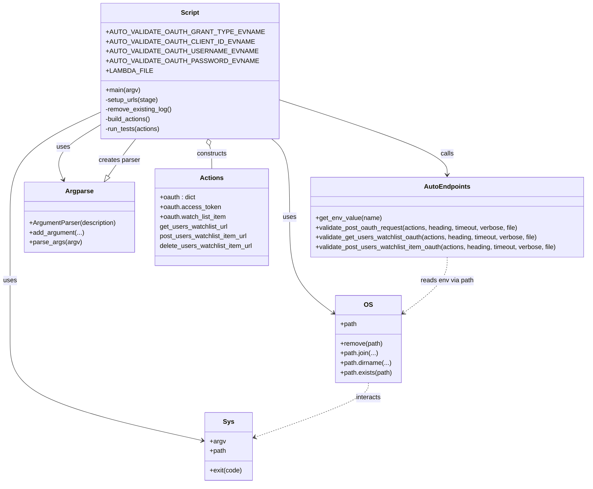

# Diagram: shipment_core/shipment_service/ng_val/scripts/preferences/ng_auto_val_GET_POST_DELETE_watchlist.py

> Auto-generated by Obscura crawlers

## Mermaid

### SVG

<svg id="container" width="1464.3125" xmlns="http://www.w3.org/2000/svg" class="classDiagram" height="1198" viewBox="0 0 1464.3125 1198" role="graphics-document document" aria-roledescription="class"><g><defs><marker id="container_class-aggregationStart" class="marker aggregation class" refX="18" refY="7" markerWidth="190" markerHeight="240" orient="auto"><path d="M 18,7 L9,13 L1,7 L9,1 Z"></path></marker></defs><defs><marker id="container_class-aggregationEnd" class="marker aggregation class" refX="1" refY="7" markerWidth="20" markerHeight="28" orient="auto"><path d="M 18,7 L9,13 L1,7 L9,1 Z"></path></marker></defs><defs><marker id="container_class-extensionStart" class="marker extension class" refX="18" refY="7" markerWidth="190" markerHeight="240" orient="auto"><path d="M 1,7 L18,13 V 1 Z"></path></marker></defs><defs><marker id="container_class-extensionEnd" class="marker extension class" refX="1" refY="7" markerWidth="20" markerHeight="28" orient="auto"><path d="M 1,1 V 13 L18,7 Z"></path></marker></defs><defs><marker id="container_class-compositionStart" class="marker composition class" refX="18" refY="7" markerWidth="190" markerHeight="240" orient="auto"><path d="M 18,7 L9,13 L1,7 L9,1 Z"></path></marker></defs><defs><marker id="container_class-compositionEnd" class="marker composition class" refX="1" refY="7" markerWidth="20" markerHeight="28" orient="auto"><path d="M 18,7 L9,13 L1,7 L9,1 Z"></path></marker></defs><defs><marker id="container_class-dependencyStart" class="marker dependency class" refX="6" refY="7" markerWidth="190" markerHeight="240" orient="auto"><path d="M 5,7 L9,13 L1,7 L9,1 Z"></path></marker></defs><defs><marker id="container_class-dependencyEnd" class="marker dependency class" refX="13" refY="7" markerWidth="20" markerHeight="28" orient="auto"><path d="M 18,7 L9,13 L14,7 L9,1 Z"></path></marker></defs><defs><marker id="container_class-lollipopStart" class="marker lollipop class" refX="13" refY="7" markerWidth="190" markerHeight="240" orient="auto"><circle stroke="black" fill="transparent" cx="7" cy="7" r="6"></circle></marker></defs><defs><marker id="container_class-lollipopEnd" class="marker lollipop class" refX="1" refY="7" markerWidth="190" markerHeight="240" orient="auto"><circle stroke="black" fill="transparent" cx="7" cy="7" r="6"></circle></marker></defs><g class="root"><g class="clusters"></g><g class="edgePaths"><path d="M663.742,237.598L738.708,261.498C813.674,285.398,963.607,333.199,1038.573,365.766C1113.539,398.333,1113.539,415.667,1113.539,424.333L1113.539,433" id="id_Script_AutoEndpoints_1" class="edge-thickness-normal edge-pattern-solid relation" style=";;;" data-edge="true" data-et="edge" data-id="id_Script_AutoEndpoints_1" data-points="W3sieCI6NjYzLjc0MjE4NzUsInkiOjIzNy41OTc1MTI4OTQxOTE2OH0seyJ4IjoxMTEzLjUzOTA2MjUsInkiOjM4MX0seyJ4IjoxMTEzLjUzOTA2MjUsInkiOjQzOX1d" marker-end="url(#container_class-dependencyEnd)"></path><path d="M277.328,291.805L252.526,306.671C227.724,321.536,178.12,351.268,157.941,376.882C137.762,402.496,147.008,423.992,151.631,434.74L156.254,445.488" id="id_Script_Argparse_2" class="edge-thickness-normal edge-pattern-solid relation" style=";;;" data-edge="true" data-et="edge" data-id="id_Script_Argparse_2" data-points="W3sieCI6Mjc3LjMyODEyNSwieSI6MjkxLjgwNDYxODcwNTUyOX0seyJ4IjoxMjguNTE1NjI1LCJ5IjozODF9LHsieCI6MTU4LjYyNTA5OTUyMjI5MywieSI6NDUxfV0=" marker-end="url(#container_class-dependencyEnd)"></path><path d="M663.742,335.233L672.997,342.861C682.253,350.489,700.763,365.744,710.018,399.539C719.273,433.333,719.273,485.667,719.273,538C719.273,590.333,719.273,642.667,737.646,682.347C756.019,722.028,792.765,749.056,811.138,762.57L829.51,776.084" id="id_Script_OS_3" class="edge-thickness-normal edge-pattern-solid relation" style=";;;" data-edge="true" data-et="edge" data-id="id_Script_OS_3" data-points="W3sieCI6NjYzLjc0MjE4NzUsInkiOjMzNS4yMzMzOTY2NzM4MzgzfSx7IngiOjcxOS4yNzM0Mzc1LCJ5IjozODF9LHsieCI6NzE5LjI3MzQzNzUsInkiOjUzOH0seyJ4Ijo3MTkuMjczNDM3NSwieSI6Njk1fSx7IngiOjgzNC4zNDM3NSwieSI6Nzc5LjYzOTM2MTE1NDA0NDN9XQ==" marker-end="url(#container_class-dependencyEnd)"></path><path d="M277.328,264.797L235.189,284.164C193.049,303.532,108.771,342.266,66.632,387.8C24.492,433.333,24.492,485.667,24.492,538C24.492,590.333,24.492,642.667,24.492,693C24.492,743.333,24.492,791.667,24.492,840C24.492,888.333,24.492,936.667,104.572,978.628C184.652,1020.589,344.811,1056.179,424.891,1073.974L504.971,1091.768" id="id_Script_Sys_4" class="edge-thickness-normal edge-pattern-solid relation" style=";;;" data-edge="true" data-et="edge" data-id="id_Script_Sys_4" data-points="W3sieCI6Mjc3LjMyODEyNSwieSI6MjY0Ljc5NzM2NzQ3NjE1NzU1fSx7IngiOjI0LjQ5MjE4NzUsInkiOjM4MX0seyJ4IjoyNC40OTIxODc1LCJ5Ijo1Mzh9LHsieCI6MjQuNDkyMTg3NSwieSI6Njk1fSx7IngiOjI0LjQ5MjE4NzUsInkiOjg0MH0seyJ4IjoyNC40OTIxODc1LCJ5Ijo5ODV9LHsieCI6NTEwLjgyODEyNSwieSI6MTA5My4wNzAwMDEwMDQzMTg2fV0=" marker-end="url(#container_class-dependencyEnd)"></path><path d="M519.771,360.668L520.674,364.056C521.577,367.445,523.384,374.223,524.288,383.778C525.191,393.333,525.191,405.667,525.191,411.833L525.191,418" id="id_Script_Actions_5" class="edge-thickness-normal edge-pattern-solid relation" style=";;;" data-edge="true" data-et="edge" data-id="id_Script_Actions_5" data-points="W3sieCI6NTE1LjMyNjYxOTY2NDYzNDEsInkiOjM0NH0seyJ4Ijo1MjUuMTkxNDA2MjUsInkiOjM4MX0seyJ4Ijo1MjUuMTkxNDA2MjUsInkiOjQxOH1d" marker-start="url(#container_class-aggregationStart)"></path><path d="M1113.539,637L1113.539,646.667C1113.539,656.333,1113.539,675.667,1095.166,698.847C1076.793,722.028,1040.048,749.056,1021.675,762.57L1003.302,776.084" id="id_AutoEndpoints_OS_6" class="edge-thickness-normal edge-pattern-dashed relation" style=";;;" data-edge="true" data-et="edge" data-id="id_AutoEndpoints_OS_6" data-points="W3sieCI6MTExMy41MzkwNjI1LCJ5Ijo2Mzd9LHsieCI6MTExMy41MzkwNjI1LCJ5Ijo2OTV9LHsieCI6OTk4LjQ2ODc1LCJ5Ijo3NzkuNjM5MzYxMTU0MDQ0M31d" marker-end="url(#container_class-dependencyEnd)"></path><path d="M916.406,948L916.406,954.167C916.406,960.333,916.406,972.667,869.15,995.293C821.894,1017.92,727.382,1050.839,680.125,1067.299L632.869,1083.759" id="id_OS_Sys_7" class="edge-thickness-normal edge-pattern-dashed relation" style=";;;" data-edge="true" data-et="edge" data-id="id_OS_Sys_7" data-points="W3sieCI6OTE2LjQwNjI1LCJ5Ijo5NDh9LHsieCI6OTE2LjQwNjI1LCJ5Ijo5ODV9LHsieCI6NjI3LjIwMzEyNSwieSI6MTA4NS43MzI2NDk2NjQ5MTI1fV0=" marker-end="url(#container_class-dependencyEnd)"></path><path d="M266.849,436.869L273.368,427.557C279.887,418.246,292.925,399.623,304.394,384.145C315.864,368.667,325.765,356.333,330.716,350.167L335.666,344" id="id_Argparse_Script_8" class="edge-thickness-normal edge-pattern-solid relation" style=";;;" data-edge="true" data-et="edge" data-id="id_Argparse_Script_8" data-points="W3sieCI6MjU2Ljk1NTc0OTkwMDQ3NzcsInkiOjQ1MX0seyJ4IjozMDUuOTYyODkwNjI1LCJ5IjozODF9LHsieCI6MzM1LjY2NjE3NzU5MTQ2MzQ1LCJ5IjozNDR9XQ==" marker-start="url(#container_class-extensionStart)"></path></g><g class="edgeLabels"><g class="edgeLabel" transform="translate(1113.5390625, 381)"><g class="label" data-id="id_Script_AutoEndpoints_1" transform="translate(-16.4453125, -12)"><foreignObject width="32.890625" height="24">

calls

</foreignObject></g></g><g class="edgeLabel" transform="translate(170.24208, 355.98996)"><g class="label" data-id="id_Script_Argparse_2" transform="translate(-16.4921875, -12)"><foreignObject width="32.984375" height="24">

uses

</foreignObject></g></g><g class="edgeLabel" transform="translate(719.2734375, 538)"><g class="label" data-id="id_Script_OS_3" transform="translate(-16.4921875, -12)"><foreignObject width="32.984375" height="24">

uses

</foreignObject></g></g><g class="edgeLabel" transform="translate(24.4921875, 695)"><g class="label" data-id="id_Script_Sys_4" transform="translate(-16.4921875, -12)"><foreignObject width="32.984375" height="24">

uses

</foreignObject></g></g><g class="edgeLabel" transform="translate(525.19140625, 381)"><g class="label" data-id="id_Script_Actions_5" transform="translate(-37.84375, -12)"><foreignObject width="75.6875" height="24">

constructs

</foreignObject></g></g><g class="edgeLabel" transform="translate(1113.5390625, 695)"><g class="label" data-id="id_AutoEndpoints_OS_6" transform="translate(-66.4375, -12)"><foreignObject width="132.875" height="24">

reads env via path

</foreignObject></g></g><g class="edgeLabel" transform="translate(916.40625, 985)"><g class="label" data-id="id_OS_Sys_7" transform="translate(-31.6875, -12)"><foreignObject width="63.375" height="24">

interacts

</foreignObject></g></g><g class="edgeLabel" transform="translate(295.06539, 396.56559)"><g class="label" data-id="id_Argparse_Script_8" transform="translate(-51.46875, -12)"><foreignObject width="102.9375" height="24">

creates parser

</foreignObject></g></g></g><g class="nodes"><g class="node default" id="classId-Script-0" transform="translate(470.53515625, 176)"><g class="basic label-container"><path d="M-193.20703125 -168 L193.20703125 -168 L193.20703125 168 L-193.20703125 168" stroke="none" stroke-width="0" fill="#ECECFF" style=""></path><path d="M-193.20703125 -168 C-55.260930869072325 -168, 82.68516951185535 -168, 193.20703125 -168 M-193.20703125 -168 C-82.6542270279902 -168, 27.898577194019595 -168, 193.20703125 -168 M193.20703125 -168 C193.20703125 -42.33984242148982, 193.20703125 83.32031515702036, 193.20703125 168 M193.20703125 -168 C193.20703125 -43.16113582938601, 193.20703125 81.67772834122798, 193.20703125 168 M193.20703125 168 C107.34047759676976 168, 21.473923943539518 168, -193.20703125 168 M193.20703125 168 C113.61950372005396 168, 34.03197619010791 168, -193.20703125 168 M-193.20703125 168 C-193.20703125 75.78857681561324, -193.20703125 -16.42284636877352, -193.20703125 -168 M-193.20703125 168 C-193.20703125 40.6043146436006, -193.20703125 -86.7913707127988, -193.20703125 -168" stroke="#9370DB" stroke-width="1.3" fill="none" stroke-dasharray="0 0" style=""></path></g><g class="annotation-group text" transform="translate(0, -144)"></g><g class="label-group text" transform="translate(-21.7421875, -144)"><g class="label" style="font-weight: bolder" transform="translate(0,-12)"><foreignObject width="43.484375" height="24">

Script

</foreignObject></g></g><g class="members-group text" transform="translate(-181.20703125, -96)"><g class="label" style="" transform="translate(0,-12)"><foreignObject width="340.671875" height="24">

+AUTO_VALIDATE_OAUTH_GRANT_TYPE_EVNAME

</foreignObject></g><g class="label" style="" transform="translate(0,12)"><foreignObject width="322.1875" height="24">

+AUTO_VALIDATE_OAUTH_CLIENT_ID_EVNAME

</foreignObject></g><g class="label" style="" transform="translate(0,36)"><foreignObject width="329.578125" height="24">

+AUTO_VALIDATE_OAUTH_USERNAME_EVNAME

</foreignObject></g><g class="label" style="" transform="translate(0,60)"><foreignObject width="329.734375" height="24">

+AUTO_VALIDATE_OAUTH_PASSWORD_EVNAME

</foreignObject></g><g class="label" style="" transform="translate(0,84)"><foreignObject width="104.046875" height="24">

+LAMBDA_FILE

</foreignObject></g></g><g class="methods-group text" transform="translate(-181.20703125, 48)"><g class="label" style="" transform="translate(0,-12)"><foreignObject width="85.5" height="24">

+main(argv)

</foreignObject></g><g class="label" style="" transform="translate(0,12)"><foreignObject width="131.40625" height="24">

-setup_urls(stage)

</foreignObject></g><g class="label" style="" transform="translate(0,36)"><foreignObject width="165.234375" height="24">

-remove_existing_log()

</foreignObject></g><g class="label" style="" transform="translate(0,60)"><foreignObject width="115.15625" height="24">

-build_actions()

</foreignObject></g><g class="label" style="" transform="translate(0,84)"><foreignObject width="137.5" height="24">

-run_tests(actions)

</foreignObject></g></g><g class="divider" style=""><path d="M-193.20703125 -120 C-49.77297355306439 -120, 93.66108414387122 -120, 193.20703125 -120 M-193.20703125 -120 C-99.33447213647759 -120, -5.461913022955173 -120, 193.20703125 -120" stroke="#9370DB" stroke-width="1.3" fill="none" stroke-dasharray="0 0" style=""></path></g><g class="divider" style=""><path d="M-193.20703125 24 C-48.30447896450906 24, 96.59807332098188 24, 193.20703125 24 M-193.20703125 24 C-95.12549988937127 24, 2.956031471257461 24, 193.20703125 24" stroke="#9370DB" stroke-width="1.3" fill="none" stroke-dasharray="0 0" style=""></path></g></g><g class="node default" id="classId-AutoEndpoints-1" transform="translate(1113.5390625, 538)"><g class="basic label-container"><path d="M-342.7734375 -99 L342.7734375 -99 L342.7734375 99 L-342.7734375 99" stroke="none" stroke-width="0" fill="#ECECFF" style=""></path><path d="M-342.7734375 -99 C-126.88604402082976 -99, 89.00134945834048 -99, 342.7734375 -99 M-342.7734375 -99 C-160.82427801141014 -99, 21.124881477179713 -99, 342.7734375 -99 M342.7734375 -99 C342.7734375 -59.39088016799395, 342.7734375 -19.781760335987897, 342.7734375 99 M342.7734375 -99 C342.7734375 -56.597909954496515, 342.7734375 -14.19581990899303, 342.7734375 99 M342.7734375 99 C124.13648445732645 99, -94.50046858534711 99, -342.7734375 99 M342.7734375 99 C147.01258777776275 99, -48.74826194447451 99, -342.7734375 99 M-342.7734375 99 C-342.7734375 40.08248879082377, -342.7734375 -18.835022418352466, -342.7734375 -99 M-342.7734375 99 C-342.7734375 44.99392339979192, -342.7734375 -9.012153200416165, -342.7734375 -99" stroke="#9370DB" stroke-width="1.3" fill="none" stroke-dasharray="0 0" style=""></path></g><g class="annotation-group text" transform="translate(0, -75)"></g><g class="label-group text" transform="translate(-53.734375, -75)"><g class="label" style="font-weight: bolder" transform="translate(0,-12)"><foreignObject width="107.46875" height="24">

AutoEndpoints

</foreignObject></g></g><g class="members-group text" transform="translate(-330.7734375, -27)"></g><g class="methods-group text" transform="translate(-330.7734375, 3)"><g class="label" style="" transform="translate(0,-12)"><foreignObject width="161.53125" height="24">

+get_env_value(name)

</foreignObject></g><g class="label" style="" transform="translate(0,12)"><foreignObject width="511.015625" height="24">

+validate_post_oauth_request(actions, heading, timeout, verbose, file)

</foreignObject></g><g class="label" style="" transform="translate(0,36)"><foreignObject width="557.625" height="24">

+validate_get_users_watchlist_oauth(actions, heading, timeout, verbose, file)

</foreignObject></g><g class="label" style="" transform="translate(0,60)"><foreignObject width="607.8125" height="24">

+validate_post_users_watchlist_item_oauth(actions, heading, timeout, verbose, file)

</foreignObject></g></g><g class="divider" style=""><path d="M-342.7734375 -51 C-120.18855375172751 -51, 102.39632999654498 -51, 342.7734375 -51 M-342.7734375 -51 C-118.51598334303378 -51, 105.74147081393244 -51, 342.7734375 -51" stroke="#9370DB" stroke-width="1.3" fill="none" stroke-dasharray="0 0" style=""></path></g><g class="divider" style=""><path d="M-342.7734375 -27 C-107.99122936263143 -27, 126.79097877473714 -27, 342.7734375 -27 M-342.7734375 -27 C-147.59001019550388 -27, 47.59341710899224 -27, 342.7734375 -27" stroke="#9370DB" stroke-width="1.3" fill="none" stroke-dasharray="0 0" style=""></path></g></g><g class="node default" id="classId-Argparse-2" transform="translate(196.046875, 538)"><g class="basic label-container"><path d="M-136.5546875 -87 L136.5546875 -87 L136.5546875 87 L-136.5546875 87" stroke="none" stroke-width="0" fill="#ECECFF" style=""></path><path d="M-136.5546875 -87 C-47.60149463368609 -87, 41.351698232627825 -87, 136.5546875 -87 M-136.5546875 -87 C-28.967378864291632 -87, 78.61992977141674 -87, 136.5546875 -87 M136.5546875 -87 C136.5546875 -28.024043849376923, 136.5546875 30.951912301246153, 136.5546875 87 M136.5546875 -87 C136.5546875 -43.69828710410913, 136.5546875 -0.3965742082182544, 136.5546875 87 M136.5546875 87 C76.88470555472621 87, 17.21472360945242 87, -136.5546875 87 M136.5546875 87 C62.96161142068354 87, -10.631464658632922 87, -136.5546875 87 M-136.5546875 87 C-136.5546875 40.0559503044945, -136.5546875 -6.888099391010996, -136.5546875 -87 M-136.5546875 87 C-136.5546875 31.42651217973897, -136.5546875 -24.146975640522058, -136.5546875 -87" stroke="#9370DB" stroke-width="1.3" fill="none" stroke-dasharray="0 0" style=""></path></g><g class="annotation-group text" transform="translate(0, -63)"></g><g class="label-group text" transform="translate(-32.71875, -63)"><g class="label" style="font-weight: bolder" transform="translate(0,-12)"><foreignObject width="65.4375" height="24">

Argparse

</foreignObject></g></g><g class="members-group text" transform="translate(-124.5546875, -15)"></g><g class="methods-group text" transform="translate(-124.5546875, 15)"><g class="label" style="" transform="translate(0,-12)"><foreignObject width="216.390625" height="24">

+ArgumentParser(description)

</foreignObject></g><g class="label" style="" transform="translate(0,12)"><foreignObject width="135.171875" height="24">

+add_argument(...)

</foreignObject></g><g class="label" style="" transform="translate(0,36)"><foreignObject width="127.375" height="24">

+parse_args(argv)

</foreignObject></g></g><g class="divider" style=""><path d="M-136.5546875 -39 C-41.20127696735851 -39, 54.15213356528298 -39, 136.5546875 -39 M-136.5546875 -39 C-79.9025376864832 -39, -23.2503878729664 -39, 136.5546875 -39" stroke="#9370DB" stroke-width="1.3" fill="none" stroke-dasharray="0 0" style=""></path></g><g class="divider" style=""><path d="M-136.5546875 -15 C-48.866443972362916 -15, 38.82179955527417 -15, 136.5546875 -15 M-136.5546875 -15 C-79.7061607702106 -15, -22.85763404042119 -15, 136.5546875 -15" stroke="#9370DB" stroke-width="1.3" fill="none" stroke-dasharray="0 0" style=""></path></g></g><g class="node default" id="classId-OS-3" transform="translate(916.40625, 840)"><g class="basic label-container"><path d="M-82.0625 -108 L82.0625 -108 L82.0625 108 L-82.0625 108" stroke="none" stroke-width="0" fill="#ECECFF" style=""></path><path d="M-82.0625 -108 C-21.57904934211259 -108, 38.90440131577482 -108, 82.0625 -108 M-82.0625 -108 C-46.98253711958464 -108, -11.902574239169283 -108, 82.0625 -108 M82.0625 -108 C82.0625 -64.634341732442, 82.0625 -21.268683464883992, 82.0625 108 M82.0625 -108 C82.0625 -36.58515295280006, 82.0625 34.82969409439988, 82.0625 108 M82.0625 108 C23.71400232879561 108, -34.63449534240878 108, -82.0625 108 M82.0625 108 C33.36434017124943 108, -15.333819657501138 108, -82.0625 108 M-82.0625 108 C-82.0625 29.952666101701553, -82.0625 -48.094667796596895, -82.0625 -108 M-82.0625 108 C-82.0625 57.772376452612384, -82.0625 7.544752905224769, -82.0625 -108" stroke="#9370DB" stroke-width="1.3" fill="none" stroke-dasharray="0 0" style=""></path></g><g class="annotation-group text" transform="translate(0, -84)"></g><g class="label-group text" transform="translate(-10.109375, -84)"><g class="label" style="font-weight: bolder" transform="translate(0,-12)"><foreignObject width="20.21875" height="24">

OS

</foreignObject></g></g><g class="members-group text" transform="translate(-70.0625, -36)"><g class="label" style="" transform="translate(0,-12)"><foreignObject width="41.1875" height="24">

+path

</foreignObject></g></g><g class="methods-group text" transform="translate(-70.0625, 12)"><g class="label" style="" transform="translate(0,-12)"><foreignObject width="105.5" height="24">

+remove(path)

</foreignObject></g><g class="label" style="" transform="translate(0,12)"><foreignObject width="94.625" height="24">

+path.join(...)

</foreignObject></g><g class="label" style="" transform="translate(0,36)"><foreignObject width="127.53125" height="24">

+path.dirname(...)

</foreignObject></g><g class="label" style="" transform="translate(0,60)"><foreignObject width="130.015625" height="24">

+path.exists(path)

</foreignObject></g></g><g class="divider" style=""><path d="M-82.0625 -60 C-46.5010054513247 -60, -10.939510902649403 -60, 82.0625 -60 M-82.0625 -60 C-42.400423789824444 -60, -2.738347579648888 -60, 82.0625 -60" stroke="#9370DB" stroke-width="1.3" fill="none" stroke-dasharray="0 0" style=""></path></g><g class="divider" style=""><path d="M-82.0625 -12 C-38.184196319363046 -12, 5.6941073612739075 -12, 82.0625 -12 M-82.0625 -12 C-41.85363259706855 -12, -1.6447651941370935 -12, 82.0625 -12" stroke="#9370DB" stroke-width="1.3" fill="none" stroke-dasharray="0 0" style=""></path></g></g><g class="node default" id="classId-Sys-4" transform="translate(569.015625, 1106)"><g class="basic label-container"><path d="M-58.1875 -84 L58.1875 -84 L58.1875 84 L-58.1875 84" stroke="none" stroke-width="0" fill="#ECECFF" style=""></path><path d="M-58.1875 -84 C-29.531146824718437 -84, -0.8747936494368744 -84, 58.1875 -84 M-58.1875 -84 C-19.00760538832356 -84, 20.172289223352877 -84, 58.1875 -84 M58.1875 -84 C58.1875 -17.533298499997443, 58.1875 48.933403000005114, 58.1875 84 M58.1875 -84 C58.1875 -28.61281290457285, 58.1875 26.774374190854303, 58.1875 84 M58.1875 84 C11.825271533748868 84, -34.536956932502264 84, -58.1875 84 M58.1875 84 C34.64381057719018 84, 11.10012115438036 84, -58.1875 84 M-58.1875 84 C-58.1875 45.08168829715072, -58.1875 6.16337659430144, -58.1875 -84 M-58.1875 84 C-58.1875 41.27769788293737, -58.1875 -1.444604234125265, -58.1875 -84" stroke="#9370DB" stroke-width="1.3" fill="none" stroke-dasharray="0 0" style=""></path></g><g class="annotation-group text" transform="translate(0, -60)"></g><g class="label-group text" transform="translate(-12.4375, -60)"><g class="label" style="font-weight: bolder" transform="translate(0,-12)"><foreignObject width="24.875" height="24">

Sys

</foreignObject></g></g><g class="members-group text" transform="translate(-46.1875, -12)"><g class="label" style="" transform="translate(0,-12)"><foreignObject width="38.578125" height="24">

+argv

</foreignObject></g><g class="label" style="" transform="translate(0,12)"><foreignObject width="41.1875" height="24">

+path

</foreignObject></g></g><g class="methods-group text" transform="translate(-46.1875, 60)"><g class="label" style="" transform="translate(0,-12)"><foreignObject width="79.9375" height="24">

+exit(code)

</foreignObject></g></g><g class="divider" style=""><path d="M-58.1875 -36 C-22.526930059536042 -36, 13.133639880927916 -36, 58.1875 -36 M-58.1875 -36 C-25.918846515083153 -36, 6.349806969833693 -36, 58.1875 -36" stroke="#9370DB" stroke-width="1.3" fill="none" stroke-dasharray="0 0" style=""></path></g><g class="divider" style=""><path d="M-58.1875 36 C-25.710032108346134 36, 6.767435783307732 36, 58.1875 36 M-58.1875 36 C-27.755856234061707 36, 2.675787531876587 36, 58.1875 36" stroke="#9370DB" stroke-width="1.3" fill="none" stroke-dasharray="0 0" style=""></path></g></g><g class="node default" id="classId-Actions-5" transform="translate(525.19140625, 538)"><g class="basic label-container"><path d="M-142.58984375 -120 L142.58984375 -120 L142.58984375 120 L-142.58984375 120" stroke="none" stroke-width="0" fill="#ECECFF" style=""></path><path d="M-142.58984375 -120 C-49.07521881991077 -120, 44.43940611017845 -120, 142.58984375 -120 M-142.58984375 -120 C-37.9031769729755 -120, 66.783489804049 -120, 142.58984375 -120 M142.58984375 -120 C142.58984375 -30.26455142839839, 142.58984375 59.47089714320322, 142.58984375 120 M142.58984375 -120 C142.58984375 -45.77788635786756, 142.58984375 28.444227284264883, 142.58984375 120 M142.58984375 120 C79.97386529967304 120, 17.357886849346073 120, -142.58984375 120 M142.58984375 120 C47.7784816850138 120, -47.0328803799724 120, -142.58984375 120 M-142.58984375 120 C-142.58984375 56.111958581293834, -142.58984375 -7.776082837412332, -142.58984375 -120 M-142.58984375 120 C-142.58984375 47.968407410756996, -142.58984375 -24.06318517848601, -142.58984375 -120" stroke="#9370DB" stroke-width="1.3" fill="none" stroke-dasharray="0 0" style=""></path></g><g class="annotation-group text" transform="translate(0, -96)"></g><g class="label-group text" transform="translate(-27.0546875, -96)"><g class="label" style="font-weight: bolder" transform="translate(0,-12)"><foreignObject width="54.109375" height="24">

Actions

</foreignObject></g></g><g class="members-group text" transform="translate(-130.58984375, -48)"><g class="label" style="" transform="translate(0,-12)"><foreignObject width="90.171875" height="24">

+oauth : dict

</foreignObject></g><g class="label" style="" transform="translate(0,12)"><foreignObject width="149.75" height="24">

+oauth.access_token

</foreignObject></g><g class="label" style="" transform="translate(0,36)"><foreignObject width="167.8125" height="24">

+oauth.watch_list_item

</foreignObject></g><g class="label" style="" transform="translate(0,60)"><foreignObject width="170.328125" height="24">

get_users_watchlist_url

</foreignObject></g><g class="label" style="" transform="translate(0,84)"><foreignObject width="220.671875" height="24">

post_users_watchlist_item_url

</foreignObject></g><g class="label" style="" transform="translate(0,108)"><foreignObject width="234.125" height="24">

delete_users_watchlist_item_url

</foreignObject></g></g><g class="methods-group text" transform="translate(-130.58984375, 120)"></g><g class="divider" style=""><path d="M-142.58984375 -72 C-65.20528006203742 -72, 12.179283625925166 -72, 142.58984375 -72 M-142.58984375 -72 C-59.97407846914837 -72, 22.641686811703266 -72, 142.58984375 -72" stroke="#9370DB" stroke-width="1.3" fill="none" stroke-dasharray="0 0" style=""></path></g><g class="divider" style=""><path d="M-142.58984375 96 C-45.35844360894089 96, 51.87295653211822 96, 142.58984375 96 M-142.58984375 96 C-56.234983918302206 96, 30.11987591339559 96, 142.58984375 96" stroke="#9370DB" stroke-width="1.3" fill="none" stroke-dasharray="0 0" style=""></path></g></g></g></g></g></svg>
