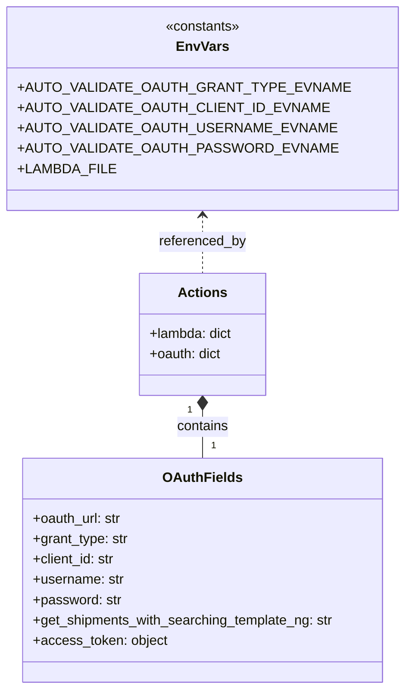

# Diagram: shipment_core/shipment_service/ng_val/scripts/rack_returns/ng_auto_val_GET_search_rack_return_shipments.py


> Auto-generated by Obscura crawlers

## Diagram 1

```mermaid
flowchart TD
    A[Start: script entry] --> B[Parse CLI args\n--stage required]
    B --> C{stage value}
    C -->|prod-b| Prod[Set lambda_url=https://data-b.freightverify.com\ncg_base_path=shipping\nng_base_path=shipping-ng\noauth_url=https://login.freightverify.com/oauth/token]
    C -->|staging| Stg[Set lambda_url=https://data-s.freightverify.com\ncg_base_path=shipping\nng_base_path=shipping-ng\noauth_url=https://login-s.freightverify.com/oauth/token]
    C -->|test| Test[Set lambda_url=https://data-t.freightverify.com\ncg_base_path=shipping\nng_base_path=shipping-ng\noauth_url=https://login-t.freightverify.com/oauth/token]
    C -->|other| Other[Set lambda_url=https://data-s.freightverify.com\ncg_base_path=stage\nng_base_path=shipping-ng-{stage}\noauth_url=https://login-s.freightverify.com/oauth/token]
    Prod --> D[Set LAMBDA_FILE to ng_auto_val_GET_search_rack_return_shipments.{stage}.json]
    Stg --> D
    Test --> D
    Other --> D
    D --> E[Remove existing LAMBDA_FILE if exists]
    E --> F[Build actions dict\nactions['lambda'] = {}\nactions['oauth'] = {}]
    F --> G[Load OAuth env values via auto_endpoints.get_env_value\ngrant_type, client_id, username, password]
    G --> H[Construct get_shipments_with_searching_template_ng endpoint\nf"{lambda_url}/{ng_base_path}/shipments{}"]
    H --> I[Call validate_post_oauth_request to obtain oauth_token]
    I --> J[Store access_token into actions['oauth']['access_token']]
    J --> K[Test 1.1: call validate_get_all_shipments_with_searching_ng_oauth\nq_a=?page_size=10&page_number=0&shipment_type=1]
    K --> L[Test 1.2: call validate_get_all_shipments_with_searching_ng_oauth\nq_a=?page_size=10&page_number=0&shipment_type=2]
    L --> M[End]
```

> SVG rendering failed for this diagram.

## Diagram 2



### SVG

<svg id="container" width="441.6796875" xmlns="http://www.w3.org/2000/svg" class="classDiagram" height="812" viewBox="0 0 441.6796875 812" role="graphics-document document" aria-roledescription="class"><style>#container{font-family:"trebuchet ms",verdana,arial,sans-serif;font-size:16px;fill:#333;}@keyframes edge-animation-frame{from{stroke-dashoffset:0;}}@keyframes dash{to{stroke-dashoffset:0;}}#container .edge-animation-slow{stroke-dasharray:9,5!important;stroke-dashoffset:900;animation:dash 50s linear infinite;stroke-linecap:round;}#container .edge-animation-fast{stroke-dasharray:9,5!important;stroke-dashoffset:900;animation:dash 20s linear infinite;stroke-linecap:round;}#container .error-icon{fill:#552222;}#container .error-text{fill:#552222;stroke:#552222;}#container .edge-thickness-normal{stroke-width:1px;}#container .edge-thickness-thick{stroke-width:3.5px;}#container .edge-pattern-solid{stroke-dasharray:0;}#container .edge-thickness-invisible{stroke-width:0;fill:none;}#container .edge-pattern-dashed{stroke-dasharray:3;}#container .edge-pattern-dotted{stroke-dasharray:2;}#container .marker{fill:#333333;stroke:#333333;}#container .marker.cross{stroke:#333333;}#container svg{font-family:"trebuchet ms",verdana,arial,sans-serif;font-size:16px;}#container p{margin:0;}#container g.classGroup text{fill:#9370DB;stroke:none;font-family:"trebuchet ms",verdana,arial,sans-serif;font-size:10px;}#container g.classGroup text .title{font-weight:bolder;}#container .nodeLabel,#container .edgeLabel{color:#131300;}#container .edgeLabel .label rect{fill:#ECECFF;}#container .label text{fill:#131300;}#container .labelBkg{background:#ECECFF;}#container .edgeLabel .label span{background:#ECECFF;}#container .classTitle{font-weight:bolder;}#container .node rect,#container .node circle,#container .node ellipse,#container .node polygon,#container .node path{fill:#ECECFF;stroke:#9370DB;stroke-width:1px;}#container .divider{stroke:#9370DB;stroke-width:1;}#container g.clickable{cursor:pointer;}#container g.classGroup rect{fill:#ECECFF;stroke:#9370DB;}#container g.classGroup line{stroke:#9370DB;stroke-width:1;}#container .classLabel .box{stroke:none;stroke-width:0;fill:#ECECFF;opacity:0.5;}#container .classLabel .label{fill:#9370DB;font-size:10px;}#container .relation{stroke:#333333;stroke-width:1;fill:none;}#container .dashed-line{stroke-dasharray:3;}#container .dotted-line{stroke-dasharray:1 2;}#container #compositionStart,#container .composition{fill:#333333!important;stroke:#333333!important;stroke-width:1;}#container #compositionEnd,#container .composition{fill:#333333!important;stroke:#333333!important;stroke-width:1;}#container #dependencyStart,#container .dependency{fill:#333333!important;stroke:#333333!important;stroke-width:1;}#container #dependencyStart,#container .dependency{fill:#333333!important;stroke:#333333!important;stroke-width:1;}#container #extensionStart,#container .extension{fill:transparent!important;stroke:#333333!important;stroke-width:1;}#container #extensionEnd,#container .extension{fill:transparent!important;stroke:#333333!important;stroke-width:1;}#container #aggregationStart,#container .aggregation{fill:transparent!important;stroke:#333333!important;stroke-width:1;}#container #aggregationEnd,#container .aggregation{fill:transparent!important;stroke:#333333!important;stroke-width:1;}#container #lollipopStart,#container .lollipop{fill:#ECECFF!important;stroke:#333333!important;stroke-width:1;}#container #lollipopEnd,#container .lollipop{fill:#ECECFF!important;stroke:#333333!important;stroke-width:1;}#container .edgeTerminals{font-size:11px;line-height:initial;}#container .classTitleText{text-anchor:middle;font-size:18px;fill:#333;}#container .label-icon{display:inline-block;height:1em;overflow:visible;vertical-align:-0.125em;}#container .node .label-icon path{fill:currentColor;stroke:revert;stroke-width:revert;}#container :root{--mermaid-font-family:"trebuchet ms",verdana,arial,sans-serif;}</style><g><defs><marker id="container_class-aggregationStart" class="marker aggregation class" refX="18" refY="7" markerWidth="190" markerHeight="240" orient="auto"><path d="M 18,7 L9,13 L1,7 L9,1 Z"></path></marker></defs><defs><marker id="container_class-aggregationEnd" class="marker aggregation class" refX="1" refY="7" markerWidth="20" markerHeight="28" orient="auto"><path d="M 18,7 L9,13 L1,7 L9,1 Z"></path></marker></defs><defs><marker id="container_class-extensionStart" class="marker extension class" refX="18" refY="7" markerWidth="190" markerHeight="240" orient="auto"><path d="M 1,7 L18,13 V 1 Z"></path></marker></defs><defs><marker id="container_class-extensionEnd" class="marker extension class" refX="1" refY="7" markerWidth="20" markerHeight="28" orient="auto"><path d="M 1,1 V 13 L18,7 Z"></path></marker></defs><defs><marker id="container_class-compositionStart" class="marker composition class" refX="18" refY="7" markerWidth="190" markerHeight="240" orient="auto"><path d="M 18,7 L9,13 L1,7 L9,1 Z"></path></marker></defs><defs><marker id="container_class-compositionEnd" class="marker composition class" refX="1" refY="7" markerWidth="20" markerHeight="28" orient="auto"><path d="M 18,7 L9,13 L1,7 L9,1 Z"></path></marker></defs><defs><marker id="container_class-dependencyStart" class="marker dependency class" refX="6" refY="7" markerWidth="190" markerHeight="240" orient="auto"><path d="M 5,7 L9,13 L1,7 L9,1 Z"></path></marker></defs><defs><marker id="container_class-dependencyEnd" class="marker dependency class" refX="13" refY="7" markerWidth="20" markerHeight="28" orient="auto"><path d="M 18,7 L9,13 L14,7 L9,1 Z"></path></marker></defs><defs><marker id="container_class-lollipopStart" class="marker lollipop class" refX="13" refY="7" markerWidth="190" markerHeight="240" orient="auto"><circle stroke="black" fill="transparent" cx="7" cy="7" r="6"></circle></marker></defs><defs><marker id="container_class-lollipopEnd" class="marker lollipop class" refX="1" refY="7" markerWidth="190" markerHeight="240" orient="auto"><circle stroke="black" fill="transparent" cx="7" cy="7" r="6"></circle></marker></defs><g class="root"><g class="clusters"></g><g class="edgePaths"><path d="M220.84,483.25L220.84,486.542C220.84,489.833,220.84,496.417,220.84,505.875C220.84,515.333,220.84,527.667,220.84,533.833L220.84,540" id="id_Actions_OAuthFields_1" class="edge-thickness-normal edge-pattern-solid relation" style=";;;" data-edge="true" data-et="edge" data-id="id_Actions_OAuthFields_1" data-points="W3sieCI6MjIwLjgzOTg0Mzc1LCJ5Ijo0NjZ9LHsieCI6MjIwLjgzOTg0Mzc1LCJ5Ijo1MDN9LHsieCI6MjIwLjgzOTg0Mzc1LCJ5Ijo1NDB9XQ==" marker-start="url(#container_class-compositionStart)"></path><path d="M220.84,254L220.84,259.167C220.84,264.333,220.84,274.667,220.84,286C220.84,297.333,220.84,309.667,220.84,315.833L220.84,322" id="id_EnvVars_Actions_2" class="edge-thickness-normal edge-pattern-dashed relation" style=";;;" data-edge="true" data-et="edge" data-id="id_EnvVars_Actions_2" data-points="W3sieCI6MjIwLjgzOTg0Mzc1LCJ5IjoyNDh9LHsieCI6MjIwLjgzOTg0Mzc1LCJ5IjoyODV9LHsieCI6MjIwLjgzOTg0Mzc1LCJ5IjozMjJ9XQ==" marker-start="url(#container_class-dependencyStart)"></path></g><g class="edgeLabels"><g class="edgeLabel" transform="translate(220.83984375, 503)"><g class="label" data-id="id_Actions_OAuthFields_1" transform="translate(-30.890625, -12)"><foreignObject width="61.78125" height="24"><div xmlns="http://www.w3.org/1999/xhtml" class="labelBkg" style="display: table-cell; white-space: nowrap; line-height: 1.5; max-width: 200px; text-align: center;"><span class="edgeLabel"><p>contains</p></span></div></foreignObject></g></g><g class="edgeLabel" transform="translate(220.83984375, 285)"><g class="label" data-id="id_EnvVars_Actions_2" transform="translate(-51.6953125, -12)"><foreignObject width="103.390625" height="24"><div xmlns="http://www.w3.org/1999/xhtml" class="labelBkg" style="display: table-cell; white-space: nowrap; line-height: 1.5; max-width: 200px; text-align: center;"><span class="edgeLabel"><p>referenced_by</p></span></div></foreignObject></g></g><g class="edgeTerminals" transform="translate(205.83984187500008, 483.49999839285715)"><g class="inner" transform="translate(0, 0)"><foreignObject style="width: 9px; height: 12px;"><div xmlns="http://www.w3.org/1999/xhtml" style="display: inline-block; padding-right: 1px; white-space: nowrap;"><span class="edgeLabel">1</span></div></foreignObject></g></g><g class="edgeTerminals" transform="translate(230.8398418749999, 517.4999983928572)"><g class="inner" transform="translate(0, 0)"></g><foreignObject style="width: 9px; height: 12px;"><div xmlns="http://www.w3.org/1999/xhtml" style="display: inline-block; padding-right: 1px; white-space: nowrap;"><span class="edgeLabel">1</span></div></foreignObject></g></g><g class="nodes"><g class="node default" id="classId-Actions-0" transform="translate(220.83984375, 394)"><g class="basic label-container"><path d="M-74.71484375 -72 L74.71484375 -72 L74.71484375 72 L-74.71484375 72" stroke="none" stroke-width="0" fill="#ECECFF" style=""></path><path d="M-74.71484375 -72 C-15.50481775823286 -72, 43.70520823353428 -72, 74.71484375 -72 M-74.71484375 -72 C-28.832325118723595 -72, 17.05019351255281 -72, 74.71484375 -72 M74.71484375 -72 C74.71484375 -39.80995292457943, 74.71484375 -7.6199058491588545, 74.71484375 72 M74.71484375 -72 C74.71484375 -23.325478885285335, 74.71484375 25.34904222942933, 74.71484375 72 M74.71484375 72 C30.43531453166456 72, -13.844214686670881 72, -74.71484375 72 M74.71484375 72 C15.731544141998569 72, -43.25175546600286 72, -74.71484375 72 M-74.71484375 72 C-74.71484375 27.244998651410846, -74.71484375 -17.510002697178308, -74.71484375 -72 M-74.71484375 72 C-74.71484375 16.409430860867225, -74.71484375 -39.18113827826555, -74.71484375 -72" stroke="#9370DB" stroke-width="1.3" fill="none" stroke-dasharray="0 0" style=""></path></g><g class="annotation-group text" transform="translate(0, -48)"></g><g class="label-group text" transform="translate(-27.0546875, -48)"><g class="label" style="font-weight: bolder" transform="translate(0,-12)"><foreignObject width="54.109375" height="24"><div xmlns="http://www.w3.org/1999/xhtml" style="display: table-cell; white-space: nowrap; line-height: 1.5; max-width: 103px; text-align: center;"><span class="nodeLabel markdown-node-label" style=""><p>Actions</p></span></div></foreignObject></g></g><g class="members-group text" transform="translate(-62.71484375, 0)"><g class="label" style="" transform="translate(0,-12)"><foreignObject width="98.375" height="24"><div xmlns="http://www.w3.org/1999/xhtml" style="display: table-cell; white-space: nowrap; line-height: 1.5; max-width: 156px; text-align: center;"><span class="nodeLabel markdown-node-label" style=""><p>+lambda: dict</p></span></div></foreignObject></g><g class="label" style="" transform="translate(0,12)"><foreignObject width="85.921875" height="24"><div xmlns="http://www.w3.org/1999/xhtml" style="display: table-cell; white-space: nowrap; line-height: 1.5; max-width: 144px; text-align: center;"><span class="nodeLabel markdown-node-label" style=""><p>+oauth: dict</p></span></div></foreignObject></g></g><g class="methods-group text" transform="translate(-62.71484375, 72)"></g><g class="divider" style=""><path d="M-74.71484375 -24 C-43.50213030810853 -24, -12.289416866217074 -24, 74.71484375 -24 M-74.71484375 -24 C-38.43604229571865 -24, -2.1572408414373 -24, 74.71484375 -24" stroke="#9370DB" stroke-width="1.3" fill="none" stroke-dasharray="0 0" style=""></path></g><g class="divider" style=""><path d="M-74.71484375 48 C-44.27759218969183 48, -13.840340629383668 48, 74.71484375 48 M-74.71484375 48 C-43.85902607570861 48, -13.003208401417218 48, 74.71484375 48" stroke="#9370DB" stroke-width="1.3" fill="none" stroke-dasharray="0 0" style=""></path></g></g><g class="node default" id="classId-OAuthFields-1" transform="translate(220.83984375, 672)"><g class="basic label-container"><path d="M-212.83984375 -132 L212.83984375 -132 L212.83984375 132 L-212.83984375 132" stroke="none" stroke-width="0" fill="#ECECFF" style=""></path><path d="M-212.83984375 -132 C-100.55493957433406 -132, 11.729964601331886 -132, 212.83984375 -132 M-212.83984375 -132 C-91.5986902736428 -132, 29.642463202714396 -132, 212.83984375 -132 M212.83984375 -132 C212.83984375 -46.87998789961475, 212.83984375 38.240024200770506, 212.83984375 132 M212.83984375 -132 C212.83984375 -44.45327031312756, 212.83984375 43.09345937374488, 212.83984375 132 M212.83984375 132 C87.54174406682021 132, -37.75635561635957 132, -212.83984375 132 M212.83984375 132 C112.49648732943359 132, 12.153130908867183 132, -212.83984375 132 M-212.83984375 132 C-212.83984375 59.9612718558531, -212.83984375 -12.077456288293803, -212.83984375 -132 M-212.83984375 132 C-212.83984375 45.992100205754156, -212.83984375 -40.01579958849169, -212.83984375 -132" stroke="#9370DB" stroke-width="1.3" fill="none" stroke-dasharray="0 0" style=""></path></g><g class="annotation-group text" transform="translate(0, -108)"></g><g class="label-group text" transform="translate(-43.7890625, -108)"><g class="label" style="font-weight: bolder" transform="translate(0,-12)"><foreignObject width="87.578125" height="24"><div xmlns="http://www.w3.org/1999/xhtml" style="display: table-cell; white-space: nowrap; line-height: 1.5; max-width: 137px; text-align: center;"><span class="nodeLabel markdown-node-label" style=""><p>OAuthFields</p></span></div></foreignObject></g></g><g class="members-group text" transform="translate(-200.83984375, -60)"><g class="label" style="" transform="translate(0,-12)"><foreignObject width="106.1875" height="24"><div xmlns="http://www.w3.org/1999/xhtml" style="display: table-cell; white-space: nowrap; line-height: 1.5; max-width: 164px; text-align: center;"><span class="nodeLabel markdown-node-label" style=""><p>+oauth_url: str</p></span></div></foreignObject></g><g class="label" style="" transform="translate(0,12)"><foreignObject width="113.078125" height="24"><div xmlns="http://www.w3.org/1999/xhtml" style="display: table-cell; white-space: nowrap; line-height: 1.5; max-width: 171px; text-align: center;"><span class="nodeLabel markdown-node-label" style=""><p>+grant_type: str</p></span></div></foreignObject></g><g class="label" style="" transform="translate(0,36)"><foreignObject width="98.609375" height="24"><div xmlns="http://www.w3.org/1999/xhtml" style="display: table-cell; white-space: nowrap; line-height: 1.5; max-width: 157px; text-align: center;"><span class="nodeLabel markdown-node-label" style=""><p>+client_id: str</p></span></div></foreignObject></g><g class="label" style="" transform="translate(0,60)"><foreignObject width="107.6875" height="24"><div xmlns="http://www.w3.org/1999/xhtml" style="display: table-cell; white-space: nowrap; line-height: 1.5; max-width: 166px; text-align: center;"><span class="nodeLabel markdown-node-label" style=""><p>+username: str</p></span></div></foreignObject></g><g class="label" style="" transform="translate(0,84)"><foreignObject width="104.140625" height="24"><div xmlns="http://www.w3.org/1999/xhtml" style="display: table-cell; white-space: nowrap; line-height: 1.5; max-width: 162px; text-align: center;"><span class="nodeLabel markdown-node-label" style=""><p>+password: str</p></span></div></foreignObject></g><g class="label" style="" transform="translate(0,108)"><foreignObject width="357.890625" height="24"><div xmlns="http://www.w3.org/1999/xhtml" style="display: table-cell; white-space: nowrap; line-height: 1.5; max-width: 416px; text-align: center;"><span class="nodeLabel markdown-node-label" style=""><p>+get_shipments_with_searching_template_ng: str</p></span></div></foreignObject></g><g class="label" style="" transform="translate(0,132)"><foreignObject width="156.875" height="24"><div xmlns="http://www.w3.org/1999/xhtml" style="display: table-cell; white-space: nowrap; line-height: 1.5; max-width: 214px; text-align: center;"><span class="nodeLabel markdown-node-label" style=""><p>+access_token: object</p></span></div></foreignObject></g></g><g class="methods-group text" transform="translate(-200.83984375, 132)"></g><g class="divider" style=""><path d="M-212.83984375 -84 C-64.35027747471332 -84, 84.13928880057335 -84, 212.83984375 -84 M-212.83984375 -84 C-100.20789555232139 -84, 12.424052645357222 -84, 212.83984375 -84" stroke="#9370DB" stroke-width="1.3" fill="none" stroke-dasharray="0 0" style=""></path></g><g class="divider" style=""><path d="M-212.83984375 108 C-123.13197721873613 108, -33.42411068747225 108, 212.83984375 108 M-212.83984375 108 C-121.83740576477359 108, -30.834967779547185 108, 212.83984375 108" stroke="#9370DB" stroke-width="1.3" fill="none" stroke-dasharray="0 0" style=""></path></g></g><g class="node default" id="classId-EnvVars-2" transform="translate(220.83984375, 128)"><g class="basic label-container"><path d="M-204.44921875 -120 L204.44921875 -120 L204.44921875 120 L-204.44921875 120" stroke="none" stroke-width="0" fill="#ECECFF" style=""></path><path d="M-204.44921875 -120 C-44.52238478865135 -120, 115.4044491726973 -120, 204.44921875 -120 M-204.44921875 -120 C-100.46572090789525 -120, 3.5177769342095075 -120, 204.44921875 -120 M204.44921875 -120 C204.44921875 -37.574938982531364, 204.44921875 44.85012203493727, 204.44921875 120 M204.44921875 -120 C204.44921875 -43.055091811310234, 204.44921875 33.88981637737953, 204.44921875 120 M204.44921875 120 C72.23095560145754 120, -59.987307547084924 120, -204.44921875 120 M204.44921875 120 C55.71255209719047 120, -93.02411455561906 120, -204.44921875 120 M-204.44921875 120 C-204.44921875 37.462334783704264, -204.44921875 -45.07533043259147, -204.44921875 -120 M-204.44921875 120 C-204.44921875 70.52539300661854, -204.44921875 21.0507860132371, -204.44921875 -120" stroke="#9370DB" stroke-width="1.3" fill="none" stroke-dasharray="0 0" style=""></path></g><g class="annotation-group text" transform="translate(-44.2265625, -96)"><g class="label" style="" transform="translate(0,-12)"><foreignObject width="88.453125" height="24"><div xmlns="http://www.w3.org/1999/xhtml" style="display: table-cell; white-space: nowrap; line-height: 1.5; max-width: 138px; text-align: center;"><span class="nodeLabel markdown-node-label" style=""><p>«constants»</p></span></div></foreignObject></g></g><g class="label-group text" transform="translate(-28.40625, -72)"><g class="label" style="font-weight: bolder" transform="translate(0,-12)"><foreignObject width="56.8125" height="24"><div xmlns="http://www.w3.org/1999/xhtml" style="display: table-cell; white-space: nowrap; line-height: 1.5; max-width: 106px; text-align: center;"><span class="nodeLabel markdown-node-label" style=""><p>EnvVars</p></span></div></foreignObject></g></g><g class="members-group text" transform="translate(-192.44921875, -24)"><g class="label" style="" transform="translate(0,-12)"><foreignObject width="340.671875" height="24"><div xmlns="http://www.w3.org/1999/xhtml" style="display: table-cell; white-space: nowrap; line-height: 1.5; max-width: 398px; text-align: center;"><span class="nodeLabel markdown-node-label" style=""><p>+AUTO_VALIDATE_OAUTH_GRANT_TYPE_EVNAME</p></span></div></foreignObject></g><g class="label" style="" transform="translate(0,12)"><foreignObject width="322.1875" height="24"><div xmlns="http://www.w3.org/1999/xhtml" style="display: table-cell; white-space: nowrap; line-height: 1.5; max-width: 380px; text-align: center;"><span class="nodeLabel markdown-node-label" style=""><p>+AUTO_VALIDATE_OAUTH_CLIENT_ID_EVNAME</p></span></div></foreignObject></g><g class="label" style="" transform="translate(0,36)"><foreignObject width="329.578125" height="24"><div xmlns="http://www.w3.org/1999/xhtml" style="display: table-cell; white-space: nowrap; line-height: 1.5; max-width: 387px; text-align: center;"><span class="nodeLabel markdown-node-label" style=""><p>+AUTO_VALIDATE_OAUTH_USERNAME_EVNAME</p></span></div></foreignObject></g><g class="label" style="" transform="translate(0,60)"><foreignObject width="329.734375" height="24"><div xmlns="http://www.w3.org/1999/xhtml" style="display: table-cell; white-space: nowrap; line-height: 1.5; max-width: 387px; text-align: center;"><span class="nodeLabel markdown-node-label" style=""><p>+AUTO_VALIDATE_OAUTH_PASSWORD_EVNAME</p></span></div></foreignObject></g><g class="label" style="" transform="translate(0,84)"><foreignObject width="104.046875" height="24"><div xmlns="http://www.w3.org/1999/xhtml" style="display: table-cell; white-space: nowrap; line-height: 1.5; max-width: 161px; text-align: center;"><span class="nodeLabel markdown-node-label" style=""><p>+LAMBDA_FILE</p></span></div></foreignObject></g></g><g class="methods-group text" transform="translate(-192.44921875, 120)"></g><g class="divider" style=""><path d="M-204.44921875 -48 C-45.610094494409935 -48, 113.22902976118013 -48, 204.44921875 -48 M-204.44921875 -48 C-117.13135297873971 -48, -29.813487207479426 -48, 204.44921875 -48" stroke="#9370DB" stroke-width="1.3" fill="none" stroke-dasharray="0 0" style=""></path></g><g class="divider" style=""><path d="M-204.44921875 96 C-40.9515164578865 96, 122.546185834227 96, 204.44921875 96 M-204.44921875 96 C-108.64920597368412 96, -12.849193197368237 96, 204.44921875 96" stroke="#9370DB" stroke-width="1.3" fill="none" stroke-dasharray="0 0" style=""></path></g></g></g></g></g></svg>
