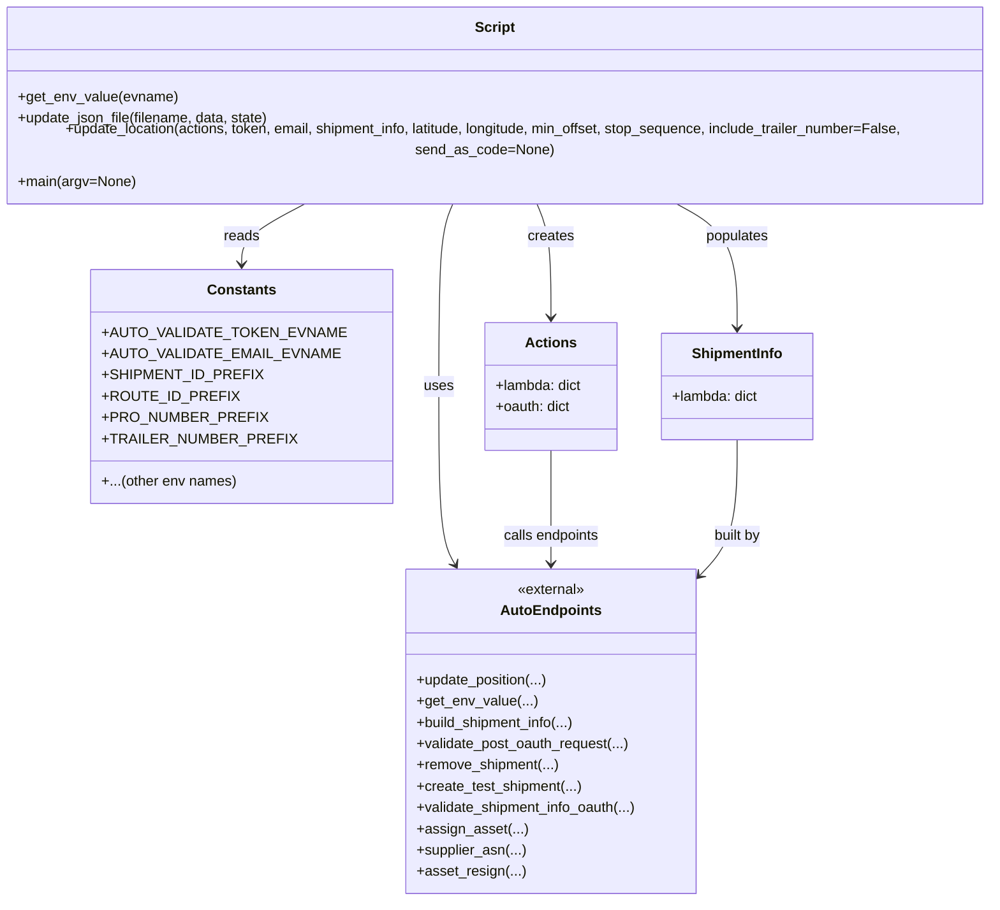

# Diagram: shipment_core/shipment_service/ng_val/scripts/shipment_creation/auto_validate_lambdas.py


> Auto-generated by Obscura crawlers

## Diagram 1



> SVG rendering failed for this diagram.

## Diagram 2

```mermaid
flowchart TD
    Start([Start]) --> ParseArgs{Parse CLI args}
    ParseArgs --> DetermineStage[Determine stage and base URLs]
    DetermineStage --> SetupFile[Set LAMBDA_FILE and remove existing]
    SetupFile --> GenerateUUID[Generate shipment_uuid, ids]
    GenerateUUID --> BuildActions[Build actions endpoints dict]
    BuildActions --> ReadOAuthEnv[Read OAuth envs via auto_endpoints.get_env_value]
    ReadOAuthEnv --> ReadTokenEnv[Read token/email/ids via get_env_value]
    ReadTokenEnv --> BuildShipmentInfo[Build shipment_info via auto_endpoints.build_shipment_info]
    BuildShipmentInfo --> OAuthRequest[Request OAuth token (validate_post_oauth_request)]
    OAuthRequest --> RemoveShipment[Call remove_shipment]
    RemoveShipment --> CreateShipment[Call create_test_shipment]
    CreateShipment --> GetShipmentURL[Set get_shipment URL]
    GetShipmentURL --> ValidateShipmentInfo[validate_shipment_info_oauth]
    ValidateShipmentInfo --> AssignAsset[assign_asset]
    AssignAsset --> Optionals{Optional flows}
    Optionals -->|DRIVE_BY_TEST| DriveByUpdates[send drive-by location updates]
    Optionals -->|REASSIGN_ASSET| ReassignFlow[asset_resign then assign_asset]
    Optionals -->|MAKE_UP_TIME| MakeUpTimeUpdates[send make-up-time updates]
    Optionals -->|ACTUALLY_ARRIVE| ArrivalUpdates[series of update_location calls (include trailer_number/send_as_code sometimes)]
    ArrivalUpdates -->|then| DepartUpdates[depart dropoff updates]
    MakeUpTimeUpdates --> ArrivalUpdates
    DriveByUpdates --> ValidateAfterUpdates[validate_shipment_info_oauth]
    ReassignFlow --> ValidateAfterUpdates
    DepartUpdates --> VerifyCompletion[validate_shipment_info_oauth with assert_completed]
    VerifyCompletion --> RemoveAtEnd{REMOVE_SHIPMENT_AT_END?}
    RemoveAtEnd -->|yes| FinalRemove[remove_shipment]
    RemoveAtEnd -->|no| End([End])
    FinalRemove --> End
```

> SVG rendering failed for this diagram.
