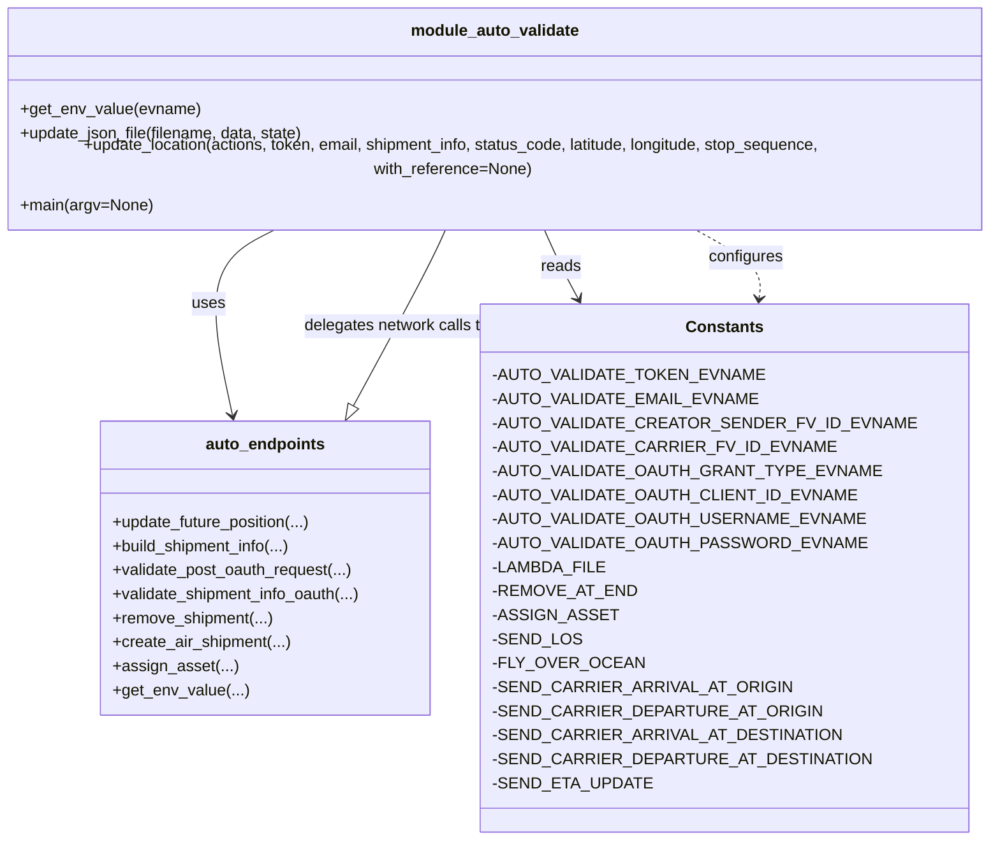

# Diagram: shipment_core/shipment_service/ng_val/scripts/shipment_creation/auto_validate_lambdas_AIR_MODE.py


> Auto-generated by Obscura crawlers

## Diagram 1



### SVG

<svg id="container" width="1037.7734375" xmlns="http://www.w3.org/2000/svg" class="classDiagram" height="816" viewBox="0 0 1037.7734375 816" role="graphics-document document" aria-roledescription="class"><style>#container{font-family:"trebuchet ms",verdana,arial,sans-serif;font-size:16px;fill:#333;}@keyframes edge-animation-frame{from{stroke-dashoffset:0;}}@keyframes dash{to{stroke-dashoffset:0;}}#container .edge-animation-slow{stroke-dasharray:9,5!important;stroke-dashoffset:900;animation:dash 50s linear infinite;stroke-linecap:round;}#container .edge-animation-fast{stroke-dasharray:9,5!important;stroke-dashoffset:900;animation:dash 20s linear infinite;stroke-linecap:round;}#container .error-icon{fill:#552222;}#container .error-text{fill:#552222;stroke:#552222;}#container .edge-thickness-normal{stroke-width:1px;}#container .edge-thickness-thick{stroke-width:3.5px;}#container .edge-pattern-solid{stroke-dasharray:0;}#container .edge-thickness-invisible{stroke-width:0;fill:none;}#container .edge-pattern-dashed{stroke-dasharray:3;}#container .edge-pattern-dotted{stroke-dasharray:2;}#container .marker{fill:#333333;stroke:#333333;}#container .marker.cross{stroke:#333333;}#container svg{font-family:"trebuchet ms",verdana,arial,sans-serif;font-size:16px;}#container p{margin:0;}#container g.classGroup text{fill:#9370DB;stroke:none;font-family:"trebuchet ms",verdana,arial,sans-serif;font-size:10px;}#container g.classGroup text .title{font-weight:bolder;}#container .nodeLabel,#container .edgeLabel{color:#131300;}#container .edgeLabel .label rect{fill:#ECECFF;}#container .label text{fill:#131300;}#container .labelBkg{background:#ECECFF;}#container .edgeLabel .label span{background:#ECECFF;}#container .classTitle{font-weight:bolder;}#container .node rect,#container .node circle,#container .node ellipse,#container .node polygon,#container .node path{fill:#ECECFF;stroke:#9370DB;stroke-width:1px;}#container .divider{stroke:#9370DB;stroke-width:1;}#container g.clickable{cursor:pointer;}#container g.classGroup rect{fill:#ECECFF;stroke:#9370DB;}#container g.classGroup line{stroke:#9370DB;stroke-width:1;}#container .classLabel .box{stroke:none;stroke-width:0;fill:#ECECFF;opacity:0.5;}#container .classLabel .label{fill:#9370DB;font-size:10px;}#container .relation{stroke:#333333;stroke-width:1;fill:none;}#container .dashed-line{stroke-dasharray:3;}#container .dotted-line{stroke-dasharray:1 2;}#container #compositionStart,#container .composition{fill:#333333!important;stroke:#333333!important;stroke-width:1;}#container #compositionEnd,#container .composition{fill:#333333!important;stroke:#333333!important;stroke-width:1;}#container #dependencyStart,#container .dependency{fill:#333333!important;stroke:#333333!important;stroke-width:1;}#container #dependencyStart,#container .dependency{fill:#333333!important;stroke:#333333!important;stroke-width:1;}#container #extensionStart,#container .extension{fill:transparent!important;stroke:#333333!important;stroke-width:1;}#container #extensionEnd,#container .extension{fill:transparent!important;stroke:#333333!important;stroke-width:1;}#container #aggregationStart,#container .aggregation{fill:transparent!important;stroke:#333333!important;stroke-width:1;}#container #aggregationEnd,#container .aggregation{fill:transparent!important;stroke:#333333!important;stroke-width:1;}#container #lollipopStart,#container .lollipop{fill:#ECECFF!important;stroke:#333333!important;stroke-width:1;}#container #lollipopEnd,#container .lollipop{fill:#ECECFF!important;stroke:#333333!important;stroke-width:1;}#container .edgeTerminals{font-size:11px;line-height:initial;}#container .classTitleText{text-anchor:middle;font-size:18px;fill:#333;}#container .label-icon{display:inline-block;height:1em;overflow:visible;vertical-align:-0.125em;}#container .node .label-icon path{fill:currentColor;stroke:revert;stroke-width:revert;}#container :root{--mermaid-font-family:"trebuchet ms",verdana,arial,sans-serif;}</style><g><defs><marker id="container_class-aggregationStart" class="marker aggregation class" refX="18" refY="7" markerWidth="190" markerHeight="240" orient="auto"><path d="M 18,7 L9,13 L1,7 L9,1 Z"></path></marker></defs><defs><marker id="container_class-aggregationEnd" class="marker aggregation class" refX="1" refY="7" markerWidth="20" markerHeight="28" orient="auto"><path d="M 18,7 L9,13 L1,7 L9,1 Z"></path></marker></defs><defs><marker id="container_class-extensionStart" class="marker extension class" refX="18" refY="7" markerWidth="190" markerHeight="240" orient="auto"><path d="M 1,7 L18,13 V 1 Z"></path></marker></defs><defs><marker id="container_class-extensionEnd" class="marker extension class" refX="1" refY="7" markerWidth="20" markerHeight="28" orient="auto"><path d="M 1,1 V 13 L18,7 Z"></path></marker></defs><defs><marker id="container_class-compositionStart" class="marker composition class" refX="18" refY="7" markerWidth="190" markerHeight="240" orient="auto"><path d="M 18,7 L9,13 L1,7 L9,1 Z"></path></marker></defs><defs><marker id="container_class-compositionEnd" class="marker composition class" refX="1" refY="7" markerWidth="20" markerHeight="28" orient="auto"><path d="M 18,7 L9,13 L1,7 L9,1 Z"></path></marker></defs><defs><marker id="container_class-dependencyStart" class="marker dependency class" refX="6" refY="7" markerWidth="190" markerHeight="240" orient="auto"><path d="M 5,7 L9,13 L1,7 L9,1 Z"></path></marker></defs><defs><marker id="container_class-dependencyEnd" class="marker dependency class" refX="13" refY="7" markerWidth="20" markerHeight="28" orient="auto"><path d="M 18,7 L9,13 L14,7 L9,1 Z"></path></marker></defs><defs><marker id="container_class-lollipopStart" class="marker lollipop class" refX="13" refY="7" markerWidth="190" markerHeight="240" orient="auto"><circle stroke="black" fill="transparent" cx="7" cy="7" r="6"></circle></marker></defs><defs><marker id="container_class-lollipopEnd" class="marker lollipop class" refX="1" refY="7" markerWidth="190" markerHeight="240" orient="auto"><circle stroke="black" fill="transparent" cx="7" cy="7" r="6"></circle></marker></defs><g class="root"><g class="clusters"></g><g class="edgePaths"><path d="M314.472,206L301.739,212.167C289.006,218.333,263.54,230.667,256.192,261.523C248.844,292.379,259.614,341.759,264.998,366.448L270.383,391.138" id="id_module_auto_validate_auto_endpoints_1" class="edge-thickness-normal edge-pattern-solid relation" style=";;;" data-edge="true" data-et="edge" data-id="id_module_auto_validate_auto_endpoints_1" data-points="W3sieCI6MzE0LjQ3MTczNzEzMjM1MjksInkiOjIwNn0seyJ4IjoyMzguMDc0MjE4NzUsInkiOjI0M30seyJ4IjoyNzEuNjYxNzkxNDI0NDE4NiwieSI6Mzk3fV0=" marker-end="url(#container_class-dependencyEnd)"></path><path d="M567.955,206L571.011,212.167C574.067,218.333,580.18,230.667,585.823,242.102C591.466,253.538,596.639,264.076,599.225,269.345L601.812,274.614" id="id_module_auto_validate_Constants_2" class="edge-thickness-normal edge-pattern-solid relation" style=";;;" data-edge="true" data-et="edge" data-id="id_module_auto_validate_Constants_2" data-points="W3sieCI6NTY3Ljk1NDUwMzY3NjQ3MDYsInkiOjIwNn0seyJ4Ijo1ODYuMjkyOTY4NzUsInkiOjI0M30seyJ4Ijo2MDQuNDU1ODg5MjIzNDIyLCJ5IjoyODB9XQ==" marker-end="url(#container_class-dependencyEnd)"></path><path d="M469.819,206L466.763,212.167C463.706,218.333,457.593,230.667,443.204,259.919C428.815,289.172,406.15,335.343,394.817,358.429L383.485,381.515" id="id_module_auto_validate_auto_endpoints_3" class="edge-thickness-normal edge-pattern-solid relation" style=";;;" data-edge="true" data-et="edge" data-id="id_module_auto_validate_auto_endpoints_3" data-points="W3sieCI6NDY5LjgxODkzMzgyMzUyOTQsInkiOjIwNn0seyJ4Ijo0NTEuNDgwNDY4NzUsInkiOjI0M30seyJ4IjozNzUuODgzNDQ4NDAxMTYyOCwieSI6Mzk3fV0=" marker-end="url(#container_class-extensionEnd)"></path><path d="M768.72,274.049L769.384,268.874C770.049,263.699,771.378,253.35,760.533,242.008C749.689,230.667,726.671,218.333,715.162,212.167L703.653,206" id="id_Constants_module_auto_validate_4" class="edge-thickness-normal edge-pattern-dashed relation" style=";;;" data-edge="true" data-et="edge" data-id="id_Constants_module_auto_validate_4" data-points="W3sieCI6NzY3Ljk1NTI2NjI5OTgzMzksInkiOjI4MH0seyJ4Ijo3NzIuNzA3MDMxMjUsInkiOjI0M30seyJ4Ijo3MDMuNjUyOTc1NjQzMzgyMywieSI6MjA2fV0=" marker-start="url(#container_class-dependencyStart)"></path></g><g class="edgeLabels"><g class="edgeLabel" transform="translate(245.82378, 278.53197)"><g class="label" data-id="id_module_auto_validate_auto_endpoints_1" transform="translate(-16.4921875, -12)"><foreignObject width="32.984375" height="24"><div xmlns="http://www.w3.org/1999/xhtml" class="labelBkg" style="display: table-cell; white-space: nowrap; line-height: 1.5; max-width: 200px; text-align: center;"><span class="edgeLabel"><p>uses</p></span></div></foreignObject></g></g><g class="edgeLabel" transform="translate(586.29296875, 243)"><g class="label" data-id="id_module_auto_validate_Constants_2" transform="translate(-20.0078125, -12)"><foreignObject width="40.015625" height="24"><div xmlns="http://www.w3.org/1999/xhtml" class="labelBkg" style="display: table-cell; white-space: nowrap; line-height: 1.5; max-width: 200px; text-align: center;"><span class="edgeLabel"><p>reads</p></span></div></foreignObject></g></g><g class="edgeLabel" transform="translate(422.78053, 301.46515)"><g class="label" data-id="id_module_auto_validate_auto_endpoints_3" transform="translate(-94.8046875, -12)"><foreignObject width="189.609375" height="24"><div xmlns="http://www.w3.org/1999/xhtml" class="labelBkg" style="display: table-cell; white-space: nowrap; line-height: 1.5; max-width: 200px; text-align: center;"><span class="edgeLabel"><p>delegates network calls to</p></span></div></foreignObject></g></g><g class="edgeLabel" transform="translate(754.62064, 233.30909)"><g class="label" data-id="id_Constants_module_auto_validate_4" transform="translate(-37.3046875, -12)"><foreignObject width="74.609375" height="24"><div xmlns="http://www.w3.org/1999/xhtml" class="labelBkg" style="display: table-cell; white-space: nowrap; line-height: 1.5; max-width: 200px; text-align: center;"><span class="edgeLabel"><p>configures</p></span></div></foreignObject></g></g></g><g class="nodes"><g class="node default" id="classId-module_auto_validate-0" transform="translate(518.88671875, 107)"><g class="basic label-container"><path d="M-510.88671875 -99 L510.88671875 -99 L510.88671875 99 L-510.88671875 99" stroke="none" stroke-width="0" fill="#ECECFF" style=""></path><path d="M-510.88671875 -99 C-267.1211165824371 -99, -23.355514414874165 -99, 510.88671875 -99 M-510.88671875 -99 C-114.87401482839118 -99, 281.13868909321764 -99, 510.88671875 -99 M510.88671875 -99 C510.88671875 -37.92796280324721, 510.88671875 23.144074393505576, 510.88671875 99 M510.88671875 -99 C510.88671875 -57.14707111229889, 510.88671875 -15.294142224597778, 510.88671875 99 M510.88671875 99 C306.2832795534929 99, 101.67984035698578 99, -510.88671875 99 M510.88671875 99 C204.91546676174937 99, -101.05578522650126 99, -510.88671875 99 M-510.88671875 99 C-510.88671875 51.24002159576809, -510.88671875 3.4800431915361827, -510.88671875 -99 M-510.88671875 99 C-510.88671875 27.12658175419253, -510.88671875 -44.74683649161494, -510.88671875 -99" stroke="#9370DB" stroke-width="1.3" fill="none" stroke-dasharray="0 0" style=""></path></g><g class="annotation-group text" transform="translate(0, -75)"></g><g class="label-group text" transform="translate(-81.1484375, -75)"><g class="label" style="font-weight: bolder" transform="translate(0,-12)"><foreignObject width="162.296875" height="24"><div xmlns="http://www.w3.org/1999/xhtml" style="display: table-cell; white-space: nowrap; line-height: 1.5; max-width: 211px; text-align: center;"><span class="nodeLabel markdown-node-label" style=""><p>module_auto_validate</p></span></div></foreignObject></g></g><g class="members-group text" transform="translate(-498.88671875, -27)"></g><g class="methods-group text" transform="translate(-498.88671875, 3)"><g class="label" style="" transform="translate(0,-12)"><foreignObject width="178.0625" height="24"><div xmlns="http://www.w3.org/1999/xhtml" style="display: table-cell; white-space: nowrap; line-height: 1.5; max-width: 235px; text-align: center;"><span class="nodeLabel markdown-node-label" style=""><p>+get_env_value(evname)</p></span></div></foreignObject></g><g class="label" style="" transform="translate(0,12)"><foreignObject width="287.25" height="24"><div xmlns="http://www.w3.org/1999/xhtml" style="display: table-cell; white-space: nowrap; line-height: 1.5; max-width: 345px; text-align: center;"><span class="nodeLabel markdown-node-label" style=""><p>+update_json_file(filename, data, state)</p></span></div></foreignObject></g><g class="label" style="" transform="translate(0,36)"><foreignObject width="916.625" height="24"><div xmlns="http://www.w3.org/1999/xhtml" style="display: table-cell; white-space: nowrap; line-height: 1.5; max-width: 974px; text-align: center;"><span class="nodeLabel markdown-node-label" style=""><p>+update_location(actions, token, email, shipment_info, status_code, latitude, longitude, stop_sequence, with_reference=None)</p></span></div></foreignObject></g><g class="label" style="" transform="translate(0,60)"><foreignObject width="131.859375" height="24"><div xmlns="http://www.w3.org/1999/xhtml" style="display: table-cell; white-space: nowrap; line-height: 1.5; max-width: 189px; text-align: center;"><span class="nodeLabel markdown-node-label" style=""><p>+main(argv=None)</p></span></div></foreignObject></g></g><g class="divider" style=""><path d="M-510.88671875 -51 C-188.08694170623926 -51, 134.71283533752148 -51, 510.88671875 -51 M-510.88671875 -51 C-181.17776043381457 -51, 148.53119788237086 -51, 510.88671875 -51" stroke="#9370DB" stroke-width="1.3" fill="none" stroke-dasharray="0 0" style=""></path></g><g class="divider" style=""><path d="M-510.88671875 -27 C-127.71099888994775 -27, 255.4647209701045 -27, 510.88671875 -27 M-510.88671875 -27 C-197.88645689211637 -27, 115.11380496576726 -27, 510.88671875 -27" stroke="#9370DB" stroke-width="1.3" fill="none" stroke-dasharray="0 0" style=""></path></g></g><g class="node default" id="classId-auto_endpoints-1" transform="translate(303.72265625, 544)"><g class="basic label-container"><path d="M-166.18359375 -147 L166.18359375 -147 L166.18359375 147 L-166.18359375 147" stroke="none" stroke-width="0" fill="#ECECFF" style=""></path><path d="M-166.18359375 -147 C-56.23826157400423 -147, 53.707070601991546 -147, 166.18359375 -147 M-166.18359375 -147 C-48.624813293422974 -147, 68.93396716315405 -147, 166.18359375 -147 M166.18359375 -147 C166.18359375 -48.411048251498116, 166.18359375 50.17790349700377, 166.18359375 147 M166.18359375 -147 C166.18359375 -61.156483098947476, 166.18359375 24.68703380210505, 166.18359375 147 M166.18359375 147 C93.98632248531257 147, 21.78905122062514 147, -166.18359375 147 M166.18359375 147 C40.83529845129334 147, -84.51299684741332 147, -166.18359375 147 M-166.18359375 147 C-166.18359375 42.60814182838892, -166.18359375 -61.78371634322215, -166.18359375 -147 M-166.18359375 147 C-166.18359375 85.47697594651682, -166.18359375 23.953951893033633, -166.18359375 -147" stroke="#9370DB" stroke-width="1.3" fill="none" stroke-dasharray="0 0" style=""></path></g><g class="annotation-group text" transform="translate(0, -123)"></g><g class="label-group text" transform="translate(-57.5234375, -123)"><g class="label" style="font-weight: bolder" transform="translate(0,-12)"><foreignObject width="115.046875" height="24"><div xmlns="http://www.w3.org/1999/xhtml" style="display: table-cell; white-space: nowrap; line-height: 1.5; max-width: 164px; text-align: center;"><span class="nodeLabel markdown-node-label" style=""><p>auto_endpoints</p></span></div></foreignObject></g></g><g class="members-group text" transform="translate(-154.18359375, -75)"></g><g class="methods-group text" transform="translate(-154.18359375, -45)"><g class="label" style="" transform="translate(0,-12)"><foreignObject width="200.921875" height="24"><div xmlns="http://www.w3.org/1999/xhtml" style="display: table-cell; white-space: nowrap; line-height: 1.5; max-width: 258px; text-align: center;"><span class="nodeLabel markdown-node-label" style=""><p>+update_future_position(...)</p></span></div></foreignObject></g><g class="label" style="" transform="translate(0,12)"><foreignObject width="180.90625" height="24"><div xmlns="http://www.w3.org/1999/xhtml" style="display: table-cell; white-space: nowrap; line-height: 1.5; max-width: 238px; text-align: center;"><span class="nodeLabel markdown-node-label" style=""><p>+build_shipment_info(...)</p></span></div></foreignObject></g><g class="label" style="" transform="translate(0,36)"><foreignObject width="241.640625" height="24"><div xmlns="http://www.w3.org/1999/xhtml" style="display: table-cell; white-space: nowrap; line-height: 1.5; max-width: 299px; text-align: center;"><span class="nodeLabel markdown-node-label" style=""><p>+validate_post_oauth_request(...)</p></span></div></foreignObject></g><g class="label" style="" transform="translate(0,60)"><foreignObject width="250.84375" height="24"><div xmlns="http://www.w3.org/1999/xhtml" style="display: table-cell; white-space: nowrap; line-height: 1.5; max-width: 308px; text-align: center;"><span class="nodeLabel markdown-node-label" style=""><p>+validate_shipment_info_oauth(...)</p></span></div></foreignObject></g><g class="label" style="" transform="translate(0,84)"><foreignObject width="160.265625" height="24"><div xmlns="http://www.w3.org/1999/xhtml" style="display: table-cell; white-space: nowrap; line-height: 1.5; max-width: 218px; text-align: center;"><span class="nodeLabel markdown-node-label" style=""><p>+remove_shipment(...)</p></span></div></foreignObject></g><g class="label" style="" transform="translate(0,108)"><foreignObject width="177.296875" height="24"><div xmlns="http://www.w3.org/1999/xhtml" style="display: table-cell; white-space: nowrap; line-height: 1.5; max-width: 235px; text-align: center;"><span class="nodeLabel markdown-node-label" style=""><p>+create_air_shipment(...)</p></span></div></foreignObject></g><g class="label" style="" transform="translate(0,132)"><foreignObject width="121" height="24"><div xmlns="http://www.w3.org/1999/xhtml" style="display: table-cell; white-space: nowrap; line-height: 1.5; max-width: 178px; text-align: center;"><span class="nodeLabel markdown-node-label" style=""><p>+assign_asset(...)</p></span></div></foreignObject></g><g class="label" style="" transform="translate(0,156)"><foreignObject width="132.53125" height="24"><div xmlns="http://www.w3.org/1999/xhtml" style="display: table-cell; white-space: nowrap; line-height: 1.5; max-width: 190px; text-align: center;"><span class="nodeLabel markdown-node-label" style=""><p>+get_env_value(...)</p></span></div></foreignObject></g></g><g class="divider" style=""><path d="M-166.18359375 -99 C-82.16032048067913 -99, 1.862952788641735 -99, 166.18359375 -99 M-166.18359375 -99 C-77.80843930740117 -99, 10.566715135197654 -99, 166.18359375 -99" stroke="#9370DB" stroke-width="1.3" fill="none" stroke-dasharray="0 0" style=""></path></g><g class="divider" style=""><path d="M-166.18359375 -75 C-44.856328976153975 -75, 76.47093579769205 -75, 166.18359375 -75 M-166.18359375 -75 C-62.71508595101247 -75, 40.75342184797506 -75, 166.18359375 -75" stroke="#9370DB" stroke-width="1.3" fill="none" stroke-dasharray="0 0" style=""></path></g></g><g class="node default" id="classId-Constants-2" transform="translate(734.05078125, 544)"><g class="basic label-container"><path d="M-214.14453125 -264 L214.14453125 -264 L214.14453125 264 L-214.14453125 264" stroke="none" stroke-width="0" fill="#ECECFF" style=""></path><path d="M-214.14453125 -264 C-127.43838008153163 -264, -40.73222891306327 -264, 214.14453125 -264 M-214.14453125 -264 C-113.92884247450102 -264, -13.71315369900205 -264, 214.14453125 -264 M214.14453125 -264 C214.14453125 -79.96569110891954, 214.14453125 104.06861778216091, 214.14453125 264 M214.14453125 -264 C214.14453125 -99.72294467975217, 214.14453125 64.55411064049565, 214.14453125 264 M214.14453125 264 C61.18388592152317 264, -91.77675940695366 264, -214.14453125 264 M214.14453125 264 C122.07020006183497 264, 29.995868873669934 264, -214.14453125 264 M-214.14453125 264 C-214.14453125 126.54454718848234, -214.14453125 -10.910905623035319, -214.14453125 -264 M-214.14453125 264 C-214.14453125 70.3591137340548, -214.14453125 -123.2817725318904, -214.14453125 -264" stroke="#9370DB" stroke-width="1.3" fill="none" stroke-dasharray="0 0" style=""></path></g><g class="annotation-group text" transform="translate(0, -240)"></g><g class="label-group text" transform="translate(-36.5390625, -240)"><g class="label" style="font-weight: bolder" transform="translate(0,-12)"><foreignObject width="73.078125" height="24"><div xmlns="http://www.w3.org/1999/xhtml" style="display: table-cell; white-space: nowrap; line-height: 1.5; max-width: 122px; text-align: center;"><span class="nodeLabel markdown-node-label" style=""><p>Constants</p></span></div></foreignObject></g></g><g class="members-group text" transform="translate(-202.14453125, -192)"><g class="label" style="" transform="translate(0,-12)"><foreignObject width="239.53125" height="24"><div xmlns="http://www.w3.org/1999/xhtml" style="display: table-cell; white-space: nowrap; line-height: 1.5; max-width: 297px; text-align: center;"><span class="nodeLabel markdown-node-label" style=""><p>-AUTO_VALIDATE_TOKEN_EVNAME</p></span></div></foreignObject></g><g class="label" style="" transform="translate(0,12)"><foreignObject width="235.5" height="24"><div xmlns="http://www.w3.org/1999/xhtml" style="display: table-cell; white-space: nowrap; line-height: 1.5; max-width: 293px; text-align: center;"><span class="nodeLabel markdown-node-label" style=""><p>-AUTO_VALIDATE_EMAIL_EVNAME</p></span></div></foreignObject></g><g class="label" style="" transform="translate(0,36)"><foreignObject width="367.75" height="24"><div xmlns="http://www.w3.org/1999/xhtml" style="display: table-cell; white-space: nowrap; line-height: 1.5; max-width: 425px; text-align: center;"><span class="nodeLabel markdown-node-label" style=""><p>-AUTO_VALIDATE_CREATOR_SENDER_FV_ID_EVNAME</p></span></div></foreignObject></g><g class="label" style="" transform="translate(0,60)"><foreignObject width="299.421875" height="24"><div xmlns="http://www.w3.org/1999/xhtml" style="display: table-cell; white-space: nowrap; line-height: 1.5; max-width: 357px; text-align: center;"><span class="nodeLabel markdown-node-label" style=""><p>-AUTO_VALIDATE_CARRIER_FV_ID_EVNAME</p></span></div></foreignObject></g><g class="label" style="" transform="translate(0,84)"><foreignObject width="339.125" height="24"><div xmlns="http://www.w3.org/1999/xhtml" style="display: table-cell; white-space: nowrap; line-height: 1.5; max-width: 396px; text-align: center;"><span class="nodeLabel markdown-node-label" style=""><p>-AUTO_VALIDATE_OAUTH_GRANT_TYPE_EVNAME</p></span></div></foreignObject></g><g class="label" style="" transform="translate(0,108)"><foreignObject width="320.65625" height="24"><div xmlns="http://www.w3.org/1999/xhtml" style="display: table-cell; white-space: nowrap; line-height: 1.5; max-width: 378px; text-align: center;"><span class="nodeLabel markdown-node-label" style=""><p>-AUTO_VALIDATE_OAUTH_CLIENT_ID_EVNAME</p></span></div></foreignObject></g><g class="label" style="" transform="translate(0,132)"><foreignObject width="328.046875" height="24"><div xmlns="http://www.w3.org/1999/xhtml" style="display: table-cell; white-space: nowrap; line-height: 1.5; max-width: 385px; text-align: center;"><span class="nodeLabel markdown-node-label" style=""><p>-AUTO_VALIDATE_OAUTH_USERNAME_EVNAME</p></span></div></foreignObject></g><g class="label" style="" transform="translate(0,156)"><foreignObject width="328.203125" height="24"><div xmlns="http://www.w3.org/1999/xhtml" style="display: table-cell; white-space: nowrap; line-height: 1.5; max-width: 386px; text-align: center;"><span class="nodeLabel markdown-node-label" style=""><p>-AUTO_VALIDATE_OAUTH_PASSWORD_EVNAME</p></span></div></foreignObject></g><g class="label" style="" transform="translate(0,180)"><foreignObject width="102.5" height="24"><div xmlns="http://www.w3.org/1999/xhtml" style="display: table-cell; white-space: nowrap; line-height: 1.5; max-width: 160px; text-align: center;"><span class="nodeLabel markdown-node-label" style=""><p>-LAMBDA_FILE</p></span></div></foreignObject></g><g class="label" style="" transform="translate(0,204)"><foreignObject width="127.703125" height="24"><div xmlns="http://www.w3.org/1999/xhtml" style="display: table-cell; white-space: nowrap; line-height: 1.5; max-width: 185px; text-align: center;"><span class="nodeLabel markdown-node-label" style=""><p>-REMOVE_AT_END</p></span></div></foreignObject></g><g class="label" style="" transform="translate(0,228)"><foreignObject width="110.03125" height="24"><div xmlns="http://www.w3.org/1999/xhtml" style="display: table-cell; white-space: nowrap; line-height: 1.5; max-width: 168px; text-align: center;"><span class="nodeLabel markdown-node-label" style=""><p>-ASSIGN_ASSET</p></span></div></foreignObject></g><g class="label" style="" transform="translate(0,252)"><foreignObject width="79.046875" height="24"><div xmlns="http://www.w3.org/1999/xhtml" style="display: table-cell; white-space: nowrap; line-height: 1.5; max-width: 137px; text-align: center;"><span class="nodeLabel markdown-node-label" style=""><p>-SEND_LOS</p></span></div></foreignObject></g><g class="label" style="" transform="translate(0,276)"><foreignObject width="130.53125" height="24"><div xmlns="http://www.w3.org/1999/xhtml" style="display: table-cell; white-space: nowrap; line-height: 1.5; max-width: 188px; text-align: center;"><span class="nodeLabel markdown-node-label" style=""><p>-FLY_OVER_OCEAN</p></span></div></foreignObject></g><g class="label" style="" transform="translate(0,300)"><foreignObject width="262.25" height="24"><div xmlns="http://www.w3.org/1999/xhtml" style="display: table-cell; white-space: nowrap; line-height: 1.5; max-width: 320px; text-align: center;"><span class="nodeLabel markdown-node-label" style=""><p>-SEND_CARRIER_ARRIVAL_AT_ORIGIN</p></span></div></foreignObject></g><g class="label" style="" transform="translate(0,324)"><foreignObject width="286.03125" height="24"><div xmlns="http://www.w3.org/1999/xhtml" style="display: table-cell; white-space: nowrap; line-height: 1.5; max-width: 343px; text-align: center;"><span class="nodeLabel markdown-node-label" style=""><p>-SEND_CARRIER_DEPARTURE_AT_ORIGIN</p></span></div></foreignObject></g><g class="label" style="" transform="translate(0,348)"><foreignObject width="306.03125" height="24"><div xmlns="http://www.w3.org/1999/xhtml" style="display: table-cell; white-space: nowrap; line-height: 1.5; max-width: 363px; text-align: center;"><span class="nodeLabel markdown-node-label" style=""><p>-SEND_CARRIER_ARRIVAL_AT_DESTINATION</p></span></div></foreignObject></g><g class="label" style="" transform="translate(0,372)"><foreignObject width="329.796875" height="24"><div xmlns="http://www.w3.org/1999/xhtml" style="display: table-cell; white-space: nowrap; line-height: 1.5; max-width: 387px; text-align: center;"><span class="nodeLabel markdown-node-label" style=""><p>-SEND_CARRIER_DEPARTURE_AT_DESTINATION</p></span></div></foreignObject></g><g class="label" style="" transform="translate(0,396)"><foreignObject width="140.28125" height="24"><div xmlns="http://www.w3.org/1999/xhtml" style="display: table-cell; white-space: nowrap; line-height: 1.5; max-width: 198px; text-align: center;"><span class="nodeLabel markdown-node-label" style=""><p>-SEND_ETA_UPDATE</p></span></div></foreignObject></g></g><g class="methods-group text" transform="translate(-202.14453125, 264)"></g><g class="divider" style=""><path d="M-214.14453125 -216 C-107.97080574028848 -216, -1.7970802305769666 -216, 214.14453125 -216 M-214.14453125 -216 C-106.5708752945502 -216, 1.0027806608995888 -216, 214.14453125 -216" stroke="#9370DB" stroke-width="1.3" fill="none" stroke-dasharray="0 0" style=""></path></g><g class="divider" style=""><path d="M-214.14453125 240 C-95.40895640287113 240, 23.326618444257747 240, 214.14453125 240 M-214.14453125 240 C-111.46263419034572 240, -8.780737130691449 240, 214.14453125 240" stroke="#9370DB" stroke-width="1.3" fill="none" stroke-dasharray="0 0" style=""></path></g></g></g></g></g></svg>

## Diagram 2

```mermaid
flowchart TD
    A[Start main(argv)] --> B{parse -s/--stage}
    B --> C[determine stage URLs and base paths]
    C --> D[set LAMBDA_FILE and remove existing file if present]
    D --> E[generate shipment_uuid, shipment_id, route_id]
    E --> F[build actions dict and endpoints]
    F --> G[populate oauth env values via auto_endpoints.get_env_value]
    G --> H[get token, email, creator_sender_fv_id, carrier_fv_id via get_env_value]
    H --> I[build shipment_info with auto_endpoints.build_shipment_info]
    I --> J[POST to oauth (validate_post_oauth_request) -> oauth_token]
    J --> K[remove_shipment(actions) -- best-effort]
    K --> L[create_air_shipment -> assert 201 -> extract lambda_id]
    L --> M[PAUSE -> user input]
    M --> N[set actions["oauth"]["get_shipment"] and validate_shipment_info_oauth]
    N --> O{ASSIGN_ASSET true?}
    O -- yes --> P[assign_asset(actions) -> assert 200]
    O -- no --> Q[skip asset assignment]
    P --> R{SEND_LOS true?}
    Q --> R
    R -- yes --> S[series of update_location LO events with pauses and assertions]
    R -- no --> T[send carrier-provided codes (X3/AF and later X1/CD) with pauses]
    S --> U[validate_shipment_info_oauth]
    T --> U
    U --> V{SEND_ETA_UPDATE?}
    V -- yes --> W[send AG ETA update]
    V -- no --> X[skip ETA update]
    W --> Y[send destination LOs or carrier codes depending on SEND_LOS]
    X --> Y
    Y --> Z[final validate_shipment_info_oauth]
    Z --> AA{REMOVE_AT_END?}
    AA -- yes --> AB[remove_shipment(actions) -> assert 200]
    AA -- no --> AC[skip removal]
    AB --> AD[End]
    AC --> AD
```

> SVG rendering failed for this diagram.
