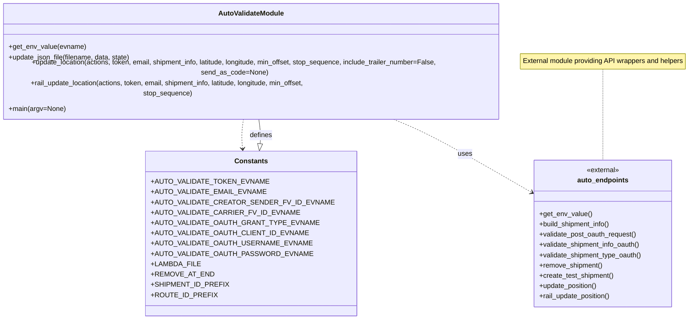

# Diagram: shipment_core/shipment_service/ng_val/scripts/shipment_creation/auto_validate_lambdas_INBOUND.py


> Auto-generated by Obscura crawlers

## Diagram 1

```mermaid
flowchart TD
    Start([Start]) --> ReadEnv{Read required ENV vars}
    ReadEnv --> SetupURLs[Determine URLs & base paths by stage]
    SetupURLs --> PrepareFile[Set LAMBDA_FILE & remove existing log]
    PrepareFile --> GenerateIDs[Generate shipment_uuid, shipment_id, route_id]
    GenerateIDs --> BuildActions[Build actions dict (lambda, oauth endpoints)]
    BuildActions --> GetOAuth[Post to OAuth -> oauth_token]
    GetOAuth --> RemoveOld[Remove Shipment (remove_shipment)]
    RemoveOld --> Create[Create Test Shipment (create_test_shipment)]
    Create --> AssertCreated{assert status_code == 201}
    AssertCreated --> SetGetShipment[Set get_shipment URL using returned id]
    SetGetShipment --> Validate1[validate_shipment_info_oauth (first)]
    Validate1 --> Validate2[validate_shipment_info_oauth (second)]
    Validate2 --> ValidateType[validate_shipment_type_oauth]
    ValidateType --> MaybeRemove{REMOVE_AT_END True?}
    MaybeRemove -->|Yes| FinalRemove[remove_shipment & assert 200]
    MaybeRemove -->|No| SkipRemove[Skip final removal]
    FinalRemove --> End([End])
    SkipRemove --> End
```

> SVG rendering failed for this diagram.

## Diagram 2



> SVG rendering failed for this diagram.
