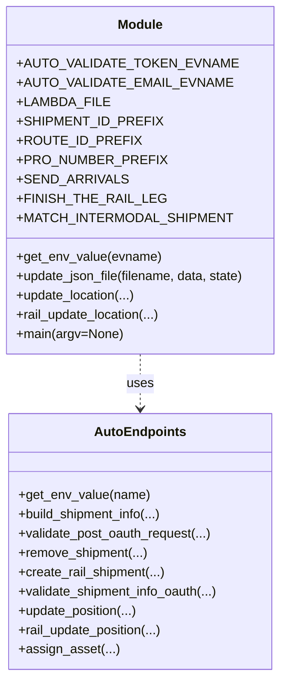

# Diagram: shipment_core/shipment_service/ng_val/scripts/shipment_creation/auto_validate_lambdas_INTERMODAL_MODE.py


> Auto-generated by Obscura crawlers

## Diagram 1



### SVG

<svg id="container" width="354.34375" xmlns="http://www.w3.org/2000/svg" class="classDiagram" height="840" viewBox="0 0 354.34375 840" role="graphics-document document" aria-roledescription="class"><style>#container{font-family:"trebuchet ms",verdana,arial,sans-serif;font-size:16px;fill:#333;}@keyframes edge-animation-frame{from{stroke-dashoffset:0;}}@keyframes dash{to{stroke-dashoffset:0;}}#container .edge-animation-slow{stroke-dasharray:9,5!important;stroke-dashoffset:900;animation:dash 50s linear infinite;stroke-linecap:round;}#container .edge-animation-fast{stroke-dasharray:9,5!important;stroke-dashoffset:900;animation:dash 20s linear infinite;stroke-linecap:round;}#container .error-icon{fill:#552222;}#container .error-text{fill:#552222;stroke:#552222;}#container .edge-thickness-normal{stroke-width:1px;}#container .edge-thickness-thick{stroke-width:3.5px;}#container .edge-pattern-solid{stroke-dasharray:0;}#container .edge-thickness-invisible{stroke-width:0;fill:none;}#container .edge-pattern-dashed{stroke-dasharray:3;}#container .edge-pattern-dotted{stroke-dasharray:2;}#container .marker{fill:#333333;stroke:#333333;}#container .marker.cross{stroke:#333333;}#container svg{font-family:"trebuchet ms",verdana,arial,sans-serif;font-size:16px;}#container p{margin:0;}#container g.classGroup text{fill:#9370DB;stroke:none;font-family:"trebuchet ms",verdana,arial,sans-serif;font-size:10px;}#container g.classGroup text .title{font-weight:bolder;}#container .nodeLabel,#container .edgeLabel{color:#131300;}#container .edgeLabel .label rect{fill:#ECECFF;}#container .label text{fill:#131300;}#container .labelBkg{background:#ECECFF;}#container .edgeLabel .label span{background:#ECECFF;}#container .classTitle{font-weight:bolder;}#container .node rect,#container .node circle,#container .node ellipse,#container .node polygon,#container .node path{fill:#ECECFF;stroke:#9370DB;stroke-width:1px;}#container .divider{stroke:#9370DB;stroke-width:1;}#container g.clickable{cursor:pointer;}#container g.classGroup rect{fill:#ECECFF;stroke:#9370DB;}#container g.classGroup line{stroke:#9370DB;stroke-width:1;}#container .classLabel .box{stroke:none;stroke-width:0;fill:#ECECFF;opacity:0.5;}#container .classLabel .label{fill:#9370DB;font-size:10px;}#container .relation{stroke:#333333;stroke-width:1;fill:none;}#container .dashed-line{stroke-dasharray:3;}#container .dotted-line{stroke-dasharray:1 2;}#container #compositionStart,#container .composition{fill:#333333!important;stroke:#333333!important;stroke-width:1;}#container #compositionEnd,#container .composition{fill:#333333!important;stroke:#333333!important;stroke-width:1;}#container #dependencyStart,#container .dependency{fill:#333333!important;stroke:#333333!important;stroke-width:1;}#container #dependencyStart,#container .dependency{fill:#333333!important;stroke:#333333!important;stroke-width:1;}#container #extensionStart,#container .extension{fill:transparent!important;stroke:#333333!important;stroke-width:1;}#container #extensionEnd,#container .extension{fill:transparent!important;stroke:#333333!important;stroke-width:1;}#container #aggregationStart,#container .aggregation{fill:transparent!important;stroke:#333333!important;stroke-width:1;}#container #aggregationEnd,#container .aggregation{fill:transparent!important;stroke:#333333!important;stroke-width:1;}#container #lollipopStart,#container .lollipop{fill:#ECECFF!important;stroke:#333333!important;stroke-width:1;}#container #lollipopEnd,#container .lollipop{fill:#ECECFF!important;stroke:#333333!important;stroke-width:1;}#container .edgeTerminals{font-size:11px;line-height:initial;}#container .classTitleText{text-anchor:middle;font-size:18px;fill:#333;}#container .label-icon{display:inline-block;height:1em;overflow:visible;vertical-align:-0.125em;}#container .node .label-icon path{fill:currentColor;stroke:revert;stroke-width:revert;}#container :root{--mermaid-font-family:"trebuchet ms",verdana,arial,sans-serif;}</style><g><defs><marker id="container_class-aggregationStart" class="marker aggregation class" refX="18" refY="7" markerWidth="190" markerHeight="240" orient="auto"><path d="M 18,7 L9,13 L1,7 L9,1 Z"></path></marker></defs><defs><marker id="container_class-aggregationEnd" class="marker aggregation class" refX="1" refY="7" markerWidth="20" markerHeight="28" orient="auto"><path d="M 18,7 L9,13 L1,7 L9,1 Z"></path></marker></defs><defs><marker id="container_class-extensionStart" class="marker extension class" refX="18" refY="7" markerWidth="190" markerHeight="240" orient="auto"><path d="M 1,7 L18,13 V 1 Z"></path></marker></defs><defs><marker id="container_class-extensionEnd" class="marker extension class" refX="1" refY="7" markerWidth="20" markerHeight="28" orient="auto"><path d="M 1,1 V 13 L18,7 Z"></path></marker></defs><defs><marker id="container_class-compositionStart" class="marker composition class" refX="18" refY="7" markerWidth="190" markerHeight="240" orient="auto"><path d="M 18,7 L9,13 L1,7 L9,1 Z"></path></marker></defs><defs><marker id="container_class-compositionEnd" class="marker composition class" refX="1" refY="7" markerWidth="20" markerHeight="28" orient="auto"><path d="M 18,7 L9,13 L1,7 L9,1 Z"></path></marker></defs><defs><marker id="container_class-dependencyStart" class="marker dependency class" refX="6" refY="7" markerWidth="190" markerHeight="240" orient="auto"><path d="M 5,7 L9,13 L1,7 L9,1 Z"></path></marker></defs><defs><marker id="container_class-dependencyEnd" class="marker dependency class" refX="13" refY="7" markerWidth="20" markerHeight="28" orient="auto"><path d="M 18,7 L9,13 L14,7 L9,1 Z"></path></marker></defs><defs><marker id="container_class-lollipopStart" class="marker lollipop class" refX="13" refY="7" markerWidth="190" markerHeight="240" orient="auto"><circle stroke="black" fill="transparent" cx="7" cy="7" r="6"></circle></marker></defs><defs><marker id="container_class-lollipopEnd" class="marker lollipop class" refX="1" refY="7" markerWidth="190" markerHeight="240" orient="auto"><circle stroke="black" fill="transparent" cx="7" cy="7" r="6"></circle></marker></defs><g class="root"><g class="clusters"></g><g class="edgePaths"><path d="M177.172,440L177.172,446.167C177.172,452.333,177.172,464.667,177.172,476C177.172,487.333,177.172,497.667,177.172,502.833L177.172,508" id="id_Module_AutoEndpoints_1" class="edge-thickness-normal edge-pattern-dashed relation" style=";;;" data-edge="true" data-et="edge" data-id="id_Module_AutoEndpoints_1" data-points="W3sieCI6MTc3LjE3MTg3NSwieSI6NDQwfSx7IngiOjE3Ny4xNzE4NzUsInkiOjQ3N30seyJ4IjoxNzcuMTcxODc1LCJ5Ijo1MTR9XQ==" marker-end="url(#container_class-dependencyEnd)"></path></g><g class="edgeLabels"><g class="edgeLabel" transform="translate(177.171875, 477)"><g class="label" data-id="id_Module_AutoEndpoints_1" transform="translate(-16.4921875, -12)"><foreignObject width="32.984375" height="24"><div xmlns="http://www.w3.org/1999/xhtml" class="labelBkg" style="display: table-cell; white-space: nowrap; line-height: 1.5; max-width: 200px; text-align: center;"><span class="edgeLabel"><p>uses</p></span></div></foreignObject></g></g></g><g class="nodes"><g class="node default" id="classId-Module-0" transform="translate(177.171875, 224)"><g class="basic label-container"><path d="M-169.171875 -216 L169.171875 -216 L169.171875 216 L-169.171875 216" stroke="none" stroke-width="0" fill="#ECECFF" style=""></path><path d="M-169.171875 -216 C-42.41951085319195 -216, 84.3328532936161 -216, 169.171875 -216 M-169.171875 -216 C-78.42506699718763 -216, 12.321741005624745 -216, 169.171875 -216 M169.171875 -216 C169.171875 -108.6595004757278, 169.171875 -1.3190009514555925, 169.171875 216 M169.171875 -216 C169.171875 -101.86091653733753, 169.171875 12.278166925324939, 169.171875 216 M169.171875 216 C77.80970327684435 216, -13.552468446311309 216, -169.171875 216 M169.171875 216 C90.65473557570519 216, 12.137596151410378 216, -169.171875 216 M-169.171875 216 C-169.171875 89.6725327807118, -169.171875 -36.65493443857639, -169.171875 -216 M-169.171875 216 C-169.171875 49.32876433257724, -169.171875 -117.34247133484553, -169.171875 -216" stroke="#9370DB" stroke-width="1.3" fill="none" stroke-dasharray="0 0" style=""></path></g><g class="annotation-group text" transform="translate(0, -192)"></g><g class="label-group text" transform="translate(-27.09375, -192)"><g class="label" style="font-weight: bolder" transform="translate(0,-12)"><foreignObject width="54.1875" height="24"><div xmlns="http://www.w3.org/1999/xhtml" style="display: table-cell; white-space: nowrap; line-height: 1.5; max-width: 104px; text-align: center;"><span class="nodeLabel markdown-node-label" style=""><p>Module</p></span></div></foreignObject></g></g><g class="members-group text" transform="translate(-157.171875, -144)"><g class="label" style="" transform="translate(0,-12)"><foreignObject width="241.0625" height="24"><div xmlns="http://www.w3.org/1999/xhtml" style="display: table-cell; white-space: nowrap; line-height: 1.5; max-width: 298px; text-align: center;"><span class="nodeLabel markdown-node-label" style=""><p>+AUTO_VALIDATE_TOKEN_EVNAME</p></span></div></foreignObject></g><g class="label" style="" transform="translate(0,12)"><foreignObject width="237.03125" height="24"><div xmlns="http://www.w3.org/1999/xhtml" style="display: table-cell; white-space: nowrap; line-height: 1.5; max-width: 294px; text-align: center;"><span class="nodeLabel markdown-node-label" style=""><p>+AUTO_VALIDATE_EMAIL_EVNAME</p></span></div></foreignObject></g><g class="label" style="" transform="translate(0,36)"><foreignObject width="104.046875" height="24"><div xmlns="http://www.w3.org/1999/xhtml" style="display: table-cell; white-space: nowrap; line-height: 1.5; max-width: 161px; text-align: center;"><span class="nodeLabel markdown-node-label" style=""><p>+LAMBDA_FILE</p></span></div></foreignObject></g><g class="label" style="" transform="translate(0,60)"><foreignObject width="159.671875" height="24"><div xmlns="http://www.w3.org/1999/xhtml" style="display: table-cell; white-space: nowrap; line-height: 1.5; max-width: 217px; text-align: center;"><span class="nodeLabel markdown-node-label" style=""><p>+SHIPMENT_ID_PREFIX</p></span></div></foreignObject></g><g class="label" style="" transform="translate(0,84)"><foreignObject width="135.796875" height="24"><div xmlns="http://www.w3.org/1999/xhtml" style="display: table-cell; white-space: nowrap; line-height: 1.5; max-width: 194px; text-align: center;"><span class="nodeLabel markdown-node-label" style=""><p>+ROUTE_ID_PREFIX</p></span></div></foreignObject></g><g class="label" style="" transform="translate(0,108)"><foreignObject width="164.578125" height="24"><div xmlns="http://www.w3.org/1999/xhtml" style="display: table-cell; white-space: nowrap; line-height: 1.5; max-width: 222px; text-align: center;"><span class="nodeLabel markdown-node-label" style=""><p>+PRO_NUMBER_PREFIX</p></span></div></foreignObject></g><g class="label" style="" transform="translate(0,132)"><foreignObject width="121.078125" height="24"><div xmlns="http://www.w3.org/1999/xhtml" style="display: table-cell; white-space: nowrap; line-height: 1.5; max-width: 179px; text-align: center;"><span class="nodeLabel markdown-node-label" style=""><p>+SEND_ARRIVALS</p></span></div></foreignObject></g><g class="label" style="" transform="translate(0,156)"><foreignObject width="165.65625" height="24"><div xmlns="http://www.w3.org/1999/xhtml" style="display: table-cell; white-space: nowrap; line-height: 1.5; max-width: 223px; text-align: center;"><span class="nodeLabel markdown-node-label" style=""><p>+FINISH_THE_RAIL_LEG</p></span></div></foreignObject></g><g class="label" style="" transform="translate(0,180)"><foreignObject width="238.828125" height="24"><div xmlns="http://www.w3.org/1999/xhtml" style="display: table-cell; white-space: nowrap; line-height: 1.5; max-width: 297px; text-align: center;"><span class="nodeLabel markdown-node-label" style=""><p>+MATCH_INTERMODAL_SHIPMENT</p></span></div></foreignObject></g></g><g class="methods-group text" transform="translate(-157.171875, 96)"><g class="label" style="" transform="translate(0,-12)"><foreignObject width="178.0625" height="24"><div xmlns="http://www.w3.org/1999/xhtml" style="display: table-cell; white-space: nowrap; line-height: 1.5; max-width: 235px; text-align: center;"><span class="nodeLabel markdown-node-label" style=""><p>+get_env_value(evname)</p></span></div></foreignObject></g><g class="label" style="" transform="translate(0,12)"><foreignObject width="287.25" height="24"><div xmlns="http://www.w3.org/1999/xhtml" style="display: table-cell; white-space: nowrap; line-height: 1.5; max-width: 345px; text-align: center;"><span class="nodeLabel markdown-node-label" style=""><p>+update_json_file(filename, data, state)</p></span></div></foreignObject></g><g class="label" style="" transform="translate(0,36)"><foreignObject width="148.21875" height="24"><div xmlns="http://www.w3.org/1999/xhtml" style="display: table-cell; white-space: nowrap; line-height: 1.5; max-width: 206px; text-align: center;"><span class="nodeLabel markdown-node-label" style=""><p>+update_location(...)</p></span></div></foreignObject></g><g class="label" style="" transform="translate(0,60)"><foreignObject width="179.734375" height="24"><div xmlns="http://www.w3.org/1999/xhtml" style="display: table-cell; white-space: nowrap; line-height: 1.5; max-width: 237px; text-align: center;"><span class="nodeLabel markdown-node-label" style=""><p>+rail_update_location(...)</p></span></div></foreignObject></g><g class="label" style="" transform="translate(0,84)"><foreignObject width="131.859375" height="24"><div xmlns="http://www.w3.org/1999/xhtml" style="display: table-cell; white-space: nowrap; line-height: 1.5; max-width: 189px; text-align: center;"><span class="nodeLabel markdown-node-label" style=""><p>+main(argv=None)</p></span></div></foreignObject></g></g><g class="divider" style=""><path d="M-169.171875 -168 C-91.87910485546891 -168, -14.58633471093782 -168, 169.171875 -168 M-169.171875 -168 C-100.53735598258363 -168, -31.902836965167268 -168, 169.171875 -168" stroke="#9370DB" stroke-width="1.3" fill="none" stroke-dasharray="0 0" style=""></path></g><g class="divider" style=""><path d="M-169.171875 72 C-83.26810677142592 72, 2.63566145714816 72, 169.171875 72 M-169.171875 72 C-47.50718059483184 72, 74.15751381033633 72, 169.171875 72" stroke="#9370DB" stroke-width="1.3" fill="none" stroke-dasharray="0 0" style=""></path></g></g><g class="node default" id="classId-AutoEndpoints-1" transform="translate(177.171875, 673)"><g class="basic label-container"><path d="M-164.2890625 -159 L164.2890625 -159 L164.2890625 159 L-164.2890625 159" stroke="none" stroke-width="0" fill="#ECECFF" style=""></path><path d="M-164.2890625 -159 C-78.44465140804377 -159, 7.399759683912464 -159, 164.2890625 -159 M-164.2890625 -159 C-73.92048637378136 -159, 16.448089752437284 -159, 164.2890625 -159 M164.2890625 -159 C164.2890625 -53.48190099678541, 164.2890625 52.036198006429174, 164.2890625 159 M164.2890625 -159 C164.2890625 -89.95782924620858, 164.2890625 -20.91565849241715, 164.2890625 159 M164.2890625 159 C68.56101130312408 159, -27.16703989375185 159, -164.2890625 159 M164.2890625 159 C62.417497888419504 159, -39.45406672316099 159, -164.2890625 159 M-164.2890625 159 C-164.2890625 70.47993312553261, -164.2890625 -18.040133748934778, -164.2890625 -159 M-164.2890625 159 C-164.2890625 51.013846354779744, -164.2890625 -56.97230729044051, -164.2890625 -159" stroke="#9370DB" stroke-width="1.3" fill="none" stroke-dasharray="0 0" style=""></path></g><g class="annotation-group text" transform="translate(0, -135)"></g><g class="label-group text" transform="translate(-53.734375, -135)"><g class="label" style="font-weight: bolder" transform="translate(0,-12)"><foreignObject width="107.46875" height="24"><div xmlns="http://www.w3.org/1999/xhtml" style="display: table-cell; white-space: nowrap; line-height: 1.5; max-width: 157px; text-align: center;"><span class="nodeLabel markdown-node-label" style=""><p>AutoEndpoints</p></span></div></foreignObject></g></g><g class="members-group text" transform="translate(-152.2890625, -87)"></g><g class="methods-group text" transform="translate(-152.2890625, -57)"><g class="label" style="" transform="translate(0,-12)"><foreignObject width="161.53125" height="24"><div xmlns="http://www.w3.org/1999/xhtml" style="display: table-cell; white-space: nowrap; line-height: 1.5; max-width: 219px; text-align: center;"><span class="nodeLabel markdown-node-label" style=""><p>+get_env_value(name)</p></span></div></foreignObject></g><g class="label" style="" transform="translate(0,12)"><foreignObject width="180.90625" height="24"><div xmlns="http://www.w3.org/1999/xhtml" style="display: table-cell; white-space: nowrap; line-height: 1.5; max-width: 238px; text-align: center;"><span class="nodeLabel markdown-node-label" style=""><p>+build_shipment_info(...)</p></span></div></foreignObject></g><g class="label" style="" transform="translate(0,36)"><foreignObject width="241.640625" height="24"><div xmlns="http://www.w3.org/1999/xhtml" style="display: table-cell; white-space: nowrap; line-height: 1.5; max-width: 299px; text-align: center;"><span class="nodeLabel markdown-node-label" style=""><p>+validate_post_oauth_request(...)</p></span></div></foreignObject></g><g class="label" style="" transform="translate(0,60)"><foreignObject width="160.265625" height="24"><div xmlns="http://www.w3.org/1999/xhtml" style="display: table-cell; white-space: nowrap; line-height: 1.5; max-width: 218px; text-align: center;"><span class="nodeLabel markdown-node-label" style=""><p>+remove_shipment(...)</p></span></div></foreignObject></g><g class="label" style="" transform="translate(0,84)"><foreignObject width="183.03125" height="24"><div xmlns="http://www.w3.org/1999/xhtml" style="display: table-cell; white-space: nowrap; line-height: 1.5; max-width: 240px; text-align: center;"><span class="nodeLabel markdown-node-label" style=""><p>+create_rail_shipment(...)</p></span></div></foreignObject></g><g class="label" style="" transform="translate(0,108)"><foreignObject width="250.84375" height="24"><div xmlns="http://www.w3.org/1999/xhtml" style="display: table-cell; white-space: nowrap; line-height: 1.5; max-width: 308px; text-align: center;"><span class="nodeLabel markdown-node-label" style=""><p>+validate_shipment_info_oauth(...)</p></span></div></foreignObject></g><g class="label" style="" transform="translate(0,132)"><foreignObject width="149.0625" height="24"><div xmlns="http://www.w3.org/1999/xhtml" style="display: table-cell; white-space: nowrap; line-height: 1.5; max-width: 206px; text-align: center;"><span class="nodeLabel markdown-node-label" style=""><p>+update_position(...)</p></span></div></foreignObject></g><g class="label" style="" transform="translate(0,156)"><foreignObject width="180.578125" height="24"><div xmlns="http://www.w3.org/1999/xhtml" style="display: table-cell; white-space: nowrap; line-height: 1.5; max-width: 238px; text-align: center;"><span class="nodeLabel markdown-node-label" style=""><p>+rail_update_position(...)</p></span></div></foreignObject></g><g class="label" style="" transform="translate(0,180)"><foreignObject width="121" height="24"><div xmlns="http://www.w3.org/1999/xhtml" style="display: table-cell; white-space: nowrap; line-height: 1.5; max-width: 178px; text-align: center;"><span class="nodeLabel markdown-node-label" style=""><p>+assign_asset(...)</p></span></div></foreignObject></g></g><g class="divider" style=""><path d="M-164.2890625 -111 C-43.608215853930176 -111, 77.07263079213965 -111, 164.2890625 -111 M-164.2890625 -111 C-69.54465126524045 -111, 25.199759969519107 -111, 164.2890625 -111" stroke="#9370DB" stroke-width="1.3" fill="none" stroke-dasharray="0 0" style=""></path></g><g class="divider" style=""><path d="M-164.2890625 -87 C-44.04821558001814 -87, 76.19263133996373 -87, 164.2890625 -87 M-164.2890625 -87 C-89.80386765413893 -87, -15.318672808277853 -87, 164.2890625 -87" stroke="#9370DB" stroke-width="1.3" fill="none" stroke-dasharray="0 0" style=""></path></g></g></g></g></g></svg>

## Diagram 2

```mermaid
flowchart TD
    A[Start main(argv)] --> B{parse args: stage}
    B --> |prod/test/staging/other| C[set URLs and base paths]
    C --> D[set LAMBDA_FILE and remove existing file if present]
    D --> E[generate shipment_uuid, ids, actions dict]
    E --> F[populate actions.oauth with env creds via get_env_value]
    F --> G[token,email,sender,creator,carrier = get_env_value(...)]
    G --> H[build shipment_info via auto_endpoints.build_shipment_info]
    H --> I[oauth_token = validate_post_oauth_request]
    I --> J[actions.oauth.access_token = oauth_token]
    J --> K[remove_shipment(actions)]
    K --> L[create_rail_shipment(actions)]
    L --> M[pause (input)]
    M --> N[set actions.oauth.get_shipment and validate_shipment_info_oauth]
    N --> O{SEND_ARRIVALS True?}
    O --> |yes| P[rail_update_location arrivals (6005,6001)]
    O --> |no| Q[continue]
    P --> Q
    Q --> R{RETURN_EARLY True?}
    R --> |yes| Z[return]
    R --> |no| S[rail_update_location in-transit and interchanges]
    S --> T[pause (input)]
    T --> U{SEND_AN_ETAD True?}
    U --> |yes| V[rail_update_location ETAD]
    U --> |no| W[continue]
    V --> W
    W --> X{ARRIVE_AT_THE_INTERCHANGES True?}
    X --> |yes| Y[arrive/depart interchange updates]
    X --> |no| AA[continue]
    Y --> AB[pause (input)]
    AA --> AB
    AB --> AC{FINISH_THE_RAIL_LEG True?}
    AC --> |yes| AD[rail_update_location departure 6005]
    AC --> |no| AE[skip]
    AD --> AF{FINISH_THE_TRUCK_LEG True?}
    AE --> AF
    AF --> |yes| AG[perform truck leg updates via update_location and assign_asset]
    AF --> |no| AH[maybe REMOVE_AT_END]
    AG --> AI[validate completion if applicable]
    AH --> AI
    AI --> AJ{REMOVE_AT_END True?}
    AJ --> |yes| AK[remove_shipment]
    AJ --> |no| AL[finish]
    AK --> AL
    AL --> AM[End main]
```

> SVG rendering failed for this diagram.
