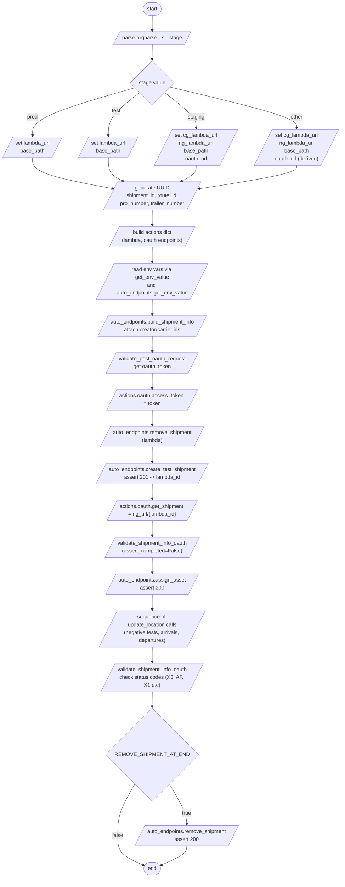
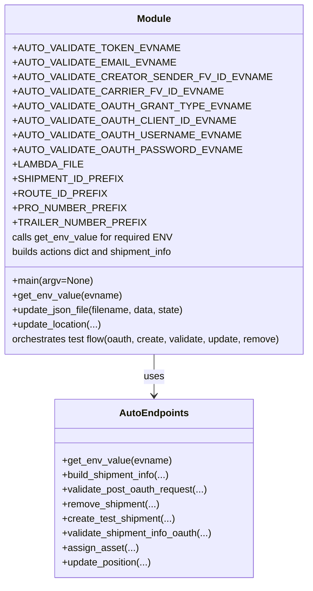

# Diagram: shipment_core/shipment_service/ng_val/scripts/shipment_creation/auto_validate_lambdas_MULTIPOLYGON.py

> Auto-generated by Obscura crawlers

## Diagram 1

### SVG

<svg id="container" width="1733.4375" xmlns="http://www.w3.org/2000/svg" class="flowchart" height="2587.390625" viewBox="0 0 1733.4375 2587.390625" role="graphics-document document" aria-roledescription="flowchart-v2"><g><marker id="container_flowchart-v2-pointEnd" class="marker flowchart-v2" viewBox="0 0 10 10" refX="5" refY="5" markerUnits="userSpaceOnUse" markerWidth="8" markerHeight="8" orient="auto"><path d="M 0 0 L 10 5 L 0 10 z" class="arrowMarkerPath" style="stroke-width: 1; stroke-dasharray: 1, 0;"></path></marker><marker id="container_flowchart-v2-pointStart" class="marker flowchart-v2" viewBox="0 0 10 10" refX="4.5" refY="5" markerUnits="userSpaceOnUse" markerWidth="8" markerHeight="8" orient="auto"><path d="M 0 5 L 10 10 L 10 0 z" class="arrowMarkerPath" style="stroke-width: 1; stroke-dasharray: 1, 0;"></path></marker><marker id="container_flowchart-v2-circleEnd" class="marker flowchart-v2" viewBox="0 0 10 10" refX="11" refY="5" markerUnits="userSpaceOnUse" markerWidth="11" markerHeight="11" orient="auto"><circle cx="5" cy="5" r="5" class="arrowMarkerPath" style="stroke-width: 1; stroke-dasharray: 1, 0;"></circle></marker><marker id="container_flowchart-v2-circleStart" class="marker flowchart-v2" viewBox="0 0 10 10" refX="-1" refY="5" markerUnits="userSpaceOnUse" markerWidth="11" markerHeight="11" orient="auto"><circle cx="5" cy="5" r="5" class="arrowMarkerPath" style="stroke-width: 1; stroke-dasharray: 1, 0;"></circle></marker><marker id="container_flowchart-v2-crossEnd" class="marker cross flowchart-v2" viewBox="0 0 11 11" refX="12" refY="5.2" markerUnits="userSpaceOnUse" markerWidth="11" markerHeight="11" orient="auto"><path d="M 1,1 l 9,9 M 10,1 l -9,9" class="arrowMarkerPath" style="stroke-width: 2; stroke-dasharray: 1, 0;"></path></marker><marker id="container_flowchart-v2-crossStart" class="marker cross flowchart-v2" viewBox="0 0 11 11" refX="-1" refY="5.2" markerUnits="userSpaceOnUse" markerWidth="11" markerHeight="11" orient="auto"><path d="M 1,1 l 9,9 M 10,1 l -9,9" class="arrowMarkerPath" style="stroke-width: 2; stroke-dasharray: 1, 0;"></path></marker><g class="root"><g class="clusters"></g><g class="edgePaths"><path d="M692.898,47.5L692.815,51.583C692.732,55.667,692.565,63.833,692.552,71.5C692.539,79.167,692.679,86.334,692.75,89.917L692.82,93.501" id="L_Start_ParseArgs_0" class="edge-thickness-normal edge-pattern-solid edge-thickness-normal edge-pattern-solid flowchart-link" style=";" data-edge="true" data-et="edge" data-id="L_Start_ParseArgs_0" data-points="W3sieCI6NjkyLjg5ODQzNzUsInkiOjQ3LjUwMDAwMDAwMDAwMDE4NX0seyJ4Ijo2OTIuMzk4NDM3NSwieSI6NzJ9LHsieCI6NjkyLjg5ODQzNzUsInkiOjk3LjV9XQ==" marker-end="url(#container_flowchart-v2-pointEnd)"></path><path d="M692.898,136.5L692.815,140.583C692.732,144.667,692.565,152.833,692.482,160.417C692.398,168,692.398,175,692.398,178.5L692.398,182" id="L_ParseArgs_StageDecision_0" class="edge-thickness-normal edge-pattern-solid edge-thickness-normal edge-pattern-solid flowchart-link" style=";" data-edge="true" data-et="edge" data-id="L_ParseArgs_StageDecision_0" data-points="W3sieCI6NjkyLjg5ODQzNzUsInkiOjEzNi41fSx7IngiOjY5Mi4zOTg0Mzc1LCJ5IjoxNjF9LHsieCI6NjkyLjM5ODQzNzUsInkiOjE4Nn1d" marker-end="url(#container_flowchart-v2-pointEnd)"></path><path d="M635.529,264.724L554.107,280.369C472.686,296.014,309.843,327.304,228.498,350.532C147.153,373.76,147.306,388.927,147.383,396.511L147.46,404.094" id="L_StageDecision_ProdSetup_0" class="edge-thickness-normal edge-pattern-solid edge-thickness-normal edge-pattern-solid flowchart-link" style=";" data-edge="true" data-et="edge" data-id="L_StageDecision_ProdSetup_0" data-points="W3sieCI6NjM1LjUyODg5NTQwNzc4MDIsInkiOjI2NC43MjQyMDc5MDc3ODAxfSx7IngiOjE0NywieSI6MzU4LjU5Mzc1fSx7IngiOjE0Ny41LCJ5Ijo0MDguMDkzNzV9XQ==" marker-end="url(#container_flowchart-v2-pointEnd)"></path><path d="M646.653,275.848L618.044,289.639C589.435,303.43,532.218,331.012,503.685,352.386C475.153,373.76,475.306,388.927,475.383,396.511L475.46,404.094" id="L_StageDecision_TestSetup_0" class="edge-thickness-normal edge-pattern-solid edge-thickness-normal edge-pattern-solid flowchart-link" style=";" data-edge="true" data-et="edge" data-id="L_StageDecision_TestSetup_0" data-points="W3sieCI6NjQ2LjY1MzA5NTcxMzMwNzIsInkiOjI3NS44NDg0MDgyMTMzMDcxNX0seyJ4Ijo0NzUsInkiOjM1OC41OTM3NX0seyJ4Ijo0NzUuNSwieSI6NDA4LjA5Mzc1fV0=" marker-end="url(#container_flowchart-v2-pointEnd)"></path><path d="M738.144,275.848L766.753,289.639C795.361,303.43,852.579,331.012,881.265,352.386C909.95,373.76,910.103,388.927,910.18,396.511L910.256,404.094" id="L_StageDecision_StagingSetup_0" class="edge-thickness-normal edge-pattern-solid edge-thickness-normal edge-pattern-solid flowchart-link" style=";" data-edge="true" data-et="edge" data-id="L_StageDecision_StagingSetup_0" data-points="W3sieCI6NzM4LjE0Mzc3OTI4NjY5MjgsInkiOjI3NS44NDg0MDgyMTMzMDcxNX0seyJ4Ijo5MDkuNzk2ODc1LCJ5IjozNTguNTkzNzV9LHsieCI6OTEwLjI5Njg3NSwieSI6NDA4LjA5Mzc1fV0=" marker-end="url(#container_flowchart-v2-pointEnd)"></path><path d="M752.102,261.89L871.005,278.007C989.907,294.124,1227.711,326.359,1346.688,348.06C1465.665,369.761,1465.813,380.927,1465.888,386.511L1465.962,392.094" id="L_StageDecision_OtherSetup_0" class="edge-thickness-normal edge-pattern-solid edge-thickness-normal edge-pattern-solid flowchart-link" style=";" data-edge="true" data-et="edge" data-id="L_StageDecision_OtherSetup_0" data-points="W3sieCI6NzUyLjEwMjM3ODQyMTA4NDMsInkiOjI2MS44ODk4MDkwNzg5MTU3M30seyJ4IjoxNDY1LjUxNTYyNSwieSI6MzU4LjU5Mzc1fSx7IngiOjE0NjYuMDE1NjI1LCJ5IjozOTYuMDkzNzV9XQ==" marker-end="url(#container_flowchart-v2-pointEnd)"></path><path d="M147.5,471.094L147.417,477.177C147.333,483.26,147.167,495.427,216.415,511.814C285.662,528.201,424.325,548.808,493.656,559.111L562.987,569.415" id="L_ProdSetup_BuildIDs_0" class="edge-thickness-normal edge-pattern-solid edge-thickness-normal edge-pattern-solid flowchart-link" style=";" data-edge="true" data-et="edge" data-id="L_ProdSetup_BuildIDs_0" data-points="W3sieCI6MTQ3LjUsInkiOjQ3MS4wOTM3NX0seyJ4IjoxNDcsInkiOjUwNy41OTM3NX0seyJ4Ijo1NjYuOTQzNzk2NTQzNzk1LCJ5Ijo1NzAuMDAzMDMxOTEyNDEwMn1d" marker-end="url(#container_flowchart-v2-pointEnd)"></path><path d="M475.5,471.094L475.417,477.177C475.333,483.26,475.167,495.427,491.755,507.734C508.343,520.042,541.687,532.489,558.358,538.713L575.03,544.937" id="L_TestSetup_BuildIDs_0" class="edge-thickness-normal edge-pattern-solid edge-thickness-normal edge-pattern-solid flowchart-link" style=";" data-edge="true" data-et="edge" data-id="L_TestSetup_BuildIDs_0" data-points="W3sieCI6NDc1LjUsInkiOjQ3MS4wOTM3NX0seyJ4Ijo0NzUsInkiOjUwNy41OTM3NX0seyJ4Ijo1NzguNzc3Mjc3MDY0NTcxNCwieSI6NTQ2LjMzNjA3MDg3MDg1NzJ9XQ==" marker-end="url(#container_flowchart-v2-pointEnd)"></path><path d="M910.297,471.094L910.214,477.177C910.13,483.26,909.964,495.427,899.334,505.523C888.705,515.62,867.613,523.645,857.066,527.658L846.52,531.671" id="L_StagingSetup_BuildIDs_0" class="edge-thickness-normal edge-pattern-solid edge-thickness-normal edge-pattern-solid flowchart-link" style=";" data-edge="true" data-et="edge" data-id="L_StagingSetup_BuildIDs_0" data-points="W3sieCI6OTEwLjI5Njg3NSwieSI6NDcxLjA5Mzc1fSx7IngiOjkwOS43OTY4NzUsInkiOjUwNy41OTM3NX0seyJ4Ijo4NDIuNzgxODMyMjk4MTM2NywieSI6NTMzLjA5Mzc1fV0=" marker-end="url(#container_flowchart-v2-pointEnd)"></path><path d="M1466.016,483.094L1465.932,487.177C1465.849,491.26,1465.682,499.427,1361.272,514.465C1256.862,529.502,1048.208,551.411,943.881,562.365L839.555,573.32" id="L_OtherSetup_BuildIDs_0" class="edge-thickness-normal edge-pattern-solid edge-thickness-normal edge-pattern-solid flowchart-link" style=";" data-edge="true" data-et="edge" data-id="L_OtherSetup_BuildIDs_0" data-points="W3sieCI6MTQ2Ni4wMTU2MjUsInkiOjQ4My4wOTM3NX0seyJ4IjoxNDY1LjUxNTYyNSwieSI6NTA3LjU5Mzc1fSx7IngiOjgzNS41NzY1Mzk4ODA0MTkzLCJ5Ijo1NzMuNzM3NTQ1MjM5MTYxMn1d" marker-end="url(#container_flowchart-v2-pointEnd)"></path><path d="M692.898,644.094L692.815,648.177C692.732,652.26,692.565,660.427,692.552,668.094C692.539,675.761,692.679,682.928,692.75,686.511L692.82,690.095" id="L_BuildIDs_BuildActions_0" class="edge-thickness-normal edge-pattern-solid edge-thickness-normal edge-pattern-solid flowchart-link" style=";" data-edge="true" data-et="edge" data-id="L_BuildIDs_BuildActions_0" data-points="W3sieCI6NjkyLjg5ODQzNzUsInkiOjY0NC4wOTM3NX0seyJ4Ijo2OTIuMzk4NDM3NSwieSI6NjY4LjU5Mzc1fSx7IngiOjY5Mi44OTg0Mzc1LCJ5Ijo2OTQuMDkzNzV9XQ==" marker-end="url(#container_flowchart-v2-pointEnd)"></path><path d="M692.898,781.094L692.815,785.177C692.732,789.26,692.565,797.427,692.552,805.094C692.539,812.761,692.679,819.928,692.75,823.511L692.82,827.095" id="L_BuildActions_ReadEnv_0" class="edge-thickness-normal edge-pattern-solid edge-thickness-normal edge-pattern-solid flowchart-link" style=";" data-edge="true" data-et="edge" data-id="L_BuildActions_ReadEnv_0" data-points="W3sieCI6NjkyLjg5ODQzNzUsInkiOjc4MS4wOTM3NX0seyJ4Ijo2OTIuMzk4NDM3NSwieSI6ODA1LjU5Mzc1fSx7IngiOjY5Mi44OTg0Mzc1LCJ5Ijo4MzEuMDkzNzV9XQ==" marker-end="url(#container_flowchart-v2-pointEnd)"></path><path d="M692.898,918.094L692.815,922.177C692.732,926.26,692.565,934.427,692.552,942.094C692.539,949.761,692.679,956.928,692.75,960.511L692.82,964.095" id="L_ReadEnv_BuildShipmentInfo_0" class="edge-thickness-normal edge-pattern-solid edge-thickness-normal edge-pattern-solid flowchart-link" style=";" data-edge="true" data-et="edge" data-id="L_ReadEnv_BuildShipmentInfo_0" data-points="W3sieCI6NjkyLjg5ODQzNzUsInkiOjkxOC4wOTM3NX0seyJ4Ijo2OTIuMzk4NDM3NSwieSI6OTQyLjU5Mzc1fSx7IngiOjY5Mi44OTg0Mzc1LCJ5Ijo5NjguMDkzNzV9XQ==" marker-end="url(#container_flowchart-v2-pointEnd)"></path><path d="M692.898,1031.094L692.815,1035.177C692.732,1039.26,692.565,1047.427,692.552,1055.094C692.539,1062.761,692.679,1069.928,692.75,1073.511L692.82,1077.095" id="L_BuildShipmentInfo_OAuthReq_0" class="edge-thickness-normal edge-pattern-solid edge-thickness-normal edge-pattern-solid flowchart-link" style=";" data-edge="true" data-et="edge" data-id="L_BuildShipmentInfo_OAuthReq_0" data-points="W3sieCI6NjkyLjg5ODQzNzUsInkiOjEwMzEuMDkzNzV9LHsieCI6NjkyLjM5ODQzNzUsInkiOjEwNTUuNTkzNzV9LHsieCI6NjkyLjg5ODQzNzUsInkiOjEwODEuMDkzNzV9XQ==" marker-end="url(#container_flowchart-v2-pointEnd)"></path><path d="M692.898,1144.094L692.815,1148.177C692.732,1152.26,692.565,1160.427,692.552,1168.094C692.539,1175.761,692.679,1182.928,692.75,1186.511L692.82,1190.095" id="L_OAuthReq_SetAccessToken_0" class="edge-thickness-normal edge-pattern-solid edge-thickness-normal edge-pattern-solid flowchart-link" style=";" data-edge="true" data-et="edge" data-id="L_OAuthReq_SetAccessToken_0" data-points="W3sieCI6NjkyLjg5ODQzNzUsInkiOjExNDQuMDkzNzV9LHsieCI6NjkyLjM5ODQzNzUsInkiOjExNjguNTkzNzV9LHsieCI6NjkyLjg5ODQzNzUsInkiOjExOTQuMDkzNzV9XQ==" marker-end="url(#container_flowchart-v2-pointEnd)"></path><path d="M692.898,1257.094L692.815,1261.177C692.732,1265.26,692.565,1273.427,692.552,1281.094C692.539,1288.761,692.679,1295.928,692.75,1299.511L692.82,1303.095" id="L_SetAccessToken_RemoveShipment1_0" class="edge-thickness-normal edge-pattern-solid edge-thickness-normal edge-pattern-solid flowchart-link" style=";" data-edge="true" data-et="edge" data-id="L_SetAccessToken_RemoveShipment1_0" data-points="W3sieCI6NjkyLjg5ODQzNzUsInkiOjEyNTcuMDkzNzV9LHsieCI6NjkyLjM5ODQzNzUsInkiOjEyODEuNTkzNzV9LHsieCI6NjkyLjg5ODQzNzUsInkiOjEzMDcuMDkzNzV9XQ==" marker-end="url(#container_flowchart-v2-pointEnd)"></path><path d="M692.898,1346.094L692.815,1350.177C692.732,1354.26,692.565,1362.427,692.552,1370.094C692.539,1377.761,692.679,1384.928,692.75,1388.511L692.82,1392.095" id="L_RemoveShipment1_CreateShipment_0" class="edge-thickness-normal edge-pattern-solid edge-thickness-normal edge-pattern-solid flowchart-link" style=";" data-edge="true" data-et="edge" data-id="L_RemoveShipment1_CreateShipment_0" data-points="W3sieCI6NjkyLjg5ODQzNzUsInkiOjEzNDYuMDkzNzV9LHsieCI6NjkyLjM5ODQzNzUsInkiOjEzNzAuNTkzNzV9LHsieCI6NjkyLjg5ODQzNzUsInkiOjEzOTYuMDkzNzV9XQ==" marker-end="url(#container_flowchart-v2-pointEnd)"></path><path d="M692.898,1459.094L692.815,1463.177C692.732,1467.26,692.565,1475.427,692.552,1483.094C692.539,1490.761,692.679,1497.928,692.75,1501.511L692.82,1505.095" id="L_CreateShipment_GetShipmentSetup_0" class="edge-thickness-normal edge-pattern-solid edge-thickness-normal edge-pattern-solid flowchart-link" style=";" data-edge="true" data-et="edge" data-id="L_CreateShipment_GetShipmentSetup_0" data-points="W3sieCI6NjkyLjg5ODQzNzUsInkiOjE0NTkuMDkzNzV9LHsieCI6NjkyLjM5ODQzNzUsInkiOjE0ODMuNTkzNzV9LHsieCI6NjkyLjg5ODQzNzUsInkiOjE1MDkuMDkzNzV9XQ==" marker-end="url(#container_flowchart-v2-pointEnd)"></path><path d="M692.898,1572.094L692.815,1576.177C692.732,1580.26,692.565,1588.427,692.552,1596.094C692.539,1603.761,692.679,1610.928,692.75,1614.511L692.82,1618.095" id="L_GetShipmentSetup_ValidateGet_0" class="edge-thickness-normal edge-pattern-solid edge-thickness-normal edge-pattern-solid flowchart-link" style=";" data-edge="true" data-et="edge" data-id="L_GetShipmentSetup_ValidateGet_0" data-points="W3sieCI6NjkyLjg5ODQzNzUsInkiOjE1NzIuMDkzNzV9LHsieCI6NjkyLjM5ODQzNzUsInkiOjE1OTYuNTkzNzV9LHsieCI6NjkyLjg5ODQzNzUsInkiOjE2MjIuMDkzNzV9XQ==" marker-end="url(#container_flowchart-v2-pointEnd)"></path><path d="M692.898,1661.094L692.815,1665.177C692.732,1669.26,692.565,1677.427,692.552,1685.094C692.539,1692.761,692.679,1699.928,692.75,1703.511L692.82,1707.095" id="L_ValidateGet_AssignAsset_0" class="edge-thickness-normal edge-pattern-solid edge-thickness-normal edge-pattern-solid flowchart-link" style=";" data-edge="true" data-et="edge" data-id="L_ValidateGet_AssignAsset_0" data-points="W3sieCI6NjkyLjg5ODQzNzUsInkiOjE2NjEuMDkzNzV9LHsieCI6NjkyLjM5ODQzNzUsInkiOjE2ODUuNTkzNzV9LHsieCI6NjkyLjg5ODQzNzUsInkiOjE3MTEuMDkzNzV9XQ==" marker-end="url(#container_flowchart-v2-pointEnd)"></path><path d="M692.898,1774.094L692.815,1778.177C692.732,1782.26,692.565,1790.427,692.552,1798.094C692.539,1805.761,692.679,1812.928,692.75,1816.511L692.82,1820.095" id="L_AssignAsset_LocationUpdatesLoop_0" class="edge-thickness-normal edge-pattern-solid edge-thickness-normal edge-pattern-solid flowchart-link" style=";" data-edge="true" data-et="edge" data-id="L_AssignAsset_LocationUpdatesLoop_0" data-points="W3sieCI6NjkyLjg5ODQzNzUsInkiOjE3NzQuMDkzNzV9LHsieCI6NjkyLjM5ODQzNzUsInkiOjE3OTguNTkzNzV9LHsieCI6NjkyLjg5ODQzNzUsInkiOjE4MjQuMDkzNzV9XQ==" marker-end="url(#container_flowchart-v2-pointEnd)"></path><path d="M692.898,1935.094L692.815,1939.177C692.732,1943.26,692.565,1951.427,692.552,1959.094C692.539,1966.761,692.679,1973.928,692.75,1977.511L692.82,1981.095" id="L_LocationUpdatesLoop_ValidateAfterUpdates_0" class="edge-thickness-normal edge-pattern-solid edge-thickness-normal edge-pattern-solid flowchart-link" style=";" data-edge="true" data-et="edge" data-id="L_LocationUpdatesLoop_ValidateAfterUpdates_0" data-points="W3sieCI6NjkyLjg5ODQzNzUsInkiOjE5MzUuMDkzNzV9LHsieCI6NjkyLjM5ODQzNzUsInkiOjE5NTkuNTkzNzV9LHsieCI6NjkyLjg5ODQzNzUsInkiOjE5ODUuMDkzNzV9XQ==" marker-end="url(#container_flowchart-v2-pointEnd)"></path><path d="M692.898,2048.094L692.815,2052.177C692.732,2056.26,692.565,2064.427,692.482,2072.01C692.398,2079.594,692.398,2086.594,692.398,2090.094L692.398,2093.594" id="L_ValidateAfterUpdates_RemoveIfNeeded_0" class="edge-thickness-normal edge-pattern-solid edge-thickness-normal edge-pattern-solid flowchart-link" style=";" data-edge="true" data-et="edge" data-id="L_ValidateAfterUpdates_RemoveIfNeeded_0" data-points="W3sieCI6NjkyLjg5ODQzNzUsInkiOjIwNDguMDkzNzV9LHsieCI6NjkyLjM5ODQzNzUsInkiOjIwNzIuNTkzNzV9LHsieCI6NjkyLjM5ODQzNzUsInkiOjIwOTcuNTkzNzV9XQ==" marker-end="url(#container_flowchart-v2-pointEnd)"></path><path d="M747.306,2298.483L758.83,2313.801C770.353,2329.119,793.399,2359.755,804.997,2380.656C816.594,2401.557,816.743,2412.724,816.818,2418.308L816.892,2423.891" id="L_RemoveIfNeeded_RemoveShipmentEnd_0" class="edge-thickness-normal edge-pattern-solid edge-thickness-normal edge-pattern-solid flowchart-link" style=";" data-edge="true" data-et="edge" data-id="L_RemoveIfNeeded_RemoveShipmentEnd_0" data-points="W3sieCI6NzQ3LjMwNjQxMDc0OTI5MDMsInkiOjIyOTguNDgyNjUxNzUwNzF9LHsieCI6ODE2LjQ0NTMxMjUsInkiOjIzOTAuMzkwNjI1fSx7IngiOjgxNi45NDUzMTI1LCJ5IjoyNDI3Ljg5MDYyNX1d" marker-end="url(#container_flowchart-v2-pointEnd)"></path><path d="M637.49,2298.483L625.967,2313.801C614.444,2329.119,591.398,2359.755,579.875,2386.489C568.352,2413.224,568.352,2436.057,568.352,2456.891C568.352,2477.724,568.352,2496.557,584.455,2511.802C600.557,2527.047,632.763,2538.703,648.866,2544.531L664.969,2550.359" id="L_RemoveIfNeeded_End_0" class="edge-thickness-normal edge-pattern-solid edge-thickness-normal edge-pattern-solid flowchart-link" style=";" data-edge="true" data-et="edge" data-id="L_RemoveIfNeeded_End_0" data-points="W3sieCI6NjM3LjQ5MDQ2NDI1MDcwOTcsInkiOjIyOTguNDgyNjUxNzUwNzF9LHsieCI6NTY4LjM1MTU2MjUsInkiOjIzOTAuMzkwNjI1fSx7IngiOjU2OC4zNTE1NjI1LCJ5IjoyNDU4Ljg5MDYyNX0seyJ4Ijo1NjguMzUxNTYyNSwieSI6MjUxNS4zOTA2MjV9LHsieCI6NjY4LjczMDQ2MDg4NDM2MjUsInkiOjI1NTEuNzIwNzE3Mjc4NDU2NX1d" marker-end="url(#container_flowchart-v2-pointEnd)"></path><path d="M816.945,2490.891L816.862,2494.974C816.779,2499.057,816.612,2507.224,800.592,2517.133C784.571,2527.043,752.697,2538.695,736.76,2544.521L720.823,2550.347" id="L_RemoveShipmentEnd_End_0" class="edge-thickness-normal edge-pattern-solid edge-thickness-normal edge-pattern-solid flowchart-link" style=";" data-edge="true" data-et="edge" data-id="L_RemoveShipmentEnd_End_0" data-points="W3sieCI6ODE2Ljk0NTMxMjUsInkiOjI0OTAuODkwNjI1fSx7IngiOjgxNi40NDUzMTI1LCJ5IjoyNTE1LjM5MDYyNX0seyJ4Ijo3MTcuMDY2NDE0OTk5NTc4MiwieSI6MjU1MS43MjA3MTY5NjEzNTU3fV0=" marker-end="url(#container_flowchart-v2-pointEnd)"></path></g><g class="edgeLabels"><g class="edgeLabel"><g class="label" data-id="L_Start_ParseArgs_0" transform="translate(0, 0)"><foreignObject width="0" height="0">

</foreignObject></g></g><g class="edgeLabel"><g class="label" data-id="L_ParseArgs_StageDecision_0" transform="translate(0, 0)"><foreignObject width="0" height="0">

</foreignObject></g></g><g class="edgeLabel" transform="translate(147, 358.59375)"><g class="label" data-id="L_StageDecision_ProdSetup_0" transform="translate(-17.0625, -12)"><foreignObject width="34.125" height="24">

prod

</foreignObject></g></g><g class="edgeLabel" transform="translate(475, 358.59375)"><g class="label" data-id="L_StageDecision_TestSetup_0" transform="translate(-13.7578125, -12)"><foreignObject width="27.515625" height="24">

test

</foreignObject></g></g><g class="edgeLabel" transform="translate(909.796875, 358.59375)"><g class="label" data-id="L_StageDecision_StagingSetup_0" transform="translate(-26.109375, -12)"><foreignObject width="52.21875" height="24">

staging

</foreignObject></g></g><g class="edgeLabel" transform="translate(1465.515625, 358.59375)"><g class="label" data-id="L_StageDecision_OtherSetup_0" transform="translate(-19.703125, -12)"><foreignObject width="39.40625" height="24">

other

</foreignObject></g></g><g class="edgeLabel"><g class="label" data-id="L_ProdSetup_BuildIDs_0" transform="translate(0, 0)"><foreignObject width="0" height="0">

</foreignObject></g></g><g class="edgeLabel"><g class="label" data-id="L_TestSetup_BuildIDs_0" transform="translate(0, 0)"><foreignObject width="0" height="0">

</foreignObject></g></g><g class="edgeLabel"><g class="label" data-id="L_StagingSetup_BuildIDs_0" transform="translate(0, 0)"><foreignObject width="0" height="0">

</foreignObject></g></g><g class="edgeLabel"><g class="label" data-id="L_OtherSetup_BuildIDs_0" transform="translate(0, 0)"><foreignObject width="0" height="0">

</foreignObject></g></g><g class="edgeLabel"><g class="label" data-id="L_BuildIDs_BuildActions_0" transform="translate(0, 0)"><foreignObject width="0" height="0">

</foreignObject></g></g><g class="edgeLabel"><g class="label" data-id="L_BuildActions_ReadEnv_0" transform="translate(0, 0)"><foreignObject width="0" height="0">

</foreignObject></g></g><g class="edgeLabel"><g class="label" data-id="L_ReadEnv_BuildShipmentInfo_0" transform="translate(0, 0)"><foreignObject width="0" height="0">

</foreignObject></g></g><g class="edgeLabel"><g class="label" data-id="L_BuildShipmentInfo_OAuthReq_0" transform="translate(0, 0)"><foreignObject width="0" height="0">

</foreignObject></g></g><g class="edgeLabel"><g class="label" data-id="L_OAuthReq_SetAccessToken_0" transform="translate(0, 0)"><foreignObject width="0" height="0">

</foreignObject></g></g><g class="edgeLabel"><g class="label" data-id="L_SetAccessToken_RemoveShipment1_0" transform="translate(0, 0)"><foreignObject width="0" height="0">

</foreignObject></g></g><g class="edgeLabel"><g class="label" data-id="L_RemoveShipment1_CreateShipment_0" transform="translate(0, 0)"><foreignObject width="0" height="0">

</foreignObject></g></g><g class="edgeLabel"><g class="label" data-id="L_CreateShipment_GetShipmentSetup_0" transform="translate(0, 0)"><foreignObject width="0" height="0">

</foreignObject></g></g><g class="edgeLabel"><g class="label" data-id="L_GetShipmentSetup_ValidateGet_0" transform="translate(0, 0)"><foreignObject width="0" height="0">

</foreignObject></g></g><g class="edgeLabel"><g class="label" data-id="L_ValidateGet_AssignAsset_0" transform="translate(0, 0)"><foreignObject width="0" height="0">

</foreignObject></g></g><g class="edgeLabel"><g class="label" data-id="L_AssignAsset_LocationUpdatesLoop_0" transform="translate(0, 0)"><foreignObject width="0" height="0">

</foreignObject></g></g><g class="edgeLabel"><g class="label" data-id="L_LocationUpdatesLoop_ValidateAfterUpdates_0" transform="translate(0, 0)"><foreignObject width="0" height="0">

</foreignObject></g></g><g class="edgeLabel"><g class="label" data-id="L_ValidateAfterUpdates_RemoveIfNeeded_0" transform="translate(0, 0)"><foreignObject width="0" height="0">

</foreignObject></g></g><g class="edgeLabel" transform="translate(793.14855, 2359.42168)"><g class="label" data-id="L_RemoveIfNeeded_RemoveShipmentEnd_0" transform="translate(-14.9921875, -12)"><foreignObject width="29.984375" height="24">

true

</foreignObject></g></g><g class="edgeLabel" transform="translate(568.3515625, 2458.890625)"><g class="label" data-id="L_RemoveIfNeeded_End_0" transform="translate(-17.21875, -12)"><foreignObject width="34.4375" height="24">

false

</foreignObject></g></g><g class="edgeLabel"><g class="label" data-id="L_RemoveShipmentEnd_End_0" transform="translate(0, 0)"><foreignObject width="0" height="0">

</foreignObject></g></g></g><g class="nodes"><g class="node default" id="flowchart-Start-0" transform="translate(692.3984375, 27.5)"><g class="basic label-container outer-path"><path d="M-9.7734375 -19.5 C-3.261598906630942 -19.5, 3.250239686738116 -19.5, 9.7734375 -19.5 C9.7734375 -19.5, 9.773437499999998 -19.5, 9.773437499999998 -19.5 C10.11175103099661 -19.489150943548278, 10.450064561993221 -19.478301887096556, 11.0228067896239 -19.45993515863156 C11.460066561871885 -19.41775323428461, 11.897326334119871 -19.375571309937662, 12.267042152847864 -19.3399052695533 C12.591491893124816 -19.287450751690635, 12.915941633401768 -19.234996233827975, 13.501030759676757 -19.140403561325776 C13.922643945703824 -19.044173102898256, 14.34425713173089 -18.94794264447074, 14.71970188623539 -18.862249829261074 C15.048415545853123 -18.76468934053974, 15.377129205470856 -18.667128851818408, 15.918047751460602 -18.50658706670804 C16.358952626196462 -18.34432999712526, 16.799857500932323 -18.182072927542478, 17.091144095147794 -18.074876768247425 C17.44326372141991 -17.91900385495435, 17.795383347692027 -17.763130941661277, 18.23417041279238 -17.568892924097174 C18.519448742883707 -17.42006340201802, 18.804727072975034 -17.27123387993887, 19.342429764076783 -16.990714730406097 C19.570569722142924 -16.852414947127194, 19.79870968020907 -16.714115163848287, 20.411368073605697 -16.342718045390892 C20.692163596751968 -16.14684724388634, 20.972959119898235 -15.95097644238179, 21.436592844578712 -15.627565626425154 C21.71273484083574 -15.407349732857309, 21.98887683709277 -15.187133839289462, 22.41389120850187 -14.848196188198123 C22.648068209984032 -14.635522831435953, 22.882245211466195 -14.422849474673782, 23.339247236767985 -14.007812326905688 C23.619876555497903 -13.71803951522149, 23.900505874227825 -13.428266703537293, 24.208858442968648 -13.10986736009568 C24.517868758674094 -12.74688626008299, 24.826879074379544 -12.383905160070299, 25.019151408126582 -12.158051136245305 C25.214327117942425 -11.896533465965025, 25.409502827758267 -11.635015795684746, 25.766796464640635 -11.156274872382312 C25.95780965482922 -10.86282731802921, 26.148822845017808 -10.569379763676109, 26.448721378604247 -10.108655082055241 C26.638278873225854 -9.772076555576838, 26.82783636784746 -9.435498029098435, 27.0621239742735 -9.019496659696287 C27.241069425301948 -8.647912601816433, 27.42001487633039 -8.276328543936577, 27.60448364880834 -7.893275190886684 C27.756056367822723 -7.518887644461996, 27.907629086837105 -7.144500098037308, 28.073571729970325 -6.734618561215508 C28.211983278493292 -6.317745029949746, 28.35039482701626 -5.900871498683983, 28.46746063421488 -5.548287939305138 C28.546079864735397 -5.248478739540364, 28.624699095255913 -4.948669539775588, 28.78453178754556 -4.339158212148133 C28.8396647204368 -4.056062254101103, 28.894797653328045 -3.7729662960540713, 29.023482276581777 -3.1121979531509023 C29.07803883001137 -2.6890680981610258, 29.13259538344096 -2.2659382431711497, 29.183330202509367 -1.872449005199798 C29.205101431270684 -1.5333445438226971, 29.226872660032004 -1.1942400824455963, 29.263418715913414 -0.6250057626472757 C29.263418715913414 -0.2494807280636639, 29.263418715913414 0.1260443065199479, 29.263418715913414 0.625005762647271 C29.246674296421215 0.8858136120904037, 29.229929876929017 1.1466214615335362, 29.183330202509367 1.8724490051997846 C29.132089019751252 2.269865499955674, 29.08084783699314 2.6672819947115634, 29.023482276581777 3.1121979531508885 C28.932523857002327 3.5792502136225886, 28.841565437422876 4.046302474094288, 28.78453178754556 4.339158212148129 C28.71504370511412 4.604146386784644, 28.64555562268268 4.869134561421159, 28.467460634214884 5.548287939305125 C28.332353399772245 5.955209403031895, 28.197246165329602 6.3621308667586645, 28.07357172997033 6.734618561215495 C27.961406925995053 7.011667795593386, 27.849242122019778 7.288717029971278, 27.604483648808344 7.893275190886679 C27.403571986188393 8.310472557137931, 27.20266032356844 8.727669923389184, 27.062123974273504 9.019496659696284 C26.834024740744237 9.424509946379501, 26.605925507214973 9.82952323306272, 26.44872137860425 10.108655082055236 C26.18066015489476 10.520469106190365, 25.912598931185265 10.932283130325494, 25.76679646464064 11.156274872382301 C25.505749254432892 11.506054352170597, 25.244702044225143 11.855833831958893, 25.019151408126582 12.158051136245302 C24.749905573625472 12.474322613972298, 24.480659739124366 12.790594091699294, 24.20885844296866 13.10986736009567 C23.880954969723042 13.44845461759759, 23.55305149647743 13.787041875099511, 23.33924723676799 14.007812326905684 C23.078268170065634 14.244826610157046, 22.81728910336328 14.48184089340841, 22.413891208501887 14.848196188198111 C22.115783182554754 15.085929405903213, 21.817675156607624 15.323662623608318, 21.436592844578715 15.627565626425152 C21.090856283515627 15.868736484728256, 20.74511972245254 16.10990734303136, 20.411368073605708 16.34271804539089 C20.17325696941382 16.48706239604818, 19.93514586522193 16.63140674670547, 19.342429764076787 16.990714730406093 C19.034116455058843 17.151561586236653, 18.725803146040903 17.312408442067216, 18.234170412792388 17.56889292409717 C17.88928066385156 17.72156538516237, 17.544390914910732 17.874237846227576, 17.091144095147804 18.07487676824742 C16.786512631107055 18.186983962996802, 16.481881167066305 18.29909115774618, 15.918047751460616 18.506587066708033 C15.64394853291267 18.587938275996905, 15.369849314364723 18.66928948528578, 14.719701886235413 18.86224982926107 C14.384036026380652 18.93886337134848, 14.04837016652589 19.015476913435887, 13.501030759676766 19.140403561325773 C13.181705223231253 19.192029637651764, 12.86237968678574 19.243655713977756, 12.267042152847878 19.3399052695533 C11.915249026727132 19.373842329337034, 11.563455900606384 19.407779389120766, 11.0228067896239 19.45993515863156 C10.57423471803783 19.474319991874754, 10.125662646451762 19.48870482511795, 9.773437500000004 19.5 C9.773437500000002 19.5, 9.773437500000002 19.5, 9.7734375 19.5 C3.41724905950361 19.5, -2.93893938099278 19.5, -9.773437499999996 19.5 C-10.183883498973584 19.48683779569759, -10.59432949794717 19.47367559139518, -11.022806789623893 19.45993515863156 C-11.502563819478999 19.41365357495368, -11.982320849334105 19.367371991275807, -12.267042152847871 19.3399052695533 C-12.62403945613628 19.282188714113065, -12.98103675942469 19.224472158672828, -13.501030759676759 19.140403561325773 C-13.861114874924851 19.058216711788845, -14.221198990172944 18.976029862251917, -14.719701886235388 18.862249829261074 C-15.093794922193439 18.751220979843144, -15.46788795815149 18.64019213042521, -15.918047751460593 18.506587066708043 C-16.33792355201534 18.352068890814543, -16.75779935257009 18.197550714921043, -17.091144095147797 18.074876768247425 C-17.508688688800163 17.890042162657817, -17.92623328245253 17.70520755706821, -18.23417041279238 17.568892924097174 C-18.645984118819538 17.354049977442074, -19.057797824846695 17.139207030786974, -19.34242976407678 16.990714730406097 C-19.65655045969963 16.800292918741416, -19.970671155322478 16.60987110707674, -20.411368073605686 16.3427180453909 C-20.813468864484253 16.062229940336703, -21.215569655362824 15.781741835282507, -21.436592844578712 15.627565626425156 C-21.77151846383504 15.360471357813275, -22.106444083091365 15.093377089201393, -22.41389120850187 14.848196188198125 C-22.605330809804073 14.674335807509749, -22.796770411106277 14.500475426821373, -23.339247236767974 14.007812326905697 C-23.67700034255196 13.65905451513804, -24.014753448335945 13.310296703370383, -24.208858442968655 13.109867360095677 C-24.481067368721558 12.790115266779653, -24.75327629447446 12.47036317346363, -25.01915140812658 12.158051136245307 C-25.276395012582817 11.813368141648427, -25.533638617039053 11.468685147051547, -25.766796464640635 11.156274872382316 C-26.011879664295158 10.779761263659022, -26.25696286394968 10.403247654935731, -26.448721378604244 10.108655082055249 C-26.64243303711866 9.764700416930456, -26.836144695633074 9.420745751805663, -27.0621239742735 9.019496659696289 C-27.253478957056487 8.622143943606691, -27.44483393983947 8.224791227517093, -27.60448364880834 7.893275190886686 C-27.788994692408103 7.437529345916929, -27.973505736007862 6.981783500947172, -28.073571729970325 6.73461856121551 C-28.17592258105499 6.426354105142025, -28.27827343213966 6.118089649068539, -28.46746063421488 5.5482879393051325 C-28.558384295987917 5.201556610400255, -28.649307957760957 4.854825281495376, -28.784531787545557 4.339158212148136 C-28.84181896965056 4.04500063968918, -28.89910615175556 3.7508430672302233, -29.023482276581777 3.112197953150904 C-29.084877768706153 2.636026640145454, -29.146273260830533 2.1598553271400043, -29.183330202509364 1.872449005199809 C-29.20937859971251 1.4667241928729828, -29.235426996915663 1.0609993805461566, -29.263418715913414 0.6250057626472781 C-29.263418715913414 0.1497282630080521, -29.263418715913414 -0.32554923663117397, -29.263418715913414 -0.6250057626472687 C-29.24114568115497 -0.9719262574801413, -29.21887264639652 -1.3188467523130138, -29.183330202509367 -1.8724490051997822 C-29.138743617870357 -2.218253751042947, -29.094157033231344 -2.5640584968861124, -29.023482276581777 -3.112197953150895 C-28.949639167835215 -3.491366709817939, -28.87579605908865 -3.870535466484982, -28.78453178754556 -4.339158212148126 C-28.696774603762716 -4.6738143881161625, -28.609017419979867 -5.008470564084199, -28.467460634214884 -5.548287939305123 C-28.38339262007752 -5.801487403467811, -28.299324605940154 -6.054686867630499, -28.073571729970332 -6.734618561215485 C-27.918160786421023 -7.118486596448465, -27.762749842871717 -7.5023546316814445, -27.604483648808344 -7.893275190886676 C-27.43401699053249 -8.24725285419867, -27.26355033225664 -8.601230517510666, -27.062123974273504 -9.019496659696282 C-26.823558564610313 -9.44309370192054, -26.58499315494712 -9.866690744144801, -26.448721378604247 -10.108655082055243 C-26.22631757518226 -10.450327047894755, -26.00391377176027 -10.791999013734266, -25.76679646464064 -11.156274872382308 C-25.46816795255353 -11.556409872961916, -25.169539440466416 -11.956544873541526, -25.019151408126586 -12.158051136245302 C-24.795709505320282 -12.420518709486034, -24.57226760251398 -12.682986282726766, -24.208858442968662 -13.10986736009567 C-23.892033479147457 -13.437015147054346, -23.575208515326256 -13.76416293401302, -23.339247236767996 -14.007812326905677 C-23.038845437711927 -14.280629292612343, -22.73844363865586 -14.553446258319008, -22.413891208501887 -14.848196188198107 C-22.08775731035444 -15.108279293183182, -21.761623412206994 -15.368362398168257, -21.43659284457872 -15.627565626425149 C-21.128893482674627 -15.84220338119875, -20.82119412077053 -16.056841135972352, -20.41136807360571 -16.342718045390885 C-20.01938615824264 -16.580339786025405, -19.627404242879567 -16.81796152665992, -19.34242976407679 -16.99071473040609 C-19.114329643080854 -17.10971441742457, -18.886229522084914 -17.22871410444305, -18.234170412792388 -17.56889292409717 C-17.887200557328615 -17.722486186615914, -17.540230701864843 -17.876079449134654, -17.091144095147804 -18.07487676824742 C-16.625237164724854 -18.24633482543952, -16.15933023430191 -18.417792882631616, -15.918047751460618 -18.506587066708033 C-15.526232371311034 -18.62287581485553, -15.13441699116145 -18.739164563003026, -14.719701886235413 -18.862249829261067 C-14.278236121279832 -18.963011509278836, -13.836770356324253 -19.0637731892966, -13.501030759676768 -19.140403561325773 C-13.208163625092256 -19.187752048426848, -12.915296490507743 -19.235100535527923, -12.26704215284788 -19.3399052695533 C-11.873317335082575 -19.377887429199745, -11.47959251731727 -19.415869588846192, -11.022806789623903 -19.45993515863156 C-10.761065014397323 -19.468328707913617, -10.499323239170742 -19.476722257195675, -9.773437500000005 -19.5 C-9.773437500000004 -19.5, -9.773437500000002 -19.5, -9.7734375 -19.5" stroke="none" stroke-width="0" fill="#ECECFF" style=""></path><path d="M-9.7734375 -19.5 C-4.096733664113566 -19.5, 1.5799701717728674 -19.5, 9.7734375 -19.5 M-9.7734375 -19.5 C-2.2896608490678325 -19.5, 5.194115801864335 -19.5, 9.7734375 -19.5 M9.7734375 -19.5 C9.7734375 -19.5, 9.773437499999998 -19.5, 9.773437499999998 -19.5 M9.7734375 -19.5 C9.7734375 -19.5, 9.7734375 -19.5, 9.773437499999998 -19.5 M9.773437499999998 -19.5 C10.153468220645733 -19.487813154473816, 10.533498941291468 -19.475626308947632, 11.0228067896239 -19.45993515863156 M9.773437499999998 -19.5 C10.13287274353881 -19.48847361133797, 10.492307987077622 -19.47694722267594, 11.0228067896239 -19.45993515863156 M11.0228067896239 -19.45993515863156 C11.3541564481506 -19.427970255579755, 11.685506106677304 -19.39600535252795, 12.267042152847864 -19.3399052695533 M11.0228067896239 -19.45993515863156 C11.423364204342004 -19.421293866574477, 11.823921619060108 -19.38265257451739, 12.267042152847864 -19.3399052695533 M12.267042152847864 -19.3399052695533 C12.615305549611522 -19.28360074438753, 12.96356894637518 -19.227296219221763, 13.501030759676757 -19.140403561325776 M12.267042152847864 -19.3399052695533 C12.552001944164374 -19.293835180389433, 12.836961735480884 -19.247765091225567, 13.501030759676757 -19.140403561325776 M13.501030759676757 -19.140403561325776 C13.944436679734062 -19.039199053566737, 14.387842599791366 -18.937994545807694, 14.71970188623539 -18.862249829261074 M13.501030759676757 -19.140403561325776 C13.82192267214484 -19.06716207632036, 14.142814584612923 -18.993920591314946, 14.71970188623539 -18.862249829261074 M14.71970188623539 -18.862249829261074 C15.07528664799622 -18.75671413847296, 15.43087140975705 -18.651178447684853, 15.918047751460602 -18.50658706670804 M14.71970188623539 -18.862249829261074 C15.178326216515972 -18.726132535402034, 15.636950546796552 -18.590015241542993, 15.918047751460602 -18.50658706670804 M15.918047751460602 -18.50658706670804 C16.23458934631506 -18.39009683372317, 16.55113094116952 -18.273606600738304, 17.091144095147794 -18.074876768247425 M15.918047751460602 -18.50658706670804 C16.22732378193853 -18.392770628575875, 16.536599812416462 -18.278954190443713, 17.091144095147794 -18.074876768247425 M17.091144095147794 -18.074876768247425 C17.337930139376855 -17.965631907115117, 17.58471618360592 -17.85638704598281, 18.23417041279238 -17.568892924097174 M17.091144095147794 -18.074876768247425 C17.523123689540963 -17.883652216028946, 17.955103283934136 -17.692427663810466, 18.23417041279238 -17.568892924097174 M18.23417041279238 -17.568892924097174 C18.524418524886766 -17.41747066993032, 18.814666636981155 -17.266048415763468, 19.342429764076783 -16.990714730406097 M18.23417041279238 -17.568892924097174 C18.60792307992742 -17.373906397052835, 18.981675747062457 -17.178919870008492, 19.342429764076783 -16.990714730406097 M19.342429764076783 -16.990714730406097 C19.712945873848806 -16.76610568726795, 20.08346198362083 -16.541496644129797, 20.411368073605697 -16.342718045390892 M19.342429764076783 -16.990714730406097 C19.65252439661963 -16.802733541840286, 19.96261902916248 -16.614752353274476, 20.411368073605697 -16.342718045390892 M20.411368073605697 -16.342718045390892 C20.686301875147496 -16.150936127127782, 20.961235676689295 -15.95915420886467, 21.436592844578712 -15.627565626425154 M20.411368073605697 -16.342718045390892 C20.641978038947396 -16.181854516513027, 20.872588004289096 -16.02099098763516, 21.436592844578712 -15.627565626425154 M21.436592844578712 -15.627565626425154 C21.761916184614687 -15.368128919964121, 22.087239524650666 -15.108692213503089, 22.41389120850187 -14.848196188198123 M21.436592844578712 -15.627565626425154 C21.762054263902087 -15.368018805406866, 22.087515683225458 -15.108471984388578, 22.41389120850187 -14.848196188198123 M22.41389120850187 -14.848196188198123 C22.752841127451433 -14.54037083993155, 23.091791046400992 -14.232545491664975, 23.339247236767985 -14.007812326905688 M22.41389120850187 -14.848196188198123 C22.677322726086864 -14.60895465394344, 22.94075424367186 -14.36971311968876, 23.339247236767985 -14.007812326905688 M23.339247236767985 -14.007812326905688 C23.674997602486652 -13.661122508683489, 24.010747968205315 -13.31443269046129, 24.208858442968648 -13.10986736009568 M23.339247236767985 -14.007812326905688 C23.64605740319814 -13.691005640483427, 23.952867569628292 -13.374198954061168, 24.208858442968648 -13.10986736009568 M24.208858442968648 -13.10986736009568 C24.43973679784097 -12.838664507112098, 24.67061515271329 -12.567461654128515, 25.019151408126582 -12.158051136245305 M24.208858442968648 -13.10986736009568 C24.527995445390015 -12.734990877641671, 24.847132447811386 -12.360114395187662, 25.019151408126582 -12.158051136245305 M25.019151408126582 -12.158051136245305 C25.259394055182426 -11.836147875745867, 25.499636702238274 -11.51424461524643, 25.766796464640635 -11.156274872382312 M25.019151408126582 -12.158051136245305 C25.254486953991513 -11.842722944295577, 25.489822499856444 -11.527394752345847, 25.766796464640635 -11.156274872382312 M25.766796464640635 -11.156274872382312 C25.909497775377428 -10.937047338423268, 26.052199086114218 -10.717819804464224, 26.448721378604247 -10.108655082055241 M25.766796464640635 -11.156274872382312 C25.910676194173234 -10.935236970703155, 26.054555923705834 -10.714199069023996, 26.448721378604247 -10.108655082055241 M26.448721378604247 -10.108655082055241 C26.62836194321491 -9.78968506900933, 26.808002507825567 -9.470715055963417, 27.0621239742735 -9.019496659696287 M26.448721378604247 -10.108655082055241 C26.668031958429754 -9.719246939970738, 26.88734253825526 -9.329838797886234, 27.0621239742735 -9.019496659696287 M27.0621239742735 -9.019496659696287 C27.21656044042769 -8.698806033316096, 27.370996906581876 -8.378115406935905, 27.60448364880834 -7.893275190886684 M27.0621239742735 -9.019496659696287 C27.231583479499527 -8.667610371241885, 27.40104298472555 -8.315724082787483, 27.60448364880834 -7.893275190886684 M27.60448364880834 -7.893275190886684 C27.747384681792354 -7.54030687661265, 27.89028571477637 -7.187338562338615, 28.073571729970325 -6.734618561215508 M27.60448364880834 -7.893275190886684 C27.766292981588332 -7.493603010549475, 27.928102314368324 -7.093930830212267, 28.073571729970325 -6.734618561215508 M28.073571729970325 -6.734618561215508 C28.187275172099056 -6.392161909707046, 28.300978614227787 -6.049705258198585, 28.46746063421488 -5.548287939305138 M28.073571729970325 -6.734618561215508 C28.16676692328859 -6.453929487578457, 28.25996211660686 -6.173240413941406, 28.46746063421488 -5.548287939305138 M28.46746063421488 -5.548287939305138 C28.56366553443392 -5.18141695930243, 28.659870434652962 -4.814545979299722, 28.78453178754556 -4.339158212148133 M28.46746063421488 -5.548287939305138 C28.53939023026026 -5.27398921509998, 28.61131982630564 -4.999690490894823, 28.78453178754556 -4.339158212148133 M28.78453178754556 -4.339158212148133 C28.83953362743136 -4.05673538897752, 28.894535467317162 -3.7743125658069068, 29.023482276581777 -3.1121979531509023 M28.78453178754556 -4.339158212148133 C28.837371009821776 -4.0678399733333395, 28.890210232097996 -3.7965217345185462, 29.023482276581777 -3.1121979531509023 M29.023482276581777 -3.1121979531509023 C29.081718682240833 -2.660527890938324, 29.139955087899885 -2.208857828725746, 29.183330202509367 -1.872449005199798 M29.023482276581777 -3.1121979531509023 C29.061472145028624 -2.8175560354252163, 29.09946201347547 -2.52291411769953, 29.183330202509367 -1.872449005199798 M29.183330202509367 -1.872449005199798 C29.201648676121057 -1.5871239922919733, 29.219967149732746 -1.3017989793841487, 29.263418715913414 -0.6250057626472757 M29.183330202509367 -1.872449005199798 C29.214190048503294 -1.3917819942250391, 29.24504989449722 -0.9111149832502804, 29.263418715913414 -0.6250057626472757 M29.263418715913414 -0.6250057626472757 C29.263418715913414 -0.15186275402505073, 29.263418715913414 0.32128025459717424, 29.263418715913414 0.625005762647271 M29.263418715913414 -0.6250057626472757 C29.263418715913414 -0.243829567770266, 29.263418715913414 0.13734662710674372, 29.263418715913414 0.625005762647271 M29.263418715913414 0.625005762647271 C29.24154596425195 0.9656915251419281, 29.21967321259049 1.3063772876365851, 29.183330202509367 1.8724490051997846 M29.263418715913414 0.625005762647271 C29.24173902682528 0.9626844197250484, 29.220059337737144 1.3003630768028258, 29.183330202509367 1.8724490051997846 M29.183330202509367 1.8724490051997846 C29.11995045103092 2.3640098419190707, 29.05657069955247 2.855570678638357, 29.023482276581777 3.1121979531508885 M29.183330202509367 1.8724490051997846 C29.142246416287566 2.191086738224857, 29.101162630065765 2.5097244712499296, 29.023482276581777 3.1121979531508885 M29.023482276581777 3.1121979531508885 C28.95367353094433 3.4706511079155815, 28.883864785306876 3.829104262680274, 28.78453178754556 4.339158212148129 M29.023482276581777 3.1121979531508885 C28.933201027431927 3.5757730865866013, 28.84291977828208 4.0393482200223145, 28.78453178754556 4.339158212148129 M28.78453178754556 4.339158212148129 C28.71330824141539 4.610764462022623, 28.64208469528522 4.882370711897118, 28.467460634214884 5.548287939305125 M28.78453178754556 4.339158212148129 C28.689604758859318 4.701156114163254, 28.594677730173075 5.0631540161783795, 28.467460634214884 5.548287939305125 M28.467460634214884 5.548287939305125 C28.351039697879106 5.898929250391308, 28.234618761543327 6.249570561477492, 28.07357172997033 6.734618561215495 M28.467460634214884 5.548287939305125 C28.351484101840605 5.897590776465436, 28.23550756946632 6.246893613625746, 28.07357172997033 6.734618561215495 M28.07357172997033 6.734618561215495 C27.947135397775252 7.0469187462175205, 27.820699065580175 7.359218931219545, 27.604483648808344 7.893275190886679 M28.07357172997033 6.734618561215495 C27.961410481738557 7.011659012838181, 27.84924923350679 7.288699464460867, 27.604483648808344 7.893275190886679 M27.604483648808344 7.893275190886679 C27.475127412521807 8.161886183315739, 27.34577117623527 8.430497175744799, 27.062123974273504 9.019496659696284 M27.604483648808344 7.893275190886679 C27.400571902625266 8.31670229484827, 27.19666015644219 8.74012939880986, 27.062123974273504 9.019496659696284 M27.062123974273504 9.019496659696284 C26.868058134323107 9.36408020982542, 26.673992294372713 9.708663759954558, 26.44872137860425 10.108655082055236 M27.062123974273504 9.019496659696284 C26.880600842808118 9.341809360823328, 26.69907771134273 9.664122061950373, 26.44872137860425 10.108655082055236 M26.44872137860425 10.108655082055236 C26.231833207223612 10.441853555924649, 26.014945035842974 10.775052029794061, 25.76679646464064 11.156274872382301 M26.44872137860425 10.108655082055236 C26.263331787028328 10.393463278791621, 26.077942195452405 10.678271475528005, 25.76679646464064 11.156274872382301 M25.76679646464064 11.156274872382301 C25.49728860151357 11.517390856301152, 25.2277807383865 11.87850684022, 25.019151408126582 12.158051136245302 M25.76679646464064 11.156274872382301 C25.543395177370034 11.455612245048963, 25.319993890099422 11.754949617715624, 25.019151408126582 12.158051136245302 M25.019151408126582 12.158051136245302 C24.831589267311973 12.378372299434295, 24.644027126497363 12.59869346262329, 24.20885844296866 13.10986736009567 M25.019151408126582 12.158051136245302 C24.768200500391437 12.452832351982176, 24.517249592656288 12.74761356771905, 24.20885844296866 13.10986736009567 M24.20885844296866 13.10986736009567 C23.905270290907406 13.423347052149738, 23.601682138846158 13.736826744203809, 23.33924723676799 14.007812326905684 M24.20885844296866 13.10986736009567 C24.028656182992766 13.29594098840147, 23.848453923016873 13.482014616707271, 23.33924723676799 14.007812326905684 M23.33924723676799 14.007812326905684 C23.020639091581852 14.297163814454157, 22.702030946395716 14.58651530200263, 22.413891208501887 14.848196188198111 M23.33924723676799 14.007812326905684 C23.029696968393957 14.288937690391691, 22.720146700019924 14.570063053877698, 22.413891208501887 14.848196188198111 M22.413891208501887 14.848196188198111 C22.086936910249992 15.108933540434718, 21.759982611998097 15.369670892671325, 21.436592844578715 15.627565626425152 M22.413891208501887 14.848196188198111 C22.152058653747552 15.057000682957788, 21.890226098993217 15.265805177717466, 21.436592844578715 15.627565626425152 M21.436592844578715 15.627565626425152 C21.11770806462002 15.8500058446247, 20.798823284661324 16.07244606282425, 20.411368073605708 16.34271804539089 M21.436592844578715 15.627565626425152 C21.146920615678734 15.829628433597096, 20.85724838677875 16.03169124076904, 20.411368073605708 16.34271804539089 M20.411368073605708 16.34271804539089 C20.064583354204427 16.552940980225163, 19.71779863480315 16.763163915059437, 19.342429764076787 16.990714730406093 M20.411368073605708 16.34271804539089 C20.054625285421622 16.558977620041407, 19.697882497237533 16.77523719469193, 19.342429764076787 16.990714730406093 M19.342429764076787 16.990714730406093 C19.07463878442933 17.130421112959866, 18.806847804781867 17.270127495513634, 18.234170412792388 17.56889292409717 M19.342429764076787 16.990714730406093 C18.97167254041701 17.184138536508065, 18.60091531675723 17.377562342610034, 18.234170412792388 17.56889292409717 M18.234170412792388 17.56889292409717 C17.889598747050975 17.721424579165596, 17.545027081309563 17.87395623423402, 17.091144095147804 18.07487676824742 M18.234170412792388 17.56889292409717 C17.879312368973384 17.72597805360598, 17.52445432515438 17.88306318311479, 17.091144095147804 18.07487676824742 M17.091144095147804 18.07487676824742 C16.78060783962231 18.18915698084648, 16.470071584096814 18.303437193445543, 15.918047751460616 18.506587066708033 M17.091144095147804 18.07487676824742 C16.692895396275173 18.221435970803164, 16.294646697402545 18.36799517335891, 15.918047751460616 18.506587066708033 M15.918047751460616 18.506587066708033 C15.50305019035105 18.629756164478703, 15.088052629241485 18.752925262249374, 14.719701886235413 18.86224982926107 M15.918047751460616 18.506587066708033 C15.517597510331486 18.62543859626895, 15.117147269202356 18.744290125829867, 14.719701886235413 18.86224982926107 M14.719701886235413 18.86224982926107 C14.442480204782516 18.92552386901216, 14.16525852332962 18.988797908763246, 13.501030759676766 19.140403561325773 M14.719701886235413 18.86224982926107 C14.23551755767222 18.972761742657596, 13.751333229109026 19.083273656054118, 13.501030759676766 19.140403561325773 M13.501030759676766 19.140403561325773 C13.189831354376626 19.19071586778727, 12.878631949076484 19.24102817424876, 12.267042152847878 19.3399052695533 M13.501030759676766 19.140403561325773 C13.201784135185516 19.188783434881287, 12.902537510694266 19.2371633084368, 12.267042152847878 19.3399052695533 M12.267042152847878 19.3399052695533 C11.873292389406066 19.377889835679156, 11.479542625964251 19.415874401805016, 11.0228067896239 19.45993515863156 M12.267042152847878 19.3399052695533 C11.830104301099263 19.38205613861684, 11.39316644935065 19.424207007680376, 11.0228067896239 19.45993515863156 M11.0228067896239 19.45993515863156 C10.583686064891165 19.4740169055771, 10.144565340158428 19.488098652522638, 9.773437500000004 19.5 M11.0228067896239 19.45993515863156 C10.580805834797157 19.474109268950187, 10.138804879970415 19.48828337926881, 9.773437500000004 19.5 M9.773437500000004 19.5 C9.773437500000002 19.5, 9.773437500000002 19.5, 9.7734375 19.5 M9.773437500000004 19.5 C9.773437500000002 19.5, 9.773437500000002 19.5, 9.7734375 19.5 M9.7734375 19.5 C4.883282459362517 19.5, -0.0068725812749654835 19.5, -9.773437499999996 19.5 M9.7734375 19.5 C2.178101344975744 19.5, -5.417234810048512 19.5, -9.773437499999996 19.5 M-9.773437499999996 19.5 C-10.05572548785949 19.490947573669583, -10.338013475718986 19.481895147339163, -11.022806789623893 19.45993515863156 M-9.773437499999996 19.5 C-10.108589073247968 19.4892523413789, -10.443740646495938 19.4785046827578, -11.022806789623893 19.45993515863156 M-11.022806789623893 19.45993515863156 C-11.41484664843045 19.422115544949403, -11.806886507237008 19.384295931267246, -12.267042152847871 19.3399052695533 M-11.022806789623893 19.45993515863156 C-11.421491032348921 19.42147456922383, -11.82017527507395 19.3830139798161, -12.267042152847871 19.3399052695533 M-12.267042152847871 19.3399052695533 C-12.57847366100256 19.289555438502266, -12.889905169157249 19.239205607451233, -13.501030759676759 19.140403561325773 M-12.267042152847871 19.3399052695533 C-12.580254560149596 19.28926751653925, -12.893466967451321 19.238629763525203, -13.501030759676759 19.140403561325773 M-13.501030759676759 19.140403561325773 C-13.838220163505273 19.063442280268408, -14.175409567333789 18.986480999211047, -14.719701886235388 18.862249829261074 M-13.501030759676759 19.140403561325773 C-13.844620837423498 19.061981368214877, -14.18821091517024 18.983559175103977, -14.719701886235388 18.862249829261074 M-14.719701886235388 18.862249829261074 C-15.03316798609017 18.76921473624131, -15.346634085944952 18.67617964322155, -15.918047751460593 18.506587066708043 M-14.719701886235388 18.862249829261074 C-15.030981464745413 18.76986368429915, -15.342261043255437 18.677477539337225, -15.918047751460593 18.506587066708043 M-15.918047751460593 18.506587066708043 C-16.24072918930726 18.38783731474596, -16.563410627153925 18.26908756278387, -17.091144095147797 18.074876768247425 M-15.918047751460593 18.506587066708043 C-16.284537959801238 18.371715282240338, -16.65102816814188 18.236843497772632, -17.091144095147797 18.074876768247425 M-17.091144095147797 18.074876768247425 C-17.376843892490513 17.948405942947176, -17.662543689833228 17.821935117646927, -18.23417041279238 17.568892924097174 M-17.091144095147797 18.074876768247425 C-17.452741572957198 17.91480829122927, -17.8143390507666 17.75473981421112, -18.23417041279238 17.568892924097174 M-18.23417041279238 17.568892924097174 C-18.516988035270998 17.421347151603413, -18.799805657749616 17.27380137910965, -19.34242976407678 16.990714730406097 M-18.23417041279238 17.568892924097174 C-18.549270447228388 17.404505437963113, -18.86437048166439 17.240117951829056, -19.34242976407678 16.990714730406097 M-19.34242976407678 16.990714730406097 C-19.685676804288104 16.782636357486485, -20.028923844499428 16.574557984566873, -20.411368073605686 16.3427180453909 M-19.34242976407678 16.990714730406097 C-19.703780958966675 16.771661512528514, -20.06513215385657 16.552608294650927, -20.411368073605686 16.3427180453909 M-20.411368073605686 16.3427180453909 C-20.67268607525669 16.16043391971313, -20.934004076907687 15.978149794035366, -21.436592844578712 15.627565626425156 M-20.411368073605686 16.3427180453909 C-20.717392337908016 16.129248766190482, -21.023416602210347 15.915779486990068, -21.436592844578712 15.627565626425156 M-21.436592844578712 15.627565626425156 C-21.71514210344922 15.405430004983009, -21.99369136231973 15.183294383540863, -22.41389120850187 14.848196188198125 M-21.436592844578712 15.627565626425156 C-21.706029291391253 15.412697230097125, -21.975465738203795 15.197828833769092, -22.41389120850187 14.848196188198125 M-22.41389120850187 14.848196188198125 C-22.61574786788141 14.664875310984165, -22.81760452726095 14.481554433770203, -23.339247236767974 14.007812326905697 M-22.41389120850187 14.848196188198125 C-22.77182759939471 14.523127828467183, -23.12976399028755 14.198059468736242, -23.339247236767974 14.007812326905697 M-23.339247236767974 14.007812326905697 C-23.60176767974417 13.736738416203568, -23.86428812272037 13.46566450550144, -24.208858442968655 13.109867360095677 M-23.339247236767974 14.007812326905697 C-23.654757359193056 13.682022221639004, -23.970267481618137 13.356232116372311, -24.208858442968655 13.109867360095677 M-24.208858442968655 13.109867360095677 C-24.526177832668402 12.737125948969576, -24.84349722236815 12.364384537843476, -25.01915140812658 12.158051136245307 M-24.208858442968655 13.109867360095677 C-24.45488547764794 12.82087000582653, -24.70091251232723 12.531872651557382, -25.01915140812658 12.158051136245307 M-25.01915140812658 12.158051136245307 C-25.285567602093295 11.80107770734448, -25.551983796060014 11.44410427844365, -25.766796464640635 11.156274872382316 M-25.01915140812658 12.158051136245307 C-25.26702727133734 11.82592006149858, -25.514903134548103 11.493788986751854, -25.766796464640635 11.156274872382316 M-25.766796464640635 11.156274872382316 C-25.99446156400748 10.806520143115723, -26.22212666337433 10.45676541384913, -26.448721378604244 10.108655082055249 M-25.766796464640635 11.156274872382316 C-26.004413487628277 10.79123131596851, -26.242030510615916 10.426187759554704, -26.448721378604244 10.108655082055249 M-26.448721378604244 10.108655082055249 C-26.690407277554737 9.679517295117583, -26.93209317650523 9.250379508179915, -27.0621239742735 9.019496659696289 M-26.448721378604244 10.108655082055249 C-26.617948648750534 9.808174927791232, -26.787175918896825 9.507694773527216, -27.0621239742735 9.019496659696289 M-27.0621239742735 9.019496659696289 C-27.258829281053128 8.611033881349071, -27.45553458783275 8.202571103001853, -27.60448364880834 7.893275190886686 M-27.0621239742735 9.019496659696289 C-27.268645220975642 8.590650872072494, -27.475166467677788 8.1618050844487, -27.60448364880834 7.893275190886686 M-27.60448364880834 7.893275190886686 C-27.71861643212197 7.611365009494776, -27.832749215435594 7.3294548281028655, -28.073571729970325 6.73461856121551 M-27.60448364880834 7.893275190886686 C-27.700241613509224 7.6567511667212, -27.79599957821011 7.4202271425557145, -28.073571729970325 6.73461856121551 M-28.073571729970325 6.73461856121551 C-28.153722914524334 6.493215963695842, -28.233874099078346 6.251813366176175, -28.46746063421488 5.5482879393051325 M-28.073571729970325 6.73461856121551 C-28.209580280316764 6.324982477591687, -28.3455888306632 5.915346393967865, -28.46746063421488 5.5482879393051325 M-28.46746063421488 5.5482879393051325 C-28.54895893375773 5.237499601561787, -28.630457233300582 4.926711263818442, -28.784531787545557 4.339158212148136 M-28.46746063421488 5.5482879393051325 C-28.582698015215414 5.108837861353237, -28.69793539621595 4.6693877834013415, -28.784531787545557 4.339158212148136 M-28.784531787545557 4.339158212148136 C-28.860799363618558 3.9475403281711974, -28.937066939691558 3.555922444194259, -29.023482276581777 3.112197953150904 M-28.784531787545557 4.339158212148136 C-28.846668660212856 4.020098503634244, -28.90880553288016 3.701038795120351, -29.023482276581777 3.112197953150904 M-29.023482276581777 3.112197953150904 C-29.08075517129444 2.668000691571761, -29.138028066007106 2.2238034299926177, -29.183330202509364 1.872449005199809 M-29.023482276581777 3.112197953150904 C-29.057640017225975 2.847277261923324, -29.091797757870175 2.582356570695744, -29.183330202509364 1.872449005199809 M-29.183330202509364 1.872449005199809 C-29.21502665034408 1.3787512452619277, -29.246723098178794 0.8850534853240463, -29.263418715913414 0.6250057626472781 M-29.183330202509364 1.872449005199809 C-29.202195547580178 1.5786060278894247, -29.221060892650993 1.2847630505790406, -29.263418715913414 0.6250057626472781 M-29.263418715913414 0.6250057626472781 C-29.263418715913414 0.13555772533462657, -29.263418715913414 -0.353890311978025, -29.263418715913414 -0.6250057626472687 M-29.263418715913414 0.6250057626472781 C-29.263418715913414 0.3391204762889585, -29.263418715913414 0.053235189930638804, -29.263418715913414 -0.6250057626472687 M-29.263418715913414 -0.6250057626472687 C-29.234495047443907 -1.0755152458248043, -29.2055713789744 -1.52602472900234, -29.183330202509367 -1.8724490051997822 M-29.263418715913414 -0.6250057626472687 C-29.24384403266329 -0.9298972546678964, -29.224269349413163 -1.2347887466885241, -29.183330202509367 -1.8724490051997822 M-29.183330202509367 -1.8724490051997822 C-29.128694539115 -2.2961924214544367, -29.07405887572063 -2.7199358377090914, -29.023482276581777 -3.112197953150895 M-29.183330202509367 -1.8724490051997822 C-29.1233504894834 -2.337639815095162, -29.063370776457432 -2.8028306249905417, -29.023482276581777 -3.112197953150895 M-29.023482276581777 -3.112197953150895 C-28.92802702819355 -3.6023404791505493, -28.832571779805324 -4.0924830051502035, -28.78453178754556 -4.339158212148126 M-29.023482276581777 -3.112197953150895 C-28.931226095668453 -3.5859139437900653, -28.838969914755133 -4.0596299344292355, -28.78453178754556 -4.339158212148126 M-28.78453178754556 -4.339158212148126 C-28.663419109839886 -4.801013342806419, -28.54230643213421 -5.262868473464713, -28.467460634214884 -5.548287939305123 M-28.78453178754556 -4.339158212148126 C-28.706943256989955 -4.63503690623851, -28.629354726434347 -4.930915600328895, -28.467460634214884 -5.548287939305123 M-28.467460634214884 -5.548287939305123 C-28.315327913457175 -6.006487455170016, -28.16319519269947 -6.464686971034911, -28.073571729970332 -6.734618561215485 M-28.467460634214884 -5.548287939305123 C-28.381624928651362 -5.806811408400013, -28.29578922308784 -6.065334877494903, -28.073571729970332 -6.734618561215485 M-28.073571729970332 -6.734618561215485 C-27.919117805796493 -7.116122740088346, -27.764663881622653 -7.497626918961208, -27.604483648808344 -7.893275190886676 M-28.073571729970332 -6.734618561215485 C-27.95211056023801 -7.034629998746281, -27.83064939050569 -7.334641436277077, -27.604483648808344 -7.893275190886676 M-27.604483648808344 -7.893275190886676 C-27.454870482959738 -8.20395013098023, -27.305257317111135 -8.514625071073784, -27.062123974273504 -9.019496659696282 M-27.604483648808344 -7.893275190886676 C-27.476457090446587 -8.159125078654384, -27.348430532084826 -8.424974966422093, -27.062123974273504 -9.019496659696282 M-27.062123974273504 -9.019496659696282 C-26.934963316302525 -9.245283284336645, -26.807802658331546 -9.471069908977007, -26.448721378604247 -10.108655082055243 M-27.062123974273504 -9.019496659696282 C-26.84096096966011 -9.41219396957003, -26.61979796504672 -9.804891279443778, -26.448721378604247 -10.108655082055243 M-26.448721378604247 -10.108655082055243 C-26.213443393912925 -10.470105247526178, -25.978165409221603 -10.831555412997112, -25.76679646464064 -11.156274872382308 M-26.448721378604247 -10.108655082055243 C-26.194639405179906 -10.498993223798077, -25.940557431755565 -10.889331365540912, -25.76679646464064 -11.156274872382308 M-25.76679646464064 -11.156274872382308 C-25.52564144424829 -11.479400630033743, -25.284486423855938 -11.802526387685178, -25.019151408126586 -12.158051136245302 M-25.76679646464064 -11.156274872382308 C-25.46976258195178 -11.554273214841984, -25.172728699262922 -11.95227155730166, -25.019151408126586 -12.158051136245302 M-25.019151408126586 -12.158051136245302 C-24.71768809288752 -12.51216710007369, -24.416224777648456 -12.866283063902078, -24.208858442968662 -13.10986736009567 M-25.019151408126586 -12.158051136245302 C-24.743312208066424 -12.482067556331089, -24.467473008006266 -12.806083976416877, -24.208858442968662 -13.10986736009567 M-24.208858442968662 -13.10986736009567 C-23.898674194714154 -13.430158063018842, -23.58848994645965 -13.750448765942016, -23.339247236767996 -14.007812326905677 M-24.208858442968662 -13.10986736009567 C-23.865730807539546 -13.464174814979014, -23.52260317211043 -13.81848226986236, -23.339247236767996 -14.007812326905677 M-23.339247236767996 -14.007812326905677 C-23.128526808383146 -14.199183044607782, -22.917806379998297 -14.390553762309887, -22.413891208501887 -14.848196188198107 M-23.339247236767996 -14.007812326905677 C-23.103633679455275 -14.221790325663974, -22.868020122142557 -14.435768324422273, -22.413891208501887 -14.848196188198107 M-22.413891208501887 -14.848196188198107 C-22.150246411301744 -15.058445898082521, -21.8866016141016 -15.268695607966936, -21.43659284457872 -15.627565626425149 M-22.413891208501887 -14.848196188198107 C-22.200815819629 -15.018118140650007, -21.987740430756112 -15.188040093101904, -21.43659284457872 -15.627565626425149 M-21.43659284457872 -15.627565626425149 C-21.146486967240293 -15.829930927975413, -20.856381089901866 -16.032296229525677, -20.41136807360571 -16.342718045390885 M-21.43659284457872 -15.627565626425149 C-21.033267817786236 -15.908907705456576, -20.629942790993752 -16.190249784488003, -20.41136807360571 -16.342718045390885 M-20.41136807360571 -16.342718045390885 C-20.11033995436159 -16.52520306031426, -19.809311835117466 -16.707688075237638, -19.34242976407679 -16.99071473040609 M-20.41136807360571 -16.342718045390885 C-20.190466316797124 -16.47662998853107, -19.969564559988534 -16.61054193167125, -19.34242976407679 -16.99071473040609 M-19.34242976407679 -16.99071473040609 C-18.97212941647464 -17.183900184561438, -18.601829068872494 -17.377085638716785, -18.234170412792388 -17.56889292409717 M-19.34242976407679 -16.99071473040609 C-19.110883277944524 -17.111512383908693, -18.879336791812253 -17.232310037411295, -18.234170412792388 -17.56889292409717 M-18.234170412792388 -17.56889292409717 C-17.79726958415799 -17.762295960731013, -17.36036875552359 -17.955698997364856, -17.091144095147804 -18.07487676824742 M-18.234170412792388 -17.56889292409717 C-17.906386104457123 -17.713993314021156, -17.578601796121863 -17.859093703945142, -17.091144095147804 -18.07487676824742 M-17.091144095147804 -18.07487676824742 C-16.831842310457073 -18.17030222197303, -16.572540525766346 -18.265727675698642, -15.918047751460618 -18.506587066708033 M-17.091144095147804 -18.07487676824742 C-16.672337726723267 -18.22900138323128, -16.253531358298734 -18.38312599821514, -15.918047751460618 -18.506587066708033 M-15.918047751460618 -18.506587066708033 C-15.581052318228467 -18.606605542366207, -15.244056884996317 -18.706624018024385, -14.719701886235413 -18.862249829261067 M-15.918047751460618 -18.506587066708033 C-15.48424062421219 -18.63533874497529, -15.05043349696376 -18.764090423242543, -14.719701886235413 -18.862249829261067 M-14.719701886235413 -18.862249829261067 C-14.405707259873356 -18.933917053721782, -14.091712633511301 -19.005584278182493, -13.501030759676768 -19.140403561325773 M-14.719701886235413 -18.862249829261067 C-14.257097992987527 -18.967836149122377, -13.794494099739639 -19.073422468983683, -13.501030759676768 -19.140403561325773 M-13.501030759676768 -19.140403561325773 C-13.151141607784785 -19.19697092597277, -12.801252455892804 -19.25353829061977, -12.26704215284788 -19.3399052695533 M-13.501030759676768 -19.140403561325773 C-13.202718603599376 -19.188632357275043, -12.904406447521984 -19.236861153224314, -12.26704215284788 -19.3399052695533 M-12.26704215284788 -19.3399052695533 C-11.813386330339048 -19.383668901149775, -11.359730507830214 -19.427432532746252, -11.022806789623903 -19.45993515863156 M-12.26704215284788 -19.3399052695533 C-11.90200833120719 -19.375119643309574, -11.536974509566498 -19.410334017065853, -11.022806789623903 -19.45993515863156 M-11.022806789623903 -19.45993515863156 C-10.754376493654393 -19.468543195755426, -10.485946197684882 -19.477151232879294, -9.773437500000005 -19.5 M-11.022806789623903 -19.45993515863156 C-10.584542112096237 -19.473989453809427, -10.146277434568571 -19.488043748987295, -9.773437500000005 -19.5 M-9.773437500000005 -19.5 C-9.773437500000004 -19.5, -9.773437500000002 -19.5, -9.7734375 -19.5 M-9.773437500000005 -19.5 C-9.773437500000004 -19.5, -9.773437500000004 -19.5, -9.7734375 -19.5" stroke="#9370DB" stroke-width="1.3" fill="none" stroke-dasharray="0 0" style=""></path></g><g class="label" style="" transform="translate(-16.8984375, -12)"><rect></rect><foreignObject width="33.796875" height="24">

start

</foreignObject></g></g><g class="node default" id="flowchart-ParseArgs-1" transform="translate(692.3984375, 116.5)"><polygon points="-19.5,0 200.15625,0 219.65625,-39 0,-39" class="label-container" transform="translate(-100.078125,19.5)"></polygon><g class="label" style="" transform="translate(-92.578125, -12)"><rect></rect><foreignObject width="185.15625" height="24">

parse argparse: -s --stage

</foreignObject></g></g><g class="node default" id="flowchart-StageDecision-3" transform="translate(692.3984375, 253.796875)"><polygon points="67.796875,0 135.59375,-67.796875 67.796875,-135.59375 0,-67.796875" class="label-container" transform="translate(-67.296875, 67.796875)"></polygon><g class="label" style="" transform="translate(-40.796875, -12)"><rect></rect><foreignObject width="81.59375" height="24">

stage value

</foreignObject></g></g><g class="node default" id="flowchart-ProdSetup-5" transform="translate(147, 439.09375)"><polygon points="-31.5,0 215,0 246.5,-63 0,-63" class="label-container" transform="translate(-107.5,31.5)"></polygon><g class="label" style="" transform="translate(-100, -24)"><rect></rect><foreignObject width="200" height="48">

set lambda_url\nbase_path

</foreignObject></g></g><g class="node default" id="flowchart-TestSetup-7" transform="translate(475, 439.09375)"><polygon points="-31.5,0 215,0 246.5,-63 0,-63" class="label-container" transform="translate(-107.5,31.5)"></polygon><g class="label" style="" transform="translate(-100, -24)"><rect></rect><foreignObject width="200" height="48">

set lambda_url\nbase_path

</foreignObject></g></g><g class="node default" id="flowchart-StagingSetup-9" transform="translate(909.796875, 439.09375)"><polygon points="-31.5,0 428.59375,0 460.09375,-63 0,-63" class="label-container" transform="translate(-214.296875,31.5)"></polygon><g class="label" style="" transform="translate(-206.796875, -24)"><rect></rect><foreignObject width="413.59375" height="48">

set cg_lambda_url\nng_lambda_url\nbase_path\noauth_url

</foreignObject></g></g><g class="node default" id="flowchart-OtherSetup-11" transform="translate(1465.515625, 439.09375)"><polygon points="-43.5,0 432.84375,0 476.34375,-87 0,-87" class="label-container" transform="translate(-216.421875,43.5)"></polygon><g class="label" style="" transform="translate(-208.921875, -36)"><rect></rect><foreignObject width="417.84375" height="72">

set cg_lambda_url\nng_lambda_url\nbase_path\noauth_url (derived)

</foreignObject></g></g><g class="node default" id="flowchart-BuildIDs-13" transform="translate(692.3984375, 588.09375)"><polygon points="-55.5,0 215,0 270.5,-111 0,-111" class="label-container" transform="translate(-107.5,55.5)"></polygon><g class="label" style="" transform="translate(-100, -48)"><rect></rect><foreignObject width="200" height="96">

generate UUID\nshipment_id, route_id,\npro_number, trailer_number

</foreignObject></g></g><g class="node default" id="flowchart-BuildActions-21" transform="translate(692.3984375, 737.09375)"><polygon points="-43.5,0 215,0 258.5,-87 0,-87" class="label-container" transform="translate(-107.5,43.5)"></polygon><g class="label" style="" transform="translate(-100, -36)"><rect></rect><foreignObject width="200" height="72">

build actions dict\n(lambda, oauth endpoints)

</foreignObject></g></g><g class="node default" id="flowchart-ReadEnv-23" transform="translate(692.3984375, 874.09375)"><polygon points="-43.5,0 235.5625,0 279.0625,-87 0,-87" class="label-container" transform="translate(-117.78125,43.5)"></polygon><g class="label" style="" transform="translate(-110.28125, -36)"><rect></rect><foreignObject width="220.5625" height="72">

read env vars via get_env_value\nand auto_endpoints.get_env_value

</foreignObject></g></g><g class="node default" id="flowchart-BuildShipmentInfo-25" transform="translate(692.3984375, 999.09375)"><polygon points="-31.5,0 351.109375,0 382.609375,-63 0,-63" class="label-container" transform="translate(-175.5546875,31.5)"></polygon><g class="label" style="" transform="translate(-168.0546875, -24)"><rect></rect><foreignObject width="336.109375" height="48">

auto_endpoints.build_shipment_info\nattach creator/carrier ids

</foreignObject></g></g><g class="node default" id="flowchart-OAuthReq-27" transform="translate(692.3984375, 1112.09375)"><polygon points="-31.5,0 270.78125,0 302.28125,-63 0,-63" class="label-container" transform="translate(-135.390625,31.5)"></polygon><g class="label" style="" transform="translate(-127.890625, -24)"><rect></rect><foreignObject width="255.78125" height="48">

validate_post_oauth_request\nget oauth_token

</foreignObject></g></g><g class="node default" id="flowchart-SetAccessToken-29" transform="translate(692.3984375, 1225.09375)"><polygon points="-31.5,0 217.515625,0 249.015625,-63 0,-63" class="label-container" transform="translate(-108.7578125,31.5)"></polygon><g class="label" style="" transform="translate(-101.2578125, -24)"><rect></rect><foreignObject width="202.515625" height="48">

actions.oauth.access_token = token

</foreignObject></g></g><g class="node default" id="flowchart-RemoveShipment1-31" transform="translate(692.3984375, 1326.09375)"><polygon points="-19.5,0 345.6875,0 365.1875,-39 0,-39" class="label-container" transform="translate(-172.84375,19.5)"></polygon><g class="label" style="" transform="translate(-165.34375, -12)"><rect></rect><foreignObject width="330.6875" height="24">

auto_endpoints.remove_shipment\n(lambda)

</foreignObject></g></g><g class="node default" id="flowchart-CreateShipment-33" transform="translate(692.3984375, 1427.09375)"><polygon points="-31.5,0 355.03125,0 386.53125,-63 0,-63" class="label-container" transform="translate(-177.515625,31.5)"></polygon><g class="label" style="" transform="translate(-170.015625, -24)"><rect></rect><foreignObject width="340.03125" height="48">

auto_endpoints.create_test_shipment\nassert 201 -&gt; lambda_id

</foreignObject></g></g><g class="node default" id="flowchart-GetShipmentSetup-35" transform="translate(692.3984375, 1540.09375)"><polygon points="-31.5,0 221.125,0 252.625,-63 0,-63" class="label-container" transform="translate(-110.5625,31.5)"></polygon><g class="label" style="" transform="translate(-103.0625, -24)"><rect></rect><foreignObject width="206.125" height="48">

actions.oauth.get_shipment = ng_url/{lambda_id}

</foreignObject></g></g><g class="node default" id="flowchart-ValidateGet-37" transform="translate(692.3984375, 1641.09375)"><polygon points="-19.5,0 437,0 456.5,-39 0,-39" class="label-container" transform="translate(-218.5,19.5)"></polygon><g class="label" style="" transform="translate(-211, -12)"><rect></rect><foreignObject width="422" height="24">

validate_shipment_info_oauth\n(assert_completed=False)

</foreignObject></g></g><g class="node default" id="flowchart-AssignAsset-39" transform="translate(692.3984375, 1742.09375)"><polygon points="-31.5,0 289.734375,0 321.234375,-63 0,-63" class="label-container" transform="translate(-144.8671875,31.5)"></polygon><g class="label" style="" transform="translate(-137.3671875, -24)"><rect></rect><foreignObject width="274.734375" height="48">

auto_endpoints.assign_asset\nassert 200

</foreignObject></g></g><g class="node default" id="flowchart-LocationUpdatesLoop-41" transform="translate(692.3984375, 1879.09375)"><polygon points="-55.5,0 215,0 270.5,-111 0,-111" class="label-container" transform="translate(-107.5,55.5)"></polygon><g class="label" style="" transform="translate(-100, -48)"><rect></rect><foreignObject width="200" height="96">

sequence of update_location calls\n(negative tests, arrivals, departures)

</foreignObject></g></g><g class="node default" id="flowchart-ValidateAfterUpdates-43" transform="translate(692.3984375, 2016.09375)"><polygon points="-31.5,0 299.09375,0 330.59375,-63 0,-63" class="label-container" transform="translate(-149.546875,31.5)"></polygon><g class="label" style="" transform="translate(-142.046875, -24)"><rect></rect><foreignObject width="284.09375" height="48">

validate_shipment_info_oauth\ncheck status codes (X3, AF, X1 etc)

</foreignObject></g></g><g class="node default" id="flowchart-RemoveIfNeeded-45" transform="translate(692.3984375, 2225.4921875)"><polygon points="127.8984375,0 255.796875,-127.8984375 127.8984375,-255.796875 0,-127.8984375" class="label-container" transform="translate(-127.3984375, 127.8984375)"></polygon><g class="label" style="" transform="translate(-100.8984375, -12)"><rect></rect><foreignObject width="201.796875" height="24">

REMOVE_SHIPMENT_AT_END

</foreignObject></g></g><g class="node default" id="flowchart-RemoveShipmentEnd-47" transform="translate(816.4453125, 2458.890625)"><polygon points="-31.5,0 328.75,0 360.25,-63 0,-63" class="label-container" transform="translate(-164.375,31.5)"></polygon><g class="label" style="" transform="translate(-156.875, -24)"><rect></rect><foreignObject width="313.75" height="48">

auto_endpoints.remove_shipment\nassert 200

</foreignObject></g></g><g class="node default" id="flowchart-End-49" transform="translate(692.3984375, 2559.890625)"><g class="basic label-container outer-path"><path d="M-6.7109375 -19.5 C-1.4105084300644526 -19.5, 3.889920639871095 -19.5, 6.7109375 -19.5 C6.7109375 -19.5, 6.710937499999999 -19.5, 6.710937499999999 -19.5 C7.075326729803982 -19.488314746640796, 7.439715959607965 -19.47662949328159, 7.9603067896239 -19.45993515863156 C8.224810967726711 -19.434418758682796, 8.48931514582952 -19.408902358734032, 9.204542152847864 -19.3399052695533 C9.465285014993357 -19.297750385692712, 9.72602787713885 -19.255595501832126, 10.438530759676757 -19.140403561325776 C10.912428841660766 -19.03223941658692, 11.386326923644775 -18.924075271848057, 11.65720188623539 -18.862249829261074 C12.073071576460718 -18.73882188814675, 12.488941266686046 -18.61539394703242, 12.855547751460602 -18.50658706670804 C13.158222483055267 -18.395199967586656, 13.460897214649933 -18.28381286846527, 14.028644095147794 -18.074876768247425 C14.455986735053607 -17.88570485823013, 14.88332937495942 -17.696532948212838, 15.171670412792382 -17.568892924097174 C15.414186503011834 -17.442372435168654, 15.656702593231287 -17.315851946240137, 16.279929764076783 -16.990714730406097 C16.60353183153049 -16.794545255418825, 16.9271338989842 -16.598375780431553, 17.348868073605697 -16.342718045390892 C17.642598907137188 -16.137824131322173, 17.93632974066868 -15.932930217253451, 18.374092844578712 -15.627565626425154 C18.662687928239485 -15.397418727043396, 18.951283011900255 -15.16727182766164, 19.35139120850187 -14.848196188198123 C19.677605248140836 -14.551937228548532, 20.003819287779802 -14.25567826889894, 20.276747236767985 -14.007812326905688 C20.527282199410003 -13.749114408674833, 20.77781716205202 -13.490416490443979, 21.146358442968648 -13.10986736009568 C21.407935259334483 -12.802604347449872, 21.669512075700318 -12.495341334804063, 21.956651408126582 -12.158051136245305 C22.110448584351044 -11.951976931315516, 22.26424576057551 -11.745902726385726, 22.704296464640635 -11.156274872382312 C22.87214610321083 -10.898412753599587, 23.03999574178103 -10.64055063481686, 23.386221378604247 -10.108655082055241 C23.511603863566737 -9.886025783650995, 23.636986348529224 -9.66339648524675, 23.9996239742735 -9.019496659696287 C24.168924847345593 -8.667939774303708, 24.33822572041769 -8.316382888911127, 24.54198364880834 -7.893275190886684 C24.685206446877697 -7.539512110630954, 24.82842924494705 -7.185749030375224, 25.011071729970325 -6.734618561215508 C25.14147769612187 -6.341856568536138, 25.271883662273414 -5.949094575856768, 25.40496063421488 -5.548287939305138 C25.486275761842197 -5.238198115462936, 25.567590889469514 -4.928108291620735, 25.72203178754556 -4.339158212148133 C25.815886227157797 -3.8572355008821404, 25.90974066677003 -3.375312789616148, 25.960982276581777 -3.1121979531509023 C25.993714803535525 -2.858330937866173, 26.026447330489276 -2.6044639225814445, 26.120830202509367 -1.872449005199798 C26.140969525363914 -1.5587627955713845, 26.161108848218465 -1.245076585942971, 26.200918715913414 -0.6250057626472757 C26.200918715913414 -0.14971733040854635, 26.200918715913414 0.325571101830183, 26.200918715913414 0.625005762647271 C26.179006485326266 0.9663064412762932, 26.157094254739118 1.3076071199053154, 26.120830202509367 1.8724490051997846 C26.07089643963521 2.2597254095149797, 26.020962676761048 2.647001813830175, 25.960982276581777 3.1121979531508885 C25.905155765477875 3.3988552887321357, 25.84932925437397 3.6855126243133824, 25.72203178754556 4.339158212148129 C25.651894703085652 4.6066213127984525, 25.581757618625744 4.8740844134487755, 25.404960634214884 5.548287939305125 C25.256834744851588 5.99441951741194, 25.10870885548829 6.440551095518753, 25.01107172997033 6.734618561215495 C24.913424229249717 6.975809775881399, 24.81577672852911 7.217000990547304, 24.541983648808344 7.893275190886679 C24.423055513515298 8.140232008477142, 24.30412737822225 8.387188826067604, 23.999623974273504 9.019496659696284 C23.79254931290897 9.387178689532231, 23.585474651544438 9.754860719368178, 23.38622137860425 10.108655082055236 C23.190927021689365 10.408679658154165, 22.995632664774483 10.708704234253094, 22.70429646464064 11.156274872382301 C22.531023428758147 11.388444954966538, 22.35775039287565 11.620615037550776, 21.956651408126582 12.158051136245302 C21.722646048188267 12.432927147311034, 21.488640688249948 12.707803158376766, 21.14635844296866 13.10986736009567 C20.94161165802722 13.321285225571373, 20.736864873085782 13.532703091047077, 20.27674723676799 14.007812326905684 C19.97633398592604 14.28063969282129, 19.675920735084087 14.553467058736897, 19.351391208501887 14.848196188198111 C18.979152147223015 15.145046933870578, 18.606913085944143 15.441897679543045, 18.374092844578715 15.627565626425152 C18.022459965695163 15.872849500792327, 17.67082708681161 16.118133375159502, 17.348868073605708 16.34271804539089 C16.937830932974254 16.591891175564033, 16.526793792342804 16.841064305737174, 16.279929764076787 16.990714730406093 C15.849985805059056 17.215016218433394, 15.420041846041327 17.439317706460695, 15.171670412792386 17.56889292409717 C14.848257966513282 17.712058020375576, 14.524845520234178 17.85522311665398, 14.028644095147804 18.07487676824742 C13.707898506165519 18.192914109932623, 13.387152917183235 18.310951451617825, 12.855547751460616 18.506587066708033 C12.520349099979855 18.606072266973896, 12.185150448499092 18.705557467239764, 11.657201886235413 18.86224982926107 C11.322299178766885 18.938689186796356, 10.987396471298359 19.01512854433164, 10.438530759676766 19.140403561325773 C10.155486801621063 19.186163913425542, 9.872442843565361 19.23192426552531, 9.204542152847878 19.3399052695533 C8.838335579065259 19.375232777298265, 8.472129005282639 19.410560285043235, 7.960306789623901 19.45993515863156 C7.6617046161658955 19.469510749140486, 7.363102442707891 19.479086339649413, 6.7109375000000036 19.5 C6.710937500000003 19.5, 6.710937500000001 19.5, 6.7109375 19.5 C3.044230369546226 19.5, -0.6224767609075483 19.5, -6.7109374999999964 19.5 C-7.104519832775397 19.48737858064943, -7.498102165550797 19.47475716129886, -7.9603067896238935 19.45993515863156 C-8.41645575348248 19.415931016687512, -8.872604717341067 19.371926874743465, -9.204542152847871 19.3399052695533 C-9.46001450792794 19.298602480401655, -9.71548686300801 19.25729969125001, -10.438530759676759 19.140403561325773 C-10.753381777806622 19.068540871032535, -11.068232795936485 18.996678180739302, -11.657201886235388 18.862249829261074 C-11.933031920246648 18.780384923027928, -12.20886195425791 18.698520016794777, -12.855547751460593 18.506587066708043 C-13.158298949906303 18.39517182707862, -13.461050148352015 18.2837565874492, -14.028644095147797 18.074876768247425 C-14.400430631157203 17.9102978974118, -14.772217167166609 17.74571902657618, -15.17167041279238 17.568892924097174 C-15.481648525834853 17.407177541073374, -15.791626638877327 17.245462158049573, -16.27992976407678 16.990714730406097 C-16.591183588849216 16.80203083269854, -16.90243741362165 16.613346934990986, -17.348868073605686 16.3427180453909 C-17.587276251582193 16.176414820958176, -17.825684429558702 16.01011159652545, -18.374092844578712 15.627565626425156 C-18.691552755145835 15.374399795710886, -19.00901266571296 15.121233964996618, -19.35139120850187 14.848196188198125 C-19.698965217768308 14.532538669286689, -20.046539227034746 14.216881150375253, -20.276747236767974 14.007812326905697 C-20.455367787963944 13.823371942775873, -20.633988339159913 13.63893155864605, -21.146358442968655 13.109867360095677 C-21.335532165768218 12.887653141005542, -21.524705888567784 12.665438921915408, -21.95665140812658 12.158051136245307 C-22.226218691481936 11.796855534633853, -22.49578597483729 11.435659933022398, -22.704296464640635 11.156274872382316 C-22.938324931351662 10.796744302071673, -23.17235339806269 10.43721373176103, -23.386221378604244 10.108655082055249 C-23.56611883178243 9.789228937344909, -23.746016284960614 9.469802792634567, -23.9996239742735 9.019496659696289 C-24.212277692187847 8.577916664386489, -24.424931410102197 8.13633666907669, -24.54198364880834 7.893275190886686 C-24.69565192631715 7.513711574465898, -24.849320203825958 7.134147958045109, -25.011071729970325 6.73461856121551 C-25.12335179316233 6.396448900279835, -25.23563185635433 6.058279239344159, -25.40496063421488 5.5482879393051325 C-25.497706639718736 5.194607223945878, -25.59045264522259 4.840926508586623, -25.722031787545557 4.339158212148136 C-25.794850770732793 3.9652481237792205, -25.867669753920033 3.5913380354103057, -25.960982276581777 3.112197953150904 C-26.010637505029774 2.727081806842186, -26.06029273347777 2.3419656605334676, -26.120830202509364 1.872449005199809 C-26.148512497486767 1.441274916180419, -26.176194792464173 1.010100827161029, -26.200918715913414 0.6250057626472781 C-26.200918715913414 0.3159400382927667, -26.200918715913414 0.0068743139382552165, -26.200918715913414 -0.6250057626472687 C-26.176857024720352 -0.9997860252267781, -26.15279533352729 -1.3745662878062874, -26.120830202509367 -1.8724490051997822 C-26.08704163028194 -2.1345064990874336, -26.053253058054512 -2.396563992975085, -25.960982276581777 -3.112197953150895 C-25.885833223191753 -3.4980724595506136, -25.81068416980173 -3.8839469659503325, -25.72203178754556 -4.339158212148126 C-25.614834358056438 -4.747948470449975, -25.50763692856732 -5.156738728751824, -25.404960634214884 -5.548287939305123 C-25.318748411486766 -5.807945418109917, -25.232536188758647 -6.067602896914711, -25.011071729970332 -6.734618561215485 C-24.899542337181046 -7.010098317679143, -24.78801294439176 -7.2855780741428, -24.541983648808344 -7.893275190886676 C-24.420394722470533 -8.145757198013401, -24.298805796132722 -8.398239205140124, -23.999623974273504 -9.019496659696282 C-23.763103489659578 -9.43946273042446, -23.526583005045648 -9.859428801152635, -23.386221378604247 -10.108655082055243 C-23.244790500067918 -10.325930890995563, -23.10335962153159 -10.543206699935885, -22.70429646464064 -11.156274872382308 C-22.454924690487523 -11.490410331511505, -22.2055529163344 -11.824545790640702, -21.956651408126586 -12.158051136245302 C-21.755427046000527 -12.39442072198914, -21.55420268387447 -12.630790307732978, -21.146358442968662 -13.10986736009567 C-20.812640707674046 -13.454458320522976, -20.47892297237943 -13.79904928095028, -20.276747236767996 -14.007812326905677 C-19.908721622043704 -14.342043452774108, -19.54069600731941 -14.676274578642538, -19.351391208501887 -14.848196188198107 C-19.119070428568982 -15.033465827879006, -18.886749648636076 -15.218735467559902, -18.37409284457872 -15.627565626425149 C-17.97838478820775 -15.90359443662386, -17.582676731836788 -16.179623246822572, -17.34886807360571 -16.342718045390885 C-16.96033187592159 -16.57825097171914, -16.57179567823747 -16.81378389804739, -16.27992976407679 -16.99071473040609 C-15.852734798624672 -17.213582070251025, -15.425539833172554 -17.436449410095964, -15.17167041279239 -17.56889292409717 C-14.843391252538003 -17.714212370286493, -14.515112092283617 -17.859531816475815, -14.028644095147806 -18.07487676824742 C-13.682732972731346 -18.20217525886404, -13.336821850314886 -18.329473749480663, -12.855547751460618 -18.506587066708033 C-12.585359353157262 -18.586777565076623, -12.315170954853906 -18.666968063445218, -11.657201886235413 -18.862249829261067 C-11.194798162895925 -18.967790461647013, -10.732394439556439 -19.073331094032962, -10.438530759676768 -19.140403561325773 C-9.969184786222296 -19.216283778481507, -9.499838812767825 -19.292163995637242, -9.20454215284788 -19.3399052695533 C-8.836836654274128 -19.375377376770146, -8.469131155700378 -19.410849483986993, -7.960306789623903 -19.45993515863156 C-7.622902393477572 -19.470755060898156, -7.285497997331242 -19.48157496316475, -6.710937500000006 -19.5 C-6.710937500000004 -19.5, -6.7109375000000036 -19.5, -6.7109375 -19.5" stroke="none" stroke-width="0" fill="#ECECFF" style=""></path><path d="M-6.7109375 -19.5 C-2.602638766417801 -19.5, 1.505659967164398 -19.5, 6.7109375 -19.5 M-6.7109375 -19.5 C-2.5577831668099007 -19.5, 1.5953711663801986 -19.5, 6.7109375 -19.5 M6.7109375 -19.5 C6.7109375 -19.5, 6.710937499999999 -19.5, 6.710937499999999 -19.5 M6.7109375 -19.5 C6.7109375 -19.5, 6.710937499999999 -19.5, 6.710937499999999 -19.5 M6.710937499999999 -19.5 C7.065755047275919 -19.48862169186932, 7.42057259455184 -19.477243383738642, 7.9603067896239 -19.45993515863156 M6.710937499999999 -19.5 C6.973897610263117 -19.491567381084668, 7.236857720526235 -19.483134762169332, 7.9603067896239 -19.45993515863156 M7.9603067896239 -19.45993515863156 C8.387737648106976 -19.418701417774514, 8.815168506590053 -19.37746767691747, 9.204542152847864 -19.3399052695533 M7.9603067896239 -19.45993515863156 C8.424843264986402 -19.415121883540188, 8.889379740348904 -19.370308608448816, 9.204542152847864 -19.3399052695533 M9.204542152847864 -19.3399052695533 C9.4638035149963 -19.29798990312303, 9.723064877144738 -19.256074536692765, 10.438530759676757 -19.140403561325776 M9.204542152847864 -19.3399052695533 C9.687293713925476 -19.261857740952543, 10.170045275003087 -19.183810212351784, 10.438530759676757 -19.140403561325776 M10.438530759676757 -19.140403561325776 C10.802318345493324 -19.057371418798997, 11.16610593130989 -18.974339276272218, 11.65720188623539 -18.862249829261074 M10.438530759676757 -19.140403561325776 C10.708130207336767 -19.07886924669819, 10.977729654996777 -19.017334932070604, 11.65720188623539 -18.862249829261074 M11.65720188623539 -18.862249829261074 C11.899886013710711 -18.79022245410138, 12.142570141186033 -18.718195078941683, 12.855547751460602 -18.50658706670804 M11.65720188623539 -18.862249829261074 C11.970520477414095 -18.769258516042083, 12.2838390685928 -18.676267202823087, 12.855547751460602 -18.50658706670804 M12.855547751460602 -18.50658706670804 C13.177799065417034 -18.38799560431358, 13.500050379373466 -18.26940414191912, 14.028644095147794 -18.074876768247425 M12.855547751460602 -18.50658706670804 C13.196892360192912 -18.380969095339577, 13.538236968925222 -18.25535112397111, 14.028644095147794 -18.074876768247425 M14.028644095147794 -18.074876768247425 C14.277770299542112 -17.964595987628343, 14.526896503936431 -17.854315207009265, 15.171670412792382 -17.568892924097174 M14.028644095147794 -18.074876768247425 C14.4772364459202 -17.876298241579768, 14.925828796692606 -17.67771971491211, 15.171670412792382 -17.568892924097174 M15.171670412792382 -17.568892924097174 C15.561534987353303 -17.36550082526892, 15.951399561914224 -17.162108726440668, 16.279929764076783 -16.990714730406097 M15.171670412792382 -17.568892924097174 C15.550285721252145 -17.371369560188395, 15.928901029711907 -17.173846196279616, 16.279929764076783 -16.990714730406097 M16.279929764076783 -16.990714730406097 C16.51193745280552 -16.85007030607022, 16.743945141534255 -16.70942588173434, 17.348868073605697 -16.342718045390892 M16.279929764076783 -16.990714730406097 C16.5506036522794 -16.826630628721343, 16.82127754048202 -16.66254652703659, 17.348868073605697 -16.342718045390892 M17.348868073605697 -16.342718045390892 C17.61592886064537 -16.156428001227162, 17.88298964768504 -15.970137957063429, 18.374092844578712 -15.627565626425154 M17.348868073605697 -16.342718045390892 C17.55734550384542 -16.197293214898163, 17.765822934085143 -16.051868384405434, 18.374092844578712 -15.627565626425154 M18.374092844578712 -15.627565626425154 C18.67818568271719 -15.385059680259996, 18.98227852085566 -15.142553734094836, 19.35139120850187 -14.848196188198123 M18.374092844578712 -15.627565626425154 C18.578315174009788 -15.464703753288294, 18.782537503440864 -15.301841880151434, 19.35139120850187 -14.848196188198123 M19.35139120850187 -14.848196188198123 C19.53720853612666 -14.679441807706365, 19.72302586375145 -14.510687427214606, 20.276747236767985 -14.007812326905688 M19.35139120850187 -14.848196188198123 C19.667054941697582 -14.561518737714483, 19.982718674893295 -14.274841287230842, 20.276747236767985 -14.007812326905688 M20.276747236767985 -14.007812326905688 C20.600768738831093 -13.673233523365468, 20.924790240894197 -13.338654719825248, 21.146358442968648 -13.10986736009568 M20.276747236767985 -14.007812326905688 C20.546637128485965 -13.729128855334675, 20.816527020203942 -13.450445383763661, 21.146358442968648 -13.10986736009568 M21.146358442968648 -13.10986736009568 C21.35164016650325 -12.868731766770965, 21.55692189003785 -12.627596173446252, 21.956651408126582 -12.158051136245305 M21.146358442968648 -13.10986736009568 C21.397757512046766 -12.81455970854425, 21.649156581124885 -12.519252056992821, 21.956651408126582 -12.158051136245305 M21.956651408126582 -12.158051136245305 C22.11853006208333 -11.941148487392022, 22.28040871604008 -11.724245838538739, 22.704296464640635 -11.156274872382312 M21.956651408126582 -12.158051136245305 C22.248613590845455 -11.766848409704041, 22.540575773564324 -11.375645683162775, 22.704296464640635 -11.156274872382312 M22.704296464640635 -11.156274872382312 C22.9177801312021 -10.828306632152698, 23.131263797763566 -10.500338391923083, 23.386221378604247 -10.108655082055241 M22.704296464640635 -11.156274872382312 C22.888982214033728 -10.872547966246847, 23.07366796342682 -10.58882106011138, 23.386221378604247 -10.108655082055241 M23.386221378604247 -10.108655082055241 C23.5325712922248 -9.848795990886217, 23.678921205845356 -9.588936899717192, 23.9996239742735 -9.019496659696287 M23.386221378604247 -10.108655082055241 C23.52780855546205 -9.857252712287872, 23.66939573231986 -9.605850342520503, 23.9996239742735 -9.019496659696287 M23.9996239742735 -9.019496659696287 C24.10952824232861 -8.79127809550523, 24.21943251038372 -8.563059531314176, 24.54198364880834 -7.893275190886684 M23.9996239742735 -9.019496659696287 C24.145494218817518 -8.716593975777393, 24.29136446336154 -8.4136912918585, 24.54198364880834 -7.893275190886684 M24.54198364880834 -7.893275190886684 C24.716970296455024 -7.461054788062697, 24.891956944101707 -7.028834385238709, 25.011071729970325 -6.734618561215508 M24.54198364880834 -7.893275190886684 C24.66146553234435 -7.598152628527671, 24.780947415880362 -7.303030066168657, 25.011071729970325 -6.734618561215508 M25.011071729970325 -6.734618561215508 C25.148084049362343 -6.321959285155286, 25.285096368754356 -5.909300009095063, 25.40496063421488 -5.548287939305138 M25.011071729970325 -6.734618561215508 C25.11193508870566 -6.430834195098489, 25.212798447440996 -6.1270498289814705, 25.40496063421488 -5.548287939305138 M25.40496063421488 -5.548287939305138 C25.529366739694034 -5.073873541165952, 25.653772845173183 -4.599459143026767, 25.72203178754556 -4.339158212148133 M25.40496063421488 -5.548287939305138 C25.481321778998474 -5.2570897991158025, 25.557682923782064 -4.965891658926468, 25.72203178754556 -4.339158212148133 M25.72203178754556 -4.339158212148133 C25.772833461154775 -4.07830235510233, 25.823635134763993 -3.8174464980565253, 25.960982276581777 -3.1121979531509023 M25.72203178754556 -4.339158212148133 C25.812104737067525 -3.8766526532774734, 25.90217768658949 -3.4141470944068137, 25.960982276581777 -3.1121979531509023 M25.960982276581777 -3.1121979531509023 C26.012100871368556 -2.715732226492956, 26.063219466155335 -2.3192664998350097, 26.120830202509367 -1.872449005199798 M25.960982276581777 -3.1121979531509023 C26.014637556367262 -2.696058198568093, 26.06829283615275 -2.2799184439852835, 26.120830202509367 -1.872449005199798 M26.120830202509367 -1.872449005199798 C26.15223617105094 -1.3832756947232243, 26.183642139592518 -0.8941023842466507, 26.200918715913414 -0.6250057626472757 M26.120830202509367 -1.872449005199798 C26.146288001009285 -1.4759232443984505, 26.171745799509207 -1.079397483597103, 26.200918715913414 -0.6250057626472757 M26.200918715913414 -0.6250057626472757 C26.200918715913414 -0.3478640389232569, 26.200918715913414 -0.0707223151992381, 26.200918715913414 0.625005762647271 M26.200918715913414 -0.6250057626472757 C26.200918715913414 -0.16672743222415437, 26.200918715913414 0.29155089819896696, 26.200918715913414 0.625005762647271 M26.200918715913414 0.625005762647271 C26.17836790719449 0.9762528111296482, 26.15581709847557 1.3274998596120255, 26.120830202509367 1.8724490051997846 M26.200918715913414 0.625005762647271 C26.175361987295435 1.023072439892313, 26.14980525867746 1.421139117137355, 26.120830202509367 1.8724490051997846 M26.120830202509367 1.8724490051997846 C26.084872460444732 2.1513301519937813, 26.048914718380097 2.430211298787778, 25.960982276581777 3.1121979531508885 M26.120830202509367 1.8724490051997846 C26.069980755047943 2.2668272783514176, 26.019131307586523 2.6612055515030506, 25.960982276581777 3.1121979531508885 M25.960982276581777 3.1121979531508885 C25.866631002645917 3.59667180366272, 25.77227972871006 4.081145654174551, 25.72203178754556 4.339158212148129 M25.960982276581777 3.1121979531508885 C25.868203571011783 3.5885969974664564, 25.775424865441785 4.064996041782024, 25.72203178754556 4.339158212148129 M25.72203178754556 4.339158212148129 C25.637001772933594 4.663414510105005, 25.551971758321628 4.987670808061882, 25.404960634214884 5.548287939305125 M25.72203178754556 4.339158212148129 C25.60975593410083 4.767314701995588, 25.497480080656096 5.195471191843048, 25.404960634214884 5.548287939305125 M25.404960634214884 5.548287939305125 C25.250749387092373 6.012747645412604, 25.096538139969862 6.477207351520082, 25.01107172997033 6.734618561215495 M25.404960634214884 5.548287939305125 C25.255625548652056 5.998061423705673, 25.10629046308923 6.447834908106221, 25.01107172997033 6.734618561215495 M25.01107172997033 6.734618561215495 C24.873410398117645 7.074644712392416, 24.73574906626496 7.414670863569337, 24.541983648808344 7.893275190886679 M25.01107172997033 6.734618561215495 C24.855445554612345 7.119018223177126, 24.69981937925436 7.503417885138758, 24.541983648808344 7.893275190886679 M24.541983648808344 7.893275190886679 C24.37263862989541 8.244923746062337, 24.203293610982474 8.596572301237995, 23.999623974273504 9.019496659696284 M24.541983648808344 7.893275190886679 C24.363899613174887 8.263070501267507, 24.185815577541426 8.632865811648333, 23.999623974273504 9.019496659696284 M23.999623974273504 9.019496659696284 C23.770445720908103 9.426425855361163, 23.541267467542706 9.833355051026043, 23.38622137860425 10.108655082055236 M23.999623974273504 9.019496659696284 C23.81280267561623 9.351216793170128, 23.625981376958958 9.68293692664397, 23.38622137860425 10.108655082055236 M23.38622137860425 10.108655082055236 C23.200269086519178 10.394327737879918, 23.014316794434105 10.6800003937046, 22.70429646464064 11.156274872382301 M23.38622137860425 10.108655082055236 C23.207832819641137 10.382707812657861, 23.02944426067802 10.656760543260484, 22.70429646464064 11.156274872382301 M22.70429646464064 11.156274872382301 C22.504684954264054 11.423736111304233, 22.30507344388747 11.691197350226163, 21.956651408126582 12.158051136245302 M22.70429646464064 11.156274872382301 C22.55213483623888 11.360157592231142, 22.39997320783712 11.564040312079982, 21.956651408126582 12.158051136245302 M21.956651408126582 12.158051136245302 C21.70465437802506 12.454061186839766, 21.45265734792354 12.750071237434232, 21.14635844296866 13.10986736009567 M21.956651408126582 12.158051136245302 C21.736153699976622 12.417060290913268, 21.515655991826666 12.676069445581236, 21.14635844296866 13.10986736009567 M21.14635844296866 13.10986736009567 C20.951129457906543 13.31145731577007, 20.755900472844427 13.51304727144447, 20.27674723676799 14.007812326905684 M21.14635844296866 13.10986736009567 C20.801495913775153 13.465966235228175, 20.45663338458165 13.822065110360679, 20.27674723676799 14.007812326905684 M20.27674723676799 14.007812326905684 C20.018275717758176 14.24254932168876, 19.75980419874836 14.477286316471833, 19.351391208501887 14.848196188198111 M20.27674723676799 14.007812326905684 C20.07720617536385 14.18903023930575, 19.877665113959715 14.370248151705814, 19.351391208501887 14.848196188198111 M19.351391208501887 14.848196188198111 C19.05624008060846 15.083571358391746, 18.761088952715035 15.31894652858538, 18.374092844578715 15.627565626425152 M19.351391208501887 14.848196188198111 C19.117403760623635 15.034794951213525, 18.883416312745386 15.221393714228938, 18.374092844578715 15.627565626425152 M18.374092844578715 15.627565626425152 C18.15702586170619 15.778982156998785, 17.939958878833668 15.930398687572417, 17.348868073605708 16.34271804539089 M18.374092844578715 15.627565626425152 C18.011404133126373 15.880561570993036, 17.64871542167403 16.13355751556092, 17.348868073605708 16.34271804539089 M17.348868073605708 16.34271804539089 C17.025450725551732 16.53877554239251, 16.70203337749776 16.734833039394132, 16.279929764076787 16.990714730406093 M17.348868073605708 16.34271804539089 C17.01192464338583 16.54697513288956, 16.674981213165953 16.751232220388236, 16.279929764076787 16.990714730406093 M16.279929764076787 16.990714730406093 C15.940163990514426 17.167970316843213, 15.600398216952067 17.34522590328033, 15.171670412792386 17.56889292409717 M16.279929764076787 16.990714730406093 C15.888375792155056 17.19498818675537, 15.496821820233325 17.399261643104648, 15.171670412792386 17.56889292409717 M15.171670412792386 17.56889292409717 C14.860495749693724 17.706640716782534, 14.54932108659506 17.844388509467898, 14.028644095147804 18.07487676824742 M15.171670412792386 17.56889292409717 C14.743635715195596 17.758371187525096, 14.315601017598805 17.947849450953026, 14.028644095147804 18.07487676824742 M14.028644095147804 18.07487676824742 C13.740262442569172 18.181003882167133, 13.451880789990541 18.28713099608684, 12.855547751460616 18.506587066708033 M14.028644095147804 18.07487676824742 C13.617497631422793 18.22618246749447, 13.20635116769778 18.377488166741525, 12.855547751460616 18.506587066708033 M12.855547751460616 18.506587066708033 C12.452041723262509 18.62634553783087, 12.048535695064402 18.746104008953704, 11.657201886235413 18.86224982926107 M12.855547751460616 18.506587066708033 C12.421459860681539 18.63542207411743, 11.987371969902462 18.764257081526825, 11.657201886235413 18.86224982926107 M11.657201886235413 18.86224982926107 C11.187196327253563 18.969525531025774, 10.717190768271713 19.076801232790473, 10.438530759676766 19.140403561325773 M11.657201886235413 18.86224982926107 C11.37269423560782 18.92718684393089, 11.088186584980228 18.99212385860071, 10.438530759676766 19.140403561325773 M10.438530759676766 19.140403561325773 C10.018152345519924 19.20836708324336, 9.597773931363083 19.276330605160947, 9.204542152847878 19.3399052695533 M10.438530759676766 19.140403561325773 C9.98935013267743 19.213023601651237, 9.540169505678094 19.285643641976705, 9.204542152847878 19.3399052695533 M9.204542152847878 19.3399052695533 C8.865208572671191 19.372640371924604, 8.525874992494503 19.405375474295912, 7.960306789623901 19.45993515863156 M9.204542152847878 19.3399052695533 C8.719807503225733 19.38666703822364, 8.235072853603585 19.43342880689398, 7.960306789623901 19.45993515863156 M7.960306789623901 19.45993515863156 C7.566029488651035 19.47257886425955, 7.171752187678169 19.485222569887537, 6.7109375000000036 19.5 M7.960306789623901 19.45993515863156 C7.512501975407812 19.474295387424274, 7.064697161191722 19.48865561621699, 6.7109375000000036 19.5 M6.7109375000000036 19.5 C6.710937500000003 19.5, 6.710937500000001 19.5, 6.7109375 19.5 M6.7109375000000036 19.5 C6.710937500000003 19.5, 6.710937500000002 19.5, 6.7109375 19.5 M6.7109375 19.5 C1.5772331865218145 19.5, -3.556471126956371 19.5, -6.7109374999999964 19.5 M6.7109375 19.5 C3.51543588651941 19.5, 0.31993427303881994 19.5, -6.7109374999999964 19.5 M-6.7109374999999964 19.5 C-7.027827610077722 19.48983795095899, -7.3447177201554465 19.479675901917975, -7.9603067896238935 19.45993515863156 M-6.7109374999999964 19.5 C-7.0940047175128065 19.48771577992947, -7.4770719350256165 19.47543155985894, -7.9603067896238935 19.45993515863156 M-7.9603067896238935 19.45993515863156 C-8.27658183403437 19.42942448547367, -8.592856878444847 19.398913812315786, -9.204542152847871 19.3399052695533 M-7.9603067896238935 19.45993515863156 C-8.22771526290404 19.434138584819966, -8.495123736184185 19.408342011008372, -9.204542152847871 19.3399052695533 M-9.204542152847871 19.3399052695533 C-9.645193438012752 19.268664187069593, -10.085844723177633 19.19742310458589, -10.438530759676759 19.140403561325773 M-9.204542152847871 19.3399052695533 C-9.460834294133363 19.2984699437255, -9.717126435418853 19.257034617897702, -10.438530759676759 19.140403561325773 M-10.438530759676759 19.140403561325773 C-10.858661935138768 19.044511362138707, -11.278793110600777 18.94861916295164, -11.657201886235388 18.862249829261074 M-10.438530759676759 19.140403561325773 C-10.852841122375962 19.045839924667465, -11.267151485075164 18.951276288009154, -11.657201886235388 18.862249829261074 M-11.657201886235388 18.862249829261074 C-11.938294269507121 18.778823085390055, -12.219386652778855 18.695396341519032, -12.855547751460593 18.506587066708043 M-11.657201886235388 18.862249829261074 C-12.065666734017539 18.74101960651507, -12.47413158179969 18.619789383769067, -12.855547751460593 18.506587066708043 M-12.855547751460593 18.506587066708043 C-13.189492409173734 18.38369234571903, -13.523437066886874 18.260797624730017, -14.028644095147797 18.074876768247425 M-12.855547751460593 18.506587066708043 C-13.199462516535108 18.380023254047384, -13.543377281609624 18.253459441386724, -14.028644095147797 18.074876768247425 M-14.028644095147797 18.074876768247425 C-14.408299244971671 17.906814695490272, -14.787954394795545 17.73875262273312, -15.17167041279238 17.568892924097174 M-14.028644095147797 18.074876768247425 C-14.38504449523673 17.91710888337029, -14.741444895325666 17.759340998493155, -15.17167041279238 17.568892924097174 M-15.17167041279238 17.568892924097174 C-15.43177941708291 17.433194223166574, -15.691888421373436 17.297495522235973, -16.27992976407678 16.990714730406097 M-15.17167041279238 17.568892924097174 C-15.506447563421887 17.39423989904876, -15.841224714051393 17.219586874000345, -16.27992976407678 16.990714730406097 M-16.27992976407678 16.990714730406097 C-16.620515800716827 16.784249473489183, -16.96110183735688 16.577784216572272, -17.348868073605686 16.3427180453909 M-16.27992976407678 16.990714730406097 C-16.660272607889222 16.760148663344346, -17.04061545170167 16.529582596282594, -17.348868073605686 16.3427180453909 M-17.348868073605686 16.3427180453909 C-17.634043967172484 16.143791687104166, -17.919219860739283 15.944865328817434, -18.374092844578712 15.627565626425156 M-17.348868073605686 16.3427180453909 C-17.749110266183152 16.063526418054128, -18.149352458760617 15.78433479071736, -18.374092844578712 15.627565626425156 M-18.374092844578712 15.627565626425156 C-18.654229209733245 15.404164329956172, -18.934365574887778 15.180763033487187, -19.35139120850187 14.848196188198125 M-18.374092844578712 15.627565626425156 C-18.636717024677214 15.41812983151954, -18.899341204775716 15.208694036613924, -19.35139120850187 14.848196188198125 M-19.35139120850187 14.848196188198125 C-19.704615640861753 14.527407104535225, -20.057840073221634 14.206618020872325, -20.276747236767974 14.007812326905697 M-19.35139120850187 14.848196188198125 C-19.572891812463144 14.647035200265325, -19.794392416424422 14.445874212332525, -20.276747236767974 14.007812326905697 M-20.276747236767974 14.007812326905697 C-20.614606993319242 13.65894438946463, -20.95246674987051 13.310076452023564, -21.146358442968655 13.109867360095677 M-20.276747236767974 14.007812326905697 C-20.480296490171508 13.797631011062048, -20.683845743575045 13.5874496952184, -21.146358442968655 13.109867360095677 M-21.146358442968655 13.109867360095677 C-21.355486148410264 12.864214057580421, -21.56461385385187 12.618560755065163, -21.95665140812658 12.158051136245307 M-21.146358442968655 13.109867360095677 C-21.32726110445993 12.89736880025498, -21.508163765951203 12.684870240414284, -21.95665140812658 12.158051136245307 M-21.95665140812658 12.158051136245307 C-22.210854068991004 11.817442729025794, -22.46505672985543 11.476834321806283, -22.704296464640635 11.156274872382316 M-21.95665140812658 12.158051136245307 C-22.126752731243464 11.93013085981801, -22.29685405436035 11.702210583390714, -22.704296464640635 11.156274872382316 M-22.704296464640635 11.156274872382316 C-22.95357340036441 10.773318558880842, -23.202850336088183 10.390362245379368, -23.386221378604244 10.108655082055249 M-22.704296464640635 11.156274872382316 C-22.879283302194732 10.887448099354042, -23.05427013974883 10.61862132632577, -23.386221378604244 10.108655082055249 M-23.386221378604244 10.108655082055249 C-23.578464982929294 9.767307095800282, -23.770708587254344 9.425959109545314, -23.9996239742735 9.019496659696289 M-23.386221378604244 10.108655082055249 C-23.62706889448094 9.681005929160602, -23.867916410357633 9.253356776265953, -23.9996239742735 9.019496659696289 M-23.9996239742735 9.019496659696289 C-24.120092276676242 8.76934165214825, -24.240560579078984 8.519186644600211, -24.54198364880834 7.893275190886686 M-23.9996239742735 9.019496659696289 C-24.123456675950038 8.762355405069604, -24.247289377626572 8.505214150442919, -24.54198364880834 7.893275190886686 M-24.54198364880834 7.893275190886686 C-24.654507448736926 7.615339229563407, -24.76703124866551 7.337403268240128, -25.011071729970325 6.73461856121551 M-24.54198364880834 7.893275190886686 C-24.72196631812558 7.448714517944916, -24.90194898744282 7.004153845003146, -25.011071729970325 6.73461856121551 M-25.011071729970325 6.73461856121551 C-25.133302858193694 6.366477877892256, -25.255533986417067 5.998337194569004, -25.40496063421488 5.5482879393051325 M-25.011071729970325 6.73461856121551 C-25.154607804602644 6.302310773790733, -25.298143879234964 5.870002986365956, -25.40496063421488 5.5482879393051325 M-25.40496063421488 5.5482879393051325 C-25.528505584145915 5.07715750049809, -25.65205053407695 4.606027061691047, -25.722031787545557 4.339158212148136 M-25.40496063421488 5.5482879393051325 C-25.524730458818308 5.091553689521923, -25.644500283421735 4.634819439738713, -25.722031787545557 4.339158212148136 M-25.722031787545557 4.339158212148136 C-25.809077669885134 3.8921960034881518, -25.896123552224715 3.4452337948281677, -25.960982276581777 3.112197953150904 M-25.722031787545557 4.339158212148136 C-25.802434526389543 3.9263071413091493, -25.882837265233526 3.5134560704701627, -25.960982276581777 3.112197953150904 M-25.960982276581777 3.112197953150904 C-25.99561898514227 2.8435624813474747, -26.03025569370276 2.574927009544045, -26.120830202509364 1.872449005199809 M-25.960982276581777 3.112197953150904 C-26.02400867802368 2.6233776295381994, -26.087035079465583 2.1345573059254943, -26.120830202509364 1.872449005199809 M-26.120830202509364 1.872449005199809 C-26.140954445652216 1.5589976742531668, -26.161078688795072 1.2455463433065246, -26.200918715913414 0.6250057626472781 M-26.120830202509364 1.872449005199809 C-26.14295166717766 1.5278893368662445, -26.16507313184595 1.18332966853268, -26.200918715913414 0.6250057626472781 M-26.200918715913414 0.6250057626472781 C-26.200918715913414 0.1761470315155536, -26.200918715913414 -0.2727116996161709, -26.200918715913414 -0.6250057626472687 M-26.200918715913414 0.6250057626472781 C-26.200918715913414 0.34362326332881615, -26.200918715913414 0.062240764010354166, -26.200918715913414 -0.6250057626472687 M-26.200918715913414 -0.6250057626472687 C-26.177255475125456 -0.9935798385438656, -26.153592234337502 -1.3621539144404624, -26.120830202509367 -1.8724490051997822 M-26.200918715913414 -0.6250057626472687 C-26.17215788977292 -1.0729788451064945, -26.143397063632424 -1.5209519275657202, -26.120830202509367 -1.8724490051997822 M-26.120830202509367 -1.8724490051997822 C-26.07413934204322 -2.234574098821958, -26.02744848157707 -2.5966991924441336, -25.960982276581777 -3.112197953150895 M-26.120830202509367 -1.8724490051997822 C-26.075956698062935 -2.2204790444105678, -26.031083193616507 -2.568509083621353, -25.960982276581777 -3.112197953150895 M-25.960982276581777 -3.112197953150895 C-25.887654621994024 -3.488719961653731, -25.814326967406267 -3.865241970156567, -25.72203178754556 -4.339158212148126 M-25.960982276581777 -3.112197953150895 C-25.870304183608027 -3.5778107957493637, -25.779626090634277 -4.043423638347832, -25.72203178754556 -4.339158212148126 M-25.72203178754556 -4.339158212148126 C-25.647793015904877 -4.622262823701205, -25.573554244264198 -4.905367435254285, -25.404960634214884 -5.548287939305123 M-25.72203178754556 -4.339158212148126 C-25.65358250604653 -4.600184988610194, -25.585133224547498 -4.861211765072262, -25.404960634214884 -5.548287939305123 M-25.404960634214884 -5.548287939305123 C-25.284411669515666 -5.911362214109982, -25.163862704816452 -6.274436488914841, -25.011071729970332 -6.734618561215485 M-25.404960634214884 -5.548287939305123 C-25.260282217300748 -5.984036279675209, -25.11560380038661 -6.419784620045294, -25.011071729970332 -6.734618561215485 M-25.011071729970332 -6.734618561215485 C-24.903556439747287 -7.000183406733131, -24.796041149524243 -7.265748252250778, -24.541983648808344 -7.893275190886676 M-25.011071729970332 -6.734618561215485 C-24.85704173363021 -7.115075630142975, -24.70301173729009 -7.495532699070466, -24.541983648808344 -7.893275190886676 M-24.541983648808344 -7.893275190886676 C-24.33276049054323 -8.327731555682629, -24.12353733227811 -8.762187920478583, -23.999623974273504 -9.019496659696282 M-24.541983648808344 -7.893275190886676 C-24.410324875820002 -8.166667450043427, -24.27866610283166 -8.440059709200177, -23.999623974273504 -9.019496659696282 M-23.999623974273504 -9.019496659696282 C-23.846940996573405 -9.290600747430814, -23.694258018873306 -9.561704835165346, -23.386221378604247 -10.108655082055243 M-23.999623974273504 -9.019496659696282 C-23.795640811374927 -9.381689420957757, -23.591657648476353 -9.743882182219231, -23.386221378604247 -10.108655082055243 M-23.386221378604247 -10.108655082055243 C-23.118031951700992 -10.520666060723373, -22.849842524797733 -10.932677039391503, -22.70429646464064 -11.156274872382308 M-23.386221378604247 -10.108655082055243 C-23.248347179050757 -10.32046687697589, -23.110472979497267 -10.532278671896536, -22.70429646464064 -11.156274872382308 M-22.70429646464064 -11.156274872382308 C-22.516634012733515 -11.407725461536785, -22.328971560826385 -11.65917605069126, -21.956651408126586 -12.158051136245302 M-22.70429646464064 -11.156274872382308 C-22.465159168770423 -11.47669706299257, -22.226021872900205 -11.797119253602832, -21.956651408126586 -12.158051136245302 M-21.956651408126586 -12.158051136245302 C-21.74642225058271 -12.40499826707428, -21.536193093038836 -12.651945397903258, -21.146358442968662 -13.10986736009567 M-21.956651408126586 -12.158051136245302 C-21.679851975670744 -12.48319549994183, -21.403052543214898 -12.808339863638357, -21.146358442968662 -13.10986736009567 M-21.146358442968662 -13.10986736009567 C-20.859719131051417 -13.405845983175398, -20.57307981913417 -13.701824606255126, -20.276747236767996 -14.007812326905677 M-21.146358442968662 -13.10986736009567 C-20.80729642267966 -13.459976733553638, -20.468234402390657 -13.810086107011607, -20.276747236767996 -14.007812326905677 M-20.276747236767996 -14.007812326905677 C-19.97513738159492 -14.281726417214395, -19.673527526421847 -14.555640507523114, -19.351391208501887 -14.848196188198107 M-20.276747236767996 -14.007812326905677 C-20.065213196163906 -14.199921945698296, -19.853679155559817 -14.392031564490916, -19.351391208501887 -14.848196188198107 M-19.351391208501887 -14.848196188198107 C-19.078166066971338 -15.06608596774235, -18.80494092544079 -15.283975747286593, -18.37409284457872 -15.627565626425149 M-19.351391208501887 -14.848196188198107 C-19.058160810125614 -15.082039627714574, -18.764930411749337 -15.315883067231042, -18.37409284457872 -15.627565626425149 M-18.37409284457872 -15.627565626425149 C-18.13655166474762 -15.79326407048338, -17.899010484916523 -15.95896251454161, -17.34886807360571 -16.342718045390885 M-18.37409284457872 -15.627565626425149 C-18.05739427116735 -15.848480841576638, -17.74069569775598 -16.069396056728127, -17.34886807360571 -16.342718045390885 M-17.34886807360571 -16.342718045390885 C-17.015935049533507 -16.544544001115074, -16.683002025461306 -16.746369956839267, -16.27992976407679 -16.99071473040609 M-17.34886807360571 -16.342718045390885 C-17.020782917048244 -16.54160519533841, -16.69269776049078 -16.740492345285936, -16.27992976407679 -16.99071473040609 M-16.27992976407679 -16.99071473040609 C-16.020728517844514 -17.125939854539148, -15.76152727161224 -17.261164978672202, -15.17167041279239 -17.56889292409717 M-16.27992976407679 -16.99071473040609 C-16.041796191616115 -17.114948862626992, -15.803662619155443 -17.239182994847894, -15.17167041279239 -17.56889292409717 M-15.17167041279239 -17.56889292409717 C-14.922091457217618 -17.67937412423345, -14.67251250164285 -17.789855324369732, -14.028644095147806 -18.07487676824742 M-15.17167041279239 -17.56889292409717 C-14.895119634705617 -17.691313749968828, -14.618568856618845 -17.81373457584048, -14.028644095147806 -18.07487676824742 M-14.028644095147806 -18.07487676824742 C-13.589087030124887 -18.236637831396823, -13.149529965101966 -18.398398894546226, -12.855547751460618 -18.506587066708033 M-14.028644095147806 -18.07487676824742 C-13.569846818228507 -18.24371840722926, -13.111049541309207 -18.412560046211098, -12.855547751460618 -18.506587066708033 M-12.855547751460618 -18.506587066708033 C-12.600795308718416 -18.58219625449106, -12.346042865976214 -18.657805442274086, -11.657201886235413 -18.862249829261067 M-12.855547751460618 -18.506587066708033 C-12.410686361411988 -18.63861959214938, -11.965824971363357 -18.770652117590725, -11.657201886235413 -18.862249829261067 M-11.657201886235413 -18.862249829261067 C-11.281892616873915 -18.947911720870966, -10.906583347512415 -19.03357361248086, -10.438530759676768 -19.140403561325773 M-11.657201886235413 -18.862249829261067 C-11.372328746205081 -18.927270264502024, -11.08745560617475 -18.992290699742977, -10.438530759676768 -19.140403561325773 M-10.438530759676768 -19.140403561325773 C-10.022199016183622 -19.207712848912852, -9.605867272690475 -19.275022136499935, -9.20454215284788 -19.3399052695533 M-10.438530759676768 -19.140403561325773 C-10.11617663791641 -19.19251927583844, -9.793822516156052 -19.244634990351102, -9.20454215284788 -19.3399052695533 M-9.20454215284788 -19.3399052695533 C-8.839934168184058 -19.37507856332856, -8.475326183520236 -19.410251857103823, -7.960306789623903 -19.45993515863156 M-9.20454215284788 -19.3399052695533 C-8.804563052849955 -19.378490772284852, -8.404583952852029 -19.417076275016406, -7.960306789623903 -19.45993515863156 M-7.960306789623903 -19.45993515863156 C-7.667562965466473 -19.469322883281002, -7.374819141309044 -19.47871060793044, -6.710937500000006 -19.5 M-7.960306789623903 -19.45993515863156 C-7.50771074574811 -19.4744490328339, -7.055114701872316 -19.48896290703624, -6.710937500000006 -19.5 M-6.710937500000006 -19.5 C-6.710937500000004 -19.5, -6.7109375000000036 -19.5, -6.7109375 -19.5 M-6.710937500000006 -19.5 C-6.710937500000004 -19.5, -6.710937500000003 -19.5, -6.7109375 -19.5" stroke="#9370DB" stroke-width="1.3" fill="none" stroke-dasharray="0 0" style=""></path></g><g class="label" style="" transform="translate(-13.8359375, -12)"><rect></rect><foreignObject width="27.671875" height="24">

end

</foreignObject></g></g></g></g></g></svg>

## Diagram 2

### SVG

<svg id="container" width="515.96875" xmlns="http://www.w3.org/2000/svg" class="classDiagram" height="960" viewBox="0 0 515.96875 960" role="graphics-document document" aria-roledescription="class"><g><defs><marker id="container_class-aggregationStart" class="marker aggregation class" refX="18" refY="7" markerWidth="190" markerHeight="240" orient="auto"><path d="M 18,7 L9,13 L1,7 L9,1 Z"></path></marker></defs><defs><marker id="container_class-aggregationEnd" class="marker aggregation class" refX="1" refY="7" markerWidth="20" markerHeight="28" orient="auto"><path d="M 18,7 L9,13 L1,7 L9,1 Z"></path></marker></defs><defs><marker id="container_class-extensionStart" class="marker extension class" refX="18" refY="7" markerWidth="190" markerHeight="240" orient="auto"><path d="M 1,7 L18,13 V 1 Z"></path></marker></defs><defs><marker id="container_class-extensionEnd" class="marker extension class" refX="1" refY="7" markerWidth="20" markerHeight="28" orient="auto"><path d="M 1,1 V 13 L18,7 Z"></path></marker></defs><defs><marker id="container_class-compositionStart" class="marker composition class" refX="18" refY="7" markerWidth="190" markerHeight="240" orient="auto"><path d="M 18,7 L9,13 L1,7 L9,1 Z"></path></marker></defs><defs><marker id="container_class-compositionEnd" class="marker composition class" refX="1" refY="7" markerWidth="20" markerHeight="28" orient="auto"><path d="M 18,7 L9,13 L1,7 L9,1 Z"></path></marker></defs><defs><marker id="container_class-dependencyStart" class="marker dependency class" refX="6" refY="7" markerWidth="190" markerHeight="240" orient="auto"><path d="M 5,7 L9,13 L1,7 L9,1 Z"></path></marker></defs><defs><marker id="container_class-dependencyEnd" class="marker dependency class" refX="13" refY="7" markerWidth="20" markerHeight="28" orient="auto"><path d="M 18,7 L9,13 L14,7 L9,1 Z"></path></marker></defs><defs><marker id="container_class-lollipopStart" class="marker lollipop class" refX="13" refY="7" markerWidth="190" markerHeight="240" orient="auto"><circle stroke="black" fill="transparent" cx="7" cy="7" r="6"></circle></marker></defs><defs><marker id="container_class-lollipopEnd" class="marker lollipop class" refX="1" refY="7" markerWidth="190" markerHeight="240" orient="auto"><circle stroke="black" fill="transparent" cx="7" cy="7" r="6"></circle></marker></defs><g class="root"><g class="clusters"></g><g class="edgePaths"><path d="M257.984,584L257.984,590.167C257.984,596.333,257.984,608.667,257.984,620C257.984,631.333,257.984,641.667,257.984,646.833L257.984,652" id="id_Module_AutoEndpoints_1" class="edge-thickness-normal edge-pattern-solid relation" style=";;;" data-edge="true" data-et="edge" data-id="id_Module_AutoEndpoints_1" data-points="W3sieCI6MjU3Ljk4NDM3NSwieSI6NTg0fSx7IngiOjI1Ny45ODQzNzUsInkiOjYyMX0seyJ4IjoyNTcuOTg0Mzc1LCJ5Ijo2NTh9XQ==" marker-end="url(#container_class-dependencyEnd)"></path></g><g class="edgeLabels"><g class="edgeLabel" transform="translate(257.984375, 621)"><g class="label" data-id="id_Module_AutoEndpoints_1" transform="translate(-16.4921875, -12)"><foreignObject width="32.984375" height="24">

uses

</foreignObject></g></g></g><g class="nodes"><g class="node default" id="classId-Module-0" transform="translate(257.984375, 296)"><g class="basic label-container"><path d="M-249.984375 -288 L249.984375 -288 L249.984375 288 L-249.984375 288" stroke="none" stroke-width="0" fill="#ECECFF" style=""></path><path d="M-249.984375 -288 C-139.09120730609908 -288, -28.19803961219816 -288, 249.984375 -288 M-249.984375 -288 C-69.47808635795516 -288, 111.02820228408967 -288, 249.984375 -288 M249.984375 -288 C249.984375 -145.78602266373557, 249.984375 -3.5720453274711303, 249.984375 288 M249.984375 -288 C249.984375 -134.66452297555995, 249.984375 18.670954048880105, 249.984375 288 M249.984375 288 C76.8662452369536 288, -96.2518845260928 288, -249.984375 288 M249.984375 288 C103.77054036815244 288, -42.44329426369512 288, -249.984375 288 M-249.984375 288 C-249.984375 65.16421548947056, -249.984375 -157.67156902105887, -249.984375 -288 M-249.984375 288 C-249.984375 155.43237989197874, -249.984375 22.86475978395748, -249.984375 -288" stroke="#9370DB" stroke-width="1.3" fill="none" stroke-dasharray="0 0" style=""></path></g><g class="annotation-group text" transform="translate(0, -264)"></g><g class="label-group text" transform="translate(-27.09375, -264)"><g class="label" style="font-weight: bolder" transform="translate(0,-12)"><foreignObject width="54.1875" height="24">

Module

</foreignObject></g></g><g class="members-group text" transform="translate(-237.984375, -216)"><g class="label" style="" transform="translate(0,-12)"><foreignObject width="241.0625" height="24">

+AUTO_VALIDATE_TOKEN_EVNAME

</foreignObject></g><g class="label" style="" transform="translate(0,12)"><foreignObject width="237.03125" height="24">

+AUTO_VALIDATE_EMAIL_EVNAME

</foreignObject></g><g class="label" style="" transform="translate(0,36)"><foreignObject width="369.28125" height="24">

+AUTO_VALIDATE_CREATOR_SENDER_FV_ID_EVNAME

</foreignObject></g><g class="label" style="" transform="translate(0,60)"><foreignObject width="300.953125" height="24">

+AUTO_VALIDATE_CARRIER_FV_ID_EVNAME

</foreignObject></g><g class="label" style="" transform="translate(0,84)"><foreignObject width="340.671875" height="24">

+AUTO_VALIDATE_OAUTH_GRANT_TYPE_EVNAME

</foreignObject></g><g class="label" style="" transform="translate(0,108)"><foreignObject width="322.1875" height="24">

+AUTO_VALIDATE_OAUTH_CLIENT_ID_EVNAME

</foreignObject></g><g class="label" style="" transform="translate(0,132)"><foreignObject width="329.578125" height="24">

+AUTO_VALIDATE_OAUTH_USERNAME_EVNAME

</foreignObject></g><g class="label" style="" transform="translate(0,156)"><foreignObject width="329.734375" height="24">

+AUTO_VALIDATE_OAUTH_PASSWORD_EVNAME

</foreignObject></g><g class="label" style="" transform="translate(0,180)"><foreignObject width="104.046875" height="24">

+LAMBDA_FILE

</foreignObject></g><g class="label" style="" transform="translate(0,204)"><foreignObject width="159.671875" height="24">

+SHIPMENT_ID_PREFIX

</foreignObject></g><g class="label" style="" transform="translate(0,228)"><foreignObject width="135.796875" height="24">

+ROUTE_ID_PREFIX

</foreignObject></g><g class="label" style="" transform="translate(0,252)"><foreignObject width="164.578125" height="24">

+PRO_NUMBER_PREFIX

</foreignObject></g><g class="label" style="" transform="translate(0,276)"><foreignObject width="192.5625" height="24">

+TRAILER_NUMBER_PREFIX

</foreignObject></g><g class="label" style="" transform="translate(0,300)"><foreignObject width="263.40625" height="24">

calls get_env_value for required ENV

</foreignObject></g><g class="label" style="" transform="translate(0,324)"><foreignObject width="275.125" height="24">

builds actions dict and shipment_info

</foreignObject></g></g><g class="methods-group text" transform="translate(-237.984375, 168)"><g class="label" style="" transform="translate(0,-12)"><foreignObject width="131.859375" height="24">

+main(argv=None)

</foreignObject></g><g class="label" style="" transform="translate(0,12)"><foreignObject width="178.0625" height="24">

+get_env_value(evname)

</foreignObject></g><g class="label" style="" transform="translate(0,36)"><foreignObject width="287.25" height="24">

+update_json_file(filename, data, state)

</foreignObject></g><g class="label" style="" transform="translate(0,60)"><foreignObject width="148.21875" height="24">

+update_location(...)

</foreignObject></g><g class="label" style="" transform="translate(0,84)"><foreignObject width="448.875" height="24">

orchestrates test flow(oauth, create, validate, update, remove)

</foreignObject></g></g><g class="divider" style=""><path d="M-249.984375 -240 C-88.57897669113382 -240, 72.82642161773236 -240, 249.984375 -240 M-249.984375 -240 C-137.5416520220191 -240, -25.098929044038158 -240, 249.984375 -240" stroke="#9370DB" stroke-width="1.3" fill="none" stroke-dasharray="0 0" style=""></path></g><g class="divider" style=""><path d="M-249.984375 144 C-107.85435387554958 144, 34.275667248900845 144, 249.984375 144 M-249.984375 144 C-120.63017325625614 144, 8.724028487487715 144, 249.984375 144" stroke="#9370DB" stroke-width="1.3" fill="none" stroke-dasharray="0 0" style=""></path></g></g><g class="node default" id="classId-AutoEndpoints-1" transform="translate(257.984375, 805)"><g class="basic label-container"><path d="M-164.2890625 -147 L164.2890625 -147 L164.2890625 147 L-164.2890625 147" stroke="none" stroke-width="0" fill="#ECECFF" style=""></path><path d="M-164.2890625 -147 C-65.24946753697554 -147, 33.79012742604891 -147, 164.2890625 -147 M-164.2890625 -147 C-95.80041157791484 -147, -27.311760655829687 -147, 164.2890625 -147 M164.2890625 -147 C164.2890625 -31.537238399536605, 164.2890625 83.92552320092679, 164.2890625 147 M164.2890625 -147 C164.2890625 -56.65120070952743, 164.2890625 33.69759858094514, 164.2890625 147 M164.2890625 147 C68.29007355276482 147, -27.708915394470353 147, -164.2890625 147 M164.2890625 147 C65.19978764524605 147, -33.889487209507905 147, -164.2890625 147 M-164.2890625 147 C-164.2890625 42.8654016327806, -164.2890625 -61.26919673443879, -164.2890625 -147 M-164.2890625 147 C-164.2890625 32.6110149248988, -164.2890625 -81.7779701502024, -164.2890625 -147" stroke="#9370DB" stroke-width="1.3" fill="none" stroke-dasharray="0 0" style=""></path></g><g class="annotation-group text" transform="translate(0, -123)"></g><g class="label-group text" transform="translate(-53.734375, -123)"><g class="label" style="font-weight: bolder" transform="translate(0,-12)"><foreignObject width="107.46875" height="24">

AutoEndpoints

</foreignObject></g></g><g class="members-group text" transform="translate(-152.2890625, -75)"></g><g class="methods-group text" transform="translate(-152.2890625, -45)"><g class="label" style="" transform="translate(0,-12)"><foreignObject width="178.0625" height="24">

+get_env_value(evname)

</foreignObject></g><g class="label" style="" transform="translate(0,12)"><foreignObject width="180.90625" height="24">

+build_shipment_info(...)

</foreignObject></g><g class="label" style="" transform="translate(0,36)"><foreignObject width="241.640625" height="24">

+validate_post_oauth_request(...)

</foreignObject></g><g class="label" style="" transform="translate(0,60)"><foreignObject width="160.265625" height="24">

+remove_shipment(...)

</foreignObject></g><g class="label" style="" transform="translate(0,84)"><foreignObject width="186.703125" height="24">

+create_test_shipment(...)

</foreignObject></g><g class="label" style="" transform="translate(0,108)"><foreignObject width="250.84375" height="24">

+validate_shipment_info_oauth(...)

</foreignObject></g><g class="label" style="" transform="translate(0,132)"><foreignObject width="121" height="24">

+assign_asset(...)

</foreignObject></g><g class="label" style="" transform="translate(0,156)"><foreignObject width="149.0625" height="24">

+update_position(...)

</foreignObject></g></g><g class="divider" style=""><path d="M-164.2890625 -99 C-40.85717983466503 -99, 82.57470283066993 -99, 164.2890625 -99 M-164.2890625 -99 C-50.021319528143025 -99, 64.24642344371395 -99, 164.2890625 -99" stroke="#9370DB" stroke-width="1.3" fill="none" stroke-dasharray="0 0" style=""></path></g><g class="divider" style=""><path d="M-164.2890625 -75 C-56.44582231362904 -75, 51.397417872741926 -75, 164.2890625 -75 M-164.2890625 -75 C-56.712085054347924 -75, 50.86489239130415 -75, 164.2890625 -75" stroke="#9370DB" stroke-width="1.3" fill="none" stroke-dasharray="0 0" style=""></path></g></g></g></g></g></svg>
