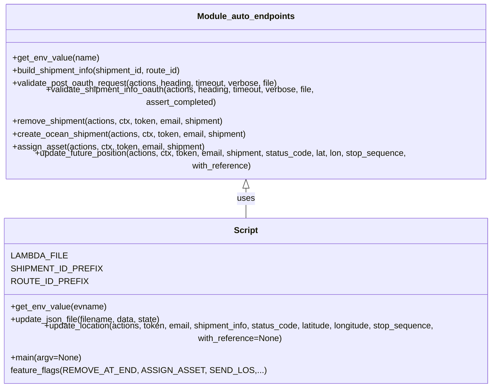

# Diagram: shipment_core/shipment_service/ng_val/scripts/shipment_creation/auto_validate_lambdas_OCEAN_MODE.py


> Auto-generated by Obscura crawlers

## Diagram 1



### SVG

<svg id="container" width="978.3671875" xmlns="http://www.w3.org/2000/svg" class="classDiagram" height="672" viewBox="0 0 978.3671875 672" role="graphics-document document" aria-roledescription="class"><style>#container{font-family:"trebuchet ms",verdana,arial,sans-serif;font-size:16px;fill:#333;}@keyframes edge-animation-frame{from{stroke-dashoffset:0;}}@keyframes dash{to{stroke-dashoffset:0;}}#container .edge-animation-slow{stroke-dasharray:9,5!important;stroke-dashoffset:900;animation:dash 50s linear infinite;stroke-linecap:round;}#container .edge-animation-fast{stroke-dasharray:9,5!important;stroke-dashoffset:900;animation:dash 20s linear infinite;stroke-linecap:round;}#container .error-icon{fill:#552222;}#container .error-text{fill:#552222;stroke:#552222;}#container .edge-thickness-normal{stroke-width:1px;}#container .edge-thickness-thick{stroke-width:3.5px;}#container .edge-pattern-solid{stroke-dasharray:0;}#container .edge-thickness-invisible{stroke-width:0;fill:none;}#container .edge-pattern-dashed{stroke-dasharray:3;}#container .edge-pattern-dotted{stroke-dasharray:2;}#container .marker{fill:#333333;stroke:#333333;}#container .marker.cross{stroke:#333333;}#container svg{font-family:"trebuchet ms",verdana,arial,sans-serif;font-size:16px;}#container p{margin:0;}#container g.classGroup text{fill:#9370DB;stroke:none;font-family:"trebuchet ms",verdana,arial,sans-serif;font-size:10px;}#container g.classGroup text .title{font-weight:bolder;}#container .nodeLabel,#container .edgeLabel{color:#131300;}#container .edgeLabel .label rect{fill:#ECECFF;}#container .label text{fill:#131300;}#container .labelBkg{background:#ECECFF;}#container .edgeLabel .label span{background:#ECECFF;}#container .classTitle{font-weight:bolder;}#container .node rect,#container .node circle,#container .node ellipse,#container .node polygon,#container .node path{fill:#ECECFF;stroke:#9370DB;stroke-width:1px;}#container .divider{stroke:#9370DB;stroke-width:1;}#container g.clickable{cursor:pointer;}#container g.classGroup rect{fill:#ECECFF;stroke:#9370DB;}#container g.classGroup line{stroke:#9370DB;stroke-width:1;}#container .classLabel .box{stroke:none;stroke-width:0;fill:#ECECFF;opacity:0.5;}#container .classLabel .label{fill:#9370DB;font-size:10px;}#container .relation{stroke:#333333;stroke-width:1;fill:none;}#container .dashed-line{stroke-dasharray:3;}#container .dotted-line{stroke-dasharray:1 2;}#container #compositionStart,#container .composition{fill:#333333!important;stroke:#333333!important;stroke-width:1;}#container #compositionEnd,#container .composition{fill:#333333!important;stroke:#333333!important;stroke-width:1;}#container #dependencyStart,#container .dependency{fill:#333333!important;stroke:#333333!important;stroke-width:1;}#container #dependencyStart,#container .dependency{fill:#333333!important;stroke:#333333!important;stroke-width:1;}#container #extensionStart,#container .extension{fill:transparent!important;stroke:#333333!important;stroke-width:1;}#container #extensionEnd,#container .extension{fill:transparent!important;stroke:#333333!important;stroke-width:1;}#container #aggregationStart,#container .aggregation{fill:transparent!important;stroke:#333333!important;stroke-width:1;}#container #aggregationEnd,#container .aggregation{fill:transparent!important;stroke:#333333!important;stroke-width:1;}#container #lollipopStart,#container .lollipop{fill:#ECECFF!important;stroke:#333333!important;stroke-width:1;}#container #lollipopEnd,#container .lollipop{fill:#ECECFF!important;stroke:#333333!important;stroke-width:1;}#container .edgeTerminals{font-size:11px;line-height:initial;}#container .classTitleText{text-anchor:middle;font-size:18px;fill:#333;}#container .label-icon{display:inline-block;height:1em;overflow:visible;vertical-align:-0.125em;}#container .node .label-icon path{fill:currentColor;stroke:revert;stroke-width:revert;}#container :root{--mermaid-font-family:"trebuchet ms",verdana,arial,sans-serif;}</style><g><defs><marker id="container_class-aggregationStart" class="marker aggregation class" refX="18" refY="7" markerWidth="190" markerHeight="240" orient="auto"><path d="M 18,7 L9,13 L1,7 L9,1 Z"></path></marker></defs><defs><marker id="container_class-aggregationEnd" class="marker aggregation class" refX="1" refY="7" markerWidth="20" markerHeight="28" orient="auto"><path d="M 18,7 L9,13 L1,7 L9,1 Z"></path></marker></defs><defs><marker id="container_class-extensionStart" class="marker extension class" refX="18" refY="7" markerWidth="190" markerHeight="240" orient="auto"><path d="M 1,7 L18,13 V 1 Z"></path></marker></defs><defs><marker id="container_class-extensionEnd" class="marker extension class" refX="1" refY="7" markerWidth="20" markerHeight="28" orient="auto"><path d="M 1,1 V 13 L18,7 Z"></path></marker></defs><defs><marker id="container_class-compositionStart" class="marker composition class" refX="18" refY="7" markerWidth="190" markerHeight="240" orient="auto"><path d="M 18,7 L9,13 L1,7 L9,1 Z"></path></marker></defs><defs><marker id="container_class-compositionEnd" class="marker composition class" refX="1" refY="7" markerWidth="20" markerHeight="28" orient="auto"><path d="M 18,7 L9,13 L1,7 L9,1 Z"></path></marker></defs><defs><marker id="container_class-dependencyStart" class="marker dependency class" refX="6" refY="7" markerWidth="190" markerHeight="240" orient="auto"><path d="M 5,7 L9,13 L1,7 L9,1 Z"></path></marker></defs><defs><marker id="container_class-dependencyEnd" class="marker dependency class" refX="13" refY="7" markerWidth="20" markerHeight="28" orient="auto"><path d="M 18,7 L9,13 L14,7 L9,1 Z"></path></marker></defs><defs><marker id="container_class-lollipopStart" class="marker lollipop class" refX="13" refY="7" markerWidth="190" markerHeight="240" orient="auto"><circle stroke="black" fill="transparent" cx="7" cy="7" r="6"></circle></marker></defs><defs><marker id="container_class-lollipopEnd" class="marker lollipop class" refX="1" refY="7" markerWidth="190" markerHeight="240" orient="auto"><circle stroke="black" fill="transparent" cx="7" cy="7" r="6"></circle></marker></defs><g class="root"><g class="clusters"></g><g class="edgePaths"><path d="M489.184,319.25L489.184,322.542C489.184,325.833,489.184,332.417,489.184,341.875C489.184,351.333,489.184,363.667,489.184,369.833L489.184,376" id="id_Module_auto_endpoints_Script_1" class="edge-thickness-normal edge-pattern-solid relation" style=";;;" data-edge="true" data-et="edge" data-id="id_Module_auto_endpoints_Script_1" data-points="W3sieCI6NDg5LjE4MzU5Mzc1LCJ5IjozMDJ9LHsieCI6NDg5LjE4MzU5Mzc1LCJ5IjozMzl9LHsieCI6NDg5LjE4MzU5Mzc1LCJ5IjozNzZ9XQ==" marker-start="url(#container_class-extensionStart)"></path></g><g class="edgeLabels"><g class="edgeLabel" transform="translate(489.18359375, 339)"><g class="label" data-id="id_Module_auto_endpoints_Script_1" transform="translate(-16.4921875, -12)"><foreignObject width="32.984375" height="24"><div xmlns="http://www.w3.org/1999/xhtml" class="labelBkg" style="display: table-cell; white-space: nowrap; line-height: 1.5; max-width: 200px; text-align: center;"><span class="edgeLabel"><p>uses</p></span></div></foreignObject></g></g></g><g class="nodes"><g class="node default" id="classId-Module_auto_endpoints-0" transform="translate(489.18359375, 155)"><g class="basic label-container"><path d="M-472.25 -147 L472.25 -147 L472.25 147 L-472.25 147" stroke="none" stroke-width="0" fill="#ECECFF" style=""></path><path d="M-472.25 -147 C-216.01985458975605 -147, 40.2102908204879 -147, 472.25 -147 M-472.25 -147 C-150.00619485176992 -147, 172.23761029646016 -147, 472.25 -147 M472.25 -147 C472.25 -81.1999993816841, 472.25 -15.399998763368188, 472.25 147 M472.25 -147 C472.25 -58.93681756143506, 472.25 29.126364877129873, 472.25 147 M472.25 147 C118.21426268288872 147, -235.82147463422257 147, -472.25 147 M472.25 147 C193.17301000393445 147, -85.9039799921311 147, -472.25 147 M-472.25 147 C-472.25 48.57628109123377, -472.25 -49.847437817532466, -472.25 -147 M-472.25 147 C-472.25 75.95722055627628, -472.25 4.914441112552566, -472.25 -147" stroke="#9370DB" stroke-width="1.3" fill="none" stroke-dasharray="0 0" style=""></path></g><g class="annotation-group text" transform="translate(0, -123)"></g><g class="label-group text" transform="translate(-88.453125, -123)"><g class="label" style="font-weight: bolder" transform="translate(0,-12)"><foreignObject width="176.90625" height="24"><div xmlns="http://www.w3.org/1999/xhtml" style="display: table-cell; white-space: nowrap; line-height: 1.5; max-width: 226px; text-align: center;"><span class="nodeLabel markdown-node-label" style=""><p>Module_auto_endpoints</p></span></div></foreignObject></g></g><g class="members-group text" transform="translate(-460.25, -75)"></g><g class="methods-group text" transform="translate(-460.25, -45)"><g class="label" style="" transform="translate(0,-12)"><foreignObject width="161.53125" height="24"><div xmlns="http://www.w3.org/1999/xhtml" style="display: table-cell; white-space: nowrap; line-height: 1.5; max-width: 219px; text-align: center;"><span class="nodeLabel markdown-node-label" style=""><p>+get_env_value(name)</p></span></div></foreignObject></g><g class="label" style="" transform="translate(0,12)"><foreignObject width="329" height="24"><div xmlns="http://www.w3.org/1999/xhtml" style="display: table-cell; white-space: nowrap; line-height: 1.5; max-width: 386px; text-align: center;"><span class="nodeLabel markdown-node-label" style=""><p>+build_shipment_info(shipment_id, route_id)</p></span></div></foreignObject></g><g class="label" style="" transform="translate(0,36)"><foreignObject width="511.015625" height="24"><div xmlns="http://www.w3.org/1999/xhtml" style="display: table-cell; white-space: nowrap; line-height: 1.5; max-width: 568px; text-align: center;"><span class="nodeLabel markdown-node-label" style=""><p>+validate_post_oauth_request(actions, heading, timeout, verbose, file)</p></span></div></foreignObject></g><g class="label" style="" transform="translate(0,60)"><foreignObject width="657.171875" height="24"><div xmlns="http://www.w3.org/1999/xhtml" style="display: table-cell; white-space: nowrap; line-height: 1.5; max-width: 715px; text-align: center;"><span class="nodeLabel markdown-node-label" style=""><p>+validate_shipment_info_oauth(actions, heading, timeout, verbose, file, assert_completed)</p></span></div></foreignObject></g><g class="label" style="" transform="translate(0,84)"><foreignObject width="405.015625" height="24"><div xmlns="http://www.w3.org/1999/xhtml" style="display: table-cell; white-space: nowrap; line-height: 1.5; max-width: 462px; text-align: center;"><span class="nodeLabel markdown-node-label" style=""><p>+remove_shipment(actions, ctx, token, email, shipment)</p></span></div></foreignObject></g><g class="label" style="" transform="translate(0,108)"><foreignObject width="447.25" height="24"><div xmlns="http://www.w3.org/1999/xhtml" style="display: table-cell; white-space: nowrap; line-height: 1.5; max-width: 505px; text-align: center;"><span class="nodeLabel markdown-node-label" style=""><p>+create_ocean_shipment(actions, ctx, token, email, shipment)</p></span></div></foreignObject></g><g class="label" style="" transform="translate(0,132)"><foreignObject width="365.75" height="24"><div xmlns="http://www.w3.org/1999/xhtml" style="display: table-cell; white-space: nowrap; line-height: 1.5; max-width: 423px; text-align: center;"><span class="nodeLabel markdown-node-label" style=""><p>+assign_asset(actions, ctx, token, email, shipment)</p></span></div></foreignObject></g><g class="label" style="" transform="translate(0,156)"><foreignObject width="832.046875" height="24"><div xmlns="http://www.w3.org/1999/xhtml" style="display: table-cell; white-space: nowrap; line-height: 1.5; max-width: 889px; text-align: center;"><span class="nodeLabel markdown-node-label" style=""><p>+update_future_position(actions, ctx, token, email, shipment, status_code, lat, lon, stop_sequence, with_reference)</p></span></div></foreignObject></g></g><g class="divider" style=""><path d="M-472.25 -99 C-143.93422369590502 -99, 184.38155260818996 -99, 472.25 -99 M-472.25 -99 C-188.04480234680824 -99, 96.16039530638352 -99, 472.25 -99" stroke="#9370DB" stroke-width="1.3" fill="none" stroke-dasharray="0 0" style=""></path></g><g class="divider" style=""><path d="M-472.25 -75 C-184.36631207808142 -75, 103.51737584383716 -75, 472.25 -75 M-472.25 -75 C-124.11704167490859 -75, 224.01591665018282 -75, 472.25 -75" stroke="#9370DB" stroke-width="1.3" fill="none" stroke-dasharray="0 0" style=""></path></g></g><g class="node default" id="classId-Script-1" transform="translate(489.18359375, 520)"><g class="basic label-container"><path d="M-481.18359375 -144 L481.18359375 -144 L481.18359375 144 L-481.18359375 144" stroke="none" stroke-width="0" fill="#ECECFF" style=""></path><path d="M-481.18359375 -144 C-109.6889353621549 -144, 261.8057230256902 -144, 481.18359375 -144 M-481.18359375 -144 C-259.0985407574866 -144, -37.01348776497326 -144, 481.18359375 -144 M481.18359375 -144 C481.18359375 -63.128181366742965, 481.18359375 17.74363726651407, 481.18359375 144 M481.18359375 -144 C481.18359375 -65.01626583745173, 481.18359375 13.967468325096547, 481.18359375 144 M481.18359375 144 C119.05873299731849 144, -243.06612775536303 144, -481.18359375 144 M481.18359375 144 C97.44711144371831 144, -286.2893708625634 144, -481.18359375 144 M-481.18359375 144 C-481.18359375 61.31495878529361, -481.18359375 -21.370082429412776, -481.18359375 -144 M-481.18359375 144 C-481.18359375 36.705709728269014, -481.18359375 -70.58858054346197, -481.18359375 -144" stroke="#9370DB" stroke-width="1.3" fill="none" stroke-dasharray="0 0" style=""></path></g><g class="annotation-group text" transform="translate(0, -120)"></g><g class="label-group text" transform="translate(-21.7421875, -120)"><g class="label" style="font-weight: bolder" transform="translate(0,-12)"><foreignObject width="43.484375" height="24"><div xmlns="http://www.w3.org/1999/xhtml" style="display: table-cell; white-space: nowrap; line-height: 1.5; max-width: 93px; text-align: center;"><span class="nodeLabel markdown-node-label" style=""><p>Script</p></span></div></foreignObject></g></g><g class="members-group text" transform="translate(-469.18359375, -72)"><g class="label" style="" transform="translate(0,-12)"><foreignObject width="96.0625" height="24"><div xmlns="http://www.w3.org/1999/xhtml" style="display: table-cell; white-space: nowrap; line-height: 1.5; max-width: 146px; text-align: center;"><span class="nodeLabel markdown-node-label" style=""><p>LAMBDA_FILE</p></span></div></foreignObject></g><g class="label" style="" transform="translate(0,12)"><foreignObject width="152.328125" height="24"><div xmlns="http://www.w3.org/1999/xhtml" style="display: table-cell; white-space: nowrap; line-height: 1.5; max-width: 203px; text-align: center;"><span class="nodeLabel markdown-node-label" style=""><p>SHIPMENT_ID_PREFIX</p></span></div></foreignObject></g><g class="label" style="" transform="translate(0,36)"><foreignObject width="127.8125" height="24"><div xmlns="http://www.w3.org/1999/xhtml" style="display: table-cell; white-space: nowrap; line-height: 1.5; max-width: 178px; text-align: center;"><span class="nodeLabel markdown-node-label" style=""><p>ROUTE_ID_PREFIX</p></span></div></foreignObject></g></g><g class="methods-group text" transform="translate(-469.18359375, 24)"><g class="label" style="" transform="translate(0,-12)"><foreignObject width="178.0625" height="24"><div xmlns="http://www.w3.org/1999/xhtml" style="display: table-cell; white-space: nowrap; line-height: 1.5; max-width: 235px; text-align: center;"><span class="nodeLabel markdown-node-label" style=""><p>+get_env_value(evname)</p></span></div></foreignObject></g><g class="label" style="" transform="translate(0,12)"><foreignObject width="287.25" height="24"><div xmlns="http://www.w3.org/1999/xhtml" style="display: table-cell; white-space: nowrap; line-height: 1.5; max-width: 345px; text-align: center;"><span class="nodeLabel markdown-node-label" style=""><p>+update_json_file(filename, data, state)</p></span></div></foreignObject></g><g class="label" style="" transform="translate(0,36)"><foreignObject width="916.625" height="24"><div xmlns="http://www.w3.org/1999/xhtml" style="display: table-cell; white-space: nowrap; line-height: 1.5; max-width: 974px; text-align: center;"><span class="nodeLabel markdown-node-label" style=""><p>+update_location(actions, token, email, shipment_info, status_code, latitude, longitude, stop_sequence, with_reference=None)</p></span></div></foreignObject></g><g class="label" style="" transform="translate(0,60)"><foreignObject width="131.859375" height="24"><div xmlns="http://www.w3.org/1999/xhtml" style="display: table-cell; white-space: nowrap; line-height: 1.5; max-width: 189px; text-align: center;"><span class="nodeLabel markdown-node-label" style=""><p>+main(argv=None)</p></span></div></foreignObject></g><g class="label" style="" transform="translate(0,84)"><foreignObject width="432.09375" height="24"><div xmlns="http://www.w3.org/1999/xhtml" style="display: table-cell; white-space: nowrap; line-height: 1.5; max-width: 482px; text-align: center;"><span class="nodeLabel markdown-node-label" style=""><p>feature_flags(REMOVE_AT_END, ASSIGN_ASSET, SEND_LOS,...)</p></span></div></foreignObject></g></g><g class="divider" style=""><path d="M-481.18359375 -96 C-126.312024777901 -96, 228.559544194198 -96, 481.18359375 -96 M-481.18359375 -96 C-131.5416513730229 -96, 218.10029100395423 -96, 481.18359375 -96" stroke="#9370DB" stroke-width="1.3" fill="none" stroke-dasharray="0 0" style=""></path></g><g class="divider" style=""><path d="M-481.18359375 0 C-181.49459868189274 0, 118.19439638621452 0, 481.18359375 0 M-481.18359375 0 C-244.07226177129573 0, -6.9609297925914575 0, 481.18359375 0" stroke="#9370DB" stroke-width="1.3" fill="none" stroke-dasharray="0 0" style=""></path></g></g></g></g></g></svg>

## Diagram 2

```mermaid
flowchart TD
    Start([Start]) --> ParseArgs{Parse CLI args}
    ParseArgs -->|stage provided| DetermineStage[Determine stage & set URLs/base_paths]
    DetermineStage --> GenerateIDs[Generate shipment_uuid, shipment_id, route_id]
    GenerateIDs --> BuildActions[Build actions dict (lambda, oauth endpoints)]
    BuildActions --> ReadEnv[Read environment variables via get_env_value]
    ReadEnv --> BuildShipmentInfo[Build shipment_info using auto_endpoints.build_shipment_info]
    BuildShipmentInfo --> OAuthRequest[Request OAuth token via validate_post_oauth_request]
    OAuthRequest --> CreateShipment[Create OCEAN_MODE shipment via create_ocean_shipment]
    CreateShipment --> Pause1[Pause for user input]
    Pause1 --> GetShipmentInfo[Get/validate shipment info via validate_shipment_info_oauth]
    GetShipmentInfo --> AssignAssetCheck{ASSIGN_ASSET?}
    AssignAssetCheck -->|yes| AssignAsset[assign_asset -> expect 200]
    AssignAssetCheck -->|no| SkipAssign[skip assign]
    AssignAsset --> LocationUpdatesStart
    SkipAssign --> LocationUpdatesStart
    LocationUpdatesStart{SEND_LOS?} -->|yes| SendLOs[Send multiple LO location updates via update_location]
    LocationUpdatesStart -->|no| CarrierCodes[Send carrier-provided codes (X3/AF or X1/CD) via update_location]
    SendLOs --> RepeatedPauses[Multiple pauses and validate calls]
    CarrierCodes --> RepeatedPauses
    RepeatedPauses --> ValidateAgain[validate_shipment_info_oauth]
    ValidateAgain --> ETAcheck{SEND_ETA_UPDATE?}
    ETAcheck -->|yes| SendETA[Send AG ETA update]
    ETAcheck -->|no| SkipETA[skip]
    SendETA --> ValidateDest[Validate again]
    SkipETA --> ValidateDest
    ValidateDest --> DestinationLOs{SEND_LOS?}
    DestinationLOs -->|yes| SendDestLOs[Send destination LO updates]
    DestinationLOs -->|no| SendDestCarrier[Send X1/CD codes]
    SendDestLOs --> FinalValidate[validate_shipment_info_oauth]
    SendDestCarrier --> FinalValidate
    FinalValidate --> RemoveCheck{REMOVE_AT_END?}
    RemoveCheck -->|yes| RemoveShipment[remove_shipment -> expect 200]
    RemoveCheck -->|no| End([End])
    RemoveShipment --> End
```

> SVG rendering failed for this diagram.
