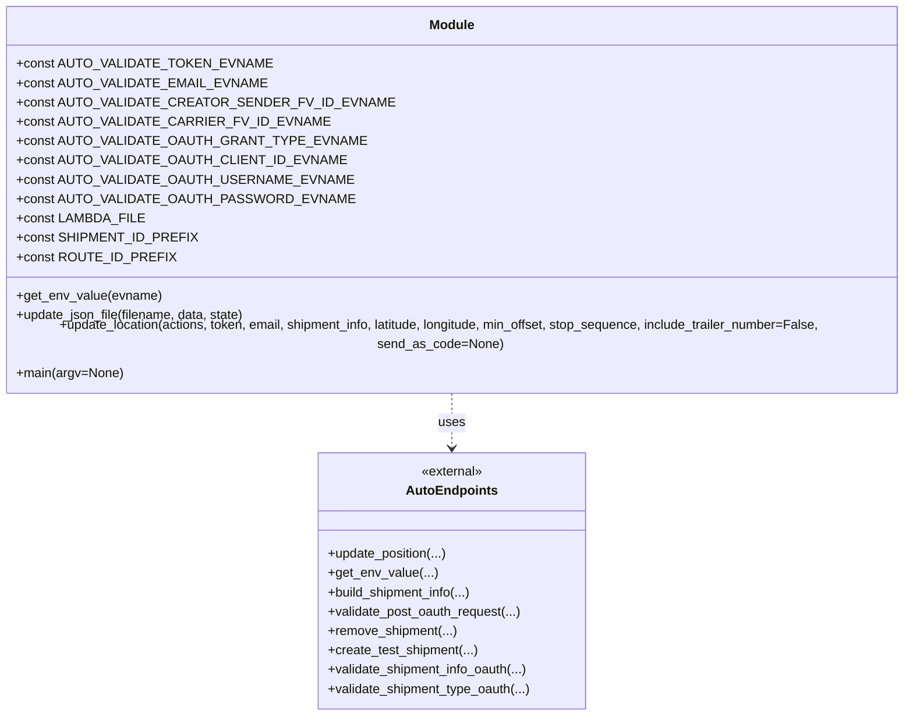
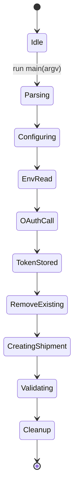

# Diagram: shipment_core/shipment_service/ng_val/scripts/shipment_creation/auto_validate_lambdas_RACK_RETURN_as_TEST-Shipper.py


> Auto-generated by Obscura crawlers

## Diagram 1

```mermaid
flowchart LR
  Start([Start]) --> ParseArgs[/"Parse CLI args (stage)"/]
  ParseArgs --> SetStage{stage value}
  SetStage -->|prod/test/staging/other| ConfigureURLs[/"Configure lambda_url, base_path, oauth_url, cg/ng paths"/]
  ConfigureURLs --> SetFile[LAMBDA_FILE = auto_validate_lambdas-RACK-RETURN.{stage}.json]
  SetFile --> RemoveOldFile{exists(LAMBDA_FILE)?}
  RemoveOldFile -->|yes| DeleteFile[/Remove existing log file/]
  RemoveOldFile -->|no| SkipDelete
  DeleteFile --> GenerateUUID
  SkipDelete --> GenerateUUID
  GenerateUUID --> BuildIDs[/"Generate shipment_id and route_id using UUID and prefixes"/]
  BuildIDs --> PrepareActions[/"Build actions dict with lambda and oauth endpoints"/]
  PrepareActions --> ReadEnv[/"Read required ENV variables via get_env_value and auto_endpoints.get_env_value"/]
  ReadEnv --> BuildShipmentInfo[/"Build shipment_info via auto_endpoints.build_shipment_info and set fv_ids"/]
  BuildShipmentInfo --> OAuthRequest[/"Post to Auth0: validate_post_oauth_request -> oauth_token"/]
  OAuthRequest --> StoreToken[/"Store access_token in actions.oauth"/]
  StoreToken --> RemoveShipment1[/"Call auto_endpoints.remove_shipment to remove any existing shipment"/]
  RemoveShipment1 --> CreateShipment[/"Call auto_endpoints.create_test_shipment to create test shipment (expect 201)"/]
  CreateShipment --> ExtractID[/"Extract lambda_id from response JSON"/]
  ExtractID --> ConfigureGetShipment[/"Set actions.oauth.get_shipment URL using ng_lambda_url/ng_base_path and lambda_id"/]
  ConfigureGetShipment --> Validate1[/"Call validate_shipment_info_oauth (verbose)"/]
  Validate1 --> Validate2[/"Call validate_shipment_info_oauth a second time (O/D pairing test)"/]
  Validate2 --> ValidateType[/"Call validate_shipment_type_oauth to assert expected shipment type"/]
  ValidateType --> RemoveShipment2[/"Call auto_endpoints.remove_shipment to clean up (expect 200)"/]
  RemoveShipment2 --> End([End])
```

> SVG rendering failed for this diagram.

## Diagram 2



### SVG

<svg id="container" width="1190.296875" xmlns="http://www.w3.org/2000/svg" class="classDiagram" height="864" viewBox="0 0 1190.296875 864" role="graphics-document document" aria-roledescription="class"><style>#container{font-family:"trebuchet ms",verdana,arial,sans-serif;font-size:16px;fill:#333;}@keyframes edge-animation-frame{from{stroke-dashoffset:0;}}@keyframes dash{to{stroke-dashoffset:0;}}#container .edge-animation-slow{stroke-dasharray:9,5!important;stroke-dashoffset:900;animation:dash 50s linear infinite;stroke-linecap:round;}#container .edge-animation-fast{stroke-dasharray:9,5!important;stroke-dashoffset:900;animation:dash 20s linear infinite;stroke-linecap:round;}#container .error-icon{fill:#552222;}#container .error-text{fill:#552222;stroke:#552222;}#container .edge-thickness-normal{stroke-width:1px;}#container .edge-thickness-thick{stroke-width:3.5px;}#container .edge-pattern-solid{stroke-dasharray:0;}#container .edge-thickness-invisible{stroke-width:0;fill:none;}#container .edge-pattern-dashed{stroke-dasharray:3;}#container .edge-pattern-dotted{stroke-dasharray:2;}#container .marker{fill:#333333;stroke:#333333;}#container .marker.cross{stroke:#333333;}#container svg{font-family:"trebuchet ms",verdana,arial,sans-serif;font-size:16px;}#container p{margin:0;}#container g.classGroup text{fill:#9370DB;stroke:none;font-family:"trebuchet ms",verdana,arial,sans-serif;font-size:10px;}#container g.classGroup text .title{font-weight:bolder;}#container .nodeLabel,#container .edgeLabel{color:#131300;}#container .edgeLabel .label rect{fill:#ECECFF;}#container .label text{fill:#131300;}#container .labelBkg{background:#ECECFF;}#container .edgeLabel .label span{background:#ECECFF;}#container .classTitle{font-weight:bolder;}#container .node rect,#container .node circle,#container .node ellipse,#container .node polygon,#container .node path{fill:#ECECFF;stroke:#9370DB;stroke-width:1px;}#container .divider{stroke:#9370DB;stroke-width:1;}#container g.clickable{cursor:pointer;}#container g.classGroup rect{fill:#ECECFF;stroke:#9370DB;}#container g.classGroup line{stroke:#9370DB;stroke-width:1;}#container .classLabel .box{stroke:none;stroke-width:0;fill:#ECECFF;opacity:0.5;}#container .classLabel .label{fill:#9370DB;font-size:10px;}#container .relation{stroke:#333333;stroke-width:1;fill:none;}#container .dashed-line{stroke-dasharray:3;}#container .dotted-line{stroke-dasharray:1 2;}#container #compositionStart,#container .composition{fill:#333333!important;stroke:#333333!important;stroke-width:1;}#container #compositionEnd,#container .composition{fill:#333333!important;stroke:#333333!important;stroke-width:1;}#container #dependencyStart,#container .dependency{fill:#333333!important;stroke:#333333!important;stroke-width:1;}#container #dependencyStart,#container .dependency{fill:#333333!important;stroke:#333333!important;stroke-width:1;}#container #extensionStart,#container .extension{fill:transparent!important;stroke:#333333!important;stroke-width:1;}#container #extensionEnd,#container .extension{fill:transparent!important;stroke:#333333!important;stroke-width:1;}#container #aggregationStart,#container .aggregation{fill:transparent!important;stroke:#333333!important;stroke-width:1;}#container #aggregationEnd,#container .aggregation{fill:transparent!important;stroke:#333333!important;stroke-width:1;}#container #lollipopStart,#container .lollipop{fill:#ECECFF!important;stroke:#333333!important;stroke-width:1;}#container #lollipopEnd,#container .lollipop{fill:#ECECFF!important;stroke:#333333!important;stroke-width:1;}#container .edgeTerminals{font-size:11px;line-height:initial;}#container .classTitleText{text-anchor:middle;font-size:18px;fill:#333;}#container .label-icon{display:inline-block;height:1em;overflow:visible;vertical-align:-0.125em;}#container .node .label-icon path{fill:currentColor;stroke:revert;stroke-width:revert;}#container :root{--mermaid-font-family:"trebuchet ms",verdana,arial,sans-serif;}</style><g><defs><marker id="container_class-aggregationStart" class="marker aggregation class" refX="18" refY="7" markerWidth="190" markerHeight="240" orient="auto"><path d="M 18,7 L9,13 L1,7 L9,1 Z"></path></marker></defs><defs><marker id="container_class-aggregationEnd" class="marker aggregation class" refX="1" refY="7" markerWidth="20" markerHeight="28" orient="auto"><path d="M 18,7 L9,13 L1,7 L9,1 Z"></path></marker></defs><defs><marker id="container_class-extensionStart" class="marker extension class" refX="18" refY="7" markerWidth="190" markerHeight="240" orient="auto"><path d="M 1,7 L18,13 V 1 Z"></path></marker></defs><defs><marker id="container_class-extensionEnd" class="marker extension class" refX="1" refY="7" markerWidth="20" markerHeight="28" orient="auto"><path d="M 1,1 V 13 L18,7 Z"></path></marker></defs><defs><marker id="container_class-compositionStart" class="marker composition class" refX="18" refY="7" markerWidth="190" markerHeight="240" orient="auto"><path d="M 18,7 L9,13 L1,7 L9,1 Z"></path></marker></defs><defs><marker id="container_class-compositionEnd" class="marker composition class" refX="1" refY="7" markerWidth="20" markerHeight="28" orient="auto"><path d="M 18,7 L9,13 L1,7 L9,1 Z"></path></marker></defs><defs><marker id="container_class-dependencyStart" class="marker dependency class" refX="6" refY="7" markerWidth="190" markerHeight="240" orient="auto"><path d="M 5,7 L9,13 L1,7 L9,1 Z"></path></marker></defs><defs><marker id="container_class-dependencyEnd" class="marker dependency class" refX="13" refY="7" markerWidth="20" markerHeight="28" orient="auto"><path d="M 18,7 L9,13 L14,7 L9,1 Z"></path></marker></defs><defs><marker id="container_class-lollipopStart" class="marker lollipop class" refX="13" refY="7" markerWidth="190" markerHeight="240" orient="auto"><circle stroke="black" fill="transparent" cx="7" cy="7" r="6"></circle></marker></defs><defs><marker id="container_class-lollipopEnd" class="marker lollipop class" refX="1" refY="7" markerWidth="190" markerHeight="240" orient="auto"><circle stroke="black" fill="transparent" cx="7" cy="7" r="6"></circle></marker></defs><g class="root"><g class="clusters"></g><g class="edgePaths"><path d="M595.148,464L595.148,470.167C595.148,476.333,595.148,488.667,595.148,500C595.148,511.333,595.148,521.667,595.148,526.833L595.148,532" id="id_Module_AutoEndpoints_1" class="edge-thickness-normal edge-pattern-dashed relation" style=";;;" data-edge="true" data-et="edge" data-id="id_Module_AutoEndpoints_1" data-points="W3sieCI6NTk1LjE0ODQzNzUsInkiOjQ2NH0seyJ4Ijo1OTUuMTQ4NDM3NSwieSI6NTAxfSx7IngiOjU5NS4xNDg0Mzc1LCJ5Ijo1Mzh9XQ==" marker-end="url(#container_class-dependencyEnd)"></path></g><g class="edgeLabels"><g class="edgeLabel" transform="translate(595.1484375, 501)"><g class="label" data-id="id_Module_AutoEndpoints_1" transform="translate(-16.4921875, -12)"><foreignObject width="32.984375" height="24"><div xmlns="http://www.w3.org/1999/xhtml" class="labelBkg" style="display: table-cell; white-space: nowrap; line-height: 1.5; max-width: 200px; text-align: center;"><span class="edgeLabel"><p>uses</p></span></div></foreignObject></g></g></g><g class="nodes"><g class="node default" id="classId-Module-0" transform="translate(595.1484375, 236)"><g class="basic label-container"><path d="M-587.1484375 -228 L587.1484375 -228 L587.1484375 228 L-587.1484375 228" stroke="none" stroke-width="0" fill="#ECECFF" style=""></path><path d="M-587.1484375 -228 C-304.4223600523093 -228, -21.696282604618546 -228, 587.1484375 -228 M-587.1484375 -228 C-131.49916187606232 -228, 324.15011374787537 -228, 587.1484375 -228 M587.1484375 -228 C587.1484375 -50.023395641685624, 587.1484375 127.95320871662875, 587.1484375 228 M587.1484375 -228 C587.1484375 -79.64764727383093, 587.1484375 68.70470545233815, 587.1484375 228 M587.1484375 228 C348.78719882407745 228, 110.4259601481549 228, -587.1484375 228 M587.1484375 228 C247.73235126013878 228, -91.68373497972243 228, -587.1484375 228 M-587.1484375 228 C-587.1484375 52.44490834090158, -587.1484375 -123.11018331819685, -587.1484375 -228 M-587.1484375 228 C-587.1484375 55.58872753430185, -587.1484375 -116.8225449313963, -587.1484375 -228" stroke="#9370DB" stroke-width="1.3" fill="none" stroke-dasharray="0 0" style=""></path></g><g class="annotation-group text" transform="translate(0, -204)"></g><g class="label-group text" transform="translate(-27.09375, -204)"><g class="label" style="font-weight: bolder" transform="translate(0,-12)"><foreignObject width="54.1875" height="24"><div xmlns="http://www.w3.org/1999/xhtml" style="display: table-cell; white-space: nowrap; line-height: 1.5; max-width: 104px; text-align: center;"><span class="nodeLabel markdown-node-label" style=""><p>Module</p></span></div></foreignObject></g></g><g class="members-group text" transform="translate(-575.1484375, -156)"><g class="label" style="" transform="translate(0,-12)"><foreignObject width="284.765625" height="24"><div xmlns="http://www.w3.org/1999/xhtml" style="display: table-cell; white-space: nowrap; line-height: 1.5; max-width: 342px; text-align: center;"><span class="nodeLabel markdown-node-label" style=""><p>+const AUTO_VALIDATE_TOKEN_EVNAME</p></span></div></foreignObject></g><g class="label" style="" transform="translate(0,12)"><foreignObject width="280.734375" height="24"><div xmlns="http://www.w3.org/1999/xhtml" style="display: table-cell; white-space: nowrap; line-height: 1.5; max-width: 338px; text-align: center;"><span class="nodeLabel markdown-node-label" style=""><p>+const AUTO_VALIDATE_EMAIL_EVNAME</p></span></div></foreignObject></g><g class="label" style="" transform="translate(0,36)"><foreignObject width="412.984375" height="24"><div xmlns="http://www.w3.org/1999/xhtml" style="display: table-cell; white-space: nowrap; line-height: 1.5; max-width: 470px; text-align: center;"><span class="nodeLabel markdown-node-label" style=""><p>+const AUTO_VALIDATE_CREATOR_SENDER_FV_ID_EVNAME</p></span></div></foreignObject></g><g class="label" style="" transform="translate(0,60)"><foreignObject width="344.65625" height="24"><div xmlns="http://www.w3.org/1999/xhtml" style="display: table-cell; white-space: nowrap; line-height: 1.5; max-width: 402px; text-align: center;"><span class="nodeLabel markdown-node-label" style=""><p>+const AUTO_VALIDATE_CARRIER_FV_ID_EVNAME</p></span></div></foreignObject></g><g class="label" style="" transform="translate(0,84)"><foreignObject width="384.359375" height="24"><div xmlns="http://www.w3.org/1999/xhtml" style="display: table-cell; white-space: nowrap; line-height: 1.5; max-width: 442px; text-align: center;"><span class="nodeLabel markdown-node-label" style=""><p>+const AUTO_VALIDATE_OAUTH_GRANT_TYPE_EVNAME</p></span></div></foreignObject></g><g class="label" style="" transform="translate(0,108)"><foreignObject width="365.875" height="24"><div xmlns="http://www.w3.org/1999/xhtml" style="display: table-cell; white-space: nowrap; line-height: 1.5; max-width: 423px; text-align: center;"><span class="nodeLabel markdown-node-label" style=""><p>+const AUTO_VALIDATE_OAUTH_CLIENT_ID_EVNAME</p></span></div></foreignObject></g><g class="label" style="" transform="translate(0,132)"><foreignObject width="373.265625" height="24"><div xmlns="http://www.w3.org/1999/xhtml" style="display: table-cell; white-space: nowrap; line-height: 1.5; max-width: 431px; text-align: center;"><span class="nodeLabel markdown-node-label" style=""><p>+const AUTO_VALIDATE_OAUTH_USERNAME_EVNAME</p></span></div></foreignObject></g><g class="label" style="" transform="translate(0,156)"><foreignObject width="373.4375" height="24"><div xmlns="http://www.w3.org/1999/xhtml" style="display: table-cell; white-space: nowrap; line-height: 1.5; max-width: 431px; text-align: center;"><span class="nodeLabel markdown-node-label" style=""><p>+const AUTO_VALIDATE_OAUTH_PASSWORD_EVNAME</p></span></div></foreignObject></g><g class="label" style="" transform="translate(0,180)"><foreignObject width="147.578125" height="24"><div xmlns="http://www.w3.org/1999/xhtml" style="display: table-cell; white-space: nowrap; line-height: 1.5; max-width: 205px; text-align: center;"><span class="nodeLabel markdown-node-label" style=""><p>+const LAMBDA_FILE</p></span></div></foreignObject></g><g class="label" style="" transform="translate(0,204)"><foreignObject width="203.84375" height="24"><div xmlns="http://www.w3.org/1999/xhtml" style="display: table-cell; white-space: nowrap; line-height: 1.5; max-width: 262px; text-align: center;"><span class="nodeLabel markdown-node-label" style=""><p>+const SHIPMENT_ID_PREFIX</p></span></div></foreignObject></g><g class="label" style="" transform="translate(0,228)"><foreignObject width="179.34375" height="24"><div xmlns="http://www.w3.org/1999/xhtml" style="display: table-cell; white-space: nowrap; line-height: 1.5; max-width: 237px; text-align: center;"><span class="nodeLabel markdown-node-label" style=""><p>+const ROUTE_ID_PREFIX</p></span></div></foreignObject></g></g><g class="methods-group text" transform="translate(-575.1484375, 132)"><g class="label" style="" transform="translate(0,-12)"><foreignObject width="178.0625" height="24"><div xmlns="http://www.w3.org/1999/xhtml" style="display: table-cell; white-space: nowrap; line-height: 1.5; max-width: 235px; text-align: center;"><span class="nodeLabel markdown-node-label" style=""><p>+get_env_value(evname)</p></span></div></foreignObject></g><g class="label" style="" transform="translate(0,12)"><foreignObject width="287.25" height="24"><div xmlns="http://www.w3.org/1999/xhtml" style="display: table-cell; white-space: nowrap; line-height: 1.5; max-width: 345px; text-align: center;"><span class="nodeLabel markdown-node-label" style=""><p>+update_json_file(filename, data, state)</p></span></div></foreignObject></g><g class="label" style="" transform="translate(0,36)"><foreignObject width="1123.203125" height="24"><div xmlns="http://www.w3.org/1999/xhtml" style="display: table-cell; white-space: nowrap; line-height: 1.5; max-width: 1181px; text-align: center;"><span class="nodeLabel markdown-node-label" style=""><p>+update_location(actions, token, email, shipment_info, latitude, longitude, min_offset, stop_sequence, include_trailer_number=False, send_as_code=None)</p></span></div></foreignObject></g><g class="label" style="" transform="translate(0,60)"><foreignObject width="131.859375" height="24"><div xmlns="http://www.w3.org/1999/xhtml" style="display: table-cell; white-space: nowrap; line-height: 1.5; max-width: 189px; text-align: center;"><span class="nodeLabel markdown-node-label" style=""><p>+main(argv=None)</p></span></div></foreignObject></g></g><g class="divider" style=""><path d="M-587.1484375 -180 C-144.04830922854848 -180, 299.05181904290305 -180, 587.1484375 -180 M-587.1484375 -180 C-166.1727697903653 -180, 254.8028979192694 -180, 587.1484375 -180" stroke="#9370DB" stroke-width="1.3" fill="none" stroke-dasharray="0 0" style=""></path></g><g class="divider" style=""><path d="M-587.1484375 108 C-253.95336049284253 108, 79.24171651431493 108, 587.1484375 108 M-587.1484375 108 C-297.15656468589503 108, -7.164691871790069 108, 587.1484375 108" stroke="#9370DB" stroke-width="1.3" fill="none" stroke-dasharray="0 0" style=""></path></g></g><g class="node default" id="classId-AutoEndpoints-1" transform="translate(595.1484375, 697)"><g class="basic label-container"><path d="M-165.8046875 -159 L165.8046875 -159 L165.8046875 159 L-165.8046875 159" stroke="none" stroke-width="0" fill="#ECECFF" style=""></path><path d="M-165.8046875 -159 C-43.68700785119749 -159, 78.43067179760502 -159, 165.8046875 -159 M-165.8046875 -159 C-78.54974139336146 -159, 8.705204713277084 -159, 165.8046875 -159 M165.8046875 -159 C165.8046875 -78.7398833380947, 165.8046875 1.5202333238106007, 165.8046875 159 M165.8046875 -159 C165.8046875 -48.60307165601684, 165.8046875 61.793856687966326, 165.8046875 159 M165.8046875 159 C73.20499887350198 159, -19.394689752996044 159, -165.8046875 159 M165.8046875 159 C76.30821541305998 159, -13.188256673880034 159, -165.8046875 159 M-165.8046875 159 C-165.8046875 95.27155430487417, -165.8046875 31.54310860974836, -165.8046875 -159 M-165.8046875 159 C-165.8046875 35.969574107033694, -165.8046875 -87.06085178593261, -165.8046875 -159" stroke="#9370DB" stroke-width="1.3" fill="none" stroke-dasharray="0 0" style=""></path></g><g class="annotation-group text" transform="translate(-38.65625, -135)"><g class="label" style="" transform="translate(0,-12)"><foreignObject width="77.3125" height="24"><div xmlns="http://www.w3.org/1999/xhtml" style="display: table-cell; white-space: nowrap; line-height: 1.5; max-width: 127px; text-align: center;"><span class="nodeLabel markdown-node-label" style=""><p>«external»</p></span></div></foreignObject></g></g><g class="label-group text" transform="translate(-53.734375, -111)"><g class="label" style="font-weight: bolder" transform="translate(0,-12)"><foreignObject width="107.46875" height="24"><div xmlns="http://www.w3.org/1999/xhtml" style="display: table-cell; white-space: nowrap; line-height: 1.5; max-width: 157px; text-align: center;"><span class="nodeLabel markdown-node-label" style=""><p>AutoEndpoints</p></span></div></foreignObject></g></g><g class="members-group text" transform="translate(-153.8046875, -63)"></g><g class="methods-group text" transform="translate(-153.8046875, -33)"><g class="label" style="" transform="translate(0,-12)"><foreignObject width="149.0625" height="24"><div xmlns="http://www.w3.org/1999/xhtml" style="display: table-cell; white-space: nowrap; line-height: 1.5; max-width: 206px; text-align: center;"><span class="nodeLabel markdown-node-label" style=""><p>+update_position(...)</p></span></div></foreignObject></g><g class="label" style="" transform="translate(0,12)"><foreignObject width="132.53125" height="24"><div xmlns="http://www.w3.org/1999/xhtml" style="display: table-cell; white-space: nowrap; line-height: 1.5; max-width: 190px; text-align: center;"><span class="nodeLabel markdown-node-label" style=""><p>+get_env_value(...)</p></span></div></foreignObject></g><g class="label" style="" transform="translate(0,36)"><foreignObject width="180.90625" height="24"><div xmlns="http://www.w3.org/1999/xhtml" style="display: table-cell; white-space: nowrap; line-height: 1.5; max-width: 238px; text-align: center;"><span class="nodeLabel markdown-node-label" style=""><p>+build_shipment_info(...)</p></span></div></foreignObject></g><g class="label" style="" transform="translate(0,60)"><foreignObject width="241.640625" height="24"><div xmlns="http://www.w3.org/1999/xhtml" style="display: table-cell; white-space: nowrap; line-height: 1.5; max-width: 299px; text-align: center;"><span class="nodeLabel markdown-node-label" style=""><p>+validate_post_oauth_request(...)</p></span></div></foreignObject></g><g class="label" style="" transform="translate(0,84)"><foreignObject width="160.265625" height="24"><div xmlns="http://www.w3.org/1999/xhtml" style="display: table-cell; white-space: nowrap; line-height: 1.5; max-width: 218px; text-align: center;"><span class="nodeLabel markdown-node-label" style=""><p>+remove_shipment(...)</p></span></div></foreignObject></g><g class="label" style="" transform="translate(0,108)"><foreignObject width="186.703125" height="24"><div xmlns="http://www.w3.org/1999/xhtml" style="display: table-cell; white-space: nowrap; line-height: 1.5; max-width: 244px; text-align: center;"><span class="nodeLabel markdown-node-label" style=""><p>+create_test_shipment(...)</p></span></div></foreignObject></g><g class="label" style="" transform="translate(0,132)"><foreignObject width="250.84375" height="24"><div xmlns="http://www.w3.org/1999/xhtml" style="display: table-cell; white-space: nowrap; line-height: 1.5; max-width: 308px; text-align: center;"><span class="nodeLabel markdown-node-label" style=""><p>+validate_shipment_info_oauth(...)</p></span></div></foreignObject></g><g class="label" style="" transform="translate(0,156)"><foreignObject width="253.875" height="24"><div xmlns="http://www.w3.org/1999/xhtml" style="display: table-cell; white-space: nowrap; line-height: 1.5; max-width: 311px; text-align: center;"><span class="nodeLabel markdown-node-label" style=""><p>+validate_shipment_type_oauth(...)</p></span></div></foreignObject></g></g><g class="divider" style=""><path d="M-165.8046875 -87 C-57.865010877241986 -87, 50.07466574551603 -87, 165.8046875 -87 M-165.8046875 -87 C-41.78150224997178 -87, 82.24168300005644 -87, 165.8046875 -87" stroke="#9370DB" stroke-width="1.3" fill="none" stroke-dasharray="0 0" style=""></path></g><g class="divider" style=""><path d="M-165.8046875 -63 C-44.05509322818256 -63, 77.69450104363489 -63, 165.8046875 -63 M-165.8046875 -63 C-66.38047137871445 -63, 33.04374474257111 -63, 165.8046875 -63" stroke="#9370DB" stroke-width="1.3" fill="none" stroke-dasharray="0 0" style=""></path></g></g></g></g></g></svg>

## Diagram 3



### SVG

<svg id="container" width="161.375" xmlns="http://www.w3.org/2000/svg" class="statediagram" height="1018" viewBox="0 0 161.375 1018" role="graphics-document document" aria-roledescription="stateDiagram"><style>#container{font-family:"trebuchet ms",verdana,arial,sans-serif;font-size:16px;fill:#333;}@keyframes edge-animation-frame{from{stroke-dashoffset:0;}}@keyframes dash{to{stroke-dashoffset:0;}}#container .edge-animation-slow{stroke-dasharray:9,5!important;stroke-dashoffset:900;animation:dash 50s linear infinite;stroke-linecap:round;}#container .edge-animation-fast{stroke-dasharray:9,5!important;stroke-dashoffset:900;animation:dash 20s linear infinite;stroke-linecap:round;}#container .error-icon{fill:#552222;}#container .error-text{fill:#552222;stroke:#552222;}#container .edge-thickness-normal{stroke-width:1px;}#container .edge-thickness-thick{stroke-width:3.5px;}#container .edge-pattern-solid{stroke-dasharray:0;}#container .edge-thickness-invisible{stroke-width:0;fill:none;}#container .edge-pattern-dashed{stroke-dasharray:3;}#container .edge-pattern-dotted{stroke-dasharray:2;}#container .marker{fill:#333333;stroke:#333333;}#container .marker.cross{stroke:#333333;}#container svg{font-family:"trebuchet ms",verdana,arial,sans-serif;font-size:16px;}#container p{margin:0;}#container defs #statediagram-barbEnd{fill:#333333;stroke:#333333;}#container g.stateGroup text{fill:#9370DB;stroke:none;font-size:10px;}#container g.stateGroup text{fill:#333;stroke:none;font-size:10px;}#container g.stateGroup .state-title{font-weight:bolder;fill:#131300;}#container g.stateGroup rect{fill:#ECECFF;stroke:#9370DB;}#container g.stateGroup line{stroke:#333333;stroke-width:1;}#container .transition{stroke:#333333;stroke-width:1;fill:none;}#container .stateGroup .composit{fill:white;border-bottom:1px;}#container .stateGroup .alt-composit{fill:#e0e0e0;border-bottom:1px;}#container .state-note{stroke:#aaaa33;fill:#fff5ad;}#container .state-note text{fill:black;stroke:none;font-size:10px;}#container .stateLabel .box{stroke:none;stroke-width:0;fill:#ECECFF;opacity:0.5;}#container .edgeLabel .label rect{fill:#ECECFF;opacity:0.5;}#container .edgeLabel{background-color:rgba(232,232,232, 0.8);text-align:center;}#container .edgeLabel p{background-color:rgba(232,232,232, 0.8);}#container .edgeLabel rect{opacity:0.5;background-color:rgba(232,232,232, 0.8);fill:rgba(232,232,232, 0.8);}#container .edgeLabel .label text{fill:#333;}#container .label div .edgeLabel{color:#333;}#container .stateLabel text{fill:#131300;font-size:10px;font-weight:bold;}#container .node circle.state-start{fill:#333333;stroke:#333333;}#container .node .fork-join{fill:#333333;stroke:#333333;}#container .node circle.state-end{fill:#9370DB;stroke:white;stroke-width:1.5;}#container .end-state-inner{fill:white;stroke-width:1.5;}#container .node rect{fill:#ECECFF;stroke:#9370DB;stroke-width:1px;}#container .node polygon{fill:#ECECFF;stroke:#9370DB;stroke-width:1px;}#container #statediagram-barbEnd{fill:#333333;}#container .statediagram-cluster rect{fill:#ECECFF;stroke:#9370DB;stroke-width:1px;}#container .cluster-label,#container .nodeLabel{color:#131300;}#container .statediagram-cluster rect.outer{rx:5px;ry:5px;}#container .statediagram-state .divider{stroke:#9370DB;}#container .statediagram-state .title-state{rx:5px;ry:5px;}#container .statediagram-cluster.statediagram-cluster .inner{fill:white;}#container .statediagram-cluster.statediagram-cluster-alt .inner{fill:#f0f0f0;}#container .statediagram-cluster .inner{rx:0;ry:0;}#container .statediagram-state rect.basic{rx:5px;ry:5px;}#container .statediagram-state rect.divider{stroke-dasharray:10,10;fill:#f0f0f0;}#container .note-edge{stroke-dasharray:5;}#container .statediagram-note rect{fill:#fff5ad;stroke:#aaaa33;stroke-width:1px;rx:0;ry:0;}#container .statediagram-note rect{fill:#fff5ad;stroke:#aaaa33;stroke-width:1px;rx:0;ry:0;}#container .statediagram-note text{fill:black;}#container .statediagram-note .nodeLabel{color:black;}#container .statediagram .edgeLabel{color:red;}#container #dependencyStart,#container #dependencyEnd{fill:#333333;stroke:#333333;stroke-width:1;}#container .statediagramTitleText{text-anchor:middle;font-size:18px;fill:#333;}#container :root{--mermaid-font-family:"trebuchet ms",verdana,arial,sans-serif;}</style><g><defs><marker id="container_stateDiagram-barbEnd" refX="19" refY="7" markerWidth="20" markerHeight="14" markerUnits="userSpaceOnUse" orient="auto"><path d="M 19,7 L9,13 L14,7 L9,1 Z"></path></marker></defs><g class="root"><g class="clusters"></g><g class="edgePaths"><path d="M80.688,22L80.688,26.167C80.688,30.333,80.688,38.667,80.771,47.083C80.854,55.5,81.021,64,81.104,68.25L81.188,72.5" id="edge0" class="edge-thickness-normal edge-pattern-solid transition" style="fill:none;;;fill:none" data-edge="true" data-et="edge" data-id="edge0" data-points="W3sieCI6ODAuNjg3NSwieSI6MjJ9LHsieCI6ODAuNjg3NSwieSI6NDd9LHsieCI6ODEuMTg3NSwieSI6NzIuNX1d" marker-end="url(#container_stateDiagram-barbEnd)"></path><path d="M81.188,112.5L81.104,118.583C81.021,124.667,80.854,136.833,80.854,149.167C80.854,161.5,81.021,174,81.104,180.25L81.188,186.5" id="edge1" class="edge-thickness-normal edge-pattern-solid transition" style="fill:none;;;fill:none" data-edge="true" data-et="edge" data-id="edge1" data-points="W3sieCI6ODEuMTg3NSwieSI6MTEyLjV9LHsieCI6ODAuNjg3NSwieSI6MTQ5fSx7IngiOjgxLjE4NzUsInkiOjE4Ni41fV0=" marker-end="url(#container_stateDiagram-barbEnd)"></path><path d="M81.188,226.5L81.104,230.583C81.021,234.667,80.854,242.833,80.854,251.167C80.854,259.5,81.021,268,81.104,272.25L81.188,276.5" id="edge2" class="edge-thickness-normal edge-pattern-solid transition" style="fill:none;;;fill:none" data-edge="true" data-et="edge" data-id="edge2" data-points="W3sieCI6ODEuMTg3NSwieSI6MjI2LjV9LHsieCI6ODAuNjg3NSwieSI6MjUxfSx7IngiOjgxLjE4NzUsInkiOjI3Ni41fV0=" marker-end="url(#container_stateDiagram-barbEnd)"></path><path d="M81.188,316.5L81.104,320.583C81.021,324.667,80.854,332.833,80.854,341.167C80.854,349.5,81.021,358,81.104,362.25L81.188,366.5" id="edge3" class="edge-thickness-normal edge-pattern-solid transition" style="fill:none;;;fill:none" data-edge="true" data-et="edge" data-id="edge3" data-points="W3sieCI6ODEuMTg3NSwieSI6MzE2LjV9LHsieCI6ODAuNjg3NSwieSI6MzQxfSx7IngiOjgxLjE4NzUsInkiOjM2Ni41fV0=" marker-end="url(#container_stateDiagram-barbEnd)"></path><path d="M81.188,406.5L81.104,410.583C81.021,414.667,80.854,422.833,80.854,431.167C80.854,439.5,81.021,448,81.104,452.25L81.188,456.5" id="edge4" class="edge-thickness-normal edge-pattern-solid transition" style="fill:none;;;fill:none" data-edge="true" data-et="edge" data-id="edge4" data-points="W3sieCI6ODEuMTg3NSwieSI6NDA2LjV9LHsieCI6ODAuNjg3NSwieSI6NDMxfSx7IngiOjgxLjE4NzUsInkiOjQ1Ni41fV0=" marker-end="url(#container_stateDiagram-barbEnd)"></path><path d="M81.188,496.5L81.104,500.583C81.021,504.667,80.854,512.833,80.854,521.167C80.854,529.5,81.021,538,81.104,542.25L81.188,546.5" id="edge5" class="edge-thickness-normal edge-pattern-solid transition" style="fill:none;;;fill:none" data-edge="true" data-et="edge" data-id="edge5" data-points="W3sieCI6ODEuMTg3NSwieSI6NDk2LjV9LHsieCI6ODAuNjg3NSwieSI6NTIxfSx7IngiOjgxLjE4NzUsInkiOjU0Ni41fV0=" marker-end="url(#container_stateDiagram-barbEnd)"></path><path d="M81.188,586.5L81.104,590.583C81.021,594.667,80.854,602.833,80.854,611.167C80.854,619.5,81.021,628,81.104,632.25L81.188,636.5" id="edge6" class="edge-thickness-normal edge-pattern-solid transition" style="fill:none;;;fill:none" data-edge="true" data-et="edge" data-id="edge6" data-points="W3sieCI6ODEuMTg3NSwieSI6NTg2LjV9LHsieCI6ODAuNjg3NSwieSI6NjExfSx7IngiOjgxLjE4NzUsInkiOjYzNi41fV0=" marker-end="url(#container_stateDiagram-barbEnd)"></path><path d="M81.188,676.5L81.104,680.583C81.021,684.667,80.854,692.833,80.854,701.167C80.854,709.5,81.021,718,81.104,722.25L81.188,726.5" id="edge7" class="edge-thickness-normal edge-pattern-solid transition" style="fill:none;;;fill:none" data-edge="true" data-et="edge" data-id="edge7" data-points="W3sieCI6ODEuMTg3NSwieSI6Njc2LjV9LHsieCI6ODAuNjg3NSwieSI6NzAxfSx7IngiOjgxLjE4NzUsInkiOjcyNi41fV0=" marker-end="url(#container_stateDiagram-barbEnd)"></path><path d="M81.188,766.5L81.104,770.583C81.021,774.667,80.854,782.833,80.854,791.167C80.854,799.5,81.021,808,81.104,812.25L81.188,816.5" id="edge8" class="edge-thickness-normal edge-pattern-solid transition" style="fill:none;;;fill:none" data-edge="true" data-et="edge" data-id="edge8" data-points="W3sieCI6ODEuMTg3NSwieSI6NzY2LjV9LHsieCI6ODAuNjg3NSwieSI6NzkxfSx7IngiOjgxLjE4NzUsInkiOjgxNi41fV0=" marker-end="url(#container_stateDiagram-barbEnd)"></path><path d="M81.188,856.5L81.104,860.583C81.021,864.667,80.854,872.833,80.854,881.167C80.854,889.5,81.021,898,81.104,902.25L81.188,906.5" id="edge9" class="edge-thickness-normal edge-pattern-solid transition" style="fill:none;;;fill:none" data-edge="true" data-et="edge" data-id="edge9" data-points="W3sieCI6ODEuMTg3NSwieSI6ODU2LjV9LHsieCI6ODAuNjg3NSwieSI6ODgxfSx7IngiOjgxLjE4NzUsInkiOjkwNi41fV0=" marker-end="url(#container_stateDiagram-barbEnd)"></path><path d="M81.188,946.5L81.104,950.583C81.021,954.667,80.854,962.833,80.771,971.083C80.688,979.333,80.688,987.667,80.688,991.833L80.688,996" id="edge10" class="edge-thickness-normal edge-pattern-solid transition" style="fill:none;;;fill:none" data-edge="true" data-et="edge" data-id="edge10" data-points="W3sieCI6ODEuMTg3NSwieSI6OTQ2LjV9LHsieCI6ODAuNjg3NSwieSI6OTcxfSx7IngiOjgwLjY4NzUsInkiOjk5Nn1d" marker-end="url(#container_stateDiagram-barbEnd)"></path></g><g class="edgeLabels"><g class="edgeLabel"><g class="label" data-id="edge0" transform="translate(0, 0)"><foreignObject width="0" height="0"><div xmlns="http://www.w3.org/1999/xhtml" class="labelBkg" style="display: table-cell; white-space: nowrap; line-height: 1.5; max-width: 200px; text-align: center;"><span class="edgeLabel"></span></div></foreignObject></g></g><g class="edgeLabel" transform="translate(80.6875, 149)"><g class="label" data-id="edge1" transform="translate(-53.3046875, -12)"><foreignObject width="106.609375" height="24"><div xmlns="http://www.w3.org/1999/xhtml" class="labelBkg" style="display: table-cell; white-space: nowrap; line-height: 1.5; max-width: 200px; text-align: center;"><span class="edgeLabel"><p>run main(argv)</p></span></div></foreignObject></g></g><g class="edgeLabel"><g class="label" data-id="edge2" transform="translate(0, 0)"><foreignObject width="0" height="0"><div xmlns="http://www.w3.org/1999/xhtml" class="labelBkg" style="display: table-cell; white-space: nowrap; line-height: 1.5; max-width: 200px; text-align: center;"><span class="edgeLabel"></span></div></foreignObject></g></g><g class="edgeLabel"><g class="label" data-id="edge3" transform="translate(0, 0)"><foreignObject width="0" height="0"><div xmlns="http://www.w3.org/1999/xhtml" class="labelBkg" style="display: table-cell; white-space: nowrap; line-height: 1.5; max-width: 200px; text-align: center;"><span class="edgeLabel"></span></div></foreignObject></g></g><g class="edgeLabel"><g class="label" data-id="edge4" transform="translate(0, 0)"><foreignObject width="0" height="0"><div xmlns="http://www.w3.org/1999/xhtml" class="labelBkg" style="display: table-cell; white-space: nowrap; line-height: 1.5; max-width: 200px; text-align: center;"><span class="edgeLabel"></span></div></foreignObject></g></g><g class="edgeLabel"><g class="label" data-id="edge5" transform="translate(0, 0)"><foreignObject width="0" height="0"><div xmlns="http://www.w3.org/1999/xhtml" class="labelBkg" style="display: table-cell; white-space: nowrap; line-height: 1.5; max-width: 200px; text-align: center;"><span class="edgeLabel"></span></div></foreignObject></g></g><g class="edgeLabel"><g class="label" data-id="edge6" transform="translate(0, 0)"><foreignObject width="0" height="0"><div xmlns="http://www.w3.org/1999/xhtml" class="labelBkg" style="display: table-cell; white-space: nowrap; line-height: 1.5; max-width: 200px; text-align: center;"><span class="edgeLabel"></span></div></foreignObject></g></g><g class="edgeLabel"><g class="label" data-id="edge7" transform="translate(0, 0)"><foreignObject width="0" height="0"><div xmlns="http://www.w3.org/1999/xhtml" class="labelBkg" style="display: table-cell; white-space: nowrap; line-height: 1.5; max-width: 200px; text-align: center;"><span class="edgeLabel"></span></div></foreignObject></g></g><g class="edgeLabel"><g class="label" data-id="edge8" transform="translate(0, 0)"><foreignObject width="0" height="0"><div xmlns="http://www.w3.org/1999/xhtml" class="labelBkg" style="display: table-cell; white-space: nowrap; line-height: 1.5; max-width: 200px; text-align: center;"><span class="edgeLabel"></span></div></foreignObject></g></g><g class="edgeLabel"><g class="label" data-id="edge9" transform="translate(0, 0)"><foreignObject width="0" height="0"><div xmlns="http://www.w3.org/1999/xhtml" class="labelBkg" style="display: table-cell; white-space: nowrap; line-height: 1.5; max-width: 200px; text-align: center;"><span class="edgeLabel"></span></div></foreignObject></g></g><g class="edgeLabel"><g class="label" data-id="edge10" transform="translate(0, 0)"><foreignObject width="0" height="0"><div xmlns="http://www.w3.org/1999/xhtml" class="labelBkg" style="display: table-cell; white-space: nowrap; line-height: 1.5; max-width: 200px; text-align: center;"><span class="edgeLabel"></span></div></foreignObject></g></g></g><g class="nodes"><g class="node default" id="state-root_start-0" transform="translate(80.6875, 15)"><circle class="state-start" r="7" width="14" height="14"></circle></g><g class="node  statediagram-state" id="state-Idle-1" transform="translate(80.6875, 92)"><g class="basic label-container outer-path"><path d="M-16.8125 -20 C-4.545558054572933 -20, 7.721383890854135 -20, 16.8125 -20 C16.8125 -20, 16.8125 -20, 16.8125 -20 C16.955658443952515 -19.994078922959762, 17.098816887905027 -19.988157845919524, 17.225396727361662 -19.982922465033347 C17.37293585892787 -19.964531731462696, 17.520474990494083 -19.946140997892044, 17.63547295140367 -19.931806517013612 C17.75675018250399 -19.90637735576068, 17.878027413604308 -19.880948194507745, 18.039927435703998 -19.847001329696653 C18.126163774874254 -19.82132765916626, 18.21240011404451 -19.79565398863587, 18.435997346023417 -19.729086208503173 C18.526855663949505 -19.693633182833675, 18.617713981875593 -19.658180157164182, 18.820977123264846 -19.578866633275286 C18.93882163684752 -19.521255961058955, 19.056666150430196 -19.46364528884262, 19.19223696518537 -19.397368756032446 C19.272867407231914 -19.349323441095986, 19.353497849278455 -19.30127812615953, 19.547240790612136 -19.185832391312644 C19.671579710517488 -19.097056108846463, 19.79591863042284 -19.00827982638028, 19.88356356344834 -18.94570254698197 C19.968539956083198 -18.87373121369802, 20.05351634871806 -18.801759880414068, 20.198907858128706 -18.678619553365657 C20.28488775868088 -18.59263965281348, 20.37086765923306 -18.506659752261303, 20.491119553365657 -18.386407858128706 C20.5480868606271 -18.3191466855435, 20.605054167888547 -18.2518855129583, 20.75820254698197 -18.07106356344834 C20.80741987410658 -18.002130407820502, 20.85663720123119 -17.93319725219266, 20.998332391312644 -17.734740790612136 C21.059025686566745 -17.632884298838245, 21.119718981820842 -17.53102780706435, 21.209868756032446 -17.37973696518537 C21.275039899653905 -17.246427260156096, 21.34021104327536 -17.113117555126827, 21.391366633275286 -17.008477123264846 C21.424286047999455 -16.924111893712016, 21.45720546272363 -16.839746664159186, 21.541586208503173 -16.623497346023417 C21.587287083830528 -16.469990811753537, 21.63298795915788 -16.316484277483653, 21.659501329696653 -16.227427435703994 C21.692162167130338 -16.07166075940757, 21.724823004564026 -15.915894083111152, 21.744306517013612 -15.82297295140367 C21.760010267564027 -15.696990063900046, 21.77571401811444 -15.57100717639642, 21.795422465033347 -15.412896727361662 C21.7990012822656 -15.326368904352787, 21.802580099497852 -15.239841081343911, 21.8125 -15 C21.8125 -15, 21.8125 -15, 21.8125 -15 C21.8125 -8.972949095234348, 21.8125 -2.9458981904686983, 21.8125 15 C21.8125 15, 21.8125 15, 21.8125 15 C21.808225475425413 15.103348475720908, 21.803950950850826 15.206696951441815, 21.795422465033347 15.412896727361662 C21.780431233379858 15.533163452490758, 21.765440001726365 15.653430177619853, 21.744306517013612 15.822972951403669 C21.723562476996726 15.921905814743477, 21.702818436979836 16.020838678083283, 21.659501329696653 16.227427435703994 C21.634342473814417 16.311934542953338, 21.609183617932178 16.39644165020268, 21.541586208503173 16.623497346023417 C21.50726685117389 16.71145032099125, 21.472947493844604 16.79940329595908, 21.391366633275286 17.008477123264846 C21.3413972630768 17.110691103739867, 21.291427892878318 17.212905084214885, 21.209868756032446 17.379736965185366 C21.15171225554968 17.47733616602331, 21.09355575506691 17.57493536686125, 20.998332391312644 17.734740790612133 C20.90932255118913 17.859406828369703, 20.820312711065622 17.98407286612727, 20.75820254698197 18.07106356344834 C20.695181740499994 18.14547208905741, 20.632160934018017 18.21988061466648, 20.491119553365657 18.386407858128706 C20.413886453471353 18.46364095802301, 20.336653353577052 18.54087405791731, 20.198907858128706 18.678619553365657 C20.125719990377053 18.740606515379092, 20.052532122625404 18.80259347739253, 19.88356356344834 18.94570254698197 C19.79444017321186 19.00933542453954, 19.70531678297538 19.072968302097106, 19.547240790612136 19.185832391312644 C19.46130681780749 19.23703792463661, 19.375372845002843 19.288243457960572, 19.19223696518537 19.397368756032446 C19.07551098226582 19.454432611927526, 18.958784999346268 19.511496467822603, 18.820977123264846 19.578866633275286 C18.7439421379795 19.608925777810544, 18.666907152694147 19.638984922345802, 18.435997346023417 19.729086208503173 C18.34922386951719 19.754919791747, 18.262450393010965 19.780753374990823, 18.039927435703998 19.847001329696653 C17.913123377039213 19.873589344825774, 17.78631931837443 19.900177359954892, 17.63547295140367 19.931806517013612 C17.50168812370225 19.948482778395483, 17.367903296000833 19.96515903977735, 17.225396727361662 19.982922465033347 C17.13367820253462 19.98671597128086, 17.041959677707585 19.99050947752837, 16.8125 20 C16.8125 20, 16.8125 20, 16.8125 20 C8.38928354961052 20, -0.03393290077896083 20, -16.8125 20 C-16.8125 20, -16.8125 20, -16.8125 20 C-16.909849044704632 19.99597361372773, -17.007198089409265 19.991947227455462, -17.225396727361662 19.982922465033347 C-17.381474972724146 19.963467332038018, -17.53755321808663 19.944012199042685, -17.63547295140367 19.931806517013612 C-17.731691261681203 19.9116316589192, -17.827909571958735 19.891456800824788, -18.039927435703994 19.847001329696653 C-18.166196579191478 19.809409376939332, -18.292465722678962 19.771817424182014, -18.435997346023417 19.729086208503173 C-18.55569849327691 19.68237867590612, -18.675399640530404 19.635671143309064, -18.820977123264846 19.578866633275286 C-18.912380403517123 19.534182292375384, -19.0037836837694 19.48949795147548, -19.19223696518537 19.397368756032446 C-19.306718676251155 19.32915246299209, -19.421200387316944 19.260936169951734, -19.547240790612133 19.185832391312644 C-19.65027196283468 19.112269548278356, -19.753303135057223 19.038706705244067, -19.88356356344834 18.94570254698197 C-19.971344521858775 18.87135586765317, -20.059125480269213 18.79700918832437, -20.198907858128706 18.67861955336566 C-20.29266742314092 18.584859988353447, -20.38642698815313 18.491100423341233, -20.491119553365657 18.386407858128706 C-20.549556989643627 18.317410907493656, -20.6079944259216 18.24841395685861, -20.758202546981966 18.07106356344834 C-20.84606259872228 17.948007904518484, -20.933922650462595 17.82495224558863, -20.998332391312644 17.734740790612133 C-21.047683868001286 17.65191832631322, -21.09703534468993 17.5690958620143, -21.209868756032446 17.37973696518537 C-21.260154700133263 17.27687542244284, -21.310440644234077 17.174013879700308, -21.391366633275286 17.00847712326485 C-21.435111464535897 16.89636872881209, -21.478856295796508 16.784260334359324, -21.541586208503173 16.623497346023417 C-21.569860562641907 16.528525464599547, -21.598134916780644 16.433553583175676, -21.659501329696653 16.227427435703994 C-21.679911579715437 16.130086489861434, -21.70032182973422 16.032745544018873, -21.744306517013612 15.82297295140367 C-21.75910493606916 15.704253059800624, -21.773903355124705 15.585533168197577, -21.795422465033347 15.412896727361664 C-21.80030119735233 15.29493985524197, -21.80517992967131 15.176982983122278, -21.8125 15 C-21.8125 15, -21.8125 15, -21.8125 15 C-21.8125 7.138628022377294, -21.8125 -0.7227439552454111, -21.8125 -15 C-21.8125 -15, -21.8125 -15, -21.8125 -15 C-21.805875846161832 -15.160157273673288, -21.799251692323665 -15.320314547346575, -21.795422465033347 -15.41289672736166 C-21.782721107465314 -15.51479300344552, -21.770019749897276 -15.616689279529382, -21.744306517013612 -15.822972951403669 C-21.71791639473581 -15.94883321578348, -21.691526272458002 -16.07469348016329, -21.659501329696653 -16.227427435703994 C-21.631208115236905 -16.322462667829416, -21.60291490077716 -16.417497899954842, -21.541586208503173 -16.623497346023417 C-21.490232273448417 -16.755106202245116, -21.438878338393657 -16.886715058466816, -21.39136663327529 -17.008477123264846 C-21.33437748333875 -17.125050292703715, -21.277388333402207 -17.241623462142584, -21.209868756032446 -17.379736965185366 C-21.15745654757428 -17.467696000154884, -21.105044339116116 -17.555655035124403, -20.998332391312644 -17.734740790612133 C-20.907012568750652 -17.86264216007567, -20.815692746188663 -17.990543529539206, -20.75820254698197 -18.07106356344834 C-20.704321744540405 -18.13468050667894, -20.650440942098843 -18.198297449909536, -20.49111955336566 -18.386407858128706 C-20.390656248275246 -18.48687116321912, -20.29019294318483 -18.587334468309532, -20.198907858128706 -18.678619553365657 C-20.079232841232677 -18.779979122296727, -19.959557824336645 -18.881338691227796, -19.88356356344834 -18.945702546981966 C-19.7506611393556 -19.040593053918, -19.61775871526286 -19.13548356085403, -19.547240790612136 -19.185832391312644 C-19.433709933480166 -19.25348209838932, -19.320179076348197 -19.321131805465992, -19.192236965185366 -19.397368756032446 C-19.105124137000367 -19.43995562272508, -19.018011308815367 -19.482542489417714, -18.82097712326485 -19.578866633275286 C-18.670003605631262 -19.637776682660437, -18.519030087997674 -19.69668673204559, -18.43599734602342 -19.729086208503173 C-18.31134599558208 -19.7661965234028, -18.186694645140744 -19.80330683830243, -18.039927435703994 -19.847001329696653 C-17.933403143657024 -19.86933712492582, -17.82687885161005 -19.891672920154985, -17.635472951403674 -19.931806517013612 C-17.511164607744934 -19.94730153589144, -17.386856264086198 -19.96279655476927, -17.225396727361662 -19.982922465033347 C-17.121203104747824 -19.987231945141993, -17.017009482133986 -19.991541425250638, -16.8125 -20 C-16.8125 -20, -16.8125 -20, -16.8125 -20" stroke="none" stroke-width="0" fill="#ECECFF" style=""></path><path d="M-16.8125 -20 C-7.836192415547064 -20, 1.1401151689058722 -20, 16.8125 -20 M-16.8125 -20 C-9.188196989801074 -20, -1.563893979602149 -20, 16.8125 -20 M16.8125 -20 C16.8125 -20, 16.8125 -20, 16.8125 -20 M16.8125 -20 C16.8125 -20, 16.8125 -20, 16.8125 -20 M16.8125 -20 C16.928994149675717 -19.995181766328813, 17.04548829935143 -19.99036353265762, 17.225396727361662 -19.982922465033347 M16.8125 -20 C16.95187767455797 -19.99423529673862, 17.091255349115944 -19.988470593477242, 17.225396727361662 -19.982922465033347 M17.225396727361662 -19.982922465033347 C17.322420327952575 -19.970828485832094, 17.419443928543487 -19.95873450663084, 17.63547295140367 -19.931806517013612 M17.225396727361662 -19.982922465033347 C17.35375920003422 -19.966922099500955, 17.482121672706775 -19.950921733968563, 17.63547295140367 -19.931806517013612 M17.63547295140367 -19.931806517013612 C17.7543163177615 -19.906887683531547, 17.87315968411933 -19.881968850049486, 18.039927435703998 -19.847001329696653 M17.63547295140367 -19.931806517013612 C17.748026973745123 -19.908206420294555, 17.86058099608658 -19.884606323575497, 18.039927435703998 -19.847001329696653 M18.039927435703998 -19.847001329696653 C18.170334641808033 -19.808177422321666, 18.300741847912068 -19.76935351494668, 18.435997346023417 -19.729086208503173 M18.039927435703998 -19.847001329696653 C18.162226937790567 -19.810591190388646, 18.284526439877137 -19.77418105108064, 18.435997346023417 -19.729086208503173 M18.435997346023417 -19.729086208503173 C18.560054602056734 -19.680678916985688, 18.684111858090052 -19.632271625468203, 18.820977123264846 -19.578866633275286 M18.435997346023417 -19.729086208503173 C18.559468207159878 -19.680907728984472, 18.68293906829634 -19.63272924946577, 18.820977123264846 -19.578866633275286 M18.820977123264846 -19.578866633275286 C18.92791422705585 -19.5265882687849, 19.034851330846855 -19.47430990429451, 19.19223696518537 -19.397368756032446 M18.820977123264846 -19.578866633275286 C18.935312745558413 -19.522971353483715, 19.04964836785198 -19.467076073692148, 19.19223696518537 -19.397368756032446 M19.19223696518537 -19.397368756032446 C19.266182671512187 -19.353306678999306, 19.340128377839005 -19.30924460196617, 19.547240790612136 -19.185832391312644 M19.19223696518537 -19.397368756032446 C19.320018465787122 -19.321227508587462, 19.44779996638887 -19.245086261142475, 19.547240790612136 -19.185832391312644 M19.547240790612136 -19.185832391312644 C19.617923594068582 -19.135365839649435, 19.688606397525028 -19.084899287986225, 19.88356356344834 -18.94570254698197 M19.547240790612136 -19.185832391312644 C19.679602342918034 -19.091328059409847, 19.811963895223933 -18.99682372750705, 19.88356356344834 -18.94570254698197 M19.88356356344834 -18.94570254698197 C19.998478304531282 -18.848374726003996, 20.113393045614224 -18.751046905026023, 20.198907858128706 -18.678619553365657 M19.88356356344834 -18.94570254698197 C19.993430556354948 -18.85264995062895, 20.103297549261555 -18.759597354275936, 20.198907858128706 -18.678619553365657 M20.198907858128706 -18.678619553365657 C20.264562446957044 -18.61296496453732, 20.330217035785385 -18.547310375708978, 20.491119553365657 -18.386407858128706 M20.198907858128706 -18.678619553365657 C20.29699812772306 -18.580529283771302, 20.395088397317416 -18.482439014176947, 20.491119553365657 -18.386407858128706 M20.491119553365657 -18.386407858128706 C20.569700459696204 -18.293627557344188, 20.648281366026755 -18.200847256559673, 20.75820254698197 -18.07106356344834 M20.491119553365657 -18.386407858128706 C20.553217414268655 -18.313089052305575, 20.615315275171653 -18.23977024648244, 20.75820254698197 -18.07106356344834 M20.75820254698197 -18.07106356344834 C20.850726522623518 -17.94147567266229, 20.943250498265066 -17.811887781876237, 20.998332391312644 -17.734740790612136 M20.75820254698197 -18.07106356344834 C20.81946812958977 -17.985255776084323, 20.88073371219757 -17.899447988720308, 20.998332391312644 -17.734740790612136 M20.998332391312644 -17.734740790612136 C21.082083322992744 -17.594188592086486, 21.16583425467285 -17.453636393560835, 21.209868756032446 -17.37973696518537 M20.998332391312644 -17.734740790612136 C21.081873879778936 -17.594540083151443, 21.165415368245228 -17.45433937569075, 21.209868756032446 -17.37973696518537 M21.209868756032446 -17.37973696518537 C21.281603640221356 -17.23300091422579, 21.353338524410262 -17.08626486326621, 21.391366633275286 -17.008477123264846 M21.209868756032446 -17.37973696518537 C21.265302424502373 -17.26634558394247, 21.3207360929723 -17.152954202699572, 21.391366633275286 -17.008477123264846 M21.391366633275286 -17.008477123264846 C21.43524558556849 -16.896025006063752, 21.479124537861694 -16.783572888862658, 21.541586208503173 -16.623497346023417 M21.391366633275286 -17.008477123264846 C21.426491073423502 -16.918460897859628, 21.461615513571715 -16.82844467245441, 21.541586208503173 -16.623497346023417 M21.541586208503173 -16.623497346023417 C21.566150930238134 -16.540985900196013, 21.590715651973095 -16.458474454368606, 21.659501329696653 -16.227427435703994 M21.541586208503173 -16.623497346023417 C21.57668066597587 -16.50561714131996, 21.611775123448567 -16.387736936616506, 21.659501329696653 -16.227427435703994 M21.659501329696653 -16.227427435703994 C21.681325311251467 -16.12334409499818, 21.703149292806277 -16.019260754292368, 21.744306517013612 -15.82297295140367 M21.659501329696653 -16.227427435703994 C21.685946303564545 -16.1013055720956, 21.712391277432435 -15.97518370848721, 21.744306517013612 -15.82297295140367 M21.744306517013612 -15.82297295140367 C21.759771186762492 -15.698908082759758, 21.775235856511372 -15.574843214115845, 21.795422465033347 -15.412896727361662 M21.744306517013612 -15.82297295140367 C21.75915073604239 -15.70388563083155, 21.77399495507117 -15.58479831025943, 21.795422465033347 -15.412896727361662 M21.795422465033347 -15.412896727361662 C21.80215762378016 -15.250055602442231, 21.808892782526975 -15.087214477522798, 21.8125 -15 M21.795422465033347 -15.412896727361662 C21.798927871892655 -15.32814380352894, 21.802433278751963 -15.243390879696218, 21.8125 -15 M21.8125 -15 C21.8125 -15, 21.8125 -15, 21.8125 -15 M21.8125 -15 C21.8125 -15, 21.8125 -15, 21.8125 -15 M21.8125 -15 C21.8125 -3.6375173602391015, 21.8125 7.724965279521797, 21.8125 15 M21.8125 -15 C21.8125 -4.735928048539478, 21.8125 5.528143902921045, 21.8125 15 M21.8125 15 C21.8125 15, 21.8125 15, 21.8125 15 M21.8125 15 C21.8125 15, 21.8125 15, 21.8125 15 M21.8125 15 C21.80686668324951 15.136201041602996, 21.801233366499016 15.272402083205991, 21.795422465033347 15.412896727361662 M21.8125 15 C21.807236630848738 15.127256533316757, 21.80197326169748 15.254513066633514, 21.795422465033347 15.412896727361662 M21.795422465033347 15.412896727361662 C21.779063175834096 15.544138654837006, 21.76270388663485 15.675380582312348, 21.744306517013612 15.822972951403669 M21.795422465033347 15.412896727361662 C21.777728313811547 15.554847547052285, 21.760034162589744 15.696798366742906, 21.744306517013612 15.822972951403669 M21.744306517013612 15.822972951403669 C21.716784679119343 15.95423061505249, 21.68926284122507 16.08548827870131, 21.659501329696653 16.227427435703994 M21.744306517013612 15.822972951403669 C21.713037391818617 15.972102247681216, 21.681768266623624 16.12123154395876, 21.659501329696653 16.227427435703994 M21.659501329696653 16.227427435703994 C21.625546557839197 16.34147950390678, 21.59159178598174 16.455531572109567, 21.541586208503173 16.623497346023417 M21.659501329696653 16.227427435703994 C21.623624088625508 16.34793696416592, 21.58774684755436 16.468446492627844, 21.541586208503173 16.623497346023417 M21.541586208503173 16.623497346023417 C21.49129251692711 16.752389031079964, 21.440998825351052 16.88128071613651, 21.391366633275286 17.008477123264846 M21.541586208503173 16.623497346023417 C21.502377063549467 16.723981772684894, 21.463167918595758 16.824466199346375, 21.391366633275286 17.008477123264846 M21.391366633275286 17.008477123264846 C21.345702766032918 17.101884056675964, 21.30003889879055 17.195290990087077, 21.209868756032446 17.379736965185366 M21.391366633275286 17.008477123264846 C21.3490804641886 17.09497486466566, 21.306794295101913 17.18147260606647, 21.209868756032446 17.379736965185366 M21.209868756032446 17.379736965185366 C21.14610573847461 17.486745115693054, 21.082342720916774 17.593753266200743, 20.998332391312644 17.734740790612133 M21.209868756032446 17.379736965185366 C21.15755408457246 17.46753231195158, 21.105239413112475 17.555327658717797, 20.998332391312644 17.734740790612133 M20.998332391312644 17.734740790612133 C20.919804337579176 17.8447261731067, 20.84127628384571 17.95471155560127, 20.75820254698197 18.07106356344834 M20.998332391312644 17.734740790612133 C20.94548210968424 17.808762215612365, 20.89263182805583 17.882783640612598, 20.75820254698197 18.07106356344834 M20.75820254698197 18.07106356344834 C20.672726629224456 18.17198478884138, 20.587250711466943 18.272906014234422, 20.491119553365657 18.386407858128706 M20.75820254698197 18.07106356344834 C20.656594774869244 18.19103163328719, 20.55498700275652 18.310999703126036, 20.491119553365657 18.386407858128706 M20.491119553365657 18.386407858128706 C20.424990676127404 18.45253673536696, 20.35886179888915 18.51866561260521, 20.198907858128706 18.678619553365657 M20.491119553365657 18.386407858128706 C20.38678171598852 18.490745695505844, 20.282443878611378 18.595083532882985, 20.198907858128706 18.678619553365657 M20.198907858128706 18.678619553365657 C20.08198983544543 18.77764406731033, 19.965071812762154 18.876668581255004, 19.88356356344834 18.94570254698197 M20.198907858128706 18.678619553365657 C20.083980192952076 18.775958320492617, 19.96905252777545 18.873297087619576, 19.88356356344834 18.94570254698197 M19.88356356344834 18.94570254698197 C19.756733363556872 19.036257569169535, 19.629903163665407 19.1268125913571, 19.547240790612136 19.185832391312644 M19.88356356344834 18.94570254698197 C19.78674321852134 19.014830944560583, 19.68992287359434 19.083959342139195, 19.547240790612136 19.185832391312644 M19.547240790612136 19.185832391312644 C19.446018227686682 19.246147946963717, 19.344795664761225 19.30646350261479, 19.19223696518537 19.397368756032446 M19.547240790612136 19.185832391312644 C19.429413990099164 19.2560419250187, 19.311587189586195 19.326251458724755, 19.19223696518537 19.397368756032446 M19.19223696518537 19.397368756032446 C19.11084598876645 19.43715837984508, 19.02945501234753 19.476948003657718, 18.820977123264846 19.578866633275286 M19.19223696518537 19.397368756032446 C19.071493916884425 19.456396435527992, 18.95075086858348 19.515424115023535, 18.820977123264846 19.578866633275286 M18.820977123264846 19.578866633275286 C18.714444688752035 19.62043571821574, 18.607912254239228 19.662004803156197, 18.435997346023417 19.729086208503173 M18.820977123264846 19.578866633275286 C18.71913121911608 19.61860702839306, 18.61728531496731 19.65834742351084, 18.435997346023417 19.729086208503173 M18.435997346023417 19.729086208503173 C18.324269921973798 19.76234890381073, 18.21254249792418 19.795611599118285, 18.039927435703998 19.847001329696653 M18.435997346023417 19.729086208503173 C18.3421711047834 19.757019490781605, 18.248344863543384 19.784952773060034, 18.039927435703998 19.847001329696653 M18.039927435703998 19.847001329696653 C17.951536499572047 19.865534960022842, 17.8631455634401 19.88406859034903, 17.63547295140367 19.931806517013612 M18.039927435703998 19.847001329696653 C17.882806162530628 19.879946196227177, 17.725684889357257 19.912891062757705, 17.63547295140367 19.931806517013612 M17.63547295140367 19.931806517013612 C17.490125778224183 19.949924023256298, 17.3447786050447 19.968041529498983, 17.225396727361662 19.982922465033347 M17.63547295140367 19.931806517013612 C17.5530750489758 19.942077404840084, 17.470677146547928 19.952348292666553, 17.225396727361662 19.982922465033347 M17.225396727361662 19.982922465033347 C17.10124404845342 19.98805745781667, 16.977091369545175 19.99319245059999, 16.8125 20 M17.225396727361662 19.982922465033347 C17.085487718390514 19.988709144448613, 16.945578709419365 19.99449582386388, 16.8125 20 M16.8125 20 C16.8125 20, 16.8125 20, 16.8125 20 M16.8125 20 C16.8125 20, 16.8125 20, 16.8125 20 M16.8125 20 C3.6907786359158266 20, -9.430942728168347 20, -16.8125 20 M16.8125 20 C8.133115614251363 20, -0.5462687714972745 20, -16.8125 20 M-16.8125 20 C-16.8125 20, -16.8125 20, -16.8125 20 M-16.8125 20 C-16.8125 20, -16.8125 20, -16.8125 20 M-16.8125 20 C-16.919564588353666 19.99557177587, -17.026629176707335 19.991143551740006, -17.225396727361662 19.982922465033347 M-16.8125 20 C-16.90890043915212 19.996012848343604, -17.00530087830424 19.992025696687207, -17.225396727361662 19.982922465033347 M-17.225396727361662 19.982922465033347 C-17.335961987323063 19.969140519751885, -17.44652724728446 19.955358574470424, -17.63547295140367 19.931806517013612 M-17.225396727361662 19.982922465033347 C-17.32984550682017 19.96990293825147, -17.43429428627868 19.956883411469594, -17.63547295140367 19.931806517013612 M-17.63547295140367 19.931806517013612 C-17.75568319416412 19.906601079688933, -17.87589343692457 19.881395642364254, -18.039927435703994 19.847001329696653 M-17.63547295140367 19.931806517013612 C-17.72449954655962 19.91313960300609, -17.813526141715567 19.894472688998565, -18.039927435703994 19.847001329696653 M-18.039927435703994 19.847001329696653 C-18.168959241185124 19.80858689682835, -18.29799104666625 19.770172463960044, -18.435997346023417 19.729086208503173 M-18.039927435703994 19.847001329696653 C-18.176646364670358 19.806298341010866, -18.31336529363672 19.765595352325082, -18.435997346023417 19.729086208503173 M-18.435997346023417 19.729086208503173 C-18.54502771955732 19.686542424732085, -18.654058093091226 19.643998640960998, -18.820977123264846 19.578866633275286 M-18.435997346023417 19.729086208503173 C-18.5883278329192 19.669646668068843, -18.740658319814983 19.61020712763451, -18.820977123264846 19.578866633275286 M-18.820977123264846 19.578866633275286 C-18.911037064042016 19.534839011027977, -19.001097004819187 19.490811388780667, -19.19223696518537 19.397368756032446 M-18.820977123264846 19.578866633275286 C-18.939161668959677 19.521089729488548, -19.05734621465451 19.463312825701813, -19.19223696518537 19.397368756032446 M-19.19223696518537 19.397368756032446 C-19.31730859462642 19.322842241311832, -19.442380224067474 19.248315726591215, -19.547240790612133 19.185832391312644 M-19.19223696518537 19.397368756032446 C-19.318635279169236 19.322051708914103, -19.445033593153102 19.246734661795763, -19.547240790612133 19.185832391312644 M-19.547240790612133 19.185832391312644 C-19.620419240681922 19.133583982216134, -19.693597690751712 19.081335573119624, -19.88356356344834 18.94570254698197 M-19.547240790612133 19.185832391312644 C-19.63754688249556 19.12135508100978, -19.727852974378987 19.056877770706922, -19.88356356344834 18.94570254698197 M-19.88356356344834 18.94570254698197 C-19.980122527428637 18.863921276176082, -20.076681491408934 18.78214000537019, -20.198907858128706 18.67861955336566 M-19.88356356344834 18.94570254698197 C-19.96082529394263 18.880265199230656, -20.03808702443692 18.814827851479347, -20.198907858128706 18.67861955336566 M-20.198907858128706 18.67861955336566 C-20.263694656542818 18.61383275495155, -20.32848145495693 18.549045956537437, -20.491119553365657 18.386407858128706 M-20.198907858128706 18.67861955336566 C-20.267438456187953 18.610088955306413, -20.3359690542472 18.541558357247162, -20.491119553365657 18.386407858128706 M-20.491119553365657 18.386407858128706 C-20.551021446806057 18.31568182618929, -20.610923340246462 18.244955794249876, -20.758202546981966 18.07106356344834 M-20.491119553365657 18.386407858128706 C-20.551580479143976 18.315021777955156, -20.61204140492229 18.24363569778161, -20.758202546981966 18.07106356344834 M-20.758202546981966 18.07106356344834 C-20.82636368752992 17.97559794628333, -20.894524828077873 17.880132329118318, -20.998332391312644 17.734740790612133 M-20.758202546981966 18.07106356344834 C-20.821871468525433 17.9818896904686, -20.885540390068897 17.892715817488853, -20.998332391312644 17.734740790612133 M-20.998332391312644 17.734740790612133 C-21.045022388253965 17.656384865637776, -21.091712385195287 17.57802894066342, -21.209868756032446 17.37973696518537 M-20.998332391312644 17.734740790612133 C-21.048458409091584 17.65061847864698, -21.09858442687052 17.56649616668183, -21.209868756032446 17.37973696518537 M-21.209868756032446 17.37973696518537 C-21.278696656429965 17.238947244614064, -21.347524556827487 17.098157524042758, -21.391366633275286 17.00847712326485 M-21.209868756032446 17.37973696518537 C-21.26555909497312 17.26582055610279, -21.3212494339138 17.151904147020208, -21.391366633275286 17.00847712326485 M-21.391366633275286 17.00847712326485 C-21.43129522931177 16.90614890149769, -21.47122382534825 16.803820679730528, -21.541586208503173 16.623497346023417 M-21.391366633275286 17.00847712326485 C-21.427840321812948 16.915003070584962, -21.464314010350606 16.821529017905075, -21.541586208503173 16.623497346023417 M-21.541586208503173 16.623497346023417 C-21.583585525350106 16.482424127519515, -21.62558484219704 16.341350909015617, -21.659501329696653 16.227427435703994 M-21.541586208503173 16.623497346023417 C-21.58129463547525 16.49011909096528, -21.621003062447322 16.35674083590714, -21.659501329696653 16.227427435703994 M-21.659501329696653 16.227427435703994 C-21.68807195881276 16.091167857358847, -21.716642587928863 15.954908279013697, -21.744306517013612 15.82297295140367 M-21.659501329696653 16.227427435703994 C-21.688428152967468 16.08946908953919, -21.717354976238283 15.951510743374383, -21.744306517013612 15.82297295140367 M-21.744306517013612 15.82297295140367 C-21.758067302460297 15.712577445608673, -21.771828087906986 15.602181939813677, -21.795422465033347 15.412896727361664 M-21.744306517013612 15.82297295140367 C-21.762140011456868 15.679904254723319, -21.779973505900124 15.536835558042965, -21.795422465033347 15.412896727361664 M-21.795422465033347 15.412896727361664 C-21.801683084646903 15.261528900872559, -21.80794370426046 15.110161074383454, -21.8125 15 M-21.795422465033347 15.412896727361664 C-21.799801056130264 15.307032155109134, -21.804179647227183 15.201167582856604, -21.8125 15 M-21.8125 15 C-21.8125 15, -21.8125 15, -21.8125 15 M-21.8125 15 C-21.8125 15, -21.8125 15, -21.8125 15 M-21.8125 15 C-21.8125 6.620781872508136, -21.8125 -1.758436254983728, -21.8125 -15 M-21.8125 15 C-21.8125 8.047071953918781, -21.8125 1.0941439078375623, -21.8125 -15 M-21.8125 -15 C-21.8125 -15, -21.8125 -15, -21.8125 -15 M-21.8125 -15 C-21.8125 -15, -21.8125 -15, -21.8125 -15 M-21.8125 -15 C-21.80771541989568 -15.115680481447207, -21.802930839791358 -15.231360962894414, -21.795422465033347 -15.41289672736166 M-21.8125 -15 C-21.80719540545037 -15.1282532715524, -21.801890810900733 -15.2565065431048, -21.795422465033347 -15.41289672736166 M-21.795422465033347 -15.41289672736166 C-21.78024829873733 -15.53463104040332, -21.765074132441317 -15.656365353444981, -21.744306517013612 -15.822972951403669 M-21.795422465033347 -15.41289672736166 C-21.781451671169517 -15.524977019648082, -21.767480877305683 -15.637057311934502, -21.744306517013612 -15.822972951403669 M-21.744306517013612 -15.822972951403669 C-21.72375643052275 -15.920980807962293, -21.70320634403189 -16.01898866452092, -21.659501329696653 -16.227427435703994 M-21.744306517013612 -15.822972951403669 C-21.725979501833606 -15.910378494718946, -21.707652486653604 -15.997784038034226, -21.659501329696653 -16.227427435703994 M-21.659501329696653 -16.227427435703994 C-21.632151109934927 -16.319295204473608, -21.6048008901732 -16.411162973243222, -21.541586208503173 -16.623497346023417 M-21.659501329696653 -16.227427435703994 C-21.62181649669401 -16.354008558436064, -21.58413166369137 -16.480589681168134, -21.541586208503173 -16.623497346023417 M-21.541586208503173 -16.623497346023417 C-21.50970504631787 -16.705201762359817, -21.477823884132565 -16.786906178696213, -21.39136663327529 -17.008477123264846 M-21.541586208503173 -16.623497346023417 C-21.490320818464863 -16.754879280815892, -21.439055428426553 -16.88626121560837, -21.39136663327529 -17.008477123264846 M-21.39136663327529 -17.008477123264846 C-21.340176072442222 -17.113189089109373, -21.28898551160916 -17.217901054953902, -21.209868756032446 -17.379736965185366 M-21.39136663327529 -17.008477123264846 C-21.32646228894384 -17.14124108162348, -21.261557944612388 -17.274005039982114, -21.209868756032446 -17.379736965185366 M-21.209868756032446 -17.379736965185366 C-21.15082475728851 -17.47882558028166, -21.091780758544576 -17.577914195377957, -20.998332391312644 -17.734740790612133 M-21.209868756032446 -17.379736965185366 C-21.154470184912107 -17.472707763359704, -21.099071613791764 -17.565678561534043, -20.998332391312644 -17.734740790612133 M-20.998332391312644 -17.734740790612133 C-20.937409098918707 -17.82006917070313, -20.876485806524773 -17.905397550794127, -20.75820254698197 -18.07106356344834 M-20.998332391312644 -17.734740790612133 C-20.92449428985346 -17.838157486245837, -20.850656188394275 -17.941574181879542, -20.75820254698197 -18.07106356344834 M-20.75820254698197 -18.07106356344834 C-20.669538907919623 -18.17574852427395, -20.580875268857277 -18.28043348509956, -20.49111955336566 -18.386407858128706 M-20.75820254698197 -18.07106356344834 C-20.697883714051596 -18.142281874913344, -20.63756488112122 -18.213500186378344, -20.49111955336566 -18.386407858128706 M-20.49111955336566 -18.386407858128706 C-20.380228083718052 -18.49729932777631, -20.269336614070447 -18.608190797423916, -20.198907858128706 -18.678619553365657 M-20.49111955336566 -18.386407858128706 C-20.41803720188279 -18.459490209611577, -20.34495485039992 -18.532572561094444, -20.198907858128706 -18.678619553365657 M-20.198907858128706 -18.678619553365657 C-20.078974309052153 -18.780198087884134, -19.9590407599756 -18.88177662240261, -19.88356356344834 -18.945702546981966 M-20.198907858128706 -18.678619553365657 C-20.13112474127239 -18.736028924874912, -20.063341624416076 -18.793438296384164, -19.88356356344834 -18.945702546981966 M-19.88356356344834 -18.945702546981966 C-19.802806861045077 -19.003361724245586, -19.72205015864181 -19.061020901509206, -19.547240790612136 -19.185832391312644 M-19.88356356344834 -18.945702546981966 C-19.787974700694544 -19.01395168318897, -19.69238583794075 -19.082200819395975, -19.547240790612136 -19.185832391312644 M-19.547240790612136 -19.185832391312644 C-19.456532813258125 -19.239882613891194, -19.365824835904114 -19.293932836469743, -19.192236965185366 -19.397368756032446 M-19.547240790612136 -19.185832391312644 C-19.426054995348792 -19.258043451446625, -19.304869200085445 -19.33025451158061, -19.192236965185366 -19.397368756032446 M-19.192236965185366 -19.397368756032446 C-19.08820218791159 -19.448228259546063, -18.984167410637813 -19.499087763059684, -18.82097712326485 -19.578866633275286 M-19.192236965185366 -19.397368756032446 C-19.065754352646103 -19.45920233750803, -18.93927174010684 -19.521035918983614, -18.82097712326485 -19.578866633275286 M-18.82097712326485 -19.578866633275286 C-18.67657898565291 -19.63521096141427, -18.53218084804097 -19.691555289553254, -18.43599734602342 -19.729086208503173 M-18.82097712326485 -19.578866633275286 C-18.722252136882112 -19.61738924250183, -18.623527150499378 -19.655911851728373, -18.43599734602342 -19.729086208503173 M-18.43599734602342 -19.729086208503173 C-18.337321241495534 -19.75846335764061, -18.238645136967648 -19.787840506778053, -18.039927435703994 -19.847001329696653 M-18.43599734602342 -19.729086208503173 C-18.278028061052982 -19.77611570227894, -18.120058776082544 -19.82314519605471, -18.039927435703994 -19.847001329696653 M-18.039927435703994 -19.847001329696653 C-17.886190239571206 -19.879236629889157, -17.732453043438415 -19.91147193008166, -17.635472951403674 -19.931806517013612 M-18.039927435703994 -19.847001329696653 C-17.911044322995203 -19.87402527661659, -17.78216121028641 -19.901049223536525, -17.635472951403674 -19.931806517013612 M-17.635472951403674 -19.931806517013612 C-17.4948662169776 -19.94933312818191, -17.354259482551527 -19.966859739350205, -17.225396727361662 -19.982922465033347 M-17.635472951403674 -19.931806517013612 C-17.49146840852778 -19.949756664563488, -17.347463865651882 -19.967706812113363, -17.225396727361662 -19.982922465033347 M-17.225396727361662 -19.982922465033347 C-17.08526674684154 -19.988718283899484, -16.94513676632142 -19.99451410276562, -16.8125 -20 M-17.225396727361662 -19.982922465033347 C-17.139764354454368 -19.98646424617544, -17.054131981547076 -19.990006027317534, -16.8125 -20 M-16.8125 -20 C-16.8125 -20, -16.8125 -20, -16.8125 -20 M-16.8125 -20 C-16.8125 -20, -16.8125 -20, -16.8125 -20" stroke="#9370DB" stroke-width="1.3" fill="none" stroke-dasharray="0 0" style=""></path></g><g class="label" style="" transform="translate(-13.8125, -12)"><rect></rect><foreignObject width="27.625" height="24"><div xmlns="http://www.w3.org/1999/xhtml" style="display: table-cell; white-space: nowrap; line-height: 1.5; max-width: 200px; text-align: center;"><span class="nodeLabel"><p>Idle</p></span></div></foreignObject></g></g><g class="node  statediagram-state" id="state-Parsing-2" transform="translate(80.6875, 206)"><g class="basic label-container outer-path"><path d="M-29.375 -20 C-8.50608637817474 -20, 12.362827243650521 -20, 29.375 -20 C29.375 -20, 29.375 -20, 29.375 -20 C29.537836215153803 -19.993265044322595, 29.700672430307606 -19.98653008864519, 29.787896727361662 -19.982922465033347 C29.9087060886443 -19.967863593853856, 30.029515449926937 -19.952804722674365, 30.19797295140367 -19.931806517013612 C30.3377082097567 -19.902507114437046, 30.477443468109726 -19.873207711860484, 30.602427435703998 -19.847001329696653 C30.747572368886114 -19.803789810869116, 30.89271730206823 -19.760578292041576, 30.998497346023417 -19.729086208503173 C31.10270663728721 -19.688423616871432, 31.206915928551002 -19.647761025239696, 31.383477123264846 -19.578866633275286 C31.459852001839778 -19.541529230273866, 31.536226880414713 -19.504191827272447, 31.75473696518537 -19.397368756032446 C31.85810869887009 -19.335772572576783, 31.96148043255481 -19.27417638912112, 32.109740790612136 -19.185832391312644 C32.24088146724987 -19.092199747882415, 32.372022143887605 -18.99856710445219, 32.44606356344834 -18.94570254698197 C32.52925891116111 -18.875239681799652, 32.61245425887387 -18.804776816617338, 32.761407858128706 -18.678619553365657 C32.83842451606918 -18.60160289542518, 32.91544117400966 -18.5245862374847, 33.05361955336566 -18.386407858128706 C33.116674139433734 -18.31195944903769, 33.17972872550182 -18.23751103994667, 33.32070254698197 -18.07106356344834 C33.39185435691081 -17.971409253196803, 33.463006166839655 -17.871754942945266, 33.560832391312644 -17.734740790612136 C33.626070822704996 -17.6252565762086, 33.691309254097355 -17.515772361805062, 33.77236875603245 -17.37973696518537 C33.81703607724345 -17.28836849926319, 33.86170339845446 -17.19700003334101, 33.95386663327529 -17.008477123264846 C33.993175699841025 -16.90773661945842, 34.03248476640676 -16.806996115651994, 34.104086208503176 -16.623497346023417 C34.14288641760964 -16.493169741000177, 34.1816866267161 -16.362842135976933, 34.22200132969665 -16.227427435703994 C34.25505235287141 -16.069799878278957, 34.28810337604617 -15.912172320853916, 34.30680651701361 -15.82297295140367 C34.31752846398247 -15.736956439968308, 34.328250410951334 -15.650939928532948, 34.35792246503335 -15.412896727361662 C34.36155965781663 -15.324957513655969, 34.3651968505999 -15.237018299950275, 34.375 -15 C34.375 -15, 34.375 -15, 34.375 -15 C34.375 -3.8381308428977157, 34.375 7.323738314204569, 34.375 15 C34.375 15, 34.375 15, 34.375 15 C34.370224459062925 15.11546193453275, 34.36544891812585 15.2309238690655, 34.35792246503335 15.412896727361662 C34.34620924083077 15.506865731917681, 34.33449601662819 15.6008347364737, 34.30680651701361 15.822972951403669 C34.27907312922331 15.955239542770357, 34.25133974143301 16.087506134137044, 34.22200132969665 16.227427435703994 C34.191805323060244 16.328854034086252, 34.16160931642384 16.430280632468506, 34.104086208503176 16.623497346023417 C34.04492513525514 16.775114182682955, 33.985764062007114 16.92673101934249, 33.95386663327529 17.008477123264846 C33.89866280166172 17.121398365703616, 33.84345897004815 17.23431960814239, 33.77236875603245 17.379736965185366 C33.72541234656049 17.45853998807427, 33.678455937088536 17.537343010963173, 33.560832391312644 17.734740790612133 C33.509565494726644 17.80654454687813, 33.45829859814064 17.878348303144126, 33.32070254698197 18.07106356344834 C33.231431295646885 18.176465930728742, 33.1421600443118 18.281868298009144, 33.05361955336566 18.386407858128706 C32.990352584436735 18.449674827057628, 32.92708561550781 18.51294179598655, 32.761407858128706 18.678619553365657 C32.64701008719966 18.7755095229582, 32.532612316270615 18.87239949255074, 32.44606356344834 18.94570254698197 C32.31271837261985 19.040909183291088, 32.17937318179135 19.136115819600207, 32.109740790612136 19.185832391312644 C32.01122005668009 19.244538006330902, 31.912699322748036 19.30324362134916, 31.75473696518537 19.397368756032446 C31.642159247173375 19.452404648787024, 31.529581529161383 19.507440541541605, 31.383477123264846 19.578866633275286 C31.271506391832204 19.62255774825876, 31.15953566039956 19.666248863242235, 30.998497346023417 19.729086208503173 C30.858895573898028 19.77064745678309, 30.719293801772636 19.812208705063007, 30.602427435703998 19.847001329696653 C30.49926454932035 19.868632312275714, 30.396101662936708 19.890263294854773, 30.19797295140367 19.931806517013612 C30.06916863895488 19.947861957816674, 29.940364326506092 19.96391739861974, 29.787896727361662 19.982922465033347 C29.651783363130196 19.98855215542093, 29.51566999889873 19.99418184580851, 29.375 20 C29.375 20, 29.375 20, 29.375 20 C16.80347935051123 20, 4.231958701022457 20, -29.375 20 C-29.375 20, -29.375 20, -29.375 20 C-29.49891899742128 19.994874672354474, -29.62283799484256 19.989749344708944, -29.787896727361662 19.982922465033347 C-29.93585864576858 19.964479031137962, -30.083820564175497 19.946035597242574, -30.19797295140367 19.931806517013612 C-30.33169926722423 19.903767057191605, -30.46542558304479 19.875727597369597, -30.602427435703994 19.847001329696653 C-30.689679494443126 19.821025266348876, -30.77693155318226 19.7950492030011, -30.998497346023417 19.729086208503173 C-31.082798293597573 19.696191876684917, -31.16709924117173 19.66329754486666, -31.383477123264846 19.578866633275286 C-31.501108326856773 19.521360241959133, -31.6187395304487 19.463853850642977, -31.75473696518537 19.397368756032446 C-31.829956362633578 19.352547723826724, -31.905175760081786 19.307726691621, -32.109740790612136 19.185832391312644 C-32.19560719955304 19.124524953703435, -32.28147360849393 19.063217516094223, -32.44606356344834 18.94570254698197 C-32.5153393674967 18.88702893391037, -32.58461517154506 18.828355320838767, -32.761407858128706 18.67861955336566 C-32.84535069617833 18.594676715316037, -32.929293534227945 18.510733877266418, -33.05361955336566 18.386407858128706 C-33.109494555526695 18.320436367738534, -33.16536955768773 18.254464877348365, -33.32070254698197 18.07106356344834 C-33.39875838022505 17.961739566901702, -33.47681421346812 17.852415570355063, -33.560832391312644 17.734740790612133 C-33.63609930678902 17.608426608378828, -33.711366222265404 17.482112426145523, -33.77236875603244 17.37973696518537 C-33.83659786589507 17.2483542210093, -33.9008269757577 17.116971476833235, -33.95386663327528 17.00847712326485 C-34.013238042695846 16.85632124119314, -34.0726094521164 16.70416535912143, -34.104086208503176 16.623497346023417 C-34.13295025909715 16.526544709122405, -34.161814309691124 16.429592072221393, -34.22200132969665 16.227427435703994 C-34.24948126276266 16.09636962534531, -34.27696119582866 15.965311814986627, -34.30680651701361 15.82297295140367 C-34.32545533430048 15.67336335064079, -34.34410415158735 15.523753749877908, -34.35792246503335 15.412896727361664 C-34.36432935222137 15.25799247697213, -34.370736239409396 15.103088226582592, -34.375 15 C-34.375 15, -34.375 15, -34.375 15 C-34.375 7.09093268750183, -34.375 -0.8181346249963397, -34.375 -15 C-34.375 -15, -34.375 -15, -34.375 -15 C-34.368792658151676 -15.150079688889013, -34.36258531630336 -15.300159377778028, -34.35792246503335 -15.41289672736166 C-34.33752376850512 -15.576544684051116, -34.317125071976896 -15.74019264074057, -34.30680651701361 -15.822972951403669 C-34.28377970204305 -15.932792867715982, -34.260752887072485 -16.042612784028293, -34.22200132969665 -16.227427435703994 C-34.17670625641304 -16.379570904936546, -34.13141118312942 -16.5317143741691, -34.104086208503176 -16.623497346023417 C-34.06862605767204 -16.714373924173827, -34.03316590684091 -16.805250502324235, -33.95386663327529 -17.008477123264846 C-33.88339541867752 -17.15262829676043, -33.81292420407976 -17.296779470256016, -33.77236875603245 -17.379736965185366 C-33.719983656468735 -17.467650505559913, -33.66759855690503 -17.555564045934464, -33.560832391312644 -17.734740790612133 C-33.49749364957437 -17.82345221800155, -33.4341549078361 -17.91216364539096, -33.32070254698197 -18.07106356344834 C-33.221061170737684 -18.188709914072504, -33.1214197944934 -18.306356264696664, -33.05361955336566 -18.386407858128706 C-32.95011195598152 -18.489915455512843, -32.84660435859738 -18.593423052896984, -32.761407858128706 -18.678619553365657 C-32.653743868125794 -18.76980630143668, -32.54607987812289 -18.860993049507705, -32.44606356344834 -18.945702546981966 C-32.35867331964131 -19.008097981773478, -32.27128307583428 -19.07049341656499, -32.109740790612136 -19.185832391312644 C-32.02467694318877 -19.236519442449026, -31.939613095765413 -19.28720649358541, -31.754736965185366 -19.397368756032446 C-31.665980429002417 -19.440759182600804, -31.577223892819468 -19.484149609169165, -31.38347712326485 -19.578866633275286 C-31.294254047205616 -19.61368158558832, -31.205030971146382 -19.64849653790136, -30.99849734602342 -19.729086208503173 C-30.843581032129183 -19.775206793409392, -30.688664718234946 -19.821327378315612, -30.602427435703994 -19.847001329696653 C-30.479215792217385 -19.872836094574062, -30.356004148730776 -19.89867085945147, -30.197972951403674 -19.931806517013612 C-30.102598840122056 -19.943694887586883, -30.007224728840438 -19.955583258160157, -29.787896727361662 -19.982922465033347 C-29.675841771034573 -19.987557092309494, -29.563786814707484 -19.992191719585644, -29.375 -20 C-29.375 -20, -29.375 -20, -29.375 -20" stroke="none" stroke-width="0" fill="#ECECFF" style=""></path><path d="M-29.375 -20 C-11.322595988681691 -20, 6.729808022636618 -20, 29.375 -20 M-29.375 -20 C-15.397319301390876 -20, -1.4196386027817525 -20, 29.375 -20 M29.375 -20 C29.375 -20, 29.375 -20, 29.375 -20 M29.375 -20 C29.375 -20, 29.375 -20, 29.375 -20 M29.375 -20 C29.51579712431795 -19.994176587862277, 29.656594248635898 -19.988353175724555, 29.787896727361662 -19.982922465033347 M29.375 -20 C29.535456976784634 -19.993363450349456, 29.695913953569267 -19.986726900698912, 29.787896727361662 -19.982922465033347 M29.787896727361662 -19.982922465033347 C29.88289287903954 -19.97108120707555, 29.97788903071742 -19.95923994911775, 30.19797295140367 -19.931806517013612 M29.787896727361662 -19.982922465033347 C29.90219065351627 -19.968675741995604, 30.016484579670884 -19.95442901895786, 30.19797295140367 -19.931806517013612 M30.19797295140367 -19.931806517013612 C30.344674838073722 -19.90104636609001, 30.491376724743773 -19.870286215166413, 30.602427435703998 -19.847001329696653 M30.19797295140367 -19.931806517013612 C30.342290229404867 -19.901546365948313, 30.486607507406063 -19.871286214883018, 30.602427435703998 -19.847001329696653 M30.602427435703998 -19.847001329696653 C30.733915729879836 -19.807855568457775, 30.865404024055678 -19.768709807218894, 30.998497346023417 -19.729086208503173 M30.602427435703998 -19.847001329696653 C30.7197043078601 -19.812086492105667, 30.8369811800162 -19.77717165451468, 30.998497346023417 -19.729086208503173 M30.998497346023417 -19.729086208503173 C31.094493215638376 -19.691628503943935, 31.190489085253333 -19.654170799384698, 31.383477123264846 -19.578866633275286 M30.998497346023417 -19.729086208503173 C31.141000489825025 -19.673481309243513, 31.28350363362663 -19.617876409983854, 31.383477123264846 -19.578866633275286 M31.383477123264846 -19.578866633275286 C31.458801539959016 -19.542042769795128, 31.534125956653185 -19.505218906314965, 31.75473696518537 -19.397368756032446 M31.383477123264846 -19.578866633275286 C31.476456463816366 -19.533411803444398, 31.56943580436788 -19.48795697361351, 31.75473696518537 -19.397368756032446 M31.75473696518537 -19.397368756032446 C31.84453372832757 -19.343861499270155, 31.934330491469765 -19.290354242507863, 32.109740790612136 -19.185832391312644 M31.75473696518537 -19.397368756032446 C31.84096005993848 -19.345990943421448, 31.92718315469159 -19.294613130810447, 32.109740790612136 -19.185832391312644 M32.109740790612136 -19.185832391312644 C32.22399244330964 -19.104258279201787, 32.33824409600715 -19.02268416709093, 32.44606356344834 -18.94570254698197 M32.109740790612136 -19.185832391312644 C32.18693204618988 -19.13071889415258, 32.264123301767626 -19.075605396992515, 32.44606356344834 -18.94570254698197 M32.44606356344834 -18.94570254698197 C32.564705602432596 -18.845217865713906, 32.68334764141686 -18.744733184445842, 32.761407858128706 -18.678619553365657 M32.44606356344834 -18.94570254698197 C32.567465857045576 -18.842880049309382, 32.688868150642804 -18.740057551636795, 32.761407858128706 -18.678619553365657 M32.761407858128706 -18.678619553365657 C32.84712046833123 -18.592906943163133, 32.932833078533754 -18.507194332960612, 33.05361955336566 -18.386407858128706 M32.761407858128706 -18.678619553365657 C32.85159484198768 -18.58843256950668, 32.94178182584666 -18.4982455856477, 33.05361955336566 -18.386407858128706 M33.05361955336566 -18.386407858128706 C33.1292625927238 -18.297096290323907, 33.20490563208194 -18.207784722519104, 33.32070254698197 -18.07106356344834 M33.05361955336566 -18.386407858128706 C33.11063954768806 -18.31908447804818, 33.167659542010455 -18.251761097967655, 33.32070254698197 -18.07106356344834 M33.32070254698197 -18.07106356344834 C33.37336936977671 -17.99729908853198, 33.426036192571445 -17.92353461361562, 33.560832391312644 -17.734740790612136 M33.32070254698197 -18.07106356344834 C33.40719547545051 -17.94992267979706, 33.49368840391905 -17.828781796145776, 33.560832391312644 -17.734740790612136 M33.560832391312644 -17.734740790612136 C33.60599282228789 -17.658951808536315, 33.65115325326313 -17.583162826460494, 33.77236875603245 -17.37973696518537 M33.560832391312644 -17.734740790612136 C33.60914139278764 -17.653667825456058, 33.65745039426264 -17.57259486029998, 33.77236875603245 -17.37973696518537 M33.77236875603245 -17.37973696518537 C33.81963200066069 -17.283058453040265, 33.86689524528894 -17.186379940895158, 33.95386663327529 -17.008477123264846 M33.77236875603245 -17.37973696518537 C33.838139713630575 -17.245200321056075, 33.90391067122871 -17.11066367692678, 33.95386663327529 -17.008477123264846 M33.95386663327529 -17.008477123264846 C33.98800213086567 -16.920995340425076, 34.02213762845604 -16.833513557585306, 34.104086208503176 -16.623497346023417 M33.95386663327529 -17.008477123264846 C34.009012163096756 -16.867151242437913, 34.06415769291822 -16.72582536161098, 34.104086208503176 -16.623497346023417 M34.104086208503176 -16.623497346023417 C34.14448139172757 -16.48781231737668, 34.18487657495196 -16.352127288729942, 34.22200132969665 -16.227427435703994 M34.104086208503176 -16.623497346023417 C34.136079436983245 -16.516033985882025, 34.16807266546331 -16.408570625740637, 34.22200132969665 -16.227427435703994 M34.22200132969665 -16.227427435703994 C34.24097261206943 -16.136949241252058, 34.2599438944422 -16.04647104680012, 34.30680651701361 -15.82297295140367 M34.22200132969665 -16.227427435703994 C34.24497161291548 -16.1178771316786, 34.26794189613431 -16.008326827653207, 34.30680651701361 -15.82297295140367 M34.30680651701361 -15.82297295140367 C34.32446120885439 -15.68133869346339, 34.342115900695156 -15.539704435523108, 34.35792246503335 -15.412896727361662 M34.30680651701361 -15.82297295140367 C34.32146641470623 -15.70536434345396, 34.33612631239885 -15.587755735504249, 34.35792246503335 -15.412896727361662 M34.35792246503335 -15.412896727361662 C34.36260077772649 -15.299785555032232, 34.36727909041964 -15.186674382702803, 34.375 -15 M34.35792246503335 -15.412896727361662 C34.3619203548963 -15.31623666231206, 34.36591824475924 -15.219576597262456, 34.375 -15 M34.375 -15 C34.375 -15, 34.375 -15, 34.375 -15 M34.375 -15 C34.375 -15, 34.375 -15, 34.375 -15 M34.375 -15 C34.375 -3.5735880682738355, 34.375 7.852823863452329, 34.375 15 M34.375 -15 C34.375 -3.931604574625883, 34.375 7.136790850748234, 34.375 15 M34.375 15 C34.375 15, 34.375 15, 34.375 15 M34.375 15 C34.375 15, 34.375 15, 34.375 15 M34.375 15 C34.36856046475164 15.155693607711614, 34.36212092950327 15.311387215423228, 34.35792246503335 15.412896727361662 M34.375 15 C34.36887000642634 15.148209580027395, 34.36274001285269 15.29641916005479, 34.35792246503335 15.412896727361662 M34.35792246503335 15.412896727361662 C34.34693319243238 15.501057850998308, 34.335943919831415 15.589218974634951, 34.30680651701361 15.822972951403669 M34.35792246503335 15.412896727361662 C34.339772095870615 15.558507542372828, 34.32162172670788 15.704118357383996, 34.30680651701361 15.822972951403669 M34.30680651701361 15.822972951403669 C34.28082315216291 15.94689330066015, 34.2548397873122 16.07081364991663, 34.22200132969665 16.227427435703994 M34.30680651701361 15.822972951403669 C34.281917699876765 15.941673163246893, 34.257028882739924 16.06037337509012, 34.22200132969665 16.227427435703994 M34.22200132969665 16.227427435703994 C34.17888742222555 16.372244498119436, 34.13577351475444 16.51706156053488, 34.104086208503176 16.623497346023417 M34.22200132969665 16.227427435703994 C34.18730399047498 16.34397374371569, 34.1526066512533 16.460520051727386, 34.104086208503176 16.623497346023417 M34.104086208503176 16.623497346023417 C34.06768050237883 16.716797174709573, 34.03127479625448 16.810097003395725, 33.95386663327529 17.008477123264846 M34.104086208503176 16.623497346023417 C34.0575990980986 16.742633599610897, 34.011111987694015 16.861769853198375, 33.95386663327529 17.008477123264846 M33.95386663327529 17.008477123264846 C33.88767194957463 17.143880512990467, 33.82147726587397 17.279283902716088, 33.77236875603245 17.379736965185366 M33.95386663327529 17.008477123264846 C33.88673678984657 17.145793412788993, 33.81960694641785 17.283109702313137, 33.77236875603245 17.379736965185366 M33.77236875603245 17.379736965185366 C33.70369185646425 17.494991673743176, 33.63501495689606 17.610246382300982, 33.560832391312644 17.734740790612133 M33.77236875603245 17.379736965185366 C33.70856617181012 17.486811517123723, 33.64476358758778 17.593886069062076, 33.560832391312644 17.734740790612133 M33.560832391312644 17.734740790612133 C33.479994781467504 17.847960907704827, 33.39915717162236 17.961181024797526, 33.32070254698197 18.07106356344834 M33.560832391312644 17.734740790612133 C33.48940870320261 17.834775889948954, 33.417985015092576 17.93481098928578, 33.32070254698197 18.07106356344834 M33.32070254698197 18.07106356344834 C33.229652598213676 18.178566034819724, 33.13860264944538 18.286068506191103, 33.05361955336566 18.386407858128706 M33.32070254698197 18.07106356344834 C33.24671426993931 18.158421357079153, 33.17272599289665 18.24577915070996, 33.05361955336566 18.386407858128706 M33.05361955336566 18.386407858128706 C32.97899069212665 18.46103671936771, 32.90436183088765 18.535665580606715, 32.761407858128706 18.678619553365657 M33.05361955336566 18.386407858128706 C32.940494988549176 18.49953242294519, 32.82737042373269 18.612656987761675, 32.761407858128706 18.678619553365657 M32.761407858128706 18.678619553365657 C32.64183369318134 18.779893705053368, 32.522259528233974 18.88116785674108, 32.44606356344834 18.94570254698197 M32.761407858128706 18.678619553365657 C32.65173872231681 18.771504573307574, 32.54206958650491 18.864389593249495, 32.44606356344834 18.94570254698197 M32.44606356344834 18.94570254698197 C32.32906944425696 19.029234742533635, 32.21207532506557 19.112766938085297, 32.109740790612136 19.185832391312644 M32.44606356344834 18.94570254698197 C32.31197454518131 19.041440265874403, 32.177885526914274 19.137177984766833, 32.109740790612136 19.185832391312644 M32.109740790612136 19.185832391312644 C31.96880869341611 19.269809693465223, 31.827876596220083 19.353786995617803, 31.75473696518537 19.397368756032446 M32.109740790612136 19.185832391312644 C31.973168176499673 19.26721200539117, 31.83659556238721 19.348591619469698, 31.75473696518537 19.397368756032446 M31.75473696518537 19.397368756032446 C31.628721047059873 19.458974184511515, 31.50270512893438 19.52057961299058, 31.383477123264846 19.578866633275286 M31.75473696518537 19.397368756032446 C31.644825879025 19.451101011911152, 31.53491479286463 19.50483326778986, 31.383477123264846 19.578866633275286 M31.383477123264846 19.578866633275286 C31.299268885805226 19.611724789494595, 31.21506064834561 19.6445829457139, 30.998497346023417 19.729086208503173 M31.383477123264846 19.578866633275286 C31.2737292276467 19.62169039503245, 31.163981332028555 19.66451415678961, 30.998497346023417 19.729086208503173 M30.998497346023417 19.729086208503173 C30.88588946713052 19.76261102657453, 30.77328158823763 19.79613584464588, 30.602427435703998 19.847001329696653 M30.998497346023417 19.729086208503173 C30.84417869639769 19.77502886104741, 30.689860046771962 19.820971513591644, 30.602427435703998 19.847001329696653 M30.602427435703998 19.847001329696653 C30.500764838655993 19.86831773468274, 30.399102241607988 19.889634139668825, 30.19797295140367 19.931806517013612 M30.602427435703998 19.847001329696653 C30.476483524026442 19.873408990968407, 30.350539612348886 19.899816652240165, 30.19797295140367 19.931806517013612 M30.19797295140367 19.931806517013612 C30.047550476257214 19.950556658986727, 29.89712800111076 19.96930680095984, 29.787896727361662 19.982922465033347 M30.19797295140367 19.931806517013612 C30.101935045130276 19.94377762954632, 30.005897138856884 19.955748742079027, 29.787896727361662 19.982922465033347 M29.787896727361662 19.982922465033347 C29.63089629035954 19.98941605114098, 29.47389585335742 19.995909637248616, 29.375 20 M29.787896727361662 19.982922465033347 C29.634307948248072 19.98927494392694, 29.480719169134485 19.99562742282053, 29.375 20 M29.375 20 C29.375 20, 29.375 20, 29.375 20 M29.375 20 C29.375 20, 29.375 20, 29.375 20 M29.375 20 C16.986526271383298 20, 4.598052542766592 20, -29.375 20 M29.375 20 C13.650694503669328 20, -2.0736109926613437 20, -29.375 20 M-29.375 20 C-29.375 20, -29.375 20, -29.375 20 M-29.375 20 C-29.375 20, -29.375 20, -29.375 20 M-29.375 20 C-29.499290681845398 19.994859299372976, -29.623581363690796 19.989718598745952, -29.787896727361662 19.982922465033347 M-29.375 20 C-29.494221835932215 19.995068948390724, -29.613443671864434 19.99013789678145, -29.787896727361662 19.982922465033347 M-29.787896727361662 19.982922465033347 C-29.908967427743537 19.967831017969107, -30.030038128125412 19.95273957090487, -30.19797295140367 19.931806517013612 M-29.787896727361662 19.982922465033347 C-29.908427478515648 19.967898322570175, -30.02895822966963 19.952874180107003, -30.19797295140367 19.931806517013612 M-30.19797295140367 19.931806517013612 C-30.33108875218525 19.903895068733696, -30.464204552966827 19.87598362045378, -30.602427435703994 19.847001329696653 M-30.19797295140367 19.931806517013612 C-30.33047449530668 19.90402386485704, -30.462976039209693 19.87624121270047, -30.602427435703994 19.847001329696653 M-30.602427435703994 19.847001329696653 C-30.714825212410204 19.813539061756373, -30.827222989116418 19.780076793816097, -30.998497346023417 19.729086208503173 M-30.602427435703994 19.847001329696653 C-30.739474368690704 19.806200689983097, -30.876521301677414 19.765400050269545, -30.998497346023417 19.729086208503173 M-30.998497346023417 19.729086208503173 C-31.143983174430407 19.672317462098942, -31.2894690028374 19.615548715694715, -31.383477123264846 19.578866633275286 M-30.998497346023417 19.729086208503173 C-31.105722901779853 19.687246666814197, -31.21294845753629 19.645407125125217, -31.383477123264846 19.578866633275286 M-31.383477123264846 19.578866633275286 C-31.530754213445874 19.506867251128046, -31.678031303626902 19.43486786898081, -31.75473696518537 19.397368756032446 M-31.383477123264846 19.578866633275286 C-31.531383668187583 19.506559529455675, -31.679290213110317 19.434252425636064, -31.75473696518537 19.397368756032446 M-31.75473696518537 19.397368756032446 C-31.854239274650165 19.338078248950996, -31.953741584114958 19.278787741869547, -32.109740790612136 19.185832391312644 M-31.75473696518537 19.397368756032446 C-31.87425653325129 19.326150551802808, -31.993776101317213 19.25493234757317, -32.109740790612136 19.185832391312644 M-32.109740790612136 19.185832391312644 C-32.23642851365839 19.095379095637302, -32.36311623670464 19.00492579996196, -32.44606356344834 18.94570254698197 M-32.109740790612136 19.185832391312644 C-32.20829957939157 19.11546276868066, -32.30685836817101 19.04509314604868, -32.44606356344834 18.94570254698197 M-32.44606356344834 18.94570254698197 C-32.54627750739262 18.860825666054524, -32.6464914513369 18.775948785127074, -32.761407858128706 18.67861955336566 M-32.44606356344834 18.94570254698197 C-32.55077324744194 18.857017968464465, -32.655482931435536 18.768333389946964, -32.761407858128706 18.67861955336566 M-32.761407858128706 18.67861955336566 C-32.869578468656485 18.57044894283788, -32.977749079184264 18.4622783323101, -33.05361955336566 18.386407858128706 M-32.761407858128706 18.67861955336566 C-32.878099629454624 18.561927782039742, -32.994791400780535 18.445236010713824, -33.05361955336566 18.386407858128706 M-33.05361955336566 18.386407858128706 C-33.149886544381104 18.27274563661572, -33.24615353539656 18.159083415102735, -33.32070254698197 18.07106356344834 M-33.05361955336566 18.386407858128706 C-33.120414970913785 18.307542657655272, -33.187210388461914 18.22867745718184, -33.32070254698197 18.07106356344834 M-33.32070254698197 18.07106356344834 C-33.40830916093592 17.94836286622384, -33.49591577488988 17.825662168999333, -33.560832391312644 17.734740790612133 M-33.32070254698197 18.07106356344834 C-33.381766800373455 17.985537755196386, -33.44283105376494 17.90001194694443, -33.560832391312644 17.734740790612133 M-33.560832391312644 17.734740790612133 C-33.610876243504336 17.65075637029426, -33.66092009569603 17.566771949976392, -33.77236875603244 17.37973696518537 M-33.560832391312644 17.734740790612133 C-33.62575079054601 17.62579365947015, -33.69066918977937 17.516846528328173, -33.77236875603244 17.37973696518537 M-33.77236875603244 17.37973696518537 C-33.814199499443845 17.294170811893363, -33.85603024285525 17.208604658601352, -33.95386663327528 17.00847712326485 M-33.77236875603244 17.37973696518537 C-33.83400104426776 17.25366610455029, -33.89563333250308 17.127595243915216, -33.95386663327528 17.00847712326485 M-33.95386663327528 17.00847712326485 C-33.99917416004898 16.892363883440837, -34.04448168682268 16.776250643616823, -34.104086208503176 16.623497346023417 M-33.95386663327528 17.00847712326485 C-33.98590392898195 16.926372571006212, -34.017941224688606 16.844268018747577, -34.104086208503176 16.623497346023417 M-34.104086208503176 16.623497346023417 C-34.13088867207716 16.533469457855713, -34.15769113565114 16.443441569688012, -34.22200132969665 16.227427435703994 M-34.104086208503176 16.623497346023417 C-34.137514965285646 16.51121213131207, -34.170943722068124 16.39892691660073, -34.22200132969665 16.227427435703994 M-34.22200132969665 16.227427435703994 C-34.25286157872237 16.08024815929459, -34.283721827748074 15.933068882885186, -34.30680651701361 15.82297295140367 M-34.22200132969665 16.227427435703994 C-34.23919621057541 16.145421288457005, -34.25639109145417 16.063415141210015, -34.30680651701361 15.82297295140367 M-34.30680651701361 15.82297295140367 C-34.32465768077928 15.679762503092016, -34.34250884454495 15.53655205478036, -34.35792246503335 15.412896727361664 M-34.30680651701361 15.82297295140367 C-34.32318986851651 15.691537984788807, -34.3395732200194 15.560103018173942, -34.35792246503335 15.412896727361664 M-34.35792246503335 15.412896727361664 C-34.361454884480054 15.327490699380402, -34.36498730392675 15.24208467139914, -34.375 15 M-34.35792246503335 15.412896727361664 C-34.36345141294543 15.279219091619211, -34.368980360857506 15.14554145587676, -34.375 15 M-34.375 15 C-34.375 15, -34.375 15, -34.375 15 M-34.375 15 C-34.375 15, -34.375 15, -34.375 15 M-34.375 15 C-34.375 6.726008913605742, -34.375 -1.5479821727885152, -34.375 -15 M-34.375 15 C-34.375 4.330613656732847, -34.375 -6.3387726865343055, -34.375 -15 M-34.375 -15 C-34.375 -15, -34.375 -15, -34.375 -15 M-34.375 -15 C-34.375 -15, -34.375 -15, -34.375 -15 M-34.375 -15 C-34.36885346016717 -15.148609631690306, -34.36270692033435 -15.297219263380612, -34.35792246503335 -15.41289672736166 M-34.375 -15 C-34.36974596634362 -15.127030821860538, -34.364491932687244 -15.254061643721077, -34.35792246503335 -15.41289672736166 M-34.35792246503335 -15.41289672736166 C-34.33803388464527 -15.572452291976223, -34.3181453042572 -15.732007856590783, -34.30680651701361 -15.822972951403669 M-34.35792246503335 -15.41289672736166 C-34.34312998552922 -15.531568969084155, -34.328337506025086 -15.650241210806648, -34.30680651701361 -15.822972951403669 M-34.30680651701361 -15.822972951403669 C-34.28966065604948 -15.904745311957694, -34.27251479508534 -15.986517672511718, -34.22200132969665 -16.227427435703994 M-34.30680651701361 -15.822972951403669 C-34.28283157170737 -15.937314708632773, -34.258856626401126 -16.05165646586188, -34.22200132969665 -16.227427435703994 M-34.22200132969665 -16.227427435703994 C-34.176229239571555 -16.381173176262866, -34.13045714944646 -16.534918916821738, -34.104086208503176 -16.623497346023417 M-34.22200132969665 -16.227427435703994 C-34.190630646886994 -16.33279970179948, -34.159259964077336 -16.438171967894963, -34.104086208503176 -16.623497346023417 M-34.104086208503176 -16.623497346023417 C-34.06309604463392 -16.728546132984345, -34.02210588076467 -16.833594919945273, -33.95386663327529 -17.008477123264846 M-34.104086208503176 -16.623497346023417 C-34.07180603761399 -16.706224334030015, -34.03952586672481 -16.788951322036613, -33.95386663327529 -17.008477123264846 M-33.95386663327529 -17.008477123264846 C-33.8884704347649 -17.142247185427543, -33.8230742362545 -17.27601724759024, -33.77236875603245 -17.379736965185366 M-33.95386663327529 -17.008477123264846 C-33.90674331839569 -17.10486940453414, -33.85962000351609 -17.201261685803427, -33.77236875603245 -17.379736965185366 M-33.77236875603245 -17.379736965185366 C-33.69928030669566 -17.502395209518145, -33.626191857358876 -17.625053453850924, -33.560832391312644 -17.734740790612133 M-33.77236875603245 -17.379736965185366 C-33.68872799363166 -17.520104275804616, -33.60508723123087 -17.660471586423863, -33.560832391312644 -17.734740790612133 M-33.560832391312644 -17.734740790612133 C-33.46480333217703 -17.86923785627828, -33.3687742730414 -18.003734921944424, -33.32070254698197 -18.07106356344834 M-33.560832391312644 -17.734740790612133 C-33.49978710439501 -17.820240034664646, -33.43874181747738 -17.90573927871716, -33.32070254698197 -18.07106356344834 M-33.32070254698197 -18.07106356344834 C-33.22943185948159 -18.17882666054821, -33.13816117198121 -18.286589757648084, -33.05361955336566 -18.386407858128706 M-33.32070254698197 -18.07106356344834 C-33.23997506605009 -18.166378320075474, -33.159247585118216 -18.261693076702606, -33.05361955336566 -18.386407858128706 M-33.05361955336566 -18.386407858128706 C-32.97963533266643 -18.46039207882793, -32.90565111196721 -18.53437629952715, -32.761407858128706 -18.678619553365657 M-33.05361955336566 -18.386407858128706 C-32.99132961625016 -18.448697795244197, -32.929039679134675 -18.510987732359688, -32.761407858128706 -18.678619553365657 M-32.761407858128706 -18.678619553365657 C-32.64749572986376 -18.775098204603168, -32.53358360159882 -18.871576855840676, -32.44606356344834 -18.945702546981966 M-32.761407858128706 -18.678619553365657 C-32.68947164297933 -18.739546419700744, -32.61753542782995 -18.80047328603583, -32.44606356344834 -18.945702546981966 M-32.44606356344834 -18.945702546981966 C-32.32721115170083 -19.03056153791671, -32.20835873995331 -19.11542052885146, -32.109740790612136 -19.185832391312644 M-32.44606356344834 -18.945702546981966 C-32.31226191114328 -19.041235090521173, -32.17846025883822 -19.13676763406038, -32.109740790612136 -19.185832391312644 M-32.109740790612136 -19.185832391312644 C-31.982749902628274 -19.26150253589306, -31.855759014644413 -19.337172680473483, -31.754736965185366 -19.397368756032446 M-32.109740790612136 -19.185832391312644 C-31.974022386991905 -19.266703006419075, -31.838303983371674 -19.347573621525502, -31.754736965185366 -19.397368756032446 M-31.754736965185366 -19.397368756032446 C-31.671719486135164 -19.437953528529572, -31.58870200708496 -19.4785383010267, -31.38347712326485 -19.578866633275286 M-31.754736965185366 -19.397368756032446 C-31.663200222551833 -19.442118342714828, -31.571663479918303 -19.486867929397214, -31.38347712326485 -19.578866633275286 M-31.38347712326485 -19.578866633275286 C-31.27175981854475 -19.622458860848667, -31.160042513824656 -19.666051088422044, -30.99849734602342 -19.729086208503173 M-31.38347712326485 -19.578866633275286 C-31.287252430556325 -19.6164136248827, -31.191027737847804 -19.653960616490114, -30.99849734602342 -19.729086208503173 M-30.99849734602342 -19.729086208503173 C-30.882885905502214 -19.763505225614107, -30.767274464981007 -19.797924242725042, -30.602427435703994 -19.847001329696653 M-30.99849734602342 -19.729086208503173 C-30.877626814947856 -19.765070924708958, -30.756756283872296 -19.801055640914743, -30.602427435703994 -19.847001329696653 M-30.602427435703994 -19.847001329696653 C-30.47370035607306 -19.873992559920623, -30.344973276442126 -19.90098379014459, -30.197972951403674 -19.931806517013612 M-30.602427435703994 -19.847001329696653 C-30.518944699904566 -19.864505818636736, -30.435461964105134 -19.882010307576824, -30.197972951403674 -19.931806517013612 M-30.197972951403674 -19.931806517013612 C-30.10416648894115 -19.943499480365368, -30.010360026478626 -19.955192443717124, -29.787896727361662 -19.982922465033347 M-30.197972951403674 -19.931806517013612 C-30.059398088934742 -19.94907985560658, -29.92082322646581 -19.96635319419955, -29.787896727361662 -19.982922465033347 M-29.787896727361662 -19.982922465033347 C-29.70185377954078 -19.98648122767948, -29.615810831719894 -19.990039990325613, -29.375 -20 M-29.787896727361662 -19.982922465033347 C-29.650082990641103 -19.988622483347296, -29.512269253920543 -19.99432250166124, -29.375 -20 M-29.375 -20 C-29.375 -20, -29.375 -20, -29.375 -20 M-29.375 -20 C-29.375 -20, -29.375 -20, -29.375 -20" stroke="#9370DB" stroke-width="1.3" fill="none" stroke-dasharray="0 0" style=""></path></g><g class="label" style="" transform="translate(-26.375, -12)"><rect></rect><foreignObject width="52.75" height="24"><div xmlns="http://www.w3.org/1999/xhtml" style="display: table-cell; white-space: nowrap; line-height: 1.5; max-width: 200px; text-align: center;"><span class="nodeLabel"><p>Parsing</p></span></div></foreignObject></g></g><g class="node  statediagram-state" id="state-Configuring-3" transform="translate(80.6875, 296)"><g class="basic label-container outer-path"><path d="M-44.2109375 -20 C-24.343697493699864 -20, -4.476457487399728 -20, 44.2109375 -20 C44.2109375 -20, 44.2109375 -20, 44.2109375 -20 C44.32776855505014 -19.99516783181945, 44.44459961010029 -19.990335663638902, 44.62383422736166 -19.982922465033347 C44.767472580703675 -19.96501796296127, 44.91111093404569 -19.947113460889188, 45.03391045140367 -19.931806517013612 C45.167311635040406 -19.903835230241533, 45.30071281867715 -19.875863943469454, 45.438364935703994 -19.847001329696653 C45.59467326998031 -19.80046632236707, 45.75098160425662 -19.75393131503748, 45.83443484602342 -19.729086208503173 C45.932103199703604 -19.690975898636577, 46.02977155338379 -19.65286558876998, 46.219414623264846 -19.578866633275286 C46.35689166237364 -19.511658204163204, 46.494368701482436 -19.444449775051126, 46.590674465185366 -19.397368756032446 C46.70557546834951 -19.32890261913158, 46.82047647151364 -19.260436482230713, 46.945678290612136 -19.185832391312644 C47.02156997567708 -19.131646769664258, 47.09746166074203 -19.077461148015875, 47.28200106344834 -18.94570254698197 C47.37127121022921 -18.870094589441564, 47.46054135701007 -18.79448663190116, 47.597345358128706 -18.678619553365657 C47.68940015988678 -18.58656475160758, 47.78145496164486 -18.494509949849505, 47.88955705336566 -18.386407858128706 C47.95108597957415 -18.31376079223004, 48.01261490578265 -18.241113726331367, 48.15664004698197 -18.07106356344834 C48.24595712322023 -17.945967214738317, 48.33527419945849 -17.820870866028294, 48.396769891312644 -17.734740790612136 C48.47375424464024 -17.60554437577584, 48.550738597967836 -17.47634796093954, 48.60830625603245 -17.37973696518537 C48.64583907412342 -17.30296235865572, 48.68337189221439 -17.226187752126073, 48.78980413327529 -17.008477123264846 C48.83946457770256 -16.881208311564922, 48.889125022129825 -16.753939499864998, 48.940023708503176 -16.623497346023417 C48.97328691115934 -16.511768217819863, 49.0065501138155 -16.40003908961631, 49.05793882969665 -16.227427435703994 C49.07508259089376 -16.145665089398136, 49.09222635209086 -16.06390274309228, 49.14274401701361 -15.82297295140367 C49.15866779207207 -15.69522492360721, 49.174591567130534 -15.56747689581075, 49.19385996503335 -15.412896727361662 C49.19752930604039 -15.324180241268092, 49.201198647047434 -15.235463755174521, 49.2109375 -15 C49.2109375 -15, 49.2109375 -15, 49.2109375 -15 C49.2109375 -8.529220518913343, 49.2109375 -2.058441037826686, 49.2109375 15 C49.2109375 15, 49.2109375 15, 49.2109375 15 C49.20733099703798 15.087197202239507, 49.203724494075956 15.174394404479012, 49.19385996503335 15.412896727361662 C49.180353103099364 15.521255139073126, 49.16684624116538 15.62961355078459, 49.14274401701361 15.822972951403669 C49.11365829295838 15.961689130159275, 49.08457256890314 16.100405308914883, 49.05793882969665 16.227427435703994 C49.0119547553121 16.381885218838782, 48.96597068092753 16.536343001973567, 48.940023708503176 16.623497346023417 C48.88615634848322 16.761547558384944, 48.832288988463254 16.89959777074647, 48.78980413327529 17.008477123264846 C48.749167543189806 17.09160059688619, 48.70853095310432 17.174724070507533, 48.60830625603245 17.379736965185366 C48.53595512144691 17.501157835709705, 48.46360398686137 17.622578706234048, 48.396769891312644 17.734740790612133 C48.33979616369894 17.814537461047937, 48.28282243608524 17.89433413148374, 48.15664004698197 18.07106356344834 C48.054887733071695 18.191202293465075, 47.95313541916141 18.311341023481813, 47.88955705336566 18.386407858128706 C47.827361290805875 18.448603620688488, 47.765165528246094 18.510799383248273, 47.597345358128706 18.678619553365657 C47.49904769018504 18.761873431310423, 47.40075002224137 18.845127309255187, 47.28200106344834 18.94570254698197 C47.15073399054414 19.03942543561188, 47.01946691763993 19.133148324241787, 46.945678290612136 19.185832391312644 C46.83409628982727 19.25232083206625, 46.722514289042415 19.31880927281986, 46.590674465185366 19.397368756032446 C46.4840644011007 19.4494872405526, 46.37745433701605 19.501605725072753, 46.219414623264846 19.578866633275286 C46.076380953838786 19.63467854427599, 45.93334728441272 19.69049045527669, 45.83443484602342 19.729086208503173 C45.75394106284571 19.75305024604156, 45.673447279668004 19.777014283579952, 45.438364935703994 19.847001329696653 C45.282196440206555 19.87974641975686, 45.12602794470912 19.912491509817063, 45.03391045140367 19.931806517013612 C44.91116955912655 19.94710615328048, 44.788428666849434 19.962405789547347, 44.62383422736166 19.982922465033347 C44.54061165986599 19.986364575886352, 44.45738909237031 19.989806686739357, 44.2109375 20 C44.2109375 20, 44.2109375 20, 44.2109375 20 C21.819594116832185 20, -0.5717492663356296 20, -44.2109375 20 C-44.2109375 20, -44.2109375 20, -44.2109375 20 C-44.308923922750836 19.995947251576737, -44.40691034550168 19.99189450315348, -44.62383422736166 19.982922465033347 C-44.74731502247398 19.967530599974257, -44.87079581758629 19.952138734915163, -45.03391045140367 19.931806517013612 C-45.17152187485156 19.902952435787043, -45.30913329829944 19.874098354560473, -45.438364935703994 19.847001329696653 C-45.526012564173364 19.820907500137746, -45.61366019264273 19.794813670578836, -45.83443484602342 19.729086208503173 C-45.93130874215646 19.69128589693343, -46.0281826382895 19.65348558536369, -46.219414623264846 19.578866633275286 C-46.342461324478315 19.518712766494403, -46.46550802569178 19.45855889971352, -46.590674465185366 19.397368756032446 C-46.68822203548822 19.33924302067084, -46.78576960579107 19.281117285309232, -46.945678290612136 19.185832391312644 C-47.07635917793692 19.092528031142013, -47.20704006526171 18.99922367097138, -47.28200106344834 18.94570254698197 C-47.373189411603654 18.86846995575043, -47.46437775975897 18.79123736451889, -47.597345358128706 18.67861955336566 C-47.682517848041016 18.593447063453347, -47.76769033795333 18.508274573541033, -47.88955705336566 18.386407858128706 C-47.94775642295605 18.317691992300542, -48.00595579254643 18.248976126472378, -48.15664004698197 18.07106356344834 C-48.231003568625404 17.96691097105943, -48.30536709026884 17.862758378670517, -48.396769891312644 17.734740790612133 C-48.46238809322147 17.62461923904763, -48.5280062951303 17.514497687483125, -48.60830625603244 17.37973696518537 C-48.65017544825826 17.294092163586402, -48.69204464048408 17.208447361987435, -48.78980413327528 17.00847712326485 C-48.826789903512775 16.913690717661375, -48.86377567375027 16.818904312057896, -48.940023708503176 16.623497346023417 C-48.97542555066977 16.504584654333453, -49.01082739283636 16.385671962643485, -49.05793882969665 16.227427435703994 C-49.08196189429451 16.112856187050014, -49.105984958892364 15.998284938396036, -49.14274401701361 15.82297295140367 C-49.15498493369206 15.72477054912454, -49.16722585037052 15.626568146845411, -49.19385996503335 15.412896727361664 C-49.199466022475136 15.277354755078518, -49.20507207991692 15.141812782795373, -49.2109375 15 C-49.2109375 15, -49.2109375 15, -49.2109375 15 C-49.2109375 6.440359409358612, -49.2109375 -2.1192811812827763, -49.2109375 -15 C-49.2109375 -15, -49.2109375 -15, -49.2109375 -15 C-49.205477704214694 -15.132005691466446, -49.20001790842939 -15.264011382932894, -49.19385996503335 -15.41289672736166 C-49.180768723310365 -15.517920837874284, -49.16767748158738 -15.622944948386909, -49.14274401701361 -15.822972951403669 C-49.1253769622074 -15.905800233763312, -49.108009907401176 -15.988627516122955, -49.05793882969665 -16.227427435703994 C-49.02368065551362 -16.342498614353904, -48.98942248133059 -16.45756979300381, -48.940023708503176 -16.623497346023417 C-48.898204342393825 -16.730671196200618, -48.85638497628447 -16.837845046377822, -48.78980413327529 -17.008477123264846 C-48.75099564026505 -17.087861164549675, -48.71218714725482 -17.167245205834504, -48.60830625603245 -17.379736965185366 C-48.5634707576017 -17.454980640091634, -48.518635259170956 -17.530224314997906, -48.396769891312644 -17.734740790612133 C-48.326681362212106 -17.832905883405193, -48.256592833111576 -17.93107097619825, -48.15664004698197 -18.07106356344834 C-48.08167574376136 -18.159573749009873, -48.00671144054075 -18.248083934571405, -47.88955705336566 -18.386407858128706 C-47.78619924652147 -18.489765664972897, -47.682841439677276 -18.593123471817087, -47.597345358128706 -18.678619553365657 C-47.4714720725075 -18.785228788120033, -47.34559878688629 -18.89183802287441, -47.28200106344834 -18.945702546981966 C-47.20765335765355 -18.998785788620026, -47.13330565185875 -19.05186903025809, -46.945678290612136 -19.185832391312644 C-46.84804461538894 -19.244009434070197, -46.75041094016574 -19.302186476827753, -46.590674465185366 -19.397368756032446 C-46.501248003646474 -19.441086689150897, -46.41182154210758 -19.484804622269348, -46.219414623264846 -19.578866633275286 C-46.12753108329196 -19.61471970182882, -46.03564754331907 -19.650572770382357, -45.83443484602342 -19.729086208503173 C-45.676267485817455 -19.776174671831523, -45.5181001256115 -19.823263135159873, -45.438364935703994 -19.847001329696653 C-45.28393706315174 -19.87938144950521, -45.12950919059949 -19.91176156931377, -45.03391045140367 -19.931806517013612 C-44.92828007763601 -19.944973329372527, -44.82264970386834 -19.95814014173144, -44.62383422736166 -19.982922465033347 C-44.507830778683726 -19.98772040316114, -44.391827330005796 -19.992518341288935, -44.2109375 -20 C-44.2109375 -20, -44.2109375 -20, -44.2109375 -20" stroke="none" stroke-width="0" fill="#ECECFF" style=""></path><path d="M-44.2109375 -20 C-24.162426752877874 -20, -4.113916005755748 -20, 44.2109375 -20 M-44.2109375 -20 C-21.315134195126642 -20, 1.5806691097467152 -20, 44.2109375 -20 M44.2109375 -20 C44.2109375 -20, 44.2109375 -20, 44.2109375 -20 M44.2109375 -20 C44.2109375 -20, 44.2109375 -20, 44.2109375 -20 M44.2109375 -20 C44.33512528097528 -19.99486355538445, 44.45931306195056 -19.989727110768893, 44.62383422736166 -19.982922465033347 M44.2109375 -20 C44.295043099656176 -19.996521366666677, 44.37914869931236 -19.993042733333358, 44.62383422736166 -19.982922465033347 M44.62383422736166 -19.982922465033347 C44.740459281986936 -19.968385167134766, 44.85708433661221 -19.953847869236185, 45.03391045140367 -19.931806517013612 M44.62383422736166 -19.982922465033347 C44.71414888769408 -19.9716647543632, 44.8044635480265 -19.96040704369305, 45.03391045140367 -19.931806517013612 M45.03391045140367 -19.931806517013612 C45.121379474288226 -19.913466191567625, 45.20884849717279 -19.895125866121642, 45.438364935703994 -19.847001329696653 M45.03391045140367 -19.931806517013612 C45.14805404588477 -19.907873122066228, 45.26219764036586 -19.883939727118843, 45.438364935703994 -19.847001329696653 M45.438364935703994 -19.847001329696653 C45.54017527737957 -19.816691077731935, 45.64198561905514 -19.786380825767218, 45.83443484602342 -19.729086208503173 M45.438364935703994 -19.847001329696653 C45.533862296680155 -19.81857053351706, 45.62935965765631 -19.790139737337466, 45.83443484602342 -19.729086208503173 M45.83443484602342 -19.729086208503173 C45.96938433665609 -19.676428753856285, 46.10433382728876 -19.623771299209395, 46.219414623264846 -19.578866633275286 M45.83443484602342 -19.729086208503173 C45.97771957318287 -19.673176334470913, 46.12100430034231 -19.617266460438653, 46.219414623264846 -19.578866633275286 M46.219414623264846 -19.578866633275286 C46.33405308778835 -19.52282330293888, 46.44869155231185 -19.46677997260247, 46.590674465185366 -19.397368756032446 M46.219414623264846 -19.578866633275286 C46.32910499760443 -19.525242276830966, 46.438795371944025 -19.471617920386645, 46.590674465185366 -19.397368756032446 M46.590674465185366 -19.397368756032446 C46.69528160377319 -19.33503643103846, 46.79988874236102 -19.272704106044475, 46.945678290612136 -19.185832391312644 M46.590674465185366 -19.397368756032446 C46.71616277085374 -19.322593956172124, 46.84165107652212 -19.247819156311802, 46.945678290612136 -19.185832391312644 M46.945678290612136 -19.185832391312644 C47.072203409369216 -19.095495192868295, 47.1987285281263 -19.005157994423943, 47.28200106344834 -18.94570254698197 M46.945678290612136 -19.185832391312644 C47.04697932183537 -19.113504845208535, 47.14828035305861 -19.041177299104426, 47.28200106344834 -18.94570254698197 M47.28200106344834 -18.94570254698197 C47.36552675210255 -18.87495989729414, 47.44905244075675 -18.80421724760631, 47.597345358128706 -18.678619553365657 M47.28200106344834 -18.94570254698197 C47.37509149875577 -18.866858970109412, 47.4681819340632 -18.78801539323685, 47.597345358128706 -18.678619553365657 M47.597345358128706 -18.678619553365657 C47.71026923019212 -18.56569568130224, 47.82319310225554 -18.45277180923883, 47.88955705336566 -18.386407858128706 M47.597345358128706 -18.678619553365657 C47.65654824419338 -18.619416667300985, 47.71575113025805 -18.560213781236314, 47.88955705336566 -18.386407858128706 M47.88955705336566 -18.386407858128706 C47.9591513821742 -18.30423798937469, 48.02874571098273 -18.222068120620676, 48.15664004698197 -18.07106356344834 M47.88955705336566 -18.386407858128706 C47.98808015067689 -18.27008185694583, 48.08660324798813 -18.153755855762956, 48.15664004698197 -18.07106356344834 M48.15664004698197 -18.07106356344834 C48.23797981367784 -17.95714013192629, 48.319319580373715 -17.84321670040424, 48.396769891312644 -17.734740790612136 M48.15664004698197 -18.07106356344834 C48.23156740010686 -17.966121275935173, 48.30649475323176 -17.861178988422, 48.396769891312644 -17.734740790612136 M48.396769891312644 -17.734740790612136 C48.454036157169426 -17.638635596245237, 48.51130242302621 -17.542530401878338, 48.60830625603245 -17.37973696518537 M48.396769891312644 -17.734740790612136 C48.4665559570618 -17.617624661027282, 48.53634202281095 -17.50050853144243, 48.60830625603245 -17.37973696518537 M48.60830625603245 -17.37973696518537 C48.66586932287618 -17.261989829948792, 48.72343238971991 -17.144242694712215, 48.78980413327529 -17.008477123264846 M48.60830625603245 -17.37973696518537 C48.67122777259578 -17.251028945854408, 48.7341492891591 -17.12232092652345, 48.78980413327529 -17.008477123264846 M48.78980413327529 -17.008477123264846 C48.83080415008268 -16.90340308538758, 48.87180416689006 -16.79832904751031, 48.940023708503176 -16.623497346023417 M48.78980413327529 -17.008477123264846 C48.82941081809403 -16.906973889244508, 48.869017502912776 -16.80547065522417, 48.940023708503176 -16.623497346023417 M48.940023708503176 -16.623497346023417 C48.986640958128824 -16.466912764744194, 49.03325820775448 -16.310328183464968, 49.05793882969665 -16.227427435703994 M48.940023708503176 -16.623497346023417 C48.96861258745986 -16.5274689943591, 48.99720146641655 -16.43144064269479, 49.05793882969665 -16.227427435703994 M49.05793882969665 -16.227427435703994 C49.08780886982288 -16.08497068208432, 49.117678909949106 -15.942513928464647, 49.14274401701361 -15.82297295140367 M49.05793882969665 -16.227427435703994 C49.08077072580122 -16.11853713009027, 49.10360262190579 -16.009646824476548, 49.14274401701361 -15.82297295140367 M49.14274401701361 -15.82297295140367 C49.161136495246076 -15.675419823338185, 49.17952897347855 -15.5278666952727, 49.19385996503335 -15.412896727361662 M49.14274401701361 -15.82297295140367 C49.15308680593618 -15.739998224498644, 49.16342959485874 -15.657023497593617, 49.19385996503335 -15.412896727361662 M49.19385996503335 -15.412896727361662 C49.19908385561107 -15.286594697950013, 49.20430774618879 -15.160292668538364, 49.2109375 -15 M49.19385996503335 -15.412896727361662 C49.19838935886056 -15.303386081250206, 49.20291875268778 -15.193875435138752, 49.2109375 -15 M49.2109375 -15 C49.2109375 -15, 49.2109375 -15, 49.2109375 -15 M49.2109375 -15 C49.2109375 -15, 49.2109375 -15, 49.2109375 -15 M49.2109375 -15 C49.2109375 -6.888766434149948, 49.2109375 1.2224671317001032, 49.2109375 15 M49.2109375 -15 C49.2109375 -4.531987409502053, 49.2109375 5.936025180995895, 49.2109375 15 M49.2109375 15 C49.2109375 15, 49.2109375 15, 49.2109375 15 M49.2109375 15 C49.2109375 15, 49.2109375 15, 49.2109375 15 M49.2109375 15 C49.207319356370824 15.087478647622687, 49.20370121274164 15.174957295245372, 49.19385996503335 15.412896727361662 M49.2109375 15 C49.205538866955855 15.13052691272515, 49.20014023391172 15.261053825450299, 49.19385996503335 15.412896727361662 M49.19385996503335 15.412896727361662 C49.175868272602045 15.557234562854902, 49.15787658017074 15.701572398348143, 49.14274401701361 15.822972951403669 M49.19385996503335 15.412896727361662 C49.177431536006154 15.544693327119772, 49.16100310697896 15.676489926877881, 49.14274401701361 15.822972951403669 M49.14274401701361 15.822972951403669 C49.11608948345025 15.95009425102822, 49.089434949886886 16.077215550652774, 49.05793882969665 16.227427435703994 M49.14274401701361 15.822972951403669 C49.12305701100385 15.916864588401495, 49.10337000499408 16.01075622539932, 49.05793882969665 16.227427435703994 M49.05793882969665 16.227427435703994 C49.02992118055839 16.32153706023081, 49.00190353142013 16.415646684757625, 48.940023708503176 16.623497346023417 M49.05793882969665 16.227427435703994 C49.02816802808932 16.327425795570036, 48.99839722648199 16.427424155436075, 48.940023708503176 16.623497346023417 M48.940023708503176 16.623497346023417 C48.885723242211434 16.762657514632515, 48.8314227759197 16.901817683241614, 48.78980413327529 17.008477123264846 M48.940023708503176 16.623497346023417 C48.896429453102876 16.735219847618527, 48.85283519770257 16.846942349213638, 48.78980413327529 17.008477123264846 M48.78980413327529 17.008477123264846 C48.73874307446844 17.11292418848072, 48.68768201566159 17.217371253696587, 48.60830625603245 17.379736965185366 M48.78980413327529 17.008477123264846 C48.722544461785155 17.146058980333304, 48.65528479029502 17.283640837401762, 48.60830625603245 17.379736965185366 M48.60830625603245 17.379736965185366 C48.564024057852315 17.454052082461185, 48.51974185967219 17.52836719973701, 48.396769891312644 17.734740790612133 M48.60830625603245 17.379736965185366 C48.55806346698936 17.46405524461705, 48.50782067794627 17.548373524048735, 48.396769891312644 17.734740790612133 M48.396769891312644 17.734740790612133 C48.32180263460617 17.83973896656866, 48.24683537789969 17.944737142525184, 48.15664004698197 18.07106356344834 M48.396769891312644 17.734740790612133 C48.32720878669561 17.832167179454228, 48.25764768207857 17.929593568296323, 48.15664004698197 18.07106356344834 M48.15664004698197 18.07106356344834 C48.09361768323257 18.145473927719582, 48.030595319483176 18.219884291990823, 47.88955705336566 18.386407858128706 M48.15664004698197 18.07106356344834 C48.08821653084407 18.1518510562943, 48.01979301470618 18.232638549140262, 47.88955705336566 18.386407858128706 M47.88955705336566 18.386407858128706 C47.79376192429698 18.48220298719738, 47.69796679522831 18.577998116266052, 47.597345358128706 18.678619553365657 M47.88955705336566 18.386407858128706 C47.80168986439984 18.474275047094526, 47.71382267543402 18.562142236060346, 47.597345358128706 18.678619553365657 M47.597345358128706 18.678619553365657 C47.49830331237775 18.762503887153464, 47.3992612666268 18.84638822094127, 47.28200106344834 18.94570254698197 M47.597345358128706 18.678619553365657 C47.49509838175858 18.765218324923676, 47.39285140538845 18.8518170964817, 47.28200106344834 18.94570254698197 M47.28200106344834 18.94570254698197 C47.15316090002176 19.037692655550178, 47.02432073659518 19.12968276411839, 46.945678290612136 19.185832391312644 M47.28200106344834 18.94570254698197 C47.210732550591175 18.9965872871194, 47.13946403773401 19.04747202725683, 46.945678290612136 19.185832391312644 M46.945678290612136 19.185832391312644 C46.83837573254761 19.249770837696477, 46.731073174483086 19.313709284080307, 46.590674465185366 19.397368756032446 M46.945678290612136 19.185832391312644 C46.80427413460836 19.27009097945983, 46.66286997860459 19.354349567607017, 46.590674465185366 19.397368756032446 M46.590674465185366 19.397368756032446 C46.45175981229635 19.46527999169655, 46.31284515940733 19.533191227360653, 46.219414623264846 19.578866633275286 M46.590674465185366 19.397368756032446 C46.4843815371283 19.449332202195883, 46.37808860907124 19.50129564835932, 46.219414623264846 19.578866633275286 M46.219414623264846 19.578866633275286 C46.09197029281167 19.6285955653326, 45.96452596235849 19.678324497389912, 45.83443484602342 19.729086208503173 M46.219414623264846 19.578866633275286 C46.10137084231897 19.624927459532305, 45.9833270613731 19.67098828578932, 45.83443484602342 19.729086208503173 M45.83443484602342 19.729086208503173 C45.73097133594375 19.75988863002595, 45.62750782586407 19.790691051548727, 45.438364935703994 19.847001329696653 M45.83443484602342 19.729086208503173 C45.74441047289632 19.755887625604228, 45.654386099769226 19.782689042705286, 45.438364935703994 19.847001329696653 M45.438364935703994 19.847001329696653 C45.311217370371914 19.873661370599738, 45.184069805039826 19.900321411502823, 45.03391045140367 19.931806517013612 M45.438364935703994 19.847001329696653 C45.3221166612074 19.871376029636032, 45.20586838671081 19.89575072957541, 45.03391045140367 19.931806517013612 M45.03391045140367 19.931806517013612 C44.894852120375866 19.949140119899596, 44.75579378934806 19.966473722785583, 44.62383422736166 19.982922465033347 M45.03391045140367 19.931806517013612 C44.889846082157504 19.949764121912764, 44.74578171291134 19.96772172681192, 44.62383422736166 19.982922465033347 M44.62383422736166 19.982922465033347 C44.51424280857365 19.987455199643176, 44.404651389785634 19.991987934253004, 44.2109375 20 M44.62383422736166 19.982922465033347 C44.522651856213606 19.987107398860097, 44.42146948506555 19.991292332686847, 44.2109375 20 M44.2109375 20 C44.2109375 20, 44.2109375 20, 44.2109375 20 M44.2109375 20 C44.2109375 20, 44.2109375 20, 44.2109375 20 M44.2109375 20 C16.132921516883997 20, -11.945094466232007 20, -44.2109375 20 M44.2109375 20 C23.351345530807542 20, 2.4917535616150843 20, -44.2109375 20 M-44.2109375 20 C-44.2109375 20, -44.2109375 20, -44.2109375 20 M-44.2109375 20 C-44.2109375 20, -44.2109375 20, -44.2109375 20 M-44.2109375 20 C-44.36855020993061 19.993481090096722, -44.52616291986122 19.986962180193444, -44.62383422736166 19.982922465033347 M-44.2109375 20 C-44.32881101919508 19.995124715183483, -44.44668453839016 19.990249430366962, -44.62383422736166 19.982922465033347 M-44.62383422736166 19.982922465033347 C-44.725231695133466 19.970283283856567, -44.82662916290527 19.95764410267979, -45.03391045140367 19.931806517013612 M-44.62383422736166 19.982922465033347 C-44.752286618747156 19.966910891145076, -44.88073901013265 19.950899317256805, -45.03391045140367 19.931806517013612 M-45.03391045140367 19.931806517013612 C-45.18776039980054 19.89954757515747, -45.3416103481974 19.867288633301325, -45.438364935703994 19.847001329696653 M-45.03391045140367 19.931806517013612 C-45.16882754132603 19.903517378118494, -45.30374463124839 19.87522823922338, -45.438364935703994 19.847001329696653 M-45.438364935703994 19.847001329696653 C-45.59458540386484 19.800492481243026, -45.75080587202568 19.753983632789396, -45.83443484602342 19.729086208503173 M-45.438364935703994 19.847001329696653 C-45.57224191336346 19.807144426573156, -45.70611889102293 19.76728752344966, -45.83443484602342 19.729086208503173 M-45.83443484602342 19.729086208503173 C-45.94789725958906 19.68481303734522, -46.0613596731547 19.64053986618726, -46.219414623264846 19.578866633275286 M-45.83443484602342 19.729086208503173 C-45.91188841882499 19.698863730612246, -45.98934199162655 19.668641252721315, -46.219414623264846 19.578866633275286 M-46.219414623264846 19.578866633275286 C-46.31115766354496 19.534016193818896, -46.40290070382508 19.489165754362503, -46.590674465185366 19.397368756032446 M-46.219414623264846 19.578866633275286 C-46.297463300352284 19.54071096004194, -46.37551197743973 19.502555286808597, -46.590674465185366 19.397368756032446 M-46.590674465185366 19.397368756032446 C-46.66704765125471 19.35186021503642, -46.74342083732407 19.3063516740404, -46.945678290612136 19.185832391312644 M-46.590674465185366 19.397368756032446 C-46.696770860040985 19.334149026919235, -46.802867254896604 19.270929297806024, -46.945678290612136 19.185832391312644 M-46.945678290612136 19.185832391312644 C-47.02755606047856 19.127372787265127, -47.10943383034498 19.06891318321761, -47.28200106344834 18.94570254698197 M-46.945678290612136 19.185832391312644 C-47.053838696548326 19.108607345797072, -47.161999102484515 19.0313823002815, -47.28200106344834 18.94570254698197 M-47.28200106344834 18.94570254698197 C-47.38161573494952 18.86133322392316, -47.48123040645069 18.776963900864356, -47.597345358128706 18.67861955336566 M-47.28200106344834 18.94570254698197 C-47.35122880875938 18.887069637584574, -47.42045655407041 18.82843672818718, -47.597345358128706 18.67861955336566 M-47.597345358128706 18.67861955336566 C-47.656627054968695 18.619337856525668, -47.71590875180869 18.560056159685676, -47.88955705336566 18.386407858128706 M-47.597345358128706 18.67861955336566 C-47.668623452437465 18.6073414590569, -47.739901546746225 18.53606336474814, -47.88955705336566 18.386407858128706 M-47.88955705336566 18.386407858128706 C-47.95470213523597 18.309491205308046, -48.01984721710629 18.23257455248738, -48.15664004698197 18.07106356344834 M-47.88955705336566 18.386407858128706 C-47.98246017050784 18.276717354992826, -48.075363287650035 18.167026851856946, -48.15664004698197 18.07106356344834 M-48.15664004698197 18.07106356344834 C-48.205638641226734 18.00243676227996, -48.2546372354715 17.933809961111578, -48.396769891312644 17.734740790612133 M-48.15664004698197 18.07106356344834 C-48.217353558353174 17.98602899996082, -48.27806706972437 17.900994436473297, -48.396769891312644 17.734740790612133 M-48.396769891312644 17.734740790612133 C-48.45041411945563 17.644714159833775, -48.504058347598615 17.554687529055414, -48.60830625603244 17.37973696518537 M-48.396769891312644 17.734740790612133 C-48.45550373471855 17.636172683333122, -48.51423757812446 17.53760457605411, -48.60830625603244 17.37973696518537 M-48.60830625603244 17.37973696518537 C-48.66064398066966 17.272678438273264, -48.71298170530687 17.16561991136116, -48.78980413327528 17.00847712326485 M-48.60830625603244 17.37973696518537 C-48.666551301545624 17.260594820283337, -48.724796347058806 17.14145267538131, -48.78980413327528 17.00847712326485 M-48.78980413327528 17.00847712326485 C-48.82261361387737 16.92439363072109, -48.85542309447947 16.840310138177337, -48.940023708503176 16.623497346023417 M-48.78980413327528 17.00847712326485 C-48.83269349000641 16.89856112213563, -48.87558284673755 16.788645121006407, -48.940023708503176 16.623497346023417 M-48.940023708503176 16.623497346023417 C-48.96771632643943 16.530479482059015, -48.995408944375676 16.437461618094613, -49.05793882969665 16.227427435703994 M-48.940023708503176 16.623497346023417 C-48.96960226117961 16.524144738933174, -48.99918081385604 16.42479213184293, -49.05793882969665 16.227427435703994 M-49.05793882969665 16.227427435703994 C-49.07777038627188 16.132846405447822, -49.097601942847106 16.038265375191646, -49.14274401701361 15.82297295140367 M-49.05793882969665 16.227427435703994 C-49.07814579097286 16.13105601833185, -49.09835275224907 16.034684600959707, -49.14274401701361 15.82297295140367 M-49.14274401701361 15.82297295140367 C-49.161250016533316 15.674509102073657, -49.17975601605302 15.526045252743641, -49.19385996503335 15.412896727361664 M-49.14274401701361 15.82297295140367 C-49.16182207048133 15.669919815715113, -49.18090012394905 15.516866680026558, -49.19385996503335 15.412896727361664 M-49.19385996503335 15.412896727361664 C-49.19884632008543 15.292337777461192, -49.20383267513751 15.17177882756072, -49.2109375 15 M-49.19385996503335 15.412896727361664 C-49.199270373773466 15.282085104557368, -49.20468078251359 15.151273481753071, -49.2109375 15 M-49.2109375 15 C-49.2109375 15, -49.2109375 15, -49.2109375 15 M-49.2109375 15 C-49.2109375 15, -49.2109375 15, -49.2109375 15 M-49.2109375 15 C-49.2109375 5.0110011525552896, -49.2109375 -4.977997694889421, -49.2109375 -15 M-49.2109375 15 C-49.2109375 7.153584754252183, -49.2109375 -0.6928304914956342, -49.2109375 -15 M-49.2109375 -15 C-49.2109375 -15, -49.2109375 -15, -49.2109375 -15 M-49.2109375 -15 C-49.2109375 -15, -49.2109375 -15, -49.2109375 -15 M-49.2109375 -15 C-49.20719890007427 -15.090391012360078, -49.20346030014853 -15.180782024720157, -49.19385996503335 -15.41289672736166 M-49.2109375 -15 C-49.20701057955816 -15.094944182647746, -49.20308365911631 -15.189888365295491, -49.19385996503335 -15.41289672736166 M-49.19385996503335 -15.41289672736166 C-49.1753155749756 -15.561668563679905, -49.15677118491785 -15.710440399998149, -49.14274401701361 -15.822972951403669 M-49.19385996503335 -15.41289672736166 C-49.182365713118664 -15.505109033030728, -49.17087146120399 -15.597321338699794, -49.14274401701361 -15.822972951403669 M-49.14274401701361 -15.822972951403669 C-49.12397254786803 -15.91249819287812, -49.105201078722445 -16.00202343435257, -49.05793882969665 -16.227427435703994 M-49.14274401701361 -15.822972951403669 C-49.11750573166485 -15.943339853574491, -49.092267446316086 -16.063706755745315, -49.05793882969665 -16.227427435703994 M-49.05793882969665 -16.227427435703994 C-49.02919519990925 -16.32397558624586, -49.000451570121854 -16.420523736787725, -48.940023708503176 -16.623497346023417 M-49.05793882969665 -16.227427435703994 C-49.01719820544582 -16.364272780304947, -48.976457581194985 -16.501118124905904, -48.940023708503176 -16.623497346023417 M-48.940023708503176 -16.623497346023417 C-48.88639433005521 -16.760937663885944, -48.83276495160724 -16.898377981748474, -48.78980413327529 -17.008477123264846 M-48.940023708503176 -16.623497346023417 C-48.90232216015875 -16.720118133702226, -48.864620611814324 -16.816738921381035, -48.78980413327529 -17.008477123264846 M-48.78980413327529 -17.008477123264846 C-48.749062904273075 -17.09181463921151, -48.70832167527086 -17.175152155158173, -48.60830625603245 -17.379736965185366 M-48.78980413327529 -17.008477123264846 C-48.743270794589584 -17.103662588940427, -48.69673745590388 -17.198848054616004, -48.60830625603245 -17.379736965185366 M-48.60830625603245 -17.379736965185366 C-48.5455458153444 -17.48506257461067, -48.48278537465635 -17.590388184035977, -48.396769891312644 -17.734740790612133 M-48.60830625603245 -17.379736965185366 C-48.53974152321117 -17.49480343365361, -48.47117679038989 -17.60986990212185, -48.396769891312644 -17.734740790612133 M-48.396769891312644 -17.734740790612133 C-48.336269146133354 -17.819477356506606, -48.275768400954064 -17.904213922401077, -48.15664004698197 -18.07106356344834 M-48.396769891312644 -17.734740790612133 C-48.311352107455654 -17.854375840542648, -48.22593432359866 -17.974010890473163, -48.15664004698197 -18.07106356344834 M-48.15664004698197 -18.07106356344834 C-48.05769817815266 -18.18788400722829, -47.958756309323356 -18.30470445100824, -47.88955705336566 -18.386407858128706 M-48.15664004698197 -18.07106356344834 C-48.05240118828733 -18.19413815134431, -47.94816232959268 -18.31721273924028, -47.88955705336566 -18.386407858128706 M-47.88955705336566 -18.386407858128706 C-47.78074563110033 -18.495219280394032, -47.671934208835005 -18.604030702659358, -47.597345358128706 -18.678619553365657 M-47.88955705336566 -18.386407858128706 C-47.8096089529565 -18.466355958537864, -47.72966085254734 -18.54630405894702, -47.597345358128706 -18.678619553365657 M-47.597345358128706 -18.678619553365657 C-47.5090895295166 -18.753368427239216, -47.420833700904495 -18.828117301112773, -47.28200106344834 -18.945702546981966 M-47.597345358128706 -18.678619553365657 C-47.515040351073274 -18.748328338477044, -47.43273534401784 -18.818037123588432, -47.28200106344834 -18.945702546981966 M-47.28200106344834 -18.945702546981966 C-47.2045592783488 -19.00099491878249, -47.127117493249266 -19.05628729058301, -46.945678290612136 -19.185832391312644 M-47.28200106344834 -18.945702546981966 C-47.20166568202646 -19.003060906846812, -47.12133030060458 -19.060419266711655, -46.945678290612136 -19.185832391312644 M-46.945678290612136 -19.185832391312644 C-46.8078134495379 -19.26798200552724, -46.66994860846368 -19.35013161974184, -46.590674465185366 -19.397368756032446 M-46.945678290612136 -19.185832391312644 C-46.84080028089825 -19.24832612046402, -46.735922271184364 -19.3108198496154, -46.590674465185366 -19.397368756032446 M-46.590674465185366 -19.397368756032446 C-46.45946730552173 -19.46151202785744, -46.32826014585809 -19.525655299682438, -46.219414623264846 -19.578866633275286 M-46.590674465185366 -19.397368756032446 C-46.46859845814624 -19.457048079347533, -46.34652245110711 -19.51672740266262, -46.219414623264846 -19.578866633275286 M-46.219414623264846 -19.578866633275286 C-46.11607306271377 -19.619190635332245, -46.01273150216268 -19.6595146373892, -45.83443484602342 -19.729086208503173 M-46.219414623264846 -19.578866633275286 C-46.11924270454289 -19.617953837252596, -46.01907078582093 -19.657041041229906, -45.83443484602342 -19.729086208503173 M-45.83443484602342 -19.729086208503173 C-45.748278286787304 -19.754736127518093, -45.662121727551195 -19.78038604653301, -45.438364935703994 -19.847001329696653 M-45.83443484602342 -19.729086208503173 C-45.69399590812268 -19.77089669183298, -45.55355697022195 -19.81270717516279, -45.438364935703994 -19.847001329696653 M-45.438364935703994 -19.847001329696653 C-45.339119339686974 -19.867810942860334, -45.23987374366995 -19.88862055602402, -45.03391045140367 -19.931806517013612 M-45.438364935703994 -19.847001329696653 C-45.307556916615226 -19.87442888704114, -45.176748897526465 -19.901856444385633, -45.03391045140367 -19.931806517013612 M-45.03391045140367 -19.931806517013612 C-44.95013331768045 -19.942249325841757, -44.866356183957215 -19.952692134669906, -44.62383422736166 -19.982922465033347 M-45.03391045140367 -19.931806517013612 C-44.920027270007495 -19.946002040770612, -44.80614408861131 -19.96019756452761, -44.62383422736166 -19.982922465033347 M-44.62383422736166 -19.982922465033347 C-44.4807173857054 -19.988841821389883, -44.33760054404913 -19.994761177746422, -44.2109375 -20 M-44.62383422736166 -19.982922465033347 C-44.50373847658259 -19.987889662028056, -44.38364272580351 -19.992856859022766, -44.2109375 -20 M-44.2109375 -20 C-44.2109375 -20, -44.2109375 -20, -44.2109375 -20 M-44.2109375 -20 C-44.2109375 -20, -44.2109375 -20, -44.2109375 -20" stroke="#9370DB" stroke-width="1.3" fill="none" stroke-dasharray="0 0" style=""></path></g><g class="label" style="" transform="translate(-41.2109375, -12)"><rect></rect><foreignObject width="82.421875" height="24"><div xmlns="http://www.w3.org/1999/xhtml" style="display: table-cell; white-space: nowrap; line-height: 1.5; max-width: 200px; text-align: center;"><span class="nodeLabel"><p>Configuring</p></span></div></foreignObject></g></g><g class="node  statediagram-state" id="state-EnvRead-4" transform="translate(80.6875, 386)"><g class="basic label-container outer-path"><path d="M-33.90625 -20 C-12.362493531435302 -20, 9.181262937129397 -20, 33.90625 -20 C33.90625 -20, 33.90625 -20, 33.90625 -20 C34.029831594733345 -19.99488862743287, 34.1534131894667 -19.989777254865743, 34.31914672736166 -19.982922465033347 C34.47680197876296 -19.96327075844028, 34.63445723016425 -19.94361905184721, 34.72922295140367 -19.931806517013612 C34.83853069063351 -19.908887094283966, 34.947838429863346 -19.885967671554322, 35.133677435703994 -19.847001329696653 C35.26930339764885 -19.806623731391312, 35.4049293595937 -19.766246133085975, 35.52974734602342 -19.729086208503173 C35.64683866419079 -19.683397034375606, 35.76392998235816 -19.63770786024804, 35.914727123264846 -19.578866633275286 C36.05257819421928 -19.51147535113592, 36.19042926517371 -19.444084068996556, 36.285986965185366 -19.397368756032446 C36.40661570233892 -19.325489630483514, 36.52724443949246 -19.25361050493458, 36.640990790612136 -19.185832391312644 C36.73618038581819 -19.11786832665544, 36.831369981024245 -19.049904261998236, 36.97731356344834 -18.94570254698197 C37.0613984078752 -18.874486316512186, 37.145483252302064 -18.803270086042406, 37.292657858128706 -18.678619553365657 C37.39485666192634 -18.576420749568026, 37.49705546572397 -18.474221945770392, 37.58486955336566 -18.386407858128706 C37.647902001033366 -18.31198558779761, 37.710934448701074 -18.237563317466517, 37.85195254698197 -18.07106356344834 C37.9069440469201 -17.99404317561123, 37.96193554685823 -17.917022787774115, 38.092082391312644 -17.734740790612136 C38.155254071868626 -17.62872503163984, 38.21842575242461 -17.52270927266754, 38.30361875603245 -17.37973696518537 C38.34710619458659 -17.290781987813734, 38.39059363314072 -17.2018270104421, 38.48511663327529 -17.008477123264846 C38.541562208659535 -16.863819511201132, 38.59800778404378 -16.71916189913742, 38.635336208503176 -16.623497346023417 C38.67313640754921 -16.496528715582436, 38.71093660659524 -16.369560085141458, 38.75325132969665 -16.227427435703994 C38.772898036007376 -16.13372799678401, 38.7925447423181 -16.040028557864026, 38.83805651701361 -15.82297295140367 C38.85637507054639 -15.676012882117025, 38.874693624079164 -15.529052812830379, 38.88917246503335 -15.412896727361662 C38.894041318860204 -15.295178695161114, 38.89891017268705 -15.177460662960568, 38.90625 -15 C38.90625 -15, 38.90625 -15, 38.90625 -15 C38.90625 -7.6023986930292065, 38.90625 -0.2047973860584129, 38.90625 15 C38.90625 15, 38.90625 15, 38.90625 15 C38.901215018843246 15.121734620717298, 38.89618003768649 15.243469241434596, 38.88917246503335 15.412896727361662 C38.875429116034056 15.523152349758517, 38.861685767034764 15.63340797215537, 38.83805651701361 15.822972951403669 C38.8116743357565 15.948795343319173, 38.785292154499395 16.07461773523468, 38.75325132969665 16.227427435703994 C38.712601884821105 16.36396651418211, 38.67195243994556 16.50050559266023, 38.635336208503176 16.623497346023417 C38.58635543708564 16.74902430508205, 38.5373746656681 16.87455126414068, 38.48511663327529 17.008477123264846 C38.434989198230504 17.111014430550853, 38.384861763185725 17.213551737836863, 38.30361875603245 17.379736965185366 C38.224729785572 17.512129739990463, 38.145840815111555 17.64452251479556, 38.092082391312644 17.734740790612133 C38.02399037592698 17.830109591963527, 37.955898360541305 17.925478393314926, 37.85195254698197 18.07106356344834 C37.77808091156301 18.158283638574286, 37.70420927614405 18.245503713700227, 37.58486955336566 18.386407858128706 C37.516742515360704 18.45453489613366, 37.44861547735575 18.52266193413861, 37.292657858128706 18.678619553365657 C37.18194627732351 18.772387479179624, 37.07123469651832 18.86615540499359, 36.97731356344834 18.94570254698197 C36.90537963516354 18.997062384603, 36.83344570687874 19.048422222224033, 36.640990790612136 19.185832391312644 C36.53028595345866 19.25179815599192, 36.419581116305174 19.317763920671194, 36.285986965185366 19.397368756032446 C36.13846344586108 19.469488610046938, 35.9909399265368 19.54160846406143, 35.914727123264846 19.578866633275286 C35.80690948013626 19.620937208173796, 35.69909183700768 19.66300778307231, 35.52974734602342 19.729086208503173 C35.41186685223732 19.7641807520395, 35.29398635845122 19.799275295575832, 35.133677435703994 19.847001329696653 C35.02228754668201 19.870357333327238, 34.91089765766002 19.893713336957823, 34.72922295140367 19.931806517013612 C34.59559063324039 19.948463768101377, 34.46195831507712 19.965121019189144, 34.31914672736166 19.982922465033347 C34.21627083250803 19.987177443518682, 34.113394937654405 19.991432422004014, 33.90625 20 C33.90625 20, 33.90625 20, 33.90625 20 C18.51784364197357 20, 3.1294372839471443 20, -33.90625 20 C-33.90625 20, -33.90625 20, -33.90625 20 C-34.05779107078415 19.993732214949397, -34.2093321415683 19.987464429898793, -34.31914672736166 19.982922465033347 C-34.42012952486397 19.970334972451756, -34.52111232236628 19.957747479870168, -34.72922295140367 19.931806517013612 C-34.87278207869904 19.901705333434442, -35.01634120599441 19.87160414985527, -35.133677435703994 19.847001329696653 C-35.23927354393637 19.81556400619551, -35.344869652168754 19.784126682694364, -35.52974734602342 19.729086208503173 C-35.62886213844978 19.690411496486412, -35.727976930876146 19.65173678446965, -35.914727123264846 19.578866633275286 C-36.00630042905878 19.534099171952963, -36.09787373485272 19.48933171063064, -36.285986965185366 19.397368756032446 C-36.357914995782 19.354508952773777, -36.42984302637863 19.31164914951511, -36.640990790612136 19.185832391312644 C-36.74546479753465 19.111239384103097, -36.849938804457175 19.036646376893547, -36.97731356344834 18.94570254698197 C-37.04181603671302 18.891071738859537, -37.106318509977704 18.8364409307371, -37.292657858128706 18.67861955336566 C-37.40862729838443 18.56265011310993, -37.52459673864016 18.446680672854203, -37.58486955336566 18.386407858128706 C-37.63865311034193 18.32290573240202, -37.6924366673182 18.259403606675335, -37.85195254698197 18.07106356344834 C-37.90411634441781 17.99800361938271, -37.95628014185365 17.924943675317085, -38.092082391312644 17.734740790612133 C-38.14189594835526 17.651142855421803, -38.19170950539788 17.567544920231477, -38.30361875603244 17.37973696518537 C-38.35929173916302 17.265856057979782, -38.414964722293604 17.151975150774195, -38.48511663327528 17.00847712326485 C-38.515197511153865 16.93138644019405, -38.54527838903245 16.85429575712325, -38.635336208503176 16.623497346023417 C-38.68040830220106 16.472102852016675, -38.72548039589895 16.320708358009934, -38.75325132969665 16.227427435703994 C-38.786816444737106 16.067348061745093, -38.82038155977755 15.907268687786193, -38.83805651701361 15.82297295140367 C-38.857511655327826 15.666894663370568, -38.87696679364205 15.510816375337466, -38.88917246503335 15.412896727361664 C-38.89279386399856 15.325339372970243, -38.89641526296377 15.23778201857882, -38.90625 15 C-38.90625 15, -38.90625 15, -38.90625 15 C-38.90625 3.5052804542277336, -38.90625 -7.989439091544533, -38.90625 -15 C-38.90625 -15, -38.90625 -15, -38.90625 -15 C-38.90008897606394 -15.148959825019338, -38.89392795212789 -15.297919650038677, -38.88917246503335 -15.41289672736166 C-38.8756711300229 -15.521210799487873, -38.862169795012456 -15.629524871614084, -38.83805651701361 -15.822972951403669 C-38.8135854627064 -15.93968076095212, -38.789114408399186 -16.056388570500573, -38.75325132969665 -16.227427435703994 C-38.720934203708694 -16.335978748396357, -38.68861707772074 -16.44453006108872, -38.635336208503176 -16.623497346023417 C-38.6017686863217 -16.7095235326397, -38.56820116414022 -16.79554971925598, -38.48511663327529 -17.008477123264846 C-38.43430580245369 -17.112412338955746, -38.3834949716321 -17.216347554646646, -38.30361875603245 -17.379736965185366 C-38.24008387544419 -17.486362252458022, -38.17654899485594 -17.592987539730682, -38.092082391312644 -17.734740790612133 C-38.013686861304315 -17.844540562081008, -37.93529133129599 -17.954340333549883, -37.85195254698197 -18.07106356344834 C-37.78869285596209 -18.145754139498347, -37.7254331649422 -18.220444715548354, -37.58486955336566 -18.386407858128706 C-37.4899427296665 -18.481334681827857, -37.395015905967355 -18.57626150552701, -37.292657858128706 -18.678619553365657 C-37.18400232995534 -18.770646091429136, -37.075346801781976 -18.862672629492618, -36.97731356344834 -18.945702546981966 C-36.85436521963663 -19.033485977200648, -36.73141687582492 -19.121269407419334, -36.640990790612136 -19.185832391312644 C-36.52863667164145 -19.252780914641324, -36.416282552670765 -19.319729437970004, -36.285986965185366 -19.397368756032446 C-36.19118015533004 -19.443716981167423, -36.0963733454747 -19.490065206302397, -35.914727123264846 -19.578866633275286 C-35.83735604248992 -19.60905692267753, -35.759984961715006 -19.63924721207978, -35.52974734602342 -19.729086208503173 C-35.44549752104768 -19.754168468133884, -35.361247696071935 -19.779250727764595, -35.133677435703994 -19.847001329696653 C-35.00765250464269 -19.87342597894674, -34.88162757358138 -19.899850628196827, -34.72922295140367 -19.931806517013612 C-34.64347989186364 -19.942494378239267, -34.55773683232362 -19.95318223946492, -34.31914672736166 -19.982922465033347 C-34.19654952801667 -19.987993122706044, -34.07395232867167 -19.99306378037874, -33.90625 -20 C-33.90625 -20, -33.90625 -20, -33.90625 -20" stroke="none" stroke-width="0" fill="#ECECFF" style=""></path><path d="M-33.90625 -20 C-8.178288798739679 -20, 17.549672402520642 -20, 33.90625 -20 M-33.90625 -20 C-19.58609766967622 -20, -5.265945339352438 -20, 33.90625 -20 M33.90625 -20 C33.90625 -20, 33.90625 -20, 33.90625 -20 M33.90625 -20 C33.90625 -20, 33.90625 -20, 33.90625 -20 M33.90625 -20 C34.06527679231238 -19.993422603216782, 34.22430358462477 -19.986845206433568, 34.31914672736166 -19.982922465033347 M33.90625 -20 C34.02298384387217 -19.995171852503514, 34.139717687744344 -19.990343705007028, 34.31914672736166 -19.982922465033347 M34.31914672736166 -19.982922465033347 C34.421749567451116 -19.970133034353864, 34.52435240754056 -19.95734360367438, 34.72922295140367 -19.931806517013612 M34.31914672736166 -19.982922465033347 C34.44807255969985 -19.966851876791868, 34.57699839203804 -19.950781288550388, 34.72922295140367 -19.931806517013612 M34.72922295140367 -19.931806517013612 C34.83893475490697 -19.908802370915257, 34.948646558410275 -19.885798224816906, 35.133677435703994 -19.847001329696653 M34.72922295140367 -19.931806517013612 C34.881194183528834 -19.89994150053479, 35.03316541565399 -19.86807648405597, 35.133677435703994 -19.847001329696653 M35.133677435703994 -19.847001329696653 C35.21458639505129 -19.822913688857234, 35.29549535439859 -19.798826048017816, 35.52974734602342 -19.729086208503173 M35.133677435703994 -19.847001329696653 C35.26961747867656 -19.806530225418044, 35.40555752164913 -19.76605912113943, 35.52974734602342 -19.729086208503173 M35.52974734602342 -19.729086208503173 C35.61936486606597 -19.694117343670236, 35.70898238610853 -19.659148478837302, 35.914727123264846 -19.578866633275286 M35.52974734602342 -19.729086208503173 C35.67662311264669 -19.67177510652396, 35.82349887926996 -19.614464004544747, 35.914727123264846 -19.578866633275286 M35.914727123264846 -19.578866633275286 C35.99527448827443 -19.539489425950308, 36.07582185328401 -19.500112218625326, 36.285986965185366 -19.397368756032446 M35.914727123264846 -19.578866633275286 C36.03952219656438 -19.517858039463842, 36.16431726986391 -19.456849445652402, 36.285986965185366 -19.397368756032446 M36.285986965185366 -19.397368756032446 C36.384058595331354 -19.33893074878481, 36.48213022547734 -19.28049274153718, 36.640990790612136 -19.185832391312644 M36.285986965185366 -19.397368756032446 C36.40851395322968 -19.324358518467253, 36.531040941273986 -19.251348280902064, 36.640990790612136 -19.185832391312644 M36.640990790612136 -19.185832391312644 C36.75856694882336 -19.10188462788834, 36.876143107034586 -19.017936864464033, 36.97731356344834 -18.94570254698197 M36.640990790612136 -19.185832391312644 C36.70857576947313 -19.137577643898062, 36.77616074833412 -19.089322896483484, 36.97731356344834 -18.94570254698197 M36.97731356344834 -18.94570254698197 C37.05699087817849 -18.878219303744583, 37.13666819290864 -18.8107360605072, 37.292657858128706 -18.678619553365657 M36.97731356344834 -18.94570254698197 C37.09727055752981 -18.844104155557233, 37.21722755161128 -18.742505764132495, 37.292657858128706 -18.678619553365657 M37.292657858128706 -18.678619553365657 C37.38209853875247 -18.589178872741893, 37.47153921937623 -18.499738192118127, 37.58486955336566 -18.386407858128706 M37.292657858128706 -18.678619553365657 C37.38035208342139 -18.59092532807297, 37.46804630871408 -18.50323110278028, 37.58486955336566 -18.386407858128706 M37.58486955336566 -18.386407858128706 C37.64798093987807 -18.311892384879794, 37.71109232639047 -18.237376911630886, 37.85195254698197 -18.07106356344834 M37.58486955336566 -18.386407858128706 C37.660765358649726 -18.296797850159102, 37.736661163933796 -18.207187842189498, 37.85195254698197 -18.07106356344834 M37.85195254698197 -18.07106356344834 C37.942722299151384 -17.943932615504888, 38.0334920513208 -17.816801667561435, 38.092082391312644 -17.734740790612136 M37.85195254698197 -18.07106356344834 C37.946269511806626 -17.93896443506328, 38.04058647663128 -17.806865306678215, 38.092082391312644 -17.734740790612136 M38.092082391312644 -17.734740790612136 C38.17229964464051 -17.60011886953327, 38.25251689796837 -17.465496948454405, 38.30361875603245 -17.37973696518537 M38.092082391312644 -17.734740790612136 C38.166483695945054 -17.609879290811694, 38.24088500057747 -17.48501779101125, 38.30361875603245 -17.37973696518537 M38.30361875603245 -17.37973696518537 C38.362592172863096 -17.25910491293957, 38.42156558969375 -17.13847286069377, 38.48511663327529 -17.008477123264846 M38.30361875603245 -17.37973696518537 C38.36265016404604 -17.258986290078866, 38.421681572059626 -17.138235614972363, 38.48511663327529 -17.008477123264846 M38.48511663327529 -17.008477123264846 C38.534717972530416 -16.88135978513932, 38.58431931178555 -16.754242447013795, 38.635336208503176 -16.623497346023417 M38.48511663327529 -17.008477123264846 C38.526425558128395 -16.902611421914628, 38.56773448298151 -16.79674572056441, 38.635336208503176 -16.623497346023417 M38.635336208503176 -16.623497346023417 C38.667208624638 -16.51643978739639, 38.699081040772825 -16.409382228769363, 38.75325132969665 -16.227427435703994 M38.635336208503176 -16.623497346023417 C38.66556797047817 -16.521950647575906, 38.695799732453175 -16.420403949128396, 38.75325132969665 -16.227427435703994 M38.75325132969665 -16.227427435703994 C38.78298429446031 -16.085624424465294, 38.81271725922398 -15.943821413226594, 38.83805651701361 -15.82297295140367 M38.75325132969665 -16.227427435703994 C38.7847711283671 -16.07710262280241, 38.81629092703755 -15.926777809900829, 38.83805651701361 -15.82297295140367 M38.83805651701361 -15.82297295140367 C38.85451040682156 -15.690972093263628, 38.87096429662951 -15.558971235123584, 38.88917246503335 -15.412896727361662 M38.83805651701361 -15.82297295140367 C38.85170310209433 -15.713493614762816, 38.86534968717505 -15.604014278121962, 38.88917246503335 -15.412896727361662 M38.88917246503335 -15.412896727361662 C38.89389454936814 -15.298727254310096, 38.898616633702936 -15.18455778125853, 38.90625 -15 M38.88917246503335 -15.412896727361662 C38.89285881907135 -15.323768904103854, 38.896545173109345 -15.234641080846044, 38.90625 -15 M38.90625 -15 C38.90625 -15, 38.90625 -15, 38.90625 -15 M38.90625 -15 C38.90625 -15, 38.90625 -15, 38.90625 -15 M38.90625 -15 C38.90625 -6.688108365341495, 38.90625 1.6237832693170091, 38.90625 15 M38.90625 -15 C38.90625 -3.4318074884017484, 38.90625 8.136385023196503, 38.90625 15 M38.90625 15 C38.90625 15, 38.90625 15, 38.90625 15 M38.90625 15 C38.90625 15, 38.90625 15, 38.90625 15 M38.90625 15 C38.902632030947174 15.087474426755675, 38.89901406189435 15.174948853511351, 38.88917246503335 15.412896727361662 M38.90625 15 C38.90200248135273 15.10269553259824, 38.89775496270546 15.205391065196478, 38.88917246503335 15.412896727361662 M38.88917246503335 15.412896727361662 C38.874477972826504 15.530782868807588, 38.85978348061966 15.648669010253514, 38.83805651701361 15.822972951403669 M38.88917246503335 15.412896727361662 C38.87383398411845 15.53594924971133, 38.85849550320354 15.659001772060998, 38.83805651701361 15.822972951403669 M38.83805651701361 15.822972951403669 C38.80870234624525 15.962969411240618, 38.779348175476876 16.10296587107757, 38.75325132969665 16.227427435703994 M38.83805651701361 15.822972951403669 C38.80820416851651 15.965345329775081, 38.77835182001941 16.107717708146495, 38.75325132969665 16.227427435703994 M38.75325132969665 16.227427435703994 C38.71856428864136 16.343939152784568, 38.68387724758607 16.46045086986514, 38.635336208503176 16.623497346023417 M38.75325132969665 16.227427435703994 C38.71861861160923 16.34375668515196, 38.68398589352181 16.460085934599928, 38.635336208503176 16.623497346023417 M38.635336208503176 16.623497346023417 C38.60298621595649 16.706403271602625, 38.570636223409814 16.789309197181833, 38.48511663327529 17.008477123264846 M38.635336208503176 16.623497346023417 C38.57981186538978 16.765794042115417, 38.52428752227638 16.90809073820742, 38.48511663327529 17.008477123264846 M38.48511663327529 17.008477123264846 C38.4405881164463 17.099561660285445, 38.39605959961731 17.190646197306044, 38.30361875603245 17.379736965185366 M38.48511663327529 17.008477123264846 C38.44097139183057 17.098777657955843, 38.396826150385856 17.18907819264684, 38.30361875603245 17.379736965185366 M38.30361875603245 17.379736965185366 C38.22094412035536 17.51848290596016, 38.13826948467828 17.657228846734952, 38.092082391312644 17.734740790612133 M38.30361875603245 17.379736965185366 C38.25889703027122 17.454789704916198, 38.21417530451 17.52984244464703, 38.092082391312644 17.734740790612133 M38.092082391312644 17.734740790612133 C38.015017345259245 17.84267710335857, 37.93795229920585 17.95061341610501, 37.85195254698197 18.07106356344834 M38.092082391312644 17.734740790612133 C38.03051808200066 17.82096697075757, 37.96895377268868 17.90719315090301, 37.85195254698197 18.07106356344834 M37.85195254698197 18.07106356344834 C37.75471168755138 18.185875629226306, 37.65747082812079 18.30068769500427, 37.58486955336566 18.386407858128706 M37.85195254698197 18.07106356344834 C37.773832502907695 18.163299725195092, 37.69571245883343 18.255535886941843, 37.58486955336566 18.386407858128706 M37.58486955336566 18.386407858128706 C37.50960680439875 18.461670607095616, 37.434344055431836 18.536933356062523, 37.292657858128706 18.678619553365657 M37.58486955336566 18.386407858128706 C37.47746808991158 18.49380932158278, 37.37006662645751 18.60121078503686, 37.292657858128706 18.678619553365657 M37.292657858128706 18.678619553365657 C37.19414910840539 18.762052208458307, 37.09564035868208 18.84548486355096, 36.97731356344834 18.94570254698197 M37.292657858128706 18.678619553365657 C37.1851392396714 18.76968317801812, 37.07762062121409 18.86074680267058, 36.97731356344834 18.94570254698197 M36.97731356344834 18.94570254698197 C36.869806178540586 19.022461344444874, 36.76229879363283 19.099220141907782, 36.640990790612136 19.185832391312644 M36.97731356344834 18.94570254698197 C36.89235996731072 19.00635824877649, 36.807406371173094 19.067013950571006, 36.640990790612136 19.185832391312644 M36.640990790612136 19.185832391312644 C36.54984949714625 19.240140814249937, 36.45870820368037 19.29444923718723, 36.285986965185366 19.397368756032446 M36.640990790612136 19.185832391312644 C36.55413075421261 19.237589738764598, 36.46727071781308 19.28934708621655, 36.285986965185366 19.397368756032446 M36.285986965185366 19.397368756032446 C36.21066797672494 19.43418996581083, 36.13534898826452 19.47101117558921, 35.914727123264846 19.578866633275286 M36.285986965185366 19.397368756032446 C36.177229635496204 19.450536974741674, 36.068472305807035 19.5037051934509, 35.914727123264846 19.578866633275286 M35.914727123264846 19.578866633275286 C35.80324511800067 19.622367046716057, 35.69176311273648 19.66586746015683, 35.52974734602342 19.729086208503173 M35.914727123264846 19.578866633275286 C35.81488780001391 19.61782405809708, 35.71504847676298 19.65678148291888, 35.52974734602342 19.729086208503173 M35.52974734602342 19.729086208503173 C35.38641595914025 19.771757811204644, 35.24308457225708 19.81442941390612, 35.133677435703994 19.847001329696653 M35.52974734602342 19.729086208503173 C35.378349571546906 19.774159278839225, 35.2269517970704 19.819232349175277, 35.133677435703994 19.847001329696653 M35.133677435703994 19.847001329696653 C35.01469216962003 19.871949916422462, 34.89570690353606 19.89689850314827, 34.72922295140367 19.931806517013612 M35.133677435703994 19.847001329696653 C35.034821135815726 19.867729316045942, 34.93596483592745 19.88845730239523, 34.72922295140367 19.931806517013612 M34.72922295140367 19.931806517013612 C34.61168988560838 19.946456998386502, 34.49415681981309 19.96110747975939, 34.31914672736166 19.982922465033347 M34.72922295140367 19.931806517013612 C34.58397801352015 19.949911279639945, 34.43873307563664 19.968016042266278, 34.31914672736166 19.982922465033347 M34.31914672736166 19.982922465033347 C34.188747914547655 19.988315799825973, 34.058349101733654 19.993709134618598, 33.90625 20 M34.31914672736166 19.982922465033347 C34.22482223868926 19.98682375474278, 34.130497750016865 19.990725044452212, 33.90625 20 M33.90625 20 C33.90625 20, 33.90625 20, 33.90625 20 M33.90625 20 C33.90625 20, 33.90625 20, 33.90625 20 M33.90625 20 C7.787838349720033 20, -18.330573300559934 20, -33.90625 20 M33.90625 20 C18.17807677395926 20, 2.4499035479185167 20, -33.90625 20 M-33.90625 20 C-33.90625 20, -33.90625 20, -33.90625 20 M-33.90625 20 C-33.90625 20, -33.90625 20, -33.90625 20 M-33.90625 20 C-34.01894069560969 19.99533907835262, -34.13163139121939 19.990678156705247, -34.31914672736166 19.982922465033347 M-33.90625 20 C-33.99432300154929 19.99635727371058, -34.08239600309858 19.99271454742116, -34.31914672736166 19.982922465033347 M-34.31914672736166 19.982922465033347 C-34.44469728791932 19.967272603980547, -34.57024784847698 19.95162274292775, -34.72922295140367 19.931806517013612 M-34.31914672736166 19.982922465033347 C-34.469431681363524 19.96418946505303, -34.61971663536539 19.945456465072713, -34.72922295140367 19.931806517013612 M-34.72922295140367 19.931806517013612 C-34.8325794166457 19.910134945216274, -34.93593588188773 19.88846337341894, -35.133677435703994 19.847001329696653 M-34.72922295140367 19.931806517013612 C-34.88762221737837 19.898593683571818, -35.04602148335307 19.865380850130023, -35.133677435703994 19.847001329696653 M-35.133677435703994 19.847001329696653 C-35.24212418546834 19.81471533344112, -35.35057093523269 19.782429337185587, -35.52974734602342 19.729086208503173 M-35.133677435703994 19.847001329696653 C-35.21328617321646 19.823300781668976, -35.29289491072893 19.799600233641304, -35.52974734602342 19.729086208503173 M-35.52974734602342 19.729086208503173 C-35.63536670170261 19.687873408029184, -35.740986057381804 19.646660607555198, -35.914727123264846 19.578866633275286 M-35.52974734602342 19.729086208503173 C-35.631425281004766 19.689411355157908, -35.73310321598611 19.64973650181264, -35.914727123264846 19.578866633275286 M-35.914727123264846 19.578866633275286 C-36.05325553310679 19.511144220331087, -36.19178394294874 19.44342180738689, -36.285986965185366 19.397368756032446 M-35.914727123264846 19.578866633275286 C-36.01144970690819 19.531581843404403, -36.10817229055152 19.48429705353352, -36.285986965185366 19.397368756032446 M-36.285986965185366 19.397368756032446 C-36.38927058383862 19.335825077738978, -36.492554202491874 19.274281399445506, -36.640990790612136 19.185832391312644 M-36.285986965185366 19.397368756032446 C-36.382742614814255 19.339714902967643, -36.47949826444314 19.282061049902843, -36.640990790612136 19.185832391312644 M-36.640990790612136 19.185832391312644 C-36.772077671279675 19.092238157466877, -36.90316455194721 18.998643923621106, -36.97731356344834 18.94570254698197 M-36.640990790612136 19.185832391312644 C-36.76850773343724 19.094787044094875, -36.89602467626234 19.003741696877103, -36.97731356344834 18.94570254698197 M-36.97731356344834 18.94570254698197 C-37.09486650697509 18.846140282513684, -37.21241945050183 18.746578018045398, -37.292657858128706 18.67861955336566 M-36.97731356344834 18.94570254698197 C-37.050300517267424 18.883885750389233, -37.123287471086506 18.822068953796496, -37.292657858128706 18.67861955336566 M-37.292657858128706 18.67861955336566 C-37.35932505938771 18.611952352106655, -37.425992260646716 18.54528515084765, -37.58486955336566 18.386407858128706 M-37.292657858128706 18.67861955336566 C-37.385474074073464 18.5858033374209, -37.47829029001822 18.492987121476137, -37.58486955336566 18.386407858128706 M-37.58486955336566 18.386407858128706 C-37.67073849929675 18.28502258524799, -37.75660744522785 18.183637312367274, -37.85195254698197 18.07106356344834 M-37.58486955336566 18.386407858128706 C-37.65916420467998 18.29868832907888, -37.73345885599431 18.21096880002906, -37.85195254698197 18.07106356344834 M-37.85195254698197 18.07106356344834 C-37.917025864714326 17.97992271122149, -37.98209918244669 17.88878185899464, -38.092082391312644 17.734740790612133 M-37.85195254698197 18.07106356344834 C-37.902823549704465 17.999814291037918, -37.95369455242697 17.928565018627495, -38.092082391312644 17.734740790612133 M-38.092082391312644 17.734740790612133 C-38.162431281315264 17.61668012005774, -38.23278017131789 17.498619449503348, -38.30361875603244 17.37973696518537 M-38.092082391312644 17.734740790612133 C-38.143174814628175 17.64899664089413, -38.194267237943706 17.563252491176126, -38.30361875603244 17.37973696518537 M-38.30361875603244 17.37973696518537 C-38.36987405146546 17.244209592179526, -38.436129346898475 17.108682219173687, -38.48511663327528 17.00847712326485 M-38.30361875603244 17.37973696518537 C-38.372449183520445 17.238942075367866, -38.44127961100844 17.098147185550364, -38.48511663327528 17.00847712326485 M-38.48511663327528 17.00847712326485 C-38.52500108795255 16.906262026106194, -38.56488554262982 16.80404692894754, -38.635336208503176 16.623497346023417 M-38.48511663327528 17.00847712326485 C-38.52941670772107 16.894945762481516, -38.573716782166855 16.781414401698182, -38.635336208503176 16.623497346023417 M-38.635336208503176 16.623497346023417 C-38.67559021797258 16.488286511660778, -38.71584422744197 16.35307567729814, -38.75325132969665 16.227427435703994 M-38.635336208503176 16.623497346023417 C-38.67241484452752 16.498952403048435, -38.70949348055187 16.374407460073456, -38.75325132969665 16.227427435703994 M-38.75325132969665 16.227427435703994 C-38.77572963319916 16.12022349053642, -38.79820793670167 16.01301954536885, -38.83805651701361 15.82297295140367 M-38.75325132969665 16.227427435703994 C-38.78073307564841 16.096360979296684, -38.808214821600174 15.965294522889376, -38.83805651701361 15.82297295140367 M-38.83805651701361 15.82297295140367 C-38.85324749627961 15.701103756793524, -38.8684384755456 15.579234562183375, -38.88917246503335 15.412896727361664 M-38.83805651701361 15.82297295140367 C-38.8510944490556 15.718376516274832, -38.86413238109759 15.613780081145995, -38.88917246503335 15.412896727361664 M-38.88917246503335 15.412896727361664 C-38.8939247919376 15.297996056395448, -38.898677118841846 15.183095385429233, -38.90625 15 M-38.88917246503335 15.412896727361664 C-38.893545625011356 15.30716346745766, -38.897918784989365 15.201430207553656, -38.90625 15 M-38.90625 15 C-38.90625 15, -38.90625 15, -38.90625 15 M-38.90625 15 C-38.90625 15, -38.90625 15, -38.90625 15 M-38.90625 15 C-38.90625 8.080219398796444, -38.90625 1.160438797592887, -38.90625 -15 M-38.90625 15 C-38.90625 8.003147686373474, -38.90625 1.006295372746946, -38.90625 -15 M-38.90625 -15 C-38.90625 -15, -38.90625 -15, -38.90625 -15 M-38.90625 -15 C-38.90625 -15, -38.90625 -15, -38.90625 -15 M-38.90625 -15 C-38.90208919332669 -15.100599030360579, -38.89792838665338 -15.201198060721158, -38.88917246503335 -15.41289672736166 M-38.90625 -15 C-38.900613751562716 -15.13627192325444, -38.89497750312544 -15.272543846508881, -38.88917246503335 -15.41289672736166 M-38.88917246503335 -15.41289672736166 C-38.8715748674805 -15.55407294801785, -38.85397726992764 -15.69524916867404, -38.83805651701361 -15.822972951403669 M-38.88917246503335 -15.41289672736166 C-38.87795106755366 -15.502920066167144, -38.86672967007397 -15.592943404972628, -38.83805651701361 -15.822972951403669 M-38.83805651701361 -15.822972951403669 C-38.811191383080605 -15.951098650247104, -38.7843262491476 -16.079224349090538, -38.75325132969665 -16.227427435703994 M-38.83805651701361 -15.822972951403669 C-38.81256924415748 -15.944527329448032, -38.78708197130135 -16.066081707492394, -38.75325132969665 -16.227427435703994 M-38.75325132969665 -16.227427435703994 C-38.71413658055152 -16.35881156209319, -38.675021831406376 -16.49019568848239, -38.635336208503176 -16.623497346023417 M-38.75325132969665 -16.227427435703994 C-38.71978108698761 -16.339851999186298, -38.68631084427857 -16.452276562668597, -38.635336208503176 -16.623497346023417 M-38.635336208503176 -16.623497346023417 C-38.57531071613294 -16.777329499033065, -38.5152852237627 -16.931161652042714, -38.48511663327529 -17.008477123264846 M-38.635336208503176 -16.623497346023417 C-38.584407158021065 -16.75401731640662, -38.53347810753895 -16.884537286789826, -38.48511663327529 -17.008477123264846 M-38.48511663327529 -17.008477123264846 C-38.43619560387596 -17.108546688359997, -38.38727457447663 -17.208616253455148, -38.30361875603245 -17.379736965185366 M-38.48511663327529 -17.008477123264846 C-38.42443269162575 -17.132608109952788, -38.36374874997622 -17.256739096640732, -38.30361875603245 -17.379736965185366 M-38.30361875603245 -17.379736965185366 C-38.24837115815586 -17.47245439756541, -38.19312356027927 -17.565171829945456, -38.092082391312644 -17.734740790612133 M-38.30361875603245 -17.379736965185366 C-38.222871687001366 -17.51524803173888, -38.14212461797028 -17.650759098292394, -38.092082391312644 -17.734740790612133 M-38.092082391312644 -17.734740790612133 C-38.00034557145201 -17.863226201131194, -37.90860875159137 -17.991711611650253, -37.85195254698197 -18.07106356344834 M-38.092082391312644 -17.734740790612133 C-38.033336775361306 -17.817019145074052, -37.97459115940997 -17.899297499535972, -37.85195254698197 -18.07106356344834 M-37.85195254698197 -18.07106356344834 C-37.770039987628856 -18.167777539523435, -37.688127428275735 -18.264491515598525, -37.58486955336566 -18.386407858128706 M-37.85195254698197 -18.07106356344834 C-37.766016205589715 -18.172528409999686, -37.68007986419745 -18.27399325655103, -37.58486955336566 -18.386407858128706 M-37.58486955336566 -18.386407858128706 C-37.52299524944909 -18.448282162045274, -37.46112094553252 -18.51015646596184, -37.292657858128706 -18.678619553365657 M-37.58486955336566 -18.386407858128706 C-37.52627340729548 -18.44500400419889, -37.46767726122529 -18.50360015026907, -37.292657858128706 -18.678619553365657 M-37.292657858128706 -18.678619553365657 C-37.16660841763223 -18.78537798368888, -37.04055897713576 -18.8921364140121, -36.97731356344834 -18.945702546981966 M-37.292657858128706 -18.678619553365657 C-37.16741246831243 -18.78469698750056, -37.04216707849614 -18.890774421635463, -36.97731356344834 -18.945702546981966 M-36.97731356344834 -18.945702546981966 C-36.86610419697533 -19.025104508478886, -36.754894830502316 -19.104506469975806, -36.640990790612136 -19.185832391312644 M-36.97731356344834 -18.945702546981966 C-36.8918666686165 -19.006710457274448, -36.806419773784654 -19.067718367566933, -36.640990790612136 -19.185832391312644 M-36.640990790612136 -19.185832391312644 C-36.49943819375832 -19.270179431007517, -36.35788559690452 -19.354526470702385, -36.285986965185366 -19.397368756032446 M-36.640990790612136 -19.185832391312644 C-36.56275536549984 -19.232450585921303, -36.48451994038755 -19.279068780529958, -36.285986965185366 -19.397368756032446 M-36.285986965185366 -19.397368756032446 C-36.21135374851678 -19.43385471241028, -36.13672053184819 -19.47034066878811, -35.914727123264846 -19.578866633275286 M-36.285986965185366 -19.397368756032446 C-36.2065152327424 -19.43622011863766, -36.127043500299436 -19.47507148124288, -35.914727123264846 -19.578866633275286 M-35.914727123264846 -19.578866633275286 C-35.83121334100183 -19.611453812236007, -35.747699558738816 -19.644040991196725, -35.52974734602342 -19.729086208503173 M-35.914727123264846 -19.578866633275286 C-35.82173137947835 -19.61515368510359, -35.728735635691855 -19.651440736931896, -35.52974734602342 -19.729086208503173 M-35.52974734602342 -19.729086208503173 C-35.407532602484366 -19.765471114098286, -35.285317858945305 -19.801856019693403, -35.133677435703994 -19.847001329696653 M-35.52974734602342 -19.729086208503173 C-35.39904606543685 -19.767997665644867, -35.26834478485027 -19.80690912278656, -35.133677435703994 -19.847001329696653 M-35.133677435703994 -19.847001329696653 C-35.035122360305216 -19.867666155912364, -34.93656728490643 -19.88833098212807, -34.72922295140367 -19.931806517013612 M-35.133677435703994 -19.847001329696653 C-35.029919014074984 -19.86875718288538, -34.926160592445974 -19.890513036074108, -34.72922295140367 -19.931806517013612 M-34.72922295140367 -19.931806517013612 C-34.63105801329562 -19.944042763788012, -34.532893075187566 -19.956279010562408, -34.31914672736166 -19.982922465033347 M-34.72922295140367 -19.931806517013612 C-34.591418856283326 -19.948983779556773, -34.45361476116298 -19.966161042099937, -34.31914672736166 -19.982922465033347 M-34.31914672736166 -19.982922465033347 C-34.16814882716499 -19.98916778438227, -34.01715092696833 -19.9954131037312, -33.90625 -20 M-34.31914672736166 -19.982922465033347 C-34.15723761887075 -19.989619075295533, -33.99532851037984 -19.996315685557718, -33.90625 -20 M-33.90625 -20 C-33.90625 -20, -33.90625 -20, -33.90625 -20 M-33.90625 -20 C-33.90625 -20, -33.90625 -20, -33.90625 -20" stroke="#9370DB" stroke-width="1.3" fill="none" stroke-dasharray="0 0" style=""></path></g><g class="label" style="" transform="translate(-30.90625, -12)"><rect></rect><foreignObject width="61.8125" height="24"><div xmlns="http://www.w3.org/1999/xhtml" style="display: table-cell; white-space: nowrap; line-height: 1.5; max-width: 200px; text-align: center;"><span class="nodeLabel"><p>EnvRead</p></span></div></foreignObject></g></g><g class="node  statediagram-state" id="state-OAuthCall-5" transform="translate(80.6875, 476)"><g class="basic label-container outer-path"><path d="M-38.6328125 -20 C-14.49204167632486 -20, 9.64872914735028 -20, 38.6328125 -20 C38.6328125 -20, 38.6328125 -20, 38.6328125 -20 C38.72528495874088 -19.99617531081515, 38.81775741748176 -19.9923506216303, 39.04570922736166 -19.982922465033347 C39.197637027325634 -19.963984684517413, 39.349564827289605 -19.945046904001476, 39.45578545140367 -19.931806517013612 C39.549179206900696 -19.9122239057765, 39.64257296239772 -19.89264129453939, 39.860239935703994 -19.847001329696653 C39.9905050280508 -19.808219731420316, 40.120770120397594 -19.76943813314398, 40.25630984602342 -19.729086208503173 C40.33826623540212 -19.697106726131665, 40.42022262478082 -19.665127243760153, 40.641289623264846 -19.578866633275286 C40.74314895845759 -19.529070638590767, 40.84500829365033 -19.479274643906248, 41.012549465185366 -19.397368756032446 C41.11143147463581 -19.338447867531624, 41.21031348408625 -19.279526979030805, 41.367553290612136 -19.185832391312644 C41.43673328803263 -19.136438822535577, 41.50591328545312 -19.08704525375851, 41.70387606344834 -18.94570254698197 C41.78352153053908 -18.87824627731923, 41.863166997629826 -18.81079000765649, 42.019220358128706 -18.678619553365657 C42.088511043436576 -18.60932886805779, 42.15780172874444 -18.54003818274992, 42.31143205336566 -18.386407858128706 C42.366955287412395 -18.320851699566273, 42.42247852145913 -18.255295541003836, 42.57851504698197 -18.07106356344834 C42.66248188577338 -17.953460688523187, 42.746448724564786 -17.835857813598032, 42.818644891312644 -17.734740790612136 C42.88871747673762 -17.617143818969172, 42.9587900621626 -17.499546847326208, 43.03018125603245 -17.37973696518537 C43.08568078565194 -17.26621086280773, 43.14118031527143 -17.152684760430088, 43.21167913327529 -17.008477123264846 C43.255465129175725 -16.89626323288157, 43.29925112507616 -16.784049342498292, 43.361898708503176 -16.623497346023417 C43.387074324119176 -16.538933943820698, 43.41224993973518 -16.454370541617983, 43.47981382969665 -16.227427435703994 C43.50118902193337 -16.125484469401588, 43.52256421417009 -16.02354150309918, 43.56461901701361 -15.82297295140367 C43.579576074744416 -15.702980385587237, 43.59453313247523 -15.582987819770803, 43.61573496503335 -15.412896727361662 C43.62210154351287 -15.258967051690107, 43.62846812199239 -15.10503737601855, 43.6328125 -15 C43.6328125 -15, 43.6328125 -15, 43.6328125 -15 C43.6328125 -5.702458071656334, 43.6328125 3.5950838566873315, 43.6328125 15 C43.6328125 15, 43.6328125 15, 43.6328125 15 C43.62630257632039 15.157395443073748, 43.61979265264079 15.314790886147495, 43.61573496503335 15.412896727361662 C43.60015908799777 15.53785375326728, 43.584583210962194 15.662810779172897, 43.56461901701361 15.822972951403669 C43.53840236448196 15.9480059006281, 43.51218571195031 16.07303884985253, 43.47981382969665 16.227427435703994 C43.45166975823608 16.32196170532598, 43.423525686775506 16.416495974947964, 43.361898708503176 16.623497346023417 C43.31633457155117 16.740268221372858, 43.270770434599164 16.857039096722303, 43.21167913327529 17.008477123264846 C43.14038341262469 17.154314850848476, 43.069087691974104 17.300152578432108, 43.03018125603245 17.379736965185366 C42.95484000391873 17.506175900392748, 42.879498751805016 17.632614835600126, 42.818644891312644 17.734740790612133 C42.7246866030378 17.866337561232708, 42.63072831476296 17.99793433185328, 42.57851504698197 18.07106356344834 C42.51103488525917 18.15073723984109, 42.44355472353638 18.230410916233833, 42.31143205336566 18.386407858128706 C42.23998305950491 18.457856851989455, 42.16853406564416 18.5293058458502, 42.019220358128706 18.678619553365657 C41.92798615225382 18.75589098410446, 41.83675194637894 18.833162414843265, 41.70387606344834 18.94570254698197 C41.596020119290266 19.022710210966206, 41.488164175132184 19.099717874950443, 41.367553290612136 19.185832391312644 C41.242523094577145 19.26033421708213, 41.11749289854216 19.334836042851613, 41.012549465185366 19.397368756032446 C40.90275829545011 19.451042388343108, 40.79296712571486 19.50471602065377, 40.641289623264846 19.578866633275286 C40.50515003911334 19.631988463854235, 40.36901045496183 19.685110294433183, 40.25630984602342 19.729086208503173 C40.15867351039195 19.758153805028208, 40.06103717476047 19.787221401553246, 39.860239935703994 19.847001329696653 C39.74633734445517 19.870884191580245, 39.63243475320634 19.894767053463834, 39.45578545140367 19.931806517013612 C39.371415369694304 19.942323236731152, 39.28704528798493 19.952839956448692, 39.04570922736166 19.982922465033347 C38.94057938317934 19.987270667552497, 38.835449538997025 19.991618870071644, 38.6328125 20 C38.6328125 20, 38.6328125 20, 38.6328125 20 C15.923936259522243 20, -6.784939980955514 20, -38.6328125 20 C-38.6328125 20, -38.6328125 20, -38.6328125 20 C-38.75855543257813 19.994799233838364, -38.88429836515625 19.98959846767673, -39.04570922736166 19.982922465033347 C-39.14478927385418 19.970572150117782, -39.243869320346704 19.958221835202217, -39.45578545140367 19.931806517013612 C-39.61526634760656 19.898366889562432, -39.77474724380945 19.864927262111248, -39.860239935703994 19.847001329696653 C-39.96811153440282 19.81488656333218, -40.075983133101644 19.782771796967705, -40.25630984602342 19.729086208503173 C-40.39248738929947 19.675949566227864, -40.528664932575516 19.62281292395256, -40.641289623264846 19.578866633275286 C-40.74100850805306 19.530117041031588, -40.84072739284129 19.48136744878789, -41.012549465185366 19.397368756032446 C-41.119733245108606 19.333501086058376, -41.22691702503184 19.26963341608431, -41.367553290612136 19.185832391312644 C-41.48990351635666 19.098476009185752, -41.61225374210118 19.01111962705886, -41.70387606344834 18.94570254698197 C-41.81545922641133 18.851196428735758, -41.927042389374314 18.756690310489546, -42.019220358128706 18.67861955336566 C-42.12267403917191 18.57516587232245, -42.226127720215125 18.47171219127924, -42.31143205336566 18.386407858128706 C-42.383974817733076 18.300756778088502, -42.456517582100496 18.215105698048298, -42.57851504698197 18.07106356344834 C-42.673438170972155 17.93811545632888, -42.76836129496234 17.80516734920942, -42.818644891312644 17.734740790612133 C-42.87679032346848 17.637160164823484, -42.934935755624316 17.539579539034836, -43.03018125603244 17.37973696518537 C-43.07160529835953 17.295002732258308, -43.11302934068661 17.210268499331242, -43.21167913327528 17.00847712326485 C-43.24367662173109 16.92647458824693, -43.2756741101869 16.844472053229005, -43.361898708503176 16.623497346023417 C-43.39674568534946 16.50644841409073, -43.43159266219574 16.389399482158044, -43.47981382969665 16.227427435703994 C-43.50852787872112 16.09048385645148, -43.53724192774558 15.953540277198968, -43.56461901701361 15.82297295140367 C-43.57692148064763 15.724276790442273, -43.58922394428164 15.625580629480876, -43.61573496503335 15.412896727361664 C-43.62192987753686 15.263117552323548, -43.62812479004036 15.113338377285432, -43.6328125 15 C-43.6328125 15, -43.6328125 15, -43.6328125 15 C-43.6328125 4.221107251629196, -43.6328125 -6.557785496741609, -43.6328125 -15 C-43.6328125 -15, -43.6328125 -15, -43.6328125 -15 C-43.62651441822895 -15.15227357794912, -43.620216336457894 -15.304547155898243, -43.61573496503335 -15.41289672736166 C-43.596386393934246 -15.568120082973953, -43.57703782283515 -15.723343438586245, -43.56461901701361 -15.822972951403669 C-43.54258805754078 -15.928043415064362, -43.520557098067954 -16.033113878725054, -43.47981382969665 -16.227427435703994 C-43.43889406035098 -16.36487451807131, -43.39797429100531 -16.502321600438627, -43.361898708503176 -16.623497346023417 C-43.331013027067186 -16.70265056384565, -43.300127345631196 -16.781803781667886, -43.21167913327529 -17.008477123264846 C-43.14071189329614 -17.153642932895462, -43.06974465331699 -17.298808742526077, -43.03018125603245 -17.379736965185366 C-42.96013661657797 -17.497287037438507, -42.89009197712348 -17.61483710969165, -42.818644891312644 -17.734740790612133 C-42.741740979501785 -17.842451420810033, -42.66483706769092 -17.95016205100793, -42.57851504698197 -18.07106356344834 C-42.50405294089156 -18.15898080597868, -42.429590834801154 -18.246898048509017, -42.31143205336566 -18.386407858128706 C-42.242520611065224 -18.455319300429135, -42.1736091687648 -18.524230742729564, -42.019220358128706 -18.678619553365657 C-41.916266675590016 -18.76581687451627, -41.813312993051326 -18.85301419566688, -41.70387606344834 -18.945702546981966 C-41.60568584665667 -19.01580901427273, -41.507495629865 -19.08591548156349, -41.367553290612136 -19.185832391312644 C-41.260657978160374 -19.249528171983318, -41.153762665708605 -19.313223952653992, -41.012549465185366 -19.397368756032446 C-40.86929963309041 -19.467399331669533, -40.726049800995455 -19.53742990730662, -40.641289623264846 -19.578866633275286 C-40.489629378504645 -19.63804464441676, -40.33796913374445 -19.697222655558228, -40.25630984602342 -19.729086208503173 C-40.1679459098922 -19.75539329209264, -40.079581973760966 -19.78170037568211, -39.860239935703994 -19.847001329696653 C-39.737561100854286 -19.872724376351094, -39.61488226600458 -19.89844742300554, -39.45578545140367 -19.931806517013612 C-39.34872352766926 -19.94515177188979, -39.241661603934844 -19.95849702676597, -39.04570922736166 -19.982922465033347 C-38.9525217553275 -19.98677672738676, -38.85933428329334 -19.990630989740172, -38.6328125 -20 C-38.6328125 -20, -38.6328125 -20, -38.6328125 -20" stroke="none" stroke-width="0" fill="#ECECFF" style=""></path><path d="M-38.6328125 -20 C-12.563488637037082 -20, 13.505835225925836 -20, 38.6328125 -20 M-38.6328125 -20 C-10.95553888023407 -20, 16.72173473953186 -20, 38.6328125 -20 M38.6328125 -20 C38.6328125 -20, 38.6328125 -20, 38.6328125 -20 M38.6328125 -20 C38.6328125 -20, 38.6328125 -20, 38.6328125 -20 M38.6328125 -20 C38.75698405979851 -19.99486422629728, 38.88115561959702 -19.989728452594562, 39.04570922736166 -19.982922465033347 M38.6328125 -20 C38.729695398931625 -19.995992893659515, 38.82657829786326 -19.991985787319035, 39.04570922736166 -19.982922465033347 M39.04570922736166 -19.982922465033347 C39.135219839392626 -19.971764978879456, 39.22473045142358 -19.96060749272556, 39.45578545140367 -19.931806517013612 M39.04570922736166 -19.982922465033347 C39.14461829132993 -19.970593463067203, 39.243527355298184 -19.958264461101063, 39.45578545140367 -19.931806517013612 M39.45578545140367 -19.931806517013612 C39.61016331855984 -19.899436882234014, 39.76454118571601 -19.86706724745442, 39.860239935703994 -19.847001329696653 M39.45578545140367 -19.931806517013612 C39.565095054001446 -19.908886703576798, 39.67440465659922 -19.885966890139983, 39.860239935703994 -19.847001329696653 M39.860239935703994 -19.847001329696653 C40.000197611942404 -19.805334124171498, 40.14015528818081 -19.76366691864634, 40.25630984602342 -19.729086208503173 M39.860239935703994 -19.847001329696653 C39.94283310558906 -19.82241227765557, 40.02542627547413 -19.797823225614486, 40.25630984602342 -19.729086208503173 M40.25630984602342 -19.729086208503173 C40.376681375240466 -19.682117092052216, 40.49705290445752 -19.635147975601257, 40.641289623264846 -19.578866633275286 M40.25630984602342 -19.729086208503173 C40.34242256114245 -19.69548492279515, 40.42853527626147 -19.661883637087126, 40.641289623264846 -19.578866633275286 M40.641289623264846 -19.578866633275286 C40.76330102708296 -19.51921889255048, 40.88531243090108 -19.459571151825678, 41.012549465185366 -19.397368756032446 M40.641289623264846 -19.578866633275286 C40.735161475520584 -19.532975481059268, 40.82903332777632 -19.487084328843245, 41.012549465185366 -19.397368756032446 M41.012549465185366 -19.397368756032446 C41.12139899179432 -19.33250851647686, 41.23024851840327 -19.267648276921275, 41.367553290612136 -19.185832391312644 M41.012549465185366 -19.397368756032446 C41.12484045935618 -19.330457846920098, 41.23713145352699 -19.26354693780775, 41.367553290612136 -19.185832391312644 M41.367553290612136 -19.185832391312644 C41.44987127703394 -19.12705847868583, 41.53218926345575 -19.068284566059017, 41.70387606344834 -18.94570254698197 M41.367553290612136 -19.185832391312644 C41.440328289148184 -19.133872041074518, 41.51310328768424 -19.081911690836392, 41.70387606344834 -18.94570254698197 M41.70387606344834 -18.94570254698197 C41.79409617951419 -18.86929000649918, 41.88431629558005 -18.792877466016396, 42.019220358128706 -18.678619553365657 M41.70387606344834 -18.94570254698197 C41.77100734530383 -18.888845251556862, 41.83813862715931 -18.831987956131755, 42.019220358128706 -18.678619553365657 M42.019220358128706 -18.678619553365657 C42.09445120381371 -18.603388707680647, 42.169682049498725 -18.52815786199564, 42.31143205336566 -18.386407858128706 M42.019220358128706 -18.678619553365657 C42.08899918870863 -18.608840722785736, 42.15877801928855 -18.539061892205815, 42.31143205336566 -18.386407858128706 M42.31143205336566 -18.386407858128706 C42.3796619131277 -18.305849014933653, 42.44789177288974 -18.2252901717386, 42.57851504698197 -18.07106356344834 M42.31143205336566 -18.386407858128706 C42.41106002537085 -18.268777333859735, 42.510687997376046 -18.15114680959076, 42.57851504698197 -18.07106356344834 M42.57851504698197 -18.07106356344834 C42.63936925456998 -17.98583194264837, 42.70022346215798 -17.900600321848398, 42.818644891312644 -17.734740790612136 M42.57851504698197 -18.07106356344834 C42.6744338722682 -17.93672088989447, 42.770352697554436 -17.802378216340596, 42.818644891312644 -17.734740790612136 M42.818644891312644 -17.734740790612136 C42.86376284184695 -17.659023099914794, 42.90888079238126 -17.58330540921745, 43.03018125603245 -17.37973696518537 M42.818644891312644 -17.734740790612136 C42.88929021055071 -17.616182647612803, 42.95993552978878 -17.497624504613473, 43.03018125603245 -17.37973696518537 M43.03018125603245 -17.37973696518537 C43.0942302977427 -17.248722556302273, 43.158279339452946 -17.117708147419176, 43.21167913327529 -17.008477123264846 M43.03018125603245 -17.37973696518537 C43.09691276862929 -17.24323547440115, 43.16364428122613 -17.10673398361693, 43.21167913327529 -17.008477123264846 M43.21167913327529 -17.008477123264846 C43.25875534274282 -16.887831138168103, 43.30583155221036 -16.76718515307136, 43.361898708503176 -16.623497346023417 M43.21167913327529 -17.008477123264846 C43.26343076834835 -16.875849049246646, 43.31518240342141 -16.743220975228443, 43.361898708503176 -16.623497346023417 M43.361898708503176 -16.623497346023417 C43.40276323882959 -16.48623580825108, 43.443627769156 -16.348974270478745, 43.47981382969665 -16.227427435703994 M43.361898708503176 -16.623497346023417 C43.40153696145292 -16.49035480135127, 43.44117521440267 -16.35721225667912, 43.47981382969665 -16.227427435703994 M43.47981382969665 -16.227427435703994 C43.50359757078629 -16.1139975731982, 43.52738131187592 -16.000567710692412, 43.56461901701361 -15.82297295140367 M43.47981382969665 -16.227427435703994 C43.509821578013806 -16.084313921606466, 43.53982932633097 -15.941200407508935, 43.56461901701361 -15.82297295140367 M43.56461901701361 -15.82297295140367 C43.57558966570972 -15.734961237508555, 43.58656031440582 -15.64694952361344, 43.61573496503335 -15.412896727361662 M43.56461901701361 -15.82297295140367 C43.57510306819915 -15.738864952053516, 43.58558711938468 -15.654756952703364, 43.61573496503335 -15.412896727361662 M43.61573496503335 -15.412896727361662 C43.621288041752955 -15.278635710839652, 43.626841118472555 -15.144374694317639, 43.6328125 -15 M43.61573496503335 -15.412896727361662 C43.62202210827327 -15.260887618711807, 43.62830925151319 -15.108878510061952, 43.6328125 -15 M43.6328125 -15 C43.6328125 -15, 43.6328125 -15, 43.6328125 -15 M43.6328125 -15 C43.6328125 -15, 43.6328125 -15, 43.6328125 -15 M43.6328125 -15 C43.6328125 -3.781997824449281, 43.6328125 7.436004351101438, 43.6328125 15 M43.6328125 -15 C43.6328125 -5.117414475859267, 43.6328125 4.765171048281466, 43.6328125 15 M43.6328125 15 C43.6328125 15, 43.6328125 15, 43.6328125 15 M43.6328125 15 C43.6328125 15, 43.6328125 15, 43.6328125 15 M43.6328125 15 C43.62634479759496 15.156374626771639, 43.61987709518992 15.312749253543277, 43.61573496503335 15.412896727361662 M43.6328125 15 C43.626400566590505 15.155026256776093, 43.619988633181 15.310052513552186, 43.61573496503335 15.412896727361662 M43.61573496503335 15.412896727361662 C43.60273923918848 15.517154564486962, 43.58974351334362 15.621412401612261, 43.56461901701361 15.822972951403669 M43.61573496503335 15.412896727361662 C43.60498799357889 15.499113997013598, 43.59424102212443 15.585331266665536, 43.56461901701361 15.822972951403669 M43.56461901701361 15.822972951403669 C43.53115701734513 15.982560545603429, 43.49769501767665 16.142148139803187, 43.47981382969665 16.227427435703994 M43.56461901701361 15.822972951403669 C43.530852607425956 15.984012343079163, 43.4970861978383 16.145051734754656, 43.47981382969665 16.227427435703994 M43.47981382969665 16.227427435703994 C43.454610094562845 16.31208528970207, 43.42940635942903 16.396743143700142, 43.361898708503176 16.623497346023417 M43.47981382969665 16.227427435703994 C43.44978441429855 16.328294463980686, 43.419754998900444 16.429161492257382, 43.361898708503176 16.623497346023417 M43.361898708503176 16.623497346023417 C43.32886784953802 16.708148182688387, 43.29583699057287 16.79279901935336, 43.21167913327529 17.008477123264846 M43.361898708503176 16.623497346023417 C43.330811267358925 16.70316762966364, 43.299723826214674 16.78283791330386, 43.21167913327529 17.008477123264846 M43.21167913327529 17.008477123264846 C43.17240388565979 17.088815926355146, 43.13312863804429 17.169154729445445, 43.03018125603245 17.379736965185366 M43.21167913327529 17.008477123264846 C43.17519356379909 17.083109548513495, 43.138707994322885 17.157741973762146, 43.03018125603245 17.379736965185366 M43.03018125603245 17.379736965185366 C42.947462307762045 17.518557272087058, 42.86474335949165 17.657377578988747, 42.818644891312644 17.734740790612133 M43.03018125603245 17.379736965185366 C42.94949245348176 17.515150247967934, 42.86880365093107 17.6505635307505, 42.818644891312644 17.734740790612133 M42.818644891312644 17.734740790612133 C42.76874942460509 17.804623739821615, 42.71885395789754 17.874506689031097, 42.57851504698197 18.07106356344834 M42.818644891312644 17.734740790612133 C42.744607079359966 17.838437198195532, 42.67056926740728 17.942133605778928, 42.57851504698197 18.07106356344834 M42.57851504698197 18.07106356344834 C42.515264091875906 18.145743825024393, 42.452013136769835 18.22042408660045, 42.31143205336566 18.386407858128706 M42.57851504698197 18.07106356344834 C42.49397606474716 18.170878551160104, 42.40943708251234 18.270693538871868, 42.31143205336566 18.386407858128706 M42.31143205336566 18.386407858128706 C42.23158483530516 18.466255076189196, 42.15173761724468 18.54610229424969, 42.019220358128706 18.678619553365657 M42.31143205336566 18.386407858128706 C42.216859134822684 18.48098077667168, 42.12228621627971 18.57555369521465, 42.019220358128706 18.678619553365657 M42.019220358128706 18.678619553365657 C41.91733119235921 18.764915274803617, 41.81544202658971 18.851210996241576, 41.70387606344834 18.94570254698197 M42.019220358128706 18.678619553365657 C41.90653224880669 18.77406151344041, 41.793844139484676 18.86950347351517, 41.70387606344834 18.94570254698197 M41.70387606344834 18.94570254698197 C41.584456685731645 19.03096634383804, 41.465037308014956 19.116230140694107, 41.367553290612136 19.185832391312644 M41.70387606344834 18.94570254698197 C41.60364844392914 19.0172636918602, 41.503420824409936 19.088824836738436, 41.367553290612136 19.185832391312644 M41.367553290612136 19.185832391312644 C41.26017941771035 19.249813332115817, 41.152805544808565 19.31379427291899, 41.012549465185366 19.397368756032446 M41.367553290612136 19.185832391312644 C41.29649804784829 19.22817212590699, 41.22544280508445 19.270511860501333, 41.012549465185366 19.397368756032446 M41.012549465185366 19.397368756032446 C40.91943381092453 19.442890225575162, 40.8263181566637 19.488411695117883, 40.641289623264846 19.578866633275286 M41.012549465185366 19.397368756032446 C40.93079994195991 19.43733366269803, 40.849050418734464 19.47729856936362, 40.641289623264846 19.578866633275286 M40.641289623264846 19.578866633275286 C40.50189446895628 19.63325879127149, 40.36249931464771 19.68765094926769, 40.25630984602342 19.729086208503173 M40.641289623264846 19.578866633275286 C40.51282303981496 19.628994449689696, 40.38435645636508 19.67912226610411, 40.25630984602342 19.729086208503173 M40.25630984602342 19.729086208503173 C40.14440660461298 19.762401246906908, 40.032503363202544 19.79571628531064, 39.860239935703994 19.847001329696653 M40.25630984602342 19.729086208503173 C40.13172354666599 19.76617715685603, 40.00713724730855 19.80326810520889, 39.860239935703994 19.847001329696653 M39.860239935703994 19.847001329696653 C39.75725740736536 19.86859449517049, 39.65427487902672 19.890187660644326, 39.45578545140367 19.931806517013612 M39.860239935703994 19.847001329696653 C39.76879069536647 19.86617621898051, 39.67734145502894 19.885351108264363, 39.45578545140367 19.931806517013612 M39.45578545140367 19.931806517013612 C39.35465626133377 19.944412257409724, 39.25352707126387 19.957017997805835, 39.04570922736166 19.982922465033347 M39.45578545140367 19.931806517013612 C39.35738740071226 19.944071821241224, 39.25898935002085 19.956337125468835, 39.04570922736166 19.982922465033347 M39.04570922736166 19.982922465033347 C38.94788825188561 19.986968370506705, 38.85006727640956 19.991014275980064, 38.6328125 20 M39.04570922736166 19.982922465033347 C38.94143025682539 19.987235475158176, 38.83715128628913 19.991548485283005, 38.6328125 20 M38.6328125 20 C38.6328125 20, 38.6328125 20, 38.6328125 20 M38.6328125 20 C38.6328125 20, 38.6328125 20, 38.6328125 20 M38.6328125 20 C13.143684365813773 20, -12.345443768372455 20, -38.6328125 20 M38.6328125 20 C17.69161716903566 20, -3.2495781619286817 20, -38.6328125 20 M-38.6328125 20 C-38.6328125 20, -38.6328125 20, -38.6328125 20 M-38.6328125 20 C-38.6328125 20, -38.6328125 20, -38.6328125 20 M-38.6328125 20 C-38.76482394679253 19.99453996617265, -38.89683539358506 19.989079932345295, -39.04570922736166 19.982922465033347 M-38.6328125 20 C-38.79211187245431 19.99341132921872, -38.951411244908634 19.986822658437436, -39.04570922736166 19.982922465033347 M-39.04570922736166 19.982922465033347 C-39.14477112637466 19.970574412198747, -39.24383302538765 19.958226359364144, -39.45578545140367 19.931806517013612 M-39.04570922736166 19.982922465033347 C-39.17452967342838 19.966865013176907, -39.30335011949509 19.950807561320467, -39.45578545140367 19.931806517013612 M-39.45578545140367 19.931806517013612 C-39.597299719513174 19.902134095317486, -39.73881398762267 19.87246167362136, -39.860239935703994 19.847001329696653 M-39.45578545140367 19.931806517013612 C-39.61453641946594 19.89851993939893, -39.773287387528214 19.865233361784245, -39.860239935703994 19.847001329696653 M-39.860239935703994 19.847001329696653 C-39.96602114579982 19.81550889898314, -40.07180235589564 19.784016468269623, -40.25630984602342 19.729086208503173 M-39.860239935703994 19.847001329696653 C-39.989916592169806 19.8083949163723, -40.11959324863562 19.769788503047945, -40.25630984602342 19.729086208503173 M-40.25630984602342 19.729086208503173 C-40.35411560437251 19.690922283168394, -40.4519213627216 19.652758357833616, -40.641289623264846 19.578866633275286 M-40.25630984602342 19.729086208503173 C-40.357607720627165 19.689559655177437, -40.45890559523091 19.650033101851704, -40.641289623264846 19.578866633275286 M-40.641289623264846 19.578866633275286 C-40.765577770732705 19.518105860402116, -40.88986591820057 19.457345087528946, -41.012549465185366 19.397368756032446 M-40.641289623264846 19.578866633275286 C-40.721285567227376 19.53975899927391, -40.8012815111899 19.500651365272535, -41.012549465185366 19.397368756032446 M-41.012549465185366 19.397368756032446 C-41.10125722033413 19.344510407184888, -41.18996497548291 19.291652058337334, -41.367553290612136 19.185832391312644 M-41.012549465185366 19.397368756032446 C-41.12539697576454 19.330126235119042, -41.23824448634371 19.26288371420564, -41.367553290612136 19.185832391312644 M-41.367553290612136 19.185832391312644 C-41.488955366295265 19.099152975317796, -41.610357441978394 19.01247355932295, -41.70387606344834 18.94570254698197 M-41.367553290612136 19.185832391312644 C-41.43812162890232 19.1354475662073, -41.5086899671925 19.085062741101957, -41.70387606344834 18.94570254698197 M-41.70387606344834 18.94570254698197 C-41.773110907283154 18.887063625441616, -41.84234575111797 18.828424703901263, -42.019220358128706 18.67861955336566 M-41.70387606344834 18.94570254698197 C-41.774563476790675 18.885833361824837, -41.84525089013301 18.825964176667703, -42.019220358128706 18.67861955336566 M-42.019220358128706 18.67861955336566 C-42.08890099299643 18.608938918497937, -42.15858162786415 18.53925828363021, -42.31143205336566 18.386407858128706 M-42.019220358128706 18.67861955336566 C-42.100391007371876 18.597448904122487, -42.18156165661505 18.516278254879314, -42.31143205336566 18.386407858128706 M-42.31143205336566 18.386407858128706 C-42.37664810338151 18.30940741337694, -42.44186415339736 18.232406968625178, -42.57851504698197 18.07106356344834 M-42.31143205336566 18.386407858128706 C-42.37233249044454 18.314502847943157, -42.43323292752343 18.24259783775761, -42.57851504698197 18.07106356344834 M-42.57851504698197 18.07106356344834 C-42.64016113750663 17.984722841587818, -42.701807228031285 17.898382119727298, -42.818644891312644 17.734740790612133 M-42.57851504698197 18.07106356344834 C-42.6415171398762 17.9828236421019, -42.70451923277043 17.894583720755456, -42.818644891312644 17.734740790612133 M-42.818644891312644 17.734740790612133 C-42.86160042712321 17.6626521000638, -42.90455596293376 17.590563409515465, -43.03018125603244 17.37973696518537 M-42.818644891312644 17.734740790612133 C-42.883583266384726 17.62576013568727, -42.948521641456814 17.51677948076241, -43.03018125603244 17.37973696518537 M-43.03018125603244 17.37973696518537 C-43.0726793039233 17.292805818763313, -43.115177351814154 17.205874672341256, -43.21167913327528 17.00847712326485 M-43.03018125603244 17.37973696518537 C-43.09157649895324 17.25415098849128, -43.15297174187403 17.12856501179719, -43.21167913327528 17.00847712326485 M-43.21167913327528 17.00847712326485 C-43.25913892614535 16.886848098157277, -43.30659871901541 16.765219073049703, -43.361898708503176 16.623497346023417 M-43.21167913327528 17.00847712326485 C-43.24440634611227 16.924604464933847, -43.27713355894927 16.840731806602843, -43.361898708503176 16.623497346023417 M-43.361898708503176 16.623497346023417 C-43.40444823754444 16.480575997336867, -43.44699776658572 16.337654648650318, -43.47981382969665 16.227427435703994 M-43.361898708503176 16.623497346023417 C-43.404032732779356 16.48197165324071, -43.44616675705554 16.340445960458, -43.47981382969665 16.227427435703994 M-43.47981382969665 16.227427435703994 C-43.50786548171656 16.093642972625364, -43.53591713373646 15.959858509546736, -43.56461901701361 15.82297295140367 M-43.47981382969665 16.227427435703994 C-43.50933268815836 16.08664554424207, -43.538851546620066 15.945863652780147, -43.56461901701361 15.82297295140367 M-43.56461901701361 15.82297295140367 C-43.57907894269736 15.706968613148462, -43.593538868381096 15.590964274893253, -43.61573496503335 15.412896727361664 M-43.56461901701361 15.82297295140367 C-43.57849090066923 15.711686163420227, -43.59236278432484 15.600399375436783, -43.61573496503335 15.412896727361664 M-43.61573496503335 15.412896727361664 C-43.61954883014284 15.320685970634496, -43.62336269525234 15.228475213907329, -43.6328125 15 M-43.61573496503335 15.412896727361664 C-43.62119732140326 15.280829126667292, -43.62665967777317 15.148761525972922, -43.6328125 15 M-43.6328125 15 C-43.6328125 15, -43.6328125 15, -43.6328125 15 M-43.6328125 15 C-43.6328125 15, -43.6328125 15, -43.6328125 15 M-43.6328125 15 C-43.6328125 6.141034887605873, -43.6328125 -2.7179302247882546, -43.6328125 -15 M-43.6328125 15 C-43.6328125 8.11465373504501, -43.6328125 1.2293074700900188, -43.6328125 -15 M-43.6328125 -15 C-43.6328125 -15, -43.6328125 -15, -43.6328125 -15 M-43.6328125 -15 C-43.6328125 -15, -43.6328125 -15, -43.6328125 -15 M-43.6328125 -15 C-43.62720697629244 -15.135529067779352, -43.62160145258488 -15.271058135558706, -43.61573496503335 -15.41289672736166 M-43.6328125 -15 C-43.627758754236034 -15.1221883070908, -43.62270500847207 -15.244376614181599, -43.61573496503335 -15.41289672736166 M-43.61573496503335 -15.41289672736166 C-43.601279920725275 -15.528861904920847, -43.586824876417204 -15.644827082480035, -43.56461901701361 -15.822972951403669 M-43.61573496503335 -15.41289672736166 C-43.59846365832835 -15.551455289067714, -43.58119235162336 -15.690013850773767, -43.56461901701361 -15.822972951403669 M-43.56461901701361 -15.822972951403669 C-43.543456212556556 -15.923902993937942, -43.5222934080995 -16.024833036472216, -43.47981382969665 -16.227427435703994 M-43.56461901701361 -15.822972951403669 C-43.53909893554669 -15.944683800887777, -43.51357885407977 -16.066394650371883, -43.47981382969665 -16.227427435703994 M-43.47981382969665 -16.227427435703994 C-43.433672624991466 -16.38241301028207, -43.38753142028627 -16.53739858486015, -43.361898708503176 -16.623497346023417 M-43.47981382969665 -16.227427435703994 C-43.435832517783794 -16.37515805828017, -43.39185120587093 -16.522888680856347, -43.361898708503176 -16.623497346023417 M-43.361898708503176 -16.623497346023417 C-43.30753519383338 -16.762819093777598, -43.25317167916358 -16.90214084153178, -43.21167913327529 -17.008477123264846 M-43.361898708503176 -16.623497346023417 C-43.309136585914935 -16.758715077600616, -43.256374463326694 -16.89393280917782, -43.21167913327529 -17.008477123264846 M-43.21167913327529 -17.008477123264846 C-43.14431112219298 -17.146280592511236, -43.076943111110666 -17.284084061757625, -43.03018125603245 -17.379736965185366 M-43.21167913327529 -17.008477123264846 C-43.17402840446668 -17.08549292002248, -43.13637767565807 -17.16250871678012, -43.03018125603245 -17.379736965185366 M-43.03018125603245 -17.379736965185366 C-42.9686203238306 -17.48304953963299, -42.90705939162875 -17.586362114080615, -42.818644891312644 -17.734740790612133 M-43.03018125603245 -17.379736965185366 C-42.96660715578717 -17.486428071535013, -42.9030330555419 -17.593119177884656, -42.818644891312644 -17.734740790612133 M-42.818644891312644 -17.734740790612133 C-42.74204330184069 -17.842027992028846, -42.66544171236873 -17.949315193445557, -42.57851504698197 -18.07106356344834 M-42.818644891312644 -17.734740790612133 C-42.744909176600224 -17.838014084684612, -42.671173461887804 -17.94128737875709, -42.57851504698197 -18.07106356344834 M-42.57851504698197 -18.07106356344834 C-42.47908409712595 -18.18846146410535, -42.37965314726993 -18.305859364762366, -42.31143205336566 -18.386407858128706 M-42.57851504698197 -18.07106356344834 C-42.495158203109284 -18.16948280303338, -42.4118013592366 -18.267902042618417, -42.31143205336566 -18.386407858128706 M-42.31143205336566 -18.386407858128706 C-42.22664186420367 -18.471198047290695, -42.14185167504168 -18.555988236452684, -42.019220358128706 -18.678619553365657 M-42.31143205336566 -18.386407858128706 C-42.20300316085625 -18.494836750638115, -42.09457426834684 -18.603265643147523, -42.019220358128706 -18.678619553365657 M-42.019220358128706 -18.678619553365657 C-41.912055373768986 -18.769383665215695, -41.80489038940926 -18.86014777706573, -41.70387606344834 -18.945702546981966 M-42.019220358128706 -18.678619553365657 C-41.90225411520688 -18.777684907769096, -41.78528787228506 -18.876750262172536, -41.70387606344834 -18.945702546981966 M-41.70387606344834 -18.945702546981966 C-41.57900962796424 -19.034855468332097, -41.45414319248014 -19.124008389682228, -41.367553290612136 -19.185832391312644 M-41.70387606344834 -18.945702546981966 C-41.61841736229606 -19.006718886825222, -41.532958661143766 -19.067735226668482, -41.367553290612136 -19.185832391312644 M-41.367553290612136 -19.185832391312644 C-41.276140190852225 -19.240302775646484, -41.18472709109231 -19.294773159980327, -41.012549465185366 -19.397368756032446 M-41.367553290612136 -19.185832391312644 C-41.2427279955373 -19.26021212261121, -41.117902700462466 -19.33459185390978, -41.012549465185366 -19.397368756032446 M-41.012549465185366 -19.397368756032446 C-40.91708899856332 -19.444036534488863, -40.821628531941286 -19.49070431294528, -40.641289623264846 -19.578866633275286 M-41.012549465185366 -19.397368756032446 C-40.86890116493006 -19.467594130883146, -40.72525286467475 -19.537819505733847, -40.641289623264846 -19.578866633275286 M-40.641289623264846 -19.578866633275286 C-40.548635552412335 -19.61502036391104, -40.45598148155982 -19.651174094546793, -40.25630984602342 -19.729086208503173 M-40.641289623264846 -19.578866633275286 C-40.539363194401595 -19.618638449234158, -40.437436765538344 -19.658410265193027, -40.25630984602342 -19.729086208503173 M-40.25630984602342 -19.729086208503173 C-40.14547308709946 -19.762083741314164, -40.0346363281755 -19.795081274125153, -39.860239935703994 -19.847001329696653 M-40.25630984602342 -19.729086208503173 C-40.120426229758664 -19.76954051382302, -39.9845426134939 -19.809994819142872, -39.860239935703994 -19.847001329696653 M-39.860239935703994 -19.847001329696653 C-39.73082598739212 -19.874136581137865, -39.60141203908026 -19.901271832579077, -39.45578545140367 -19.931806517013612 M-39.860239935703994 -19.847001329696653 C-39.77402793139825 -19.86507808606336, -39.68781592709251 -19.883154842430066, -39.45578545140367 -19.931806517013612 M-39.45578545140367 -19.931806517013612 C-39.30937068749145 -19.950057098302352, -39.16295592357924 -19.968307679591096, -39.04570922736166 -19.982922465033347 M-39.45578545140367 -19.931806517013612 C-39.35932372164865 -19.94383045908821, -39.26286199189362 -19.95585440116281, -39.04570922736166 -19.982922465033347 M-39.04570922736166 -19.982922465033347 C-38.961354490422146 -19.98641140276093, -38.876999753482636 -19.98990034048851, -38.6328125 -20 M-39.04570922736166 -19.982922465033347 C-38.91710726573321 -19.988241481511203, -38.78850530410475 -19.993560497989062, -38.6328125 -20 M-38.6328125 -20 C-38.6328125 -20, -38.6328125 -20, -38.6328125 -20 M-38.6328125 -20 C-38.6328125 -20, -38.6328125 -20, -38.6328125 -20" stroke="#9370DB" stroke-width="1.3" fill="none" stroke-dasharray="0 0" style=""></path></g><g class="label" style="" transform="translate(-35.6328125, -12)"><rect></rect><foreignObject width="71.265625" height="24"><div xmlns="http://www.w3.org/1999/xhtml" style="display: table-cell; white-space: nowrap; line-height: 1.5; max-width: 200px; text-align: center;"><span class="nodeLabel"><p>OAuthCall</p></span></div></foreignObject></g></g><g class="node  statediagram-state" id="state-TokenStored-6" transform="translate(80.6875, 566)"><g class="basic label-container outer-path"><path d="M-48.234375 -20 C-23.764849482418434 -20, 0.704676035163132 -20, 48.234375 -20 C48.234375 -20, 48.234375 -20, 48.234375 -20 C48.36963861273004 -19.994405455594492, 48.504902225460086 -19.98881091118899, 48.64727172736166 -19.982922465033347 C48.74267860423155 -19.971030010233758, 48.838085481101444 -19.959137555434165, 49.05734795140367 -19.931806517013612 C49.21450902848537 -19.898853304481168, 49.37167010556707 -19.865900091948724, 49.461802435703994 -19.847001329696653 C49.55846221907213 -19.818224465376925, 49.655122002440265 -19.789447601057194, 49.85787234602342 -19.729086208503173 C50.007410604881066 -19.67073619883026, 50.15694886373872 -19.612386189157345, 50.242852123264846 -19.578866633275286 C50.37923478097471 -19.512193214628578, 50.51561743868458 -19.445519795981866, 50.614111965185366 -19.397368756032446 C50.721581675888274 -19.333330708295208, 50.82905138659118 -19.26929266055797, 50.969115790612136 -19.185832391312644 C51.06126471846742 -19.120039321415753, 51.153413646322704 -19.054246251518865, 51.30543856344834 -18.94570254698197 C51.37570169158296 -18.886192713065164, 51.44596481971758 -18.82668287914836, 51.620782858128706 -18.678619553365657 C51.72875727743085 -18.57064513406351, 51.836731696733 -18.462670714761366, 51.91299455336566 -18.386407858128706 C51.98834533468121 -18.297441358742734, 52.06369611599678 -18.20847485935676, 52.18007754698197 -18.07106356344834 C52.243515882839354 -17.982212645816094, 52.30695421869673 -17.893361728183848, 52.420207391312644 -17.734740790612136 C52.46365138705534 -17.661832358528084, 52.507095382798035 -17.588923926444032, 52.63174375603245 -17.37973696518537 C52.70057611745469 -17.238938119442153, 52.76940847887692 -17.09813927369894, 52.81324163327529 -17.008477123264846 C52.8619233291037 -16.883716629252483, 52.910605024932124 -16.75895613524012, 52.963461208503176 -16.623497346023417 C53.00555951997381 -16.48209161044, 53.04765783144443 -16.34068587485659, 53.08137632969665 -16.227427435703994 C53.114028133169015 -16.071703844344764, 53.14667993664138 -15.915980252985532, 53.16618151701361 -15.82297295140367 C53.180319021618786 -15.709555226985715, 53.19445652622395 -15.596137502567759, 53.21729746503335 -15.412896727361662 C53.22365555413447 -15.259172305935971, 53.23001364323559 -15.10544788451028, 53.234375 -15 C53.234375 -15, 53.234375 -15, 53.234375 -15 C53.234375 -7.0437462661128745, 53.234375 0.9125074677742511, 53.234375 15 C53.234375 15, 53.234375 15, 53.234375 15 C53.228276078627495 15.147458323467774, 53.22217715725498 15.294916646935548, 53.21729746503335 15.412896727361662 C53.206951844715256 15.495894169055944, 53.19660622439716 15.578891610750224, 53.16618151701361 15.822972951403669 C53.14192435602025 15.938660656962217, 53.11766719502688 16.054348362520766, 53.08137632969665 16.227427435703994 C53.03843614000075 16.3716609903984, 52.99549595030484 16.515894545092806, 52.963461208503176 16.623497346023417 C52.92368883393254 16.725425206485948, 52.88391645936189 16.827353066948476, 52.81324163327529 17.008477123264846 C52.745040654891305 17.147984454360426, 52.67683967650733 17.28749178545601, 52.63174375603245 17.379736965185366 C52.574288832251455 17.476158768400495, 52.51683390847046 17.572580571615624, 52.420207391312644 17.734740790612133 C52.347307035553236 17.836844091674482, 52.27440667979383 17.938947392736832, 52.18007754698197 18.07106356344834 C52.120222658659465 18.14173409654993, 52.06036777033695 18.212404629651516, 51.91299455336566 18.386407858128706 C51.853152315851595 18.446250095642768, 51.793310078337534 18.506092333156825, 51.620782858128706 18.678619553365657 C51.519136930536575 18.764709262576126, 51.417491002944445 18.8507989717866, 51.30543856344834 18.94570254698197 C51.178749528007145 19.03615677968929, 51.05206049256596 19.12661101239661, 50.969115790612136 19.185832391312644 C50.893934707787054 19.23063059295849, 50.81875362496198 19.275428794604338, 50.614111965185366 19.397368756032446 C50.47097599219464 19.46734366934523, 50.327840019203904 19.537318582658013, 50.242852123264846 19.578866633275286 C50.10391213911424 19.633081183324713, 49.96497215496364 19.687295733374143, 49.85787234602342 19.729086208503173 C49.76545118590136 19.756601180008698, 49.673030025779305 19.784116151514223, 49.461802435703994 19.847001329696653 C49.31766742408275 19.877223263520968, 49.173532412461505 19.907445197345282, 49.05734795140367 19.931806517013612 C48.944595970949926 19.945861036720185, 48.83184399049618 19.95991555642676, 48.64727172736166 19.982922465033347 C48.52894400365884 19.987816535887266, 48.410616279956024 19.992710606741184, 48.234375 20 C48.234375 20, 48.234375 20, 48.234375 20 C12.662671772830294 20, -22.909031454339413 20, -48.234375 20 C-48.234375 20, -48.234375 20, -48.234375 20 C-48.39042466277296 19.993545738205366, -48.54647432554591 19.987091476410733, -48.64727172736166 19.982922465033347 C-48.77243921635974 19.967320353800652, -48.89760670535782 19.95171824256796, -49.05734795140367 19.931806517013612 C-49.15286719043817 19.911778238744656, -49.248386429472674 19.8917499604757, -49.461802435703994 19.847001329696653 C-49.554598386009154 19.819374778319215, -49.64739433631431 19.791748226941774, -49.85787234602342 19.729086208503173 C-49.947595841589305 19.694075991892717, -50.03731933715518 19.659065775282258, -50.242852123264846 19.578866633275286 C-50.35569898217504 19.523699165553023, -50.46854584108524 19.468531697830763, -50.614111965185366 19.397368756032446 C-50.70821555657805 19.341295186666382, -50.80231914797073 19.285221617300323, -50.969115790612136 19.185832391312644 C-51.0668114302915 19.116079045292814, -51.164507069970874 19.046325699272984, -51.30543856344834 18.94570254698197 C-51.41587736359725 18.8521656545988, -51.52631616374616 18.75862876221563, -51.620782858128706 18.67861955336566 C-51.69323483461079 18.60616757688357, -51.765686811092884 18.533715600401482, -51.91299455336566 18.386407858128706 C-51.98714677650685 18.298856493705134, -52.06129899964804 18.211305129281563, -52.18007754698197 18.07106356344834 C-52.23034758137063 18.000655999560184, -52.28061761575929 17.930248435672024, -52.420207391312644 17.734740790612133 C-52.47321721566401 17.645778826767934, -52.52622704001538 17.55681686292374, -52.63174375603244 17.37973696518537 C-52.69616025160466 17.247970917413824, -52.76057674717687 17.116204869642278, -52.81324163327528 17.00847712326485 C-52.84920481261984 16.916311393519198, -52.885167991964394 16.82414566377355, -52.963461208503176 16.623497346023417 C-53.00100334758273 16.49739552373007, -53.03854548666229 16.371293701436727, -53.08137632969665 16.227427435703994 C-53.104644592748066 16.116456000692008, -53.12791285579948 16.00548456568002, -53.16618151701361 15.82297295140367 C-53.18660700826445 15.659110034822064, -53.20703249951529 15.495247118240457, -53.21729746503335 15.412896727361664 C-53.22074154614358 15.329626523438204, -53.22418562725381 15.246356319514742, -53.234375 15 C-53.234375 15, -53.234375 15, -53.234375 15 C-53.234375 6.354685166728681, -53.234375 -2.290629666542639, -53.234375 -15 C-53.234375 -15, -53.234375 -15, -53.234375 -15 C-53.228793861886935 -15.134939478463261, -53.22321272377387 -15.26987895692652, -53.21729746503335 -15.41289672736166 C-53.20195387510372 -15.535990236635161, -53.18661028517409 -15.65908374590866, -53.16618151701361 -15.822972951403669 C-53.13971504303789 -15.949197353728147, -53.113248569062165 -16.075421756052624, -53.08137632969665 -16.227427435703994 C-53.03847591832332 -16.371527377368146, -52.99557550694999 -16.515627319032298, -52.963461208503176 -16.623497346023417 C-52.92476371663384 -16.7226705182086, -52.8860662247645 -16.82184369039378, -52.81324163327529 -17.008477123264846 C-52.74151864479213 -17.15518884116939, -52.66979565630897 -17.301900559073935, -52.63174375603245 -17.379736965185366 C-52.553790222824034 -17.510559873724873, -52.475836689615626 -17.641382782264383, -52.420207391312644 -17.734740790612133 C-52.34723632100941 -17.83694313355545, -52.27426525070618 -17.93914547649877, -52.18007754698197 -18.07106356344834 C-52.121404245405714 -18.14033899971484, -52.06273094382946 -18.209614435981337, -51.91299455336566 -18.386407858128706 C-51.845714017803076 -18.45368839369129, -51.77843348224049 -18.520968929253876, -51.620782858128706 -18.678619553365657 C-51.50129063822701 -18.779824301139996, -51.38179841832532 -18.881029048914332, -51.30543856344834 -18.945702546981966 C-51.20036805521477 -19.020721447941614, -51.095297546981186 -19.095740348901266, -50.969115790612136 -19.185832391312644 C-50.8426104604277 -19.261213206245337, -50.71610513024327 -19.33659402117803, -50.614111965185366 -19.397368756032446 C-50.48146974221719 -19.462213587557876, -50.34882751924903 -19.52705841908331, -50.242852123264846 -19.578866633275286 C-50.108803801159645 -19.63117245087159, -49.97475547905444 -19.683478268467887, -49.85787234602342 -19.729086208503173 C-49.701209595544626 -19.775726730107838, -49.54454684506584 -19.822367251712503, -49.461802435703994 -19.847001329696653 C-49.30905097252028 -19.879029943424708, -49.15629950933657 -19.91105855715276, -49.05734795140367 -19.931806517013612 C-48.90055292201763 -19.9513509970443, -48.74375789263159 -19.970895477074993, -48.64727172736166 -19.982922465033347 C-48.490983702648805 -19.98938658555074, -48.334695677935954 -19.995850706068133, -48.234375 -20 C-48.234375 -20, -48.234375 -20, -48.234375 -20" stroke="none" stroke-width="0" fill="#ECECFF" style=""></path><path d="M-48.234375 -20 C-13.064240981843398 -20, 22.105893036313205 -20, 48.234375 -20 M-48.234375 -20 C-10.772725110326334 -20, 26.68892477934733 -20, 48.234375 -20 M48.234375 -20 C48.234375 -20, 48.234375 -20, 48.234375 -20 M48.234375 -20 C48.234375 -20, 48.234375 -20, 48.234375 -20 M48.234375 -20 C48.354436304182556 -19.99503422772706, 48.474497608365105 -19.990068455454125, 48.64727172736166 -19.982922465033347 M48.234375 -20 C48.34216172815701 -19.9955419079468, 48.44994845631402 -19.991083815893603, 48.64727172736166 -19.982922465033347 M48.64727172736166 -19.982922465033347 C48.80974866972242 -19.96266973528897, 48.972225612083164 -19.94241700554459, 49.05734795140367 -19.931806517013612 M48.64727172736166 -19.982922465033347 C48.80137586993347 -19.963713403694253, 48.95548001250529 -19.94450434235516, 49.05734795140367 -19.931806517013612 M49.05734795140367 -19.931806517013612 C49.14664405607319 -19.913083092803657, 49.23594016074271 -19.894359668593705, 49.461802435703994 -19.847001329696653 M49.05734795140367 -19.931806517013612 C49.208558247420584 -19.90010105205839, 49.35976854343749 -19.868395587103166, 49.461802435703994 -19.847001329696653 M49.461802435703994 -19.847001329696653 C49.58201952621137 -19.81121115117672, 49.70223661671875 -19.775420972656793, 49.85787234602342 -19.729086208503173 M49.461802435703994 -19.847001329696653 C49.557703553813354 -19.818450329810457, 49.65360467192271 -19.789899329924264, 49.85787234602342 -19.729086208503173 M49.85787234602342 -19.729086208503173 C49.941714255112636 -19.696370994057563, 50.025556164201845 -19.66365577961195, 50.242852123264846 -19.578866633275286 M49.85787234602342 -19.729086208503173 C50.009163996080936 -19.670052023460997, 50.16045564613845 -19.61101783841882, 50.242852123264846 -19.578866633275286 M50.242852123264846 -19.578866633275286 C50.36368311795737 -19.519795959408736, 50.4845141126499 -19.460725285542182, 50.614111965185366 -19.397368756032446 M50.242852123264846 -19.578866633275286 C50.35511130238509 -19.523986464695916, 50.46737048150534 -19.469106296116546, 50.614111965185366 -19.397368756032446 M50.614111965185366 -19.397368756032446 C50.70615810681294 -19.3425211606214, 50.79820424844052 -19.28767356521035, 50.969115790612136 -19.185832391312644 M50.614111965185366 -19.397368756032446 C50.690726441073416 -19.35171643751225, 50.767340916961466 -19.306064118992055, 50.969115790612136 -19.185832391312644 M50.969115790612136 -19.185832391312644 C51.054025134225704 -19.125208285213006, 51.13893447783928 -19.064584179113368, 51.30543856344834 -18.94570254698197 M50.969115790612136 -19.185832391312644 C51.0760326242806 -19.109495239330254, 51.18294945794906 -19.033158087347864, 51.30543856344834 -18.94570254698197 M51.30543856344834 -18.94570254698197 C51.42693105749518 -18.842803653425538, 51.54842355154203 -18.739904759869106, 51.620782858128706 -18.678619553365657 M51.30543856344834 -18.94570254698197 C51.379634034894664 -18.882862188171153, 51.45382950634099 -18.820021829360336, 51.620782858128706 -18.678619553365657 M51.620782858128706 -18.678619553365657 C51.7347222215513 -18.56468018994306, 51.8486615849739 -18.450740826520466, 51.91299455336566 -18.386407858128706 M51.620782858128706 -18.678619553365657 C51.68460791100813 -18.614794500486234, 51.74843296388755 -18.550969447606814, 51.91299455336566 -18.386407858128706 M51.91299455336566 -18.386407858128706 C52.01896323026755 -18.261290877734798, 52.12493190716944 -18.13617389734089, 52.18007754698197 -18.07106356344834 M51.91299455336566 -18.386407858128706 C51.966774086821374 -18.322910482963756, 52.0205536202771 -18.259413107798803, 52.18007754698197 -18.07106356344834 M52.18007754698197 -18.07106356344834 C52.24063944515575 -17.98624134745597, 52.30120134332954 -17.9014191314636, 52.420207391312644 -17.734740790612136 M52.18007754698197 -18.07106356344834 C52.26376140952263 -17.953857021422014, 52.34744527206329 -17.836650479395683, 52.420207391312644 -17.734740790612136 M52.420207391312644 -17.734740790612136 C52.48491475245241 -17.626147827088747, 52.54962211359218 -17.51755486356536, 52.63174375603245 -17.37973696518537 M52.420207391312644 -17.734740790612136 C52.48279028196541 -17.62971314859217, 52.54537317261817 -17.524685506572208, 52.63174375603245 -17.37973696518537 M52.63174375603245 -17.37973696518537 C52.68335260117653 -17.274169385106976, 52.73496144632061 -17.168601805028583, 52.81324163327529 -17.008477123264846 M52.63174375603245 -17.37973696518537 C52.676298846826676 -17.28859807025005, 52.7208539376209 -17.197459175314727, 52.81324163327529 -17.008477123264846 M52.81324163327529 -17.008477123264846 C52.85513884229821 -16.9011037787975, 52.89703605132114 -16.793730434330147, 52.963461208503176 -16.623497346023417 M52.81324163327529 -17.008477123264846 C52.85773979793784 -16.89443810076427, 52.90223796260039 -16.780399078263688, 52.963461208503176 -16.623497346023417 M52.963461208503176 -16.623497346023417 C53.0071741068816 -16.476668308616613, 53.05088700526003 -16.329839271209806, 53.08137632969665 -16.227427435703994 M52.963461208503176 -16.623497346023417 C52.98728037817548 -16.543490165430242, 53.011099547847785 -16.46348298483707, 53.08137632969665 -16.227427435703994 M53.08137632969665 -16.227427435703994 C53.10121844526151 -16.13279604731713, 53.12106056082637 -16.038164658930263, 53.16618151701361 -15.82297295140367 M53.08137632969665 -16.227427435703994 C53.10289018796149 -16.124823140788713, 53.124404046226324 -16.02221884587343, 53.16618151701361 -15.82297295140367 M53.16618151701361 -15.82297295140367 C53.1786381167125 -15.723040238291318, 53.191094716411385 -15.623107525178964, 53.21729746503335 -15.412896727361662 M53.16618151701361 -15.82297295140367 C53.18482471428687 -15.673408437038505, 53.203467911560125 -15.523843922673338, 53.21729746503335 -15.412896727361662 M53.21729746503335 -15.412896727361662 C53.2230710826463 -15.273303523653864, 53.22884470025926 -15.133710319946065, 53.234375 -15 M53.21729746503335 -15.412896727361662 C53.22366276701528 -15.258997914556497, 53.2300280689972 -15.105099101751332, 53.234375 -15 M53.234375 -15 C53.234375 -15, 53.234375 -15, 53.234375 -15 M53.234375 -15 C53.234375 -15, 53.234375 -15, 53.234375 -15 M53.234375 -15 C53.234375 -5.6893225411504424, 53.234375 3.621354917699115, 53.234375 15 M53.234375 -15 C53.234375 -3.32789674964118, 53.234375 8.34420650071764, 53.234375 15 M53.234375 15 C53.234375 15, 53.234375 15, 53.234375 15 M53.234375 15 C53.234375 15, 53.234375 15, 53.234375 15 M53.234375 15 C53.227773468450174 15.159610317169342, 53.22117193690035 15.319220634338686, 53.21729746503335 15.412896727361662 M53.234375 15 C53.22847290689018 15.142699454832664, 53.222570813780365 15.285398909665329, 53.21729746503335 15.412896727361662 M53.21729746503335 15.412896727361662 C53.205765229396995 15.505413756346288, 53.19423299376064 15.597930785330913, 53.16618151701361 15.822972951403669 M53.21729746503335 15.412896727361662 C53.20548398255045 15.507670051090347, 53.193670500067554 15.60244337481903, 53.16618151701361 15.822972951403669 M53.16618151701361 15.822972951403669 C53.134496898154296 15.974083827830368, 53.10281227929499 16.125194704257066, 53.08137632969665 16.227427435703994 M53.16618151701361 15.822972951403669 C53.142983050069724 15.933611513515197, 53.11978458312584 16.044250075626728, 53.08137632969665 16.227427435703994 M53.08137632969665 16.227427435703994 C53.05331305047371 16.321690328983475, 53.02524977125078 16.41595322226296, 52.963461208503176 16.623497346023417 M53.08137632969665 16.227427435703994 C53.057195610222045 16.308649040675697, 53.03301489074744 16.3898706456474, 52.963461208503176 16.623497346023417 M52.963461208503176 16.623497346023417 C52.92456027268275 16.723191900371035, 52.88565933686232 16.822886454718653, 52.81324163327529 17.008477123264846 M52.963461208503176 16.623497346023417 C52.924287872149606 16.723890003107712, 52.885114535796035 16.824282660192004, 52.81324163327529 17.008477123264846 M52.81324163327529 17.008477123264846 C52.749721764868646 17.138409090854253, 52.686201896462 17.26834105844366, 52.63174375603245 17.379736965185366 M52.81324163327529 17.008477123264846 C52.76818187779972 17.100648326305716, 52.723122122324156 17.192819529346586, 52.63174375603245 17.379736965185366 M52.63174375603245 17.379736965185366 C52.56616700001499 17.48978896156959, 52.50059024399753 17.599840957953813, 52.420207391312644 17.734740790612133 M52.63174375603245 17.379736965185366 C52.55281002077568 17.512204865011917, 52.47387628551891 17.644672764838468, 52.420207391312644 17.734740790612133 M52.420207391312644 17.734740790612133 C52.36637942397328 17.81013154964991, 52.31255145663391 17.88552230868769, 52.18007754698197 18.07106356344834 M52.420207391312644 17.734740790612133 C52.36767210323027 17.80832103970138, 52.315136815147895 17.881901288790626, 52.18007754698197 18.07106356344834 M52.18007754698197 18.07106356344834 C52.10912994643311 18.15483123712691, 52.03818234588424 18.23859891080548, 51.91299455336566 18.386407858128706 M52.18007754698197 18.07106356344834 C52.090581189208244 18.176731713398613, 52.001084831434525 18.282399863348886, 51.91299455336566 18.386407858128706 M51.91299455336566 18.386407858128706 C51.85271477163489 18.44668763985947, 51.79243498990413 18.506967421590232, 51.620782858128706 18.678619553365657 M51.91299455336566 18.386407858128706 C51.80259955479129 18.49680285670307, 51.69220455621693 18.60719785527743, 51.620782858128706 18.678619553365657 M51.620782858128706 18.678619553365657 C51.52798791220242 18.757212863498566, 51.43519296627613 18.835806173631475, 51.30543856344834 18.94570254698197 M51.620782858128706 18.678619553365657 C51.55034419176399 18.738278060579486, 51.479905525399275 18.797936567793318, 51.30543856344834 18.94570254698197 M51.30543856344834 18.94570254698197 C51.2271920027187 19.00156951753817, 51.148945441989056 19.057436488094368, 50.969115790612136 19.185832391312644 M51.30543856344834 18.94570254698197 C51.2232087657074 19.00441349410089, 51.140978967966454 19.063124441219816, 50.969115790612136 19.185832391312644 M50.969115790612136 19.185832391312644 C50.827272018635014 19.270352933721206, 50.68542824665789 19.354873476129768, 50.614111965185366 19.397368756032446 M50.969115790612136 19.185832391312644 C50.873422460446875 19.242853239374654, 50.77772913028161 19.29987408743666, 50.614111965185366 19.397368756032446 M50.614111965185366 19.397368756032446 C50.50784432404876 19.449319840173743, 50.401576682912165 19.501270924315037, 50.242852123264846 19.578866633275286 M50.614111965185366 19.397368756032446 C50.522026640954394 19.442386527916103, 50.42994131672342 19.48740429979976, 50.242852123264846 19.578866633275286 M50.242852123264846 19.578866633275286 C50.09382868040881 19.63701576112101, 49.944805237552785 19.695164888966737, 49.85787234602342 19.729086208503173 M50.242852123264846 19.578866633275286 C50.15442921606906 19.613369358728928, 50.066006308873284 19.64787208418257, 49.85787234602342 19.729086208503173 M49.85787234602342 19.729086208503173 C49.75368970075541 19.760102725847617, 49.6495070554874 19.79111924319206, 49.461802435703994 19.847001329696653 M49.85787234602342 19.729086208503173 C49.729081938403176 19.76742877411451, 49.60029153078293 19.805771339725844, 49.461802435703994 19.847001329696653 M49.461802435703994 19.847001329696653 C49.31070482534666 19.87868316695373, 49.15960721498933 19.91036500421081, 49.05734795140367 19.931806517013612 M49.461802435703994 19.847001329696653 C49.33840707259488 19.872874616527962, 49.21501170948578 19.898747903359276, 49.05734795140367 19.931806517013612 M49.05734795140367 19.931806517013612 C48.97388912877593 19.942209648405086, 48.89043030614819 19.952612779796556, 48.64727172736166 19.982922465033347 M49.05734795140367 19.931806517013612 C48.908476213958735 19.950363359733817, 48.7596044765138 19.968920202454022, 48.64727172736166 19.982922465033347 M48.64727172736166 19.982922465033347 C48.499111724633494 19.98905040807474, 48.350951721905325 19.99517835111613, 48.234375 20 M48.64727172736166 19.982922465033347 C48.546748697289686 19.98708012831147, 48.44622566721771 19.99123779158959, 48.234375 20 M48.234375 20 C48.234375 20, 48.234375 20, 48.234375 20 M48.234375 20 C48.234375 20, 48.234375 20, 48.234375 20 M48.234375 20 C14.232504312951455 20, -19.76936637409709 20, -48.234375 20 M48.234375 20 C15.31527762608598 20, -17.60381974782804 20, -48.234375 20 M-48.234375 20 C-48.234375 20, -48.234375 20, -48.234375 20 M-48.234375 20 C-48.234375 20, -48.234375 20, -48.234375 20 M-48.234375 20 C-48.31838922161042 19.996525146090608, -48.402403443220834 19.993050292181216, -48.64727172736166 19.982922465033347 M-48.234375 20 C-48.36508221951668 19.994593909411797, -48.49578943903335 19.98918781882359, -48.64727172736166 19.982922465033347 M-48.64727172736166 19.982922465033347 C-48.73526822386827 19.971953713182742, -48.82326472037487 19.960984961332134, -49.05734795140367 19.931806517013612 M-48.64727172736166 19.982922465033347 C-48.77018298746093 19.967601592439596, -48.89309424756019 19.952280719845845, -49.05734795140367 19.931806517013612 M-49.05734795140367 19.931806517013612 C-49.18001224076662 19.90608652022702, -49.30267653012958 19.88036652344043, -49.461802435703994 19.847001329696653 M-49.05734795140367 19.931806517013612 C-49.186159961438946 19.90479747875653, -49.31497197147423 19.877788440499447, -49.461802435703994 19.847001329696653 M-49.461802435703994 19.847001329696653 C-49.58739710003433 19.809610178084498, -49.712991764364666 19.772219026472342, -49.85787234602342 19.729086208503173 M-49.461802435703994 19.847001329696653 C-49.60795745167739 19.80348909619313, -49.75411246765079 19.75997686268961, -49.85787234602342 19.729086208503173 M-49.85787234602342 19.729086208503173 C-49.96677662509135 19.686591626945386, -50.07568090415928 19.644097045387603, -50.242852123264846 19.578866633275286 M-49.85787234602342 19.729086208503173 C-49.93731658258478 19.6980869712028, -50.016760819146135 19.66708773390243, -50.242852123264846 19.578866633275286 M-50.242852123264846 19.578866633275286 C-50.31910624317358 19.541588265588487, -50.39536036308231 19.50430989790169, -50.614111965185366 19.397368756032446 M-50.242852123264846 19.578866633275286 C-50.38415779443201 19.509786500001123, -50.52546346559917 19.440706366726957, -50.614111965185366 19.397368756032446 M-50.614111965185366 19.397368756032446 C-50.705201678231276 19.343091068354187, -50.79629139127719 19.288813380675926, -50.969115790612136 19.185832391312644 M-50.614111965185366 19.397368756032446 C-50.69492982115252 19.349211766638913, -50.77574767711968 19.30105477724538, -50.969115790612136 19.185832391312644 M-50.969115790612136 19.185832391312644 C-51.036390783217364 19.13779896983063, -51.10366577582259 19.089765548348616, -51.30543856344834 18.94570254698197 M-50.969115790612136 19.185832391312644 C-51.07269128076976 19.11188091274257, -51.176266770927384 19.0379294341725, -51.30543856344834 18.94570254698197 M-51.30543856344834 18.94570254698197 C-51.405628442326446 18.86084604812588, -51.50581832120454 18.775989549269788, -51.620782858128706 18.67861955336566 M-51.30543856344834 18.94570254698197 C-51.39037738660143 18.873763033425945, -51.47531620975452 18.80182351986992, -51.620782858128706 18.67861955336566 M-51.620782858128706 18.67861955336566 C-51.696842208345124 18.602560203149242, -51.77290155856154 18.526500852932823, -51.91299455336566 18.386407858128706 M-51.620782858128706 18.67861955336566 C-51.68856400921194 18.61083840228243, -51.75634516029517 18.543057251199194, -51.91299455336566 18.386407858128706 M-51.91299455336566 18.386407858128706 C-52.01707350993282 18.2635220663179, -52.121152466499986 18.140636274507095, -52.18007754698197 18.07106356344834 M-51.91299455336566 18.386407858128706 C-52.00159766820127 18.281794358122564, -52.090200783036885 18.177180858116426, -52.18007754698197 18.07106356344834 M-52.18007754698197 18.07106356344834 C-52.25242194026464 17.969738936283402, -52.32476633354731 17.868414309118464, -52.420207391312644 17.734740790612133 M-52.18007754698197 18.07106356344834 C-52.26897107135104 17.94656043604107, -52.357864595720116 17.822057308633806, -52.420207391312644 17.734740790612133 M-52.420207391312644 17.734740790612133 C-52.499263350617866 17.602067772366254, -52.57831930992309 17.469394754120376, -52.63174375603244 17.37973696518537 M-52.420207391312644 17.734740790612133 C-52.47865148317994 17.63665894915681, -52.53709557504723 17.538577107701485, -52.63174375603244 17.37973696518537 M-52.63174375603244 17.37973696518537 C-52.67765670675505 17.2858205233717, -52.72356965747767 17.19190408155803, -52.81324163327528 17.00847712326485 M-52.63174375603244 17.37973696518537 C-52.68178264248364 17.27738078694261, -52.73182152893484 17.175024608699854, -52.81324163327528 17.00847712326485 M-52.81324163327528 17.00847712326485 C-52.848586940271026 16.917894864640378, -52.88393224726677 16.82731260601591, -52.963461208503176 16.623497346023417 M-52.81324163327528 17.00847712326485 C-52.86964373952834 16.86393091303685, -52.92604584578141 16.71938470280885, -52.963461208503176 16.623497346023417 M-52.963461208503176 16.623497346023417 C-52.9991890665448 16.503489586312657, -53.034916924586426 16.3834818266019, -53.08137632969665 16.227427435703994 M-52.963461208503176 16.623497346023417 C-52.99919848582292 16.50345794751517, -53.03493576314267 16.38341854900692, -53.08137632969665 16.227427435703994 M-53.08137632969665 16.227427435703994 C-53.10460831916879 16.116628997324213, -53.12784030864093 16.005830558944428, -53.16618151701361 15.82297295140367 M-53.08137632969665 16.227427435703994 C-53.10758937077257 16.102411710301745, -53.133802411848485 15.977395984899491, -53.16618151701361 15.82297295140367 M-53.16618151701361 15.82297295140367 C-53.17962524602166 15.71512102177623, -53.19306897502971 15.60726909214879, -53.21729746503335 15.412896727361664 M-53.16618151701361 15.82297295140367 C-53.18439715415349 15.676838525921534, -53.20261279129336 15.530704100439399, -53.21729746503335 15.412896727361664 M-53.21729746503335 15.412896727361664 C-53.222665353422755 15.283113151854021, -53.22803324181216 15.153329576346378, -53.234375 15 M-53.21729746503335 15.412896727361664 C-53.2207337297729 15.329815505857391, -53.224169994512465 15.246734284353119, -53.234375 15 M-53.234375 15 C-53.234375 15, -53.234375 15, -53.234375 15 M-53.234375 15 C-53.234375 15, -53.234375 15, -53.234375 15 M-53.234375 15 C-53.234375 5.961002108489977, -53.234375 -3.0779957830200466, -53.234375 -15 M-53.234375 15 C-53.234375 3.4819294737036763, -53.234375 -8.036141052592647, -53.234375 -15 M-53.234375 -15 C-53.234375 -15, -53.234375 -15, -53.234375 -15 M-53.234375 -15 C-53.234375 -15, -53.234375 -15, -53.234375 -15 M-53.234375 -15 C-53.228266219614156 -15.14769669243309, -53.22215743922832 -15.295393384866179, -53.21729746503335 -15.41289672736166 M-53.234375 -15 C-53.22962475261386 -15.114850392853898, -53.22487450522772 -15.229700785707795, -53.21729746503335 -15.41289672736166 M-53.21729746503335 -15.41289672736166 C-53.206027289560154 -15.503311386218275, -53.19475711408697 -15.59372604507489, -53.16618151701361 -15.822972951403669 M-53.21729746503335 -15.41289672736166 C-53.20140663602854 -15.540380446389488, -53.185515807023734 -15.667864165417315, -53.16618151701361 -15.822972951403669 M-53.16618151701361 -15.822972951403669 C-53.14587584940293 -15.91981512087096, -53.125570181792234 -16.01665729033825, -53.08137632969665 -16.227427435703994 M-53.16618151701361 -15.822972951403669 C-53.146822857612534 -15.915298631618773, -53.12746419821146 -16.007624311833876, -53.08137632969665 -16.227427435703994 M-53.08137632969665 -16.227427435703994 C-53.04291630573283 -16.356612378975516, -53.00445628176901 -16.48579732224704, -52.963461208503176 -16.623497346023417 M-53.08137632969665 -16.227427435703994 C-53.05673127692407 -16.310208708730375, -53.03208622415148 -16.392989981756756, -52.963461208503176 -16.623497346023417 M-52.963461208503176 -16.623497346023417 C-52.91351522758516 -16.751497925034208, -52.86356924666713 -16.879498504044996, -52.81324163327529 -17.008477123264846 M-52.963461208503176 -16.623497346023417 C-52.918771779640664 -16.738026536659433, -52.87408235077815 -16.85255572729545, -52.81324163327529 -17.008477123264846 M-52.81324163327529 -17.008477123264846 C-52.769206479420454 -17.098552470191457, -52.72517132556562 -17.188627817118064, -52.63174375603245 -17.379736965185366 M-52.81324163327529 -17.008477123264846 C-52.77501657951287 -17.086667720492876, -52.73679152575046 -17.164858317720906, -52.63174375603245 -17.379736965185366 M-52.63174375603245 -17.379736965185366 C-52.55638389998588 -17.506207121820506, -52.481024043939314 -17.632677278455645, -52.420207391312644 -17.734740790612133 M-52.63174375603245 -17.379736965185366 C-52.57086849152367 -17.481898840771663, -52.509993227014895 -17.584060716357957, -52.420207391312644 -17.734740790612133 M-52.420207391312644 -17.734740790612133 C-52.36358801526894 -17.81404116079458, -52.306968639225225 -17.89334153097703, -52.18007754698197 -18.07106356344834 M-52.420207391312644 -17.734740790612133 C-52.326472782846025 -17.86602427816896, -52.232738174379406 -17.99730776572579, -52.18007754698197 -18.07106356344834 M-52.18007754698197 -18.07106356344834 C-52.1040437428028 -18.1608365064055, -52.02800993862364 -18.250609449362653, -51.91299455336566 -18.386407858128706 M-52.18007754698197 -18.07106356344834 C-52.086516409894735 -18.181530989265248, -51.99295527280749 -18.29199841508216, -51.91299455336566 -18.386407858128706 M-51.91299455336566 -18.386407858128706 C-51.79746885950028 -18.501933551994085, -51.6819431656349 -18.61745924585946, -51.620782858128706 -18.678619553365657 M-51.91299455336566 -18.386407858128706 C-51.79942245876216 -18.499979952732204, -51.68585036415866 -18.6135520473357, -51.620782858128706 -18.678619553365657 M-51.620782858128706 -18.678619553365657 C-51.55519208808505 -18.734172101841647, -51.4896013180414 -18.789724650317634, -51.30543856344834 -18.945702546981966 M-51.620782858128706 -18.678619553365657 C-51.518257711864564 -18.765453922805996, -51.415732565600415 -18.85228829224633, -51.30543856344834 -18.945702546981966 M-51.30543856344834 -18.945702546981966 C-51.19020414130957 -19.027978342986998, -51.0749697191708 -19.11025413899203, -50.969115790612136 -19.185832391312644 M-51.30543856344834 -18.945702546981966 C-51.194096539002075 -19.025199224451278, -51.08275451455581 -19.10469590192059, -50.969115790612136 -19.185832391312644 M-50.969115790612136 -19.185832391312644 C-50.838001539697096 -19.263959526895437, -50.706887288782056 -19.34208666247823, -50.614111965185366 -19.397368756032446 M-50.969115790612136 -19.185832391312644 C-50.84092072884561 -19.262220067722954, -50.71272566707908 -19.338607744133263, -50.614111965185366 -19.397368756032446 M-50.614111965185366 -19.397368756032446 C-50.47125130531321 -19.46720907696287, -50.32839064544106 -19.53704939789329, -50.242852123264846 -19.578866633275286 M-50.614111965185366 -19.397368756032446 C-50.500037200767515 -19.45313651017928, -50.38596243634967 -19.508904264326116, -50.242852123264846 -19.578866633275286 M-50.242852123264846 -19.578866633275286 C-50.159870369805915 -19.61124621395245, -50.07688861634698 -19.643625794629617, -49.85787234602342 -19.729086208503173 M-50.242852123264846 -19.578866633275286 C-50.10588503528585 -19.632311356849694, -49.968917947306856 -19.685756080424103, -49.85787234602342 -19.729086208503173 M-49.85787234602342 -19.729086208503173 C-49.72132747079211 -19.769737379146918, -49.5847825955608 -19.810388549790666, -49.461802435703994 -19.847001329696653 M-49.85787234602342 -19.729086208503173 C-49.717708884948536 -19.770814678828557, -49.57754542387366 -19.812543149153942, -49.461802435703994 -19.847001329696653 M-49.461802435703994 -19.847001329696653 C-49.32554481575715 -19.875571548179817, -49.1892871958103 -19.90414176666298, -49.05734795140367 -19.931806517013612 M-49.461802435703994 -19.847001329696653 C-49.32305815304958 -19.87609294651979, -49.18431387039517 -19.905184563342928, -49.05734795140367 -19.931806517013612 M-49.05734795140367 -19.931806517013612 C-48.96291639384672 -19.94357739838763, -48.86848483628977 -19.955348279761647, -48.64727172736166 -19.982922465033347 M-49.05734795140367 -19.931806517013612 C-48.9195661525689 -19.948981000327677, -48.781784353734125 -19.96615548364174, -48.64727172736166 -19.982922465033347 M-48.64727172736166 -19.982922465033347 C-48.48916607343261 -19.989461763251214, -48.33106041950356 -19.99600106146908, -48.234375 -20 M-48.64727172736166 -19.982922465033347 C-48.48679563563631 -19.989559805283687, -48.32631954391096 -19.99619714553403, -48.234375 -20 M-48.234375 -20 C-48.234375 -20, -48.234375 -20, -48.234375 -20 M-48.234375 -20 C-48.234375 -20, -48.234375 -20, -48.234375 -20" stroke="#9370DB" stroke-width="1.3" fill="none" stroke-dasharray="0 0" style=""></path></g><g class="label" style="" transform="translate(-45.234375, -12)"><rect></rect><foreignObject width="90.46875" height="24"><div xmlns="http://www.w3.org/1999/xhtml" style="display: table-cell; white-space: nowrap; line-height: 1.5; max-width: 200px; text-align: center;"><span class="nodeLabel"><p>TokenStored</p></span></div></foreignObject></g></g><g class="node  statediagram-state" id="state-RemoveExisting-7" transform="translate(80.6875, 656)"><g class="basic label-container outer-path"><path d="M-59.984375 -20 C-22.577347585516073 -20, 14.829679828967855 -20, 59.984375 -20 C59.984375 -20, 59.984375 -20, 59.984375 -20 C60.14466720839626 -19.99337026522041, 60.304959416792514 -19.986740530440816, 60.39727172736166 -19.982922465033347 C60.53821875336791 -19.965353436563817, 60.67916577937415 -19.947784408094286, 60.80734795140367 -19.931806517013612 C60.89588267351413 -19.91324273793815, 60.98441739562459 -19.89467895886268, 61.211802435703994 -19.847001329696653 C61.35681111730277 -19.80383037472298, 61.50181979890154 -19.76065941974931, 61.60787234602342 -19.729086208503173 C61.70466324813811 -19.691318281299882, 61.8014541502528 -19.653550354096595, 61.992852123264846 -19.578866633275286 C62.13296687841292 -19.510368703366613, 62.273081633561006 -19.44187077345794, 62.364111965185366 -19.397368756032446 C62.49943159872598 -19.316735756317627, 62.63475123226659 -19.236102756602804, 62.719115790612136 -19.185832391312644 C62.78883423984638 -19.136054375329916, 62.85855268908063 -19.08627635934719, 63.05543856344834 -18.94570254698197 C63.150986107074594 -18.864777905519052, 63.246533650700854 -18.78385326405613, 63.370782858128706 -18.678619553365657 C63.44013832144194 -18.609264090052417, 63.509493784755186 -18.539908626739177, 63.66299455336566 -18.386407858128706 C63.738183013045855 -18.297633011535453, 63.813371472726054 -18.2088581649422, 63.93007754698197 -18.07106356344834 C64.00324644673955 -17.968584143114583, 64.07641534649713 -17.866104722780825, 64.17020739131264 -17.734740790612136 C64.22157890232843 -17.64852827130031, 64.27295041334423 -17.56231575198849, 64.38174375603245 -17.37973696518537 C64.42252377922405 -17.29632009445595, 64.46330380241565 -17.21290322372653, 64.56324163327528 -17.008477123264846 C64.60678929820321 -16.896874022817364, 64.65033696313112 -16.785270922369886, 64.71346120850318 -16.623497346023417 C64.73929821421237 -16.53671237365868, 64.76513521992155 -16.449927401293944, 64.83137632969665 -16.227427435703994 C64.86003702299831 -16.090738321561897, 64.88869771629996 -15.954049207419798, 64.91618151701361 -15.82297295140367 C64.92719199907866 -15.734641675450996, 64.93820248114369 -15.646310399498322, 64.96729746503335 -15.412896727361662 C64.97162985197342 -15.3081492686266, 64.97596223891348 -15.203401809891538, 64.984375 -15 C64.984375 -15, 64.984375 -15, 64.984375 -15 C64.984375 -6.611398402440452, 64.984375 1.777203195119096, 64.984375 15 C64.984375 15, 64.984375 15, 64.984375 15 C64.97789122493626 15.15676322783099, 64.97140744987252 15.313526455661979, 64.96729746503335 15.412896727361662 C64.95470902658118 15.513887113083488, 64.94212058812901 15.614877498805312, 64.91618151701361 15.822972951403669 C64.88873876485555 15.95385343788129, 64.8612960126975 16.08473392435891, 64.83137632969665 16.227427435703994 C64.78508993150199 16.382900706616308, 64.73880353330732 16.53837397752862, 64.71346120850318 16.623497346023417 C64.65647295632047 16.769545719528608, 64.59948470413778 16.915594093033796, 64.56324163327528 17.008477123264846 C64.49667759364746 17.144636042615474, 64.43011355401964 17.280794961966098, 64.38174375603245 17.379736965185366 C64.30297230666282 17.51193251415241, 64.2242008572932 17.644128063119453, 64.17020739131264 17.734740790612133 C64.09633213419204 17.838209525987548, 64.02245687707143 17.94167826136296, 63.93007754698197 18.07106356344834 C63.84711226595756 18.169020485652027, 63.76414698493315 18.266977407855713, 63.66299455336566 18.386407858128706 C63.57711149780019 18.47229091369417, 63.49122844223473 18.558173969259638, 63.370782858128706 18.678619553365657 C63.30716723111008 18.732499241032546, 63.24355160409146 18.78637892869943, 63.05543856344834 18.94570254698197 C62.934996148760675 19.03169677819582, 62.814553734073016 19.11769100940967, 62.719115790612136 19.185832391312644 C62.59368124754359 19.260575155616973, 62.46824670447505 19.335317919921305, 62.364111965185366 19.397368756032446 C62.26222892968597 19.44717633709088, 62.16034589418657 19.49698391814931, 61.992852123264846 19.578866633275286 C61.858924403378644 19.6311253917397, 61.72499668349244 19.68338415020412, 61.60787234602342 19.729086208503173 C61.518678366475854 19.755640406724385, 61.429484386928294 19.782194604945598, 61.211802435703994 19.847001329696653 C61.12464188620248 19.865276975075915, 61.03748133670097 19.883552620455177, 60.80734795140367 19.931806517013612 C60.673616056901785 19.94847618027904, 60.5398841623999 19.96514584354447, 60.39727172736166 19.982922465033347 C60.244389911327346 19.98924570371769, 60.09150809529304 19.99556894240203, 59.984375 20 C59.984375 20, 59.984375 20, 59.984375 20 C19.707126445137398 20, -20.570122109725204 20, -59.984375 20 C-59.984375 20, -59.984375 20, -59.984375 20 C-60.1160680950806 19.99455313329685, -60.24776119016121 19.9891062665937, -60.39727172736166 19.982922465033347 C-60.54847627010489 19.96407483843596, -60.69968081284812 19.94522721183857, -60.80734795140367 19.931806517013612 C-60.950354333837716 19.90182123184408, -61.09336071627176 19.871835946674555, -61.211802435703994 19.847001329696653 C-61.34578263119638 19.807113697292895, -61.47976282668876 19.767226064889137, -61.60787234602342 19.729086208503173 C-61.75615497435618 19.671226147381436, -61.904437602688944 19.6133660862597, -61.992852123264846 19.578866633275286 C-62.06872082899198 19.541776683100757, -62.14458953471911 19.504686732926224, -62.364111965185366 19.397368756032446 C-62.44785089238873 19.347471185985587, -62.531589819592085 19.297573615938727, -62.719115790612136 19.185832391312644 C-62.80789502179789 19.122445238594278, -62.89667425298365 19.05905808587591, -63.05543856344834 18.94570254698197 C-63.179512998316206 18.84061686109902, -63.30358743318407 18.73553117521607, -63.370782858128706 18.67861955336566 C-63.43955216149249 18.609850250001873, -63.50832146485628 18.541080946638083, -63.66299455336566 18.386407858128706 C-63.76415070484444 18.266973015764755, -63.86530685632322 18.147538173400804, -63.93007754698197 18.07106356344834 C-63.990714527721025 17.986136187780325, -64.05135150846007 17.901208812112305, -64.17020739131264 17.734740790612133 C-64.24284741894962 17.612835094991475, -64.3154874465866 17.490929399370813, -64.38174375603245 17.37973696518537 C-64.44084981993008 17.2588335790272, -64.49995588382771 17.13793019286903, -64.56324163327528 17.00847712326485 C-64.59589623724496 16.924790545513037, -64.62855084121463 16.841103967761224, -64.71346120850318 16.623497346023417 C-64.74261777333795 16.525562171107357, -64.77177433817272 16.427626996191297, -64.83137632969665 16.227427435703994 C-64.86137722362388 16.084346611691014, -64.89137811755111 15.94126578767803, -64.91618151701361 15.82297295140367 C-64.93325871869847 15.68597159164366, -64.95033592038331 15.548970231883652, -64.96729746503335 15.412896727361664 C-64.97314662311426 15.271477123528797, -64.97899578119515 15.13005751969593, -64.984375 15 C-64.984375 15, -64.984375 15, -64.984375 15 C-64.984375 4.835626370069612, -64.984375 -5.328747259860776, -64.984375 -15 C-64.984375 -15, -64.984375 -15, -64.984375 -15 C-64.97793482710979 -15.155709024470113, -64.97149465421958 -15.311418048940226, -64.96729746503335 -15.41289672736166 C-64.95451618353687 -15.515434190864655, -64.9417349020404 -15.617971654367649, -64.91618151701361 -15.822972951403669 C-64.88596764003778 -15.96706953815257, -64.85575376306194 -16.11116612490147, -64.83137632969665 -16.227427435703994 C-64.79858997721604 -16.337554852402253, -64.76580362473541 -16.447682269100508, -64.71346120850318 -16.623497346023417 C-64.673370267663 -16.72624162186519, -64.63327932682283 -16.82898589770696, -64.56324163327528 -17.008477123264846 C-64.52681834423866 -17.08298215183809, -64.49039505520204 -17.157487180411334, -64.38174375603245 -17.379736965185366 C-64.31561658627396 -17.49071267501192, -64.24948941651547 -17.60168838483847, -64.17020739131264 -17.734740790612133 C-64.0971777514314 -17.837025165353438, -64.02414811155016 -17.93930954009474, -63.93007754698197 -18.07106356344834 C-63.824932446767356 -18.195208148685044, -63.71978734655274 -18.319352733921747, -63.66299455336566 -18.386407858128706 C-63.56393188340774 -18.485470528086623, -63.46486921344982 -18.58453319804454, -63.370782858128706 -18.678619553365657 C-63.25904834053345 -18.773253862446353, -63.147313822938195 -18.86788817152705, -63.05543856344834 -18.945702546981966 C-62.93678278923617 -19.030421141415005, -62.818127015024 -19.11513973584804, -62.719115790612136 -19.185832391312644 C-62.60354907467648 -19.25469520692385, -62.487982358740815 -19.32355802253505, -62.364111965185366 -19.397368756032446 C-62.28040148206784 -19.438292317574167, -62.19669099895032 -19.479215879115884, -61.992852123264846 -19.578866633275286 C-61.9014244801573 -19.61454181031995, -61.80999683704975 -19.65021698736461, -61.60787234602342 -19.729086208503173 C-61.48853140758396 -19.76461554525103, -61.369190469144506 -19.800144881998886, -61.211802435703994 -19.847001329696653 C-61.05862004839122 -19.879120298712888, -60.905437661078444 -19.91123926772912, -60.80734795140367 -19.931806517013612 C-60.67059422388056 -19.94885285137232, -60.533840496357456 -19.965899185731026, -60.39727172736166 -19.982922465033347 C-60.28471788133817 -19.98757772653997, -60.17216403531467 -19.992232988046595, -59.984375 -20 C-59.984375 -20, -59.984375 -20, -59.984375 -20" stroke="none" stroke-width="0" fill="#ECECFF" style=""></path><path d="M-59.984375 -20 C-33.6963192881879 -20, -7.408263576375802 -20, 59.984375 -20 M-59.984375 -20 C-23.187146093884138 -20, 13.610082812231724 -20, 59.984375 -20 M59.984375 -20 C59.984375 -20, 59.984375 -20, 59.984375 -20 M59.984375 -20 C59.984375 -20, 59.984375 -20, 59.984375 -20 M59.984375 -20 C60.08212537156126 -19.99595701472616, 60.17987574312253 -19.991914029452317, 60.39727172736166 -19.982922465033347 M59.984375 -20 C60.14192348207778 -19.993483746580367, 60.29947196415556 -19.98696749316073, 60.39727172736166 -19.982922465033347 M60.39727172736166 -19.982922465033347 C60.558666266242476 -19.96280465674204, 60.72006080512328 -19.94268684845073, 60.80734795140367 -19.931806517013612 M60.39727172736166 -19.982922465033347 C60.49932153259018 -19.970201970077387, 60.601371337818705 -19.95748147512143, 60.80734795140367 -19.931806517013612 M60.80734795140367 -19.931806517013612 C60.94722854838896 -19.902476640130512, 61.08710914537425 -19.873146763247416, 61.211802435703994 -19.847001329696653 M60.80734795140367 -19.931806517013612 C60.891216893545774 -19.914221049119146, 60.975085835687885 -19.89663558122468, 61.211802435703994 -19.847001329696653 M61.211802435703994 -19.847001329696653 C61.365501052570195 -19.80124326890271, 61.5191996694364 -19.755485208108762, 61.60787234602342 -19.729086208503173 M61.211802435703994 -19.847001329696653 C61.29845638428859 -19.821203331456882, 61.38511033287319 -19.795405333217115, 61.60787234602342 -19.729086208503173 M61.60787234602342 -19.729086208503173 C61.73364629769868 -19.68000906026756, 61.859420249373926 -19.630931912031954, 61.992852123264846 -19.578866633275286 M61.60787234602342 -19.729086208503173 C61.72179753512219 -19.68463246177184, 61.835722724220965 -19.640178715040513, 61.992852123264846 -19.578866633275286 M61.992852123264846 -19.578866633275286 C62.09633507661614 -19.528276900039064, 62.199818029967446 -19.477687166802845, 62.364111965185366 -19.397368756032446 M61.992852123264846 -19.578866633275286 C62.10071650683891 -19.526134949321733, 62.20858089041296 -19.47340326536818, 62.364111965185366 -19.397368756032446 M62.364111965185366 -19.397368756032446 C62.46080402242389 -19.33975279580743, 62.557496079662414 -19.282136835582417, 62.719115790612136 -19.185832391312644 M62.364111965185366 -19.397368756032446 C62.4420318656573 -19.35093857330034, 62.519951766129225 -19.304508390568238, 62.719115790612136 -19.185832391312644 M62.719115790612136 -19.185832391312644 C62.841555001686515 -19.098412474881414, 62.96399421276089 -19.010992558450184, 63.05543856344834 -18.94570254698197 M62.719115790612136 -19.185832391312644 C62.82053727412564 -19.11341884392629, 62.921958757639146 -19.04100529653994, 63.05543856344834 -18.94570254698197 M63.05543856344834 -18.94570254698197 C63.14927441976512 -18.866227630719287, 63.24311027608191 -18.786752714456608, 63.370782858128706 -18.678619553365657 M63.05543856344834 -18.94570254698197 C63.15432766623772 -18.861947749274947, 63.25321676902709 -18.778192951567924, 63.370782858128706 -18.678619553365657 M63.370782858128706 -18.678619553365657 C63.48668413134838 -18.562718280145976, 63.60258540456807 -18.4468170069263, 63.66299455336566 -18.386407858128706 M63.370782858128706 -18.678619553365657 C63.45360463148279 -18.595797780011576, 63.53642640483687 -18.512976006657496, 63.66299455336566 -18.386407858128706 M63.66299455336566 -18.386407858128706 C63.72412350122868 -18.314233045770152, 63.78525244909171 -18.242058233411598, 63.93007754698197 -18.07106356344834 M63.66299455336566 -18.386407858128706 C63.73619607983674 -18.299978979142455, 63.80939760630782 -18.21355010015621, 63.93007754698197 -18.07106356344834 M63.93007754698197 -18.07106356344834 C64.01708326070442 -17.949204479362844, 64.10408897442689 -17.827345395277344, 64.17020739131264 -17.734740790612136 M63.93007754698197 -18.07106356344834 C64.00687934414984 -17.96349595370663, 64.0836811413177 -17.85592834396492, 64.17020739131264 -17.734740790612136 M64.17020739131264 -17.734740790612136 C64.22574839926911 -17.64153095258395, 64.28128940722559 -17.54832111455576, 64.38174375603245 -17.37973696518537 M64.17020739131264 -17.734740790612136 C64.21466513551934 -17.660131069091545, 64.25912287972605 -17.585521347570953, 64.38174375603245 -17.37973696518537 M64.38174375603245 -17.37973696518537 C64.43952073792917 -17.261552259714016, 64.49729771982588 -17.143367554242662, 64.56324163327528 -17.008477123264846 M64.38174375603245 -17.37973696518537 C64.44942715466173 -17.241288360400137, 64.51711055329102 -17.1028397556149, 64.56324163327528 -17.008477123264846 M64.56324163327528 -17.008477123264846 C64.6064005700365 -16.897870247728804, 64.64955950679771 -16.787263372192758, 64.71346120850318 -16.623497346023417 M64.56324163327528 -17.008477123264846 C64.60929355978419 -16.890456150418633, 64.65534548629311 -16.772435177572422, 64.71346120850318 -16.623497346023417 M64.71346120850318 -16.623497346023417 C64.75502996756592 -16.48387034562325, 64.79659872662864 -16.34424334522308, 64.83137632969665 -16.227427435703994 M64.71346120850318 -16.623497346023417 C64.75277244460062 -16.491453231595443, 64.79208368069806 -16.35940911716747, 64.83137632969665 -16.227427435703994 M64.83137632969665 -16.227427435703994 C64.84995929366048 -16.13880121666544, 64.8685422576243 -16.050174997626883, 64.91618151701361 -15.82297295140367 M64.83137632969665 -16.227427435703994 C64.85488714871937 -16.115299198220445, 64.87839796774209 -16.00317096073689, 64.91618151701361 -15.82297295140367 M64.91618151701361 -15.82297295140367 C64.93441711859643 -15.676678361751833, 64.95265272017923 -15.530383772099993, 64.96729746503335 -15.412896727361662 M64.91618151701361 -15.82297295140367 C64.92783380405284 -15.72949281348954, 64.93948609109205 -15.63601267557541, 64.96729746503335 -15.412896727361662 M64.96729746503335 -15.412896727361662 C64.97210493609377 -15.296662793623172, 64.97691240715417 -15.180428859884682, 64.984375 -15 M64.96729746503335 -15.412896727361662 C64.97364225227514 -15.259493915242775, 64.97998703951694 -15.106091103123887, 64.984375 -15 M64.984375 -15 C64.984375 -15, 64.984375 -15, 64.984375 -15 M64.984375 -15 C64.984375 -15, 64.984375 -15, 64.984375 -15 M64.984375 -15 C64.984375 -5.325745152140975, 64.984375 4.34850969571805, 64.984375 15 M64.984375 -15 C64.984375 -3.5892932119751375, 64.984375 7.821413576049725, 64.984375 15 M64.984375 15 C64.984375 15, 64.984375 15, 64.984375 15 M64.984375 15 C64.984375 15, 64.984375 15, 64.984375 15 M64.984375 15 C64.9791420111667 15.12652200495019, 64.97390902233342 15.253044009900378, 64.96729746503335 15.412896727361662 M64.984375 15 C64.97929942578627 15.122716070347785, 64.97422385157252 15.245432140695568, 64.96729746503335 15.412896727361662 M64.96729746503335 15.412896727361662 C64.95252242742949 15.531429041940527, 64.93774738982562 15.64996135651939, 64.91618151701361 15.822972951403669 M64.96729746503335 15.412896727361662 C64.94941267381255 15.556376950965735, 64.93152788259175 15.699857174569807, 64.91618151701361 15.822972951403669 M64.91618151701361 15.822972951403669 C64.89183047222122 15.939108409331157, 64.86747942742882 16.055243867258646, 64.83137632969665 16.227427435703994 M64.91618151701361 15.822972951403669 C64.89163352739627 15.940047682271063, 64.86708553777893 16.05712241313846, 64.83137632969665 16.227427435703994 M64.83137632969665 16.227427435703994 C64.79368757524054 16.354021730366085, 64.75599882078443 16.480616025028173, 64.71346120850318 16.623497346023417 M64.83137632969665 16.227427435703994 C64.79629260781978 16.345271580176718, 64.76120888594292 16.46311572464944, 64.71346120850318 16.623497346023417 M64.71346120850318 16.623497346023417 C64.67449678394325 16.723354608065755, 64.63553235938333 16.823211870108093, 64.56324163327528 17.008477123264846 M64.71346120850318 16.623497346023417 C64.68291139061925 16.701789819330408, 64.65236157273533 16.780082292637402, 64.56324163327528 17.008477123264846 M64.56324163327528 17.008477123264846 C64.51772398336692 17.101584964338727, 64.47220633345856 17.194692805412608, 64.38174375603245 17.379736965185366 M64.56324163327528 17.008477123264846 C64.5129192813908 17.111413139319236, 64.46259692950629 17.214349155373622, 64.38174375603245 17.379736965185366 M64.38174375603245 17.379736965185366 C64.31541556426156 17.49105003347741, 64.24908737249066 17.60236310176946, 64.17020739131264 17.734740790612133 M64.38174375603245 17.379736965185366 C64.30655228892157 17.505924528724, 64.2313608218107 17.632112092262638, 64.17020739131264 17.734740790612133 M64.17020739131264 17.734740790612133 C64.10386818267102 17.827654633372074, 64.0375289740294 17.920568476132015, 63.93007754698197 18.07106356344834 M64.17020739131264 17.734740790612133 C64.0914834415461 17.845000542572173, 64.01275949177955 17.955260294532213, 63.93007754698197 18.07106356344834 M63.93007754698197 18.07106356344834 C63.827999671443415 18.191586683353233, 63.72592179590485 18.312109803258128, 63.66299455336566 18.386407858128706 M63.93007754698197 18.07106356344834 C63.859270876245304 18.15466484161207, 63.78846420550864 18.238266119775798, 63.66299455336566 18.386407858128706 M63.66299455336566 18.386407858128706 C63.55798899326491 18.491413418229456, 63.45298343316416 18.59641897833021, 63.370782858128706 18.678619553365657 M63.66299455336566 18.386407858128706 C63.585907053695394 18.463495357798973, 63.50881955402512 18.540582857469236, 63.370782858128706 18.678619553365657 M63.370782858128706 18.678619553365657 C63.24658624830681 18.783808716156283, 63.12238963848492 18.88899787894691, 63.05543856344834 18.94570254698197 M63.370782858128706 18.678619553365657 C63.3076706441067 18.73207287197361, 63.2445584300847 18.785526190581564, 63.05543856344834 18.94570254698197 M63.05543856344834 18.94570254698197 C62.95508136155311 19.01735621189838, 62.854724159657884 19.08900987681479, 62.719115790612136 19.185832391312644 M63.05543856344834 18.94570254698197 C62.93802204216297 19.029536331831967, 62.820605520877606 19.113370116681963, 62.719115790612136 19.185832391312644 M62.719115790612136 19.185832391312644 C62.594147852035185 19.260297119689348, 62.469179913458234 19.334761848066055, 62.364111965185366 19.397368756032446 M62.719115790612136 19.185832391312644 C62.61609856253511 19.24721733527692, 62.513081334458086 19.30860227924119, 62.364111965185366 19.397368756032446 M62.364111965185366 19.397368756032446 C62.236517459423325 19.459745908982423, 62.10892295366128 19.522123061932398, 61.992852123264846 19.578866633275286 M62.364111965185366 19.397368756032446 C62.2755748956565 19.440651891891324, 62.18703782612762 19.483935027750203, 61.992852123264846 19.578866633275286 M61.992852123264846 19.578866633275286 C61.84003929607705 19.638494383475596, 61.687226468889264 19.698122133675906, 61.60787234602342 19.729086208503173 M61.992852123264846 19.578866633275286 C61.86881388028255 19.62726650587724, 61.74477563730026 19.675666378479196, 61.60787234602342 19.729086208503173 M61.60787234602342 19.729086208503173 C61.46813297084754 19.770688422986158, 61.32839359567166 19.81229063746914, 61.211802435703994 19.847001329696653 M61.60787234602342 19.729086208503173 C61.49366483215118 19.76308725854151, 61.37945731827894 19.797088308579852, 61.211802435703994 19.847001329696653 M61.211802435703994 19.847001329696653 C61.09078337836604 19.872376357604235, 60.96976432102808 19.897751385511818, 60.80734795140367 19.931806517013612 M61.211802435703994 19.847001329696653 C61.12611047219184 19.864969044975613, 61.040418508679686 19.88293676025457, 60.80734795140367 19.931806517013612 M60.80734795140367 19.931806517013612 C60.72499924736995 19.94207127226665, 60.642650543336224 19.952336027519685, 60.39727172736166 19.982922465033347 M60.80734795140367 19.931806517013612 C60.68902451042061 19.946555518550912, 60.57070106943755 19.961304520088216, 60.39727172736166 19.982922465033347 M60.39727172736166 19.982922465033347 C60.277848005581085 19.987861866703074, 60.158424283800514 19.992801268372805, 59.984375 20 M60.39727172736166 19.982922465033347 C60.278727546653734 19.987825488615222, 60.160183365945805 19.992728512197097, 59.984375 20 M59.984375 20 C59.984375 20, 59.984375 20, 59.984375 20 M59.984375 20 C59.984375 20, 59.984375 20, 59.984375 20 M59.984375 20 C34.433596004670804 20, 8.8828170093416 20, -59.984375 20 M59.984375 20 C18.790084045783388 20, -22.404206908433224 20, -59.984375 20 M-59.984375 20 C-59.984375 20, -59.984375 20, -59.984375 20 M-59.984375 20 C-59.984375 20, -59.984375 20, -59.984375 20 M-59.984375 20 C-60.10470368254892 19.995023168876028, -60.225032365097846 19.99004633775205, -60.39727172736166 19.982922465033347 M-59.984375 20 C-60.11342919357739 19.99466227907038, -60.24248338715478 19.989324558140755, -60.39727172736166 19.982922465033347 M-60.39727172736166 19.982922465033347 C-60.51437210935512 19.96832591764011, -60.63147249134858 19.953729370246872, -60.80734795140367 19.931806517013612 M-60.39727172736166 19.982922465033347 C-60.48169701246557 19.972398864219855, -60.56612229756947 19.961875263406363, -60.80734795140367 19.931806517013612 M-60.80734795140367 19.931806517013612 C-60.90257990839472 19.911838475454726, -60.99781186538578 19.89187043389584, -61.211802435703994 19.847001329696653 M-60.80734795140367 19.931806517013612 C-60.907876209349695 19.91072795792554, -61.00840446729572 19.889649398837467, -61.211802435703994 19.847001329696653 M-61.211802435703994 19.847001329696653 C-61.30137143422026 19.820335483491103, -61.39094043273652 19.793669637285554, -61.60787234602342 19.729086208503173 M-61.211802435703994 19.847001329696653 C-61.307826354264954 19.81841377053202, -61.40385027282591 19.78982621136738, -61.60787234602342 19.729086208503173 M-61.60787234602342 19.729086208503173 C-61.70526572790618 19.69108319296488, -61.802659109788934 19.65308017742658, -61.992852123264846 19.578866633275286 M-61.60787234602342 19.729086208503173 C-61.747128779703566 19.674748179464146, -61.88638521338372 19.620410150425123, -61.992852123264846 19.578866633275286 M-61.992852123264846 19.578866633275286 C-62.07764789693441 19.53741250551243, -62.16244367060397 19.49595837774958, -62.364111965185366 19.397368756032446 M-61.992852123264846 19.578866633275286 C-62.09903309346089 19.526957919974986, -62.20521406365694 19.475049206674683, -62.364111965185366 19.397368756032446 M-62.364111965185366 19.397368756032446 C-62.46217500269061 19.33893586888735, -62.56023804019585 19.280502981742252, -62.719115790612136 19.185832391312644 M-62.364111965185366 19.397368756032446 C-62.444138439315736 19.34968332785845, -62.524164913446114 19.30199789968445, -62.719115790612136 19.185832391312644 M-62.719115790612136 19.185832391312644 C-62.821475005391626 19.11274931667119, -62.92383422017111 19.039666242029742, -63.05543856344834 18.94570254698197 M-62.719115790612136 19.185832391312644 C-62.842552356403964 19.097700377300196, -62.9659889221958 19.00956836328775, -63.05543856344834 18.94570254698197 M-63.05543856344834 18.94570254698197 C-63.12493669273923 18.886840634035174, -63.194434822030125 18.827978721088375, -63.370782858128706 18.67861955336566 M-63.05543856344834 18.94570254698197 C-63.18036155201022 18.839898172780682, -63.305284540572096 18.734093798579394, -63.370782858128706 18.67861955336566 M-63.370782858128706 18.67861955336566 C-63.4838853572535 18.565517054240864, -63.5969878563783 18.452414555116068, -63.66299455336566 18.386407858128706 M-63.370782858128706 18.67861955336566 C-63.4375028621918 18.611899549302564, -63.50422286625489 18.54517954523947, -63.66299455336566 18.386407858128706 M-63.66299455336566 18.386407858128706 C-63.726611261659734 18.311295752579593, -63.790227969953804 18.236183647030483, -63.93007754698197 18.07106356344834 M-63.66299455336566 18.386407858128706 C-63.75757863600239 18.27473264278377, -63.85216271863913 18.16305742743884, -63.93007754698197 18.07106356344834 M-63.93007754698197 18.07106356344834 C-63.994799204686565 17.980415241735397, -64.05952086239117 17.889766920022453, -64.17020739131264 17.734740790612133 M-63.93007754698197 18.07106356344834 C-63.99000702697946 17.98712710422325, -64.04993650697696 17.90319064499816, -64.17020739131264 17.734740790612133 M-64.17020739131264 17.734740790612133 C-64.21580585604083 17.658216693048416, -64.261404320769 17.581692595484704, -64.38174375603245 17.37973696518537 M-64.17020739131264 17.734740790612133 C-64.21923662536689 17.652459119231164, -64.26826585942112 17.57017744785019, -64.38174375603245 17.37973696518537 M-64.38174375603245 17.37973696518537 C-64.41909152228789 17.30334088823551, -64.45643928854334 17.22694481128565, -64.56324163327528 17.00847712326485 M-64.38174375603245 17.37973696518537 C-64.42393171013076 17.29344012575438, -64.46611966422908 17.207143286323394, -64.56324163327528 17.00847712326485 M-64.56324163327528 17.00847712326485 C-64.60510183598684 16.901198617845505, -64.6469620386984 16.793920112426157, -64.71346120850318 16.623497346023417 M-64.56324163327528 17.00847712326485 C-64.61458327492251 16.876899772346547, -64.66592491656974 16.745322421428245, -64.71346120850318 16.623497346023417 M-64.71346120850318 16.623497346023417 C-64.75993737894446 16.46738664137119, -64.80641354938572 16.311275936718957, -64.83137632969665 16.227427435703994 M-64.71346120850318 16.623497346023417 C-64.73835899034385 16.539867171021434, -64.76325677218453 16.45623699601945, -64.83137632969665 16.227427435703994 M-64.83137632969665 16.227427435703994 C-64.85570824758129 16.111383198182477, -64.88004016546591 15.995338960660956, -64.91618151701361 15.82297295140367 M-64.83137632969665 16.227427435703994 C-64.85961336608035 16.092758834052837, -64.88785040246405 15.958090232401682, -64.91618151701361 15.82297295140367 M-64.91618151701361 15.82297295140367 C-64.93376114476247 15.681940892983636, -64.95134077251133 15.5409088345636, -64.96729746503335 15.412896727361664 M-64.91618151701361 15.82297295140367 C-64.93365409219346 15.682799719142002, -64.95112666737333 15.542626486880334, -64.96729746503335 15.412896727361664 M-64.96729746503335 15.412896727361664 C-64.97325294969734 15.268906383766137, -64.97920843436133 15.124916040170609, -64.984375 15 M-64.96729746503335 15.412896727361664 C-64.97359597784009 15.26061272793032, -64.97989449064684 15.108328728498977, -64.984375 15 M-64.984375 15 C-64.984375 15, -64.984375 15, -64.984375 15 M-64.984375 15 C-64.984375 15, -64.984375 15, -64.984375 15 M-64.984375 15 C-64.984375 5.489092453423412, -64.984375 -4.021815093153176, -64.984375 -15 M-64.984375 15 C-64.984375 3.30130289651931, -64.984375 -8.39739420696138, -64.984375 -15 M-64.984375 -15 C-64.984375 -15, -64.984375 -15, -64.984375 -15 M-64.984375 -15 C-64.984375 -15, -64.984375 -15, -64.984375 -15 M-64.984375 -15 C-64.9791490118824 -15.126352743250179, -64.97392302376481 -15.252705486500359, -64.96729746503335 -15.41289672736166 M-64.984375 -15 C-64.9803804127845 -15.096580214396596, -64.97638582556898 -15.19316042879319, -64.96729746503335 -15.41289672736166 M-64.96729746503335 -15.41289672736166 C-64.951557808822 -15.53916766699828, -64.93581815261065 -15.665438606634899, -64.91618151701361 -15.822972951403669 M-64.96729746503335 -15.41289672736166 C-64.94909556999656 -15.558920907216805, -64.93089367495975 -15.704945087071952, -64.91618151701361 -15.822972951403669 M-64.91618151701361 -15.822972951403669 C-64.88804393912214 -15.957167213754904, -64.85990636123066 -16.091361476106137, -64.83137632969665 -16.227427435703994 M-64.91618151701361 -15.822972951403669 C-64.88644425766708 -15.964796444447275, -64.85670699832053 -16.10661993749088, -64.83137632969665 -16.227427435703994 M-64.83137632969665 -16.227427435703994 C-64.80472319708834 -16.31695372999995, -64.77807006448 -16.406480024295902, -64.71346120850318 -16.623497346023417 M-64.83137632969665 -16.227427435703994 C-64.78719996965361 -16.375813213400626, -64.74302360961056 -16.52419899109726, -64.71346120850318 -16.623497346023417 M-64.71346120850318 -16.623497346023417 C-64.66739390893257 -16.741557716650217, -64.62132660936197 -16.85961808727702, -64.56324163327528 -17.008477123264846 M-64.71346120850318 -16.623497346023417 C-64.67361578477198 -16.725612415440008, -64.63377036104077 -16.827727484856595, -64.56324163327528 -17.008477123264846 M-64.56324163327528 -17.008477123264846 C-64.52455353290523 -17.08761489746796, -64.48586543253519 -17.16675267167108, -64.38174375603245 -17.379736965185366 M-64.56324163327528 -17.008477123264846 C-64.50170949707667 -17.134343119634384, -64.44017736087808 -17.26020911600392, -64.38174375603245 -17.379736965185366 M-64.38174375603245 -17.379736965185366 C-64.31664371205699 -17.48898893553738, -64.25154366808151 -17.5982409058894, -64.17020739131264 -17.734740790612133 M-64.38174375603245 -17.379736965185366 C-64.30365914708881 -17.510779847191323, -64.22557453814517 -17.64182272919728, -64.17020739131264 -17.734740790612133 M-64.17020739131264 -17.734740790612133 C-64.08582123025072 -17.852930962918528, -64.00143506918879 -17.971121135224923, -63.93007754698197 -18.07106356344834 M-64.17020739131264 -17.734740790612133 C-64.09026303707165 -17.846709825389446, -64.01031868283066 -17.958678860166756, -63.93007754698197 -18.07106356344834 M-63.93007754698197 -18.07106356344834 C-63.829016863206895 -18.190385687307522, -63.727956179431814 -18.309707811166707, -63.66299455336566 -18.386407858128706 M-63.93007754698197 -18.07106356344834 C-63.83689156806668 -18.181088040848636, -63.74370558915139 -18.29111251824893, -63.66299455336566 -18.386407858128706 M-63.66299455336566 -18.386407858128706 C-63.56151875875534 -18.48788365273902, -63.46004296414503 -18.589359447349334, -63.370782858128706 -18.678619553365657 M-63.66299455336566 -18.386407858128706 C-63.55478598145484 -18.494616430039525, -63.44657740954402 -18.602825001950343, -63.370782858128706 -18.678619553365657 M-63.370782858128706 -18.678619553365657 C-63.304419684541905 -18.734826294272153, -63.238056510955104 -18.79103303517865, -63.05543856344834 -18.945702546981966 M-63.370782858128706 -18.678619553365657 C-63.26264590030608 -18.770206884746113, -63.15450894248346 -18.86179421612657, -63.05543856344834 -18.945702546981966 M-63.05543856344834 -18.945702546981966 C-62.96894891745343 -19.007454967294844, -62.88245927145852 -19.06920738760772, -62.719115790612136 -19.185832391312644 M-63.05543856344834 -18.945702546981966 C-62.959642322221164 -19.014099748573038, -62.86384608099399 -19.082496950164106, -62.719115790612136 -19.185832391312644 M-62.719115790612136 -19.185832391312644 C-62.628780818240045 -19.239660351165423, -62.53844584586796 -19.2934883110182, -62.364111965185366 -19.397368756032446 M-62.719115790612136 -19.185832391312644 C-62.60808630064477 -19.251991607079276, -62.497056810677414 -19.318150822845908, -62.364111965185366 -19.397368756032446 M-62.364111965185366 -19.397368756032446 C-62.247159700142554 -19.454543234516862, -62.13020743509974 -19.511717713001275, -61.992852123264846 -19.578866633275286 M-62.364111965185366 -19.397368756032446 C-62.267193583123515 -19.444749265917494, -62.17027520106166 -19.492129775802542, -61.992852123264846 -19.578866633275286 M-61.992852123264846 -19.578866633275286 C-61.887848026827555 -19.619839358848104, -61.782843930390264 -19.660812084420925, -61.60787234602342 -19.729086208503173 M-61.992852123264846 -19.578866633275286 C-61.89618961527101 -19.616584460937155, -61.79952710727717 -19.65430228859902, -61.60787234602342 -19.729086208503173 M-61.60787234602342 -19.729086208503173 C-61.508750849464086 -19.75859595659347, -61.409629352904744 -19.78810570468377, -61.211802435703994 -19.847001329696653 M-61.60787234602342 -19.729086208503173 C-61.511304871043734 -19.75783559142498, -61.41473739606405 -19.78658497434678, -61.211802435703994 -19.847001329696653 M-61.211802435703994 -19.847001329696653 C-61.07022850160968 -19.876686262034188, -60.92865456751535 -19.906371194371722, -60.80734795140367 -19.931806517013612 M-61.211802435703994 -19.847001329696653 C-61.120444014199464 -19.866157176273745, -61.029085592694926 -19.885313022850834, -60.80734795140367 -19.931806517013612 M-60.80734795140367 -19.931806517013612 C-60.704761228910975 -19.944593938636753, -60.60217450641828 -19.957381360259898, -60.39727172736166 -19.982922465033347 M-60.80734795140367 -19.931806517013612 C-60.6632035800867 -19.949774094160492, -60.51905920876973 -19.96774167130737, -60.39727172736166 -19.982922465033347 M-60.39727172736166 -19.982922465033347 C-60.30211875019186 -19.986858021280504, -60.206965773022056 -19.990793577527658, -59.984375 -20 M-60.39727172736166 -19.982922465033347 C-60.27406611514277 -19.988018286848646, -60.15086050292389 -19.99311410866395, -59.984375 -20 M-59.984375 -20 C-59.984375 -20, -59.984375 -20, -59.984375 -20 M-59.984375 -20 C-59.984375 -20, -59.984375 -20, -59.984375 -20" stroke="#9370DB" stroke-width="1.3" fill="none" stroke-dasharray="0 0" style=""></path></g><g class="label" style="" transform="translate(-56.984375, -12)"><rect></rect><foreignObject width="113.96875" height="24"><div xmlns="http://www.w3.org/1999/xhtml" style="display: table-cell; white-space: nowrap; line-height: 1.5; max-width: 200px; text-align: center;"><span class="nodeLabel"><p>RemoveExisting</p></span></div></foreignObject></g></g><g class="node  statediagram-state" id="state-CreatingShipment-8" transform="translate(80.6875, 746)"><g class="basic label-container outer-path"><path d="M-67.6875 -20 C-32.383864822886096 -20, 2.9197703542278077 -20, 67.6875 -20 C67.6875 -20, 67.6875 -20, 67.6875 -20 C67.81355370707419 -19.994786380110128, 67.93960741414837 -19.989572760220256, 68.10039672736166 -19.982922465033347 C68.2593900239058 -19.96310397128716, 68.41838332044993 -19.943285477540975, 68.51047295140367 -19.931806517013612 C68.66343622657037 -19.89973349098309, 68.81639950173705 -19.867660464952564, 68.914927435704 -19.847001329696653 C69.01486872104357 -19.81724751991205, 69.11481000638314 -19.787493710127453, 69.31099734602341 -19.729086208503173 C69.4057933501134 -19.692096692924622, 69.50058935420338 -19.655107177346075, 69.69597712326485 -19.578866633275286 C69.83323866633643 -19.511763553756385, 69.970500209408 -19.444660474237484, 70.06723696518537 -19.397368756032446 C70.19669286457224 -19.320229783473742, 70.3261487639591 -19.243090810915042, 70.42224079061214 -19.185832391312644 C70.51728016265842 -19.117975583929947, 70.61231953470472 -19.050118776547247, 70.75856356344833 -18.94570254698197 C70.86259198661482 -18.857594966952174, 70.96662040978131 -18.76948738692238, 71.0739078581287 -18.678619553365657 C71.18799295468293 -18.564534456811444, 71.30207805123715 -18.45044936025723, 71.36611955336566 -18.386407858128706 C71.46061649183044 -18.27483553371318, 71.55511343029521 -18.163263209297654, 71.63320254698196 -18.07106356344834 C71.68992686761977 -17.991616209216577, 71.74665118825757 -17.912168854984817, 71.87333239131264 -17.734740790612136 C71.91824149624544 -17.659373588056905, 71.96315060117824 -17.58400638550167, 72.08486875603245 -17.37973696518537 C72.12580623837817 -17.295998006608116, 72.1667437207239 -17.212259048030862, 72.26636663327528 -17.008477123264846 C72.31324359028288 -16.888341778459317, 72.36012054729049 -16.768206433653788, 72.41658620850318 -16.623497346023417 C72.44125416010289 -16.54063915719256, 72.4659221117026 -16.457780968361703, 72.53450132969665 -16.227427435703994 C72.5532039178574 -16.13823070270977, 72.57190650601815 -16.049033969715545, 72.61930651701361 -15.82297295140367 C72.63000097871524 -15.737176939734782, 72.64069544041688 -15.651380928065896, 72.67042246503335 -15.412896727361662 C72.67656872768445 -15.264293797307417, 72.68271499033557 -15.115690867253171, 72.6875 -15 C72.6875 -15, 72.6875 -15, 72.6875 -15 C72.6875 -3.8602673982048383, 72.6875 7.279465203590323, 72.6875 15 C72.6875 15, 72.6875 15, 72.6875 15 C72.68104594528982 15.156044655932442, 72.67459189057965 15.312089311864883, 72.67042246503335 15.412896727361662 C72.65711402409424 15.519663312343866, 72.64380558315514 15.62642989732607, 72.61930651701361 15.822972951403669 C72.58771715988564 15.973629503800877, 72.55612780275767 16.124286056198084, 72.53450132969665 16.227427435703994 C72.49881917120406 16.34728169333543, 72.46313701271147 16.467135950966863, 72.41658620850318 16.623497346023417 C72.3694365635969 16.744331530020357, 72.32228691869062 16.865165714017298, 72.26636663327528 17.008477123264846 C72.19862625297012 17.147042285931093, 72.13088587266495 17.28560744859734, 72.08486875603245 17.379736965185366 C72.019687449157 17.489125312279967, 71.95450614228156 17.598513659374564, 71.87333239131264 17.734740790612133 C71.80062648195039 17.83657175255046, 71.72792057258812 17.938402714488785, 71.63320254698196 18.07106356344834 C71.53142803469504 18.19122850303886, 71.42965352240812 18.31139344262938, 71.36611955336566 18.386407858128706 C71.29878808706924 18.453739324425122, 71.23145662077283 18.521070790721534, 71.0739078581287 18.678619553365657 C71.00387534010802 18.737934070479117, 70.93384282208736 18.797248587592573, 70.75856356344833 18.94570254698197 C70.65563248777038 19.019193922457085, 70.55270141209242 19.092685297932203, 70.42224079061214 19.185832391312644 C70.33783374635497 19.23612807271111, 70.25342670209783 19.28642375410958, 70.06723696518537 19.397368756032446 C69.9692477736975 19.4452727527475, 69.87125858220962 19.49317674946255, 69.69597712326485 19.578866633275286 C69.55161301032099 19.635197684947585, 69.40724889737713 19.691528736619887, 69.31099734602341 19.729086208503173 C69.20406842452516 19.760920327705477, 69.09713950302691 19.792754446907782, 68.914927435704 19.847001329696653 C68.81918573522067 19.867076253226255, 68.72344403473733 19.887151176755854, 68.51047295140367 19.931806517013612 C68.40113402329524 19.945435600189015, 68.29179509518683 19.959064683364417, 68.10039672736166 19.982922465033347 C67.99559600497858 19.987257054974187, 67.8907952825955 19.991591644915026, 67.6875 20 C67.6875 20, 67.6875 20, 67.6875 20 C21.04443830570706 20, -25.598623388585878 20, -67.6875 20 C-67.6875 20, -67.6875 20, -67.6875 20 C-67.81000724952037 19.994933062679568, -67.93251449904074 19.98986612535914, -68.10039672736166 19.982922465033347 C-68.2288774264512 19.966907362593446, -68.35735812554077 19.950892260153545, -68.51047295140367 19.931806517013612 C-68.63049496865659 19.906640546427575, -68.7505169859095 19.881474575841537, -68.914927435704 19.847001329696653 C-69.07037874711912 19.80072146912755, -69.22583005853424 19.754441608558448, -69.31099734602341 19.729086208503173 C-69.44041648598547 19.67858670338432, -69.56983562594753 19.62808719826547, -69.69597712326485 19.578866633275286 C-69.78905275510516 19.53336472950173, -69.88212838694547 19.48786282572818, -70.06723696518537 19.397368756032446 C-70.17142012050684 19.33528907022836, -70.27560327582832 19.273209384424273, -70.42224079061214 19.185832391312644 C-70.52817390132037 19.11019760402388, -70.63410701202861 19.034562816735114, -70.75856356344833 18.94570254698197 C-70.88238059232631 18.84083487285162, -71.00619762120428 18.73596719872127, -71.0739078581287 18.67861955336566 C-71.17463103076811 18.57789638072626, -71.27535420340752 18.477173208086857, -71.36611955336566 18.386407858128706 C-71.43431437838694 18.30589038037391, -71.50250920340821 18.225372902619114, -71.63320254698196 18.07106356344834 C-71.72556298913896 17.94170471555834, -71.81792343129597 17.812345867668345, -71.87333239131264 17.734740790612133 C-71.93506370048999 17.631142286706712, -71.99679500966735 17.527543782801295, -72.08486875603245 17.37973696518537 C-72.14750364782218 17.251615246199925, -72.21013853961189 17.123493527214478, -72.26636663327528 17.00847712326485 C-72.30996692541149 16.89673915084153, -72.35356721754769 16.785001178418213, -72.41658620850318 16.623497346023417 C-72.44263909622903 16.535987238747126, -72.46869198395487 16.448477131470835, -72.53450132969665 16.227427435703994 C-72.56337539068636 16.08972072439631, -72.59224945167608 15.952014013088625, -72.61930651701361 15.82297295140367 C-72.63598893101185 15.68913876451431, -72.65267134501008 15.555304577624948, -72.67042246503335 15.412896727361664 C-72.67579350966444 15.283036840965725, -72.68116455429553 15.153176954569785, -72.6875 15 C-72.6875 15, -72.6875 15, -72.6875 15 C-72.6875 4.126741369518294, -72.6875 -6.746517260963412, -72.6875 -15 C-72.6875 -15, -72.6875 -15, -72.6875 -15 C-72.68255410357736 -15.119580750428447, -72.6776082071547 -15.239161500856895, -72.67042246503335 -15.41289672736166 C-72.65164354025886 -15.563550111705005, -72.63286461548437 -15.714203496048349, -72.61930651701361 -15.822972951403669 C-72.58582268332059 -15.98266467684137, -72.55233884962755 -16.14235640227907, -72.53450132969665 -16.227427435703994 C-72.49665085736108 -16.354564931147866, -72.4588003850255 -16.481702426591742, -72.41658620850318 -16.623497346023417 C-72.37725160818111 -16.724303287239092, -72.33791700785906 -16.825109228454764, -72.26636663327528 -17.008477123264846 C-72.20291133142693 -17.138277017848274, -72.1394560295786 -17.268076912431702, -72.08486875603245 -17.379736965185366 C-72.00917514205621 -17.506767239897393, -71.93348152807998 -17.63379751460942, -71.87333239131264 -17.734740790612133 C-71.81995626410901 -17.809498708164696, -71.76658013690539 -17.88425662571726, -71.63320254698196 -18.07106356344834 C-71.54576997785257 -18.17429500275072, -71.45833740872318 -18.277526442053105, -71.36611955336566 -18.386407858128706 C-71.30137676150679 -18.451150649987586, -71.2366339696479 -18.515893441846462, -71.0739078581287 -18.678619553365657 C-71.0107309935961 -18.732127628162967, -70.94755412906348 -18.785635702960278, -70.75856356344833 -18.945702546981966 C-70.6904129468821 -18.994361151955648, -70.62226233031586 -19.04301975692933, -70.42224079061214 -19.185832391312644 C-70.29898062093828 -19.25927951030132, -70.17572045126441 -19.332726629289997, -70.06723696518537 -19.397368756032446 C-69.9389525361111 -19.460083191937624, -69.81066810703682 -19.5227976278428, -69.69597712326485 -19.578866633275286 C-69.54814074797781 -19.636552565918244, -69.40030437269075 -19.6942384985612, -69.31099734602341 -19.729086208503173 C-69.2269726156047 -19.754101454580773, -69.14294788518598 -19.77911670065837, -68.914927435704 -19.847001329696653 C-68.80296167853383 -19.870478080180277, -68.69099592136367 -19.893954830663898, -68.51047295140367 -19.931806517013612 C-68.39810096962125 -19.9458136699352, -68.28572898783882 -19.959820822856795, -68.10039672736167 -19.982922465033347 C-67.9582273285699 -19.988802634863145, -67.81605792977814 -19.994682804692943, -67.6875 -20 C-67.6875 -20, -67.6875 -20, -67.6875 -20" stroke="none" stroke-width="0" fill="#ECECFF" style=""></path><path d="M-67.6875 -20 C-19.06083725525145 -20, 29.5658254894971 -20, 67.6875 -20 M-67.6875 -20 C-24.55827189076758 -20, 18.570956218464843 -20, 67.6875 -20 M67.6875 -20 C67.6875 -20, 67.6875 -20, 67.6875 -20 M67.6875 -20 C67.6875 -20, 67.6875 -20, 67.6875 -20 M67.6875 -20 C67.77180773311413 -19.996513006365017, 67.85611546622826 -19.99302601273003, 68.10039672736166 -19.982922465033347 M67.6875 -20 C67.7750422871949 -19.996379224218646, 67.86258457438981 -19.99275844843729, 68.10039672736166 -19.982922465033347 M68.10039672736166 -19.982922465033347 C68.23855489942471 -19.965701066845302, 68.37671307148777 -19.94847966865726, 68.51047295140367 -19.931806517013612 M68.10039672736166 -19.982922465033347 C68.22388968070995 -19.967529084451723, 68.34738263405823 -19.952135703870095, 68.51047295140367 -19.931806517013612 M68.51047295140367 -19.931806517013612 C68.6576932584219 -19.900937664773934, 68.80491356544013 -19.87006881253426, 68.914927435704 -19.847001329696653 M68.51047295140367 -19.931806517013612 C68.63920813091266 -19.904813588423814, 68.76794331042167 -19.87782065983401, 68.914927435704 -19.847001329696653 M68.914927435704 -19.847001329696653 C69.0522279494246 -19.806125195727688, 69.1895284631452 -19.765249061758727, 69.31099734602341 -19.729086208503173 M68.914927435704 -19.847001329696653 C69.04939208873772 -19.806969468033838, 69.18385674177144 -19.766937606371027, 69.31099734602341 -19.729086208503173 M69.31099734602341 -19.729086208503173 C69.45565431523167 -19.672640883961904, 69.60031128443993 -19.616195559420635, 69.69597712326485 -19.578866633275286 M69.31099734602341 -19.729086208503173 C69.44714339970723 -19.675961853504887, 69.58328945339103 -19.622837498506602, 69.69597712326485 -19.578866633275286 M69.69597712326485 -19.578866633275286 C69.7967347215837 -19.529609244928736, 69.89749231990255 -19.48035185658219, 70.06723696518537 -19.397368756032446 M69.69597712326485 -19.578866633275286 C69.78399857497323 -19.53583556760909, 69.87202002668161 -19.492804501942892, 70.06723696518537 -19.397368756032446 M70.06723696518537 -19.397368756032446 C70.1571374711319 -19.343799681976584, 70.24703797707843 -19.290230607920723, 70.42224079061214 -19.185832391312644 M70.06723696518537 -19.397368756032446 C70.14471932167125 -19.351199292925276, 70.2222016781571 -19.30502982981811, 70.42224079061214 -19.185832391312644 M70.42224079061214 -19.185832391312644 C70.49513075152105 -19.133789959517962, 70.56802071242996 -19.08174752772328, 70.75856356344833 -18.94570254698197 M70.42224079061214 -19.185832391312644 C70.54190558334149 -19.100393371505447, 70.66157037607086 -19.014954351698254, 70.75856356344833 -18.94570254698197 M70.75856356344833 -18.94570254698197 C70.87066513035303 -18.850757362994, 70.98276669725772 -18.75581217900603, 71.0739078581287 -18.678619553365657 M70.75856356344833 -18.94570254698197 C70.84779873759265 -18.87012420975378, 70.93703391173698 -18.79454587252559, 71.0739078581287 -18.678619553365657 M71.0739078581287 -18.678619553365657 C71.17102261003664 -18.581504801457722, 71.26813736194458 -18.484390049549784, 71.36611955336566 -18.386407858128706 M71.0739078581287 -18.678619553365657 C71.17267262136386 -18.579854790130508, 71.27143738459901 -18.481090026895355, 71.36611955336566 -18.386407858128706 M71.36611955336566 -18.386407858128706 C71.43472918641237 -18.30540061746376, 71.50333881945906 -18.22439337679881, 71.63320254698196 -18.07106356344834 M71.36611955336566 -18.386407858128706 C71.46792488096332 -18.266206534969548, 71.56973020856098 -18.146005211810394, 71.63320254698196 -18.07106356344834 M71.63320254698196 -18.07106356344834 C71.68679678826601 -17.99600015811884, 71.74039102955007 -17.920936752789338, 71.87333239131264 -17.734740790612136 M71.63320254698196 -18.07106356344834 C71.6925380290182 -17.9879590501313, 71.75187351105443 -17.904854536814252, 71.87333239131264 -17.734740790612136 M71.87333239131264 -17.734740790612136 C71.945689844091 -17.61330931679211, 72.01804729686937 -17.491877842972084, 72.08486875603245 -17.37973696518537 M71.87333239131264 -17.734740790612136 C71.94202956110982 -17.61945206422085, 72.010726730907 -17.50416333782957, 72.08486875603245 -17.37973696518537 M72.08486875603245 -17.37973696518537 C72.15306002455036 -17.240249495938286, 72.22125129306828 -17.100762026691203, 72.26636663327528 -17.008477123264846 M72.08486875603245 -17.37973696518537 C72.13888942606289 -17.269235918448015, 72.19291009609333 -17.158734871710664, 72.26636663327528 -17.008477123264846 M72.26636663327528 -17.008477123264846 C72.30634918913293 -16.906010614327702, 72.3463317449906 -16.80354410539056, 72.41658620850318 -16.623497346023417 M72.26636663327528 -17.008477123264846 C72.32413680571044 -16.860424859892753, 72.3819069781456 -16.71237259652066, 72.41658620850318 -16.623497346023417 M72.41658620850318 -16.623497346023417 C72.46349811294093 -16.465923036676898, 72.51041001737867 -16.308348727330376, 72.53450132969665 -16.227427435703994 M72.41658620850318 -16.623497346023417 C72.45039158861776 -16.509947075839435, 72.48419696873233 -16.39639680565545, 72.53450132969665 -16.227427435703994 M72.53450132969665 -16.227427435703994 C72.56402310817982 -16.08663161802111, 72.59354488666301 -15.94583580033822, 72.61930651701361 -15.82297295140367 M72.53450132969665 -16.227427435703994 C72.55512261876224 -16.12907999849528, 72.57574390782781 -16.030732561286563, 72.61930651701361 -15.82297295140367 M72.61930651701361 -15.82297295140367 C72.63286159946739 -15.714227691957898, 72.64641668192117 -15.605482432512128, 72.67042246503335 -15.412896727361662 M72.61930651701361 -15.82297295140367 C72.63307971687865 -15.712477851294135, 72.64685291674371 -15.601982751184602, 72.67042246503335 -15.412896727361662 M72.67042246503335 -15.412896727361662 C72.6766130566039 -15.26322202285069, 72.68280364817443 -15.113547318339716, 72.6875 -15 M72.67042246503335 -15.412896727361662 C72.67418581820421 -15.32190723671275, 72.67794917137508 -15.230917746063838, 72.6875 -15 M72.6875 -15 C72.6875 -15, 72.6875 -15, 72.6875 -15 M72.6875 -15 C72.6875 -15, 72.6875 -15, 72.6875 -15 M72.6875 -15 C72.6875 -3.1191713360066213, 72.6875 8.761657327986757, 72.6875 15 M72.6875 -15 C72.6875 -5.480432909857688, 72.6875 4.0391341802846235, 72.6875 15 M72.6875 15 C72.6875 15, 72.6875 15, 72.6875 15 M72.6875 15 C72.6875 15, 72.6875 15, 72.6875 15 M72.6875 15 C72.68075492726558 15.16308082304023, 72.67400985453116 15.326161646080461, 72.67042246503335 15.412896727361662 M72.6875 15 C72.68220849778473 15.12793672809208, 72.67691699556947 15.25587345618416, 72.67042246503335 15.412896727361662 M72.67042246503335 15.412896727361662 C72.66011753392947 15.495567741004336, 72.64981260282556 15.57823875464701, 72.61930651701361 15.822972951403669 M72.67042246503335 15.412896727361662 C72.65614298858618 15.527453416802146, 72.64186351213901 15.642010106242632, 72.61930651701361 15.822972951403669 M72.61930651701361 15.822972951403669 C72.59088677666867 15.958512908201383, 72.56246703632372 16.094052864999096, 72.53450132969665 16.227427435703994 M72.61930651701361 15.822972951403669 C72.60123621246554 15.90915418557543, 72.58316590791746 15.995335419747189, 72.53450132969665 16.227427435703994 M72.53450132969665 16.227427435703994 C72.48911809653606 16.37986702874337, 72.44373486337547 16.532306621782748, 72.41658620850318 16.623497346023417 M72.53450132969665 16.227427435703994 C72.5093999047988 16.311741635677286, 72.48429847990094 16.396055835650582, 72.41658620850318 16.623497346023417 M72.41658620850318 16.623497346023417 C72.36864068870251 16.746371182569572, 72.32069516890185 16.869245019115723, 72.26636663327528 17.008477123264846 M72.41658620850318 16.623497346023417 C72.35966999765435 16.76936109341296, 72.30275378680552 16.9152248408025, 72.26636663327528 17.008477123264846 M72.26636663327528 17.008477123264846 C72.22871512056128 17.08549452352659, 72.19106360784728 17.162511923788337, 72.08486875603245 17.379736965185366 M72.26636663327528 17.008477123264846 C72.22740561141184 17.088173167305793, 72.1884445895484 17.167869211346737, 72.08486875603245 17.379736965185366 M72.08486875603245 17.379736965185366 C72.01335478025172 17.49975290195947, 71.94184080447098 17.619768838733577, 71.87333239131264 17.734740790612133 M72.08486875603245 17.379736965185366 C72.03778264651632 17.458757652833242, 71.99069653700019 17.537778340481115, 71.87333239131264 17.734740790612133 M71.87333239131264 17.734740790612133 C71.81194716880076 17.82071614408771, 71.75056194628887 17.90669149756329, 71.63320254698196 18.07106356344834 M71.87333239131264 17.734740790612133 C71.79318331731433 17.846996553249646, 71.71303424331602 17.95925231588716, 71.63320254698196 18.07106356344834 M71.63320254698196 18.07106356344834 C71.57188540652167 18.14346057438662, 71.51056826606138 18.215857585324898, 71.36611955336566 18.386407858128706 M71.63320254698196 18.07106356344834 C71.54529563702732 18.1748550559048, 71.4573887270727 18.27864654836126, 71.36611955336566 18.386407858128706 M71.36611955336566 18.386407858128706 C71.25503090257966 18.49749650891471, 71.14394225179365 18.608585159700716, 71.0739078581287 18.678619553365657 M71.36611955336566 18.386407858128706 C71.30361901579823 18.44890839569614, 71.24111847823079 18.511408933263578, 71.0739078581287 18.678619553365657 M71.0739078581287 18.678619553365657 C70.9855443053691 18.75345966493808, 70.89718075260951 18.828299776510505, 70.75856356344833 18.94570254698197 M71.0739078581287 18.678619553365657 C71.0108281061069 18.73204537806192, 70.94774835408508 18.785471202758185, 70.75856356344833 18.94570254698197 M70.75856356344833 18.94570254698197 C70.62900747618525 19.038203815344577, 70.49945138892215 19.13070508370718, 70.42224079061214 19.185832391312644 M70.75856356344833 18.94570254698197 C70.6653590833952 19.01224926666241, 70.57215460334209 19.078795986342847, 70.42224079061214 19.185832391312644 M70.42224079061214 19.185832391312644 C70.34267138303747 19.233245466935195, 70.2631019754628 19.28065854255774, 70.06723696518537 19.397368756032446 M70.42224079061214 19.185832391312644 C70.30009537268973 19.258615262436436, 70.1779499547673 19.331398133560228, 70.06723696518537 19.397368756032446 M70.06723696518537 19.397368756032446 C69.97645634002124 19.441748699408045, 69.88567571485713 19.486128642783644, 69.69597712326485 19.578866633275286 M70.06723696518537 19.397368756032446 C69.96845762767325 19.44565903160107, 69.8696782901611 19.493949307169697, 69.69597712326485 19.578866633275286 M69.69597712326485 19.578866633275286 C69.59855342184645 19.616881479533106, 69.50112972042803 19.654896325790922, 69.31099734602341 19.729086208503173 M69.69597712326485 19.578866633275286 C69.59519414125671 19.618192274886763, 69.49441115924857 19.65751791649824, 69.31099734602341 19.729086208503173 M69.31099734602341 19.729086208503173 C69.17340494340195 19.77004924156299, 69.03581254078047 19.811012274622808, 68.914927435704 19.847001329696653 M69.31099734602341 19.729086208503173 C69.2009058831218 19.761861857074763, 69.09081442022021 19.794637505646353, 68.914927435704 19.847001329696653 M68.914927435704 19.847001329696653 C68.82955327280172 19.864902409195082, 68.74417910989943 19.88280348869351, 68.51047295140367 19.931806517013612 M68.914927435704 19.847001329696653 C68.75770962587481 19.879966437835314, 68.6004918160456 19.912931545973976, 68.51047295140367 19.931806517013612 M68.51047295140367 19.931806517013612 C68.35122200533584 19.951657126739434, 68.19197105926801 19.971507736465256, 68.10039672736166 19.982922465033347 M68.51047295140367 19.931806517013612 C68.3706975803321 19.949229498847842, 68.23092220926053 19.96665248068207, 68.10039672736166 19.982922465033347 M68.10039672736166 19.982922465033347 C67.99392633553407 19.987326113013236, 67.88745594370647 19.991729760993124, 67.6875 20 M68.10039672736166 19.982922465033347 C67.97599964270923 19.988067566513024, 67.8516025580568 19.993212667992697, 67.6875 20 M67.6875 20 C67.6875 20, 67.6875 20, 67.6875 20 M67.6875 20 C67.6875 20, 67.6875 20, 67.6875 20 M67.6875 20 C17.99164302941218 20, -31.704213941175638 20, -67.6875 20 M67.6875 20 C21.77224884337499 20, -24.143002313250022 20, -67.6875 20 M-67.6875 20 C-67.6875 20, -67.6875 20, -67.6875 20 M-67.6875 20 C-67.6875 20, -67.6875 20, -67.6875 20 M-67.6875 20 C-67.79636739742404 19.995497211135294, -67.90523479484808 19.99099442227059, -68.10039672736166 19.982922465033347 M-67.6875 20 C-67.79779111565097 19.995438325713852, -67.90808223130195 19.9908766514277, -68.10039672736166 19.982922465033347 M-68.10039672736166 19.982922465033347 C-68.21345311400053 19.96883000113537, -68.3265095006394 19.95473753723739, -68.51047295140367 19.931806517013612 M-68.10039672736166 19.982922465033347 C-68.25508771998321 19.96364025291184, -68.40977871260475 19.944358040790334, -68.51047295140367 19.931806517013612 M-68.51047295140367 19.931806517013612 C-68.640448649775 19.90455347897127, -68.7704243481463 19.87730044092893, -68.914927435704 19.847001329696653 M-68.51047295140367 19.931806517013612 C-68.60530327544583 19.91192268902828, -68.700133599488 19.89203886104295, -68.914927435704 19.847001329696653 M-68.914927435704 19.847001329696653 C-69.02745847645126 19.813499387332385, -69.13998951719852 19.779997444968117, -69.31099734602341 19.729086208503173 M-68.914927435704 19.847001329696653 C-69.00780291855615 19.81935110045409, -69.10067840140829 19.791700871211525, -69.31099734602341 19.729086208503173 M-69.31099734602341 19.729086208503173 C-69.43484634572269 19.680760178859398, -69.55869534542195 19.632434149215623, -69.69597712326485 19.578866633275286 M-69.31099734602341 19.729086208503173 C-69.43182761350896 19.681938091824392, -69.5526578809945 19.63478997514561, -69.69597712326485 19.578866633275286 M-69.69597712326485 19.578866633275286 C-69.80530434793468 19.52541980988664, -69.91463157260449 19.47197298649799, -70.06723696518537 19.397368756032446 M-69.69597712326485 19.578866633275286 C-69.78189780440906 19.53686257175799, -69.86781848555326 19.494858510240693, -70.06723696518537 19.397368756032446 M-70.06723696518537 19.397368756032446 C-70.13909708936941 19.35454941621285, -70.21095721355344 19.311730076393257, -70.42224079061214 19.185832391312644 M-70.06723696518537 19.397368756032446 C-70.20173020542757 19.317228179840008, -70.33622344566976 19.237087603647566, -70.42224079061214 19.185832391312644 M-70.42224079061214 19.185832391312644 C-70.51653443392226 19.11850802401367, -70.6108280772324 19.0511836567147, -70.75856356344833 18.94570254698197 M-70.42224079061214 19.185832391312644 C-70.55357492323544 19.092061622963573, -70.68490905585875 18.998290854614503, -70.75856356344833 18.94570254698197 M-70.75856356344833 18.94570254698197 C-70.87923344416303 18.843500371378088, -70.99990332487774 18.741298195774203, -71.0739078581287 18.67861955336566 M-70.75856356344833 18.94570254698197 C-70.84880473570509 18.8692721728152, -70.93904590796183 18.792841798648432, -71.0739078581287 18.67861955336566 M-71.0739078581287 18.67861955336566 C-71.14301386911914 18.609513542375222, -71.21211988010958 18.540407531384783, -71.36611955336566 18.386407858128706 M-71.0739078581287 18.67861955336566 C-71.17122101394907 18.581306397545294, -71.26853416976944 18.48399324172493, -71.36611955336566 18.386407858128706 M-71.36611955336566 18.386407858128706 C-71.46007749223931 18.27547192932787, -71.55403543111296 18.164536000527036, -71.63320254698196 18.07106356344834 M-71.36611955336566 18.386407858128706 C-71.4205559802276 18.322134890384604, -71.47499240708954 18.2578619226405, -71.63320254698196 18.07106356344834 M-71.63320254698196 18.07106356344834 C-71.71044700526565 17.962875968238702, -71.78769146354934 17.854688373029067, -71.87333239131264 17.734740790612133 M-71.63320254698196 18.07106356344834 C-71.6985003495063 17.979608300707838, -71.76379815203065 17.88815303796734, -71.87333239131264 17.734740790612133 M-71.87333239131264 17.734740790612133 C-71.9171276702598 17.661242829245225, -71.96092294920696 17.587744867878317, -72.08486875603245 17.37973696518537 M-71.87333239131264 17.734740790612133 C-71.93672651033242 17.62835173173146, -72.0001206293522 17.521962672850787, -72.08486875603245 17.37973696518537 M-72.08486875603245 17.37973696518537 C-72.1436581712517 17.259481294251568, -72.20244758647094 17.139225623317763, -72.26636663327528 17.00847712326485 M-72.08486875603245 17.37973696518537 C-72.14060927421372 17.265717912825554, -72.19634979239498 17.151698860465743, -72.26636663327528 17.00847712326485 M-72.26636663327528 17.00847712326485 C-72.31255542705551 16.89010538966364, -72.35874422083575 16.77173365606243, -72.41658620850318 16.623497346023417 M-72.26636663327528 17.00847712326485 C-72.31853605668846 16.874778349493543, -72.37070548010162 16.741079575722235, -72.41658620850318 16.623497346023417 M-72.41658620850318 16.623497346023417 C-72.46259322032084 16.468962517408936, -72.50860023213852 16.314427688794453, -72.53450132969665 16.227427435703994 M-72.41658620850318 16.623497346023417 C-72.44428474640866 16.53045959723291, -72.47198328431412 16.437421848442405, -72.53450132969665 16.227427435703994 M-72.53450132969665 16.227427435703994 C-72.56765114955057 16.069328695310293, -72.60080096940447 15.911229954916589, -72.61930651701361 15.82297295140367 M-72.53450132969665 16.227427435703994 C-72.55266049275559 16.14082241586152, -72.57081965581453 16.05421739601905, -72.61930651701361 15.82297295140367 M-72.61930651701361 15.82297295140367 C-72.63786479918718 15.674089665985532, -72.65642308136074 15.525206380567395, -72.67042246503335 15.412896727361664 M-72.61930651701361 15.82297295140367 C-72.63801236879793 15.67290579302406, -72.65671822058225 15.522838634644451, -72.67042246503335 15.412896727361664 M-72.67042246503335 15.412896727361664 C-72.67444346055701 15.315678018941515, -72.67846445608069 15.218459310521366, -72.6875 15 M-72.67042246503335 15.412896727361664 C-72.67691977781358 15.25580618772363, -72.68341709059379 15.098715648085598, -72.6875 15 M-72.6875 15 C-72.6875 15, -72.6875 15, -72.6875 15 M-72.6875 15 C-72.6875 15, -72.6875 15, -72.6875 15 M-72.6875 15 C-72.6875 6.805356588396215, -72.6875 -1.38928682320757, -72.6875 -15 M-72.6875 15 C-72.6875 8.001783294223518, -72.6875 1.0035665884470344, -72.6875 -15 M-72.6875 -15 C-72.6875 -15, -72.6875 -15, -72.6875 -15 M-72.6875 -15 C-72.6875 -15, -72.6875 -15, -72.6875 -15 M-72.6875 -15 C-72.68275286011186 -15.114775260479279, -72.67800572022372 -15.229550520958558, -72.67042246503335 -15.41289672736166 M-72.6875 -15 C-72.68242238286834 -15.12276546354915, -72.67734476573668 -15.2455309270983, -72.67042246503335 -15.41289672736166 M-72.67042246503335 -15.41289672736166 C-72.65576421730927 -15.5304920984862, -72.64110596958518 -15.648087469610736, -72.61930651701361 -15.822972951403669 M-72.67042246503335 -15.41289672736166 C-72.65813090059288 -15.51150544985613, -72.64583933615239 -15.610114172350599, -72.61930651701361 -15.822972951403669 M-72.61930651701361 -15.822972951403669 C-72.60167444048263 -15.907064180326161, -72.58404236395164 -15.991155409248654, -72.53450132969665 -16.227427435703994 M-72.61930651701361 -15.822972951403669 C-72.59970579740876 -15.916453069666563, -72.5801050778039 -16.00993318792946, -72.53450132969665 -16.227427435703994 M-72.53450132969665 -16.227427435703994 C-72.50947467693838 -16.31149048048772, -72.4844480241801 -16.395553525271442, -72.41658620850318 -16.623497346023417 M-72.53450132969665 -16.227427435703994 C-72.49065520539706 -16.37470397109168, -72.44680908109747 -16.521980506479366, -72.41658620850318 -16.623497346023417 M-72.41658620850318 -16.623497346023417 C-72.3592068585174 -16.770548017297582, -72.30182750853163 -16.91759868857175, -72.26636663327528 -17.008477123264846 M-72.41658620850318 -16.623497346023417 C-72.38629517855483 -16.701126602691446, -72.35600414860649 -16.77875585935947, -72.26636663327528 -17.008477123264846 M-72.26636663327528 -17.008477123264846 C-72.22062941444293 -17.1020340997515, -72.17489219561057 -17.195591076238156, -72.08486875603245 -17.379736965185366 M-72.26636663327528 -17.008477123264846 C-72.20451480882839 -17.13499705239837, -72.1426629843815 -17.261516981531887, -72.08486875603245 -17.379736965185366 M-72.08486875603245 -17.379736965185366 C-72.0213974503877 -17.486255559936513, -71.95792614474294 -17.592774154687657, -71.87333239131264 -17.734740790612133 M-72.08486875603245 -17.379736965185366 C-72.03207637593285 -17.46833401049041, -71.97928399583323 -17.55693105579545, -71.87333239131264 -17.734740790612133 M-71.87333239131264 -17.734740790612133 C-71.80745994374786 -17.827000893808577, -71.74158749618309 -17.919260997005022, -71.63320254698196 -18.07106356344834 M-71.87333239131264 -17.734740790612133 C-71.78026924171667 -17.865083841507087, -71.68720609212069 -17.995426892402037, -71.63320254698196 -18.07106356344834 M-71.63320254698196 -18.07106356344834 C-71.57875045427737 -18.13535502781791, -71.52429836157278 -18.199646492187476, -71.36611955336566 -18.386407858128706 M-71.63320254698196 -18.07106356344834 C-71.54220313678984 -18.178506364035606, -71.45120372659771 -18.28594916462287, -71.36611955336566 -18.386407858128706 M-71.36611955336566 -18.386407858128706 C-71.28747520839795 -18.46505220309642, -71.20883086343024 -18.543696548064133, -71.0739078581287 -18.678619553365657 M-71.36611955336566 -18.386407858128706 C-71.30617507818553 -18.446352333308838, -71.2462306030054 -18.50629680848897, -71.0739078581287 -18.678619553365657 M-71.0739078581287 -18.678619553365657 C-70.9897755736513 -18.74987596350867, -70.9056432891739 -18.821132373651686, -70.75856356344833 -18.945702546981966 M-71.0739078581287 -18.678619553365657 C-70.95465189003467 -18.779624206065808, -70.83539592194064 -18.88062885876596, -70.75856356344833 -18.945702546981966 M-70.75856356344833 -18.945702546981966 C-70.65562263137163 -19.019200959790524, -70.55268169929494 -19.09269937259908, -70.42224079061214 -19.185832391312644 M-70.75856356344833 -18.945702546981966 C-70.66314301360721 -19.01383151007914, -70.56772246376609 -19.081960473176313, -70.42224079061214 -19.185832391312644 M-70.42224079061214 -19.185832391312644 C-70.29264513743983 -19.26305463905209, -70.16304948426755 -19.340276886791532, -70.06723696518537 -19.397368756032446 M-70.42224079061214 -19.185832391312644 C-70.34019037971233 -19.234723824030716, -70.25813996881253 -19.28361525674879, -70.06723696518537 -19.397368756032446 M-70.06723696518537 -19.397368756032446 C-69.98411646589142 -19.438003892057868, -69.90099596659748 -19.47863902808329, -69.69597712326485 -19.578866633275286 M-70.06723696518537 -19.397368756032446 C-69.9404705175504 -19.45934109603115, -69.81370406991543 -19.52131343602985, -69.69597712326485 -19.578866633275286 M-69.69597712326485 -19.578866633275286 C-69.5952277462153 -19.61817916219123, -69.49447836916575 -19.657491691107175, -69.31099734602341 -19.729086208503173 M-69.69597712326485 -19.578866633275286 C-69.57131699583988 -19.627509165939774, -69.4466568684149 -19.676151698604258, -69.31099734602341 -19.729086208503173 M-69.31099734602341 -19.729086208503173 C-69.19955851548535 -19.762262985799783, -69.08811968494727 -19.795439763096397, -68.914927435704 -19.847001329696653 M-69.31099734602341 -19.729086208503173 C-69.20868803781465 -19.759545009240973, -69.10637872960588 -19.790003809978774, -68.914927435704 -19.847001329696653 M-68.914927435704 -19.847001329696653 C-68.77159365790588 -19.877055262455105, -68.62825988010776 -19.90710919521356, -68.51047295140367 -19.931806517013612 M-68.914927435704 -19.847001329696653 C-68.78920888696373 -19.87336173732961, -68.66349033822348 -19.899722144962567, -68.51047295140367 -19.931806517013612 M-68.51047295140367 -19.931806517013612 C-68.39214088397866 -19.946556593835783, -68.27380881655363 -19.961306670657954, -68.10039672736167 -19.982922465033347 M-68.51047295140367 -19.931806517013612 C-68.36632667074267 -19.949774332159976, -68.22218039008166 -19.967742147306343, -68.10039672736167 -19.982922465033347 M-68.10039672736167 -19.982922465033347 C-67.94084299050398 -19.989521656404172, -67.78128925364629 -19.996120847775, -67.6875 -20 M-68.10039672736167 -19.982922465033347 C-67.96407938236491 -19.988560592127786, -67.82776203736815 -19.994198719222226, -67.6875 -20 M-67.6875 -20 C-67.6875 -20, -67.6875 -20, -67.6875 -20 M-67.6875 -20 C-67.6875 -20, -67.6875 -20, -67.6875 -20" stroke="#9370DB" stroke-width="1.3" fill="none" stroke-dasharray="0 0" style=""></path></g><g class="label" style="" transform="translate(-64.6875, -12)"><rect></rect><foreignObject width="129.375" height="24"><div xmlns="http://www.w3.org/1999/xhtml" style="display: table-cell; white-space: nowrap; line-height: 1.5; max-width: 200px; text-align: center;"><span class="nodeLabel"><p>CreatingShipment</p></span></div></foreignObject></g></g><g class="node  statediagram-state" id="state-Validating-9" transform="translate(80.6875, 836)"><g class="basic label-container outer-path"><path d="M-39.1328125 -20 C-22.235791609463117 -20, -5.338770718926234 -20, 39.1328125 -20 C39.1328125 -20, 39.1328125 -20, 39.1328125 -20 C39.276456125569204 -19.994058855699656, 39.42009975113841 -19.988117711399315, 39.54570922736166 -19.982922465033347 C39.70857875362325 -19.962620799756763, 39.87144827988484 -19.94231913448018, 39.95578545140367 -19.931806517013612 C40.088318780183116 -19.904017200269294, 40.22085210896257 -19.876227883524976, 40.360239935703994 -19.847001329696653 C40.45679330517404 -19.818256146167016, 40.553346674644075 -19.78951096263738, 40.75630984602342 -19.729086208503173 C40.85382050600694 -19.691037430907954, 40.95133116599047 -19.652988653312736, 41.141289623264846 -19.578866633275286 C41.253336714690924 -19.524090148051705, 41.365383806117 -19.469313662828128, 41.512549465185366 -19.397368756032446 C41.62359647087781 -19.331199103159104, 41.73464347657024 -19.265029450285763, 41.867553290612136 -19.185832391312644 C41.97110102183542 -19.111900732240745, 42.0746487530587 -19.03796907316885, 42.20387606344834 -18.94570254698197 C42.319554927296814 -18.84772754703437, 42.43523379114529 -18.749752547086768, 42.519220358128706 -18.678619553365657 C42.58341815886858 -18.614421752625784, 42.64761595960845 -18.550223951885908, 42.81143205336566 -18.386407858128706 C42.89804656953836 -18.28414229212715, 42.98466108571107 -18.18187672612559, 43.07851504698197 -18.07106356344834 C43.16908078535672 -17.94421835460287, 43.259646523731476 -17.817373145757397, 43.318644891312644 -17.734740790612136 C43.386134636026064 -17.621478384963467, 43.453624380739484 -17.508215979314798, 43.53018125603245 -17.37973696518537 C43.585738072495495 -17.26609368069626, 43.64129488895854 -17.15245039620715, 43.71167913327529 -17.008477123264846 C43.77121273051292 -16.855905589440734, 43.83074632775056 -16.70333405561662, 43.861898708503176 -16.623497346023417 C43.89134492542832 -16.524589246886148, 43.92079114235346 -16.42568114774888, 43.97981382969665 -16.227427435703994 C44.002959373986286 -16.117041273304203, 44.02610491827593 -16.00665511090441, 44.06461901701361 -15.82297295140367 C44.0771074202479 -15.722785095342545, 44.08959582348218 -15.62259723928142, 44.11573496503335 -15.412896727361662 C44.1208774529728 -15.288562832285985, 44.126019940912244 -15.164228937210307, 44.1328125 -15 C44.1328125 -15, 44.1328125 -15, 44.1328125 -15 C44.1328125 -3.3755720946392866, 44.1328125 8.248855810721427, 44.1328125 15 C44.1328125 15, 44.1328125 15, 44.1328125 15 C44.12754737437415 15.127299000956757, 44.12228224874831 15.254598001913516, 44.11573496503335 15.412896727361662 C44.097266425684985 15.561060053543608, 44.07879788633662 15.709223379725556, 44.06461901701361 15.822972951403669 C44.03452643351342 15.966491063041657, 44.00443385001322 16.110009174679647, 43.97981382969665 16.227427435703994 C43.940904148987066 16.358122749360305, 43.90199446827748 16.488818063016616, 43.861898708503176 16.623497346023417 C43.80333158967932 16.773592007949322, 43.74476447085545 16.923686669875227, 43.71167913327529 17.008477123264846 C43.64342348925527 17.14809627470622, 43.57516784523525 17.28771542614759, 43.53018125603245 17.379736965185366 C43.463342515839834 17.49190684428163, 43.39650377564722 17.604076723377894, 43.318644891312644 17.734740790612133 C43.228831037684785 17.860532919347413, 43.139017184056925 17.986325048082698, 43.07851504698197 18.07106356344834 C42.98020601698824 18.18713681582704, 42.881896986994505 18.303210068205733, 42.81143205336566 18.386407858128706 C42.751772883844794 18.44606702764957, 42.69211371432393 18.50572619717043, 42.519220358128706 18.678619553365657 C42.44183417362846 18.74416230828317, 42.3644479891282 18.809705063200685, 42.20387606344834 18.94570254698197 C42.084438645540686 19.030979224286813, 41.96500122763303 19.116255901591654, 41.867553290612136 19.185832391312644 C41.72823219836131 19.268849742880903, 41.58891110611049 19.351867094449165, 41.512549465185366 19.397368756032446 C41.42448995241094 19.44041842862003, 41.33643043963651 19.483468101207617, 41.141289623264846 19.578866633275286 C41.04738530282843 19.61550821281253, 40.953480982392016 19.65214979234977, 40.75630984602342 19.729086208503173 C40.642065899099265 19.763098105131014, 40.52782195217511 19.797110001758856, 40.360239935703994 19.847001329696653 C40.25911874701731 19.868204213287182, 40.15799755833062 19.889407096877715, 39.95578545140367 19.931806517013612 C39.827853937103235 19.94775316364094, 39.69992242280279 19.96369981026827, 39.54570922736166 19.982922465033347 C39.44262370100573 19.98718611394175, 39.3395381746498 19.991449762850156, 39.1328125 20 C39.1328125 20, 39.1328125 20, 39.1328125 20 C11.055794130174249 20, -17.021224239651502 20, -39.1328125 20 C-39.1328125 20, -39.1328125 20, -39.1328125 20 C-39.259774248226755 19.994748823250248, -39.3867359964535 19.9894976465005, -39.54570922736166 19.982922465033347 C-39.695307085865515 19.96427511141754, -39.844904944369375 19.94562775780173, -39.95578545140367 19.931806517013612 C-40.10139565746292 19.901275267443026, -40.247005863522176 19.87074401787244, -40.360239935703994 19.847001329696653 C-40.51114674869033 19.80207442492912, -40.66205356167666 19.757147520161592, -40.75630984602342 19.729086208503173 C-40.9007014720105 19.672744421208094, -41.04509309799758 19.616402633913015, -41.141289623264846 19.578866633275286 C-41.283883893951426 19.509156542082213, -41.426478164638 19.439446450889143, -41.512549465185366 19.397368756032446 C-41.636030947413545 19.323789763385367, -41.759512429641724 19.250210770738285, -41.867553290612136 19.185832391312644 C-41.966946468412786 19.114867026370128, -42.06633964621343 19.04390166142761, -42.20387606344834 18.94570254698197 C-42.31671242860345 18.85013502062175, -42.42954879375857 18.75456749426153, -42.519220358128706 18.67861955336566 C-42.614637456431716 18.583202455062647, -42.710054554734725 18.487785356759634, -42.81143205336566 18.386407858128706 C-42.89813831149166 18.284033972607578, -42.98484456961765 18.18166008708645, -43.07851504698197 18.07106356344834 C-43.13586693241389 17.99073725003398, -43.1932188178458 17.910410936619623, -43.318644891312644 17.734740790612133 C-43.37285064292356 17.64377180186404, -43.427056394534475 17.552802813115946, -43.53018125603244 17.37973696518537 C-43.57517082955396 17.287709321626078, -43.62016040307549 17.195681678066787, -43.71167913327528 17.00847712326485 C-43.74972112448177 16.91098385530509, -43.78776311568826 16.813490587345335, -43.861898708503176 16.623497346023417 C-43.901551783959206 16.49030501343031, -43.94120485941523 16.357112680837197, -43.97981382969665 16.227427435703994 C-44.002581196311056 16.118844885340806, -44.02534856292545 16.010262334977618, -44.06461901701361 15.82297295140367 C-44.07753180018379 15.719380519502478, -44.090444583353964 15.615788087601285, -44.11573496503335 15.412896727361664 C-44.120875087332244 15.28862002820119, -44.12601520963114 15.164343329040717, -44.1328125 15 C-44.1328125 15, -44.1328125 15, -44.1328125 15 C-44.1328125 4.766993193369467, -44.1328125 -5.466013613261065, -44.1328125 -15 C-44.1328125 -15, -44.1328125 -15, -44.1328125 -15 C-44.12773904825776 -15.12266475371828, -44.12266559651551 -15.245329507436558, -44.11573496503335 -15.41289672736166 C-44.102861627670315 -15.516172706408643, -44.089988290307275 -15.619448685455623, -44.06461901701361 -15.822972951403669 C-44.03300658793402 -15.973739538983747, -44.001394158854424 -16.124506126563823, -43.97981382969665 -16.227427435703994 C-43.952610764435654 -16.318800921218703, -43.925407699174656 -16.41017440673341, -43.861898708503176 -16.623497346023417 C-43.809044301887596 -16.75895158129352, -43.75618989527202 -16.894405816563623, -43.71167913327529 -17.008477123264846 C-43.65800472504665 -17.118269880165688, -43.604330316818015 -17.228062637066525, -43.53018125603245 -17.379736965185366 C-43.45945847272093 -17.498425109673768, -43.38873568940942 -17.617113254162174, -43.318644891312644 -17.734740790612133 C-43.26838570772757 -17.80513315700429, -43.2181265241425 -17.875525523396444, -43.07851504698197 -18.07106356344834 C-42.99278866560797 -18.172280510674565, -42.907062284233966 -18.273497457900792, -42.81143205336566 -18.386407858128706 C-42.71732765681706 -18.480512254677304, -42.62322326026846 -18.5746166512259, -42.519220358128706 -18.678619553365657 C-42.44341649281042 -18.742822152297776, -42.36761262749213 -18.807024751229896, -42.20387606344834 -18.945702546981966 C-42.07648017652304 -19.03666146194857, -41.94908428959775 -19.127620376915168, -41.867553290612136 -19.185832391312644 C-41.739469465039775 -19.262153785338217, -41.611385639467414 -19.33847517936379, -41.512549465185366 -19.397368756032446 C-41.389085722255665 -19.457726502085126, -41.265621979325964 -19.518084248137804, -41.141289623264846 -19.578866633275286 C-41.05729246812848 -19.611642424916475, -40.97329531299211 -19.644418216557664, -40.75630984602342 -19.729086208503173 C-40.619323547244186 -19.769868796631044, -40.48233724846495 -19.810651384758913, -40.360239935703994 -19.847001329696653 C-40.26353662301951 -19.867277882101714, -40.16683331033503 -19.88755443450678, -39.95578545140367 -19.931806517013612 C-39.81877068755848 -19.948885389515937, -39.681755923713276 -19.965964262018257, -39.54570922736166 -19.982922465033347 C-39.39359958276999 -19.98921376647058, -39.241489938178304 -19.995505067907814, -39.1328125 -20 C-39.1328125 -20, -39.1328125 -20, -39.1328125 -20" stroke="none" stroke-width="0" fill="#ECECFF" style=""></path><path d="M-39.1328125 -20 C-11.553009045395104 -20, 16.026794409209792 -20, 39.1328125 -20 M-39.1328125 -20 C-15.455713350747768 -20, 8.221385798504464 -20, 39.1328125 -20 M39.1328125 -20 C39.1328125 -20, 39.1328125 -20, 39.1328125 -20 M39.1328125 -20 C39.1328125 -20, 39.1328125 -20, 39.1328125 -20 M39.1328125 -20 C39.26548467719925 -19.99451263816088, 39.39815685439849 -19.989025276321758, 39.54570922736166 -19.982922465033347 M39.1328125 -20 C39.23983218345517 -19.995573633150343, 39.34685186691034 -19.991147266300686, 39.54570922736166 -19.982922465033347 M39.54570922736166 -19.982922465033347 C39.68754742431033 -19.96524235222169, 39.829385621259 -19.947562239410033, 39.95578545140367 -19.931806517013612 M39.54570922736166 -19.982922465033347 C39.643693106681475 -19.970708787213365, 39.741676986001295 -19.958495109393386, 39.95578545140367 -19.931806517013612 M39.95578545140367 -19.931806517013612 C40.08674139077769 -19.90434794404688, 40.21769733015171 -19.87688937108015, 40.360239935703994 -19.847001329696653 M39.95578545140367 -19.931806517013612 C40.0516467611679 -19.911706514055137, 40.14750807093213 -19.891606511096665, 40.360239935703994 -19.847001329696653 M40.360239935703994 -19.847001329696653 C40.48184754613796 -19.810797175458312, 40.603455156571925 -19.774593021219967, 40.75630984602342 -19.729086208503173 M40.360239935703994 -19.847001329696653 C40.495790536693534 -19.806646167319787, 40.63134113768308 -19.76629100494292, 40.75630984602342 -19.729086208503173 M40.75630984602342 -19.729086208503173 C40.839177796014326 -19.696751034077028, 40.922045746005224 -19.664415859650887, 41.141289623264846 -19.578866633275286 M40.75630984602342 -19.729086208503173 C40.883806184641436 -19.679336982796965, 41.01130252325945 -19.629587757090757, 41.141289623264846 -19.578866633275286 M41.141289623264846 -19.578866633275286 C41.28855248065134 -19.506874209117317, 41.43581533803783 -19.434881784959344, 41.512549465185366 -19.397368756032446 M41.141289623264846 -19.578866633275286 C41.25481153015054 -19.52336915470683, 41.36833343703623 -19.467871676138373, 41.512549465185366 -19.397368756032446 M41.512549465185366 -19.397368756032446 C41.62870989235627 -19.32815216531404, 41.74487031952718 -19.258935574595636, 41.867553290612136 -19.185832391312644 M41.512549465185366 -19.397368756032446 C41.65174239654089 -19.3144277717818, 41.790935327896406 -19.23148678753116, 41.867553290612136 -19.185832391312644 M41.867553290612136 -19.185832391312644 C41.96556103351855 -19.115856207871808, 42.06356877642495 -19.045880024430975, 42.20387606344834 -18.94570254698197 M41.867553290612136 -19.185832391312644 C41.94170304681088 -19.132890482969632, 42.01585280300962 -19.07994857462662, 42.20387606344834 -18.94570254698197 M42.20387606344834 -18.94570254698197 C42.32100707586416 -18.84649763993573, 42.438138088279985 -18.747292732889495, 42.519220358128706 -18.678619553365657 M42.20387606344834 -18.94570254698197 C42.276179027529395 -18.884465060146592, 42.34848199161045 -18.823227573311215, 42.519220358128706 -18.678619553365657 M42.519220358128706 -18.678619553365657 C42.630910760840315 -18.566929150654047, 42.742601163551925 -18.455238747942435, 42.81143205336566 -18.386407858128706 M42.519220358128706 -18.678619553365657 C42.591049448499355 -18.606790462995008, 42.662878538870004 -18.53496137262436, 42.81143205336566 -18.386407858128706 M42.81143205336566 -18.386407858128706 C42.88509448149249 -18.299434793585824, 42.95875690961932 -18.21246172904294, 43.07851504698197 -18.07106356344834 M42.81143205336566 -18.386407858128706 C42.89172413075684 -18.29160718149065, 42.97201620814802 -18.196806504852596, 43.07851504698197 -18.07106356344834 M43.07851504698197 -18.07106356344834 C43.13463352558921 -17.99246474377583, 43.19075200419644 -17.91386592410332, 43.318644891312644 -17.734740790612136 M43.07851504698197 -18.07106356344834 C43.14448705960449 -17.97866401071205, 43.210459072227 -17.88626445797576, 43.318644891312644 -17.734740790612136 M43.318644891312644 -17.734740790612136 C43.3881811155568 -17.61804394917258, 43.45771733980094 -17.50134710773303, 43.53018125603245 -17.37973696518537 M43.318644891312644 -17.734740790612136 C43.364682617311495 -17.657479517519967, 43.410720343310345 -17.580218244427797, 43.53018125603245 -17.37973696518537 M43.53018125603245 -17.37973696518537 C43.57154018967975 -17.295135914191516, 43.61289912332705 -17.210534863197662, 43.71167913327529 -17.008477123264846 M43.53018125603245 -17.37973696518537 C43.59691521757893 -17.243230464994586, 43.663649179125414 -17.1067239648038, 43.71167913327529 -17.008477123264846 M43.71167913327529 -17.008477123264846 C43.76423155018031 -16.873796821294192, 43.81678396708534 -16.739116519323535, 43.861898708503176 -16.623497346023417 M43.71167913327529 -17.008477123264846 C43.764646337409545 -16.872733812729102, 43.8176135415438 -16.736990502193358, 43.861898708503176 -16.623497346023417 M43.861898708503176 -16.623497346023417 C43.89501929445322 -16.51224725889136, 43.928139880403265 -16.400997171759307, 43.97981382969665 -16.227427435703994 M43.861898708503176 -16.623497346023417 C43.8886008567722 -16.5338064110254, 43.91530300504122 -16.44411547602738, 43.97981382969665 -16.227427435703994 M43.97981382969665 -16.227427435703994 C44.005123334501846 -16.106720872370534, 44.03043283930704 -15.986014309037072, 44.06461901701361 -15.82297295140367 M43.97981382969665 -16.227427435703994 C44.00290295622887 -16.117310341927265, 44.0259920827611 -16.007193248150536, 44.06461901701361 -15.82297295140367 M44.06461901701361 -15.82297295140367 C44.07747100763495 -15.719868225978546, 44.090322998256276 -15.616763500553422, 44.11573496503335 -15.412896727361662 M44.06461901701361 -15.82297295140367 C44.07983693979146 -15.700887603243961, 44.095054862569306 -15.578802255084254, 44.11573496503335 -15.412896727361662 M44.11573496503335 -15.412896727361662 C44.12053938683811 -15.29673651782761, 44.125343808642874 -15.180576308293555, 44.1328125 -15 M44.11573496503335 -15.412896727361662 C44.12055337745954 -15.296398255788578, 44.12537178988572 -15.179899784215493, 44.1328125 -15 M44.1328125 -15 C44.1328125 -15, 44.1328125 -15, 44.1328125 -15 M44.1328125 -15 C44.1328125 -15, 44.1328125 -15, 44.1328125 -15 M44.1328125 -15 C44.1328125 -4.029246953809837, 44.1328125 6.941506092380326, 44.1328125 15 M44.1328125 -15 C44.1328125 -4.072749129882517, 44.1328125 6.854501740234966, 44.1328125 15 M44.1328125 15 C44.1328125 15, 44.1328125 15, 44.1328125 15 M44.1328125 15 C44.1328125 15, 44.1328125 15, 44.1328125 15 M44.1328125 15 C44.12867018527988 15.10015193615351, 44.12452787055976 15.20030387230702, 44.11573496503335 15.412896727361662 M44.1328125 15 C44.12679100793318 15.145586255456571, 44.120769515866364 15.291172510913142, 44.11573496503335 15.412896727361662 M44.11573496503335 15.412896727361662 C44.10383536078213 15.508360960501765, 44.091935756530916 15.60382519364187, 44.06461901701361 15.822972951403669 M44.11573496503335 15.412896727361662 C44.099794084994684 15.540781979370252, 44.08385320495602 15.668667231378842, 44.06461901701361 15.822972951403669 M44.06461901701361 15.822972951403669 C44.03725089167701 15.953497526249658, 44.00988276634042 16.08402210109565, 43.97981382969665 16.227427435703994 M44.06461901701361 15.822972951403669 C44.044648694051716 15.918215788904586, 44.02467837108982 16.013458626405505, 43.97981382969665 16.227427435703994 M43.97981382969665 16.227427435703994 C43.94173093711478 16.355345616993556, 43.9036480445329 16.483263798283115, 43.861898708503176 16.623497346023417 M43.97981382969665 16.227427435703994 C43.94522622510836 16.34360515157956, 43.91063862052007 16.45978286745513, 43.861898708503176 16.623497346023417 M43.861898708503176 16.623497346023417 C43.806934218822306 16.764359260733467, 43.751969729141436 16.90522117544352, 43.71167913327529 17.008477123264846 M43.861898708503176 16.623497346023417 C43.82673212974331 16.71362156343501, 43.79156555098345 16.803745780846604, 43.71167913327529 17.008477123264846 M43.71167913327529 17.008477123264846 C43.6669984953991 17.09987282886105, 43.62231785752291 17.191268534457247, 43.53018125603245 17.379736965185366 M43.71167913327529 17.008477123264846 C43.66036795488287 17.113435816270584, 43.609056776490455 17.218394509276322, 43.53018125603245 17.379736965185366 M43.53018125603245 17.379736965185366 C43.479250453757466 17.465209879800412, 43.42831965148248 17.550682794415458, 43.318644891312644 17.734740790612133 M43.53018125603245 17.379736965185366 C43.4662199027161 17.48707796604285, 43.40225854939975 17.59441896690034, 43.318644891312644 17.734740790612133 M43.318644891312644 17.734740790612133 C43.22584065625237 17.864721209137002, 43.13303642119211 17.994701627661872, 43.07851504698197 18.07106356344834 M43.318644891312644 17.734740790612133 C43.223740032464875 17.867663315807942, 43.12883517361711 18.00058584100375, 43.07851504698197 18.07106356344834 M43.07851504698197 18.07106356344834 C42.998168282634026 18.165928808854233, 42.91782151828608 18.260794054260124, 42.81143205336566 18.386407858128706 M43.07851504698197 18.07106356344834 C43.01956283646105 18.140668306883544, 42.96061062594012 18.210273050318744, 42.81143205336566 18.386407858128706 M42.81143205336566 18.386407858128706 C42.73886940688481 18.458970504609557, 42.666306760403955 18.531533151090404, 42.519220358128706 18.678619553365657 M42.81143205336566 18.386407858128706 C42.7287171103137 18.469122801180657, 42.646002167261756 18.551837744232607, 42.519220358128706 18.678619553365657 M42.519220358128706 18.678619553365657 C42.41215566337331 18.769298724253687, 42.305090968617925 18.85997789514172, 42.20387606344834 18.94570254698197 M42.519220358128706 18.678619553365657 C42.408052178618455 18.772774198556146, 42.296883999108196 18.86692884374663, 42.20387606344834 18.94570254698197 M42.20387606344834 18.94570254698197 C42.07826777900241 19.035385138310193, 41.95265949455648 19.125067729638417, 41.867553290612136 19.185832391312644 M42.20387606344834 18.94570254698197 C42.09401535345114 19.02414158626324, 41.98415464345394 19.102580625544512, 41.867553290612136 19.185832391312644 M41.867553290612136 19.185832391312644 C41.77384900317813 19.24166802716423, 41.68014471574412 19.297503663015817, 41.512549465185366 19.397368756032446 M41.867553290612136 19.185832391312644 C41.775128015316334 19.24090590135383, 41.68270274002053 19.295979411395017, 41.512549465185366 19.397368756032446 M41.512549465185366 19.397368756032446 C41.407178232009386 19.44888161302492, 41.30180699883341 19.500394470017394, 41.141289623264846 19.578866633275286 M41.512549465185366 19.397368756032446 C41.40634453226472 19.44928918399498, 41.300139599344064 19.501209611957513, 41.141289623264846 19.578866633275286 M41.141289623264846 19.578866633275286 C41.02091707237259 19.625836148385147, 40.900544521480334 19.67280566349501, 40.75630984602342 19.729086208503173 M41.141289623264846 19.578866633275286 C41.05441579416099 19.612764906581777, 40.96754196505713 19.646663179888268, 40.75630984602342 19.729086208503173 M40.75630984602342 19.729086208503173 C40.60732796021712 19.773440037619643, 40.45834607441082 19.81779386673611, 40.360239935703994 19.847001329696653 M40.75630984602342 19.729086208503173 C40.67229434517843 19.75409870681762, 40.588278844333445 19.779111205132065, 40.360239935703994 19.847001329696653 M40.360239935703994 19.847001329696653 C40.231716246702895 19.873949913390216, 40.1031925577018 19.90089849708378, 39.95578545140367 19.931806517013612 M40.360239935703994 19.847001329696653 C40.2570011988969 19.86864821643704, 40.153762462089816 19.89029510317743, 39.95578545140367 19.931806517013612 M39.95578545140367 19.931806517013612 C39.834595893426204 19.94691277966169, 39.713406335448745 19.96201904230977, 39.54570922736166 19.982922465033347 M39.95578545140367 19.931806517013612 C39.85354606958579 19.94455064266679, 39.7513066877679 19.957294768319972, 39.54570922736166 19.982922465033347 M39.54570922736166 19.982922465033347 C39.41448974352447 19.98834974303057, 39.28327025968728 19.993777021027796, 39.1328125 20 M39.54570922736166 19.982922465033347 C39.43660833518232 19.98743491131257, 39.32750744300298 19.99194735759179, 39.1328125 20 M39.1328125 20 C39.1328125 20, 39.1328125 20, 39.1328125 20 M39.1328125 20 C39.1328125 20, 39.1328125 20, 39.1328125 20 M39.1328125 20 C15.775219827458546 20, -7.582372845082908 20, -39.1328125 20 M39.1328125 20 C9.930169474712471 20, -19.272473550575057 20, -39.1328125 20 M-39.1328125 20 C-39.1328125 20, -39.1328125 20, -39.1328125 20 M-39.1328125 20 C-39.1328125 20, -39.1328125 20, -39.1328125 20 M-39.1328125 20 C-39.27529165485927 19.99410701856448, -39.41777080971853 19.988214037128966, -39.54570922736166 19.982922465033347 M-39.1328125 20 C-39.29125293738214 19.99344685503609, -39.44969337476428 19.986893710072177, -39.54570922736166 19.982922465033347 M-39.54570922736166 19.982922465033347 C-39.636555137812955 19.971598534104942, -39.72740104826424 19.960274603176533, -39.95578545140367 19.931806517013612 M-39.54570922736166 19.982922465033347 C-39.64614592413877 19.970403043836164, -39.74658262091588 19.95788362263898, -39.95578545140367 19.931806517013612 M-39.95578545140367 19.931806517013612 C-40.05133537985637 19.911771803850346, -40.146885308309066 19.891737090687084, -40.360239935703994 19.847001329696653 M-39.95578545140367 19.931806517013612 C-40.054359530538406 19.9111377061335, -40.15293360967314 19.89046889525338, -40.360239935703994 19.847001329696653 M-40.360239935703994 19.847001329696653 C-40.44117035034804 19.822907301338642, -40.52210076499209 19.79881327298063, -40.75630984602342 19.729086208503173 M-40.360239935703994 19.847001329696653 C-40.475662062737676 19.812638673652902, -40.591084189771365 19.778276017609148, -40.75630984602342 19.729086208503173 M-40.75630984602342 19.729086208503173 C-40.86929568157019 19.684998998665236, -40.98228151711697 19.640911788827303, -41.141289623264846 19.578866633275286 M-40.75630984602342 19.729086208503173 C-40.85348233011748 19.6911693875495, -40.95065481421153 19.653252566595828, -41.141289623264846 19.578866633275286 M-41.141289623264846 19.578866633275286 C-41.2201587703037 19.540309856723706, -41.29902791734255 19.501753080172122, -41.512549465185366 19.397368756032446 M-41.141289623264846 19.578866633275286 C-41.2330683835339 19.53399873138037, -41.32484714380295 19.48913082948545, -41.512549465185366 19.397368756032446 M-41.512549465185366 19.397368756032446 C-41.63781022811379 19.322729542215374, -41.76307099104221 19.2480903283983, -41.867553290612136 19.185832391312644 M-41.512549465185366 19.397368756032446 C-41.61727990708456 19.334962958212603, -41.72201034898375 19.27255716039276, -41.867553290612136 19.185832391312644 M-41.867553290612136 19.185832391312644 C-41.936068004317015 19.136913825978603, -42.004582718021894 19.087995260644565, -42.20387606344834 18.94570254698197 M-41.867553290612136 19.185832391312644 C-41.992392569879534 19.096698859128566, -42.11723184914693 19.00756532694449, -42.20387606344834 18.94570254698197 M-42.20387606344834 18.94570254698197 C-42.274895067869835 18.88555251850668, -42.345914072291336 18.825402490031394, -42.519220358128706 18.67861955336566 M-42.20387606344834 18.94570254698197 C-42.32616923118167 18.84212551740499, -42.448462398915005 18.738548487828012, -42.519220358128706 18.67861955336566 M-42.519220358128706 18.67861955336566 C-42.63362072100094 18.564219190493425, -42.74802108387317 18.449818827621193, -42.81143205336566 18.386407858128706 M-42.519220358128706 18.67861955336566 C-42.61495303091774 18.582886880576627, -42.71068570370677 18.48715420778759, -42.81143205336566 18.386407858128706 M-42.81143205336566 18.386407858128706 C-42.86525966218494 18.322853720489256, -42.91908727100422 18.259299582849803, -43.07851504698197 18.07106356344834 M-42.81143205336566 18.386407858128706 C-42.88212040169928 18.302946282962257, -42.952808750032915 18.21948470779581, -43.07851504698197 18.07106356344834 M-43.07851504698197 18.07106356344834 C-43.13388789438882 17.993509065249174, -43.18926074179568 17.91595456705001, -43.318644891312644 17.734740790612133 M-43.07851504698197 18.07106356344834 C-43.15426443019538 17.964969951161294, -43.230013813408796 17.858876338874243, -43.318644891312644 17.734740790612133 M-43.318644891312644 17.734740790612133 C-43.390863999526054 17.613541488928806, -43.46308310773946 17.492342187245477, -43.53018125603244 17.37973696518537 M-43.318644891312644 17.734740790612133 C-43.37518973768261 17.639846294358044, -43.43173458405258 17.544951798103952, -43.53018125603244 17.37973696518537 M-43.53018125603244 17.37973696518537 C-43.581608324142366 17.274541215973493, -43.63303539225229 17.16934546676162, -43.71167913327528 17.00847712326485 M-43.53018125603244 17.37973696518537 C-43.59609903498912 17.24489999316688, -43.6620168139458 17.110063021148388, -43.71167913327528 17.00847712326485 M-43.71167913327528 17.00847712326485 C-43.75745710455565 16.89115823749817, -43.803235075836014 16.773839351731493, -43.861898708503176 16.623497346023417 M-43.71167913327528 17.00847712326485 C-43.7621659648867 16.87909046271877, -43.81265279649811 16.749703802172693, -43.861898708503176 16.623497346023417 M-43.861898708503176 16.623497346023417 C-43.89531945981685 16.51123902120778, -43.92874021113052 16.39898069639214, -43.97981382969665 16.227427435703994 M-43.861898708503176 16.623497346023417 C-43.9010064695977 16.49213669208249, -43.94011423069221 16.360776038141566, -43.97981382969665 16.227427435703994 M-43.97981382969665 16.227427435703994 C-43.997842865887264 16.14144301935393, -44.01587190207788 16.055458603003867, -44.06461901701361 15.82297295140367 M-43.97981382969665 16.227427435703994 C-44.00880922151854 16.08914207112392, -44.03780461334043 15.950856706543846, -44.06461901701361 15.82297295140367 M-44.06461901701361 15.82297295140367 C-44.08046711305753 15.695832056326548, -44.09631520910145 15.568691161249427, -44.11573496503335 15.412896727361664 M-44.06461901701361 15.82297295140367 C-44.08404071682323 15.66716292281275, -44.10346241663286 15.511352894221828, -44.11573496503335 15.412896727361664 M-44.11573496503335 15.412896727361664 C-44.1200243055475 15.309190035248774, -44.12431364606165 15.205483343135882, -44.1328125 15 M-44.11573496503335 15.412896727361664 C-44.12193473416633 15.26300012984894, -44.12813450329931 15.113103532336217, -44.1328125 15 M-44.1328125 15 C-44.1328125 15, -44.1328125 15, -44.1328125 15 M-44.1328125 15 C-44.1328125 15, -44.1328125 15, -44.1328125 15 M-44.1328125 15 C-44.1328125 5.8609870839613745, -44.1328125 -3.278025832077251, -44.1328125 -15 M-44.1328125 15 C-44.1328125 5.79853501026343, -44.1328125 -3.4029299794731394, -44.1328125 -15 M-44.1328125 -15 C-44.1328125 -15, -44.1328125 -15, -44.1328125 -15 M-44.1328125 -15 C-44.1328125 -15, -44.1328125 -15, -44.1328125 -15 M-44.1328125 -15 C-44.12699096122875 -15.140751830492624, -44.1211694224575 -15.28150366098525, -44.11573496503335 -15.41289672736166 M-44.1328125 -15 C-44.128458858343 -15.105261350410883, -44.12410521668601 -15.210522700821768, -44.11573496503335 -15.41289672736166 M-44.11573496503335 -15.41289672736166 C-44.10149824643631 -15.52711039317823, -44.08726152783927 -15.6413240589948, -44.06461901701361 -15.822972951403669 M-44.11573496503335 -15.41289672736166 C-44.10270179989216 -15.517454920165827, -44.089668634750964 -15.622013112969995, -44.06461901701361 -15.822972951403669 M-44.06461901701361 -15.822972951403669 C-44.03725167397475 -15.953493795300652, -44.0098843309359 -16.084014639197637, -43.97981382969665 -16.227427435703994 M-44.06461901701361 -15.822972951403669 C-44.04586057366537 -15.91243607000199, -44.02710213031713 -16.001899188600312, -43.97981382969665 -16.227427435703994 M-43.97981382969665 -16.227427435703994 C-43.94750038393442 -16.33596638673607, -43.915186938172184 -16.444505337768145, -43.861898708503176 -16.623497346023417 M-43.97981382969665 -16.227427435703994 C-43.95021818377732 -16.32683745798505, -43.92062253785798 -16.426247480266106, -43.861898708503176 -16.623497346023417 M-43.861898708503176 -16.623497346023417 C-43.822074355362766 -16.725558416143738, -43.78225000222236 -16.827619486264055, -43.71167913327529 -17.008477123264846 M-43.861898708503176 -16.623497346023417 C-43.81632500312569 -16.740292743145762, -43.770751297748205 -16.85708814026811, -43.71167913327529 -17.008477123264846 M-43.71167913327529 -17.008477123264846 C-43.66962469911663 -17.094500843293865, -43.627570264957974 -17.180524563322887, -43.53018125603245 -17.379736965185366 M-43.71167913327529 -17.008477123264846 C-43.65197840380438 -17.13059691729558, -43.59227767433347 -17.25271671132631, -43.53018125603245 -17.379736965185366 M-43.53018125603245 -17.379736965185366 C-43.48738653458018 -17.451555774418242, -43.444591813127914 -17.52337458365112, -43.318644891312644 -17.734740790612133 M-43.53018125603245 -17.379736965185366 C-43.47970304787186 -17.464450328873134, -43.429224839711274 -17.549163692560906, -43.318644891312644 -17.734740790612133 M-43.318644891312644 -17.734740790612133 C-43.226379011064964 -17.863967196307634, -43.13411313081728 -17.99319360200314, -43.07851504698197 -18.07106356344834 M-43.318644891312644 -17.734740790612133 C-43.26932819251584 -17.803813124926517, -43.220011493719035 -17.872885459240898, -43.07851504698197 -18.07106356344834 M-43.07851504698197 -18.07106356344834 C-43.01255779858585 -18.148939139474017, -42.94660055018973 -18.226814715499692, -42.81143205336566 -18.386407858128706 M-43.07851504698197 -18.07106356344834 C-42.98983389202502 -18.17576920525163, -42.90115273706807 -18.28047484705492, -42.81143205336566 -18.386407858128706 M-42.81143205336566 -18.386407858128706 C-42.712216973581086 -18.48562293791328, -42.61300189379651 -18.584838017697855, -42.519220358128706 -18.678619553365657 M-42.81143205336566 -18.386407858128706 C-42.69810270298572 -18.49973720850864, -42.58477335260579 -18.613066558888573, -42.519220358128706 -18.678619553365657 M-42.519220358128706 -18.678619553365657 C-42.41214229043011 -18.769310050558826, -42.30506422273151 -18.86000054775199, -42.20387606344834 -18.945702546981966 M-42.519220358128706 -18.678619553365657 C-42.41118820167736 -18.77011812251243, -42.30315604522601 -18.8616166916592, -42.20387606344834 -18.945702546981966 M-42.20387606344834 -18.945702546981966 C-42.083583885908375 -19.031589510934115, -41.96329170836841 -19.117476474886264, -41.867553290612136 -19.185832391312644 M-42.20387606344834 -18.945702546981966 C-42.11352768619003 -19.0102100484622, -42.023179308931724 -19.07471754994243, -41.867553290612136 -19.185832391312644 M-41.867553290612136 -19.185832391312644 C-41.79139772894975 -19.231211256309074, -41.71524216728735 -19.2765901213055, -41.512549465185366 -19.397368756032446 M-41.867553290612136 -19.185832391312644 C-41.793732092808945 -19.229820277369296, -41.719910895005754 -19.27380816342595, -41.512549465185366 -19.397368756032446 M-41.512549465185366 -19.397368756032446 C-41.40415933867913 -19.450357460044167, -41.2957692121729 -19.503346164055884, -41.141289623264846 -19.578866633275286 M-41.512549465185366 -19.397368756032446 C-41.39088550772974 -19.45684664058072, -41.26922155027411 -19.516324525128997, -41.141289623264846 -19.578866633275286 M-41.141289623264846 -19.578866633275286 C-40.998091149183345 -19.634742851252092, -40.854892675101844 -19.690619069228898, -40.75630984602342 -19.729086208503173 M-41.141289623264846 -19.578866633275286 C-40.99113293809401 -19.63745795364442, -40.84097625292318 -19.696049274013554, -40.75630984602342 -19.729086208503173 M-40.75630984602342 -19.729086208503173 C-40.66922984103083 -19.75501104923129, -40.582149836038234 -19.780935889959405, -40.360239935703994 -19.847001329696653 M-40.75630984602342 -19.729086208503173 C-40.60914380345771 -19.77289943766442, -40.461977760892 -19.816712666825673, -40.360239935703994 -19.847001329696653 M-40.360239935703994 -19.847001329696653 C-40.26850441672503 -19.8662362452993, -40.176768897746065 -19.88547116090195, -39.95578545140367 -19.931806517013612 M-40.360239935703994 -19.847001329696653 C-40.22631117115481 -19.87508323855315, -40.09238240660564 -19.90316514740964, -39.95578545140367 -19.931806517013612 M-39.95578545140367 -19.931806517013612 C-39.85059459489783 -19.944918543602974, -39.74540373839198 -19.95803057019234, -39.54570922736166 -19.982922465033347 M-39.95578545140367 -19.931806517013612 C-39.8641168033435 -19.943233002078017, -39.77244815528333 -19.95465948714242, -39.54570922736166 -19.982922465033347 M-39.54570922736166 -19.982922465033347 C-39.40295895027259 -19.988826660167238, -39.26020867318353 -19.99473085530113, -39.1328125 -20 M-39.54570922736166 -19.982922465033347 C-39.44650514734645 -19.987025576133597, -39.34730106733124 -19.991128687233847, -39.1328125 -20 M-39.1328125 -20 C-39.1328125 -20, -39.1328125 -20, -39.1328125 -20 M-39.1328125 -20 C-39.1328125 -20, -39.1328125 -20, -39.1328125 -20" stroke="#9370DB" stroke-width="1.3" fill="none" stroke-dasharray="0 0" style=""></path></g><g class="label" style="" transform="translate(-36.1328125, -12)"><rect></rect><foreignObject width="72.265625" height="24"><div xmlns="http://www.w3.org/1999/xhtml" style="display: table-cell; white-space: nowrap; line-height: 1.5; max-width: 200px; text-align: center;"><span class="nodeLabel"><p>Validating</p></span></div></foreignObject></g></g><g class="node  statediagram-state" id="state-Cleanup-10" transform="translate(80.6875, 926)"><g class="basic label-container outer-path"><path d="M-32.4375 -20 C-11.038002893218941 -20, 10.361494213562118 -20, 32.4375 -20 C32.4375 -20, 32.4375 -20, 32.4375 -20 C32.60222186928245 -19.99318705309093, 32.7669437385649 -19.986374106181863, 32.85039672736166 -19.982922465033347 C33.00943070023259 -19.963098900988314, 33.16846467310352 -19.94327533694328, 33.26047295140367 -19.931806517013612 C33.35315688824139 -19.912372739098174, 33.4458408250791 -19.892938961182736, 33.664927435703994 -19.847001329696653 C33.78439392668163 -19.811434614338683, 33.903860417659274 -19.77586789898071, 34.06099734602342 -19.729086208503173 C34.2011241585476 -19.67440855658532, 34.34125097107177 -19.619730904667467, 34.445977123264846 -19.578866633275286 C34.558994840769 -19.523615637876148, 34.67201255827316 -19.46836464247701, 34.817236965185366 -19.397368756032446 C34.90313922369293 -19.3461821203277, 34.98904148220049 -19.294995484622955, 35.172240790612136 -19.185832391312644 C35.29452866120397 -19.09852052990905, 35.41681653179581 -19.011208668505454, 35.50856356344834 -18.94570254698197 C35.621580578542414 -18.84998201792816, 35.73459759363649 -18.75426148887435, 35.823907858128706 -18.678619553365657 C35.92509024696792 -18.57743716452644, 36.02627263580714 -18.476254775687227, 36.11611955336566 -18.386407858128706 C36.18452604063848 -18.305640471225743, 36.252932527911305 -18.22487308432278, 36.38320254698197 -18.07106356344834 C36.470006527944754 -17.94948702367254, 36.55681050890754 -17.827910483896737, 36.623332391312644 -17.734740790612136 C36.69680396796874 -17.611439575676354, 36.77027554462484 -17.488138360740574, 36.83486875603245 -17.37973696518537 C36.88645553569591 -17.27421452076901, 36.93804231535937 -17.168692076352652, 37.01636663327529 -17.008477123264846 C37.07110857611842 -16.86818554721997, 37.125850518961556 -16.727893971175096, 37.166586208503176 -16.623497346023417 C37.20998724958938 -16.477715818796067, 37.25338829067559 -16.331934291568714, 37.28450132969665 -16.227427435703994 C37.316383632935455 -16.075373759240062, 37.34826593617426 -15.923320082776128, 37.36930651701361 -15.82297295140367 C37.38033145594036 -15.73452569569344, 37.391356394867096 -15.646078439983208, 37.42042246503335 -15.412896727361662 C37.424726267879365 -15.308840368302805, 37.42903007072538 -15.204784009243946, 37.4375 -15 C37.4375 -15, 37.4375 -15, 37.4375 -15 C37.4375 -7.169998624606917, 37.4375 0.6600027507861661, 37.4375 15 C37.4375 15, 37.4375 15, 37.4375 15 C37.43126191201636 15.150823061903806, 37.42502382403271 15.301646123807611, 37.42042246503335 15.412896727361662 C37.402352873622156 15.557859505182412, 37.38428328221097 15.702822283003162, 37.36930651701361 15.822972951403669 C37.33998313459263 15.962822574878878, 37.31065975217164 16.102672198354085, 37.28450132969665 16.227427435703994 C37.25564793558253 16.324344278120154, 37.226794541468415 16.421261120536315, 37.166586208503176 16.623497346023417 C37.11039493898236 16.76750322801463, 37.05420366946154 16.91150911000584, 37.01636663327529 17.008477123264846 C36.96353210829549 17.11655187152045, 36.91069758331569 17.224626619776053, 36.83486875603245 17.379736965185366 C36.768887417841476 17.49046793806371, 36.702906079650504 17.601198910942056, 36.623332391312644 17.734740790612133 C36.575182120035926 17.80217944153759, 36.527031848759215 17.869618092463046, 36.38320254698197 18.07106356344834 C36.31940774637193 18.14638594219758, 36.25561294576188 18.22170832094682, 36.11611955336566 18.386407858128706 C36.027996279195754 18.47453113229861, 35.93987300502585 18.562654406468514, 35.823907858128706 18.678619553365657 C35.70759637250334 18.77713035662681, 35.591284886877965 18.875641159887962, 35.50856356344834 18.94570254698197 C35.432575365560204 18.99995707746163, 35.356587167672075 19.05421160794129, 35.172240790612136 19.185832391312644 C35.057604985842566 19.25414050427039, 34.942969181073 19.322448617228133, 34.817236965185366 19.397368756032446 C34.68074635439954 19.464094949722174, 34.544255743613704 19.530821143411902, 34.445977123264846 19.578866633275286 C34.33799455308261 19.621001562909832, 34.23001198290037 19.66313649254438, 34.06099734602342 19.729086208503173 C33.932954618124306 19.767206180217237, 33.804911890225185 19.8053261519313, 33.664927435703994 19.847001329696653 C33.573815029494966 19.866105592290804, 33.48270262328593 19.885209854884955, 33.26047295140367 19.931806517013612 C33.12029127678451 19.94928014453223, 32.980109602165356 19.96675377205085, 32.85039672736166 19.982922465033347 C32.759786948797526 19.98667011319621, 32.6691771702334 19.990417761359076, 32.4375 20 C32.4375 20, 32.4375 20, 32.4375 20 C10.753218526506913 20, -10.931062946986174 20, -32.4375 20 C-32.4375 20, -32.4375 20, -32.4375 20 C-32.571046600297905 19.994476471753995, -32.70459320059581 19.98895294350799, -32.85039672736166 19.982922465033347 C-32.937240528952415 19.97209739645416, -33.02408433054317 19.961272327874973, -33.26047295140367 19.931806517013612 C-33.3821438185238 19.906294818966824, -33.50381468564393 19.880783120920036, -33.664927435703994 19.847001329696653 C-33.753394574792814 19.820663521255497, -33.841861713881634 19.79432571281434, -34.06099734602342 19.729086208503173 C-34.19742878678062 19.67585049512329, -34.333860227537826 19.62261478174341, -34.445977123264846 19.578866633275286 C-34.57059363581703 19.51794533249407, -34.69521014836921 19.45702403171285, -34.817236965185366 19.397368756032446 C-34.94008568061543 19.324166810556694, -35.062934396045506 19.250964865080938, -35.172240790612136 19.185832391312644 C-35.2831971470174 19.106611075531955, -35.39415350342266 19.027389759751266, -35.50856356344834 18.94570254698197 C-35.63251241527556 18.840723224508817, -35.756461267102786 18.735743902035665, -35.823907858128706 18.67861955336566 C-35.92534322154435 18.577184189950014, -36.02677858496 18.475748826534367, -36.11611955336566 18.386407858128706 C-36.1989108907238 18.288656310823697, -36.28170222808195 18.190904763518688, -36.38320254698197 18.07106356344834 C-36.433900829877636 18.00005620020687, -36.48459911277331 17.929048836965404, -36.623332391312644 17.734740790612133 C-36.67325770766634 17.6509552990978, -36.72318302402004 17.567169807583465, -36.83486875603244 17.37973696518537 C-36.887923362733986 17.271212032572432, -36.94097796943553 17.162687099959495, -37.01636663327528 17.00847712326485 C-37.0675775030794 16.877234911857848, -37.11878837288352 16.74599270045084, -37.166586208503176 16.623497346023417 C-37.19910257113667 16.514276809235515, -37.231618933770164 16.405056272447613, -37.28450132969665 16.227427435703994 C-37.30974435213974 16.107037941294386, -37.33498737458283 15.986648446884782, -37.36930651701361 15.82297295140367 C-37.38614859498864 15.687857864848818, -37.40299067296367 15.552742778293963, -37.42042246503335 15.412896727361664 C-37.42446154959372 15.31524066635682, -37.4285006341541 15.217584605351975, -37.4375 15 C-37.4375 15, -37.4375 15, -37.4375 15 C-37.4375 3.9847660165490026, -37.4375 -7.030467966901995, -37.4375 -15 C-37.4375 -15, -37.4375 -15, -37.4375 -15 C-37.43328789215159 -15.101839378417214, -37.42907578430319 -15.203678756834426, -37.42042246503335 -15.41289672736166 C-37.40060641907558 -15.571870386593572, -37.380790373117804 -15.730844045825483, -37.36930651701361 -15.822972951403669 C-37.33547292760183 -15.984332738351949, -37.301639338190036 -16.145692525300227, -37.28450132969665 -16.227427435703994 C-37.25152179013301 -16.338203756375492, -37.21854225056937 -16.44898007704699, -37.166586208503176 -16.623497346023417 C-37.11287555800392 -16.761145946302896, -37.05916490750466 -16.898794546582373, -37.01636663327529 -17.008477123264846 C-36.97090545693716 -17.10146944580443, -36.925444280599024 -17.194461768344016, -36.83486875603245 -17.379736965185366 C-36.75907773204039 -17.506930714996813, -36.68328670804833 -17.63412446480826, -36.623332391312644 -17.734740790612133 C-36.54467246714134 -17.844910869146595, -36.46601254297004 -17.955080947681054, -36.38320254698197 -18.07106356344834 C-36.27792078751779 -18.195369501956108, -36.17263902805361 -18.319675440463875, -36.11611955336566 -18.386407858128706 C-36.05396839995253 -18.44855901154183, -35.99181724653941 -18.510710164954954, -35.823907858128706 -18.678619553365657 C-35.712458539823054 -18.773012310969662, -35.60100922151741 -18.867405068573667, -35.50856356344834 -18.945702546981966 C-35.404436707517426 -19.020047693147582, -35.30030985158652 -19.094392839313198, -35.172240790612136 -19.185832391312644 C-35.09796655083299 -19.23009023179174, -35.02369231105385 -19.274348072270836, -34.817236965185366 -19.397368756032446 C-34.688894704580434 -19.460111464050215, -34.5605524439755 -19.522854172067984, -34.445977123264846 -19.578866633275286 C-34.34608330497862 -19.617845322125838, -34.246189486692394 -19.65682401097639, -34.06099734602342 -19.729086208503173 C-33.91772373399781 -19.771740610884315, -33.7744501219722 -19.814395013265457, -33.664927435703994 -19.847001329696653 C-33.54979627474205 -19.87114179555967, -33.43466511378011 -19.89528226142269, -33.26047295140367 -19.931806517013612 C-33.16745053230845 -19.943401749461554, -33.07442811321322 -19.954996981909495, -32.85039672736166 -19.982922465033347 C-32.68979686832055 -19.989564924337735, -32.529197009279436 -19.99620738364212, -32.4375 -20 C-32.4375 -20, -32.4375 -20, -32.4375 -20" stroke="none" stroke-width="0" fill="#ECECFF" style=""></path><path d="M-32.4375 -20 C-7.751308694650103 -20, 16.934882610699795 -20, 32.4375 -20 M-32.4375 -20 C-12.24712895962417 -20, 7.943242080751659 -20, 32.4375 -20 M32.4375 -20 C32.4375 -20, 32.4375 -20, 32.4375 -20 M32.4375 -20 C32.4375 -20, 32.4375 -20, 32.4375 -20 M32.4375 -20 C32.58116177894372 -19.994058104870533, 32.72482355788744 -19.98811620974107, 32.85039672736166 -19.982922465033347 M32.4375 -20 C32.549549880349595 -19.995365582667834, 32.66159976069918 -19.990731165335667, 32.85039672736166 -19.982922465033347 M32.85039672736166 -19.982922465033347 C32.95333797382243 -19.97009085204367, 33.056279220283194 -19.957259239053993, 33.26047295140367 -19.931806517013612 M32.85039672736166 -19.982922465033347 C33.005988937125245 -19.963527916312238, 33.16158114688883 -19.944133367591128, 33.26047295140367 -19.931806517013612 M33.26047295140367 -19.931806517013612 C33.40948705828303 -19.900561544495545, 33.55850116516238 -19.869316571977475, 33.664927435703994 -19.847001329696653 M33.26047295140367 -19.931806517013612 C33.39928119402789 -19.902701489195096, 33.538089436652115 -19.87359646137658, 33.664927435703994 -19.847001329696653 M33.664927435703994 -19.847001329696653 C33.76153209694208 -19.81824087594606, 33.858136758180166 -19.789480422195464, 34.06099734602342 -19.729086208503173 M33.664927435703994 -19.847001329696653 C33.772869501487165 -19.814865584372217, 33.88081156727033 -19.782729839047782, 34.06099734602342 -19.729086208503173 M34.06099734602342 -19.729086208503173 C34.167733526631565 -19.687437621589613, 34.27446970723971 -19.645789034676053, 34.445977123264846 -19.578866633275286 M34.06099734602342 -19.729086208503173 C34.166361413305914 -19.68797302187069, 34.271725480588415 -19.646859835238203, 34.445977123264846 -19.578866633275286 M34.445977123264846 -19.578866633275286 C34.54092442338365 -19.532449726635566, 34.63587172350246 -19.486032819995845, 34.817236965185366 -19.397368756032446 M34.445977123264846 -19.578866633275286 C34.590567285289005 -19.508180810262946, 34.73515744731317 -19.437494987250606, 34.817236965185366 -19.397368756032446 M34.817236965185366 -19.397368756032446 C34.933691277458195 -19.327977047803596, 35.05014558973103 -19.25858533957475, 35.172240790612136 -19.185832391312644 M34.817236965185366 -19.397368756032446 C34.91085655584596 -19.34158358850336, 35.004476146506555 -19.285798420974277, 35.172240790612136 -19.185832391312644 M35.172240790612136 -19.185832391312644 C35.29404335149654 -19.09886703438008, 35.41584591238095 -19.011901677447515, 35.50856356344834 -18.94570254698197 M35.172240790612136 -19.185832391312644 C35.284489495317345 -19.105688356581137, 35.396738200022554 -19.02554432184963, 35.50856356344834 -18.94570254698197 M35.50856356344834 -18.94570254698197 C35.62053093264793 -18.85087102265241, 35.732498301847514 -18.756039498322853, 35.823907858128706 -18.678619553365657 M35.50856356344834 -18.94570254698197 C35.58980930678198 -18.876890912479034, 35.67105505011562 -18.808079277976102, 35.823907858128706 -18.678619553365657 M35.823907858128706 -18.678619553365657 C35.89581902707431 -18.606708384420052, 35.967730196019915 -18.53479721547445, 36.11611955336566 -18.386407858128706 M35.823907858128706 -18.678619553365657 C35.92065938733842 -18.581868024155945, 36.01741091654813 -18.48511649494623, 36.11611955336566 -18.386407858128706 M36.11611955336566 -18.386407858128706 C36.177385574799096 -18.31407120331139, 36.23865159623253 -18.24173454849407, 36.38320254698197 -18.07106356344834 M36.11611955336566 -18.386407858128706 C36.172389939659425 -18.31996953857515, 36.2286603259532 -18.253531219021593, 36.38320254698197 -18.07106356344834 M36.38320254698197 -18.07106356344834 C36.44820148042004 -17.980026892907784, 36.5132004138581 -17.888990222367227, 36.623332391312644 -17.734740790612136 M36.38320254698197 -18.07106356344834 C36.45305353342688 -17.97323116984488, 36.522904519871794 -17.875398776241415, 36.623332391312644 -17.734740790612136 M36.623332391312644 -17.734740790612136 C36.69440453498176 -17.615466343794274, 36.76547667865087 -17.496191896976416, 36.83486875603245 -17.37973696518537 M36.623332391312644 -17.734740790612136 C36.68272254499237 -17.635071252578268, 36.7421126986721 -17.5354017145444, 36.83486875603245 -17.37973696518537 M36.83486875603245 -17.37973696518537 C36.89376060529217 -17.25927176207272, 36.9526524545519 -17.138806558960074, 37.01636663327529 -17.008477123264846 M36.83486875603245 -17.37973696518537 C36.871693811871125 -17.304410109482873, 36.908518867709795 -17.22908325378038, 37.01636663327529 -17.008477123264846 M37.01636663327529 -17.008477123264846 C37.047771618219336 -16.927993044610727, 37.07917660316338 -16.847508965956607, 37.166586208503176 -16.623497346023417 M37.01636663327529 -17.008477123264846 C37.06980227625005 -16.871533306868297, 37.123237919224806 -16.73458949047175, 37.166586208503176 -16.623497346023417 M37.166586208503176 -16.623497346023417 C37.190310110110694 -16.54381016521902, 37.21403401171821 -16.46412298441463, 37.28450132969665 -16.227427435703994 M37.166586208503176 -16.623497346023417 C37.19536598696537 -16.526827774223293, 37.22414576542756 -16.430158202423165, 37.28450132969665 -16.227427435703994 M37.28450132969665 -16.227427435703994 C37.30932002976845 -16.109061627477843, 37.33413872984024 -15.99069581925169, 37.36930651701361 -15.82297295140367 M37.28450132969665 -16.227427435703994 C37.316737894352784 -16.07368420906764, 37.348974459008915 -15.919940982431289, 37.36930651701361 -15.82297295140367 M37.36930651701361 -15.82297295140367 C37.38216188709692 -15.719841114342, 37.39501725718022 -15.616709277280327, 37.42042246503335 -15.412896727361662 M37.36930651701361 -15.82297295140367 C37.382319665844854 -15.71857533887087, 37.39533281467609 -15.61417772633807, 37.42042246503335 -15.412896727361662 M37.42042246503335 -15.412896727361662 C37.42566052775164 -15.286252047182593, 37.43089859046994 -15.159607367003524, 37.4375 -15 M37.42042246503335 -15.412896727361662 C37.42576036955119 -15.283838095030303, 37.431098274069036 -15.154779462698944, 37.4375 -15 M37.4375 -15 C37.4375 -15, 37.4375 -15, 37.4375 -15 M37.4375 -15 C37.4375 -15, 37.4375 -15, 37.4375 -15 M37.4375 -15 C37.4375 -6.506489882485656, 37.4375 1.9870202350286874, 37.4375 15 M37.4375 -15 C37.4375 -4.3199329912991615, 37.4375 6.360134017401677, 37.4375 15 M37.4375 15 C37.4375 15, 37.4375 15, 37.4375 15 M37.4375 15 C37.4375 15, 37.4375 15, 37.4375 15 M37.4375 15 C37.433124137871275 15.105798591884906, 37.42874827574255 15.211597183769813, 37.42042246503335 15.412896727361662 M37.4375 15 C37.43274172494893 15.115044483897105, 37.42798344989786 15.23008896779421, 37.42042246503335 15.412896727361662 M37.42042246503335 15.412896727361662 C37.40843237907037 15.50908684743413, 37.3964422931074 15.605276967506597, 37.36930651701361 15.822972951403669 M37.42042246503335 15.412896727361662 C37.40951635305989 15.50039069725395, 37.39861024108643 15.587884667146238, 37.36930651701361 15.822972951403669 M37.36930651701361 15.822972951403669 C37.336544532798946 15.979222018818314, 37.30378254858427 16.135471086232958, 37.28450132969665 16.227427435703994 M37.36930651701361 15.822972951403669 C37.33924634209043 15.966336499450465, 37.309186167167255 16.109700047497263, 37.28450132969665 16.227427435703994 M37.28450132969665 16.227427435703994 C37.248977658996424 16.34674934222495, 37.2134539882962 16.466071248745905, 37.166586208503176 16.623497346023417 M37.28450132969665 16.227427435703994 C37.260698165201546 16.307380855854632, 37.23689500070644 16.38733427600527, 37.166586208503176 16.623497346023417 M37.166586208503176 16.623497346023417 C37.12883549151356 16.720244142140498, 37.09108477452394 16.81699093825758, 37.01636663327529 17.008477123264846 M37.166586208503176 16.623497346023417 C37.111820998833224 16.763848549835135, 37.05705578916327 16.904199753646854, 37.01636663327529 17.008477123264846 M37.01636663327529 17.008477123264846 C36.96867373298119 17.106034510121937, 36.92098083268708 17.203591896979027, 36.83486875603245 17.379736965185366 M37.01636663327529 17.008477123264846 C36.96466731655308 17.11422976591423, 36.91296799983088 17.219982408563617, 36.83486875603245 17.379736965185366 M36.83486875603245 17.379736965185366 C36.759976289011455 17.505422741828628, 36.68508382199046 17.631108518471887, 36.623332391312644 17.734740790612133 M36.83486875603245 17.379736965185366 C36.77377627252689 17.48226338128419, 36.71268378902133 17.584789797383017, 36.623332391312644 17.734740790612133 M36.623332391312644 17.734740790612133 C36.54953255688385 17.83810388993504, 36.47573272245505 17.941466989257954, 36.38320254698197 18.07106356344834 M36.623332391312644 17.734740790612133 C36.57120245734488 17.807753305939727, 36.51907252337712 17.880765821267318, 36.38320254698197 18.07106356344834 M36.38320254698197 18.07106356344834 C36.28479873933182 18.187248719594518, 36.18639493168167 18.30343387574069, 36.11611955336566 18.386407858128706 M36.38320254698197 18.07106356344834 C36.30640877537058 18.161733798257185, 36.229615003759186 18.25240403306603, 36.11611955336566 18.386407858128706 M36.11611955336566 18.386407858128706 C36.05229611643171 18.45023129506265, 35.98847267949777 18.514054731996595, 35.823907858128706 18.678619553365657 M36.11611955336566 18.386407858128706 C36.038271974719954 18.46425543677441, 35.96042439607425 18.542103015420107, 35.823907858128706 18.678619553365657 M35.823907858128706 18.678619553365657 C35.7163452091408 18.769720469975265, 35.60878256015289 18.86082138658487, 35.50856356344834 18.94570254698197 M35.823907858128706 18.678619553365657 C35.71827312512764 18.76808760842713, 35.61263839212658 18.857555663488604, 35.50856356344834 18.94570254698197 M35.50856356344834 18.94570254698197 C35.411067332308285 19.015313518041282, 35.313571101168236 19.084924489100594, 35.172240790612136 19.185832391312644 M35.50856356344834 18.94570254698197 C35.42322942239572 19.006629952623445, 35.33789528134311 19.067557358264917, 35.172240790612136 19.185832391312644 M35.172240790612136 19.185832391312644 C35.082845127217695 19.23910064450243, 34.99344946382325 19.292368897692217, 34.817236965185366 19.397368756032446 M35.172240790612136 19.185832391312644 C35.030479870589296 19.2703035646723, 34.88871895056646 19.35477473803196, 34.817236965185366 19.397368756032446 M34.817236965185366 19.397368756032446 C34.68843701523265 19.460335214738222, 34.55963706527993 19.523301673444003, 34.445977123264846 19.578866633275286 M34.817236965185366 19.397368756032446 C34.73598148065619 19.437092141896358, 34.65472599612702 19.476815527760266, 34.445977123264846 19.578866633275286 M34.445977123264846 19.578866633275286 C34.309356027628674 19.632176350218586, 34.1727349319925 19.685486067161882, 34.06099734602342 19.729086208503173 M34.445977123264846 19.578866633275286 C34.31254727189435 19.630931122842032, 34.179117420523866 19.68299561240878, 34.06099734602342 19.729086208503173 M34.06099734602342 19.729086208503173 C33.93446780929652 19.766755683686668, 33.807938272569615 19.804425158870167, 33.664927435703994 19.847001329696653 M34.06099734602342 19.729086208503173 C33.96720481534588 19.75700945471232, 33.87341228466834 19.784932700921473, 33.664927435703994 19.847001329696653 M33.664927435703994 19.847001329696653 C33.5117348778159 19.879122431258274, 33.3585423199278 19.911243532819896, 33.26047295140367 19.931806517013612 M33.664927435703994 19.847001329696653 C33.583458178964044 19.86408363647428, 33.5019889222241 19.881165943251904, 33.26047295140367 19.931806517013612 M33.26047295140367 19.931806517013612 C33.11003486314262 19.95055860515943, 32.95959677488157 19.96931069330525, 32.85039672736166 19.982922465033347 M33.26047295140367 19.931806517013612 C33.17790455980394 19.942098656293194, 33.095336168204206 19.952390795572775, 32.85039672736166 19.982922465033347 M32.85039672736166 19.982922465033347 C32.69461714837852 19.989365556079804, 32.538837569395376 19.99580864712626, 32.4375 20 M32.85039672736166 19.982922465033347 C32.71702264531701 19.988438857871618, 32.58364856327235 19.993955250709888, 32.4375 20 M32.4375 20 C32.4375 20, 32.4375 20, 32.4375 20 M32.4375 20 C32.4375 20, 32.4375 20, 32.4375 20 M32.4375 20 C12.522205340889322 20, -7.393089318221357 20, -32.4375 20 M32.4375 20 C13.390193044351381 20, -5.6571139112972375 20, -32.4375 20 M-32.4375 20 C-32.4375 20, -32.4375 20, -32.4375 20 M-32.4375 20 C-32.4375 20, -32.4375 20, -32.4375 20 M-32.4375 20 C-32.556961028398746 19.99505905531713, -32.67642205679749 19.99011811063426, -32.85039672736166 19.982922465033347 M-32.4375 20 C-32.53085416387855 19.996138843220905, -32.6242083277571 19.99227768644181, -32.85039672736166 19.982922465033347 M-32.85039672736166 19.982922465033347 C-32.98507389602308 19.96613497346681, -33.1197510646845 19.949347481900276, -33.26047295140367 19.931806517013612 M-32.85039672736166 19.982922465033347 C-32.96459636560596 19.968687494971366, -33.07879600385026 19.954452524909385, -33.26047295140367 19.931806517013612 M-33.26047295140367 19.931806517013612 C-33.34522477662712 19.914035928004168, -33.42997660185056 19.89626533899472, -33.664927435703994 19.847001329696653 M-33.26047295140367 19.931806517013612 C-33.35759690181446 19.911441766152215, -33.45472085222526 19.891077015290822, -33.664927435703994 19.847001329696653 M-33.664927435703994 19.847001329696653 C-33.81126917871247 19.803433505146202, -33.95761092172094 19.75986568059575, -34.06099734602342 19.729086208503173 M-33.664927435703994 19.847001329696653 C-33.781401181028436 19.812325593322957, -33.897874926352884 19.777649856949257, -34.06099734602342 19.729086208503173 M-34.06099734602342 19.729086208503173 C-34.20529163906789 19.672782400640155, -34.349585932112355 19.61647859277714, -34.445977123264846 19.578866633275286 M-34.06099734602342 19.729086208503173 C-34.20729736929274 19.671999762277803, -34.35359739256206 19.614913316052434, -34.445977123264846 19.578866633275286 M-34.445977123264846 19.578866633275286 C-34.56472946883107 19.520812149045636, -34.68348181439729 19.46275766481598, -34.817236965185366 19.397368756032446 M-34.445977123264846 19.578866633275286 C-34.52542459119469 19.540027132867717, -34.604872059124546 19.501187632460148, -34.817236965185366 19.397368756032446 M-34.817236965185366 19.397368756032446 C-34.93295697897819 19.3284145947255, -35.04867699277102 19.259460433418557, -35.172240790612136 19.185832391312644 M-34.817236965185366 19.397368756032446 C-34.909583894215764 19.342341930232347, -35.00193082324616 19.287315104432246, -35.172240790612136 19.185832391312644 M-35.172240790612136 19.185832391312644 C-35.28707861219958 19.103839762658573, -35.40191643378702 19.021847134004503, -35.50856356344834 18.94570254698197 M-35.172240790612136 19.185832391312644 C-35.26560177420983 19.119173930249136, -35.358962757807525 19.052515469185632, -35.50856356344834 18.94570254698197 M-35.50856356344834 18.94570254698197 C-35.60027121574791 18.868030127576002, -35.69197886804747 18.79035770817004, -35.823907858128706 18.67861955336566 M-35.50856356344834 18.94570254698197 C-35.604338333483604 18.864585454567596, -35.70011310351887 18.783468362153226, -35.823907858128706 18.67861955336566 M-35.823907858128706 18.67861955336566 C-35.89763718978954 18.60489022170482, -35.971366521450385 18.53116089004398, -36.11611955336566 18.386407858128706 M-35.823907858128706 18.67861955336566 C-35.93683050635795 18.565696905136416, -36.049753154587194 18.45277425690717, -36.11611955336566 18.386407858128706 M-36.11611955336566 18.386407858128706 C-36.17782819353614 18.313548604356072, -36.23953683370662 18.240689350583438, -36.38320254698197 18.07106356344834 M-36.11611955336566 18.386407858128706 C-36.19220465607853 18.29657434710725, -36.26828975879141 18.20674083608579, -36.38320254698197 18.07106356344834 M-36.38320254698197 18.07106356344834 C-36.443052533039825 17.98723844241313, -36.502902519097674 17.90341332137792, -36.623332391312644 17.734740790612133 M-36.38320254698197 18.07106356344834 C-36.460128335573714 17.963322292912387, -36.53705412416546 17.855581022376434, -36.623332391312644 17.734740790612133 M-36.623332391312644 17.734740790612133 C-36.66567758679469 17.663676383296238, -36.70802278227674 17.592611975980347, -36.83486875603244 17.37973696518537 M-36.623332391312644 17.734740790612133 C-36.68149313575221 17.63713446749571, -36.739653880191774 17.539528144379286, -36.83486875603244 17.37973696518537 M-36.83486875603244 17.37973696518537 C-36.872073455413414 17.30363353620477, -36.909278154794386 17.227530107224176, -37.01636663327528 17.00847712326485 M-36.83486875603244 17.37973696518537 C-36.89355507758155 17.259692175724453, -36.95224139913066 17.139647386263533, -37.01636663327528 17.00847712326485 M-37.01636663327528 17.00847712326485 C-37.069816369897616 16.871497187945078, -37.12326610651996 16.73451725262531, -37.166586208503176 16.623497346023417 M-37.01636663327528 17.00847712326485 C-37.05847803306116 16.900554854916688, -37.10058943284703 16.79263258656853, -37.166586208503176 16.623497346023417 M-37.166586208503176 16.623497346023417 C-37.20283502268053 16.501739725498616, -37.23908383685789 16.379982104973816, -37.28450132969665 16.227427435703994 M-37.166586208503176 16.623497346023417 C-37.190354116175314 16.543662351453566, -37.21412202384745 16.463827356883716, -37.28450132969665 16.227427435703994 M-37.28450132969665 16.227427435703994 C-37.3125125319263 16.09383588652102, -37.34052373415595 15.960244337338043, -37.36930651701361 15.82297295140367 M-37.28450132969665 16.227427435703994 C-37.3119170754759 16.09667574855296, -37.339332821255134 15.965924061401928, -37.36930651701361 15.82297295140367 M-37.36930651701361 15.82297295140367 C-37.38911250045183 15.664080018445729, -37.40891848389004 15.505187085487785, -37.42042246503335 15.412896727361664 M-37.36930651701361 15.82297295140367 C-37.38385164084203 15.706285113481186, -37.398396764670444 15.589597275558702, -37.42042246503335 15.412896727361664 M-37.42042246503335 15.412896727361664 C-37.426672306542784 15.261789491404404, -37.432922148052214 15.110682255447145, -37.4375 15 M-37.42042246503335 15.412896727361664 C-37.426844933476815 15.257615756948175, -37.43326740192029 15.102334786534687, -37.4375 15 M-37.4375 15 C-37.4375 15, -37.4375 15, -37.4375 15 M-37.4375 15 C-37.4375 15, -37.4375 15, -37.4375 15 M-37.4375 15 C-37.4375 3.3621639389346836, -37.4375 -8.275672122130633, -37.4375 -15 M-37.4375 15 C-37.4375 7.591770949616723, -37.4375 0.18354189923344677, -37.4375 -15 M-37.4375 -15 C-37.4375 -15, -37.4375 -15, -37.4375 -15 M-37.4375 -15 C-37.4375 -15, -37.4375 -15, -37.4375 -15 M-37.4375 -15 C-37.43153168581884 -15.144300532722015, -37.42556337163768 -15.288601065444032, -37.42042246503335 -15.41289672736166 M-37.4375 -15 C-37.434002279206425 -15.084567091896533, -37.430504558412856 -15.169134183793068, -37.42042246503335 -15.41289672736166 M-37.42042246503335 -15.41289672736166 C-37.402116335483235 -15.559757125604392, -37.38381020593312 -15.706617523847124, -37.36930651701361 -15.822972951403669 M-37.42042246503335 -15.41289672736166 C-37.40570377920332 -15.530976961454286, -37.3909850933733 -15.649057195546911, -37.36930651701361 -15.822972951403669 M-37.36930651701361 -15.822972951403669 C-37.33554173901582 -15.984004561670286, -37.30177696101803 -16.1450361719369, -37.28450132969665 -16.227427435703994 M-37.36930651701361 -15.822972951403669 C-37.3366090272512 -15.97891443067126, -37.30391153748879 -16.13485590993885, -37.28450132969665 -16.227427435703994 M-37.28450132969665 -16.227427435703994 C-37.251305949730614 -16.33892875150721, -37.218110569764576 -16.450430067310432, -37.166586208503176 -16.623497346023417 M-37.28450132969665 -16.227427435703994 C-37.24939204063904 -16.34535745882301, -37.21428275158142 -16.46328748194203, -37.166586208503176 -16.623497346023417 M-37.166586208503176 -16.623497346023417 C-37.13455848529127 -16.705577366080494, -37.10253076207936 -16.787657386137568, -37.01636663327529 -17.008477123264846 M-37.166586208503176 -16.623497346023417 C-37.132288024694255 -16.7113960579091, -37.097989840885326 -16.799294769794777, -37.01636663327529 -17.008477123264846 M-37.01636663327529 -17.008477123264846 C-36.97577983803261 -17.09149873990721, -36.935193042789926 -17.174520356549575, -36.83486875603245 -17.379736965185366 M-37.01636663327529 -17.008477123264846 C-36.95910109384564 -17.12561565644835, -36.90183555441598 -17.242754189631853, -36.83486875603245 -17.379736965185366 M-36.83486875603245 -17.379736965185366 C-36.75756425552588 -17.509470656311663, -36.6802597550193 -17.639204347437964, -36.623332391312644 -17.734740790612133 M-36.83486875603245 -17.379736965185366 C-36.785627762784316 -17.462374014347365, -36.73638676953618 -17.545011063509367, -36.623332391312644 -17.734740790612133 M-36.623332391312644 -17.734740790612133 C-36.53789529619815 -17.85440288764164, -36.45245820108366 -17.974064984671145, -36.38320254698197 -18.07106356344834 M-36.623332391312644 -17.734740790612133 C-36.55515956143988 -17.830222779695198, -36.486986731567114 -17.92570476877826, -36.38320254698197 -18.07106356344834 M-36.38320254698197 -18.07106356344834 C-36.29112504728996 -18.179779261902816, -36.19904754759794 -18.288494960357287, -36.11611955336566 -18.386407858128706 M-36.38320254698197 -18.07106356344834 C-36.283271967646655 -18.189051375516843, -36.18334138831134 -18.307039187585346, -36.11611955336566 -18.386407858128706 M-36.11611955336566 -18.386407858128706 C-36.02933500381777 -18.473192407676592, -35.942550454269885 -18.559976957224478, -35.823907858128706 -18.678619553365657 M-36.11611955336566 -18.386407858128706 C-36.036195860523506 -18.466331550970857, -35.956272167681355 -18.546255243813007, -35.823907858128706 -18.678619553365657 M-35.823907858128706 -18.678619553365657 C-35.74346107364977 -18.746754504236478, -35.66301428917083 -18.8148894551073, -35.50856356344834 -18.945702546981966 M-35.823907858128706 -18.678619553365657 C-35.74727502807726 -18.743524249612584, -35.67064219802581 -18.80842894585951, -35.50856356344834 -18.945702546981966 M-35.50856356344834 -18.945702546981966 C-35.40924009919232 -19.016618137410326, -35.30991663493629 -19.087533727838686, -35.172240790612136 -19.185832391312644 M-35.50856356344834 -18.945702546981966 C-35.38314990190069 -19.0352461802317, -35.25773624035303 -19.124789813481435, -35.172240790612136 -19.185832391312644 M-35.172240790612136 -19.185832391312644 C-35.08650584496131 -19.236919330194567, -35.000770899310474 -19.28800626907649, -34.817236965185366 -19.397368756032446 M-35.172240790612136 -19.185832391312644 C-35.04472063834021 -19.261817908955138, -34.91720048606828 -19.337803426597635, -34.817236965185366 -19.397368756032446 M-34.817236965185366 -19.397368756032446 C-34.72018751556668 -19.444813340941653, -34.623138065948 -19.49225792585086, -34.445977123264846 -19.578866633275286 M-34.817236965185366 -19.397368756032446 C-34.71381109060728 -19.447930585156765, -34.610385216029194 -19.498492414281085, -34.445977123264846 -19.578866633275286 M-34.445977123264846 -19.578866633275286 C-34.31675101650056 -19.629290816606638, -34.187524909736275 -19.67971499993799, -34.06099734602342 -19.729086208503173 M-34.445977123264846 -19.578866633275286 C-34.334514008554265 -19.62235967559917, -34.223050893843684 -19.665852717923055, -34.06099734602342 -19.729086208503173 M-34.06099734602342 -19.729086208503173 C-33.97830975251506 -19.753703371674877, -33.8956221590067 -19.778320534846582, -33.664927435703994 -19.847001329696653 M-34.06099734602342 -19.729086208503173 C-33.93773578273747 -19.765782765839827, -33.81447421945152 -19.802479323176485, -33.664927435703994 -19.847001329696653 M-33.664927435703994 -19.847001329696653 C-33.58393591435916 -19.863983465895775, -33.502944393014324 -19.8809656020949, -33.26047295140367 -19.931806517013612 M-33.664927435703994 -19.847001329696653 C-33.50739524052857 -19.880032357510363, -33.34986304535314 -19.913063385324076, -33.26047295140367 -19.931806517013612 M-33.26047295140367 -19.931806517013612 C-33.144928113292 -19.946209166064193, -33.02938327518033 -19.960611815114778, -32.85039672736166 -19.982922465033347 M-33.26047295140367 -19.931806517013612 C-33.10005881168867 -19.951802118676348, -32.93964467197366 -19.971797720339083, -32.85039672736166 -19.982922465033347 M-32.85039672736166 -19.982922465033347 C-32.69969144091059 -19.989155681788233, -32.54898615445951 -19.995388898543116, -32.4375 -20 M-32.85039672736166 -19.982922465033347 C-32.69089284088917 -19.98951959457699, -32.53138895441668 -19.996116724120633, -32.4375 -20 M-32.4375 -20 C-32.4375 -20, -32.4375 -20, -32.4375 -20 M-32.4375 -20 C-32.4375 -20, -32.4375 -20, -32.4375 -20" stroke="#9370DB" stroke-width="1.3" fill="none" stroke-dasharray="0 0" style=""></path></g><g class="label" style="" transform="translate(-29.4375, -12)"><rect></rect><foreignObject width="58.875" height="24"><div xmlns="http://www.w3.org/1999/xhtml" style="display: table-cell; white-space: nowrap; line-height: 1.5; max-width: 200px; text-align: center;"><span class="nodeLabel"><p>Cleanup</p></span></div></foreignObject></g></g><g class="node default" id="state-root_end-10" transform="translate(80.6875, 1003)"><g><path d="M7 0 C7 0.40517908122283747, 6.964012880168563 0.816513743121899, 6.893654271085456 1.2155372436685123 C6.823295662002349 1.6145607442151257, 6.716427752933756 2.013397210557766, 6.5778483455013586 2.394141003279681 C6.439268938068961 2.7748847960015954, 6.26476736710249 3.149104622578984, 6.062177826491071 3.4999999999999996 C5.859588285879653 3.8508953774210153, 5.622755194947063 4.189128084166967, 5.362311101832846 4.499513267805774 C5.10186700871863 4.809898451444582, 4.809898451444583 5.10186700871863, 4.499513267805775 5.362311101832846 C4.189128084166968 5.622755194947063, 3.8508953774210166 5.859588285879652, 3.500000000000001 6.06217782649107 C3.149104622578985 6.264767367102489, 2.7748847960015963 6.439268938068961, 2.3941410032796817 6.5778483455013586 C2.013397210557767 6.716427752933756, 1.6145607442151264 6.823295662002349, 1.2155372436685128 6.893654271085456 C0.8165137431218992 6.964012880168563, 0.4051790812228379 7, 4.286263797015736e-16 7 C-0.405179081222837 7, -0.8165137431218985 6.964012880168563, -1.2155372436685121 6.893654271085456 C-1.6145607442151257 6.823295662002349, -2.0133972105577667 6.716427752933756, -2.394141003279681 6.5778483455013586 C-2.774884796001595 6.439268938068961, -3.149104622578983 6.26476736710249, -3.4999999999999982 6.062177826491071 C-3.8508953774210135 5.859588285879653, -4.189128084166966 5.6227551949470636, -4.499513267805773 5.362311101832848 C-4.809898451444581 5.101867008718632, -5.101867008718628 4.809898451444586, -5.3623111018328435 4.499513267805779 C-5.622755194947059 4.189128084166971, -5.859588285879649 3.8508953774210206, -6.062177826491068 3.5000000000000053 C-6.264767367102486 3.14910462257899, -6.439268938068958 2.774884796001602, -6.577848345501356 2.394141003279688 C-6.716427752933754 2.0133972105577738, -6.823295662002347 1.614560744215134, -6.893654271085454 1.215537243668521 C-6.9640128801685615 0.816513743121908, -6.999999999999999 0.4051790812228472, -7 1.0183126166254463e-14 C-7.000000000000001 -0.40517908122282686, -6.964012880168565 -0.8165137431218878, -6.893654271085459 -1.215537243668501 C-6.823295662002352 -1.6145607442151142, -6.716427752933759 -2.0133972105577542, -6.577848345501363 -2.394141003279669 C-6.439268938068967 -2.7748847960015834, -6.264767367102496 -3.149104622578972, -6.062177826491078 -3.4999999999999876 C-5.859588285879661 -3.8508953774210033, -5.6227551949470715 -4.1891280841669545, -5.362311101832856 -4.499513267805763 C-5.10186700871864 -4.809898451444571, -4.809898451444594 -5.10186700871862, -4.499513267805787 -5.362311101832836 C-4.189128084166979 -5.622755194947053, -3.850895377421028 -5.859588285879643, -3.5000000000000133 -6.062177826491062 C-3.1491046225789985 -6.264767367102482, -2.774884796001611 -6.439268938068954, -2.3941410032796973 -6.577848345501353 C-2.0133972105577835 -6.716427752933752, -1.6145607442151435 -6.823295662002345, -1.2155372436685306 -6.893654271085453 C-0.8165137431219176 -6.9640128801685615, -0.40517908122285695 -6.999999999999999, -1.9937625952807352e-14 -7 C0.4051790812228171 -7.000000000000001, 0.8165137431218781 -6.964012880168565, 1.2155372436684913 -6.89365427108546 C1.6145607442151044 -6.823295662002354, 2.013397210557745 -6.716427752933763, 2.3941410032796595 -6.5778483455013665 C2.774884796001574 -6.43926893806897, 3.149104622578963 -6.2647673671025, 3.499999999999979 -6.062177826491083 C3.8508953774209953 -5.859588285879665, 4.189128084166947 -5.622755194947077, 4.499513267805756 -5.362311101832862 C4.809898451444564 -5.1018670087186475, 5.101867008718613 -4.809898451444602, 5.362311101832829 -4.499513267805796 C5.622755194947046 -4.189128084166989, 5.859588285879637 -3.8508953774210393, 6.062177826491056 -3.500000000000025 C6.2647673671024755 -3.1491046225790105, 6.439268938068949 -2.774884796001623, 6.577848345501348 -2.3941410032797092 C6.716427752933747 -2.0133972105577955, 6.823295662002342 -1.6145607442151562, 6.893654271085451 -1.2155372436685434 C6.96401288016856 -0.8165137431219307, 6.982275711847575 -0.2025895406114567, 7 -3.2800750208310675e-14 C7.017724288152425 0.2025895406113911, 7.017724288152424 -0.2025895406114242, 7 0" stroke="none" stroke-width="0" fill="#ECECFF" style=""></path><path d="M7 0 C7 0.40517908122283747, 6.964012880168563 0.816513743121899, 6.893654271085456 1.2155372436685123 C6.823295662002349 1.6145607442151257, 6.716427752933756 2.013397210557766, 6.5778483455013586 2.394141003279681 C6.439268938068961 2.7748847960015954, 6.26476736710249 3.149104622578984, 6.062177826491071 3.4999999999999996 C5.859588285879653 3.8508953774210153, 5.622755194947063 4.189128084166967, 5.362311101832846 4.499513267805774 C5.10186700871863 4.809898451444582, 4.809898451444583 5.10186700871863, 4.499513267805775 5.362311101832846 C4.189128084166968 5.622755194947063, 3.8508953774210166 5.859588285879652, 3.500000000000001 6.06217782649107 C3.149104622578985 6.264767367102489, 2.7748847960015963 6.439268938068961, 2.3941410032796817 6.5778483455013586 C2.013397210557767 6.716427752933756, 1.6145607442151264 6.823295662002349, 1.2155372436685128 6.893654271085456 C0.8165137431218992 6.964012880168563, 0.4051790812228379 7, 4.286263797015736e-16 7 C-0.405179081222837 7, -0.8165137431218985 6.964012880168563, -1.2155372436685121 6.893654271085456 C-1.6145607442151257 6.823295662002349, -2.0133972105577667 6.716427752933756, -2.394141003279681 6.5778483455013586 C-2.774884796001595 6.439268938068961, -3.149104622578983 6.26476736710249, -3.4999999999999982 6.062177826491071 C-3.8508953774210135 5.859588285879653, -4.189128084166966 5.6227551949470636, -4.499513267805773 5.362311101832848 C-4.809898451444581 5.101867008718632, -5.101867008718628 4.809898451444586, -5.3623111018328435 4.499513267805779 C-5.622755194947059 4.189128084166971, -5.859588285879649 3.8508953774210206, -6.062177826491068 3.5000000000000053 C-6.264767367102486 3.14910462257899, -6.439268938068958 2.774884796001602, -6.577848345501356 2.394141003279688 C-6.716427752933754 2.0133972105577738, -6.823295662002347 1.614560744215134, -6.893654271085454 1.215537243668521 C-6.9640128801685615 0.816513743121908, -6.999999999999999 0.4051790812228472, -7 1.0183126166254463e-14 C-7.000000000000001 -0.40517908122282686, -6.964012880168565 -0.8165137431218878, -6.893654271085459 -1.215537243668501 C-6.823295662002352 -1.6145607442151142, -6.716427752933759 -2.0133972105577542, -6.577848345501363 -2.394141003279669 C-6.439268938068967 -2.7748847960015834, -6.264767367102496 -3.149104622578972, -6.062177826491078 -3.4999999999999876 C-5.859588285879661 -3.8508953774210033, -5.6227551949470715 -4.1891280841669545, -5.362311101832856 -4.499513267805763 C-5.10186700871864 -4.809898451444571, -4.809898451444594 -5.10186700871862, -4.499513267805787 -5.362311101832836 C-4.189128084166979 -5.622755194947053, -3.850895377421028 -5.859588285879643, -3.5000000000000133 -6.062177826491062 C-3.1491046225789985 -6.264767367102482, -2.774884796001611 -6.439268938068954, -2.3941410032796973 -6.577848345501353 C-2.0133972105577835 -6.716427752933752, -1.6145607442151435 -6.823295662002345, -1.2155372436685306 -6.893654271085453 C-0.8165137431219176 -6.9640128801685615, -0.40517908122285695 -6.999999999999999, -1.9937625952807352e-14 -7 C0.4051790812228171 -7.000000000000001, 0.8165137431218781 -6.964012880168565, 1.2155372436684913 -6.89365427108546 C1.6145607442151044 -6.823295662002354, 2.013397210557745 -6.716427752933763, 2.3941410032796595 -6.5778483455013665 C2.774884796001574 -6.43926893806897, 3.149104622578963 -6.2647673671025, 3.499999999999979 -6.062177826491083 C3.8508953774209953 -5.859588285879665, 4.189128084166947 -5.622755194947077, 4.499513267805756 -5.362311101832862 C4.809898451444564 -5.1018670087186475, 5.101867008718613 -4.809898451444602, 5.362311101832829 -4.499513267805796 C5.622755194947046 -4.189128084166989, 5.859588285879637 -3.8508953774210393, 6.062177826491056 -3.500000000000025 C6.2647673671024755 -3.1491046225790105, 6.439268938068949 -2.774884796001623, 6.577848345501348 -2.3941410032797092 C6.716427752933747 -2.0133972105577955, 6.823295662002342 -1.6145607442151562, 6.893654271085451 -1.2155372436685434 C6.96401288016856 -0.8165137431219307, 6.982275711847575 -0.2025895406114567, 7 -3.2800750208310675e-14 C7.017724288152425 0.2025895406113911, 7.017724288152424 -0.2025895406114242, 7 0" stroke="#333333" stroke-width="2" fill="none" stroke-dasharray="0 0" style=""></path><g><path d="M2.5 0 C2.5 0.14470681472244193, 2.487147457203058 0.29161205111496386, 2.46201938253052 0.4341204441673258 C2.436891307857982 0.5766288372196877, 2.3987241974763416 0.7190704323420595, 2.3492315519647713 0.8550503583141718 C2.299738906453201 0.991030284286284, 2.2374169168223177 1.124680222349637, 2.165063509461097 1.2499999999999998 C2.092710102099876 1.3753197776503625, 2.0081268553382365 1.496117172916774, 1.915111107797445 1.6069690242163481 C1.8220953602566536 1.7178208755159223, 1.7178208755159226 1.8220953602566536, 1.6069690242163484 1.915111107797445 C1.4961171729167742 2.0081268553382365, 1.375319777650363 2.0927101020998755, 1.2500000000000002 2.1650635094610964 C1.1246802223496375 2.2374169168223172, 0.9910302842862845 2.2997389064532, 0.8550503583141721 2.349231551964771 C0.7190704323420597 2.3987241974763416, 0.576628837219688 2.436891307857982, 0.43412044416732604 2.46201938253052 C0.291612051114964 2.487147457203058, 0.14470681472244212 2.5, 1.5308084989341916e-16 2.5 C-0.1447068147224418 2.5, -0.2916120511149638 2.487147457203058, -0.43412044416732576 2.46201938253052 C-0.5766288372196877 2.436891307857982, -0.7190704323420595 2.3987241974763416, -0.8550503583141718 2.3492315519647713 C-0.991030284286284 2.299738906453201, -1.124680222349637 2.2374169168223177, -1.2499999999999996 2.165063509461097 C-1.375319777650362 2.092710102099876, -1.4961171729167733 2.008126855338237, -1.6069690242163475 1.9151111077974459 C-1.7178208755159217 1.8220953602566548, -1.822095360256653 1.7178208755159234, -1.9151111077974443 1.6069690242163495 C-2.0081268553382357 1.4961171729167755, -2.0927101020998746 1.3753197776503645, -2.1650635094610955 1.250000000000002 C-2.2374169168223164 1.1246802223496395, -2.2997389064531992 0.9910302842862865, -2.34923155196477 0.8550503583141743 C-2.3987241974763407 0.7190704323420621, -2.436891307857981 0.5766288372196907, -2.4620193825305194 0.434120444167329 C-2.487147457203058 0.29161205111496724, -2.5 0.14470681472244545, -2.5 3.636830773662308e-15 C-2.5 -0.14470681472243818, -2.4871474572030587 -0.2916120511149599, -2.4620193825305208 -0.4341204441673218 C-2.436891307857983 -0.5766288372196837, -2.398724197476343 -0.7190704323420553, -2.3492315519647726 -0.8550503583141675 C-2.2997389064532023 -0.9910302842862798, -2.23741691682232 -1.1246802223496328, -2.165063509461099 -1.2499999999999956 C-2.092710102099878 -1.3753197776503583, -2.00812685533824 -1.4961171729167695, -1.9151111077974488 -1.606969024216344 C-1.8220953602566576 -1.7178208755159183, -1.7178208755159263 -1.82209536025665, -1.6069690242163523 -1.9151111077974416 C-1.4961171729167784 -2.0081268553382334, -1.3753197776503672 -2.0927101020998724, -1.2500000000000047 -2.1650635094610937 C-1.1246802223496422 -2.237416916822315, -0.9910302842862897 -2.299738906453198, -0.8550503583141776 -2.3492315519647686 C-0.7190704323420656 -2.3987241974763394, -0.5766288372196942 -2.4368913078579806, -0.43412044416733236 -2.462019382530519 C-0.29161205111497057 -2.4871474572030574, -0.1447068147224489 -2.4999999999999996, -7.120580697431198e-15 -2.5 C0.14470681472243463 -2.5000000000000004, 0.29161205111495647 -2.487147457203059, 0.4341204441673183 -2.4620193825305217 C0.5766288372196802 -2.436891307857984, 0.7190704323420518 -2.3987241974763442, 0.8550503583141642 -2.349231551964774 C0.9910302842862766 -2.2997389064532037, 1.1246802223496295 -2.2374169168223212, 1.2499999999999925 -2.165063509461101 C1.3753197776503554 -2.0927101020998804, 1.4961171729167668 -2.008126855338242, 1.6069690242163412 -1.915111107797451 C1.7178208755159157 -1.82209536025666, 1.8220953602566472 -1.7178208755159294, 1.915111107797439 -1.6069690242163557 C2.0081268553382308 -1.496117172916782, 2.09271010209987 -1.3753197776503712, 2.1650635094610915 -1.2500000000000089 C2.237416916822313 -1.1246802223496466, 2.299738906453196 -0.9910302842862939, 2.3492315519647673 -0.855050358314182 C2.3987241974763385 -0.71907043234207, 2.4368913078579792 -0.5766288372196986, 2.462019382530518 -0.4341204441673369 C2.487147457203057 -0.29161205111497523, 2.4936698970884197 -0.07235340736123454, 2.5 -1.1714553645825241e-14 C2.5063301029115803 0.07235340736121111, 2.50633010291158 -0.07235340736122292, 2.5 0" stroke="none" stroke-width="0" fill="#9370DB" style=""></path><path d="M2.5 0 C2.5 0.14470681472244193, 2.487147457203058 0.29161205111496386, 2.46201938253052 0.4341204441673258 C2.436891307857982 0.5766288372196877, 2.3987241974763416 0.7190704323420595, 2.3492315519647713 0.8550503583141718 C2.299738906453201 0.991030284286284, 2.2374169168223177 1.124680222349637, 2.165063509461097 1.2499999999999998 C2.092710102099876 1.3753197776503625, 2.0081268553382365 1.496117172916774, 1.915111107797445 1.6069690242163481 C1.8220953602566536 1.7178208755159223, 1.7178208755159226 1.8220953602566536, 1.6069690242163484 1.915111107797445 C1.4961171729167742 2.0081268553382365, 1.375319777650363 2.0927101020998755, 1.2500000000000002 2.1650635094610964 C1.1246802223496375 2.2374169168223172, 0.9910302842862845 2.2997389064532, 0.8550503583141721 2.349231551964771 C0.7190704323420597 2.3987241974763416, 0.576628837219688 2.436891307857982, 0.43412044416732604 2.46201938253052 C0.291612051114964 2.487147457203058, 0.14470681472244212 2.5, 1.5308084989341916e-16 2.5 C-0.1447068147224418 2.5, -0.2916120511149638 2.487147457203058, -0.43412044416732576 2.46201938253052 C-0.5766288372196877 2.436891307857982, -0.7190704323420595 2.3987241974763416, -0.8550503583141718 2.3492315519647713 C-0.991030284286284 2.299738906453201, -1.124680222349637 2.2374169168223177, -1.2499999999999996 2.165063509461097 C-1.375319777650362 2.092710102099876, -1.4961171729167733 2.008126855338237, -1.6069690242163475 1.9151111077974459 C-1.7178208755159217 1.8220953602566548, -1.822095360256653 1.7178208755159234, -1.9151111077974443 1.6069690242163495 C-2.0081268553382357 1.4961171729167755, -2.0927101020998746 1.3753197776503645, -2.1650635094610955 1.250000000000002 C-2.2374169168223164 1.1246802223496395, -2.2997389064531992 0.9910302842862865, -2.34923155196477 0.8550503583141743 C-2.3987241974763407 0.7190704323420621, -2.436891307857981 0.5766288372196907, -2.4620193825305194 0.434120444167329 C-2.487147457203058 0.29161205111496724, -2.5 0.14470681472244545, -2.5 3.636830773662308e-15 C-2.5 -0.14470681472243818, -2.4871474572030587 -0.2916120511149599, -2.4620193825305208 -0.4341204441673218 C-2.436891307857983 -0.5766288372196837, -2.398724197476343 -0.7190704323420553, -2.3492315519647726 -0.8550503583141675 C-2.2997389064532023 -0.9910302842862798, -2.23741691682232 -1.1246802223496328, -2.165063509461099 -1.2499999999999956 C-2.092710102099878 -1.3753197776503583, -2.00812685533824 -1.4961171729167695, -1.9151111077974488 -1.606969024216344 C-1.8220953602566576 -1.7178208755159183, -1.7178208755159263 -1.82209536025665, -1.6069690242163523 -1.9151111077974416 C-1.4961171729167784 -2.0081268553382334, -1.3753197776503672 -2.0927101020998724, -1.2500000000000047 -2.1650635094610937 C-1.1246802223496422 -2.237416916822315, -0.9910302842862897 -2.299738906453198, -0.8550503583141776 -2.3492315519647686 C-0.7190704323420656 -2.3987241974763394, -0.5766288372196942 -2.4368913078579806, -0.43412044416733236 -2.462019382530519 C-0.29161205111497057 -2.4871474572030574, -0.1447068147224489 -2.4999999999999996, -7.120580697431198e-15 -2.5 C0.14470681472243463 -2.5000000000000004, 0.29161205111495647 -2.487147457203059, 0.4341204441673183 -2.4620193825305217 C0.5766288372196802 -2.436891307857984, 0.7190704323420518 -2.3987241974763442, 0.8550503583141642 -2.349231551964774 C0.9910302842862766 -2.2997389064532037, 1.1246802223496295 -2.2374169168223212, 1.2499999999999925 -2.165063509461101 C1.3753197776503554 -2.0927101020998804, 1.4961171729167668 -2.008126855338242, 1.6069690242163412 -1.915111107797451 C1.7178208755159157 -1.82209536025666, 1.8220953602566472 -1.7178208755159294, 1.915111107797439 -1.6069690242163557 C2.0081268553382308 -1.496117172916782, 2.09271010209987 -1.3753197776503712, 2.1650635094610915 -1.2500000000000089 C2.237416916822313 -1.1246802223496466, 2.299738906453196 -0.9910302842862939, 2.3492315519647673 -0.855050358314182 C2.3987241974763385 -0.71907043234207, 2.4368913078579792 -0.5766288372196986, 2.462019382530518 -0.4341204441673369 C2.487147457203057 -0.29161205111497523, 2.4936698970884197 -0.07235340736123454, 2.5 -1.1714553645825241e-14 C2.5063301029115803 0.07235340736121111, 2.50633010291158 -0.07235340736122292, 2.5 0" stroke="#9370DB" stroke-width="2" fill="none" stroke-dasharray="0 0" style=""></path></g></g></g></g></g></g></svg>
