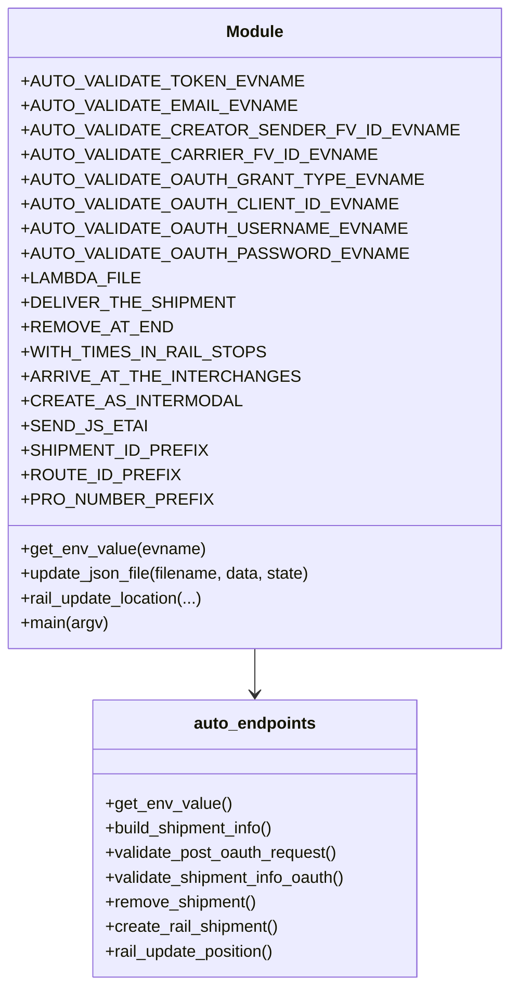

# Diagram: shipment_core/shipment_service/ng_val/scripts/shipment_creation/auto_validate_lambdas_RAIL_MODE.py


> Auto-generated by Obscura crawlers

## Diagram 1



### SVG

<svg id="container" width="436.375" xmlns="http://www.w3.org/2000/svg" class="classDiagram" height="960" viewBox="0 0 436.375 960" role="graphics-document document" aria-roledescription="class"><style>#container{font-family:"trebuchet ms",verdana,arial,sans-serif;font-size:16px;fill:#333;}@keyframes edge-animation-frame{from{stroke-dashoffset:0;}}@keyframes dash{to{stroke-dashoffset:0;}}#container .edge-animation-slow{stroke-dasharray:9,5!important;stroke-dashoffset:900;animation:dash 50s linear infinite;stroke-linecap:round;}#container .edge-animation-fast{stroke-dasharray:9,5!important;stroke-dashoffset:900;animation:dash 20s linear infinite;stroke-linecap:round;}#container .error-icon{fill:#552222;}#container .error-text{fill:#552222;stroke:#552222;}#container .edge-thickness-normal{stroke-width:1px;}#container .edge-thickness-thick{stroke-width:3.5px;}#container .edge-pattern-solid{stroke-dasharray:0;}#container .edge-thickness-invisible{stroke-width:0;fill:none;}#container .edge-pattern-dashed{stroke-dasharray:3;}#container .edge-pattern-dotted{stroke-dasharray:2;}#container .marker{fill:#333333;stroke:#333333;}#container .marker.cross{stroke:#333333;}#container svg{font-family:"trebuchet ms",verdana,arial,sans-serif;font-size:16px;}#container p{margin:0;}#container g.classGroup text{fill:#9370DB;stroke:none;font-family:"trebuchet ms",verdana,arial,sans-serif;font-size:10px;}#container g.classGroup text .title{font-weight:bolder;}#container .nodeLabel,#container .edgeLabel{color:#131300;}#container .edgeLabel .label rect{fill:#ECECFF;}#container .label text{fill:#131300;}#container .labelBkg{background:#ECECFF;}#container .edgeLabel .label span{background:#ECECFF;}#container .classTitle{font-weight:bolder;}#container .node rect,#container .node circle,#container .node ellipse,#container .node polygon,#container .node path{fill:#ECECFF;stroke:#9370DB;stroke-width:1px;}#container .divider{stroke:#9370DB;stroke-width:1;}#container g.clickable{cursor:pointer;}#container g.classGroup rect{fill:#ECECFF;stroke:#9370DB;}#container g.classGroup line{stroke:#9370DB;stroke-width:1;}#container .classLabel .box{stroke:none;stroke-width:0;fill:#ECECFF;opacity:0.5;}#container .classLabel .label{fill:#9370DB;font-size:10px;}#container .relation{stroke:#333333;stroke-width:1;fill:none;}#container .dashed-line{stroke-dasharray:3;}#container .dotted-line{stroke-dasharray:1 2;}#container #compositionStart,#container .composition{fill:#333333!important;stroke:#333333!important;stroke-width:1;}#container #compositionEnd,#container .composition{fill:#333333!important;stroke:#333333!important;stroke-width:1;}#container #dependencyStart,#container .dependency{fill:#333333!important;stroke:#333333!important;stroke-width:1;}#container #dependencyStart,#container .dependency{fill:#333333!important;stroke:#333333!important;stroke-width:1;}#container #extensionStart,#container .extension{fill:transparent!important;stroke:#333333!important;stroke-width:1;}#container #extensionEnd,#container .extension{fill:transparent!important;stroke:#333333!important;stroke-width:1;}#container #aggregationStart,#container .aggregation{fill:transparent!important;stroke:#333333!important;stroke-width:1;}#container #aggregationEnd,#container .aggregation{fill:transparent!important;stroke:#333333!important;stroke-width:1;}#container #lollipopStart,#container .lollipop{fill:#ECECFF!important;stroke:#333333!important;stroke-width:1;}#container #lollipopEnd,#container .lollipop{fill:#ECECFF!important;stroke:#333333!important;stroke-width:1;}#container .edgeTerminals{font-size:11px;line-height:initial;}#container .classTitleText{text-anchor:middle;font-size:18px;fill:#333;}#container .label-icon{display:inline-block;height:1em;overflow:visible;vertical-align:-0.125em;}#container .node .label-icon path{fill:currentColor;stroke:revert;stroke-width:revert;}#container :root{--mermaid-font-family:"trebuchet ms",verdana,arial,sans-serif;}</style><g><defs><marker id="container_class-aggregationStart" class="marker aggregation class" refX="18" refY="7" markerWidth="190" markerHeight="240" orient="auto"><path d="M 18,7 L9,13 L1,7 L9,1 Z"></path></marker></defs><defs><marker id="container_class-aggregationEnd" class="marker aggregation class" refX="1" refY="7" markerWidth="20" markerHeight="28" orient="auto"><path d="M 18,7 L9,13 L1,7 L9,1 Z"></path></marker></defs><defs><marker id="container_class-extensionStart" class="marker extension class" refX="18" refY="7" markerWidth="190" markerHeight="240" orient="auto"><path d="M 1,7 L18,13 V 1 Z"></path></marker></defs><defs><marker id="container_class-extensionEnd" class="marker extension class" refX="1" refY="7" markerWidth="20" markerHeight="28" orient="auto"><path d="M 1,1 V 13 L18,7 Z"></path></marker></defs><defs><marker id="container_class-compositionStart" class="marker composition class" refX="18" refY="7" markerWidth="190" markerHeight="240" orient="auto"><path d="M 18,7 L9,13 L1,7 L9,1 Z"></path></marker></defs><defs><marker id="container_class-compositionEnd" class="marker composition class" refX="1" refY="7" markerWidth="20" markerHeight="28" orient="auto"><path d="M 18,7 L9,13 L1,7 L9,1 Z"></path></marker></defs><defs><marker id="container_class-dependencyStart" class="marker dependency class" refX="6" refY="7" markerWidth="190" markerHeight="240" orient="auto"><path d="M 5,7 L9,13 L1,7 L9,1 Z"></path></marker></defs><defs><marker id="container_class-dependencyEnd" class="marker dependency class" refX="13" refY="7" markerWidth="20" markerHeight="28" orient="auto"><path d="M 18,7 L9,13 L14,7 L9,1 Z"></path></marker></defs><defs><marker id="container_class-lollipopStart" class="marker lollipop class" refX="13" refY="7" markerWidth="190" markerHeight="240" orient="auto"><circle stroke="black" fill="transparent" cx="7" cy="7" r="6"></circle></marker></defs><defs><marker id="container_class-lollipopEnd" class="marker lollipop class" refX="1" refY="7" markerWidth="190" markerHeight="240" orient="auto"><circle stroke="black" fill="transparent" cx="7" cy="7" r="6"></circle></marker></defs><g class="root"><g class="clusters"></g><g class="edgePaths"><path d="M218.188,632L218.188,636.167C218.188,640.333,218.188,648.667,218.188,656C218.188,663.333,218.188,669.667,218.188,672.833L218.188,676" id="id_Module_auto_endpoints_1" class="edge-thickness-normal edge-pattern-solid relation" style=";;;" data-edge="true" data-et="edge" data-id="id_Module_auto_endpoints_1" data-points="W3sieCI6MjE4LjE4NzUsInkiOjYzMn0seyJ4IjoyMTguMTg3NSwieSI6NjU3fSx7IngiOjIxOC4xODc1LCJ5Ijo2ODJ9XQ==" marker-end="url(#container_class-dependencyEnd)"></path></g><g class="edgeLabels"><g class="edgeLabel"><g class="label" data-id="id_Module_auto_endpoints_1" transform="translate(0, 0)"><foreignObject width="0" height="0"><div xmlns="http://www.w3.org/1999/xhtml" class="labelBkg" style="display: table-cell; white-space: nowrap; line-height: 1.5; max-width: 200px; text-align: center;"><span class="edgeLabel"></span></div></foreignObject></g></g></g><g class="nodes"><g class="node default" id="classId-Module-0" transform="translate(218.1875, 320)"><g class="basic label-container"><path d="M-210.1875 -312 L210.1875 -312 L210.1875 312 L-210.1875 312" stroke="none" stroke-width="0" fill="#ECECFF" style=""></path><path d="M-210.1875 -312 C-64.25769836415245 -312, 81.67210327169511 -312, 210.1875 -312 M-210.1875 -312 C-49.11650699867678 -312, 111.95448600264643 -312, 210.1875 -312 M210.1875 -312 C210.1875 -151.1542800942801, 210.1875 9.691439811439807, 210.1875 312 M210.1875 -312 C210.1875 -80.27948987662154, 210.1875 151.44102024675692, 210.1875 312 M210.1875 312 C57.64823126616679 312, -94.89103746766642 312, -210.1875 312 M210.1875 312 C80.72941763854809 312, -48.72866472290383 312, -210.1875 312 M-210.1875 312 C-210.1875 91.80070325477823, -210.1875 -128.39859349044355, -210.1875 -312 M-210.1875 312 C-210.1875 77.64261738796918, -210.1875 -156.71476522406164, -210.1875 -312" stroke="#9370DB" stroke-width="1.3" fill="none" stroke-dasharray="0 0" style=""></path></g><g class="annotation-group text" transform="translate(0, -288)"></g><g class="label-group text" transform="translate(-27.09375, -288)"><g class="label" style="font-weight: bolder" transform="translate(0,-12)"><foreignObject width="54.1875" height="24"><div xmlns="http://www.w3.org/1999/xhtml" style="display: table-cell; white-space: nowrap; line-height: 1.5; max-width: 104px; text-align: center;"><span class="nodeLabel markdown-node-label" style=""><p>Module</p></span></div></foreignObject></g></g><g class="members-group text" transform="translate(-198.1875, -240)"><g class="label" style="" transform="translate(0,-12)"><foreignObject width="241.0625" height="24"><div xmlns="http://www.w3.org/1999/xhtml" style="display: table-cell; white-space: nowrap; line-height: 1.5; max-width: 298px; text-align: center;"><span class="nodeLabel markdown-node-label" style=""><p>+AUTO_VALIDATE_TOKEN_EVNAME</p></span></div></foreignObject></g><g class="label" style="" transform="translate(0,12)"><foreignObject width="237.03125" height="24"><div xmlns="http://www.w3.org/1999/xhtml" style="display: table-cell; white-space: nowrap; line-height: 1.5; max-width: 294px; text-align: center;"><span class="nodeLabel markdown-node-label" style=""><p>+AUTO_VALIDATE_EMAIL_EVNAME</p></span></div></foreignObject></g><g class="label" style="" transform="translate(0,36)"><foreignObject width="369.28125" height="24"><div xmlns="http://www.w3.org/1999/xhtml" style="display: table-cell; white-space: nowrap; line-height: 1.5; max-width: 427px; text-align: center;"><span class="nodeLabel markdown-node-label" style=""><p>+AUTO_VALIDATE_CREATOR_SENDER_FV_ID_EVNAME</p></span></div></foreignObject></g><g class="label" style="" transform="translate(0,60)"><foreignObject width="300.953125" height="24"><div xmlns="http://www.w3.org/1999/xhtml" style="display: table-cell; white-space: nowrap; line-height: 1.5; max-width: 358px; text-align: center;"><span class="nodeLabel markdown-node-label" style=""><p>+AUTO_VALIDATE_CARRIER_FV_ID_EVNAME</p></span></div></foreignObject></g><g class="label" style="" transform="translate(0,84)"><foreignObject width="340.671875" height="24"><div xmlns="http://www.w3.org/1999/xhtml" style="display: table-cell; white-space: nowrap; line-height: 1.5; max-width: 398px; text-align: center;"><span class="nodeLabel markdown-node-label" style=""><p>+AUTO_VALIDATE_OAUTH_GRANT_TYPE_EVNAME</p></span></div></foreignObject></g><g class="label" style="" transform="translate(0,108)"><foreignObject width="322.1875" height="24"><div xmlns="http://www.w3.org/1999/xhtml" style="display: table-cell; white-space: nowrap; line-height: 1.5; max-width: 380px; text-align: center;"><span class="nodeLabel markdown-node-label" style=""><p>+AUTO_VALIDATE_OAUTH_CLIENT_ID_EVNAME</p></span></div></foreignObject></g><g class="label" style="" transform="translate(0,132)"><foreignObject width="329.578125" height="24"><div xmlns="http://www.w3.org/1999/xhtml" style="display: table-cell; white-space: nowrap; line-height: 1.5; max-width: 387px; text-align: center;"><span class="nodeLabel markdown-node-label" style=""><p>+AUTO_VALIDATE_OAUTH_USERNAME_EVNAME</p></span></div></foreignObject></g><g class="label" style="" transform="translate(0,156)"><foreignObject width="329.734375" height="24"><div xmlns="http://www.w3.org/1999/xhtml" style="display: table-cell; white-space: nowrap; line-height: 1.5; max-width: 387px; text-align: center;"><span class="nodeLabel markdown-node-label" style=""><p>+AUTO_VALIDATE_OAUTH_PASSWORD_EVNAME</p></span></div></foreignObject></g><g class="label" style="" transform="translate(0,180)"><foreignObject width="104.046875" height="24"><div xmlns="http://www.w3.org/1999/xhtml" style="display: table-cell; white-space: nowrap; line-height: 1.5; max-width: 161px; text-align: center;"><span class="nodeLabel markdown-node-label" style=""><p>+LAMBDA_FILE</p></span></div></foreignObject></g><g class="label" style="" transform="translate(0,204)"><foreignObject width="183.25" height="24"><div xmlns="http://www.w3.org/1999/xhtml" style="display: table-cell; white-space: nowrap; line-height: 1.5; max-width: 241px; text-align: center;"><span class="nodeLabel markdown-node-label" style=""><p>+DELIVER_THE_SHIPMENT</p></span></div></foreignObject></g><g class="label" style="" transform="translate(0,228)"><foreignObject width="129.234375" height="24"><div xmlns="http://www.w3.org/1999/xhtml" style="display: table-cell; white-space: nowrap; line-height: 1.5; max-width: 187px; text-align: center;"><span class="nodeLabel markdown-node-label" style=""><p>+REMOVE_AT_END</p></span></div></foreignObject></g><g class="label" style="" transform="translate(0,252)"><foreignObject width="211.359375" height="24"><div xmlns="http://www.w3.org/1999/xhtml" style="display: table-cell; white-space: nowrap; line-height: 1.5; max-width: 269px; text-align: center;"><span class="nodeLabel markdown-node-label" style=""><p>+WITH_TIMES_IN_RAIL_STOPS</p></span></div></foreignObject></g><g class="label" style="" transform="translate(0,276)"><foreignObject width="235.421875" height="24"><div xmlns="http://www.w3.org/1999/xhtml" style="display: table-cell; white-space: nowrap; line-height: 1.5; max-width: 293px; text-align: center;"><span class="nodeLabel markdown-node-label" style=""><p>+ARRIVE_AT_THE_INTERCHANGES</p></span></div></foreignObject></g><g class="label" style="" transform="translate(0,300)"><foreignObject width="187.234375" height="24"><div xmlns="http://www.w3.org/1999/xhtml" style="display: table-cell; white-space: nowrap; line-height: 1.5; max-width: 245px; text-align: center;"><span class="nodeLabel markdown-node-label" style=""><p>+CREATE_AS_INTERMODAL</p></span></div></foreignObject></g><g class="label" style="" transform="translate(0,324)"><foreignObject width="105.28125" height="24"><div xmlns="http://www.w3.org/1999/xhtml" style="display: table-cell; white-space: nowrap; line-height: 1.5; max-width: 163px; text-align: center;"><span class="nodeLabel markdown-node-label" style=""><p>+SEND_JS_ETAI</p></span></div></foreignObject></g><g class="label" style="" transform="translate(0,348)"><foreignObject width="159.671875" height="24"><div xmlns="http://www.w3.org/1999/xhtml" style="display: table-cell; white-space: nowrap; line-height: 1.5; max-width: 217px; text-align: center;"><span class="nodeLabel markdown-node-label" style=""><p>+SHIPMENT_ID_PREFIX</p></span></div></foreignObject></g><g class="label" style="" transform="translate(0,372)"><foreignObject width="135.796875" height="24"><div xmlns="http://www.w3.org/1999/xhtml" style="display: table-cell; white-space: nowrap; line-height: 1.5; max-width: 194px; text-align: center;"><span class="nodeLabel markdown-node-label" style=""><p>+ROUTE_ID_PREFIX</p></span></div></foreignObject></g><g class="label" style="" transform="translate(0,396)"><foreignObject width="164.578125" height="24"><div xmlns="http://www.w3.org/1999/xhtml" style="display: table-cell; white-space: nowrap; line-height: 1.5; max-width: 222px; text-align: center;"><span class="nodeLabel markdown-node-label" style=""><p>+PRO_NUMBER_PREFIX</p></span></div></foreignObject></g></g><g class="methods-group text" transform="translate(-198.1875, 216)"><g class="label" style="" transform="translate(0,-12)"><foreignObject width="178.0625" height="24"><div xmlns="http://www.w3.org/1999/xhtml" style="display: table-cell; white-space: nowrap; line-height: 1.5; max-width: 235px; text-align: center;"><span class="nodeLabel markdown-node-label" style=""><p>+get_env_value(evname)</p></span></div></foreignObject></g><g class="label" style="" transform="translate(0,12)"><foreignObject width="287.25" height="24"><div xmlns="http://www.w3.org/1999/xhtml" style="display: table-cell; white-space: nowrap; line-height: 1.5; max-width: 345px; text-align: center;"><span class="nodeLabel markdown-node-label" style=""><p>+update_json_file(filename, data, state)</p></span></div></foreignObject></g><g class="label" style="" transform="translate(0,36)"><foreignObject width="179.734375" height="24"><div xmlns="http://www.w3.org/1999/xhtml" style="display: table-cell; white-space: nowrap; line-height: 1.5; max-width: 237px; text-align: center;"><span class="nodeLabel markdown-node-label" style=""><p>+rail_update_location(...)</p></span></div></foreignObject></g><g class="label" style="" transform="translate(0,60)"><foreignObject width="85.5" height="24"><div xmlns="http://www.w3.org/1999/xhtml" style="display: table-cell; white-space: nowrap; line-height: 1.5; max-width: 143px; text-align: center;"><span class="nodeLabel markdown-node-label" style=""><p>+main(argv)</p></span></div></foreignObject></g></g><g class="divider" style=""><path d="M-210.1875 -264 C-120.31121068478693 -264, -30.434921369573857 -264, 210.1875 -264 M-210.1875 -264 C-68.83564380198663 -264, 72.51621239602673 -264, 210.1875 -264" stroke="#9370DB" stroke-width="1.3" fill="none" stroke-dasharray="0 0" style=""></path></g><g class="divider" style=""><path d="M-210.1875 192 C-87.74563889350547 192, 34.696222212989056 192, 210.1875 192 M-210.1875 192 C-69.5599736229986 192, 71.0675527540028 192, 210.1875 192" stroke="#9370DB" stroke-width="1.3" fill="none" stroke-dasharray="0 0" style=""></path></g></g><g class="node default" id="classId-auto_endpoints-1" transform="translate(218.1875, 817)"><g class="basic label-container"><path d="M-160.41796875 -135 L160.41796875 -135 L160.41796875 135 L-160.41796875 135" stroke="none" stroke-width="0" fill="#ECECFF" style=""></path><path d="M-160.41796875 -135 C-51.30037556238449 -135, 57.817217625231024 -135, 160.41796875 -135 M-160.41796875 -135 C-77.93612550830782 -135, 4.54571773338435 -135, 160.41796875 -135 M160.41796875 -135 C160.41796875 -52.678163793930366, 160.41796875 29.643672412139267, 160.41796875 135 M160.41796875 -135 C160.41796875 -73.40389045098226, 160.41796875 -11.807780901964506, 160.41796875 135 M160.41796875 135 C58.96500124585759 135, -42.487966258284814 135, -160.41796875 135 M160.41796875 135 C96.04272910190988 135, 31.66748945381977 135, -160.41796875 135 M-160.41796875 135 C-160.41796875 59.42475836359483, -160.41796875 -16.150483272810334, -160.41796875 -135 M-160.41796875 135 C-160.41796875 42.42794080028969, -160.41796875 -50.14411839942062, -160.41796875 -135" stroke="#9370DB" stroke-width="1.3" fill="none" stroke-dasharray="0 0" style=""></path></g><g class="annotation-group text" transform="translate(0, -111)"></g><g class="label-group text" transform="translate(-57.5234375, -111)"><g class="label" style="font-weight: bolder" transform="translate(0,-12)"><foreignObject width="115.046875" height="24"><div xmlns="http://www.w3.org/1999/xhtml" style="display: table-cell; white-space: nowrap; line-height: 1.5; max-width: 164px; text-align: center;"><span class="nodeLabel markdown-node-label" style=""><p>auto_endpoints</p></span></div></foreignObject></g></g><g class="members-group text" transform="translate(-148.41796875, -63)"></g><g class="methods-group text" transform="translate(-148.41796875, -33)"><g class="label" style="" transform="translate(0,-12)"><foreignObject width="121.015625" height="24"><div xmlns="http://www.w3.org/1999/xhtml" style="display: table-cell; white-space: nowrap; line-height: 1.5; max-width: 178px; text-align: center;"><span class="nodeLabel markdown-node-label" style=""><p>+get_env_value()</p></span></div></foreignObject></g><g class="label" style="" transform="translate(0,12)"><foreignObject width="169.390625" height="24"><div xmlns="http://www.w3.org/1999/xhtml" style="display: table-cell; white-space: nowrap; line-height: 1.5; max-width: 227px; text-align: center;"><span class="nodeLabel markdown-node-label" style=""><p>+build_shipment_info()</p></span></div></foreignObject></g><g class="label" style="" transform="translate(0,36)"><foreignObject width="230.125" height="24"><div xmlns="http://www.w3.org/1999/xhtml" style="display: table-cell; white-space: nowrap; line-height: 1.5; max-width: 287px; text-align: center;"><span class="nodeLabel markdown-node-label" style=""><p>+validate_post_oauth_request()</p></span></div></foreignObject></g><g class="label" style="" transform="translate(0,60)"><foreignObject width="239.3125" height="24"><div xmlns="http://www.w3.org/1999/xhtml" style="display: table-cell; white-space: nowrap; line-height: 1.5; max-width: 297px; text-align: center;"><span class="nodeLabel markdown-node-label" style=""><p>+validate_shipment_info_oauth()</p></span></div></foreignObject></g><g class="label" style="" transform="translate(0,84)"><foreignObject width="148.75" height="24"><div xmlns="http://www.w3.org/1999/xhtml" style="display: table-cell; white-space: nowrap; line-height: 1.5; max-width: 206px; text-align: center;"><span class="nodeLabel markdown-node-label" style=""><p>+remove_shipment()</p></span></div></foreignObject></g><g class="label" style="" transform="translate(0,108)"><foreignObject width="171.515625" height="24"><div xmlns="http://www.w3.org/1999/xhtml" style="display: table-cell; white-space: nowrap; line-height: 1.5; max-width: 229px; text-align: center;"><span class="nodeLabel markdown-node-label" style=""><p>+create_rail_shipment()</p></span></div></foreignObject></g><g class="label" style="" transform="translate(0,132)"><foreignObject width="169.0625" height="24"><div xmlns="http://www.w3.org/1999/xhtml" style="display: table-cell; white-space: nowrap; line-height: 1.5; max-width: 226px; text-align: center;"><span class="nodeLabel markdown-node-label" style=""><p>+rail_update_position()</p></span></div></foreignObject></g></g><g class="divider" style=""><path d="M-160.41796875 -87 C-82.55200715997324 -87, -4.6860455699464865 -87, 160.41796875 -87 M-160.41796875 -87 C-59.80707344803777 -87, 40.80382185392446 -87, 160.41796875 -87" stroke="#9370DB" stroke-width="1.3" fill="none" stroke-dasharray="0 0" style=""></path></g><g class="divider" style=""><path d="M-160.41796875 -63 C-57.119574952229414 -63, 46.17881884554117 -63, 160.41796875 -63 M-160.41796875 -63 C-75.95312491614558 -63, 8.511718917708833 -63, 160.41796875 -63" stroke="#9370DB" stroke-width="1.3" fill="none" stroke-dasharray="0 0" style=""></path></g></g></g></g></g></svg>

## Diagram 2

```mermaid
flowchart TD
    A[Start: main(argv)] --> B{Parse CLI args: stage}
    B --> C[Resolve environment URLs and base paths]
    C --> D[Set LAMBDA_FILE per stage]
    D --> E[Remove existing LAMBDA_FILE if present]
    E --> F[Generate shipment_uuid, shipment_id, route_id]
    F --> G[Build actions dict and endpoints]
    G --> H[Read oauth env vars via auto_endpoints.get_env_value]
    H --> I[Read token, email, creator_sender_fv_id, carrier_fv_id via get_env_value]
    I --> J[Build shipment_info via auto_endpoints.build_shipment_info]
    J --> K[Post to oauth: auto_endpoints.validate_post_oauth_request]
    K --> L[Set actions.oauth.access_token]
    L --> M[Remove existing shipment: auto_endpoints.remove_shipment]
    M --> N[Create RAIL_MODE shipment: auto_endpoints.create_rail_shipment]
    N --> O[Extract lambda_id and set actions.oauth.get_shipment URL]
    O --> P[Validate shipment info: auto_endpoints.validate_shipment_info_oauth]
    P --> Q[PAUSE (input)]
    Q --> R[Rail update: ETA arrival -> rail_update_location -> validate 200]
    R --> S[Rail update: in-transit -> rail_update_location -> validate 200]
    S --> T[Sleep 1s then validate shipment info]
    T --> U[PAUSE (input)]
    U --> V[Interchange updates (las vegas, barstow) via rail_update_location with references]
    V --> W[validate shipment info]
    W --> X[PAUSE (input)]
    X --> Y{ARRIVE_AT_THE_INTERCHANGES?}
    Y -->|yes| Y1[Arrival & Depart interchange updates via rail_update_location]
    Y -->|no| Z
    Y1 --> Z
    Z --> AA{DELIVER_THE_SHIPMENT?}
    AA -->|yes| AB[Sleep 1s; Rail update delivered & car hire via rail_update_location]
    AB --> AC[PAUSE (input)]
    AC --> AD[Set assert_completed=True; validate_shipment_info_oauth]
    AD --> AE{REMOVE_AT_END?}
    AE -->|yes| AF[Remove shipment via auto_endpoints.remove_shipment]
    AE -->|no| AG[End]
    AF --> AG
```

> SVG rendering failed for this diagram.
