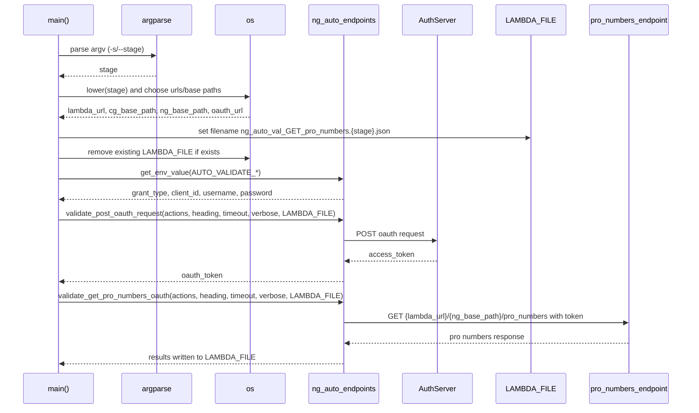
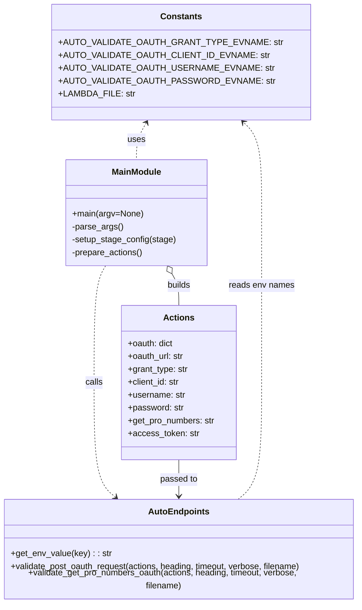

# Diagram: shipment_core/shipment_service/ng_val/scripts/shipment_data/ng_auto_val_GET_pro_numbers.py

> Auto-generated by Obscura crawlers

## Diagram 1

### SVG

<svg id="container" width="1542" xmlns="http://www.w3.org/2000/svg" height="939" viewBox="-50 -10 1542 939" role="graphics-document document" aria-roledescription="sequence"><g><rect x="1251" y="853" fill="#eaeaea" stroke="#666" width="191" height="65" name="Pro" rx="3" ry="3" class="actor actor-bottom"></rect><text x="1346.5" y="885.5" dominant-baseline="central" alignment-baseline="central" class="actor actor-box" style="text-anchor: middle; font-size: 16px; font-weight: 400;"><tspan x="1346.5" dy="0">pro_numbers_endpoint</tspan></text></g><g><rect x="1051" y="853" fill="#eaeaea" stroke="#666" width="150" height="65" name="Lambda" rx="3" ry="3" class="actor actor-bottom"></rect><text x="1126" y="885.5" dominant-baseline="central" alignment-baseline="central" class="actor actor-box" style="text-anchor: middle; font-size: 16px; font-weight: 400;"><tspan x="1126" dy="0">LAMBDA_FILE</tspan></text></g><g><rect x="851" y="853" fill="#eaeaea" stroke="#666" width="150" height="65" name="OAuth" rx="3" ry="3" class="actor actor-bottom"></rect><text x="926" y="885.5" dominant-baseline="central" alignment-baseline="central" class="actor actor-box" style="text-anchor: middle; font-size: 16px; font-weight: 400;"><tspan x="926" dy="0">AuthServer</tspan></text></g><g><rect x="633" y="853" fill="#eaeaea" stroke="#666" width="160" height="65" name="Auto" rx="3" ry="3" class="actor actor-bottom"></rect><text x="713" y="885.5" dominant-baseline="central" alignment-baseline="central" class="actor actor-box" style="text-anchor: middle; font-size: 16px; font-weight: 400;"><tspan x="713" dy="0">ng_auto_endpoints</tspan></text></g><g><rect x="433" y="853" fill="#eaeaea" stroke="#666" width="150" height="65" name="OS" rx="3" ry="3" class="actor actor-bottom"></rect><text x="508" y="885.5" dominant-baseline="central" alignment-baseline="central" class="actor actor-box" style="text-anchor: middle; font-size: 16px; font-weight: 400;"><tspan x="508" dy="0">os</tspan></text></g><g><rect x="233" y="853" fill="#eaeaea" stroke="#666" width="150" height="65" name="Arg" rx="3" ry="3" class="actor actor-bottom"></rect><text x="308" y="885.5" dominant-baseline="central" alignment-baseline="central" class="actor actor-box" style="text-anchor: middle; font-size: 16px; font-weight: 400;"><tspan x="308" dy="0">argparse</tspan></text></g><g><rect x="0" y="853" fill="#eaeaea" stroke="#666" width="150" height="65" name="Main" rx="3" ry="3" class="actor actor-bottom"></rect><text x="75" y="885.5" dominant-baseline="central" alignment-baseline="central" class="actor actor-box" style="text-anchor: middle; font-size: 16px; font-weight: 400;"><tspan x="75" dy="0">main()</tspan></text></g><g><line id="actor6" x1="1346.5" y1="65" x2="1346.5" y2="853" class="actor-line 200" stroke-width="0.5px" stroke="#999" name="Pro"></line><g id="root-6"><rect x="1251" y="0" fill="#eaeaea" stroke="#666" width="191" height="65" name="Pro" rx="3" ry="3" class="actor actor-top"></rect><text x="1346.5" y="32.5" dominant-baseline="central" alignment-baseline="central" class="actor actor-box" style="text-anchor: middle; font-size: 16px; font-weight: 400;"><tspan x="1346.5" dy="0">pro_numbers_endpoint</tspan></text></g></g><g><line id="actor5" x1="1126" y1="65" x2="1126" y2="853" class="actor-line 200" stroke-width="0.5px" stroke="#999" name="Lambda"></line><g id="root-5"><rect x="1051" y="0" fill="#eaeaea" stroke="#666" width="150" height="65" name="Lambda" rx="3" ry="3" class="actor actor-top"></rect><text x="1126" y="32.5" dominant-baseline="central" alignment-baseline="central" class="actor actor-box" style="text-anchor: middle; font-size: 16px; font-weight: 400;"><tspan x="1126" dy="0">LAMBDA_FILE</tspan></text></g></g><g><line id="actor4" x1="926" y1="65" x2="926" y2="853" class="actor-line 200" stroke-width="0.5px" stroke="#999" name="OAuth"></line><g id="root-4"><rect x="851" y="0" fill="#eaeaea" stroke="#666" width="150" height="65" name="OAuth" rx="3" ry="3" class="actor actor-top"></rect><text x="926" y="32.5" dominant-baseline="central" alignment-baseline="central" class="actor actor-box" style="text-anchor: middle; font-size: 16px; font-weight: 400;"><tspan x="926" dy="0">AuthServer</tspan></text></g></g><g><line id="actor3" x1="713" y1="65" x2="713" y2="853" class="actor-line 200" stroke-width="0.5px" stroke="#999" name="Auto"></line><g id="root-3"><rect x="633" y="0" fill="#eaeaea" stroke="#666" width="160" height="65" name="Auto" rx="3" ry="3" class="actor actor-top"></rect><text x="713" y="32.5" dominant-baseline="central" alignment-baseline="central" class="actor actor-box" style="text-anchor: middle; font-size: 16px; font-weight: 400;"><tspan x="713" dy="0">ng_auto_endpoints</tspan></text></g></g><g><line id="actor2" x1="508" y1="65" x2="508" y2="853" class="actor-line 200" stroke-width="0.5px" stroke="#999" name="OS"></line><g id="root-2"><rect x="433" y="0" fill="#eaeaea" stroke="#666" width="150" height="65" name="OS" rx="3" ry="3" class="actor actor-top"></rect><text x="508" y="32.5" dominant-baseline="central" alignment-baseline="central" class="actor actor-box" style="text-anchor: middle; font-size: 16px; font-weight: 400;"><tspan x="508" dy="0">os</tspan></text></g></g><g><line id="actor1" x1="308" y1="65" x2="308" y2="853" class="actor-line 200" stroke-width="0.5px" stroke="#999" name="Arg"></line><g id="root-1"><rect x="233" y="0" fill="#eaeaea" stroke="#666" width="150" height="65" name="Arg" rx="3" ry="3" class="actor actor-top"></rect><text x="308" y="32.5" dominant-baseline="central" alignment-baseline="central" class="actor actor-box" style="text-anchor: middle; font-size: 16px; font-weight: 400;"><tspan x="308" dy="0">argparse</tspan></text></g></g><g><line id="actor0" x1="75" y1="65" x2="75" y2="853" class="actor-line 200" stroke-width="0.5px" stroke="#999" name="Main"></line><g id="root-0"><rect x="0" y="0" fill="#eaeaea" stroke="#666" width="150" height="65" name="Main" rx="3" ry="3" class="actor actor-top"></rect><text x="75" y="32.5" dominant-baseline="central" alignment-baseline="central" class="actor actor-box" style="text-anchor: middle; font-size: 16px; font-weight: 400;"><tspan x="75" dy="0">main()</tspan></text></g></g><g></g><defs><symbol id="computer" width="24" height="24"><path transform="scale(.5)" d="M2 2v13h20v-13h-20zm18 11h-16v-9h16v9zm-10.228 6l.466-1h3.524l.467 1h-4.457zm14.228 3h-24l2-6h2.104l-1.33 4h18.45l-1.297-4h2.073l2 6zm-5-10h-14v-7h14v7z"></path></symbol></defs><defs><symbol id="database" fill-rule="evenodd" clip-rule="evenodd"><path transform="scale(.5)" d="M12.258.001l.256.004.255.005.253.008.251.01.249.012.247.015.246.016.242.019.241.02.239.023.236.024.233.027.231.028.229.031.225.032.223.034.22.036.217.038.214.04.211.041.208.043.205.045.201.046.198.048.194.05.191.051.187.053.183.054.18.056.175.057.172.059.168.06.163.061.16.063.155.064.15.066.074.033.073.033.071.034.07.034.069.035.068.035.067.035.066.035.064.036.064.036.062.036.06.036.06.037.058.037.058.037.055.038.055.038.053.038.052.038.051.039.05.039.048.039.047.039.045.04.044.04.043.04.041.04.04.041.039.041.037.041.036.041.034.041.033.042.032.042.03.042.029.042.027.042.026.043.024.043.023.043.021.043.02.043.018.044.017.043.015.044.013.044.012.044.011.045.009.044.007.045.006.045.004.045.002.045.001.045v17l-.001.045-.002.045-.004.045-.006.045-.007.045-.009.044-.011.045-.012.044-.013.044-.015.044-.017.043-.018.044-.02.043-.021.043-.023.043-.024.043-.026.043-.027.042-.029.042-.03.042-.032.042-.033.042-.034.041-.036.041-.037.041-.039.041-.04.041-.041.04-.043.04-.044.04-.045.04-.047.039-.048.039-.05.039-.051.039-.052.038-.053.038-.055.038-.055.038-.058.037-.058.037-.06.037-.06.036-.062.036-.064.036-.064.036-.066.035-.067.035-.068.035-.069.035-.07.034-.071.034-.073.033-.074.033-.15.066-.155.064-.16.063-.163.061-.168.06-.172.059-.175.057-.18.056-.183.054-.187.053-.191.051-.194.05-.198.048-.201.046-.205.045-.208.043-.211.041-.214.04-.217.038-.22.036-.223.034-.225.032-.229.031-.231.028-.233.027-.236.024-.239.023-.241.02-.242.019-.246.016-.247.015-.249.012-.251.01-.253.008-.255.005-.256.004-.258.001-.258-.001-.256-.004-.255-.005-.253-.008-.251-.01-.249-.012-.247-.015-.245-.016-.243-.019-.241-.02-.238-.023-.236-.024-.234-.027-.231-.028-.228-.031-.226-.032-.223-.034-.22-.036-.217-.038-.214-.04-.211-.041-.208-.043-.204-.045-.201-.046-.198-.048-.195-.05-.19-.051-.187-.053-.184-.054-.179-.056-.176-.057-.172-.059-.167-.06-.164-.061-.159-.063-.155-.064-.151-.066-.074-.033-.072-.033-.072-.034-.07-.034-.069-.035-.068-.035-.067-.035-.066-.035-.064-.036-.063-.036-.062-.036-.061-.036-.06-.037-.058-.037-.057-.037-.056-.038-.055-.038-.053-.038-.052-.038-.051-.039-.049-.039-.049-.039-.046-.039-.046-.04-.044-.04-.043-.04-.041-.04-.04-.041-.039-.041-.037-.041-.036-.041-.034-.041-.033-.042-.032-.042-.03-.042-.029-.042-.027-.042-.026-.043-.024-.043-.023-.043-.021-.043-.02-.043-.018-.044-.017-.043-.015-.044-.013-.044-.012-.044-.011-.045-.009-.044-.007-.045-.006-.045-.004-.045-.002-.045-.001-.045v-17l.001-.045.002-.045.004-.045.006-.045.007-.045.009-.044.011-.045.012-.044.013-.044.015-.044.017-.043.018-.044.02-.043.021-.043.023-.043.024-.043.026-.043.027-.042.029-.042.03-.042.032-.042.033-.042.034-.041.036-.041.037-.041.039-.041.04-.041.041-.04.043-.04.044-.04.046-.04.046-.039.049-.039.049-.039.051-.039.052-.038.053-.038.055-.038.056-.038.057-.037.058-.037.06-.037.061-.036.062-.036.063-.036.064-.036.066-.035.067-.035.068-.035.069-.035.07-.034.072-.034.072-.033.074-.033.151-.066.155-.064.159-.063.164-.061.167-.06.172-.059.176-.057.179-.056.184-.054.187-.053.19-.051.195-.05.198-.048.201-.046.204-.045.208-.043.211-.041.214-.04.217-.038.22-.036.223-.034.226-.032.228-.031.231-.028.234-.027.236-.024.238-.023.241-.02.243-.019.245-.016.247-.015.249-.012.251-.01.253-.008.255-.005.256-.004.258-.001.258.001zm-9.258 20.499v.01l.001.021.003.021.004.022.005.021.006.022.007.022.009.023.01.022.011.023.012.023.013.023.015.023.016.024.017.023.018.024.019.024.021.024.022.025.023.024.024.025.052.049.056.05.061.051.066.051.07.051.075.051.079.052.084.052.088.052.092.052.097.052.102.051.105.052.11.052.114.051.119.051.123.051.127.05.131.05.135.05.139.048.144.049.147.047.152.047.155.047.16.045.163.045.167.043.171.043.176.041.178.041.183.039.187.039.19.037.194.035.197.035.202.033.204.031.209.03.212.029.216.027.219.025.222.024.226.021.23.02.233.018.236.016.24.015.243.012.246.01.249.008.253.005.256.004.259.001.26-.001.257-.004.254-.005.25-.008.247-.011.244-.012.241-.014.237-.016.233-.018.231-.021.226-.021.224-.024.22-.026.216-.027.212-.028.21-.031.205-.031.202-.034.198-.034.194-.036.191-.037.187-.039.183-.04.179-.04.175-.042.172-.043.168-.044.163-.045.16-.046.155-.046.152-.047.148-.048.143-.049.139-.049.136-.05.131-.05.126-.05.123-.051.118-.052.114-.051.11-.052.106-.052.101-.052.096-.052.092-.052.088-.053.083-.051.079-.052.074-.052.07-.051.065-.051.06-.051.056-.05.051-.05.023-.024.023-.025.021-.024.02-.024.019-.024.018-.024.017-.024.015-.023.014-.024.013-.023.012-.023.01-.023.01-.022.008-.022.006-.022.006-.022.004-.022.004-.021.001-.021.001-.021v-4.127l-.077.055-.08.053-.083.054-.085.053-.087.052-.09.052-.093.051-.095.05-.097.05-.1.049-.102.049-.105.048-.106.047-.109.047-.111.046-.114.045-.115.045-.118.044-.12.043-.122.042-.124.042-.126.041-.128.04-.13.04-.132.038-.134.038-.135.037-.138.037-.139.035-.142.035-.143.034-.144.033-.147.032-.148.031-.15.03-.151.03-.153.029-.154.027-.156.027-.158.026-.159.025-.161.024-.162.023-.163.022-.165.021-.166.02-.167.019-.169.018-.169.017-.171.016-.173.015-.173.014-.175.013-.175.012-.177.011-.178.01-.179.008-.179.008-.181.006-.182.005-.182.004-.184.003-.184.002h-.37l-.184-.002-.184-.003-.182-.004-.182-.005-.181-.006-.179-.008-.179-.008-.178-.01-.176-.011-.176-.012-.175-.013-.173-.014-.172-.015-.171-.016-.17-.017-.169-.018-.167-.019-.166-.02-.165-.021-.163-.022-.162-.023-.161-.024-.159-.025-.157-.026-.156-.027-.155-.027-.153-.029-.151-.03-.15-.03-.148-.031-.146-.032-.145-.033-.143-.034-.141-.035-.14-.035-.137-.037-.136-.037-.134-.038-.132-.038-.13-.04-.128-.04-.126-.041-.124-.042-.122-.042-.12-.044-.117-.043-.116-.045-.113-.045-.112-.046-.109-.047-.106-.047-.105-.048-.102-.049-.1-.049-.097-.05-.095-.05-.093-.052-.09-.051-.087-.052-.085-.053-.083-.054-.08-.054-.077-.054v4.127zm0-5.654v.011l.001.021.003.021.004.021.005.022.006.022.007.022.009.022.01.022.011.023.012.023.013.023.015.024.016.023.017.024.018.024.019.024.021.024.022.024.023.025.024.024.052.05.056.05.061.05.066.051.07.051.075.052.079.051.084.052.088.052.092.052.097.052.102.052.105.052.11.051.114.051.119.052.123.05.127.051.131.05.135.049.139.049.144.048.147.048.152.047.155.046.16.045.163.045.167.044.171.042.176.042.178.04.183.04.187.038.19.037.194.036.197.034.202.033.204.032.209.03.212.028.216.027.219.025.222.024.226.022.23.02.233.018.236.016.24.014.243.012.246.01.249.008.253.006.256.003.259.001.26-.001.257-.003.254-.006.25-.008.247-.01.244-.012.241-.015.237-.016.233-.018.231-.02.226-.022.224-.024.22-.025.216-.027.212-.029.21-.03.205-.032.202-.033.198-.035.194-.036.191-.037.187-.039.183-.039.179-.041.175-.042.172-.043.168-.044.163-.045.16-.045.155-.047.152-.047.148-.048.143-.048.139-.05.136-.049.131-.05.126-.051.123-.051.118-.051.114-.052.11-.052.106-.052.101-.052.096-.052.092-.052.088-.052.083-.052.079-.052.074-.051.07-.052.065-.051.06-.05.056-.051.051-.049.023-.025.023-.024.021-.025.02-.024.019-.024.018-.024.017-.024.015-.023.014-.023.013-.024.012-.022.01-.023.01-.023.008-.022.006-.022.006-.022.004-.021.004-.022.001-.021.001-.021v-4.139l-.077.054-.08.054-.083.054-.085.052-.087.053-.09.051-.093.051-.095.051-.097.05-.1.049-.102.049-.105.048-.106.047-.109.047-.111.046-.114.045-.115.044-.118.044-.12.044-.122.042-.124.042-.126.041-.128.04-.13.039-.132.039-.134.038-.135.037-.138.036-.139.036-.142.035-.143.033-.144.033-.147.033-.148.031-.15.03-.151.03-.153.028-.154.028-.156.027-.158.026-.159.025-.161.024-.162.023-.163.022-.165.021-.166.02-.167.019-.169.018-.169.017-.171.016-.173.015-.173.014-.175.013-.175.012-.177.011-.178.009-.179.009-.179.007-.181.007-.182.005-.182.004-.184.003-.184.002h-.37l-.184-.002-.184-.003-.182-.004-.182-.005-.181-.007-.179-.007-.179-.009-.178-.009-.176-.011-.176-.012-.175-.013-.173-.014-.172-.015-.171-.016-.17-.017-.169-.018-.167-.019-.166-.02-.165-.021-.163-.022-.162-.023-.161-.024-.159-.025-.157-.026-.156-.027-.155-.028-.153-.028-.151-.03-.15-.03-.148-.031-.146-.033-.145-.033-.143-.033-.141-.035-.14-.036-.137-.036-.136-.037-.134-.038-.132-.039-.13-.039-.128-.04-.126-.041-.124-.042-.122-.043-.12-.043-.117-.044-.116-.044-.113-.046-.112-.046-.109-.046-.106-.047-.105-.048-.102-.049-.1-.049-.097-.05-.095-.051-.093-.051-.09-.051-.087-.053-.085-.052-.083-.054-.08-.054-.077-.054v4.139zm0-5.666v.011l.001.02.003.022.004.021.005.022.006.021.007.022.009.023.01.022.011.023.012.023.013.023.015.023.016.024.017.024.018.023.019.024.021.025.022.024.023.024.024.025.052.05.056.05.061.05.066.051.07.051.075.052.079.051.084.052.088.052.092.052.097.052.102.052.105.051.11.052.114.051.119.051.123.051.127.05.131.05.135.05.139.049.144.048.147.048.152.047.155.046.16.045.163.045.167.043.171.043.176.042.178.04.183.04.187.038.19.037.194.036.197.034.202.033.204.032.209.03.212.028.216.027.219.025.222.024.226.021.23.02.233.018.236.017.24.014.243.012.246.01.249.008.253.006.256.003.259.001.26-.001.257-.003.254-.006.25-.008.247-.01.244-.013.241-.014.237-.016.233-.018.231-.02.226-.022.224-.024.22-.025.216-.027.212-.029.21-.03.205-.032.202-.033.198-.035.194-.036.191-.037.187-.039.183-.039.179-.041.175-.042.172-.043.168-.044.163-.045.16-.045.155-.047.152-.047.148-.048.143-.049.139-.049.136-.049.131-.051.126-.05.123-.051.118-.052.114-.051.11-.052.106-.052.101-.052.096-.052.092-.052.088-.052.083-.052.079-.052.074-.052.07-.051.065-.051.06-.051.056-.05.051-.049.023-.025.023-.025.021-.024.02-.024.019-.024.018-.024.017-.024.015-.023.014-.024.013-.023.012-.023.01-.022.01-.023.008-.022.006-.022.006-.022.004-.022.004-.021.001-.021.001-.021v-4.153l-.077.054-.08.054-.083.053-.085.053-.087.053-.09.051-.093.051-.095.051-.097.05-.1.049-.102.048-.105.048-.106.048-.109.046-.111.046-.114.046-.115.044-.118.044-.12.043-.122.043-.124.042-.126.041-.128.04-.13.039-.132.039-.134.038-.135.037-.138.036-.139.036-.142.034-.143.034-.144.033-.147.032-.148.032-.15.03-.151.03-.153.028-.154.028-.156.027-.158.026-.159.024-.161.024-.162.023-.163.023-.165.021-.166.02-.167.019-.169.018-.169.017-.171.016-.173.015-.173.014-.175.013-.175.012-.177.01-.178.01-.179.009-.179.007-.181.006-.182.006-.182.004-.184.003-.184.001-.185.001-.185-.001-.184-.001-.184-.003-.182-.004-.182-.006-.181-.006-.179-.007-.179-.009-.178-.01-.176-.01-.176-.012-.175-.013-.173-.014-.172-.015-.171-.016-.17-.017-.169-.018-.167-.019-.166-.02-.165-.021-.163-.023-.162-.023-.161-.024-.159-.024-.157-.026-.156-.027-.155-.028-.153-.028-.151-.03-.15-.03-.148-.032-.146-.032-.145-.033-.143-.034-.141-.034-.14-.036-.137-.036-.136-.037-.134-.038-.132-.039-.13-.039-.128-.041-.126-.041-.124-.041-.122-.043-.12-.043-.117-.044-.116-.044-.113-.046-.112-.046-.109-.046-.106-.048-.105-.048-.102-.048-.1-.05-.097-.049-.095-.051-.093-.051-.09-.052-.087-.052-.085-.053-.083-.053-.08-.054-.077-.054v4.153zm8.74-8.179l-.257.004-.254.005-.25.008-.247.011-.244.012-.241.014-.237.016-.233.018-.231.021-.226.022-.224.023-.22.026-.216.027-.212.028-.21.031-.205.032-.202.033-.198.034-.194.036-.191.038-.187.038-.183.04-.179.041-.175.042-.172.043-.168.043-.163.045-.16.046-.155.046-.152.048-.148.048-.143.048-.139.049-.136.05-.131.05-.126.051-.123.051-.118.051-.114.052-.11.052-.106.052-.101.052-.096.052-.092.052-.088.052-.083.052-.079.052-.074.051-.07.052-.065.051-.06.05-.056.05-.051.05-.023.025-.023.024-.021.024-.02.025-.019.024-.018.024-.017.023-.015.024-.014.023-.013.023-.012.023-.01.023-.01.022-.008.022-.006.023-.006.021-.004.022-.004.021-.001.021-.001.021.001.021.001.021.004.021.004.022.006.021.006.023.008.022.01.022.01.023.012.023.013.023.014.023.015.024.017.023.018.024.019.024.02.025.021.024.023.024.023.025.051.05.056.05.06.05.065.051.07.052.074.051.079.052.083.052.088.052.092.052.096.052.101.052.106.052.11.052.114.052.118.051.123.051.126.051.131.05.136.05.139.049.143.048.148.048.152.048.155.046.16.046.163.045.168.043.172.043.175.042.179.041.183.04.187.038.191.038.194.036.198.034.202.033.205.032.21.031.212.028.216.027.22.026.224.023.226.022.231.021.233.018.237.016.241.014.244.012.247.011.25.008.254.005.257.004.26.001.26-.001.257-.004.254-.005.25-.008.247-.011.244-.012.241-.014.237-.016.233-.018.231-.021.226-.022.224-.023.22-.026.216-.027.212-.028.21-.031.205-.032.202-.033.198-.034.194-.036.191-.038.187-.038.183-.04.179-.041.175-.042.172-.043.168-.043.163-.045.16-.046.155-.046.152-.048.148-.048.143-.048.139-.049.136-.05.131-.05.126-.051.123-.051.118-.051.114-.052.11-.052.106-.052.101-.052.096-.052.092-.052.088-.052.083-.052.079-.052.074-.051.07-.052.065-.051.06-.05.056-.05.051-.05.023-.025.023-.024.021-.024.02-.025.019-.024.018-.024.017-.023.015-.024.014-.023.013-.023.012-.023.01-.023.01-.022.008-.022.006-.023.006-.021.004-.022.004-.021.001-.021.001-.021-.001-.021-.001-.021-.004-.021-.004-.022-.006-.021-.006-.023-.008-.022-.01-.022-.01-.023-.012-.023-.013-.023-.014-.023-.015-.024-.017-.023-.018-.024-.019-.024-.02-.025-.021-.024-.023-.024-.023-.025-.051-.05-.056-.05-.06-.05-.065-.051-.07-.052-.074-.051-.079-.052-.083-.052-.088-.052-.092-.052-.096-.052-.101-.052-.106-.052-.11-.052-.114-.052-.118-.051-.123-.051-.126-.051-.131-.05-.136-.05-.139-.049-.143-.048-.148-.048-.152-.048-.155-.046-.16-.046-.163-.045-.168-.043-.172-.043-.175-.042-.179-.041-.183-.04-.187-.038-.191-.038-.194-.036-.198-.034-.202-.033-.205-.032-.21-.031-.212-.028-.216-.027-.22-.026-.224-.023-.226-.022-.231-.021-.233-.018-.237-.016-.241-.014-.244-.012-.247-.011-.25-.008-.254-.005-.257-.004-.26-.001-.26.001z"></path></symbol></defs><defs><symbol id="clock" width="24" height="24"><path transform="scale(.5)" d="M12 2c5.514 0 10 4.486 10 10s-4.486 10-10 10-10-4.486-10-10 4.486-10 10-10zm0-2c-6.627 0-12 5.373-12 12s5.373 12 12 12 12-5.373 12-12-5.373-12-12-12zm5.848 12.459c.202.038.202.333.001.372-1.907.361-6.045 1.111-6.547 1.111-.719 0-1.301-.582-1.301-1.301 0-.512.77-5.447 1.125-7.445.034-.192.312-.181.343.014l.985 6.238 5.394 1.011z"></path></symbol></defs><defs><marker id="arrowhead" refX="7.9" refY="5" markerUnits="userSpaceOnUse" markerWidth="12" markerHeight="12" orient="auto-start-reverse"><path d="M -1 0 L 10 5 L 0 10 z"></path></marker></defs><defs><marker id="crosshead" markerWidth="15" markerHeight="8" orient="auto" refX="4" refY="4.5"><path fill="none" stroke="#000000" stroke-width="1pt" d="M 1,2 L 6,7 M 6,2 L 1,7" style="stroke-dasharray: 0, 0;"></path></marker></defs><defs><marker id="filled-head" refX="15.5" refY="7" markerWidth="20" markerHeight="28" orient="auto"><path d="M 18,7 L9,13 L14,7 L9,1 Z"></path></marker></defs><defs><marker id="sequencenumber" refX="15" refY="15" markerWidth="60" markerHeight="40" orient="auto"><circle cx="15" cy="15" r="6"></circle></marker></defs><text x="190" y="80" text-anchor="middle" dominant-baseline="middle" alignment-baseline="middle" class="messageText" dy="1em" style="font-size: 16px; font-weight: 400;">parse argv (-s/--stage)</text><line x1="76" y1="113" x2="304" y2="113" class="messageLine0" stroke-width="2" stroke="none" marker-end="url(#arrowhead)" style="fill: none;"></line><text x="193" y="128" text-anchor="middle" dominant-baseline="middle" alignment-baseline="middle" class="messageText" dy="1em" style="font-size: 16px; font-weight: 400;">stage</text><line x1="307" y1="161" x2="79" y2="161" class="messageLine1" stroke-width="2" stroke="none" marker-end="url(#arrowhead)" style="stroke-dasharray: 3, 3; fill: none;"></line><text x="290" y="176" text-anchor="middle" dominant-baseline="middle" alignment-baseline="middle" class="messageText" dy="1em" style="font-size: 16px; font-weight: 400;">lower(stage) and choose urls/base paths</text><line x1="76" y1="209" x2="504" y2="209" class="messageLine0" stroke-width="2" stroke="none" marker-end="url(#arrowhead)" style="fill: none;"></line><text x="293" y="224" text-anchor="middle" dominant-baseline="middle" alignment-baseline="middle" class="messageText" dy="1em" style="font-size: 16px; font-weight: 400;">lambda_url, cg_base_path, ng_base_path, oauth_url</text><line x1="507" y1="257" x2="79" y2="257" class="messageLine1" stroke-width="2" stroke="none" marker-end="url(#arrowhead)" style="stroke-dasharray: 3, 3; fill: none;"></line><text x="599" y="272" text-anchor="middle" dominant-baseline="middle" alignment-baseline="middle" class="messageText" dy="1em" style="font-size: 16px; font-weight: 400;">set filename ng_auto_val_GET_pro_numbers.{stage}.json</text><line x1="76" y1="305" x2="1122" y2="305" class="messageLine0" stroke-width="2" stroke="none" marker-end="url(#arrowhead)" style="fill: none;"></line><text x="290" y="320" text-anchor="middle" dominant-baseline="middle" alignment-baseline="middle" class="messageText" dy="1em" style="font-size: 16px; font-weight: 400;">remove existing LAMBDA_FILE if exists</text><line x1="76" y1="353" x2="504" y2="353" class="messageLine0" stroke-width="2" stroke="none" marker-end="url(#arrowhead)" style="fill: none;"></line><text x="393" y="368" text-anchor="middle" dominant-baseline="middle" alignment-baseline="middle" class="messageText" dy="1em" style="font-size: 16px; font-weight: 400;">get_env_value(AUTO_VALIDATE_*)</text><line x1="76" y1="401" x2="709" y2="401" class="messageLine0" stroke-width="2" stroke="none" marker-end="url(#arrowhead)" style="fill: none;"></line><text x="396" y="416" text-anchor="middle" dominant-baseline="middle" alignment-baseline="middle" class="messageText" dy="1em" style="font-size: 16px; font-weight: 400;">grant_type, client_id, username, password</text><line x1="712" y1="449" x2="79" y2="449" class="messageLine1" stroke-width="2" stroke="none" marker-end="url(#arrowhead)" style="stroke-dasharray: 3, 3; fill: none;"></line><text x="393" y="464" text-anchor="middle" dominant-baseline="middle" alignment-baseline="middle" class="messageText" dy="1em" style="font-size: 16px; font-weight: 400;">validate_post_oauth_request(actions, heading, timeout, verbose, LAMBDA_FILE)</text><line x1="76" y1="497" x2="709" y2="497" class="messageLine0" stroke-width="2" stroke="none" marker-end="url(#arrowhead)" style="fill: none;"></line><text x="818" y="512" text-anchor="middle" dominant-baseline="middle" alignment-baseline="middle" class="messageText" dy="1em" style="font-size: 16px; font-weight: 400;">POST oauth request</text><line x1="714" y1="545" x2="922" y2="545" class="messageLine0" stroke-width="2" stroke="none" marker-end="url(#arrowhead)" style="fill: none;"></line><text x="821" y="560" text-anchor="middle" dominant-baseline="middle" alignment-baseline="middle" class="messageText" dy="1em" style="font-size: 16px; font-weight: 400;">access_token</text><line x1="925" y1="593" x2="717" y2="593" class="messageLine1" stroke-width="2" stroke="none" marker-end="url(#arrowhead)" style="stroke-dasharray: 3, 3; fill: none;"></line><text x="396" y="608" text-anchor="middle" dominant-baseline="middle" alignment-baseline="middle" class="messageText" dy="1em" style="font-size: 16px; font-weight: 400;">oauth_token</text><line x1="712" y1="641" x2="79" y2="641" class="messageLine1" stroke-width="2" stroke="none" marker-end="url(#arrowhead)" style="stroke-dasharray: 3, 3; fill: none;"></line><text x="393" y="656" text-anchor="middle" dominant-baseline="middle" alignment-baseline="middle" class="messageText" dy="1em" style="font-size: 16px; font-weight: 400;">validate_get_pro_numbers_oauth(actions, heading, timeout, verbose, LAMBDA_FILE)</text><line x1="76" y1="689" x2="709" y2="689" class="messageLine0" stroke-width="2" stroke="none" marker-end="url(#arrowhead)" style="fill: none;"></line><text x="1028" y="704" text-anchor="middle" dominant-baseline="middle" alignment-baseline="middle" class="messageText" dy="1em" style="font-size: 16px; font-weight: 400;">GET {lambda_url}/{ng_base_path}/pro_numbers with token</text><line x1="714" y1="737" x2="1342.5" y2="737" class="messageLine0" stroke-width="2" stroke="none" marker-end="url(#arrowhead)" style="fill: none;"></line><text x="1031" y="752" text-anchor="middle" dominant-baseline="middle" alignment-baseline="middle" class="messageText" dy="1em" style="font-size: 16px; font-weight: 400;">pro numbers response</text><line x1="1345.5" y1="785" x2="717" y2="785" class="messageLine1" stroke-width="2" stroke="none" marker-end="url(#arrowhead)" style="stroke-dasharray: 3, 3; fill: none;"></line><text x="396" y="800" text-anchor="middle" dominant-baseline="middle" alignment-baseline="middle" class="messageText" dy="1em" style="font-size: 16px; font-weight: 400;">results written to LAMBDA_FILE</text><line x1="712" y1="833" x2="79" y2="833" class="messageLine1" stroke-width="2" stroke="none" marker-end="url(#arrowhead)" style="stroke-dasharray: 3, 3; fill: none;"></line></svg>

## Diagram 2

### SVG

<svg id="container" width="676.859375" xmlns="http://www.w3.org/2000/svg" class="classDiagram" height="1114" viewBox="0 0 676.859375 1114" role="graphics-document document" aria-roledescription="class"><g><defs><marker id="container_class-aggregationStart" class="marker aggregation class" refX="18" refY="7" markerWidth="190" markerHeight="240" orient="auto"><path d="M 18,7 L9,13 L1,7 L9,1 Z"></path></marker></defs><defs><marker id="container_class-aggregationEnd" class="marker aggregation class" refX="1" refY="7" markerWidth="20" markerHeight="28" orient="auto"><path d="M 18,7 L9,13 L1,7 L9,1 Z"></path></marker></defs><defs><marker id="container_class-extensionStart" class="marker extension class" refX="18" refY="7" markerWidth="190" markerHeight="240" orient="auto"><path d="M 1,7 L18,13 V 1 Z"></path></marker></defs><defs><marker id="container_class-extensionEnd" class="marker extension class" refX="1" refY="7" markerWidth="20" markerHeight="28" orient="auto"><path d="M 1,1 V 13 L18,7 Z"></path></marker></defs><defs><marker id="container_class-compositionStart" class="marker composition class" refX="18" refY="7" markerWidth="190" markerHeight="240" orient="auto"><path d="M 18,7 L9,13 L1,7 L9,1 Z"></path></marker></defs><defs><marker id="container_class-compositionEnd" class="marker composition class" refX="1" refY="7" markerWidth="20" markerHeight="28" orient="auto"><path d="M 18,7 L9,13 L1,7 L9,1 Z"></path></marker></defs><defs><marker id="container_class-dependencyStart" class="marker dependency class" refX="6" refY="7" markerWidth="190" markerHeight="240" orient="auto"><path d="M 5,7 L9,13 L1,7 L9,1 Z"></path></marker></defs><defs><marker id="container_class-dependencyEnd" class="marker dependency class" refX="13" refY="7" markerWidth="20" markerHeight="28" orient="auto"><path d="M 18,7 L9,13 L14,7 L9,1 Z"></path></marker></defs><defs><marker id="container_class-lollipopStart" class="marker lollipop class" refX="13" refY="7" markerWidth="190" markerHeight="240" orient="auto"><circle stroke="black" fill="transparent" cx="7" cy="7" r="6"></circle></marker></defs><defs><marker id="container_class-lollipopEnd" class="marker lollipop class" refX="1" refY="7" markerWidth="190" markerHeight="240" orient="auto"><circle stroke="black" fill="transparent" cx="7" cy="7" r="6"></circle></marker></defs><g class="root"><g class="clusters"></g><g class="edgePaths"><path d="M277.427,229.206L274.39,234.505C271.353,239.804,265.279,250.402,262.242,261.868C259.205,273.333,259.205,285.667,259.205,291.833L259.205,298" id="id_Constants_MainModule_1" class="edge-thickness-normal edge-pattern-dashed relation" style=";;;" data-edge="true" data-et="edge" data-id="id_Constants_MainModule_1" data-points="W3sieCI6MjgwLjQxMDgwMjgwMTcyNDEsInkiOjIyNH0seyJ4IjoyNTkuMjA1MDc4MTI1LCJ5IjoyNjF9LHsieCI6MjU5LjIwNTA3ODEyNSwieSI6Mjk4fV0=" marker-start="url(#container_class-dependencyStart)"></path><path d="M325.559,510.905L327.704,514.588C329.849,518.27,334.139,525.635,336.285,535.484C338.43,545.333,338.43,557.667,338.43,563.833L338.43,570" id="id_MainModule_Actions_2" class="edge-thickness-normal edge-pattern-solid relation" style=";;;" data-edge="true" data-et="edge" data-id="id_MainModule_Actions_2" data-points="W3sieCI6MzE2Ljg3NTkzMzQ3ODg2MDMsInkiOjQ5Nn0seyJ4IjozMzguNDI5Njg3NSwieSI6NTMzfSx7IngiOjMzOC40Mjk2ODc1LCJ5Ijo1NzB9XQ==" marker-start="url(#container_class-aggregationStart)"></path><path d="M201.534,496L197.942,502.167C194.35,508.333,187.165,520.667,183.573,557C179.98,593.333,179.98,653.667,179.98,714C179.98,774.333,179.98,834.667,187.073,870.384C194.165,906.101,208.35,917.201,215.442,922.752L222.535,928.302" id="id_MainModule_AutoEndpoints_3" class="edge-thickness-normal edge-pattern-dashed relation" style=";;;" data-edge="true" data-et="edge" data-id="id_MainModule_AutoEndpoints_3" data-points="W3sieCI6MjAxLjUzNDIyMjc3MTEzOTcsInkiOjQ5Nn0seyJ4IjoxNzkuOTgwNDY4NzUsInkiOjUzM30seyJ4IjoxNzkuOTgwNDY4NzUsInkiOjcxNH0seyJ4IjoxNzkuOTgwNDY4NzUsInkiOjg5NX0seyJ4IjoyMjcuMjU5NjcxMTE4OTUxNjIsInkiOjkzMn1d" marker-end="url(#container_class-dependencyEnd)"></path><path d="M338.43,858L338.43,864.167C338.43,870.333,338.43,882.667,338.43,894C338.43,905.333,338.43,915.667,338.43,920.833L338.43,926" id="id_Actions_AutoEndpoints_4" class="edge-thickness-normal edge-pattern-solid relation" style=";;;" data-edge="true" data-et="edge" data-id="id_Actions_AutoEndpoints_4" data-points="W3sieCI6MzM4LjQyOTY4NzUsInkiOjg1OH0seyJ4IjozMzguNDI5Njg3NSwieSI6ODk1fSx7IngiOjMzOC40Mjk2ODc1LCJ5Ijo5MzJ9XQ==" marker-end="url(#container_class-dependencyEnd)"></path><path d="M446.552,932L454.216,925.833C461.88,919.667,477.207,907.333,484.871,871C492.535,834.667,492.535,774.333,492.535,714C492.535,653.667,492.535,593.333,492.535,540.5C492.535,487.667,492.535,442.333,492.535,397C492.535,351.667,492.535,306.333,486.866,278.194C481.196,250.056,469.857,239.111,464.188,233.639L458.519,228.167" id="id_AutoEndpoints_Constants_5" class="edge-thickness-normal edge-pattern-dashed relation" style=";;;" data-edge="true" data-et="edge" data-id="id_AutoEndpoints_Constants_5" data-points="W3sieCI6NDQ2LjU1MjA3MjgzMjY2MTMsInkiOjkzMn0seyJ4Ijo0OTIuNTM1MTU2MjUsInkiOjg5NX0seyJ4Ijo0OTIuNTM1MTU2MjUsInkiOjcxNH0seyJ4Ijo0OTIuNTM1MTU2MjUsInkiOjUzM30seyJ4Ijo0OTIuNTM1MTU2MjUsInkiOjM5N30seyJ4Ijo0OTIuNTM1MTU2MjUsInkiOjI2MX0seyJ4Ijo0NTQuMjAxNDgxNjgxMDM0NDcsInkiOjIyNH1d" marker-end="url(#container_class-dependencyEnd)"></path></g><g class="edgeLabels"><g class="edgeLabel" transform="translate(259.205078125, 261)"><g class="label" data-id="id_Constants_MainModule_1" transform="translate(-16.4921875, -12)"><foreignObject width="32.984375" height="24">

uses

</foreignObject></g></g><g class="edgeLabel" transform="translate(338.4296875, 533)"><g class="label" data-id="id_MainModule_Actions_2" transform="translate(-22.4921875, -12)"><foreignObject width="44.984375" height="24">

builds

</foreignObject></g></g><g class="edgeLabel" transform="translate(179.98046875, 714)"><g class="label" data-id="id_MainModule_AutoEndpoints_3" transform="translate(-16.4453125, -12)"><foreignObject width="32.890625" height="24">

calls

</foreignObject></g></g><g class="edgeLabel" transform="translate(338.4296875, 895)"><g class="label" data-id="id_Actions_AutoEndpoints_4" transform="translate(-35.046875, -12)"><foreignObject width="70.09375" height="24">

passed to

</foreignObject></g></g><g class="edgeLabel" transform="translate(492.53515625, 533)"><g class="label" data-id="id_AutoEndpoints_Constants_5" transform="translate(-61.1640625, -12)"><foreignObject width="122.328125" height="24">

reads env names

</foreignObject></g></g></g><g class="nodes"><g class="node default" id="classId-Constants-0" transform="translate(342.30859375, 116)"><g class="basic label-container"><path d="M-214.35546875 -108 L214.35546875 -108 L214.35546875 108 L-214.35546875 108" stroke="none" stroke-width="0" fill="#ECECFF" style=""></path><path d="M-214.35546875 -108 C-48.738216897415384 -108, 116.87903495516923 -108, 214.35546875 -108 M-214.35546875 -108 C-66.39645887054718 -108, 81.56255100890564 -108, 214.35546875 -108 M214.35546875 -108 C214.35546875 -62.24525690754122, 214.35546875 -16.490513815082437, 214.35546875 108 M214.35546875 -108 C214.35546875 -63.733828671466036, 214.35546875 -19.46765734293207, 214.35546875 108 M214.35546875 108 C114.58676664615413 108, 14.818064542308264 108, -214.35546875 108 M214.35546875 108 C98.80066022429105 108, -16.7541483014179 108, -214.35546875 108 M-214.35546875 108 C-214.35546875 42.39271070386613, -214.35546875 -23.214578592267742, -214.35546875 -108 M-214.35546875 108 C-214.35546875 23.40371186467381, -214.35546875 -61.19257627065238, -214.35546875 -108" stroke="#9370DB" stroke-width="1.3" fill="none" stroke-dasharray="0 0" style=""></path></g><g class="annotation-group text" transform="translate(0, -84)"></g><g class="label-group text" transform="translate(-36.5390625, -84)"><g class="label" style="font-weight: bolder" transform="translate(0,-12)"><foreignObject width="73.078125" height="24">

Constants

</foreignObject></g></g><g class="members-group text" transform="translate(-202.35546875, -36)"><g class="label" style="" transform="translate(0,-12)"><foreignObject width="368.171875" height="24">

+AUTO_VALIDATE_OAUTH_GRANT_TYPE_EVNAME: str

</foreignObject></g><g class="label" style="" transform="translate(0,12)"><foreignObject width="349.6875" height="24">

+AUTO_VALIDATE_OAUTH_CLIENT_ID_EVNAME: str

</foreignObject></g><g class="label" style="" transform="translate(0,36)"><foreignObject width="357.078125" height="24">

+AUTO_VALIDATE_OAUTH_USERNAME_EVNAME: str

</foreignObject></g><g class="label" style="" transform="translate(0,60)"><foreignObject width="357.234375" height="24">

+AUTO_VALIDATE_OAUTH_PASSWORD_EVNAME: str

</foreignObject></g><g class="label" style="" transform="translate(0,84)"><foreignObject width="131.546875" height="24">

+LAMBDA_FILE: str

</foreignObject></g></g><g class="methods-group text" transform="translate(-202.35546875, 108)"></g><g class="divider" style=""><path d="M-214.35546875 -60 C-55.10801079207761 -60, 104.13944716584479 -60, 214.35546875 -60 M-214.35546875 -60 C-92.52391976661306 -60, 29.307629216773876 -60, 214.35546875 -60" stroke="#9370DB" stroke-width="1.3" fill="none" stroke-dasharray="0 0" style=""></path></g><g class="divider" style=""><path d="M-214.35546875 84 C-56.23226994081378 84, 101.89092886837244 84, 214.35546875 84 M-214.35546875 84 C-54.23995528793395 84, 105.8755581741321 84, 214.35546875 84" stroke="#9370DB" stroke-width="1.3" fill="none" stroke-dasharray="0 0" style=""></path></g></g><g class="node default" id="classId-MainModule-1" transform="translate(259.205078125, 397)"><g class="basic label-container"><path d="M-131.20703125 -99 L131.20703125 -99 L131.20703125 99 L-131.20703125 99" stroke="none" stroke-width="0" fill="#ECECFF" style=""></path><path d="M-131.20703125 -99 C-64.33751791170218 -99, 2.5319954265956426 -99, 131.20703125 -99 M-131.20703125 -99 C-31.792076645278257 -99, 67.62287795944349 -99, 131.20703125 -99 M131.20703125 -99 C131.20703125 -42.1999199958003, 131.20703125 14.6001600083994, 131.20703125 99 M131.20703125 -99 C131.20703125 -44.57449535094945, 131.20703125 9.851009298101104, 131.20703125 99 M131.20703125 99 C32.87915938906589 99, -65.44871247186822 99, -131.20703125 99 M131.20703125 99 C57.27656388124876 99, -16.653903487502475 99, -131.20703125 99 M-131.20703125 99 C-131.20703125 25.223802428901152, -131.20703125 -48.552395142197696, -131.20703125 -99 M-131.20703125 99 C-131.20703125 42.084803568253726, -131.20703125 -14.830392863492548, -131.20703125 -99" stroke="#9370DB" stroke-width="1.3" fill="none" stroke-dasharray="0 0" style=""></path></g><g class="annotation-group text" transform="translate(0, -75)"></g><g class="label-group text" transform="translate(-44.6328125, -75)"><g class="label" style="font-weight: bolder" transform="translate(0,-12)"><foreignObject width="89.265625" height="24">

MainModule

</foreignObject></g></g><g class="members-group text" transform="translate(-119.20703125, -27)"></g><g class="methods-group text" transform="translate(-119.20703125, 3)"><g class="label" style="" transform="translate(0,-12)"><foreignObject width="131.859375" height="24">

+main(argv=None)

</foreignObject></g><g class="label" style="" transform="translate(0,12)"><foreignObject width="95" height="24">

-parse_args()

</foreignObject></g><g class="label" style="" transform="translate(0,36)"><foreignObject width="193.78125" height="24">

-setup_stage_config(stage)

</foreignObject></g><g class="label" style="" transform="translate(0,60)"><foreignObject width="133.71875" height="24">

-prepare_actions()

</foreignObject></g></g><g class="divider" style=""><path d="M-131.20703125 -51 C-55.51867991493516 -51, 20.169671420129674 -51, 131.20703125 -51 M-131.20703125 -51 C-46.925177337233094 -51, 37.35667657553381 -51, 131.20703125 -51" stroke="#9370DB" stroke-width="1.3" fill="none" stroke-dasharray="0 0" style=""></path></g><g class="divider" style=""><path d="M-131.20703125 -27 C-41.30845180759523 -27, 48.590127634809534 -27, 131.20703125 -27 M-131.20703125 -27 C-57.641361354107005 -27, 15.92430854178599 -27, 131.20703125 -27" stroke="#9370DB" stroke-width="1.3" fill="none" stroke-dasharray="0 0" style=""></path></g></g><g class="node default" id="classId-Actions-2" transform="translate(338.4296875, 714)"><g class="basic label-container"><path d="M-107.00390625 -144 L107.00390625 -144 L107.00390625 144 L-107.00390625 144" stroke="none" stroke-width="0" fill="#ECECFF" style=""></path><path d="M-107.00390625 -144 C-59.205018599086415 -144, -11.40613094817283 -144, 107.00390625 -144 M-107.00390625 -144 C-55.71046369745874 -144, -4.417021144917484 -144, 107.00390625 -144 M107.00390625 -144 C107.00390625 -60.53862402751318, 107.00390625 22.92275194497364, 107.00390625 144 M107.00390625 -144 C107.00390625 -75.67855264852354, 107.00390625 -7.35710529704707, 107.00390625 144 M107.00390625 144 C36.24956601734634 144, -34.50477421530732 144, -107.00390625 144 M107.00390625 144 C63.675696287047565 144, 20.34748632409513 144, -107.00390625 144 M-107.00390625 144 C-107.00390625 65.85768593856578, -107.00390625 -12.28462812286844, -107.00390625 -144 M-107.00390625 144 C-107.00390625 64.13703809250173, -107.00390625 -15.725923814996548, -107.00390625 -144" stroke="#9370DB" stroke-width="1.3" fill="none" stroke-dasharray="0 0" style=""></path></g><g class="annotation-group text" transform="translate(0, -120)"></g><g class="label-group text" transform="translate(-27.0546875, -120)"><g class="label" style="font-weight: bolder" transform="translate(0,-12)"><foreignObject width="54.109375" height="24">

Actions

</foreignObject></g></g><g class="members-group text" transform="translate(-95.00390625, -72)"><g class="label" style="" transform="translate(0,-12)"><foreignObject width="85.921875" height="24">

+oauth: dict

</foreignObject></g><g class="label" style="" transform="translate(0,12)"><foreignObject width="106.1875" height="24">

+oauth_url: str

</foreignObject></g><g class="label" style="" transform="translate(0,36)"><foreignObject width="113.078125" height="24">

+grant_type: str

</foreignObject></g><g class="label" style="" transform="translate(0,60)"><foreignObject width="98.609375" height="24">

+client_id: str

</foreignObject></g><g class="label" style="" transform="translate(0,84)"><foreignObject width="107.6875" height="24">

+username: str

</foreignObject></g><g class="label" style="" transform="translate(0,108)"><foreignObject width="104.140625" height="24">

+password: str

</foreignObject></g><g class="label" style="" transform="translate(0,132)"><foreignObject width="162.953125" height="24">

+get_pro_numbers: str

</foreignObject></g><g class="label" style="" transform="translate(0,156)"><foreignObject width="130.828125" height="24">

+access_token: str

</foreignObject></g></g><g class="methods-group text" transform="translate(-95.00390625, 144)"></g><g class="divider" style=""><path d="M-107.00390625 -96 C-49.95213172749776 -96, 7.099642795004485 -96, 107.00390625 -96 M-107.00390625 -96 C-54.030941014006345 -96, -1.0579757780126897 -96, 107.00390625 -96" stroke="#9370DB" stroke-width="1.3" fill="none" stroke-dasharray="0 0" style=""></path></g><g class="divider" style=""><path d="M-107.00390625 120 C-41.33832794633818 120, 24.327250357323635 120, 107.00390625 120 M-107.00390625 120 C-22.84911430822656 120, 61.30567763354688 120, 107.00390625 120" stroke="#9370DB" stroke-width="1.3" fill="none" stroke-dasharray="0 0" style=""></path></g></g><g class="node default" id="classId-AutoEndpoints-3" transform="translate(338.4296875, 1019)"><g class="basic label-container"><path d="M-330.4296875 -87 L330.4296875 -87 L330.4296875 87 L-330.4296875 87" stroke="none" stroke-width="0" fill="#ECECFF" style=""></path><path d="M-330.4296875 -87 C-73.13379637053117 -87, 184.16209475893766 -87, 330.4296875 -87 M-330.4296875 -87 C-154.89512433333562 -87, 20.639438833328768 -87, 330.4296875 -87 M330.4296875 -87 C330.4296875 -31.37563963960863, 330.4296875 24.248720720782742, 330.4296875 87 M330.4296875 -87 C330.4296875 -42.453553747599464, 330.4296875 2.092892504801071, 330.4296875 87 M330.4296875 87 C121.59485753481252 87, -87.23997243037496 87, -330.4296875 87 M330.4296875 87 C160.80147636999502 87, -8.82673476000997 87, -330.4296875 87 M-330.4296875 87 C-330.4296875 48.96060594643504, -330.4296875 10.921211892870076, -330.4296875 -87 M-330.4296875 87 C-330.4296875 35.533579458133794, -330.4296875 -15.932841083732413, -330.4296875 -87" stroke="#9370DB" stroke-width="1.3" fill="none" stroke-dasharray="0 0" style=""></path></g><g class="annotation-group text" transform="translate(0, -63)"></g><g class="label-group text" transform="translate(-53.734375, -63)"><g class="label" style="font-weight: bolder" transform="translate(0,-12)"><foreignObject width="107.46875" height="24">

AutoEndpoints

</foreignObject></g></g><g class="members-group text" transform="translate(-318.4296875, -15)"></g><g class="methods-group text" transform="translate(-318.4296875, 15)"><g class="label" style="" transform="translate(0,-12)"><foreignObject width="185.421875" height="24">

+get_env_value(key) : : str

</foreignObject></g><g class="label" style="" transform="translate(0,12)"><foreignObject width="551.53125" height="24">

+validate_post_oauth_request(actions, heading, timeout, verbose, filename)

</foreignObject></g><g class="label" style="" transform="translate(0,36)"><foreignObject width="583.125" height="24">

+validate_get_pro_numbers_oauth(actions, heading, timeout, verbose, filename)

</foreignObject></g></g><g class="divider" style=""><path d="M-330.4296875 -39 C-73.30473246681925 -39, 183.8202225663615 -39, 330.4296875 -39 M-330.4296875 -39 C-70.77060033128572 -39, 188.88848683742856 -39, 330.4296875 -39" stroke="#9370DB" stroke-width="1.3" fill="none" stroke-dasharray="0 0" style=""></path></g><g class="divider" style=""><path d="M-330.4296875 -15 C-166.10945974767267 -15, -1.7892319953453466 -15, 330.4296875 -15 M-330.4296875 -15 C-74.31637308496335 -15, 181.7969413300733 -15, 330.4296875 -15" stroke="#9370DB" stroke-width="1.3" fill="none" stroke-dasharray="0 0" style=""></path></g></g></g></g></g></svg>
