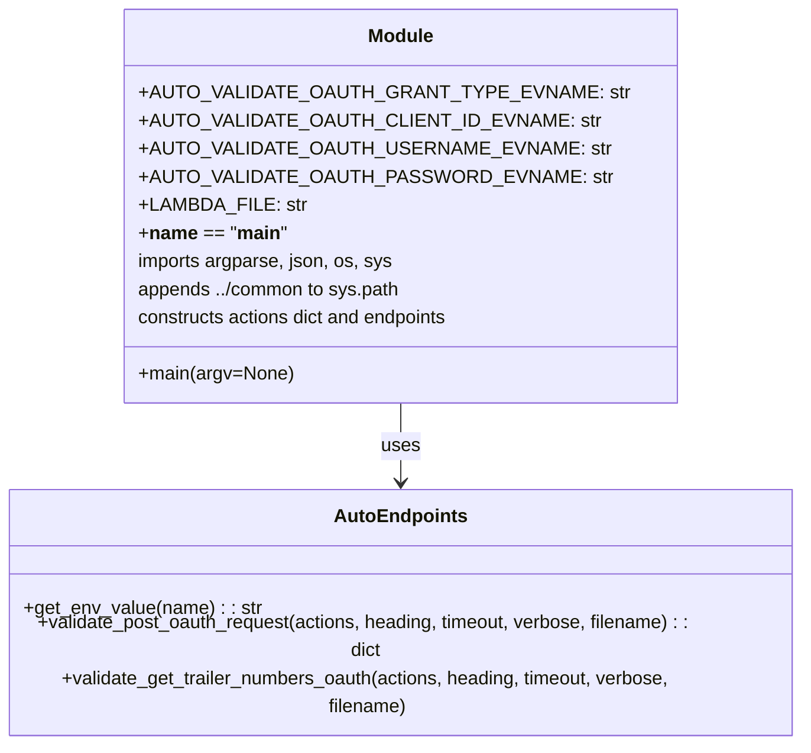
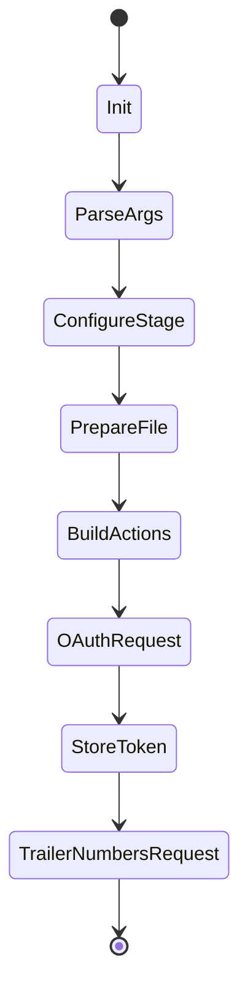

# Diagram: shipment_core/shipment_service/ng_val/scripts/shipment_data/ng_auto_val_GET_trailer_numbers.py


> Auto-generated by Obscura crawlers

## Diagram 1

```mermaid
flowchart LR
    A[Start script] --> B{Parse args}
    B -->|stage provided| C[set stage variable]
    C --> D{stage == "prod-b"?}
    D -->|yes| E[Set prod-b URLs and paths]
    D -->|no| F{stage == "staging"?}
    F -->|yes| G[Set staging URLs and paths]
    F -->|no| H{stage == "test"?}
    H -->|yes| I[Set test URLs and paths]
    H -->|no| J[Set default URLs and base paths]
    E --> K[Set LAMBDA_FILE name]
    G --> K
    I --> K
    J --> K
    K --> L[Remove existing LAMBDA_FILE if exists]
    L --> M[Build actions.oauth map with env values]
    M --> N[Set get_trailer_numbers endpoint]
    N --> O[Print "Posting to Auth0 endpoint for a token"]
    O --> P[Call validate_post_oauth_request]
    P --> Q[Store access_token in actions.oauth.access_token]
    Q --> R[Print "Getting user associated trailer_numbers"]
    R --> S[Call validate_get_trailer_numbers_oauth]
    S --> T[Exit]
```

> SVG rendering failed for this diagram.

## Diagram 2



### SVG

<svg id="container" width="695.15625" xmlns="http://www.w3.org/2000/svg" class="classDiagram" height="600" viewBox="0 0 695.15625 600" role="graphics-document document" aria-roledescription="class"><style>#container{font-family:"trebuchet ms",verdana,arial,sans-serif;font-size:16px;fill:#333;}@keyframes edge-animation-frame{from{stroke-dashoffset:0;}}@keyframes dash{to{stroke-dashoffset:0;}}#container .edge-animation-slow{stroke-dasharray:9,5!important;stroke-dashoffset:900;animation:dash 50s linear infinite;stroke-linecap:round;}#container .edge-animation-fast{stroke-dasharray:9,5!important;stroke-dashoffset:900;animation:dash 20s linear infinite;stroke-linecap:round;}#container .error-icon{fill:#552222;}#container .error-text{fill:#552222;stroke:#552222;}#container .edge-thickness-normal{stroke-width:1px;}#container .edge-thickness-thick{stroke-width:3.5px;}#container .edge-pattern-solid{stroke-dasharray:0;}#container .edge-thickness-invisible{stroke-width:0;fill:none;}#container .edge-pattern-dashed{stroke-dasharray:3;}#container .edge-pattern-dotted{stroke-dasharray:2;}#container .marker{fill:#333333;stroke:#333333;}#container .marker.cross{stroke:#333333;}#container svg{font-family:"trebuchet ms",verdana,arial,sans-serif;font-size:16px;}#container p{margin:0;}#container g.classGroup text{fill:#9370DB;stroke:none;font-family:"trebuchet ms",verdana,arial,sans-serif;font-size:10px;}#container g.classGroup text .title{font-weight:bolder;}#container .nodeLabel,#container .edgeLabel{color:#131300;}#container .edgeLabel .label rect{fill:#ECECFF;}#container .label text{fill:#131300;}#container .labelBkg{background:#ECECFF;}#container .edgeLabel .label span{background:#ECECFF;}#container .classTitle{font-weight:bolder;}#container .node rect,#container .node circle,#container .node ellipse,#container .node polygon,#container .node path{fill:#ECECFF;stroke:#9370DB;stroke-width:1px;}#container .divider{stroke:#9370DB;stroke-width:1;}#container g.clickable{cursor:pointer;}#container g.classGroup rect{fill:#ECECFF;stroke:#9370DB;}#container g.classGroup line{stroke:#9370DB;stroke-width:1;}#container .classLabel .box{stroke:none;stroke-width:0;fill:#ECECFF;opacity:0.5;}#container .classLabel .label{fill:#9370DB;font-size:10px;}#container .relation{stroke:#333333;stroke-width:1;fill:none;}#container .dashed-line{stroke-dasharray:3;}#container .dotted-line{stroke-dasharray:1 2;}#container #compositionStart,#container .composition{fill:#333333!important;stroke:#333333!important;stroke-width:1;}#container #compositionEnd,#container .composition{fill:#333333!important;stroke:#333333!important;stroke-width:1;}#container #dependencyStart,#container .dependency{fill:#333333!important;stroke:#333333!important;stroke-width:1;}#container #dependencyStart,#container .dependency{fill:#333333!important;stroke:#333333!important;stroke-width:1;}#container #extensionStart,#container .extension{fill:transparent!important;stroke:#333333!important;stroke-width:1;}#container #extensionEnd,#container .extension{fill:transparent!important;stroke:#333333!important;stroke-width:1;}#container #aggregationStart,#container .aggregation{fill:transparent!important;stroke:#333333!important;stroke-width:1;}#container #aggregationEnd,#container .aggregation{fill:transparent!important;stroke:#333333!important;stroke-width:1;}#container #lollipopStart,#container .lollipop{fill:#ECECFF!important;stroke:#333333!important;stroke-width:1;}#container #lollipopEnd,#container .lollipop{fill:#ECECFF!important;stroke:#333333!important;stroke-width:1;}#container .edgeTerminals{font-size:11px;line-height:initial;}#container .classTitleText{text-anchor:middle;font-size:18px;fill:#333;}#container .label-icon{display:inline-block;height:1em;overflow:visible;vertical-align:-0.125em;}#container .node .label-icon path{fill:currentColor;stroke:revert;stroke-width:revert;}#container :root{--mermaid-font-family:"trebuchet ms",verdana,arial,sans-serif;}</style><g><defs><marker id="container_class-aggregationStart" class="marker aggregation class" refX="18" refY="7" markerWidth="190" markerHeight="240" orient="auto"><path d="M 18,7 L9,13 L1,7 L9,1 Z"></path></marker></defs><defs><marker id="container_class-aggregationEnd" class="marker aggregation class" refX="1" refY="7" markerWidth="20" markerHeight="28" orient="auto"><path d="M 18,7 L9,13 L1,7 L9,1 Z"></path></marker></defs><defs><marker id="container_class-extensionStart" class="marker extension class" refX="18" refY="7" markerWidth="190" markerHeight="240" orient="auto"><path d="M 1,7 L18,13 V 1 Z"></path></marker></defs><defs><marker id="container_class-extensionEnd" class="marker extension class" refX="1" refY="7" markerWidth="20" markerHeight="28" orient="auto"><path d="M 1,1 V 13 L18,7 Z"></path></marker></defs><defs><marker id="container_class-compositionStart" class="marker composition class" refX="18" refY="7" markerWidth="190" markerHeight="240" orient="auto"><path d="M 18,7 L9,13 L1,7 L9,1 Z"></path></marker></defs><defs><marker id="container_class-compositionEnd" class="marker composition class" refX="1" refY="7" markerWidth="20" markerHeight="28" orient="auto"><path d="M 18,7 L9,13 L1,7 L9,1 Z"></path></marker></defs><defs><marker id="container_class-dependencyStart" class="marker dependency class" refX="6" refY="7" markerWidth="190" markerHeight="240" orient="auto"><path d="M 5,7 L9,13 L1,7 L9,1 Z"></path></marker></defs><defs><marker id="container_class-dependencyEnd" class="marker dependency class" refX="13" refY="7" markerWidth="20" markerHeight="28" orient="auto"><path d="M 18,7 L9,13 L14,7 L9,1 Z"></path></marker></defs><defs><marker id="container_class-lollipopStart" class="marker lollipop class" refX="13" refY="7" markerWidth="190" markerHeight="240" orient="auto"><circle stroke="black" fill="transparent" cx="7" cy="7" r="6"></circle></marker></defs><defs><marker id="container_class-lollipopEnd" class="marker lollipop class" refX="1" refY="7" markerWidth="190" markerHeight="240" orient="auto"><circle stroke="black" fill="transparent" cx="7" cy="7" r="6"></circle></marker></defs><g class="root"><g class="clusters"></g><g class="edgePaths"><path d="M347.578,344L347.578,350.167C347.578,356.333,347.578,368.667,347.578,380C347.578,391.333,347.578,401.667,347.578,406.833L347.578,412" id="id_Module_AutoEndpoints_1" class="edge-thickness-normal edge-pattern-solid relation" style=";;;" data-edge="true" data-et="edge" data-id="id_Module_AutoEndpoints_1" data-points="W3sieCI6MzQ3LjU3ODEyNSwieSI6MzQ0fSx7IngiOjM0Ny41NzgxMjUsInkiOjM4MX0seyJ4IjozNDcuNTc4MTI1LCJ5Ijo0MTh9XQ==" marker-end="url(#container_class-dependencyEnd)"></path></g><g class="edgeLabels"><g class="edgeLabel" transform="translate(347.578125, 381)"><g class="label" data-id="id_Module_AutoEndpoints_1" transform="translate(-16.4921875, -12)"><foreignObject width="32.984375" height="24"><div xmlns="http://www.w3.org/1999/xhtml" class="labelBkg" style="display: table-cell; white-space: nowrap; line-height: 1.5; max-width: 200px; text-align: center;"><span class="edgeLabel"><p>uses</p></span></div></foreignObject></g></g></g><g class="nodes"><g class="node default" id="classId-Module-0" transform="translate(347.578125, 176)"><g class="basic label-container"><path d="M-209.6328125 -168 L209.6328125 -168 L209.6328125 168 L-209.6328125 168" stroke="none" stroke-width="0" fill="#ECECFF" style=""></path><path d="M-209.6328125 -168 C-96.65455677703305 -168, 16.3236989459339 -168, 209.6328125 -168 M-209.6328125 -168 C-59.63100169851458 -168, 90.37080910297084 -168, 209.6328125 -168 M209.6328125 -168 C209.6328125 -77.30035382451744, 209.6328125 13.399292350965112, 209.6328125 168 M209.6328125 -168 C209.6328125 -74.4107610092293, 209.6328125 19.17847798154139, 209.6328125 168 M209.6328125 168 C69.26254394638514 168, -71.10772460722973 168, -209.6328125 168 M209.6328125 168 C58.90033427196528 168, -91.83214395606944 168, -209.6328125 168 M-209.6328125 168 C-209.6328125 94.88649404761227, -209.6328125 21.772988095224548, -209.6328125 -168 M-209.6328125 168 C-209.6328125 76.01835513020312, -209.6328125 -15.963289739593762, -209.6328125 -168" stroke="#9370DB" stroke-width="1.3" fill="none" stroke-dasharray="0 0" style=""></path></g><g class="annotation-group text" transform="translate(0, -144)"></g><g class="label-group text" transform="translate(-27.09375, -144)"><g class="label" style="font-weight: bolder" transform="translate(0,-12)"><foreignObject width="54.1875" height="24"><div xmlns="http://www.w3.org/1999/xhtml" style="display: table-cell; white-space: nowrap; line-height: 1.5; max-width: 104px; text-align: center;"><span class="nodeLabel markdown-node-label" style=""><p>Module</p></span></div></foreignObject></g></g><g class="members-group text" transform="translate(-197.6328125, -96)"><g class="label" style="" transform="translate(0,-12)"><foreignObject width="368.171875" height="24"><div xmlns="http://www.w3.org/1999/xhtml" style="display: table-cell; white-space: nowrap; line-height: 1.5; max-width: 426px; text-align: center;"><span class="nodeLabel markdown-node-label" style=""><p>+AUTO_VALIDATE_OAUTH_GRANT_TYPE_EVNAME: str</p></span></div></foreignObject></g><g class="label" style="" transform="translate(0,12)"><foreignObject width="349.6875" height="24"><div xmlns="http://www.w3.org/1999/xhtml" style="display: table-cell; white-space: nowrap; line-height: 1.5; max-width: 408px; text-align: center;"><span class="nodeLabel markdown-node-label" style=""><p>+AUTO_VALIDATE_OAUTH_CLIENT_ID_EVNAME: str</p></span></div></foreignObject></g><g class="label" style="" transform="translate(0,36)"><foreignObject width="357.078125" height="24"><div xmlns="http://www.w3.org/1999/xhtml" style="display: table-cell; white-space: nowrap; line-height: 1.5; max-width: 415px; text-align: center;"><span class="nodeLabel markdown-node-label" style=""><p>+AUTO_VALIDATE_OAUTH_USERNAME_EVNAME: str</p></span></div></foreignObject></g><g class="label" style="" transform="translate(0,60)"><foreignObject width="357.234375" height="24"><div xmlns="http://www.w3.org/1999/xhtml" style="display: table-cell; white-space: nowrap; line-height: 1.5; max-width: 415px; text-align: center;"><span class="nodeLabel markdown-node-label" style=""><p>+AUTO_VALIDATE_OAUTH_PASSWORD_EVNAME: str</p></span></div></foreignObject></g><g class="label" style="" transform="translate(0,84)"><foreignObject width="131.546875" height="24"><div xmlns="http://www.w3.org/1999/xhtml" style="display: table-cell; white-space: nowrap; line-height: 1.5; max-width: 190px; text-align: center;"><span class="nodeLabel markdown-node-label" style=""><p>+LAMBDA_FILE: str</p></span></div></foreignObject></g><g class="label" style="" transform="translate(0,108)"><foreignObject width="121.65625" height="24"><div xmlns="http://www.w3.org/1999/xhtml" style="display: table-cell; white-space: nowrap; line-height: 1.5; max-width: 241px; text-align: center;"><span class="nodeLabel markdown-node-label" style=""><p>+<strong>name</strong> == "<strong>main</strong>"</p></span></div></foreignObject></g><g class="label" style="" transform="translate(0,132)"><foreignObject width="217.875" height="24"><div xmlns="http://www.w3.org/1999/xhtml" style="display: table-cell; white-space: nowrap; line-height: 1.5; max-width: 268px; text-align: center;"><span class="nodeLabel markdown-node-label" style=""><p>imports argparse, json, os, sys</p></span></div></foreignObject></g><g class="label" style="" transform="translate(0,156)"><foreignObject width="227.9375" height="24"><div xmlns="http://www.w3.org/1999/xhtml" style="display: table-cell; white-space: nowrap; line-height: 1.5; max-width: 278px; text-align: center;"><span class="nodeLabel markdown-node-label" style=""><p>appends ../common to sys.path</p></span></div></foreignObject></g><g class="label" style="" transform="translate(0,180)"><foreignObject width="274.28125" height="24"><div xmlns="http://www.w3.org/1999/xhtml" style="display: table-cell; white-space: nowrap; line-height: 1.5; max-width: 324px; text-align: center;"><span class="nodeLabel markdown-node-label" style=""><p>constructs actions dict and endpoints</p></span></div></foreignObject></g></g><g class="methods-group text" transform="translate(-197.6328125, 144)"><g class="label" style="" transform="translate(0,-12)"><foreignObject width="131.859375" height="24"><div xmlns="http://www.w3.org/1999/xhtml" style="display: table-cell; white-space: nowrap; line-height: 1.5; max-width: 189px; text-align: center;"><span class="nodeLabel markdown-node-label" style=""><p>+main(argv=None)</p></span></div></foreignObject></g></g><g class="divider" style=""><path d="M-209.6328125 -120 C-119.96726220559194 -120, -30.301711911183872 -120, 209.6328125 -120 M-209.6328125 -120 C-47.22617540668966 -120, 115.18046168662067 -120, 209.6328125 -120" stroke="#9370DB" stroke-width="1.3" fill="none" stroke-dasharray="0 0" style=""></path></g><g class="divider" style=""><path d="M-209.6328125 120 C-70.82629724096833 120, 67.98021801806334 120, 209.6328125 120 M-209.6328125 120 C-106.70581202003513 120, -3.778811540070251 120, 209.6328125 120" stroke="#9370DB" stroke-width="1.3" fill="none" stroke-dasharray="0 0" style=""></path></g></g><g class="node default" id="classId-AutoEndpoints-1" transform="translate(347.578125, 505)"><g class="basic label-container"><path d="M-339.578125 -87 L339.578125 -87 L339.578125 87 L-339.578125 87" stroke="none" stroke-width="0" fill="#ECECFF" style=""></path><path d="M-339.578125 -87 C-134.69299277031567 -87, 70.19213945936866 -87, 339.578125 -87 M-339.578125 -87 C-77.86915190780297 -87, 183.83982118439405 -87, 339.578125 -87 M339.578125 -87 C339.578125 -27.398991790302823, 339.578125 32.202016419394354, 339.578125 87 M339.578125 -87 C339.578125 -20.641141203048463, 339.578125 45.717717593903075, 339.578125 87 M339.578125 87 C125.50709633224338 87, -88.56393233551324 87, -339.578125 87 M339.578125 87 C162.93531931350327 87, -13.707486372993458 87, -339.578125 87 M-339.578125 87 C-339.578125 23.176869926287388, -339.578125 -40.646260147425224, -339.578125 -87 M-339.578125 87 C-339.578125 29.368509107178532, -339.578125 -28.262981785642936, -339.578125 -87" stroke="#9370DB" stroke-width="1.3" fill="none" stroke-dasharray="0 0" style=""></path></g><g class="annotation-group text" transform="translate(0, -63)"></g><g class="label-group text" transform="translate(-53.734375, -63)"><g class="label" style="font-weight: bolder" transform="translate(0,-12)"><foreignObject width="107.46875" height="24"><div xmlns="http://www.w3.org/1999/xhtml" style="display: table-cell; white-space: nowrap; line-height: 1.5; max-width: 157px; text-align: center;"><span class="nodeLabel markdown-node-label" style=""><p>AutoEndpoints</p></span></div></foreignObject></g></g><g class="members-group text" transform="translate(-327.578125, -15)"></g><g class="methods-group text" transform="translate(-327.578125, 15)"><g class="label" style="" transform="translate(0,-12)"><foreignObject width="201.359375" height="24"><div xmlns="http://www.w3.org/1999/xhtml" style="display: table-cell; white-space: nowrap; line-height: 1.5; max-width: 260px; text-align: center;"><span class="nodeLabel markdown-node-label" style=""><p>+get_env_value(name) : : str</p></span></div></foreignObject></g><g class="label" style="" transform="translate(0,12)"><foreignObject width="599.4375" height="24"><div xmlns="http://www.w3.org/1999/xhtml" style="display: table-cell; white-space: nowrap; line-height: 1.5; max-width: 657px; text-align: center;"><span class="nodeLabel markdown-node-label" style=""><p>+validate_post_oauth_request(actions, heading, timeout, verbose, filename) : : dict</p></span></div></foreignObject></g><g class="label" style="" transform="translate(0,36)"><foreignObject width="601.421875" height="24"><div xmlns="http://www.w3.org/1999/xhtml" style="display: table-cell; white-space: nowrap; line-height: 1.5; max-width: 659px; text-align: center;"><span class="nodeLabel markdown-node-label" style=""><p>+validate_get_trailer_numbers_oauth(actions, heading, timeout, verbose, filename)</p></span></div></foreignObject></g></g><g class="divider" style=""><path d="M-339.578125 -39 C-151.95612175942605 -39, 35.66588148114789 -39, 339.578125 -39 M-339.578125 -39 C-101.68325684399508 -39, 136.21161131200984 -39, 339.578125 -39" stroke="#9370DB" stroke-width="1.3" fill="none" stroke-dasharray="0 0" style=""></path></g><g class="divider" style=""><path d="M-339.578125 -15 C-172.29153172999116 -15, -5.004938459982327 -15, 339.578125 -15 M-339.578125 -15 C-85.93035985076381 -15, 167.71740529847239 -15, 339.578125 -15" stroke="#9370DB" stroke-width="1.3" fill="none" stroke-dasharray="0 0" style=""></path></g></g></g></g></g></svg>

## Diagram 3



### SVG

<svg id="container" width="202.734375" xmlns="http://www.w3.org/2000/svg" class="statediagram" height="814" viewBox="0 0 202.734375 814" role="graphics-document document" aria-roledescription="stateDiagram"><style>#container{font-family:"trebuchet ms",verdana,arial,sans-serif;font-size:16px;fill:#333;}@keyframes edge-animation-frame{from{stroke-dashoffset:0;}}@keyframes dash{to{stroke-dashoffset:0;}}#container .edge-animation-slow{stroke-dasharray:9,5!important;stroke-dashoffset:900;animation:dash 50s linear infinite;stroke-linecap:round;}#container .edge-animation-fast{stroke-dasharray:9,5!important;stroke-dashoffset:900;animation:dash 20s linear infinite;stroke-linecap:round;}#container .error-icon{fill:#552222;}#container .error-text{fill:#552222;stroke:#552222;}#container .edge-thickness-normal{stroke-width:1px;}#container .edge-thickness-thick{stroke-width:3.5px;}#container .edge-pattern-solid{stroke-dasharray:0;}#container .edge-thickness-invisible{stroke-width:0;fill:none;}#container .edge-pattern-dashed{stroke-dasharray:3;}#container .edge-pattern-dotted{stroke-dasharray:2;}#container .marker{fill:#333333;stroke:#333333;}#container .marker.cross{stroke:#333333;}#container svg{font-family:"trebuchet ms",verdana,arial,sans-serif;font-size:16px;}#container p{margin:0;}#container defs #statediagram-barbEnd{fill:#333333;stroke:#333333;}#container g.stateGroup text{fill:#9370DB;stroke:none;font-size:10px;}#container g.stateGroup text{fill:#333;stroke:none;font-size:10px;}#container g.stateGroup .state-title{font-weight:bolder;fill:#131300;}#container g.stateGroup rect{fill:#ECECFF;stroke:#9370DB;}#container g.stateGroup line{stroke:#333333;stroke-width:1;}#container .transition{stroke:#333333;stroke-width:1;fill:none;}#container .stateGroup .composit{fill:white;border-bottom:1px;}#container .stateGroup .alt-composit{fill:#e0e0e0;border-bottom:1px;}#container .state-note{stroke:#aaaa33;fill:#fff5ad;}#container .state-note text{fill:black;stroke:none;font-size:10px;}#container .stateLabel .box{stroke:none;stroke-width:0;fill:#ECECFF;opacity:0.5;}#container .edgeLabel .label rect{fill:#ECECFF;opacity:0.5;}#container .edgeLabel{background-color:rgba(232,232,232, 0.8);text-align:center;}#container .edgeLabel p{background-color:rgba(232,232,232, 0.8);}#container .edgeLabel rect{opacity:0.5;background-color:rgba(232,232,232, 0.8);fill:rgba(232,232,232, 0.8);}#container .edgeLabel .label text{fill:#333;}#container .label div .edgeLabel{color:#333;}#container .stateLabel text{fill:#131300;font-size:10px;font-weight:bold;}#container .node circle.state-start{fill:#333333;stroke:#333333;}#container .node .fork-join{fill:#333333;stroke:#333333;}#container .node circle.state-end{fill:#9370DB;stroke:white;stroke-width:1.5;}#container .end-state-inner{fill:white;stroke-width:1.5;}#container .node rect{fill:#ECECFF;stroke:#9370DB;stroke-width:1px;}#container .node polygon{fill:#ECECFF;stroke:#9370DB;stroke-width:1px;}#container #statediagram-barbEnd{fill:#333333;}#container .statediagram-cluster rect{fill:#ECECFF;stroke:#9370DB;stroke-width:1px;}#container .cluster-label,#container .nodeLabel{color:#131300;}#container .statediagram-cluster rect.outer{rx:5px;ry:5px;}#container .statediagram-state .divider{stroke:#9370DB;}#container .statediagram-state .title-state{rx:5px;ry:5px;}#container .statediagram-cluster.statediagram-cluster .inner{fill:white;}#container .statediagram-cluster.statediagram-cluster-alt .inner{fill:#f0f0f0;}#container .statediagram-cluster .inner{rx:0;ry:0;}#container .statediagram-state rect.basic{rx:5px;ry:5px;}#container .statediagram-state rect.divider{stroke-dasharray:10,10;fill:#f0f0f0;}#container .note-edge{stroke-dasharray:5;}#container .statediagram-note rect{fill:#fff5ad;stroke:#aaaa33;stroke-width:1px;rx:0;ry:0;}#container .statediagram-note rect{fill:#fff5ad;stroke:#aaaa33;stroke-width:1px;rx:0;ry:0;}#container .statediagram-note text{fill:black;}#container .statediagram-note .nodeLabel{color:black;}#container .statediagram .edgeLabel{color:red;}#container #dependencyStart,#container #dependencyEnd{fill:#333333;stroke:#333333;stroke-width:1;}#container .statediagramTitleText{text-anchor:middle;font-size:18px;fill:#333;}#container :root{--mermaid-font-family:"trebuchet ms",verdana,arial,sans-serif;}</style><g><defs><marker id="container_stateDiagram-barbEnd" refX="19" refY="7" markerWidth="20" markerHeight="14" markerUnits="userSpaceOnUse" orient="auto"><path d="M 19,7 L9,13 L14,7 L9,1 Z"></path></marker></defs><g class="root"><g class="clusters"></g><g class="edgePaths"><path d="M101.367,22L101.367,26.167C101.367,30.333,101.367,38.667,101.451,47.083C101.534,55.5,101.701,64,101.784,68.25L101.867,72.5" id="edge0" class="edge-thickness-normal edge-pattern-solid transition" style="fill:none;;;fill:none" data-edge="true" data-et="edge" data-id="edge0" data-points="W3sieCI6MTAxLjM2NzE4NzUsInkiOjIyfSx7IngiOjEwMS4zNjcxODc1LCJ5Ijo0N30seyJ4IjoxMDEuODY3MTg3NSwieSI6NzIuNX1d" marker-end="url(#container_stateDiagram-barbEnd)"></path><path d="M101.867,112.5L101.784,116.583C101.701,120.667,101.534,128.833,101.534,137.167C101.534,145.5,101.701,154,101.784,158.25L101.867,162.5" id="edge1" class="edge-thickness-normal edge-pattern-solid transition" style="fill:none;;;fill:none" data-edge="true" data-et="edge" data-id="edge1" data-points="W3sieCI6MTAxLjg2NzE4NzUsInkiOjExMi41fSx7IngiOjEwMS4zNjcxODc1LCJ5IjoxMzd9LHsieCI6MTAxLjg2NzE4NzUsInkiOjE2Mi41fV0=" marker-end="url(#container_stateDiagram-barbEnd)"></path><path d="M101.867,202.5L101.784,206.583C101.701,210.667,101.534,218.833,101.534,227.167C101.534,235.5,101.701,244,101.784,248.25L101.867,252.5" id="edge2" class="edge-thickness-normal edge-pattern-solid transition" style="fill:none;;;fill:none" data-edge="true" data-et="edge" data-id="edge2" data-points="W3sieCI6MTAxLjg2NzE4NzUsInkiOjIwMi41fSx7IngiOjEwMS4zNjcxODc1LCJ5IjoyMjd9LHsieCI6MTAxLjg2NzE4NzUsInkiOjI1Mi41fV0=" marker-end="url(#container_stateDiagram-barbEnd)"></path><path d="M101.867,292.5L101.784,296.583C101.701,300.667,101.534,308.833,101.534,317.167C101.534,325.5,101.701,334,101.784,338.25L101.867,342.5" id="edge3" class="edge-thickness-normal edge-pattern-solid transition" style="fill:none;;;fill:none" data-edge="true" data-et="edge" data-id="edge3" data-points="W3sieCI6MTAxLjg2NzE4NzUsInkiOjI5Mi41fSx7IngiOjEwMS4zNjcxODc1LCJ5IjozMTd9LHsieCI6MTAxLjg2NzE4NzUsInkiOjM0Mi41fV0=" marker-end="url(#container_stateDiagram-barbEnd)"></path><path d="M101.867,382.5L101.784,386.583C101.701,390.667,101.534,398.833,101.534,407.167C101.534,415.5,101.701,424,101.784,428.25L101.867,432.5" id="edge4" class="edge-thickness-normal edge-pattern-solid transition" style="fill:none;;;fill:none" data-edge="true" data-et="edge" data-id="edge4" data-points="W3sieCI6MTAxLjg2NzE4NzUsInkiOjM4Mi41fSx7IngiOjEwMS4zNjcxODc1LCJ5Ijo0MDd9LHsieCI6MTAxLjg2NzE4NzUsInkiOjQzMi41fV0=" marker-end="url(#container_stateDiagram-barbEnd)"></path><path d="M101.867,472.5L101.784,476.583C101.701,480.667,101.534,488.833,101.534,497.167C101.534,505.5,101.701,514,101.784,518.25L101.867,522.5" id="edge5" class="edge-thickness-normal edge-pattern-solid transition" style="fill:none;;;fill:none" data-edge="true" data-et="edge" data-id="edge5" data-points="W3sieCI6MTAxLjg2NzE4NzUsInkiOjQ3Mi41fSx7IngiOjEwMS4zNjcxODc1LCJ5Ijo0OTd9LHsieCI6MTAxLjg2NzE4NzUsInkiOjUyMi41fV0=" marker-end="url(#container_stateDiagram-barbEnd)"></path><path d="M101.867,562.5L101.784,566.583C101.701,570.667,101.534,578.833,101.534,587.167C101.534,595.5,101.701,604,101.784,608.25L101.867,612.5" id="edge6" class="edge-thickness-normal edge-pattern-solid transition" style="fill:none;;;fill:none" data-edge="true" data-et="edge" data-id="edge6" data-points="W3sieCI6MTAxLjg2NzE4NzUsInkiOjU2Mi41fSx7IngiOjEwMS4zNjcxODc1LCJ5Ijo1ODd9LHsieCI6MTAxLjg2NzE4NzUsInkiOjYxMi41fV0=" marker-end="url(#container_stateDiagram-barbEnd)"></path><path d="M101.867,652.5L101.784,656.583C101.701,660.667,101.534,668.833,101.534,677.167C101.534,685.5,101.701,694,101.784,698.25L101.867,702.5" id="edge7" class="edge-thickness-normal edge-pattern-solid transition" style="fill:none;;;fill:none" data-edge="true" data-et="edge" data-id="edge7" data-points="W3sieCI6MTAxLjg2NzE4NzUsInkiOjY1Mi41fSx7IngiOjEwMS4zNjcxODc1LCJ5Ijo2Nzd9LHsieCI6MTAxLjg2NzE4NzUsInkiOjcwMi41fV0=" marker-end="url(#container_stateDiagram-barbEnd)"></path><path d="M101.867,742.5L101.784,746.583C101.701,750.667,101.534,758.833,101.451,767.083C101.367,775.333,101.367,783.667,101.367,787.833L101.367,792" id="edge8" class="edge-thickness-normal edge-pattern-solid transition" style="fill:none;;;fill:none" data-edge="true" data-et="edge" data-id="edge8" data-points="W3sieCI6MTAxLjg2NzE4NzUsInkiOjc0Mi41fSx7IngiOjEwMS4zNjcxODc1LCJ5Ijo3Njd9LHsieCI6MTAxLjM2NzE4NzUsInkiOjc5Mn1d" marker-end="url(#container_stateDiagram-barbEnd)"></path></g><g class="edgeLabels"><g class="edgeLabel"><g class="label" data-id="edge0" transform="translate(0, 0)"><foreignObject width="0" height="0"><div xmlns="http://www.w3.org/1999/xhtml" class="labelBkg" style="display: table-cell; white-space: nowrap; line-height: 1.5; max-width: 200px; text-align: center;"><span class="edgeLabel"></span></div></foreignObject></g></g><g class="edgeLabel"><g class="label" data-id="edge1" transform="translate(0, 0)"><foreignObject width="0" height="0"><div xmlns="http://www.w3.org/1999/xhtml" class="labelBkg" style="display: table-cell; white-space: nowrap; line-height: 1.5; max-width: 200px; text-align: center;"><span class="edgeLabel"></span></div></foreignObject></g></g><g class="edgeLabel"><g class="label" data-id="edge2" transform="translate(0, 0)"><foreignObject width="0" height="0"><div xmlns="http://www.w3.org/1999/xhtml" class="labelBkg" style="display: table-cell; white-space: nowrap; line-height: 1.5; max-width: 200px; text-align: center;"><span class="edgeLabel"></span></div></foreignObject></g></g><g class="edgeLabel"><g class="label" data-id="edge3" transform="translate(0, 0)"><foreignObject width="0" height="0"><div xmlns="http://www.w3.org/1999/xhtml" class="labelBkg" style="display: table-cell; white-space: nowrap; line-height: 1.5; max-width: 200px; text-align: center;"><span class="edgeLabel"></span></div></foreignObject></g></g><g class="edgeLabel"><g class="label" data-id="edge4" transform="translate(0, 0)"><foreignObject width="0" height="0"><div xmlns="http://www.w3.org/1999/xhtml" class="labelBkg" style="display: table-cell; white-space: nowrap; line-height: 1.5; max-width: 200px; text-align: center;"><span class="edgeLabel"></span></div></foreignObject></g></g><g class="edgeLabel"><g class="label" data-id="edge5" transform="translate(0, 0)"><foreignObject width="0" height="0"><div xmlns="http://www.w3.org/1999/xhtml" class="labelBkg" style="display: table-cell; white-space: nowrap; line-height: 1.5; max-width: 200px; text-align: center;"><span class="edgeLabel"></span></div></foreignObject></g></g><g class="edgeLabel"><g class="label" data-id="edge6" transform="translate(0, 0)"><foreignObject width="0" height="0"><div xmlns="http://www.w3.org/1999/xhtml" class="labelBkg" style="display: table-cell; white-space: nowrap; line-height: 1.5; max-width: 200px; text-align: center;"><span class="edgeLabel"></span></div></foreignObject></g></g><g class="edgeLabel"><g class="label" data-id="edge7" transform="translate(0, 0)"><foreignObject width="0" height="0"><div xmlns="http://www.w3.org/1999/xhtml" class="labelBkg" style="display: table-cell; white-space: nowrap; line-height: 1.5; max-width: 200px; text-align: center;"><span class="edgeLabel"></span></div></foreignObject></g></g><g class="edgeLabel"><g class="label" data-id="edge8" transform="translate(0, 0)"><foreignObject width="0" height="0"><div xmlns="http://www.w3.org/1999/xhtml" class="labelBkg" style="display: table-cell; white-space: nowrap; line-height: 1.5; max-width: 200px; text-align: center;"><span class="edgeLabel"></span></div></foreignObject></g></g></g><g class="nodes"><g class="node default" id="state-root_start-0" transform="translate(101.3671875, 15)"><circle class="state-start" r="7" width="14" height="14"></circle></g><g class="node  statediagram-state" id="state-Init-1" transform="translate(101.3671875, 92)"><g class="basic label-container outer-path"><path d="M-15.1953125 -20 C-7.41558559542462 -20, 0.36414130915076015 -20, 15.1953125 -20 C15.1953125 -20, 15.1953125 -20, 15.1953125 -20 C15.322346077337984 -19.994745852376234, 15.449379654675969 -19.989491704752467, 15.608209227361662 -19.982922465033347 C15.719959390675184 -19.968992821703072, 15.831709553988704 -19.9550631783728, 16.01828545140367 -19.931806517013612 C16.14348875036366 -19.90555414589855, 16.26869204932365 -19.87930177478349, 16.422739935703998 -19.847001329696653 C16.533775456869346 -19.813944622802573, 16.644810978034695 -19.780887915908494, 16.818809846023417 -19.729086208503173 C16.952721744659108 -19.67683362350986, 17.086633643294803 -19.624581038516553, 17.203789623264846 -19.578866633275286 C17.315631834847697 -19.52419030770389, 17.427474046430547 -19.469513982132494, 17.57504946518537 -19.397368756032446 C17.71463465200405 -19.314194038259018, 17.854219838822733 -19.23101932048559, 17.930053290612136 -19.185832391312644 C18.01101664679907 -19.128025666083467, 18.091980002986006 -19.07021894085429, 18.26637606344834 -18.94570254698197 C18.374437345847838 -18.854179309415457, 18.48249862824733 -18.762656071848948, 18.581720358128706 -18.678619553365657 C18.65482778964903 -18.605512121845333, 18.727935221169353 -18.53240469032501, 18.873932053365657 -18.386407858128706 C18.94749954098034 -18.299546889636698, 19.02106702859502 -18.212685921144686, 19.14101504698197 -18.07106356344834 C19.233242767947036 -17.94189060315349, 19.325470488912103 -17.812717642858637, 19.381144891312644 -17.734740790612136 C19.44051550110542 -17.635104051452544, 19.4998861108982 -17.535467312292948, 19.592681256032446 -17.37973696518537 C19.644702058664876 -17.273326712595725, 19.696722861297307 -17.16691646000608, 19.774179133275286 -17.008477123264846 C19.807009293059078 -16.924340634520345, 19.83983945284287 -16.840204145775843, 19.924398708503173 -16.623497346023417 C19.960625418793168 -16.501813971147495, 19.996852129083162 -16.380130596271574, 20.042313829696653 -16.227427435703994 C20.061049375938815 -16.13807351841192, 20.079784922180977 -16.04871960111985, 20.127119017013612 -15.82297295140367 C20.139993093657598 -15.719691041496516, 20.152867170301583 -15.61640913158936, 20.178234965033347 -15.412896727361662 C20.182551901000295 -15.308522838714183, 20.186868836967243 -15.2041489500667, 20.1953125 -15 C20.1953125 -15, 20.1953125 -15, 20.1953125 -15 C20.1953125 -6.315789925946472, 20.1953125 2.368420148107056, 20.1953125 15 C20.1953125 15, 20.1953125 15, 20.1953125 15 C20.190798787474986 15.109131507180027, 20.186285074949968 15.218263014360057, 20.178234965033347 15.412896727361662 C20.159989855796855 15.559267591891967, 20.141744746560363 15.705638456422271, 20.127119017013612 15.822972951403669 C20.10250776027881 15.94034941699007, 20.077896503544007 16.05772588257647, 20.042313829696653 16.227427435703994 C19.99785982969708 16.3767457895755, 19.953405829697513 16.52606414344701, 19.924398708503173 16.623497346023417 C19.890793896841632 16.709619097386874, 19.857189085180092 16.79574084875033, 19.774179133275286 17.008477123264846 C19.719403501195508 17.120522469557386, 19.66462786911573 17.232567815849926, 19.592681256032446 17.379736965185366 C19.53846282013232 17.470727240917373, 19.48424438423219 17.561717516649377, 19.381144891312644 17.734740790612133 C19.30764645175485 17.837681760153476, 19.234148012197053 17.940622729694823, 19.14101504698197 18.07106356344834 C19.084782937041467 18.137456690196988, 19.02855082710097 18.203849816945638, 18.873932053365657 18.386407858128706 C18.780507314417562 18.4798325970768, 18.687082575469468 18.573257336024895, 18.581720358128706 18.678619553365657 C18.465508044349065 18.77704636235805, 18.349295730569423 18.87547317135044, 18.26637606344834 18.94570254698197 C18.166782304346007 19.016811124221242, 18.067188545243674 19.087919701460518, 17.930053290612136 19.185832391312644 C17.788820134795227 19.269989085465163, 17.64758697897832 19.354145779617678, 17.57504946518537 19.397368756032446 C17.428456823686457 19.469033531608062, 17.28186418218754 19.540698307183682, 17.203789623264846 19.578866633275286 C17.108574366775194 19.616019741647833, 17.01335911028554 19.653172850020383, 16.818809846023417 19.729086208503173 C16.737588577409547 19.753266827839717, 16.656367308795673 19.77744744717626, 16.422739935703998 19.847001329696653 C16.297574807574655 19.87324569723018, 16.17240967944531 19.899490064763704, 16.01828545140367 19.931806517013612 C15.919727616478802 19.944091738325152, 15.821169781553934 19.956376959636696, 15.608209227361662 19.982922465033347 C15.50983731646956 19.98699115736407, 15.41146540557746 19.99105984969479, 15.1953125 20 C15.1953125 20, 15.1953125 20, 15.1953125 20 C4.1751188546402584 20, -6.845074790719483 20, -15.1953125 20 C-15.1953125 20, -15.1953125 20, -15.1953125 20 C-15.340172790404063 19.994008534069856, -15.485033080808126 19.988017068139715, -15.60820922736166 19.982922465033347 C-15.720280335837883 19.968952815930262, -15.832351444314105 19.95498316682718, -16.01828545140367 19.931806517013612 C-16.14396272359569 19.90545476416269, -16.269639995787706 19.879103011311773, -16.422739935703994 19.847001329696653 C-16.509544629849536 19.821158452558926, -16.59634932399508 19.795315575421203, -16.818809846023417 19.729086208503173 C-16.908976627134653 19.69390302133617, -16.999143408245892 19.65871983416917, -17.203789623264846 19.578866633275286 C-17.321805799436287 19.521172040332967, -17.43982197560773 19.46347744739065, -17.57504946518537 19.397368756032446 C-17.672439904049448 19.339336650685393, -17.769830342913522 19.28130454533834, -17.930053290612133 19.185832391312644 C-18.063666913171325 19.090434098431594, -18.197280535730513 18.99503580555054, -18.26637606344834 18.94570254698197 C-18.359719911609744 18.86664434037042, -18.453063759771148 18.78758613375887, -18.581720358128706 18.67861955336566 C-18.662270038559498 18.598069872934868, -18.74281971899029 18.517520192504072, -18.873932053365657 18.386407858128706 C-18.938238833295113 18.310480986539297, -19.002545613224573 18.23455411494989, -19.141015046981966 18.07106356344834 C-19.22320482800543 17.955949612786938, -19.30539460902889 17.840835662125535, -19.381144891312644 17.734740790612133 C-19.46368044907119 17.596228252700143, -19.546216006829738 17.457715714788158, -19.592681256032446 17.37973696518537 C-19.644293300907773 17.2741628399521, -19.695905345783096 17.16858871471883, -19.774179133275286 17.00847712326485 C-19.81833188001259 16.89532333103945, -19.86248462674989 16.78216953881405, -19.924398708503173 16.623497346023417 C-19.95694883617238 16.514163394479795, -19.989498963841584 16.404829442936176, -20.042313829696653 16.227427435703994 C-20.06871518884575 16.1015135802276, -20.09511654799485 15.975599724751206, -20.127119017013612 15.82297295140367 C-20.14482240500645 15.680948029982853, -20.162525792999286 15.538923108562036, -20.178234965033347 15.412896727361664 C-20.182143905867548 15.318387251547737, -20.186052846701752 15.223877775733811, -20.1953125 15 C-20.1953125 15, -20.1953125 15, -20.1953125 15 C-20.1953125 3.076823876927138, -20.1953125 -8.846352246145724, -20.1953125 -15 C-20.1953125 -15, -20.1953125 -15, -20.1953125 -15 C-20.18887814096681 -15.155568458367142, -20.182443781933625 -15.311136916734284, -20.178234965033347 -15.41289672736166 C-20.161970854480312 -15.543375086882934, -20.14570674392728 -15.673853446404209, -20.127119017013612 -15.822972951403669 C-20.094769833166303 -15.97725328359136, -20.062420649318994 -16.13153361577905, -20.042313829696653 -16.227427435703994 C-20.000682696455804 -16.367263947275255, -19.959051563214956 -16.507100458846516, -19.924398708503173 -16.623497346023417 C-19.873157010241865 -16.754818563995077, -19.821915311980554 -16.88613978196674, -19.77417913327529 -17.008477123264846 C-19.707812358030164 -17.14423253187115, -19.641445582785042 -17.279987940477458, -19.592681256032446 -17.379736965185366 C-19.527351845043114 -17.489373863053068, -19.462022434053782 -17.59901076092077, -19.381144891312644 -17.734740790612133 C-19.29166365990505 -17.860067052941933, -19.202182428497455 -17.985393315271736, -19.14101504698197 -18.07106356344834 C-19.069654865662756 -18.15531837032196, -18.99829468434354 -18.23957317719558, -18.87393205336566 -18.386407858128706 C-18.786053377049992 -18.47428653444437, -18.698174700734324 -18.56216521076004, -18.581720358128706 -18.678619553365657 C-18.502308230758192 -18.745878194366455, -18.42289610338768 -18.813136835367253, -18.26637606344834 -18.945702546981966 C-18.132728410081683 -19.041125137392537, -17.99908075671502 -19.136547727803105, -17.930053290612136 -19.185832391312644 C-17.817809586625938 -19.252715121591343, -17.705565882639743 -19.319597851870046, -17.575049465185366 -19.397368756032446 C-17.427525755783464 -19.46948870297022, -17.28000204638156 -19.541608649908, -17.20378962326485 -19.578866633275286 C-17.07356462481267 -19.62968058535275, -16.943339626360487 -19.680494537430214, -16.81880984602342 -19.729086208503173 C-16.675089561743594 -19.771873590976003, -16.531369277463764 -19.814660973448834, -16.422739935703994 -19.847001329696653 C-16.32341564475555 -19.867827443452267, -16.224091353807108 -19.88865355720788, -16.018285451403674 -19.931806517013612 C-15.886080660365783 -19.948285827030766, -15.753875869327892 -19.964765137047923, -15.608209227361664 -19.982922465033347 C-15.509272148517661 -19.987014532883467, -15.410335069673659 -19.99110660073359, -15.195312500000002 -20 C-15.195312500000002 -20, -15.1953125 -20, -15.1953125 -20" stroke="none" stroke-width="0" fill="#ECECFF" style=""></path><path d="M-15.1953125 -20 C-8.059587082690658 -20, -0.9238616653813185 -20, 15.1953125 -20 M-15.1953125 -20 C-6.439353433028442 -20, 2.316605633943116 -20, 15.1953125 -20 M15.1953125 -20 C15.1953125 -20, 15.1953125 -20, 15.1953125 -20 M15.1953125 -20 C15.1953125 -20, 15.1953125 -20, 15.1953125 -20 M15.1953125 -20 C15.340465448484736 -19.993996429642102, 15.485618396969471 -19.98799285928421, 15.608209227361662 -19.982922465033347 M15.1953125 -20 C15.284701101063101 -19.996302860112188, 15.374089702126202 -19.99260572022438, 15.608209227361662 -19.982922465033347 M15.608209227361662 -19.982922465033347 C15.706809041221142 -19.970632011053063, 15.805408855080623 -19.95834155707278, 16.01828545140367 -19.931806517013612 M15.608209227361662 -19.982922465033347 C15.751789750549168 -19.96502517148251, 15.895370273736674 -19.94712787793167, 16.01828545140367 -19.931806517013612 M16.01828545140367 -19.931806517013612 C16.13105322078532 -19.90816160225325, 16.243820990166963 -19.884516687492894, 16.422739935703998 -19.847001329696653 M16.01828545140367 -19.931806517013612 C16.131098984059665 -19.90815200670368, 16.24391251671566 -19.884497496393752, 16.422739935703998 -19.847001329696653 M16.422739935703998 -19.847001329696653 C16.525920480145366 -19.81628315069436, 16.62910102458674 -19.78556497169207, 16.818809846023417 -19.729086208503173 M16.422739935703998 -19.847001329696653 C16.552961333279406 -19.808232739917376, 16.683182730854814 -19.7694641501381, 16.818809846023417 -19.729086208503173 M16.818809846023417 -19.729086208503173 C16.946429965455817 -19.679288683373315, 17.074050084888214 -19.629491158243457, 17.203789623264846 -19.578866633275286 M16.818809846023417 -19.729086208503173 C16.899481352986516 -19.697608088806017, 16.980152859949616 -19.66612996910886, 17.203789623264846 -19.578866633275286 M17.203789623264846 -19.578866633275286 C17.316189999253563 -19.523917437753042, 17.428590375242276 -19.468968242230794, 17.57504946518537 -19.397368756032446 M17.203789623264846 -19.578866633275286 C17.28304550862888 -19.540120791877087, 17.36230139399291 -19.501374950478883, 17.57504946518537 -19.397368756032446 M17.57504946518537 -19.397368756032446 C17.672432684307612 -19.339340952717745, 17.769815903429855 -19.28131314940304, 17.930053290612136 -19.185832391312644 M17.57504946518537 -19.397368756032446 C17.698763911010133 -19.32365094721268, 17.8224783568349 -19.249933138392915, 17.930053290612136 -19.185832391312644 M17.930053290612136 -19.185832391312644 C18.01914834382582 -19.122219746000475, 18.108243397039505 -19.058607100688302, 18.26637606344834 -18.94570254698197 M17.930053290612136 -19.185832391312644 C18.007153499315372 -19.13078390037151, 18.084253708018604 -19.07573540943038, 18.26637606344834 -18.94570254698197 M18.26637606344834 -18.94570254698197 C18.341860926532394 -18.88177012916023, 18.417345789616444 -18.817837711338495, 18.581720358128706 -18.678619553365657 M18.26637606344834 -18.94570254698197 C18.352588950358182 -18.87268395646799, 18.43880183726802 -18.799665365954013, 18.581720358128706 -18.678619553365657 M18.581720358128706 -18.678619553365657 C18.690042753901366 -18.570297157592996, 18.798365149674023 -18.46197476182034, 18.873932053365657 -18.386407858128706 M18.581720358128706 -18.678619553365657 C18.65973502994541 -18.600604881548954, 18.73774970176211 -18.522590209732254, 18.873932053365657 -18.386407858128706 M18.873932053365657 -18.386407858128706 C18.94378538218102 -18.303932188644485, 19.01363871099638 -18.22145651916026, 19.14101504698197 -18.07106356344834 M18.873932053365657 -18.386407858128706 C18.945156167717773 -18.302313705219564, 19.01638028206989 -18.21821955231042, 19.14101504698197 -18.07106356344834 M19.14101504698197 -18.07106356344834 C19.23031038682301 -17.945997658456815, 19.319605726664054 -17.82093175346529, 19.381144891312644 -17.734740790612136 M19.14101504698197 -18.07106356344834 C19.20383716040483 -17.983075719035664, 19.266659273827692 -17.89508787462299, 19.381144891312644 -17.734740790612136 M19.381144891312644 -17.734740790612136 C19.443265012934823 -17.63048977523206, 19.505385134557 -17.52623875985199, 19.592681256032446 -17.37973696518537 M19.381144891312644 -17.734740790612136 C19.428914613571468 -17.654572852754647, 19.47668433583029 -17.57440491489716, 19.592681256032446 -17.37973696518537 M19.592681256032446 -17.37973696518537 C19.657456402656873 -17.247237284960526, 19.722231549281304 -17.114737604735684, 19.774179133275286 -17.008477123264846 M19.592681256032446 -17.37973696518537 C19.639372827851602 -17.28422782846193, 19.686064399670755 -17.18871869173849, 19.774179133275286 -17.008477123264846 M19.774179133275286 -17.008477123264846 C19.818279332331716 -16.895457999204005, 19.862379531388147 -16.782438875143168, 19.924398708503173 -16.623497346023417 M19.774179133275286 -17.008477123264846 C19.82675829751182 -16.873728273758292, 19.879337461748353 -16.73897942425174, 19.924398708503173 -16.623497346023417 M19.924398708503173 -16.623497346023417 C19.965887157174652 -16.4841401034723, 20.00737560584613 -16.34478286092118, 20.042313829696653 -16.227427435703994 M19.924398708503173 -16.623497346023417 C19.970858791180603 -16.46744067921739, 20.017318873858034 -16.311384012411366, 20.042313829696653 -16.227427435703994 M20.042313829696653 -16.227427435703994 C20.0704748760104 -16.09312124731465, 20.098635922324153 -15.958815058925307, 20.127119017013612 -15.82297295140367 M20.042313829696653 -16.227427435703994 C20.067704702359528 -16.10633281126297, 20.093095575022403 -15.985238186821944, 20.127119017013612 -15.82297295140367 M20.127119017013612 -15.82297295140367 C20.1454194199689 -15.676158494603346, 20.163719822924186 -15.529344037803021, 20.178234965033347 -15.412896727361662 M20.127119017013612 -15.82297295140367 C20.140396154493953 -15.716457497519848, 20.15367329197429 -15.609942043636025, 20.178234965033347 -15.412896727361662 M20.178234965033347 -15.412896727361662 C20.184316631720982 -15.265855583711131, 20.190398298408617 -15.118814440060598, 20.1953125 -15 M20.178234965033347 -15.412896727361662 C20.18384224176495 -15.277325275368693, 20.189449518496552 -15.141753823375721, 20.1953125 -15 M20.1953125 -15 C20.1953125 -15, 20.1953125 -15, 20.1953125 -15 M20.1953125 -15 C20.1953125 -15, 20.1953125 -15, 20.1953125 -15 M20.1953125 -15 C20.1953125 -7.331269906423355, 20.1953125 0.3374601871532903, 20.1953125 15 M20.1953125 -15 C20.1953125 -4.780089956175651, 20.1953125 5.439820087648698, 20.1953125 15 M20.1953125 15 C20.1953125 15, 20.1953125 15, 20.1953125 15 M20.1953125 15 C20.1953125 15, 20.1953125 15, 20.1953125 15 M20.1953125 15 C20.190384257608095 15.119153915318373, 20.185456015216186 15.238307830636746, 20.178234965033347 15.412896727361662 M20.1953125 15 C20.188586917129662 15.162609601572143, 20.181861334259327 15.325219203144284, 20.178234965033347 15.412896727361662 M20.178234965033347 15.412896727361662 C20.16117462615509 15.54976280574039, 20.144114287276835 15.686628884119115, 20.127119017013612 15.822972951403669 M20.178234965033347 15.412896727361662 C20.162128818211563 15.542107827388477, 20.14602267138978 15.67131892741529, 20.127119017013612 15.822972951403669 M20.127119017013612 15.822972951403669 C20.107541278598212 15.916343467348325, 20.08796354018281 16.009713983292983, 20.042313829696653 16.227427435703994 M20.127119017013612 15.822972951403669 C20.106588086734437 15.92088944779951, 20.08605715645526 16.018805944195353, 20.042313829696653 16.227427435703994 M20.042313829696653 16.227427435703994 C20.00558045995694 16.350812649672154, 19.968847090217224 16.47419786364031, 19.924398708503173 16.623497346023417 M20.042313829696653 16.227427435703994 C19.99970298378394 16.370554744131134, 19.95709213787123 16.513682052558273, 19.924398708503173 16.623497346023417 M19.924398708503173 16.623497346023417 C19.868076666061704 16.76783837028744, 19.81175462362023 16.912179394551462, 19.774179133275286 17.008477123264846 M19.924398708503173 16.623497346023417 C19.86743395247834 16.76948550403667, 19.810469196453507 16.915473662049923, 19.774179133275286 17.008477123264846 M19.774179133275286 17.008477123264846 C19.728153387790346 17.10262429045265, 19.682127642305407 17.196771457640452, 19.592681256032446 17.379736965185366 M19.774179133275286 17.008477123264846 C19.707033550277547 17.14582560859202, 19.639887967279808 17.283174093919193, 19.592681256032446 17.379736965185366 M19.592681256032446 17.379736965185366 C19.53975035952154 17.468566471022477, 19.48681946301064 17.55739597685959, 19.381144891312644 17.734740790612133 M19.592681256032446 17.379736965185366 C19.534399947218677 17.477545621428334, 19.476118638404913 17.5753542776713, 19.381144891312644 17.734740790612133 M19.381144891312644 17.734740790612133 C19.31742892453245 17.82398055454562, 19.253712957752256 17.913220318479112, 19.14101504698197 18.07106356344834 M19.381144891312644 17.734740790612133 C19.326521931761356 17.811245005521428, 19.271898972210067 17.88774922043072, 19.14101504698197 18.07106356344834 M19.14101504698197 18.07106356344834 C19.08603729372763 18.135975674056198, 19.031059540473297 18.200887784664058, 18.873932053365657 18.386407858128706 M19.14101504698197 18.07106356344834 C19.086906834293707 18.134949009449844, 19.032798621605448 18.198834455451347, 18.873932053365657 18.386407858128706 M18.873932053365657 18.386407858128706 C18.779998205396424 18.48034170609794, 18.686064357427192 18.57427555406717, 18.581720358128706 18.678619553365657 M18.873932053365657 18.386407858128706 C18.76409174674141 18.496248164752952, 18.654251440117164 18.6060884713772, 18.581720358128706 18.678619553365657 M18.581720358128706 18.678619553365657 C18.458595738626066 18.78290078666961, 18.33547111912343 18.887182019973565, 18.26637606344834 18.94570254698197 M18.581720358128706 18.678619553365657 C18.500757978266687 18.747191191250423, 18.41979559840467 18.81576282913519, 18.26637606344834 18.94570254698197 M18.26637606344834 18.94570254698197 C18.178063977569074 19.0087561643623, 18.089751891689808 19.07180978174263, 17.930053290612136 19.185832391312644 M18.26637606344834 18.94570254698197 C18.163519644637258 19.019140618478676, 18.060663225826175 19.092578689975383, 17.930053290612136 19.185832391312644 M17.930053290612136 19.185832391312644 C17.814775371773965 19.25452312120598, 17.699497452935795 19.323213851099315, 17.57504946518537 19.397368756032446 M17.930053290612136 19.185832391312644 C17.838260478024587 19.240529035380728, 17.74646766543704 19.295225679448812, 17.57504946518537 19.397368756032446 M17.57504946518537 19.397368756032446 C17.435237373599076 19.465718722741816, 17.295425282012783 19.534068689451185, 17.203789623264846 19.578866633275286 M17.57504946518537 19.397368756032446 C17.475624857509064 19.44597448496236, 17.376200249832763 19.49458021389227, 17.203789623264846 19.578866633275286 M17.203789623264846 19.578866633275286 C17.115571718803913 19.613289366413564, 17.02735381434298 19.647712099551843, 16.818809846023417 19.729086208503173 M17.203789623264846 19.578866633275286 C17.060475026304935 19.634788162539856, 16.917160429345024 19.69070969180442, 16.818809846023417 19.729086208503173 M16.818809846023417 19.729086208503173 C16.721808561119506 19.757964742235117, 16.6248072762156 19.786843275967062, 16.422739935703998 19.847001329696653 M16.818809846023417 19.729086208503173 C16.726204927587215 19.75665588722911, 16.633600009151014 19.784225565955047, 16.422739935703998 19.847001329696653 M16.422739935703998 19.847001329696653 C16.33482827475392 19.865434466585008, 16.24691661380384 19.88386760347336, 16.01828545140367 19.931806517013612 M16.422739935703998 19.847001329696653 C16.282275285399358 19.876453669682704, 16.141810635094718 19.905906009668755, 16.01828545140367 19.931806517013612 M16.01828545140367 19.931806517013612 C15.916466890275883 19.944498187422475, 15.814648329148095 19.957189857831338, 15.608209227361662 19.982922465033347 M16.01828545140367 19.931806517013612 C15.930284636599664 19.942775807139427, 15.84228382179566 19.953745097265244, 15.608209227361662 19.982922465033347 M15.608209227361662 19.982922465033347 C15.495310206704131 19.98759200306844, 15.382411186046598 19.992261541103527, 15.1953125 20 M15.608209227361662 19.982922465033347 C15.47952837952609 19.988244744268865, 15.350847531690517 19.993567023504383, 15.1953125 20 M15.1953125 20 C15.1953125 20, 15.1953125 20, 15.1953125 20 M15.1953125 20 C15.1953125 20, 15.1953125 20, 15.1953125 20 M15.1953125 20 C8.094826845367432 20, 0.9943411907348647 20, -15.1953125 20 M15.1953125 20 C6.801296115379518 20, -1.5927202692409637 20, -15.1953125 20 M-15.1953125 20 C-15.1953125 20, -15.1953125 20, -15.1953125 20 M-15.1953125 20 C-15.1953125 20, -15.1953125 20, -15.1953125 20 M-15.1953125 20 C-15.322595731830246 19.994735526590052, -15.44987896366049 19.989471053180107, -15.60820922736166 19.982922465033347 M-15.1953125 20 C-15.355082393412056 19.993391868327954, -15.514852286824112 19.98678373665591, -15.60820922736166 19.982922465033347 M-15.60820922736166 19.982922465033347 C-15.742049831778562 19.966239251091142, -15.875890436195464 19.949556037148938, -16.01828545140367 19.931806517013612 M-15.60820922736166 19.982922465033347 C-15.742672707710955 19.96616160968714, -15.87713618806025 19.94940075434093, -16.01828545140367 19.931806517013612 M-16.01828545140367 19.931806517013612 C-16.112105208496178 19.912134582635073, -16.205924965588686 19.892462648256537, -16.422739935703994 19.847001329696653 M-16.01828545140367 19.931806517013612 C-16.114039569729933 19.911728989736158, -16.209793688056198 19.8916514624587, -16.422739935703994 19.847001329696653 M-16.422739935703994 19.847001329696653 C-16.52699929179267 19.815961974551406, -16.63125864788135 19.78492261940616, -16.818809846023417 19.729086208503173 M-16.422739935703994 19.847001329696653 C-16.50397198942397 19.822817499494906, -16.585204043143946 19.798633669293157, -16.818809846023417 19.729086208503173 M-16.818809846023417 19.729086208503173 C-16.965615503298455 19.67180246327653, -17.11242116057349 19.614518718049894, -17.203789623264846 19.578866633275286 M-16.818809846023417 19.729086208503173 C-16.90564657008879 19.695202413627626, -16.99248329415417 19.66131861875208, -17.203789623264846 19.578866633275286 M-17.203789623264846 19.578866633275286 C-17.349512769480807 19.50762692804208, -17.495235915696764 19.436387222808875, -17.57504946518537 19.397368756032446 M-17.203789623264846 19.578866633275286 C-17.31474495317461 19.524623877734513, -17.425700283084375 19.47038112219374, -17.57504946518537 19.397368756032446 M-17.57504946518537 19.397368756032446 C-17.67933128566186 19.335230278557052, -17.78361310613835 19.27309180108166, -17.930053290612133 19.185832391312644 M-17.57504946518537 19.397368756032446 C-17.681453051369424 19.333965980618782, -17.787856637553475 19.270563205205118, -17.930053290612133 19.185832391312644 M-17.930053290612133 19.185832391312644 C-18.031814008482584 19.113176635250863, -18.133574726353032 19.040520879189085, -18.26637606344834 18.94570254698197 M-17.930053290612133 19.185832391312644 C-18.05919091223729 19.093629901672774, -18.18832853386245 19.001427412032907, -18.26637606344834 18.94570254698197 M-18.26637606344834 18.94570254698197 C-18.39210717236795 18.83921372975131, -18.517838281287563 18.732724912520656, -18.581720358128706 18.67861955336566 M-18.26637606344834 18.94570254698197 C-18.365098942559822 18.862088533548683, -18.4638218216713 18.77847452011539, -18.581720358128706 18.67861955336566 M-18.581720358128706 18.67861955336566 C-18.665813053118494 18.594526858375872, -18.749905748108283 18.51043416338608, -18.873932053365657 18.386407858128706 M-18.581720358128706 18.67861955336566 C-18.673717069561484 18.586622841932883, -18.76571378099426 18.494626130500105, -18.873932053365657 18.386407858128706 M-18.873932053365657 18.386407858128706 C-18.96022910027606 18.284517127376848, -19.046526147186466 18.18262639662499, -19.141015046981966 18.07106356344834 M-18.873932053365657 18.386407858128706 C-18.955980548322383 18.28953338318971, -19.038029043279113 18.192658908250717, -19.141015046981966 18.07106356344834 M-19.141015046981966 18.07106356344834 C-19.23354359624938 17.9414692669007, -19.326072145516793 17.81187497035306, -19.381144891312644 17.734740790612133 M-19.141015046981966 18.07106356344834 C-19.20881006534391 17.97611073231015, -19.276605083705856 17.88115790117196, -19.381144891312644 17.734740790612133 M-19.381144891312644 17.734740790612133 C-19.449040026949202 17.620798051212343, -19.51693516258576 17.506855311812554, -19.592681256032446 17.37973696518537 M-19.381144891312644 17.734740790612133 C-19.454899918985674 17.610963883492335, -19.528654946658705 17.487186976372538, -19.592681256032446 17.37973696518537 M-19.592681256032446 17.37973696518537 C-19.66256908266392 17.236779130848525, -19.7324569092954 17.09382129651168, -19.774179133275286 17.00847712326485 M-19.592681256032446 17.37973696518537 C-19.647875282736013 17.26683577901058, -19.70306930943958 17.15393459283579, -19.774179133275286 17.00847712326485 M-19.774179133275286 17.00847712326485 C-19.807988619579 16.921830835748025, -19.841798105882713 16.8351845482312, -19.924398708503173 16.623497346023417 M-19.774179133275286 17.00847712326485 C-19.821030701294617 16.88840684485984, -19.867882269313952 16.76833656645483, -19.924398708503173 16.623497346023417 M-19.924398708503173 16.623497346023417 C-19.970593317861702 16.46833238837687, -20.016787927220236 16.313167430730317, -20.042313829696653 16.227427435703994 M-19.924398708503173 16.623497346023417 C-19.96980483468206 16.470980856691106, -20.015210960860944 16.318464367358796, -20.042313829696653 16.227427435703994 M-20.042313829696653 16.227427435703994 C-20.072155349910087 16.085106699785413, -20.101996870123525 15.942785963866829, -20.127119017013612 15.82297295140367 M-20.042313829696653 16.227427435703994 C-20.060027794612957 16.142945663163832, -20.077741759529257 16.05846389062367, -20.127119017013612 15.82297295140367 M-20.127119017013612 15.82297295140367 C-20.13905679462819 15.727202473553026, -20.150994572242766 15.631431995702384, -20.178234965033347 15.412896727361664 M-20.127119017013612 15.82297295140367 C-20.140002472474475 15.719615800207645, -20.152885927935337 15.616258649011622, -20.178234965033347 15.412896727361664 M-20.178234965033347 15.412896727361664 C-20.183310015776843 15.290193313357516, -20.188385066520336 15.167489899353368, -20.1953125 15 M-20.178234965033347 15.412896727361664 C-20.182483366950812 15.310179839259016, -20.186731768868277 15.20746295115637, -20.1953125 15 M-20.1953125 15 C-20.1953125 15, -20.1953125 15, -20.1953125 15 M-20.1953125 15 C-20.1953125 15, -20.1953125 15, -20.1953125 15 M-20.1953125 15 C-20.1953125 5.058914376110337, -20.1953125 -4.8821712477793255, -20.1953125 -15 M-20.1953125 15 C-20.1953125 6.394612043790781, -20.1953125 -2.2107759124184376, -20.1953125 -15 M-20.1953125 -15 C-20.1953125 -15, -20.1953125 -15, -20.1953125 -15 M-20.1953125 -15 C-20.1953125 -15, -20.1953125 -15, -20.1953125 -15 M-20.1953125 -15 C-20.191317832662023 -15.09658215157922, -20.18732316532405 -15.193164303158438, -20.178234965033347 -15.41289672736166 M-20.1953125 -15 C-20.189322736639234 -15.144819126071814, -20.183332973278464 -15.28963825214363, -20.178234965033347 -15.41289672736166 M-20.178234965033347 -15.41289672736166 C-20.162716932536657 -15.537389697116367, -20.147198900039967 -15.661882666871072, -20.127119017013612 -15.822972951403669 M-20.178234965033347 -15.41289672736166 C-20.158680761326185 -15.569769764662771, -20.139126557619022 -15.726642801963882, -20.127119017013612 -15.822972951403669 M-20.127119017013612 -15.822972951403669 C-20.099707966546674 -15.953702245583509, -20.07229691607974 -16.084431539763347, -20.042313829696653 -16.227427435703994 M-20.127119017013612 -15.822972951403669 C-20.09875971210227 -15.958224678401958, -20.07040040719093 -16.09347640540025, -20.042313829696653 -16.227427435703994 M-20.042313829696653 -16.227427435703994 C-20.012057578962914 -16.32905639044213, -19.981801328229174 -16.430685345180265, -19.924398708503173 -16.623497346023417 M-20.042313829696653 -16.227427435703994 C-20.004686250257503 -16.353816247106284, -19.967058670818354 -16.48020505850857, -19.924398708503173 -16.623497346023417 M-19.924398708503173 -16.623497346023417 C-19.865513828137583 -16.774406360987967, -19.80662894777199 -16.925315375952522, -19.77417913327529 -17.008477123264846 M-19.924398708503173 -16.623497346023417 C-19.879302662438704 -16.739068607239087, -19.834206616374235 -16.854639868454758, -19.77417913327529 -17.008477123264846 M-19.77417913327529 -17.008477123264846 C-19.70375025501579 -17.152541696396334, -19.633321376756292 -17.296606269527818, -19.592681256032446 -17.379736965185366 M-19.77417913327529 -17.008477123264846 C-19.724625016840353 -17.109841688589928, -19.675070900405416 -17.211206253915005, -19.592681256032446 -17.379736965185366 M-19.592681256032446 -17.379736965185366 C-19.51851890457422 -17.504197449817347, -19.444356553115995 -17.628657934449333, -19.381144891312644 -17.734740790612133 M-19.592681256032446 -17.379736965185366 C-19.509967061307172 -17.51854929460902, -19.427252866581895 -17.65736162403267, -19.381144891312644 -17.734740790612133 M-19.381144891312644 -17.734740790612133 C-19.32199104933901 -17.81759090119268, -19.262837207365383 -17.900441011773232, -19.14101504698197 -18.07106356344834 M-19.381144891312644 -17.734740790612133 C-19.329185041146786 -17.807515088753394, -19.277225190980925 -17.88028938689466, -19.14101504698197 -18.07106356344834 M-19.14101504698197 -18.07106356344834 C-19.085869532939743 -18.136173748844175, -19.030724018897512 -18.201283934240013, -18.87393205336566 -18.386407858128706 M-19.14101504698197 -18.07106356344834 C-19.049898786002522 -18.178644329499487, -18.958782525023075 -18.28622509555063, -18.87393205336566 -18.386407858128706 M-18.87393205336566 -18.386407858128706 C-18.75976837019334 -18.500571541301024, -18.64560468702102 -18.614735224473346, -18.581720358128706 -18.678619553365657 M-18.87393205336566 -18.386407858128706 C-18.762155220063992 -18.498184691430374, -18.650378386762323 -18.60996152473204, -18.581720358128706 -18.678619553365657 M-18.581720358128706 -18.678619553365657 C-18.50214565873704 -18.74601588584469, -18.42257095934537 -18.813412218323727, -18.26637606344834 -18.945702546981966 M-18.581720358128706 -18.678619553365657 C-18.468760922224156 -18.774291315333564, -18.355801486319603 -18.869963077301467, -18.26637606344834 -18.945702546981966 M-18.26637606344834 -18.945702546981966 C-18.1787819218726 -19.00824356198218, -18.091187780296853 -19.070784576982394, -17.930053290612136 -19.185832391312644 M-18.26637606344834 -18.945702546981966 C-18.164303935047354 -19.018580645888957, -18.062231806646366 -19.091458744795947, -17.930053290612136 -19.185832391312644 M-17.930053290612136 -19.185832391312644 C-17.839705851381662 -19.23966777980059, -17.749358412151192 -19.293503168288538, -17.575049465185366 -19.397368756032446 M-17.930053290612136 -19.185832391312644 C-17.841521340672752 -19.238585982993577, -17.752989390733365 -19.29133957467451, -17.575049465185366 -19.397368756032446 M-17.575049465185366 -19.397368756032446 C-17.45395438291249 -19.456568534450117, -17.33285930063961 -19.51576831286779, -17.20378962326485 -19.578866633275286 M-17.575049465185366 -19.397368756032446 C-17.45532491223838 -19.455898523489434, -17.335600359291387 -19.514428290946427, -17.20378962326485 -19.578866633275286 M-17.20378962326485 -19.578866633275286 C-17.08496540336383 -19.625231987757587, -16.966141183462813 -19.671597342239888, -16.81880984602342 -19.729086208503173 M-17.20378962326485 -19.578866633275286 C-17.125823772109207 -19.60928900280026, -17.047857920953565 -19.639711372325237, -16.81880984602342 -19.729086208503173 M-16.81880984602342 -19.729086208503173 C-16.728111050871085 -19.756088409740485, -16.63741225571875 -19.7830906109778, -16.422739935703994 -19.847001329696653 M-16.81880984602342 -19.729086208503173 C-16.68043349677359 -19.77028263258635, -16.542057147523753 -19.81147905666953, -16.422739935703994 -19.847001329696653 M-16.422739935703994 -19.847001329696653 C-16.314336359966948 -19.86973116927826, -16.205932784229905 -19.89246100885987, -16.018285451403674 -19.931806517013612 M-16.422739935703994 -19.847001329696653 C-16.297062470532463 -19.87335312301112, -16.17138500536093 -19.899704916325593, -16.018285451403674 -19.931806517013612 M-16.018285451403674 -19.931806517013612 C-15.932968735542971 -19.94244123455506, -15.847652019682268 -19.95307595209651, -15.608209227361664 -19.982922465033347 M-16.018285451403674 -19.931806517013612 C-15.863831923179513 -19.951059129228852, -15.709378394955353 -19.970311741444092, -15.608209227361664 -19.982922465033347 M-15.608209227361664 -19.982922465033347 C-15.455797441391333 -19.98922626313044, -15.303385655421 -19.995530061227534, -15.195312500000002 -20 M-15.608209227361664 -19.982922465033347 C-15.516017239277648 -19.98673555386602, -15.423825251193634 -19.990548642698695, -15.195312500000002 -20 M-15.195312500000002 -20 C-15.195312500000002 -20, -15.195312500000002 -20, -15.1953125 -20 M-15.195312500000002 -20 C-15.195312500000002 -20, -15.1953125 -20, -15.1953125 -20" stroke="#9370DB" stroke-width="1.3" fill="none" stroke-dasharray="0 0" style=""></path></g><g class="label" style="" transform="translate(-12.1953125, -12)"><rect></rect><foreignObject width="24.390625" height="24"><div xmlns="http://www.w3.org/1999/xhtml" style="display: table-cell; white-space: nowrap; line-height: 1.5; max-width: 200px; text-align: center;"><span class="nodeLabel"><p>Init</p></span></div></foreignObject></g></g><g class="node  statediagram-state" id="state-ParseArgs-2" transform="translate(101.3671875, 182)"><g class="basic label-container outer-path"><path d="M-38.0234375 -20 C-15.995431570515603 -20, 6.032574358968795 -20, 38.0234375 -20 C38.0234375 -20, 38.0234375 -20, 38.0234375 -20 C38.17736522794682 -19.993633502078968, 38.331292955893645 -19.987267004157935, 38.43633422736166 -19.982922465033347 C38.526459459158666 -19.971688366605512, 38.61658469095566 -19.96045426817768, 38.84641045140367 -19.931806517013612 C38.94975710002328 -19.910137003545547, 39.05310374864288 -19.888467490077478, 39.250864935703994 -19.847001329696653 C39.40058644888423 -19.802427303970536, 39.55030796206447 -19.75785327824442, 39.64693484602342 -19.729086208503173 C39.72749114375427 -19.697653043587938, 39.80804744148512 -19.666219878672706, 40.031914623264846 -19.578866633275286 C40.108447770808674 -19.541451857289655, 40.184980918352494 -19.504037081304023, 40.403174465185366 -19.397368756032446 C40.499427792268975 -19.34001422223559, 40.595681119352584 -19.282659688438734, 40.758178290612136 -19.185832391312644 C40.86946247652836 -19.106377009760045, 40.98074666244459 -19.026921628207447, 41.09450106344834 -18.94570254698197 C41.180191193646884 -18.873126708817537, 41.26588132384543 -18.800550870653108, 41.409845358128706 -18.678619553365657 C41.51567156451981 -18.572793346974553, 41.62149777091091 -18.46696714058345, 41.70205705336566 -18.386407858128706 C41.78157396457417 -18.292522418473073, 41.861090875782686 -18.198636978817436, 41.96914004698197 -18.07106356344834 C42.01935317995599 -18.000735694949995, 42.069566312930014 -17.93040782645165, 42.209269891312644 -17.734740790612136 C42.26525552910794 -17.640784767435633, 42.321241166903235 -17.54682874425913, 42.42080625603245 -17.37973696518537 C42.467282969271885 -17.28466732871149, 42.51375968251132 -17.18959769223761, 42.60230413327529 -17.008477123264846 C42.643768197198156 -16.902213834553425, 42.685232261121016 -16.795950545842, 42.752523708503176 -16.623497346023417 C42.77730861224457 -16.54024632187341, 42.80209351598596 -16.456995297723406, 42.87043882969665 -16.227427435703994 C42.89559192198664 -16.107466837861274, 42.92074501427663 -15.987506240018552, 42.95524401701361 -15.82297295140367 C42.97513756190992 -15.66337755916447, 42.99503110680623 -15.503782166925268, 43.00635996503335 -15.412896727361662 C43.01006206666327 -15.32338816243477, 43.013764168293186 -15.233879597507878, 43.0234375 -15 C43.0234375 -15, 43.0234375 -15, 43.0234375 -15 C43.0234375 -8.264961035252274, 43.0234375 -1.5299220705045489, 43.0234375 15 C43.0234375 15, 43.0234375 15, 43.0234375 15 C43.01722566511159 15.150188320582748, 43.011013830223185 15.300376641165496, 43.00635996503335 15.412896727361662 C42.98638970763307 15.573107543459399, 42.9664194502328 15.733318359557135, 42.95524401701361 15.822972951403669 C42.929537189866 15.94557443187827, 42.90383036271839 16.068175912352874, 42.87043882969665 16.227427435703994 C42.84423404278136 16.315447763363665, 42.818029255866065 16.403468091023335, 42.752523708503176 16.623497346023417 C42.70758471735429 16.73866610998582, 42.662645726205405 16.853834873948227, 42.60230413327529 17.008477123264846 C42.54471369741196 17.12628024272584, 42.48712326154862 17.24408336218684, 42.42080625603245 17.379736965185366 C42.35319087175281 17.493210221231752, 42.285575487473174 17.606683477278143, 42.209269891312644 17.734740790612133 C42.13758143691047 17.83514671821386, 42.0658929825083 17.93555264581559, 41.96914004698197 18.07106356344834 C41.878236611537716 18.178393046864908, 41.78733317609347 18.28572253028148, 41.70205705336566 18.386407858128706 C41.62808791796113 18.46037699353323, 41.55411878255661 18.534346128937752, 41.409845358128706 18.678619553365657 C41.328092232776775 18.7478609185174, 41.24633910742485 18.817102283669147, 41.09450106344834 18.94570254698197 C40.97991367182453 19.02751637207875, 40.865326280200705 19.109330197175527, 40.758178290612136 19.185832391312644 C40.672754703167534 19.236733800973884, 40.58733111572293 19.28763521063512, 40.403174465185366 19.397368756032446 C40.299701386859034 19.447953661663128, 40.1962283085327 19.49853856729381, 40.031914623264846 19.578866633275286 C39.94048903264147 19.61454100943814, 39.84906344201809 19.650215385600994, 39.64693484602342 19.729086208503173 C39.543674738901515 19.759828074341733, 39.44041463177961 19.790569940180298, 39.250864935703994 19.847001329696653 C39.13050624603991 19.872237893063836, 39.01014755637582 19.89747445643102, 38.84641045140367 19.931806517013612 C38.71972293324385 19.947598099683724, 38.593035415084024 19.963389682353835, 38.43633422736166 19.982922465033347 C38.339199919557466 19.986939969721718, 38.24206561175326 19.990957474410084, 38.0234375 20 C38.0234375 20, 38.0234375 20, 38.0234375 20 C10.90432441066682 20, -16.21478867866636 20, -38.0234375 20 C-38.0234375 20, -38.0234375 20, -38.0234375 20 C-38.11920096887951 19.996039193628956, -38.21496443775902 19.99207838725791, -38.43633422736166 19.982922465033347 C-38.54842472892458 19.96895039858453, -38.660515230487505 19.954978332135706, -38.84641045140367 19.931806517013612 C-38.95999034716166 19.907991317259157, -39.07357024291965 19.884176117504705, -39.250864935703994 19.847001329696653 C-39.35240699611725 19.816770948524276, -39.45394905653051 19.7865405673519, -39.64693484602342 19.729086208503173 C-39.79971121335636 19.669472684982374, -39.952487580689294 19.609859161461575, -40.031914623264846 19.578866633275286 C-40.1298488358657 19.53098951410033, -40.227783048466556 19.48311239492537, -40.403174465185366 19.397368756032446 C-40.51119580204057 19.333002010454273, -40.61921713889577 19.268635264876103, -40.758178290612136 19.185832391312644 C-40.85780685226529 19.11469896552969, -40.957435413918446 19.04356553974674, -41.09450106344834 18.94570254698197 C-41.21357420913423 18.844852736962945, -41.33264735482012 18.744002926943924, -41.409845358128706 18.67861955336566 C-41.49188588250348 18.59657902899088, -41.573926406878265 18.5145385046161, -41.70205705336566 18.386407858128706 C-41.776648382614894 18.298338042103047, -41.85123971186413 18.210268226077385, -41.96914004698197 18.07106356344834 C-42.03563773166742 17.977927761178798, -42.102135416352866 17.884791958909254, -42.209269891312644 17.734740790612133 C-42.270856834208374 17.631384564587904, -42.3324437771041 17.528028338563672, -42.42080625603244 17.37973696518537 C-42.4733720879761 17.272211837320025, -42.52593791991977 17.164686709454685, -42.60230413327528 17.00847712326485 C-42.645398967043725 16.898034529619757, -42.688493800812175 16.78759193597466, -42.752523708503176 16.623497346023417 C-42.79412622548775 16.48375695476261, -42.83572874247232 16.344016563501807, -42.87043882969665 16.227427435703994 C-42.89175144693192 16.125782903267982, -42.91306406416719 16.02413837083197, -42.95524401701361 15.82297295140367 C-42.96691989162949 15.72930358283367, -42.97859576624536 15.63563421426367, -43.00635996503335 15.412896727361664 C-43.011118621787716 15.297843014729585, -43.01587727854209 15.182789302097504, -43.0234375 15 C-43.0234375 15, -43.0234375 15, -43.0234375 15 C-43.0234375 6.8484473784712545, -43.0234375 -1.303105243057491, -43.0234375 -15 C-43.0234375 -15, -43.0234375 -15, -43.0234375 -15 C-43.01975584086961 -15.089014310857436, -43.016074181739214 -15.178028621714873, -43.00635996503335 -15.41289672736166 C-42.99437150884621 -15.509073772604324, -42.98238305265907 -15.605250817846988, -42.95524401701361 -15.822972951403669 C-42.93762520876892 -15.907000900967178, -42.92000640052423 -15.991028850530688, -42.87043882969665 -16.227427435703994 C-42.82848081789784 -16.36836191299695, -42.78652280609902 -16.5092963902899, -42.752523708503176 -16.623497346023417 C-42.694875699490524 -16.7712365313755, -42.637227690477864 -16.918975716727584, -42.60230413327529 -17.008477123264846 C-42.55146604386782 -17.112468097284374, -42.50062795446034 -17.2164590713039, -42.42080625603245 -17.379736965185366 C-42.33766636910501 -17.519263698302314, -42.254526482177575 -17.65879043141926, -42.209269891312644 -17.734740790612133 C-42.121817411464676 -17.857225609589356, -42.03436493161671 -17.979710428566577, -41.96914004698197 -18.07106356344834 C-41.90332113765965 -18.14877580283822, -41.83750222833734 -18.226488042228095, -41.70205705336566 -18.386407858128706 C-41.62305377961792 -18.465411131876447, -41.544050505870175 -18.544414405624185, -41.409845358128706 -18.678619553365657 C-41.303805437767174 -18.76843078461593, -41.19776551740565 -18.858242015866203, -41.09450106344834 -18.945702546981966 C-41.01125358524261 -19.00514010398676, -40.92800610703689 -19.064577660991553, -40.758178290612136 -19.185832391312644 C-40.62607271112962 -19.264550230505897, -40.4939671316471 -19.34326806969915, -40.403174465185366 -19.397368756032446 C-40.272939149136334 -19.46103692246454, -40.14270383308731 -19.524705088896635, -40.031914623264846 -19.578866633275286 C-39.94178698398772 -19.614034547251226, -39.85165934471059 -19.649202461227162, -39.64693484602342 -19.729086208503173 C-39.53121810202967 -19.76353657581619, -39.41550135803592 -19.797986943129207, -39.250864935703994 -19.847001329696653 C-39.11909757278862 -19.87463004028848, -38.98733020987324 -19.902258750880307, -38.84641045140367 -19.931806517013612 C-38.758243344727134 -19.942796535399722, -38.67007623805059 -19.953786553785832, -38.43633422736166 -19.982922465033347 C-38.32208292966369 -19.98764793366055, -38.20783163196572 -19.992373402287754, -38.0234375 -20 C-38.0234375 -20, -38.0234375 -20, -38.0234375 -20" stroke="none" stroke-width="0" fill="#ECECFF" style=""></path><path d="M-38.0234375 -20 C-20.636384245634318 -20, -3.2493309912686357 -20, 38.0234375 -20 M-38.0234375 -20 C-17.258102199942552 -20, 3.5072331001148953 -20, 38.0234375 -20 M38.0234375 -20 C38.0234375 -20, 38.0234375 -20, 38.0234375 -20 M38.0234375 -20 C38.0234375 -20, 38.0234375 -20, 38.0234375 -20 M38.0234375 -20 C38.13548339241474 -19.99536574761004, 38.24752928482949 -19.99073149522008, 38.43633422736166 -19.982922465033347 M38.0234375 -20 C38.12757285032782 -19.995692930050932, 38.231708200655646 -19.991385860101865, 38.43633422736166 -19.982922465033347 M38.43633422736166 -19.982922465033347 C38.598948226100354 -19.962652651229277, 38.76156222483904 -19.942382837425203, 38.84641045140367 -19.931806517013612 M38.43633422736166 -19.982922465033347 C38.537403894178624 -19.970324144202976, 38.638473560995585 -19.95772582337261, 38.84641045140367 -19.931806517013612 M38.84641045140367 -19.931806517013612 C38.94270330892536 -19.911616028005835, 39.038996166447056 -19.891425538998057, 39.250864935703994 -19.847001329696653 M38.84641045140367 -19.931806517013612 C38.97480896891232 -19.904884179022037, 39.10320748642097 -19.877961841030466, 39.250864935703994 -19.847001329696653 M39.250864935703994 -19.847001329696653 C39.40169955278299 -19.802095918581987, 39.55253416986199 -19.757190507467325, 39.64693484602342 -19.729086208503173 M39.250864935703994 -19.847001329696653 C39.400702501215 -19.80239275369471, 39.55054006672601 -19.75778417769277, 39.64693484602342 -19.729086208503173 M39.64693484602342 -19.729086208503173 C39.77992500613801 -19.67719328699687, 39.912915166252596 -19.625300365490574, 40.031914623264846 -19.578866633275286 M39.64693484602342 -19.729086208503173 C39.75278779873439 -19.687782258184537, 39.858640751445364 -19.6464783078659, 40.031914623264846 -19.578866633275286 M40.031914623264846 -19.578866633275286 C40.11198858211241 -19.539720860120603, 40.192062540959974 -19.500575086965924, 40.403174465185366 -19.397368756032446 M40.031914623264846 -19.578866633275286 C40.1083923972824 -19.541478927757126, 40.18487017129995 -19.504091222238962, 40.403174465185366 -19.397368756032446 M40.403174465185366 -19.397368756032446 C40.53534659394118 -19.31861126207961, 40.667518722697 -19.23985376812677, 40.758178290612136 -19.185832391312644 M40.403174465185366 -19.397368756032446 C40.54138150742298 -19.31501523418384, 40.6795885496606 -19.232661712335236, 40.758178290612136 -19.185832391312644 M40.758178290612136 -19.185832391312644 C40.83338519993621 -19.13213569014583, 40.908592109260276 -19.078438988979013, 41.09450106344834 -18.94570254698197 M40.758178290612136 -19.185832391312644 C40.88412163963531 -19.095910568474476, 41.010064988658485 -19.00598874563631, 41.09450106344834 -18.94570254698197 M41.09450106344834 -18.94570254698197 C41.166036007650014 -18.885115539803277, 41.23757095185169 -18.824528532624583, 41.409845358128706 -18.678619553365657 M41.09450106344834 -18.94570254698197 C41.18098298389831 -18.872456096682694, 41.26746490434828 -18.799209646383414, 41.409845358128706 -18.678619553365657 M41.409845358128706 -18.678619553365657 C41.516843724750984 -18.57162118674338, 41.62384209137326 -18.464622820121104, 41.70205705336566 -18.386407858128706 M41.409845358128706 -18.678619553365657 C41.50500082632673 -18.58346408516763, 41.60015629452476 -18.488308616969608, 41.70205705336566 -18.386407858128706 M41.70205705336566 -18.386407858128706 C41.803327133032774 -18.26683850100697, 41.90459721269989 -18.147269143885232, 41.96914004698197 -18.07106356344834 M41.70205705336566 -18.386407858128706 C41.77832569163677 -18.29635764708312, 41.85459432990788 -18.20630743603753, 41.96914004698197 -18.07106356344834 M41.96914004698197 -18.07106356344834 C42.020966177243935 -17.998476551685354, 42.07279230750591 -17.925889539922363, 42.209269891312644 -17.734740790612136 M41.96914004698197 -18.07106356344834 C42.02848610643021 -17.987944235544028, 42.087832165878446 -17.904824907639714, 42.209269891312644 -17.734740790612136 M42.209269891312644 -17.734740790612136 C42.27885300269053 -17.617965262409374, 42.34843611406842 -17.501189734206612, 42.42080625603245 -17.37973696518537 M42.209269891312644 -17.734740790612136 C42.27507291239223 -17.62430907245892, 42.34087593347183 -17.513877354305706, 42.42080625603245 -17.37973696518537 M42.42080625603245 -17.37973696518537 C42.485825442763286 -17.246738092944046, 42.55084462949413 -17.113739220702723, 42.60230413327529 -17.008477123264846 M42.42080625603245 -17.37973696518537 C42.465864871276295 -17.28756809452576, 42.51092348652015 -17.19539922386615, 42.60230413327529 -17.008477123264846 M42.60230413327529 -17.008477123264846 C42.658621146237095 -16.86414898845254, 42.714938159198894 -16.719820853640236, 42.752523708503176 -16.623497346023417 M42.60230413327529 -17.008477123264846 C42.65058767363035 -16.884737014280248, 42.69887121398541 -16.760996905295645, 42.752523708503176 -16.623497346023417 M42.752523708503176 -16.623497346023417 C42.793409959393514 -16.486162850162934, 42.83429621028385 -16.34882835430245, 42.87043882969665 -16.227427435703994 M42.752523708503176 -16.623497346023417 C42.794399372983456 -16.48283946849762, 42.83627503746374 -16.342181590971826, 42.87043882969665 -16.227427435703994 M42.87043882969665 -16.227427435703994 C42.89940770597143 -16.089268529566755, 42.92837658224621 -15.951109623429513, 42.95524401701361 -15.82297295140367 M42.87043882969665 -16.227427435703994 C42.8905197356602 -16.13165720368489, 42.910600641623745 -16.035886971665786, 42.95524401701361 -15.82297295140367 M42.95524401701361 -15.82297295140367 C42.96639137363303 -15.73354360327194, 42.97753873025245 -15.64411425514021, 43.00635996503335 -15.412896727361662 M42.95524401701361 -15.82297295140367 C42.965646618827634 -15.739518377295793, 42.97604922064166 -15.656063803187916, 43.00635996503335 -15.412896727361662 M43.00635996503335 -15.412896727361662 C43.01177614484827 -15.281945572833125, 43.0171923246632 -15.150994418304586, 43.0234375 -15 M43.00635996503335 -15.412896727361662 C43.012792850203006 -15.257363903729148, 43.01922573537267 -15.101831080096634, 43.0234375 -15 M43.0234375 -15 C43.0234375 -15, 43.0234375 -15, 43.0234375 -15 M43.0234375 -15 C43.0234375 -15, 43.0234375 -15, 43.0234375 -15 M43.0234375 -15 C43.0234375 -6.009473330467889, 43.0234375 2.9810533390642213, 43.0234375 15 M43.0234375 -15 C43.0234375 -4.553561041918918, 43.0234375 5.892877916162163, 43.0234375 15 M43.0234375 15 C43.0234375 15, 43.0234375 15, 43.0234375 15 M43.0234375 15 C43.0234375 15, 43.0234375 15, 43.0234375 15 M43.0234375 15 C43.019330307287994 15.099302764288966, 43.015223114575996 15.198605528577934, 43.00635996503335 15.412896727361662 M43.0234375 15 C43.01959641466519 15.09286888109776, 43.015755329330375 15.18573776219552, 43.00635996503335 15.412896727361662 M43.00635996503335 15.412896727361662 C42.988184042151815 15.55871254634752, 42.97000811927029 15.704528365333378, 42.95524401701361 15.822972951403669 M43.00635996503335 15.412896727361662 C42.994589721745776 15.507323165888428, 42.982819478458204 15.601749604415195, 42.95524401701361 15.822972951403669 M42.95524401701361 15.822972951403669 C42.925451911670116 15.965058017001017, 42.89565980632661 16.107143082598366, 42.87043882969665 16.227427435703994 M42.95524401701361 15.822972951403669 C42.93436801586955 15.922535166217456, 42.91349201472549 16.02209738103124, 42.87043882969665 16.227427435703994 M42.87043882969665 16.227427435703994 C42.84253049957687 16.321169864120538, 42.81462216945709 16.41491229253708, 42.752523708503176 16.623497346023417 M42.87043882969665 16.227427435703994 C42.8357164890021 16.344057722182743, 42.80099414830755 16.46068800866149, 42.752523708503176 16.623497346023417 M42.752523708503176 16.623497346023417 C42.70835625990491 16.736688815889362, 42.664188811306644 16.84988028575531, 42.60230413327529 17.008477123264846 M42.752523708503176 16.623497346023417 C42.698315163119354 16.762421941534935, 42.64410661773553 16.901346537046454, 42.60230413327529 17.008477123264846 M42.60230413327529 17.008477123264846 C42.557426892894114 17.100274985712858, 42.51254965251294 17.19207284816087, 42.42080625603245 17.379736965185366 M42.60230413327529 17.008477123264846 C42.53784032963897 17.14033994122824, 42.47337652600265 17.272202759191636, 42.42080625603245 17.379736965185366 M42.42080625603245 17.379736965185366 C42.37701133630232 17.453234323708326, 42.333216416572185 17.526731682231283, 42.209269891312644 17.734740790612133 M42.42080625603245 17.379736965185366 C42.3560686741608 17.48838064564076, 42.29133109228915 17.597024326096157, 42.209269891312644 17.734740790612133 M42.209269891312644 17.734740790612133 C42.151538880993954 17.81559810146884, 42.09380787067526 17.896455412325547, 41.96914004698197 18.07106356344834 M42.209269891312644 17.734740790612133 C42.137191402739944 17.835692995058785, 42.065112914167244 17.936645199505435, 41.96914004698197 18.07106356344834 M41.96914004698197 18.07106356344834 C41.91271722764144 18.137681860360118, 41.85629440830091 18.20430015727189, 41.70205705336566 18.386407858128706 M41.96914004698197 18.07106356344834 C41.87113521310315 18.186777652152845, 41.773130379224334 18.302491740857345, 41.70205705336566 18.386407858128706 M41.70205705336566 18.386407858128706 C41.63878230075172 18.44968261074264, 41.575507548137786 18.512957363356577, 41.409845358128706 18.678619553365657 M41.70205705336566 18.386407858128706 C41.6374412111194 18.451023700374964, 41.57282536887314 18.51563954262122, 41.409845358128706 18.678619553365657 M41.409845358128706 18.678619553365657 C41.305769957163584 18.766766921561292, 41.20169455619846 18.85491428975693, 41.09450106344834 18.94570254698197 M41.409845358128706 18.678619553365657 C41.332680904973266 18.74397451141369, 41.25551645181782 18.80932946946172, 41.09450106344834 18.94570254698197 M41.09450106344834 18.94570254698197 C40.962401369834 19.04001991537257, 40.83030167621966 19.134337283763173, 40.758178290612136 19.185832391312644 M41.09450106344834 18.94570254698197 C41.01500656870797 19.002460525295998, 40.935512073967594 19.05921850361003, 40.758178290612136 19.185832391312644 M40.758178290612136 19.185832391312644 C40.67302142731017 19.236574867882254, 40.5878645640082 19.28731734445186, 40.403174465185366 19.397368756032446 M40.758178290612136 19.185832391312644 C40.62861239279311 19.263036908710014, 40.49904649497408 19.340241426107383, 40.403174465185366 19.397368756032446 M40.403174465185366 19.397368756032446 C40.28028426227811 19.457446115453354, 40.15739405937086 19.517523474874263, 40.031914623264846 19.578866633275286 M40.403174465185366 19.397368756032446 C40.293175883468116 19.451143785882504, 40.183177301750874 19.50491881573256, 40.031914623264846 19.578866633275286 M40.031914623264846 19.578866633275286 C39.925156258267414 19.620523876564405, 39.81839789326999 19.66218111985353, 39.64693484602342 19.729086208503173 M40.031914623264846 19.578866633275286 C39.89420228786563 19.632602153295437, 39.75648995246642 19.686337673315588, 39.64693484602342 19.729086208503173 M39.64693484602342 19.729086208503173 C39.54334433008986 19.7599264413069, 39.43975381415629 19.79076667411062, 39.250864935703994 19.847001329696653 M39.64693484602342 19.729086208503173 C39.51326913326614 19.768880215340186, 39.37960342050887 19.808674222177203, 39.250864935703994 19.847001329696653 M39.250864935703994 19.847001329696653 C39.112225903100864 19.876070877904752, 38.97358687049773 19.905140426112855, 38.84641045140367 19.931806517013612 M39.250864935703994 19.847001329696653 C39.16884856859764 19.864198353454576, 39.086832201491276 19.8813953772125, 38.84641045140367 19.931806517013612 M38.84641045140367 19.931806517013612 C38.763059593758335 19.942196190584063, 38.67970873611299 19.952585864154514, 38.43633422736166 19.982922465033347 M38.84641045140367 19.931806517013612 C38.75397162538591 19.943329004660313, 38.66153279936814 19.95485149230701, 38.43633422736166 19.982922465033347 M38.43633422736166 19.982922465033347 C38.338160024313595 19.98698298010715, 38.239985821265535 19.991043495180957, 38.0234375 20 M38.43633422736166 19.982922465033347 C38.29092435086834 19.988936662012286, 38.14551447437502 19.99495085899122, 38.0234375 20 M38.0234375 20 C38.0234375 20, 38.0234375 20, 38.0234375 20 M38.0234375 20 C38.0234375 20, 38.0234375 20, 38.0234375 20 M38.0234375 20 C17.96065192703376 20, -2.102133645932483 20, -38.0234375 20 M38.0234375 20 C7.897357886412191 20, -22.228721727175618 20, -38.0234375 20 M-38.0234375 20 C-38.0234375 20, -38.0234375 20, -38.0234375 20 M-38.0234375 20 C-38.0234375 20, -38.0234375 20, -38.0234375 20 M-38.0234375 20 C-38.178363857926065 19.9935921984375, -38.33329021585213 19.987184396875, -38.43633422736166 19.982922465033347 M-38.0234375 20 C-38.15254669261696 19.994660004293273, -38.28165588523392 19.98932000858655, -38.43633422736166 19.982922465033347 M-38.43633422736166 19.982922465033347 C-38.544291605303115 19.969465591906665, -38.65224898324456 19.956008718779984, -38.84641045140367 19.931806517013612 M-38.43633422736166 19.982922465033347 C-38.524163152547025 19.97197460092615, -38.61199207773239 19.961026736818955, -38.84641045140367 19.931806517013612 M-38.84641045140367 19.931806517013612 C-38.964914982025995 19.90695872991411, -39.08341951264831 19.882110942814602, -39.250864935703994 19.847001329696653 M-38.84641045140367 19.931806517013612 C-38.99702799151358 19.900225339902082, -39.147645531623496 19.868644162790556, -39.250864935703994 19.847001329696653 M-39.250864935703994 19.847001329696653 C-39.33170357152966 19.822934625076723, -39.41254220735533 19.798867920456797, -39.64693484602342 19.729086208503173 M-39.250864935703994 19.847001329696653 C-39.33193952618854 19.822864378331207, -39.41301411667309 19.79872742696576, -39.64693484602342 19.729086208503173 M-39.64693484602342 19.729086208503173 C-39.77833647120172 19.677813135252475, -39.90973809638001 19.626540062001773, -40.031914623264846 19.578866633275286 M-39.64693484602342 19.729086208503173 C-39.75658623316713 19.68630010446959, -39.866237620310834 19.643514000436014, -40.031914623264846 19.578866633275286 M-40.031914623264846 19.578866633275286 C-40.11670839976669 19.53741348186824, -40.20150217626853 19.49596033046119, -40.403174465185366 19.397368756032446 M-40.031914623264846 19.578866633275286 C-40.174243952514075 19.509286064058585, -40.316573281763304 19.43970549484188, -40.403174465185366 19.397368756032446 M-40.403174465185366 19.397368756032446 C-40.5077283572579 19.33506815907481, -40.61228224933045 19.272767562117178, -40.758178290612136 19.185832391312644 M-40.403174465185366 19.397368756032446 C-40.518109190265555 19.328882525231112, -40.63304391534575 19.260396294429782, -40.758178290612136 19.185832391312644 M-40.758178290612136 19.185832391312644 C-40.87568078967918 19.101937219506432, -40.99318328874623 19.01804204770022, -41.09450106344834 18.94570254698197 M-40.758178290612136 19.185832391312644 C-40.89206329784076 19.090240333501924, -41.025948305069385 18.9946482756912, -41.09450106344834 18.94570254698197 M-41.09450106344834 18.94570254698197 C-41.20703127437853 18.85039432002333, -41.31956148530871 18.755086093064687, -41.409845358128706 18.67861955336566 M-41.09450106344834 18.94570254698197 C-41.216964844338605 18.841981015432157, -41.33942862522886 18.738259483882345, -41.409845358128706 18.67861955336566 M-41.409845358128706 18.67861955336566 C-41.476355457984276 18.612109453510087, -41.54286555783985 18.545599353654513, -41.70205705336566 18.386407858128706 M-41.409845358128706 18.67861955336566 C-41.48371515867325 18.604749752821114, -41.5575849592178 18.530879952276567, -41.70205705336566 18.386407858128706 M-41.70205705336566 18.386407858128706 C-41.78083390758736 18.293396202106283, -41.85961076180905 18.20038454608386, -41.96914004698197 18.07106356344834 M-41.70205705336566 18.386407858128706 C-41.77072145664942 18.30533595036706, -41.83938585993318 18.22426404260541, -41.96914004698197 18.07106356344834 M-41.96914004698197 18.07106356344834 C-42.0183863273871 18.002089856228036, -42.06763260779222 17.93311614900773, -42.209269891312644 17.734740790612133 M-41.96914004698197 18.07106356344834 C-42.047331231413885 17.961549995766696, -42.12552241584581 17.85203642808505, -42.209269891312644 17.734740790612133 M-42.209269891312644 17.734740790612133 C-42.25883496761524 17.6515598599088, -42.30840004391784 17.568378929205466, -42.42080625603244 17.37973696518537 M-42.209269891312644 17.734740790612133 C-42.28294877298838 17.611091672964218, -42.35662765466411 17.4874425553163, -42.42080625603244 17.37973696518537 M-42.42080625603244 17.37973696518537 C-42.48182194664352 17.254927375150164, -42.54283763725459 17.130117785114955, -42.60230413327528 17.00847712326485 M-42.42080625603244 17.37973696518537 C-42.4713515589809 17.27634489544033, -42.52189686192935 17.172952825695297, -42.60230413327528 17.00847712326485 M-42.60230413327528 17.00847712326485 C-42.661467691018075 16.85685391939095, -42.72063124876086 16.705230715517047, -42.752523708503176 16.623497346023417 M-42.60230413327528 17.00847712326485 C-42.649633678514036 16.88718189422888, -42.69696322375279 16.765886665192912, -42.752523708503176 16.623497346023417 M-42.752523708503176 16.623497346023417 C-42.790536393736126 16.49581498706192, -42.82854907896907 16.368132628100422, -42.87043882969665 16.227427435703994 M-42.752523708503176 16.623497346023417 C-42.793844873901485 16.484701998082016, -42.835166039299786 16.345906650140613, -42.87043882969665 16.227427435703994 M-42.87043882969665 16.227427435703994 C-42.89762342490236 16.097778156188276, -42.924808020108074 15.96812887667256, -42.95524401701361 15.82297295140367 M-42.87043882969665 16.227427435703994 C-42.90191617253343 16.07730510395779, -42.93339351537022 15.927182772211586, -42.95524401701361 15.82297295140367 M-42.95524401701361 15.82297295140367 C-42.97420999920593 15.670818904301369, -42.993175981398245 15.518664857199067, -43.00635996503335 15.412896727361664 M-42.95524401701361 15.82297295140367 C-42.97233688812835 15.68584588409265, -42.98942975924309 15.54871881678163, -43.00635996503335 15.412896727361664 M-43.00635996503335 15.412896727361664 C-43.012659210671856 15.260595009691787, -43.01895845631037 15.108293292021912, -43.0234375 15 M-43.00635996503335 15.412896727361664 C-43.011501779810516 15.288579107849381, -43.016643594587684 15.164261488337099, -43.0234375 15 M-43.0234375 15 C-43.0234375 15, -43.0234375 15, -43.0234375 15 M-43.0234375 15 C-43.0234375 15, -43.0234375 15, -43.0234375 15 M-43.0234375 15 C-43.0234375 3.146191542448644, -43.0234375 -8.707616915102712, -43.0234375 -15 M-43.0234375 15 C-43.0234375 6.046111579134095, -43.0234375 -2.9077768417318097, -43.0234375 -15 M-43.0234375 -15 C-43.0234375 -15, -43.0234375 -15, -43.0234375 -15 M-43.0234375 -15 C-43.0234375 -15, -43.0234375 -15, -43.0234375 -15 M-43.0234375 -15 C-43.01719380437229 -15.150958642237224, -43.010950108744574 -15.301917284474449, -43.00635996503335 -15.41289672736166 M-43.0234375 -15 C-43.01917855377621 -15.102971825924868, -43.01491960755242 -15.205943651849738, -43.00635996503335 -15.41289672736166 M-43.00635996503335 -15.41289672736166 C-42.98938074915913 -15.549111998771776, -42.97240153328491 -15.685327270181894, -42.95524401701361 -15.822972951403669 M-43.00635996503335 -15.41289672736166 C-42.99612264588977 -15.4950253259957, -42.98588532674619 -15.57715392462974, -42.95524401701361 -15.822972951403669 M-42.95524401701361 -15.822972951403669 C-42.93801207867952 -15.90515583375921, -42.920780140345435 -15.98733871611475, -42.87043882969665 -16.227427435703994 M-42.95524401701361 -15.822972951403669 C-42.93771183861145 -15.906587744303128, -42.92017966020929 -15.990202537202585, -42.87043882969665 -16.227427435703994 M-42.87043882969665 -16.227427435703994 C-42.84682374236311 -16.30674911580503, -42.82320865502956 -16.38607079590606, -42.752523708503176 -16.623497346023417 M-42.87043882969665 -16.227427435703994 C-42.826822916050546 -16.37393070713741, -42.783207002404446 -16.52043397857083, -42.752523708503176 -16.623497346023417 M-42.752523708503176 -16.623497346023417 C-42.71398183168704 -16.72227171100635, -42.67543995487092 -16.821046075989283, -42.60230413327529 -17.008477123264846 M-42.752523708503176 -16.623497346023417 C-42.709725977471024 -16.73317853061073, -42.666928246438864 -16.842859715198042, -42.60230413327529 -17.008477123264846 M-42.60230413327529 -17.008477123264846 C-42.53963111123353 -17.136676838927478, -42.47695808919178 -17.26487655459011, -42.42080625603245 -17.379736965185366 M-42.60230413327529 -17.008477123264846 C-42.5402409070493 -17.135429481649233, -42.47817768082331 -17.262381840033616, -42.42080625603245 -17.379736965185366 M-42.42080625603245 -17.379736965185366 C-42.37762838066402 -17.452198789656517, -42.33445050529559 -17.524660614127672, -42.209269891312644 -17.734740790612133 M-42.42080625603245 -17.379736965185366 C-42.34684378782819 -17.503862002435095, -42.27288131962393 -17.62798703968482, -42.209269891312644 -17.734740790612133 M-42.209269891312644 -17.734740790612133 C-42.13661285704235 -17.836503298724992, -42.06395582277206 -17.938265806837855, -41.96914004698197 -18.07106356344834 M-42.209269891312644 -17.734740790612133 C-42.123261725836464 -17.855202721448478, -42.037253560360284 -17.97566465228482, -41.96914004698197 -18.07106356344834 M-41.96914004698197 -18.07106356344834 C-41.88604465664617 -18.1691741054257, -41.80294926631037 -18.26728464740306, -41.70205705336566 -18.386407858128706 M-41.96914004698197 -18.07106356344834 C-41.86688149758512 -18.191800004574624, -41.76462294818826 -18.31253644570091, -41.70205705336566 -18.386407858128706 M-41.70205705336566 -18.386407858128706 C-41.59833092613506 -18.490133985359304, -41.49460479890446 -18.5938601125899, -41.409845358128706 -18.678619553365657 M-41.70205705336566 -18.386407858128706 C-41.59724120096678 -18.49122371052759, -41.49242534856789 -18.596039562926467, -41.409845358128706 -18.678619553365657 M-41.409845358128706 -18.678619553365657 C-41.306478699425796 -18.766166647485342, -41.20311204072289 -18.853713741605027, -41.09450106344834 -18.945702546981966 M-41.409845358128706 -18.678619553365657 C-41.303001807430476 -18.76911142479147, -41.19615825673225 -18.85960329621728, -41.09450106344834 -18.945702546981966 M-41.09450106344834 -18.945702546981966 C-40.98124553228914 -19.026565441984598, -40.867990001129925 -19.107428336987233, -40.758178290612136 -19.185832391312644 M-41.09450106344834 -18.945702546981966 C-40.97660844736303 -19.02987625698551, -40.85871583127771 -19.114049966989057, -40.758178290612136 -19.185832391312644 M-40.758178290612136 -19.185832391312644 C-40.65890797811305 -19.24498465820839, -40.55963766561396 -19.30413692510414, -40.403174465185366 -19.397368756032446 M-40.758178290612136 -19.185832391312644 C-40.61793715361949 -19.26939797055093, -40.47769601662686 -19.352963549789212, -40.403174465185366 -19.397368756032446 M-40.403174465185366 -19.397368756032446 C-40.28976731069274 -19.452810135574296, -40.176360156200104 -19.508251515116147, -40.031914623264846 -19.578866633275286 M-40.403174465185366 -19.397368756032446 C-40.25992337762995 -19.467399945426752, -40.11667229007454 -19.537431134821055, -40.031914623264846 -19.578866633275286 M-40.031914623264846 -19.578866633275286 C-39.90599042398492 -19.628002408308166, -39.78006622470498 -19.677138183341047, -39.64693484602342 -19.729086208503173 M-40.031914623264846 -19.578866633275286 C-39.934979982374976 -19.616690647522695, -39.838045341485106 -19.654514661770104, -39.64693484602342 -19.729086208503173 M-39.64693484602342 -19.729086208503173 C-39.49726908577598 -19.77364363586204, -39.347603325528546 -19.818201063220908, -39.250864935703994 -19.847001329696653 M-39.64693484602342 -19.729086208503173 C-39.55727548679562 -19.75577895625811, -39.46761612756781 -19.782471704013044, -39.250864935703994 -19.847001329696653 M-39.250864935703994 -19.847001329696653 C-39.13008075466575 -19.872327109223104, -39.0092965736275 -19.89765288874955, -38.84641045140367 -19.931806517013612 M-39.250864935703994 -19.847001329696653 C-39.127902649437225 -19.872783809863275, -39.004940363170455 -19.8985662900299, -38.84641045140367 -19.931806517013612 M-38.84641045140367 -19.931806517013612 C-38.721466835804826 -19.94738072245619, -38.59652322020599 -19.962954927898775, -38.43633422736166 -19.982922465033347 M-38.84641045140367 -19.931806517013612 C-38.741582772186874 -19.944873273601104, -38.63675509297008 -19.9579400301886, -38.43633422736166 -19.982922465033347 M-38.43633422736166 -19.982922465033347 C-38.29790764561461 -19.988647830805085, -38.15948106386756 -19.994373196576824, -38.0234375 -20 M-38.43633422736166 -19.982922465033347 C-38.31118762102331 -19.988098566959263, -38.18604101468495 -19.993274668885178, -38.0234375 -20 M-38.0234375 -20 C-38.0234375 -20, -38.0234375 -20, -38.0234375 -20 M-38.0234375 -20 C-38.0234375 -20, -38.0234375 -20, -38.0234375 -20" stroke="#9370DB" stroke-width="1.3" fill="none" stroke-dasharray="0 0" style=""></path></g><g class="label" style="" transform="translate(-35.0234375, -12)"><rect></rect><foreignObject width="70.046875" height="24"><div xmlns="http://www.w3.org/1999/xhtml" style="display: table-cell; white-space: nowrap; line-height: 1.5; max-width: 200px; text-align: center;"><span class="nodeLabel"><p>ParseArgs</p></span></div></foreignObject></g></g><g class="node  statediagram-state" id="state-ConfigureStage-3" transform="translate(101.3671875, 272)"><g class="basic label-container outer-path"><path d="M-57.0859375 -20 C-30.26760337287388 -20, -3.4492692457477574 -20, 57.0859375 -20 C57.0859375 -20, 57.0859375 -20, 57.0859375 -20 C57.178299352445215 -19.99617988552538, 57.27066120489043 -19.992359771050758, 57.49883422736166 -19.982922465033347 C57.65016574055014 -19.964059011586464, 57.801497253738624 -19.94519555813958, 57.90891045140367 -19.931806517013612 C58.02835017601791 -19.906762640354614, 58.14778990063215 -19.881718763695613, 58.313364935703994 -19.847001329696653 C58.422712939678185 -19.814447018437605, 58.532060943652375 -19.781892707178557, 58.70943484602342 -19.729086208503173 C58.830654575876146 -19.68178612313714, 58.95187430572887 -19.634486037771108, 59.094414623264846 -19.578866633275286 C59.22691445276091 -19.514091413676606, 59.359414282256964 -19.449316194077923, 59.465674465185366 -19.397368756032446 C59.57275537260158 -19.333562384767312, 59.679836280017796 -19.269756013502175, 59.820678290612136 -19.185832391312644 C59.901980144180754 -19.127783983598263, 59.98328199774937 -19.069735575883882, 60.15700106344834 -18.94570254698197 C60.279854800335414 -18.841650739550325, 60.40270853722248 -18.737598932118676, 60.472345358128706 -18.678619553365657 C60.54009211248382 -18.610872799010547, 60.607838866838925 -18.543126044655434, 60.76455705336566 -18.386407858128706 C60.81934486903974 -18.321720006398092, 60.87413268471382 -18.257032154667474, 61.03164004698197 -18.07106356344834 C61.116952621566895 -17.951575868271703, 61.20226519615182 -17.832088173095066, 61.271769891312644 -17.734740790612136 C61.3475700397828 -17.60753172795066, 61.42337018825295 -17.480322665289187, 61.48330625603245 -17.37973696518537 C61.53242595736247 -17.279261010160464, 61.58154565869249 -17.17878505513556, 61.66480413327529 -17.008477123264846 C61.72457807509442 -16.855289639067394, 61.784352016913545 -16.702102154869937, 61.815023708503176 -16.623497346023417 C61.84888215315912 -16.509768835186975, 61.88274059781505 -16.396040324350533, 61.93293882969665 -16.227427435703994 C61.95347951087792 -16.129464435123662, 61.974020192059186 -16.031501434543333, 62.01774401701361 -15.82297295140367 C62.030628783884225 -15.719605279460588, 62.043513550754845 -15.616237607517505, 62.06885996503335 -15.412896727361662 C62.075171942467584 -15.26028718325208, 62.08148391990182 -15.1076776391425, 62.0859375 -15 C62.0859375 -15, 62.0859375 -15, 62.0859375 -15 C62.0859375 -6.571790397302745, 62.0859375 1.8564192053945092, 62.0859375 15 C62.0859375 15, 62.0859375 15, 62.0859375 15 C62.080509186767266 15.13124451352409, 62.07508087353454 15.26248902704818, 62.06885996503335 15.412896727361662 C62.05026229316015 15.562096015513116, 62.031664621286964 15.711295303664572, 62.01774401701361 15.822972951403669 C61.99466888446231 15.933023304825083, 61.971593751910994 16.0430736582465, 61.93293882969665 16.227427435703994 C61.90269004610778 16.32903130874467, 61.8724412625189 16.430635181785345, 61.815023708503176 16.623497346023417 C61.76809388670038 16.743768171687872, 61.72116406489758 16.86403899735233, 61.66480413327529 17.008477123264846 C61.60653310792458 17.127672410773943, 61.54826208257387 17.24686769828304, 61.48330625603245 17.379736965185366 C61.40735404062418 17.507201229097102, 61.331401825215906 17.63466549300884, 61.271769891312644 17.734740790612133 C61.19348966507716 17.84437906909912, 61.11520943884168 17.954017347586102, 61.03164004698197 18.07106356344834 C60.96774736791935 18.146501507068162, 60.90385468885673 18.221939450687984, 60.76455705336566 18.386407858128706 C60.67535018619369 18.475614725300673, 60.58614331902172 18.56482159247264, 60.472345358128706 18.678619553365657 C60.369607617616815 18.76563398094902, 60.26686987710493 18.85264840853238, 60.15700106344834 18.94570254698197 C60.031163929562624 19.03554853366962, 59.905326795676906 19.125394520357272, 59.820678290612136 19.185832391312644 C59.71654867702425 19.247880173168458, 59.61241906343636 19.30992795502427, 59.465674465185366 19.397368756032446 C59.33234413230041 19.462549983998063, 59.19901379941546 19.52773121196368, 59.094414623264846 19.578866633275286 C58.970952955938266 19.62704152535824, 58.847491288611685 19.675216417441195, 58.70943484602342 19.729086208503173 C58.56638706690848 19.771673377513796, 58.423339287793546 19.81426054652442, 58.313364935703994 19.847001329696653 C58.162481266895796 19.878638308128195, 58.0115975980876 19.910275286559735, 57.90891045140367 19.931806517013612 C57.78354858697081 19.947432857118987, 57.65818672253794 19.963059197224357, 57.49883422736166 19.982922465033347 C57.39438609566133 19.987242471715675, 57.289937963961 19.991562478398006, 57.0859375 20 C57.0859375 20, 57.0859375 20, 57.0859375 20 C21.350576269711958 20, -14.384784960576084 20, -57.0859375 20 C-57.0859375 20, -57.0859375 20, -57.0859375 20 C-57.19018632409964 19.995688236741014, -57.294435148199284 19.991376473482024, -57.49883422736166 19.982922465033347 C-57.6597787009223 19.962860757325693, -57.82072317448294 19.94279904961804, -57.90891045140367 19.931806517013612 C-58.03169407171002 19.906061499159385, -58.15447769201637 19.880316481305154, -58.313364935703994 19.847001329696653 C-58.39898865395532 19.821510044316003, -58.48461237220664 19.79601875893535, -58.70943484602342 19.729086208503173 C-58.79875580876795 19.694233060687008, -58.88807677151248 19.659379912870847, -59.094414623264846 19.578866633275286 C-59.242612896487 19.506416912180395, -59.39081116970915 19.4339671910855, -59.465674465185366 19.397368756032446 C-59.56472640452281 19.338346611297247, -59.66377834386025 19.279324466562045, -59.820678290612136 19.185832391312644 C-59.915685571072814 19.117998496881672, -60.010692851533484 19.0501646024507, -60.15700106344834 18.94570254698197 C-60.23560853934096 18.87912541101919, -60.314216015233576 18.812548275056407, -60.472345358128706 18.67861955336566 C-60.53976872597998 18.611196185514384, -60.60719209383126 18.543772817663108, -60.76455705336566 18.386407858128706 C-60.82827462211174 18.311176666868935, -60.89199219085782 18.235945475609164, -61.03164004698197 18.07106356344834 C-61.111275583479305 17.959527054832606, -61.19091111997664 17.847990546216874, -61.271769891312644 17.734740790612133 C-61.34051546144466 17.61937083797852, -61.409261031576676 17.504000885344905, -61.48330625603244 17.37973696518537 C-61.534244756806 17.2755405964336, -61.58518325757955 17.17134422768183, -61.66480413327528 17.00847712326485 C-61.72216198339543 16.86148155142407, -61.779519833515586 16.71448597958329, -61.815023708503176 16.623497346023417 C-61.860111831834274 16.472049009427842, -61.905199955165365 16.320600672832263, -61.93293882969665 16.227427435703994 C-61.96642149733887 16.067741271417635, -61.99990416498108 15.908055107131277, -62.01774401701361 15.82297295140367 C-62.03588200170195 15.677461490482449, -62.05401998639029 15.531950029561225, -62.06885996503335 15.412896727361664 C-62.07231954313983 15.32925184061392, -62.0757791212463 15.245606953866176, -62.0859375 15 C-62.0859375 15, -62.0859375 15, -62.0859375 15 C-62.0859375 5.9372435170646956, -62.0859375 -3.125512965870609, -62.0859375 -15 C-62.0859375 -15, -62.0859375 -15, -62.0859375 -15 C-62.07956416320353 -15.154093076710106, -62.073190826407064 -15.308186153420214, -62.06885996503335 -15.41289672736166 C-62.055928545192444 -15.516638671418203, -62.04299712535153 -15.620380615474744, -62.01774401701361 -15.822972951403669 C-61.99927770058018 -15.911042852860234, -61.98081138414675 -15.999112754316801, -61.93293882969665 -16.227427435703994 C-61.896321313599586 -16.350423504146214, -61.85970379750252 -16.473419572588437, -61.815023708503176 -16.623497346023417 C-61.76102305016467 -16.761889172697888, -61.70702239182616 -16.90028099937236, -61.66480413327529 -17.008477123264846 C-61.612130719169485 -17.11622231396021, -61.55945730506369 -17.22396750465558, -61.48330625603245 -17.379736965185366 C-61.43254405812134 -17.464926925168772, -61.381781860210225 -17.550116885152182, -61.271769891312644 -17.734740790612133 C-61.20378913713551 -17.829953760945244, -61.13580838295837 -17.925166731278352, -61.03164004698197 -18.07106356344834 C-60.94754651772613 -18.17035260582167, -60.86345298847029 -18.269641648194995, -60.76455705336566 -18.386407858128706 C-60.654220911376136 -18.496744000118227, -60.543884769386615 -18.607080142107748, -60.472345358128706 -18.678619553365657 C-60.34941042849024 -18.78274012754992, -60.22647549885178 -18.88686070173419, -60.15700106344834 -18.945702546981966 C-60.02993665300702 -19.036424792287974, -59.9028722425657 -19.127147037593986, -59.820678290612136 -19.185832391312644 C-59.705505821278756 -19.25446028693968, -59.590333351945375 -19.323088182566714, -59.465674465185366 -19.397368756032446 C-59.36756306923774 -19.445332494867518, -59.26945167329011 -19.49329623370259, -59.094414623264846 -19.578866633275286 C-58.969848462837206 -19.627472499903636, -58.845282302409565 -19.676078366531986, -58.70943484602342 -19.729086208503173 C-58.601928701082386 -19.761092174569978, -58.49442255614136 -19.79309814063678, -58.313364935703994 -19.847001329696653 C-58.17083796534169 -19.87688609272556, -58.028310994979385 -19.906770855754466, -57.90891045140367 -19.931806517013612 C-57.808236991197376 -19.944355450741465, -57.70756353099108 -19.956904384469322, -57.49883422736166 -19.982922465033347 C-57.402218062407385 -19.986918539174923, -57.3056018974531 -19.990914613316495, -57.0859375 -20 C-57.0859375 -20, -57.0859375 -20, -57.0859375 -20" stroke="none" stroke-width="0" fill="#ECECFF" style=""></path><path d="M-57.0859375 -20 C-24.199767296103033 -20, 8.686402907793934 -20, 57.0859375 -20 M-57.0859375 -20 C-25.007077698517413 -20, 7.071782102965173 -20, 57.0859375 -20 M57.0859375 -20 C57.0859375 -20, 57.0859375 -20, 57.0859375 -20 M57.0859375 -20 C57.0859375 -20, 57.0859375 -20, 57.0859375 -20 M57.0859375 -20 C57.17052138796365 -19.99650158451595, 57.255105275927306 -19.993003169031905, 57.49883422736166 -19.982922465033347 M57.0859375 -20 C57.183348924106426 -19.995971033696588, 57.280760348212844 -19.99194206739318, 57.49883422736166 -19.982922465033347 M57.49883422736166 -19.982922465033347 C57.59170482666627 -19.97134615690257, 57.684575425970884 -19.959769848771792, 57.90891045140367 -19.931806517013612 M57.49883422736166 -19.982922465033347 C57.66149925556316 -19.96264629041337, 57.82416428376466 -19.942370115793395, 57.90891045140367 -19.931806517013612 M57.90891045140367 -19.931806517013612 C58.054056012008175 -19.90137269334966, 58.19920157261268 -19.870938869685713, 58.313364935703994 -19.847001329696653 M57.90891045140367 -19.931806517013612 C58.05126482055134 -19.901957944653635, 58.193619189699 -19.872109372293657, 58.313364935703994 -19.847001329696653 M58.313364935703994 -19.847001329696653 C58.44453117658331 -19.807951447878303, 58.57569741746262 -19.768901566059956, 58.70943484602342 -19.729086208503173 M58.313364935703994 -19.847001329696653 C58.428998634584104 -19.812575685985163, 58.54463233346422 -19.77815004227367, 58.70943484602342 -19.729086208503173 M58.70943484602342 -19.729086208503173 C58.83268205922073 -19.68099499668113, 58.95592927241804 -19.632903784859085, 59.094414623264846 -19.578866633275286 M58.70943484602342 -19.729086208503173 C58.80262075070138 -19.692724955664765, 58.89580665537934 -19.656363702826358, 59.094414623264846 -19.578866633275286 M59.094414623264846 -19.578866633275286 C59.19470745670914 -19.52983645463101, 59.29500029015343 -19.480806275986733, 59.465674465185366 -19.397368756032446 M59.094414623264846 -19.578866633275286 C59.23190851393092 -19.511649965938847, 59.36940240459698 -19.44443329860241, 59.465674465185366 -19.397368756032446 M59.465674465185366 -19.397368756032446 C59.59073044234686 -19.322851568046026, 59.71578641950835 -19.248334380059607, 59.820678290612136 -19.185832391312644 M59.465674465185366 -19.397368756032446 C59.55655408808522 -19.343216254908743, 59.64743371098508 -19.289063753785044, 59.820678290612136 -19.185832391312644 M59.820678290612136 -19.185832391312644 C59.890228036799996 -19.136174826989865, 59.95977778298786 -19.086517262667087, 60.15700106344834 -18.94570254698197 M59.820678290612136 -19.185832391312644 C59.927297972895005 -19.109707401341655, 60.03391765517788 -19.033582411370663, 60.15700106344834 -18.94570254698197 M60.15700106344834 -18.94570254698197 C60.23240322539619 -18.881840173449614, 60.30780538734405 -18.81797779991726, 60.472345358128706 -18.678619553365657 M60.15700106344834 -18.94570254698197 C60.27603532018063 -18.8448856742265, 60.395069576912924 -18.744068801471034, 60.472345358128706 -18.678619553365657 M60.472345358128706 -18.678619553365657 C60.57005835883328 -18.580906552661084, 60.66777135953785 -18.483193551956514, 60.76455705336566 -18.386407858128706 M60.472345358128706 -18.678619553365657 C60.5372961289256 -18.613668782568766, 60.60224689972249 -18.548718011771875, 60.76455705336566 -18.386407858128706 M60.76455705336566 -18.386407858128706 C60.81840633154149 -18.32282813552833, 60.872255609717314 -18.259248412927953, 61.03164004698197 -18.07106356344834 M60.76455705336566 -18.386407858128706 C60.834907571621244 -18.303345158181674, 60.90525808987683 -18.220282458234642, 61.03164004698197 -18.07106356344834 M61.03164004698197 -18.07106356344834 C61.106935598811056 -17.96560558156368, 61.18223115064014 -17.86014759967902, 61.271769891312644 -17.734740790612136 M61.03164004698197 -18.07106356344834 C61.0909238044722 -17.988031494865453, 61.150207561962425 -17.904999426282565, 61.271769891312644 -17.734740790612136 M61.271769891312644 -17.734740790612136 C61.34094139906717 -17.61865602241675, 61.410112906821695 -17.502571254221365, 61.48330625603245 -17.37973696518537 M61.271769891312644 -17.734740790612136 C61.33551722553408 -17.62775896013894, 61.39926455975552 -17.520777129665746, 61.48330625603245 -17.37973696518537 M61.48330625603245 -17.37973696518537 C61.55342377598524 -17.236309285650023, 61.623541295938026 -17.09288160611468, 61.66480413327529 -17.008477123264846 M61.48330625603245 -17.37973696518537 C61.54266245569597 -17.25832191813997, 61.60201865535948 -17.136906871094567, 61.66480413327529 -17.008477123264846 M61.66480413327529 -17.008477123264846 C61.70856550750184 -16.89632633282386, 61.75232688172839 -16.784175542382876, 61.815023708503176 -16.623497346023417 M61.66480413327529 -17.008477123264846 C61.707635115032026 -16.898710724373593, 61.750466096788756 -16.788944325482337, 61.815023708503176 -16.623497346023417 M61.815023708503176 -16.623497346023417 C61.84743716180169 -16.51462247559844, 61.8798506151002 -16.405747605173467, 61.93293882969665 -16.227427435703994 M61.815023708503176 -16.623497346023417 C61.85839178933329 -16.477826530344696, 61.9017598701634 -16.33215571466598, 61.93293882969665 -16.227427435703994 M61.93293882969665 -16.227427435703994 C61.95085328109504 -16.14198949928652, 61.96876773249343 -16.056551562869046, 62.01774401701361 -15.82297295140367 M61.93293882969665 -16.227427435703994 C61.962277295130875 -16.08750587804019, 61.99161576056509 -15.947584320376384, 62.01774401701361 -15.82297295140367 M62.01774401701361 -15.82297295140367 C62.03200977930564 -15.708526283378706, 62.046275541597666 -15.594079615353744, 62.06885996503335 -15.412896727361662 M62.01774401701361 -15.82297295140367 C62.02910670459037 -15.731816116854771, 62.040469392167125 -15.640659282305872, 62.06885996503335 -15.412896727361662 M62.06885996503335 -15.412896727361662 C62.07556383921351 -15.250811993526332, 62.08226771339367 -15.088727259691002, 62.0859375 -15 M62.06885996503335 -15.412896727361662 C62.07518338944947 -15.260010420746854, 62.081506813865595 -15.107124114132045, 62.0859375 -15 M62.0859375 -15 C62.0859375 -15, 62.0859375 -15, 62.0859375 -15 M62.0859375 -15 C62.0859375 -15, 62.0859375 -15, 62.0859375 -15 M62.0859375 -15 C62.0859375 -3.655633752645562, 62.0859375 7.688732494708876, 62.0859375 15 M62.0859375 -15 C62.0859375 -3.488802224153382, 62.0859375 8.022395551693236, 62.0859375 15 M62.0859375 15 C62.0859375 15, 62.0859375 15, 62.0859375 15 M62.0859375 15 C62.0859375 15, 62.0859375 15, 62.0859375 15 M62.0859375 15 C62.08146977968404 15.108019518087858, 62.077002059368084 15.216039036175715, 62.06885996503335 15.412896727361662 M62.0859375 15 C62.08180268325949 15.099970651720575, 62.07766786651898 15.19994130344115, 62.06885996503335 15.412896727361662 M62.06885996503335 15.412896727361662 C62.0484771744165 15.576417079334194, 62.02809438379965 15.739937431306727, 62.01774401701361 15.822972951403669 M62.06885996503335 15.412896727361662 C62.04978693874046 15.56590953268458, 62.03071391244758 15.718922338007498, 62.01774401701361 15.822972951403669 M62.01774401701361 15.822972951403669 C61.9906318353117 15.95227687508368, 61.9635196536098 16.081580798763692, 61.93293882969665 16.227427435703994 M62.01774401701361 15.822972951403669 C61.98581416021349 15.975253421200968, 61.95388430341338 16.127533890998265, 61.93293882969665 16.227427435703994 M61.93293882969665 16.227427435703994 C61.90194345960195 16.331539048612242, 61.87094808950726 16.435650661520494, 61.815023708503176 16.623497346023417 M61.93293882969665 16.227427435703994 C61.88699051125939 16.38176511672893, 61.84104219282213 16.53610279775386, 61.815023708503176 16.623497346023417 M61.815023708503176 16.623497346023417 C61.76556641879658 16.750245516794934, 61.71610912908999 16.87699368756645, 61.66480413327529 17.008477123264846 M61.815023708503176 16.623497346023417 C61.775447150900966 16.72492337060489, 61.73587059329875 16.826349395186366, 61.66480413327529 17.008477123264846 M61.66480413327529 17.008477123264846 C61.59815044901838 17.14481941363518, 61.53149676476146 17.281161704005516, 61.48330625603245 17.379736965185366 M61.66480413327529 17.008477123264846 C61.59929477471741 17.142478658004418, 61.533785416159525 17.276480192743985, 61.48330625603245 17.379736965185366 M61.48330625603245 17.379736965185366 C61.43941365627234 17.453398251949956, 61.39552105651224 17.527059538714543, 61.271769891312644 17.734740790612133 M61.48330625603245 17.379736965185366 C61.440144547758365 17.452171657771444, 61.396982839484274 17.52460635035752, 61.271769891312644 17.734740790612133 M61.271769891312644 17.734740790612133 C61.19238960515235 17.845919798887333, 61.11300931899205 17.957098807162534, 61.03164004698197 18.07106356344834 M61.271769891312644 17.734740790612133 C61.22133260034834 17.805382611909874, 61.170895309384036 17.87602443320761, 61.03164004698197 18.07106356344834 M61.03164004698197 18.07106356344834 C60.93618719864229 18.18376452852046, 60.840734350302604 18.296465493592578, 60.76455705336566 18.386407858128706 M61.03164004698197 18.07106356344834 C60.92570509312383 18.19614072711973, 60.81977013926569 18.321217890791118, 60.76455705336566 18.386407858128706 M60.76455705336566 18.386407858128706 C60.66593853386144 18.485026377632916, 60.567320014357236 18.58364489713713, 60.472345358128706 18.678619553365657 M60.76455705336566 18.386407858128706 C60.657699257087536 18.493265654406827, 60.550841460809416 18.600123450684947, 60.472345358128706 18.678619553365657 M60.472345358128706 18.678619553365657 C60.40253070074054 18.73774955193572, 60.33271604335238 18.796879550505786, 60.15700106344834 18.94570254698197 M60.472345358128706 18.678619553365657 C60.349750482874796 18.782452116177748, 60.22715560762088 18.88628467898984, 60.15700106344834 18.94570254698197 M60.15700106344834 18.94570254698197 C60.08504531016699 18.99707796735103, 60.01308955688564 19.048453387720084, 59.820678290612136 19.185832391312644 M60.15700106344834 18.94570254698197 C60.070985741542245 19.007116306404747, 59.98497041963615 19.06853006582752, 59.820678290612136 19.185832391312644 M59.820678290612136 19.185832391312644 C59.734140074391966 19.237397975561052, 59.6476018581718 19.28896355980946, 59.465674465185366 19.397368756032446 M59.820678290612136 19.185832391312644 C59.7039245028441 19.25540254820328, 59.58717071507608 19.324972705093916, 59.465674465185366 19.397368756032446 M59.465674465185366 19.397368756032446 C59.387247228860126 19.435709495600236, 59.30881999253489 19.474050235168022, 59.094414623264846 19.578866633275286 M59.465674465185366 19.397368756032446 C59.375555646276126 19.4414251620446, 59.28543682736689 19.485481568056755, 59.094414623264846 19.578866633275286 M59.094414623264846 19.578866633275286 C59.00335325268959 19.61439889033435, 58.91229188211434 19.649931147393414, 58.70943484602342 19.729086208503173 M59.094414623264846 19.578866633275286 C58.96438936550051 19.6296026462945, 58.83436410773617 19.680338659313716, 58.70943484602342 19.729086208503173 M58.70943484602342 19.729086208503173 C58.599418718407215 19.76183942878855, 58.48940259079101 19.79459264907393, 58.313364935703994 19.847001329696653 M58.70943484602342 19.729086208503173 C58.55135198051924 19.776149516668905, 58.393269115015066 19.82321282483464, 58.313364935703994 19.847001329696653 M58.313364935703994 19.847001329696653 C58.23064216945658 19.86434646977867, 58.147919403209166 19.881691609860688, 57.90891045140367 19.931806517013612 M58.313364935703994 19.847001329696653 C58.22121694547809 19.866322731424976, 58.12906895525219 19.885644133153303, 57.90891045140367 19.931806517013612 M57.90891045140367 19.931806517013612 C57.75959459907436 19.95041871859642, 57.61027874674505 19.969030920179232, 57.49883422736166 19.982922465033347 M57.90891045140367 19.931806517013612 C57.79684374922901 19.945775616871778, 57.684777047054354 19.959744716729947, 57.49883422736166 19.982922465033347 M57.49883422736166 19.982922465033347 C57.355885139506626 19.988834883041342, 57.21293605165158 19.994747301049337, 57.0859375 20 M57.49883422736166 19.982922465033347 C57.38597848970148 19.987590212870426, 57.273122752041296 19.992257960707505, 57.0859375 20 M57.0859375 20 C57.0859375 20, 57.0859375 20, 57.0859375 20 M57.0859375 20 C57.0859375 20, 57.0859375 20, 57.0859375 20 M57.0859375 20 C14.949790511598572 20, -27.186356476802857 20, -57.0859375 20 M57.0859375 20 C23.63896804499111 20, -9.80800141001778 20, -57.0859375 20 M-57.0859375 20 C-57.0859375 20, -57.0859375 20, -57.0859375 20 M-57.0859375 20 C-57.0859375 20, -57.0859375 20, -57.0859375 20 M-57.0859375 20 C-57.241925956547874 19.99354826971356, -57.39791441309575 19.987096539427124, -57.49883422736166 19.982922465033347 M-57.0859375 20 C-57.224473755547265 19.994270098086332, -57.363010011094524 19.98854019617266, -57.49883422736166 19.982922465033347 M-57.49883422736166 19.982922465033347 C-57.60288692606264 19.969952309666407, -57.70693962476361 19.95698215429947, -57.90891045140367 19.931806517013612 M-57.49883422736166 19.982922465033347 C-57.65591799584341 19.96334199371191, -57.813001764325165 19.943761522390474, -57.90891045140367 19.931806517013612 M-57.90891045140367 19.931806517013612 C-58.0317046488767 19.906059281360754, -58.15449884634973 19.880312045707893, -58.313364935703994 19.847001329696653 M-57.90891045140367 19.931806517013612 C-58.05728526211236 19.900695590806336, -58.20566007282105 19.869584664599063, -58.313364935703994 19.847001329696653 M-58.313364935703994 19.847001329696653 C-58.45456622454545 19.804963884658257, -58.5957675133869 19.762926439619857, -58.70943484602342 19.729086208503173 M-58.313364935703994 19.847001329696653 C-58.445235160149885 19.807741862889877, -58.57710538459577 19.7684823960831, -58.70943484602342 19.729086208503173 M-58.70943484602342 19.729086208503173 C-58.7887311262176 19.698144703956427, -58.86802740641178 19.66720319940968, -59.094414623264846 19.578866633275286 M-58.70943484602342 19.729086208503173 C-58.85820667424671 19.671035260991808, -59.006978502470005 19.612984313480442, -59.094414623264846 19.578866633275286 M-59.094414623264846 19.578866633275286 C-59.17878499218926 19.537620473219942, -59.26315536111367 19.496374313164598, -59.465674465185366 19.397368756032446 M-59.094414623264846 19.578866633275286 C-59.219096661844425 19.517913298771234, -59.343778700424 19.45695996426718, -59.465674465185366 19.397368756032446 M-59.465674465185366 19.397368756032446 C-59.5580501607584 19.34232478909352, -59.65042585633143 19.2872808221546, -59.820678290612136 19.185832391312644 M-59.465674465185366 19.397368756032446 C-59.60270981290111 19.315713412575075, -59.73974516061686 19.234058069117705, -59.820678290612136 19.185832391312644 M-59.820678290612136 19.185832391312644 C-59.94271364762507 19.098700821139055, -60.064749004638 19.011569250965465, -60.15700106344834 18.94570254698197 M-59.820678290612136 19.185832391312644 C-59.944787951578654 19.09721979658259, -60.06889761254518 19.00860720185253, -60.15700106344834 18.94570254698197 M-60.15700106344834 18.94570254698197 C-60.24716646442688 18.869336347814254, -60.33733186540542 18.792970148646543, -60.472345358128706 18.67861955336566 M-60.15700106344834 18.94570254698197 C-60.269628537045776 18.850311942746256, -60.38225601064321 18.75492133851054, -60.472345358128706 18.67861955336566 M-60.472345358128706 18.67861955336566 C-60.55854775686297 18.59241715463139, -60.644750155597244 18.506214755897123, -60.76455705336566 18.386407858128706 M-60.472345358128706 18.67861955336566 C-60.58426414145905 18.566700770035315, -60.69618292478939 18.454781986704972, -60.76455705336566 18.386407858128706 M-60.76455705336566 18.386407858128706 C-60.83115874114423 18.307771393961968, -60.897760428922794 18.229134929795226, -61.03164004698197 18.07106356344834 M-60.76455705336566 18.386407858128706 C-60.83002212356831 18.309113395797965, -60.89548719377097 18.231818933467228, -61.03164004698197 18.07106356344834 M-61.03164004698197 18.07106356344834 C-61.08043852948579 18.002717036211674, -61.1292370119896 17.934370508975007, -61.271769891312644 17.734740790612133 M-61.03164004698197 18.07106356344834 C-61.11181036491415 17.958778046830172, -61.19198068284632 17.846492530212004, -61.271769891312644 17.734740790612133 M-61.271769891312644 17.734740790612133 C-61.350877256130225 17.60198150278532, -61.42998462094781 17.469222214958513, -61.48330625603244 17.37973696518537 M-61.271769891312644 17.734740790612133 C-61.329429840781 17.63797490989798, -61.38708979024936 17.54120902918383, -61.48330625603244 17.37973696518537 M-61.48330625603244 17.37973696518537 C-61.54006046045068 17.26364438448566, -61.59681466486892 17.147551803785944, -61.66480413327528 17.00847712326485 M-61.48330625603244 17.37973696518537 C-61.53663988693384 17.270641279449016, -61.58997351783524 17.16154559371266, -61.66480413327528 17.00847712326485 M-61.66480413327528 17.00847712326485 C-61.70671483930562 16.90106918893197, -61.74862554533596 16.793661254599087, -61.815023708503176 16.623497346023417 M-61.66480413327528 17.00847712326485 C-61.70878903015704 16.89575349335284, -61.75277392703881 16.78302986344083, -61.815023708503176 16.623497346023417 M-61.815023708503176 16.623497346023417 C-61.8507769534251 16.503404313284904, -61.88653019834702 16.38331128054639, -61.93293882969665 16.227427435703994 M-61.815023708503176 16.623497346023417 C-61.83965639908195 16.540757596874077, -61.86428908966073 16.45801784772474, -61.93293882969665 16.227427435703994 M-61.93293882969665 16.227427435703994 C-61.95402333362267 16.126870825525728, -61.97510783754869 16.02631421534746, -62.01774401701361 15.82297295140367 M-61.93293882969665 16.227427435703994 C-61.95458942016449 16.12417103501075, -61.976240010632324 16.020914634317503, -62.01774401701361 15.82297295140367 M-62.01774401701361 15.82297295140367 C-62.03805824963195 15.660002604003976, -62.0583724822503 15.497032256604284, -62.06885996503335 15.412896727361664 M-62.01774401701361 15.82297295140367 C-62.030552950403795 15.720213651378083, -62.04336188379398 15.617454351352494, -62.06885996503335 15.412896727361664 M-62.06885996503335 15.412896727361664 C-62.07393379696645 15.290222781475823, -62.07900762889956 15.167548835589981, -62.0859375 15 M-62.06885996503335 15.412896727361664 C-62.073047783663256 15.311644608103888, -62.07723560229316 15.210392488846114, -62.0859375 15 M-62.0859375 15 C-62.0859375 15, -62.0859375 15, -62.0859375 15 M-62.0859375 15 C-62.0859375 15, -62.0859375 15, -62.0859375 15 M-62.0859375 15 C-62.0859375 5.922875276343792, -62.0859375 -3.1542494473124165, -62.0859375 -15 M-62.0859375 15 C-62.0859375 7.057956249005743, -62.0859375 -0.8840875019885139, -62.0859375 -15 M-62.0859375 -15 C-62.0859375 -15, -62.0859375 -15, -62.0859375 -15 M-62.0859375 -15 C-62.0859375 -15, -62.0859375 -15, -62.0859375 -15 M-62.0859375 -15 C-62.08054614368302 -15.130350977683023, -62.07515478736605 -15.260701955366045, -62.06885996503335 -15.41289672736166 M-62.0859375 -15 C-62.08082535267179 -15.123600326729363, -62.07571320534357 -15.247200653458725, -62.06885996503335 -15.41289672736166 M-62.06885996503335 -15.41289672736166 C-62.05447902873026 -15.528267375580503, -62.04009809242718 -15.643638023799348, -62.01774401701361 -15.822972951403669 M-62.06885996503335 -15.41289672736166 C-62.05759274999318 -15.503287636229446, -62.046325534953006 -15.593678545097232, -62.01774401701361 -15.822972951403669 M-62.01774401701361 -15.822972951403669 C-61.993299303504365 -15.939555135926177, -61.96885458999512 -16.056137320448688, -61.93293882969665 -16.227427435703994 M-62.01774401701361 -15.822972951403669 C-61.98642547890636 -15.972337908665843, -61.95510694079911 -16.121702865928015, -61.93293882969665 -16.227427435703994 M-61.93293882969665 -16.227427435703994 C-61.887515200945934 -16.380002715138772, -61.842091572195216 -16.53257799457355, -61.815023708503176 -16.623497346023417 M-61.93293882969665 -16.227427435703994 C-61.902606061045894 -16.329313409594775, -61.87227329239513 -16.43119938348556, -61.815023708503176 -16.623497346023417 M-61.815023708503176 -16.623497346023417 C-61.756718134627036 -16.772921725693767, -61.698412560750896 -16.922346105364117, -61.66480413327529 -17.008477123264846 M-61.815023708503176 -16.623497346023417 C-61.77866323486154 -16.716681253791194, -61.742302761219904 -16.809865161558974, -61.66480413327529 -17.008477123264846 M-61.66480413327529 -17.008477123264846 C-61.61525250121165 -17.10983660672722, -61.565700869148 -17.211196090189592, -61.48330625603245 -17.379736965185366 M-61.66480413327529 -17.008477123264846 C-61.59575500047131 -17.1497193819567, -61.526705867667324 -17.290961640648554, -61.48330625603245 -17.379736965185366 M-61.48330625603245 -17.379736965185366 C-61.40585226856918 -17.509721527794444, -61.328398281105905 -17.63970609040352, -61.271769891312644 -17.734740790612133 M-61.48330625603245 -17.379736965185366 C-61.42379341078977 -17.479612406229116, -61.36428056554709 -17.57948784727287, -61.271769891312644 -17.734740790612133 M-61.271769891312644 -17.734740790612133 C-61.199424709602425 -17.83606652203856, -61.12707952789221 -17.93739225346499, -61.03164004698197 -18.07106356344834 M-61.271769891312644 -17.734740790612133 C-61.21276590382665 -17.81738101692384, -61.15376191634066 -17.900021243235543, -61.03164004698197 -18.07106356344834 M-61.03164004698197 -18.07106356344834 C-60.94810653049347 -18.169691399996704, -60.86457301400497 -18.268319236545064, -60.76455705336566 -18.386407858128706 M-61.03164004698197 -18.07106356344834 C-60.93368740752199 -18.186716026318972, -60.83573476806201 -18.302368489189604, -60.76455705336566 -18.386407858128706 M-60.76455705336566 -18.386407858128706 C-60.698162351133455 -18.452802560360904, -60.63176764890126 -18.519197262593103, -60.472345358128706 -18.678619553365657 M-60.76455705336566 -18.386407858128706 C-60.6749798476604 -18.47598506383396, -60.58540264195515 -18.565562269539214, -60.472345358128706 -18.678619553365657 M-60.472345358128706 -18.678619553365657 C-60.35109315535207 -18.78131493059765, -60.22984095257543 -18.884010307829637, -60.15700106344834 -18.945702546981966 M-60.472345358128706 -18.678619553365657 C-60.38865957696266 -18.74949779449446, -60.30497379579661 -18.82037603562326, -60.15700106344834 -18.945702546981966 M-60.15700106344834 -18.945702546981966 C-60.070942359540716 -19.00714728055849, -59.98488365563309 -19.06859201413501, -59.820678290612136 -19.185832391312644 M-60.15700106344834 -18.945702546981966 C-60.024856442319184 -19.040051993001594, -59.89271182119002 -19.134401439021225, -59.820678290612136 -19.185832391312644 M-59.820678290612136 -19.185832391312644 C-59.69690736133813 -19.259583856962742, -59.57313643206411 -19.333335322612843, -59.465674465185366 -19.397368756032446 M-59.820678290612136 -19.185832391312644 C-59.68054658951072 -19.2693327609139, -59.5404148884093 -19.35283313051516, -59.465674465185366 -19.397368756032446 M-59.465674465185366 -19.397368756032446 C-59.36745967126467 -19.445383043056427, -59.269244877343965 -19.49339733008041, -59.094414623264846 -19.578866633275286 M-59.465674465185366 -19.397368756032446 C-59.340103989344705 -19.458756421047756, -59.21453351350404 -19.520144086063066, -59.094414623264846 -19.578866633275286 M-59.094414623264846 -19.578866633275286 C-58.9762627473227 -19.624969638330736, -58.85811087138056 -19.671072643386182, -58.70943484602342 -19.729086208503173 M-59.094414623264846 -19.578866633275286 C-58.978807088118856 -19.62397683347129, -58.863199552972866 -19.669087033667296, -58.70943484602342 -19.729086208503173 M-58.70943484602342 -19.729086208503173 C-58.604157153539624 -19.76042873552873, -58.49887946105582 -19.79177126255429, -58.313364935703994 -19.847001329696653 M-58.70943484602342 -19.729086208503173 C-58.56778488090539 -19.771257230256563, -58.42613491578737 -19.813428252009953, -58.313364935703994 -19.847001329696653 M-58.313364935703994 -19.847001329696653 C-58.20438998922962 -19.86985097312341, -58.09541504275525 -19.892700616550165, -57.90891045140367 -19.931806517013612 M-58.313364935703994 -19.847001329696653 C-58.170731113166106 -19.876908497270737, -58.028097290628224 -19.90681566484482, -57.90891045140367 -19.931806517013612 M-57.90891045140367 -19.931806517013612 C-57.747462218816175 -19.951931018218477, -57.58601398622868 -19.972055519423346, -57.49883422736166 -19.982922465033347 M-57.90891045140367 -19.931806517013612 C-57.77335704456614 -19.948703231554894, -57.63780363772861 -19.96559994609618, -57.49883422736166 -19.982922465033347 M-57.49883422736166 -19.982922465033347 C-57.39458585977001 -19.987234209411024, -57.29033749217835 -19.9915459537887, -57.0859375 -20 M-57.49883422736166 -19.982922465033347 C-57.3971013031711 -19.987130169902372, -57.295368378980534 -19.991337874771396, -57.0859375 -20 M-57.0859375 -20 C-57.0859375 -20, -57.0859375 -20, -57.0859375 -20 M-57.0859375 -20 C-57.0859375 -20, -57.0859375 -20, -57.0859375 -20" stroke="#9370DB" stroke-width="1.3" fill="none" stroke-dasharray="0 0" style=""></path></g><g class="label" style="" transform="translate(-54.0859375, -12)"><rect></rect><foreignObject width="108.171875" height="24"><div xmlns="http://www.w3.org/1999/xhtml" style="display: table-cell; white-space: nowrap; line-height: 1.5; max-width: 200px; text-align: center;"><span class="nodeLabel"><p>ConfigureStage</p></span></div></foreignObject></g></g><g class="node  statediagram-state" id="state-PrepareFile-4" transform="translate(101.3671875, 362)"><g class="basic label-container outer-path"><path d="M-43.5 -20 C-16.776453448995 -20, 9.947093102010001 -20, 43.5 -20 C43.5 -20, 43.5 -20, 43.5 -20 C43.656996517529876 -19.993506576002936, 43.81399303505976 -19.987013152005872, 43.91289672736166 -19.982922465033347 C44.04586363920393 -19.966348156756997, 44.1788305510462 -19.949773848480646, 44.32297295140367 -19.931806517013612 C44.462240047546295 -19.9026052777298, 44.60150714368892 -19.87340403844599, 44.727427435703994 -19.847001329696653 C44.848571893518674 -19.81093506196726, 44.96971635133336 -19.774868794237868, 45.12349734602342 -19.729086208503173 C45.234315653524476 -19.685844770733205, 45.34513396102553 -19.642603332963233, 45.508477123264846 -19.578866633275286 C45.599845976403216 -19.534199122765823, 45.69121482954158 -19.48953161225636, 45.879736965185366 -19.397368756032446 C45.96175281011618 -19.348497920161225, 46.043768655046996 -19.29962708429, 46.234740790612136 -19.185832391312644 C46.333369424336645 -19.11541290034839, 46.43199805806115 -19.04499340938413, 46.57106356344834 -18.94570254698197 C46.65664073096221 -18.873222383331075, 46.74221789847608 -18.80074221968018, 46.886407858128706 -18.678619553365657 C46.949144521309606 -18.61588289018476, 47.0118811844905 -18.553146227003865, 47.17861955336566 -18.386407858128706 C47.27883781447185 -18.26808038083517, 47.379056075578035 -18.149752903541632, 47.44570254698197 -18.07106356344834 C47.51736682241098 -17.970691500605575, 47.58903109783999 -17.87031943776281, 47.685832391312644 -17.734740790612136 C47.74271334533613 -17.639282232935738, 47.79959429935961 -17.543823675259343, 47.89736875603245 -17.37973696518537 C47.95867263777861 -17.25433787076102, 48.01997651952477 -17.12893877633667, 48.07886663327529 -17.008477123264846 C48.137583654744745 -16.857998293782746, 48.1963006762142 -16.707519464300642, 48.229086208503176 -16.623497346023417 C48.272996795540756 -16.47600428411568, 48.316907382578336 -16.328511222207947, 48.34700132969665 -16.227427435703994 C48.37024339642017 -16.116580936708605, 48.39348546314368 -16.005734437713212, 48.43180651701361 -15.82297295140367 C48.443953132319685 -15.725527079174467, 48.45609974762576 -15.628081206945263, 48.48292246503335 -15.412896727361662 C48.487977026612505 -15.290688695678126, 48.493031588191656 -15.16848066399459, 48.5 -15 C48.5 -15, 48.5 -15, 48.5 -15 C48.5 -7.514633796721701, 48.5 -0.029267593443401907, 48.5 15 C48.5 15, 48.5 15, 48.5 15 C48.496325585605035 15.088839149304212, 48.49265117121008 15.177678298608424, 48.48292246503335 15.412896727361662 C48.46634382814229 15.545898365390999, 48.44976519125124 15.678900003420335, 48.43180651701361 15.822972951403669 C48.405312318239396 15.949329579355277, 48.37881811946518 16.075686207306884, 48.34700132969665 16.227427435703994 C48.31342441104824 16.34021031735034, 48.27984749239983 16.45299319899669, 48.229086208503176 16.623497346023417 C48.17221836473092 16.769237139219037, 48.11535052095865 16.91497693241466, 48.07886663327529 17.008477123264846 C48.0339359227606 17.100384360619152, 47.98900521224591 17.192291597973462, 47.89736875603245 17.379736965185366 C47.82263249903915 17.50516058757692, 47.747896242045854 17.63058420996847, 47.685832391312644 17.734740790612133 C47.6310957171362 17.8114042727635, 47.576359042959744 17.888067754914868, 47.44570254698197 18.07106356344834 C47.389841744530784 18.137018288272767, 47.3339809420796 18.202973013097193, 47.17861955336566 18.386407858128706 C47.10458960429599 18.46043780719837, 47.03055965522633 18.534467756268036, 46.886407858128706 18.678619553365657 C46.777508069929034 18.77085296911853, 46.66860828172936 18.863086384871405, 46.57106356344834 18.94570254698197 C46.47871020396242 19.011641578257645, 46.38635684447651 19.077580609533317, 46.234740790612136 19.185832391312644 C46.09436788942872 19.269476484966606, 45.953994988245306 19.35312057862057, 45.879736965185366 19.397368756032446 C45.75329507232161 19.459182430871675, 45.626853179457854 19.5209961057109, 45.508477123264846 19.578866633275286 C45.41478944596004 19.615423678400255, 45.32110176865524 19.651980723525224, 45.12349734602342 19.729086208503173 C44.97365356503809 19.773696634931994, 44.82380978405276 19.818307061360812, 44.727427435703994 19.847001329696653 C44.59386579071343 19.87500626167653, 44.46030414572287 19.903011193656404, 44.32297295140367 19.931806517013612 C44.16793484062868 19.95113199736782, 44.01289672985369 19.970457477722032, 43.91289672736166 19.982922465033347 C43.78745559092728 19.988110748814144, 43.6620144544929 19.99329903259494, 43.5 20 C43.5 20, 43.5 20, 43.5 20 C14.00895591694804 20, -15.482088166103921 20, -43.5 20 C-43.5 20, -43.5 20, -43.5 20 C-43.602823319719256 19.99574719603831, -43.70564663943852 19.991494392076618, -43.91289672736166 19.982922465033347 C-44.000162605685084 19.9720447846443, -44.0874284840085 19.961167104255253, -44.32297295140367 19.931806517013612 C-44.46032480405467 19.90300686205973, -44.59767665670567 19.874207207105847, -44.727427435703994 19.847001329696653 C-44.826908331644304 19.81738458377476, -44.926389227584615 19.787767837852865, -45.12349734602342 19.729086208503173 C-45.2088574095847 19.695778608344323, -45.29421747314598 19.66247100818547, -45.508477123264846 19.578866633275286 C-45.59068139734749 19.53867941246221, -45.67288567143014 19.49849219164913, -45.879736965185366 19.397368756032446 C-45.95423982258868 19.352974689018126, -46.02874267999201 19.308580622003806, -46.234740790612136 19.185832391312644 C-46.357580805780856 19.09812630625843, -46.48042082094957 19.010420221204214, -46.57106356344834 18.94570254698197 C-46.69661819929836 18.839363194816997, -46.822172835148386 18.733023842652027, -46.886407858128706 18.67861955336566 C-46.96569032453221 18.599337086962155, -47.04497279093572 18.52005462055865, -47.17861955336566 18.386407858128706 C-47.27305201605132 18.274911660121738, -47.36748447873697 18.163415462114767, -47.44570254698197 18.07106356344834 C-47.50628820103402 17.986208075278284, -47.56687385508606 17.901352587108228, -47.685832391312644 17.734740790612133 C-47.74159468875168 17.64115958091486, -47.797356986190714 17.547578371217583, -47.89736875603244 17.37973696518537 C-47.95433246799048 17.263215829963205, -48.01129617994853 17.14669469474104, -48.07886663327528 17.00847712326485 C-48.13294418459408 16.8698882367706, -48.18702173591288 16.73129935027635, -48.229086208503176 16.623497346023417 C-48.261722531006114 16.5138738711369, -48.294358853509046 16.404250396250387, -48.34700132969665 16.227427435703994 C-48.37133671049789 16.111366682775863, -48.39567209129913 15.995305929847735, -48.43180651701361 15.82297295140367 C-48.444803980610104 15.718701173215887, -48.457801444206595 15.614429395028104, -48.48292246503335 15.412896727361664 C-48.48661266182377 15.323675994916336, -48.49030285861419 15.234455262471005, -48.5 15 C-48.5 15, -48.5 15, -48.5 15 C-48.5 7.393776241713173, -48.5 -0.21244751657365413, -48.5 -15 C-48.5 -15, -48.5 -15, -48.5 -15 C-48.496567001703234 -15.083002246198966, -48.49313400340647 -15.16600449239793, -48.48292246503335 -15.41289672736166 C-48.4712994554462 -15.506141987757886, -48.45967644585906 -15.599387248154109, -48.43180651701361 -15.822972951403669 C-48.39872837786247 -15.980729830850049, -48.36565023871133 -16.138486710296426, -48.34700132969665 -16.227427435703994 C-48.3196637881119 -16.31925261922781, -48.29232624652716 -16.41107780275163, -48.229086208503176 -16.623497346023417 C-48.17223644205824 -16.769190810999582, -48.11538667561331 -16.914884275975748, -48.07886663327529 -17.008477123264846 C-48.024974860421125 -17.118714506613877, -47.97108308756695 -17.22895188996291, -47.89736875603245 -17.379736965185366 C-47.83109840692445 -17.490952960964012, -47.764828057816445 -17.60216895674266, -47.685832391312644 -17.734740790612133 C-47.62982630993668 -17.813182188167513, -47.57382022856072 -17.891623585722893, -47.44570254698197 -18.07106356344834 C-47.383033111124334 -18.145057226545187, -47.3203636752667 -18.219050889642034, -47.17861955336566 -18.386407858128706 C-47.100976603994226 -18.464050807500136, -47.023333654622796 -18.54169375687157, -46.886407858128706 -18.678619553365657 C-46.81897572572072 -18.73573165621093, -46.75154359331274 -18.792843759056208, -46.57106356344834 -18.945702546981966 C-46.48659576324561 -19.00601139714572, -46.40212796304288 -19.06632024730947, -46.234740790612136 -19.185832391312644 C-46.158127562828845 -19.23148396612383, -46.08151433504556 -19.277135540935014, -45.879736965185366 -19.397368756032446 C-45.73412932053847 -19.468551995989216, -45.58852167589158 -19.539735235945987, -45.508477123264846 -19.578866633275286 C-45.41764107004762 -19.614310971228424, -45.3268050168304 -19.649755309181565, -45.12349734602342 -19.729086208503173 C-45.033306952773884 -19.755937051936165, -44.94311655952435 -19.78278789536916, -44.727427435703994 -19.847001329696653 C-44.62739087470489 -19.867976790776652, -44.52735431370579 -19.888952251856654, -44.32297295140367 -19.931806517013612 C-44.21743988233189 -19.944961200354832, -44.11190681326011 -19.958115883696053, -43.91289672736166 -19.982922465033347 C-43.776891679590875 -19.988547675418975, -43.640886631820095 -19.994172885804605, -43.5 -20 C-43.5 -20, -43.5 -20, -43.5 -20" stroke="none" stroke-width="0" fill="#ECECFF" style=""></path><path d="M-43.5 -20 C-24.043278857656585 -20, -4.58655771531317 -20, 43.5 -20 M-43.5 -20 C-24.59705127712431 -20, -5.694102554248623 -20, 43.5 -20 M43.5 -20 C43.5 -20, 43.5 -20, 43.5 -20 M43.5 -20 C43.5 -20, 43.5 -20, 43.5 -20 M43.5 -20 C43.603125211644375 -19.995734709695924, 43.70625042328876 -19.991469419391848, 43.91289672736166 -19.982922465033347 M43.5 -20 C43.621785526809994 -19.994962913351678, 43.74357105361999 -19.989925826703352, 43.91289672736166 -19.982922465033347 M43.91289672736166 -19.982922465033347 C44.01819446529259 -19.96979711568824, 44.12349220322352 -19.95667176634314, 44.32297295140367 -19.931806517013612 M43.91289672736166 -19.982922465033347 C44.00539418390383 -19.9713926690994, 44.097891640446 -19.959862873165456, 44.32297295140367 -19.931806517013612 M44.32297295140367 -19.931806517013612 C44.44720240737177 -19.905758339301148, 44.57143186333986 -19.879710161588683, 44.727427435703994 -19.847001329696653 M44.32297295140367 -19.931806517013612 C44.4404665295083 -19.907170704366017, 44.557960107612935 -19.882534891718418, 44.727427435703994 -19.847001329696653 M44.727427435703994 -19.847001329696653 C44.87228012015847 -19.80387681708504, 45.017132804612956 -19.760752304473424, 45.12349734602342 -19.729086208503173 M44.727427435703994 -19.847001329696653 C44.84336373123676 -19.812485599058483, 44.959300026769526 -19.777969868420314, 45.12349734602342 -19.729086208503173 M45.12349734602342 -19.729086208503173 C45.257461786764516 -19.676813121516716, 45.391426227505605 -19.624540034530256, 45.508477123264846 -19.578866633275286 M45.12349734602342 -19.729086208503173 C45.20246545364766 -19.698272757290578, 45.28143356127191 -19.667459306077983, 45.508477123264846 -19.578866633275286 M45.508477123264846 -19.578866633275286 C45.64679214387721 -19.511248539968772, 45.78510716448957 -19.443630446662258, 45.879736965185366 -19.397368756032446 M45.508477123264846 -19.578866633275286 C45.61436092921502 -19.527103194722557, 45.72024473516519 -19.475339756169827, 45.879736965185366 -19.397368756032446 M45.879736965185366 -19.397368756032446 C45.99731537280932 -19.327307232361782, 46.11489378043327 -19.25724570869112, 46.234740790612136 -19.185832391312644 M45.879736965185366 -19.397368756032446 C45.964125573423274 -19.347084060116984, 46.048514181661176 -19.296799364201526, 46.234740790612136 -19.185832391312644 M46.234740790612136 -19.185832391312644 C46.33680344202984 -19.112961058841666, 46.438866093447544 -19.040089726370685, 46.57106356344834 -18.94570254698197 M46.234740790612136 -19.185832391312644 C46.347303418083705 -19.10546422003403, 46.45986604555527 -19.02509604875541, 46.57106356344834 -18.94570254698197 M46.57106356344834 -18.94570254698197 C46.69366628371089 -18.841863339786496, 46.81626900397344 -18.738024132591022, 46.886407858128706 -18.678619553365657 M46.57106356344834 -18.94570254698197 C46.65876371444869 -18.871424308038353, 46.74646386544903 -18.797146069094733, 46.886407858128706 -18.678619553365657 M46.886407858128706 -18.678619553365657 C47.001201115573 -18.56382629592137, 47.11599437301728 -18.44903303847708, 47.17861955336566 -18.386407858128706 M46.886407858128706 -18.678619553365657 C46.98248434488611 -18.58254306660825, 47.07856083164352 -18.486466579850845, 47.17861955336566 -18.386407858128706 M47.17861955336566 -18.386407858128706 C47.240502100100585 -18.313343273263435, 47.302384646835506 -18.240278688398163, 47.44570254698197 -18.07106356344834 M47.17861955336566 -18.386407858128706 C47.24814652475273 -18.304317518131942, 47.31767349613979 -18.222227178135178, 47.44570254698197 -18.07106356344834 M47.44570254698197 -18.07106356344834 C47.53898958818158 -17.94040693285172, 47.63227662938118 -17.809750302255097, 47.685832391312644 -17.734740790612136 M47.44570254698197 -18.07106356344834 C47.51454968636473 -17.97463714513457, 47.583396825747485 -17.8782107268208, 47.685832391312644 -17.734740790612136 M47.685832391312644 -17.734740790612136 C47.75746731652649 -17.61452187449925, 47.82910224174034 -17.49430295838636, 47.89736875603245 -17.37973696518537 M47.685832391312644 -17.734740790612136 C47.76723198836026 -17.598134640750494, 47.84863158540787 -17.461528490888853, 47.89736875603245 -17.37973696518537 M47.89736875603245 -17.37973696518537 C47.95167236403725 -17.268657159570882, 48.00597597204205 -17.157577353956395, 48.07886663327529 -17.008477123264846 M47.89736875603245 -17.37973696518537 C47.95924969316423 -17.253157485103078, 48.02113063029601 -17.126578005020782, 48.07886663327529 -17.008477123264846 M48.07886663327529 -17.008477123264846 C48.13839457688812 -16.85592007843935, 48.197922520500946 -16.703363033613858, 48.229086208503176 -16.623497346023417 M48.07886663327529 -17.008477123264846 C48.12064825145797 -16.901400012732783, 48.162429869640654 -16.79432290220072, 48.229086208503176 -16.623497346023417 M48.229086208503176 -16.623497346023417 C48.253550445773534 -16.54132342156291, 48.27801468304389 -16.459149497102402, 48.34700132969665 -16.227427435703994 M48.229086208503176 -16.623497346023417 C48.25556961224794 -16.53454116093049, 48.2820530159927 -16.445584975837566, 48.34700132969665 -16.227427435703994 M48.34700132969665 -16.227427435703994 C48.373681780274985 -16.100182532167278, 48.40036223085332 -15.972937628630563, 48.43180651701361 -15.82297295140367 M48.34700132969665 -16.227427435703994 C48.370741693175525 -16.11420445051016, 48.39448205665439 -16.000981465316332, 48.43180651701361 -15.82297295140367 M48.43180651701361 -15.82297295140367 C48.450303422003685 -15.67458206267623, 48.468800326993765 -15.526191173948787, 48.48292246503335 -15.412896727361662 M48.43180651701361 -15.82297295140367 C48.448058386297696 -15.692592797110754, 48.46431025558178 -15.562212642817835, 48.48292246503335 -15.412896727361662 M48.48292246503335 -15.412896727361662 C48.489100658722 -15.263521775998127, 48.495278852410664 -15.114146824634593, 48.5 -15 M48.48292246503335 -15.412896727361662 C48.48814187462295 -15.28670303825411, 48.49336128421255 -15.160509349146558, 48.5 -15 M48.5 -15 C48.5 -15, 48.5 -15, 48.5 -15 M48.5 -15 C48.5 -15, 48.5 -15, 48.5 -15 M48.5 -15 C48.5 -8.349152950488676, 48.5 -1.698305900977351, 48.5 15 M48.5 -15 C48.5 -5.83368709132213, 48.5 3.3326258173557406, 48.5 15 M48.5 15 C48.5 15, 48.5 15, 48.5 15 M48.5 15 C48.5 15, 48.5 15, 48.5 15 M48.5 15 C48.493770643499964 15.150611954093838, 48.48754128699993 15.301223908187676, 48.48292246503335 15.412896727361662 M48.5 15 C48.49355438335375 15.155840642356335, 48.48710876670749 15.311681284712671, 48.48292246503335 15.412896727361662 M48.48292246503335 15.412896727361662 C48.465091237410526 15.555947238540226, 48.447260009787705 15.698997749718789, 48.43180651701361 15.822972951403669 M48.48292246503335 15.412896727361662 C48.46576642489994 15.550530566309648, 48.448610384766525 15.688164405257632, 48.43180651701361 15.822972951403669 M48.43180651701361 15.822972951403669 C48.398357218787716 15.982499969646062, 48.36490792056182 16.142026987888457, 48.34700132969665 16.227427435703994 M48.43180651701361 15.822972951403669 C48.41439537892311 15.906010476586601, 48.39698424083261 15.989048001769536, 48.34700132969665 16.227427435703994 M48.34700132969665 16.227427435703994 C48.31889613415851 16.32183112340438, 48.29079093862037 16.416234811104765, 48.229086208503176 16.623497346023417 M48.34700132969665 16.227427435703994 C48.323358711102074 16.30684159168069, 48.2997160925075 16.386255747657387, 48.229086208503176 16.623497346023417 M48.229086208503176 16.623497346023417 C48.19499113437446 16.710875532409517, 48.16089606024575 16.798253718795618, 48.07886663327529 17.008477123264846 M48.229086208503176 16.623497346023417 C48.1790398315376 16.751755218053205, 48.128993454572026 16.880013090082993, 48.07886663327529 17.008477123264846 M48.07886663327529 17.008477123264846 C48.028388690197445 17.111731406192238, 47.9779107471196 17.214985689119626, 47.89736875603245 17.379736965185366 M48.07886663327529 17.008477123264846 C48.038887124029884 17.09025651654474, 47.998907614784486 17.172035909824636, 47.89736875603245 17.379736965185366 M47.89736875603245 17.379736965185366 C47.828290983949046 17.49566442462738, 47.75921321186564 17.61159188406939, 47.685832391312644 17.734740790612133 M47.89736875603245 17.379736965185366 C47.83442966193711 17.48536239371316, 47.77149056784177 17.590987822240955, 47.685832391312644 17.734740790612133 M47.685832391312644 17.734740790612133 C47.591724693066936 17.86654682291707, 47.497616994821236 17.99835285522201, 47.44570254698197 18.07106356344834 M47.685832391312644 17.734740790612133 C47.598583475068644 17.85694050102267, 47.51133455882464 17.97914021143321, 47.44570254698197 18.07106356344834 M47.44570254698197 18.07106356344834 C47.350488444254204 18.183482642109126, 47.255274341526444 18.295901720769912, 47.17861955336566 18.386407858128706 M47.44570254698197 18.07106356344834 C47.35820914428748 18.17436682880531, 47.27071574159299 18.27767009416228, 47.17861955336566 18.386407858128706 M47.17861955336566 18.386407858128706 C47.08142341841872 18.48360399307564, 46.98422728347179 18.58080012802257, 46.886407858128706 18.678619553365657 M47.17861955336566 18.386407858128706 C47.07105340994182 18.493974001552544, 46.96348726651798 18.601540144976383, 46.886407858128706 18.678619553365657 M46.886407858128706 18.678619553365657 C46.81553027213546 18.738649806541986, 46.744652686142224 18.79868005971831, 46.57106356344834 18.94570254698197 M46.886407858128706 18.678619553365657 C46.76992548914158 18.777275087451457, 46.653443120154456 18.875930621537258, 46.57106356344834 18.94570254698197 M46.57106356344834 18.94570254698197 C46.501269111626875 18.995534827768964, 46.4314746598054 19.045367108555958, 46.234740790612136 19.185832391312644 M46.57106356344834 18.94570254698197 C46.486623033924374 19.005991926255327, 46.402182504400415 19.066281305528687, 46.234740790612136 19.185832391312644 M46.234740790612136 19.185832391312644 C46.11180759123279 19.259084678295242, 45.988874391853436 19.332336965277843, 45.879736965185366 19.397368756032446 M46.234740790612136 19.185832391312644 C46.12506862828177 19.251182815360714, 46.0153964659514 19.316533239408784, 45.879736965185366 19.397368756032446 M45.879736965185366 19.397368756032446 C45.75436124215206 19.458661212201736, 45.62898551911876 19.519953668371027, 45.508477123264846 19.578866633275286 M45.879736965185366 19.397368756032446 C45.76163468977938 19.45510544032572, 45.64353241437338 19.512842124619, 45.508477123264846 19.578866633275286 M45.508477123264846 19.578866633275286 C45.36518937753225 19.634777685158443, 45.22190163179965 19.6906887370416, 45.12349734602342 19.729086208503173 M45.508477123264846 19.578866633275286 C45.362241377437584 19.635927998364934, 45.216005631610315 19.692989363454583, 45.12349734602342 19.729086208503173 M45.12349734602342 19.729086208503173 C45.026016989890316 19.75810736791957, 44.92853663375722 19.787128527335966, 44.727427435703994 19.847001329696653 M45.12349734602342 19.729086208503173 C45.00013587277835 19.765812510323393, 44.87677439953328 19.802538812143613, 44.727427435703994 19.847001329696653 M44.727427435703994 19.847001329696653 C44.635893778220044 19.866193919394753, 44.5443601207361 19.88538650909285, 44.32297295140367 19.931806517013612 M44.727427435703994 19.847001329696653 C44.64220905445253 19.864869745217824, 44.55699067320106 19.882738160738995, 44.32297295140367 19.931806517013612 M44.32297295140367 19.931806517013612 C44.16530037457358 19.95146038321913, 44.007627797743496 19.97111424942464, 43.91289672736166 19.982922465033347 M44.32297295140367 19.931806517013612 C44.16657290876483 19.95130176199761, 44.01017286612598 19.970797006981606, 43.91289672736166 19.982922465033347 M43.91289672736166 19.982922465033347 C43.787431367258264 19.988111750712505, 43.661966007154874 19.993301036391664, 43.5 20 M43.91289672736166 19.982922465033347 C43.7768131991205 19.98855092139524, 43.64072967087934 19.994179377757135, 43.5 20 M43.5 20 C43.5 20, 43.5 20, 43.5 20 M43.5 20 C43.5 20, 43.5 20, 43.5 20 M43.5 20 C14.966432930474479 20, -13.567134139051042 20, -43.5 20 M43.5 20 C12.126023847301155 20, -19.24795230539769 20, -43.5 20 M-43.5 20 C-43.5 20, -43.5 20, -43.5 20 M-43.5 20 C-43.5 20, -43.5 20, -43.5 20 M-43.5 20 C-43.62549153718432 19.994809631628765, -43.75098307436863 19.98961926325753, -43.91289672736166 19.982922465033347 M-43.5 20 C-43.639318342384 19.99423775073549, -43.778636684767996 19.988475501470976, -43.91289672736166 19.982922465033347 M-43.91289672736166 19.982922465033347 C-44.06899309147168 19.96346507353849, -44.2250894555817 19.944007682043637, -44.32297295140367 19.931806517013612 M-43.91289672736166 19.982922465033347 C-44.03955272800612 19.967134811017427, -44.16620872865058 19.95134715700151, -44.32297295140367 19.931806517013612 M-44.32297295140367 19.931806517013612 C-44.482035872183026 19.898454529792573, -44.641098792962374 19.865102542571538, -44.727427435703994 19.847001329696653 M-44.32297295140367 19.931806517013612 C-44.41653868864413 19.91218784499702, -44.5101044258846 19.892569172980433, -44.727427435703994 19.847001329696653 M-44.727427435703994 19.847001329696653 C-44.849958114398206 19.810522366130613, -44.97248879309242 19.774043402564573, -45.12349734602342 19.729086208503173 M-44.727427435703994 19.847001329696653 C-44.85546285782431 19.808883533007176, -44.98349827994463 19.7707657363177, -45.12349734602342 19.729086208503173 M-45.12349734602342 19.729086208503173 C-45.25278437548929 19.678638253059894, -45.38207140495517 19.628190297616616, -45.508477123264846 19.578866633275286 M-45.12349734602342 19.729086208503173 C-45.259624554639764 19.675969206873027, -45.395751763256115 19.622852205242886, -45.508477123264846 19.578866633275286 M-45.508477123264846 19.578866633275286 C-45.60895931567579 19.529743882673035, -45.70944150808674 19.48062113207078, -45.879736965185366 19.397368756032446 M-45.508477123264846 19.578866633275286 C-45.640773920174624 19.514190670259897, -45.7730707170844 19.449514707244504, -45.879736965185366 19.397368756032446 M-45.879736965185366 19.397368756032446 C-46.02053000443183 19.313474314432426, -46.1613230436783 19.229579872832403, -46.234740790612136 19.185832391312644 M-45.879736965185366 19.397368756032446 C-45.959059862053174 19.350102568908156, -46.03838275892099 19.302836381783866, -46.234740790612136 19.185832391312644 M-46.234740790612136 19.185832391312644 C-46.30953307068164 19.13243172974349, -46.38432535075114 19.079031068174338, -46.57106356344834 18.94570254698197 M-46.234740790612136 19.185832391312644 C-46.36676516175226 19.09156880213495, -46.498789532892395 18.99730521295726, -46.57106356344834 18.94570254698197 M-46.57106356344834 18.94570254698197 C-46.64529488966402 18.88283182073056, -46.71952621587971 18.819961094479147, -46.886407858128706 18.67861955336566 M-46.57106356344834 18.94570254698197 C-46.637936427757026 18.88906412005446, -46.70480929206571 18.832425693126954, -46.886407858128706 18.67861955336566 M-46.886407858128706 18.67861955336566 C-46.99102127055508 18.574006140939282, -47.095634682981455 18.469392728512908, -47.17861955336566 18.386407858128706 M-46.886407858128706 18.67861955336566 C-46.98440187749549 18.58062553399887, -47.08239589686229 18.48263151463208, -47.17861955336566 18.386407858128706 M-47.17861955336566 18.386407858128706 C-47.25753425151433 18.293233450089243, -47.336448949663 18.20005904204978, -47.44570254698197 18.07106356344834 M-47.17861955336566 18.386407858128706 C-47.235029130829595 18.31980519587108, -47.29143870829353 18.253202533613454, -47.44570254698197 18.07106356344834 M-47.44570254698197 18.07106356344834 C-47.506559950080096 17.985827467057977, -47.56741735317822 17.900591370667616, -47.685832391312644 17.734740790612133 M-47.44570254698197 18.07106356344834 C-47.498938478855706 17.996502001672457, -47.55217441072945 17.92194043989657, -47.685832391312644 17.734740790612133 M-47.685832391312644 17.734740790612133 C-47.74690922802912 17.632240633213506, -47.807986064745585 17.529740475814876, -47.89736875603244 17.37973696518537 M-47.685832391312644 17.734740790612133 C-47.748539834140516 17.62950412307219, -47.811247276968395 17.524267455532247, -47.89736875603244 17.37973696518537 M-47.89736875603244 17.37973696518537 C-47.94284896806751 17.28670570450534, -47.988329180102575 17.19367444382531, -48.07886663327528 17.00847712326485 M-47.89736875603244 17.37973696518537 C-47.966348796928685 17.238636036249737, -48.03532883782493 17.097535107314105, -48.07886663327528 17.00847712326485 M-48.07886663327528 17.00847712326485 C-48.11453955881972 16.917055250257857, -48.15021248436417 16.82563337725086, -48.229086208503176 16.623497346023417 M-48.07886663327528 17.00847712326485 C-48.13842761379199 16.855835412110913, -48.1979885943087 16.703193700956977, -48.229086208503176 16.623497346023417 M-48.229086208503176 16.623497346023417 C-48.27305830058964 16.475797692298197, -48.31703039267611 16.328098038572975, -48.34700132969665 16.227427435703994 M-48.229086208503176 16.623497346023417 C-48.253877364735416 16.54022532012687, -48.278668520967656 16.45695329423032, -48.34700132969665 16.227427435703994 M-48.34700132969665 16.227427435703994 C-48.378333871483946 16.077995691829248, -48.40966641327124 15.9285639479545, -48.43180651701361 15.82297295140367 M-48.34700132969665 16.227427435703994 C-48.37863127662399 16.07657730167704, -48.41026122355133 15.925727167650091, -48.43180651701361 15.82297295140367 M-48.43180651701361 15.82297295140367 C-48.442308732046364 15.738719233111176, -48.452810947079115 15.65446551481868, -48.48292246503335 15.412896727361664 M-48.43180651701361 15.82297295140367 C-48.4450594679375 15.716651533473938, -48.45831241886138 15.610330115544205, -48.48292246503335 15.412896727361664 M-48.48292246503335 15.412896727361664 C-48.48841308334083 15.280145816016486, -48.493903701648314 15.147394904671307, -48.5 15 M-48.48292246503335 15.412896727361664 C-48.48865607380588 15.27427084823024, -48.49438968257841 15.135644969098813, -48.5 15 M-48.5 15 C-48.5 15, -48.5 15, -48.5 15 M-48.5 15 C-48.5 15, -48.5 15, -48.5 15 M-48.5 15 C-48.5 6.136124909676914, -48.5 -2.727750180646172, -48.5 -15 M-48.5 15 C-48.5 6.687526505507181, -48.5 -1.6249469889856378, -48.5 -15 M-48.5 -15 C-48.5 -15, -48.5 -15, -48.5 -15 M-48.5 -15 C-48.5 -15, -48.5 -15, -48.5 -15 M-48.5 -15 C-48.495146484095436 -15.117347195429891, -48.49029296819087 -15.234694390859781, -48.48292246503335 -15.41289672736166 M-48.5 -15 C-48.4944074383457 -15.135215674225789, -48.48881487669139 -15.270431348451579, -48.48292246503335 -15.41289672736166 M-48.48292246503335 -15.41289672736166 C-48.467785724862225 -15.534330790391886, -48.45264898469111 -15.655764853422111, -48.43180651701361 -15.822972951403669 M-48.48292246503335 -15.41289672736166 C-48.46981612162168 -15.518041990737755, -48.45670977821002 -15.623187254113848, -48.43180651701361 -15.822972951403669 M-48.43180651701361 -15.822972951403669 C-48.41047525107947 -15.924706423562888, -48.389143985145324 -16.02643989572211, -48.34700132969665 -16.227427435703994 M-48.43180651701361 -15.822972951403669 C-48.41273322275981 -15.913937662825123, -48.39365992850601 -16.004902374246576, -48.34700132969665 -16.227427435703994 M-48.34700132969665 -16.227427435703994 C-48.311295949416895 -16.34735969394356, -48.27559056913713 -16.46729195218312, -48.229086208503176 -16.623497346023417 M-48.34700132969665 -16.227427435703994 C-48.312252152773496 -16.34414786348566, -48.27750297585033 -16.46086829126732, -48.229086208503176 -16.623497346023417 M-48.229086208503176 -16.623497346023417 C-48.17557010946477 -16.76064735363981, -48.12205401042636 -16.897797361256206, -48.07886663327529 -17.008477123264846 M-48.229086208503176 -16.623497346023417 C-48.19135624573999 -16.720190953616598, -48.1536262829768 -16.816884561209783, -48.07886663327529 -17.008477123264846 M-48.07886663327529 -17.008477123264846 C-48.01218519849171 -17.144876178244772, -47.945503763708125 -17.281275233224697, -47.89736875603245 -17.379736965185366 M-48.07886663327529 -17.008477123264846 C-48.04135351275782 -17.085211437763885, -48.003840392240356 -17.161945752262923, -47.89736875603245 -17.379736965185366 M-47.89736875603245 -17.379736965185366 C-47.8498675635088 -17.45945425200063, -47.80236637098516 -17.539171538815893, -47.685832391312644 -17.734740790612133 M-47.89736875603245 -17.379736965185366 C-47.82288331505941 -17.50473966398401, -47.74839787408636 -17.629742362782657, -47.685832391312644 -17.734740790612133 M-47.685832391312644 -17.734740790612133 C-47.59335151474223 -17.864268317393243, -47.50087063817181 -17.993795844174354, -47.44570254698197 -18.07106356344834 M-47.685832391312644 -17.734740790612133 C-47.591383635203385 -17.867024504176094, -47.49693487909412 -17.999308217740055, -47.44570254698197 -18.07106356344834 M-47.44570254698197 -18.07106356344834 C-47.360897562231635 -18.171192619736708, -47.2760925774813 -18.27132167602507, -47.17861955336566 -18.386407858128706 M-47.44570254698197 -18.07106356344834 C-47.343985373874936 -18.191160802797086, -47.24226820076791 -18.31125804214583, -47.17861955336566 -18.386407858128706 M-47.17861955336566 -18.386407858128706 C-47.0897431684689 -18.475284243025467, -47.000866783572135 -18.564160627922224, -46.886407858128706 -18.678619553365657 M-47.17861955336566 -18.386407858128706 C-47.08049359840205 -18.48453381309231, -46.98236764343845 -18.582659768055915, -46.886407858128706 -18.678619553365657 M-46.886407858128706 -18.678619553365657 C-46.767658076709175 -18.779195487821546, -46.648908295289644 -18.879771422277432, -46.57106356344834 -18.945702546981966 M-46.886407858128706 -18.678619553365657 C-46.78781224597892 -18.762125777180767, -46.68921663382914 -18.845632000995877, -46.57106356344834 -18.945702546981966 M-46.57106356344834 -18.945702546981966 C-46.48446976030275 -19.007529334071045, -46.397875957157154 -19.069356121160123, -46.234740790612136 -19.185832391312644 M-46.57106356344834 -18.945702546981966 C-46.47008578584263 -19.017799294439286, -46.369108008236914 -19.08989604189661, -46.234740790612136 -19.185832391312644 M-46.234740790612136 -19.185832391312644 C-46.150528468579 -19.236012043450447, -46.06631614654585 -19.286191695588247, -45.879736965185366 -19.397368756032446 M-46.234740790612136 -19.185832391312644 C-46.1007733273835 -19.26565967240758, -45.96680586415486 -19.345486953502512, -45.879736965185366 -19.397368756032446 M-45.879736965185366 -19.397368756032446 C-45.74002455084868 -19.46566999350377, -45.600312136511995 -19.533971230975098, -45.508477123264846 -19.578866633275286 M-45.879736965185366 -19.397368756032446 C-45.78340836241704 -19.444460940389842, -45.68707975964872 -19.49155312474724, -45.508477123264846 -19.578866633275286 M-45.508477123264846 -19.578866633275286 C-45.35625588503308 -19.638263544748636, -45.20403464680132 -19.697660456221985, -45.12349734602342 -19.729086208503173 M-45.508477123264846 -19.578866633275286 C-45.36244162409297 -19.635849861877535, -45.2164061249211 -19.692833090479784, -45.12349734602342 -19.729086208503173 M-45.12349734602342 -19.729086208503173 C-44.97621050554057 -19.772935400762524, -44.828923665057715 -19.816784593021875, -44.727427435703994 -19.847001329696653 M-45.12349734602342 -19.729086208503173 C-44.997361032514725 -19.766638616062437, -44.87122471900604 -19.8041910236217, -44.727427435703994 -19.847001329696653 M-44.727427435703994 -19.847001329696653 C-44.623848536901974 -19.86871954090696, -44.520269638099954 -19.890437752117265, -44.32297295140367 -19.931806517013612 M-44.727427435703994 -19.847001329696653 C-44.60546429650652 -19.872574310753592, -44.48350115730904 -19.89814729181053, -44.32297295140367 -19.931806517013612 M-44.32297295140367 -19.931806517013612 C-44.215228435022425 -19.945236856974486, -44.10748391864119 -19.95866719693536, -43.91289672736166 -19.982922465033347 M-44.32297295140367 -19.931806517013612 C-44.21842024677437 -19.944838998054518, -44.11386754214508 -19.957871479095424, -43.91289672736166 -19.982922465033347 M-43.91289672736166 -19.982922465033347 C-43.82166519742346 -19.986695829023265, -43.73043366748526 -19.99046919301318, -43.5 -20 M-43.91289672736166 -19.982922465033347 C-43.8131603397898 -19.987047592536996, -43.713423952217944 -19.991172720040645, -43.5 -20 M-43.5 -20 C-43.5 -20, -43.5 -20, -43.5 -20 M-43.5 -20 C-43.5 -20, -43.5 -20, -43.5 -20" stroke="#9370DB" stroke-width="1.3" fill="none" stroke-dasharray="0 0" style=""></path></g><g class="label" style="" transform="translate(-40.5, -12)"><rect></rect><foreignObject width="81" height="24"><div xmlns="http://www.w3.org/1999/xhtml" style="display: table-cell; white-space: nowrap; line-height: 1.5; max-width: 200px; text-align: center;"><span class="nodeLabel"><p>PrepareFile</p></span></div></foreignObject></g></g><g class="node  statediagram-state" id="state-BuildActions-5" transform="translate(101.3671875, 452)"><g class="basic label-container outer-path"><path d="M-48.515625 -20 C-21.53124157990738 -20, 5.453141840185239 -20, 48.515625 -20 C48.515625 -20, 48.515625 -20, 48.515625 -20 C48.63521650833128 -19.9950536586272, 48.754808016662565 -19.990107317254402, 48.92852172736166 -19.982922465033347 C49.02780409099095 -19.970546931312985, 49.127086454620226 -19.958171397592622, 49.33859795140367 -19.931806517013612 C49.44614085525339 -19.909257141349347, 49.55368375910311 -19.88670776568508, 49.743052435703994 -19.847001329696653 C49.885498878801634 -19.804593186174987, 50.02794532189928 -19.762185042653325, 50.13912234602342 -19.729086208503173 C50.25248428175995 -19.6848522439158, 50.36584621749647 -19.64061827932843, 50.524102123264846 -19.578866633275286 C50.6237822975205 -19.53013596545781, 50.72346247177616 -19.481405297640332, 50.895361965185366 -19.397368756032446 C51.00806733510016 -19.330210932570925, 51.12077270501495 -19.263053109109403, 51.250365790612136 -19.185832391312644 C51.35852461794146 -19.108608472900706, 51.466683445270796 -19.031384554488767, 51.58668856344834 -18.94570254698197 C51.65276220278225 -18.889741029078778, 51.71883584211616 -18.833779511175585, 51.902032858128706 -18.678619553365657 C52.001123896259706 -18.579528515234653, 52.10021493439071 -18.48043747710365, 52.19424455336566 -18.386407858128706 C52.28286302952399 -18.281776221043106, 52.37148150568232 -18.17714458395751, 52.46132754698197 -18.07106356344834 C52.53991704327475 -17.960992125295117, 52.61850653956752 -17.850920687141898, 52.701457391312644 -17.734740790612136 C52.76425537410242 -17.629352177410887, 52.82705335689219 -17.523963564209634, 52.91299375603245 -17.37973696518537 C52.970806068035635 -17.261479990826132, 53.02861838003882 -17.143223016466894, 53.09449163327529 -17.008477123264846 C53.14904855892228 -16.868659705656707, 53.203605484569266 -16.728842288048565, 53.244711208503176 -16.623497346023417 C53.27149959653266 -16.533516736776274, 53.298287984562144 -16.443536127529136, 53.36262632969665 -16.227427435703994 C53.3965068072734 -16.065844028843095, 53.43038728485014 -15.9042606219822, 53.44743151701361 -15.82297295140367 C53.4601868288881 -15.720643828446814, 53.472942140762584 -15.618314705489958, 53.49854746503335 -15.412896727361662 C53.503610411162384 -15.290485975952336, 53.508673357291414 -15.16807522454301, 53.515625 -15 C53.515625 -15, 53.515625 -15, 53.515625 -15 C53.515625 -8.850963072354654, 53.515625 -2.701926144709308, 53.515625 15 C53.515625 15, 53.515625 15, 53.515625 15 C53.510262196886615 15.12966062486926, 53.50489939377322 15.25932124973852, 53.49854746503335 15.412896727361662 C53.47940216678141 15.566489332399145, 53.46025686852948 15.72008193743663, 53.44743151701361 15.822972951403669 C53.41784126902362 15.964095315138112, 53.388251021033625 16.105217678872556, 53.36262632969665 16.227427435703994 C53.322335946991856 16.362760445610668, 53.28204556428706 16.498093455517342, 53.244711208503176 16.623497346023417 C53.19181689384316 16.759053856846045, 53.13892257918315 16.894610367668673, 53.09449163327529 17.008477123264846 C53.03264033138679 17.134995983488093, 52.97078902949829 17.261514843711335, 52.91299375603245 17.379736965185366 C52.86989151737614 17.45207185487545, 52.82678927871982 17.524406744565532, 52.701457391312644 17.734740790612133 C52.621977163586024 17.84605977576027, 52.5424969358594 17.95737876090841, 52.46132754698197 18.07106356344834 C52.39748885430122 18.14643776546753, 52.333650161620476 18.221811967486722, 52.19424455336566 18.386407858128706 C52.11864697221087 18.46200543928349, 52.04304939105609 18.53760302043828, 51.902032858128706 18.678619553365657 C51.817867372974845 18.749904083047245, 51.733701887820985 18.821188612728832, 51.58668856344834 18.94570254698197 C51.51735144348556 18.995208299097985, 51.44801432352277 19.044714051214005, 51.250365790612136 19.185832391312644 C51.11210944834244 19.268215289604036, 50.97385310607273 19.350598187895432, 50.895361965185366 19.397368756032446 C50.80980622188928 19.439194410306946, 50.7242504785932 19.481020064581443, 50.524102123264846 19.578866633275286 C50.44010526523581 19.611642308984834, 50.356108407206776 19.644417984694382, 50.13912234602342 19.729086208503173 C49.98558255830872 19.774796983809985, 49.832042770594015 19.820507759116797, 49.743052435703994 19.847001329696653 C49.59880245117773 19.87724737080405, 49.45455246665147 19.907493411911442, 49.33859795140367 19.931806517013612 C49.246534954091885 19.943282157660967, 49.15447195678011 19.95475779830832, 48.92852172736166 19.982922465033347 C48.83610181662703 19.98674498081658, 48.743681905892394 19.990567496599816, 48.515625 20 C48.515625 20, 48.515625 20, 48.515625 20 C25.05695134849442 20, 1.5982776969888377 20, -48.515625 20 C-48.515625 20, -48.515625 20, -48.515625 20 C-48.61299534945209 19.995972732556858, -48.71036569890419 19.991945465113716, -48.92852172736166 19.982922465033347 C-49.021932740678174 19.971278794366235, -49.11534375399469 19.959635123699126, -49.33859795140367 19.931806517013612 C-49.42501541470988 19.913686680424785, -49.51143287801609 19.89556684383596, -49.743052435703994 19.847001329696653 C-49.88782943974651 19.80389934811988, -50.03260644378903 19.760797366543105, -50.13912234602342 19.729086208503173 C-50.268243053743774 19.678703152006385, -50.39736376146413 19.628320095509597, -50.524102123264846 19.578866633275286 C-50.65554018219211 19.51461048167857, -50.78697824111938 19.450354330081854, -50.895361965185366 19.397368756032446 C-50.99381715780522 19.33870219515932, -51.09227235042507 19.2800356342862, -51.250365790612136 19.185832391312644 C-51.34362353318121 19.119247642926762, -51.43688127575028 19.052662894540877, -51.58668856344834 18.94570254698197 C-51.682024235132836 18.864957351900113, -51.77735990681733 18.784212156818256, -51.902032858128706 18.67861955336566 C-51.96760450572706 18.613047905767306, -52.03317615332541 18.547476258168956, -52.19424455336566 18.386407858128706 C-52.28320420057993 18.281373401138534, -52.372163847794205 18.17633894414836, -52.46132754698197 18.07106356344834 C-52.53940736785209 17.961705970139647, -52.617487188722215 17.852348376830953, -52.701457391312644 17.734740790612133 C-52.77993432419476 17.6030395040848, -52.85841125707689 17.47133821755747, -52.91299375603244 17.37973696518537 C-52.96838576821741 17.266430793235298, -53.023777780402376 17.153124621285222, -53.09449163327528 17.00847712326485 C-53.15302433865964 16.858470655425858, -53.21155704404401 16.708464187586866, -53.244711208503176 16.623497346023417 C-53.26919837765778 16.541246394721522, -53.29368554681239 16.458995443419628, -53.36262632969665 16.227427435703994 C-53.38143440848258 16.137727594848585, -53.40024248726852 16.04802775399317, -53.44743151701361 15.82297295140367 C-53.46734287760368 15.66323463327326, -53.48725423819375 15.50349631514285, -53.49854746503335 15.412896727361664 C-53.504032448415984 15.280282055938244, -53.50951743179863 15.147667384514822, -53.515625 15 C-53.515625 15, -53.515625 15, -53.515625 15 C-53.515625 4.610268292176727, -53.515625 -5.779463415646546, -53.515625 -15 C-53.515625 -15, -53.515625 -15, -53.515625 -15 C-53.50916842577847 -15.15610557210063, -53.50271185155694 -15.31221114420126, -53.49854746503335 -15.41289672736166 C-53.48200720684302 -15.545590473367318, -53.4654669486527 -15.678284219372976, -53.44743151701361 -15.822972951403669 C-53.417357793476455 -15.96640111575347, -53.38728406993929 -16.10982928010327, -53.36262632969665 -16.227427435703994 C-53.322305870170446 -16.362861471872947, -53.28198541064423 -16.4982955080419, -53.244711208503176 -16.623497346023417 C-53.18672022747235 -16.772115493328062, -53.12872924644152 -16.920733640632708, -53.09449163327529 -17.008477123264846 C-53.04408381502297 -17.11158796356892, -52.99367599677065 -17.21469880387299, -52.91299375603245 -17.379736965185366 C-52.86931718964814 -17.45303570116617, -52.82564062326383 -17.52633443714697, -52.701457391312644 -17.734740790612133 C-52.60648191185073 -17.86776222613221, -52.51150643238881 -18.000783661652292, -52.46132754698197 -18.07106356344834 C-52.40712206188389 -18.135063858767097, -52.35291657678581 -18.19906415408585, -52.19424455336566 -18.386407858128706 C-52.12551935190828 -18.455133059586082, -52.056794150450905 -18.523858261043458, -51.902032858128706 -18.678619553365657 C-51.79874240743161 -18.76610210259687, -51.695451956734516 -18.85358465182809, -51.58668856344834 -18.945702546981966 C-51.49818726209809 -19.008891261611907, -51.40968596074785 -19.072079976241845, -51.250365790612136 -19.185832391312644 C-51.15177322139997 -19.24458081086687, -51.053180652187805 -19.303329230421095, -50.895361965185366 -19.397368756032446 C-50.82031258163919 -19.43405816399952, -50.74526319809303 -19.470747571966594, -50.524102123264846 -19.578866633275286 C-50.415301415126756 -19.621320801330842, -50.30650070698866 -19.663774969386395, -50.13912234602342 -19.729086208503173 C-50.007815634339 -19.768177910292128, -49.87650892265459 -19.807269612081082, -49.743052435703994 -19.847001329696653 C-49.642176340222996 -19.86815282264615, -49.54130024474199 -19.88930431559564, -49.33859795140367 -19.931806517013612 C-49.1908201452574 -19.95022700133964, -49.043042339111125 -19.96864748566567, -48.92852172736166 -19.982922465033347 C-48.79137491320172 -19.988594899226147, -48.65422809904178 -19.994267333418946, -48.515625 -20 C-48.515625 -20, -48.515625 -20, -48.515625 -20" stroke="none" stroke-width="0" fill="#ECECFF" style=""></path><path d="M-48.515625 -20 C-19.410009456650293 -20, 9.695606086699414 -20, 48.515625 -20 M-48.515625 -20 C-16.151791305363083 -20, 16.212042389273833 -20, 48.515625 -20 M48.515625 -20 C48.515625 -20, 48.515625 -20, 48.515625 -20 M48.515625 -20 C48.515625 -20, 48.515625 -20, 48.515625 -20 M48.515625 -20 C48.67715697155952 -19.99331898823668, 48.83868894311903 -19.986637976473357, 48.92852172736166 -19.982922465033347 M48.515625 -20 C48.62588008076553 -19.99543981612774, 48.73613516153107 -19.990879632255474, 48.92852172736166 -19.982922465033347 M48.92852172736166 -19.982922465033347 C49.013531839127054 -19.972325965652523, 49.09854195089244 -19.961729466271702, 49.33859795140367 -19.931806517013612 M48.92852172736166 -19.982922465033347 C49.069922963381714 -19.96529681934464, 49.21132419940176 -19.947671173655934, 49.33859795140367 -19.931806517013612 M49.33859795140367 -19.931806517013612 C49.44415618129232 -19.909673283717808, 49.54971441118097 -19.887540050422, 49.743052435703994 -19.847001329696653 M49.33859795140367 -19.931806517013612 C49.436203487551495 -19.911340788241912, 49.53380902369931 -19.89087505947021, 49.743052435703994 -19.847001329696653 M49.743052435703994 -19.847001329696653 C49.87206921245317 -19.808591371075707, 50.00108598920234 -19.77018141245476, 50.13912234602342 -19.729086208503173 M49.743052435703994 -19.847001329696653 C49.854554315433646 -19.81380578184244, 49.9660561951633 -19.780610233988224, 50.13912234602342 -19.729086208503173 M50.13912234602342 -19.729086208503173 C50.23193647735737 -19.692870022073752, 50.32475060869133 -19.656653835644335, 50.524102123264846 -19.578866633275286 M50.13912234602342 -19.729086208503173 C50.233627092742225 -19.69221034190352, 50.32813183946104 -19.65533447530387, 50.524102123264846 -19.578866633275286 M50.524102123264846 -19.578866633275286 C50.62019506611861 -19.531889656030035, 50.71628800897238 -19.48491267878478, 50.895361965185366 -19.397368756032446 M50.524102123264846 -19.578866633275286 C50.61001517345979 -19.536866302301764, 50.69592822365473 -19.494865971328238, 50.895361965185366 -19.397368756032446 M50.895361965185366 -19.397368756032446 C51.0331805213363 -19.315246721645767, 51.170999077487224 -19.23312468725909, 51.250365790612136 -19.185832391312644 M50.895361965185366 -19.397368756032446 C51.01336471238114 -19.32705438085991, 51.13136745957691 -19.256740005687373, 51.250365790612136 -19.185832391312644 M51.250365790612136 -19.185832391312644 C51.368637195700344 -19.101388231159287, 51.486908600788546 -19.016944071005934, 51.58668856344834 -18.94570254698197 M51.250365790612136 -19.185832391312644 C51.35071617999831 -19.11418359043421, 51.45106656938448 -19.042534789555777, 51.58668856344834 -18.94570254698197 M51.58668856344834 -18.94570254698197 C51.71010418930754 -18.8411748438665, 51.833519815166746 -18.73664714075103, 51.902032858128706 -18.678619553365657 M51.58668856344834 -18.94570254698197 C51.66080588029749 -18.882928381738413, 51.73492319714663 -18.820154216494856, 51.902032858128706 -18.678619553365657 M51.902032858128706 -18.678619553365657 C51.9661293369684 -18.614523074525962, 52.030225815808095 -18.550426595686265, 52.19424455336566 -18.386407858128706 M51.902032858128706 -18.678619553365657 C51.9619630502341 -18.61868936126027, 52.02189324233948 -18.55875916915488, 52.19424455336566 -18.386407858128706 M52.19424455336566 -18.386407858128706 C52.25740972240142 -18.311828883974467, 52.320574891437175 -18.237249909820225, 52.46132754698197 -18.07106356344834 M52.19424455336566 -18.386407858128706 C52.284788194625946 -18.279503182902413, 52.375331835886236 -18.172598507676124, 52.46132754698197 -18.07106356344834 M52.46132754698197 -18.07106356344834 C52.5209813316801 -17.98751323951518, 52.58063511637822 -17.90396291558202, 52.701457391312644 -17.734740790612136 M52.46132754698197 -18.07106356344834 C52.528570611746694 -17.97688379142245, 52.59581367651141 -17.882704019396556, 52.701457391312644 -17.734740790612136 M52.701457391312644 -17.734740790612136 C52.78054298700289 -17.60201803609482, 52.85962858269314 -17.4692952815775, 52.91299375603245 -17.37973696518537 M52.701457391312644 -17.734740790612136 C52.74416240274307 -17.663072534221435, 52.7868674141735 -17.591404277830733, 52.91299375603245 -17.37973696518537 M52.91299375603245 -17.37973696518537 C52.959836027075355 -17.283919568272687, 53.00667829811826 -17.18810217136, 53.09449163327529 -17.008477123264846 M52.91299375603245 -17.37973696518537 C52.95516163401598 -17.29348119210355, 52.99732951199952 -17.20722541902173, 53.09449163327529 -17.008477123264846 M53.09449163327529 -17.008477123264846 C53.15320601523383 -16.85800505826949, 53.21192039719236 -16.707532993274135, 53.244711208503176 -16.623497346023417 M53.09449163327529 -17.008477123264846 C53.141660751823935 -16.88759303259968, 53.18882987037257 -16.766708941934507, 53.244711208503176 -16.623497346023417 M53.244711208503176 -16.623497346023417 C53.29163944672903 -16.465868172449795, 53.338567684954874 -16.308238998876178, 53.36262632969665 -16.227427435703994 M53.244711208503176 -16.623497346023417 C53.281726161387425 -16.49916631094533, 53.31874111427168 -16.374835275867245, 53.36262632969665 -16.227427435703994 M53.36262632969665 -16.227427435703994 C53.38945742133989 -16.09946409198515, 53.41628851298313 -15.97150074826631, 53.44743151701361 -15.82297295140367 M53.36262632969665 -16.227427435703994 C53.38653584607509 -16.113397723340174, 53.41044536245354 -15.999368010976353, 53.44743151701361 -15.82297295140367 M53.44743151701361 -15.82297295140367 C53.462022288764366 -15.705918904336059, 53.47661306051512 -15.588864857268447, 53.49854746503335 -15.412896727361662 M53.44743151701361 -15.82297295140367 C53.46120072218035 -15.71250989864649, 53.4749699273471 -15.602046845889308, 53.49854746503335 -15.412896727361662 M53.49854746503335 -15.412896727361662 C53.50519791218651 -15.252103739943102, 53.51184835933967 -15.091310752524542, 53.515625 -15 M53.49854746503335 -15.412896727361662 C53.50286053613621 -15.308616282512496, 53.50717360723907 -15.20433583766333, 53.515625 -15 M53.515625 -15 C53.515625 -15, 53.515625 -15, 53.515625 -15 M53.515625 -15 C53.515625 -15, 53.515625 -15, 53.515625 -15 M53.515625 -15 C53.515625 -4.273366842994333, 53.515625 6.4532663140113335, 53.515625 15 M53.515625 -15 C53.515625 -3.858103110881352, 53.515625 7.283793778237296, 53.515625 15 M53.515625 15 C53.515625 15, 53.515625 15, 53.515625 15 M53.515625 15 C53.515625 15, 53.515625 15, 53.515625 15 M53.515625 15 C53.510165615190346 15.131995754991419, 53.504706230380684 15.263991509982837, 53.49854746503335 15.412896727361662 M53.515625 15 C53.510049552134525 15.134801900960925, 53.50447410426904 15.26960380192185, 53.49854746503335 15.412896727361662 M53.49854746503335 15.412896727361662 C53.480193138519894 15.560143784357741, 53.46183881200644 15.70739084135382, 53.44743151701361 15.822972951403669 M53.49854746503335 15.412896727361662 C53.484941913335554 15.52204687486722, 53.47133636163775 15.63119702237278, 53.44743151701361 15.822972951403669 M53.44743151701361 15.822972951403669 C53.42416789859088 15.933922235165756, 53.40090428016814 16.044871518927845, 53.36262632969665 16.227427435703994 M53.44743151701361 15.822972951403669 C53.42550722963794 15.92753467250499, 53.40358294226226 16.03209639360631, 53.36262632969665 16.227427435703994 M53.36262632969665 16.227427435703994 C53.334086536508266 16.323290911178976, 53.30554674331987 16.419154386653954, 53.244711208503176 16.623497346023417 M53.36262632969665 16.227427435703994 C53.33849847948236 16.308471455960685, 53.314370629268076 16.389515476217376, 53.244711208503176 16.623497346023417 M53.244711208503176 16.623497346023417 C53.18871125318213 16.767012931740666, 53.132711297861086 16.910528517457912, 53.09449163327529 17.008477123264846 M53.244711208503176 16.623497346023417 C53.20516418112674 16.72484769112222, 53.1656171537503 16.82619803622103, 53.09449163327529 17.008477123264846 M53.09449163327529 17.008477123264846 C53.02408272035173 17.15250085664892, 52.95367380742816 17.296524590032995, 52.91299375603245 17.379736965185366 M53.09449163327529 17.008477123264846 C53.05231571517679 17.09474934266471, 53.01013979707828 17.18102156206457, 52.91299375603245 17.379736965185366 M52.91299375603245 17.379736965185366 C52.84645354156799 17.49140585346795, 52.779913327103536 17.603074741750536, 52.701457391312644 17.734740790612133 M52.91299375603245 17.379736965185366 C52.855279772546375 17.476593526681597, 52.7975657890603 17.57345008817783, 52.701457391312644 17.734740790612133 M52.701457391312644 17.734740790612133 C52.62931046096252 17.835788853732353, 52.55716353061239 17.936836916852577, 52.46132754698197 18.07106356344834 M52.701457391312644 17.734740790612133 C52.62054056418015 17.84807185841906, 52.53962373704767 17.96140292622599, 52.46132754698197 18.07106356344834 M52.46132754698197 18.07106356344834 C52.36872543808473 18.18039866682098, 52.27612332918749 18.28973377019362, 52.19424455336566 18.386407858128706 M52.46132754698197 18.07106356344834 C52.35460384794542 18.197071996792133, 52.24788014890886 18.323080430135924, 52.19424455336566 18.386407858128706 M52.19424455336566 18.386407858128706 C52.12425443819698 18.45639797329739, 52.05426432302829 18.526388088466067, 51.902032858128706 18.678619553365657 M52.19424455336566 18.386407858128706 C52.07772903241939 18.50292337907497, 51.961213511473126 18.61943890002124, 51.902032858128706 18.678619553365657 M51.902032858128706 18.678619553365657 C51.78708816259279 18.77597274447116, 51.67214346705688 18.873325935576663, 51.58668856344834 18.94570254698197 M51.902032858128706 18.678619553365657 C51.80735344003995 18.758808930004378, 51.712674021951194 18.8389983066431, 51.58668856344834 18.94570254698197 M51.58668856344834 18.94570254698197 C51.48393613455508 19.019066371104444, 51.38118370566181 19.092430195226918, 51.250365790612136 19.185832391312644 M51.58668856344834 18.94570254698197 C51.46614709645938 19.03176750017962, 51.34560562947041 19.117832453377265, 51.250365790612136 19.185832391312644 M51.250365790612136 19.185832391312644 C51.14506563519435 19.248577664704364, 51.03976547977656 19.31132293809608, 50.895361965185366 19.397368756032446 M51.250365790612136 19.185832391312644 C51.16434185305117 19.237091531995578, 51.078317915490196 19.28835067267851, 50.895361965185366 19.397368756032446 M50.895361965185366 19.397368756032446 C50.7913165251861 19.448233472234925, 50.68727108518683 19.499098188437404, 50.524102123264846 19.578866633275286 M50.895361965185366 19.397368756032446 C50.78857424321071 19.449574092202763, 50.68178652123605 19.501779428373077, 50.524102123264846 19.578866633275286 M50.524102123264846 19.578866633275286 C50.43824958712718 19.61236639682975, 50.35239705098951 19.64586616038421, 50.13912234602342 19.729086208503173 M50.524102123264846 19.578866633275286 C50.446425440085285 19.609176169105858, 50.368748756905724 19.63948570493643, 50.13912234602342 19.729086208503173 M50.13912234602342 19.729086208503173 C50.05985531502997 19.752685026092475, 49.98058828403652 19.776283843681778, 49.743052435703994 19.847001329696653 M50.13912234602342 19.729086208503173 C50.01583582028031 19.765790197485316, 49.8925492945372 19.802494186467456, 49.743052435703994 19.847001329696653 M49.743052435703994 19.847001329696653 C49.65455176798525 19.86555796831706, 49.5660511002665 19.88411460693747, 49.33859795140367 19.931806517013612 M49.743052435703994 19.847001329696653 C49.59649205413435 19.87773181012082, 49.4499316725647 19.908462290544993, 49.33859795140367 19.931806517013612 M49.33859795140367 19.931806517013612 C49.184206244912794 19.951051423157836, 49.029814538421924 19.97029632930206, 48.92852172736166 19.982922465033347 M49.33859795140367 19.931806517013612 C49.18634063598703 19.950785371587887, 49.034083320570396 19.969764226162162, 48.92852172736166 19.982922465033347 M48.92852172736166 19.982922465033347 C48.788817523459244 19.988700673648314, 48.64911331955682 19.994478882263277, 48.515625 20 M48.92852172736166 19.982922465033347 C48.774726445360685 19.98928348494954, 48.62093116335971 19.99564450486573, 48.515625 20 M48.515625 20 C48.515625 20, 48.515625 20, 48.515625 20 M48.515625 20 C48.515625 20, 48.515625 20, 48.515625 20 M48.515625 20 C24.269462571208233 20, 0.02330014241646694 20, -48.515625 20 M48.515625 20 C25.923904602563084 20, 3.3321842051261683 20, -48.515625 20 M-48.515625 20 C-48.515625 20, -48.515625 20, -48.515625 20 M-48.515625 20 C-48.515625 20, -48.515625 20, -48.515625 20 M-48.515625 20 C-48.66852658576696 19.993675943633466, -48.82142817153393 19.987351887266936, -48.92852172736166 19.982922465033347 M-48.515625 20 C-48.67383365958271 19.993456441436784, -48.832042319165424 19.98691288287357, -48.92852172736166 19.982922465033347 M-48.92852172736166 19.982922465033347 C-49.06813176871593 19.965520091526887, -49.2077418100702 19.948117718020427, -49.33859795140367 19.931806517013612 M-48.92852172736166 19.982922465033347 C-49.04003308391178 19.969022588935086, -49.1515444404619 19.95512271283683, -49.33859795140367 19.931806517013612 M-49.33859795140367 19.931806517013612 C-49.463196475355154 19.905680953882815, -49.587794999306645 19.879555390752017, -49.743052435703994 19.847001329696653 M-49.33859795140367 19.931806517013612 C-49.44805209708172 19.908856396079972, -49.55750624275977 19.885906275146336, -49.743052435703994 19.847001329696653 M-49.743052435703994 19.847001329696653 C-49.89203176601005 19.80264826138557, -50.0410110963161 19.75829519307449, -50.13912234602342 19.729086208503173 M-49.743052435703994 19.847001329696653 C-49.82851453691318 19.821558159794137, -49.91397663812237 19.796114989891624, -50.13912234602342 19.729086208503173 M-50.13912234602342 19.729086208503173 C-50.23837445099729 19.69035791696411, -50.33762655597117 19.65162962542505, -50.524102123264846 19.578866633275286 M-50.13912234602342 19.729086208503173 C-50.26444925192629 19.68018349806925, -50.38977615782915 19.631280787635326, -50.524102123264846 19.578866633275286 M-50.524102123264846 19.578866633275286 C-50.608759505808344 19.537480160811427, -50.69341688835184 19.49609368834757, -50.895361965185366 19.397368756032446 M-50.524102123264846 19.578866633275286 C-50.619625697833364 19.53216800322376, -50.71514927240188 19.485469373172236, -50.895361965185366 19.397368756032446 M-50.895361965185366 19.397368756032446 C-50.99267074319543 19.339385309992586, -51.08997952120551 19.28140186395273, -51.250365790612136 19.185832391312644 M-50.895361965185366 19.397368756032446 C-50.97191561870093 19.351752679779647, -51.0484692722165 19.30613660352685, -51.250365790612136 19.185832391312644 M-51.250365790612136 19.185832391312644 C-51.38377756115287 19.090578218002683, -51.5171893316936 18.995324044692726, -51.58668856344834 18.94570254698197 M-51.250365790612136 19.185832391312644 C-51.33830773375493 19.123043050766558, -51.42624967689773 19.06025371022047, -51.58668856344834 18.94570254698197 M-51.58668856344834 18.94570254698197 C-51.68380074328633 18.86345272624548, -51.78091292312431 18.781202905508994, -51.902032858128706 18.67861955336566 M-51.58668856344834 18.94570254698197 C-51.66525162994226 18.879163023861246, -51.743814696436175 18.81262350074052, -51.902032858128706 18.67861955336566 M-51.902032858128706 18.67861955336566 C-51.99188142979245 18.588770981701916, -52.081730001456194 18.498922410038173, -52.19424455336566 18.386407858128706 M-51.902032858128706 18.67861955336566 C-52.01821053249994 18.56244187899442, -52.13438820687118 18.44626420462318, -52.19424455336566 18.386407858128706 M-52.19424455336566 18.386407858128706 C-52.26992491816293 18.2970522202612, -52.3456052829602 18.207696582393694, -52.46132754698197 18.07106356344834 M-52.19424455336566 18.386407858128706 C-52.2551634356536 18.314481069725982, -52.316082317941536 18.242554281323255, -52.46132754698197 18.07106356344834 M-52.46132754698197 18.07106356344834 C-52.51747962167155 17.99241768953481, -52.57363169636113 17.91377181562128, -52.701457391312644 17.734740790612133 M-52.46132754698197 18.07106356344834 C-52.55065198635308 17.9459569020291, -52.63997642572419 17.82085024060986, -52.701457391312644 17.734740790612133 M-52.701457391312644 17.734740790612133 C-52.7706604591934 17.618603057690997, -52.83986352707415 17.50246532476986, -52.91299375603244 17.37973696518537 M-52.701457391312644 17.734740790612133 C-52.773485943799386 17.6138612827005, -52.84551449628612 17.49298177478887, -52.91299375603244 17.37973696518537 M-52.91299375603244 17.37973696518537 C-52.98330279278316 17.235917531778277, -53.05361182953388 17.09209809837118, -53.09449163327528 17.00847712326485 M-52.91299375603244 17.37973696518537 C-52.97671014740774 17.249403003438317, -53.04042653878304 17.11906904169127, -53.09449163327528 17.00847712326485 M-53.09449163327528 17.00847712326485 C-53.14307668335541 16.88396431107818, -53.191661733435545 16.759451498891508, -53.244711208503176 16.623497346023417 M-53.09449163327528 17.00847712326485 C-53.13136461653386 16.913979765915936, -53.16823759979243 16.819482408567023, -53.244711208503176 16.623497346023417 M-53.244711208503176 16.623497346023417 C-53.28095840573734 16.501745156715074, -53.3172056029715 16.379992967406732, -53.36262632969665 16.227427435703994 M-53.244711208503176 16.623497346023417 C-53.28900875790667 16.474704500440655, -53.333306307310174 16.325911654857897, -53.36262632969665 16.227427435703994 M-53.36262632969665 16.227427435703994 C-53.38871918052203 16.102984923890876, -53.41481203134742 15.978542412077754, -53.44743151701361 15.82297295140367 M-53.36262632969665 16.227427435703994 C-53.39399517748273 16.07782254058132, -53.425364025268806 15.928217645458645, -53.44743151701361 15.82297295140367 M-53.44743151701361 15.82297295140367 C-53.465878102156026 15.674985752208023, -53.48432468729844 15.526998553012376, -53.49854746503335 15.412896727361664 M-53.44743151701361 15.82297295140367 C-53.45791933533807 15.738834730289744, -53.468407153662525 15.654696509175817, -53.49854746503335 15.412896727361664 M-53.49854746503335 15.412896727361664 C-53.50238342556837 15.320151752498969, -53.50621938610339 15.227406777636274, -53.515625 15 M-53.49854746503335 15.412896727361664 C-53.50533858179365 15.248702662414077, -53.51212969855395 15.08450859746649, -53.515625 15 M-53.515625 15 C-53.515625 15, -53.515625 15, -53.515625 15 M-53.515625 15 C-53.515625 15, -53.515625 15, -53.515625 15 M-53.515625 15 C-53.515625 3.867962640057508, -53.515625 -7.264074719884984, -53.515625 -15 M-53.515625 15 C-53.515625 4.059479511715084, -53.515625 -6.881040976569832, -53.515625 -15 M-53.515625 -15 C-53.515625 -15, -53.515625 -15, -53.515625 -15 M-53.515625 -15 C-53.515625 -15, -53.515625 -15, -53.515625 -15 M-53.515625 -15 C-53.51050885481513 -15.123696985991586, -53.50539270963026 -15.24739397198317, -53.49854746503335 -15.41289672736166 M-53.515625 -15 C-53.51072420581467 -15.118490278869094, -53.50582341162934 -15.236980557738189, -53.49854746503335 -15.41289672736166 M-53.49854746503335 -15.41289672736166 C-53.47844289584665 -15.574185055906215, -53.45833832665995 -15.73547338445077, -53.44743151701361 -15.822972951403669 M-53.49854746503335 -15.41289672736166 C-53.48465315445385 -15.524363434697404, -53.470758843874364 -15.635830142033148, -53.44743151701361 -15.822972951403669 M-53.44743151701361 -15.822972951403669 C-53.42548149575146 -15.927657403037307, -53.40353147448931 -16.032341854670946, -53.36262632969665 -16.227427435703994 M-53.44743151701361 -15.822972951403669 C-53.41599117956796 -15.972918796346887, -53.38455084212231 -16.122864641290104, -53.36262632969665 -16.227427435703994 M-53.36262632969665 -16.227427435703994 C-53.329899907972035 -16.33735354854135, -53.29717348624742 -16.44727966137871, -53.244711208503176 -16.623497346023417 M-53.36262632969665 -16.227427435703994 C-53.336712021802654 -16.314472061530434, -53.310797713908656 -16.401516687356878, -53.244711208503176 -16.623497346023417 M-53.244711208503176 -16.623497346023417 C-53.188108988378225 -16.768556404152275, -53.131506768253274 -16.913615462281133, -53.09449163327529 -17.008477123264846 M-53.244711208503176 -16.623497346023417 C-53.19984356794334 -16.738483254097446, -53.154975927383504 -16.85346916217148, -53.09449163327529 -17.008477123264846 M-53.09449163327529 -17.008477123264846 C-53.04357836747049 -17.112621873062974, -52.99266510166569 -17.216766622861105, -52.91299375603245 -17.379736965185366 M-53.09449163327529 -17.008477123264846 C-53.04207945782547 -17.11568794174828, -52.98966728237565 -17.222898760231715, -52.91299375603245 -17.379736965185366 M-52.91299375603245 -17.379736965185366 C-52.85991945194861 -17.468807139982886, -52.80684514786478 -17.557877314780406, -52.701457391312644 -17.734740790612133 M-52.91299375603245 -17.379736965185366 C-52.83062539850265 -17.517968904908503, -52.748257040972845 -17.65620084463164, -52.701457391312644 -17.734740790612133 M-52.701457391312644 -17.734740790612133 C-52.63146323910275 -17.83277370034548, -52.56146908689285 -17.93080661007883, -52.46132754698197 -18.07106356344834 M-52.701457391312644 -17.734740790612133 C-52.60907114272056 -17.864135782663343, -52.516684894128474 -17.993530774714554, -52.46132754698197 -18.07106356344834 M-52.46132754698197 -18.07106356344834 C-52.367083611303485 -18.182337168038558, -52.27283967562501 -18.29361077262877, -52.19424455336566 -18.386407858128706 M-52.46132754698197 -18.07106356344834 C-52.381062786535516 -18.165831987030703, -52.300798026089055 -18.260600410613065, -52.19424455336566 -18.386407858128706 M-52.19424455336566 -18.386407858128706 C-52.11380619290485 -18.46684621858951, -52.03336783244405 -18.54728457905031, -51.902032858128706 -18.678619553365657 M-52.19424455336566 -18.386407858128706 C-52.10410851667963 -18.476543894814736, -52.0139724799936 -18.56667993150076, -51.902032858128706 -18.678619553365657 M-51.902032858128706 -18.678619553365657 C-51.77649787963336 -18.784942256600484, -51.650962901138016 -18.891264959835308, -51.58668856344834 -18.945702546981966 M-51.902032858128706 -18.678619553365657 C-51.79730768025236 -18.76731725453246, -51.69258250237601 -18.856014955699262, -51.58668856344834 -18.945702546981966 M-51.58668856344834 -18.945702546981966 C-51.50020022998892 -19.007454030162513, -51.413711896529506 -19.06920551334306, -51.250365790612136 -19.185832391312644 M-51.58668856344834 -18.945702546981966 C-51.50629019152823 -19.00310588119811, -51.42589181960811 -19.060509215414253, -51.250365790612136 -19.185832391312644 M-51.250365790612136 -19.185832391312644 C-51.17281467266611 -19.232042827356643, -51.095263554720084 -19.278253263400646, -50.895361965185366 -19.397368756032446 M-51.250365790612136 -19.185832391312644 C-51.16385880811904 -19.237379364299404, -51.07735182562593 -19.288926337286163, -50.895361965185366 -19.397368756032446 M-50.895361965185366 -19.397368756032446 C-50.77879562878509 -19.45435456549997, -50.662229292384815 -19.51134037496749, -50.524102123264846 -19.578866633275286 M-50.895361965185366 -19.397368756032446 C-50.74825867706805 -19.46928317152813, -50.60115538895074 -19.541197587023817, -50.524102123264846 -19.578866633275286 M-50.524102123264846 -19.578866633275286 C-50.44081632796615 -19.611364851446474, -50.357530532667454 -19.643863069617662, -50.13912234602342 -19.729086208503173 M-50.524102123264846 -19.578866633275286 C-50.407440769861964 -19.62438803463113, -50.29077941645908 -19.669909435986977, -50.13912234602342 -19.729086208503173 M-50.13912234602342 -19.729086208503173 C-50.048144106644706 -19.75617160389122, -49.957165867265985 -19.78325699927927, -49.743052435703994 -19.847001329696653 M-50.13912234602342 -19.729086208503173 C-50.05548859468817 -19.753985055064398, -49.97185484335292 -19.778883901625623, -49.743052435703994 -19.847001329696653 M-49.743052435703994 -19.847001329696653 C-49.641347638456786 -19.868326583134017, -49.53964284120957 -19.88965183657138, -49.33859795140367 -19.931806517013612 M-49.743052435703994 -19.847001329696653 C-49.62298853701136 -19.87217608189713, -49.502924638318724 -19.89735083409761, -49.33859795140367 -19.931806517013612 M-49.33859795140367 -19.931806517013612 C-49.204125774339644 -19.948568456404182, -49.06965359727562 -19.965330395794748, -48.92852172736166 -19.982922465033347 M-49.33859795140367 -19.931806517013612 C-49.24499528795692 -19.943474076844545, -49.151392624510166 -19.955141636675478, -48.92852172736166 -19.982922465033347 M-48.92852172736166 -19.982922465033347 C-48.763539200554874 -19.98974619281737, -48.59855667374809 -19.99656992060139, -48.515625 -20 M-48.92852172736166 -19.982922465033347 C-48.822549925995084 -19.98730549115923, -48.716578124628505 -19.99168851728511, -48.515625 -20 M-48.515625 -20 C-48.515625 -20, -48.515625 -20, -48.515625 -20 M-48.515625 -20 C-48.515625 -20, -48.515625 -20, -48.515625 -20" stroke="#9370DB" stroke-width="1.3" fill="none" stroke-dasharray="0 0" style=""></path></g><g class="label" style="" transform="translate(-45.515625, -12)"><rect></rect><foreignObject width="91.03125" height="24"><div xmlns="http://www.w3.org/1999/xhtml" style="display: table-cell; white-space: nowrap; line-height: 1.5; max-width: 200px; text-align: center;"><span class="nodeLabel"><p>BuildActions</p></span></div></foreignObject></g></g><g class="node  statediagram-state" id="state-OAuthRequest-6" transform="translate(101.3671875, 542)"><g class="basic label-container outer-path"><path d="M-54.78125 -20 C-22.204865113089078 -20, 10.371519773821845 -20, 54.78125 -20 C54.78125 -20, 54.78125 -20, 54.78125 -20 C54.93752447906915 -19.993536439734577, 55.09379895813829 -19.98707287946915, 55.19414672736166 -19.982922465033347 C55.27974180872225 -19.972253049268524, 55.36533689008284 -19.9615836335037, 55.60422295140367 -19.931806517013612 C55.72946626203506 -19.905545756333296, 55.85470957266645 -19.87928499565298, 56.008677435703994 -19.847001329696653 C56.1209599809585 -19.813573367645912, 56.23324252621302 -19.78014540559517, 56.40474734602342 -19.729086208503173 C56.488617004778945 -19.696360166104167, 56.57248666353447 -19.66363412370516, 56.789727123264846 -19.578866633275286 C56.91216421002567 -19.519010788840475, 57.0346012967865 -19.45915494440566, 57.160986965185366 -19.397368756032446 C57.24321255504401 -19.34837293931208, 57.325438144902655 -19.29937712259171, 57.515990790612136 -19.185832391312644 C57.5833306804058 -19.137752634128695, 57.650670570199466 -19.089672876944743, 57.85231356344834 -18.94570254698197 C57.973885973819414 -18.84273596775158, 58.09545838419049 -18.73976938852119, 58.167657858128706 -18.678619553365657 C58.274841991164884 -18.571435420329475, 58.38202612420107 -18.464251287293294, 58.45986955336566 -18.386407858128706 C58.52237079729037 -18.312612778871813, 58.584872041215085 -18.23881769961492, 58.72695254698197 -18.07106356344834 C58.814120962550135 -17.948976601249452, 58.9012893781183 -17.826889639050563, 58.967082391312644 -17.734740790612136 C59.02460452638438 -17.638206192297424, 59.08212666145611 -17.541671593982713, 59.17861875603245 -17.37973696518537 C59.239556504240426 -17.255086808884005, 59.3004942524484 -17.130436652582645, 59.36011663327529 -17.008477123264846 C59.409400502459384 -16.88217339120259, 59.458684371643486 -16.75586965914033, 59.510336208503176 -16.623497346023417 C59.54356293992047 -16.511890722551748, 59.57678967133777 -16.400284099080082, 59.62825132969665 -16.227427435703994 C59.659053537855065 -16.08052496888367, 59.68985574601347 -15.933622502063344, 59.71305651701361 -15.82297295140367 C59.73275415311988 -15.664949231802652, 59.75245178922614 -15.506925512201633, 59.76417246503335 -15.412896727361662 C59.77094800527056 -15.249079268020111, 59.777723545507776 -15.08526180867856, 59.78125 -15 C59.78125 -15, 59.78125 -15, 59.78125 -15 C59.78125 -4.01993059778718, 59.78125 6.96013880442564, 59.78125 15 C59.78125 15, 59.78125 15, 59.78125 15 C59.77509827074296 15.148735100399918, 59.76894654148591 15.297470200799836, 59.76417246503335 15.412896727361662 C59.75241846127451 15.507192884735865, 59.74066445751567 15.601489042110067, 59.71305651701361 15.822972951403669 C59.68402405202544 15.961435126021259, 59.654991587037266 16.099897300638847, 59.62825132969665 16.227427435703994 C59.58513440547993 16.37225463118935, 59.54201748126321 16.517081826674705, 59.510336208503176 16.623497346023417 C59.4693680738133 16.72848967703606, 59.42839993912343 16.8334820080487, 59.36011663327529 17.008477123264846 C59.304954187027114 17.121313710585618, 59.24979174077894 17.234150297906385, 59.17861875603245 17.379736965185366 C59.11381675012634 17.488488763120767, 59.04901474422022 17.59724056105617, 58.967082391312644 17.734740790612133 C58.879552727203176 17.85733371287372, 58.79202306309371 17.97992663513531, 58.72695254698197 18.07106356344834 C58.6699025000938 18.13842242652622, 58.61285245320563 18.2057812896041, 58.45986955336566 18.386407858128706 C58.34872399748366 18.4975534140107, 58.23757844160167 18.608698969892696, 58.167657858128706 18.678619553365657 C58.06805160042329 18.76298175030296, 57.96844534271788 18.84734394724026, 57.85231356344834 18.94570254698197 C57.77877905700716 18.998205175441363, 57.705244550565986 19.05070780390076, 57.515990790612136 19.185832391312644 C57.38491139922817 19.26393875512355, 57.25383200784421 19.34204511893446, 57.160986965185366 19.397368756032446 C57.02484104024869 19.463926443078385, 56.888695115312004 19.53048413012432, 56.789727123264846 19.578866633275286 C56.64226621876141 19.63640605676385, 56.49480531425796 19.69394548025241, 56.40474734602342 19.729086208503173 C56.27662489676099 19.767229914295417, 56.148502447498565 19.80537362008766, 56.008677435703994 19.847001329696653 C55.89719984970084 19.87037572145051, 55.78572226369768 19.89375011320437, 55.60422295140367 19.931806517013612 C55.517095422103736 19.942666952214868, 55.42996789280381 19.95352738741612, 55.19414672736166 19.982922465033347 C55.09407801822493 19.98706133745859, 54.99400930908819 19.991200209883832, 54.78125 20 C54.78125 20, 54.78125 20, 54.78125 20 C16.138486387741516 20, -22.50427722451697 20, -54.78125 20 C-54.78125 20, -54.78125 20, -54.78125 20 C-54.92653933895109 19.993990788490688, -55.071828677902175 19.987981576981376, -55.19414672736166 19.982922465033347 C-55.30455535749229 19.96916004363993, -55.41496398762291 19.955397622246515, -55.60422295140367 19.931806517013612 C-55.72033766416126 19.907459822025924, -55.836452376918864 19.883113127038236, -56.008677435703994 19.847001329696653 C-56.13081939594895 19.81063809262702, -56.2529613561939 19.77427485555739, -56.40474734602342 19.729086208503173 C-56.489183475833705 19.696139128412696, -56.573619605643984 19.66319204832222, -56.789727123264846 19.578866633275286 C-56.87530420751199 19.537030546045543, -56.96088129175913 19.495194458815796, -57.160986965185366 19.397368756032446 C-57.266386096741634 19.334564505663497, -57.37178522829791 19.271760255294545, -57.515990790612136 19.185832391312644 C-57.64930247214352 19.090649680181805, -57.782614153674906 18.995466969050963, -57.85231356344834 18.94570254698197 C-57.971650768705715 18.844629089914193, -58.090987973963095 18.743555632846416, -58.167657858128706 18.67861955336566 C-58.248267606601175 18.59800980489319, -58.32887735507364 18.517400056420726, -58.45986955336566 18.386407858128706 C-58.51498653353019 18.321331362618604, -58.570103513694725 18.256254867108503, -58.72695254698197 18.07106356344834 C-58.800115725469055 17.96859215625248, -58.87327890395614 17.86612074905662, -58.967082391312644 17.734740790612133 C-59.040768796248855 17.611079047304067, -59.114455201185066 17.487417303996, -59.17861875603244 17.37973696518537 C-59.216812058896636 17.301611315457734, -59.25500536176083 17.223485665730095, -59.36011663327528 17.00847712326485 C-59.41304009487267 16.87284591524354, -59.46596355647005 16.737214707222233, -59.510336208503176 16.623497346023417 C-59.54362739328364 16.511674227521162, -59.5769185780641 16.39985110901891, -59.62825132969665 16.227427435703994 C-59.647930148769596 16.13357484399825, -59.66760896784255 16.039722252292506, -59.71305651701361 15.82297295140367 C-59.72857517147683 15.698474991940405, -59.74409382594004 15.573977032477138, -59.76417246503335 15.412896727361664 C-59.7677385517683 15.326676699399457, -59.77130463850325 15.24045667143725, -59.78125 15 C-59.78125 15, -59.78125 15, -59.78125 15 C-59.78125 8.44646513298482, -59.78125 1.8929302659696408, -59.78125 -15 C-59.78125 -15, -59.78125 -15, -59.78125 -15 C-59.777359497426325 -15.094063679775791, -59.77346899485265 -15.188127359551583, -59.76417246503335 -15.41289672736166 C-59.74952586404388 -15.530398662892468, -59.73487926305441 -15.647900598423275, -59.71305651701361 -15.822972951403669 C-59.68352799354502 -15.963800937397052, -59.65399947007643 -16.104628923390433, -59.62825132969665 -16.227427435703994 C-59.582208344742675 -16.382083095953348, -59.536165359788704 -16.536738756202702, -59.510336208503176 -16.623497346023417 C-59.457778864771335 -16.758190274369074, -59.40522152103949 -16.89288320271473, -59.36011663327529 -17.008477123264846 C-59.303266063019215 -17.124766823436502, -59.24641549276314 -17.24105652360816, -59.17861875603245 -17.379736965185366 C-59.09737676785881 -17.516078613228334, -59.016134779685174 -17.652420261271306, -58.967082391312644 -17.734740790612133 C-58.8829280177263 -17.852606324360107, -58.798773644139956 -17.970471858108084, -58.72695254698197 -18.07106356344834 C-58.62578711924844 -18.190509358265576, -58.52462169151491 -18.30995515308281, -58.45986955336566 -18.386407858128706 C-58.38785269700804 -18.458424714486323, -58.31583584065042 -18.530441570843937, -58.167657858128706 -18.678619553365657 C-58.06720752018479 -18.76369664979775, -57.96675718224087 -18.848773746229842, -57.85231356344834 -18.945702546981966 C-57.74999428816467 -19.01875710537151, -57.647675012880995 -19.091811663761053, -57.515990790612136 -19.185832391312644 C-57.41621816386301 -19.24528397253345, -57.31644553711388 -19.304735553754256, -57.160986965185366 -19.397368756032446 C-57.01722587738812 -19.467649269352567, -56.87346478959088 -19.537929782672688, -56.789727123264846 -19.578866633275286 C-56.672158701033055 -19.624741973986485, -56.554590278801264 -19.670617314697687, -56.40474734602342 -19.729086208503173 C-56.26794456179401 -19.769814161982413, -56.1311417775646 -19.810542115461654, -56.008677435703994 -19.847001329696653 C-55.876198690457926 -19.874779201477565, -55.74371994521185 -19.902557073258475, -55.60422295140367 -19.931806517013612 C-55.50176946534879 -19.944577330732102, -55.3993159792939 -19.95734814445059, -55.19414672736166 -19.982922465033347 C-55.03220241200288 -19.98962053146236, -54.87025809664409 -19.99631859789137, -54.78125 -20 C-54.78125 -20, -54.78125 -20, -54.78125 -20" stroke="none" stroke-width="0" fill="#ECECFF" style=""></path><path d="M-54.78125 -20 C-29.24751617902875 -20, -3.7137823580575002 -20, 54.78125 -20 M-54.78125 -20 C-16.632003341411597 -20, 21.517243317176806 -20, 54.78125 -20 M54.78125 -20 C54.78125 -20, 54.78125 -20, 54.78125 -20 M54.78125 -20 C54.78125 -20, 54.78125 -20, 54.78125 -20 M54.78125 -20 C54.91753118110619 -19.994363368655137, 55.053812362212376 -19.988726737310277, 55.19414672736166 -19.982922465033347 M54.78125 -20 C54.92801728352692 -19.993929660250863, 55.07478456705384 -19.987859320501727, 55.19414672736166 -19.982922465033347 M55.19414672736166 -19.982922465033347 C55.28541206733784 -19.971546252269185, 55.37667740731401 -19.960170039505027, 55.60422295140367 -19.931806517013612 M55.19414672736166 -19.982922465033347 C55.32256657219351 -19.96691494806876, 55.450986417025355 -19.95090743110417, 55.60422295140367 -19.931806517013612 M55.60422295140367 -19.931806517013612 C55.75810511825075 -19.899540819658863, 55.91198728509782 -19.86727512230411, 56.008677435703994 -19.847001329696653 M55.60422295140367 -19.931806517013612 C55.691126786631486 -19.91358469895711, 55.77803062185931 -19.895362880900606, 56.008677435703994 -19.847001329696653 M56.008677435703994 -19.847001329696653 C56.13491353240074 -19.809419215395206, 56.26114962909748 -19.77183710109376, 56.40474734602342 -19.729086208503173 M56.008677435703994 -19.847001329696653 C56.15851731373357 -19.802392065228105, 56.30835719176315 -19.757782800759554, 56.40474734602342 -19.729086208503173 M56.40474734602342 -19.729086208503173 C56.50345361147513 -19.690570904206584, 56.602159876926834 -19.652055599909996, 56.789727123264846 -19.578866633275286 M56.40474734602342 -19.729086208503173 C56.5545546298461 -19.67063122496316, 56.70436191366878 -19.612176241423143, 56.789727123264846 -19.578866633275286 M56.789727123264846 -19.578866633275286 C56.92446413385091 -19.512997722485167, 57.05920114443697 -19.44712881169505, 57.160986965185366 -19.397368756032446 M56.789727123264846 -19.578866633275286 C56.931623624119354 -19.509497660967224, 57.07352012497386 -19.44012868865916, 57.160986965185366 -19.397368756032446 M57.160986965185366 -19.397368756032446 C57.28110488729974 -19.325794010179425, 57.40122280941411 -19.25421926432641, 57.515990790612136 -19.185832391312644 M57.160986965185366 -19.397368756032446 C57.29714012793277 -19.31623908071679, 57.433293290680176 -19.235109405401136, 57.515990790612136 -19.185832391312644 M57.515990790612136 -19.185832391312644 C57.605234175433104 -19.12211383926848, 57.69447756025408 -19.05839528722431, 57.85231356344834 -18.94570254698197 M57.515990790612136 -19.185832391312644 C57.5883920691621 -19.1341388720159, 57.66079334771205 -19.08244535271915, 57.85231356344834 -18.94570254698197 M57.85231356344834 -18.94570254698197 C57.93514247065811 -18.875550041074177, 58.01797137786788 -18.805397535166385, 58.167657858128706 -18.678619553365657 M57.85231356344834 -18.94570254698197 C57.96231167162181 -18.85253890166256, 58.072309779795276 -18.75937525634315, 58.167657858128706 -18.678619553365657 M58.167657858128706 -18.678619553365657 C58.228430639552535 -18.617846771941828, 58.289203420976364 -18.557073990518003, 58.45986955336566 -18.386407858128706 M58.167657858128706 -18.678619553365657 C58.254680072886345 -18.591597338608018, 58.34170228764398 -18.50457512385038, 58.45986955336566 -18.386407858128706 M58.45986955336566 -18.386407858128706 C58.529190150810244 -18.304561183385395, 58.598510748254824 -18.222714508642085, 58.72695254698197 -18.07106356344834 M58.45986955336566 -18.386407858128706 C58.52667320985157 -18.307532929959805, 58.5934768663375 -18.228658001790905, 58.72695254698197 -18.07106356344834 M58.72695254698197 -18.07106356344834 C58.80353236918565 -17.96380684898773, 58.88011219138934 -17.85655013452712, 58.967082391312644 -17.734740790612136 M58.72695254698197 -18.07106356344834 C58.81352230622551 -17.949815071601336, 58.90009206546905 -17.828566579754334, 58.967082391312644 -17.734740790612136 M58.967082391312644 -17.734740790612136 C59.02691986464151 -17.6343205533458, 59.08675733797039 -17.53390031607946, 59.17861875603245 -17.37973696518537 M58.967082391312644 -17.734740790612136 C59.01647177570012 -17.651854708986164, 59.06586116008759 -17.568968627360196, 59.17861875603245 -17.37973696518537 M59.17861875603245 -17.37973696518537 C59.236201613609936 -17.261949347355845, 59.29378447118742 -17.144161729526317, 59.36011663327529 -17.008477123264846 M59.17861875603245 -17.37973696518537 C59.228648102511954 -17.277400301266606, 59.278677448991466 -17.175063637347844, 59.36011663327529 -17.008477123264846 M59.36011663327529 -17.008477123264846 C59.41546060779227 -16.8666426722695, 59.47080458230925 -16.72480822127415, 59.510336208503176 -16.623497346023417 M59.36011663327529 -17.008477123264846 C59.405250545376504 -16.89280881971385, 59.450384457477725 -16.777140516162856, 59.510336208503176 -16.623497346023417 M59.510336208503176 -16.623497346023417 C59.5493481881992 -16.49245841612882, 59.58836016789521 -16.36141948623422, 59.62825132969665 -16.227427435703994 M59.510336208503176 -16.623497346023417 C59.542474518817265 -16.515546664591874, 59.574612829131354 -16.407595983160327, 59.62825132969665 -16.227427435703994 M59.62825132969665 -16.227427435703994 C59.64921714386161 -16.127436882952384, 59.67018295802658 -16.027446330200775, 59.71305651701361 -15.82297295140367 M59.62825132969665 -16.227427435703994 C59.66203990814204 -16.066282315897883, 59.69582848658743 -15.905137196091774, 59.71305651701361 -15.82297295140367 M59.71305651701361 -15.82297295140367 C59.731553492031594 -15.674581500879363, 59.750050467049576 -15.526190050355055, 59.76417246503335 -15.412896727361662 M59.71305651701361 -15.82297295140367 C59.72369201379924 -15.737649984078955, 59.73432751058486 -15.65232701675424, 59.76417246503335 -15.412896727361662 M59.76417246503335 -15.412896727361662 C59.76848993055188 -15.308510035337289, 59.77280739607041 -15.204123343312915, 59.78125 -15 M59.76417246503335 -15.412896727361662 C59.76936641150712 -15.287318679633938, 59.7745603579809 -15.161740631906213, 59.78125 -15 M59.78125 -15 C59.78125 -15, 59.78125 -15, 59.78125 -15 M59.78125 -15 C59.78125 -15, 59.78125 -15, 59.78125 -15 M59.78125 -15 C59.78125 -8.6221660658669, 59.78125 -2.244332131733799, 59.78125 15 M59.78125 -15 C59.78125 -7.263941515376775, 59.78125 0.47211696924644997, 59.78125 15 M59.78125 15 C59.78125 15, 59.78125 15, 59.78125 15 M59.78125 15 C59.78125 15, 59.78125 15, 59.78125 15 M59.78125 15 C59.77573904066633 15.133242712015509, 59.770228081332654 15.266485424031016, 59.76417246503335 15.412896727361662 M59.78125 15 C59.774719427408805 15.157894687726786, 59.76818885481761 15.315789375453575, 59.76417246503335 15.412896727361662 M59.76417246503335 15.412896727361662 C59.748512365669406 15.538529424476256, 59.73285226630546 15.66416212159085, 59.71305651701361 15.822972951403669 M59.76417246503335 15.412896727361662 C59.746043996898884 15.558331842002945, 59.72791552876441 15.703766956644227, 59.71305651701361 15.822972951403669 M59.71305651701361 15.822972951403669 C59.683507329477585 15.96389948885367, 59.65395814194156 16.104826026303673, 59.62825132969665 16.227427435703994 M59.71305651701361 15.822972951403669 C59.68987846074236 15.933514170553831, 59.6667004044711 16.044055389703992, 59.62825132969665 16.227427435703994 M59.62825132969665 16.227427435703994 C59.5885998122642 16.36061453498816, 59.54894829483175 16.493801634272327, 59.510336208503176 16.623497346023417 M59.62825132969665 16.227427435703994 C59.582391712358486 16.381467174989055, 59.53653209502033 16.535506914274116, 59.510336208503176 16.623497346023417 M59.510336208503176 16.623497346023417 C59.45739422875746 16.759176011991606, 59.40445224901173 16.894854677959792, 59.36011663327529 17.008477123264846 M59.510336208503176 16.623497346023417 C59.47386480814963 16.716965534590003, 59.43739340779608 16.810433723156585, 59.36011663327529 17.008477123264846 M59.36011663327529 17.008477123264846 C59.29869554189653 17.134115973824812, 59.237274450517766 17.259754824384782, 59.17861875603245 17.379736965185366 M59.36011663327529 17.008477123264846 C59.29680911746605 17.137974716673458, 59.233501601656805 17.26747231008207, 59.17861875603245 17.379736965185366 M59.17861875603245 17.379736965185366 C59.1300226098455 17.461291821345522, 59.081426463658545 17.54284667750568, 58.967082391312644 17.734740790612133 M59.17861875603245 17.379736965185366 C59.12026284223292 17.477670824749175, 59.06190692843339 17.57560468431298, 58.967082391312644 17.734740790612133 M58.967082391312644 17.734740790612133 C58.906457789578575 17.819650828404914, 58.84583318784451 17.904560866197695, 58.72695254698197 18.07106356344834 M58.967082391312644 17.734740790612133 C58.87537858668521 17.863179960420016, 58.78367478205778 17.9916191302279, 58.72695254698197 18.07106356344834 M58.72695254698197 18.07106356344834 C58.66846737520311 18.140116875282793, 58.60998220342424 18.209170187117245, 58.45986955336566 18.386407858128706 M58.72695254698197 18.07106356344834 C58.664702800602306 18.144561700114906, 58.60245305422264 18.218059836781467, 58.45986955336566 18.386407858128706 M58.45986955336566 18.386407858128706 C58.37327173085535 18.47300568063901, 58.28667390834505 18.559603503149315, 58.167657858128706 18.678619553365657 M58.45986955336566 18.386407858128706 C58.35359229117433 18.492685120320033, 58.247315028983 18.598962382511356, 58.167657858128706 18.678619553365657 M58.167657858128706 18.678619553365657 C58.05931666288809 18.770379865015382, 57.950975467647474 18.86214017666511, 57.85231356344834 18.94570254698197 M58.167657858128706 18.678619553365657 C58.04836310050798 18.779657059119078, 57.929068342887255 18.8806945648725, 57.85231356344834 18.94570254698197 M57.85231356344834 18.94570254698197 C57.74784708672191 19.02029017773485, 57.643380609995475 19.09487780848773, 57.515990790612136 19.185832391312644 M57.85231356344834 18.94570254698197 C57.765624964964225 19.007597016641842, 57.678936366480116 19.069491486301715, 57.515990790612136 19.185832391312644 M57.515990790612136 19.185832391312644 C57.396894112112776 19.256798608056002, 57.277797433613415 19.327764824799363, 57.160986965185366 19.397368756032446 M57.515990790612136 19.185832391312644 C57.42884873735156 19.237757784338488, 57.34170668409097 19.289683177364328, 57.160986965185366 19.397368756032446 M57.160986965185366 19.397368756032446 C57.06379033656409 19.444885292371698, 56.96659370794282 19.492401828710953, 56.789727123264846 19.578866633275286 M57.160986965185366 19.397368756032446 C57.01604504069178 19.468226545237425, 56.8711031161982 19.539084334442403, 56.789727123264846 19.578866633275286 M56.789727123264846 19.578866633275286 C56.654145272078885 19.631770835775757, 56.51856342089292 19.684675038276225, 56.40474734602342 19.729086208503173 M56.789727123264846 19.578866633275286 C56.678625880316176 19.622218472799506, 56.567524637367505 19.665570312323723, 56.40474734602342 19.729086208503173 M56.40474734602342 19.729086208503173 C56.25950581667762 19.77232648525463, 56.114264287331814 19.81556676200609, 56.008677435703994 19.847001329696653 M56.40474734602342 19.729086208503173 C56.263565618172066 19.7711178299825, 56.12238389032071 19.81314945146183, 56.008677435703994 19.847001329696653 M56.008677435703994 19.847001329696653 C55.91309809810094 19.867042209310288, 55.81751876049788 19.887083088923923, 55.60422295140367 19.931806517013612 M56.008677435703994 19.847001329696653 C55.88959714067211 19.871969841897496, 55.77051684564023 19.896938354098335, 55.60422295140367 19.931806517013612 M55.60422295140367 19.931806517013612 C55.487777602097765 19.946321414667494, 55.371332252791866 19.960836312321376, 55.19414672736166 19.982922465033347 M55.60422295140367 19.931806517013612 C55.45180932680457 19.95080485550716, 55.299395702205466 19.969803194000715, 55.19414672736166 19.982922465033347 M55.19414672736166 19.982922465033347 C55.07132005653089 19.9880026137169, 54.948493385700104 19.993082762400455, 54.78125 20 M55.19414672736166 19.982922465033347 C55.099754916219005 19.986826539220747, 55.00536310507634 19.990730613408147, 54.78125 20 M54.78125 20 C54.78125 20, 54.78125 20, 54.78125 20 M54.78125 20 C54.78125 20, 54.78125 20, 54.78125 20 M54.78125 20 C29.82991182433267 20, 4.878573648665338 20, -54.78125 20 M54.78125 20 C25.639432983346087 20, -3.502384033307827 20, -54.78125 20 M-54.78125 20 C-54.78125 20, -54.78125 20, -54.78125 20 M-54.78125 20 C-54.78125 20, -54.78125 20, -54.78125 20 M-54.78125 20 C-54.93938189511125 19.99345961643881, -55.09751379022249 19.98691923287762, -55.19414672736166 19.982922465033347 M-54.78125 20 C-54.89515163687193 19.99528899345154, -55.009053273743866 19.990577986903077, -55.19414672736166 19.982922465033347 M-55.19414672736166 19.982922465033347 C-55.32107869080352 19.967100412290606, -55.44801065424537 19.951278359547864, -55.60422295140367 19.931806517013612 M-55.19414672736166 19.982922465033347 C-55.31961053966236 19.9672834171395, -55.44507435196305 19.951644369245656, -55.60422295140367 19.931806517013612 M-55.60422295140367 19.931806517013612 C-55.76234621924681 19.89865155429437, -55.920469487089946 19.86549659157513, -56.008677435703994 19.847001329696653 M-55.60422295140367 19.931806517013612 C-55.75580404512447 19.900023303955805, -55.90738513884527 19.868240090898002, -56.008677435703994 19.847001329696653 M-56.008677435703994 19.847001329696653 C-56.159344266818 19.80214587062803, -56.310011097932005 19.75729041155941, -56.40474734602342 19.729086208503173 M-56.008677435703994 19.847001329696653 C-56.123641471376516 19.812775053360024, -56.23860550704903 19.778548777023396, -56.40474734602342 19.729086208503173 M-56.40474734602342 19.729086208503173 C-56.52366983894358 19.682682507769808, -56.642592331863746 19.636278807036447, -56.789727123264846 19.578866633275286 M-56.40474734602342 19.729086208503173 C-56.49853013104541 19.6924920522318, -56.59231291606741 19.655897895960422, -56.789727123264846 19.578866633275286 M-56.789727123264846 19.578866633275286 C-56.915657134466436 19.51730320213223, -57.041587145668025 19.455739770989176, -57.160986965185366 19.397368756032446 M-56.789727123264846 19.578866633275286 C-56.92564167616673 19.512422057124812, -57.06155622906861 19.445977480974335, -57.160986965185366 19.397368756032446 M-57.160986965185366 19.397368756032446 C-57.26929959041293 19.332828440258798, -57.3776122156405 19.268288124485146, -57.515990790612136 19.185832391312644 M-57.160986965185366 19.397368756032446 C-57.27847362505951 19.32736190215426, -57.39596028493366 19.257355048276075, -57.515990790612136 19.185832391312644 M-57.515990790612136 19.185832391312644 C-57.6306822683778 19.103944250138998, -57.74537374614346 19.02205610896535, -57.85231356344834 18.94570254698197 M-57.515990790612136 19.185832391312644 C-57.587057058569435 19.135092051258244, -57.658123326526734 19.084351711203844, -57.85231356344834 18.94570254698197 M-57.85231356344834 18.94570254698197 C-57.94514846167491 18.867075398976805, -58.037983359901475 18.78844825097164, -58.167657858128706 18.67861955336566 M-57.85231356344834 18.94570254698197 C-57.93321564603954 18.877181978280536, -58.01411772863074 18.808661409579102, -58.167657858128706 18.67861955336566 M-58.167657858128706 18.67861955336566 C-58.23000900412083 18.616268407373536, -58.292360150112955 18.553917261381415, -58.45986955336566 18.386407858128706 M-58.167657858128706 18.67861955336566 C-58.227950111640915 18.61832729985345, -58.288242365153124 18.558035046341242, -58.45986955336566 18.386407858128706 M-58.45986955336566 18.386407858128706 C-58.53011741766414 18.303466361479803, -58.60036528196262 18.220524864830903, -58.72695254698197 18.07106356344834 M-58.45986955336566 18.386407858128706 C-58.537773120723216 18.294427289958403, -58.615676688080775 18.202446721788096, -58.72695254698197 18.07106356344834 M-58.72695254698197 18.07106356344834 C-58.78120465324202 17.99507876089103, -58.835456759502065 17.91909395833372, -58.967082391312644 17.734740790612133 M-58.72695254698197 18.07106356344834 C-58.77932234562622 17.997715096738578, -58.83169214427048 17.924366630028818, -58.967082391312644 17.734740790612133 M-58.967082391312644 17.734740790612133 C-59.024722567264405 17.638008094140524, -59.082362743216166 17.54127539766892, -59.17861875603244 17.37973696518537 M-58.967082391312644 17.734740790612133 C-59.016790176923344 17.651320362787985, -59.06649796253404 17.567899934963833, -59.17861875603244 17.37973696518537 M-59.17861875603244 17.37973696518537 C-59.22479863206614 17.285274518920826, -59.270978508099844 17.19081207265628, -59.36011663327528 17.00847712326485 M-59.17861875603244 17.37973696518537 C-59.250701726089346 17.232288893202245, -59.32278469614624 17.08484082121912, -59.36011663327528 17.00847712326485 M-59.36011663327528 17.00847712326485 C-59.401877120185695 16.90145416754237, -59.44363760709611 16.794431211819887, -59.510336208503176 16.623497346023417 M-59.36011663327528 17.00847712326485 C-59.405469564620184 16.892247521497445, -59.45082249596509 16.776017919730037, -59.510336208503176 16.623497346023417 M-59.510336208503176 16.623497346023417 C-59.55372596390289 16.477753726748762, -59.59711571930261 16.33201010747411, -59.62825132969665 16.227427435703994 M-59.510336208503176 16.623497346023417 C-59.53649577473675 16.535628911956127, -59.562655340970316 16.447760477888842, -59.62825132969665 16.227427435703994 M-59.62825132969665 16.227427435703994 C-59.65118517863187 16.11805089474494, -59.67411902756708 16.008674353785885, -59.71305651701361 15.82297295140367 M-59.62825132969665 16.227427435703994 C-59.6581284614834 16.084936860404408, -59.688005593270155 15.942446285104824, -59.71305651701361 15.82297295140367 M-59.71305651701361 15.82297295140367 C-59.72446542284867 15.731445332205746, -59.73587432868373 15.639917713007822, -59.76417246503335 15.412896727361664 M-59.71305651701361 15.82297295140367 C-59.72361930632005 15.738233277741264, -59.734182095626494 15.653493604078859, -59.76417246503335 15.412896727361664 M-59.76417246503335 15.412896727361664 C-59.76807745991625 15.318482655854163, -59.771982454799144 15.22406858434666, -59.78125 15 M-59.76417246503335 15.412896727361664 C-59.76833883625585 15.312163158605737, -59.77250520747835 15.21142958984981, -59.78125 15 M-59.78125 15 C-59.78125 15, -59.78125 15, -59.78125 15 M-59.78125 15 C-59.78125 15, -59.78125 15, -59.78125 15 M-59.78125 15 C-59.78125 6.006620121062602, -59.78125 -2.986759757874797, -59.78125 -15 M-59.78125 15 C-59.78125 6.738923479933867, -59.78125 -1.5221530401322667, -59.78125 -15 M-59.78125 -15 C-59.78125 -15, -59.78125 -15, -59.78125 -15 M-59.78125 -15 C-59.78125 -15, -59.78125 -15, -59.78125 -15 M-59.78125 -15 C-59.776128089557375 -15.123836377072463, -59.77100617911476 -15.247672754144926, -59.76417246503335 -15.41289672736166 M-59.78125 -15 C-59.77448713818555 -15.163510923341002, -59.7677242763711 -15.327021846682007, -59.76417246503335 -15.41289672736166 M-59.76417246503335 -15.41289672736166 C-59.744856681532845 -15.567857045406468, -59.725540898032335 -15.722817363451275, -59.71305651701361 -15.822972951403669 M-59.76417246503335 -15.41289672736166 C-59.7509527339841 -15.518951639801793, -59.737733002934846 -15.625006552241926, -59.71305651701361 -15.822972951403669 M-59.71305651701361 -15.822972951403669 C-59.69058940901876 -15.930123502746886, -59.668122301023914 -16.0372740540901, -59.62825132969665 -16.227427435703994 M-59.71305651701361 -15.822972951403669 C-59.6814619182971 -15.973654502082878, -59.6498673195806 -16.12433605276209, -59.62825132969665 -16.227427435703994 M-59.62825132969665 -16.227427435703994 C-59.58464879173443 -16.373885779007225, -59.54104625377221 -16.520344122310455, -59.510336208503176 -16.623497346023417 M-59.62825132969665 -16.227427435703994 C-59.59029102220713 -16.354933860926604, -59.55233071471762 -16.48244028614921, -59.510336208503176 -16.623497346023417 M-59.510336208503176 -16.623497346023417 C-59.469136833892314 -16.729082294164265, -59.42793745928145 -16.834667242305112, -59.36011663327529 -17.008477123264846 M-59.510336208503176 -16.623497346023417 C-59.46481194210889 -16.74016604189055, -59.4192876757146 -16.856834737757683, -59.36011663327529 -17.008477123264846 M-59.36011663327529 -17.008477123264846 C-59.29762860826054 -17.13629842146032, -59.23514058324578 -17.264119719655795, -59.17861875603245 -17.379736965185366 M-59.36011663327529 -17.008477123264846 C-59.30952833117814 -17.11195714917438, -59.258940029080996 -17.215437175083913, -59.17861875603245 -17.379736965185366 M-59.17861875603245 -17.379736965185366 C-59.134225965239814 -17.45423768081234, -59.089833174447186 -17.52873839643932, -58.967082391312644 -17.734740790612133 M-59.17861875603245 -17.379736965185366 C-59.1038304024741 -17.5052480168939, -59.029042048915755 -17.630759068602437, -58.967082391312644 -17.734740790612133 M-58.967082391312644 -17.734740790612133 C-58.8790880439906 -17.857984542207245, -58.791093696668554 -17.981228293802356, -58.72695254698197 -18.07106356344834 M-58.967082391312644 -17.734740790612133 C-58.918094578277085 -17.803352491757508, -58.86910676524152 -17.871964192902887, -58.72695254698197 -18.07106356344834 M-58.72695254698197 -18.07106356344834 C-58.647359841299355 -18.16503849347044, -58.56776713561674 -18.25901342349254, -58.45986955336566 -18.386407858128706 M-58.72695254698197 -18.07106356344834 C-58.664603214610956 -18.144679281072705, -58.60225388223994 -18.218294998697072, -58.45986955336566 -18.386407858128706 M-58.45986955336566 -18.386407858128706 C-58.390589006809364 -18.455688404685, -58.32130846025307 -18.52496895124129, -58.167657858128706 -18.678619553365657 M-58.45986955336566 -18.386407858128706 C-58.369414034903414 -18.476863376590952, -58.278958516441165 -18.567318895053194, -58.167657858128706 -18.678619553365657 M-58.167657858128706 -18.678619553365657 C-58.06908028317974 -18.762110500450948, -57.97050270823077 -18.84560144753624, -57.85231356344834 -18.945702546981966 M-58.167657858128706 -18.678619553365657 C-58.07411938670921 -18.757842597468407, -57.98058091528971 -18.83706564157116, -57.85231356344834 -18.945702546981966 M-57.85231356344834 -18.945702546981966 C-57.743238432900604 -19.0235806933171, -57.63416330235287 -19.10145883965224, -57.515990790612136 -19.185832391312644 M-57.85231356344834 -18.945702546981966 C-57.721854328935926 -19.038848650086386, -57.59139509442351 -19.131994753190806, -57.515990790612136 -19.185832391312644 M-57.515990790612136 -19.185832391312644 C-57.39498792305148 -19.257934450195197, -57.273985055490826 -19.330036509077747, -57.160986965185366 -19.397368756032446 M-57.515990790612136 -19.185832391312644 C-57.37694818093137 -19.26868380328733, -57.2379055712506 -19.35153521526202, -57.160986965185366 -19.397368756032446 M-57.160986965185366 -19.397368756032446 C-57.084876713402 -19.434576790878445, -57.008766461618634 -19.471784825724445, -56.789727123264846 -19.578866633275286 M-57.160986965185366 -19.397368756032446 C-57.059845830314316 -19.44681364397418, -56.958704695443274 -19.496258531915917, -56.789727123264846 -19.578866633275286 M-56.789727123264846 -19.578866633275286 C-56.69680229725734 -19.615126012900358, -56.60387747124984 -19.65138539252543, -56.40474734602342 -19.729086208503173 M-56.789727123264846 -19.578866633275286 C-56.692870461150214 -19.616660220110177, -56.59601379903558 -19.65445380694507, -56.40474734602342 -19.729086208503173 M-56.40474734602342 -19.729086208503173 C-56.26796057347534 -19.769809395098346, -56.13117380092727 -19.81053258169352, -56.008677435703994 -19.847001329696653 M-56.40474734602342 -19.729086208503173 C-56.26797882638689 -19.769803960971135, -56.131210306750354 -19.810521713439098, -56.008677435703994 -19.847001329696653 M-56.008677435703994 -19.847001329696653 C-55.87218501151554 -19.875620781451953, -55.73569258732709 -19.90424023320725, -55.60422295140367 -19.931806517013612 M-56.008677435703994 -19.847001329696653 C-55.91054813469085 -19.867576880411832, -55.8124188336777 -19.888152431127008, -55.60422295140367 -19.931806517013612 M-55.60422295140367 -19.931806517013612 C-55.49936216413934 -19.944877400514926, -55.394501376875006 -19.95794828401624, -55.19414672736166 -19.982922465033347 M-55.60422295140367 -19.931806517013612 C-55.49828042935732 -19.945012238614886, -55.39233790731097 -19.958217960216164, -55.19414672736166 -19.982922465033347 M-55.19414672736166 -19.982922465033347 C-55.05152412785284 -19.988821379383456, -54.90890152834402 -19.994720293733565, -54.78125 -20 M-55.19414672736166 -19.982922465033347 C-55.06032635055687 -19.988457316759437, -54.92650597375208 -19.993992168485526, -54.78125 -20 M-54.78125 -20 C-54.78125 -20, -54.78125 -20, -54.78125 -20 M-54.78125 -20 C-54.78125 -20, -54.78125 -20, -54.78125 -20" stroke="#9370DB" stroke-width="1.3" fill="none" stroke-dasharray="0 0" style=""></path></g><g class="label" style="" transform="translate(-51.78125, -12)"><rect></rect><foreignObject width="103.5625" height="24"><div xmlns="http://www.w3.org/1999/xhtml" style="display: table-cell; white-space: nowrap; line-height: 1.5; max-width: 200px; text-align: center;"><span class="nodeLabel"><p>OAuthRequest</p></span></div></foreignObject></g></g><g class="node  statediagram-state" id="state-StoreToken-7" transform="translate(101.3671875, 632)"><g class="basic label-container outer-path"><path d="M-43.453125 -20 C-18.40170562945314 -20, 6.64971374109372 -20, 43.453125 -20 C43.453125 -20, 43.453125 -20, 43.453125 -20 C43.607485636616325 -19.993615596843952, 43.76184627323265 -19.9872311936879, 43.86602172736166 -19.982922465033347 C44.00619314442949 -19.965450116117168, 44.146364561497315 -19.947977767200985, 44.27609795140367 -19.931806517013612 C44.38134232878125 -19.90973909166907, 44.48658670615883 -19.88767166632453, 44.680552435703994 -19.847001329696653 C44.81896032665753 -19.805795515241424, 44.95736821761107 -19.7645897007862, 45.07662234602342 -19.729086208503173 C45.153753005619265 -19.698989731736113, 45.2308836652151 -19.668893254969053, 45.461602123264846 -19.578866633275286 C45.60678338646408 -19.507891838506787, 45.751964649663314 -19.436917043738283, 45.832861965185366 -19.397368756032446 C45.91659408437931 -19.34747524267867, 46.00032620357326 -19.29758172932489, 46.187865790612136 -19.185832391312644 C46.30129940437466 -19.104842347775133, 46.41473301813719 -19.023852304237618, 46.52418856344834 -18.94570254698197 C46.619677113485665 -18.864827870540147, 46.71516566352299 -18.78395319409832, 46.839532858128706 -18.678619553365657 C46.94117054225316 -18.5769818692412, 47.042808226377616 -18.475344185116747, 47.13174455336566 -18.386407858128706 C47.22861900335381 -18.272028411161937, 47.32549345334196 -18.157648964195168, 47.39882754698197 -18.07106356344834 C47.47866122927904 -17.959249534372884, 47.55849491157611 -17.847435505297423, 47.638957391312644 -17.734740790612136 C47.7172452321278 -17.60335684151858, 47.79553307294296 -17.471972892425022, 47.85049375603245 -17.37973696518537 C47.9098133009447 -17.2583968966321, 47.96913284585695 -17.13705682807883, 48.03199163327529 -17.008477123264846 C48.080714047086474 -16.88361227800589, 48.129436460897665 -16.75874743274694, 48.182211208503176 -16.623497346023417 C48.22375116184511 -16.48396710233385, 48.26529111518703 -16.344436858644283, 48.30012632969665 -16.227427435703994 C48.32586924135584 -16.10465386030239, 48.35161215301503 -15.98188028490078, 48.38493151701361 -15.82297295140367 C48.40530590859567 -15.659519980446364, 48.42568030017773 -15.496067009489057, 48.43604746503335 -15.412896727361662 C48.4412475095795 -15.287171241837413, 48.44644755412565 -15.161445756313165, 48.453125 -15 C48.453125 -15, 48.453125 -15, 48.453125 -15 C48.453125 -3.551861346982861, 48.453125 7.896277306034278, 48.453125 15 C48.453125 15, 48.453125 15, 48.453125 15 C48.44740703825382 15.13824756891365, 48.441689076507636 15.2764951378273, 48.43604746503335 15.412896727361662 C48.41985245751892 15.542820709741568, 48.403657450004495 15.672744692121473, 48.38493151701361 15.822972951403669 C48.36277882583508 15.92862398019029, 48.34062613465654 16.034275008976913, 48.30012632969665 16.227427435703994 C48.25498878983491 16.37904175950005, 48.20985124997317 16.53065608329611, 48.182211208503176 16.623497346023417 C48.13885492671941 16.734609973507617, 48.095498644935645 16.845722600991817, 48.03199163327529 17.008477123264846 C47.980745677844745 17.11330240056963, 47.9294997224142 17.218127677874413, 47.85049375603245 17.379736965185366 C47.78031587097715 17.497510652409265, 47.710137985921854 17.615284339633163, 47.638957391312644 17.734740790612133 C47.56686555742797 17.835711686331173, 47.49477372354329 17.936682582050214, 47.39882754698197 18.07106356344834 C47.32295525383176 18.160645810693953, 47.247082960681546 18.25022805793957, 47.13174455336566 18.386407858128706 C47.054954760611025 18.463197650883338, 46.978164967856394 18.539987443637973, 46.839532858128706 18.678619553365657 C46.772013170844794 18.735805811408166, 46.70449348356088 18.792992069450676, 46.52418856344834 18.94570254698197 C46.44885921625799 18.999486667105046, 46.37352986906765 19.053270787228126, 46.187865790612136 19.185832391312644 C46.05712216933167 19.263738679569464, 45.92637854805121 19.341644967826284, 45.832861965185366 19.397368756032446 C45.69306304358131 19.46571228432982, 45.553264121977264 19.534055812627194, 45.461602123264846 19.578866633275286 C45.32513861418034 19.632114859755312, 45.18867510509584 19.685363086235334, 45.07662234602342 19.729086208503173 C44.97792774474337 19.75846886436232, 44.87923314346331 19.78785152022147, 44.680552435703994 19.847001329696653 C44.56126463633239 19.872013350982154, 44.441976836960784 19.89702537226766, 44.27609795140367 19.931806517013612 C44.13338919621172 19.949595144797126, 43.99068044101978 19.967383772580643, 43.86602172736166 19.982922465033347 C43.72690550151659 19.988676354695972, 43.587789275671526 19.994430244358597, 43.453125 20 C43.453125 20, 43.453125 20, 43.453125 20 C9.966706015676273 20, -23.519712968647454 20, -43.453125 20 C-43.453125 20, -43.453125 20, -43.453125 20 C-43.55403995432154 19.99582612661501, -43.65495490864307 19.991652253230022, -43.86602172736166 19.982922465033347 C-43.95871561556492 19.971368183918383, -44.051409503768184 19.959813902803415, -44.27609795140367 19.931806517013612 C-44.43271693488044 19.8989669695572, -44.5893359183572 19.86612742210079, -44.680552435703994 19.847001329696653 C-44.78763112291666 19.815122623309346, -44.894709810129314 19.78324391692204, -45.07662234602342 19.729086208503173 C-45.20186846705066 19.68021502042554, -45.32711458807789 19.631343832347902, -45.461602123264846 19.578866633275286 C-45.5892189904238 19.516478548504484, -45.71683585758276 19.45409046373368, -45.832861965185366 19.397368756032446 C-45.924343233987905 19.342857751765997, -46.015824502790444 19.28834674749955, -46.187865790612136 19.185832391312644 C-46.28248713911408 19.11827404700393, -46.37710848761603 19.05071570269521, -46.52418856344834 18.94570254698197 C-46.60001732386072 18.881478862980714, -46.67584608427309 18.817255178979455, -46.839532858128706 18.67861955336566 C-46.93626934318917 18.581883068305196, -47.033005828249635 18.48514658324473, -47.13174455336566 18.386407858128706 C-47.200049704359365 18.305760118744406, -47.268354855353074 18.225112379360105, -47.39882754698197 18.07106356344834 C-47.474622483523866 17.964906149755056, -47.55041742006576 17.858748736061774, -47.638957391312644 17.734740790612133 C-47.68993975381585 17.64918134676944, -47.74092211631905 17.563621902926744, -47.85049375603244 17.37973696518537 C-47.90390067719629 17.27049136182097, -47.95730759836014 17.16124575845657, -48.03199163327528 17.00847712326485 C-48.07020052985324 16.910556113496938, -48.108409426431194 16.812635103729022, -48.182211208503176 16.623497346023417 C-48.20759920296949 16.538220575837478, -48.232987197435804 16.45294380565154, -48.30012632969665 16.227427435703994 C-48.330754970464085 16.081352749728577, -48.36138361123152 15.935278063753156, -48.38493151701361 15.82297295140367 C-48.40212334104211 15.685052037185676, -48.41931516507061 15.547131122967683, -48.43604746503335 15.412896727361664 C-48.44112625564523 15.290102891676495, -48.44620504625712 15.167309055991328, -48.453125 15 C-48.453125 15, -48.453125 15, -48.453125 15 C-48.453125 6.113785538189942, -48.453125 -2.772428923620115, -48.453125 -15 C-48.453125 -15, -48.453125 -15, -48.453125 -15 C-48.44942823085884 -15.08937963723545, -48.445731461717685 -15.178759274470899, -48.43604746503335 -15.41289672736166 C-48.4174933983845 -15.561746193853896, -48.398939331735654 -15.710595660346131, -48.38493151701361 -15.822972951403669 C-48.35384465225071 -15.971233007822185, -48.3227577874878 -16.1194930642407, -48.30012632969665 -16.227427435703994 C-48.25587709862091 -16.376057982884767, -48.21162786754516 -16.52468853006554, -48.182211208503176 -16.623497346023417 C-48.13064849711596 -16.755641250129795, -48.07908578572874 -16.887785154236173, -48.03199163327529 -17.008477123264846 C-47.98387153068744 -17.10690836638105, -47.935751428099586 -17.205339609497248, -47.85049375603245 -17.379736965185366 C-47.7929782677435 -17.476260408759295, -47.73546277945455 -17.57278385233322, -47.638957391312644 -17.734740790612133 C-47.55466913946957 -17.852793832525336, -47.47038088762649 -17.970846874438543, -47.39882754698197 -18.07106356344834 C-47.30130506843583 -18.18620813628772, -47.20378258988969 -18.3013527091271, -47.13174455336566 -18.386407858128706 C-47.035109053933624 -18.48304335756074, -46.93847355450159 -18.579678856992768, -46.839532858128706 -18.678619553365657 C-46.7407170191577 -18.762312299783773, -46.6419011801867 -18.846005046201885, -46.52418856344834 -18.945702546981966 C-46.42468187612665 -19.016748956164783, -46.32517518880495 -19.0877953653476, -46.187865790612136 -19.185832391312644 C-46.107019668102424 -19.23400622390962, -46.02617354559271 -19.2821800565066, -45.832861965185366 -19.397368756032446 C-45.68942507119853 -19.46749078065608, -45.54598817721169 -19.537612805279714, -45.461602123264846 -19.578866633275286 C-45.30860194646585 -19.63856748752074, -45.15560176966685 -19.69826834176619, -45.07662234602342 -19.729086208503173 C-44.9762238352809 -19.758976140187965, -44.87582532453838 -19.788866071872754, -44.680552435703994 -19.847001329696653 C-44.56735044648659 -19.870737290782216, -44.45414845726919 -19.89447325186778, -44.27609795140367 -19.931806517013612 C-44.15606532459403 -19.946768568342016, -44.03603269778439 -19.961730619670416, -43.86602172736166 -19.982922465033347 C-43.75761115012811 -19.987406359675212, -43.649200572894564 -19.99189025431708, -43.453125 -20 C-43.453125 -20, -43.453125 -20, -43.453125 -20" stroke="none" stroke-width="0" fill="#ECECFF" style=""></path><path d="M-43.453125 -20 C-10.03186708336355 -20, 23.3893908332729 -20, 43.453125 -20 M-43.453125 -20 C-21.737927448187907 -20, -0.022729896375814462 -20, 43.453125 -20 M43.453125 -20 C43.453125 -20, 43.453125 -20, 43.453125 -20 M43.453125 -20 C43.453125 -20, 43.453125 -20, 43.453125 -20 M43.453125 -20 C43.61828104960465 -19.99316909525997, 43.783437099209294 -19.98633819051994, 43.86602172736166 -19.982922465033347 M43.453125 -20 C43.57630349418387 -19.994905299794922, 43.699481988367744 -19.98981059958985, 43.86602172736166 -19.982922465033347 M43.86602172736166 -19.982922465033347 C43.95138222197266 -19.972282290476368, 44.03674271658365 -19.961642115919386, 44.27609795140367 -19.931806517013612 M43.86602172736166 -19.982922465033347 C43.99501363609083 -19.966843640378322, 44.12400554482 -19.950764815723296, 44.27609795140367 -19.931806517013612 M44.27609795140367 -19.931806517013612 C44.40511887023967 -19.904753675187365, 44.53413978907567 -19.877700833361118, 44.680552435703994 -19.847001329696653 M44.27609795140367 -19.931806517013612 C44.38021453383984 -19.90997556540091, 44.48433111627601 -19.888144613788207, 44.680552435703994 -19.847001329696653 M44.680552435703994 -19.847001329696653 C44.77121134263842 -19.820011003696326, 44.861870249572846 -19.793020677696, 45.07662234602342 -19.729086208503173 M44.680552435703994 -19.847001329696653 C44.81618569623367 -19.806621558508468, 44.95181895676333 -19.766241787320286, 45.07662234602342 -19.729086208503173 M45.07662234602342 -19.729086208503173 C45.22759484551239 -19.67017655639928, 45.37856734500137 -19.611266904295388, 45.461602123264846 -19.578866633275286 M45.07662234602342 -19.729086208503173 C45.189022736123825 -19.68522744018729, 45.30142312622423 -19.64136867187141, 45.461602123264846 -19.578866633275286 M45.461602123264846 -19.578866633275286 C45.55997652311135 -19.530774319668684, 45.658350922957865 -19.48268200606208, 45.832861965185366 -19.397368756032446 M45.461602123264846 -19.578866633275286 C45.5708474923875 -19.52545982662525, 45.68009286151015 -19.472053019975217, 45.832861965185366 -19.397368756032446 M45.832861965185366 -19.397368756032446 C45.923114133626186 -19.343590136613066, 46.013366302067 -19.289811517193687, 46.187865790612136 -19.185832391312644 M45.832861965185366 -19.397368756032446 C45.913976293706405 -19.349035107341756, 45.995090622227444 -19.300701458651066, 46.187865790612136 -19.185832391312644 M46.187865790612136 -19.185832391312644 C46.30114736022142 -19.10495090521399, 46.41442892983071 -19.02406941911533, 46.52418856344834 -18.94570254698197 M46.187865790612136 -19.185832391312644 C46.28054106396872 -19.119663517951054, 46.373216337325296 -19.05349464458946, 46.52418856344834 -18.94570254698197 M46.52418856344834 -18.94570254698197 C46.61005249577975 -18.872979505919865, 46.695916428111154 -18.80025646485776, 46.839532858128706 -18.678619553365657 M46.52418856344834 -18.94570254698197 C46.59915956431249 -18.88220534825985, 46.674130565176625 -18.818708149537727, 46.839532858128706 -18.678619553365657 M46.839532858128706 -18.678619553365657 C46.94976944870986 -18.568382962784508, 47.060006039291004 -18.45814637220336, 47.13174455336566 -18.386407858128706 M46.839532858128706 -18.678619553365657 C46.946550852586896 -18.571601558907467, 47.053568847045085 -18.464583564449278, 47.13174455336566 -18.386407858128706 M47.13174455336566 -18.386407858128706 C47.18517142414941 -18.323326870993732, 47.23859829493316 -18.260245883858754, 47.39882754698197 -18.07106356344834 M47.13174455336566 -18.386407858128706 C47.19252776265958 -18.314641258527324, 47.2533109719535 -18.24287465892594, 47.39882754698197 -18.07106356344834 M47.39882754698197 -18.07106356344834 C47.468777221585775 -17.973092948478282, 47.53872689618957 -17.87512233350822, 47.638957391312644 -17.734740790612136 M47.39882754698197 -18.07106356344834 C47.4490313320249 -18.000748787542104, 47.499235117067826 -17.93043401163587, 47.638957391312644 -17.734740790612136 M47.638957391312644 -17.734740790612136 C47.70447137362349 -17.624794142100434, 47.76998535593433 -17.514847493588732, 47.85049375603245 -17.37973696518537 M47.638957391312644 -17.734740790612136 C47.71136745566621 -17.613221023176575, 47.78377752001978 -17.49170125574101, 47.85049375603245 -17.37973696518537 M47.85049375603245 -17.37973696518537 C47.922858277515616 -17.23171297055458, 47.99522279899878 -17.083688975923785, 48.03199163327529 -17.008477123264846 M47.85049375603245 -17.37973696518537 C47.897823895647356 -17.28292161715793, 47.94515403526227 -17.186106269130484, 48.03199163327529 -17.008477123264846 M48.03199163327529 -17.008477123264846 C48.06712838399606 -16.91842934856606, 48.10226513471682 -16.828381573867276, 48.182211208503176 -16.623497346023417 M48.03199163327529 -17.008477123264846 C48.06855708181816 -16.91476790984566, 48.105122530361044 -16.821058696426476, 48.182211208503176 -16.623497346023417 M48.182211208503176 -16.623497346023417 C48.21150562688863 -16.525099129192956, 48.24080004527408 -16.426700912362495, 48.30012632969665 -16.227427435703994 M48.182211208503176 -16.623497346023417 C48.22020800025704 -16.495868372317123, 48.25820479201089 -16.36823939861083, 48.30012632969665 -16.227427435703994 M48.30012632969665 -16.227427435703994 C48.3316601171913 -16.077035907040617, 48.363193904685936 -15.926644378377238, 48.38493151701361 -15.82297295140367 M48.30012632969665 -16.227427435703994 C48.327440139306546 -16.09716190443695, 48.35475394891643 -15.9668963731699, 48.38493151701361 -15.82297295140367 M48.38493151701361 -15.82297295140367 C48.400319041650825 -15.699526977201138, 48.415706566288044 -15.576081002998606, 48.43604746503335 -15.412896727361662 M48.38493151701361 -15.82297295140367 C48.399120956437685 -15.709138581393528, 48.413310395861764 -15.595304211383386, 48.43604746503335 -15.412896727361662 M48.43604746503335 -15.412896727361662 C48.44255147732226 -15.25564420853751, 48.44905548961118 -15.098391689713358, 48.453125 -15 M48.43604746503335 -15.412896727361662 C48.44108844600158 -15.291017044577181, 48.44612942696982 -15.1691373617927, 48.453125 -15 M48.453125 -15 C48.453125 -15, 48.453125 -15, 48.453125 -15 M48.453125 -15 C48.453125 -15, 48.453125 -15, 48.453125 -15 M48.453125 -15 C48.453125 -4.753093269539516, 48.453125 5.493813460920968, 48.453125 15 M48.453125 -15 C48.453125 -4.421456208236421, 48.453125 6.157087583527158, 48.453125 15 M48.453125 15 C48.453125 15, 48.453125 15, 48.453125 15 M48.453125 15 C48.453125 15, 48.453125 15, 48.453125 15 M48.453125 15 C48.44722276446709 15.14270289830552, 48.441320528934185 15.28540579661104, 48.43604746503335 15.412896727361662 M48.453125 15 C48.44654656167427 15.15905197448875, 48.43996812334853 15.318103948977503, 48.43604746503335 15.412896727361662 M48.43604746503335 15.412896727361662 C48.42132081199179 15.531040878179857, 48.406594158950234 15.64918502899805, 48.38493151701361 15.822972951403669 M48.43604746503335 15.412896727361662 C48.41675914667259 15.567636707112117, 48.39747082831183 15.722376686862573, 48.38493151701361 15.822972951403669 M48.38493151701361 15.822972951403669 C48.36107244633356 15.936762077199932, 48.33721337565351 16.050551202996196, 48.30012632969665 16.227427435703994 M48.38493151701361 15.822972951403669 C48.36218913469418 15.931436346200393, 48.339446752374734 16.039899740997114, 48.30012632969665 16.227427435703994 M48.30012632969665 16.227427435703994 C48.27585566629636 16.308951156996496, 48.25158500289606 16.390474878288995, 48.182211208503176 16.623497346023417 M48.30012632969665 16.227427435703994 C48.26790527948675 16.335656035546542, 48.23568422927685 16.443884635389086, 48.182211208503176 16.623497346023417 M48.182211208503176 16.623497346023417 C48.126732026146065 16.76567830501611, 48.07125284378896 16.907859264008806, 48.03199163327529 17.008477123264846 M48.182211208503176 16.623497346023417 C48.14079134429414 16.729647360576273, 48.09937148008511 16.835797375129133, 48.03199163327529 17.008477123264846 M48.03199163327529 17.008477123264846 C47.99350860217213 17.08719542157787, 47.955025571068965 17.165913719890895, 47.85049375603245 17.379736965185366 M48.03199163327529 17.008477123264846 C47.983716248505964 17.107226001160157, 47.935440863736645 17.205974879055468, 47.85049375603245 17.379736965185366 M47.85049375603245 17.379736965185366 C47.778064771319194 17.501288485081442, 47.70563578660593 17.62284000497752, 47.638957391312644 17.734740790612133 M47.85049375603245 17.379736965185366 C47.79816862626158 17.467549863261855, 47.74584349649071 17.555362761338344, 47.638957391312644 17.734740790612133 M47.638957391312644 17.734740790612133 C47.56506808626349 17.838229201335675, 47.49117878121433 17.941717612059218, 47.39882754698197 18.07106356344834 M47.638957391312644 17.734740790612133 C47.580856911049835 17.81611557632263, 47.52275643078702 17.897490362033132, 47.39882754698197 18.07106356344834 M47.39882754698197 18.07106356344834 C47.320759087414004 18.16323881948359, 47.24269062784603 18.255414075518832, 47.13174455336566 18.386407858128706 M47.39882754698197 18.07106356344834 C47.32371124863013 18.159753209322197, 47.248594950278296 18.248442855196053, 47.13174455336566 18.386407858128706 M47.13174455336566 18.386407858128706 C47.01705772352436 18.501094687970003, 46.90237089368306 18.6157815178113, 46.839532858128706 18.678619553365657 M47.13174455336566 18.386407858128706 C47.02305468642676 18.4950977250676, 46.91436481948787 18.603787592006494, 46.839532858128706 18.678619553365657 M46.839532858128706 18.678619553365657 C46.73081928875277 18.770695249820132, 46.62210571937683 18.86277094627461, 46.52418856344834 18.94570254698197 M46.839532858128706 18.678619553365657 C46.73877256721642 18.763959166570903, 46.63801227630413 18.849298779776152, 46.52418856344834 18.94570254698197 M46.52418856344834 18.94570254698197 C46.407127043039694 19.02928286607779, 46.290065522631046 19.11286318517361, 46.187865790612136 19.185832391312644 M46.52418856344834 18.94570254698197 C46.4317572917441 19.011697206512313, 46.339326020039856 19.077691866042656, 46.187865790612136 19.185832391312644 M46.187865790612136 19.185832391312644 C46.076107899831996 19.252425639754303, 45.96435000905185 19.319018888195963, 45.832861965185366 19.397368756032446 M46.187865790612136 19.185832391312644 C46.06131363507868 19.261241108097085, 45.93476147954524 19.33664982488153, 45.832861965185366 19.397368756032446 M45.832861965185366 19.397368756032446 C45.73609468092548 19.44467539870317, 45.6393273966656 19.49198204137389, 45.461602123264846 19.578866633275286 M45.832861965185366 19.397368756032446 C45.730509996304484 19.447405584652014, 45.62815802742361 19.497442413271582, 45.461602123264846 19.578866633275286 M45.461602123264846 19.578866633275286 C45.30798648281279 19.63880764218339, 45.15437084236073 19.698748651091496, 45.07662234602342 19.729086208503173 M45.461602123264846 19.578866633275286 C45.34018618458463 19.626243279563383, 45.21877024590442 19.673619925851476, 45.07662234602342 19.729086208503173 M45.07662234602342 19.729086208503173 C44.93968757099796 19.76985345734494, 44.8027527959725 19.81062070618671, 44.680552435703994 19.847001329696653 M45.07662234602342 19.729086208503173 C44.970549136384584 19.76066557124713, 44.864475926745754 19.79224493399109, 44.680552435703994 19.847001329696653 M44.680552435703994 19.847001329696653 C44.56102045001065 19.872064551469624, 44.44148846431731 19.897127773242598, 44.27609795140367 19.931806517013612 M44.680552435703994 19.847001329696653 C44.52782274047869 19.879025379163803, 44.37509304525338 19.911049428630953, 44.27609795140367 19.931806517013612 M44.27609795140367 19.931806517013612 C44.14748073988844 19.94783863570963, 44.01886352837321 19.963870754405647, 43.86602172736166 19.982922465033347 M44.27609795140367 19.931806517013612 C44.179204539618176 19.943884268197195, 44.082311127832675 19.955962019380777, 43.86602172736166 19.982922465033347 M43.86602172736166 19.982922465033347 C43.758878773072816 19.9873539304024, 43.65173581878396 19.99178539577145, 43.453125 20 M43.86602172736166 19.982922465033347 C43.76190217070253 19.987228881751445, 43.65778261404339 19.991535298469547, 43.453125 20 M43.453125 20 C43.453125 20, 43.453125 20, 43.453125 20 M43.453125 20 C43.453125 20, 43.453125 20, 43.453125 20 M43.453125 20 C17.57275639312993 20, -8.307612213740143 20, -43.453125 20 M43.453125 20 C9.089614497042263 20, -25.273896005915475 20, -43.453125 20 M-43.453125 20 C-43.453125 20, -43.453125 20, -43.453125 20 M-43.453125 20 C-43.453125 20, -43.453125 20, -43.453125 20 M-43.453125 20 C-43.60482114397083 19.99372580107495, -43.75651728794167 19.987451602149903, -43.86602172736166 19.982922465033347 M-43.453125 20 C-43.581403193298826 19.994694374679312, -43.709681386597644 19.98938874935862, -43.86602172736166 19.982922465033347 M-43.86602172736166 19.982922465033347 C-43.957054854240994 19.97157519760152, -44.04808798112032 19.960227930169697, -44.27609795140367 19.931806517013612 M-43.86602172736166 19.982922465033347 C-43.99393144751284 19.96697853504389, -44.121841167664016 19.951034605054435, -44.27609795140367 19.931806517013612 M-44.27609795140367 19.931806517013612 C-44.38202146508017 19.90959669176184, -44.487944978756666 19.887386866510067, -44.680552435703994 19.847001329696653 M-44.27609795140367 19.931806517013612 C-44.37813031455184 19.910412580229497, -44.480162677700015 19.889018643445382, -44.680552435703994 19.847001329696653 M-44.680552435703994 19.847001329696653 C-44.832176620324844 19.801860854140177, -44.983800804945695 19.756720378583697, -45.07662234602342 19.729086208503173 M-44.680552435703994 19.847001329696653 C-44.79129734459379 19.814031141825602, -44.902042253483586 19.781060953954555, -45.07662234602342 19.729086208503173 M-45.07662234602342 19.729086208503173 C-45.19214906826405 19.684007541600693, -45.30767579050469 19.63892887469821, -45.461602123264846 19.578866633275286 M-45.07662234602342 19.729086208503173 C-45.17801388670788 19.689523106559328, -45.27940542739234 19.649960004615487, -45.461602123264846 19.578866633275286 M-45.461602123264846 19.578866633275286 C-45.574453584934005 19.523696915401278, -45.687305046603164 19.468527197527266, -45.832861965185366 19.397368756032446 M-45.461602123264846 19.578866633275286 C-45.581724388555145 19.520142436101118, -45.70184665384545 19.46141823892695, -45.832861965185366 19.397368756032446 M-45.832861965185366 19.397368756032446 C-45.962458836356696 19.320145782523113, -46.092055707528026 19.242922809013777, -46.187865790612136 19.185832391312644 M-45.832861965185366 19.397368756032446 C-45.9503233298393 19.327376974833893, -46.067784694493234 19.257385193635336, -46.187865790612136 19.185832391312644 M-46.187865790612136 19.185832391312644 C-46.317589942750075 19.093211126935813, -46.44731409488801 19.00058986255898, -46.52418856344834 18.94570254698197 M-46.187865790612136 19.185832391312644 C-46.25690944369029 19.136536170524906, -46.32595309676844 19.08723994973717, -46.52418856344834 18.94570254698197 M-46.52418856344834 18.94570254698197 C-46.62228025818358 18.86262311944598, -46.72037195291882 18.779543691909993, -46.839532858128706 18.67861955336566 M-46.52418856344834 18.94570254698197 C-46.61477675908858 18.86897825900201, -46.70536495472881 18.792253971022053, -46.839532858128706 18.67861955336566 M-46.839532858128706 18.67861955336566 C-46.9222199608174 18.595932450676962, -47.004907063506096 18.513245347988267, -47.13174455336566 18.386407858128706 M-46.839532858128706 18.67861955336566 C-46.933550259707864 18.584602151786502, -47.02756766128702 18.49058475020734, -47.13174455336566 18.386407858128706 M-47.13174455336566 18.386407858128706 C-47.20692856835357 18.297638259373716, -47.28211258334148 18.20886866061873, -47.39882754698197 18.07106356344834 M-47.13174455336566 18.386407858128706 C-47.222712754187 18.279001906375903, -47.31368095500834 18.1715959546231, -47.39882754698197 18.07106356344834 M-47.39882754698197 18.07106356344834 C-47.48464384488402 17.950870359869658, -47.57046014278606 17.830677156290974, -47.638957391312644 17.734740790612133 M-47.39882754698197 18.07106356344834 C-47.4729003784972 17.967318107915847, -47.54697321001244 17.86357265238335, -47.638957391312644 17.734740790612133 M-47.638957391312644 17.734740790612133 C-47.71858334127725 17.601111204615798, -47.79820929124186 17.46748161861946, -47.85049375603244 17.37973696518537 M-47.638957391312644 17.734740790612133 C-47.71576365906277 17.605843241936924, -47.792569926812895 17.47694569326171, -47.85049375603244 17.37973696518537 M-47.85049375603244 17.37973696518537 C-47.91152318942676 17.254899263837718, -47.972552622821084 17.130061562490067, -48.03199163327528 17.00847712326485 M-47.85049375603244 17.37973696518537 C-47.92239805628189 17.23265436813495, -47.994302356531335 17.085571771084524, -48.03199163327528 17.00847712326485 M-48.03199163327528 17.00847712326485 C-48.0752348211423 16.897654330649445, -48.11847800900932 16.786831538034036, -48.182211208503176 16.623497346023417 M-48.03199163327528 17.00847712326485 C-48.080146204408315 16.885067534069652, -48.12830077554135 16.761657944874454, -48.182211208503176 16.623497346023417 M-48.182211208503176 16.623497346023417 C-48.21628215627132 16.509055049815426, -48.250353104039455 16.394612753607433, -48.30012632969665 16.227427435703994 M-48.182211208503176 16.623497346023417 C-48.21590295700823 16.510328757687677, -48.249594705513296 16.397160169351938, -48.30012632969665 16.227427435703994 M-48.30012632969665 16.227427435703994 C-48.32967260557765 16.086514784573605, -48.35921888145864 15.945602133443217, -48.38493151701361 15.82297295140367 M-48.30012632969665 16.227427435703994 C-48.3312716979464 16.078888363362655, -48.362417066196144 15.930349291021319, -48.38493151701361 15.82297295140367 M-48.38493151701361 15.82297295140367 C-48.40201545647208 15.685917538048447, -48.41909939593054 15.548862124693224, -48.43604746503335 15.412896727361664 M-48.38493151701361 15.82297295140367 C-48.39740854260415 15.722876372162576, -48.409885568194674 15.622779792921481, -48.43604746503335 15.412896727361664 M-48.43604746503335 15.412896727361664 C-48.44040013587345 15.307658849139086, -48.44475280671356 15.202420970916508, -48.453125 15 M-48.43604746503335 15.412896727361664 C-48.44226338467018 15.26260964666754, -48.44847930430701 15.112322565973416, -48.453125 15 M-48.453125 15 C-48.453125 15, -48.453125 15, -48.453125 15 M-48.453125 15 C-48.453125 15, -48.453125 15, -48.453125 15 M-48.453125 15 C-48.453125 3.9684358661963746, -48.453125 -7.063128267607251, -48.453125 -15 M-48.453125 15 C-48.453125 7.980323406869174, -48.453125 0.9606468137383484, -48.453125 -15 M-48.453125 -15 C-48.453125 -15, -48.453125 -15, -48.453125 -15 M-48.453125 -15 C-48.453125 -15, -48.453125 -15, -48.453125 -15 M-48.453125 -15 C-48.44646361682567 -15.161057396032486, -48.43980223365134 -15.322114792064973, -48.43604746503335 -15.41289672736166 M-48.453125 -15 C-48.447505626700654 -15.135863920036098, -48.44188625340131 -15.271727840072195, -48.43604746503335 -15.41289672736166 M-48.43604746503335 -15.41289672736166 C-48.416933926057474 -15.56623454451961, -48.3978203870816 -15.719572361677558, -48.38493151701361 -15.822972951403669 M-48.43604746503335 -15.41289672736166 C-48.420868985090344 -15.534665646512323, -48.40569050514734 -15.656434565662988, -48.38493151701361 -15.822972951403669 M-48.38493151701361 -15.822972951403669 C-48.35103790741495 -15.984618987748922, -48.31714429781629 -16.146265024094177, -48.30012632969665 -16.227427435703994 M-48.38493151701361 -15.822972951403669 C-48.36565550887749 -15.914904449661268, -48.346379500741364 -16.00683594791887, -48.30012632969665 -16.227427435703994 M-48.30012632969665 -16.227427435703994 C-48.27603965765966 -16.30833314090131, -48.251952985622665 -16.389238846098625, -48.182211208503176 -16.623497346023417 M-48.30012632969665 -16.227427435703994 C-48.25899613212121 -16.365581334035618, -48.21786593454577 -16.50373523236724, -48.182211208503176 -16.623497346023417 M-48.182211208503176 -16.623497346023417 C-48.13450873567247 -16.745748306568156, -48.086806262841755 -16.867999267112896, -48.03199163327529 -17.008477123264846 M-48.182211208503176 -16.623497346023417 C-48.12802912046452 -16.76235413717034, -48.07384703242586 -16.901210928317266, -48.03199163327529 -17.008477123264846 M-48.03199163327529 -17.008477123264846 C-47.9715263722014 -17.1321607916856, -47.911061111127516 -17.255844460106353, -47.85049375603245 -17.379736965185366 M-48.03199163327529 -17.008477123264846 C-47.96036672075092 -17.154988223589125, -47.88874180822655 -17.3014993239134, -47.85049375603245 -17.379736965185366 M-47.85049375603245 -17.379736965185366 C-47.806857315772845 -17.452968360840124, -47.76322087551325 -17.52619975649488, -47.638957391312644 -17.734740790612133 M-47.85049375603245 -17.379736965185366 C-47.79380752066542 -17.474868742792463, -47.737121285298386 -17.570000520399564, -47.638957391312644 -17.734740790612133 M-47.638957391312644 -17.734740790612133 C-47.5586638204366 -17.847198933718936, -47.47837024956055 -17.959657076825735, -47.39882754698197 -18.07106356344834 M-47.638957391312644 -17.734740790612133 C-47.560080146736325 -17.845215245311962, -47.481202902160014 -17.955689700011792, -47.39882754698197 -18.07106356344834 M-47.39882754698197 -18.07106356344834 C-47.323412822986135 -18.16010555981425, -47.24799809899031 -18.249147556180162, -47.13174455336566 -18.386407858128706 M-47.39882754698197 -18.07106356344834 C-47.34276789626504 -18.137253067976488, -47.286708245548105 -18.20344257250464, -47.13174455336566 -18.386407858128706 M-47.13174455336566 -18.386407858128706 C-47.04046627472709 -18.477686136767275, -46.94918799608852 -18.568964415405844, -46.839532858128706 -18.678619553365657 M-47.13174455336566 -18.386407858128706 C-47.03873097089084 -18.479421440603524, -46.94571738841602 -18.57243502307834, -46.839532858128706 -18.678619553365657 M-46.839532858128706 -18.678619553365657 C-46.73183426072313 -18.769835612411576, -46.62413566331756 -18.8610516714575, -46.52418856344834 -18.945702546981966 M-46.839532858128706 -18.678619553365657 C-46.752131988548086 -18.75264431387677, -46.66473111896747 -18.826669074387887, -46.52418856344834 -18.945702546981966 M-46.52418856344834 -18.945702546981966 C-46.39869398623775 -19.0353039529046, -46.27319940902717 -19.12490535882723, -46.187865790612136 -19.185832391312644 M-46.52418856344834 -18.945702546981966 C-46.426425052757615 -19.01550435197249, -46.32866154206689 -19.08530615696301, -46.187865790612136 -19.185832391312644 M-46.187865790612136 -19.185832391312644 C-46.11201041770424 -19.231032382636993, -46.03615504479635 -19.276232373961342, -45.832861965185366 -19.397368756032446 M-46.187865790612136 -19.185832391312644 C-46.06272035401622 -19.260402885551535, -45.937574917420314 -19.334973379790426, -45.832861965185366 -19.397368756032446 M-45.832861965185366 -19.397368756032446 C-45.70862747619905 -19.458103296872423, -45.58439298721273 -19.5188378377124, -45.461602123264846 -19.578866633275286 M-45.832861965185366 -19.397368756032446 C-45.71909577005115 -19.452985659848494, -45.60532957491694 -19.508602563664542, -45.461602123264846 -19.578866633275286 M-45.461602123264846 -19.578866633275286 C-45.340648282558696 -19.626062968374374, -45.21969444185255 -19.673259303473465, -45.07662234602342 -19.729086208503173 M-45.461602123264846 -19.578866633275286 C-45.34574837462278 -19.624072906275583, -45.22989462598072 -19.66927917927588, -45.07662234602342 -19.729086208503173 M-45.07662234602342 -19.729086208503173 C-44.96456816706724 -19.76244618296121, -44.85251398811106 -19.79580615741925, -44.680552435703994 -19.847001329696653 M-45.07662234602342 -19.729086208503173 C-44.98146928305295 -19.757414502725382, -44.886316220082485 -19.785742796947595, -44.680552435703994 -19.847001329696653 M-44.680552435703994 -19.847001329696653 C-44.57773037585658 -19.86856084846614, -44.47490831600917 -19.890120367235625, -44.27609795140367 -19.931806517013612 M-44.680552435703994 -19.847001329696653 C-44.518912552066695 -19.880893649208122, -44.357272668429395 -19.91478596871959, -44.27609795140367 -19.931806517013612 M-44.27609795140367 -19.931806517013612 C-44.17000293561024 -19.945031246940637, -44.06390791981681 -19.95825597686766, -43.86602172736166 -19.982922465033347 M-44.27609795140367 -19.931806517013612 C-44.125883550393674 -19.950530722572665, -43.97566914938368 -19.96925492813172, -43.86602172736166 -19.982922465033347 M-43.86602172736166 -19.982922465033347 C-43.710335676691884 -19.989361687720148, -43.5546496260221 -19.99580091040695, -43.453125 -20 M-43.86602172736166 -19.982922465033347 C-43.769694637738446 -19.98690658293079, -43.67336754811524 -19.990890700828228, -43.453125 -20 M-43.453125 -20 C-43.453125 -20, -43.453125 -20, -43.453125 -20 M-43.453125 -20 C-43.453125 -20, -43.453125 -20, -43.453125 -20" stroke="#9370DB" stroke-width="1.3" fill="none" stroke-dasharray="0 0" style=""></path></g><g class="label" style="" transform="translate(-40.453125, -12)"><rect></rect><foreignObject width="80.90625" height="24"><div xmlns="http://www.w3.org/1999/xhtml" style="display: table-cell; white-space: nowrap; line-height: 1.5; max-width: 200px; text-align: center;"><span class="nodeLabel"><p>StoreToken</p></span></div></foreignObject></g></g><g class="node  statediagram-state" id="state-TrailerNumbersRequest-8" transform="translate(101.3671875, 722)"><g class="basic label-container outer-path"><path d="M-88.3671875 -20 C-50.92588155723109 -20, -13.484575614462173 -20, 88.3671875 -20 C88.3671875 -20, 88.3671875 -20, 88.3671875 -20 C88.45283357601187 -19.99645765209331, 88.53847965202372 -19.992915304186617, 88.78008422736166 -19.982922465033347 C88.91080080931447 -19.966628660085192, 89.04151739126728 -19.950334855137033, 89.19016045140367 -19.931806517013612 C89.33442279477396 -19.901557884529133, 89.47868513814423 -19.871309252044654, 89.594614935704 -19.847001329696653 C89.69069175209448 -19.81839802216584, 89.78676856848496 -19.78979471463503, 89.99068484602341 -19.729086208503173 C90.0764661705085 -19.695614231821775, 90.1622474949936 -19.662142255140378, 90.37566462326485 -19.578866633275286 C90.46064554014337 -19.537321994512812, 90.54562645702188 -19.495777355750338, 90.74692446518537 -19.397368756032446 C90.85404884787368 -19.333536479128114, 90.961173230562 -19.269704202223778, 91.10192829061214 -19.185832391312644 C91.23608876948612 -19.09004365052753, 91.3702492483601 -18.994254909742416, 91.43825106344833 -18.94570254698197 C91.55621390767122 -18.845793114333198, 91.67417675189411 -18.74588368168443, 91.7535953581287 -18.678619553365657 C91.83058732473914 -18.60162758675522, 91.90757929134958 -18.524635620144785, 92.04580705336566 -18.386407858128706 C92.1146421138584 -18.30513445578118, 92.18347717435113 -18.223861053433648, 92.31289004698196 -18.07106356344834 C92.38784291923587 -17.966085534171167, 92.46279579148977 -17.861107504893994, 92.55301989131264 -17.734740790612136 C92.62676158595058 -17.61098625921234, 92.70050328058849 -17.48723172781254, 92.76455625603245 -17.37973696518537 C92.82292922689882 -17.260333144790913, 92.88130219776518 -17.140929324396453, 92.94605413327528 -17.008477123264846 C92.98819410484468 -16.900481631710978, 93.03033407641409 -16.792486140157113, 93.09627370850318 -16.623497346023417 C93.12086605502873 -16.5408931101601, 93.14545840155427 -16.45828887429678, 93.21418882969665 -16.227427435703994 C93.23472452033836 -16.129488236098176, 93.25526021098008 -16.031549036492358, 93.29899401701361 -15.82297295140367 C93.31054104632909 -15.73033724055343, 93.32208807564456 -15.637701529703191, 93.35010996503335 -15.412896727361662 C93.35474515445095 -15.300828179707445, 93.35938034386854 -15.188759632053229, 93.3671875 -15 C93.3671875 -15, 93.3671875 -15, 93.3671875 -15 C93.3671875 -7.762549323015365, 93.3671875 -0.5250986460307292, 93.3671875 15 C93.3671875 15, 93.3671875 15, 93.3671875 15 C93.36253392471964 15.11251307683118, 93.3578803494393 15.225026153662357, 93.35010996503335 15.412896727361662 C93.33834430095018 15.507286429352709, 93.32657863686701 15.601676131343755, 93.29899401701361 15.822972951403669 C93.280121522393 15.912980005461735, 93.26124902777238 16.002987059519803, 93.21418882969665 16.227427435703994 C93.19027229691825 16.307761653205688, 93.16635576413984 16.388095870707385, 93.09627370850318 16.623497346023417 C93.06505892741146 16.703493973980173, 93.03384414631975 16.783490601936933, 92.94605413327528 17.008477123264846 C92.88807580491881 17.1270736895026, 92.83009747656233 17.245670255740354, 92.76455625603245 17.379736965185366 C92.68845488258633 17.507451548582825, 92.61235350914022 17.63516613198028, 92.55301989131264 17.734740790612133 C92.47508787350789 17.843891372847644, 92.39715585570313 17.953041955083155, 92.31289004698196 18.07106356344834 C92.25245387857983 18.142420412643073, 92.19201771017768 18.213777261837805, 92.04580705336566 18.386407858128706 C91.97641581261189 18.455799098882476, 91.90702457185812 18.525190339636247, 91.7535953581287 18.678619553365657 C91.67337351435127 18.74656398918053, 91.59315167057383 18.814508424995406, 91.43825106344833 18.94570254698197 C91.34018550816644 19.01572000766552, 91.24211995288455 19.085737468349073, 91.10192829061214 19.185832391312644 C91.02635207695333 19.230866039830236, 90.95077586329454 19.275899688347828, 90.74692446518537 19.397368756032446 C90.634805776886 19.45218024283458, 90.52268708858661 19.506991729636717, 90.37566462326485 19.578866633275286 C90.23376261940284 19.634236967002636, 90.09186061554081 19.689607300729982, 89.99068484602341 19.729086208503173 C89.84679359461664 19.771924490094992, 89.70290234320989 19.814762771686816, 89.594614935704 19.847001329696653 C89.50106606748045 19.86661646465235, 89.4075171992569 19.886231599608045, 89.19016045140367 19.931806517013612 C89.0578697247517 19.948296538893892, 88.92557899809971 19.964786560774172, 88.78008422736166 19.982922465033347 C88.61566270362412 19.98972298955879, 88.4512411798866 19.996523514084235, 88.3671875 20 C88.3671875 20, 88.3671875 20, 88.3671875 20 C22.967814145402656 20, -42.43155920919469 20, -88.3671875 20 C-88.3671875 20, -88.3671875 20, -88.3671875 20 C-88.51614604167624 19.99383902914341, -88.66510458335246 19.987678058286814, -88.78008422736166 19.982922465033347 C-88.89808651575905 19.9682134951241, -89.01608880415645 19.953504525214857, -89.19016045140367 19.931806517013612 C-89.3501612804803 19.898257871103098, -89.51016210955692 19.86470922519258, -89.594614935704 19.847001329696653 C-89.70471173929997 19.81422409113146, -89.81480854289593 19.78144685256627, -89.99068484602341 19.729086208503173 C-90.13316416965341 19.673490603903318, -90.27564349328343 19.617894999303463, -90.37566462326485 19.578866633275286 C-90.47423124102613 19.53068035005614, -90.5727978587874 19.482494066836995, -90.74692446518537 19.397368756032446 C-90.84703251925133 19.33771730351407, -90.9471405733173 19.278065850995695, -91.10192829061214 19.185832391312644 C-91.20422738484655 19.112792241915326, -91.30652647908094 19.039752092518004, -91.43825106344833 18.94570254698197 C-91.50800216931863 18.88662637380189, -91.57775327518894 18.827550200621804, -91.7535953581287 18.67861955336566 C-91.83731147038985 18.594903441104513, -91.92102758265099 18.51118732884337, -92.04580705336566 18.386407858128706 C-92.11001469935538 18.310598033760783, -92.17422234534507 18.23478820939286, -92.31289004698196 18.07106356344834 C-92.40800913666757 17.937840989295232, -92.50312822635317 17.80461841514212, -92.55301989131264 17.734740790612133 C-92.61416475092867 17.632126476058602, -92.67530961054467 17.52951216150507, -92.76455625603245 17.37973696518537 C-92.80580322745487 17.29536493658308, -92.84705019887728 17.210992907980792, -92.94605413327528 17.00847712326485 C-92.99939333872335 16.871780455067796, -93.0527325441714 16.73508378687074, -93.09627370850318 16.623497346023417 C-93.12382148277354 16.530966003356546, -93.15136925704388 16.438434660689673, -93.21418882969665 16.227427435703994 C-93.24535495402827 16.078789373069046, -93.2765210783599 15.930151310434097, -93.29899401701361 15.82297295140367 C-93.31074280741437 15.728718618044818, -93.32249159781514 15.634464284685965, -93.35010996503335 15.412896727361664 C-93.35471432110829 15.301573661201132, -93.35931867718324 15.1902505950406, -93.3671875 15 C-93.3671875 15, -93.3671875 15, -93.3671875 15 C-93.3671875 5.422910636755935, -93.3671875 -4.15417872648813, -93.3671875 -15 C-93.3671875 -15, -93.3671875 -15, -93.3671875 -15 C-93.36237043659007 -15.116465855367332, -93.35755337318012 -15.232931710734665, -93.35010996503335 -15.41289672736166 C-93.3389159373571 -15.502700492705612, -93.32772190968085 -15.592504258049564, -93.29899401701361 -15.822972951403669 C-93.28188107521164 -15.904588313274242, -93.26476813340967 -15.986203675144818, -93.21418882969665 -16.227427435703994 C-93.17796894120387 -16.349087896566978, -93.1417490527111 -16.47074835742996, -93.09627370850318 -16.623497346023417 C-93.06115959953242 -16.713487094889945, -93.02604549056166 -16.803476843756474, -92.94605413327528 -17.008477123264846 C-92.87889831765767 -17.14584653975052, -92.81174250204008 -17.28321595623619, -92.76455625603245 -17.379736965185366 C-92.68358642619647 -17.51562187260543, -92.60261659636049 -17.651506780025493, -92.55301989131264 -17.734740790612133 C-92.45774300624791 -17.868184370944626, -92.36246612118316 -18.001627951277115, -92.31289004698196 -18.07106356344834 C-92.20756460871908 -18.195421073416288, -92.1022391704562 -18.31977858338423, -92.04580705336566 -18.386407858128706 C-91.96177021516371 -18.470444696330656, -91.87773337696176 -18.554481534532606, -91.7535953581287 -18.678619553365657 C-91.68711702329841 -18.734923830870017, -91.62063868846813 -18.791228108374376, -91.43825106344833 -18.945702546981966 C-91.35034543835059 -19.0084659569423, -91.26243981325284 -19.071229366902628, -91.10192829061214 -19.185832391312644 C-90.98849399873922 -19.253424557984413, -90.87505970686631 -19.321016724656182, -90.74692446518537 -19.397368756032446 C-90.63375944183416 -19.45269176487211, -90.52059441848296 -19.50801477371177, -90.37566462326485 -19.578866633275286 C-90.28383980122742 -19.61469679001931, -90.19201497918998 -19.650526946763332, -89.99068484602341 -19.729086208503173 C-89.90960791953286 -19.75322385532774, -89.82853099304232 -19.777361502152306, -89.594614935704 -19.847001329696653 C-89.47176707907617 -19.87275981649111, -89.34891922244834 -19.898518303285574, -89.19016045140367 -19.931806517013612 C-89.07364567151966 -19.946330069180032, -88.95713089163563 -19.960853621346452, -88.78008422736167 -19.982922465033347 C-88.65984382082084 -19.98789564503462, -88.53960341428001 -19.99286882503589, -88.3671875 -20 C-88.3671875 -20, -88.3671875 -20, -88.3671875 -20" stroke="none" stroke-width="0" fill="#ECECFF" style=""></path><path d="M-88.3671875 -20 C-22.89754843179705 -20, 42.5720906364059 -20, 88.3671875 -20 M-88.3671875 -20 C-46.621336001214914 -20, -4.875484502429828 -20, 88.3671875 -20 M88.3671875 -20 C88.3671875 -20, 88.3671875 -20, 88.3671875 -20 M88.3671875 -20 C88.3671875 -20, 88.3671875 -20, 88.3671875 -20 M88.3671875 -20 C88.50731433305765 -19.994204311313876, 88.6474411661153 -19.988408622627748, 88.78008422736166 -19.982922465033347 M88.3671875 -20 C88.48315808961726 -19.99520342093301, 88.59912867923451 -19.99040684186602, 88.78008422736166 -19.982922465033347 M88.78008422736166 -19.982922465033347 C88.94099737739973 -19.96286466179871, 89.1019105274378 -19.942806858564072, 89.19016045140367 -19.931806517013612 M88.78008422736166 -19.982922465033347 C88.9433760805911 -19.962568156755122, 89.10666793382053 -19.942213848476896, 89.19016045140367 -19.931806517013612 M89.19016045140367 -19.931806517013612 C89.3356547542054 -19.901299569800518, 89.4811490570071 -19.87079262258742, 89.594614935704 -19.847001329696653 M89.19016045140367 -19.931806517013612 C89.31145223106954 -19.906374305247272, 89.43274401073542 -19.880942093480932, 89.594614935704 -19.847001329696653 M89.594614935704 -19.847001329696653 C89.68138609261372 -19.821168437026625, 89.76815724952345 -19.795335544356597, 89.99068484602341 -19.729086208503173 M89.594614935704 -19.847001329696653 C89.71359539019576 -19.811579313669895, 89.83257584468751 -19.776157297643138, 89.99068484602341 -19.729086208503173 M89.99068484602341 -19.729086208503173 C90.12107596241302 -19.678207437005387, 90.25146707880262 -19.6273286655076, 90.37566462326485 -19.578866633275286 M89.99068484602341 -19.729086208503173 C90.0782237701999 -19.694928414294026, 90.16576269437637 -19.660770620084875, 90.37566462326485 -19.578866633275286 M90.37566462326485 -19.578866633275286 C90.51815188561821 -19.50920885526865, 90.66063914797158 -19.439551077262013, 90.74692446518537 -19.397368756032446 M90.37566462326485 -19.578866633275286 C90.48926304041552 -19.52333175111745, 90.60286145756619 -19.467796868959617, 90.74692446518537 -19.397368756032446 M90.74692446518537 -19.397368756032446 C90.81889227199296 -19.35448525129659, 90.89086007880056 -19.311601746560736, 91.10192829061214 -19.185832391312644 M90.74692446518537 -19.397368756032446 C90.84370412404671 -19.339700596570392, 90.94048378290805 -19.282032437108334, 91.10192829061214 -19.185832391312644 M91.10192829061214 -19.185832391312644 C91.18869932071942 -19.12387906660506, 91.27547035082671 -19.06192574189748, 91.43825106344833 -18.94570254698197 M91.10192829061214 -19.185832391312644 C91.2018587777845 -19.114483394852407, 91.30178926495685 -19.04313439839217, 91.43825106344833 -18.94570254698197 M91.43825106344833 -18.94570254698197 C91.53463906204915 -18.8640660764662, 91.63102706064996 -18.782429605950433, 91.7535953581287 -18.678619553365657 M91.43825106344833 -18.94570254698197 C91.55843290227313 -18.84391372177372, 91.67861474109792 -18.742124896565475, 91.7535953581287 -18.678619553365657 M91.7535953581287 -18.678619553365657 C91.83582897665669 -18.596385934837677, 91.91806259518467 -18.514152316309694, 92.04580705336566 -18.386407858128706 M91.7535953581287 -18.678619553365657 C91.86116480527325 -18.571050106221122, 91.96873425241778 -18.463480659076588, 92.04580705336566 -18.386407858128706 M92.04580705336566 -18.386407858128706 C92.10341905279166 -18.318385498943158, 92.16103105221768 -18.25036313975761, 92.31289004698196 -18.07106356344834 M92.04580705336566 -18.386407858128706 C92.14252644039678 -18.272211493649344, 92.23924582742791 -18.158015129169986, 92.31289004698196 -18.07106356344834 M92.31289004698196 -18.07106356344834 C92.36518567900836 -17.99781897355006, 92.41748131103475 -17.924574383651777, 92.55301989131264 -17.734740790612136 M92.31289004698196 -18.07106356344834 C92.39459633169132 -17.956626791508594, 92.47630261640069 -17.842190019568847, 92.55301989131264 -17.734740790612136 M92.55301989131264 -17.734740790612136 C92.63090874364057 -17.604026430595876, 92.7087975959685 -17.47331207057962, 92.76455625603245 -17.37973696518537 M92.55301989131264 -17.734740790612136 C92.63673026159098 -17.59425666290169, 92.72044063186932 -17.45377253519124, 92.76455625603245 -17.37973696518537 M92.76455625603245 -17.37973696518537 C92.80588432697903 -17.295199044854886, 92.8472123979256 -17.210661124524407, 92.94605413327528 -17.008477123264846 M92.76455625603245 -17.37973696518537 C92.83485707804977 -17.23593433528402, 92.90515790006708 -17.092131705382677, 92.94605413327528 -17.008477123264846 M92.94605413327528 -17.008477123264846 C93.0024680180178 -16.863900727355425, 93.05888190276029 -16.719324331446, 93.09627370850318 -16.623497346023417 M92.94605413327528 -17.008477123264846 C92.98898765037112 -16.898447948820245, 93.03192116746695 -16.788418774375643, 93.09627370850318 -16.623497346023417 M93.09627370850318 -16.623497346023417 C93.1348473314293 -16.493930830563745, 93.17342095435542 -16.364364315104073, 93.21418882969665 -16.227427435703994 M93.09627370850318 -16.623497346023417 C93.13141015091107 -16.50547611640857, 93.16654659331896 -16.387454886793726, 93.21418882969665 -16.227427435703994 M93.21418882969665 -16.227427435703994 C93.24484477408686 -16.081222532780533, 93.27550071847708 -15.935017629857072, 93.29899401701361 -15.82297295140367 M93.21418882969665 -16.227427435703994 C93.23354909800605 -16.135094082253268, 93.25290936631544 -16.042760728802538, 93.29899401701361 -15.82297295140367 M93.29899401701361 -15.82297295140367 C93.3109237267739 -15.72726719768226, 93.32285343653417 -15.63156144396085, 93.35010996503335 -15.412896727361662 M93.29899401701361 -15.82297295140367 C93.31107914465619 -15.726020362187823, 93.32316427229878 -15.629067772971977, 93.35010996503335 -15.412896727361662 M93.35010996503335 -15.412896727361662 C93.35466814724926 -15.302690042185038, 93.35922632946514 -15.192483357008411, 93.3671875 -15 M93.35010996503335 -15.412896727361662 C93.35682574685177 -15.250524093376908, 93.3635415286702 -15.088151459392154, 93.3671875 -15 M93.3671875 -15 C93.3671875 -15, 93.3671875 -15, 93.3671875 -15 M93.3671875 -15 C93.3671875 -15, 93.3671875 -15, 93.3671875 -15 M93.3671875 -15 C93.3671875 -6.624571278573695, 93.3671875 1.7508574428526096, 93.3671875 15 M93.3671875 -15 C93.3671875 -5.62570960895807, 93.3671875 3.7485807820838595, 93.3671875 15 M93.3671875 15 C93.3671875 15, 93.3671875 15, 93.3671875 15 M93.3671875 15 C93.3671875 15, 93.3671875 15, 93.3671875 15 M93.3671875 15 C93.36041813608631 15.163668129606553, 93.35364877217263 15.327336259213105, 93.35010996503335 15.412896727361662 M93.3671875 15 C93.36271250629088 15.108195372521129, 93.35823751258177 15.21639074504226, 93.35010996503335 15.412896727361662 M93.35010996503335 15.412896727361662 C93.33726487973426 15.515946055037475, 93.32441979443519 15.618995382713289, 93.29899401701361 15.822972951403669 M93.35010996503335 15.412896727361662 C93.32978145689279 15.575981599728175, 93.30945294875221 15.73906647209469, 93.29899401701361 15.822972951403669 M93.29899401701361 15.822972951403669 C93.26610405111352 15.979832391464369, 93.2332140852134 16.13669183152507, 93.21418882969665 16.227427435703994 M93.29899401701361 15.822972951403669 C93.26786267299974 15.971445139097195, 93.23673132898585 16.11991732679072, 93.21418882969665 16.227427435703994 M93.21418882969665 16.227427435703994 C93.16720659742866 16.3852379720682, 93.12022436516065 16.543048508432406, 93.09627370850318 16.623497346023417 M93.21418882969665 16.227427435703994 C93.18294849701466 16.3323618634387, 93.15170816433266 16.437296291173407, 93.09627370850318 16.623497346023417 M93.09627370850318 16.623497346023417 C93.05426918705788 16.731145708659295, 93.0122646656126 16.838794071295172, 92.94605413327528 17.008477123264846 M93.09627370850318 16.623497346023417 C93.06305576715869 16.708627633736047, 93.0298378258142 16.793757921448673, 92.94605413327528 17.008477123264846 M92.94605413327528 17.008477123264846 C92.87858030622816 17.14649704252689, 92.81110647918103 17.284516961788935, 92.76455625603245 17.379736965185366 M92.94605413327528 17.008477123264846 C92.90043486532007 17.101792827375927, 92.85481559736486 17.19510853148701, 92.76455625603245 17.379736965185366 M92.76455625603245 17.379736965185366 C92.68063837248093 17.520569345102487, 92.59672048892942 17.661401725019612, 92.55301989131264 17.734740790612133 M92.76455625603245 17.379736965185366 C92.71461109423235 17.463555761656025, 92.66466593243226 17.547374558126688, 92.55301989131264 17.734740790612133 M92.55301989131264 17.734740790612133 C92.49229611020236 17.819789737764186, 92.43157232909208 17.904838684916236, 92.31289004698196 18.07106356344834 M92.55301989131264 17.734740790612133 C92.49976319762392 17.809331431119176, 92.44650650393518 17.883922071626216, 92.31289004698196 18.07106356344834 M92.31289004698196 18.07106356344834 C92.24090121308629 18.15606061901642, 92.16891237919062 18.2410576745845, 92.04580705336566 18.386407858128706 M92.31289004698196 18.07106356344834 C92.23186728224223 18.166726961008617, 92.15084451750249 18.26239035856889, 92.04580705336566 18.386407858128706 M92.04580705336566 18.386407858128706 C91.94087021200458 18.49134469948978, 91.83593337064352 18.596281540850853, 91.7535953581287 18.678619553365657 M92.04580705336566 18.386407858128706 C91.93329945283368 18.49891545866069, 91.82079185230168 18.611423059192678, 91.7535953581287 18.678619553365657 M91.7535953581287 18.678619553365657 C91.63110936537299 18.78235989740588, 91.50862337261727 18.8861002414461, 91.43825106344833 18.94570254698197 M91.7535953581287 18.678619553365657 C91.67061744385072 18.748898261822603, 91.58763952957273 18.819176970279553, 91.43825106344833 18.94570254698197 M91.43825106344833 18.94570254698197 C91.3375791836694 19.01758088758891, 91.23690730389048 19.089459228195853, 91.10192829061214 19.185832391312644 M91.43825106344833 18.94570254698197 C91.35688419447082 19.00379737480607, 91.27551732549333 19.06189220263017, 91.10192829061214 19.185832391312644 M91.10192829061214 19.185832391312644 C90.9953932624454 19.249313489147635, 90.88885823427867 19.312794586982626, 90.74692446518537 19.397368756032446 M91.10192829061214 19.185832391312644 C91.01682938422242 19.236540333058542, 90.9317304778327 19.287248274804444, 90.74692446518537 19.397368756032446 M90.74692446518537 19.397368756032446 C90.64010543254653 19.449589399053767, 90.5332863999077 19.501810042075086, 90.37566462326485 19.578866633275286 M90.74692446518537 19.397368756032446 C90.60313103679349 19.467665079705895, 90.45933760840158 19.53796140337935, 90.37566462326485 19.578866633275286 M90.37566462326485 19.578866633275286 C90.22498145849951 19.63766338661968, 90.07429829373416 19.69646013996407, 89.99068484602341 19.729086208503173 M90.37566462326485 19.578866633275286 C90.29634190932688 19.609818452300864, 90.21701919538893 19.640770271326442, 89.99068484602341 19.729086208503173 M89.99068484602341 19.729086208503173 C89.84834218554404 19.771463454600692, 89.70599952506467 19.813840700698208, 89.594614935704 19.847001329696653 M89.99068484602341 19.729086208503173 C89.83818452063832 19.774487522466472, 89.68568419525323 19.819888836429772, 89.594614935704 19.847001329696653 M89.594614935704 19.847001329696653 C89.47067193333373 19.872989444405825, 89.34672893096348 19.898977559115, 89.19016045140367 19.931806517013612 M89.594614935704 19.847001329696653 C89.43305037668144 19.880877855297285, 89.27148581765887 19.914754380897918, 89.19016045140367 19.931806517013612 M89.19016045140367 19.931806517013612 C89.0380676199046 19.950764868688946, 88.88597478840552 19.96972322036428, 88.78008422736166 19.982922465033347 M89.19016045140367 19.931806517013612 C89.04199770464953 19.950274984136374, 88.89383495789538 19.968743451259133, 88.78008422736166 19.982922465033347 M88.78008422736166 19.982922465033347 C88.66608234006779 19.98763761796993, 88.55208045277394 19.992352770906514, 88.3671875 20 M88.78008422736166 19.982922465033347 C88.69087039415801 19.986612376469022, 88.60165656095437 19.990302287904697, 88.3671875 20 M88.3671875 20 C88.3671875 20, 88.3671875 20, 88.3671875 20 M88.3671875 20 C88.3671875 20, 88.3671875 20, 88.3671875 20 M88.3671875 20 C29.364725335681953 20, -29.637736828636093 20, -88.3671875 20 M88.3671875 20 C36.35013877589955 20, -15.666909948200896 20, -88.3671875 20 M-88.3671875 20 C-88.3671875 20, -88.3671875 20, -88.3671875 20 M-88.3671875 20 C-88.3671875 20, -88.3671875 20, -88.3671875 20 M-88.3671875 20 C-88.47194865473918 19.995667046589016, -88.57670980947837 19.991334093178036, -88.78008422736166 19.982922465033347 M-88.3671875 20 C-88.47882559927102 19.995382614059224, -88.59046369854202 19.990765228118452, -88.78008422736166 19.982922465033347 M-88.78008422736166 19.982922465033347 C-88.86980412023719 19.971738892049384, -88.95952401311273 19.96055531906542, -89.19016045140367 19.931806517013612 M-88.78008422736166 19.982922465033347 C-88.8778923107324 19.970730700155563, -88.97570039410316 19.958538935277783, -89.19016045140367 19.931806517013612 M-89.19016045140367 19.931806517013612 C-89.34710232346677 19.898899266940195, -89.50404419552989 19.865992016866777, -89.594614935704 19.847001329696653 M-89.19016045140367 19.931806517013612 C-89.31231575990878 19.90619324229011, -89.43447106841388 19.880579967566607, -89.594614935704 19.847001329696653 M-89.594614935704 19.847001329696653 C-89.6766689546636 19.822572789840567, -89.75872297362321 19.798144249984485, -89.99068484602341 19.729086208503173 M-89.594614935704 19.847001329696653 C-89.74806236933094 19.801318049393043, -89.90150980295786 19.75563476908943, -89.99068484602341 19.729086208503173 M-89.99068484602341 19.729086208503173 C-90.12372324400086 19.677174464524377, -90.25676164197831 19.625262720545585, -90.37566462326485 19.578866633275286 M-89.99068484602341 19.729086208503173 C-90.11283093097697 19.681424658255132, -90.23497701593051 19.633763108007095, -90.37566462326485 19.578866633275286 M-90.37566462326485 19.578866633275286 C-90.46586389806814 19.53477089477324, -90.55606317287142 19.490675156271188, -90.74692446518537 19.397368756032446 M-90.37566462326485 19.578866633275286 C-90.4784736519873 19.528606361714544, -90.58128268070976 19.478346090153803, -90.74692446518537 19.397368756032446 M-90.74692446518537 19.397368756032446 C-90.83265390274728 19.346285099259116, -90.91838334030919 19.295201442485784, -91.10192829061214 19.185832391312644 M-90.74692446518537 19.397368756032446 C-90.8581545082981 19.33109003653018, -90.96938455141081 19.264811317027913, -91.10192829061214 19.185832391312644 M-91.10192829061214 19.185832391312644 C-91.21861505289738 19.102519644373995, -91.33530181518263 19.01920689743535, -91.43825106344833 18.94570254698197 M-91.10192829061214 19.185832391312644 C-91.18277022815955 19.12811235732581, -91.26361216570696 19.070392323338982, -91.43825106344833 18.94570254698197 M-91.43825106344833 18.94570254698197 C-91.51006103580356 18.8848826028394, -91.58187100815879 18.824062658696832, -91.7535953581287 18.67861955336566 M-91.43825106344833 18.94570254698197 C-91.51978958938253 18.876642938265608, -91.6013281153167 18.807583329549242, -91.7535953581287 18.67861955336566 M-91.7535953581287 18.67861955336566 C-91.86338229867384 18.568832612820525, -91.97316923921898 18.45904567227539, -92.04580705336566 18.386407858128706 M-91.7535953581287 18.67861955336566 C-91.8225695394715 18.609645372022868, -91.8915437208143 18.540671190680072, -92.04580705336566 18.386407858128706 M-92.04580705336566 18.386407858128706 C-92.09991562842612 18.322521984275166, -92.15402420348656 18.25863611042163, -92.31289004698196 18.07106356344834 M-92.04580705336566 18.386407858128706 C-92.10512673301787 18.316369244710042, -92.16444641267009 18.24633063129138, -92.31289004698196 18.07106356344834 M-92.31289004698196 18.07106356344834 C-92.39029713081148 17.96264819698995, -92.46770421464099 17.854232830531554, -92.55301989131264 17.734740790612133 M-92.31289004698196 18.07106356344834 C-92.37435939764971 17.984970381159233, -92.43582874831745 17.898877198870125, -92.55301989131264 17.734740790612133 M-92.55301989131264 17.734740790612133 C-92.63539130871976 17.596503715752277, -92.71776272612689 17.45826664089242, -92.76455625603245 17.37973696518537 M-92.55301989131264 17.734740790612133 C-92.6096169483833 17.63975867349674, -92.66621400545397 17.54477655638135, -92.76455625603245 17.37973696518537 M-92.76455625603245 17.37973696518537 C-92.83162813753987 17.242539238666282, -92.8987000190473 17.10534151214719, -92.94605413327528 17.00847712326485 M-92.76455625603245 17.37973696518537 C-92.81752618722331 17.27138523909798, -92.87049611841415 17.163033513010596, -92.94605413327528 17.00847712326485 M-92.94605413327528 17.00847712326485 C-92.98289052892551 16.91407353192006, -93.01972692457574 16.81966994057527, -93.09627370850318 16.623497346023417 M-92.94605413327528 17.00847712326485 C-92.98243075323974 16.915251836018033, -93.01880737320421 16.822026548771216, -93.09627370850318 16.623497346023417 M-93.09627370850318 16.623497346023417 C-93.13285180784281 16.50063367613554, -93.16942990718245 16.37777000624766, -93.21418882969665 16.227427435703994 M-93.09627370850318 16.623497346023417 C-93.1214302301558 16.538998079313142, -93.14658675180841 16.454498812602868, -93.21418882969665 16.227427435703994 M-93.21418882969665 16.227427435703994 C-93.23901702977382 16.109016319874645, -93.263845229851 15.990605204045293, -93.29899401701361 15.82297295140367 M-93.21418882969665 16.227427435703994 C-93.24640179044648 16.07379678125871, -93.27861475119632 15.920166126813427, -93.29899401701361 15.82297295140367 M-93.29899401701361 15.82297295140367 C-93.31001016307236 15.734596236224279, -93.3210263091311 15.646219521044886, -93.35010996503335 15.412896727361664 M-93.29899401701361 15.82297295140367 C-93.31923264351497 15.660609151904762, -93.33947127001633 15.498245352405855, -93.35010996503335 15.412896727361664 M-93.35010996503335 15.412896727361664 C-93.35674276575878 15.252530391229376, -93.36337556648421 15.092164055097086, -93.3671875 15 M-93.35010996503335 15.412896727361664 C-93.35528875528345 15.287685123337278, -93.36046754553354 15.16247351931289, -93.3671875 15 M-93.3671875 15 C-93.3671875 15, -93.3671875 15, -93.3671875 15 M-93.3671875 15 C-93.3671875 15, -93.3671875 15, -93.3671875 15 M-93.3671875 15 C-93.3671875 3.5264534079566765, -93.3671875 -7.947093184086647, -93.3671875 -15 M-93.3671875 15 C-93.3671875 7.686656311030049, -93.3671875 0.37331262206009797, -93.3671875 -15 M-93.3671875 -15 C-93.3671875 -15, -93.3671875 -15, -93.3671875 -15 M-93.3671875 -15 C-93.3671875 -15, -93.3671875 -15, -93.3671875 -15 M-93.3671875 -15 C-93.3636450968044 -15.085647412774357, -93.36010269360881 -15.171294825548715, -93.35010996503335 -15.41289672736166 M-93.3671875 -15 C-93.36105345993855 -15.148307415082174, -93.35491941987709 -15.296614830164346, -93.35010996503335 -15.41289672736166 M-93.35010996503335 -15.41289672736166 C-93.33343337800832 -15.546684167525965, -93.31675679098329 -15.680471607690269, -93.29899401701361 -15.822972951403669 M-93.35010996503335 -15.41289672736166 C-93.33114935761996 -15.565007655454483, -93.31218875020657 -15.717118583547308, -93.29899401701361 -15.822972951403669 M-93.29899401701361 -15.822972951403669 C-93.28066418164046 -15.91039194483684, -93.2623343462673 -15.997810938270012, -93.21418882969665 -16.227427435703994 M-93.29899401701361 -15.822972951403669 C-93.266521668279 -15.977840683873758, -93.23404931954438 -16.132708416343846, -93.21418882969665 -16.227427435703994 M-93.21418882969665 -16.227427435703994 C-93.1745071736939 -16.360715768661315, -93.13482551769114 -16.49400410161864, -93.09627370850318 -16.623497346023417 M-93.21418882969665 -16.227427435703994 C-93.17456478236545 -16.360522264544567, -93.13494073503425 -16.49361709338514, -93.09627370850318 -16.623497346023417 M-93.09627370850318 -16.623497346023417 C-93.04757678337292 -16.74829686939144, -92.99887985824266 -16.873096392759464, -92.94605413327528 -17.008477123264846 M-93.09627370850318 -16.623497346023417 C-93.05039623572296 -16.7410712322798, -93.00451876294275 -16.85864511853618, -92.94605413327528 -17.008477123264846 M-92.94605413327528 -17.008477123264846 C-92.87560471501773 -17.152583711633913, -92.80515529676018 -17.29669030000298, -92.76455625603245 -17.379736965185366 M-92.94605413327528 -17.008477123264846 C-92.89774616650143 -17.107292648715674, -92.84943819972759 -17.206108174166502, -92.76455625603245 -17.379736965185366 M-92.76455625603245 -17.379736965185366 C-92.7041286239125 -17.481147616694294, -92.64370099179254 -17.58255826820322, -92.55301989131264 -17.734740790612133 M-92.76455625603245 -17.379736965185366 C-92.68387038343641 -17.51514533086958, -92.60318451084038 -17.650553696553793, -92.55301989131264 -17.734740790612133 M-92.55301989131264 -17.734740790612133 C-92.47185495193534 -17.84841936123938, -92.39069001255805 -17.962097931866623, -92.31289004698196 -18.07106356344834 M-92.55301989131264 -17.734740790612133 C-92.49887701147506 -17.81057261204636, -92.44473413163749 -17.886404433480585, -92.31289004698196 -18.07106356344834 M-92.31289004698196 -18.07106356344834 C-92.23437822316718 -18.163762298660618, -92.1558663993524 -18.256461033872895, -92.04580705336566 -18.386407858128706 M-92.31289004698196 -18.07106356344834 C-92.21342510800845 -18.18850159498055, -92.11396016903494 -18.305939626512757, -92.04580705336566 -18.386407858128706 M-92.04580705336566 -18.386407858128706 C-91.96609786009142 -18.466117051402946, -91.88638866681718 -18.54582624467719, -91.7535953581287 -18.678619553365657 M-92.04580705336566 -18.386407858128706 C-91.98576959384826 -18.446445317646113, -91.92573213433084 -18.506482777163516, -91.7535953581287 -18.678619553365657 M-91.7535953581287 -18.678619553365657 C-91.66659739901345 -18.75230306611975, -91.57959943989819 -18.825986578873845, -91.43825106344833 -18.945702546981966 M-91.7535953581287 -18.678619553365657 C-91.63037036878887 -18.78298579558538, -91.50714537944904 -18.8873520378051, -91.43825106344833 -18.945702546981966 M-91.43825106344833 -18.945702546981966 C-91.36120231620838 -19.00071429514454, -91.28415356896842 -19.055726043307114, -91.10192829061214 -19.185832391312644 M-91.43825106344833 -18.945702546981966 C-91.33242504169503 -19.02126087422653, -91.22659901994172 -19.096819201471092, -91.10192829061214 -19.185832391312644 M-91.10192829061214 -19.185832391312644 C-91.00581584632589 -19.24310297718367, -90.90970340203965 -19.300373563054695, -90.74692446518537 -19.397368756032446 M-91.10192829061214 -19.185832391312644 C-91.02656208353092 -19.23074090307168, -90.9511958764497 -19.275649414830717, -90.74692446518537 -19.397368756032446 M-90.74692446518537 -19.397368756032446 C-90.66592253938832 -19.436968184585492, -90.58492061359127 -19.476567613138542, -90.37566462326485 -19.578866633275286 M-90.74692446518537 -19.397368756032446 C-90.60016148036617 -19.469116807382996, -90.45339849554695 -19.540864858733542, -90.37566462326485 -19.578866633275286 M-90.37566462326485 -19.578866633275286 C-90.2568024223158 -19.62524680800852, -90.13794022136675 -19.67162698274175, -89.99068484602341 -19.729086208503173 M-90.37566462326485 -19.578866633275286 C-90.27238657371494 -19.619165853262686, -90.16910852416503 -19.659465073250086, -89.99068484602341 -19.729086208503173 M-89.99068484602341 -19.729086208503173 C-89.85206159247966 -19.770356139179462, -89.7134383389359 -19.811626069855752, -89.594614935704 -19.847001329696653 M-89.99068484602341 -19.729086208503173 C-89.90821526610459 -19.753638466217122, -89.82574568618577 -19.778190723931072, -89.594614935704 -19.847001329696653 M-89.594614935704 -19.847001329696653 C-89.44319915570142 -19.878749880112842, -89.29178337569884 -19.910498430529028, -89.19016045140367 -19.931806517013612 M-89.594614935704 -19.847001329696653 C-89.49603988077126 -19.86767034518009, -89.39746482583853 -19.888339360663533, -89.19016045140367 -19.931806517013612 M-89.19016045140367 -19.931806517013612 C-89.04485821516137 -19.94991842187292, -88.89955597891908 -19.968030326732226, -88.78008422736167 -19.982922465033347 M-89.19016045140367 -19.931806517013612 C-89.0545571493069 -19.948709450992475, -88.91895384721013 -19.965612384971337, -88.78008422736167 -19.982922465033347 M-88.78008422736167 -19.982922465033347 C-88.66722862732549 -19.987590207178254, -88.55437302728932 -19.99225794932316, -88.3671875 -20 M-88.78008422736167 -19.982922465033347 C-88.68615698715337 -19.98680732442477, -88.59222974694507 -19.99069218381619, -88.3671875 -20 M-88.3671875 -20 C-88.3671875 -20, -88.3671875 -20, -88.3671875 -20 M-88.3671875 -20 C-88.3671875 -20, -88.3671875 -20, -88.3671875 -20" stroke="#9370DB" stroke-width="1.3" fill="none" stroke-dasharray="0 0" style=""></path></g><g class="label" style="" transform="translate(-85.3671875, -12)"><rect></rect><foreignObject width="170.734375" height="24"><div xmlns="http://www.w3.org/1999/xhtml" style="display: table-cell; white-space: nowrap; line-height: 1.5; max-width: 200px; text-align: center;"><span class="nodeLabel"><p>TrailerNumbersRequest</p></span></div></foreignObject></g></g><g class="node default" id="state-root_end-8" transform="translate(101.3671875, 799)"><g><path d="M7 0 C7 0.40517908122283747, 6.964012880168563 0.816513743121899, 6.893654271085456 1.2155372436685123 C6.823295662002349 1.6145607442151257, 6.716427752933756 2.013397210557766, 6.5778483455013586 2.394141003279681 C6.439268938068961 2.7748847960015954, 6.26476736710249 3.149104622578984, 6.062177826491071 3.4999999999999996 C5.859588285879653 3.8508953774210153, 5.622755194947063 4.189128084166967, 5.362311101832846 4.499513267805774 C5.10186700871863 4.809898451444582, 4.809898451444583 5.10186700871863, 4.499513267805775 5.362311101832846 C4.189128084166968 5.622755194947063, 3.8508953774210166 5.859588285879652, 3.500000000000001 6.06217782649107 C3.149104622578985 6.264767367102489, 2.7748847960015963 6.439268938068961, 2.3941410032796817 6.5778483455013586 C2.013397210557767 6.716427752933756, 1.6145607442151264 6.823295662002349, 1.2155372436685128 6.893654271085456 C0.8165137431218992 6.964012880168563, 0.4051790812228379 7, 4.286263797015736e-16 7 C-0.405179081222837 7, -0.8165137431218985 6.964012880168563, -1.2155372436685121 6.893654271085456 C-1.6145607442151257 6.823295662002349, -2.0133972105577667 6.716427752933756, -2.394141003279681 6.5778483455013586 C-2.774884796001595 6.439268938068961, -3.149104622578983 6.26476736710249, -3.4999999999999982 6.062177826491071 C-3.8508953774210135 5.859588285879653, -4.189128084166966 5.6227551949470636, -4.499513267805773 5.362311101832848 C-4.809898451444581 5.101867008718632, -5.101867008718628 4.809898451444586, -5.3623111018328435 4.499513267805779 C-5.622755194947059 4.189128084166971, -5.859588285879649 3.8508953774210206, -6.062177826491068 3.5000000000000053 C-6.264767367102486 3.14910462257899, -6.439268938068958 2.774884796001602, -6.577848345501356 2.394141003279688 C-6.716427752933754 2.0133972105577738, -6.823295662002347 1.614560744215134, -6.893654271085454 1.215537243668521 C-6.9640128801685615 0.816513743121908, -6.999999999999999 0.4051790812228472, -7 1.0183126166254463e-14 C-7.000000000000001 -0.40517908122282686, -6.964012880168565 -0.8165137431218878, -6.893654271085459 -1.215537243668501 C-6.823295662002352 -1.6145607442151142, -6.716427752933759 -2.0133972105577542, -6.577848345501363 -2.394141003279669 C-6.439268938068967 -2.7748847960015834, -6.264767367102496 -3.149104622578972, -6.062177826491078 -3.4999999999999876 C-5.859588285879661 -3.8508953774210033, -5.6227551949470715 -4.1891280841669545, -5.362311101832856 -4.499513267805763 C-5.10186700871864 -4.809898451444571, -4.809898451444594 -5.10186700871862, -4.499513267805787 -5.362311101832836 C-4.189128084166979 -5.622755194947053, -3.850895377421028 -5.859588285879643, -3.5000000000000133 -6.062177826491062 C-3.1491046225789985 -6.264767367102482, -2.774884796001611 -6.439268938068954, -2.3941410032796973 -6.577848345501353 C-2.0133972105577835 -6.716427752933752, -1.6145607442151435 -6.823295662002345, -1.2155372436685306 -6.893654271085453 C-0.8165137431219176 -6.9640128801685615, -0.40517908122285695 -6.999999999999999, -1.9937625952807352e-14 -7 C0.4051790812228171 -7.000000000000001, 0.8165137431218781 -6.964012880168565, 1.2155372436684913 -6.89365427108546 C1.6145607442151044 -6.823295662002354, 2.013397210557745 -6.716427752933763, 2.3941410032796595 -6.5778483455013665 C2.774884796001574 -6.43926893806897, 3.149104622578963 -6.2647673671025, 3.499999999999979 -6.062177826491083 C3.8508953774209953 -5.859588285879665, 4.189128084166947 -5.622755194947077, 4.499513267805756 -5.362311101832862 C4.809898451444564 -5.1018670087186475, 5.101867008718613 -4.809898451444602, 5.362311101832829 -4.499513267805796 C5.622755194947046 -4.189128084166989, 5.859588285879637 -3.8508953774210393, 6.062177826491056 -3.500000000000025 C6.2647673671024755 -3.1491046225790105, 6.439268938068949 -2.774884796001623, 6.577848345501348 -2.3941410032797092 C6.716427752933747 -2.0133972105577955, 6.823295662002342 -1.6145607442151562, 6.893654271085451 -1.2155372436685434 C6.96401288016856 -0.8165137431219307, 6.982275711847575 -0.2025895406114567, 7 -3.2800750208310675e-14 C7.017724288152425 0.2025895406113911, 7.017724288152424 -0.2025895406114242, 7 0" stroke="none" stroke-width="0" fill="#ECECFF" style=""></path><path d="M7 0 C7 0.40517908122283747, 6.964012880168563 0.816513743121899, 6.893654271085456 1.2155372436685123 C6.823295662002349 1.6145607442151257, 6.716427752933756 2.013397210557766, 6.5778483455013586 2.394141003279681 C6.439268938068961 2.7748847960015954, 6.26476736710249 3.149104622578984, 6.062177826491071 3.4999999999999996 C5.859588285879653 3.8508953774210153, 5.622755194947063 4.189128084166967, 5.362311101832846 4.499513267805774 C5.10186700871863 4.809898451444582, 4.809898451444583 5.10186700871863, 4.499513267805775 5.362311101832846 C4.189128084166968 5.622755194947063, 3.8508953774210166 5.859588285879652, 3.500000000000001 6.06217782649107 C3.149104622578985 6.264767367102489, 2.7748847960015963 6.439268938068961, 2.3941410032796817 6.5778483455013586 C2.013397210557767 6.716427752933756, 1.6145607442151264 6.823295662002349, 1.2155372436685128 6.893654271085456 C0.8165137431218992 6.964012880168563, 0.4051790812228379 7, 4.286263797015736e-16 7 C-0.405179081222837 7, -0.8165137431218985 6.964012880168563, -1.2155372436685121 6.893654271085456 C-1.6145607442151257 6.823295662002349, -2.0133972105577667 6.716427752933756, -2.394141003279681 6.5778483455013586 C-2.774884796001595 6.439268938068961, -3.149104622578983 6.26476736710249, -3.4999999999999982 6.062177826491071 C-3.8508953774210135 5.859588285879653, -4.189128084166966 5.6227551949470636, -4.499513267805773 5.362311101832848 C-4.809898451444581 5.101867008718632, -5.101867008718628 4.809898451444586, -5.3623111018328435 4.499513267805779 C-5.622755194947059 4.189128084166971, -5.859588285879649 3.8508953774210206, -6.062177826491068 3.5000000000000053 C-6.264767367102486 3.14910462257899, -6.439268938068958 2.774884796001602, -6.577848345501356 2.394141003279688 C-6.716427752933754 2.0133972105577738, -6.823295662002347 1.614560744215134, -6.893654271085454 1.215537243668521 C-6.9640128801685615 0.816513743121908, -6.999999999999999 0.4051790812228472, -7 1.0183126166254463e-14 C-7.000000000000001 -0.40517908122282686, -6.964012880168565 -0.8165137431218878, -6.893654271085459 -1.215537243668501 C-6.823295662002352 -1.6145607442151142, -6.716427752933759 -2.0133972105577542, -6.577848345501363 -2.394141003279669 C-6.439268938068967 -2.7748847960015834, -6.264767367102496 -3.149104622578972, -6.062177826491078 -3.4999999999999876 C-5.859588285879661 -3.8508953774210033, -5.6227551949470715 -4.1891280841669545, -5.362311101832856 -4.499513267805763 C-5.10186700871864 -4.809898451444571, -4.809898451444594 -5.10186700871862, -4.499513267805787 -5.362311101832836 C-4.189128084166979 -5.622755194947053, -3.850895377421028 -5.859588285879643, -3.5000000000000133 -6.062177826491062 C-3.1491046225789985 -6.264767367102482, -2.774884796001611 -6.439268938068954, -2.3941410032796973 -6.577848345501353 C-2.0133972105577835 -6.716427752933752, -1.6145607442151435 -6.823295662002345, -1.2155372436685306 -6.893654271085453 C-0.8165137431219176 -6.9640128801685615, -0.40517908122285695 -6.999999999999999, -1.9937625952807352e-14 -7 C0.4051790812228171 -7.000000000000001, 0.8165137431218781 -6.964012880168565, 1.2155372436684913 -6.89365427108546 C1.6145607442151044 -6.823295662002354, 2.013397210557745 -6.716427752933763, 2.3941410032796595 -6.5778483455013665 C2.774884796001574 -6.43926893806897, 3.149104622578963 -6.2647673671025, 3.499999999999979 -6.062177826491083 C3.8508953774209953 -5.859588285879665, 4.189128084166947 -5.622755194947077, 4.499513267805756 -5.362311101832862 C4.809898451444564 -5.1018670087186475, 5.101867008718613 -4.809898451444602, 5.362311101832829 -4.499513267805796 C5.622755194947046 -4.189128084166989, 5.859588285879637 -3.8508953774210393, 6.062177826491056 -3.500000000000025 C6.2647673671024755 -3.1491046225790105, 6.439268938068949 -2.774884796001623, 6.577848345501348 -2.3941410032797092 C6.716427752933747 -2.0133972105577955, 6.823295662002342 -1.6145607442151562, 6.893654271085451 -1.2155372436685434 C6.96401288016856 -0.8165137431219307, 6.982275711847575 -0.2025895406114567, 7 -3.2800750208310675e-14 C7.017724288152425 0.2025895406113911, 7.017724288152424 -0.2025895406114242, 7 0" stroke="#333333" stroke-width="2" fill="none" stroke-dasharray="0 0" style=""></path><g><path d="M2.5 0 C2.5 0.14470681472244193, 2.487147457203058 0.29161205111496386, 2.46201938253052 0.4341204441673258 C2.436891307857982 0.5766288372196877, 2.3987241974763416 0.7190704323420595, 2.3492315519647713 0.8550503583141718 C2.299738906453201 0.991030284286284, 2.2374169168223177 1.124680222349637, 2.165063509461097 1.2499999999999998 C2.092710102099876 1.3753197776503625, 2.0081268553382365 1.496117172916774, 1.915111107797445 1.6069690242163481 C1.8220953602566536 1.7178208755159223, 1.7178208755159226 1.8220953602566536, 1.6069690242163484 1.915111107797445 C1.4961171729167742 2.0081268553382365, 1.375319777650363 2.0927101020998755, 1.2500000000000002 2.1650635094610964 C1.1246802223496375 2.2374169168223172, 0.9910302842862845 2.2997389064532, 0.8550503583141721 2.349231551964771 C0.7190704323420597 2.3987241974763416, 0.576628837219688 2.436891307857982, 0.43412044416732604 2.46201938253052 C0.291612051114964 2.487147457203058, 0.14470681472244212 2.5, 1.5308084989341916e-16 2.5 C-0.1447068147224418 2.5, -0.2916120511149638 2.487147457203058, -0.43412044416732576 2.46201938253052 C-0.5766288372196877 2.436891307857982, -0.7190704323420595 2.3987241974763416, -0.8550503583141718 2.3492315519647713 C-0.991030284286284 2.299738906453201, -1.124680222349637 2.2374169168223177, -1.2499999999999996 2.165063509461097 C-1.375319777650362 2.092710102099876, -1.4961171729167733 2.008126855338237, -1.6069690242163475 1.9151111077974459 C-1.7178208755159217 1.8220953602566548, -1.822095360256653 1.7178208755159234, -1.9151111077974443 1.6069690242163495 C-2.0081268553382357 1.4961171729167755, -2.0927101020998746 1.3753197776503645, -2.1650635094610955 1.250000000000002 C-2.2374169168223164 1.1246802223496395, -2.2997389064531992 0.9910302842862865, -2.34923155196477 0.8550503583141743 C-2.3987241974763407 0.7190704323420621, -2.436891307857981 0.5766288372196907, -2.4620193825305194 0.434120444167329 C-2.487147457203058 0.29161205111496724, -2.5 0.14470681472244545, -2.5 3.636830773662308e-15 C-2.5 -0.14470681472243818, -2.4871474572030587 -0.2916120511149599, -2.4620193825305208 -0.4341204441673218 C-2.436891307857983 -0.5766288372196837, -2.398724197476343 -0.7190704323420553, -2.3492315519647726 -0.8550503583141675 C-2.2997389064532023 -0.9910302842862798, -2.23741691682232 -1.1246802223496328, -2.165063509461099 -1.2499999999999956 C-2.092710102099878 -1.3753197776503583, -2.00812685533824 -1.4961171729167695, -1.9151111077974488 -1.606969024216344 C-1.8220953602566576 -1.7178208755159183, -1.7178208755159263 -1.82209536025665, -1.6069690242163523 -1.9151111077974416 C-1.4961171729167784 -2.0081268553382334, -1.3753197776503672 -2.0927101020998724, -1.2500000000000047 -2.1650635094610937 C-1.1246802223496422 -2.237416916822315, -0.9910302842862897 -2.299738906453198, -0.8550503583141776 -2.3492315519647686 C-0.7190704323420656 -2.3987241974763394, -0.5766288372196942 -2.4368913078579806, -0.43412044416733236 -2.462019382530519 C-0.29161205111497057 -2.4871474572030574, -0.1447068147224489 -2.4999999999999996, -7.120580697431198e-15 -2.5 C0.14470681472243463 -2.5000000000000004, 0.29161205111495647 -2.487147457203059, 0.4341204441673183 -2.4620193825305217 C0.5766288372196802 -2.436891307857984, 0.7190704323420518 -2.3987241974763442, 0.8550503583141642 -2.349231551964774 C0.9910302842862766 -2.2997389064532037, 1.1246802223496295 -2.2374169168223212, 1.2499999999999925 -2.165063509461101 C1.3753197776503554 -2.0927101020998804, 1.4961171729167668 -2.008126855338242, 1.6069690242163412 -1.915111107797451 C1.7178208755159157 -1.82209536025666, 1.8220953602566472 -1.7178208755159294, 1.915111107797439 -1.6069690242163557 C2.0081268553382308 -1.496117172916782, 2.09271010209987 -1.3753197776503712, 2.1650635094610915 -1.2500000000000089 C2.237416916822313 -1.1246802223496466, 2.299738906453196 -0.9910302842862939, 2.3492315519647673 -0.855050358314182 C2.3987241974763385 -0.71907043234207, 2.4368913078579792 -0.5766288372196986, 2.462019382530518 -0.4341204441673369 C2.487147457203057 -0.29161205111497523, 2.4936698970884197 -0.07235340736123454, 2.5 -1.1714553645825241e-14 C2.5063301029115803 0.07235340736121111, 2.50633010291158 -0.07235340736122292, 2.5 0" stroke="none" stroke-width="0" fill="#9370DB" style=""></path><path d="M2.5 0 C2.5 0.14470681472244193, 2.487147457203058 0.29161205111496386, 2.46201938253052 0.4341204441673258 C2.436891307857982 0.5766288372196877, 2.3987241974763416 0.7190704323420595, 2.3492315519647713 0.8550503583141718 C2.299738906453201 0.991030284286284, 2.2374169168223177 1.124680222349637, 2.165063509461097 1.2499999999999998 C2.092710102099876 1.3753197776503625, 2.0081268553382365 1.496117172916774, 1.915111107797445 1.6069690242163481 C1.8220953602566536 1.7178208755159223, 1.7178208755159226 1.8220953602566536, 1.6069690242163484 1.915111107797445 C1.4961171729167742 2.0081268553382365, 1.375319777650363 2.0927101020998755, 1.2500000000000002 2.1650635094610964 C1.1246802223496375 2.2374169168223172, 0.9910302842862845 2.2997389064532, 0.8550503583141721 2.349231551964771 C0.7190704323420597 2.3987241974763416, 0.576628837219688 2.436891307857982, 0.43412044416732604 2.46201938253052 C0.291612051114964 2.487147457203058, 0.14470681472244212 2.5, 1.5308084989341916e-16 2.5 C-0.1447068147224418 2.5, -0.2916120511149638 2.487147457203058, -0.43412044416732576 2.46201938253052 C-0.5766288372196877 2.436891307857982, -0.7190704323420595 2.3987241974763416, -0.8550503583141718 2.3492315519647713 C-0.991030284286284 2.299738906453201, -1.124680222349637 2.2374169168223177, -1.2499999999999996 2.165063509461097 C-1.375319777650362 2.092710102099876, -1.4961171729167733 2.008126855338237, -1.6069690242163475 1.9151111077974459 C-1.7178208755159217 1.8220953602566548, -1.822095360256653 1.7178208755159234, -1.9151111077974443 1.6069690242163495 C-2.0081268553382357 1.4961171729167755, -2.0927101020998746 1.3753197776503645, -2.1650635094610955 1.250000000000002 C-2.2374169168223164 1.1246802223496395, -2.2997389064531992 0.9910302842862865, -2.34923155196477 0.8550503583141743 C-2.3987241974763407 0.7190704323420621, -2.436891307857981 0.5766288372196907, -2.4620193825305194 0.434120444167329 C-2.487147457203058 0.29161205111496724, -2.5 0.14470681472244545, -2.5 3.636830773662308e-15 C-2.5 -0.14470681472243818, -2.4871474572030587 -0.2916120511149599, -2.4620193825305208 -0.4341204441673218 C-2.436891307857983 -0.5766288372196837, -2.398724197476343 -0.7190704323420553, -2.3492315519647726 -0.8550503583141675 C-2.2997389064532023 -0.9910302842862798, -2.23741691682232 -1.1246802223496328, -2.165063509461099 -1.2499999999999956 C-2.092710102099878 -1.3753197776503583, -2.00812685533824 -1.4961171729167695, -1.9151111077974488 -1.606969024216344 C-1.8220953602566576 -1.7178208755159183, -1.7178208755159263 -1.82209536025665, -1.6069690242163523 -1.9151111077974416 C-1.4961171729167784 -2.0081268553382334, -1.3753197776503672 -2.0927101020998724, -1.2500000000000047 -2.1650635094610937 C-1.1246802223496422 -2.237416916822315, -0.9910302842862897 -2.299738906453198, -0.8550503583141776 -2.3492315519647686 C-0.7190704323420656 -2.3987241974763394, -0.5766288372196942 -2.4368913078579806, -0.43412044416733236 -2.462019382530519 C-0.29161205111497057 -2.4871474572030574, -0.1447068147224489 -2.4999999999999996, -7.120580697431198e-15 -2.5 C0.14470681472243463 -2.5000000000000004, 0.29161205111495647 -2.487147457203059, 0.4341204441673183 -2.4620193825305217 C0.5766288372196802 -2.436891307857984, 0.7190704323420518 -2.3987241974763442, 0.8550503583141642 -2.349231551964774 C0.9910302842862766 -2.2997389064532037, 1.1246802223496295 -2.2374169168223212, 1.2499999999999925 -2.165063509461101 C1.3753197776503554 -2.0927101020998804, 1.4961171729167668 -2.008126855338242, 1.6069690242163412 -1.915111107797451 C1.7178208755159157 -1.82209536025666, 1.8220953602566472 -1.7178208755159294, 1.915111107797439 -1.6069690242163557 C2.0081268553382308 -1.496117172916782, 2.09271010209987 -1.3753197776503712, 2.1650635094610915 -1.2500000000000089 C2.237416916822313 -1.1246802223496466, 2.299738906453196 -0.9910302842862939, 2.3492315519647673 -0.855050358314182 C2.3987241974763385 -0.71907043234207, 2.4368913078579792 -0.5766288372196986, 2.462019382530518 -0.4341204441673369 C2.487147457203057 -0.29161205111497523, 2.4936698970884197 -0.07235340736123454, 2.5 -1.1714553645825241e-14 C2.5063301029115803 0.07235340736121111, 2.50633010291158 -0.07235340736122292, 2.5 0" stroke="#9370DB" stroke-width="2" fill="none" stroke-dasharray="0 0" style=""></path></g></g></g></g></g></g></svg>
