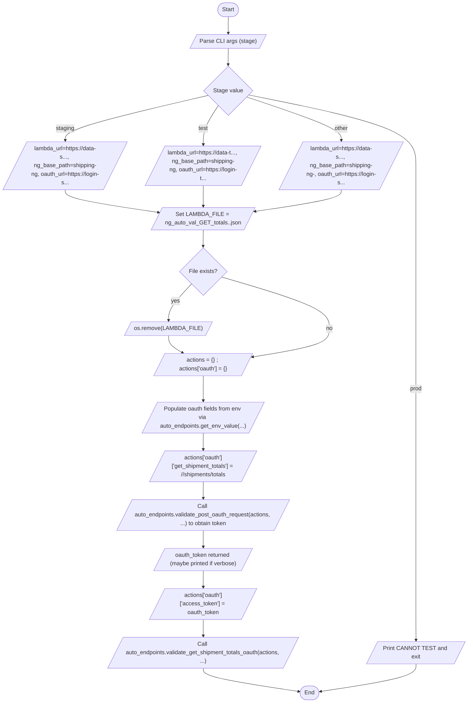

# Diagram: shipment_core/shipment_service/ng_val/scripts/totals/ng_auto_val_GET_totals.py

> Auto-generated by Obscura crawlers

## Mermaid

### SVG

<svg id="container" width="1327.0703125" xmlns="http://www.w3.org/2000/svg" class="flowchart" height="1971.65625" viewBox="0 0 1327.0703125 1971.65625" role="graphics-document document" aria-roledescription="flowchart-v2"><g><marker id="container_flowchart-v2-pointEnd" class="marker flowchart-v2" viewBox="0 0 10 10" refX="5" refY="5" markerUnits="userSpaceOnUse" markerWidth="8" markerHeight="8" orient="auto"><path d="M 0 0 L 10 5 L 0 10 z" class="arrowMarkerPath" style="stroke-width: 1; stroke-dasharray: 1, 0;"></path></marker><marker id="container_flowchart-v2-pointStart" class="marker flowchart-v2" viewBox="0 0 10 10" refX="4.5" refY="5" markerUnits="userSpaceOnUse" markerWidth="8" markerHeight="8" orient="auto"><path d="M 0 5 L 10 10 L 10 0 z" class="arrowMarkerPath" style="stroke-width: 1; stroke-dasharray: 1, 0;"></path></marker><marker id="container_flowchart-v2-circleEnd" class="marker flowchart-v2" viewBox="0 0 10 10" refX="11" refY="5" markerUnits="userSpaceOnUse" markerWidth="11" markerHeight="11" orient="auto"><circle cx="5" cy="5" r="5" class="arrowMarkerPath" style="stroke-width: 1; stroke-dasharray: 1, 0;"></circle></marker><marker id="container_flowchart-v2-circleStart" class="marker flowchart-v2" viewBox="0 0 10 10" refX="-1" refY="5" markerUnits="userSpaceOnUse" markerWidth="11" markerHeight="11" orient="auto"><circle cx="5" cy="5" r="5" class="arrowMarkerPath" style="stroke-width: 1; stroke-dasharray: 1, 0;"></circle></marker><marker id="container_flowchart-v2-crossEnd" class="marker cross flowchart-v2" viewBox="0 0 11 11" refX="12" refY="5.2" markerUnits="userSpaceOnUse" markerWidth="11" markerHeight="11" orient="auto"><path d="M 1,1 l 9,9 M 10,1 l -9,9" class="arrowMarkerPath" style="stroke-width: 2; stroke-dasharray: 1, 0;"></path></marker><marker id="container_flowchart-v2-crossStart" class="marker cross flowchart-v2" viewBox="0 0 11 11" refX="-1" refY="5.2" markerUnits="userSpaceOnUse" markerWidth="11" markerHeight="11" orient="auto"><path d="M 1,1 l 9,9 M 10,1 l -9,9" class="arrowMarkerPath" style="stroke-width: 2; stroke-dasharray: 1, 0;"></path></marker><g class="root"><g class="clusters"></g><g class="edgePaths"><path d="M662.926,47.5L662.842,51.583C662.759,55.667,662.592,63.833,662.579,71.5C662.566,79.167,662.707,86.334,662.777,89.917L662.847,93.501" id="L_Start_Parse_0" class="edge-thickness-normal edge-pattern-solid edge-thickness-normal edge-pattern-solid flowchart-link" style=";" data-edge="true" data-et="edge" data-id="L_Start_Parse_0" data-points="W3sieCI6NjYyLjkyNTc4MTI1LCJ5Ijo0Ny41fSx7IngiOjY2Mi40MjU3ODEyNSwieSI6NzJ9LHsieCI6NjYyLjkyNTc4MTI1LCJ5Ijo5Ny41fV0=" marker-end="url(#container_flowchart-v2-pointEnd)"></path><path d="M662.926,136.5L662.842,140.583C662.759,144.667,662.592,152.833,662.509,160.417C662.426,168,662.426,175,662.426,178.5L662.426,182" id="L_Parse_DetermineStage_0" class="edge-thickness-normal edge-pattern-solid edge-thickness-normal edge-pattern-solid flowchart-link" style=";" data-edge="true" data-et="edge" data-id="L_Parse_DetermineStage_0" data-points="W3sieCI6NjYyLjkyNTc4MTI1LCJ5IjoxMzYuNX0seyJ4Ijo2NjIuNDI1NzgxMjUsInkiOjE2MX0seyJ4Ijo2NjIuNDI1NzgxMjUsInkiOjE4Nn1d" marker-end="url(#container_flowchart-v2-pointEnd)"></path><path d="M719.506,265.763L798.422,281.443C877.337,297.124,1035.169,328.484,1114.084,361.58C1193,394.677,1193,429.51,1193,462.344C1193,495.177,1193,526.01,1193,550.844C1193,575.677,1193,594.51,1193,613.344C1193,632.177,1193,651.01,1193,675.578C1193,700.146,1193,730.448,1193,762.75C1193,795.052,1193,829.354,1193,855.922C1193,882.49,1193,901.323,1193,918.156C1193,934.99,1193,949.823,1193,966.656C1193,983.49,1193,1002.323,1193,1023.156C1193,1043.99,1193,1066.823,1193,1091.656C1193,1116.49,1193,1143.323,1193,1168.156C1193,1192.99,1193,1215.823,1193,1238.656C1193,1261.49,1193,1284.323,1193,1307.156C1193,1329.99,1193,1352.823,1193,1375.656C1193,1398.49,1193,1421.323,1193,1444.156C1193,1466.99,1193,1489.823,1193,1510.656C1193,1531.49,1193,1550.323,1193,1569.156C1193,1587.99,1193,1606.823,1193,1627.656C1193,1648.49,1193,1671.323,1193,1694.156C1193,1716.99,1193,1739.823,1193.077,1758.823C1193.153,1777.823,1193.306,1792.99,1193.383,1800.573L1193.46,1808.156" id="L_DetermineStage_ProdBlock_0" class="edge-thickness-normal edge-pattern-solid edge-thickness-normal edge-pattern-solid flowchart-link" style=";" data-edge="true" data-et="edge" data-id="L_DetermineStage_ProdBlock_0" data-points="W3sieCI6NzE5LjUwNjEzNjM1MDExMzYsInkiOjI2NS43NjMzOTQ4OTk4ODYzNX0seyJ4IjoxMTkzLCJ5IjozNTkuODQzNzV9LHsieCI6MTE5MywieSI6NDY0LjM0Mzc1fSx7IngiOjExOTMsInkiOjU1Ni44NDM3NX0seyJ4IjoxMTkzLCJ5Ijo2MTMuMzQzNzV9LHsieCI6MTE5MywieSI6NjY5Ljg0Mzc1fSx7IngiOjExOTMsInkiOjc2MC43NX0seyJ4IjoxMTkzLCJ5Ijo4NjMuNjU2MjV9LHsieCI6MTE5MywieSI6OTIwLjE1NjI1fSx7IngiOjExOTMsInkiOjk2NC42NTYyNX0seyJ4IjoxMTkzLCJ5IjoxMDIxLjE1NjI1fSx7IngiOjExOTMsInkiOjEwODkuNjU2MjV9LHsieCI6MTE5MywieSI6MTE3MC4xNTYyNX0seyJ4IjoxMTkzLCJ5IjoxMjM4LjY1NjI1fSx7IngiOjExOTMsInkiOjEzMDcuMTU2MjV9LHsieCI6MTE5MywieSI6MTM3NS42NTYyNX0seyJ4IjoxMTkzLCJ5IjoxNDQ0LjE1NjI1fSx7IngiOjExOTMsInkiOjE1MTIuNjU2MjV9LHsieCI6MTE5MywieSI6MTU2OS4xNTYyNX0seyJ4IjoxMTkzLCJ5IjoxNjI1LjY1NjI1fSx7IngiOjExOTMsInkiOjE2OTQuMTU2MjV9LHsieCI6MTE5MywieSI6MTc2Mi42NTYyNX0seyJ4IjoxMTkzLjUsInkiOjE4MTIuMTU2MjV9XQ==" marker-end="url(#container_flowchart-v2-pointEnd)"></path><path d="M606.337,266.755L535.781,282.27C465.225,297.785,324.112,328.814,253.631,349.912C183.149,371.011,183.298,382.177,183.372,387.761L183.447,393.344" id="L_DetermineStage_Staging_0" class="edge-thickness-normal edge-pattern-solid edge-thickness-normal edge-pattern-solid flowchart-link" style=";" data-edge="true" data-et="edge" data-id="L_DetermineStage_Staging_0" data-points="W3sieCI6NjA2LjMzNzMxMDEzMTIxOSwieSI6MjY2Ljc1NTI3ODg4MTIxOTA2fSx7IngiOjE4MywieSI6MzU5Ljg0Mzc1fSx7IngiOjE4My41LCJ5IjozOTcuMzQzNzV9XQ==" marker-end="url(#container_flowchart-v2-pointEnd)"></path><path d="M633.026,293.444L624.688,304.511C616.351,315.577,599.675,337.711,591.412,354.361C583.149,371.011,583.298,382.177,583.372,387.761L583.447,393.344" id="L_DetermineStage_Test_0" class="edge-thickness-normal edge-pattern-solid edge-thickness-normal edge-pattern-solid flowchart-link" style=";" data-edge="true" data-et="edge" data-id="L_DetermineStage_Test_0" data-points="W3sieCI6NjMzLjAyNjEwNzAxNzEwMTMsInkiOjI5My40NDQwNzU3NjcxMDEzfSx7IngiOjU4MywieSI6MzU5Ljg0Mzc1fSx7IngiOjU4My41LCJ5IjozOTcuMzQzNzV9XQ==" marker-end="url(#container_flowchart-v2-pointEnd)"></path><path d="M713.915,271.354L758.763,286.103C803.61,300.851,893.305,330.347,938.227,350.679C983.149,371.011,983.298,382.177,983.372,387.761L983.447,393.344" id="L_DetermineStage_Other_0" class="edge-thickness-normal edge-pattern-solid edge-thickness-normal edge-pattern-solid flowchart-link" style=";" data-edge="true" data-et="edge" data-id="L_DetermineStage_Other_0" data-points="W3sieCI6NzEzLjkxNTE5NDk5MTkxOTIsInkiOjI3MS4zNTQzMzYyNTgwODA3Nn0seyJ4Ijo5ODMsInkiOjM1OS44NDM3NX0seyJ4Ijo5ODMuNSwieSI6Mzk3LjM0Mzc1fV0=" marker-end="url(#container_flowchart-v2-pointEnd)"></path><path d="M183.5,532.344L183.417,536.427C183.333,540.51,183.167,548.677,229.33,559.363C275.493,570.05,367.987,583.255,414.233,589.858L460.48,596.461" id="L_Staging_SetLambdaFile_0" class="edge-thickness-normal edge-pattern-solid edge-thickness-normal edge-pattern-solid flowchart-link" style=";" data-edge="true" data-et="edge" data-id="L_Staging_SetLambdaFile_0" data-points="W3sieCI6MTgzLjUsInkiOjUzMi4zNDM3NX0seyJ4IjoxODMsInkiOjU1Ni44NDM3NX0seyJ4Ijo0NjQuNDM5ODcxNTcwMzQ0NDUsInkiOjU5Ny4wMjY1MDY4NTkzMTExfV0=" marker-end="url(#container_flowchart-v2-pointEnd)"></path><path d="M583.5,532.344L583.417,536.427C583.333,540.51,583.167,548.677,583.154,556.344C583.141,564.011,583.281,571.178,583.351,574.761L583.422,578.345" id="L_Test_SetLambdaFile_0" class="edge-thickness-normal edge-pattern-solid edge-thickness-normal edge-pattern-solid flowchart-link" style=";" data-edge="true" data-et="edge" data-id="L_Test_SetLambdaFile_0" data-points="W3sieCI6NTgzLjUsInkiOjUzMi4zNDM3NX0seyJ4Ijo1ODMsInkiOjU1Ni44NDM3NX0seyJ4Ijo1ODMuNSwieSI6NTgyLjM0Mzc1fV0=" marker-end="url(#container_flowchart-v2-pointEnd)"></path><path d="M983.5,532.344L983.417,536.427C983.333,540.51,983.167,548.677,940.019,558.937C896.872,569.197,810.743,581.55,767.679,587.726L724.615,593.903" id="L_Other_SetLambdaFile_0" class="edge-thickness-normal edge-pattern-solid edge-thickness-normal edge-pattern-solid flowchart-link" style=";" data-edge="true" data-et="edge" data-id="L_Other_SetLambdaFile_0" data-points="W3sieCI6OTgzLjUsInkiOjUzMi4zNDM3NX0seyJ4Ijo5ODMsInkiOjU1Ni44NDM3NX0seyJ4Ijo3MjAuNjU1MzQ2MzM0OTAyNCwieSI6NTk0LjQ3MDU1NzMzMDE5NX1d" marker-end="url(#container_flowchart-v2-pointEnd)"></path><path d="M583.5,645.344L583.417,649.427C583.333,653.51,583.167,661.677,583.083,669.26C583,676.844,583,683.844,583,687.344L583,690.844" id="L_SetLambdaFile_RemoveFile_0" class="edge-thickness-normal edge-pattern-solid edge-thickness-normal edge-pattern-solid flowchart-link" style=";" data-edge="true" data-et="edge" data-id="L_SetLambdaFile_RemoveFile_0" data-points="W3sieCI6NTgzLjUsInkiOjY0NS4zNDM3NX0seyJ4Ijo1ODMsInkiOjY2OS44NDM3NX0seyJ4Ijo1ODMsInkiOjY5NC44NDM3NX1d" marker-end="url(#container_flowchart-v2-pointEnd)"></path><path d="M553.684,797.34L544.828,808.393C535.973,819.445,518.262,841.551,509.481,858.187C500.7,874.823,500.849,885.99,500.923,891.573L500.997,897.157" id="L_RemoveFile_DeleteFile_0" class="edge-thickness-normal edge-pattern-solid edge-thickness-normal edge-pattern-solid flowchart-link" style=";" data-edge="true" data-et="edge" data-id="L_RemoveFile_DeleteFile_0" data-points="W3sieCI6NTUzLjY4Mzc5NTUyMDY0MjMsInkiOjc5Ny4zNDAwNDU1MjA2NDIzfSx7IngiOjUwMC41NTA3ODEyNSwieSI6ODYzLjY1NjI1fSx7IngiOjUwMS4wNTA3ODEyNSwieSI6OTAxLjE1NjI1fV0=" marker-end="url(#container_flowchart-v2-pointEnd)"></path><path d="M501.051,940.156L500.967,944.24C500.884,948.323,500.717,956.49,506.249,964.444C511.78,972.399,523.01,980.142,528.625,984.014L534.24,987.886" id="L_DeleteFile_BuildActions_0" class="edge-thickness-normal edge-pattern-solid edge-thickness-normal edge-pattern-solid flowchart-link" style=";" data-edge="true" data-et="edge" data-id="L_DeleteFile_BuildActions_0" data-points="W3sieCI6NTAxLjA1MDc4MTI1LCJ5Ijo5NDAuMTU2MjV9LHsieCI6NTAwLjU1MDc4MTI1LCJ5Ijo5NjQuNjU2MjV9LHsieCI6NTM3LjUzMjczNjQ0OTExNTEsInkiOjk5MC4xNTYyNX1d" marker-end="url(#container_flowchart-v2-pointEnd)"></path><path d="M634.557,775.099L687.588,789.859C740.619,804.618,846.68,834.137,899.711,858.313C952.742,882.49,952.742,901.323,952.742,918.156C952.742,934.99,952.742,949.823,914.102,963.239C875.461,976.654,798.18,988.653,759.539,994.652L720.899,1000.651" id="L_RemoveFile_BuildActions_0" class="edge-thickness-normal edge-pattern-solid edge-thickness-normal edge-pattern-solid flowchart-link" style=";" data-edge="true" data-et="edge" data-id="L_RemoveFile_BuildActions_0" data-points="W3sieCI6NjM0LjU1Njk2OTQzMzM3OTEsInkiOjc3NS4wOTkyODA1NjY2MjA5fSx7IngiOjk1Mi43NDIxODc1LCJ5Ijo4NjMuNjU2MjV9LHsieCI6OTUyLjc0MjE4NzUsInkiOjkyMC4xNTYyNX0seyJ4Ijo5NTIuNzQyMTg3NSwieSI6OTY0LjY1NjI1fSx7IngiOjcxNi45NDU4Nzc0Njc5MTQyLCJ5IjoxMDAxLjI2NDQ5NTA2NDE3MTV9XQ==" marker-end="url(#container_flowchart-v2-pointEnd)"></path><path d="M583.5,1053.156L583.417,1059.24C583.333,1065.323,583.167,1077.49,583.158,1089.156C583.149,1100.823,583.298,1111.99,583.372,1117.573L583.447,1123.157" id="L_BuildActions_AddOauthFields_0" class="edge-thickness-normal edge-pattern-solid edge-thickness-normal edge-pattern-solid flowchart-link" style=";" data-edge="true" data-et="edge" data-id="L_BuildActions_AddOauthFields_0" data-points="W3sieCI6NTgzLjUsInkiOjEwNTMuMTU2MjV9LHsieCI6NTgzLCJ5IjoxMDg5LjY1NjI1fSx7IngiOjU4My41LCJ5IjoxMTI3LjE1NjI1fV0=" marker-end="url(#container_flowchart-v2-pointEnd)"></path><path d="M583.5,1214.156L583.417,1218.24C583.333,1222.323,583.167,1230.49,583.154,1238.156C583.141,1245.823,583.281,1252.99,583.351,1256.574L583.422,1260.157" id="L_AddOauthFields_SetGetTotals_0" class="edge-thickness-normal edge-pattern-solid edge-thickness-normal edge-pattern-solid flowchart-link" style=";" data-edge="true" data-et="edge" data-id="L_AddOauthFields_SetGetTotals_0" data-points="W3sieCI6NTgzLjUsInkiOjEyMTQuMTU2MjV9LHsieCI6NTgzLCJ5IjoxMjM4LjY1NjI1fSx7IngiOjU4My41LCJ5IjoxMjY0LjE1NjI1fV0=" marker-end="url(#container_flowchart-v2-pointEnd)"></path><path d="M583.5,1351.156L583.417,1355.24C583.333,1359.323,583.167,1367.49,583.154,1375.156C583.141,1382.823,583.281,1389.99,583.351,1393.574L583.422,1397.157" id="L_SetGetTotals_PostOAuth_0" class="edge-thickness-normal edge-pattern-solid edge-thickness-normal edge-pattern-solid flowchart-link" style=";" data-edge="true" data-et="edge" data-id="L_SetGetTotals_PostOAuth_0" data-points="W3sieCI6NTgzLjUsInkiOjEzNTEuMTU2MjV9LHsieCI6NTgzLCJ5IjoxMzc1LjY1NjI1fSx7IngiOjU4My41LCJ5IjoxNDAxLjE1NjI1fV0=" marker-end="url(#container_flowchart-v2-pointEnd)"></path><path d="M583.5,1488.156L583.417,1492.24C583.333,1496.323,583.167,1504.49,583.154,1512.156C583.141,1519.823,583.281,1526.99,583.351,1530.574L583.422,1534.157" id="L_PostOAuth_GotToken_0" class="edge-thickness-normal edge-pattern-solid edge-thickness-normal edge-pattern-solid flowchart-link" style=";" data-edge="true" data-et="edge" data-id="L_PostOAuth_GotToken_0" data-points="W3sieCI6NTgzLjUsInkiOjE0ODguMTU2MjV9LHsieCI6NTgzLCJ5IjoxNTEyLjY1NjI1fSx7IngiOjU4My41LCJ5IjoxNTM4LjE1NjI1fV0=" marker-end="url(#container_flowchart-v2-pointEnd)"></path><path d="M583.5,1601.156L583.417,1605.24C583.333,1609.323,583.167,1617.49,583.154,1625.156C583.141,1632.823,583.281,1639.99,583.351,1643.574L583.422,1647.157" id="L_GotToken_StoreToken_0" class="edge-thickness-normal edge-pattern-solid edge-thickness-normal edge-pattern-solid flowchart-link" style=";" data-edge="true" data-et="edge" data-id="L_GotToken_StoreToken_0" data-points="W3sieCI6NTgzLjUsInkiOjE2MDEuMTU2MjV9LHsieCI6NTgzLCJ5IjoxNjI1LjY1NjI1fSx7IngiOjU4My41LCJ5IjoxNjUxLjE1NjI1fV0=" marker-end="url(#container_flowchart-v2-pointEnd)"></path><path d="M583.5,1738.156L583.417,1742.24C583.333,1746.323,583.167,1754.49,583.154,1762.156C583.141,1769.823,583.281,1776.99,583.351,1780.574L583.422,1784.157" id="L_StoreToken_GetTotals_0" class="edge-thickness-normal edge-pattern-solid edge-thickness-normal edge-pattern-solid flowchart-link" style=";" data-edge="true" data-et="edge" data-id="L_StoreToken_GetTotals_0" data-points="W3sieCI6NTgzLjUsInkiOjE3MzguMTU2MjV9LHsieCI6NTgzLCJ5IjoxNzYyLjY1NjI1fSx7IngiOjU4My41LCJ5IjoxNzg4LjE1NjI1fV0=" marker-end="url(#container_flowchart-v2-pointEnd)"></path><path d="M583.5,1875.156L583.417,1879.24C583.333,1883.323,583.167,1891.49,629.06,1902.351C674.954,1913.213,766.908,1926.769,812.885,1933.548L858.862,1940.326" id="L_GetTotals_End_0" class="edge-thickness-normal edge-pattern-solid edge-thickness-normal edge-pattern-solid flowchart-link" style=";" data-edge="true" data-et="edge" data-id="L_GetTotals_End_0" data-points="W3sieCI6NTgzLjUsInkiOjE4NzUuMTU2MjV9LHsieCI6NTgzLCJ5IjoxODk5LjY1NjI1fSx7IngiOjg2Mi44MTg4Nzk4Njc4NDYyLCJ5IjoxOTQwLjkwOTMzMjQ3MjUyMn1d" marker-end="url(#container_flowchart-v2-pointEnd)"></path><path d="M1193.5,1851.156L1193.417,1859.24C1193.333,1867.323,1193.167,1883.49,1147.273,1898.351C1101.379,1913.212,1009.759,1926.768,963.948,1933.546L918.138,1940.324" id="L_ProdBlock_End_0" class="edge-thickness-normal edge-pattern-solid edge-thickness-normal edge-pattern-solid flowchart-link" style=";" data-edge="true" data-et="edge" data-id="L_ProdBlock_End_0" data-points="W3sieCI6MTE5My41LCJ5IjoxODUxLjE1NjI1fSx7IngiOjExOTMsInkiOjE4OTkuNjU2MjV9LHsieCI6OTE0LjE4MTEyMTE0MDExODgsInkiOjE5NDAuOTA5MzMyMzI1NDU4fV0=" marker-end="url(#container_flowchart-v2-pointEnd)"></path></g><g class="edgeLabels"><g class="edgeLabel"><g class="label" data-id="L_Start_Parse_0" transform="translate(0, 0)"><foreignObject width="0" height="0">

</foreignObject></g></g><g class="edgeLabel"><g class="label" data-id="L_Parse_DetermineStage_0" transform="translate(0, 0)"><foreignObject width="0" height="0">

</foreignObject></g></g><g class="edgeLabel" transform="translate(1193, 1089.65625)"><g class="label" data-id="L_DetermineStage_ProdBlock_0" transform="translate(-17.0625, -12)"><foreignObject width="34.125" height="24">

prod

</foreignObject></g></g><g class="edgeLabel" transform="translate(183, 359.84375)"><g class="label" data-id="L_DetermineStage_Staging_0" transform="translate(-26.109375, -12)"><foreignObject width="52.21875" height="24">

staging

</foreignObject></g></g><g class="edgeLabel" transform="translate(583, 359.84375)"><g class="label" data-id="L_DetermineStage_Test_0" transform="translate(-13.7578125, -12)"><foreignObject width="27.515625" height="24">

test

</foreignObject></g></g><g class="edgeLabel" transform="translate(983, 359.84375)"><g class="label" data-id="L_DetermineStage_Other_0" transform="translate(-19.703125, -12)"><foreignObject width="39.40625" height="24">

other

</foreignObject></g></g><g class="edgeLabel"><g class="label" data-id="L_Staging_SetLambdaFile_0" transform="translate(0, 0)"><foreignObject width="0" height="0">

</foreignObject></g></g><g class="edgeLabel"><g class="label" data-id="L_Test_SetLambdaFile_0" transform="translate(0, 0)"><foreignObject width="0" height="0">

</foreignObject></g></g><g class="edgeLabel"><g class="label" data-id="L_Other_SetLambdaFile_0" transform="translate(0, 0)"><foreignObject width="0" height="0">

</foreignObject></g></g><g class="edgeLabel"><g class="label" data-id="L_SetLambdaFile_RemoveFile_0" transform="translate(0, 0)"><foreignObject width="0" height="0">

</foreignObject></g></g><g class="edgeLabel" transform="translate(500.55078125, 863.65625)"><g class="label" data-id="L_RemoveFile_DeleteFile_0" transform="translate(-12.0078125, -12)"><foreignObject width="24.015625" height="24">

yes

</foreignObject></g></g><g class="edgeLabel"><g class="label" data-id="L_DeleteFile_BuildActions_0" transform="translate(0, 0)"><foreignObject width="0" height="0">

</foreignObject></g></g><g class="edgeLabel" transform="translate(952.7421875, 920.15625)"><g class="label" data-id="L_RemoveFile_BuildActions_0" transform="translate(-9.3671875, -12)"><foreignObject width="18.734375" height="24">

no

</foreignObject></g></g><g class="edgeLabel"><g class="label" data-id="L_BuildActions_AddOauthFields_0" transform="translate(0, 0)"><foreignObject width="0" height="0">

</foreignObject></g></g><g class="edgeLabel"><g class="label" data-id="L_AddOauthFields_SetGetTotals_0" transform="translate(0, 0)"><foreignObject width="0" height="0">

</foreignObject></g></g><g class="edgeLabel"><g class="label" data-id="L_SetGetTotals_PostOAuth_0" transform="translate(0, 0)"><foreignObject width="0" height="0">

</foreignObject></g></g><g class="edgeLabel"><g class="label" data-id="L_PostOAuth_GotToken_0" transform="translate(0, 0)"><foreignObject width="0" height="0">

</foreignObject></g></g><g class="edgeLabel"><g class="label" data-id="L_GotToken_StoreToken_0" transform="translate(0, 0)"><foreignObject width="0" height="0">

</foreignObject></g></g><g class="edgeLabel"><g class="label" data-id="L_StoreToken_GetTotals_0" transform="translate(0, 0)"><foreignObject width="0" height="0">

</foreignObject></g></g><g class="edgeLabel"><g class="label" data-id="L_GetTotals_End_0" transform="translate(0, 0)"><foreignObject width="0" height="0">

</foreignObject></g></g><g class="edgeLabel"><g class="label" data-id="L_ProdBlock_End_0" transform="translate(0, 0)"><foreignObject width="0" height="0">

</foreignObject></g></g></g><g class="nodes"><g class="node default" id="flowchart-Start-0" transform="translate(662.42578125, 27.5)"><g class="basic label-container outer-path"><path d="M-10.3984375 -19.5 C-2.6335297813242926 -19.5, 5.131377937351415 -19.5, 10.3984375 -19.5 C10.3984375 -19.5, 10.3984375 -19.5, 10.398437499999998 -19.5 C10.718328570962402 -19.489741715984433, 11.038219641924805 -19.479483431968866, 11.6478067896239 -19.45993515863156 C11.988518929813655 -19.427067068233754, 12.329231070003408 -19.394198977835945, 12.892042152847864 -19.3399052695533 C13.274412857965283 -19.27808653927902, 13.656783563082703 -19.216267809004744, 14.126030759676757 -19.140403561325776 C14.567771118605018 -19.03957920702564, 15.00951147753328 -18.9387548527255, 15.34470188623539 -18.862249829261074 C15.646644939898652 -18.772634715865248, 15.948587993561913 -18.683019602469425, 16.543047751460602 -18.50658706670804 C16.861987809896476 -18.389214176954056, 17.18092786833235 -18.271841287200072, 17.716144095147794 -18.074876768247425 C18.160163501181337 -17.878322548564075, 18.60418290721488 -17.68176832888073, 18.85917041279238 -17.568892924097174 C19.08334132660275 -17.45194310195063, 19.307512240413118 -17.334993279804085, 19.967429764076783 -16.990714730406097 C20.3317497598167 -16.76986180800662, 20.696069755556614 -16.54900888560714, 21.036368073605697 -16.342718045390892 C21.325476946693424 -16.1410482108463, 21.614585819781148 -15.939378376301706, 22.061592844578712 -15.627565626425154 C22.27724079440662 -15.45559212507035, 22.492888744234527 -15.283618623715544, 23.03889120850187 -14.848196188198123 C23.22802748927461 -14.676427622272087, 23.417163770047345 -14.50465905634605, 23.964247236767985 -14.007812326905688 C24.306186647137977 -13.65473181195098, 24.648126057507966 -13.30165129699627, 24.833858442968648 -13.10986736009568 C25.061132088697743 -12.842898803585491, 25.28840573442684 -12.575930247075302, 25.644151408126582 -12.158051136245305 C25.91296216180477 -11.797869215479981, 26.18177291548296 -11.437687294714655, 26.391796464640635 -11.156274872382312 C26.56364386283078 -10.892271121274579, 26.735491261020922 -10.628267370166846, 27.073721378604247 -10.108655082055241 C27.211911994322346 -9.863283650530535, 27.35010261004044 -9.617912219005829, 27.6871239742735 -9.019496659696287 C27.830195834728393 -8.722404880214293, 27.973267695183285 -8.4253131007323, 28.22948364880834 -7.893275190886684 C28.324006049038438 -7.659803034852058, 28.418528449268535 -7.426330878817432, 28.698571729970325 -6.734618561215508 C28.854194811943152 -6.265906633484209, 29.009817893915983 -5.797194705752911, 29.09246063421488 -5.548287939305138 C29.170791818448823 -5.249577184871121, 29.249123002682765 -4.950866430437103, 29.40953178754556 -4.339158212148133 C29.488478959492152 -3.933781169693078, 29.567426131438747 -3.528404127238023, 29.648482276581777 -3.1121979531509023 C29.707093953436726 -2.657617361648641, 29.765705630291677 -2.2030367701463796, 29.808330202509367 -1.872449005199798 C29.827240066124972 -1.5779126156195815, 29.846149929740573 -1.283376226039365, 29.888418715913414 -0.6250057626472757 C29.888418715913414 -0.2884805019054385, 29.888418715913414 0.04804475883639869, 29.888418715913414 0.625005762647271 C29.862206399576515 1.033283747795414, 29.835994083239616 1.441561732943557, 29.808330202509367 1.8724490051997846 C29.76590790840593 2.2014679410365594, 29.72348561430249 2.5304868768733337, 29.648482276581777 3.1121979531508885 C29.59882414573711 3.367181959788579, 29.549166014892446 3.6221659664262686, 29.40953178754556 4.339158212148129 C29.329976600839032 4.642536618496152, 29.2504214141325 4.945915024844174, 29.092460634214884 5.548287939305125 C28.980403844917934 5.885785134842764, 28.868347055620983 6.223282330380402, 28.69857172997033 6.734618561215495 C28.59191076050196 6.9980732179519265, 28.48524979103359 7.261527874688357, 28.229483648808344 7.893275190886679 C28.04014321067779 8.286444661901154, 27.850802772547237 8.679614132915628, 27.687123974273504 9.019496659696284 C27.451643731046353 9.437615676506374, 27.216163487819202 9.855734693316466, 27.07372137860425 10.108655082055236 C26.819841638011695 10.498682539861324, 26.565961897419143 10.888709997667412, 26.39179646464064 11.156274872382301 C26.171556834693007 11.451375912269084, 25.951317204745372 11.746476952155868, 25.644151408126582 12.158051136245302 C25.464155117175252 12.369485021675834, 25.284158826223923 12.580918907106364, 24.83385844296866 13.10986736009567 C24.627267741536333 13.323189220736575, 24.420677040104003 13.53651108137748, 23.96424723676799 14.007812326905684 C23.741304662188178 14.210282874401788, 23.518362087608367 14.41275342189789, 23.038891208501887 14.848196188198111 C22.840431162999575 15.006462793242598, 22.64197111749726 15.164729398287083, 22.061592844578715 15.627565626425152 C21.654426436857186 15.911587286501982, 21.247260029135656 16.195608946578812, 21.036368073605708 16.34271804539089 C20.73659004656023 16.52444524707709, 20.43681201951475 16.70617244876329, 19.967429764076787 16.990714730406093 C19.631916625031185 17.165751720139763, 19.296403485985582 17.34078870987343, 18.859170412792388 17.56889292409717 C18.570744805186578 17.696570384742603, 18.28231919758077 17.824247845388033, 17.716144095147804 18.07487676824742 C17.29444316240795 18.230066609656376, 16.8727422296681 18.38525645106533, 16.543047751460616 18.506587066708033 C16.13575134099237 18.627470503392523, 15.728454930524125 18.748353940077013, 15.344701886235413 18.86224982926107 C15.020758979320286 18.936187683839425, 14.69681607240516 19.01012553841778, 14.126030759676766 19.140403561325773 C13.634262323809985 19.219908868315535, 13.142493887943202 19.2994141753053, 12.892042152847878 19.3399052695533 C12.504283258968275 19.377311903697564, 12.11652436508867 19.414718537841832, 11.6478067896239 19.45993515863156 C11.251962905169767 19.472629101542623, 10.856119020715635 19.485323044453686, 10.398437500000004 19.5 C10.398437500000002 19.5, 10.398437500000002 19.5, 10.3984375 19.5 C2.530656411959816 19.5, -5.337124676080368 19.5, -10.398437499999996 19.5 C-10.673931904552862 19.49116543066332, -10.949426309105727 19.482330861326634, -11.647806789623893 19.45993515863156 C-11.970730904916358 19.428783057602363, -12.293655020208824 19.39763095657317, -12.892042152847871 19.3399052695533 C-13.196759588846888 19.290640917619985, -13.501477024845904 19.241376565686675, -14.126030759676759 19.140403561325773 C-14.43168855736111 19.070639163607854, -14.737346355045458 19.00087476588994, -15.344701886235388 18.862249829261074 C-15.743371646825235 18.743926736978285, -16.142041407415082 18.625603644695495, -16.54304775146059 18.506587066708043 C-16.90085112823436 18.374912116557137, -17.258654505008135 18.24323716640623, -17.716144095147797 18.074876768247425 C-18.1490056984251 17.883261776859804, -18.581867301702403 17.691646785472184, -18.85917041279238 17.568892924097174 C-19.109533817167204 17.438278496400244, -19.359897221542028 17.30766406870331, -19.96742976407678 16.990714730406097 C-20.20415231903761 16.847212126452693, -20.440874873998442 16.70370952249929, -21.036368073605686 16.3427180453909 C-21.441481868580265 16.06012819911017, -21.846595663554847 15.77753835282944, -22.061592844578712 15.627565626425156 C-22.331379901461894 15.412417627895916, -22.601166958345072 15.197269629366675, -23.03889120850187 14.848196188198125 C-23.322985377528198 14.590189380608223, -23.607079546554527 14.33218257301832, -23.964247236767974 14.007812326905697 C-24.309732758695553 13.651070160626608, -24.65521828062313 13.29432799434752, -24.833858442968655 13.109867360095677 C-25.083270357410584 12.816893933452217, -25.332682271852512 12.523920506808755, -25.64415140812658 12.158051136245307 C-25.875310033089505 11.848319637778946, -26.106468658052428 11.538588139312585, -26.391796464640635 11.156274872382316 C-26.554953692847228 10.9056215560067, -26.718110921053817 10.654968239631083, -27.073721378604244 10.108655082055249 C-27.207697334936174 9.870767205051221, -27.34167329126811 9.632879328047194, -27.6871239742735 9.019496659696289 C-27.813285569904625 8.75751940694255, -27.939447165535753 8.49554215418881, -28.22948364880834 7.893275190886686 C-28.397339623526143 7.478667688059215, -28.56519559824395 7.064060185231742, -28.698571729970325 6.73461856121551 C-28.829711401449078 6.339646764990654, -28.96085107292783 5.944674968765798, -29.09246063421488 5.5482879393051325 C-29.196936973429196 5.149874377549097, -29.301413312643515 4.751460815793062, -29.409531787545557 4.339158212148136 C-29.484966259679616 3.951818140821081, -29.560400731813676 3.5644780694940255, -29.648482276581777 3.112197953150904 C-29.6811950495994 2.858484145493926, -29.71390782261702 2.6047703378369484, -29.808330202509364 1.872449005199809 C-29.834550916748228 1.4640402159499055, -29.86077163098709 1.055631426700002, -29.888418715913414 0.6250057626472781 C-29.888418715913414 0.3292774532873108, -29.888418715913414 0.03354914392734343, -29.888418715913414 -0.6250057626472687 C-29.86773745767718 -0.9471330532877759, -29.84705619944095 -1.269260343928283, -29.808330202509367 -1.8724490051997822 C-29.75741112464403 -2.267367318014095, -29.706492046778695 -2.6622856308284084, -29.648482276581777 -3.112197953150895 C-29.578964216102563 -3.469158501064381, -29.509446155623348 -3.8261190489778665, -29.40953178754556 -4.339158212148126 C-29.340774574393354 -4.601359265462169, -29.27201736124115 -4.863560318776212, -29.092460634214884 -5.548287939305123 C-28.970408863897784 -5.915888425191493, -28.84835709358068 -6.283488911077863, -28.698571729970332 -6.734618561215485 C-28.53398657552838 -7.141147074724594, -28.36940142108643 -7.5476755882337025, -28.229483648808344 -7.893275190886676 C-28.09207698539261 -8.178603067501069, -27.95467032197687 -8.463930944115459, -27.687123974273504 -9.019496659696282 C-27.52215632415561 -9.312413427266582, -27.357188674037715 -9.605330194836881, -27.073721378604247 -10.108655082055243 C-26.925493544442308 -10.336372840074649, -26.777265710280364 -10.564090598094054, -26.39179646464064 -11.156274872382308 C-26.18773753370763 -11.4296952496815, -25.98367860277462 -11.70311562698069, -25.644151408126586 -12.158051136245302 C-25.37391197076429 -12.475489756430655, -25.103672533401994 -12.792928376616006, -24.833858442968662 -13.10986736009567 C-24.552582645629823 -13.400307714020457, -24.271306848290983 -13.690748067945243, -23.964247236767996 -14.007812326905677 C-23.654856539093515 -14.288792772504358, -23.34546584141904 -14.569773218103041, -23.038891208501887 -14.848196188198107 C-22.809275250410312 -15.031308804438877, -22.579659292318734 -15.214421420679649, -22.06159284457872 -15.627565626425149 C-21.827569033252253 -15.790810506478977, -21.59354522192579 -15.954055386532806, -21.03636807360571 -16.342718045390885 C-20.664927031995095 -16.56788778764509, -20.293485990384475 -16.7930575298993, -19.96742976407679 -16.99071473040609 C-19.71121552217706 -17.124381536292123, -19.455001280277333 -17.25804834217816, -18.859170412792388 -17.56889292409717 C-18.554460211194677 -17.7037790914375, -18.24975000959697 -17.838665258777826, -17.716144095147804 -18.07487676824742 C-17.331836258005772 -18.21630560481839, -16.94752842086374 -18.35773444138936, -16.54304775146062 -18.506587066708033 C-16.20284847073655 -18.60755642748447, -15.862649190012485 -18.70852578826091, -15.344701886235413 -18.862249829261067 C-15.018299424761398 -18.936749061117393, -14.691896963287384 -19.011248292973722, -14.126030759676768 -19.140403561325773 C-13.649298524257679 -19.21747793203463, -13.17256628883859 -19.294552302743487, -12.89204215284788 -19.3399052695533 C-12.525682804296475 -19.375247515296472, -12.15932345574507 -19.410589761039645, -11.647806789623903 -19.45993515863156 C-11.272712899847466 -19.471963689600724, -10.897619010071027 -19.48399222056989, -10.398437500000005 -19.5 C-10.398437500000004 -19.5, -10.398437500000002 -19.5, -10.3984375 -19.5" stroke="none" stroke-width="0" fill="#ECECFF" style=""></path><path d="M-10.3984375 -19.5 C-2.170610379827279 -19.5, 6.057216740345442 -19.5, 10.3984375 -19.5 M-10.3984375 -19.5 C-2.9121076577679554 -19.5, 4.574222184464089 -19.5, 10.3984375 -19.5 M10.3984375 -19.5 C10.3984375 -19.5, 10.398437499999998 -19.5, 10.398437499999998 -19.5 M10.3984375 -19.5 C10.3984375 -19.5, 10.398437499999998 -19.5, 10.398437499999998 -19.5 M10.398437499999998 -19.5 C10.675274000061247 -19.491122392272594, 10.952110500122496 -19.482244784545188, 11.6478067896239 -19.45993515863156 M10.398437499999998 -19.5 C10.806465339576672 -19.486915341362785, 11.214493179153346 -19.473830682725573, 11.6478067896239 -19.45993515863156 M11.6478067896239 -19.45993515863156 C11.907586946575911 -19.434874479321746, 12.167367103527924 -19.409813800011936, 12.892042152847864 -19.3399052695533 M11.6478067896239 -19.45993515863156 C11.913421081271267 -19.43431166736426, 12.179035372918634 -19.40868817609696, 12.892042152847864 -19.3399052695533 M12.892042152847864 -19.3399052695533 C13.341900034536826 -19.267175735941805, 13.791757916225787 -19.19444620233031, 14.126030759676757 -19.140403561325776 M12.892042152847864 -19.3399052695533 C13.200222058284966 -19.29008113241309, 13.50840196372207 -19.24025699527288, 14.126030759676757 -19.140403561325776 M14.126030759676757 -19.140403561325776 C14.38291936811469 -19.08177041280465, 14.639807976552621 -19.023137264283527, 15.34470188623539 -18.862249829261074 M14.126030759676757 -19.140403561325776 C14.465463070218153 -19.06293035144753, 14.804895380759548 -18.985457141569285, 15.34470188623539 -18.862249829261074 M15.34470188623539 -18.862249829261074 C15.675128629152404 -18.764180906408672, 16.005555372069416 -18.66611198355627, 16.543047751460602 -18.50658706670804 M15.34470188623539 -18.862249829261074 C15.595811042259976 -18.787721949851836, 15.846920198284563 -18.713194070442594, 16.543047751460602 -18.50658706670804 M16.543047751460602 -18.50658706670804 C16.844816742050497 -18.395533288648988, 17.14658573264039 -18.284479510589936, 17.716144095147794 -18.074876768247425 M16.543047751460602 -18.50658706670804 C16.88197547899441 -18.38185852996203, 17.220903206528217 -18.25712999321602, 17.716144095147794 -18.074876768247425 M17.716144095147794 -18.074876768247425 C18.10221772686412 -17.903973423953985, 18.48829135858044 -17.73307007966055, 18.85917041279238 -17.568892924097174 M17.716144095147794 -18.074876768247425 C18.047530090876283 -17.92818201815472, 18.378916086604768 -17.781487268062012, 18.85917041279238 -17.568892924097174 M18.85917041279238 -17.568892924097174 C19.08872342266102 -17.449135265884426, 19.31827643252966 -17.329377607671677, 19.967429764076783 -16.990714730406097 M18.85917041279238 -17.568892924097174 C19.104331313593214 -17.440992639182433, 19.349492214394044 -17.313092354267688, 19.967429764076783 -16.990714730406097 M19.967429764076783 -16.990714730406097 C20.36264432641115 -16.751133340180438, 20.757858888745517 -16.511551949954775, 21.036368073605697 -16.342718045390892 M19.967429764076783 -16.990714730406097 C20.229593900046837 -16.831789290533578, 20.49175803601689 -16.67286385066106, 21.036368073605697 -16.342718045390892 M21.036368073605697 -16.342718045390892 C21.25482077590766 -16.19033489693011, 21.473273478209624 -16.037951748469332, 22.061592844578712 -15.627565626425154 M21.036368073605697 -16.342718045390892 C21.38742460055901 -16.097836209180382, 21.738481127512323 -15.85295437296987, 22.061592844578712 -15.627565626425154 M22.061592844578712 -15.627565626425154 C22.431342621390254 -15.33270001887274, 22.801092398201796 -15.037834411320327, 23.03889120850187 -14.848196188198123 M22.061592844578712 -15.627565626425154 C22.316308356019107 -15.424436784315867, 22.571023867459502 -15.22130794220658, 23.03889120850187 -14.848196188198123 M23.03889120850187 -14.848196188198123 C23.357746657154177 -14.558620106184968, 23.67660210580648 -14.269044024171812, 23.964247236767985 -14.007812326905688 M23.03889120850187 -14.848196188198123 C23.339319543323562 -14.575355123411217, 23.63974787814525 -14.302514058624311, 23.964247236767985 -14.007812326905688 M23.964247236767985 -14.007812326905688 C24.182333774423203 -13.782620071538942, 24.40042031207842 -13.557427816172195, 24.833858442968648 -13.10986736009568 M23.964247236767985 -14.007812326905688 C24.171523366119406 -13.79378270566364, 24.37879949547083 -13.57975308442159, 24.833858442968648 -13.10986736009568 M24.833858442968648 -13.10986736009568 C25.089927977392097 -12.809073514192617, 25.345997511815547 -12.508279668289553, 25.644151408126582 -12.158051136245305 M24.833858442968648 -13.10986736009568 C25.02435693021203 -12.88609699730861, 25.214855417455407 -12.662326634521538, 25.644151408126582 -12.158051136245305 M25.644151408126582 -12.158051136245305 C25.92229478329109 -11.785364352907619, 26.2004381584556 -11.412677569569933, 26.391796464640635 -11.156274872382312 M25.644151408126582 -12.158051136245305 C25.85414844565662 -11.87667423707874, 26.064145483186653 -11.595297337912173, 26.391796464640635 -11.156274872382312 M26.391796464640635 -11.156274872382312 C26.63928341773529 -10.776068452876805, 26.88677037082994 -10.3958620333713, 27.073721378604247 -10.108655082055241 M26.391796464640635 -11.156274872382312 C26.538427192557418 -10.931010698438547, 26.685057920474204 -10.70574652449478, 27.073721378604247 -10.108655082055241 M27.073721378604247 -10.108655082055241 C27.307373725499072 -9.69378168027777, 27.541026072393898 -9.278908278500296, 27.6871239742735 -9.019496659696287 M27.073721378604247 -10.108655082055241 C27.277449605725863 -9.746914985080807, 27.48117783284748 -9.385174888106372, 27.6871239742735 -9.019496659696287 M27.6871239742735 -9.019496659696287 C27.89026248642413 -8.597675192747632, 28.09340099857476 -8.175853725798978, 28.22948364880834 -7.893275190886684 M27.6871239742735 -9.019496659696287 C27.832028369887535 -8.718599581746364, 27.976932765501566 -8.417702503796443, 28.22948364880834 -7.893275190886684 M28.22948364880834 -7.893275190886684 C28.342218115306352 -7.614818879063959, 28.454952581804367 -7.336362567241235, 28.698571729970325 -6.734618561215508 M28.22948364880834 -7.893275190886684 C28.34678192447915 -7.603546182171906, 28.464080200149958 -7.313817173457127, 28.698571729970325 -6.734618561215508 M28.698571729970325 -6.734618561215508 C28.792348518058976 -6.452177816794608, 28.886125306147626 -6.1697370723737075, 29.09246063421488 -5.548287939305138 M28.698571729970325 -6.734618561215508 C28.822563552730383 -6.361174946476328, 28.946555375490444 -5.987731331737148, 29.09246063421488 -5.548287939305138 M29.09246063421488 -5.548287939305138 C29.207516438096096 -5.109530293605228, 29.322572241977312 -4.670772647905316, 29.40953178754556 -4.339158212148133 M29.09246063421488 -5.548287939305138 C29.1804465392643 -5.212759550019241, 29.268432444313717 -4.877231160733344, 29.40953178754556 -4.339158212148133 M29.40953178754556 -4.339158212148133 C29.467492039793225 -4.041544566760033, 29.52545229204089 -3.743930921371933, 29.648482276581777 -3.1121979531509023 M29.40953178754556 -4.339158212148133 C29.483263997872548 -3.9605588954272166, 29.55699620819954 -3.5819595787063, 29.648482276581777 -3.1121979531509023 M29.648482276581777 -3.1121979531509023 C29.697846796290804 -2.729336486414705, 29.747211315999827 -2.346475019678508, 29.808330202509367 -1.872449005199798 M29.648482276581777 -3.1121979531509023 C29.69700154017604 -2.735892125926125, 29.745520803770297 -2.3595862987013474, 29.808330202509367 -1.872449005199798 M29.808330202509367 -1.872449005199798 C29.83741304125239 -1.4194603165323219, 29.86649587999541 -0.9664716278648456, 29.888418715913414 -0.6250057626472757 M29.808330202509367 -1.872449005199798 C29.83238146170067 -1.4978312294682479, 29.856432720891974 -1.1232134537366978, 29.888418715913414 -0.6250057626472757 M29.888418715913414 -0.6250057626472757 C29.888418715913414 -0.3687670687739858, 29.888418715913414 -0.1125283749006959, 29.888418715913414 0.625005762647271 M29.888418715913414 -0.6250057626472757 C29.888418715913414 -0.326420961941172, 29.888418715913414 -0.02783616123506827, 29.888418715913414 0.625005762647271 M29.888418715913414 0.625005762647271 C29.86119209044317 1.0490824312828475, 29.833965464972927 1.473159099918424, 29.808330202509367 1.8724490051997846 M29.888418715913414 0.625005762647271 C29.85659077180261 1.1207516832271547, 29.824762827691803 1.6164976038070384, 29.808330202509367 1.8724490051997846 M29.808330202509367 1.8724490051997846 C29.76720975784557 2.1913710538619293, 29.726089313181777 2.5102931025240736, 29.648482276581777 3.1121979531508885 M29.808330202509367 1.8724490051997846 C29.754324113371464 2.291309567844799, 29.70031802423356 2.7101701304898134, 29.648482276581777 3.1121979531508885 M29.648482276581777 3.1121979531508885 C29.565151670117846 3.5400830054132695, 29.481821063653914 3.967968057675651, 29.40953178754556 4.339158212148129 M29.648482276581777 3.1121979531508885 C29.58242260058492 3.4514004276772963, 29.51636292458806 3.7906029022037044, 29.40953178754556 4.339158212148129 M29.40953178754556 4.339158212148129 C29.303345628504836 4.744092057942851, 29.197159469464115 5.149025903737574, 29.092460634214884 5.548287939305125 M29.40953178754556 4.339158212148129 C29.284753724682673 4.814991044998852, 29.159975661819786 5.290823877849576, 29.092460634214884 5.548287939305125 M29.092460634214884 5.548287939305125 C28.969702513046993 5.918015841412345, 28.846944391879106 6.287743743519563, 28.69857172997033 6.734618561215495 M29.092460634214884 5.548287939305125 C28.951978278413705 5.971398412154524, 28.81149592261253 6.394508885003922, 28.69857172997033 6.734618561215495 M28.69857172997033 6.734618561215495 C28.549949771919994 7.101717671009909, 28.401327813869656 7.468816780804324, 28.229483648808344 7.893275190886679 M28.69857172997033 6.734618561215495 C28.514866345341925 7.188374412949642, 28.331160960713525 7.64213026468379, 28.229483648808344 7.893275190886679 M28.229483648808344 7.893275190886679 C28.04929030180727 8.267450531454394, 27.869096954806196 8.641625872022107, 27.687123974273504 9.019496659696284 M28.229483648808344 7.893275190886679 C28.025364817486768 8.317132311569273, 27.82124598616519 8.740989432251867, 27.687123974273504 9.019496659696284 M27.687123974273504 9.019496659696284 C27.542560557319625 9.276183645131225, 27.397997140365742 9.532870630566165, 27.07372137860425 10.108655082055236 M27.687123974273504 9.019496659696284 C27.476373298502264 9.39370582534816, 27.265622622731023 9.767914991000037, 27.07372137860425 10.108655082055236 M27.07372137860425 10.108655082055236 C26.90775663665737 10.363621493458934, 26.741791894710488 10.618587904862633, 26.39179646464064 11.156274872382301 M27.07372137860425 10.108655082055236 C26.805034452636257 10.521430352884003, 26.536347526668266 10.934205623712772, 26.39179646464064 11.156274872382301 M26.39179646464064 11.156274872382301 C26.12016629739366 11.520234550475951, 25.848536130146673 11.8841942285696, 25.644151408126582 12.158051136245302 M26.39179646464064 11.156274872382301 C26.126952914303622 11.511141102090118, 25.862109363966603 11.866007331797936, 25.644151408126582 12.158051136245302 M25.644151408126582 12.158051136245302 C25.39790940421904 12.447301005602053, 25.1516674003115 12.736550874958805, 24.83385844296866 13.10986736009567 M25.644151408126582 12.158051136245302 C25.39358450382872 12.452381279694327, 25.143017599530857 12.746711423143354, 24.83385844296866 13.10986736009567 M24.83385844296866 13.10986736009567 C24.604214143523663 13.34699395342025, 24.37456984407867 13.584120546744831, 23.96424723676799 14.007812326905684 M24.83385844296866 13.10986736009567 C24.48924947896719 13.465704408349309, 24.144640514965722 13.821541456602946, 23.96424723676799 14.007812326905684 M23.96424723676799 14.007812326905684 C23.693354619140592 14.253829834808988, 23.422462001513193 14.499847342712291, 23.038891208501887 14.848196188198111 M23.96424723676799 14.007812326905684 C23.68681651725784 14.259767565950208, 23.40938579774769 14.511722804994733, 23.038891208501887 14.848196188198111 M23.038891208501887 14.848196188198111 C22.76168437786128 15.069261258850426, 22.484477547220674 15.290326329502742, 22.061592844578715 15.627565626425152 M23.038891208501887 14.848196188198111 C22.719266021577003 15.10308876918727, 22.39964083465212 15.357981350176429, 22.061592844578715 15.627565626425152 M22.061592844578715 15.627565626425152 C21.774652925023425 15.827722492878005, 21.487713005468134 16.027879359330857, 21.036368073605708 16.34271804539089 M22.061592844578715 15.627565626425152 C21.827828901888576 15.790629233367811, 21.59406495919844 15.95369284031047, 21.036368073605708 16.34271804539089 M21.036368073605708 16.34271804539089 C20.646296214611105 16.579181898630104, 20.256224355616506 16.815645751869315, 19.967429764076787 16.990714730406093 M21.036368073605708 16.34271804539089 C20.623699023892918 16.592880448439303, 20.21102997418013 16.843042851487713, 19.967429764076787 16.990714730406093 M19.967429764076787 16.990714730406093 C19.5331315037875 17.2172878546177, 19.098833243498213 17.44386097882931, 18.859170412792388 17.56889292409717 M19.967429764076787 16.990714730406093 C19.734989962979157 17.11197842575393, 19.50255016188153 17.233242121101764, 18.859170412792388 17.56889292409717 M18.859170412792388 17.56889292409717 C18.42102990051408 17.762844731906263, 17.982889388235773 17.95679653971536, 17.716144095147804 18.07487676824742 M18.859170412792388 17.56889292409717 C18.465753031507514 17.743047128480015, 18.07233565022264 17.91720133286286, 17.716144095147804 18.07487676824742 M17.716144095147804 18.07487676824742 C17.439240494687557 18.176779852885616, 17.16233689422731 18.278682937523808, 16.543047751460616 18.506587066708033 M17.716144095147804 18.07487676824742 C17.407087547417504 18.188612434699582, 17.098030999687204 18.30234810115174, 16.543047751460616 18.506587066708033 M16.543047751460616 18.506587066708033 C16.10328974205847 18.637104935561695, 15.663531732656324 18.767622804415357, 15.344701886235413 18.86224982926107 M16.543047751460616 18.506587066708033 C16.256682630325376 18.59157873149978, 15.970317509190133 18.676570396291524, 15.344701886235413 18.86224982926107 M15.344701886235413 18.86224982926107 C14.971934111440723 18.947331641320893, 14.599166336646034 19.03241345338072, 14.126030759676766 19.140403561325773 M15.344701886235413 18.86224982926107 C15.090605934826856 18.92024557203903, 14.836509983418297 18.97824131481699, 14.126030759676766 19.140403561325773 M14.126030759676766 19.140403561325773 C13.818179888571665 19.190174502746885, 13.510329017466562 19.239945444167997, 12.892042152847878 19.3399052695533 M14.126030759676766 19.140403561325773 C13.791726139767688 19.194451339701626, 13.45742151985861 19.24849911807748, 12.892042152847878 19.3399052695533 M12.892042152847878 19.3399052695533 C12.584742876657735 19.36955006114591, 12.277443600467592 19.39919485273852, 11.6478067896239 19.45993515863156 M12.892042152847878 19.3399052695533 C12.409616203591533 19.386444320675967, 11.927190254335185 19.432983371798638, 11.6478067896239 19.45993515863156 M11.6478067896239 19.45993515863156 C11.282910972917394 19.471636657246716, 10.91801515621089 19.483338155861873, 10.398437500000004 19.5 M11.6478067896239 19.45993515863156 C11.194490399862676 19.474472132924376, 10.741174010101453 19.489009107217193, 10.398437500000004 19.5 M10.398437500000004 19.5 C10.398437500000002 19.5, 10.398437500000002 19.5, 10.3984375 19.5 M10.398437500000004 19.5 C10.398437500000002 19.5, 10.398437500000002 19.5, 10.3984375 19.5 M10.3984375 19.5 C5.434318729784354 19.5, 0.4701999595687081 19.5, -10.398437499999996 19.5 M10.3984375 19.5 C3.3087467823021326 19.5, -3.780943935395735 19.5, -10.398437499999996 19.5 M-10.398437499999996 19.5 C-10.711681612832518 19.48995487099414, -11.024925725665037 19.47990974198828, -11.647806789623893 19.45993515863156 M-10.398437499999996 19.5 C-10.665927972345552 19.491422101190498, -10.933418444691108 19.482844202380996, -11.647806789623893 19.45993515863156 M-11.647806789623893 19.45993515863156 C-11.961031072982255 19.429718788723292, -12.274255356340618 19.399502418815025, -12.892042152847871 19.3399052695533 M-11.647806789623893 19.45993515863156 C-12.14170633823825 19.412289263177843, -12.63560588685261 19.36464336772413, -12.892042152847871 19.3399052695533 M-12.892042152847871 19.3399052695533 C-13.23852635938833 19.28388839006499, -13.585010565928787 19.22787151057668, -14.126030759676759 19.140403561325773 M-12.892042152847871 19.3399052695533 C-13.187423225337648 19.29215034846758, -13.482804297827427 19.24439542738186, -14.126030759676759 19.140403561325773 M-14.126030759676759 19.140403561325773 C-14.463607443385019 19.063353886163096, -14.801184127093281 18.986304211000416, -15.344701886235388 18.862249829261074 M-14.126030759676759 19.140403561325773 C-14.551702845075063 19.043246685603563, -14.977374930473365 18.946089809881354, -15.344701886235388 18.862249829261074 M-15.344701886235388 18.862249829261074 C-15.608016946619237 18.784099301508107, -15.871332007003087 18.705948773755136, -16.54304775146059 18.506587066708043 M-15.344701886235388 18.862249829261074 C-15.74000568693617 18.744925736205076, -16.135309487636952 18.627601643149077, -16.54304775146059 18.506587066708043 M-16.54304775146059 18.506587066708043 C-16.986727152792405 18.34330894569051, -17.430406554124218 18.180030824672976, -17.716144095147797 18.074876768247425 M-16.54304775146059 18.506587066708043 C-16.879272133733775 18.382853386007394, -17.215496516006958 18.25911970530674, -17.716144095147797 18.074876768247425 M-17.716144095147797 18.074876768247425 C-18.01369726550259 17.943158806332548, -18.31125043585738 17.811440844417668, -18.85917041279238 17.568892924097174 M-17.716144095147797 18.074876768247425 C-18.101465070819515 17.904306602458185, -18.486786046491236 17.733736436668945, -18.85917041279238 17.568892924097174 M-18.85917041279238 17.568892924097174 C-19.245770292007226 17.36720401473983, -19.63237017122207 17.165515105382486, -19.96742976407678 16.990714730406097 M-18.85917041279238 17.568892924097174 C-19.224976912854213 17.378051907325162, -19.59078341291605 17.18721089055315, -19.96742976407678 16.990714730406097 M-19.96742976407678 16.990714730406097 C-20.368620151412756 16.747510759946614, -20.769810538748736 16.504306789487135, -21.036368073605686 16.3427180453909 M-19.96742976407678 16.990714730406097 C-20.26328225308276 16.81136721294846, -20.559134742088744 16.632019695490825, -21.036368073605686 16.3427180453909 M-21.036368073605686 16.3427180453909 C-21.371868814229217 16.10868725232491, -21.70736955485275 15.874656459258915, -22.061592844578712 15.627565626425156 M-21.036368073605686 16.3427180453909 C-21.437235786870467 16.063090081901013, -21.838103500135244 15.783462118411126, -22.061592844578712 15.627565626425156 M-22.061592844578712 15.627565626425156 C-22.297357412689813 15.4395496573152, -22.533121980800914 15.251533688205242, -23.03889120850187 14.848196188198125 M-22.061592844578712 15.627565626425156 C-22.266377531229995 15.464255288370136, -22.471162217881275 15.300944950315117, -23.03889120850187 14.848196188198125 M-23.03889120850187 14.848196188198125 C-23.391055343816497 14.528370038257803, -23.743219479131124 14.208543888317482, -23.964247236767974 14.007812326905697 M-23.03889120850187 14.848196188198125 C-23.291462146226465 14.61881794521746, -23.544033083951064 14.389439702236796, -23.964247236767974 14.007812326905697 M-23.964247236767974 14.007812326905697 C-24.235640191671248 13.727576819192087, -24.507033146574518 13.447341311478478, -24.833858442968655 13.109867360095677 M-23.964247236767974 14.007812326905697 C-24.22733048315005 13.736157275479982, -24.490413729532122 13.464502224054266, -24.833858442968655 13.109867360095677 M-24.833858442968655 13.109867360095677 C-25.01910293535689 12.892268638626232, -25.204347427745127 12.674669917156788, -25.64415140812658 12.158051136245307 M-24.833858442968655 13.109867360095677 C-25.11449097737977 12.780220416732806, -25.395123511790885 12.450573473369936, -25.64415140812658 12.158051136245307 M-25.64415140812658 12.158051136245307 C-25.907573507277917 11.805089521629435, -26.17099560642926 11.452127907013566, -26.391796464640635 11.156274872382316 M-25.64415140812658 12.158051136245307 C-25.84034527613188 11.89516922674727, -26.036539144137187 11.632287317249235, -26.391796464640635 11.156274872382316 M-26.391796464640635 11.156274872382316 C-26.624574742359087 10.79866492808702, -26.85735302007754 10.441054983791723, -27.073721378604244 10.108655082055249 M-26.391796464640635 11.156274872382316 C-26.647972379252955 10.762719874672811, -26.904148293865273 10.369164876963307, -27.073721378604244 10.108655082055249 M-27.073721378604244 10.108655082055249 C-27.28524362809374 9.733075909136296, -27.496765877583236 9.357496736217346, -27.6871239742735 9.019496659696289 M-27.073721378604244 10.108655082055249 C-27.247955292458705 9.799285124909725, -27.422189206313167 9.489915167764199, -27.6871239742735 9.019496659696289 M-27.6871239742735 9.019496659696289 C-27.832204334824482 8.71823418678975, -27.97728469537546 8.416971713883212, -28.22948364880834 7.893275190886686 M-27.6871239742735 9.019496659696289 C-27.815892899502057 8.752105231245572, -27.94466182473061 8.484713802794856, -28.22948364880834 7.893275190886686 M-28.22948364880834 7.893275190886686 C-28.353227901511545 7.587624494277404, -28.476972154214746 7.2819737976681225, -28.698571729970325 6.73461856121551 M-28.22948364880834 7.893275190886686 C-28.379341182565053 7.523124185209296, -28.529198716321762 7.152973179531907, -28.698571729970325 6.73461856121551 M-28.698571729970325 6.73461856121551 C-28.854709269167415 6.264357170292365, -29.0108468083645 5.794095779369219, -29.09246063421488 5.5482879393051325 M-28.698571729970325 6.73461856121551 C-28.8328426009741 6.330216090910182, -28.967113471977875 5.9258136206048535, -29.09246063421488 5.5482879393051325 M-29.09246063421488 5.5482879393051325 C-29.19135418779013 5.171163958785472, -29.290247741365373 4.794039978265813, -29.409531787545557 4.339158212148136 M-29.09246063421488 5.5482879393051325 C-29.179630609722082 5.2158710429898, -29.266800585229287 4.8834541466744685, -29.409531787545557 4.339158212148136 M-29.409531787545557 4.339158212148136 C-29.472787736070654 4.014352285621217, -29.536043684595754 3.6895463590942983, -29.648482276581777 3.112197953150904 M-29.409531787545557 4.339158212148136 C-29.467968440814854 4.039098348201344, -29.52640509408415 3.739038484254552, -29.648482276581777 3.112197953150904 M-29.648482276581777 3.112197953150904 C-29.681495765161753 2.856151854975303, -29.71450925374173 2.600105756799702, -29.808330202509364 1.872449005199809 M-29.648482276581777 3.112197953150904 C-29.69587661097092 2.744616854698628, -29.74327094536006 2.3770357562463515, -29.808330202509364 1.872449005199809 M-29.808330202509364 1.872449005199809 C-29.832979005223635 1.4885240067696108, -29.857627807937902 1.1045990083394126, -29.888418715913414 0.6250057626472781 M-29.808330202509364 1.872449005199809 C-29.8312019671038 1.51620280988535, -29.85407373169824 1.1599566145708908, -29.888418715913414 0.6250057626472781 M-29.888418715913414 0.6250057626472781 C-29.888418715913414 0.28522983441533667, -29.888418715913414 -0.0545460938166048, -29.888418715913414 -0.6250057626472687 M-29.888418715913414 0.6250057626472781 C-29.888418715913414 0.25813489501977743, -29.888418715913414 -0.10873597260772327, -29.888418715913414 -0.6250057626472687 M-29.888418715913414 -0.6250057626472687 C-29.860439467012068 -1.0608051487289851, -29.832460218110718 -1.4966045348107015, -29.808330202509367 -1.8724490051997822 M-29.888418715913414 -0.6250057626472687 C-29.85720804325904 -1.1111371820406861, -29.825997370604664 -1.5972686014341035, -29.808330202509367 -1.8724490051997822 M-29.808330202509367 -1.8724490051997822 C-29.75198972845224 -2.3094145963018544, -29.695649254395114 -2.7463801874039264, -29.648482276581777 -3.112197953150895 M-29.808330202509367 -1.8724490051997822 C-29.74896790124342 -2.33285129140618, -29.689605599977476 -2.7932535776125773, -29.648482276581777 -3.112197953150895 M-29.648482276581777 -3.112197953150895 C-29.55851452343677 -3.5741633508591493, -29.468546770291763 -4.036128748567403, -29.40953178754556 -4.339158212148126 M-29.648482276581777 -3.112197953150895 C-29.597165013513525 -3.375701253098976, -29.545847750445276 -3.639204553047056, -29.40953178754556 -4.339158212148126 M-29.40953178754556 -4.339158212148126 C-29.333966249457546 -4.627322359189101, -29.258400711369532 -4.915486506230076, -29.092460634214884 -5.548287939305123 M-29.40953178754556 -4.339158212148126 C-29.329581956334263 -4.64404156903284, -29.249632125122965 -4.948924925917555, -29.092460634214884 -5.548287939305123 M-29.092460634214884 -5.548287939305123 C-29.00921227459964 -5.799018734641398, -28.925963914984397 -6.049749529977672, -28.698571729970332 -6.734618561215485 M-29.092460634214884 -5.548287939305123 C-28.993767509182444 -5.845535907288807, -28.895074384150004 -6.142783875272491, -28.698571729970332 -6.734618561215485 M-28.698571729970332 -6.734618561215485 C-28.54657856719691 -7.110044611853732, -28.394585404423488 -7.48547066249198, -28.229483648808344 -7.893275190886676 M-28.698571729970332 -6.734618561215485 C-28.534306329199456 -7.140357276975021, -28.37004092842858 -7.546095992734557, -28.229483648808344 -7.893275190886676 M-28.229483648808344 -7.893275190886676 C-28.079796998123435 -8.204102723815144, -27.93011034743852 -8.514930256743611, -27.687123974273504 -9.019496659696282 M-28.229483648808344 -7.893275190886676 C-28.102759639024246 -8.156420308662797, -27.976035629240148 -8.419565426438918, -27.687123974273504 -9.019496659696282 M-27.687123974273504 -9.019496659696282 C-27.477570364306704 -9.391580313796318, -27.268016754339907 -9.763663967896354, -27.073721378604247 -10.108655082055243 M-27.687123974273504 -9.019496659696282 C-27.54624117746515 -9.269648331359637, -27.405358380656793 -9.519800003022993, -27.073721378604247 -10.108655082055243 M-27.073721378604247 -10.108655082055243 C-26.88788309619429 -10.394152588403061, -26.702044813784337 -10.67965009475088, -26.39179646464064 -11.156274872382308 M-27.073721378604247 -10.108655082055243 C-26.908963205978722 -10.361767878972111, -26.744205033353197 -10.61488067588898, -26.39179646464064 -11.156274872382308 M-26.39179646464064 -11.156274872382308 C-26.15847859194044 -11.468899566105103, -25.925160719240242 -11.781524259827897, -25.644151408126586 -12.158051136245302 M-26.39179646464064 -11.156274872382308 C-26.201220621163944 -11.411629140824578, -26.010644777687244 -11.666983409266848, -25.644151408126586 -12.158051136245302 M-25.644151408126586 -12.158051136245302 C-25.43781190731154 -12.400429254952856, -25.2314724064965 -12.642807373660412, -24.833858442968662 -13.10986736009567 M-25.644151408126586 -12.158051136245302 C-25.41843950953728 -12.42318517569917, -25.19272761094797 -12.688319215153037, -24.833858442968662 -13.10986736009567 M-24.833858442968662 -13.10986736009567 C-24.640710503136305 -13.309308465713352, -24.447562563303947 -13.508749571331034, -23.964247236767996 -14.007812326905677 M-24.833858442968662 -13.10986736009567 C-24.65875448262853 -13.290676575449362, -24.4836505222884 -13.471485790803055, -23.964247236767996 -14.007812326905677 M-23.964247236767996 -14.007812326905677 C-23.74413985847101 -14.207708024152902, -23.52403248017402 -14.407603721400125, -23.038891208501887 -14.848196188198107 M-23.964247236767996 -14.007812326905677 C-23.655245046387073 -14.288439940459691, -23.34624285600615 -14.569067554013706, -23.038891208501887 -14.848196188198107 M-23.038891208501887 -14.848196188198107 C-22.780947921686835 -15.053899095273975, -22.523004634871782 -15.259602002349842, -22.06159284457872 -15.627565626425149 M-23.038891208501887 -14.848196188198107 C-22.692868572037042 -15.124140032729752, -22.3468459355722 -15.400083877261396, -22.06159284457872 -15.627565626425149 M-22.06159284457872 -15.627565626425149 C-21.77367243986062 -15.828406436883059, -21.485752035142514 -16.02924724734097, -21.03636807360571 -16.342718045390885 M-22.06159284457872 -15.627565626425149 C-21.700493537170367 -15.879452871536138, -21.339394229762014 -16.131340116647124, -21.03636807360571 -16.342718045390885 M-21.03636807360571 -16.342718045390885 C-20.730878027082678 -16.527907906851933, -20.425387980559645 -16.713097768312977, -19.96742976407679 -16.99071473040609 M-21.03636807360571 -16.342718045390885 C-20.710545959353034 -16.540233325794137, -20.384723845100353 -16.737748606197385, -19.96742976407679 -16.99071473040609 M-19.96742976407679 -16.99071473040609 C-19.620003057682077 -17.171967020594785, -19.272576351287366 -17.35321931078348, -18.859170412792388 -17.56889292409717 M-19.96742976407679 -16.99071473040609 C-19.549097685839122 -17.208958307668198, -19.13076560760145 -17.427201884930305, -18.859170412792388 -17.56889292409717 M-18.859170412792388 -17.56889292409717 C-18.49470577693366 -17.730230606932537, -18.130241141074933 -17.891568289767903, -17.716144095147804 -18.07487676824742 M-18.859170412792388 -17.56889292409717 C-18.609228864811424 -17.679534633135752, -18.35928731683046 -17.79017634217433, -17.716144095147804 -18.07487676824742 M-17.716144095147804 -18.07487676824742 C-17.31823028553226 -18.221312728460877, -16.920316475916717 -18.36774868867433, -16.54304775146062 -18.506587066708033 M-17.716144095147804 -18.07487676824742 C-17.435462081750227 -18.178170343773818, -17.154780068352647 -18.28146391930022, -16.54304775146062 -18.506587066708033 M-16.54304775146062 -18.506587066708033 C-16.17711508042788 -18.615193962650764, -15.811182409395137 -18.723800858593496, -15.344701886235413 -18.862249829261067 M-16.54304775146062 -18.506587066708033 C-16.070543213674227 -18.6468239332961, -15.598038675887835 -18.787060799884173, -15.344701886235413 -18.862249829261067 M-15.344701886235413 -18.862249829261067 C-15.089785743681745 -18.92043277531565, -14.834869601128077 -18.978615721370236, -14.126030759676768 -19.140403561325773 M-15.344701886235413 -18.862249829261067 C-14.975890789190014 -18.946428555444353, -14.607079692144618 -19.03060728162764, -14.126030759676768 -19.140403561325773 M-14.126030759676768 -19.140403561325773 C-13.773396101652954 -19.197414798112447, -13.420761443629143 -19.254426034899122, -12.89204215284788 -19.3399052695533 M-14.126030759676768 -19.140403561325773 C-13.867429777217312 -19.182212162689247, -13.608828794757857 -19.22402076405272, -12.89204215284788 -19.3399052695533 M-12.89204215284788 -19.3399052695533 C-12.619613970654553 -19.366186088646664, -12.347185788461228 -19.39246690774003, -11.647806789623903 -19.45993515863156 M-12.89204215284788 -19.3399052695533 C-12.422335200371368 -19.38521733435345, -11.952628247894857 -19.4305293991536, -11.647806789623903 -19.45993515863156 M-11.647806789623903 -19.45993515863156 C-11.19484918220701 -19.474460627472922, -10.741891574790117 -19.48898609631428, -10.398437500000005 -19.5 M-11.647806789623903 -19.45993515863156 C-11.324460823876436 -19.470304234398338, -11.001114858128968 -19.48067331016512, -10.398437500000005 -19.5 M-10.398437500000005 -19.5 C-10.398437500000004 -19.5, -10.398437500000002 -19.5, -10.3984375 -19.5 M-10.398437500000005 -19.5 C-10.398437500000004 -19.5, -10.398437500000002 -19.5, -10.3984375 -19.5" stroke="#9370DB" stroke-width="1.3" fill="none" stroke-dasharray="0 0" style=""></path></g><g class="label" style="" transform="translate(-17.5234375, -12)"><rect></rect><foreignObject width="35.046875" height="24">

Start

</foreignObject></g></g><g class="node default" id="flowchart-Parse-1" transform="translate(662.42578125, 116.5)"><polygon points="-19.5,0 167.78125,0 187.28125,-39 0,-39" class="label-container" transform="translate(-83.890625,19.5)"></polygon><g class="label" style="" transform="translate(-76.390625, -12)"><rect></rect><foreignObject width="152.78125" height="24">

Parse CLI args (stage)

</foreignObject></g></g><g class="node default" id="flowchart-DetermineStage-3" transform="translate(662.42578125, 254.421875)"><polygon points="68.421875,0 136.84375,-68.421875 68.421875,-136.84375 0,-68.421875" class="label-container" transform="translate(-67.921875, 68.421875)"></polygon><g class="label" style="" transform="translate(-41.421875, -12)"><rect></rect><foreignObject width="82.84375" height="24">

Stage value

</foreignObject></g></g><g class="node default" id="flowchart-ProdBlock-5" transform="translate(1193, 1831.15625)"><polygon points="-19.5,0 213.140625,0 232.640625,-39 0,-39" class="label-container" transform="translate(-106.5703125,19.5)"></polygon><g class="label" style="" transform="translate(-99.0703125, -12)"><rect></rect><foreignObject width="198.140625" height="24">

Print CANNOT TEST and exit

</foreignObject></g></g><g class="node default" id="flowchart-Staging-7" transform="translate(183, 464.34375)"><polygon points="-67.5,0 215,0 282.5,-135 0,-135" class="label-container" transform="translate(-107.5,67.5)"></polygon><g class="label" style="" transform="translate(-100, -60)"><rect></rect><foreignObject width="200" height="120">

lambda_url=https://data-s..., ng_base_path=shipping-ng, oauth_url=https://login-s...

</foreignObject></g></g><g class="node default" id="flowchart-Test-9" transform="translate(583, 464.34375)"><polygon points="-67.5,0 215,0 282.5,-135 0,-135" class="label-container" transform="translate(-107.5,67.5)"></polygon><g class="label" style="" transform="translate(-100, -60)"><rect></rect><foreignObject width="200" height="120">

lambda_url=https://data-t..., ng_base_path=shipping-ng, oauth_url=https://login-t...

</foreignObject></g></g><g class="node default" id="flowchart-Other-11" transform="translate(983, 464.34375)"><polygon points="-67.5,0 215,0 282.5,-135 0,-135" class="label-container" transform="translate(-107.5,67.5)"></polygon><g class="label" style="" transform="translate(-100, -60)"><rect></rect><foreignObject width="200" height="120">

lambda_url=https://data-s..., ng_base_path=shipping-ng-, oauth_url=https://login-s...

</foreignObject></g></g><g class="node default" id="flowchart-SetLambdaFile-13" transform="translate(583, 613.34375)"><polygon points="-31.5,0 223.4375,0 254.9375,-63 0,-63" class="label-container" transform="translate(-111.71875,31.5)"></polygon><g class="label" style="" transform="translate(-104.21875, -24)"><rect></rect><foreignObject width="208.4375" height="48">

Set LAMBDA_FILE = ng_auto_val_GET_totals..json

</foreignObject></g></g><g class="node default" id="flowchart-RemoveFile-19" transform="translate(583, 760.75)"><polygon points="65.90625,0 131.8125,-65.90625 65.90625,-131.8125 0,-65.90625" class="label-container" transform="translate(-65.40625, 65.90625)"></polygon><g class="label" style="" transform="translate(-38.90625, -12)"><rect></rect><foreignObject width="77.8125" height="24">

File exists?

</foreignObject></g></g><g class="node default" id="flowchart-DeleteFile-21" transform="translate(500.55078125, 920.15625)"><polygon points="-19.5,0 196.015625,0 215.515625,-39 0,-39" class="label-container" transform="translate(-98.0078125,19.5)"></polygon><g class="label" style="" transform="translate(-90.5078125, -12)"><rect></rect><foreignObject width="181.015625" height="24">

os.remove(LAMBDA_FILE)

</foreignObject></g></g><g class="node default" id="flowchart-BuildActions-22" transform="translate(583, 1021.15625)"><polygon points="-31.5,0 215,0 246.5,-63 0,-63" class="label-container" transform="translate(-107.5,31.5)"></polygon><g class="label" style="" transform="translate(-100, -24)"><rect></rect><foreignObject width="200" height="48">

actions = {} ; actions['oauth'] = {}

</foreignObject></g></g><g class="node default" id="flowchart-AddOauthFields-26" transform="translate(583, 1170.15625)"><polygon points="-43.5,0 257.453125,0 300.953125,-87 0,-87" class="label-container" transform="translate(-128.7265625,43.5)"></polygon><g class="label" style="" transform="translate(-121.2265625, -36)"><rect></rect><foreignObject width="242.453125" height="72">

Populate oauth fields from env via auto_endpoints.get_env_value(...)

</foreignObject></g></g><g class="node default" id="flowchart-SetGetTotals-28" transform="translate(583, 1307.15625)"><polygon points="-43.5,0 215,0 258.5,-87 0,-87" class="label-container" transform="translate(-107.5,43.5)"></polygon><g class="label" style="" transform="translate(-100, -36)"><rect></rect><foreignObject width="200" height="72">

actions['oauth']['get_shipment_totals'] = //shipments/totals

</foreignObject></g></g><g class="node default" id="flowchart-PostOAuth-30" transform="translate(583, 1444.15625)"><polygon points="-43.5,0 410.4375,0 453.9375,-87 0,-87" class="label-container" transform="translate(-205.21875,43.5)"></polygon><g class="label" style="" transform="translate(-197.71875, -36)"><rect></rect><foreignObject width="395.4375" height="72">

Call auto_endpoints.validate_post_oauth_request(actions, ...) to obtain token

</foreignObject></g></g><g class="node default" id="flowchart-GotToken-32" transform="translate(583, 1569.15625)"><polygon points="-31.5,0 215,0 246.5,-63 0,-63" class="label-container" transform="translate(-107.5,31.5)"></polygon><g class="label" style="" transform="translate(-100, -24)"><rect></rect><foreignObject width="200" height="48">

oauth_token returned (maybe printed if verbose)

</foreignObject></g></g><g class="node default" id="flowchart-StoreToken-34" transform="translate(583, 1694.15625)"><polygon points="-43.5,0 215,0 258.5,-87 0,-87" class="label-container" transform="translate(-107.5,43.5)"></polygon><g class="label" style="" transform="translate(-100, -36)"><rect></rect><foreignObject width="200" height="72">

actions['oauth']['access_token'] = oauth_token

</foreignObject></g></g><g class="node default" id="flowchart-GetTotals-36" transform="translate(583, 1831.15625)"><polygon points="-43.5,0 463.15625,0 506.65625,-87 0,-87" class="label-container" transform="translate(-231.578125,43.5)"></polygon><g class="label" style="" transform="translate(-224.078125, -36)"><rect></rect><foreignObject width="448.15625" height="72">

Call auto_endpoints.validate_get_shipment_totals_oauth(actions, ...)

</foreignObject></g></g><g class="node default" id="flowchart-End-38" transform="translate(888, 1944.15625)"><g class="basic label-container outer-path"><path d="M-6.5546875 -19.5 C-3.468679769282377 -19.5, -0.3826720385647544 -19.5, 6.5546875 -19.5 C6.5546875 -19.5, 6.554687499999999 -19.5, 6.554687499999999 -19.5 C6.8674379438070945 -19.489970701998917, 7.180188387614191 -19.47994140399783, 7.8040567896239 -19.45993515863156 C8.101468320840311 -19.43124422590481, 8.398879852056721 -19.40255329317806, 9.048292152847864 -19.3399052695533 C9.341713392321726 -19.292467199070863, 9.635134631795589 -19.245029128588428, 10.282280759676757 -19.140403561325776 C10.58134455376315 -19.072144201899196, 10.880408347849546 -19.00388484247262, 11.50095188623539 -18.862249829261074 C11.91422406977716 -18.739592814495836, 12.32749625331893 -18.616935799730598, 12.699297751460602 -18.50658706670804 C13.150936193197513 -18.340379945248866, 13.602574634934424 -18.174172823789693, 13.872394095147794 -18.074876768247425 C14.19463523113419 -17.932230176289917, 14.516876367120586 -17.78958358433241, 15.015420412792382 -17.568892924097174 C15.345917789371802 -17.396472654429363, 15.676415165951221 -17.224052384761553, 16.123679764076783 -16.990714730406097 C16.529985853362128 -16.74440959136171, 16.93629194264747 -16.498104452317317, 17.192618073605697 -16.342718045390892 C17.427300255547724 -16.179013914496053, 17.661982437489748 -16.015309783601214, 18.217842844578712 -15.627565626425154 C18.469962198454137 -15.426507150887277, 18.722081552329563 -15.2254486753494, 19.19514120850187 -14.848196188198123 C19.45796987770846 -14.609502144890213, 19.720798546915056 -14.370808101582302, 20.120497236767985 -14.007812326905688 C20.398220252324766 -13.721040511859684, 20.675943267881546 -13.43426869681368, 20.990108442968648 -13.10986736009568 C21.166308591775234 -12.902892639234974, 21.34250874058182 -12.695917918374265, 21.800401408126582 -12.158051136245305 C22.060893329171414 -11.809015693347437, 22.32138525021624 -11.459980250449568, 22.548046464640635 -11.156274872382312 C22.765944225221954 -10.821525398387996, 22.98384198580327 -10.48677592439368, 23.229971378604247 -10.108655082055241 C23.40372718146359 -9.800134059395539, 23.57748298432293 -9.491613036735837, 23.8433739742735 -9.019496659696287 C23.960885531224314 -8.775481397343398, 24.078397088175123 -8.531466134990508, 24.38573364880834 -7.893275190886684 C24.495088982758908 -7.623165401787233, 24.604444316709476 -7.353055612687783, 24.854821729970325 -6.734618561215508 C25.006437955081502 -6.277974647945564, 25.15805418019268 -5.8213307346756205, 25.24871063421488 -5.548287939305138 C25.3669808211833 -5.097272457771272, 25.485251008151725 -4.646256976237406, 25.56578178754556 -4.339158212148133 C25.622989193370543 -4.045410274026354, 25.680196599195526 -3.751662335904574, 25.804732276581777 -3.1121979531509023 C25.843650250430386 -2.810357833204296, 25.882568224278995 -2.5085177132576897, 25.964580202509367 -1.872449005199798 C25.988468902311567 -1.5003632231691264, 26.012357602113763 -1.1282774411384549, 26.044668715913414 -0.6250057626472757 C26.044668715913414 -0.3128165634549458, 26.044668715913414 -0.0006273642626158926, 26.044668715913414 0.625005762647271 C26.02474209556293 0.935378959084467, 26.00481547521245 1.245752155521663, 25.964580202509367 1.8724490051997846 C25.9121751345041 2.2788923640974486, 25.859770066498836 2.685335722995113, 25.804732276581777 3.1121979531508885 C25.740504565938032 3.4419936727750713, 25.676276855294287 3.7717893923992536, 25.56578178754556 4.339158212148129 C25.482727038761457 4.655881965417745, 25.39967228997735 4.972605718687361, 25.248710634214884 5.548287939305125 C25.125634643135612 5.918973214939735, 25.00255865205634 6.289658490574344, 24.85482172997033 6.734618561215495 C24.75231511567397 6.987811880358065, 24.649808501377613 7.241005199500637, 24.385733648808344 7.893275190886679 C24.24204283169688 8.191652247109593, 24.09835201458542 8.490029303332506, 23.843373974273504 9.019496659696284 C23.719273594984816 9.239849449649416, 23.595173215696132 9.460202239602548, 23.22997137860425 10.108655082055236 C23.064475510565842 10.362901177225247, 22.898979642527433 10.617147272395258, 22.54804646464064 11.156274872382301 C22.354083540183332 11.416167520769163, 22.160120615726026 11.676060169156024, 21.800401408126582 12.158051136245302 C21.527486432752898 12.478632595621256, 21.25457145737921 12.799214054997213, 20.99010844296866 13.10986736009567 C20.796865194680098 13.309406879519354, 20.603621946391534 13.508946398943039, 20.12049723676799 14.007812326905684 C19.795681380739794 14.302801493193888, 19.470865524711595 14.597790659482092, 19.195141208501887 14.848196188198111 C18.938176547236626 15.053118667440337, 18.681211885971365 15.258041146682565, 18.217842844578715 15.627565626425152 C17.927742556488685 15.829927029157691, 17.63764226839865 16.03228843189023, 17.192618073605708 16.34271804539089 C16.956592396692233 16.485798197776674, 16.720566719778756 16.62887835016246, 16.123679764076787 16.990714730406093 C15.700976186118371 17.211238916272436, 15.278272608159956 17.431763102138774, 15.015420412792386 17.56889292409717 C14.618544426599346 17.74457815027699, 14.221668440406305 17.920263376456813, 13.872394095147804 18.07487676824742 C13.415388711251977 18.243058974032543, 12.958383327356149 18.411241179817665, 12.699297751460616 18.506587066708033 C12.220336538145713 18.648740240701184, 11.74137532483081 18.790893414694338, 11.500951886235413 18.86224982926107 C11.170161924756721 18.93775047936235, 10.839371963278031 19.01325112946363, 10.282280759676766 19.140403561325773 C9.939166303351923 19.195875645732023, 9.59605184702708 19.251347730138278, 9.048292152847878 19.3399052695533 C8.632501705484195 19.3800160739493, 8.216711258120514 19.4201268783453, 7.804056789623901 19.45993515863156 C7.491346777271904 19.469963160074574, 7.178636764919908 19.47999116151759, 6.5546875000000036 19.5 C6.554687500000003 19.5, 6.554687500000001 19.5, 6.5546875 19.5 C2.8453175021224695 19.5, -0.864052495755061 19.5, -6.5546874999999964 19.5 C-6.9245451975889845 19.488139383522658, -7.2944028951779725 19.476278767045315, -7.8040567896238935 19.45993515863156 C-8.11004989941504 19.430416371340563, -8.416043009206188 19.400897584049567, -9.048292152847871 19.3399052695533 C-9.368854154563666 19.28807929111134, -9.68941615627946 19.236253312669383, -10.282280759676759 19.140403561325773 C-10.571485141944745 19.07439454830807, -10.86068952421273 19.00838553529037, -11.500951886235388 18.862249829261074 C-11.871199126191708 18.75236239190946, -12.241446366148027 18.642474954557848, -12.699297751460593 18.506587066708043 C-13.128441895391791 18.348658054776383, -13.55758603932299 18.190729042844723, -13.872394095147797 18.074876768247425 C-14.238587071887482 17.912774000173467, -14.604780048627168 17.75067123209951, -15.01542041279238 17.568892924097174 C-15.290860406548394 17.425196055782397, -15.566300400304407 17.281499187467624, -16.12367976407678 16.990714730406097 C-16.470332257853563 16.780571951522436, -16.816984751630347 16.570429172638775, -17.192618073605686 16.3427180453909 C-17.481581266103575 16.141149831319368, -17.770544458601467 15.939581617247832, -18.217842844578712 15.627565626425156 C-18.5734359054531 15.34398962310659, -18.929028966327486 15.060413619788026, -19.19514120850187 14.848196188198125 C-19.54460557972268 14.530821892575965, -19.89406995094349 14.213447596953804, -20.120497236767974 14.007812326905697 C-20.4665623854635 13.650471648400458, -20.812627534159027 13.293130969895222, -20.990108442968655 13.109867360095677 C-21.19161974275488 12.873160721048992, -21.393131042541107 12.636454082002304, -21.80040140812658 12.158051136245307 C-22.079134634748897 11.784574005690732, -22.357867861371215 11.41109687513616, -22.548046464640635 11.156274872382316 C-22.701162390887312 10.921047692284246, -22.85427831713399 10.685820512186176, -23.229971378604244 10.108655082055249 C-23.377482940895877 9.846733366041038, -23.524994503187514 9.584811650026827, -23.8433739742735 9.019496659696289 C-24.034530983027146 8.622555040914582, -24.225687991780788 8.225613422132875, -24.38573364880834 7.893275190886686 C-24.49870003947011 7.614246021895533, -24.61166643013188 7.33521685290438, -24.854821729970325 6.73461856121551 C-25.00634924038694 6.278241842470814, -25.157876750803556 5.821865123726119, -25.24871063421488 5.5482879393051325 C-25.33924051114248 5.203058282683338, -25.429770388070082 4.8578286260615435, -25.565781787545557 4.339158212148136 C-25.649095976003945 3.911357462874292, -25.73241016446233 3.483556713600448, -25.804732276581777 3.112197953150904 C-25.868576448043136 2.6170351667542455, -25.932420619504498 2.121872380357587, -25.964580202509364 1.872449005199809 C-25.982040338209803 1.6004932980976276, -25.99950047391024 1.3285375909954462, -26.044668715913414 0.6250057626472781 C-26.044668715913414 0.18791988304874613, -26.044668715913414 -0.24916599654978588, -26.044668715913414 -0.6250057626472687 C-26.017016173240656 -1.0557164355061799, -25.989363630567897 -1.4864271083650908, -25.964580202509367 -1.8724490051997822 C-25.911754672012613 -2.282153388151732, -25.858929141515855 -2.691857771103683, -25.804732276581777 -3.112197953150895 C-25.727268650488245 -3.5099573011980123, -25.649805024394713 -3.9077166492451294, -25.56578178754556 -4.339158212148126 C-25.496535258612287 -4.603225238606186, -25.427288729679013 -4.867292265064245, -25.248710634214884 -5.548287939305123 C-25.119521549213115 -5.937384879845054, -24.990332464211342 -6.326481820384986, -24.854821729970332 -6.734618561215485 C-24.75901314392913 -6.971267621070249, -24.663204557887934 -7.2079166809250115, -24.385733648808344 -7.893275190886676 C-24.250173194841594 -8.174769374077696, -24.11461274087484 -8.456263557268716, -23.843373974273504 -9.019496659696282 C-23.61683160996205 -9.421745567433174, -23.390289245650592 -9.823994475170068, -23.229971378604247 -10.108655082055243 C-23.090170624876244 -10.323426581540174, -22.95036987114824 -10.538198081025106, -22.54804646464064 -11.156274872382308 C-22.36861662870482 -11.396694506141975, -22.189186792769004 -11.637114139901643, -21.800401408126586 -12.158051136245302 C-21.522223872836094 -12.48481429794768, -21.2440463375456 -12.811577459650062, -20.990108442968662 -13.10986736009567 C-20.688402237652117 -13.421403787625128, -20.38669603233557 -13.732940215154585, -20.120497236767996 -14.007812326905677 C-19.919992845415937 -14.189905110076129, -19.71948845406388 -14.37199789324658, -19.195141208501887 -14.848196188198107 C-18.883000520904986 -15.097120080144093, -18.570859833308084 -15.34604397209008, -18.21784284457872 -15.627565626425149 C-17.98925925444484 -15.787015643678409, -17.760675664310963 -15.94646566093167, -17.19261807360571 -16.342718045390885 C-16.866798288229013 -16.54023191401583, -16.540978502852315 -16.737745782640776, -16.12367976407679 -16.99071473040609 C-15.89717057728113 -17.108884428071327, -15.670661390485469 -17.227054125736565, -15.01542041279239 -17.56889292409717 C-14.572557750024908 -17.764935087850205, -14.129695087257426 -17.96097725160324, -13.872394095147806 -18.07487676824742 C-13.625500533607964 -18.165735881153147, -13.37860697206812 -18.256594994058872, -12.699297751460618 -18.506587066708033 C-12.425478651383841 -18.587855138305034, -12.151659551307064 -18.669123209902036, -11.500951886235413 -18.862249829261067 C-11.047383803252163 -18.965773784393644, -10.593815720268914 -19.06929773952622, -10.282280759676768 -19.140403561325773 C-9.872641707755783 -19.206630826442066, -9.4630026558348 -19.272858091558355, -9.04829215284788 -19.3399052695533 C-8.757906753876362 -19.367918399752543, -8.467521354904845 -19.39593152995179, -7.804056789623903 -19.45993515863156 C-7.467988490496041 -19.47071221486733, -7.131920191368178 -19.481489271103097, -6.554687500000006 -19.5 C-6.554687500000004 -19.5, -6.554687500000003 -19.5, -6.5546875 -19.5" stroke="none" stroke-width="0" fill="#ECECFF" style=""></path><path d="M-6.5546875 -19.5 C-2.892453226045588 -19.5, 0.7697810479088236 -19.5, 6.5546875 -19.5 M-6.5546875 -19.5 C-1.8880333677714765 -19.5, 2.778620764457047 -19.5, 6.5546875 -19.5 M6.5546875 -19.5 C6.5546875 -19.5, 6.5546875 -19.5, 6.554687499999999 -19.5 M6.5546875 -19.5 C6.5546875 -19.5, 6.554687499999999 -19.5, 6.554687499999999 -19.5 M6.554687499999999 -19.5 C7.04077503357175 -19.484412118910342, 7.5268625671435 -19.468824237820684, 7.8040567896239 -19.45993515863156 M6.554687499999999 -19.5 C6.884403371808197 -19.489426653744122, 7.214119243616397 -19.478853307488247, 7.8040567896239 -19.45993515863156 M7.8040567896239 -19.45993515863156 C8.264076932793905 -19.415557568675116, 8.724097075963913 -19.37117997871867, 9.048292152847864 -19.3399052695533 M7.8040567896239 -19.45993515863156 C8.2519397809387 -19.416728425117526, 8.699822772253501 -19.373521691603493, 9.048292152847864 -19.3399052695533 M9.048292152847864 -19.3399052695533 C9.403511973831511 -19.282476083667518, 9.758731794815159 -19.225046897781738, 10.282280759676757 -19.140403561325776 M9.048292152847864 -19.3399052695533 C9.444384240085741 -19.27586817262869, 9.840476327323618 -19.211831075704087, 10.282280759676757 -19.140403561325776 M10.282280759676757 -19.140403561325776 C10.633019406702674 -19.06034975392568, 10.983758053728593 -18.980295946525583, 11.50095188623539 -18.862249829261074 M10.282280759676757 -19.140403561325776 C10.5870513745268 -19.07084165730038, 10.891821989376842 -19.001279753274982, 11.50095188623539 -18.862249829261074 M11.50095188623539 -18.862249829261074 C11.829693231274808 -18.764681123651908, 12.158434576314226 -18.66711241804274, 12.699297751460602 -18.50658706670804 M11.50095188623539 -18.862249829261074 C11.80119191847103 -18.773140163685625, 12.101431950706669 -18.68403049811018, 12.699297751460602 -18.50658706670804 M12.699297751460602 -18.50658706670804 C13.024671862171184 -18.38684638624124, 13.350045972881768 -18.267105705774433, 13.872394095147794 -18.074876768247425 M12.699297751460602 -18.50658706670804 C12.946634810239651 -18.41556474271864, 13.193971869018702 -18.324542418729244, 13.872394095147794 -18.074876768247425 M13.872394095147794 -18.074876768247425 C14.252371151217353 -17.906672197144317, 14.632348207286913 -17.738467626041214, 15.015420412792382 -17.568892924097174 M13.872394095147794 -18.074876768247425 C14.313480929091186 -17.879620711236726, 14.75456776303458 -17.684364654226027, 15.015420412792382 -17.568892924097174 M15.015420412792382 -17.568892924097174 C15.37657456423891 -17.380479034617796, 15.737728715685439 -17.192065145138415, 16.123679764076783 -16.990714730406097 M15.015420412792382 -17.568892924097174 C15.311468177163237 -17.41444499505254, 15.60751594153409 -17.259997066007912, 16.123679764076783 -16.990714730406097 M16.123679764076783 -16.990714730406097 C16.38555063135197 -16.831967071739843, 16.647421498627153 -16.673219413073593, 17.192618073605697 -16.342718045390892 M16.123679764076783 -16.990714730406097 C16.445457008533985 -16.795651473843158, 16.767234252991184 -16.60058821728022, 17.192618073605697 -16.342718045390892 M17.192618073605697 -16.342718045390892 C17.561619751513362 -16.08531844870769, 17.930621429421027 -15.827918852024485, 18.217842844578712 -15.627565626425154 M17.192618073605697 -16.342718045390892 C17.473425270296353 -16.146839100927117, 17.75423246698701 -15.950960156463342, 18.217842844578712 -15.627565626425154 M18.217842844578712 -15.627565626425154 C18.46913485085342 -15.427166938582205, 18.72042685712813 -15.226768250739255, 19.19514120850187 -14.848196188198123 M18.217842844578712 -15.627565626425154 C18.496146607162192 -15.405625781738982, 18.774450369745672 -15.183685937052811, 19.19514120850187 -14.848196188198123 M19.19514120850187 -14.848196188198123 C19.481296318743322 -14.588317688326162, 19.767451428984774 -14.328439188454201, 20.120497236767985 -14.007812326905688 M19.19514120850187 -14.848196188198123 C19.42985285522734 -14.635037280771916, 19.664564501952817 -14.42187837334571, 20.120497236767985 -14.007812326905688 M20.120497236767985 -14.007812326905688 C20.317546814125567 -13.80434246021281, 20.514596391483153 -13.600872593519933, 20.990108442968648 -13.10986736009568 M20.120497236767985 -14.007812326905688 C20.361681415031697 -13.758769861259111, 20.602865593295405 -13.509727395612536, 20.990108442968648 -13.10986736009568 M20.990108442968648 -13.10986736009568 C21.20139677175453 -12.861676066457287, 21.41268510054042 -12.613484772818893, 21.800401408126582 -12.158051136245305 M20.990108442968648 -13.10986736009568 C21.22369838477913 -12.835479322800865, 21.457288326589612 -12.561091285506048, 21.800401408126582 -12.158051136245305 M21.800401408126582 -12.158051136245305 C22.009052765789075 -11.878477325507289, 22.21770412345157 -11.598903514769273, 22.548046464640635 -11.156274872382312 M21.800401408126582 -12.158051136245305 C22.06823389852516 -11.79917999915304, 22.33606638892374 -11.440308862060775, 22.548046464640635 -11.156274872382312 M22.548046464640635 -11.156274872382312 C22.758940015671694 -10.83228574515081, 22.969833566702754 -10.508296617919305, 23.229971378604247 -10.108655082055241 M22.548046464640635 -11.156274872382312 C22.71356727735559 -10.901990455490543, 22.879088090070542 -10.647706038598775, 23.229971378604247 -10.108655082055241 M23.229971378604247 -10.108655082055241 C23.380230827859535 -9.841854214483336, 23.530490277114826 -9.57505334691143, 23.8433739742735 -9.019496659696287 M23.229971378604247 -10.108655082055241 C23.360370561262805 -9.877118128895896, 23.490769743921366 -9.64558117573655, 23.8433739742735 -9.019496659696287 M23.8433739742735 -9.019496659696287 C24.01094517532571 -8.671531475262055, 24.178516376377914 -8.323566290827824, 24.38573364880834 -7.893275190886684 M23.8433739742735 -9.019496659696287 C24.04784357809883 -8.594911152404316, 24.252313181924166 -8.170325645112344, 24.38573364880834 -7.893275190886684 M24.38573364880834 -7.893275190886684 C24.53718721619502 -7.519181951286067, 24.688640783581697 -7.1450887116854505, 24.854821729970325 -6.734618561215508 M24.38573364880834 -7.893275190886684 C24.554081814405873 -7.477451967070423, 24.722429980003405 -7.061628743254162, 24.854821729970325 -6.734618561215508 M24.854821729970325 -6.734618561215508 C25.006704193025268 -6.277172781678191, 25.158586656080214 -5.819727002140873, 25.24871063421488 -5.548287939305138 M24.854821729970325 -6.734618561215508 C24.989839650575313 -6.327966096537522, 25.1248575711803 -5.921313631859537, 25.24871063421488 -5.548287939305138 M25.24871063421488 -5.548287939305138 C25.332273290064975 -5.229627316264584, 25.415835945915074 -4.910966693224031, 25.56578178754556 -4.339158212148133 M25.24871063421488 -5.548287939305138 C25.370511703172788 -5.083807674451419, 25.4923127721307 -4.619327409597702, 25.56578178754556 -4.339158212148133 M25.56578178754556 -4.339158212148133 C25.64384933352604 -3.9382978631200745, 25.721916879506512 -3.537437514092016, 25.804732276581777 -3.1121979531509023 M25.56578178754556 -4.339158212148133 C25.63392989185222 -3.989232099640388, 25.702077996158877 -3.639305987132643, 25.804732276581777 -3.1121979531509023 M25.804732276581777 -3.1121979531509023 C25.843136936970293 -2.814338991035571, 25.881541597358808 -2.5164800289202396, 25.964580202509367 -1.872449005199798 M25.804732276581777 -3.1121979531509023 C25.842296899568737 -2.8208541552378716, 25.8798615225557 -2.529510357324841, 25.964580202509367 -1.872449005199798 M25.964580202509367 -1.872449005199798 C25.989524118458757 -1.4839273799214585, 26.01446803440815 -1.095405754643119, 26.044668715913414 -0.6250057626472757 M25.964580202509367 -1.872449005199798 C25.98335971035323 -1.5799430119857176, 26.002139218197094 -1.2874370187716373, 26.044668715913414 -0.6250057626472757 M26.044668715913414 -0.6250057626472757 C26.044668715913414 -0.1594633621345466, 26.044668715913414 0.3060790383781825, 26.044668715913414 0.625005762647271 M26.044668715913414 -0.6250057626472757 C26.044668715913414 -0.28922369680849835, 26.044668715913414 0.04655836903027899, 26.044668715913414 0.625005762647271 M26.044668715913414 0.625005762647271 C26.020749499314164 0.9975668684247291, 25.996830282714914 1.370127974202187, 25.964580202509367 1.8724490051997846 M26.044668715913414 0.625005762647271 C26.02839341357888 0.8785067336952632, 26.01211811124434 1.1320077047432553, 25.964580202509367 1.8724490051997846 M25.964580202509367 1.8724490051997846 C25.930950866689997 2.1332714929513346, 25.897321530870624 2.394093980702885, 25.804732276581777 3.1121979531508885 M25.964580202509367 1.8724490051997846 C25.930428125044227 2.137325773928924, 25.896276047579082 2.4022025426580633, 25.804732276581777 3.1121979531508885 M25.804732276581777 3.1121979531508885 C25.743090663119055 3.428714610322346, 25.681449049656337 3.745231267493803, 25.56578178754556 4.339158212148129 M25.804732276581777 3.1121979531508885 C25.73134178066824 3.4890426385801, 25.657951284754702 3.8658873240093117, 25.56578178754556 4.339158212148129 M25.56578178754556 4.339158212148129 C25.47343733363195 4.691307637260229, 25.381092879718334 5.04345706237233, 25.248710634214884 5.548287939305125 M25.56578178754556 4.339158212148129 C25.470323825227144 4.703180794210822, 25.374865862908727 5.067203376273515, 25.248710634214884 5.548287939305125 M25.248710634214884 5.548287939305125 C25.154988156256948 5.830565110265458, 25.061265678299012 6.112842281225792, 24.85482172997033 6.734618561215495 M25.248710634214884 5.548287939305125 C25.117315145841467 5.94403021525782, 24.98591965746805 6.339772491210515, 24.85482172997033 6.734618561215495 M24.85482172997033 6.734618561215495 C24.73252801181006 7.036686409459551, 24.610234293649793 7.3387542577036085, 24.385733648808344 7.893275190886679 M24.85482172997033 6.734618561215495 C24.729771991035356 7.043493834057104, 24.604722252100387 7.3523691068987125, 24.385733648808344 7.893275190886679 M24.385733648808344 7.893275190886679 C24.268381706648235 8.136959009711465, 24.151029764488126 8.38064282853625, 23.843373974273504 9.019496659696284 M24.385733648808344 7.893275190886679 C24.194137589229385 8.291128508101334, 24.002541529650426 8.68898182531599, 23.843373974273504 9.019496659696284 M23.843373974273504 9.019496659696284 C23.676313396869592 9.31612963159478, 23.509252819465676 9.612762603493277, 23.22997137860425 10.108655082055236 M23.843373974273504 9.019496659696284 C23.667675765488198 9.331466620767465, 23.491977556702892 9.643436581838648, 23.22997137860425 10.108655082055236 M23.22997137860425 10.108655082055236 C23.015671949747308 10.43787655223355, 22.801372520890364 10.767098022411865, 22.54804646464064 11.156274872382301 M23.22997137860425 10.108655082055236 C23.08654674710818 10.328993830939353, 22.94312211561211 10.54933257982347, 22.54804646464064 11.156274872382301 M22.54804646464064 11.156274872382301 C22.395664564518647 11.360452736269087, 22.243282664396656 11.564630600155873, 21.800401408126582 12.158051136245302 M22.54804646464064 11.156274872382301 C22.342232545685906 11.432046773747906, 22.13641862673117 11.707818675113511, 21.800401408126582 12.158051136245302 M21.800401408126582 12.158051136245302 C21.549673385316368 12.45257053866684, 21.298945362506153 12.74708994108838, 20.99010844296866 13.10986736009567 M21.800401408126582 12.158051136245302 C21.578600170809715 12.41859149044563, 21.35679893349285 12.679131844645958, 20.99010844296866 13.10986736009567 M20.99010844296866 13.10986736009567 C20.79523125413934 13.3110940572767, 20.600354065310018 13.51232075445773, 20.12049723676799 14.007812326905684 M20.99010844296866 13.10986736009567 C20.66554642605056 13.445004289600764, 20.34098440913246 13.780141219105857, 20.12049723676799 14.007812326905684 M20.12049723676799 14.007812326905684 C19.929433256171432 14.181331578807571, 19.73836927557488 14.354850830709456, 19.195141208501887 14.848196188198111 M20.12049723676799 14.007812326905684 C19.761434317172842 14.333903770197745, 19.402371397577696 14.659995213489804, 19.195141208501887 14.848196188198111 M19.195141208501887 14.848196188198111 C18.979670111462077 15.020028654160656, 18.76419901442227 15.191861120123201, 18.217842844578715 15.627565626425152 M19.195141208501887 14.848196188198111 C18.80769465859625 15.157174501362157, 18.42024810869061 15.4661528145262, 18.217842844578715 15.627565626425152 M18.217842844578715 15.627565626425152 C17.818167410326133 15.90636190768906, 17.418491976073547 16.18515818895297, 17.192618073605708 16.34271804539089 M18.217842844578715 15.627565626425152 C17.872679893623094 15.868336359148469, 17.52751694266747 16.109107091871785, 17.192618073605708 16.34271804539089 M17.192618073605708 16.34271804539089 C16.954122803738642 16.48729527953808, 16.715627533871576 16.63187251368527, 16.123679764076787 16.990714730406093 M17.192618073605708 16.34271804539089 C16.85709211739838 16.546115851813152, 16.52156616119105 16.74951365823542, 16.123679764076787 16.990714730406093 M16.123679764076787 16.990714730406093 C15.891306782542324 17.111943566030625, 15.658933801007864 17.233172401655153, 15.015420412792386 17.56889292409717 M16.123679764076787 16.990714730406093 C15.765639158166524 17.177504285173523, 15.40759855225626 17.364293839940956, 15.015420412792386 17.56889292409717 M15.015420412792386 17.56889292409717 C14.735855254029602 17.69264812687567, 14.456290095266818 17.81640332965417, 13.872394095147804 18.07487676824742 M15.015420412792386 17.56889292409717 C14.749247195915537 17.68671991146061, 14.483073979038688 17.80454689882405, 13.872394095147804 18.07487676824742 M13.872394095147804 18.07487676824742 C13.473015813791822 18.221851667598784, 13.073637532435841 18.368826566950148, 12.699297751460616 18.506587066708033 M13.872394095147804 18.07487676824742 C13.515875780127713 18.20607880379399, 13.159357465107623 18.33728083934056, 12.699297751460616 18.506587066708033 M12.699297751460616 18.506587066708033 C12.43761250277847 18.584253874902995, 12.175927254096322 18.661920683097957, 11.500951886235413 18.86224982926107 M12.699297751460616 18.506587066708033 C12.31118829354726 18.6217759165886, 11.923078835633904 18.73696476646917, 11.500951886235413 18.86224982926107 M11.500951886235413 18.86224982926107 C11.234246677807485 18.92312355267061, 10.967541469379558 18.98399727608015, 10.282280759676766 19.140403561325773 M11.500951886235413 18.86224982926107 C11.254851518949813 18.91842063213903, 11.008751151664212 18.974591435016986, 10.282280759676766 19.140403561325773 M10.282280759676766 19.140403561325773 C9.928075394983134 19.19766873778581, 9.573870030289502 19.25493391424585, 9.048292152847878 19.3399052695533 M10.282280759676766 19.140403561325773 C9.935168439738868 19.196521989317088, 9.588056119800969 19.252640417308402, 9.048292152847878 19.3399052695533 M9.048292152847878 19.3399052695533 C8.615729817598138 19.38163403780252, 8.1831674823484 19.423362806051742, 7.804056789623901 19.45993515863156 M9.048292152847878 19.3399052695533 C8.65970309530011 19.377391988588215, 8.271114037752342 19.41487870762313, 7.804056789623901 19.45993515863156 M7.804056789623901 19.45993515863156 C7.366282582417807 19.473973725380855, 6.928508375211715 19.488012292130154, 6.5546875000000036 19.5 M7.804056789623901 19.45993515863156 C7.462028566194095 19.470903338039403, 7.12000034276429 19.481871517447246, 6.5546875000000036 19.5 M6.5546875000000036 19.5 C6.554687500000002 19.5, 6.554687500000001 19.5, 6.5546875 19.5 M6.5546875000000036 19.5 C6.554687500000003 19.5, 6.554687500000002 19.5, 6.5546875 19.5 M6.5546875 19.5 C2.7321271622688084 19.5, -1.0904331754623833 19.5, -6.5546874999999964 19.5 M6.5546875 19.5 C1.5370350189490196 19.5, -3.4806174621019608 19.5, -6.5546874999999964 19.5 M-6.5546874999999964 19.5 C-7.051510810331623 19.484067843445573, -7.548334120663249 19.46813568689115, -7.8040567896238935 19.45993515863156 M-6.5546874999999964 19.5 C-6.9356200889174 19.48778423331372, -7.316552677834803 19.475568466627447, -7.8040567896238935 19.45993515863156 M-7.8040567896238935 19.45993515863156 C-8.089413400695776 19.43240714955299, -8.374770011767657 19.40487914047442, -9.048292152847871 19.3399052695533 M-7.8040567896238935 19.45993515863156 C-8.230340446260898 19.41881208695689, -8.656624102897904 19.377689015282225, -9.048292152847871 19.3399052695533 M-9.048292152847871 19.3399052695533 C-9.441297682383524 19.276367183341375, -9.834303211919176 19.21282909712945, -10.282280759676759 19.140403561325773 M-9.048292152847871 19.3399052695533 C-9.330507880863966 19.294278819263315, -9.61272360888006 19.248652368973328, -10.282280759676759 19.140403561325773 M-10.282280759676759 19.140403561325773 C-10.690757914954785 19.04717131619611, -11.099235070232812 18.95393907106645, -11.500951886235388 18.862249829261074 M-10.282280759676759 19.140403561325773 C-10.71810618480463 19.040929252067023, -11.153931609932503 18.941454942808274, -11.500951886235388 18.862249829261074 M-11.500951886235388 18.862249829261074 C-11.847768565394638 18.75931645936451, -12.19458524455389 18.65638308946794, -12.699297751460593 18.506587066708043 M-11.500951886235388 18.862249829261074 C-11.873556834540025 18.751662636447545, -12.246161782844663 18.641075443634012, -12.699297751460593 18.506587066708043 M-12.699297751460593 18.506587066708043 C-13.035423305437538 18.382889755733967, -13.371548859414483 18.25919244475989, -13.872394095147797 18.074876768247425 M-12.699297751460593 18.506587066708043 C-13.15897100018229 18.337423062005527, -13.61864424890399 18.16825905730301, -13.872394095147797 18.074876768247425 M-13.872394095147797 18.074876768247425 C-14.229219202010398 17.916920878280067, -14.586044308873 17.75896498831271, -15.01542041279238 17.568892924097174 M-13.872394095147797 18.074876768247425 C-14.140109043287314 17.956367302187836, -14.40782399142683 17.837857836128247, -15.01542041279238 17.568892924097174 M-15.01542041279238 17.568892924097174 C-15.346310036174831 17.39626801952347, -15.67719965955728 17.223643114949763, -16.12367976407678 16.990714730406097 M-15.01542041279238 17.568892924097174 C-15.424018587547158 17.355727518047228, -15.832616762301933 17.142562111997282, -16.12367976407678 16.990714730406097 M-16.12367976407678 16.990714730406097 C-16.441919552630175 16.797795900400445, -16.760159341183567 16.604877070394792, -17.192618073605686 16.3427180453909 M-16.12367976407678 16.990714730406097 C-16.424862370899064 16.80813606420497, -16.726044977721344 16.625557398003846, -17.192618073605686 16.3427180453909 M-17.192618073605686 16.3427180453909 C-17.549033295432007 16.09409821561114, -17.90544851725833 15.845478385831383, -18.217842844578712 15.627565626425156 M-17.192618073605686 16.3427180453909 C-17.44361196525953 16.16763557192363, -17.69460585691338 15.992553098456357, -18.217842844578712 15.627565626425156 M-18.217842844578712 15.627565626425156 C-18.521966567475612 15.385035050487032, -18.826090290372512 15.142504474548907, -19.19514120850187 14.848196188198125 M-18.217842844578712 15.627565626425156 C-18.478590587841968 15.419626239961568, -18.739338331105223 15.21168685349798, -19.19514120850187 14.848196188198125 M-19.19514120850187 14.848196188198125 C-19.55190669853034 14.52419120965187, -19.908672188558803 14.200186231105612, -20.120497236767974 14.007812326905697 M-19.19514120850187 14.848196188198125 C-19.423057540537343 14.641208605779203, -19.650973872572813 14.43422102336028, -20.120497236767974 14.007812326905697 M-20.120497236767974 14.007812326905697 C-20.428001037537413 13.690289406079687, -20.735504838306856 13.372766485253678, -20.990108442968655 13.109867360095677 M-20.120497236767974 14.007812326905697 C-20.355505872576032 13.765146615866048, -20.590514508384093 13.522480904826399, -20.990108442968655 13.109867360095677 M-20.990108442968655 13.109867360095677 C-21.285116653314518 12.76333392978072, -21.58012486366038 12.416800499465761, -21.80040140812658 12.158051136245307 M-20.990108442968655 13.109867360095677 C-21.216063374422905 12.844447840409686, -21.442018305877156 12.579028320723696, -21.80040140812658 12.158051136245307 M-21.80040140812658 12.158051136245307 C-21.974011008188914 11.925430088321713, -22.14762060825125 11.692809040398119, -22.548046464640635 11.156274872382316 M-21.80040140812658 12.158051136245307 C-22.064047155954835 11.804789852777182, -22.327692903783092 11.451528569309055, -22.548046464640635 11.156274872382316 M-22.548046464640635 11.156274872382316 C-22.738519528562197 10.863657097019573, -22.92899259248376 10.571039321656828, -23.229971378604244 10.108655082055249 M-22.548046464640635 11.156274872382316 C-22.807026883097677 10.758411403652588, -23.06600730155472 10.360547934922858, -23.229971378604244 10.108655082055249 M-23.229971378604244 10.108655082055249 C-23.42901936391375 9.755225228344093, -23.62806734922325 9.401795374632936, -23.8433739742735 9.019496659696289 M-23.229971378604244 10.108655082055249 C-23.42407362714235 9.764006884791863, -23.618175875680457 9.419358687528478, -23.8433739742735 9.019496659696289 M-23.8433739742735 9.019496659696289 C-24.032104898552547 8.62759285723598, -24.22083582283159 8.235689054775673, -24.38573364880834 7.893275190886686 M-23.8433739742735 9.019496659696289 C-24.015510626308444 8.662051218611404, -24.187647278343384 8.304605777526522, -24.38573364880834 7.893275190886686 M-24.38573364880834 7.893275190886686 C-24.513662231532482 7.577289118227167, -24.641590814256624 7.261303045567649, -24.854821729970325 6.73461856121551 M-24.38573364880834 7.893275190886686 C-24.57184193503595 7.433584125745567, -24.757950221263552 6.973893060604447, -24.854821729970325 6.73461856121551 M-24.854821729970325 6.73461856121551 C-24.968483740252267 6.392286695828309, -25.08214575053421 6.0499548304411075, -25.24871063421488 5.5482879393051325 M-24.854821729970325 6.73461856121551 C-24.979954791187534 6.357737718075042, -25.105087852404747 5.980856874934574, -25.24871063421488 5.5482879393051325 M-25.24871063421488 5.5482879393051325 C-25.33700278364514 5.211591707467938, -25.425294933075396 4.874895475630742, -25.565781787545557 4.339158212148136 M-25.24871063421488 5.5482879393051325 C-25.326309576422755 5.252369541072216, -25.403908518630626 4.9564511428393, -25.565781787545557 4.339158212148136 M-25.565781787545557 4.339158212148136 C-25.615311487029736 4.084833673402574, -25.664841186513915 3.830509134657013, -25.804732276581777 3.112197953150904 M-25.565781787545557 4.339158212148136 C-25.64989892621325 3.9072344832530908, -25.734016064880944 3.4753107543580453, -25.804732276581777 3.112197953150904 M-25.804732276581777 3.112197953150904 C-25.868098865968346 2.620739199017089, -25.93146545535491 2.1292804448832743, -25.964580202509364 1.872449005199809 M-25.804732276581777 3.112197953150904 C-25.84152214556997 2.826862994259828, -25.878312014558166 2.541528035368752, -25.964580202509364 1.872449005199809 M-25.964580202509364 1.872449005199809 C-25.988021193619048 1.5073366474390149, -26.01146218472873 1.1422242896782209, -26.044668715913414 0.6250057626472781 M-25.964580202509364 1.872449005199809 C-25.984503416492657 1.5621288656811478, -26.00442663047595 1.2518087261624866, -26.044668715913414 0.6250057626472781 M-26.044668715913414 0.6250057626472781 C-26.044668715913414 0.30112471066912455, -26.044668715913414 -0.022756341309029038, -26.044668715913414 -0.6250057626472687 M-26.044668715913414 0.6250057626472781 C-26.044668715913414 0.2374868732006335, -26.044668715913414 -0.15003201624601115, -26.044668715913414 -0.6250057626472687 M-26.044668715913414 -0.6250057626472687 C-26.022139172675303 -0.9759215841008347, -25.99960962943719 -1.3268374055544008, -25.964580202509367 -1.8724490051997822 M-26.044668715913414 -0.6250057626472687 C-26.02161170597302 -0.984137303752376, -25.998554696032624 -1.3432688448574832, -25.964580202509367 -1.8724490051997822 M-25.964580202509367 -1.8724490051997822 C-25.91550009457681 -2.2531046303611637, -25.86641998664425 -2.633760255522545, -25.804732276581777 -3.112197953150895 M-25.964580202509367 -1.8724490051997822 C-25.928141246102527 -2.15506235540541, -25.891702289695687 -2.4376757056110376, -25.804732276581777 -3.112197953150895 M-25.804732276581777 -3.112197953150895 C-25.726045362589662 -3.5162386260152534, -25.647358448597544 -3.920279298879612, -25.56578178754556 -4.339158212148126 M-25.804732276581777 -3.112197953150895 C-25.75414649942644 -3.371945227535756, -25.703560722271106 -3.631692501920617, -25.56578178754556 -4.339158212148126 M-25.56578178754556 -4.339158212148126 C-25.491997741981997 -4.62052875608963, -25.41821369641843 -4.901899300031134, -25.248710634214884 -5.548287939305123 M-25.56578178754556 -4.339158212148126 C-25.487870357771147 -4.636268260905235, -25.40995892799673 -4.933378309662343, -25.248710634214884 -5.548287939305123 M-25.248710634214884 -5.548287939305123 C-25.119715858437964 -5.93679965141878, -24.99072108266104 -6.325311363532438, -24.854821729970332 -6.734618561215485 M-25.248710634214884 -5.548287939305123 C-25.10437113810591 -5.983015504209754, -24.960031641996935 -6.417743069114385, -24.854821729970332 -6.734618561215485 M-24.854821729970332 -6.734618561215485 C-24.676346400410335 -7.1754560758144335, -24.49787107085034 -7.616293590413381, -24.385733648808344 -7.893275190886676 M-24.854821729970332 -6.734618561215485 C-24.722475993230244 -7.061515089694257, -24.590130256490156 -7.388411618173029, -24.385733648808344 -7.893275190886676 M-24.385733648808344 -7.893275190886676 C-24.251432185511327 -8.172155053013908, -24.11713072221431 -8.451034915141141, -23.843373974273504 -9.019496659696282 M-24.385733648808344 -7.893275190886676 C-24.180463080941642 -8.31952391714844, -23.97519251307494 -8.745772643410202, -23.843373974273504 -9.019496659696282 M-23.843373974273504 -9.019496659696282 C-23.644829240164935 -9.372032939940471, -23.44628450605636 -9.72456922018466, -23.229971378604247 -10.108655082055243 M-23.843373974273504 -9.019496659696282 C-23.689949243561784 -9.291917805013584, -23.536524512850065 -9.564338950330887, -23.229971378604247 -10.108655082055243 M-23.229971378604247 -10.108655082055243 C-23.048348313512335 -10.387676882658209, -22.866725248420423 -10.666698683261174, -22.54804646464064 -11.156274872382308 M-23.229971378604247 -10.108655082055243 C-22.965890000790488 -10.51435499415627, -22.701808622976728 -10.920054906257295, -22.54804646464064 -11.156274872382308 M-22.54804646464064 -11.156274872382308 C-22.39514484117017 -11.361149118208285, -22.242243217699695 -11.566023364034262, -21.800401408126586 -12.158051136245302 M-22.54804646464064 -11.156274872382308 C-22.260097098039267 -11.542100790901193, -21.972147731437897 -11.927926709420076, -21.800401408126586 -12.158051136245302 M-21.800401408126586 -12.158051136245302 C-21.623322162585012 -12.366058494152949, -21.44624291704344 -12.574065852060595, -20.990108442968662 -13.10986736009567 M-21.800401408126586 -12.158051136245302 C-21.534337414651706 -12.470585042451004, -21.26827342117683 -12.783118948656709, -20.990108442968662 -13.10986736009567 M-20.990108442968662 -13.10986736009567 C-20.729297714244538 -13.379175850462381, -20.468486985520418 -13.648484340829093, -20.120497236767996 -14.007812326905677 M-20.990108442968662 -13.10986736009567 C-20.6456504396173 -13.465548529083973, -20.301192436265932 -13.821229698072278, -20.120497236767996 -14.007812326905677 M-20.120497236767996 -14.007812326905677 C-19.852633568667645 -14.251079022990128, -19.5847699005673 -14.494345719074577, -19.195141208501887 -14.848196188198107 M-20.120497236767996 -14.007812326905677 C-19.755540388641734 -14.339256480144893, -19.39058354051547 -14.67070063338411, -19.195141208501887 -14.848196188198107 M-19.195141208501887 -14.848196188198107 C-18.85918195501007 -15.116114752606633, -18.523222701518247 -15.384033317015158, -18.21784284457872 -15.627565626425149 M-19.195141208501887 -14.848196188198107 C-18.89789675320383 -15.085240731291155, -18.60065229790577 -15.322285274384203, -18.21784284457872 -15.627565626425149 M-18.21784284457872 -15.627565626425149 C-17.95525597424141 -15.810734859970047, -17.6926691039041 -15.993904093514944, -17.19261807360571 -16.342718045390885 M-18.21784284457872 -15.627565626425149 C-17.85722541410686 -15.879116735045358, -17.496607983635 -16.130667843665567, -17.19261807360571 -16.342718045390885 M-17.19261807360571 -16.342718045390885 C-16.942610598569836 -16.494274045964634, -16.69260312353396 -16.645830046538386, -16.12367976407679 -16.99071473040609 M-17.19261807360571 -16.342718045390885 C-16.84095561177354 -16.555897896351564, -16.489293149941368 -16.769077747312238, -16.12367976407679 -16.99071473040609 M-16.12367976407679 -16.99071473040609 C-15.795561262169661 -17.161893942681107, -15.467442760262532 -17.33307315495613, -15.01542041279239 -17.56889292409717 M-16.12367976407679 -16.99071473040609 C-15.85293622412195 -17.131961461781017, -15.582192684167108 -17.273208193155945, -15.01542041279239 -17.56889292409717 M-15.01542041279239 -17.56889292409717 C-14.561560095402976 -17.769803423317498, -14.107699778013565 -17.97071392253783, -13.872394095147806 -18.07487676824742 M-15.01542041279239 -17.56889292409717 C-14.59543427764516 -17.7548083276808, -14.175448142497928 -17.94072373126443, -13.872394095147806 -18.07487676824742 M-13.872394095147806 -18.07487676824742 C-13.601848108899926 -18.174440192086323, -13.331302122652048 -18.274003615925224, -12.699297751460618 -18.506587066708033 M-13.872394095147806 -18.07487676824742 C-13.558207670294351 -18.190500276900966, -13.244021245440896 -18.30612378555451, -12.699297751460618 -18.506587066708033 M-12.699297751460618 -18.506587066708033 C-12.284680195697462 -18.629643380886577, -11.870062639934304 -18.752699695065118, -11.500951886235413 -18.862249829261067 M-12.699297751460618 -18.506587066708033 C-12.277219789052497 -18.631857590418328, -11.855141826644374 -18.757128114128623, -11.500951886235413 -18.862249829261067 M-11.500951886235413 -18.862249829261067 C-11.094966660009204 -18.95491330784601, -10.688981433782994 -19.04757678643095, -10.282280759676768 -19.140403561325773 M-11.500951886235413 -18.862249829261067 C-11.171988635119142 -18.937333544642524, -10.843025384002873 -19.012417260023984, -10.282280759676768 -19.140403561325773 M-10.282280759676768 -19.140403561325773 C-9.863284420665723 -19.20814364005194, -9.44428808165468 -19.275883718778108, -9.04829215284788 -19.3399052695533 M-10.282280759676768 -19.140403561325773 C-9.987902920385068 -19.187996287448215, -9.693525081093368 -19.23558901357066, -9.04829215284788 -19.3399052695533 M-9.04829215284788 -19.3399052695533 C-8.737570546833016 -19.369880209188146, -8.426848940818154 -19.399855148822997, -7.804056789623903 -19.45993515863156 M-9.04829215284788 -19.3399052695533 C-8.676337873670917 -19.375787251525033, -8.304383594493952 -19.411669233496763, -7.804056789623903 -19.45993515863156 M-7.804056789623903 -19.45993515863156 C-7.486546474397712 -19.470117096444525, -7.169036159171521 -19.48029903425749, -6.554687500000006 -19.5 M-7.804056789623903 -19.45993515863156 C-7.5058659194185635 -19.469497559445724, -7.207675049213225 -19.479059960259892, -6.554687500000006 -19.5 M-6.554687500000006 -19.5 C-6.5546875000000036 -19.5, -6.554687500000002 -19.5, -6.5546875 -19.5 M-6.554687500000006 -19.5 C-6.554687500000005 -19.5, -6.5546875000000036 -19.5, -6.5546875 -19.5" stroke="#9370DB" stroke-width="1.3" fill="none" stroke-dasharray="0 0" style=""></path></g><g class="label" style="" transform="translate(-13.6796875, -12)"><rect></rect><foreignObject width="27.359375" height="24">

End

</foreignObject></g></g></g></g></g></svg>
