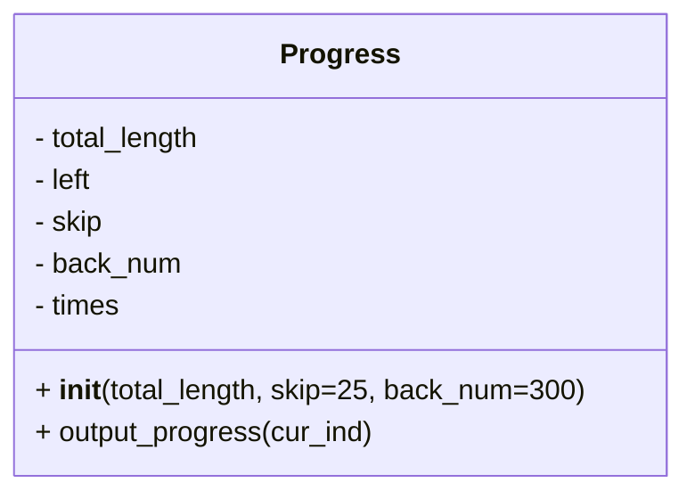

# Diagram: shipment_core/shipment_service/scripts/Progress.py


> Auto-generated by Obscura crawlers

## Diagram 1



### SVG

<svg id="container" width="384.578125" xmlns="http://www.w3.org/2000/svg" class="classDiagram" height="280" viewBox="0 0 384.578125 280" role="graphics-document document" aria-roledescription="class"><style>#container{font-family:"trebuchet ms",verdana,arial,sans-serif;font-size:16px;fill:#333;}@keyframes edge-animation-frame{from{stroke-dashoffset:0;}}@keyframes dash{to{stroke-dashoffset:0;}}#container .edge-animation-slow{stroke-dasharray:9,5!important;stroke-dashoffset:900;animation:dash 50s linear infinite;stroke-linecap:round;}#container .edge-animation-fast{stroke-dasharray:9,5!important;stroke-dashoffset:900;animation:dash 20s linear infinite;stroke-linecap:round;}#container .error-icon{fill:#552222;}#container .error-text{fill:#552222;stroke:#552222;}#container .edge-thickness-normal{stroke-width:1px;}#container .edge-thickness-thick{stroke-width:3.5px;}#container .edge-pattern-solid{stroke-dasharray:0;}#container .edge-thickness-invisible{stroke-width:0;fill:none;}#container .edge-pattern-dashed{stroke-dasharray:3;}#container .edge-pattern-dotted{stroke-dasharray:2;}#container .marker{fill:#333333;stroke:#333333;}#container .marker.cross{stroke:#333333;}#container svg{font-family:"trebuchet ms",verdana,arial,sans-serif;font-size:16px;}#container p{margin:0;}#container g.classGroup text{fill:#9370DB;stroke:none;font-family:"trebuchet ms",verdana,arial,sans-serif;font-size:10px;}#container g.classGroup text .title{font-weight:bolder;}#container .nodeLabel,#container .edgeLabel{color:#131300;}#container .edgeLabel .label rect{fill:#ECECFF;}#container .label text{fill:#131300;}#container .labelBkg{background:#ECECFF;}#container .edgeLabel .label span{background:#ECECFF;}#container .classTitle{font-weight:bolder;}#container .node rect,#container .node circle,#container .node ellipse,#container .node polygon,#container .node path{fill:#ECECFF;stroke:#9370DB;stroke-width:1px;}#container .divider{stroke:#9370DB;stroke-width:1;}#container g.clickable{cursor:pointer;}#container g.classGroup rect{fill:#ECECFF;stroke:#9370DB;}#container g.classGroup line{stroke:#9370DB;stroke-width:1;}#container .classLabel .box{stroke:none;stroke-width:0;fill:#ECECFF;opacity:0.5;}#container .classLabel .label{fill:#9370DB;font-size:10px;}#container .relation{stroke:#333333;stroke-width:1;fill:none;}#container .dashed-line{stroke-dasharray:3;}#container .dotted-line{stroke-dasharray:1 2;}#container #compositionStart,#container .composition{fill:#333333!important;stroke:#333333!important;stroke-width:1;}#container #compositionEnd,#container .composition{fill:#333333!important;stroke:#333333!important;stroke-width:1;}#container #dependencyStart,#container .dependency{fill:#333333!important;stroke:#333333!important;stroke-width:1;}#container #dependencyStart,#container .dependency{fill:#333333!important;stroke:#333333!important;stroke-width:1;}#container #extensionStart,#container .extension{fill:transparent!important;stroke:#333333!important;stroke-width:1;}#container #extensionEnd,#container .extension{fill:transparent!important;stroke:#333333!important;stroke-width:1;}#container #aggregationStart,#container .aggregation{fill:transparent!important;stroke:#333333!important;stroke-width:1;}#container #aggregationEnd,#container .aggregation{fill:transparent!important;stroke:#333333!important;stroke-width:1;}#container #lollipopStart,#container .lollipop{fill:#ECECFF!important;stroke:#333333!important;stroke-width:1;}#container #lollipopEnd,#container .lollipop{fill:#ECECFF!important;stroke:#333333!important;stroke-width:1;}#container .edgeTerminals{font-size:11px;line-height:initial;}#container .classTitleText{text-anchor:middle;font-size:18px;fill:#333;}#container .label-icon{display:inline-block;height:1em;overflow:visible;vertical-align:-0.125em;}#container .node .label-icon path{fill:currentColor;stroke:revert;stroke-width:revert;}#container :root{--mermaid-font-family:"trebuchet ms",verdana,arial,sans-serif;}</style><g><defs><marker id="container_class-aggregationStart" class="marker aggregation class" refX="18" refY="7" markerWidth="190" markerHeight="240" orient="auto"><path d="M 18,7 L9,13 L1,7 L9,1 Z"></path></marker></defs><defs><marker id="container_class-aggregationEnd" class="marker aggregation class" refX="1" refY="7" markerWidth="20" markerHeight="28" orient="auto"><path d="M 18,7 L9,13 L1,7 L9,1 Z"></path></marker></defs><defs><marker id="container_class-extensionStart" class="marker extension class" refX="18" refY="7" markerWidth="190" markerHeight="240" orient="auto"><path d="M 1,7 L18,13 V 1 Z"></path></marker></defs><defs><marker id="container_class-extensionEnd" class="marker extension class" refX="1" refY="7" markerWidth="20" markerHeight="28" orient="auto"><path d="M 1,1 V 13 L18,7 Z"></path></marker></defs><defs><marker id="container_class-compositionStart" class="marker composition class" refX="18" refY="7" markerWidth="190" markerHeight="240" orient="auto"><path d="M 18,7 L9,13 L1,7 L9,1 Z"></path></marker></defs><defs><marker id="container_class-compositionEnd" class="marker composition class" refX="1" refY="7" markerWidth="20" markerHeight="28" orient="auto"><path d="M 18,7 L9,13 L1,7 L9,1 Z"></path></marker></defs><defs><marker id="container_class-dependencyStart" class="marker dependency class" refX="6" refY="7" markerWidth="190" markerHeight="240" orient="auto"><path d="M 5,7 L9,13 L1,7 L9,1 Z"></path></marker></defs><defs><marker id="container_class-dependencyEnd" class="marker dependency class" refX="13" refY="7" markerWidth="20" markerHeight="28" orient="auto"><path d="M 18,7 L9,13 L14,7 L9,1 Z"></path></marker></defs><defs><marker id="container_class-lollipopStart" class="marker lollipop class" refX="13" refY="7" markerWidth="190" markerHeight="240" orient="auto"><circle stroke="black" fill="transparent" cx="7" cy="7" r="6"></circle></marker></defs><defs><marker id="container_class-lollipopEnd" class="marker lollipop class" refX="1" refY="7" markerWidth="190" markerHeight="240" orient="auto"><circle stroke="black" fill="transparent" cx="7" cy="7" r="6"></circle></marker></defs><g class="root"><g class="clusters"></g><g class="edgePaths"></g><g class="edgeLabels"></g><g class="nodes"><g class="node default" id="classId-Progress-0" transform="translate(192.2890625, 140)"><g class="basic label-container"><path d="M-184.2890625 -132 L184.2890625 -132 L184.2890625 132 L-184.2890625 132" stroke="none" stroke-width="0" fill="#ECECFF" style=""></path><path d="M-184.2890625 -132 C-101.55664479782325 -132, -18.824227095646506 -132, 184.2890625 -132 M-184.2890625 -132 C-94.12161017428716 -132, -3.9541578485743116 -132, 184.2890625 -132 M184.2890625 -132 C184.2890625 -44.762377492900356, 184.2890625 42.47524501419929, 184.2890625 132 M184.2890625 -132 C184.2890625 -26.862637776396525, 184.2890625 78.27472444720695, 184.2890625 132 M184.2890625 132 C57.70014734008005 132, -68.8887678198399 132, -184.2890625 132 M184.2890625 132 C47.24432336230208 132, -89.80041577539583 132, -184.2890625 132 M-184.2890625 132 C-184.2890625 45.209840760374874, -184.2890625 -41.58031847925025, -184.2890625 -132 M-184.2890625 132 C-184.2890625 46.33232997824166, -184.2890625 -39.33534004351668, -184.2890625 -132" stroke="#9370DB" stroke-width="1.3" fill="none" stroke-dasharray="0 0" style=""></path></g><g class="annotation-group text" transform="translate(0, -108)"></g><g class="label-group text" transform="translate(-31.75, -108)"><g class="label" style="font-weight: bolder" transform="translate(0,-12)"><foreignObject width="63.5" height="24"><div xmlns="http://www.w3.org/1999/xhtml" style="display: table-cell; white-space: nowrap; line-height: 1.5; max-width: 112px; text-align: center;"><span class="nodeLabel markdown-node-label" style=""><p>Progress</p></span></div></foreignObject></g></g><g class="members-group text" transform="translate(-172.2890625, -60)"><g class="label" style="" transform="translate(0,-12)"><foreignObject width="98.8125" height="24"><div xmlns="http://www.w3.org/1999/xhtml" style="display: table-cell; white-space: nowrap; line-height: 1.5; max-width: 156px; text-align: center;"><span class="nodeLabel markdown-node-label" style=""><p>- total_length</p></span></div></foreignObject></g><g class="label" style="" transform="translate(0,12)"><foreignObject width="35.15625" height="24"><div xmlns="http://www.w3.org/1999/xhtml" style="display: table-cell; white-space: nowrap; line-height: 1.5; max-width: 93px; text-align: center;"><span class="nodeLabel markdown-node-label" style=""><p>- left</p></span></div></foreignObject></g><g class="label" style="" transform="translate(0,36)"><foreignObject width="40.375" height="24"><div xmlns="http://www.w3.org/1999/xhtml" style="display: table-cell; white-space: nowrap; line-height: 1.5; max-width: 98px; text-align: center;"><span class="nodeLabel markdown-node-label" style=""><p>- skip</p></span></div></foreignObject></g><g class="label" style="" transform="translate(0,60)"><foreignObject width="85.296875" height="24"><div xmlns="http://www.w3.org/1999/xhtml" style="display: table-cell; white-space: nowrap; line-height: 1.5; max-width: 143px; text-align: center;"><span class="nodeLabel markdown-node-label" style=""><p>- back_num</p></span></div></foreignObject></g><g class="label" style="" transform="translate(0,84)"><foreignObject width="50.890625" height="24"><div xmlns="http://www.w3.org/1999/xhtml" style="display: table-cell; white-space: nowrap; line-height: 1.5; max-width: 108px; text-align: center;"><span class="nodeLabel markdown-node-label" style=""><p>- times</p></span></div></foreignObject></g></g><g class="methods-group text" transform="translate(-172.2890625, 84)"><g class="label" style="" transform="translate(0,-12)"><foreignObject width="312.828125" height="24"><div xmlns="http://www.w3.org/1999/xhtml" style="display: table-cell; white-space: nowrap; line-height: 1.5; max-width: 403px; text-align: center;"><span class="nodeLabel markdown-node-label" style=""><p>+ <strong>init</strong>(total_length, skip=25, back_num=300)</p></span></div></foreignObject></g><g class="label" style="" transform="translate(0,12)"><foreignObject width="195.484375" height="24"><div xmlns="http://www.w3.org/1999/xhtml" style="display: table-cell; white-space: nowrap; line-height: 1.5; max-width: 253px; text-align: center;"><span class="nodeLabel markdown-node-label" style=""><p>+ output_progress(cur_ind)</p></span></div></foreignObject></g></g><g class="divider" style=""><path d="M-184.2890625 -84 C-70.73528284277779 -84, 42.818496814444416 -84, 184.2890625 -84 M-184.2890625 -84 C-106.96332124756262 -84, -29.637579995125236 -84, 184.2890625 -84" stroke="#9370DB" stroke-width="1.3" fill="none" stroke-dasharray="0 0" style=""></path></g><g class="divider" style=""><path d="M-184.2890625 60 C-49.42556976707982 60, 85.43792296584036 60, 184.2890625 60 M-184.2890625 60 C-91.68804881333938 60, 0.9129648733212434 60, 184.2890625 60" stroke="#9370DB" stroke-width="1.3" fill="none" stroke-dasharray="0 0" style=""></path></g></g></g></g></g></svg>

## Diagram 2

```mermaid
flowchart TD
    Start([start]) --> RecordTime[/"times[cur_ind] = time.time()"/]
    RecordTime --> Prune{cur_ind - back_num - 1 in times?}
    Prune -- yes --> DeleteOld[/del times[cur_ind - back_num - 1]/]
    Prune -- no --> CheckSkip
    DeleteOld --> CheckSkip{cur_ind % skip != 0 or cur_ind == 0?}
    CheckSkip -- yes --> EarlyReturn[/return/]
    CheckSkip -- no --> Now[/"now = time.time()"/]
    Now --> CountCalc[/count = back_num if cur_ind >= back_num else cur_ind/]
    CountCalc --> PrevTimeCalc[/prev_time = (times[cur_ind - back_num] if cur_ind > back_num else times[0])/]
    PrevTimeCalc --> RateCalc[/rate = count / (now - prev_time)/]
    RateCalc --> TimeLeftCalc[/minutes_left, seconds_left = compute from rate and left/]
    TimeLeftCalc --> ETAcalc[/sec_plus_min = now + seconds_left + (60 * minutes_left)/]
    ETAcalc --> TimeParts[/hours_now, minutes_now, seconds_now = compute from sec_plus_min/]
    TimeParts --> OutputWrite[/sys.stdout.write("\\r") and formatted progress string/]
    OutputWrite --> Flush[/sys.stdout.flush()/]
    Flush --> End([end])
```

> SVG rendering failed for this diagram.
