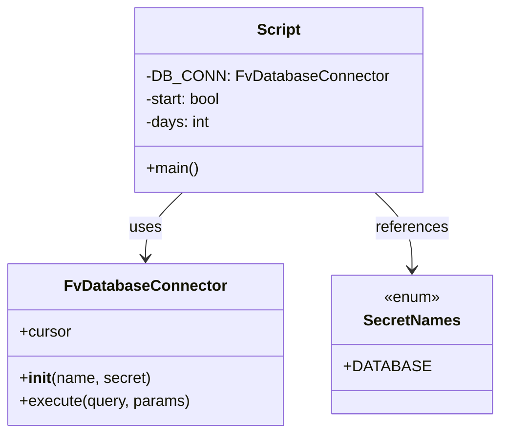

# Diagram: shipment_core/shipment_service/scripts/backfill_auth0_actor_id_shipments-FIN-6264.py


> Auto-generated by Obscura crawlers

## Diagram 1

```mermaid
flowchart TD
    Start([start = True]) --> CheckDays{"days < 365"}
    CheckDays -- Yes --> RunQuery[/Execute update shipments query (LIMIT 100)/]
    RunQuery --> MeasureTime[(time.perf_counter timing)]
    MeasureTime --> RowCount[DB_CONN.cursor.rowcount]
    RowCount --> HasRows{row_count > 0}
    HasRows -- Yes --> ContinueLoop[/start = False; (keep days)/]
    HasRows -- No --> IncDays[/days += 1/]
    ContinueLoop --> CheckDays
    IncDays --> CheckDays
    CheckDays -- No --> End([exit loop])
```

> SVG rendering failed for this diagram.

## Diagram 2



### SVG

<svg id="container" width="497.5390625" xmlns="http://www.w3.org/2000/svg" class="classDiagram" height="450" viewBox="0 0 497.5390625 450" role="graphics-document document" aria-roledescription="class"><style>#container{font-family:"trebuchet ms",verdana,arial,sans-serif;font-size:16px;fill:#333;}@keyframes edge-animation-frame{from{stroke-dashoffset:0;}}@keyframes dash{to{stroke-dashoffset:0;}}#container .edge-animation-slow{stroke-dasharray:9,5!important;stroke-dashoffset:900;animation:dash 50s linear infinite;stroke-linecap:round;}#container .edge-animation-fast{stroke-dasharray:9,5!important;stroke-dashoffset:900;animation:dash 20s linear infinite;stroke-linecap:round;}#container .error-icon{fill:#552222;}#container .error-text{fill:#552222;stroke:#552222;}#container .edge-thickness-normal{stroke-width:1px;}#container .edge-thickness-thick{stroke-width:3.5px;}#container .edge-pattern-solid{stroke-dasharray:0;}#container .edge-thickness-invisible{stroke-width:0;fill:none;}#container .edge-pattern-dashed{stroke-dasharray:3;}#container .edge-pattern-dotted{stroke-dasharray:2;}#container .marker{fill:#333333;stroke:#333333;}#container .marker.cross{stroke:#333333;}#container svg{font-family:"trebuchet ms",verdana,arial,sans-serif;font-size:16px;}#container p{margin:0;}#container g.classGroup text{fill:#9370DB;stroke:none;font-family:"trebuchet ms",verdana,arial,sans-serif;font-size:10px;}#container g.classGroup text .title{font-weight:bolder;}#container .nodeLabel,#container .edgeLabel{color:#131300;}#container .edgeLabel .label rect{fill:#ECECFF;}#container .label text{fill:#131300;}#container .labelBkg{background:#ECECFF;}#container .edgeLabel .label span{background:#ECECFF;}#container .classTitle{font-weight:bolder;}#container .node rect,#container .node circle,#container .node ellipse,#container .node polygon,#container .node path{fill:#ECECFF;stroke:#9370DB;stroke-width:1px;}#container .divider{stroke:#9370DB;stroke-width:1;}#container g.clickable{cursor:pointer;}#container g.classGroup rect{fill:#ECECFF;stroke:#9370DB;}#container g.classGroup line{stroke:#9370DB;stroke-width:1;}#container .classLabel .box{stroke:none;stroke-width:0;fill:#ECECFF;opacity:0.5;}#container .classLabel .label{fill:#9370DB;font-size:10px;}#container .relation{stroke:#333333;stroke-width:1;fill:none;}#container .dashed-line{stroke-dasharray:3;}#container .dotted-line{stroke-dasharray:1 2;}#container #compositionStart,#container .composition{fill:#333333!important;stroke:#333333!important;stroke-width:1;}#container #compositionEnd,#container .composition{fill:#333333!important;stroke:#333333!important;stroke-width:1;}#container #dependencyStart,#container .dependency{fill:#333333!important;stroke:#333333!important;stroke-width:1;}#container #dependencyStart,#container .dependency{fill:#333333!important;stroke:#333333!important;stroke-width:1;}#container #extensionStart,#container .extension{fill:transparent!important;stroke:#333333!important;stroke-width:1;}#container #extensionEnd,#container .extension{fill:transparent!important;stroke:#333333!important;stroke-width:1;}#container #aggregationStart,#container .aggregation{fill:transparent!important;stroke:#333333!important;stroke-width:1;}#container #aggregationEnd,#container .aggregation{fill:transparent!important;stroke:#333333!important;stroke-width:1;}#container #lollipopStart,#container .lollipop{fill:#ECECFF!important;stroke:#333333!important;stroke-width:1;}#container #lollipopEnd,#container .lollipop{fill:#ECECFF!important;stroke:#333333!important;stroke-width:1;}#container .edgeTerminals{font-size:11px;line-height:initial;}#container .classTitleText{text-anchor:middle;font-size:18px;fill:#333;}#container .label-icon{display:inline-block;height:1em;overflow:visible;vertical-align:-0.125em;}#container .node .label-icon path{fill:currentColor;stroke:revert;stroke-width:revert;}#container :root{--mermaid-font-family:"trebuchet ms",verdana,arial,sans-serif;}</style><g><defs><marker id="container_class-aggregationStart" class="marker aggregation class" refX="18" refY="7" markerWidth="190" markerHeight="240" orient="auto"><path d="M 18,7 L9,13 L1,7 L9,1 Z"></path></marker></defs><defs><marker id="container_class-aggregationEnd" class="marker aggregation class" refX="1" refY="7" markerWidth="20" markerHeight="28" orient="auto"><path d="M 18,7 L9,13 L1,7 L9,1 Z"></path></marker></defs><defs><marker id="container_class-extensionStart" class="marker extension class" refX="18" refY="7" markerWidth="190" markerHeight="240" orient="auto"><path d="M 1,7 L18,13 V 1 Z"></path></marker></defs><defs><marker id="container_class-extensionEnd" class="marker extension class" refX="1" refY="7" markerWidth="20" markerHeight="28" orient="auto"><path d="M 1,1 V 13 L18,7 Z"></path></marker></defs><defs><marker id="container_class-compositionStart" class="marker composition class" refX="18" refY="7" markerWidth="190" markerHeight="240" orient="auto"><path d="M 18,7 L9,13 L1,7 L9,1 Z"></path></marker></defs><defs><marker id="container_class-compositionEnd" class="marker composition class" refX="1" refY="7" markerWidth="20" markerHeight="28" orient="auto"><path d="M 18,7 L9,13 L1,7 L9,1 Z"></path></marker></defs><defs><marker id="container_class-dependencyStart" class="marker dependency class" refX="6" refY="7" markerWidth="190" markerHeight="240" orient="auto"><path d="M 5,7 L9,13 L1,7 L9,1 Z"></path></marker></defs><defs><marker id="container_class-dependencyEnd" class="marker dependency class" refX="13" refY="7" markerWidth="20" markerHeight="28" orient="auto"><path d="M 18,7 L9,13 L14,7 L9,1 Z"></path></marker></defs><defs><marker id="container_class-lollipopStart" class="marker lollipop class" refX="13" refY="7" markerWidth="190" markerHeight="240" orient="auto"><circle stroke="black" fill="transparent" cx="7" cy="7" r="6"></circle></marker></defs><defs><marker id="container_class-lollipopEnd" class="marker lollipop class" refX="1" refY="7" markerWidth="190" markerHeight="240" orient="auto"><circle stroke="black" fill="transparent" cx="7" cy="7" r="6"></circle></marker></defs><g class="root"><g class="clusters"></g><g class="edgePaths"><path d="M185.105,200L178.943,206.167C172.782,212.333,160.459,224.667,154.298,236C148.137,247.333,148.137,257.667,148.137,262.833L148.137,268" id="id_Script_FvDatabaseConnector_1" class="edge-thickness-normal edge-pattern-solid relation" style=";;;" data-edge="true" data-et="edge" data-id="id_Script_FvDatabaseConnector_1" data-points="W3sieCI6MTg1LjEwNDY2MTA2NjcyOTMsInkiOjIwMH0seyJ4IjoxNDguMTM2NzE4NzUsInkiOjIzN30seyJ4IjoxNDguMTM2NzE4NzUsInkiOjI3NH1d" marker-end="url(#container_class-dependencyEnd)"></path><path d="M376.938,200L383.1,206.167C389.261,212.333,401.584,224.667,407.745,238C413.906,251.333,413.906,265.667,413.906,272.833L413.906,280" id="id_Script_SecretNames_2" class="edge-thickness-normal edge-pattern-solid relation" style=";;;" data-edge="true" data-et="edge" data-id="id_Script_SecretNames_2" data-points="W3sieCI6Mzc2LjkzODMwNzY4MzI3MDcsInkiOjIwMH0seyJ4Ijo0MTMuOTA2MjUsInkiOjIzN30seyJ4Ijo0MTMuOTA2MjUsInkiOjI4Nn1d" marker-end="url(#container_class-dependencyEnd)"></path></g><g class="edgeLabels"><g class="edgeLabel" transform="translate(148.13671875, 237)"><g class="label" data-id="id_Script_FvDatabaseConnector_1" transform="translate(-16.4921875, -12)"><foreignObject width="32.984375" height="24"><div xmlns="http://www.w3.org/1999/xhtml" class="labelBkg" style="display: table-cell; white-space: nowrap; line-height: 1.5; max-width: 200px; text-align: center;"><span class="edgeLabel"><p>uses</p></span></div></foreignObject></g></g><g class="edgeLabel" transform="translate(413.90625, 237)"><g class="label" data-id="id_Script_SecretNames_2" transform="translate(-37.828125, -12)"><foreignObject width="75.65625" height="24"><div xmlns="http://www.w3.org/1999/xhtml" class="labelBkg" style="display: table-cell; white-space: nowrap; line-height: 1.5; max-width: 200px; text-align: center;"><span class="edgeLabel"><p>references</p></span></div></foreignObject></g></g></g><g class="nodes"><g class="node default" id="classId-FvDatabaseConnector-0" transform="translate(148.13671875, 358)"><g class="basic label-container"><path d="M-140.13671875 -84 L140.13671875 -84 L140.13671875 84 L-140.13671875 84" stroke="none" stroke-width="0" fill="#ECECFF" style=""></path><path d="M-140.13671875 -84 C-60.008663480904744 -84, 20.119391788190512 -84, 140.13671875 -84 M-140.13671875 -84 C-55.671776896260454 -84, 28.793164957479092 -84, 140.13671875 -84 M140.13671875 -84 C140.13671875 -35.17926027008278, 140.13671875 13.641479459834443, 140.13671875 84 M140.13671875 -84 C140.13671875 -29.77160669257482, 140.13671875 24.45678661485036, 140.13671875 84 M140.13671875 84 C67.03923818318546 84, -6.058242383629079 84, -140.13671875 84 M140.13671875 84 C45.81225750311194 84, -48.512203743776126 84, -140.13671875 84 M-140.13671875 84 C-140.13671875 26.263764270071675, -140.13671875 -31.47247145985665, -140.13671875 -84 M-140.13671875 84 C-140.13671875 42.90153437703151, -140.13671875 1.8030687540630197, -140.13671875 -84" stroke="#9370DB" stroke-width="1.3" fill="none" stroke-dasharray="0 0" style=""></path></g><g class="annotation-group text" transform="translate(0, -60)"></g><g class="label-group text" transform="translate(-79.3046875, -60)"><g class="label" style="font-weight: bolder" transform="translate(0,-12)"><foreignObject width="158.609375" height="24"><div xmlns="http://www.w3.org/1999/xhtml" style="display: table-cell; white-space: nowrap; line-height: 1.5; max-width: 207px; text-align: center;"><span class="nodeLabel markdown-node-label" style=""><p>FvDatabaseConnector</p></span></div></foreignObject></g></g><g class="members-group text" transform="translate(-128.13671875, -12)"><g class="label" style="" transform="translate(0,-12)"><foreignObject width="53.71875" height="24"><div xmlns="http://www.w3.org/1999/xhtml" style="display: table-cell; white-space: nowrap; line-height: 1.5; max-width: 112px; text-align: center;"><span class="nodeLabel markdown-node-label" style=""><p>+cursor</p></span></div></foreignObject></g></g><g class="methods-group text" transform="translate(-128.13671875, 36)"><g class="label" style="" transform="translate(0,-12)"><foreignObject width="135.265625" height="24"><div xmlns="http://www.w3.org/1999/xhtml" style="display: table-cell; white-space: nowrap; line-height: 1.5; max-width: 224px; text-align: center;"><span class="nodeLabel markdown-node-label" style=""><p>+<strong>init</strong>(name, secret)</p></span></div></foreignObject></g><g class="label" style="" transform="translate(0,12)"><foreignObject width="176.96875" height="24"><div xmlns="http://www.w3.org/1999/xhtml" style="display: table-cell; white-space: nowrap; line-height: 1.5; max-width: 234px; text-align: center;"><span class="nodeLabel markdown-node-label" style=""><p>+execute(query, params)</p></span></div></foreignObject></g></g><g class="divider" style=""><path d="M-140.13671875 -36 C-46.822046711612685 -36, 46.49262532677463 -36, 140.13671875 -36 M-140.13671875 -36 C-65.73934262180477 -36, 8.658033506390467 -36, 140.13671875 -36" stroke="#9370DB" stroke-width="1.3" fill="none" stroke-dasharray="0 0" style=""></path></g><g class="divider" style=""><path d="M-140.13671875 12 C-64.73310545225631 12, 10.670507845487379 12, 140.13671875 12 M-140.13671875 12 C-72.07060802589397 12, -4.00449730178795 12, 140.13671875 12" stroke="#9370DB" stroke-width="1.3" fill="none" stroke-dasharray="0 0" style=""></path></g></g><g class="node default" id="classId-SecretNames-1" transform="translate(413.90625, 358)"><g class="basic label-container"><path d="M-75.6328125 -72 L75.6328125 -72 L75.6328125 72 L-75.6328125 72" stroke="none" stroke-width="0" fill="#ECECFF" style=""></path><path d="M-75.6328125 -72 C-34.77376350279021 -72, 6.08528549441958 -72, 75.6328125 -72 M-75.6328125 -72 C-19.35194456421567 -72, 36.92892337156866 -72, 75.6328125 -72 M75.6328125 -72 C75.6328125 -16.595791468796, 75.6328125 38.808417062408, 75.6328125 72 M75.6328125 -72 C75.6328125 -42.71123346182394, 75.6328125 -13.422466923647875, 75.6328125 72 M75.6328125 72 C26.262201373991218 72, -23.108409752017565 72, -75.6328125 72 M75.6328125 72 C20.24696959225642 72, -35.13887331548716 72, -75.6328125 72 M-75.6328125 72 C-75.6328125 30.871784769907634, -75.6328125 -10.256430460184731, -75.6328125 -72 M-75.6328125 72 C-75.6328125 21.82403755230314, -75.6328125 -28.351924895393722, -75.6328125 -72" stroke="#9370DB" stroke-width="1.3" fill="none" stroke-dasharray="0 0" style=""></path></g><g class="annotation-group text" transform="translate(-29.53125, -48)"><g class="label" style="" transform="translate(0,-12)"><foreignObject width="59.0625" height="24"><div xmlns="http://www.w3.org/1999/xhtml" style="display: table-cell; white-space: nowrap; line-height: 1.5; max-width: 109px; text-align: center;"><span class="nodeLabel markdown-node-label" style=""><p>«enum»</p></span></div></foreignObject></g></g><g class="label-group text" transform="translate(-48.03125, -24)"><g class="label" style="font-weight: bolder" transform="translate(0,-12)"><foreignObject width="96.0625" height="24"><div xmlns="http://www.w3.org/1999/xhtml" style="display: table-cell; white-space: nowrap; line-height: 1.5; max-width: 145px; text-align: center;"><span class="nodeLabel markdown-node-label" style=""><p>SecretNames</p></span></div></foreignObject></g></g><g class="members-group text" transform="translate(-63.6328125, 24)"><g class="label" style="" transform="translate(0,-12)"><foreignObject width="79.234375" height="24"><div xmlns="http://www.w3.org/1999/xhtml" style="display: table-cell; white-space: nowrap; line-height: 1.5; max-width: 137px; text-align: center;"><span class="nodeLabel markdown-node-label" style=""><p>+DATABASE</p></span></div></foreignObject></g></g><g class="methods-group text" transform="translate(-63.6328125, 72)"></g><g class="divider" style=""><path d="M-75.6328125 0 C-43.509451744570804 0, -11.386090989141607 0, 75.6328125 0 M-75.6328125 0 C-41.032413019584055 0, -6.432013539168111 0, 75.6328125 0" stroke="#9370DB" stroke-width="1.3" fill="none" stroke-dasharray="0 0" style=""></path></g><g class="divider" style=""><path d="M-75.6328125 48 C-17.860030374903324 48, 39.91275175019335 48, 75.6328125 48 M-75.6328125 48 C-41.8862008223052 48, -8.139589144610397 48, 75.6328125 48" stroke="#9370DB" stroke-width="1.3" fill="none" stroke-dasharray="0 0" style=""></path></g></g><g class="node default" id="classId-Script-2" transform="translate(281.021484375, 104)"><g class="basic label-container"><path d="M-142.93359375 -96 L142.93359375 -96 L142.93359375 96 L-142.93359375 96" stroke="none" stroke-width="0" fill="#ECECFF" style=""></path><path d="M-142.93359375 -96 C-77.84867268504367 -96, -12.763751620087334 -96, 142.93359375 -96 M-142.93359375 -96 C-65.4387108064561 -96, 12.056172137087799 -96, 142.93359375 -96 M142.93359375 -96 C142.93359375 -19.960575104333174, 142.93359375 56.07884979133365, 142.93359375 96 M142.93359375 -96 C142.93359375 -55.454138772249614, 142.93359375 -14.908277544499228, 142.93359375 96 M142.93359375 96 C40.7029959170446 96, -61.52760191591079 96, -142.93359375 96 M142.93359375 96 C43.49705695081657 96, -55.93947984836686 96, -142.93359375 96 M-142.93359375 96 C-142.93359375 48.27461018723258, -142.93359375 0.5492203744651647, -142.93359375 -96 M-142.93359375 96 C-142.93359375 33.2389690024868, -142.93359375 -29.522061995026405, -142.93359375 -96" stroke="#9370DB" stroke-width="1.3" fill="none" stroke-dasharray="0 0" style=""></path></g><g class="annotation-group text" transform="translate(0, -72)"></g><g class="label-group text" transform="translate(-21.7421875, -72)"><g class="label" style="font-weight: bolder" transform="translate(0,-12)"><foreignObject width="43.484375" height="24"><div xmlns="http://www.w3.org/1999/xhtml" style="display: table-cell; white-space: nowrap; line-height: 1.5; max-width: 93px; text-align: center;"><span class="nodeLabel markdown-node-label" style=""><p>Script</p></span></div></foreignObject></g></g><g class="members-group text" transform="translate(-130.93359375, -24)"><g class="label" style="" transform="translate(0,-12)"><foreignObject width="240.125" height="24"><div xmlns="http://www.w3.org/1999/xhtml" style="display: table-cell; white-space: nowrap; line-height: 1.5; max-width: 298px; text-align: center;"><span class="nodeLabel markdown-node-label" style=""><p>-DB_CONN: FvDatabaseConnector</p></span></div></foreignObject></g><g class="label" style="" transform="translate(0,12)"><foreignObject width="81.265625" height="24"><div xmlns="http://www.w3.org/1999/xhtml" style="display: table-cell; white-space: nowrap; line-height: 1.5; max-width: 139px; text-align: center;"><span class="nodeLabel markdown-node-label" style=""><p>-start: bool</p></span></div></foreignObject></g><g class="label" style="" transform="translate(0,36)"><foreignObject width="67.46875" height="24"><div xmlns="http://www.w3.org/1999/xhtml" style="display: table-cell; white-space: nowrap; line-height: 1.5; max-width: 125px; text-align: center;"><span class="nodeLabel markdown-node-label" style=""><p>-days: int</p></span></div></foreignObject></g></g><g class="methods-group text" transform="translate(-130.93359375, 72)"><g class="label" style="" transform="translate(0,-12)"><foreignObject width="54.65625" height="24"><div xmlns="http://www.w3.org/1999/xhtml" style="display: table-cell; white-space: nowrap; line-height: 1.5; max-width: 112px; text-align: center;"><span class="nodeLabel markdown-node-label" style=""><p>+main()</p></span></div></foreignObject></g></g><g class="divider" style=""><path d="M-142.93359375 -48 C-33.56922868144814 -48, 75.79513638710372 -48, 142.93359375 -48 M-142.93359375 -48 C-64.72502907539216 -48, 13.483535599215685 -48, 142.93359375 -48" stroke="#9370DB" stroke-width="1.3" fill="none" stroke-dasharray="0 0" style=""></path></g><g class="divider" style=""><path d="M-142.93359375 48 C-48.565338324590854 48, 45.80291710081829 48, 142.93359375 48 M-142.93359375 48 C-46.62825776178977 48, 49.67707822642046 48, 142.93359375 48" stroke="#9370DB" stroke-width="1.3" fill="none" stroke-dasharray="0 0" style=""></path></g></g></g></g></g></svg>
