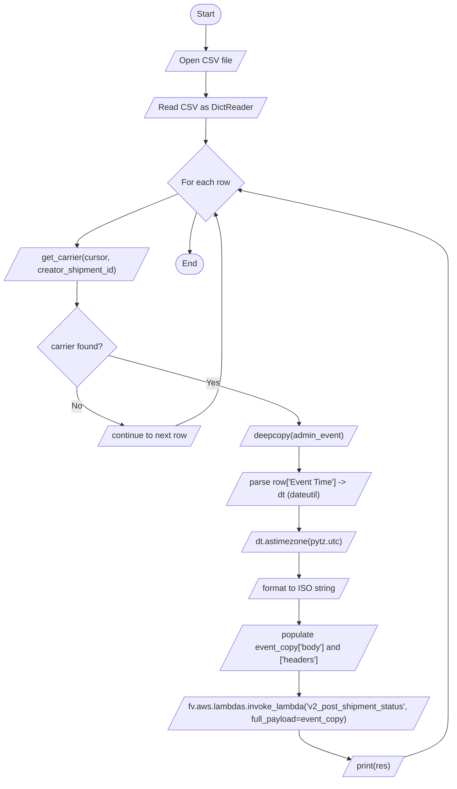
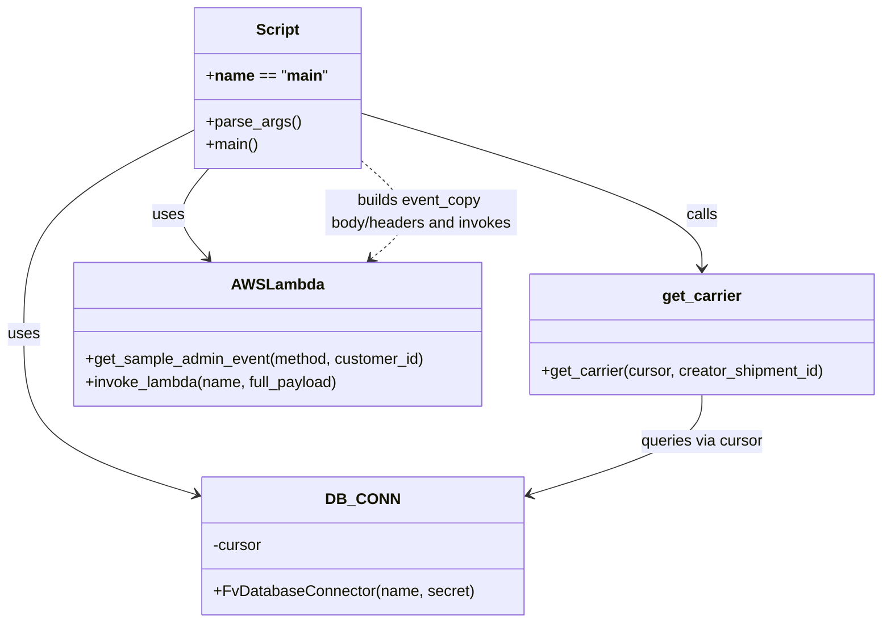

# Diagram: shipment_core/shipment_service/scripts/backfill_carrier_arrivals_actual_arrivals_ISS_10313.py

> Auto-generated by Obscura crawlers

## Diagram 1

### SVG

<svg id="container" width="868.2689819335938" xmlns="http://www.w3.org/2000/svg" class="flowchart" height="1491.453125" viewBox="0 0 868.2689819335938 1491.453125" role="graphics-document document" aria-roledescription="flowchart-v2"><g><marker id="container_flowchart-v2-pointEnd" class="marker flowchart-v2" viewBox="0 0 10 10" refX="5" refY="5" markerUnits="userSpaceOnUse" markerWidth="8" markerHeight="8" orient="auto"><path d="M 0 0 L 10 5 L 0 10 z" class="arrowMarkerPath" style="stroke-width: 1; stroke-dasharray: 1, 0;"></path></marker><marker id="container_flowchart-v2-pointStart" class="marker flowchart-v2" viewBox="0 0 10 10" refX="4.5" refY="5" markerUnits="userSpaceOnUse" markerWidth="8" markerHeight="8" orient="auto"><path d="M 0 5 L 10 10 L 10 0 z" class="arrowMarkerPath" style="stroke-width: 1; stroke-dasharray: 1, 0;"></path></marker><marker id="container_flowchart-v2-circleEnd" class="marker flowchart-v2" viewBox="0 0 10 10" refX="11" refY="5" markerUnits="userSpaceOnUse" markerWidth="11" markerHeight="11" orient="auto"><circle cx="5" cy="5" r="5" class="arrowMarkerPath" style="stroke-width: 1; stroke-dasharray: 1, 0;"></circle></marker><marker id="container_flowchart-v2-circleStart" class="marker flowchart-v2" viewBox="0 0 10 10" refX="-1" refY="5" markerUnits="userSpaceOnUse" markerWidth="11" markerHeight="11" orient="auto"><circle cx="5" cy="5" r="5" class="arrowMarkerPath" style="stroke-width: 1; stroke-dasharray: 1, 0;"></circle></marker><marker id="container_flowchart-v2-crossEnd" class="marker cross flowchart-v2" viewBox="0 0 11 11" refX="12" refY="5.2" markerUnits="userSpaceOnUse" markerWidth="11" markerHeight="11" orient="auto"><path d="M 1,1 l 9,9 M 10,1 l -9,9" class="arrowMarkerPath" style="stroke-width: 2; stroke-dasharray: 1, 0;"></path></marker><marker id="container_flowchart-v2-crossStart" class="marker cross flowchart-v2" viewBox="0 0 11 11" refX="-1" refY="5.2" markerUnits="userSpaceOnUse" markerWidth="11" markerHeight="11" orient="auto"><path d="M 1,1 l 9,9 M 10,1 l -9,9" class="arrowMarkerPath" style="stroke-width: 2; stroke-dasharray: 1, 0;"></path></marker><g class="root"><g class="clusters"></g><g class="edgePaths"><path d="M393.067,47.5L392.984,51.583C392.9,55.667,392.734,63.833,392.721,71.5C392.708,79.167,392.848,86.334,392.918,89.917L392.989,93.501" id="L_Start_OpenFile_0" class="edge-thickness-normal edge-pattern-solid edge-thickness-normal edge-pattern-solid flowchart-link" style=";" data-edge="true" data-et="edge" data-id="L_Start_OpenFile_0" data-points="W3sieCI6MzkzLjA2NzAwMjI5NjQ0Nzc1LCJ5Ijo0Ny41fSx7IngiOjM5Mi41NjcwMDIyOTY0NDc3NSwieSI6NzJ9LHsieCI6MzkzLjA2NzAwMjI5NjQ0Nzc1LCJ5Ijo5Ny41fV0=" marker-end="url(#container_flowchart-v2-pointEnd)"></path><path d="M393.067,136.5L392.984,140.583C392.9,144.667,392.734,152.833,392.721,160.5C392.708,168.167,392.848,175.334,392.918,178.917L392.989,182.501" id="L_OpenFile_ReadCSV_0" class="edge-thickness-normal edge-pattern-solid edge-thickness-normal edge-pattern-solid flowchart-link" style=";" data-edge="true" data-et="edge" data-id="L_OpenFile_ReadCSV_0" data-points="W3sieCI6MzkzLjA2NzAwMjI5NjQ0Nzc1LCJ5IjoxMzYuNX0seyJ4IjozOTIuNTY3MDAyMjk2NDQ3NzUsInkiOjE2MX0seyJ4IjozOTMuMDY3MDAyMjk2NDQ3NzUsInkiOjE4Ni41fV0=" marker-end="url(#container_flowchart-v2-pointEnd)"></path><path d="M393.067,225.5L392.984,229.583C392.9,233.667,392.734,241.833,392.65,249.417C392.567,257,392.567,264,392.567,267.5L392.567,271" id="L_ReadCSV_ForEachRow_0" class="edge-thickness-normal edge-pattern-solid edge-thickness-normal edge-pattern-solid flowchart-link" style=";" data-edge="true" data-et="edge" data-id="L_ReadCSV_ForEachRow_0" data-points="W3sieCI6MzkzLjA2NzAwMjI5NjQ0Nzc1LCJ5IjoyMjUuNX0seyJ4IjozOTIuNTY3MDAyMjk2NDQ3NzUsInkiOjI1MH0seyJ4IjozOTIuNTY3MDAyMjk2NDQ3NzUsInkiOjI3NX1d" marker-end="url(#container_flowchart-v2-pointEnd)"></path><path d="M340.359,368.901L308.132,381.769C275.906,394.637,211.453,420.373,179.297,436.825C147.141,453.276,147.281,460.443,147.351,464.027L147.422,467.61" id="L_ForEachRow_GetCarrier_0" class="edge-thickness-normal edge-pattern-solid edge-thickness-normal edge-pattern-solid flowchart-link" style=";" data-edge="true" data-et="edge" data-id="L_ForEachRow_GetCarrier_0" data-points="W3sieCI6MzQwLjM1ODk0NTc0NTM0NCwieSI6MzY4LjkwMTMxODQ0ODg5NjIzfSx7IngiOjE0NywieSI6NDQ2LjEwOTM3NX0seyJ4IjoxNDcuNSwieSI6NDcxLjYwOTM3NX1d" marker-end="url(#container_flowchart-v2-pointEnd)"></path><path d="M147.5,534.609L147.417,538.693C147.333,542.776,147.167,550.943,147.083,558.526C147,566.109,147,573.109,147,576.609L147,580.109" id="L_GetCarrier_CarrierFound_0" class="edge-thickness-normal edge-pattern-solid edge-thickness-normal edge-pattern-solid flowchart-link" style=";" data-edge="true" data-et="edge" data-id="L_GetCarrier_CarrierFound_0" data-points="W3sieCI6MTQ3LjUsInkiOjUzNC42MDkzNzV9LHsieCI6MTQ3LCJ5Ijo1NTkuMTA5Mzc1fSx7IngiOjE0NywieSI6NTg0LjEwOTM3NX1d" marker-end="url(#container_flowchart-v2-pointEnd)"></path><path d="M147,740.453L147,746.62C147,752.786,147,765.12,161.534,777.282C176.068,789.445,205.135,801.436,219.669,807.432L234.203,813.428" id="L_CarrierFound_ContinueRow_0" class="edge-thickness-normal edge-pattern-solid edge-thickness-normal edge-pattern-solid flowchart-link" style=";" data-edge="true" data-et="edge" data-id="L_CarrierFound_ContinueRow_0" data-points="W3sieCI6MTQ3LCJ5Ijo3NDAuNDUzMTI1fSx7IngiOjE0NywieSI6Nzc3LjQ1MzEyNX0seyJ4IjoyMzcuOTAwOTMzMTU1OTcxMywieSI6ODE0Ljk1MzEyNX1d" marker-end="url(#container_flowchart-v2-pointEnd)"></path><path d="M333.188,814.953L348.172,808.703C363.155,802.453,393.122,789.953,408.106,764.508C423.089,739.063,423.089,700.672,423.089,664.281C423.089,627.891,423.089,593.5,423.089,566.888C423.089,540.276,423.089,521.443,423.089,502.609C423.089,483.776,423.089,464.943,421.091,449.106C419.092,433.268,415.095,420.427,413.097,414.007L411.098,407.586" id="L_ContinueRow_ForEachRow_0" class="edge-thickness-normal edge-pattern-solid edge-thickness-normal edge-pattern-solid flowchart-link" style=";" data-edge="true" data-et="edge" data-id="L_ContinueRow_ForEachRow_0" data-points="W3sieCI6MzMzLjE4ODQwMzIzOTI5MjM3LCJ5Ijo4MTQuOTUzMTI1fSx7IngiOjQyMy4wODkzMzYzOTUyNjM3LCJ5Ijo3NzcuNDUzMTI1fSx7IngiOjQyMy4wODkzMzYzOTUyNjM3LCJ5Ijo2NjIuMjgxMjV9LHsieCI6NDIzLjA4OTMzNjM5NTI2MzcsInkiOjU1OS4xMDkzNzV9LHsieCI6NDIzLjA4OTMzNjM5NTI2MzcsInkiOjUwMi42MDkzNzV9LHsieCI6NDIzLjA4OTMzNjM5NTI2MzcsInkiOjQ0Ni4xMDkzNzV9LHsieCI6NDA5LjkwOTEzMzUwODAxODIsInkiOjQwMy43NjcyNDM3ODg0Mjk1NH1d" marker-end="url(#container_flowchart-v2-pointEnd)"></path><path d="M208.511,678.942L269.128,695.36C329.746,711.779,450.98,744.616,511.672,766.618C572.363,788.62,572.512,799.787,572.587,805.37L572.661,810.953" id="L_CarrierFound_DeepcopyEvent_0" class="edge-thickness-normal edge-pattern-solid edge-thickness-normal edge-pattern-solid flowchart-link" style=";" data-edge="true" data-et="edge" data-id="L_CarrierFound_DeepcopyEvent_0" data-points="W3sieCI6MjA4LjUxMTE5NTYwNzgxMiwieSI6Njc4Ljk0MTkyOTM5MjE4OH0seyJ4Ijo1NzIuMjE0MzM2Mzk1MjYzNywieSI6Nzc3LjQ1MzEyNX0seyJ4Ijo1NzIuNzE0MzM2Mzk1MjYzNywieSI6ODE0Ljk1MzEyNX1d" marker-end="url(#container_flowchart-v2-pointEnd)"></path><path d="M572.714,853.953L572.631,858.036C572.548,862.12,572.381,870.286,572.368,877.953C572.355,885.62,572.495,892.787,572.566,896.37L572.636,899.954" id="L_DeepcopyEvent_ParseDT_0" class="edge-thickness-normal edge-pattern-solid edge-thickness-normal edge-pattern-solid flowchart-link" style=";" data-edge="true" data-et="edge" data-id="L_DeepcopyEvent_ParseDT_0" data-points="W3sieCI6NTcyLjcxNDMzNjM5NTI2MzcsInkiOjg1My45NTMxMjV9LHsieCI6NTcyLjIxNDMzNjM5NTI2MzcsInkiOjg3OC40NTMxMjV9LHsieCI6NTcyLjcxNDMzNjM5NTI2MzcsInkiOjkwMy45NTMxMjV9XQ==" marker-end="url(#container_flowchart-v2-pointEnd)"></path><path d="M572.714,966.953L572.631,971.036C572.548,975.12,572.381,983.286,572.368,990.953C572.355,998.62,572.495,1005.787,572.566,1009.37L572.636,1012.954" id="L_ParseDT_ToUTC_0" class="edge-thickness-normal edge-pattern-solid edge-thickness-normal edge-pattern-solid flowchart-link" style=";" data-edge="true" data-et="edge" data-id="L_ParseDT_ToUTC_0" data-points="W3sieCI6NTcyLjcxNDMzNjM5NTI2MzcsInkiOjk2Ni45NTMxMjV9LHsieCI6NTcyLjIxNDMzNjM5NTI2MzcsInkiOjk5MS40NTMxMjV9LHsieCI6NTcyLjcxNDMzNjM5NTI2MzcsInkiOjEwMTYuOTUzMTI1fV0=" marker-end="url(#container_flowchart-v2-pointEnd)"></path><path d="M572.714,1055.953L572.631,1060.036C572.548,1064.12,572.381,1072.286,572.368,1079.953C572.355,1087.62,572.495,1094.787,572.566,1098.37L572.636,1101.954" id="L_ToUTC_FormatTS_0" class="edge-thickness-normal edge-pattern-solid edge-thickness-normal edge-pattern-solid flowchart-link" style=";" data-edge="true" data-et="edge" data-id="L_ToUTC_FormatTS_0" data-points="W3sieCI6NTcyLjcxNDMzNjM5NTI2MzcsInkiOjEwNTUuOTUzMTI1fSx7IngiOjU3Mi4yMTQzMzYzOTUyNjM3LCJ5IjoxMDgwLjQ1MzEyNX0seyJ4Ijo1NzIuNzE0MzM2Mzk1MjYzNywieSI6MTEwNS45NTMxMjV9XQ==" marker-end="url(#container_flowchart-v2-pointEnd)"></path><path d="M572.714,1144.953L572.631,1149.036C572.548,1153.12,572.381,1161.286,572.368,1168.953C572.355,1176.62,572.495,1183.787,572.566,1187.37L572.636,1190.954" id="L_FormatTS_BuildBody_0" class="edge-thickness-normal edge-pattern-solid edge-thickness-normal edge-pattern-solid flowchart-link" style=";" data-edge="true" data-et="edge" data-id="L_FormatTS_BuildBody_0" data-points="W3sieCI6NTcyLjcxNDMzNjM5NTI2MzcsInkiOjExNDQuOTUzMTI1fSx7IngiOjU3Mi4yMTQzMzYzOTUyNjM3LCJ5IjoxMTY5LjQ1MzEyNX0seyJ4Ijo1NzIuNzE0MzM2Mzk1MjYzNywieSI6MTE5NC45NTMxMjV9XQ==" marker-end="url(#container_flowchart-v2-pointEnd)"></path><path d="M572.714,1281.953L572.631,1286.036C572.548,1290.12,572.381,1298.286,572.368,1305.953C572.355,1313.62,572.495,1320.787,572.566,1324.37L572.636,1327.954" id="L_BuildBody_InvokeLambda_0" class="edge-thickness-normal edge-pattern-solid edge-thickness-normal edge-pattern-solid flowchart-link" style=";" data-edge="true" data-et="edge" data-id="L_BuildBody_InvokeLambda_0" data-points="W3sieCI6NTcyLjcxNDMzNjM5NTI2MzcsInkiOjEyODEuOTUzMTI1fSx7IngiOjU3Mi4yMTQzMzYzOTUyNjM3LCJ5IjoxMzA2LjQ1MzEyNX0seyJ4Ijo1NzIuNzE0MzM2Mzk1MjYzNywieSI6MTMzMS45NTMxMjV9XQ==" marker-end="url(#container_flowchart-v2-pointEnd)"></path><path d="M572.714,1394.953L572.631,1399.036C572.548,1403.12,572.381,1411.286,588.379,1420.394C604.376,1429.501,636.539,1439.549,652.62,1444.573L668.701,1449.597" id="L_InvokeLambda_PrintRes_0" class="edge-thickness-normal edge-pattern-solid edge-thickness-normal edge-pattern-solid flowchart-link" style=";" data-edge="true" data-et="edge" data-id="L_InvokeLambda_PrintRes_0" data-points="W3sieCI6NTcyLjcxNDMzNjM5NTI2MzcsInkiOjEzOTQuOTUzMTI1fSx7IngiOjU3Mi4yMTQzMzYzOTUyNjM3LCJ5IjoxNDE5LjQ1MzEyNX0seyJ4Ijo2NzIuNTE4NzUxOTg5MzU2NSwieSI6MTQ1MC43ODk2MDYzMTE4MTQ0fV0=" marker-end="url(#container_flowchart-v2-pointEnd)"></path><path d="M777.125,1445.797L790.982,1441.406C804.839,1437.015,832.554,1428.234,846.412,1414.427C860.269,1400.62,860.269,1381.786,860.269,1362.953C860.269,1344.12,860.269,1325.286,860.269,1304.453C860.269,1283.62,860.269,1260.786,860.269,1237.953C860.269,1215.12,860.269,1192.286,860.269,1173.453C860.269,1154.62,860.269,1139.786,860.269,1124.953C860.269,1110.12,860.269,1095.286,860.269,1080.453C860.269,1065.62,860.269,1050.786,860.269,1035.953C860.269,1021.12,860.269,1006.286,860.269,989.453C860.269,972.62,860.269,953.786,860.269,934.953C860.269,916.12,860.269,897.286,860.269,880.453C860.269,863.62,860.269,848.786,860.269,831.953C860.269,815.12,860.269,796.286,860.269,767.674C860.269,739.063,860.269,700.672,860.269,664.281C860.269,627.891,860.269,593.5,860.269,566.888C860.269,540.276,860.269,521.443,860.269,502.609C860.269,483.776,860.269,464.943,793.037,441.431C725.804,417.919,591.34,389.728,524.107,375.632L456.875,361.537" id="L_PrintRes_ForEachRow_0" class="edge-thickness-normal edge-pattern-solid edge-thickness-normal edge-pattern-solid flowchart-link" style=";" data-edge="true" data-et="edge" data-id="L_PrintRes_ForEachRow_0" data-points="W3sieCI6Nzc3LjEyNDU5NTM5MTg1NTUsInkiOjE0NDUuNzk2NjY5NTA2ODE2NH0seyJ4Ijo4NjAuMjY5MDIzODk1MjYzNywieSI6MTQxOS40NTMxMjV9LHsieCI6ODYwLjI2OTAyMzg5NTI2MzcsInkiOjEzNjIuOTUzMTI1fSx7IngiOjg2MC4yNjkwMjM4OTUyNjM3LCJ5IjoxMzA2LjQ1MzEyNX0seyJ4Ijo4NjAuMjY5MDIzODk1MjYzNywieSI6MTIzNy45NTMxMjV9LHsieCI6ODYwLjI2OTAyMzg5NTI2MzcsInkiOjExNjkuNDUzMTI1fSx7IngiOjg2MC4yNjkwMjM4OTUyNjM3LCJ5IjoxMTI0Ljk1MzEyNX0seyJ4Ijo4NjAuMjY5MDIzODk1MjYzNywieSI6MTA4MC40NTMxMjV9LHsieCI6ODYwLjI2OTAyMzg5NTI2MzcsInkiOjEwMzUuOTUzMTI1fSx7IngiOjg2MC4yNjkwMjM4OTUyNjM3LCJ5Ijo5OTEuNDUzMTI1fSx7IngiOjg2MC4yNjkwMjM4OTUyNjM3LCJ5Ijo5MzQuOTUzMTI1fSx7IngiOjg2MC4yNjkwMjM4OTUyNjM3LCJ5Ijo4NzguNDUzMTI1fSx7IngiOjg2MC4yNjkwMjM4OTUyNjM3LCJ5Ijo4MzMuOTUzMTI1fSx7IngiOjg2MC4yNjkwMjM4OTUyNjM3LCJ5Ijo3NzcuNDUzMTI1fSx7IngiOjg2MC4yNjkwMjM4OTUyNjM3LCJ5Ijo2NjIuMjgxMjV9LHsieCI6ODYwLjI2OTAyMzg5NTI2MzcsInkiOjU1OS4xMDkzNzV9LHsieCI6ODYwLjI2OTAyMzg5NTI2MzcsInkiOjUwMi42MDkzNzV9LHsieCI6ODYwLjI2OTAyMzg5NTI2MzcsInkiOjQ0Ni4xMDkzNzV9LHsieCI6NDUyLjk2MDE0Mzg3MzkzNzk3LCJ5IjozNjAuNzE2MjMzNDIyNTA5NzN9XQ==" marker-end="url(#container_flowchart-v2-pointEnd)"></path><path d="M375.225,403.767L373.028,410.824C370.831,417.881,366.438,431.995,364.316,444.636C362.194,457.276,362.342,468.443,362.417,474.026L362.491,479.61" id="L_ForEachRow_End_0" class="edge-thickness-normal edge-pattern-solid edge-thickness-normal edge-pattern-solid flowchart-link" style=";" data-edge="true" data-et="edge" data-id="L_ForEachRow_End_0" data-points="W3sieCI6Mzc1LjIyNDg3MTA4NDg3NzM1LCJ5Ijo0MDMuNzY3MjQzNzg4NDI5Nn0seyJ4IjozNjIuMDQ0NjY4MTk3NjMxODQsInkiOjQ0Ni4xMDkzNzV9LHsieCI6MzYyLjU0NDY2ODE5NzYzMTg0LCJ5Ijo0ODMuNjA5Mzc1fV0=" marker-end="url(#container_flowchart-v2-pointEnd)"></path></g><g class="edgeLabels"><g class="edgeLabel"><g class="label" data-id="L_Start_OpenFile_0" transform="translate(0, 0)"><foreignObject width="0" height="0">

</foreignObject></g></g><g class="edgeLabel"><g class="label" data-id="L_OpenFile_ReadCSV_0" transform="translate(0, 0)"><foreignObject width="0" height="0">

</foreignObject></g></g><g class="edgeLabel"><g class="label" data-id="L_ReadCSV_ForEachRow_0" transform="translate(0, 0)"><foreignObject width="0" height="0">

</foreignObject></g></g><g class="edgeLabel"><g class="label" data-id="L_ForEachRow_GetCarrier_0" transform="translate(0, 0)"><foreignObject width="0" height="0">

</foreignObject></g></g><g class="edgeLabel"><g class="label" data-id="L_GetCarrier_CarrierFound_0" transform="translate(0, 0)"><foreignObject width="0" height="0">

</foreignObject></g></g><g class="edgeLabel" transform="translate(147, 777.453125)"><g class="label" data-id="L_CarrierFound_ContinueRow_0" transform="translate(-10.140625, -12)"><foreignObject width="20.28125" height="24">

No

</foreignObject></g></g><g class="edgeLabel"><g class="label" data-id="L_ContinueRow_ForEachRow_0" transform="translate(0, 0)"><foreignObject width="0" height="0">

</foreignObject></g></g><g class="edgeLabel" transform="translate(572.2143363952637, 777.453125)"><g class="label" data-id="L_CarrierFound_DeepcopyEvent_0" transform="translate(-12.03125, -12)"><foreignObject width="24.0625" height="24">

Yes

</foreignObject></g></g><g class="edgeLabel"><g class="label" data-id="L_DeepcopyEvent_ParseDT_0" transform="translate(0, 0)"><foreignObject width="0" height="0">

</foreignObject></g></g><g class="edgeLabel"><g class="label" data-id="L_ParseDT_ToUTC_0" transform="translate(0, 0)"><foreignObject width="0" height="0">

</foreignObject></g></g><g class="edgeLabel"><g class="label" data-id="L_ToUTC_FormatTS_0" transform="translate(0, 0)"><foreignObject width="0" height="0">

</foreignObject></g></g><g class="edgeLabel"><g class="label" data-id="L_FormatTS_BuildBody_0" transform="translate(0, 0)"><foreignObject width="0" height="0">

</foreignObject></g></g><g class="edgeLabel"><g class="label" data-id="L_BuildBody_InvokeLambda_0" transform="translate(0, 0)"><foreignObject width="0" height="0">

</foreignObject></g></g><g class="edgeLabel"><g class="label" data-id="L_InvokeLambda_PrintRes_0" transform="translate(0, 0)"><foreignObject width="0" height="0">

</foreignObject></g></g><g class="edgeLabel"><g class="label" data-id="L_PrintRes_ForEachRow_0" transform="translate(0, 0)"><foreignObject width="0" height="0">

</foreignObject></g></g><g class="edgeLabel"><g class="label" data-id="L_ForEachRow_End_0" transform="translate(0, 0)"><foreignObject width="0" height="0">

</foreignObject></g></g></g><g class="nodes"><g class="node default" id="flowchart-Start-0" transform="translate(392.56700229644775, 27.5)"><g class="basic label-container outer-path"><path d="M-10.3984375 -19.5 C-3.2221085747667546 -19.5, 3.954220350466491 -19.5, 10.3984375 -19.5 C10.3984375 -19.5, 10.398437499999998 -19.5, 10.398437499999998 -19.5 C10.7148895840025 -19.489851997602656, 11.031341668005 -19.47970399520531, 11.6478067896239 -19.45993515863156 C11.922392388899105 -19.43344621610698, 12.196977988174309 -19.406957273582396, 12.892042152847864 -19.3399052695533 C13.170011484715918 -19.294965343661236, 13.447980816583971 -19.250025417769173, 14.126030759676757 -19.140403561325776 C14.399885278397019 -19.07789805449562, 14.67373979711728 -19.015392547665467, 15.34470188623539 -18.862249829261074 C15.726773857638348 -18.74885287368538, 16.108845829041307 -18.635455918109685, 16.543047751460602 -18.50658706670804 C16.80742445141112 -18.409293997254824, 17.071801151361637 -18.31200092780161, 17.716144095147794 -18.074876768247425 C18.036798995961316 -17.932932355546953, 18.35745389677484 -17.79098794284648, 18.85917041279238 -17.568892924097174 C19.277862157104625 -17.350461709274338, 19.696553901416873 -17.132030494451502, 19.967429764076783 -16.990714730406097 C20.38898908843362 -16.73516299062341, 20.810548412790453 -16.479611250840723, 21.036368073605697 -16.342718045390892 C21.444618088477238 -16.057940507874815, 21.852868103348783 -15.773162970358733, 22.061592844578712 -15.627565626425154 C22.268540310198933 -15.462530529696371, 22.475487775819154 -15.29749543296759, 23.03889120850187 -14.848196188198123 C23.296133491863927 -14.614575552706548, 23.553375775225987 -14.380954917214973, 23.964247236767985 -14.007812326905688 C24.211391831328203 -13.752615242073688, 24.458536425888422 -13.49741815724169, 24.833858442968648 -13.10986736009568 C25.019355216207934 -12.891972295183407, 25.20485198944722 -12.674077230271132, 25.644151408126582 -12.158051136245305 C25.89122328618045 -11.82699732836426, 26.138295164234314 -11.495943520483216, 26.391796464640635 -11.156274872382312 C26.53934392098282 -10.92960235740108, 26.686891377325004 -10.702929842419849, 27.073721378604247 -10.108655082055241 C27.28187624489801 -9.739055038984834, 27.490031111191776 -9.369454995914428, 27.6871239742735 -9.019496659696287 C27.876241870043636 -8.626789302654863, 28.06535976581377 -8.23408194561344, 28.22948364880834 -7.893275190886684 C28.366169644785 -7.555658138180379, 28.502855640761663 -7.218041085474075, 28.698571729970325 -6.734618561215508 C28.795580046849153 -6.442444966952781, 28.89258836372798 -6.150271372690053, 29.09246063421488 -5.548287939305138 C29.1844910430286 -5.197336104266933, 29.276521451842324 -4.846384269228727, 29.40953178754556 -4.339158212148133 C29.482462752796426 -3.9646731195499125, 29.555393718047288 -3.5901880269516924, 29.648482276581777 -3.1121979531509023 C29.69676698657546 -2.7377112773343377, 29.74505169656915 -2.3632246015177727, 29.808330202509367 -1.872449005199798 C29.829841440266375 -1.537394113575789, 29.851352678023385 -1.20233922195178, 29.888418715913414 -0.6250057626472757 C29.888418715913414 -0.3013838279175918, 29.888418715913414 0.02223810681209215, 29.888418715913414 0.625005762647271 C29.85765130827154 1.104232971673928, 29.826883900629664 1.583460180700585, 29.808330202509367 1.8724490051997846 C29.751351766027206 2.314362506890495, 29.694373329545044 2.7562760085812057, 29.648482276581777 3.1121979531508885 C29.581642548629418 3.4554058296047607, 29.514802820677055 3.7986137060586325, 29.40953178754556 4.339158212148129 C29.30547025505928 4.735989936071793, 29.201408722572996 5.132821659995457, 29.092460634214884 5.548287939305125 C28.962022061997253 5.941148136260473, 28.831583489779625 6.33400833321582, 28.69857172997033 6.734618561215495 C28.527626234876497 7.156857239103568, 28.356680739782668 7.579095916991641, 28.229483648808344 7.893275190886679 C28.06227873020045 8.240479781988103, 27.89507381159256 8.587684373089527, 27.687123974273504 9.019496659696284 C27.517505740548316 9.320671009383988, 27.34788750682313 9.62184535907169, 27.07372137860425 10.108655082055236 C26.881849560991412 10.403421718705738, 26.689977743378574 10.698188355356239, 26.39179646464064 11.156274872382301 C26.17139481373996 11.451593005585758, 25.95099316283927 11.746911138789216, 25.644151408126582 12.158051136245302 C25.34907089058334 12.504669502708696, 25.053990373040104 12.851287869172088, 24.83385844296866 13.10986736009567 C24.612819273159303 13.33810845057717, 24.39178010334995 13.56634954105867, 23.96424723676799 14.007812326905684 C23.61589261651697 14.324178776059485, 23.267537996265947 14.640545225213284, 23.038891208501887 14.848196188198111 C22.702220055518705 15.116682473506556, 22.365548902535522 15.385168758815, 22.061592844578715 15.627565626425152 C21.73769447240643 15.853503109517991, 21.413796100234144 16.07944059261083, 21.036368073605708 16.34271804539089 C20.793101674493904 16.490187566124508, 20.5498352753821 16.637657086858127, 19.967429764076787 16.990714730406093 C19.614421504547085 17.174878913290158, 19.26141324501738 17.359043096174222, 18.859170412792388 17.56889292409717 C18.50269994437679 17.726691826144016, 18.14622947596119 17.884490728190862, 17.716144095147804 18.07487676824742 C17.34164427552409 18.21269616370733, 16.967144455900375 18.350515559167242, 16.543047751460616 18.506587066708033 C16.200820090953666 18.60815843995685, 15.858592430446718 18.709729813205666, 15.344701886235413 18.86224982926107 C14.913956458845766 18.960564662186155, 14.483211031456118 19.058879495111235, 14.126030759676766 19.140403561325773 C13.706495727746203 19.20823073174554, 13.286960695815639 19.276057902165313, 12.892042152847878 19.3399052695533 C12.557524152607485 19.372175818719732, 12.223006152367093 19.404446367886166, 11.6478067896239 19.45993515863156 C11.368231441061353 19.468900595899555, 11.088656092498805 19.477866033167555, 10.398437500000004 19.5 C10.398437500000002 19.5, 10.398437500000002 19.5, 10.3984375 19.5 C4.74265558975172 19.5, -0.9131263204965592 19.5, -10.398437499999996 19.5 C-10.799089730533165 19.48715186278906, -11.199741961066335 19.474303725578118, -11.647806789623893 19.45993515863156 C-12.06548195143537 19.41964253809948, -12.483157113246849 19.379349917567403, -12.892042152847871 19.3399052695533 C-13.166407446361678 19.295548016632615, -13.440772739875484 19.251190763711932, -14.126030759676759 19.140403561325773 C-14.40777992629926 19.076096152629326, -14.68952909292176 19.011788743932875, -15.344701886235388 18.862249829261074 C-15.815694479385417 18.722461699904716, -16.286687072535447 18.582673570548362, -16.54304775146059 18.506587066708043 C-16.883424395304917 18.381325315366126, -17.223801039149244 18.25606356402421, -17.716144095147797 18.074876768247425 C-18.132746506370204 17.89045923887071, -18.549348917592614 17.706041709493995, -18.85917041279238 17.568892924097174 C-19.273779514993382 17.352591621048717, -19.688388617194388 17.136290318000256, -19.96742976407678 16.990714730406097 C-20.263991928473185 16.81093700355627, -20.56055409286959 16.631159276706445, -21.036368073605686 16.3427180453909 C-21.333600683718767 16.135381443568328, -21.630833293831852 15.928044841745754, -22.061592844578712 15.627565626425156 C-22.443712551442655 15.322835328833616, -22.825832258306598 15.018105031242076, -23.03889120850187 14.848196188198125 C-23.388625635379714 14.530576635173526, -23.73836006225756 14.212957082148929, -23.964247236767974 14.007812326905697 C-24.29856122468402 13.662605686693519, -24.63287521260006 13.317399046481341, -24.833858442968655 13.109867360095677 C-25.106579057553386 12.78951420796187, -25.379299672138114 12.469161055828064, -25.64415140812658 12.158051136245307 C-25.882220183504543 11.839060665750445, -26.12028895888251 11.520070195255585, -26.391796464640635 11.156274872382316 C-26.551725763435574 10.91058052240341, -26.711655062230513 10.664886172424506, -27.073721378604244 10.108655082055249 C-27.257510462020335 9.782318953787213, -27.441299545436426 9.455982825519177, -27.6871239742735 9.019496659696289 C-27.812559160034148 8.759027812581278, -27.937994345794795 8.498558965466266, -28.22948364880834 7.893275190886686 C-28.330211720924176 7.644474905315783, -28.43093979304001 7.395674619744879, -28.698571729970325 6.73461856121551 C-28.839807022427927 6.309240363121123, -28.981042314885528 5.883862165026738, -29.09246063421488 5.5482879393051325 C-29.171315695568428 5.2475794143642736, -29.250170756921978 4.9468708894234155, -29.409531787545557 4.339158212148136 C-29.46996466360847 4.0288481660579745, -29.530397539671377 3.7185381199678136, -29.648482276581777 3.112197953150904 C-29.693635415233803 2.7619991262615446, -29.73878855388583 2.411800299372185, -29.808330202509364 1.872449005199809 C-29.830721242285854 1.5236904869589614, -29.853112282062344 1.174931968718114, -29.888418715913414 0.6250057626472781 C-29.888418715913414 0.33097942041494277, -29.888418715913414 0.0369530781826074, -29.888418715913414 -0.6250057626472687 C-29.85914236017841 -1.0810086346689602, -29.829866004443407 -1.5370115066906518, -29.808330202509367 -1.8724490051997822 C-29.764561278665674 -2.2119121353798383, -29.720792354821985 -2.5513752655598942, -29.648482276581777 -3.112197953150895 C-29.595973156917033 -3.381821184822991, -29.54346403725229 -3.651444416495087, -29.40953178754556 -4.339158212148126 C-29.324307307662075 -4.664156090467084, -29.239082827778592 -4.989153968786042, -29.092460634214884 -5.548287939305123 C-28.98880458964315 -5.860483430207314, -28.885148545071416 -6.172678921109505, -28.698571729970332 -6.734618561215485 C-28.556305012157086 -7.086020104754073, -28.414038294343843 -7.437421648292661, -28.229483648808344 -7.893275190886676 C-28.06300304713701 -8.238975722371439, -27.896522445465674 -8.584676253856202, -27.687123974273504 -9.019496659696282 C-27.503965643325476 -9.344712823086658, -27.32080731237745 -9.669928986477034, -27.073721378604247 -10.108655082055243 C-26.801274749016375 -10.527206267265928, -26.528828119428503 -10.945757452476613, -26.39179646464064 -11.156274872382308 C-26.166106908784545 -11.458678316487966, -25.94041735292845 -11.761081760593623, -25.644151408126586 -12.158051136245302 C-25.343417507006023 -12.511310288745255, -25.042683605885465 -12.864569441245209, -24.833858442968662 -13.10986736009567 C-24.494714087323654 -13.46006175156857, -24.155569731678646 -13.810256143041471, -23.964247236767996 -14.007812326905677 C-23.745269705835174 -14.20668192667089, -23.52629217490235 -14.405551526436104, -23.038891208501887 -14.848196188198107 C-22.683017388187913 -15.13199608969842, -22.327143567873943 -15.415795991198733, -22.06159284457872 -15.627565626425149 C-21.684224578544605 -15.8908013928016, -21.30685631251049 -16.154037159178053, -21.03636807360571 -16.342718045390885 C-20.713280582440596 -16.538575581208026, -20.390193091275478 -16.734433117025166, -19.96742976407679 -16.99071473040609 C-19.608817615217646 -17.177802458763864, -19.250205466358498 -17.364890187121635, -18.859170412792388 -17.56889292409717 C-18.444109145077615 -17.752628234959452, -18.029047877362846 -17.936363545821735, -17.716144095147804 -18.07487676824742 C-17.35559721275312 -18.20756135382751, -16.99505033035844 -18.3402459394076, -16.54304775146062 -18.506587066708033 C-16.228671867401594 -18.59989217890406, -15.91429598334257 -18.69319729110009, -15.344701886235413 -18.862249829261067 C-14.912074042842212 -18.960994311355048, -14.479446199449013 -19.059738793449032, -14.126030759676768 -19.140403561325773 C-13.641336064776517 -19.21876524073375, -13.156641369876269 -19.29712692014172, -12.89204215284788 -19.3399052695533 C-12.519395624322984 -19.375854031987075, -12.146749095798087 -19.41180279442085, -11.647806789623903 -19.45993515863156 C-11.317760642343483 -19.47051909617899, -10.987714495063061 -19.481103033726416, -10.398437500000005 -19.5 C-10.398437500000004 -19.5, -10.398437500000002 -19.5, -10.3984375 -19.5" stroke="none" stroke-width="0" fill="#ECECFF" style=""></path><path d="M-10.3984375 -19.5 C-3.8771520703418973 -19.5, 2.6441333593162053 -19.5, 10.3984375 -19.5 M-10.3984375 -19.5 C-3.529102343928349 -19.5, 3.3402328121433023 -19.5, 10.3984375 -19.5 M10.3984375 -19.5 C10.3984375 -19.5, 10.398437499999998 -19.5, 10.398437499999998 -19.5 M10.3984375 -19.5 C10.3984375 -19.5, 10.398437499999998 -19.5, 10.398437499999998 -19.5 M10.398437499999998 -19.5 C10.786542988577661 -19.487554212382822, 11.174648477155324 -19.47510842476564, 11.6478067896239 -19.45993515863156 M10.398437499999998 -19.5 C10.806788285016642 -19.4869049851311, 11.215139070033285 -19.473809970262202, 11.6478067896239 -19.45993515863156 M11.6478067896239 -19.45993515863156 C12.075220292197992 -19.41870309207818, 12.502633794772084 -19.377471025524798, 12.892042152847864 -19.3399052695533 M11.6478067896239 -19.45993515863156 C11.958694480770177 -19.429944196963827, 12.269582171916454 -19.3999532352961, 12.892042152847864 -19.3399052695533 M12.892042152847864 -19.3399052695533 C13.181096698033851 -19.293173172339106, 13.47015124321984 -19.246441075124913, 14.126030759676757 -19.140403561325776 M12.892042152847864 -19.3399052695533 C13.342179045716941 -19.267130627577966, 13.792315938586018 -19.194355985602638, 14.126030759676757 -19.140403561325776 M14.126030759676757 -19.140403561325776 C14.582762352103693 -19.036157555806508, 15.039493944530626 -18.931911550287236, 15.34470188623539 -18.862249829261074 M14.126030759676757 -19.140403561325776 C14.421065847518987 -19.07306372780966, 14.716100935361219 -19.00572389429355, 15.34470188623539 -18.862249829261074 M15.34470188623539 -18.862249829261074 C15.624608378524362 -18.779175051608867, 15.904514870813335 -18.69610027395666, 16.543047751460602 -18.50658706670804 M15.34470188623539 -18.862249829261074 C15.671666125604323 -18.76520855928669, 15.998630364973257 -18.668167289312304, 16.543047751460602 -18.50658706670804 M16.543047751460602 -18.50658706670804 C16.873570183820917 -18.384951756283574, 17.204092616181228 -18.263316445859104, 17.716144095147794 -18.074876768247425 M16.543047751460602 -18.50658706670804 C17.001103254973962 -18.338018407196465, 17.459158758487327 -18.169449747684887, 17.716144095147794 -18.074876768247425 M17.716144095147794 -18.074876768247425 C17.972235364706677 -17.961512759891306, 18.228326634265564 -17.84814875153519, 18.85917041279238 -17.568892924097174 M17.716144095147794 -18.074876768247425 C18.01961352015087 -17.94053985589921, 18.323082945153946 -17.806202943550996, 18.85917041279238 -17.568892924097174 M18.85917041279238 -17.568892924097174 C19.27266296924899 -17.353174122248383, 19.686155525705598 -17.137455320399596, 19.967429764076783 -16.990714730406097 M18.85917041279238 -17.568892924097174 C19.123651872687997 -17.43091311587809, 19.388133332583614 -17.29293330765901, 19.967429764076783 -16.990714730406097 M19.967429764076783 -16.990714730406097 C20.22584408712426 -16.834062449163593, 20.484258410171734 -16.677410167921085, 21.036368073605697 -16.342718045390892 M19.967429764076783 -16.990714730406097 C20.38756114724424 -16.736028616963925, 20.8076925304117 -16.481342503521752, 21.036368073605697 -16.342718045390892 M21.036368073605697 -16.342718045390892 C21.384292710942255 -16.10002087979971, 21.732217348278816 -15.857323714208533, 22.061592844578712 -15.627565626425154 M21.036368073605697 -16.342718045390892 C21.39640332250999 -16.091573041429985, 21.756438571414286 -15.84042803746908, 22.061592844578712 -15.627565626425154 M22.061592844578712 -15.627565626425154 C22.28918966143159 -15.446063221590641, 22.516786478284466 -15.264560816756129, 23.03889120850187 -14.848196188198123 M22.061592844578712 -15.627565626425154 C22.309021938821935 -15.430247508130908, 22.55645103306516 -15.23292938983666, 23.03889120850187 -14.848196188198123 M23.03889120850187 -14.848196188198123 C23.28608355047441 -14.623702643569631, 23.53327589244695 -14.399209098941139, 23.964247236767985 -14.007812326905688 M23.03889120850187 -14.848196188198123 C23.301335839109043 -14.6098509185851, 23.56378046971622 -14.371505648972073, 23.964247236767985 -14.007812326905688 M23.964247236767985 -14.007812326905688 C24.255748297401595 -13.706813549119321, 24.547249358035202 -13.405814771332954, 24.833858442968648 -13.10986736009568 M23.964247236767985 -14.007812326905688 C24.163910651197167 -13.801643458836368, 24.363574065626352 -13.59547459076705, 24.833858442968648 -13.10986736009568 M24.833858442968648 -13.10986736009568 C25.104927623693687 -12.791454076142719, 25.375996804418723 -12.473040792189757, 25.644151408126582 -12.158051136245305 M24.833858442968648 -13.10986736009568 C25.0703383096387 -12.832084652619432, 25.30681817630875 -12.554301945143184, 25.644151408126582 -12.158051136245305 M25.644151408126582 -12.158051136245305 C25.841933511343914 -11.893041136254352, 26.03971561456125 -11.628031136263399, 26.391796464640635 -11.156274872382312 M25.644151408126582 -12.158051136245305 C25.802099710310742 -11.94641480070488, 25.960048012494898 -11.734778465164451, 26.391796464640635 -11.156274872382312 M26.391796464640635 -11.156274872382312 C26.540203248445998 -10.928282199655905, 26.68861003225136 -10.700289526929499, 27.073721378604247 -10.108655082055241 M26.391796464640635 -11.156274872382312 C26.589735677781352 -10.852187086877162, 26.787674890922073 -10.548099301372012, 27.073721378604247 -10.108655082055241 M27.073721378604247 -10.108655082055241 C27.305079623255608 -9.697855091114082, 27.53643786790697 -9.287055100172923, 27.6871239742735 -9.019496659696287 M27.073721378604247 -10.108655082055241 C27.220671276356327 -9.84773065830571, 27.36762117410841 -9.586806234556178, 27.6871239742735 -9.019496659696287 M27.6871239742735 -9.019496659696287 C27.854242294549238 -8.672471891884493, 28.02136061482497 -8.3254471240727, 28.22948364880834 -7.893275190886684 M27.6871239742735 -9.019496659696287 C27.891363597246034 -8.595388712565953, 28.095603220218567 -8.17128076543562, 28.22948364880834 -7.893275190886684 M28.22948364880834 -7.893275190886684 C28.394385625244755 -7.485964120925914, 28.55928760168117 -7.078653050965143, 28.698571729970325 -6.734618561215508 M28.22948364880834 -7.893275190886684 C28.35581264676259 -7.581240123534667, 28.48214164471684 -7.26920505618265, 28.698571729970325 -6.734618561215508 M28.698571729970325 -6.734618561215508 C28.851576873839882 -6.273791445939473, 29.00458201770944 -5.812964330663439, 29.09246063421488 -5.548287939305138 M28.698571729970325 -6.734618561215508 C28.783441565554792 -6.479004138607053, 28.868311401139255 -6.2233897159985965, 29.09246063421488 -5.548287939305138 M29.09246063421488 -5.548287939305138 C29.187733165113226 -5.184972487613662, 29.28300569601157 -4.821657035922185, 29.40953178754556 -4.339158212148133 M29.09246063421488 -5.548287939305138 C29.191841789194815 -5.169304523301619, 29.291222944174752 -4.7903211072981, 29.40953178754556 -4.339158212148133 M29.40953178754556 -4.339158212148133 C29.488303112591776 -3.9346841063612663, 29.567074437637988 -3.5302100005743995, 29.648482276581777 -3.1121979531509023 M29.40953178754556 -4.339158212148133 C29.496165974202825 -3.894309973804919, 29.58280016086009 -3.4494617354617048, 29.648482276581777 -3.1121979531509023 M29.648482276581777 -3.1121979531509023 C29.70985160257008 -2.6362295795297714, 29.77122092855838 -2.160261205908641, 29.808330202509367 -1.872449005199798 M29.648482276581777 -3.1121979531509023 C29.692360834358556 -2.771884523835489, 29.736239392135335 -2.4315710945200752, 29.808330202509367 -1.872449005199798 M29.808330202509367 -1.872449005199798 C29.83277563000881 -1.4916917399020195, 29.857221057508255 -1.110934474604241, 29.888418715913414 -0.6250057626472757 M29.808330202509367 -1.872449005199798 C29.824535033452726 -1.620045682952852, 29.840739864396088 -1.367642360705906, 29.888418715913414 -0.6250057626472757 M29.888418715913414 -0.6250057626472757 C29.888418715913414 -0.3206195282626595, 29.888418715913414 -0.016233293878043287, 29.888418715913414 0.625005762647271 M29.888418715913414 -0.6250057626472757 C29.888418715913414 -0.19562105861466866, 29.888418715913414 0.23376364541793837, 29.888418715913414 0.625005762647271 M29.888418715913414 0.625005762647271 C29.85958252990779 1.0741526358352804, 29.830746343902167 1.5232995090232897, 29.808330202509367 1.8724490051997846 M29.888418715913414 0.625005762647271 C29.859069134763335 1.0821491796152567, 29.829719553613256 1.539292596583242, 29.808330202509367 1.8724490051997846 M29.808330202509367 1.8724490051997846 C29.754769960265282 2.2878516673787734, 29.701209718021197 2.7032543295577627, 29.648482276581777 3.1121979531508885 M29.808330202509367 1.8724490051997846 C29.745534742134033 2.359478195504647, 29.6827392817587 2.8465073858095087, 29.648482276581777 3.1121979531508885 M29.648482276581777 3.1121979531508885 C29.565589880940195 3.537832885456396, 29.482697485298612 3.963467817761903, 29.40953178754556 4.339158212148129 M29.648482276581777 3.1121979531508885 C29.570951328981707 3.510302982905685, 29.493420381381632 3.908408012660482, 29.40953178754556 4.339158212148129 M29.40953178754556 4.339158212148129 C29.331782580302782 4.635649636084422, 29.25403337306 4.932141060020715, 29.092460634214884 5.548287939305125 M29.40953178754556 4.339158212148129 C29.318490115116003 4.686339566832468, 29.22744844268644 5.033520921516808, 29.092460634214884 5.548287939305125 M29.092460634214884 5.548287939305125 C28.974549243441206 5.903418261686598, 28.85663785266753 6.258548584068071, 28.69857172997033 6.734618561215495 M29.092460634214884 5.548287939305125 C28.958993516116514 5.950269633920007, 28.82552639801814 6.352251328534887, 28.69857172997033 6.734618561215495 M28.69857172997033 6.734618561215495 C28.540605090117992 7.124799215727978, 28.38263845026566 7.514979870240461, 28.229483648808344 7.893275190886679 M28.69857172997033 6.734618561215495 C28.53506981498887 7.13847145231418, 28.37156790000741 7.542324343412866, 28.229483648808344 7.893275190886679 M28.229483648808344 7.893275190886679 C28.05877676416802 8.247751689384515, 27.8880698795277 8.602228187882352, 27.687123974273504 9.019496659696284 M28.229483648808344 7.893275190886679 C28.098838930892963 8.164561742987123, 27.968194212977583 8.435848295087569, 27.687123974273504 9.019496659696284 M27.687123974273504 9.019496659696284 C27.504690442526346 9.34342586871164, 27.32225691077919 9.667355077726993, 27.07372137860425 10.108655082055236 M27.687123974273504 9.019496659696284 C27.527139977296002 9.303564446466211, 27.367155980318504 9.58763223323614, 27.07372137860425 10.108655082055236 M27.07372137860425 10.108655082055236 C26.906364157199615 10.365760715839134, 26.73900693579498 10.622866349623033, 26.39179646464064 11.156274872382301 M27.07372137860425 10.108655082055236 C26.87954503486509 10.406962089687681, 26.685368691125927 10.705269097320127, 26.39179646464064 11.156274872382301 M26.39179646464064 11.156274872382301 C26.119968188098753 11.520499998882993, 25.848139911556867 11.884725125383685, 25.644151408126582 12.158051136245302 M26.39179646464064 11.156274872382301 C26.22947183830207 11.373775083598307, 26.0671472119635 11.591275294814313, 25.644151408126582 12.158051136245302 M25.644151408126582 12.158051136245302 C25.432266052324557 12.406943731788653, 25.220380696522533 12.655836327332006, 24.83385844296866 13.10986736009567 M25.644151408126582 12.158051136245302 C25.464728004217857 12.368812075957397, 25.28530460030913 12.57957301566949, 24.83385844296866 13.10986736009567 M24.83385844296866 13.10986736009567 C24.605505417429985 13.345660607096416, 24.377152391891308 13.581453854097164, 23.96424723676799 14.007812326905684 M24.83385844296866 13.10986736009567 C24.5852168453777 13.366610223463145, 24.33657524778674 13.623353086830617, 23.96424723676799 14.007812326905684 M23.96424723676799 14.007812326905684 C23.700486352289023 14.247352983458901, 23.436725467810057 14.486893640012118, 23.038891208501887 14.848196188198111 M23.96424723676799 14.007812326905684 C23.688429672503656 14.258302541037706, 23.412612108239323 14.508792755169727, 23.038891208501887 14.848196188198111 M23.038891208501887 14.848196188198111 C22.811088480769303 15.029862801479672, 22.583285753036716 15.211529414761232, 22.061592844578715 15.627565626425152 M23.038891208501887 14.848196188198111 C22.67153288041444 15.141154679032182, 22.30417455232699 15.434113169866253, 22.061592844578715 15.627565626425152 M22.061592844578715 15.627565626425152 C21.654172672031443 15.911764301859119, 21.246752499484167 16.195962977293085, 21.036368073605708 16.34271804539089 M22.061592844578715 15.627565626425152 C21.772639187027828 15.829127189330421, 21.483685529476936 16.03068875223569, 21.036368073605708 16.34271804539089 M21.036368073605708 16.34271804539089 C20.768854443031714 16.504886380329438, 20.501340812457716 16.667054715267984, 19.967429764076787 16.990714730406093 M21.036368073605708 16.34271804539089 C20.786027979318213 16.49447568170966, 20.53568788503072 16.64623331802843, 19.967429764076787 16.990714730406093 M19.967429764076787 16.990714730406093 C19.69776457441076 17.131398887126064, 19.428099384744726 17.272083043846035, 18.859170412792388 17.56889292409717 M19.967429764076787 16.990714730406093 C19.567710284686317 17.199248126771554, 19.167990805295847 17.407781523137018, 18.859170412792388 17.56889292409717 M18.859170412792388 17.56889292409717 C18.46461164655757 17.743552385739374, 18.070052880322752 17.918211847381578, 17.716144095147804 18.07487676824742 M18.859170412792388 17.56889292409717 C18.47899697833503 17.737184426087197, 18.09882354387767 17.905475928077227, 17.716144095147804 18.07487676824742 M17.716144095147804 18.07487676824742 C17.431957257877688 18.17946015135715, 17.147770420607568 18.28404353446688, 16.543047751460616 18.506587066708033 M17.716144095147804 18.07487676824742 C17.261056931755075 18.24235305115557, 16.805969768362345 18.409829334063716, 16.543047751460616 18.506587066708033 M16.543047751460616 18.506587066708033 C16.282693986592427 18.58385869749611, 16.022340221724235 18.661130328284194, 15.344701886235413 18.86224982926107 M16.543047751460616 18.506587066708033 C16.25210437069314 18.59293753492685, 15.961160989925661 18.67928800314567, 15.344701886235413 18.86224982926107 M15.344701886235413 18.86224982926107 C14.861490583576508 18.97253965584453, 14.378279280917603 19.082829482427986, 14.126030759676766 19.140403561325773 M15.344701886235413 18.86224982926107 C14.94460442539952 18.95356946381693, 14.544506964563627 19.044889098372792, 14.126030759676766 19.140403561325773 M14.126030759676766 19.140403561325773 C13.725096174613231 19.205223555744702, 13.324161589549695 19.270043550163628, 12.892042152847878 19.3399052695533 M14.126030759676766 19.140403561325773 C13.646757601231243 19.21788872876439, 13.16748444278572 19.29537389620301, 12.892042152847878 19.3399052695533 M12.892042152847878 19.3399052695533 C12.510554095656126 19.376706963624073, 12.129066038464375 19.413508657694848, 11.6478067896239 19.45993515863156 M12.892042152847878 19.3399052695533 C12.613027738767217 19.366821454515733, 12.334013324686556 19.393737639478168, 11.6478067896239 19.45993515863156 M11.6478067896239 19.45993515863156 C11.332855297804432 19.47003503995832, 11.017903805984965 19.48013492128508, 10.398437500000004 19.5 M11.6478067896239 19.45993515863156 C11.289631542459814 19.471421141662287, 10.931456295295726 19.482907124693014, 10.398437500000004 19.5 M10.398437500000004 19.5 C10.398437500000002 19.5, 10.398437500000002 19.5, 10.3984375 19.5 M10.398437500000004 19.5 C10.398437500000004 19.5, 10.398437500000002 19.5, 10.3984375 19.5 M10.3984375 19.5 C2.3520475357603505 19.5, -5.694342428479299 19.5, -10.398437499999996 19.5 M10.3984375 19.5 C4.287975078367588 19.5, -1.8224873432648234 19.5, -10.398437499999996 19.5 M-10.398437499999996 19.5 C-10.670350912581474 19.49128026610586, -10.942264325162954 19.482560532211725, -11.647806789623893 19.45993515863156 M-10.398437499999996 19.5 C-10.71060711766256 19.48998932796286, -11.022776735325124 19.479978655925724, -11.647806789623893 19.45993515863156 M-11.647806789623893 19.45993515863156 C-11.934524534154221 19.432275842645257, -12.221242278684551 19.404616526658952, -12.892042152847871 19.3399052695533 M-11.647806789623893 19.45993515863156 C-12.03932695967405 19.422165678698715, -12.430847129724208 19.384396198765874, -12.892042152847871 19.3399052695533 M-12.892042152847871 19.3399052695533 C-13.34341423682136 19.266930931459257, -13.794786320794847 19.19395659336521, -14.126030759676759 19.140403561325773 M-12.892042152847871 19.3399052695533 C-13.215046956972063 19.287684357762167, -13.538051761096254 19.235463445971035, -14.126030759676759 19.140403561325773 M-14.126030759676759 19.140403561325773 C-14.515570727828965 19.051493605580884, -14.90511069598117 18.962583649836, -15.344701886235388 18.862249829261074 M-14.126030759676759 19.140403561325773 C-14.520385637184173 19.05039463394078, -14.914740514691589 18.960385706555783, -15.344701886235388 18.862249829261074 M-15.344701886235388 18.862249829261074 C-15.707646373065304 18.754529810704444, -16.07059085989522 18.646809792147813, -16.54304775146059 18.506587066708043 M-15.344701886235388 18.862249829261074 C-15.726992971161367 18.748787841941898, -16.109284056087347 18.63532585462272, -16.54304775146059 18.506587066708043 M-16.54304775146059 18.506587066708043 C-16.86671032319815 18.387476248404607, -17.190372894935706 18.26836543010117, -17.716144095147797 18.074876768247425 M-16.54304775146059 18.506587066708043 C-16.872386714039127 18.385387284103146, -17.201725676617663 18.264187501498245, -17.716144095147797 18.074876768247425 M-17.716144095147797 18.074876768247425 C-18.00239200717433 17.948163308835895, -18.288639919200858 17.821449849424365, -18.85917041279238 17.568892924097174 M-17.716144095147797 18.074876768247425 C-18.111017848515875 17.90007787114509, -18.505891601883953 17.72527897404275, -18.85917041279238 17.568892924097174 M-18.85917041279238 17.568892924097174 C-19.18310973853072 17.399893985352524, -19.50704906426906 17.23089504660787, -19.96742976407678 16.990714730406097 M-18.85917041279238 17.568892924097174 C-19.193491746604774 17.394477698390283, -19.52781308041717 17.22006247268339, -19.96742976407678 16.990714730406097 M-19.96742976407678 16.990714730406097 C-20.290022397135793 16.795157180480984, -20.612615030194803 16.599599630555872, -21.036368073605686 16.3427180453909 M-19.96742976407678 16.990714730406097 C-20.192693257651523 16.85415867680586, -20.41795675122627 16.71760262320562, -21.036368073605686 16.3427180453909 M-21.036368073605686 16.3427180453909 C-21.31904080284847 16.145537786176362, -21.60171353209125 15.948357526961829, -22.061592844578712 15.627565626425156 M-21.036368073605686 16.3427180453909 C-21.277998909469613 16.174166834322524, -21.519629745333543 16.005615623254148, -22.061592844578712 15.627565626425156 M-22.061592844578712 15.627565626425156 C-22.312169692799525 15.42773725809903, -22.562746541020342 15.227908889772905, -23.03889120850187 14.848196188198125 M-22.061592844578712 15.627565626425156 C-22.353721637524927 15.39460068792421, -22.645850430471143 15.161635749423265, -23.03889120850187 14.848196188198125 M-23.03889120850187 14.848196188198125 C-23.398914164415885 14.521232865322439, -23.758937120329897 14.194269542446754, -23.964247236767974 14.007812326905697 M-23.03889120850187 14.848196188198125 C-23.252253576151904 14.65442613115726, -23.465615943801943 14.460656074116393, -23.964247236767974 14.007812326905697 M-23.964247236767974 14.007812326905697 C-24.20561216134026 13.75858322585597, -24.446977085912547 13.509354124806244, -24.833858442968655 13.109867360095677 M-23.964247236767974 14.007812326905697 C-24.14081791763441 13.8254886021886, -24.317388598500848 13.643164877471502, -24.833858442968655 13.109867360095677 M-24.833858442968655 13.109867360095677 C-25.126343998789054 12.766297183329437, -25.418829554609452 12.422727006563196, -25.64415140812658 12.158051136245307 M-24.833858442968655 13.109867360095677 C-25.042330271625428 12.864984487772334, -25.2508021002822 12.620101615448993, -25.64415140812658 12.158051136245307 M-25.64415140812658 12.158051136245307 C-25.822845552585584 11.918617262041698, -26.001539697044592 11.679183387838087, -26.391796464640635 11.156274872382316 M-25.64415140812658 12.158051136245307 C-25.895070604806484 11.821842271903309, -26.145989801486394 11.48563340756131, -26.391796464640635 11.156274872382316 M-26.391796464640635 11.156274872382316 C-26.56358772879896 10.892357358221554, -26.735378992957287 10.628439844060793, -27.073721378604244 10.108655082055249 M-26.391796464640635 11.156274872382316 C-26.6104726825081 10.820329478951427, -26.829148900375564 10.484384085520537, -27.073721378604244 10.108655082055249 M-27.073721378604244 10.108655082055249 C-27.311785789335175 9.68594761416686, -27.549850200066107 9.26324014627847, -27.6871239742735 9.019496659696289 M-27.073721378604244 10.108655082055249 C-27.3107533523237 9.687780810626316, -27.547785326043158 9.266906539197384, -27.6871239742735 9.019496659696289 M-27.6871239742735 9.019496659696289 C-27.87851907693441 8.622060633821752, -28.06991417959532 8.224624607947217, -28.22948364880834 7.893275190886686 M-27.6871239742735 9.019496659696289 C-27.797456467168026 8.790388877463641, -27.90778896006255 8.561281095230996, -28.22948364880834 7.893275190886686 M-28.22948364880834 7.893275190886686 C-28.403390358623643 7.463722255385387, -28.577297068438945 7.0341693198840884, -28.698571729970325 6.73461856121551 M-28.22948364880834 7.893275190886686 C-28.36740198153611 7.552614242579539, -28.505320314263873 7.2119532942723925, -28.698571729970325 6.73461856121551 M-28.698571729970325 6.73461856121551 C-28.82094674748126 6.366044506283758, -28.943321764992195 5.997470451352006, -29.09246063421488 5.5482879393051325 M-28.698571729970325 6.73461856121551 C-28.82623646405311 6.350112722771227, -28.953901198135895 5.965606884326944, -29.09246063421488 5.5482879393051325 M-29.09246063421488 5.5482879393051325 C-29.21313319980747 5.088111146879833, -29.333805765400058 4.627934354454533, -29.409531787545557 4.339158212148136 M-29.09246063421488 5.5482879393051325 C-29.170764024433367 5.249683175498052, -29.24906741465185 4.951078411690971, -29.409531787545557 4.339158212148136 M-29.409531787545557 4.339158212148136 C-29.495123603702055 3.899662326021274, -29.580715419858553 3.4601664398944125, -29.648482276581777 3.112197953150904 M-29.409531787545557 4.339158212148136 C-29.490422284951887 3.923802604179312, -29.57131278235822 3.5084469962104885, -29.648482276581777 3.112197953150904 M-29.648482276581777 3.112197953150904 C-29.69124924472141 2.780505793552995, -29.734016212861043 2.448813633955086, -29.808330202509364 1.872449005199809 M-29.648482276581777 3.112197953150904 C-29.711264528584156 2.6252712043783992, -29.77404678058653 2.1383444556058944, -29.808330202509364 1.872449005199809 M-29.808330202509364 1.872449005199809 C-29.83965071243923 1.384606781581585, -29.870971222369093 0.8967645579633607, -29.888418715913414 0.6250057626472781 M-29.808330202509364 1.872449005199809 C-29.830201909515136 1.5317795140607808, -29.852073616520908 1.1911100229217528, -29.888418715913414 0.6250057626472781 M-29.888418715913414 0.6250057626472781 C-29.888418715913414 0.33847687735076526, -29.888418715913414 0.05194799205425238, -29.888418715913414 -0.6250057626472687 M-29.888418715913414 0.6250057626472781 C-29.888418715913414 0.15556835275084774, -29.888418715913414 -0.31386905714558266, -29.888418715913414 -0.6250057626472687 M-29.888418715913414 -0.6250057626472687 C-29.8574756516839 -1.1069689648138554, -29.826532587454384 -1.5889321669804422, -29.808330202509367 -1.8724490051997822 M-29.888418715913414 -0.6250057626472687 C-29.85707990183431 -1.113133088164739, -29.82574108775521 -1.601260413682209, -29.808330202509367 -1.8724490051997822 M-29.808330202509367 -1.8724490051997822 C-29.755980154696225 -2.2784656383523174, -29.70363010688308 -2.6844822715048524, -29.648482276581777 -3.112197953150895 M-29.808330202509367 -1.8724490051997822 C-29.764117072256774 -2.215357312568809, -29.71990394200418 -2.558265619937836, -29.648482276581777 -3.112197953150895 M-29.648482276581777 -3.112197953150895 C-29.595350508538573 -3.3850183526495905, -29.54221874049537 -3.657838752148286, -29.40953178754556 -4.339158212148126 M-29.648482276581777 -3.112197953150895 C-29.57232892094346 -3.50322933933625, -29.49617556530514 -3.8942607255216046, -29.40953178754556 -4.339158212148126 M-29.40953178754556 -4.339158212148126 C-29.31267689761784 -4.708507884617352, -29.21582200769012 -5.077857557086578, -29.092460634214884 -5.548287939305123 M-29.40953178754556 -4.339158212148126 C-29.290610701778974 -4.792655852900722, -29.171689616012387 -5.24615349365332, -29.092460634214884 -5.548287939305123 M-29.092460634214884 -5.548287939305123 C-28.97427623721266 -5.904240512949348, -28.856091840210432 -6.260193086593572, -28.698571729970332 -6.734618561215485 M-29.092460634214884 -5.548287939305123 C-28.936522134668657 -6.017949854512533, -28.78058363512243 -6.487611769719944, -28.698571729970332 -6.734618561215485 M-28.698571729970332 -6.734618561215485 C-28.519371272802992 -7.17724715502396, -28.340170815635652 -7.619875748832435, -28.229483648808344 -7.893275190886676 M-28.698571729970332 -6.734618561215485 C-28.53298061155552 -7.143631825186549, -28.36738949314071 -7.552645089157615, -28.229483648808344 -7.893275190886676 M-28.229483648808344 -7.893275190886676 C-28.07445435610216 -8.215196834286543, -27.919425063395977 -8.53711847768641, -27.687123974273504 -9.019496659696282 M-28.229483648808344 -7.893275190886676 C-28.117275763052167 -8.126277266523525, -28.00506787729599 -8.359279342160372, -27.687123974273504 -9.019496659696282 M-27.687123974273504 -9.019496659696282 C-27.538579665230465 -9.283252122144557, -27.39003535618743 -9.547007584592832, -27.073721378604247 -10.108655082055243 M-27.687123974273504 -9.019496659696282 C-27.477178964972424 -9.392275282947814, -27.267233955671344 -9.765053906199347, -27.073721378604247 -10.108655082055243 M-27.073721378604247 -10.108655082055243 C-26.88210275678073 -10.40303274198076, -26.690484134957213 -10.697410401906273, -26.39179646464064 -11.156274872382308 M-27.073721378604247 -10.108655082055243 C-26.869575890357716 -10.422277372741139, -26.665430402111184 -10.735899663427036, -26.39179646464064 -11.156274872382308 M-26.39179646464064 -11.156274872382308 C-26.183331269427725 -11.435599242397638, -25.974866074214813 -11.714923612412965, -25.644151408126586 -12.158051136245302 M-26.39179646464064 -11.156274872382308 C-26.14237332974346 -11.49047915022949, -25.89295019484628 -11.82468342807667, -25.644151408126586 -12.158051136245302 M-25.644151408126586 -12.158051136245302 C-25.330687231723278 -12.526263994465552, -25.01722305531997 -12.894476852685804, -24.833858442968662 -13.10986736009567 M-25.644151408126586 -12.158051136245302 C-25.447893946804207 -12.388586317680476, -25.25163648548183 -12.61912149911565, -24.833858442968662 -13.10986736009567 M-24.833858442968662 -13.10986736009567 C-24.514399776544582 -13.43973466122282, -24.194941110120503 -13.769601962349972, -23.964247236767996 -14.007812326905677 M-24.833858442968662 -13.10986736009567 C-24.502167306064987 -13.452365691297507, -24.17047616916131 -13.794864022499343, -23.964247236767996 -14.007812326905677 M-23.964247236767996 -14.007812326905677 C-23.66080597158899 -14.283389655325328, -23.357364706409985 -14.558966983744979, -23.038891208501887 -14.848196188198107 M-23.964247236767996 -14.007812326905677 C-23.62334744577833 -14.317408497368287, -23.282447654788662 -14.6270046678309, -23.038891208501887 -14.848196188198107 M-23.038891208501887 -14.848196188198107 C-22.716183392049555 -15.10554708420319, -22.393475575597225 -15.362897980208274, -22.06159284457872 -15.627565626425149 M-23.038891208501887 -14.848196188198107 C-22.79036160262285 -15.046391935236073, -22.54183199674381 -15.244587682274041, -22.06159284457872 -15.627565626425149 M-22.06159284457872 -15.627565626425149 C-21.772413181399145 -15.829284841073362, -21.48323351821957 -16.031004055721574, -21.03636807360571 -16.342718045390885 M-22.06159284457872 -15.627565626425149 C-21.844684730834885 -15.77887133677194, -21.627776617091047 -15.930177047118734, -21.03636807360571 -16.342718045390885 M-21.03636807360571 -16.342718045390885 C-20.6988983899015 -16.54729415084437, -20.36142870619729 -16.751870256297853, -19.96742976407679 -16.99071473040609 M-21.03636807360571 -16.342718045390885 C-20.6387826860733 -16.583736643784114, -20.241197298540886 -16.824755242177346, -19.96742976407679 -16.99071473040609 M-19.96742976407679 -16.99071473040609 C-19.645600572405684 -17.158612813559472, -19.323771380734573 -17.326510896712854, -18.859170412792388 -17.56889292409717 M-19.96742976407679 -16.99071473040609 C-19.64088155779516 -17.16107472045911, -19.314333351513532 -17.331434710512124, -18.859170412792388 -17.56889292409717 M-18.859170412792388 -17.56889292409717 C-18.606978019060787 -17.68053101578059, -18.354785625329185 -17.792169107464012, -17.716144095147804 -18.07487676824742 M-18.859170412792388 -17.56889292409717 C-18.490584178706367 -17.732055116204894, -18.121997944620347 -17.895217308312617, -17.716144095147804 -18.07487676824742 M-17.716144095147804 -18.07487676824742 C-17.40860261410561 -18.188054876153235, -17.101061133063418 -18.301232984059048, -16.54304775146062 -18.506587066708033 M-17.716144095147804 -18.07487676824742 C-17.28618651812461 -18.23310513107623, -16.856228941101417 -18.391333493905037, -16.54304775146062 -18.506587066708033 M-16.54304775146062 -18.506587066708033 C-16.09770671296806 -18.638761949289812, -15.6523656744755 -18.770936831871587, -15.344701886235413 -18.862249829261067 M-16.54304775146062 -18.506587066708033 C-16.195308891942442 -18.609794134894507, -15.847570032424265 -18.713001203080978, -15.344701886235413 -18.862249829261067 M-15.344701886235413 -18.862249829261067 C-14.876072891609253 -18.969211339194505, -14.407443896983093 -19.076172849127943, -14.126030759676768 -19.140403561325773 M-15.344701886235413 -18.862249829261067 C-15.041029082958854 -18.931561164958705, -14.737356279682295 -19.000872500656346, -14.126030759676768 -19.140403561325773 M-14.126030759676768 -19.140403561325773 C-13.651323645700224 -19.21715052610485, -13.176616531723681 -19.29389749088393, -12.89204215284788 -19.3399052695533 M-14.126030759676768 -19.140403561325773 C-13.791939744432883 -19.194416805755885, -13.457848729188996 -19.248430050186, -12.89204215284788 -19.3399052695533 M-12.89204215284788 -19.3399052695533 C-12.490312771238209 -19.378659619846914, -12.088583389628537 -19.417413970140533, -11.647806789623903 -19.45993515863156 M-12.89204215284788 -19.3399052695533 C-12.459210220439225 -19.381660045516202, -12.026378288030568 -19.423414821479106, -11.647806789623903 -19.45993515863156 M-11.647806789623903 -19.45993515863156 C-11.313668546419958 -19.470650321730474, -10.979530303216015 -19.48136548482939, -10.398437500000005 -19.5 M-11.647806789623903 -19.45993515863156 C-11.380233721850088 -19.468515706115685, -11.112660654076272 -19.477096253599807, -10.398437500000005 -19.5 M-10.398437500000005 -19.5 C-10.398437500000004 -19.5, -10.398437500000002 -19.5, -10.3984375 -19.5 M-10.398437500000005 -19.5 C-10.398437500000004 -19.5, -10.398437500000002 -19.5, -10.3984375 -19.5" stroke="#9370DB" stroke-width="1.3" fill="none" stroke-dasharray="0 0" style=""></path></g><g class="label" style="" transform="translate(-17.5234375, -12)"><rect></rect><foreignObject width="35.046875" height="24">

Start

</foreignObject></g></g><g class="node default" id="flowchart-OpenFile-1" transform="translate(392.56700229644775, 116.5)"><polygon points="-19.5,0 110.78125,0 130.28125,-39 0,-39" class="label-container" transform="translate(-55.390625,19.5)"></polygon><g class="label" style="" transform="translate(-47.890625, -12)"><rect></rect><foreignObject width="95.78125" height="24">

Open CSV file

</foreignObject></g></g><g class="node default" id="flowchart-ReadCSV-3" transform="translate(392.56700229644775, 205.5)"><polygon points="-19.5,0 185.515625,0 205.015625,-39 0,-39" class="label-container" transform="translate(-92.7578125,19.5)"></polygon><g class="label" style="" transform="translate(-85.2578125, -12)"><rect></rect><foreignObject width="170.515625" height="24">

Read CSV as DictReader

</foreignObject></g></g><g class="node default" id="flowchart-ForEachRow-5" transform="translate(392.56700229644775, 348.0546875)"><polygon points="73.0546875,0 146.109375,-73.0546875 73.0546875,-146.109375 0,-73.0546875" class="label-container" transform="translate(-72.5546875, 73.0546875)"></polygon><g class="label" style="" transform="translate(-46.0546875, -12)"><rect></rect><foreignObject width="92.109375" height="24">

For each row

</foreignObject></g></g><g class="node default" id="flowchart-GetCarrier-7" transform="translate(147, 502.609375)"><polygon points="-31.5,0 215,0 246.5,-63 0,-63" class="label-container" transform="translate(-107.5,31.5)"></polygon><g class="label" style="" transform="translate(-100, -24)"><rect></rect><foreignObject width="200" height="48">

get_carrier(cursor, creator_shipment_id)

</foreignObject></g></g><g class="node default" id="flowchart-CarrierFound-9" transform="translate(147, 662.28125)"><polygon points="78.171875,0 156.34375,-78.171875 78.171875,-156.34375 0,-78.171875" class="label-container" transform="translate(-77.671875, 78.171875)"></polygon><g class="label" style="" transform="translate(-51.171875, -12)"><rect></rect><foreignObject width="102.34375" height="24">

carrier found?

</foreignObject></g></g><g class="node default" id="flowchart-ContinueRow-11" transform="translate(285.04466819763184, 833.953125)"><polygon points="-19.5,0 164.359375,0 183.859375,-39 0,-39" class="label-container" transform="translate(-82.1796875,19.5)"></polygon><g class="label" style="" transform="translate(-74.6796875, -12)"><rect></rect><foreignObject width="149.359375" height="24">

continue to next row

</foreignObject></g></g><g class="node default" id="flowchart-DeepcopyEvent-15" transform="translate(572.2143363952637, 833.953125)"><polygon points="-19.5,0 190.078125,0 209.578125,-39 0,-39" class="label-container" transform="translate(-95.0390625,19.5)"></polygon><g class="label" style="" transform="translate(-87.5390625, -12)"><rect></rect><foreignObject width="175.078125" height="24">

deepcopy(admin_event)

</foreignObject></g></g><g class="node default" id="flowchart-ParseDT-17" transform="translate(572.2143363952637, 934.953125)"><polygon points="-31.5,0 215,0 246.5,-63 0,-63" class="label-container" transform="translate(-107.5,31.5)"></polygon><g class="label" style="" transform="translate(-100, -24)"><rect></rect><foreignObject width="200" height="48">

parse row['Event Time'] -&gt; dt (dateutil)

</foreignObject></g></g><g class="node default" id="flowchart-ToUTC-19" transform="translate(572.2143363952637, 1035.953125)"><polygon points="-19.5,0 183.828125,0 203.328125,-39 0,-39" class="label-container" transform="translate(-91.9140625,19.5)"></polygon><g class="label" style="" transform="translate(-84.4140625, -12)"><rect></rect><foreignObject width="168.828125" height="24">

dt.astimezone(pytz.utc)

</foreignObject></g></g><g class="node default" id="flowchart-FormatTS-21" transform="translate(572.2143363952637, 1124.953125)"><polygon points="-19.5,0 157.671875,0 177.171875,-39 0,-39" class="label-container" transform="translate(-78.8359375,19.5)"></polygon><g class="label" style="" transform="translate(-71.3359375, -12)"><rect></rect><foreignObject width="142.671875" height="24">

format to ISO string

</foreignObject></g></g><g class="node default" id="flowchart-BuildBody-23" transform="translate(572.2143363952637, 1237.953125)"><polygon points="-43.5,0 215,0 258.5,-87 0,-87" class="label-container" transform="translate(-107.5,43.5)"></polygon><g class="label" style="" transform="translate(-100, -36)"><rect></rect><foreignObject width="200" height="72">

populate event_copy['body'] and ['headers']

</foreignObject></g></g><g class="node default" id="flowchart-InvokeLambda-25" transform="translate(572.2143363952637, 1362.953125)"><polygon points="-31.5,0 443.109375,0 474.609375,-63 0,-63" class="label-container" transform="translate(-221.5546875,31.5)"></polygon><g class="label" style="" transform="translate(-214.0546875, -24)"><rect></rect><foreignObject width="428.109375" height="48">

fv.aws.lambdas.invoke_lambda('v2_post_shipment_status', full_payload=event_copy)

</foreignObject></g></g><g class="node default" id="flowchart-PrintRes-27" transform="translate(716.2416801452637, 1463.953125)"><polygon points="-19.5,0 82.609375,0 102.109375,-39 0,-39" class="label-container" transform="translate(-41.3046875,19.5)"></polygon><g class="label" style="" transform="translate(-33.8046875, -12)"><rect></rect><foreignObject width="67.609375" height="24">

print(res)

</foreignObject></g></g><g class="node default" id="flowchart-End-31" transform="translate(362.04466819763184, 502.609375)"><g class="basic label-container outer-path"><path d="M-6.5546875 -19.5 C-1.764296365504392 -19.5, 3.026094768991216 -19.5, 6.5546875 -19.5 C6.5546875 -19.5, 6.5546875 -19.5, 6.554687499999999 -19.5 C6.867511145486967 -19.48996835456352, 7.180334790973934 -19.479936709127042, 7.8040567896239 -19.45993515863156 C8.187070563767964 -19.42298628048134, 8.570084337912027 -19.38603740233112, 9.048292152847864 -19.3399052695533 C9.354123131887894 -19.29046088861677, 9.659954110927924 -19.241016507680246, 10.282280759676757 -19.140403561325776 C10.603821507497656 -19.067013983885126, 10.925362255318554 -18.99362440644448, 11.50095188623539 -18.862249829261074 C11.94300890322613 -18.731049627022855, 12.385065920216869 -18.599849424784637, 12.699297751460602 -18.50658706670804 C13.063975667629876 -18.372382222512044, 13.42865358379915 -18.23817737831605, 13.872394095147794 -18.074876768247425 C14.205492851927964 -17.92742382964439, 14.538591608708133 -17.779970891041355, 15.015420412792382 -17.568892924097174 C15.314604700526823 -17.4128086728228, 15.613788988261266 -17.256724421548423, 16.123679764076783 -16.990714730406097 C16.470941465013077 -16.78020264656224, 16.818203165949374 -16.569690562718385, 17.192618073605697 -16.342718045390892 C17.55832278611801 -16.087618269044157, 17.92402749863032 -15.832518492697421, 18.217842844578712 -15.627565626425154 C18.524590223312337 -15.382942754775655, 18.831337602045963 -15.138319883126155, 19.19514120850187 -14.848196188198123 C19.45007972703983 -14.616667770965515, 19.705018245577797 -14.385139353732907, 20.120497236767985 -14.007812326905688 C20.380256340113036 -13.739589726082919, 20.640015443458083 -13.471367125260148, 20.990108442968648 -13.10986736009568 C21.177340664333816 -12.889933739064952, 21.36457288569898 -12.670000118034224, 21.800401408126582 -12.158051136245305 C22.06866163355797 -11.798606873176542, 22.336921858989353 -11.439162610107779, 22.548046464640635 -11.156274872382312 C22.72154717383243 -10.889731191599878, 22.895047883024223 -10.623187510817445, 23.229971378604247 -10.108655082055241 C23.417079715271726 -9.77642528352853, 23.6041880519392 -9.44419548500182, 23.8433739742735 -9.019496659696287 C23.985588879663393 -8.724184365742664, 24.127803785053285 -8.42887207178904, 24.38573364880834 -7.893275190886684 C24.49364944192552 -7.6267210954773255, 24.601565235042703 -7.360167000067967, 24.854821729970325 -6.734618561215508 C24.949578985589948 -6.449224804807599, 25.044336241209574 -6.16383104839969, 25.24871063421488 -5.548287939305138 C25.34368231920653 -5.18611974344334, 25.438654004198174 -4.823951547581543, 25.56578178754556 -4.339158212148133 C25.627784423438285 -4.020787781100735, 25.689787059331007 -3.7024173500533357, 25.804732276581777 -3.1121979531509023 C25.857894728828423 -2.699880471639522, 25.911057181075073 -2.2875629901281416, 25.964580202509367 -1.872449005199798 C25.98885657297434 -1.4943249396743359, 26.013132943439306 -1.116200874148874, 26.044668715913414 -0.6250057626472757 C26.044668715913414 -0.14531024680629057, 26.044668715913414 0.33438526903469457, 26.044668715913414 0.625005762647271 C26.026430862735126 0.9090750472292279, 26.008193009556837 1.193144331811185, 25.964580202509367 1.8724490051997846 C25.9304822850611 2.136905719533151, 25.896384367612832 2.401362433866517, 25.804732276581777 3.1121979531508885 C25.75236868702329 3.3810739184851593, 25.7000050974648 3.6499498838194304, 25.56578178754556 4.339158212148129 C25.491581856360156 4.622114708211674, 25.41738192517475 4.905071204275219, 25.248710634214884 5.548287939305125 C25.095579330822968 6.009495026961721, 24.94244802743105 6.470702114618317, 24.85482172997033 6.734618561215495 C24.75809351051546 6.973539133381916, 24.661365291060598 7.212459705548337, 24.385733648808344 7.893275190886679 C24.22169576621822 8.233903363933488, 24.057657883628103 8.574531536980295, 23.843373974273504 9.019496659696284 C23.695615646698204 9.281856532459335, 23.547857319122905 9.544216405222384, 23.22997137860425 10.108655082055236 C22.971894184564086 10.505130955530923, 22.71381699052392 10.90160682900661, 22.54804646464064 11.156274872382301 C22.281363446904162 11.513605820826468, 22.014680429167683 11.870936769270635, 21.800401408126582 12.158051136245302 C21.587405381921787 12.408248388442683, 21.374409355716992 12.658445640640066, 20.99010844296866 13.10986736009567 C20.69839213587773 13.411088397521283, 20.4066758287868 13.712309434946897, 20.12049723676799 14.007812326905684 C19.79471623533759 14.30367801271182, 19.46893523390719 14.599543698517957, 19.195141208501887 14.848196188198111 C18.922760605145722 15.065412471022386, 18.650380001789557 15.28262875384666, 18.217842844578715 15.627565626425152 C17.837646913810058 15.892773849312787, 17.457450983041404 16.157982072200422, 17.192618073605708 16.34271804539089 C16.815106545172704 16.57156775243097, 16.437595016739696 16.800417459471046, 16.123679764076787 16.990714730406093 C15.85469702853715 17.131042851245457, 15.585714292997512 17.27137097208482, 15.015420412792386 17.56889292409717 C14.728665732719962 17.695830714689876, 14.44191105264754 17.822768505282582, 13.872394095147804 18.07487676824742 C13.563052696901378 18.188717262322644, 13.253711298654952 18.302557756397867, 12.699297751460616 18.506587066708033 C12.35930057341458 18.607496444470492, 12.019303395368548 18.708405822232947, 11.500951886235413 18.86224982926107 C11.207469995049008 18.92923515577605, 10.913988103862604 18.996220482291022, 10.282280759676766 19.140403561325773 C9.848307993897627 19.21056491258788, 9.414335228118487 19.280726263849992, 9.048292152847878 19.3399052695533 C8.647606462301534 19.378558936225257, 8.24692077175519 19.417212602897216, 7.804056789623901 19.45993515863156 C7.379399731460538 19.473553083942036, 6.954742673297174 19.487171009252517, 6.5546875000000036 19.5 C6.554687500000003 19.5, 6.554687500000001 19.5, 6.5546875 19.5 C1.5074126532430476 19.5, -3.5398621935139047 19.5, -6.5546874999999964 19.5 C-6.874665591551266 19.489738925403522, -7.1946436831025355 19.479477850807047, -7.8040567896238935 19.45993515863156 C-8.141915639203285 19.42734232174735, -8.479774488782677 19.39474948486314, -9.048292152847871 19.3399052695533 C-9.52365275932479 19.26305265317467, -9.99901336580171 19.18620003679604, -10.282280759676759 19.140403561325773 C-10.609087120697357 19.06581214203363, -10.935893481717956 18.991220722741488, -11.500951886235388 18.862249829261074 C-11.890847533835041 18.746530847657517, -12.280743181434694 18.630811866053957, -12.699297751460593 18.506587066708043 C-13.132803358678391 18.34705299596999, -13.566308965896189 18.187518925231934, -13.872394095147797 18.074876768247425 C-14.27494668852078 17.89667867645961, -14.677499281893764 17.7184805846718, -15.01542041279238 17.568892924097174 C-15.43710404743405 17.348900842005875, -15.858787682075718 17.128908759914573, -16.12367976407678 16.990714730406097 C-16.382421638738418 16.833863885450178, -16.64116351340006 16.67701304049426, -17.192618073605686 16.3427180453909 C-17.438085371596134 16.17149068442083, -17.683552669586582 16.000263323450763, -18.217842844578712 15.627565626425156 C-18.448317207973915 15.443768454797869, -18.678791571369114 15.259971283170582, -19.19514120850187 14.848196188198125 C-19.43249927959171 14.632633868184751, -19.669857350681553 14.417071548171375, -20.120497236767974 14.007812326905697 C-20.34358255943623 13.777458415605112, -20.56666788210448 13.547104504304526, -20.990108442968655 13.109867360095677 C-21.243839218174486 12.811820753848798, -21.497569993380317 12.513774147601918, -21.80040140812658 12.158051136245307 C-22.06780307829131 11.799757259017868, -22.335204748456043 11.44146338179043, -22.548046464640635 11.156274872382316 C-22.77595458794026 10.806146793093912, -23.003862711239886 10.456018713805507, -23.229971378604244 10.108655082055249 C-23.387541388511913 9.828873573770501, -23.545111398419586 9.549092065485754, -23.8433739742735 9.019496659696289 C-23.99600943860862 8.702545852128658, -24.14864490294374 8.385595044561027, -24.38573364880834 7.893275190886686 C-24.532747787948058 7.530147424886564, -24.679761927087778 7.167019658886442, -24.854821729970325 6.73461856121551 C-24.96807986025963 6.393503118016593, -25.081337990548935 6.052387674817677, -25.24871063421488 5.5482879393051325 C-25.35910668085477 5.127299967517969, -25.469502727494657 4.706311995730806, -25.565781787545557 4.339158212148136 C-25.61842385155454 4.068852339366189, -25.67106591556352 3.7985464665842423, -25.804732276581777 3.112197953150904 C-25.851075527937017 2.7527688471497487, -25.897418779292256 2.3933397411485933, -25.964580202509364 1.872449005199809 C-25.996054828650088 1.3822062971971056, -26.02752945479081 0.8919635891944022, -26.044668715913414 0.6250057626472781 C-26.044668715913414 0.19330302251965076, -26.044668715913414 -0.23839971760797662, -26.044668715913414 -0.6250057626472687 C-26.027271267548876 -0.8959850638924924, -26.009873819184342 -1.1669643651377162, -25.964580202509367 -1.8724490051997822 C-25.928509310874194 -2.152207717718961, -25.892438419239024 -2.4319664302381394, -25.804732276581777 -3.112197953150895 C-25.727451472501055 -3.509018548801676, -25.650170668420333 -3.9058391444524565, -25.56578178754556 -4.339158212148126 C-25.472904478999617 -4.693339642913967, -25.380027170453673 -5.047521073679809, -25.248710634214884 -5.548287939305123 C-25.09843818191785 -6.000884622959998, -24.948165729620815 -6.453481306614874, -24.854821729970332 -6.734618561215485 C-24.717881852527505 -7.072862706051692, -24.580941975084674 -7.411106850887899, -24.385733648808344 -7.893275190886676 C-24.179466136804045 -8.321594092981343, -23.97319862479975 -8.74991299507601, -23.843373974273504 -9.019496659696282 C-23.71071284362223 -9.255049930563764, -23.578051712970957 -9.490603201431247, -23.229971378604247 -10.108655082055243 C-22.960166044553553 -10.52314852803366, -22.690360710502862 -10.93764197401208, -22.54804646464064 -11.156274872382308 C-22.25489049324641 -11.549077166992166, -21.961734521852183 -11.941879461602026, -21.800401408126586 -12.158051136245302 C-21.616068370807408 -12.374579210727369, -21.43173533348823 -12.591107285209434, -20.990108442968662 -13.10986736009567 C-20.767628438833018 -13.339596230313763, -20.545148434697374 -13.569325100531854, -20.120497236767996 -14.007812326905677 C-19.927387635756443 -14.183189357144315, -19.734278034744886 -14.358566387382952, -19.195141208501887 -14.848196188198107 C-18.949234044762314 -15.044300607415964, -18.703326881022743 -15.240405026633823, -18.21784284457872 -15.627565626425149 C-17.829151065283945 -15.898700185465248, -17.44045928598917 -16.16983474450535, -17.19261807360571 -16.342718045390885 C-16.881110876139484 -16.5315555391144, -16.56960367867326 -16.72039303283791, -16.12367976407679 -16.99071473040609 C-15.7168586553631 -17.202953042240665, -15.310037546649408 -17.415191354075244, -15.01542041279239 -17.56889292409717 C-14.60908266194495 -17.748766592816217, -14.20274491109751 -17.928640261535264, -13.872394095147806 -18.07487676824742 C-13.599514150519646 -18.17529911034514, -13.326634205891484 -18.27572145244286, -12.699297751460618 -18.506587066708033 C-12.452971434443986 -18.579695424605347, -12.206645117427355 -18.65280378250266, -11.500951886235413 -18.862249829261067 C-11.253086417472826 -18.918823505032783, -11.005220948710239 -18.9753971808045, -10.282280759676768 -19.140403561325773 C-10.027604156851815 -19.181577699423958, -9.772927554026863 -19.222751837522146, -9.04829215284788 -19.3399052695533 C-8.771402663765613 -19.366616465556735, -8.494513174683348 -19.393327661560168, -7.804056789623903 -19.45993515863156 C-7.315524867984616 -19.475601426488833, -6.826992946345328 -19.491267694346103, -6.554687500000006 -19.5 C-6.5546875000000036 -19.5, -6.554687500000001 -19.5, -6.5546875 -19.5" stroke="none" stroke-width="0" fill="#ECECFF" style=""></path><path d="M-6.5546875 -19.5 C-1.3212965353659323 -19.5, 3.9120944292681354 -19.5, 6.5546875 -19.5 M-6.5546875 -19.5 C-3.5247718414247853 -19.5, -0.49485618284957056 -19.5, 6.5546875 -19.5 M6.5546875 -19.5 C6.5546875 -19.5, 6.554687499999999 -19.5, 6.554687499999999 -19.5 M6.5546875 -19.5 C6.5546875 -19.5, 6.554687499999999 -19.5, 6.554687499999999 -19.5 M6.554687499999999 -19.5 C6.8873193098862835 -19.48933314528549, 7.219951119772568 -19.478666290570978, 7.8040567896239 -19.45993515863156 M6.554687499999999 -19.5 C6.83658342740934 -19.49096014628512, 7.118479354818681 -19.481920292570237, 7.8040567896239 -19.45993515863156 M7.8040567896239 -19.45993515863156 C8.262789555900046 -19.41568176037577, 8.721522322176193 -19.371428362119975, 9.048292152847864 -19.3399052695533 M7.8040567896239 -19.45993515863156 C8.162339982067438 -19.42537200995511, 8.520623174510975 -19.390808861278664, 9.048292152847864 -19.3399052695533 M9.048292152847864 -19.3399052695533 C9.352331507914846 -19.29075054448648, 9.656370862981829 -19.24159581941967, 10.282280759676757 -19.140403561325776 M9.048292152847864 -19.3399052695533 C9.342388621088274 -19.292358033320365, 9.636485089328685 -19.24481079708743, 10.282280759676757 -19.140403561325776 M10.282280759676757 -19.140403561325776 C10.714315716028898 -19.041794401829968, 11.146350672381036 -18.943185242334156, 11.50095188623539 -18.862249829261074 M10.282280759676757 -19.140403561325776 C10.598748124418773 -19.068171950465963, 10.915215489160788 -18.99594033960615, 11.50095188623539 -18.862249829261074 M11.50095188623539 -18.862249829261074 C11.819019201621627 -18.767849119623847, 12.137086517007862 -18.673448409986623, 12.699297751460602 -18.50658706670804 M11.50095188623539 -18.862249829261074 C11.827968210943723 -18.765193100631357, 12.154984535652058 -18.66813637200164, 12.699297751460602 -18.50658706670804 M12.699297751460602 -18.50658706670804 C12.943322302491767 -18.41678377619035, 13.187346853522932 -18.326980485672657, 13.872394095147794 -18.074876768247425 M12.699297751460602 -18.50658706670804 C12.94951686141217 -18.414504121245766, 13.199735971363738 -18.322421175783493, 13.872394095147794 -18.074876768247425 M13.872394095147794 -18.074876768247425 C14.304198617715704 -17.883729715132667, 14.736003140283614 -17.692582662017912, 15.015420412792382 -17.568892924097174 M13.872394095147794 -18.074876768247425 C14.259974797956835 -17.903306288286917, 14.647555500765874 -17.73173580832641, 15.015420412792382 -17.568892924097174 M15.015420412792382 -17.568892924097174 C15.334104731022908 -17.402635519403358, 15.652789049253434 -17.23637811470954, 16.123679764076783 -16.990714730406097 M15.015420412792382 -17.568892924097174 C15.438353429113583 -17.34824904038393, 15.861286445434784 -17.127605156670686, 16.123679764076783 -16.990714730406097 M16.123679764076783 -16.990714730406097 C16.53375677954946 -16.742123633746523, 16.943833795022133 -16.493532537086953, 17.192618073605697 -16.342718045390892 M16.123679764076783 -16.990714730406097 C16.37215026459299 -16.840090452818433, 16.620620765109194 -16.689466175230773, 17.192618073605697 -16.342718045390892 M17.192618073605697 -16.342718045390892 C17.46312750746995 -16.15402237449185, 17.7336369413342 -15.965326703592805, 18.217842844578712 -15.627565626425154 M17.192618073605697 -16.342718045390892 C17.551229013664624 -16.092566577623177, 17.90983995372355 -15.842415109855462, 18.217842844578712 -15.627565626425154 M18.217842844578712 -15.627565626425154 C18.54767200706403 -15.364535646465741, 18.87750116954935 -15.101505666506327, 19.19514120850187 -14.848196188198123 M18.217842844578712 -15.627565626425154 C18.46385938212394 -15.431373984507845, 18.70987591966917 -15.235182342590537, 19.19514120850187 -14.848196188198123 M19.19514120850187 -14.848196188198123 C19.537820093685085 -14.536984291461184, 19.8804989788683 -14.225772394724247, 20.120497236767985 -14.007812326905688 M19.19514120850187 -14.848196188198123 C19.46967576892908 -14.598871164204557, 19.744210329356292 -14.34954614021099, 20.120497236767985 -14.007812326905688 M20.120497236767985 -14.007812326905688 C20.466190410695045 -13.650855742888586, 20.811883584622105 -13.293899158871485, 20.990108442968648 -13.10986736009568 M20.120497236767985 -14.007812326905688 C20.43985823648362 -13.678045874673591, 20.759219236199254 -13.348279422441495, 20.990108442968648 -13.10986736009568 M20.990108442968648 -13.10986736009568 C21.189327192548607 -12.875853680971078, 21.38854594212857 -12.641840001846475, 21.800401408126582 -12.158051136245305 M20.990108442968648 -13.10986736009568 C21.22630267787124 -12.8324201719464, 21.46249691277383 -12.554972983797118, 21.800401408126582 -12.158051136245305 M21.800401408126582 -12.158051136245305 C21.98805385640669 -11.906613951039683, 22.175706304686802 -11.655176765834062, 22.548046464640635 -11.156274872382312 M21.800401408126582 -12.158051136245305 C21.995477682417743 -11.896666700509337, 22.190553956708904 -11.635282264773368, 22.548046464640635 -11.156274872382312 M22.548046464640635 -11.156274872382312 C22.700339821827697 -10.922311379250528, 22.852633179014763 -10.688347886118747, 23.229971378604247 -10.108655082055241 M22.548046464640635 -11.156274872382312 C22.72685817917828 -10.88157206118403, 22.905669893715924 -10.606869249985749, 23.229971378604247 -10.108655082055241 M23.229971378604247 -10.108655082055241 C23.37275182388611 -9.85513394336943, 23.51553226916797 -9.601612804683617, 23.8433739742735 -9.019496659696287 M23.229971378604247 -10.108655082055241 C23.399221752598223 -9.808133904570138, 23.5684721265922 -9.507612727085036, 23.8433739742735 -9.019496659696287 M23.8433739742735 -9.019496659696287 C24.018659434975994 -8.65551265003952, 24.193944895678488 -8.291528640382754, 24.38573364880834 -7.893275190886684 M23.8433739742735 -9.019496659696287 C24.01652560017636 -8.659943603657709, 24.189677226079223 -8.30039054761913, 24.38573364880834 -7.893275190886684 M24.38573364880834 -7.893275190886684 C24.483608979055678 -7.6515212328849795, 24.58148430930302 -7.409767274883275, 24.854821729970325 -6.734618561215508 M24.38573364880834 -7.893275190886684 C24.544198530629014 -7.50186386907955, 24.70266341244969 -7.110452547272415, 24.854821729970325 -6.734618561215508 M24.854821729970325 -6.734618561215508 C24.968435210570135 -6.392432859498729, 25.08204869116995 -6.050247157781952, 25.24871063421488 -5.548287939305138 M24.854821729970325 -6.734618561215508 C24.93989577975563 -6.478389077971237, 25.024969829540936 -6.222159594726966, 25.24871063421488 -5.548287939305138 M25.24871063421488 -5.548287939305138 C25.32416287321246 -5.260555850800118, 25.399615112210046 -4.972823762295097, 25.56578178754556 -4.339158212148133 M25.24871063421488 -5.548287939305138 C25.319668831164172 -5.277693580860398, 25.390627028113464 -5.0070992224156585, 25.56578178754556 -4.339158212148133 M25.56578178754556 -4.339158212148133 C25.638943133707638 -3.963490162261853, 25.712104479869716 -3.587822112375573, 25.804732276581777 -3.1121979531509023 M25.56578178754556 -4.339158212148133 C25.649406168396006 -3.9097646905002414, 25.733030549246454 -3.48037116885235, 25.804732276581777 -3.1121979531509023 M25.804732276581777 -3.1121979531509023 C25.837278406808053 -2.8597765940762634, 25.86982453703433 -2.6073552350016245, 25.964580202509367 -1.872449005199798 M25.804732276581777 -3.1121979531509023 C25.83724581442581 -2.860029374156837, 25.869759352269845 -2.6078607951627713, 25.964580202509367 -1.872449005199798 M25.964580202509367 -1.872449005199798 C25.9880379211452 -1.5070761027170168, 26.01149563978103 -1.1417032002342358, 26.044668715913414 -0.6250057626472757 M25.964580202509367 -1.872449005199798 C25.99357585200867 -1.4208183593811328, 26.022571501507972 -0.9691877135624675, 26.044668715913414 -0.6250057626472757 M26.044668715913414 -0.6250057626472757 C26.044668715913414 -0.184279181071336, 26.044668715913414 0.2564474005046037, 26.044668715913414 0.625005762647271 M26.044668715913414 -0.6250057626472757 C26.044668715913414 -0.16024013347827626, 26.044668715913414 0.3045254956907232, 26.044668715913414 0.625005762647271 M26.044668715913414 0.625005762647271 C26.013267604611354 1.1141034176976792, 25.981866493309298 1.6032010727480872, 25.964580202509367 1.8724490051997846 M26.044668715913414 0.625005762647271 C26.013257896460964 1.1142546299763043, 25.981847077008513 1.6035034973053377, 25.964580202509367 1.8724490051997846 M25.964580202509367 1.8724490051997846 C25.91107573825753 2.2874190642855026, 25.857571274005696 2.7023891233712205, 25.804732276581777 3.1121979531508885 M25.964580202509367 1.8724490051997846 C25.91791386725608 2.2343838861140735, 25.87124753200279 2.5963187670283627, 25.804732276581777 3.1121979531508885 M25.804732276581777 3.1121979531508885 C25.755298228283635 3.3660313432720357, 25.705864179985497 3.619864733393183, 25.56578178754556 4.339158212148129 M25.804732276581777 3.1121979531508885 C25.737550796066234 3.457160656787274, 25.67036931555069 3.8021233604236593, 25.56578178754556 4.339158212148129 M25.56578178754556 4.339158212148129 C25.45826707993981 4.749158389417902, 25.350752372334053 5.159158566687674, 25.248710634214884 5.548287939305125 M25.56578178754556 4.339158212148129 C25.501641995695405 4.5837510368344, 25.437502203845252 4.828343861520671, 25.248710634214884 5.548287939305125 M25.248710634214884 5.548287939305125 C25.141555293800245 5.871022751749065, 25.034399953385606 6.193757564193004, 24.85482172997033 6.734618561215495 M25.248710634214884 5.548287939305125 C25.161672865869566 5.810431829976089, 25.07463509752425 6.072575720647053, 24.85482172997033 6.734618561215495 M24.85482172997033 6.734618561215495 C24.76044365883732 6.967734221589898, 24.666065587704313 7.200849881964301, 24.385733648808344 7.893275190886679 M24.85482172997033 6.734618561215495 C24.68747414753526 7.147970325275524, 24.520126565100185 7.561322089335553, 24.385733648808344 7.893275190886679 M24.385733648808344 7.893275190886679 C24.268159206415724 8.137421036205014, 24.150584764023105 8.38156688152335, 23.843373974273504 9.019496659696284 M24.385733648808344 7.893275190886679 C24.259152453245406 8.156123751876827, 24.132571257682468 8.418972312866973, 23.843373974273504 9.019496659696284 M23.843373974273504 9.019496659696284 C23.600308560380114 9.451083915106098, 23.357243146486727 9.882671170515914, 23.22997137860425 10.108655082055236 M23.843373974273504 9.019496659696284 C23.6391003808009 9.382205109851226, 23.434826787328298 9.744913560006168, 23.22997137860425 10.108655082055236 M23.22997137860425 10.108655082055236 C23.073015038090304 10.349782169763456, 22.91605869757636 10.590909257471676, 22.54804646464064 11.156274872382301 M23.22997137860425 10.108655082055236 C23.007695162855217 10.450131038967, 22.785418947106184 10.791606995878762, 22.54804646464064 11.156274872382301 M22.54804646464064 11.156274872382301 C22.26886811523914 11.530348426909464, 21.98968976583764 11.904421981436627, 21.800401408126582 12.158051136245302 M22.54804646464064 11.156274872382301 C22.3456378417994 11.427483987184681, 22.14322921895816 11.698693101987061, 21.800401408126582 12.158051136245302 M21.800401408126582 12.158051136245302 C21.523255241784884 12.483602793293873, 21.246109075443186 12.809154450342442, 20.99010844296866 13.10986736009567 M21.800401408126582 12.158051136245302 C21.4925538248242 12.519666424616007, 21.184706241521816 12.881281712986713, 20.99010844296866 13.10986736009567 M20.99010844296866 13.10986736009567 C20.69903897824457 13.410420479670776, 20.407969513520477 13.71097359924588, 20.12049723676799 14.007812326905684 M20.99010844296866 13.10986736009567 C20.71701954513634 13.391854068123026, 20.443930647304022 13.673840776150382, 20.12049723676799 14.007812326905684 M20.12049723676799 14.007812326905684 C19.893396018087067 14.214059644942722, 19.666294799406145 14.420306962979758, 19.195141208501887 14.848196188198111 M20.12049723676799 14.007812326905684 C19.903204395001175 14.205151936544762, 19.68591155323436 14.402491546183839, 19.195141208501887 14.848196188198111 M19.195141208501887 14.848196188198111 C18.986559547859166 15.01453451196958, 18.777977887216448 15.18087283574105, 18.217842844578715 15.627565626425152 M19.195141208501887 14.848196188198111 C18.87784936984194 15.101227986038987, 18.560557531181995 15.354259783879865, 18.217842844578715 15.627565626425152 M18.217842844578715 15.627565626425152 C17.82911989839966 15.898721926134533, 17.44039695222061 16.169878225843913, 17.192618073605708 16.34271804539089 M18.217842844578715 15.627565626425152 C17.836196775332574 15.8937854031392, 17.45455070608643 16.160005179853247, 17.192618073605708 16.34271804539089 M17.192618073605708 16.34271804539089 C16.803903401039523 16.578359164241483, 16.415188728473343 16.814000283092078, 16.123679764076787 16.990714730406093 M17.192618073605708 16.34271804539089 C16.9448557717962 16.492913008760713, 16.697093469986694 16.643107972130537, 16.123679764076787 16.990714730406093 M16.123679764076787 16.990714730406093 C15.828292587879556 17.14481803102367, 15.532905411682327 17.29892133164125, 15.015420412792386 17.56889292409717 M16.123679764076787 16.990714730406093 C15.773426034563615 17.173441876744892, 15.423172305050443 17.356169023083694, 15.015420412792386 17.56889292409717 M15.015420412792386 17.56889292409717 C14.766917284367146 17.67889788746763, 14.518414155941906 17.788902850838095, 13.872394095147804 18.07487676824742 M15.015420412792386 17.56889292409717 C14.656131726237916 17.727939367714622, 14.296843039683447 17.886985811332078, 13.872394095147804 18.07487676824742 M13.872394095147804 18.07487676824742 C13.517414114734963 18.205512682438314, 13.162434134322123 18.336148596629208, 12.699297751460616 18.506587066708033 M13.872394095147804 18.07487676824742 C13.560285497123587 18.189735617420585, 13.24817689909937 18.304594466593752, 12.699297751460616 18.506587066708033 M12.699297751460616 18.506587066708033 C12.271495176052502 18.63355662550762, 11.84369260064439 18.760526184307206, 11.500951886235413 18.86224982926107 M12.699297751460616 18.506587066708033 C12.254726055532213 18.63853361245513, 11.810154359603809 18.770480158202233, 11.500951886235413 18.86224982926107 M11.500951886235413 18.86224982926107 C11.142075143529645 18.944161103894054, 10.783198400823878 19.026072378527036, 10.282280759676766 19.140403561325773 M11.500951886235413 18.86224982926107 C11.09338081394306 18.955275266861996, 10.685809741650706 19.04830070446292, 10.282280759676766 19.140403561325773 M10.282280759676766 19.140403561325773 C9.909140477358592 19.200729988424868, 9.53600019504042 19.261056415523964, 9.048292152847878 19.3399052695533 M10.282280759676766 19.140403561325773 C9.790946226163179 19.219838718348036, 9.299611692649592 19.299273875370297, 9.048292152847878 19.3399052695533 M9.048292152847878 19.3399052695533 C8.69335632232293 19.37414550225125, 8.338420491797983 19.408385734949203, 7.804056789623901 19.45993515863156 M9.048292152847878 19.3399052695533 C8.623747454128972 19.38086058604901, 8.199202755410067 19.421815902544722, 7.804056789623901 19.45993515863156 M7.804056789623901 19.45993515863156 C7.530694682713353 19.468701349333116, 7.257332575802805 19.477467540034677, 6.5546875000000036 19.5 M7.804056789623901 19.45993515863156 C7.388337216457016 19.47326647619396, 6.972617643290132 19.48659779375636, 6.5546875000000036 19.5 M6.5546875000000036 19.5 C6.554687500000003 19.5, 6.554687500000002 19.5, 6.5546875 19.5 M6.5546875000000036 19.5 C6.554687500000003 19.5, 6.554687500000002 19.5, 6.5546875 19.5 M6.5546875 19.5 C1.7996263256713485 19.5, -2.955434848657303 19.5, -6.5546874999999964 19.5 M6.5546875 19.5 C1.8525557098044825 19.5, -2.849576080391035 19.5, -6.5546874999999964 19.5 M-6.5546874999999964 19.5 C-6.853762834229071 19.490409236146096, -7.152838168458146 19.480818472292196, -7.8040567896238935 19.45993515863156 M-6.5546874999999964 19.5 C-7.003268766146052 19.485614871905163, -7.451850032292107 19.471229743810326, -7.8040567896238935 19.45993515863156 M-7.8040567896238935 19.45993515863156 C-8.129486707784295 19.428541325813363, -8.454916625944696 19.397147492995167, -9.048292152847871 19.3399052695533 M-7.8040567896238935 19.45993515863156 C-8.21701951108458 19.420097141552585, -8.629982232545265 19.380259124473607, -9.048292152847871 19.3399052695533 M-9.048292152847871 19.3399052695533 C-9.43921127721719 19.276704497148355, -9.83013040158651 19.213503724743408, -10.282280759676759 19.140403561325773 M-9.048292152847871 19.3399052695533 C-9.447173323149805 19.275417255308557, -9.84605449345174 19.210929241063816, -10.282280759676759 19.140403561325773 M-10.282280759676759 19.140403561325773 C-10.706939602113211 19.04347795169758, -11.131598444549663 18.946552342069385, -11.500951886235388 18.862249829261074 M-10.282280759676759 19.140403561325773 C-10.73398116245325 19.037305892012636, -11.185681565229743 18.9342082226995, -11.500951886235388 18.862249829261074 M-11.500951886235388 18.862249829261074 C-11.918301188521614 18.738382747053716, -12.33565049080784 18.614515664846355, -12.699297751460593 18.506587066708043 M-11.500951886235388 18.862249829261074 C-11.769630614833225 18.78250739293666, -12.038309343431063 18.702764956612253, -12.699297751460593 18.506587066708043 M-12.699297751460593 18.506587066708043 C-13.011821455205196 18.39157545479258, -13.324345158949797 18.27656384287712, -13.872394095147797 18.074876768247425 M-12.699297751460593 18.506587066708043 C-13.165500652625791 18.335020089546873, -13.631703553790988 18.163453112385703, -13.872394095147797 18.074876768247425 M-13.872394095147797 18.074876768247425 C-14.260833383123089 17.90292621810284, -14.64927267109838 17.730975667958255, -15.01542041279238 17.568892924097174 M-13.872394095147797 18.074876768247425 C-14.128891623830663 17.96133292102837, -14.38538915251353 17.847789073809313, -15.01542041279238 17.568892924097174 M-15.01542041279238 17.568892924097174 C-15.398965366182876 17.36879776758562, -15.78251031957337 17.168702611074067, -16.12367976407678 16.990714730406097 M-15.01542041279238 17.568892924097174 C-15.262521285046247 17.439980557317995, -15.509622157300113 17.311068190538816, -16.12367976407678 16.990714730406097 M-16.12367976407678 16.990714730406097 C-16.54332436265915 16.736323708640068, -16.96296896124152 16.481932686874043, -17.192618073605686 16.3427180453909 M-16.12367976407678 16.990714730406097 C-16.44752155542119 16.79439993338751, -16.7713633467656 16.59808513636892, -17.192618073605686 16.3427180453909 M-17.192618073605686 16.3427180453909 C-17.47266915085059 16.1473665371206, -17.75272022809549 15.9520150288503, -18.217842844578712 15.627565626425156 M-17.192618073605686 16.3427180453909 C-17.53781108844857 16.101926341401278, -17.88300410329145 15.861134637411654, -18.217842844578712 15.627565626425156 M-18.217842844578712 15.627565626425156 C-18.576438219342123 15.341595357675024, -18.93503359410553 15.055625088924891, -19.19514120850187 14.848196188198125 M-18.217842844578712 15.627565626425156 C-18.495656293149178 15.406016794116558, -18.773469741719644 15.18446796180796, -19.19514120850187 14.848196188198125 M-19.19514120850187 14.848196188198125 C-19.52403543622719 14.549503152642396, -19.85292966395251 14.250810117086667, -20.120497236767974 14.007812326905697 M-19.19514120850187 14.848196188198125 C-19.421825717702006 14.642327314686007, -19.648510226902147 14.436458441173889, -20.120497236767974 14.007812326905697 M-20.120497236767974 14.007812326905697 C-20.31755732806482 13.804331603707322, -20.514617419361667 13.600850880508947, -20.990108442968655 13.109867360095677 M-20.120497236767974 14.007812326905697 C-20.450650229244697 13.666902256108697, -20.780803221721417 13.325992185311696, -20.990108442968655 13.109867360095677 M-20.990108442968655 13.109867360095677 C-21.181172504921587 12.88543264107265, -21.37223656687452 12.660997922049624, -21.80040140812658 12.158051136245307 M-20.990108442968655 13.109867360095677 C-21.236556235207548 12.820375760055231, -21.48300402744644 12.530884160014786, -21.80040140812658 12.158051136245307 M-21.80040140812658 12.158051136245307 C-22.061145781233137 11.808677430583582, -22.321890154339695 11.459303724921856, -22.548046464640635 11.156274872382316 M-21.80040140812658 12.158051136245307 C-22.08922565532462 11.771052957430152, -22.37804990252266 11.384054778614997, -22.548046464640635 11.156274872382316 M-22.548046464640635 11.156274872382316 C-22.809556632861725 10.754525028682085, -23.071066801082814 10.352775184981853, -23.229971378604244 10.108655082055249 M-22.548046464640635 11.156274872382316 C-22.689399363398003 10.939118861322982, -22.83075226215537 10.721962850263647, -23.229971378604244 10.108655082055249 M-23.229971378604244 10.108655082055249 C-23.40171790150008 9.803701739432409, -23.573464424395915 9.49874839680957, -23.8433739742735 9.019496659696289 M-23.229971378604244 10.108655082055249 C-23.466283162576072 9.689059580450348, -23.702594946547904 9.269464078845449, -23.8433739742735 9.019496659696289 M-23.8433739742735 9.019496659696289 C-24.045121396568184 8.600563820598063, -24.24686881886287 8.18163098149984, -24.38573364880834 7.893275190886686 M-23.8433739742735 9.019496659696289 C-24.046773115720818 8.597133990436495, -24.25017225716813 8.1747713211767, -24.38573364880834 7.893275190886686 M-24.38573364880834 7.893275190886686 C-24.525315111402016 7.548506279656315, -24.66489657399569 7.2037373684259425, -24.854821729970325 6.73461856121551 M-24.38573364880834 7.893275190886686 C-24.491035700598303 7.633177087088809, -24.596337752388266 7.373078983290932, -24.854821729970325 6.73461856121551 M-24.854821729970325 6.73461856121551 C-25.00701590385612 6.276233958320038, -25.159210077741918 5.817849355424566, -25.24871063421488 5.5482879393051325 M-24.854821729970325 6.73461856121551 C-25.00406632546371 6.285117618486487, -25.153310920957093 5.835616675757464, -25.24871063421488 5.5482879393051325 M-25.24871063421488 5.5482879393051325 C-25.337535357980727 5.209560770707156, -25.426360081746576 4.870833602109179, -25.565781787545557 4.339158212148136 M-25.24871063421488 5.5482879393051325 C-25.31930786785059 5.279070090417569, -25.3899051014863 5.009852241530005, -25.565781787545557 4.339158212148136 M-25.565781787545557 4.339158212148136 C-25.654183092510532 3.885236194775421, -25.742584397475504 3.4313141774027063, -25.804732276581777 3.112197953150904 M-25.565781787545557 4.339158212148136 C-25.650489715216 3.904200906587263, -25.735197642886448 3.46924360102639, -25.804732276581777 3.112197953150904 M-25.804732276581777 3.112197953150904 C-25.8505555927044 2.756801362141109, -25.89637890882702 2.401404771131314, -25.964580202509364 1.872449005199809 M-25.804732276581777 3.112197953150904 C-25.8586277462852 2.694195332995436, -25.91252321598862 2.2761927128399675, -25.964580202509364 1.872449005199809 M-25.964580202509364 1.872449005199809 C-25.993130109632588 1.4277611566853632, -26.02168001675581 0.9830733081709171, -26.044668715913414 0.6250057626472781 M-25.964580202509364 1.872449005199809 C-25.985995317236807 1.5388913073504218, -26.00741043196425 1.2053336095010345, -26.044668715913414 0.6250057626472781 M-26.044668715913414 0.6250057626472781 C-26.044668715913414 0.1535989816319085, -26.044668715913414 -0.31780779938346115, -26.044668715913414 -0.6250057626472687 M-26.044668715913414 0.6250057626472781 C-26.044668715913414 0.2790827518962403, -26.044668715913414 -0.0668402588547975, -26.044668715913414 -0.6250057626472687 M-26.044668715913414 -0.6250057626472687 C-26.015444096161886 -1.0802028049658179, -25.986219476410355 -1.535399847284367, -25.964580202509367 -1.8724490051997822 M-26.044668715913414 -0.6250057626472687 C-26.02183197523873 -0.9807064321407707, -25.998995234564045 -1.3364071016342727, -25.964580202509367 -1.8724490051997822 M-25.964580202509367 -1.8724490051997822 C-25.901187566605554 -2.364109770977882, -25.83779493070174 -2.8557705367559816, -25.804732276581777 -3.112197953150895 M-25.964580202509367 -1.8724490051997822 C-25.924549748731156 -2.182917299796383, -25.884519294952945 -2.4933855943929837, -25.804732276581777 -3.112197953150895 M-25.804732276581777 -3.112197953150895 C-25.746622729225813 -3.4105781973665894, -25.688513181869848 -3.7089584415822836, -25.56578178754556 -4.339158212148126 M-25.804732276581777 -3.112197953150895 C-25.74340726868225 -3.4270889076699538, -25.682082260782725 -3.7419798621890124, -25.56578178754556 -4.339158212148126 M-25.56578178754556 -4.339158212148126 C-25.488905328829834 -4.6323214676991595, -25.41202887011411 -4.925484723250193, -25.248710634214884 -5.548287939305123 M-25.56578178754556 -4.339158212148126 C-25.490046099765838 -4.62797121370693, -25.414310411986115 -4.916784215265734, -25.248710634214884 -5.548287939305123 M-25.248710634214884 -5.548287939305123 C-25.150860705758653 -5.8429963335463935, -25.053010777302422 -6.137704727787663, -24.854821729970332 -6.734618561215485 M-25.248710634214884 -5.548287939305123 C-25.104037381730407 -5.984020725235912, -24.95936412924593 -6.419753511166702, -24.854821729970332 -6.734618561215485 M-24.854821729970332 -6.734618561215485 C-24.731960233245356 -7.038088833491621, -24.60909873652038 -7.341559105767757, -24.385733648808344 -7.893275190886676 M-24.854821729970332 -6.734618561215485 C-24.68206639284337 -7.161327583916307, -24.50931105571641 -7.5880366066171305, -24.385733648808344 -7.893275190886676 M-24.385733648808344 -7.893275190886676 C-24.183800798330456 -8.312593075574856, -23.981867947852564 -8.731910960263038, -23.843373974273504 -9.019496659696282 M-24.385733648808344 -7.893275190886676 C-24.20580614184651 -8.266898508924847, -24.025878634884673 -8.640521826963015, -23.843373974273504 -9.019496659696282 M-23.843373974273504 -9.019496659696282 C-23.65031094386819 -9.362299619932644, -23.45724791346288 -9.705102580169008, -23.229971378604247 -10.108655082055243 M-23.843373974273504 -9.019496659696282 C-23.64470441119286 -9.372254586420695, -23.446034848112213 -9.725012513145108, -23.229971378604247 -10.108655082055243 M-23.229971378604247 -10.108655082055243 C-23.021944414310724 -10.428240362271575, -22.8139174500172 -10.747825642487905, -22.54804646464064 -11.156274872382308 M-23.229971378604247 -10.108655082055243 C-22.98100440050325 -10.49113521741286, -22.73203742240225 -10.873615352770475, -22.54804646464064 -11.156274872382308 M-22.54804646464064 -11.156274872382308 C-22.39851460193909 -11.35663394576945, -22.24898273923754 -11.556993019156593, -21.800401408126586 -12.158051136245302 M-22.54804646464064 -11.156274872382308 C-22.24918736957342 -11.556718833148723, -21.950328274506195 -11.957162793915137, -21.800401408126586 -12.158051136245302 M-21.800401408126586 -12.158051136245302 C-21.54403777313955 -12.45919044940515, -21.287674138152514 -12.760329762565002, -20.990108442968662 -13.10986736009567 M-21.800401408126586 -12.158051136245302 C-21.482729849514744 -12.531206225014525, -21.165058290902905 -12.90436131378375, -20.990108442968662 -13.10986736009567 M-20.990108442968662 -13.10986736009567 C-20.753876486291055 -13.353796250369637, -20.517644529613452 -13.597725140643606, -20.120497236767996 -14.007812326905677 M-20.990108442968662 -13.10986736009567 C-20.785689364516166 -13.320946841716337, -20.58127028606367 -13.532026323337004, -20.120497236767996 -14.007812326905677 M-20.120497236767996 -14.007812326905677 C-19.813254673543625 -14.286841893633294, -19.50601211031925 -14.565871460360913, -19.195141208501887 -14.848196188198107 M-20.120497236767996 -14.007812326905677 C-19.865192226551834 -14.239673582183588, -19.60988721633567 -14.4715348374615, -19.195141208501887 -14.848196188198107 M-19.195141208501887 -14.848196188198107 C-18.829662939031543 -15.1396553823155, -18.4641846695612 -15.431114576432892, -18.21784284457872 -15.627565626425149 M-19.195141208501887 -14.848196188198107 C-18.80797437785625 -15.156951432695946, -18.42080754721061 -15.465706677193783, -18.21784284457872 -15.627565626425149 M-18.21784284457872 -15.627565626425149 C-17.876357505466643 -15.865771016327658, -17.534872166354567 -16.103976406230167, -17.19261807360571 -16.342718045390885 M-18.21784284457872 -15.627565626425149 C-17.980976422569427 -15.792793388636685, -17.744110000560134 -15.95802115084822, -17.19261807360571 -16.342718045390885 M-17.19261807360571 -16.342718045390885 C-16.790780000279632 -16.58631464690379, -16.388941926953553 -16.8299112484167, -16.12367976407679 -16.99071473040609 M-17.19261807360571 -16.342718045390885 C-16.972498739935023 -16.476155679026842, -16.75237940626434 -16.609593312662803, -16.12367976407679 -16.99071473040609 M-16.12367976407679 -16.99071473040609 C-15.874438588536401 -17.120743692038918, -15.625197412996013 -17.25077265367175, -15.01542041279239 -17.56889292409717 M-16.12367976407679 -16.99071473040609 C-15.841332661329686 -17.138015033057304, -15.558985558582581 -17.285315335708518, -15.01542041279239 -17.56889292409717 M-15.01542041279239 -17.56889292409717 C-14.612127868021506 -17.747418570418954, -14.208835323250621 -17.92594421674074, -13.872394095147806 -18.07487676824742 M-15.01542041279239 -17.56889292409717 C-14.682775710369908 -17.7161448663051, -14.350131007947427 -17.86339680851303, -13.872394095147806 -18.07487676824742 M-13.872394095147806 -18.07487676824742 C-13.496068789941885 -18.213367959276187, -13.119743484735965 -18.351859150304954, -12.699297751460618 -18.506587066708033 M-13.872394095147806 -18.07487676824742 C-13.469028523922402 -18.223319027128834, -13.065662952696998 -18.371761286010248, -12.699297751460618 -18.506587066708033 M-12.699297751460618 -18.506587066708033 C-12.32942465775286 -18.61636345941701, -11.959551564045102 -18.726139852125982, -11.500951886235413 -18.862249829261067 M-12.699297751460618 -18.506587066708033 C-12.221341927007204 -18.648441846564488, -11.74338610255379 -18.790296626420943, -11.500951886235413 -18.862249829261067 M-11.500951886235413 -18.862249829261067 C-11.17458010695272 -18.936742058107445, -10.848208327670024 -19.011234286953822, -10.282280759676768 -19.140403561325773 M-11.500951886235413 -18.862249829261067 C-11.013533588610164 -18.973499874992388, -10.526115290984917 -19.084749920723706, -10.282280759676768 -19.140403561325773 M-10.282280759676768 -19.140403561325773 C-10.008336818267765 -19.184692693305784, -9.734392876858763 -19.2289818252858, -9.04829215284788 -19.3399052695533 M-10.282280759676768 -19.140403561325773 C-10.013199159500635 -19.183906587683275, -9.744117559324502 -19.227409614040777, -9.04829215284788 -19.3399052695533 M-9.04829215284788 -19.3399052695533 C-8.734787553890719 -19.370148681170253, -8.421282954933556 -19.400392092787207, -7.804056789623903 -19.45993515863156 M-9.04829215284788 -19.3399052695533 C-8.782280968406926 -19.36556704859106, -8.516269783965974 -19.391228827628826, -7.804056789623903 -19.45993515863156 M-7.804056789623903 -19.45993515863156 C-7.38135696619482 -19.473490319233637, -6.9586571427657375 -19.48704547983571, -6.554687500000006 -19.5 M-7.804056789623903 -19.45993515863156 C-7.528375054563013 -19.46877573529302, -7.252693319502123 -19.477616311954474, -6.554687500000006 -19.5 M-6.554687500000006 -19.5 C-6.554687500000004 -19.5, -6.554687500000003 -19.5, -6.5546875 -19.5 M-6.554687500000006 -19.5 C-6.554687500000004 -19.5, -6.554687500000003 -19.5, -6.5546875 -19.5" stroke="#9370DB" stroke-width="1.3" fill="none" stroke-dasharray="0 0" style=""></path></g><g class="label" style="" transform="translate(-13.6796875, -12)"><rect></rect><foreignObject width="27.359375" height="24">

End

</foreignObject></g></g></g></g></g></svg>

## Diagram 2

### SVG

<svg id="container" width="923.375" xmlns="http://www.w3.org/2000/svg" class="classDiagram" height="650" viewBox="0 0 923.375 650" role="graphics-document document" aria-roledescription="class"><g><defs><marker id="container_class-aggregationStart" class="marker aggregation class" refX="18" refY="7" markerWidth="190" markerHeight="240" orient="auto"><path d="M 18,7 L9,13 L1,7 L9,1 Z"></path></marker></defs><defs><marker id="container_class-aggregationEnd" class="marker aggregation class" refX="1" refY="7" markerWidth="20" markerHeight="28" orient="auto"><path d="M 18,7 L9,13 L1,7 L9,1 Z"></path></marker></defs><defs><marker id="container_class-extensionStart" class="marker extension class" refX="18" refY="7" markerWidth="190" markerHeight="240" orient="auto"><path d="M 1,7 L18,13 V 1 Z"></path></marker></defs><defs><marker id="container_class-extensionEnd" class="marker extension class" refX="1" refY="7" markerWidth="20" markerHeight="28" orient="auto"><path d="M 1,1 V 13 L18,7 Z"></path></marker></defs><defs><marker id="container_class-compositionStart" class="marker composition class" refX="18" refY="7" markerWidth="190" markerHeight="240" orient="auto"><path d="M 18,7 L9,13 L1,7 L9,1 Z"></path></marker></defs><defs><marker id="container_class-compositionEnd" class="marker composition class" refX="1" refY="7" markerWidth="20" markerHeight="28" orient="auto"><path d="M 18,7 L9,13 L1,7 L9,1 Z"></path></marker></defs><defs><marker id="container_class-dependencyStart" class="marker dependency class" refX="6" refY="7" markerWidth="190" markerHeight="240" orient="auto"><path d="M 5,7 L9,13 L1,7 L9,1 Z"></path></marker></defs><defs><marker id="container_class-dependencyEnd" class="marker dependency class" refX="13" refY="7" markerWidth="20" markerHeight="28" orient="auto"><path d="M 18,7 L9,13 L14,7 L9,1 Z"></path></marker></defs><defs><marker id="container_class-lollipopStart" class="marker lollipop class" refX="13" refY="7" markerWidth="190" markerHeight="240" orient="auto"><circle stroke="black" fill="transparent" cx="7" cy="7" r="6"></circle></marker></defs><defs><marker id="container_class-lollipopEnd" class="marker lollipop class" refX="1" refY="7" markerWidth="190" markerHeight="240" orient="auto"><circle stroke="black" fill="transparent" cx="7" cy="7" r="6"></circle></marker></defs><g class="root"><g class="clusters"></g><g class="edgePaths"><path d="M205.418,134.067L175.264,149.223C145.109,164.378,84.801,194.689,54.646,230.511C24.492,266.333,24.492,307.667,24.492,347C24.492,386.333,24.492,423.667,55.491,451.861C86.491,480.054,148.489,499.109,179.488,508.636L210.487,518.163" id="id_Script_DB_CONN_1" class="edge-thickness-normal edge-pattern-solid relation" style=";;;" data-edge="true" data-et="edge" data-id="id_Script_DB_CONN_1" data-points="W3sieCI6MjA1LjQxNzk2ODc1LCJ5IjoxMzQuMDY3MDYxMjg5NTYwNjh9LHsieCI6MjQuNDkyMTg3NSwieSI6MjI1fSx7IngiOjI0LjQ5MjE4NzUsInkiOjM0OX0seyJ4IjoyNC40OTIxODc1LCJ5Ijo0NjF9LHsieCI6MjE2LjIyMjY1NjI1LCJ5Ijo1MTkuOTI1NzY1MjAyMTYzMX1d" marker-end="url(#container_class-dependencyEnd)"></path><path d="M217.075,176L210.071,184.167C203.067,192.333,189.059,208.667,188.89,224.264C188.722,239.861,202.392,254.723,209.228,262.153L216.063,269.584" id="id_Script_AWSLambda_2" class="edge-thickness-normal edge-pattern-solid relation" style=";;;" data-edge="true" data-et="edge" data-id="id_Script_AWSLambda_2" data-points="W3sieCI6MjE3LjA3NTI0NjcxMDUyNjMsInkiOjE3Nn0seyJ4IjoxNzUuMDUwNzgxMjUsInkiOjIyNX0seyJ4IjoyMjAuMTI1NDA5NTI2MjA5NywieSI6Mjc0fV0=" marker-end="url(#container_class-dependencyEnd)"></path><path d="M372.816,117.033L432.982,135.027C493.148,153.022,613.48,189.011,673.646,216.172C733.813,243.333,733.813,261.667,733.813,270.833L733.813,280" id="id_Script_get_carrier_3" class="edge-thickness-normal edge-pattern-solid relation" style=";;;" data-edge="true" data-et="edge" data-id="id_Script_get_carrier_3" data-points="W3sieCI6MzcyLjgxNjQwNjI1LCJ5IjoxMTcuMDMyODYxMzM0MTI5NzZ9LHsieCI6NzMzLjgxMjUsInkiOjIyNX0seyJ4Ijo3MzMuODEyNSwieSI6Mjg2fV0=" marker-end="url(#container_class-dependencyEnd)"></path><path d="M733.813,412L733.813,420.167C733.813,428.333,733.813,444.667,702.813,462.361C671.814,480.054,609.816,499.109,578.816,508.636L547.817,518.163" id="id_get_carrier_DB_CONN_4" class="edge-thickness-normal edge-pattern-solid relation" style=";;;" data-edge="true" data-et="edge" data-id="id_get_carrier_DB_CONN_4" data-points="W3sieCI6NzMzLjgxMjUsInkiOjQxMn0seyJ4Ijo3MzMuODEyNSwieSI6NDYxfSx7IngiOjU0Mi4wODIwMzEyNSwieSI6NTE5LjkyNTc2NTIwMjE2MzF9XQ==" marker-end="url(#container_class-dependencyEnd)"></path><path d="M372.816,164.227L384.554,174.356C396.292,184.485,419.767,204.742,422.133,222.411C424.499,240.08,405.756,255.159,396.384,262.699L387.013,270.239" id="id_Script_AWSLambda_5" class="edge-thickness-normal edge-pattern-dashed relation" style=";;;" data-edge="true" data-et="edge" data-id="id_Script_AWSLambda_5" data-points="W3sieCI6MzcyLjgxNjQwNjI1LCJ5IjoxNjQuMjI3MDYzMDU3NTgzMTR9LHsieCI6NDQzLjI0MjE4NzUsInkiOjIyNX0seyJ4IjozODIuMzM3OTUzNjI5MDMyMjYsInkiOjI3NH1d" marker-end="url(#container_class-dependencyEnd)"></path></g><g class="edgeLabels"><g class="edgeLabel" transform="translate(24.4921875, 349)"><g class="label" data-id="id_Script_DB_CONN_1" transform="translate(-16.4921875, -12)"><foreignObject width="32.984375" height="24">

uses

</foreignObject></g></g><g class="edgeLabel" transform="translate(175.73658, 225.74552)"><g class="label" data-id="id_Script_AWSLambda_2" transform="translate(-16.4921875, -12)"><foreignObject width="32.984375" height="24">

uses

</foreignObject></g></g><g class="edgeLabel" transform="translate(733.8125, 225)"><g class="label" data-id="id_Script_get_carrier_3" transform="translate(-16.4453125, -12)"><foreignObject width="32.890625" height="24">

calls

</foreignObject></g></g><g class="edgeLabel" transform="translate(733.8125, 461)"><g class="label" data-id="id_get_carrier_DB_CONN_4" transform="translate(-64.890625, -12)"><foreignObject width="129.78125" height="24">

queries via cursor

</foreignObject></g></g><g class="edgeLabel" transform="translate(437.61943, 220.14792)"><g class="label" data-id="id_Script_AWSLambda_5" transform="translate(-100, -24)"><foreignObject width="200" height="48">

builds event_copy body/headers and invokes

</foreignObject></g></g></g><g class="nodes"><g class="node default" id="classId-Script-0" transform="translate(289.1171875, 92)"><g class="basic label-container"><path d="M-83.69921875 -84 L83.69921875 -84 L83.69921875 84 L-83.69921875 84" stroke="none" stroke-width="0" fill="#ECECFF" style=""></path><path d="M-83.69921875 -84 C-47.007730894772166 -84, -10.316243039544332 -84, 83.69921875 -84 M-83.69921875 -84 C-41.0216052419288 -84, 1.6560082661423934 -84, 83.69921875 -84 M83.69921875 -84 C83.69921875 -34.154826514243524, 83.69921875 15.690346971512952, 83.69921875 84 M83.69921875 -84 C83.69921875 -23.76494031704835, 83.69921875 36.4701193659033, 83.69921875 84 M83.69921875 84 C44.2966844215751 84, 4.894150093150202 84, -83.69921875 84 M83.69921875 84 C27.73787157321547 84, -28.223475603569057 84, -83.69921875 84 M-83.69921875 84 C-83.69921875 19.33386999595092, -83.69921875 -45.33226000809816, -83.69921875 -84 M-83.69921875 84 C-83.69921875 24.505102847269747, -83.69921875 -34.98979430546051, -83.69921875 -84" stroke="#9370DB" stroke-width="1.3" fill="none" stroke-dasharray="0 0" style=""></path></g><g class="annotation-group text" transform="translate(0, -60)"></g><g class="label-group text" transform="translate(-21.7421875, -60)"><g class="label" style="font-weight: bolder" transform="translate(0,-12)"><foreignObject width="43.484375" height="24">

Script

</foreignObject></g></g><g class="members-group text" transform="translate(-71.69921875, -12)"><g class="label" style="" transform="translate(0,-12)"><foreignObject width="121.65625" height="24">

+<strong>name</strong> == "<strong>main</strong>"

</foreignObject></g></g><g class="methods-group text" transform="translate(-71.69921875, 36)"><g class="label" style="" transform="translate(0,-12)"><foreignObject width="96.53125" height="24">

+parse_args()

</foreignObject></g><g class="label" style="" transform="translate(0,12)"><foreignObject width="54.65625" height="24">

+main()

</foreignObject></g></g><g class="divider" style=""><path d="M-83.69921875 -36 C-27.964998263567992 -36, 27.769222222864016 -36, 83.69921875 -36 M-83.69921875 -36 C-21.139382293259324 -36, 41.42045416348135 -36, 83.69921875 -36" stroke="#9370DB" stroke-width="1.3" fill="none" stroke-dasharray="0 0" style=""></path></g><g class="divider" style=""><path d="M-83.69921875 12 C-22.433601548775698 12, 38.832015652448604 12, 83.69921875 12 M-83.69921875 12 C-39.89166313027987 12, 3.915892489440253 12, 83.69921875 12" stroke="#9370DB" stroke-width="1.3" fill="none" stroke-dasharray="0 0" style=""></path></g></g><g class="node default" id="classId-DB_CONN-1" transform="translate(379.15234375, 570)"><g class="basic label-container"><path d="M-162.9296875 -72 L162.9296875 -72 L162.9296875 72 L-162.9296875 72" stroke="none" stroke-width="0" fill="#ECECFF" style=""></path><path d="M-162.9296875 -72 C-72.32708684346382 -72, 18.275513813072365 -72, 162.9296875 -72 M-162.9296875 -72 C-60.18570832707455 -72, 42.5582708458509 -72, 162.9296875 -72 M162.9296875 -72 C162.9296875 -39.481547074266246, 162.9296875 -6.963094148532491, 162.9296875 72 M162.9296875 -72 C162.9296875 -15.205544485619235, 162.9296875 41.58891102876153, 162.9296875 72 M162.9296875 72 C77.48156289824288 72, -7.96656170351423 72, -162.9296875 72 M162.9296875 72 C83.27287445866833 72, 3.6160614173366525 72, -162.9296875 72 M-162.9296875 72 C-162.9296875 19.59342189735584, -162.9296875 -32.81315620528832, -162.9296875 -72 M-162.9296875 72 C-162.9296875 26.58624883210765, -162.9296875 -18.8275023357847, -162.9296875 -72" stroke="#9370DB" stroke-width="1.3" fill="none" stroke-dasharray="0 0" style=""></path></g><g class="annotation-group text" transform="translate(0, -48)"></g><g class="label-group text" transform="translate(-34.40625, -48)"><g class="label" style="font-weight: bolder" transform="translate(0,-12)"><foreignObject width="68.8125" height="24">

DB_CONN

</foreignObject></g></g><g class="members-group text" transform="translate(-150.9296875, 0)"><g class="label" style="" transform="translate(0,-12)"><foreignObject width="52.1875" height="24">

-cursor

</foreignObject></g></g><g class="methods-group text" transform="translate(-150.9296875, 48)"><g class="label" style="" transform="translate(0,-12)"><foreignObject width="267.453125" height="24">

+FvDatabaseConnector(name, secret)

</foreignObject></g></g><g class="divider" style=""><path d="M-162.9296875 -24 C-90.84966151001643 -24, -18.769635520032864 -24, 162.9296875 -24 M-162.9296875 -24 C-87.9494757024461 -24, -12.969263904892188 -24, 162.9296875 -24" stroke="#9370DB" stroke-width="1.3" fill="none" stroke-dasharray="0 0" style=""></path></g><g class="divider" style=""><path d="M-162.9296875 24 C-68.21040264625452 24, 26.508882207490956 24, 162.9296875 24 M-162.9296875 24 C-87.22062447563061 24, -11.51156145126123 24, 162.9296875 24" stroke="#9370DB" stroke-width="1.3" fill="none" stroke-dasharray="0 0" style=""></path></g></g><g class="node default" id="classId-get_carrier-2" transform="translate(733.8125, 349)"><g class="basic label-container"><path d="M-181.5625 -63 L181.5625 -63 L181.5625 63 L-181.5625 63" stroke="none" stroke-width="0" fill="#ECECFF" style=""></path><path d="M-181.5625 -63 C-54.13777133622956 -63, 73.28695732754088 -63, 181.5625 -63 M-181.5625 -63 C-68.468238847473 -63, 44.62602230505399 -63, 181.5625 -63 M181.5625 -63 C181.5625 -17.39370722173399, 181.5625 28.21258555653202, 181.5625 63 M181.5625 -63 C181.5625 -25.069432123679547, 181.5625 12.861135752640905, 181.5625 63 M181.5625 63 C50.10053155462825 63, -81.3614368907435 63, -181.5625 63 M181.5625 63 C93.38540747531773 63, 5.208314950635469 63, -181.5625 63 M-181.5625 63 C-181.5625 20.362786651790238, -181.5625 -22.274426696419525, -181.5625 -63 M-181.5625 63 C-181.5625 32.92657321927313, -181.5625 2.8531464385462613, -181.5625 -63" stroke="#9370DB" stroke-width="1.3" fill="none" stroke-dasharray="0 0" style=""></path></g><g class="annotation-group text" transform="translate(0, -39)"></g><g class="label-group text" transform="translate(-40.171875, -39)"><g class="label" style="font-weight: bolder" transform="translate(0,-12)"><foreignObject width="80.34375" height="24">

get_carrier

</foreignObject></g></g><g class="members-group text" transform="translate(-169.5625, 9)"></g><g class="methods-group text" transform="translate(-169.5625, 39)"><g class="label" style="" transform="translate(0,-12)"><foreignObject width="298.953125" height="24">

+get_carrier(cursor, creator_shipment_id)

</foreignObject></g></g><g class="divider" style=""><path d="M-181.5625 -15 C-97.404743409809 -15, -13.246986819618002 -15, 181.5625 -15 M-181.5625 -15 C-36.5375771244116 -15, 108.4873457511768 -15, 181.5625 -15" stroke="#9370DB" stroke-width="1.3" fill="none" stroke-dasharray="0 0" style=""></path></g><g class="divider" style=""><path d="M-181.5625 9 C-101.46791308693263 9, -21.37332617386525 9, 181.5625 9 M-181.5625 9 C-91.95282102345479 9, -2.343142046909577 9, 181.5625 9" stroke="#9370DB" stroke-width="1.3" fill="none" stroke-dasharray="0 0" style=""></path></g></g><g class="node default" id="classId-AWSLambda-3" transform="translate(289.1171875, 349)"><g class="basic label-container"><path d="M-213.1328125 -75 L213.1328125 -75 L213.1328125 75 L-213.1328125 75" stroke="none" stroke-width="0" fill="#ECECFF" style=""></path><path d="M-213.1328125 -75 C-58.75691701432015 -75, 95.6189784713597 -75, 213.1328125 -75 M-213.1328125 -75 C-45.78657493873729 -75, 121.55966262252542 -75, 213.1328125 -75 M213.1328125 -75 C213.1328125 -26.202647133679967, 213.1328125 22.594705732640065, 213.1328125 75 M213.1328125 -75 C213.1328125 -21.0633940344948, 213.1328125 32.8732119310104, 213.1328125 75 M213.1328125 75 C69.64447782074211 75, -73.84385685851578 75, -213.1328125 75 M213.1328125 75 C104.3888885416474 75, -4.355035416705192 75, -213.1328125 75 M-213.1328125 75 C-213.1328125 38.360075611349195, -213.1328125 1.7201512226983908, -213.1328125 -75 M-213.1328125 75 C-213.1328125 27.152220900193974, -213.1328125 -20.69555819961205, -213.1328125 -75" stroke="#9370DB" stroke-width="1.3" fill="none" stroke-dasharray="0 0" style=""></path></g><g class="annotation-group text" transform="translate(0, -51)"></g><g class="label-group text" transform="translate(-45.125, -51)"><g class="label" style="font-weight: bolder" transform="translate(0,-12)"><foreignObject width="90.25" height="24">

AWSLambda

</foreignObject></g></g><g class="members-group text" transform="translate(-201.1328125, -3)"></g><g class="methods-group text" transform="translate(-201.1328125, 27)"><g class="label" style="" transform="translate(0,-12)"><foreignObject width="357.140625" height="24">

+get_sample_admin_event(method, customer_id)

</foreignObject></g><g class="label" style="" transform="translate(0,12)"><foreignObject width="267.234375" height="24">

+invoke_lambda(name, full_payload)

</foreignObject></g></g><g class="divider" style=""><path d="M-213.1328125 -27 C-69.58982121208419 -27, 73.95317007583162 -27, 213.1328125 -27 M-213.1328125 -27 C-100.97931118254351 -27, 11.174190134912976 -27, 213.1328125 -27" stroke="#9370DB" stroke-width="1.3" fill="none" stroke-dasharray="0 0" style=""></path></g><g class="divider" style=""><path d="M-213.1328125 -3 C-106.68145488167016 -3, -0.2300972633403262 -3, 213.1328125 -3 M-213.1328125 -3 C-87.50264406164305 -3, 38.12752437671389 -3, 213.1328125 -3" stroke="#9370DB" stroke-width="1.3" fill="none" stroke-dasharray="0 0" style=""></path></g></g></g></g></g></svg>
