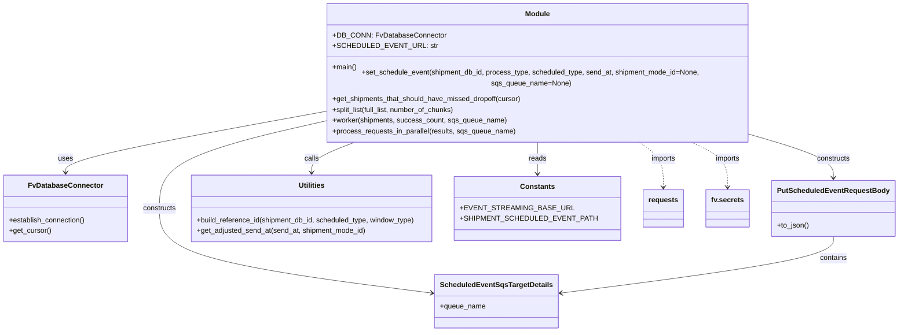

# Diagram: shipment_core/shipment_service/scripts/backfill_missed_dropoff_scheduled_event/backfill_missed_dropoff_scheduled_event.py


> Auto-generated by Obscura crawlers

## Diagram 1

```mermaid
flowchart LR
    A[main()] --> B{env vars present?}
    B -->|no AWS_PROFILE| E[raise Exception "Missing AWS_PROFILE"]
    B -->|no AWS_STAGE| F[raise Exception "Missing AWS_STAGE"]
    B -->|no EVENT_STREAMING_BASE_URL| G[raise Exception "Missing EVENT_STREAMING_BASE_URL"]
    B -->|yes| H[DB_CONN.establish_connection()]
    H --> I[cursor = DB_CONN.get_cursor()]
    I --> J[get_shipments_that_should_have_missed_dropoff(cursor)]
    J --> K[process_requests_in_parallel(shipments, "SH-scheduled-event")]
    K --> L[split_list(results, 50) -> chunks]
    L --> M[spawn Thread per chunk]
    M --> N[worker(chunk, success_count, sqs_queue_name)]
    N --> O[for each shipment in chunk]
    O --> P{shipment.destination_ts is not None?}
    P -->|yes| Q[set_schedule_event(..., scheduled_type=DESTINATION, send_at=destination_ts)]
    P -->|yes| R[set_schedule_event(..., scheduled_type=ORIGIN, send_at=origin_ts)]
    Q --> S[build_reference_id(...) -> reference_id]
    R --> S
    S --> T[get_adjusted_send_at(send_at, shipment_mode_id) -> send_at_or_none]
    T --> U{send_at exists?}
    U -->|yes| V[PutScheduledEventRequestBody(...).to_json() -> request_body]
    V --> W[requests.put(SCHEDULED_EVENT_URL, json=request_body)]
    U -->|no| X[end for this scheduled event]
    O --> Y[increment counters / print iteration]
    M --> Z[threads.join() -> return next(success_count)]
```

> SVG rendering failed for this diagram.

## Diagram 2



### SVG

<svg id="container" width="1963.53125" xmlns="http://www.w3.org/2000/svg" class="classDiagram" height="722" viewBox="0 0 1963.53125 722" role="graphics-document document" aria-roledescription="class"><style>#container{font-family:"trebuchet ms",verdana,arial,sans-serif;font-size:16px;fill:#333;}@keyframes edge-animation-frame{from{stroke-dashoffset:0;}}@keyframes dash{to{stroke-dashoffset:0;}}#container .edge-animation-slow{stroke-dasharray:9,5!important;stroke-dashoffset:900;animation:dash 50s linear infinite;stroke-linecap:round;}#container .edge-animation-fast{stroke-dasharray:9,5!important;stroke-dashoffset:900;animation:dash 20s linear infinite;stroke-linecap:round;}#container .error-icon{fill:#552222;}#container .error-text{fill:#552222;stroke:#552222;}#container .edge-thickness-normal{stroke-width:1px;}#container .edge-thickness-thick{stroke-width:3.5px;}#container .edge-pattern-solid{stroke-dasharray:0;}#container .edge-thickness-invisible{stroke-width:0;fill:none;}#container .edge-pattern-dashed{stroke-dasharray:3;}#container .edge-pattern-dotted{stroke-dasharray:2;}#container .marker{fill:#333333;stroke:#333333;}#container .marker.cross{stroke:#333333;}#container svg{font-family:"trebuchet ms",verdana,arial,sans-serif;font-size:16px;}#container p{margin:0;}#container g.classGroup text{fill:#9370DB;stroke:none;font-family:"trebuchet ms",verdana,arial,sans-serif;font-size:10px;}#container g.classGroup text .title{font-weight:bolder;}#container .nodeLabel,#container .edgeLabel{color:#131300;}#container .edgeLabel .label rect{fill:#ECECFF;}#container .label text{fill:#131300;}#container .labelBkg{background:#ECECFF;}#container .edgeLabel .label span{background:#ECECFF;}#container .classTitle{font-weight:bolder;}#container .node rect,#container .node circle,#container .node ellipse,#container .node polygon,#container .node path{fill:#ECECFF;stroke:#9370DB;stroke-width:1px;}#container .divider{stroke:#9370DB;stroke-width:1;}#container g.clickable{cursor:pointer;}#container g.classGroup rect{fill:#ECECFF;stroke:#9370DB;}#container g.classGroup line{stroke:#9370DB;stroke-width:1;}#container .classLabel .box{stroke:none;stroke-width:0;fill:#ECECFF;opacity:0.5;}#container .classLabel .label{fill:#9370DB;font-size:10px;}#container .relation{stroke:#333333;stroke-width:1;fill:none;}#container .dashed-line{stroke-dasharray:3;}#container .dotted-line{stroke-dasharray:1 2;}#container #compositionStart,#container .composition{fill:#333333!important;stroke:#333333!important;stroke-width:1;}#container #compositionEnd,#container .composition{fill:#333333!important;stroke:#333333!important;stroke-width:1;}#container #dependencyStart,#container .dependency{fill:#333333!important;stroke:#333333!important;stroke-width:1;}#container #dependencyStart,#container .dependency{fill:#333333!important;stroke:#333333!important;stroke-width:1;}#container #extensionStart,#container .extension{fill:transparent!important;stroke:#333333!important;stroke-width:1;}#container #extensionEnd,#container .extension{fill:transparent!important;stroke:#333333!important;stroke-width:1;}#container #aggregationStart,#container .aggregation{fill:transparent!important;stroke:#333333!important;stroke-width:1;}#container #aggregationEnd,#container .aggregation{fill:transparent!important;stroke:#333333!important;stroke-width:1;}#container #lollipopStart,#container .lollipop{fill:#ECECFF!important;stroke:#333333!important;stroke-width:1;}#container #lollipopEnd,#container .lollipop{fill:#ECECFF!important;stroke:#333333!important;stroke-width:1;}#container .edgeTerminals{font-size:11px;line-height:initial;}#container .classTitleText{text-anchor:middle;font-size:18px;fill:#333;}#container .label-icon{display:inline-block;height:1em;overflow:visible;vertical-align:-0.125em;}#container .node .label-icon path{fill:currentColor;stroke:revert;stroke-width:revert;}#container :root{--mermaid-font-family:"trebuchet ms",verdana,arial,sans-serif;}</style><g><defs><marker id="container_class-aggregationStart" class="marker aggregation class" refX="18" refY="7" markerWidth="190" markerHeight="240" orient="auto"><path d="M 18,7 L9,13 L1,7 L9,1 Z"></path></marker></defs><defs><marker id="container_class-aggregationEnd" class="marker aggregation class" refX="1" refY="7" markerWidth="20" markerHeight="28" orient="auto"><path d="M 18,7 L9,13 L1,7 L9,1 Z"></path></marker></defs><defs><marker id="container_class-extensionStart" class="marker extension class" refX="18" refY="7" markerWidth="190" markerHeight="240" orient="auto"><path d="M 1,7 L18,13 V 1 Z"></path></marker></defs><defs><marker id="container_class-extensionEnd" class="marker extension class" refX="1" refY="7" markerWidth="20" markerHeight="28" orient="auto"><path d="M 1,1 V 13 L18,7 Z"></path></marker></defs><defs><marker id="container_class-compositionStart" class="marker composition class" refX="18" refY="7" markerWidth="190" markerHeight="240" orient="auto"><path d="M 18,7 L9,13 L1,7 L9,1 Z"></path></marker></defs><defs><marker id="container_class-compositionEnd" class="marker composition class" refX="1" refY="7" markerWidth="20" markerHeight="28" orient="auto"><path d="M 18,7 L9,13 L1,7 L9,1 Z"></path></marker></defs><defs><marker id="container_class-dependencyStart" class="marker dependency class" refX="6" refY="7" markerWidth="190" markerHeight="240" orient="auto"><path d="M 5,7 L9,13 L1,7 L9,1 Z"></path></marker></defs><defs><marker id="container_class-dependencyEnd" class="marker dependency class" refX="13" refY="7" markerWidth="20" markerHeight="28" orient="auto"><path d="M 18,7 L9,13 L14,7 L9,1 Z"></path></marker></defs><defs><marker id="container_class-lollipopStart" class="marker lollipop class" refX="13" refY="7" markerWidth="190" markerHeight="240" orient="auto"><circle stroke="black" fill="transparent" cx="7" cy="7" r="6"></circle></marker></defs><defs><marker id="container_class-lollipopEnd" class="marker lollipop class" refX="1" refY="7" markerWidth="190" markerHeight="240" orient="auto"><circle stroke="black" fill="transparent" cx="7" cy="7" r="6"></circle></marker></defs><g class="root"><g class="clusters"></g><g class="edgePaths"><path d="M697.254,237.988L605.426,253.823C513.598,269.659,329.941,301.329,238.113,322.331C146.285,343.333,146.285,353.667,146.285,358.833L146.285,364" id="id_Module_FvDatabaseConnector_1" class="edge-thickness-normal edge-pattern-solid relation" style=";;;" data-edge="true" data-et="edge" data-id="id_Module_FvDatabaseConnector_1" data-points="W3sieCI6Njk3LjI1MzkwNjI1LCJ5IjoyMzcuOTg4MTM1NDY3MDYzNjR9LHsieCI6MTQ2LjI4NTE1NjI1LCJ5IjozMzN9LHsieCI6MTQ2LjI4NTE1NjI1LCJ5IjozNzB9XQ==" marker-end="url(#container_class-dependencyEnd)"></path><path d="M1694.535,295.655L1716.14,301.879C1737.745,308.103,1780.954,320.552,1802.559,333.942C1824.164,347.333,1824.164,361.667,1824.164,368.833L1824.164,376" id="id_Module_PutScheduledEventRequestBody_2" class="edge-thickness-normal edge-pattern-solid relation" style=";;;" data-edge="true" data-et="edge" data-id="id_Module_PutScheduledEventRequestBody_2" data-points="W3sieCI6MTY5NC41MzUxNTYyNSwieSI6Mjk1LjY1NDgzMDY2NzA3Mjl9LHsieCI6MTgyNC4xNjQwNjI1LCJ5IjozMzN9LHsieCI6MTgyNC4xNjQwNjI1LCJ5IjozODJ9XQ==" marker-end="url(#container_class-dependencyEnd)"></path><path d="M697.254,259.64L640.614,271.867C583.974,284.093,470.694,308.547,414.054,339.44C357.414,370.333,357.414,407.667,357.414,445C357.414,482.333,357.414,519.667,456.574,551.449C555.733,583.231,754.053,609.462,853.212,622.577L952.372,635.692" id="id_Module_ScheduledEventSqsTargetDetails_3" class="edge-thickness-normal edge-pattern-solid relation" style=";;;" data-edge="true" data-et="edge" data-id="id_Module_ScheduledEventSqsTargetDetails_3" data-points="W3sieCI6Njk3LjI1MzkwNjI1LCJ5IjoyNTkuNjM5ODk5MTg1MTg5fSx7IngiOjM1Ny40MTQwNjI1LCJ5IjozMzN9LHsieCI6MzU3LjQxNDA2MjUsInkiOjQ0NX0seyJ4IjozNTcuNDE0MDYyNSwieSI6NTU3fSx7IngiOjk1OC4zMjAzMTI1LCJ5Ijo2MzYuNDc4OTkyNjcwODcxfV0=" marker-end="url(#container_class-dependencyEnd)"></path><path d="M805.896,296L789.194,302.167C772.493,308.333,739.09,320.667,722.389,332C705.688,343.333,705.688,353.667,705.688,358.833L705.688,364" id="id_Module_Utilities_4" class="edge-thickness-normal edge-pattern-solid relation" style=";;;" data-edge="true" data-et="edge" data-id="id_Module_Utilities_4" data-points="W3sieCI6ODA1Ljg5NTU2NzE2MTYwMjIsInkiOjI5Nn0seyJ4Ijo3MDUuNjg3NSwieSI6MzMzfSx7IngiOjcwNS42ODc1LCJ5IjozNzB9XQ==" marker-end="url(#container_class-dependencyEnd)"></path><path d="M1195.895,296L1195.895,302.167C1195.895,308.333,1195.895,320.667,1195.895,332.5C1195.895,344.333,1195.895,355.667,1195.895,361.333L1195.895,367" id="id_Module_Constants_5" class="edge-thickness-normal edge-pattern-solid relation" style=";;;" data-edge="true" data-et="edge" data-id="id_Module_Constants_5" data-points="W3sieCI6MTE5NS44OTQ1MzEyNSwieSI6Mjk2fSx7IngiOjExOTUuODk0NTMxMjUsInkiOjMzM30seyJ4IjoxMTk1Ljg5NDUzMTI1LCJ5IjozNzN9XQ==" marker-end="url(#container_class-dependencyEnd)"></path><path d="M1824.164,508L1824.164,516.167C1824.164,524.333,1824.164,540.667,1725.004,561.949C1625.845,583.231,1427.525,609.462,1328.366,622.577L1229.206,635.692" id="id_PutScheduledEventRequestBody_ScheduledEventSqsTargetDetails_6" class="edge-thickness-normal edge-pattern-solid relation" style=";;;" data-edge="true" data-et="edge" data-id="id_PutScheduledEventRequestBody_ScheduledEventSqsTargetDetails_6" data-points="W3sieCI6MTgyNC4xNjQwNjI1LCJ5Ijo1MDh9LHsieCI6MTgyNC4xNjQwNjI1LCJ5Ijo1NTd9LHsieCI6MTIyMy4yNTc4MTI1LCJ5Ijo2MzYuNDc4OTkyNjcwODcxfV0=" marker-end="url(#container_class-dependencyEnd)"></path><path d="M1401.766,296L1410.583,302.167C1419.399,308.333,1437.032,320.667,1445.848,337.5C1454.664,354.333,1454.664,375.667,1454.664,386.333L1454.664,397" id="id_Module_requests_7" class="edge-thickness-normal edge-pattern-dashed relation" style=";;;" data-edge="true" data-et="edge" data-id="id_Module_requests_7" data-points="W3sieCI6MTQwMS43NjY0MjM1MTUxOTMzLCJ5IjoyOTZ9LHsieCI6MTQ1NC42NjQwNjI1LCJ5IjozMzN9LHsieCI6MTQ1NC42NjQwNjI1LCJ5Ijo0MDN9XQ==" marker-end="url(#container_class-dependencyEnd)"></path><path d="M1513.993,296L1527.615,302.167C1541.237,308.333,1568.482,320.667,1582.104,337.5C1595.727,354.333,1595.727,375.667,1595.727,386.333L1595.727,397" id="id_Module_fv.secrets_8" class="edge-thickness-normal edge-pattern-dashed relation" style=";;;" data-edge="true" data-et="edge" data-id="id_Module_fv.secrets_8" data-points="W3sieCI6MTUxMy45OTI5NDI4NTIyMSwieSI6Mjk2fSx7IngiOjE1OTUuNzI2NTYyNSwieSI6MzMzfSx7IngiOjE1OTUuNzI2NTYyNSwieSI6NDAzfV0=" marker-end="url(#container_class-dependencyEnd)"></path></g><g class="edgeLabels"><g class="edgeLabel" transform="translate(146.28515625, 333)"><g class="label" data-id="id_Module_FvDatabaseConnector_1" transform="translate(-16.4921875, -12)"><foreignObject width="32.984375" height="24"><div xmlns="http://www.w3.org/1999/xhtml" class="labelBkg" style="display: table-cell; white-space: nowrap; line-height: 1.5; max-width: 200px; text-align: center;"><span class="edgeLabel"><p>uses</p></span></div></foreignObject></g></g><g class="edgeLabel" transform="translate(1824.1640625, 333)"><g class="label" data-id="id_Module_PutScheduledEventRequestBody_2" transform="translate(-37.84375, -12)"><foreignObject width="75.6875" height="24"><div xmlns="http://www.w3.org/1999/xhtml" class="labelBkg" style="display: table-cell; white-space: nowrap; line-height: 1.5; max-width: 200px; text-align: center;"><span class="edgeLabel"><p>constructs</p></span></div></foreignObject></g></g><g class="edgeLabel" transform="translate(357.4140625, 445)"><g class="label" data-id="id_Module_ScheduledEventSqsTargetDetails_3" transform="translate(-37.84375, -12)"><foreignObject width="75.6875" height="24"><div xmlns="http://www.w3.org/1999/xhtml" class="labelBkg" style="display: table-cell; white-space: nowrap; line-height: 1.5; max-width: 200px; text-align: center;"><span class="edgeLabel"><p>constructs</p></span></div></foreignObject></g></g><g class="edgeLabel" transform="translate(705.6875, 333)"><g class="label" data-id="id_Module_Utilities_4" transform="translate(-16.4453125, -12)"><foreignObject width="32.890625" height="24"><div xmlns="http://www.w3.org/1999/xhtml" class="labelBkg" style="display: table-cell; white-space: nowrap; line-height: 1.5; max-width: 200px; text-align: center;"><span class="edgeLabel"><p>calls</p></span></div></foreignObject></g></g><g class="edgeLabel" transform="translate(1195.89453125, 333)"><g class="label" data-id="id_Module_Constants_5" transform="translate(-20.0078125, -12)"><foreignObject width="40.015625" height="24"><div xmlns="http://www.w3.org/1999/xhtml" class="labelBkg" style="display: table-cell; white-space: nowrap; line-height: 1.5; max-width: 200px; text-align: center;"><span class="edgeLabel"><p>reads</p></span></div></foreignObject></g></g><g class="edgeLabel" transform="translate(1824.1640625, 557)"><g class="label" data-id="id_PutScheduledEventRequestBody_ScheduledEventSqsTargetDetails_6" transform="translate(-30.890625, -12)"><foreignObject width="61.78125" height="24"><div xmlns="http://www.w3.org/1999/xhtml" class="labelBkg" style="display: table-cell; white-space: nowrap; line-height: 1.5; max-width: 200px; text-align: center;"><span class="edgeLabel"><p>contains</p></span></div></foreignObject></g></g><g class="edgeLabel" transform="translate(1454.6640625, 333)"><g class="label" data-id="id_Module_requests_7" transform="translate(-28.25, -12)"><foreignObject width="56.5" height="24"><div xmlns="http://www.w3.org/1999/xhtml" class="labelBkg" style="display: table-cell; white-space: nowrap; line-height: 1.5; max-width: 200px; text-align: center;"><span class="edgeLabel"><p>imports</p></span></div></foreignObject></g></g><g class="edgeLabel" transform="translate(1595.7265625, 333)"><g class="label" data-id="id_Module_fv.secrets_8" transform="translate(-28.25, -12)"><foreignObject width="56.5" height="24"><div xmlns="http://www.w3.org/1999/xhtml" class="labelBkg" style="display: table-cell; white-space: nowrap; line-height: 1.5; max-width: 200px; text-align: center;"><span class="edgeLabel"><p>imports</p></span></div></foreignObject></g></g></g><g class="nodes"><g class="node default" id="classId-Module-0" transform="translate(1195.89453125, 152)"><g class="basic label-container"><path d="M-498.640625 -144 L498.640625 -144 L498.640625 144 L-498.640625 144" stroke="none" stroke-width="0" fill="#ECECFF" style=""></path><path d="M-498.640625 -144 C-172.72607444733688 -144, 153.18847610532623 -144, 498.640625 -144 M-498.640625 -144 C-176.47121183516043 -144, 145.69820132967914 -144, 498.640625 -144 M498.640625 -144 C498.640625 -85.25980828049913, 498.640625 -26.51961656099826, 498.640625 144 M498.640625 -144 C498.640625 -57.48103441611987, 498.640625 29.037931167760263, 498.640625 144 M498.640625 144 C207.9150950552396 144, -82.81043488952082 144, -498.640625 144 M498.640625 144 C180.19101538941692 144, -138.25859422116616 144, -498.640625 144 M-498.640625 144 C-498.640625 36.445756256283914, -498.640625 -71.10848748743217, -498.640625 -144 M-498.640625 144 C-498.640625 40.4646103793705, -498.640625 -63.070779241259004, -498.640625 -144" stroke="#9370DB" stroke-width="1.3" fill="none" stroke-dasharray="0 0" style=""></path></g><g class="annotation-group text" transform="translate(0, -120)"></g><g class="label-group text" transform="translate(-27.09375, -120)"><g class="label" style="font-weight: bolder" transform="translate(0,-12)"><foreignObject width="54.1875" height="24"><div xmlns="http://www.w3.org/1999/xhtml" style="display: table-cell; white-space: nowrap; line-height: 1.5; max-width: 104px; text-align: center;"><span class="nodeLabel markdown-node-label" style=""><p>Module</p></span></div></foreignObject></g></g><g class="members-group text" transform="translate(-486.640625, -72)"><g class="label" style="" transform="translate(0,-12)"><foreignObject width="241.65625" height="24"><div xmlns="http://www.w3.org/1999/xhtml" style="display: table-cell; white-space: nowrap; line-height: 1.5; max-width: 300px; text-align: center;"><span class="nodeLabel markdown-node-label" style=""><p>+DB_CONN: FvDatabaseConnector</p></span></div></foreignObject></g><g class="label" style="" transform="translate(0,12)"><foreignObject width="207.875" height="24"><div xmlns="http://www.w3.org/1999/xhtml" style="display: table-cell; white-space: nowrap; line-height: 1.5; max-width: 266px; text-align: center;"><span class="nodeLabel markdown-node-label" style=""><p>+SCHEDULED_EVENT_URL: str</p></span></div></foreignObject></g></g><g class="methods-group text" transform="translate(-486.640625, 0)"><g class="label" style="" transform="translate(0,-12)"><foreignObject width="54.65625" height="24"><div xmlns="http://www.w3.org/1999/xhtml" style="display: table-cell; white-space: nowrap; line-height: 1.5; max-width: 112px; text-align: center;"><span class="nodeLabel markdown-node-label" style=""><p>+main()</p></span></div></foreignObject></g><g class="label" style="" transform="translate(0,12)"><foreignObject width="946.1875" height="24"><div xmlns="http://www.w3.org/1999/xhtml" style="display: table-cell; white-space: nowrap; line-height: 1.5; max-width: 1004px; text-align: center;"><span class="nodeLabel markdown-node-label" style=""><p>+set_schedule_event(shipment_db_id, process_type, scheduled_type, send_at, shipment_mode_id=None, sqs_queue_name=None)</p></span></div></foreignObject></g><g class="label" style="" transform="translate(0,36)"><foreignObject width="430.359375" height="24"><div xmlns="http://www.w3.org/1999/xhtml" style="display: table-cell; white-space: nowrap; line-height: 1.5; max-width: 488px; text-align: center;"><span class="nodeLabel markdown-node-label" style=""><p>+get_shipments_that_should_have_missed_dropoff(cursor)</p></span></div></foreignObject></g><g class="label" style="" transform="translate(0,60)"><foreignObject width="280.765625" height="24"><div xmlns="http://www.w3.org/1999/xhtml" style="display: table-cell; white-space: nowrap; line-height: 1.5; max-width: 338px; text-align: center;"><span class="nodeLabel markdown-node-label" style=""><p>+split_list(full_list, number_of_chunks)</p></span></div></foreignObject></g><g class="label" style="" transform="translate(0,84)"><foreignObject width="390.53125" height="24"><div xmlns="http://www.w3.org/1999/xhtml" style="display: table-cell; white-space: nowrap; line-height: 1.5; max-width: 448px; text-align: center;"><span class="nodeLabel markdown-node-label" style=""><p>+worker(shipments, success_count, sqs_queue_name)</p></span></div></foreignObject></g><g class="label" style="" transform="translate(0,108)"><foreignObject width="413.140625" height="24"><div xmlns="http://www.w3.org/1999/xhtml" style="display: table-cell; white-space: nowrap; line-height: 1.5; max-width: 471px; text-align: center;"><span class="nodeLabel markdown-node-label" style=""><p>+process_requests_in_parallel(results, sqs_queue_name)</p></span></div></foreignObject></g></g><g class="divider" style=""><path d="M-498.640625 -96 C-116.31091186075372 -96, 266.01880127849256 -96, 498.640625 -96 M-498.640625 -96 C-196.8448998637416 -96, 104.9508252725168 -96, 498.640625 -96" stroke="#9370DB" stroke-width="1.3" fill="none" stroke-dasharray="0 0" style=""></path></g><g class="divider" style=""><path d="M-498.640625 -24 C-154.83003773509722 -24, 188.98054952980556 -24, 498.640625 -24 M-498.640625 -24 C-144.2696683032899 -24, 210.1012883934202 -24, 498.640625 -24" stroke="#9370DB" stroke-width="1.3" fill="none" stroke-dasharray="0 0" style=""></path></g></g><g class="node default" id="classId-FvDatabaseConnector-1" transform="translate(146.28515625, 445)"><g class="basic label-container"><path d="M-138.28515625 -75 L138.28515625 -75 L138.28515625 75 L-138.28515625 75" stroke="none" stroke-width="0" fill="#ECECFF" style=""></path><path d="M-138.28515625 -75 C-62.837389678219864 -75, 12.610376893560272 -75, 138.28515625 -75 M-138.28515625 -75 C-42.08922983213391 -75, 54.10669658573218 -75, 138.28515625 -75 M138.28515625 -75 C138.28515625 -39.846759402282686, 138.28515625 -4.693518804565372, 138.28515625 75 M138.28515625 -75 C138.28515625 -19.93232615080658, 138.28515625 35.13534769838684, 138.28515625 75 M138.28515625 75 C81.2836666452601 75, 24.28217704052021 75, -138.28515625 75 M138.28515625 75 C39.5141054059781 75, -59.2569454380438 75, -138.28515625 75 M-138.28515625 75 C-138.28515625 22.126523717629375, -138.28515625 -30.74695256474125, -138.28515625 -75 M-138.28515625 75 C-138.28515625 43.207411445176746, -138.28515625 11.414822890353484, -138.28515625 -75" stroke="#9370DB" stroke-width="1.3" fill="none" stroke-dasharray="0 0" style=""></path></g><g class="annotation-group text" transform="translate(0, -51)"></g><g class="label-group text" transform="translate(-79.3046875, -51)"><g class="label" style="font-weight: bolder" transform="translate(0,-12)"><foreignObject width="158.609375" height="24"><div xmlns="http://www.w3.org/1999/xhtml" style="display: table-cell; white-space: nowrap; line-height: 1.5; max-width: 207px; text-align: center;"><span class="nodeLabel markdown-node-label" style=""><p>FvDatabaseConnector</p></span></div></foreignObject></g></g><g class="members-group text" transform="translate(-126.28515625, -3)"></g><g class="methods-group text" transform="translate(-126.28515625, 27)"><g class="label" style="" transform="translate(0,-12)"><foreignObject width="173.265625" height="24"><div xmlns="http://www.w3.org/1999/xhtml" style="display: table-cell; white-space: nowrap; line-height: 1.5; max-width: 231px; text-align: center;"><span class="nodeLabel markdown-node-label" style=""><p>+establish_connection()</p></span></div></foreignObject></g><g class="label" style="" transform="translate(0,12)"><foreignObject width="94.640625" height="24"><div xmlns="http://www.w3.org/1999/xhtml" style="display: table-cell; white-space: nowrap; line-height: 1.5; max-width: 152px; text-align: center;"><span class="nodeLabel markdown-node-label" style=""><p>+get_cursor()</p></span></div></foreignObject></g></g><g class="divider" style=""><path d="M-138.28515625 -27 C-70.07019276049441 -27, -1.855229270988815 -27, 138.28515625 -27 M-138.28515625 -27 C-37.79775000677505 -27, 62.689656236449906 -27, 138.28515625 -27" stroke="#9370DB" stroke-width="1.3" fill="none" stroke-dasharray="0 0" style=""></path></g><g class="divider" style=""><path d="M-138.28515625 -3 C-40.141515596678786 -3, 58.00212505664243 -3, 138.28515625 -3 M-138.28515625 -3 C-70.99062030947606 -3, -3.696084368952114 -3, 138.28515625 -3" stroke="#9370DB" stroke-width="1.3" fill="none" stroke-dasharray="0 0" style=""></path></g></g><g class="node default" id="classId-PutScheduledEventRequestBody-2" transform="translate(1824.1640625, 445)"><g class="basic label-container"><path d="M-131.3671875 -63 L131.3671875 -63 L131.3671875 63 L-131.3671875 63" stroke="none" stroke-width="0" fill="#ECECFF" style=""></path><path d="M-131.3671875 -63 C-55.39193376578535 -63, 20.583319968429294 -63, 131.3671875 -63 M-131.3671875 -63 C-49.66689397312926 -63, 32.033399553741475 -63, 131.3671875 -63 M131.3671875 -63 C131.3671875 -26.666375417166783, 131.3671875 9.667249165666433, 131.3671875 63 M131.3671875 -63 C131.3671875 -22.47395631457134, 131.3671875 18.052087370857322, 131.3671875 63 M131.3671875 63 C59.31501420878328 63, -12.737159082433436 63, -131.3671875 63 M131.3671875 63 C46.17312707948213 63, -39.02093334103574 63, -131.3671875 63 M-131.3671875 63 C-131.3671875 14.548124887921837, -131.3671875 -33.903750224156326, -131.3671875 -63 M-131.3671875 63 C-131.3671875 36.16863870228545, -131.3671875 9.337277404570898, -131.3671875 -63" stroke="#9370DB" stroke-width="1.3" fill="none" stroke-dasharray="0 0" style=""></path></g><g class="annotation-group text" transform="translate(0, -39)"></g><g class="label-group text" transform="translate(-119.3671875, -39)"><g class="label" style="font-weight: bolder" transform="translate(0,-12)"><foreignObject width="238.734375" height="24"><div xmlns="http://www.w3.org/1999/xhtml" style="display: table-cell; white-space: nowrap; line-height: 1.5; max-width: 286px; text-align: center;"><span class="nodeLabel markdown-node-label" style=""><p>PutScheduledEventRequestBody</p></span></div></foreignObject></g></g><g class="members-group text" transform="translate(-119.3671875, 9)"></g><g class="methods-group text" transform="translate(-119.3671875, 39)"><g class="label" style="" transform="translate(0,-12)"><foreignObject width="72.40625" height="24"><div xmlns="http://www.w3.org/1999/xhtml" style="display: table-cell; white-space: nowrap; line-height: 1.5; max-width: 130px; text-align: center;"><span class="nodeLabel markdown-node-label" style=""><p>+to_json()</p></span></div></foreignObject></g></g><g class="divider" style=""><path d="M-131.3671875 -15 C-72.28139491845528 -15, -13.19560233691054 -15, 131.3671875 -15 M-131.3671875 -15 C-75.25937266211601 -15, -19.151557824232015 -15, 131.3671875 -15" stroke="#9370DB" stroke-width="1.3" fill="none" stroke-dasharray="0 0" style=""></path></g><g class="divider" style=""><path d="M-131.3671875 9 C-55.43174424287936 9, 20.503699014241278 9, 131.3671875 9 M-131.3671875 9 C-65.41280343463045 9, 0.5415806307391051 9, 131.3671875 9" stroke="#9370DB" stroke-width="1.3" fill="none" stroke-dasharray="0 0" style=""></path></g></g><g class="node default" id="classId-ScheduledEventSqsTargetDetails-3" transform="translate(1090.7890625, 654)"><g class="basic label-container"><path d="M-132.46875 -60 L132.46875 -60 L132.46875 60 L-132.46875 60" stroke="none" stroke-width="0" fill="#ECECFF" style=""></path><path d="M-132.46875 -60 C-77.05339244877074 -60, -21.638034897541473 -60, 132.46875 -60 M-132.46875 -60 C-39.74055396174032 -60, 52.987642076519364 -60, 132.46875 -60 M132.46875 -60 C132.46875 -12.140514937036329, 132.46875 35.71897012592734, 132.46875 60 M132.46875 -60 C132.46875 -35.287943290302614, 132.46875 -10.575886580605228, 132.46875 60 M132.46875 60 C27.108476778094783 60, -78.25179644381043 60, -132.46875 60 M132.46875 60 C75.30047309187358 60, 18.13219618374717 60, -132.46875 60 M-132.46875 60 C-132.46875 22.849643106238688, -132.46875 -14.300713787522625, -132.46875 -60 M-132.46875 60 C-132.46875 18.400083100498804, -132.46875 -23.19983379900239, -132.46875 -60" stroke="#9370DB" stroke-width="1.3" fill="none" stroke-dasharray="0 0" style=""></path></g><g class="annotation-group text" transform="translate(0, -36)"></g><g class="label-group text" transform="translate(-120.46875, -36)"><g class="label" style="font-weight: bolder" transform="translate(0,-12)"><foreignObject width="240.9375" height="24"><div xmlns="http://www.w3.org/1999/xhtml" style="display: table-cell; white-space: nowrap; line-height: 1.5; max-width: 287px; text-align: center;"><span class="nodeLabel markdown-node-label" style=""><p>ScheduledEventSqsTargetDetails</p></span></div></foreignObject></g></g><g class="members-group text" transform="translate(-120.46875, 12)"><g class="label" style="" transform="translate(0,-12)"><foreignObject width="102.140625" height="24"><div xmlns="http://www.w3.org/1999/xhtml" style="display: table-cell; white-space: nowrap; line-height: 1.5; max-width: 160px; text-align: center;"><span class="nodeLabel markdown-node-label" style=""><p>+queue_name</p></span></div></foreignObject></g></g><g class="methods-group text" transform="translate(-120.46875, 60)"></g><g class="divider" style=""><path d="M-132.46875 -12 C-57.464503730018336 -12, 17.539742539963328 -12, 132.46875 -12 M-132.46875 -12 C-54.15557546671073 -12, 24.15759906657854 -12, 132.46875 -12" stroke="#9370DB" stroke-width="1.3" fill="none" stroke-dasharray="0 0" style=""></path></g><g class="divider" style=""><path d="M-132.46875 36 C-42.45596161356903 36, 47.55682677286194 36, 132.46875 36 M-132.46875 36 C-50.46666200326244 36, 31.535425993475116 36, 132.46875 36" stroke="#9370DB" stroke-width="1.3" fill="none" stroke-dasharray="0 0" style=""></path></g></g><g class="node default" id="classId-Utilities-4" transform="translate(705.6875, 445)"><g class="basic label-container"><path d="M-275.4296875 -75 L275.4296875 -75 L275.4296875 75 L-275.4296875 75" stroke="none" stroke-width="0" fill="#ECECFF" style=""></path><path d="M-275.4296875 -75 C-130.8823409378871 -75, 13.665005624225785 -75, 275.4296875 -75 M-275.4296875 -75 C-63.494077032296815 -75, 148.44153343540637 -75, 275.4296875 -75 M275.4296875 -75 C275.4296875 -31.466538916077617, 275.4296875 12.066922167844766, 275.4296875 75 M275.4296875 -75 C275.4296875 -32.63715537380032, 275.4296875 9.725689252399363, 275.4296875 75 M275.4296875 75 C92.03283726696236 75, -91.36401296607528 75, -275.4296875 75 M275.4296875 75 C135.93751593543672 75, -3.5546556291265574 75, -275.4296875 75 M-275.4296875 75 C-275.4296875 43.18178211371843, -275.4296875 11.363564227436854, -275.4296875 -75 M-275.4296875 75 C-275.4296875 25.44605610410315, -275.4296875 -24.1078877917937, -275.4296875 -75" stroke="#9370DB" stroke-width="1.3" fill="none" stroke-dasharray="0 0" style=""></path></g><g class="annotation-group text" transform="translate(0, -51)"></g><g class="label-group text" transform="translate(-28.8125, -51)"><g class="label" style="font-weight: bolder" transform="translate(0,-12)"><foreignObject width="57.625" height="24"><div xmlns="http://www.w3.org/1999/xhtml" style="display: table-cell; white-space: nowrap; line-height: 1.5; max-width: 107px; text-align: center;"><span class="nodeLabel markdown-node-label" style=""><p>Utilities</p></span></div></foreignObject></g></g><g class="members-group text" transform="translate(-263.4296875, -3)"></g><g class="methods-group text" transform="translate(-263.4296875, 27)"><g class="label" style="" transform="translate(0,-12)"><foreignObject width="498.046875" height="24"><div xmlns="http://www.w3.org/1999/xhtml" style="display: table-cell; white-space: nowrap; line-height: 1.5; max-width: 555px; text-align: center;"><span class="nodeLabel markdown-node-label" style=""><p>+build_reference_id(shipment_db_id, scheduled_type, window_type)</p></span></div></foreignObject></g><g class="label" style="" transform="translate(0,12)"><foreignObject width="384.171875" height="24"><div xmlns="http://www.w3.org/1999/xhtml" style="display: table-cell; white-space: nowrap; line-height: 1.5; max-width: 442px; text-align: center;"><span class="nodeLabel markdown-node-label" style=""><p>+get_adjusted_send_at(send_at, shipment_mode_id)</p></span></div></foreignObject></g></g><g class="divider" style=""><path d="M-275.4296875 -27 C-88.23341936918376 -27, 98.96284876163247 -27, 275.4296875 -27 M-275.4296875 -27 C-125.37826715656777 -27, 24.673153186864454 -27, 275.4296875 -27" stroke="#9370DB" stroke-width="1.3" fill="none" stroke-dasharray="0 0" style=""></path></g><g class="divider" style=""><path d="M-275.4296875 -3 C-127.00100571198689 -3, 21.427676076026216 -3, 275.4296875 -3 M-275.4296875 -3 C-92.85216488097532 -3, 89.72535773804935 -3, 275.4296875 -3" stroke="#9370DB" stroke-width="1.3" fill="none" stroke-dasharray="0 0" style=""></path></g></g><g class="node default" id="classId-Constants-5" transform="translate(1195.89453125, 445)"><g class="basic label-container"><path d="M-164.77734375 -72 L164.77734375 -72 L164.77734375 72 L-164.77734375 72" stroke="none" stroke-width="0" fill="#ECECFF" style=""></path><path d="M-164.77734375 -72 C-68.81185154049201 -72, 27.15364066901597 -72, 164.77734375 -72 M-164.77734375 -72 C-80.51629882104584 -72, 3.744746107908327 -72, 164.77734375 -72 M164.77734375 -72 C164.77734375 -42.637017641311665, 164.77734375 -13.27403528262333, 164.77734375 72 M164.77734375 -72 C164.77734375 -17.19829674087712, 164.77734375 37.60340651824576, 164.77734375 72 M164.77734375 72 C92.06998423662104 72, 19.362624723242078 72, -164.77734375 72 M164.77734375 72 C48.23994086556225 72, -68.2974620188755 72, -164.77734375 72 M-164.77734375 72 C-164.77734375 15.062283588981472, -164.77734375 -41.875432822037055, -164.77734375 -72 M-164.77734375 72 C-164.77734375 32.40280796350305, -164.77734375 -7.194384072993898, -164.77734375 -72" stroke="#9370DB" stroke-width="1.3" fill="none" stroke-dasharray="0 0" style=""></path></g><g class="annotation-group text" transform="translate(0, -48)"></g><g class="label-group text" transform="translate(-36.5390625, -48)"><g class="label" style="font-weight: bolder" transform="translate(0,-12)"><foreignObject width="73.078125" height="24"><div xmlns="http://www.w3.org/1999/xhtml" style="display: table-cell; white-space: nowrap; line-height: 1.5; max-width: 122px; text-align: center;"><span class="nodeLabel markdown-node-label" style=""><p>Constants</p></span></div></foreignObject></g></g><g class="members-group text" transform="translate(-152.77734375, 0)"><g class="label" style="" transform="translate(0,-12)"><foreignObject width="223.140625" height="24"><div xmlns="http://www.w3.org/1999/xhtml" style="display: table-cell; white-space: nowrap; line-height: 1.5; max-width: 281px; text-align: center;"><span class="nodeLabel markdown-node-label" style=""><p>+EVENT_STREAMING_BASE_URL</p></span></div></foreignObject></g><g class="label" style="" transform="translate(0,12)"><foreignObject width="269.015625" height="24"><div xmlns="http://www.w3.org/1999/xhtml" style="display: table-cell; white-space: nowrap; line-height: 1.5; max-width: 326px; text-align: center;"><span class="nodeLabel markdown-node-label" style=""><p>+SHIPMENT_SCHEDULED_EVENT_PATH</p></span></div></foreignObject></g></g><g class="methods-group text" transform="translate(-152.77734375, 72)"></g><g class="divider" style=""><path d="M-164.77734375 -24 C-55.25812809895693 -24, 54.26108755208614 -24, 164.77734375 -24 M-164.77734375 -24 C-72.28732742190043 -24, 20.202688906199143 -24, 164.77734375 -24" stroke="#9370DB" stroke-width="1.3" fill="none" stroke-dasharray="0 0" style=""></path></g><g class="divider" style=""><path d="M-164.77734375 48 C-53.703877189335245 48, 57.36958937132951 48, 164.77734375 48 M-164.77734375 48 C-64.8270771506612 48, 35.12318944867761 48, 164.77734375 48" stroke="#9370DB" stroke-width="1.3" fill="none" stroke-dasharray="0 0" style=""></path></g></g><g class="node default" id="classId-requests-6" transform="translate(1454.6640625, 445)"><g class="basic label-container"><path d="M-43.9921875 -42 L43.9921875 -42 L43.9921875 42 L-43.9921875 42" stroke="none" stroke-width="0" fill="#ECECFF" style=""></path><path d="M-43.9921875 -42 C-10.60734572788543 -42, 22.77749604422914 -42, 43.9921875 -42 M-43.9921875 -42 C-14.112370614875651 -42, 15.767446270248698 -42, 43.9921875 -42 M43.9921875 -42 C43.9921875 -18.273404166668346, 43.9921875 5.453191666663308, 43.9921875 42 M43.9921875 -42 C43.9921875 -13.542640200433251, 43.9921875 14.914719599133498, 43.9921875 42 M43.9921875 42 C26.11637433302813 42, 8.24056116605626 42, -43.9921875 42 M43.9921875 42 C25.371706938374103 42, 6.751226376748207 42, -43.9921875 42 M-43.9921875 42 C-43.9921875 24.08332293713902, -43.9921875 6.166645874278039, -43.9921875 -42 M-43.9921875 42 C-43.9921875 17.042935280420252, -43.9921875 -7.914129439159495, -43.9921875 -42" stroke="#9370DB" stroke-width="1.3" fill="none" stroke-dasharray="0 0" style=""></path></g><g class="annotation-group text" transform="translate(0, -18)"></g><g class="label-group text" transform="translate(-31.9921875, -18)"><g class="label" style="font-weight: bolder" transform="translate(0,-12)"><foreignObject width="63.984375" height="24"><div xmlns="http://www.w3.org/1999/xhtml" style="display: table-cell; white-space: nowrap; line-height: 1.5; max-width: 113px; text-align: center;"><span class="nodeLabel markdown-node-label" style=""><p>requests</p></span></div></foreignObject></g></g><g class="members-group text" transform="translate(-31.9921875, 30)"></g><g class="methods-group text" transform="translate(-31.9921875, 60)"></g><g class="divider" style=""><path d="M-43.9921875 6 C-15.032954722185014 6, 13.926278055629972 6, 43.9921875 6 M-43.9921875 6 C-22.51967175118372 6, -1.047156002367437 6, 43.9921875 6" stroke="#9370DB" stroke-width="1.3" fill="none" stroke-dasharray="0 0" style=""></path></g><g class="divider" style=""><path d="M-43.9921875 24 C-13.610923340074173 24, 16.770340819851654 24, 43.9921875 24 M-43.9921875 24 C-22.630007357911573 24, -1.2678272158231465 24, 43.9921875 24" stroke="#9370DB" stroke-width="1.3" fill="none" stroke-dasharray="0 0" style=""></path></g></g><g class="node default" id="classId-fv.secrets-7" transform="translate(1595.7265625, 445)"><g class="basic label-container"><path d="M-47.0703125 -42 L47.0703125 -42 L47.0703125 42 L-47.0703125 42" stroke="none" stroke-width="0" fill="#ECECFF" style=""></path><path d="M-47.0703125 -42 C-24.03041935740221 -42, -0.9905262148044187 -42, 47.0703125 -42 M-47.0703125 -42 C-26.59937433526716 -42, -6.1284361705343215 -42, 47.0703125 -42 M47.0703125 -42 C47.0703125 -12.320020201359057, 47.0703125 17.359959597281886, 47.0703125 42 M47.0703125 -42 C47.0703125 -23.767158142491144, 47.0703125 -5.534316284982289, 47.0703125 42 M47.0703125 42 C12.961090738414981 42, -21.148131023170038 42, -47.0703125 42 M47.0703125 42 C10.257517196496941 42, -26.555278107006117 42, -47.0703125 42 M-47.0703125 42 C-47.0703125 15.144304853796633, -47.0703125 -11.711390292406733, -47.0703125 -42 M-47.0703125 42 C-47.0703125 10.339021672397955, -47.0703125 -21.32195665520409, -47.0703125 -42" stroke="#9370DB" stroke-width="1.3" fill="none" stroke-dasharray="0 0" style=""></path></g><g class="annotation-group text" transform="translate(0, -18)"></g><g class="label-group text" transform="translate(-35.0703125, -18)"><g class="label" style="font-weight: bolder" transform="translate(0,-12)"><foreignObject width="70.140625" height="24"><div xmlns="http://www.w3.org/1999/xhtml" style="display: table-cell; white-space: nowrap; line-height: 1.5; max-width: 118px; text-align: center;"><span class="nodeLabel markdown-node-label" style=""><p>fv.secrets</p></span></div></foreignObject></g></g><g class="members-group text" transform="translate(-35.0703125, 30)"></g><g class="methods-group text" transform="translate(-35.0703125, 60)"></g><g class="divider" style=""><path d="M-47.0703125 6 C-22.66083832374598 6, 1.7486358525080377 6, 47.0703125 6 M-47.0703125 6 C-27.783708942646594 6, -8.497105385293189 6, 47.0703125 6" stroke="#9370DB" stroke-width="1.3" fill="none" stroke-dasharray="0 0" style=""></path></g><g class="divider" style=""><path d="M-47.0703125 24 C-10.925237321209785 24, 25.21983785758043 24, 47.0703125 24 M-47.0703125 24 C-26.087941376156685 24, -5.10557025231337 24, 47.0703125 24" stroke="#9370DB" stroke-width="1.3" fill="none" stroke-dasharray="0 0" style=""></path></g></g></g></g></g></svg>
