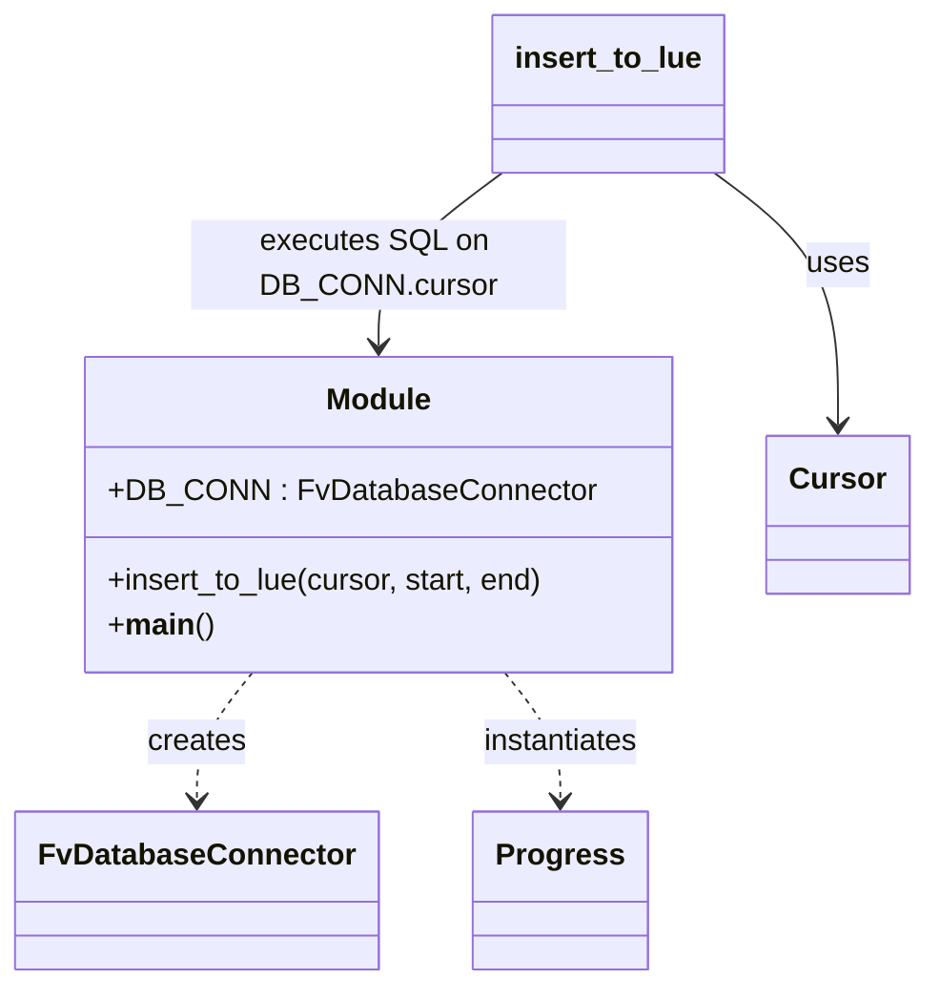

# Diagram: shipment_core/shipment_service/scripts/backfill_reporting_location_update_event.py


> Auto-generated by Obscura crawlers

## Diagram 1



### SVG

<svg id="container" width="470.13671875" xmlns="http://www.w3.org/2000/svg" class="classDiagram" height="524" viewBox="0 0 470.13671875 524" role="graphics-document document" aria-roledescription="class"><style>#container{font-family:"trebuchet ms",verdana,arial,sans-serif;font-size:16px;fill:#333;}@keyframes edge-animation-frame{from{stroke-dashoffset:0;}}@keyframes dash{to{stroke-dashoffset:0;}}#container .edge-animation-slow{stroke-dasharray:9,5!important;stroke-dashoffset:900;animation:dash 50s linear infinite;stroke-linecap:round;}#container .edge-animation-fast{stroke-dasharray:9,5!important;stroke-dashoffset:900;animation:dash 20s linear infinite;stroke-linecap:round;}#container .error-icon{fill:#552222;}#container .error-text{fill:#552222;stroke:#552222;}#container .edge-thickness-normal{stroke-width:1px;}#container .edge-thickness-thick{stroke-width:3.5px;}#container .edge-pattern-solid{stroke-dasharray:0;}#container .edge-thickness-invisible{stroke-width:0;fill:none;}#container .edge-pattern-dashed{stroke-dasharray:3;}#container .edge-pattern-dotted{stroke-dasharray:2;}#container .marker{fill:#333333;stroke:#333333;}#container .marker.cross{stroke:#333333;}#container svg{font-family:"trebuchet ms",verdana,arial,sans-serif;font-size:16px;}#container p{margin:0;}#container g.classGroup text{fill:#9370DB;stroke:none;font-family:"trebuchet ms",verdana,arial,sans-serif;font-size:10px;}#container g.classGroup text .title{font-weight:bolder;}#container .nodeLabel,#container .edgeLabel{color:#131300;}#container .edgeLabel .label rect{fill:#ECECFF;}#container .label text{fill:#131300;}#container .labelBkg{background:#ECECFF;}#container .edgeLabel .label span{background:#ECECFF;}#container .classTitle{font-weight:bolder;}#container .node rect,#container .node circle,#container .node ellipse,#container .node polygon,#container .node path{fill:#ECECFF;stroke:#9370DB;stroke-width:1px;}#container .divider{stroke:#9370DB;stroke-width:1;}#container g.clickable{cursor:pointer;}#container g.classGroup rect{fill:#ECECFF;stroke:#9370DB;}#container g.classGroup line{stroke:#9370DB;stroke-width:1;}#container .classLabel .box{stroke:none;stroke-width:0;fill:#ECECFF;opacity:0.5;}#container .classLabel .label{fill:#9370DB;font-size:10px;}#container .relation{stroke:#333333;stroke-width:1;fill:none;}#container .dashed-line{stroke-dasharray:3;}#container .dotted-line{stroke-dasharray:1 2;}#container #compositionStart,#container .composition{fill:#333333!important;stroke:#333333!important;stroke-width:1;}#container #compositionEnd,#container .composition{fill:#333333!important;stroke:#333333!important;stroke-width:1;}#container #dependencyStart,#container .dependency{fill:#333333!important;stroke:#333333!important;stroke-width:1;}#container #dependencyStart,#container .dependency{fill:#333333!important;stroke:#333333!important;stroke-width:1;}#container #extensionStart,#container .extension{fill:transparent!important;stroke:#333333!important;stroke-width:1;}#container #extensionEnd,#container .extension{fill:transparent!important;stroke:#333333!important;stroke-width:1;}#container #aggregationStart,#container .aggregation{fill:transparent!important;stroke:#333333!important;stroke-width:1;}#container #aggregationEnd,#container .aggregation{fill:transparent!important;stroke:#333333!important;stroke-width:1;}#container #lollipopStart,#container .lollipop{fill:#ECECFF!important;stroke:#333333!important;stroke-width:1;}#container #lollipopEnd,#container .lollipop{fill:#ECECFF!important;stroke:#333333!important;stroke-width:1;}#container .edgeTerminals{font-size:11px;line-height:initial;}#container .classTitleText{text-anchor:middle;font-size:18px;fill:#333;}#container .label-icon{display:inline-block;height:1em;overflow:visible;vertical-align:-0.125em;}#container .node .label-icon path{fill:currentColor;stroke:revert;stroke-width:revert;}#container :root{--mermaid-font-family:"trebuchet ms",verdana,arial,sans-serif;}</style><g><defs><marker id="container_class-aggregationStart" class="marker aggregation class" refX="18" refY="7" markerWidth="190" markerHeight="240" orient="auto"><path d="M 18,7 L9,13 L1,7 L9,1 Z"></path></marker></defs><defs><marker id="container_class-aggregationEnd" class="marker aggregation class" refX="1" refY="7" markerWidth="20" markerHeight="28" orient="auto"><path d="M 18,7 L9,13 L1,7 L9,1 Z"></path></marker></defs><defs><marker id="container_class-extensionStart" class="marker extension class" refX="18" refY="7" markerWidth="190" markerHeight="240" orient="auto"><path d="M 1,7 L18,13 V 1 Z"></path></marker></defs><defs><marker id="container_class-extensionEnd" class="marker extension class" refX="1" refY="7" markerWidth="20" markerHeight="28" orient="auto"><path d="M 1,1 V 13 L18,7 Z"></path></marker></defs><defs><marker id="container_class-compositionStart" class="marker composition class" refX="18" refY="7" markerWidth="190" markerHeight="240" orient="auto"><path d="M 18,7 L9,13 L1,7 L9,1 Z"></path></marker></defs><defs><marker id="container_class-compositionEnd" class="marker composition class" refX="1" refY="7" markerWidth="20" markerHeight="28" orient="auto"><path d="M 18,7 L9,13 L1,7 L9,1 Z"></path></marker></defs><defs><marker id="container_class-dependencyStart" class="marker dependency class" refX="6" refY="7" markerWidth="190" markerHeight="240" orient="auto"><path d="M 5,7 L9,13 L1,7 L9,1 Z"></path></marker></defs><defs><marker id="container_class-dependencyEnd" class="marker dependency class" refX="13" refY="7" markerWidth="20" markerHeight="28" orient="auto"><path d="M 18,7 L9,13 L14,7 L9,1 Z"></path></marker></defs><defs><marker id="container_class-lollipopStart" class="marker lollipop class" refX="13" refY="7" markerWidth="190" markerHeight="240" orient="auto"><circle stroke="black" fill="transparent" cx="7" cy="7" r="6"></circle></marker></defs><defs><marker id="container_class-lollipopEnd" class="marker lollipop class" refX="1" refY="7" markerWidth="190" markerHeight="240" orient="auto"><circle stroke="black" fill="transparent" cx="7" cy="7" r="6"></circle></marker></defs><g class="root"><g class="clusters"></g><g class="edgePaths"><path d="M127.598,358L122.883,364.167C118.167,370.333,108.736,382.667,104.02,394C99.305,405.333,99.305,415.667,99.305,420.833L99.305,426" id="id_Module_FvDatabaseConnector_1" class="edge-thickness-normal edge-pattern-dashed relation" style=";;;" data-edge="true" data-et="edge" data-id="id_Module_FvDatabaseConnector_1" data-points="W3sieCI6MTI3LjU5ODE3Mjc3ODkyNTYyLCJ5IjozNTh9LHsieCI6OTkuMzA0Njg3NSwieSI6Mzk1fSx7IngiOjk5LjMwNDY4NzUsInkiOjQzMn1d" marker-end="url(#container_class-dependencyEnd)"></path><path d="M256.066,358L260.781,364.167C265.497,370.333,274.928,382.667,279.644,394C284.359,405.333,284.359,415.667,284.359,420.833L284.359,426" id="id_Module_Progress_2" class="edge-thickness-normal edge-pattern-dashed relation" style=";;;" data-edge="true" data-et="edge" data-id="id_Module_Progress_2" data-points="W3sieCI6MjU2LjA2NTg4OTcyMTA3NDM3LCJ5IjozNTh9LHsieCI6Mjg0LjM1OTM3NSwieSI6Mzk1fSx7IngiOjI4NC4zNTkzNzUsInkiOjQzMn1d" marker-end="url(#container_class-dependencyEnd)"></path><path d="M363.123,92L373.641,100.167C384.159,108.333,405.195,124.667,415.713,147C426.23,169.333,426.23,197.667,426.23,211.833L426.23,226" id="id_insert_to_lue_Cursor_3" class="edge-thickness-normal edge-pattern-solid relation" style=";;;" data-edge="true" data-et="edge" data-id="id_insert_to_lue_Cursor_3" data-points="W3sieCI6MzYzLjEyMzE5NzExNTM4NDY0LCJ5Ijo5Mn0seyJ4Ijo0MjYuMjMwNDY4NzUsInkiOjE0MX0seyJ4Ijo0MjYuMjMwNDY4NzUsInkiOjIzMn1d" marker-end="url(#container_class-dependencyEnd)"></path><path d="M254.939,92L244.421,100.167C233.904,108.333,212.868,124.667,202.35,140C191.832,155.333,191.832,169.667,191.832,176.833L191.832,184" id="id_insert_to_lue_Module_4" class="edge-thickness-normal edge-pattern-solid relation" style=";;;" data-edge="true" data-et="edge" data-id="id_insert_to_lue_Module_4" data-points="W3sieCI6MjU0LjkzOTMwMjg4NDYxNTQsInkiOjkyfSx7IngiOjE5MS44MzIwMzEyNSwieSI6MTQxfSx7IngiOjE5MS44MzIwMzEyNSwieSI6MTkwfV0=" marker-end="url(#container_class-dependencyEnd)"></path></g><g class="edgeLabels"><g class="edgeLabel" transform="translate(99.3046875, 395)"><g class="label" data-id="id_Module_FvDatabaseConnector_1" transform="translate(-26.171875, -12)"><foreignObject width="52.34375" height="24"><div xmlns="http://www.w3.org/1999/xhtml" class="labelBkg" style="display: table-cell; white-space: nowrap; line-height: 1.5; max-width: 200px; text-align: center;"><span class="edgeLabel"><p>creates</p></span></div></foreignObject></g></g><g class="edgeLabel" transform="translate(284.359375, 395)"><g class="label" data-id="id_Module_Progress_2" transform="translate(-42.9140625, -12)"><foreignObject width="85.828125" height="24"><div xmlns="http://www.w3.org/1999/xhtml" class="labelBkg" style="display: table-cell; white-space: nowrap; line-height: 1.5; max-width: 200px; text-align: center;"><span class="edgeLabel"><p>instantiates</p></span></div></foreignObject></g></g><g class="edgeLabel" transform="translate(426.23046875, 141)"><g class="label" data-id="id_insert_to_lue_Cursor_3" transform="translate(-16.4921875, -12)"><foreignObject width="32.984375" height="24"><div xmlns="http://www.w3.org/1999/xhtml" class="labelBkg" style="display: table-cell; white-space: nowrap; line-height: 1.5; max-width: 200px; text-align: center;"><span class="edgeLabel"><p>uses</p></span></div></foreignObject></g></g><g class="edgeLabel" transform="translate(191.83203125, 141)"><g class="label" data-id="id_insert_to_lue_Module_4" transform="translate(-100, -24)"><foreignObject width="200" height="48"><div xmlns="http://www.w3.org/1999/xhtml" class="labelBkg" style="display: table; white-space: break-spaces; line-height: 1.5; max-width: 200px; text-align: center; width: 200px;"><span class="edgeLabel"><p>executes SQL on DB_CONN.cursor</p></span></div></foreignObject></g></g></g><g class="nodes"><g class="node default" id="classId-Module-0" transform="translate(191.83203125, 274)"><g class="basic label-container"><path d="M-148.4921875 -84 L148.4921875 -84 L148.4921875 84 L-148.4921875 84" stroke="none" stroke-width="0" fill="#ECECFF" style=""></path><path d="M-148.4921875 -84 C-51.5629537195196 -84, 45.366280060960804 -84, 148.4921875 -84 M-148.4921875 -84 C-31.93288311478237 -84, 84.62642127043526 -84, 148.4921875 -84 M148.4921875 -84 C148.4921875 -26.091375797657506, 148.4921875 31.81724840468499, 148.4921875 84 M148.4921875 -84 C148.4921875 -39.17659557449644, 148.4921875 5.646808851007123, 148.4921875 84 M148.4921875 84 C83.1152630325686 84, 17.738338565137212 84, -148.4921875 84 M148.4921875 84 C37.568855730557004 84, -73.35447603888599 84, -148.4921875 84 M-148.4921875 84 C-148.4921875 24.532239480596928, -148.4921875 -34.935521038806144, -148.4921875 -84 M-148.4921875 84 C-148.4921875 24.552666290637916, -148.4921875 -34.89466741872417, -148.4921875 -84" stroke="#9370DB" stroke-width="1.3" fill="none" stroke-dasharray="0 0" style=""></path></g><g class="annotation-group text" transform="translate(0, -60)"></g><g class="label-group text" transform="translate(-27.09375, -60)"><g class="label" style="font-weight: bolder" transform="translate(0,-12)"><foreignObject width="54.1875" height="24"><div xmlns="http://www.w3.org/1999/xhtml" style="display: table-cell; white-space: nowrap; line-height: 1.5; max-width: 104px; text-align: center;"><span class="nodeLabel markdown-node-label" style=""><p>Module</p></span></div></foreignObject></g></g><g class="members-group text" transform="translate(-136.4921875, -12)"><g class="label" style="" transform="translate(0,-12)"><foreignObject width="245.890625" height="24"><div xmlns="http://www.w3.org/1999/xhtml" style="display: table-cell; white-space: nowrap; line-height: 1.5; max-width: 304px; text-align: center;"><span class="nodeLabel markdown-node-label" style=""><p>+DB_CONN : FvDatabaseConnector</p></span></div></foreignObject></g></g><g class="methods-group text" transform="translate(-136.4921875, 36)"><g class="label" style="" transform="translate(0,-12)"><foreignObject width="235.953125" height="24"><div xmlns="http://www.w3.org/1999/xhtml" style="display: table-cell; white-space: nowrap; line-height: 1.5; max-width: 293px; text-align: center;"><span class="nodeLabel markdown-node-label" style=""><p>+insert_to_lue(cursor, start, end)</p></span></div></foreignObject></g><g class="label" style="" transform="translate(0,12)"><foreignObject width="54.40625" height="24"><div xmlns="http://www.w3.org/1999/xhtml" style="display: table-cell; white-space: nowrap; line-height: 1.5; max-width: 144px; text-align: center;"><span class="nodeLabel markdown-node-label" style=""><p>+<strong>main</strong>()</p></span></div></foreignObject></g></g><g class="divider" style=""><path d="M-148.4921875 -36 C-63.51537595593123 -36, 21.461435588137533 -36, 148.4921875 -36 M-148.4921875 -36 C-45.21530996516806 -36, 58.06156756966388 -36, 148.4921875 -36" stroke="#9370DB" stroke-width="1.3" fill="none" stroke-dasharray="0 0" style=""></path></g><g class="divider" style=""><path d="M-148.4921875 12 C-59.55491723185105 12, 29.3823530362979 12, 148.4921875 12 M-148.4921875 12 C-67.81723986583208 12, 12.857707768335843 12, 148.4921875 12" stroke="#9370DB" stroke-width="1.3" fill="none" stroke-dasharray="0 0" style=""></path></g></g><g class="node default" id="classId-FvDatabaseConnector-1" transform="translate(99.3046875, 474)"><g class="basic label-container"><path d="M-91.3046875 -42 L91.3046875 -42 L91.3046875 42 L-91.3046875 42" stroke="none" stroke-width="0" fill="#ECECFF" style=""></path><path d="M-91.3046875 -42 C-45.06955499867354 -42, 1.1655775026529227 -42, 91.3046875 -42 M-91.3046875 -42 C-36.57565786428153 -42, 18.153371771436937 -42, 91.3046875 -42 M91.3046875 -42 C91.3046875 -12.994479936129355, 91.3046875 16.01104012774129, 91.3046875 42 M91.3046875 -42 C91.3046875 -15.05343781302322, 91.3046875 11.893124373953562, 91.3046875 42 M91.3046875 42 C42.24924308181479 42, -6.806201336370421 42, -91.3046875 42 M91.3046875 42 C50.760134124801425 42, 10.21558074960285 42, -91.3046875 42 M-91.3046875 42 C-91.3046875 12.467286267985287, -91.3046875 -17.065427464029426, -91.3046875 -42 M-91.3046875 42 C-91.3046875 10.649221262736507, -91.3046875 -20.701557474526986, -91.3046875 -42" stroke="#9370DB" stroke-width="1.3" fill="none" stroke-dasharray="0 0" style=""></path></g><g class="annotation-group text" transform="translate(0, -18)"></g><g class="label-group text" transform="translate(-79.3046875, -18)"><g class="label" style="font-weight: bolder" transform="translate(0,-12)"><foreignObject width="158.609375" height="24"><div xmlns="http://www.w3.org/1999/xhtml" style="display: table-cell; white-space: nowrap; line-height: 1.5; max-width: 207px; text-align: center;"><span class="nodeLabel markdown-node-label" style=""><p>FvDatabaseConnector</p></span></div></foreignObject></g></g><g class="members-group text" transform="translate(-79.3046875, 30)"></g><g class="methods-group text" transform="translate(-79.3046875, 60)"></g><g class="divider" style=""><path d="M-91.3046875 6 C-35.46758539267065 6, 20.3695167146587 6, 91.3046875 6 M-91.3046875 6 C-37.19381059808878 6, 16.917066303822438 6, 91.3046875 6" stroke="#9370DB" stroke-width="1.3" fill="none" stroke-dasharray="0 0" style=""></path></g><g class="divider" style=""><path d="M-91.3046875 24 C-21.597945198789517 24, 48.108797102420965 24, 91.3046875 24 M-91.3046875 24 C-28.51740209773513 24, 34.26988330452974 24, 91.3046875 24" stroke="#9370DB" stroke-width="1.3" fill="none" stroke-dasharray="0 0" style=""></path></g></g><g class="node default" id="classId-Progress-2" transform="translate(284.359375, 474)"><g class="basic label-container"><path d="M-43.75 -42 L43.75 -42 L43.75 42 L-43.75 42" stroke="none" stroke-width="0" fill="#ECECFF" style=""></path><path d="M-43.75 -42 C-15.788918114120744 -42, 12.172163771758512 -42, 43.75 -42 M-43.75 -42 C-25.202234030912468 -42, -6.654468061824936 -42, 43.75 -42 M43.75 -42 C43.75 -17.4331351055366, 43.75 7.1337297889268, 43.75 42 M43.75 -42 C43.75 -17.501319188284633, 43.75 6.997361623430734, 43.75 42 M43.75 42 C17.13324205636733 42, -9.483515887265341 42, -43.75 42 M43.75 42 C19.39691165960691 42, -4.956176680786179 42, -43.75 42 M-43.75 42 C-43.75 10.314968909017853, -43.75 -21.370062181964293, -43.75 -42 M-43.75 42 C-43.75 20.694714801342737, -43.75 -0.6105703973145253, -43.75 -42" stroke="#9370DB" stroke-width="1.3" fill="none" stroke-dasharray="0 0" style=""></path></g><g class="annotation-group text" transform="translate(0, -18)"></g><g class="label-group text" transform="translate(-31.75, -18)"><g class="label" style="font-weight: bolder" transform="translate(0,-12)"><foreignObject width="63.5" height="24"><div xmlns="http://www.w3.org/1999/xhtml" style="display: table-cell; white-space: nowrap; line-height: 1.5; max-width: 112px; text-align: center;"><span class="nodeLabel markdown-node-label" style=""><p>Progress</p></span></div></foreignObject></g></g><g class="members-group text" transform="translate(-31.75, 30)"></g><g class="methods-group text" transform="translate(-31.75, 60)"></g><g class="divider" style=""><path d="M-43.75 6 C-25.531752124967632 6, -7.313504249935264 6, 43.75 6 M-43.75 6 C-13.100194192812776 6, 17.54961161437445 6, 43.75 6" stroke="#9370DB" stroke-width="1.3" fill="none" stroke-dasharray="0 0" style=""></path></g><g class="divider" style=""><path d="M-43.75 24 C-16.275111298927047 24, 11.199777402145905 24, 43.75 24 M-43.75 24 C-11.157996396419648 24, 21.434007207160704 24, 43.75 24" stroke="#9370DB" stroke-width="1.3" fill="none" stroke-dasharray="0 0" style=""></path></g></g><g class="node default" id="classId-Cursor-3" transform="translate(426.23046875, 274)"><g class="basic label-container"><path d="M-35.90625 -42 L35.90625 -42 L35.90625 42 L-35.90625 42" stroke="none" stroke-width="0" fill="#ECECFF" style=""></path><path d="M-35.90625 -42 C-14.36238534803529 -42, 7.181479303929422 -42, 35.90625 -42 M-35.90625 -42 C-17.515505590104326 -42, 0.875238819791349 -42, 35.90625 -42 M35.90625 -42 C35.90625 -19.813953728397873, 35.90625 2.3720925432042534, 35.90625 42 M35.90625 -42 C35.90625 -22.787618045562112, 35.90625 -3.575236091124225, 35.90625 42 M35.90625 42 C11.822602656580912 42, -12.261044686838176 42, -35.90625 42 M35.90625 42 C18.70542688586309 42, 1.504603771726181 42, -35.90625 42 M-35.90625 42 C-35.90625 23.40785803858268, -35.90625 4.815716077165362, -35.90625 -42 M-35.90625 42 C-35.90625 19.912912931059648, -35.90625 -2.174174137880705, -35.90625 -42" stroke="#9370DB" stroke-width="1.3" fill="none" stroke-dasharray="0 0" style=""></path></g><g class="annotation-group text" transform="translate(0, -18)"></g><g class="label-group text" transform="translate(-23.90625, -18)"><g class="label" style="font-weight: bolder" transform="translate(0,-12)"><foreignObject width="47.8125" height="24"><div xmlns="http://www.w3.org/1999/xhtml" style="display: table-cell; white-space: nowrap; line-height: 1.5; max-width: 98px; text-align: center;"><span class="nodeLabel markdown-node-label" style=""><p>Cursor</p></span></div></foreignObject></g></g><g class="members-group text" transform="translate(-23.90625, 30)"></g><g class="methods-group text" transform="translate(-23.90625, 60)"></g><g class="divider" style=""><path d="M-35.90625 6 C-15.88041680574419 6, 4.14541638851162 6, 35.90625 6 M-35.90625 6 C-15.319656177874254 6, 5.266937644251492 6, 35.90625 6" stroke="#9370DB" stroke-width="1.3" fill="none" stroke-dasharray="0 0" style=""></path></g><g class="divider" style=""><path d="M-35.90625 24 C-20.91865454130543 24, -5.9310590826108545 24, 35.90625 24 M-35.90625 24 C-14.892499345029243 24, 6.121251309941513 24, 35.90625 24" stroke="#9370DB" stroke-width="1.3" fill="none" stroke-dasharray="0 0" style=""></path></g></g><g class="node default" id="classId-insert_to_lue-4" transform="translate(309.03125, 50)"><g class="basic label-container"><path d="M-60.359375 -42 L60.359375 -42 L60.359375 42 L-60.359375 42" stroke="none" stroke-width="0" fill="#ECECFF" style=""></path><path d="M-60.359375 -42 C-31.830969416306157 -42, -3.3025638326123143 -42, 60.359375 -42 M-60.359375 -42 C-19.52123863955942 -42, 21.31689772088116 -42, 60.359375 -42 M60.359375 -42 C60.359375 -24.738170227864, 60.359375 -7.476340455728, 60.359375 42 M60.359375 -42 C60.359375 -18.70600585025476, 60.359375 4.587988299490483, 60.359375 42 M60.359375 42 C15.559685207789421 42, -29.240004584421158 42, -60.359375 42 M60.359375 42 C33.28986039740423 42, 6.220345794808466 42, -60.359375 42 M-60.359375 42 C-60.359375 18.302668771686676, -60.359375 -5.394662456626648, -60.359375 -42 M-60.359375 42 C-60.359375 23.78456647968929, -60.359375 5.569132959378578, -60.359375 -42" stroke="#9370DB" stroke-width="1.3" fill="none" stroke-dasharray="0 0" style=""></path></g><g class="annotation-group text" transform="translate(0, -18)"></g><g class="label-group text" transform="translate(-48.359375, -18)"><g class="label" style="font-weight: bolder" transform="translate(0,-12)"><foreignObject width="96.71875" height="24"><div xmlns="http://www.w3.org/1999/xhtml" style="display: table-cell; white-space: nowrap; line-height: 1.5; max-width: 145px; text-align: center;"><span class="nodeLabel markdown-node-label" style=""><p>insert_to_lue</p></span></div></foreignObject></g></g><g class="members-group text" transform="translate(-48.359375, 30)"></g><g class="methods-group text" transform="translate(-48.359375, 60)"></g><g class="divider" style=""><path d="M-60.359375 6 C-17.905655739455767 6, 24.548063521088466 6, 60.359375 6 M-60.359375 6 C-18.2673907547211 6, 23.824593490557803 6, 60.359375 6" stroke="#9370DB" stroke-width="1.3" fill="none" stroke-dasharray="0 0" style=""></path></g><g class="divider" style=""><path d="M-60.359375 24 C-25.46639481586257 24, 9.426585368274857 24, 60.359375 24 M-60.359375 24 C-31.408124901327746 24, -2.4568748026554914 24, 60.359375 24" stroke="#9370DB" stroke-width="1.3" fill="none" stroke-dasharray="0 0" style=""></path></g></g></g></g></g></svg>

## Diagram 2

```mermaid
flowchart TD
    Start([Start]) --> Init[Initialize interval, start, end, prog, count=0]
    Init --> Loop{end > 2019-12-01?}
    Loop -- yes --> ProgOut[prog.output_progress(count)]
    ProgOut --> Insert[insert_to_lue(DB_CONN.cursor, start, end)]
    Insert --> Decrement[start -= interval; end -= interval; count += 1]
    Decrement --> Loop
    Loop -- no --> End([End])
```

> SVG rendering failed for this diagram.
