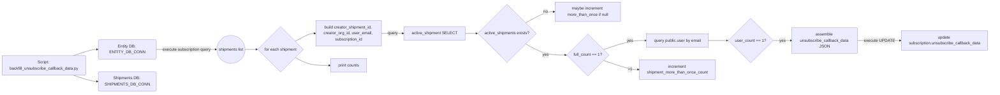
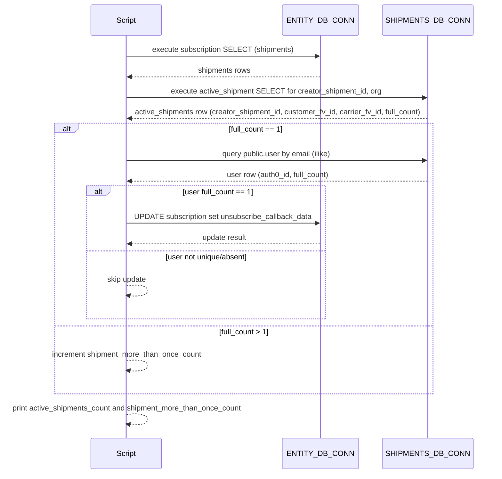

# Diagram: shipment_core/shipment_service/scripts/backfill_shipments_back_fill_unsubscribe_callback_data_SH_8562.py

> Auto-generated by Obscura crawlers

## Diagram 1

### SVG

<svg id="container" width="3942.78125" xmlns="http://www.w3.org/2000/svg" class="flowchart" height="359.984375" viewBox="0 0 3942.78125 359.984375" role="graphics-document document" aria-roledescription="flowchart-v2"><g><marker id="container_flowchart-v2-pointEnd" class="marker flowchart-v2" viewBox="0 0 10 10" refX="5" refY="5" markerUnits="userSpaceOnUse" markerWidth="8" markerHeight="8" orient="auto"><path d="M 0 0 L 10 5 L 0 10 z" class="arrowMarkerPath" style="stroke-width: 1; stroke-dasharray: 1, 0;"></path></marker><marker id="container_flowchart-v2-pointStart" class="marker flowchart-v2" viewBox="0 0 10 10" refX="4.5" refY="5" markerUnits="userSpaceOnUse" markerWidth="8" markerHeight="8" orient="auto"><path d="M 0 5 L 10 10 L 10 0 z" class="arrowMarkerPath" style="stroke-width: 1; stroke-dasharray: 1, 0;"></path></marker><marker id="container_flowchart-v2-circleEnd" class="marker flowchart-v2" viewBox="0 0 10 10" refX="11" refY="5" markerUnits="userSpaceOnUse" markerWidth="11" markerHeight="11" orient="auto"><circle cx="5" cy="5" r="5" class="arrowMarkerPath" style="stroke-width: 1; stroke-dasharray: 1, 0;"></circle></marker><marker id="container_flowchart-v2-circleStart" class="marker flowchart-v2" viewBox="0 0 10 10" refX="-1" refY="5" markerUnits="userSpaceOnUse" markerWidth="11" markerHeight="11" orient="auto"><circle cx="5" cy="5" r="5" class="arrowMarkerPath" style="stroke-width: 1; stroke-dasharray: 1, 0;"></circle></marker><marker id="container_flowchart-v2-crossEnd" class="marker cross flowchart-v2" viewBox="0 0 11 11" refX="12" refY="5.2" markerUnits="userSpaceOnUse" markerWidth="11" markerHeight="11" orient="auto"><path d="M 1,1 l 9,9 M 10,1 l -9,9" class="arrowMarkerPath" style="stroke-width: 2; stroke-dasharray: 1, 0;"></path></marker><marker id="container_flowchart-v2-crossStart" class="marker cross flowchart-v2" viewBox="0 0 11 11" refX="-1" refY="5.2" markerUnits="userSpaceOnUse" markerWidth="11" markerHeight="11" orient="auto"><path d="M 1,1 l 9,9 M 10,1 l -9,9" class="arrowMarkerPath" style="stroke-width: 2; stroke-dasharray: 1, 0;"></path></marker><g class="root"><g class="clusters"></g><g class="edgePaths"><path d="M307.657,215.984L318.256,212.818C328.855,209.651,350.052,203.318,364.272,200.221C378.492,197.125,385.735,197.266,389.356,197.336L392.977,197.407" id="L_A_B_0" class="edge-thickness-normal edge-pattern-solid edge-thickness-normal edge-pattern-solid flowchart-link" style=";" data-edge="true" data-et="edge" data-id="L_A_B_0" data-points="W3sieCI6MzA3LjY1NzMyNzU4NjIwNjg2LCJ5IjoyMTUuOTg0Mzc1fSx7IngiOjM3MS4yNSwieSI6MTk2Ljk4NDM3NX0seyJ4IjozOTYuOTc2NTYyNSwieSI6MTk3LjQ4NDM3NX1d" marker-end="url(#container_flowchart-v2-pointEnd)"></path><path d="M307.657,293.984L318.256,297.151C328.855,300.318,350.052,306.651,364.235,309.888C378.417,313.125,385.584,313.265,389.167,313.336L392.751,313.406" id="L_A_C_0" class="edge-thickness-normal edge-pattern-solid edge-thickness-normal edge-pattern-solid flowchart-link" style=";" data-edge="true" data-et="edge" data-id="L_A_C_0" data-points="W3sieCI6MzA3LjY1NzMyNzU4NjIwNjg2LCJ5IjoyOTMuOTg0Mzc1fSx7IngiOjM3MS4yNSwieSI6MzEyLjk4NDM3NX0seyJ4IjozOTYuNzUsInkiOjMxMy40ODQzNzV9XQ==" marker-end="url(#container_flowchart-v2-pointEnd)"></path><path d="M626.523,197.484L647.038,197.401C667.552,197.318,708.581,197.151,748.988,197.068C789.396,196.984,829.182,196.984,849.076,196.984L868.969,196.984" id="L_B_D_0" class="edge-thickness-normal edge-pattern-solid edge-thickness-normal edge-pattern-solid flowchart-link" style=";" data-edge="true" data-et="edge" data-id="L_B_D_0" data-points="W3sieCI6NjI2LjUyMzQzNzUsInkiOjE5Ny40ODQzNzV9LHsieCI6NzQ5LjYwOTM3NSwieSI6MTk2Ljk4NDM3NX0seyJ4Ijo4NzIuOTY4NzUsInkiOjE5Ni45ODQzNzV9XQ==" marker-end="url(#container_flowchart-v2-pointEnd)"></path><path d="M990.578,196.984L994.745,196.984C998.911,196.984,1007.245,196.984,1014.911,196.984C1022.578,196.984,1029.578,196.984,1033.078,196.984L1036.578,196.984" id="L_D_E_0" class="edge-thickness-normal edge-pattern-solid edge-thickness-normal edge-pattern-solid flowchart-link" style=";" data-edge="true" data-et="edge" data-id="L_D_E_0" data-points="W3sieCI6OTkwLjU3ODEyNSwieSI6MTk2Ljk4NDM3NX0seyJ4IjoxMDE1LjU3ODEyNSwieSI6MTk2Ljk4NDM3NX0seyJ4IjoxMDQwLjU3ODEyNSwieSI6MTk2Ljk4NDM3NX1d" marker-end="url(#container_flowchart-v2-pointEnd)"></path><path d="M1193.818,164.286L1203.434,159.069C1213.05,153.852,1232.283,143.418,1245.399,138.201C1258.516,132.984,1265.516,132.984,1269.016,132.984L1272.516,132.984" id="L_E_F_0" class="edge-thickness-normal edge-pattern-solid edge-thickness-normal edge-pattern-solid flowchart-link" style=";" data-edge="true" data-et="edge" data-id="L_E_F_0" data-points="W3sieCI6MTE5My44MTc3MDI5NjY2ODM4LCJ5IjoxNjQuMjg2NDUyOTY2NjgzODR9LHsieCI6MTI1MS41MTU2MjUsInkiOjEzMi45ODQzNzV9LHsieCI6MTI3Ni41MTU2MjUsInkiOjEzMi45ODQzNzV9XQ==" marker-end="url(#container_flowchart-v2-pointEnd)"></path><path d="M1536.516,132.984L1544.154,132.984C1551.792,132.984,1567.068,132.984,1581.677,132.984C1596.286,132.984,1610.229,132.984,1617.201,132.984L1624.172,132.984" id="L_F_C2_0" class="edge-thickness-normal edge-pattern-solid edge-thickness-normal edge-pattern-solid flowchart-link" style=";" data-edge="true" data-et="edge" data-id="L_F_C2_0" data-points="W3sieCI6MTUzNi41MTU2MjUsInkiOjEzMi45ODQzNzV9LHsieCI6MTU4Mi4zNDM3NSwieSI6MTMyLjk4NDM3NX0seyJ4IjoxNjI4LjE3MTg3NSwieSI6MTMyLjk4NDM3NX1d" marker-end="url(#container_flowchart-v2-pointEnd)"></path><path d="M1862.719,132.984L1866.885,132.984C1871.052,132.984,1879.385,132.984,1887.052,132.984C1894.719,132.984,1901.719,132.984,1905.219,132.984L1908.719,132.984" id="L_C2_G_0" class="edge-thickness-normal edge-pattern-solid edge-thickness-normal edge-pattern-solid flowchart-link" style=";" data-edge="true" data-et="edge" data-id="L_C2_G_0" data-points="W3sieCI6MTg2Mi43MTg3NSwieSI6MTMyLjk4NDM3NX0seyJ4IjoxODg3LjcxODc1LCJ5IjoxMzIuOTg0Mzc1fSx7IngiOjE5MTIuNzE4NzUsInkiOjEzMi45ODQzNzV9XQ==" marker-end="url(#container_flowchart-v2-pointEnd)"></path><path d="M2104.587,91.087L2117.738,83.739C2130.889,76.391,2157.191,61.696,2175.843,54.348C2194.495,47,2205.497,47,2210.999,47L2216.5,47" id="L_G_H_0" class="edge-thickness-normal edge-pattern-solid edge-thickness-normal edge-pattern-solid flowchart-link" style=";" data-edge="true" data-et="edge" data-id="L_G_H_0" data-points="W3sieCI6MjEwNC41ODcxNTUyNzcsInkiOjkxLjA4NzE1NTI3Njk5OTc0fSx7IngiOjIxODMuNDkyMTg3NSwieSI6NDd9LHsieCI6MjIyMC41LCJ5Ijo0N31d" marker-end="url(#container_flowchart-v2-pointEnd)"></path><path d="M2104.587,174.882L2117.738,182.229C2130.889,189.577,2157.191,204.273,2183.681,211.621C2210.172,218.969,2236.852,218.969,2250.191,218.969L2263.531,218.969" id="L_G_I_0" class="edge-thickness-normal edge-pattern-solid edge-thickness-normal edge-pattern-solid flowchart-link" style=";" data-edge="true" data-et="edge" data-id="L_G_I_0" data-points="W3sieCI6MjEwNC41ODcxNTUyNzcsInkiOjE3NC44ODE1OTQ3MjMwMDAyNn0seyJ4IjoyMTgzLjQ5MjE4NzUsInkiOjIxOC45Njg3NX0seyJ4IjoyMjY3LjUzMTI1LCJ5IjoyMTguOTY4NzV9XQ==" marker-end="url(#container_flowchart-v2-pointEnd)"></path><path d="M2412.082,197.582L2429.653,191.48C2447.224,185.378,2482.366,173.173,2509.939,167.071C2537.513,160.969,2557.518,160.969,2567.521,160.969L2577.523,160.969" id="L_I_J_0" class="edge-thickness-normal edge-pattern-solid edge-thickness-normal edge-pattern-solid flowchart-link" style=";" data-edge="true" data-et="edge" data-id="L_I_J_0" data-points="W3sieCI6MjQxMi4wODE5OTI1OTU3NDMsInkiOjE5Ny41ODE5OTI1OTU3NDMyfSx7IngiOjI1MTcuNTA3ODEyNSwieSI6MTYwLjk2ODc1fSx7IngiOjI1ODEuNTIzNDM3NSwieSI6MTYwLjk2ODc1fV0=" marker-end="url(#container_flowchart-v2-pointEnd)"></path><path d="M2834.242,160.969L2842.91,160.969C2851.578,160.969,2868.914,160.969,2881.082,160.969C2893.25,160.969,2900.25,160.969,2903.75,160.969L2907.25,160.969" id="L_J_K_0" class="edge-thickness-normal edge-pattern-solid edge-thickness-normal edge-pattern-solid flowchart-link" style=";" data-edge="true" data-et="edge" data-id="L_J_K_0" data-points="W3sieCI6MjgzNC4yNDIxODc1LCJ5IjoxNjAuOTY4NzV9LHsieCI6Mjg4Ni4yNSwieSI6MTYwLjk2ODc1fSx7IngiOjI5MTEuMjUsInkiOjE2MC45Njg3NX1d" marker-end="url(#container_flowchart-v2-pointEnd)"></path><path d="M3083.547,160.969L3089.715,160.969C3095.883,160.969,3108.219,160.969,3119.888,160.969C3131.557,160.969,3142.56,160.969,3148.061,160.969L3153.563,160.969" id="L_K_L_0" class="edge-thickness-normal edge-pattern-solid edge-thickness-normal edge-pattern-solid flowchart-link" style=";" data-edge="true" data-et="edge" data-id="L_K_L_0" data-points="W3sieCI6MzA4My41NDY4NzUsInkiOjE2MC45Njg3NX0seyJ4IjozMTIwLjU1NDY4NzUsInkiOjE2MC45Njg3NX0seyJ4IjozMTU3LjU2MjUsInkiOjE2MC45Njg3NX1d" marker-end="url(#container_flowchart-v2-pointEnd)"></path><path d="M3418.422,160.969L3432.21,160.969C3445.997,160.969,3473.573,160.969,3500.482,160.969C3527.391,160.969,3553.633,160.969,3566.754,160.969L3579.875,160.969" id="L_L_B2_0" class="edge-thickness-normal edge-pattern-solid edge-thickness-normal edge-pattern-solid flowchart-link" style=";" data-edge="true" data-et="edge" data-id="L_L_B2_0" data-points="W3sieCI6MzQxOC40MjE4NzUsInkiOjE2MC45Njg3NX0seyJ4IjozNTAxLjE0ODQzNzUsInkiOjE2MC45Njg3NX0seyJ4IjozNTgzLjg3NSwieSI6MTYwLjk2ODc1fV0=" marker-end="url(#container_flowchart-v2-pointEnd)"></path><path d="M2412.082,240.356L2429.653,246.458C2447.224,252.56,2482.366,264.764,2505.438,270.867C2528.51,276.969,2539.513,276.969,2545.014,276.969L2550.516,276.969" id="L_I_M_0" class="edge-thickness-normal edge-pattern-solid edge-thickness-normal edge-pattern-solid flowchart-link" style=";" data-edge="true" data-et="edge" data-id="L_I_M_0" data-points="W3sieCI6MjQxMi4wODE5OTI1OTU3NDMsInkiOjI0MC4zNTU1MDc0MDQyNTY4fSx7IngiOjI1MTcuNTA3ODEyNSwieSI6Mjc2Ljk2ODc1fSx7IngiOjI1NTQuNTE1NjI1LCJ5IjoyNzYuOTY4NzV9XQ==" marker-end="url(#container_flowchart-v2-pointEnd)"></path><path d="M1193.818,229.682L1203.434,234.899C1213.05,240.116,1232.283,250.55,1254.716,255.767C1277.148,260.984,1302.781,260.984,1315.598,260.984L1328.414,260.984" id="L_E_N_0" class="edge-thickness-normal edge-pattern-solid edge-thickness-normal edge-pattern-solid flowchart-link" style=";" data-edge="true" data-et="edge" data-id="L_E_N_0" data-points="W3sieCI6MTE5My44MTc3MDI5NjY2ODM4LCJ5IjoyMjkuNjgyMjk3MDMzMzE2MTZ9LHsieCI6MTI1MS41MTU2MjUsInkiOjI2MC45ODQzNzV9LHsieCI6MTMzMi40MTQwNjI1LCJ5IjoyNjAuOTg0Mzc1fV0=" marker-end="url(#container_flowchart-v2-pointEnd)"></path></g><g class="edgeLabels"><g class="edgeLabel"><g class="label" data-id="L_A_B_0" transform="translate(0, 0)"><foreignObject width="0" height="0">

</foreignObject></g></g><g class="edgeLabel"><g class="label" data-id="L_A_C_0" transform="translate(0, 0)"><foreignObject width="0" height="0">

</foreignObject></g></g><g class="edgeLabel" transform="translate(749.609375, 196.984375)"><g class="label" data-id="L_B_D_0" transform="translate(-98.359375, -12)"><foreignObject width="196.71875" height="24">

execute subscription query

</foreignObject></g></g><g class="edgeLabel"><g class="label" data-id="L_D_E_0" transform="translate(0, 0)"><foreignObject width="0" height="0">

</foreignObject></g></g><g class="edgeLabel"><g class="label" data-id="L_E_F_0" transform="translate(0, 0)"><foreignObject width="0" height="0">

</foreignObject></g></g><g class="edgeLabel" transform="translate(1582.34375, 132.984375)"><g class="label" data-id="L_F_C2_0" transform="translate(-20.828125, -12)"><foreignObject width="41.65625" height="24">

query

</foreignObject></g></g><g class="edgeLabel"><g class="label" data-id="L_C2_G_0" transform="translate(0, 0)"><foreignObject width="0" height="0">

</foreignObject></g></g><g class="edgeLabel" transform="translate(2183.4921875, 47)"><g class="label" data-id="L_G_H_0" transform="translate(-9.3671875, -12)"><foreignObject width="18.734375" height="24">

no

</foreignObject></g></g><g class="edgeLabel" transform="translate(2183.4921875, 218.96875)"><g class="label" data-id="L_G_I_0" transform="translate(-12.0078125, -12)"><foreignObject width="24.015625" height="24">

yes

</foreignObject></g></g><g class="edgeLabel" transform="translate(2517.5078125, 160.96875)"><g class="label" data-id="L_I_J_0" transform="translate(-12.0078125, -12)"><foreignObject width="24.015625" height="24">

yes

</foreignObject></g></g><g class="edgeLabel"><g class="label" data-id="L_J_K_0" transform="translate(0, 0)"><foreignObject width="0" height="0">

</foreignObject></g></g><g class="edgeLabel" transform="translate(3120.5546875, 160.96875)"><g class="label" data-id="L_K_L_0" transform="translate(-12.0078125, -12)"><foreignObject width="24.015625" height="24">

yes

</foreignObject></g></g><g class="edgeLabel" transform="translate(3501.1484375, 160.96875)"><g class="label" data-id="L_L_B2_0" transform="translate(-57.7265625, -12)"><foreignObject width="115.453125" height="24">

execute UPDATE

</foreignObject></g></g><g class="edgeLabel" transform="translate(2517.5078125, 276.96875)"><g class="label" data-id="L_I_M_0" transform="translate(-7.3046875, -12)"><foreignObject width="14.609375" height="24">
&gt;1
</foreignObject></g></g><g class="edgeLabel"><g class="label" data-id="L_E_N_0" transform="translate(0, 0)"><foreignObject width="0" height="0">

</foreignObject></g></g></g><g class="nodes"><g class="node default" id="flowchart-A-0" transform="translate(177.125, 254.984375)"><rect class="basic label-container" style="" x="-169.125" y="-39" width="338.25" height="78"></rect><g class="label" style="" transform="translate(-139.125, -24)"><rect></rect><foreignObject width="278.25" height="48">

Script: backfill_unsubscribe_callback_data.py

</foreignObject></g></g><g class="node default" id="flowchart-B-1" transform="translate(511.25, 196.984375)"><g class="basic label-container outer-path"><path d="M-109.7734375 -27 C-29.452036601921577 -27, 50.869364296156846 -27, 109.7734375 -27 C109.7734375 -27, 109.7734375 -27, 109.7734375 -27 C109.9069869309968 -26.994476354675424, 110.04053636199359 -26.988952709350848, 110.18633422736166 -26.982922465033347 C110.31412400190655 -26.96699348624812, 110.44191377645143 -26.9510645074629, 110.59641045140367 -26.931806517013612 C110.68182736483581 -26.913896473671702, 110.76724427826795 -26.895986430329792, 111.000864935704 -26.847001329696653 C111.12430209395909 -26.81025249547269, 111.24773925221419 -26.77350366124873, 111.39693484602341 -26.729086208503173 C111.52308699918206 -26.679861485590806, 111.6492391523407 -26.63063676267844, 111.78191462326485 -26.578866633275286 C111.89304407256884 -26.524538755949525, 112.00417352187283 -26.470210878623764, 112.15317446518537 -26.397368756032446 C112.26680951804057 -26.32965696178112, 112.38044457089576 -26.261945167529795, 112.50817829061214 -26.185832391312644 C112.62733960817515 -26.10075284586485, 112.74650092573818 -26.015673300417053, 112.84450106344833 -25.94570254698197 C112.95171762413048 -25.854894752215117, 113.05893418481263 -25.764086957448264, 113.1598453581287 -25.678619553365657 C113.26847847226651 -25.569986439227854, 113.37711158640433 -25.461353325090048, 113.45205705336566 -25.386407858128706 C113.53187796618603 -25.292163484448213, 113.61169887900638 -25.197919110767717, 113.71914004698196 -25.07106356344834 C113.7935932106202 -24.96678541963395, 113.86804637425845 -24.86250727581956, 113.95926989131264 -24.734740790612136 C114.01860671808157 -24.63516074668184, 114.07794354485048 -24.535580702751545, 114.17080625603245 -24.37973696518537 C114.2104151312649 -24.29871571589674, 114.25002400649734 -24.21769446660811, 114.35230413327528 -24.008477123264846 C114.40460170063673 -23.874449944699503, 114.45689926799818 -23.74042276613416, 114.50252370850318 -23.623497346023417 C114.53659036688232 -23.50906945761906, 114.57065702526148 -23.3946415692147, 114.62043882969665 -23.227427435703994 C114.65255647467032 -23.07425136303978, 114.68467411964399 -22.92107529037557, 114.70524401701361 -22.82297295140367 C114.71771970307067 -22.722887118531368, 114.73019538912773 -22.62280128565907, 114.75635996503335 -22.412896727361662 C114.76129854596199 -22.293492849270976, 114.76623712689064 -22.17408897118029, 114.7734375 -22 C114.7734375 -22, 114.7734375 -22, 114.7734375 -22 C114.7734375 -7.812656755428559, 114.7734375 6.374686489142881, 114.7734375 22 C114.7734375 22, 114.7734375 22, 114.7734375 22 C114.7680271265223 22.130810770237538, 114.76261675304461 22.261621540475076, 114.75635996503335 22.412896727361662 C114.7437230471928 22.514276037583596, 114.73108612935225 22.61565534780553, 114.70524401701361 22.82297295140367 C114.68083699304748 22.9393753862528, 114.65642996908133 23.055777821101927, 114.62043882969665 23.227427435703994 C114.5951508049698 23.312368413454283, 114.56986278024296 23.397309391204573, 114.50252370850318 23.623497346023417 C114.45845685275545 23.73643101850754, 114.41438999700772 23.849364690991663, 114.35230413327528 24.008477123264846 C114.2838603580977 24.148481103139904, 114.21541658292013 24.28848508301496, 114.17080625603245 24.379736965185366 C114.12321359280696 24.45960775964511, 114.07562092958148 24.53947855410485, 113.95926989131264 24.734740790612133 C113.88952589052283 24.83242334148247, 113.81978188973304 24.930105892352813, 113.71914004698196 25.07106356344834 C113.6166272446925 25.192100200397682, 113.51411444240303 25.313136837347024, 113.45205705336566 25.386407858128706 C113.3422611786364 25.496203732857968, 113.23246530390713 25.605999607587226, 113.1598453581287 25.678619553365657 C113.05353115034012 25.76866309421646, 112.94721694255155 25.858706635067268, 112.84450106344833 25.94570254698197 C112.76720238794412 26.000892740495374, 112.6899037124399 26.05608293400878, 112.50817829061214 26.185832391312644 C112.405127907332 26.247237091489765, 112.30207752405187 26.308641791666883, 112.15317446518537 26.397368756032446 C112.07710522421344 26.43455674191441, 112.00103598324151 26.471744727796374, 111.78191462326485 26.578866633275286 C111.65402908713766 26.628767724320827, 111.52614355101046 26.678668815366372, 111.39693484602341 26.729086208503173 C111.26211765755072 26.76922302451351, 111.12730046907802 26.80935984052385, 111.000864935704 26.847001329696653 C110.91082031285082 26.86588170166523, 110.82077568999763 26.884762073633805, 110.59641045140367 26.931806517013612 C110.49239276348294 26.944772308291345, 110.3883750755622 26.957738099569077, 110.18633422736166 26.982922465033347 C110.08072940610667 26.987290312749536, 109.97512458485168 26.99165816046573, 109.7734375 27 C109.7734375 27, 109.7734375 27, 109.7734375 27 C48.00870575441056 27, -13.756025991178873 27, -109.7734375 27 C-109.7734375 27, -109.7734375 27, -109.7734375 27 C-109.87519695066244 26.995791197987984, -109.9769564013249 26.991582395975964, -110.18633422736166 26.982922465033347 C-110.34662799874454 26.962941867267563, -110.50692177012742 26.94296126950178, -110.59641045140367 26.931806517013612 C-110.73521917985533 26.90270138732779, -110.874027908307 26.87359625764197, -111.000864935704 26.847001329696653 C-111.13136533453473 26.80814967764484, -111.26186573336547 26.76929802559302, -111.39693484602341 26.729086208503173 C-111.52470579628628 26.679229829000636, -111.65247674654914 26.6293734494981, -111.78191462326485 26.578866633275286 C-111.86532905221912 26.538087803794816, -111.94874348117338 26.497308974314347, -112.15317446518537 26.397368756032446 C-112.25926036802188 26.33415527880561, -112.3653462708584 26.27094180157878, -112.50817829061214 26.185832391312644 C-112.63816251182551 26.093025441184967, -112.76814673303888 26.00021849105729, -112.84450106344833 25.94570254698197 C-112.93188118170524 25.87169536194551, -113.01926129996215 25.79768817690905, -113.1598453581287 25.67861955336566 C-113.23175151734813 25.606713394146237, -113.30365767656755 25.534807234926816, -113.45205705336566 25.386407858128706 C-113.52643368294835 25.29859153752033, -113.60081031253102 25.21077521691196, -113.71914004698196 25.07106356344834 C-113.80718288739855 24.947751893048448, -113.89522572781514 24.82444022264855, -113.95926989131264 24.734740790612133 C-114.01459071170862 24.641900474989185, -114.06991153210458 24.549060159366242, -114.17080625603245 24.37973696518537 C-114.23097619668468 24.256657384342525, -114.29114613733691 24.133577803499684, -114.35230413327528 24.00847712326485 C-114.40369405161476 23.87677604978774, -114.45508396995425 23.74507497631063, -114.50252370850318 23.623497346023417 C-114.52934131369824 23.53341859804703, -114.55615891889332 23.443339850070643, -114.62043882969665 23.227427435703994 C-114.65179221165678 23.077896300487485, -114.6831455936169 22.92836516527097, -114.70524401701361 22.82297295140367 C-114.7191576655977 22.711351105481747, -114.7330713141818 22.59972925955982, -114.75635996503335 22.412896727361662 C-114.76068151128165 22.3084113723882, -114.76500305752994 22.20392601741474, -114.7734375 22 C-114.7734375 22, -114.7734375 22, -114.7734375 22 C-114.7734375 9.663889978204505, -114.7734375 -2.6722200435909897, -114.7734375 -22 C-114.7734375 -22, -114.7734375 -22, -114.7734375 -22 C-114.76669458071865 -22.16302875734543, -114.75995166143728 -22.326057514690856, -114.75635996503335 -22.41289672736166 C-114.74087693094167 -22.53710892341797, -114.72539389684998 -22.661321119474284, -114.70524401701361 -22.82297295140367 C-114.68313095275529 -22.92843499074177, -114.66101788849699 -23.03389703007987, -114.62043882969665 -23.227427435703994 C-114.5784353623056 -23.36851459563984, -114.53643189491454 -23.509601755575687, -114.50252370850318 -23.623497346023417 C-114.44347977311683 -23.77481398407147, -114.38443583773049 -23.926130622119523, -114.35230413327528 -24.008477123264846 C-114.28321697770362 -24.149797158771133, -114.21412982213197 -24.291117194277422, -114.17080625603245 -24.379736965185366 C-114.08723131605095 -24.51999381153206, -114.00365637606946 -24.660250657878752, -113.95926989131264 -24.734740790612133 C-113.89088892697023 -24.830514290157584, -113.82250796262782 -24.926287789703032, -113.71914004698196 -25.07106356344834 C-113.63885041925909 -25.165861347768498, -113.55856079153621 -25.26065913208865, -113.45205705336566 -25.386407858128706 C-113.36398607371407 -25.47447883778029, -113.2759150940625 -25.56254981743187, -113.1598453581287 -25.678619553365657 C-113.03704004142256 -25.782630350995984, -112.9142347247164 -25.88664114862631, -112.84450106344833 -25.945702546981966 C-112.75891990996126 -26.006806316111803, -112.6733387564742 -26.06791008524164, -112.50817829061214 -26.185832391312644 C-112.39428364102024 -26.253698871643504, -112.28038899142835 -26.32156535197436, -112.15317446518537 -26.397368756032446 C-112.0730837986952 -26.436522697055896, -111.99299313220502 -26.475676638079346, -111.78191462326485 -26.578866633275286 C-111.65250776748664 -26.62936134509073, -111.52310091170843 -26.67985605690617, -111.39693484602341 -26.729086208503173 C-111.29092966594294 -26.760645317970095, -111.18492448586248 -26.79220442743702, -111.000864935704 -26.847001329696653 C-110.86869581821314 -26.87471427936445, -110.73652670072227 -26.90242722903225, -110.59641045140367 -26.931806517013612 C-110.49917394611622 -26.943927034757614, -110.40193744082876 -26.956047552501616, -110.18633422736167 -26.982922465033347 C-110.04478879332771 -26.988776827489865, -109.90324335929374 -26.994631189946382, -109.7734375 -27 C-109.7734375 -27, -109.7734375 -27, -109.7734375 -27" stroke="none" stroke-width="0" fill="#ECECFF" style=""></path><path d="M-109.7734375 -27 C-42.55994061814866 -27, 24.653556263702683 -27, 109.7734375 -27 M-109.7734375 -27 C-50.34794492983318 -27, 9.077547640333634 -27, 109.7734375 -27 M109.7734375 -27 C109.7734375 -27, 109.7734375 -27, 109.7734375 -27 M109.7734375 -27 C109.7734375 -27, 109.7734375 -27, 109.7734375 -27 M109.7734375 -27 C109.87615969435346 -26.995751378614376, 109.97888188870692 -26.991502757228755, 110.18633422736166 -26.982922465033347 M109.7734375 -27 C109.90456827139674 -26.994576391176455, 110.0356990427935 -26.989152782352907, 110.18633422736166 -26.982922465033347 M110.18633422736166 -26.982922465033347 C110.29341836904202 -26.969574440693094, 110.40050251072238 -26.956226416352845, 110.59641045140367 -26.931806517013612 M110.18633422736166 -26.982922465033347 C110.308981734697 -26.967634469187335, 110.43162924203233 -26.95234647334132, 110.59641045140367 -26.931806517013612 M110.59641045140367 -26.931806517013612 C110.72270875725874 -26.905324547097063, 110.84900706311382 -26.878842577180517, 111.000864935704 -26.847001329696653 M110.59641045140367 -26.931806517013612 C110.69783733730647 -26.91053953545735, 110.79926422320926 -26.88927255390109, 111.000864935704 -26.847001329696653 M111.000864935704 -26.847001329696653 C111.15341648769582 -26.80158476491176, 111.30596803968764 -26.756168200126865, 111.39693484602341 -26.729086208503173 M111.000864935704 -26.847001329696653 C111.12084979975862 -26.811280287987188, 111.24083466381323 -26.775559246277727, 111.39693484602341 -26.729086208503173 M111.39693484602341 -26.729086208503173 C111.48291286266797 -26.69553748230299, 111.56889087931252 -26.661988756102804, 111.78191462326485 -26.578866633275286 M111.39693484602341 -26.729086208503173 C111.49296278909614 -26.69161598884188, 111.58899073216887 -26.654145769180587, 111.78191462326485 -26.578866633275286 M111.78191462326485 -26.578866633275286 C111.91947428538572 -26.51161781223386, 112.0570339475066 -26.44436899119244, 112.15317446518537 -26.397368756032446 M111.78191462326485 -26.578866633275286 C111.91780205459814 -26.512435316051775, 112.05368948593141 -26.44600399882826, 112.15317446518537 -26.397368756032446 M112.15317446518537 -26.397368756032446 C112.24400799013654 -26.343243723323976, 112.3348415150877 -26.289118690615506, 112.50817829061214 -26.185832391312644 M112.15317446518537 -26.397368756032446 C112.25177793181065 -26.338613843029446, 112.35038139843593 -26.279858930026446, 112.50817829061214 -26.185832391312644 M112.50817829061214 -26.185832391312644 C112.61094989954628 -26.112454872904188, 112.71372150848043 -26.039077354495735, 112.84450106344833 -25.94570254698197 M112.50817829061214 -26.185832391312644 C112.63047200502787 -26.098516357498987, 112.75276571944359 -26.01120032368533, 112.84450106344833 -25.94570254698197 M112.84450106344833 -25.94570254698197 C112.92177850048397 -25.88025189646872, 112.9990559375196 -25.814801245955472, 113.1598453581287 -25.678619553365657 M112.84450106344833 -25.94570254698197 C112.93092058903368 -25.872508942437353, 113.01734011461903 -25.79931533789274, 113.1598453581287 -25.678619553365657 M113.1598453581287 -25.678619553365657 C113.2329158792547 -25.60554903223966, 113.3059864003807 -25.532478511113663, 113.45205705336566 -25.386407858128706 M113.1598453581287 -25.678619553365657 C113.23782007154117 -25.600644839953205, 113.31579478495361 -25.522670126540753, 113.45205705336566 -25.386407858128706 M113.45205705336566 -25.386407858128706 C113.54394427718634 -25.277916817971, 113.635831501007 -25.169425777813295, 113.71914004698196 -25.07106356344834 M113.45205705336566 -25.386407858128706 C113.51586253644048 -25.311072866617142, 113.5796680195153 -25.235737875105578, 113.71914004698196 -25.07106356344834 M113.71914004698196 -25.07106356344834 C113.80926683964634 -24.94483313632169, 113.89939363231072 -24.818602709195037, 113.95926989131264 -24.734740790612136 M113.71914004698196 -25.07106356344834 C113.78705479997959 -24.975943033518746, 113.85496955297721 -24.88082250358915, 113.95926989131264 -24.734740790612136 M113.95926989131264 -24.734740790612136 C114.01969657077235 -24.633331737873387, 114.08012325023206 -24.53192268513464, 114.17080625603245 -24.37973696518537 M113.95926989131264 -24.734740790612136 C114.04192785320211 -24.59602283206345, 114.12458581509158 -24.457304873514765, 114.17080625603245 -24.37973696518537 M114.17080625603245 -24.37973696518537 C114.21650802098445 -24.286252510770126, 114.26220978593646 -24.192768056354886, 114.35230413327528 -24.008477123264846 M114.17080625603245 -24.37973696518537 C114.2101502304097 -24.29925757925692, 114.24949420478693 -24.218778193328475, 114.35230413327528 -24.008477123264846 M114.35230413327528 -24.008477123264846 C114.38716868145954 -23.919126943880855, 114.4220332296438 -23.829776764496863, 114.50252370850318 -23.623497346023417 M114.35230413327528 -24.008477123264846 C114.3840302659536 -23.927170013504362, 114.4157563986319 -23.84586290374388, 114.50252370850318 -23.623497346023417 M114.50252370850318 -23.623497346023417 C114.54797789833322 -23.470819413732713, 114.59343208816327 -23.318141481442005, 114.62043882969665 -23.227427435703994 M114.50252370850318 -23.623497346023417 C114.54132144904841 -23.493178032751167, 114.58011918959365 -23.36285871947892, 114.62043882969665 -23.227427435703994 M114.62043882969665 -23.227427435703994 C114.65161068338597 -23.07876204850929, 114.68278253707527 -22.93009666131459, 114.70524401701361 -22.82297295140367 M114.62043882969665 -23.227427435703994 C114.64405216668399 -23.114810267627615, 114.66766550367133 -23.00219309955123, 114.70524401701361 -22.82297295140367 M114.70524401701361 -22.82297295140367 C114.71969470883668 -22.707042691530372, 114.73414540065976 -22.591112431657077, 114.75635996503335 -22.412896727361662 M114.70524401701361 -22.82297295140367 C114.72330252777988 -22.67809906773835, 114.74136103854616 -22.533225184073032, 114.75635996503335 -22.412896727361662 M114.75635996503335 -22.412896727361662 C114.75982794140505 -22.32904878928162, 114.76329591777676 -22.245200851201577, 114.7734375 -22 M114.75635996503335 -22.412896727361662 C114.76044428566283 -22.314146959043317, 114.7645286062923 -22.21539719072497, 114.7734375 -22 M114.7734375 -22 C114.7734375 -22, 114.7734375 -22, 114.7734375 -22 M114.7734375 -22 C114.7734375 -22, 114.7734375 -22, 114.7734375 -22 M114.7734375 -22 C114.7734375 -10.962479718917583, 114.7734375 0.07504056216483335, 114.7734375 22 M114.7734375 -22 C114.7734375 -9.865058826057522, 114.7734375 2.2698823478849555, 114.7734375 22 M114.7734375 22 C114.7734375 22, 114.7734375 22, 114.7734375 22 M114.7734375 22 C114.7734375 22, 114.7734375 22, 114.7734375 22 M114.7734375 22 C114.76774429783967 22.13764893732012, 114.76205109567935 22.275297874640238, 114.75635996503335 22.412896727361662 M114.7734375 22 C114.76695894635334 22.156636985605246, 114.76048039270668 22.31327397121049, 114.75635996503335 22.412896727361662 M114.75635996503335 22.412896727361662 C114.74237565585251 22.525085445890422, 114.72839134667166 22.63727416441918, 114.70524401701361 22.82297295140367 M114.75635996503335 22.412896727361662 C114.74594818233496 22.496424954850582, 114.73553639963656 22.5799531823395, 114.70524401701361 22.82297295140367 M114.70524401701361 22.82297295140367 C114.67281248449783 22.977646022400116, 114.64038095198204 23.132319093396564, 114.62043882969665 23.227427435703994 M114.70524401701361 22.82297295140367 C114.67213565845681 22.980873953804295, 114.63902729990001 23.138774956204923, 114.62043882969665 23.227427435703994 M114.62043882969665 23.227427435703994 C114.59466963320682 23.313984640915915, 114.56890043671699 23.400541846127837, 114.50252370850318 23.623497346023417 M114.62043882969665 23.227427435703994 C114.5963786400873 23.30824418799489, 114.57231845047795 23.389060940285788, 114.50252370850318 23.623497346023417 M114.50252370850318 23.623497346023417 C114.47136565192208 23.70334860151837, 114.44020759534098 23.783199857013326, 114.35230413327528 24.008477123264846 M114.50252370850318 23.623497346023417 C114.451911132853 23.753206260922575, 114.40129855720281 23.882915175821733, 114.35230413327528 24.008477123264846 M114.35230413327528 24.008477123264846 C114.28151623520615 24.153276083154974, 114.21072833713704 24.298075043045102, 114.17080625603245 24.379736965185366 M114.35230413327528 24.008477123264846 C114.29470496480948 24.126298105549708, 114.23710579634367 24.24411908783457, 114.17080625603245 24.379736965185366 M114.17080625603245 24.379736965185366 C114.12231307056463 24.46111903096402, 114.07381988509681 24.542501096742676, 113.95926989131264 24.734740790612133 M114.17080625603245 24.379736965185366 C114.10504705205958 24.490095148745493, 114.0392878480867 24.600453332305623, 113.95926989131264 24.734740790612133 M113.95926989131264 24.734740790612133 C113.90003038071013 24.81771088757293, 113.84079087010761 24.900680984533725, 113.71914004698196 25.07106356344834 M113.95926989131264 24.734740790612133 C113.89333627591873 24.82708656468368, 113.82740266052481 24.91943233875523, 113.71914004698196 25.07106356344834 M113.71914004698196 25.07106356344834 C113.66535264464622 25.13457022938238, 113.61156524231048 25.198076895316422, 113.45205705336566 25.386407858128706 M113.71914004698196 25.07106356344834 C113.64226623273649 25.16182830441667, 113.565392418491 25.252593045385, 113.45205705336566 25.386407858128706 M113.45205705336566 25.386407858128706 C113.37393654448444 25.46452836700993, 113.29581603560321 25.542648875891153, 113.1598453581287 25.678619553365657 M113.45205705336566 25.386407858128706 C113.39131420302346 25.44715070847091, 113.33057135268125 25.507893558813116, 113.1598453581287 25.678619553365657 M113.1598453581287 25.678619553365657 C113.07310667318136 25.75208347210109, 112.986367988234 25.825547390836523, 112.84450106344833 25.94570254698197 M113.1598453581287 25.678619553365657 C113.04780713799462 25.773511085375723, 112.93576891786054 25.86840261738579, 112.84450106344833 25.94570254698197 M112.84450106344833 25.94570254698197 C112.76256296734671 26.00420522313354, 112.6806248712451 26.06270789928511, 112.50817829061214 26.185832391312644 M112.84450106344833 25.94570254698197 C112.72749416558028 26.029243866333406, 112.61048726771223 26.112785185684842, 112.50817829061214 26.185832391312644 M112.50817829061214 26.185832391312644 C112.36756568090709 26.26961932024225, 112.22695307120205 26.353406249171854, 112.15317446518537 26.397368756032446 M112.50817829061214 26.185832391312644 C112.39155801233052 26.25532299381713, 112.2749377340489 26.32481359632162, 112.15317446518537 26.397368756032446 M112.15317446518537 26.397368756032446 C112.01107740684544 26.466835774920714, 111.86898034850553 26.536302793808982, 111.78191462326485 26.578866633275286 M112.15317446518537 26.397368756032446 C112.02469657468141 26.460177769467567, 111.89621868417744 26.52298678290269, 111.78191462326485 26.578866633275286 M111.78191462326485 26.578866633275286 C111.65841661935085 26.62705570393865, 111.53491861543682 26.67524477460202, 111.39693484602341 26.729086208503173 M111.78191462326485 26.578866633275286 C111.68115428937799 26.61818343756242, 111.58039395549112 26.65750024184955, 111.39693484602341 26.729086208503173 M111.39693484602341 26.729086208503173 C111.26619835691011 26.76800814767743, 111.1354618677968 26.806930086851686, 111.000864935704 26.847001329696653 M111.39693484602341 26.729086208503173 C111.24518611346609 26.77426376358688, 111.09343738090877 26.819441318670584, 111.000864935704 26.847001329696653 M111.000864935704 26.847001329696653 C110.88867082118524 26.870525961681096, 110.77647670666649 26.894050593665543, 110.59641045140367 26.931806517013612 M111.000864935704 26.847001329696653 C110.88586230254005 26.871114846114413, 110.7708596693761 26.895228362532173, 110.59641045140367 26.931806517013612 M110.59641045140367 26.931806517013612 C110.47569718873932 26.946853409512826, 110.35498392607495 26.96190030201204, 110.18633422736166 26.982922465033347 M110.59641045140367 26.931806517013612 C110.51128919947072 26.942416870001875, 110.42616794753778 26.953027222990137, 110.18633422736166 26.982922465033347 M110.18633422736166 26.982922465033347 C110.0307416868458 26.989357820111575, 109.87514914632993 26.9957931751898, 109.7734375 27 M110.18633422736166 26.982922465033347 C110.0277780751702 26.989480395997173, 109.86922192297875 26.996038326961, 109.7734375 27 M109.7734375 27 C109.7734375 27, 109.7734375 27, 109.7734375 27 M109.7734375 27 C109.7734375 27, 109.7734375 27, 109.7734375 27 M109.7734375 27 C56.85609728914637 27, 3.9387570782927384 27, -109.7734375 27 M109.7734375 27 C49.59924748439551 27, -10.574942531208976 27, -109.7734375 27 M-109.7734375 27 C-109.7734375 27, -109.7734375 27, -109.7734375 27 M-109.7734375 27 C-109.7734375 27, -109.7734375 27, -109.7734375 27 M-109.7734375 27 C-109.93417731271818 26.993351752168714, -110.09491712543637 26.986703504337424, -110.18633422736166 26.982922465033347 M-109.7734375 27 C-109.9026633659359 26.994655178649108, -110.03188923187177 26.989310357298216, -110.18633422736166 26.982922465033347 M-110.18633422736166 26.982922465033347 C-110.29713484677117 26.969111182227273, -110.40793546618069 26.9552998994212, -110.59641045140367 26.931806517013612 M-110.18633422736166 26.982922465033347 C-110.34604810841346 26.963014150521953, -110.50576198946524 26.943105836010556, -110.59641045140367 26.931806517013612 M-110.59641045140367 26.931806517013612 C-110.72101202954568 26.905680313486403, -110.8456136076877 26.879554109959198, -111.000864935704 26.847001329696653 M-110.59641045140367 26.931806517013612 C-110.7536929679877 26.898827841295216, -110.91097548457172 26.865849165576822, -111.000864935704 26.847001329696653 M-111.000864935704 26.847001329696653 C-111.1276203418991 26.80926461025899, -111.25437574809419 26.77152789082133, -111.39693484602341 26.729086208503173 M-111.000864935704 26.847001329696653 C-111.09254879301403 26.81970586274871, -111.18423265032406 26.792410395800765, -111.39693484602341 26.729086208503173 M-111.39693484602341 26.729086208503173 C-111.52555324368755 26.678899153998536, -111.6541716413517 26.628712099493903, -111.78191462326485 26.578866633275286 M-111.39693484602341 26.729086208503173 C-111.48045879088845 26.69649506408284, -111.5639827357535 26.663903919662502, -111.78191462326485 26.578866633275286 M-111.78191462326485 26.578866633275286 C-111.895244196596 26.523463180852218, -112.00857376992714 26.46805972842915, -112.15317446518537 26.397368756032446 M-111.78191462326485 26.578866633275286 C-111.89641716845273 26.522889749853157, -112.01091971364062 26.46691286643103, -112.15317446518537 26.397368756032446 M-112.15317446518537 26.397368756032446 C-112.24754010445228 26.341139040025908, -112.34190574371918 26.28490932401937, -112.50817829061214 26.185832391312644 M-112.15317446518537 26.397368756032446 C-112.27519316952059 26.32466138981783, -112.39721187385581 26.251954023603215, -112.50817829061214 26.185832391312644 M-112.50817829061214 26.185832391312644 C-112.63851643844977 26.0927727424323, -112.76885458628742 25.999713093551957, -112.84450106344833 25.94570254698197 M-112.50817829061214 26.185832391312644 C-112.62236941036939 26.10430149889041, -112.73656053012665 26.02277060646818, -112.84450106344833 25.94570254698197 M-112.84450106344833 25.94570254698197 C-112.93516744424643 25.868912039551176, -113.02583382504453 25.79212153212038, -113.1598453581287 25.67861955336566 M-112.84450106344833 25.94570254698197 C-112.92326914214303 25.878989387384436, -113.00203722083772 25.812276227786903, -113.1598453581287 25.67861955336566 M-113.1598453581287 25.67861955336566 C-113.22719546123064 25.611269450263727, -113.29454556433258 25.54391934716179, -113.45205705336566 25.386407858128706 M-113.1598453581287 25.67861955336566 C-113.27273106186 25.565733849634366, -113.3856167655913 25.452848145903076, -113.45205705336566 25.386407858128706 M-113.45205705336566 25.386407858128706 C-113.5124690826936 25.31507950988503, -113.57288111202153 25.243751161641356, -113.71914004698196 25.07106356344834 M-113.45205705336566 25.386407858128706 C-113.5229918303623 25.302655325189637, -113.59392660735894 25.218902792250567, -113.71914004698196 25.07106356344834 M-113.71914004698196 25.07106356344834 C-113.79852085501675 24.959883824242443, -113.87790166305153 24.848704085036548, -113.95926989131264 24.734740790612133 M-113.71914004698196 25.07106356344834 C-113.7809389506474 24.984508813467425, -113.84273785431284 24.89795406348651, -113.95926989131264 24.734740790612133 M-113.95926989131264 24.734740790612133 C-114.0022543167688 24.662603616982814, -114.04523874222495 24.590466443353495, -114.17080625603245 24.37973696518537 M-113.95926989131264 24.734740790612133 C-114.04117387574424 24.597288169501702, -114.12307786017583 24.459835548391275, -114.17080625603245 24.37973696518537 M-114.17080625603245 24.37973696518537 C-114.2308874372327 24.256838944703514, -114.29096861843296 24.133940924221655, -114.35230413327528 24.00847712326485 M-114.17080625603245 24.37973696518537 C-114.20746103739538 24.304758411490077, -114.24411581875832 24.229779857794785, -114.35230413327528 24.00847712326485 M-114.35230413327528 24.00847712326485 C-114.40540324761187 23.872395755853134, -114.45850236194846 23.73631438844142, -114.50252370850318 23.623497346023417 M-114.35230413327528 24.00847712326485 C-114.40961235344243 23.86160874209297, -114.46692057360956 23.71474036092109, -114.50252370850318 23.623497346023417 M-114.50252370850318 23.623497346023417 C-114.5477996930352 23.471417994777205, -114.59307567756723 23.319338643530998, -114.62043882969665 23.227427435703994 M-114.50252370850318 23.623497346023417 C-114.52901122437055 23.534527348554118, -114.55549874023792 23.44555735108482, -114.62043882969665 23.227427435703994 M-114.62043882969665 23.227427435703994 C-114.6500297115272 23.086302049045372, -114.67962059335774 22.945176662386746, -114.70524401701361 22.82297295140367 M-114.62043882969665 23.227427435703994 C-114.64040102105082 23.132223379618644, -114.66036321240497 23.03701932353329, -114.70524401701361 22.82297295140367 M-114.70524401701361 22.82297295140367 C-114.71862946810523 22.715588554686057, -114.73201491919684 22.608204157968444, -114.75635996503335 22.412896727361662 M-114.70524401701361 22.82297295140367 C-114.71897540601125 22.712813277776338, -114.73270679500891 22.602653604149005, -114.75635996503335 22.412896727361662 M-114.75635996503335 22.412896727361662 C-114.76211623245828 22.27372301252437, -114.76787249988321 22.13454929768708, -114.7734375 22 M-114.75635996503335 22.412896727361662 C-114.76165388038395 22.284901655036613, -114.76694779573454 22.156906582711564, -114.7734375 22 M-114.7734375 22 C-114.7734375 22, -114.7734375 22, -114.7734375 22 M-114.7734375 22 C-114.7734375 22, -114.7734375 22, -114.7734375 22 M-114.7734375 22 C-114.7734375 9.718051494910961, -114.7734375 -2.563897010178078, -114.7734375 -22 M-114.7734375 22 C-114.7734375 11.94256045752726, -114.7734375 1.8851209150545216, -114.7734375 -22 M-114.7734375 -22 C-114.7734375 -22, -114.7734375 -22, -114.7734375 -22 M-114.7734375 -22 C-114.7734375 -22, -114.7734375 -22, -114.7734375 -22 M-114.7734375 -22 C-114.76991685522637 -22.085121342633595, -114.76639621045275 -22.170242685267187, -114.75635996503335 -22.41289672736166 M-114.7734375 -22 C-114.76704533710085 -22.15454824990712, -114.76065317420169 -22.309096499814242, -114.75635996503335 -22.41289672736166 M-114.75635996503335 -22.41289672736166 C-114.74286932924409 -22.52112496529348, -114.7293786934548 -22.629353203225303, -114.70524401701361 -22.82297295140367 M-114.75635996503335 -22.41289672736166 C-114.73800572478734 -22.560143092279702, -114.71965148454132 -22.70738945719775, -114.70524401701361 -22.82297295140367 M-114.70524401701361 -22.82297295140367 C-114.67894050178552 -22.948420167823404, -114.65263698655741 -23.073867384243137, -114.62043882969665 -23.227427435703994 M-114.70524401701361 -22.82297295140367 C-114.67925367343408 -22.94692658374411, -114.65326332985454 -23.070880216084547, -114.62043882969665 -23.227427435703994 M-114.62043882969665 -23.227427435703994 C-114.58962968378985 -23.330913532591456, -114.55882053788305 -23.43439962947892, -114.50252370850318 -23.623497346023417 M-114.62043882969665 -23.227427435703994 C-114.57402872087118 -23.383316243300243, -114.52761861204571 -23.539205050896495, -114.50252370850318 -23.623497346023417 M-114.50252370850318 -23.623497346023417 C-114.45464920645928 -23.746189179657236, -114.40677470441538 -23.86888101329106, -114.35230413327528 -24.008477123264846 M-114.50252370850318 -23.623497346023417 C-114.45851271076594 -23.736287866695214, -114.41450171302873 -23.84907838736701, -114.35230413327528 -24.008477123264846 M-114.35230413327528 -24.008477123264846 C-114.29954328577806 -24.116401161820974, -114.24678243828085 -24.224325200377102, -114.17080625603245 -24.379736965185366 M-114.35230413327528 -24.008477123264846 C-114.313657833919 -24.087529392127653, -114.27501153456271 -24.166581660990463, -114.17080625603245 -24.379736965185366 M-114.17080625603245 -24.379736965185366 C-114.09492887985542 -24.507075632661625, -114.01905150367838 -24.634414300137884, -113.95926989131264 -24.734740790612133 M-114.17080625603245 -24.379736965185366 C-114.1205730658975 -24.46403913557066, -114.07033987576257 -24.548341305955955, -113.95926989131264 -24.734740790612133 M-113.95926989131264 -24.734740790612133 C-113.90923811346678 -24.804814655449498, -113.85920633562091 -24.874888520286866, -113.71914004698196 -25.07106356344834 M-113.95926989131264 -24.734740790612133 C-113.90447540794207 -24.81148523957758, -113.84968092457152 -24.888229688543024, -113.71914004698196 -25.07106356344834 M-113.71914004698196 -25.07106356344834 C-113.6321456106551 -25.17377770032828, -113.54515117432825 -25.276491837208223, -113.45205705336566 -25.386407858128706 M-113.71914004698196 -25.07106356344834 C-113.6381031993752 -25.16674358861831, -113.55706635176841 -25.26242361378828, -113.45205705336566 -25.386407858128706 M-113.45205705336566 -25.386407858128706 C-113.35021455103592 -25.48825036045844, -113.24837204870619 -25.59009286278818, -113.1598453581287 -25.678619553365657 M-113.45205705336566 -25.386407858128706 C-113.37894943059531 -25.459515480899054, -113.30584180782496 -25.5326231036694, -113.1598453581287 -25.678619553365657 M-113.1598453581287 -25.678619553365657 C-113.05895845100504 -25.764066405031677, -112.95807154388137 -25.849513256697698, -112.84450106344833 -25.945702546981966 M-113.1598453581287 -25.678619553365657 C-113.05266166393268 -25.769399511638714, -112.94547796973664 -25.86017946991177, -112.84450106344833 -25.945702546981966 M-112.84450106344833 -25.945702546981966 C-112.7190755322833 -26.035254654975624, -112.59365000111826 -26.12480676296928, -112.50817829061214 -26.185832391312644 M-112.84450106344833 -25.945702546981966 C-112.74368221086647 -26.017685824153247, -112.6428633582846 -26.089669101324528, -112.50817829061214 -26.185832391312644 M-112.50817829061214 -26.185832391312644 C-112.41640364078567 -26.240518212724247, -112.3246289909592 -26.29520403413585, -112.15317446518537 -26.397368756032446 M-112.50817829061214 -26.185832391312644 C-112.37363434262912 -26.266003182760215, -112.2390903946461 -26.346173974207783, -112.15317446518537 -26.397368756032446 M-112.15317446518537 -26.397368756032446 C-112.01012061264488 -26.467303523103393, -111.8670667601044 -26.537238290174344, -111.78191462326485 -26.578866633275286 M-112.15317446518537 -26.397368756032446 C-112.04911875473762 -26.448238493151244, -111.94506304428987 -26.49910823027004, -111.78191462326485 -26.578866633275286 M-111.78191462326485 -26.578866633275286 C-111.6672523137998 -26.623608005266068, -111.55259000433476 -26.66834937725685, -111.39693484602341 -26.729086208503173 M-111.78191462326485 -26.578866633275286 C-111.66550414927988 -26.624290141178488, -111.54909367529491 -26.669713649081686, -111.39693484602341 -26.729086208503173 M-111.39693484602341 -26.729086208503173 C-111.27295255876673 -26.765997334662508, -111.14897027151005 -26.802908460821843, -111.000864935704 -26.847001329696653 M-111.39693484602341 -26.729086208503173 C-111.27233684594773 -26.76618064031078, -111.14773884587207 -26.803275072118385, -111.000864935704 -26.847001329696653 M-111.000864935704 -26.847001329696653 C-110.91931146867334 -26.86410129351544, -110.8377580016427 -26.88120125733423, -110.59641045140367 -26.931806517013612 M-111.000864935704 -26.847001329696653 C-110.91972500854341 -26.86401458332306, -110.8385850813828 -26.881027836949468, -110.59641045140367 -26.931806517013612 M-110.59641045140367 -26.931806517013612 C-110.50420437202632 -26.943299992821842, -110.41199829264896 -26.95479346863007, -110.18633422736167 -26.982922465033347 M-110.59641045140367 -26.931806517013612 C-110.48523814661444 -26.94566413035395, -110.37406584182521 -26.959521743694292, -110.18633422736167 -26.982922465033347 M-110.18633422736167 -26.982922465033347 C-110.07475007512872 -26.98753761970812, -109.96316592289578 -26.992152774382898, -109.7734375 -27 M-110.18633422736167 -26.982922465033347 C-110.02874624462687 -26.98944035221224, -109.87115826189208 -26.995958239391133, -109.7734375 -27 M-109.7734375 -27 C-109.7734375 -27, -109.7734375 -27, -109.7734375 -27 M-109.7734375 -27 C-109.7734375 -27, -109.7734375 -27, -109.7734375 -27" stroke="#9370DB" stroke-width="1.3" fill="none" stroke-dasharray="0 0" style=""></path></g><g class="label" style="" transform="translate(-99.7734375, -12)"><rect></rect><foreignObject width="199.546875" height="24">

Entity DB: ENTITY_DB_CONN

</foreignObject></g></g><g class="node default" id="flowchart-C-3" transform="translate(511.25, 312.984375)"><g class="basic label-container outer-path"><path d="M-110 -39 C-29.964236527762537 -39, 50.071526944474925 -39, 110 -39 C110 -39, 110 -39, 110 -39 C110.11843112224929 -38.99510165255057, 110.2368622444986 -38.990203305101126, 110.41289672736166 -38.98292246503335 C110.56675612979038 -38.96374391052127, 110.7206155322191 -38.94456535600921, 110.82297295140367 -38.93180651701361 C110.94973074003178 -38.905228203690946, 111.07648852865991 -38.87864989036828, 111.227427435704 -38.84700132969665 C111.38064845213192 -38.80138545671373, 111.53386946855984 -38.75576958373082, 111.62349734602341 -38.729086208503176 C111.76966440907427 -38.67205164351605, 111.91583147212513 -38.615017078528915, 112.00847712326485 -38.57886663327529 C112.09950127795078 -38.534367635570995, 112.19052543263669 -38.48986863786669, 112.37973696518537 -38.39736875603244 C112.47231912832336 -38.342201761128756, 112.56490129146137 -38.28703476622507, 112.73474079061214 -38.185832391312644 C112.8642029907883 -38.093398157041655, 112.99366519096446 -38.00096392277067, 113.07106356344833 -37.94570254698197 C113.17046927921396 -37.86151020040355, 113.26987499497959 -37.77731785382513, 113.3864078581287 -37.67861955336566 C113.47530753327544 -37.58971987821893, 113.56420720842216 -37.5008202030722, 113.67861955336566 -37.386407858128706 C113.75941959270635 -37.29100743195017, 113.84021963204704 -37.195607005771635, 113.94570254698196 -37.07106356344834 C114.00758920524234 -36.98438590550993, 114.06947586350273 -36.897708247571515, 114.18583239131264 -36.734740790612136 C114.26903926756805 -36.59510163489719, 114.35224614382346 -36.45546247918225, 114.39736875603245 -36.379736965185366 C114.46845556791119 -36.23432656732476, 114.53954237978994 -36.08891616946415, 114.57886663327528 -36.008477123264846 C114.63121180834086 -35.87432793661033, 114.68355698340643 -35.74017874995582, 114.72908620850318 -35.62349734602342 C114.77580381750163 -35.46657566355327, 114.82252142650006 -35.30965398108312, 114.84700132969665 -35.227427435703994 C114.87576670286194 -35.09023908039987, 114.90453207602722 -34.95305072509575, 114.93180651701361 -34.82297295140367 C114.94620595319705 -34.707453888426286, 114.9606053893805 -34.5919348254489, 114.98292246503335 -34.41289672736166 C114.98949063821804 -34.25409294110099, 114.99605881140273 -34.09528915484033, 115 -34 C115 -34, 115 -34, 115 -34 C115 -14.910188983511077, 115 4.179622032977846, 115 34 C115 34, 115 34, 115 34 C114.99397115343066 34.145764070933204, 114.98794230686134 34.291528141866415, 114.98292246503335 34.41289672736166 C114.96759076390299 34.535894859084735, 114.95225906277261 34.65889299080781, 114.93180651701361 34.82297295140367 C114.90771532679045 34.93786910606311, 114.88362413656728 35.052765260722545, 114.84700132969665 35.227427435703994 C114.80571518554659 35.36610514934617, 114.76442904139653 35.50478286298834, 114.72908620850318 35.62349734602342 C114.66996922030103 35.77500120239314, 114.61085223209888 35.92650505876286, 114.57886663327528 36.008477123264846 C114.52280015444396 36.12316293879155, 114.46673367561262 36.23784875431825, 114.39736875603245 36.379736965185366 C114.31845544182359 36.512170594071634, 114.23954212761471 36.6446042229579, 114.18583239131264 36.734740790612136 C114.12082553827413 36.825788553243264, 114.05581868523561 36.91683631587439, 113.94570254698196 37.07106356344834 C113.8432057630266 37.19208128758634, 113.74070897907124 37.31309901172434, 113.67861955336566 37.386407858128706 C113.5685528009206 37.49647461057377, 113.45848604847554 37.606541363018835, 113.3864078581287 37.67861955336566 C113.27580425085134 37.77229603026639, 113.16520064357397 37.86597250716712, 113.07106356344833 37.94570254698197 C112.95599950199899 38.02785670779267, 112.84093544054963 38.11001086860338, 112.73474079061214 38.185832391312644 C112.62386825042489 38.25189808530978, 112.51299571023766 38.31796377930692, 112.37973696518537 38.39736875603244 C112.27915922153693 38.44653821878833, 112.17858147788849 38.49570768154422, 112.00847712326485 38.57886663327529 C111.90623055785436 38.61876336690253, 111.80398399244386 38.658660100529765, 111.62349734602341 38.729086208503176 C111.52688075954276 38.757850212552306, 111.43026417306211 38.786614216601436, 111.227427435704 38.84700132969665 C111.11818706664737 38.86990662638646, 111.00894669759073 38.892811923076266, 110.82297295140367 38.93180651701361 C110.73799957878629 38.94239843686441, 110.65302620616892 38.95299035671521, 110.41289672736166 38.98292246503335 C110.2649788645471 38.98904039309383, 110.11706100173255 38.995158321154314, 110 39 C110 39, 110 39, 110 39 C62.54470434093483 39, 15.089408681869656 39, -110 39 C-110 39, -110 39, -110 39 C-110.13767813425474 38.994305590245524, -110.27535626850947 38.98861118049105, -110.41289672736166 38.98292246503335 C-110.54849812756909 38.966019768124745, -110.68409952777652 38.94911707121614, -110.82297295140367 38.93180651701361 C-110.96909524894674 38.90116789315026, -111.1152175464898 38.870529269286905, -111.227427435704 38.84700132969665 C-111.37390663882198 38.80339258149851, -111.52038584193996 38.75978383330037, -111.62349734602341 38.729086208503176 C-111.7355170320404 38.68537599138161, -111.8475367180574 38.641665774260055, -112.00847712326485 38.57886663327529 C-112.09933720134964 38.5344478477336, -112.19019727943443 38.49002906219192, -112.37973696518537 38.39736875603245 C-112.46288589542881 38.34782274786509, -112.54603482567225 38.29827673969773, -112.73474079061214 38.185832391312644 C-112.80828712508348 38.13332131780202, -112.88183345955484 38.0808102442914, -113.07106356344833 37.94570254698197 C-113.14810987577248 37.88044764911395, -113.22515618809663 37.815192751245924, -113.3864078581287 37.67861955336566 C-113.4599642612724 37.60506315022195, -113.53352066441612 37.531506747078254, -113.67861955336566 37.386407858128706 C-113.77087045847861 37.277487420280615, -113.86312136359156 37.168566982432516, -113.94570254698196 37.07106356344834 C-114.03987096451996 36.939172488483244, -114.13403938205795 36.80728141351814, -114.18583239131264 36.734740790612136 C-114.24629367578338 36.633273663171614, -114.30675496025412 36.5318065357311, -114.39736875603245 36.379736965185366 C-114.46762546790649 36.23602456402427, -114.53788217978051 36.09231216286318, -114.57886663327528 36.008477123264846 C-114.61867283272738 35.906462577060395, -114.6584790321795 35.80444803085594, -114.72908620850318 35.62349734602342 C-114.76761427719528 35.49408384453852, -114.8061423458874 35.36467034305362, -114.84700132969665 35.227427435703994 C-114.86747157997344 35.1298003355096, -114.88794183025023 35.03217323531521, -114.93180651701361 34.82297295140367 C-114.94593545172465 34.709623978715086, -114.9600643864357 34.59627500602651, -114.98292246503335 34.41289672736166 C-114.98932874426116 34.25800717609499, -114.99573502348896 34.10311762482833, -115 34 C-115 34, -115 34, -115 34 C-115 16.8188568611286, -115 -0.36228627774279687, -115 -34 C-115 -34, -115 -34, -115 -34 C-114.9954988488448 -34.108827801258855, -114.99099769768961 -34.21765560251771, -114.98292246503335 -34.41289672736166 C-114.97224231166156 -34.498577950865574, -114.96156215828977 -34.58425917436949, -114.93180651701361 -34.82297295140367 C-114.90127965060245 -34.96856225321712, -114.87075278419127 -35.11415155503057, -114.84700132969665 -35.227427435703994 C-114.82234806246063 -35.31023630062668, -114.7976947952246 -35.39304516554936, -114.72908620850318 -35.62349734602342 C-114.69825570642301 -35.70250915127622, -114.66742520434285 -35.78152095652901, -114.57886663327528 -36.008477123264846 C-114.51205643491743 -36.14513956834584, -114.44524623655957 -36.281802013426834, -114.39736875603245 -36.379736965185366 C-114.31891812667094 -36.51139410870942, -114.24046749730944 -36.64305125223348, -114.18583239131264 -36.734740790612136 C-114.11709748982211 -36.83101000997699, -114.04836258833159 -36.92727922934185, -113.94570254698196 -37.07106356344834 C-113.87829843776157 -37.15064744482118, -113.81089432854118 -37.23023132619403, -113.67861955336566 -37.386407858128706 C-113.57318924504673 -37.491838166447636, -113.46775893672779 -37.59726847476657, -113.3864078581287 -37.67861955336566 C-113.29939981816872 -37.752311604159715, -113.21239177820873 -37.826003654953766, -113.07106356344833 -37.94570254698197 C-113.00345963443603 -37.993970824544526, -112.93585570542372 -38.04223910210709, -112.73474079061214 -38.185832391312644 C-112.6430147572595 -38.24048924359377, -112.55128872390686 -38.29514609587489, -112.37973696518537 -38.39736875603245 C-112.23423568254445 -38.46849999877292, -112.08873439990353 -38.53963124151339, -112.00847712326485 -38.57886663327528 C-111.87021353893958 -38.63281725129386, -111.73194995461431 -38.68676786931243, -111.62349734602341 -38.729086208503176 C-111.47403558413693 -38.77358290291862, -111.32457382225043 -38.81807959733407, -111.227427435704 -38.84700132969665 C-111.07867558031622 -38.87819131385947, -110.92992372492843 -38.90938129802228, -110.82297295140367 -38.93180651701361 C-110.73481730849744 -38.94279510644225, -110.64666166559121 -38.953783695870875, -110.41289672736167 -38.98292246503335 C-110.30456687387968 -38.987403020916155, -110.19623702039769 -38.991883576798955, -110 -39 C-110 -39, -110 -39, -110 -39" stroke="none" stroke-width="0" fill="#ECECFF" style=""></path><path d="M-110 -39 C-34.80398738495121 -39, 40.39202523009757 -39, 110 -39 M-110 -39 C-48.074959147837134 -39, 13.850081704325731 -39, 110 -39 M110 -39 C110 -39, 110 -39, 110 -39 M110 -39 C110 -39, 110 -39, 110 -39 M110 -39 C110.11738184626641 -38.99514505092623, 110.23476369253282 -38.99029010185247, 110.41289672736166 -38.98292246503335 M110 -39 C110.08593279003135 -38.99644579351374, 110.17186558006271 -38.992891587027486, 110.41289672736166 -38.98292246503335 M110.41289672736166 -38.98292246503335 C110.53625809659557 -38.96754548639447, 110.65961946582948 -38.9521685077556, 110.82297295140367 -38.93180651701361 M110.41289672736166 -38.98292246503335 C110.57285204444186 -38.9629840555524, 110.73280736152205 -38.94304564607145, 110.82297295140367 -38.93180651701361 M110.82297295140367 -38.93180651701361 C110.95437362935614 -38.90425469217327, 111.08577430730861 -38.876702867332924, 111.227427435704 -38.84700132969665 M110.82297295140367 -38.93180651701361 C110.93467792605628 -38.90838444687378, 111.04638290070889 -38.88496237673395, 111.227427435704 -38.84700132969665 M111.227427435704 -38.84700132969665 C111.31673655893762 -38.82041285171487, 111.40604568217124 -38.79382437373308, 111.62349734602341 -38.729086208503176 M111.227427435704 -38.84700132969665 C111.31401214738199 -38.82122394417706, 111.40059685905997 -38.795446558657474, 111.62349734602341 -38.729086208503176 M111.62349734602341 -38.729086208503176 C111.7149362243972 -38.69340664744402, 111.80637510277099 -38.657727086384874, 112.00847712326485 -38.57886663327529 M111.62349734602341 -38.729086208503176 C111.72663278014996 -38.688842637226664, 111.82976821427648 -38.64859906595015, 112.00847712326485 -38.57886663327529 M112.00847712326485 -38.57886663327529 C112.15197705058976 -38.508713793530376, 112.29547697791466 -38.438560953785455, 112.37973696518537 -38.39736875603244 M112.00847712326485 -38.57886663327529 C112.12817426625284 -38.520350265730734, 112.24787140924083 -38.461833898186185, 112.37973696518537 -38.39736875603244 M112.37973696518537 -38.39736875603244 C112.50112876760934 -38.32503494227514, 112.6225205700333 -38.252701128517835, 112.73474079061214 -38.185832391312644 M112.37973696518537 -38.39736875603244 C112.51595791180804 -38.31619869029411, 112.65217885843072 -38.235028624555774, 112.73474079061214 -38.185832391312644 M112.73474079061214 -38.185832391312644 C112.81939154702503 -38.1253929129256, 112.90404230343795 -38.06495343453855, 113.07106356344833 -37.94570254698197 M112.73474079061214 -38.185832391312644 C112.82573908349303 -38.120860858996906, 112.91673737637392 -38.05588932668117, 113.07106356344833 -37.94570254698197 M113.07106356344833 -37.94570254698197 C113.16485889176073 -37.866261956188055, 113.25865422007313 -37.78682136539414, 113.3864078581287 -37.67861955336566 M113.07106356344833 -37.94570254698197 C113.17814963294275 -37.855005272613454, 113.28523570243715 -37.764307998244945, 113.3864078581287 -37.67861955336566 M113.3864078581287 -37.67861955336566 C113.49238441292147 -37.5726429985729, 113.59836096771421 -37.46666644378015, 113.67861955336566 -37.386407858128706 M113.3864078581287 -37.67861955336566 C113.46714932898354 -37.597878082510825, 113.54789079983838 -37.517136611655985, 113.67861955336566 -37.386407858128706 M113.67861955336566 -37.386407858128706 C113.73244084402914 -37.322861180321716, 113.78626213469262 -37.25931450251472, 113.94570254698196 -37.07106356344834 M113.67861955336566 -37.386407858128706 C113.77129768194271 -37.276982998489714, 113.86397581051976 -37.16755813885073, 113.94570254698196 -37.07106356344834 M113.94570254698196 -37.07106356344834 C114.01573409966251 -36.97297827109663, 114.08576565234306 -36.874892978744924, 114.18583239131264 -36.734740790612136 M113.94570254698196 -37.07106356344834 C114.00479939156507 -36.988293282680196, 114.06389623614818 -36.905523001912044, 114.18583239131264 -36.734740790612136 M114.18583239131264 -36.734740790612136 C114.22952062075673 -36.661422481491535, 114.27320885020083 -36.588104172370926, 114.39736875603245 -36.379736965185366 M114.18583239131264 -36.734740790612136 C114.26012040772297 -36.61006941297944, 114.33440842413329 -36.48539803534674, 114.39736875603245 -36.379736965185366 M114.39736875603245 -36.379736965185366 C114.44109401844669 -36.29029551133229, 114.48481928086095 -36.20085405747921, 114.57886663327528 -36.008477123264846 M114.39736875603245 -36.379736965185366 C114.44709432808386 -36.278021681791074, 114.49681990013529 -36.17630639839678, 114.57886663327528 -36.008477123264846 M114.57886663327528 -36.008477123264846 C114.62854676144303 -35.88115786646138, 114.6782268896108 -35.75383860965791, 114.72908620850318 -35.62349734602342 M114.57886663327528 -36.008477123264846 C114.60954855170169 -35.92984610528188, 114.64023047012809 -35.851215087298925, 114.72908620850318 -35.62349734602342 M114.72908620850318 -35.62349734602342 C114.76350852809506 -35.507874812664255, 114.79793084768694 -35.3922522793051, 114.84700132969665 -35.227427435703994 M114.72908620850318 -35.62349734602342 C114.76780101668082 -35.493456597663474, 114.80651582485847 -35.36341584930352, 114.84700132969665 -35.227427435703994 M114.84700132969665 -35.227427435703994 C114.86447168673654 -35.14410748240092, 114.88194204377642 -35.060787529097844, 114.93180651701361 -34.82297295140367 M114.84700132969665 -35.227427435703994 C114.8773789495039 -35.082549923583244, 114.90775656931116 -34.937672411462486, 114.93180651701361 -34.82297295140367 M114.93180651701361 -34.82297295140367 C114.94234257077639 -34.73844776287204, 114.95287862453915 -34.65392257434042, 114.98292246503335 -34.41289672736166 M114.93180651701361 -34.82297295140367 C114.94807116608396 -34.692490271642704, 114.96433581515431 -34.562007591881745, 114.98292246503335 -34.41289672736166 M114.98292246503335 -34.41289672736166 C114.98894679268392 -34.26724191381082, 114.9949711203345 -34.12158710025998, 115 -34 M114.98292246503335 -34.41289672736166 C114.98721251529825 -34.309172875057705, 114.99150256556317 -34.205449022753754, 115 -34 M115 -34 C115 -34, 115 -34, 115 -34 M115 -34 C115 -34, 115 -34, 115 -34 M115 -34 C115 -8.297876984569008, 115 17.404246030861984, 115 34 M115 -34 C115 -9.746322022639724, 115 14.507355954720552, 115 34 M115 34 C115 34, 115 34, 115 34 M115 34 C115 34, 115 34, 115 34 M115 34 C114.99431894722458 34.13735519227549, 114.98863789444918 34.27471038455098, 114.98292246503335 34.41289672736166 M115 34 C114.99517561662587 34.116642835784305, 114.99035123325174 34.2332856715686, 114.98292246503335 34.41289672736166 M114.98292246503335 34.41289672736166 C114.96839862659485 34.529413803855235, 114.95387478815634 34.64593088034881, 114.93180651701361 34.82297295140367 M114.98292246503335 34.41289672736166 C114.96286606870356 34.57379859054597, 114.94280967237378 34.73470045373027, 114.93180651701361 34.82297295140367 M114.93180651701361 34.82297295140367 C114.90948401198547 34.929433859575546, 114.88716150695733 35.03589476774742, 114.84700132969665 35.227427435703994 M114.93180651701361 34.82297295140367 C114.91397597375978 34.908010711529954, 114.89614543050594 34.99304847165624, 114.84700132969665 35.227427435703994 M114.84700132969665 35.227427435703994 C114.81075927688563 35.34916234519963, 114.7745172240746 35.47089725469527, 114.72908620850318 35.62349734602342 M114.84700132969665 35.227427435703994 C114.80738693231929 35.36048985092101, 114.76777253494191 35.49355226613804, 114.72908620850318 35.62349734602342 M114.72908620850318 35.62349734602342 C114.6693829160855 35.776503771322325, 114.6096796236678 35.92951019662123, 114.57886663327528 36.008477123264846 M114.72908620850318 35.62349734602342 C114.68118841525103 35.74624886990833, 114.63329062199888 35.869000393793236, 114.57886663327528 36.008477123264846 M114.57886663327528 36.008477123264846 C114.51808639672726 36.132805084316004, 114.45730616017921 36.25713304536716, 114.39736875603245 36.379736965185366 M114.57886663327528 36.008477123264846 C114.5196132565157 36.12968184269851, 114.4603598797561 36.250886562132166, 114.39736875603245 36.379736965185366 M114.39736875603245 36.379736965185366 C114.31584760090416 36.516547115828175, 114.23432644577589 36.653357266470984, 114.18583239131264 36.734740790612136 M114.39736875603245 36.379736965185366 C114.34557848363104 36.46665225677953, 114.29378821122965 36.55356754837369, 114.18583239131264 36.734740790612136 M114.18583239131264 36.734740790612136 C114.11274534510329 36.83710556791857, 114.03965829889393 36.939470345225, 113.94570254698196 37.07106356344834 M114.18583239131264 36.734740790612136 C114.1069263233601 36.84525561496215, 114.02802025540755 36.95577043931216, 113.94570254698196 37.07106356344834 M113.94570254698196 37.07106356344834 C113.84403206692018 37.191105672422744, 113.7423615868584 37.31114778139715, 113.67861955336566 37.386407858128706 M113.94570254698196 37.07106356344834 C113.88539692468134 37.142266277152274, 113.82509130238071 37.21346899085621, 113.67861955336566 37.386407858128706 M113.67861955336566 37.386407858128706 C113.56831837048512 37.496709041009254, 113.45801718760457 37.6070102238898, 113.3864078581287 37.67861955336566 M113.67861955336566 37.386407858128706 C113.57906597903151 37.48596143246286, 113.47951240469736 37.58551500679701, 113.3864078581287 37.67861955336566 M113.3864078581287 37.67861955336566 C113.26109806895316 37.78475153097558, 113.1357882797776 37.8908835085855, 113.07106356344833 37.94570254698197 M113.3864078581287 37.67861955336566 C113.26706916450458 37.779694271015764, 113.14773047088045 37.88076898866588, 113.07106356344833 37.94570254698197 M113.07106356344833 37.94570254698197 C112.95359295982122 38.029574945881784, 112.83612235619411 38.1134473447816, 112.73474079061214 38.185832391312644 M113.07106356344833 37.94570254698197 C112.95214731957827 38.03060711317622, 112.83323107570823 38.11551167937047, 112.73474079061214 38.185832391312644 M112.73474079061214 38.185832391312644 C112.65062483788913 38.23595461980575, 112.56650888516613 38.286076848298855, 112.37973696518537 38.39736875603244 M112.73474079061214 38.185832391312644 C112.63677094448961 38.244209748446764, 112.5388010983671 38.302587105580876, 112.37973696518537 38.39736875603244 M112.37973696518537 38.39736875603244 C112.23585083938471 38.46771039670768, 112.09196471358405 38.53805203738291, 112.00847712326485 38.57886663327529 M112.37973696518537 38.39736875603244 C112.30502546554291 38.433892982624236, 112.23031396590044 38.47041720921602, 112.00847712326485 38.57886663327529 M112.00847712326485 38.57886663327529 C111.86435689536896 38.63510252070657, 111.72023666747306 38.69133840813784, 111.62349734602341 38.729086208503176 M112.00847712326485 38.57886663327529 C111.92989338745213 38.60953010214162, 111.85130965163938 38.64019357100795, 111.62349734602341 38.729086208503176 M111.62349734602341 38.729086208503176 C111.47547476941969 38.77315443889594, 111.32745219281597 38.81722266928871, 111.227427435704 38.84700132969665 M111.62349734602341 38.729086208503176 C111.50345973514504 38.76482295362245, 111.38342212426667 38.80055969874172, 111.227427435704 38.84700132969665 M111.227427435704 38.84700132969665 C111.12398600016449 38.86869071789181, 111.02054456462498 38.89038010608697, 110.82297295140367 38.93180651701361 M111.227427435704 38.84700132969665 C111.10162478919037 38.873379370778366, 110.97582214267673 38.89975741186009, 110.82297295140367 38.93180651701361 M110.82297295140367 38.93180651701361 C110.69446558822841 38.94782494312833, 110.56595822505314 38.96384336924305, 110.41289672736166 38.98292246503335 M110.82297295140367 38.93180651701361 C110.67847508894343 38.94981815678555, 110.53397722648319 38.96782979655748, 110.41289672736166 38.98292246503335 M110.41289672736166 38.98292246503335 C110.32876784571413 38.98640206131695, 110.2446389640666 38.98988165760056, 110 39 M110.41289672736166 38.98292246503335 C110.30137579087551 38.9875350050855, 110.18985485438937 38.99214754513764, 110 39 M110 39 C110 39, 110 39, 110 39 M110 39 C110 39, 110 39, 110 39 M110 39 C60.410717425595564 39, 10.821434851191128 39, -110 39 M110 39 C45.401426002586916 39, -19.197147994826167 39, -110 39 M-110 39 C-110 39, -110 39, -110 39 M-110 39 C-110 39, -110 39, -110 39 M-110 39 C-110.14012608647748 38.99420434219266, -110.28025217295495 38.98840868438532, -110.41289672736166 38.98292246503335 M-110 39 C-110.09868454246123 38.99591837713193, -110.19736908492246 38.991836754263865, -110.41289672736166 38.98292246503335 M-110.41289672736166 38.98292246503335 C-110.54366912635646 38.96662170249816, -110.67444152535127 38.95032093996298, -110.82297295140367 38.93180651701361 M-110.41289672736166 38.98292246503335 C-110.50203815861693 38.97181099721515, -110.5911795898722 38.96069952939696, -110.82297295140367 38.93180651701361 M-110.82297295140367 38.93180651701361 C-110.90552369886738 38.9144974454776, -110.98807444633111 38.89718837394159, -111.227427435704 38.84700132969665 M-110.82297295140367 38.93180651701361 C-110.93163122031699 38.90902327388881, -111.0402894892303 38.88624003076401, -111.227427435704 38.84700132969665 M-111.227427435704 38.84700132969665 C-111.3498150019155 38.81056497256272, -111.47220256812699 38.774128615428786, -111.62349734602341 38.729086208503176 M-111.227427435704 38.84700132969665 C-111.31428560537012 38.82114253220668, -111.40114377503622 38.7952837347167, -111.62349734602341 38.729086208503176 M-111.62349734602341 38.729086208503176 C-111.76416753454512 38.67419653061315, -111.90483772306682 38.61930685272312, -112.00847712326485 38.57886663327529 M-111.62349734602341 38.729086208503176 C-111.70881457048696 38.695795324212135, -111.7941317949505 38.66250443992109, -112.00847712326485 38.57886663327529 M-112.00847712326485 38.57886663327529 C-112.13024386471595 38.519338500693465, -112.25201060616706 38.45981036811163, -112.37973696518537 38.39736875603245 M-112.00847712326485 38.57886663327529 C-112.1121949382824 38.52816208316675, -112.21591275329993 38.4774575330582, -112.37973696518537 38.39736875603245 M-112.37973696518537 38.39736875603245 C-112.4634145749563 38.34750772324468, -112.54709218472725 38.297646690456915, -112.73474079061214 38.185832391312644 M-112.37973696518537 38.39736875603245 C-112.47600845775553 38.34000339795509, -112.57227995032568 38.282638039877725, -112.73474079061214 38.185832391312644 M-112.73474079061214 38.185832391312644 C-112.81958679188192 38.125253510777206, -112.9044327931517 38.06467463024176, -113.07106356344833 37.94570254698197 M-112.73474079061214 38.185832391312644 C-112.8141644200193 38.12912500987402, -112.89358804942644 38.0724176284354, -113.07106356344833 37.94570254698197 M-113.07106356344833 37.94570254698197 C-113.14047665834681 37.886912654491766, -113.20988975324529 37.82812276200156, -113.3864078581287 37.67861955336566 M-113.07106356344833 37.94570254698197 C-113.14984575113775 37.878977437675466, -113.22862793882716 37.81225232836896, -113.3864078581287 37.67861955336566 M-113.3864078581287 37.67861955336566 C-113.48643562453375 37.5785917869606, -113.58646339093882 37.47856402055555, -113.67861955336566 37.386407858128706 M-113.3864078581287 37.67861955336566 C-113.48907578964551 37.57595162184885, -113.59174372116232 37.473283690332046, -113.67861955336566 37.386407858128706 M-113.67861955336566 37.386407858128706 C-113.73916281661853 37.31492456228265, -113.7997060798714 37.2434412664366, -113.94570254698196 37.07106356344834 M-113.67861955336566 37.386407858128706 C-113.77699924487621 37.27025117585475, -113.87537893638675 37.1540944935808, -113.94570254698196 37.07106356344834 M-113.94570254698196 37.07106356344834 C-114.03182163107458 36.9504462814238, -114.1179407151672 36.829828999399254, -114.18583239131264 36.734740790612136 M-113.94570254698196 37.07106356344834 C-114.00543239961937 36.98740669973737, -114.06516225225677 36.90374983602639, -114.18583239131264 36.734740790612136 M-114.18583239131264 36.734740790612136 C-114.23933891097063 36.644945264490566, -114.29284543062862 36.555149738369, -114.39736875603245 36.379736965185366 M-114.18583239131264 36.734740790612136 C-114.25562447425112 36.61761456288066, -114.32541655718958 36.50048833514919, -114.39736875603245 36.379736965185366 M-114.39736875603245 36.379736965185366 C-114.44742902980076 36.277337038486195, -114.49748930356907 36.17493711178703, -114.57886663327528 36.008477123264846 M-114.39736875603245 36.379736965185366 C-114.45029270352957 36.271479300246945, -114.50321665102668 36.16322163530853, -114.57886663327528 36.008477123264846 M-114.57886663327528 36.008477123264846 C-114.62208220716151 35.89772509921712, -114.66529778104773 35.786973075169385, -114.72908620850318 35.62349734602342 M-114.57886663327528 36.008477123264846 C-114.60908285745577 35.93103957734956, -114.63929908163628 35.85360203143427, -114.72908620850318 35.62349734602342 M-114.72908620850318 35.62349734602342 C-114.76555217007282 35.50101034026525, -114.80201813164246 35.37852333450709, -114.84700132969665 35.227427435703994 M-114.72908620850318 35.62349734602342 C-114.7678282254084 35.4933652051586, -114.80657024231361 35.36323306429377, -114.84700132969665 35.227427435703994 M-114.84700132969665 35.227427435703994 C-114.87955365410157 35.072178281772416, -114.91210597850649 34.91692912784083, -114.93180651701361 34.82297295140367 M-114.84700132969665 35.227427435703994 C-114.86615562994555 35.136076388976754, -114.88530993019445 35.04472534224952, -114.93180651701361 34.82297295140367 M-114.93180651701361 34.82297295140367 C-114.94708953250587 34.700365398813226, -114.96237254799813 34.57775784622278, -114.98292246503335 34.41289672736166 M-114.93180651701361 34.82297295140367 C-114.94275711072008 34.73512212808656, -114.95370770442656 34.647271304769454, -114.98292246503335 34.41289672736166 M-114.98292246503335 34.41289672736166 C-114.98833108850613 34.282128268342, -114.99373971197892 34.15135980932234, -115 34 M-114.98292246503335 34.41289672736166 C-114.98837040174627 34.28117776183021, -114.99381833845918 34.14945879629875, -115 34 M-115 34 C-115 34, -115 34, -115 34 M-115 34 C-115 34, -115 34, -115 34 M-115 34 C-115 8.992472665055917, -115 -16.015054669888166, -115 -34 M-115 34 C-115 16.811771987614737, -115 -0.3764560247705262, -115 -34 M-115 -34 C-115 -34, -115 -34, -115 -34 M-115 -34 C-115 -34, -115 -34, -115 -34 M-115 -34 C-114.99416269548252 -34.141133011092684, -114.98832539096503 -34.28226602218536, -114.98292246503335 -34.41289672736166 M-115 -34 C-114.99556253390388 -34.10728803849285, -114.99112506780777 -34.2145760769857, -114.98292246503335 -34.41289672736166 M-114.98292246503335 -34.41289672736166 C-114.96770226410058 -34.53500035195382, -114.95248206316779 -34.65710397654598, -114.93180651701361 -34.82297295140367 M-114.98292246503335 -34.41289672736166 C-114.96598611314349 -34.54876812368909, -114.94904976125362 -34.6846395200165, -114.93180651701361 -34.82297295140367 M-114.93180651701361 -34.82297295140367 C-114.89891151655499 -34.97985640237499, -114.86601651609635 -35.13673985334631, -114.84700132969665 -35.227427435703994 M-114.93180651701361 -34.82297295140367 C-114.91309143961878 -34.91222924828653, -114.89437636222394 -35.00148554516938, -114.84700132969665 -35.227427435703994 M-114.84700132969665 -35.227427435703994 C-114.81515094666244 -35.33441098645062, -114.78330056362825 -35.44139453719725, -114.72908620850318 -35.62349734602342 M-114.84700132969665 -35.227427435703994 C-114.81415828736462 -35.33774527025654, -114.78131524503259 -35.44806310480909, -114.72908620850318 -35.62349734602342 M-114.72908620850318 -35.62349734602342 C-114.68718652572652 -35.73087703017826, -114.64528684294986 -35.8382567143331, -114.57886663327528 -36.008477123264846 M-114.72908620850318 -35.62349734602342 C-114.67257123132279 -35.7683328196473, -114.6160562541424 -35.91316829327118, -114.57886663327528 -36.008477123264846 M-114.57886663327528 -36.008477123264846 C-114.51467305597727 -36.13978718441826, -114.45047947867927 -36.271097245571674, -114.39736875603245 -36.379736965185366 M-114.57886663327528 -36.008477123264846 C-114.53194598830618 -36.104454836606, -114.48502534333706 -36.20043254994715, -114.39736875603245 -36.379736965185366 M-114.39736875603245 -36.379736965185366 C-114.3307563742847 -36.49152696579619, -114.26414399253696 -36.60331696640701, -114.18583239131264 -36.734740790612136 M-114.39736875603245 -36.379736965185366 C-114.3300654701097 -36.492686452608076, -114.26276218418697 -36.60563594003079, -114.18583239131264 -36.734740790612136 M-114.18583239131264 -36.734740790612136 C-114.1116740921418 -36.83860595104431, -114.03751579297094 -36.94247111147647, -113.94570254698196 -37.07106356344834 M-114.18583239131264 -36.734740790612136 C-114.1153191661893 -36.83350070719481, -114.04480594106595 -36.93226062377749, -113.94570254698196 -37.07106356344834 M-113.94570254698196 -37.07106356344834 C-113.86622794618897 -37.164899047290774, -113.78675334539597 -37.258734531133214, -113.67861955336566 -37.386407858128706 M-113.94570254698196 -37.07106356344834 C-113.89154171730833 -37.135011134207076, -113.83738088763471 -37.19895870496582, -113.67861955336566 -37.386407858128706 M-113.67861955336566 -37.386407858128706 C-113.5747849164111 -37.49024249508326, -113.47095027945656 -37.59407713203781, -113.3864078581287 -37.67861955336566 M-113.67861955336566 -37.386407858128706 C-113.58805730169726 -37.47697010979711, -113.49749505002885 -37.56753236146552, -113.3864078581287 -37.67861955336566 M-113.3864078581287 -37.67861955336566 C-113.3126120967462 -37.7411213750213, -113.23881633536368 -37.803623196676945, -113.07106356344833 -37.94570254698197 M-113.3864078581287 -37.67861955336566 C-113.31103991919653 -37.742452941482284, -113.23567198026437 -37.806286329598905, -113.07106356344833 -37.94570254698197 M-113.07106356344833 -37.94570254698197 C-113.00052774344027 -37.99606415448014, -112.92999192343221 -38.046425761978306, -112.73474079061214 -38.185832391312644 M-113.07106356344833 -37.94570254698197 C-112.98731819521521 -38.00549559063361, -112.9035728269821 -38.06528863428524, -112.73474079061214 -38.185832391312644 M-112.73474079061214 -38.185832391312644 C-112.653824561436 -38.234047998415406, -112.57290833225986 -38.282263605518175, -112.37973696518537 -38.39736875603245 M-112.73474079061214 -38.185832391312644 C-112.61345474659159 -38.258103186740016, -112.49216870257105 -38.33037398216739, -112.37973696518537 -38.39736875603245 M-112.37973696518537 -38.39736875603245 C-112.23732684910061 -38.46698881952648, -112.09491673301584 -38.53660888302051, -112.00847712326485 -38.57886663327528 M-112.37973696518537 -38.39736875603245 C-112.3028668558496 -38.43494826260039, -112.22599674651384 -38.47252776916834, -112.00847712326485 -38.57886663327528 M-112.00847712326485 -38.57886663327528 C-111.9118777507023 -38.616559825415415, -111.81527837813977 -38.65425301755555, -111.62349734602341 -38.729086208503176 M-112.00847712326485 -38.57886663327528 C-111.86638791251072 -38.634310015358615, -111.72429870175658 -38.68975339744194, -111.62349734602341 -38.729086208503176 M-111.62349734602341 -38.729086208503176 C-111.53143793848427 -38.75649348159853, -111.43937853094512 -38.78390075469389, -111.227427435704 -38.84700132969665 M-111.62349734602341 -38.729086208503176 C-111.53280161253464 -38.75608749824375, -111.44210587904588 -38.78308878798433, -111.227427435704 -38.84700132969665 M-111.227427435704 -38.84700132969665 C-111.10754534527044 -38.872137960714, -110.98766325483686 -38.89727459173134, -110.82297295140367 -38.93180651701361 M-111.227427435704 -38.84700132969665 C-111.14072831231368 -38.86518022419464, -111.05402918892337 -38.88335911869262, -110.82297295140367 -38.93180651701361 M-110.82297295140367 -38.93180651701361 C-110.69212714773185 -38.94811642943225, -110.56128134406003 -38.96442634185088, -110.41289672736167 -38.98292246503335 M-110.82297295140367 -38.93180651701361 C-110.70964226676381 -38.945933172121755, -110.59631158212396 -38.960059827229905, -110.41289672736167 -38.98292246503335 M-110.41289672736167 -38.98292246503335 C-110.32599898267065 -38.98651658233955, -110.23910123797964 -38.99011069964575, -110 -39 M-110.41289672736167 -38.98292246503335 C-110.29310138685646 -38.98787723696722, -110.17330604635126 -38.9928320089011, -110 -39 M-110 -39 C-110 -39, -110 -39, -110 -39 M-110 -39 C-110 -39, -110 -39, -110 -39" stroke="#9370DB" stroke-width="1.3" fill="none" stroke-dasharray="0 0" style=""></path></g><g class="label" style="" transform="translate(-100, -24)"><rect></rect><foreignObject width="200" height="48">

Shipments DB: SHIPMENTS_DB_CONN

</foreignObject></g></g><g class="node default" id="flowchart-D-5" transform="translate(931.7734375, 196.984375)"><circle class="basic label-container" style="" r="58.8046875" cx="0" cy="0"></circle><g class="label" style="" transform="translate(-51.3046875, -12)"><rect></rect><foreignObject width="102.609375" height="24">

shipments list

</foreignObject></g></g><g class="node default" id="flowchart-E-7" transform="translate(1133.546875, 196.984375)"><polygon points="92.96875,0 185.9375,-92.96875 92.96875,-185.9375 0,-92.96875" class="label-container" transform="translate(-92.46875, 92.96875)"></polygon><g class="label" style="" transform="translate(-65.96875, -12)"><rect></rect><foreignObject width="131.9375" height="24">

for each shipment

</foreignObject></g></g><g class="node default" id="flowchart-F-9" transform="translate(1406.515625, 132.984375)"><rect class="basic label-container" style="" x="-130" y="-51" width="260" height="102"></rect><g class="label" style="" transform="translate(-100, -36)"><rect></rect><foreignObject width="200" height="72">

build creator_shipment_id, creator_org_id, user_email, subscription_id

</foreignObject></g></g><g class="node default" id="flowchart-C2-11" transform="translate(1745.4453125, 132.984375)"><rect class="basic label-container" style="" x="-117.2734375" y="-27" width="234.546875" height="54"></rect><g class="label" style="" transform="translate(-87.2734375, -12)"><rect></rect><foreignObject width="174.546875" height="24">

active_shipment SELECT

</foreignObject></g></g><g class="node default" id="flowchart-G-13" transform="translate(2029.6015625, 132.984375)"><polygon points="116.8828125,0 233.765625,-116.8828125 116.8828125,-233.765625 0,-116.8828125" class="label-container" transform="translate(-116.3828125, 116.8828125)"></polygon><g class="label" style="" transform="translate(-89.8828125, -12)"><rect></rect><foreignObject width="179.765625" height="24">

active_shipments exists?

</foreignObject></g></g><g class="node default" id="flowchart-H-15" transform="translate(2350.5, 47)"><rect class="basic label-container" style="" x="-130" y="-39" width="260" height="78"></rect><g class="label" style="" transform="translate(-100, -24)"><rect></rect><foreignObject width="200" height="48">

maybe increment more_than_once if null

</foreignObject></g></g><g class="node default" id="flowchart-I-17" transform="translate(2350.5, 218.96875)"><polygon points="82.96875,0 165.9375,-82.96875 82.96875,-165.9375 0,-82.96875" class="label-container" transform="translate(-82.46875, 82.96875)"></polygon><g class="label" style="" transform="translate(-55.96875, -12)"><rect></rect><foreignObject width="111.9375" height="24">

full_count == 1?

</foreignObject></g></g><g class="node default" id="flowchart-J-19" transform="translate(2707.8828125, 160.96875)"><rect class="basic label-container" style="" x="-126.359375" y="-27" width="252.71875" height="54"></rect><g class="label" style="" transform="translate(-96.359375, -12)"><rect></rect><foreignObject width="192.71875" height="24">

query public.user by email

</foreignObject></g></g><g class="node default" id="flowchart-K-21" transform="translate(2997.3984375, 160.96875)"><polygon points="86.1484375,0 172.296875,-86.1484375 86.1484375,-172.296875 0,-86.1484375" class="label-container" transform="translate(-85.6484375, 86.1484375)"></polygon><g class="label" style="" transform="translate(-59.1484375, -12)"><rect></rect><foreignObject width="118.296875" height="24">

user_count == 1?

</foreignObject></g></g><g class="node default" id="flowchart-L-23" transform="translate(3287.9921875, 160.96875)"><rect class="basic label-container" style="" x="-130.4296875" y="-51" width="260.859375" height="102"></rect><g class="label" style="" transform="translate(-100.4296875, -36)"><rect></rect><foreignObject width="200.859375" height="72">

assemble unsubscribe_callback_data JSON

</foreignObject></g></g><g class="node default" id="flowchart-B2-25" transform="translate(3759.328125, 160.96875)"><rect class="basic label-container" style="" x="-175.453125" y="-39" width="350.90625" height="78"></rect><g class="label" style="" transform="translate(-145.453125, -24)"><rect></rect><foreignObject width="290.90625" height="48">

update subscription.unsubscribe_callback_data

</foreignObject></g></g><g class="node default" id="flowchart-M-27" transform="translate(2707.8828125, 276.96875)"><rect class="basic label-container" style="" x="-153.3671875" y="-39" width="306.734375" height="78"></rect><g class="label" style="" transform="translate(-123.3671875, -24)"><rect></rect><foreignObject width="246.734375" height="48">

increment shipment_more_than_once_count

</foreignObject></g></g><g class="node default" id="flowchart-N-29" transform="translate(1406.515625, 260.984375)"><rect class="basic label-container" style="" x="-74.1015625" y="-27" width="148.203125" height="54"></rect><g class="label" style="" transform="translate(-44.1015625, -12)"><rect></rect><foreignObject width="88.203125" height="24">

print counts

</foreignObject></g></g></g></g></g></svg>

## Diagram 2

### SVG

<svg id="container" width="1099.5" xmlns="http://www.w3.org/2000/svg" height="1049" viewBox="-223.5 -10 1099.5 1049" role="graphics-document document" aria-roledescription="sequence"><g><rect x="647" y="963" fill="#eaeaea" stroke="#666" width="179" height="65" name="ShipDB" rx="3" ry="3" class="actor actor-bottom"></rect><text x="736.5" y="995.5" dominant-baseline="central" alignment-baseline="central" class="actor actor-box" style="text-anchor: middle; font-size: 16px; font-weight: 400;"><tspan x="736.5" dy="0">SHIPMENTS_DB_CONN</tspan></text></g><g><rect x="447" y="963" fill="#eaeaea" stroke="#666" width="150" height="65" name="EntityDB" rx="3" ry="3" class="actor actor-bottom"></rect><text x="522" y="995.5" dominant-baseline="central" alignment-baseline="central" class="actor actor-box" style="text-anchor: middle; font-size: 16px; font-weight: 400;"><tspan x="522" dy="0">ENTITY_DB_CONN</tspan></text></g><g><rect x="0" y="963" fill="#eaeaea" stroke="#666" width="150" height="65" name="Script" rx="3" ry="3" class="actor actor-bottom"></rect><text x="75" y="995.5" dominant-baseline="central" alignment-baseline="central" class="actor actor-box" style="text-anchor: middle; font-size: 16px; font-weight: 400;"><tspan x="75" dy="0">Script</tspan></text></g><g><line id="actor2" x1="736.5" y1="65" x2="736.5" y2="963" class="actor-line 200" stroke-width="0.5px" stroke="#999" name="ShipDB"></line><g id="root-2"><rect x="647" y="0" fill="#eaeaea" stroke="#666" width="179" height="65" name="ShipDB" rx="3" ry="3" class="actor actor-top"></rect><text x="736.5" y="32.5" dominant-baseline="central" alignment-baseline="central" class="actor actor-box" style="text-anchor: middle; font-size: 16px; font-weight: 400;"><tspan x="736.5" dy="0">SHIPMENTS_DB_CONN</tspan></text></g></g><g><line id="actor1" x1="522" y1="65" x2="522" y2="963" class="actor-line 200" stroke-width="0.5px" stroke="#999" name="EntityDB"></line><g id="root-1"><rect x="447" y="0" fill="#eaeaea" stroke="#666" width="150" height="65" name="EntityDB" rx="3" ry="3" class="actor actor-top"></rect><text x="522" y="32.5" dominant-baseline="central" alignment-baseline="central" class="actor actor-box" style="text-anchor: middle; font-size: 16px; font-weight: 400;"><tspan x="522" dy="0">ENTITY_DB_CONN</tspan></text></g></g><g><line id="actor0" x1="75" y1="65" x2="75" y2="963" class="actor-line 200" stroke-width="0.5px" stroke="#999" name="Script"></line><g id="root-0"><rect x="0" y="0" fill="#eaeaea" stroke="#666" width="150" height="65" name="Script" rx="3" ry="3" class="actor actor-top"></rect><text x="75" y="32.5" dominant-baseline="central" alignment-baseline="central" class="actor actor-box" style="text-anchor: middle; font-size: 16px; font-weight: 400;"><tspan x="75" dy="0">Script</tspan></text></g></g><g></g><defs><symbol id="computer" width="24" height="24"><path transform="scale(.5)" d="M2 2v13h20v-13h-20zm18 11h-16v-9h16v9zm-10.228 6l.466-1h3.524l.467 1h-4.457zm14.228 3h-24l2-6h2.104l-1.33 4h18.45l-1.297-4h2.073l2 6zm-5-10h-14v-7h14v7z"></path></symbol></defs><defs><symbol id="database" fill-rule="evenodd" clip-rule="evenodd"><path transform="scale(.5)" d="M12.258.001l.256.004.255.005.253.008.251.01.249.012.247.015.246.016.242.019.241.02.239.023.236.024.233.027.231.028.229.031.225.032.223.034.22.036.217.038.214.04.211.041.208.043.205.045.201.046.198.048.194.05.191.051.187.053.183.054.18.056.175.057.172.059.168.06.163.061.16.063.155.064.15.066.074.033.073.033.071.034.07.034.069.035.068.035.067.035.066.035.064.036.064.036.062.036.06.036.06.037.058.037.058.037.055.038.055.038.053.038.052.038.051.039.05.039.048.039.047.039.045.04.044.04.043.04.041.04.04.041.039.041.037.041.036.041.034.041.033.042.032.042.03.042.029.042.027.042.026.043.024.043.023.043.021.043.02.043.018.044.017.043.015.044.013.044.012.044.011.045.009.044.007.045.006.045.004.045.002.045.001.045v17l-.001.045-.002.045-.004.045-.006.045-.007.045-.009.044-.011.045-.012.044-.013.044-.015.044-.017.043-.018.044-.02.043-.021.043-.023.043-.024.043-.026.043-.027.042-.029.042-.03.042-.032.042-.033.042-.034.041-.036.041-.037.041-.039.041-.04.041-.041.04-.043.04-.044.04-.045.04-.047.039-.048.039-.05.039-.051.039-.052.038-.053.038-.055.038-.055.038-.058.037-.058.037-.06.037-.06.036-.062.036-.064.036-.064.036-.066.035-.067.035-.068.035-.069.035-.07.034-.071.034-.073.033-.074.033-.15.066-.155.064-.16.063-.163.061-.168.06-.172.059-.175.057-.18.056-.183.054-.187.053-.191.051-.194.05-.198.048-.201.046-.205.045-.208.043-.211.041-.214.04-.217.038-.22.036-.223.034-.225.032-.229.031-.231.028-.233.027-.236.024-.239.023-.241.02-.242.019-.246.016-.247.015-.249.012-.251.01-.253.008-.255.005-.256.004-.258.001-.258-.001-.256-.004-.255-.005-.253-.008-.251-.01-.249-.012-.247-.015-.245-.016-.243-.019-.241-.02-.238-.023-.236-.024-.234-.027-.231-.028-.228-.031-.226-.032-.223-.034-.22-.036-.217-.038-.214-.04-.211-.041-.208-.043-.204-.045-.201-.046-.198-.048-.195-.05-.19-.051-.187-.053-.184-.054-.179-.056-.176-.057-.172-.059-.167-.06-.164-.061-.159-.063-.155-.064-.151-.066-.074-.033-.072-.033-.072-.034-.07-.034-.069-.035-.068-.035-.067-.035-.066-.035-.064-.036-.063-.036-.062-.036-.061-.036-.06-.037-.058-.037-.057-.037-.056-.038-.055-.038-.053-.038-.052-.038-.051-.039-.049-.039-.049-.039-.046-.039-.046-.04-.044-.04-.043-.04-.041-.04-.04-.041-.039-.041-.037-.041-.036-.041-.034-.041-.033-.042-.032-.042-.03-.042-.029-.042-.027-.042-.026-.043-.024-.043-.023-.043-.021-.043-.02-.043-.018-.044-.017-.043-.015-.044-.013-.044-.012-.044-.011-.045-.009-.044-.007-.045-.006-.045-.004-.045-.002-.045-.001-.045v-17l.001-.045.002-.045.004-.045.006-.045.007-.045.009-.044.011-.045.012-.044.013-.044.015-.044.017-.043.018-.044.02-.043.021-.043.023-.043.024-.043.026-.043.027-.042.029-.042.03-.042.032-.042.033-.042.034-.041.036-.041.037-.041.039-.041.04-.041.041-.04.043-.04.044-.04.046-.04.046-.039.049-.039.049-.039.051-.039.052-.038.053-.038.055-.038.056-.038.057-.037.058-.037.06-.037.061-.036.062-.036.063-.036.064-.036.066-.035.067-.035.068-.035.069-.035.07-.034.072-.034.072-.033.074-.033.151-.066.155-.064.159-.063.164-.061.167-.06.172-.059.176-.057.179-.056.184-.054.187-.053.19-.051.195-.05.198-.048.201-.046.204-.045.208-.043.211-.041.214-.04.217-.038.22-.036.223-.034.226-.032.228-.031.231-.028.234-.027.236-.024.238-.023.241-.02.243-.019.245-.016.247-.015.249-.012.251-.01.253-.008.255-.005.256-.004.258-.001.258.001zm-9.258 20.499v.01l.001.021.003.021.004.022.005.021.006.022.007.022.009.023.01.022.011.023.012.023.013.023.015.023.016.024.017.023.018.024.019.024.021.024.022.025.023.024.024.025.052.049.056.05.061.051.066.051.07.051.075.051.079.052.084.052.088.052.092.052.097.052.102.051.105.052.11.052.114.051.119.051.123.051.127.05.131.05.135.05.139.048.144.049.147.047.152.047.155.047.16.045.163.045.167.043.171.043.176.041.178.041.183.039.187.039.19.037.194.035.197.035.202.033.204.031.209.03.212.029.216.027.219.025.222.024.226.021.23.02.233.018.236.016.24.015.243.012.246.01.249.008.253.005.256.004.259.001.26-.001.257-.004.254-.005.25-.008.247-.011.244-.012.241-.014.237-.016.233-.018.231-.021.226-.021.224-.024.22-.026.216-.027.212-.028.21-.031.205-.031.202-.034.198-.034.194-.036.191-.037.187-.039.183-.04.179-.04.175-.042.172-.043.168-.044.163-.045.16-.046.155-.046.152-.047.148-.048.143-.049.139-.049.136-.05.131-.05.126-.05.123-.051.118-.052.114-.051.11-.052.106-.052.101-.052.096-.052.092-.052.088-.053.083-.051.079-.052.074-.052.07-.051.065-.051.06-.051.056-.05.051-.05.023-.024.023-.025.021-.024.02-.024.019-.024.018-.024.017-.024.015-.023.014-.024.013-.023.012-.023.01-.023.01-.022.008-.022.006-.022.006-.022.004-.022.004-.021.001-.021.001-.021v-4.127l-.077.055-.08.053-.083.054-.085.053-.087.052-.09.052-.093.051-.095.05-.097.05-.1.049-.102.049-.105.048-.106.047-.109.047-.111.046-.114.045-.115.045-.118.044-.12.043-.122.042-.124.042-.126.041-.128.04-.13.04-.132.038-.134.038-.135.037-.138.037-.139.035-.142.035-.143.034-.144.033-.147.032-.148.031-.15.03-.151.03-.153.029-.154.027-.156.027-.158.026-.159.025-.161.024-.162.023-.163.022-.165.021-.166.02-.167.019-.169.018-.169.017-.171.016-.173.015-.173.014-.175.013-.175.012-.177.011-.178.01-.179.008-.179.008-.181.006-.182.005-.182.004-.184.003-.184.002h-.37l-.184-.002-.184-.003-.182-.004-.182-.005-.181-.006-.179-.008-.179-.008-.178-.01-.176-.011-.176-.012-.175-.013-.173-.014-.172-.015-.171-.016-.17-.017-.169-.018-.167-.019-.166-.02-.165-.021-.163-.022-.162-.023-.161-.024-.159-.025-.157-.026-.156-.027-.155-.027-.153-.029-.151-.03-.15-.03-.148-.031-.146-.032-.145-.033-.143-.034-.141-.035-.14-.035-.137-.037-.136-.037-.134-.038-.132-.038-.13-.04-.128-.04-.126-.041-.124-.042-.122-.042-.12-.044-.117-.043-.116-.045-.113-.045-.112-.046-.109-.047-.106-.047-.105-.048-.102-.049-.1-.049-.097-.05-.095-.05-.093-.052-.09-.051-.087-.052-.085-.053-.083-.054-.08-.054-.077-.054v4.127zm0-5.654v.011l.001.021.003.021.004.021.005.022.006.022.007.022.009.022.01.022.011.023.012.023.013.023.015.024.016.023.017.024.018.024.019.024.021.024.022.024.023.025.024.024.052.05.056.05.061.05.066.051.07.051.075.052.079.051.084.052.088.052.092.052.097.052.102.052.105.052.11.051.114.051.119.052.123.05.127.051.131.05.135.049.139.049.144.048.147.048.152.047.155.046.16.045.163.045.167.044.171.042.176.042.178.04.183.04.187.038.19.037.194.036.197.034.202.033.204.032.209.03.212.028.216.027.219.025.222.024.226.022.23.02.233.018.236.016.24.014.243.012.246.01.249.008.253.006.256.003.259.001.26-.001.257-.003.254-.006.25-.008.247-.01.244-.012.241-.015.237-.016.233-.018.231-.02.226-.022.224-.024.22-.025.216-.027.212-.029.21-.03.205-.032.202-.033.198-.035.194-.036.191-.037.187-.039.183-.039.179-.041.175-.042.172-.043.168-.044.163-.045.16-.045.155-.047.152-.047.148-.048.143-.048.139-.05.136-.049.131-.05.126-.051.123-.051.118-.051.114-.052.11-.052.106-.052.101-.052.096-.052.092-.052.088-.052.083-.052.079-.052.074-.051.07-.052.065-.051.06-.05.056-.051.051-.049.023-.025.023-.024.021-.025.02-.024.019-.024.018-.024.017-.024.015-.023.014-.023.013-.024.012-.022.01-.023.01-.023.008-.022.006-.022.006-.022.004-.021.004-.022.001-.021.001-.021v-4.139l-.077.054-.08.054-.083.054-.085.052-.087.053-.09.051-.093.051-.095.051-.097.05-.1.049-.102.049-.105.048-.106.047-.109.047-.111.046-.114.045-.115.044-.118.044-.12.044-.122.042-.124.042-.126.041-.128.04-.13.039-.132.039-.134.038-.135.037-.138.036-.139.036-.142.035-.143.033-.144.033-.147.033-.148.031-.15.03-.151.03-.153.028-.154.028-.156.027-.158.026-.159.025-.161.024-.162.023-.163.022-.165.021-.166.02-.167.019-.169.018-.169.017-.171.016-.173.015-.173.014-.175.013-.175.012-.177.011-.178.009-.179.009-.179.007-.181.007-.182.005-.182.004-.184.003-.184.002h-.37l-.184-.002-.184-.003-.182-.004-.182-.005-.181-.007-.179-.007-.179-.009-.178-.009-.176-.011-.176-.012-.175-.013-.173-.014-.172-.015-.171-.016-.17-.017-.169-.018-.167-.019-.166-.02-.165-.021-.163-.022-.162-.023-.161-.024-.159-.025-.157-.026-.156-.027-.155-.028-.153-.028-.151-.03-.15-.03-.148-.031-.146-.033-.145-.033-.143-.033-.141-.035-.14-.036-.137-.036-.136-.037-.134-.038-.132-.039-.13-.039-.128-.04-.126-.041-.124-.042-.122-.043-.12-.043-.117-.044-.116-.044-.113-.046-.112-.046-.109-.046-.106-.047-.105-.048-.102-.049-.1-.049-.097-.05-.095-.051-.093-.051-.09-.051-.087-.053-.085-.052-.083-.054-.08-.054-.077-.054v4.139zm0-5.666v.011l.001.02.003.022.004.021.005.022.006.021.007.022.009.023.01.022.011.023.012.023.013.023.015.023.016.024.017.024.018.023.019.024.021.025.022.024.023.024.024.025.052.05.056.05.061.05.066.051.07.051.075.052.079.051.084.052.088.052.092.052.097.052.102.052.105.051.11.052.114.051.119.051.123.051.127.05.131.05.135.05.139.049.144.048.147.048.152.047.155.046.16.045.163.045.167.043.171.043.176.042.178.04.183.04.187.038.19.037.194.036.197.034.202.033.204.032.209.03.212.028.216.027.219.025.222.024.226.021.23.02.233.018.236.017.24.014.243.012.246.01.249.008.253.006.256.003.259.001.26-.001.257-.003.254-.006.25-.008.247-.01.244-.013.241-.014.237-.016.233-.018.231-.02.226-.022.224-.024.22-.025.216-.027.212-.029.21-.03.205-.032.202-.033.198-.035.194-.036.191-.037.187-.039.183-.039.179-.041.175-.042.172-.043.168-.044.163-.045.16-.045.155-.047.152-.047.148-.048.143-.049.139-.049.136-.049.131-.051.126-.05.123-.051.118-.052.114-.051.11-.052.106-.052.101-.052.096-.052.092-.052.088-.052.083-.052.079-.052.074-.052.07-.051.065-.051.06-.051.056-.05.051-.049.023-.025.023-.025.021-.024.02-.024.019-.024.018-.024.017-.024.015-.023.014-.024.013-.023.012-.023.01-.022.01-.023.008-.022.006-.022.006-.022.004-.022.004-.021.001-.021.001-.021v-4.153l-.077.054-.08.054-.083.053-.085.053-.087.053-.09.051-.093.051-.095.051-.097.05-.1.049-.102.048-.105.048-.106.048-.109.046-.111.046-.114.046-.115.044-.118.044-.12.043-.122.043-.124.042-.126.041-.128.04-.13.039-.132.039-.134.038-.135.037-.138.036-.139.036-.142.034-.143.034-.144.033-.147.032-.148.032-.15.03-.151.03-.153.028-.154.028-.156.027-.158.026-.159.024-.161.024-.162.023-.163.023-.165.021-.166.02-.167.019-.169.018-.169.017-.171.016-.173.015-.173.014-.175.013-.175.012-.177.01-.178.01-.179.009-.179.007-.181.006-.182.006-.182.004-.184.003-.184.001-.185.001-.185-.001-.184-.001-.184-.003-.182-.004-.182-.006-.181-.006-.179-.007-.179-.009-.178-.01-.176-.01-.176-.012-.175-.013-.173-.014-.172-.015-.171-.016-.17-.017-.169-.018-.167-.019-.166-.02-.165-.021-.163-.023-.162-.023-.161-.024-.159-.024-.157-.026-.156-.027-.155-.028-.153-.028-.151-.03-.15-.03-.148-.032-.146-.032-.145-.033-.143-.034-.141-.034-.14-.036-.137-.036-.136-.037-.134-.038-.132-.039-.13-.039-.128-.041-.126-.041-.124-.041-.122-.043-.12-.043-.117-.044-.116-.044-.113-.046-.112-.046-.109-.046-.106-.048-.105-.048-.102-.048-.1-.05-.097-.049-.095-.051-.093-.051-.09-.052-.087-.052-.085-.053-.083-.053-.08-.054-.077-.054v4.153zm8.74-8.179l-.257.004-.254.005-.25.008-.247.011-.244.012-.241.014-.237.016-.233.018-.231.021-.226.022-.224.023-.22.026-.216.027-.212.028-.21.031-.205.032-.202.033-.198.034-.194.036-.191.038-.187.038-.183.04-.179.041-.175.042-.172.043-.168.043-.163.045-.16.046-.155.046-.152.048-.148.048-.143.048-.139.049-.136.05-.131.05-.126.051-.123.051-.118.051-.114.052-.11.052-.106.052-.101.052-.096.052-.092.052-.088.052-.083.052-.079.052-.074.051-.07.052-.065.051-.06.05-.056.05-.051.05-.023.025-.023.024-.021.024-.02.025-.019.024-.018.024-.017.023-.015.024-.014.023-.013.023-.012.023-.01.023-.01.022-.008.022-.006.023-.006.021-.004.022-.004.021-.001.021-.001.021.001.021.001.021.004.021.004.022.006.021.006.023.008.022.01.022.01.023.012.023.013.023.014.023.015.024.017.023.018.024.019.024.02.025.021.024.023.024.023.025.051.05.056.05.06.05.065.051.07.052.074.051.079.052.083.052.088.052.092.052.096.052.101.052.106.052.11.052.114.052.118.051.123.051.126.051.131.05.136.05.139.049.143.048.148.048.152.048.155.046.16.046.163.045.168.043.172.043.175.042.179.041.183.04.187.038.191.038.194.036.198.034.202.033.205.032.21.031.212.028.216.027.22.026.224.023.226.022.231.021.233.018.237.016.241.014.244.012.247.011.25.008.254.005.257.004.26.001.26-.001.257-.004.254-.005.25-.008.247-.011.244-.012.241-.014.237-.016.233-.018.231-.021.226-.022.224-.023.22-.026.216-.027.212-.028.21-.031.205-.032.202-.033.198-.034.194-.036.191-.038.187-.038.183-.04.179-.041.175-.042.172-.043.168-.043.163-.045.16-.046.155-.046.152-.048.148-.048.143-.048.139-.049.136-.05.131-.05.126-.051.123-.051.118-.051.114-.052.11-.052.106-.052.101-.052.096-.052.092-.052.088-.052.083-.052.079-.052.074-.051.07-.052.065-.051.06-.05.056-.05.051-.05.023-.025.023-.024.021-.024.02-.025.019-.024.018-.024.017-.023.015-.024.014-.023.013-.023.012-.023.01-.023.01-.022.008-.022.006-.023.006-.021.004-.022.004-.021.001-.021.001-.021-.001-.021-.001-.021-.004-.021-.004-.022-.006-.021-.006-.023-.008-.022-.01-.022-.01-.023-.012-.023-.013-.023-.014-.023-.015-.024-.017-.023-.018-.024-.019-.024-.02-.025-.021-.024-.023-.024-.023-.025-.051-.05-.056-.05-.06-.05-.065-.051-.07-.052-.074-.051-.079-.052-.083-.052-.088-.052-.092-.052-.096-.052-.101-.052-.106-.052-.11-.052-.114-.052-.118-.051-.123-.051-.126-.051-.131-.05-.136-.05-.139-.049-.143-.048-.148-.048-.152-.048-.155-.046-.16-.046-.163-.045-.168-.043-.172-.043-.175-.042-.179-.041-.183-.04-.187-.038-.191-.038-.194-.036-.198-.034-.202-.033-.205-.032-.21-.031-.212-.028-.216-.027-.22-.026-.224-.023-.226-.022-.231-.021-.233-.018-.237-.016-.241-.014-.244-.012-.247-.011-.25-.008-.254-.005-.257-.004-.26-.001-.26.001z"></path></symbol></defs><defs><symbol id="clock" width="24" height="24"><path transform="scale(.5)" d="M12 2c5.514 0 10 4.486 10 10s-4.486 10-10 10-10-4.486-10-10 4.486-10 10-10zm0-2c-6.627 0-12 5.373-12 12s5.373 12 12 12 12-5.373 12-12-5.373-12-12-12zm5.848 12.459c.202.038.202.333.001.372-1.907.361-6.045 1.111-6.547 1.111-.719 0-1.301-.582-1.301-1.301 0-.512.77-5.447 1.125-7.445.034-.192.312-.181.343.014l.985 6.238 5.394 1.011z"></path></symbol></defs><defs><marker id="arrowhead" refX="7.9" refY="5" markerUnits="userSpaceOnUse" markerWidth="12" markerHeight="12" orient="auto-start-reverse"><path d="M -1 0 L 10 5 L 0 10 z"></path></marker></defs><defs><marker id="crosshead" markerWidth="15" markerHeight="8" orient="auto" refX="4" refY="4.5"><path fill="none" stroke="#000000" stroke-width="1pt" d="M 1,2 L 6,7 M 6,2 L 1,7" style="stroke-dasharray: 0, 0;"></path></marker></defs><defs><marker id="filled-head" refX="15.5" refY="7" markerWidth="20" markerHeight="28" orient="auto"><path d="M 18,7 L9,13 L14,7 L9,1 Z"></path></marker></defs><defs><marker id="sequencenumber" refX="15" refY="15" markerWidth="60" markerHeight="40" orient="auto"><circle cx="15" cy="15" r="6"></circle></marker></defs><g><line x1="-9" y1="408" x2="533" y2="408" class="loopLine"></line><line x1="533" y1="408" x2="533" y2="702" class="loopLine"></line><line x1="-9" y1="702" x2="533" y2="702" class="loopLine"></line><line x1="-9" y1="408" x2="-9" y2="702" class="loopLine"></line><line x1="-9" y1="554" x2="533" y2="554" class="loopLine" style="stroke-dasharray: 3, 3;"></line><polygon points="-9,408 41,408 41,421 32.6,428 -9,428" class="labelBox"></polygon><text x="16" y="421" text-anchor="middle" dominant-baseline="middle" alignment-baseline="middle" class="labelText" style="font-size: 16px; font-weight: 400;">alt</text><text x="287" y="426" text-anchor="middle" class="loopText" style="font-size: 16px; font-weight: 400;"><tspan x="287">[user full_count == 1]</tspan></text><text x="262" y="572" text-anchor="middle" class="loopText" style="font-size: 16px; font-weight: 400;">[user not unique/absent]</text></g><g><line x1="-96.5" y1="267" x2="747.5" y2="267" class="loopLine"></line><line x1="747.5" y1="267" x2="747.5" y2="865" class="loopLine"></line><line x1="-96.5" y1="865" x2="747.5" y2="865" class="loopLine"></line><line x1="-96.5" y1="267" x2="-96.5" y2="865" class="loopLine"></line><line x1="-96.5" y1="717" x2="747.5" y2="717" class="loopLine" style="stroke-dasharray: 3, 3;"></line><polygon points="-96.5,267 -46.5,267 -46.5,280 -54.9,287 -96.5,287" class="labelBox"></polygon><text x="-71" y="280" text-anchor="middle" dominant-baseline="middle" alignment-baseline="middle" class="labelText" style="font-size: 16px; font-weight: 400;">alt</text><text x="350.5" y="285" text-anchor="middle" class="loopText" style="font-size: 16px; font-weight: 400;"><tspan x="350.5">[full_count == 1]</tspan></text><text x="325.5" y="735" text-anchor="middle" class="loopText" style="font-size: 16px; font-weight: 400;">[full_count &gt; 1]</text></g><text x="297" y="80" text-anchor="middle" dominant-baseline="middle" alignment-baseline="middle" class="messageText" dy="1em" style="font-size: 16px; font-weight: 400;">execute subscription SELECT (shipments)</text><line x1="76" y1="113" x2="518" y2="113" class="messageLine0" stroke-width="2" stroke="none" marker-end="url(#arrowhead)" style="fill: none;"></line><text x="300" y="128" text-anchor="middle" dominant-baseline="middle" alignment-baseline="middle" class="messageText" dy="1em" style="font-size: 16px; font-weight: 400;">shipments rows</text><line x1="521" y1="161" x2="79" y2="161" class="messageLine1" stroke-width="2" stroke="none" marker-end="url(#arrowhead)" style="stroke-dasharray: 3, 3; fill: none;"></line><text x="404" y="176" text-anchor="middle" dominant-baseline="middle" alignment-baseline="middle" class="messageText" dy="1em" style="font-size: 16px; font-weight: 400;">execute active_shipment SELECT for creator_shipment_id, org</text><line x1="76" y1="209" x2="732.5" y2="209" class="messageLine0" stroke-width="2" stroke="none" marker-end="url(#arrowhead)" style="fill: none;"></line><text x="407" y="224" text-anchor="middle" dominant-baseline="middle" alignment-baseline="middle" class="messageText" dy="1em" style="font-size: 16px; font-weight: 400;">active_shipments row (creator_shipment_id, customer_fv_id, carrier_fv_id, full_count)</text><line x1="735.5" y1="257" x2="79" y2="257" class="messageLine1" stroke-width="2" stroke="none" marker-end="url(#arrowhead)" style="stroke-dasharray: 3, 3; fill: none;"></line><text x="404" y="317" text-anchor="middle" dominant-baseline="middle" alignment-baseline="middle" class="messageText" dy="1em" style="font-size: 16px; font-weight: 400;">query public.user by email (ilike)</text><line x1="76" y1="350" x2="732.5" y2="350" class="messageLine0" stroke-width="2" stroke="none" marker-end="url(#arrowhead)" style="fill: none;"></line><text x="407" y="365" text-anchor="middle" dominant-baseline="middle" alignment-baseline="middle" class="messageText" dy="1em" style="font-size: 16px; font-weight: 400;">user row (auth0_id, full_count)</text><line x1="735.5" y1="398" x2="79" y2="398" class="messageLine1" stroke-width="2" stroke="none" marker-end="url(#arrowhead)" style="stroke-dasharray: 3, 3; fill: none;"></line><text x="297" y="458" text-anchor="middle" dominant-baseline="middle" alignment-baseline="middle" class="messageText" dy="1em" style="font-size: 16px; font-weight: 400;">UPDATE subscription set unsubscribe_callback_data</text><line x1="76" y1="491" x2="518" y2="491" class="messageLine0" stroke-width="2" stroke="none" marker-end="url(#arrowhead)" style="fill: none;"></line><text x="300" y="506" text-anchor="middle" dominant-baseline="middle" alignment-baseline="middle" class="messageText" dy="1em" style="font-size: 16px; font-weight: 400;">update result</text><line x1="521" y1="539" x2="79" y2="539" class="messageLine1" stroke-width="2" stroke="none" marker-end="url(#arrowhead)" style="stroke-dasharray: 3, 3; fill: none;"></line><text x="76" y="599" text-anchor="middle" dominant-baseline="middle" alignment-baseline="middle" class="messageText" dy="1em" style="font-size: 16px; font-weight: 400;">skip update</text><path d="M 76,632 C 136,622 136,662 76,652" class="messageLine1" stroke-width="2" stroke="none" marker-end="url(#arrowhead)" style="stroke-dasharray: 3, 3; fill: none;"></path><text x="76" y="762" text-anchor="middle" dominant-baseline="middle" alignment-baseline="middle" class="messageText" dy="1em" style="font-size: 16px; font-weight: 400;">increment shipment_more_than_once_count</text><path d="M 76,795 C 136,785 136,825 76,815" class="messageLine1" stroke-width="2" stroke="none" marker-end="url(#arrowhead)" style="stroke-dasharray: 3, 3; fill: none;"></path><text x="76" y="880" text-anchor="middle" dominant-baseline="middle" alignment-baseline="middle" class="messageText" dy="1em" style="font-size: 16px; font-weight: 400;">print active_shipments_count and shipment_more_than_once_count</text><path d="M 76,913 C 136,903 136,943 76,933" class="messageLine1" stroke-width="2" stroke="none" marker-end="url(#arrowhead)" style="stroke-dasharray: 3, 3; fill: none;"></path></svg>
