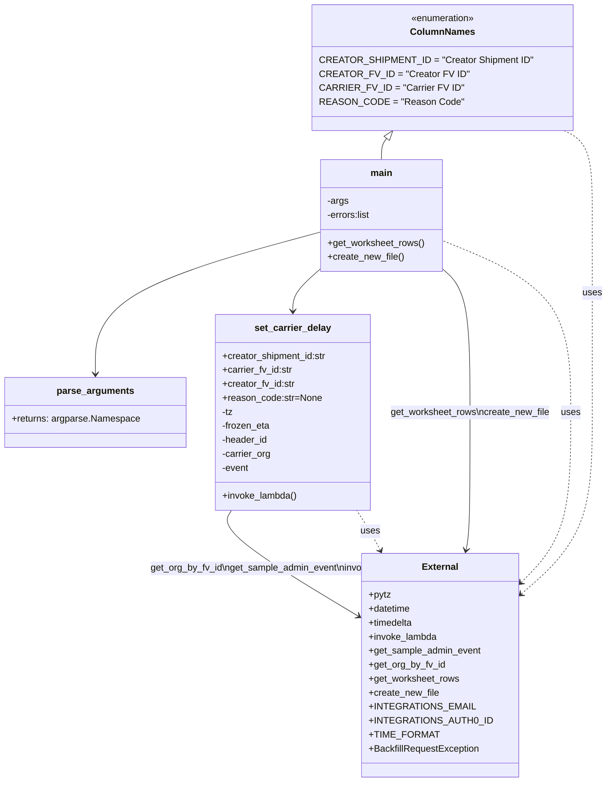

# Diagram: shipment_core/shipment_service/scripts/backfill_shipments_with_lambdas/backfill_carrier_delayed.py


> Auto-generated by Obscura crawlers

## Diagram 1



### SVG

<svg id="container" width="1042.8125" xmlns="http://www.w3.org/2000/svg" class="classDiagram" height="1342" viewBox="0 0 1042.8125 1342" role="graphics-document document" aria-roledescription="class"><style>#container{font-family:"trebuchet ms",verdana,arial,sans-serif;font-size:16px;fill:#333;}@keyframes edge-animation-frame{from{stroke-dashoffset:0;}}@keyframes dash{to{stroke-dashoffset:0;}}#container .edge-animation-slow{stroke-dasharray:9,5!important;stroke-dashoffset:900;animation:dash 50s linear infinite;stroke-linecap:round;}#container .edge-animation-fast{stroke-dasharray:9,5!important;stroke-dashoffset:900;animation:dash 20s linear infinite;stroke-linecap:round;}#container .error-icon{fill:#552222;}#container .error-text{fill:#552222;stroke:#552222;}#container .edge-thickness-normal{stroke-width:1px;}#container .edge-thickness-thick{stroke-width:3.5px;}#container .edge-pattern-solid{stroke-dasharray:0;}#container .edge-thickness-invisible{stroke-width:0;fill:none;}#container .edge-pattern-dashed{stroke-dasharray:3;}#container .edge-pattern-dotted{stroke-dasharray:2;}#container .marker{fill:#333333;stroke:#333333;}#container .marker.cross{stroke:#333333;}#container svg{font-family:"trebuchet ms",verdana,arial,sans-serif;font-size:16px;}#container p{margin:0;}#container g.classGroup text{fill:#9370DB;stroke:none;font-family:"trebuchet ms",verdana,arial,sans-serif;font-size:10px;}#container g.classGroup text .title{font-weight:bolder;}#container .nodeLabel,#container .edgeLabel{color:#131300;}#container .edgeLabel .label rect{fill:#ECECFF;}#container .label text{fill:#131300;}#container .labelBkg{background:#ECECFF;}#container .edgeLabel .label span{background:#ECECFF;}#container .classTitle{font-weight:bolder;}#container .node rect,#container .node circle,#container .node ellipse,#container .node polygon,#container .node path{fill:#ECECFF;stroke:#9370DB;stroke-width:1px;}#container .divider{stroke:#9370DB;stroke-width:1;}#container g.clickable{cursor:pointer;}#container g.classGroup rect{fill:#ECECFF;stroke:#9370DB;}#container g.classGroup line{stroke:#9370DB;stroke-width:1;}#container .classLabel .box{stroke:none;stroke-width:0;fill:#ECECFF;opacity:0.5;}#container .classLabel .label{fill:#9370DB;font-size:10px;}#container .relation{stroke:#333333;stroke-width:1;fill:none;}#container .dashed-line{stroke-dasharray:3;}#container .dotted-line{stroke-dasharray:1 2;}#container #compositionStart,#container .composition{fill:#333333!important;stroke:#333333!important;stroke-width:1;}#container #compositionEnd,#container .composition{fill:#333333!important;stroke:#333333!important;stroke-width:1;}#container #dependencyStart,#container .dependency{fill:#333333!important;stroke:#333333!important;stroke-width:1;}#container #dependencyStart,#container .dependency{fill:#333333!important;stroke:#333333!important;stroke-width:1;}#container #extensionStart,#container .extension{fill:transparent!important;stroke:#333333!important;stroke-width:1;}#container #extensionEnd,#container .extension{fill:transparent!important;stroke:#333333!important;stroke-width:1;}#container #aggregationStart,#container .aggregation{fill:transparent!important;stroke:#333333!important;stroke-width:1;}#container #aggregationEnd,#container .aggregation{fill:transparent!important;stroke:#333333!important;stroke-width:1;}#container #lollipopStart,#container .lollipop{fill:#ECECFF!important;stroke:#333333!important;stroke-width:1;}#container #lollipopEnd,#container .lollipop{fill:#ECECFF!important;stroke:#333333!important;stroke-width:1;}#container .edgeTerminals{font-size:11px;line-height:initial;}#container .classTitleText{text-anchor:middle;font-size:18px;fill:#333;}#container .label-icon{display:inline-block;height:1em;overflow:visible;vertical-align:-0.125em;}#container .node .label-icon path{fill:currentColor;stroke:revert;stroke-width:revert;}#container :root{--mermaid-font-family:"trebuchet ms",verdana,arial,sans-serif;}</style><g><defs><marker id="container_class-aggregationStart" class="marker aggregation class" refX="18" refY="7" markerWidth="190" markerHeight="240" orient="auto"><path d="M 18,7 L9,13 L1,7 L9,1 Z"></path></marker></defs><defs><marker id="container_class-aggregationEnd" class="marker aggregation class" refX="1" refY="7" markerWidth="20" markerHeight="28" orient="auto"><path d="M 18,7 L9,13 L1,7 L9,1 Z"></path></marker></defs><defs><marker id="container_class-extensionStart" class="marker extension class" refX="18" refY="7" markerWidth="190" markerHeight="240" orient="auto"><path d="M 1,7 L18,13 V 1 Z"></path></marker></defs><defs><marker id="container_class-extensionEnd" class="marker extension class" refX="1" refY="7" markerWidth="20" markerHeight="28" orient="auto"><path d="M 1,1 V 13 L18,7 Z"></path></marker></defs><defs><marker id="container_class-compositionStart" class="marker composition class" refX="18" refY="7" markerWidth="190" markerHeight="240" orient="auto"><path d="M 18,7 L9,13 L1,7 L9,1 Z"></path></marker></defs><defs><marker id="container_class-compositionEnd" class="marker composition class" refX="1" refY="7" markerWidth="20" markerHeight="28" orient="auto"><path d="M 18,7 L9,13 L1,7 L9,1 Z"></path></marker></defs><defs><marker id="container_class-dependencyStart" class="marker dependency class" refX="6" refY="7" markerWidth="190" markerHeight="240" orient="auto"><path d="M 5,7 L9,13 L1,7 L9,1 Z"></path></marker></defs><defs><marker id="container_class-dependencyEnd" class="marker dependency class" refX="13" refY="7" markerWidth="20" markerHeight="28" orient="auto"><path d="M 18,7 L9,13 L14,7 L9,1 Z"></path></marker></defs><defs><marker id="container_class-lollipopStart" class="marker lollipop class" refX="13" refY="7" markerWidth="190" markerHeight="240" orient="auto"><circle stroke="black" fill="transparent" cx="7" cy="7" r="6"></circle></marker></defs><defs><marker id="container_class-lollipopEnd" class="marker lollipop class" refX="1" refY="7" markerWidth="190" markerHeight="240" orient="auto"><circle stroke="black" fill="transparent" cx="7" cy="7" r="6"></circle></marker></defs><g class="root"><g class="clusters"></g><g class="edgePaths"><path d="M883.38,1030.402L905.87,1010.835C928.36,991.268,973.34,952.134,995.83,898.4C1018.32,844.667,1018.32,776.333,1018.32,708C1018.32,639.667,1018.32,571.333,1018.32,515C1018.32,458.667,1018.32,414.333,1018.32,372C1018.32,329.667,1018.32,289.333,1010.179,265C1002.037,240.667,985.754,232.333,977.612,228.167L969.47,224" id="id_External_ColumnNames_1" class="edge-thickness-normal edge-pattern-dashed relation" style=";;;" data-edge="true" data-et="edge" data-id="id_External_ColumnNames_1" data-points="W3sieCI6ODc4Ljg1MzUxNTYyNSwieSI6MTAzNC4zNDA0NDk1Mjk5MTU1fSx7IngiOjEwMTguMzIwMzEyNSwieSI6OTEzfSx7IngiOjEwMTguMzIwMzEyNSwieSI6NzA4fSx7IngiOjEwMTguMzIwMzEyNSwieSI6NTAzfSx7IngiOjEwMTguMzIwMzEyNSwieSI6MzcwfSx7IngiOjEwMTguMzIwMzEyNSwieSI6MjQ5fSx7IngiOjk2OS40NzAxNTk3NzQ0MzYxLCJ5IjoyMjR9XQ==" marker-start="url(#container_class-dependencyStart)"></path><path d="M650.991,944.694L648.203,939.411C645.416,934.129,639.841,923.565,632.971,912.116C626.101,900.667,617.936,888.333,613.854,882.167L609.771,876" id="id_External_set_carrier_delay_2" class="edge-thickness-normal edge-pattern-dashed relation" style=";;;" data-edge="true" data-et="edge" data-id="id_External_set_carrier_delay_2" data-points="W3sieCI6NjUzLjc5MDkxMzI3NzgzODQsInkiOjk1MH0seyJ4Ijo2MzQuMjY1NjI1LCJ5Ijo5MTN9LHsieCI6NjA5Ljc3MTQ1NTc5MjY4MjksInkiOjg3Nn1d" marker-start="url(#container_class-dependencyStart)"></path><path d="M883.075,1012.748L899.534,996.123C915.993,979.499,948.91,946.249,965.369,895.458C981.828,844.667,981.828,776.333,981.828,708C981.828,639.667,981.828,571.333,944.31,522.014C906.792,472.695,831.755,442.391,794.237,427.238L756.719,412.086" id="id_External_main_3" class="edge-thickness-normal edge-pattern-dashed relation" style=";;;" data-edge="true" data-et="edge" data-id="id_External_main_3" data-points="W3sieCI6ODc4Ljg1MzUxNTYyNSwieSI6MTAxNy4wMTE2Mzg2MjU0MTg5fSx7IngiOjk4MS44MjgxMjUsInkiOjkxM30seyJ4Ijo5ODEuODI4MTI1LCJ5Ijo3MDh9LHsieCI6OTgxLjgyODEyNSwieSI6NTAzfSx7IngiOjc1Ni43MTg3NSwieSI6NDEyLjA4NTc3MTg5OTY1MDA3fV0=" marker-start="url(#container_class-dependencyStart)"></path><path d="M390.802,876L386.846,882.167C382.891,888.333,374.981,900.667,414.214,932.321C453.447,963.975,539.825,1014.95,583.013,1040.437L626.202,1065.925" id="id_set_carrier_delay_External_4" class="edge-thickness-normal edge-pattern-solid relation" style=";;;" data-edge="true" data-et="edge" data-id="id_set_carrier_delay_External_4" data-points="W3sieCI6MzkwLjgwMTYzODcxOTUxMjIsInkiOjg3Nn0seyJ4IjozNjcuMDcwMzEyNSwieSI6OTEzfSx7IngiOjYzMS4zNjkxNDA2MjUsInkiOjEwNjguOTc0MzE1MDk0MzQ5fV0=" marker-end="url(#container_class-dependencyEnd)"></path><path d="M548.305,398.212L483.796,415.677C419.288,433.142,290.271,468.071,225.762,508.702C161.254,549.333,161.254,595.667,161.254,618.833L161.254,642" id="id_main_parse_arguments_5" class="edge-thickness-normal edge-pattern-solid relation" style=";;;" data-edge="true" data-et="edge" data-id="id_main_parse_arguments_5" data-points="W3sieCI6NTQ4LjMwNDY4NzUsInkiOjM5OC4yMTIzNDU1NDE1Nzg1NH0seyJ4IjoxNjEuMjUzOTA2MjUsInkiOjUwM30seyJ4IjoxNjEuMjUzOTA2MjUsInkiOjY0OH1d" marker-end="url(#container_class-dependencyEnd)"></path><path d="M548.305,460.022L540.013,467.185C531.721,474.348,515.138,488.674,506.846,501.004C498.555,513.333,498.555,523.667,498.555,528.833L498.555,534" id="id_main_set_carrier_delay_6" class="edge-thickness-normal edge-pattern-solid relation" style=";;;" data-edge="true" data-et="edge" data-id="id_main_set_carrier_delay_6" data-points="W3sieCI6NTQ4LjMwNDY4NzUsInkiOjQ2MC4wMjIwOTkzMDczMzUxfSx7IngiOjQ5OC41NTQ2ODc1LCJ5Ijo1MDN9LHsieCI6NDk4LjU1NDY4NzUsInkiOjU0MH1d" marker-end="url(#container_class-dependencyEnd)"></path><path d="M756.719,460.022L765.01,467.185C773.302,474.348,789.885,488.674,798.177,530.004C806.469,571.333,806.469,639.667,806.469,708C806.469,776.333,806.469,844.667,805.305,884.024C804.14,923.382,801.812,933.764,800.648,938.955L799.484,944.145" id="id_main_External_7" class="edge-thickness-normal edge-pattern-solid relation" style=";;;" data-edge="true" data-et="edge" data-id="id_main_External_7" data-points="W3sieCI6NzU2LjcxODc1LCJ5Ijo0NjAuMDIyMDk5MzA3MzM1MX0seyJ4Ijo4MDYuNDY4NzUsInkiOjUwM30seyJ4Ijo4MDYuNDY4NzUsInkiOjcwOH0seyJ4Ijo4MDYuNDY4NzUsInkiOjkxM30seyJ4Ijo3OTguMTcwODI1OTQxNTkzOSwieSI6OTUwfV0=" marker-end="url(#container_class-dependencyEnd)"></path><path d="M661.676,237.493L660.149,239.411C658.621,241.329,655.566,245.164,654.039,251.249C652.512,257.333,652.512,265.667,652.512,269.833L652.512,274" id="id_ColumnNames_main_8" class="edge-thickness-normal edge-pattern-solid relation" style=";;;" data-edge="true" data-et="edge" data-id="id_ColumnNames_main_8" data-points="W3sieCI6NjcyLjQyMjU3OTg4NzIxOCwieSI6MjI0fSx7IngiOjY1Mi41MTE3MTg3NSwieSI6MjQ5fSx7IngiOjY1Mi41MTE3MTg3NSwieSI6Mjc0fV0=" marker-start="url(#container_class-extensionStart)"></path></g><g class="edgeLabels"><g class="edgeLabel" transform="translate(1018.3203125, 503)"><g class="label" data-id="id_External_ColumnNames_1" transform="translate(-16.4921875, -12)"><foreignObject width="32.984375" height="24"><div xmlns="http://www.w3.org/1999/xhtml" class="labelBkg" style="display: table-cell; white-space: nowrap; line-height: 1.5; max-width: 200px; text-align: center;"><span class="edgeLabel"><p>uses</p></span></div></foreignObject></g></g><g class="edgeLabel" transform="translate(633.56536, 911.9422)"><g class="label" data-id="id_External_set_carrier_delay_2" transform="translate(-16.4921875, -12)"><foreignObject width="32.984375" height="24"><div xmlns="http://www.w3.org/1999/xhtml" class="labelBkg" style="display: table-cell; white-space: nowrap; line-height: 1.5; max-width: 200px; text-align: center;"><span class="edgeLabel"><p>uses</p></span></div></foreignObject></g></g><g class="edgeLabel" transform="translate(981.828125, 708)"><g class="label" data-id="id_External_main_3" transform="translate(-16.4921875, -12)"><foreignObject width="32.984375" height="24"><div xmlns="http://www.w3.org/1999/xhtml" class="labelBkg" style="display: table-cell; white-space: nowrap; line-height: 1.5; max-width: 200px; text-align: center;"><span class="edgeLabel"><p>uses</p></span></div></foreignObject></g></g><g class="edgeLabel" transform="translate(480.29172, 979.81691)"><g class="label" data-id="id_set_carrier_delay_External_4" transform="translate(-226.4765625, -12)"><foreignObject width="452.953125" height="24"><div xmlns="http://www.w3.org/1999/xhtml" class="labelBkg" style="display: table; white-space: break-spaces; line-height: 1.5; max-width: 200px; text-align: center; width: 200px;"><span class="edgeLabel"><p>get_org_by_fv_id\nget_sample_admin_event\ninvoke_lambda</p></span></div></foreignObject></g></g><g class="edgeLabel"><g class="label" data-id="id_main_parse_arguments_5" transform="translate(0, 0)"><foreignObject width="0" height="0"><div xmlns="http://www.w3.org/1999/xhtml" class="labelBkg" style="display: table-cell; white-space: nowrap; line-height: 1.5; max-width: 200px; text-align: center;"><span class="edgeLabel"></span></div></foreignObject></g></g><g class="edgeLabel"><g class="label" data-id="id_main_set_carrier_delay_6" transform="translate(0, 0)"><foreignObject width="0" height="0"><div xmlns="http://www.w3.org/1999/xhtml" class="labelBkg" style="display: table-cell; white-space: nowrap; line-height: 1.5; max-width: 200px; text-align: center;"><span class="edgeLabel"></span></div></foreignObject></g></g><g class="edgeLabel" transform="translate(806.46875, 708)"><g class="label" data-id="id_main_External_7" transform="translate(-138.8671875, -12)"><foreignObject width="277.734375" height="24"><div xmlns="http://www.w3.org/1999/xhtml" class="labelBkg" style="display: table; white-space: break-spaces; line-height: 1.5; max-width: 200px; text-align: center; width: 200px;"><span class="edgeLabel"><p>get_worksheet_rows\ncreate_new_file</p></span></div></foreignObject></g></g><g class="edgeLabel"><g class="label" data-id="id_ColumnNames_main_8" transform="translate(0, 0)"><foreignObject width="0" height="0"><div xmlns="http://www.w3.org/1999/xhtml" class="labelBkg" style="display: table-cell; white-space: nowrap; line-height: 1.5; max-width: 200px; text-align: center;"><span class="edgeLabel"></span></div></foreignObject></g></g></g><g class="nodes"><g class="node default" id="classId-ColumnNames-0" transform="translate(758.4375, 116)"><g class="basic label-container"><path d="M-211.33203125 -108 L211.33203125 -108 L211.33203125 108 L-211.33203125 108" stroke="none" stroke-width="0" fill="#ECECFF" style=""></path><path d="M-211.33203125 -108 C-99.56639002458756 -108, 12.199251200824875 -108, 211.33203125 -108 M-211.33203125 -108 C-44.121446584241454 -108, 123.08913808151709 -108, 211.33203125 -108 M211.33203125 -108 C211.33203125 -62.97474923830563, 211.33203125 -17.949498476611254, 211.33203125 108 M211.33203125 -108 C211.33203125 -36.35358589481443, 211.33203125 35.29282821037114, 211.33203125 108 M211.33203125 108 C112.41229163204028 108, 13.492552014080559 108, -211.33203125 108 M211.33203125 108 C98.4402353500684 108, -14.451560549863188 108, -211.33203125 108 M-211.33203125 108 C-211.33203125 26.98369252361198, -211.33203125 -54.03261495277604, -211.33203125 -108 M-211.33203125 108 C-211.33203125 48.45903277706225, -211.33203125 -11.081934445875504, -211.33203125 -108" stroke="#9370DB" stroke-width="1.3" fill="none" stroke-dasharray="0 0" style=""></path></g><g class="annotation-group text" transform="translate(-55.5546875, -84)"><g class="label" style="" transform="translate(0,-12)"><foreignObject width="111.109375" height="24"><div xmlns="http://www.w3.org/1999/xhtml" style="display: table-cell; white-space: nowrap; line-height: 1.5; max-width: 161px; text-align: center;"><span class="nodeLabel markdown-node-label" style=""><p>«enumeration»</p></span></div></foreignObject></g></g><g class="label-group text" transform="translate(-52.171875, -60)"><g class="label" style="font-weight: bolder" transform="translate(0,-12)"><foreignObject width="104.34375" height="24"><div xmlns="http://www.w3.org/1999/xhtml" style="display: table-cell; white-space: nowrap; line-height: 1.5; max-width: 155px; text-align: center;"><span class="nodeLabel markdown-node-label" style=""><p>ColumnNames</p></span></div></foreignObject></g></g><g class="members-group text" transform="translate(-199.33203125, -12)"><g class="label" style="" transform="translate(0,-12)"><foreignObject width="343.109375" height="24"><div xmlns="http://www.w3.org/1999/xhtml" style="display: table-cell; white-space: nowrap; line-height: 1.5; max-width: 393px; text-align: center;"><span class="nodeLabel markdown-node-label" style=""><p>CREATOR_SHIPMENT_ID = "Creator Shipment ID"</p></span></div></foreignObject></g><g class="label" style="" transform="translate(0,12)"><foreignObject width="233.890625" height="24"><div xmlns="http://www.w3.org/1999/xhtml" style="display: table-cell; white-space: nowrap; line-height: 1.5; max-width: 284px; text-align: center;"><span class="nodeLabel markdown-node-label" style=""><p>CREATOR_FV_ID = "Creator FV ID"</p></span></div></foreignObject></g><g class="label" style="" transform="translate(0,36)"><foreignObject width="226.84375" height="24"><div xmlns="http://www.w3.org/1999/xhtml" style="display: table-cell; white-space: nowrap; line-height: 1.5; max-width: 277px; text-align: center;"><span class="nodeLabel markdown-node-label" style=""><p>CARRIER_FV_ID = "Carrier FV ID"</p></span></div></foreignObject></g><g class="label" style="" transform="translate(0,60)"><foreignObject width="226.734375" height="24"><div xmlns="http://www.w3.org/1999/xhtml" style="display: table-cell; white-space: nowrap; line-height: 1.5; max-width: 277px; text-align: center;"><span class="nodeLabel markdown-node-label" style=""><p>REASON_CODE = "Reason Code"</p></span></div></foreignObject></g></g><g class="methods-group text" transform="translate(-199.33203125, 108)"></g><g class="divider" style=""><path d="M-211.33203125 -36 C-83.1587785852542 -36, 45.014474079491606 -36, 211.33203125 -36 M-211.33203125 -36 C-61.14100905019748 -36, 89.05001314960504 -36, 211.33203125 -36" stroke="#9370DB" stroke-width="1.3" fill="none" stroke-dasharray="0 0" style=""></path></g><g class="divider" style=""><path d="M-211.33203125 84 C-48.07226207774315 84, 115.1875070945137 84, 211.33203125 84 M-211.33203125 84 C-89.594860673214 84, 32.142309903572 84, 211.33203125 84" stroke="#9370DB" stroke-width="1.3" fill="none" stroke-dasharray="0 0" style=""></path></g></g><g class="node default" id="classId-set_carrier_delay-1" transform="translate(498.5546875, 708)"><g class="basic label-container"><path d="M-134.046875 -168 L134.046875 -168 L134.046875 168 L-134.046875 168" stroke="none" stroke-width="0" fill="#ECECFF" style=""></path><path d="M-134.046875 -168 C-55.4247529717009 -168, 23.197369056598205 -168, 134.046875 -168 M-134.046875 -168 C-64.92161568218773 -168, 4.20364363562453 -168, 134.046875 -168 M134.046875 -168 C134.046875 -39.565040493625474, 134.046875 88.86991901274905, 134.046875 168 M134.046875 -168 C134.046875 -36.470453804564755, 134.046875 95.05909239087049, 134.046875 168 M134.046875 168 C48.86937616300655 168, -36.3081226739869 168, -134.046875 168 M134.046875 168 C58.93775994387252 168, -16.171355112254957 168, -134.046875 168 M-134.046875 168 C-134.046875 61.93347084033509, -134.046875 -44.13305831932982, -134.046875 -168 M-134.046875 168 C-134.046875 98.93590620602303, -134.046875 29.87181241204607, -134.046875 -168" stroke="#9370DB" stroke-width="1.3" fill="none" stroke-dasharray="0 0" style=""></path></g><g class="annotation-group text" transform="translate(0, -144)"></g><g class="label-group text" transform="translate(-63.125, -144)"><g class="label" style="font-weight: bolder" transform="translate(0,-12)"><foreignObject width="126.25" height="24"><div xmlns="http://www.w3.org/1999/xhtml" style="display: table-cell; white-space: nowrap; line-height: 1.5; max-width: 174px; text-align: center;"><span class="nodeLabel markdown-node-label" style=""><p>set_carrier_delay</p></span></div></foreignObject></g></g><g class="members-group text" transform="translate(-122.046875, -96)"><g class="label" style="" transform="translate(0,-12)"><foreignObject width="180.96875" height="24"><div xmlns="http://www.w3.org/1999/xhtml" style="display: table-cell; white-space: nowrap; line-height: 1.5; max-width: 239px; text-align: center;"><span class="nodeLabel markdown-node-label" style=""><p>+creator_shipment_id:str</p></span></div></foreignObject></g><g class="label" style="" transform="translate(0,12)"><foreignObject width="121.234375" height="24"><div xmlns="http://www.w3.org/1999/xhtml" style="display: table-cell; white-space: nowrap; line-height: 1.5; max-width: 179px; text-align: center;"><span class="nodeLabel markdown-node-label" style=""><p>+carrier_fv_id:str</p></span></div></foreignObject></g><g class="label" style="" transform="translate(0,36)"><foreignObject width="124.953125" height="24"><div xmlns="http://www.w3.org/1999/xhtml" style="display: table-cell; white-space: nowrap; line-height: 1.5; max-width: 183px; text-align: center;"><span class="nodeLabel markdown-node-label" style=""><p>+creator_fv_id:str</p></span></div></foreignObject></g><g class="label" style="" transform="translate(0,60)"><foreignObject width="169.734375" height="24"><div xmlns="http://www.w3.org/1999/xhtml" style="display: table-cell; white-space: nowrap; line-height: 1.5; max-width: 227px; text-align: center;"><span class="nodeLabel markdown-node-label" style=""><p>+reason_code:str=None</p></span></div></foreignObject></g><g class="label" style="" transform="translate(0,84)"><foreignObject width="19.140625" height="24"><div xmlns="http://www.w3.org/1999/xhtml" style="display: table-cell; white-space: nowrap; line-height: 1.5; max-width: 77px; text-align: center;"><span class="nodeLabel markdown-node-label" style=""><p>-tz</p></span></div></foreignObject></g><g class="label" style="" transform="translate(0,108)"><foreignObject width="82.5625" height="24"><div xmlns="http://www.w3.org/1999/xhtml" style="display: table-cell; white-space: nowrap; line-height: 1.5; max-width: 140px; text-align: center;"><span class="nodeLabel markdown-node-label" style=""><p>-frozen_eta</p></span></div></foreignObject></g><g class="label" style="" transform="translate(0,132)"><foreignObject width="78.6875" height="24"><div xmlns="http://www.w3.org/1999/xhtml" style="display: table-cell; white-space: nowrap; line-height: 1.5; max-width: 136px; text-align: center;"><span class="nodeLabel markdown-node-label" style=""><p>-header_id</p></span></div></foreignObject></g><g class="label" style="" transform="translate(0,156)"><foreignObject width="84.734375" height="24"><div xmlns="http://www.w3.org/1999/xhtml" style="display: table-cell; white-space: nowrap; line-height: 1.5; max-width: 143px; text-align: center;"><span class="nodeLabel markdown-node-label" style=""><p>-carrier_org</p></span></div></foreignObject></g><g class="label" style="" transform="translate(0,180)"><foreignObject width="46.796875" height="24"><div xmlns="http://www.w3.org/1999/xhtml" style="display: table-cell; white-space: nowrap; line-height: 1.5; max-width: 104px; text-align: center;"><span class="nodeLabel markdown-node-label" style=""><p>-event</p></span></div></foreignObject></g></g><g class="methods-group text" transform="translate(-122.046875, 144)"><g class="label" style="" transform="translate(0,-12)"><foreignObject width="128.703125" height="24"><div xmlns="http://www.w3.org/1999/xhtml" style="display: table-cell; white-space: nowrap; line-height: 1.5; max-width: 186px; text-align: center;"><span class="nodeLabel markdown-node-label" style=""><p>+invoke_lambda()</p></span></div></foreignObject></g></g><g class="divider" style=""><path d="M-134.046875 -120 C-60.67724606018304 -120, 12.692382879633925 -120, 134.046875 -120 M-134.046875 -120 C-32.14254904214408 -120, 69.76177691571183 -120, 134.046875 -120" stroke="#9370DB" stroke-width="1.3" fill="none" stroke-dasharray="0 0" style=""></path></g><g class="divider" style=""><path d="M-134.046875 120 C-63.08150917112049 120, 7.883856657759026 120, 134.046875 120 M-134.046875 120 C-59.5483418282965 120, 14.950191343406999 120, 134.046875 120" stroke="#9370DB" stroke-width="1.3" fill="none" stroke-dasharray="0 0" style=""></path></g></g><g class="node default" id="classId-parse_arguments-2" transform="translate(161.25390625, 708)"><g class="basic label-container"><path d="M-153.25390625 -60 L153.25390625 -60 L153.25390625 60 L-153.25390625 60" stroke="none" stroke-width="0" fill="#ECECFF" style=""></path><path d="M-153.25390625 -60 C-60.76146583211526 -60, 31.730974585769474 -60, 153.25390625 -60 M-153.25390625 -60 C-33.9839859298917 -60, 85.2859343902166 -60, 153.25390625 -60 M153.25390625 -60 C153.25390625 -15.655978156929805, 153.25390625 28.68804368614039, 153.25390625 60 M153.25390625 -60 C153.25390625 -24.070307022312, 153.25390625 11.859385955375998, 153.25390625 60 M153.25390625 60 C90.73095071795112 60, 28.207995185902234 60, -153.25390625 60 M153.25390625 60 C79.80284570768305 60, 6.3517851653660955 60, -153.25390625 60 M-153.25390625 60 C-153.25390625 15.082041717418143, -153.25390625 -29.835916565163714, -153.25390625 -60 M-153.25390625 60 C-153.25390625 25.357570469997214, -153.25390625 -9.284859060005573, -153.25390625 -60" stroke="#9370DB" stroke-width="1.3" fill="none" stroke-dasharray="0 0" style=""></path></g><g class="annotation-group text" transform="translate(0, -36)"></g><g class="label-group text" transform="translate(-63.4609375, -36)"><g class="label" style="font-weight: bolder" transform="translate(0,-12)"><foreignObject width="126.921875" height="24"><div xmlns="http://www.w3.org/1999/xhtml" style="display: table-cell; white-space: nowrap; line-height: 1.5; max-width: 175px; text-align: center;"><span class="nodeLabel markdown-node-label" style=""><p>parse_arguments</p></span></div></foreignObject></g></g><g class="members-group text" transform="translate(-141.25390625, 12)"><g class="label" style="" transform="translate(0,-12)"><foreignObject width="219.046875" height="24"><div xmlns="http://www.w3.org/1999/xhtml" style="display: table-cell; white-space: nowrap; line-height: 1.5; max-width: 276px; text-align: center;"><span class="nodeLabel markdown-node-label" style=""><p>+returns: argparse.Namespace</p></span></div></foreignObject></g></g><g class="methods-group text" transform="translate(-141.25390625, 60)"></g><g class="divider" style=""><path d="M-153.25390625 -12 C-57.57641729862782 -12, 38.101071652744366 -12, 153.25390625 -12 M-153.25390625 -12 C-84.46233729663041 -12, -15.670768343260818 -12, 153.25390625 -12" stroke="#9370DB" stroke-width="1.3" fill="none" stroke-dasharray="0 0" style=""></path></g><g class="divider" style=""><path d="M-153.25390625 36 C-75.05471829450046 36, 3.1444696609990785 36, 153.25390625 36 M-153.25390625 36 C-45.42153372483821 36, 62.410838800323575 36, 153.25390625 36" stroke="#9370DB" stroke-width="1.3" fill="none" stroke-dasharray="0 0" style=""></path></g></g><g class="node default" id="classId-main-3" transform="translate(652.51171875, 370)"><g class="basic label-container"><path d="M-104.20703125 -96 L104.20703125 -96 L104.20703125 96 L-104.20703125 96" stroke="none" stroke-width="0" fill="#ECECFF" style=""></path><path d="M-104.20703125 -96 C-44.68626441001788 -96, 14.834502429964246 -96, 104.20703125 -96 M-104.20703125 -96 C-52.668310364049425 -96, -1.1295894780988505 -96, 104.20703125 -96 M104.20703125 -96 C104.20703125 -56.21540700168502, 104.20703125 -16.430814003370045, 104.20703125 96 M104.20703125 -96 C104.20703125 -34.369278544825136, 104.20703125 27.26144291034973, 104.20703125 96 M104.20703125 96 C49.34095061553054 96, -5.525130018938924 96, -104.20703125 96 M104.20703125 96 C26.77539499440941 96, -50.65624126118118 96, -104.20703125 96 M-104.20703125 96 C-104.20703125 28.86636282284124, -104.20703125 -38.26727435431752, -104.20703125 -96 M-104.20703125 96 C-104.20703125 20.143135003403927, -104.20703125 -55.713729993192146, -104.20703125 -96" stroke="#9370DB" stroke-width="1.3" fill="none" stroke-dasharray="0 0" style=""></path></g><g class="annotation-group text" transform="translate(0, -72)"></g><g class="label-group text" transform="translate(-18.0234375, -72)"><g class="label" style="font-weight: bolder" transform="translate(0,-12)"><foreignObject width="36.046875" height="24"><div xmlns="http://www.w3.org/1999/xhtml" style="display: table-cell; white-space: nowrap; line-height: 1.5; max-width: 86px; text-align: center;"><span class="nodeLabel markdown-node-label" style=""><p>main</p></span></div></foreignObject></g></g><g class="members-group text" transform="translate(-92.20703125, -24)"><g class="label" style="" transform="translate(0,-12)"><foreignObject width="36.53125" height="24"><div xmlns="http://www.w3.org/1999/xhtml" style="display: table-cell; white-space: nowrap; line-height: 1.5; max-width: 94px; text-align: center;"><span class="nodeLabel markdown-node-label" style=""><p>-args</p></span></div></foreignObject></g><g class="label" style="" transform="translate(0,12)"><foreignObject width="76.09375" height="24"><div xmlns="http://www.w3.org/1999/xhtml" style="display: table-cell; white-space: nowrap; line-height: 1.5; max-width: 134px; text-align: center;"><span class="nodeLabel markdown-node-label" style=""><p>-errors:list</p></span></div></foreignObject></g></g><g class="methods-group text" transform="translate(-92.20703125, 48)"><g class="label" style="" transform="translate(0,-12)"><foreignObject width="166.390625" height="24"><div xmlns="http://www.w3.org/1999/xhtml" style="display: table-cell; white-space: nowrap; line-height: 1.5; max-width: 224px; text-align: center;"><span class="nodeLabel markdown-node-label" style=""><p>+get_worksheet_rows()</p></span></div></foreignObject></g><g class="label" style="" transform="translate(0,12)"><foreignObject width="131" height="24"><div xmlns="http://www.w3.org/1999/xhtml" style="display: table-cell; white-space: nowrap; line-height: 1.5; max-width: 188px; text-align: center;"><span class="nodeLabel markdown-node-label" style=""><p>+create_new_file()</p></span></div></foreignObject></g></g><g class="divider" style=""><path d="M-104.20703125 -48 C-54.249458720308596 -48, -4.291886190617191 -48, 104.20703125 -48 M-104.20703125 -48 C-32.345401867068205 -48, 39.51622751586359 -48, 104.20703125 -48" stroke="#9370DB" stroke-width="1.3" fill="none" stroke-dasharray="0 0" style=""></path></g><g class="divider" style=""><path d="M-104.20703125 24 C-38.52367117958916 24, 27.159688890821684 24, 104.20703125 24 M-104.20703125 24 C-56.3586615827811 24, -8.510291915562206 24, 104.20703125 24" stroke="#9370DB" stroke-width="1.3" fill="none" stroke-dasharray="0 0" style=""></path></g></g><g class="node default" id="classId-External-4" transform="translate(755.111328125, 1142)"><g class="basic label-container"><path d="M-123.7421875 -192 L123.7421875 -192 L123.7421875 192 L-123.7421875 192" stroke="none" stroke-width="0" fill="#ECECFF" style=""></path><path d="M-123.7421875 -192 C-25.691365266735517 -192, 72.35945696652897 -192, 123.7421875 -192 M-123.7421875 -192 C-40.59426651707393 -192, 42.553654465852134 -192, 123.7421875 -192 M123.7421875 -192 C123.7421875 -111.01989308838122, 123.7421875 -30.039786176762448, 123.7421875 192 M123.7421875 -192 C123.7421875 -79.1727747452901, 123.7421875 33.6544505094198, 123.7421875 192 M123.7421875 192 C35.49467035404369 192, -52.75284679191262 192, -123.7421875 192 M123.7421875 192 C63.73605372090043 192, 3.7299199418008584 192, -123.7421875 192 M-123.7421875 192 C-123.7421875 80.19066442611177, -123.7421875 -31.618671147776467, -123.7421875 -192 M-123.7421875 192 C-123.7421875 38.753704582176255, -123.7421875 -114.49259083564749, -123.7421875 -192" stroke="#9370DB" stroke-width="1.3" fill="none" stroke-dasharray="0 0" style=""></path></g><g class="annotation-group text" transform="translate(0, -168)"></g><g class="label-group text" transform="translate(-30.171875, -168)"><g class="label" style="font-weight: bolder" transform="translate(0,-12)"><foreignObject width="60.34375" height="24"><div xmlns="http://www.w3.org/1999/xhtml" style="display: table-cell; white-space: nowrap; line-height: 1.5; max-width: 110px; text-align: center;"><span class="nodeLabel markdown-node-label" style=""><p>External</p></span></div></foreignObject></g></g><g class="members-group text" transform="translate(-111.7421875, -120)"><g class="label" style="" transform="translate(0,-12)"><foreignObject width="38.078125" height="24"><div xmlns="http://www.w3.org/1999/xhtml" style="display: table-cell; white-space: nowrap; line-height: 1.5; max-width: 95px; text-align: center;"><span class="nodeLabel markdown-node-label" style=""><p>+pytz</p></span></div></foreignObject></g><g class="label" style="" transform="translate(0,12)"><foreignObject width="73.234375" height="24"><div xmlns="http://www.w3.org/1999/xhtml" style="display: table-cell; white-space: nowrap; line-height: 1.5; max-width: 131px; text-align: center;"><span class="nodeLabel markdown-node-label" style=""><p>+datetime</p></span></div></foreignObject></g><g class="label" style="" transform="translate(0,36)"><foreignObject width="77.96875" height="24"><div xmlns="http://www.w3.org/1999/xhtml" style="display: table-cell; white-space: nowrap; line-height: 1.5; max-width: 135px; text-align: center;"><span class="nodeLabel markdown-node-label" style=""><p>+timedelta</p></span></div></foreignObject></g><g class="label" style="" transform="translate(0,60)"><foreignObject width="118.328125" height="24"><div xmlns="http://www.w3.org/1999/xhtml" style="display: table-cell; white-space: nowrap; line-height: 1.5; max-width: 176px; text-align: center;"><span class="nodeLabel markdown-node-label" style=""><p>+invoke_lambda</p></span></div></foreignObject></g><g class="label" style="" transform="translate(0,84)"><foreignObject width="193.3125" height="24"><div xmlns="http://www.w3.org/1999/xhtml" style="display: table-cell; white-space: nowrap; line-height: 1.5; max-width: 251px; text-align: center;"><span class="nodeLabel markdown-node-label" style=""><p>+get_sample_admin_event</p></span></div></foreignObject></g><g class="label" style="" transform="translate(0,108)"><foreignObject width="130.515625" height="24"><div xmlns="http://www.w3.org/1999/xhtml" style="display: table-cell; white-space: nowrap; line-height: 1.5; max-width: 188px; text-align: center;"><span class="nodeLabel markdown-node-label" style=""><p>+get_org_by_fv_id</p></span></div></foreignObject></g><g class="label" style="" transform="translate(0,132)"><foreignObject width="156.03125" height="24"><div xmlns="http://www.w3.org/1999/xhtml" style="display: table-cell; white-space: nowrap; line-height: 1.5; max-width: 213px; text-align: center;"><span class="nodeLabel markdown-node-label" style=""><p>+get_worksheet_rows</p></span></div></foreignObject></g><g class="label" style="" transform="translate(0,156)"><foreignObject width="120.625" height="24"><div xmlns="http://www.w3.org/1999/xhtml" style="display: table-cell; white-space: nowrap; line-height: 1.5; max-width: 178px; text-align: center;"><span class="nodeLabel markdown-node-label" style=""><p>+create_new_file</p></span></div></foreignObject></g><g class="label" style="" transform="translate(0,180)"><foreignObject width="162.84375" height="24"><div xmlns="http://www.w3.org/1999/xhtml" style="display: table-cell; white-space: nowrap; line-height: 1.5; max-width: 220px; text-align: center;"><span class="nodeLabel markdown-node-label" style=""><p>+INTEGRATIONS_EMAIL</p></span></div></foreignObject></g><g class="label" style="" transform="translate(0,204)"><foreignObject width="190.515625" height="24"><div xmlns="http://www.w3.org/1999/xhtml" style="display: table-cell; white-space: nowrap; line-height: 1.5; max-width: 248px; text-align: center;"><span class="nodeLabel markdown-node-label" style=""><p>+INTEGRATIONS_AUTH0_ID</p></span></div></foreignObject></g><g class="label" style="" transform="translate(0,228)"><foreignObject width="106.9375" height="24"><div xmlns="http://www.w3.org/1999/xhtml" style="display: table-cell; white-space: nowrap; line-height: 1.5; max-width: 165px; text-align: center;"><span class="nodeLabel markdown-node-label" style=""><p>+TIME_FORMAT</p></span></div></foreignObject></g><g class="label" style="" transform="translate(0,252)"><foreignObject width="190.578125" height="24"><div xmlns="http://www.w3.org/1999/xhtml" style="display: table-cell; white-space: nowrap; line-height: 1.5; max-width: 248px; text-align: center;"><span class="nodeLabel markdown-node-label" style=""><p>+BackfillRequestException</p></span></div></foreignObject></g></g><g class="methods-group text" transform="translate(-111.7421875, 192)"></g><g class="divider" style=""><path d="M-123.7421875 -144 C-34.57939998090475 -144, 54.58338753819049 -144, 123.7421875 -144 M-123.7421875 -144 C-60.37243810331257 -144, 2.997311293374864 -144, 123.7421875 -144" stroke="#9370DB" stroke-width="1.3" fill="none" stroke-dasharray="0 0" style=""></path></g><g class="divider" style=""><path d="M-123.7421875 168 C-49.04003673886865 168, 25.6621140222627 168, 123.7421875 168 M-123.7421875 168 C-67.40274336892367 168, -11.063299237847318 168, 123.7421875 168" stroke="#9370DB" stroke-width="1.3" fill="none" stroke-dasharray="0 0" style=""></path></g></g></g></g></g></svg>

## Diagram 2

```mermaid
flowchart TD
    Start([start]) --> ArgParse[/"parse_arguments()"/]
    ArgParse --> ReadRows{for each row in file}
    ReadRows --> Extract[/"extract columns:\nCreator Shipment ID\nCarrier FV ID\nCreator FV ID\nReason Code (optional)"/]
    Extract --> LogSubmit[/"log: Submitting carrier delay"/]
    LogSubmit --> SetDelay[/"set_carrier_delay()"\ncompute frozen_eta\nbuild event\ninvoke_lambda]
    SetDelay --> SuccessLog[/"log: Successfully submitted"/]
    SetDelay -->|error: BackfillRequestException| HandleError[/"mark row __error__\nappend to errors"/]
    ReadRows --> EndLoop([loop complete])
    EndLoop --> CheckErrors{errors exist?}
    CheckErrors -->|yes| WriteFile[/"create_new_file(error_file_path, errors)"/]
    CheckErrors -->|no| Done([Done])
    WriteFile --> Done
```

> SVG rendering failed for this diagram.
