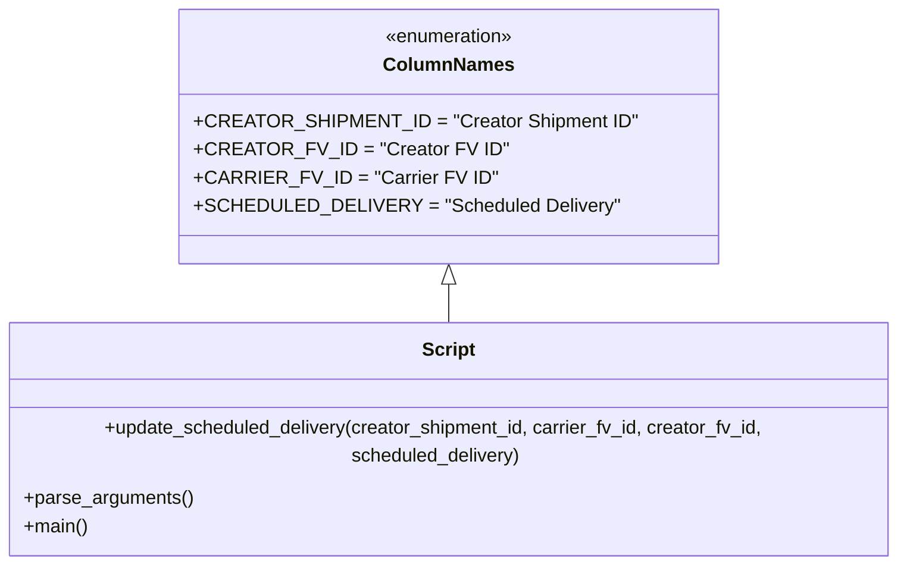

# Diagram: shipment_core/shipment_service/scripts/backfill_shipments_with_lambdas/backfill_scheduled_window.py


> Auto-generated by Obscura crawlers

## Diagram 1



### SVG

<svg id="container" width="778.7109375" xmlns="http://www.w3.org/2000/svg" class="classDiagram" height="456" viewBox="0 0 778.7109375 456" role="graphics-document document" aria-roledescription="class"><style>#container{font-family:"trebuchet ms",verdana,arial,sans-serif;font-size:16px;fill:#333;}@keyframes edge-animation-frame{from{stroke-dashoffset:0;}}@keyframes dash{to{stroke-dashoffset:0;}}#container .edge-animation-slow{stroke-dasharray:9,5!important;stroke-dashoffset:900;animation:dash 50s linear infinite;stroke-linecap:round;}#container .edge-animation-fast{stroke-dasharray:9,5!important;stroke-dashoffset:900;animation:dash 20s linear infinite;stroke-linecap:round;}#container .error-icon{fill:#552222;}#container .error-text{fill:#552222;stroke:#552222;}#container .edge-thickness-normal{stroke-width:1px;}#container .edge-thickness-thick{stroke-width:3.5px;}#container .edge-pattern-solid{stroke-dasharray:0;}#container .edge-thickness-invisible{stroke-width:0;fill:none;}#container .edge-pattern-dashed{stroke-dasharray:3;}#container .edge-pattern-dotted{stroke-dasharray:2;}#container .marker{fill:#333333;stroke:#333333;}#container .marker.cross{stroke:#333333;}#container svg{font-family:"trebuchet ms",verdana,arial,sans-serif;font-size:16px;}#container p{margin:0;}#container g.classGroup text{fill:#9370DB;stroke:none;font-family:"trebuchet ms",verdana,arial,sans-serif;font-size:10px;}#container g.classGroup text .title{font-weight:bolder;}#container .nodeLabel,#container .edgeLabel{color:#131300;}#container .edgeLabel .label rect{fill:#ECECFF;}#container .label text{fill:#131300;}#container .labelBkg{background:#ECECFF;}#container .edgeLabel .label span{background:#ECECFF;}#container .classTitle{font-weight:bolder;}#container .node rect,#container .node circle,#container .node ellipse,#container .node polygon,#container .node path{fill:#ECECFF;stroke:#9370DB;stroke-width:1px;}#container .divider{stroke:#9370DB;stroke-width:1;}#container g.clickable{cursor:pointer;}#container g.classGroup rect{fill:#ECECFF;stroke:#9370DB;}#container g.classGroup line{stroke:#9370DB;stroke-width:1;}#container .classLabel .box{stroke:none;stroke-width:0;fill:#ECECFF;opacity:0.5;}#container .classLabel .label{fill:#9370DB;font-size:10px;}#container .relation{stroke:#333333;stroke-width:1;fill:none;}#container .dashed-line{stroke-dasharray:3;}#container .dotted-line{stroke-dasharray:1 2;}#container #compositionStart,#container .composition{fill:#333333!important;stroke:#333333!important;stroke-width:1;}#container #compositionEnd,#container .composition{fill:#333333!important;stroke:#333333!important;stroke-width:1;}#container #dependencyStart,#container .dependency{fill:#333333!important;stroke:#333333!important;stroke-width:1;}#container #dependencyStart,#container .dependency{fill:#333333!important;stroke:#333333!important;stroke-width:1;}#container #extensionStart,#container .extension{fill:transparent!important;stroke:#333333!important;stroke-width:1;}#container #extensionEnd,#container .extension{fill:transparent!important;stroke:#333333!important;stroke-width:1;}#container #aggregationStart,#container .aggregation{fill:transparent!important;stroke:#333333!important;stroke-width:1;}#container #aggregationEnd,#container .aggregation{fill:transparent!important;stroke:#333333!important;stroke-width:1;}#container #lollipopStart,#container .lollipop{fill:#ECECFF!important;stroke:#333333!important;stroke-width:1;}#container #lollipopEnd,#container .lollipop{fill:#ECECFF!important;stroke:#333333!important;stroke-width:1;}#container .edgeTerminals{font-size:11px;line-height:initial;}#container .classTitleText{text-anchor:middle;font-size:18px;fill:#333;}#container .label-icon{display:inline-block;height:1em;overflow:visible;vertical-align:-0.125em;}#container .node .label-icon path{fill:currentColor;stroke:revert;stroke-width:revert;}#container :root{--mermaid-font-family:"trebuchet ms",verdana,arial,sans-serif;}</style><g><defs><marker id="container_class-aggregationStart" class="marker aggregation class" refX="18" refY="7" markerWidth="190" markerHeight="240" orient="auto"><path d="M 18,7 L9,13 L1,7 L9,1 Z"></path></marker></defs><defs><marker id="container_class-aggregationEnd" class="marker aggregation class" refX="1" refY="7" markerWidth="20" markerHeight="28" orient="auto"><path d="M 18,7 L9,13 L1,7 L9,1 Z"></path></marker></defs><defs><marker id="container_class-extensionStart" class="marker extension class" refX="18" refY="7" markerWidth="190" markerHeight="240" orient="auto"><path d="M 1,7 L18,13 V 1 Z"></path></marker></defs><defs><marker id="container_class-extensionEnd" class="marker extension class" refX="1" refY="7" markerWidth="20" markerHeight="28" orient="auto"><path d="M 1,1 V 13 L18,7 Z"></path></marker></defs><defs><marker id="container_class-compositionStart" class="marker composition class" refX="18" refY="7" markerWidth="190" markerHeight="240" orient="auto"><path d="M 18,7 L9,13 L1,7 L9,1 Z"></path></marker></defs><defs><marker id="container_class-compositionEnd" class="marker composition class" refX="1" refY="7" markerWidth="20" markerHeight="28" orient="auto"><path d="M 18,7 L9,13 L1,7 L9,1 Z"></path></marker></defs><defs><marker id="container_class-dependencyStart" class="marker dependency class" refX="6" refY="7" markerWidth="190" markerHeight="240" orient="auto"><path d="M 5,7 L9,13 L1,7 L9,1 Z"></path></marker></defs><defs><marker id="container_class-dependencyEnd" class="marker dependency class" refX="13" refY="7" markerWidth="20" markerHeight="28" orient="auto"><path d="M 18,7 L9,13 L14,7 L9,1 Z"></path></marker></defs><defs><marker id="container_class-lollipopStart" class="marker lollipop class" refX="13" refY="7" markerWidth="190" markerHeight="240" orient="auto"><circle stroke="black" fill="transparent" cx="7" cy="7" r="6"></circle></marker></defs><defs><marker id="container_class-lollipopEnd" class="marker lollipop class" refX="1" refY="7" markerWidth="190" markerHeight="240" orient="auto"><circle stroke="black" fill="transparent" cx="7" cy="7" r="6"></circle></marker></defs><g class="root"><g class="clusters"></g><g class="edgePaths"><path d="M389.355,241.25L389.355,242.542C389.355,243.833,389.355,246.417,389.355,251.875C389.355,257.333,389.355,265.667,389.355,269.833L389.355,274" id="id_ColumnNames_Script_1" class="edge-thickness-normal edge-pattern-solid relation" style=";;;" data-edge="true" data-et="edge" data-id="id_ColumnNames_Script_1" data-points="W3sieCI6Mzg5LjM1NTQ2ODc1LCJ5IjoyMjR9LHsieCI6Mzg5LjM1NTQ2ODc1LCJ5IjoyNDl9LHsieCI6Mzg5LjM1NTQ2ODc1LCJ5IjoyNzR9XQ==" marker-start="url(#container_class-extensionStart)"></path></g><g class="edgeLabels"><g class="edgeLabel"><g class="label" data-id="id_ColumnNames_Script_1" transform="translate(0, 0)"><foreignObject width="0" height="0"><div xmlns="http://www.w3.org/1999/xhtml" class="labelBkg" style="display: table-cell; white-space: nowrap; line-height: 1.5; max-width: 200px; text-align: center;"><span class="edgeLabel"></span></div></foreignObject></g></g></g><g class="nodes"><g class="node default" id="classId-ColumnNames-0" transform="translate(389.35546875, 116)"><g class="basic label-container"><path d="M-215.32421875 -108 L215.32421875 -108 L215.32421875 108 L-215.32421875 108" stroke="none" stroke-width="0" fill="#ECECFF" style=""></path><path d="M-215.32421875 -108 C-95.917500949996 -108, 23.489216850008006 -108, 215.32421875 -108 M-215.32421875 -108 C-124.53611664815632 -108, -33.748014546312646 -108, 215.32421875 -108 M215.32421875 -108 C215.32421875 -38.40584862641789, 215.32421875 31.188302747164215, 215.32421875 108 M215.32421875 -108 C215.32421875 -42.57530993170103, 215.32421875 22.849380136597944, 215.32421875 108 M215.32421875 108 C72.43859838075042 108, -70.44702198849916 108, -215.32421875 108 M215.32421875 108 C52.13862613424507 108, -111.04696648150986 108, -215.32421875 108 M-215.32421875 108 C-215.32421875 29.66132894140165, -215.32421875 -48.6773421171967, -215.32421875 -108 M-215.32421875 108 C-215.32421875 40.84587343856391, -215.32421875 -26.308253122872173, -215.32421875 -108" stroke="#9370DB" stroke-width="1.3" fill="none" stroke-dasharray="0 0" style=""></path></g><g class="annotation-group text" transform="translate(-55.5546875, -84)"><g class="label" style="" transform="translate(0,-12)"><foreignObject width="111.109375" height="24"><div xmlns="http://www.w3.org/1999/xhtml" style="display: table-cell; white-space: nowrap; line-height: 1.5; max-width: 161px; text-align: center;"><span class="nodeLabel markdown-node-label" style=""><p>«enumeration»</p></span></div></foreignObject></g></g><g class="label-group text" transform="translate(-52.171875, -60)"><g class="label" style="font-weight: bolder" transform="translate(0,-12)"><foreignObject width="104.34375" height="24"><div xmlns="http://www.w3.org/1999/xhtml" style="display: table-cell; white-space: nowrap; line-height: 1.5; max-width: 155px; text-align: center;"><span class="nodeLabel markdown-node-label" style=""><p>ColumnNames</p></span></div></foreignObject></g></g><g class="members-group text" transform="translate(-203.32421875, -12)"><g class="label" style="" transform="translate(0,-12)"><foreignObject width="351.09375" height="24"><div xmlns="http://www.w3.org/1999/xhtml" style="display: table-cell; white-space: nowrap; line-height: 1.5; max-width: 408px; text-align: center;"><span class="nodeLabel markdown-node-label" style=""><p>+CREATOR_SHIPMENT_ID = "Creator Shipment ID"</p></span></div></foreignObject></g><g class="label" style="" transform="translate(0,12)"><foreignObject width="241.875" height="24"><div xmlns="http://www.w3.org/1999/xhtml" style="display: table-cell; white-space: nowrap; line-height: 1.5; max-width: 299px; text-align: center;"><span class="nodeLabel markdown-node-label" style=""><p>+CREATOR_FV_ID = "Creator FV ID"</p></span></div></foreignObject></g><g class="label" style="" transform="translate(0,36)"><foreignObject width="234.828125" height="24"><div xmlns="http://www.w3.org/1999/xhtml" style="display: table-cell; white-space: nowrap; line-height: 1.5; max-width: 292px; text-align: center;"><span class="nodeLabel markdown-node-label" style=""><p>+CARRIER_FV_ID = "Carrier FV ID"</p></span></div></foreignObject></g><g class="label" style="" transform="translate(0,60)"><foreignObject width="335.484375" height="24"><div xmlns="http://www.w3.org/1999/xhtml" style="display: table-cell; white-space: nowrap; line-height: 1.5; max-width: 393px; text-align: center;"><span class="nodeLabel markdown-node-label" style=""><p>+SCHEDULED_DELIVERY = "Scheduled Delivery"</p></span></div></foreignObject></g></g><g class="methods-group text" transform="translate(-203.32421875, 108)"></g><g class="divider" style=""><path d="M-215.32421875 -36 C-102.39122020680104 -36, 10.541778336397925 -36, 215.32421875 -36 M-215.32421875 -36 C-58.60351366317849 -36, 98.11719142364302 -36, 215.32421875 -36" stroke="#9370DB" stroke-width="1.3" fill="none" stroke-dasharray="0 0" style=""></path></g><g class="divider" style=""><path d="M-215.32421875 84 C-71.97635381192237 84, 71.37151112615527 84, 215.32421875 84 M-215.32421875 84 C-85.14300299063339 84, 45.03821276873322 84, 215.32421875 84" stroke="#9370DB" stroke-width="1.3" fill="none" stroke-dasharray="0 0" style=""></path></g></g><g class="node default" id="classId-Script-1" transform="translate(389.35546875, 361)"><g class="basic label-container"><path d="M-381.35546875 -87 L381.35546875 -87 L381.35546875 87 L-381.35546875 87" stroke="none" stroke-width="0" fill="#ECECFF" style=""></path><path d="M-381.35546875 -87 C-226.4401022731712 -87, -71.52473579634238 -87, 381.35546875 -87 M-381.35546875 -87 C-225.70950178151222 -87, -70.06353481302443 -87, 381.35546875 -87 M381.35546875 -87 C381.35546875 -28.394296687113403, 381.35546875 30.211406625773193, 381.35546875 87 M381.35546875 -87 C381.35546875 -42.5702760787896, 381.35546875 1.8594478424208063, 381.35546875 87 M381.35546875 87 C184.11460288289985 87, -13.12626298420031 87, -381.35546875 87 M381.35546875 87 C93.96926887305847 87, -193.41693100388306 87, -381.35546875 87 M-381.35546875 87 C-381.35546875 22.994580377383343, -381.35546875 -41.01083924523331, -381.35546875 -87 M-381.35546875 87 C-381.35546875 27.175837696344033, -381.35546875 -32.648324607311935, -381.35546875 -87" stroke="#9370DB" stroke-width="1.3" fill="none" stroke-dasharray="0 0" style=""></path></g><g class="annotation-group text" transform="translate(0, -63)"></g><g class="label-group text" transform="translate(-21.7421875, -63)"><g class="label" style="font-weight: bolder" transform="translate(0,-12)"><foreignObject width="43.484375" height="24"><div xmlns="http://www.w3.org/1999/xhtml" style="display: table-cell; white-space: nowrap; line-height: 1.5; max-width: 93px; text-align: center;"><span class="nodeLabel markdown-node-label" style=""><p>Script</p></span></div></foreignObject></g></g><g class="members-group text" transform="translate(-369.35546875, -15)"></g><g class="methods-group text" transform="translate(-369.35546875, 15)"><g class="label" style="" transform="translate(0,-12)"><foreignObject width="716.96875" height="24"><div xmlns="http://www.w3.org/1999/xhtml" style="display: table-cell; white-space: nowrap; line-height: 1.5; max-width: 774px; text-align: center;"><span class="nodeLabel markdown-node-label" style=""><p>+update_scheduled_delivery(creator_shipment_id, carrier_fv_id, creator_fv_id, scheduled_delivery)</p></span></div></foreignObject></g><g class="label" style="" transform="translate(0,12)"><foreignObject width="143.390625" height="24"><div xmlns="http://www.w3.org/1999/xhtml" style="display: table-cell; white-space: nowrap; line-height: 1.5; max-width: 201px; text-align: center;"><span class="nodeLabel markdown-node-label" style=""><p>+parse_arguments()</p></span></div></foreignObject></g><g class="label" style="" transform="translate(0,36)"><foreignObject width="54.65625" height="24"><div xmlns="http://www.w3.org/1999/xhtml" style="display: table-cell; white-space: nowrap; line-height: 1.5; max-width: 112px; text-align: center;"><span class="nodeLabel markdown-node-label" style=""><p>+main()</p></span></div></foreignObject></g></g><g class="divider" style=""><path d="M-381.35546875 -39 C-198.2292710024006 -39, -15.103073254801188 -39, 381.35546875 -39 M-381.35546875 -39 C-146.779339693399 -39, 87.79678936320198 -39, 381.35546875 -39" stroke="#9370DB" stroke-width="1.3" fill="none" stroke-dasharray="0 0" style=""></path></g><g class="divider" style=""><path d="M-381.35546875 -15 C-131.27519179205416 -15, 118.80508516589168 -15, 381.35546875 -15 M-381.35546875 -15 C-207.8035143781604 -15, -34.2515600063208 -15, 381.35546875 -15" stroke="#9370DB" stroke-width="1.3" fill="none" stroke-dasharray="0 0" style=""></path></g></g></g></g></g></svg>

## Diagram 2

```mermaid
flowchart TD
    Start([Start]) --> ConfigureLogging[Configure logging]
    ConfigureLogging --> ParseArgs["parse_arguments()"]
    ParseArgs --> ReadFile["get_worksheet_rows(file_path)"]
    ReadFile --> ForEachRow{For each row}
    ForEachRow --> ExtractFields["Extract columns:\nCreator Shipment ID,\nCarrier FV ID,\nCreator FV ID,\nScheduled Delivery"]
    ExtractFields --> BuildShipmentId["shipment_id = carrier|creator|creator_shipment_id"]
    BuildShipmentId --> UpdateCall["update_scheduled_delivery(...)"]
    UpdateCall --> SetDefaultDate["if no scheduled_delivery -> now + 48h; set to 12:00 America/Detroit UTC normalize"]
    SetDefaultDate --> BuildHeader["header_id and carrier_org\nget_sample_admin_event(...)"]
    BuildHeader --> InjectAuth["set authorizer email/auth0Id and X-WSS-fvShipmentId"]
    InjectAuth --> SetBody["set body with stops earlyArrival/lateArrival formatted TIME_FORMAT"]
    SetBody --> InvokeLambda["invoke_lambda(name='v2_patch_shipment', full_payload=event)"]
    InvokeLambda --> CheckResponse{response.statusCode == "200" ?}
    CheckResponse -->|yes| LogSuccess["log success"]
    CheckResponse -->|no| HandleError["raise BackfillRequestException\ncapture in errors list"]
    HandleError --> AppendError["row['__error__']=response.data\nerrors.append(row)"]
    LogSuccess --> ContinueLoop --> ForEachRow
    AppendError --> ContinueLoop
    ForEachRow --> AfterLoop
    AfterLoop --> HasErrors{errors not empty?}
    HasErrors -->|yes| WriteErrors["create_new_file(error_file_path, errors)"]
    HasErrors -->|no| End([Done])
    WriteErrors --> End
```

> SVG rendering failed for this diagram.
