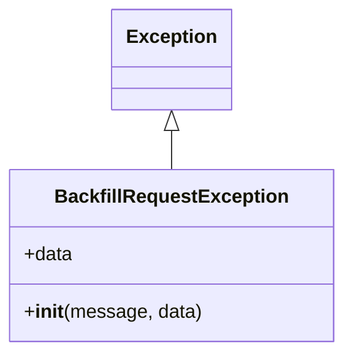

# Diagram: shipment_core/shipment_service/scripts/backfill_shipments_with_lambdas/shared.py


> Auto-generated by Obscura crawlers

## Diagram 1



### SVG

<svg id="container" width="278.5234375" xmlns="http://www.w3.org/2000/svg" class="classDiagram" height="294" viewBox="0 0 278.5234375 294" role="graphics-document document" aria-roledescription="class"><style>#container{font-family:"trebuchet ms",verdana,arial,sans-serif;font-size:16px;fill:#333;}@keyframes edge-animation-frame{from{stroke-dashoffset:0;}}@keyframes dash{to{stroke-dashoffset:0;}}#container .edge-animation-slow{stroke-dasharray:9,5!important;stroke-dashoffset:900;animation:dash 50s linear infinite;stroke-linecap:round;}#container .edge-animation-fast{stroke-dasharray:9,5!important;stroke-dashoffset:900;animation:dash 20s linear infinite;stroke-linecap:round;}#container .error-icon{fill:#552222;}#container .error-text{fill:#552222;stroke:#552222;}#container .edge-thickness-normal{stroke-width:1px;}#container .edge-thickness-thick{stroke-width:3.5px;}#container .edge-pattern-solid{stroke-dasharray:0;}#container .edge-thickness-invisible{stroke-width:0;fill:none;}#container .edge-pattern-dashed{stroke-dasharray:3;}#container .edge-pattern-dotted{stroke-dasharray:2;}#container .marker{fill:#333333;stroke:#333333;}#container .marker.cross{stroke:#333333;}#container svg{font-family:"trebuchet ms",verdana,arial,sans-serif;font-size:16px;}#container p{margin:0;}#container g.classGroup text{fill:#9370DB;stroke:none;font-family:"trebuchet ms",verdana,arial,sans-serif;font-size:10px;}#container g.classGroup text .title{font-weight:bolder;}#container .nodeLabel,#container .edgeLabel{color:#131300;}#container .edgeLabel .label rect{fill:#ECECFF;}#container .label text{fill:#131300;}#container .labelBkg{background:#ECECFF;}#container .edgeLabel .label span{background:#ECECFF;}#container .classTitle{font-weight:bolder;}#container .node rect,#container .node circle,#container .node ellipse,#container .node polygon,#container .node path{fill:#ECECFF;stroke:#9370DB;stroke-width:1px;}#container .divider{stroke:#9370DB;stroke-width:1;}#container g.clickable{cursor:pointer;}#container g.classGroup rect{fill:#ECECFF;stroke:#9370DB;}#container g.classGroup line{stroke:#9370DB;stroke-width:1;}#container .classLabel .box{stroke:none;stroke-width:0;fill:#ECECFF;opacity:0.5;}#container .classLabel .label{fill:#9370DB;font-size:10px;}#container .relation{stroke:#333333;stroke-width:1;fill:none;}#container .dashed-line{stroke-dasharray:3;}#container .dotted-line{stroke-dasharray:1 2;}#container #compositionStart,#container .composition{fill:#333333!important;stroke:#333333!important;stroke-width:1;}#container #compositionEnd,#container .composition{fill:#333333!important;stroke:#333333!important;stroke-width:1;}#container #dependencyStart,#container .dependency{fill:#333333!important;stroke:#333333!important;stroke-width:1;}#container #dependencyStart,#container .dependency{fill:#333333!important;stroke:#333333!important;stroke-width:1;}#container #extensionStart,#container .extension{fill:transparent!important;stroke:#333333!important;stroke-width:1;}#container #extensionEnd,#container .extension{fill:transparent!important;stroke:#333333!important;stroke-width:1;}#container #aggregationStart,#container .aggregation{fill:transparent!important;stroke:#333333!important;stroke-width:1;}#container #aggregationEnd,#container .aggregation{fill:transparent!important;stroke:#333333!important;stroke-width:1;}#container #lollipopStart,#container .lollipop{fill:#ECECFF!important;stroke:#333333!important;stroke-width:1;}#container #lollipopEnd,#container .lollipop{fill:#ECECFF!important;stroke:#333333!important;stroke-width:1;}#container .edgeTerminals{font-size:11px;line-height:initial;}#container .classTitleText{text-anchor:middle;font-size:18px;fill:#333;}#container .label-icon{display:inline-block;height:1em;overflow:visible;vertical-align:-0.125em;}#container .node .label-icon path{fill:currentColor;stroke:revert;stroke-width:revert;}#container :root{--mermaid-font-family:"trebuchet ms",verdana,arial,sans-serif;}</style><g><defs><marker id="container_class-aggregationStart" class="marker aggregation class" refX="18" refY="7" markerWidth="190" markerHeight="240" orient="auto"><path d="M 18,7 L9,13 L1,7 L9,1 Z"></path></marker></defs><defs><marker id="container_class-aggregationEnd" class="marker aggregation class" refX="1" refY="7" markerWidth="20" markerHeight="28" orient="auto"><path d="M 18,7 L9,13 L1,7 L9,1 Z"></path></marker></defs><defs><marker id="container_class-extensionStart" class="marker extension class" refX="18" refY="7" markerWidth="190" markerHeight="240" orient="auto"><path d="M 1,7 L18,13 V 1 Z"></path></marker></defs><defs><marker id="container_class-extensionEnd" class="marker extension class" refX="1" refY="7" markerWidth="20" markerHeight="28" orient="auto"><path d="M 1,1 V 13 L18,7 Z"></path></marker></defs><defs><marker id="container_class-compositionStart" class="marker composition class" refX="18" refY="7" markerWidth="190" markerHeight="240" orient="auto"><path d="M 18,7 L9,13 L1,7 L9,1 Z"></path></marker></defs><defs><marker id="container_class-compositionEnd" class="marker composition class" refX="1" refY="7" markerWidth="20" markerHeight="28" orient="auto"><path d="M 18,7 L9,13 L1,7 L9,1 Z"></path></marker></defs><defs><marker id="container_class-dependencyStart" class="marker dependency class" refX="6" refY="7" markerWidth="190" markerHeight="240" orient="auto"><path d="M 5,7 L9,13 L1,7 L9,1 Z"></path></marker></defs><defs><marker id="container_class-dependencyEnd" class="marker dependency class" refX="13" refY="7" markerWidth="20" markerHeight="28" orient="auto"><path d="M 18,7 L9,13 L14,7 L9,1 Z"></path></marker></defs><defs><marker id="container_class-lollipopStart" class="marker lollipop class" refX="13" refY="7" markerWidth="190" markerHeight="240" orient="auto"><circle stroke="black" fill="transparent" cx="7" cy="7" r="6"></circle></marker></defs><defs><marker id="container_class-lollipopEnd" class="marker lollipop class" refX="1" refY="7" markerWidth="190" markerHeight="240" orient="auto"><circle stroke="black" fill="transparent" cx="7" cy="7" r="6"></circle></marker></defs><g class="root"><g class="clusters"></g><g class="edgePaths"><path d="M139.262,109.25L139.262,110.542C139.262,111.833,139.262,114.417,139.262,119.875C139.262,125.333,139.262,133.667,139.262,137.833L139.262,142" id="id_Exception_BackfillRequestException_1" class="edge-thickness-normal edge-pattern-solid relation" style=";;;" data-edge="true" data-et="edge" data-id="id_Exception_BackfillRequestException_1" data-points="W3sieCI6MTM5LjI2MTcxODc1LCJ5Ijo5Mn0seyJ4IjoxMzkuMjYxNzE4NzUsInkiOjExN30seyJ4IjoxMzkuMjYxNzE4NzUsInkiOjE0Mn1d" marker-start="url(#container_class-extensionStart)"></path></g><g class="edgeLabels"><g class="edgeLabel"><g class="label" data-id="id_Exception_BackfillRequestException_1" transform="translate(0, 0)"><foreignObject width="0" height="0"><div xmlns="http://www.w3.org/1999/xhtml" class="labelBkg" style="display: table-cell; white-space: nowrap; line-height: 1.5; max-width: 200px; text-align: center;"><span class="edgeLabel"></span></div></foreignObject></g></g></g><g class="nodes"><g class="node default" id="classId-BackfillRequestException-0" transform="translate(139.26171875, 214)"><g class="basic label-container"><path d="M-131.26171875 -72 L131.26171875 -72 L131.26171875 72 L-131.26171875 72" stroke="none" stroke-width="0" fill="#ECECFF" style=""></path><path d="M-131.26171875 -72 C-36.54760409719189 -72, 58.16651055561621 -72, 131.26171875 -72 M-131.26171875 -72 C-41.35618970229201 -72, 48.54933934541597 -72, 131.26171875 -72 M131.26171875 -72 C131.26171875 -26.921373965992018, 131.26171875 18.157252068015964, 131.26171875 72 M131.26171875 -72 C131.26171875 -31.345360614798963, 131.26171875 9.309278770402074, 131.26171875 72 M131.26171875 72 C67.82072718277874 72, 4.379735615557479 72, -131.26171875 72 M131.26171875 72 C52.5144426963121 72, -26.232833357375796 72, -131.26171875 72 M-131.26171875 72 C-131.26171875 37.867411367021596, -131.26171875 3.734822734043192, -131.26171875 -72 M-131.26171875 72 C-131.26171875 16.59640611653068, -131.26171875 -38.80718776693864, -131.26171875 -72" stroke="#9370DB" stroke-width="1.3" fill="none" stroke-dasharray="0 0" style=""></path></g><g class="annotation-group text" transform="translate(0, -48)"></g><g class="label-group text" transform="translate(-92.7890625, -48)"><g class="label" style="font-weight: bolder" transform="translate(0,-12)"><foreignObject width="185.578125" height="24"><div xmlns="http://www.w3.org/1999/xhtml" style="display: table-cell; white-space: nowrap; line-height: 1.5; max-width: 233px; text-align: center;"><span class="nodeLabel markdown-node-label" style=""><p>BackfillRequestException</p></span></div></foreignObject></g></g><g class="members-group text" transform="translate(-119.26171875, 0)"><g class="label" style="" transform="translate(0,-12)"><foreignObject width="40.625" height="24"><div xmlns="http://www.w3.org/1999/xhtml" style="display: table-cell; white-space: nowrap; line-height: 1.5; max-width: 98px; text-align: center;"><span class="nodeLabel markdown-node-label" style=""><p>+data</p></span></div></foreignObject></g></g><g class="methods-group text" transform="translate(-119.26171875, 48)"><g class="label" style="" transform="translate(0,-12)"><foreignObject width="145.734375" height="24"><div xmlns="http://www.w3.org/1999/xhtml" style="display: table-cell; white-space: nowrap; line-height: 1.5; max-width: 235px; text-align: center;"><span class="nodeLabel markdown-node-label" style=""><p>+<strong>init</strong>(message, data)</p></span></div></foreignObject></g></g><g class="divider" style=""><path d="M-131.26171875 -24 C-34.68821402832083 -24, 61.88529069335834 -24, 131.26171875 -24 M-131.26171875 -24 C-33.21944173556848 -24, 64.82283527886304 -24, 131.26171875 -24" stroke="#9370DB" stroke-width="1.3" fill="none" stroke-dasharray="0 0" style=""></path></g><g class="divider" style=""><path d="M-131.26171875 24 C-66.82330456951105 24, -2.384890389022104 24, 131.26171875 24 M-131.26171875 24 C-42.30101609586113 24, 46.65968655827774 24, 131.26171875 24" stroke="#9370DB" stroke-width="1.3" fill="none" stroke-dasharray="0 0" style=""></path></g></g><g class="node default" id="classId-Exception-1" transform="translate(139.26171875, 50)"><g class="basic label-container"><path d="M-47.703125 -42 L47.703125 -42 L47.703125 42 L-47.703125 42" stroke="none" stroke-width="0" fill="#ECECFF" style=""></path><path d="M-47.703125 -42 C-13.245671032595716 -42, 21.211782934808568 -42, 47.703125 -42 M-47.703125 -42 C-19.816772475212872 -42, 8.069580049574256 -42, 47.703125 -42 M47.703125 -42 C47.703125 -16.828850689081584, 47.703125 8.342298621836832, 47.703125 42 M47.703125 -42 C47.703125 -24.761273324678513, 47.703125 -7.522546649357025, 47.703125 42 M47.703125 42 C11.315403418004792 42, -25.072318163990417 42, -47.703125 42 M47.703125 42 C27.87235251227922 42, 8.041580024558442 42, -47.703125 42 M-47.703125 42 C-47.703125 9.76233931320877, -47.703125 -22.47532137358246, -47.703125 -42 M-47.703125 42 C-47.703125 21.771427771158052, -47.703125 1.5428555423161043, -47.703125 -42" stroke="#9370DB" stroke-width="1.3" fill="none" stroke-dasharray="0 0" style=""></path></g><g class="annotation-group text" transform="translate(0, -18)"></g><g class="label-group text" transform="translate(-35.703125, -18)"><g class="label" style="font-weight: bolder" transform="translate(0,-12)"><foreignObject width="71.40625" height="24"><div xmlns="http://www.w3.org/1999/xhtml" style="display: table-cell; white-space: nowrap; line-height: 1.5; max-width: 121px; text-align: center;"><span class="nodeLabel markdown-node-label" style=""><p>Exception</p></span></div></foreignObject></g></g><g class="members-group text" transform="translate(-35.703125, 30)"></g><g class="methods-group text" transform="translate(-35.703125, 60)"></g><g class="divider" style=""><path d="M-47.703125 6 C-11.934964451805648 6, 23.833196096388704 6, 47.703125 6 M-47.703125 6 C-18.814333812975796 6, 10.074457374048407 6, 47.703125 6" stroke="#9370DB" stroke-width="1.3" fill="none" stroke-dasharray="0 0" style=""></path></g><g class="divider" style=""><path d="M-47.703125 24 C-20.79680487628311 24, 6.109515247433777 24, 47.703125 24 M-47.703125 24 C-27.29415273035989 24, -6.885180460719781 24, 47.703125 24" stroke="#9370DB" stroke-width="1.3" fill="none" stroke-dasharray="0 0" style=""></path></g></g></g></g></g></svg>

## Diagram 2

```mermaid
flowchart TD
    A[Excel file] --> B[get_worksheet_rows(file_path, sheet_index=0)]
    B --> C{iterate rows}
    C -->|first row| D[get_values_from_row(row) -> header]
    C -->|other rows| E[get_values_from_row(row) -> values]
    E --> F{any(values)?}
    F -->|no| G[skip row]
    F -->|yes| H[row_dict = zip(header, values)]
    H --> I[row_dict["__row_number__"] = row_index+1]
    I --> J[yield row_dict]
    K[create_new_file(file_path, data)] --> L[Workbook -> sheet.append(headers) -> sheet.append(values) -> save(file_path)]
    M[get_org_by_fv_id(fv_id)] --> N[cached(TTLCache)]
    N --> O[invoke_lambda(name="get_organizations", queryStringParameters={"organization_fv_id": fv_id})]
    O --> P[response.body -> json.loads -> json_body.get("response", {})]
```

> SVG rendering failed for this diagram.
