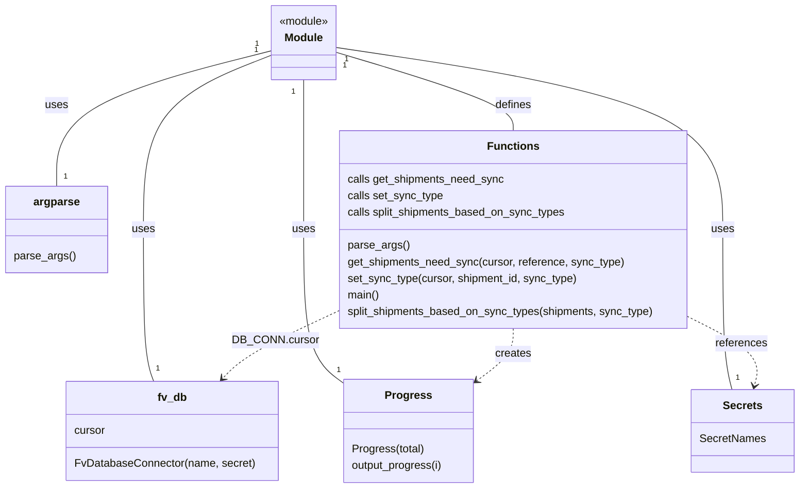

# Diagram: shipment_core/shipment_service/scripts/backfill_sync_types.py


> Auto-generated by Obscura crawlers

## Diagram 1

```mermaid
flowchart TD
  A[Start] --> B[DB_CONN = FvDatabaseConnector]
  B --> C[parse_args()]
  C --> D[get_shipments_need_sync(cursor, reference, sync_type)]
  D --> E{shipments list}
  E --> F[Progress.Progress(len(shipments))]
  F --> G[for each shipment]
  G --> H[progress.output_progress(i)]
  G --> I[set_sync_type(cursor, shipment.id, sync_type)]
  I --> J[UPDATE shipments JSONB -> append sync_type]
  J --> K[cursor.execute(update)]
  K --> L[End]
```

> SVG rendering failed for this diagram.

## Diagram 2



### SVG

<svg id="container" width="1152.587890625" xmlns="http://www.w3.org/2000/svg" class="classDiagram" height="710" viewBox="0 0 1152.587890625 710" role="graphics-document document" aria-roledescription="class"><style>#container{font-family:"trebuchet ms",verdana,arial,sans-serif;font-size:16px;fill:#333;}@keyframes edge-animation-frame{from{stroke-dashoffset:0;}}@keyframes dash{to{stroke-dashoffset:0;}}#container .edge-animation-slow{stroke-dasharray:9,5!important;stroke-dashoffset:900;animation:dash 50s linear infinite;stroke-linecap:round;}#container .edge-animation-fast{stroke-dasharray:9,5!important;stroke-dashoffset:900;animation:dash 20s linear infinite;stroke-linecap:round;}#container .error-icon{fill:#552222;}#container .error-text{fill:#552222;stroke:#552222;}#container .edge-thickness-normal{stroke-width:1px;}#container .edge-thickness-thick{stroke-width:3.5px;}#container .edge-pattern-solid{stroke-dasharray:0;}#container .edge-thickness-invisible{stroke-width:0;fill:none;}#container .edge-pattern-dashed{stroke-dasharray:3;}#container .edge-pattern-dotted{stroke-dasharray:2;}#container .marker{fill:#333333;stroke:#333333;}#container .marker.cross{stroke:#333333;}#container svg{font-family:"trebuchet ms",verdana,arial,sans-serif;font-size:16px;}#container p{margin:0;}#container g.classGroup text{fill:#9370DB;stroke:none;font-family:"trebuchet ms",verdana,arial,sans-serif;font-size:10px;}#container g.classGroup text .title{font-weight:bolder;}#container .nodeLabel,#container .edgeLabel{color:#131300;}#container .edgeLabel .label rect{fill:#ECECFF;}#container .label text{fill:#131300;}#container .labelBkg{background:#ECECFF;}#container .edgeLabel .label span{background:#ECECFF;}#container .classTitle{font-weight:bolder;}#container .node rect,#container .node circle,#container .node ellipse,#container .node polygon,#container .node path{fill:#ECECFF;stroke:#9370DB;stroke-width:1px;}#container .divider{stroke:#9370DB;stroke-width:1;}#container g.clickable{cursor:pointer;}#container g.classGroup rect{fill:#ECECFF;stroke:#9370DB;}#container g.classGroup line{stroke:#9370DB;stroke-width:1;}#container .classLabel .box{stroke:none;stroke-width:0;fill:#ECECFF;opacity:0.5;}#container .classLabel .label{fill:#9370DB;font-size:10px;}#container .relation{stroke:#333333;stroke-width:1;fill:none;}#container .dashed-line{stroke-dasharray:3;}#container .dotted-line{stroke-dasharray:1 2;}#container #compositionStart,#container .composition{fill:#333333!important;stroke:#333333!important;stroke-width:1;}#container #compositionEnd,#container .composition{fill:#333333!important;stroke:#333333!important;stroke-width:1;}#container #dependencyStart,#container .dependency{fill:#333333!important;stroke:#333333!important;stroke-width:1;}#container #dependencyStart,#container .dependency{fill:#333333!important;stroke:#333333!important;stroke-width:1;}#container #extensionStart,#container .extension{fill:transparent!important;stroke:#333333!important;stroke-width:1;}#container #extensionEnd,#container .extension{fill:transparent!important;stroke:#333333!important;stroke-width:1;}#container #aggregationStart,#container .aggregation{fill:transparent!important;stroke:#333333!important;stroke-width:1;}#container #aggregationEnd,#container .aggregation{fill:transparent!important;stroke:#333333!important;stroke-width:1;}#container #lollipopStart,#container .lollipop{fill:#ECECFF!important;stroke:#333333!important;stroke-width:1;}#container #lollipopEnd,#container .lollipop{fill:#ECECFF!important;stroke:#333333!important;stroke-width:1;}#container .edgeTerminals{font-size:11px;line-height:initial;}#container .classTitleText{text-anchor:middle;font-size:18px;fill:#333;}#container .label-icon{display:inline-block;height:1em;overflow:visible;vertical-align:-0.125em;}#container .node .label-icon path{fill:currentColor;stroke:revert;stroke-width:revert;}#container :root{--mermaid-font-family:"trebuchet ms",verdana,arial,sans-serif;}</style><g><defs><marker id="container_class-aggregationStart" class="marker aggregation class" refX="18" refY="7" markerWidth="190" markerHeight="240" orient="auto"><path d="M 18,7 L9,13 L1,7 L9,1 Z"></path></marker></defs><defs><marker id="container_class-aggregationEnd" class="marker aggregation class" refX="1" refY="7" markerWidth="20" markerHeight="28" orient="auto"><path d="M 18,7 L9,13 L1,7 L9,1 Z"></path></marker></defs><defs><marker id="container_class-extensionStart" class="marker extension class" refX="18" refY="7" markerWidth="190" markerHeight="240" orient="auto"><path d="M 1,7 L18,13 V 1 Z"></path></marker></defs><defs><marker id="container_class-extensionEnd" class="marker extension class" refX="1" refY="7" markerWidth="20" markerHeight="28" orient="auto"><path d="M 1,1 V 13 L18,7 Z"></path></marker></defs><defs><marker id="container_class-compositionStart" class="marker composition class" refX="18" refY="7" markerWidth="190" markerHeight="240" orient="auto"><path d="M 18,7 L9,13 L1,7 L9,1 Z"></path></marker></defs><defs><marker id="container_class-compositionEnd" class="marker composition class" refX="1" refY="7" markerWidth="20" markerHeight="28" orient="auto"><path d="M 18,7 L9,13 L1,7 L9,1 Z"></path></marker></defs><defs><marker id="container_class-dependencyStart" class="marker dependency class" refX="6" refY="7" markerWidth="190" markerHeight="240" orient="auto"><path d="M 5,7 L9,13 L1,7 L9,1 Z"></path></marker></defs><defs><marker id="container_class-dependencyEnd" class="marker dependency class" refX="13" refY="7" markerWidth="20" markerHeight="28" orient="auto"><path d="M 18,7 L9,13 L14,7 L9,1 Z"></path></marker></defs><defs><marker id="container_class-lollipopStart" class="marker lollipop class" refX="13" refY="7" markerWidth="190" markerHeight="240" orient="auto"><circle stroke="black" fill="transparent" cx="7" cy="7" r="6"></circle></marker></defs><defs><marker id="container_class-lollipopEnd" class="marker lollipop class" refX="1" refY="7" markerWidth="190" markerHeight="240" orient="auto"><circle stroke="black" fill="transparent" cx="7" cy="7" r="6"></circle></marker></defs><g class="root"><g class="clusters"></g><g class="edgePaths"><path d="M383.459,81.429L353.619,93.357C323.78,105.286,264.101,129.143,234.261,171.238C204.422,213.333,204.422,273.667,204.422,334C204.422,394.333,204.422,454.667,206.779,491.5C209.135,528.333,213.849,541.667,216.206,548.333L218.563,555" id="id_Module_fv_db_1" class="edge-thickness-normal edge-pattern-solid relation" style=";;;" data-edge="true" data-et="edge" data-id="id_Module_fv_db_1" data-points="W3sieCI6MzgzLjQ1ODk4NDM3NSwieSI6ODEuNDI4NzgyMjQ5ODMwNTV9LHsieCI6MjA0LjQyMTg3NSwieSI6MTUzfSx7IngiOjIwNC40MjE4NzUsInkiOjMzNH0seyJ4IjoyMDQuNDIxODc1LCJ5Ijo1MTV9LHsieCI6MjE4LjU2MjUsInkiOjU1NX1d"></path><path d="M383.459,74.579L332.96,87.649C282.461,100.719,181.463,126.86,130.964,159.597C80.465,192.333,80.465,231.667,80.465,251.333L80.465,271" id="id_Module_argparse_2" class="edge-thickness-normal edge-pattern-solid relation" style=";;;" data-edge="true" data-et="edge" data-id="id_Module_argparse_2" data-points="W3sieCI6MzgzLjQ1ODk4NDM3NSwieSI6NzQuNTc5MDU2NDIyNDQ4OTl9LHsieCI6ODAuNDY0ODQzNzUsInkiOjE1M30seyJ4Ijo4MC40NjQ4NDM3NSwieSI6MjcxfV0="></path><path d="M432.061,116L432.061,122.167C432.061,128.333,432.061,140.667,432.061,177C432.061,213.333,432.061,273.667,432.061,334C432.061,394.333,432.061,454.667,441.666,491.88C451.271,529.094,470.481,543.189,480.086,550.236L489.691,557.283" id="id_Module_Progress_3" class="edge-thickness-normal edge-pattern-solid relation" style=";;;" data-edge="true" data-et="edge" data-id="id_Module_Progress_3" data-points="W3sieCI6NDMyLjA2MDU0Njg3NSwieSI6MTE2fSx7IngiOjQzMi4wNjA1NDY4NzUsInkiOjE1M30seyJ4Ijo0MzIuMDYwNTQ2ODc1LCJ5IjozMzR9LHsieCI6NDMyLjA2MDU0Njg3NSwieSI6NTE1fSx7IngiOjQ4OS42OTE0MDYyNSwieSI6NTU3LjI4MjgzMzcxMDc2OTF9XQ=="></path><path d="M480.662,69.243L574.331,83.203C668.001,97.162,855.339,125.081,949.008,169.207C1042.678,213.333,1042.678,273.667,1042.678,334C1042.678,394.333,1042.678,454.667,1044.915,493.5C1047.153,532.333,1051.627,549.667,1053.865,558.333L1056.102,567" id="id_Module_Secrets_4" class="edge-thickness-normal edge-pattern-solid relation" style=";;;" data-edge="true" data-et="edge" data-id="id_Module_Secrets_4" data-points="W3sieCI6NDgwLjY2MjEwOTM3NSwieSI6NjkuMjQzMDY4NjE2NTM4MDh9LHsieCI6MTA0Mi42Nzc3MzQzNzUsInkiOjE1M30seyJ4IjoxMDQyLjY3NzczNDM3NSwieSI6MzM0fSx7IngiOjEwNDIuNjc3NzM0Mzc1LCJ5Ijo1MTV9LHsieCI6MTA1Ni4xMDIxMjA1MzU3MTQyLCJ5Ijo1Njd9XQ=="></path><path d="M480.662,76.486L523.447,89.238C566.231,101.991,651.8,127.495,694.585,146.414C737.369,165.333,737.369,177.667,737.369,183.833L737.369,190" id="id_Module_Functions_5" class="edge-thickness-normal edge-pattern-solid relation" style=";;;" data-edge="true" data-et="edge" data-id="id_Module_Functions_5" data-points="W3sieCI6NDgwLjY2MjEwOTM3NSwieSI6NzYuNDg2MTM3MjMzMDc2MTZ9LHsieCI6NzM3LjM2OTE0MDYyNSwieSI6MTUzfSx7IngiOjczNy4zNjkxNDA2MjUsInkiOjE5MH1d"></path><path d="M483.553,453.483L461.773,463.736C439.993,473.989,396.433,494.494,368.87,510.697C341.308,526.899,329.743,538.798,323.96,544.748L318.177,550.697" id="id_Functions_fv_db_6" class="edge-thickness-normal edge-pattern-dashed relation" style=";;;" data-edge="true" data-et="edge" data-id="id_Functions_fv_db_6" data-points="W3sieCI6NDgzLjU1MjczNDM3NSwieSI6NDUzLjQ4MzA1OTE5ODgyOTY2fSx7IngiOjM1Mi44NzMwNDY4NzUsInkiOjUxNX0seyJ4IjozMTMuOTk1Mzk2MjA1MzU3MSwieSI6NTU1fV0=" marker-end="url(#container_class-dependencyEnd)"></path><path d="M737.369,478L737.369,484.167C737.369,490.333,737.369,502.667,728.57,515.289C719.771,527.911,702.174,540.822,693.375,547.278L684.576,553.734" id="id_Functions_Progress_7" class="edge-thickness-normal edge-pattern-dashed relation" style=";;;" data-edge="true" data-et="edge" data-id="id_Functions_Progress_7" data-points="W3sieCI6NzM3LjM2OTE0MDYyNSwieSI6NDc4fSx7IngiOjczNy4zNjkxNDA2MjUsInkiOjUxNX0seyJ4Ijo2NzkuNzM4MjgxMjUsInkiOjU1Ny4yODI4MzM3MTA3NjkxfV0=" marker-end="url(#container_class-dependencyEnd)"></path><path d="M991.186,460.511L1009.406,469.592C1027.626,478.674,1064.066,496.837,1080.298,513.617C1096.531,530.397,1092.556,545.794,1090.569,553.492L1088.581,561.19" id="id_Functions_Secrets_8" class="edge-thickness-normal edge-pattern-dashed relation" style=";;;" data-edge="true" data-et="edge" data-id="id_Functions_Secrets_8" data-points="W3sieCI6OTkxLjE4NTU0Njg3NSwieSI6NDYwLjUxMDk0NTIxNDc2Mjg0fSx7IngiOjExMDAuNTA1ODU5Mzc1LCJ5Ijo1MTV9LHsieCI6MTA4Ny4wODE0NzMyMTQyODU4LCJ5Ijo1Njd9XQ==" marker-end="url(#container_class-dependencyEnd)"></path></g><g class="edgeLabels"><g class="edgeLabel" transform="translate(204.421875, 334)"><g class="label" data-id="id_Module_fv_db_1" transform="translate(-16.4921875, -12)"><foreignObject width="32.984375" height="24"><div xmlns="http://www.w3.org/1999/xhtml" class="labelBkg" style="display: table-cell; white-space: nowrap; line-height: 1.5; max-width: 200px; text-align: center;"><span class="edgeLabel"><p>uses</p></span></div></foreignObject></g></g><g class="edgeLabel" transform="translate(80.46484375, 153)"><g class="label" data-id="id_Module_argparse_2" transform="translate(-16.4921875, -12)"><foreignObject width="32.984375" height="24"><div xmlns="http://www.w3.org/1999/xhtml" class="labelBkg" style="display: table-cell; white-space: nowrap; line-height: 1.5; max-width: 200px; text-align: center;"><span class="edgeLabel"><p>uses</p></span></div></foreignObject></g></g><g class="edgeLabel" transform="translate(432.060546875, 334)"><g class="label" data-id="id_Module_Progress_3" transform="translate(-16.4921875, -12)"><foreignObject width="32.984375" height="24"><div xmlns="http://www.w3.org/1999/xhtml" class="labelBkg" style="display: table-cell; white-space: nowrap; line-height: 1.5; max-width: 200px; text-align: center;"><span class="edgeLabel"><p>uses</p></span></div></foreignObject></g></g><g class="edgeLabel" transform="translate(1042.677734375, 334)"><g class="label" data-id="id_Module_Secrets_4" transform="translate(-16.4921875, -12)"><foreignObject width="32.984375" height="24"><div xmlns="http://www.w3.org/1999/xhtml" class="labelBkg" style="display: table-cell; white-space: nowrap; line-height: 1.5; max-width: 200px; text-align: center;"><span class="edgeLabel"><p>uses</p></span></div></foreignObject></g></g><g class="edgeLabel" transform="translate(737.369140625, 153)"><g class="label" data-id="id_Module_Functions_5" transform="translate(-26.53125, -12)"><foreignObject width="53.0625" height="24"><div xmlns="http://www.w3.org/1999/xhtml" class="labelBkg" style="display: table-cell; white-space: nowrap; line-height: 1.5; max-width: 200px; text-align: center;"><span class="edgeLabel"><p>defines</p></span></div></foreignObject></g></g><g class="edgeLabel" transform="translate(392.97877, 496.12039)"><g class="label" data-id="id_Functions_fv_db_6" transform="translate(-59.1875, -12)"><foreignObject width="118.375" height="24"><div xmlns="http://www.w3.org/1999/xhtml" class="labelBkg" style="display: table-cell; white-space: nowrap; line-height: 1.5; max-width: 200px; text-align: center;"><span class="edgeLabel"><p>DB_CONN.cursor</p></span></div></foreignObject></g></g><g class="edgeLabel" transform="translate(737.369140625, 515)"><g class="label" data-id="id_Functions_Progress_7" transform="translate(-26.171875, -12)"><foreignObject width="52.34375" height="24"><div xmlns="http://www.w3.org/1999/xhtml" class="labelBkg" style="display: table-cell; white-space: nowrap; line-height: 1.5; max-width: 200px; text-align: center;"><span class="edgeLabel"><p>creates</p></span></div></foreignObject></g></g><g class="edgeLabel" transform="translate(1069.87828, 499.73415)"><g class="label" data-id="id_Functions_Secrets_8" transform="translate(-37.828125, -12)"><foreignObject width="75.65625" height="24"><div xmlns="http://www.w3.org/1999/xhtml" class="labelBkg" style="display: table-cell; white-space: nowrap; line-height: 1.5; max-width: 200px; text-align: center;"><span class="edgeLabel"><p>references</p></span></div></foreignObject></g></g><g class="edgeTerminals" transform="translate(361.64134253442654, 73.99638592113247)"><g class="inner" transform="translate(0, 0)"><foreignObject style="width: 9px; height: 12px;"><div xmlns="http://www.w3.org/1999/xhtml" style="display: inline-block; padding-right: 1px; white-space: nowrap;"><span class="edgeLabel">1</span></div></foreignObject></g></g><g class="edgeTerminals" transform="translate(362.7587750868676, 64.44242190375954)"><g class="inner" transform="translate(0, 0)"><foreignObject style="width: 9px; height: 12px;"><div xmlns="http://www.w3.org/1999/xhtml" style="display: inline-block; padding-right: 1px; white-space: nowrap;"><span class="edgeLabel">1</span></div></foreignObject></g></g><g class="edgeTerminals" transform="translate(417.0605484375, 133.50000133928572)"><g class="inner" transform="translate(0, 0)"><foreignObject style="width: 9px; height: 12px;"><div xmlns="http://www.w3.org/1999/xhtml" style="display: inline-block; padding-right: 1px; white-space: nowrap;"><span class="edgeLabel">1</span></div></foreignObject></g></g><g class="edgeTerminals" transform="translate(495.7599231332201, 86.65874980549269)"><g class="inner" transform="translate(0, 0)"><foreignObject style="width: 9px; height: 12px;"><div xmlns="http://www.w3.org/1999/xhtml" style="display: inline-block; padding-right: 1px; white-space: nowrap;"><span class="edgeLabel">1</span></div></foreignObject></g></g><g class="edgeTerminals" transform="translate(493.14838513636823, 95.85990416073548)"><g class="inner" transform="translate(0, 0)"><foreignObject style="width: 9px; height: 12px;"><div xmlns="http://www.w3.org/1999/xhtml" style="display: inline-block; padding-right: 1px; white-space: nowrap;"><span class="edgeLabel">1</span></div></foreignObject></g></g><g class="edgeTerminals" transform="translate(221.87202340959743, 528.5011195954354)"><g class="inner" transform="translate(0, 0)"></g><foreignObject style="width: 9px; height: 12px;"><div xmlns="http://www.w3.org/1999/xhtml" style="display: inline-block; padding-right: 1px; white-space: nowrap;"><span class="edgeLabel">1</span></div></foreignObject></g><g class="edgeTerminals" transform="translate(90.4648418749999, 248.49999839285715)"><g class="inner" transform="translate(0, 0)"></g><foreignObject style="width: 9px; height: 12px;"><div xmlns="http://www.w3.org/1999/xhtml" style="display: inline-block; padding-right: 1px; white-space: nowrap;"><span class="edgeLabel">1</span></div></foreignObject></g><g class="edgeTerminals" transform="translate(479.4548907599698, 529.8366997001054)"><g class="inner" transform="translate(0, 0)"></g><foreignObject style="width: 9px; height: 12px;"><div xmlns="http://www.w3.org/1999/xhtml" style="display: inline-block; padding-right: 1px; white-space: nowrap;"><span class="edgeLabel">1</span></div></foreignObject></g><g class="edgeTerminals" transform="translate(1061.2515404291885, 541.3060586456712)"><g class="inner" transform="translate(0, 0)"></g><foreignObject style="width: 9px; height: 12px;"><div xmlns="http://www.w3.org/1999/xhtml" style="display: inline-block; padding-right: 1px; white-space: nowrap;"><span class="edgeLabel">1</span></div></foreignObject></g></g><g class="nodes"><g class="node default" id="classId-Module-0" transform="translate(432.060546875, 62)"><g class="basic label-container"><path d="M-48.6015625 -54 L48.6015625 -54 L48.6015625 54 L-48.6015625 54" stroke="none" stroke-width="0" fill="#ECECFF" style=""></path><path d="M-48.6015625 -54 C-11.466150946548488 -54, 25.669260606903023 -54, 48.6015625 -54 M-48.6015625 -54 C-24.12743797662989 -54, 0.3466865467402229 -54, 48.6015625 -54 M48.6015625 -54 C48.6015625 -18.41330432515305, 48.6015625 17.1733913496939, 48.6015625 54 M48.6015625 -54 C48.6015625 -11.240962794722414, 48.6015625 31.518074410555172, 48.6015625 54 M48.6015625 54 C12.592465354603561 54, -23.416631790792877 54, -48.6015625 54 M48.6015625 54 C23.56596624845311 54, -1.4696300030937834 54, -48.6015625 54 M-48.6015625 54 C-48.6015625 20.45267770551616, -48.6015625 -13.094644588967682, -48.6015625 -54 M-48.6015625 54 C-48.6015625 21.0192209100628, -48.6015625 -11.961558179874402, -48.6015625 -54" stroke="#9370DB" stroke-width="1.3" fill="none" stroke-dasharray="0 0" style=""></path></g><g class="annotation-group text" transform="translate(-36.6015625, -30)"><g class="label" style="" transform="translate(0,-12)"><foreignObject width="73.203125" height="24"><div xmlns="http://www.w3.org/1999/xhtml" style="display: table-cell; white-space: nowrap; line-height: 1.5; max-width: 123px; text-align: center;"><span class="nodeLabel markdown-node-label" style=""><p>«module»</p></span></div></foreignObject></g></g><g class="label-group text" transform="translate(-27.09375, -6)"><g class="label" style="font-weight: bolder" transform="translate(0,-12)"><foreignObject width="54.1875" height="24"><div xmlns="http://www.w3.org/1999/xhtml" style="display: table-cell; white-space: nowrap; line-height: 1.5; max-width: 104px; text-align: center;"><span class="nodeLabel markdown-node-label" style=""><p>Module</p></span></div></foreignObject></g></g><g class="members-group text" transform="translate(-36.6015625, 42)"></g><g class="methods-group text" transform="translate(-36.6015625, 72)"></g><g class="divider" style=""><path d="M-48.6015625 18 C-26.93128418446204 18, -5.26100586892408 18, 48.6015625 18 M-48.6015625 18 C-23.82710485413578 18, 0.9473527917284414 18, 48.6015625 18" stroke="#9370DB" stroke-width="1.3" fill="none" stroke-dasharray="0 0" style=""></path></g><g class="divider" style=""><path d="M-48.6015625 36 C-12.301370885098208 36, 23.998820729803583 36, 48.6015625 36 M-48.6015625 36 C-10.205992516942459 36, 28.189577466115082 36, 48.6015625 36" stroke="#9370DB" stroke-width="1.3" fill="none" stroke-dasharray="0 0" style=""></path></g></g><g class="node default" id="classId-argparse-1" transform="translate(80.46484375, 334)"><g class="basic label-container"><path d="M-72.46484375 -63 L72.46484375 -63 L72.46484375 63 L-72.46484375 63" stroke="none" stroke-width="0" fill="#ECECFF" style=""></path><path d="M-72.46484375 -63 C-20.427789677817337 -63, 31.609264394365326 -63, 72.46484375 -63 M-72.46484375 -63 C-16.799117222790265 -63, 38.86660930441947 -63, 72.46484375 -63 M72.46484375 -63 C72.46484375 -24.002622813831877, 72.46484375 14.994754372336246, 72.46484375 63 M72.46484375 -63 C72.46484375 -25.478495165284293, 72.46484375 12.043009669431413, 72.46484375 63 M72.46484375 63 C25.466982266051502 63, -21.530879217896995 63, -72.46484375 63 M72.46484375 63 C24.912836604983426 63, -22.63917054003315 63, -72.46484375 63 M-72.46484375 63 C-72.46484375 26.85029598029984, -72.46484375 -9.29940803940032, -72.46484375 -63 M-72.46484375 63 C-72.46484375 27.85390115697951, -72.46484375 -7.2921976860409785, -72.46484375 -63" stroke="#9370DB" stroke-width="1.3" fill="none" stroke-dasharray="0 0" style=""></path></g><g class="annotation-group text" transform="translate(0, -39)"></g><g class="label-group text" transform="translate(-32.3828125, -39)"><g class="label" style="font-weight: bolder" transform="translate(0,-12)"><foreignObject width="64.765625" height="24"><div xmlns="http://www.w3.org/1999/xhtml" style="display: table-cell; white-space: nowrap; line-height: 1.5; max-width: 113px; text-align: center;"><span class="nodeLabel markdown-node-label" style=""><p>argparse</p></span></div></foreignObject></g></g><g class="members-group text" transform="translate(-60.46484375, 9)"></g><g class="methods-group text" transform="translate(-60.46484375, 39)"><g class="label" style="" transform="translate(0,-12)"><foreignObject width="88.546875" height="24"><div xmlns="http://www.w3.org/1999/xhtml" style="display: table-cell; white-space: nowrap; line-height: 1.5; max-width: 139px; text-align: center;"><span class="nodeLabel markdown-node-label" style=""><p>parse_args()</p></span></div></foreignObject></g></g><g class="divider" style=""><path d="M-72.46484375 -15 C-23.797666750378937 -15, 24.869510249242126 -15, 72.46484375 -15 M-72.46484375 -15 C-29.822227775177254 -15, 12.820388199645492 -15, 72.46484375 -15" stroke="#9370DB" stroke-width="1.3" fill="none" stroke-dasharray="0 0" style=""></path></g><g class="divider" style=""><path d="M-72.46484375 9 C-39.01893564612419 9, -5.573027542248383 9, 72.46484375 9 M-72.46484375 9 C-29.798602489229047 9, 12.867638771541905 9, 72.46484375 9" stroke="#9370DB" stroke-width="1.3" fill="none" stroke-dasharray="0 0" style=""></path></g></g><g class="node default" id="classId-fv_db-2" transform="translate(244.015625, 627)"><g class="basic label-container"><path d="M-151.87890625 -72 L151.87890625 -72 L151.87890625 72 L-151.87890625 72" stroke="none" stroke-width="0" fill="#ECECFF" style=""></path><path d="M-151.87890625 -72 C-54.41013019284246 -72, 43.05864586431508 -72, 151.87890625 -72 M-151.87890625 -72 C-55.34081177674362 -72, 41.19728269651276 -72, 151.87890625 -72 M151.87890625 -72 C151.87890625 -16.681178721647235, 151.87890625 38.63764255670553, 151.87890625 72 M151.87890625 -72 C151.87890625 -21.000694840377193, 151.87890625 29.998610319245614, 151.87890625 72 M151.87890625 72 C74.16111789294672 72, -3.55667046410656 72, -151.87890625 72 M151.87890625 72 C63.74163152862205 72, -24.395643192755898 72, -151.87890625 72 M-151.87890625 72 C-151.87890625 23.47042319658479, -151.87890625 -25.05915360683042, -151.87890625 -72 M-151.87890625 72 C-151.87890625 15.551424381488523, -151.87890625 -40.89715123702295, -151.87890625 -72" stroke="#9370DB" stroke-width="1.3" fill="none" stroke-dasharray="0 0" style=""></path></g><g class="annotation-group text" transform="translate(0, -48)"></g><g class="label-group text" transform="translate(-20.2890625, -48)"><g class="label" style="font-weight: bolder" transform="translate(0,-12)"><foreignObject width="40.578125" height="24"><div xmlns="http://www.w3.org/1999/xhtml" style="display: table-cell; white-space: nowrap; line-height: 1.5; max-width: 90px; text-align: center;"><span class="nodeLabel markdown-node-label" style=""><p>fv_db</p></span></div></foreignObject></g></g><g class="members-group text" transform="translate(-139.87890625, 0)"><g class="label" style="" transform="translate(0,-12)"><foreignObject width="45.734375" height="24"><div xmlns="http://www.w3.org/1999/xhtml" style="display: table-cell; white-space: nowrap; line-height: 1.5; max-width: 97px; text-align: center;"><span class="nodeLabel markdown-node-label" style=""><p>cursor</p></span></div></foreignObject></g></g><g class="methods-group text" transform="translate(-139.87890625, 48)"><g class="label" style="" transform="translate(0,-12)"><foreignObject width="259.46875" height="24"><div xmlns="http://www.w3.org/1999/xhtml" style="display: table-cell; white-space: nowrap; line-height: 1.5; max-width: 309px; text-align: center;"><span class="nodeLabel markdown-node-label" style=""><p>FvDatabaseConnector(name, secret)</p></span></div></foreignObject></g></g><g class="divider" style=""><path d="M-151.87890625 -24 C-64.99756486537343 -24, 21.883776519253132 -24, 151.87890625 -24 M-151.87890625 -24 C-54.01300421494234 -24, 43.85289782011532 -24, 151.87890625 -24" stroke="#9370DB" stroke-width="1.3" fill="none" stroke-dasharray="0 0" style=""></path></g><g class="divider" style=""><path d="M-151.87890625 24 C-76.75341774036782 24, -1.6279292307356457 24, 151.87890625 24 M-151.87890625 24 C-40.7355850433746 24, 70.4077361632508 24, 151.87890625 24" stroke="#9370DB" stroke-width="1.3" fill="none" stroke-dasharray="0 0" style=""></path></g></g><g class="node default" id="classId-Progress-3" transform="translate(584.71484375, 627)"><g class="basic label-container"><path d="M-95.0234375 -75 L95.0234375 -75 L95.0234375 75 L-95.0234375 75" stroke="none" stroke-width="0" fill="#ECECFF" style=""></path><path d="M-95.0234375 -75 C-22.67265665098914 -75, 49.67812419802172 -75, 95.0234375 -75 M-95.0234375 -75 C-42.14199404658052 -75, 10.739449406838958 -75, 95.0234375 -75 M95.0234375 -75 C95.0234375 -22.61383786408672, 95.0234375 29.772324271826562, 95.0234375 75 M95.0234375 -75 C95.0234375 -38.26867335586662, 95.0234375 -1.5373467117332353, 95.0234375 75 M95.0234375 75 C35.65366423128393 75, -23.716109037432133 75, -95.0234375 75 M95.0234375 75 C22.877796624413563 75, -49.267844251172875 75, -95.0234375 75 M-95.0234375 75 C-95.0234375 42.1169188748563, -95.0234375 9.233837749712606, -95.0234375 -75 M-95.0234375 75 C-95.0234375 36.31816781537906, -95.0234375 -2.3636643692418744, -95.0234375 -75" stroke="#9370DB" stroke-width="1.3" fill="none" stroke-dasharray="0 0" style=""></path></g><g class="annotation-group text" transform="translate(0, -51)"></g><g class="label-group text" transform="translate(-31.75, -51)"><g class="label" style="font-weight: bolder" transform="translate(0,-12)"><foreignObject width="63.5" height="24"><div xmlns="http://www.w3.org/1999/xhtml" style="display: table-cell; white-space: nowrap; line-height: 1.5; max-width: 112px; text-align: center;"><span class="nodeLabel markdown-node-label" style=""><p>Progress</p></span></div></foreignObject></g></g><g class="members-group text" transform="translate(-83.0234375, -3)"></g><g class="methods-group text" transform="translate(-83.0234375, 27)"><g class="label" style="" transform="translate(0,-12)"><foreignObject width="105.6875" height="24"><div xmlns="http://www.w3.org/1999/xhtml" style="display: table-cell; white-space: nowrap; line-height: 1.5; max-width: 156px; text-align: center;"><span class="nodeLabel markdown-node-label" style=""><p>Progress(total)</p></span></div></foreignObject></g><g class="label" style="" transform="translate(0,12)"><foreignObject width="134.296875" height="24"><div xmlns="http://www.w3.org/1999/xhtml" style="display: table-cell; white-space: nowrap; line-height: 1.5; max-width: 184px; text-align: center;"><span class="nodeLabel markdown-node-label" style=""><p>output_progress(i)</p></span></div></foreignObject></g></g><g class="divider" style=""><path d="M-95.0234375 -27 C-33.79396999576803 -27, 27.43549750846394 -27, 95.0234375 -27 M-95.0234375 -27 C-42.06697103716272 -27, 10.889495425674554 -27, 95.0234375 -27" stroke="#9370DB" stroke-width="1.3" fill="none" stroke-dasharray="0 0" style=""></path></g><g class="divider" style=""><path d="M-95.0234375 -3 C-47.83262728520496 -3, -0.641817070409914 -3, 95.0234375 -3 M-95.0234375 -3 C-21.92128970246955 -3, 51.1808580950609 -3, 95.0234375 -3" stroke="#9370DB" stroke-width="1.3" fill="none" stroke-dasharray="0 0" style=""></path></g></g><g class="node default" id="classId-Secrets-4" transform="translate(1071.591796875, 627)"><g class="basic label-container"><path d="M-72.99609375 -60 L72.99609375 -60 L72.99609375 60 L-72.99609375 60" stroke="none" stroke-width="0" fill="#ECECFF" style=""></path><path d="M-72.99609375 -60 C-20.603093708310382 -60, 31.789906333379236 -60, 72.99609375 -60 M-72.99609375 -60 C-32.48935190744688 -60, 8.017389935106237 -60, 72.99609375 -60 M72.99609375 -60 C72.99609375 -12.169484130394736, 72.99609375 35.66103173921053, 72.99609375 60 M72.99609375 -60 C72.99609375 -34.155215602907305, 72.99609375 -8.310431205814602, 72.99609375 60 M72.99609375 60 C25.51126199068203 60, -21.97356976863594 60, -72.99609375 60 M72.99609375 60 C43.67804160994379 60, 14.35998946988758 60, -72.99609375 60 M-72.99609375 60 C-72.99609375 19.18812006663471, -72.99609375 -21.62375986673058, -72.99609375 -60 M-72.99609375 60 C-72.99609375 22.421164887149416, -72.99609375 -15.157670225701168, -72.99609375 -60" stroke="#9370DB" stroke-width="1.3" fill="none" stroke-dasharray="0 0" style=""></path></g><g class="annotation-group text" transform="translate(0, -36)"></g><g class="label-group text" transform="translate(-27.1640625, -36)"><g class="label" style="font-weight: bolder" transform="translate(0,-12)"><foreignObject width="54.328125" height="24"><div xmlns="http://www.w3.org/1999/xhtml" style="display: table-cell; white-space: nowrap; line-height: 1.5; max-width: 103px; text-align: center;"><span class="nodeLabel markdown-node-label" style=""><p>Secrets</p></span></div></foreignObject></g></g><g class="members-group text" transform="translate(-60.99609375, 12)"><g class="label" style="" transform="translate(0,-12)"><foreignObject width="94.828125" height="24"><div xmlns="http://www.w3.org/1999/xhtml" style="display: table-cell; white-space: nowrap; line-height: 1.5; max-width: 145px; text-align: center;"><span class="nodeLabel markdown-node-label" style=""><p>SecretNames</p></span></div></foreignObject></g></g><g class="methods-group text" transform="translate(-60.99609375, 60)"></g><g class="divider" style=""><path d="M-72.99609375 -12 C-32.73236728799832 -12, 7.531359174003356 -12, 72.99609375 -12 M-72.99609375 -12 C-21.02986429651243 -12, 30.936365156975143 -12, 72.99609375 -12" stroke="#9370DB" stroke-width="1.3" fill="none" stroke-dasharray="0 0" style=""></path></g><g class="divider" style=""><path d="M-72.99609375 36 C-23.973106395588594 36, 25.04988095882281 36, 72.99609375 36 M-72.99609375 36 C-28.128644352491236 36, 16.73880504501753 36, 72.99609375 36" stroke="#9370DB" stroke-width="1.3" fill="none" stroke-dasharray="0 0" style=""></path></g></g><g class="node default" id="classId-Functions-5" transform="translate(737.369140625, 334)"><g class="basic label-container"><path d="M-253.81640625 -144 L253.81640625 -144 L253.81640625 144 L-253.81640625 144" stroke="none" stroke-width="0" fill="#ECECFF" style=""></path><path d="M-253.81640625 -144 C-142.8428831159915 -144, -31.869359981982996 -144, 253.81640625 -144 M-253.81640625 -144 C-57.279709159032535 -144, 139.25698793193493 -144, 253.81640625 -144 M253.81640625 -144 C253.81640625 -61.13610051008138, 253.81640625 21.727798979837246, 253.81640625 144 M253.81640625 -144 C253.81640625 -49.22729691434775, 253.81640625 45.545406171304506, 253.81640625 144 M253.81640625 144 C90.52380134029954 144, -72.76880356940092 144, -253.81640625 144 M253.81640625 144 C125.31448914878968 144, -3.1874279524206486 144, -253.81640625 144 M-253.81640625 144 C-253.81640625 71.423598011446, -253.81640625 -1.1528039771079932, -253.81640625 -144 M-253.81640625 144 C-253.81640625 48.5733610542642, -253.81640625 -46.853277891471606, -253.81640625 -144" stroke="#9370DB" stroke-width="1.3" fill="none" stroke-dasharray="0 0" style=""></path></g><g class="annotation-group text" transform="translate(0, -120)"></g><g class="label-group text" transform="translate(-35.1328125, -120)"><g class="label" style="font-weight: bolder" transform="translate(0,-12)"><foreignObject width="70.265625" height="24"><div xmlns="http://www.w3.org/1999/xhtml" style="display: table-cell; white-space: nowrap; line-height: 1.5; max-width: 120px; text-align: center;"><span class="nodeLabel markdown-node-label" style=""><p>Functions</p></span></div></foreignObject></g></g><g class="members-group text" transform="translate(-241.81640625, -72)"><g class="label" style="" transform="translate(0,-12)"><foreignObject width="228.734375" height="24"><div xmlns="http://www.w3.org/1999/xhtml" style="display: table-cell; white-space: nowrap; line-height: 1.5; max-width: 279px; text-align: center;"><span class="nodeLabel markdown-node-label" style=""><p>calls get_shipments_need_sync</p></span></div></foreignObject></g><g class="label" style="" transform="translate(0,12)"><foreignObject width="139.296875" height="24"><div xmlns="http://www.w3.org/1999/xhtml" style="display: table-cell; white-space: nowrap; line-height: 1.5; max-width: 189px; text-align: center;"><span class="nodeLabel markdown-node-label" style=""><p>calls set_sync_type</p></span></div></foreignObject></g><g class="label" style="" transform="translate(0,36)"><foreignObject width="319.375" height="24"><div xmlns="http://www.w3.org/1999/xhtml" style="display: table-cell; white-space: nowrap; line-height: 1.5; max-width: 369px; text-align: center;"><span class="nodeLabel markdown-node-label" style=""><p>calls split_shipments_based_on_sync_types</p></span></div></foreignObject></g></g><g class="methods-group text" transform="translate(-241.81640625, 24)"><g class="label" style="" transform="translate(0,-12)"><foreignObject width="88.546875" height="24"><div xmlns="http://www.w3.org/1999/xhtml" style="display: table-cell; white-space: nowrap; line-height: 1.5; max-width: 139px; text-align: center;"><span class="nodeLabel markdown-node-label" style=""><p>parse_args()</p></span></div></foreignObject></g><g class="label" style="" transform="translate(0,12)"><foreignObject width="402.484375" height="24"><div xmlns="http://www.w3.org/1999/xhtml" style="display: table-cell; white-space: nowrap; line-height: 1.5; max-width: 452px; text-align: center;"><span class="nodeLabel markdown-node-label" style=""><p>get_shipments_need_sync(cursor, reference, sync_type)</p></span></div></foreignObject></g><g class="label" style="" transform="translate(0,36)"><foreignObject width="335.890625" height="24"><div xmlns="http://www.w3.org/1999/xhtml" style="display: table-cell; white-space: nowrap; line-height: 1.5; max-width: 386px; text-align: center;"><span class="nodeLabel markdown-node-label" style=""><p>set_sync_type(cursor, shipment_id, sync_type)</p></span></div></foreignObject></g><g class="label" style="" transform="translate(0,60)"><foreignObject width="46.6875" height="24"><div xmlns="http://www.w3.org/1999/xhtml" style="display: table-cell; white-space: nowrap; line-height: 1.5; max-width: 97px; text-align: center;"><span class="nodeLabel markdown-node-label" style=""><p>main()</p></span></div></foreignObject></g><g class="label" style="" transform="translate(0,84)"><foreignObject width="448.5" height="24"><div xmlns="http://www.w3.org/1999/xhtml" style="display: table-cell; white-space: nowrap; line-height: 1.5; max-width: 499px; text-align: center;"><span class="nodeLabel markdown-node-label" style=""><p>split_shipments_based_on_sync_types(shipments, sync_type)</p></span></div></foreignObject></g></g><g class="divider" style=""><path d="M-253.81640625 -96 C-150.48814540420062 -96, -47.159884558401274 -96, 253.81640625 -96 M-253.81640625 -96 C-80.64914424041606 -96, 92.51811776916787 -96, 253.81640625 -96" stroke="#9370DB" stroke-width="1.3" fill="none" stroke-dasharray="0 0" style=""></path></g><g class="divider" style=""><path d="M-253.81640625 0 C-121.3235336575494 0, 11.169338934901191 0, 253.81640625 0 M-253.81640625 0 C-68.39784509621992 0, 117.02071605756015 0, 253.81640625 0" stroke="#9370DB" stroke-width="1.3" fill="none" stroke-dasharray="0 0" style=""></path></g></g></g></g></g></svg>
