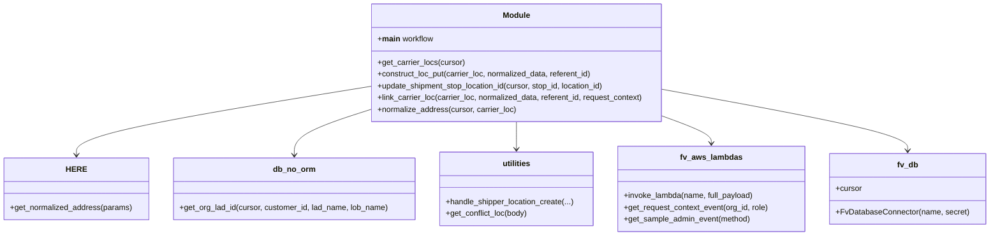

# Diagram: shipment_core/shipment_service/scripts/create_ltl_parcel_unclassified.py


> Auto-generated by Obscura crawlers

## Diagram 1

```mermaid
flowchart TD
    A[Start (__main__)] --> B[DB_CONN.cursor]
    B --> C[get_carrier_locs(cursor)]
    C --> D{for each carrier_loc}
    D --> E[normalize_address(cursor, carrier_loc)]
    E -->|None| D
    E -->|normalized_data| F[construct location_put_body]
    F --> G[invoke_lambda("locations-put")]
    G --> H{res_post_body contains id & code?}
    H -->|No| I[raise HandledException]
    H -->|Yes| J[update_shipment_stop_location_id(cursor, stop_id, location_id)]
    J --> K{referent_id exists?}
    K -->|Yes| L[done for this carrier_loc]
    K -->|No and not INTER_ADDR_EXACT_TOO_MANY| M[create unclassified shipper loc via utilities.handle_shipper_location_create]
    M --> N[if conflict -> set referent_id from conflict]
    N --> O[get_request_context_event for carrier org]
    O --> P[link_carrier_loc(carrier_loc, normalized_data, referent_id, request_context)]
    P --> Q[construct_loc_put -> invoke_lambda("locations-put")]
    Q --> R{statusCode >= 400?}
    R -->|Yes| S[raise DatabaseError]
    R -->|No| L
```

> SVG rendering failed for this diagram.

## Diagram 2



### SVG

<svg id="container" width="2007.9296875" xmlns="http://www.w3.org/2000/svg" class="classDiagram" height="480" viewBox="0 0 2007.9296875 480" role="graphics-document document" aria-roledescription="class"><style>#container{font-family:"trebuchet ms",verdana,arial,sans-serif;font-size:16px;fill:#333;}@keyframes edge-animation-frame{from{stroke-dashoffset:0;}}@keyframes dash{to{stroke-dashoffset:0;}}#container .edge-animation-slow{stroke-dasharray:9,5!important;stroke-dashoffset:900;animation:dash 50s linear infinite;stroke-linecap:round;}#container .edge-animation-fast{stroke-dasharray:9,5!important;stroke-dashoffset:900;animation:dash 20s linear infinite;stroke-linecap:round;}#container .error-icon{fill:#552222;}#container .error-text{fill:#552222;stroke:#552222;}#container .edge-thickness-normal{stroke-width:1px;}#container .edge-thickness-thick{stroke-width:3.5px;}#container .edge-pattern-solid{stroke-dasharray:0;}#container .edge-thickness-invisible{stroke-width:0;fill:none;}#container .edge-pattern-dashed{stroke-dasharray:3;}#container .edge-pattern-dotted{stroke-dasharray:2;}#container .marker{fill:#333333;stroke:#333333;}#container .marker.cross{stroke:#333333;}#container svg{font-family:"trebuchet ms",verdana,arial,sans-serif;font-size:16px;}#container p{margin:0;}#container g.classGroup text{fill:#9370DB;stroke:none;font-family:"trebuchet ms",verdana,arial,sans-serif;font-size:10px;}#container g.classGroup text .title{font-weight:bolder;}#container .nodeLabel,#container .edgeLabel{color:#131300;}#container .edgeLabel .label rect{fill:#ECECFF;}#container .label text{fill:#131300;}#container .labelBkg{background:#ECECFF;}#container .edgeLabel .label span{background:#ECECFF;}#container .classTitle{font-weight:bolder;}#container .node rect,#container .node circle,#container .node ellipse,#container .node polygon,#container .node path{fill:#ECECFF;stroke:#9370DB;stroke-width:1px;}#container .divider{stroke:#9370DB;stroke-width:1;}#container g.clickable{cursor:pointer;}#container g.classGroup rect{fill:#ECECFF;stroke:#9370DB;}#container g.classGroup line{stroke:#9370DB;stroke-width:1;}#container .classLabel .box{stroke:none;stroke-width:0;fill:#ECECFF;opacity:0.5;}#container .classLabel .label{fill:#9370DB;font-size:10px;}#container .relation{stroke:#333333;stroke-width:1;fill:none;}#container .dashed-line{stroke-dasharray:3;}#container .dotted-line{stroke-dasharray:1 2;}#container #compositionStart,#container .composition{fill:#333333!important;stroke:#333333!important;stroke-width:1;}#container #compositionEnd,#container .composition{fill:#333333!important;stroke:#333333!important;stroke-width:1;}#container #dependencyStart,#container .dependency{fill:#333333!important;stroke:#333333!important;stroke-width:1;}#container #dependencyStart,#container .dependency{fill:#333333!important;stroke:#333333!important;stroke-width:1;}#container #extensionStart,#container .extension{fill:transparent!important;stroke:#333333!important;stroke-width:1;}#container #extensionEnd,#container .extension{fill:transparent!important;stroke:#333333!important;stroke-width:1;}#container #aggregationStart,#container .aggregation{fill:transparent!important;stroke:#333333!important;stroke-width:1;}#container #aggregationEnd,#container .aggregation{fill:transparent!important;stroke:#333333!important;stroke-width:1;}#container #lollipopStart,#container .lollipop{fill:#ECECFF!important;stroke:#333333!important;stroke-width:1;}#container #lollipopEnd,#container .lollipop{fill:#ECECFF!important;stroke:#333333!important;stroke-width:1;}#container .edgeTerminals{font-size:11px;line-height:initial;}#container .classTitleText{text-anchor:middle;font-size:18px;fill:#333;}#container .label-icon{display:inline-block;height:1em;overflow:visible;vertical-align:-0.125em;}#container .node .label-icon path{fill:currentColor;stroke:revert;stroke-width:revert;}#container :root{--mermaid-font-family:"trebuchet ms",verdana,arial,sans-serif;}</style><g><defs><marker id="container_class-aggregationStart" class="marker aggregation class" refX="18" refY="7" markerWidth="190" markerHeight="240" orient="auto"><path d="M 18,7 L9,13 L1,7 L9,1 Z"></path></marker></defs><defs><marker id="container_class-aggregationEnd" class="marker aggregation class" refX="1" refY="7" markerWidth="20" markerHeight="28" orient="auto"><path d="M 18,7 L9,13 L1,7 L9,1 Z"></path></marker></defs><defs><marker id="container_class-extensionStart" class="marker extension class" refX="18" refY="7" markerWidth="190" markerHeight="240" orient="auto"><path d="M 1,7 L18,13 V 1 Z"></path></marker></defs><defs><marker id="container_class-extensionEnd" class="marker extension class" refX="1" refY="7" markerWidth="20" markerHeight="28" orient="auto"><path d="M 1,1 V 13 L18,7 Z"></path></marker></defs><defs><marker id="container_class-compositionStart" class="marker composition class" refX="18" refY="7" markerWidth="190" markerHeight="240" orient="auto"><path d="M 18,7 L9,13 L1,7 L9,1 Z"></path></marker></defs><defs><marker id="container_class-compositionEnd" class="marker composition class" refX="1" refY="7" markerWidth="20" markerHeight="28" orient="auto"><path d="M 18,7 L9,13 L1,7 L9,1 Z"></path></marker></defs><defs><marker id="container_class-dependencyStart" class="marker dependency class" refX="6" refY="7" markerWidth="190" markerHeight="240" orient="auto"><path d="M 5,7 L9,13 L1,7 L9,1 Z"></path></marker></defs><defs><marker id="container_class-dependencyEnd" class="marker dependency class" refX="13" refY="7" markerWidth="20" markerHeight="28" orient="auto"><path d="M 18,7 L9,13 L14,7 L9,1 Z"></path></marker></defs><defs><marker id="container_class-lollipopStart" class="marker lollipop class" refX="13" refY="7" markerWidth="190" markerHeight="240" orient="auto"><circle stroke="black" fill="transparent" cx="7" cy="7" r="6"></circle></marker></defs><defs><marker id="container_class-lollipopEnd" class="marker lollipop class" refX="1" refY="7" markerWidth="190" markerHeight="240" orient="auto"><circle stroke="black" fill="transparent" cx="7" cy="7" r="6"></circle></marker></defs><g class="root"><g class="clusters"></g><g class="edgePaths"><path d="M749.34,176.635L650.12,192.696C550.901,208.757,352.462,240.878,253.243,264.106C154.023,287.333,154.023,301.667,154.023,308.833L154.023,316" id="id_Module_HERE_1" class="edge-thickness-normal edge-pattern-solid relation" style=";;;" data-edge="true" data-et="edge" data-id="id_Module_HERE_1" data-points="W3sieCI6NzQ5LjMzOTg0Mzc1LCJ5IjoxNzYuNjM0OTQ2Mzg0MjYyODN9LHsieCI6MTU0LjAyMzQzNzUsInkiOjI3M30seyJ4IjoxNTQuMDIzNDM3NSwieSI6MzIyfV0=" marker-end="url(#container_class-dependencyEnd)"></path><path d="M749.34,224.062L723.829,232.218C698.319,240.375,647.298,256.687,621.788,272.01C596.277,287.333,596.277,301.667,596.277,308.833L596.277,316" id="id_Module_db_no_orm_2" class="edge-thickness-normal edge-pattern-solid relation" style=";;;" data-edge="true" data-et="edge" data-id="id_Module_db_no_orm_2" data-points="W3sieCI6NzQ5LjMzOTg0Mzc1LCJ5IjoyMjQuMDYyMTg3NzY5MTY0NX0seyJ4Ijo1OTYuMjc3MzQzNzUsInkiOjI3M30seyJ4Ijo1OTYuMjc3MzQzNzUsInkiOjMyMn1d" marker-end="url(#container_class-dependencyEnd)"></path><path d="M1049.793,248L1049.793,252.167C1049.793,256.333,1049.793,264.667,1049.793,274C1049.793,283.333,1049.793,293.667,1049.793,298.833L1049.793,304" id="id_Module_utilities_3" class="edge-thickness-normal edge-pattern-solid relation" style=";;;" data-edge="true" data-et="edge" data-id="id_Module_utilities_3" data-points="W3sieCI6MTA0OS43OTI5Njg3NSwieSI6MjQ4fSx7IngiOjEwNDkuNzkyOTY4NzUsInkiOjI3M30seyJ4IjoxMDQ5Ljc5Mjk2ODc1LCJ5IjozMTB9XQ==" marker-end="url(#container_class-dependencyEnd)"></path><path d="M1350.246,237.506L1366.477,243.421C1382.708,249.337,1415.171,261.169,1431.402,270.251C1447.633,279.333,1447.633,285.667,1447.633,288.833L1447.633,292" id="id_Module_fv_aws_lambdas_4" class="edge-thickness-normal edge-pattern-solid relation" style=";;;" data-edge="true" data-et="edge" data-id="id_Module_fv_aws_lambdas_4" data-points="W3sieCI6MTM1MC4yNDYwOTM3NSwieSI6MjM3LjUwNTYzMDk5NTUxMjl9LHsieCI6MTQ0Ny42MzI4MTI1LCJ5IjoyNzN9LHsieCI6MTQ0Ny42MzI4MTI1LCJ5IjoyOTh9XQ==" marker-end="url(#container_class-dependencyEnd)"></path><path d="M1350.246,182.85L1432.548,197.875C1514.85,212.9,1679.454,242.95,1761.757,263.642C1844.059,284.333,1844.059,295.667,1844.059,301.333L1844.059,307" id="id_Module_fv_db_5" class="edge-thickness-normal edge-pattern-solid relation" style=";;;" data-edge="true" data-et="edge" data-id="id_Module_fv_db_5" data-points="W3sieCI6MTM1MC4yNDYwOTM3NSwieSI6MTgyLjg1MDI5NDEwMDI4OTE4fSx7IngiOjE4NDQuMDU4NTkzNzUsInkiOjI3M30seyJ4IjoxODQ0LjA1ODU5Mzc1LCJ5IjozMTN9XQ==" marker-end="url(#container_class-dependencyEnd)"></path></g><g class="edgeLabels"><g class="edgeLabel"><g class="label" data-id="id_Module_HERE_1" transform="translate(0, 0)"><foreignObject width="0" height="0"><div xmlns="http://www.w3.org/1999/xhtml" class="labelBkg" style="display: table-cell; white-space: nowrap; line-height: 1.5; max-width: 200px; text-align: center;"><span class="edgeLabel"></span></div></foreignObject></g></g><g class="edgeLabel"><g class="label" data-id="id_Module_db_no_orm_2" transform="translate(0, 0)"><foreignObject width="0" height="0"><div xmlns="http://www.w3.org/1999/xhtml" class="labelBkg" style="display: table-cell; white-space: nowrap; line-height: 1.5; max-width: 200px; text-align: center;"><span class="edgeLabel"></span></div></foreignObject></g></g><g class="edgeLabel"><g class="label" data-id="id_Module_utilities_3" transform="translate(0, 0)"><foreignObject width="0" height="0"><div xmlns="http://www.w3.org/1999/xhtml" class="labelBkg" style="display: table-cell; white-space: nowrap; line-height: 1.5; max-width: 200px; text-align: center;"><span class="edgeLabel"></span></div></foreignObject></g></g><g class="edgeLabel"><g class="label" data-id="id_Module_fv_aws_lambdas_4" transform="translate(0, 0)"><foreignObject width="0" height="0"><div xmlns="http://www.w3.org/1999/xhtml" class="labelBkg" style="display: table-cell; white-space: nowrap; line-height: 1.5; max-width: 200px; text-align: center;"><span class="edgeLabel"></span></div></foreignObject></g></g><g class="edgeLabel"><g class="label" data-id="id_Module_fv_db_5" transform="translate(0, 0)"><foreignObject width="0" height="0"><div xmlns="http://www.w3.org/1999/xhtml" class="labelBkg" style="display: table-cell; white-space: nowrap; line-height: 1.5; max-width: 200px; text-align: center;"><span class="edgeLabel"></span></div></foreignObject></g></g></g><g class="nodes"><g class="node default" id="classId-Module-0" transform="translate(1049.79296875, 128)"><g class="basic label-container"><path d="M-300.453125 -120 L300.453125 -120 L300.453125 120 L-300.453125 120" stroke="none" stroke-width="0" fill="#ECECFF" style=""></path><path d="M-300.453125 -120 C-153.6235163493515 -120, -6.793907698702981 -120, 300.453125 -120 M-300.453125 -120 C-91.72371275127458 -120, 117.00569949745085 -120, 300.453125 -120 M300.453125 -120 C300.453125 -46.525883515062205, 300.453125 26.94823296987559, 300.453125 120 M300.453125 -120 C300.453125 -29.16081263493807, 300.453125 61.67837473012386, 300.453125 120 M300.453125 120 C130.26587696410547 120, -39.92137107178905 120, -300.453125 120 M300.453125 120 C170.391978338534 120, 40.33083167706798 120, -300.453125 120 M-300.453125 120 C-300.453125 64.87084230422808, -300.453125 9.741684608456154, -300.453125 -120 M-300.453125 120 C-300.453125 43.7593306879501, -300.453125 -32.481338624099806, -300.453125 -120" stroke="#9370DB" stroke-width="1.3" fill="none" stroke-dasharray="0 0" style=""></path></g><g class="annotation-group text" transform="translate(0, -96)"></g><g class="label-group text" transform="translate(-27.09375, -96)"><g class="label" style="font-weight: bolder" transform="translate(0,-12)"><foreignObject width="54.1875" height="24"><div xmlns="http://www.w3.org/1999/xhtml" style="display: table-cell; white-space: nowrap; line-height: 1.5; max-width: 104px; text-align: center;"><span class="nodeLabel markdown-node-label" style=""><p>Module</p></span></div></foreignObject></g></g><g class="members-group text" transform="translate(-288.453125, -48)"><g class="label" style="" transform="translate(0,-12)"><foreignObject width="113.671875" height="24"><div xmlns="http://www.w3.org/1999/xhtml" style="display: table-cell; white-space: nowrap; line-height: 1.5; max-width: 203px; text-align: center;"><span class="nodeLabel markdown-node-label" style=""><p>+<strong>main</strong> workflow</p></span></div></foreignObject></g></g><g class="methods-group text" transform="translate(-288.453125, 0)"><g class="label" style="" transform="translate(0,-12)"><foreignObject width="178.546875" height="24"><div xmlns="http://www.w3.org/1999/xhtml" style="display: table-cell; white-space: nowrap; line-height: 1.5; max-width: 236px; text-align: center;"><span class="nodeLabel markdown-node-label" style=""><p>+get_carrier_locs(cursor)</p></span></div></foreignObject></g><g class="label" style="" transform="translate(0,12)"><foreignObject width="444.453125" height="24"><div xmlns="http://www.w3.org/1999/xhtml" style="display: table-cell; white-space: nowrap; line-height: 1.5; max-width: 502px; text-align: center;"><span class="nodeLabel markdown-node-label" style=""><p>+construct_loc_put(carrier_loc, normalized_data, referent_id)</p></span></div></foreignObject></g><g class="label" style="" transform="translate(0,36)"><foreignObject width="471.8125" height="24"><div xmlns="http://www.w3.org/1999/xhtml" style="display: table-cell; white-space: nowrap; line-height: 1.5; max-width: 529px; text-align: center;"><span class="nodeLabel markdown-node-label" style=""><p>+update_shipment_stop_location_id(cursor, stop_id, location_id)</p></span></div></foreignObject></g><g class="label" style="" transform="translate(0,60)"><foreignObject width="549.8125" height="24"><div xmlns="http://www.w3.org/1999/xhtml" style="display: table-cell; white-space: nowrap; line-height: 1.5; max-width: 607px; text-align: center;"><span class="nodeLabel markdown-node-label" style=""><p>+link_carrier_loc(carrier_loc, normalized_data, referent_id, request_context)</p></span></div></foreignObject></g><g class="label" style="" transform="translate(0,84)"><foreignObject width="284" height="24"><div xmlns="http://www.w3.org/1999/xhtml" style="display: table-cell; white-space: nowrap; line-height: 1.5; max-width: 341px; text-align: center;"><span class="nodeLabel markdown-node-label" style=""><p>+normalize_address(cursor, carrier_loc)</p></span></div></foreignObject></g></g><g class="divider" style=""><path d="M-300.453125 -72 C-78.31336627967943 -72, 143.82639244064114 -72, 300.453125 -72 M-300.453125 -72 C-81.5582227656115 -72, 137.336679468777 -72, 300.453125 -72" stroke="#9370DB" stroke-width="1.3" fill="none" stroke-dasharray="0 0" style=""></path></g><g class="divider" style=""><path d="M-300.453125 -24 C-179.38196952554964 -24, -58.31081405109927 -24, 300.453125 -24 M-300.453125 -24 C-101.7940676689669 -24, 96.8649896620662 -24, 300.453125 -24" stroke="#9370DB" stroke-width="1.3" fill="none" stroke-dasharray="0 0" style=""></path></g></g><g class="node default" id="classId-HERE-1" transform="translate(154.0234375, 385)"><g class="basic label-container"><path d="M-146.0234375 -63 L146.0234375 -63 L146.0234375 63 L-146.0234375 63" stroke="none" stroke-width="0" fill="#ECECFF" style=""></path><path d="M-146.0234375 -63 C-65.39060861143749 -63, 15.242220277125028 -63, 146.0234375 -63 M-146.0234375 -63 C-31.599832902675814 -63, 82.82377169464837 -63, 146.0234375 -63 M146.0234375 -63 C146.0234375 -21.81586754664849, 146.0234375 19.36826490670302, 146.0234375 63 M146.0234375 -63 C146.0234375 -14.615814003296194, 146.0234375 33.76837199340761, 146.0234375 63 M146.0234375 63 C53.99686466121955 63, -38.029708177560906 63, -146.0234375 63 M146.0234375 63 C33.67443657371747 63, -78.67456435256506 63, -146.0234375 63 M-146.0234375 63 C-146.0234375 34.42444107784141, -146.0234375 5.848882155682816, -146.0234375 -63 M-146.0234375 63 C-146.0234375 18.01082472443597, -146.0234375 -26.97835055112806, -146.0234375 -63" stroke="#9370DB" stroke-width="1.3" fill="none" stroke-dasharray="0 0" style=""></path></g><g class="annotation-group text" transform="translate(0, -39)"></g><g class="label-group text" transform="translate(-18.6875, -39)"><g class="label" style="font-weight: bolder" transform="translate(0,-12)"><foreignObject width="37.375" height="24"><div xmlns="http://www.w3.org/1999/xhtml" style="display: table-cell; white-space: nowrap; line-height: 1.5; max-width: 88px; text-align: center;"><span class="nodeLabel markdown-node-label" style=""><p>HERE</p></span></div></foreignObject></g></g><g class="members-group text" transform="translate(-134.0234375, 9)"></g><g class="methods-group text" transform="translate(-134.0234375, 39)"><g class="label" style="" transform="translate(0,-12)"><foreignObject width="249.359375" height="24"><div xmlns="http://www.w3.org/1999/xhtml" style="display: table-cell; white-space: nowrap; line-height: 1.5; max-width: 307px; text-align: center;"><span class="nodeLabel markdown-node-label" style=""><p>+get_normalized_address(params)</p></span></div></foreignObject></g></g><g class="divider" style=""><path d="M-146.0234375 -15 C-63.33605163379737 -15, 19.351334232405264 -15, 146.0234375 -15 M-146.0234375 -15 C-85.24553964595438 -15, -24.467641791908747 -15, 146.0234375 -15" stroke="#9370DB" stroke-width="1.3" fill="none" stroke-dasharray="0 0" style=""></path></g><g class="divider" style=""><path d="M-146.0234375 9 C-60.44316618953543 9, 25.137105120929135 9, 146.0234375 9 M-146.0234375 9 C-64.13506990997996 9, 17.753297680040077 9, 146.0234375 9" stroke="#9370DB" stroke-width="1.3" fill="none" stroke-dasharray="0 0" style=""></path></g></g><g class="node default" id="classId-db_no_orm-2" transform="translate(596.27734375, 385)"><g class="basic label-container"><path d="M-246.23046875 -63 L246.23046875 -63 L246.23046875 63 L-246.23046875 63" stroke="none" stroke-width="0" fill="#ECECFF" style=""></path><path d="M-246.23046875 -63 C-127.635807378701 -63, -9.041146007402006 -63, 246.23046875 -63 M-246.23046875 -63 C-116.61798763172285 -63, 12.99449348655429 -63, 246.23046875 -63 M246.23046875 -63 C246.23046875 -25.57955430139574, 246.23046875 11.840891397208523, 246.23046875 63 M246.23046875 -63 C246.23046875 -37.64492477045059, 246.23046875 -12.289849540901166, 246.23046875 63 M246.23046875 63 C60.06462036503825 63, -126.1012280199235 63, -246.23046875 63 M246.23046875 63 C101.74149298593639 63, -42.74748277812722 63, -246.23046875 63 M-246.23046875 63 C-246.23046875 37.34179620446619, -246.23046875 11.683592408932391, -246.23046875 -63 M-246.23046875 63 C-246.23046875 19.339088829976262, -246.23046875 -24.321822340047476, -246.23046875 -63" stroke="#9370DB" stroke-width="1.3" fill="none" stroke-dasharray="0 0" style=""></path></g><g class="annotation-group text" transform="translate(0, -39)"></g><g class="label-group text" transform="translate(-41.3515625, -39)"><g class="label" style="font-weight: bolder" transform="translate(0,-12)"><foreignObject width="82.703125" height="24"><div xmlns="http://www.w3.org/1999/xhtml" style="display: table-cell; white-space: nowrap; line-height: 1.5; max-width: 133px; text-align: center;"><span class="nodeLabel markdown-node-label" style=""><p>db_no_orm</p></span></div></foreignObject></g></g><g class="members-group text" transform="translate(-234.23046875, 9)"></g><g class="methods-group text" transform="translate(-234.23046875, 39)"><g class="label" style="" transform="translate(0,-12)"><foreignObject width="427.109375" height="24"><div xmlns="http://www.w3.org/1999/xhtml" style="display: table-cell; white-space: nowrap; line-height: 1.5; max-width: 484px; text-align: center;"><span class="nodeLabel markdown-node-label" style=""><p>+get_org_lad_id(cursor, customer_id, lad_name, lob_name)</p></span></div></foreignObject></g></g><g class="divider" style=""><path d="M-246.23046875 -15 C-101.96618221924294 -15, 42.29810431151412 -15, 246.23046875 -15 M-246.23046875 -15 C-115.045704885849 -15, 16.13905897830199 -15, 246.23046875 -15" stroke="#9370DB" stroke-width="1.3" fill="none" stroke-dasharray="0 0" style=""></path></g><g class="divider" style=""><path d="M-246.23046875 9 C-58.92808935029478 9, 128.37429004941043 9, 246.23046875 9 M-246.23046875 9 C-132.0230155030006 9, -17.815562256001215 9, 246.23046875 9" stroke="#9370DB" stroke-width="1.3" fill="none" stroke-dasharray="0 0" style=""></path></g></g><g class="node default" id="classId-utilities-3" transform="translate(1049.79296875, 385)"><g class="basic label-container"><path d="M-157.28515625 -75 L157.28515625 -75 L157.28515625 75 L-157.28515625 75" stroke="none" stroke-width="0" fill="#ECECFF" style=""></path><path d="M-157.28515625 -75 C-71.86268097099081 -75, 13.559794308018382 -75, 157.28515625 -75 M-157.28515625 -75 C-33.362335421560644 -75, 90.56048540687871 -75, 157.28515625 -75 M157.28515625 -75 C157.28515625 -36.54406367508129, 157.28515625 1.9118726498374201, 157.28515625 75 M157.28515625 -75 C157.28515625 -40.8299592512025, 157.28515625 -6.659918502405006, 157.28515625 75 M157.28515625 75 C62.528207308733954 75, -32.22874163253209 75, -157.28515625 75 M157.28515625 75 C55.32088349714975 75, -46.6433892557005 75, -157.28515625 75 M-157.28515625 75 C-157.28515625 31.385856216306202, -157.28515625 -12.228287567387596, -157.28515625 -75 M-157.28515625 75 C-157.28515625 31.50396177112699, -157.28515625 -11.992076457746023, -157.28515625 -75" stroke="#9370DB" stroke-width="1.3" fill="none" stroke-dasharray="0 0" style=""></path></g><g class="annotation-group text" transform="translate(0, -51)"></g><g class="label-group text" transform="translate(-28.1796875, -51)"><g class="label" style="font-weight: bolder" transform="translate(0,-12)"><foreignObject width="56.359375" height="24"><div xmlns="http://www.w3.org/1999/xhtml" style="display: table-cell; white-space: nowrap; line-height: 1.5; max-width: 105px; text-align: center;"><span class="nodeLabel markdown-node-label" style=""><p>utilities</p></span></div></foreignObject></g></g><g class="members-group text" transform="translate(-145.28515625, -3)"></g><g class="methods-group text" transform="translate(-145.28515625, 27)"><g class="label" style="" transform="translate(0,-12)"><foreignObject width="262.390625" height="24"><div xmlns="http://www.w3.org/1999/xhtml" style="display: table-cell; white-space: nowrap; line-height: 1.5; max-width: 320px; text-align: center;"><span class="nodeLabel markdown-node-label" style=""><p>+handle_shipper_location_create(...)</p></span></div></foreignObject></g><g class="label" style="" transform="translate(0,12)"><foreignObject width="168.421875" height="24"><div xmlns="http://www.w3.org/1999/xhtml" style="display: table-cell; white-space: nowrap; line-height: 1.5; max-width: 226px; text-align: center;"><span class="nodeLabel markdown-node-label" style=""><p>+get_conflict_loc(body)</p></span></div></foreignObject></g></g><g class="divider" style=""><path d="M-157.28515625 -27 C-44.66364582839141 -27, 67.95786459321718 -27, 157.28515625 -27 M-157.28515625 -27 C-42.5394150704913 -27, 72.2063261090174 -27, 157.28515625 -27" stroke="#9370DB" stroke-width="1.3" fill="none" stroke-dasharray="0 0" style=""></path></g><g class="divider" style=""><path d="M-157.28515625 -3 C-72.11412537704568 -3, 13.056905495908637 -3, 157.28515625 -3 M-157.28515625 -3 C-84.4866124736094 -3, -11.688068697218796 -3, 157.28515625 -3" stroke="#9370DB" stroke-width="1.3" fill="none" stroke-dasharray="0 0" style=""></path></g></g><g class="node default" id="classId-fv_aws_lambdas-4" transform="translate(1447.6328125, 385)"><g class="basic label-container"><path d="M-190.5546875 -87 L190.5546875 -87 L190.5546875 87 L-190.5546875 87" stroke="none" stroke-width="0" fill="#ECECFF" style=""></path><path d="M-190.5546875 -87 C-94.38346119395813 -87, 1.787765112083747 -87, 190.5546875 -87 M-190.5546875 -87 C-43.49719644052453 -87, 103.56029461895093 -87, 190.5546875 -87 M190.5546875 -87 C190.5546875 -27.866685225040996, 190.5546875 31.266629549918008, 190.5546875 87 M190.5546875 -87 C190.5546875 -41.994421891545976, 190.5546875 3.0111562169080486, 190.5546875 87 M190.5546875 87 C42.88789729957551 87, -104.77889290084897 87, -190.5546875 87 M190.5546875 87 C109.30687587878667 87, 28.05906425757334 87, -190.5546875 87 M-190.5546875 87 C-190.5546875 39.385415096503195, -190.5546875 -8.22916980699361, -190.5546875 -87 M-190.5546875 87 C-190.5546875 32.89207588785701, -190.5546875 -21.215848224285978, -190.5546875 -87" stroke="#9370DB" stroke-width="1.3" fill="none" stroke-dasharray="0 0" style=""></path></g><g class="annotation-group text" transform="translate(0, -63)"></g><g class="label-group text" transform="translate(-60.0625, -63)"><g class="label" style="font-weight: bolder" transform="translate(0,-12)"><foreignObject width="120.125" height="24"><div xmlns="http://www.w3.org/1999/xhtml" style="display: table-cell; white-space: nowrap; line-height: 1.5; max-width: 168px; text-align: center;"><span class="nodeLabel markdown-node-label" style=""><p>fv_aws_lambdas</p></span></div></foreignObject></g></g><g class="members-group text" transform="translate(-178.5546875, -15)"></g><g class="methods-group text" transform="translate(-178.5546875, 15)"><g class="label" style="" transform="translate(0,-12)"><foreignObject width="267.234375" height="24"><div xmlns="http://www.w3.org/1999/xhtml" style="display: table-cell; white-space: nowrap; line-height: 1.5; max-width: 325px; text-align: center;"><span class="nodeLabel markdown-node-label" style=""><p>+invoke_lambda(name, full_payload)</p></span></div></foreignObject></g><g class="label" style="" transform="translate(0,12)"><foreignObject width="297.046875" height="24"><div xmlns="http://www.w3.org/1999/xhtml" style="display: table-cell; white-space: nowrap; line-height: 1.5; max-width: 354px; text-align: center;"><span class="nodeLabel markdown-node-label" style=""><p>+get_request_context_event(org_id, role)</p></span></div></foreignObject></g><g class="label" style="" transform="translate(0,36)"><foreignObject width="260.1875" height="24"><div xmlns="http://www.w3.org/1999/xhtml" style="display: table-cell; white-space: nowrap; line-height: 1.5; max-width: 318px; text-align: center;"><span class="nodeLabel markdown-node-label" style=""><p>+get_sample_admin_event(method)</p></span></div></foreignObject></g></g><g class="divider" style=""><path d="M-190.5546875 -39 C-77.0855120312117 -39, 36.38366343757659 -39, 190.5546875 -39 M-190.5546875 -39 C-39.030943203745665 -39, 112.49280109250867 -39, 190.5546875 -39" stroke="#9370DB" stroke-width="1.3" fill="none" stroke-dasharray="0 0" style=""></path></g><g class="divider" style=""><path d="M-190.5546875 -15 C-86.6584236432393 -15, 17.237840213521395 -15, 190.5546875 -15 M-190.5546875 -15 C-53.85989548972691 -15, 82.83489652054618 -15, 190.5546875 -15" stroke="#9370DB" stroke-width="1.3" fill="none" stroke-dasharray="0 0" style=""></path></g></g><g class="node default" id="classId-fv_db-5" transform="translate(1844.05859375, 385)"><g class="basic label-container"><path d="M-155.87109375 -72 L155.87109375 -72 L155.87109375 72 L-155.87109375 72" stroke="none" stroke-width="0" fill="#ECECFF" style=""></path><path d="M-155.87109375 -72 C-48.56047515649209 -72, 58.75014343701582 -72, 155.87109375 -72 M-155.87109375 -72 C-76.7233493674651 -72, 2.4243950150697913 -72, 155.87109375 -72 M155.87109375 -72 C155.87109375 -15.817546912988405, 155.87109375 40.36490617402319, 155.87109375 72 M155.87109375 -72 C155.87109375 -21.661808201383927, 155.87109375 28.676383597232146, 155.87109375 72 M155.87109375 72 C65.08729685311054 72, -25.69650004377891 72, -155.87109375 72 M155.87109375 72 C78.09792126526554 72, 0.32474878053108114 72, -155.87109375 72 M-155.87109375 72 C-155.87109375 20.721126441737233, -155.87109375 -30.557747116525533, -155.87109375 -72 M-155.87109375 72 C-155.87109375 29.954759604978946, -155.87109375 -12.090480790042108, -155.87109375 -72" stroke="#9370DB" stroke-width="1.3" fill="none" stroke-dasharray="0 0" style=""></path></g><g class="annotation-group text" transform="translate(0, -48)"></g><g class="label-group text" transform="translate(-20.2890625, -48)"><g class="label" style="font-weight: bolder" transform="translate(0,-12)"><foreignObject width="40.578125" height="24"><div xmlns="http://www.w3.org/1999/xhtml" style="display: table-cell; white-space: nowrap; line-height: 1.5; max-width: 90px; text-align: center;"><span class="nodeLabel markdown-node-label" style=""><p>fv_db</p></span></div></foreignObject></g></g><g class="members-group text" transform="translate(-143.87109375, 0)"><g class="label" style="" transform="translate(0,-12)"><foreignObject width="53.71875" height="24"><div xmlns="http://www.w3.org/1999/xhtml" style="display: table-cell; white-space: nowrap; line-height: 1.5; max-width: 112px; text-align: center;"><span class="nodeLabel markdown-node-label" style=""><p>+cursor</p></span></div></foreignObject></g></g><g class="methods-group text" transform="translate(-143.87109375, 48)"><g class="label" style="" transform="translate(0,-12)"><foreignObject width="267.453125" height="24"><div xmlns="http://www.w3.org/1999/xhtml" style="display: table-cell; white-space: nowrap; line-height: 1.5; max-width: 325px; text-align: center;"><span class="nodeLabel markdown-node-label" style=""><p>+FvDatabaseConnector(name, secret)</p></span></div></foreignObject></g></g><g class="divider" style=""><path d="M-155.87109375 -24 C-33.39758272704772 -24, 89.07592829590456 -24, 155.87109375 -24 M-155.87109375 -24 C-42.38886945071526 -24, 71.09335484856948 -24, 155.87109375 -24" stroke="#9370DB" stroke-width="1.3" fill="none" stroke-dasharray="0 0" style=""></path></g><g class="divider" style=""><path d="M-155.87109375 24 C-42.360250350068995 24, 71.15059304986201 24, 155.87109375 24 M-155.87109375 24 C-73.31041867411119 24, 9.25025640177762 24, 155.87109375 24" stroke="#9370DB" stroke-width="1.3" fill="none" stroke-dasharray="0 0" style=""></path></g></g></g></g></g></svg>
