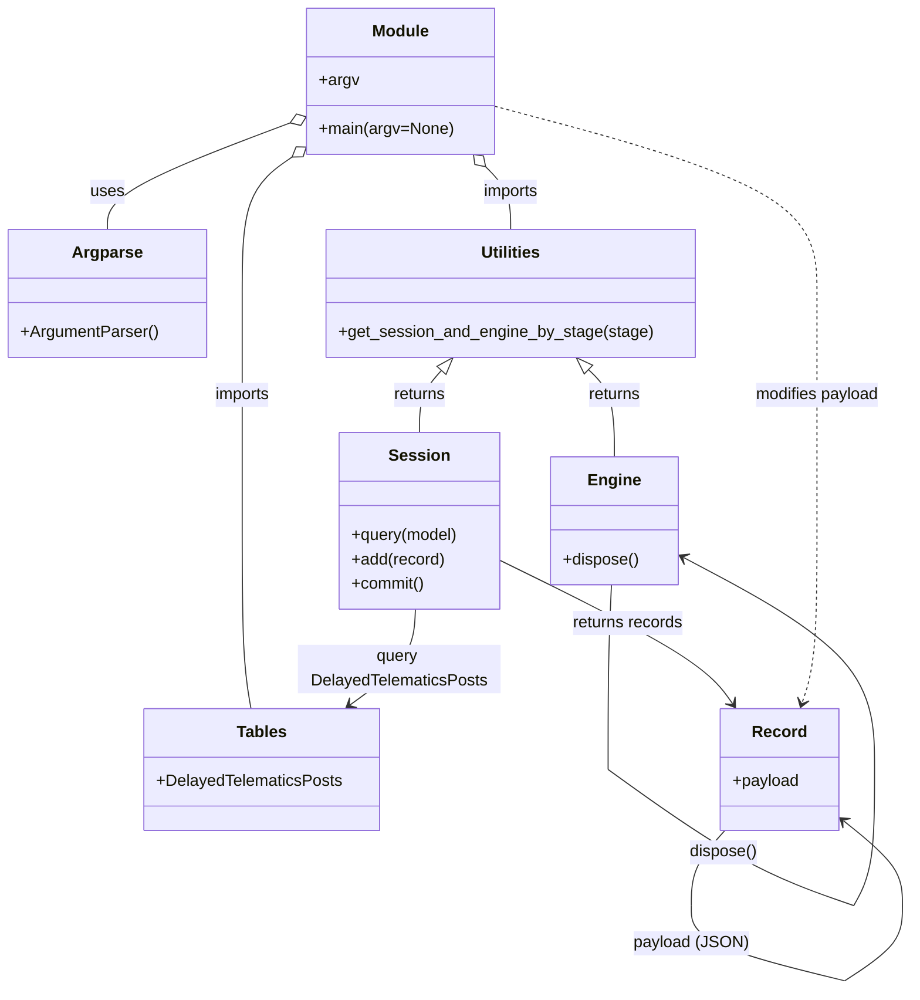

# Diagram: shipment_core/shipment_service/scripts/fix_delayed_table.py


> Auto-generated by Obscura crawlers

## Diagram 1

```mermaid
flowchart LR
    A[Script Start] --> B[parse args]
    B --> C{args.stage provided?}
    C -->|yes| D[get_session_and_engine_by_stage(stage)]
    C -->|no| Z[exit with error]
    D --> E[session]
    D --> F[engine]
    E --> G[query DelayedTelematicsPosts]
    G --> H[for record in delayed]
    H --> I[json.loads(record.payload)]
    I --> J{Telematics.stop_time endswith "Z"?}
    J -->|yes| K[trim trailing "Z"]
    K --> L[new_payload = json.dumps(data)]
    L --> M[record.payload = new_payload]
    M --> N[session.add(record)]
    N --> O[session.commit()]
    J -->|no| P[skip record]
    H --> Q[loop next record]
    Q --> R[after loop engine.dispose()]
    R --> S[script end]
```

> SVG rendering failed for this diagram.

## Diagram 2



### SVG

<svg id="container" width="889.2899780273438" xmlns="http://www.w3.org/2000/svg" class="classDiagram" height="974.25" viewBox="0 0 889.2899780273438 974.25" role="graphics-document document" aria-roledescription="class"><style>#container{font-family:"trebuchet ms",verdana,arial,sans-serif;font-size:16px;fill:#333;}@keyframes edge-animation-frame{from{stroke-dashoffset:0;}}@keyframes dash{to{stroke-dashoffset:0;}}#container .edge-animation-slow{stroke-dasharray:9,5!important;stroke-dashoffset:900;animation:dash 50s linear infinite;stroke-linecap:round;}#container .edge-animation-fast{stroke-dasharray:9,5!important;stroke-dashoffset:900;animation:dash 20s linear infinite;stroke-linecap:round;}#container .error-icon{fill:#552222;}#container .error-text{fill:#552222;stroke:#552222;}#container .edge-thickness-normal{stroke-width:1px;}#container .edge-thickness-thick{stroke-width:3.5px;}#container .edge-pattern-solid{stroke-dasharray:0;}#container .edge-thickness-invisible{stroke-width:0;fill:none;}#container .edge-pattern-dashed{stroke-dasharray:3;}#container .edge-pattern-dotted{stroke-dasharray:2;}#container .marker{fill:#333333;stroke:#333333;}#container .marker.cross{stroke:#333333;}#container svg{font-family:"trebuchet ms",verdana,arial,sans-serif;font-size:16px;}#container p{margin:0;}#container g.classGroup text{fill:#9370DB;stroke:none;font-family:"trebuchet ms",verdana,arial,sans-serif;font-size:10px;}#container g.classGroup text .title{font-weight:bolder;}#container .nodeLabel,#container .edgeLabel{color:#131300;}#container .edgeLabel .label rect{fill:#ECECFF;}#container .label text{fill:#131300;}#container .labelBkg{background:#ECECFF;}#container .edgeLabel .label span{background:#ECECFF;}#container .classTitle{font-weight:bolder;}#container .node rect,#container .node circle,#container .node ellipse,#container .node polygon,#container .node path{fill:#ECECFF;stroke:#9370DB;stroke-width:1px;}#container .divider{stroke:#9370DB;stroke-width:1;}#container g.clickable{cursor:pointer;}#container g.classGroup rect{fill:#ECECFF;stroke:#9370DB;}#container g.classGroup line{stroke:#9370DB;stroke-width:1;}#container .classLabel .box{stroke:none;stroke-width:0;fill:#ECECFF;opacity:0.5;}#container .classLabel .label{fill:#9370DB;font-size:10px;}#container .relation{stroke:#333333;stroke-width:1;fill:none;}#container .dashed-line{stroke-dasharray:3;}#container .dotted-line{stroke-dasharray:1 2;}#container #compositionStart,#container .composition{fill:#333333!important;stroke:#333333!important;stroke-width:1;}#container #compositionEnd,#container .composition{fill:#333333!important;stroke:#333333!important;stroke-width:1;}#container #dependencyStart,#container .dependency{fill:#333333!important;stroke:#333333!important;stroke-width:1;}#container #dependencyStart,#container .dependency{fill:#333333!important;stroke:#333333!important;stroke-width:1;}#container #extensionStart,#container .extension{fill:transparent!important;stroke:#333333!important;stroke-width:1;}#container #extensionEnd,#container .extension{fill:transparent!important;stroke:#333333!important;stroke-width:1;}#container #aggregationStart,#container .aggregation{fill:transparent!important;stroke:#333333!important;stroke-width:1;}#container #aggregationEnd,#container .aggregation{fill:transparent!important;stroke:#333333!important;stroke-width:1;}#container #lollipopStart,#container .lollipop{fill:#ECECFF!important;stroke:#333333!important;stroke-width:1;}#container #lollipopEnd,#container .lollipop{fill:#ECECFF!important;stroke:#333333!important;stroke-width:1;}#container .edgeTerminals{font-size:11px;line-height:initial;}#container .classTitleText{text-anchor:middle;font-size:18px;fill:#333;}#container .label-icon{display:inline-block;height:1em;overflow:visible;vertical-align:-0.125em;}#container .node .label-icon path{fill:currentColor;stroke:revert;stroke-width:revert;}#container :root{--mermaid-font-family:"trebuchet ms",verdana,arial,sans-serif;}</style><g><defs><marker id="container_class-aggregationStart" class="marker aggregation class" refX="18" refY="7" markerWidth="190" markerHeight="240" orient="auto"><path d="M 18,7 L9,13 L1,7 L9,1 Z"></path></marker></defs><defs><marker id="container_class-aggregationEnd" class="marker aggregation class" refX="1" refY="7" markerWidth="20" markerHeight="28" orient="auto"><path d="M 18,7 L9,13 L1,7 L9,1 Z"></path></marker></defs><defs><marker id="container_class-extensionStart" class="marker extension class" refX="18" refY="7" markerWidth="190" markerHeight="240" orient="auto"><path d="M 1,7 L18,13 V 1 Z"></path></marker></defs><defs><marker id="container_class-extensionEnd" class="marker extension class" refX="1" refY="7" markerWidth="20" markerHeight="28" orient="auto"><path d="M 1,1 V 13 L18,7 Z"></path></marker></defs><defs><marker id="container_class-compositionStart" class="marker composition class" refX="18" refY="7" markerWidth="190" markerHeight="240" orient="auto"><path d="M 18,7 L9,13 L1,7 L9,1 Z"></path></marker></defs><defs><marker id="container_class-compositionEnd" class="marker composition class" refX="1" refY="7" markerWidth="20" markerHeight="28" orient="auto"><path d="M 18,7 L9,13 L1,7 L9,1 Z"></path></marker></defs><defs><marker id="container_class-dependencyStart" class="marker dependency class" refX="6" refY="7" markerWidth="190" markerHeight="240" orient="auto"><path d="M 5,7 L9,13 L1,7 L9,1 Z"></path></marker></defs><defs><marker id="container_class-dependencyEnd" class="marker dependency class" refX="13" refY="7" markerWidth="20" markerHeight="28" orient="auto"><path d="M 18,7 L9,13 L14,7 L9,1 Z"></path></marker></defs><defs><marker id="container_class-lollipopStart" class="marker lollipop class" refX="13" refY="7" markerWidth="190" markerHeight="240" orient="auto"><circle stroke="black" fill="transparent" cx="7" cy="7" r="6"></circle></marker></defs><defs><marker id="container_class-lollipopEnd" class="marker lollipop class" refX="1" refY="7" markerWidth="190" markerHeight="240" orient="auto"><circle stroke="black" fill="transparent" cx="7" cy="7" r="6"></circle></marker></defs><g class="root"><g class="clusters"></g><g class="edgePaths"><path d="M281.321,121.054L251.642,132.378C221.964,143.703,162.607,166.351,132.928,183.842C103.25,201.333,103.25,213.667,103.25,219.833L103.25,226" id="id_Module_Argparse_1" class="edge-thickness-normal edge-pattern-solid relation" style=";;;" data-edge="true" data-et="edge" data-id="id_Module_Argparse_1" data-points="W3sieCI6Mjk3LjQzNzUsInkiOjExNC45MDQ0NDQxNDA1NzE1OH0seyJ4IjoxMDMuMjUsInkiOjE4OX0seyJ4IjoxMDMuMjUsInkiOjIyNn1d" marker-start="url(#container_class-aggregationStart)"></path><path d="M471.859,164.296L475.911,168.413C479.962,172.53,488.065,180.765,492.117,191.049C496.168,201.333,496.168,213.667,496.168,219.833L496.168,226" id="id_Module_Utilities_2" class="edge-thickness-normal edge-pattern-solid relation" style=";;;" data-edge="true" data-et="edge" data-id="id_Module_Utilities_2" data-points="W3sieCI6NDU5Ljc2MDY3OTQ3MjQ3NzEsInkiOjE1Mn0seyJ4Ijo0OTYuMTY3OTY4NzUsInkiOjE4OX0seyJ4Ijo0OTYuMTY3OTY4NzUsInkiOjIyNn1d" marker-start="url(#container_class-aggregationStart)"></path><path d="M283.315,154.062L275.012,159.885C266.71,165.708,250.105,177.354,241.802,199.844C233.5,222.333,233.5,255.667,233.5,289C233.5,322.333,233.5,355.667,233.5,393C233.5,430.333,233.5,471.667,233.5,515C233.5,558.333,233.5,603.667,234.966,634.5C236.432,665.333,239.363,681.667,240.829,689.833L242.295,698" id="id_Module_Tables_3" class="edge-thickness-normal edge-pattern-solid relation" style=";;;" data-edge="true" data-et="edge" data-id="id_Module_Tables_3" data-points="W3sieCI6Mjk3LjQzNzUsInkiOjE0NC4xNTcyOTE1MDk1NzYyM30seyJ4IjoyMzMuNSwieSI6MTg5fSx7IngiOjIzMy41LCJ5IjoyODl9LHsieCI6MjMzLjUsInkiOjM4OX0seyJ4IjoyMzMuNSwieSI6NTEzfSx7IngiOjIzMy41LCJ5Ijo2NDl9LHsieCI6MjQyLjI5NTAyOTM4NjQ2NzksInkiOjY5OH1d" marker-start="url(#container_class-aggregationStart)"></path><path d="M429.191,364.937L425.653,368.947C422.116,372.958,415.041,380.979,411.504,391.156C407.967,401.333,407.967,413.667,407.967,419.833L407.967,426" id="id_Utilities_Session_4" class="edge-thickness-normal edge-pattern-solid relation" style=";;;" data-edge="true" data-et="edge" data-id="id_Utilities_Session_4" data-points="W3sieCI6NDQwLjYwMTIzMDQ2ODc1MDAzLCJ5IjozNTJ9LHsieCI6NDA3Ljk2Njc5Njg3NSwieSI6Mzg5fSx7IngiOjQwNy45NjY3OTY4NzUsInkiOjQyNn1d" marker-start="url(#container_class-extensionStart)"></path><path d="M573.178,364.038L577.447,368.199C581.717,372.359,590.256,380.679,594.525,395.006C598.795,409.333,598.795,429.667,598.795,439.833L598.795,450" id="id_Utilities_Engine_5" class="edge-thickness-normal edge-pattern-solid relation" style=";;;" data-edge="true" data-et="edge" data-id="id_Utilities_Engine_5" data-points="W3sieCI6NTYwLjgyMjk0OTIxODc1LCJ5IjozNTJ9LHsieCI6NTk4Ljc5NDkyMTg3NSwieSI6Mzg5fSx7IngiOjU5OC43OTQ5MjE4NzUsInkiOjQ1MH1d" marker-start="url(#container_class-extensionStart)"></path><path d="M403.353,600L402.92,608.167C402.486,616.333,401.62,632.667,390.926,648.406C380.232,664.146,359.711,679.291,349.45,686.864L339.189,694.437" id="id_Session_Tables_6" class="edge-thickness-normal edge-pattern-solid relation" style=";;;" data-edge="true" data-et="edge" data-id="id_Session_Tables_6" data-points="W3sieCI6NDAzLjM1MjY2ODMxMzQxOTE0LCJ5Ijo2MDB9LHsieCI6NDAwLjc1MzkwNjI1LCJ5Ijo2NDl9LHsieCI6MzM0LjM2MTM5OTc5OTMxMTksInkiOjY5OH1d" marker-end="url(#container_class-dependencyEnd)"></path><path d="M487.096,552.124L519.751,568.27C552.406,584.416,617.717,616.708,655.551,640.203C693.386,663.699,703.745,678.397,708.924,685.746L714.104,693.096" id="id_Session_Record_7" class="edge-thickness-normal edge-pattern-solid relation" style=";;;" data-edge="true" data-et="edge" data-id="id_Session_Record_7" data-points="W3sieCI6NDg3LjA5NTcwMzEyNSwieSI6NTUyLjEyNDI4MjQ3MjI0NzJ9LHsieCI6NjgzLjAyNjk1MzEyNTM3MjUsInkiOjY0OX0seyJ4Ijo3MTcuNTU5OTc3MDY0NTkyNywieSI6Njk4fV0=" marker-end="url(#container_class-dependencyEnd)"></path><path d="M705.566,818L699.987,824.167C694.409,830.333,683.251,842.667,677.672,855C672.094,867.333,672.094,879.667,672.094,885.833L672.094,892" id="Record-cyclic-special-1" class="edge-thickness-normal edge-pattern-solid relation" style=";;;" data-edge="true" data-et="edge" data-id="Record-cyclic-special-1" data-points="W3sieCI6NzA1LjU2NTk5NTQ4OTgzMjksInkiOjgxOH0seyJ4Ijo2NzIuMDkzNzUsInkiOjg1NX0seyJ4Ijo2NzIuMDkzNzUsInkiOjg5Mn1d"></path><path d="M672.094,892.1L672.094,898.267C672.094,904.433,672.094,916.767,697.343,929.106C722.593,941.446,773.092,953.792,798.342,959.965L823.592,966.138" id="Record-cyclic-special-mid" class="edge-thickness-normal edge-pattern-solid relation" style=";;;" data-edge="true" data-et="edge" data-id="Record-cyclic-special-mid" data-points="W3sieCI6NjcyLjA5Mzc1LCJ5Ijo4OTIuMTAwMDAwMDAxNDkwMX0seyJ4Ijo2NzIuMDkzNzUsInkiOjkyOS4xMDAwMDAwMDE0OTAxfSx7IngiOjgyMy41OTE3OTY4NzUsInkiOjk2Ni4xMzc3NzYxNTU5NjQ0fV0="></path><path d="M823.692,966.118L833.292,959.948C842.891,953.779,862.091,941.439,871.69,929.095C881.29,916.75,881.29,904.4,881.29,892.05C881.29,879.7,881.29,867.35,871.421,853.292C861.552,839.235,841.814,823.47,831.945,815.587L822.076,807.705" id="Record-cyclic-special-2" class="edge-thickness-normal edge-pattern-solid relation" style=";;;" data-edge="true" data-et="edge" data-id="Record-cyclic-special-2" data-points="W3sieCI6ODIzLjY5MTc5Njg3NjQ5MDEsInkiOjk2Ni4xMTc4NjU1NjYxOTUzfSx7IngiOjg4MS4yOTAyMzQzNzU3NDUxLCJ5Ijo5MjkuMTAwMDAwMDAxNDkwMX0seyJ4Ijo4ODEuMjkwMjM0Mzc1NzQ1MSwieSI6ODkyLjA1MDAwMDAwMDc0NTF9LHsieCI6ODgxLjI5MDIzNDM3NTc0NTEsInkiOjg1NX0seyJ4Ijo4MTcuMzg4MjgxMjUwMzcyNSwieSI6ODAzLjk2MDQ4ODc3NTk1Njd9XQ==" marker-end="url(#container_class-dependencyEnd)"></path><path d="M595.454,576L594.808,588.167C594.163,600.333,592.873,624.667,592.227,654.992C591.582,685.317,591.582,721.633,591.582,739.792L591.582,757.95" id="Engine-cyclic-special-1" class="edge-thickness-normal edge-pattern-solid relation" style=";;;" data-edge="true" data-et="edge" data-id="Engine-cyclic-special-1" data-points="W3sieCI6NTk1LjQ1MzY1NjM2NDg4OTgsInkiOjU3Nn0seyJ4Ijo1OTEuNTgyMDMxMjUsInkiOjY0OX0seyJ4Ijo1OTEuNTgyMDMxMjUsInkiOjc1Ny45NDk5OTk5OTkyNTQ5fV0="></path><path d="M591.632,758.036L613.956,774.197C636.281,790.357,680.929,822.679,721.126,845.011C761.322,867.344,797.065,879.688,814.937,885.861L832.809,892.033" id="Engine-cyclic-special-mid" class="edge-thickness-normal edge-pattern-solid relation" style=";;;" data-edge="true" data-et="edge" data-id="Engine-cyclic-special-mid" data-points="W3sieCI6NTkxLjYzMjAzMTI1MDc0NTEsInkiOjc1OC4wMzYxOTUwODU1MTczfSx7IngiOjcyNS41NzgxMjUsInkiOjg1NX0seyJ4Ijo4MzIuODA4OTg0Mzc0NjI3NSwieSI6ODkyLjAzMjczMjI0MTcyMDV9XQ=="></path><path d="M832.887,892L836.367,885.833C839.847,879.667,846.806,867.333,850.286,845C853.765,822.667,853.765,790.333,853.765,756C853.765,721.667,853.765,685.333,822.436,650.456C791.106,615.578,728.447,582.156,697.118,565.445L665.788,548.734" id="Engine-cyclic-special-2" class="edge-thickness-normal edge-pattern-solid relation" style=";;;" data-edge="true" data-et="edge" data-id="Engine-cyclic-special-2" data-points="W3sieCI6ODMyLjg4NzE5NzkzODU0NTUsInkiOjg5Mn0seyJ4Ijo4NTMuNzY1MjM0Mzc1MzcyNSwieSI6ODU1fSx7IngiOjg1My43NjUyMzQzNzUzNzI1LCJ5Ijo3NTh9LHsieCI6ODUzLjc2NTIzNDM3NTM3MjUsInkiOjY0OX0seyJ4Ijo2NjAuNDk0MTQwNjI1LCJ5Ijo1NDUuOTEwMDgxNDQzMjU3Mn1d" marker-end="url(#container_class-dependencyEnd)"></path><path d="M480.391,104.404L533.241,118.503C586.092,132.603,691.793,160.801,744.643,191.567C797.494,222.333,797.494,255.667,797.494,289C797.494,322.333,797.494,355.667,797.494,393C797.494,430.333,797.494,471.667,797.494,515C797.494,558.333,797.494,603.667,794.999,633.555C792.505,663.443,787.517,677.886,785.022,685.107L782.528,692.329" id="id_Module_Record_10" class="edge-thickness-normal edge-pattern-dashed relation" style=";;;" data-edge="true" data-et="edge" data-id="id_Module_Record_10" data-points="W3sieCI6NDgwLjM5MDYyNSwieSI6MTA0LjQwMzkxODI5OTI2OTEyfSx7IngiOjc5Ny40OTM3NTAwMDAzNzI1LCJ5IjoxODl9LHsieCI6Nzk3LjQ5Mzc1MDAwMDM3MjUsInkiOjI4OX0seyJ4Ijo3OTcuNDkzNzUwMDAwMzcyNSwieSI6Mzg5fSx7IngiOjc5Ny40OTM3NTAwMDAzNzI1LCJ5Ijo1MTN9LHsieCI6Nzk3LjQ5Mzc1MDAwMDM3MjUsInkiOjY0OX0seyJ4Ijo3ODAuNTY5MjIzMDUwODMxMywieSI6Njk4fV0=" marker-end="url(#container_class-dependencyEnd)"></path></g><g class="edgeLabels"><g class="edgeLabel" transform="translate(103.25, 189)"><g class="label" data-id="id_Module_Argparse_1" transform="translate(-16.4921875, -12)"><foreignObject width="32.984375" height="24"><div xmlns="http://www.w3.org/1999/xhtml" class="labelBkg" style="display: table-cell; white-space: nowrap; line-height: 1.5; max-width: 200px; text-align: center;"><span class="edgeLabel"><p>uses</p></span></div></foreignObject></g></g><g class="edgeLabel" transform="translate(496.16796875, 189)"><g class="label" data-id="id_Module_Utilities_2" transform="translate(-28.25, -12)"><foreignObject width="56.5" height="24"><div xmlns="http://www.w3.org/1999/xhtml" class="labelBkg" style="display: table-cell; white-space: nowrap; line-height: 1.5; max-width: 200px; text-align: center;"><span class="edgeLabel"><p>imports</p></span></div></foreignObject></g></g><g class="edgeLabel" transform="translate(233.5, 389)"><g class="label" data-id="id_Module_Tables_3" transform="translate(-28.25, -12)"><foreignObject width="56.5" height="24"><div xmlns="http://www.w3.org/1999/xhtml" class="labelBkg" style="display: table-cell; white-space: nowrap; line-height: 1.5; max-width: 200px; text-align: center;"><span class="edgeLabel"><p>imports</p></span></div></foreignObject></g></g><g class="edgeLabel" transform="translate(407.966796875, 389)"><g class="label" data-id="id_Utilities_Session_4" transform="translate(-26.265625, -12)"><foreignObject width="52.53125" height="24"><div xmlns="http://www.w3.org/1999/xhtml" class="labelBkg" style="display: table-cell; white-space: nowrap; line-height: 1.5; max-width: 200px; text-align: center;"><span class="edgeLabel"><p>returns</p></span></div></foreignObject></g></g><g class="edgeLabel" transform="translate(598.794921875, 389)"><g class="label" data-id="id_Utilities_Engine_5" transform="translate(-26.265625, -12)"><foreignObject width="52.53125" height="24"><div xmlns="http://www.w3.org/1999/xhtml" class="labelBkg" style="display: table-cell; white-space: nowrap; line-height: 1.5; max-width: 200px; text-align: center;"><span class="edgeLabel"><p>returns</p></span></div></foreignObject></g></g><g class="edgeLabel" transform="translate(387.29799, 658.93094)"><g class="label" data-id="id_Session_Tables_6" transform="translate(-100, -24)"><foreignObject width="200" height="48"><div xmlns="http://www.w3.org/1999/xhtml" class="labelBkg" style="display: table; white-space: break-spaces; line-height: 1.5; max-width: 200px; text-align: center; width: 200px;"><span class="edgeLabel"><p>query DelayedTelematicsPosts</p></span></div></foreignObject></g></g><g class="edgeLabel" transform="translate(611.92954, 613.84679)"><g class="label" data-id="id_Session_Record_7" transform="translate(-55.296875, -12)"><foreignObject width="110.59375" height="24"><div xmlns="http://www.w3.org/1999/xhtml" class="labelBkg" style="display: table-cell; white-space: nowrap; line-height: 1.5; max-width: 200px; text-align: center;"><span class="edgeLabel"><p>returns records</p></span></div></foreignObject></g></g><g class="edgeLabel"><g class="label" data-id="Record-cyclic-special-1" transform="translate(0, 0)"><foreignObject width="0" height="0"><div xmlns="http://www.w3.org/1999/xhtml" class="labelBkg" style="display: table-cell; white-space: nowrap; line-height: 1.5; max-width: 200px; text-align: center;"><span class="edgeLabel"></span></div></foreignObject></g></g><g class="edgeLabel" transform="translate(672.09375, 929.1000000014901)"><g class="label" data-id="Record-cyclic-special-mid" transform="translate(-54.140625, -12)"><foreignObject width="108.28125" height="24"><div xmlns="http://www.w3.org/1999/xhtml" class="labelBkg" style="display: table-cell; white-space: nowrap; line-height: 1.5; max-width: 200px; text-align: center;"><span class="edgeLabel"><p>payload (JSON)</p></span></div></foreignObject></g></g><g class="edgeLabel"><g class="label" data-id="Record-cyclic-special-2" transform="translate(0, 0)"><foreignObject width="0" height="0"><div xmlns="http://www.w3.org/1999/xhtml" class="labelBkg" style="display: table-cell; white-space: nowrap; line-height: 1.5; max-width: 200px; text-align: center;"><span class="edgeLabel"></span></div></foreignObject></g></g><g class="edgeLabel"><g class="label" data-id="Engine-cyclic-special-1" transform="translate(0, 0)"><foreignObject width="0" height="0"><div xmlns="http://www.w3.org/1999/xhtml" class="labelBkg" style="display: table-cell; white-space: nowrap; line-height: 1.5; max-width: 200px; text-align: center;"><span class="edgeLabel"></span></div></foreignObject></g></g><g class="edgeLabel" transform="translate(704.55238, 839.77942)"><g class="label" data-id="Engine-cyclic-special-mid" transform="translate(-33.484375, -12)"><foreignObject width="66.96875" height="24"><div xmlns="http://www.w3.org/1999/xhtml" class="labelBkg" style="display: table-cell; white-space: nowrap; line-height: 1.5; max-width: 200px; text-align: center;"><span class="edgeLabel"><p>dispose()</p></span></div></foreignObject></g></g><g class="edgeLabel"><g class="label" data-id="Engine-cyclic-special-2" transform="translate(0, 0)"><foreignObject width="0" height="0"><div xmlns="http://www.w3.org/1999/xhtml" class="labelBkg" style="display: table-cell; white-space: nowrap; line-height: 1.5; max-width: 200px; text-align: center;"><span class="edgeLabel"></span></div></foreignObject></g></g><g class="edgeLabel" transform="translate(797.4937500003725, 389)"><g class="label" data-id="id_Module_Record_10" transform="translate(-62.2578125, -12)"><foreignObject width="124.515625" height="24"><div xmlns="http://www.w3.org/1999/xhtml" class="labelBkg" style="display: table-cell; white-space: nowrap; line-height: 1.5; max-width: 200px; text-align: center;"><span class="edgeLabel"><p>modifies payload</p></span></div></foreignObject></g></g></g><g class="nodes"><g class="node default" id="classId-Module-0" transform="translate(388.9140625, 80)"><g class="basic label-container"><path d="M-91.4765625 -72 L91.4765625 -72 L91.4765625 72 L-91.4765625 72" stroke="none" stroke-width="0" fill="#ECECFF" style=""></path><path d="M-91.4765625 -72 C-21.37756557654795 -72, 48.7214313469041 -72, 91.4765625 -72 M-91.4765625 -72 C-33.313583542341476 -72, 24.849395415317048 -72, 91.4765625 -72 M91.4765625 -72 C91.4765625 -31.835846937540225, 91.4765625 8.32830612491955, 91.4765625 72 M91.4765625 -72 C91.4765625 -18.876665976152594, 91.4765625 34.24666804769481, 91.4765625 72 M91.4765625 72 C35.66425116486157 72, -20.148060170276864 72, -91.4765625 72 M91.4765625 72 C45.28272633788582 72, -0.9111098242283617 72, -91.4765625 72 M-91.4765625 72 C-91.4765625 34.05629722213193, -91.4765625 -3.8874055557361373, -91.4765625 -72 M-91.4765625 72 C-91.4765625 39.9305234917556, -91.4765625 7.861046983511201, -91.4765625 -72" stroke="#9370DB" stroke-width="1.3" fill="none" stroke-dasharray="0 0" style=""></path></g><g class="annotation-group text" transform="translate(0, -48)"></g><g class="label-group text" transform="translate(-27.09375, -48)"><g class="label" style="font-weight: bolder" transform="translate(0,-12)"><foreignObject width="54.1875" height="24"><div xmlns="http://www.w3.org/1999/xhtml" style="display: table-cell; white-space: nowrap; line-height: 1.5; max-width: 104px; text-align: center;"><span class="nodeLabel markdown-node-label" style=""><p>Module</p></span></div></foreignObject></g></g><g class="members-group text" transform="translate(-79.4765625, 0)"><g class="label" style="" transform="translate(0,-12)"><foreignObject width="38.578125" height="24"><div xmlns="http://www.w3.org/1999/xhtml" style="display: table-cell; white-space: nowrap; line-height: 1.5; max-width: 96px; text-align: center;"><span class="nodeLabel markdown-node-label" style=""><p>+argv</p></span></div></foreignObject></g></g><g class="methods-group text" transform="translate(-79.4765625, 48)"><g class="label" style="" transform="translate(0,-12)"><foreignObject width="131.859375" height="24"><div xmlns="http://www.w3.org/1999/xhtml" style="display: table-cell; white-space: nowrap; line-height: 1.5; max-width: 189px; text-align: center;"><span class="nodeLabel markdown-node-label" style=""><p>+main(argv=None)</p></span></div></foreignObject></g></g><g class="divider" style=""><path d="M-91.4765625 -24 C-37.17712758459936 -24, 17.122307330801277 -24, 91.4765625 -24 M-91.4765625 -24 C-36.70183172439083 -24, 18.072899051218343 -24, 91.4765625 -24" stroke="#9370DB" stroke-width="1.3" fill="none" stroke-dasharray="0 0" style=""></path></g><g class="divider" style=""><path d="M-91.4765625 24 C-35.53194555894408 24, 20.41267138211184 24, 91.4765625 24 M-91.4765625 24 C-32.71350310365953 24, 26.049556292680947 24, 91.4765625 24" stroke="#9370DB" stroke-width="1.3" fill="none" stroke-dasharray="0 0" style=""></path></g></g><g class="node default" id="classId-Argparse-1" transform="translate(103.25, 289)"><g class="basic label-container"><path d="M-95.25 -63 L95.25 -63 L95.25 63 L-95.25 63" stroke="none" stroke-width="0" fill="#ECECFF" style=""></path><path d="M-95.25 -63 C-20.592530575818643 -63, 54.064938848362715 -63, 95.25 -63 M-95.25 -63 C-42.23967355096221 -63, 10.770652898075582 -63, 95.25 -63 M95.25 -63 C95.25 -26.754813056265597, 95.25 9.490373887468806, 95.25 63 M95.25 -63 C95.25 -28.549881460349276, 95.25 5.900237079301448, 95.25 63 M95.25 63 C33.31774694019771 63, -28.614506119604584 63, -95.25 63 M95.25 63 C26.214512726125207 63, -42.820974547749586 63, -95.25 63 M-95.25 63 C-95.25 28.867083254903598, -95.25 -5.265833490192804, -95.25 -63 M-95.25 63 C-95.25 17.35992554406654, -95.25 -28.280148911866917, -95.25 -63" stroke="#9370DB" stroke-width="1.3" fill="none" stroke-dasharray="0 0" style=""></path></g><g class="annotation-group text" transform="translate(0, -39)"></g><g class="label-group text" transform="translate(-32.71875, -39)"><g class="label" style="font-weight: bolder" transform="translate(0,-12)"><foreignObject width="65.4375" height="24"><div xmlns="http://www.w3.org/1999/xhtml" style="display: table-cell; white-space: nowrap; line-height: 1.5; max-width: 114px; text-align: center;"><span class="nodeLabel markdown-node-label" style=""><p>Argparse</p></span></div></foreignObject></g></g><g class="members-group text" transform="translate(-83.25, 9)"></g><g class="methods-group text" transform="translate(-83.25, 39)"><g class="label" style="" transform="translate(0,-12)"><foreignObject width="133.78125" height="24"><div xmlns="http://www.w3.org/1999/xhtml" style="display: table-cell; white-space: nowrap; line-height: 1.5; max-width: 191px; text-align: center;"><span class="nodeLabel markdown-node-label" style=""><p>+ArgumentParser()</p></span></div></foreignObject></g></g><g class="divider" style=""><path d="M-95.25 -15 C-37.567874605262666 -15, 20.114250789474667 -15, 95.25 -15 M-95.25 -15 C-30.18272859927214 -15, 34.88454280145572 -15, 95.25 -15" stroke="#9370DB" stroke-width="1.3" fill="none" stroke-dasharray="0 0" style=""></path></g><g class="divider" style=""><path d="M-95.25 9 C-29.368152736341216 9, 36.51369452731757 9, 95.25 9 M-95.25 9 C-36.721873250808954 9, 21.80625349838209 9, 95.25 9" stroke="#9370DB" stroke-width="1.3" fill="none" stroke-dasharray="0 0" style=""></path></g></g><g class="node default" id="classId-Utilities-2" transform="translate(496.16796875, 289)"><g class="basic label-container"><path d="M-179.5078125 -63 L179.5078125 -63 L179.5078125 63 L-179.5078125 63" stroke="none" stroke-width="0" fill="#ECECFF" style=""></path><path d="M-179.5078125 -63 C-78.99610203697833 -63, 21.515608426043343 -63, 179.5078125 -63 M-179.5078125 -63 C-70.28777721736773 -63, 38.932258065264534 -63, 179.5078125 -63 M179.5078125 -63 C179.5078125 -13.02895670882041, 179.5078125 36.94208658235918, 179.5078125 63 M179.5078125 -63 C179.5078125 -37.08211502358779, 179.5078125 -11.164230047175572, 179.5078125 63 M179.5078125 63 C80.26608673035923 63, -18.975639039281532 63, -179.5078125 63 M179.5078125 63 C65.79862416307873 63, -47.910564173842545 63, -179.5078125 63 M-179.5078125 63 C-179.5078125 32.09122409553204, -179.5078125 1.1824481910640827, -179.5078125 -63 M-179.5078125 63 C-179.5078125 20.1140969703262, -179.5078125 -22.771806059347597, -179.5078125 -63" stroke="#9370DB" stroke-width="1.3" fill="none" stroke-dasharray="0 0" style=""></path></g><g class="annotation-group text" transform="translate(0, -39)"></g><g class="label-group text" transform="translate(-28.8125, -39)"><g class="label" style="font-weight: bolder" transform="translate(0,-12)"><foreignObject width="57.625" height="24"><div xmlns="http://www.w3.org/1999/xhtml" style="display: table-cell; white-space: nowrap; line-height: 1.5; max-width: 107px; text-align: center;"><span class="nodeLabel markdown-node-label" style=""><p>Utilities</p></span></div></foreignObject></g></g><g class="members-group text" transform="translate(-167.5078125, 9)"></g><g class="methods-group text" transform="translate(-167.5078125, 39)"><g class="label" style="" transform="translate(0,-12)"><foreignObject width="306.203125" height="24"><div xmlns="http://www.w3.org/1999/xhtml" style="display: table-cell; white-space: nowrap; line-height: 1.5; max-width: 364px; text-align: center;"><span class="nodeLabel markdown-node-label" style=""><p>+get_session_and_engine_by_stage(stage)</p></span></div></foreignObject></g></g><g class="divider" style=""><path d="M-179.5078125 -15 C-87.12613204004653 -15, 5.255548419906944 -15, 179.5078125 -15 M-179.5078125 -15 C-57.81782043191271 -15, 63.872171636174585 -15, 179.5078125 -15" stroke="#9370DB" stroke-width="1.3" fill="none" stroke-dasharray="0 0" style=""></path></g><g class="divider" style=""><path d="M-179.5078125 9 C-102.02380437541416 9, -24.539796250828317 9, 179.5078125 9 M-179.5078125 9 C-75.87514902651829 9, 27.757514446963427 9, 179.5078125 9" stroke="#9370DB" stroke-width="1.3" fill="none" stroke-dasharray="0 0" style=""></path></g></g><g class="node default" id="classId-Tables-3" transform="translate(253.064453125, 758)"><g class="basic label-container"><path d="M-115.015625 -60 L115.015625 -60 L115.015625 60 L-115.015625 60" stroke="none" stroke-width="0" fill="#ECECFF" style=""></path><path d="M-115.015625 -60 C-51.713969861780605 -60, 11.58768527643879 -60, 115.015625 -60 M-115.015625 -60 C-66.91518674570834 -60, -18.81474849141668 -60, 115.015625 -60 M115.015625 -60 C115.015625 -32.31180706836686, 115.015625 -4.623614136733721, 115.015625 60 M115.015625 -60 C115.015625 -14.44064345666255, 115.015625 31.1187130866749, 115.015625 60 M115.015625 60 C59.65072584624734 60, 4.28582669249468 60, -115.015625 60 M115.015625 60 C38.23911850572806 60, -38.537387988543884 60, -115.015625 60 M-115.015625 60 C-115.015625 23.10242215721111, -115.015625 -13.795155685577782, -115.015625 -60 M-115.015625 60 C-115.015625 28.473769361341216, -115.015625 -3.052461277317569, -115.015625 -60" stroke="#9370DB" stroke-width="1.3" fill="none" stroke-dasharray="0 0" style=""></path></g><g class="annotation-group text" transform="translate(0, -36)"></g><g class="label-group text" transform="translate(-23.703125, -36)"><g class="label" style="font-weight: bolder" transform="translate(0,-12)"><foreignObject width="47.40625" height="24"><div xmlns="http://www.w3.org/1999/xhtml" style="display: table-cell; white-space: nowrap; line-height: 1.5; max-width: 96px; text-align: center;"><span class="nodeLabel markdown-node-label" style=""><p>Tables</p></span></div></foreignObject></g></g><g class="members-group text" transform="translate(-103.015625, 12)"><g class="label" style="" transform="translate(0,-12)"><foreignObject width="182.328125" height="24"><div xmlns="http://www.w3.org/1999/xhtml" style="display: table-cell; white-space: nowrap; line-height: 1.5; max-width: 240px; text-align: center;"><span class="nodeLabel markdown-node-label" style=""><p>+DelayedTelematicsPosts</p></span></div></foreignObject></g></g><g class="methods-group text" transform="translate(-103.015625, 60)"></g><g class="divider" style=""><path d="M-115.015625 -12 C-67.78371254120515 -12, -20.55180008241028 -12, 115.015625 -12 M-115.015625 -12 C-49.556273085263484 -12, 15.903078829473031 -12, 115.015625 -12" stroke="#9370DB" stroke-width="1.3" fill="none" stroke-dasharray="0 0" style=""></path></g><g class="divider" style=""><path d="M-115.015625 36 C-43.390474095693534 36, 28.23467680861293 36, 115.015625 36 M-115.015625 36 C-51.95646121506745 36, 11.102702569865102 36, 115.015625 36" stroke="#9370DB" stroke-width="1.3" fill="none" stroke-dasharray="0 0" style=""></path></g></g><g class="node default" id="classId-Session-4" transform="translate(407.966796875, 513)"><g class="basic label-container"><path d="M-79.12890625 -87 L79.12890625 -87 L79.12890625 87 L-79.12890625 87" stroke="none" stroke-width="0" fill="#ECECFF" style=""></path><path d="M-79.12890625 -87 C-26.48296836342322 -87, 26.162969523153564 -87, 79.12890625 -87 M-79.12890625 -87 C-23.034822569985757 -87, 33.05926111002849 -87, 79.12890625 -87 M79.12890625 -87 C79.12890625 -29.439837488518428, 79.12890625 28.120325022963144, 79.12890625 87 M79.12890625 -87 C79.12890625 -29.78939674863311, 79.12890625 27.42120650273378, 79.12890625 87 M79.12890625 87 C17.8078264315648 87, -43.5132533868704 87, -79.12890625 87 M79.12890625 87 C36.29511367711923 87, -6.538678895761535 87, -79.12890625 87 M-79.12890625 87 C-79.12890625 51.63201420243412, -79.12890625 16.26402840486824, -79.12890625 -87 M-79.12890625 87 C-79.12890625 51.144221123139324, -79.12890625 15.288442246278649, -79.12890625 -87" stroke="#9370DB" stroke-width="1.3" fill="none" stroke-dasharray="0 0" style=""></path></g><g class="annotation-group text" transform="translate(0, -63)"></g><g class="label-group text" transform="translate(-28.2109375, -63)"><g class="label" style="font-weight: bolder" transform="translate(0,-12)"><foreignObject width="56.421875" height="24"><div xmlns="http://www.w3.org/1999/xhtml" style="display: table-cell; white-space: nowrap; line-height: 1.5; max-width: 105px; text-align: center;"><span class="nodeLabel markdown-node-label" style=""><p>Session</p></span></div></foreignObject></g></g><g class="members-group text" transform="translate(-67.12890625, -15)"></g><g class="methods-group text" transform="translate(-67.12890625, 15)"><g class="label" style="" transform="translate(0,-12)"><foreignObject width="106.046875" height="24"><div xmlns="http://www.w3.org/1999/xhtml" style="display: table-cell; white-space: nowrap; line-height: 1.5; max-width: 163px; text-align: center;"><span class="nodeLabel markdown-node-label" style=""><p>+query(model)</p></span></div></foreignObject></g><g class="label" style="" transform="translate(0,12)"><foreignObject width="92.3125" height="24"><div xmlns="http://www.w3.org/1999/xhtml" style="display: table-cell; white-space: nowrap; line-height: 1.5; max-width: 150px; text-align: center;"><span class="nodeLabel markdown-node-label" style=""><p>+add(record)</p></span></div></foreignObject></g><g class="label" style="" transform="translate(0,36)"><foreignObject width="72.75" height="24"><div xmlns="http://www.w3.org/1999/xhtml" style="display: table-cell; white-space: nowrap; line-height: 1.5; max-width: 130px; text-align: center;"><span class="nodeLabel markdown-node-label" style=""><p>+commit()</p></span></div></foreignObject></g></g><g class="divider" style=""><path d="M-79.12890625 -39 C-42.44055427967733 -39, -5.752202309354658 -39, 79.12890625 -39 M-79.12890625 -39 C-42.11974048424239 -39, -5.110574718484784 -39, 79.12890625 -39" stroke="#9370DB" stroke-width="1.3" fill="none" stroke-dasharray="0 0" style=""></path></g><g class="divider" style=""><path d="M-79.12890625 -15 C-29.303264215749003 -15, 20.522377818501994 -15, 79.12890625 -15 M-79.12890625 -15 C-18.15381518996503 -15, 42.82127587006994 -15, 79.12890625 -15" stroke="#9370DB" stroke-width="1.3" fill="none" stroke-dasharray="0 0" style=""></path></g></g><g class="node default" id="classId-Engine-5" transform="translate(598.794921875, 513)"><g class="basic label-container"><path d="M-61.69921875 -63 L61.69921875 -63 L61.69921875 63 L-61.69921875 63" stroke="none" stroke-width="0" fill="#ECECFF" style=""></path><path d="M-61.69921875 -63 C-14.195160718728957 -63, 33.308897312542086 -63, 61.69921875 -63 M-61.69921875 -63 C-28.472748169046227 -63, 4.753722411907546 -63, 61.69921875 -63 M61.69921875 -63 C61.69921875 -35.90688073962517, 61.69921875 -8.813761479250346, 61.69921875 63 M61.69921875 -63 C61.69921875 -20.410642614337213, 61.69921875 22.178714771325573, 61.69921875 63 M61.69921875 63 C22.013910424722063 63, -17.671397900555874 63, -61.69921875 63 M61.69921875 63 C12.344842934092348 63, -37.0095328818153 63, -61.69921875 63 M-61.69921875 63 C-61.69921875 34.36423911209977, -61.69921875 5.728478224199542, -61.69921875 -63 M-61.69921875 63 C-61.69921875 26.15859481617379, -61.69921875 -10.682810367652422, -61.69921875 -63" stroke="#9370DB" stroke-width="1.3" fill="none" stroke-dasharray="0 0" style=""></path></g><g class="annotation-group text" transform="translate(0, -39)"></g><g class="label-group text" transform="translate(-24.4453125, -39)"><g class="label" style="font-weight: bolder" transform="translate(0,-12)"><foreignObject width="48.890625" height="24"><div xmlns="http://www.w3.org/1999/xhtml" style="display: table-cell; white-space: nowrap; line-height: 1.5; max-width: 99px; text-align: center;"><span class="nodeLabel markdown-node-label" style=""><p>Engine</p></span></div></foreignObject></g></g><g class="members-group text" transform="translate(-49.69921875, 9)"></g><g class="methods-group text" transform="translate(-49.69921875, 39)"><g class="label" style="" transform="translate(0,-12)"><foreignObject width="74.953125" height="24"><div xmlns="http://www.w3.org/1999/xhtml" style="display: table-cell; white-space: nowrap; line-height: 1.5; max-width: 132px; text-align: center;"><span class="nodeLabel markdown-node-label" style=""><p>+dispose()</p></span></div></foreignObject></g></g><g class="divider" style=""><path d="M-61.69921875 -15 C-24.941468698123707 -15, 11.816281353752586 -15, 61.69921875 -15 M-61.69921875 -15 C-23.086298399327376 -15, 15.526621951345248 -15, 61.69921875 -15" stroke="#9370DB" stroke-width="1.3" fill="none" stroke-dasharray="0 0" style=""></path></g><g class="divider" style=""><path d="M-61.69921875 9 C-36.7223522889325 9, -11.74548582786499 9, 61.69921875 9 M-61.69921875 9 C-24.119279230158426 9, 13.460660289683148 9, 61.69921875 9" stroke="#9370DB" stroke-width="1.3" fill="none" stroke-dasharray="0 0" style=""></path></g></g><g class="node default" id="classId-Record-6" transform="translate(759.8453125003725, 758)"><g class="basic label-container"><path d="M-57.54296875 -60 L57.54296875 -60 L57.54296875 60 L-57.54296875 60" stroke="none" stroke-width="0" fill="#ECECFF" style=""></path><path d="M-57.54296875 -60 C-13.806623692916318 -60, 29.929721364167364 -60, 57.54296875 -60 M-57.54296875 -60 C-20.86881066177137 -60, 15.80534742645726 -60, 57.54296875 -60 M57.54296875 -60 C57.54296875 -13.383053753840137, 57.54296875 33.233892492319725, 57.54296875 60 M57.54296875 -60 C57.54296875 -26.72403313598906, 57.54296875 6.551933728021879, 57.54296875 60 M57.54296875 60 C16.257335779138877 60, -25.028297191722245 60, -57.54296875 60 M57.54296875 60 C19.44961669698509 60, -18.643735356029822 60, -57.54296875 60 M-57.54296875 60 C-57.54296875 22.870361364521308, -57.54296875 -14.259277270957384, -57.54296875 -60 M-57.54296875 60 C-57.54296875 17.596040162928716, -57.54296875 -24.807919674142568, -57.54296875 -60" stroke="#9370DB" stroke-width="1.3" fill="none" stroke-dasharray="0 0" style=""></path></g><g class="annotation-group text" transform="translate(0, -36)"></g><g class="label-group text" transform="translate(-25.3515625, -36)"><g class="label" style="font-weight: bolder" transform="translate(0,-12)"><foreignObject width="50.703125" height="24"><div xmlns="http://www.w3.org/1999/xhtml" style="display: table-cell; white-space: nowrap; line-height: 1.5; max-width: 100px; text-align: center;"><span class="nodeLabel markdown-node-label" style=""><p>Record</p></span></div></foreignObject></g></g><g class="members-group text" transform="translate(-45.54296875, 12)"><g class="label" style="" transform="translate(0,-12)"><foreignObject width="65.734375" height="24"><div xmlns="http://www.w3.org/1999/xhtml" style="display: table-cell; white-space: nowrap; line-height: 1.5; max-width: 123px; text-align: center;"><span class="nodeLabel markdown-node-label" style=""><p>+payload</p></span></div></foreignObject></g></g><g class="methods-group text" transform="translate(-45.54296875, 60)"></g><g class="divider" style=""><path d="M-57.54296875 -12 C-21.40085873695537 -12, 14.741251276089258 -12, 57.54296875 -12 M-57.54296875 -12 C-13.740164138315407 -12, 30.062640473369186 -12, 57.54296875 -12" stroke="#9370DB" stroke-width="1.3" fill="none" stroke-dasharray="0 0" style=""></path></g><g class="divider" style=""><path d="M-57.54296875 36 C-18.096853021606684 36, 21.349262706786632 36, 57.54296875 36 M-57.54296875 36 C-20.000512631367776 36, 17.541943487264447 36, 57.54296875 36" stroke="#9370DB" stroke-width="1.3" fill="none" stroke-dasharray="0 0" style=""></path></g></g><g class="label edgeLabel" id="Record---Record---1" transform="translate(672.09375, 892.0500000007451)"><rect width="0.1" height="0.1"></rect><g class="label" style="" transform="translate(0, 0)"><rect></rect><foreignObject width="0" height="0"><div xmlns="http://www.w3.org/1999/xhtml" style="display: table-cell; white-space: nowrap; line-height: 1.5; max-width: 10px; text-align: center;"><span class="nodeLabel"></span></div></foreignObject></g></g><g class="label edgeLabel" id="Record---Record---2" transform="translate(823.6417968757451, 966.1500000022352)"><rect width="0.1" height="0.1"></rect><g class="label" style="" transform="translate(0, 0)"><rect></rect><foreignObject width="0" height="0"><div xmlns="http://www.w3.org/1999/xhtml" style="display: table-cell; white-space: nowrap; line-height: 1.5; max-width: 10px; text-align: center;"><span class="nodeLabel"></span></div></foreignObject></g></g><g class="label edgeLabel" id="Engine---Engine---1" transform="translate(591.58203125, 758)"><rect width="0.1" height="0.1"></rect><g class="label" style="" transform="translate(0, 0)"><rect></rect><foreignObject width="0" height="0"><div xmlns="http://www.w3.org/1999/xhtml" style="display: table-cell; white-space: nowrap; line-height: 1.5; max-width: 10px; text-align: center;"><span class="nodeLabel"></span></div></foreignObject></g></g><g class="label edgeLabel" id="Engine---Engine---2" transform="translate(832.8589843753725, 892.0500000007451)"><rect width="0.1" height="0.1"></rect><g class="label" style="" transform="translate(0, 0)"><rect></rect><foreignObject width="0" height="0"><div xmlns="http://www.w3.org/1999/xhtml" style="display: table-cell; white-space: nowrap; line-height: 1.5; max-width: 10px; text-align: center;"><span class="nodeLabel"></span></div></foreignObject></g></g></g></g></g></svg>
