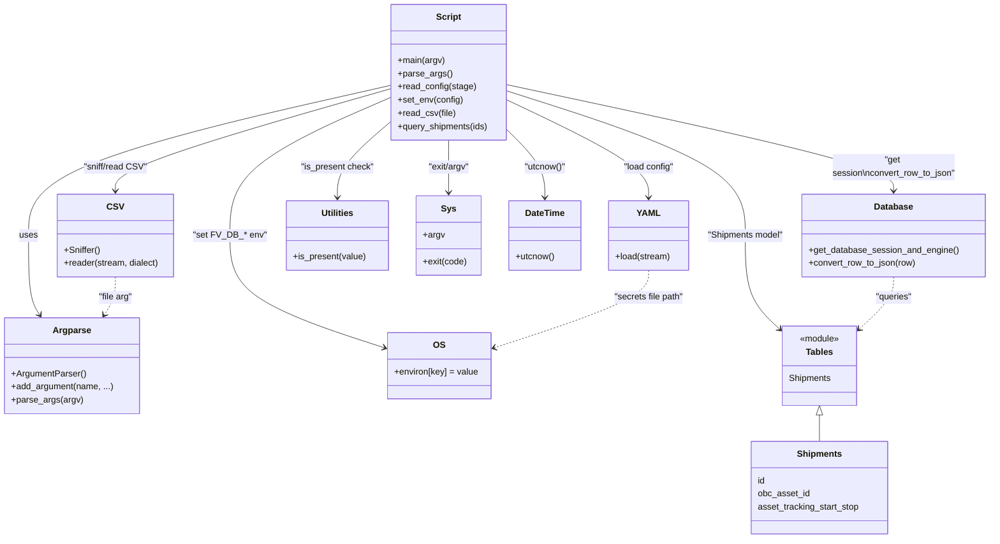

# Diagram: shipment_core/shipment_service/scripts/get_telematics_posts.py

> Auto-generated by Obscura crawlers

## Mermaid

### SVG

<svg id="container" width="1780.30859375" xmlns="http://www.w3.org/2000/svg" class="classDiagram" height="976" viewBox="0 0 1780.30859375 976" role="graphics-document document" aria-roledescription="class"><g><defs><marker id="container_class-aggregationStart" class="marker aggregation class" refX="18" refY="7" markerWidth="190" markerHeight="240" orient="auto"><path d="M 18,7 L9,13 L1,7 L9,1 Z"></path></marker></defs><defs><marker id="container_class-aggregationEnd" class="marker aggregation class" refX="1" refY="7" markerWidth="20" markerHeight="28" orient="auto"><path d="M 18,7 L9,13 L1,7 L9,1 Z"></path></marker></defs><defs><marker id="container_class-extensionStart" class="marker extension class" refX="18" refY="7" markerWidth="190" markerHeight="240" orient="auto"><path d="M 1,7 L18,13 V 1 Z"></path></marker></defs><defs><marker id="container_class-extensionEnd" class="marker extension class" refX="1" refY="7" markerWidth="20" markerHeight="28" orient="auto"><path d="M 1,1 V 13 L18,7 Z"></path></marker></defs><defs><marker id="container_class-compositionStart" class="marker composition class" refX="18" refY="7" markerWidth="190" markerHeight="240" orient="auto"><path d="M 18,7 L9,13 L1,7 L9,1 Z"></path></marker></defs><defs><marker id="container_class-compositionEnd" class="marker composition class" refX="1" refY="7" markerWidth="20" markerHeight="28" orient="auto"><path d="M 18,7 L9,13 L1,7 L9,1 Z"></path></marker></defs><defs><marker id="container_class-dependencyStart" class="marker dependency class" refX="6" refY="7" markerWidth="190" markerHeight="240" orient="auto"><path d="M 5,7 L9,13 L1,7 L9,1 Z"></path></marker></defs><defs><marker id="container_class-dependencyEnd" class="marker dependency class" refX="13" refY="7" markerWidth="20" markerHeight="28" orient="auto"><path d="M 18,7 L9,13 L14,7 L9,1 Z"></path></marker></defs><defs><marker id="container_class-lollipopStart" class="marker lollipop class" refX="13" refY="7" markerWidth="190" markerHeight="240" orient="auto"><circle stroke="black" fill="transparent" cx="7" cy="7" r="6"></circle></marker></defs><defs><marker id="container_class-lollipopEnd" class="marker lollipop class" refX="1" refY="7" markerWidth="190" markerHeight="240" orient="auto"><circle stroke="black" fill="transparent" cx="7" cy="7" r="6"></circle></marker></defs><g class="root"><g class="clusters"></g><g class="edgePaths"><path d="M696.5,155.128L588.709,179.773C480.918,204.419,265.336,253.709,157.545,299.021C49.754,344.333,49.754,385.667,49.754,425C49.754,464.333,49.754,501.667,53.119,525.655C56.484,549.643,63.214,560.286,66.579,565.607L69.944,570.929" id="id_Script_Argparse_1" class="edge-thickness-normal edge-pattern-solid relation" style=";;;" data-edge="true" data-et="edge" data-id="id_Script_Argparse_1" data-points="W3sieCI6Njk2LjUsInkiOjE1NS4xMjc4MDAxMDU5Mjg5fSx7IngiOjQ5Ljc1MzkwNjI1LCJ5IjozMDN9LHsieCI6NDkuNzUzOTA2MjUsInkiOjQyN30seyJ4Ijo0OS43NTM5MDYyNSwieSI6NTM5fSx7IngiOjczLjE1MDQ4NTEzMTA0ODM4LCJ5Ijo1NzZ9XQ==" marker-end="url(#container_class-dependencyEnd)"></path><path d="M907.555,181.455L949.924,201.712C992.293,221.97,1077.031,262.485,1119.4,291.909C1161.77,321.333,1161.77,339.667,1161.77,348.833L1161.77,358" id="id_Script_YAML_2" class="edge-thickness-normal edge-pattern-solid relation" style=";;;" data-edge="true" data-et="edge" data-id="id_Script_YAML_2" data-points="W3sieCI6OTA3LjU1NDY4NzUsInkiOjE4MS40NTQ3NTI3NTI2MjIzfSx7IngiOjExNjEuNzY5NTMxMjUsInkiOjMwM30seyJ4IjoxMTYxLjc2OTUzMTI1LCJ5IjozNjR9XQ==" marker-end="url(#container_class-dependencyEnd)"></path><path d="M696.5,177.326L648.787,198.272C601.074,219.217,505.648,261.109,457.936,302.721C410.223,344.333,410.223,385.667,410.223,425C410.223,464.333,410.223,501.667,456.308,535.541C502.394,569.415,594.565,599.83,640.65,615.038L686.736,630.245" id="id_Script_OS_3" class="edge-thickness-normal edge-pattern-solid relation" style=";;;" data-edge="true" data-et="edge" data-id="id_Script_OS_3" data-points="W3sieCI6Njk2LjUsInkiOjE3Ny4zMjU4OTU3OTQ3fSx7IngiOjQxMC4yMjI2NTYyNSwieSI6MzAzfSx7IngiOjQxMC4yMjI2NTYyNSwieSI6NDI3fSx7IngiOjQxMC4yMjI2NTYyNSwieSI6NTM5fSx7IngiOjY5Mi40MzM1OTM3NSwieSI6NjMyLjEyNTY3ODI4ODUyOTl9XQ==" marker-end="url(#container_class-dependencyEnd)"></path><path d="M696.5,161.482L614.846,185.068C533.191,208.655,369.883,255.827,288.229,286.58C206.574,317.333,206.574,331.667,206.574,338.833L206.574,346" id="id_Script_CSV_4" class="edge-thickness-normal edge-pattern-solid relation" style=";;;" data-edge="true" data-et="edge" data-id="id_Script_CSV_4" data-points="W3sieCI6Njk2LjUsInkiOjE2MS40ODIxNjk1NjYyNDQxOH0seyJ4IjoyMDYuNTc0MjE4NzUsInkiOjMwM30seyJ4IjoyMDYuNTc0MjE4NzUsInkiOjM1Mn1d" marker-end="url(#container_class-dependencyEnd)"></path><path d="M907.555,153.521L1024.29,178.434C1141.025,203.347,1374.495,253.174,1491.23,285.254C1607.965,317.333,1607.965,331.667,1607.965,338.833L1607.965,346" id="id_Script_Database_5" class="edge-thickness-normal edge-pattern-solid relation" style=";;;" data-edge="true" data-et="edge" data-id="id_Script_Database_5" data-points="W3sieCI6OTA3LjU1NDY4NzUsInkiOjE1My41MjEyMjkxNTg1ODg2fSx7IngiOjE2MDcuOTY0ODQzNzUsInkiOjMwM30seyJ4IjoxNjA3Ljk2NDg0Mzc1LCJ5IjozNTJ9XQ==" marker-end="url(#container_class-dependencyEnd)"></path><path d="M907.555,164.825L979.402,187.854C1051.249,210.883,1194.943,256.942,1266.79,300.637C1338.637,344.333,1338.637,385.667,1338.637,425C1338.637,464.333,1338.637,501.667,1348.864,529.751C1359.091,557.835,1379.546,576.669,1389.773,586.087L1400,595.504" id="id_Script_Tables_6" class="edge-thickness-normal edge-pattern-solid relation" style=";;;" data-edge="true" data-et="edge" data-id="id_Script_Tables_6" data-points="W3sieCI6OTA3LjU1NDY4NzUsInkiOjE2NC44MjQ3OTY5MDE4NDMxN30seyJ4IjoxMzM4LjYzNjcxODc1LCJ5IjozMDN9LHsieCI6MTMzOC42MzY3MTg3NSwieSI6NDI3fSx7IngiOjEzMzguNjM2NzE4NzUsInkiOjUzOX0seyJ4IjoxNDA0LjQxNDA2MjUsInkiOjU5OS41Njg0MjgzODA4MDg4fV0=" marker-end="url(#container_class-dependencyEnd)"></path><path d="M696.5,221.376L680.615,234.98C664.73,248.584,632.961,275.792,617.076,298.563C601.191,321.333,601.191,339.667,601.191,348.833L601.191,358" id="id_Script_Utilities_7" class="edge-thickness-normal edge-pattern-solid relation" style=";;;" data-edge="true" data-et="edge" data-id="id_Script_Utilities_7" data-points="W3sieCI6Njk2LjUsInkiOjIyMS4zNzU3NzMxMzU3MjE3N30seyJ4Ijo2MDEuMTkxNDA2MjUsInkiOjMwM30seyJ4Ijo2MDEuMTkxNDA2MjUsInkiOjM2NH1d" marker-end="url(#container_class-dependencyEnd)"></path><path d="M802.027,254L802.027,262.167C802.027,270.333,802.027,286.667,802.027,302.5C802.027,318.333,802.027,333.667,802.027,341.333L802.027,349" id="id_Script_Sys_8" class="edge-thickness-normal edge-pattern-solid relation" style=";;;" data-edge="true" data-et="edge" data-id="id_Script_Sys_8" data-points="W3sieCI6ODAyLjAyNzM0Mzc1LCJ5IjoyNTR9LHsieCI6ODAyLjAyNzM0Mzc1LCJ5IjozMDN9LHsieCI6ODAyLjAyNzM0Mzc1LCJ5IjozNTV9XQ==" marker-end="url(#container_class-dependencyEnd)"></path><path d="M907.555,235.903L918.804,247.086C930.053,258.269,952.552,280.634,963.801,300.984C975.051,321.333,975.051,339.667,975.051,348.833L975.051,358" id="id_Script_DateTime_9" class="edge-thickness-normal edge-pattern-solid relation" style=";;;" data-edge="true" data-et="edge" data-id="id_Script_DateTime_9" data-points="W3sieCI6OTA3LjU1NDY4NzUsInkiOjIzNS45MDMxNDcxNTMxMTMzfSx7IngiOjk3NS4wNTA3ODEyNSwieSI6MzAzfSx7IngiOjk3NS4wNTA3ODEyNSwieSI6MzY0fV0=" marker-end="url(#container_class-dependencyEnd)"></path><path d="M1607.965,502L1607.965,508.167C1607.965,514.333,1607.965,526.667,1597.738,542.251C1587.51,557.835,1567.056,576.669,1556.829,586.087L1546.601,595.504" id="id_Database_Tables_10" class="edge-thickness-normal edge-pattern-dashed relation" style=";;;" data-edge="true" data-et="edge" data-id="id_Database_Tables_10" data-points="W3sieCI6MTYwNy45NjQ4NDM3NSwieSI6NTAyfSx7IngiOjE2MDcuOTY0ODQzNzUsInkiOjUzOX0seyJ4IjoxNTQyLjE4NzUsInkiOjU5OS41Njg0MjgzODA4MDg4fV0=" marker-end="url(#container_class-dependencyEnd)"></path><path d="M206.574,502L206.574,508.167C206.574,514.333,206.574,526.667,203.209,538.155C199.844,549.643,193.114,560.286,189.749,565.607L186.384,570.929" id="id_CSV_Argparse_11" class="edge-thickness-normal edge-pattern-dashed relation" style=";;;" data-edge="true" data-et="edge" data-id="id_CSV_Argparse_11" data-points="W3sieCI6MjA2LjU3NDIxODc1LCJ5Ijo1MDJ9LHsieCI6MjA2LjU3NDIxODc1LCJ5Ijo1Mzl9LHsieCI6MTgzLjE3NzYzOTg2ODk1MTYyLCJ5Ijo1NzZ9XQ==" marker-end="url(#container_class-dependencyEnd)"></path><path d="M1161.77,490L1161.77,498.167C1161.77,506.333,1161.77,522.667,1115.684,546.041C1069.598,569.415,977.427,599.83,931.342,615.038L885.256,630.245" id="id_YAML_OS_12" class="edge-thickness-normal edge-pattern-dashed relation" style=";;;" data-edge="true" data-et="edge" data-id="id_YAML_OS_12" data-points="W3sieCI6MTE2MS43Njk1MzEyNSwieSI6NDkwfSx7IngiOjExNjEuNzY5NTMxMjUsInkiOjUzOX0seyJ4Ijo4NzkuNTU4NTkzNzUsInkiOjYzMi4xMjU2NzgyODg1Mjk5fV0=" marker-end="url(#container_class-dependencyEnd)"></path><path d="M1473.301,752.25L1473.301,756.042C1473.301,759.833,1473.301,767.417,1473.301,775.375C1473.301,783.333,1473.301,791.667,1473.301,795.833L1473.301,800" id="id_Tables_Shipments_13" class="edge-thickness-normal edge-pattern-solid relation" style=";;;" data-edge="true" data-et="edge" data-id="id_Tables_Shipments_13" data-points="W3sieCI6MTQ3My4zMDA3ODEyNSwieSI6NzM1fSx7IngiOjE0NzMuMzAwNzgxMjUsInkiOjc3NX0seyJ4IjoxNDczLjMwMDc4MTI1LCJ5Ijo4MDB9XQ==" marker-start="url(#container_class-extensionStart)"></path></g><g class="edgeLabels"><g class="edgeLabel" transform="translate(49.75390625, 427)"><g class="label" data-id="id_Script_Argparse_1" transform="translate(-16.4921875, -12)"><foreignObject width="32.984375" height="24">

uses

</foreignObject></g></g><g class="edgeLabel" transform="translate(1161.76953125, 303)"><g class="label" data-id="id_Script_YAML_2" transform="translate(-46.3203125, -12)"><foreignObject width="92.640625" height="24">

"load config"

</foreignObject></g></g><g class="edgeLabel" transform="translate(410.22265625, 427)"><g class="label" data-id="id_Script_OS_3" transform="translate(-63.3203125, -12)"><foreignObject width="126.640625" height="24">

"set FV_DB_* env"

</foreignObject></g></g><g class="edgeLabel" transform="translate(206.57421875, 303)"><g class="label" data-id="id_Script_CSV_4" transform="translate(-57.5859375, -12)"><foreignObject width="115.171875" height="24">

"sniff/read CSV"

</foreignObject></g></g><g class="edgeLabel" transform="translate(1607.96484375, 303)"><g class="label" data-id="id_Script_Database_5" transform="translate(-114.3125, -24)"><foreignObject width="228.625" height="48">

"get session\nconvert_row_to_json"

</foreignObject></g></g><g class="edgeLabel" transform="translate(1338.63671875, 427)"><g class="label" data-id="id_Script_Tables_6" transform="translate(-69.984375, -12)"><foreignObject width="139.96875" height="24">

"Shipments model"

</foreignObject></g></g><g class="edgeLabel" transform="translate(601.19140625, 303)"><g class="label" data-id="id_Script_Utilities_7" transform="translate(-66.921875, -12)"><foreignObject width="133.84375" height="24">

"is_present check"

</foreignObject></g></g><g class="edgeLabel" transform="translate(802.02734375, 303)"><g class="label" data-id="id_Script_Sys_8" transform="translate(-38.796875, -12)"><foreignObject width="77.59375" height="24">

"exit/argv"

</foreignObject></g></g><g class="edgeLabel" transform="translate(975.05078125, 303)"><g class="label" data-id="id_Script_DateTime_9" transform="translate(-37.9140625, -12)"><foreignObject width="75.828125" height="24">

"utcnow()"

</foreignObject></g></g><g class="edgeLabel" transform="translate(1607.96484375, 539)"><g class="label" data-id="id_Database_Tables_10" transform="translate(-33.4296875, -12)"><foreignObject width="66.859375" height="24">

"queries"

</foreignObject></g></g><g class="edgeLabel" transform="translate(206.57421875, 539)"><g class="label" data-id="id_CSV_Argparse_11" transform="translate(-31.25, -12)"><foreignObject width="62.5" height="24">

"file arg"

</foreignObject></g></g><g class="edgeLabel" transform="translate(1161.76953125, 539)"><g class="label" data-id="id_YAML_OS_12" transform="translate(-64.0859375, -12)"><foreignObject width="128.171875" height="24">

"secrets file path"

</foreignObject></g></g><g class="edgeLabel"><g class="label" data-id="id_Tables_Shipments_13" transform="translate(0, 0)"><foreignObject width="0" height="0">

</foreignObject></g></g></g><g class="nodes"><g class="node default" id="classId-Script-0" transform="translate(802.02734375, 131)"><g class="basic label-container"><path d="M-105.52734375 -123 L105.52734375 -123 L105.52734375 123 L-105.52734375 123" stroke="none" stroke-width="0" fill="#ECECFF" style=""></path><path d="M-105.52734375 -123 C-52.212590511566745 -123, 1.10216272686651 -123, 105.52734375 -123 M-105.52734375 -123 C-58.57472593157557 -123, -11.622108113151143 -123, 105.52734375 -123 M105.52734375 -123 C105.52734375 -73.61344180528971, 105.52734375 -24.22688361057942, 105.52734375 123 M105.52734375 -123 C105.52734375 -64.3690451907215, 105.52734375 -5.738090381442987, 105.52734375 123 M105.52734375 123 C58.40317580155858 123, 11.279007853117164 123, -105.52734375 123 M105.52734375 123 C22.332674315565953 123, -60.861995118868094 123, -105.52734375 123 M-105.52734375 123 C-105.52734375 28.51109909937705, -105.52734375 -65.9778018012459, -105.52734375 -123 M-105.52734375 123 C-105.52734375 64.19475562841403, -105.52734375 5.389511256828058, -105.52734375 -123" stroke="#9370DB" stroke-width="1.3" fill="none" stroke-dasharray="0 0" style=""></path></g><g class="annotation-group text" transform="translate(0, -99)"></g><g class="label-group text" transform="translate(-21.7421875, -99)"><g class="label" style="font-weight: bolder" transform="translate(0,-12)"><foreignObject width="43.484375" height="24">

Script

</foreignObject></g></g><g class="members-group text" transform="translate(-93.52734375, -51)"></g><g class="methods-group text" transform="translate(-93.52734375, -21)"><g class="label" style="" transform="translate(0,-12)"><foreignObject width="85.5" height="24">

+main(argv)

</foreignObject></g><g class="label" style="" transform="translate(0,12)"><foreignObject width="96.53125" height="24">

+parse_args()

</foreignObject></g><g class="label" style="" transform="translate(0,36)"><foreignObject width="140.921875" height="24">

+read_config(stage)

</foreignObject></g><g class="label" style="" transform="translate(0,60)"><foreignObject width="117.75" height="24">

+set_env(config)

</foreignObject></g><g class="label" style="" transform="translate(0,84)"><foreignObject width="104.140625" height="24">

+read_csv(file)

</foreignObject></g><g class="label" style="" transform="translate(0,108)"><foreignObject width="165.3125" height="24">

+query_shipments(ids)

</foreignObject></g></g><g class="divider" style=""><path d="M-105.52734375 -75 C-53.08891354731241 -75, -0.650483344624817 -75, 105.52734375 -75 M-105.52734375 -75 C-25.234346153141487 -75, 55.058651443717025 -75, 105.52734375 -75" stroke="#9370DB" stroke-width="1.3" fill="none" stroke-dasharray="0 0" style=""></path></g><g class="divider" style=""><path d="M-105.52734375 -51 C-31.5889813641583 -51, 42.3493810216834 -51, 105.52734375 -51 M-105.52734375 -51 C-29.4160962948349 -51, 46.6951511603302 -51, 105.52734375 -51" stroke="#9370DB" stroke-width="1.3" fill="none" stroke-dasharray="0 0" style=""></path></g></g><g class="node default" id="classId-Argparse-1" transform="translate(128.1640625, 663)"><g class="basic label-container"><path d="M-120.1640625 -87 L120.1640625 -87 L120.1640625 87 L-120.1640625 87" stroke="none" stroke-width="0" fill="#ECECFF" style=""></path><path d="M-120.1640625 -87 C-49.642593096972405 -87, 20.87887630605519 -87, 120.1640625 -87 M-120.1640625 -87 C-39.995542521235436 -87, 40.17297745752913 -87, 120.1640625 -87 M120.1640625 -87 C120.1640625 -25.438943164197298, 120.1640625 36.122113671605405, 120.1640625 87 M120.1640625 -87 C120.1640625 -23.04931603492419, 120.1640625 40.90136793015162, 120.1640625 87 M120.1640625 87 C57.53212365297562 87, -5.099815194048759 87, -120.1640625 87 M120.1640625 87 C33.65179875477776 87, -52.860464990444484 87, -120.1640625 87 M-120.1640625 87 C-120.1640625 26.261351515952995, -120.1640625 -34.47729696809401, -120.1640625 -87 M-120.1640625 87 C-120.1640625 48.71747735957853, -120.1640625 10.434954719157062, -120.1640625 -87" stroke="#9370DB" stroke-width="1.3" fill="none" stroke-dasharray="0 0" style=""></path></g><g class="annotation-group text" transform="translate(0, -63)"></g><g class="label-group text" transform="translate(-32.71875, -63)"><g class="label" style="font-weight: bolder" transform="translate(0,-12)"><foreignObject width="65.4375" height="24">

Argparse

</foreignObject></g></g><g class="members-group text" transform="translate(-108.1640625, -15)"></g><g class="methods-group text" transform="translate(-108.1640625, 15)"><g class="label" style="" transform="translate(0,-12)"><foreignObject width="133.78125" height="24">

+ArgumentParser()

</foreignObject></g><g class="label" style="" transform="translate(0,12)"><foreignObject width="183.609375" height="24">

+add_argument(name, ...)

</foreignObject></g><g class="label" style="" transform="translate(0,36)"><foreignObject width="127.375" height="24">

+parse_args(argv)

</foreignObject></g></g><g class="divider" style=""><path d="M-120.1640625 -39 C-55.0725672940289 -39, 10.0189279119422 -39, 120.1640625 -39 M-120.1640625 -39 C-58.103634005186855 -39, 3.95679448962629 -39, 120.1640625 -39" stroke="#9370DB" stroke-width="1.3" fill="none" stroke-dasharray="0 0" style=""></path></g><g class="divider" style=""><path d="M-120.1640625 -15 C-42.97968137637615 -15, 34.2046997472477 -15, 120.1640625 -15 M-120.1640625 -15 C-53.72619420092542 -15, 12.71167409814916 -15, 120.1640625 -15" stroke="#9370DB" stroke-width="1.3" fill="none" stroke-dasharray="0 0" style=""></path></g></g><g class="node default" id="classId-YAML-2" transform="translate(1161.76953125, 427)"><g class="basic label-container"><path d="M-71.8828125 -63 L71.8828125 -63 L71.8828125 63 L-71.8828125 63" stroke="none" stroke-width="0" fill="#ECECFF" style=""></path><path d="M-71.8828125 -63 C-22.13425546150836 -63, 27.61430157698328 -63, 71.8828125 -63 M-71.8828125 -63 C-24.546394558580197 -63, 22.790023382839607 -63, 71.8828125 -63 M71.8828125 -63 C71.8828125 -23.694971466452223, 71.8828125 15.610057067095553, 71.8828125 63 M71.8828125 -63 C71.8828125 -13.7656216176888, 71.8828125 35.4687567646224, 71.8828125 63 M71.8828125 63 C42.28680374306773 63, 12.690794986135458 63, -71.8828125 63 M71.8828125 63 C40.60484602931392 63, 9.326879558627837 63, -71.8828125 63 M-71.8828125 63 C-71.8828125 36.75771746429456, -71.8828125 10.515434928589123, -71.8828125 -63 M-71.8828125 63 C-71.8828125 18.588267310844003, -71.8828125 -25.823465378311994, -71.8828125 -63" stroke="#9370DB" stroke-width="1.3" fill="none" stroke-dasharray="0 0" style=""></path></g><g class="annotation-group text" transform="translate(0, -39)"></g><g class="label-group text" transform="translate(-19.421875, -39)"><g class="label" style="font-weight: bolder" transform="translate(0,-12)"><foreignObject width="38.84375" height="24">

YAML

</foreignObject></g></g><g class="members-group text" transform="translate(-59.8828125, 9)"></g><g class="methods-group text" transform="translate(-59.8828125, 39)"><g class="label" style="" transform="translate(0,-12)"><foreignObject width="100.34375" height="24">

+load(stream)

</foreignObject></g></g><g class="divider" style=""><path d="M-71.8828125 -15 C-33.86391986914097 -15, 4.1549727617180565 -15, 71.8828125 -15 M-71.8828125 -15 C-33.99492613849376 -15, 3.89296022301248 -15, 71.8828125 -15" stroke="#9370DB" stroke-width="1.3" fill="none" stroke-dasharray="0 0" style=""></path></g><g class="divider" style=""><path d="M-71.8828125 9 C-39.81317404045569 9, -7.743535580911384 9, 71.8828125 9 M-71.8828125 9 C-41.841171397571514 9, -11.799530295143022 9, 71.8828125 9" stroke="#9370DB" stroke-width="1.3" fill="none" stroke-dasharray="0 0" style=""></path></g></g><g class="node default" id="classId-OS-3" transform="translate(785.99609375, 663)"><g class="basic label-container"><path d="M-93.5625 -60 L93.5625 -60 L93.5625 60 L-93.5625 60" stroke="none" stroke-width="0" fill="#ECECFF" style=""></path><path d="M-93.5625 -60 C-41.886878005204494 -60, 9.788743989591012 -60, 93.5625 -60 M-93.5625 -60 C-22.472007447938637 -60, 48.618485104122726 -60, 93.5625 -60 M93.5625 -60 C93.5625 -23.143629045251295, 93.5625 13.71274190949741, 93.5625 60 M93.5625 -60 C93.5625 -19.664781382498, 93.5625 20.670437235004, 93.5625 60 M93.5625 60 C34.709276559669455 60, -24.14394688066109 60, -93.5625 60 M93.5625 60 C54.60779467703273 60, 15.653089354065457 60, -93.5625 60 M-93.5625 60 C-93.5625 28.13333578050733, -93.5625 -3.733328438985339, -93.5625 -60 M-93.5625 60 C-93.5625 13.115508170077469, -93.5625 -33.76898365984506, -93.5625 -60" stroke="#9370DB" stroke-width="1.3" fill="none" stroke-dasharray="0 0" style=""></path></g><g class="annotation-group text" transform="translate(0, -36)"></g><g class="label-group text" transform="translate(-10.109375, -36)"><g class="label" style="font-weight: bolder" transform="translate(0,-12)"><foreignObject width="20.21875" height="24">

OS

</foreignObject></g></g><g class="members-group text" transform="translate(-81.5625, 12)"><g class="label" style="" transform="translate(0,-12)"><foreignObject width="153.015625" height="24">

+environ[key] = value

</foreignObject></g></g><g class="methods-group text" transform="translate(-81.5625, 60)"></g><g class="divider" style=""><path d="M-93.5625 -12 C-34.89035304815274 -12, 23.78179390369452 -12, 93.5625 -12 M-93.5625 -12 C-38.671327013266385 -12, 16.21984597346723 -12, 93.5625 -12" stroke="#9370DB" stroke-width="1.3" fill="none" stroke-dasharray="0 0" style=""></path></g><g class="divider" style=""><path d="M-93.5625 36 C-29.13451389620876 36, 35.29347220758248 36, 93.5625 36 M-93.5625 36 C-46.530332078401564 36, 0.5018358431968721 36, 93.5625 36" stroke="#9370DB" stroke-width="1.3" fill="none" stroke-dasharray="0 0" style=""></path></g></g><g class="node default" id="classId-CSV-4" transform="translate(206.57421875, 427)"><g class="basic label-container"><path d="M-105.328125 -75 L105.328125 -75 L105.328125 75 L-105.328125 75" stroke="none" stroke-width="0" fill="#ECECFF" style=""></path><path d="M-105.328125 -75 C-40.20029309316719 -75, 24.92753881366562 -75, 105.328125 -75 M-105.328125 -75 C-61.64930462608066 -75, -17.970484252161313 -75, 105.328125 -75 M105.328125 -75 C105.328125 -40.49183611729286, 105.328125 -5.983672234585725, 105.328125 75 M105.328125 -75 C105.328125 -24.065768987900654, 105.328125 26.868462024198692, 105.328125 75 M105.328125 75 C51.81237692921023 75, -1.703371141579538 75, -105.328125 75 M105.328125 75 C41.14814961202778 75, -23.03182577594444 75, -105.328125 75 M-105.328125 75 C-105.328125 28.130426033064836, -105.328125 -18.739147933870328, -105.328125 -75 M-105.328125 75 C-105.328125 17.809008736896494, -105.328125 -39.38198252620701, -105.328125 -75" stroke="#9370DB" stroke-width="1.3" fill="none" stroke-dasharray="0 0" style=""></path></g><g class="annotation-group text" transform="translate(0, -51)"></g><g class="label-group text" transform="translate(-13.5, -51)"><g class="label" style="font-weight: bolder" transform="translate(0,-12)"><foreignObject width="27" height="24">

CSV

</foreignObject></g></g><g class="members-group text" transform="translate(-93.328125, -3)"></g><g class="methods-group text" transform="translate(-93.328125, 27)"><g class="label" style="" transform="translate(0,-12)"><foreignObject width="65.78125" height="24">

+Sniffer()

</foreignObject></g><g class="label" style="" transform="translate(0,12)"><foreignObject width="173.15625" height="24">

+reader(stream, dialect)

</foreignObject></g></g><g class="divider" style=""><path d="M-105.328125 -27 C-61.9022656061078 -27, -18.476406212215593 -27, 105.328125 -27 M-105.328125 -27 C-58.86095526429669 -27, -12.393785528593384 -27, 105.328125 -27" stroke="#9370DB" stroke-width="1.3" fill="none" stroke-dasharray="0 0" style=""></path></g><g class="divider" style=""><path d="M-105.328125 -3 C-56.88219824966158 -3, -8.436271499323155 -3, 105.328125 -3 M-105.328125 -3 C-23.513909446480696 -3, 58.30030610703861 -3, 105.328125 -3" stroke="#9370DB" stroke-width="1.3" fill="none" stroke-dasharray="0 0" style=""></path></g></g><g class="node default" id="classId-Database-5" transform="translate(1607.96484375, 427)"><g class="basic label-container"><path d="M-164.34375 -75 L164.34375 -75 L164.34375 75 L-164.34375 75" stroke="none" stroke-width="0" fill="#ECECFF" style=""></path><path d="M-164.34375 -75 C-37.678688568808994 -75, 88.98637286238201 -75, 164.34375 -75 M-164.34375 -75 C-96.93926098505874 -75, -29.534771970117475 -75, 164.34375 -75 M164.34375 -75 C164.34375 -39.89684766107463, 164.34375 -4.7936953221492615, 164.34375 75 M164.34375 -75 C164.34375 -36.23072166520001, 164.34375 2.538556669599984, 164.34375 75 M164.34375 75 C75.3567875039874 75, -13.63017499202519 75, -164.34375 75 M164.34375 75 C96.25551356661035 75, 28.167277133220693 75, -164.34375 75 M-164.34375 75 C-164.34375 32.26478179691942, -164.34375 -10.470436406161156, -164.34375 -75 M-164.34375 75 C-164.34375 34.203670980552396, -164.34375 -6.592658038895209, -164.34375 -75" stroke="#9370DB" stroke-width="1.3" fill="none" stroke-dasharray="0 0" style=""></path></g><g class="annotation-group text" transform="translate(0, -51)"></g><g class="label-group text" transform="translate(-34.171875, -51)"><g class="label" style="font-weight: bolder" transform="translate(0,-12)"><foreignObject width="68.34375" height="24">

Database

</foreignObject></g></g><g class="members-group text" transform="translate(-152.34375, -3)"></g><g class="methods-group text" transform="translate(-152.34375, 27)"><g class="label" style="" transform="translate(0,-12)"><foreignObject width="270.515625" height="24">

+get_database_session_and_engine()

</foreignObject></g><g class="label" style="" transform="translate(0,12)"><foreignObject width="195.921875" height="24">

+convert_row_to_json(row)

</foreignObject></g></g><g class="divider" style=""><path d="M-164.34375 -27 C-33.99994248420052 -27, 96.34386503159897 -27, 164.34375 -27 M-164.34375 -27 C-78.73991165075967 -27, 6.863926698480668 -27, 164.34375 -27" stroke="#9370DB" stroke-width="1.3" fill="none" stroke-dasharray="0 0" style=""></path></g><g class="divider" style=""><path d="M-164.34375 -3 C-43.75315366019973 -3, 76.83744267960054 -3, 164.34375 -3 M-164.34375 -3 C-56.64557371459496 -3, 51.05260257081008 -3, 164.34375 -3" stroke="#9370DB" stroke-width="1.3" fill="none" stroke-dasharray="0 0" style=""></path></g></g><g class="node default" id="classId-Tables-6" transform="translate(1473.30078125, 663)"><g class="basic label-container"><path d="M-68.88671875 -72 L68.88671875 -72 L68.88671875 72 L-68.88671875 72" stroke="none" stroke-width="0" fill="#ECECFF" style=""></path><path d="M-68.88671875 -72 C-31.782147784599907 -72, 5.322423180800186 -72, 68.88671875 -72 M-68.88671875 -72 C-14.641511989666412 -72, 39.603694770667175 -72, 68.88671875 -72 M68.88671875 -72 C68.88671875 -16.857903136574706, 68.88671875 38.28419372685059, 68.88671875 72 M68.88671875 -72 C68.88671875 -42.639976395742984, 68.88671875 -13.279952791485968, 68.88671875 72 M68.88671875 72 C32.97735854825835 72, -2.9320016534832973 72, -68.88671875 72 M68.88671875 72 C21.676268565687238 72, -25.534181618625524 72, -68.88671875 72 M-68.88671875 72 C-68.88671875 25.030436207494937, -68.88671875 -21.939127585010127, -68.88671875 -72 M-68.88671875 72 C-68.88671875 24.989838624550686, -68.88671875 -22.02032275089863, -68.88671875 -72" stroke="#9370DB" stroke-width="1.3" fill="none" stroke-dasharray="0 0" style=""></path></g><g class="annotation-group text" transform="translate(-36.6015625, -48)"><g class="label" style="" transform="translate(0,-12)"><foreignObject width="73.203125" height="24">

«module»

</foreignObject></g></g><g class="label-group text" transform="translate(-23.703125, -24)"><g class="label" style="font-weight: bolder" transform="translate(0,-12)"><foreignObject width="47.40625" height="24">

Tables

</foreignObject></g></g><g class="members-group text" transform="translate(-56.88671875, 24)"><g class="label" style="" transform="translate(0,-12)"><foreignObject width="77.171875" height="24">

Shipments

</foreignObject></g></g><g class="methods-group text" transform="translate(-56.88671875, 72)"></g><g class="divider" style=""><path d="M-68.88671875 0 C-20.53682735438801 0, 27.81306404122398 0, 68.88671875 0 M-68.88671875 0 C-14.969632614371093 0, 38.94745352125781 0, 68.88671875 0" stroke="#9370DB" stroke-width="1.3" fill="none" stroke-dasharray="0 0" style=""></path></g><g class="divider" style=""><path d="M-68.88671875 48 C-24.235522195460348 48, 20.415674359079304 48, 68.88671875 48 M-68.88671875 48 C-39.85979344578038 48, -10.832868141560773 48, 68.88671875 48" stroke="#9370DB" stroke-width="1.3" fill="none" stroke-dasharray="0 0" style=""></path></g></g><g class="node default" id="classId-Utilities-7" transform="translate(601.19140625, 427)"><g class="basic label-container"><path d="M-92.6484375 -63 L92.6484375 -63 L92.6484375 63 L-92.6484375 63" stroke="none" stroke-width="0" fill="#ECECFF" style=""></path><path d="M-92.6484375 -63 C-33.79309832730546 -63, 25.062240845389084 -63, 92.6484375 -63 M-92.6484375 -63 C-21.124825550479358 -63, 50.398786399041285 -63, 92.6484375 -63 M92.6484375 -63 C92.6484375 -22.895380335842134, 92.6484375 17.209239328315732, 92.6484375 63 M92.6484375 -63 C92.6484375 -23.250512851780698, 92.6484375 16.498974296438604, 92.6484375 63 M92.6484375 63 C48.19533051924811 63, 3.7422235384962192 63, -92.6484375 63 M92.6484375 63 C23.353853859652688 63, -45.940729780694625 63, -92.6484375 63 M-92.6484375 63 C-92.6484375 27.271297608246996, -92.6484375 -8.457404783506007, -92.6484375 -63 M-92.6484375 63 C-92.6484375 34.32563635874988, -92.6484375 5.651272717499765, -92.6484375 -63" stroke="#9370DB" stroke-width="1.3" fill="none" stroke-dasharray="0 0" style=""></path></g><g class="annotation-group text" transform="translate(0, -39)"></g><g class="label-group text" transform="translate(-28.8125, -39)"><g class="label" style="font-weight: bolder" transform="translate(0,-12)"><foreignObject width="57.625" height="24">

Utilities

</foreignObject></g></g><g class="members-group text" transform="translate(-80.6484375, 9)"></g><g class="methods-group text" transform="translate(-80.6484375, 39)"><g class="label" style="" transform="translate(0,-12)"><foreignObject width="132.484375" height="24">

+is_present(value)

</foreignObject></g></g><g class="divider" style=""><path d="M-92.6484375 -15 C-20.420204015595928 -15, 51.808029468808144 -15, 92.6484375 -15 M-92.6484375 -15 C-28.52895492635193 -15, 35.59052764729614 -15, 92.6484375 -15" stroke="#9370DB" stroke-width="1.3" fill="none" stroke-dasharray="0 0" style=""></path></g><g class="divider" style=""><path d="M-92.6484375 9 C-26.197084744813765 9, 40.25426801037247 9, 92.6484375 9 M-92.6484375 9 C-53.98466340013463 9, -15.320889300269258 9, 92.6484375 9" stroke="#9370DB" stroke-width="1.3" fill="none" stroke-dasharray="0 0" style=""></path></g></g><g class="node default" id="classId-Sys-8" transform="translate(802.02734375, 427)"><g class="basic label-container"><path d="M-58.1875 -72 L58.1875 -72 L58.1875 72 L-58.1875 72" stroke="none" stroke-width="0" fill="#ECECFF" style=""></path><path d="M-58.1875 -72 C-28.30497511423247 -72, 1.577549771535061 -72, 58.1875 -72 M-58.1875 -72 C-27.269293666984893 -72, 3.6489126660302134 -72, 58.1875 -72 M58.1875 -72 C58.1875 -41.64768102647004, 58.1875 -11.295362052940085, 58.1875 72 M58.1875 -72 C58.1875 -17.941977088532802, 58.1875 36.116045822934396, 58.1875 72 M58.1875 72 C13.071703332473156 72, -32.04409333505369 72, -58.1875 72 M58.1875 72 C27.408784049245092 72, -3.3699319015098155 72, -58.1875 72 M-58.1875 72 C-58.1875 16.57522233911594, -58.1875 -38.84955532176812, -58.1875 -72 M-58.1875 72 C-58.1875 15.398138983776867, -58.1875 -41.203722032446265, -58.1875 -72" stroke="#9370DB" stroke-width="1.3" fill="none" stroke-dasharray="0 0" style=""></path></g><g class="annotation-group text" transform="translate(0, -48)"></g><g class="label-group text" transform="translate(-12.4375, -48)"><g class="label" style="font-weight: bolder" transform="translate(0,-12)"><foreignObject width="24.875" height="24">

Sys

</foreignObject></g></g><g class="members-group text" transform="translate(-46.1875, 0)"><g class="label" style="" transform="translate(0,-12)"><foreignObject width="38.578125" height="24">

+argv

</foreignObject></g></g><g class="methods-group text" transform="translate(-46.1875, 48)"><g class="label" style="" transform="translate(0,-12)"><foreignObject width="79.9375" height="24">

+exit(code)

</foreignObject></g></g><g class="divider" style=""><path d="M-58.1875 -24 C-33.828388221282175 -24, -9.46927644256435 -24, 58.1875 -24 M-58.1875 -24 C-34.861110497757004 -24, -11.534720995514007 -24, 58.1875 -24" stroke="#9370DB" stroke-width="1.3" fill="none" stroke-dasharray="0 0" style=""></path></g><g class="divider" style=""><path d="M-58.1875 24 C-25.869309623534292 24, 6.448880752931416 24, 58.1875 24 M-58.1875 24 C-14.122121123079815 24, 29.94325775384037 24, 58.1875 24" stroke="#9370DB" stroke-width="1.3" fill="none" stroke-dasharray="0 0" style=""></path></g></g><g class="node default" id="classId-DateTime-9" transform="translate(975.05078125, 427)"><g class="basic label-container"><path d="M-64.8359375 -63 L64.8359375 -63 L64.8359375 63 L-64.8359375 63" stroke="none" stroke-width="0" fill="#ECECFF" style=""></path><path d="M-64.8359375 -63 C-25.615366009542328 -63, 13.605205480915345 -63, 64.8359375 -63 M-64.8359375 -63 C-35.44171763838325 -63, -6.047497776766498 -63, 64.8359375 -63 M64.8359375 -63 C64.8359375 -23.701990802368194, 64.8359375 15.596018395263613, 64.8359375 63 M64.8359375 -63 C64.8359375 -21.344071654905626, 64.8359375 20.311856690188748, 64.8359375 63 M64.8359375 63 C29.854549643083416 63, -5.126838213833167 63, -64.8359375 63 M64.8359375 63 C16.603560593031034 63, -31.628816313937932 63, -64.8359375 63 M-64.8359375 63 C-64.8359375 21.113769197404352, -64.8359375 -20.772461605191296, -64.8359375 -63 M-64.8359375 63 C-64.8359375 30.373871090325565, -64.8359375 -2.25225781934887, -64.8359375 -63" stroke="#9370DB" stroke-width="1.3" fill="none" stroke-dasharray="0 0" style=""></path></g><g class="annotation-group text" transform="translate(0, -39)"></g><g class="label-group text" transform="translate(-34.625, -39)"><g class="label" style="font-weight: bolder" transform="translate(0,-12)"><foreignObject width="69.25" height="24">

DateTime

</foreignObject></g></g><g class="members-group text" transform="translate(-52.8359375, 9)"></g><g class="methods-group text" transform="translate(-52.8359375, 39)"><g class="label" style="" transform="translate(0,-12)"><foreignObject width="71.046875" height="24">

+utcnow()

</foreignObject></g></g><g class="divider" style=""><path d="M-64.8359375 -15 C-15.23357531056984 -15, 34.36878687886032 -15, 64.8359375 -15 M-64.8359375 -15 C-23.254576015603597 -15, 18.326785468792806 -15, 64.8359375 -15" stroke="#9370DB" stroke-width="1.3" fill="none" stroke-dasharray="0 0" style=""></path></g><g class="divider" style=""><path d="M-64.8359375 9 C-35.66557305516304 9, -6.495208610326081 9, 64.8359375 9 M-64.8359375 9 C-33.61552340707317 9, -2.395109314146339 9, 64.8359375 9" stroke="#9370DB" stroke-width="1.3" fill="none" stroke-dasharray="0 0" style=""></path></g></g><g class="node default" id="classId-Shipments-10" transform="translate(1473.30078125, 884)"><g class="basic label-container"><path d="M-124.6484375 -84 L124.6484375 -84 L124.6484375 84 L-124.6484375 84" stroke="none" stroke-width="0" fill="#ECECFF" style=""></path><path d="M-124.6484375 -84 C-40.28256710539037 -84, 44.08330328921926 -84, 124.6484375 -84 M-124.6484375 -84 C-33.505676180059695 -84, 57.63708513988061 -84, 124.6484375 -84 M124.6484375 -84 C124.6484375 -21.857791812279473, 124.6484375 40.284416375441054, 124.6484375 84 M124.6484375 -84 C124.6484375 -28.8379971522521, 124.6484375 26.3240056954958, 124.6484375 84 M124.6484375 84 C39.75159426029843 84, -45.145248979403135 84, -124.6484375 84 M124.6484375 84 C40.086873528127114 84, -44.47469044374577 84, -124.6484375 84 M-124.6484375 84 C-124.6484375 19.14734425491386, -124.6484375 -45.70531149017228, -124.6484375 -84 M-124.6484375 84 C-124.6484375 18.216700303289358, -124.6484375 -47.566599393421285, -124.6484375 -84" stroke="#9370DB" stroke-width="1.3" fill="none" stroke-dasharray="0 0" style=""></path></g><g class="annotation-group text" transform="translate(0, -60)"></g><g class="label-group text" transform="translate(-38.96875, -60)"><g class="label" style="font-weight: bolder" transform="translate(0,-12)"><foreignObject width="77.9375" height="24">

Shipments

</foreignObject></g></g><g class="members-group text" transform="translate(-112.6484375, -12)"><g class="label" style="" transform="translate(0,-12)"><foreignObject width="14.09375" height="24">

id

</foreignObject></g><g class="label" style="" transform="translate(0,12)"><foreignObject width="94.734375" height="24">

obc_asset_id

</foreignObject></g><g class="label" style="" transform="translate(0,36)"><foreignObject width="186.328125" height="24">

asset_tracking_start_stop

</foreignObject></g></g><g class="methods-group text" transform="translate(-112.6484375, 84)"></g><g class="divider" style=""><path d="M-124.6484375 -36 C-53.45170544946423 -36, 17.745026601071544 -36, 124.6484375 -36 M-124.6484375 -36 C-65.84893081071708 -36, -7.049424121434157 -36, 124.6484375 -36" stroke="#9370DB" stroke-width="1.3" fill="none" stroke-dasharray="0 0" style=""></path></g><g class="divider" style=""><path d="M-124.6484375 60 C-60.035235609767454 60, 4.577966280465091 60, 124.6484375 60 M-124.6484375 60 C-27.505721558803472 60, 69.63699438239306 60, 124.6484375 60" stroke="#9370DB" stroke-width="1.3" fill="none" stroke-dasharray="0 0" style=""></path></g></g></g></g></g></svg>
