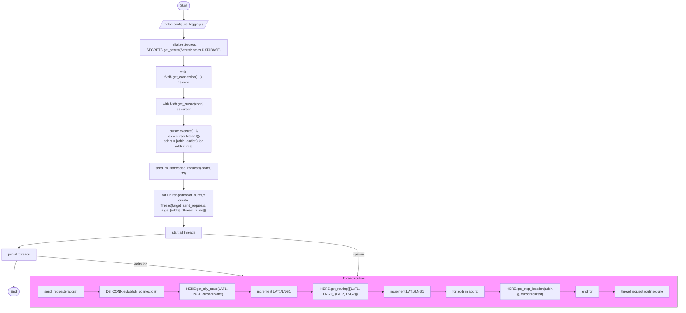

# Diagram: shipment_core/shipment_service/scripts/here_test.py

> Auto-generated by Obscura crawlers

## Mermaid

### SVG

<svg id="container" width="3198.450927734375" xmlns="http://www.w3.org/2000/svg" class="flowchart" height="1486" viewBox="0 0 3198.450927734375 1486" role="graphics-document document" aria-roledescription="flowchart-v2"><g><marker id="container_flowchart-v2-pointEnd" class="marker flowchart-v2" viewBox="0 0 10 10" refX="5" refY="5" markerUnits="userSpaceOnUse" markerWidth="8" markerHeight="8" orient="auto"><path d="M 0 0 L 10 5 L 0 10 z" class="arrowMarkerPath" style="stroke-width: 1; stroke-dasharray: 1, 0;"></path></marker><marker id="container_flowchart-v2-pointStart" class="marker flowchart-v2" viewBox="0 0 10 10" refX="4.5" refY="5" markerUnits="userSpaceOnUse" markerWidth="8" markerHeight="8" orient="auto"><path d="M 0 5 L 10 10 L 10 0 z" class="arrowMarkerPath" style="stroke-width: 1; stroke-dasharray: 1, 0;"></path></marker><marker id="container_flowchart-v2-circleEnd" class="marker flowchart-v2" viewBox="0 0 10 10" refX="11" refY="5" markerUnits="userSpaceOnUse" markerWidth="11" markerHeight="11" orient="auto"><circle cx="5" cy="5" r="5" class="arrowMarkerPath" style="stroke-width: 1; stroke-dasharray: 1, 0;"></circle></marker><marker id="container_flowchart-v2-circleStart" class="marker flowchart-v2" viewBox="0 0 10 10" refX="-1" refY="5" markerUnits="userSpaceOnUse" markerWidth="11" markerHeight="11" orient="auto"><circle cx="5" cy="5" r="5" class="arrowMarkerPath" style="stroke-width: 1; stroke-dasharray: 1, 0;"></circle></marker><marker id="container_flowchart-v2-crossEnd" class="marker cross flowchart-v2" viewBox="0 0 11 11" refX="12" refY="5.2" markerUnits="userSpaceOnUse" markerWidth="11" markerHeight="11" orient="auto"><path d="M 1,1 l 9,9 M 10,1 l -9,9" class="arrowMarkerPath" style="stroke-width: 2; stroke-dasharray: 1, 0;"></path></marker><marker id="container_flowchart-v2-crossStart" class="marker cross flowchart-v2" viewBox="0 0 11 11" refX="-1" refY="5.2" markerUnits="userSpaceOnUse" markerWidth="11" markerHeight="11" orient="auto"><path d="M 1,1 l 9,9 M 10,1 l -9,9" class="arrowMarkerPath" style="stroke-width: 2; stroke-dasharray: 1, 0;"></path></marker><g class="root"><g class="clusters"></g><g class="edgePaths"><path d="M867.339,47.5L867.255,51.583C867.172,55.667,867.005,63.833,866.992,71.5C866.979,79.167,867.12,86.334,867.19,89.917L867.26,93.501" id="L_Start_ConfigureLogging_0" class="edge-thickness-normal edge-pattern-solid edge-thickness-normal edge-pattern-solid flowchart-link" style=";" data-edge="true" data-et="edge" data-id="L_Start_ConfigureLogging_0" data-points="W3sieCI6ODY3LjMzODc0MDM0ODgxNTksInkiOjQ3LjV9LHsieCI6ODY2LjgzODc0MDM0ODgxNTksInkiOjcyfSx7IngiOjg2Ny4zMzg3NDAzNDg4MTU5LCJ5Ijo5Ny41fV0=" marker-end="url(#container_flowchart-v2-pointEnd)"></path><path d="M867.339,136.5L867.255,140.583C867.172,144.667,867.005,152.833,866.922,160.417C866.839,168,866.839,175,866.839,178.5L866.839,182" id="L_ConfigureLogging_GetSecrets_0" class="edge-thickness-normal edge-pattern-solid edge-thickness-normal edge-pattern-solid flowchart-link" style=";" data-edge="true" data-et="edge" data-id="L_ConfigureLogging_GetSecrets_0" data-points="W3sieCI6ODY3LjMzODc0MDM0ODgxNTksInkiOjEzNi41fSx7IngiOjg2Ni44Mzg3NDAzNDg4MTU5LCJ5IjoxNjF9LHsieCI6ODY2LjgzODc0MDM0ODgxNTksInkiOjE4Nn1d" marker-end="url(#container_flowchart-v2-pointEnd)"></path><path d="M866.839,264L866.839,268.167C866.839,272.333,866.839,280.667,866.839,288.333C866.839,296,866.839,303,866.839,306.5L866.839,310" id="L_GetSecrets_DBConn_0" class="edge-thickness-normal edge-pattern-solid edge-thickness-normal edge-pattern-solid flowchart-link" style=";" data-edge="true" data-et="edge" data-id="L_GetSecrets_DBConn_0" data-points="W3sieCI6ODY2LjgzODc0MDM0ODgxNTksInkiOjI2NH0seyJ4Ijo4NjYuODM4NzQwMzQ4ODE1OSwieSI6Mjg5fSx7IngiOjg2Ni44Mzg3NDAzNDg4MTU5LCJ5IjozMTR9XQ==" marker-end="url(#container_flowchart-v2-pointEnd)"></path><path d="M866.839,416L866.839,420.167C866.839,424.333,866.839,432.667,866.839,440.333C866.839,448,866.839,455,866.839,458.5L866.839,462" id="L_DBConn_Cursor_0" class="edge-thickness-normal edge-pattern-solid edge-thickness-normal edge-pattern-solid flowchart-link" style=";" data-edge="true" data-et="edge" data-id="L_DBConn_Cursor_0" data-points="W3sieCI6ODY2LjgzODc0MDM0ODgxNTksInkiOjQxNn0seyJ4Ijo4NjYuODM4NzQwMzQ4ODE1OSwieSI6NDQxfSx7IngiOjg2Ni44Mzg3NDAzNDg4MTU5LCJ5Ijo0NjZ9XQ==" marker-end="url(#container_flowchart-v2-pointEnd)"></path><path d="M866.839,568L866.839,572.167C866.839,576.333,866.839,584.667,866.839,592.333C866.839,600,866.839,607,866.839,610.5L866.839,614" id="L_Cursor_FetchAddresses_0" class="edge-thickness-normal edge-pattern-solid edge-thickness-normal edge-pattern-solid flowchart-link" style=";" data-edge="true" data-et="edge" data-id="L_Cursor_FetchAddresses_0" data-points="W3sieCI6ODY2LjgzODc0MDM0ODgxNTksInkiOjU2OH0seyJ4Ijo4NjYuODM4NzQwMzQ4ODE1OSwieSI6NTkzfSx7IngiOjg2Ni44Mzg3NDAzNDg4MTU5LCJ5Ijo2MTh9XQ==" marker-end="url(#container_flowchart-v2-pointEnd)"></path><path d="M866.839,744L866.839,748.167C866.839,752.333,866.839,760.667,866.839,768.333C866.839,776,866.839,783,866.839,786.5L866.839,790" id="L_FetchAddresses_SendMulti_0" class="edge-thickness-normal edge-pattern-solid edge-thickness-normal edge-pattern-solid flowchart-link" style=";" data-edge="true" data-et="edge" data-id="L_FetchAddresses_SendMulti_0" data-points="W3sieCI6ODY2LjgzODc0MDM0ODgxNTksInkiOjc0NH0seyJ4Ijo4NjYuODM4NzQwMzQ4ODE1OSwieSI6NzY5fSx7IngiOjg2Ni44Mzg3NDAzNDg4MTU5LCJ5Ijo3OTR9XQ==" marker-end="url(#container_flowchart-v2-pointEnd)"></path><path d="M866.839,872L866.839,876.167C866.839,880.333,866.839,888.667,866.839,896.333C866.839,904,866.839,911,866.839,914.5L866.839,918" id="L_SendMulti_CreateThreads_0" class="edge-thickness-normal edge-pattern-solid edge-thickness-normal edge-pattern-solid flowchart-link" style=";" data-edge="true" data-et="edge" data-id="L_SendMulti_CreateThreads_0" data-points="W3sieCI6ODY2LjgzODc0MDM0ODgxNTksInkiOjg3Mn0seyJ4Ijo4NjYuODM4NzQwMzQ4ODE1OSwieSI6ODk3fSx7IngiOjg2Ni44Mzg3NDAzNDg4MTU5LCJ5Ijo5MjJ9XQ==" marker-end="url(#container_flowchart-v2-pointEnd)"></path><path d="M866.839,1048L866.839,1052.167C866.839,1056.333,866.839,1064.667,866.839,1072.333C866.839,1080,866.839,1087,866.839,1090.5L866.839,1094" id="L_CreateThreads_StartThreads_0" class="edge-thickness-normal edge-pattern-solid edge-thickness-normal edge-pattern-solid flowchart-link" style=";" data-edge="true" data-et="edge" data-id="L_CreateThreads_StartThreads_0" data-points="W3sieCI6ODY2LjgzODc0MDM0ODgxNTksInkiOjEwNDh9LHsieCI6ODY2LjgzODc0MDM0ODgxNTksInkiOjEwNzN9LHsieCI6ODY2LjgzODc0MDM0ODgxNTksInkiOjEwOTh9XQ==" marker-end="url(#container_flowchart-v2-pointEnd)"></path><path d="M779.159,1130.889L664.738,1138.574C550.317,1146.259,321.475,1161.63,207.054,1172.815C92.633,1184,92.633,1191,92.633,1194.5L92.633,1198" id="L_StartThreads_JoinThreads_0" class="edge-thickness-normal edge-pattern-solid edge-thickness-normal edge-pattern-solid flowchart-link" style=";" data-edge="true" data-et="edge" data-id="L_StartThreads_JoinThreads_0" data-points="W3sieCI6Nzc5LjE1OTA1Mjg0ODgxNTksInkiOjExMzAuODg5MDU4MTc2ODk2N30seyJ4Ijo5Mi42MzI4MTI1LCJ5IjoxMTc3fSx7IngiOjkyLjYzMjgxMjUsInkiOjEyMDJ9XQ==" marker-end="url(#container_flowchart-v2-pointEnd)"></path><path d="M81.799,1256L79.325,1262.167C76.851,1268.333,71.902,1280.667,69.507,1301.5C67.113,1322.333,67.272,1351.667,67.352,1366.333L67.431,1381" id="L_JoinThreads_End_0" class="edge-thickness-normal edge-pattern-solid edge-thickness-normal edge-pattern-solid flowchart-link" style=";" data-edge="true" data-et="edge" data-id="L_JoinThreads_End_0" data-points="W3sieCI6ODEuNzk5MTk0MzM1OTM3NSwieSI6MTI1Nn0seyJ4Ijo2Ni45NTMxMjUsInkiOjEyOTN9LHsieCI6NjcuNDUzMTI1LCJ5IjoxMzg1fV0=" marker-end="url(#container_flowchart-v2-pointEnd)"></path><path d="M954.518,1130.523L1077.499,1138.269C1200.48,1146.015,1446.442,1161.508,1569.423,1177.92C1692.404,1194.333,1692.404,1211.667,1692.404,1231C1692.404,1250.333,1692.404,1271.667,1691.128,1287.85C1689.851,1304.034,1687.299,1315.069,1686.022,1320.586L1684.746,1326.103" id="L_StartThreads_ThreadRoutine_0" class="edge-thickness-normal edge-pattern-solid edge-thickness-normal edge-pattern-solid flowchart-link" style=";" data-edge="true" data-et="edge" data-id="L_StartThreads_ThreadRoutine_0" data-points="W3sieCI6OTU0LjUxODQyNzg0ODgxNTksInkiOjExMzAuNTIyNjkzMDM3NDQ1OH0seyJ4IjoxNjkyLjQwNDA0MzE5NzYzMTgsInkiOjExNzd9LHsieCI6MTY5Mi40MDQwNDMxOTc2MzE4LCJ5IjoxMjI5fSx7IngiOjE2OTIuNDA0MDQzMTk3NjMxOCwieSI6MTI5M30seyJ4IjoxNjgzLjg0NDE0NzM2NDI5ODYsInkiOjEzMzB9XQ==" marker-end="url(#container_flowchart-v2-pointEnd)"></path><path d="M177.266,1235.772L296.474,1245.31C415.683,1254.848,654.101,1273.924,815.661,1289.534C977.221,1305.144,1061.925,1317.288,1104.276,1323.36L1146.628,1329.432" id="L_JoinThreads_ThreadRoutine_0" class="edge-thickness-normal edge-pattern-solid edge-thickness-normal edge-pattern-solid flowchart-link" style=";" data-edge="true" data-et="edge" data-id="L_JoinThreads_ThreadRoutine_0" data-points="W3sieCI6MTc3LjI2NTYyNSwieSI6MTIzNS43NzE1OTMyMDc5MDg4fSx7IngiOjg5Mi41MTg0Mjc4NDg4MTU5LCJ5IjoxMjkzfSx7IngiOjExNTAuNTg3MDcwNDY1MDg4LCJ5IjoxMzMwfV0=" marker-end="url(#container_flowchart-v2-pointEnd)"></path></g><g class="edgeLabels"><g class="edgeLabel"><g class="label" data-id="L_Start_ConfigureLogging_0" transform="translate(0, 0)"><foreignObject width="0" height="0">

</foreignObject></g></g><g class="edgeLabel"><g class="label" data-id="L_ConfigureLogging_GetSecrets_0" transform="translate(0, 0)"><foreignObject width="0" height="0">

</foreignObject></g></g><g class="edgeLabel"><g class="label" data-id="L_GetSecrets_DBConn_0" transform="translate(0, 0)"><foreignObject width="0" height="0">

</foreignObject></g></g><g class="edgeLabel"><g class="label" data-id="L_DBConn_Cursor_0" transform="translate(0, 0)"><foreignObject width="0" height="0">

</foreignObject></g></g><g class="edgeLabel"><g class="label" data-id="L_Cursor_FetchAddresses_0" transform="translate(0, 0)"><foreignObject width="0" height="0">

</foreignObject></g></g><g class="edgeLabel"><g class="label" data-id="L_FetchAddresses_SendMulti_0" transform="translate(0, 0)"><foreignObject width="0" height="0">

</foreignObject></g></g><g class="edgeLabel"><g class="label" data-id="L_SendMulti_CreateThreads_0" transform="translate(0, 0)"><foreignObject width="0" height="0">

</foreignObject></g></g><g class="edgeLabel"><g class="label" data-id="L_CreateThreads_StartThreads_0" transform="translate(0, 0)"><foreignObject width="0" height="0">

</foreignObject></g></g><g class="edgeLabel"><g class="label" data-id="L_StartThreads_JoinThreads_0" transform="translate(0, 0)"><foreignObject width="0" height="0">

</foreignObject></g></g><g class="edgeLabel"><g class="label" data-id="L_JoinThreads_End_0" transform="translate(0, 0)"><foreignObject width="0" height="0">

</foreignObject></g></g><g class="edgeLabel" transform="translate(1692.4040431976318, 1229)"><g class="label" data-id="L_StartThreads_ThreadRoutine_0" transform="translate(-26.8828125, -12)"><foreignObject width="53.765625" height="24">

spawns

</foreignObject></g></g><g class="edgeLabel" transform="translate(664.83054, 1274.78236)"><g class="label" data-id="L_JoinThreads_ThreadRoutine_0" transform="translate(-31.359375, -12)"><foreignObject width="62.71875" height="24">

waits for

</foreignObject></g></g></g><g class="nodes"><g class="root" transform="translate(134.99779319763184, 1322)"><g class="clusters"><g class="cluster" id="ThreadRoutine" data-look="classic"><rect style="fill:#f9f !important;stroke:#333 !important;stroke-width:1px !important" x="8" y="8" width="3047.453125" height="148"></rect><g class="cluster-label" transform="translate(1478.1484375, 8)"><foreignObject width="107.15625" height="24">

Thread routine

</foreignObject></g></g></g><g class="edgePaths"><path d="M263.313,82L269.563,82C275.813,82,288.313,82,300.146,82C311.979,82,323.146,82,328.729,82L334.313,82" id="L_TR_SendRequests_DB_Establish_0" class="edge-thickness-normal edge-pattern-solid edge-thickness-normal edge-pattern-solid flowchart-link" style=";" data-edge="true" data-et="edge" data-id="L_TR_SendRequests_DB_Establish_0" data-points="W3sieCI6MjYzLjMxMjUsInkiOjgyfSx7IngiOjMwMC44MTI1LCJ5Ijo4Mn0seyJ4IjozMzguMzEyNSwieSI6ODJ9XQ==" marker-end="url(#container_flowchart-v2-pointEnd)"></path><path d="M636.234,82L642.484,82C648.734,82,661.234,82,673.068,82C684.901,82,696.068,82,701.651,82L707.234,82" id="L_DB_Establish_HERE_CityState_0" class="edge-thickness-normal edge-pattern-solid edge-thickness-normal edge-pattern-solid flowchart-link" style=";" data-edge="true" data-et="edge" data-id="L_DB_Establish_HERE_CityState_0" data-points="W3sieCI6NjM2LjIzNDM3NSwieSI6ODJ9LHsieCI6NjczLjczNDM3NSwieSI6ODJ9LHsieCI6NzExLjIzNDM3NSwieSI6ODJ9XQ==" marker-end="url(#container_flowchart-v2-pointEnd)"></path><path d="M971.234,82L977.484,82C983.734,82,996.234,82,1008.068,82C1019.901,82,1031.068,82,1036.651,82L1042.234,82" id="L_HERE_CityState_Increment1_0" class="edge-thickness-normal edge-pattern-solid edge-thickness-normal edge-pattern-solid flowchart-link" style=";" data-edge="true" data-et="edge" data-id="L_HERE_CityState_Increment1_0" data-points="W3sieCI6OTcxLjIzNDM3NSwieSI6ODJ9LHsieCI6MTAwOC43MzQzNzUsInkiOjgyfSx7IngiOjEwNDYuMjM0Mzc1LCJ5Ijo4Mn1d" marker-end="url(#container_flowchart-v2-pointEnd)"></path><path d="M1259.016,82L1265.266,82C1271.516,82,1284.016,82,1295.849,82C1307.682,82,1318.849,82,1324.432,82L1330.016,82" id="L_Increment1_HERE_Routing_0" class="edge-thickness-normal edge-pattern-solid edge-thickness-normal edge-pattern-solid flowchart-link" style=";" data-edge="true" data-et="edge" data-id="L_Increment1_HERE_Routing_0" data-points="W3sieCI6MTI1OS4wMTU2MjUsInkiOjgyfSx7IngiOjEyOTYuNTE1NjI1LCJ5Ijo4Mn0seyJ4IjoxMzM0LjAxNTYyNSwieSI6ODJ9XQ==" marker-end="url(#container_flowchart-v2-pointEnd)"></path><path d="M1594.016,82L1600.266,82C1606.516,82,1619.016,82,1630.849,82C1642.682,82,1653.849,82,1659.432,82L1665.016,82" id="L_HERE_Routing_Increment2_0" class="edge-thickness-normal edge-pattern-solid edge-thickness-normal edge-pattern-solid flowchart-link" style=";" data-edge="true" data-et="edge" data-id="L_HERE_Routing_Increment2_0" data-points="W3sieCI6MTU5NC4wMTU2MjUsInkiOjgyfSx7IngiOjE2MzEuNTE1NjI1LCJ5Ijo4Mn0seyJ4IjoxNjY5LjAxNTYyNSwieSI6ODJ9XQ==" marker-end="url(#container_flowchart-v2-pointEnd)"></path><path d="M1881.797,82L1888.047,82C1894.297,82,1906.797,82,1918.63,82C1930.464,82,1941.63,82,1947.214,82L1952.797,82" id="L_Increment2_ForLoop_0" class="edge-thickness-normal edge-pattern-solid edge-thickness-normal edge-pattern-solid flowchart-link" style=";" data-edge="true" data-et="edge" data-id="L_Increment2_ForLoop_0" data-points="W3sieCI6MTg4MS43OTY4NzUsInkiOjgyfSx7IngiOjE5MTkuMjk2ODc1LCJ5Ijo4Mn0seyJ4IjoxOTU2Ljc5Njg3NSwieSI6ODJ9XQ==" marker-end="url(#container_flowchart-v2-pointEnd)"></path><path d="M2143.234,82L2149.484,82C2155.734,82,2168.234,82,2180.068,82C2191.901,82,2203.068,82,2208.651,82L2214.234,82" id="L_ForLoop_HERE_StopLoc_0" class="edge-thickness-normal edge-pattern-solid edge-thickness-normal edge-pattern-solid flowchart-link" style=";" data-edge="true" data-et="edge" data-id="L_ForLoop_HERE_StopLoc_0" data-points="W3sieCI6MjE0My4yMzQzNzUsInkiOjgyfSx7IngiOjIxODAuNzM0Mzc1LCJ5Ijo4Mn0seyJ4IjoyMjE4LjIzNDM3NSwieSI6ODJ9XQ==" marker-end="url(#container_flowchart-v2-pointEnd)"></path><path d="M2495.328,82L2501.578,82C2507.828,82,2520.328,82,2532.161,82C2543.995,82,2555.161,82,2560.745,82L2566.328,82" id="L_HERE_StopLoc_LoopEnd_0" class="edge-thickness-normal edge-pattern-solid edge-thickness-normal edge-pattern-solid flowchart-link" style=";" data-edge="true" data-et="edge" data-id="L_HERE_StopLoc_LoopEnd_0" data-points="W3sieCI6MjQ5NS4zMjgxMjUsInkiOjgyfSx7IngiOjI1MzIuODI4MTI1LCJ5Ijo4Mn0seyJ4IjoyNTcwLjMyODEyNSwieSI6ODJ9XQ==" marker-end="url(#container_flowchart-v2-pointEnd)"></path><path d="M2682.953,82L2689.203,82C2695.453,82,2707.953,82,2719.786,82C2731.62,82,2742.786,82,2748.37,82L2753.953,82" id="L_LoopEnd_TR_Done_0" class="edge-thickness-normal edge-pattern-solid edge-thickness-normal edge-pattern-solid flowchart-link" style=";" data-edge="true" data-et="edge" data-id="L_LoopEnd_TR_Done_0" data-points="W3sieCI6MjY4Mi45NTMxMjUsInkiOjgyfSx7IngiOjI3MjAuNDUzMTI1LCJ5Ijo4Mn0seyJ4IjoyNzU3Ljk1MzEyNSwieSI6ODJ9XQ==" marker-end="url(#container_flowchart-v2-pointEnd)"></path></g><g class="edgeLabels"><g class="edgeLabel"><g class="label" data-id="L_TR_SendRequests_DB_Establish_0" transform="translate(0, 0)"><foreignObject width="0" height="0">

</foreignObject></g></g><g class="edgeLabel"><g class="label" data-id="L_DB_Establish_HERE_CityState_0" transform="translate(0, 0)"><foreignObject width="0" height="0">

</foreignObject></g></g><g class="edgeLabel"><g class="label" data-id="L_HERE_CityState_Increment1_0" transform="translate(0, 0)"><foreignObject width="0" height="0">

</foreignObject></g></g><g class="edgeLabel"><g class="label" data-id="L_Increment1_HERE_Routing_0" transform="translate(0, 0)"><foreignObject width="0" height="0">

</foreignObject></g></g><g class="edgeLabel"><g class="label" data-id="L_HERE_Routing_Increment2_0" transform="translate(0, 0)"><foreignObject width="0" height="0">

</foreignObject></g></g><g class="edgeLabel"><g class="label" data-id="L_Increment2_ForLoop_0" transform="translate(0, 0)"><foreignObject width="0" height="0">

</foreignObject></g></g><g class="edgeLabel"><g class="label" data-id="L_ForLoop_HERE_StopLoc_0" transform="translate(0, 0)"><foreignObject width="0" height="0">

</foreignObject></g></g><g class="edgeLabel"><g class="label" data-id="L_HERE_StopLoc_LoopEnd_0" transform="translate(0, 0)"><foreignObject width="0" height="0">

</foreignObject></g></g><g class="edgeLabel"><g class="label" data-id="L_LoopEnd_TR_Done_0" transform="translate(0, 0)"><foreignObject width="0" height="0">

</foreignObject></g></g></g><g class="nodes"><g class="node default" id="flowchart-TR_SendRequests-20" transform="translate(154.40625, 82)"><rect class="basic label-container" style="" x="-108.90625" y="-27" width="217.8125" height="54"></rect><g class="label" style="" transform="translate(-78.90625, -12)"><rect></rect><foreignObject width="157.8125" height="24">

send_requests(addrs)

</foreignObject></g></g><g class="node default" id="flowchart-DB_Establish-21" transform="translate(487.2734375, 82)"><rect class="basic label-container" style="" x="-148.9609375" y="-27" width="297.921875" height="54"></rect><g class="label" style="" transform="translate(-118.9609375, -12)"><rect></rect><foreignObject width="237.921875" height="24">

DB_CONN.establish_connection()

</foreignObject></g></g><g class="node default" id="flowchart-HERE_CityState-23" transform="translate(841.234375, 82)"><rect class="basic label-container" style="" x="-130" y="-39" width="260" height="78"></rect><g class="label" style="" transform="translate(-100, -24)"><rect></rect><foreignObject width="200" height="48">

HERE.get_city_state(LAT1, LNG1, cursor=None)

</foreignObject></g></g><g class="node default" id="flowchart-Increment1-25" transform="translate(1152.625, 82)"><rect class="basic label-container" style="" x="-106.390625" y="-27" width="212.78125" height="54"></rect><g class="label" style="" transform="translate(-76.390625, -12)"><rect></rect><foreignObject width="152.78125" height="24">

increment LAT1/LNG1

</foreignObject></g></g><g class="node default" id="flowchart-HERE_Routing-27" transform="translate(1464.015625, 82)"><rect class="basic label-container" style="" x="-130" y="-39" width="260" height="78"></rect><g class="label" style="" transform="translate(-100, -24)"><rect></rect><foreignObject width="200" height="48">

HERE.get_routing([(LAT1, LNG1), (LAT2, LNG2)])

</foreignObject></g></g><g class="node default" id="flowchart-Increment2-29" transform="translate(1775.40625, 82)"><rect class="basic label-container" style="" x="-106.390625" y="-27" width="212.78125" height="54"></rect><g class="label" style="" transform="translate(-76.390625, -12)"><rect></rect><foreignObject width="152.78125" height="24">

increment LAT1/LNG1

</foreignObject></g></g><g class="node default" id="flowchart-ForLoop-31" transform="translate(2050.015625, 82)"><rect class="basic label-container" style="" x="-93.21875" y="-27" width="186.4375" height="54"></rect><g class="label" style="" transform="translate(-63.21875, -12)"><rect></rect><foreignObject width="126.4375" height="24">

for addr in addrs:

</foreignObject></g></g><g class="node default" id="flowchart-HERE_StopLoc-33" transform="translate(2356.78125, 82)"><rect class="basic label-container" style="" x="-138.546875" y="-39" width="277.09375" height="78"></rect><g class="label" style="" transform="translate(-108.546875, -24)"><rect></rect><foreignObject width="217.09375" height="48">

HERE.get_stop_location(addr, {}, cursor=cursor)

</foreignObject></g></g><g class="node default" id="flowchart-LoopEnd-35" transform="translate(2626.640625, 82)"><rect class="basic label-container" style="" x="-56.3125" y="-27" width="112.625" height="54"></rect><g class="label" style="" transform="translate(-26.3125, -12)"><rect></rect><foreignObject width="52.625" height="24">

end for

</foreignObject></g></g><g class="node default" id="flowchart-TR_Done-37" transform="translate(2887.953125, 82)"><rect class="basic label-container" style="" x="-130" y="-39" width="260" height="78"></rect><g class="label" style="" transform="translate(-100, -24)"><rect></rect><foreignObject width="200" height="48">

thread request routine done

</foreignObject></g></g></g></g><g class="node default" id="flowchart-Start-0" transform="translate(866.8387403488159, 27.5)"><g class="basic label-container outer-path"><path d="M-10.3984375 -19.5 C-5.491517652429888 -19.5, -0.5845978048597757 -19.5, 10.3984375 -19.5 C10.3984375 -19.5, 10.398437499999998 -19.5, 10.398437499999998 -19.5 C10.751041001923483 -19.488692691994395, 11.103644503846967 -19.47738538398879, 11.6478067896239 -19.45993515863156 C12.113577907679536 -19.415002779044457, 12.579349025735175 -19.370070399457354, 12.892042152847864 -19.3399052695533 C13.363547979598566 -19.263675864066546, 13.835053806349267 -19.18744645857979, 14.126030759676757 -19.140403561325776 C14.389857449651299 -19.080186840969134, 14.653684139625842 -19.01997012061249, 15.34470188623539 -18.862249829261074 C15.602616101930705 -18.785702243862048, 15.860530317626022 -18.709154658463024, 16.543047751460602 -18.50658706670804 C16.920908554027733 -18.367530798456368, 17.29876935659486 -18.228474530204693, 17.716144095147794 -18.074876768247425 C18.141724492479383 -17.886484950742673, 18.56730488981097 -17.69809313323792, 18.85917041279238 -17.568892924097174 C19.09810046404612 -17.4442432694001, 19.33703051529986 -17.319593614703027, 19.967429764076783 -16.990714730406097 C20.269025803929946 -16.80788543867205, 20.570621843783105 -16.625056146938, 21.036368073605697 -16.342718045390892 C21.37785763779609 -16.10450970825665, 21.719347201986483 -15.866301371122411, 22.061592844578712 -15.627565626425154 C22.40684267684802 -15.35223807267427, 22.752092509117322 -15.076910518923384, 23.03889120850187 -14.848196188198123 C23.354000572588028 -14.562022201071978, 23.669109936674186 -14.275848213945832, 23.964247236767985 -14.007812326905688 C24.251625638562473 -13.7110705328473, 24.53900404035696 -13.414328738788912, 24.833858442968648 -13.10986736009568 C25.03568038339644 -12.872795824875462, 25.237502323824227 -12.635724289655244, 25.644151408126582 -12.158051136245305 C25.872072837284158 -11.852657185243507, 26.099994266441733 -11.547263234241708, 26.391796464640635 -11.156274872382312 C26.634201770869115 -10.783875227076495, 26.876607077097596 -10.411475581770677, 27.073721378604247 -10.108655082055241 C27.19752771907466 -9.888824387798614, 27.321334059545073 -9.668993693541985, 27.6871239742735 -9.019496659696287 C27.830112924298533 -8.722577045495898, 27.97310187432356 -8.425657431295509, 28.22948364880834 -7.893275190886684 C28.350890599576406 -7.593397675245855, 28.472297550344468 -7.293520159605027, 28.698571729970325 -6.734618561215508 C28.815250852308917 -6.383199635025198, 28.931929974647513 -6.031780708834889, 29.09246063421488 -5.548287939305138 C29.18155103231064 -5.208547639343225, 29.2706414304064 -4.868807339381312, 29.40953178754556 -4.339158212148133 C29.50201192723769 -3.864292240513494, 29.59449206692982 -3.3894262688788546, 29.648482276581777 -3.1121979531509023 C29.69599735474669 -2.743680389817297, 29.743512432911604 -2.375162826483692, 29.808330202509367 -1.872449005199798 C29.8378668945055 -1.4123911857713534, 29.867403586501634 -0.9523333663429088, 29.888418715913414 -0.6250057626472757 C29.888418715913414 -0.2873634178936677, 29.888418715913414 0.05027892685994029, 29.888418715913414 0.625005762647271 C29.86688262373831 0.9604477818952244, 29.84534653156321 1.2958898011431776, 29.808330202509367 1.8724490051997846 C29.746374211027813 2.352967440536383, 29.684418219546256 2.8334858758729813, 29.648482276581777 3.1121979531508885 C29.5611372585628 3.560696160302257, 29.47379224054382 4.009194367453626, 29.40953178754556 4.339158212148129 C29.291849094877637 4.787933323292563, 29.17416640220971 5.236708434436998, 29.092460634214884 5.548287939305125 C28.94628803256672 5.988536526028096, 28.800115430918552 6.428785112751066, 28.69857172997033 6.734618561215495 C28.584408964177186 7.01660279991148, 28.470246198384046 7.298587038607464, 28.229483648808344 7.893275190886679 C28.114901183581125 8.131208131603005, 28.000318718353906 8.36914107231933, 27.687123974273504 9.019496659696284 C27.524947867957334 9.30745675857216, 27.362771761641163 9.595416857448036, 27.07372137860425 10.108655082055236 C26.829629314429855 10.483646040523906, 26.585537250255463 10.858636998992576, 26.39179646464064 11.156274872382301 C26.10887218974346 11.535367625812842, 25.825947914846278 11.914460379243383, 25.644151408126582 12.158051136245302 C25.351419030750474 12.50191124365542, 25.05868665337437 12.845771351065538, 24.83385844296866 13.10986736009567 C24.609056295490525 13.341994033966397, 24.384254148012392 13.574120707837125, 23.96424723676799 14.007812326905684 C23.71579083339011 14.233453858657274, 23.46733443001223 14.459095390408864, 23.038891208501887 14.848196188198111 C22.79373218097634 15.043703988694025, 22.54857315345079 15.239211789189941, 22.061592844578715 15.627565626425152 C21.67338670932862 15.898361421202877, 21.285180574078527 16.1691572159806, 21.036368073605708 16.34271804539089 C20.671607501918448 16.563838047518757, 20.306846930231185 16.784958049646626, 19.967429764076787 16.990714730406093 C19.557374682228755 17.204640203953396, 19.147319600380726 17.4185656775007, 18.859170412792388 17.56889292409717 C18.54071551238188 17.70986346187992, 18.22226061197137 17.850833999662672, 17.716144095147804 18.07487676824742 C17.2620084327485 18.242002889994406, 16.807872770349203 18.409129011741395, 16.543047751460616 18.506587066708033 C16.12175636027596 18.631624140208, 15.700464969091303 18.75666121370797, 15.344701886235413 18.86224982926107 C14.978921973689316 18.945736707362716, 14.61314206114322 19.02922358546436, 14.126030759676766 19.140403561325773 C13.786384773413133 19.195314890390915, 13.4467387871495 19.250226219456056, 12.892042152847878 19.3399052695533 C12.439675272983601 19.383544558403035, 11.987308393119324 19.42718384725277, 11.6478067896239 19.45993515863156 C11.259561456560247 19.472385430789213, 10.871316123496596 19.484835702946867, 10.398437500000004 19.5 C10.398437500000004 19.5, 10.398437500000002 19.5, 10.3984375 19.5 C4.425564392509402 19.5, -1.5473087149811953 19.5, -10.398437499999996 19.5 C-10.698452135248191 19.490379114590652, -10.998466770496387 19.480758229181305, -11.647806789623893 19.45993515863156 C-11.954812146666418 19.43031872106563, -12.261817503708942 19.400702283499697, -12.892042152847871 19.3399052695533 C-13.362078961631168 19.263913363499107, -13.832115770414463 19.18792145744492, -14.126030759676759 19.140403561325773 C-14.449305196229192 19.066618280745526, -14.772579632781623 18.992833000165284, -15.344701886235388 18.862249829261074 C-15.658063000376039 18.769245895450183, -15.971424114516692 18.676241961639292, -16.54304775146059 18.506587066708043 C-16.779950770378036 18.419404565838924, -17.01685378929548 18.332222064969802, -17.716144095147797 18.074876768247425 C-17.962146908935516 17.965978619997795, -18.208149722723235 17.857080471748166, -18.85917041279238 17.568892924097174 C-19.257540712716317 17.361063393795213, -19.655911012640253 17.15323386349325, -19.96742976407678 16.990714730406097 C-20.211002344359816 16.843059600847155, -20.454574924642852 16.695404471288217, -21.036368073605686 16.3427180453909 C-21.381430421080395 16.102017489300817, -21.7264927685551 15.861316933210734, -22.061592844578712 15.627565626425156 C-22.32126462079374 15.420484295049842, -22.58093639700877 15.21340296367453, -23.03889120850187 14.848196188198125 C-23.293982233031397 14.616529269059065, -23.549073257560924 14.384862349920004, -23.964247236767974 14.007812326905697 C-24.183301021343695 13.781621309681082, -24.40235480591942 13.555430292456467, -24.833858442968655 13.109867360095677 C-25.05335550989254 12.852033615549953, -25.27285257681643 12.594199871004227, -25.64415140812658 12.158051136245307 C-25.937909436868544 11.764442139638035, -26.23166746561051 11.370833143030765, -26.391796464640635 11.156274872382316 C-26.57714283182652 10.871533079916404, -26.762489199012403 10.586791287450493, -27.073721378604244 10.108655082055249 C-27.209145676713845 9.868195527564458, -27.34456997482345 9.627735973073667, -27.6871239742735 9.019496659696289 C-27.829478106266095 8.723895258723187, -27.971832238258685 8.428293857750086, -28.22948364880834 7.893275190886686 C-28.346990539831836 7.60303089821747, -28.464497430855328 7.312786605548252, -28.698571729970325 6.73461856121551 C-28.782046216228583 6.483206708458867, -28.86552070248684 6.2317948557022245, -29.09246063421488 5.5482879393051325 C-29.164229173254924 5.274603395263865, -29.235997712294967 5.000918851222599, -29.409531787545557 4.339158212148136 C-29.46949412005772 4.03126430774165, -29.52945645256988 3.723370403335164, -29.648482276581777 3.112197953150904 C-29.691158560620405 2.7812091215327985, -29.73383484465903 2.450220289914693, -29.808330202509364 1.872449005199809 C-29.8267215749169 1.5859885347038447, -29.845112947324434 1.2995280642078806, -29.888418715913414 0.6250057626472781 C-29.888418715913414 0.309135252880211, -29.888418715913414 -0.006735256886856167, -29.888418715913414 -0.6250057626472687 C-29.870970726132924 -0.8967722872422348, -29.85352273635244 -1.1685388118372009, -29.808330202509367 -1.8724490051997822 C-29.748069640704717 -2.3398180227627776, -29.687809078900063 -2.8071870403257737, -29.648482276581777 -3.112197953150895 C-29.570692470874057 -3.511632164578771, -29.49290266516634 -3.9110663760066466, -29.40953178754556 -4.339158212148126 C-29.329248598122586 -4.645312808372333, -29.248965408699608 -4.95146740459654, -29.092460634214884 -5.548287939305123 C-28.939117036785802 -6.010134422777193, -28.785773439356724 -6.471980906249263, -28.698571729970332 -6.734618561215485 C-28.596597598316293 -6.986496637936677, -28.494623466662254 -7.238374714657868, -28.229483648808344 -7.893275190886676 C-28.077952917322186 -8.20793199705594, -27.926422185836028 -8.522588803225204, -27.687123974273504 -9.019496659696282 C-27.502743602303774 -9.346882680665766, -27.31836323033404 -9.67426870163525, -27.073721378604247 -10.108655082055243 C-26.883774519947504 -10.400464464825328, -26.69382766129076 -10.69227384759541, -26.39179646464064 -11.156274872382308 C-26.114352448044794 -11.528024578950863, -25.836908431448947 -11.899774285519417, -25.644151408126586 -12.158051136245302 C-25.336002983288346 -12.52001981020239, -25.02785455845011 -12.88198848415948, -24.833858442968662 -13.10986736009567 C-24.588545031923232 -13.363173597605687, -24.343231620877802 -13.616479835115705, -23.964247236767996 -14.007812326905677 C-23.656245295119 -14.287531541026487, -23.34824335347 -14.567250755147299, -23.038891208501887 -14.848196188198107 C-22.704112661935376 -15.11517317025363, -22.369334115368865 -15.382150152309153, -22.06159284457872 -15.627565626425149 C-21.65173213901959 -15.913466712039215, -21.24187143346046 -16.19936779765328, -21.03636807360571 -16.342718045390885 C-20.685897804920355 -16.55517518185986, -20.335427536235 -16.76763231832883, -19.96742976407679 -16.99071473040609 C-19.57350227578095 -17.19622644872743, -19.179574787485112 -17.401738167048773, -18.859170412792388 -17.56889292409717 C-18.461770754007826 -17.74480996459906, -18.064371095223265 -17.920727005100954, -17.716144095147804 -18.07487676824742 C-17.287375827661577 -18.23266745417277, -16.85860756017535 -18.390458140098115, -16.54304775146062 -18.506587066708033 C-16.144751363539825 -18.62479934394252, -15.746454975619033 -18.743011621177008, -15.344701886235413 -18.862249829261067 C-14.996226155644251 -18.941787140751842, -14.647750425053088 -19.021324452242613, -14.126030759676768 -19.140403561325773 C-13.697433838755627 -19.20969578768154, -13.268836917834486 -19.278988014037306, -12.89204215284788 -19.3399052695533 C-12.51286156978707 -19.376484364369805, -12.133680986726262 -19.41306345918631, -11.647806789623903 -19.45993515863156 C-11.230479186732694 -19.47331804257738, -10.813151583841483 -19.4867009265232, -10.398437500000005 -19.5 C-10.398437500000004 -19.5, -10.398437500000002 -19.5, -10.3984375 -19.5" stroke="none" stroke-width="0" fill="#ECECFF" style=""></path><path d="M-10.3984375 -19.5 C-3.7044927789302777 -19.5, 2.9894519421394445 -19.5, 10.3984375 -19.5 M-10.3984375 -19.5 C-3.502022574732244 -19.5, 3.3943923505355116 -19.5, 10.3984375 -19.5 M10.3984375 -19.5 C10.3984375 -19.5, 10.3984375 -19.5, 10.398437499999998 -19.5 M10.3984375 -19.5 C10.3984375 -19.5, 10.398437499999998 -19.5, 10.398437499999998 -19.5 M10.398437499999998 -19.5 C10.812195557418407 -19.486731584429794, 11.225953614836818 -19.47346316885959, 11.6478067896239 -19.45993515863156 M10.398437499999998 -19.5 C10.768957720583536 -19.488118137699743, 11.139477941167076 -19.47623627539949, 11.6478067896239 -19.45993515863156 M11.6478067896239 -19.45993515863156 C11.902612766087302 -19.435354332531155, 12.157418742550703 -19.410773506430754, 12.892042152847864 -19.3399052695533 M11.6478067896239 -19.45993515863156 C12.014863500894991 -19.424525639145518, 12.381920212166081 -19.389116119659477, 12.892042152847864 -19.3399052695533 M12.892042152847864 -19.3399052695533 C13.165425259760761 -19.29570680894528, 13.438808366673658 -19.25150834833726, 14.126030759676757 -19.140403561325776 M12.892042152847864 -19.3399052695533 C13.177087279055504 -19.293821384106018, 13.462132405263144 -19.247737498658733, 14.126030759676757 -19.140403561325776 M14.126030759676757 -19.140403561325776 C14.542448187196053 -19.045359000872164, 14.958865614715346 -18.950314440418552, 15.34470188623539 -18.862249829261074 M14.126030759676757 -19.140403561325776 C14.440208781547271 -19.068694478037024, 14.754386803417786 -18.996985394748275, 15.34470188623539 -18.862249829261074 M15.34470188623539 -18.862249829261074 C15.636116283464782 -18.77575956582878, 15.927530680694174 -18.68926930239648, 16.543047751460602 -18.50658706670804 M15.34470188623539 -18.862249829261074 C15.657053616131144 -18.769545475395702, 15.969405346026896 -18.67684112153033, 16.543047751460602 -18.50658706670804 M16.543047751460602 -18.50658706670804 C16.902654301442176 -18.37424853214831, 17.262260851423747 -18.241909997588586, 17.716144095147794 -18.074876768247425 M16.543047751460602 -18.50658706670804 C16.813126033540293 -18.40719576232644, 17.08320431561998 -18.307804457944844, 17.716144095147794 -18.074876768247425 M17.716144095147794 -18.074876768247425 C18.01727976304545 -17.941572940941334, 18.31841543094311 -17.808269113635244, 18.85917041279238 -17.568892924097174 M17.716144095147794 -18.074876768247425 C18.11614474546808 -17.89780834594834, 18.516145395788367 -17.720739923649255, 18.85917041279238 -17.568892924097174 M18.85917041279238 -17.568892924097174 C19.207876590587475 -17.38697313449844, 19.55658276838257 -17.205053344899707, 19.967429764076783 -16.990714730406097 M18.85917041279238 -17.568892924097174 C19.287869799793373 -17.34524072849382, 19.71656918679437 -17.121588532890463, 19.967429764076783 -16.990714730406097 M19.967429764076783 -16.990714730406097 C20.339577536532996 -16.765116563760078, 20.711725308989205 -16.53951839711406, 21.036368073605697 -16.342718045390892 M19.967429764076783 -16.990714730406097 C20.386737129356074 -16.736528141450197, 20.806044494635366 -16.482341552494297, 21.036368073605697 -16.342718045390892 M21.036368073605697 -16.342718045390892 C21.367948027410502 -16.11142222348152, 21.699527981215304 -15.880126401572145, 22.061592844578712 -15.627565626425154 M21.036368073605697 -16.342718045390892 C21.406972327703564 -16.08420056093181, 21.777576581801434 -15.825683076472727, 22.061592844578712 -15.627565626425154 M22.061592844578712 -15.627565626425154 C22.30750116901625 -15.431460281581558, 22.55340949345379 -15.235354936737961, 23.03889120850187 -14.848196188198123 M22.061592844578712 -15.627565626425154 C22.30468547580433 -15.433705721989321, 22.547778107029945 -15.239845817553487, 23.03889120850187 -14.848196188198123 M23.03889120850187 -14.848196188198123 C23.244020552250817 -14.661903145630351, 23.449149895999764 -14.475610103062579, 23.964247236767985 -14.007812326905688 M23.03889120850187 -14.848196188198123 C23.231679103374155 -14.673111322963294, 23.424466998246437 -14.498026457728463, 23.964247236767985 -14.007812326905688 M23.964247236767985 -14.007812326905688 C24.240922001349826 -13.722122917054314, 24.517596765931668 -13.436433507202942, 24.833858442968648 -13.10986736009568 M23.964247236767985 -14.007812326905688 C24.231746083569384 -13.731597805519481, 24.499244930370782 -13.455383284133275, 24.833858442968648 -13.10986736009568 M24.833858442968648 -13.10986736009568 C25.035943612980166 -12.872486620428226, 25.238028782991684 -12.635105880760774, 25.644151408126582 -12.158051136245305 M24.833858442968648 -13.10986736009568 C25.106948713458653 -12.789079989101523, 25.38003898394866 -12.468292618107366, 25.644151408126582 -12.158051136245305 M25.644151408126582 -12.158051136245305 C25.907917855899466 -11.804628125847366, 26.17168430367235 -11.451205115449426, 26.391796464640635 -11.156274872382312 M25.644151408126582 -12.158051136245305 C25.81351337865178 -11.931121524934463, 25.982875349176975 -11.704191913623621, 26.391796464640635 -11.156274872382312 M26.391796464640635 -11.156274872382312 C26.646764118465452 -10.764576087705862, 26.90173177229027 -10.372877303029412, 27.073721378604247 -10.108655082055241 M26.391796464640635 -11.156274872382312 C26.57268645206948 -10.878379275928733, 26.753576439498325 -10.600483679475156, 27.073721378604247 -10.108655082055241 M27.073721378604247 -10.108655082055241 C27.220606831112732 -9.847845087361502, 27.36749228362122 -9.587035092667762, 27.6871239742735 -9.019496659696287 M27.073721378604247 -10.108655082055241 C27.25528387129041 -9.786272491094953, 27.43684636397657 -9.463889900134665, 27.6871239742735 -9.019496659696287 M27.6871239742735 -9.019496659696287 C27.892687460854948 -8.592639681455907, 28.09825094743639 -8.165782703215525, 28.22948364880834 -7.893275190886684 M27.6871239742735 -9.019496659696287 C27.832114872446986 -8.718419957330807, 27.97710577062047 -8.417343254965326, 28.22948364880834 -7.893275190886684 M28.22948364880834 -7.893275190886684 C28.38431260622642 -7.510844672649781, 28.539141563644495 -7.128414154412878, 28.698571729970325 -6.734618561215508 M28.22948364880834 -7.893275190886684 C28.327303572579176 -7.651658087953155, 28.42512349635001 -7.410040985019626, 28.698571729970325 -6.734618561215508 M28.698571729970325 -6.734618561215508 C28.80031582943853 -6.428181544338064, 28.902059928906738 -6.121744527460619, 29.09246063421488 -5.548287939305138 M28.698571729970325 -6.734618561215508 C28.804405870249337 -6.415862993075418, 28.91024001052835 -6.097107424935329, 29.09246063421488 -5.548287939305138 M29.09246063421488 -5.548287939305138 C29.21380613476284 -5.085544954243158, 29.335151635310798 -4.622801969181178, 29.40953178754556 -4.339158212148133 M29.09246063421488 -5.548287939305138 C29.210908225523582 -5.096595938134262, 29.32935581683228 -4.644903936963384, 29.40953178754556 -4.339158212148133 M29.40953178754556 -4.339158212148133 C29.495946702689263 -3.895435886684012, 29.582361617832962 -3.451713561219891, 29.648482276581777 -3.1121979531509023 M29.40953178754556 -4.339158212148133 C29.482700489344033 -3.963452392623579, 29.555869191142506 -3.5877465730990252, 29.648482276581777 -3.1121979531509023 M29.648482276581777 -3.1121979531509023 C29.70886339554691 -2.6438939180579135, 29.769244514512046 -2.175589882964925, 29.808330202509367 -1.872449005199798 M29.648482276581777 -3.1121979531509023 C29.68159410299214 -2.855389166181834, 29.714705929402502 -2.5985803792127653, 29.808330202509367 -1.872449005199798 M29.808330202509367 -1.872449005199798 C29.825060776135594 -1.6118568162953686, 29.841791349761817 -1.3512646273909392, 29.888418715913414 -0.6250057626472757 M29.808330202509367 -1.872449005199798 C29.827465621489612 -1.5743994087502893, 29.846601040469857 -1.2763498123007806, 29.888418715913414 -0.6250057626472757 M29.888418715913414 -0.6250057626472757 C29.888418715913414 -0.2374364860329733, 29.888418715913414 0.1501327905813291, 29.888418715913414 0.625005762647271 M29.888418715913414 -0.6250057626472757 C29.888418715913414 -0.2388573013582515, 29.888418715913414 0.14729115993077269, 29.888418715913414 0.625005762647271 M29.888418715913414 0.625005762647271 C29.860855345730016 1.0543275020056768, 29.833291975546615 1.4836492413640827, 29.808330202509367 1.8724490051997846 M29.888418715913414 0.625005762647271 C29.86006556077614 1.066629040165228, 29.831712405638864 1.5082523176831852, 29.808330202509367 1.8724490051997846 M29.808330202509367 1.8724490051997846 C29.770963831264627 2.162255201749387, 29.733597460019887 2.45206139829899, 29.648482276581777 3.1121979531508885 M29.808330202509367 1.8724490051997846 C29.77509073441289 2.1302477558806716, 29.74185126631641 2.388046506561559, 29.648482276581777 3.1121979531508885 M29.648482276581777 3.1121979531508885 C29.560421132896945 3.564373314243195, 29.472359989212112 4.0165486753355015, 29.40953178754556 4.339158212148129 M29.648482276581777 3.1121979531508885 C29.587346906298418 3.4261151585908522, 29.52621153601506 3.7400323640308164, 29.40953178754556 4.339158212148129 M29.40953178754556 4.339158212148129 C29.33982607657491 4.604976298725459, 29.270120365604257 4.870794385302791, 29.092460634214884 5.548287939305125 M29.40953178754556 4.339158212148129 C29.29985345593749 4.757409225459309, 29.19017512432942 5.175660238770488, 29.092460634214884 5.548287939305125 M29.092460634214884 5.548287939305125 C28.94239824482866 6.0002519469416145, 28.79233585544244 6.4522159545781035, 28.69857172997033 6.734618561215495 M29.092460634214884 5.548287939305125 C28.997494888072954 5.834309635947767, 28.902529141931023 6.120331332590408, 28.69857172997033 6.734618561215495 M28.69857172997033 6.734618561215495 C28.520903413993146 7.173462736662344, 28.343235098015967 7.612306912109194, 28.229483648808344 7.893275190886679 M28.69857172997033 6.734618561215495 C28.534899042055617 7.138893264760988, 28.3712263541409 7.543167968306481, 28.229483648808344 7.893275190886679 M28.229483648808344 7.893275190886679 C28.02520682241593 8.317460391714413, 27.820929996023523 8.741645592542147, 27.687123974273504 9.019496659696284 M28.229483648808344 7.893275190886679 C28.092539790792088 8.177642042186598, 27.955595932775832 8.462008893486518, 27.687123974273504 9.019496659696284 M27.687123974273504 9.019496659696284 C27.530268034751405 9.298010263703981, 27.373412095229305 9.576523867711678, 27.07372137860425 10.108655082055236 M27.687123974273504 9.019496659696284 C27.47743536476945 9.391820019144903, 27.267746755265392 9.764143378593525, 27.07372137860425 10.108655082055236 M27.07372137860425 10.108655082055236 C26.931682521294903 10.326864909656074, 26.789643663985554 10.545074737256913, 26.39179646464064 11.156274872382301 M27.07372137860425 10.108655082055236 C26.809815599378602 10.5140852275701, 26.54590982015295 10.91951537308496, 26.39179646464064 11.156274872382301 M26.39179646464064 11.156274872382301 C26.118748621620163 11.522134106859513, 25.845700778599685 11.887993341336726, 25.644151408126582 12.158051136245302 M26.39179646464064 11.156274872382301 C26.18679478053865 11.430958453041344, 25.981793096436665 11.705642033700384, 25.644151408126582 12.158051136245302 M25.644151408126582 12.158051136245302 C25.366712946200227 12.483946140319699, 25.089274484273872 12.809841144394095, 24.83385844296866 13.10986736009567 M25.644151408126582 12.158051136245302 C25.340464025746794 12.514779615890188, 25.036776643367006 12.871508095535075, 24.83385844296866 13.10986736009567 M24.83385844296866 13.10986736009567 C24.578236416371322 13.373818089516107, 24.32261438977399 13.637768818936543, 23.96424723676799 14.007812326905684 M24.83385844296866 13.10986736009567 C24.543694914644 13.409485025959599, 24.253531386319345 13.709102691823528, 23.96424723676799 14.007812326905684 M23.96424723676799 14.007812326905684 C23.71136009158592 14.237477741132837, 23.458472946403848 14.467143155359988, 23.038891208501887 14.848196188198111 M23.96424723676799 14.007812326905684 C23.738012820669827 14.213272437771401, 23.51177840457166 14.418732548637117, 23.038891208501887 14.848196188198111 M23.038891208501887 14.848196188198111 C22.76358083133886 15.067748887668804, 22.48827045417583 15.287301587139497, 22.061592844578715 15.627565626425152 M23.038891208501887 14.848196188198111 C22.768779001283367 15.063603485467171, 22.498666794064846 15.279010782736231, 22.061592844578715 15.627565626425152 M22.061592844578715 15.627565626425152 C21.779499855893707 15.82434148372315, 21.4974068672087 16.02111734102115, 21.036368073605708 16.34271804539089 M22.061592844578715 15.627565626425152 C21.79987646896872 15.810127640531386, 21.53816009335872 15.992689654637621, 21.036368073605708 16.34271804539089 M21.036368073605708 16.34271804539089 C20.82167170047472 16.47286824847883, 20.60697532734373 16.60301845156677, 19.967429764076787 16.990714730406093 M21.036368073605708 16.34271804539089 C20.61452723108098 16.598440443141335, 20.192686388556258 16.854162840891778, 19.967429764076787 16.990714730406093 M19.967429764076787 16.990714730406093 C19.719134813075563 17.120250047302925, 19.47083986207434 17.24978536419976, 18.859170412792388 17.56889292409717 M19.967429764076787 16.990714730406093 C19.576737382130464 17.194538695817077, 19.18604500018414 17.39836266122806, 18.859170412792388 17.56889292409717 M18.859170412792388 17.56889292409717 C18.429828286974384 17.75894994721515, 18.00048616115638 17.949006970333127, 17.716144095147804 18.07487676824742 M18.859170412792388 17.56889292409717 C18.61266161700518 17.67801505556855, 18.366152821217973 17.78713718703993, 17.716144095147804 18.07487676824742 M17.716144095147804 18.07487676824742 C17.319065464979513 18.22100537470397, 16.921986834811218 18.367133981160524, 16.543047751460616 18.506587066708033 M17.716144095147804 18.07487676824742 C17.47643758825344 18.163090978607205, 17.236731081359075 18.25130518896699, 16.543047751460616 18.506587066708033 M16.543047751460616 18.506587066708033 C16.094965972388916 18.63957538670726, 15.646884193317213 18.77256370670649, 15.344701886235413 18.86224982926107 M16.543047751460616 18.506587066708033 C16.20930459682123 18.605640283151434, 15.875561442181848 18.70469349959484, 15.344701886235413 18.86224982926107 M15.344701886235413 18.86224982926107 C15.097164564880478 18.91874860752835, 14.849627243525543 18.975247385795633, 14.126030759676766 19.140403561325773 M15.344701886235413 18.86224982926107 C14.998020989912062 18.941377481542602, 14.651340093588711 19.020505133824134, 14.126030759676766 19.140403561325773 M14.126030759676766 19.140403561325773 C13.667021986728395 19.21461254006987, 13.208013213780022 19.288821518813965, 12.892042152847878 19.3399052695533 M14.126030759676766 19.140403561325773 C13.797120684317662 19.193579191574102, 13.468210608958557 19.246754821822435, 12.892042152847878 19.3399052695533 M12.892042152847878 19.3399052695533 C12.614444438972258 19.366684787150785, 12.336846725096638 19.393464304748267, 11.6478067896239 19.45993515863156 M12.892042152847878 19.3399052695533 C12.620354097040076 19.366114689544386, 12.348666041232274 19.39232410953547, 11.6478067896239 19.45993515863156 M11.6478067896239 19.45993515863156 C11.168247304765544 19.475313697905055, 10.688687819907189 19.490692237178553, 10.398437500000004 19.5 M11.6478067896239 19.45993515863156 C11.389042144662092 19.46823323714066, 11.130277499700284 19.476531315649755, 10.398437500000004 19.5 M10.398437500000004 19.5 C10.398437500000002 19.5, 10.398437500000002 19.5, 10.3984375 19.5 M10.398437500000004 19.5 C10.398437500000002 19.5, 10.398437500000002 19.5, 10.3984375 19.5 M10.3984375 19.5 C2.42399031654074 19.5, -5.55045686691852 19.5, -10.398437499999996 19.5 M10.3984375 19.5 C3.4994894829928835 19.5, -3.399458534014233 19.5, -10.398437499999996 19.5 M-10.398437499999996 19.5 C-10.65944945174907 19.491629854736352, -10.920461403498145 19.4832597094727, -11.647806789623893 19.45993515863156 M-10.398437499999996 19.5 C-10.752973144388369 19.488630731946234, -11.107508788776741 19.477261463892468, -11.647806789623893 19.45993515863156 M-11.647806789623893 19.45993515863156 C-12.071555280847729 19.41905665131532, -12.495303772071566 19.378178143999076, -12.892042152847871 19.3399052695533 M-11.647806789623893 19.45993515863156 C-12.048394968249783 19.42129089881729, -12.448983146875674 19.382646639003024, -12.892042152847871 19.3399052695533 M-12.892042152847871 19.3399052695533 C-13.200795102966211 19.289988486993053, -13.509548053084549 19.24007170443281, -14.126030759676759 19.140403561325773 M-12.892042152847871 19.3399052695533 C-13.168229948076393 19.295253368689092, -13.444417743304916 19.250601467824886, -14.126030759676759 19.140403561325773 M-14.126030759676759 19.140403561325773 C-14.545387484929453 19.04468812534522, -14.964744210182147 18.948972689364673, -15.344701886235388 18.862249829261074 M-14.126030759676759 19.140403561325773 C-14.411819318599255 19.075174187696348, -14.697607877521753 19.009944814066923, -15.344701886235388 18.862249829261074 M-15.344701886235388 18.862249829261074 C-15.767393845990144 18.736797074361238, -16.1900858057449 18.6113443194614, -16.54304775146059 18.506587066708043 M-15.344701886235388 18.862249829261074 C-15.713978826129173 18.75265037187481, -16.08325576602296 18.64305091448855, -16.54304775146059 18.506587066708043 M-16.54304775146059 18.506587066708043 C-16.783373311116836 18.418145039209424, -17.023698870773078 18.32970301171081, -17.716144095147797 18.074876768247425 M-16.54304775146059 18.506587066708043 C-16.922642275617452 18.366892772885002, -17.302236799774317 18.22719847906196, -17.716144095147797 18.074876768247425 M-17.716144095147797 18.074876768247425 C-18.132484524051623 17.890575210671717, -18.54882495295545 17.70627365309601, -18.85917041279238 17.568892924097174 M-17.716144095147797 18.074876768247425 C-17.955197939822522 17.969054722490274, -18.194251784497247 17.86323267673312, -18.85917041279238 17.568892924097174 M-18.85917041279238 17.568892924097174 C-19.125013997158913 17.430202496414097, -19.39085758152544 17.29151206873102, -19.96742976407678 16.990714730406097 M-18.85917041279238 17.568892924097174 C-19.130414176631547 17.427385226242205, -19.401657940470713 17.285877528387235, -19.96742976407678 16.990714730406097 M-19.96742976407678 16.990714730406097 C-20.34388603970331 16.762504723818658, -20.720342315329837 16.534294717231216, -21.036368073605686 16.3427180453909 M-19.96742976407678 16.990714730406097 C-20.22041717688906 16.83735227404023, -20.473404589701346 16.683989817674362, -21.036368073605686 16.3427180453909 M-21.036368073605686 16.3427180453909 C-21.25504974312365 16.19017517931207, -21.47373141264161 16.03763231323324, -22.061592844578712 15.627565626425156 M-21.036368073605686 16.3427180453909 C-21.329595302182003 16.138175424338204, -21.62282253075832 15.933632803285505, -22.061592844578712 15.627565626425156 M-22.061592844578712 15.627565626425156 C-22.308119989296628 15.430966788875455, -22.554647134014548 15.234367951325755, -23.03889120850187 14.848196188198125 M-22.061592844578712 15.627565626425156 C-22.446480483088898 15.320627977003493, -22.83136812159908 15.013690327581829, -23.03889120850187 14.848196188198125 M-23.03889120850187 14.848196188198125 C-23.33770184425306 14.576824274905075, -23.63651248000425 14.305452361612026, -23.964247236767974 14.007812326905697 M-23.03889120850187 14.848196188198125 C-23.371969759433092 14.54570306101792, -23.70504831036432 14.243209933837713, -23.964247236767974 14.007812326905697 M-23.964247236767974 14.007812326905697 C-24.302602759304875 13.65843247038132, -24.640958281841776 13.309052613856942, -24.833858442968655 13.109867360095677 M-23.964247236767974 14.007812326905697 C-24.23189186106172 13.73144727829009, -24.499536485355463 13.455082229674483, -24.833858442968655 13.109867360095677 M-24.833858442968655 13.109867360095677 C-25.097396934895254 12.80030005171369, -25.360935426821854 12.490732743331703, -25.64415140812658 12.158051136245307 M-24.833858442968655 13.109867360095677 C-25.139393687393923 12.750968276545839, -25.44492893181919 12.392069192996003, -25.64415140812658 12.158051136245307 M-25.64415140812658 12.158051136245307 C-25.911406342453706 11.799953871672349, -26.178661276780833 11.441856607099393, -26.391796464640635 11.156274872382316 M-25.64415140812658 12.158051136245307 C-25.821078283429355 11.920985241709515, -25.99800515873213 11.683919347173722, -26.391796464640635 11.156274872382316 M-26.391796464640635 11.156274872382316 C-26.576435829747272 10.87261922496677, -26.76107519485391 10.588963577551226, -27.073721378604244 10.108655082055249 M-26.391796464640635 11.156274872382316 C-26.56357923397029 10.89237040855957, -26.73536200329995 10.628465944736824, -27.073721378604244 10.108655082055249 M-27.073721378604244 10.108655082055249 C-27.30870560015023 9.691416801967708, -27.543689821696216 9.274178521880168, -27.6871239742735 9.019496659696289 M-27.073721378604244 10.108655082055249 C-27.318615259527053 9.673821198282331, -27.563509140449867 9.238987314509412, -27.6871239742735 9.019496659696289 M-27.6871239742735 9.019496659696289 C-27.823207711669074 8.73691586726885, -27.959291449064647 8.45433507484141, -28.22948364880834 7.893275190886686 M-27.6871239742735 9.019496659696289 C-27.85316903114281 8.674700546312103, -28.019214088012113 8.329904432927918, -28.22948364880834 7.893275190886686 M-28.22948364880834 7.893275190886686 C-28.37034370306255 7.5453481335349135, -28.511203757316757 7.197421076183141, -28.698571729970325 6.73461856121551 M-28.22948364880834 7.893275190886686 C-28.37767089788654 7.527249820657981, -28.525858146964737 7.161224450429277, -28.698571729970325 6.73461856121551 M-28.698571729970325 6.73461856121551 C-28.837157750921545 6.317219546794256, -28.975743771872764 5.899820532373001, -29.09246063421488 5.5482879393051325 M-28.698571729970325 6.73461856121551 C-28.811872817854187 6.393373736586152, -28.92517390573805 6.052128911956793, -29.09246063421488 5.5482879393051325 M-29.09246063421488 5.5482879393051325 C-29.17354556642322 5.239075950362825, -29.254630498631553 4.9298639614205175, -29.409531787545557 4.339158212148136 M-29.09246063421488 5.5482879393051325 C-29.179506750299225 5.216343372650171, -29.26655286638357 4.88439880599521, -29.409531787545557 4.339158212148136 M-29.409531787545557 4.339158212148136 C-29.484102608034846 3.9562528094841367, -29.558673428524134 3.5733474068201376, -29.648482276581777 3.112197953150904 M-29.409531787545557 4.339158212148136 C-29.49079577317599 3.921884821085325, -29.572059758806418 3.504611430022514, -29.648482276581777 3.112197953150904 M-29.648482276581777 3.112197953150904 C-29.698281039001305 2.725968585702959, -29.748079801420836 2.339739218255014, -29.808330202509364 1.872449005199809 M-29.648482276581777 3.112197953150904 C-29.698992851271566 2.7204479102980557, -29.749503425961354 2.3286978674452077, -29.808330202509364 1.872449005199809 M-29.808330202509364 1.872449005199809 C-29.82619265821814 1.594226839220907, -29.844055113926913 1.3160046732420048, -29.888418715913414 0.6250057626472781 M-29.808330202509364 1.872449005199809 C-29.8305154595898 1.5268957185547798, -29.852700716670242 1.1813424319097505, -29.888418715913414 0.6250057626472781 M-29.888418715913414 0.6250057626472781 C-29.888418715913414 0.30617803498757123, -29.888418715913414 -0.01264969267213567, -29.888418715913414 -0.6250057626472687 M-29.888418715913414 0.6250057626472781 C-29.888418715913414 0.2333183996451405, -29.888418715913414 -0.15836896335699713, -29.888418715913414 -0.6250057626472687 M-29.888418715913414 -0.6250057626472687 C-29.86853474325591 -0.93471468684174, -29.848650770598407 -1.2444236110362112, -29.808330202509367 -1.8724490051997822 M-29.888418715913414 -0.6250057626472687 C-29.864669883388032 -0.9949129989426498, -29.840921050862654 -1.364820235238031, -29.808330202509367 -1.8724490051997822 M-29.808330202509367 -1.8724490051997822 C-29.749782713491747 -2.3265317685110527, -29.691235224474124 -2.7806145318223234, -29.648482276581777 -3.112197953150895 M-29.808330202509367 -1.8724490051997822 C-29.748501374320696 -2.3364695820926626, -29.68867254613203 -2.800490158985543, -29.648482276581777 -3.112197953150895 M-29.648482276581777 -3.112197953150895 C-29.55828256932327 -3.575354386208438, -29.46808286206477 -4.038510819265981, -29.40953178754556 -4.339158212148126 M-29.648482276581777 -3.112197953150895 C-29.56726714349017 -3.529220496751837, -29.486052010398563 -3.946243040352779, -29.40953178754556 -4.339158212148126 M-29.40953178754556 -4.339158212148126 C-29.29656677967999 -4.769942746483659, -29.18360177181442 -5.200727280819193, -29.092460634214884 -5.548287939305123 M-29.40953178754556 -4.339158212148126 C-29.33848914574256 -4.610074595418691, -29.26744650393956 -4.8809909786892565, -29.092460634214884 -5.548287939305123 M-29.092460634214884 -5.548287939305123 C-28.991151438535223 -5.853415095263983, -28.88984224285556 -6.158542251222843, -28.698571729970332 -6.734618561215485 M-29.092460634214884 -5.548287939305123 C-28.98367740540348 -5.875925692231326, -28.87489417659208 -6.2035634451575286, -28.698571729970332 -6.734618561215485 M-28.698571729970332 -6.734618561215485 C-28.537230972851823 -7.133133350609542, -28.37589021573331 -7.531648140003599, -28.229483648808344 -7.893275190886676 M-28.698571729970332 -6.734618561215485 C-28.534991713939714 -7.138664363415574, -28.371411697909096 -7.542710165615664, -28.229483648808344 -7.893275190886676 M-28.229483648808344 -7.893275190886676 C-28.116290955967504 -8.128322239506325, -28.00309826312666 -8.363369288125975, -27.687123974273504 -9.019496659696282 M-28.229483648808344 -7.893275190886676 C-28.098401092708357 -8.165470923345696, -27.967318536608367 -8.437666655804716, -27.687123974273504 -9.019496659696282 M-27.687123974273504 -9.019496659696282 C-27.442634267533624 -9.453612891280331, -27.198144560793747 -9.887729122864382, -27.073721378604247 -10.108655082055243 M-27.687123974273504 -9.019496659696282 C-27.514496705339678 -9.326013856094784, -27.341869436405847 -9.632531052493285, -27.073721378604247 -10.108655082055243 M-27.073721378604247 -10.108655082055243 C-26.93338710737911 -10.32424620768528, -26.793052836153976 -10.539837333315315, -26.39179646464064 -11.156274872382308 M-27.073721378604247 -10.108655082055243 C-26.842492157970124 -10.46388525868894, -26.611262937336 -10.819115435322637, -26.39179646464064 -11.156274872382308 M-26.39179646464064 -11.156274872382308 C-26.23156808061884 -11.37096630986545, -26.071339696597036 -11.58565774734859, -25.644151408126586 -12.158051136245302 M-26.39179646464064 -11.156274872382308 C-26.146359917262963 -11.485137486138948, -25.900923369885284 -11.814000099895589, -25.644151408126586 -12.158051136245302 M-25.644151408126586 -12.158051136245302 C-25.38606428050338 -12.461214961925107, -25.127977152880174 -12.76437878760491, -24.833858442968662 -13.10986736009567 M-25.644151408126586 -12.158051136245302 C-25.44923510326044 -12.38701091899302, -25.25431879839429 -12.615970701740741, -24.833858442968662 -13.10986736009567 M-24.833858442968662 -13.10986736009567 C-24.571627863831523 -13.380641962585706, -24.309397284694388 -13.651416565075742, -23.964247236767996 -14.007812326905677 M-24.833858442968662 -13.10986736009567 C-24.613217933389915 -13.337696801158454, -24.392577423811165 -13.565526242221239, -23.964247236767996 -14.007812326905677 M-23.964247236767996 -14.007812326905677 C-23.648324485095085 -14.294725011117059, -23.33240173342217 -14.581637695328439, -23.038891208501887 -14.848196188198107 M-23.964247236767996 -14.007812326905677 C-23.612035571209702 -14.327681642555715, -23.25982390565141 -14.647550958205754, -23.038891208501887 -14.848196188198107 M-23.038891208501887 -14.848196188198107 C-22.669165673361203 -15.143042463663111, -22.29944013822052 -15.437888739128114, -22.06159284457872 -15.627565626425149 M-23.038891208501887 -14.848196188198107 C-22.703127863508485 -15.115958520792491, -22.36736451851508 -15.383720853386873, -22.06159284457872 -15.627565626425149 M-22.06159284457872 -15.627565626425149 C-21.80830226444807 -15.804250170351796, -21.55501168431742 -15.980934714278446, -21.03636807360571 -16.342718045390885 M-22.06159284457872 -15.627565626425149 C-21.676243978367772 -15.896368314010346, -21.29089511215683 -16.165171001595542, -21.03636807360571 -16.342718045390885 M-21.03636807360571 -16.342718045390885 C-20.774483493764013 -16.50147401669554, -20.512598913922314 -16.660229988000196, -19.96742976407679 -16.99071473040609 M-21.03636807360571 -16.342718045390885 C-20.73753408357556 -16.523872966290615, -20.43870009354541 -16.705027887190347, -19.96742976407679 -16.99071473040609 M-19.96742976407679 -16.99071473040609 C-19.54451020115051 -17.211351595491823, -19.121590638224227 -17.431988460577557, -18.859170412792388 -17.56889292409717 M-19.96742976407679 -16.99071473040609 C-19.622365136568774 -17.17073472555258, -19.277300509060755 -17.350754720699072, -18.859170412792388 -17.56889292409717 M-18.859170412792388 -17.56889292409717 C-18.4118381169708 -17.766913661816304, -17.964505821149213 -17.964934399535437, -17.716144095147804 -18.07487676824742 M-18.859170412792388 -17.56889292409717 C-18.604053294024396 -17.681825704795315, -18.348936175256405 -17.79475848549346, -17.716144095147804 -18.07487676824742 M-17.716144095147804 -18.07487676824742 C-17.358277516548366 -18.2065749772544, -17.000410937948928 -18.338273186261386, -16.54304775146062 -18.506587066708033 M-17.716144095147804 -18.07487676824742 C-17.398954053089575 -18.19160563579746, -17.081764011031343 -18.308334503347492, -16.54304775146062 -18.506587066708033 M-16.54304775146062 -18.506587066708033 C-16.147749934896826 -18.623909383703584, -15.75245211833303 -18.74123170069914, -15.344701886235413 -18.862249829261067 M-16.54304775146062 -18.506587066708033 C-16.20169328922295 -18.60789927929404, -15.860338826985277 -18.70921149188004, -15.344701886235413 -18.862249829261067 M-15.344701886235413 -18.862249829261067 C-15.058246571359968 -18.927631385585762, -14.771791256484525 -18.99301294191046, -14.126030759676768 -19.140403561325773 M-15.344701886235413 -18.862249829261067 C-14.909860198212119 -18.961499606945182, -14.475018510188827 -19.060749384629297, -14.126030759676768 -19.140403561325773 M-14.126030759676768 -19.140403561325773 C-13.78022666764923 -19.196310485174, -13.434422575621692 -19.252217409022226, -12.89204215284788 -19.3399052695533 M-14.126030759676768 -19.140403561325773 C-13.666140290970578 -19.214755085802338, -13.206249822264386 -19.289106610278907, -12.89204215284788 -19.3399052695533 M-12.89204215284788 -19.3399052695533 C-12.480329773780534 -19.379622667605346, -12.068617394713186 -19.419340065657394, -11.647806789623903 -19.45993515863156 M-12.89204215284788 -19.3399052695533 C-12.522681155645735 -19.3755370807318, -12.15332015844359 -19.4111688919103, -11.647806789623903 -19.45993515863156 M-11.647806789623903 -19.45993515863156 C-11.152684392029808 -19.47581277022512, -10.657561994435714 -19.491690381818678, -10.398437500000005 -19.5 M-11.647806789623903 -19.45993515863156 C-11.177358948407292 -19.475021505228202, -10.706911107190683 -19.490107851824845, -10.398437500000005 -19.5 M-10.398437500000005 -19.5 C-10.398437500000004 -19.5, -10.398437500000004 -19.5, -10.3984375 -19.5 M-10.398437500000005 -19.5 C-10.398437500000004 -19.5, -10.398437500000002 -19.5, -10.3984375 -19.5" stroke="#9370DB" stroke-width="1.3" fill="none" stroke-dasharray="0 0" style=""></path></g><g class="label" style="" transform="translate(-17.5234375, -12)"><rect></rect><foreignObject width="35.046875" height="24">

Start

</foreignObject></g></g><g class="node default" id="flowchart-ConfigureLogging-1" transform="translate(866.8387403488159, 116.5)"><polygon points="-19.5,0 195.53125,0 215.03125,-39 0,-39" class="label-container" transform="translate(-97.765625,19.5)"></polygon><g class="label" style="" transform="translate(-90.265625, -12)"><rect></rect><foreignObject width="180.53125" height="24">

fv.log.configure_logging()

</foreignObject></g></g><g class="node default" id="flowchart-GetSecrets-3" transform="translate(866.8387403488159, 225)"><rect class="basic label-container" style="" x="-224.8203125" y="-39" width="449.640625" height="78"></rect><g class="label" style="" transform="translate(-194.8203125, -24)"><rect></rect><foreignObject width="389.640625" height="48">

Initialize Secrets\nSECRETS.get_secret(SecretNames.DATABASE)

</foreignObject></g></g><g class="node default" id="flowchart-DBConn-5" transform="translate(866.8387403488159, 365)"><rect class="basic label-container" style="" x="-130" y="-51" width="260" height="102"></rect><g class="label" style="" transform="translate(-100, -36)"><rect></rect><foreignObject width="200" height="72">

with fv.db.get_connection(... ) as conn

</foreignObject></g></g><g class="node default" id="flowchart-Cursor-7" transform="translate(866.8387403488159, 517)"><rect class="basic label-container" style="" x="-130" y="-51" width="260" height="102"></rect><g class="label" style="" transform="translate(-100, -36)"><rect></rect><foreignObject width="200" height="72">

with fv.db.get_cursor(conn) as cursor

</foreignObject></g></g><g class="node default" id="flowchart-FetchAddresses-9" transform="translate(866.8387403488159, 681)"><rect class="basic label-container" style="" x="-130" y="-63" width="260" height="126"></rect><g class="label" style="" transform="translate(-100, -48)"><rect></rect><foreignObject width="200" height="96">

cursor.execute(...)\nres = cursor.fetchall()\naddrs = [addr._asdict() for addr in res]

</foreignObject></g></g><g class="node default" id="flowchart-SendMulti-11" transform="translate(866.8387403488159, 833)"><rect class="basic label-container" style="" x="-166.5" y="-39" width="333" height="78"></rect><g class="label" style="" transform="translate(-136.5, -24)"><rect></rect><foreignObject width="273" height="48">

send_multithreaded_requests(addrs, 32)

</foreignObject></g></g><g class="node default" id="flowchart-CreateThreads-13" transform="translate(866.8387403488159, 985)"><rect class="basic label-container" style="" x="-140.25" y="-63" width="280.5" height="126"></rect><g class="label" style="" transform="translate(-110.25, -48)"><rect></rect><foreignObject width="220.5" height="96">

for i in range(thread_nums):\ncreate Thread(target=send_requests, args=[addrs[i::thread_nums]])

</foreignObject></g></g><g class="node default" id="flowchart-StartThreads-15" transform="translate(866.8387403488159, 1125)"><rect class="basic label-container" style="" x="-87.6796875" y="-27" width="175.359375" height="54"></rect><g class="label" style="" transform="translate(-57.6796875, -12)"><rect></rect><foreignObject width="115.359375" height="24">

start all threads

</foreignObject></g></g><g class="node default" id="flowchart-JoinThreads-17" transform="translate(92.6328125, 1229)"><rect class="basic label-container" style="" x="-84.6328125" y="-27" width="169.265625" height="54"></rect><g class="label" style="" transform="translate(-54.6328125, -12)"><rect></rect><foreignObject width="109.265625" height="24">

join all threads

</foreignObject></g></g><g class="node default" id="flowchart-End-19" transform="translate(66.953125, 1404)"><g class="basic label-container outer-path"><path d="M-6.5546875 -19.5 C-1.9488362877547907 -19.5, 2.6570149244904187 -19.5, 6.5546875 -19.5 C6.5546875 -19.5, 6.554687499999999 -19.5, 6.554687499999999 -19.5 C7.02023893074577 -19.485070671756873, 7.485790361491542 -19.470141343513742, 7.8040567896239 -19.45993515863156 C8.206516724421563 -19.421110332750516, 8.608976659219229 -19.382285506869472, 9.048292152847864 -19.3399052695533 C9.534805794616721 -19.26124951692175, 10.021319436385577 -19.182593764290207, 10.282280759676757 -19.140403561325776 C10.740393233741862 -19.035842378583688, 11.198505707806968 -18.931281195841603, 11.50095188623539 -18.862249829261074 C11.771834503649114 -18.781853290304557, 12.042717121062838 -18.701456751348037, 12.699297751460602 -18.50658706670804 C12.960453790199299 -18.41047923035224, 13.221609828937996 -18.314371393996442, 13.872394095147794 -18.074876768247425 C14.1041594093571 -17.97228113872074, 14.335924723566405 -17.869685509194053, 15.015420412792382 -17.568892924097174 C15.360748325344378 -17.388735573311884, 15.706076237896374 -17.20857822252659, 16.123679764076783 -16.990714730406097 C16.381386010774296 -16.834491689208058, 16.63909225747181 -16.678268648010015, 17.192618073605697 -16.342718045390892 C17.601522942947046 -16.05748370974487, 18.0104278122884 -15.772249374098843, 18.217842844578712 -15.627565626425154 C18.43917117041001 -15.4510621763688, 18.660499496241307 -15.274558726312447, 19.19514120850187 -14.848196188198123 C19.395754209220243 -14.666004768874831, 19.596367209938613 -14.48381334955154, 20.120497236767985 -14.007812326905688 C20.31761854321748 -13.804268394036342, 20.51473984966698 -13.600724461166996, 20.990108442968648 -13.10986736009568 C21.184340231820855 -12.881711648808, 21.378572020673065 -12.65355593752032, 21.800401408126582 -12.158051136245305 C22.02645036471888 -11.855166127895219, 22.252499321311177 -11.55228111954513, 22.548046464640635 -11.156274872382312 C22.693652393629627 -10.932585064788675, 22.839258322618623 -10.70889525719504, 23.229971378604247 -10.108655082055241 C23.39651183283351 -9.812945641521516, 23.563052287062778 -9.517236200987792, 23.8433739742735 -9.019496659696287 C23.967773064887634 -8.7611792863219, 24.092172155501768 -8.502861912947512, 24.38573364880834 -7.893275190886684 C24.491279051178086 -7.6325760064518775, 24.596824453547832 -7.371876822017071, 24.854821729970325 -6.734618561215508 C24.978748386932978 -6.361371215475356, 25.10267504389563 -5.988123869735204, 25.24871063421488 -5.548287939305138 C25.37334296267761 -5.0730108548839015, 25.497975291140342 -4.597733770462665, 25.56578178754556 -4.339158212148133 C25.620015661708276 -4.060678730655962, 25.674249535870988 -3.7821992491637895, 25.804732276581777 -3.1121979531509023 C25.865380960683872 -2.6418187356923504, 25.92602964478597 -2.171439518233798, 25.964580202509367 -1.872449005199798 C25.98148787775918 -1.6090983155541658, 25.99839555300899 -1.3457476259085335, 26.044668715913414 -0.6250057626472757 C26.044668715913414 -0.19629410199497382, 26.044668715913414 0.23241755865732805, 26.044668715913414 0.625005762647271 C26.026741245993396 0.9042405774448141, 26.008813776073378 1.1834753922423573, 25.964580202509367 1.8724490051997846 C25.905628389973735 2.3296676218740435, 25.8466765774381 2.786886238548302, 25.804732276581777 3.1121979531508885 C25.728587004013118 3.503187834481893, 25.652441731444462 3.894177715812898, 25.56578178754556 4.339158212148129 C25.482618280822805 4.656296706573803, 25.39945477410005 4.973435200999478, 25.248710634214884 5.548287939305125 C25.137445122034855 5.8834019342394885, 25.02617960985482 6.218515929173852, 24.85482172997033 6.734618561215495 C24.757367058712063 6.975333483381303, 24.659912387453797 7.21604840554711, 24.385733648808344 7.893275190886679 C24.17190529683447 8.337294338954228, 23.958076944860597 8.781313487021777, 23.843373974273504 9.019496659696284 C23.68613083188154 9.298697781607974, 23.528887689489572 9.577898903519664, 23.22997137860425 10.108655082055236 C23.090875796638205 10.32234324834867, 22.951780214672155 10.536031414642103, 22.54804646464064 11.156274872382301 C22.255416959416287 11.548371750286584, 21.96278745419193 11.940468628190867, 21.800401408126582 12.158051136245302 C21.626257201560044 12.362610830364423, 21.45211299499351 12.567170524483542, 20.99010844296866 13.10986736009567 C20.766989564242586 13.34025592078096, 20.543870685516513 13.570644481466251, 20.12049723676799 14.007812326905684 C19.79909654103579 14.299699934973251, 19.477695845303597 14.591587543040818, 19.195141208501887 14.848196188198111 C18.84430241354 15.127980790967788, 18.49346361857811 15.407765393737463, 18.217842844578715 15.627565626425152 C17.859128355707643 15.877789325361665, 17.500413866836574 16.128013024298177, 17.192618073605708 16.34271804539089 C16.842932661340388 16.55469939728571, 16.493247249075065 16.766680749180527, 16.123679764076787 16.990714730406093 C15.853897018274267 17.131460216087174, 15.584114272471746 17.27220570176825, 15.015420412792386 17.56889292409717 C14.767973078490256 17.67843051872835, 14.520525744188125 17.787968113359533, 13.872394095147804 18.07487676824742 C13.543039034013752 18.196082475269563, 13.2136839728797 18.317288182291705, 12.699297751460616 18.506587066708033 C12.281205947772804 18.630674519433914, 11.863114144084994 18.7547619721598, 11.500951886235413 18.86224982926107 C11.089014872587946 18.95627176448587, 10.677077858940478 19.05029369971067, 10.282280759676766 19.140403561325773 C9.901347380333075 19.201989915915583, 9.520414000989385 19.263576270505393, 9.048292152847878 19.3399052695533 C8.569508194004674 19.386092982240946, 8.09072423516147 19.432280694928593, 7.804056789623901 19.45993515863156 C7.492522856528296 19.46992544550192, 7.180988923432691 19.47991573237228, 6.5546875000000036 19.5 C6.554687500000003 19.5, 6.554687500000002 19.5, 6.5546875 19.5 C1.553891536908611 19.5, -3.446904426182778 19.5, -6.5546874999999964 19.5 C-6.98409319079797 19.48622979528358, -7.4134988815959435 19.472459590567166, -7.8040567896238935 19.45993515863156 C-8.196254619102636 19.422100305708646, -8.588452448581377 19.38426545278573, -9.048292152847871 19.3399052695533 C-9.362371819771207 19.289127304729327, -9.676451486694543 19.23834933990536, -10.282280759676759 19.140403561325773 C-10.679260074637227 19.049795623218174, -11.076239389597696 18.959187685110575, -11.500951886235388 18.862249829261074 C-11.815956789126131 18.76875802757758, -12.130961692016873 18.675266225894084, -12.699297751460593 18.506587066708043 C-13.059372338242303 18.37407629027938, -13.419446925024014 18.24156551385072, -13.872394095147797 18.074876768247425 C-14.253151132701158 17.90632692247877, -14.633908170254518 17.73777707671011, -15.01542041279238 17.568892924097174 C-15.253525096729076 17.44467386300073, -15.491629780665772 17.320454801904283, -16.12367976407678 16.990714730406097 C-16.405166723413377 16.820075681455265, -16.686653682749974 16.649436632504433, -17.192618073605686 16.3427180453909 C-17.399658907709423 16.19829532217339, -17.606699741813163 16.053872598955877, -18.217842844578712 15.627565626425156 C-18.45452095367478 15.438821132690036, -18.69119906277085 15.250076638954914, -19.19514120850187 14.848196188198125 C-19.530089571058177 14.544004947572525, -19.86503793361448 14.239813706946924, -20.120497236767974 14.007812326905697 C-20.327925356713305 13.793625762896779, -20.535353476658635 13.579439198887862, -20.990108442968655 13.109867360095677 C-21.282846163927367 12.76600097580937, -21.575583884886083 12.422134591523063, -21.80040140812658 12.158051136245307 C-21.96278609630301 11.940470447638313, -22.125170784479444 11.72288975903132, -22.548046464640635 11.156274872382316 C-22.718707173946527 10.894094194071378, -22.88936788325242 10.631913515760441, -23.229971378604244 10.108655082055249 C-23.44242354771886 9.73142474267732, -23.65487571683348 9.35419440329939, -23.8433739742735 9.019496659696289 C-24.00682921165491 8.680078361891983, -24.170284449036316 8.340660064087679, -24.38573364880834 7.893275190886686 C-24.524580630182 7.550320462469981, -24.66342761155566 7.207365734053274, -24.854821729970325 6.73461856121551 C-24.99340524281241 6.317227100819355, -25.131988755654497 5.899835640423199, -25.24871063421488 5.5482879393051325 C-25.359985324521983 5.123949318408306, -25.471260014829085 4.699610697511478, -25.565781787545557 4.339158212148136 C-25.636961019949975 3.9736678974875446, -25.708140252354397 3.608177582826953, -25.804732276581777 3.112197953150904 C-25.84801110862424 2.776535878201607, -25.891289940666702 2.44087380325231, -25.964580202509364 1.872449005199809 C-25.98151460302092 1.6086820480302926, -25.99844900353247 1.344915090860776, -26.044668715913414 0.6250057626472781 C-26.044668715913414 0.24174226829357054, -26.044668715913414 -0.14152122606013706, -26.044668715913414 -0.6250057626472687 C-26.0235299455514 -0.9542591739439831, -26.002391175189384 -1.2835125852406974, -25.964580202509367 -1.8724490051997822 C-25.918790346930898 -2.227586082836663, -25.87300049135243 -2.5827231604735434, -25.804732276581777 -3.112197953150895 C-25.730795742090912 -3.4918464312693853, -25.65685920760005 -3.8714949093878754, -25.56578178754556 -4.339158212148126 C-25.456706907447476 -4.755108003314195, -25.34763202734939 -5.171057794480263, -25.248710634214884 -5.548287939305123 C-25.16232369179688 -5.808471645978046, -25.07593674937888 -6.068655352650969, -24.854821729970332 -6.734618561215485 C-24.725265565032224 -7.0546247934106585, -24.59570940009412 -7.374631025605833, -24.385733648808344 -7.893275190886676 C-24.17297667960846 -8.335069589700115, -23.960219710408577 -8.776863988513554, -23.843373974273504 -9.019496659696282 C-23.67935014618366 -9.310737575683437, -23.515326318093816 -9.601978491670591, -23.229971378604247 -10.108655082055243 C-23.051764760225197 -10.382428303062857, -22.873558141846146 -10.65620152407047, -22.54804646464064 -11.156274872382308 C-22.26362112627922 -11.537378914105235, -21.9791957879178 -11.918482955828162, -21.800401408126586 -12.158051136245302 C-21.632263986484645 -12.355554918996246, -21.464126564842704 -12.553058701747192, -20.990108442968662 -13.10986736009567 C-20.800375453276096 -13.305782249321396, -20.610642463583535 -13.501697138547122, -20.120497236767996 -14.007812326905677 C-19.7931897568521 -14.30506432008393, -19.46588227693621 -14.602316313262184, -19.195141208501887 -14.848196188198107 C-18.937553408465806 -15.053615604027645, -18.679965608429725 -15.259035019857183, -18.21784284457872 -15.627565626425149 C-17.979345005613034 -15.793931394482563, -17.74084716664735 -15.960297162539975, -17.19261807360571 -16.342718045390885 C-16.84308605441706 -16.55460640950119, -16.49355403522841 -16.766494773611495, -16.12367976407679 -16.99071473040609 C-15.8195812427852 -17.149362734179515, -15.51548272149361 -17.308010737952937, -15.01542041279239 -17.56889292409717 C-14.696298857173133 -17.71015857036521, -14.377177301553875 -17.85142421663325, -13.872394095147806 -18.07487676824742 C-13.537153546571181 -18.19824838905328, -13.201912997994556 -18.321620009859135, -12.699297751460618 -18.506587066708033 C-12.251314280792835 -18.63954620928901, -11.80333081012505 -18.772505351869984, -11.500951886235413 -18.862249829261067 C-11.042523364244339 -18.96688314787985, -10.584094842253265 -19.071516466498636, -10.282280759676768 -19.140403561325773 C-9.840082597432913 -19.211894730899395, -9.397884435189058 -19.283385900473018, -9.04829215284788 -19.3399052695533 C-8.720367660117251 -19.37153975098012, -8.39244316738662 -19.40317423240694, -7.804056789623903 -19.45993515863156 C-7.477858045915954 -19.470395717434936, -7.151659302208005 -19.480856276238313, -6.554687500000006 -19.5 C-6.554687500000004 -19.5, -6.554687500000003 -19.5, -6.5546875 -19.5" stroke="none" stroke-width="0" fill="#ECECFF" style=""></path><path d="M-6.5546875 -19.5 C-2.261912258074556 -19.5, 2.030862983850888 -19.5, 6.5546875 -19.5 M-6.5546875 -19.5 C-2.8358081266556527 -19.5, 0.8830712466886945 -19.5, 6.5546875 -19.5 M6.5546875 -19.5 C6.5546875 -19.5, 6.554687499999999 -19.5, 6.554687499999999 -19.5 M6.5546875 -19.5 C6.5546875 -19.5, 6.5546875 -19.5, 6.554687499999999 -19.5 M6.554687499999999 -19.5 C6.8907489148291585 -19.48922316453029, 7.226810329658318 -19.47844632906058, 7.8040567896239 -19.45993515863156 M6.554687499999999 -19.5 C6.939533252129317 -19.487658745786028, 7.324379004258636 -19.475317491572053, 7.8040567896239 -19.45993515863156 M7.8040567896239 -19.45993515863156 C8.238691189095169 -19.418006500838906, 8.67332558856644 -19.376077843046257, 9.048292152847864 -19.3399052695533 M7.8040567896239 -19.45993515863156 C8.120448254604428 -19.429413254521297, 8.436839719584956 -19.39889135041103, 9.048292152847864 -19.3399052695533 M9.048292152847864 -19.3399052695533 C9.423007543916995 -19.279324191086502, 9.797722934986126 -19.218743112619702, 10.282280759676757 -19.140403561325776 M9.048292152847864 -19.3399052695533 C9.45543031092408 -19.274082329559107, 9.862568469000296 -19.20825938956492, 10.282280759676757 -19.140403561325776 M10.282280759676757 -19.140403561325776 C10.729839933309238 -19.038251100540712, 11.17739910694172 -18.936098639755652, 11.50095188623539 -18.862249829261074 M10.282280759676757 -19.140403561325776 C10.62741855976972 -19.061628110689185, 10.972556359862685 -18.982852660052593, 11.50095188623539 -18.862249829261074 M11.50095188623539 -18.862249829261074 C11.823620261070673 -18.766483549330825, 12.146288635905957 -18.670717269400576, 12.699297751460602 -18.50658706670804 M11.50095188623539 -18.862249829261074 C11.816027979553812 -18.76873689863233, 12.131104072872235 -18.675223968003586, 12.699297751460602 -18.50658706670804 M12.699297751460602 -18.50658706670804 C12.945077893970469 -18.41613770229768, 13.190858036480334 -18.325688337887314, 13.872394095147794 -18.074876768247425 M12.699297751460602 -18.50658706670804 C12.956126079219592 -18.412071867997696, 13.212954406978582 -18.31755666928735, 13.872394095147794 -18.074876768247425 M13.872394095147794 -18.074876768247425 C14.250959776673886 -17.907296970787772, 14.629525458199979 -17.73971717332812, 15.015420412792382 -17.568892924097174 M13.872394095147794 -18.074876768247425 C14.184026833765909 -17.936926199117927, 14.495659572384026 -17.79897562998843, 15.015420412792382 -17.568892924097174 M15.015420412792382 -17.568892924097174 C15.315782079130853 -17.412194435159222, 15.616143745469323 -17.255495946221274, 16.123679764076783 -16.990714730406097 M15.015420412792382 -17.568892924097174 C15.286296752195202 -17.4275769113353, 15.557173091598022 -17.286260898573424, 16.123679764076783 -16.990714730406097 M16.123679764076783 -16.990714730406097 C16.530349709247375 -16.744189019785814, 16.937019654417966 -16.49766330916553, 17.192618073605697 -16.342718045390892 M16.123679764076783 -16.990714730406097 C16.454989370202956 -16.789872900181052, 16.786298976329128 -16.589031069956008, 17.192618073605697 -16.342718045390892 M17.192618073605697 -16.342718045390892 C17.46633782727006 -16.151782994371796, 17.74005758093442 -15.9608479433527, 18.217842844578712 -15.627565626425154 M17.192618073605697 -16.342718045390892 C17.52047422887408 -16.114019784139884, 17.84833038414246 -15.885321522888878, 18.217842844578712 -15.627565626425154 M18.217842844578712 -15.627565626425154 C18.47514854666457 -15.42237117620398, 18.732454248750425 -15.217176725982805, 19.19514120850187 -14.848196188198123 M18.217842844578712 -15.627565626425154 C18.459265182574295 -15.435037736391902, 18.70068752056988 -15.24250984635865, 19.19514120850187 -14.848196188198123 M19.19514120850187 -14.848196188198123 C19.516150599660346 -14.55666395259106, 19.83715999081882 -14.265131716983998, 20.120497236767985 -14.007812326905688 M19.19514120850187 -14.848196188198123 C19.493130110278457 -14.577570551958917, 19.791119012055045 -14.306944915719713, 20.120497236767985 -14.007812326905688 M20.120497236767985 -14.007812326905688 C20.41747469637318 -13.70115871756044, 20.714452155978375 -13.394505108215196, 20.990108442968648 -13.10986736009568 M20.120497236767985 -14.007812326905688 C20.365305626798946 -13.755027565056103, 20.61011401682991 -13.50224280320652, 20.990108442968648 -13.10986736009568 M20.990108442968648 -13.10986736009568 C21.29606675539733 -12.750471316795783, 21.602025067826016 -12.391075273495886, 21.800401408126582 -12.158051136245305 M20.990108442968648 -13.10986736009568 C21.250740302554796 -12.803714347452857, 21.511372162140944 -12.497561334810033, 21.800401408126582 -12.158051136245305 M21.800401408126582 -12.158051136245305 C22.01963867482581 -11.864293171794218, 22.238875941525034 -11.57053520734313, 22.548046464640635 -11.156274872382312 M21.800401408126582 -12.158051136245305 C21.969073577405588 -11.932045795762175, 22.13774574668459 -11.706040455279044, 22.548046464640635 -11.156274872382312 M22.548046464640635 -11.156274872382312 C22.813957402688445 -10.747764264456077, 23.079868340736255 -10.339253656529843, 23.229971378604247 -10.108655082055241 M22.548046464640635 -11.156274872382312 C22.753529136726268 -10.84059830823542, 22.959011808811905 -10.524921744088527, 23.229971378604247 -10.108655082055241 M23.229971378604247 -10.108655082055241 C23.42690031723844 -9.75898781029284, 23.623829255872636 -9.40932053853044, 23.8433739742735 -9.019496659696287 M23.229971378604247 -10.108655082055241 C23.431970592073505 -9.749985023902186, 23.633969805542762 -9.39131496574913, 23.8433739742735 -9.019496659696287 M23.8433739742735 -9.019496659696287 C24.026230283508866 -8.6397916210708, 24.209086592744235 -8.260086582445314, 24.38573364880834 -7.893275190886684 M23.8433739742735 -9.019496659696287 C24.05738461582958 -8.575098983410914, 24.27139525738566 -8.130701307125543, 24.38573364880834 -7.893275190886684 M24.38573364880834 -7.893275190886684 C24.48093316670192 -7.6581305411320795, 24.576132684595496 -7.422985891377475, 24.854821729970325 -6.734618561215508 M24.38573364880834 -7.893275190886684 C24.555735855810294 -7.473366452822782, 24.72573806281225 -7.05345771475888, 24.854821729970325 -6.734618561215508 M24.854821729970325 -6.734618561215508 C25.009693534254957 -6.268169362181218, 25.164565338539585 -5.801720163146927, 25.24871063421488 -5.548287939305138 M24.854821729970325 -6.734618561215508 C24.990305073583695 -6.326564316591366, 25.12578841719706 -5.918510071967224, 25.24871063421488 -5.548287939305138 M25.24871063421488 -5.548287939305138 C25.35387413163823 -5.14725394548182, 25.459037629061577 -4.746219951658503, 25.56578178754556 -4.339158212148133 M25.24871063421488 -5.548287939305138 C25.317744006452457 -5.285033771710469, 25.386777378690034 -5.0217796041158005, 25.56578178754556 -4.339158212148133 M25.56578178754556 -4.339158212148133 C25.62415998541297 -4.039398504335474, 25.68253818328038 -3.739638796522815, 25.804732276581777 -3.1121979531509023 M25.56578178754556 -4.339158212148133 C25.627388606705132 -4.022820216369575, 25.688995425864704 -3.706482220591017, 25.804732276581777 -3.1121979531509023 M25.804732276581777 -3.1121979531509023 C25.861359482467893 -2.6730085266047863, 25.917986688354013 -2.2338191000586702, 25.964580202509367 -1.872449005199798 M25.804732276581777 -3.1121979531509023 C25.84633260419776 -2.7895540270751984, 25.887932931813744 -2.4669101009994945, 25.964580202509367 -1.872449005199798 M25.964580202509367 -1.872449005199798 C25.99528103764552 -1.3942587166861278, 26.02598187278167 -0.9160684281724577, 26.044668715913414 -0.6250057626472757 M25.964580202509367 -1.872449005199798 C25.983808187366463 -1.5729576205004916, 26.00303617222356 -1.2734662358011852, 26.044668715913414 -0.6250057626472757 M26.044668715913414 -0.6250057626472757 C26.044668715913414 -0.22882993487185255, 26.044668715913414 0.1673458929035706, 26.044668715913414 0.625005762647271 M26.044668715913414 -0.6250057626472757 C26.044668715913414 -0.20468258828892133, 26.044668715913414 0.21564058606943304, 26.044668715913414 0.625005762647271 M26.044668715913414 0.625005762647271 C26.02476508260385 0.9350209173673728, 26.004861449294285 1.2450360720874745, 25.964580202509367 1.8724490051997846 M26.044668715913414 0.625005762647271 C26.026996068089712 0.9002715176059863, 26.00932342026601 1.1755372725647018, 25.964580202509367 1.8724490051997846 M25.964580202509367 1.8724490051997846 C25.92820978747502 2.154530762055394, 25.891839372440668 2.4366125189110033, 25.804732276581777 3.1121979531508885 M25.964580202509367 1.8724490051997846 C25.902784783621104 2.3517220712114586, 25.840989364732838 2.830995137223132, 25.804732276581777 3.1121979531508885 M25.804732276581777 3.1121979531508885 C25.74346877472375 3.4267730871461755, 25.682205272865716 3.741348221141463, 25.56578178754556 4.339158212148129 M25.804732276581777 3.1121979531508885 C25.746642313610952 3.4104776356880517, 25.68855235064013 3.7087573182252145, 25.56578178754556 4.339158212148129 M25.56578178754556 4.339158212148129 C25.44953217566913 4.782468365133455, 25.333282563792697 5.225778518118782, 25.248710634214884 5.548287939305125 M25.56578178754556 4.339158212148129 C25.488577136454257 4.63357300746671, 25.411372485362957 4.927987802785291, 25.248710634214884 5.548287939305125 M25.248710634214884 5.548287939305125 C25.144995514842034 5.860661354095986, 25.041280395469183 6.173034768886846, 24.85482172997033 6.734618561215495 M25.248710634214884 5.548287939305125 C25.125550411517487 5.919226907153046, 25.002390188820087 6.290165875000968, 24.85482172997033 6.734618561215495 M24.85482172997033 6.734618561215495 C24.695928999737582 7.127086676872336, 24.537036269504835 7.519554792529178, 24.385733648808344 7.893275190886679 M24.85482172997033 6.734618561215495 C24.691647820659952 7.137661271965045, 24.52847391134958 7.540703982714594, 24.385733648808344 7.893275190886679 M24.385733648808344 7.893275190886679 C24.26670424985233 8.140442284639986, 24.147674850896315 8.387609378393295, 23.843373974273504 9.019496659696284 M24.385733648808344 7.893275190886679 C24.204096505900054 8.270448604548008, 24.022459362991768 8.647622018209336, 23.843373974273504 9.019496659696284 M23.843373974273504 9.019496659696284 C23.644306088478203 9.372961848735118, 23.445238202682898 9.726427037773952, 23.22997137860425 10.108655082055236 M23.843373974273504 9.019496659696284 C23.629637591341055 9.399007250748522, 23.415901208408606 9.778517841800761, 23.22997137860425 10.108655082055236 M23.22997137860425 10.108655082055236 C23.00337028126325 10.456775218485577, 22.77676918392225 10.804895354915919, 22.54804646464064 11.156274872382301 M23.22997137860425 10.108655082055236 C23.011488356881678 10.44430367432714, 22.79300533515911 10.779952266599043, 22.54804646464064 11.156274872382301 M22.54804646464064 11.156274872382301 C22.295105237008293 11.495193073989762, 22.04216400937595 11.834111275597223, 21.800401408126582 12.158051136245302 M22.54804646464064 11.156274872382301 C22.36362467708483 11.403383266536611, 22.179202889529016 11.650491660690923, 21.800401408126582 12.158051136245302 M21.800401408126582 12.158051136245302 C21.634557052830726 12.352861352786963, 21.468712697534873 12.547671569328624, 20.99010844296866 13.10986736009567 M21.800401408126582 12.158051136245302 C21.575706786263474 12.421990224571887, 21.35101216440037 12.685929312898475, 20.99010844296866 13.10986736009567 M20.99010844296866 13.10986736009567 C20.64960366053416 13.461466503921837, 20.309098878099665 13.813065647748004, 20.12049723676799 14.007812326905684 M20.99010844296866 13.10986736009567 C20.70561730230573 13.403627819987179, 20.4211261616428 13.697388279878686, 20.12049723676799 14.007812326905684 M20.12049723676799 14.007812326905684 C19.930161434688486 14.180670266344931, 19.739825632608984 14.353528205784178, 19.195141208501887 14.848196188198111 M20.12049723676799 14.007812326905684 C19.901781808178292 14.206443892257719, 19.683066379588595 14.405075457609753, 19.195141208501887 14.848196188198111 M19.195141208501887 14.848196188198111 C18.93987757808079 15.051762140608451, 18.684613947659688 15.255328093018791, 18.217842844578715 15.627565626425152 M19.195141208501887 14.848196188198111 C18.83846164884763 15.132638645380675, 18.481782089193374 15.41708110256324, 18.217842844578715 15.627565626425152 M18.217842844578715 15.627565626425152 C17.985904280120838 15.789355928532336, 17.75396571566296 15.95114623063952, 17.192618073605708 16.34271804539089 M18.217842844578715 15.627565626425152 C17.890406668472632 15.855970928393145, 17.56297049236655 16.084376230361137, 17.192618073605708 16.34271804539089 M17.192618073605708 16.34271804539089 C16.78045422637452 16.592574191726055, 16.368290379143332 16.84243033806122, 16.123679764076787 16.990714730406093 M17.192618073605708 16.34271804539089 C16.89059212387585 16.525807951018617, 16.588566174146 16.70889785664635, 16.123679764076787 16.990714730406093 M16.123679764076787 16.990714730406093 C15.884682334748442 17.11539953620153, 15.645684905420099 17.24008434199697, 15.015420412792386 17.56889292409717 M16.123679764076787 16.990714730406093 C15.719554311428706 17.20154672019789, 15.315428858780624 17.41237870998969, 15.015420412792386 17.56889292409717 M15.015420412792386 17.56889292409717 C14.609177271017996 17.748724712186057, 14.202934129243609 17.928556500274944, 13.872394095147804 18.07487676824742 M15.015420412792386 17.56889292409717 C14.619395423491923 17.744201439196573, 14.22337043419146 17.919509954295975, 13.872394095147804 18.07487676824742 M13.872394095147804 18.07487676824742 C13.599199300183775 18.175414978179184, 13.326004505219746 18.275953188110947, 12.699297751460616 18.506587066708033 M13.872394095147804 18.07487676824742 C13.503227052157962 18.21073365261042, 13.134060009168122 18.346590536973416, 12.699297751460616 18.506587066708033 M12.699297751460616 18.506587066708033 C12.416561449763515 18.5905017169386, 12.133825148066414 18.67441636716917, 11.500951886235413 18.86224982926107 M12.699297751460616 18.506587066708033 C12.441871889049484 18.58298971141573, 12.184446026638351 18.65939235612343, 11.500951886235413 18.86224982926107 M11.500951886235413 18.86224982926107 C11.092457457309466 18.95548601698815, 10.68396302838352 19.048722204715226, 10.282280759676766 19.140403561325773 M11.500951886235413 18.86224982926107 C11.155228542309006 18.941158926456612, 10.809505198382597 19.020068023652158, 10.282280759676766 19.140403561325773 M10.282280759676766 19.140403561325773 C9.865693168884032 19.207754212320125, 9.4491055780913 19.27510486331448, 9.048292152847878 19.3399052695533 M10.282280759676766 19.140403561325773 C10.034185303332103 19.18051371069858, 9.78608984698744 19.220623860071385, 9.048292152847878 19.3399052695533 M9.048292152847878 19.3399052695533 C8.58765302485295 19.384342572231365, 8.127013896858019 19.42877987490943, 7.804056789623901 19.45993515863156 M9.048292152847878 19.3399052695533 C8.733548104820136 19.370268249331435, 8.418804056792395 19.40063122910957, 7.804056789623901 19.45993515863156 M7.804056789623901 19.45993515863156 C7.487494637303422 19.470086690705628, 7.170932484982945 19.480238222779693, 6.5546875000000036 19.5 M7.804056789623901 19.45993515863156 C7.334121049901508 19.47500508313003, 6.864185310179116 19.490075007628498, 6.5546875000000036 19.5 M6.5546875000000036 19.5 C6.554687500000003 19.5, 6.554687500000002 19.5, 6.5546875 19.5 M6.5546875000000036 19.5 C6.554687500000003 19.5, 6.554687500000002 19.5, 6.5546875 19.5 M6.5546875 19.5 C1.8601118610472227 19.5, -2.8344637779055546 19.5, -6.5546874999999964 19.5 M6.5546875 19.5 C3.4814030159921554 19.5, 0.4081185319843108 19.5, -6.5546874999999964 19.5 M-6.5546874999999964 19.5 C-6.871020046609373 19.489855830934186, -7.187352593218749 19.479711661868375, -7.8040567896238935 19.45993515863156 M-6.5546874999999964 19.5 C-6.992045418384207 19.485974782822964, -7.429403336768419 19.47194956564593, -7.8040567896238935 19.45993515863156 M-7.8040567896238935 19.45993515863156 C-8.27778384534517 19.41423527930627, -8.751510901066444 19.368535399980978, -9.048292152847871 19.3399052695533 M-7.8040567896238935 19.45993515863156 C-8.064079139820368 19.434851115230735, -8.324101490016844 19.409767071829908, -9.048292152847871 19.3399052695533 M-9.048292152847871 19.3399052695533 C-9.336016448206001 19.29338823681503, -9.623740743564131 19.246871204076765, -10.282280759676759 19.140403561325773 M-9.048292152847871 19.3399052695533 C-9.466728654330366 19.27225570101714, -9.88516515581286 19.204606132480986, -10.282280759676759 19.140403561325773 M-10.282280759676759 19.140403561325773 C-10.736464626469196 19.036739057557114, -11.190648493261635 18.933074553788455, -11.500951886235388 18.862249829261074 M-10.282280759676759 19.140403561325773 C-10.755352080103172 19.032428119517313, -11.228423400529586 18.924452677708853, -11.500951886235388 18.862249829261074 M-11.500951886235388 18.862249829261074 C-11.892588675864005 18.74601408584276, -12.284225465492622 18.629778342424448, -12.699297751460593 18.506587066708043 M-11.500951886235388 18.862249829261074 C-11.78129983876949 18.779044028525387, -12.061647791303592 18.695838227789697, -12.699297751460593 18.506587066708043 M-12.699297751460593 18.506587066708043 C-13.012691700988107 18.391255196300005, -13.326085650515623 18.275923325891966, -13.872394095147797 18.074876768247425 M-12.699297751460593 18.506587066708043 C-13.163471374930436 18.3357668824972, -13.62764499840028 18.16494669828636, -13.872394095147797 18.074876768247425 M-13.872394095147797 18.074876768247425 C-14.141373029349708 17.95580777305283, -14.41035196355162 17.83673877785823, -15.01542041279238 17.568892924097174 M-13.872394095147797 18.074876768247425 C-14.299638607052188 17.885748296585497, -14.726883118956579 17.69661982492357, -15.01542041279238 17.568892924097174 M-15.01542041279238 17.568892924097174 C-15.284902397097612 17.428304345496585, -15.554384381402842 17.287715766895992, -16.12367976407678 16.990714730406097 M-15.01542041279238 17.568892924097174 C-15.308722328248761 17.415877502672423, -15.602024243705143 17.262862081247672, -16.12367976407678 16.990714730406097 M-16.12367976407678 16.990714730406097 C-16.391208866368064 16.828537016421606, -16.65873796865935 16.666359302437115, -17.192618073605686 16.3427180453909 M-16.12367976407678 16.990714730406097 C-16.362216961443604 16.846112079562158, -16.600754158810428 16.70150942871822, -17.192618073605686 16.3427180453909 M-17.192618073605686 16.3427180453909 C-17.51918245219292 16.114920871632552, -17.84574683078015 15.887123697874205, -18.217842844578712 15.627565626425156 M-17.192618073605686 16.3427180453909 C-17.506827554168947 16.12353911365916, -17.821037034732203 15.904360181927421, -18.217842844578712 15.627565626425156 M-18.217842844578712 15.627565626425156 C-18.41938482277499 15.466841262070908, -18.620926800971265 15.306116897716658, -19.19514120850187 14.848196188198125 M-18.217842844578712 15.627565626425156 C-18.48183431164352 15.417039456548943, -18.745825778708333 15.206513286672731, -19.19514120850187 14.848196188198125 M-19.19514120850187 14.848196188198125 C-19.453392343613185 14.61365934024063, -19.711643478724497 14.379122492283136, -20.120497236767974 14.007812326905697 M-19.19514120850187 14.848196188198125 C-19.48897786277549 14.581341513278666, -19.78281451704911 14.314486838359207, -20.120497236767974 14.007812326905697 M-20.120497236767974 14.007812326905697 C-20.438211226139416 13.679746548076048, -20.755925215510853 13.351680769246398, -20.990108442968655 13.109867360095677 M-20.120497236767974 14.007812326905697 C-20.345309189119977 13.775675528697706, -20.57012114147198 13.543538730489717, -20.990108442968655 13.109867360095677 M-20.990108442968655 13.109867360095677 C-21.279483683385834 12.76995073678402, -21.568858923803013 12.430034113472361, -21.80040140812658 12.158051136245307 M-20.990108442968655 13.109867360095677 C-21.23076109760541 12.827183058435375, -21.471413752242164 12.544498756775074, -21.80040140812658 12.158051136245307 M-21.80040140812658 12.158051136245307 C-21.965934596778514 11.936251743835433, -22.13146778543045 11.714452351425559, -22.548046464640635 11.156274872382316 M-21.80040140812658 12.158051136245307 C-22.041195973840836 11.835408355024425, -22.28199053955509 11.512765573803543, -22.548046464640635 11.156274872382316 M-22.548046464640635 11.156274872382316 C-22.733804198633838 10.870901110032909, -22.91956193262704 10.585527347683502, -23.229971378604244 10.108655082055249 M-22.548046464640635 11.156274872382316 C-22.714422293411413 10.900676921224843, -22.880798122182192 10.64507897006737, -23.229971378604244 10.108655082055249 M-23.229971378604244 10.108655082055249 C-23.405988752249133 9.796118411456929, -23.582006125894026 9.48358174085861, -23.8433739742735 9.019496659696289 M-23.229971378604244 10.108655082055249 C-23.445026987966703 9.726802070890368, -23.66008259732916 9.344949059725487, -23.8433739742735 9.019496659696289 M-23.8433739742735 9.019496659696289 C-23.979434710150716 8.736963630413873, -24.115495446027932 8.454430601131458, -24.38573364880834 7.893275190886686 M-23.8433739742735 9.019496659696289 C-23.955115109759415 8.787463800982497, -24.066856245245333 8.555430942268703, -24.38573364880834 7.893275190886686 M-24.38573364880834 7.893275190886686 C-24.521954474379974 7.556807118074257, -24.658175299951605 7.220339045261828, -24.854821729970325 6.73461856121551 M-24.38573364880834 7.893275190886686 C-24.56657320469141 7.446597991560547, -24.747412760574477 6.999920792234408, -24.854821729970325 6.73461856121551 M-24.854821729970325 6.73461856121551 C-25.0031540471797 6.287865255326124, -25.151486364389072 5.841111949436738, -25.24871063421488 5.5482879393051325 M-24.854821729970325 6.73461856121551 C-24.960558646288277 6.416155816155601, -25.06629556260623 6.097693071095691, -25.24871063421488 5.5482879393051325 M-25.24871063421488 5.5482879393051325 C-25.339056905442384 5.203758450793027, -25.429403176669883 4.8592289622809215, -25.565781787545557 4.339158212148136 M-25.24871063421488 5.5482879393051325 C-25.357409559038185 5.133771828541844, -25.46610848386149 4.719255717778557, -25.565781787545557 4.339158212148136 M-25.565781787545557 4.339158212148136 C-25.63580767204395 3.979590095224835, -25.705833556542338 3.620021978301535, -25.804732276581777 3.112197953150904 M-25.565781787545557 4.339158212148136 C-25.63620538362745 3.977547930299931, -25.70662897970934 3.615937648451726, -25.804732276581777 3.112197953150904 M-25.804732276581777 3.112197953150904 C-25.86554640773206 2.6405355610578103, -25.926360538882346 2.1688731689647165, -25.964580202509364 1.872449005199809 M-25.804732276581777 3.112197953150904 C-25.85832233142522 2.6965640703384377, -25.911912386268668 2.2809301875259713, -25.964580202509364 1.872449005199809 M-25.964580202509364 1.872449005199809 C-25.989106353347925 1.4904344087365706, -26.01363250418649 1.1084198122733322, -26.044668715913414 0.6250057626472781 M-25.964580202509364 1.872449005199809 C-25.981093795190883 1.6152364696530714, -25.9976073878724 1.3580239341063338, -26.044668715913414 0.6250057626472781 M-26.044668715913414 0.6250057626472781 C-26.044668715913414 0.15517378457698255, -26.044668715913414 -0.31465819349331303, -26.044668715913414 -0.6250057626472687 M-26.044668715913414 0.6250057626472781 C-26.044668715913414 0.33940523557085195, -26.044668715913414 0.05380470849442576, -26.044668715913414 -0.6250057626472687 M-26.044668715913414 -0.6250057626472687 C-26.01626849823462 -1.0673620772375956, -25.987868280555826 -1.5097183918279222, -25.964580202509367 -1.8724490051997822 M-26.044668715913414 -0.6250057626472687 C-26.02020156825737 -1.0061013369162888, -25.995734420601323 -1.387196911185309, -25.964580202509367 -1.8724490051997822 M-25.964580202509367 -1.8724490051997822 C-25.91549388225168 -2.253152811928093, -25.866407561993995 -2.633856618656403, -25.804732276581777 -3.112197953150895 M-25.964580202509367 -1.8724490051997822 C-25.92955572347411 -2.1440919482315515, -25.894531244438856 -2.415734891263321, -25.804732276581777 -3.112197953150895 M-25.804732276581777 -3.112197953150895 C-25.718985269022635 -3.552490714330622, -25.633238261463493 -3.992783475510348, -25.56578178754556 -4.339158212148126 M-25.804732276581777 -3.112197953150895 C-25.7157169215074 -3.569272988055868, -25.62670156643302 -4.026348022960841, -25.56578178754556 -4.339158212148126 M-25.56578178754556 -4.339158212148126 C-25.46274089636004 -4.73209778844325, -25.35970000517452 -5.125037364738374, -25.248710634214884 -5.548287939305123 M-25.56578178754556 -4.339158212148126 C-25.451461101768466 -4.775112533914826, -25.33714041599137 -5.211066855681527, -25.248710634214884 -5.548287939305123 M-25.248710634214884 -5.548287939305123 C-25.094081241092713 -6.0140070345410575, -24.939451847970542 -6.479726129776992, -24.854821729970332 -6.734618561215485 M-25.248710634214884 -5.548287939305123 C-25.112866671238294 -5.957428311994399, -24.977022708261703 -6.366568684683676, -24.854821729970332 -6.734618561215485 M-24.854821729970332 -6.734618561215485 C-24.698401507806583 -7.120979534139212, -24.54198128564283 -7.507340507062939, -24.385733648808344 -7.893275190886676 M-24.854821729970332 -6.734618561215485 C-24.75281336180246 -6.986581202787758, -24.65080499363459 -7.2385438443600325, -24.385733648808344 -7.893275190886676 M-24.385733648808344 -7.893275190886676 C-24.261909831859683 -8.15039799618583, -24.138086014911018 -8.407520801484987, -23.843373974273504 -9.019496659696282 M-24.385733648808344 -7.893275190886676 C-24.224404590104083 -8.228278433174951, -24.06307553139982 -8.563281675463225, -23.843373974273504 -9.019496659696282 M-23.843373974273504 -9.019496659696282 C-23.60124791333196 -9.449415998820294, -23.359121852390416 -9.879335337944308, -23.229971378604247 -10.108655082055243 M-23.843373974273504 -9.019496659696282 C-23.652973499417794 -9.357571982941339, -23.462573024562086 -9.695647306186398, -23.229971378604247 -10.108655082055243 M-23.229971378604247 -10.108655082055243 C-22.987039717569164 -10.48186334969006, -22.74410805653408 -10.855071617324878, -22.54804646464064 -11.156274872382308 M-23.229971378604247 -10.108655082055243 C-23.007932121989914 -10.449767006103675, -22.78589286537558 -10.790878930152106, -22.54804646464064 -11.156274872382308 M-22.54804646464064 -11.156274872382308 C-22.384206638233756 -11.375805313652291, -22.220366811826867 -11.595335754922274, -21.800401408126586 -12.158051136245302 M-22.54804646464064 -11.156274872382308 C-22.268920502219142 -11.530278233128818, -21.989794539797643 -11.90428159387533, -21.800401408126586 -12.158051136245302 M-21.800401408126586 -12.158051136245302 C-21.541986902325615 -12.461599518961055, -21.283572396524644 -12.765147901676807, -20.990108442968662 -13.10986736009567 M-21.800401408126586 -12.158051136245302 C-21.505015904046196 -12.505027757249458, -21.209630399965803 -12.852004378253614, -20.990108442968662 -13.10986736009567 M-20.990108442968662 -13.10986736009567 C-20.727562293129726 -13.38096781524415, -20.46501614329079 -13.652068270392627, -20.120497236767996 -14.007812326905677 M-20.990108442968662 -13.10986736009567 C-20.68088899524278 -13.429161827261444, -20.371669547516895 -13.74845629442722, -20.120497236767996 -14.007812326905677 M-20.120497236767996 -14.007812326905677 C-19.81871391711393 -14.281883953066414, -19.516930597459858 -14.555955579227152, -19.195141208501887 -14.848196188198107 M-20.120497236767996 -14.007812326905677 C-19.783948295811456 -14.313457170485385, -19.447399354854916 -14.619102014065094, -19.195141208501887 -14.848196188198107 M-19.195141208501887 -14.848196188198107 C-18.882134995228 -15.097810313838885, -18.56912878195411 -15.347424439479662, -18.21784284457872 -15.627565626425149 M-19.195141208501887 -14.848196188198107 C-18.90544451890085 -15.07922158900226, -18.615747829299814 -15.310246989806416, -18.21784284457872 -15.627565626425149 M-18.21784284457872 -15.627565626425149 C-17.924954609526264 -15.831871780270395, -17.63206637447381 -16.036177934115642, -17.19261807360571 -16.342718045390885 M-18.21784284457872 -15.627565626425149 C-17.90567074383969 -15.845323370188257, -17.59349864310066 -16.063081113951366, -17.19261807360571 -16.342718045390885 M-17.19261807360571 -16.342718045390885 C-16.795217330206118 -16.58362471142571, -16.397816586806524 -16.824531377460538, -16.12367976407679 -16.99071473040609 M-17.19261807360571 -16.342718045390885 C-16.778748252904517 -16.593608362868984, -16.36487843220332 -16.84449868034708, -16.12367976407679 -16.99071473040609 M-16.12367976407679 -16.99071473040609 C-15.897499582686194 -17.108712786162243, -15.671319401295598 -17.226710841918397, -15.01542041279239 -17.56889292409717 M-16.12367976407679 -16.99071473040609 C-15.859399267995437 -17.128589695931996, -15.595118771914084 -17.266464661457903, -15.01542041279239 -17.56889292409717 M-15.01542041279239 -17.56889292409717 C-14.733541454083685 -17.693672377475295, -14.45166249537498 -17.818451830853416, -13.872394095147806 -18.07487676824742 M-15.01542041279239 -17.56889292409717 C-14.639619917948014 -17.735248655439175, -14.26381942310364 -17.90160438678118, -13.872394095147806 -18.07487676824742 M-13.872394095147806 -18.07487676824742 C-13.458058386250563 -18.227356139198914, -13.04372267735332 -18.379835510150404, -12.699297751460618 -18.506587066708033 M-13.872394095147806 -18.07487676824742 C-13.448353963896837 -18.23092745633178, -13.024313832645866 -18.38697814441614, -12.699297751460618 -18.506587066708033 M-12.699297751460618 -18.506587066708033 C-12.306471933467337 -18.62317570750364, -11.913646115474057 -18.739764348299254, -11.500951886235413 -18.862249829261067 M-12.699297751460618 -18.506587066708033 C-12.430939236099938 -18.58623446542449, -12.162580720739257 -18.66588186414095, -11.500951886235413 -18.862249829261067 M-11.500951886235413 -18.862249829261067 C-11.138393471066383 -18.945001421608634, -10.775835055897351 -19.0277530139562, -10.282280759676768 -19.140403561325773 M-11.500951886235413 -18.862249829261067 C-11.104169585254052 -18.95281280021357, -10.707387284272693 -19.043375771166076, -10.282280759676768 -19.140403561325773 M-10.282280759676768 -19.140403561325773 C-9.821547112843495 -19.214891404302982, -9.360813466010223 -19.28937924728019, -9.04829215284788 -19.3399052695533 M-10.282280759676768 -19.140403561325773 C-9.793706514459204 -19.21939245634269, -9.305132269241643 -19.298381351359605, -9.04829215284788 -19.3399052695533 M-9.04829215284788 -19.3399052695533 C-8.734951231617837 -19.37013289137677, -8.421610310387795 -19.400360513200237, -7.804056789623903 -19.45993515863156 M-9.04829215284788 -19.3399052695533 C-8.576470127858125 -19.385421372855056, -8.10464810286837 -19.43093747615681, -7.804056789623903 -19.45993515863156 M-7.804056789623903 -19.45993515863156 C-7.519701203891002 -19.469053888801444, -7.235345618158101 -19.478172618971325, -6.554687500000006 -19.5 M-7.804056789623903 -19.45993515863156 C-7.337662211036348 -19.474891524984887, -6.8712676324487925 -19.489847891338215, -6.554687500000006 -19.5 M-6.554687500000006 -19.5 C-6.554687500000004 -19.5, -6.554687500000003 -19.5, -6.5546875 -19.5 M-6.554687500000006 -19.5 C-6.554687500000005 -19.5, -6.5546875000000036 -19.5, -6.5546875 -19.5" stroke="#9370DB" stroke-width="1.3" fill="none" stroke-dasharray="0 0" style=""></path></g><g class="label" style="" transform="translate(-13.6796875, -12)"><rect></rect><foreignObject width="27.359375" height="24">

End

</foreignObject></g></g></g></g></g></svg>
