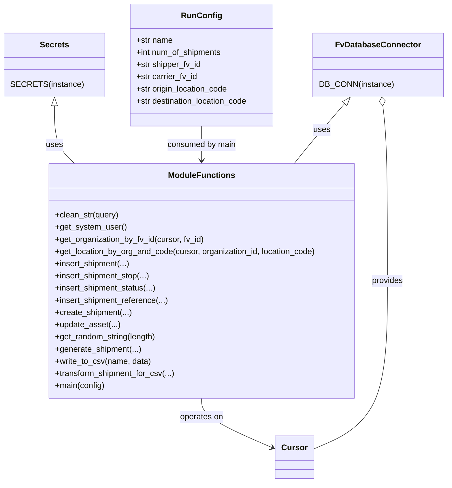

# Diagram: shipment_core/shipment_service/scripts/k6_load_tests/scripts/generate_shipments_for_testing.py


> Auto-generated by Obscura crawlers

## Diagram 1



### SVG

<svg id="container" width="865.34375" xmlns="http://www.w3.org/2000/svg" class="classDiagram" height="950" viewBox="0 0 865.34375 950" role="graphics-document document" aria-roledescription="class"><style>#container{font-family:"trebuchet ms",verdana,arial,sans-serif;font-size:16px;fill:#333;}@keyframes edge-animation-frame{from{stroke-dashoffset:0;}}@keyframes dash{to{stroke-dashoffset:0;}}#container .edge-animation-slow{stroke-dasharray:9,5!important;stroke-dashoffset:900;animation:dash 50s linear infinite;stroke-linecap:round;}#container .edge-animation-fast{stroke-dasharray:9,5!important;stroke-dashoffset:900;animation:dash 20s linear infinite;stroke-linecap:round;}#container .error-icon{fill:#552222;}#container .error-text{fill:#552222;stroke:#552222;}#container .edge-thickness-normal{stroke-width:1px;}#container .edge-thickness-thick{stroke-width:3.5px;}#container .edge-pattern-solid{stroke-dasharray:0;}#container .edge-thickness-invisible{stroke-width:0;fill:none;}#container .edge-pattern-dashed{stroke-dasharray:3;}#container .edge-pattern-dotted{stroke-dasharray:2;}#container .marker{fill:#333333;stroke:#333333;}#container .marker.cross{stroke:#333333;}#container svg{font-family:"trebuchet ms",verdana,arial,sans-serif;font-size:16px;}#container p{margin:0;}#container g.classGroup text{fill:#9370DB;stroke:none;font-family:"trebuchet ms",verdana,arial,sans-serif;font-size:10px;}#container g.classGroup text .title{font-weight:bolder;}#container .nodeLabel,#container .edgeLabel{color:#131300;}#container .edgeLabel .label rect{fill:#ECECFF;}#container .label text{fill:#131300;}#container .labelBkg{background:#ECECFF;}#container .edgeLabel .label span{background:#ECECFF;}#container .classTitle{font-weight:bolder;}#container .node rect,#container .node circle,#container .node ellipse,#container .node polygon,#container .node path{fill:#ECECFF;stroke:#9370DB;stroke-width:1px;}#container .divider{stroke:#9370DB;stroke-width:1;}#container g.clickable{cursor:pointer;}#container g.classGroup rect{fill:#ECECFF;stroke:#9370DB;}#container g.classGroup line{stroke:#9370DB;stroke-width:1;}#container .classLabel .box{stroke:none;stroke-width:0;fill:#ECECFF;opacity:0.5;}#container .classLabel .label{fill:#9370DB;font-size:10px;}#container .relation{stroke:#333333;stroke-width:1;fill:none;}#container .dashed-line{stroke-dasharray:3;}#container .dotted-line{stroke-dasharray:1 2;}#container #compositionStart,#container .composition{fill:#333333!important;stroke:#333333!important;stroke-width:1;}#container #compositionEnd,#container .composition{fill:#333333!important;stroke:#333333!important;stroke-width:1;}#container #dependencyStart,#container .dependency{fill:#333333!important;stroke:#333333!important;stroke-width:1;}#container #dependencyStart,#container .dependency{fill:#333333!important;stroke:#333333!important;stroke-width:1;}#container #extensionStart,#container .extension{fill:transparent!important;stroke:#333333!important;stroke-width:1;}#container #extensionEnd,#container .extension{fill:transparent!important;stroke:#333333!important;stroke-width:1;}#container #aggregationStart,#container .aggregation{fill:transparent!important;stroke:#333333!important;stroke-width:1;}#container #aggregationEnd,#container .aggregation{fill:transparent!important;stroke:#333333!important;stroke-width:1;}#container #lollipopStart,#container .lollipop{fill:#ECECFF!important;stroke:#333333!important;stroke-width:1;}#container #lollipopEnd,#container .lollipop{fill:#ECECFF!important;stroke:#333333!important;stroke-width:1;}#container .edgeTerminals{font-size:11px;line-height:initial;}#container .classTitleText{text-anchor:middle;font-size:18px;fill:#333;}#container .label-icon{display:inline-block;height:1em;overflow:visible;vertical-align:-0.125em;}#container .node .label-icon path{fill:currentColor;stroke:revert;stroke-width:revert;}#container :root{--mermaid-font-family:"trebuchet ms",verdana,arial,sans-serif;}</style><g><defs><marker id="container_class-aggregationStart" class="marker aggregation class" refX="18" refY="7" markerWidth="190" markerHeight="240" orient="auto"><path d="M 18,7 L9,13 L1,7 L9,1 Z"></path></marker></defs><defs><marker id="container_class-aggregationEnd" class="marker aggregation class" refX="1" refY="7" markerWidth="20" markerHeight="28" orient="auto"><path d="M 18,7 L9,13 L1,7 L9,1 Z"></path></marker></defs><defs><marker id="container_class-extensionStart" class="marker extension class" refX="18" refY="7" markerWidth="190" markerHeight="240" orient="auto"><path d="M 1,7 L18,13 V 1 Z"></path></marker></defs><defs><marker id="container_class-extensionEnd" class="marker extension class" refX="1" refY="7" markerWidth="20" markerHeight="28" orient="auto"><path d="M 1,1 V 13 L18,7 Z"></path></marker></defs><defs><marker id="container_class-compositionStart" class="marker composition class" refX="18" refY="7" markerWidth="190" markerHeight="240" orient="auto"><path d="M 18,7 L9,13 L1,7 L9,1 Z"></path></marker></defs><defs><marker id="container_class-compositionEnd" class="marker composition class" refX="1" refY="7" markerWidth="20" markerHeight="28" orient="auto"><path d="M 18,7 L9,13 L1,7 L9,1 Z"></path></marker></defs><defs><marker id="container_class-dependencyStart" class="marker dependency class" refX="6" refY="7" markerWidth="190" markerHeight="240" orient="auto"><path d="M 5,7 L9,13 L1,7 L9,1 Z"></path></marker></defs><defs><marker id="container_class-dependencyEnd" class="marker dependency class" refX="13" refY="7" markerWidth="20" markerHeight="28" orient="auto"><path d="M 18,7 L9,13 L14,7 L9,1 Z"></path></marker></defs><defs><marker id="container_class-lollipopStart" class="marker lollipop class" refX="13" refY="7" markerWidth="190" markerHeight="240" orient="auto"><circle stroke="black" fill="transparent" cx="7" cy="7" r="6"></circle></marker></defs><defs><marker id="container_class-lollipopEnd" class="marker lollipop class" refX="1" refY="7" markerWidth="190" markerHeight="240" orient="auto"><circle stroke="black" fill="transparent" cx="7" cy="7" r="6"></circle></marker></defs><g class="root"><g class="clusters"></g><g class="edgePaths"><path d="M99.824,208.25L99.824,221.042C99.824,233.833,99.824,259.417,106.379,278.375C112.935,297.333,126.045,309.667,132.6,315.833L139.156,322" id="id_Secrets_ModuleFunctions_1" class="edge-thickness-normal edge-pattern-solid relation" style=";;;" data-edge="true" data-et="edge" data-id="id_Secrets_ModuleFunctions_1" data-points="W3sieCI6OTkuODI0MjE4NzUsInkiOjE5MX0seyJ4Ijo5OS44MjQyMTg3NSwieSI6Mjg1fSx7IngiOjEzOS4xNTU1OTQwOTk4MTM0NCwieSI6MzIyfV0=" marker-start="url(#container_class-extensionStart)"></path><path d="M667.442,203.843L655.313,217.369C643.185,230.895,618.927,257.948,601.967,277.64C585.008,297.333,575.345,309.667,570.514,315.833L565.683,322" id="id_FvDatabaseConnector_ModuleFunctions_2" class="edge-thickness-normal edge-pattern-solid relation" style=";;;" data-edge="true" data-et="edge" data-id="id_FvDatabaseConnector_ModuleFunctions_2" data-points="W3sieCI6Njc4Ljk1ODE2MzMxNjA4MjgsInkiOjE5MX0seyJ4Ijo1OTQuNjY5OTIxODc1LCJ5IjoyODV9LHsieCI6NTY1LjY4MzA0NzE2NjUxMTIsInkiOjMyMn1d" marker-start="url(#container_class-extensionStart)"></path><path d="M384.711,784L384.711,790.167C384.711,796.333,384.711,808.667,408.556,825.044C432.401,841.421,480.091,861.842,503.936,872.053L527.781,882.263" id="id_ModuleFunctions_Cursor_3" class="edge-thickness-normal edge-pattern-solid relation" style=";;;" data-edge="true" data-et="edge" data-id="id_ModuleFunctions_Cursor_3" data-points="W3sieCI6Mzg0LjcxMDkzNzUsInkiOjc4NH0seyJ4IjozODQuNzEwOTM3NSwieSI6ODIxfSx7IngiOjUzMy4yOTY4NzUsInkiOjg4NC42MjQ4NTcwODIzNjN9XQ==" marker-end="url(#container_class-dependencyEnd)"></path><path d="M384.711,248L384.711,254.167C384.711,260.333,384.711,272.667,384.711,284C384.711,295.333,384.711,305.667,384.711,310.833L384.711,316" id="id_RunConfig_ModuleFunctions_4" class="edge-thickness-normal edge-pattern-solid relation" style=";;;" data-edge="true" data-et="edge" data-id="id_RunConfig_ModuleFunctions_4" data-points="W3sieCI6Mzg0LjcxMDkzNzUsInkiOjI0OH0seyJ4IjozODQuNzEwOTM3NSwieSI6Mjg1fSx7IngiOjM4NC43MTA5Mzc1LCJ5IjozMjJ9XQ==" marker-end="url(#container_class-dependencyEnd)"></path><path d="M744.762,208.135L746.251,220.946C747.74,233.756,750.718,259.378,752.206,316.856C753.695,374.333,753.695,463.667,753.695,553C753.695,642.333,753.695,731.667,728.931,786.937C704.167,842.208,654.638,863.417,629.874,874.021L605.109,884.625" id="id_FvDatabaseConnector_Cursor_5" class="edge-thickness-normal edge-pattern-solid relation" style=";;;" data-edge="true" data-et="edge" data-id="id_FvDatabaseConnector_Cursor_5" data-points="W3sieCI6NzQyLjc3MDg5OTY4MTUyODcsInkiOjE5MX0seyJ4Ijo3NTMuNjk1MzEyNSwieSI6Mjg1fSx7IngiOjc1My42OTUzMTI1LCJ5Ijo1NTN9LHsieCI6NzUzLjY5NTMxMjUsInkiOjgyMX0seyJ4Ijo2MDUuMTA5Mzc1LCJ5Ijo4ODQuNjI0ODU3MDgyMzYzfV0=" marker-start="url(#container_class-aggregationStart)"></path></g><g class="edgeLabels"><g class="edgeLabel" transform="translate(99.82421875, 285)"><g class="label" data-id="id_Secrets_ModuleFunctions_1" transform="translate(-16.4921875, -12)"><foreignObject width="32.984375" height="24"><div xmlns="http://www.w3.org/1999/xhtml" class="labelBkg" style="display: table-cell; white-space: nowrap; line-height: 1.5; max-width: 200px; text-align: center;"><span class="edgeLabel"><p>uses</p></span></div></foreignObject></g></g><g class="edgeLabel" transform="translate(621.12461, 255.49718)"><g class="label" data-id="id_FvDatabaseConnector_ModuleFunctions_2" transform="translate(-16.4921875, -12)"><foreignObject width="32.984375" height="24"><div xmlns="http://www.w3.org/1999/xhtml" class="labelBkg" style="display: table-cell; white-space: nowrap; line-height: 1.5; max-width: 200px; text-align: center;"><span class="edgeLabel"><p>uses</p></span></div></foreignObject></g></g><g class="edgeLabel" transform="translate(384.7109375, 821)"><g class="label" data-id="id_ModuleFunctions_Cursor_3" transform="translate(-43.2890625, -12)"><foreignObject width="86.578125" height="24"><div xmlns="http://www.w3.org/1999/xhtml" class="labelBkg" style="display: table-cell; white-space: nowrap; line-height: 1.5; max-width: 200px; text-align: center;"><span class="edgeLabel"><p>operates on</p></span></div></foreignObject></g></g><g class="edgeLabel" transform="translate(384.7109375, 285)"><g class="label" data-id="id_RunConfig_ModuleFunctions_4" transform="translate(-68.46875, -12)"><foreignObject width="136.9375" height="24"><div xmlns="http://www.w3.org/1999/xhtml" class="labelBkg" style="display: table-cell; white-space: nowrap; line-height: 1.5; max-width: 200px; text-align: center;"><span class="edgeLabel"><p>consumed by main</p></span></div></foreignObject></g></g><g class="edgeLabel" transform="translate(753.6953125, 553)"><g class="label" data-id="id_FvDatabaseConnector_Cursor_5" transform="translate(-31.3125, -12)"><foreignObject width="62.625" height="24"><div xmlns="http://www.w3.org/1999/xhtml" class="labelBkg" style="display: table-cell; white-space: nowrap; line-height: 1.5; max-width: 200px; text-align: center;"><span class="edgeLabel"><p>provides</p></span></div></foreignObject></g></g></g><g class="nodes"><g class="node default" id="classId-RunConfig-0" transform="translate(384.7109375, 128)"><g class="basic label-container"><path d="M-143.0625 -120 L143.0625 -120 L143.0625 120 L-143.0625 120" stroke="none" stroke-width="0" fill="#ECECFF" style=""></path><path d="M-143.0625 -120 C-75.98899228976299 -120, -8.91548457952598 -120, 143.0625 -120 M-143.0625 -120 C-82.43158433362969 -120, -21.800668667259373 -120, 143.0625 -120 M143.0625 -120 C143.0625 -70.38968136366864, 143.0625 -20.779362727337286, 143.0625 120 M143.0625 -120 C143.0625 -61.57529479102126, 143.0625 -3.150589582042514, 143.0625 120 M143.0625 120 C38.5094185783645 120, -66.043662843271 120, -143.0625 120 M143.0625 120 C69.22802070900542 120, -4.606458581989159 120, -143.0625 120 M-143.0625 120 C-143.0625 55.06788221297154, -143.0625 -9.86423557405692, -143.0625 -120 M-143.0625 120 C-143.0625 62.87630282410506, -143.0625 5.752605648210121, -143.0625 -120" stroke="#9370DB" stroke-width="1.3" fill="none" stroke-dasharray="0 0" style=""></path></g><g class="annotation-group text" transform="translate(0, -96)"></g><g class="label-group text" transform="translate(-37.0625, -96)"><g class="label" style="font-weight: bolder" transform="translate(0,-12)"><foreignObject width="74.125" height="24"><div xmlns="http://www.w3.org/1999/xhtml" style="display: table-cell; white-space: nowrap; line-height: 1.5; max-width: 124px; text-align: center;"><span class="nodeLabel markdown-node-label" style=""><p>RunConfig</p></span></div></foreignObject></g></g><g class="members-group text" transform="translate(-131.0625, -48)"><g class="label" style="" transform="translate(0,-12)"><foreignObject width="72.171875" height="24"><div xmlns="http://www.w3.org/1999/xhtml" style="display: table-cell; white-space: nowrap; line-height: 1.5; max-width: 130px; text-align: center;"><span class="nodeLabel markdown-node-label" style=""><p>+str name</p></span></div></foreignObject></g><g class="label" style="" transform="translate(0,12)"><foreignObject width="170.765625" height="24"><div xmlns="http://www.w3.org/1999/xhtml" style="display: table-cell; white-space: nowrap; line-height: 1.5; max-width: 228px; text-align: center;"><span class="nodeLabel markdown-node-label" style=""><p>+int num_of_shipments</p></span></div></foreignObject></g><g class="label" style="" transform="translate(0,36)"><foreignObject width="128.796875" height="24"><div xmlns="http://www.w3.org/1999/xhtml" style="display: table-cell; white-space: nowrap; line-height: 1.5; max-width: 186px; text-align: center;"><span class="nodeLabel markdown-node-label" style=""><p>+str shipper_fv_id</p></span></div></foreignObject></g><g class="label" style="" transform="translate(0,60)"><foreignObject width="121.484375" height="24"><div xmlns="http://www.w3.org/1999/xhtml" style="display: table-cell; white-space: nowrap; line-height: 1.5; max-width: 179px; text-align: center;"><span class="nodeLabel markdown-node-label" style=""><p>+str carrier_fv_id</p></span></div></foreignObject></g><g class="label" style="" transform="translate(0,84)"><foreignObject width="184.171875" height="24"><div xmlns="http://www.w3.org/1999/xhtml" style="display: table-cell; white-space: nowrap; line-height: 1.5; max-width: 242px; text-align: center;"><span class="nodeLabel markdown-node-label" style=""><p>+str origin_location_code</p></span></div></foreignObject></g><g class="label" style="" transform="translate(0,108)"><foreignObject width="225.0625" height="24"><div xmlns="http://www.w3.org/1999/xhtml" style="display: table-cell; white-space: nowrap; line-height: 1.5; max-width: 282px; text-align: center;"><span class="nodeLabel markdown-node-label" style=""><p>+str destination_location_code</p></span></div></foreignObject></g></g><g class="methods-group text" transform="translate(-131.0625, 120)"></g><g class="divider" style=""><path d="M-143.0625 -72 C-44.31525132847533 -72, 54.431997343049346 -72, 143.0625 -72 M-143.0625 -72 C-40.06287338423897 -72, 62.93675323152206 -72, 143.0625 -72" stroke="#9370DB" stroke-width="1.3" fill="none" stroke-dasharray="0 0" style=""></path></g><g class="divider" style=""><path d="M-143.0625 96 C-42.35616151980982 96, 58.35017696038037 96, 143.0625 96 M-143.0625 96 C-64.37294425260012 96, 14.316611494799758 96, 143.0625 96" stroke="#9370DB" stroke-width="1.3" fill="none" stroke-dasharray="0 0" style=""></path></g></g><g class="node default" id="classId-Secrets-1" transform="translate(99.82421875, 128)"><g class="basic label-container"><path d="M-91.82421875 -63 L91.82421875 -63 L91.82421875 63 L-91.82421875 63" stroke="none" stroke-width="0" fill="#ECECFF" style=""></path><path d="M-91.82421875 -63 C-54.72306983708425 -63, -17.621920924168506 -63, 91.82421875 -63 M-91.82421875 -63 C-24.187212113529625 -63, 43.44979452294075 -63, 91.82421875 -63 M91.82421875 -63 C91.82421875 -22.728388466077696, 91.82421875 17.543223067844607, 91.82421875 63 M91.82421875 -63 C91.82421875 -15.506369271209664, 91.82421875 31.987261457580672, 91.82421875 63 M91.82421875 63 C32.138501571770476 63, -27.547215606459048 63, -91.82421875 63 M91.82421875 63 C33.12834050488718 63, -25.567537740225646 63, -91.82421875 63 M-91.82421875 63 C-91.82421875 21.090928641191937, -91.82421875 -20.818142717616126, -91.82421875 -63 M-91.82421875 63 C-91.82421875 23.667733634607195, -91.82421875 -15.66453273078561, -91.82421875 -63" stroke="#9370DB" stroke-width="1.3" fill="none" stroke-dasharray="0 0" style=""></path></g><g class="annotation-group text" transform="translate(0, -39)"></g><g class="label-group text" transform="translate(-27.1640625, -39)"><g class="label" style="font-weight: bolder" transform="translate(0,-12)"><foreignObject width="54.328125" height="24"><div xmlns="http://www.w3.org/1999/xhtml" style="display: table-cell; white-space: nowrap; line-height: 1.5; max-width: 103px; text-align: center;"><span class="nodeLabel markdown-node-label" style=""><p>Secrets</p></span></div></foreignObject></g></g><g class="members-group text" transform="translate(-79.82421875, 9)"></g><g class="methods-group text" transform="translate(-79.82421875, 39)"><g class="label" style="" transform="translate(0,-12)"><foreignObject width="132.484375" height="24"><div xmlns="http://www.w3.org/1999/xhtml" style="display: table-cell; white-space: nowrap; line-height: 1.5; max-width: 182px; text-align: center;"><span class="nodeLabel markdown-node-label" style=""><p>SECRETS(instance)</p></span></div></foreignObject></g></g><g class="divider" style=""><path d="M-91.82421875 -15 C-26.151996901469857 -15, 39.520224947060285 -15, 91.82421875 -15 M-91.82421875 -15 C-30.21987275875823 -15, 31.384473232483543 -15, 91.82421875 -15" stroke="#9370DB" stroke-width="1.3" fill="none" stroke-dasharray="0 0" style=""></path></g><g class="divider" style=""><path d="M-91.82421875 9 C-40.53922158772849 9, 10.745775574543018 9, 91.82421875 9 M-91.82421875 9 C-29.279734726092165 9, 33.26474929781567 9, 91.82421875 9" stroke="#9370DB" stroke-width="1.3" fill="none" stroke-dasharray="0 0" style=""></path></g></g><g class="node default" id="classId-FvDatabaseConnector-2" transform="translate(735.44921875, 128)"><g class="basic label-container"><path d="M-121.89453125 -63 L121.89453125 -63 L121.89453125 63 L-121.89453125 63" stroke="none" stroke-width="0" fill="#ECECFF" style=""></path><path d="M-121.89453125 -63 C-37.060125112765704 -63, 47.77428102446859 -63, 121.89453125 -63 M-121.89453125 -63 C-41.64582963977091 -63, 38.60287197045818 -63, 121.89453125 -63 M121.89453125 -63 C121.89453125 -14.527731196699335, 121.89453125 33.94453760660133, 121.89453125 63 M121.89453125 -63 C121.89453125 -17.46070838264808, 121.89453125 28.078583234703842, 121.89453125 63 M121.89453125 63 C43.93659146927385 63, -34.0213483114523 63, -121.89453125 63 M121.89453125 63 C31.30311454722552 63, -59.28830215554896 63, -121.89453125 63 M-121.89453125 63 C-121.89453125 22.43619266060319, -121.89453125 -18.12761467879362, -121.89453125 -63 M-121.89453125 63 C-121.89453125 16.482824041943807, -121.89453125 -30.034351916112385, -121.89453125 -63" stroke="#9370DB" stroke-width="1.3" fill="none" stroke-dasharray="0 0" style=""></path></g><g class="annotation-group text" transform="translate(0, -39)"></g><g class="label-group text" transform="translate(-79.3046875, -39)"><g class="label" style="font-weight: bolder" transform="translate(0,-12)"><foreignObject width="158.609375" height="24"><div xmlns="http://www.w3.org/1999/xhtml" style="display: table-cell; white-space: nowrap; line-height: 1.5; max-width: 207px; text-align: center;"><span class="nodeLabel markdown-node-label" style=""><p>FvDatabaseConnector</p></span></div></foreignObject></g></g><g class="members-group text" transform="translate(-109.89453125, 9)"></g><g class="methods-group text" transform="translate(-109.89453125, 39)"><g class="label" style="" transform="translate(0,-12)"><foreignObject width="140.484375" height="24"><div xmlns="http://www.w3.org/1999/xhtml" style="display: table-cell; white-space: nowrap; line-height: 1.5; max-width: 190px; text-align: center;"><span class="nodeLabel markdown-node-label" style=""><p>DB_CONN(instance)</p></span></div></foreignObject></g></g><g class="divider" style=""><path d="M-121.89453125 -15 C-47.10071300559001 -15, 27.69310523881998 -15, 121.89453125 -15 M-121.89453125 -15 C-49.967288435730396 -15, 21.95995437853921 -15, 121.89453125 -15" stroke="#9370DB" stroke-width="1.3" fill="none" stroke-dasharray="0 0" style=""></path></g><g class="divider" style=""><path d="M-121.89453125 9 C-28.170616603249314 9, 65.55329804350137 9, 121.89453125 9 M-121.89453125 9 C-33.670455892560014 9, 54.55361946487997 9, 121.89453125 9" stroke="#9370DB" stroke-width="1.3" fill="none" stroke-dasharray="0 0" style=""></path></g></g><g class="node default" id="classId-Cursor-3" transform="translate(569.203125, 900)"><g class="basic label-container"><path d="M-35.90625 -42 L35.90625 -42 L35.90625 42 L-35.90625 42" stroke="none" stroke-width="0" fill="#ECECFF" style=""></path><path d="M-35.90625 -42 C-15.77797992005797 -42, 4.350290159884061 -42, 35.90625 -42 M-35.90625 -42 C-8.524803055805304 -42, 18.856643888389392 -42, 35.90625 -42 M35.90625 -42 C35.90625 -18.54595595013191, 35.90625 4.908088099736183, 35.90625 42 M35.90625 -42 C35.90625 -9.303274715829744, 35.90625 23.393450568340512, 35.90625 42 M35.90625 42 C15.690255733082633 42, -4.525738533834733 42, -35.90625 42 M35.90625 42 C19.39190230560278 42, 2.8775546112055608 42, -35.90625 42 M-35.90625 42 C-35.90625 21.056692009918166, -35.90625 0.11338401983633162, -35.90625 -42 M-35.90625 42 C-35.90625 9.586076562753881, -35.90625 -22.827846874492238, -35.90625 -42" stroke="#9370DB" stroke-width="1.3" fill="none" stroke-dasharray="0 0" style=""></path></g><g class="annotation-group text" transform="translate(0, -18)"></g><g class="label-group text" transform="translate(-23.90625, -18)"><g class="label" style="font-weight: bolder" transform="translate(0,-12)"><foreignObject width="47.8125" height="24"><div xmlns="http://www.w3.org/1999/xhtml" style="display: table-cell; white-space: nowrap; line-height: 1.5; max-width: 98px; text-align: center;"><span class="nodeLabel markdown-node-label" style=""><p>Cursor</p></span></div></foreignObject></g></g><g class="members-group text" transform="translate(-23.90625, 30)"></g><g class="methods-group text" transform="translate(-23.90625, 60)"></g><g class="divider" style=""><path d="M-35.90625 6 C-18.09354704595643 6, -0.2808440919128614 6, 35.90625 6 M-35.90625 6 C-19.77684037911291 6, -3.6474307582258234 6, 35.90625 6" stroke="#9370DB" stroke-width="1.3" fill="none" stroke-dasharray="0 0" style=""></path></g><g class="divider" style=""><path d="M-35.90625 24 C-18.970433650078522 24, -2.034617300157045 24, 35.90625 24 M-35.90625 24 C-19.124760298455605 24, -2.3432705969112106 24, 35.90625 24" stroke="#9370DB" stroke-width="1.3" fill="none" stroke-dasharray="0 0" style=""></path></g></g><g class="node default" id="classId-ModuleFunctions-4" transform="translate(384.7109375, 553)"><g class="basic label-container"><path d="M-302.671875 -231 L302.671875 -231 L302.671875 231 L-302.671875 231" stroke="none" stroke-width="0" fill="#ECECFF" style=""></path><path d="M-302.671875 -231 C-115.99139988959638 -231, 70.68907522080724 -231, 302.671875 -231 M-302.671875 -231 C-94.81348299931196 -231, 113.04490900137608 -231, 302.671875 -231 M302.671875 -231 C302.671875 -109.35216316761185, 302.671875 12.295673664776302, 302.671875 231 M302.671875 -231 C302.671875 -134.86092159166654, 302.671875 -38.72184318333308, 302.671875 231 M302.671875 231 C140.75935704933798 231, -21.153160901324043 231, -302.671875 231 M302.671875 231 C115.7699838372138 231, -71.1319073255724 231, -302.671875 231 M-302.671875 231 C-302.671875 60.9627452288818, -302.671875 -109.0745095422364, -302.671875 -231 M-302.671875 231 C-302.671875 68.82966304344515, -302.671875 -93.3406739131097, -302.671875 -231" stroke="#9370DB" stroke-width="1.3" fill="none" stroke-dasharray="0 0" style=""></path></g><g class="annotation-group text" transform="translate(0, -207)"></g><g class="label-group text" transform="translate(-62.21875, -207)"><g class="label" style="font-weight: bolder" transform="translate(0,-12)"><foreignObject width="124.4375" height="24"><div xmlns="http://www.w3.org/1999/xhtml" style="display: table-cell; white-space: nowrap; line-height: 1.5; max-width: 174px; text-align: center;"><span class="nodeLabel markdown-node-label" style=""><p>ModuleFunctions</p></span></div></foreignObject></g></g><g class="members-group text" transform="translate(-290.671875, -159)"></g><g class="methods-group text" transform="translate(-290.671875, -129)"><g class="label" style="" transform="translate(0,-12)"><foreignObject width="126.640625" height="24"><div xmlns="http://www.w3.org/1999/xhtml" style="display: table-cell; white-space: nowrap; line-height: 1.5; max-width: 184px; text-align: center;"><span class="nodeLabel markdown-node-label" style=""><p>+clean_str(query)</p></span></div></foreignObject></g><g class="label" style="" transform="translate(0,12)"><foreignObject width="139.3125" height="24"><div xmlns="http://www.w3.org/1999/xhtml" style="display: table-cell; white-space: nowrap; line-height: 1.5; max-width: 197px; text-align: center;"><span class="nodeLabel markdown-node-label" style=""><p>+get_system_user()</p></span></div></foreignObject></g><g class="label" style="" transform="translate(0,36)"><foreignObject width="295.25" height="24"><div xmlns="http://www.w3.org/1999/xhtml" style="display: table-cell; white-space: nowrap; line-height: 1.5; max-width: 353px; text-align: center;"><span class="nodeLabel markdown-node-label" style=""><p>+get_organization_by_fv_id(cursor, fv_id)</p></span></div></foreignObject></g><g class="label" style="" transform="translate(0,60)"><foreignObject width="519.125" height="24"><div xmlns="http://www.w3.org/1999/xhtml" style="display: table-cell; white-space: nowrap; line-height: 1.5; max-width: 576px; text-align: center;"><span class="nodeLabel markdown-node-label" style=""><p>+get_location_by_org_and_code(cursor, organization_id, location_code)</p></span></div></foreignObject></g><g class="label" style="" transform="translate(0,84)"><foreignObject width="148.6875" height="24"><div xmlns="http://www.w3.org/1999/xhtml" style="display: table-cell; white-space: nowrap; line-height: 1.5; max-width: 206px; text-align: center;"><span class="nodeLabel markdown-node-label" style=""><p>+insert_shipment(...)</p></span></div></foreignObject></g><g class="label" style="" transform="translate(0,108)"><foreignObject width="188.859375" height="24"><div xmlns="http://www.w3.org/1999/xhtml" style="display: table-cell; white-space: nowrap; line-height: 1.5; max-width: 246px; text-align: center;"><span class="nodeLabel markdown-node-label" style=""><p>+insert_shipment_stop(...)</p></span></div></foreignObject></g><g class="label" style="" transform="translate(0,132)"><foreignObject width="201.40625" height="24"><div xmlns="http://www.w3.org/1999/xhtml" style="display: table-cell; white-space: nowrap; line-height: 1.5; max-width: 259px; text-align: center;"><span class="nodeLabel markdown-node-label" style=""><p>+insert_shipment_status(...)</p></span></div></foreignObject></g><g class="label" style="" transform="translate(0,156)"><foreignObject width="225.171875" height="24"><div xmlns="http://www.w3.org/1999/xhtml" style="display: table-cell; white-space: nowrap; line-height: 1.5; max-width: 283px; text-align: center;"><span class="nodeLabel markdown-node-label" style=""><p>+insert_shipment_reference(...)</p></span></div></foreignObject></g><g class="label" style="" transform="translate(0,180)"><foreignObject width="151.1875" height="24"><div xmlns="http://www.w3.org/1999/xhtml" style="display: table-cell; white-space: nowrap; line-height: 1.5; max-width: 209px; text-align: center;"><span class="nodeLabel markdown-node-label" style=""><p>+create_shipment(...)</p></span></div></foreignObject></g><g class="label" style="" transform="translate(0,204)"><foreignObject width="126.734375" height="24"><div xmlns="http://www.w3.org/1999/xhtml" style="display: table-cell; white-space: nowrap; line-height: 1.5; max-width: 184px; text-align: center;"><span class="nodeLabel markdown-node-label" style=""><p>+update_asset(...)</p></span></div></foreignObject></g><g class="label" style="" transform="translate(0,228)"><foreignObject width="201.6875" height="24"><div xmlns="http://www.w3.org/1999/xhtml" style="display: table-cell; white-space: nowrap; line-height: 1.5; max-width: 259px; text-align: center;"><span class="nodeLabel markdown-node-label" style=""><p>+get_random_string(length)</p></span></div></foreignObject></g><g class="label" style="" transform="translate(0,252)"><foreignObject width="169.78125" height="24"><div xmlns="http://www.w3.org/1999/xhtml" style="display: table-cell; white-space: nowrap; line-height: 1.5; max-width: 227px; text-align: center;"><span class="nodeLabel markdown-node-label" style=""><p>+generate_shipment(...)</p></span></div></foreignObject></g><g class="label" style="" transform="translate(0,276)"><foreignObject width="188.8125" height="24"><div xmlns="http://www.w3.org/1999/xhtml" style="display: table-cell; white-space: nowrap; line-height: 1.5; max-width: 246px; text-align: center;"><span class="nodeLabel markdown-node-label" style=""><p>+write_to_csv(name, data)</p></span></div></foreignObject></g><g class="label" style="" transform="translate(0,300)"><foreignObject width="236.109375" height="24"><div xmlns="http://www.w3.org/1999/xhtml" style="display: table-cell; white-space: nowrap; line-height: 1.5; max-width: 293px; text-align: center;"><span class="nodeLabel markdown-node-label" style=""><p>+transform_shipment_for_csv(...)</p></span></div></foreignObject></g><g class="label" style="" transform="translate(0,324)"><foreignObject width="98.234375" height="24"><div xmlns="http://www.w3.org/1999/xhtml" style="display: table-cell; white-space: nowrap; line-height: 1.5; max-width: 156px; text-align: center;"><span class="nodeLabel markdown-node-label" style=""><p>+main(config)</p></span></div></foreignObject></g></g><g class="divider" style=""><path d="M-302.671875 -183 C-93.48703657508881 -183, 115.69780184982238 -183, 302.671875 -183 M-302.671875 -183 C-162.6576330002557 -183, -22.64339100051137 -183, 302.671875 -183" stroke="#9370DB" stroke-width="1.3" fill="none" stroke-dasharray="0 0" style=""></path></g><g class="divider" style=""><path d="M-302.671875 -159 C-168.67414231346612 -159, -34.67640962693224 -159, 302.671875 -159 M-302.671875 -159 C-95.78635737702845 -159, 111.0991602459431 -159, 302.671875 -159" stroke="#9370DB" stroke-width="1.3" fill="none" stroke-dasharray="0 0" style=""></path></g></g></g></g></g></svg>

## Diagram 2

```mermaid
flowchart TD
    Start([start main]) --> EstablishDB[DB_CONN.establish_connection()]
    EstablishDB --> GetCursor[cursor = DB_CONN.get_cursor()]
    GetCursor --> GetOrgs[get_organization_by_fv_id for shipper & carrier]
    GetOrgs --> GetLocations[get_location_by_org_and_code for origin & destination]
    GetLocations --> InitLoop[for i in range(num_of_shipments)]
    InitLoop --> Generate[generate_shipment]
    Generate --> StartTx[cursor.start_transaction()]
    StartTx --> CreateShipment[create_shipment]
    CreateShipment --> InsertShipment[insert_shipment]
    InsertShipment --> InsertOriginStop[insert_shipment_stop (origin)]
    InsertOriginStop --> InsertDestinationStop[insert_shipment_stop (destination)]
    InsertDestinationStop --> InsertStatus[insert_shipment_status (original stops)]
    InsertStatus --> ReturnShipment[return shipment]
    ReturnShipment --> UpdateAsset[update_asset -> insert_shipment_status (XB)]
    UpdateAsset --> Commit[cursor.commit()]
    Commit --> AppendResult[append result to results]
    AppendResult --> LoopEnd{more shipments?}
    LoopEnd -->|yes| Generate
    LoopEnd -->|no| AfterLoop
    AfterLoop --> WriteCSV[write_to_csv(transform_shipment_for_csv...)]
    WriteCSV --> Done([done])
```

> SVG rendering failed for this diagram.
