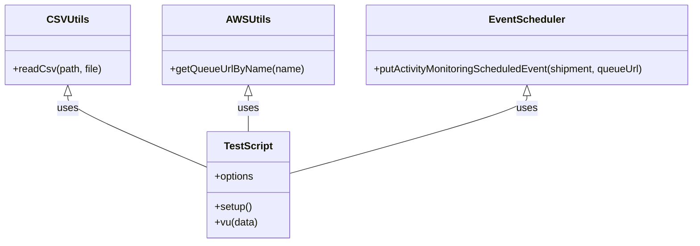

# Diagram: shipment_core/shipment_service/scripts/k6_load_tests/tests/shipments/generate-no-activity-events-from-csv.js


> Auto-generated by Obscura crawlers

## Diagram 1

```mermaid
flowchart TD
  A[readCsv("shipments") → csvData] --> B[setup()]
  B --> C[getQueueUrlByName("SH-scheduled-event") → targetQueueUrl]
  D[default vu(data)] --> E{forEach shipment in csvData}
  E --> F[putActivityMonitoringScheduledEvent(shipment, data.targetQueueUrl) → response]
  F --> G[check(response, "Scheduled event created?")]
  B -.-> D
  A -.-> D
```

> SVG rendering failed for this diagram.

## Diagram 2



### SVG

<svg id="container" width="1091.046875" xmlns="http://www.w3.org/2000/svg" class="classDiagram" height="384" viewBox="0 0 1091.046875 384" role="graphics-document document" aria-roledescription="class"><style>#container{font-family:"trebuchet ms",verdana,arial,sans-serif;font-size:16px;fill:#333;}@keyframes edge-animation-frame{from{stroke-dashoffset:0;}}@keyframes dash{to{stroke-dashoffset:0;}}#container .edge-animation-slow{stroke-dasharray:9,5!important;stroke-dashoffset:900;animation:dash 50s linear infinite;stroke-linecap:round;}#container .edge-animation-fast{stroke-dasharray:9,5!important;stroke-dashoffset:900;animation:dash 20s linear infinite;stroke-linecap:round;}#container .error-icon{fill:#552222;}#container .error-text{fill:#552222;stroke:#552222;}#container .edge-thickness-normal{stroke-width:1px;}#container .edge-thickness-thick{stroke-width:3.5px;}#container .edge-pattern-solid{stroke-dasharray:0;}#container .edge-thickness-invisible{stroke-width:0;fill:none;}#container .edge-pattern-dashed{stroke-dasharray:3;}#container .edge-pattern-dotted{stroke-dasharray:2;}#container .marker{fill:#333333;stroke:#333333;}#container .marker.cross{stroke:#333333;}#container svg{font-family:"trebuchet ms",verdana,arial,sans-serif;font-size:16px;}#container p{margin:0;}#container g.classGroup text{fill:#9370DB;stroke:none;font-family:"trebuchet ms",verdana,arial,sans-serif;font-size:10px;}#container g.classGroup text .title{font-weight:bolder;}#container .nodeLabel,#container .edgeLabel{color:#131300;}#container .edgeLabel .label rect{fill:#ECECFF;}#container .label text{fill:#131300;}#container .labelBkg{background:#ECECFF;}#container .edgeLabel .label span{background:#ECECFF;}#container .classTitle{font-weight:bolder;}#container .node rect,#container .node circle,#container .node ellipse,#container .node polygon,#container .node path{fill:#ECECFF;stroke:#9370DB;stroke-width:1px;}#container .divider{stroke:#9370DB;stroke-width:1;}#container g.clickable{cursor:pointer;}#container g.classGroup rect{fill:#ECECFF;stroke:#9370DB;}#container g.classGroup line{stroke:#9370DB;stroke-width:1;}#container .classLabel .box{stroke:none;stroke-width:0;fill:#ECECFF;opacity:0.5;}#container .classLabel .label{fill:#9370DB;font-size:10px;}#container .relation{stroke:#333333;stroke-width:1;fill:none;}#container .dashed-line{stroke-dasharray:3;}#container .dotted-line{stroke-dasharray:1 2;}#container #compositionStart,#container .composition{fill:#333333!important;stroke:#333333!important;stroke-width:1;}#container #compositionEnd,#container .composition{fill:#333333!important;stroke:#333333!important;stroke-width:1;}#container #dependencyStart,#container .dependency{fill:#333333!important;stroke:#333333!important;stroke-width:1;}#container #dependencyStart,#container .dependency{fill:#333333!important;stroke:#333333!important;stroke-width:1;}#container #extensionStart,#container .extension{fill:transparent!important;stroke:#333333!important;stroke-width:1;}#container #extensionEnd,#container .extension{fill:transparent!important;stroke:#333333!important;stroke-width:1;}#container #aggregationStart,#container .aggregation{fill:transparent!important;stroke:#333333!important;stroke-width:1;}#container #aggregationEnd,#container .aggregation{fill:transparent!important;stroke:#333333!important;stroke-width:1;}#container #lollipopStart,#container .lollipop{fill:#ECECFF!important;stroke:#333333!important;stroke-width:1;}#container #lollipopEnd,#container .lollipop{fill:#ECECFF!important;stroke:#333333!important;stroke-width:1;}#container .edgeTerminals{font-size:11px;line-height:initial;}#container .classTitleText{text-anchor:middle;font-size:18px;fill:#333;}#container .label-icon{display:inline-block;height:1em;overflow:visible;vertical-align:-0.125em;}#container .node .label-icon path{fill:currentColor;stroke:revert;stroke-width:revert;}#container :root{--mermaid-font-family:"trebuchet ms",verdana,arial,sans-serif;}</style><g><defs><marker id="container_class-aggregationStart" class="marker aggregation class" refX="18" refY="7" markerWidth="190" markerHeight="240" orient="auto"><path d="M 18,7 L9,13 L1,7 L9,1 Z"></path></marker></defs><defs><marker id="container_class-aggregationEnd" class="marker aggregation class" refX="1" refY="7" markerWidth="20" markerHeight="28" orient="auto"><path d="M 18,7 L9,13 L1,7 L9,1 Z"></path></marker></defs><defs><marker id="container_class-extensionStart" class="marker extension class" refX="18" refY="7" markerWidth="190" markerHeight="240" orient="auto"><path d="M 1,7 L18,13 V 1 Z"></path></marker></defs><defs><marker id="container_class-extensionEnd" class="marker extension class" refX="1" refY="7" markerWidth="20" markerHeight="28" orient="auto"><path d="M 1,1 V 13 L18,7 Z"></path></marker></defs><defs><marker id="container_class-compositionStart" class="marker composition class" refX="18" refY="7" markerWidth="190" markerHeight="240" orient="auto"><path d="M 18,7 L9,13 L1,7 L9,1 Z"></path></marker></defs><defs><marker id="container_class-compositionEnd" class="marker composition class" refX="1" refY="7" markerWidth="20" markerHeight="28" orient="auto"><path d="M 18,7 L9,13 L1,7 L9,1 Z"></path></marker></defs><defs><marker id="container_class-dependencyStart" class="marker dependency class" refX="6" refY="7" markerWidth="190" markerHeight="240" orient="auto"><path d="M 5,7 L9,13 L1,7 L9,1 Z"></path></marker></defs><defs><marker id="container_class-dependencyEnd" class="marker dependency class" refX="13" refY="7" markerWidth="20" markerHeight="28" orient="auto"><path d="M 18,7 L9,13 L14,7 L9,1 Z"></path></marker></defs><defs><marker id="container_class-lollipopStart" class="marker lollipop class" refX="13" refY="7" markerWidth="190" markerHeight="240" orient="auto"><circle stroke="black" fill="transparent" cx="7" cy="7" r="6"></circle></marker></defs><defs><marker id="container_class-lollipopEnd" class="marker lollipop class" refX="1" refY="7" markerWidth="190" markerHeight="240" orient="auto"><circle stroke="black" fill="transparent" cx="7" cy="7" r="6"></circle></marker></defs><g class="root"><g class="clusters"></g><g class="edgePaths"><path d="M104.402,151.25L104.402,154.542C104.402,157.833,104.402,164.417,140.257,183.223C176.111,202.029,247.819,233.058,283.673,248.572L319.527,264.087" id="id_CSVUtils_TestScript_1" class="edge-thickness-normal edge-pattern-solid relation" style=";;;" data-edge="true" data-et="edge" data-id="id_CSVUtils_TestScript_1" data-points="W3sieCI6MTA0LjQwMjM0Mzc1LCJ5IjoxMzR9LHsieCI6MTA0LjQwMjM0Mzc1LCJ5IjoxNzF9LHsieCI6MzE5LjUyNzM0Mzc1LCJ5IjoyNjQuMDg2ODA0NjgyNDc5OH1d" marker-start="url(#container_class-extensionStart)"></path><path d="M384.035,151.25L384.035,154.542C384.035,157.833,384.035,164.417,384.035,173.875C384.035,183.333,384.035,195.667,384.035,201.833L384.035,208" id="id_AWSUtils_TestScript_2" class="edge-thickness-normal edge-pattern-solid relation" style=";;;" data-edge="true" data-et="edge" data-id="id_AWSUtils_TestScript_2" data-points="W3sieCI6Mzg0LjAzNTE1NjI1LCJ5IjoxMzR9LHsieCI6Mzg0LjAzNTE1NjI1LCJ5IjoxNzF9LHsieCI6Mzg0LjAzNTE1NjI1LCJ5IjoyMDh9XQ==" marker-start="url(#container_class-extensionStart)"></path><path d="M825.156,151.25L825.156,154.542C825.156,157.833,825.156,164.417,762.387,184.926C699.618,205.435,574.081,239.87,511.312,257.088L448.543,274.305" id="id_EventScheduler_TestScript_3" class="edge-thickness-normal edge-pattern-solid relation" style=";;;" data-edge="true" data-et="edge" data-id="id_EventScheduler_TestScript_3" data-points="W3sieCI6ODI1LjE1NjI1LCJ5IjoxMzR9LHsieCI6ODI1LjE1NjI1LCJ5IjoxNzF9LHsieCI6NDQ4LjU0Mjk2ODc1LCJ5IjoyNzQuMzA1NDM2MjU1Mjh9XQ==" marker-start="url(#container_class-extensionStart)"></path></g><g class="edgeLabels"><g class="edgeLabel" transform="translate(104.40234375, 171)"><g class="label" data-id="id_CSVUtils_TestScript_1" transform="translate(-16.4921875, -12)"><foreignObject width="32.984375" height="24"><div xmlns="http://www.w3.org/1999/xhtml" class="labelBkg" style="display: table-cell; white-space: nowrap; line-height: 1.5; max-width: 200px; text-align: center;"><span class="edgeLabel"><p>uses</p></span></div></foreignObject></g></g><g class="edgeLabel" transform="translate(384.03515625, 171)"><g class="label" data-id="id_AWSUtils_TestScript_2" transform="translate(-16.4921875, -12)"><foreignObject width="32.984375" height="24"><div xmlns="http://www.w3.org/1999/xhtml" class="labelBkg" style="display: table-cell; white-space: nowrap; line-height: 1.5; max-width: 200px; text-align: center;"><span class="edgeLabel"><p>uses</p></span></div></foreignObject></g></g><g class="edgeLabel" transform="translate(825.15625, 171)"><g class="label" data-id="id_EventScheduler_TestScript_3" transform="translate(-16.4921875, -12)"><foreignObject width="32.984375" height="24"><div xmlns="http://www.w3.org/1999/xhtml" class="labelBkg" style="display: table-cell; white-space: nowrap; line-height: 1.5; max-width: 200px; text-align: center;"><span class="edgeLabel"><p>uses</p></span></div></foreignObject></g></g></g><g class="nodes"><g class="node default" id="classId-CSVUtils-0" transform="translate(104.40234375, 71)"><g class="basic label-container"><path d="M-96.40234375 -63 L96.40234375 -63 L96.40234375 63 L-96.40234375 63" stroke="none" stroke-width="0" fill="#ECECFF" style=""></path><path d="M-96.40234375 -63 C-49.71006391565056 -63, -3.017784081301116 -63, 96.40234375 -63 M-96.40234375 -63 C-30.05604845612676 -63, 36.29024683774648 -63, 96.40234375 -63 M96.40234375 -63 C96.40234375 -25.864407724706417, 96.40234375 11.271184550587165, 96.40234375 63 M96.40234375 -63 C96.40234375 -34.74255520284899, 96.40234375 -6.485110405697988, 96.40234375 63 M96.40234375 63 C49.7760661780271 63, 3.1497886060542015 63, -96.40234375 63 M96.40234375 63 C23.27043440928199 63, -49.86147493143602 63, -96.40234375 63 M-96.40234375 63 C-96.40234375 18.588410633079768, -96.40234375 -25.823178733840464, -96.40234375 -63 M-96.40234375 63 C-96.40234375 27.948943140048833, -96.40234375 -7.102113719902334, -96.40234375 -63" stroke="#9370DB" stroke-width="1.3" fill="none" stroke-dasharray="0 0" style=""></path></g><g class="annotation-group text" transform="translate(0, -39)"></g><g class="label-group text" transform="translate(-30.2890625, -39)"><g class="label" style="font-weight: bolder" transform="translate(0,-12)"><foreignObject width="60.578125" height="24"><div xmlns="http://www.w3.org/1999/xhtml" style="display: table-cell; white-space: nowrap; line-height: 1.5; max-width: 109px; text-align: center;"><span class="nodeLabel markdown-node-label" style=""><p>CSVUtils</p></span></div></foreignObject></g></g><g class="members-group text" transform="translate(-84.40234375, 9)"></g><g class="methods-group text" transform="translate(-84.40234375, 39)"><g class="label" style="" transform="translate(0,-12)"><foreignObject width="138.515625" height="24"><div xmlns="http://www.w3.org/1999/xhtml" style="display: table-cell; white-space: nowrap; line-height: 1.5; max-width: 196px; text-align: center;"><span class="nodeLabel markdown-node-label" style=""><p>+readCsv(path, file)</p></span></div></foreignObject></g></g><g class="divider" style=""><path d="M-96.40234375 -15 C-33.89913054486352 -15, 28.604082660272965 -15, 96.40234375 -15 M-96.40234375 -15 C-19.459000319251672 -15, 57.484343111496656 -15, 96.40234375 -15" stroke="#9370DB" stroke-width="1.3" fill="none" stroke-dasharray="0 0" style=""></path></g><g class="divider" style=""><path d="M-96.40234375 9 C-37.05435002705528 9, 22.293643695889443 9, 96.40234375 9 M-96.40234375 9 C-39.871261931007346 9, 16.659819887985307 9, 96.40234375 9" stroke="#9370DB" stroke-width="1.3" fill="none" stroke-dasharray="0 0" style=""></path></g></g><g class="node default" id="classId-AWSUtils-1" transform="translate(384.03515625, 71)"><g class="basic label-container"><path d="M-133.23046875 -63 L133.23046875 -63 L133.23046875 63 L-133.23046875 63" stroke="none" stroke-width="0" fill="#ECECFF" style=""></path><path d="M-133.23046875 -63 C-79.68117613555208 -63, -26.131883521104143 -63, 133.23046875 -63 M-133.23046875 -63 C-46.39712397299333 -63, 40.436220804013345 -63, 133.23046875 -63 M133.23046875 -63 C133.23046875 -20.735659900167867, 133.23046875 21.528680199664265, 133.23046875 63 M133.23046875 -63 C133.23046875 -24.190626826007836, 133.23046875 14.618746347984327, 133.23046875 63 M133.23046875 63 C71.42362341821737 63, 9.61677808643475 63, -133.23046875 63 M133.23046875 63 C40.853056642389845 63, -51.52435546522031 63, -133.23046875 63 M-133.23046875 63 C-133.23046875 14.649959428331464, -133.23046875 -33.70008114333707, -133.23046875 -63 M-133.23046875 63 C-133.23046875 31.286966970500032, -133.23046875 -0.4260660589999361, -133.23046875 -63" stroke="#9370DB" stroke-width="1.3" fill="none" stroke-dasharray="0 0" style=""></path></g><g class="annotation-group text" transform="translate(0, -39)"></g><g class="label-group text" transform="translate(-32.7890625, -39)"><g class="label" style="font-weight: bolder" transform="translate(0,-12)"><foreignObject width="65.578125" height="24"><div xmlns="http://www.w3.org/1999/xhtml" style="display: table-cell; white-space: nowrap; line-height: 1.5; max-width: 114px; text-align: center;"><span class="nodeLabel markdown-node-label" style=""><p>AWSUtils</p></span></div></foreignObject></g></g><g class="members-group text" transform="translate(-121.23046875, 9)"></g><g class="methods-group text" transform="translate(-121.23046875, 39)"><g class="label" style="" transform="translate(0,-12)"><foreignObject width="209.671875" height="24"><div xmlns="http://www.w3.org/1999/xhtml" style="display: table-cell; white-space: nowrap; line-height: 1.5; max-width: 267px; text-align: center;"><span class="nodeLabel markdown-node-label" style=""><p>+getQueueUrlByName(name)</p></span></div></foreignObject></g></g><g class="divider" style=""><path d="M-133.23046875 -15 C-64.75016521283402 -15, 3.7301383243319606 -15, 133.23046875 -15 M-133.23046875 -15 C-48.53433440221605 -15, 36.16179994556791 -15, 133.23046875 -15" stroke="#9370DB" stroke-width="1.3" fill="none" stroke-dasharray="0 0" style=""></path></g><g class="divider" style=""><path d="M-133.23046875 9 C-74.34585842108311 9, -15.461248092166215 9, 133.23046875 9 M-133.23046875 9 C-35.365613376865184 9, 62.49924199626963 9, 133.23046875 9" stroke="#9370DB" stroke-width="1.3" fill="none" stroke-dasharray="0 0" style=""></path></g></g><g class="node default" id="classId-EventScheduler-2" transform="translate(825.15625, 71)"><g class="basic label-container"><path d="M-257.890625 -63 L257.890625 -63 L257.890625 63 L-257.890625 63" stroke="none" stroke-width="0" fill="#ECECFF" style=""></path><path d="M-257.890625 -63 C-98.04560730702684 -63, 61.79941038594632 -63, 257.890625 -63 M-257.890625 -63 C-146.02787399561117 -63, -34.165122991222376 -63, 257.890625 -63 M257.890625 -63 C257.890625 -26.656174415921967, 257.890625 9.687651168156066, 257.890625 63 M257.890625 -63 C257.890625 -24.20408423770334, 257.890625 14.591831524593317, 257.890625 63 M257.890625 63 C154.17990301192398 63, 50.469181023847966 63, -257.890625 63 M257.890625 63 C79.25794643046419 63, -99.37473213907163 63, -257.890625 63 M-257.890625 63 C-257.890625 37.10954327403745, -257.890625 11.219086548074905, -257.890625 -63 M-257.890625 63 C-257.890625 30.02504607175854, -257.890625 -2.9499078564829233, -257.890625 -63" stroke="#9370DB" stroke-width="1.3" fill="none" stroke-dasharray="0 0" style=""></path></g><g class="annotation-group text" transform="translate(0, -39)"></g><g class="label-group text" transform="translate(-56.984375, -39)"><g class="label" style="font-weight: bolder" transform="translate(0,-12)"><foreignObject width="113.96875" height="24"><div xmlns="http://www.w3.org/1999/xhtml" style="display: table-cell; white-space: nowrap; line-height: 1.5; max-width: 164px; text-align: center;"><span class="nodeLabel markdown-node-label" style=""><p>EventScheduler</p></span></div></foreignObject></g></g><g class="members-group text" transform="translate(-245.890625, 9)"></g><g class="methods-group text" transform="translate(-245.890625, 39)"><g class="label" style="" transform="translate(0,-12)"><foreignObject width="434.796875" height="24"><div xmlns="http://www.w3.org/1999/xhtml" style="display: table-cell; white-space: nowrap; line-height: 1.5; max-width: 492px; text-align: center;"><span class="nodeLabel markdown-node-label" style=""><p>+putActivityMonitoringScheduledEvent(shipment, queueUrl)</p></span></div></foreignObject></g></g><g class="divider" style=""><path d="M-257.890625 -15 C-151.7329445700014 -15, -45.57526414000276 -15, 257.890625 -15 M-257.890625 -15 C-117.68579572683902 -15, 22.519033546321964 -15, 257.890625 -15" stroke="#9370DB" stroke-width="1.3" fill="none" stroke-dasharray="0 0" style=""></path></g><g class="divider" style=""><path d="M-257.890625 9 C-52.876041028503636 9, 152.13854294299273 9, 257.890625 9 M-257.890625 9 C-133.0566192009198 9, -8.222613401839624 9, 257.890625 9" stroke="#9370DB" stroke-width="1.3" fill="none" stroke-dasharray="0 0" style=""></path></g></g><g class="node default" id="classId-TestScript-3" transform="translate(384.03515625, 292)"><g class="basic label-container"><path d="M-64.5078125 -84 L64.5078125 -84 L64.5078125 84 L-64.5078125 84" stroke="none" stroke-width="0" fill="#ECECFF" style=""></path><path d="M-64.5078125 -84 C-31.1844894891371 -84, 2.1388335217258003 -84, 64.5078125 -84 M-64.5078125 -84 C-34.55180092023113 -84, -4.595789340462261 -84, 64.5078125 -84 M64.5078125 -84 C64.5078125 -36.76112656955641, 64.5078125 10.47774686088718, 64.5078125 84 M64.5078125 -84 C64.5078125 -39.92752638531333, 64.5078125 4.144947229373344, 64.5078125 84 M64.5078125 84 C35.75799266202124 84, 7.008172824042475 84, -64.5078125 84 M64.5078125 84 C14.045796395035765 84, -36.41621970992847 84, -64.5078125 84 M-64.5078125 84 C-64.5078125 19.752761190069762, -64.5078125 -44.494477619860476, -64.5078125 -84 M-64.5078125 84 C-64.5078125 31.097020720671672, -64.5078125 -21.805958558656656, -64.5078125 -84" stroke="#9370DB" stroke-width="1.3" fill="none" stroke-dasharray="0 0" style=""></path></g><g class="annotation-group text" transform="translate(0, -60)"></g><g class="label-group text" transform="translate(-36.984375, -60)"><g class="label" style="font-weight: bolder" transform="translate(0,-12)"><foreignObject width="73.96875" height="24"><div xmlns="http://www.w3.org/1999/xhtml" style="display: table-cell; white-space: nowrap; line-height: 1.5; max-width: 122px; text-align: center;"><span class="nodeLabel markdown-node-label" style=""><p>TestScript</p></span></div></foreignObject></g></g><g class="members-group text" transform="translate(-52.5078125, -12)"><g class="label" style="" transform="translate(0,-12)"><foreignObject width="63.3125" height="24"><div xmlns="http://www.w3.org/1999/xhtml" style="display: table-cell; white-space: nowrap; line-height: 1.5; max-width: 121px; text-align: center;"><span class="nodeLabel markdown-node-label" style=""><p>+options</p></span></div></foreignObject></g></g><g class="methods-group text" transform="translate(-52.5078125, 36)"><g class="label" style="" transform="translate(0,-12)"><foreignObject width="59.140625" height="24"><div xmlns="http://www.w3.org/1999/xhtml" style="display: table-cell; white-space: nowrap; line-height: 1.5; max-width: 117px; text-align: center;"><span class="nodeLabel markdown-node-label" style=""><p>+setup()</p></span></div></foreignObject></g><g class="label" style="" transform="translate(0,12)"><foreignObject width="68.03125" height="24"><div xmlns="http://www.w3.org/1999/xhtml" style="display: table-cell; white-space: nowrap; line-height: 1.5; max-width: 125px; text-align: center;"><span class="nodeLabel markdown-node-label" style=""><p>+vu(data)</p></span></div></foreignObject></g></g><g class="divider" style=""><path d="M-64.5078125 -36 C-37.41138031691831 -36, -10.314948133836616 -36, 64.5078125 -36 M-64.5078125 -36 C-30.220482620037323 -36, 4.066847259925353 -36, 64.5078125 -36" stroke="#9370DB" stroke-width="1.3" fill="none" stroke-dasharray="0 0" style=""></path></g><g class="divider" style=""><path d="M-64.5078125 12 C-29.282597626001888 12, 5.942617247996225 12, 64.5078125 12 M-64.5078125 12 C-33.101889708137804 12, -1.6959669162756086 12, 64.5078125 12" stroke="#9370DB" stroke-width="1.3" fill="none" stroke-dasharray="0 0" style=""></path></g></g></g></g></g></svg>
