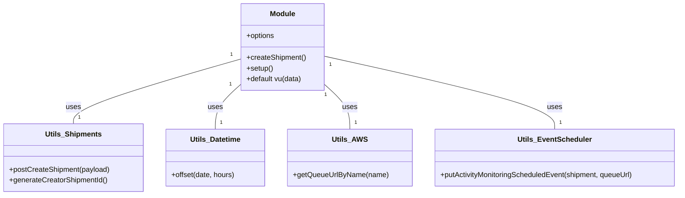

# Diagram: shipment_core/shipment_service/scripts/k6_load_tests/tests/shipments/generate-no-activity-events.js


> Auto-generated by Obscura crawlers

## Diagram 1

```mermaid
flowchart TD
  A[setup()] -->|calls| B[createShipment()]
  B --> C[generateCreatorShipmentId()]
  B --> D[offset datetimeUtils]
  B --> E[postCreateShipment(payload)]
  E -->|201 Created| F[returns body with shipment.id]
  E -->|!201| G[throw Error: Failed to create shipment]
  A --> H[getQueueUrlByName("SH-scheduled-event")]
  H --> I[returns targetQueueUrl]
  subgraph VU
    J[default export vu(data)] --> K[data.shipments.forEach]
    K --> L[construct shipment object]
    L --> M[putActivityMonitoringScheduledEvent(shipment, targetQueueUrl)]
    M --> N[check response.status === 202]
  end
  I --> J
  F --> J
```

> SVG rendering failed for this diagram.

## Diagram 2



### SVG

<svg id="container" width="1500.859375" xmlns="http://www.w3.org/2000/svg" class="classDiagram" height="432" viewBox="0 0 1500.859375 432" role="graphics-document document" aria-roledescription="class"><style>#container{font-family:"trebuchet ms",verdana,arial,sans-serif;font-size:16px;fill:#333;}@keyframes edge-animation-frame{from{stroke-dashoffset:0;}}@keyframes dash{to{stroke-dashoffset:0;}}#container .edge-animation-slow{stroke-dasharray:9,5!important;stroke-dashoffset:900;animation:dash 50s linear infinite;stroke-linecap:round;}#container .edge-animation-fast{stroke-dasharray:9,5!important;stroke-dashoffset:900;animation:dash 20s linear infinite;stroke-linecap:round;}#container .error-icon{fill:#552222;}#container .error-text{fill:#552222;stroke:#552222;}#container .edge-thickness-normal{stroke-width:1px;}#container .edge-thickness-thick{stroke-width:3.5px;}#container .edge-pattern-solid{stroke-dasharray:0;}#container .edge-thickness-invisible{stroke-width:0;fill:none;}#container .edge-pattern-dashed{stroke-dasharray:3;}#container .edge-pattern-dotted{stroke-dasharray:2;}#container .marker{fill:#333333;stroke:#333333;}#container .marker.cross{stroke:#333333;}#container svg{font-family:"trebuchet ms",verdana,arial,sans-serif;font-size:16px;}#container p{margin:0;}#container g.classGroup text{fill:#9370DB;stroke:none;font-family:"trebuchet ms",verdana,arial,sans-serif;font-size:10px;}#container g.classGroup text .title{font-weight:bolder;}#container .nodeLabel,#container .edgeLabel{color:#131300;}#container .edgeLabel .label rect{fill:#ECECFF;}#container .label text{fill:#131300;}#container .labelBkg{background:#ECECFF;}#container .edgeLabel .label span{background:#ECECFF;}#container .classTitle{font-weight:bolder;}#container .node rect,#container .node circle,#container .node ellipse,#container .node polygon,#container .node path{fill:#ECECFF;stroke:#9370DB;stroke-width:1px;}#container .divider{stroke:#9370DB;stroke-width:1;}#container g.clickable{cursor:pointer;}#container g.classGroup rect{fill:#ECECFF;stroke:#9370DB;}#container g.classGroup line{stroke:#9370DB;stroke-width:1;}#container .classLabel .box{stroke:none;stroke-width:0;fill:#ECECFF;opacity:0.5;}#container .classLabel .label{fill:#9370DB;font-size:10px;}#container .relation{stroke:#333333;stroke-width:1;fill:none;}#container .dashed-line{stroke-dasharray:3;}#container .dotted-line{stroke-dasharray:1 2;}#container #compositionStart,#container .composition{fill:#333333!important;stroke:#333333!important;stroke-width:1;}#container #compositionEnd,#container .composition{fill:#333333!important;stroke:#333333!important;stroke-width:1;}#container #dependencyStart,#container .dependency{fill:#333333!important;stroke:#333333!important;stroke-width:1;}#container #dependencyStart,#container .dependency{fill:#333333!important;stroke:#333333!important;stroke-width:1;}#container #extensionStart,#container .extension{fill:transparent!important;stroke:#333333!important;stroke-width:1;}#container #extensionEnd,#container .extension{fill:transparent!important;stroke:#333333!important;stroke-width:1;}#container #aggregationStart,#container .aggregation{fill:transparent!important;stroke:#333333!important;stroke-width:1;}#container #aggregationEnd,#container .aggregation{fill:transparent!important;stroke:#333333!important;stroke-width:1;}#container #lollipopStart,#container .lollipop{fill:#ECECFF!important;stroke:#333333!important;stroke-width:1;}#container #lollipopEnd,#container .lollipop{fill:#ECECFF!important;stroke:#333333!important;stroke-width:1;}#container .edgeTerminals{font-size:11px;line-height:initial;}#container .classTitleText{text-anchor:middle;font-size:18px;fill:#333;}#container .label-icon{display:inline-block;height:1em;overflow:visible;vertical-align:-0.125em;}#container .node .label-icon path{fill:currentColor;stroke:revert;stroke-width:revert;}#container :root{--mermaid-font-family:"trebuchet ms",verdana,arial,sans-serif;}</style><g><defs><marker id="container_class-aggregationStart" class="marker aggregation class" refX="18" refY="7" markerWidth="190" markerHeight="240" orient="auto"><path d="M 18,7 L9,13 L1,7 L9,1 Z"></path></marker></defs><defs><marker id="container_class-aggregationEnd" class="marker aggregation class" refX="1" refY="7" markerWidth="20" markerHeight="28" orient="auto"><path d="M 18,7 L9,13 L1,7 L9,1 Z"></path></marker></defs><defs><marker id="container_class-extensionStart" class="marker extension class" refX="18" refY="7" markerWidth="190" markerHeight="240" orient="auto"><path d="M 1,7 L18,13 V 1 Z"></path></marker></defs><defs><marker id="container_class-extensionEnd" class="marker extension class" refX="1" refY="7" markerWidth="20" markerHeight="28" orient="auto"><path d="M 1,1 V 13 L18,7 Z"></path></marker></defs><defs><marker id="container_class-compositionStart" class="marker composition class" refX="18" refY="7" markerWidth="190" markerHeight="240" orient="auto"><path d="M 18,7 L9,13 L1,7 L9,1 Z"></path></marker></defs><defs><marker id="container_class-compositionEnd" class="marker composition class" refX="1" refY="7" markerWidth="20" markerHeight="28" orient="auto"><path d="M 18,7 L9,13 L1,7 L9,1 Z"></path></marker></defs><defs><marker id="container_class-dependencyStart" class="marker dependency class" refX="6" refY="7" markerWidth="190" markerHeight="240" orient="auto"><path d="M 5,7 L9,13 L1,7 L9,1 Z"></path></marker></defs><defs><marker id="container_class-dependencyEnd" class="marker dependency class" refX="13" refY="7" markerWidth="20" markerHeight="28" orient="auto"><path d="M 18,7 L9,13 L14,7 L9,1 Z"></path></marker></defs><defs><marker id="container_class-lollipopStart" class="marker lollipop class" refX="13" refY="7" markerWidth="190" markerHeight="240" orient="auto"><circle stroke="black" fill="transparent" cx="7" cy="7" r="6"></circle></marker></defs><defs><marker id="container_class-lollipopEnd" class="marker lollipop class" refX="1" refY="7" markerWidth="190" markerHeight="240" orient="auto"><circle stroke="black" fill="transparent" cx="7" cy="7" r="6"></circle></marker></defs><g class="root"><g class="clusters"></g><g class="edgePaths"><path d="M531.33,130.509L469.728,148.257C408.125,166.006,284.92,201.503,223.317,225.418C161.715,249.333,161.715,261.667,161.715,267.833L161.715,274" id="id_Module_Utils_Shipments_1" class="edge-thickness-normal edge-pattern-solid relation" style=";;;" data-edge="true" data-et="edge" data-id="id_Module_Utils_Shipments_1" data-points="W3sieCI6NTMxLjMzMDA3ODEyNSwieSI6MTMwLjUwODcyNjQyODA2NjcyfSx7IngiOjE2MS43MTQ4NDM3NSwieSI6MjM3fSx7IngiOjE2MS43MTQ4NDM3NSwieSI6Mjc0fV0="></path><path d="M531.33,186.843L522.046,195.203C512.762,203.562,494.193,220.281,484.909,236.807C475.625,253.333,475.625,269.667,475.625,277.833L475.625,286" id="id_Module_Utils_Datetime_2" class="edge-thickness-normal edge-pattern-solid relation" style=";;;" data-edge="true" data-et="edge" data-id="id_Module_Utils_Datetime_2" data-points="W3sieCI6NTMxLjMzMDA3ODEyNSwieSI6MTg2Ljg0MzQwNjYyOTczMn0seyJ4Ijo0NzUuNjI1LCJ5IjoyMzd9LHsieCI6NDc1LjYyNSwieSI6Mjg2fV0="></path><path d="M715.346,186.843L724.63,195.203C733.914,203.562,752.482,220.281,761.767,236.807C771.051,253.333,771.051,269.667,771.051,277.833L771.051,286" id="id_Module_Utils_AWS_3" class="edge-thickness-normal edge-pattern-solid relation" style=";;;" data-edge="true" data-et="edge" data-id="id_Module_Utils_AWS_3" data-points="W3sieCI6NzE1LjM0NTcwMzEyNSwieSI6MTg2Ljg0MzQwNjYyOTczMn0seyJ4Ijo3NzEuMDUwNzgxMjUsInkiOjIzN30seyJ4Ijo3NzEuMDUwNzgxMjUsInkiOjI4Nn1d"></path><path d="M715.346,124.353L800.216,143.128C885.087,161.902,1054.829,199.451,1139.7,226.392C1224.57,253.333,1224.57,269.667,1224.57,277.833L1224.57,286" id="id_Module_Utils_EventScheduler_4" class="edge-thickness-normal edge-pattern-solid relation" style=";;;" data-edge="true" data-et="edge" data-id="id_Module_Utils_EventScheduler_4" data-points="W3sieCI6NzE1LjM0NTcwMzEyNSwieSI6MTI0LjM1MzI1ODc2ODYxMDA1fSx7IngiOjEyMjQuNTcwMzEyNSwieSI6MjM3fSx7IngiOjEyMjQuNTcwMzEyNSwieSI6Mjg2fV0="></path></g><g class="edgeLabels"><g class="edgeLabel" transform="translate(161.71484375, 237)"><g class="label" data-id="id_Module_Utils_Shipments_1" transform="translate(-16.4921875, -12)"><foreignObject width="32.984375" height="24"><div xmlns="http://www.w3.org/1999/xhtml" class="labelBkg" style="display: table-cell; white-space: nowrap; line-height: 1.5; max-width: 200px; text-align: center;"><span class="edgeLabel"><p>uses</p></span></div></foreignObject></g></g><g class="edgeLabel" transform="translate(475.625, 237)"><g class="label" data-id="id_Module_Utils_Datetime_2" transform="translate(-16.4921875, -12)"><foreignObject width="32.984375" height="24"><div xmlns="http://www.w3.org/1999/xhtml" class="labelBkg" style="display: table-cell; white-space: nowrap; line-height: 1.5; max-width: 200px; text-align: center;"><span class="edgeLabel"><p>uses</p></span></div></foreignObject></g></g><g class="edgeLabel" transform="translate(771.05078125, 237)"><g class="label" data-id="id_Module_Utils_AWS_3" transform="translate(-16.4921875, -12)"><foreignObject width="32.984375" height="24"><div xmlns="http://www.w3.org/1999/xhtml" class="labelBkg" style="display: table-cell; white-space: nowrap; line-height: 1.5; max-width: 200px; text-align: center;"><span class="edgeLabel"><p>uses</p></span></div></foreignObject></g></g><g class="edgeLabel" transform="translate(1224.5703125, 237)"><g class="label" data-id="id_Module_Utils_EventScheduler_4" transform="translate(-16.4921875, -12)"><foreignObject width="32.984375" height="24"><div xmlns="http://www.w3.org/1999/xhtml" class="labelBkg" style="display: table-cell; white-space: nowrap; line-height: 1.5; max-width: 200px; text-align: center;"><span class="edgeLabel"><p>uses</p></span></div></foreignObject></g></g><g class="edgeTerminals" transform="translate(510.3613274348845, 120.93995011024329)"><g class="inner" transform="translate(0, 0)"><foreignObject style="width: 9px; height: 12px;"><div xmlns="http://www.w3.org/1999/xhtml" style="display: inline-block; padding-right: 1px; white-space: nowrap;"><span class="edgeLabel">1</span></div></foreignObject></g></g><g class="edgeTerminals" transform="translate(508.2880835068243, 187.40590772556902)"><g class="inner" transform="translate(0, 0)"><foreignObject style="width: 9px; height: 12px;"><div xmlns="http://www.w3.org/1999/xhtml" style="display: inline-block; padding-right: 1px; white-space: nowrap;"><span class="edgeLabel">1</span></div></foreignObject></g></g><g class="edgeTerminals" transform="translate(718.3138857404348, 209.70034866430706)"><g class="inner" transform="translate(0, 0)"><foreignObject style="width: 9px; height: 12px;"><div xmlns="http://www.w3.org/1999/xhtml" style="display: inline-block; padding-right: 1px; white-space: nowrap;"><span class="edgeLabel">1</span></div></foreignObject></g></g><g class="edgeTerminals" transform="translate(729.1927621405183, 142.77902593288863)"><g class="inner" transform="translate(0, 0)"><foreignObject style="width: 9px; height: 12px;"><div xmlns="http://www.w3.org/1999/xhtml" style="display: inline-block; padding-right: 1px; white-space: nowrap;"><span class="edgeLabel">1</span></div></foreignObject></g></g><g class="edgeTerminals" transform="translate(171.7148418749999, 251.49999839285715)"><g class="inner" transform="translate(0, 0)"></g><foreignObject style="width: 9px; height: 12px;"><div xmlns="http://www.w3.org/1999/xhtml" style="display: inline-block; padding-right: 1px; white-space: nowrap;"><span class="edgeLabel">1</span></div></foreignObject></g><g class="edgeTerminals" transform="translate(485.625, 263.5)"><g class="inner" transform="translate(0, 0)"></g><foreignObject style="width: 9px; height: 12px;"><div xmlns="http://www.w3.org/1999/xhtml" style="display: inline-block; padding-right: 1px; white-space: nowrap;"><span class="edgeLabel">1</span></div></foreignObject></g><g class="edgeTerminals" transform="translate(781.050780625, 263.49999946428574)"><g class="inner" transform="translate(0, 0)"></g><foreignObject style="width: 9px; height: 12px;"><div xmlns="http://www.w3.org/1999/xhtml" style="display: inline-block; padding-right: 1px; white-space: nowrap;"><span class="edgeLabel">1</span></div></foreignObject></g><g class="edgeTerminals" transform="translate(1234.57031125, 263.4999989285715)"><g class="inner" transform="translate(0, 0)"></g><foreignObject style="width: 9px; height: 12px;"><div xmlns="http://www.w3.org/1999/xhtml" style="display: inline-block; padding-right: 1px; white-space: nowrap;"><span class="edgeLabel">1</span></div></foreignObject></g></g><g class="nodes"><g class="node default" id="classId-Module-0" transform="translate(623.337890625, 104)"><g class="basic label-container"><path d="M-92.0078125 -96 L92.0078125 -96 L92.0078125 96 L-92.0078125 96" stroke="none" stroke-width="0" fill="#ECECFF" style=""></path><path d="M-92.0078125 -96 C-52.663980317645574 -96, -13.320148135291149 -96, 92.0078125 -96 M-92.0078125 -96 C-50.58821454205668 -96, -9.168616584113366 -96, 92.0078125 -96 M92.0078125 -96 C92.0078125 -33.50744705701512, 92.0078125 28.98510588596976, 92.0078125 96 M92.0078125 -96 C92.0078125 -35.38181105136354, 92.0078125 25.236377897272916, 92.0078125 96 M92.0078125 96 C37.45894269735225 96, -17.0899271052955 96, -92.0078125 96 M92.0078125 96 C20.57866489777983 96, -50.85048270444034 96, -92.0078125 96 M-92.0078125 96 C-92.0078125 40.659841244899425, -92.0078125 -14.68031751020115, -92.0078125 -96 M-92.0078125 96 C-92.0078125 19.936885401787308, -92.0078125 -56.126229196425385, -92.0078125 -96" stroke="#9370DB" stroke-width="1.3" fill="none" stroke-dasharray="0 0" style=""></path></g><g class="annotation-group text" transform="translate(0, -72)"></g><g class="label-group text" transform="translate(-27.09375, -72)"><g class="label" style="font-weight: bolder" transform="translate(0,-12)"><foreignObject width="54.1875" height="24"><div xmlns="http://www.w3.org/1999/xhtml" style="display: table-cell; white-space: nowrap; line-height: 1.5; max-width: 104px; text-align: center;"><span class="nodeLabel markdown-node-label" style=""><p>Module</p></span></div></foreignObject></g></g><g class="members-group text" transform="translate(-80.0078125, -24)"><g class="label" style="" transform="translate(0,-12)"><foreignObject width="63.3125" height="24"><div xmlns="http://www.w3.org/1999/xhtml" style="display: table-cell; white-space: nowrap; line-height: 1.5; max-width: 121px; text-align: center;"><span class="nodeLabel markdown-node-label" style=""><p>+options</p></span></div></foreignObject></g></g><g class="methods-group text" transform="translate(-80.0078125, 24)"><g class="label" style="" transform="translate(0,-12)"><foreignObject width="132.921875" height="24"><div xmlns="http://www.w3.org/1999/xhtml" style="display: table-cell; white-space: nowrap; line-height: 1.5; max-width: 190px; text-align: center;"><span class="nodeLabel markdown-node-label" style=""><p>+createShipment()</p></span></div></foreignObject></g><g class="label" style="" transform="translate(0,12)"><foreignObject width="59.140625" height="24"><div xmlns="http://www.w3.org/1999/xhtml" style="display: table-cell; white-space: nowrap; line-height: 1.5; max-width: 117px; text-align: center;"><span class="nodeLabel markdown-node-label" style=""><p>+setup()</p></span></div></foreignObject></g><g class="label" style="" transform="translate(0,36)"><foreignObject width="124.203125" height="24"><div xmlns="http://www.w3.org/1999/xhtml" style="display: table-cell; white-space: nowrap; line-height: 1.5; max-width: 182px; text-align: center;"><span class="nodeLabel markdown-node-label" style=""><p>+default vu(data)</p></span></div></foreignObject></g></g><g class="divider" style=""><path d="M-92.0078125 -48 C-37.042366960657155 -48, 17.92307857868569 -48, 92.0078125 -48 M-92.0078125 -48 C-50.71516800883334 -48, -9.422523517666676 -48, 92.0078125 -48" stroke="#9370DB" stroke-width="1.3" fill="none" stroke-dasharray="0 0" style=""></path></g><g class="divider" style=""><path d="M-92.0078125 0 C-46.14058626596909 0, -0.27336003193818215 0, 92.0078125 0 M-92.0078125 0 C-42.41473890366758 0, 7.1783346926648335 0, 92.0078125 0" stroke="#9370DB" stroke-width="1.3" fill="none" stroke-dasharray="0 0" style=""></path></g></g><g class="node default" id="classId-Utils_Shipments-1" transform="translate(161.71484375, 349)"><g class="basic label-container"><path d="M-153.71484375 -75 L153.71484375 -75 L153.71484375 75 L-153.71484375 75" stroke="none" stroke-width="0" fill="#ECECFF" style=""></path><path d="M-153.71484375 -75 C-83.5148875272344 -75, -13.314931304468786 -75, 153.71484375 -75 M-153.71484375 -75 C-90.72668891066985 -75, -27.7385340713397 -75, 153.71484375 -75 M153.71484375 -75 C153.71484375 -17.86587676846161, 153.71484375 39.26824646307678, 153.71484375 75 M153.71484375 -75 C153.71484375 -23.771627667186145, 153.71484375 27.45674466562771, 153.71484375 75 M153.71484375 75 C48.78979979022539 75, -56.135244169549225 75, -153.71484375 75 M153.71484375 75 C85.95177077415168 75, 18.188697798303366 75, -153.71484375 75 M-153.71484375 75 C-153.71484375 35.794612150285296, -153.71484375 -3.410775699429408, -153.71484375 -75 M-153.71484375 75 C-153.71484375 17.636836118660987, -153.71484375 -39.726327762678025, -153.71484375 -75" stroke="#9370DB" stroke-width="1.3" fill="none" stroke-dasharray="0 0" style=""></path></g><g class="annotation-group text" transform="translate(0, -51)"></g><g class="label-group text" transform="translate(-59.6015625, -51)"><g class="label" style="font-weight: bolder" transform="translate(0,-12)"><foreignObject width="119.203125" height="24"><div xmlns="http://www.w3.org/1999/xhtml" style="display: table-cell; white-space: nowrap; line-height: 1.5; max-width: 168px; text-align: center;"><span class="nodeLabel markdown-node-label" style=""><p>Utils_Shipments</p></span></div></foreignObject></g></g><g class="members-group text" transform="translate(-141.71484375, -3)"></g><g class="methods-group text" transform="translate(-141.71484375, 27)"><g class="label" style="" transform="translate(0,-12)"><foreignObject width="223.828125" height="24"><div xmlns="http://www.w3.org/1999/xhtml" style="display: table-cell; white-space: nowrap; line-height: 1.5; max-width: 281px; text-align: center;"><span class="nodeLabel markdown-node-label" style=""><p>+postCreateShipment(payload)</p></span></div></foreignObject></g><g class="label" style="" transform="translate(0,12)"><foreignObject width="218.53125" height="24"><div xmlns="http://www.w3.org/1999/xhtml" style="display: table-cell; white-space: nowrap; line-height: 1.5; max-width: 276px; text-align: center;"><span class="nodeLabel markdown-node-label" style=""><p>+generateCreatorShipmentId()</p></span></div></foreignObject></g></g><g class="divider" style=""><path d="M-153.71484375 -27 C-71.11509252175419 -27, 11.484658706491615 -27, 153.71484375 -27 M-153.71484375 -27 C-47.38641256394145 -27, 58.942018622117104 -27, 153.71484375 -27" stroke="#9370DB" stroke-width="1.3" fill="none" stroke-dasharray="0 0" style=""></path></g><g class="divider" style=""><path d="M-153.71484375 -3 C-42.150566320165524 -3, 69.41371110966895 -3, 153.71484375 -3 M-153.71484375 -3 C-46.02181339892711 -3, 61.671216952145784 -3, 153.71484375 -3" stroke="#9370DB" stroke-width="1.3" fill="none" stroke-dasharray="0 0" style=""></path></g></g><g class="node default" id="classId-Utils_Datetime-2" transform="translate(475.625, 349)"><g class="basic label-container"><path d="M-110.1953125 -63 L110.1953125 -63 L110.1953125 63 L-110.1953125 63" stroke="none" stroke-width="0" fill="#ECECFF" style=""></path><path d="M-110.1953125 -63 C-61.039430469644536 -63, -11.883548439289072 -63, 110.1953125 -63 M-110.1953125 -63 C-54.81827127466482 -63, 0.558769950670353 -63, 110.1953125 -63 M110.1953125 -63 C110.1953125 -28.992371043461297, 110.1953125 5.015257913077406, 110.1953125 63 M110.1953125 -63 C110.1953125 -26.338814830428852, 110.1953125 10.322370339142296, 110.1953125 63 M110.1953125 63 C46.36201916115284 63, -17.471274177694326 63, -110.1953125 63 M110.1953125 63 C39.454607712395884 63, -31.286097075208232 63, -110.1953125 63 M-110.1953125 63 C-110.1953125 22.228466224306374, -110.1953125 -18.543067551387253, -110.1953125 -63 M-110.1953125 63 C-110.1953125 19.434716011141518, -110.1953125 -24.130567977716964, -110.1953125 -63" stroke="#9370DB" stroke-width="1.3" fill="none" stroke-dasharray="0 0" style=""></path></g><g class="annotation-group text" transform="translate(0, -39)"></g><g class="label-group text" transform="translate(-54.1875, -39)"><g class="label" style="font-weight: bolder" transform="translate(0,-12)"><foreignObject width="108.375" height="24"><div xmlns="http://www.w3.org/1999/xhtml" style="display: table-cell; white-space: nowrap; line-height: 1.5; max-width: 157px; text-align: center;"><span class="nodeLabel markdown-node-label" style=""><p>Utils_Datetime</p></span></div></foreignObject></g></g><g class="members-group text" transform="translate(-98.1953125, 9)"></g><g class="methods-group text" transform="translate(-98.1953125, 39)"><g class="label" style="" transform="translate(0,-12)"><foreignObject width="142.203125" height="24"><div xmlns="http://www.w3.org/1999/xhtml" style="display: table-cell; white-space: nowrap; line-height: 1.5; max-width: 200px; text-align: center;"><span class="nodeLabel markdown-node-label" style=""><p>+offset(date, hours)</p></span></div></foreignObject></g></g><g class="divider" style=""><path d="M-110.1953125 -15 C-29.366410651526195 -15, 51.46249119694761 -15, 110.1953125 -15 M-110.1953125 -15 C-48.47534843975255 -15, 13.244615620494898 -15, 110.1953125 -15" stroke="#9370DB" stroke-width="1.3" fill="none" stroke-dasharray="0 0" style=""></path></g><g class="divider" style=""><path d="M-110.1953125 9 C-42.84622058603614 9, 24.50287132792772 9, 110.1953125 9 M-110.1953125 9 C-63.780263735800574 9, -17.365214971601148 9, 110.1953125 9" stroke="#9370DB" stroke-width="1.3" fill="none" stroke-dasharray="0 0" style=""></path></g></g><g class="node default" id="classId-Utils_AWS-3" transform="translate(771.05078125, 349)"><g class="basic label-container"><path d="M-135.23046875 -63 L135.23046875 -63 L135.23046875 63 L-135.23046875 63" stroke="none" stroke-width="0" fill="#ECECFF" style=""></path><path d="M-135.23046875 -63 C-44.64824326306572 -63, 45.933982223868554 -63, 135.23046875 -63 M-135.23046875 -63 C-72.46027992614378 -63, -9.690091102287553 -63, 135.23046875 -63 M135.23046875 -63 C135.23046875 -25.81959492446247, 135.23046875 11.360810151075057, 135.23046875 63 M135.23046875 -63 C135.23046875 -19.3007119800695, 135.23046875 24.398576039861, 135.23046875 63 M135.23046875 63 C43.639919986665774 63, -47.95062877666845 63, -135.23046875 63 M135.23046875 63 C50.04607242081288 63, -35.13832390837425 63, -135.23046875 63 M-135.23046875 63 C-135.23046875 19.89866518599802, -135.23046875 -23.20266962800396, -135.23046875 -63 M-135.23046875 63 C-135.23046875 17.432736096584925, -135.23046875 -28.13452780683015, -135.23046875 -63" stroke="#9370DB" stroke-width="1.3" fill="none" stroke-dasharray="0 0" style=""></path></g><g class="annotation-group text" transform="translate(0, -39)"></g><g class="label-group text" transform="translate(-36.7890625, -39)"><g class="label" style="font-weight: bolder" transform="translate(0,-12)"><foreignObject width="73.578125" height="24"><div xmlns="http://www.w3.org/1999/xhtml" style="display: table-cell; white-space: nowrap; line-height: 1.5; max-width: 122px; text-align: center;"><span class="nodeLabel markdown-node-label" style=""><p>Utils_AWS</p></span></div></foreignObject></g></g><g class="members-group text" transform="translate(-123.23046875, 9)"></g><g class="methods-group text" transform="translate(-123.23046875, 39)"><g class="label" style="" transform="translate(0,-12)"><foreignObject width="209.671875" height="24"><div xmlns="http://www.w3.org/1999/xhtml" style="display: table-cell; white-space: nowrap; line-height: 1.5; max-width: 267px; text-align: center;"><span class="nodeLabel markdown-node-label" style=""><p>+getQueueUrlByName(name)</p></span></div></foreignObject></g></g><g class="divider" style=""><path d="M-135.23046875 -15 C-37.468304396190916 -15, 60.29385995761817 -15, 135.23046875 -15 M-135.23046875 -15 C-61.85574198408625 -15, 11.518984781827498 -15, 135.23046875 -15" stroke="#9370DB" stroke-width="1.3" fill="none" stroke-dasharray="0 0" style=""></path></g><g class="divider" style=""><path d="M-135.23046875 9 C-60.584375220869376 9, 14.061718308261248 9, 135.23046875 9 M-135.23046875 9 C-48.633288048474796 9, 37.96389265305041 9, 135.23046875 9" stroke="#9370DB" stroke-width="1.3" fill="none" stroke-dasharray="0 0" style=""></path></g></g><g class="node default" id="classId-Utils_EventScheduler-4" transform="translate(1224.5703125, 349)"><g class="basic label-container"><path d="M-268.2890625 -63 L268.2890625 -63 L268.2890625 63 L-268.2890625 63" stroke="none" stroke-width="0" fill="#ECECFF" style=""></path><path d="M-268.2890625 -63 C-152.25780162062478 -63, -36.22654074124958 -63, 268.2890625 -63 M-268.2890625 -63 C-134.77894077023024 -63, -1.2688190404604711 -63, 268.2890625 -63 M268.2890625 -63 C268.2890625 -17.080276388279444, 268.2890625 28.839447223441113, 268.2890625 63 M268.2890625 -63 C268.2890625 -28.735798623205795, 268.2890625 5.528402753588409, 268.2890625 63 M268.2890625 63 C108.44201347107685 63, -51.405035557846304 63, -268.2890625 63 M268.2890625 63 C70.97593995679608 63, -126.33718258640783 63, -268.2890625 63 M-268.2890625 63 C-268.2890625 31.056050650102264, -268.2890625 -0.8878986997954712, -268.2890625 -63 M-268.2890625 63 C-268.2890625 37.616099658858495, -268.2890625 12.23219931771699, -268.2890625 -63" stroke="#9370DB" stroke-width="1.3" fill="none" stroke-dasharray="0 0" style=""></path></g><g class="annotation-group text" transform="translate(0, -39)"></g><g class="label-group text" transform="translate(-77.78125, -39)"><g class="label" style="font-weight: bolder" transform="translate(0,-12)"><foreignObject width="155.5625" height="24"><div xmlns="http://www.w3.org/1999/xhtml" style="display: table-cell; white-space: nowrap; line-height: 1.5; max-width: 205px; text-align: center;"><span class="nodeLabel markdown-node-label" style=""><p>Utils_EventScheduler</p></span></div></foreignObject></g></g><g class="members-group text" transform="translate(-256.2890625, 9)"></g><g class="methods-group text" transform="translate(-256.2890625, 39)"><g class="label" style="" transform="translate(0,-12)"><foreignObject width="434.796875" height="24"><div xmlns="http://www.w3.org/1999/xhtml" style="display: table-cell; white-space: nowrap; line-height: 1.5; max-width: 492px; text-align: center;"><span class="nodeLabel markdown-node-label" style=""><p>+putActivityMonitoringScheduledEvent(shipment, queueUrl)</p></span></div></foreignObject></g></g><g class="divider" style=""><path d="M-268.2890625 -15 C-71.14172129777037 -15, 126.00561990445925 -15, 268.2890625 -15 M-268.2890625 -15 C-88.14061639249036 -15, 92.00782971501928 -15, 268.2890625 -15" stroke="#9370DB" stroke-width="1.3" fill="none" stroke-dasharray="0 0" style=""></path></g><g class="divider" style=""><path d="M-268.2890625 9 C-71.86822645285292 9, 124.55260959429415 9, 268.2890625 9 M-268.2890625 9 C-122.78212964388919 9, 22.724803212221616 9, 268.2890625 9" stroke="#9370DB" stroke-width="1.3" fill="none" stroke-dasharray="0 0" style=""></path></g></g></g></g></g></svg>

## Diagram 3

```mermaid
flowchart LR
  subgraph ShipmentPayload
    S1[carrier: {scac, fvCarrierId}]
    S2[customer: {fvCustomerId}]
    S3[shipmentIdentification: {shipmentId}]
    S4[stops: [stop1(load), stop2(unload)]]
    S5[shipmentReferences: []]
  end
  S1 --> S2 --> S3 --> S4 --> S5
  S4 --> T1[stop1.location: SAMPLE PLANT]
  S4 --> T2[stop2.location: SAMPLE SUPPLIER]
```

> SVG rendering failed for this diagram.
