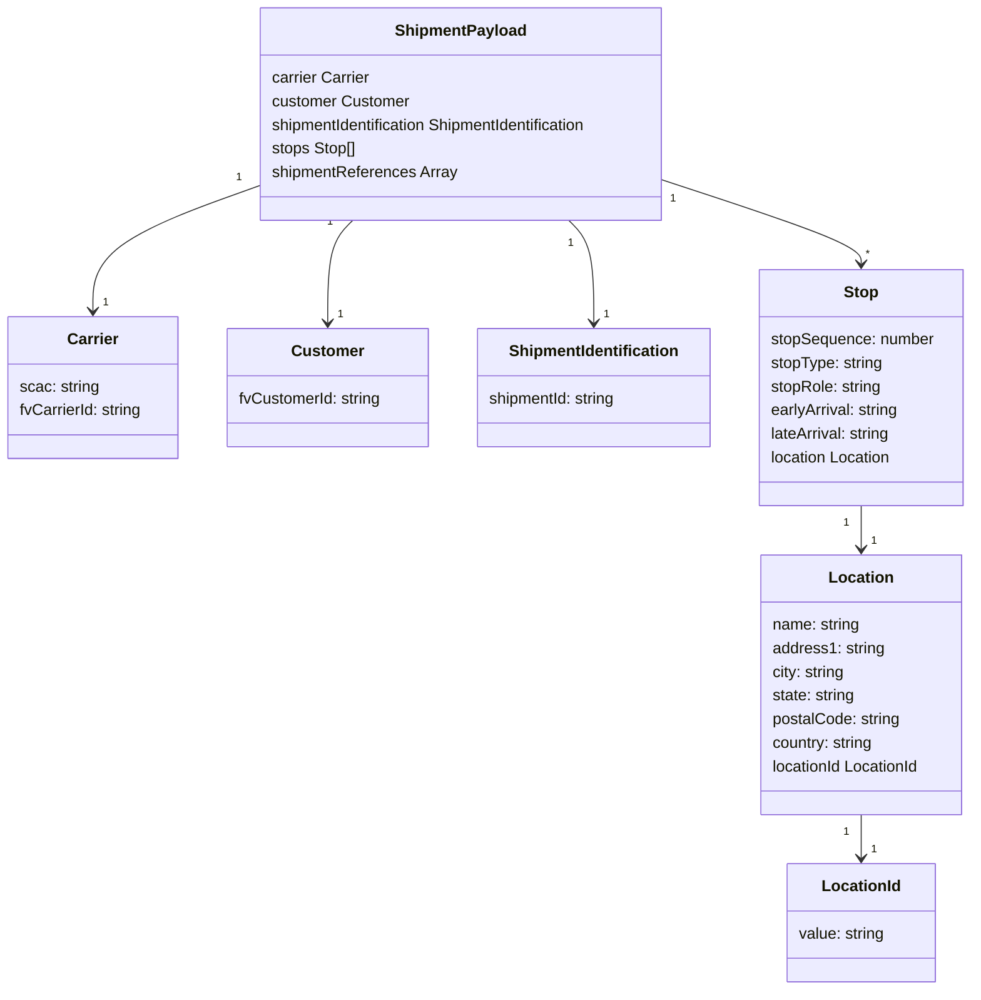

# Diagram: shipment_core/shipment_service/scripts/k6_load_tests/tests/shipments/generate-scheduled-events.js


> Auto-generated by Obscura crawlers

## Diagram 1

```mermaid
flowchart LR
  A[generateCreatorShipmentId()] --> B[postCreateShipment(payload)]
  B --> C{response.status === 201}
  C -->|true| D[console.log Created shipment "${creatorShipmentId}". DB ID: shipmentDbId]
  C -->|false| E[console.warn Failed to create "${creatorShipmentId}"\nconsole.log(response)]
```

> SVG rendering failed for this diagram.

## Diagram 2



### SVG

<svg id="container" width="996.26953125" xmlns="http://www.w3.org/2000/svg" class="classDiagram" height="1006" viewBox="0 0 996.26953125 1006" role="graphics-document document" aria-roledescription="class"><style>#container{font-family:"trebuchet ms",verdana,arial,sans-serif;font-size:16px;fill:#333;}@keyframes edge-animation-frame{from{stroke-dashoffset:0;}}@keyframes dash{to{stroke-dashoffset:0;}}#container .edge-animation-slow{stroke-dasharray:9,5!important;stroke-dashoffset:900;animation:dash 50s linear infinite;stroke-linecap:round;}#container .edge-animation-fast{stroke-dasharray:9,5!important;stroke-dashoffset:900;animation:dash 20s linear infinite;stroke-linecap:round;}#container .error-icon{fill:#552222;}#container .error-text{fill:#552222;stroke:#552222;}#container .edge-thickness-normal{stroke-width:1px;}#container .edge-thickness-thick{stroke-width:3.5px;}#container .edge-pattern-solid{stroke-dasharray:0;}#container .edge-thickness-invisible{stroke-width:0;fill:none;}#container .edge-pattern-dashed{stroke-dasharray:3;}#container .edge-pattern-dotted{stroke-dasharray:2;}#container .marker{fill:#333333;stroke:#333333;}#container .marker.cross{stroke:#333333;}#container svg{font-family:"trebuchet ms",verdana,arial,sans-serif;font-size:16px;}#container p{margin:0;}#container g.classGroup text{fill:#9370DB;stroke:none;font-family:"trebuchet ms",verdana,arial,sans-serif;font-size:10px;}#container g.classGroup text .title{font-weight:bolder;}#container .nodeLabel,#container .edgeLabel{color:#131300;}#container .edgeLabel .label rect{fill:#ECECFF;}#container .label text{fill:#131300;}#container .labelBkg{background:#ECECFF;}#container .edgeLabel .label span{background:#ECECFF;}#container .classTitle{font-weight:bolder;}#container .node rect,#container .node circle,#container .node ellipse,#container .node polygon,#container .node path{fill:#ECECFF;stroke:#9370DB;stroke-width:1px;}#container .divider{stroke:#9370DB;stroke-width:1;}#container g.clickable{cursor:pointer;}#container g.classGroup rect{fill:#ECECFF;stroke:#9370DB;}#container g.classGroup line{stroke:#9370DB;stroke-width:1;}#container .classLabel .box{stroke:none;stroke-width:0;fill:#ECECFF;opacity:0.5;}#container .classLabel .label{fill:#9370DB;font-size:10px;}#container .relation{stroke:#333333;stroke-width:1;fill:none;}#container .dashed-line{stroke-dasharray:3;}#container .dotted-line{stroke-dasharray:1 2;}#container #compositionStart,#container .composition{fill:#333333!important;stroke:#333333!important;stroke-width:1;}#container #compositionEnd,#container .composition{fill:#333333!important;stroke:#333333!important;stroke-width:1;}#container #dependencyStart,#container .dependency{fill:#333333!important;stroke:#333333!important;stroke-width:1;}#container #dependencyStart,#container .dependency{fill:#333333!important;stroke:#333333!important;stroke-width:1;}#container #extensionStart,#container .extension{fill:transparent!important;stroke:#333333!important;stroke-width:1;}#container #extensionEnd,#container .extension{fill:transparent!important;stroke:#333333!important;stroke-width:1;}#container #aggregationStart,#container .aggregation{fill:transparent!important;stroke:#333333!important;stroke-width:1;}#container #aggregationEnd,#container .aggregation{fill:transparent!important;stroke:#333333!important;stroke-width:1;}#container #lollipopStart,#container .lollipop{fill:#ECECFF!important;stroke:#333333!important;stroke-width:1;}#container #lollipopEnd,#container .lollipop{fill:#ECECFF!important;stroke:#333333!important;stroke-width:1;}#container .edgeTerminals{font-size:11px;line-height:initial;}#container .classTitleText{text-anchor:middle;font-size:18px;fill:#333;}#container .label-icon{display:inline-block;height:1em;overflow:visible;vertical-align:-0.125em;}#container .node .label-icon path{fill:currentColor;stroke:revert;stroke-width:revert;}#container :root{--mermaid-font-family:"trebuchet ms",verdana,arial,sans-serif;}</style><g><defs><marker id="container_class-aggregationStart" class="marker aggregation class" refX="18" refY="7" markerWidth="190" markerHeight="240" orient="auto"><path d="M 18,7 L9,13 L1,7 L9,1 Z"></path></marker></defs><defs><marker id="container_class-aggregationEnd" class="marker aggregation class" refX="1" refY="7" markerWidth="20" markerHeight="28" orient="auto"><path d="M 18,7 L9,13 L1,7 L9,1 Z"></path></marker></defs><defs><marker id="container_class-extensionStart" class="marker extension class" refX="18" refY="7" markerWidth="190" markerHeight="240" orient="auto"><path d="M 1,7 L18,13 V 1 Z"></path></marker></defs><defs><marker id="container_class-extensionEnd" class="marker extension class" refX="1" refY="7" markerWidth="20" markerHeight="28" orient="auto"><path d="M 1,1 V 13 L18,7 Z"></path></marker></defs><defs><marker id="container_class-compositionStart" class="marker composition class" refX="18" refY="7" markerWidth="190" markerHeight="240" orient="auto"><path d="M 18,7 L9,13 L1,7 L9,1 Z"></path></marker></defs><defs><marker id="container_class-compositionEnd" class="marker composition class" refX="1" refY="7" markerWidth="20" markerHeight="28" orient="auto"><path d="M 18,7 L9,13 L1,7 L9,1 Z"></path></marker></defs><defs><marker id="container_class-dependencyStart" class="marker dependency class" refX="6" refY="7" markerWidth="190" markerHeight="240" orient="auto"><path d="M 5,7 L9,13 L1,7 L9,1 Z"></path></marker></defs><defs><marker id="container_class-dependencyEnd" class="marker dependency class" refX="13" refY="7" markerWidth="20" markerHeight="28" orient="auto"><path d="M 18,7 L9,13 L14,7 L9,1 Z"></path></marker></defs><defs><marker id="container_class-lollipopStart" class="marker lollipop class" refX="13" refY="7" markerWidth="190" markerHeight="240" orient="auto"><circle stroke="black" fill="transparent" cx="7" cy="7" r="6"></circle></marker></defs><defs><marker id="container_class-lollipopEnd" class="marker lollipop class" refX="1" refY="7" markerWidth="190" markerHeight="240" orient="auto"><circle stroke="black" fill="transparent" cx="7" cy="7" r="6"></circle></marker></defs><g class="root"><g class="clusters"></g><g class="edgePaths"><path d="M260.428,190.917L232.998,200.597C205.569,210.278,150.71,229.639,123.281,250.486C95.852,271.333,95.852,293.667,95.852,304.833L95.852,316" id="id_ShipmentPayload_Carrier_1" class="edge-thickness-normal edge-pattern-solid relation" style=";;;" data-edge="true" data-et="edge" data-id="id_ShipmentPayload_Carrier_1" data-points="W3sieCI6MjYwLjQyNzczNDM3NSwieSI6MTkwLjkxNjgwMDk4Njc5OTV9LHsieCI6OTUuODUxNTYyNSwieSI6MjQ5fSx7IngiOjk1Ljg1MTU2MjUsInkiOjMyMn1d" marker-end="url(#container_class-dependencyEnd)"></path><path d="M361.908,224L357.634,228.167C353.359,232.333,344.811,240.667,340.536,258C336.262,275.333,336.262,301.667,336.262,314.833L336.262,328" id="id_ShipmentPayload_Customer_2" class="edge-thickness-normal edge-pattern-solid relation" style=";;;" data-edge="true" data-et="edge" data-id="id_ShipmentPayload_Customer_2" data-points="W3sieCI6MzYxLjkwODIzMjQ5NTMwMDc1LCJ5IjoyMjR9LHsieCI6MzM2LjI2MTcxODc1LCJ5IjoyNDl9LHsieCI6MzM2LjI2MTcxODc1LCJ5IjozMzR9XQ==" marker-end="url(#container_class-dependencyEnd)"></path><path d="M583.494,224L587.769,228.167C592.043,232.333,600.592,240.667,604.866,258C609.141,275.333,609.141,301.667,609.141,314.833L609.141,328" id="id_ShipmentPayload_ShipmentIdentification_3" class="edge-thickness-normal edge-pattern-solid relation" style=";;;" data-edge="true" data-et="edge" data-id="id_ShipmentPayload_ShipmentIdentification_3" data-points="W3sieCI6NTgzLjQ5NDExMTI1NDY5OTIsInkiOjIyNH0seyJ4Ijo2MDkuMTQwNjI1LCJ5IjoyNDl9LHsieCI6NjA5LjE0MDYyNSwieSI6MzM0fV0=" marker-end="url(#container_class-dependencyEnd)"></path><path d="M684.975,184.718L718.07,195.431C751.165,206.145,817.356,227.573,850.451,241.453C883.547,255.333,883.547,261.667,883.547,264.833L883.547,268" id="id_ShipmentPayload_Stop_4" class="edge-thickness-normal edge-pattern-solid relation" style=";;;" data-edge="true" data-et="edge" data-id="id_ShipmentPayload_Stop_4" data-points="W3sieCI6Njg0Ljk3NDYwOTM3NSwieSI6MTg0LjcxNzY4ODgzNzMzNTM0fSx7IngiOjg4My41NDY4NzUsInkiOjI0OX0seyJ4Ijo4ODMuNTQ2ODc1LCJ5IjoyNzR9XQ==" marker-end="url(#container_class-dependencyEnd)"></path><path d="M883.547,514L883.547,518.167C883.547,522.333,883.547,530.667,883.547,538C883.547,545.333,883.547,551.667,883.547,554.833L883.547,558" id="id_Stop_Location_5" class="edge-thickness-normal edge-pattern-solid relation" style=";;;" data-edge="true" data-et="edge" data-id="id_Stop_Location_5" data-points="W3sieCI6ODgzLjU0Njg3NSwieSI6NTE0fSx7IngiOjg4My41NDY4NzUsInkiOjUzOX0seyJ4Ijo4ODMuNTQ2ODc1LCJ5Ijo1NjR9XQ==" marker-end="url(#container_class-dependencyEnd)"></path><path d="M883.547,828L883.547,832.167C883.547,836.333,883.547,844.667,883.547,852C883.547,859.333,883.547,865.667,883.547,868.833L883.547,872" id="id_Location_LocationId_6" class="edge-thickness-normal edge-pattern-solid relation" style=";;;" data-edge="true" data-et="edge" data-id="id_Location_LocationId_6" data-points="W3sieCI6ODgzLjU0Njg3NSwieSI6ODI4fSx7IngiOjg4My41NDY4NzUsInkiOjg1M30seyJ4Ijo4ODMuNTQ2ODc1LCJ5Ijo4Nzh9XQ==" marker-end="url(#container_class-dependencyEnd)"></path></g><g class="edgeLabels"><g class="edgeLabel"><g class="label" data-id="id_ShipmentPayload_Carrier_1" transform="translate(0, 0)"><foreignObject width="0" height="0"><div xmlns="http://www.w3.org/1999/xhtml" class="labelBkg" style="display: table-cell; white-space: nowrap; line-height: 1.5; max-width: 200px; text-align: center;"><span class="edgeLabel"></span></div></foreignObject></g></g><g class="edgeLabel"><g class="label" data-id="id_ShipmentPayload_Customer_2" transform="translate(0, 0)"><foreignObject width="0" height="0"><div xmlns="http://www.w3.org/1999/xhtml" class="labelBkg" style="display: table-cell; white-space: nowrap; line-height: 1.5; max-width: 200px; text-align: center;"><span class="edgeLabel"></span></div></foreignObject></g></g><g class="edgeLabel"><g class="label" data-id="id_ShipmentPayload_ShipmentIdentification_3" transform="translate(0, 0)"><foreignObject width="0" height="0"><div xmlns="http://www.w3.org/1999/xhtml" class="labelBkg" style="display: table-cell; white-space: nowrap; line-height: 1.5; max-width: 200px; text-align: center;"><span class="edgeLabel"></span></div></foreignObject></g></g><g class="edgeLabel"><g class="label" data-id="id_ShipmentPayload_Stop_4" transform="translate(0, 0)"><foreignObject width="0" height="0"><div xmlns="http://www.w3.org/1999/xhtml" class="labelBkg" style="display: table-cell; white-space: nowrap; line-height: 1.5; max-width: 200px; text-align: center;"><span class="edgeLabel"></span></div></foreignObject></g></g><g class="edgeLabel"><g class="label" data-id="id_Stop_Location_5" transform="translate(0, 0)"><foreignObject width="0" height="0"><div xmlns="http://www.w3.org/1999/xhtml" class="labelBkg" style="display: table-cell; white-space: nowrap; line-height: 1.5; max-width: 200px; text-align: center;"><span class="edgeLabel"></span></div></foreignObject></g></g><g class="edgeLabel"><g class="label" data-id="id_Location_LocationId_6" transform="translate(0, 0)"><foreignObject width="0" height="0"><div xmlns="http://www.w3.org/1999/xhtml" class="labelBkg" style="display: table-cell; white-space: nowrap; line-height: 1.5; max-width: 200px; text-align: center;"><span class="edgeLabel"></span></div></foreignObject></g></g><g class="edgeTerminals" transform="translate(238.9332119358819, 182.59600789779358)"><g class="inner" transform="translate(0, 0)"><foreignObject style="width: 9px; height: 12px;"><div xmlns="http://www.w3.org/1999/xhtml" style="display: inline-block; padding-right: 1px; white-space: nowrap;"><span class="edgeLabel">1</span></div></foreignObject></g></g><g class="edgeTerminals" transform="translate(338.90656987127835, 225.4742861269919)"><g class="inner" transform="translate(0, 0)"><foreignObject style="width: 9px; height: 12px;"><div xmlns="http://www.w3.org/1999/xhtml" style="display: inline-block; padding-right: 1px; white-space: nowrap;"><span class="edgeLabel">1</span></div></foreignObject></g></g><g class="edgeTerminals" transform="translate(585.555068447668, 246.9565330899491)"><g class="inner" transform="translate(0, 0)"><foreignObject style="width: 9px; height: 12px;"><div xmlns="http://www.w3.org/1999/xhtml" style="display: inline-block; padding-right: 1px; white-space: nowrap;"><span class="edgeLabel">1</span></div></foreignObject></g></g><g class="edgeTerminals" transform="translate(697.0041451604812, 204.37831467059914)"><g class="inner" transform="translate(0, 0)"><foreignObject style="width: 9px; height: 12px;"><div xmlns="http://www.w3.org/1999/xhtml" style="display: inline-block; padding-right: 1px; white-space: nowrap;"><span class="edgeLabel">1</span></div></foreignObject></g></g><g class="edgeTerminals" transform="translate(868.5468775, 531.5000021428572)"><g class="inner" transform="translate(0, 0)"><foreignObject style="width: 9px; height: 12px;"><div xmlns="http://www.w3.org/1999/xhtml" style="display: inline-block; padding-right: 1px; white-space: nowrap;"><span class="edgeLabel">1</span></div></foreignObject></g></g><g class="edgeTerminals" transform="translate(868.5468775, 845.5000021428572)"><g class="inner" transform="translate(0, 0)"><foreignObject style="width: 9px; height: 12px;"><div xmlns="http://www.w3.org/1999/xhtml" style="display: inline-block; padding-right: 1px; white-space: nowrap;"><span class="edgeLabel">1</span></div></foreignObject></g></g><g class="edgeTerminals" transform="translate(105.85156124999996, 299.4999989285714)"><g class="inner" transform="translate(0, 0)"></g><foreignObject style="width: 9px; height: 12px;"><div xmlns="http://www.w3.org/1999/xhtml" style="display: inline-block; padding-right: 1px; white-space: nowrap;"><span class="edgeLabel">1</span></div></foreignObject></g><g class="edgeTerminals" transform="translate(346.261719375, 311.5000005357143)"><g class="inner" transform="translate(0, 0)"></g><foreignObject style="width: 9px; height: 12px;"><div xmlns="http://www.w3.org/1999/xhtml" style="display: inline-block; padding-right: 1px; white-space: nowrap;"><span class="edgeLabel">1</span></div></foreignObject></g><g class="edgeTerminals" transform="translate(619.1406274999998, 311.5000021428571)"><g class="inner" transform="translate(0, 0)"></g><foreignObject style="width: 9px; height: 12px;"><div xmlns="http://www.w3.org/1999/xhtml" style="display: inline-block; padding-right: 1px; white-space: nowrap;"><span class="edgeLabel">1</span></div></foreignObject></g><g class="edgeTerminals" transform="translate(887.9966327562603, 250.1466063999215)"><g class="inner" transform="translate(0, 0)"></g><foreignObject style="width: 9px; height: 12px;"><div xmlns="http://www.w3.org/1999/xhtml" style="display: inline-block; padding-right: 1px; white-space: nowrap;"><span class="edgeLabel">*</span></div></foreignObject></g><g class="edgeTerminals" transform="translate(893.5468774999998, 541.5000021428572)"><g class="inner" transform="translate(0, 0)"></g><foreignObject style="width: 9px; height: 12px;"><div xmlns="http://www.w3.org/1999/xhtml" style="display: inline-block; padding-right: 1px; white-space: nowrap;"><span class="edgeLabel">1</span></div></foreignObject></g><g class="edgeTerminals" transform="translate(893.5468774999998, 855.5000021428572)"><g class="inner" transform="translate(0, 0)"></g><foreignObject style="width: 9px; height: 12px;"><div xmlns="http://www.w3.org/1999/xhtml" style="display: inline-block; padding-right: 1px; white-space: nowrap;"><span class="edgeLabel">1</span></div></foreignObject></g></g><g class="nodes"><g class="node default" id="classId-ShipmentPayload-0" transform="translate(472.701171875, 116)"><g class="basic label-container"><path d="M-212.2734375 -108 L212.2734375 -108 L212.2734375 108 L-212.2734375 108" stroke="none" stroke-width="0" fill="#ECECFF" style=""></path><path d="M-212.2734375 -108 C-49.62222007404068 -108, 113.02899735191863 -108, 212.2734375 -108 M-212.2734375 -108 C-96.20391345957904 -108, 19.865610580841917 -108, 212.2734375 -108 M212.2734375 -108 C212.2734375 -33.5684363837277, 212.2734375 40.8631272325446, 212.2734375 108 M212.2734375 -108 C212.2734375 -59.29899449468613, 212.2734375 -10.597988989372254, 212.2734375 108 M212.2734375 108 C43.2586792393852 108, -125.7560790212296 108, -212.2734375 108 M212.2734375 108 C43.951043730688895 108, -124.37135003862221 108, -212.2734375 108 M-212.2734375 108 C-212.2734375 44.78455995219585, -212.2734375 -18.430880095608302, -212.2734375 -108 M-212.2734375 108 C-212.2734375 43.88759505807573, -212.2734375 -20.224809883848536, -212.2734375 -108" stroke="#9370DB" stroke-width="1.3" fill="none" stroke-dasharray="0 0" style=""></path></g><g class="annotation-group text" transform="translate(0, -84)"></g><g class="label-group text" transform="translate(-64.015625, -84)"><g class="label" style="font-weight: bolder" transform="translate(0,-12)"><foreignObject width="128.03125" height="24"><div xmlns="http://www.w3.org/1999/xhtml" style="display: table-cell; white-space: nowrap; line-height: 1.5; max-width: 177px; text-align: center;"><span class="nodeLabel markdown-node-label" style=""><p>ShipmentPayload</p></span></div></foreignObject></g></g><g class="members-group text" transform="translate(-200.2734375, -36)"><g class="label" style="" transform="translate(0,-12)"><foreignObject width="101.46875" height="24"><div xmlns="http://www.w3.org/1999/xhtml" style="display: table-cell; white-space: nowrap; line-height: 1.5; max-width: 152px; text-align: center;"><span class="nodeLabel markdown-node-label" style=""><p>carrier Carrier</p></span></div></foreignObject></g><g class="label" style="" transform="translate(0,12)"><foreignObject width="140.96875" height="24"><div xmlns="http://www.w3.org/1999/xhtml" style="display: table-cell; white-space: nowrap; line-height: 1.5; max-width: 192px; text-align: center;"><span class="nodeLabel markdown-node-label" style=""><p>customer Customer</p></span></div></foreignObject></g><g class="label" style="" transform="translate(0,36)"><foreignObject width="336.53125" height="24"><div xmlns="http://www.w3.org/1999/xhtml" style="display: table-cell; white-space: nowrap; line-height: 1.5; max-width: 387px; text-align: center;"><span class="nodeLabel markdown-node-label" style=""><p>shipmentIdentification ShipmentIdentification</p></span></div></foreignObject></g><g class="label" style="" transform="translate(0,60)"><foreignObject width="86.984375" height="24"><div xmlns="http://www.w3.org/1999/xhtml" style="display: table-cell; white-space: nowrap; line-height: 1.5; max-width: 137px; text-align: center;"><span class="nodeLabel markdown-node-label" style=""><p>stops Stop[]</p></span></div></foreignObject></g><g class="label" style="" transform="translate(0,84)"><foreignObject width="189.390625" height="24"><div xmlns="http://www.w3.org/1999/xhtml" style="display: table-cell; white-space: nowrap; line-height: 1.5; max-width: 240px; text-align: center;"><span class="nodeLabel markdown-node-label" style=""><p>shipmentReferences Array</p></span></div></foreignObject></g></g><g class="methods-group text" transform="translate(-200.2734375, 108)"></g><g class="divider" style=""><path d="M-212.2734375 -60 C-102.73135151643518 -60, 6.810734467129635 -60, 212.2734375 -60 M-212.2734375 -60 C-102.49429964230114 -60, 7.284838215397713 -60, 212.2734375 -60" stroke="#9370DB" stroke-width="1.3" fill="none" stroke-dasharray="0 0" style=""></path></g><g class="divider" style=""><path d="M-212.2734375 84 C-63.31543637759546 84, 85.64256474480908 84, 212.2734375 84 M-212.2734375 84 C-53.1394385112975 84, 105.994560477405 84, 212.2734375 84" stroke="#9370DB" stroke-width="1.3" fill="none" stroke-dasharray="0 0" style=""></path></g></g><g class="node default" id="classId-Carrier-1" transform="translate(95.8515625, 394)"><g class="basic label-container"><path d="M-87.8515625 -72 L87.8515625 -72 L87.8515625 72 L-87.8515625 72" stroke="none" stroke-width="0" fill="#ECECFF" style=""></path><path d="M-87.8515625 -72 C-23.31716050237185 -72, 41.2172414952563 -72, 87.8515625 -72 M-87.8515625 -72 C-45.129870611037035 -72, -2.4081787220740694 -72, 87.8515625 -72 M87.8515625 -72 C87.8515625 -15.649489859293276, 87.8515625 40.70102028141345, 87.8515625 72 M87.8515625 -72 C87.8515625 -24.558900172982405, 87.8515625 22.88219965403519, 87.8515625 72 M87.8515625 72 C29.98700215412495 72, -27.877558191750097 72, -87.8515625 72 M87.8515625 72 C32.914145143029046 72, -22.023272213941908 72, -87.8515625 72 M-87.8515625 72 C-87.8515625 32.42211233063917, -87.8515625 -7.155775338721654, -87.8515625 -72 M-87.8515625 72 C-87.8515625 29.819556443793935, -87.8515625 -12.36088711241213, -87.8515625 -72" stroke="#9370DB" stroke-width="1.3" fill="none" stroke-dasharray="0 0" style=""></path></g><g class="annotation-group text" transform="translate(0, -48)"></g><g class="label-group text" transform="translate(-25.203125, -48)"><g class="label" style="font-weight: bolder" transform="translate(0,-12)"><foreignObject width="50.40625" height="24"><div xmlns="http://www.w3.org/1999/xhtml" style="display: table-cell; white-space: nowrap; line-height: 1.5; max-width: 100px; text-align: center;"><span class="nodeLabel markdown-node-label" style=""><p>Carrier</p></span></div></foreignObject></g></g><g class="members-group text" transform="translate(-75.8515625, 0)"><g class="label" style="" transform="translate(0,-12)"><foreignObject width="81.09375" height="24"><div xmlns="http://www.w3.org/1999/xhtml" style="display: table-cell; white-space: nowrap; line-height: 1.5; max-width: 132px; text-align: center;"><span class="nodeLabel markdown-node-label" style=""><p>scac: string</p></span></div></foreignObject></g><g class="label" style="" transform="translate(0,12)"><foreignObject width="126.5" height="24"><div xmlns="http://www.w3.org/1999/xhtml" style="display: table-cell; white-space: nowrap; line-height: 1.5; max-width: 177px; text-align: center;"><span class="nodeLabel markdown-node-label" style=""><p>fvCarrierId: string</p></span></div></foreignObject></g></g><g class="methods-group text" transform="translate(-75.8515625, 72)"></g><g class="divider" style=""><path d="M-87.8515625 -24 C-22.873208047731765 -24, 42.10514640453647 -24, 87.8515625 -24 M-87.8515625 -24 C-23.983778265097044 -24, 39.88400596980591 -24, 87.8515625 -24" stroke="#9370DB" stroke-width="1.3" fill="none" stroke-dasharray="0 0" style=""></path></g><g class="divider" style=""><path d="M-87.8515625 48 C-51.9716554407141 48, -16.091748381428204 48, 87.8515625 48 M-87.8515625 48 C-48.92575238690195 48, -9.999942273803896 48, 87.8515625 48" stroke="#9370DB" stroke-width="1.3" fill="none" stroke-dasharray="0 0" style=""></path></g></g><g class="node default" id="classId-Customer-2" transform="translate(336.26171875, 394)"><g class="basic label-container"><path d="M-102.55859375 -60 L102.55859375 -60 L102.55859375 60 L-102.55859375 60" stroke="none" stroke-width="0" fill="#ECECFF" style=""></path><path d="M-102.55859375 -60 C-46.09037958259113 -60, 10.377834584817734 -60, 102.55859375 -60 M-102.55859375 -60 C-45.290765451803985 -60, 11.97706284639203 -60, 102.55859375 -60 M102.55859375 -60 C102.55859375 -15.88873574441508, 102.55859375 28.22252851116984, 102.55859375 60 M102.55859375 -60 C102.55859375 -19.431847658422598, 102.55859375 21.136304683154805, 102.55859375 60 M102.55859375 60 C55.63647225260735 60, 8.714350755214696 60, -102.55859375 60 M102.55859375 60 C47.69506953854162 60, -7.168454672916766 60, -102.55859375 60 M-102.55859375 60 C-102.55859375 31.8293979427199, -102.55859375 3.658795885439801, -102.55859375 -60 M-102.55859375 60 C-102.55859375 21.774067981196417, -102.55859375 -16.451864037607166, -102.55859375 -60" stroke="#9370DB" stroke-width="1.3" fill="none" stroke-dasharray="0 0" style=""></path></g><g class="annotation-group text" transform="translate(0, -36)"></g><g class="label-group text" transform="translate(-34.9140625, -36)"><g class="label" style="font-weight: bolder" transform="translate(0,-12)"><foreignObject width="69.828125" height="24"><div xmlns="http://www.w3.org/1999/xhtml" style="display: table-cell; white-space: nowrap; line-height: 1.5; max-width: 120px; text-align: center;"><span class="nodeLabel markdown-node-label" style=""><p>Customer</p></span></div></foreignObject></g></g><g class="members-group text" transform="translate(-90.55859375, 12)"><g class="label" style="" transform="translate(0,-12)"><foreignObject width="146.203125" height="24"><div xmlns="http://www.w3.org/1999/xhtml" style="display: table-cell; white-space: nowrap; line-height: 1.5; max-width: 197px; text-align: center;"><span class="nodeLabel markdown-node-label" style=""><p>fvCustomerId: string</p></span></div></foreignObject></g></g><g class="methods-group text" transform="translate(-90.55859375, 60)"></g><g class="divider" style=""><path d="M-102.55859375 -12 C-46.331892498726205 -12, 9.89480875254759 -12, 102.55859375 -12 M-102.55859375 -12 C-57.777995159861554 -12, -12.997396569723108 -12, 102.55859375 -12" stroke="#9370DB" stroke-width="1.3" fill="none" stroke-dasharray="0 0" style=""></path></g><g class="divider" style=""><path d="M-102.55859375 36 C-49.623577506785104 36, 3.3114387364297926 36, 102.55859375 36 M-102.55859375 36 C-34.05012678196857 36, 34.458340186062856 36, 102.55859375 36" stroke="#9370DB" stroke-width="1.3" fill="none" stroke-dasharray="0 0" style=""></path></g></g><g class="node default" id="classId-ShipmentIdentification-3" transform="translate(609.140625, 394)"><g class="basic label-container"><path d="M-120.3203125 -60 L120.3203125 -60 L120.3203125 60 L-120.3203125 60" stroke="none" stroke-width="0" fill="#ECECFF" style=""></path><path d="M-120.3203125 -60 C-42.17592095465753 -60, 35.968470590684944 -60, 120.3203125 -60 M-120.3203125 -60 C-42.72446532075192 -60, 34.871381858496164 -60, 120.3203125 -60 M120.3203125 -60 C120.3203125 -14.216831496845764, 120.3203125 31.566337006308473, 120.3203125 60 M120.3203125 -60 C120.3203125 -12.463527188167028, 120.3203125 35.072945623665944, 120.3203125 60 M120.3203125 60 C30.37582040096207 60, -59.56867169807586 60, -120.3203125 60 M120.3203125 60 C60.63545621084663 60, 0.9505999216932537 60, -120.3203125 60 M-120.3203125 60 C-120.3203125 24.172826127726978, -120.3203125 -11.654347744546044, -120.3203125 -60 M-120.3203125 60 C-120.3203125 25.341355261372634, -120.3203125 -9.317289477254732, -120.3203125 -60" stroke="#9370DB" stroke-width="1.3" fill="none" stroke-dasharray="0 0" style=""></path></g><g class="annotation-group text" transform="translate(0, -36)"></g><g class="label-group text" transform="translate(-84.1875, -36)"><g class="label" style="font-weight: bolder" transform="translate(0,-12)"><foreignObject width="168.375" height="24"><div xmlns="http://www.w3.org/1999/xhtml" style="display: table-cell; white-space: nowrap; line-height: 1.5; max-width: 217px; text-align: center;"><span class="nodeLabel markdown-node-label" style=""><p>ShipmentIdentification</p></span></div></foreignObject></g></g><g class="members-group text" transform="translate(-108.3203125, 12)"><g class="label" style="" transform="translate(0,-12)"><foreignObject width="132.453125" height="24"><div xmlns="http://www.w3.org/1999/xhtml" style="display: table-cell; white-space: nowrap; line-height: 1.5; max-width: 183px; text-align: center;"><span class="nodeLabel markdown-node-label" style=""><p>shipmentId: string</p></span></div></foreignObject></g></g><g class="methods-group text" transform="translate(-108.3203125, 60)"></g><g class="divider" style=""><path d="M-120.3203125 -12 C-70.24741066557567 -12, -20.174508831151357 -12, 120.3203125 -12 M-120.3203125 -12 C-39.165333453026506 -12, 41.98964559394699 -12, 120.3203125 -12" stroke="#9370DB" stroke-width="1.3" fill="none" stroke-dasharray="0 0" style=""></path></g><g class="divider" style=""><path d="M-120.3203125 36 C-29.240794034253625 36, 61.83872443149275 36, 120.3203125 36 M-120.3203125 36 C-52.983499098458196 36, 14.353314303083607 36, 120.3203125 36" stroke="#9370DB" stroke-width="1.3" fill="none" stroke-dasharray="0 0" style=""></path></g></g><g class="node default" id="classId-Stop-4" transform="translate(883.546875, 394)"><g class="basic label-container"><path d="M-104.0859375 -120 L104.0859375 -120 L104.0859375 120 L-104.0859375 120" stroke="none" stroke-width="0" fill="#ECECFF" style=""></path><path d="M-104.0859375 -120 C-58.73075180522269 -120, -13.375566110445376 -120, 104.0859375 -120 M-104.0859375 -120 C-43.47712952101372 -120, 17.131678457972555 -120, 104.0859375 -120 M104.0859375 -120 C104.0859375 -36.77758243906047, 104.0859375 46.444835121879066, 104.0859375 120 M104.0859375 -120 C104.0859375 -61.72190481883103, 104.0859375 -3.4438096376620564, 104.0859375 120 M104.0859375 120 C47.94093174878441 120, -8.204074002431184 120, -104.0859375 120 M104.0859375 120 C56.81940387852352 120, 9.552870257047033 120, -104.0859375 120 M-104.0859375 120 C-104.0859375 55.934908133233066, -104.0859375 -8.130183733533869, -104.0859375 -120 M-104.0859375 120 C-104.0859375 49.10766221221192, -104.0859375 -21.78467557557616, -104.0859375 -120" stroke="#9370DB" stroke-width="1.3" fill="none" stroke-dasharray="0 0" style=""></path></g><g class="annotation-group text" transform="translate(0, -96)"></g><g class="label-group text" transform="translate(-16.96875, -96)"><g class="label" style="font-weight: bolder" transform="translate(0,-12)"><foreignObject width="33.9375" height="24"><div xmlns="http://www.w3.org/1999/xhtml" style="display: table-cell; white-space: nowrap; line-height: 1.5; max-width: 83px; text-align: center;"><span class="nodeLabel markdown-node-label" style=""><p>Stop</p></span></div></foreignObject></g></g><g class="members-group text" transform="translate(-92.0859375, -48)"><g class="label" style="" transform="translate(0,-12)"><foreignObject width="167.203125" height="24"><div xmlns="http://www.w3.org/1999/xhtml" style="display: table-cell; white-space: nowrap; line-height: 1.5; max-width: 218px; text-align: center;"><span class="nodeLabel markdown-node-label" style=""><p>stopSequence: number</p></span></div></foreignObject></g><g class="label" style="" transform="translate(0,12)"><foreignObject width="115.296875" height="24"><div xmlns="http://www.w3.org/1999/xhtml" style="display: table-cell; white-space: nowrap; line-height: 1.5; max-width: 166px; text-align: center;"><span class="nodeLabel markdown-node-label" style=""><p>stopType: string</p></span></div></foreignObject></g><g class="label" style="" transform="translate(0,36)"><foreignObject width="113.6875" height="24"><div xmlns="http://www.w3.org/1999/xhtml" style="display: table-cell; white-space: nowrap; line-height: 1.5; max-width: 164px; text-align: center;"><span class="nodeLabel markdown-node-label" style=""><p>stopRole: string</p></span></div></foreignObject></g><g class="label" style="" transform="translate(0,60)"><foreignObject width="132.59375" height="24"><div xmlns="http://www.w3.org/1999/xhtml" style="display: table-cell; white-space: nowrap; line-height: 1.5; max-width: 183px; text-align: center;"><span class="nodeLabel markdown-node-label" style=""><p>earlyArrival: string</p></span></div></foreignObject></g><g class="label" style="" transform="translate(0,84)"><foreignObject width="124.328125" height="24"><div xmlns="http://www.w3.org/1999/xhtml" style="display: table-cell; white-space: nowrap; line-height: 1.5; max-width: 175px; text-align: center;"><span class="nodeLabel markdown-node-label" style=""><p>lateArrival: string</p></span></div></foreignObject></g><g class="label" style="" transform="translate(0,108)"><foreignObject width="125.515625" height="24"><div xmlns="http://www.w3.org/1999/xhtml" style="display: table-cell; white-space: nowrap; line-height: 1.5; max-width: 176px; text-align: center;"><span class="nodeLabel markdown-node-label" style=""><p>location Location</p></span></div></foreignObject></g></g><g class="methods-group text" transform="translate(-92.0859375, 120)"></g><g class="divider" style=""><path d="M-104.0859375 -72 C-23.46643110131781 -72, 57.15307529736438 -72, 104.0859375 -72 M-104.0859375 -72 C-32.74087651736912 -72, 38.60418446526177 -72, 104.0859375 -72" stroke="#9370DB" stroke-width="1.3" fill="none" stroke-dasharray="0 0" style=""></path></g><g class="divider" style=""><path d="M-104.0859375 96 C-51.93932018630558 96, 0.20729712738884132 96, 104.0859375 96 M-104.0859375 96 C-33.89871739070192 96, 36.28850271859616 96, 104.0859375 96" stroke="#9370DB" stroke-width="1.3" fill="none" stroke-dasharray="0 0" style=""></path></g></g><g class="node default" id="classId-Location-5" transform="translate(883.546875, 696)"><g class="basic label-container"><path d="M-104.72265625 -132 L104.72265625 -132 L104.72265625 132 L-104.72265625 132" stroke="none" stroke-width="0" fill="#ECECFF" style=""></path><path d="M-104.72265625 -132 C-53.9895465100379 -132, -3.256436770075794 -132, 104.72265625 -132 M-104.72265625 -132 C-40.035394909968545 -132, 24.65186643006291 -132, 104.72265625 -132 M104.72265625 -132 C104.72265625 -50.467716056582674, 104.72265625 31.064567886834652, 104.72265625 132 M104.72265625 -132 C104.72265625 -30.809434429793455, 104.72265625 70.38113114041309, 104.72265625 132 M104.72265625 132 C61.064740513983395 132, 17.40682477796679 132, -104.72265625 132 M104.72265625 132 C21.142407943914748 132, -62.437840362170505 132, -104.72265625 132 M-104.72265625 132 C-104.72265625 55.459602298524075, -104.72265625 -21.08079540295185, -104.72265625 -132 M-104.72265625 132 C-104.72265625 73.51251859316075, -104.72265625 15.025037186321498, -104.72265625 -132" stroke="#9370DB" stroke-width="1.3" fill="none" stroke-dasharray="0 0" style=""></path></g><g class="annotation-group text" transform="translate(0, -108)"></g><g class="label-group text" transform="translate(-31.3515625, -108)"><g class="label" style="font-weight: bolder" transform="translate(0,-12)"><foreignObject width="62.703125" height="24"><div xmlns="http://www.w3.org/1999/xhtml" style="display: table-cell; white-space: nowrap; line-height: 1.5; max-width: 112px; text-align: center;"><span class="nodeLabel markdown-node-label" style=""><p>Location</p></span></div></foreignObject></g></g><g class="members-group text" transform="translate(-92.72265625, -60)"><g class="label" style="" transform="translate(0,-12)"><foreignObject width="90.234375" height="24"><div xmlns="http://www.w3.org/1999/xhtml" style="display: table-cell; white-space: nowrap; line-height: 1.5; max-width: 141px; text-align: center;"><span class="nodeLabel markdown-node-label" style=""><p>name: string</p></span></div></foreignObject></g><g class="label" style="" transform="translate(0,12)"><foreignObject width="113.203125" height="24"><div xmlns="http://www.w3.org/1999/xhtml" style="display: table-cell; white-space: nowrap; line-height: 1.5; max-width: 164px; text-align: center;"><span class="nodeLabel markdown-node-label" style=""><p>address1: string</p></span></div></foreignObject></g><g class="label" style="" transform="translate(0,36)"><foreignObject width="75.515625" height="24"><div xmlns="http://www.w3.org/1999/xhtml" style="display: table-cell; white-space: nowrap; line-height: 1.5; max-width: 126px; text-align: center;"><span class="nodeLabel markdown-node-label" style=""><p>city: string</p></span></div></foreignObject></g><g class="label" style="" transform="translate(0,60)"><foreignObject width="85.8125" height="24"><div xmlns="http://www.w3.org/1999/xhtml" style="display: table-cell; white-space: nowrap; line-height: 1.5; max-width: 136px; text-align: center;"><span class="nodeLabel markdown-node-label" style=""><p>state: string</p></span></div></foreignObject></g><g class="label" style="" transform="translate(0,84)"><foreignObject width="131.203125" height="24"><div xmlns="http://www.w3.org/1999/xhtml" style="display: table-cell; white-space: nowrap; line-height: 1.5; max-width: 182px; text-align: center;"><span class="nodeLabel markdown-node-label" style=""><p>postalCode: string</p></span></div></foreignObject></g><g class="label" style="" transform="translate(0,108)"><foreignObject width="104.96875" height="24"><div xmlns="http://www.w3.org/1999/xhtml" style="display: table-cell; white-space: nowrap; line-height: 1.5; max-width: 156px; text-align: center;"><span class="nodeLabel markdown-node-label" style=""><p>country: string</p></span></div></foreignObject></g><g class="label" style="" transform="translate(0,132)"><foreignObject width="154.09375" height="24"><div xmlns="http://www.w3.org/1999/xhtml" style="display: table-cell; white-space: nowrap; line-height: 1.5; max-width: 204px; text-align: center;"><span class="nodeLabel markdown-node-label" style=""><p>locationId LocationId</p></span></div></foreignObject></g></g><g class="methods-group text" transform="translate(-92.72265625, 132)"></g><g class="divider" style=""><path d="M-104.72265625 -84 C-61.29800958887095 -84, -17.873362927741894 -84, 104.72265625 -84 M-104.72265625 -84 C-30.679196448349686 -84, 43.36426335330063 -84, 104.72265625 -84" stroke="#9370DB" stroke-width="1.3" fill="none" stroke-dasharray="0 0" style=""></path></g><g class="divider" style=""><path d="M-104.72265625 108 C-50.42138688358462 108, 3.879882482830766 108, 104.72265625 108 M-104.72265625 108 C-34.312241738195 108, 36.09817277361 108, 104.72265625 108" stroke="#9370DB" stroke-width="1.3" fill="none" stroke-dasharray="0 0" style=""></path></g></g><g class="node default" id="classId-LocationId-6" transform="translate(883.546875, 938)"><g class="basic label-container"><path d="M-75.54296875 -60 L75.54296875 -60 L75.54296875 60 L-75.54296875 60" stroke="none" stroke-width="0" fill="#ECECFF" style=""></path><path d="M-75.54296875 -60 C-36.456561965048316 -60, 2.6298448199033686 -60, 75.54296875 -60 M-75.54296875 -60 C-16.367898105059766 -60, 42.80717253988047 -60, 75.54296875 -60 M75.54296875 -60 C75.54296875 -24.072425425281637, 75.54296875 11.855149149436727, 75.54296875 60 M75.54296875 -60 C75.54296875 -15.100614711429877, 75.54296875 29.798770577140246, 75.54296875 60 M75.54296875 60 C43.02930203685812 60, 10.51563532371624 60, -75.54296875 60 M75.54296875 60 C21.04554249210311 60, -33.45188376579378 60, -75.54296875 60 M-75.54296875 60 C-75.54296875 23.51564171635193, -75.54296875 -12.968716567296141, -75.54296875 -60 M-75.54296875 60 C-75.54296875 35.42126035023865, -75.54296875 10.842520700477294, -75.54296875 -60" stroke="#9370DB" stroke-width="1.3" fill="none" stroke-dasharray="0 0" style=""></path></g><g class="annotation-group text" transform="translate(0, -36)"></g><g class="label-group text" transform="translate(-38.4921875, -36)"><g class="label" style="font-weight: bolder" transform="translate(0,-12)"><foreignObject width="76.984375" height="24"><div xmlns="http://www.w3.org/1999/xhtml" style="display: table-cell; white-space: nowrap; line-height: 1.5; max-width: 126px; text-align: center;"><span class="nodeLabel markdown-node-label" style=""><p>LocationId</p></span></div></foreignObject></g></g><g class="members-group text" transform="translate(-63.54296875, 12)"><g class="label" style="" transform="translate(0,-12)"><foreignObject width="88.59375" height="24"><div xmlns="http://www.w3.org/1999/xhtml" style="display: table-cell; white-space: nowrap; line-height: 1.5; max-width: 139px; text-align: center;"><span class="nodeLabel markdown-node-label" style=""><p>value: string</p></span></div></foreignObject></g></g><g class="methods-group text" transform="translate(-63.54296875, 60)"></g><g class="divider" style=""><path d="M-75.54296875 -12 C-41.386739097055 -12, -7.230509444109998 -12, 75.54296875 -12 M-75.54296875 -12 C-30.526296632965746 -12, 14.490375484068508 -12, 75.54296875 -12" stroke="#9370DB" stroke-width="1.3" fill="none" stroke-dasharray="0 0" style=""></path></g><g class="divider" style=""><path d="M-75.54296875 36 C-25.533238685582873 36, 24.476491378834254 36, 75.54296875 36 M-75.54296875 36 C-35.785797927327444 36, 3.9713728953451124 36, 75.54296875 36" stroke="#9370DB" stroke-width="1.3" fill="none" stroke-dasharray="0 0" style=""></path></g></g></g></g></g></svg>
