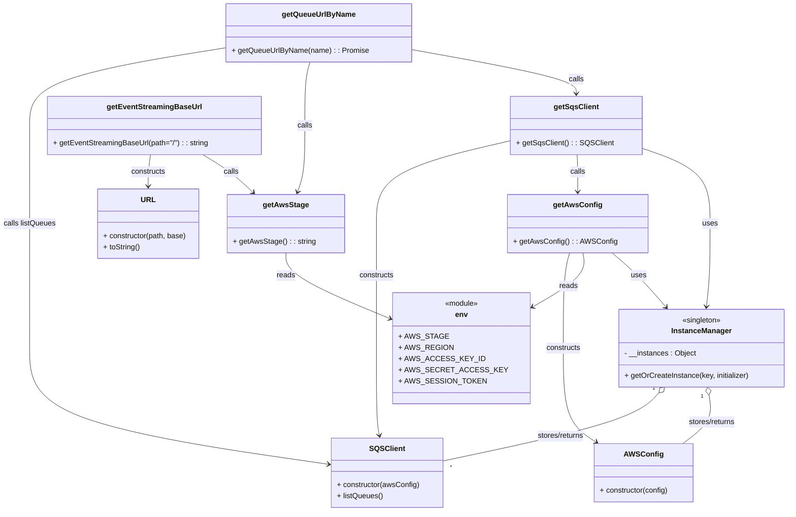

# Diagram: shipment_core/shipment_service/scripts/k6_load_tests/utils/aws.js

> Auto-generated by Obscura crawlers

## Mermaid

### SVG

<svg id="container" width="1660.115234375" xmlns="http://www.w3.org/2000/svg" class="classDiagram" height="1104" viewBox="0 0 1660.115234375 1104" role="graphics-document document" aria-roledescription="class"><g><defs><marker id="container_class-aggregationStart" class="marker aggregation class" refX="18" refY="7" markerWidth="190" markerHeight="240" orient="auto"><path d="M 18,7 L9,13 L1,7 L9,1 Z"></path></marker></defs><defs><marker id="container_class-aggregationEnd" class="marker aggregation class" refX="1" refY="7" markerWidth="20" markerHeight="28" orient="auto"><path d="M 18,7 L9,13 L1,7 L9,1 Z"></path></marker></defs><defs><marker id="container_class-extensionStart" class="marker extension class" refX="18" refY="7" markerWidth="190" markerHeight="240" orient="auto"><path d="M 1,7 L18,13 V 1 Z"></path></marker></defs><defs><marker id="container_class-extensionEnd" class="marker extension class" refX="1" refY="7" markerWidth="20" markerHeight="28" orient="auto"><path d="M 1,1 V 13 L18,7 Z"></path></marker></defs><defs><marker id="container_class-compositionStart" class="marker composition class" refX="18" refY="7" markerWidth="190" markerHeight="240" orient="auto"><path d="M 18,7 L9,13 L1,7 L9,1 Z"></path></marker></defs><defs><marker id="container_class-compositionEnd" class="marker composition class" refX="1" refY="7" markerWidth="20" markerHeight="28" orient="auto"><path d="M 18,7 L9,13 L1,7 L9,1 Z"></path></marker></defs><defs><marker id="container_class-dependencyStart" class="marker dependency class" refX="6" refY="7" markerWidth="190" markerHeight="240" orient="auto"><path d="M 5,7 L9,13 L1,7 L9,1 Z"></path></marker></defs><defs><marker id="container_class-dependencyEnd" class="marker dependency class" refX="13" refY="7" markerWidth="20" markerHeight="28" orient="auto"><path d="M 18,7 L9,13 L14,7 L9,1 Z"></path></marker></defs><defs><marker id="container_class-lollipopStart" class="marker lollipop class" refX="13" refY="7" markerWidth="190" markerHeight="240" orient="auto"><circle stroke="black" fill="transparent" cx="7" cy="7" r="6"></circle></marker></defs><defs><marker id="container_class-lollipopEnd" class="marker lollipop class" refX="1" refY="7" markerWidth="190" markerHeight="240" orient="auto"><circle stroke="black" fill="transparent" cx="7" cy="7" r="6"></circle></marker></defs><g class="root"><g class="clusters"></g><g class="edgePaths"><path d="M1283.535,546L1293.427,554.167C1303.319,562.333,1323.104,578.667,1342.514,598.232C1361.924,617.798,1380.959,640.596,1390.476,651.995L1399.994,663.394" id="id_getAwsConfig_InstanceManager_1" class="edge-thickness-normal edge-pattern-solid relation" style=";;;" data-edge="true" data-et="edge" data-id="id_getAwsConfig_InstanceManager_1" data-points="W3sieCI6MTI4My41MzQ3OTAwMzkwNjI1LCJ5Ijo1NDZ9LHsieCI6MTM0Mi44ODg2NzE4NzUsInkiOjU5NX0seyJ4IjoxNDAzLjgzOTQ1ODEwMTExNDYsInkiOjY2OH1d" marker-end="url(#container_class-dependencyEnd)"></path><path d="M1222.979,546L1225.022,554.167C1227.064,562.333,1231.149,578.667,1211.798,599.624C1192.447,620.581,1149.66,646.162,1128.266,658.952L1106.872,671.743" id="id_getAwsConfig_env_2" class="edge-thickness-normal edge-pattern-solid relation" style=";;;" data-edge="true" data-et="edge" data-id="id_getAwsConfig_env_2" data-points="W3sieCI6MTIyMi45NzkyNDgwNDY4NzUsInkiOjU0Nn0seyJ4IjoxMjM1LjIzNDM3NSwieSI6NTk1fSx7IngiOjExMDEuNzIyNjU2MjUsInkiOjY3NC44MjE4Mzk3NjQzNzY4fV0=" marker-end="url(#container_class-dependencyEnd)"></path><path d="M1188.854,546L1186.472,554.167C1184.091,562.333,1179.329,578.667,1176.948,613C1174.566,647.333,1174.566,699.667,1174.566,752C1174.566,804.333,1174.566,856.667,1186.407,890.459C1198.248,924.25,1221.929,939.501,1233.77,947.126L1245.61,954.751" id="id_getAwsConfig_AWSConfig_3" class="edge-thickness-normal edge-pattern-solid relation" style=";;;" data-edge="true" data-et="edge" data-id="id_getAwsConfig_AWSConfig_3" data-points="W3sieCI6MTE4OC44NTM1MTU2MjUsInkiOjU0Nn0seyJ4IjoxMTc0LjU2NjQwNjI1LCJ5Ijo1OTV9LHsieCI6MTE3NC41NjY0MDYyNSwieSI6NzUyfSx7IngiOjExNzQuNTY2NDA2MjUsInkiOjkwOX0seyJ4IjoxMjUwLjY1NDY2MzA4NTkzNzUsInkiOjk1OH1d" marker-end="url(#container_class-dependencyEnd)"></path><path d="M1344.129,319.038L1368.811,327.698C1393.493,336.358,1442.857,353.679,1467.539,381.006C1492.221,408.333,1492.221,445.667,1492.221,483C1492.221,520.333,1492.221,557.667,1490.922,587.507C1489.624,617.347,1487.027,639.693,1485.728,650.867L1484.429,662.04" id="id_getSqsClient_InstanceManager_4" class="edge-thickness-normal edge-pattern-solid relation" style=";;;" data-edge="true" data-et="edge" data-id="id_getSqsClient_InstanceManager_4" data-points="W3sieCI6MTM0NC4xMjg5MDYyNSwieSI6MzE5LjAzNzYwOTkwNjg2NjF9LHsieCI6MTQ5Mi4yMjA3MDMxMjUsInkiOjM3MX0seyJ4IjoxNDkyLjIyMDcwMzEyNSwieSI6NDgzfSx7IngiOjE0OTIuMjIwNzAzMTI1LCJ5Ijo1OTV9LHsieCI6MTQ4My43MzY4NTA2MTcwMzgzLCJ5Ijo2Njh9XQ==" marker-end="url(#container_class-dependencyEnd)"></path><path d="M1207.223,334L1207.223,340.167C1207.223,346.333,1207.223,358.667,1207.223,372C1207.223,385.333,1207.223,399.667,1207.223,406.833L1207.223,414" id="id_getSqsClient_getAwsConfig_5" class="edge-thickness-normal edge-pattern-solid relation" style=";;;" data-edge="true" data-et="edge" data-id="id_getSqsClient_getAwsConfig_5" data-points="W3sieCI6MTIwNy4yMjI2NTYyNSwieSI6MzM0fSx7IngiOjEyMDcuMjIyNjU2MjUsInkiOjM3MX0seyJ4IjoxMjA3LjIyMjY1NjI1LCJ5Ijo0MjB9XQ==" marker-end="url(#container_class-dependencyEnd)"></path><path d="M1070.316,305.34L1026.688,316.283C983.059,327.227,895.801,349.113,852.172,378.723C808.543,408.333,808.543,445.667,808.543,483C808.543,520.333,808.543,557.667,808.543,602.5C808.543,647.333,808.543,699.667,808.543,752C808.543,804.333,808.543,856.667,809.843,888.03C811.142,919.393,813.742,929.786,815.041,934.983L816.341,940.179" id="id_getSqsClient_SQSClient_6" class="edge-thickness-normal edge-pattern-solid relation" style=";;;" data-edge="true" data-et="edge" data-id="id_getSqsClient_SQSClient_6" data-points="W3sieCI6MTA3MC4zMTY0MDYyNSwieSI6MzA1LjMzOTkxMTAzNDQ2OTI1fSx7IngiOjgwOC41NDI5Njg3NSwieSI6MzcxfSx7IngiOjgwOC41NDI5Njg3NSwieSI6NDgzfSx7IngiOjgwOC41NDI5Njg3NSwieSI6NTk1fSx7IngiOjgwOC41NDI5Njg3NSwieSI6NzUyfSx7IngiOjgwOC41NDI5Njg3NSwieSI6OTA5fSx7IngiOjgxNy43OTY4NDAxMjI3Njc5LCJ5Ijo5NDZ9XQ==" marker-end="url(#container_class-dependencyEnd)"></path><path d="M882.508,108.684L936.627,119.07C990.746,129.456,1098.984,150.228,1153.104,165.781C1207.223,181.333,1207.223,191.667,1207.223,196.833L1207.223,202" id="id_getQueueUrlByName_getSqsClient_7" class="edge-thickness-normal edge-pattern-solid relation" style=";;;" data-edge="true" data-et="edge" data-id="id_getQueueUrlByName_getSqsClient_7" data-points="W3sieCI6ODgyLjUwNzgxMjUsInkiOjEwOC42ODQwMzg1MDE5MDQxfSx7IngiOjEyMDcuMjIyNjU2MjUsInkiOjE3MX0seyJ4IjoxMjA3LjIyMjY1NjI1LCJ5IjoyMDh9XQ==" marker-end="url(#container_class-dependencyEnd)"></path><path d="M671.826,134L670.424,140.167C669.022,146.333,666.219,158.667,664.818,181.5C663.416,204.333,663.416,237.667,663.416,271C663.416,304.333,663.416,337.667,660.426,361.576C657.437,385.485,651.457,399.969,648.468,407.212L645.478,414.454" id="id_getQueueUrlByName_getAwsStage_8" class="edge-thickness-normal edge-pattern-solid relation" style=";;;" data-edge="true" data-et="edge" data-id="id_getQueueUrlByName_getAwsStage_8" data-points="W3sieCI6NjcxLjgyNTU2NjQwNjI1LCJ5IjoxMzR9LHsieCI6NjYzLjQxNjAxNTYyNSwieSI6MTcxfSx7IngiOjY2My40MTYwMTU2MjUsInkiOjI3MX0seyJ4Ijo2NjMuNDE2MDE1NjI1LCJ5IjozNzF9LHsieCI6NjQzLjE4ODQ3NjU2MjUsInkiOjQyMH1d" marker-end="url(#container_class-dependencyEnd)"></path><path d="M489.781,102.618L418.999,114.015C348.216,125.412,206.651,148.206,135.868,176.27C65.086,204.333,65.086,237.667,65.086,271C65.086,304.333,65.086,337.667,65.086,373C65.086,408.333,65.086,445.667,65.086,483C65.086,520.333,65.086,557.667,65.086,602.5C65.086,647.333,65.086,699.667,65.086,752C65.086,804.333,65.086,856.667,172.801,898.471C280.517,940.276,495.948,971.551,603.663,987.189L711.379,1002.827" id="id_getQueueUrlByName_SQSClient_9" class="edge-thickness-normal edge-pattern-solid relation" style=";;;" data-edge="true" data-et="edge" data-id="id_getQueueUrlByName_SQSClient_9" data-points="W3sieCI6NDg5Ljc4MTI1LCJ5IjoxMDIuNjE3NTEyOTQwOTg0MDh9LHsieCI6NjUuMDg1OTM3NSwieSI6MTcxfSx7IngiOjY1LjA4NTkzNzUsInkiOjI3MX0seyJ4Ijo2NS4wODU5Mzc1LCJ5IjozNzF9LHsieCI6NjUuMDg1OTM3NSwieSI6NDgzfSx7IngiOjY1LjA4NTkzNzUsInkiOjU5NX0seyJ4Ijo2NS4wODU5Mzc1LCJ5Ijo3NTJ9LHsieCI6NjUuMDg1OTM3NSwieSI6OTA5fSx7IngiOjcxNy4zMTY0MDYyNSwieSI6MTAwMy42ODkyNjk2NTYwOTQzfV0=" marker-end="url(#container_class-dependencyEnd)"></path><path d="M442.107,334L452.553,340.167C463,346.333,483.892,358.667,501.826,372.294C519.76,385.922,534.734,400.843,542.221,408.304L549.708,415.765" id="id_getEventStreamingBaseUrl_getAwsStage_10" class="edge-thickness-normal edge-pattern-solid relation" style=";;;" data-edge="true" data-et="edge" data-id="id_getEventStreamingBaseUrl_getAwsStage_10" data-points="W3sieCI6NDQyLjEwNzAxMTcxODc1LCJ5IjozMzR9LHsieCI6NTA0Ljc4NTE1NjI1LCJ5IjozNzF9LHsieCI6NTUzLjk1ODYxODE2NDA2MjUsInkiOjQyMH1d" marker-end="url(#container_class-dependencyEnd)"></path><path d="M326.022,334L325.106,340.167C324.189,346.333,322.356,358.667,321.44,370C320.523,381.333,320.523,391.667,320.523,396.833L320.523,402" id="id_getEventStreamingBaseUrl_URL_11" class="edge-thickness-normal edge-pattern-solid relation" style=";;;" data-edge="true" data-et="edge" data-id="id_getEventStreamingBaseUrl_URL_11" data-points="W3sieCI6MzI2LjAyMjEyODkwNjI1LCJ5IjozMzR9LHsieCI6MzIwLjUyMzQzNzUsInkiOjM3MX0seyJ4IjozMjAuNTIzNDM3NSwieSI6NDA4fV0=" marker-end="url(#container_class-dependencyEnd)"></path><path d="M617.182,546L617.182,554.167C617.182,562.333,617.182,578.667,653.994,603.093C690.806,627.519,764.43,660.039,801.242,676.298L838.055,692.558" id="id_getAwsStage_env_12" class="edge-thickness-normal edge-pattern-solid relation" style=";;;" data-edge="true" data-et="edge" data-id="id_getAwsStage_env_12" data-points="W3sieCI6NjE3LjE4MTY0MDYyNSwieSI6NTQ2fSx7IngiOjYxNy4xODE2NDA2MjUsInkiOjU5NX0seyJ4Ijo4NDMuNTQyOTY4NzUsInkiOjY5NC45ODIwMjY1ODM3MzIxfV0=" marker-end="url(#container_class-dependencyEnd)"></path><path d="M1492.54,852.966L1494.257,862.305C1495.975,871.644,1499.409,890.322,1489.871,907.828C1480.333,925.333,1457.822,941.667,1446.566,949.833L1435.311,958" id="id_InstanceManager_AWSConfig_13" class="edge-thickness-normal edge-pattern-solid relation" style=";;;" data-edge="true" data-et="edge" data-id="id_InstanceManager_AWSConfig_13" data-points="W3sieCI6MTQ4OS40MjA1MTkwMDg3NTgsInkiOjgzNn0seyJ4IjoxNTAyLjg0Mzc1LCJ5Ijo5MDl9LHsieCI6MTQzNS4zMTA2Njg5NDUzMTI1LCJ5Ijo5NTh9XQ==" marker-start="url(#container_class-aggregationStart)"></path><path d="M1385.741,848.745L1376.582,858.788C1367.423,868.83,1349.105,888.915,1277.447,913.121C1205.789,937.326,1080.791,965.653,1018.292,979.816L955.793,993.979" id="id_InstanceManager_SQSClient_14" class="edge-thickness-normal edge-pattern-solid relation" style=";;;" data-edge="true" data-et="edge" data-id="id_InstanceManager_SQSClient_14" data-points="W3sieCI6MTM5Ny4zNjQ3MzY3NjM1MzUxLCJ5Ijo4MzZ9LHsieCI6MTMzMC43ODcxMDkzNzUsInkiOjkwOX0seyJ4Ijo5NTUuNzkyOTY4NzUsInkiOjk5My45Nzg5MzI3Njc0MzA2fV0=" marker-start="url(#container_class-aggregationStart)"></path></g><g class="edgeLabels"><g class="edgeLabel" transform="translate(1342.888671875, 595)"><g class="label" data-id="id_getAwsConfig_InstanceManager_1" transform="translate(-16.4921875, -12)"><foreignObject width="32.984375" height="24">

uses

</foreignObject></g></g><g class="edgeLabel" transform="translate(1190.15459, 621.95157)"><g class="label" data-id="id_getAwsConfig_env_2" transform="translate(-20.0078125, -12)"><foreignObject width="40.015625" height="24">

reads

</foreignObject></g></g><g class="edgeLabel" transform="translate(1174.56640625, 752)"><g class="label" data-id="id_getAwsConfig_AWSConfig_3" transform="translate(-37.84375, -12)"><foreignObject width="75.6875" height="24">

constructs

</foreignObject></g></g><g class="edgeLabel" transform="translate(1492.220703125, 483)"><g class="label" data-id="id_getSqsClient_InstanceManager_4" transform="translate(-16.4921875, -12)"><foreignObject width="32.984375" height="24">

uses

</foreignObject></g></g><g class="edgeLabel" transform="translate(1207.22265625, 371)"><g class="label" data-id="id_getSqsClient_getAwsConfig_5" transform="translate(-16.4453125, -12)"><foreignObject width="32.890625" height="24">

calls

</foreignObject></g></g><g class="edgeLabel" transform="translate(808.54296875, 595)"><g class="label" data-id="id_getSqsClient_SQSClient_6" transform="translate(-37.84375, -12)"><foreignObject width="75.6875" height="24">

constructs

</foreignObject></g></g><g class="edgeLabel" transform="translate(1207.22265625, 171)"><g class="label" data-id="id_getQueueUrlByName_getSqsClient_7" transform="translate(-16.4453125, -12)"><foreignObject width="32.890625" height="24">

calls

</foreignObject></g></g><g class="edgeLabel" transform="translate(663.416015625, 271)"><g class="label" data-id="id_getQueueUrlByName_getAwsStage_8" transform="translate(-16.4453125, -12)"><foreignObject width="32.890625" height="24">

calls

</foreignObject></g></g><g class="edgeLabel" transform="translate(65.0859375, 483)"><g class="label" data-id="id_getQueueUrlByName_SQSClient_9" transform="translate(-57.0859375, -12)"><foreignObject width="114.171875" height="24">

calls listQueues

</foreignObject></g></g><g class="edgeLabel" transform="translate(503.33625, 370.14469)"><g class="label" data-id="id_getEventStreamingBaseUrl_getAwsStage_10" transform="translate(-16.4453125, -12)"><foreignObject width="32.890625" height="24">

calls

</foreignObject></g></g><g class="edgeLabel" transform="translate(320.5234375, 371)"><g class="label" data-id="id_getEventStreamingBaseUrl_URL_11" transform="translate(-37.84375, -12)"><foreignObject width="75.6875" height="24">

constructs

</foreignObject></g></g><g class="edgeLabel" transform="translate(617.181640625, 595)"><g class="label" data-id="id_getAwsStage_env_12" transform="translate(-20.0078125, -12)"><foreignObject width="40.015625" height="24">

reads

</foreignObject></g></g><g class="edgeLabel" transform="translate(1499.11528, 911.70527)"><g class="label" data-id="id_InstanceManager_AWSConfig_13" transform="translate(-52.3046875, -12)"><foreignObject width="104.609375" height="24">

stores/returns

</foreignObject></g></g><g class="edgeLabel" transform="translate(1191.4688, 940.57148)"><g class="label" data-id="id_InstanceManager_SQSClient_14" transform="translate(-52.3046875, -12)"><foreignObject width="104.609375" height="24">

stores/returns

</foreignObject></g></g><g class="edgeTerminals" transform="translate(1477.8326936706133, 855.9241651841023)"><g class="inner" transform="translate(0, 0)"><foreignObject style="width: 9px; height: 12px;">
1
</foreignObject></g></g><g class="edgeTerminals" transform="translate(1374.4893077238232, 838.8222027413301)"><g class="inner" transform="translate(0, 0)"><foreignObject style="width: 9px; height: 12px;">
1
</foreignObject></g></g><g class="edgeTerminals" transform="translate(1453.2840609644397, 954.8636403651668)"><g class="inner" transform="translate(0, 0)"></g><foreignObject style="width: 9px; height: 12px;">
*
</foreignObject></g><g class="edgeTerminals" transform="translate(971.1753707531543, 999.7403291957537)"><g class="inner" transform="translate(0, 0)"></g><foreignObject style="width: 9px; height: 12px;">
*
</foreignObject></g></g><g class="nodes"><g class="node default" id="classId-InstanceManager-0" transform="translate(1473.974609375, 752)"><g class="basic label-container"><path d="M-178.140625 -84 L178.140625 -84 L178.140625 84 L-178.140625 84" stroke="none" stroke-width="0" fill="#ECECFF" style=""></path><path d="M-178.140625 -84 C-37.666115378188834 -84, 102.80839424362233 -84, 178.140625 -84 M-178.140625 -84 C-60.33819439637193 -84, 57.464236207256135 -84, 178.140625 -84 M178.140625 -84 C178.140625 -49.15489622178996, 178.140625 -14.309792443579923, 178.140625 84 M178.140625 -84 C178.140625 -22.938498087282284, 178.140625 38.12300382543543, 178.140625 84 M178.140625 84 C75.05542895081811 84, -28.029767098363777 84, -178.140625 84 M178.140625 84 C46.17807844222395 84, -85.7844681155521 84, -178.140625 84 M-178.140625 84 C-178.140625 43.04017298628058, -178.140625 2.0803459725611617, -178.140625 -84 M-178.140625 84 C-178.140625 37.10570830579494, -178.140625 -9.788583388410117, -178.140625 -84" stroke="#9370DB" stroke-width="1.3" fill="none" stroke-dasharray="0 0" style=""></path></g><g class="annotation-group text" transform="translate(-42.765625, -60)"><g class="label" style="" transform="translate(0,-12)"><foreignObject width="85.53125" height="24">

«singleton»

</foreignObject></g></g><g class="label-group text" transform="translate(-62.359375, -36)"><g class="label" style="font-weight: bolder" transform="translate(0,-12)"><foreignObject width="124.71875" height="24">

InstanceManager

</foreignObject></g></g><g class="members-group text" transform="translate(-166.140625, 12)"><g class="label" style="" transform="translate(0,-12)"><foreignObject width="155.3125" height="24">

- __instances : Object

</foreignObject></g></g><g class="methods-group text" transform="translate(-166.140625, 60)"><g class="label" style="" transform="translate(0,-12)"><foreignObject width="269.921875" height="24">

+ getOrCreateInstance(key, initializer)

</foreignObject></g></g><g class="divider" style=""><path d="M-178.140625 -12 C-79.41065160206921 -12, 19.319321795861583 -12, 178.140625 -12 M-178.140625 -12 C-75.17333469827624 -12, 27.79395560344753 -12, 178.140625 -12" stroke="#9370DB" stroke-width="1.3" fill="none" stroke-dasharray="0 0" style=""></path></g><g class="divider" style=""><path d="M-178.140625 36 C-91.93209997238884 36, -5.723574944777681 36, 178.140625 36 M-178.140625 36 C-48.03569584198695 36, 82.0692333160261 36, 178.140625 36" stroke="#9370DB" stroke-width="1.3" fill="none" stroke-dasharray="0 0" style=""></path></g></g><g class="node default" id="classId-AWSConfig-1" transform="translate(1348.482421875, 1021)"><g class="basic label-container"><path d="M-106.2890625 -63 L106.2890625 -63 L106.2890625 63 L-106.2890625 63" stroke="none" stroke-width="0" fill="#ECECFF" style=""></path><path d="M-106.2890625 -63 C-27.163051454413363 -63, 51.962959591173274 -63, 106.2890625 -63 M-106.2890625 -63 C-62.17578607436872 -63, -18.062509648737446 -63, 106.2890625 -63 M106.2890625 -63 C106.2890625 -18.72784662826487, 106.2890625 25.54430674347026, 106.2890625 63 M106.2890625 -63 C106.2890625 -31.868184498649423, 106.2890625 -0.7363689972988468, 106.2890625 63 M106.2890625 63 C25.33961506872717 63, -55.60983236254566 63, -106.2890625 63 M106.2890625 63 C29.864516832978182 63, -46.560028834043635 63, -106.2890625 63 M-106.2890625 63 C-106.2890625 36.923067031435984, -106.2890625 10.846134062871968, -106.2890625 -63 M-106.2890625 63 C-106.2890625 37.25110992462958, -106.2890625 11.502219849259163, -106.2890625 -63" stroke="#9370DB" stroke-width="1.3" fill="none" stroke-dasharray="0 0" style=""></path></g><g class="annotation-group text" transform="translate(0, -39)"></g><g class="label-group text" transform="translate(-38.921875, -39)"><g class="label" style="font-weight: bolder" transform="translate(0,-12)"><foreignObject width="77.84375" height="24">

AWSConfig

</foreignObject></g></g><g class="members-group text" transform="translate(-94.2890625, 9)"></g><g class="methods-group text" transform="translate(-94.2890625, 39)"><g class="label" style="" transform="translate(0,-12)"><foreignObject width="149.65625" height="24">

+ constructor(config)

</foreignObject></g></g><g class="divider" style=""><path d="M-106.2890625 -15 C-31.593574848020936 -15, 43.10191280395813 -15, 106.2890625 -15 M-106.2890625 -15 C-32.92236073307957 -15, 40.44434103384086 -15, 106.2890625 -15" stroke="#9370DB" stroke-width="1.3" fill="none" stroke-dasharray="0 0" style=""></path></g><g class="divider" style=""><path d="M-106.2890625 9 C-56.926070915740326 9, -7.563079331480651 9, 106.2890625 9 M-106.2890625 9 C-51.99547145954279 9, 2.298119580914417 9, 106.2890625 9" stroke="#9370DB" stroke-width="1.3" fill="none" stroke-dasharray="0 0" style=""></path></g></g><g class="node default" id="classId-SQSClient-2" transform="translate(836.5546875, 1021)"><g class="basic label-container"><path d="M-119.23828125 -75 L119.23828125 -75 L119.23828125 75 L-119.23828125 75" stroke="none" stroke-width="0" fill="#ECECFF" style=""></path><path d="M-119.23828125 -75 C-23.88796461039813 -75, 71.46235202920374 -75, 119.23828125 -75 M-119.23828125 -75 C-40.05979948621891 -75, 39.118682277562186 -75, 119.23828125 -75 M119.23828125 -75 C119.23828125 -26.46335169749746, 119.23828125 22.073296605005083, 119.23828125 75 M119.23828125 -75 C119.23828125 -24.13391105609133, 119.23828125 26.732177887817343, 119.23828125 75 M119.23828125 75 C65.831067145254 75, 12.423853040507979 75, -119.23828125 75 M119.23828125 75 C51.55826339722678 75, -16.121754455546437 75, -119.23828125 75 M-119.23828125 75 C-119.23828125 21.82066374150004, -119.23828125 -31.358672516999917, -119.23828125 -75 M-119.23828125 75 C-119.23828125 35.981019881878375, -119.23828125 -3.0379602362432507, -119.23828125 -75" stroke="#9370DB" stroke-width="1.3" fill="none" stroke-dasharray="0 0" style=""></path></g><g class="annotation-group text" transform="translate(0, -51)"></g><g class="label-group text" transform="translate(-35.9453125, -51)"><g class="label" style="font-weight: bolder" transform="translate(0,-12)"><foreignObject width="71.890625" height="24">

SQSClient

</foreignObject></g></g><g class="members-group text" transform="translate(-107.23828125, -3)"></g><g class="methods-group text" transform="translate(-107.23828125, 27)"><g class="label" style="" transform="translate(0,-12)"><foreignObject width="178.53125" height="24">

+ constructor(awsConfig)

</foreignObject></g><g class="label" style="" transform="translate(0,12)"><foreignObject width="99.640625" height="24">

+ listQueues()

</foreignObject></g></g><g class="divider" style=""><path d="M-119.23828125 -27 C-41.189022339735956 -27, 36.86023657052809 -27, 119.23828125 -27 M-119.23828125 -27 C-25.060901560339047 -27, 69.1164781293219 -27, 119.23828125 -27" stroke="#9370DB" stroke-width="1.3" fill="none" stroke-dasharray="0 0" style=""></path></g><g class="divider" style=""><path d="M-119.23828125 -3 C-31.370179597381707 -3, 56.497922055236586 -3, 119.23828125 -3 M-119.23828125 -3 C-55.22543270227875 -3, 8.787415845442496 -3, 119.23828125 -3" stroke="#9370DB" stroke-width="1.3" fill="none" stroke-dasharray="0 0" style=""></path></g></g><g class="node default" id="classId-URL-3" transform="translate(320.5234375, 483)"><g class="basic label-container"><path d="M-109.8515625 -75 L109.8515625 -75 L109.8515625 75 L-109.8515625 75" stroke="none" stroke-width="0" fill="#ECECFF" style=""></path><path d="M-109.8515625 -75 C-50.82167443937817 -75, 8.208213621243658 -75, 109.8515625 -75 M-109.8515625 -75 C-57.265942626494045 -75, -4.68032275298809 -75, 109.8515625 -75 M109.8515625 -75 C109.8515625 -38.975357663161624, 109.8515625 -2.950715326323248, 109.8515625 75 M109.8515625 -75 C109.8515625 -22.77584463489918, 109.8515625 29.44831073020164, 109.8515625 75 M109.8515625 75 C63.8346945513623 75, 17.817826602724594 75, -109.8515625 75 M109.8515625 75 C62.68084864692833 75, 15.510134793856665 75, -109.8515625 75 M-109.8515625 75 C-109.8515625 16.0201572070146, -109.8515625 -42.9596855859708, -109.8515625 -75 M-109.8515625 75 C-109.8515625 29.719892365220637, -109.8515625 -15.560215269558725, -109.8515625 -75" stroke="#9370DB" stroke-width="1.3" fill="none" stroke-dasharray="0 0" style=""></path></g><g class="annotation-group text" transform="translate(0, -51)"></g><g class="label-group text" transform="translate(-14.25, -51)"><g class="label" style="font-weight: bolder" transform="translate(0,-12)"><foreignObject width="28.5" height="24">

URL

</foreignObject></g></g><g class="members-group text" transform="translate(-97.8515625, -3)"></g><g class="methods-group text" transform="translate(-97.8515625, 27)"><g class="label" style="" transform="translate(0,-12)"><foreignObject width="181.453125" height="24">

+ constructor(path, base)

</foreignObject></g><g class="label" style="" transform="translate(0,12)"><foreignObject width="80.359375" height="24">

+ toString()

</foreignObject></g></g><g class="divider" style=""><path d="M-109.8515625 -27 C-51.50890679229089 -27, 6.8337489154182265 -27, 109.8515625 -27 M-109.8515625 -27 C-31.191397144298463 -27, 47.468768211403074 -27, 109.8515625 -27" stroke="#9370DB" stroke-width="1.3" fill="none" stroke-dasharray="0 0" style=""></path></g><g class="divider" style=""><path d="M-109.8515625 -3 C-35.41404885155919 -3, 39.023464796881626 -3, 109.8515625 -3 M-109.8515625 -3 C-40.39202458831062 -3, 29.067513323378762 -3, 109.8515625 -3" stroke="#9370DB" stroke-width="1.3" fill="none" stroke-dasharray="0 0" style=""></path></g></g><g class="node default" id="classId-env-4" transform="translate(972.6328125, 752)"><g class="basic label-container"><path d="M-129.08984375 -120 L129.08984375 -120 L129.08984375 120 L-129.08984375 120" stroke="none" stroke-width="0" fill="#ECECFF" style=""></path><path d="M-129.08984375 -120 C-49.09083073504422 -120, 30.908182279911557 -120, 129.08984375 -120 M-129.08984375 -120 C-45.20966083632105 -120, 38.6705220773579 -120, 129.08984375 -120 M129.08984375 -120 C129.08984375 -58.06392721588036, 129.08984375 3.872145568239276, 129.08984375 120 M129.08984375 -120 C129.08984375 -42.54897501770583, 129.08984375 34.90204996458834, 129.08984375 120 M129.08984375 120 C42.84734353673373 120, -43.39515667653254 120, -129.08984375 120 M129.08984375 120 C36.83393194568339 120, -55.42197985863322 120, -129.08984375 120 M-129.08984375 120 C-129.08984375 66.64170309004462, -129.08984375 13.283406180089216, -129.08984375 -120 M-129.08984375 120 C-129.08984375 49.0586821305243, -129.08984375 -21.882635738951393, -129.08984375 -120" stroke="#9370DB" stroke-width="1.3" fill="none" stroke-dasharray="0 0" style=""></path></g><g class="annotation-group text" transform="translate(-36.6015625, -96)"><g class="label" style="" transform="translate(0,-12)"><foreignObject width="73.203125" height="24">

«module»

</foreignObject></g></g><g class="label-group text" transform="translate(-13.09375, -72)"><g class="label" style="font-weight: bolder" transform="translate(0,-12)"><foreignObject width="26.1875" height="24">

env

</foreignObject></g></g><g class="members-group text" transform="translate(-117.08984375, -24)"><g class="label" style="" transform="translate(0,-12)"><foreignObject width="94.203125" height="24">

+ AWS_STAGE

</foreignObject></g><g class="label" style="" transform="translate(0,12)"><foreignObject width="105.875" height="24">

+ AWS_REGION

</foreignObject></g><g class="label" style="" transform="translate(0,36)"><foreignObject width="159.875" height="24">

+ AWS_ACCESS_KEY_ID

</foreignObject></g><g class="label" style="" transform="translate(0,60)"><foreignObject width="197.578125" height="24">

+ AWS_SECRET_ACCESS_KEY

</foreignObject></g><g class="label" style="" transform="translate(0,84)"><foreignObject width="167" height="24">

+ AWS_SESSION_TOKEN

</foreignObject></g></g><g class="methods-group text" transform="translate(-117.08984375, 120)"></g><g class="divider" style=""><path d="M-129.08984375 -48 C-53.41507681454701 -48, 22.259690120905987 -48, 129.08984375 -48 M-129.08984375 -48 C-51.67053964119792 -48, 25.74876446760416 -48, 129.08984375 -48" stroke="#9370DB" stroke-width="1.3" fill="none" stroke-dasharray="0 0" style=""></path></g><g class="divider" style=""><path d="M-129.08984375 96 C-37.01994561699628 96, 55.04995251600744 96, 129.08984375 96 M-129.08984375 96 C-70.34806795722143 96, -11.606292164442863 96, 129.08984375 96" stroke="#9370DB" stroke-width="1.3" fill="none" stroke-dasharray="0 0" style=""></path></g></g><g class="node default" id="classId-getAwsStage-5" transform="translate(617.181640625, 483)"><g class="basic label-container"><path d="M-122.92578125 -63 L122.92578125 -63 L122.92578125 63 L-122.92578125 63" stroke="none" stroke-width="0" fill="#ECECFF" style=""></path><path d="M-122.92578125 -63 C-47.715046163341896 -63, 27.49568892331621 -63, 122.92578125 -63 M-122.92578125 -63 C-60.28470874567315 -63, 2.3563637586537 -63, 122.92578125 -63 M122.92578125 -63 C122.92578125 -15.612362413202248, 122.92578125 31.775275173595503, 122.92578125 63 M122.92578125 -63 C122.92578125 -34.818674689703734, 122.92578125 -6.637349379407468, 122.92578125 63 M122.92578125 63 C37.63229072138702 63, -47.661199807225955 63, -122.92578125 63 M122.92578125 63 C58.26067083668275 63, -6.404439576634502 63, -122.92578125 63 M-122.92578125 63 C-122.92578125 35.5913290101349, -122.92578125 8.182658020269791, -122.92578125 -63 M-122.92578125 63 C-122.92578125 13.328166222438732, -122.92578125 -36.343667555122536, -122.92578125 -63" stroke="#9370DB" stroke-width="1.3" fill="none" stroke-dasharray="0 0" style=""></path></g><g class="annotation-group text" transform="translate(0, -39)"></g><g class="label-group text" transform="translate(-46.8359375, -39)"><g class="label" style="font-weight: bolder" transform="translate(0,-12)"><foreignObject width="93.671875" height="24">

getAwsStage

</foreignObject></g></g><g class="members-group text" transform="translate(-110.92578125, 9)"></g><g class="methods-group text" transform="translate(-110.92578125, 39)"><g class="label" style="" transform="translate(0,-12)"><foreignObject width="175.015625" height="24">

+ getAwsStage() : : string

</foreignObject></g></g><g class="divider" style=""><path d="M-122.92578125 -15 C-69.378596759823 -15, -15.831412269645995 -15, 122.92578125 -15 M-122.92578125 -15 C-73.1109789294172 -15, -23.296176608834415 -15, 122.92578125 -15" stroke="#9370DB" stroke-width="1.3" fill="none" stroke-dasharray="0 0" style=""></path></g><g class="divider" style=""><path d="M-122.92578125 9 C-71.9832722347301 9, -21.04076321946019 9, 122.92578125 9 M-122.92578125 9 C-46.39783628955843 9, 30.130108670883146 9, 122.92578125 9" stroke="#9370DB" stroke-width="1.3" fill="none" stroke-dasharray="0 0" style=""></path></g></g><g class="node default" id="classId-getAwsConfig-6" transform="translate(1207.22265625, 483)"><g class="basic label-container"><path d="M-143.80859375 -63 L143.80859375 -63 L143.80859375 63 L-143.80859375 63" stroke="none" stroke-width="0" fill="#ECECFF" style=""></path><path d="M-143.80859375 -63 C-47.33168278446604 -63, 49.14522818106792 -63, 143.80859375 -63 M-143.80859375 -63 C-44.26128595883567 -63, 55.28602183232866 -63, 143.80859375 -63 M143.80859375 -63 C143.80859375 -25.679605294962172, 143.80859375 11.640789410075655, 143.80859375 63 M143.80859375 -63 C143.80859375 -27.11555081305775, 143.80859375 8.768898373884497, 143.80859375 63 M143.80859375 63 C30.752011009042306 63, -82.30457173191539 63, -143.80859375 63 M143.80859375 63 C37.50559667426175 63, -68.7974004014765 63, -143.80859375 63 M-143.80859375 63 C-143.80859375 18.32234488132822, -143.80859375 -26.35531023734356, -143.80859375 -63 M-143.80859375 63 C-143.80859375 28.400897557718892, -143.80859375 -6.198204884562216, -143.80859375 -63" stroke="#9370DB" stroke-width="1.3" fill="none" stroke-dasharray="0 0" style=""></path></g><g class="annotation-group text" transform="translate(0, -39)"></g><g class="label-group text" transform="translate(-49.2421875, -39)"><g class="label" style="font-weight: bolder" transform="translate(0,-12)"><foreignObject width="98.484375" height="24">

getAwsConfig

</foreignObject></g></g><g class="members-group text" transform="translate(-131.80859375, 9)"></g><g class="methods-group text" transform="translate(-131.80859375, 39)"><g class="label" style="" transform="translate(0,-12)"><foreignObject width="214.375" height="24">

+ getAwsConfig() : : AWSConfig

</foreignObject></g></g><g class="divider" style=""><path d="M-143.80859375 -15 C-82.52451750106805 -15, -21.240441252136094 -15, 143.80859375 -15 M-143.80859375 -15 C-29.178761821673277 -15, 85.45107010665345 -15, 143.80859375 -15" stroke="#9370DB" stroke-width="1.3" fill="none" stroke-dasharray="0 0" style=""></path></g><g class="divider" style=""><path d="M-143.80859375 9 C-34.66239978734437 9, 74.48379417531126 9, 143.80859375 9 M-143.80859375 9 C-61.26142785498321 9, 21.28573804003358 9, 143.80859375 9" stroke="#9370DB" stroke-width="1.3" fill="none" stroke-dasharray="0 0" style=""></path></g></g><g class="node default" id="classId-getSqsClient-7" transform="translate(1207.22265625, 271)"><g class="basic label-container"><path d="M-136.90625 -63 L136.90625 -63 L136.90625 63 L-136.90625 63" stroke="none" stroke-width="0" fill="#ECECFF" style=""></path><path d="M-136.90625 -63 C-49.33736549922551 -63, 38.231519001548975 -63, 136.90625 -63 M-136.90625 -63 C-73.46336508709436 -63, -10.020480174188734 -63, 136.90625 -63 M136.90625 -63 C136.90625 -19.96238383782203, 136.90625 23.075232324355937, 136.90625 63 M136.90625 -63 C136.90625 -28.396650794131517, 136.90625 6.206698411736966, 136.90625 63 M136.90625 63 C31.587932133149607 63, -73.73038573370079 63, -136.90625 63 M136.90625 63 C66.79859757525641 63, -3.3090548494871825 63, -136.90625 63 M-136.90625 63 C-136.90625 33.96021059899286, -136.90625 4.920421197985711, -136.90625 -63 M-136.90625 63 C-136.90625 22.2504500291395, -136.90625 -18.499099941721, -136.90625 -63" stroke="#9370DB" stroke-width="1.3" fill="none" stroke-dasharray="0 0" style=""></path></g><g class="annotation-group text" transform="translate(0, -39)"></g><g class="label-group text" transform="translate(-46.25, -39)"><g class="label" style="font-weight: bolder" transform="translate(0,-12)"><foreignObject width="92.5" height="24">

getSqsClient

</foreignObject></g></g><g class="members-group text" transform="translate(-124.90625, 9)"></g><g class="methods-group text" transform="translate(-124.90625, 39)"><g class="label" style="" transform="translate(0,-12)"><foreignObject width="203.5625" height="24">

+ getSqsClient() : : SQSClient

</foreignObject></g></g><g class="divider" style=""><path d="M-136.90625 -15 C-34.88571579982724 -15, 67.13481840034552 -15, 136.90625 -15 M-136.90625 -15 C-51.31184181217789 -15, 34.28256637564422 -15, 136.90625 -15" stroke="#9370DB" stroke-width="1.3" fill="none" stroke-dasharray="0 0" style=""></path></g><g class="divider" style=""><path d="M-136.90625 9 C-53.61717574429622 9, 29.671898511407562 9, 136.90625 9 M-136.90625 9 C-44.495309366865456 9, 47.91563126626909 9, 136.90625 9" stroke="#9370DB" stroke-width="1.3" fill="none" stroke-dasharray="0 0" style=""></path></g></g><g class="node default" id="classId-getQueueUrlByName-8" transform="translate(686.14453125, 71)"><g class="basic label-container"><path d="M-196.36328125 -63 L196.36328125 -63 L196.36328125 63 L-196.36328125 63" stroke="none" stroke-width="0" fill="#ECECFF" style=""></path><path d="M-196.36328125 -63 C-72.09566706619863 -63, 52.17194711760274 -63, 196.36328125 -63 M-196.36328125 -63 C-71.09260522239576 -63, 54.17807080520848 -63, 196.36328125 -63 M196.36328125 -63 C196.36328125 -19.70442225666526, 196.36328125 23.59115548666948, 196.36328125 63 M196.36328125 -63 C196.36328125 -35.49007308626987, 196.36328125 -7.980146172539733, 196.36328125 63 M196.36328125 63 C86.5282637697645 63, -23.306753710471014 63, -196.36328125 63 M196.36328125 63 C75.13267768272023 63, -46.097925884559544 63, -196.36328125 63 M-196.36328125 63 C-196.36328125 33.83142512909276, -196.36328125 4.6628502581855145, -196.36328125 -63 M-196.36328125 63 C-196.36328125 15.975121956799782, -196.36328125 -31.049756086400436, -196.36328125 -63" stroke="#9370DB" stroke-width="1.3" fill="none" stroke-dasharray="0 0" style=""></path></g><g class="annotation-group text" transform="translate(0, -39)"></g><g class="label-group text" transform="translate(-75.9765625, -39)"><g class="label" style="font-weight: bolder" transform="translate(0,-12)"><foreignObject width="151.953125" height="24">

getQueueUrlByName

</foreignObject></g></g><g class="members-group text" transform="translate(-184.36328125, 9)"></g><g class="methods-group text" transform="translate(-184.36328125, 39)"><g class="label" style="" transform="translate(0,-12)"><foreignObject width="292.75" height="24">

+ getQueueUrlByName(name) : : Promise

</foreignObject></g></g><g class="divider" style=""><path d="M-196.36328125 -15 C-64.54134028535685 -15, 67.2806006792863 -15, 196.36328125 -15 M-196.36328125 -15 C-97.48013095756656 -15, 1.4030193348668831 -15, 196.36328125 -15" stroke="#9370DB" stroke-width="1.3" fill="none" stroke-dasharray="0 0" style=""></path></g><g class="divider" style=""><path d="M-196.36328125 9 C-110.58226821102168 9, -24.80125517204337 9, 196.36328125 9 M-196.36328125 9 C-95.75354736474503 9, 4.856186520509937 9, 196.36328125 9" stroke="#9370DB" stroke-width="1.3" fill="none" stroke-dasharray="0 0" style=""></path></g></g><g class="node default" id="classId-getEventStreamingBaseUrl-9" transform="translate(335.384765625, 271)"><g class="basic label-container"><path d="M-229.37109375 -63 L229.37109375 -63 L229.37109375 63 L-229.37109375 63" stroke="none" stroke-width="0" fill="#ECECFF" style=""></path><path d="M-229.37109375 -63 C-48.49930645122683 -63, 132.37248084754634 -63, 229.37109375 -63 M-229.37109375 -63 C-102.67885818814024 -63, 24.01337737371952 -63, 229.37109375 -63 M229.37109375 -63 C229.37109375 -20.113075628948003, 229.37109375 22.773848742103993, 229.37109375 63 M229.37109375 -63 C229.37109375 -20.207755275885255, 229.37109375 22.58448944822949, 229.37109375 63 M229.37109375 63 C121.12597477773384 63, 12.88085580546769 63, -229.37109375 63 M229.37109375 63 C58.4056235871403 63, -112.5598465757194 63, -229.37109375 63 M-229.37109375 63 C-229.37109375 34.94171618191541, -229.37109375 6.883432363830828, -229.37109375 -63 M-229.37109375 63 C-229.37109375 15.36268847657091, -229.37109375 -32.27462304685818, -229.37109375 -63" stroke="#9370DB" stroke-width="1.3" fill="none" stroke-dasharray="0 0" style=""></path></g><g class="annotation-group text" transform="translate(0, -39)"></g><g class="label-group text" transform="translate(-97.6484375, -39)"><g class="label" style="font-weight: bolder" transform="translate(0,-12)"><foreignObject width="195.296875" height="24">

getEventStreamingBaseUrl

</foreignObject></g></g><g class="members-group text" transform="translate(-217.37109375, 9)"></g><g class="methods-group text" transform="translate(-217.37109375, 39)"><g class="label" style="" transform="translate(0,-12)"><foreignObject width="337.09375" height="24">

+ getEventStreamingBaseUrl(path="/") : : string

</foreignObject></g></g><g class="divider" style=""><path d="M-229.37109375 -15 C-89.63830974721006 -15, 50.09447425557988 -15, 229.37109375 -15 M-229.37109375 -15 C-132.06691197385706 -15, -34.76273019771412 -15, 229.37109375 -15" stroke="#9370DB" stroke-width="1.3" fill="none" stroke-dasharray="0 0" style=""></path></g><g class="divider" style=""><path d="M-229.37109375 9 C-121.97968087281645 9, -14.58826799563289 9, 229.37109375 9 M-229.37109375 9 C-115.92670612577592 9, -2.4823185015518447 9, 229.37109375 9" stroke="#9370DB" stroke-width="1.3" fill="none" stroke-dasharray="0 0" style=""></path></g></g></g></g></g></svg>
