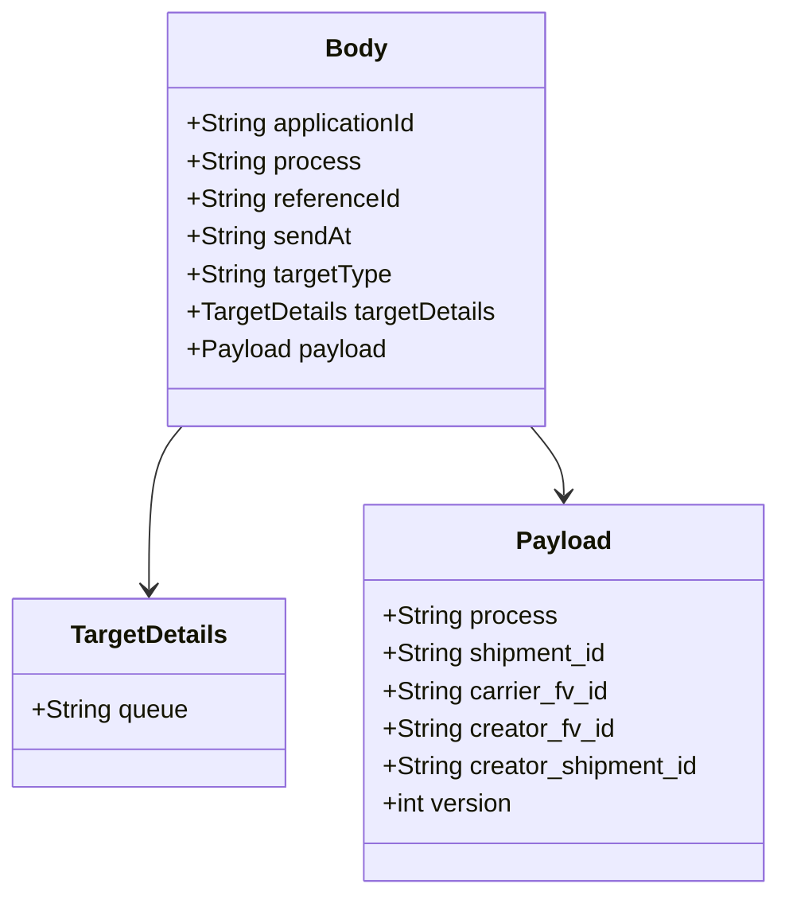

# Diagram: shipment_core/shipment_service/scripts/k6_load_tests/utils/event-scheduler.js


> Auto-generated by Obscura crawlers

## Diagram 1

```mermaid
graph TD
  A[putActivityMonitoringScheduledEvent(shipment, targetQueueUrl)] --> B{shipment present?}
  B -- No --> C[Throw Error: "Missing shipment"]
  B -- Yes --> D{targetQueueUrl present?}
  D -- No --> E[Throw Error: "Missing targetQueueUrl"]
  D -- Yes --> F[Build body object]
  F --> F1[applicationId: "SHIPMENTS"]
  F --> F2[process: "ACTIVITY_MONITORING"]
  F --> F3[referenceId: uuidv4()]
  F --> F4[sendAt: new Date().toISOString()]
  F --> F5[targetType: "SQS_STANDARD"]
  F --> F6[targetDetails: { queue: targetQueueUrl }]
  F --> F7[payload: { shipment_id, carrier_fv_id, creator_fv_id, creator_shipment_id, version:1 }]
  F --> G[params: { headers: { "Content-Type": "application/json" } }]
  G --> H[getEventStreamingBaseUrl("/event-scheduler/v1/jobs") -> url]
  H --> I[http.put(url, JSON.stringify(body), params) -> return response]
```

> SVG rendering failed for this diagram.

## Diagram 2



### SVG

<svg id="container" width="495.6953125" xmlns="http://www.w3.org/2000/svg" class="classDiagram" height="570" viewBox="0 0 495.6953125 570" role="graphics-document document" aria-roledescription="class"><style>#container{font-family:"trebuchet ms",verdana,arial,sans-serif;font-size:16px;fill:#333;}@keyframes edge-animation-frame{from{stroke-dashoffset:0;}}@keyframes dash{to{stroke-dashoffset:0;}}#container .edge-animation-slow{stroke-dasharray:9,5!important;stroke-dashoffset:900;animation:dash 50s linear infinite;stroke-linecap:round;}#container .edge-animation-fast{stroke-dasharray:9,5!important;stroke-dashoffset:900;animation:dash 20s linear infinite;stroke-linecap:round;}#container .error-icon{fill:#552222;}#container .error-text{fill:#552222;stroke:#552222;}#container .edge-thickness-normal{stroke-width:1px;}#container .edge-thickness-thick{stroke-width:3.5px;}#container .edge-pattern-solid{stroke-dasharray:0;}#container .edge-thickness-invisible{stroke-width:0;fill:none;}#container .edge-pattern-dashed{stroke-dasharray:3;}#container .edge-pattern-dotted{stroke-dasharray:2;}#container .marker{fill:#333333;stroke:#333333;}#container .marker.cross{stroke:#333333;}#container svg{font-family:"trebuchet ms",verdana,arial,sans-serif;font-size:16px;}#container p{margin:0;}#container g.classGroup text{fill:#9370DB;stroke:none;font-family:"trebuchet ms",verdana,arial,sans-serif;font-size:10px;}#container g.classGroup text .title{font-weight:bolder;}#container .nodeLabel,#container .edgeLabel{color:#131300;}#container .edgeLabel .label rect{fill:#ECECFF;}#container .label text{fill:#131300;}#container .labelBkg{background:#ECECFF;}#container .edgeLabel .label span{background:#ECECFF;}#container .classTitle{font-weight:bolder;}#container .node rect,#container .node circle,#container .node ellipse,#container .node polygon,#container .node path{fill:#ECECFF;stroke:#9370DB;stroke-width:1px;}#container .divider{stroke:#9370DB;stroke-width:1;}#container g.clickable{cursor:pointer;}#container g.classGroup rect{fill:#ECECFF;stroke:#9370DB;}#container g.classGroup line{stroke:#9370DB;stroke-width:1;}#container .classLabel .box{stroke:none;stroke-width:0;fill:#ECECFF;opacity:0.5;}#container .classLabel .label{fill:#9370DB;font-size:10px;}#container .relation{stroke:#333333;stroke-width:1;fill:none;}#container .dashed-line{stroke-dasharray:3;}#container .dotted-line{stroke-dasharray:1 2;}#container #compositionStart,#container .composition{fill:#333333!important;stroke:#333333!important;stroke-width:1;}#container #compositionEnd,#container .composition{fill:#333333!important;stroke:#333333!important;stroke-width:1;}#container #dependencyStart,#container .dependency{fill:#333333!important;stroke:#333333!important;stroke-width:1;}#container #dependencyStart,#container .dependency{fill:#333333!important;stroke:#333333!important;stroke-width:1;}#container #extensionStart,#container .extension{fill:transparent!important;stroke:#333333!important;stroke-width:1;}#container #extensionEnd,#container .extension{fill:transparent!important;stroke:#333333!important;stroke-width:1;}#container #aggregationStart,#container .aggregation{fill:transparent!important;stroke:#333333!important;stroke-width:1;}#container #aggregationEnd,#container .aggregation{fill:transparent!important;stroke:#333333!important;stroke-width:1;}#container #lollipopStart,#container .lollipop{fill:#ECECFF!important;stroke:#333333!important;stroke-width:1;}#container #lollipopEnd,#container .lollipop{fill:#ECECFF!important;stroke:#333333!important;stroke-width:1;}#container .edgeTerminals{font-size:11px;line-height:initial;}#container .classTitleText{text-anchor:middle;font-size:18px;fill:#333;}#container .label-icon{display:inline-block;height:1em;overflow:visible;vertical-align:-0.125em;}#container .node .label-icon path{fill:currentColor;stroke:revert;stroke-width:revert;}#container :root{--mermaid-font-family:"trebuchet ms",verdana,arial,sans-serif;}</style><g><defs><marker id="container_class-aggregationStart" class="marker aggregation class" refX="18" refY="7" markerWidth="190" markerHeight="240" orient="auto"><path d="M 18,7 L9,13 L1,7 L9,1 Z"></path></marker></defs><defs><marker id="container_class-aggregationEnd" class="marker aggregation class" refX="1" refY="7" markerWidth="20" markerHeight="28" orient="auto"><path d="M 18,7 L9,13 L1,7 L9,1 Z"></path></marker></defs><defs><marker id="container_class-extensionStart" class="marker extension class" refX="18" refY="7" markerWidth="190" markerHeight="240" orient="auto"><path d="M 1,7 L18,13 V 1 Z"></path></marker></defs><defs><marker id="container_class-extensionEnd" class="marker extension class" refX="1" refY="7" markerWidth="20" markerHeight="28" orient="auto"><path d="M 1,1 V 13 L18,7 Z"></path></marker></defs><defs><marker id="container_class-compositionStart" class="marker composition class" refX="18" refY="7" markerWidth="190" markerHeight="240" orient="auto"><path d="M 18,7 L9,13 L1,7 L9,1 Z"></path></marker></defs><defs><marker id="container_class-compositionEnd" class="marker composition class" refX="1" refY="7" markerWidth="20" markerHeight="28" orient="auto"><path d="M 18,7 L9,13 L1,7 L9,1 Z"></path></marker></defs><defs><marker id="container_class-dependencyStart" class="marker dependency class" refX="6" refY="7" markerWidth="190" markerHeight="240" orient="auto"><path d="M 5,7 L9,13 L1,7 L9,1 Z"></path></marker></defs><defs><marker id="container_class-dependencyEnd" class="marker dependency class" refX="13" refY="7" markerWidth="20" markerHeight="28" orient="auto"><path d="M 18,7 L9,13 L14,7 L9,1 Z"></path></marker></defs><defs><marker id="container_class-lollipopStart" class="marker lollipop class" refX="13" refY="7" markerWidth="190" markerHeight="240" orient="auto"><circle stroke="black" fill="transparent" cx="7" cy="7" r="6"></circle></marker></defs><defs><marker id="container_class-lollipopEnd" class="marker lollipop class" refX="1" refY="7" markerWidth="190" markerHeight="240" orient="auto"><circle stroke="black" fill="transparent" cx="7" cy="7" r="6"></circle></marker></defs><g class="root"><g class="clusters"></g><g class="edgePaths"><path d="M115.466,272L111.951,276.167C108.437,280.333,101.408,288.667,97.893,306C94.379,323.333,94.379,349.667,94.379,362.833L94.379,376" id="id_Body_TargetDetails_1" class="edge-thickness-normal edge-pattern-solid relation" style=";;;" data-edge="true" data-et="edge" data-id="id_Body_TargetDetails_1" data-points="W3sieCI6MTE1LjQ2NTUwMzA4NTE5MTA5LCJ5IjoyNzJ9LHsieCI6OTQuMzc4OTA2MjUsInkiOjI5N30seyJ4Ijo5NC4zNzg5MDYyNSwieSI6MzgyfV0=" marker-end="url(#container_class-dependencyEnd)"></path><path d="M338.14,272L341.654,276.167C345.169,280.333,352.198,288.667,355.712,296C359.227,303.333,359.227,309.667,359.227,312.833L359.227,316" id="id_Body_Payload_2" class="edge-thickness-normal edge-pattern-solid relation" style=";;;" data-edge="true" data-et="edge" data-id="id_Body_Payload_2" data-points="W3sieCI6MzM4LjEzOTk2NTY2NDgwODksInkiOjI3Mn0seyJ4IjozNTkuMjI2NTYyNSwieSI6Mjk3fSx7IngiOjM1OS4yMjY1NjI1LCJ5IjozMjJ9XQ==" marker-end="url(#container_class-dependencyEnd)"></path></g><g class="edgeLabels"><g class="edgeLabel"><g class="label" data-id="id_Body_TargetDetails_1" transform="translate(0, 0)"><foreignObject width="0" height="0"><div xmlns="http://www.w3.org/1999/xhtml" class="labelBkg" style="display: table-cell; white-space: nowrap; line-height: 1.5; max-width: 200px; text-align: center;"><span class="edgeLabel"></span></div></foreignObject></g></g><g class="edgeLabel"><g class="label" data-id="id_Body_Payload_2" transform="translate(0, 0)"><foreignObject width="0" height="0"><div xmlns="http://www.w3.org/1999/xhtml" class="labelBkg" style="display: table-cell; white-space: nowrap; line-height: 1.5; max-width: 200px; text-align: center;"><span class="edgeLabel"></span></div></foreignObject></g></g></g><g class="nodes"><g class="node default" id="classId-Body-0" transform="translate(226.802734375, 140)"><g class="basic label-container"><path d="M-120.82421875 -132 L120.82421875 -132 L120.82421875 132 L-120.82421875 132" stroke="none" stroke-width="0" fill="#ECECFF" style=""></path><path d="M-120.82421875 -132 C-59.419491401727285 -132, 1.98523594654543 -132, 120.82421875 -132 M-120.82421875 -132 C-42.83324887907547 -132, 35.15772099184906 -132, 120.82421875 -132 M120.82421875 -132 C120.82421875 -36.8053198573902, 120.82421875 58.389360285219595, 120.82421875 132 M120.82421875 -132 C120.82421875 -44.27142409223433, 120.82421875 43.45715181553135, 120.82421875 132 M120.82421875 132 C40.93487836329062 132, -38.954462023418756 132, -120.82421875 132 M120.82421875 132 C52.31385301237515 132, -16.196512725249704 132, -120.82421875 132 M-120.82421875 132 C-120.82421875 49.60952946741156, -120.82421875 -32.780941065176876, -120.82421875 -132 M-120.82421875 132 C-120.82421875 68.40664933153082, -120.82421875 4.813298663061644, -120.82421875 -132" stroke="#9370DB" stroke-width="1.3" fill="none" stroke-dasharray="0 0" style=""></path></g><g class="annotation-group text" transform="translate(0, -108)"></g><g class="label-group text" transform="translate(-18.5546875, -108)"><g class="label" style="font-weight: bolder" transform="translate(0,-12)"><foreignObject width="37.109375" height="24"><div xmlns="http://www.w3.org/1999/xhtml" style="display: table-cell; white-space: nowrap; line-height: 1.5; max-width: 87px; text-align: center;"><span class="nodeLabel markdown-node-label" style=""><p>Body</p></span></div></foreignObject></g></g><g class="members-group text" transform="translate(-108.82421875, -60)"><g class="label" style="" transform="translate(0,-12)"><foreignObject width="150.875" height="24"><div xmlns="http://www.w3.org/1999/xhtml" style="display: table-cell; white-space: nowrap; line-height: 1.5; max-width: 208px; text-align: center;"><span class="nodeLabel markdown-node-label" style=""><p>+String applicationId</p></span></div></foreignObject></g><g class="label" style="" transform="translate(0,12)"><foreignObject width="109.84375" height="24"><div xmlns="http://www.w3.org/1999/xhtml" style="display: table-cell; white-space: nowrap; line-height: 1.5; max-width: 167px; text-align: center;"><span class="nodeLabel markdown-node-label" style=""><p>+String process</p></span></div></foreignObject></g><g class="label" style="" transform="translate(0,36)"><foreignObject width="136.9375" height="24"><div xmlns="http://www.w3.org/1999/xhtml" style="display: table-cell; white-space: nowrap; line-height: 1.5; max-width: 194px; text-align: center;"><span class="nodeLabel markdown-node-label" style=""><p>+String referenceId</p></span></div></foreignObject></g><g class="label" style="" transform="translate(0,60)"><foreignObject width="104.546875" height="24"><div xmlns="http://www.w3.org/1999/xhtml" style="display: table-cell; white-space: nowrap; line-height: 1.5; max-width: 162px; text-align: center;"><span class="nodeLabel markdown-node-label" style=""><p>+String sendAt</p></span></div></foreignObject></g><g class="label" style="" transform="translate(0,84)"><foreignObject width="131.0625" height="24"><div xmlns="http://www.w3.org/1999/xhtml" style="display: table-cell; white-space: nowrap; line-height: 1.5; max-width: 188px; text-align: center;"><span class="nodeLabel markdown-node-label" style=""><p>+String targetType</p></span></div></foreignObject></g><g class="label" style="" transform="translate(0,108)"><foreignObject width="199.09375" height="24"><div xmlns="http://www.w3.org/1999/xhtml" style="display: table-cell; white-space: nowrap; line-height: 1.5; max-width: 256px; text-align: center;"><span class="nodeLabel markdown-node-label" style=""><p>+TargetDetails targetDetails</p></span></div></foreignObject></g><g class="label" style="" transform="translate(0,132)"><foreignObject width="126.796875" height="24"><div xmlns="http://www.w3.org/1999/xhtml" style="display: table-cell; white-space: nowrap; line-height: 1.5; max-width: 184px; text-align: center;"><span class="nodeLabel markdown-node-label" style=""><p>+Payload payload</p></span></div></foreignObject></g></g><g class="methods-group text" transform="translate(-108.82421875, 132)"></g><g class="divider" style=""><path d="M-120.82421875 -84 C-35.344697246848256 -84, 50.13482425630349 -84, 120.82421875 -84 M-120.82421875 -84 C-25.61988717323895 -84, 69.5844444035221 -84, 120.82421875 -84" stroke="#9370DB" stroke-width="1.3" fill="none" stroke-dasharray="0 0" style=""></path></g><g class="divider" style=""><path d="M-120.82421875 108 C-37.82265984374908 108, 45.17889906250184 108, 120.82421875 108 M-120.82421875 108 C-26.969574556795806 108, 66.88506963640839 108, 120.82421875 108" stroke="#9370DB" stroke-width="1.3" fill="none" stroke-dasharray="0 0" style=""></path></g></g><g class="node default" id="classId-TargetDetails-1" transform="translate(94.37890625, 442)"><g class="basic label-container"><path d="M-86.37890625 -60 L86.37890625 -60 L86.37890625 60 L-86.37890625 60" stroke="none" stroke-width="0" fill="#ECECFF" style=""></path><path d="M-86.37890625 -60 C-31.40245444218816 -60, 23.573997365623683 -60, 86.37890625 -60 M-86.37890625 -60 C-42.94009577051636 -60, 0.49871470896728454 -60, 86.37890625 -60 M86.37890625 -60 C86.37890625 -15.920777882396543, 86.37890625 28.158444235206915, 86.37890625 60 M86.37890625 -60 C86.37890625 -20.749124503313993, 86.37890625 18.501750993372013, 86.37890625 60 M86.37890625 60 C36.65241735101881 60, -13.074071547962376 60, -86.37890625 60 M86.37890625 60 C34.026298252714476 60, -18.32630974457105 60, -86.37890625 60 M-86.37890625 60 C-86.37890625 31.689690239180727, -86.37890625 3.3793804783614547, -86.37890625 -60 M-86.37890625 60 C-86.37890625 19.80668742346603, -86.37890625 -20.38662515306794, -86.37890625 -60" stroke="#9370DB" stroke-width="1.3" fill="none" stroke-dasharray="0 0" style=""></path></g><g class="annotation-group text" transform="translate(0, -36)"></g><g class="label-group text" transform="translate(-48.6484375, -36)"><g class="label" style="font-weight: bolder" transform="translate(0,-12)"><foreignObject width="97.296875" height="24"><div xmlns="http://www.w3.org/1999/xhtml" style="display: table-cell; white-space: nowrap; line-height: 1.5; max-width: 145px; text-align: center;"><span class="nodeLabel markdown-node-label" style=""><p>TargetDetails</p></span></div></foreignObject></g></g><g class="members-group text" transform="translate(-74.37890625, 12)"><g class="label" style="" transform="translate(0,-12)"><foreignObject width="100.109375" height="24"><div xmlns="http://www.w3.org/1999/xhtml" style="display: table-cell; white-space: nowrap; line-height: 1.5; max-width: 157px; text-align: center;"><span class="nodeLabel markdown-node-label" style=""><p>+String queue</p></span></div></foreignObject></g></g><g class="methods-group text" transform="translate(-74.37890625, 60)"></g><g class="divider" style=""><path d="M-86.37890625 -12 C-41.76164141913027 -12, 2.855623411739458 -12, 86.37890625 -12 M-86.37890625 -12 C-35.68093849532207 -12, 15.017029259355866 -12, 86.37890625 -12" stroke="#9370DB" stroke-width="1.3" fill="none" stroke-dasharray="0 0" style=""></path></g><g class="divider" style=""><path d="M-86.37890625 36 C-19.710222195430546 36, 46.95846185913891 36, 86.37890625 36 M-86.37890625 36 C-29.680410564222754 36, 27.018085121554492 36, 86.37890625 36" stroke="#9370DB" stroke-width="1.3" fill="none" stroke-dasharray="0 0" style=""></path></g></g><g class="node default" id="classId-Payload-2" transform="translate(359.2265625, 442)"><g class="basic label-container"><path d="M-128.46875 -120 L128.46875 -120 L128.46875 120 L-128.46875 120" stroke="none" stroke-width="0" fill="#ECECFF" style=""></path><path d="M-128.46875 -120 C-30.26213441771513 -120, 67.94448116456974 -120, 128.46875 -120 M-128.46875 -120 C-37.37333501456068 -120, 53.72207997087864 -120, 128.46875 -120 M128.46875 -120 C128.46875 -25.611902290938602, 128.46875 68.7761954181228, 128.46875 120 M128.46875 -120 C128.46875 -32.80186111214563, 128.46875 54.39627777570874, 128.46875 120 M128.46875 120 C76.66066586616392 120, 24.85258173232785 120, -128.46875 120 M128.46875 120 C54.35286265972903 120, -19.763024680541946 120, -128.46875 120 M-128.46875 120 C-128.46875 41.89694173195788, -128.46875 -36.20611653608424, -128.46875 -120 M-128.46875 120 C-128.46875 37.614245395950704, -128.46875 -44.77150920809859, -128.46875 -120" stroke="#9370DB" stroke-width="1.3" fill="none" stroke-dasharray="0 0" style=""></path></g><g class="annotation-group text" transform="translate(0, -96)"></g><g class="label-group text" transform="translate(-28.90625, -96)"><g class="label" style="font-weight: bolder" transform="translate(0,-12)"><foreignObject width="57.8125" height="24"><div xmlns="http://www.w3.org/1999/xhtml" style="display: table-cell; white-space: nowrap; line-height: 1.5; max-width: 107px; text-align: center;"><span class="nodeLabel markdown-node-label" style=""><p>Payload</p></span></div></foreignObject></g></g><g class="members-group text" transform="translate(-116.46875, -48)"><g class="label" style="" transform="translate(0,-12)"><foreignObject width="109.84375" height="24"><div xmlns="http://www.w3.org/1999/xhtml" style="display: table-cell; white-space: nowrap; line-height: 1.5; max-width: 167px; text-align: center;"><span class="nodeLabel markdown-node-label" style=""><p>+String process</p></span></div></foreignObject></g><g class="label" style="" transform="translate(0,12)"><foreignObject width="145.3125" height="24"><div xmlns="http://www.w3.org/1999/xhtml" style="display: table-cell; white-space: nowrap; line-height: 1.5; max-width: 203px; text-align: center;"><span class="nodeLabel markdown-node-label" style=""><p>+String shipment_id</p></span></div></foreignObject></g><g class="label" style="" transform="translate(0,36)"><foreignObject width="144.296875" height="24"><div xmlns="http://www.w3.org/1999/xhtml" style="display: table-cell; white-space: nowrap; line-height: 1.5; max-width: 202px; text-align: center;"><span class="nodeLabel markdown-node-label" style=""><p>+String carrier_fv_id</p></span></div></foreignObject></g><g class="label" style="" transform="translate(0,60)"><foreignObject width="148.015625" height="24"><div xmlns="http://www.w3.org/1999/xhtml" style="display: table-cell; white-space: nowrap; line-height: 1.5; max-width: 205px; text-align: center;"><span class="nodeLabel markdown-node-label" style=""><p>+String creator_fv_id</p></span></div></foreignObject></g><g class="label" style="" transform="translate(0,84)"><foreignObject width="204.03125" height="24"><div xmlns="http://www.w3.org/1999/xhtml" style="display: table-cell; white-space: nowrap; line-height: 1.5; max-width: 261px; text-align: center;"><span class="nodeLabel markdown-node-label" style=""><p>+String creator_shipment_id</p></span></div></foreignObject></g><g class="label" style="" transform="translate(0,108)"><foreignObject width="85.0625" height="24"><div xmlns="http://www.w3.org/1999/xhtml" style="display: table-cell; white-space: nowrap; line-height: 1.5; max-width: 142px; text-align: center;"><span class="nodeLabel markdown-node-label" style=""><p>+int version</p></span></div></foreignObject></g></g><g class="methods-group text" transform="translate(-116.46875, 120)"></g><g class="divider" style=""><path d="M-128.46875 -72 C-60.57962458684672 -72, 7.309500826306561 -72, 128.46875 -72 M-128.46875 -72 C-69.08450177209045 -72, -9.700253544180882 -72, 128.46875 -72" stroke="#9370DB" stroke-width="1.3" fill="none" stroke-dasharray="0 0" style=""></path></g><g class="divider" style=""><path d="M-128.46875 96 C-25.702644158099034 96, 77.06346168380193 96, 128.46875 96 M-128.46875 96 C-55.818403042383125 96, 16.83194391523375 96, 128.46875 96" stroke="#9370DB" stroke-width="1.3" fill="none" stroke-dasharray="0 0" style=""></path></g></g></g></g></g></svg>
