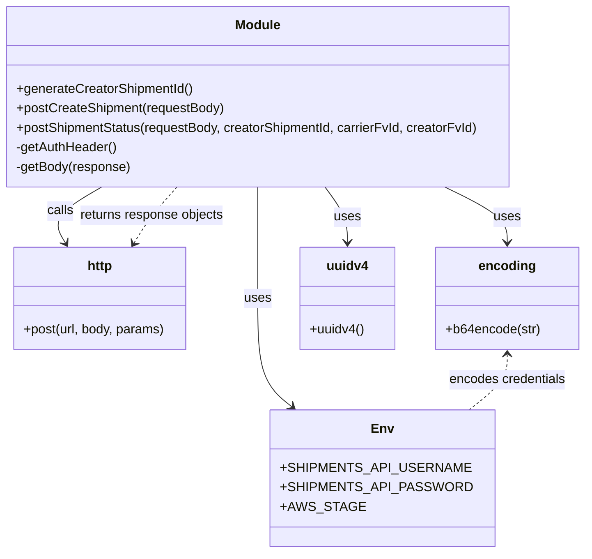

# Diagram: shipment_core/shipment_service/scripts/k6_load_tests/utils/shipments.js


> Auto-generated by Obscura crawlers

## Diagram 1



### SVG

<svg id="container" width="721.609375" xmlns="http://www.w3.org/2000/svg" class="classDiagram" height="680" viewBox="0 0 721.609375 680" role="graphics-document document" aria-roledescription="class"><style>#container{font-family:"trebuchet ms",verdana,arial,sans-serif;font-size:16px;fill:#333;}@keyframes edge-animation-frame{from{stroke-dashoffset:0;}}@keyframes dash{to{stroke-dashoffset:0;}}#container .edge-animation-slow{stroke-dasharray:9,5!important;stroke-dashoffset:900;animation:dash 50s linear infinite;stroke-linecap:round;}#container .edge-animation-fast{stroke-dasharray:9,5!important;stroke-dashoffset:900;animation:dash 20s linear infinite;stroke-linecap:round;}#container .error-icon{fill:#552222;}#container .error-text{fill:#552222;stroke:#552222;}#container .edge-thickness-normal{stroke-width:1px;}#container .edge-thickness-thick{stroke-width:3.5px;}#container .edge-pattern-solid{stroke-dasharray:0;}#container .edge-thickness-invisible{stroke-width:0;fill:none;}#container .edge-pattern-dashed{stroke-dasharray:3;}#container .edge-pattern-dotted{stroke-dasharray:2;}#container .marker{fill:#333333;stroke:#333333;}#container .marker.cross{stroke:#333333;}#container svg{font-family:"trebuchet ms",verdana,arial,sans-serif;font-size:16px;}#container p{margin:0;}#container g.classGroup text{fill:#9370DB;stroke:none;font-family:"trebuchet ms",verdana,arial,sans-serif;font-size:10px;}#container g.classGroup text .title{font-weight:bolder;}#container .nodeLabel,#container .edgeLabel{color:#131300;}#container .edgeLabel .label rect{fill:#ECECFF;}#container .label text{fill:#131300;}#container .labelBkg{background:#ECECFF;}#container .edgeLabel .label span{background:#ECECFF;}#container .classTitle{font-weight:bolder;}#container .node rect,#container .node circle,#container .node ellipse,#container .node polygon,#container .node path{fill:#ECECFF;stroke:#9370DB;stroke-width:1px;}#container .divider{stroke:#9370DB;stroke-width:1;}#container g.clickable{cursor:pointer;}#container g.classGroup rect{fill:#ECECFF;stroke:#9370DB;}#container g.classGroup line{stroke:#9370DB;stroke-width:1;}#container .classLabel .box{stroke:none;stroke-width:0;fill:#ECECFF;opacity:0.5;}#container .classLabel .label{fill:#9370DB;font-size:10px;}#container .relation{stroke:#333333;stroke-width:1;fill:none;}#container .dashed-line{stroke-dasharray:3;}#container .dotted-line{stroke-dasharray:1 2;}#container #compositionStart,#container .composition{fill:#333333!important;stroke:#333333!important;stroke-width:1;}#container #compositionEnd,#container .composition{fill:#333333!important;stroke:#333333!important;stroke-width:1;}#container #dependencyStart,#container .dependency{fill:#333333!important;stroke:#333333!important;stroke-width:1;}#container #dependencyStart,#container .dependency{fill:#333333!important;stroke:#333333!important;stroke-width:1;}#container #extensionStart,#container .extension{fill:transparent!important;stroke:#333333!important;stroke-width:1;}#container #extensionEnd,#container .extension{fill:transparent!important;stroke:#333333!important;stroke-width:1;}#container #aggregationStart,#container .aggregation{fill:transparent!important;stroke:#333333!important;stroke-width:1;}#container #aggregationEnd,#container .aggregation{fill:transparent!important;stroke:#333333!important;stroke-width:1;}#container #lollipopStart,#container .lollipop{fill:#ECECFF!important;stroke:#333333!important;stroke-width:1;}#container #lollipopEnd,#container .lollipop{fill:#ECECFF!important;stroke:#333333!important;stroke-width:1;}#container .edgeTerminals{font-size:11px;line-height:initial;}#container .classTitleText{text-anchor:middle;font-size:18px;fill:#333;}#container .label-icon{display:inline-block;height:1em;overflow:visible;vertical-align:-0.125em;}#container .node .label-icon path{fill:currentColor;stroke:revert;stroke-width:revert;}#container :root{--mermaid-font-family:"trebuchet ms",verdana,arial,sans-serif;}</style><g><defs><marker id="container_class-aggregationStart" class="marker aggregation class" refX="18" refY="7" markerWidth="190" markerHeight="240" orient="auto"><path d="M 18,7 L9,13 L1,7 L9,1 Z"></path></marker></defs><defs><marker id="container_class-aggregationEnd" class="marker aggregation class" refX="1" refY="7" markerWidth="20" markerHeight="28" orient="auto"><path d="M 18,7 L9,13 L1,7 L9,1 Z"></path></marker></defs><defs><marker id="container_class-extensionStart" class="marker extension class" refX="18" refY="7" markerWidth="190" markerHeight="240" orient="auto"><path d="M 1,7 L18,13 V 1 Z"></path></marker></defs><defs><marker id="container_class-extensionEnd" class="marker extension class" refX="1" refY="7" markerWidth="20" markerHeight="28" orient="auto"><path d="M 1,1 V 13 L18,7 Z"></path></marker></defs><defs><marker id="container_class-compositionStart" class="marker composition class" refX="18" refY="7" markerWidth="190" markerHeight="240" orient="auto"><path d="M 18,7 L9,13 L1,7 L9,1 Z"></path></marker></defs><defs><marker id="container_class-compositionEnd" class="marker composition class" refX="1" refY="7" markerWidth="20" markerHeight="28" orient="auto"><path d="M 18,7 L9,13 L1,7 L9,1 Z"></path></marker></defs><defs><marker id="container_class-dependencyStart" class="marker dependency class" refX="6" refY="7" markerWidth="190" markerHeight="240" orient="auto"><path d="M 5,7 L9,13 L1,7 L9,1 Z"></path></marker></defs><defs><marker id="container_class-dependencyEnd" class="marker dependency class" refX="13" refY="7" markerWidth="20" markerHeight="28" orient="auto"><path d="M 18,7 L9,13 L14,7 L9,1 Z"></path></marker></defs><defs><marker id="container_class-lollipopStart" class="marker lollipop class" refX="13" refY="7" markerWidth="190" markerHeight="240" orient="auto"><circle stroke="black" fill="transparent" cx="7" cy="7" r="6"></circle></marker></defs><defs><marker id="container_class-lollipopEnd" class="marker lollipop class" refX="1" refY="7" markerWidth="190" markerHeight="240" orient="auto"><circle stroke="black" fill="transparent" cx="7" cy="7" r="6"></circle></marker></defs><g class="root"><g class="clusters"></g><g class="edgePaths"><path d="M321.227,230L321.227,236.167C321.227,242.333,321.227,254.667,321.227,277.5C321.227,300.333,321.227,333.667,321.227,367C321.227,400.333,321.227,433.667,328.214,455.878C335.202,478.09,349.177,489.18,356.165,494.725L363.152,500.27" id="id_Module_Env_1" class="edge-thickness-normal edge-pattern-solid relation" style=";;;" data-edge="true" data-et="edge" data-id="id_Module_Env_1" data-points="W3sieCI6MzIxLjIyNjU2MjUsInkiOjIzMH0seyJ4IjozMjEuMjI2NTYyNSwieSI6MjY3fSx7IngiOjMyMS4yMjY1NjI1LCJ5IjozNjd9LHsieCI6MzIxLjIyNjU2MjUsInkiOjQ2N30seyJ4IjozNjcuODUyMjI0MzAyNjg1OTUsInkiOjUwNH1d" marker-end="url(#container_class-dependencyEnd)"></path><path d="M125.252,230L114.365,236.167C103.478,242.333,81.703,254.667,74.183,266.155C66.664,277.643,73.4,288.287,76.768,293.608L80.136,298.93" id="id_Module_http_2" class="edge-thickness-normal edge-pattern-solid relation" style=";;;" data-edge="true" data-et="edge" data-id="id_Module_http_2" data-points="W3sieCI6MTI1LjI1MjQ0MTQwNjI1LCJ5IjoyMzB9LHsieCI6NTkuOTI3NzM0Mzc1LCJ5IjoyNjd9LHsieCI6ODMuMzQ0Njg3NDk5OTk5OTksInkiOjMwNH1d" marker-end="url(#container_class-dependencyEnd)"></path><path d="M549.944,230L562.651,236.167C575.357,242.333,600.771,254.667,613.477,266C626.184,277.333,626.184,287.667,626.184,292.833L626.184,298" id="id_Module_encoding_3" class="edge-thickness-normal edge-pattern-solid relation" style=";;;" data-edge="true" data-et="edge" data-id="id_Module_encoding_3" data-points="W3sieCI6NTQ5Ljk0NDMzNTkzNzUsInkiOjIzMH0seyJ4Ijo2MjYuMTgzNTkzNzUsInkiOjI2N30seyJ4Ijo2MjYuMTgzNTkzNzUsInkiOjMwNH1d" marker-end="url(#container_class-dependencyEnd)"></path><path d="M403.36,230L407.923,236.167C412.486,242.333,421.612,254.667,426.175,266C430.738,277.333,430.738,287.667,430.738,292.833L430.738,298" id="id_Module_uuidv4_4" class="edge-thickness-normal edge-pattern-solid relation" style=";;;" data-edge="true" data-et="edge" data-id="id_Module_uuidv4_4" data-points="W3sieCI6NDAzLjM2MDM1MTU2MjUsInkiOjIzMH0seyJ4Ijo0MzAuNzM4MjgxMjUsInkiOjI2N30seyJ4Ijo0MzAuNzM4MjgxMjUsInkiOjMwNH1d" marker-end="url(#container_class-dependencyEnd)"></path><path d="M626.184,436L626.184,441.167C626.184,446.333,626.184,456.667,618.413,468C610.642,479.333,595.1,491.667,587.329,497.833L579.558,504" id="id_encoding_Env_5" class="edge-thickness-normal edge-pattern-dashed relation" style=";;;" data-edge="true" data-et="edge" data-id="id_encoding_Env_5" data-points="W3sieCI6NjI2LjE4MzU5Mzc1LCJ5Ijo0MzB9LHsieCI6NjI2LjE4MzU5Mzc1LCJ5Ijo0Njd9LHsieCI6NTc5LjU1NzkzMTk0NzMxNCwieSI6NTA0fV0=" marker-start="url(#container_class-dependencyStart)"></path><path d="M166.298,298.93L169.666,293.608C173.034,288.287,179.77,277.643,188.751,266.155C197.733,254.667,208.959,242.333,214.573,236.167L220.186,230" id="id_http_Module_6" class="edge-thickness-normal edge-pattern-dashed relation" style=";;;" data-edge="true" data-et="edge" data-id="id_http_Module_6" data-points="W3sieCI6MTYzLjA4ODkwNjI1LCJ5IjozMDR9LHsieCI6MTg2LjUwNTg1OTM3NSwieSI6MjY3fSx7IngiOjIyMC4xODYwMzUxNTYyNSwieSI6MjMwfV0=" marker-start="url(#container_class-dependencyStart)"></path></g><g class="edgeLabels"><g class="edgeLabel" transform="translate(321.2265625, 367)"><g class="label" data-id="id_Module_Env_1" transform="translate(-16.4921875, -12)"><foreignObject width="32.984375" height="24"><div xmlns="http://www.w3.org/1999/xhtml" class="labelBkg" style="display: table-cell; white-space: nowrap; line-height: 1.5; max-width: 200px; text-align: center;"><span class="edgeLabel"><p>uses</p></span></div></foreignObject></g></g><g class="edgeLabel" transform="translate(73.53983, 259.29009)"><g class="label" data-id="id_Module_http_2" transform="translate(-16.4453125, -12)"><foreignObject width="32.890625" height="24"><div xmlns="http://www.w3.org/1999/xhtml" class="labelBkg" style="display: table-cell; white-space: nowrap; line-height: 1.5; max-width: 200px; text-align: center;"><span class="edgeLabel"><p>calls</p></span></div></foreignObject></g></g><g class="edgeLabel" transform="translate(626.18359375, 267)"><g class="label" data-id="id_Module_encoding_3" transform="translate(-16.4921875, -12)"><foreignObject width="32.984375" height="24"><div xmlns="http://www.w3.org/1999/xhtml" class="labelBkg" style="display: table-cell; white-space: nowrap; line-height: 1.5; max-width: 200px; text-align: center;"><span class="edgeLabel"><p>uses</p></span></div></foreignObject></g></g><g class="edgeLabel" transform="translate(430.73828125, 267)"><g class="label" data-id="id_Module_uuidv4_4" transform="translate(-16.4921875, -12)"><foreignObject width="32.984375" height="24"><div xmlns="http://www.w3.org/1999/xhtml" class="labelBkg" style="display: table-cell; white-space: nowrap; line-height: 1.5; max-width: 200px; text-align: center;"><span class="edgeLabel"><p>uses</p></span></div></foreignObject></g></g><g class="edgeLabel" transform="translate(626.18359375, 467)"><g class="label" data-id="id_encoding_Env_5" transform="translate(-72.75, -12)"><foreignObject width="145.5" height="24"><div xmlns="http://www.w3.org/1999/xhtml" class="labelBkg" style="display: table-cell; white-space: nowrap; line-height: 1.5; max-width: 200px; text-align: center;"><span class="edgeLabel"><p>encodes credentials</p></span></div></foreignObject></g></g><g class="edgeLabel" transform="translate(188.60809, 264.69055)"><g class="label" data-id="id_http_Module_6" transform="translate(-90.1328125, -12)"><foreignObject width="180.265625" height="24"><div xmlns="http://www.w3.org/1999/xhtml" class="labelBkg" style="display: table-cell; white-space: nowrap; line-height: 1.5; max-width: 200px; text-align: center;"><span class="edgeLabel"><p>returns response objects</p></span></div></foreignObject></g></g></g><g class="nodes"><g class="node default" id="classId-Module-0" transform="translate(321.2265625, 119)"><g class="basic label-container"><path d="M-313.2265625 -111 L313.2265625 -111 L313.2265625 111 L-313.2265625 111" stroke="none" stroke-width="0" fill="#ECECFF" style=""></path><path d="M-313.2265625 -111 C-171.0880815235124 -111, -28.949600547024772 -111, 313.2265625 -111 M-313.2265625 -111 C-64.2058542298949 -111, 184.8148540402102 -111, 313.2265625 -111 M313.2265625 -111 C313.2265625 -38.65966999244763, 313.2265625 33.680660015104735, 313.2265625 111 M313.2265625 -111 C313.2265625 -60.51812756254147, 313.2265625 -10.036255125082945, 313.2265625 111 M313.2265625 111 C124.39487924141338 111, -64.43680401717324 111, -313.2265625 111 M313.2265625 111 C88.04279855551914 111, -137.14096538896172 111, -313.2265625 111 M-313.2265625 111 C-313.2265625 64.3412622416113, -313.2265625 17.682524483222608, -313.2265625 -111 M-313.2265625 111 C-313.2265625 25.71611579896033, -313.2265625 -59.56776840207934, -313.2265625 -111" stroke="#9370DB" stroke-width="1.3" fill="none" stroke-dasharray="0 0" style=""></path></g><g class="annotation-group text" transform="translate(0, -87)"></g><g class="label-group text" transform="translate(-27.09375, -87)"><g class="label" style="font-weight: bolder" transform="translate(0,-12)"><foreignObject width="54.1875" height="24"><div xmlns="http://www.w3.org/1999/xhtml" style="display: table-cell; white-space: nowrap; line-height: 1.5; max-width: 104px; text-align: center;"><span class="nodeLabel markdown-node-label" style=""><p>Module</p></span></div></foreignObject></g></g><g class="members-group text" transform="translate(-301.2265625, -39)"></g><g class="methods-group text" transform="translate(-301.2265625, -9)"><g class="label" style="" transform="translate(0,-12)"><foreignObject width="218.53125" height="24"><div xmlns="http://www.w3.org/1999/xhtml" style="display: table-cell; white-space: nowrap; line-height: 1.5; max-width: 276px; text-align: center;"><span class="nodeLabel markdown-node-label" style=""><p>+generateCreatorShipmentId()</p></span></div></foreignObject></g><g class="label" style="" transform="translate(0,12)"><foreignObject width="257.859375" height="24"><div xmlns="http://www.w3.org/1999/xhtml" style="display: table-cell; white-space: nowrap; line-height: 1.5; max-width: 315px; text-align: center;"><span class="nodeLabel markdown-node-label" style=""><p>+postCreateShipment(requestBody)</p></span></div></foreignObject></g><g class="label" style="" transform="translate(0,36)"><foreignObject width="575.359375" height="24"><div xmlns="http://www.w3.org/1999/xhtml" style="display: table-cell; white-space: nowrap; line-height: 1.5; max-width: 633px; text-align: center;"><span class="nodeLabel markdown-node-label" style=""><p>+postShipmentStatus(requestBody, creatorShipmentId, carrierFvId, creatorFvId)</p></span></div></foreignObject></g><g class="label" style="" transform="translate(0,60)"><foreignObject width="125.625" height="24"><div xmlns="http://www.w3.org/1999/xhtml" style="display: table-cell; white-space: nowrap; line-height: 1.5; max-width: 183px; text-align: center;"><span class="nodeLabel markdown-node-label" style=""><p>-getAuthHeader()</p></span></div></foreignObject></g><g class="label" style="" transform="translate(0,84)"><foreignObject width="142.203125" height="24"><div xmlns="http://www.w3.org/1999/xhtml" style="display: table-cell; white-space: nowrap; line-height: 1.5; max-width: 200px; text-align: center;"><span class="nodeLabel markdown-node-label" style=""><p>-getBody(response)</p></span></div></foreignObject></g></g><g class="divider" style=""><path d="M-313.2265625 -63 C-153.25723362668927 -63, 6.712095246621459 -63, 313.2265625 -63 M-313.2265625 -63 C-120.969127618996 -63, 71.288307262008 -63, 313.2265625 -63" stroke="#9370DB" stroke-width="1.3" fill="none" stroke-dasharray="0 0" style=""></path></g><g class="divider" style=""><path d="M-313.2265625 -39 C-179.34468360339991 -39, -45.46280470679983 -39, 313.2265625 -39 M-313.2265625 -39 C-166.30353284361226 -39, -19.38050318722452 -39, 313.2265625 -39" stroke="#9370DB" stroke-width="1.3" fill="none" stroke-dasharray="0 0" style=""></path></g></g><g class="node default" id="classId-Env-1" transform="translate(473.705078125, 588)"><g class="basic label-container"><path d="M-122.05078125 -84 L122.05078125 -84 L122.05078125 84 L-122.05078125 84" stroke="none" stroke-width="0" fill="#ECECFF" style=""></path><path d="M-122.05078125 -84 C-63.33760079631721 -84, -4.624420342634423 -84, 122.05078125 -84 M-122.05078125 -84 C-63.363465426920904 -84, -4.676149603841807 -84, 122.05078125 -84 M122.05078125 -84 C122.05078125 -42.70140584449678, 122.05078125 -1.402811688993566, 122.05078125 84 M122.05078125 -84 C122.05078125 -29.939232263048105, 122.05078125 24.12153547390379, 122.05078125 84 M122.05078125 84 C35.93335856165143 84, -50.18406412669714 84, -122.05078125 84 M122.05078125 84 C69.57050073474926 84, 17.090220219498505 84, -122.05078125 84 M-122.05078125 84 C-122.05078125 45.743623643420705, -122.05078125 7.487247286841409, -122.05078125 -84 M-122.05078125 84 C-122.05078125 45.505966726591325, -122.05078125 7.01193345318265, -122.05078125 -84" stroke="#9370DB" stroke-width="1.3" fill="none" stroke-dasharray="0 0" style=""></path></g><g class="annotation-group text" transform="translate(0, -60)"></g><g class="label-group text" transform="translate(-12.8046875, -60)"><g class="label" style="font-weight: bolder" transform="translate(0,-12)"><foreignObject width="25.609375" height="24"><div xmlns="http://www.w3.org/1999/xhtml" style="display: table-cell; white-space: nowrap; line-height: 1.5; max-width: 76px; text-align: center;"><span class="nodeLabel markdown-node-label" style=""><p>Env</p></span></div></foreignObject></g></g><g class="members-group text" transform="translate(-110.05078125, -12)"><g class="label" style="" transform="translate(0,-12)"><foreignObject width="206.5" height="24"><div xmlns="http://www.w3.org/1999/xhtml" style="display: table-cell; white-space: nowrap; line-height: 1.5; max-width: 264px; text-align: center;"><span class="nodeLabel markdown-node-label" style=""><p>+SHIPMENTS_API_USERNAME</p></span></div></foreignObject></g><g class="label" style="" transform="translate(0,12)"><foreignObject width="207.296875" height="24"><div xmlns="http://www.w3.org/1999/xhtml" style="display: table-cell; white-space: nowrap; line-height: 1.5; max-width: 265px; text-align: center;"><span class="nodeLabel markdown-node-label" style=""><p>+SHIPMENTS_API_PASSWORD</p></span></div></foreignObject></g><g class="label" style="" transform="translate(0,36)"><foreignObject width="89.796875" height="24"><div xmlns="http://www.w3.org/1999/xhtml" style="display: table-cell; white-space: nowrap; line-height: 1.5; max-width: 147px; text-align: center;"><span class="nodeLabel markdown-node-label" style=""><p>+AWS_STAGE</p></span></div></foreignObject></g></g><g class="methods-group text" transform="translate(-110.05078125, 84)"></g><g class="divider" style=""><path d="M-122.05078125 -36 C-62.23705515647535 -36, -2.4233290629506996 -36, 122.05078125 -36 M-122.05078125 -36 C-51.54534599786898 -36, 18.960089254262044 -36, 122.05078125 -36" stroke="#9370DB" stroke-width="1.3" fill="none" stroke-dasharray="0 0" style=""></path></g><g class="divider" style=""><path d="M-122.05078125 60 C-72.5483327670328 60, -23.045884284065608 60, 122.05078125 60 M-122.05078125 60 C-36.918507508406094 60, 48.21376623318781 60, 122.05078125 60" stroke="#9370DB" stroke-width="1.3" fill="none" stroke-dasharray="0 0" style=""></path></g></g><g class="node default" id="classId-http-2" transform="translate(123.216796875, 367)"><g class="basic label-container"><path d="M-107.81640625 -63 L107.81640625 -63 L107.81640625 63 L-107.81640625 63" stroke="none" stroke-width="0" fill="#ECECFF" style=""></path><path d="M-107.81640625 -63 C-59.88836586477927 -63, -11.960325479558534 -63, 107.81640625 -63 M-107.81640625 -63 C-32.449348685402995 -63, 42.91770887919401 -63, 107.81640625 -63 M107.81640625 -63 C107.81640625 -31.670598920825622, 107.81640625 -0.341197841651244, 107.81640625 63 M107.81640625 -63 C107.81640625 -26.8791623120595, 107.81640625 9.241675375881002, 107.81640625 63 M107.81640625 63 C26.10247405577742 63, -55.61145813844516 63, -107.81640625 63 M107.81640625 63 C51.93247540993176 63, -3.951455430136477 63, -107.81640625 63 M-107.81640625 63 C-107.81640625 26.96445471032132, -107.81640625 -9.07109057935736, -107.81640625 -63 M-107.81640625 63 C-107.81640625 26.80461787668606, -107.81640625 -9.390764246627882, -107.81640625 -63" stroke="#9370DB" stroke-width="1.3" fill="none" stroke-dasharray="0 0" style=""></path></g><g class="annotation-group text" transform="translate(0, -39)"></g><g class="label-group text" transform="translate(-15.5703125, -39)"><g class="label" style="font-weight: bolder" transform="translate(0,-12)"><foreignObject width="31.140625" height="24"><div xmlns="http://www.w3.org/1999/xhtml" style="display: table-cell; white-space: nowrap; line-height: 1.5; max-width: 80px; text-align: center;"><span class="nodeLabel markdown-node-label" style=""><p>http</p></span></div></foreignObject></g></g><g class="members-group text" transform="translate(-95.81640625, 9)"></g><g class="methods-group text" transform="translate(-95.81640625, 39)"><g class="label" style="" transform="translate(0,-12)"><foreignObject width="176.0625" height="24"><div xmlns="http://www.w3.org/1999/xhtml" style="display: table-cell; white-space: nowrap; line-height: 1.5; max-width: 233px; text-align: center;"><span class="nodeLabel markdown-node-label" style=""><p>+post(url, body, params)</p></span></div></foreignObject></g></g><g class="divider" style=""><path d="M-107.81640625 -15 C-44.44994824831757 -15, 18.916509753364863 -15, 107.81640625 -15 M-107.81640625 -15 C-37.73894761506499 -15, 32.338511019870026 -15, 107.81640625 -15" stroke="#9370DB" stroke-width="1.3" fill="none" stroke-dasharray="0 0" style=""></path></g><g class="divider" style=""><path d="M-107.81640625 9 C-44.13794605121822 9, 19.540514147563556 9, 107.81640625 9 M-107.81640625 9 C-38.12117358802767 9, 31.574059073944653 9, 107.81640625 9" stroke="#9370DB" stroke-width="1.3" fill="none" stroke-dasharray="0 0" style=""></path></g></g><g class="node default" id="classId-encoding-3" transform="translate(626.18359375, 367)"><g class="basic label-container"><path d="M-87.42578125 -63 L87.42578125 -63 L87.42578125 63 L-87.42578125 63" stroke="none" stroke-width="0" fill="#ECECFF" style=""></path><path d="M-87.42578125 -63 C-18.53436051275486 -63, 50.35706022449028 -63, 87.42578125 -63 M-87.42578125 -63 C-46.34172270367154 -63, -5.257664157343086 -63, 87.42578125 -63 M87.42578125 -63 C87.42578125 -25.71952368684127, 87.42578125 11.560952626317459, 87.42578125 63 M87.42578125 -63 C87.42578125 -34.071883569383886, 87.42578125 -5.143767138767764, 87.42578125 63 M87.42578125 63 C19.66532254722523 63, -48.09513615554954 63, -87.42578125 63 M87.42578125 63 C26.675575327890606 63, -34.07463059421879 63, -87.42578125 63 M-87.42578125 63 C-87.42578125 18.522035032782178, -87.42578125 -25.955929934435645, -87.42578125 -63 M-87.42578125 63 C-87.42578125 34.2776651288965, -87.42578125 5.555330257793003, -87.42578125 -63" stroke="#9370DB" stroke-width="1.3" fill="none" stroke-dasharray="0 0" style=""></path></g><g class="annotation-group text" transform="translate(0, -39)"></g><g class="label-group text" transform="translate(-33.4609375, -39)"><g class="label" style="font-weight: bolder" transform="translate(0,-12)"><foreignObject width="66.921875" height="24"><div xmlns="http://www.w3.org/1999/xhtml" style="display: table-cell; white-space: nowrap; line-height: 1.5; max-width: 117px; text-align: center;"><span class="nodeLabel markdown-node-label" style=""><p>encoding</p></span></div></foreignObject></g></g><g class="members-group text" transform="translate(-75.42578125, 9)"></g><g class="methods-group text" transform="translate(-75.42578125, 39)"><g class="label" style="" transform="translate(0,-12)"><foreignObject width="117.390625" height="24"><div xmlns="http://www.w3.org/1999/xhtml" style="display: table-cell; white-space: nowrap; line-height: 1.5; max-width: 175px; text-align: center;"><span class="nodeLabel markdown-node-label" style=""><p>+b64encode(str)</p></span></div></foreignObject></g></g><g class="divider" style=""><path d="M-87.42578125 -15 C-46.98564497231004 -15, -6.545508694620082 -15, 87.42578125 -15 M-87.42578125 -15 C-44.78096510278895 -15, -2.1361489555778945 -15, 87.42578125 -15" stroke="#9370DB" stroke-width="1.3" fill="none" stroke-dasharray="0 0" style=""></path></g><g class="divider" style=""><path d="M-87.42578125 9 C-28.170904205239005 9, 31.08397283952199 9, 87.42578125 9 M-87.42578125 9 C-46.95835065375181 9, -6.490920057503615 9, 87.42578125 9" stroke="#9370DB" stroke-width="1.3" fill="none" stroke-dasharray="0 0" style=""></path></g></g><g class="node default" id="classId-uuidv4-4" transform="translate(430.73828125, 367)"><g class="basic label-container"><path d="M-58.01953125 -63 L58.01953125 -63 L58.01953125 63 L-58.01953125 63" stroke="none" stroke-width="0" fill="#ECECFF" style=""></path><path d="M-58.01953125 -63 C-12.10649154363827 -63, 33.80654816272346 -63, 58.01953125 -63 M-58.01953125 -63 C-16.772122444385886 -63, 24.47528636122823 -63, 58.01953125 -63 M58.01953125 -63 C58.01953125 -13.19138518598885, 58.01953125 36.6172296280223, 58.01953125 63 M58.01953125 -63 C58.01953125 -17.922394403963423, 58.01953125 27.155211192073153, 58.01953125 63 M58.01953125 63 C34.52182682314865 63, 11.024122396297301 63, -58.01953125 63 M58.01953125 63 C17.46048367950801 63, -23.098563890983982 63, -58.01953125 63 M-58.01953125 63 C-58.01953125 28.464820970751425, -58.01953125 -6.070358058497149, -58.01953125 -63 M-58.01953125 63 C-58.01953125 22.499651280805523, -58.01953125 -18.000697438388954, -58.01953125 -63" stroke="#9370DB" stroke-width="1.3" fill="none" stroke-dasharray="0 0" style=""></path></g><g class="annotation-group text" transform="translate(0, -39)"></g><g class="label-group text" transform="translate(-24.7578125, -39)"><g class="label" style="font-weight: bolder" transform="translate(0,-12)"><foreignObject width="49.515625" height="24"><div xmlns="http://www.w3.org/1999/xhtml" style="display: table-cell; white-space: nowrap; line-height: 1.5; max-width: 99px; text-align: center;"><span class="nodeLabel markdown-node-label" style=""><p>uuidv4</p></span></div></foreignObject></g></g><g class="members-group text" transform="translate(-46.01953125, 9)"></g><g class="methods-group text" transform="translate(-46.01953125, 39)"><g class="label" style="" transform="translate(0,-12)"><foreignObject width="67.28125" height="24"><div xmlns="http://www.w3.org/1999/xhtml" style="display: table-cell; white-space: nowrap; line-height: 1.5; max-width: 125px; text-align: center;"><span class="nodeLabel markdown-node-label" style=""><p>+uuidv4()</p></span></div></foreignObject></g></g><g class="divider" style=""><path d="M-58.01953125 -15 C-24.40574596297742 -15, 9.20803932404516 -15, 58.01953125 -15 M-58.01953125 -15 C-14.486583672069216 -15, 29.04636390586157 -15, 58.01953125 -15" stroke="#9370DB" stroke-width="1.3" fill="none" stroke-dasharray="0 0" style=""></path></g><g class="divider" style=""><path d="M-58.01953125 9 C-13.887956685945802 9, 30.243617878108395 9, 58.01953125 9 M-58.01953125 9 C-33.33507585656875 9, -8.6506204631375 9, 58.01953125 9" stroke="#9370DB" stroke-width="1.3" fill="none" stroke-dasharray="0 0" style=""></path></g></g></g></g></g></svg>

## Diagram 2

```mermaid
flowchart LR
    A[generateCreatorShipmentId] -->|calls| U(uuidv4)
    U --> V["returns UUID"]
    A --> B[creatorShipmentId: "k6_test_<uuid>"]
    subgraph CreateShipment
      C[postCreateShipment(requestBody)] --> D[getAuthHeader()]
      D --> E[encoding.b64encode(credentials)]
      E --> F[Authorization header]
      C --> G[http.post(url, body, params)]
      G --> H[getBody(response)]
      H --> I{response.status == 201?}
      I -- yes --> J[shipmentDbId = responseBody.shipment.id]
      I -- no --> K[shipmentDbId = undefined]
      J --> L[return { shipmentDbId, body, response }]
      K --> L
    end
    subgraph PostShipmentStatus
      M[postShipmentStatus(requestBody, creatorShipmentId, carrierFvId, creatorFvId)] --> N[getAuthHeader()]
      N --> O[Authorization header]
      M --> P[build X-WSS-fvShipmentId header: carrier|creator|creatorShipmentId]
      P --> Q[http.post(url, body, params)]
      Q --> R[getBody(response)]
      R --> S[return { body, response }]
    end
    B --> CreateShipment
    B --> PostShipmentStatus
```

> SVG rendering failed for this diagram.
