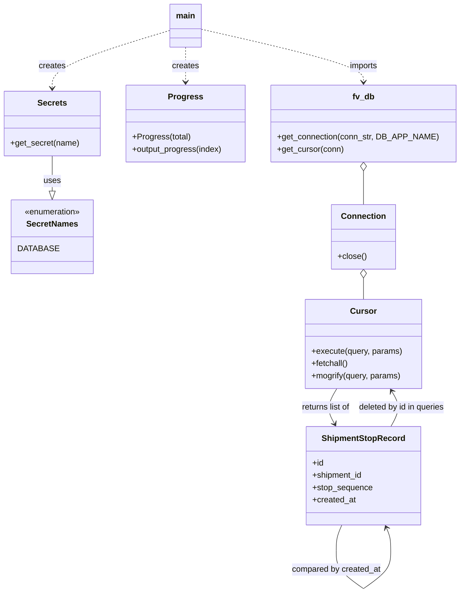

# Diagram: shipment_core/shipment_service/scripts/remove_dup_stops.py


> Auto-generated by Obscura crawlers

## Diagram 1

```mermaid
flowchart TD
    A[__main__ start] --> B[Secrets()]
    B --> C[get_secret(DATABASE)]
    C --> D[get_connection(conn_str, DB_APP_NAME)]
    D --> E[get_cursor(conn)]
    E --> F[Execute GROUP BY query]
    F --> G[fetchall() -> results]
    G --> H[Build stop_list from results]
    H --> I[Execute SELECT * WHERE shipment_id IN stop_list]
    I --> J[fetchall() -> full_stops]
    J --> K[Construct shipment_stops_dict]
    K --> L[Determine stop_ids_to_del]
    L --> M[Split into batches of 5]
    M --> N[Progress(len_split_results)]
    N --> O[Loop over batches]
    O --> P[DELETE FROM shipment_statuses WHERE shipment_stop_id IN batch]
    P --> Q[COMMIT]
    O --> R[DELETE FROM shipment_stops WHERE id IN batch]
    R --> S[COMMIT]
    S --> T[__main__ end]
```

> SVG rendering failed for this diagram.

## Diagram 2



### SVG

<svg id="container" width="881.84375" xmlns="http://www.w3.org/2000/svg" class="classDiagram" height="1156.25" viewBox="0 0 881.84375 1156.25" role="graphics-document document" aria-roledescription="class"><style>#container{font-family:"trebuchet ms",verdana,arial,sans-serif;font-size:16px;fill:#333;}@keyframes edge-animation-frame{from{stroke-dashoffset:0;}}@keyframes dash{to{stroke-dashoffset:0;}}#container .edge-animation-slow{stroke-dasharray:9,5!important;stroke-dashoffset:900;animation:dash 50s linear infinite;stroke-linecap:round;}#container .edge-animation-fast{stroke-dasharray:9,5!important;stroke-dashoffset:900;animation:dash 20s linear infinite;stroke-linecap:round;}#container .error-icon{fill:#552222;}#container .error-text{fill:#552222;stroke:#552222;}#container .edge-thickness-normal{stroke-width:1px;}#container .edge-thickness-thick{stroke-width:3.5px;}#container .edge-pattern-solid{stroke-dasharray:0;}#container .edge-thickness-invisible{stroke-width:0;fill:none;}#container .edge-pattern-dashed{stroke-dasharray:3;}#container .edge-pattern-dotted{stroke-dasharray:2;}#container .marker{fill:#333333;stroke:#333333;}#container .marker.cross{stroke:#333333;}#container svg{font-family:"trebuchet ms",verdana,arial,sans-serif;font-size:16px;}#container p{margin:0;}#container g.classGroup text{fill:#9370DB;stroke:none;font-family:"trebuchet ms",verdana,arial,sans-serif;font-size:10px;}#container g.classGroup text .title{font-weight:bolder;}#container .nodeLabel,#container .edgeLabel{color:#131300;}#container .edgeLabel .label rect{fill:#ECECFF;}#container .label text{fill:#131300;}#container .labelBkg{background:#ECECFF;}#container .edgeLabel .label span{background:#ECECFF;}#container .classTitle{font-weight:bolder;}#container .node rect,#container .node circle,#container .node ellipse,#container .node polygon,#container .node path{fill:#ECECFF;stroke:#9370DB;stroke-width:1px;}#container .divider{stroke:#9370DB;stroke-width:1;}#container g.clickable{cursor:pointer;}#container g.classGroup rect{fill:#ECECFF;stroke:#9370DB;}#container g.classGroup line{stroke:#9370DB;stroke-width:1;}#container .classLabel .box{stroke:none;stroke-width:0;fill:#ECECFF;opacity:0.5;}#container .classLabel .label{fill:#9370DB;font-size:10px;}#container .relation{stroke:#333333;stroke-width:1;fill:none;}#container .dashed-line{stroke-dasharray:3;}#container .dotted-line{stroke-dasharray:1 2;}#container #compositionStart,#container .composition{fill:#333333!important;stroke:#333333!important;stroke-width:1;}#container #compositionEnd,#container .composition{fill:#333333!important;stroke:#333333!important;stroke-width:1;}#container #dependencyStart,#container .dependency{fill:#333333!important;stroke:#333333!important;stroke-width:1;}#container #dependencyStart,#container .dependency{fill:#333333!important;stroke:#333333!important;stroke-width:1;}#container #extensionStart,#container .extension{fill:transparent!important;stroke:#333333!important;stroke-width:1;}#container #extensionEnd,#container .extension{fill:transparent!important;stroke:#333333!important;stroke-width:1;}#container #aggregationStart,#container .aggregation{fill:transparent!important;stroke:#333333!important;stroke-width:1;}#container #aggregationEnd,#container .aggregation{fill:transparent!important;stroke:#333333!important;stroke-width:1;}#container #lollipopStart,#container .lollipop{fill:#ECECFF!important;stroke:#333333!important;stroke-width:1;}#container #lollipopEnd,#container .lollipop{fill:#ECECFF!important;stroke:#333333!important;stroke-width:1;}#container .edgeTerminals{font-size:11px;line-height:initial;}#container .classTitleText{text-anchor:middle;font-size:18px;fill:#333;}#container .label-icon{display:inline-block;height:1em;overflow:visible;vertical-align:-0.125em;}#container .node .label-icon path{fill:currentColor;stroke:revert;stroke-width:revert;}#container :root{--mermaid-font-family:"trebuchet ms",verdana,arial,sans-serif;}</style><g><defs><marker id="container_class-aggregationStart" class="marker aggregation class" refX="18" refY="7" markerWidth="190" markerHeight="240" orient="auto"><path d="M 18,7 L9,13 L1,7 L9,1 Z"></path></marker></defs><defs><marker id="container_class-aggregationEnd" class="marker aggregation class" refX="1" refY="7" markerWidth="20" markerHeight="28" orient="auto"><path d="M 18,7 L9,13 L1,7 L9,1 Z"></path></marker></defs><defs><marker id="container_class-extensionStart" class="marker extension class" refX="18" refY="7" markerWidth="190" markerHeight="240" orient="auto"><path d="M 1,7 L18,13 V 1 Z"></path></marker></defs><defs><marker id="container_class-extensionEnd" class="marker extension class" refX="1" refY="7" markerWidth="20" markerHeight="28" orient="auto"><path d="M 1,1 V 13 L18,7 Z"></path></marker></defs><defs><marker id="container_class-compositionStart" class="marker composition class" refX="18" refY="7" markerWidth="190" markerHeight="240" orient="auto"><path d="M 18,7 L9,13 L1,7 L9,1 Z"></path></marker></defs><defs><marker id="container_class-compositionEnd" class="marker composition class" refX="1" refY="7" markerWidth="20" markerHeight="28" orient="auto"><path d="M 18,7 L9,13 L1,7 L9,1 Z"></path></marker></defs><defs><marker id="container_class-dependencyStart" class="marker dependency class" refX="6" refY="7" markerWidth="190" markerHeight="240" orient="auto"><path d="M 5,7 L9,13 L1,7 L9,1 Z"></path></marker></defs><defs><marker id="container_class-dependencyEnd" class="marker dependency class" refX="13" refY="7" markerWidth="20" markerHeight="28" orient="auto"><path d="M 18,7 L9,13 L14,7 L9,1 Z"></path></marker></defs><defs><marker id="container_class-lollipopStart" class="marker lollipop class" refX="13" refY="7" markerWidth="190" markerHeight="240" orient="auto"><circle stroke="black" fill="transparent" cx="7" cy="7" r="6"></circle></marker></defs><defs><marker id="container_class-lollipopEnd" class="marker lollipop class" refX="1" refY="7" markerWidth="190" markerHeight="240" orient="auto"><circle stroke="black" fill="transparent" cx="7" cy="7" r="6"></circle></marker></defs><g class="root"><g class="clusters"></g><g class="edgePaths"><path d="M100.473,304L100.473,312.167C100.473,320.333,100.473,336.667,100.473,348.125C100.473,359.583,100.473,366.167,100.473,369.458L100.473,372.75" id="id_Secrets_SecretNames_1" class="edge-thickness-normal edge-pattern-solid relation" style=";;;" data-edge="true" data-et="edge" data-id="id_Secrets_SecretNames_1" data-points="W3sieCI6MTAwLjQ3MjY1NjI1LCJ5IjozMDR9LHsieCI6MTAwLjQ3MjY1NjI1LCJ5IjozNTN9LHsieCI6MTAwLjQ3MjY1NjI1LCJ5IjozOTB9XQ==" marker-end="url(#container_class-extensionEnd)"></path><path d="M329.664,59.127L291.465,70.772C253.267,82.418,176.87,105.709,138.671,124.521C100.473,143.333,100.473,157.667,100.473,164.833L100.473,172" id="id___main___Secrets_2" class="edge-thickness-normal edge-pattern-dashed relation" style=";;;" data-edge="true" data-et="edge" data-id="id___main___Secrets_2" data-points="W3sieCI6MzI5LjY2NDA2MjUsInkiOjU5LjEyNjk3Mjg4MDg5NjAzNH0seyJ4IjoxMDAuNDcyNjU2MjUsInkiOjEyOX0seyJ4IjoxMDAuNDcyNjU2MjUsInkiOjE3OH1d" marker-end="url(#container_class-dependencyEnd)"></path><path d="M389.539,56.947L441.291,68.956C493.043,80.965,596.547,104.982,648.299,122.158C700.051,139.333,700.051,149.667,700.051,154.833L700.051,160" id="id___main___fv_db_3" class="edge-thickness-normal edge-pattern-dashed relation" style=";;;" data-edge="true" data-et="edge" data-id="id___main___fv_db_3" data-points="W3sieCI6Mzg5LjUzOTA2MjUsInkiOjU2Ljk0Njg4NzcyODc1OTExfSx7IngiOjcwMC4wNTA3ODEyNSwieSI6MTI5fSx7IngiOjcwMC4wNTA3ODEyNSwieSI6MTY2fV0=" marker-end="url(#container_class-dependencyEnd)"></path><path d="M359.602,92L359.602,98.167C359.602,104.333,359.602,116.667,359.602,128C359.602,139.333,359.602,149.667,359.602,154.833L359.602,160" id="id___main___Progress_4" class="edge-thickness-normal edge-pattern-dashed relation" style=";;;" data-edge="true" data-et="edge" data-id="id___main___Progress_4" data-points="W3sieCI6MzU5LjYwMTU2MjUsInkiOjkyfSx7IngiOjM1OS42MDE1NjI1LCJ5IjoxMjl9LHsieCI6MzU5LjYwMTU2MjUsInkiOjE2Nn1d" marker-end="url(#container_class-dependencyEnd)"></path><path d="M700.051,333.25L700.051,336.542C700.051,339.833,700.051,346.417,700.051,357.375C700.051,368.333,700.051,383.667,700.051,391.333L700.051,399" id="id_fv_db_Connection_5" class="edge-thickness-normal edge-pattern-solid relation" style=";;;" data-edge="true" data-et="edge" data-id="id_fv_db_Connection_5" data-points="W3sieCI6NzAwLjA1MDc4MTI1LCJ5IjozMTZ9LHsieCI6NzAwLjA1MDc4MTI1LCJ5IjozNTN9LHsieCI6NzAwLjA1MDc4MTI1LCJ5IjozOTl9XQ==" marker-start="url(#container_class-aggregationStart)"></path><path d="M700.051,542.25L700.051,545.042C700.051,547.833,700.051,553.417,700.051,560.375C700.051,567.333,700.051,575.667,700.051,579.833L700.051,584" id="id_Connection_Cursor_6" class="edge-thickness-normal edge-pattern-solid relation" style=";;;" data-edge="true" data-et="edge" data-id="id_Connection_Cursor_6" data-points="W3sieCI6NzAwLjA1MDc4MTI1LCJ5Ijo1MjV9LHsieCI6NzAwLjA1MDc4MTI1LCJ5Ijo1NTl9LHsieCI6NzAwLjA1MDc4MTI1LCJ5Ijo1ODR9XQ==" marker-start="url(#container_class-aggregationStart)"></path><path d="M645.615,758L641.757,764.167C637.899,770.333,630.182,782.667,629.417,794.136C628.652,805.606,634.839,816.212,637.932,821.514L641.026,826.817" id="id_Cursor_ShipmentStopRecord_7" class="edge-thickness-normal edge-pattern-solid relation" style=";;;" data-edge="true" data-et="edge" data-id="id_Cursor_ShipmentStopRecord_7" data-points="W3sieCI6NjQ1LjYxNTQ4NjM5MTEyOSwieSI6NzU4fSx7IngiOjYyMi40NjQ4NDM3NSwieSI6Nzk1fSx7IngiOjY0NC4wNDg5MDE1NTA3NTE5LCJ5Ijo4MzJ9XQ==" marker-end="url(#container_class-dependencyEnd)"></path><path d="M657.381,1024L655.529,1028.167C653.677,1032.333,649.973,1040.667,648.122,1049C646.27,1057.333,646.27,1065.667,646.27,1069.833L646.27,1074" id="ShipmentStopRecord-cyclic-special-1" class="edge-thickness-normal edge-pattern-solid relation" style=";;;" data-edge="true" data-et="edge" data-id="ShipmentStopRecord-cyclic-special-1" data-points="W3sieCI6NjU3LjM4MTM1OTc2MjM5NjYsInkiOjEwMjR9LHsieCI6NjQ2LjI2OTUzMTI1LCJ5IjoxMDQ5fSx7IngiOjY0Ni4yNjk1MzEyNSwieSI6MTA3NH1d"></path><path d="M646.27,1074.1L646.27,1080.267C646.27,1086.433,646.27,1098.767,655.225,1111.103C664.18,1123.439,682.09,1135.777,691.046,1141.946L700.001,1148.116" id="ShipmentStopRecord-cyclic-special-mid" class="edge-thickness-normal edge-pattern-solid relation" style=";;;" data-edge="true" data-et="edge" data-id="ShipmentStopRecord-cyclic-special-mid" data-points="W3sieCI6NjQ2LjI2OTUzMTI1LCJ5IjoxMDc0LjEwMDAwMDAwMTQ5MDF9LHsieCI6NjQ2LjI2OTUzMTI1LCJ5IjoxMTExLjEwMDAwMDAwMTQ5MDF9LHsieCI6NzAwLjAwMDc4MTI0OTI1NDksInkiOjExNDguMTE1NTU0OTExNjU3Mn1d"></path><path d="M700.101,1148.116L709.056,1141.946C718.011,1135.777,735.922,1123.439,744.877,1111.094C753.832,1098.75,753.832,1086.4,753.832,1076.05C753.832,1065.7,753.832,1057.35,752.386,1049.922C750.94,1042.494,748.049,1035.989,746.603,1032.736L745.157,1029.483" id="ShipmentStopRecord-cyclic-special-2" class="edge-thickness-normal edge-pattern-solid relation" style=";;;" data-edge="true" data-et="edge" data-id="ShipmentStopRecord-cyclic-special-2" data-points="W3sieCI6NzAwLjEwMDc4MTI1MDc0NTEsInkiOjExNDguMTE1NTU0OTExNjU3Mn0seyJ4Ijo3NTMuODMyMDMxMjUsInkiOjExMTEuMTAwMDAwMDAxNDkwMX0seyJ4Ijo3NTMuODMyMDMxMjUsInkiOjEwNzQuMDUwMDAwMDAwNzQ1fSx7IngiOjc1My44MzIwMzEyNSwieSI6MTA0OX0seyJ4Ijo3NDIuNzIwMjAyNzM3NjAzNCwieSI6MTAyNH1d" marker-end="url(#container_class-dependencyEnd)"></path><path d="M756.053,832L759.65,825.833C763.247,819.667,770.442,807.333,770.711,795.848C770.981,784.362,764.325,773.724,760.997,768.405L757.669,763.086" id="id_ShipmentStopRecord_Cursor_9" class="edge-thickness-normal edge-pattern-solid relation" style=";;;" data-edge="true" data-et="edge" data-id="id_ShipmentStopRecord_Cursor_9" data-points="W3sieCI6NzU2LjA1MjY2MDk0OTI0ODEsInkiOjgzMn0seyJ4Ijo3NzcuNjM2NzE4NzUsInkiOjc5NX0seyJ4Ijo3NTQuNDg2MDc2MTA4ODcxLCJ5Ijo3NTh9XQ==" marker-end="url(#container_class-dependencyEnd)"></path></g><g class="edgeLabels"><g class="edgeLabel" transform="translate(100.47265625, 353)"><g class="label" data-id="id_Secrets_SecretNames_1" transform="translate(-16.4921875, -12)"><foreignObject width="32.984375" height="24"><div xmlns="http://www.w3.org/1999/xhtml" class="labelBkg" style="display: table-cell; white-space: nowrap; line-height: 1.5; max-width: 200px; text-align: center;"><span class="edgeLabel"><p>uses</p></span></div></foreignObject></g></g><g class="edgeLabel" transform="translate(100.47265625, 129)"><g class="label" data-id="id___main___Secrets_2" transform="translate(-26.171875, -12)"><foreignObject width="52.34375" height="24"><div xmlns="http://www.w3.org/1999/xhtml" class="labelBkg" style="display: table-cell; white-space: nowrap; line-height: 1.5; max-width: 200px; text-align: center;"><span class="edgeLabel"><p>creates</p></span></div></foreignObject></g></g><g class="edgeLabel" transform="translate(700.05078125, 129)"><g class="label" data-id="id___main___fv_db_3" transform="translate(-28.25, -12)"><foreignObject width="56.5" height="24"><div xmlns="http://www.w3.org/1999/xhtml" class="labelBkg" style="display: table-cell; white-space: nowrap; line-height: 1.5; max-width: 200px; text-align: center;"><span class="edgeLabel"><p>imports</p></span></div></foreignObject></g></g><g class="edgeLabel" transform="translate(359.6015625, 129)"><g class="label" data-id="id___main___Progress_4" transform="translate(-26.171875, -12)"><foreignObject width="52.34375" height="24"><div xmlns="http://www.w3.org/1999/xhtml" class="labelBkg" style="display: table-cell; white-space: nowrap; line-height: 1.5; max-width: 200px; text-align: center;"><span class="edgeLabel"><p>creates</p></span></div></foreignObject></g></g><g class="edgeLabel"><g class="label" data-id="id_fv_db_Connection_5" transform="translate(0, 0)"><foreignObject width="0" height="0"><div xmlns="http://www.w3.org/1999/xhtml" class="labelBkg" style="display: table-cell; white-space: nowrap; line-height: 1.5; max-width: 200px; text-align: center;"><span class="edgeLabel"></span></div></foreignObject></g></g><g class="edgeLabel"><g class="label" data-id="id_Connection_Cursor_6" transform="translate(0, 0)"><foreignObject width="0" height="0"><div xmlns="http://www.w3.org/1999/xhtml" class="labelBkg" style="display: table-cell; white-space: nowrap; line-height: 1.5; max-width: 200px; text-align: center;"><span class="edgeLabel"></span></div></foreignObject></g></g><g class="edgeLabel" transform="translate(622.67976, 794.65652)"><g class="label" data-id="id_Cursor_ShipmentStopRecord_7" transform="translate(-49.0859375, -12)"><foreignObject width="98.171875" height="24"><div xmlns="http://www.w3.org/1999/xhtml" class="labelBkg" style="display: table-cell; white-space: nowrap; line-height: 1.5; max-width: 200px; text-align: center;"><span class="edgeLabel"><p>returns list of</p></span></div></foreignObject></g></g><g class="edgeLabel"><g class="label" data-id="ShipmentStopRecord-cyclic-special-1" transform="translate(0, 0)"><foreignObject width="0" height="0"><div xmlns="http://www.w3.org/1999/xhtml" class="labelBkg" style="display: table-cell; white-space: nowrap; line-height: 1.5; max-width: 200px; text-align: center;"><span class="edgeLabel"></span></div></foreignObject></g></g><g class="edgeLabel" transform="translate(646.26953125, 1111.1000000014901)"><g class="label" data-id="ShipmentStopRecord-cyclic-special-mid" transform="translate(-87.5625, -12)"><foreignObject width="175.125" height="24"><div xmlns="http://www.w3.org/1999/xhtml" class="labelBkg" style="display: table-cell; white-space: nowrap; line-height: 1.5; max-width: 200px; text-align: center;"><span class="edgeLabel"><p>compared by created_at</p></span></div></foreignObject></g></g><g class="edgeLabel"><g class="label" data-id="ShipmentStopRecord-cyclic-special-2" transform="translate(0, 0)"><foreignObject width="0" height="0"><div xmlns="http://www.w3.org/1999/xhtml" class="labelBkg" style="display: table-cell; white-space: nowrap; line-height: 1.5; max-width: 200px; text-align: center;"><span class="edgeLabel"></span></div></foreignObject></g></g><g class="edgeLabel" transform="translate(777.4218, 794.65652)"><g class="label" data-id="id_ShipmentStopRecord_Cursor_9" transform="translate(-86.0859375, -12)"><foreignObject width="172.171875" height="24"><div xmlns="http://www.w3.org/1999/xhtml" class="labelBkg" style="display: table-cell; white-space: nowrap; line-height: 1.5; max-width: 200px; text-align: center;"><span class="edgeLabel"><p>deleted by id in queries</p></span></div></foreignObject></g></g></g><g class="nodes"><g class="node default" id="classId-Secrets-0" transform="translate(100.47265625, 241)"><g class="basic label-container"><path d="M-92.47265625 -63 L92.47265625 -63 L92.47265625 63 L-92.47265625 63" stroke="none" stroke-width="0" fill="#ECECFF" style=""></path><path d="M-92.47265625 -63 C-40.56186993016282 -63, 11.348916389674358 -63, 92.47265625 -63 M-92.47265625 -63 C-38.989980082327435 -63, 14.49269608534513 -63, 92.47265625 -63 M92.47265625 -63 C92.47265625 -24.736961811601617, 92.47265625 13.526076376796766, 92.47265625 63 M92.47265625 -63 C92.47265625 -13.504477707168789, 92.47265625 35.99104458566242, 92.47265625 63 M92.47265625 63 C34.77480531836163 63, -22.92304561327674 63, -92.47265625 63 M92.47265625 63 C31.322044589175285 63, -29.82856707164943 63, -92.47265625 63 M-92.47265625 63 C-92.47265625 15.24092078832659, -92.47265625 -32.51815842334682, -92.47265625 -63 M-92.47265625 63 C-92.47265625 31.81869710577568, -92.47265625 0.63739421155136, -92.47265625 -63" stroke="#9370DB" stroke-width="1.3" fill="none" stroke-dasharray="0 0" style=""></path></g><g class="annotation-group text" transform="translate(0, -39)"></g><g class="label-group text" transform="translate(-27.1640625, -39)"><g class="label" style="font-weight: bolder" transform="translate(0,-12)"><foreignObject width="54.328125" height="24"><div xmlns="http://www.w3.org/1999/xhtml" style="display: table-cell; white-space: nowrap; line-height: 1.5; max-width: 103px; text-align: center;"><span class="nodeLabel markdown-node-label" style=""><p>Secrets</p></span></div></foreignObject></g></g><g class="members-group text" transform="translate(-80.47265625, 9)"></g><g class="methods-group text" transform="translate(-80.47265625, 39)"><g class="label" style="" transform="translate(0,-12)"><foreignObject width="133.78125" height="24"><div xmlns="http://www.w3.org/1999/xhtml" style="display: table-cell; white-space: nowrap; line-height: 1.5; max-width: 191px; text-align: center;"><span class="nodeLabel markdown-node-label" style=""><p>+get_secret(name)</p></span></div></foreignObject></g></g><g class="divider" style=""><path d="M-92.47265625 -15 C-38.06659476130442 -15, 16.339466727391155 -15, 92.47265625 -15 M-92.47265625 -15 C-49.37489234647531 -15, -6.277128442950627 -15, 92.47265625 -15" stroke="#9370DB" stroke-width="1.3" fill="none" stroke-dasharray="0 0" style=""></path></g><g class="divider" style=""><path d="M-92.47265625 9 C-23.11105400246163 9, 46.25054824507674 9, 92.47265625 9 M-92.47265625 9 C-21.62232405184568 9, 49.22800814630864 9, 92.47265625 9" stroke="#9370DB" stroke-width="1.3" fill="none" stroke-dasharray="0 0" style=""></path></g></g><g class="node default" id="classId-SecretNames-1" transform="translate(100.47265625, 462)"><g class="basic label-container"><path d="M-75.40234375 -72 L75.40234375 -72 L75.40234375 72 L-75.40234375 72" stroke="none" stroke-width="0" fill="#ECECFF" style=""></path><path d="M-75.40234375 -72 C-18.18837298804099 -72, 39.02559777391802 -72, 75.40234375 -72 M-75.40234375 -72 C-38.502697231483594 -72, -1.603050712967189 -72, 75.40234375 -72 M75.40234375 -72 C75.40234375 -14.44495719314785, 75.40234375 43.1100856137043, 75.40234375 72 M75.40234375 -72 C75.40234375 -39.19836234662919, 75.40234375 -6.396724693258378, 75.40234375 72 M75.40234375 72 C28.722556315354197 72, -17.957231119291606 72, -75.40234375 72 M75.40234375 72 C29.57713568313028 72, -16.24807238373944 72, -75.40234375 72 M-75.40234375 72 C-75.40234375 31.92079439932138, -75.40234375 -8.15841120135724, -75.40234375 -72 M-75.40234375 72 C-75.40234375 32.47619756283894, -75.40234375 -7.0476048743221185, -75.40234375 -72" stroke="#9370DB" stroke-width="1.3" fill="none" stroke-dasharray="0 0" style=""></path></g><g class="annotation-group text" transform="translate(-55.5546875, -48)"><g class="label" style="" transform="translate(0,-12)"><foreignObject width="111.109375" height="24"><div xmlns="http://www.w3.org/1999/xhtml" style="display: table-cell; white-space: nowrap; line-height: 1.5; max-width: 161px; text-align: center;"><span class="nodeLabel markdown-node-label" style=""><p>«enumeration»</p></span></div></foreignObject></g></g><g class="label-group text" transform="translate(-48.03125, -24)"><g class="label" style="font-weight: bolder" transform="translate(0,-12)"><foreignObject width="96.0625" height="24"><div xmlns="http://www.w3.org/1999/xhtml" style="display: table-cell; white-space: nowrap; line-height: 1.5; max-width: 145px; text-align: center;"><span class="nodeLabel markdown-node-label" style=""><p>SecretNames</p></span></div></foreignObject></g></g><g class="members-group text" transform="translate(-63.40234375, 24)"><g class="label" style="" transform="translate(0,-12)"><foreignObject width="71.25" height="24"><div xmlns="http://www.w3.org/1999/xhtml" style="display: table-cell; white-space: nowrap; line-height: 1.5; max-width: 121px; text-align: center;"><span class="nodeLabel markdown-node-label" style=""><p>DATABASE</p></span></div></foreignObject></g></g><g class="methods-group text" transform="translate(-63.40234375, 72)"></g><g class="divider" style=""><path d="M-75.40234375 0 C-34.58156864861476 0, 6.239206452770475 0, 75.40234375 0 M-75.40234375 0 C-24.232867713815878 0, 26.936608322368244 0, 75.40234375 0" stroke="#9370DB" stroke-width="1.3" fill="none" stroke-dasharray="0 0" style=""></path></g><g class="divider" style=""><path d="M-75.40234375 48 C-37.7604753802245 48, -0.11860701044899713 48, 75.40234375 48 M-75.40234375 48 C-19.157228119015244 48, 37.08788751196951 48, 75.40234375 48" stroke="#9370DB" stroke-width="1.3" fill="none" stroke-dasharray="0 0" style=""></path></g></g><g class="node default" id="classId-Progress-2" transform="translate(359.6015625, 241)"><g class="basic label-container"><path d="M-116.65625 -75 L116.65625 -75 L116.65625 75 L-116.65625 75" stroke="none" stroke-width="0" fill="#ECECFF" style=""></path><path d="M-116.65625 -75 C-59.87081707424486 -75, -3.085384148489723 -75, 116.65625 -75 M-116.65625 -75 C-47.39239332243574 -75, 21.871463355128526 -75, 116.65625 -75 M116.65625 -75 C116.65625 -44.93292801146616, 116.65625 -14.865856022932327, 116.65625 75 M116.65625 -75 C116.65625 -40.700703539526216, 116.65625 -6.401407079052433, 116.65625 75 M116.65625 75 C49.46001796850955 75, -17.736214062980906 75, -116.65625 75 M116.65625 75 C54.24719983249672 75, -8.161850335006562 75, -116.65625 75 M-116.65625 75 C-116.65625 20.677047405155143, -116.65625 -33.645905189689714, -116.65625 -75 M-116.65625 75 C-116.65625 33.78314129370463, -116.65625 -7.433717412590738, -116.65625 -75" stroke="#9370DB" stroke-width="1.3" fill="none" stroke-dasharray="0 0" style=""></path></g><g class="annotation-group text" transform="translate(0, -51)"></g><g class="label-group text" transform="translate(-31.75, -51)"><g class="label" style="font-weight: bolder" transform="translate(0,-12)"><foreignObject width="63.5" height="24"><div xmlns="http://www.w3.org/1999/xhtml" style="display: table-cell; white-space: nowrap; line-height: 1.5; max-width: 112px; text-align: center;"><span class="nodeLabel markdown-node-label" style=""><p>Progress</p></span></div></foreignObject></g></g><g class="members-group text" transform="translate(-104.65625, -3)"></g><g class="methods-group text" transform="translate(-104.65625, 27)"><g class="label" style="" transform="translate(0,-12)"><foreignObject width="113.671875" height="24"><div xmlns="http://www.w3.org/1999/xhtml" style="display: table-cell; white-space: nowrap; line-height: 1.5; max-width: 171px; text-align: center;"><span class="nodeLabel markdown-node-label" style=""><p>+Progress(total)</p></span></div></foreignObject></g><g class="label" style="" transform="translate(0,12)"><foreignObject width="177.5625" height="24"><div xmlns="http://www.w3.org/1999/xhtml" style="display: table-cell; white-space: nowrap; line-height: 1.5; max-width: 235px; text-align: center;"><span class="nodeLabel markdown-node-label" style=""><p>+output_progress(index)</p></span></div></foreignObject></g></g><g class="divider" style=""><path d="M-116.65625 -27 C-32.92379067638552 -27, 50.808668647228956 -27, 116.65625 -27 M-116.65625 -27 C-31.03716521927656 -27, 54.58191956144688 -27, 116.65625 -27" stroke="#9370DB" stroke-width="1.3" fill="none" stroke-dasharray="0 0" style=""></path></g><g class="divider" style=""><path d="M-116.65625 -3 C-47.66368553907719 -3, 21.328878921845615 -3, 116.65625 -3 M-116.65625 -3 C-56.173976036250345 -3, 4.308297927499311 -3, 116.65625 -3" stroke="#9370DB" stroke-width="1.3" fill="none" stroke-dasharray="0 0" style=""></path></g></g><g class="node default" id="classId-fv_db-3" transform="translate(700.05078125, 241)"><g class="basic label-container"><path d="M-173.79296875 -75 L173.79296875 -75 L173.79296875 75 L-173.79296875 75" stroke="none" stroke-width="0" fill="#ECECFF" style=""></path><path d="M-173.79296875 -75 C-104.07595215386381 -75, -34.35893555772762 -75, 173.79296875 -75 M-173.79296875 -75 C-43.50197213946325 -75, 86.7890244710735 -75, 173.79296875 -75 M173.79296875 -75 C173.79296875 -23.62711902189858, 173.79296875 27.74576195620284, 173.79296875 75 M173.79296875 -75 C173.79296875 -43.51203372648497, 173.79296875 -12.024067452969952, 173.79296875 75 M173.79296875 75 C70.13961252994257 75, -33.513743690114865 75, -173.79296875 75 M173.79296875 75 C99.7875740500527 75, 25.782179350105395 75, -173.79296875 75 M-173.79296875 75 C-173.79296875 35.1246957750321, -173.79296875 -4.750608449935797, -173.79296875 -75 M-173.79296875 75 C-173.79296875 17.194685699139406, -173.79296875 -40.61062860172119, -173.79296875 -75" stroke="#9370DB" stroke-width="1.3" fill="none" stroke-dasharray="0 0" style=""></path></g><g class="annotation-group text" transform="translate(0, -51)"></g><g class="label-group text" transform="translate(-20.2890625, -51)"><g class="label" style="font-weight: bolder" transform="translate(0,-12)"><foreignObject width="40.578125" height="24"><div xmlns="http://www.w3.org/1999/xhtml" style="display: table-cell; white-space: nowrap; line-height: 1.5; max-width: 90px; text-align: center;"><span class="nodeLabel markdown-node-label" style=""><p>fv_db</p></span></div></foreignObject></g></g><g class="members-group text" transform="translate(-161.79296875, -3)"></g><g class="methods-group text" transform="translate(-161.79296875, 27)"><g class="label" style="" transform="translate(0,-12)"><foreignObject width="303.296875" height="24"><div xmlns="http://www.w3.org/1999/xhtml" style="display: table-cell; white-space: nowrap; line-height: 1.5; max-width: 361px; text-align: center;"><span class="nodeLabel markdown-node-label" style=""><p>+get_connection(conn_str, DB_APP_NAME)</p></span></div></foreignObject></g><g class="label" style="" transform="translate(0,12)"><foreignObject width="130.078125" height="24"><div xmlns="http://www.w3.org/1999/xhtml" style="display: table-cell; white-space: nowrap; line-height: 1.5; max-width: 187px; text-align: center;"><span class="nodeLabel markdown-node-label" style=""><p>+get_cursor(conn)</p></span></div></foreignObject></g></g><g class="divider" style=""><path d="M-173.79296875 -27 C-79.84611696369527 -27, 14.100734822609468 -27, 173.79296875 -27 M-173.79296875 -27 C-93.27104126853096 -27, -12.74911378706193 -27, 173.79296875 -27" stroke="#9370DB" stroke-width="1.3" fill="none" stroke-dasharray="0 0" style=""></path></g><g class="divider" style=""><path d="M-173.79296875 -3 C-94.31593148512859 -3, -14.838894220257174 -3, 173.79296875 -3 M-173.79296875 -3 C-55.03228532623311 -3, 63.728398097533784 -3, 173.79296875 -3" stroke="#9370DB" stroke-width="1.3" fill="none" stroke-dasharray="0 0" style=""></path></g></g><g class="node default" id="classId-Connection-4" transform="translate(700.05078125, 462)"><g class="basic label-container"><path d="M-60.69140625 -63 L60.69140625 -63 L60.69140625 63 L-60.69140625 63" stroke="none" stroke-width="0" fill="#ECECFF" style=""></path><path d="M-60.69140625 -63 C-20.331714461319017 -63, 20.027977327361967 -63, 60.69140625 -63 M-60.69140625 -63 C-21.93278241451103 -63, 16.825841420977937 -63, 60.69140625 -63 M60.69140625 -63 C60.69140625 -27.532427396040845, 60.69140625 7.9351452079183105, 60.69140625 63 M60.69140625 -63 C60.69140625 -17.59952478938657, 60.69140625 27.800950421226858, 60.69140625 63 M60.69140625 63 C31.593524119120513 63, 2.495641988241026 63, -60.69140625 63 M60.69140625 63 C14.594941040068178 63, -31.501524169863643 63, -60.69140625 63 M-60.69140625 63 C-60.69140625 31.337774408682304, -60.69140625 -0.32445118263539285, -60.69140625 -63 M-60.69140625 63 C-60.69140625 19.170159086354445, -60.69140625 -24.65968182729111, -60.69140625 -63" stroke="#9370DB" stroke-width="1.3" fill="none" stroke-dasharray="0 0" style=""></path></g><g class="annotation-group text" transform="translate(0, -39)"></g><g class="label-group text" transform="translate(-41.2265625, -39)"><g class="label" style="font-weight: bolder" transform="translate(0,-12)"><foreignObject width="82.453125" height="24"><div xmlns="http://www.w3.org/1999/xhtml" style="display: table-cell; white-space: nowrap; line-height: 1.5; max-width: 132px; text-align: center;"><span class="nodeLabel markdown-node-label" style=""><p>Connection</p></span></div></foreignObject></g></g><g class="members-group text" transform="translate(-48.69140625, 9)"></g><g class="methods-group text" transform="translate(-48.69140625, 39)"><g class="label" style="" transform="translate(0,-12)"><foreignObject width="56.15625" height="24"><div xmlns="http://www.w3.org/1999/xhtml" style="display: table-cell; white-space: nowrap; line-height: 1.5; max-width: 114px; text-align: center;"><span class="nodeLabel markdown-node-label" style=""><p>+close()</p></span></div></foreignObject></g></g><g class="divider" style=""><path d="M-60.69140625 -15 C-14.299798587240993 -15, 32.091809075518015 -15, 60.69140625 -15 M-60.69140625 -15 C-15.94258387334473 -15, 28.80623850331054 -15, 60.69140625 -15" stroke="#9370DB" stroke-width="1.3" fill="none" stroke-dasharray="0 0" style=""></path></g><g class="divider" style=""><path d="M-60.69140625 9 C-26.63835275085502 9, 7.41470074828996 9, 60.69140625 9 M-60.69140625 9 C-16.342166593276517 9, 28.007073063446967 9, 60.69140625 9" stroke="#9370DB" stroke-width="1.3" fill="none" stroke-dasharray="0 0" style=""></path></g></g><g class="node default" id="classId-Cursor-5" transform="translate(700.05078125, 671)"><g class="basic label-container"><path d="M-112.4375 -87 L112.4375 -87 L112.4375 87 L-112.4375 87" stroke="none" stroke-width="0" fill="#ECECFF" style=""></path><path d="M-112.4375 -87 C-33.58178320504268 -87, 45.273933589914634 -87, 112.4375 -87 M-112.4375 -87 C-46.77537735753046 -87, 18.88674528493908 -87, 112.4375 -87 M112.4375 -87 C112.4375 -23.4760718324951, 112.4375 40.0478563350098, 112.4375 87 M112.4375 -87 C112.4375 -24.13724013420891, 112.4375 38.72551973158218, 112.4375 87 M112.4375 87 C60.729417385542064 87, 9.021334771084128 87, -112.4375 87 M112.4375 87 C41.91962592968888 87, -28.598248140622246 87, -112.4375 87 M-112.4375 87 C-112.4375 29.43609194844185, -112.4375 -28.127816103116302, -112.4375 -87 M-112.4375 87 C-112.4375 21.102271377528055, -112.4375 -44.79545724494389, -112.4375 -87" stroke="#9370DB" stroke-width="1.3" fill="none" stroke-dasharray="0 0" style=""></path></g><g class="annotation-group text" transform="translate(0, -63)"></g><g class="label-group text" transform="translate(-23.90625, -63)"><g class="label" style="font-weight: bolder" transform="translate(0,-12)"><foreignObject width="47.8125" height="24"><div xmlns="http://www.w3.org/1999/xhtml" style="display: table-cell; white-space: nowrap; line-height: 1.5; max-width: 98px; text-align: center;"><span class="nodeLabel markdown-node-label" style=""><p>Cursor</p></span></div></foreignObject></g></g><g class="members-group text" transform="translate(-100.4375, -15)"></g><g class="methods-group text" transform="translate(-100.4375, 15)"><g class="label" style="" transform="translate(0,-12)"><foreignObject width="176.96875" height="24"><div xmlns="http://www.w3.org/1999/xhtml" style="display: table-cell; white-space: nowrap; line-height: 1.5; max-width: 234px; text-align: center;"><span class="nodeLabel markdown-node-label" style=""><p>+execute(query, params)</p></span></div></foreignObject></g><g class="label" style="" transform="translate(0,12)"><foreignObject width="72.515625" height="24"><div xmlns="http://www.w3.org/1999/xhtml" style="display: table-cell; white-space: nowrap; line-height: 1.5; max-width: 130px; text-align: center;"><span class="nodeLabel markdown-node-label" style=""><p>+fetchall()</p></span></div></foreignObject></g><g class="label" style="" transform="translate(0,36)"><foreignObject width="176.296875" height="24"><div xmlns="http://www.w3.org/1999/xhtml" style="display: table-cell; white-space: nowrap; line-height: 1.5; max-width: 234px; text-align: center;"><span class="nodeLabel markdown-node-label" style=""><p>+mogrify(query, params)</p></span></div></foreignObject></g></g><g class="divider" style=""><path d="M-112.4375 -39 C-49.29864021213953 -39, 13.840219575720937 -39, 112.4375 -39 M-112.4375 -39 C-29.36146724127589 -39, 53.71456551744822 -39, 112.4375 -39" stroke="#9370DB" stroke-width="1.3" fill="none" stroke-dasharray="0 0" style=""></path></g><g class="divider" style=""><path d="M-112.4375 -15 C-57.18618234358411 -15, -1.934864687168215 -15, 112.4375 -15 M-112.4375 -15 C-49.43240752437826 -15, 13.572684951243474 -15, 112.4375 -15" stroke="#9370DB" stroke-width="1.3" fill="none" stroke-dasharray="0 0" style=""></path></g></g><g class="node default" id="classId-ShipmentStopRecord-6" transform="translate(700.05078125, 928)"><g class="basic label-container"><path d="M-109.2421875 -96 L109.2421875 -96 L109.2421875 96 L-109.2421875 96" stroke="none" stroke-width="0" fill="#ECECFF" style=""></path><path d="M-109.2421875 -96 C-39.728570779717884 -96, 29.78504594056423 -96, 109.2421875 -96 M-109.2421875 -96 C-48.77563474771578 -96, 11.690918004568445 -96, 109.2421875 -96 M109.2421875 -96 C109.2421875 -52.07118513191687, 109.2421875 -8.14237026383374, 109.2421875 96 M109.2421875 -96 C109.2421875 -57.51734912448116, 109.2421875 -19.034698248962314, 109.2421875 96 M109.2421875 96 C29.452326690972257 96, -50.33753411805549 96, -109.2421875 96 M109.2421875 96 C39.56673886925735 96, -30.1087097614853 96, -109.2421875 96 M-109.2421875 96 C-109.2421875 51.324858912751374, -109.2421875 6.649717825502748, -109.2421875 -96 M-109.2421875 96 C-109.2421875 33.78587114862936, -109.2421875 -28.428257702741277, -109.2421875 -96" stroke="#9370DB" stroke-width="1.3" fill="none" stroke-dasharray="0 0" style=""></path></g><g class="annotation-group text" transform="translate(0, -72)"></g><g class="label-group text" transform="translate(-77.421875, -72)"><g class="label" style="font-weight: bolder" transform="translate(0,-12)"><foreignObject width="154.84375" height="24"><div xmlns="http://www.w3.org/1999/xhtml" style="display: table-cell; white-space: nowrap; line-height: 1.5; max-width: 203px; text-align: center;"><span class="nodeLabel markdown-node-label" style=""><p>ShipmentStopRecord</p></span></div></foreignObject></g></g><g class="members-group text" transform="translate(-97.2421875, -24)"><g class="label" style="" transform="translate(0,-12)"><foreignObject width="22.078125" height="24"><div xmlns="http://www.w3.org/1999/xhtml" style="display: table-cell; white-space: nowrap; line-height: 1.5; max-width: 79px; text-align: center;"><span class="nodeLabel markdown-node-label" style=""><p>+id</p></span></div></foreignObject></g><g class="label" style="" transform="translate(0,12)"><foreignObject width="98.84375" height="24"><div xmlns="http://www.w3.org/1999/xhtml" style="display: table-cell; white-space: nowrap; line-height: 1.5; max-width: 156px; text-align: center;"><span class="nodeLabel markdown-node-label" style=""><p>+shipment_id</p></span></div></foreignObject></g><g class="label" style="" transform="translate(0,36)"><foreignObject width="117.0625" height="24"><div xmlns="http://www.w3.org/1999/xhtml" style="display: table-cell; white-space: nowrap; line-height: 1.5; max-width: 174px; text-align: center;"><span class="nodeLabel markdown-node-label" style=""><p>+stop_sequence</p></span></div></foreignObject></g><g class="label" style="" transform="translate(0,60)"><foreignObject width="84.90625" height="24"><div xmlns="http://www.w3.org/1999/xhtml" style="display: table-cell; white-space: nowrap; line-height: 1.5; max-width: 142px; text-align: center;"><span class="nodeLabel markdown-node-label" style=""><p>+created_at</p></span></div></foreignObject></g></g><g class="methods-group text" transform="translate(-97.2421875, 96)"></g><g class="divider" style=""><path d="M-109.2421875 -48 C-64.89474826051743 -48, -20.547309021034863 -48, 109.2421875 -48 M-109.2421875 -48 C-21.89274154408065 -48, 65.4567044118387 -48, 109.2421875 -48" stroke="#9370DB" stroke-width="1.3" fill="none" stroke-dasharray="0 0" style=""></path></g><g class="divider" style=""><path d="M-109.2421875 72 C-23.435667044402763 72, 62.370853411194474 72, 109.2421875 72 M-109.2421875 72 C-28.2111882735106 72, 52.8198109529788 72, 109.2421875 72" stroke="#9370DB" stroke-width="1.3" fill="none" stroke-dasharray="0 0" style=""></path></g></g><g class="node default" id="classId-__main__-7" transform="translate(359.6015625, 50)"><g class="basic label-container"><path d="M-29.9375 -42 L29.9375 -42 L29.9375 42 L-29.9375 42" stroke="none" stroke-width="0" fill="#ECECFF" style=""></path><path d="M-29.9375 -42 C-15.167577626350624 -42, -0.3976552527012487 -42, 29.9375 -42 M-29.9375 -42 C-17.125114062970063 -42, -4.312728125940126 -42, 29.9375 -42 M29.9375 -42 C29.9375 -8.547225092729754, 29.9375 24.905549814540493, 29.9375 42 M29.9375 -42 C29.9375 -21.74363246913914, 29.9375 -1.4872649382782797, 29.9375 42 M29.9375 42 C13.379270922141561 42, -3.1789581557168773 42, -29.9375 42 M29.9375 42 C16.94151204241417 42, 3.9455240848283424 42, -29.9375 42 M-29.9375 42 C-29.9375 20.257122029933324, -29.9375 -1.4857559401333518, -29.9375 -42 M-29.9375 42 C-29.9375 16.966753338826827, -29.9375 -8.066493322346346, -29.9375 -42" stroke="#9370DB" stroke-width="1.3" fill="none" stroke-dasharray="0 0" style=""></path></g><g class="annotation-group text" transform="translate(0, -18)"></g><g class="label-group text" transform="translate(-17.9375, -18)"><g class="label" style="font-weight: bolder" transform="translate(0,-12)"><foreignObject width="35.875" height="24"><div xmlns="http://www.w3.org/1999/xhtml" style="display: table-cell; white-space: nowrap; line-height: 1.5; max-width: 120px; text-align: center;"><span class="nodeLabel markdown-node-label" style=""><p><strong>main</strong></p></span></div></foreignObject></g></g><g class="members-group text" transform="translate(-17.9375, 30)"></g><g class="methods-group text" transform="translate(-17.9375, 60)"></g><g class="divider" style=""><path d="M-29.9375 6 C-14.902471141094333 6, 0.13255771781133419 6, 29.9375 6 M-29.9375 6 C-17.624960374351396 6, -5.312420748702792 6, 29.9375 6" stroke="#9370DB" stroke-width="1.3" fill="none" stroke-dasharray="0 0" style=""></path></g><g class="divider" style=""><path d="M-29.9375 24 C-6.119564327455677 24, 17.698371345088646 24, 29.9375 24 M-29.9375 24 C-11.656046519028944 24, 6.625406961942112 24, 29.9375 24" stroke="#9370DB" stroke-width="1.3" fill="none" stroke-dasharray="0 0" style=""></path></g></g><g class="label edgeLabel" id="ShipmentStopRecord---ShipmentStopRecord---1" transform="translate(646.26953125, 1074.050000000745)"><rect width="0.1" height="0.1"></rect><g class="label" style="" transform="translate(0, 0)"><rect></rect><foreignObject width="0" height="0"><div xmlns="http://www.w3.org/1999/xhtml" style="display: table-cell; white-space: nowrap; line-height: 1.5; max-width: 10px; text-align: center;"><span class="nodeLabel"></span></div></foreignObject></g></g><g class="label edgeLabel" id="ShipmentStopRecord---ShipmentStopRecord---2" transform="translate(700.05078125, 1148.1500000022352)"><rect width="0.1" height="0.1"></rect><g class="label" style="" transform="translate(0, 0)"><rect></rect><foreignObject width="0" height="0"><div xmlns="http://www.w3.org/1999/xhtml" style="display: table-cell; white-space: nowrap; line-height: 1.5; max-width: 10px; text-align: center;"><span class="nodeLabel"></span></div></foreignObject></g></g></g></g></g></svg>
