# Diagram: shipment_core/shipment_service/scripts/upload_splc_location_on_route/upload_splc_location_on_route.py


> Auto-generated by Obscura crawlers

## Diagram 1

```mermaid
flowchart LR
    Start([Start]) --> ConfigureEnv["Set environment variables\nos.environ['AWS_STAGE'] = 'dev'"]
    ConfigureEnv --> LoadFile["Define file_path and fv_id"]
    LoadFile --> InitDB["DB_CONN = fv.db.FvDatabaseConnector(...)"]
    InitDB --> Main["main()"]
    Main --> ReadWorkbook["read_excel_file(file_path)"]
    ReadWorkbook -->|for each sheet| ReadSheet["read_sheet(workbook, sheet_name)"]
    ReadSheet --> CollectRows["Collect rows into sheet_data\nskip header (min_row=2)"]
    CollectRows --> BuildRouteList["Build all_route_location\nappend (origin,destination,splc_city,splc)"]
    BuildRouteList --> PrepareInsert["insert_to_splc_locations_on_route_table(cursor, all_route_location, fv_id)"]
    PrepareInsert --> MogrifyQuery["cursor.mogrify(INSERT INTO splc_locations_on_route ... , data)"]
    MogrifyQuery --> Execute["cursor.execute(query)"]
    Execute --> End([End])
```



### SVG

<svg id="container" width="3732.8037109375" xmlns="http://www.w3.org/2000/svg" class="flowchart" height="142" viewBox="0.0000019073486328125 0 3732.8037109375 142" role="graphics-document document" aria-roledescription="flowchart-v2"><style>#container{font-family:"trebuchet ms",verdana,arial,sans-serif;font-size:16px;fill:#333;}@keyframes edge-animation-frame{from{stroke-dashoffset:0;}}@keyframes dash{to{stroke-dashoffset:0;}}#container .edge-animation-slow{stroke-dasharray:9,5!important;stroke-dashoffset:900;animation:dash 50s linear infinite;stroke-linecap:round;}#container .edge-animation-fast{stroke-dasharray:9,5!important;stroke-dashoffset:900;animation:dash 20s linear infinite;stroke-linecap:round;}#container .error-icon{fill:#552222;}#container .error-text{fill:#552222;stroke:#552222;}#container .edge-thickness-normal{stroke-width:1px;}#container .edge-thickness-thick{stroke-width:3.5px;}#container .edge-pattern-solid{stroke-dasharray:0;}#container .edge-thickness-invisible{stroke-width:0;fill:none;}#container .edge-pattern-dashed{stroke-dasharray:3;}#container .edge-pattern-dotted{stroke-dasharray:2;}#container .marker{fill:#333333;stroke:#333333;}#container .marker.cross{stroke:#333333;}#container svg{font-family:"trebuchet ms",verdana,arial,sans-serif;font-size:16px;}#container p{margin:0;}#container .label{font-family:"trebuchet ms",verdana,arial,sans-serif;color:#333;}#container .cluster-label text{fill:#333;}#container .cluster-label span{color:#333;}#container .cluster-label span p{background-color:transparent;}#container .label text,#container span{fill:#333;color:#333;}#container .node rect,#container .node circle,#container .node ellipse,#container .node polygon,#container .node path{fill:#ECECFF;stroke:#9370DB;stroke-width:1px;}#container .rough-node .label text,#container .node .label text,#container .image-shape .label,#container .icon-shape .label{text-anchor:middle;}#container .node .katex path{fill:#000;stroke:#000;stroke-width:1px;}#container .rough-node .label,#container .node .label,#container .image-shape .label,#container .icon-shape .label{text-align:center;}#container .node.clickable{cursor:pointer;}#container .root .anchor path{fill:#333333!important;stroke-width:0;stroke:#333333;}#container .arrowheadPath{fill:#333333;}#container .edgePath .path{stroke:#333333;stroke-width:2.0px;}#container .flowchart-link{stroke:#333333;fill:none;}#container .edgeLabel{background-color:rgba(232,232,232, 0.8);text-align:center;}#container .edgeLabel p{background-color:rgba(232,232,232, 0.8);}#container .edgeLabel rect{opacity:0.5;background-color:rgba(232,232,232, 0.8);fill:rgba(232,232,232, 0.8);}#container .labelBkg{background-color:rgba(232, 232, 232, 0.5);}#container .cluster rect{fill:#ffffde;stroke:#aaaa33;stroke-width:1px;}#container .cluster text{fill:#333;}#container .cluster span{color:#333;}#container div.mermaidTooltip{position:absolute;text-align:center;max-width:200px;padding:2px;font-family:"trebuchet ms",verdana,arial,sans-serif;font-size:12px;background:hsl(80, 100%, 96.2745098039%);border:1px solid #aaaa33;border-radius:2px;pointer-events:none;z-index:100;}#container .flowchartTitleText{text-anchor:middle;font-size:18px;fill:#333;}#container rect.text{fill:none;stroke-width:0;}#container .icon-shape,#container .image-shape{background-color:rgba(232,232,232, 0.8);text-align:center;}#container .icon-shape p,#container .image-shape p{background-color:rgba(232,232,232, 0.8);padding:2px;}#container .icon-shape rect,#container .image-shape rect{opacity:0.5;background-color:rgba(232,232,232, 0.8);fill:rgba(232,232,232, 0.8);}#container .label-icon{display:inline-block;height:1em;overflow:visible;vertical-align:-0.125em;}#container .node .label-icon path{fill:currentColor;stroke:revert;stroke-width:revert;}#container :root{--mermaid-font-family:"trebuchet ms",verdana,arial,sans-serif;}</style><g><marker id="container_flowchart-v2-pointEnd" class="marker flowchart-v2" viewBox="0 0 10 10" refX="5" refY="5" markerUnits="userSpaceOnUse" markerWidth="8" markerHeight="8" orient="auto"><path d="M 0 0 L 10 5 L 0 10 z" class="arrowMarkerPath" style="stroke-width: 1; stroke-dasharray: 1, 0;"></path></marker><marker id="container_flowchart-v2-pointStart" class="marker flowchart-v2" viewBox="0 0 10 10" refX="4.5" refY="5" markerUnits="userSpaceOnUse" markerWidth="8" markerHeight="8" orient="auto"><path d="M 0 5 L 10 10 L 10 0 z" class="arrowMarkerPath" style="stroke-width: 1; stroke-dasharray: 1, 0;"></path></marker><marker id="container_flowchart-v2-circleEnd" class="marker flowchart-v2" viewBox="0 0 10 10" refX="11" refY="5" markerUnits="userSpaceOnUse" markerWidth="11" markerHeight="11" orient="auto"><circle cx="5" cy="5" r="5" class="arrowMarkerPath" style="stroke-width: 1; stroke-dasharray: 1, 0;"></circle></marker><marker id="container_flowchart-v2-circleStart" class="marker flowchart-v2" viewBox="0 0 10 10" refX="-1" refY="5" markerUnits="userSpaceOnUse" markerWidth="11" markerHeight="11" orient="auto"><circle cx="5" cy="5" r="5" class="arrowMarkerPath" style="stroke-width: 1; stroke-dasharray: 1, 0;"></circle></marker><marker id="container_flowchart-v2-crossEnd" class="marker cross flowchart-v2" viewBox="0 0 11 11" refX="12" refY="5.2" markerUnits="userSpaceOnUse" markerWidth="11" markerHeight="11" orient="auto"><path d="M 1,1 l 9,9 M 10,1 l -9,9" class="arrowMarkerPath" style="stroke-width: 2; stroke-dasharray: 1, 0;"></path></marker><marker id="container_flowchart-v2-crossStart" class="marker cross flowchart-v2" viewBox="0 0 11 11" refX="-1" refY="5.2" markerUnits="userSpaceOnUse" markerWidth="11" markerHeight="11" orient="auto"><path d="M 1,1 l 9,9 M 10,1 l -9,9" class="arrowMarkerPath" style="stroke-width: 2; stroke-dasharray: 1, 0;"></path></marker><g class="root"><g class="clusters"></g><g class="edgePaths"><path d="M68.277,71.5L72.36,71.417C76.444,71.333,84.61,71.167,92.194,71.083C99.777,71,106.777,71,110.277,71L113.777,71" id="L_Start_ConfigureEnv_0" class="edge-thickness-normal edge-pattern-solid edge-thickness-normal edge-pattern-solid flowchart-link" style=";" data-edge="true" data-et="edge" data-id="L_Start_ConfigureEnv_0" data-points="W3sieCI6NjguMjc2ODM3NDMxODI2NTYsInkiOjcxLjUwMDAwMDAwMDAwMDAxfSx7IngiOjkyLjc3NjgzNjM5NTI2MzY3LCJ5Ijo3MX0seyJ4IjoxMTcuNzc2ODM2Mzk1MjYzNjcsInkiOjcxfV0=" marker-end="url(#container_flowchart-v2-pointEnd)"></path><path d="M439.48,71L443.647,71C447.813,71,456.147,71,463.813,71C471.48,71,478.48,71,481.98,71L485.48,71" id="L_ConfigureEnv_LoadFile_0" class="edge-thickness-normal edge-pattern-solid edge-thickness-normal edge-pattern-solid flowchart-link" style=";" data-edge="true" data-et="edge" data-id="L_ConfigureEnv_LoadFile_0" data-points="W3sieCI6NDM5LjQ3OTk2MTM5NTI2MzcsInkiOjcxfSx7IngiOjQ2NC40Nzk5NjEzOTUyNjM3LCJ5Ijo3MX0seyJ4Ijo0ODkuNDc5OTYxMzk1MjYzNywieSI6NzF9XQ==" marker-end="url(#container_flowchart-v2-pointEnd)"></path><path d="M735.058,71L739.225,71C743.391,71,751.725,71,759.391,71C767.058,71,774.058,71,777.558,71L781.058,71" id="L_LoadFile_InitDB_0" class="edge-thickness-normal edge-pattern-solid edge-thickness-normal edge-pattern-solid flowchart-link" style=";" data-edge="true" data-et="edge" data-id="L_LoadFile_InitDB_0" data-points="W3sieCI6NzM1LjA1ODA4NjM5NTI2MzcsInkiOjcxfSx7IngiOjc2MC4wNTgwODYzOTUyNjM3LCJ5Ijo3MX0seyJ4Ijo3ODUuMDU4MDg2Mzk1MjYzNywieSI6NzF9XQ==" marker-end="url(#container_flowchart-v2-pointEnd)"></path><path d="M1062.589,71L1066.756,71C1070.923,71,1079.256,71,1086.923,71C1094.589,71,1101.589,71,1105.089,71L1108.589,71" id="L_InitDB_Main_0" class="edge-thickness-normal edge-pattern-solid edge-thickness-normal edge-pattern-solid flowchart-link" style=";" data-edge="true" data-et="edge" data-id="L_InitDB_Main_0" data-points="W3sieCI6MTA2Mi41ODkzMzYzOTUyNjM3LCJ5Ijo3MX0seyJ4IjoxMDg3LjU4OTMzNjM5NTI2MzcsInkiOjcxfSx7IngiOjExMTIuNTg5MzM2Mzk1MjYzNywieSI6NzF9XQ==" marker-end="url(#container_flowchart-v2-pointEnd)"></path><path d="M1219.277,71L1223.444,71C1227.61,71,1235.944,71,1243.61,71C1251.277,71,1258.277,71,1261.777,71L1265.277,71" id="L_Main_ReadWorkbook_0" class="edge-thickness-normal edge-pattern-solid edge-thickness-normal edge-pattern-solid flowchart-link" style=";" data-edge="true" data-et="edge" data-id="L_Main_ReadWorkbook_0" data-points="W3sieCI6MTIxOS4yNzY4MzYzOTUyNjM3LCJ5Ijo3MX0seyJ4IjoxMjQ0LjI3NjgzNjM5NTI2MzcsInkiOjcxfSx7IngiOjEyNjkuMjc2ODM2Mzk1MjYzNywieSI6NzF9XQ==" marker-end="url(#container_flowchart-v2-pointEnd)"></path><path d="M1511.371,71L1524.167,71C1536.964,71,1562.558,71,1587.485,71C1612.412,71,1636.673,71,1648.803,71L1660.933,71" id="L_ReadWorkbook_ReadSheet_0" class="edge-thickness-normal edge-pattern-solid edge-thickness-normal edge-pattern-solid flowchart-link" style=";" data-edge="true" data-et="edge" data-id="L_ReadWorkbook_ReadSheet_0" data-points="W3sieCI6MTUxMS4zNzA1ODYzOTUyNjM3LCJ5Ijo3MX0seyJ4IjoxNTg4LjE1MTgzNjM5NTI2MzcsInkiOjcxfSx7IngiOjE2NjQuOTMzMDg2Mzk1MjYzNywieSI6NzF9XQ==" marker-end="url(#container_flowchart-v2-pointEnd)"></path><path d="M1924.933,71L1929.1,71C1933.266,71,1941.6,71,1949.266,71C1956.933,71,1963.933,71,1967.433,71L1970.933,71" id="L_ReadSheet_CollectRows_0" class="edge-thickness-normal edge-pattern-solid edge-thickness-normal edge-pattern-solid flowchart-link" style=";" data-edge="true" data-et="edge" data-id="L_ReadSheet_CollectRows_0" data-points="W3sieCI6MTkyNC45MzMwODYzOTUyNjM3LCJ5Ijo3MX0seyJ4IjoxOTQ5LjkzMzA4NjM5NTI2MzcsInkiOjcxfSx7IngiOjE5NzQuOTMzMDg2Mzk1MjYzNywieSI6NzF9XQ==" marker-end="url(#container_flowchart-v2-pointEnd)"></path><path d="M2234.933,71L2239.1,71C2243.266,71,2251.6,71,2259.266,71C2266.933,71,2273.933,71,2277.433,71L2280.933,71" id="L_CollectRows_BuildRouteList_0" class="edge-thickness-normal edge-pattern-solid edge-thickness-normal edge-pattern-solid flowchart-link" style=";" data-edge="true" data-et="edge" data-id="L_CollectRows_BuildRouteList_0" data-points="W3sieCI6MjIzNC45MzMwODYzOTUyNjM3LCJ5Ijo3MX0seyJ4IjoyMjU5LjkzMzA4NjM5NTI2MzcsInkiOjcxfSx7IngiOjIyODQuOTMzMDg2Mzk1MjYzNywieSI6NzF9XQ==" marker-end="url(#container_flowchart-v2-pointEnd)"></path><path d="M2583.73,71L2587.897,71C2592.063,71,2600.397,71,2608.063,71C2615.73,71,2622.73,71,2626.23,71L2629.73,71" id="L_BuildRouteList_PrepareInsert_0" class="edge-thickness-normal edge-pattern-solid edge-thickness-normal edge-pattern-solid flowchart-link" style=";" data-edge="true" data-et="edge" data-id="L_BuildRouteList_PrepareInsert_0" data-points="W3sieCI6MjU4My43Mjk5NjEzOTUyNjM3LCJ5Ijo3MX0seyJ4IjoyNjA4LjcyOTk2MTM5NTI2MzcsInkiOjcxfSx7IngiOjI2MzMuNzI5OTYxMzk1MjYzNywieSI6NzF9XQ==" marker-end="url(#container_flowchart-v2-pointEnd)"></path><path d="M3046.589,71L3050.756,71C3054.923,71,3063.256,71,3070.923,71C3078.589,71,3085.589,71,3089.089,71L3092.589,71" id="L_PrepareInsert_MogrifyQuery_0" class="edge-thickness-normal edge-pattern-solid edge-thickness-normal edge-pattern-solid flowchart-link" style=";" data-edge="true" data-et="edge" data-id="L_PrepareInsert_MogrifyQuery_0" data-points="W3sieCI6MzA0Ni41ODkzMzYzOTUyNjM3LCJ5Ijo3MX0seyJ4IjozMDcxLjU4OTMzNjM5NTI2MzcsInkiOjcxfSx7IngiOjMwOTYuNTg5MzM2Mzk1MjYzNywieSI6NzF9XQ==" marker-end="url(#container_flowchart-v2-pointEnd)"></path><path d="M3356.589,71L3360.756,71C3364.923,71,3373.256,71,3380.923,71C3388.589,71,3395.589,71,3399.089,71L3402.589,71" id="L_MogrifyQuery_Execute_0" class="edge-thickness-normal edge-pattern-solid edge-thickness-normal edge-pattern-solid flowchart-link" style=";" data-edge="true" data-et="edge" data-id="L_MogrifyQuery_Execute_0" data-points="W3sieCI6MzM1Ni41ODkzMzYzOTUyNjM3LCJ5Ijo3MX0seyJ4IjozMzgxLjU4OTMzNjM5NTI2MzcsInkiOjcxfSx7IngiOjM0MDYuNTg5MzM2Mzk1MjYzNywieSI6NzF9XQ==" marker-end="url(#container_flowchart-v2-pointEnd)"></path><path d="M3622.714,71L3626.881,71C3631.048,71,3639.381,71,3647.131,71.07C3654.881,71.141,3662.048,71.281,3665.632,71.351L3669.215,71.422" id="L_Execute_End_0" class="edge-thickness-normal edge-pattern-solid edge-thickness-normal edge-pattern-solid flowchart-link" style=";" data-edge="true" data-et="edge" data-id="L_Execute_End_0" data-points="W3sieCI6MzYyMi43MTQzMzYzOTUyNjM3LCJ5Ijo3MX0seyJ4IjozNjQ3LjcxNDMzNjM5NTI2MzcsInkiOjcxfSx7IngiOjM2NzMuMjE0MzM2Mzk1MjYyMywieSI6NzEuNX1d" marker-end="url(#container_flowchart-v2-pointEnd)"></path></g><g class="edgeLabels"><g class="edgeLabel"><g class="label" data-id="L_Start_ConfigureEnv_0" transform="translate(0, 0)"><foreignObject width="0" height="0"><div xmlns="http://www.w3.org/1999/xhtml" class="labelBkg" style="display: table-cell; white-space: nowrap; line-height: 1.5; max-width: 200px; text-align: center;"><span class="edgeLabel"></span></div></foreignObject></g></g><g class="edgeLabel"><g class="label" data-id="L_ConfigureEnv_LoadFile_0" transform="translate(0, 0)"><foreignObject width="0" height="0"><div xmlns="http://www.w3.org/1999/xhtml" class="labelBkg" style="display: table-cell; white-space: nowrap; line-height: 1.5; max-width: 200px; text-align: center;"><span class="edgeLabel"></span></div></foreignObject></g></g><g class="edgeLabel"><g class="label" data-id="L_LoadFile_InitDB_0" transform="translate(0, 0)"><foreignObject width="0" height="0"><div xmlns="http://www.w3.org/1999/xhtml" class="labelBkg" style="display: table-cell; white-space: nowrap; line-height: 1.5; max-width: 200px; text-align: center;"><span class="edgeLabel"></span></div></foreignObject></g></g><g class="edgeLabel"><g class="label" data-id="L_InitDB_Main_0" transform="translate(0, 0)"><foreignObject width="0" height="0"><div xmlns="http://www.w3.org/1999/xhtml" class="labelBkg" style="display: table-cell; white-space: nowrap; line-height: 1.5; max-width: 200px; text-align: center;"><span class="edgeLabel"></span></div></foreignObject></g></g><g class="edgeLabel"><g class="label" data-id="L_Main_ReadWorkbook_0" transform="translate(0, 0)"><foreignObject width="0" height="0"><div xmlns="http://www.w3.org/1999/xhtml" class="labelBkg" style="display: table-cell; white-space: nowrap; line-height: 1.5; max-width: 200px; text-align: center;"><span class="edgeLabel"></span></div></foreignObject></g></g><g class="edgeLabel" transform="translate(1588.1518363952637, 71)"><g class="label" data-id="L_ReadWorkbook_ReadSheet_0" transform="translate(-51.78125, -12)"><foreignObject width="103.5625" height="24"><div xmlns="http://www.w3.org/1999/xhtml" class="labelBkg" style="display: table-cell; white-space: nowrap; line-height: 1.5; max-width: 200px; text-align: center;"><span class="edgeLabel"><p>for each sheet</p></span></div></foreignObject></g></g><g class="edgeLabel"><g class="label" data-id="L_ReadSheet_CollectRows_0" transform="translate(0, 0)"><foreignObject width="0" height="0"><div xmlns="http://www.w3.org/1999/xhtml" class="labelBkg" style="display: table-cell; white-space: nowrap; line-height: 1.5; max-width: 200px; text-align: center;"><span class="edgeLabel"></span></div></foreignObject></g></g><g class="edgeLabel"><g class="label" data-id="L_CollectRows_BuildRouteList_0" transform="translate(0, 0)"><foreignObject width="0" height="0"><div xmlns="http://www.w3.org/1999/xhtml" class="labelBkg" style="display: table-cell; white-space: nowrap; line-height: 1.5; max-width: 200px; text-align: center;"><span class="edgeLabel"></span></div></foreignObject></g></g><g class="edgeLabel"><g class="label" data-id="L_BuildRouteList_PrepareInsert_0" transform="translate(0, 0)"><foreignObject width="0" height="0"><div xmlns="http://www.w3.org/1999/xhtml" class="labelBkg" style="display: table-cell; white-space: nowrap; line-height: 1.5; max-width: 200px; text-align: center;"><span class="edgeLabel"></span></div></foreignObject></g></g><g class="edgeLabel"><g class="label" data-id="L_PrepareInsert_MogrifyQuery_0" transform="translate(0, 0)"><foreignObject width="0" height="0"><div xmlns="http://www.w3.org/1999/xhtml" class="labelBkg" style="display: table-cell; white-space: nowrap; line-height: 1.5; max-width: 200px; text-align: center;"><span class="edgeLabel"></span></div></foreignObject></g></g><g class="edgeLabel"><g class="label" data-id="L_MogrifyQuery_Execute_0" transform="translate(0, 0)"><foreignObject width="0" height="0"><div xmlns="http://www.w3.org/1999/xhtml" class="labelBkg" style="display: table-cell; white-space: nowrap; line-height: 1.5; max-width: 200px; text-align: center;"><span class="edgeLabel"></span></div></foreignObject></g></g><g class="edgeLabel"><g class="label" data-id="L_Execute_End_0" transform="translate(0, 0)"><foreignObject width="0" height="0"><div xmlns="http://www.w3.org/1999/xhtml" class="labelBkg" style="display: table-cell; white-space: nowrap; line-height: 1.5; max-width: 200px; text-align: center;"><span class="edgeLabel"></span></div></foreignObject></g></g></g><g class="nodes"><g class="node default" id="flowchart-Start-0" transform="translate(37.888418197631836, 71)"><g class="basic label-container outer-path"><path d="M-10.3984375 -19.5 C-4.903804782210058 -19.5, 0.5908279355798847 -19.5, 10.3984375 -19.5 C10.3984375 -19.5, 10.3984375 -19.5, 10.398437499999998 -19.5 C10.666662925376468 -19.491398532677294, 10.934888350752935 -19.48279706535459, 11.6478067896239 -19.45993515863156 C12.090027646674201 -19.417274644400308, 12.532248503724503 -19.374614130169057, 12.892042152847864 -19.3399052695533 C13.268511611090535 -19.279040607108875, 13.644981069333204 -19.218175944664456, 14.126030759676757 -19.140403561325776 C14.511043825885986 -19.052526841408575, 14.896056892095213 -18.964650121491378, 15.34470188623539 -18.862249829261074 C15.783719431883188 -18.73195172616293, 16.22273697753099 -18.601653623064788, 16.543047751460602 -18.50658706670804 C16.95744004375779 -18.354086872542315, 17.371832336054975 -18.201586678376593, 17.716144095147794 -18.074876768247425 C18.084972097195614 -17.911607552634806, 18.453800099243438 -17.748338337022183, 18.85917041279238 -17.568892924097174 C19.187731633099784 -17.39748274591631, 19.516292853407183 -17.226072567735443, 19.967429764076783 -16.990714730406097 C20.25758266096578 -16.814822339184296, 20.54773555785478 -16.638929947962495, 21.036368073605697 -16.342718045390892 C21.30931256785088 -16.152323781782176, 21.582257062096062 -15.96192951817346, 22.061592844578712 -15.627565626425154 C22.29994840037728 -15.437483413583521, 22.538303956175845 -15.247401200741889, 23.03889120850187 -14.848196188198123 C23.33217848182548 -14.581840446521639, 23.625465755149094 -14.315484704845156, 23.964247236767985 -14.007812326905688 C24.26676412165881 -13.695438806157757, 24.56928100654963 -13.383065285409824, 24.833858442968648 -13.10986736009568 C25.021935215948997 -12.888941680681409, 25.21001198892935 -12.668016001267137, 25.644151408126582 -12.158051136245305 C25.939625113622668 -11.762143289088877, 26.235098819118754 -11.366235441932451, 26.391796464640635 -11.156274872382312 C26.63281067595629 -10.786012322423884, 26.87382488727194 -10.415749772465457, 27.073721378604247 -10.108655082055241 C27.25535111363618 -9.78615309550101, 27.436980848668114 -9.463651108946781, 27.6871239742735 -9.019496659696287 C27.80339461276419 -8.77805819107724, 27.91966525125488 -8.536619722458196, 28.22948364880834 -7.893275190886684 C28.397244577728173 -7.478902453017788, 28.565005506648006 -7.0645297151488915, 28.698571729970325 -6.734618561215508 C28.834190060603163 -6.326157757195989, 28.969808391235997 -5.9176969531764705, 29.09246063421488 -5.548287939305138 C29.1662655776729 -5.266837702634873, 29.24007052113092 -4.985387465964607, 29.40953178754556 -4.339158212148133 C29.49768675808289 -3.8865010699985754, 29.585841728620217 -3.433843927849017, 29.648482276581777 -3.1121979531509023 C29.705254714042137 -2.6718821391941874, 29.762027151502494 -2.231566325237472, 29.808330202509367 -1.872449005199798 C29.831434878920795 -1.5125750203326915, 29.85453955533222 -1.1527010354655849, 29.888418715913414 -0.6250057626472757 C29.888418715913414 -0.354605955660476, 29.888418715913414 -0.08420614867367626, 29.888418715913414 0.625005762647271 C29.869928531838394 0.913005304623645, 29.851438347763377 1.201004846600019, 29.808330202509367 1.8724490051997846 C29.7540118763839 2.293731216262178, 29.699693550258434 2.7150134273245716, 29.648482276581777 3.1121979531508885 C29.591136079260053 3.406658556274844, 29.53378988193833 3.7011191593987998, 29.40953178754556 4.339158212148129 C29.332724354230244 4.632058243931599, 29.25591692091493 4.924958275715069, 29.092460634214884 5.548287939305125 C28.99961827616987 5.827914329315803, 28.906775918124858 6.107540719326481, 28.69857172997033 6.734618561215495 C28.5881467551798 7.0073703838697545, 28.47772178038927 7.280122206524014, 28.229483648808344 7.893275190886679 C28.10534573164615 8.151050231999896, 27.98120781448396 8.408825273113115, 27.687123974273504 9.019496659696284 C27.48955096243338 9.370307548655296, 27.291977950593257 9.721118437614308, 27.07372137860425 10.108655082055236 C26.922348397674316 10.341204630100439, 26.77097541674438 10.573754178145641, 26.39179646464064 11.156274872382301 C26.137441621127927 11.497087190486399, 25.883086777615212 11.837899508590496, 25.644151408126582 12.158051136245302 C25.447797077815604 12.388700105506485, 25.251442747504626 12.619349074767667, 24.83385844296866 13.10986736009567 C24.63427776355242 13.315950797471455, 24.434697084136175 13.522034234847242, 23.96424723676799 14.007812326905684 C23.70741245949207 14.24106287615185, 23.45057768221615 14.474313425398014, 23.038891208501887 14.848196188198111 C22.731042176646838 15.093697598895725, 22.423193144791785 15.33919900959334, 22.061592844578715 15.627565626425152 C21.734672154181013 15.855611347877995, 21.407751463783313 16.083657069330837, 21.036368073605708 16.34271804539089 C20.7170988872952 16.536260902366315, 20.397829700984694 16.729803759341742, 19.967429764076787 16.990714730406093 C19.55125917949237 17.2078306578138, 19.135088594907952 17.424946585221512, 18.859170412792388 17.56889292409717 C18.549154074109836 17.706127960923993, 18.23913773542729 17.843362997750816, 17.716144095147804 18.07487676824742 C17.252534363367456 18.24548943510397, 16.78892463158711 18.41610210196052, 16.543047751460616 18.506587066708033 C16.123897031181894 18.63098880031973, 15.70474631090317 18.75539053393143, 15.344701886235413 18.86224982926107 C14.894022778446272 18.965114394657917, 14.443343670657134 19.067978960054763, 14.126030759676766 19.140403561325773 C13.86401233629132 19.18276466803551, 13.601993912905876 19.225125774745248, 12.892042152847878 19.3399052695533 C12.610046817517402 19.36710902040362, 12.328051482186927 19.39431277125394, 11.6478067896239 19.45993515863156 C11.15477056585549 19.47574587069102, 10.661734342087078 19.49155658275048, 10.398437500000004 19.5 C10.398437500000002 19.5, 10.3984375 19.5, 10.3984375 19.5 C3.187710618241735 19.5, -4.02301626351653 19.5, -10.398437499999996 19.5 C-10.737536613040053 19.489125751461188, -11.07663572608011 19.478251502922376, -11.647806789623893 19.45993515863156 C-12.002233855096733 19.425744005886305, -12.356660920569574 19.39155285314105, -12.892042152847871 19.3399052695533 C-13.309397841687955 19.27243043842334, -13.72675353052804 19.204955607293382, -14.126030759676759 19.140403561325773 C-14.555084108133414 19.0424749343753, -14.98413745659007 18.944546307424826, -15.344701886235388 18.862249829261074 C-15.64321266679393 18.77365339650636, -15.941723447352471 18.68505696375165, -16.54304775146059 18.506587066708043 C-16.835131633057067 18.399097498286736, -17.127215514653546 18.291607929865428, -17.716144095147797 18.074876768247425 C-18.12663390334218 17.89316510690729, -18.537123711536566 17.711453445567155, -18.85917041279238 17.568892924097174 C-19.161656647703083 17.411086049095942, -19.464142882613782 17.25327917409471, -19.96742976407678 16.990714730406097 C-20.353768271215493 16.75651405700153, -20.740106778354203 16.52231338359697, -21.036368073605686 16.3427180453909 C-21.40320156737608 16.08683088010268, -21.770035061146473 15.830943714814461, -22.061592844578712 15.627565626425156 C-22.447014253420804 15.320202309368021, -22.832435662262895 15.012838992310886, -23.03889120850187 14.848196188198125 C-23.32723577028758 14.58632928636338, -23.615580332073293 14.324462384528637, -23.964247236767974 14.007812326905697 C-24.274125843415707 13.68783722403516, -24.584004450063443 13.367862121164624, -24.833858442968655 13.109867360095677 C-25.02169959332041 12.889218456428258, -25.209540743672168 12.66856955276084, -25.64415140812658 12.158051136245307 C-25.925066240889127 11.78165085221123, -26.205981073651678 11.405250568177156, -26.391796464640635 11.156274872382316 C-26.560891548713588 10.896499414858413, -26.72998663278654 10.63672395733451, -27.073721378604244 10.108655082055249 C-27.309786952605435 9.689496751184679, -27.54585252660663 9.270338420314108, -27.6871239742735 9.019496659696289 C-27.844607908903498 8.692477899820696, -28.0020918435335 8.365459139945106, -28.22948364880834 7.893275190886686 C-28.348151044523178 7.600164429193019, -28.466818440238015 7.3070536674993525, -28.698571729970325 6.73461856121551 C-28.83176799332922 6.3334526379210905, -28.964964256688113 5.932286714626672, -29.09246063421488 5.5482879393051325 C-29.161010120081393 5.2868790401610175, -29.2295596059479 5.025470141016902, -29.409531787545557 4.339158212148136 C-29.489187468135583 3.9301431275524106, -29.56884314872561 3.5211280429566854, -29.648482276581777 3.112197953150904 C-29.69243543378675 2.7713059454017706, -29.736388590991716 2.430413937652637, -29.808330202509364 1.872449005199809 C-29.83547711629572 1.4496139103829067, -29.862624030082078 1.0267788155660045, -29.888418715913414 0.6250057626472781 C-29.888418715913414 0.3392729859793306, -29.888418715913414 0.053540209311383036, -29.888418715913414 -0.6250057626472687 C-29.872240096250046 -0.8770008230509816, -29.856061476586678 -1.1289958834546945, -29.808330202509367 -1.8724490051997822 C-29.766922943690766 -2.193595527808738, -29.725515684872168 -2.514742050417693, -29.648482276581777 -3.112197953150895 C-29.568206389643688 -3.524397666263265, -29.487930502705602 -3.9365973793756344, -29.40953178754556 -4.339158212148126 C-29.33739550335937 -4.614245127813402, -29.26525921917318 -4.889332043478678, -29.092460634214884 -5.548287939305123 C-28.94077802193388 -6.00513180015323, -28.789095409652877 -6.461975661001339, -28.698571729970332 -6.734618561215485 C-28.561325258041798 -7.073620000358987, -28.424078786113263 -7.412621439502487, -28.229483648808344 -7.893275190886676 C-28.044437040000886 -8.277528433438516, -27.85939043119343 -8.661781675990353, -27.687123974273504 -9.019496659696282 C-27.456774371651708 -9.428505704577871, -27.226424769029908 -9.83751474945946, -27.073721378604247 -10.108655082055243 C-26.876863169959396 -10.41108215436439, -26.680004961314545 -10.713509226673539, -26.39179646464064 -11.156274872382308 C-26.168038220765965 -11.456090534379003, -25.944279976891288 -11.755906196375697, -25.644151408126586 -12.158051136245302 C-25.37146796077817 -12.478360629628458, -25.098784513429752 -12.798670123011615, -24.833858442968662 -13.10986736009567 C-24.628368462180898 -13.322052636300219, -24.42287848139313 -13.534237912504768, -23.964247236767996 -14.007812326905677 C-23.6593261124305 -14.284733624258141, -23.354404988093002 -14.561654921610605, -23.038891208501887 -14.848196188198107 C-22.75362108800184 -15.075691517940173, -22.46835096750179 -15.30318684768224, -22.06159284457872 -15.627565626425149 C-21.766896741944908 -15.833132870433822, -21.472200639311097 -16.038700114442495, -21.03636807360571 -16.342718045390885 C-20.617226560691794 -16.596804093668236, -20.198085047777877 -16.850890141945587, -19.96742976407679 -16.99071473040609 C-19.741099471710108 -17.108791098962318, -19.51476917934342 -17.226867467518545, -18.859170412792388 -17.56889292409717 C-18.421650203688504 -17.762570142091587, -17.984129994584617 -17.956247360086003, -17.716144095147804 -18.07487676824742 C-17.26978979900636 -18.239139275281357, -16.823435502864914 -18.403401782315292, -16.54304775146062 -18.506587066708033 C-16.183966053271977 -18.613160629872127, -15.824884355083336 -18.719734193036217, -15.344701886235413 -18.862249829261067 C-14.97434814137004 -18.946780654742543, -14.603994396504667 -19.03131148022402, -14.126030759676768 -19.140403561325773 C-13.869590326958901 -19.18186286176234, -13.613149894241037 -19.223322162198908, -12.89204215284788 -19.3399052695533 C-12.400849356403649 -19.38729004788051, -11.909656559959416 -19.434674826207715, -11.647806789623903 -19.45993515863156 C-11.381381135621412 -19.468478910789344, -11.11495548161892 -19.477022662947128, -10.398437500000005 -19.5 C-10.398437500000004 -19.5, -10.398437500000002 -19.5, -10.3984375 -19.5" stroke="none" stroke-width="0" fill="#ECECFF" style=""></path><path d="M-10.3984375 -19.5 C-5.303595045289098 -19.5, -0.20875259057819662 -19.5, 10.3984375 -19.5 M-10.3984375 -19.5 C-4.780319135119871 -19.5, 0.8377992297602574 -19.5, 10.3984375 -19.5 M10.3984375 -19.5 C10.3984375 -19.5, 10.398437499999998 -19.5, 10.398437499999998 -19.5 M10.3984375 -19.5 C10.3984375 -19.5, 10.398437499999998 -19.5, 10.398437499999998 -19.5 M10.398437499999998 -19.5 C10.84426724403859 -19.485703107863635, 11.290096988077185 -19.47140621572727, 11.6478067896239 -19.45993515863156 M10.398437499999998 -19.5 C10.835156438703889 -19.485995273657615, 11.271875377407778 -19.471990547315226, 11.6478067896239 -19.45993515863156 M11.6478067896239 -19.45993515863156 C11.98643500071589 -19.427268102367524, 12.325063211807878 -19.394601046103485, 12.892042152847864 -19.3399052695533 M11.6478067896239 -19.45993515863156 C11.946804420374749 -19.431091216790286, 12.245802051125596 -19.402247274949012, 12.892042152847864 -19.3399052695533 M12.892042152847864 -19.3399052695533 C13.359583265843463 -19.264316848239655, 13.827124378839063 -19.18872842692601, 14.126030759676757 -19.140403561325776 M12.892042152847864 -19.3399052695533 C13.249538607559815 -19.282108015181883, 13.607035062271764 -19.224310760810468, 14.126030759676757 -19.140403561325776 M14.126030759676757 -19.140403561325776 C14.543920928912225 -19.045022857185984, 14.961811098147695 -18.94964215304619, 15.34470188623539 -18.862249829261074 M14.126030759676757 -19.140403561325776 C14.573833379517502 -19.038195535532314, 15.02163599935825 -18.935987509738847, 15.34470188623539 -18.862249829261074 M15.34470188623539 -18.862249829261074 C15.764976002523348 -18.737514677610662, 16.185250118811304 -18.612779525960253, 16.543047751460602 -18.50658706670804 M15.34470188623539 -18.862249829261074 C15.722028383128398 -18.75026130561043, 16.09935488002141 -18.638272781959785, 16.543047751460602 -18.50658706670804 M16.543047751460602 -18.50658706670804 C16.98151368856094 -18.345227548720423, 17.419979625661284 -18.183868030732807, 17.716144095147794 -18.074876768247425 M16.543047751460602 -18.50658706670804 C16.842471331963573 -18.39639642124171, 17.141894912466544 -18.28620577577538, 17.716144095147794 -18.074876768247425 M17.716144095147794 -18.074876768247425 C18.121478586411627 -17.895447212785403, 18.526813077675463 -17.71601765732338, 18.85917041279238 -17.568892924097174 M17.716144095147794 -18.074876768247425 C18.047985989747247 -17.9279802052483, 18.3798278843467 -17.78108364224918, 18.85917041279238 -17.568892924097174 M18.85917041279238 -17.568892924097174 C19.161673150662914 -17.41107743951237, 19.464175888533447 -17.253261954927563, 19.967429764076783 -16.990714730406097 M18.85917041279238 -17.568892924097174 C19.11205182405976 -17.43696485381726, 19.36493323532714 -17.30503678353734, 19.967429764076783 -16.990714730406097 M19.967429764076783 -16.990714730406097 C20.246588505480737 -16.82148706084816, 20.52574724688469 -16.652259391290222, 21.036368073605697 -16.342718045390892 M19.967429764076783 -16.990714730406097 C20.273785797651705 -16.80499990250509, 20.580141831226626 -16.619285074604083, 21.036368073605697 -16.342718045390892 M21.036368073605697 -16.342718045390892 C21.376260652364042 -16.10562369616166, 21.716153231122387 -15.868529346932434, 22.061592844578712 -15.627565626425154 M21.036368073605697 -16.342718045390892 C21.412580705678195 -16.080288399239475, 21.788793337750697 -15.817858753088059, 22.061592844578712 -15.627565626425154 M22.061592844578712 -15.627565626425154 C22.372096496519983 -15.379947226851186, 22.682600148461255 -15.132328827277217, 23.03889120850187 -14.848196188198123 M22.061592844578712 -15.627565626425154 C22.30627681128324 -15.432436674292104, 22.550960777987772 -15.237307722159052, 23.03889120850187 -14.848196188198123 M23.03889120850187 -14.848196188198123 C23.25696093533477 -14.650151032097279, 23.475030662167672 -14.452105875996436, 23.964247236767985 -14.007812326905688 M23.03889120850187 -14.848196188198123 C23.371299920990708 -14.54631139056834, 23.703708633479547 -14.244426592938556, 23.964247236767985 -14.007812326905688 M23.964247236767985 -14.007812326905688 C24.254212225130868 -13.708399669852726, 24.54417721349375 -13.408987012799763, 24.833858442968648 -13.10986736009568 M23.964247236767985 -14.007812326905688 C24.19885927982617 -13.765556130441151, 24.433471322884355 -13.523299933976615, 24.833858442968648 -13.10986736009568 M24.833858442968648 -13.10986736009568 C25.142976948533327 -12.746759174118157, 25.45209545409801 -12.383650988140635, 25.644151408126582 -12.158051136245305 M24.833858442968648 -13.10986736009568 C25.138722802592255 -12.751756336008304, 25.443587162215863 -12.393645311920928, 25.644151408126582 -12.158051136245305 M25.644151408126582 -12.158051136245305 C25.80532602968514 -11.942091826666923, 25.966500651243702 -11.72613251708854, 26.391796464640635 -11.156274872382312 M25.644151408126582 -12.158051136245305 C25.937808017522276 -11.764578032322543, 26.23146462691797 -11.371104928399781, 26.391796464640635 -11.156274872382312 M26.391796464640635 -11.156274872382312 C26.59311652414186 -10.846993198983059, 26.794436583643087 -10.537711525583807, 27.073721378604247 -10.108655082055241 M26.391796464640635 -11.156274872382312 C26.571293487978775 -10.880519242835287, 26.750790511316914 -10.604763613288265, 27.073721378604247 -10.108655082055241 M27.073721378604247 -10.108655082055241 C27.24053797201676 -9.812455328439539, 27.40735456542927 -9.516255574823836, 27.6871239742735 -9.019496659696287 M27.073721378604247 -10.108655082055241 C27.260885590309105 -9.776326071741702, 27.448049802013962 -9.443997061428163, 27.6871239742735 -9.019496659696287 M27.6871239742735 -9.019496659696287 C27.80463741595308 -8.775477483663781, 27.922150857632662 -8.531458307631276, 28.22948364880834 -7.893275190886684 M27.6871239742735 -9.019496659696287 C27.82644392050901 -8.730195810368945, 27.96576386674452 -8.440894961041604, 28.22948364880834 -7.893275190886684 M28.22948364880834 -7.893275190886684 C28.395558335539352 -7.483067503825449, 28.561633022270364 -7.072859816764215, 28.698571729970325 -6.734618561215508 M28.22948364880834 -7.893275190886684 C28.348897904928876 -7.598319669551384, 28.468312161049408 -7.303364148216084, 28.698571729970325 -6.734618561215508 M28.698571729970325 -6.734618561215508 C28.795111631675663 -6.443855758823517, 28.891651533380998 -6.153092956431526, 29.09246063421488 -5.548287939305138 M28.698571729970325 -6.734618561215508 C28.849485682768744 -6.2800897802596864, 29.000399635567167 -5.825560999303864, 29.09246063421488 -5.548287939305138 M29.09246063421488 -5.548287939305138 C29.165357598548486 -5.27030022055691, 29.23825456288209 -4.992312501808683, 29.40953178754556 -4.339158212148133 M29.09246063421488 -5.548287939305138 C29.16860873031965 -5.257902246064028, 29.244756826424425 -4.967516552822919, 29.40953178754556 -4.339158212148133 M29.40953178754556 -4.339158212148133 C29.50478623535071 -3.85004675470337, 29.600040683155857 -3.3609352972586066, 29.648482276581777 -3.1121979531509023 M29.40953178754556 -4.339158212148133 C29.490192912034274 -3.924980385633294, 29.570854036522984 -3.510802559118454, 29.648482276581777 -3.1121979531509023 M29.648482276581777 -3.1121979531509023 C29.701650958091097 -2.699832158708338, 29.754819639600417 -2.2874663642657733, 29.808330202509367 -1.872449005199798 M29.648482276581777 -3.1121979531509023 C29.691150013519238 -2.7812754111616447, 29.733817750456694 -2.450352869172387, 29.808330202509367 -1.872449005199798 M29.808330202509367 -1.872449005199798 C29.83522420010722 -1.4535532841691183, 29.86211819770507 -1.0346575631384387, 29.888418715913414 -0.6250057626472757 M29.808330202509367 -1.872449005199798 C29.830842344991673 -1.521804214563502, 29.853354487473982 -1.171159423927206, 29.888418715913414 -0.6250057626472757 M29.888418715913414 -0.6250057626472757 C29.888418715913414 -0.31139795264537384, 29.888418715913414 0.002209857356528011, 29.888418715913414 0.625005762647271 M29.888418715913414 -0.6250057626472757 C29.888418715913414 -0.16242665826829678, 29.888418715913414 0.30015244611068215, 29.888418715913414 0.625005762647271 M29.888418715913414 0.625005762647271 C29.85779932403688 1.1019275066525662, 29.827179932160345 1.5788492506578615, 29.808330202509367 1.8724490051997846 M29.888418715913414 0.625005762647271 C29.863721499093977 1.0096848498446287, 29.839024282274536 1.3943639370419865, 29.808330202509367 1.8724490051997846 M29.808330202509367 1.8724490051997846 C29.754240468877025 2.291958298026196, 29.700150735244684 2.7114675908526076, 29.648482276581777 3.1121979531508885 M29.808330202509367 1.8724490051997846 C29.754376004836946 2.2909071078856593, 29.700421807164524 2.7093652105715336, 29.648482276581777 3.1121979531508885 M29.648482276581777 3.1121979531508885 C29.554455400310573 3.5950060902161947, 29.460428524039365 4.0778142272815, 29.40953178754556 4.339158212148129 M29.648482276581777 3.1121979531508885 C29.583658093674316 3.4450564317847907, 29.51883391076686 3.7779149104186924, 29.40953178754556 4.339158212148129 M29.40953178754556 4.339158212148129 C29.286206668315035 4.809450341218897, 29.162881549084513 5.279742470289666, 29.092460634214884 5.548287939305125 M29.40953178754556 4.339158212148129 C29.322093189591886 4.672599482273561, 29.23465459163821 5.0060407523989925, 29.092460634214884 5.548287939305125 M29.092460634214884 5.548287939305125 C28.975351379314603 5.901002356238922, 28.85824212441432 6.253716773172719, 28.69857172997033 6.734618561215495 M29.092460634214884 5.548287939305125 C29.008381835388352 5.801519885233283, 28.924303036561817 6.054751831161441, 28.69857172997033 6.734618561215495 M28.69857172997033 6.734618561215495 C28.6008952612112 6.9758813274966, 28.50321879245207 7.217144093777704, 28.229483648808344 7.893275190886679 M28.69857172997033 6.734618561215495 C28.534458265683202 7.139981990922677, 28.37034480139608 7.545345420629858, 28.229483648808344 7.893275190886679 M28.229483648808344 7.893275190886679 C28.032749969129615 8.301796886165972, 27.836016289450882 8.710318581445266, 27.687123974273504 9.019496659696284 M28.229483648808344 7.893275190886679 C28.09945777584951 8.163276698193702, 27.96943190289067 8.433278205500724, 27.687123974273504 9.019496659696284 M27.687123974273504 9.019496659696284 C27.55532191953557 9.253524554288763, 27.423519864797633 9.487552448881244, 27.07372137860425 10.108655082055236 M27.687123974273504 9.019496659696284 C27.454049472603 9.4333440387648, 27.220974970932495 9.847191417833317, 27.07372137860425 10.108655082055236 M27.07372137860425 10.108655082055236 C26.848655939188127 10.454416035531077, 26.623590499772003 10.800176989006918, 26.39179646464064 11.156274872382301 M27.07372137860425 10.108655082055236 C26.867014644334795 10.4262121344232, 26.660307910065338 10.74376918679116, 26.39179646464064 11.156274872382301 M26.39179646464064 11.156274872382301 C26.208000752810694 11.402544382100627, 26.024205040980743 11.648813891818952, 25.644151408126582 12.158051136245302 M26.39179646464064 11.156274872382301 C26.239980121376764 11.359694941602502, 26.088163778112886 11.563115010822704, 25.644151408126582 12.158051136245302 M25.644151408126582 12.158051136245302 C25.44935077080293 12.386875049315934, 25.25455013347928 12.615698962386569, 24.83385844296866 13.10986736009567 M25.644151408126582 12.158051136245302 C25.322691027540944 12.535656790895024, 25.00123064695531 12.913262445544746, 24.83385844296866 13.10986736009567 M24.83385844296866 13.10986736009567 C24.605336216392885 13.345835321058885, 24.37681398981711 13.5818032820221, 23.96424723676799 14.007812326905684 M24.83385844296866 13.10986736009567 C24.49761192854679 13.457069492588493, 24.16136541412492 13.804271625081315, 23.96424723676799 14.007812326905684 M23.96424723676799 14.007812326905684 C23.77540491875499 14.179313923631156, 23.58656260074199 14.350815520356628, 23.038891208501887 14.848196188198111 M23.96424723676799 14.007812326905684 C23.65704500920845 14.286805261849725, 23.34984278164891 14.565798196793768, 23.038891208501887 14.848196188198111 M23.038891208501887 14.848196188198111 C22.79369279813415 15.04373539546265, 22.548494387766414 15.239274602727185, 22.061592844578715 15.627565626425152 M23.038891208501887 14.848196188198111 C22.68575582209629 15.12981226152928, 22.332620435690693 15.411428334860448, 22.061592844578715 15.627565626425152 M22.061592844578715 15.627565626425152 C21.68623148965714 15.88940145848728, 21.310870134735566 16.151237290549407, 21.036368073605708 16.34271804539089 M22.061592844578715 15.627565626425152 C21.843106179721115 15.77997246569453, 21.624619514863515 15.93237930496391, 21.036368073605708 16.34271804539089 M21.036368073605708 16.34271804539089 C20.613866364246906 16.598841064499837, 20.191364654888105 16.85496408360878, 19.967429764076787 16.990714730406093 M21.036368073605708 16.34271804539089 C20.7522044459714 16.514979706393643, 20.46804081833709 16.687241367396396, 19.967429764076787 16.990714730406093 M19.967429764076787 16.990714730406093 C19.654145853685442 17.154154745789338, 19.340861943294094 17.317594761172582, 18.859170412792388 17.56889292409717 M19.967429764076787 16.990714730406093 C19.54002264554842 17.213692750375017, 19.11261552702005 17.43667077034394, 18.859170412792388 17.56889292409717 M18.859170412792388 17.56889292409717 C18.52327700211771 17.71758297307884, 18.18738359144303 17.866273022060515, 17.716144095147804 18.07487676824742 M18.859170412792388 17.56889292409717 C18.427776608528163 17.759858164402413, 17.996382804263934 17.950823404707656, 17.716144095147804 18.07487676824742 M17.716144095147804 18.07487676824742 C17.452219334059247 18.172003520021757, 17.18829457297069 18.269130271796094, 16.543047751460616 18.506587066708033 M17.716144095147804 18.07487676824742 C17.355564824678673 18.207573272938298, 16.994985554209542 18.340269777629175, 16.543047751460616 18.506587066708033 M16.543047751460616 18.506587066708033 C16.205618485646006 18.60673430159945, 15.868189219831393 18.70688153649087, 15.344701886235413 18.86224982926107 M16.543047751460616 18.506587066708033 C16.14456840544312 18.624853644945258, 15.746089059425627 18.74312022318248, 15.344701886235413 18.86224982926107 M15.344701886235413 18.86224982926107 C15.006788973686325 18.93937624646257, 14.668876061137238 19.016502663664067, 14.126030759676766 19.140403561325773 M15.344701886235413 18.86224982926107 C14.992888932790077 18.942548840090893, 14.641075979344741 19.022847850920716, 14.126030759676766 19.140403561325773 M14.126030759676766 19.140403561325773 C13.645785609321942 19.218045872878378, 13.165540458967119 19.29568818443098, 12.892042152847878 19.3399052695533 M14.126030759676766 19.140403561325773 C13.807458286961351 19.191907888147977, 13.488885814245934 19.24341221497018, 12.892042152847878 19.3399052695533 M12.892042152847878 19.3399052695533 C12.538885023838017 19.37397391305529, 12.185727894828153 19.408042556557284, 11.6478067896239 19.45993515863156 M12.892042152847878 19.3399052695533 C12.44680282209297 19.382856972312588, 12.001563491338059 19.425808675071874, 11.6478067896239 19.45993515863156 M11.6478067896239 19.45993515863156 C11.319730810733846 19.47045591671341, 10.991654831843794 19.480976674795258, 10.398437500000004 19.5 M11.6478067896239 19.45993515863156 C11.253411219518657 19.472582656920427, 10.859015649413415 19.485230155209294, 10.398437500000004 19.5 M10.398437500000004 19.5 C10.398437500000004 19.5, 10.398437500000002 19.5, 10.3984375 19.5 M10.398437500000004 19.5 C10.398437500000002 19.5, 10.398437500000002 19.5, 10.3984375 19.5 M10.3984375 19.5 C5.950768411244113 19.5, 1.5030993224882252 19.5, -10.398437499999996 19.5 M10.3984375 19.5 C2.3331608944785422 19.5, -5.7321157110429155 19.5, -10.398437499999996 19.5 M-10.398437499999996 19.5 C-10.84223319871817 19.485768335738033, -11.286028897436342 19.471536671476066, -11.647806789623893 19.45993515863156 M-10.398437499999996 19.5 C-10.73408333926326 19.48923649122982, -11.06972917852652 19.478472982459643, -11.647806789623893 19.45993515863156 M-11.647806789623893 19.45993515863156 C-12.099414461065486 19.41636910970528, -12.551022132507079 19.372803060778995, -12.892042152847871 19.3399052695533 M-11.647806789623893 19.45993515863156 C-12.079857207762045 19.418255774410422, -12.511907625900195 19.376576390189285, -12.892042152847871 19.3399052695533 M-12.892042152847871 19.3399052695533 C-13.167482836085322 19.29537415596187, -13.442923519322772 19.250843042370438, -14.126030759676759 19.140403561325773 M-12.892042152847871 19.3399052695533 C-13.295933932794057 19.274607178799133, -13.699825712740243 19.209309088044964, -14.126030759676759 19.140403561325773 M-14.126030759676759 19.140403561325773 C-14.496976840168113 19.055737539103017, -14.867922920659467 18.971071516880265, -15.344701886235388 18.862249829261074 M-14.126030759676759 19.140403561325773 C-14.387359506488897 19.080756980195346, -14.648688253301035 19.02111039906492, -15.344701886235388 18.862249829261074 M-15.344701886235388 18.862249829261074 C-15.608265527935636 18.784025523878228, -15.871829169635882 18.70580121849538, -16.54304775146059 18.506587066708043 M-15.344701886235388 18.862249829261074 C-15.59204841368702 18.788838678261847, -15.839394941138654 18.71542752726262, -16.54304775146059 18.506587066708043 M-16.54304775146059 18.506587066708043 C-16.933634002673468 18.362847715721976, -17.324220253886345 18.219108364735913, -17.716144095147797 18.074876768247425 M-16.54304775146059 18.506587066708043 C-16.97130913595173 18.348982918410464, -17.399570520442875 18.19137877011288, -17.716144095147797 18.074876768247425 M-17.716144095147797 18.074876768247425 C-18.094505506521056 17.907387395124974, -18.47286691789431 17.73989802200252, -18.85917041279238 17.568892924097174 M-17.716144095147797 18.074876768247425 C-18.00487695584864 17.947063295771162, -18.29360981654948 17.819249823294896, -18.85917041279238 17.568892924097174 M-18.85917041279238 17.568892924097174 C-19.142488285417873 17.421086171422214, -19.42580615804336 17.273279418747254, -19.96742976407678 16.990714730406097 M-18.85917041279238 17.568892924097174 C-19.194849180101784 17.39376952620437, -19.530527947411187 17.21864612831157, -19.96742976407678 16.990714730406097 M-19.96742976407678 16.990714730406097 C-20.26634192404837 16.809512422428487, -20.56525408401996 16.62831011445088, -21.036368073605686 16.3427180453909 M-19.96742976407678 16.990714730406097 C-20.218638916826087 16.838430265740623, -20.46984806957539 16.68614580107515, -21.036368073605686 16.3427180453909 M-21.036368073605686 16.3427180453909 C-21.241744898533064 16.19945606294102, -21.447121723460437 16.056194080491146, -22.061592844578712 15.627565626425156 M-21.036368073605686 16.3427180453909 C-21.24313172528994 16.198488672630187, -21.44989537697419 16.05425929986948, -22.061592844578712 15.627565626425156 M-22.061592844578712 15.627565626425156 C-22.300980928260863 15.436660000073086, -22.540369011943014 15.245754373721017, -23.03889120850187 14.848196188198125 M-22.061592844578712 15.627565626425156 C-22.32114096240306 15.420582909325724, -22.58068908022741 15.213600192226291, -23.03889120850187 14.848196188198125 M-23.03889120850187 14.848196188198125 C-23.359631540223294 14.55690830525287, -23.680371871944715 14.265620422307615, -23.964247236767974 14.007812326905697 M-23.03889120850187 14.848196188198125 C-23.27807648989463 14.630974444132974, -23.51726177128739 14.413752700067825, -23.964247236767974 14.007812326905697 M-23.964247236767974 14.007812326905697 C-24.29596261023032 13.665288969467177, -24.627677983692664 13.322765612028658, -24.833858442968655 13.109867360095677 M-23.964247236767974 14.007812326905697 C-24.264104577655395 13.698185003693903, -24.56396191854282 13.388557680482107, -24.833858442968655 13.109867360095677 M-24.833858442968655 13.109867360095677 C-25.03368597701391 12.875138568097318, -25.23351351105917 12.640409776098961, -25.64415140812658 12.158051136245307 M-24.833858442968655 13.109867360095677 C-25.13031484792932 12.761632797981564, -25.426771252889985 12.41339823586745, -25.64415140812658 12.158051136245307 M-25.64415140812658 12.158051136245307 C-25.92117336084738 11.786866956818507, -26.198195313568178 11.415682777391707, -26.391796464640635 11.156274872382316 M-25.64415140812658 12.158051136245307 C-25.84678120316168 11.88654567085236, -26.049410998196777 11.615040205459412, -26.391796464640635 11.156274872382316 M-26.391796464640635 11.156274872382316 C-26.654106678874765 10.75329594316362, -26.91641689310889 10.350317013944926, -27.073721378604244 10.108655082055249 M-26.391796464640635 11.156274872382316 C-26.6018716806705 10.833542927466361, -26.811946896700366 10.510810982550407, -27.073721378604244 10.108655082055249 M-27.073721378604244 10.108655082055249 C-27.260549715025324 9.776922452319118, -27.4473780514464 9.445189822582988, -27.6871239742735 9.019496659696289 M-27.073721378604244 10.108655082055249 C-27.317835339041977 9.675206026079099, -27.56194929947971 9.24175697010295, -27.6871239742735 9.019496659696289 M-27.6871239742735 9.019496659696289 C-27.833950380870444 8.714608484815908, -27.980776787467388 8.409720309935526, -28.22948364880834 7.893275190886686 M-27.6871239742735 9.019496659696289 C-27.873427820828383 8.632632736061344, -28.059731667383268 8.2457688124264, -28.22948364880834 7.893275190886686 M-28.22948364880834 7.893275190886686 C-28.38137314543509 7.518105197634973, -28.53326264206184 7.142935204383259, -28.698571729970325 6.73461856121551 M-28.22948364880834 7.893275190886686 C-28.3306702029186 7.643342445925409, -28.43185675702886 7.393409700964132, -28.698571729970325 6.73461856121551 M-28.698571729970325 6.73461856121551 C-28.808250299292485 6.404284185324048, -28.91792886861464 6.0739498094325866, -29.09246063421488 5.5482879393051325 M-28.698571729970325 6.73461856121551 C-28.82674779211883 6.348572684106339, -28.954923854267335 5.962526806997167, -29.09246063421488 5.5482879393051325 M-29.09246063421488 5.5482879393051325 C-29.199080505112324 5.1417001622288305, -29.305700376009767 4.735112385152529, -29.409531787545557 4.339158212148136 M-29.09246063421488 5.5482879393051325 C-29.156736693258903 5.303175468750062, -29.22101275230293 5.058062998194991, -29.409531787545557 4.339158212148136 M-29.409531787545557 4.339158212148136 C-29.4918398859874 3.9165235224720423, -29.574147984429242 3.4938888327959488, -29.648482276581777 3.112197953150904 M-29.409531787545557 4.339158212148136 C-29.46285408446277 4.065359487149696, -29.51617638137998 3.7915607621512546, -29.648482276581777 3.112197953150904 M-29.648482276581777 3.112197953150904 C-29.708728599716384 2.6449393679010376, -29.76897492285099 2.1776807826511706, -29.808330202509364 1.872449005199809 M-29.648482276581777 3.112197953150904 C-29.70440127515196 2.678501242695833, -29.760320273722137 2.244804532240762, -29.808330202509364 1.872449005199809 M-29.808330202509364 1.872449005199809 C-29.83309358345094 1.4867393583934505, -29.857856964392514 1.101029711587092, -29.888418715913414 0.6250057626472781 M-29.808330202509364 1.872449005199809 C-29.83040331796571 1.5286424148690783, -29.85247643342206 1.1848358245383475, -29.888418715913414 0.6250057626472781 M-29.888418715913414 0.6250057626472781 C-29.888418715913414 0.261618516312924, -29.888418715913414 -0.10176873002143016, -29.888418715913414 -0.6250057626472687 M-29.888418715913414 0.6250057626472781 C-29.888418715913414 0.2409199912495783, -29.888418715913414 -0.14316578014812154, -29.888418715913414 -0.6250057626472687 M-29.888418715913414 -0.6250057626472687 C-29.865661269060737 -0.9794713668581896, -29.84290382220806 -1.3339369710691105, -29.808330202509367 -1.8724490051997822 M-29.888418715913414 -0.6250057626472687 C-29.86400681536093 -1.0052408186836335, -29.83959491480845 -1.3854758747199982, -29.808330202509367 -1.8724490051997822 M-29.808330202509367 -1.8724490051997822 C-29.764623898603652 -2.211426467506592, -29.720917594697937 -2.5504039298134016, -29.648482276581777 -3.112197953150895 M-29.808330202509367 -1.8724490051997822 C-29.772079331218166 -2.153603604390126, -29.735828459926964 -2.4347582035804693, -29.648482276581777 -3.112197953150895 M-29.648482276581777 -3.112197953150895 C-29.594735433827815 -3.3881766312932617, -29.540988591073848 -3.6641553094356283, -29.40953178754556 -4.339158212148126 M-29.648482276581777 -3.112197953150895 C-29.573420596002283 -3.4976238186347945, -29.498358915422788 -3.8830496841186943, -29.40953178754556 -4.339158212148126 M-29.40953178754556 -4.339158212148126 C-29.333924511673 -4.627481523450845, -29.25831723580044 -4.915804834753563, -29.092460634214884 -5.548287939305123 M-29.40953178754556 -4.339158212148126 C-29.330532946339137 -4.640415031982582, -29.251534105132713 -4.941671851817038, -29.092460634214884 -5.548287939305123 M-29.092460634214884 -5.548287939305123 C-28.960128042444758 -5.946852621381553, -28.827795450674632 -6.3454173034579835, -28.698571729970332 -6.734618561215485 M-29.092460634214884 -5.548287939305123 C-28.98337816309403 -5.876826962389607, -28.874295691973174 -6.205365985474091, -28.698571729970332 -6.734618561215485 M-28.698571729970332 -6.734618561215485 C-28.60286063456681 -6.9710268173103325, -28.507149539163287 -7.207435073405181, -28.229483648808344 -7.893275190886676 M-28.698571729970332 -6.734618561215485 C-28.54882572434636 -7.104494090248759, -28.39907971872239 -7.474369619282035, -28.229483648808344 -7.893275190886676 M-28.229483648808344 -7.893275190886676 C-28.02763094895387 -8.312426641090388, -27.825778249099393 -8.7315780912941, -27.687123974273504 -9.019496659696282 M-28.229483648808344 -7.893275190886676 C-28.11694461577671 -8.126964900926426, -28.004405582745076 -8.360654610966176, -27.687123974273504 -9.019496659696282 M-27.687123974273504 -9.019496659696282 C-27.50468867562037 -9.343429006032121, -27.322253376967232 -9.667361352367958, -27.073721378604247 -10.108655082055243 M-27.687123974273504 -9.019496659696282 C-27.501001530173752 -9.349975906136546, -27.314879086074004 -9.68045515257681, -27.073721378604247 -10.108655082055243 M-27.073721378604247 -10.108655082055243 C-26.875932182808675 -10.412512400632954, -26.6781429870131 -10.716369719210665, -26.39179646464064 -11.156274872382308 M-27.073721378604247 -10.108655082055243 C-26.860746780093304 -10.435841257055344, -26.64777218158236 -10.763027432055443, -26.39179646464064 -11.156274872382308 M-26.39179646464064 -11.156274872382308 C-26.116533479949467 -11.525102194894693, -25.841270495258296 -11.893929517407077, -25.644151408126586 -12.158051136245302 M-26.39179646464064 -11.156274872382308 C-26.14279992704952 -11.489907548703181, -25.893803389458398 -11.823540225024054, -25.644151408126586 -12.158051136245302 M-25.644151408126586 -12.158051136245302 C-25.425642439277496 -12.414724204567996, -25.207133470428406 -12.671397272890692, -24.833858442968662 -13.10986736009567 M-25.644151408126586 -12.158051136245302 C-25.44533185981594 -12.391595890843774, -25.246512311505292 -12.625140645442245, -24.833858442968662 -13.10986736009567 M-24.833858442968662 -13.10986736009567 C-24.500781768763122 -13.45379637231641, -24.167705094557583 -13.797725384537149, -23.964247236767996 -14.007812326905677 M-24.833858442968662 -13.10986736009567 C-24.489905645884 -13.465026862135396, -24.14595284879934 -13.820186364175123, -23.964247236767996 -14.007812326905677 M-23.964247236767996 -14.007812326905677 C-23.605666126120195 -14.333466204059722, -23.247085015472397 -14.659120081213768, -23.038891208501887 -14.848196188198107 M-23.964247236767996 -14.007812326905677 C-23.637056930940307 -14.304957905677277, -23.309866625112623 -14.602103484448879, -23.038891208501887 -14.848196188198107 M-23.038891208501887 -14.848196188198107 C-22.768766910991367 -15.063613127153303, -22.498642613480843 -15.279030066108499, -22.06159284457872 -15.627565626425149 M-23.038891208501887 -14.848196188198107 C-22.7540832387781 -15.075322964994454, -22.469275269054314 -15.3024497417908, -22.06159284457872 -15.627565626425149 M-22.06159284457872 -15.627565626425149 C-21.71418183472925 -15.86990450771591, -21.366770824879783 -16.11224338900667, -21.03636807360571 -16.342718045390885 M-22.06159284457872 -15.627565626425149 C-21.83566204598255 -15.7851651711392, -21.609731247386378 -15.942764715853249, -21.03636807360571 -16.342718045390885 M-21.03636807360571 -16.342718045390885 C-20.81934903778974 -16.474276260247944, -20.602330001973765 -16.605834475105002, -19.96742976407679 -16.99071473040609 M-21.03636807360571 -16.342718045390885 C-20.80424617814901 -16.48343170251641, -20.57212428269231 -16.62414535964193, -19.96742976407679 -16.99071473040609 M-19.96742976407679 -16.99071473040609 C-19.68978317616247 -17.135562777479866, -19.41213658824815 -17.280410824553638, -18.859170412792388 -17.56889292409717 M-19.96742976407679 -16.99071473040609 C-19.563861705091114 -17.20125592828124, -19.16029364610544 -17.411797126156387, -18.859170412792388 -17.56889292409717 M-18.859170412792388 -17.56889292409717 C-18.56956502660372 -17.697092637724346, -18.279959640415054 -17.82529235135152, -17.716144095147804 -18.07487676824742 M-18.859170412792388 -17.56889292409717 C-18.478355043654176 -17.737468591528096, -18.09753967451596 -17.906044258959025, -17.716144095147804 -18.07487676824742 M-17.716144095147804 -18.07487676824742 C-17.26826302070719 -18.239701143808833, -16.82038194626658 -18.404525519370246, -16.54304775146062 -18.506587066708033 M-17.716144095147804 -18.07487676824742 C-17.318621593425906 -18.221168723538803, -16.921099091704008 -18.367460678830184, -16.54304775146062 -18.506587066708033 M-16.54304775146062 -18.506587066708033 C-16.303091440041175 -18.577804840380942, -16.063135128621735 -18.64902261405385, -15.344701886235413 -18.862249829261067 M-16.54304775146062 -18.506587066708033 C-16.26727336008332 -18.588435458499497, -15.99149896870602 -18.670283850290957, -15.344701886235413 -18.862249829261067 M-15.344701886235413 -18.862249829261067 C-15.006422226294498 -18.9394599541615, -14.668142566353582 -19.016670079061935, -14.126030759676768 -19.140403561325773 M-15.344701886235413 -18.862249829261067 C-14.888730233454103 -18.966322383515294, -14.432758580672795 -19.070394937769517, -14.126030759676768 -19.140403561325773 M-14.126030759676768 -19.140403561325773 C-13.7188367967423 -19.206235523416673, -13.311642833807833 -19.272067485507574, -12.89204215284788 -19.3399052695533 M-14.126030759676768 -19.140403561325773 C-13.878596579482647 -19.180406800698833, -13.631162399288527 -19.220410040071894, -12.89204215284788 -19.3399052695533 M-12.89204215284788 -19.3399052695533 C-12.566580156692966 -19.371302196897044, -12.241118160538052 -19.402699124240794, -11.647806789623903 -19.45993515863156 M-12.89204215284788 -19.3399052695533 C-12.521157866598308 -19.37568403059418, -12.150273580348738 -19.411462791635063, -11.647806789623903 -19.45993515863156 M-11.647806789623903 -19.45993515863156 C-11.166354507243101 -19.475374396237495, -10.684902224862299 -19.490813633843427, -10.398437500000005 -19.5 M-11.647806789623903 -19.45993515863156 C-11.16553362096851 -19.475400720462563, -10.683260452313117 -19.490866282293563, -10.398437500000005 -19.5 M-10.398437500000005 -19.5 C-10.398437500000004 -19.5, -10.398437500000004 -19.5, -10.3984375 -19.5 M-10.398437500000005 -19.5 C-10.398437500000004 -19.5, -10.398437500000002 -19.5, -10.3984375 -19.5" stroke="#9370DB" stroke-width="1.3" fill="none" stroke-dasharray="0 0" style=""></path></g><g class="label" style="" transform="translate(-17.5234375, -12)"><rect></rect><foreignObject width="35.046875" height="24"><div xmlns="http://www.w3.org/1999/xhtml" style="display: table-cell; white-space: nowrap; line-height: 1.5; max-width: 200px; text-align: center;"><span class="nodeLabel"><p>Start</p></span></div></foreignObject></g></g><g class="node default" id="flowchart-ConfigureEnv-1" transform="translate(278.6283988952637, 71)"><rect class="basic label-container" style="" x="-160.8515625" y="-51" width="321.703125" height="102"></rect><g class="label" style="" transform="translate(-130.8515625, -36)"><rect></rect><foreignObject width="261.703125" height="72"><div xmlns="http://www.w3.org/1999/xhtml" style="display: table; white-space: break-spaces; line-height: 1.5; max-width: 200px; text-align: center; width: 200px;"><span class="nodeLabel"><p>Set environment variables\nos.environ['AWS_STAGE'] = 'dev'</p></span></div></foreignObject></g></g><g class="node default" id="flowchart-LoadFile-3" transform="translate(612.2690238952637, 71)"><rect class="basic label-container" style="" x="-122.7890625" y="-27" width="245.578125" height="54"></rect><g class="label" style="" transform="translate(-92.7890625, -12)"><rect></rect><foreignObject width="185.578125" height="24"><div xmlns="http://www.w3.org/1999/xhtml" style="display: table-cell; white-space: nowrap; line-height: 1.5; max-width: 200px; text-align: center;"><span class="nodeLabel"><p>Define file_path and fv_id</p></span></div></foreignObject></g></g><g class="node default" id="flowchart-InitDB-5" transform="translate(923.8237113952637, 71)"><rect class="basic label-container" style="" x="-138.765625" y="-39" width="277.53125" height="78"></rect><g class="label" style="" transform="translate(-108.765625, -24)"><rect></rect><foreignObject width="217.53125" height="48"><div xmlns="http://www.w3.org/1999/xhtml" style="display: table; white-space: break-spaces; line-height: 1.5; max-width: 200px; text-align: center; width: 200px;"><span class="nodeLabel"><p>DB_CONN = fv.db.FvDatabaseConnector(...)</p></span></div></foreignObject></g></g><g class="node default" id="flowchart-Main-7" transform="translate(1165.9330863952637, 71)"><rect class="basic label-container" style="" x="-53.34375" y="-27" width="106.6875" height="54"></rect><g class="label" style="" transform="translate(-23.34375, -12)"><rect></rect><foreignObject width="46.6875" height="24"><div xmlns="http://www.w3.org/1999/xhtml" style="display: table-cell; white-space: nowrap; line-height: 1.5; max-width: 200px; text-align: center;"><span class="nodeLabel"><p>main()</p></span></div></foreignObject></g></g><g class="node default" id="flowchart-ReadWorkbook-9" transform="translate(1390.3237113952637, 71)"><rect class="basic label-container" style="" x="-121.046875" y="-27" width="242.09375" height="54"></rect><g class="label" style="" transform="translate(-91.046875, -12)"><rect></rect><foreignObject width="182.09375" height="24"><div xmlns="http://www.w3.org/1999/xhtml" style="display: table-cell; white-space: nowrap; line-height: 1.5; max-width: 200px; text-align: center;"><span class="nodeLabel"><p>read_excel_file(file_path)</p></span></div></foreignObject></g></g><g class="node default" id="flowchart-ReadSheet-11" transform="translate(1794.9330863952637, 71)"><rect class="basic label-container" style="" x="-130" y="-39" width="260" height="78"></rect><g class="label" style="" transform="translate(-100, -24)"><rect></rect><foreignObject width="200" height="48"><div xmlns="http://www.w3.org/1999/xhtml" style="display: table; white-space: break-spaces; line-height: 1.5; max-width: 200px; text-align: center; width: 200px;"><span class="nodeLabel"><p>read_sheet(workbook, sheet_name)</p></span></div></foreignObject></g></g><g class="node default" id="flowchart-CollectRows-13" transform="translate(2104.9330863952637, 71)"><rect class="basic label-container" style="" x="-130" y="-51" width="260" height="102"></rect><g class="label" style="" transform="translate(-100, -36)"><rect></rect><foreignObject width="200" height="72"><div xmlns="http://www.w3.org/1999/xhtml" style="display: table; white-space: break-spaces; line-height: 1.5; max-width: 200px; text-align: center; width: 200px;"><span class="nodeLabel"><p>Collect rows into sheet_data\nskip header (min_row=2)</p></span></div></foreignObject></g></g><g class="node default" id="flowchart-BuildRouteList-15" transform="translate(2434.3315238952637, 71)"><rect class="basic label-container" style="" x="-149.3984375" y="-51" width="298.796875" height="102"></rect><g class="label" style="" transform="translate(-119.3984375, -36)"><rect></rect><foreignObject width="238.796875" height="72"><div xmlns="http://www.w3.org/1999/xhtml" style="display: table; white-space: break-spaces; line-height: 1.5; max-width: 200px; text-align: center; width: 200px;"><span class="nodeLabel"><p>Build all_route_location\nappend (origin,destination,splc_city,splc)</p></span></div></foreignObject></g></g><g class="node default" id="flowchart-PrepareInsert-17" transform="translate(2840.1596488952637, 71)"><rect class="basic label-container" style="" x="-206.4296875" y="-39" width="412.859375" height="78"></rect><g class="label" style="" transform="translate(-176.4296875, -24)"><rect></rect><foreignObject width="352.859375" height="48"><div xmlns="http://www.w3.org/1999/xhtml" style="display: table; white-space: break-spaces; line-height: 1.5; max-width: 200px; text-align: center; width: 200px;"><span class="nodeLabel"><p>insert_to_splc_locations_on_route_table(cursor, all_route_location, fv_id)</p></span></div></foreignObject></g></g><g class="node default" id="flowchart-MogrifyQuery-19" transform="translate(3226.5893363952637, 71)"><rect class="basic label-container" style="" x="-130" y="-63" width="260" height="126"></rect><g class="label" style="" transform="translate(-100, -48)"><rect></rect><foreignObject width="200" height="96"><div xmlns="http://www.w3.org/1999/xhtml" style="display: table; white-space: break-spaces; line-height: 1.5; max-width: 200px; text-align: center; width: 200px;"><span class="nodeLabel"><p>cursor.mogrify(INSERT INTO splc_locations_on_route ... , data)</p></span></div></foreignObject></g></g><g class="node default" id="flowchart-Execute-21" transform="translate(3514.6518363952637, 71)"><rect class="basic label-container" style="" x="-108.0625" y="-27" width="216.125" height="54"></rect><g class="label" style="" transform="translate(-78.0625, -12)"><rect></rect><foreignObject width="156.125" height="24"><div xmlns="http://www.w3.org/1999/xhtml" style="display: table-cell; white-space: nowrap; line-height: 1.5; max-width: 200px; text-align: center;"><span class="nodeLabel"><p>cursor.execute(query)</p></span></div></foreignObject></g></g><g class="node default" id="flowchart-End-23" transform="translate(3698.7590045928955, 71)"><g class="basic label-container outer-path"><path d="M-6.5546875 -19.5 C-2.4577291080692243 -19.5, 1.6392292838615514 -19.5, 6.5546875 -19.5 C6.5546875 -19.5, 6.554687499999999 -19.5, 6.554687499999999 -19.5 C6.843045610284151 -19.4907529166582, 7.1314037205683025 -19.4815058333164, 7.8040567896239 -19.45993515863156 C8.13393914694176 -19.428111804362686, 8.46382150425962 -19.39628845009381, 9.048292152847864 -19.3399052695533 C9.296634187778691 -19.299755255266927, 9.544976222709519 -19.259605240980555, 10.282280759676757 -19.140403561325776 C10.584942348439876 -19.07132302874204, 10.887603937202993 -19.002242496158303, 11.50095188623539 -18.862249829261074 C11.88248722389014 -18.749012143765, 12.264022561544891 -18.635774458268926, 12.699297751460602 -18.50658706670804 C13.075842200504443 -18.368015228721177, 13.452386649548282 -18.22944339073431, 13.872394095147794 -18.074876768247425 C14.149058413764596 -17.952405681351184, 14.4257227323814 -17.829934594454944, 15.015420412792382 -17.568892924097174 C15.319137807710252 -17.410443753708797, 15.622855202628124 -17.25199458332042, 16.123679764076783 -16.990714730406097 C16.362596922097246 -16.845881745181025, 16.601514080117713 -16.701048759955953, 17.192618073605697 -16.342718045390892 C17.566565349558573 -16.08186861360284, 17.940512625511445 -15.821019181814789, 18.217842844578712 -15.627565626425154 C18.428034358577285 -15.45994348744239, 18.63822587257586 -15.292321348459623, 19.19514120850187 -14.848196188198123 C19.558122580317306 -14.518546110276164, 19.92110395213274 -14.188896032354203, 20.120497236767985 -14.007812326905688 C20.463363939921 -13.653774306020354, 20.806230643074016 -13.299736285135019, 20.990108442968648 -13.10986736009568 C21.24505047906445 -12.810397937884746, 21.49999251516025 -12.510928515673813, 21.800401408126582 -12.158051136245305 C21.98182676705714 -11.914957683468574, 22.163252125987693 -11.671864230691844, 22.548046464640635 -11.156274872382312 C22.737345868238386 -10.86546015444887, 22.926645271836136 -10.574645436515429, 23.229971378604247 -10.108655082055241 C23.449911594144464 -9.718128958001738, 23.669851809684683 -9.327602833948237, 23.8433739742735 -9.019496659696287 C24.025447820109456 -8.641416423061717, 24.207521665945407 -8.263336186427145, 24.38573364880834 -7.893275190886684 C24.50641278024042 -7.5951954030771685, 24.627091911672498 -7.297115615267653, 24.854821729970325 -6.734618561215508 C25.0050018225024 -6.282300050457164, 25.155181915034476 -5.82998153969882, 25.24871063421488 -5.548287939305138 C25.349823475900795 -5.162700851373956, 25.450936317586706 -4.777113763442776, 25.56578178754556 -4.339158212148133 C25.61736183810747 -4.074305553960278, 25.668941888669377 -3.809452895772423, 25.804732276581777 -3.1121979531509023 C25.855415290027747 -2.719110509356998, 25.90609830347372 -2.3260230655630942, 25.964580202509367 -1.872449005199798 C25.987611492692142 -1.5137180700802344, 26.010642782874918 -1.1549871349606708, 26.044668715913414 -0.6250057626472757 C26.044668715913414 -0.31562688861574323, 26.044668715913414 -0.006248014584210759, 26.044668715913414 0.625005762647271 C26.02419193594583 0.9439481392017037, 26.003715155978245 1.2628905157561363, 25.964580202509367 1.8724490051997846 C25.93161077415059 2.1281533810004296, 25.898641345791816 2.383857756801074, 25.804732276581777 3.1121979531508885 C25.73452622339558 3.4726911982074196, 25.664320170209383 3.83318444326395, 25.56578178754556 4.339158212148129 C25.452467467518453 4.771274825148444, 25.33915314749135 5.203391438148759, 25.248710634214884 5.548287939305125 C25.162321876461565 5.80847711347879, 25.075933118708246 6.068666287652453, 24.85482172997033 6.734618561215495 C24.743209358209057 7.010303277344246, 24.631596986447786 7.285987993472997, 24.385733648808344 7.893275190886679 C24.17392656049043 8.333097141724519, 23.96211947217251 8.77291909256236, 23.843373974273504 9.019496659696284 C23.65258545299826 9.358260998653185, 23.46179693172302 9.697025337610086, 23.22997137860425 10.108655082055236 C23.08313399706624 10.334236731455475, 22.936296615528228 10.559818380855713, 22.54804646464064 11.156274872382301 C22.37450911151861 11.388799115987723, 22.200971758396577 11.621323359593145, 21.800401408126582 12.158051136245302 C21.5940806264345 12.400407266405878, 21.38775984474242 12.642763396566453, 20.99010844296866 13.10986736009567 C20.789751842901318 13.316751999247987, 20.589395242833977 13.523636638400303, 20.12049723676799 14.007812326905684 C19.837313049521246 14.264992713120169, 19.5541288622745 14.522173099334651, 19.195141208501887 14.848196188198111 C18.903246002591466 15.080974847254023, 18.611350796681045 15.313753506309933, 18.217842844578715 15.627565626425152 C17.96345818765792 15.805013350958784, 17.70907353073713 15.982461075492417, 17.192618073605708 16.34271804539089 C16.91596169104614 16.510428770311865, 16.63930530848657 16.67813949523284, 16.123679764076787 16.990714730406093 C15.731093555725622 17.195526703839427, 15.338507347374456 17.400338677272764, 15.015420412792386 17.56889292409717 C14.783508728266803 17.67155334742095, 14.55159704374122 17.77421377074473, 13.872394095147804 18.07487676824742 C13.476518146460872 18.220562776801366, 13.080642197773942 18.36624878535531, 12.699297751460616 18.506587066708033 C12.229031743776648 18.64615954931199, 11.758765736092682 18.785732031915945, 11.500951886235413 18.86224982926107 C11.087303800494212 18.956662305525477, 10.673655714753009 19.051074781789882, 10.282280759676766 19.140403561325773 C10.002699571007737 19.18560407972528, 9.723118382338708 19.23080459812479, 9.048292152847878 19.3399052695533 C8.570140629591496 19.3860319719405, 8.091989106335111 19.432158674327702, 7.804056789623901 19.45993515863156 C7.426241550682085 19.47205095797167, 7.04842631174027 19.484166757311787, 6.5546875000000036 19.5 C6.554687500000002 19.5, 6.554687500000001 19.5, 6.5546875 19.5 C1.4575501086693752 19.5, -3.6395872826612496 19.5, -6.5546874999999964 19.5 C-6.887858484944688 19.489315854990807, -7.22102946988938 19.47863170998161, -7.8040567896238935 19.45993515863156 C-8.247275366641176 19.417178395555027, -8.690493943658458 19.374421632478498, -9.048292152847871 19.3399052695533 C-9.537355944466675 19.26083722847072, -10.026419736085478 19.181769187388138, -10.282280759676759 19.140403561325773 C-10.582443594641978 19.071893352990514, -10.882606429607195 19.003383144655256, -11.500951886235388 18.862249829261074 C-11.85326719152554 18.757684495991732, -12.205582496815689 18.653119162722394, -12.699297751460593 18.506587066708043 C-13.067662262360557 18.371025521572644, -13.43602677326052 18.23546397643725, -13.872394095147797 18.074876768247425 C-14.148361283055246 17.952714280436567, -14.424328470962694 17.83055179262571, -15.01542041279238 17.568892924097174 C-15.387039789148108 17.375019333485962, -15.758659165503836 17.18114574287475, -16.12367976407678 16.990714730406097 C-16.462725727821486 16.785183074728813, -16.801771691566188 16.579651419051533, -17.192618073605686 16.3427180453909 C-17.532408313862764 16.105695083069993, -17.872198554119844 15.868672120749084, -18.217842844578712 15.627565626425156 C-18.430825656198078 15.457717501869357, -18.643808467817443 15.287869377313557, -19.19514120850187 14.848196188198125 C-19.476553224965233 14.59262524060004, -19.757965241428593 14.337054293001954, -20.120497236767974 14.007812326905697 C-20.397017576901348 13.722282372975851, -20.67353791703472 13.436752419046005, -20.990108442968655 13.109867360095677 C-21.265802278244973 12.786021693756483, -21.541496113521287 12.462176027417287, -21.80040140812658 12.158051136245307 C-22.07886429074454 11.784936242027724, -22.357327173362503 11.411821347810141, -22.548046464640635 11.156274872382316 C-22.684915553751697 10.946007197011182, -22.82178464286276 10.735739521640049, -23.229971378604244 10.108655082055249 C-23.45266260328515 9.713244262702565, -23.675353827966063 9.317833443349882, -23.8433739742735 9.019496659696289 C-23.963026208335503 8.771036235518858, -24.08267844239751 8.522575811341426, -24.38573364880834 7.893275190886686 C-24.514355906788925 7.5755757269324535, -24.642978164769513 7.257876262978221, -24.854821729970325 6.73461856121551 C-24.980123220597182 6.357230435528772, -25.10542471122404 5.979842309842033, -25.24871063421488 5.5482879393051325 C-25.353360439264936 5.149212877136863, -25.458010244314988 4.750137814968594, -25.565781787545557 4.339158212148136 C-25.649370169270156 3.909949538403054, -25.73295855099476 3.480740864657972, -25.804732276581777 3.112197953150904 C-25.842046069259354 2.8227995455854225, -25.879359861936926 2.533401138019941, -25.964580202509364 1.872449005199809 C-25.992198382811665 1.4422735539975577, -26.01981656311397 1.0120981027953064, -26.044668715913414 0.6250057626472781 C-26.044668715913414 0.26167791586195593, -26.044668715913414 -0.10164993092336627, -26.044668715913414 -0.6250057626472687 C-26.017562378900767 -1.047208841460684, -25.99045604188812 -1.4694119202740992, -25.964580202509367 -1.8724490051997822 C-25.90654371449948 -2.3225685456036307, -25.84850722648959 -2.772688086007479, -25.804732276581777 -3.112197953150895 C-25.716066608499624 -3.567477419257175, -25.627400940417466 -4.022756885363455, -25.56578178754556 -4.339158212148126 C-25.48853834986317 -4.633720917548747, -25.411294912180775 -4.928283622949367, -25.248710634214884 -5.548287939305123 C-25.09890587619396 -5.999476002317312, -24.949101118173036 -6.4506640653295015, -24.854821729970332 -6.734618561215485 C-24.741560903074475 -7.014374993397371, -24.628300076178622 -7.294131425579257, -24.385733648808344 -7.893275190886676 C-24.23336285910536 -8.209676395917551, -24.080992069402374 -8.526077600948424, -23.843373974273504 -9.019496659696282 C-23.63843450648927 -9.383387437118616, -23.433495038705033 -9.74727821454095, -23.229971378604247 -10.108655082055243 C-23.069698631911983 -10.354877060233115, -22.909425885219715 -10.601099038410986, -22.54804646464064 -11.156274872382308 C-22.26613173439217 -11.534014927954985, -21.9842170041437 -11.911754983527661, -21.800401408126586 -12.158051136245302 C-21.52075059685788 -12.486544891743467, -21.241099785589178 -12.815038647241632, -20.990108442968662 -13.10986736009567 C-20.654685718317335 -13.456218862016007, -20.319262993666012 -13.802570363936345, -20.120497236767996 -14.007812326905677 C-19.797696135882607 -14.300971745880682, -19.474895034997218 -14.594131164855687, -19.195141208501887 -14.848196188198107 C-18.950267793257918 -15.043476220499924, -18.70539437801395 -15.238756252801743, -18.21784284457872 -15.627565626425149 C-17.844971564138692 -15.887664490322534, -17.47210028369867 -16.14776335421992, -17.19261807360571 -16.342718045390885 C-16.773867266923908 -16.596567245254285, -16.355116460242108 -16.850416445117684, -16.12367976407679 -16.99071473040609 C-15.704212159800345 -17.209550710875288, -15.2847445555239 -17.428386691344485, -15.01542041279239 -17.56889292409717 C-14.740750289267238 -17.69048123998203, -14.466080165742087 -17.812069555866895, -13.872394095147806 -18.07487676824742 C-13.570100476682695 -18.186123614214157, -13.267806858217584 -18.297370460180897, -12.699297751460618 -18.506587066708033 C-12.369086456716788 -18.604592045673545, -12.03887516197296 -18.702597024639058, -11.500951886235413 -18.862249829261067 C-11.219512377395477 -18.926486560589353, -10.93807286855554 -18.990723291917636, -10.282280759676768 -19.140403561325773 C-9.951930785886189 -19.193811983185924, -9.62158081209561 -19.24722040504608, -9.04829215284788 -19.3399052695533 C-8.735546279707552 -19.370075487803202, -8.422800406567227 -19.40024570605311, -7.804056789623903 -19.45993515863156 C-7.493347849648781 -19.469898989578297, -7.182638909673657 -19.479862820525035, -6.554687500000006 -19.5 C-6.554687500000004 -19.5, -6.554687500000002 -19.5, -6.5546875 -19.5" stroke="none" stroke-width="0" fill="#ECECFF" style=""></path><path d="M-6.5546875 -19.5 C-3.1627090960029944 -19.5, 0.22926930799401113 -19.5, 6.5546875 -19.5 M-6.5546875 -19.5 C-2.417465877774858 -19.5, 1.7197557444502838 -19.5, 6.5546875 -19.5 M6.5546875 -19.5 C6.5546875 -19.5, 6.5546875 -19.5, 6.554687499999999 -19.5 M6.5546875 -19.5 C6.5546875 -19.5, 6.554687499999999 -19.5, 6.554687499999999 -19.5 M6.554687499999999 -19.5 C7.043588049960984 -19.484321910949944, 7.53248859992197 -19.468643821899885, 7.8040567896239 -19.45993515863156 M6.554687499999999 -19.5 C6.905603313947779 -19.48874681286289, 7.256519127895559 -19.47749362572578, 7.8040567896239 -19.45993515863156 M7.8040567896239 -19.45993515863156 C8.200665167940905 -19.42167482536668, 8.597273546257911 -19.383414492101796, 9.048292152847864 -19.3399052695533 M7.8040567896239 -19.45993515863156 C8.06979791216168 -19.434299432140797, 8.335539034699462 -19.40866370565004, 9.048292152847864 -19.3399052695533 M9.048292152847864 -19.3399052695533 C9.535561135785569 -19.26112739921933, 10.022830118723274 -19.182349528885364, 10.282280759676757 -19.140403561325776 M9.048292152847864 -19.3399052695533 C9.46783290069295 -19.272077175028798, 9.887373648538034 -19.204249080504297, 10.282280759676757 -19.140403561325776 M10.282280759676757 -19.140403561325776 C10.582478222412298 -19.07188544942791, 10.88267568514784 -19.00336733753004, 11.50095188623539 -18.862249829261074 M10.282280759676757 -19.140403561325776 C10.731985850519758 -19.03776130894083, 11.181690941362756 -18.935119056555887, 11.50095188623539 -18.862249829261074 M11.50095188623539 -18.862249829261074 C11.849960010516526 -18.758666049955462, 12.198968134797664 -18.65508227064985, 12.699297751460602 -18.50658706670804 M11.50095188623539 -18.862249829261074 C11.852138694153968 -18.758019428088012, 12.203325502072547 -18.65378902691495, 12.699297751460602 -18.50658706670804 M12.699297751460602 -18.50658706670804 C12.977611416161794 -18.404165065394686, 13.255925080862985 -18.301743064081332, 13.872394095147794 -18.074876768247425 M12.699297751460602 -18.50658706670804 C13.13234476046793 -18.347221764350675, 13.565391769475257 -18.187856461993306, 13.872394095147794 -18.074876768247425 M13.872394095147794 -18.074876768247425 C14.289456498953918 -17.890255613799095, 14.706518902760042 -17.705634459350765, 15.015420412792382 -17.568892924097174 M13.872394095147794 -18.074876768247425 C14.206971576998908 -17.926769241920304, 14.541549058850023 -17.778661715593184, 15.015420412792382 -17.568892924097174 M15.015420412792382 -17.568892924097174 C15.430908889163675 -17.352132852107342, 15.846397365534969 -17.135372780117507, 16.123679764076783 -16.990714730406097 M15.015420412792382 -17.568892924097174 C15.434005394120714 -17.35051740745466, 15.852590375449045 -17.132141890812147, 16.123679764076783 -16.990714730406097 M16.123679764076783 -16.990714730406097 C16.495306724332657 -16.765432283176555, 16.86693368458853 -16.540149835947012, 17.192618073605697 -16.342718045390892 M16.123679764076783 -16.990714730406097 C16.478380082126257 -16.775693313154065, 16.833080400175735 -16.560671895902033, 17.192618073605697 -16.342718045390892 M17.192618073605697 -16.342718045390892 C17.447841961073536 -16.164684909957348, 17.703065848541375 -15.986651774523802, 18.217842844578712 -15.627565626425154 M17.192618073605697 -16.342718045390892 C17.54332976149937 -16.098076753980546, 17.89404144939304 -15.853435462570198, 18.217842844578712 -15.627565626425154 M18.217842844578712 -15.627565626425154 C18.57329119160858 -15.344105028546595, 18.92873953863845 -15.060644430668038, 19.19514120850187 -14.848196188198123 M18.217842844578712 -15.627565626425154 C18.448919757530074 -15.443287937561346, 18.679996670481437 -15.259010248697539, 19.19514120850187 -14.848196188198123 M19.19514120850187 -14.848196188198123 C19.423845851103366 -14.640492682980693, 19.65255049370486 -14.432789177763262, 20.120497236767985 -14.007812326905688 M19.19514120850187 -14.848196188198123 C19.481522517585102 -14.588112260522951, 19.767903826668334 -14.32802833284778, 20.120497236767985 -14.007812326905688 M20.120497236767985 -14.007812326905688 C20.408390239994283 -13.710539164619393, 20.69628324322058 -13.413266002333096, 20.990108442968648 -13.10986736009568 M20.120497236767985 -14.007812326905688 C20.4475360045761 -13.670117948761622, 20.774574772384216 -13.332423570617554, 20.990108442968648 -13.10986736009568 M20.990108442968648 -13.10986736009568 C21.26344907730836 -12.788785897477553, 21.53678971164807 -12.467704434859424, 21.800401408126582 -12.158051136245305 M20.990108442968648 -13.10986736009568 C21.177489169655015 -12.889759296264476, 21.364869896341386 -12.669651232433273, 21.800401408126582 -12.158051136245305 M21.800401408126582 -12.158051136245305 C22.044698225331324 -11.830715657088843, 22.28899504253607 -11.50338017793238, 22.548046464640635 -11.156274872382312 M21.800401408126582 -12.158051136245305 C21.98851409413466 -11.905997274412725, 22.176626780142737 -11.653943412580144, 22.548046464640635 -11.156274872382312 M22.548046464640635 -11.156274872382312 C22.687438690019736 -10.942130982146518, 22.826830915398837 -10.727987091910725, 23.229971378604247 -10.108655082055241 M22.548046464640635 -11.156274872382312 C22.69977940886512 -10.923172324053, 22.851512353089607 -10.690069775723689, 23.229971378604247 -10.108655082055241 M23.229971378604247 -10.108655082055241 C23.372825366779438 -9.855003360515298, 23.51567935495463 -9.601351638975354, 23.8433739742735 -9.019496659696287 M23.229971378604247 -10.108655082055241 C23.40709263500099 -9.794158355850763, 23.584213891397727 -9.479661629646285, 23.8433739742735 -9.019496659696287 M23.8433739742735 -9.019496659696287 C24.03899390454555 -8.613287688890393, 24.234613834817594 -8.2070787180845, 24.38573364880834 -7.893275190886684 M23.8433739742735 -9.019496659696287 C24.028386693749038 -8.635313789067295, 24.21339941322458 -8.251130918438303, 24.38573364880834 -7.893275190886684 M24.38573364880834 -7.893275190886684 C24.537930046269448 -7.517347146640587, 24.690126443730552 -7.141419102394489, 24.854821729970325 -6.734618561215508 M24.38573364880834 -7.893275190886684 C24.51645336350178 -7.570394968300141, 24.647173078195216 -7.247514745713596, 24.854821729970325 -6.734618561215508 M24.854821729970325 -6.734618561215508 C24.98378968318045 -6.346187634399447, 25.112757636390576 -5.9577567075833855, 25.24871063421488 -5.548287939305138 M24.854821729970325 -6.734618561215508 C24.95965215706393 -6.418886017269894, 25.06448258415753 -6.103153473324278, 25.24871063421488 -5.548287939305138 M25.24871063421488 -5.548287939305138 C25.34513963671264 -5.180562360187125, 25.441568639210406 -4.812836781069111, 25.56578178754556 -4.339158212148133 M25.24871063421488 -5.548287939305138 C25.318883016007604 -5.280690234626831, 25.38905539780033 -5.013092529948523, 25.56578178754556 -4.339158212148133 M25.56578178754556 -4.339158212148133 C25.63157843659391 -4.001306325411567, 25.697375085642257 -3.663454438674999, 25.804732276581777 -3.1121979531509023 M25.56578178754556 -4.339158212148133 C25.654503962312123 -3.8835885961601146, 25.743226137078686 -3.428018980172096, 25.804732276581777 -3.1121979531509023 M25.804732276581777 -3.1121979531509023 C25.85753079617815 -2.702703061408436, 25.91032931577452 -2.29320816966597, 25.964580202509367 -1.872449005199798 M25.804732276581777 -3.1121979531509023 C25.845917319441575 -2.792774893636905, 25.887102362301377 -2.4733518341229077, 25.964580202509367 -1.872449005199798 M25.964580202509367 -1.872449005199798 C25.984656545023064 -1.5597437652169683, 26.00473288753676 -1.2470385252341387, 26.044668715913414 -0.6250057626472757 M25.964580202509367 -1.872449005199798 C25.98602892165845 -1.5383678913583494, 26.007477640807533 -1.2042867775169008, 26.044668715913414 -0.6250057626472757 M26.044668715913414 -0.6250057626472757 C26.044668715913414 -0.32904110230982275, 26.044668715913414 -0.03307644197236981, 26.044668715913414 0.625005762647271 M26.044668715913414 -0.6250057626472757 C26.044668715913414 -0.26572012515661675, 26.044668715913414 0.0935655123340422, 26.044668715913414 0.625005762647271 M26.044668715913414 0.625005762647271 C26.02696466780475 0.9007606023901301, 26.009260619696086 1.176515442132989, 25.964580202509367 1.8724490051997846 M26.044668715913414 0.625005762647271 C26.017295938031953 1.0513588730596266, 25.989923160150497 1.4777119834719823, 25.964580202509367 1.8724490051997846 M25.964580202509367 1.8724490051997846 C25.90666452444032 2.3216315675590984, 25.848748846371272 2.7708141299184117, 25.804732276581777 3.1121979531508885 M25.964580202509367 1.8724490051997846 C25.90392143338299 2.3429064401151476, 25.843262664256613 2.8133638750305106, 25.804732276581777 3.1121979531508885 M25.804732276581777 3.1121979531508885 C25.75629018173366 3.360937871955603, 25.70784808688554 3.6096777907603177, 25.56578178754556 4.339158212148129 M25.804732276581777 3.1121979531508885 C25.730138788087654 3.4952197512288308, 25.655545299593534 3.878241549306773, 25.56578178754556 4.339158212148129 M25.56578178754556 4.339158212148129 C25.471729480602928 4.697820421048073, 25.37767717366029 5.056482629948016, 25.248710634214884 5.548287939305125 M25.56578178754556 4.339158212148129 C25.450073707582913 4.780403269244789, 25.33436562762026 5.22164832634145, 25.248710634214884 5.548287939305125 M25.248710634214884 5.548287939305125 C25.13806565981804 5.881532973305805, 25.02742068542119 6.214778007306484, 24.85482172997033 6.734618561215495 M25.248710634214884 5.548287939305125 C25.099692706817752 5.997106193842886, 24.950674779420623 6.445924448380648, 24.85482172997033 6.734618561215495 M24.85482172997033 6.734618561215495 C24.730839173925794 7.040857871685145, 24.606856617881263 7.347097182154795, 24.385733648808344 7.893275190886679 M24.85482172997033 6.734618561215495 C24.7007755425089 7.11511562252565, 24.54672935504747 7.495612683835804, 24.385733648808344 7.893275190886679 M24.385733648808344 7.893275190886679 C24.213771245672643 8.250358800403959, 24.041808842536945 8.607442409921237, 23.843373974273504 9.019496659696284 M24.385733648808344 7.893275190886679 C24.274154498940614 8.12497168299837, 24.162575349072885 8.35666817511006, 23.843373974273504 9.019496659696284 M23.843373974273504 9.019496659696284 C23.699495837761976 9.274966860313658, 23.555617701250448 9.530437060931032, 23.22997137860425 10.108655082055236 M23.843373974273504 9.019496659696284 C23.621439480839296 9.413563826093098, 23.39950498740509 9.807630992489914, 23.22997137860425 10.108655082055236 M23.22997137860425 10.108655082055236 C23.010545861513155 10.445751600308638, 22.79112034442206 10.782848118562038, 22.54804646464064 11.156274872382301 M23.22997137860425 10.108655082055236 C23.035503952749888 10.40740926998312, 22.84103652689553 10.706163457911003, 22.54804646464064 11.156274872382301 M22.54804646464064 11.156274872382301 C22.30214045647344 11.485766520828147, 22.056234448306235 11.815258169273994, 21.800401408126582 12.158051136245302 M22.54804646464064 11.156274872382301 C22.26438582194956 11.536354291572183, 21.980725179258478 11.916433710762062, 21.800401408126582 12.158051136245302 M21.800401408126582 12.158051136245302 C21.569035751007657 12.429826402176031, 21.337670093888732 12.701601668106761, 20.99010844296866 13.10986736009567 M21.800401408126582 12.158051136245302 C21.573201953522652 12.424932543638281, 21.34600249891872 12.69181395103126, 20.99010844296866 13.10986736009567 M20.99010844296866 13.10986736009567 C20.648532086589423 13.462572991997638, 20.306955730210184 13.815278623899605, 20.12049723676799 14.007812326905684 M20.99010844296866 13.10986736009567 C20.699705580481492 13.40973215813209, 20.409302717994326 13.70959695616851, 20.12049723676799 14.007812326905684 M20.12049723676799 14.007812326905684 C19.867237624211135 14.237816006147668, 19.613978011654286 14.46781968538965, 19.195141208501887 14.848196188198111 M20.12049723676799 14.007812326905684 C19.750672398623312 14.343677459879666, 19.380847560478635 14.679542592853647, 19.195141208501887 14.848196188198111 M19.195141208501887 14.848196188198111 C18.839866354242602 15.131518430208965, 18.48459149998332 15.41484067221982, 18.217842844578715 15.627565626425152 M19.195141208501887 14.848196188198111 C18.920472927705244 15.067236832903513, 18.645804646908605 15.286277477608914, 18.217842844578715 15.627565626425152 M18.217842844578715 15.627565626425152 C17.968914028386237 15.80120759264625, 17.71998521219376 15.974849558867348, 17.192618073605708 16.34271804539089 M18.217842844578715 15.627565626425152 C17.90512213854521 15.845706053492949, 17.592401432511704 16.063846480560745, 17.192618073605708 16.34271804539089 M17.192618073605708 16.34271804539089 C16.9080710926305 16.51521209744173, 16.623524111655293 16.68770614949257, 16.123679764076787 16.990714730406093 M17.192618073605708 16.34271804539089 C16.777759240060178 16.594207908267308, 16.362900406514644 16.845697771143726, 16.123679764076787 16.990714730406093 M16.123679764076787 16.990714730406093 C15.861182510194135 17.127659379619157, 15.598685256311484 17.26460402883222, 15.015420412792386 17.56889292409717 M16.123679764076787 16.990714730406093 C15.806424995119707 17.156226340159623, 15.489170226162628 17.321737949913153, 15.015420412792386 17.56889292409717 M15.015420412792386 17.56889292409717 C14.651070329421279 17.730179897944346, 14.286720246050173 17.891466871791526, 13.872394095147804 18.07487676824742 M15.015420412792386 17.56889292409717 C14.61856156301531 17.744570564493976, 14.221702713238235 17.920248204890786, 13.872394095147804 18.07487676824742 M13.872394095147804 18.07487676824742 C13.465646760025612 18.224563547503536, 13.05889942490342 18.37425032675965, 12.699297751460616 18.506587066708033 M13.872394095147804 18.07487676824742 C13.433542598114153 18.236378175854572, 12.9946911010805 18.397879583461723, 12.699297751460616 18.506587066708033 M12.699297751460616 18.506587066708033 C12.387015754674248 18.599270724152575, 12.07473375788788 18.69195438159712, 11.500951886235413 18.86224982926107 M12.699297751460616 18.506587066708033 C12.43393636905694 18.585344932095126, 12.168574986653264 18.664102797482215, 11.500951886235413 18.86224982926107 M11.500951886235413 18.86224982926107 C11.24896044730821 18.91976523079839, 10.996969008381006 18.977280632335706, 10.282280759676766 19.140403561325773 M11.500951886235413 18.86224982926107 C11.134398004717744 18.945913360729858, 10.767844123200073 19.029576892198648, 10.282280759676766 19.140403561325773 M10.282280759676766 19.140403561325773 C9.930576802672041 19.197264329589377, 9.578872845667316 19.254125097852977, 9.048292152847878 19.3399052695533 M10.282280759676766 19.140403561325773 C10.005992144655725 19.185071761952166, 9.729703529634682 19.229739962578556, 9.048292152847878 19.3399052695533 M9.048292152847878 19.3399052695533 C8.642765523472143 19.37902593577205, 8.237238894096405 19.4181466019908, 7.804056789623901 19.45993515863156 M9.048292152847878 19.3399052695533 C8.612143816452797 19.381979975020215, 8.175995480057713 19.42405468048713, 7.804056789623901 19.45993515863156 M7.804056789623901 19.45993515863156 C7.519999373994871 19.469044327066563, 7.235941958365842 19.47815349550157, 6.5546875000000036 19.5 M7.804056789623901 19.45993515863156 C7.551361829452906 19.468038594163342, 7.298666869281912 19.476142029695122, 6.5546875000000036 19.5 M6.5546875000000036 19.5 C6.554687500000003 19.5, 6.554687500000001 19.5, 6.5546875 19.5 M6.5546875000000036 19.5 C6.554687500000003 19.5, 6.554687500000002 19.5, 6.5546875 19.5 M6.5546875 19.5 C3.044509697049366 19.5, -0.46566810590126817 19.5, -6.5546874999999964 19.5 M6.5546875 19.5 C2.3849701660789586 19.5, -1.7847471678420828 19.5, -6.5546874999999964 19.5 M-6.5546874999999964 19.5 C-6.974118260593877 19.486549671880205, -7.3935490211877575 19.473099343760406, -7.8040567896238935 19.45993515863156 M-6.5546874999999964 19.5 C-7.0304669955805625 19.48474267762534, -7.5062464911611295 19.46948535525068, -7.8040567896238935 19.45993515863156 M-7.8040567896238935 19.45993515863156 C-8.27417259971302 19.414583651829243, -8.744288409802149 19.369232145026928, -9.048292152847871 19.3399052695533 M-7.8040567896238935 19.45993515863156 C-8.140763169669913 19.427453499097187, -8.477469549715934 19.394971839562817, -9.048292152847871 19.3399052695533 M-9.048292152847871 19.3399052695533 C-9.436794674990141 19.27709519465539, -9.825297197132409 19.214285119757488, -10.282280759676759 19.140403561325773 M-9.048292152847871 19.3399052695533 C-9.53099835241236 19.2618650746502, -10.013704551976847 19.183824879747096, -10.282280759676759 19.140403561325773 M-10.282280759676759 19.140403561325773 C-10.729241789733415 19.03838762290864, -11.176202819790069 18.93637168449151, -11.500951886235388 18.862249829261074 M-10.282280759676759 19.140403561325773 C-10.541860415193987 19.08115619886952, -10.801440070711214 19.02190883641327, -11.500951886235388 18.862249829261074 M-11.500951886235388 18.862249829261074 C-11.957941294285197 18.726617771738244, -12.414930702335004 18.590985714215417, -12.699297751460593 18.506587066708043 M-11.500951886235388 18.862249829261074 C-11.877685692414328 18.750437213103268, -12.254419498593268 18.638624596945462, -12.699297751460593 18.506587066708043 M-12.699297751460593 18.506587066708043 C-13.040551652801746 18.381002476498015, -13.381805554142899 18.255417886287987, -13.872394095147797 18.074876768247425 M-12.699297751460593 18.506587066708043 C-13.151600984287084 18.340135295982645, -13.603904217113577 18.173683525257243, -13.872394095147797 18.074876768247425 M-13.872394095147797 18.074876768247425 C-14.252097827954543 17.90679318924492, -14.631801560761287 17.738709610242413, -15.01542041279238 17.568892924097174 M-13.872394095147797 18.074876768247425 C-14.28696861262133 17.891356927278007, -14.70154313009486 17.70783708630859, -15.01542041279238 17.568892924097174 M-15.01542041279238 17.568892924097174 C-15.38602035007702 17.375551174196367, -15.75662028736166 17.18220942429556, -16.12367976407678 16.990714730406097 M-15.01542041279238 17.568892924097174 C-15.380585164704641 17.378386706923735, -15.745749916616901 17.187880489750295, -16.12367976407678 16.990714730406097 M-16.12367976407678 16.990714730406097 C-16.427147201546422 16.806750986439386, -16.73061463901606 16.622787242472675, -17.192618073605686 16.3427180453909 M-16.12367976407678 16.990714730406097 C-16.470440991947378 16.780506036275774, -16.817202219817975 16.57029734214545, -17.192618073605686 16.3427180453909 M-17.192618073605686 16.3427180453909 C-17.51932834971051 16.114819099840084, -17.846038625815332 15.886920154289266, -18.217842844578712 15.627565626425156 M-17.192618073605686 16.3427180453909 C-17.53189095407441 16.106055970862204, -17.871163834543133 15.86939389633351, -18.217842844578712 15.627565626425156 M-18.217842844578712 15.627565626425156 C-18.49438311744832 15.407032117857366, -18.770923390317922 15.186498609289577, -19.19514120850187 14.848196188198125 M-18.217842844578712 15.627565626425156 C-18.429061268432708 15.45912455415991, -18.640279692286704 15.290683481894662, -19.19514120850187 14.848196188198125 M-19.19514120850187 14.848196188198125 C-19.542566803549683 14.532673455153219, -19.889992398597492 14.217150722108315, -20.120497236767974 14.007812326905697 M-19.19514120850187 14.848196188198125 C-19.4282570390238 14.63648655882499, -19.661372869545737 14.424776929451856, -20.120497236767974 14.007812326905697 M-20.120497236767974 14.007812326905697 C-20.32465707612782 13.797000530932118, -20.528816915487667 13.58618873495854, -20.990108442968655 13.109867360095677 M-20.120497236767974 14.007812326905697 C-20.402440665618844 13.716682588631171, -20.684384094469717 13.425552850356647, -20.990108442968655 13.109867360095677 M-20.990108442968655 13.109867360095677 C-21.228463191005705 12.829882310281977, -21.466817939042755 12.549897260468278, -21.80040140812658 12.158051136245307 M-20.990108442968655 13.109867360095677 C-21.2684924833379 12.78286162577732, -21.54687652370715 12.455855891458961, -21.80040140812658 12.158051136245307 M-21.80040140812658 12.158051136245307 C-21.9760223712876 11.922735045008425, -22.151643334448618 11.687418953771541, -22.548046464640635 11.156274872382316 M-21.80040140812658 12.158051136245307 C-22.082524759186455 11.780031547791095, -22.36464811024633 11.402011959336884, -22.548046464640635 11.156274872382316 M-22.548046464640635 11.156274872382316 C-22.692213691372 10.934795297802046, -22.836380918103366 10.713315723221774, -23.229971378604244 10.108655082055249 M-22.548046464640635 11.156274872382316 C-22.781845266302025 10.797097129261616, -23.015644067963418 10.437919386140916, -23.229971378604244 10.108655082055249 M-23.229971378604244 10.108655082055249 C-23.38967183444803 9.825090751279882, -23.549372290291817 9.541526420504514, -23.8433739742735 9.019496659696289 M-23.229971378604244 10.108655082055249 C-23.435950559274918 9.742918189120697, -23.641929739945592 9.377181296186148, -23.8433739742735 9.019496659696289 M-23.8433739742735 9.019496659696289 C-24.052777763245228 8.58466521137318, -24.262181552216955 8.149833763050069, -24.38573364880834 7.893275190886686 M-23.8433739742735 9.019496659696289 C-23.969310116587774 8.757987565578924, -24.095246258902044 8.49647847146156, -24.38573364880834 7.893275190886686 M-24.38573364880834 7.893275190886686 C-24.48632434563168 7.644814224944219, -24.58691504245502 7.396353259001752, -24.854821729970325 6.73461856121551 M-24.38573364880834 7.893275190886686 C-24.513282691720356 7.57822658890102, -24.640831734632375 7.263177986915354, -24.854821729970325 6.73461856121551 M-24.854821729970325 6.73461856121551 C-25.007403027003438 6.2750680050800245, -25.159984324036547 5.815517448944538, -25.24871063421488 5.5482879393051325 M-24.854821729970325 6.73461856121551 C-24.992198715049586 6.320860970206893, -25.129575700128846 5.907103379198277, -25.24871063421488 5.5482879393051325 M-25.24871063421488 5.5482879393051325 C-25.335682661454474 5.216625905525515, -25.42265468869407 4.884963871745896, -25.565781787545557 4.339158212148136 M-25.24871063421488 5.5482879393051325 C-25.368513939102396 5.091426014688244, -25.488317243989915 4.634564090071356, -25.565781787545557 4.339158212148136 M-25.565781787545557 4.339158212148136 C-25.653967832497177 3.8863415094487794, -25.742153877448796 3.4335248067494235, -25.804732276581777 3.112197953150904 M-25.565781787545557 4.339158212148136 C-25.63665367861232 3.975246030299796, -25.70752556967908 3.6113338484514554, -25.804732276581777 3.112197953150904 M-25.804732276581777 3.112197953150904 C-25.862866093066607 2.6613235523150753, -25.920999909551437 2.2104491514792466, -25.964580202509364 1.872449005199809 M-25.804732276581777 3.112197953150904 C-25.84950213484854 2.7649717732423893, -25.894271993115296 2.4177455933338745, -25.964580202509364 1.872449005199809 M-25.964580202509364 1.872449005199809 C-25.996228372933103 1.3795032049066878, -26.027876543356843 0.8865574046135667, -26.044668715913414 0.6250057626472781 M-25.964580202509364 1.872449005199809 C-25.981550482357733 1.6081231983981095, -25.998520762206102 1.34379739159641, -26.044668715913414 0.6250057626472781 M-26.044668715913414 0.6250057626472781 C-26.044668715913414 0.14378905342096276, -26.044668715913414 -0.3374276558053526, -26.044668715913414 -0.6250057626472687 M-26.044668715913414 0.6250057626472781 C-26.044668715913414 0.2601918072868023, -26.044668715913414 -0.10462214807367354, -26.044668715913414 -0.6250057626472687 M-26.044668715913414 -0.6250057626472687 C-26.027965024343857 -0.8851792418202594, -26.011261332774303 -1.1453527209932501, -25.964580202509367 -1.8724490051997822 M-26.044668715913414 -0.6250057626472687 C-26.024144153554918 -0.9446923885093802, -26.003619591196426 -1.2643790143714917, -25.964580202509367 -1.8724490051997822 M-25.964580202509367 -1.8724490051997822 C-25.916980446641098 -2.2416233120791196, -25.86938069077283 -2.6107976189584567, -25.804732276581777 -3.112197953150895 M-25.964580202509367 -1.8724490051997822 C-25.914903244428086 -2.257733682253278, -25.8652262863468 -2.6430183593067733, -25.804732276581777 -3.112197953150895 M-25.804732276581777 -3.112197953150895 C-25.741911397018132 -3.4347698925126107, -25.67909051745449 -3.757341831874326, -25.56578178754556 -4.339158212148126 M-25.804732276581777 -3.112197953150895 C-25.71405228878715 -3.5778205252540864, -25.62337230099253 -4.043443097357278, -25.56578178754556 -4.339158212148126 M-25.56578178754556 -4.339158212148126 C-25.496325320427655 -4.604025823891976, -25.426868853309745 -4.868893435635826, -25.248710634214884 -5.548287939305123 M-25.56578178754556 -4.339158212148126 C-25.460291981991137 -4.741436560298082, -25.35480217643671 -5.143714908448038, -25.248710634214884 -5.548287939305123 M-25.248710634214884 -5.548287939305123 C-25.123655849788562 -5.924933025223148, -24.998601065362237 -6.301578111141174, -24.854821729970332 -6.734618561215485 M-25.248710634214884 -5.548287939305123 C-25.16977039573416 -5.786043360190109, -25.090830157253436 -6.023798781075096, -24.854821729970332 -6.734618561215485 M-24.854821729970332 -6.734618561215485 C-24.75321229636635 -6.985595826702082, -24.651602862762363 -7.23657309218868, -24.385733648808344 -7.893275190886676 M-24.854821729970332 -6.734618561215485 C-24.714164060676815 -7.082045723801507, -24.5735063913833 -7.4294728863875275, -24.385733648808344 -7.893275190886676 M-24.385733648808344 -7.893275190886676 C-24.230862566633938 -8.214868306732146, -24.07599148445953 -8.536461422577617, -23.843373974273504 -9.019496659696282 M-24.385733648808344 -7.893275190886676 C-24.175167992631746 -8.330519281320676, -23.964602336455147 -8.767763371754675, -23.843373974273504 -9.019496659696282 M-23.843373974273504 -9.019496659696282 C-23.641757590609625 -9.377486964764167, -23.440141206945746 -9.735477269832051, -23.229971378604247 -10.108655082055243 M-23.843373974273504 -9.019496659696282 C-23.62711345995619 -9.403489101618371, -23.410852945638872 -9.78748154354046, -23.229971378604247 -10.108655082055243 M-23.229971378604247 -10.108655082055243 C-23.003310087884277 -10.456867691679873, -22.776648797164306 -10.805080301304503, -22.54804646464064 -11.156274872382308 M-23.229971378604247 -10.108655082055243 C-22.964978679260547 -10.51575502875035, -22.69998597991685 -10.922854975445457, -22.54804646464064 -11.156274872382308 M-22.54804646464064 -11.156274872382308 C-22.263713467441324 -11.537255185360467, -21.97938047024201 -11.918235498338625, -21.800401408126586 -12.158051136245302 M-22.54804646464064 -11.156274872382308 C-22.256679769029063 -11.54667970044979, -21.965313073417484 -11.937084528517271, -21.800401408126586 -12.158051136245302 M-21.800401408126586 -12.158051136245302 C-21.559517229443195 -12.441007399224873, -21.318633050759804 -12.723963662204445, -20.990108442968662 -13.10986736009567 M-21.800401408126586 -12.158051136245302 C-21.483024881539617 -12.530859663610313, -21.16564835495265 -12.903668190975324, -20.990108442968662 -13.10986736009567 M-20.990108442968662 -13.10986736009567 C-20.771908294289634 -13.335176928172137, -20.553708145610607 -13.560486496248606, -20.120497236767996 -14.007812326905677 M-20.990108442968662 -13.10986736009567 C-20.720971990546204 -13.38777284373554, -20.451835538123746 -13.66567832737541, -20.120497236767996 -14.007812326905677 M-20.120497236767996 -14.007812326905677 C-19.832773357218212 -14.269115541556102, -19.54504947766843 -14.53041875620653, -19.195141208501887 -14.848196188198107 M-20.120497236767996 -14.007812326905677 C-19.872202142033206 -14.233307362415605, -19.62390704729842 -14.458802397925531, -19.195141208501887 -14.848196188198107 M-19.195141208501887 -14.848196188198107 C-18.867006971244646 -15.109874510391984, -18.538872733987404 -15.371552832585863, -18.21784284457872 -15.627565626425149 M-19.195141208501887 -14.848196188198107 C-18.848621314670197 -15.124536582247236, -18.50210142083851 -15.400876976296367, -18.21784284457872 -15.627565626425149 M-18.21784284457872 -15.627565626425149 C-17.844605940978248 -15.88791953321169, -17.471369037377777 -16.14827343999823, -17.19261807360571 -16.342718045390885 M-18.21784284457872 -15.627565626425149 C-17.899534871594575 -15.849603489048821, -17.58122689861043 -16.071641351672493, -17.19261807360571 -16.342718045390885 M-17.19261807360571 -16.342718045390885 C-16.89640489762417 -16.52228421341274, -16.600191721642624 -16.701850381434593, -16.12367976407679 -16.99071473040609 M-17.19261807360571 -16.342718045390885 C-16.95596338151939 -16.486179510470954, -16.71930868943307 -16.62964097555102, -16.12367976407679 -16.99071473040609 M-16.12367976407679 -16.99071473040609 C-15.871646615474804 -17.12220026259681, -15.619613466872817 -17.253685794787533, -15.01542041279239 -17.56889292409717 M-16.12367976407679 -16.99071473040609 C-15.736154659406429 -17.192886329290943, -15.34862955473607 -17.39505792817579, -15.01542041279239 -17.56889292409717 M-15.01542041279239 -17.56889292409717 C-14.70166344090108 -17.70778382828357, -14.387906469009769 -17.84667473246997, -13.872394095147806 -18.07487676824742 M-15.01542041279239 -17.56889292409717 C-14.63837194999243 -17.73580109383346, -14.261323487192474 -17.902709263569744, -13.872394095147806 -18.07487676824742 M-13.872394095147806 -18.07487676824742 C-13.445137135646263 -18.23211127886403, -13.017880176144718 -18.389345789480632, -12.699297751460618 -18.506587066708033 M-13.872394095147806 -18.07487676824742 C-13.627236347289884 -18.165097085672514, -13.382078599431962 -18.255317403097607, -12.699297751460618 -18.506587066708033 M-12.699297751460618 -18.506587066708033 C-12.241379317552546 -18.64249485422904, -11.783460883644475 -18.778402641750045, -11.500951886235413 -18.862249829261067 M-12.699297751460618 -18.506587066708033 C-12.378995204855194 -18.601651181238147, -12.058692658249768 -18.69671529576826, -11.500951886235413 -18.862249829261067 M-11.500951886235413 -18.862249829261067 C-11.152711313997933 -18.941733467392165, -10.804470741760454 -19.02121710552326, -10.282280759676768 -19.140403561325773 M-11.500951886235413 -18.862249829261067 C-11.059959369785517 -18.962903493395647, -10.618966853335621 -19.063557157530227, -10.282280759676768 -19.140403561325773 M-10.282280759676768 -19.140403561325773 C-9.857641166197505 -19.20905599767027, -9.433001572718243 -19.277708434014766, -9.04829215284788 -19.3399052695533 M-10.282280759676768 -19.140403561325773 C-9.9226778155193 -19.19854137657467, -9.563074871361831 -19.25667919182357, -9.04829215284788 -19.3399052695533 M-9.04829215284788 -19.3399052695533 C-8.614608883217223 -19.381742172994127, -8.180925613586565 -19.423579076434955, -7.804056789623903 -19.45993515863156 M-9.04829215284788 -19.3399052695533 C-8.732950003951814 -19.370325947402883, -8.417607855055747 -19.400746625252463, -7.804056789623903 -19.45993515863156 M-7.804056789623903 -19.45993515863156 C-7.461790577295927 -19.47091096988015, -7.119524364967952 -19.48188678112874, -6.554687500000006 -19.5 M-7.804056789623903 -19.45993515863156 C-7.502870264929513 -19.4695936242545, -7.201683740235123 -19.479252089877445, -6.554687500000006 -19.5 M-6.554687500000006 -19.5 C-6.5546875000000036 -19.5, -6.554687500000002 -19.5, -6.5546875 -19.5 M-6.554687500000006 -19.5 C-6.554687500000004 -19.5, -6.554687500000003 -19.5, -6.5546875 -19.5" stroke="#9370DB" stroke-width="1.3" fill="none" stroke-dasharray="0 0" style=""></path></g><g class="label" style="" transform="translate(-13.6796875, -12)"><rect></rect><foreignObject width="27.359375" height="24"><div xmlns="http://www.w3.org/1999/xhtml" style="display: table-cell; white-space: nowrap; line-height: 1.5; max-width: 200px; text-align: center;"><span class="nodeLabel"><p>End</p></span></div></foreignObject></g></g></g></g></g></svg>

## Diagram 2

```mermaid
classDiagram
    class Module_openpyxl{
        +load_workbook(filename)
    }
    class Module_fv_db{
        +FvDatabaseConnector(env, secret_name)
    }
    class SecretNames{
        <<enum>>
        +DATABASE
    }
    class ReadFunctions{
        +read_excel_file(file_path)
        +read_sheet(workbook, sheet_name)
    }
    class MainFunctions{
        +main()
        +insert_to_splc_locations_on_route_table(cursor, all_route_location, fv_id)
    }
    Module_openpyxl <|-- ReadFunctions : uses
    Module_fv_db <|-- MainFunctions : uses
    SecretNames <|-- MainFunctions : referenced_by
    ReadFunctions <.. MainFunctions : calls
    MainFunctions o-- "DB_CONN" : instantiates
    MainFunctions --> "cursor" : obtains from DB_CONN
```

> SVG rendering failed for this diagram.
