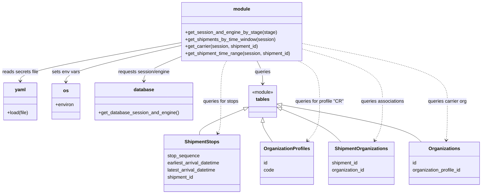
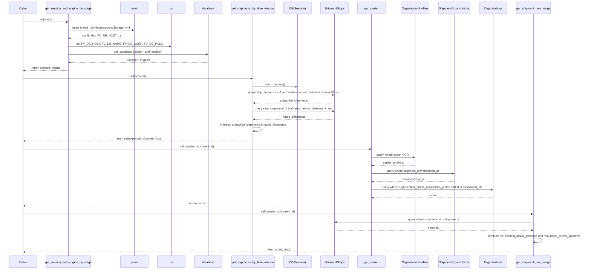

# Diagram: shipment_core/shipment_service/scripts/utilities.py

> Auto-generated by Obscura crawlers

## Diagram 1

### SVG

<svg id="container" width="1634.3671875" xmlns="http://www.w3.org/2000/svg" class="classDiagram" height="656" viewBox="0 0 1634.3671875 656" role="graphics-document document" aria-roledescription="class"><g><defs><marker id="container_class-aggregationStart" class="marker aggregation class" refX="18" refY="7" markerWidth="190" markerHeight="240" orient="auto"><path d="M 18,7 L9,13 L1,7 L9,1 Z"></path></marker></defs><defs><marker id="container_class-aggregationEnd" class="marker aggregation class" refX="1" refY="7" markerWidth="20" markerHeight="28" orient="auto"><path d="M 18,7 L9,13 L1,7 L9,1 Z"></path></marker></defs><defs><marker id="container_class-extensionStart" class="marker extension class" refX="18" refY="7" markerWidth="190" markerHeight="240" orient="auto"><path d="M 1,7 L18,13 V 1 Z"></path></marker></defs><defs><marker id="container_class-extensionEnd" class="marker extension class" refX="1" refY="7" markerWidth="20" markerHeight="28" orient="auto"><path d="M 1,1 V 13 L18,7 Z"></path></marker></defs><defs><marker id="container_class-compositionStart" class="marker composition class" refX="18" refY="7" markerWidth="190" markerHeight="240" orient="auto"><path d="M 18,7 L9,13 L1,7 L9,1 Z"></path></marker></defs><defs><marker id="container_class-compositionEnd" class="marker composition class" refX="1" refY="7" markerWidth="20" markerHeight="28" orient="auto"><path d="M 18,7 L9,13 L1,7 L9,1 Z"></path></marker></defs><defs><marker id="container_class-dependencyStart" class="marker dependency class" refX="6" refY="7" markerWidth="190" markerHeight="240" orient="auto"><path d="M 5,7 L9,13 L1,7 L9,1 Z"></path></marker></defs><defs><marker id="container_class-dependencyEnd" class="marker dependency class" refX="13" refY="7" markerWidth="20" markerHeight="28" orient="auto"><path d="M 18,7 L9,13 L14,7 L9,1 Z"></path></marker></defs><defs><marker id="container_class-lollipopStart" class="marker lollipop class" refX="13" refY="7" markerWidth="190" markerHeight="240" orient="auto"><circle stroke="black" fill="transparent" cx="7" cy="7" r="6"></circle></marker></defs><defs><marker id="container_class-lollipopEnd" class="marker lollipop class" refX="1" refY="7" markerWidth="190" markerHeight="240" orient="auto"><circle stroke="black" fill="transparent" cx="7" cy="7" r="6"></circle></marker></defs><g class="root"><g class="clusters"></g><g class="edgePaths"><path d="M613.426,144.32L522.731,160.766C432.036,177.213,250.647,210.107,159.952,231.72C69.258,253.333,69.258,263.667,69.258,268.833L69.258,274" id="id_module_yaml_1" class="edge-thickness-normal edge-pattern-solid relation" style=";;;" data-edge="true" data-et="edge" data-id="id_module_yaml_1" data-points="W3sieCI6NjEzLjQyNTc4MTI1LCJ5IjoxNDQuMzE5NTgyNjg4NzcxODd9LHsieCI6NjkuMjU3ODEyNSwieSI6MjQzfSx7IngiOjY5LjI1NzgxMjUsInkiOjI4MH1d" marker-end="url(#container_class-dependencyEnd)"></path><path d="M613.426,154.033L548.545,168.861C483.664,183.689,353.902,213.344,289.021,233.839C224.141,254.333,224.141,265.667,224.141,271.333L224.141,277" id="id_module_os_2" class="edge-thickness-normal edge-pattern-solid relation" style=";;;" data-edge="true" data-et="edge" data-id="id_module_os_2" data-points="W3sieCI6NjEzLjQyNTc4MTI1LCJ5IjoxNTQuMDMyODAxNDEyNjIwMzZ9LHsieCI6MjI0LjE0MDYyNSwieSI6MjQzfSx7IngiOjIyNC4xNDA2MjUsInkiOjI4M31d" marker-end="url(#container_class-dependencyEnd)"></path><path d="M613.426,190.988L592.185,199.657C570.944,208.325,528.462,225.663,507.221,239.498C485.98,253.333,485.98,263.667,485.98,268.833L485.98,274" id="id_module_database_3" class="edge-thickness-normal edge-pattern-solid relation" style=";;;" data-edge="true" data-et="edge" data-id="id_module_database_3" data-points="W3sieCI6NjEzLjQyNTc4MTI1LCJ5IjoxOTAuOTg4MDkwNDkzNDk0MzN9LHsieCI6NDg1Ljk4MDQ2ODc1LCJ5IjoyNDN9LHsieCI6NDg1Ljk4MDQ2ODc1LCJ5IjoyODB9XQ==" marker-end="url(#container_class-dependencyEnd)"></path><path d="M872.038,206L875.328,212.167C878.618,218.333,885.198,230.667,888.487,243.5C891.777,256.333,891.777,269.667,891.777,276.333L891.777,283" id="id_module_tables_4" class="edge-thickness-normal edge-pattern-solid relation" style=";;;" data-edge="true" data-et="edge" data-id="id_module_tables_4" data-points="W3sieCI6ODcyLjAzODIwMDgyNzIwNTksInkiOjIwNn0seyJ4Ijo4OTEuNzc3MzQzNzUsInkiOjI0M30seyJ4Ijo4OTEuNzc3MzQzNzUsInkiOjI4OX1d" marker-end="url(#container_class-dependencyEnd)"></path><path d="M827.198,369.274L801.911,379.561C776.624,389.849,726.05,410.425,701.108,424.879C676.165,439.333,676.854,447.667,677.198,451.833L677.543,456" id="id_tables_ShipmentStops_5" class="edge-thickness-normal edge-pattern-solid relation" style=";;;" data-edge="true" data-et="edge" data-id="id_tables_ShipmentStops_5" data-points="W3sieCI6ODQzLjE3NTc4MTI1LCJ5IjozNjIuNzczMTAyNDE0NTM0MTV9LHsieCI6Njc1LjQ3NjU2MjUsInkiOjQzMX0seyJ4Ijo2NzcuNTQyNjc4MjAyNDc5NCwieSI6NDU2fV0=" marker-start="url(#container_class-extensionStart)"></path><path d="M891.777,414.25L891.777,417.042C891.777,419.833,891.777,425.417,897.406,436.375C903.036,447.333,914.294,463.667,919.923,471.833L925.552,480" id="id_tables_OrganizationProfiles_6" class="edge-thickness-normal edge-pattern-solid relation" style=";;;" data-edge="true" data-et="edge" data-id="id_tables_OrganizationProfiles_6" data-points="W3sieCI6ODkxLjc3NzM0Mzc1LCJ5IjozOTd9LHsieCI6ODkxLjc3NzM0Mzc1LCJ5Ijo0MzF9LHsieCI6OTI1LjU1MTg0NjU5MDkwOTEsInkiOjQ4MH1d" marker-start="url(#container_class-extensionStart)"></path><path d="M956.367,369.169L981.802,379.474C1007.237,389.779,1058.107,410.39,1091.222,428.861C1124.338,447.333,1139.699,463.667,1147.379,471.833L1155.06,480" id="id_tables_ShipmentOrganizations_7" class="edge-thickness-normal edge-pattern-solid relation" style=";;;" data-edge="true" data-et="edge" data-id="id_tables_ShipmentOrganizations_7" data-points="W3sieCI6OTQwLjM3ODkwNjI1LCJ5IjozNjIuNjkxMzExNjE5ODc2Nn0seyJ4IjoxMTA4Ljk3NjU2MjUsInkiOjQzMX0seyJ4IjoxMTU1LjA1OTU5NDUyNDc5MzMsInkiOjQ4MH1d" marker-start="url(#container_class-extensionStart)"></path><path d="M957.349,354.967L1026.786,367.639C1096.224,380.311,1235.099,405.656,1313.392,426.494C1391.685,447.333,1409.395,463.667,1418.25,471.833L1427.106,480" id="id_tables_Organizations_8" class="edge-thickness-normal edge-pattern-solid relation" style=";;;" data-edge="true" data-et="edge" data-id="id_tables_Organizations_8" data-points="W3sieCI6OTQwLjM3ODkwNjI1LCJ5IjozNTEuODY5Njg0MjY1OTUzNzd9LHsieCI6MTM3My45NzQ2MDkzNzUsInkiOjQzMX0seyJ4IjoxNDI3LjEwNTY2MjQ0ODM0NzIsInkiOjQ4MH1d" marker-start="url(#container_class-extensionStart)"></path><path d="M766.407,206L763.117,212.167C759.827,218.333,753.248,230.667,749.958,253.5C746.668,276.333,746.668,309.667,746.668,341C746.668,372.333,746.668,401.667,745.012,419.608C743.356,437.549,740.045,444.097,738.389,447.371L736.733,450.646" id="id_module_ShipmentStops_9" class="edge-thickness-normal edge-pattern-dashed relation" style=";;;" data-edge="true" data-et="edge" data-id="id_module_ShipmentStops_9" data-points="W3sieCI6NzY2LjQwNzExMTY3Mjc5NDEsInkiOjIwNn0seyJ4Ijo3NDYuNjY3OTY4NzUsInkiOjI0M30seyJ4Ijo3NDYuNjY3OTY4NzUsInkiOjM0M30seyJ4Ijo3NDYuNjY3OTY4NzUsInkiOjQzMX0seyJ4Ijo3MzQuMDI1MTE2MjE5MDA4MywieSI6NDU2fV0=" marker-end="url(#container_class-dependencyEnd)"></path><path d="M1009.47,206L1021.32,212.167C1033.171,218.333,1056.871,230.667,1068.722,253.5C1080.572,276.333,1080.572,309.667,1080.572,341C1080.572,372.333,1080.572,401.667,1074.116,423.746C1067.659,445.825,1054.746,460.65,1048.29,468.063L1041.833,475.476" id="id_module_OrganizationProfiles_10" class="edge-thickness-normal edge-pattern-dashed relation" style=";;;" data-edge="true" data-et="edge" data-id="id_module_OrganizationProfiles_10" data-points="W3sieCI6MTAwOS40Njk3OTgzNjg1NjYyLCJ5IjoyMDZ9LHsieCI6MTA4MC41NzIyNjU2MjUsInkiOjI0M30seyJ4IjoxMDgwLjU3MjI2NTYyNSwieSI6MzQzfSx7IngiOjEwODAuNTcyMjY1NjI1LCJ5Ijo0MzF9LHsieCI6MTAzNy44OTI2MjY1NDk1ODY4LCJ5Ijo0ODB9XQ==" marker-end="url(#container_class-dependencyEnd)"></path><path d="M1025.02,166.055L1069.709,178.879C1114.399,191.703,1203.779,217.352,1248.468,246.843C1293.158,276.333,1293.158,309.667,1293.158,341C1293.158,372.333,1293.158,401.667,1288.911,423.636C1284.663,445.605,1276.168,460.209,1271.92,467.511L1267.672,474.814" id="id_module_ShipmentOrganizations_11" class="edge-thickness-normal edge-pattern-dashed relation" style=";;;" data-edge="true" data-et="edge" data-id="id_module_ShipmentOrganizations_11" data-points="W3sieCI6MTAyNS4wMTk1MzEyNSwieSI6MTY2LjA1NTIzNDc5ODM3NjN9LHsieCI6MTI5My4xNTgyMDMxMjUsInkiOjI0M30seyJ4IjoxMjkzLjE1ODIwMzEyNSwieSI6MzQzfSx7IngiOjEyOTMuMTU4MjAzMTI1LCJ5Ijo0MzF9LHsieCI6MTI2NC42NTUyODE1MDgyNjQ2LCJ5Ijo0ODB9XQ==" marker-end="url(#container_class-dependencyEnd)"></path><path d="M1025.02,147.216L1106.712,163.18C1188.405,179.144,1351.79,211.072,1433.483,243.703C1515.176,276.333,1515.176,309.667,1515.176,341C1515.176,372.333,1515.176,401.667,1514.583,423.503C1513.991,445.34,1512.806,459.68,1512.213,466.85L1511.62,474.02" id="id_module_Organizations_12" class="edge-thickness-normal edge-pattern-dashed relation" style=";;;" data-edge="true" data-et="edge" data-id="id_module_Organizations_12" data-points="W3sieCI6MTAyNS4wMTk1MzEyNSwieSI6MTQ3LjIxNTg5MDk3Njg1Mjh9LHsieCI6MTUxNS4xNzU3ODEyNSwieSI6MjQzfSx7IngiOjE1MTUuMTc1NzgxMjUsInkiOjM0M30seyJ4IjoxNTE1LjE3NTc4MTI1LCJ5Ijo0MzF9LHsieCI6MTUxMS4xMjYxOTQ0NzMxNDA1LCJ5Ijo0ODB9XQ==" marker-end="url(#container_class-dependencyEnd)"></path></g><g class="edgeLabels"><g class="edgeLabel" transform="translate(69.2578125, 243)"><g class="label" data-id="id_module_yaml_1" transform="translate(-61.2578125, -12)"><foreignObject width="122.515625" height="24">

reads secrets file

</foreignObject></g></g><g class="edgeLabel" transform="translate(224.140625, 243)"><g class="label" data-id="id_module_os_2" transform="translate(-46.7578125, -12)"><foreignObject width="93.515625" height="24">

sets env vars

</foreignObject></g></g><g class="edgeLabel" transform="translate(485.98046875, 243)"><g class="label" data-id="id_module_database_3" transform="translate(-88.8671875, -12)"><foreignObject width="177.734375" height="24">

requests session/engine

</foreignObject></g></g><g class="edgeLabel" transform="translate(891.77734375, 243)"><g class="label" data-id="id_module_tables_4" transform="translate(-27.2421875, -12)"><foreignObject width="54.484375" height="24">

queries

</foreignObject></g></g><g class="edgeLabel"><g class="label" data-id="id_tables_ShipmentStops_5" transform="translate(0, 0)"><foreignObject width="0" height="0">

</foreignObject></g></g><g class="edgeLabel"><g class="label" data-id="id_tables_OrganizationProfiles_6" transform="translate(0, 0)"><foreignObject width="0" height="0">

</foreignObject></g></g><g class="edgeLabel"><g class="label" data-id="id_tables_ShipmentOrganizations_7" transform="translate(0, 0)"><foreignObject width="0" height="0">

</foreignObject></g></g><g class="edgeLabel"><g class="label" data-id="id_tables_Organizations_8" transform="translate(0, 0)"><foreignObject width="0" height="0">

</foreignObject></g></g><g class="edgeLabel" transform="translate(746.66796875, 343)"><g class="label" data-id="id_module_ShipmentStops_9" transform="translate(-61.5078125, -12)"><foreignObject width="123.015625" height="24">

queries for stops

</foreignObject></g></g><g class="edgeLabel" transform="translate(1080.572265625, 343)"><g class="label" data-id="id_module_OrganizationProfiles_10" transform="translate(-83.203125, -12)"><foreignObject width="166.40625" height="24">

queries for profile "CR"

</foreignObject></g></g><g class="edgeLabel" transform="translate(1293.158203125, 343)"><g class="label" data-id="id_module_ShipmentOrganizations_11" transform="translate(-74.375, -12)"><foreignObject width="148.75" height="24">

queries associations

</foreignObject></g></g><g class="edgeLabel" transform="translate(1515.17578125, 343)"><g class="label" data-id="id_module_Organizations_12" transform="translate(-67.2578125, -12)"><foreignObject width="134.515625" height="24">

queries carrier org

</foreignObject></g></g></g><g class="nodes"><g class="node default" id="classId-module-0" transform="translate(819.22265625, 107)"><g class="basic label-container"><path d="M-205.796875 -99 L205.796875 -99 L205.796875 99 L-205.796875 99" stroke="none" stroke-width="0" fill="#ECECFF" style=""></path><path d="M-205.796875 -99 C-106.79744794796183 -99, -7.798020895923656 -99, 205.796875 -99 M-205.796875 -99 C-63.97060046848674 -99, 77.85567406302653 -99, 205.796875 -99 M205.796875 -99 C205.796875 -26.044777782889682, 205.796875 46.910444434220636, 205.796875 99 M205.796875 -99 C205.796875 -52.16154174787513, 205.796875 -5.323083495750254, 205.796875 99 M205.796875 99 C46.92212935307725 99, -111.9526162938455 99, -205.796875 99 M205.796875 99 C116.01505447771746 99, 26.233233955434912 99, -205.796875 99 M-205.796875 99 C-205.796875 29.49715096677545, -205.796875 -40.0056980664491, -205.796875 -99 M-205.796875 99 C-205.796875 48.70642442444614, -205.796875 -1.5871511511077188, -205.796875 -99" stroke="#9370DB" stroke-width="1.3" fill="none" stroke-dasharray="0 0" style=""></path></g><g class="annotation-group text" transform="translate(0, -75)"></g><g class="label-group text" transform="translate(-27.5625, -75)"><g class="label" style="font-weight: bolder" transform="translate(0,-12)"><foreignObject width="55.125" height="24">

module

</foreignObject></g></g><g class="members-group text" transform="translate(-193.796875, -27)"></g><g class="methods-group text" transform="translate(-193.796875, 3)"><g class="label" style="" transform="translate(0,-12)"><foreignObject width="306.203125" height="24">

+get_session_and_engine_by_stage(stage)

</foreignObject></g><g class="label" style="" transform="translate(0,12)"><foreignObject width="308.34375" height="24">

+get_shipments_by_time_window(session)

</foreignObject></g><g class="label" style="" transform="translate(0,36)"><foreignObject width="250.015625" height="24">

+get_carrier(session, shipment_id)

</foreignObject></g><g class="label" style="" transform="translate(0,60)"><foreignObject width="360.03125" height="24">

+get_shipment_time_range(session, shipment_id)

</foreignObject></g></g><g class="divider" style=""><path d="M-205.796875 -51 C-59.49875485018006 -51, 86.79936529963987 -51, 205.796875 -51 M-205.796875 -51 C-114.04181576493875 -51, -22.286756529877493 -51, 205.796875 -51" stroke="#9370DB" stroke-width="1.3" fill="none" stroke-dasharray="0 0" style=""></path></g><g class="divider" style=""><path d="M-205.796875 -27 C-95.76286605782808 -27, 14.271142884343845 -27, 205.796875 -27 M-205.796875 -27 C-52.648576988748744 -27, 100.49972102250251 -27, 205.796875 -27" stroke="#9370DB" stroke-width="1.3" fill="none" stroke-dasharray="0 0" style=""></path></g></g><g class="node default" id="classId-yaml-1" transform="translate(69.2578125, 343)"><g class="basic label-container"><path d="M-57.22265625 -63 L57.22265625 -63 L57.22265625 63 L-57.22265625 63" stroke="none" stroke-width="0" fill="#ECECFF" style=""></path><path d="M-57.22265625 -63 C-26.104897118037293 -63, 5.012862013925414 -63, 57.22265625 -63 M-57.22265625 -63 C-19.41191582573247 -63, 18.398824598535057 -63, 57.22265625 -63 M57.22265625 -63 C57.22265625 -22.474436048512977, 57.22265625 18.051127902974045, 57.22265625 63 M57.22265625 -63 C57.22265625 -20.915117962140933, 57.22265625 21.169764075718135, 57.22265625 63 M57.22265625 63 C23.429563465327035 63, -10.363529319345929 63, -57.22265625 63 M57.22265625 63 C23.787754897271597 63, -9.647146455456806 63, -57.22265625 63 M-57.22265625 63 C-57.22265625 37.03119413338203, -57.22265625 11.06238826676406, -57.22265625 -63 M-57.22265625 63 C-57.22265625 36.99888083531344, -57.22265625 10.997761670626893, -57.22265625 -63" stroke="#9370DB" stroke-width="1.3" fill="none" stroke-dasharray="0 0" style=""></path></g><g class="annotation-group text" transform="translate(0, -39)"></g><g class="label-group text" transform="translate(-17.4921875, -39)"><g class="label" style="font-weight: bolder" transform="translate(0,-12)"><foreignObject width="34.984375" height="24">

yaml

</foreignObject></g></g><g class="members-group text" transform="translate(-45.22265625, 9)"></g><g class="methods-group text" transform="translate(-45.22265625, 39)"><g class="label" style="" transform="translate(0,-12)"><foreignObject width="72.953125" height="24">

+load(file)

</foreignObject></g></g><g class="divider" style=""><path d="M-57.22265625 -15 C-19.72971702279918 -15, 17.763222204401643 -15, 57.22265625 -15 M-57.22265625 -15 C-33.72402705061678 -15, -10.225397851233566 -15, 57.22265625 -15" stroke="#9370DB" stroke-width="1.3" fill="none" stroke-dasharray="0 0" style=""></path></g><g class="divider" style=""><path d="M-57.22265625 9 C-17.84454378034286 9, 21.53356868931428 9, 57.22265625 9 M-57.22265625 9 C-18.329975472777406 9, 20.56270530444519 9, 57.22265625 9" stroke="#9370DB" stroke-width="1.3" fill="none" stroke-dasharray="0 0" style=""></path></g></g><g class="node default" id="classId-os-2" transform="translate(224.140625, 343)"><g class="basic label-container"><path d="M-47.66015625 -60 L47.66015625 -60 L47.66015625 60 L-47.66015625 60" stroke="none" stroke-width="0" fill="#ECECFF" style=""></path><path d="M-47.66015625 -60 C-25.713337758018394 -60, -3.766519266036788 -60, 47.66015625 -60 M-47.66015625 -60 C-14.523621512608784 -60, 18.61291322478243 -60, 47.66015625 -60 M47.66015625 -60 C47.66015625 -20.679952321901546, 47.66015625 18.64009535619691, 47.66015625 60 M47.66015625 -60 C47.66015625 -12.240381797651402, 47.66015625 35.519236404697196, 47.66015625 60 M47.66015625 60 C27.480028399458327 60, 7.2999005489166535 60, -47.66015625 60 M47.66015625 60 C25.623494144317036 60, 3.5868320386340713 60, -47.66015625 60 M-47.66015625 60 C-47.66015625 15.490730958854414, -47.66015625 -29.018538082291172, -47.66015625 -60 M-47.66015625 60 C-47.66015625 27.2099306603873, -47.66015625 -5.580138679225399, -47.66015625 -60" stroke="#9370DB" stroke-width="1.3" fill="none" stroke-dasharray="0 0" style=""></path></g><g class="annotation-group text" transform="translate(0, -36)"></g><g class="label-group text" transform="translate(-8.5390625, -36)"><g class="label" style="font-weight: bolder" transform="translate(0,-12)"><foreignObject width="17.078125" height="24">

os

</foreignObject></g></g><g class="members-group text" transform="translate(-35.66015625, 12)"><g class="label" style="" transform="translate(0,-12)"><foreignObject width="62.78125" height="24">

+environ

</foreignObject></g></g><g class="methods-group text" transform="translate(-35.66015625, 60)"></g><g class="divider" style=""><path d="M-47.66015625 -12 C-23.67908108903623 -12, 0.30199407192753824 -12, 47.66015625 -12 M-47.66015625 -12 C-12.391145569432403 -12, 22.877865111135193 -12, 47.66015625 -12" stroke="#9370DB" stroke-width="1.3" fill="none" stroke-dasharray="0 0" style=""></path></g><g class="divider" style=""><path d="M-47.66015625 36 C-21.583622131301194 36, 4.492911987397612 36, 47.66015625 36 M-47.66015625 36 C-11.442601359536859 36, 24.774953530926282 36, 47.66015625 36" stroke="#9370DB" stroke-width="1.3" fill="none" stroke-dasharray="0 0" style=""></path></g></g><g class="node default" id="classId-database-3" transform="translate(485.98046875, 343)"><g class="basic label-container"><path d="M-164.1796875 -63 L164.1796875 -63 L164.1796875 63 L-164.1796875 63" stroke="none" stroke-width="0" fill="#ECECFF" style=""></path><path d="M-164.1796875 -63 C-81.30080002133103 -63, 1.5780874573379435 -63, 164.1796875 -63 M-164.1796875 -63 C-89.50891671569691 -63, -14.838145931393825 -63, 164.1796875 -63 M164.1796875 -63 C164.1796875 -14.647314917724941, 164.1796875 33.70537016455012, 164.1796875 63 M164.1796875 -63 C164.1796875 -20.66045397672606, 164.1796875 21.67909204654788, 164.1796875 63 M164.1796875 63 C90.70777088982592 63, 17.235854279651846 63, -164.1796875 63 M164.1796875 63 C93.34768160195615 63, 22.515675703912308 63, -164.1796875 63 M-164.1796875 63 C-164.1796875 18.002956887236977, -164.1796875 -26.994086225526047, -164.1796875 -63 M-164.1796875 63 C-164.1796875 17.877202726597602, -164.1796875 -27.245594546804796, -164.1796875 -63" stroke="#9370DB" stroke-width="1.3" fill="none" stroke-dasharray="0 0" style=""></path></g><g class="annotation-group text" transform="translate(0, -39)"></g><g class="label-group text" transform="translate(-33.84375, -39)"><g class="label" style="font-weight: bolder" transform="translate(0,-12)"><foreignObject width="67.6875" height="24">

database

</foreignObject></g></g><g class="members-group text" transform="translate(-152.1796875, 9)"></g><g class="methods-group text" transform="translate(-152.1796875, 39)"><g class="label" style="" transform="translate(0,-12)"><foreignObject width="270.515625" height="24">

+get_database_session_and_engine()

</foreignObject></g></g><g class="divider" style=""><path d="M-164.1796875 -15 C-57.305205088510434 -15, 49.56927732297913 -15, 164.1796875 -15 M-164.1796875 -15 C-81.26967494977028 -15, 1.6403376004594463 -15, 164.1796875 -15" stroke="#9370DB" stroke-width="1.3" fill="none" stroke-dasharray="0 0" style=""></path></g><g class="divider" style=""><path d="M-164.1796875 9 C-50.720764395594884 9, 62.73815870881023 9, 164.1796875 9 M-164.1796875 9 C-36.9102157036489 9, 90.3592560927022 9, 164.1796875 9" stroke="#9370DB" stroke-width="1.3" fill="none" stroke-dasharray="0 0" style=""></path></g></g><g class="node default" id="classId-tables-4" transform="translate(891.77734375, 343)"><g class="basic label-container"><path d="M-48.6015625 -54 L48.6015625 -54 L48.6015625 54 L-48.6015625 54" stroke="none" stroke-width="0" fill="#ECECFF" style=""></path><path d="M-48.6015625 -54 C-13.029646891018963 -54, 22.542268717962074 -54, 48.6015625 -54 M-48.6015625 -54 C-22.38644340466277 -54, 3.8286756906744586 -54, 48.6015625 -54 M48.6015625 -54 C48.6015625 -11.134216147296563, 48.6015625 31.731567705406874, 48.6015625 54 M48.6015625 -54 C48.6015625 -13.593653580701258, 48.6015625 26.812692838597485, 48.6015625 54 M48.6015625 54 C17.03090675516895 54, -14.539748989662101 54, -48.6015625 54 M48.6015625 54 C24.68109508006401 54, 0.7606276601280229 54, -48.6015625 54 M-48.6015625 54 C-48.6015625 29.265333712977167, -48.6015625 4.530667425954334, -48.6015625 -54 M-48.6015625 54 C-48.6015625 20.72622191789005, -48.6015625 -12.547556164219898, -48.6015625 -54" stroke="#9370DB" stroke-width="1.3" fill="none" stroke-dasharray="0 0" style=""></path></g><g class="annotation-group text" transform="translate(-36.6015625, -30)"><g class="label" style="" transform="translate(0,-12)"><foreignObject width="73.203125" height="24">

«module»

</foreignObject></g></g><g class="label-group text" transform="translate(-22.7734375, -6)"><g class="label" style="font-weight: bolder" transform="translate(0,-12)"><foreignObject width="45.546875" height="24">

tables

</foreignObject></g></g><g class="members-group text" transform="translate(-36.6015625, 42)"></g><g class="methods-group text" transform="translate(-36.6015625, 72)"></g><g class="divider" style=""><path d="M-48.6015625 18 C-18.497977859495837 18, 11.605606781008326 18, 48.6015625 18 M-48.6015625 18 C-11.490324835582584 18, 25.620912828834832 18, 48.6015625 18" stroke="#9370DB" stroke-width="1.3" fill="none" stroke-dasharray="0 0" style=""></path></g><g class="divider" style=""><path d="M-48.6015625 36 C-15.17844386709249 36, 18.24467476581502 36, 48.6015625 36 M-48.6015625 36 C-23.05111496844649 36, 2.499332563107018 36, 48.6015625 36" stroke="#9370DB" stroke-width="1.3" fill="none" stroke-dasharray="0 0" style=""></path></g></g><g class="node default" id="classId-ShipmentStops-5" transform="translate(685.4765625, 552)"><g class="basic label-container"><path d="M-131.109375 -96 L131.109375 -96 L131.109375 96 L-131.109375 96" stroke="none" stroke-width="0" fill="#ECECFF" style=""></path><path d="M-131.109375 -96 C-40.81011403855034 -96, 49.48914692289932 -96, 131.109375 -96 M-131.109375 -96 C-39.85308265735995 -96, 51.4032096852801 -96, 131.109375 -96 M131.109375 -96 C131.109375 -27.972751069640637, 131.109375 40.054497860718726, 131.109375 96 M131.109375 -96 C131.109375 -54.84410453658592, 131.109375 -13.688209073171834, 131.109375 96 M131.109375 96 C41.51539569420186 96, -48.07858361159629 96, -131.109375 96 M131.109375 96 C38.80501172539367 96, -53.49935154921266 96, -131.109375 96 M-131.109375 96 C-131.109375 26.04839141346065, -131.109375 -43.9032171730787, -131.109375 -96 M-131.109375 96 C-131.109375 44.084568367099656, -131.109375 -7.830863265800687, -131.109375 -96" stroke="#9370DB" stroke-width="1.3" fill="none" stroke-dasharray="0 0" style=""></path></g><g class="annotation-group text" transform="translate(0, -72)"></g><g class="label-group text" transform="translate(-55.9375, -72)"><g class="label" style="font-weight: bolder" transform="translate(0,-12)"><foreignObject width="111.875" height="24">

ShipmentStops

</foreignObject></g></g><g class="members-group text" transform="translate(-119.109375, -24)"><g class="label" style="" transform="translate(0,-12)"><foreignObject width="109.078125" height="24">

stop_sequence

</foreignObject></g><g class="label" style="" transform="translate(0,12)"><foreignObject width="182.28125" height="24">

earliest_arrival_datetime

</foreignObject></g><g class="label" style="" transform="translate(0,36)"><foreignObject width="168.484375" height="24">

latest_arrival_datetime

</foreignObject></g><g class="label" style="" transform="translate(0,60)"><foreignObject width="90.859375" height="24">

shipment_id

</foreignObject></g></g><g class="methods-group text" transform="translate(-119.109375, 96)"></g><g class="divider" style=""><path d="M-131.109375 -48 C-49.08103043354923 -48, 32.94731413290154 -48, 131.109375 -48 M-131.109375 -48 C-58.449962617481205 -48, 14.20944976503759 -48, 131.109375 -48" stroke="#9370DB" stroke-width="1.3" fill="none" stroke-dasharray="0 0" style=""></path></g><g class="divider" style=""><path d="M-131.109375 72 C-47.97249714333964 72, 35.164380713320725 72, 131.109375 72 M-131.109375 72 C-54.22088380011503 72, 22.667607399769935 72, 131.109375 72" stroke="#9370DB" stroke-width="1.3" fill="none" stroke-dasharray="0 0" style=""></path></g></g><g class="node default" id="classId-OrganizationProfiles-6" transform="translate(975.1796875, 552)"><g class="basic label-container"><path d="M-86.3828125 -72 L86.3828125 -72 L86.3828125 72 L-86.3828125 72" stroke="none" stroke-width="0" fill="#ECECFF" style=""></path><path d="M-86.3828125 -72 C-40.45008879964092 -72, 5.482634900718153 -72, 86.3828125 -72 M-86.3828125 -72 C-32.35597105030776 -72, 21.670870399384484 -72, 86.3828125 -72 M86.3828125 -72 C86.3828125 -43.17096337141467, 86.3828125 -14.34192674282935, 86.3828125 72 M86.3828125 -72 C86.3828125 -21.402788790148072, 86.3828125 29.194422419703855, 86.3828125 72 M86.3828125 72 C18.37433366994226 72, -49.63414516011548 72, -86.3828125 72 M86.3828125 72 C50.42172629364024 72, 14.460640087280481 72, -86.3828125 72 M-86.3828125 72 C-86.3828125 21.12109256251901, -86.3828125 -29.75781487496198, -86.3828125 -72 M-86.3828125 72 C-86.3828125 16.64589504252853, -86.3828125 -38.70820991494294, -86.3828125 -72" stroke="#9370DB" stroke-width="1.3" fill="none" stroke-dasharray="0 0" style=""></path></g><g class="annotation-group text" transform="translate(0, -48)"></g><g class="label-group text" transform="translate(-74.3828125, -48)"><g class="label" style="font-weight: bolder" transform="translate(0,-12)"><foreignObject width="148.765625" height="24">

OrganizationProfiles

</foreignObject></g></g><g class="members-group text" transform="translate(-74.3828125, 0)"><g class="label" style="" transform="translate(0,-12)"><foreignObject width="14.09375" height="24">

id

</foreignObject></g><g class="label" style="" transform="translate(0,12)"><foreignObject width="34.96875" height="24">

code

</foreignObject></g></g><g class="methods-group text" transform="translate(-74.3828125, 72)"></g><g class="divider" style=""><path d="M-86.3828125 -24 C-37.09105630961627 -24, 12.20069988076746 -24, 86.3828125 -24 M-86.3828125 -24 C-48.13283695408382 -24, -9.882861408167642 -24, 86.3828125 -24" stroke="#9370DB" stroke-width="1.3" fill="none" stroke-dasharray="0 0" style=""></path></g><g class="divider" style=""><path d="M-86.3828125 48 C-32.11072047703016 48, 22.161371545939673 48, 86.3828125 48 M-86.3828125 48 C-21.240444670469756 48, 43.90192315906049 48, 86.3828125 48" stroke="#9370DB" stroke-width="1.3" fill="none" stroke-dasharray="0 0" style=""></path></g></g><g class="node default" id="classId-ShipmentOrganizations-7" transform="translate(1222.7734375, 552)"><g class="basic label-container"><path d="M-111.2109375 -72 L111.2109375 -72 L111.2109375 72 L-111.2109375 72" stroke="none" stroke-width="0" fill="#ECECFF" style=""></path><path d="M-111.2109375 -72 C-55.135643644226924 -72, 0.9396502115461516 -72, 111.2109375 -72 M-111.2109375 -72 C-40.2092875073908 -72, 30.792362485218405 -72, 111.2109375 -72 M111.2109375 -72 C111.2109375 -34.77354650644419, 111.2109375 2.452906987111618, 111.2109375 72 M111.2109375 -72 C111.2109375 -18.11642531431542, 111.2109375 35.76714937136916, 111.2109375 72 M111.2109375 72 C24.635403402865464 72, -61.94013069426907 72, -111.2109375 72 M111.2109375 72 C56.24553344967749 72, 1.2801293993549763 72, -111.2109375 72 M-111.2109375 72 C-111.2109375 15.00724511586889, -111.2109375 -41.98550976826222, -111.2109375 -72 M-111.2109375 72 C-111.2109375 27.139646954419504, -111.2109375 -17.72070609116099, -111.2109375 -72" stroke="#9370DB" stroke-width="1.3" fill="none" stroke-dasharray="0 0" style=""></path></g><g class="annotation-group text" transform="translate(0, -48)"></g><g class="label-group text" transform="translate(-85.65625, -48)"><g class="label" style="font-weight: bolder" transform="translate(0,-12)"><foreignObject width="171.3125" height="24">

ShipmentOrganizations

</foreignObject></g></g><g class="members-group text" transform="translate(-99.2109375, 0)"><g class="label" style="" transform="translate(0,-12)"><foreignObject width="90.859375" height="24">

shipment_id

</foreignObject></g><g class="label" style="" transform="translate(0,12)"><foreignObject width="112.765625" height="24">

organization_id

</foreignObject></g></g><g class="methods-group text" transform="translate(-99.2109375, 72)"></g><g class="divider" style=""><path d="M-111.2109375 -24 C-53.57841238338569 -24, 4.054112733228621 -24, 111.2109375 -24 M-111.2109375 -24 C-61.9130518532288 -24, -12.615166206457602 -24, 111.2109375 -24" stroke="#9370DB" stroke-width="1.3" fill="none" stroke-dasharray="0 0" style=""></path></g><g class="divider" style=""><path d="M-111.2109375 48 C-58.15675364337217 48, -5.10256978674434 48, 111.2109375 48 M-111.2109375 48 C-65.10765805103239 48, -19.00437860206479 48, 111.2109375 48" stroke="#9370DB" stroke-width="1.3" fill="none" stroke-dasharray="0 0" style=""></path></g></g><g class="node default" id="classId-Organizations-8" transform="translate(1505.17578125, 552)"><g class="basic label-container"><path d="M-121.19140625 -72 L121.19140625 -72 L121.19140625 72 L-121.19140625 72" stroke="none" stroke-width="0" fill="#ECECFF" style=""></path><path d="M-121.19140625 -72 C-46.72670110331495 -72, 27.738004043370097 -72, 121.19140625 -72 M-121.19140625 -72 C-60.88023260825599 -72, -0.5690589665119745 -72, 121.19140625 -72 M121.19140625 -72 C121.19140625 -15.104856366931088, 121.19140625 41.790287266137824, 121.19140625 72 M121.19140625 -72 C121.19140625 -39.54566129467217, 121.19140625 -7.091322589344344, 121.19140625 72 M121.19140625 72 C42.43858273523216 72, -36.31424077953568 72, -121.19140625 72 M121.19140625 72 C66.0083294219796 72, 10.825252593959192 72, -121.19140625 72 M-121.19140625 72 C-121.19140625 15.232884401684203, -121.19140625 -41.534231196631595, -121.19140625 -72 M-121.19140625 72 C-121.19140625 22.359840029982024, -121.19140625 -27.28031994003595, -121.19140625 -72" stroke="#9370DB" stroke-width="1.3" fill="none" stroke-dasharray="0 0" style=""></path></g><g class="annotation-group text" transform="translate(0, -48)"></g><g class="label-group text" transform="translate(-50.5546875, -48)"><g class="label" style="font-weight: bolder" transform="translate(0,-12)"><foreignObject width="101.109375" height="24">

Organizations

</foreignObject></g></g><g class="members-group text" transform="translate(-109.19140625, 0)"><g class="label" style="" transform="translate(0,-12)"><foreignObject width="14.09375" height="24">

id

</foreignObject></g><g class="label" style="" transform="translate(0,12)"><foreignObject width="167.828125" height="24">

organization_profile_id

</foreignObject></g></g><g class="methods-group text" transform="translate(-109.19140625, 72)"></g><g class="divider" style=""><path d="M-121.19140625 -24 C-30.11701421375821 -24, 60.95737782248358 -24, 121.19140625 -24 M-121.19140625 -24 C-66.68674750350128 -24, -12.18208875700256 -24, 121.19140625 -24" stroke="#9370DB" stroke-width="1.3" fill="none" stroke-dasharray="0 0" style=""></path></g><g class="divider" style=""><path d="M-121.19140625 48 C-72.18831005366994 48, -23.18521385733989 48, 121.19140625 48 M-121.19140625 48 C-25.364982556663364 48, 70.46144113667327 48, 121.19140625 48" stroke="#9370DB" stroke-width="1.3" fill="none" stroke-dasharray="0 0" style=""></path></g></g></g></g></g></svg>

## Diagram 2

### SVG

<svg id="container" width="3316.5" xmlns="http://www.w3.org/2000/svg" height="1575" viewBox="-50 -10 3316.5 1575" role="graphics-document document" aria-roledescription="sequence"><g><rect x="2850.5" y="1489" fill="#eaeaea" stroke="#666" width="209" height="65" name="get_range" rx="3" ry="3" class="actor actor-bottom"></rect><text x="2955" y="1521.5" dominant-baseline="central" alignment-baseline="central" class="actor actor-box" style="text-anchor: middle; font-size: 16px; font-weight: 400;"><tspan x="2955" dy="0">get_shipment_time_range</tspan></text></g><g><rect x="2650.5" y="1489" fill="#eaeaea" stroke="#666" width="150" height="65" name="Organizations" rx="3" ry="3" class="actor actor-bottom"></rect><text x="2725.5" y="1521.5" dominant-baseline="central" alignment-baseline="central" class="actor actor-box" style="text-anchor: middle; font-size: 16px; font-weight: 400;"><tspan x="2725.5" dy="0">Organizations</tspan></text></g><g><rect x="2411.5" y="1489" fill="#eaeaea" stroke="#666" width="189" height="65" name="ShipmentOrganizations" rx="3" ry="3" class="actor actor-bottom"></rect><text x="2506" y="1521.5" dominant-baseline="central" alignment-baseline="central" class="actor actor-box" style="text-anchor: middle; font-size: 16px; font-weight: 400;"><tspan x="2506" dy="0">ShipmentOrganizations</tspan></text></g><g><rect x="2195.5" y="1489" fill="#eaeaea" stroke="#666" width="166" height="65" name="OrganizationProfiles" rx="3" ry="3" class="actor actor-bottom"></rect><text x="2278.5" y="1521.5" dominant-baseline="central" alignment-baseline="central" class="actor actor-box" style="text-anchor: middle; font-size: 16px; font-weight: 400;"><tspan x="2278.5" dy="0">OrganizationProfiles</tspan></text></g><g><rect x="1957.5" y="1489" fill="#eaeaea" stroke="#666" width="150" height="65" name="get_carrier" rx="3" ry="3" class="actor actor-bottom"></rect><text x="2032.5" y="1521.5" dominant-baseline="central" alignment-baseline="central" class="actor actor-box" style="text-anchor: middle; font-size: 16px; font-weight: 400;"><tspan x="2032.5" dy="0">get_carrier</tspan></text></g><g><rect x="1757.5" y="1489" fill="#eaeaea" stroke="#666" width="150" height="65" name="ShipmentStops" rx="3" ry="3" class="actor actor-bottom"></rect><text x="1832.5" y="1521.5" dominant-baseline="central" alignment-baseline="central" class="actor actor-box" style="text-anchor: middle; font-size: 16px; font-weight: 400;"><tspan x="1832.5" dy="0">ShipmentStops</tspan></text></g><g><rect x="1557.5" y="1489" fill="#eaeaea" stroke="#666" width="150" height="65" name="DB" rx="3" ry="3" class="actor actor-bottom"></rect><text x="1632.5" y="1521.5" dominant-baseline="central" alignment-baseline="central" class="actor actor-box" style="text-anchor: middle; font-size: 16px; font-weight: 400;"><tspan x="1632.5" dy="0">DB(Session)</tspan></text></g><g><rect x="1251.5" y="1489" fill="#eaeaea" stroke="#666" width="256" height="65" name="get_shipments" rx="3" ry="3" class="actor actor-bottom"></rect><text x="1379.5" y="1521.5" dominant-baseline="central" alignment-baseline="central" class="actor actor-box" style="text-anchor: middle; font-size: 16px; font-weight: 400;"><tspan x="1379.5" dy="0">get_shipments_by_time_window</tspan></text></g><g><rect x="1051.5" y="1489" fill="#eaeaea" stroke="#666" width="150" height="65" name="database" rx="3" ry="3" class="actor actor-bottom"></rect><text x="1126.5" y="1521.5" dominant-baseline="central" alignment-baseline="central" class="actor actor-box" style="text-anchor: middle; font-size: 16px; font-weight: 400;"><tspan x="1126.5" dy="0">database</tspan></text></g><g><rect x="851.5" y="1489" fill="#eaeaea" stroke="#666" width="150" height="65" name="os" rx="3" ry="3" class="actor actor-bottom"></rect><text x="926.5" y="1521.5" dominant-baseline="central" alignment-baseline="central" class="actor actor-box" style="text-anchor: middle; font-size: 16px; font-weight: 400;"><tspan x="926.5" dy="0">os</tspan></text></g><g><rect x="651.5" y="1489" fill="#eaeaea" stroke="#666" width="150" height="65" name="yaml" rx="3" ry="3" class="actor actor-bottom"></rect><text x="726.5" y="1521.5" dominant-baseline="central" alignment-baseline="central" class="actor actor-box" style="text-anchor: middle; font-size: 16px; font-weight: 400;"><tspan x="726.5" dy="0">yaml</tspan></text></g><g><rect x="200" y="1489" fill="#eaeaea" stroke="#666" width="269" height="65" name="get_session" rx="3" ry="3" class="actor actor-bottom"></rect><text x="334.5" y="1521.5" dominant-baseline="central" alignment-baseline="central" class="actor actor-box" style="text-anchor: middle; font-size: 16px; font-weight: 400;"><tspan x="334.5" dy="0">get_session_and_engine_by_stage</tspan></text></g><g><rect x="0" y="1489" fill="#eaeaea" stroke="#666" width="150" height="65" name="Caller" rx="3" ry="3" class="actor actor-bottom"></rect><text x="75" y="1521.5" dominant-baseline="central" alignment-baseline="central" class="actor actor-box" style="text-anchor: middle; font-size: 16px; font-weight: 400;"><tspan x="75" dy="0">Caller</tspan></text></g><g><line id="actor12" x1="2955" y1="65" x2="2955" y2="1489" class="actor-line 200" stroke-width="0.5px" stroke="#999" name="get_range"></line><g id="root-12"><rect x="2850.5" y="0" fill="#eaeaea" stroke="#666" width="209" height="65" name="get_range" rx="3" ry="3" class="actor actor-top"></rect><text x="2955" y="32.5" dominant-baseline="central" alignment-baseline="central" class="actor actor-box" style="text-anchor: middle; font-size: 16px; font-weight: 400;"><tspan x="2955" dy="0">get_shipment_time_range</tspan></text></g></g><g><line id="actor11" x1="2725.5" y1="65" x2="2725.5" y2="1489" class="actor-line 200" stroke-width="0.5px" stroke="#999" name="Organizations"></line><g id="root-11"><rect x="2650.5" y="0" fill="#eaeaea" stroke="#666" width="150" height="65" name="Organizations" rx="3" ry="3" class="actor actor-top"></rect><text x="2725.5" y="32.5" dominant-baseline="central" alignment-baseline="central" class="actor actor-box" style="text-anchor: middle; font-size: 16px; font-weight: 400;"><tspan x="2725.5" dy="0">Organizations</tspan></text></g></g><g><line id="actor10" x1="2506" y1="65" x2="2506" y2="1489" class="actor-line 200" stroke-width="0.5px" stroke="#999" name="ShipmentOrganizations"></line><g id="root-10"><rect x="2411.5" y="0" fill="#eaeaea" stroke="#666" width="189" height="65" name="ShipmentOrganizations" rx="3" ry="3" class="actor actor-top"></rect><text x="2506" y="32.5" dominant-baseline="central" alignment-baseline="central" class="actor actor-box" style="text-anchor: middle; font-size: 16px; font-weight: 400;"><tspan x="2506" dy="0">ShipmentOrganizations</tspan></text></g></g><g><line id="actor9" x1="2278.5" y1="65" x2="2278.5" y2="1489" class="actor-line 200" stroke-width="0.5px" stroke="#999" name="OrganizationProfiles"></line><g id="root-9"><rect x="2195.5" y="0" fill="#eaeaea" stroke="#666" width="166" height="65" name="OrganizationProfiles" rx="3" ry="3" class="actor actor-top"></rect><text x="2278.5" y="32.5" dominant-baseline="central" alignment-baseline="central" class="actor actor-box" style="text-anchor: middle; font-size: 16px; font-weight: 400;"><tspan x="2278.5" dy="0">OrganizationProfiles</tspan></text></g></g><g><line id="actor8" x1="2032.5" y1="65" x2="2032.5" y2="1489" class="actor-line 200" stroke-width="0.5px" stroke="#999" name="get_carrier"></line><g id="root-8"><rect x="1957.5" y="0" fill="#eaeaea" stroke="#666" width="150" height="65" name="get_carrier" rx="3" ry="3" class="actor actor-top"></rect><text x="2032.5" y="32.5" dominant-baseline="central" alignment-baseline="central" class="actor actor-box" style="text-anchor: middle; font-size: 16px; font-weight: 400;"><tspan x="2032.5" dy="0">get_carrier</tspan></text></g></g><g><line id="actor7" x1="1832.5" y1="65" x2="1832.5" y2="1489" class="actor-line 200" stroke-width="0.5px" stroke="#999" name="ShipmentStops"></line><g id="root-7"><rect x="1757.5" y="0" fill="#eaeaea" stroke="#666" width="150" height="65" name="ShipmentStops" rx="3" ry="3" class="actor actor-top"></rect><text x="1832.5" y="32.5" dominant-baseline="central" alignment-baseline="central" class="actor actor-box" style="text-anchor: middle; font-size: 16px; font-weight: 400;"><tspan x="1832.5" dy="0">ShipmentStops</tspan></text></g></g><g><line id="actor6" x1="1632.5" y1="65" x2="1632.5" y2="1489" class="actor-line 200" stroke-width="0.5px" stroke="#999" name="DB"></line><g id="root-6"><rect x="1557.5" y="0" fill="#eaeaea" stroke="#666" width="150" height="65" name="DB" rx="3" ry="3" class="actor actor-top"></rect><text x="1632.5" y="32.5" dominant-baseline="central" alignment-baseline="central" class="actor actor-box" style="text-anchor: middle; font-size: 16px; font-weight: 400;"><tspan x="1632.5" dy="0">DB(Session)</tspan></text></g></g><g><line id="actor5" x1="1379.5" y1="65" x2="1379.5" y2="1489" class="actor-line 200" stroke-width="0.5px" stroke="#999" name="get_shipments"></line><g id="root-5"><rect x="1251.5" y="0" fill="#eaeaea" stroke="#666" width="256" height="65" name="get_shipments" rx="3" ry="3" class="actor actor-top"></rect><text x="1379.5" y="32.5" dominant-baseline="central" alignment-baseline="central" class="actor actor-box" style="text-anchor: middle; font-size: 16px; font-weight: 400;"><tspan x="1379.5" dy="0">get_shipments_by_time_window</tspan></text></g></g><g><line id="actor4" x1="1126.5" y1="65" x2="1126.5" y2="1489" class="actor-line 200" stroke-width="0.5px" stroke="#999" name="database"></line><g id="root-4"><rect x="1051.5" y="0" fill="#eaeaea" stroke="#666" width="150" height="65" name="database" rx="3" ry="3" class="actor actor-top"></rect><text x="1126.5" y="32.5" dominant-baseline="central" alignment-baseline="central" class="actor actor-box" style="text-anchor: middle; font-size: 16px; font-weight: 400;"><tspan x="1126.5" dy="0">database</tspan></text></g></g><g><line id="actor3" x1="926.5" y1="65" x2="926.5" y2="1489" class="actor-line 200" stroke-width="0.5px" stroke="#999" name="os"></line><g id="root-3"><rect x="851.5" y="0" fill="#eaeaea" stroke="#666" width="150" height="65" name="os" rx="3" ry="3" class="actor actor-top"></rect><text x="926.5" y="32.5" dominant-baseline="central" alignment-baseline="central" class="actor actor-box" style="text-anchor: middle; font-size: 16px; font-weight: 400;"><tspan x="926.5" dy="0">os</tspan></text></g></g><g><line id="actor2" x1="726.5" y1="65" x2="726.5" y2="1489" class="actor-line 200" stroke-width="0.5px" stroke="#999" name="yaml"></line><g id="root-2"><rect x="651.5" y="0" fill="#eaeaea" stroke="#666" width="150" height="65" name="yaml" rx="3" ry="3" class="actor actor-top"></rect><text x="726.5" y="32.5" dominant-baseline="central" alignment-baseline="central" class="actor actor-box" style="text-anchor: middle; font-size: 16px; font-weight: 400;"><tspan x="726.5" dy="0">yaml</tspan></text></g></g><g><line id="actor1" x1="334.5" y1="65" x2="334.5" y2="1489" class="actor-line 200" stroke-width="0.5px" stroke="#999" name="get_session"></line><g id="root-1"><rect x="200" y="0" fill="#eaeaea" stroke="#666" width="269" height="65" name="get_session" rx="3" ry="3" class="actor actor-top"></rect><text x="334.5" y="32.5" dominant-baseline="central" alignment-baseline="central" class="actor actor-box" style="text-anchor: middle; font-size: 16px; font-weight: 400;"><tspan x="334.5" dy="0">get_session_and_engine_by_stage</tspan></text></g></g><g><line id="actor0" x1="75" y1="65" x2="75" y2="1489" class="actor-line 200" stroke-width="0.5px" stroke="#999" name="Caller"></line><g id="root-0"><rect x="0" y="0" fill="#eaeaea" stroke="#666" width="150" height="65" name="Caller" rx="3" ry="3" class="actor actor-top"></rect><text x="75" y="32.5" dominant-baseline="central" alignment-baseline="central" class="actor actor-box" style="text-anchor: middle; font-size: 16px; font-weight: 400;"><tspan x="75" dy="0">Caller</tspan></text></g></g><g></g><defs><symbol id="computer" width="24" height="24"><path transform="scale(.5)" d="M2 2v13h20v-13h-20zm18 11h-16v-9h16v9zm-10.228 6l.466-1h3.524l.467 1h-4.457zm14.228 3h-24l2-6h2.104l-1.33 4h18.45l-1.297-4h2.073l2 6zm-5-10h-14v-7h14v7z"></path></symbol></defs><defs><symbol id="database" fill-rule="evenodd" clip-rule="evenodd"><path transform="scale(.5)" d="M12.258.001l.256.004.255.005.253.008.251.01.249.012.247.015.246.016.242.019.241.02.239.023.236.024.233.027.231.028.229.031.225.032.223.034.22.036.217.038.214.04.211.041.208.043.205.045.201.046.198.048.194.05.191.051.187.053.183.054.18.056.175.057.172.059.168.06.163.061.16.063.155.064.15.066.074.033.073.033.071.034.07.034.069.035.068.035.067.035.066.035.064.036.064.036.062.036.06.036.06.037.058.037.058.037.055.038.055.038.053.038.052.038.051.039.05.039.048.039.047.039.045.04.044.04.043.04.041.04.04.041.039.041.037.041.036.041.034.041.033.042.032.042.03.042.029.042.027.042.026.043.024.043.023.043.021.043.02.043.018.044.017.043.015.044.013.044.012.044.011.045.009.044.007.045.006.045.004.045.002.045.001.045v17l-.001.045-.002.045-.004.045-.006.045-.007.045-.009.044-.011.045-.012.044-.013.044-.015.044-.017.043-.018.044-.02.043-.021.043-.023.043-.024.043-.026.043-.027.042-.029.042-.03.042-.032.042-.033.042-.034.041-.036.041-.037.041-.039.041-.04.041-.041.04-.043.04-.044.04-.045.04-.047.039-.048.039-.05.039-.051.039-.052.038-.053.038-.055.038-.055.038-.058.037-.058.037-.06.037-.06.036-.062.036-.064.036-.064.036-.066.035-.067.035-.068.035-.069.035-.07.034-.071.034-.073.033-.074.033-.15.066-.155.064-.16.063-.163.061-.168.06-.172.059-.175.057-.18.056-.183.054-.187.053-.191.051-.194.05-.198.048-.201.046-.205.045-.208.043-.211.041-.214.04-.217.038-.22.036-.223.034-.225.032-.229.031-.231.028-.233.027-.236.024-.239.023-.241.02-.242.019-.246.016-.247.015-.249.012-.251.01-.253.008-.255.005-.256.004-.258.001-.258-.001-.256-.004-.255-.005-.253-.008-.251-.01-.249-.012-.247-.015-.245-.016-.243-.019-.241-.02-.238-.023-.236-.024-.234-.027-.231-.028-.228-.031-.226-.032-.223-.034-.22-.036-.217-.038-.214-.04-.211-.041-.208-.043-.204-.045-.201-.046-.198-.048-.195-.05-.19-.051-.187-.053-.184-.054-.179-.056-.176-.057-.172-.059-.167-.06-.164-.061-.159-.063-.155-.064-.151-.066-.074-.033-.072-.033-.072-.034-.07-.034-.069-.035-.068-.035-.067-.035-.066-.035-.064-.036-.063-.036-.062-.036-.061-.036-.06-.037-.058-.037-.057-.037-.056-.038-.055-.038-.053-.038-.052-.038-.051-.039-.049-.039-.049-.039-.046-.039-.046-.04-.044-.04-.043-.04-.041-.04-.04-.041-.039-.041-.037-.041-.036-.041-.034-.041-.033-.042-.032-.042-.03-.042-.029-.042-.027-.042-.026-.043-.024-.043-.023-.043-.021-.043-.02-.043-.018-.044-.017-.043-.015-.044-.013-.044-.012-.044-.011-.045-.009-.044-.007-.045-.006-.045-.004-.045-.002-.045-.001-.045v-17l.001-.045.002-.045.004-.045.006-.045.007-.045.009-.044.011-.045.012-.044.013-.044.015-.044.017-.043.018-.044.02-.043.021-.043.023-.043.024-.043.026-.043.027-.042.029-.042.03-.042.032-.042.033-.042.034-.041.036-.041.037-.041.039-.041.04-.041.041-.04.043-.04.044-.04.046-.04.046-.039.049-.039.049-.039.051-.039.052-.038.053-.038.055-.038.056-.038.057-.037.058-.037.06-.037.061-.036.062-.036.063-.036.064-.036.066-.035.067-.035.068-.035.069-.035.07-.034.072-.034.072-.033.074-.033.151-.066.155-.064.159-.063.164-.061.167-.06.172-.059.176-.057.179-.056.184-.054.187-.053.19-.051.195-.05.198-.048.201-.046.204-.045.208-.043.211-.041.214-.04.217-.038.22-.036.223-.034.226-.032.228-.031.231-.028.234-.027.236-.024.238-.023.241-.02.243-.019.245-.016.247-.015.249-.012.251-.01.253-.008.255-.005.256-.004.258-.001.258.001zm-9.258 20.499v.01l.001.021.003.021.004.022.005.021.006.022.007.022.009.023.01.022.011.023.012.023.013.023.015.023.016.024.017.023.018.024.019.024.021.024.022.025.023.024.024.025.052.049.056.05.061.051.066.051.07.051.075.051.079.052.084.052.088.052.092.052.097.052.102.051.105.052.11.052.114.051.119.051.123.051.127.05.131.05.135.05.139.048.144.049.147.047.152.047.155.047.16.045.163.045.167.043.171.043.176.041.178.041.183.039.187.039.19.037.194.035.197.035.202.033.204.031.209.03.212.029.216.027.219.025.222.024.226.021.23.02.233.018.236.016.24.015.243.012.246.01.249.008.253.005.256.004.259.001.26-.001.257-.004.254-.005.25-.008.247-.011.244-.012.241-.014.237-.016.233-.018.231-.021.226-.021.224-.024.22-.026.216-.027.212-.028.21-.031.205-.031.202-.034.198-.034.194-.036.191-.037.187-.039.183-.04.179-.04.175-.042.172-.043.168-.044.163-.045.16-.046.155-.046.152-.047.148-.048.143-.049.139-.049.136-.05.131-.05.126-.05.123-.051.118-.052.114-.051.11-.052.106-.052.101-.052.096-.052.092-.052.088-.053.083-.051.079-.052.074-.052.07-.051.065-.051.06-.051.056-.05.051-.05.023-.024.023-.025.021-.024.02-.024.019-.024.018-.024.017-.024.015-.023.014-.024.013-.023.012-.023.01-.023.01-.022.008-.022.006-.022.006-.022.004-.022.004-.021.001-.021.001-.021v-4.127l-.077.055-.08.053-.083.054-.085.053-.087.052-.09.052-.093.051-.095.05-.097.05-.1.049-.102.049-.105.048-.106.047-.109.047-.111.046-.114.045-.115.045-.118.044-.12.043-.122.042-.124.042-.126.041-.128.04-.13.04-.132.038-.134.038-.135.037-.138.037-.139.035-.142.035-.143.034-.144.033-.147.032-.148.031-.15.03-.151.03-.153.029-.154.027-.156.027-.158.026-.159.025-.161.024-.162.023-.163.022-.165.021-.166.02-.167.019-.169.018-.169.017-.171.016-.173.015-.173.014-.175.013-.175.012-.177.011-.178.01-.179.008-.179.008-.181.006-.182.005-.182.004-.184.003-.184.002h-.37l-.184-.002-.184-.003-.182-.004-.182-.005-.181-.006-.179-.008-.179-.008-.178-.01-.176-.011-.176-.012-.175-.013-.173-.014-.172-.015-.171-.016-.17-.017-.169-.018-.167-.019-.166-.02-.165-.021-.163-.022-.162-.023-.161-.024-.159-.025-.157-.026-.156-.027-.155-.027-.153-.029-.151-.03-.15-.03-.148-.031-.146-.032-.145-.033-.143-.034-.141-.035-.14-.035-.137-.037-.136-.037-.134-.038-.132-.038-.13-.04-.128-.04-.126-.041-.124-.042-.122-.042-.12-.044-.117-.043-.116-.045-.113-.045-.112-.046-.109-.047-.106-.047-.105-.048-.102-.049-.1-.049-.097-.05-.095-.05-.093-.052-.09-.051-.087-.052-.085-.053-.083-.054-.08-.054-.077-.054v4.127zm0-5.654v.011l.001.021.003.021.004.021.005.022.006.022.007.022.009.022.01.022.011.023.012.023.013.023.015.024.016.023.017.024.018.024.019.024.021.024.022.024.023.025.024.024.052.05.056.05.061.05.066.051.07.051.075.052.079.051.084.052.088.052.092.052.097.052.102.052.105.052.11.051.114.051.119.052.123.05.127.051.131.05.135.049.139.049.144.048.147.048.152.047.155.046.16.045.163.045.167.044.171.042.176.042.178.04.183.04.187.038.19.037.194.036.197.034.202.033.204.032.209.03.212.028.216.027.219.025.222.024.226.022.23.02.233.018.236.016.24.014.243.012.246.01.249.008.253.006.256.003.259.001.26-.001.257-.003.254-.006.25-.008.247-.01.244-.012.241-.015.237-.016.233-.018.231-.02.226-.022.224-.024.22-.025.216-.027.212-.029.21-.03.205-.032.202-.033.198-.035.194-.036.191-.037.187-.039.183-.039.179-.041.175-.042.172-.043.168-.044.163-.045.16-.045.155-.047.152-.047.148-.048.143-.048.139-.05.136-.049.131-.05.126-.051.123-.051.118-.051.114-.052.11-.052.106-.052.101-.052.096-.052.092-.052.088-.052.083-.052.079-.052.074-.051.07-.052.065-.051.06-.05.056-.051.051-.049.023-.025.023-.024.021-.025.02-.024.019-.024.018-.024.017-.024.015-.023.014-.023.013-.024.012-.022.01-.023.01-.023.008-.022.006-.022.006-.022.004-.021.004-.022.001-.021.001-.021v-4.139l-.077.054-.08.054-.083.054-.085.052-.087.053-.09.051-.093.051-.095.051-.097.05-.1.049-.102.049-.105.048-.106.047-.109.047-.111.046-.114.045-.115.044-.118.044-.12.044-.122.042-.124.042-.126.041-.128.04-.13.039-.132.039-.134.038-.135.037-.138.036-.139.036-.142.035-.143.033-.144.033-.147.033-.148.031-.15.03-.151.03-.153.028-.154.028-.156.027-.158.026-.159.025-.161.024-.162.023-.163.022-.165.021-.166.02-.167.019-.169.018-.169.017-.171.016-.173.015-.173.014-.175.013-.175.012-.177.011-.178.009-.179.009-.179.007-.181.007-.182.005-.182.004-.184.003-.184.002h-.37l-.184-.002-.184-.003-.182-.004-.182-.005-.181-.007-.179-.007-.179-.009-.178-.009-.176-.011-.176-.012-.175-.013-.173-.014-.172-.015-.171-.016-.17-.017-.169-.018-.167-.019-.166-.02-.165-.021-.163-.022-.162-.023-.161-.024-.159-.025-.157-.026-.156-.027-.155-.028-.153-.028-.151-.03-.15-.03-.148-.031-.146-.033-.145-.033-.143-.033-.141-.035-.14-.036-.137-.036-.136-.037-.134-.038-.132-.039-.13-.039-.128-.04-.126-.041-.124-.042-.122-.043-.12-.043-.117-.044-.116-.044-.113-.046-.112-.046-.109-.046-.106-.047-.105-.048-.102-.049-.1-.049-.097-.05-.095-.051-.093-.051-.09-.051-.087-.053-.085-.052-.083-.054-.08-.054-.077-.054v4.139zm0-5.666v.011l.001.02.003.022.004.021.005.022.006.021.007.022.009.023.01.022.011.023.012.023.013.023.015.023.016.024.017.024.018.023.019.024.021.025.022.024.023.024.024.025.052.05.056.05.061.05.066.051.07.051.075.052.079.051.084.052.088.052.092.052.097.052.102.052.105.051.11.052.114.051.119.051.123.051.127.05.131.05.135.05.139.049.144.048.147.048.152.047.155.046.16.045.163.045.167.043.171.043.176.042.178.04.183.04.187.038.19.037.194.036.197.034.202.033.204.032.209.03.212.028.216.027.219.025.222.024.226.021.23.02.233.018.236.017.24.014.243.012.246.01.249.008.253.006.256.003.259.001.26-.001.257-.003.254-.006.25-.008.247-.01.244-.013.241-.014.237-.016.233-.018.231-.02.226-.022.224-.024.22-.025.216-.027.212-.029.21-.03.205-.032.202-.033.198-.035.194-.036.191-.037.187-.039.183-.039.179-.041.175-.042.172-.043.168-.044.163-.045.16-.045.155-.047.152-.047.148-.048.143-.049.139-.049.136-.049.131-.051.126-.05.123-.051.118-.052.114-.051.11-.052.106-.052.101-.052.096-.052.092-.052.088-.052.083-.052.079-.052.074-.052.07-.051.065-.051.06-.051.056-.05.051-.049.023-.025.023-.025.021-.024.02-.024.019-.024.018-.024.017-.024.015-.023.014-.024.013-.023.012-.023.01-.022.01-.023.008-.022.006-.022.006-.022.004-.022.004-.021.001-.021.001-.021v-4.153l-.077.054-.08.054-.083.053-.085.053-.087.053-.09.051-.093.051-.095.051-.097.05-.1.049-.102.048-.105.048-.106.048-.109.046-.111.046-.114.046-.115.044-.118.044-.12.043-.122.043-.124.042-.126.041-.128.04-.13.039-.132.039-.134.038-.135.037-.138.036-.139.036-.142.034-.143.034-.144.033-.147.032-.148.032-.15.03-.151.03-.153.028-.154.028-.156.027-.158.026-.159.024-.161.024-.162.023-.163.023-.165.021-.166.02-.167.019-.169.018-.169.017-.171.016-.173.015-.173.014-.175.013-.175.012-.177.01-.178.01-.179.009-.179.007-.181.006-.182.006-.182.004-.184.003-.184.001-.185.001-.185-.001-.184-.001-.184-.003-.182-.004-.182-.006-.181-.006-.179-.007-.179-.009-.178-.01-.176-.01-.176-.012-.175-.013-.173-.014-.172-.015-.171-.016-.17-.017-.169-.018-.167-.019-.166-.02-.165-.021-.163-.023-.162-.023-.161-.024-.159-.024-.157-.026-.156-.027-.155-.028-.153-.028-.151-.03-.15-.03-.148-.032-.146-.032-.145-.033-.143-.034-.141-.034-.14-.036-.137-.036-.136-.037-.134-.038-.132-.039-.13-.039-.128-.041-.126-.041-.124-.041-.122-.043-.12-.043-.117-.044-.116-.044-.113-.046-.112-.046-.109-.046-.106-.048-.105-.048-.102-.048-.1-.05-.097-.049-.095-.051-.093-.051-.09-.052-.087-.052-.085-.053-.083-.053-.08-.054-.077-.054v4.153zm8.74-8.179l-.257.004-.254.005-.25.008-.247.011-.244.012-.241.014-.237.016-.233.018-.231.021-.226.022-.224.023-.22.026-.216.027-.212.028-.21.031-.205.032-.202.033-.198.034-.194.036-.191.038-.187.038-.183.04-.179.041-.175.042-.172.043-.168.043-.163.045-.16.046-.155.046-.152.048-.148.048-.143.048-.139.049-.136.05-.131.05-.126.051-.123.051-.118.051-.114.052-.11.052-.106.052-.101.052-.096.052-.092.052-.088.052-.083.052-.079.052-.074.051-.07.052-.065.051-.06.05-.056.05-.051.05-.023.025-.023.024-.021.024-.02.025-.019.024-.018.024-.017.023-.015.024-.014.023-.013.023-.012.023-.01.023-.01.022-.008.022-.006.023-.006.021-.004.022-.004.021-.001.021-.001.021.001.021.001.021.004.021.004.022.006.021.006.023.008.022.01.022.01.023.012.023.013.023.014.023.015.024.017.023.018.024.019.024.02.025.021.024.023.024.023.025.051.05.056.05.06.05.065.051.07.052.074.051.079.052.083.052.088.052.092.052.096.052.101.052.106.052.11.052.114.052.118.051.123.051.126.051.131.05.136.05.139.049.143.048.148.048.152.048.155.046.16.046.163.045.168.043.172.043.175.042.179.041.183.04.187.038.191.038.194.036.198.034.202.033.205.032.21.031.212.028.216.027.22.026.224.023.226.022.231.021.233.018.237.016.241.014.244.012.247.011.25.008.254.005.257.004.26.001.26-.001.257-.004.254-.005.25-.008.247-.011.244-.012.241-.014.237-.016.233-.018.231-.021.226-.022.224-.023.22-.026.216-.027.212-.028.21-.031.205-.032.202-.033.198-.034.194-.036.191-.038.187-.038.183-.04.179-.041.175-.042.172-.043.168-.043.163-.045.16-.046.155-.046.152-.048.148-.048.143-.048.139-.049.136-.05.131-.05.126-.051.123-.051.118-.051.114-.052.11-.052.106-.052.101-.052.096-.052.092-.052.088-.052.083-.052.079-.052.074-.051.07-.052.065-.051.06-.05.056-.05.051-.05.023-.025.023-.024.021-.024.02-.025.019-.024.018-.024.017-.023.015-.024.014-.023.013-.023.012-.023.01-.023.01-.022.008-.022.006-.023.006-.021.004-.022.004-.021.001-.021.001-.021-.001-.021-.001-.021-.004-.021-.004-.022-.006-.021-.006-.023-.008-.022-.01-.022-.01-.023-.012-.023-.013-.023-.014-.023-.015-.024-.017-.023-.018-.024-.019-.024-.02-.025-.021-.024-.023-.024-.023-.025-.051-.05-.056-.05-.06-.05-.065-.051-.07-.052-.074-.051-.079-.052-.083-.052-.088-.052-.092-.052-.096-.052-.101-.052-.106-.052-.11-.052-.114-.052-.118-.051-.123-.051-.126-.051-.131-.05-.136-.05-.139-.049-.143-.048-.148-.048-.152-.048-.155-.046-.16-.046-.163-.045-.168-.043-.172-.043-.175-.042-.179-.041-.183-.04-.187-.038-.191-.038-.194-.036-.198-.034-.202-.033-.205-.032-.21-.031-.212-.028-.216-.027-.22-.026-.224-.023-.226-.022-.231-.021-.233-.018-.237-.016-.241-.014-.244-.012-.247-.011-.25-.008-.254-.005-.257-.004-.26-.001-.26.001z"></path></symbol></defs><defs><symbol id="clock" width="24" height="24"><path transform="scale(.5)" d="M12 2c5.514 0 10 4.486 10 10s-4.486 10-10 10-10-4.486-10-10 4.486-10 10-10zm0-2c-6.627 0-12 5.373-12 12s5.373 12 12 12 12-5.373 12-12-5.373-12-12-12zm5.848 12.459c.202.038.202.333.001.372-1.907.361-6.045 1.111-6.547 1.111-.719 0-1.301-.582-1.301-1.301 0-.512.77-5.447 1.125-7.445.034-.192.312-.181.343.014l.985 6.238 5.394 1.011z"></path></symbol></defs><defs><marker id="arrowhead" refX="7.9" refY="5" markerUnits="userSpaceOnUse" markerWidth="12" markerHeight="12" orient="auto-start-reverse"><path d="M -1 0 L 10 5 L 0 10 z"></path></marker></defs><defs><marker id="crosshead" markerWidth="15" markerHeight="8" orient="auto" refX="4" refY="4.5"><path fill="none" stroke="#000000" stroke-width="1pt" d="M 1,2 L 6,7 M 6,2 L 1,7" style="stroke-dasharray: 0, 0;"></path></marker></defs><defs><marker id="filled-head" refX="15.5" refY="7" markerWidth="20" markerHeight="28" orient="auto"><path d="M 18,7 L9,13 L14,7 L9,1 Z"></path></marker></defs><defs><marker id="sequencenumber" refX="15" refY="15" markerWidth="60" markerHeight="40" orient="auto"><circle cx="15" cy="15" r="6"></circle></marker></defs><text x="203" y="80" text-anchor="middle" dominant-baseline="middle" alignment-baseline="middle" class="messageText" dy="1em" style="font-size: 16px; font-weight: 400;">call(stage)</text><line x1="76" y1="113" x2="330.5" y2="113" class="messageLine0" stroke-width="2" stroke="none" marker-end="url(#arrowhead)" style="fill: none;"></line><text x="529" y="128" text-anchor="middle" dominant-baseline="middle" alignment-baseline="middle" class="messageText" dy="1em" style="font-size: 16px; font-weight: 400;">open &amp; load ../lambdas/secrets.${stage}.yml</text><line x1="335.5" y1="161" x2="722.5" y2="161" class="messageLine0" stroke-width="2" stroke="none" marker-end="url(#arrowhead)" style="fill: none;"></line><text x="532" y="176" text-anchor="middle" dominant-baseline="middle" alignment-baseline="middle" class="messageText" dy="1em" style="font-size: 16px; font-weight: 400;">config dict (FV_DB_HOST,...)</text><line x1="725.5" y1="209" x2="338.5" y2="209" class="messageLine1" stroke-width="2" stroke="none" marker-end="url(#arrowhead)" style="stroke-dasharray: 3, 3; fill: none;"></line><text x="629" y="224" text-anchor="middle" dominant-baseline="middle" alignment-baseline="middle" class="messageText" dy="1em" style="font-size: 16px; font-weight: 400;">set FV_DB_HOST, FV_DB_NAME, FV_DB_USER, FV_DB_PASS</text><line x1="335.5" y1="257" x2="922.5" y2="257" class="messageLine0" stroke-width="2" stroke="none" marker-end="url(#arrowhead)" style="fill: none;"></line><text x="729" y="272" text-anchor="middle" dominant-baseline="middle" alignment-baseline="middle" class="messageText" dy="1em" style="font-size: 16px; font-weight: 400;">get_database_session_and_engine()</text><line x1="335.5" y1="305" x2="1122.5" y2="305" class="messageLine0" stroke-width="2" stroke="none" marker-end="url(#arrowhead)" style="fill: none;"></line><text x="732" y="320" text-anchor="middle" dominant-baseline="middle" alignment-baseline="middle" class="messageText" dy="1em" style="font-size: 16px; font-weight: 400;">(session, engine)</text><line x1="1125.5" y1="353" x2="338.5" y2="353" class="messageLine1" stroke-width="2" stroke="none" marker-end="url(#arrowhead)" style="stroke-dasharray: 3, 3; fill: none;"></line><text x="206" y="368" text-anchor="middle" dominant-baseline="middle" alignment-baseline="middle" class="messageText" dy="1em" style="font-size: 16px; font-weight: 400;">return session, engine</text><line x1="333.5" y1="401" x2="79" y2="401" class="messageLine1" stroke-width="2" stroke="none" marker-end="url(#arrowhead)" style="stroke-dasharray: 3, 3; fill: none;"></line><text x="726" y="416" text-anchor="middle" dominant-baseline="middle" alignment-baseline="middle" class="messageText" dy="1em" style="font-size: 16px; font-weight: 400;">call(session)</text><line x1="76" y1="449" x2="1375.5" y2="449" class="messageLine0" stroke-width="2" stroke="none" marker-end="url(#arrowhead)" style="fill: none;"></line><text x="1505" y="464" text-anchor="middle" dominant-baseline="middle" alignment-baseline="middle" class="messageText" dy="1em" style="font-size: 16px; font-weight: 400;">now = utcnow()</text><line x1="1380.5" y1="497" x2="1628.5" y2="497" class="messageLine0" stroke-width="2" stroke="none" marker-end="url(#arrowhead)" style="fill: none;"></line><text x="1605" y="512" text-anchor="middle" dominant-baseline="middle" alignment-baseline="middle" class="messageText" dy="1em" style="font-size: 16px; font-weight: 400;">query stop_sequence==1 and earliest_arrival_datetime &lt; now+30min</text><line x1="1380.5" y1="545" x2="1828.5" y2="545" class="messageLine0" stroke-width="2" stroke="none" marker-end="url(#arrowhead)" style="fill: none;"></line><text x="1608" y="560" text-anchor="middle" dominant-baseline="middle" alignment-baseline="middle" class="messageText" dy="1em" style="font-size: 16px; font-weight: 400;">subscribe_shipments</text><line x1="1831.5" y1="593" x2="1383.5" y2="593" class="messageLine1" stroke-width="2" stroke="none" marker-end="url(#arrowhead)" style="stroke-dasharray: 3, 3; fill: none;"></line><text x="1605" y="608" text-anchor="middle" dominant-baseline="middle" alignment-baseline="middle" class="messageText" dy="1em" style="font-size: 16px; font-weight: 400;">query stop_sequence!=1 and latest_arrival_datetime &gt; now</text><line x1="1380.5" y1="641" x2="1828.5" y2="641" class="messageLine0" stroke-width="2" stroke="none" marker-end="url(#arrowhead)" style="fill: none;"></line><text x="1608" y="656" text-anchor="middle" dominant-baseline="middle" alignment-baseline="middle" class="messageText" dy="1em" style="font-size: 16px; font-weight: 400;">future_shipments</text><line x1="1831.5" y1="689" x2="1383.5" y2="689" class="messageLine1" stroke-width="2" stroke="none" marker-end="url(#arrowhead)" style="stroke-dasharray: 3, 3; fill: none;"></line><text x="1381" y="704" text-anchor="middle" dominant-baseline="middle" alignment-baseline="middle" class="messageText" dy="1em" style="font-size: 16px; font-weight: 400;">intersect subscribe_shipments &amp; future_shipments</text><path d="M 1380.5,737 C 1440.5,727 1440.5,767 1380.5,757" class="messageLine0" stroke-width="2" stroke="none" marker-end="url(#arrowhead)" style="fill: none;"></path><text x="729" y="782" text-anchor="middle" dominant-baseline="middle" alignment-baseline="middle" class="messageText" dy="1em" style="font-size: 16px; font-weight: 400;">return set(expected_shipment_ids)</text><line x1="1378.5" y1="815" x2="79" y2="815" class="messageLine1" stroke-width="2" stroke="none" marker-end="url(#arrowhead)" style="stroke-dasharray: 3, 3; fill: none;"></line><text x="1052" y="830" text-anchor="middle" dominant-baseline="middle" alignment-baseline="middle" class="messageText" dy="1em" style="font-size: 16px; font-weight: 400;">call(session, shipment_id)</text><line x1="76" y1="863" x2="2028.5" y2="863" class="messageLine0" stroke-width="2" stroke="none" marker-end="url(#arrowhead)" style="fill: none;"></line><text x="2154" y="878" text-anchor="middle" dominant-baseline="middle" alignment-baseline="middle" class="messageText" dy="1em" style="font-size: 16px; font-weight: 400;">query where code=="CR"</text><line x1="2033.5" y1="911" x2="2274.5" y2="911" class="messageLine0" stroke-width="2" stroke="none" marker-end="url(#arrowhead)" style="fill: none;"></line><text x="2157" y="926" text-anchor="middle" dominant-baseline="middle" alignment-baseline="middle" class="messageText" dy="1em" style="font-size: 16px; font-weight: 400;">carrier_profile id</text><line x1="2277.5" y1="959" x2="2036.5" y2="959" class="messageLine1" stroke-width="2" stroke="none" marker-end="url(#arrowhead)" style="stroke-dasharray: 3, 3; fill: none;"></line><text x="2268" y="974" text-anchor="middle" dominant-baseline="middle" alignment-baseline="middle" class="messageText" dy="1em" style="font-size: 16px; font-weight: 400;">query where shipment_id==shipment_id</text><line x1="2033.5" y1="1007" x2="2502" y2="1007" class="messageLine0" stroke-width="2" stroke="none" marker-end="url(#arrowhead)" style="fill: none;"></line><text x="2271" y="1022" text-anchor="middle" dominant-baseline="middle" alignment-baseline="middle" class="messageText" dy="1em" style="font-size: 16px; font-weight: 400;">associated_orgs</text><line x1="2505" y1="1055" x2="2036.5" y2="1055" class="messageLine1" stroke-width="2" stroke="none" marker-end="url(#arrowhead)" style="stroke-dasharray: 3, 3; fill: none;"></line><text x="2378" y="1070" text-anchor="middle" dominant-baseline="middle" alignment-baseline="middle" class="messageText" dy="1em" style="font-size: 16px; font-weight: 400;">query where organization_profile_id==carrier_profile and id in associated_ids</text><line x1="2033.5" y1="1103" x2="2721.5" y2="1103" class="messageLine0" stroke-width="2" stroke="none" marker-end="url(#arrowhead)" style="fill: none;"></line><text x="2381" y="1118" text-anchor="middle" dominant-baseline="middle" alignment-baseline="middle" class="messageText" dy="1em" style="font-size: 16px; font-weight: 400;">carrier</text><line x1="2724.5" y1="1151" x2="2036.5" y2="1151" class="messageLine1" stroke-width="2" stroke="none" marker-end="url(#arrowhead)" style="stroke-dasharray: 3, 3; fill: none;"></line><text x="1055" y="1166" text-anchor="middle" dominant-baseline="middle" alignment-baseline="middle" class="messageText" dy="1em" style="font-size: 16px; font-weight: 400;">return carrier</text><line x1="2031.5" y1="1199" x2="79" y2="1199" class="messageLine1" stroke-width="2" stroke="none" marker-end="url(#arrowhead)" style="stroke-dasharray: 3, 3; fill: none;"></line><text x="1514" y="1214" text-anchor="middle" dominant-baseline="middle" alignment-baseline="middle" class="messageText" dy="1em" style="font-size: 16px; font-weight: 400;">call(session, shipment_id)</text><line x1="76" y1="1247" x2="2951" y2="1247" class="messageLine0" stroke-width="2" stroke="none" marker-end="url(#arrowhead)" style="fill: none;"></line><text x="2395" y="1262" text-anchor="middle" dominant-baseline="middle" alignment-baseline="middle" class="messageText" dy="1em" style="font-size: 16px; font-weight: 400;">query where shipment_id==shipment_id</text><line x1="2954" y1="1295" x2="1836.5" y2="1295" class="messageLine0" stroke-width="2" stroke="none" marker-end="url(#arrowhead)" style="fill: none;"></line><text x="2392" y="1310" text-anchor="middle" dominant-baseline="middle" alignment-baseline="middle" class="messageText" dy="1em" style="font-size: 16px; font-weight: 400;">stops list</text><line x1="1833.5" y1="1343" x2="2951" y2="1343" class="messageLine1" stroke-width="2" stroke="none" marker-end="url(#arrowhead)" style="stroke-dasharray: 3, 3; fill: none;"></line><text x="2956" y="1358" text-anchor="middle" dominant-baseline="middle" alignment-baseline="middle" class="messageText" dy="1em" style="font-size: 16px; font-weight: 400;">compute min earliest_arrival_datetime and max latest_arrival_datetime</text><path d="M 2956,1391 C 3016,1381 3016,1421 2956,1411" class="messageLine0" stroke-width="2" stroke="none" marker-end="url(#arrowhead)" style="fill: none;"></path><text x="1517" y="1436" text-anchor="middle" dominant-baseline="middle" alignment-baseline="middle" class="messageText" dy="1em" style="font-size: 16px; font-weight: 400;">return (start, stop)</text><line x1="2954" y1="1469" x2="79" y2="1469" class="messageLine1" stroke-width="2" stroke="none" marker-end="url(#arrowhead)" style="stroke-dasharray: 3, 3; fill: none;"></line></svg>
