# Diagram: shipment_core/shipment_service/serverless.eta.yml

> Auto-generated by Obscura crawlers

## Mermaid

```mermaid
flowchart TD
  Service["service: eta-shipments"] --> Provider["provider: aws, runtime: python3.13, arch: arm64"]
  Provider --> Environment["Environment variables & tracing & layers & vpc"]
  Service --> Plugins["plugins"]
  Plugins --> P1["serverless-python-requirements"]
  Plugins --> P2["serverless-prune-plugin"]
  Plugins --> P3["serverless-domain-manager"]
  Plugins --> P4["serverless-logging-config"]

  subgraph Functions
    direction TB
    ETA_PROXY["eta_proxy\nhandler: shipment_service.eta.eta_proxy.eta_proxy.lambda_handler\ntype: http? (redirect API)"]
    ETA_FREEZE["eta_freeze_handler\nhandler: shipment_service.eta.eta_freeze_handler.lambda_handler"]
    ETA_MILESTONE_UPDATE["eta_milestone_update\nhandler: shipment_service.eta.eta_milestone_update.eta_milestone_update.lambda_handler"]
    ETA_MILESTONE_CONSUMER["eta_milestone_update_consumer\nsqs consumer"]
    ENTITY_EXP_MILESTONE_W["entity_eta_expiration_milestone_watcher\nschedule: rate(1 minute)"]
    ENTITY_EXP_FROZEN_W["entity_eta_expiration_frozen_watcher\nschedule: rate(5 minutes)"]
    ENTITY_EXP_MILESTONE_CONS["entity_eta_expiration_milestone_consumer\nsqs consumer"]
    ENTITY_EXP_FROZEN_CONS["entity_eta_expiration_frozen_consumer\nsqs consumer"]
    ETA_SETTER_SHIPMENT["eta_setter_shipment\nhttp POST /eta_setter/shipment/{shipment_id}"]
    ETA_ADMIN_SHIPMENT["eta_admin_shipment\nhttp GET /eta_admin/shipment/{shipment_id}"]
    ETA_ADMIN_VIN["eta_admin_vin\nhttp GET /eta_admin/entity/{entity_id}"]
    VIN_ETA_OVERRIDE["vin_eta_override\nhttp POST /override/solution/{solution_id}"]
    PARTVIEW_ETA_OVERRIDE["partview_eta_override\nhttp POST /override/partview/solution/{solution_id}"]
    ETA_MULTIMODAL["eta_multimodal_shipment\nhttp GET /eta"]
    RAIL_EXCEPTION_W["shipment_rail_eta_exception_extension_watcher\nschedule: rate(60 minutes)"]
    RAIL_DAILY_W["shipment_rail_eta_daily_extension_watcher\nschedule: rate(60 minutes)"]
    RAIL_FAST_TRACK_W["shipment_rail_eta_fast_track_extension_watcher\nschedule: rate(60 minutes)"]
    EXTEND_RAIL["extend_rail_eta\nhandler: shipment_service.eta.extend_rail_eta.lambda_handler"]
    ENTITY_PROGRESS_UPDATE["entity_progress_update_from_shipment_eta\nsqs consumer"]
    REPLAY_SEGMENT_ETA["replay_segment_eta\nsqs consumer (2 sources)"]
    DELETE_ENTITY_EXP["delete_entity_eta_expiration\nhandler"]
    SHIPMENT_ETA_EXT_CONS["shipment_eta_extension_consumer\nsqs consumer"]
    ENTITY_ETA_EXT_CONS["entity_eta_extension_consumer\nsqs consumer"]
  end

  Provider --> Functions

  %% HTTP events
  ETA_SETTER_SHIPMENT -.-> API["API Gateway (http POST)"]
  ETA_ADMIN_SHIPMENT -.-> API
  ETA_ADMIN_VIN -.-> API
  VIN_ETA_OVERRIDE -.-> API
  PARTVIEW_ETA_OVERRIDE -.-> API
  ETA_MULTIMODAL -.-> API
  ETA_PROXY -.-> API

  %% SQS event mappings
  ETA_MILESTONE_CONSUMER -.-> SQS_MILESTONE["SQS: -ETA-eta-milestone-update.fifo"]
  ENTITY_EXP_MILESTONE_CONS -.-> SQS_ENTITY_EXP_MILESTONE["SQS: -ETA-entity-expired-milestone.fifo"]
  ENTITY_EXP_FROZEN_CONS -.-> SQS_ENTITY_EXP_FROZEN["SQS: -ETA-entity-expired-frozen.fifo"]
  ENTITY_PROGRESS_UPDATE -.-> SQS_ENTITY_PROGRESS["SQS: -entity_progress_update_from_shipment_eta.fifo"]
  REPLAY_SEGMENT_ETA -.-> SQS_REPLAY1["SQS: -eta_updated_from_rail_exception.fifo"] 
  REPLAY_SEGMENT_ETA -.-> SQS_REPLAY2["SQS: -eta_updated_from_rail_exception_extension.fifo"]
  SHIPMENT_ETA_EXT_CONS -.-> SQS_SHIP_EXT["SQS: -ETA-shipment-eta-extension.fifo"]
  ENTITY_ETA_EXT_CONS -.-> SQS_ENT_EXT["SQS: -ETA-entity-eta-extension.fifo"]
  ETA_MILESTONE_UPDATE -.-> SQS_PUBLISH["(may publish to SNS/SQS)"]

  %% Scheduled watchers
  ENTITY_EXP_MILESTONE_W -.-> SCHED["CloudWatch Events / EventBridge schedule"]
  ENTITY_EXP_FROZEN_W -.-> SCHED
  RAIL_EXCEPTION_W -.-> SCHED
  RAIL_DAILY_W -.-> SCHED
  RAIL_FAST_TRACK_W -.-> SCHED

  %% Relationships between handlers and common shared concerns
  Environment --> Tracing["Tracing: lambda: true & Datadog config"]
  Environment --> Layers["lambda layers (otel, requirements, fv layer)"]
  Environment --> IAM["IAM role + policies"]

  %% Logical flows
  API --> ETA_PROXY
  ETA_PROXY --> ETA_MULTIMODAL
  ETA_MULTIMODAL --> EXTEND_RAIL
  SQS_ENTITY_PROGRESS --> ENTITY_PROGRESS_UPDATE
  ENTITY_PROGRESS_UPDATE --> ENTITY_ETA_EXT_CONS
  SQS_SHIP_EXT --> SHIPMENT_ETA_EXT_CONS
  SQS_PUBLISH --> ETA_MILESTONE_CONSUMER
  SQS_REPLAY1 --> REPLAY_SEGMENT_ETA
  SQS_REPLAY2 --> REPLAY_SEGMENT_ETA

  classDef funcs fill:#f9f,stroke:#333,stroke-width:1px;
  class ETA_PROXY,ETA_FREEZE,ETA_MILESTONE_UPDATE,ETA_MILESTONE_CONSUMER,ENTITY_EXP_MILESTONE_W,ENTITY_EXP_FROZEN_W,ENTITY_EXP_MILESTONE_CONS,ENTITY_EXP_FROZEN_CONS,ETA_SETTER_SHIPMENT,ETA_ADMIN_SHIPMENT,ETA_ADMIN_VIN,VIN_ETA_OVERRIDE,PARTVIEW_ETA_OVERRIDE,ETA_MULTIMODAL,RAIL_EXCEPTION_W,RAIL_DAILY_W,RAIL_FAST_TRACK_W,EXTEND_RAIL,ENTITY_PROGRESS_UPDATE,REPLAY_SEGMENT_ETA,DELETE_ENTITY_EXP,SHIPMENT_ETA_EXT_CONS,ENTITY_ETA_EXT_CONS funcs
```

### SVG

<svg id="container" width="11992.0078125" xmlns="http://www.w3.org/2000/svg" class="flowchart" height="784" viewBox="0 0 11992.0078125 784" role="graphics-document document" aria-roledescription="flowchart-v2"><g><marker id="container_flowchart-v2-pointEnd" class="marker flowchart-v2" viewBox="0 0 10 10" refX="5" refY="5" markerUnits="userSpaceOnUse" markerWidth="8" markerHeight="8" orient="auto"><path d="M 0 0 L 10 5 L 0 10 z" class="arrowMarkerPath" style="stroke-width: 1; stroke-dasharray: 1, 0;"></path></marker><marker id="container_flowchart-v2-pointStart" class="marker flowchart-v2" viewBox="0 0 10 10" refX="4.5" refY="5" markerUnits="userSpaceOnUse" markerWidth="8" markerHeight="8" orient="auto"><path d="M 0 5 L 10 10 L 10 0 z" class="arrowMarkerPath" style="stroke-width: 1; stroke-dasharray: 1, 0;"></path></marker><marker id="container_flowchart-v2-circleEnd" class="marker flowchart-v2" viewBox="0 0 10 10" refX="11" refY="5" markerUnits="userSpaceOnUse" markerWidth="11" markerHeight="11" orient="auto"><circle cx="5" cy="5" r="5" class="arrowMarkerPath" style="stroke-width: 1; stroke-dasharray: 1, 0;"></circle></marker><marker id="container_flowchart-v2-circleStart" class="marker flowchart-v2" viewBox="0 0 10 10" refX="-1" refY="5" markerUnits="userSpaceOnUse" markerWidth="11" markerHeight="11" orient="auto"><circle cx="5" cy="5" r="5" class="arrowMarkerPath" style="stroke-width: 1; stroke-dasharray: 1, 0;"></circle></marker><marker id="container_flowchart-v2-crossEnd" class="marker cross flowchart-v2" viewBox="0 0 11 11" refX="12" refY="5.2" markerUnits="userSpaceOnUse" markerWidth="11" markerHeight="11" orient="auto"><path d="M 1,1 l 9,9 M 10,1 l -9,9" class="arrowMarkerPath" style="stroke-width: 2; stroke-dasharray: 1, 0;"></path></marker><marker id="container_flowchart-v2-crossStart" class="marker cross flowchart-v2" viewBox="0 0 11 11" refX="-1" refY="5.2" markerUnits="userSpaceOnUse" markerWidth="11" markerHeight="11" orient="auto"><path d="M 1,1 l 9,9 M 10,1 l -9,9" class="arrowMarkerPath" style="stroke-width: 2; stroke-dasharray: 1, 0;"></path></marker><g class="root"><g class="clusters"><g class="cluster" id="Functions" data-look="classic"><rect style="" x="2521.265625" y="240" width="7822.49609375" height="408"></rect><g class="cluster-label" transform="translate(6397.466796875, 240)"><foreignObject width="70.09375" height="24">

Functions

</foreignObject></g></g></g><g class="edgePaths"><path d="M11274.535,47.96L11330.812,54.467C11387.089,60.973,11499.642,73.987,11555.919,83.993C11612.195,94,11612.195,101,11612.195,104.5L11612.195,108" id="L_Service_Provider_0" class="edge-thickness-normal edge-pattern-solid edge-thickness-normal edge-pattern-solid flowchart-link" style=";" data-edge="true" data-et="edge" data-id="L_Service_Provider_0" data-points="W3sieCI6MTEyNzQuNTM1MTU2MjUsInkiOjQ3Ljk2MDE0MzEzMzgzMTg3fSx7IngiOjExNjEyLjE5NTMxMjUsInkiOjg3fSx7IngiOjExNjEyLjE5NTMxMjUsInkiOjExMn1d" marker-end="url(#container_flowchart-v2-pointEnd)"></path><path d="M11669.136,190L11675.22,194.167C11681.303,198.333,11693.47,206.667,11699.553,215C11705.637,223.333,11705.637,231.667,11705.637,241.333C11705.637,251,11705.637,262,11705.637,267.5L11705.637,273" id="L_Provider_Environment_0" class="edge-thickness-normal edge-pattern-solid edge-thickness-normal edge-pattern-solid flowchart-link" style=";" data-edge="true" data-et="edge" data-id="L_Provider_Environment_0" data-points="W3sieCI6MTE2NjkuMTM2MTY5NDMzNTk0LCJ5IjoxOTB9LHsieCI6MTE3MDUuNjM2NzE4NzUsInkiOjIxNX0seyJ4IjoxMTcwNS42MzY3MTg3NSwieSI6MjQwfSx7IngiOjExNzA1LjYzNjcxODc1LCJ5IjoyNzd9XQ==" marker-end="url(#container_flowchart-v2-pointEnd)"></path><path d="M11050.348,54.361L11018.852,59.8C10987.355,65.24,10924.363,76.12,10892.867,87.06C10861.371,98,10861.371,109,10861.371,114.5L10861.371,120" id="L_Service_Plugins_0" class="edge-thickness-normal edge-pattern-solid edge-thickness-normal edge-pattern-solid flowchart-link" style=";" data-edge="true" data-et="edge" data-id="L_Service_Plugins_0" data-points="W3sieCI6MTEwNTAuMzQ3NjU2MjUsInkiOjU0LjM2MDUxMDY3ODA0OTY2NH0seyJ4IjoxMDg2MS4zNzEwOTM3NSwieSI6ODd9LHsieCI6MTA4NjEuMzcxMDkzNzUsInkiOjEyNH1d" marker-end="url(#container_flowchart-v2-pointEnd)"></path><path d="M10804.777,161.272L10755.441,170.227C10706.105,179.181,10607.434,197.091,10558.098,210.212C10508.762,223.333,10508.762,231.667,10508.762,241.333C10508.762,251,10508.762,262,10508.762,267.5L10508.762,273" id="L_Plugins_P1_0" class="edge-thickness-normal edge-pattern-solid edge-thickness-normal edge-pattern-solid flowchart-link" style=";" data-edge="true" data-et="edge" data-id="L_Plugins_P1_0" data-points="W3sieCI6MTA4MDQuNzc3MzQzNzUsInkiOjE2MS4yNzE5OTAwNzQwMDE4NX0seyJ4IjoxMDUwOC43NjE3MTg3NSwieSI6MjE1fSx7IngiOjEwNTA4Ljc2MTcxODc1LCJ5IjoyNDB9LHsieCI6MTA1MDguNzYxNzE4NzUsInkiOjI3N31d" marker-end="url(#container_flowchart-v2-pointEnd)"></path><path d="M10838.066,178L10832.743,184.167C10827.42,190.333,10816.775,202.667,10811.452,213C10806.129,223.333,10806.129,231.667,10806.129,243.333C10806.129,255,10806.129,270,10806.129,277.5L10806.129,285" id="L_Plugins_P2_0" class="edge-thickness-normal edge-pattern-solid edge-thickness-normal edge-pattern-solid flowchart-link" style=";" data-edge="true" data-et="edge" data-id="L_Plugins_P2_0" data-points="W3sieCI6MTA4MzguMDY1Nzk1ODk4NDM4LCJ5IjoxNzh9LHsieCI6MTA4MDYuMTI4OTA2MjUsInkiOjIxNX0seyJ4IjoxMDgwNi4xMjg5MDYyNSwieSI6MjQwfSx7IngiOjEwODA2LjEyODkwNjI1LCJ5IjoyODl9XQ==" marker-end="url(#container_flowchart-v2-pointEnd)"></path><path d="M10917.965,165.959L10948.887,174.133C10979.809,182.306,11041.652,198.653,11072.574,210.993C11103.496,223.333,11103.496,231.667,11103.496,241.333C11103.496,251,11103.496,262,11103.496,267.5L11103.496,273" id="L_Plugins_P3_0" class="edge-thickness-normal edge-pattern-solid edge-thickness-normal edge-pattern-solid flowchart-link" style=";" data-edge="true" data-et="edge" data-id="L_Plugins_P3_0" data-points="W3sieCI6MTA5MTcuOTY0ODQzNzUsInkiOjE2NS45NTkyMTUyODEzNjI5M30seyJ4IjoxMTEwMy40OTYwOTM3NSwieSI6MjE1fSx7IngiOjExMTAzLjQ5NjA5Mzc1LCJ5IjoyNDB9LHsieCI6MTExMDMuNDk2MDkzNzUsInkiOjI3N31d" marker-end="url(#container_flowchart-v2-pointEnd)"></path><path d="M10917.965,157.668L10999.065,167.223C11080.165,176.779,11242.366,195.889,11323.466,209.611C11404.566,223.333,11404.566,231.667,11404.566,243.333C11404.566,255,11404.566,270,11404.566,277.5L11404.566,285" id="L_Plugins_P4_0" class="edge-thickness-normal edge-pattern-solid edge-thickness-normal edge-pattern-solid flowchart-link" style=";" data-edge="true" data-et="edge" data-id="L_Plugins_P4_0" data-points="W3sieCI6MTA5MTcuOTY0ODQzNzUsInkiOjE1Ny42Njc5NTE1MDIyNTA4N30seyJ4IjoxMTQwNC41NjY0MDYyNSwieSI6MjE1fSx7IngiOjExNDA0LjU2NjQwNjI1LCJ5IjoyNDB9LHsieCI6MTE0MDQuNTY2NDA2MjUsInkiOjI4OX1d" marker-end="url(#container_flowchart-v2-pointEnd)"></path><path d="M7515.078,495L7515.078,499.167C7515.078,503.333,7515.078,511.667,7991.692,526.066C8468.306,540.466,9421.534,560.932,9898.149,571.165L10374.763,581.398" id="L_ETA_SETTER_SHIPMENT_API_0" class="edge-thickness-normal edge-pattern-dotted edge-thickness-normal edge-pattern-solid flowchart-link" style=";" data-edge="true" data-et="edge" data-id="L_ETA_SETTER_SHIPMENT_API_0" data-points="W3sieCI6NzUxNS4wNzgxMjUsInkiOjQ5NX0seyJ4Ijo3NTE1LjA3ODEyNSwieSI6NTIwfSx7IngiOjEwMzc4Ljc2MTcxODc1LCJ5Ijo1ODEuNDgzNzk1ODA3OTE2M31d" marker-end="url(#container_flowchart-v2-pointEnd)"></path><path d="M7136.891,495L7136.891,499.167C7136.891,503.333,7136.891,511.667,7676.536,526.115C8216.181,540.564,9295.472,561.127,9835.117,571.409L10374.762,581.691" id="L_ETA_ADMIN_SHIPMENT_API_0" class="edge-thickness-normal edge-pattern-dotted edge-thickness-normal edge-pattern-solid flowchart-link" style=";" data-edge="true" data-et="edge" data-id="L_ETA_ADMIN_SHIPMENT_API_0" data-points="W3sieCI6NzEzNi44OTA2MjUsInkiOjQ5NX0seyJ4Ijo3MTM2Ljg5MDYyNSwieSI6NTIwfSx7IngiOjEwMzc4Ljc2MTcxODc1LCJ5Ijo1ODEuNzY3MDg3OTA2OTEyNH1d" marker-end="url(#container_flowchart-v2-pointEnd)"></path><path d="M6783.539,495L6783.539,499.167C6783.539,503.333,6783.539,511.667,7382.076,526.152C7980.613,540.637,9177.688,561.274,9776.225,571.592L10374.762,581.911" id="L_ETA_ADMIN_VIN_API_0" class="edge-thickness-normal edge-pattern-dotted edge-thickness-normal edge-pattern-solid flowchart-link" style=";" data-edge="true" data-et="edge" data-id="L_ETA_ADMIN_VIN_API_0" data-points="W3sieCI6Njc4My41MzkwNjI1LCJ5Ijo0OTV9LHsieCI6Njc4My41MzkwNjI1LCJ5Ijo1MjB9LHsieCI6MTAzNzguNzYxNzE4NzUsInkiOjU4MS45Nzk2MTg2NTczOTg4fV0=" marker-end="url(#container_flowchart-v2-pointEnd)"></path><path d="M6446.813,495L6446.813,499.167C6446.813,503.333,6446.813,511.667,7101.471,526.181C7756.129,540.695,9065.446,561.39,9720.104,571.737L10374.762,582.084" id="L_VIN_ETA_OVERRIDE_API_0" class="edge-thickness-normal edge-pattern-dotted edge-thickness-normal edge-pattern-solid flowchart-link" style=";" data-edge="true" data-et="edge" data-id="L_VIN_ETA_OVERRIDE_API_0" data-points="W3sieCI6NjQ0Ni44MTI1LCJ5Ijo0OTV9LHsieCI6NjQ0Ni44MTI1LCJ5Ijo1MjB9LHsieCI6MTAzNzguNzYxNzE4NzUsInkiOjU4Mi4xNDc2MzM0MjE3OTcyfV0=" marker-end="url(#container_flowchart-v2-pointEnd)"></path><path d="M6064.648,495L6064.648,499.167C6064.648,503.333,6064.648,511.667,6783.001,526.208C7501.353,540.75,8938.058,561.5,9656.41,571.875L10374.762,582.25" id="L_PARTVIEW_ETA_OVERRIDE_API_0" class="edge-thickness-normal edge-pattern-dotted edge-thickness-normal edge-pattern-solid flowchart-link" style=";" data-edge="true" data-et="edge" data-id="L_PARTVIEW_ETA_OVERRIDE_API_0" data-points="W3sieCI6NjA2NC42NDg0Mzc1LCJ5Ijo0OTV9LHsieCI6NjA2NC42NDg0Mzc1LCJ5Ijo1MjB9LHsieCI6MTAzNzguNzYxNzE4NzUsInkiOjU4Mi4zMDczODQ4NjM1NjR9XQ==" marker-end="url(#container_flowchart-v2-pointEnd)"></path><path d="M5810.984,488.816L5835.04,494.013C5859.095,499.21,5907.206,509.605,6667.835,525.185C7428.465,540.764,8901.614,561.528,9638.188,571.91L10374.762,582.292" id="L_ETA_MULTIMODAL_API_0" class="edge-thickness-normal edge-pattern-dotted edge-thickness-normal edge-pattern-solid flowchart-link" style=";" data-edge="true" data-et="edge" data-id="L_ETA_MULTIMODAL_API_0" data-points="W3sieCI6NTgxMC45ODQzNzUsInkiOjQ4OC44MTU3MDg2MTUyMTAxNn0seyJ4Ijo1OTU1LjMxNjQwNjI1LCJ5Ijo1MjB9LHsieCI6MTAzNzguNzYxNzE4NzUsInkiOjU4Mi4zNDgxNDA1Nzc2MzA1fV0=" marker-end="url(#container_flowchart-v2-pointEnd)"></path><path d="M5784.51,367L5794.756,371.167C5805.001,375.333,5825.493,383.667,5835.739,398.5C5845.984,413.333,5845.984,434.667,5845.984,456C5845.984,477.333,5845.984,498.667,6600.781,519.722C7355.577,540.777,8865.17,561.555,9619.966,571.943L10374.762,582.332" id="L_ETA_PROXY_API_0" class="edge-thickness-normal edge-pattern-dotted edge-thickness-normal edge-pattern-solid flowchart-link" style=";" data-edge="true" data-et="edge" data-id="L_ETA_PROXY_API_0" data-points="W3sieCI6NTc4NC41MDk3NjU2MjUsInkiOjM2N30seyJ4Ijo1ODQ1Ljk4NDM3NSwieSI6MzkyfSx7IngiOjU4NDUuOTg0Mzc1LCJ5Ijo0NTZ9LHsieCI6NTg0NS45ODQzNzUsInkiOjUyMH0seyJ4IjoxMDM3OC43NjE3MTg3NSwieSI6NTgyLjM4Njk3OTc2MjE0NTh9XQ==" marker-end="url(#container_flowchart-v2-pointEnd)"></path><path d="M4130.625,623L4130.625,627.167C4130.625,631.333,4130.625,639.667,4130.625,648C4130.625,656.333,4130.625,664.667,4130.625,672.333C4130.625,680,4130.625,687,4130.625,690.5L4130.625,694" id="L_ETA_MILESTONE_CONSUMER_SQS_MILESTONE_0" class="edge-thickness-normal edge-pattern-dotted edge-thickness-normal edge-pattern-solid flowchart-link" style=";" data-edge="true" data-et="edge" data-id="L_ETA_MILESTONE_CONSUMER_SQS_MILESTONE_0" data-points="W3sieCI6NDEzMC42MjUsInkiOjYyM30seyJ4Ijo0MTMwLjYyNSwieSI6NjQ4fSx7IngiOjQxMzAuNjI1LCJ5Ijo2NzN9LHsieCI6NDEzMC42MjUsInkiOjY5OH1d" marker-end="url(#container_flowchart-v2-pointEnd)"></path><path d="M3485.5,355L3485.5,361.167C3485.5,367.333,3485.5,379.667,2999.513,396.031C2513.526,412.396,1541.551,432.792,1055.564,442.99L569.577,453.188" id="L_ENTITY_EXP_MILESTONE_CONS_SQS_ENTITY_EXP_MILESTONE_0" class="edge-thickness-normal edge-pattern-dotted edge-thickness-normal edge-pattern-solid flowchart-link" style=";" data-edge="true" data-et="edge" data-id="L_ENTITY_EXP_MILESTONE_CONS_SQS_ENTITY_EXP_MILESTONE_0" data-points="W3sieCI6MzQ4NS41LCJ5IjozNTV9LHsieCI6MzQ4NS41LCJ5IjozOTJ9LHsieCI6NTY1LjU3ODEyNSwieSI6NDUzLjI3MjA2MTI3MjA2MTI1fV0=" marker-end="url(#container_flowchart-v2-pointEnd)"></path><path d="M3941.469,355L3941.469,361.167C3941.469,367.333,3941.469,379.667,3431.154,396.053C2920.838,412.439,1900.208,432.878,1389.893,443.097L879.577,453.317" id="L_ENTITY_EXP_FROZEN_CONS_SQS_ENTITY_EXP_FROZEN_0" class="edge-thickness-normal edge-pattern-dotted edge-thickness-normal edge-pattern-solid flowchart-link" style=";" data-edge="true" data-et="edge" data-id="L_ENTITY_EXP_FROZEN_CONS_SQS_ENTITY_EXP_FROZEN_0" data-points="W3sieCI6Mzk0MS40Njg3NSwieSI6MzU1fSx7IngiOjM5NDEuNDY4NzUsInkiOjM5Mn0seyJ4Ijo4NzUuNTc4MTI1LCJ5Ijo0NTMuMzk2NjU2ODM5NTkzOH1d" marker-end="url(#container_flowchart-v2-pointEnd)"></path><path d="M4599.795,355L4582.221,361.167C4564.647,367.333,4529.499,379.667,3985.778,395.841C3442.057,412.015,2389.763,432.03,1863.615,442.037L1337.468,452.045" id="L_ENTITY_PROGRESS_UPDATE_SQS_ENTITY_PROGRESS_0" class="edge-thickness-normal edge-pattern-dotted edge-thickness-normal edge-pattern-solid flowchart-link" style=";" data-edge="true" data-et="edge" data-id="L_ENTITY_PROGRESS_UPDATE_SQS_ENTITY_PROGRESS_0" data-points="W3sieCI6NDU5OS43OTQ3MTYyODI4OTUsInkiOjM1NX0seyJ4Ijo0NDk0LjM1MTU2MjUsInkiOjM5Mn0seyJ4IjoxMzMzLjQ2ODc1LCJ5Ijo0NTIuMTIwOTAxNDIwNDg0ODd9XQ==" marker-end="url(#container_flowchart-v2-pointEnd)"></path><path d="M4428.908,355L4446.482,361.167C4464.056,367.333,4499.204,379.667,4047.641,395.892C3596.078,412.118,2657.804,432.236,2188.667,442.295L1719.53,452.354" id="L_REPLAY_SEGMENT_ETA_SQS_REPLAY1_0" class="edge-thickness-normal edge-pattern-dotted edge-thickness-normal edge-pattern-solid flowchart-link" style=";" data-edge="true" data-et="edge" data-id="L_REPLAY_SEGMENT_ETA_SQS_REPLAY1_0" data-points="W3sieCI6NDQyOC45MDg0MDg3MTcxMDUsInkiOjM1NX0seyJ4Ijo0NTM0LjM1MTU2MjUsInkiOjM5Mn0seyJ4IjoxNzE1LjUzMTI1LCJ5Ijo0NTIuNDQwMDIzOTc1MjI5MX1d" marker-end="url(#container_flowchart-v2-pointEnd)"></path><path d="M4447.766,331.304L4533.696,341.42C4619.626,351.536,4791.487,371.768,4413.57,391.804C4035.653,411.841,3107.959,431.681,2644.112,441.602L2180.265,451.522" id="L_REPLAY_SEGMENT_ETA_SQS_REPLAY2_0" class="edge-thickness-normal edge-pattern-dotted edge-thickness-normal edge-pattern-solid flowchart-link" style=";" data-edge="true" data-et="edge" data-id="L_REPLAY_SEGMENT_ETA_SQS_REPLAY2_0" data-points="W3sieCI6NDQ0Ny43NjU2MjUsInkiOjMzMS4zMDQwMTk1MDc1OTA3fSx7IngiOjQ5NjMuMzQ3NjU2MjUsInkiOjM5Mn0seyJ4IjoyMTc2LjI2NTYyNSwieSI6NDUxLjYwNzc3ODQzMTkxMjZ9XQ==" marker-end="url(#container_flowchart-v2-pointEnd)"></path><path d="M5231.823,355L5243.851,361.167C5255.878,367.333,5279.933,379.667,4823.007,396.015C4366.08,412.364,3428.173,432.727,2959.219,442.909L2490.265,453.091" id="L_SHIPMENT_ETA_EXT_CONS_SQS_SHIP_EXT_0" class="edge-thickness-normal edge-pattern-dotted edge-thickness-normal edge-pattern-solid flowchart-link" style=";" data-edge="true" data-et="edge" data-id="L_SHIPMENT_ETA_EXT_CONS_SQS_SHIP_EXT_0" data-points="W3sieCI6NTIzMS44MjM0NDc3Nzk2MDUsInkiOjM1NX0seyJ4Ijo1MzAzLjk4ODI4MTI1LCJ5IjozOTJ9LHsieCI6MjQ4Ni4yNjU2MjUsInkiOjQ1My4xNzc0ODIwODY5Mzk0NX1d" marker-end="url(#container_flowchart-v2-pointEnd)"></path><path d="M7896.305,495L7896.305,499.167C7896.305,503.333,7896.305,511.667,8356.779,526.007C8817.254,540.347,9738.204,560.693,10198.679,570.866L10659.153,581.04" id="L_ENTITY_ETA_EXT_CONS_SQS_ENT_EXT_0" class="edge-thickness-normal edge-pattern-dotted edge-thickness-normal edge-pattern-solid flowchart-link" style=";" data-edge="true" data-et="edge" data-id="L_ENTITY_ETA_EXT_CONS_SQS_ENT_EXT_0" data-points="W3sieCI6Nzg5Ni4zMDQ2ODc1LCJ5Ijo0OTV9LHsieCI6Nzg5Ni4zMDQ2ODc1LCJ5Ijo1MjB9LHsieCI6MTA2NjMuMTUyMzQzNzUsInkiOjU4MS4xMjc5MTI0ODAyOTU4fV0=" marker-end="url(#container_flowchart-v2-pointEnd)"></path><path d="M2891.047,355L2891.047,361.167C2891.047,367.333,2891.047,379.667,2452.469,396.006C2013.89,412.345,1136.734,432.691,698.155,442.863L259.577,453.036" id="L_ETA_MILESTONE_UPDATE_SQS_PUBLISH_0" class="edge-thickness-normal edge-pattern-dotted edge-thickness-normal edge-pattern-solid flowchart-link" style=";" data-edge="true" data-et="edge" data-id="L_ETA_MILESTONE_UPDATE_SQS_PUBLISH_0" data-points="W3sieCI6Mjg5MS4wNDY4NzUsInkiOjM1NX0seyJ4IjoyODkxLjA0Njg3NSwieSI6MzkyfSx7IngiOjI1NS41NzgxMjUsInkiOjQ1My4xMjg3NTY4ODM3ODYxNH1d" marker-end="url(#container_flowchart-v2-pointEnd)"></path><path d="M10083.715,355L10083.715,361.167C10083.715,367.333,10083.715,379.667,10187.717,394.615C10291.718,409.562,10499.722,427.125,10603.723,435.906L10707.725,444.687" id="L_ENTITY_EXP_MILESTONE_W_SCHED_0" class="edge-thickness-normal edge-pattern-dotted edge-thickness-normal edge-pattern-solid flowchart-link" style=";" data-edge="true" data-et="edge" data-id="L_ENTITY_EXP_MILESTONE_W_SCHED_0" data-points="W3sieCI6MTAwODMuNzE0ODQzNzUsInkiOjM1NX0seyJ4IjoxMDA4My43MTQ4NDM3NSwieSI6MzkyfSx7IngiOjEwNzExLjcxMDkzNzUsInkiOjQ0NS4wMjM2OTAxMzY5MjU2fV0=" marker-end="url(#container_flowchart-v2-pointEnd)"></path><path d="M9596.988,355L9596.988,361.167C9596.988,367.333,9596.988,379.667,9782.11,395.352C9967.231,411.037,10337.474,430.074,10522.595,439.592L10707.716,449.11" id="L_ENTITY_EXP_FROZEN_W_SCHED_0" class="edge-thickness-normal edge-pattern-dotted edge-thickness-normal edge-pattern-solid flowchart-link" style=";" data-edge="true" data-et="edge" data-id="L_ENTITY_EXP_FROZEN_W_SCHED_0" data-points="W3sieCI6OTU5Ni45ODgyODEyNSwieSI6MzU1fSx7IngiOjk1OTYuOTg4MjgxMjUsInkiOjM5Mn0seyJ4IjoxMDcxMS43MTA5Mzc1LCJ5Ijo0NDkuMzE1NzgwMDU4OTM2M31d" marker-end="url(#container_flowchart-v2-pointEnd)"></path><path d="M9082.98,355L9082.98,361.167C9082.98,367.333,9082.98,379.667,9353.769,395.687C9624.558,411.708,10166.136,431.416,10436.925,441.27L10707.714,451.124" id="L_RAIL_EXCEPTION_W_SCHED_0" class="edge-thickness-normal edge-pattern-dotted edge-thickness-normal edge-pattern-solid flowchart-link" style=";" data-edge="true" data-et="edge" data-id="L_RAIL_EXCEPTION_W_SCHED_0" data-points="W3sieCI6OTA4Mi45ODA0Njg3NSwieSI6MzU1fSx7IngiOjkwODIuOTgwNDY4NzUsInkiOjM5Mn0seyJ4IjoxMDcxMS43MTA5Mzc1LCJ5Ijo0NTEuMjY5MzE0OTEzMzIzMDZ9XQ==" marker-end="url(#container_flowchart-v2-pointEnd)"></path><path d="M8546.355,355L8546.355,361.167C8546.355,367.333,8546.355,379.667,8906.582,395.877C9266.808,412.088,9987.26,432.176,10347.486,442.22L10707.712,452.264" id="L_RAIL_DAILY_W_SCHED_0" class="edge-thickness-normal edge-pattern-dotted edge-thickness-normal edge-pattern-solid flowchart-link" style=";" data-edge="true" data-et="edge" data-id="L_RAIL_DAILY_W_SCHED_0" data-points="W3sieCI6ODU0Ni4zNTU0Njg3NSwieSI6MzU1fSx7IngiOjg1NDYuMzU1NDY4NzUsInkiOjM5Mn0seyJ4IjoxMDcxMS43MTA5Mzc1LCJ5Ijo0NTIuMzc1Mjg5MDk0MzE1OH1d" marker-end="url(#container_flowchart-v2-pointEnd)"></path><path d="M8009.746,355L8009.746,361.167C8009.746,367.333,8009.746,379.667,8459.407,395.995C8909.068,412.324,9808.39,432.648,10258.051,442.81L10707.712,452.972" id="L_RAIL_FAST_TRACK_W_SCHED_0" class="edge-thickness-normal edge-pattern-dotted edge-thickness-normal edge-pattern-solid flowchart-link" style=";" data-edge="true" data-et="edge" data-id="L_RAIL_FAST_TRACK_W_SCHED_0" data-points="W3sieCI6ODAwOS43NDYwOTM3NSwieSI6MzU1fSx7IngiOjgwMDkuNzQ2MDkzNzUsInkiOjM5Mn0seyJ4IjoxMDcxMS43MTA5Mzc1LCJ5Ijo0NTMuMDYyMTEwNDIxODk5NTV9XQ==" marker-end="url(#container_flowchart-v2-pointEnd)"></path><path d="M11575.637,333.836L11504.982,343.53C11434.328,353.224,11293.02,372.612,11222.365,385.806C11151.711,399,11151.711,406,11151.711,409.5L11151.711,413" id="L_Environment_Tracing_0" class="edge-thickness-normal edge-pattern-solid edge-thickness-normal edge-pattern-solid flowchart-link" style=";" data-edge="true" data-et="edge" data-id="L_Environment_Tracing_0" data-points="W3sieCI6MTE1NzUuNjM2NzE4NzUsInkiOjMzMy44MzYzMjQ1MzAxNjQ3fSx7IngiOjExMTUxLjcxMDkzNzUsInkiOjM5Mn0seyJ4IjoxMTE1MS43MTA5Mzc1LCJ5Ijo0MTd9XQ==" marker-end="url(#container_flowchart-v2-pointEnd)"></path><path d="M11657.687,355L11650.105,361.167C11642.523,367.333,11627.359,379.667,11619.777,389.333C11612.195,399,11612.195,406,11612.195,409.5L11612.195,413" id="L_Environment_Layers_0" class="edge-thickness-normal edge-pattern-solid edge-thickness-normal edge-pattern-solid flowchart-link" style=";" data-edge="true" data-et="edge" data-id="L_Environment_Layers_0" data-points="W3sieCI6MTE2NTcuNjg2NTIzNDM3NSwieSI6MzU1fSx7IngiOjExNjEyLjE5NTMxMjUsInkiOjM5Mn0seyJ4IjoxMTYxMi4xOTUzMTI1LCJ5Ijo0MTd9XQ==" marker-end="url(#container_flowchart-v2-pointEnd)"></path><path d="M11799.27,355L11814.075,361.167C11828.881,367.333,11858.491,379.667,11873.296,391.333C11888.102,403,11888.102,414,11888.102,419.5L11888.102,425" id="L_Environment_IAM_0" class="edge-thickness-normal edge-pattern-solid edge-thickness-normal edge-pattern-solid flowchart-link" style=";" data-edge="true" data-et="edge" data-id="L_Environment_IAM_0" data-points="W3sieCI6MTE3OTkuMjY5OTkzODMyMjM3LCJ5IjozNTV9LHsieCI6MTE4ODguMTAxNTYyNSwieSI6MzkyfSx7IngiOjExODg4LjEwMTU2MjUsInkiOjQyOX1d" marker-end="url(#container_flowchart-v2-pointEnd)"></path><path d="M10378.762,582.55L9536.299,572.125C8693.837,561.7,7008.913,540.85,6166.451,519.758C5323.988,498.667,5323.988,477.333,5323.988,456C5323.988,434.667,5323.988,413.333,5341.711,398.647C5359.433,383.962,5394.877,375.923,5412.6,371.904L5430.322,367.885" id="L_API_ETA_PROXY_0" class="edge-thickness-normal edge-pattern-solid edge-thickness-normal edge-pattern-solid flowchart-link" style=";" data-edge="true" data-et="edge" data-id="L_API_ETA_PROXY_0" data-points="W3sieCI6MTAzNzguNzYxNzE4NzUsInkiOjU4Mi41NDk3Nzg1NTM4NjMxfSx7IngiOjUzMjMuOTg4MjgxMjUsInkiOjUyMH0seyJ4Ijo1MzIzLjk4ODI4MTI1LCJ5Ijo0NTZ9LHsieCI6NTMyMy45ODgyODEyNSwieSI6MzkyfSx7IngiOjU0MzQuMjIyOTEzMjQwMTMyLCJ5IjozNjd9XQ==" marker-end="url(#container_flowchart-v2-pointEnd)"></path><path d="M5659.102,367L5659.102,371.167C5659.102,375.333,5659.102,383.667,5659.102,391.333C5659.102,399,5659.102,406,5659.102,409.5L5659.102,413" id="L_ETA_PROXY_ETA_MULTIMODAL_0" class="edge-thickness-normal edge-pattern-solid edge-thickness-normal edge-pattern-solid flowchart-link" style=";" data-edge="true" data-et="edge" data-id="L_ETA_PROXY_ETA_MULTIMODAL_0" data-points="W3sieCI6NTY1OS4xMDE1NjI1LCJ5IjozNjd9LHsieCI6NTY1OS4xMDE1NjI1LCJ5IjozOTJ9LHsieCI6NTY1OS4xMDE1NjI1LCJ5Ijo0MTd9XQ==" marker-end="url(#container_flowchart-v2-pointEnd)"></path><path d="M5507.219,465.017L5352.871,474.181C5198.523,483.345,4889.828,501.672,4735.48,514.336C4581.133,527,4581.133,534,4581.133,537.5L4581.133,541" id="L_ETA_MULTIMODAL_EXTEND_RAIL_0" class="edge-thickness-normal edge-pattern-solid edge-thickness-normal edge-pattern-solid flowchart-link" style=";" data-edge="true" data-et="edge" data-id="L_ETA_MULTIMODAL_EXTEND_RAIL_0" data-points="W3sieCI6NTUwNy4yMTg3NSwieSI6NDY1LjAxNzQyMjgxNDkwMDd9LHsieCI6NDU4MS4xMzI4MTI1LCJ5Ijo1MjB9LHsieCI6NDU4MS4xMzI4MTI1LCJ5Ijo1NDV9XQ==" marker-end="url(#container_flowchart-v2-pointEnd)"></path><path d="M1333.469,451.62L1796.16,441.683C2258.852,431.747,3184.234,411.873,3710.956,393.844C4237.677,375.815,4365.737,359.629,4429.767,351.537L4493.797,343.444" id="L_SQS_ENTITY_PROGRESS_ENTITY_PROGRESS_UPDATE_0" class="edge-thickness-normal edge-pattern-solid edge-thickness-normal edge-pattern-solid flowchart-link" style=";" data-edge="true" data-et="edge" data-id="L_SQS_ENTITY_PROGRESS_ENTITY_PROGRESS_UPDATE_0" data-points="W3sieCI6MTMzMy40Njg3NSwieSI6NDUxLjYyMDEwNDIzMzI5ODA0fSx7IngiOjQxMDkuNjE3MTg3NSwieSI6MzkyfSx7IngiOjQ0OTcuNzY1NjI1LCJ5IjozNDIuOTQyNDgzMzM3NDQ3NX1d" marker-end="url(#container_flowchart-v2-pointEnd)"></path><path d="M4924.109,321.086L5419.475,332.905C5914.841,344.724,6905.573,368.362,7400.939,383.681C7896.305,399,7896.305,406,7896.305,409.5L7896.305,413" id="L_ENTITY_PROGRESS_UPDATE_ENTITY_ETA_EXT_CONS_0" class="edge-thickness-normal edge-pattern-solid edge-thickness-normal edge-pattern-solid flowchart-link" style=";" data-edge="true" data-et="edge" data-id="L_ENTITY_PROGRESS_UPDATE_ENTITY_ETA_EXT_CONS_0" data-points="W3sieCI6NDkyNC4xMDkzNzUsInkiOjMyMS4wODYwODk0NjY3MjY1fSx7IngiOjc4OTYuMzA0Njg3NSwieSI6MzkyfSx7IngiOjc4OTYuMzA0Njg3NSwieSI6NDE3fV0=" marker-end="url(#container_flowchart-v2-pointEnd)"></path><path d="M2486.266,452.833L2902.446,442.694C3318.626,432.555,4150.987,412.278,4580.547,396.241C5010.106,380.204,5036.865,368.409,5050.245,362.511L5063.624,356.613" id="L_SQS_SHIP_EXT_SHIPMENT_ETA_EXT_CONS_0" class="edge-thickness-normal edge-pattern-solid edge-thickness-normal edge-pattern-solid flowchart-link" style=";" data-edge="true" data-et="edge" data-id="L_SQS_SHIP_EXT_SHIPMENT_ETA_EXT_CONS_0" data-points="W3sieCI6MjQ4Ni4yNjU2MjUsInkiOjQ1Mi44MzI5ODgxMjEwMjl9LHsieCI6NDk4My4zNDc2NTYyNSwieSI6MzkyfSx7IngiOjUwNjcuMjg0MTc5Njg3NSwieSI6MzU1fV0=" marker-end="url(#container_flowchart-v2-pointEnd)"></path><path d="M255.578,457.981L901.419,468.318C1547.26,478.654,2838.943,499.327,3484.784,513.164C4130.625,527,4130.625,534,4130.625,537.5L4130.625,541" id="L_SQS_PUBLISH_ETA_MILESTONE_CONSUMER_0" class="edge-thickness-normal edge-pattern-solid edge-thickness-normal edge-pattern-solid flowchart-link" style=";" data-edge="true" data-et="edge" data-id="L_SQS_PUBLISH_ETA_MILESTONE_CONSUMER_0" data-points="W3sieCI6MjU1LjU3ODEyNSwieSI6NDU3Ljk4MTIwMTU2MDYxMDQzfSx7IngiOjQxMzAuNjI1LCJ5Ijo1MjB9LHsieCI6NDEzMC42MjUsInkiOjU0NX1d" marker-end="url(#container_flowchart-v2-pointEnd)"></path><path d="M1715.531,452.416L2182.001,442.347C2648.471,432.277,3581.411,412.139,4032.552,396.143C4483.693,380.147,4453.035,368.295,4437.705,362.369L4422.376,356.442" id="L_SQS_REPLAY1_REPLAY_SEGMENT_ETA_0" class="edge-thickness-normal edge-pattern-solid edge-thickness-normal edge-pattern-solid flowchart-link" style=";" data-edge="true" data-et="edge" data-id="L_SQS_REPLAY1_REPLAY_SEGMENT_ETA_0" data-points="W3sieCI6MTcxNS41MzEyNSwieSI6NDUyLjQxNjAwOTQ0Mzk4MDR9LHsieCI6NDUxNC4zNTE1NjI1LCJ5IjozOTJ9LHsieCI6NDQxOC42NDUyNTA4MjIzNjgsInkiOjM1NX1d" marker-end="url(#container_flowchart-v2-pointEnd)"></path><path d="M2176.266,451.578L2637.446,441.649C3098.626,431.719,4020.987,411.859,4400.232,391.976C4779.477,372.092,4615.607,352.184,4533.672,342.23L4451.736,332.276" id="L_SQS_REPLAY2_REPLAY_SEGMENT_ETA_0" class="edge-thickness-normal edge-pattern-solid edge-thickness-normal edge-pattern-solid flowchart-link" style=";" data-edge="true" data-et="edge" data-id="L_SQS_REPLAY2_REPLAY_SEGMENT_ETA_0" data-points="W3sieCI6MjE3Ni4yNjU2MjUsInkiOjQ1MS41NzgyMjU1NTMxNTk0fSx7IngiOjQ5NDMuMzQ3NjU2MjUsInkiOjM5Mn0seyJ4Ijo0NDQ3Ljc2NTYyNSwieSI6MzMxLjc5MzI5MjQ5NjM2Mjc3fV0=" marker-end="url(#container_flowchart-v2-pointEnd)"></path><path d="M11482.195,152.398L10511.68,162.831C9541.164,173.265,7600.133,194.133,6629.617,208.066C5659.102,222,5659.102,229,5659.102,232.5L5659.102,236" id="L_Provider_Functions_0" class="edge-thickness-normal edge-pattern-solid edge-thickness-normal edge-pattern-solid flowchart-link" style=";" data-edge="true" data-et="edge" data-id="L_Provider_Functions_0" data-points="W3sieCI6MTE0ODIuMTk1MzEyNSwieSI6MTUyLjM5NzU5MjYzODI4MTU3fSx7IngiOjU2NTkuMTAxNTYyNSwieSI6MjE1fSx7IngiOjU2NTkuMTAxNTYyNSwieSI6MjQwfSx7IngiOjU2NTkuMTAxNTYyNSwieSI6MjY1fV0=" marker-end="url(#container_flowchart-v2-pointEnd)"></path></g><g class="edgeLabels"><g class="edgeLabel"><g class="label" data-id="L_Service_Provider_0" transform="translate(0, 0)"><foreignObject width="0" height="0">

</foreignObject></g></g><g class="edgeLabel"><g class="label" data-id="L_Provider_Environment_0" transform="translate(0, 0)"><foreignObject width="0" height="0">

</foreignObject></g></g><g class="edgeLabel"><g class="label" data-id="L_Service_Plugins_0" transform="translate(0, 0)"><foreignObject width="0" height="0">

</foreignObject></g></g><g class="edgeLabel"><g class="label" data-id="L_Plugins_P1_0" transform="translate(0, 0)"><foreignObject width="0" height="0">

</foreignObject></g></g><g class="edgeLabel"><g class="label" data-id="L_Plugins_P2_0" transform="translate(0, 0)"><foreignObject width="0" height="0">

</foreignObject></g></g><g class="edgeLabel"><g class="label" data-id="L_Plugins_P3_0" transform="translate(0, 0)"><foreignObject width="0" height="0">

</foreignObject></g></g><g class="edgeLabel"><g class="label" data-id="L_Plugins_P4_0" transform="translate(0, 0)"><foreignObject width="0" height="0">

</foreignObject></g></g><g class="edgeLabel"><g class="label" data-id="L_ETA_SETTER_SHIPMENT_API_0" transform="translate(0, 0)"><foreignObject width="0" height="0">

</foreignObject></g></g><g class="edgeLabel"><g class="label" data-id="L_ETA_ADMIN_SHIPMENT_API_0" transform="translate(0, 0)"><foreignObject width="0" height="0">

</foreignObject></g></g><g class="edgeLabel"><g class="label" data-id="L_ETA_ADMIN_VIN_API_0" transform="translate(0, 0)"><foreignObject width="0" height="0">

</foreignObject></g></g><g class="edgeLabel"><g class="label" data-id="L_VIN_ETA_OVERRIDE_API_0" transform="translate(0, 0)"><foreignObject width="0" height="0">

</foreignObject></g></g><g class="edgeLabel"><g class="label" data-id="L_PARTVIEW_ETA_OVERRIDE_API_0" transform="translate(0, 0)"><foreignObject width="0" height="0">

</foreignObject></g></g><g class="edgeLabel"><g class="label" data-id="L_ETA_MULTIMODAL_API_0" transform="translate(0, 0)"><foreignObject width="0" height="0">

</foreignObject></g></g><g class="edgeLabel"><g class="label" data-id="L_ETA_PROXY_API_0" transform="translate(0, 0)"><foreignObject width="0" height="0">

</foreignObject></g></g><g class="edgeLabel"><g class="label" data-id="L_ETA_MILESTONE_CONSUMER_SQS_MILESTONE_0" transform="translate(0, 0)"><foreignObject width="0" height="0">

</foreignObject></g></g><g class="edgeLabel"><g class="label" data-id="L_ENTITY_EXP_MILESTONE_CONS_SQS_ENTITY_EXP_MILESTONE_0" transform="translate(0, 0)"><foreignObject width="0" height="0">

</foreignObject></g></g><g class="edgeLabel"><g class="label" data-id="L_ENTITY_EXP_FROZEN_CONS_SQS_ENTITY_EXP_FROZEN_0" transform="translate(0, 0)"><foreignObject width="0" height="0">

</foreignObject></g></g><g class="edgeLabel"><g class="label" data-id="L_ENTITY_PROGRESS_UPDATE_SQS_ENTITY_PROGRESS_0" transform="translate(0, 0)"><foreignObject width="0" height="0">

</foreignObject></g></g><g class="edgeLabel"><g class="label" data-id="L_REPLAY_SEGMENT_ETA_SQS_REPLAY1_0" transform="translate(0, 0)"><foreignObject width="0" height="0">

</foreignObject></g></g><g class="edgeLabel"><g class="label" data-id="L_REPLAY_SEGMENT_ETA_SQS_REPLAY2_0" transform="translate(0, 0)"><foreignObject width="0" height="0">

</foreignObject></g></g><g class="edgeLabel"><g class="label" data-id="L_SHIPMENT_ETA_EXT_CONS_SQS_SHIP_EXT_0" transform="translate(0, 0)"><foreignObject width="0" height="0">

</foreignObject></g></g><g class="edgeLabel"><g class="label" data-id="L_ENTITY_ETA_EXT_CONS_SQS_ENT_EXT_0" transform="translate(0, 0)"><foreignObject width="0" height="0">

</foreignObject></g></g><g class="edgeLabel"><g class="label" data-id="L_ETA_MILESTONE_UPDATE_SQS_PUBLISH_0" transform="translate(0, 0)"><foreignObject width="0" height="0">

</foreignObject></g></g><g class="edgeLabel"><g class="label" data-id="L_ENTITY_EXP_MILESTONE_W_SCHED_0" transform="translate(0, 0)"><foreignObject width="0" height="0">

</foreignObject></g></g><g class="edgeLabel"><g class="label" data-id="L_ENTITY_EXP_FROZEN_W_SCHED_0" transform="translate(0, 0)"><foreignObject width="0" height="0">

</foreignObject></g></g><g class="edgeLabel"><g class="label" data-id="L_RAIL_EXCEPTION_W_SCHED_0" transform="translate(0, 0)"><foreignObject width="0" height="0">

</foreignObject></g></g><g class="edgeLabel"><g class="label" data-id="L_RAIL_DAILY_W_SCHED_0" transform="translate(0, 0)"><foreignObject width="0" height="0">

</foreignObject></g></g><g class="edgeLabel"><g class="label" data-id="L_RAIL_FAST_TRACK_W_SCHED_0" transform="translate(0, 0)"><foreignObject width="0" height="0">

</foreignObject></g></g><g class="edgeLabel"><g class="label" data-id="L_Environment_Tracing_0" transform="translate(0, 0)"><foreignObject width="0" height="0">

</foreignObject></g></g><g class="edgeLabel"><g class="label" data-id="L_Environment_Layers_0" transform="translate(0, 0)"><foreignObject width="0" height="0">

</foreignObject></g></g><g class="edgeLabel"><g class="label" data-id="L_Environment_IAM_0" transform="translate(0, 0)"><foreignObject width="0" height="0">

</foreignObject></g></g><g class="edgeLabel"><g class="label" data-id="L_API_ETA_PROXY_0" transform="translate(0, 0)"><foreignObject width="0" height="0">

</foreignObject></g></g><g class="edgeLabel"><g class="label" data-id="L_ETA_PROXY_ETA_MULTIMODAL_0" transform="translate(0, 0)"><foreignObject width="0" height="0">

</foreignObject></g></g><g class="edgeLabel"><g class="label" data-id="L_ETA_MULTIMODAL_EXTEND_RAIL_0" transform="translate(0, 0)"><foreignObject width="0" height="0">

</foreignObject></g></g><g class="edgeLabel"><g class="label" data-id="L_SQS_ENTITY_PROGRESS_ENTITY_PROGRESS_UPDATE_0" transform="translate(0, 0)"><foreignObject width="0" height="0">

</foreignObject></g></g><g class="edgeLabel"><g class="label" data-id="L_ENTITY_PROGRESS_UPDATE_ENTITY_ETA_EXT_CONS_0" transform="translate(0, 0)"><foreignObject width="0" height="0">

</foreignObject></g></g><g class="edgeLabel"><g class="label" data-id="L_SQS_SHIP_EXT_SHIPMENT_ETA_EXT_CONS_0" transform="translate(0, 0)"><foreignObject width="0" height="0">

</foreignObject></g></g><g class="edgeLabel"><g class="label" data-id="L_SQS_PUBLISH_ETA_MILESTONE_CONSUMER_0" transform="translate(0, 0)"><foreignObject width="0" height="0">

</foreignObject></g></g><g class="edgeLabel"><g class="label" data-id="L_SQS_REPLAY1_REPLAY_SEGMENT_ETA_0" transform="translate(0, 0)"><foreignObject width="0" height="0">

</foreignObject></g></g><g class="edgeLabel"><g class="label" data-id="L_SQS_REPLAY2_REPLAY_SEGMENT_ETA_0" transform="translate(0, 0)"><foreignObject width="0" height="0">

</foreignObject></g></g><g class="edgeLabel"><g class="label" data-id="L_Provider_Functions_0" transform="translate(0, 0)"><foreignObject width="0" height="0">

</foreignObject></g></g></g><g class="nodes"><g class="node default" id="flowchart-Service-0" transform="translate(11162.44140625, 35)"><rect class="basic label-container" style="" x="-112.09375" y="-27" width="224.1875" height="54"></rect><g class="label" style="" transform="translate(-82.09375, -12)"><rect></rect><foreignObject width="164.1875" height="24">

service: eta-shipments

</foreignObject></g></g><g class="node default" id="flowchart-Provider-1" transform="translate(11612.1953125, 151)"><rect class="basic label-container" style="" x="-130" y="-39" width="260" height="78"></rect><g class="label" style="" transform="translate(-100, -24)"><rect></rect><foreignObject width="200" height="48">

provider: aws, runtime: python3.13, arch: arm64

</foreignObject></g></g><g class="node default" id="flowchart-Environment-3" transform="translate(11705.63671875, 316)"><rect class="basic label-container" style="" x="-130" y="-39" width="260" height="78"></rect><g class="label" style="" transform="translate(-100, -24)"><rect></rect><foreignObject width="200" height="48">

Environment variables &amp; tracing &amp; layers &amp; vpc

</foreignObject></g></g><g class="node default" id="flowchart-Plugins-5" transform="translate(10861.37109375, 151)"><rect class="basic label-container" style="" x="-56.59375" y="-27" width="113.1875" height="54"></rect><g class="label" style="" transform="translate(-26.59375, -12)"><rect></rect><foreignObject width="53.1875" height="24">

plugins

</foreignObject></g></g><g class="node default" id="flowchart-P1-7" transform="translate(10508.76171875, 316)"><rect class="basic label-container" style="" x="-130" y="-39" width="260" height="78"></rect><g class="label" style="" transform="translate(-100, -24)"><rect></rect><foreignObject width="200" height="48">

serverless-python-requirements

</foreignObject></g></g><g class="node default" id="flowchart-P2-9" transform="translate(10806.12890625, 316)"><rect class="basic label-container" style="" x="-117.3671875" y="-27" width="234.734375" height="54"></rect><g class="label" style="" transform="translate(-87.3671875, -12)"><rect></rect><foreignObject width="174.734375" height="24">

serverless-prune-plugin

</foreignObject></g></g><g class="node default" id="flowchart-P3-11" transform="translate(11103.49609375, 316)"><rect class="basic label-container" style="" x="-130" y="-39" width="260" height="78"></rect><g class="label" style="" transform="translate(-100, -24)"><rect></rect><foreignObject width="200" height="48">

serverless-domain-manager

</foreignObject></g></g><g class="node default" id="flowchart-P4-13" transform="translate(11404.56640625, 316)"><rect class="basic label-container" style="" x="-121.0703125" y="-27" width="242.140625" height="54"></rect><g class="label" style="" transform="translate(-91.0703125, -12)"><rect></rect><foreignObject width="182.140625" height="24">

serverless-logging-config

</foreignObject></g></g><g class="node default funcs" id="flowchart-ETA_PROXY-14" transform="translate(5659.1015625, 316)"><rect class="basic label-container" style="fill:#f9f !important;stroke:#333 !important;stroke-width:1px !important" x="-271.6953125" y="-51" width="543.390625" height="102"></rect><g class="label" style="" transform="translate(-241.6953125, -36)"><rect></rect><foreignObject width="483.390625" height="72">

eta_proxy\nhandler: shipment_service.eta.eta_proxy.eta_proxy.lambda_handler\ntype: http? (redirect API)

</foreignObject></g></g><g class="node default funcs" id="flowchart-ETA_FREEZE-15" transform="translate(3667.1875, 584)"><rect class="basic label-container" style="fill:#f9f !important;stroke:#333 !important;stroke-width:1px !important" x="-239.8359375" y="-39" width="479.671875" height="78"></rect><g class="label" style="" transform="translate(-209.8359375, -24)"><rect></rect><foreignObject width="419.671875" height="48">

eta_freeze_handler\nhandler: shipment_service.eta.eta_freeze_handler.lambda_handler

</foreignObject></g></g><g class="node default funcs" id="flowchart-ETA_MILESTONE_UPDATE-16" transform="translate(2891.046875, 316)"><rect class="basic label-container" style="fill:#f9f !important;stroke:#333 !important;stroke-width:1px !important" x="-334.78125" y="-39" width="669.5625" height="78"></rect><g class="label" style="" transform="translate(-304.78125, -24)"><rect></rect><foreignObject width="609.5625" height="48">

eta_milestone_update\nhandler: shipment_service.eta.eta_milestone_update.eta_milestone_update.lambda_handler

</foreignObject></g></g><g class="node default funcs" id="flowchart-ETA_MILESTONE_CONSUMER-17" transform="translate(4130.625, 584)"><rect class="basic label-container" style="fill:#f9f !important;stroke:#333 !important;stroke-width:1px !important" x="-173.6015625" y="-39" width="347.203125" height="78"></rect><g class="label" style="" transform="translate(-143.6015625, -24)"><rect></rect><foreignObject width="287.203125" height="48">

eta_milestone_update_consumer\nsqs consumer

</foreignObject></g></g><g class="node default funcs" id="flowchart-ENTITY_EXP_MILESTONE_W-18" transform="translate(10083.71484375, 316)"><rect class="basic label-container" style="fill:#f9f !important;stroke:#333 !important;stroke-width:1px !important" x="-225.046875" y="-39" width="450.09375" height="78"></rect><g class="label" style="" transform="translate(-195.046875, -24)"><rect></rect><foreignObject width="390.09375" height="48">

entity_eta_expiration_milestone_watcher\nschedule: rate(1 minute)

</foreignObject></g></g><g class="node default funcs" id="flowchart-ENTITY_EXP_FROZEN_W-19" transform="translate(9596.98828125, 316)"><rect class="basic label-container" style="fill:#f9f !important;stroke:#333 !important;stroke-width:1px !important" x="-211.6796875" y="-39" width="423.359375" height="78"></rect><g class="label" style="" transform="translate(-181.6796875, -24)"><rect></rect><foreignObject width="363.359375" height="48">

entity_eta_expiration_frozen_watcher\nschedule: rate(5 minutes)

</foreignObject></g></g><g class="node default funcs" id="flowchart-ENTITY_EXP_MILESTONE_CONS-20" transform="translate(3485.5, 316)"><rect class="basic label-container" style="fill:#f9f !important;stroke:#333 !important;stroke-width:1px !important" x="-209.671875" y="-39" width="419.34375" height="78"></rect><g class="label" style="" transform="translate(-179.671875, -24)"><rect></rect><foreignObject width="359.34375" height="48">

entity_eta_expiration_milestone_consumer\nsqs consumer

</foreignObject></g></g><g class="node default funcs" id="flowchart-ENTITY_EXP_FROZEN_CONS-21" transform="translate(3941.46875, 316)"><rect class="basic label-container" style="fill:#f9f !important;stroke:#333 !important;stroke-width:1px !important" x="-196.296875" y="-39" width="392.59375" height="78"></rect><g class="label" style="" transform="translate(-166.296875, -24)"><rect></rect><foreignObject width="332.59375" height="48">

entity_eta_expiration_frozen_consumer\nsqs consumer

</foreignObject></g></g><g class="node default funcs" id="flowchart-ETA_SETTER_SHIPMENT-22" transform="translate(7515.078125, 456)"><rect class="basic label-container" style="fill:#f9f !important;stroke:#333 !important;stroke-width:1px !important" x="-163.0625" y="-39" width="326.125" height="78"></rect><g class="label" style="" transform="translate(-133.0625, -24)"><rect></rect><foreignObject width="266.125" height="48">

eta_setter_shipment\nhttp POST /eta_setter/shipment/{shipment_id}

</foreignObject></g></g><g class="node default funcs" id="flowchart-ETA_ADMIN_SHIPMENT-23" transform="translate(7136.890625, 456)"><rect class="basic label-container" style="fill:#f9f !important;stroke:#333 !important;stroke-width:1px !important" x="-165.125" y="-39" width="330.25" height="78"></rect><g class="label" style="" transform="translate(-135.125, -24)"><rect></rect><foreignObject width="270.25" height="48">

eta_admin_shipment\nhttp GET /eta_admin/shipment/{shipment_id}

</foreignObject></g></g><g class="node default funcs" id="flowchart-ETA_ADMIN_VIN-24" transform="translate(6783.5390625, 456)"><rect class="basic label-container" style="fill:#f9f !important;stroke:#333 !important;stroke-width:1px !important" x="-138.2265625" y="-39" width="276.453125" height="78"></rect><g class="label" style="" transform="translate(-108.2265625, -24)"><rect></rect><foreignObject width="216.453125" height="48">

eta_admin_vin\nhttp GET /eta_admin/entity/{entity_id}

</foreignObject></g></g><g class="node default funcs" id="flowchart-VIN_ETA_OVERRIDE-25" transform="translate(6446.8125, 456)"><rect class="basic label-container" style="fill:#f9f !important;stroke:#333 !important;stroke-width:1px !important" x="-148.5" y="-39" width="297" height="78"></rect><g class="label" style="" transform="translate(-118.5, -24)"><rect></rect><foreignObject width="237" height="48">

vin_eta_override\nhttp POST /override/solution/{solution_id}

</foreignObject></g></g><g class="node default funcs" id="flowchart-PARTVIEW_ETA_OVERRIDE-26" transform="translate(6064.6484375, 456)"><rect class="basic label-container" style="fill:#f9f !important;stroke:#333 !important;stroke-width:1px !important" x="-183.6640625" y="-39" width="367.328125" height="78"></rect><g class="label" style="" transform="translate(-153.6640625, -24)"><rect></rect><foreignObject width="307.328125" height="48">

partview_eta_override\nhttp POST /override/partview/solution/{solution_id}

</foreignObject></g></g><g class="node default funcs" id="flowchart-ETA_MULTIMODAL-27" transform="translate(5659.1015625, 456)"><rect class="basic label-container" style="fill:#f9f !important;stroke:#333 !important;stroke-width:1px !important" x="-151.8828125" y="-39" width="303.765625" height="78"></rect><g class="label" style="" transform="translate(-121.8828125, -24)"><rect></rect><foreignObject width="243.765625" height="48">

eta_multimodal_shipment\nhttp GET /eta

</foreignObject></g></g><g class="node default funcs" id="flowchart-RAIL_EXCEPTION_W-28" transform="translate(9082.98046875, 316)"><rect class="basic label-container" style="fill:#f9f !important;stroke:#333 !important;stroke-width:1px !important" x="-252.328125" y="-39" width="504.65625" height="78"></rect><g class="label" style="" transform="translate(-222.328125, -24)"><rect></rect><foreignObject width="444.65625" height="48">

shipment_rail_eta_exception_extension_watcher\nschedule: rate(60 minutes)

</foreignObject></g></g><g class="node default funcs" id="flowchart-RAIL_DAILY_W-29" transform="translate(8546.35546875, 316)"><rect class="basic label-container" style="fill:#f9f !important;stroke:#333 !important;stroke-width:1px !important" x="-234.296875" y="-39" width="468.59375" height="78"></rect><g class="label" style="" transform="translate(-204.296875, -24)"><rect></rect><foreignObject width="408.59375" height="48">

shipment_rail_eta_daily_extension_watcher\nschedule: rate(60 minutes)

</foreignObject></g></g><g class="node default funcs" id="flowchart-RAIL_FAST_TRACK_W-30" transform="translate(8009.74609375, 316)"><rect class="basic label-container" style="fill:#f9f !important;stroke:#333 !important;stroke-width:1px !important" x="-252.3125" y="-39" width="504.625" height="78"></rect><g class="label" style="" transform="translate(-222.3125, -24)"><rect></rect><foreignObject width="444.625" height="48">

shipment_rail_eta_fast_track_extension_watcher\nschedule: rate(60 minutes)

</foreignObject></g></g><g class="node default funcs" id="flowchart-EXTEND_RAIL-31" transform="translate(4581.1328125, 584)"><rect class="basic label-container" style="fill:#f9f !important;stroke:#333 !important;stroke-width:1px !important" x="-226.90625" y="-39" width="453.8125" height="78"></rect><g class="label" style="" transform="translate(-196.90625, -24)"><rect></rect><foreignObject width="393.8125" height="48">

extend_rail_eta\nhandler: shipment_service.eta.extend_rail_eta.lambda_handler

</foreignObject></g></g><g class="node default funcs" id="flowchart-ENTITY_PROGRESS_UPDATE-32" transform="translate(4710.9375, 316)"><rect class="basic label-container" style="fill:#f9f !important;stroke:#333 !important;stroke-width:1px !important" x="-213.171875" y="-39" width="426.34375" height="78"></rect><g class="label" style="" transform="translate(-183.171875, -24)"><rect></rect><foreignObject width="366.34375" height="48">

entity_progress_update_from_shipment_eta\nsqs consumer

</foreignObject></g></g><g class="node default funcs" id="flowchart-REPLAY_SEGMENT_ETA-33" transform="translate(4317.765625, 316)"><rect class="basic label-container" style="fill:#f9f !important;stroke:#333 !important;stroke-width:1px !important" x="-130" y="-39" width="260" height="78"></rect><g class="label" style="" transform="translate(-100, -24)"><rect></rect><foreignObject width="200" height="48">

replay_segment_eta\nsqs consumer (2 sources)

</foreignObject></g></g><g class="node default funcs" id="flowchart-DELETE_ENTITY_EXP-34" transform="translate(7101.13671875, 584)"><rect class="basic label-container" style="fill:#f9f !important;stroke:#333 !important;stroke-width:1px !important" x="-170.734375" y="-27" width="341.46875" height="54"></rect><g class="label" style="" transform="translate(-140.734375, -12)"><rect></rect><foreignObject width="281.46875" height="24">

delete_entity_eta_expiration\nhandler

</foreignObject></g></g><g class="node default funcs" id="flowchart-SHIPMENT_ETA_EXT_CONS-35" transform="translate(5155.7578125, 316)"><rect class="basic label-container" style="fill:#f9f !important;stroke:#333 !important;stroke-width:1px !important" x="-181.6484375" y="-39" width="363.296875" height="78"></rect><g class="label" style="" transform="translate(-151.6484375, -24)"><rect></rect><foreignObject width="303.296875" height="48">

shipment_eta_extension_consumer\nsqs consumer

</foreignObject></g></g><g class="node default funcs" id="flowchart-ENTITY_ETA_EXT_CONS-36" transform="translate(7896.3046875, 456)"><rect class="basic label-container" style="fill:#f9f !important;stroke:#333 !important;stroke-width:1px !important" x="-168.1640625" y="-39" width="336.328125" height="78"></rect><g class="label" style="" transform="translate(-138.1640625, -24)"><rect></rect><foreignObject width="276.328125" height="48">

entity_eta_extension_consumer\nsqs consumer

</foreignObject></g></g><g class="node default" id="flowchart-API-40" transform="translate(10495.95703125, 584)"><rect class="basic label-container" style="" x="-117.1953125" y="-27" width="234.390625" height="54"></rect><g class="label" style="" transform="translate(-87.1953125, -12)"><rect></rect><foreignObject width="174.390625" height="24">

API Gateway (http POST)

</foreignObject></g></g><g class="node default" id="flowchart-SQS_MILESTONE-54" transform="translate(4130.625, 737)"><rect class="basic label-container" style="" x="-130" y="-39" width="260" height="78"></rect><g class="label" style="" transform="translate(-100, -24)"><rect></rect><foreignObject width="200" height="48">

SQS: -ETA-eta-milestone-update.fifo

</foreignObject></g></g><g class="node default" id="flowchart-SQS_ENTITY_EXP_MILESTONE-56" transform="translate(435.578125, 456)"><rect class="basic label-container" style="" x="-130" y="-39" width="260" height="78"></rect><g class="label" style="" transform="translate(-100, -24)"><rect></rect><foreignObject width="200" height="48">

SQS: -ETA-entity-expired-milestone.fifo

</foreignObject></g></g><g class="node default" id="flowchart-SQS_ENTITY_EXP_FROZEN-58" transform="translate(745.578125, 456)"><rect class="basic label-container" style="" x="-130" y="-39" width="260" height="78"></rect><g class="label" style="" transform="translate(-100, -24)"><rect></rect><foreignObject width="200" height="48">

SQS: -ETA-entity-expired-frozen.fifo

</foreignObject></g></g><g class="node default" id="flowchart-SQS_ENTITY_PROGRESS-60" transform="translate(1129.5234375, 456)"><rect class="basic label-container" style="" x="-203.9453125" y="-39" width="407.890625" height="78"></rect><g class="label" style="" transform="translate(-173.9453125, -24)"><rect></rect><foreignObject width="347.890625" height="48">

SQS: -entity_progress_update_from_shipment_eta.fifo

</foreignObject></g></g><g class="node default" id="flowchart-SQS_REPLAY1-62" transform="translate(1549.5, 456)"><rect class="basic label-container" style="" x="-166.03125" y="-39" width="332.0625" height="78"></rect><g class="label" style="" transform="translate(-136.03125, -24)"><rect></rect><foreignObject width="272.0625" height="48">

SQS: -eta_updated_from_rail_exception.fifo

</foreignObject></g></g><g class="node default" id="flowchart-SQS_REPLAY2-64" transform="translate(1970.8984375, 456)"><rect class="basic label-container" style="" x="-205.3671875" y="-39" width="410.734375" height="78"></rect><g class="label" style="" transform="translate(-175.3671875, -24)"><rect></rect><foreignObject width="350.734375" height="48">

SQS: -eta_updated_from_rail_exception_extension.fifo

</foreignObject></g></g><g class="node default" id="flowchart-SQS_SHIP_EXT-66" transform="translate(2356.265625, 456)"><rect class="basic label-container" style="" x="-130" y="-39" width="260" height="78"></rect><g class="label" style="" transform="translate(-100, -24)"><rect></rect><foreignObject width="200" height="48">

SQS: -ETA-shipment-eta-extension.fifo

</foreignObject></g></g><g class="node default" id="flowchart-SQS_ENT_EXT-68" transform="translate(10793.15234375, 584)"><rect class="basic label-container" style="" x="-130" y="-39" width="260" height="78"></rect><g class="label" style="" transform="translate(-100, -24)"><rect></rect><foreignObject width="200" height="48">

SQS: -ETA-entity-eta-extension.fifo

</foreignObject></g></g><g class="node default" id="flowchart-SQS_PUBLISH-70" transform="translate(131.7890625, 456)"><rect class="basic label-container" style="" x="-123.7890625" y="-27" width="247.578125" height="54"></rect><g class="label" style="" transform="translate(-93.7890625, -12)"><rect></rect><foreignObject width="187.578125" height="24">

(may publish to SNS/SQS)

</foreignObject></g></g><g class="node default" id="flowchart-SCHED-72" transform="translate(10841.7109375, 456)"><rect class="basic label-container" style="" x="-130" y="-39" width="260" height="78"></rect><g class="label" style="" transform="translate(-100, -24)"><rect></rect><foreignObject width="200" height="48">

CloudWatch Events / EventBridge schedule

</foreignObject></g></g><g class="node default" id="flowchart-Tracing-82" transform="translate(11151.7109375, 456)"><rect class="basic label-container" style="" x="-130" y="-39" width="260" height="78"></rect><g class="label" style="" transform="translate(-100, -24)"><rect></rect><foreignObject width="200" height="48">

Tracing: lambda: true &amp; Datadog config

</foreignObject></g></g><g class="node default" id="flowchart-Layers-84" transform="translate(11612.1953125, 456)"><rect class="basic label-container" style="" x="-130" y="-39" width="260" height="78"></rect><g class="label" style="" transform="translate(-100, -24)"><rect></rect><foreignObject width="200" height="48">

lambda layers (otel, requirements, fv layer)

</foreignObject></g></g><g class="node default" id="flowchart-IAM-86" transform="translate(11888.1015625, 456)"><rect class="basic label-container" style="" x="-95.90625" y="-27" width="191.8125" height="54"></rect><g class="label" style="" transform="translate(-65.90625, -12)"><rect></rect><foreignObject width="131.8125" height="24">

IAM role + policies

</foreignObject></g></g></g></g></g></svg>
