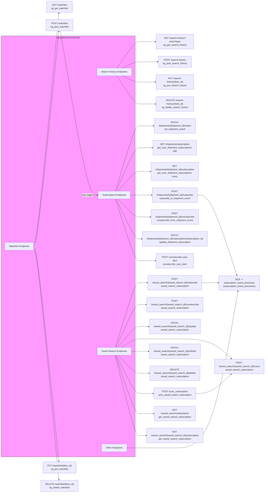

# Diagram: shipment_core/shipment_service/serverless.ng_preferences.yml

> Auto-generated by Obscura crawlers

## Mermaid

### SVG

<svg id="container" width="2457.078125" xmlns="http://www.w3.org/2000/svg" class="flowchart" height="3046" viewBox="0 0 2457.078125 3046" role="graphics-document document" aria-roledescription="flowchart-v2"><g><marker id="container_flowchart-v2-pointEnd" class="marker flowchart-v2" viewBox="0 0 10 10" refX="5" refY="5" markerUnits="userSpaceOnUse" markerWidth="8" markerHeight="8" orient="auto"><path d="M 0 0 L 10 5 L 0 10 z" class="arrowMarkerPath" style="stroke-width: 1; stroke-dasharray: 1, 0;"></path></marker><marker id="container_flowchart-v2-pointStart" class="marker flowchart-v2" viewBox="0 0 10 10" refX="4.5" refY="5" markerUnits="userSpaceOnUse" markerWidth="8" markerHeight="8" orient="auto"><path d="M 0 5 L 10 10 L 10 0 z" class="arrowMarkerPath" style="stroke-width: 1; stroke-dasharray: 1, 0;"></path></marker><marker id="container_flowchart-v2-circleEnd" class="marker flowchart-v2" viewBox="0 0 10 10" refX="11" refY="5" markerUnits="userSpaceOnUse" markerWidth="11" markerHeight="11" orient="auto"><circle cx="5" cy="5" r="5" class="arrowMarkerPath" style="stroke-width: 1; stroke-dasharray: 1, 0;"></circle></marker><marker id="container_flowchart-v2-circleStart" class="marker flowchart-v2" viewBox="0 0 10 10" refX="-1" refY="5" markerUnits="userSpaceOnUse" markerWidth="11" markerHeight="11" orient="auto"><circle cx="5" cy="5" r="5" class="arrowMarkerPath" style="stroke-width: 1; stroke-dasharray: 1, 0;"></circle></marker><marker id="container_flowchart-v2-crossEnd" class="marker cross flowchart-v2" viewBox="0 0 11 11" refX="12" refY="5.2" markerUnits="userSpaceOnUse" markerWidth="11" markerHeight="11" orient="auto"><path d="M 1,1 l 9,9 M 10,1 l -9,9" class="arrowMarkerPath" style="stroke-width: 2; stroke-dasharray: 1, 0;"></path></marker><marker id="container_flowchart-v2-crossStart" class="marker cross flowchart-v2" viewBox="0 0 11 11" refX="-1" refY="5.2" markerUnits="userSpaceOnUse" markerWidth="11" markerHeight="11" orient="auto"><path d="M 1,1 l 9,9 M 10,1 l -9,9" class="arrowMarkerPath" style="stroke-width: 2; stroke-dasharray: 1, 0;"></path></marker><g class="root"><g class="clusters"><g class="cluster svc" id="Service" data-look="classic"><rect style="fill:#f9f !important;stroke:#333 !important;stroke-width:1px !important" x="8" y="249" width="1046.890625" height="2548"></rect><g class="cluster-label" transform="translate(448.7265625, 249)"><foreignObject width="165.4375" height="24">

ng-preferences Service

</foreignObject></g></g></g><g class="edgePaths"><path d="M237.031,1498.102L241.198,1497.085C245.365,1496.068,253.698,1494.034,291.703,1259.343C329.708,1024.653,397.384,557.306,431.222,323.632L465.06,89.959" id="L_Watchlist_ng_get_watchlist_0" class="edge-thickness-normal edge-pattern-solid edge-thickness-normal edge-pattern-solid flowchart-link" style=";" data-edge="true" data-et="edge" data-id="L_Watchlist_ng_get_watchlist_0" data-points="W3sieCI6MjM3LjAzMTI1LCJ5IjoxNDk4LjEwMTYxMTUxNDMzMTR9LHsieCI6MjYyLjAzMTI1LCJ5IjoxNDkyfSx7IngiOjQ2NS42MzM2NzIxNDUzMjg3LCJ5Ijo4Nn1d" marker-end="url(#container_flowchart-v2-pointEnd)"></path><path d="M237.031,1514.165L241.198,1513.804C245.365,1513.443,253.698,1512.722,291.619,1296.686C329.54,1080.651,397.05,649.301,430.804,433.627L464.559,217.952" id="L_Watchlist_ng_post_watchlist_0" class="edge-thickness-normal edge-pattern-solid edge-thickness-normal edge-pattern-solid flowchart-link" style=";" data-edge="true" data-et="edge" data-id="L_Watchlist_ng_post_watchlist_0" data-points="W3sieCI6MjM3LjAzMTI1LCJ5IjoxNTE0LjE2NTA4Nzk1NjY5ODJ9LHsieCI6MjYyLjAzMTI1LCJ5IjoxNTEyfSx7IngiOjQ2NS4xNzc0NzI4ODcwNjA1NiwieSI6MjE0fV0=" marker-end="url(#container_flowchart-v2-pointEnd)"></path><path d="M237.031,1531.835L241.198,1532.196C245.365,1532.557,253.698,1533.278,291.619,1749.314C329.54,1965.349,397.05,2396.699,430.804,2612.373L464.559,2828.048" id="L_Watchlist_ng_put_watchlist_0" class="edge-thickness-normal edge-pattern-solid edge-thickness-normal edge-pattern-solid flowchart-link" style=";" data-edge="true" data-et="edge" data-id="L_Watchlist_ng_put_watchlist_0" data-points="W3sieCI6MjM3LjAzMTI1LCJ5IjoxNTMxLjgzNDkxMjA0MzMwMTh9LHsieCI6MjYyLjAzMTI1LCJ5IjoxNTM0fSx7IngiOjQ2NS4xNzc0NzI4ODcwNjA1NiwieSI6MjgzMn1d" marker-end="url(#container_flowchart-v2-pointEnd)"></path><path d="M237.031,1547.898L241.198,1548.915C245.365,1549.932,253.698,1551.966,291.703,1786.657C329.708,2021.347,397.384,2488.694,431.222,2722.368L465.06,2956.041" id="L_Watchlist_ng_delete_watchlist_0" class="edge-thickness-normal edge-pattern-solid edge-thickness-normal edge-pattern-solid flowchart-link" style=";" data-edge="true" data-et="edge" data-id="L_Watchlist_ng_delete_watchlist_0" data-points="W3sieCI6MjM3LjAzMTI1LCJ5IjoxNTQ3Ljg5ODM4ODQ4NTY2ODZ9LHsieCI6MjYyLjAzMTI1LCJ5IjoxNTU0fSx7IngiOjQ2NS42MzM2NzIxNDUzMjg3LCJ5IjoyOTYwfV0=" marker-end="url(#container_flowchart-v2-pointEnd)"></path><path d="M929.288,454L950.221,426.5C971.155,399,1013.023,344,1038.123,316.5C1063.224,289,1071.557,289,1113.259,289C1154.961,289,1230.031,289,1267.566,289L1305.102,289" id="L_SearchHistory_ng_get_search_history_0" class="edge-thickness-normal edge-pattern-solid edge-thickness-normal edge-pattern-solid flowchart-link" style=";" data-edge="true" data-et="edge" data-id="L_SearchHistory_ng_get_search_history_0" data-points="W3sieCI6OTI5LjI4NzU5NzY1NjI1LCJ5Ijo0NTR9LHsieCI6MTA1NC44OTA2MjUsInkiOjI4OX0seyJ4IjoxMDc5Ljg5MDYyNSwieSI6Mjg5fSx7IngiOjEzMDkuMTAxNTYyNSwieSI6Mjg5fV0=" marker-end="url(#container_flowchart-v2-pointEnd)"></path><path d="M970.394,454L984.477,447.833C998.56,441.667,1026.725,429.333,1044.975,423.167C1063.224,417,1071.557,417,1114.85,417C1158.143,417,1236.396,417,1275.522,417L1314.648,417" id="L_SearchHistory_ng_post_search_history_0" class="edge-thickness-normal edge-pattern-solid edge-thickness-normal edge-pattern-solid flowchart-link" style=";" data-edge="true" data-et="edge" data-id="L_SearchHistory_ng_post_search_history_0" data-points="W3sieCI6OTcwLjM5NDA0Mjk2ODc1LCJ5Ijo0NTR9LHsieCI6MTA1NC44OTA2MjUsInkiOjQxN30seyJ4IjoxMDc5Ljg5MDYyNSwieSI6NDE3fSx7IngiOjEzMTguNjQ4NDM3NSwieSI6NDE3fV0=" marker-end="url(#container_flowchart-v2-pointEnd)"></path><path d="M970.394,508L984.477,514.167C998.56,520.333,1026.725,532.667,1044.975,538.833C1063.224,545,1071.557,545,1109.323,545C1147.089,545,1214.286,545,1247.885,545L1281.484,545" id="L_SearchHistory_ng_put_search_history_0" class="edge-thickness-normal edge-pattern-solid edge-thickness-normal edge-pattern-solid flowchart-link" style=";" data-edge="true" data-et="edge" data-id="L_SearchHistory_ng_put_search_history_0" data-points="W3sieCI6OTcwLjM5NDA0Mjk2ODc1LCJ5Ijo1MDh9LHsieCI6MTA1NC44OTA2MjUsInkiOjU0NX0seyJ4IjoxMDc5Ljg5MDYyNSwieSI6NTQ1fSx7IngiOjEyODUuNDg0Mzc1LCJ5Ijo1NDV9XQ==" marker-end="url(#container_flowchart-v2-pointEnd)"></path><path d="M929.288,508L950.221,535.5C971.155,563,1013.023,618,1038.123,645.5C1063.224,673,1071.557,673,1107.603,673C1143.648,673,1207.406,673,1239.285,673L1271.164,673" id="L_SearchHistory_ng_delete_search_history_0" class="edge-thickness-normal edge-pattern-solid edge-thickness-normal edge-pattern-solid flowchart-link" style=";" data-edge="true" data-et="edge" data-id="L_SearchHistory_ng_delete_search_history_0" data-points="W3sieCI6OTI5LjI4NzU5NzY1NjI1LCJ5Ijo1MDh9LHsieCI6MTA1NC44OTA2MjUsInkiOjY3M30seyJ4IjoxMDc5Ljg5MDYyNSwieSI6NjczfSx7IngiOjEyNzUuMTY0MDYyNSwieSI6NjczfV0=" marker-end="url(#container_flowchart-v2-pointEnd)"></path><path d="M917.869,1206L940.706,1138.5C963.543,1071,1009.217,936,1036.22,868.5C1063.224,801,1071.557,801,1100.685,801C1129.813,801,1179.734,801,1204.695,801L1229.656,801" id="L_Subscriptions_set_shipment_watch_0" class="edge-thickness-normal edge-pattern-solid edge-thickness-normal edge-pattern-solid flowchart-link" style=";" data-edge="true" data-et="edge" data-id="L_Subscriptions_set_shipment_watch_0" data-points="W3sieCI6OTE3Ljg2OTE0MDYyNSwieSI6MTIwNn0seyJ4IjoxMDU0Ljg5MDYyNSwieSI6ODAxfSx7IngiOjEwNzkuODkwNjI1LCJ5Ijo4MDF9LHsieCI6MTIzMy42NTYyNSwieSI6ODAxfV0=" marker-end="url(#container_flowchart-v2-pointEnd)"></path><path d="M922.249,1206L944.356,1161.833C966.463,1117.667,1010.677,1029.333,1036.95,985.167C1063.224,941,1071.557,941,1097.559,941C1123.56,941,1167.229,941,1189.064,941L1210.898,941" id="L_Subscriptions_get_user_shipment_subscriptions_all_0" class="edge-thickness-normal edge-pattern-solid edge-thickness-normal edge-pattern-solid flowchart-link" style=";" data-edge="true" data-et="edge" data-id="L_Subscriptions_get_user_shipment_subscriptions_all_0" data-points="W3sieCI6OTIyLjI0ODgyMjc3Mzk3MjYsInkiOjEyMDZ9LHsieCI6MTA1NC44OTA2MjUsInkiOjk0MX0seyJ4IjoxMDc5Ljg5MDYyNSwieSI6OTQxfSx7IngiOjEyMTQuODk4NDM3NSwieSI6OTQxfV0=" marker-end="url(#container_flowchart-v2-pointEnd)"></path><path d="M936.922,1206L956.583,1187.167C976.245,1168.333,1015.568,1130.667,1039.396,1111.833C1063.224,1093,1071.557,1093,1088.436,1093C1105.315,1093,1130.74,1093,1143.452,1093L1156.164,1093" id="L_Subscriptions_get_user_shipment_subscriptions_one_0" class="edge-thickness-normal edge-pattern-solid edge-thickness-normal edge-pattern-solid flowchart-link" style=";" data-edge="true" data-et="edge" data-id="L_Subscriptions_get_user_shipment_subscriptions_one_0" data-points="W3sieCI6OTM2LjkyMTY1MTc4NTcxNDMsInkiOjEyMDZ9LHsieCI6MTA1NC44OTA2MjUsInkiOjEwOTN9LHsieCI6MTA3OS44OTA2MjUsInkiOjEwOTN9LHsieCI6MTE2MC4xNjQwNjI1LCJ5IjoxMDkzfV0=" marker-end="url(#container_flowchart-v2-pointEnd)"></path><path d="M1023.453,1233L1028.693,1233C1033.932,1233,1044.411,1233,1053.818,1233C1063.224,1233,1071.557,1233,1092.706,1233C1113.854,1233,1147.818,1233,1164.799,1233L1181.781,1233" id="L_Subscriptions_subscribe_to_shipment_event_0" class="edge-thickness-normal edge-pattern-solid edge-thickness-normal edge-pattern-solid flowchart-link" style=";" data-edge="true" data-et="edge" data-id="L_Subscriptions_subscribe_to_shipment_event_0" data-points="W3sieCI6MTAyMy40NTMxMjUsInkiOjEyMzN9LHsieCI6MTA1NC44OTA2MjUsInkiOjEyMzN9LHsieCI6MTA3OS44OTA2MjUsInkiOjEyMzN9LHsieCI6MTE4NS43ODEyNSwieSI6MTIzM31d" marker-end="url(#container_flowchart-v2-pointEnd)"></path><path d="M939.564,1260L958.785,1276.833C978.006,1293.667,1016.448,1327.333,1039.836,1344.167C1063.224,1361,1071.557,1361,1087.961,1361C1104.365,1361,1128.839,1361,1141.076,1361L1153.313,1361" id="L_Subscriptions_unsubscribe_from_shipment_event_0" class="edge-thickness-normal edge-pattern-solid edge-thickness-normal edge-pattern-solid flowchart-link" style=";" data-edge="true" data-et="edge" data-id="L_Subscriptions_unsubscribe_from_shipment_event_0" data-points="W3sieCI6OTM5LjU2NDIwODk4NDM3NSwieSI6MTI2MH0seyJ4IjoxMDU0Ljg5MDYyNSwieSI6MTM2MX0seyJ4IjoxMDc5Ljg5MDYyNSwieSI6MTM2MX0seyJ4IjoxMTU3LjMxMjUsInkiOjEzNjF9XQ==" marker-end="url(#container_flowchart-v2-pointEnd)"></path><path d="M924.149,1260L945.94,1298.167C967.73,1336.333,1011.31,1412.667,1037.267,1450.833C1063.224,1489,1071.557,1489,1079.224,1489C1086.891,1489,1093.891,1489,1097.391,1489L1100.891,1489" id="L_Subscriptions_update_shipment_subscription_0" class="edge-thickness-normal edge-pattern-solid edge-thickness-normal edge-pattern-solid flowchart-link" style=";" data-edge="true" data-et="edge" data-id="L_Subscriptions_update_shipment_subscription_0" data-points="W3sieCI6OTI0LjE0OTI5MTk5MjE4NzUsInkiOjEyNjB9LHsieCI6MTA1NC44OTA2MjUsInkiOjE0ODl9LHsieCI6MTA3OS44OTA2MjUsInkiOjE0ODl9LHsieCI6MTEwNC44OTA2MjUsInkiOjE0ODl9XQ==" marker-end="url(#container_flowchart-v2-pointEnd)"></path><path d="M919.011,1260L941.658,1319.5C964.304,1379,1009.597,1498,1036.411,1557.5C1063.224,1617,1071.557,1617,1116.552,1617C1161.547,1617,1243.203,1617,1284.031,1617L1324.859,1617" id="L_Subscriptions_unsubscribe_user_alert_0" class="edge-thickness-normal edge-pattern-solid edge-thickness-normal edge-pattern-solid flowchart-link" style=";" data-edge="true" data-et="edge" data-id="L_Subscriptions_unsubscribe_user_alert_0" data-points="W3sieCI6OTE5LjAxMDk4NjMyODEyNSwieSI6MTI2MH0seyJ4IjoxMDU0Ljg5MDYyNSwieSI6MTYxN30seyJ4IjoxMDc5Ljg5MDYyNSwieSI6MTYxN30seyJ4IjoxMzI4Ljg1OTM3NSwieSI6MTYxN31d" marker-end="url(#container_flowchart-v2-pointEnd)"></path><path d="M918.502,2122L941.234,2059.167C963.965,1996.333,1009.428,1870.667,1036.326,1807.833C1063.224,1745,1071.557,1745,1090.219,1745C1108.88,1745,1137.87,1745,1152.365,1745L1166.859,1745" id="L_SavedSearch_saved_search_subscription_sub_0" class="edge-thickness-normal edge-pattern-solid edge-thickness-normal edge-pattern-solid flowchart-link" style=";" data-edge="true" data-et="edge" data-id="L_SavedSearch_saved_search_subscription_sub_0" data-points="W3sieCI6OTE4LjUwMjI0MzE5MzA2OTMsInkiOjIxMjJ9LHsieCI6MTA1NC44OTA2MjUsInkiOjE3NDV9LHsieCI6MTA3OS44OTA2MjUsInkiOjE3NDV9LHsieCI6MTE3MC44NTkzNzUsInkiOjE3NDV9XQ==" marker-end="url(#container_flowchart-v2-pointEnd)"></path><path d="M923.032,2122L945.009,2080.5C966.985,2039,1010.938,1956,1037.081,1914.5C1063.224,1873,1071.557,1873,1088.661,1873C1105.766,1873,1131.641,1873,1144.578,1873L1157.516,1873" id="L_SavedSearch_saved_search_subscription_unsub_0" class="edge-thickness-normal edge-pattern-solid edge-thickness-normal edge-pattern-solid flowchart-link" style=";" data-edge="true" data-et="edge" data-id="L_SavedSearch_saved_search_subscription_unsub_0" data-points="W3sieCI6OTIzLjAzMjI2OTAyMTczOTEsInkiOjIxMjJ9LHsieCI6MTA1NC44OTA2MjUsInkiOjE4NzN9LHsieCI6MTA3OS44OTA2MjUsInkiOjE4NzN9LHsieCI6MTE2MS41MTU2MjUsInkiOjE4NzN9XQ==" marker-end="url(#container_flowchart-v2-pointEnd)"></path><path d="M935.398,2122L955.313,2101.833C975.229,2081.667,1015.06,2041.333,1039.142,2021.167C1063.224,2001,1071.557,2001,1091.799,2001C1112.042,2001,1144.193,2001,1160.268,2001L1176.344,2001" id="L_SavedSearch_saved_search_subscription_update_0" class="edge-thickness-normal edge-pattern-solid edge-thickness-normal edge-pattern-solid flowchart-link" style=";" data-edge="true" data-et="edge" data-id="L_SavedSearch_saved_search_subscription_update_0" data-points="W3sieCI6OTM1LjM5ODAxNTIwMjcwMjcsInkiOjIxMjJ9LHsieCI6MTA1NC44OTA2MjUsInkiOjIwMDF9LHsieCI6MTA3OS44OTA2MjUsInkiOjIwMDF9LHsieCI6MTE4MC4zNDM3NSwieSI6MjAwMX1d" marker-end="url(#container_flowchart-v2-pointEnd)"></path><path d="M962.062,2122L977.533,2114.167C993.005,2106.333,1023.948,2090.667,1043.586,2082.833C1063.224,2075,1071.557,2075,1140.535,2075C1209.513,2075,1339.135,2075,1468.758,2075C1598.38,2075,1728.003,2075,1831.15,2095.025C1934.298,2115.049,2010.97,2155.099,2049.306,2175.123L2087.643,2195.148" id="L_SavedSearch_saved_search_subscription_count_0" class="edge-thickness-normal edge-pattern-solid edge-thickness-normal edge-pattern-solid flowchart-link" style=";" data-edge="true" data-et="edge" data-id="L_SavedSearch_saved_search_subscription_count_0" data-points="W3sieCI6OTYyLjA2MTY1NTQwNTQwNTQsInkiOjIxMjJ9LHsieCI6MTA1NC44OTA2MjUsInkiOjIwNzV9LHsieCI6MTA3OS44OTA2MjUsInkiOjIwNzV9LHsieCI6MTQ2OC43NTc4MTI1LCJ5IjoyMDc1fSx7IngiOjE4NTcuNjI1LCJ5IjoyMDc1fSx7IngiOjIwOTEuMTg3OTg1MjQ4NDQ3LCJ5IjoyMTk3fV0=" marker-end="url(#container_flowchart-v2-pointEnd)"></path><path d="M1025.633,2149L1030.509,2149C1035.385,2149,1045.138,2149,1054.181,2149C1063.224,2149,1071.557,2149,1091.806,2149C1112.055,2149,1144.219,2149,1160.301,2149L1176.383,2149" id="L_SavedSearch_saved_search_subscription_refresh_0" class="edge-thickness-normal edge-pattern-solid edge-thickness-normal edge-pattern-solid flowchart-link" style=";" data-edge="true" data-et="edge" data-id="L_SavedSearch_saved_search_subscription_refresh_0" data-points="W3sieCI6MTAyNS42MzI4MTI1LCJ5IjoyMTQ5fSx7IngiOjEwNTQuODkwNjI1LCJ5IjoyMTQ5fSx7IngiOjEwNzkuODkwNjI1LCJ5IjoyMTQ5fSx7IngiOjExODAuMzgyODEyNSwieSI6MjE0OX1d" marker-end="url(#container_flowchart-v2-pointEnd)"></path><path d="M939.564,2176L958.785,2192.833C978.006,2209.667,1016.448,2243.333,1039.836,2260.167C1063.224,2277,1071.557,2277,1092.283,2277C1113.008,2277,1146.125,2277,1162.684,2277L1179.242,2277" id="L_SavedSearch_saved_search_subscription_delete_0" class="edge-thickness-normal edge-pattern-solid edge-thickness-normal edge-pattern-solid flowchart-link" style=";" data-edge="true" data-et="edge" data-id="L_SavedSearch_saved_search_subscription_delete_0" data-points="W3sieCI6OTM5LjU2NDIwODk4NDM3NSwieSI6MjE3Nn0seyJ4IjoxMDU0Ljg5MDYyNSwieSI6MjI3N30seyJ4IjoxMDc5Ljg5MDYyNSwieSI6MjI3N30seyJ4IjoxMTgzLjI0MjE4NzUsInkiOjIyNzd9XQ==" marker-end="url(#container_flowchart-v2-pointEnd)"></path><path d="M924.149,2176L945.94,2214.167C967.73,2252.333,1011.31,2328.667,1037.267,2366.833C1063.224,2405,1071.557,2405,1102.594,2405C1133.63,2405,1187.37,2405,1214.24,2405L1241.109,2405" id="L_SavedSearch_sync_saved_seach_subscription_0" class="edge-thickness-normal edge-pattern-solid edge-thickness-normal edge-pattern-solid flowchart-link" style=";" data-edge="true" data-et="edge" data-id="L_SavedSearch_sync_saved_seach_subscription_0" data-points="W3sieCI6OTI0LjE0OTI5MTk5MjE4NzUsInkiOjIxNzZ9LHsieCI6MTA1NC44OTA2MjUsInkiOjI0MDV9LHsieCI6MTA3OS44OTA2MjUsInkiOjI0MDV9LHsieCI6MTI0NS4xMDkzNzUsInkiOjI0MDV9XQ==" marker-end="url(#container_flowchart-v2-pointEnd)"></path><path d="M919.011,2176L941.658,2235.5C964.304,2295,1009.597,2414,1036.411,2473.5C1063.224,2533,1071.557,2533,1097.491,2533C1123.424,2533,1166.958,2533,1188.725,2533L1210.492,2533" id="L_SavedSearch_get_saved_search_subscription_all_0" class="edge-thickness-normal edge-pattern-solid edge-thickness-normal edge-pattern-solid flowchart-link" style=";" data-edge="true" data-et="edge" data-id="L_SavedSearch_get_saved_search_subscription_all_0" data-points="W3sieCI6OTE5LjAxMDk4NjMyODEyNSwieSI6MjE3Nn0seyJ4IjoxMDU0Ljg5MDYyNSwieSI6MjUzM30seyJ4IjoxMDc5Ljg5MDYyNSwieSI6MjUzM30seyJ4IjoxMjE0LjQ5MjE4NzUsInkiOjI1MzN9XQ==" marker-end="url(#container_flowchart-v2-pointEnd)"></path><path d="M916.442,2176L939.517,2256.833C962.591,2337.667,1008.741,2499.333,1035.982,2580.167C1063.224,2661,1071.557,2661,1085.935,2661C1100.313,2661,1120.734,2661,1130.945,2661L1141.156,2661" id="L_SavedSearch_get_saved_search_subscription_one_0" class="edge-thickness-normal edge-pattern-solid edge-thickness-normal edge-pattern-solid flowchart-link" style=";" data-edge="true" data-et="edge" data-id="L_SavedSearch_get_saved_search_subscription_one_0" data-points="W3sieCI6OTE2LjQ0MTgzMzQ5NjA5MzgsInkiOjIxNzZ9LHsieCI6MTA1NC44OTA2MjUsInkiOjI2NjF9LHsieCI6MTA3OS44OTA2MjUsInkiOjI2NjF9LHsieCI6MTE0NS4xNTYyNSwieSI6MjY2MX1d" marker-end="url(#container_flowchart-v2-pointEnd)"></path><path d="M998.086,2735L1007.553,2735C1017.021,2735,1035.956,2735,1049.59,2735C1063.224,2735,1071.557,2735,1140.535,2735C1209.513,2735,1339.135,2735,1468.758,2735C1598.38,2735,1728.003,2735,1841.972,2576.47C1955.941,2417.94,2054.257,2100.88,2103.415,1942.35L2152.573,1783.821" id="L_Others_subscription_event_processor_0" class="edge-thickness-normal edge-pattern-solid edge-thickness-normal edge-pattern-solid flowchart-link" style=";" data-edge="true" data-et="edge" data-id="L_Others_subscription_event_processor_0" data-points="W3sieCI6OTk4LjA4NTkzNzUsInkiOjI3MzV9LHsieCI6MTA1NC44OTA2MjUsInkiOjI3MzV9LHsieCI6MTA3OS44OTA2MjUsInkiOjI3MzV9LHsieCI6MTQ2OC43NTc4MTI1LCJ5IjoyNzM1fSx7IngiOjE4NTcuNjI1LCJ5IjoyNzM1fSx7IngiOjIxNTMuNzU4MTY2MTg0NjA3NSwieSI6MTc4MH1d" marker-end="url(#container_flowchart-v2-pointEnd)"></path><path d="M480.507,214L520.681,383.833C560.856,553.667,641.205,893.333,692.79,1063.167C744.375,1233,767.195,1233,778.605,1233L790.016,1233" id="L_ng_post_watchlist_Subscriptions_0" class="edge-thickness-normal edge-pattern-solid edge-thickness-normal edge-pattern-solid flowchart-link" style=";" data-edge="true" data-et="edge" data-id="L_ng_post_watchlist_Subscriptions_0" data-points="W3sieCI6NDgwLjUwNjgzMDM5OTMzODM2LCJ5IjoyMTR9LHsieCI6NzIxLjU1NDY4NzUsInkiOjEyMzN9LHsieCI6Nzk0LjAxNTYyNSwieSI6MTIzM31d" marker-end="url(#container_flowchart-v2-pointEnd)"></path><path d="M1751.734,1233L1769.383,1233C1787.031,1233,1822.328,1233,1887.058,1310.597C1951.788,1388.193,2045.951,1543.387,2093.032,1620.984L2140.114,1698.58" id="L_subscribe_to_shipment_event_subscription_event_processor_0" class="edge-thickness-normal edge-pattern-solid edge-thickness-normal edge-pattern-solid flowchart-link" style=";" data-edge="true" data-et="edge" data-id="L_subscribe_to_shipment_event_subscription_event_processor_0" data-points="W3sieCI6MTc1MS43MzQzNzUsInkiOjEyMzN9LHsieCI6MTg1Ny42MjUsInkiOjEyMzN9LHsieCI6MjE0Mi4xODg0OTk2MzA5MDU0LCJ5IjoxNzAyfV0=" marker-end="url(#container_flowchart-v2-pointEnd)"></path><path d="M1766.656,1745L1781.818,1745C1796.979,1745,1827.302,1745,1849.537,1744.908C1871.771,1744.816,1885.917,1744.633,1892.99,1744.541L1900.063,1744.449" id="L_saved_search_subscription_sub_subscription_event_processor_0" class="edge-thickness-normal edge-pattern-solid edge-thickness-normal edge-pattern-solid flowchart-link" style=";" data-edge="true" data-et="edge" data-id="L_saved_search_subscription_sub_subscription_event_processor_0" data-points="W3sieCI6MTc2Ni42NTYyNSwieSI6MTc0NX0seyJ4IjoxODU3LjYyNSwieSI6MTc0NX0seyJ4IjoxOTA0LjA2MjUsInkiOjE3NDQuMzk3MzU4ODgyNzIxMn1d" marker-end="url(#container_flowchart-v2-pointEnd)"></path><path d="M1692.406,2405L1719.943,2405C1747.479,2405,1802.552,2405,1869.02,2383.654C1935.488,2362.308,2013.352,2319.615,2052.283,2298.269L2091.215,2276.923" id="L_sync_saved_seach_subscription_saved_search_subscription_count_0" class="edge-thickness-normal edge-pattern-solid edge-thickness-normal edge-pattern-solid flowchart-link" style=";" data-edge="true" data-et="edge" data-id="L_sync_saved_seach_subscription_saved_search_subscription_count_0" data-points="W3sieCI6MTY5Mi40MDYyNSwieSI6MjQwNX0seyJ4IjoxODU3LjYyNSwieSI6MjQwNX0seyJ4IjoyMDk0LjcyMjM1NTc2OTIzMSwieSI6MjI3NX1d" marker-end="url(#container_flowchart-v2-pointEnd)"></path></g><g class="edgeLabels"><g class="edgeLabel"><g class="label" data-id="L_Watchlist_ng_get_watchlist_0" transform="translate(0, 0)"><foreignObject width="0" height="0">

</foreignObject></g></g><g class="edgeLabel"><g class="label" data-id="L_Watchlist_ng_post_watchlist_0" transform="translate(0, 0)"><foreignObject width="0" height="0">

</foreignObject></g></g><g class="edgeLabel"><g class="label" data-id="L_Watchlist_ng_put_watchlist_0" transform="translate(0, 0)"><foreignObject width="0" height="0">

</foreignObject></g></g><g class="edgeLabel"><g class="label" data-id="L_Watchlist_ng_delete_watchlist_0" transform="translate(0, 0)"><foreignObject width="0" height="0">

</foreignObject></g></g><g class="edgeLabel"><g class="label" data-id="L_SearchHistory_ng_get_search_history_0" transform="translate(0, 0)"><foreignObject width="0" height="0">

</foreignObject></g></g><g class="edgeLabel"><g class="label" data-id="L_SearchHistory_ng_post_search_history_0" transform="translate(0, 0)"><foreignObject width="0" height="0">

</foreignObject></g></g><g class="edgeLabel"><g class="label" data-id="L_SearchHistory_ng_put_search_history_0" transform="translate(0, 0)"><foreignObject width="0" height="0">

</foreignObject></g></g><g class="edgeLabel"><g class="label" data-id="L_SearchHistory_ng_delete_search_history_0" transform="translate(0, 0)"><foreignObject width="0" height="0">

</foreignObject></g></g><g class="edgeLabel"><g class="label" data-id="L_Subscriptions_set_shipment_watch_0" transform="translate(0, 0)"><foreignObject width="0" height="0">

</foreignObject></g></g><g class="edgeLabel"><g class="label" data-id="L_Subscriptions_get_user_shipment_subscriptions_all_0" transform="translate(0, 0)"><foreignObject width="0" height="0">

</foreignObject></g></g><g class="edgeLabel"><g class="label" data-id="L_Subscriptions_get_user_shipment_subscriptions_one_0" transform="translate(0, 0)"><foreignObject width="0" height="0">

</foreignObject></g></g><g class="edgeLabel"><g class="label" data-id="L_Subscriptions_subscribe_to_shipment_event_0" transform="translate(0, 0)"><foreignObject width="0" height="0">

</foreignObject></g></g><g class="edgeLabel"><g class="label" data-id="L_Subscriptions_unsubscribe_from_shipment_event_0" transform="translate(0, 0)"><foreignObject width="0" height="0">

</foreignObject></g></g><g class="edgeLabel"><g class="label" data-id="L_Subscriptions_update_shipment_subscription_0" transform="translate(0, 0)"><foreignObject width="0" height="0">

</foreignObject></g></g><g class="edgeLabel"><g class="label" data-id="L_Subscriptions_unsubscribe_user_alert_0" transform="translate(0, 0)"><foreignObject width="0" height="0">

</foreignObject></g></g><g class="edgeLabel"><g class="label" data-id="L_SavedSearch_saved_search_subscription_sub_0" transform="translate(0, 0)"><foreignObject width="0" height="0">

</foreignObject></g></g><g class="edgeLabel"><g class="label" data-id="L_SavedSearch_saved_search_subscription_unsub_0" transform="translate(0, 0)"><foreignObject width="0" height="0">

</foreignObject></g></g><g class="edgeLabel"><g class="label" data-id="L_SavedSearch_saved_search_subscription_update_0" transform="translate(0, 0)"><foreignObject width="0" height="0">

</foreignObject></g></g><g class="edgeLabel"><g class="label" data-id="L_SavedSearch_saved_search_subscription_count_0" transform="translate(0, 0)"><foreignObject width="0" height="0">

</foreignObject></g></g><g class="edgeLabel"><g class="label" data-id="L_SavedSearch_saved_search_subscription_refresh_0" transform="translate(0, 0)"><foreignObject width="0" height="0">

</foreignObject></g></g><g class="edgeLabel"><g class="label" data-id="L_SavedSearch_saved_search_subscription_delete_0" transform="translate(0, 0)"><foreignObject width="0" height="0">

</foreignObject></g></g><g class="edgeLabel"><g class="label" data-id="L_SavedSearch_sync_saved_seach_subscription_0" transform="translate(0, 0)"><foreignObject width="0" height="0">

</foreignObject></g></g><g class="edgeLabel"><g class="label" data-id="L_SavedSearch_get_saved_search_subscription_all_0" transform="translate(0, 0)"><foreignObject width="0" height="0">

</foreignObject></g></g><g class="edgeLabel"><g class="label" data-id="L_SavedSearch_get_saved_search_subscription_one_0" transform="translate(0, 0)"><foreignObject width="0" height="0">

</foreignObject></g></g><g class="edgeLabel"><g class="label" data-id="L_Others_subscription_event_processor_0" transform="translate(0, 0)"><foreignObject width="0" height="0">

</foreignObject></g></g><g class="edgeLabel" transform="translate(721.5546875, 1233)"><g class="label" data-id="L_ng_post_watchlist_Subscriptions_0" transform="translate(-41.0234375, -12)"><foreignObject width="82.046875" height="24">

may trigger

</foreignObject></g></g><g class="edgeLabel"><g class="label" data-id="L_subscribe_to_shipment_event_subscription_event_processor_0" transform="translate(0, 0)"><foreignObject width="0" height="0">

</foreignObject></g></g><g class="edgeLabel"><g class="label" data-id="L_saved_search_subscription_sub_subscription_event_processor_0" transform="translate(0, 0)"><foreignObject width="0" height="0">

</foreignObject></g></g><g class="edgeLabel"><g class="label" data-id="L_sync_saved_seach_subscription_saved_search_subscription_count_0" transform="translate(0, 0)"><foreignObject width="0" height="0">

</foreignObject></g></g></g><g class="nodes"><g class="node default" id="flowchart-Watchlist-0" transform="translate(135.015625, 1523)"><rect class="basic label-container" style="" x="-102.015625" y="-27" width="204.03125" height="54"></rect><g class="label" style="" transform="translate(-72.015625, -12)"><rect></rect><foreignObject width="144.03125" height="24">

Watchlist Endpoints

</foreignObject></g></g><g class="node default" id="flowchart-SearchHistory-1" transform="translate(908.734375, 481)"><rect class="basic label-container" style="" x="-121.15625" y="-27" width="242.3125" height="54"></rect><g class="label" style="" transform="translate(-91.15625, -12)"><rect></rect><foreignObject width="182.3125" height="24">

Search History Endpoints

</foreignObject></g></g><g class="node default" id="flowchart-Subscriptions-2" transform="translate(908.734375, 1233)"><rect class="basic label-container" style="" x="-114.71875" y="-27" width="229.4375" height="54"></rect><g class="label" style="" transform="translate(-84.71875, -12)"><rect></rect><foreignObject width="169.4375" height="24">

Subscription Endpoints

</foreignObject></g></g><g class="node default" id="flowchart-SavedSearch-3" transform="translate(908.734375, 2149)"><rect class="basic label-container" style="" x="-116.8984375" y="-27" width="233.796875" height="54"></rect><g class="label" style="" transform="translate(-86.8984375, -12)"><rect></rect><foreignObject width="173.796875" height="24">

Saved Search Endpoints

</foreignObject></g></g><g class="node default" id="flowchart-Others-4" transform="translate(908.734375, 2735)"><rect class="basic label-container" style="" x="-89.3515625" y="-27" width="178.703125" height="54"></rect><g class="label" style="" transform="translate(-59.3515625, -12)"><rect></rect><foreignObject width="118.703125" height="24">

Other Endpoints

</foreignObject></g></g><g class="node default" id="flowchart-ng_get_watchlist-6" transform="translate(471.28125, 47)"><rect class="basic label-container" style="" x="-135.9140625" y="-39" width="271.828125" height="78"></rect><g class="label" style="" transform="translate(-105.9140625, -24)"><rect></rect><foreignObject width="211.828125" height="48">

GET /watchlist\nng_get_watchlist

</foreignObject></g></g><g class="node default" id="flowchart-ng_post_watchlist-8" transform="translate(471.28125, 175)"><rect class="basic label-container" style="" x="-140.609375" y="-39" width="281.21875" height="78"></rect><g class="label" style="" transform="translate(-110.609375, -24)"><rect></rect><foreignObject width="221.21875" height="48">

POST /watchlist\nng_post_watchlist

</foreignObject></g></g><g class="node default" id="flowchart-ng_put_watchlist-10" transform="translate(471.28125, 2871)"><rect class="basic label-container" style="" x="-173.9296875" y="-39" width="347.859375" height="78"></rect><g class="label" style="" transform="translate(-143.9296875, -24)"><rect></rect><foreignObject width="287.859375" height="48">

PUT /watchlist/{item_id}\nng_put_watchlist

</foreignObject></g></g><g class="node default" id="flowchart-ng_delete_watchlist-12" transform="translate(471.28125, 2999)"><rect class="basic label-container" style="" x="-184.25" y="-39" width="368.5" height="78"></rect><g class="label" style="" transform="translate(-154.25, -24)"><rect></rect><foreignObject width="308.5" height="48">

DELETE /watchlist/{item_id}\nng_delete_watchlist

</foreignObject></g></g><g class="node default" id="flowchart-ng_get_search_history-14" transform="translate(1468.7578125, 289)"><rect class="basic label-container" style="" x="-159.65625" y="-39" width="319.3125" height="78"></rect><g class="label" style="" transform="translate(-129.65625, -24)"><rect></rect><foreignObject width="259.3125" height="48">

GET /search-history?searchtype\nng_get_search_history

</foreignObject></g></g><g class="node default" id="flowchart-ng_post_search_history-16" transform="translate(1468.7578125, 417)"><rect class="basic label-container" style="" x="-150.109375" y="-39" width="300.21875" height="78"></rect><g class="label" style="" transform="translate(-120.109375, -24)"><rect></rect><foreignObject width="240.21875" height="48">

POST /search-history\nng_post_search_history

</foreignObject></g></g><g class="node default" id="flowchart-ng_put_search_history-18" transform="translate(1468.7578125, 545)"><rect class="basic label-container" style="" x="-183.2734375" y="-39" width="366.546875" height="78"></rect><g class="label" style="" transform="translate(-153.2734375, -24)"><rect></rect><foreignObject width="306.546875" height="48">

PUT /search-history/{item_id}\nng_put_search_history

</foreignObject></g></g><g class="node default" id="flowchart-ng_delete_search_history-20" transform="translate(1468.7578125, 673)"><rect class="basic label-container" style="" x="-193.59375" y="-39" width="387.1875" height="78"></rect><g class="label" style="" transform="translate(-163.59375, -24)"><rect></rect><foreignObject width="327.1875" height="48">

DELETE /search-history/{item_id}\nng_delete_search_history

</foreignObject></g></g><g class="node default" id="flowchart-set_shipment_watch-22" transform="translate(1468.7578125, 801)"><rect class="basic label-container" style="" x="-235.1015625" y="-39" width="470.203125" height="78"></rect><g class="label" style="" transform="translate(-205.1015625, -24)"><rect></rect><foreignObject width="410.203125" height="48">

PATCH /shipments/{shipment_id}/watch\nset_shipment_watch

</foreignObject></g></g><g class="node default" id="flowchart-get_user_shipment_subscriptions_all-24" transform="translate(1468.7578125, 941)"><rect class="basic label-container" style="" x="-253.859375" y="-51" width="507.71875" height="102"></rect><g class="label" style="" transform="translate(-223.859375, -36)"><rect></rect><foreignObject width="447.71875" height="72">

GET /shipments/subscription\nget_user_shipment_subscriptions (all)

</foreignObject></g></g><g class="node default" id="flowchart-get_user_shipment_subscriptions_one-26" transform="translate(1468.7578125, 1093)"><rect class="basic label-container" style="" x="-308.59375" y="-51" width="617.1875" height="102"></rect><g class="label" style="" transform="translate(-278.59375, -36)"><rect></rect><foreignObject width="557.1875" height="72">

GET /shipments/{shipment_id}/subscription\nget_user_shipment_subscriptions (one)

</foreignObject></g></g><g class="node default" id="flowchart-subscribe_to_shipment_event-28" transform="translate(1468.7578125, 1233)"><rect class="basic label-container" style="" x="-282.9765625" y="-39" width="565.953125" height="78"></rect><g class="label" style="" transform="translate(-252.9765625, -24)"><rect></rect><foreignObject width="505.953125" height="48">

POST /shipments/{shipment_id}/subscribe\nsubscribe_to_shipment_event

</foreignObject></g></g><g class="node default" id="flowchart-unsubscribe_from_shipment_event-30" transform="translate(1468.7578125, 1361)"><rect class="basic label-container" style="" x="-311.4453125" y="-39" width="622.890625" height="78"></rect><g class="label" style="" transform="translate(-281.4453125, -24)"><rect></rect><foreignObject width="562.890625" height="48">

POST /shipments/{shipment_id}/unsubscribe\nunsubscribe_from_shipment_event

</foreignObject></g></g><g class="node default" id="flowchart-update_shipment_subscription-32" transform="translate(1468.7578125, 1489)"><rect class="basic label-container" style="" x="-363.8671875" y="-39" width="727.734375" height="78"></rect><g class="label" style="" transform="translate(-333.8671875, -24)"><rect></rect><foreignObject width="667.734375" height="48">

PATCH /shipments/{shipment_id}/subscription/{subscription_id}\nupdate_shipment_subscription

</foreignObject></g></g><g class="node default" id="flowchart-unsubscribe_user_alert-34" transform="translate(1468.7578125, 1617)"><rect class="basic label-container" style="" x="-139.8984375" y="-39" width="279.796875" height="78"></rect><g class="label" style="" transform="translate(-109.8984375, -24)"><rect></rect><foreignObject width="219.796875" height="48">

POST /unsubscribe-user-alert\nunsubscribe_user_alert

</foreignObject></g></g><g class="node default" id="flowchart-saved_search_subscription_sub-36" transform="translate(1468.7578125, 1745)"><rect class="basic label-container" style="" x="-297.8984375" y="-39" width="595.796875" height="78"></rect><g class="label" style="" transform="translate(-267.8984375, -24)"><rect></rect><foreignObject width="535.796875" height="48">

POST /saved_search/{saved_search_id}/subscribe\nsaved_search_subscription

</foreignObject></g></g><g class="node default" id="flowchart-saved_search_subscription_unsub-38" transform="translate(1468.7578125, 1873)"><rect class="basic label-container" style="" x="-307.2421875" y="-39" width="614.484375" height="78"></rect><g class="label" style="" transform="translate(-277.2421875, -24)"><rect></rect><foreignObject width="554.484375" height="48">

POST /saved_search/{saved_search_id}/unsubscribe\nsaved_search_subscription

</foreignObject></g></g><g class="node default" id="flowchart-saved_search_subscription_update-40" transform="translate(1468.7578125, 2001)"><rect class="basic label-container" style="" x="-288.4140625" y="-39" width="576.828125" height="78"></rect><g class="label" style="" transform="translate(-258.4140625, -24)"><rect></rect><foreignObject width="516.828125" height="48">

PATCH /saved_search/{saved_search_id}/update\nsaved_search_subscription

</foreignObject></g></g><g class="node default" id="flowchart-saved_search_subscription_count-42" transform="translate(2165.8515625, 2236)"><rect class="basic label-container" style="" x="-283.2265625" y="-39" width="566.453125" height="78"></rect><g class="label" style="" transform="translate(-253.2265625, -24)"><rect></rect><foreignObject width="506.453125" height="48">

POST /saved_search/{saved_search_id}/count\nsaved_search_subscription

</foreignObject></g></g><g class="node default" id="flowchart-saved_search_subscription_refresh-44" transform="translate(1468.7578125, 2149)"><rect class="basic label-container" style="" x="-288.375" y="-39" width="576.75" height="78"></rect><g class="label" style="" transform="translate(-258.375, -24)"><rect></rect><foreignObject width="516.75" height="48">

PATCH /saved_search/{saved_search_id}/refresh\nsaved_search_subscription

</foreignObject></g></g><g class="node default" id="flowchart-saved_search_subscription_delete-46" transform="translate(1468.7578125, 2277)"><rect class="basic label-container" style="" x="-285.515625" y="-39" width="571.03125" height="78"></rect><g class="label" style="" transform="translate(-255.515625, -24)"><rect></rect><foreignObject width="511.03125" height="48">

DELETE /saved_search/{saved_search_id}/delete\nsaved_search_subscription

</foreignObject></g></g><g class="node default" id="flowchart-sync_saved_seach_subscription-48" transform="translate(1468.7578125, 2405)"><rect class="basic label-container" style="" x="-223.6484375" y="-39" width="447.296875" height="78"></rect><g class="label" style="" transform="translate(-193.6484375, -24)"><rect></rect><foreignObject width="387.296875" height="48">

POST /sync_subscription\nsync_saved_seach_subscription

</foreignObject></g></g><g class="node default" id="flowchart-get_saved_search_subscription_all-50" transform="translate(1468.7578125, 2533)"><rect class="basic label-container" style="" x="-254.265625" y="-39" width="508.53125" height="78"></rect><g class="label" style="" transform="translate(-224.265625, -24)"><rect></rect><foreignObject width="448.53125" height="48">

GET /saved_search/subscription\nget_saved_search_subscription

</foreignObject></g></g><g class="node default" id="flowchart-get_saved_search_subscription_one-52" transform="translate(1468.7578125, 2661)"><rect class="basic label-container" style="" x="-323.6015625" y="-39" width="647.203125" height="78"></rect><g class="label" style="" transform="translate(-293.6015625, -24)"><rect></rect><foreignObject width="587.203125" height="48">

GET /saved_search/{saved_search_id}/subscription\nget_saved_search_subscription

</foreignObject></g></g><g class="node default" id="flowchart-subscription_event_processor-54" transform="translate(2165.8515625, 1741)"><rect class="basic label-container" style="" x="-261.7890625" y="-39" width="523.578125" height="78"></rect><g class="label" style="" transform="translate(-231.7890625, -24)"><rect></rect><foreignObject width="463.578125" height="48">

SQS -&gt; subscription_event_processor\n(subscription_event_processor)

</foreignObject></g></g></g></g></g></svg>
