# Diagram: shipment_core/shipment_service/serverless.ng_shipment.yml

> Auto-generated by Obscura crawlers

## Mermaid

```mermaid
flowchart TD
  subgraph Functions
    F_ng_get_shipments["ng_get_shipments\nhandler: ng_get_shipments.lambda_handler"]
    F_ng_get_modified_shipment["ng_get_modified_shipment\nhandler: ng_modified_shipment.lambda_handler"]
    F_ng_get_trip["ng_get_trip\nhandler: ng_get_trip.lambda_handler"]
    F_ng_shipment_totals["ng_shipment_totals\nhandler: ng_shipment_totals.lambda_handler"]
    F_ng_get_shipments_exceptions["ng_get_shipments_exceptions\nhandler: ng_get_shipments_exceptions.lambda_handler"]
    F_ng_post_shipments_statuses["ng_post_shipments_statuses\nhandler: ng_post_shipments_statuses.lambda_handler"]
    F_ng_get_parts["ng_get_parts\nhandler: ng_get_parts.lambda_handler"]
    F_ng_get_route_numbers["ng_get_route_numbers\nhandler: ng_get_route_numbers.lambda_handler"]
    F_ng_get_dwell_data["ng_get_dwell_data\nhandler: ng_get_dwell_data.lambda_handler"]
    F_ng_get_references["ng_get_references\nhandler: ng_get_references.lambda_handler"]
    F_ng_get_carrier_shipment_ids["ng_get_carrier_shipment_ids\nhandler: ng_get_carrier_shipment_ids.lambda_handler"]
    F_ng_get_carrier_shipment["ng_get_carrier_shipment\nhandler: ng_get_carrier_shipment.lambda_handler"]
    F_ng_get_carriers["ng_get_carriers\nhandler: ng_get_carriers.lambda_handler"]
    F_ng_get_trailer_numbers["ng_get_trailer_numbers\nhandler: ng_get_trailer_numbers.lambda_handler"]
    F_ng_get_pro_numbers["ng_get_pro_numbers\nhandler: ng_get_pro_numbers.lambda_handler"]
    F_ng_get_asset_ids["ng_get_asset_ids\nhandler: ng_get_asset_ids.lambda_handler"]
    F_ng_get_vins["ng_get_vins\nhandler: ng_get_vins.lambda_handler"]
    F_shipment_exception_filters["shipment_exception_filters\nhandler: shipment_exception_filters.lambda_handler"]
    F_ng_get_shipment_modes["ng_get_shipment_modes\nhandler: ng_get_shipment_modes.lambda_handler"]
    F_shipment_status_filters["shipment_status_filters\nhandler: shipment_status_filters.lambda_handler"]
    F_shipment_type_filters["shipment_type_filters\nhandler: shipment_type_filters.lambda_handler"]
    F_shipment_location_updates["shipment_location_updates\nhandler: get_heat_map_locations.lambda_handler"]
    F_ng_trip_plan_numbers["ng_trip_plan_numbers\nhandler: ng_get_trip_plan_numbers.lambda_handler"]
    F_ng_get_shippers["ng_get_shippers\nhandler: ng_get_shippers.lambda_handler"]
    F_ng_get_countries["ng_get_countries\nhandler: ng_get_countries.lambda_handler"]
    F_ng_filter["ng_filter\nhandler: ng_filter.lambda_handler"]
    F_add_shipment_comment_post["add_shipment_comment_post\nhandler: comment_post.lambda_handler"]
    F_add_shipment_comment_batch_post["add_shipment_comment_batch_post\nhandler: comment_batch_post.lambda_handler"]
    F_get_shipment_comment_list["get_shipment_comment_list\nhandler: comment_list.lambda_handler"]
    F_patch_shipment_comment_patch["patch_shipment_comment_patch\nhandler: comment_patch.lambda_handler"]
    F_add_shipment_comment_read_post["add_shipment_comment_read_post\nhandler: comment_read_post.lambda_handler"]
  end

  subgraph HTTP_API [API Endpoints]
    E_shipments_get["GET /shipments"]
    E_shipments_id_get["GET /shipments/{shipment_id}"]
    E_batch_shipments_post["POST /batch_shipments"]
    E_shipments_updated_v_ver["GET /versioned/{version}/shipments/updated"]
    E_shipments_updated_v["GET /versioned/shipments/updated"]
    E_shipments_updated["GET /shipments/updated"]
    E_trip_get["GET /trip/{trip_id}"]
    E_shipments_totals_get["GET /shipments/totals"]
    E_batch_shipments_totals_post["POST /batch_shipments/totals"]
    E_shipments_id_exceptions_get["GET /shipments/{shipment_id}/exceptions"]
    E_shipments_exceptions_get["GET /shipments/exceptions"]
    E_shipments_id_statuses_post["POST /shipments/{shipment_id}/statuses"]
    E_parts_get["GET /parts"]
    E_route_numbers_get["GET /route_numbers"]
    E_dwell_data_get["GET /dwell-data"]
    E_destination_arrival_status_get["GET /destination-arrival-status"]
    E_order_numbers_get["GET /order_numbers"]
    E_carrier_shipment_ids_get["GET /carrier-shipment-ids"]
    E_carriers_scac_shipment_get["GET /carriers/{carrier_scac}/shipments/{creator_shipment_id}"]
    E_carriers_get["GET /carriers"]
    E_trailer_numbers_get["GET /trailer_numbers"]
    E_pro_numbers_get["GET /pro_numbers"]
    E_asset_ids_get["GET /asset_ids"]
    E_vins_get["GET /vins"]
    E_exception_filters_get["GET /exception_filters"]
    E_shipment_modes_get["GET /shipment_modes"]
    E_status_filters_get["GET /status_filters"]
    E_type_filters_get["GET /type_filters"]
    E_heat_map_id_get["GET /heat_map/{id}"]
    E_heat_map_get["GET /heat_map"]
    E_trip_plan_numbers_get["GET /trip_plan_numbers"]
    E_shippers_get["GET /shippers"]
    E_countries_get["GET /countries"]
    E_filter_get["GET /filter"]
    E_comment_post["POST /shipments/{shipment_id}/comment"]
    E_comment_batch_post["POST /comment/batch"]
    E_comment_list_get["GET /shipments/{shipment_id}/comment"]
    E_comment_patch["PATCH /shipments/{shipment_id}/comment/{comment_id}"]
    E_comment_read_post["POST /shipments/{shipment_id}/comment/read"]
  end

  %% Mappings
  E_shipments_get -->|invokes| F_ng_get_shipments
  E_shipments_id_get -->|invokes| F_ng_get_shipments
  E_batch_shipments_post -->|invokes| F_ng_get_shipments
  E_shipments_updated_v_ver -->|invokes| F_ng_get_modified_shipment
  E_shipments_updated_v -->|invokes| F_ng_get_modified_shipment
  E_shipments_updated -->|invokes| F_ng_get_modified_shipment
  E_trip_get -->|invokes| F_ng_get_trip
  E_shipments_totals_get -->|invokes| F_ng_shipment_totals
  E_batch_shipments_totals_post -->|invokes| F_ng_shipment_totals
  E_shipments_id_exceptions_get -->|invokes| F_ng_get_shipments_exceptions
  E_shipments_exceptions_get -->|invokes| F_ng_get_shipments_exceptions
  E_shipments_id_statuses_post -->|invokes| F_ng_post_shipments_statuses
  E_parts_get -->|invokes| F_ng_get_parts
  E_route_numbers_get -->|invokes| F_ng_get_route_numbers
  E_dwell_data_get -->|invokes| F_ng_get_dwell_data
  E_destination_arrival_status_get -->|invokes| F_ng_get_dwell_data
  E_order_numbers_get -->|invokes| F_ng_get_references
  E_carrier_shipment_ids_get -->|invokes| F_ng_get_carrier_shipment_ids
  E_carriers_scac_shipment_get -->|invokes| F_ng_get_carrier_shipment
  E_carriers_get -->|invokes| F_ng_get_carriers
  E_trailer_numbers_get -->|invokes| F_ng_get_trailer_numbers
  E_pro_numbers_get -->|invokes| F_ng_get_pro_numbers
  E_asset_ids_get -->|invokes| F_ng_get_asset_ids
  E_vins_get -->|invokes| F_ng_get_vins
  E_exception_filters_get -->|invokes| F_shipment_exception_filters
  E_shipment_modes_get -->|invokes| F_ng_get_shipment_modes
  E_status_filters_get -->|invokes| F_shipment_status_filters
  E_type_filters_get -->|invokes| F_shipment_type_filters
  E_heat_map_id_get -->|invokes| F_shipment_location_updates
  E_heat_map_get -->|invokes| F_shipment_location_updates
  E_trip_plan_numbers_get -->|invokes| F_ng_trip_plan_numbers
  E_shippers_get -->|invokes| F_ng_get_shippers
  E_countries_get -->|invokes| F_ng_get_countries
  E_filter_get -->|invokes| F_ng_filter
  E_comment_post -->|invokes| F_add_shipment_comment_post
  E_comment_batch_post -->|invokes| F_add_shipment_comment_batch_post
  E_comment_list_get -->|invokes| F_get_shipment_comment_list
  E_comment_patch -->|invokes| F_patch_shipment_comment_patch
  E_comment_read_post -->|invokes| F_add_shipment_comment_read_post

  style Functions fill:#f9f,stroke:#333,stroke-width:1px
  style HTTP_API fill:#efe,stroke:#333,stroke-width:1px
```

### SVG

<svg id="container" width="13995.8359375" xmlns="http://www.w3.org/2000/svg" class="flowchart" height="346" viewBox="0 0 13995.8359375 346" role="graphics-document document" aria-roledescription="flowchart-v2"><g><marker id="container_flowchart-v2-pointEnd" class="marker flowchart-v2" viewBox="0 0 10 10" refX="5" refY="5" markerUnits="userSpaceOnUse" markerWidth="8" markerHeight="8" orient="auto"><path d="M 0 0 L 10 5 L 0 10 z" class="arrowMarkerPath" style="stroke-width: 1; stroke-dasharray: 1, 0;"></path></marker><marker id="container_flowchart-v2-pointStart" class="marker flowchart-v2" viewBox="0 0 10 10" refX="4.5" refY="5" markerUnits="userSpaceOnUse" markerWidth="8" markerHeight="8" orient="auto"><path d="M 0 5 L 10 10 L 10 0 z" class="arrowMarkerPath" style="stroke-width: 1; stroke-dasharray: 1, 0;"></path></marker><marker id="container_flowchart-v2-circleEnd" class="marker flowchart-v2" viewBox="0 0 10 10" refX="11" refY="5" markerUnits="userSpaceOnUse" markerWidth="11" markerHeight="11" orient="auto"><circle cx="5" cy="5" r="5" class="arrowMarkerPath" style="stroke-width: 1; stroke-dasharray: 1, 0;"></circle></marker><marker id="container_flowchart-v2-circleStart" class="marker flowchart-v2" viewBox="0 0 10 10" refX="-1" refY="5" markerUnits="userSpaceOnUse" markerWidth="11" markerHeight="11" orient="auto"><circle cx="5" cy="5" r="5" class="arrowMarkerPath" style="stroke-width: 1; stroke-dasharray: 1, 0;"></circle></marker><marker id="container_flowchart-v2-crossEnd" class="marker cross flowchart-v2" viewBox="0 0 11 11" refX="12" refY="5.2" markerUnits="userSpaceOnUse" markerWidth="11" markerHeight="11" orient="auto"><path d="M 1,1 l 9,9 M 10,1 l -9,9" class="arrowMarkerPath" style="stroke-width: 2; stroke-dasharray: 1, 0;"></path></marker><marker id="container_flowchart-v2-crossStart" class="marker cross flowchart-v2" viewBox="0 0 11 11" refX="-1" refY="5.2" markerUnits="userSpaceOnUse" markerWidth="11" markerHeight="11" orient="auto"><path d="M 1,1 l 9,9 M 10,1 l -9,9" class="arrowMarkerPath" style="stroke-width: 2; stroke-dasharray: 1, 0;"></path></marker><g class="root"><g class="clusters"><g class="cluster" id="HTTP_API" data-look="classic"><rect style="fill:#efe !important;stroke:#333 !important;stroke-width:1px !important" x="8" y="8" width="13962.546875" height="128"></rect><g class="cluster-label" transform="translate(6938.890625, 8)"><foreignObject width="100.765625" height="24">

API Endpoints

</foreignObject></g></g><g class="cluster" id="Functions" data-look="classic"><rect style="fill:#f9f !important;stroke:#333 !important;stroke-width:1px !important" x="49.234375" y="210" width="13938.6015625" height="128"></rect><g class="cluster-label" transform="translate(6983.48828125, 210)"><foreignObject width="70.09375" height="24">

Functions

</foreignObject></g></g></g><g class="edgePaths"><path d="M130.469,99L130.469,105.167C130.469,111.333,130.469,123.667,130.469,136C130.469,148.333,130.469,160.667,130.469,173C130.469,185.333,130.469,197.667,148.022,208.034C165.576,218.4,200.683,226.801,218.236,231.001L235.79,235.201" id="L_E_shipments_get_F_ng_get_shipments_0" class="edge-thickness-normal edge-pattern-solid edge-thickness-normal edge-pattern-solid flowchart-link" style=";" data-edge="true" data-et="edge" data-id="L_E_shipments_get_F_ng_get_shipments_0" data-points="W3sieCI6MTMwLjQ2ODc1LCJ5Ijo5OX0seyJ4IjoxMzAuNDY4NzUsInkiOjEzNn0seyJ4IjoxMzAuNDY4NzUsInkiOjE3M30seyJ4IjoxMzAuNDY4NzUsInkiOjIxMH0seyJ4IjoyMzkuNjc5Njg3NSwieSI6MjM2LjEzMjAyNDc2OTI0ODc0fV0=" marker-end="url(#container_flowchart-v2-pointEnd)"></path><path d="M397.938,111L397.938,115.167C397.938,119.333,397.938,127.667,397.938,138C397.938,148.333,397.938,160.667,397.938,173C397.938,185.333,397.938,197.667,397.938,207.333C397.938,217,397.938,224,397.938,227.5L397.938,231" id="L_E_shipments_id_get_F_ng_get_shipments_0" class="edge-thickness-normal edge-pattern-solid edge-thickness-normal edge-pattern-solid flowchart-link" style=";" data-edge="true" data-et="edge" data-id="L_E_shipments_id_get_F_ng_get_shipments_0" data-points="W3sieCI6Mzk3LjkzNzUsInkiOjExMX0seyJ4IjozOTcuOTM3NSwieSI6MTM2fSx7IngiOjM5Ny45Mzc1LCJ5IjoxNzN9LHsieCI6Mzk3LjkzNzUsInkiOjIxMH0seyJ4IjozOTcuOTM3NSwieSI6MjM1fV0=" marker-end="url(#container_flowchart-v2-pointEnd)"></path><path d="M695.148,99L695.148,105.167C695.148,111.333,695.148,123.667,695.148,136C695.148,148.333,695.148,160.667,695.148,173C695.148,185.333,695.148,197.667,672.641,208.68C650.134,219.693,605.12,229.386,582.613,234.233L560.106,239.079" id="L_E_batch_shipments_post_F_ng_get_shipments_0" class="edge-thickness-normal edge-pattern-solid edge-thickness-normal edge-pattern-solid flowchart-link" style=";" data-edge="true" data-et="edge" data-id="L_E_batch_shipments_post_F_ng_get_shipments_0" data-points="W3sieCI6Njk1LjE0ODQzNzUsInkiOjk5fSx7IngiOjY5NS4xNDg0Mzc1LCJ5IjoxMzZ9LHsieCI6Njk1LjE0ODQzNzUsInkiOjE3M30seyJ4Ijo2OTUuMTQ4NDM3NSwieSI6MjEwfSx7IngiOjU1Ni4xOTUzMTI1LCJ5IjoyMzkuOTIxNTA5ODcwNDA5OH1d" marker-end="url(#container_flowchart-v2-pointEnd)"></path><path d="M1044.242,111L1044.242,115.167C1044.242,119.333,1044.242,127.667,1044.242,138C1044.242,148.333,1044.242,160.667,1044.242,173C1044.242,185.333,1044.242,197.667,1077.31,209.434C1110.378,221.202,1176.514,232.403,1209.582,238.004L1242.65,243.605" id="L_E_shipments_updated_v_ver_F_ng_get_modified_shipment_0" class="edge-thickness-normal edge-pattern-solid edge-thickness-normal edge-pattern-solid flowchart-link" style=";" data-edge="true" data-et="edge" data-id="L_E_shipments_updated_v_ver_F_ng_get_modified_shipment_0" data-points="W3sieCI6MTA0NC4yNDIxODc1LCJ5IjoxMTF9LHsieCI6MTA0NC4yNDIxODc1LCJ5IjoxMzZ9LHsieCI6MTA0NC4yNDIxODc1LCJ5IjoxNzN9LHsieCI6MTA0NC4yNDIxODc1LCJ5IjoyMTB9LHsieCI6MTI0Ni41OTM3NSwieSI6MjQ0LjI3MjYyMzg5NjQ1ODMzfV0=" marker-end="url(#container_flowchart-v2-pointEnd)"></path><path d="M1422.109,111L1422.109,115.167C1422.109,119.333,1422.109,127.667,1422.109,138C1422.109,148.333,1422.109,160.667,1422.109,173C1422.109,185.333,1422.109,197.667,1422.109,207.333C1422.109,217,1422.109,224,1422.109,227.5L1422.109,231" id="L_E_shipments_updated_v_F_ng_get_modified_shipment_0" class="edge-thickness-normal edge-pattern-solid edge-thickness-normal edge-pattern-solid flowchart-link" style=";" data-edge="true" data-et="edge" data-id="L_E_shipments_updated_v_F_ng_get_modified_shipment_0" data-points="W3sieCI6MTQyMi4xMDkzNzUsInkiOjExMX0seyJ4IjoxNDIyLjEwOTM3NSwieSI6MTM2fSx7IngiOjE0MjIuMTA5Mzc1LCJ5IjoxNzN9LHsieCI6MTQyMi4xMDkzNzUsInkiOjIxMH0seyJ4IjoxNDIyLjEwOTM3NSwieSI6MjM1fV0=" marker-end="url(#container_flowchart-v2-pointEnd)"></path><path d="M1739.938,99L1739.938,105.167C1739.938,111.333,1739.938,123.667,1739.938,136C1739.938,148.333,1739.938,160.667,1739.938,173C1739.938,185.333,1739.938,197.667,1716.872,208.478C1693.807,219.289,1647.677,228.578,1624.611,233.223L1601.546,237.867" id="L_E_shipments_updated_F_ng_get_modified_shipment_0" class="edge-thickness-normal edge-pattern-solid edge-thickness-normal edge-pattern-solid flowchart-link" style=";" data-edge="true" data-et="edge" data-id="L_E_shipments_updated_F_ng_get_modified_shipment_0" data-points="W3sieCI6MTczOS45Mzc1LCJ5Ijo5OX0seyJ4IjoxNzM5LjkzNzUsInkiOjEzNn0seyJ4IjoxNzM5LjkzNzUsInkiOjE3M30seyJ4IjoxNzM5LjkzNzUsInkiOjIxMH0seyJ4IjoxNTk3LjYyNSwieSI6MjM4LjY1Njk5ODE4MTAxMzd9XQ==" marker-end="url(#container_flowchart-v2-pointEnd)"></path><path d="M2007.609,99L2007.609,105.167C2007.609,111.333,2007.609,123.667,2007.609,136C2007.609,148.333,2007.609,160.667,2007.609,173C2007.609,185.333,2007.609,197.667,2007.609,207.333C2007.609,217,2007.609,224,2007.609,227.5L2007.609,231" id="L_E_trip_get_F_ng_get_trip_0" class="edge-thickness-normal edge-pattern-solid edge-thickness-normal edge-pattern-solid flowchart-link" style=";" data-edge="true" data-et="edge" data-id="L_E_trip_get_F_ng_get_trip_0" data-points="W3sieCI6MjAwNy42MDkzNzUsInkiOjk5fSx7IngiOjIwMDcuNjA5Mzc1LCJ5IjoxMzZ9LHsieCI6MjAwNy42MDkzNzUsInkiOjE3M30seyJ4IjoyMDA3LjYwOTM3NSwieSI6MjEwfSx7IngiOjIwMDcuNjA5Mzc1LCJ5IjoyMzV9XQ==" marker-end="url(#container_flowchart-v2-pointEnd)"></path><path d="M2309.867,99L2309.867,105.167C2309.867,111.333,2309.867,123.667,2309.867,136C2309.867,148.333,2309.867,160.667,2309.867,173C2309.867,185.333,2309.867,197.667,2321.049,207.778C2332.23,217.89,2354.593,225.779,2365.774,229.724L2376.955,233.669" id="L_E_shipments_totals_get_F_ng_shipment_totals_0" class="edge-thickness-normal edge-pattern-solid edge-thickness-normal edge-pattern-solid flowchart-link" style=";" data-edge="true" data-et="edge" data-id="L_E_shipments_totals_get_F_ng_shipment_totals_0" data-points="W3sieCI6MjMwOS44NjcxODc1LCJ5Ijo5OX0seyJ4IjoyMzA5Ljg2NzE4NzUsInkiOjEzNn0seyJ4IjoyMzA5Ljg2NzE4NzUsInkiOjE3M30seyJ4IjoyMzA5Ljg2NzE4NzUsInkiOjIxMH0seyJ4IjoyMzgwLjcyNzQ3ODAyNzM0MzgsInkiOjIzNX1d" marker-end="url(#container_flowchart-v2-pointEnd)"></path><path d="M2601.883,111L2601.883,115.167C2601.883,119.333,2601.883,127.667,2601.883,138C2601.883,148.333,2601.883,160.667,2601.883,173C2601.883,185.333,2601.883,197.667,2595.258,207.666C2588.634,217.666,2575.385,225.331,2568.761,229.164L2562.137,232.997" id="L_E_batch_shipments_totals_post_F_ng_shipment_totals_0" class="edge-thickness-normal edge-pattern-solid edge-thickness-normal edge-pattern-solid flowchart-link" style=";" data-edge="true" data-et="edge" data-id="L_E_batch_shipments_totals_post_F_ng_shipment_totals_0" data-points="W3sieCI6MjYwMS44ODI4MTI1LCJ5IjoxMTF9LHsieCI6MjYwMS44ODI4MTI1LCJ5IjoxMzZ9LHsieCI6MjYwMS44ODI4MTI1LCJ5IjoxNzN9LHsieCI6MjYwMS44ODI4MTI1LCJ5IjoyMTB9LHsieCI6MjU1OC42NzQ0OTk1MTE3MTg4LCJ5IjoyMzV9XQ==" marker-end="url(#container_flowchart-v2-pointEnd)"></path><path d="M2951.375,111L2951.375,115.167C2951.375,119.333,2951.375,127.667,2951.375,138C2951.375,148.333,2951.375,160.667,2951.375,173C2951.375,185.333,2951.375,197.667,2964.418,207.806C2977.462,217.945,3003.548,225.89,3016.591,229.862L3029.635,233.835" id="L_E_shipments_id_exceptions_get_F_ng_get_shipments_exceptions_0" class="edge-thickness-normal edge-pattern-solid edge-thickness-normal edge-pattern-solid flowchart-link" style=";" data-edge="true" data-et="edge" data-id="L_E_shipments_id_exceptions_get_F_ng_get_shipments_exceptions_0" data-points="W3sieCI6Mjk1MS4zNzUsInkiOjExMX0seyJ4IjoyOTUxLjM3NSwieSI6MTM2fSx7IngiOjI5NTEuMzc1LCJ5IjoxNzN9LHsieCI6Mjk1MS4zNzUsInkiOjIxMH0seyJ4IjozMDMzLjQ2MTE4MTY0MDYyNSwieSI6MjM1fV0=" marker-end="url(#container_flowchart-v2-pointEnd)"></path><path d="M3300.867,111L3300.867,115.167C3300.867,119.333,3300.867,127.667,3300.867,138C3300.867,148.333,3300.867,160.667,3300.867,173C3300.867,185.333,3300.867,197.667,3292.401,207.722C3283.934,217.777,3267.001,225.554,3258.534,229.442L3250.068,233.331" id="L_E_shipments_exceptions_get_F_ng_get_shipments_exceptions_0" class="edge-thickness-normal edge-pattern-solid edge-thickness-normal edge-pattern-solid flowchart-link" style=";" data-edge="true" data-et="edge" data-id="L_E_shipments_exceptions_get_F_ng_get_shipments_exceptions_0" data-points="W3sieCI6MzMwMC44NjcxODc1LCJ5IjoxMTF9LHsieCI6MzMwMC44NjcxODc1LCJ5IjoxMzZ9LHsieCI6MzMwMC44NjcxODc1LCJ5IjoxNzN9LHsieCI6MzMwMC44NjcxODc1LCJ5IjoyMTB9LHsieCI6MzI0Ni40MzI5ODMzOTg0Mzc1LCJ5IjoyMzV9XQ==" marker-end="url(#container_flowchart-v2-pointEnd)"></path><path d="M3704.906,111L3704.906,115.167C3704.906,119.333,3704.906,127.667,3704.906,138C3704.906,148.333,3704.906,160.667,3704.906,173C3704.906,185.333,3704.906,197.667,3704.906,207.333C3704.906,217,3704.906,224,3704.906,227.5L3704.906,231" id="L_E_shipments_id_statuses_post_F_ng_post_shipments_statuses_0" class="edge-thickness-normal edge-pattern-solid edge-thickness-normal edge-pattern-solid flowchart-link" style=";" data-edge="true" data-et="edge" data-id="L_E_shipments_id_statuses_post_F_ng_post_shipments_statuses_0" data-points="W3sieCI6MzcwNC45MDYyNSwieSI6MTExfSx7IngiOjM3MDQuOTA2MjUsInkiOjEzNn0seyJ4IjozNzA0LjkwNjI1LCJ5IjoxNzN9LHsieCI6MzcwNC45MDYyNSwieSI6MjEwfSx7IngiOjM3MDQuOTA2MjUsInkiOjIzNX1d" marker-end="url(#container_flowchart-v2-pointEnd)"></path><path d="M4091.188,99L4091.188,105.167C4091.188,111.333,4091.188,123.667,4091.188,136C4091.188,148.333,4091.188,160.667,4091.188,173C4091.188,185.333,4091.188,197.667,4091.188,207.333C4091.188,217,4091.188,224,4091.188,227.5L4091.188,231" id="L_E_parts_get_F_ng_get_parts_0" class="edge-thickness-normal edge-pattern-solid edge-thickness-normal edge-pattern-solid flowchart-link" style=";" data-edge="true" data-et="edge" data-id="L_E_parts_get_F_ng_get_parts_0" data-points="W3sieCI6NDA5MS4xODc1LCJ5Ijo5OX0seyJ4Ijo0MDkxLjE4NzUsInkiOjEzNn0seyJ4Ijo0MDkxLjE4NzUsInkiOjE3M30seyJ4Ijo0MDkxLjE4NzUsInkiOjIxMH0seyJ4Ijo0MDkxLjE4NzUsInkiOjIzNX1d" marker-end="url(#container_flowchart-v2-pointEnd)"></path><path d="M4455.836,99L4455.836,105.167C4455.836,111.333,4455.836,123.667,4455.836,136C4455.836,148.333,4455.836,160.667,4455.836,173C4455.836,185.333,4455.836,197.667,4455.836,207.333C4455.836,217,4455.836,224,4455.836,227.5L4455.836,231" id="L_E_route_numbers_get_F_ng_get_route_numbers_0" class="edge-thickness-normal edge-pattern-solid edge-thickness-normal edge-pattern-solid flowchart-link" style=";" data-edge="true" data-et="edge" data-id="L_E_route_numbers_get_F_ng_get_route_numbers_0" data-points="W3sieCI6NDQ1NS44MzU5Mzc1LCJ5Ijo5OX0seyJ4Ijo0NDU1LjgzNTkzNzUsInkiOjEzNn0seyJ4Ijo0NDU1LjgzNTkzNzUsInkiOjE3M30seyJ4Ijo0NDU1LjgzNTkzNzUsInkiOjIxMH0seyJ4Ijo0NDU1LjgzNTkzNzUsInkiOjIzNX1d" marker-end="url(#container_flowchart-v2-pointEnd)"></path><path d="M4760.867,99L4760.867,105.167C4760.867,111.333,4760.867,123.667,4760.867,136C4760.867,148.333,4760.867,160.667,4760.867,173C4760.867,185.333,4760.867,197.667,4771.284,207.765C4781.701,217.863,4802.535,225.725,4812.952,229.656L4823.369,233.588" id="L_E_dwell_data_get_F_ng_get_dwell_data_0" class="edge-thickness-normal edge-pattern-solid edge-thickness-normal edge-pattern-solid flowchart-link" style=";" data-edge="true" data-et="edge" data-id="L_E_dwell_data_get_F_ng_get_dwell_data_0" data-points="W3sieCI6NDc2MC44NjcxODc1LCJ5Ijo5OX0seyJ4Ijo0NzYwLjg2NzE4NzUsInkiOjEzNn0seyJ4Ijo0NzYwLjg2NzE4NzUsInkiOjE3M30seyJ4Ijo0NzYwLjg2NzE4NzUsInkiOjIxMH0seyJ4Ijo0ODI3LjExMTY5NDMzNTkzNzUsInkiOjIzNX1d" marker-end="url(#container_flowchart-v2-pointEnd)"></path><path d="M5029.25,111L5029.25,115.167C5029.25,119.333,5029.25,127.667,5029.25,138C5029.25,148.333,5029.25,160.667,5029.25,173C5029.25,185.333,5029.25,197.667,5023.377,207.638C5017.505,217.608,5005.76,225.217,4999.887,229.021L4994.015,232.825" id="L_E_destination_arrival_status_get_F_ng_get_dwell_data_0" class="edge-thickness-normal edge-pattern-solid edge-thickness-normal edge-pattern-solid flowchart-link" style=";" data-edge="true" data-et="edge" data-id="L_E_destination_arrival_status_get_F_ng_get_dwell_data_0" data-points="W3sieCI6NTAyOS4yNSwieSI6MTExfSx7IngiOjUwMjkuMjUsInkiOjEzNn0seyJ4Ijo1MDI5LjI1LCJ5IjoxNzN9LHsieCI6NTAyOS4yNSwieSI6MjEwfSx7IngiOjQ5OTAuNjU3NDcwNzAzMTI1LCJ5IjoyMzV9XQ==" marker-end="url(#container_flowchart-v2-pointEnd)"></path><path d="M5355.641,99L5355.641,105.167C5355.641,111.333,5355.641,123.667,5355.641,136C5355.641,148.333,5355.641,160.667,5355.641,173C5355.641,185.333,5355.641,197.667,5355.641,207.333C5355.641,217,5355.641,224,5355.641,227.5L5355.641,231" id="L_E_order_numbers_get_F_ng_get_references_0" class="edge-thickness-normal edge-pattern-solid edge-thickness-normal edge-pattern-solid flowchart-link" style=";" data-edge="true" data-et="edge" data-id="L_E_order_numbers_get_F_ng_get_references_0" data-points="W3sieCI6NTM1NS42NDA2MjUsInkiOjk5fSx7IngiOjUzNTUuNjQwNjI1LCJ5IjoxMzZ9LHsieCI6NTM1NS42NDA2MjUsInkiOjE3M30seyJ4Ijo1MzU1LjY0MDYyNSwieSI6MjEwfSx7IngiOjUzNTUuNjQwNjI1LCJ5IjoyMzV9XQ==" marker-end="url(#container_flowchart-v2-pointEnd)"></path><path d="M5760.563,99L5760.563,105.167C5760.563,111.333,5760.563,123.667,5760.563,136C5760.563,148.333,5760.563,160.667,5760.563,173C5760.563,185.333,5760.563,197.667,5760.563,207.333C5760.563,217,5760.563,224,5760.563,227.5L5760.563,231" id="L_E_carrier_shipment_ids_get_F_ng_get_carrier_shipment_ids_0" class="edge-thickness-normal edge-pattern-solid edge-thickness-normal edge-pattern-solid flowchart-link" style=";" data-edge="true" data-et="edge" data-id="L_E_carrier_shipment_ids_get_F_ng_get_carrier_shipment_ids_0" data-points="W3sieCI6NTc2MC41NjI1LCJ5Ijo5OX0seyJ4Ijo1NzYwLjU2MjUsInkiOjEzNn0seyJ4Ijo1NzYwLjU2MjUsInkiOjE3M30seyJ4Ijo1NzYwLjU2MjUsInkiOjIxMH0seyJ4Ijo1NzYwLjU2MjUsInkiOjIzNX1d" marker-end="url(#container_flowchart-v2-pointEnd)"></path><path d="M6189.242,111L6189.242,115.167C6189.242,119.333,6189.242,127.667,6189.242,138C6189.242,148.333,6189.242,160.667,6189.242,173C6189.242,185.333,6189.242,197.667,6189.242,207.333C6189.242,217,6189.242,224,6189.242,227.5L6189.242,231" id="L_E_carriers_scac_shipment_get_F_ng_get_carrier_shipment_0" class="edge-thickness-normal edge-pattern-solid edge-thickness-normal edge-pattern-solid flowchart-link" style=";" data-edge="true" data-et="edge" data-id="L_E_carriers_scac_shipment_get_F_ng_get_carrier_shipment_0" data-points="W3sieCI6NjE4OS4yNDIxODc1LCJ5IjoxMTF9LHsieCI6NjE4OS4yNDIxODc1LCJ5IjoxMzZ9LHsieCI6NjE4OS4yNDIxODc1LCJ5IjoxNzN9LHsieCI6NjE4OS4yNDIxODc1LCJ5IjoyMTB9LHsieCI6NjE4OS4yNDIxODc1LCJ5IjoyMzV9XQ==" marker-end="url(#container_flowchart-v2-pointEnd)"></path><path d="M6568.852,99L6568.852,105.167C6568.852,111.333,6568.852,123.667,6568.852,136C6568.852,148.333,6568.852,160.667,6568.852,173C6568.852,185.333,6568.852,197.667,6568.852,207.333C6568.852,217,6568.852,224,6568.852,227.5L6568.852,231" id="L_E_carriers_get_F_ng_get_carriers_0" class="edge-thickness-normal edge-pattern-solid edge-thickness-normal edge-pattern-solid flowchart-link" style=";" data-edge="true" data-et="edge" data-id="L_E_carriers_get_F_ng_get_carriers_0" data-points="W3sieCI6NjU2OC44NTE1NjI1LCJ5Ijo5OX0seyJ4Ijo2NTY4Ljg1MTU2MjUsInkiOjEzNn0seyJ4Ijo2NTY4Ljg1MTU2MjUsInkiOjE3M30seyJ4Ijo2NTY4Ljg1MTU2MjUsInkiOjIxMH0seyJ4Ijo2NTY4Ljg1MTU2MjUsInkiOjIzNX1d" marker-end="url(#container_flowchart-v2-pointEnd)"></path><path d="M6944.305,99L6944.305,105.167C6944.305,111.333,6944.305,123.667,6944.305,136C6944.305,148.333,6944.305,160.667,6944.305,173C6944.305,185.333,6944.305,197.667,6944.305,207.333C6944.305,217,6944.305,224,6944.305,227.5L6944.305,231" id="L_E_trailer_numbers_get_F_ng_get_trailer_numbers_0" class="edge-thickness-normal edge-pattern-solid edge-thickness-normal edge-pattern-solid flowchart-link" style=";" data-edge="true" data-et="edge" data-id="L_E_trailer_numbers_get_F_ng_get_trailer_numbers_0" data-points="W3sieCI6Njk0NC4zMDQ2ODc1LCJ5Ijo5OX0seyJ4Ijo2OTQ0LjMwNDY4NzUsInkiOjEzNn0seyJ4Ijo2OTQ0LjMwNDY4NzUsInkiOjE3M30seyJ4Ijo2OTQ0LjMwNDY4NzUsInkiOjIxMH0seyJ4Ijo2OTQ0LjMwNDY4NzUsInkiOjIzNX1d" marker-end="url(#container_flowchart-v2-pointEnd)"></path><path d="M7340.617,99L7340.617,105.167C7340.617,111.333,7340.617,123.667,7340.617,136C7340.617,148.333,7340.617,160.667,7340.617,173C7340.617,185.333,7340.617,197.667,7340.617,207.333C7340.617,217,7340.617,224,7340.617,227.5L7340.617,231" id="L_E_pro_numbers_get_F_ng_get_pro_numbers_0" class="edge-thickness-normal edge-pattern-solid edge-thickness-normal edge-pattern-solid flowchart-link" style=";" data-edge="true" data-et="edge" data-id="L_E_pro_numbers_get_F_ng_get_pro_numbers_0" data-points="W3sieCI6NzM0MC42MTcxODc1LCJ5Ijo5OX0seyJ4Ijo3MzQwLjYxNzE4NzUsInkiOjEzNn0seyJ4Ijo3MzQwLjYxNzE4NzUsInkiOjE3M30seyJ4Ijo3MzQwLjYxNzE4NzUsInkiOjIxMH0seyJ4Ijo3MzQwLjYxNzE4NzUsInkiOjIzNX1d" marker-end="url(#container_flowchart-v2-pointEnd)"></path><path d="M7713.188,99L7713.188,105.167C7713.188,111.333,7713.188,123.667,7713.188,136C7713.188,148.333,7713.188,160.667,7713.188,173C7713.188,185.333,7713.188,197.667,7713.188,207.333C7713.188,217,7713.188,224,7713.188,227.5L7713.188,231" id="L_E_asset_ids_get_F_ng_get_asset_ids_0" class="edge-thickness-normal edge-pattern-solid edge-thickness-normal edge-pattern-solid flowchart-link" style=";" data-edge="true" data-et="edge" data-id="L_E_asset_ids_get_F_ng_get_asset_ids_0" data-points="W3sieCI6NzcxMy4xODc1LCJ5Ijo5OX0seyJ4Ijo3NzEzLjE4NzUsInkiOjEzNn0seyJ4Ijo3NzEzLjE4NzUsInkiOjE3M30seyJ4Ijo3NzEzLjE4NzUsInkiOjIxMH0seyJ4Ijo3NzEzLjE4NzUsInkiOjIzNX1d" marker-end="url(#container_flowchart-v2-pointEnd)"></path><path d="M8051.844,99L8051.844,105.167C8051.844,111.333,8051.844,123.667,8051.844,136C8051.844,148.333,8051.844,160.667,8051.844,173C8051.844,185.333,8051.844,197.667,8051.844,207.333C8051.844,217,8051.844,224,8051.844,227.5L8051.844,231" id="L_E_vins_get_F_ng_get_vins_0" class="edge-thickness-normal edge-pattern-solid edge-thickness-normal edge-pattern-solid flowchart-link" style=";" data-edge="true" data-et="edge" data-id="L_E_vins_get_F_ng_get_vins_0" data-points="W3sieCI6ODA1MS44NDM3NSwieSI6OTl9LHsieCI6ODA1MS44NDM3NSwieSI6MTM2fSx7IngiOjgwNTEuODQzNzUsInkiOjE3M30seyJ4Ijo4MDUxLjg0Mzc1LCJ5IjoyMTB9LHsieCI6ODA1MS44NDM3NSwieSI6MjM1fV0=" marker-end="url(#container_flowchart-v2-pointEnd)"></path><path d="M8426.641,99L8426.641,105.167C8426.641,111.333,8426.641,123.667,8426.641,136C8426.641,148.333,8426.641,160.667,8426.641,173C8426.641,185.333,8426.641,197.667,8426.641,207.333C8426.641,217,8426.641,224,8426.641,227.5L8426.641,231" id="L_E_exception_filters_get_F_shipment_exception_filters_0" class="edge-thickness-normal edge-pattern-solid edge-thickness-normal edge-pattern-solid flowchart-link" style=";" data-edge="true" data-et="edge" data-id="L_E_exception_filters_get_F_shipment_exception_filters_0" data-points="W3sieCI6ODQyNi42NDA2MjUsInkiOjk5fSx7IngiOjg0MjYuNjQwNjI1LCJ5IjoxMzZ9LHsieCI6ODQyNi42NDA2MjUsInkiOjE3M30seyJ4Ijo4NDI2LjY0MDYyNSwieSI6MjEwfSx7IngiOjg0MjYuNjQwNjI1LCJ5IjoyMzV9XQ==" marker-end="url(#container_flowchart-v2-pointEnd)"></path><path d="M8849.859,99L8849.859,105.167C8849.859,111.333,8849.859,123.667,8849.859,136C8849.859,148.333,8849.859,160.667,8849.859,173C8849.859,185.333,8849.859,197.667,8849.859,207.333C8849.859,217,8849.859,224,8849.859,227.5L8849.859,231" id="L_E_shipment_modes_get_F_ng_get_shipment_modes_0" class="edge-thickness-normal edge-pattern-solid edge-thickness-normal edge-pattern-solid flowchart-link" style=";" data-edge="true" data-et="edge" data-id="L_E_shipment_modes_get_F_ng_get_shipment_modes_0" data-points="W3sieCI6ODg0OS44NTkzNzUsInkiOjk5fSx7IngiOjg4NDkuODU5Mzc1LCJ5IjoxMzZ9LHsieCI6ODg0OS44NTkzNzUsInkiOjE3M30seyJ4Ijo4ODQ5Ljg1OTM3NSwieSI6MjEwfSx7IngiOjg4NDkuODU5Mzc1LCJ5IjoyMzV9XQ==" marker-end="url(#container_flowchart-v2-pointEnd)"></path><path d="M9259.898,99L9259.898,105.167C9259.898,111.333,9259.898,123.667,9259.898,136C9259.898,148.333,9259.898,160.667,9259.898,173C9259.898,185.333,9259.898,197.667,9259.898,207.333C9259.898,217,9259.898,224,9259.898,227.5L9259.898,231" id="L_E_status_filters_get_F_shipment_status_filters_0" class="edge-thickness-normal edge-pattern-solid edge-thickness-normal edge-pattern-solid flowchart-link" style=";" data-edge="true" data-et="edge" data-id="L_E_status_filters_get_F_shipment_status_filters_0" data-points="W3sieCI6OTI1OS44OTg0Mzc1LCJ5Ijo5OX0seyJ4Ijo5MjU5Ljg5ODQzNzUsInkiOjEzNn0seyJ4Ijo5MjU5Ljg5ODQzNzUsInkiOjE3M30seyJ4Ijo5MjU5Ljg5ODQzNzUsInkiOjIxMH0seyJ4Ijo5MjU5Ljg5ODQzNzUsInkiOjIzNX1d" marker-end="url(#container_flowchart-v2-pointEnd)"></path><path d="M9657.328,99L9657.328,105.167C9657.328,111.333,9657.328,123.667,9657.328,136C9657.328,148.333,9657.328,160.667,9657.328,173C9657.328,185.333,9657.328,197.667,9657.328,207.333C9657.328,217,9657.328,224,9657.328,227.5L9657.328,231" id="L_E_type_filters_get_F_shipment_type_filters_0" class="edge-thickness-normal edge-pattern-solid edge-thickness-normal edge-pattern-solid flowchart-link" style=";" data-edge="true" data-et="edge" data-id="L_E_type_filters_get_F_shipment_type_filters_0" data-points="W3sieCI6OTY1Ny4zMjgxMjUsInkiOjk5fSx7IngiOjk2NTcuMzI4MTI1LCJ5IjoxMzZ9LHsieCI6OTY1Ny4zMjgxMjUsInkiOjE3M30seyJ4Ijo5NjU3LjMyODEyNSwieSI6MjEwfSx7IngiOjk2NTcuMzI4MTI1LCJ5IjoyMzV9XQ==" marker-end="url(#container_flowchart-v2-pointEnd)"></path><path d="M9979.168,99L9979.168,105.167C9979.168,111.333,9979.168,123.667,9979.168,136C9979.168,148.333,9979.168,160.667,9979.168,173C9979.168,185.333,9979.168,197.667,9987.616,207.721C9996.063,217.776,10012.959,225.552,10021.406,229.44L10029.854,233.328" id="L_E_heat_map_id_get_F_shipment_location_updates_0" class="edge-thickness-normal edge-pattern-solid edge-thickness-normal edge-pattern-solid flowchart-link" style=";" data-edge="true" data-et="edge" data-id="L_E_heat_map_id_get_F_shipment_location_updates_0" data-points="W3sieCI6OTk3OS4xNjc5Njg3NSwieSI6OTl9LHsieCI6OTk3OS4xNjc5Njg3NSwieSI6MTM2fSx7IngiOjk5NzkuMTY3OTY4NzUsInkiOjE3M30seyJ4Ijo5OTc5LjE2Nzk2ODc1LCJ5IjoyMTB9LHsieCI6MTAwMzMuNDg3NzMxOTMzNTk0LCJ5IjoyMzV9XQ==" marker-end="url(#container_flowchart-v2-pointEnd)"></path><path d="M10217.676,99L10217.676,105.167C10217.676,111.333,10217.676,123.667,10217.676,136C10217.676,148.333,10217.676,160.667,10217.676,173C10217.676,185.333,10217.676,197.667,10211.762,207.639C10205.848,217.612,10194.02,225.224,10188.106,229.029L10182.192,232.835" id="L_E_heat_map_get_F_shipment_location_updates_0" class="edge-thickness-normal edge-pattern-solid edge-thickness-normal edge-pattern-solid flowchart-link" style=";" data-edge="true" data-et="edge" data-id="L_E_heat_map_get_F_shipment_location_updates_0" data-points="W3sieCI6MTAyMTcuNjc1NzgxMjUsInkiOjk5fSx7IngiOjEwMjE3LjY3NTc4MTI1LCJ5IjoxMzZ9LHsieCI6MTAyMTcuNjc1NzgxMjUsInkiOjE3M30seyJ4IjoxMDIxNy42NzU3ODEyNSwieSI6MjEwfSx7IngiOjEwMTc4LjgyODQzMDE3NTc4MSwieSI6MjM1fV0=" marker-end="url(#container_flowchart-v2-pointEnd)"></path><path d="M10555.164,99L10555.164,105.167C10555.164,111.333,10555.164,123.667,10555.164,136C10555.164,148.333,10555.164,160.667,10555.164,173C10555.164,185.333,10555.164,197.667,10555.164,207.333C10555.164,217,10555.164,224,10555.164,227.5L10555.164,231" id="L_E_trip_plan_numbers_get_F_ng_trip_plan_numbers_0" class="edge-thickness-normal edge-pattern-solid edge-thickness-normal edge-pattern-solid flowchart-link" style=";" data-edge="true" data-et="edge" data-id="L_E_trip_plan_numbers_get_F_ng_trip_plan_numbers_0" data-points="W3sieCI6MTA1NTUuMTY0MDYyNSwieSI6OTl9LHsieCI6MTA1NTUuMTY0MDYyNSwieSI6MTM2fSx7IngiOjEwNTU1LjE2NDA2MjUsInkiOjE3M30seyJ4IjoxMDU1NS4xNjQwNjI1LCJ5IjoyMTB9LHsieCI6MTA1NTUuMTY0MDYyNSwieSI6MjM1fV0=" marker-end="url(#container_flowchart-v2-pointEnd)"></path><path d="M10946.094,99L10946.094,105.167C10946.094,111.333,10946.094,123.667,10946.094,136C10946.094,148.333,10946.094,160.667,10946.094,173C10946.094,185.333,10946.094,197.667,10946.094,207.333C10946.094,217,10946.094,224,10946.094,227.5L10946.094,231" id="L_E_shippers_get_F_ng_get_shippers_0" class="edge-thickness-normal edge-pattern-solid edge-thickness-normal edge-pattern-solid flowchart-link" style=";" data-edge="true" data-et="edge" data-id="L_E_shippers_get_F_ng_get_shippers_0" data-points="W3sieCI6MTA5NDYuMDkzNzUsInkiOjk5fSx7IngiOjEwOTQ2LjA5Mzc1LCJ5IjoxMzZ9LHsieCI6MTA5NDYuMDkzNzUsInkiOjE3M30seyJ4IjoxMDk0Ni4wOTM3NSwieSI6MjEwfSx7IngiOjEwOTQ2LjA5Mzc1LCJ5IjoyMzV9XQ==" marker-end="url(#container_flowchart-v2-pointEnd)"></path><path d="M11301.781,99L11301.781,105.167C11301.781,111.333,11301.781,123.667,11301.781,136C11301.781,148.333,11301.781,160.667,11301.781,173C11301.781,185.333,11301.781,197.667,11301.781,207.333C11301.781,217,11301.781,224,11301.781,227.5L11301.781,231" id="L_E_countries_get_F_ng_get_countries_0" class="edge-thickness-normal edge-pattern-solid edge-thickness-normal edge-pattern-solid flowchart-link" style=";" data-edge="true" data-et="edge" data-id="L_E_countries_get_F_ng_get_countries_0" data-points="W3sieCI6MTEzMDEuNzgxMjUsInkiOjk5fSx7IngiOjExMzAxLjc4MTI1LCJ5IjoxMzZ9LHsieCI6MTEzMDEuNzgxMjUsInkiOjE3M30seyJ4IjoxMTMwMS43ODEyNSwieSI6MjEwfSx7IngiOjExMzAxLjc4MTI1LCJ5IjoyMzV9XQ==" marker-end="url(#container_flowchart-v2-pointEnd)"></path><path d="M11635.93,99L11635.93,105.167C11635.93,111.333,11635.93,123.667,11635.93,136C11635.93,148.333,11635.93,160.667,11635.93,173C11635.93,185.333,11635.93,197.667,11635.93,207.333C11635.93,217,11635.93,224,11635.93,227.5L11635.93,231" id="L_E_filter_get_F_ng_filter_0" class="edge-thickness-normal edge-pattern-solid edge-thickness-normal edge-pattern-solid flowchart-link" style=";" data-edge="true" data-et="edge" data-id="L_E_filter_get_F_ng_filter_0" data-points="W3sieCI6MTE2MzUuOTI5Njg3NSwieSI6OTl9LHsieCI6MTE2MzUuOTI5Njg3NSwieSI6MTM2fSx7IngiOjExNjM1LjkyOTY4NzUsInkiOjE3M30seyJ4IjoxMTYzNS45Mjk2ODc1LCJ5IjoyMTB9LHsieCI6MTE2MzUuOTI5Njg3NSwieSI6MjM1fV0=" marker-end="url(#container_flowchart-v2-pointEnd)"></path><path d="M11997.344,111L11997.344,115.167C11997.344,119.333,11997.344,127.667,11997.344,138C11997.344,148.333,11997.344,160.667,11997.344,173C11997.344,185.333,11997.344,197.667,11997.344,207.333C11997.344,217,11997.344,224,11997.344,227.5L11997.344,231" id="L_E_comment_post_F_add_shipment_comment_post_0" class="edge-thickness-normal edge-pattern-solid edge-thickness-normal edge-pattern-solid flowchart-link" style=";" data-edge="true" data-et="edge" data-id="L_E_comment_post_F_add_shipment_comment_post_0" data-points="W3sieCI6MTE5OTcuMzQzNzUsInkiOjExMX0seyJ4IjoxMTk5Ny4zNDM3NSwieSI6MTM2fSx7IngiOjExOTk3LjM0Mzc1LCJ5IjoxNzN9LHsieCI6MTE5OTcuMzQzNzUsInkiOjIxMH0seyJ4IjoxMTk5Ny4zNDM3NSwieSI6MjM1fV0=" marker-end="url(#container_flowchart-v2-pointEnd)"></path><path d="M12434.633,99L12434.633,105.167C12434.633,111.333,12434.633,123.667,12434.633,136C12434.633,148.333,12434.633,160.667,12434.633,173C12434.633,185.333,12434.633,197.667,12434.633,207.333C12434.633,217,12434.633,224,12434.633,227.5L12434.633,231" id="L_E_comment_batch_post_F_add_shipment_comment_batch_post_0" class="edge-thickness-normal edge-pattern-solid edge-thickness-normal edge-pattern-solid flowchart-link" style=";" data-edge="true" data-et="edge" data-id="L_E_comment_batch_post_F_add_shipment_comment_batch_post_0" data-points="W3sieCI6MTI0MzQuNjMyODEyNSwieSI6OTl9LHsieCI6MTI0MzQuNjMyODEyNSwieSI6MTM2fSx7IngiOjEyNDM0LjYzMjgxMjUsInkiOjE3M30seyJ4IjoxMjQzNC42MzI4MTI1LCJ5IjoyMTB9LHsieCI6MTI0MzQuNjMyODEyNSwieSI6MjM1fV0=" marker-end="url(#container_flowchart-v2-pointEnd)"></path><path d="M12864.375,111L12864.375,115.167C12864.375,119.333,12864.375,127.667,12864.375,138C12864.375,148.333,12864.375,160.667,12864.375,173C12864.375,185.333,12864.375,197.667,12864.375,207.333C12864.375,217,12864.375,224,12864.375,227.5L12864.375,231" id="L_E_comment_list_get_F_get_shipment_comment_list_0" class="edge-thickness-normal edge-pattern-solid edge-thickness-normal edge-pattern-solid flowchart-link" style=";" data-edge="true" data-et="edge" data-id="L_E_comment_list_get_F_get_shipment_comment_list_0" data-points="W3sieCI6MTI4NjQuMzc1LCJ5IjoxMTF9LHsieCI6MTI4NjQuMzc1LCJ5IjoxMzZ9LHsieCI6MTI4NjQuMzc1LCJ5IjoxNzN9LHsieCI6MTI4NjQuMzc1LCJ5IjoyMTB9LHsieCI6MTI4NjQuMzc1LCJ5IjoyMzV9XQ==" marker-end="url(#container_flowchart-v2-pointEnd)"></path><path d="M13297.594,111L13297.594,115.167C13297.594,119.333,13297.594,127.667,13297.594,138C13297.594,148.333,13297.594,160.667,13297.594,173C13297.594,185.333,13297.594,197.667,13297.594,207.333C13297.594,217,13297.594,224,13297.594,227.5L13297.594,231" id="L_E_comment_patch_F_patch_shipment_comment_patch_0" class="edge-thickness-normal edge-pattern-solid edge-thickness-normal edge-pattern-solid flowchart-link" style=";" data-edge="true" data-et="edge" data-id="L_E_comment_patch_F_patch_shipment_comment_patch_0" data-points="W3sieCI6MTMyOTcuNTkzNzUsInkiOjExMX0seyJ4IjoxMzI5Ny41OTM3NSwieSI6MTM2fSx7IngiOjEzMjk3LjU5Mzc1LCJ5IjoxNzN9LHsieCI6MTMyOTcuNTkzNzUsInkiOjIxMH0seyJ4IjoxMzI5Ny41OTM3NSwieSI6MjM1fV0=" marker-end="url(#container_flowchart-v2-pointEnd)"></path><path d="M13751,111L13751,115.167C13751,119.333,13751,127.667,13751,138C13751,148.333,13751,160.667,13751,173C13751,185.333,13751,197.667,13751,207.333C13751,217,13751,224,13751,227.5L13751,231" id="L_E_comment_read_post_F_add_shipment_comment_read_post_0" class="edge-thickness-normal edge-pattern-solid edge-thickness-normal edge-pattern-solid flowchart-link" style=";" data-edge="true" data-et="edge" data-id="L_E_comment_read_post_F_add_shipment_comment_read_post_0" data-points="W3sieCI6MTM3NTEsInkiOjExMX0seyJ4IjoxMzc1MSwieSI6MTM2fSx7IngiOjEzNzUxLCJ5IjoxNzN9LHsieCI6MTM3NTEsInkiOjIxMH0seyJ4IjoxMzc1MSwieSI6MjM1fV0=" marker-end="url(#container_flowchart-v2-pointEnd)"></path></g><g class="edgeLabels"><g class="edgeLabel" transform="translate(130.46875, 173)"><g class="label" data-id="L_E_shipments_get_F_ng_get_shipments_0" transform="translate(-27.5859375, -12)"><foreignObject width="55.171875" height="24">

invokes

</foreignObject></g></g><g class="edgeLabel" transform="translate(397.9375, 173)"><g class="label" data-id="L_E_shipments_id_get_F_ng_get_shipments_0" transform="translate(-27.5859375, -12)"><foreignObject width="55.171875" height="24">

invokes

</foreignObject></g></g><g class="edgeLabel" transform="translate(695.1484375, 173)"><g class="label" data-id="L_E_batch_shipments_post_F_ng_get_shipments_0" transform="translate(-27.5859375, -12)"><foreignObject width="55.171875" height="24">

invokes

</foreignObject></g></g><g class="edgeLabel" transform="translate(1044.2421875, 173)"><g class="label" data-id="L_E_shipments_updated_v_ver_F_ng_get_modified_shipment_0" transform="translate(-27.5859375, -12)"><foreignObject width="55.171875" height="24">

invokes

</foreignObject></g></g><g class="edgeLabel" transform="translate(1422.109375, 173)"><g class="label" data-id="L_E_shipments_updated_v_F_ng_get_modified_shipment_0" transform="translate(-27.5859375, -12)"><foreignObject width="55.171875" height="24">

invokes

</foreignObject></g></g><g class="edgeLabel" transform="translate(1739.9375, 173)"><g class="label" data-id="L_E_shipments_updated_F_ng_get_modified_shipment_0" transform="translate(-27.5859375, -12)"><foreignObject width="55.171875" height="24">

invokes

</foreignObject></g></g><g class="edgeLabel" transform="translate(2007.609375, 173)"><g class="label" data-id="L_E_trip_get_F_ng_get_trip_0" transform="translate(-27.5859375, -12)"><foreignObject width="55.171875" height="24">

invokes

</foreignObject></g></g><g class="edgeLabel" transform="translate(2309.8671875, 173)"><g class="label" data-id="L_E_shipments_totals_get_F_ng_shipment_totals_0" transform="translate(-27.5859375, -12)"><foreignObject width="55.171875" height="24">

invokes

</foreignObject></g></g><g class="edgeLabel" transform="translate(2601.8828125, 173)"><g class="label" data-id="L_E_batch_shipments_totals_post_F_ng_shipment_totals_0" transform="translate(-27.5859375, -12)"><foreignObject width="55.171875" height="24">

invokes

</foreignObject></g></g><g class="edgeLabel" transform="translate(2951.375, 173)"><g class="label" data-id="L_E_shipments_id_exceptions_get_F_ng_get_shipments_exceptions_0" transform="translate(-27.5859375, -12)"><foreignObject width="55.171875" height="24">

invokes

</foreignObject></g></g><g class="edgeLabel" transform="translate(3300.8671875, 173)"><g class="label" data-id="L_E_shipments_exceptions_get_F_ng_get_shipments_exceptions_0" transform="translate(-27.5859375, -12)"><foreignObject width="55.171875" height="24">

invokes

</foreignObject></g></g><g class="edgeLabel" transform="translate(3704.90625, 173)"><g class="label" data-id="L_E_shipments_id_statuses_post_F_ng_post_shipments_statuses_0" transform="translate(-27.5859375, -12)"><foreignObject width="55.171875" height="24">

invokes

</foreignObject></g></g><g class="edgeLabel" transform="translate(4091.1875, 173)"><g class="label" data-id="L_E_parts_get_F_ng_get_parts_0" transform="translate(-27.5859375, -12)"><foreignObject width="55.171875" height="24">

invokes

</foreignObject></g></g><g class="edgeLabel" transform="translate(4455.8359375, 173)"><g class="label" data-id="L_E_route_numbers_get_F_ng_get_route_numbers_0" transform="translate(-27.5859375, -12)"><foreignObject width="55.171875" height="24">

invokes

</foreignObject></g></g><g class="edgeLabel" transform="translate(4760.8671875, 173)"><g class="label" data-id="L_E_dwell_data_get_F_ng_get_dwell_data_0" transform="translate(-27.5859375, -12)"><foreignObject width="55.171875" height="24">

invokes

</foreignObject></g></g><g class="edgeLabel" transform="translate(5029.25, 173)"><g class="label" data-id="L_E_destination_arrival_status_get_F_ng_get_dwell_data_0" transform="translate(-27.5859375, -12)"><foreignObject width="55.171875" height="24">

invokes

</foreignObject></g></g><g class="edgeLabel" transform="translate(5355.640625, 173)"><g class="label" data-id="L_E_order_numbers_get_F_ng_get_references_0" transform="translate(-27.5859375, -12)"><foreignObject width="55.171875" height="24">

invokes

</foreignObject></g></g><g class="edgeLabel" transform="translate(5760.5625, 173)"><g class="label" data-id="L_E_carrier_shipment_ids_get_F_ng_get_carrier_shipment_ids_0" transform="translate(-27.5859375, -12)"><foreignObject width="55.171875" height="24">

invokes

</foreignObject></g></g><g class="edgeLabel" transform="translate(6189.2421875, 173)"><g class="label" data-id="L_E_carriers_scac_shipment_get_F_ng_get_carrier_shipment_0" transform="translate(-27.5859375, -12)"><foreignObject width="55.171875" height="24">

invokes

</foreignObject></g></g><g class="edgeLabel" transform="translate(6568.8515625, 173)"><g class="label" data-id="L_E_carriers_get_F_ng_get_carriers_0" transform="translate(-27.5859375, -12)"><foreignObject width="55.171875" height="24">

invokes

</foreignObject></g></g><g class="edgeLabel" transform="translate(6944.3046875, 173)"><g class="label" data-id="L_E_trailer_numbers_get_F_ng_get_trailer_numbers_0" transform="translate(-27.5859375, -12)"><foreignObject width="55.171875" height="24">

invokes

</foreignObject></g></g><g class="edgeLabel" transform="translate(7340.6171875, 173)"><g class="label" data-id="L_E_pro_numbers_get_F_ng_get_pro_numbers_0" transform="translate(-27.5859375, -12)"><foreignObject width="55.171875" height="24">

invokes

</foreignObject></g></g><g class="edgeLabel" transform="translate(7713.1875, 173)"><g class="label" data-id="L_E_asset_ids_get_F_ng_get_asset_ids_0" transform="translate(-27.5859375, -12)"><foreignObject width="55.171875" height="24">

invokes

</foreignObject></g></g><g class="edgeLabel" transform="translate(8051.84375, 173)"><g class="label" data-id="L_E_vins_get_F_ng_get_vins_0" transform="translate(-27.5859375, -12)"><foreignObject width="55.171875" height="24">

invokes

</foreignObject></g></g><g class="edgeLabel" transform="translate(8426.640625, 173)"><g class="label" data-id="L_E_exception_filters_get_F_shipment_exception_filters_0" transform="translate(-27.5859375, -12)"><foreignObject width="55.171875" height="24">

invokes

</foreignObject></g></g><g class="edgeLabel" transform="translate(8849.859375, 173)"><g class="label" data-id="L_E_shipment_modes_get_F_ng_get_shipment_modes_0" transform="translate(-27.5859375, -12)"><foreignObject width="55.171875" height="24">

invokes

</foreignObject></g></g><g class="edgeLabel" transform="translate(9259.8984375, 173)"><g class="label" data-id="L_E_status_filters_get_F_shipment_status_filters_0" transform="translate(-27.5859375, -12)"><foreignObject width="55.171875" height="24">

invokes

</foreignObject></g></g><g class="edgeLabel" transform="translate(9657.328125, 173)"><g class="label" data-id="L_E_type_filters_get_F_shipment_type_filters_0" transform="translate(-27.5859375, -12)"><foreignObject width="55.171875" height="24">

invokes

</foreignObject></g></g><g class="edgeLabel" transform="translate(9979.16796875, 173)"><g class="label" data-id="L_E_heat_map_id_get_F_shipment_location_updates_0" transform="translate(-27.5859375, -12)"><foreignObject width="55.171875" height="24">

invokes

</foreignObject></g></g><g class="edgeLabel" transform="translate(10217.67578125, 173)"><g class="label" data-id="L_E_heat_map_get_F_shipment_location_updates_0" transform="translate(-27.5859375, -12)"><foreignObject width="55.171875" height="24">

invokes

</foreignObject></g></g><g class="edgeLabel" transform="translate(10555.1640625, 173)"><g class="label" data-id="L_E_trip_plan_numbers_get_F_ng_trip_plan_numbers_0" transform="translate(-27.5859375, -12)"><foreignObject width="55.171875" height="24">

invokes

</foreignObject></g></g><g class="edgeLabel" transform="translate(10946.09375, 173)"><g class="label" data-id="L_E_shippers_get_F_ng_get_shippers_0" transform="translate(-27.5859375, -12)"><foreignObject width="55.171875" height="24">

invokes

</foreignObject></g></g><g class="edgeLabel" transform="translate(11301.78125, 173)"><g class="label" data-id="L_E_countries_get_F_ng_get_countries_0" transform="translate(-27.5859375, -12)"><foreignObject width="55.171875" height="24">

invokes

</foreignObject></g></g><g class="edgeLabel" transform="translate(11635.9296875, 173)"><g class="label" data-id="L_E_filter_get_F_ng_filter_0" transform="translate(-27.5859375, -12)"><foreignObject width="55.171875" height="24">

invokes

</foreignObject></g></g><g class="edgeLabel" transform="translate(11997.34375, 173)"><g class="label" data-id="L_E_comment_post_F_add_shipment_comment_post_0" transform="translate(-27.5859375, -12)"><foreignObject width="55.171875" height="24">

invokes

</foreignObject></g></g><g class="edgeLabel" transform="translate(12434.6328125, 173)"><g class="label" data-id="L_E_comment_batch_post_F_add_shipment_comment_batch_post_0" transform="translate(-27.5859375, -12)"><foreignObject width="55.171875" height="24">

invokes

</foreignObject></g></g><g class="edgeLabel" transform="translate(12864.375, 173)"><g class="label" data-id="L_E_comment_list_get_F_get_shipment_comment_list_0" transform="translate(-27.5859375, -12)"><foreignObject width="55.171875" height="24">

invokes

</foreignObject></g></g><g class="edgeLabel" transform="translate(13297.59375, 173)"><g class="label" data-id="L_E_comment_patch_F_patch_shipment_comment_patch_0" transform="translate(-27.5859375, -12)"><foreignObject width="55.171875" height="24">

invokes

</foreignObject></g></g><g class="edgeLabel" transform="translate(13751, 173)"><g class="label" data-id="L_E_comment_read_post_F_add_shipment_comment_read_post_0" transform="translate(-27.5859375, -12)"><foreignObject width="55.171875" height="24">

invokes

</foreignObject></g></g></g><g class="nodes"><g class="node default" id="flowchart-F_ng_get_shipments-0" transform="translate(397.9375, 274)"><rect class="basic label-container" style="" x="-158.2578125" y="-39" width="316.515625" height="78"></rect><g class="label" style="" transform="translate(-128.2578125, -24)"><rect></rect><foreignObject width="256.515625" height="48">

ng_get_shipments\nhandler: ng_get_shipments.lambda_handler

</foreignObject></g></g><g class="node default" id="flowchart-F_ng_get_modified_shipment-1" transform="translate(1422.109375, 274)"><rect class="basic label-container" style="" x="-175.515625" y="-39" width="351.03125" height="78"></rect><g class="label" style="" transform="translate(-145.515625, -24)"><rect></rect><foreignObject width="291.03125" height="48">

ng_get_modified_shipment\nhandler: ng_modified_shipment.lambda_handler

</foreignObject></g></g><g class="node default" id="flowchart-F_ng_get_trip-2" transform="translate(2007.609375, 274)"><rect class="basic label-container" style="" x="-133.0390625" y="-39" width="266.078125" height="78"></rect><g class="label" style="" transform="translate(-103.0390625, -24)"><rect></rect><foreignObject width="206.078125" height="48">

ng_get_trip\nhandler: ng_get_trip.lambda_handler

</foreignObject></g></g><g class="node default" id="flowchart-F_ng_shipment_totals-3" transform="translate(2491.26953125, 274)"><rect class="basic label-container" style="" x="-163.6328125" y="-39" width="327.265625" height="78"></rect><g class="label" style="" transform="translate(-133.6328125, -24)"><rect></rect><foreignObject width="267.265625" height="48">

ng_shipment_totals\nhandler: ng_shipment_totals.lambda_handler

</foreignObject></g></g><g class="node default" id="flowchart-F_ng_get_shipments_exceptions-4" transform="translate(3161.515625, 274)"><rect class="basic label-container" style="" x="-201.203125" y="-39" width="402.40625" height="78"></rect><g class="label" style="" transform="translate(-171.203125, -24)"><rect></rect><foreignObject width="342.40625" height="48">

ng_get_shipments_exceptions\nhandler: ng_get_shipments_exceptions.lambda_handler

</foreignObject></g></g><g class="node default" id="flowchart-F_ng_post_shipments_statuses-5" transform="translate(3704.90625, 274)"><rect class="basic label-container" style="" x="-197.25" y="-39" width="394.5" height="78"></rect><g class="label" style="" transform="translate(-167.25, -24)"><rect></rect><foreignObject width="334.5" height="48">

ng_post_shipments_statuses\nhandler: ng_post_shipments_statuses.lambda_handler

</foreignObject></g></g><g class="node default" id="flowchart-F_ng_get_parts-6" transform="translate(4091.1875, 274)"><rect class="basic label-container" style="" x="-139.03125" y="-39" width="278.0625" height="78"></rect><g class="label" style="" transform="translate(-109.03125, -24)"><rect></rect><foreignObject width="218.0625" height="48">

ng_get_parts\nhandler: ng_get_parts.lambda_handler

</foreignObject></g></g><g class="node default" id="flowchart-F_ng_get_route_numbers-7" transform="translate(4455.8359375, 274)"><rect class="basic label-container" style="" x="-175.6171875" y="-39" width="351.234375" height="78"></rect><g class="label" style="" transform="translate(-145.6171875, -24)"><rect></rect><foreignObject width="291.234375" height="48">

ng_get_route_numbers\nhandler: ng_get_route_numbers.lambda_handler

</foreignObject></g></g><g class="node default" id="flowchart-F_ng_get_dwell_data-8" transform="translate(4930.453125, 274)"><rect class="basic label-container" style="" x="-160.0234375" y="-39" width="320.046875" height="78"></rect><g class="label" style="" transform="translate(-130.0234375, -24)"><rect></rect><foreignObject width="260.046875" height="48">

ng_get_dwell_data\nhandler: ng_get_dwell_data.lambda_handler

</foreignObject></g></g><g class="node default" id="flowchart-F_ng_get_references-9" transform="translate(5355.640625, 274)"><rect class="basic label-container" style="" x="-158.125" y="-39" width="316.25" height="78"></rect><g class="label" style="" transform="translate(-128.125, -24)"><rect></rect><foreignObject width="256.25" height="48">

ng_get_references\nhandler: ng_get_references.lambda_handler

</foreignObject></g></g><g class="node default" id="flowchart-F_ng_get_carrier_shipment_ids-10" transform="translate(5760.5625, 274)"><rect class="basic label-container" style="" x="-196.796875" y="-39" width="393.59375" height="78"></rect><g class="label" style="" transform="translate(-166.796875, -24)"><rect></rect><foreignObject width="333.59375" height="48">

ng_get_carrier_shipment_ids\nhandler: ng_get_carrier_shipment_ids.lambda_handler

</foreignObject></g></g><g class="node default" id="flowchart-F_ng_get_carrier_shipment-11" transform="translate(6189.2421875, 274)"><rect class="basic label-container" style="" x="-181.8828125" y="-39" width="363.765625" height="78"></rect><g class="label" style="" transform="translate(-151.8828125, -24)"><rect></rect><foreignObject width="303.765625" height="48">

ng_get_carrier_shipment\nhandler: ng_get_carrier_shipment.lambda_handler

</foreignObject></g></g><g class="node default" id="flowchart-F_ng_get_carriers-12" transform="translate(6568.8515625, 274)"><rect class="basic label-container" style="" x="-147.7265625" y="-39" width="295.453125" height="78"></rect><g class="label" style="" transform="translate(-117.7265625, -24)"><rect></rect><foreignObject width="235.453125" height="48">

ng_get_carriers\nhandler: ng_get_carriers.lambda_handler

</foreignObject></g></g><g class="node default" id="flowchart-F_ng_get_trailer_numbers-13" transform="translate(6944.3046875, 274)"><rect class="basic label-container" style="" x="-177.7265625" y="-39" width="355.453125" height="78"></rect><g class="label" style="" transform="translate(-147.7265625, -24)"><rect></rect><foreignObject width="295.453125" height="48">

ng_get_trailer_numbers\nhandler: ng_get_trailer_numbers.lambda_handler

</foreignObject></g></g><g class="node default" id="flowchart-F_ng_get_pro_numbers-14" transform="translate(7340.6171875, 274)"><rect class="basic label-container" style="" x="-168.5859375" y="-39" width="337.171875" height="78"></rect><g class="label" style="" transform="translate(-138.5859375, -24)"><rect></rect><foreignObject width="277.171875" height="48">

ng_get_pro_numbers\nhandler: ng_get_pro_numbers.lambda_handler

</foreignObject></g></g><g class="node default" id="flowchart-F_ng_get_asset_ids-15" transform="translate(7713.1875, 274)"><rect class="basic label-container" style="" x="-153.984375" y="-39" width="307.96875" height="78"></rect><g class="label" style="" transform="translate(-123.984375, -24)"><rect></rect><foreignObject width="247.96875" height="48">

ng_get_asset_ids\nhandler: ng_get_asset_ids.lambda_handler

</foreignObject></g></g><g class="node default" id="flowchart-F_ng_get_vins-16" transform="translate(8051.84375, 274)"><rect class="basic label-container" style="" x="-134.671875" y="-39" width="269.34375" height="78"></rect><g class="label" style="" transform="translate(-104.671875, -24)"><rect></rect><foreignObject width="209.34375" height="48">

ng_get_vins\nhandler: ng_get_vins.lambda_handler

</foreignObject></g></g><g class="node default" id="flowchart-F_shipment_exception_filters-17" transform="translate(8426.640625, 274)"><rect class="basic label-container" style="" x="-190.125" y="-39" width="380.25" height="78"></rect><g class="label" style="" transform="translate(-160.125, -24)"><rect></rect><foreignObject width="320.25" height="48">

shipment_exception_filters\nhandler: shipment_exception_filters.lambda_handler

</foreignObject></g></g><g class="node default" id="flowchart-F_ng_get_shipment_modes-18" transform="translate(8849.859375, 274)"><rect class="basic label-container" style="" x="-183.09375" y="-39" width="366.1875" height="78"></rect><g class="label" style="" transform="translate(-153.09375, -24)"><rect></rect><foreignObject width="306.1875" height="48">

ng_get_shipment_modes\nhandler: ng_get_shipment_modes.lambda_handler

</foreignObject></g></g><g class="node default" id="flowchart-F_shipment_status_filters-19" transform="translate(9259.8984375, 274)"><rect class="basic label-container" style="" x="-176.9453125" y="-39" width="353.890625" height="78"></rect><g class="label" style="" transform="translate(-146.9453125, -24)"><rect></rect><foreignObject width="293.890625" height="48">

shipment_status_filters\nhandler: shipment_status_filters.lambda_handler

</foreignObject></g></g><g class="node default" id="flowchart-F_shipment_type_filters-20" transform="translate(9657.328125, 274)"><rect class="basic label-container" style="" x="-170.484375" y="-39" width="340.96875" height="78"></rect><g class="label" style="" transform="translate(-140.484375, -24)"><rect></rect><foreignObject width="280.96875" height="48">

shipment_type_filters\nhandler: shipment_type_filters.lambda_handler

</foreignObject></g></g><g class="node default" id="flowchart-F_shipment_location_updates-21" transform="translate(10118.2265625, 274)"><rect class="basic label-container" style="" x="-180.7421875" y="-39" width="361.484375" height="78"></rect><g class="label" style="" transform="translate(-150.7421875, -24)"><rect></rect><foreignObject width="301.484375" height="48">

shipment_location_updates\nhandler: get_heat_map_locations.lambda_handler

</foreignObject></g></g><g class="node default" id="flowchart-F_ng_trip_plan_numbers-22" transform="translate(10555.1640625, 274)"><rect class="basic label-container" style="" x="-189.390625" y="-39" width="378.78125" height="78"></rect><g class="label" style="" transform="translate(-159.390625, -24)"><rect></rect><foreignObject width="318.78125" height="48">

ng_trip_plan_numbers\nhandler: ng_get_trip_plan_numbers.lambda_handler

</foreignObject></g></g><g class="node default" id="flowchart-F_ng_get_shippers-23" transform="translate(10946.09375, 274)"><rect class="basic label-container" style="" x="-151.5390625" y="-39" width="303.078125" height="78"></rect><g class="label" style="" transform="translate(-121.5390625, -24)"><rect></rect><foreignObject width="243.078125" height="48">

ng_get_shippers\nhandler: ng_get_shippers.lambda_handler

</foreignObject></g></g><g class="node default" id="flowchart-F_ng_get_countries-24" transform="translate(11301.78125, 274)"><rect class="basic label-container" style="" x="-154.1484375" y="-39" width="308.296875" height="78"></rect><g class="label" style="" transform="translate(-124.1484375, -24)"><rect></rect><foreignObject width="248.296875" height="48">

ng_get_countries\nhandler: ng_get_countries.lambda_handler

</foreignObject></g></g><g class="node default" id="flowchart-F_ng_filter-25" transform="translate(11635.9296875, 274)"><rect class="basic label-container" style="" x="-130" y="-39" width="260" height="78"></rect><g class="label" style="" transform="translate(-100, -24)"><rect></rect><foreignObject width="200" height="48">

ng_filter\nhandler: ng_filter.lambda_handler

</foreignObject></g></g><g class="node default" id="flowchart-F_add_shipment_comment_post-26" transform="translate(11997.34375, 274)"><rect class="basic label-container" style="" x="-181.4140625" y="-39" width="362.828125" height="78"></rect><g class="label" style="" transform="translate(-151.4140625, -24)"><rect></rect><foreignObject width="302.828125" height="48">

add_shipment_comment_post\nhandler: comment_post.lambda_handler

</foreignObject></g></g><g class="node default" id="flowchart-F_add_shipment_comment_batch_post-27" transform="translate(12434.6328125, 274)"><rect class="basic label-container" style="" x="-205.875" y="-39" width="411.75" height="78"></rect><g class="label" style="" transform="translate(-175.875, -24)"><rect></rect><foreignObject width="351.75" height="48">

add_shipment_comment_batch_post\nhandler: comment_batch_post.lambda_handler

</foreignObject></g></g><g class="node default" id="flowchart-F_get_shipment_comment_list-28" transform="translate(12864.375, 274)"><rect class="basic label-container" style="" x="-173.8671875" y="-39" width="347.734375" height="78"></rect><g class="label" style="" transform="translate(-143.8671875, -24)"><rect></rect><foreignObject width="287.734375" height="48">

get_shipment_comment_list\nhandler: comment_list.lambda_handler

</foreignObject></g></g><g class="node default" id="flowchart-F_patch_shipment_comment_patch-29" transform="translate(13297.59375, 274)"><rect class="basic label-container" style="" x="-192.09375" y="-39" width="384.1875" height="78"></rect><g class="label" style="" transform="translate(-162.09375, -24)"><rect></rect><foreignObject width="324.1875" height="48">

patch_shipment_comment_patch\nhandler: comment_patch.lambda_handler

</foreignObject></g></g><g class="node default" id="flowchart-F_add_shipment_comment_read_post-30" transform="translate(13751, 274)"><rect class="basic label-container" style="" x="-201.8359375" y="-39" width="403.671875" height="78"></rect><g class="label" style="" transform="translate(-171.8359375, -24)"><rect></rect><foreignObject width="343.671875" height="48">

add_shipment_comment_read_post\nhandler: comment_read_post.lambda_handler

</foreignObject></g></g><g class="node default" id="flowchart-E_shipments_get-31" transform="translate(130.46875, 72)"><rect class="basic label-container" style="" x="-87.46875" y="-27" width="174.9375" height="54"></rect><g class="label" style="" transform="translate(-57.46875, -12)"><rect></rect><foreignObject width="114.9375" height="24">

GET /shipments

</foreignObject></g></g><g class="node default" id="flowchart-E_shipments_id_get-32" transform="translate(397.9375, 72)"><rect class="basic label-container" style="" x="-130" y="-39" width="260" height="78"></rect><g class="label" style="" transform="translate(-100, -24)"><rect></rect><foreignObject width="200" height="48">

GET /shipments/{shipment_id}

</foreignObject></g></g><g class="node default" id="flowchart-E_batch_shipments_post-33" transform="translate(695.1484375, 72)"><rect class="basic label-container" style="" x="-117.2109375" y="-27" width="234.421875" height="54"></rect><g class="label" style="" transform="translate(-87.2109375, -12)"><rect></rect><foreignObject width="174.421875" height="24">

POST /batch_shipments

</foreignObject></g></g><g class="node default" id="flowchart-E_shipments_updated_v_ver-34" transform="translate(1044.2421875, 72)"><rect class="basic label-container" style="" x="-181.8828125" y="-39" width="363.765625" height="78"></rect><g class="label" style="" transform="translate(-151.8828125, -24)"><rect></rect><foreignObject width="303.765625" height="48">

GET /versioned/{version}/shipments/updated

</foreignObject></g></g><g class="node default" id="flowchart-E_shipments_updated_v-35" transform="translate(1422.109375, 72)"><rect class="basic label-container" style="" x="-145.984375" y="-39" width="291.96875" height="78"></rect><g class="label" style="" transform="translate(-115.984375, -24)"><rect></rect><foreignObject width="231.96875" height="48">

GET /versioned/shipments/updated

</foreignObject></g></g><g class="node default" id="flowchart-E_shipments_updated-36" transform="translate(1739.9375, 72)"><rect class="basic label-container" style="" x="-121.84375" y="-27" width="243.6875" height="54"></rect><g class="label" style="" transform="translate(-91.84375, -12)"><rect></rect><foreignObject width="183.6875" height="24">

GET /shipments/updated

</foreignObject></g></g><g class="node default" id="flowchart-E_trip_get-37" transform="translate(2007.609375, 72)"><rect class="basic label-container" style="" x="-95.828125" y="-27" width="191.65625" height="54"></rect><g class="label" style="" transform="translate(-65.828125, -12)"><rect></rect><foreignObject width="131.65625" height="24">

GET /trip/{trip_id}

</foreignObject></g></g><g class="node default" id="flowchart-E_shipments_totals_get-38" transform="translate(2309.8671875, 72)"><rect class="basic label-container" style="" x="-112.015625" y="-27" width="224.03125" height="54"></rect><g class="label" style="" transform="translate(-82.015625, -12)"><rect></rect><foreignObject width="164.03125" height="24">

GET /shipments/totals

</foreignObject></g></g><g class="node default" id="flowchart-E_batch_shipments_totals_post-39" transform="translate(2601.8828125, 72)"><rect class="basic label-container" style="" x="-130" y="-39" width="260" height="78"></rect><g class="label" style="" transform="translate(-100, -24)"><rect></rect><foreignObject width="200" height="48">

POST /batch_shipments/totals

</foreignObject></g></g><g class="node default" id="flowchart-E_shipments_id_exceptions_get-40" transform="translate(2951.375, 72)"><rect class="basic label-container" style="" x="-169.4921875" y="-39" width="338.984375" height="78"></rect><g class="label" style="" transform="translate(-139.4921875, -24)"><rect></rect><foreignObject width="278.984375" height="48">

GET /shipments/{shipment_id}/exceptions

</foreignObject></g></g><g class="node default" id="flowchart-E_shipments_exceptions_get-41" transform="translate(3300.8671875, 72)"><rect class="basic label-container" style="" x="-130" y="-39" width="260" height="78"></rect><g class="label" style="" transform="translate(-100, -24)"><rect></rect><foreignObject width="200" height="48">

GET /shipments/exceptions

</foreignObject></g></g><g class="node default" id="flowchart-E_shipments_id_statuses_post-42" transform="translate(3704.90625, 72)"><rect class="basic label-container" style="" x="-160.8359375" y="-39" width="321.671875" height="78"></rect><g class="label" style="" transform="translate(-130.8359375, -24)"><rect></rect><foreignObject width="261.671875" height="48">

POST /shipments/{shipment_id}/statuses

</foreignObject></g></g><g class="node default" id="flowchart-E_parts_get-43" transform="translate(4091.1875, 72)"><rect class="basic label-container" style="" x="-68.2421875" y="-27" width="136.484375" height="54"></rect><g class="label" style="" transform="translate(-38.2421875, -12)"><rect></rect><foreignObject width="76.484375" height="24">

GET /parts

</foreignObject></g></g><g class="node default" id="flowchart-E_route_numbers_get-44" transform="translate(4455.8359375, 72)"><rect class="basic label-container" style="" x="-104.828125" y="-27" width="209.65625" height="54"></rect><g class="label" style="" transform="translate(-74.828125, -12)"><rect></rect><foreignObject width="149.65625" height="24">

GET /route_numbers

</foreignObject></g></g><g class="node default" id="flowchart-E_dwell_data_get-45" transform="translate(4760.8671875, 72)"><rect class="basic label-container" style="" x="-88.3828125" y="-27" width="176.765625" height="54"></rect><g class="label" style="" transform="translate(-58.3828125, -12)"><rect></rect><foreignObject width="116.765625" height="24">

GET /dwell-data

</foreignObject></g></g><g class="node default" id="flowchart-E_destination_arrival_status_get-46" transform="translate(5029.25, 72)"><rect class="basic label-container" style="" x="-130" y="-39" width="260" height="78"></rect><g class="label" style="" transform="translate(-100, -24)"><rect></rect><foreignObject width="200" height="48">

GET /destination-arrival-status

</foreignObject></g></g><g class="node default" id="flowchart-E_order_numbers_get-47" transform="translate(5355.640625, 72)"><rect class="basic label-container" style="" x="-104.6328125" y="-27" width="209.265625" height="54"></rect><g class="label" style="" transform="translate(-74.6328125, -12)"><rect></rect><foreignObject width="149.265625" height="24">

GET /order_numbers

</foreignObject></g></g><g class="node default" id="flowchart-E_carrier_shipment_ids_get-48" transform="translate(5760.5625, 72)"><rect class="basic label-container" style="" x="-124.1875" y="-27" width="248.375" height="54"></rect><g class="label" style="" transform="translate(-94.1875, -12)"><rect></rect><foreignObject width="188.375" height="24">

GET /carrier-shipment-ids

</foreignObject></g></g><g class="node default" id="flowchart-E_carriers_scac_shipment_get-49" transform="translate(6189.2421875, 72)"><rect class="basic label-container" style="" x="-239.7890625" y="-39" width="479.578125" height="78"></rect><g class="label" style="" transform="translate(-209.7890625, -24)"><rect></rect><foreignObject width="419.578125" height="48">

GET /carriers/{carrier_scac}/shipments/{creator_shipment_id}

</foreignObject></g></g><g class="node default" id="flowchart-E_carriers_get-50" transform="translate(6568.8515625, 72)"><rect class="basic label-container" style="" x="-76.9375" y="-27" width="153.875" height="54"></rect><g class="label" style="" transform="translate(-46.9375, -12)"><rect></rect><foreignObject width="93.875" height="24">

GET /carriers

</foreignObject></g></g><g class="node default" id="flowchart-E_trailer_numbers_get-51" transform="translate(6944.3046875, 72)"><rect class="basic label-container" style="" x="-107.1015625" y="-27" width="214.203125" height="54"></rect><g class="label" style="" transform="translate(-77.1015625, -12)"><rect></rect><foreignObject width="154.203125" height="24">

GET /trailer_numbers

</foreignObject></g></g><g class="node default" id="flowchart-E_pro_numbers_get-52" transform="translate(7340.6171875, 72)"><rect class="basic label-container" style="" x="-97.796875" y="-27" width="195.59375" height="54"></rect><g class="label" style="" transform="translate(-67.796875, -12)"><rect></rect><foreignObject width="135.59375" height="24">

GET /pro_numbers

</foreignObject></g></g><g class="node default" id="flowchart-E_asset_ids_get-53" transform="translate(7713.1875, 72)"><rect class="basic label-container" style="" x="-83.1953125" y="-27" width="166.390625" height="54"></rect><g class="label" style="" transform="translate(-53.1953125, -12)"><rect></rect><foreignObject width="106.390625" height="24">

GET /asset_ids

</foreignObject></g></g><g class="node default" id="flowchart-E_vins_get-54" transform="translate(8051.84375, 72)"><rect class="basic label-container" style="" x="-64.203125" y="-27" width="128.40625" height="54"></rect><g class="label" style="" transform="translate(-34.203125, -12)"><rect></rect><foreignObject width="68.40625" height="24">

GET /vins

</foreignObject></g></g><g class="node default" id="flowchart-E_exception_filters_get-55" transform="translate(8426.640625, 72)"><rect class="basic label-container" style="" x="-109.5" y="-27" width="219" height="54"></rect><g class="label" style="" transform="translate(-79.5, -12)"><rect></rect><foreignObject width="159" height="24">

GET /exception_filters

</foreignObject></g></g><g class="node default" id="flowchart-E_shipment_modes_get-56" transform="translate(8849.859375, 72)"><rect class="basic label-container" style="" x="-112.296875" y="-27" width="224.59375" height="54"></rect><g class="label" style="" transform="translate(-82.296875, -12)"><rect></rect><foreignObject width="164.59375" height="24">

GET /shipment_modes

</foreignObject></g></g><g class="node default" id="flowchart-E_status_filters_get-57" transform="translate(9259.8984375, 72)"><rect class="basic label-container" style="" x="-96.3203125" y="-27" width="192.640625" height="54"></rect><g class="label" style="" transform="translate(-66.3203125, -12)"><rect></rect><foreignObject width="132.640625" height="24">

GET /status_filters

</foreignObject></g></g><g class="node default" id="flowchart-E_type_filters_get-58" transform="translate(9657.328125, 72)"><rect class="basic label-container" style="" x="-90.0234375" y="-27" width="180.046875" height="54"></rect><g class="label" style="" transform="translate(-60.0234375, -12)"><rect></rect><foreignObject width="120.046875" height="24">

GET /type_filters

</foreignObject></g></g><g class="node default" id="flowchart-E_heat_map_id_get-59" transform="translate(9979.16796875, 72)"><rect class="basic label-container" style="" x="-102.4296875" y="-27" width="204.859375" height="54"></rect><g class="label" style="" transform="translate(-72.4296875, -12)"><rect></rect><foreignObject width="144.859375" height="24">

GET /heat_map/{id}

</foreignObject></g></g><g class="node default" id="flowchart-E_heat_map_get-60" transform="translate(10217.67578125, 72)"><rect class="basic label-container" style="" x="-86.078125" y="-27" width="172.15625" height="54"></rect><g class="label" style="" transform="translate(-56.078125, -12)"><rect></rect><foreignObject width="112.15625" height="24">

GET /heat_map

</foreignObject></g></g><g class="node default" id="flowchart-E_trip_plan_numbers_get-61" transform="translate(10555.1640625, 72)"><rect class="basic label-container" style="" x="-118.765625" y="-27" width="237.53125" height="54"></rect><g class="label" style="" transform="translate(-88.765625, -12)"><rect></rect><foreignObject width="177.53125" height="24">

GET /trip_plan_numbers

</foreignObject></g></g><g class="node default" id="flowchart-E_shippers_get-62" transform="translate(10946.09375, 72)"><rect class="basic label-container" style="" x="-80.7578125" y="-27" width="161.515625" height="54"></rect><g class="label" style="" transform="translate(-50.7578125, -12)"><rect></rect><foreignObject width="101.515625" height="24">

GET /shippers

</foreignObject></g></g><g class="node default" id="flowchart-E_countries_get-63" transform="translate(11301.78125, 72)"><rect class="basic label-container" style="" x="-83.359375" y="-27" width="166.71875" height="54"></rect><g class="label" style="" transform="translate(-53.359375, -12)"><rect></rect><foreignObject width="106.71875" height="24">

GET /countries

</foreignObject></g></g><g class="node default" id="flowchart-E_filter_get-64" transform="translate(11635.9296875, 72)"><rect class="basic label-container" style="" x="-66.671875" y="-27" width="133.34375" height="54"></rect><g class="label" style="" transform="translate(-36.671875, -12)"><rect></rect><foreignObject width="73.34375" height="24">

GET /filter

</foreignObject></g></g><g class="node default" id="flowchart-E_comment_post-65" transform="translate(11997.34375, 72)"><rect class="basic label-container" style="" x="-164.359375" y="-39" width="328.71875" height="78"></rect><g class="label" style="" transform="translate(-134.359375, -24)"><rect></rect><foreignObject width="268.71875" height="48">

POST /shipments/{shipment_id}/comment

</foreignObject></g></g><g class="node default" id="flowchart-E_comment_batch_post-66" transform="translate(12434.6328125, 72)"><rect class="basic label-container" style="" x="-112.8359375" y="-27" width="225.671875" height="54"></rect><g class="label" style="" transform="translate(-82.8359375, -12)"><rect></rect><foreignObject width="165.671875" height="24">

POST /comment/batch

</foreignObject></g></g><g class="node default" id="flowchart-E_comment_list_get-67" transform="translate(12864.375, 72)"><rect class="basic label-container" style="" x="-164.359375" y="-39" width="328.71875" height="78"></rect><g class="label" style="" transform="translate(-134.359375, -24)"><rect></rect><foreignObject width="268.71875" height="48">

GET /shipments/{shipment_id}/comment

</foreignObject></g></g><g class="node default" id="flowchart-E_comment_patch-68" transform="translate(13297.59375, 72)"><rect class="basic label-container" style="" x="-218.859375" y="-39" width="437.71875" height="78"></rect><g class="label" style="" transform="translate(-188.859375, -24)"><rect></rect><foreignObject width="377.71875" height="48">

PATCH /shipments/{shipment_id}/comment/{comment_id}

</foreignObject></g></g><g class="node default" id="flowchart-E_comment_read_post-69" transform="translate(13751, 72)"><rect class="basic label-container" style="" x="-184.546875" y="-39" width="369.09375" height="78"></rect><g class="label" style="" transform="translate(-154.546875, -24)"><rect></rect><foreignObject width="309.09375" height="48">

POST /shipments/{shipment_id}/comment/read

</foreignObject></g></g></g></g></g></svg>
