# Diagram: shipment_core/shipment_service/serverless.shipment.yml

> Auto-generated by Obscura crawlers

## Mermaid

```mermaid
flowchart TD
  APIGW[API Gateway / HTTP]
  SQS[Amazon SQS Queues]
  SCHED[Event Scheduler / CloudWatch Events]
  ENV[Environment / VPC / IAM]

  subgraph HTTP_Functions[HTTP Lambda Functions]
    direction TB
    create_shipments["create_shipments\nPOST/PUT/DELETE /shipments/{shipment_id}"]
    asset_assign["asset_assign\nPUT /shipments/{shipment_id}/asset_assign"]
    location_update["location_update\nPUT /shipments/{shipment_id}/location_update"]
    rail_update["rail_update\nPUT /shipments/{shipment_id}/rail_update"]
    window_time["window_time\nPUT /shipments/{shipment_id}/update_window_timing"]
    ltl_update["ltl_update\nPUT /shipments/{shipment_id}/ltl_update"]
    intermodal_update["intermodal_update\nPUT /shipments/{shipment_id}/intermodal_update"]
    general_mode_update["general_mode_update\nPUT /shipments/{shipment_id}/general_mode_update"]
    asn["asn\nPUT /shipments/{shipment_id}/asn"]
    unload["unload\nPUT /shipments/{shipment_id}/unload"]
    shipments_patch["shipments_patch\nPATCH /shipment"]
    proxy_shipments["proxy_shipments\nPOST /shipments"]
    proxy_shipment_status["proxy_shipment_status\nPOST /shipment_statuses"]
    unknown_code["unknown_code\nPUT /shipments/{shipment_id}/unknown_code"]
    v1_proxy_shipment["v1_proxy_shipment\nPOST /ws/rest/api/v1/shipment"]
    v1_proxy_shipment_status["v1_proxy_shipment_status\nPOST /ws/rest/api/v1/status"]
    v2_post_put_shipment["v2_post_put_shipment\nPOST/PUT /ws/rest/v2/tl/shipment"]
    v2_delete_shipment["v2_delete_shipment\nDELETE /ws/rest/v2/tl/shipment"]
    v2_post_shipment_status["v2_post_shipment_status\nPOST /ws/rest/v2/tl/shipment/event"]
    v2_patch_shipment["v2_patch_shipment\nPATCH /ws/rest/v2/tl/shipment"]
    v2_post_supplemental_shipment["v2_post_supplemental_shipment\nPOST/DELETE /ws/rest/v2/tl/supplemental-shipment"]
    get_events["get_events\nGET /events, /versioned/events, /versioned/{version}/events, /events/reason/description"]
    get_shipment_mode["get_shipment_mode\nGET /shipment_type"]
    post_trip_shipment["post_trip_shipment\nPOST/PUT /trip"]
    delete_trip["delete_trip\nDELETE /trip"]
    add_backfill_event["add_backfill_event\nPOST /shipment/backfill"]
    route_book["route-book\nANY /shipment/route_book"]
    post_bulk_shipment_updates["post-bulk-shipment-updates\nPOST /post_bulk_shipment_updates"]
    get_shipment_system_configuration["get_shipment_system_configuration\n(GET config)"]
    location_shipment_stops["location-shipment-stops\nPOST /shipment/location_shipment_stops"]
  end

  subgraph SQS_Consumers[SQS-driven Lambdas]
    direction TB
    proxy_shipment_status_subscriber["proxy_shipment_status_subscriber\nSQS -> functionResponseType: ReportBatchItemFailures"]
    shipment_co2_emission["shipment_co2_emission\nSQS -> shipment-co2-emission-processing"]
    consume_route_book["consume_route_book\nSQS -> IA-route-book-request.fifo"]
    shipment_event_consumer["shipment_event_consumer\nSQS -> shipment-events.fifo"]
    shipment_exception_consumer["shipment_exception_consumer\nSQS -> IA-shipment-exception-request"]
    shipment_scheduled_event_consumer["shipment_scheduled_event_consumer\nSQS -> SH-scheduled-event"]
    scheduled_event_requests_queue_consumer["scheduled_event_requests_queue_consumer\nSQS -> SH-scheduled-event-requests"]
  end

  subgraph SCHEDULED[SCHEDULED / LONG-RUN]
    deferred_processing["deferred_processing\nrate(60 minutes), timeout=900"]
    backfill_shipment["backfill_shipment\n(long-running backfill)"]
  end

  APIGW -->|HTTP| create_shipments
  APIGW --> asset_assign
  APIGW --> location_update
  APIGW --> rail_update
  APIGW --> window_time
  APIGW --> ltl_update
  APIGW --> intermodal_update
  APIGW --> general_mode_update
  APIGW --> asn
  APIGW --> unload
  APIGW --> shipments_patch
  APIGW --> proxy_shipments
  APIGW --> proxy_shipment_status
  APIGW --> unknown_code
  APIGW --> v1_proxy_shipment
  APIGW --> v1_proxy_shipment_status
  APIGW --> v2_post_put_shipment
  APIGW --> v2_delete_shipment
  APIGW --> v2_post_shipment_status
  APIGW --> v2_patch_shipment
  APIGW --> v2_post_supplemental_shipment
  APIGW --> get_events
  APIGW --> get_shipment_mode
  APIGW --> post_trip_shipment
  APIGW --> delete_trip
  APIGW --> add_backfill_event
  APIGW --> route_book
  APIGW --> post_bulk_shipment_updates
  APIGW --> get_shipment_system_configuration
  APIGW --> location_shipment_stops

  SQS --> proxy_shipment_status_subscriber
  SQS --> shipment_co2_emission
  SQS --> consume_route_book
  SQS --> shipment_event_consumer
  SQS --> shipment_exception_consumer
  SQS --> shipment_scheduled_event_consumer
  SQS --> scheduled_event_requests_queue_consumer

  SCHED --> deferred_processing
  SCHED --> backfill_shipment

  ENV --> APIGW
  ENV --> SQS
  ENV --> SCHED
  ENV --> HTTP_Functions
  ENV --> SQS_Consumers

  style ENV fill:#f9f,stroke:#333,stroke-width:1px
  classDef lambda fill:#def,stroke:#333,stroke-width:1px
  class create_shipments,asset_assign,location_update,rail_update,window_time,ltl_update,intermodal_update,general_mode_update,asn,unload,shipments_patch,proxy_shipments,proxy_shipment_status,unknown_code,v1_proxy_shipment,v1_proxy_shipment_status,v2_post_put_shipment,v2_delete_shipment,v2_post_shipment_status,v2_patch_shipment,v2_post_supplemental_shipment,get_events,get_shipment_mode,post_trip_shipment,delete_trip,add_backfill_event,route_book,post_bulk_shipment_updates,get_shipment_system_configuration,location_shipment_stops lambda
  class proxy_shipment_status_subscriber,shipment_co2_emission,consume_route_book,shipment_event_consumer,shipment_exception_consumer,shipment_scheduled_event_consumer,scheduled_event_requests_queue_consumer lambda
```

### SVG

<svg id="container" width="14517.125" xmlns="http://www.w3.org/2000/svg" class="flowchart" height="448" viewBox="0 0 14517.125 448" role="graphics-document document" aria-roledescription="flowchart-v2"><g><marker id="container_flowchart-v2-pointEnd" class="marker flowchart-v2" viewBox="0 0 10 10" refX="5" refY="5" markerUnits="userSpaceOnUse" markerWidth="8" markerHeight="8" orient="auto"><path d="M 0 0 L 10 5 L 0 10 z" class="arrowMarkerPath" style="stroke-width: 1; stroke-dasharray: 1, 0;"></path></marker><marker id="container_flowchart-v2-pointStart" class="marker flowchart-v2" viewBox="0 0 10 10" refX="4.5" refY="5" markerUnits="userSpaceOnUse" markerWidth="8" markerHeight="8" orient="auto"><path d="M 0 5 L 10 10 L 10 0 z" class="arrowMarkerPath" style="stroke-width: 1; stroke-dasharray: 1, 0;"></path></marker><marker id="container_flowchart-v2-circleEnd" class="marker flowchart-v2" viewBox="0 0 10 10" refX="11" refY="5" markerUnits="userSpaceOnUse" markerWidth="11" markerHeight="11" orient="auto"><circle cx="5" cy="5" r="5" class="arrowMarkerPath" style="stroke-width: 1; stroke-dasharray: 1, 0;"></circle></marker><marker id="container_flowchart-v2-circleStart" class="marker flowchart-v2" viewBox="0 0 10 10" refX="-1" refY="5" markerUnits="userSpaceOnUse" markerWidth="11" markerHeight="11" orient="auto"><circle cx="5" cy="5" r="5" class="arrowMarkerPath" style="stroke-width: 1; stroke-dasharray: 1, 0;"></circle></marker><marker id="container_flowchart-v2-crossEnd" class="marker cross flowchart-v2" viewBox="0 0 11 11" refX="12" refY="5.2" markerUnits="userSpaceOnUse" markerWidth="11" markerHeight="11" orient="auto"><path d="M 1,1 l 9,9 M 10,1 l -9,9" class="arrowMarkerPath" style="stroke-width: 2; stroke-dasharray: 1, 0;"></path></marker><marker id="container_flowchart-v2-crossStart" class="marker cross flowchart-v2" viewBox="0 0 11 11" refX="-1" refY="5.2" markerUnits="userSpaceOnUse" markerWidth="11" markerHeight="11" orient="auto"><path d="M 1,1 l 9,9 M 10,1 l -9,9" class="arrowMarkerPath" style="stroke-width: 2; stroke-dasharray: 1, 0;"></path></marker><g class="root"><g class="clusters"><g class="cluster" id="SCHEDULED" data-look="classic"><rect style="" x="13848.015625" y="264" width="661.109375" height="176"></rect><g class="cluster-label" transform="translate(14089.3046875, 264)"><foreignObject width="178.53125" height="24">

SCHEDULED / LONG-RUN

</foreignObject></g></g><g class="cluster" id="SQS_Consumers" data-look="classic"><rect style="" x="11077.140625" y="264" width="2750.875" height="176"></rect><g class="cluster-label" transform="translate(12377.2421875, 264)"><foreignObject width="150.671875" height="24">

SQS-driven Lambdas

</foreignObject></g></g><g class="cluster" id="HTTP_Functions" data-look="classic"><rect style="" x="8" y="264" width="11049.140625" height="176"></rect><g class="cluster-label" transform="translate(5445.9296875, 264)"><foreignObject width="173.28125" height="24">

HTTP Lambda Functions

</foreignObject></g></g></g><g class="edgePaths"><path d="M5724.367,152.411L4835.928,164.842C3947.488,177.274,2170.609,202.137,1282.17,220.735C393.73,239.333,393.73,251.667,377.673,265.706C361.616,279.746,329.502,295.493,313.445,303.366L297.388,311.239" id="L_APIGW_create_shipments_0" class="edge-thickness-normal edge-pattern-solid edge-thickness-normal edge-pattern-solid flowchart-link" style=";" data-edge="true" data-et="edge" data-id="L_APIGW_create_shipments_0" data-points="W3sieCI6NTcyNC4zNjcxODc1LCJ5IjoxNTIuNDEwNjI3MTk5Mzc2M30seyJ4IjozOTMuNzMwNDY4NzUsInkiOjIyN30seyJ4IjozOTMuNzMwNDY4NzUsInkiOjI2NH0seyJ4IjoyOTMuNzk2ODMwNjEwNzk1NDQsInkiOjMxM31d" marker-end="url(#container_flowchart-v2-pointEnd)"></path><path d="M5724.367,152.47L4872.234,164.891C4020.102,177.313,2315.836,202.157,1463.703,220.745C611.57,239.333,611.57,251.667,611.57,265.333C611.57,279,611.57,294,611.57,301.5L611.57,309" id="L_APIGW_asset_assign_0" class="edge-thickness-normal edge-pattern-solid edge-thickness-normal edge-pattern-solid flowchart-link" style=";" data-edge="true" data-et="edge" data-id="L_APIGW_asset_assign_0" data-points="W3sieCI6NTcyNC4zNjcxODc1LCJ5IjoxNTIuNDY5NTY3MzI4Mjk2NDV9LHsieCI6NjExLjU3MDMxMjUsInkiOjIyN30seyJ4Ijo2MTEuNTcwMzEyNSwieSI6MjY0fSx7IngiOjYxMS41NzAzMTI1LCJ5IjozMTN9XQ==" marker-end="url(#container_flowchart-v2-pointEnd)"></path><path d="M5724.367,152.597L4941.581,164.998C4158.794,177.398,2593.221,202.199,1810.435,220.766C1027.648,239.333,1027.648,251.667,1027.648,265.333C1027.648,279,1027.648,294,1027.648,301.5L1027.648,309" id="L_APIGW_location_update_0" class="edge-thickness-normal edge-pattern-solid edge-thickness-normal edge-pattern-solid flowchart-link" style=";" data-edge="true" data-et="edge" data-id="L_APIGW_location_update_0" data-points="W3sieCI6NTcyNC4zNjcxODc1LCJ5IjoxNTIuNTk3MDE5MzAwMjkxMTV9LHsieCI6MTAyNy42NDg0Mzc1LCJ5IjoyMjd9LHsieCI6MTAyNy42NDg0Mzc1LCJ5IjoyNjR9LHsieCI6MTAyNy42NDg0Mzc1LCJ5IjozMTN9XQ==" marker-end="url(#container_flowchart-v2-pointEnd)"></path><path d="M5724.367,152.747L5010.246,165.123C4296.125,177.498,2867.883,202.249,2153.762,220.791C1439.641,239.333,1439.641,251.667,1439.641,265.333C1439.641,279,1439.641,294,1439.641,301.5L1439.641,309" id="L_APIGW_rail_update_0" class="edge-thickness-normal edge-pattern-solid edge-thickness-normal edge-pattern-solid flowchart-link" style=";" data-edge="true" data-et="edge" data-id="L_APIGW_rail_update_0" data-points="W3sieCI6NTcyNC4zNjcxODc1LCJ5IjoxNTIuNzQ3MDQ4NjI3NTAyNjZ9LHsieCI6MTQzOS42NDA2MjUsInkiOjIyN30seyJ4IjoxNDM5LjY0MDYyNSwieSI6MjY0fSx7IngiOjE0MzkuNjQwNjI1LCJ5IjozMTN9XQ==" marker-end="url(#container_flowchart-v2-pointEnd)"></path><path d="M5724.367,152.94L5083.051,165.284C4441.734,177.627,3159.102,202.313,2517.785,220.823C1876.469,239.333,1876.469,251.667,1876.469,265.333C1876.469,279,1876.469,294,1876.469,301.5L1876.469,309" id="L_APIGW_window_time_0" class="edge-thickness-normal edge-pattern-solid edge-thickness-normal edge-pattern-solid flowchart-link" style=";" data-edge="true" data-et="edge" data-id="L_APIGW_window_time_0" data-points="W3sieCI6NTcyNC4zNjcxODc1LCJ5IjoxNTIuOTQwMzE2NzU2ODUzfSx7IngiOjE4NzYuNDY4NzUsInkiOjIyN30seyJ4IjoxODc2LjQ2ODc1LCJ5IjoyNjR9LHsieCI6MTg3Ni40Njg3NSwieSI6MzEzfV0=" marker-end="url(#container_flowchart-v2-pointEnd)"></path><path d="M5724.367,153.179L5155.185,165.483C4586.003,177.786,3447.638,202.393,2878.456,220.863C2309.273,239.333,2309.273,251.667,2309.273,265.333C2309.273,279,2309.273,294,2309.273,301.5L2309.273,309" id="L_APIGW_ltl_update_0" class="edge-thickness-normal edge-pattern-solid edge-thickness-normal edge-pattern-solid flowchart-link" style=";" data-edge="true" data-et="edge" data-id="L_APIGW_ltl_update_0" data-points="W3sieCI6NTcyNC4zNjcxODc1LCJ5IjoxNTMuMTc5MTY3ODg4NzkxMX0seyJ4IjoyMzA5LjI3MzQzNzUsInkiOjIyN30seyJ4IjoyMzA5LjI3MzQzNzUsInkiOjI2NH0seyJ4IjoyMzA5LjI3MzQzNzUsInkiOjMxM31d" marker-end="url(#container_flowchart-v2-pointEnd)"></path><path d="M5724.367,153.474L5224.931,165.728C4725.495,177.982,3726.622,202.491,3227.186,220.912C2727.75,239.333,2727.75,251.667,2727.75,265.333C2727.75,279,2727.75,294,2727.75,301.5L2727.75,309" id="L_APIGW_intermodal_update_0" class="edge-thickness-normal edge-pattern-solid edge-thickness-normal edge-pattern-solid flowchart-link" style=";" data-edge="true" data-et="edge" data-id="L_APIGW_intermodal_update_0" data-points="W3sieCI6NTcyNC4zNjcxODc1LCJ5IjoxNTMuNDczNTgzMTg3NjczMjZ9LHsieCI6MjcyNy43NSwieSI6MjI3fSx7IngiOjI3MjcuNzUsInkiOjI2NH0seyJ4IjoyNzI3Ljc1LCJ5IjozMTN9XQ==" marker-end="url(#container_flowchart-v2-pointEnd)"></path><path d="M5724.367,153.908L5301.977,166.09C4879.586,178.272,4034.805,202.636,3612.414,220.985C3190.023,239.333,3190.023,251.667,3190.023,265.333C3190.023,279,3190.023,294,3190.023,301.5L3190.023,309" id="L_APIGW_general_mode_update_0" class="edge-thickness-normal edge-pattern-solid edge-thickness-normal edge-pattern-solid flowchart-link" style=";" data-edge="true" data-et="edge" data-id="L_APIGW_general_mode_update_0" data-points="W3sieCI6NTcyNC4zNjcxODc1LCJ5IjoxNTMuOTA3NTEyNjAwMDU5M30seyJ4IjozMTkwLjAyMzQzNzUsInkiOjIyN30seyJ4IjozMTkwLjAyMzQzNzUsInkiOjI2NH0seyJ4IjozMTkwLjAyMzQzNzUsInkiOjMxM31d" marker-end="url(#container_flowchart-v2-pointEnd)"></path><path d="M5724.367,154.435L5369.445,166.529C5014.523,178.623,4304.68,202.812,3949.758,221.073C3594.836,239.333,3594.836,251.667,3594.836,265.333C3594.836,279,3594.836,294,3594.836,301.5L3594.836,309" id="L_APIGW_asn_0" class="edge-thickness-normal edge-pattern-solid edge-thickness-normal edge-pattern-solid flowchart-link" style=";" data-edge="true" data-et="edge" data-id="L_APIGW_asn_0" data-points="W3sieCI6NTcyNC4zNjcxODc1LCJ5IjoxNTQuNDM1MjMyNzk3NjM0ODh9LHsieCI6MzU5NC44MzU5Mzc1LCJ5IjoyMjd9LHsieCI6MzU5NC44MzU5Mzc1LCJ5IjoyNjR9LHsieCI6MzU5NC44MzU5Mzc1LCJ5IjozMTN9XQ==" marker-end="url(#container_flowchart-v2-pointEnd)"></path><path d="M5724.367,155.072L5427.609,167.06C5130.852,179.048,4537.336,203.024,4240.578,221.179C3943.82,239.333,3943.82,251.667,3943.82,265.333C3943.82,279,3943.82,294,3943.82,301.5L3943.82,309" id="L_APIGW_unload_0" class="edge-thickness-normal edge-pattern-solid edge-thickness-normal edge-pattern-solid flowchart-link" style=";" data-edge="true" data-et="edge" data-id="L_APIGW_unload_0" data-points="W3sieCI6NTcyNC4zNjcxODc1LCJ5IjoxNTUuMDcyNDU0MjU5MzAzODd9LHsieCI6Mzk0My44MjAzMTI1LCJ5IjoyMjd9LHsieCI6Mzk0My44MjAzMTI1LCJ5IjoyNjR9LHsieCI6Mzk0My44MjAzMTI1LCJ5IjozMTN9XQ==" marker-end="url(#container_flowchart-v2-pointEnd)"></path><path d="M5724.367,155.958L5483.595,167.798C5242.823,179.638,4761.279,203.319,4520.507,221.326C4279.734,239.333,4279.734,251.667,4279.734,265.333C4279.734,279,4279.734,294,4279.734,301.5L4279.734,309" id="L_APIGW_shipments_patch_0" class="edge-thickness-normal edge-pattern-solid edge-thickness-normal edge-pattern-solid flowchart-link" style=";" data-edge="true" data-et="edge" data-id="L_APIGW_shipments_patch_0" data-points="W3sieCI6NTcyNC4zNjcxODc1LCJ5IjoxNTUuOTU3NjMyNTU5Mzg1N30seyJ4Ijo0Mjc5LjczNDM3NSwieSI6MjI3fSx7IngiOjQyNzkuNzM0Mzc1LCJ5IjoyNjR9LHsieCI6NDI3OS43MzQzNzUsInkiOjMxM31d" marker-end="url(#container_flowchart-v2-pointEnd)"></path><path d="M5724.367,157.202L5535.262,168.835C5346.156,180.468,4967.945,203.734,4778.84,221.534C4589.734,239.333,4589.734,251.667,4589.734,265.333C4589.734,279,4589.734,294,4589.734,301.5L4589.734,309" id="L_APIGW_proxy_shipments_0" class="edge-thickness-normal edge-pattern-solid edge-thickness-normal edge-pattern-solid flowchart-link" style=";" data-edge="true" data-et="edge" data-id="L_APIGW_proxy_shipments_0" data-points="W3sieCI6NTcyNC4zNjcxODc1LCJ5IjoxNTcuMjAxNjA5OTk2Mzk1NTJ9LHsieCI6NDU4OS43MzQzNzUsInkiOjIyN30seyJ4Ijo0NTg5LjczNDM3NSwieSI6MjY0fSx7IngiOjQ1ODkuNzM0Mzc1LCJ5IjozMTN9XQ==" marker-end="url(#container_flowchart-v2-pointEnd)"></path><path d="M5724.367,159.403L5589.208,170.669C5454.049,181.935,5183.732,204.468,5048.573,221.901C4913.414,239.333,4913.414,251.667,4913.414,265.333C4913.414,279,4913.414,294,4913.414,301.5L4913.414,309" id="L_APIGW_proxy_shipment_status_0" class="edge-thickness-normal edge-pattern-solid edge-thickness-normal edge-pattern-solid flowchart-link" style=";" data-edge="true" data-et="edge" data-id="L_APIGW_proxy_shipment_status_0" data-points="W3sieCI6NTcyNC4zNjcxODc1LCJ5IjoxNTkuNDAzMjAxMjA2NDUwNH0seyJ4Ijo0OTEzLjQxNDA2MjUsInkiOjIyN30seyJ4Ijo0OTEzLjQxNDA2MjUsInkiOjI2NH0seyJ4Ijo0OTEzLjQxNDA2MjUsInkiOjMxM31d" marker-end="url(#container_flowchart-v2-pointEnd)"></path><path d="M5724.367,165.379L5652.361,175.649C5580.354,185.919,5436.341,206.46,5364.335,222.896C5292.328,239.333,5292.328,251.667,5292.328,265.333C5292.328,279,5292.328,294,5292.328,301.5L5292.328,309" id="L_APIGW_unknown_code_0" class="edge-thickness-normal edge-pattern-solid edge-thickness-normal edge-pattern-solid flowchart-link" style=";" data-edge="true" data-et="edge" data-id="L_APIGW_unknown_code_0" data-points="W3sieCI6NTcyNC4zNjcxODc1LCJ5IjoxNjUuMzc4NzY5ODg0OTA1OH0seyJ4Ijo1MjkyLjMyODEyNSwieSI6MjI3fSx7IngiOjUyOTIuMzI4MTI1LCJ5IjoyNjR9LHsieCI6NTI5Mi4zMjgxMjUsInkiOjMxM31d" marker-end="url(#container_flowchart-v2-pointEnd)"></path><path d="M5765.631,178L5747.62,186.167C5729.608,194.333,5693.585,210.667,5675.574,225C5657.563,239.333,5657.563,251.667,5657.563,265.333C5657.563,279,5657.563,294,5657.563,301.5L5657.563,309" id="L_APIGW_v1_proxy_shipment_0" class="edge-thickness-normal edge-pattern-solid edge-thickness-normal edge-pattern-solid flowchart-link" style=";" data-edge="true" data-et="edge" data-id="L_APIGW_v1_proxy_shipment_0" data-points="W3sieCI6NTc2NS42MzE0NzYxNTEzMTYsInkiOjE3OH0seyJ4Ijo1NjU3LjU2MjUsInkiOjIyN30seyJ4Ijo1NjU3LjU2MjUsInkiOjI2NH0seyJ4Ijo1NjU3LjU2MjUsInkiOjMxM31d" marker-end="url(#container_flowchart-v2-pointEnd)"></path><path d="M5884.728,178L5902.739,186.167C5920.751,194.333,5956.774,210.667,5974.785,225C5992.797,239.333,5992.797,251.667,5992.797,265.333C5992.797,279,5992.797,294,5992.797,301.5L5992.797,309" id="L_APIGW_v1_proxy_shipment_status_0" class="edge-thickness-normal edge-pattern-solid edge-thickness-normal edge-pattern-solid flowchart-link" style=";" data-edge="true" data-et="edge" data-id="L_APIGW_v1_proxy_shipment_status_0" data-points="W3sieCI6NTg4NC43Mjc4OTg4NDg2ODQsInkiOjE3OH0seyJ4Ijo1OTkyLjc5Njg3NSwieSI6MjI3fSx7IngiOjU5OTIuNzk2ODc1LCJ5IjoyNjR9LHsieCI6NTk5Mi43OTY4NzUsInkiOjMxM31d" marker-end="url(#container_flowchart-v2-pointEnd)"></path><path d="M5925.992,165.383L5997.975,175.652C6069.958,185.922,6213.924,206.461,6285.908,222.897C6357.891,239.333,6357.891,251.667,6357.891,265.333C6357.891,279,6357.891,294,6357.891,301.5L6357.891,309" id="L_APIGW_v2_post_put_shipment_0" class="edge-thickness-normal edge-pattern-solid edge-thickness-normal edge-pattern-solid flowchart-link" style=";" data-edge="true" data-et="edge" data-id="L_APIGW_v2_post_put_shipment_0" data-points="W3sieCI6NTkyNS45OTIxODc1LCJ5IjoxNjUuMzgyNTY1NTkxNjgxN30seyJ4Ijo2MzU3Ljg5MDYyNSwieSI6MjI3fSx7IngiOjYzNTcuODkwNjI1LCJ5IjoyNjR9LHsieCI6NjM1Ny44OTA2MjUsInkiOjMxM31d" marker-end="url(#container_flowchart-v2-pointEnd)"></path><path d="M5925.992,159.684L6056.242,170.903C6186.492,182.122,6446.992,204.561,6577.242,221.947C6707.492,239.333,6707.492,251.667,6707.492,265.333C6707.492,279,6707.492,294,6707.492,301.5L6707.492,309" id="L_APIGW_v2_delete_shipment_0" class="edge-thickness-normal edge-pattern-solid edge-thickness-normal edge-pattern-solid flowchart-link" style=";" data-edge="true" data-et="edge" data-id="L_APIGW_v2_delete_shipment_0" data-points="W3sieCI6NTkyNS45OTIxODc1LCJ5IjoxNTkuNjgzNzE0NjcwMjU1N30seyJ4Ijo2NzA3LjQ5MjE4NzUsInkiOjIyN30seyJ4Ijo2NzA3LjQ5MjE4NzUsInkiOjI2NH0seyJ4Ijo2NzA3LjQ5MjE4NzUsInkiOjMxM31d" marker-end="url(#container_flowchart-v2-pointEnd)"></path><path d="M5925.992,157.26L6113.186,168.883C6300.38,180.506,6674.768,203.753,6861.962,221.543C7049.156,239.333,7049.156,251.667,7049.156,265.333C7049.156,279,7049.156,294,7049.156,301.5L7049.156,309" id="L_APIGW_v2_post_shipment_status_0" class="edge-thickness-normal edge-pattern-solid edge-thickness-normal edge-pattern-solid flowchart-link" style=";" data-edge="true" data-et="edge" data-id="L_APIGW_v2_post_shipment_status_0" data-points="W3sieCI6NTkyNS45OTIxODc1LCJ5IjoxNTcuMjU5NzE5NTM2MDkyfSx7IngiOjcwNDkuMTU2MjUsInkiOjIyN30seyJ4Ijo3MDQ5LjE1NjI1LCJ5IjoyNjR9LHsieCI6NzA0OS4xNTYyNSwieSI6MzEzfV0=" marker-end="url(#container_flowchart-v2-pointEnd)"></path><path d="M5925.992,155.913L6169.081,167.761C6412.169,179.609,6898.346,203.304,7141.435,221.319C7384.523,239.333,7384.523,251.667,7384.523,265.333C7384.523,279,7384.523,294,7384.523,301.5L7384.523,309" id="L_APIGW_v2_patch_shipment_0" class="edge-thickness-normal edge-pattern-solid edge-thickness-normal edge-pattern-solid flowchart-link" style=";" data-edge="true" data-et="edge" data-id="L_APIGW_v2_patch_shipment_0" data-points="W3sieCI6NTkyNS45OTIxODc1LCJ5IjoxNTUuOTEzNDQ1MTU5MjIxNjJ9LHsieCI6NzM4NC41MjM0Mzc1LCJ5IjoyMjd9LHsieCI6NzM4NC41MjM0Mzc1LCJ5IjoyNjR9LHsieCI6NzM4NC41MjM0Mzc1LCJ5IjozMTN9XQ==" marker-end="url(#container_flowchart-v2-pointEnd)"></path><path d="M5925.992,154.924L6234.573,166.937C6543.154,178.95,7160.315,202.975,7468.896,221.154C7777.477,239.333,7777.477,251.667,7777.477,265.333C7777.477,279,7777.477,294,7777.477,301.5L7777.477,309" id="L_APIGW_v2_post_supplemental_shipment_0" class="edge-thickness-normal edge-pattern-solid edge-thickness-normal edge-pattern-solid flowchart-link" style=";" data-edge="true" data-et="edge" data-id="L_APIGW_v2_post_supplemental_shipment_0" data-points="W3sieCI6NTkyNS45OTIxODc1LCJ5IjoxNTQuOTI0NDc5OTc5NTExMzJ9LHsieCI6Nzc3Ny40NzY1NjI1LCJ5IjoyMjd9LHsieCI6Nzc3Ny40NzY1NjI1LCJ5IjoyNjR9LHsieCI6Nzc3Ny40NzY1NjI1LCJ5IjozMTN9XQ==" marker-end="url(#container_flowchart-v2-pointEnd)"></path><path d="M5925.992,154.262L6300.712,166.385C6675.432,178.508,7424.872,202.754,7799.592,221.044C8174.313,239.333,8174.313,251.667,8174.313,261.333C8174.313,271,8174.313,278,8174.313,281.5L8174.313,285" id="L_APIGW_get_events_0" class="edge-thickness-normal edge-pattern-solid edge-thickness-normal edge-pattern-solid flowchart-link" style=";" data-edge="true" data-et="edge" data-id="L_APIGW_get_events_0" data-points="W3sieCI6NTkyNS45OTIxODc1LCJ5IjoxNTQuMjYxNTIyNzAyODU5MX0seyJ4Ijo4MTc0LjMxMjUsInkiOjIyN30seyJ4Ijo4MTc0LjMxMjUsInkiOjI2NH0seyJ4Ijo4MTc0LjMxMjUsInkiOjI4OX1d" marker-end="url(#container_flowchart-v2-pointEnd)"></path><path d="M5925.992,153.873L6353.6,166.061C6781.208,178.249,7636.424,202.624,8064.033,220.979C8491.641,239.333,8491.641,251.667,8491.641,265.333C8491.641,279,8491.641,294,8491.641,301.5L8491.641,309" id="L_APIGW_get_shipment_mode_0" class="edge-thickness-normal edge-pattern-solid edge-thickness-normal edge-pattern-solid flowchart-link" style=";" data-edge="true" data-et="edge" data-id="L_APIGW_get_shipment_mode_0" data-points="W3sieCI6NTkyNS45OTIxODc1LCJ5IjoxNTMuODczMzc3OTI2NjE3NH0seyJ4Ijo4NDkxLjY0MDYyNSwieSI6MjI3fSx7IngiOjg0OTEuNjQwNjI1LCJ5IjoyNjR9LHsieCI6ODQ5MS42NDA2MjUsInkiOjMxM31d" marker-end="url(#container_flowchart-v2-pointEnd)"></path><path d="M5925.992,153.558L6408.309,165.799C6890.625,178.039,7855.258,202.519,8337.574,220.926C8819.891,239.333,8819.891,251.667,8819.891,265.333C8819.891,279,8819.891,294,8819.891,301.5L8819.891,309" id="L_APIGW_post_trip_shipment_0" class="edge-thickness-normal edge-pattern-solid edge-thickness-normal edge-pattern-solid flowchart-link" style=";" data-edge="true" data-et="edge" data-id="L_APIGW_post_trip_shipment_0" data-points="W3sieCI6NTkyNS45OTIxODc1LCJ5IjoxNTMuNTU4NDI3MjI3MTY4NzJ9LHsieCI6ODgxOS44OTA2MjUsInkiOjIyN30seyJ4Ijo4ODE5Ljg5MDYyNSwieSI6MjY0fSx7IngiOjg4MTkuODkwNjI1LCJ5IjozMTN9XQ==" marker-end="url(#container_flowchart-v2-pointEnd)"></path><path d="M5925.992,153.31L6461.909,165.592C6997.826,177.874,8069.659,202.437,8605.576,220.885C9141.492,239.333,9141.492,251.667,9141.492,267.333C9141.492,283,9141.492,302,9141.492,311.5L9141.492,321" id="L_APIGW_delete_trip_0" class="edge-thickness-normal edge-pattern-solid edge-thickness-normal edge-pattern-solid flowchart-link" style=";" data-edge="true" data-et="edge" data-id="L_APIGW_delete_trip_0" data-points="W3sieCI6NTkyNS45OTIxODc1LCJ5IjoxNTMuMzEwMzIyMDgyMTMxODh9LHsieCI6OTE0MS40OTIxODc1LCJ5IjoyMjd9LHsieCI6OTE0MS40OTIxODc1LCJ5IjoyNjR9LHsieCI6OTE0MS40OTIxODc1LCJ5IjozMjV9XQ==" marker-end="url(#container_flowchart-v2-pointEnd)"></path><path d="M5925.992,153.117L6512.467,165.431C7098.943,177.744,8271.893,202.372,8858.368,220.853C9444.844,239.333,9444.844,251.667,9444.844,265.333C9444.844,279,9444.844,294,9444.844,301.5L9444.844,309" id="L_APIGW_add_backfill_event_0" class="edge-thickness-normal edge-pattern-solid edge-thickness-normal edge-pattern-solid flowchart-link" style=";" data-edge="true" data-et="edge" data-id="L_APIGW_add_backfill_event_0" data-points="W3sieCI6NTkyNS45OTIxODc1LCJ5IjoxNTMuMTE2NzAxOTU1NjgwNDR9LHsieCI6OTQ0NC44NDM3NSwieSI6MjI3fSx7IngiOjk0NDQuODQzNzUsInkiOjI2NH0seyJ4Ijo5NDQ0Ljg0Mzc1LCJ5IjozMTN9XQ==" marker-end="url(#container_flowchart-v2-pointEnd)"></path><path d="M5925.992,152.95L6564.134,165.291C7202.276,177.633,8478.56,202.317,9116.702,220.825C9754.844,239.333,9754.844,251.667,9754.844,265.333C9754.844,279,9754.844,294,9754.844,301.5L9754.844,309" id="L_APIGW_route_book_0" class="edge-thickness-normal edge-pattern-solid edge-thickness-normal edge-pattern-solid flowchart-link" style=";" data-edge="true" data-et="edge" data-id="L_APIGW_route_book_0" data-points="W3sieCI6NTkyNS45OTIxODc1LCJ5IjoxNTIuOTQ5NzIxMzcwMTA3NTd9LHsieCI6OTc1NC44NDM3NSwieSI6MjI3fSx7IngiOjk3NTQuODQzNzUsInkiOjI2NH0seyJ4Ijo5NzU0Ljg0Mzc1LCJ5IjozMTN9XQ==" marker-end="url(#container_flowchart-v2-pointEnd)"></path><path d="M5925.992,152.802L6617.762,165.168C7309.531,177.535,8693.07,202.267,9384.84,220.8C10076.609,239.333,10076.609,251.667,10076.609,263.333C10076.609,275,10076.609,286,10076.609,291.5L10076.609,297" id="L_APIGW_post_bulk_shipment_updates_0" class="edge-thickness-normal edge-pattern-solid edge-thickness-normal edge-pattern-solid flowchart-link" style=";" data-edge="true" data-et="edge" data-id="L_APIGW_post_bulk_shipment_updates_0" data-points="W3sieCI6NTkyNS45OTIxODc1LCJ5IjoxNTIuODAyMTU4NDY1MDc1MTd9LHsieCI6MTAwNzYuNjA5Mzc1LCJ5IjoyMjd9LHsieCI6MTAwNzYuNjA5Mzc1LCJ5IjoyNjR9LHsieCI6MTAwNzYuNjA5Mzc1LCJ5IjozMDF9XQ==" marker-end="url(#container_flowchart-v2-pointEnd)"></path><path d="M5925.992,152.654L6681.022,165.045C7436.052,177.436,8946.112,202.218,9701.142,220.776C10456.172,239.333,10456.172,251.667,10456.172,265.333C10456.172,279,10456.172,294,10456.172,301.5L10456.172,309" id="L_APIGW_get_shipment_system_configuration_0" class="edge-thickness-normal edge-pattern-solid edge-thickness-normal edge-pattern-solid flowchart-link" style=";" data-edge="true" data-et="edge" data-id="L_APIGW_get_shipment_system_configuration_0" data-points="W3sieCI6NTkyNS45OTIxODc1LCJ5IjoxNTIuNjU0NDUxMDc0MzY4MTh9LHsieCI6MTA0NTYuMTcxODc1LCJ5IjoyMjd9LHsieCI6MTA0NTYuMTcxODc1LCJ5IjoyNjR9LHsieCI6MTA0NTYuMTcxODc1LCJ5IjozMTN9XQ==" marker-end="url(#container_flowchart-v2-pointEnd)"></path><path d="M5925.992,152.522L6748.003,164.935C7570.013,177.348,9214.034,202.174,10036.044,220.754C10858.055,239.333,10858.055,251.667,10858.055,265.333C10858.055,279,10858.055,294,10858.055,301.5L10858.055,309" id="L_APIGW_location_shipment_stops_0" class="edge-thickness-normal edge-pattern-solid edge-thickness-normal edge-pattern-solid flowchart-link" style=";" data-edge="true" data-et="edge" data-id="L_APIGW_location_shipment_stops_0" data-points="W3sieCI6NTkyNS45OTIxODc1LCJ5IjoxNTIuNTIyMzQwNjEwNDg2MDV9LHsieCI6MTA4NTguMDU0Njg3NSwieSI6MjI3fSx7IngiOjEwODU4LjA1NDY4NzUsInkiOjI2NH0seyJ4IjoxMDg1OC4wNTQ2ODc1LCJ5IjozMTN9XQ==" marker-end="url(#container_flowchart-v2-pointEnd)"></path><path d="M12223.797,160.249L12098.232,171.374C11972.668,182.499,11721.539,204.75,11595.975,222.041C11470.41,239.333,11470.41,251.667,11458.626,263.703C11446.841,275.739,11423.272,287.478,11411.488,293.347L11399.703,299.217" id="L_SQS_proxy_shipment_status_subscriber_0" class="edge-thickness-normal edge-pattern-solid edge-thickness-normal edge-pattern-solid flowchart-link" style=";" data-edge="true" data-et="edge" data-id="L_SQS_proxy_shipment_status_subscriber_0" data-points="W3sieCI6MTIyMjMuNzk2ODc1LCJ5IjoxNjAuMjQ4NTE0MjY5ODQwNDh9LHsieCI6MTE0NzAuNDEwMTU2MjUsInkiOjIyN30seyJ4IjoxMTQ3MC40MTAxNTYyNSwieSI6MjY0fSx7IngiOjExMzk2LjEyMjczNjE1MDU2OCwieSI6MzAxfV0=" marker-end="url(#container_flowchart-v2-pointEnd)"></path><path d="M12223.797,163L12131.013,173.667C12038.229,184.333,11852.661,205.667,11759.878,222.5C11667.094,239.333,11667.094,251.667,11667.094,263.333C11667.094,275,11667.094,286,11667.094,291.5L11667.094,297" id="L_SQS_shipment_co2_emission_0" class="edge-thickness-normal edge-pattern-solid edge-thickness-normal edge-pattern-solid flowchart-link" style=";" data-edge="true" data-et="edge" data-id="L_SQS_shipment_co2_emission_0" data-points="W3sieCI6MTIyMjMuNzk2ODc1LCJ5IjoxNjMuMDAwMDk0NTQxNDE1MDV9LHsieCI6MTE2NjcuMDkzNzUsInkiOjIyN30seyJ4IjoxMTY2Ny4wOTM3NSwieSI6MjY0fSx7IngiOjExNjY3LjA5Mzc1LCJ5IjozMDF9XQ==" marker-end="url(#container_flowchart-v2-pointEnd)"></path><path d="M12223.797,174.602L12185.174,183.335C12146.552,192.068,12069.307,209.534,12030.685,224.434C11992.063,239.333,11992.063,251.667,11992.063,263.333C11992.063,275,11992.063,286,11992.063,291.5L11992.063,297" id="L_SQS_consume_route_book_0" class="edge-thickness-normal edge-pattern-solid edge-thickness-normal edge-pattern-solid flowchart-link" style=";" data-edge="true" data-et="edge" data-id="L_SQS_consume_route_book_0" data-points="W3sieCI6MTIyMjMuNzk2ODc1LCJ5IjoxNzQuNjAyMTY2MjgzMTUwODZ9LHsieCI6MTE5OTIuMDYyNSwieSI6MjI3fSx7IngiOjExOTkyLjA2MjUsInkiOjI2NH0seyJ4IjoxMTk5Mi4wNjI1LCJ5IjozMDF9XQ==" marker-end="url(#container_flowchart-v2-pointEnd)"></path><path d="M12328.18,178L12328.18,186.167C12328.18,194.333,12328.18,210.667,12328.18,225C12328.18,239.333,12328.18,251.667,12328.18,265.333C12328.18,279,12328.18,294,12328.18,301.5L12328.18,309" id="L_SQS_shipment_event_consumer_0" class="edge-thickness-normal edge-pattern-solid edge-thickness-normal edge-pattern-solid flowchart-link" style=";" data-edge="true" data-et="edge" data-id="L_SQS_shipment_event_consumer_0" data-points="W3sieCI6MTIzMjguMTc5Njg3NSwieSI6MTc4fSx7IngiOjEyMzI4LjE3OTY4NzUsInkiOjIyN30seyJ4IjoxMjMyOC4xNzk2ODc1LCJ5IjoyNjR9LHsieCI6MTIzMjguMTc5Njg3NSwieSI6MzEzfV0=" marker-end="url(#container_flowchart-v2-pointEnd)"></path><path d="M12432.563,172.379L12477.01,181.482C12521.458,190.586,12610.354,208.793,12654.802,224.063C12699.25,239.333,12699.25,251.667,12699.25,265.333C12699.25,279,12699.25,294,12699.25,301.5L12699.25,309" id="L_SQS_shipment_exception_consumer_0" class="edge-thickness-normal edge-pattern-solid edge-thickness-normal edge-pattern-solid flowchart-link" style=";" data-edge="true" data-et="edge" data-id="L_SQS_shipment_exception_consumer_0" data-points="W3sieCI6MTI0MzIuNTYyNSwieSI6MTcyLjM3ODk1MDI0OTQ4OTQ0fSx7IngiOjEyNjk5LjI1LCJ5IjoyMjd9LHsieCI6MTI2OTkuMjUsInkiOjI2NH0seyJ4IjoxMjY5OS4yNSwieSI6MzEzfV0=" marker-end="url(#container_flowchart-v2-pointEnd)"></path><path d="M12432.563,161.121L12545.798,172.101C12659.034,183.081,12885.505,205.04,12998.741,222.187C13111.977,239.333,13111.977,251.667,13111.977,265.333C13111.977,279,13111.977,294,13111.977,301.5L13111.977,309" id="L_SQS_shipment_scheduled_event_consumer_0" class="edge-thickness-normal edge-pattern-solid edge-thickness-normal edge-pattern-solid flowchart-link" style=";" data-edge="true" data-et="edge" data-id="L_SQS_shipment_scheduled_event_consumer_0" data-points="W3sieCI6MTI0MzIuNTYyNSwieSI6MTYxLjEyMTM2NDM1MjIxMTh9LHsieCI6MTMxMTEuOTc2NTYyNSwieSI6MjI3fSx7IngiOjEzMTExLjk3NjU2MjUsInkiOjI2NH0seyJ4IjoxMzExMS45NzY1NjI1LCJ5IjozMTN9XQ==" marker-end="url(#container_flowchart-v2-pointEnd)"></path><path d="M12432.563,157.364L12622.934,168.97C12813.305,180.576,13194.047,203.788,13384.418,221.561C13574.789,239.333,13574.789,251.667,13574.789,265.333C13574.789,279,13574.789,294,13574.789,301.5L13574.789,309" id="L_SQS_scheduled_event_requests_queue_consumer_0" class="edge-thickness-normal edge-pattern-solid edge-thickness-normal edge-pattern-solid flowchart-link" style=";" data-edge="true" data-et="edge" data-id="L_SQS_scheduled_event_requests_queue_consumer_0" data-points="W3sieCI6MTI0MzIuNTYyNSwieSI6MTU3LjM2MzczNjYzNTYyNDEyfSx7IngiOjEzNTc0Ljc4OTA2MjUsInkiOjIyN30seyJ4IjoxMzU3NC43ODkwNjI1LCJ5IjoyNjR9LHsieCI6MTM1NzQuNzg5MDYyNSwieSI6MzEzfV0=" marker-end="url(#container_flowchart-v2-pointEnd)"></path><path d="M14101.6,190L14088.595,196.167C14075.59,202.333,14049.58,214.667,14036.575,227C14023.57,239.333,14023.57,251.667,14023.57,265.333C14023.57,279,14023.57,294,14023.57,301.5L14023.57,309" id="L_SCHED_deferred_processing_0" class="edge-thickness-normal edge-pattern-solid edge-thickness-normal edge-pattern-solid flowchart-link" style=";" data-edge="true" data-et="edge" data-id="L_SCHED_deferred_processing_0" data-points="W3sieCI6MTQxMDEuNjAwMDcxOTU3MjM3LCJ5IjoxOTB9LHsieCI6MTQwMjMuNTcwMzEyNSwieSI6MjI3fSx7IngiOjE0MDIzLjU3MDMxMjUsInkiOjI2NH0seyJ4IjoxNDAyMy41NzAzMTI1LCJ5IjozMTN9XQ==" marker-end="url(#container_flowchart-v2-pointEnd)"></path><path d="M14266.095,190L14279.1,196.167C14292.105,202.333,14318.115,214.667,14331.12,227C14344.125,239.333,14344.125,251.667,14344.125,265.333C14344.125,279,14344.125,294,14344.125,301.5L14344.125,309" id="L_SCHED_backfill_shipment_0" class="edge-thickness-normal edge-pattern-solid edge-thickness-normal edge-pattern-solid flowchart-link" style=";" data-edge="true" data-et="edge" data-id="L_SCHED_backfill_shipment_0" data-points="W3sieCI6MTQyNjYuMDk1MjQwNTQyNzYzLCJ5IjoxOTB9LHsieCI6MTQzNDQuMTI1LCJ5IjoyMjd9LHsieCI6MTQzNDQuMTI1LCJ5IjoyNjR9LHsieCI6MTQzNDQuMTI1LCJ5IjozMTN9XQ==" marker-end="url(#container_flowchart-v2-pointEnd)"></path><path d="M11085.863,36.156L10209.083,44.63C9332.302,53.104,7578.741,70.052,6701.96,84.026C5825.18,98,5825.18,109,5825.18,114.5L5825.18,120" id="L_ENV_APIGW_0" class="edge-thickness-normal edge-pattern-solid edge-thickness-normal edge-pattern-solid flowchart-link" style=";" data-edge="true" data-et="edge" data-id="L_ENV_APIGW_0" data-points="W3sieCI6MTEwODUuODYzMjgxMjUsInkiOjM2LjE1NTY0MzY0Nzc0MjU4fSx7IngiOjU4MjUuMTc5Njg3NSwieSI6ODd9LHsieCI6NTgyNS4xNzk2ODc1LCJ5IjoxMjR9XQ==" marker-end="url(#container_flowchart-v2-pointEnd)"></path><path d="M11325.004,40.538L11492.2,48.282C11659.396,56.025,11993.788,71.513,12160.984,84.756C12328.18,98,12328.18,109,12328.18,114.5L12328.18,120" id="L_ENV_SQS_0" class="edge-thickness-normal edge-pattern-solid edge-thickness-normal edge-pattern-solid flowchart-link" style=";" data-edge="true" data-et="edge" data-id="L_ENV_SQS_0" data-points="W3sieCI6MTEzMjUuMDAzOTA2MjUsInkiOjQwLjUzNzkwMDU4NTU0ODEzfSx7IngiOjEyMzI4LjE3OTY4NzUsInkiOjg3fSx7IngiOjEyMzI4LjE3OTY4NzUsInkiOjEyNH1d" marker-end="url(#container_flowchart-v2-pointEnd)"></path><path d="M11325.004,37.088L11801.478,45.406C12277.952,53.725,13230.9,70.363,13707.374,82.181C14183.848,94,14183.848,101,14183.848,104.5L14183.848,108" id="L_ENV_SCHED_0" class="edge-thickness-normal edge-pattern-solid edge-thickness-normal edge-pattern-solid flowchart-link" style=";" data-edge="true" data-et="edge" data-id="L_ENV_SCHED_0" data-points="W3sieCI6MTEzMjUuMDAzOTA2MjUsInkiOjM3LjA4NzU3MjgyMjE1NTI0NX0seyJ4IjoxNDE4My44NDc2NTYyNSwieSI6ODd9LHsieCI6MTQxODMuODQ3NjU2MjUsInkiOjExMn1d" marker-end="url(#container_flowchart-v2-pointEnd)"></path><path d="M11085.863,35.561L9260.074,44.135C7434.285,52.708,3782.707,69.854,1956.918,89.094C131.129,108.333,131.129,129.667,131.129,153C131.129,176.333,131.129,201.667,131.129,219.833C131.129,238,131.129,249,131.129,254.5L131.129,260" id="L_ENV_HTTP_Functions_0" class="edge-thickness-normal edge-pattern-solid edge-thickness-normal edge-pattern-solid flowchart-link" style=";" data-edge="true" data-et="edge" data-id="L_ENV_HTTP_Functions_0" data-points="W3sieCI6MTEwODUuODYzMjgxMjUsInkiOjM1LjU2MTQ0ODkwNTg2Mzg3fSx7IngiOjEzMS4xMjg5MDYyNSwieSI6ODd9LHsieCI6MTMxLjEyODkwNjI1LCJ5IjoxNTF9LHsieCI6MTMxLjEyODkwNjI1LCJ5IjoyMjd9LHsieCI6MTMxLjEyODkwNjI1LCJ5IjoyNjR9LHsieCI6MTc3LjQxNjU5MjY4NDY1OTEsInkiOjMxM31d" marker-end="url(#container_flowchart-v2-pointEnd)"></path><path d="M11205.434,62L11205.434,66.167C11205.434,70.333,11205.434,78.667,11205.434,93.5C11205.434,108.333,11205.434,129.667,11205.434,153C11205.434,176.333,11205.434,201.667,11205.434,219.833C11205.434,238,11205.434,249,11205.434,254.5L11205.434,260" id="L_ENV_SQS_Consumers_0" class="edge-thickness-normal edge-pattern-solid edge-thickness-normal edge-pattern-solid flowchart-link" style=";" data-edge="true" data-et="edge" data-id="L_ENV_SQS_Consumers_0" data-points="W3sieCI6MTEyMDUuNDMzNTkzNzUsInkiOjYyfSx7IngiOjExMjA1LjQzMzU5Mzc1LCJ5Ijo4N30seyJ4IjoxMTIwNS40MzM1OTM3NSwieSI6MTUxfSx7IngiOjExMjA1LjQzMzU5Mzc1LCJ5IjoyMjd9LHsieCI6MTEyMDUuNDMzNTkzNzUsInkiOjI2NH0seyJ4IjoxMTI0Mi41NTY3NzM3OTI2MTQsInkiOjMwMX1d" marker-end="url(#container_flowchart-v2-pointEnd)"></path></g><g class="edgeLabels"><g class="edgeLabel" transform="translate(393.73046875, 227)"><g class="label" data-id="L_APIGW_create_shipments_0" transform="translate(-18.3671875, -12)"><foreignObject width="36.734375" height="24">

HTTP

</foreignObject></g></g><g class="edgeLabel"><g class="label" data-id="L_APIGW_asset_assign_0" transform="translate(0, 0)"><foreignObject width="0" height="0">

</foreignObject></g></g><g class="edgeLabel"><g class="label" data-id="L_APIGW_location_update_0" transform="translate(0, 0)"><foreignObject width="0" height="0">

</foreignObject></g></g><g class="edgeLabel"><g class="label" data-id="L_APIGW_rail_update_0" transform="translate(0, 0)"><foreignObject width="0" height="0">

</foreignObject></g></g><g class="edgeLabel"><g class="label" data-id="L_APIGW_window_time_0" transform="translate(0, 0)"><foreignObject width="0" height="0">

</foreignObject></g></g><g class="edgeLabel"><g class="label" data-id="L_APIGW_ltl_update_0" transform="translate(0, 0)"><foreignObject width="0" height="0">

</foreignObject></g></g><g class="edgeLabel"><g class="label" data-id="L_APIGW_intermodal_update_0" transform="translate(0, 0)"><foreignObject width="0" height="0">

</foreignObject></g></g><g class="edgeLabel"><g class="label" data-id="L_APIGW_general_mode_update_0" transform="translate(0, 0)"><foreignObject width="0" height="0">

</foreignObject></g></g><g class="edgeLabel"><g class="label" data-id="L_APIGW_asn_0" transform="translate(0, 0)"><foreignObject width="0" height="0">

</foreignObject></g></g><g class="edgeLabel"><g class="label" data-id="L_APIGW_unload_0" transform="translate(0, 0)"><foreignObject width="0" height="0">

</foreignObject></g></g><g class="edgeLabel"><g class="label" data-id="L_APIGW_shipments_patch_0" transform="translate(0, 0)"><foreignObject width="0" height="0">

</foreignObject></g></g><g class="edgeLabel"><g class="label" data-id="L_APIGW_proxy_shipments_0" transform="translate(0, 0)"><foreignObject width="0" height="0">

</foreignObject></g></g><g class="edgeLabel"><g class="label" data-id="L_APIGW_proxy_shipment_status_0" transform="translate(0, 0)"><foreignObject width="0" height="0">

</foreignObject></g></g><g class="edgeLabel"><g class="label" data-id="L_APIGW_unknown_code_0" transform="translate(0, 0)"><foreignObject width="0" height="0">

</foreignObject></g></g><g class="edgeLabel"><g class="label" data-id="L_APIGW_v1_proxy_shipment_0" transform="translate(0, 0)"><foreignObject width="0" height="0">

</foreignObject></g></g><g class="edgeLabel"><g class="label" data-id="L_APIGW_v1_proxy_shipment_status_0" transform="translate(0, 0)"><foreignObject width="0" height="0">

</foreignObject></g></g><g class="edgeLabel"><g class="label" data-id="L_APIGW_v2_post_put_shipment_0" transform="translate(0, 0)"><foreignObject width="0" height="0">

</foreignObject></g></g><g class="edgeLabel"><g class="label" data-id="L_APIGW_v2_delete_shipment_0" transform="translate(0, 0)"><foreignObject width="0" height="0">

</foreignObject></g></g><g class="edgeLabel"><g class="label" data-id="L_APIGW_v2_post_shipment_status_0" transform="translate(0, 0)"><foreignObject width="0" height="0">

</foreignObject></g></g><g class="edgeLabel"><g class="label" data-id="L_APIGW_v2_patch_shipment_0" transform="translate(0, 0)"><foreignObject width="0" height="0">

</foreignObject></g></g><g class="edgeLabel"><g class="label" data-id="L_APIGW_v2_post_supplemental_shipment_0" transform="translate(0, 0)"><foreignObject width="0" height="0">

</foreignObject></g></g><g class="edgeLabel"><g class="label" data-id="L_APIGW_get_events_0" transform="translate(0, 0)"><foreignObject width="0" height="0">

</foreignObject></g></g><g class="edgeLabel"><g class="label" data-id="L_APIGW_get_shipment_mode_0" transform="translate(0, 0)"><foreignObject width="0" height="0">

</foreignObject></g></g><g class="edgeLabel"><g class="label" data-id="L_APIGW_post_trip_shipment_0" transform="translate(0, 0)"><foreignObject width="0" height="0">

</foreignObject></g></g><g class="edgeLabel"><g class="label" data-id="L_APIGW_delete_trip_0" transform="translate(0, 0)"><foreignObject width="0" height="0">

</foreignObject></g></g><g class="edgeLabel"><g class="label" data-id="L_APIGW_add_backfill_event_0" transform="translate(0, 0)"><foreignObject width="0" height="0">

</foreignObject></g></g><g class="edgeLabel"><g class="label" data-id="L_APIGW_route_book_0" transform="translate(0, 0)"><foreignObject width="0" height="0">

</foreignObject></g></g><g class="edgeLabel"><g class="label" data-id="L_APIGW_post_bulk_shipment_updates_0" transform="translate(0, 0)"><foreignObject width="0" height="0">

</foreignObject></g></g><g class="edgeLabel"><g class="label" data-id="L_APIGW_get_shipment_system_configuration_0" transform="translate(0, 0)"><foreignObject width="0" height="0">

</foreignObject></g></g><g class="edgeLabel"><g class="label" data-id="L_APIGW_location_shipment_stops_0" transform="translate(0, 0)"><foreignObject width="0" height="0">

</foreignObject></g></g><g class="edgeLabel"><g class="label" data-id="L_SQS_proxy_shipment_status_subscriber_0" transform="translate(0, 0)"><foreignObject width="0" height="0">

</foreignObject></g></g><g class="edgeLabel"><g class="label" data-id="L_SQS_shipment_co2_emission_0" transform="translate(0, 0)"><foreignObject width="0" height="0">

</foreignObject></g></g><g class="edgeLabel"><g class="label" data-id="L_SQS_consume_route_book_0" transform="translate(0, 0)"><foreignObject width="0" height="0">

</foreignObject></g></g><g class="edgeLabel"><g class="label" data-id="L_SQS_shipment_event_consumer_0" transform="translate(0, 0)"><foreignObject width="0" height="0">

</foreignObject></g></g><g class="edgeLabel"><g class="label" data-id="L_SQS_shipment_exception_consumer_0" transform="translate(0, 0)"><foreignObject width="0" height="0">

</foreignObject></g></g><g class="edgeLabel"><g class="label" data-id="L_SQS_shipment_scheduled_event_consumer_0" transform="translate(0, 0)"><foreignObject width="0" height="0">

</foreignObject></g></g><g class="edgeLabel"><g class="label" data-id="L_SQS_scheduled_event_requests_queue_consumer_0" transform="translate(0, 0)"><foreignObject width="0" height="0">

</foreignObject></g></g><g class="edgeLabel"><g class="label" data-id="L_SCHED_deferred_processing_0" transform="translate(0, 0)"><foreignObject width="0" height="0">

</foreignObject></g></g><g class="edgeLabel"><g class="label" data-id="L_SCHED_backfill_shipment_0" transform="translate(0, 0)"><foreignObject width="0" height="0">

</foreignObject></g></g><g class="edgeLabel"><g class="label" data-id="L_ENV_APIGW_0" transform="translate(0, 0)"><foreignObject width="0" height="0">

</foreignObject></g></g><g class="edgeLabel"><g class="label" data-id="L_ENV_SQS_0" transform="translate(0, 0)"><foreignObject width="0" height="0">

</foreignObject></g></g><g class="edgeLabel"><g class="label" data-id="L_ENV_SCHED_0" transform="translate(0, 0)"><foreignObject width="0" height="0">

</foreignObject></g></g><g class="edgeLabel"><g class="label" data-id="L_ENV_HTTP_Functions_0" transform="translate(0, 0)"><foreignObject width="0" height="0">

</foreignObject></g></g><g class="edgeLabel"><g class="label" data-id="L_ENV_SQS_Consumers_0" transform="translate(0, 0)"><foreignObject width="0" height="0">

</foreignObject></g></g></g><g class="nodes"><g class="node default" id="flowchart-APIGW-0" transform="translate(5825.1796875, 151)"><rect class="basic label-container" style="" x="-100.8125" y="-27" width="201.625" height="54"></rect><g class="label" style="" transform="translate(-70.8125, -12)"><rect></rect><foreignObject width="141.625" height="24">

API Gateway / HTTP

</foreignObject></g></g><g class="node default" id="flowchart-SQS-1" transform="translate(12328.1796875, 151)"><rect class="basic label-container" style="" x="-104.3828125" y="-27" width="208.765625" height="54"></rect><g class="label" style="" transform="translate(-74.3828125, -12)"><rect></rect><foreignObject width="148.765625" height="24">

Amazon SQS Queues

</foreignObject></g></g><g class="node default" id="flowchart-SCHED-2" transform="translate(14183.84765625, 151)"><rect class="basic label-container" style="" x="-130" y="-39" width="260" height="78"></rect><g class="label" style="" transform="translate(-100, -24)"><rect></rect><foreignObject width="200" height="48">

Event Scheduler / CloudWatch Events

</foreignObject></g></g><g class="node default" id="flowchart-ENV-3" transform="translate(11205.43359375, 35)"><rect class="basic label-container" style="fill:#f9f !important;stroke:#333 !important;stroke-width:1px !important" x="-119.5703125" y="-27" width="239.140625" height="54"></rect><g class="label" style="" transform="translate(-89.5703125, -12)"><rect></rect><foreignObject width="179.140625" height="24">

Environment / VPC / IAM

</foreignObject></g></g><g class="node default lambda" id="flowchart-create_shipments-4" transform="translate(214.2578125, 352)"><rect class="basic label-container" style="fill:#def !important;stroke:#333 !important;stroke-width:1px !important" x="-171.2578125" y="-39" width="342.515625" height="78"></rect><g class="label" style="" transform="translate(-141.2578125, -24)"><rect></rect><foreignObject width="282.515625" height="48">

create_shipments\nPOST/PUT/DELETE /shipments/{shipment_id}

</foreignObject></g></g><g class="node default lambda" id="flowchart-asset_assign-5" transform="translate(611.5703125, 352)"><rect class="basic label-container" style="fill:#def !important;stroke:#333 !important;stroke-width:1px !important" x="-176.0546875" y="-39" width="352.109375" height="78"></rect><g class="label" style="" transform="translate(-146.0546875, -24)"><rect></rect><foreignObject width="292.109375" height="48">

asset_assign\nPUT /shipments/{shipment_id}/asset_assign

</foreignObject></g></g><g class="node default lambda" id="flowchart-location_update-6" transform="translate(1027.6484375, 352)"><rect class="basic label-container" style="fill:#def !important;stroke:#333 !important;stroke-width:1px !important" x="-190.0234375" y="-39" width="380.046875" height="78"></rect><g class="label" style="" transform="translate(-160.0234375, -24)"><rect></rect><foreignObject width="320.046875" height="48">

location_update\nPUT /shipments/{shipment_id}/location_update

</foreignObject></g></g><g class="node default lambda" id="flowchart-rail_update-7" transform="translate(1439.640625, 352)"><rect class="basic label-container" style="fill:#def !important;stroke:#333 !important;stroke-width:1px !important" x="-171.96875" y="-39" width="343.9375" height="78"></rect><g class="label" style="" transform="translate(-141.96875, -24)"><rect></rect><foreignObject width="283.9375" height="48">

rail_update\nPUT /shipments/{shipment_id}/rail_update

</foreignObject></g></g><g class="node default lambda" id="flowchart-window_time-8" transform="translate(1876.46875, 352)"><rect class="basic label-container" style="fill:#def !important;stroke:#333 !important;stroke-width:1px !important" x="-214.859375" y="-39" width="429.71875" height="78"></rect><g class="label" style="" transform="translate(-184.859375, -24)"><rect></rect><foreignObject width="369.71875" height="48">

window_time\nPUT /shipments/{shipment_id}/update_window_timing

</foreignObject></g></g><g class="node default lambda" id="flowchart-ltl_update-9" transform="translate(2309.2734375, 352)"><rect class="basic label-container" style="fill:#def !important;stroke:#333 !important;stroke-width:1px !important" x="-167.9453125" y="-39" width="335.890625" height="78"></rect><g class="label" style="" transform="translate(-137.9453125, -24)"><rect></rect><foreignObject width="275.890625" height="48">

ltl_update\nPUT /shipments/{shipment_id}/ltl_update

</foreignObject></g></g><g class="node default lambda" id="flowchart-intermodal_update-10" transform="translate(2727.75, 352)"><rect class="basic label-container" style="fill:#def !important;stroke:#333 !important;stroke-width:1px !important" x="-200.53125" y="-39" width="401.0625" height="78"></rect><g class="label" style="" transform="translate(-170.53125, -24)"><rect></rect><foreignObject width="341.0625" height="48">

intermodal_update\nPUT /shipments/{shipment_id}/intermodal_update

</foreignObject></g></g><g class="node default lambda" id="flowchart-general_mode_update-11" transform="translate(3190.0234375, 352)"><rect class="basic label-container" style="fill:#def !important;stroke:#333 !important;stroke-width:1px !important" x="-211.7421875" y="-39" width="423.484375" height="78"></rect><g class="label" style="" transform="translate(-181.7421875, -24)"><rect></rect><foreignObject width="363.484375" height="48">

general_mode_update\nPUT /shipments/{shipment_id}/general_mode_update

</foreignObject></g></g><g class="node default lambda" id="flowchart-asn-12" transform="translate(3594.8359375, 352)"><rect class="basic label-container" style="fill:#def !important;stroke:#333 !important;stroke-width:1px !important" x="-143.0703125" y="-39" width="286.140625" height="78"></rect><g class="label" style="" transform="translate(-113.0703125, -24)"><rect></rect><foreignObject width="226.140625" height="48">

asn\nPUT /shipments/{shipment_id}/asn

</foreignObject></g></g><g class="node default lambda" id="flowchart-unload-13" transform="translate(3943.8203125, 352)"><rect class="basic label-container" style="fill:#def !important;stroke:#333 !important;stroke-width:1px !important" x="-155.9140625" y="-39" width="311.828125" height="78"></rect><g class="label" style="" transform="translate(-125.9140625, -24)"><rect></rect><foreignObject width="251.828125" height="48">

unload\nPUT /shipments/{shipment_id}/unload

</foreignObject></g></g><g class="node default lambda" id="flowchart-shipments_patch-14" transform="translate(4279.734375, 352)"><rect class="basic label-container" style="fill:#def !important;stroke:#333 !important;stroke-width:1px !important" x="-130" y="-39" width="260" height="78"></rect><g class="label" style="" transform="translate(-100, -24)"><rect></rect><foreignObject width="200" height="48">

shipments_patch\nPATCH /shipment

</foreignObject></g></g><g class="node default lambda" id="flowchart-proxy_shipments-15" transform="translate(4589.734375, 352)"><rect class="basic label-container" style="fill:#def !important;stroke:#333 !important;stroke-width:1px !important" x="-130" y="-39" width="260" height="78"></rect><g class="label" style="" transform="translate(-100, -24)"><rect></rect><foreignObject width="200" height="48">

proxy_shipments\nPOST /shipments

</foreignObject></g></g><g class="node default lambda" id="flowchart-proxy_shipment_status-16" transform="translate(4913.4140625, 352)"><rect class="basic label-container" style="fill:#def !important;stroke:#333 !important;stroke-width:1px !important" x="-143.6796875" y="-39" width="287.359375" height="78"></rect><g class="label" style="" transform="translate(-113.6796875, -24)"><rect></rect><foreignObject width="227.359375" height="48">

proxy_shipment_status\nPOST /shipment_statuses

</foreignObject></g></g><g class="node default lambda" id="flowchart-unknown_code-17" transform="translate(5292.328125, 352)"><rect class="basic label-container" style="fill:#def !important;stroke:#333 !important;stroke-width:1px !important" x="-185.234375" y="-39" width="370.46875" height="78"></rect><g class="label" style="" transform="translate(-155.234375, -24)"><rect></rect><foreignObject width="310.46875" height="48">

unknown_code\nPUT /shipments/{shipment_id}/unknown_code

</foreignObject></g></g><g class="node default lambda" id="flowchart-v1_proxy_shipment-18" transform="translate(5657.5625, 352)"><rect class="basic label-container" style="fill:#def !important;stroke:#333 !important;stroke-width:1px !important" x="-130" y="-39" width="260" height="78"></rect><g class="label" style="" transform="translate(-100, -24)"><rect></rect><foreignObject width="200" height="48">

v1_proxy_shipment\nPOST /ws/rest/api/v1/shipment

</foreignObject></g></g><g class="node default lambda" id="flowchart-v1_proxy_shipment_status-19" transform="translate(5992.796875, 352)"><rect class="basic label-container" style="fill:#def !important;stroke:#333 !important;stroke-width:1px !important" x="-155.234375" y="-39" width="310.46875" height="78"></rect><g class="label" style="" transform="translate(-125.234375, -24)"><rect></rect><foreignObject width="250.46875" height="48">

v1_proxy_shipment_status\nPOST /ws/rest/api/v1/status

</foreignObject></g></g><g class="node default lambda" id="flowchart-v2_post_put_shipment-20" transform="translate(6357.890625, 352)"><rect class="basic label-container" style="fill:#def !important;stroke:#333 !important;stroke-width:1px !important" x="-159.859375" y="-39" width="319.71875" height="78"></rect><g class="label" style="" transform="translate(-129.859375, -24)"><rect></rect><foreignObject width="259.71875" height="48">

v2_post_put_shipment\nPOST/PUT /ws/rest/v2/tl/shipment

</foreignObject></g></g><g class="node default lambda" id="flowchart-v2_delete_shipment-21" transform="translate(6707.4921875, 352)"><rect class="basic label-container" style="fill:#def !important;stroke:#333 !important;stroke-width:1px !important" x="-139.7421875" y="-39" width="279.484375" height="78"></rect><g class="label" style="" transform="translate(-109.7421875, -24)"><rect></rect><foreignObject width="219.484375" height="48">

v2_delete_shipment\nDELETE /ws/rest/v2/tl/shipment

</foreignObject></g></g><g class="node default lambda" id="flowchart-v2_post_shipment_status-22" transform="translate(7049.15625, 352)"><rect class="basic label-container" style="fill:#def !important;stroke:#333 !important;stroke-width:1px !important" x="-151.921875" y="-39" width="303.84375" height="78"></rect><g class="label" style="" transform="translate(-121.921875, -24)"><rect></rect><foreignObject width="243.84375" height="48">

v2_post_shipment_status\nPOST /ws/rest/v2/tl/shipment/event

</foreignObject></g></g><g class="node default lambda" id="flowchart-v2_patch_shipment-23" transform="translate(7384.5234375, 352)"><rect class="basic label-container" style="fill:#def !important;stroke:#333 !important;stroke-width:1px !important" x="-133.4453125" y="-39" width="266.890625" height="78"></rect><g class="label" style="" transform="translate(-103.4453125, -24)"><rect></rect><foreignObject width="206.890625" height="48">

v2_patch_shipment\nPATCH /ws/rest/v2/tl/shipment

</foreignObject></g></g><g class="node default lambda" id="flowchart-v2_post_supplemental_shipment-24" transform="translate(7777.4765625, 352)"><rect class="basic label-container" style="fill:#def !important;stroke:#333 !important;stroke-width:1px !important" x="-209.5078125" y="-39" width="419.015625" height="78"></rect><g class="label" style="" transform="translate(-179.5078125, -24)"><rect></rect><foreignObject width="359.015625" height="48">

v2_post_supplemental_shipment\nPOST/DELETE /ws/rest/v2/tl/supplemental-shipment

</foreignObject></g></g><g class="node default lambda" id="flowchart-get_events-25" transform="translate(8174.3125, 352)"><rect class="basic label-container" style="fill:#def !important;stroke:#333 !important;stroke-width:1px !important" x="-137.328125" y="-63" width="274.65625" height="126"></rect><g class="label" style="" transform="translate(-107.328125, -48)"><rect></rect><foreignObject width="214.65625" height="96">

get_events\nGET /events, /versioned/events, /versioned/{version}/events, /events/reason/description

</foreignObject></g></g><g class="node default lambda" id="flowchart-get_shipment_mode-26" transform="translate(8491.640625, 352)"><rect class="basic label-container" style="fill:#def !important;stroke:#333 !important;stroke-width:1px !important" x="-130" y="-39" width="260" height="78"></rect><g class="label" style="" transform="translate(-100, -24)"><rect></rect><foreignObject width="200" height="48">

get_shipment_mode\nGET /shipment_type

</foreignObject></g></g><g class="node default lambda" id="flowchart-post_trip_shipment-27" transform="translate(8819.890625, 352)"><rect class="basic label-container" style="fill:#def !important;stroke:#333 !important;stroke-width:1px !important" x="-148.25" y="-39" width="296.5" height="78"></rect><g class="label" style="" transform="translate(-118.25, -24)"><rect></rect><foreignObject width="236.5" height="48">

post_trip_shipment\nPOST/PUT /trip

</foreignObject></g></g><g class="node default lambda" id="flowchart-delete_trip-28" transform="translate(9141.4921875, 352)"><rect class="basic label-container" style="fill:#def !important;stroke:#333 !important;stroke-width:1px !important" x="-123.3515625" y="-27" width="246.703125" height="54"></rect><g class="label" style="" transform="translate(-93.3515625, -12)"><rect></rect><foreignObject width="186.703125" height="24">

delete_trip\nDELETE /trip

</foreignObject></g></g><g class="node default lambda" id="flowchart-add_backfill_event-29" transform="translate(9444.84375, 352)"><rect class="basic label-container" style="fill:#def !important;stroke:#333 !important;stroke-width:1px !important" x="-130" y="-39" width="260" height="78"></rect><g class="label" style="" transform="translate(-100, -24)"><rect></rect><foreignObject width="200" height="48">

add_backfill_event\nPOST /shipment/backfill

</foreignObject></g></g><g class="node default lambda" id="flowchart-route_book-30" transform="translate(9754.84375, 352)"><rect class="basic label-container" style="fill:#def !important;stroke:#333 !important;stroke-width:1px !important" x="-130" y="-39" width="260" height="78"></rect><g class="label" style="" transform="translate(-100, -24)"><rect></rect><foreignObject width="200" height="48">

route-book\nANY /shipment/route_book

</foreignObject></g></g><g class="node default lambda" id="flowchart-post_bulk_shipment_updates-31" transform="translate(10076.609375, 352)"><rect class="basic label-container" style="fill:#def !important;stroke:#333 !important;stroke-width:1px !important" x="-141.765625" y="-51" width="283.53125" height="102"></rect><g class="label" style="" transform="translate(-111.765625, -36)"><rect></rect><foreignObject width="223.53125" height="72">

post-bulk-shipment-updates\nPOST /post_bulk_shipment_updates

</foreignObject></g></g><g class="node default lambda" id="flowchart-get_shipment_system_configuration-32" transform="translate(10456.171875, 352)"><rect class="basic label-container" style="fill:#def !important;stroke:#333 !important;stroke-width:1px !important" x="-187.796875" y="-39" width="375.59375" height="78"></rect><g class="label" style="" transform="translate(-157.796875, -24)"><rect></rect><foreignObject width="315.59375" height="48">

get_shipment_system_configuration\n(GET config)

</foreignObject></g></g><g class="node default lambda" id="flowchart-location_shipment_stops-33" transform="translate(10858.0546875, 352)"><rect class="basic label-container" style="fill:#def !important;stroke:#333 !important;stroke-width:1px !important" x="-164.0859375" y="-39" width="328.171875" height="78"></rect><g class="label" style="" transform="translate(-134.0859375, -24)"><rect></rect><foreignObject width="268.171875" height="48">

location-shipment-stops\nPOST /shipment/location_shipment_stops

</foreignObject></g></g><g class="node default lambda" id="flowchart-proxy_shipment_status_subscriber-34" transform="translate(11293.7265625, 352)"><rect class="basic label-container" style="fill:#def !important;stroke:#333 !important;stroke-width:1px !important" x="-181.5859375" y="-51" width="363.171875" height="102"></rect><g class="label" style="" transform="translate(-151.5859375, -36)"><rect></rect><foreignObject width="303.171875" height="72">

proxy_shipment_status_subscriber\nSQS -&gt; functionResponseType: ReportBatchItemFailures

</foreignObject></g></g><g class="node default lambda" id="flowchart-shipment_co2_emission-35" transform="translate(11667.09375, 352)"><rect class="basic label-container" style="fill:#def !important;stroke:#333 !important;stroke-width:1px !important" x="-141.78125" y="-51" width="283.5625" height="102"></rect><g class="label" style="" transform="translate(-111.78125, -36)"><rect></rect><foreignObject width="223.5625" height="72">

shipment_co2_emission\nSQS -&gt; shipment-co2-emission-processing

</foreignObject></g></g><g class="node default lambda" id="flowchart-consume_route_book-36" transform="translate(11992.0625, 352)"><rect class="basic label-container" style="fill:#def !important;stroke:#333 !important;stroke-width:1px !important" x="-133.1875" y="-51" width="266.375" height="102"></rect><g class="label" style="" transform="translate(-103.1875, -36)"><rect></rect><foreignObject width="206.375" height="72">

consume_route_book\nSQS -&gt; IA-route-book-request.fifo

</foreignObject></g></g><g class="node default lambda" id="flowchart-shipment_event_consumer-37" transform="translate(12328.1796875, 352)"><rect class="basic label-container" style="fill:#def !important;stroke:#333 !important;stroke-width:1px !important" x="-152.9296875" y="-39" width="305.859375" height="78"></rect><g class="label" style="" transform="translate(-122.9296875, -24)"><rect></rect><foreignObject width="245.859375" height="48">

shipment_event_consumer\nSQS -&gt; shipment-events.fifo

</foreignObject></g></g><g class="node default lambda" id="flowchart-shipment_exception_consumer-38" transform="translate(12699.25, 352)"><rect class="basic label-container" style="fill:#def !important;stroke:#333 !important;stroke-width:1px !important" x="-168.140625" y="-39" width="336.28125" height="78"></rect><g class="label" style="" transform="translate(-138.140625, -24)"><rect></rect><foreignObject width="276.28125" height="48">

shipment_exception_consumer\nSQS -&gt; IA-shipment-exception-request

</foreignObject></g></g><g class="node default lambda" id="flowchart-shipment_scheduled_event_consumer-39" transform="translate(13111.9765625, 352)"><rect class="basic label-container" style="fill:#def !important;stroke:#333 !important;stroke-width:1px !important" x="-194.5859375" y="-39" width="389.171875" height="78"></rect><g class="label" style="" transform="translate(-164.5859375, -24)"><rect></rect><foreignObject width="329.171875" height="48">

shipment_scheduled_event_consumer\nSQS -&gt; SH-scheduled-event

</foreignObject></g></g><g class="node default lambda" id="flowchart-scheduled_event_requests_queue_consumer-40" transform="translate(13574.7890625, 352)"><rect class="basic label-container" style="fill:#def !important;stroke:#333 !important;stroke-width:1px !important" x="-218.2265625" y="-39" width="436.453125" height="78"></rect><g class="label" style="" transform="translate(-188.2265625, -24)"><rect></rect><foreignObject width="376.453125" height="48">

scheduled_event_requests_queue_consumer\nSQS -&gt; SH-scheduled-event-requests

</foreignObject></g></g><g class="node default" id="flowchart-deferred_processing-41" transform="translate(14023.5703125, 352)"><rect class="basic label-container" style="" x="-140.5546875" y="-39" width="281.109375" height="78"></rect><g class="label" style="" transform="translate(-110.5546875, -24)"><rect></rect><foreignObject width="221.109375" height="48">

deferred_processing\nrate(60 minutes), timeout=900

</foreignObject></g></g><g class="node default" id="flowchart-backfill_shipment-42" transform="translate(14344.125, 352)"><rect class="basic label-container" style="" x="-130" y="-39" width="260" height="78"></rect><g class="label" style="" transform="translate(-100, -24)"><rect></rect><foreignObject width="200" height="48">

backfill_shipment\n(long-running backfill)

</foreignObject></g></g></g></g></g></svg>
